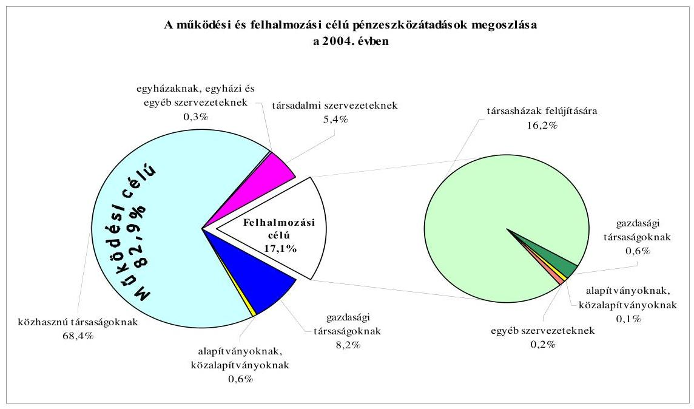
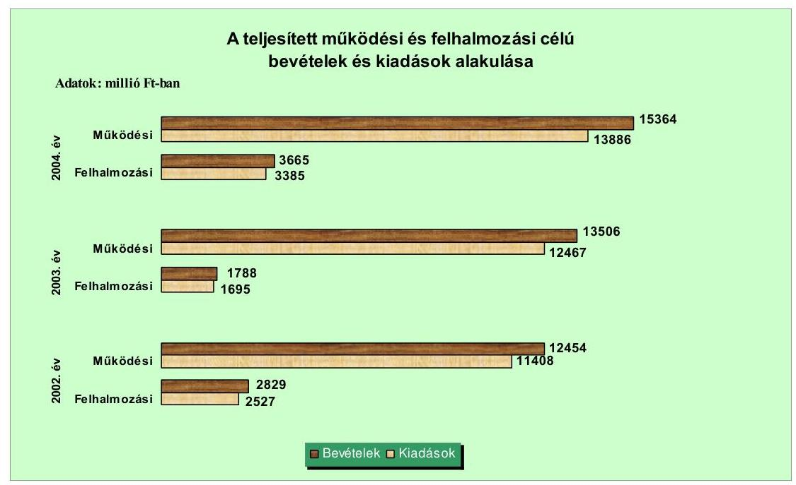
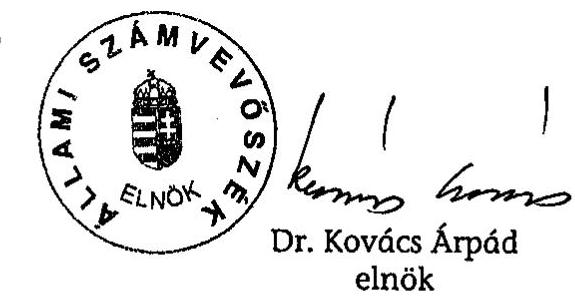
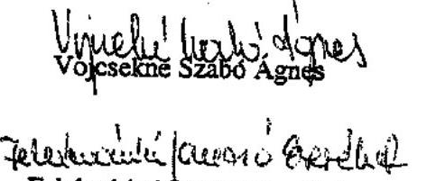
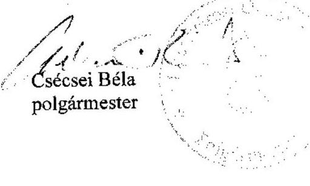

# JELENTÉS 

a Budapest Főváros VIII. kerület Józsefváros Önkormányzata gazdálkodási rendszerének átfogó ellenőrzéséről

---

# 3. Önkormányzati és Területi Ellenőrzési Igazgatóság 

3.3. Átfogó Ellenőrzések Főcsoport

Iktatószám: V-1001-1/22/17/2005.
Témaszám: 749
Vizsgálat-azonosító szám: V0209

## Az ellenőrzést felügyelte:

Dr. Lóránt Zoltán
főigazgató
Az ellenőrzés végrehajtásáért felelős:
Dr. Sepsey Tamás
főigazgató-helyettes
Az ellenőrzést vezette:
Csecserits Imréné
főcsoportfőnök-helyettes
Az ellenőrzést végezték:
Bauer Lajosné
főtanácsadó
Nagy Ervin Barnabás
számvevő
Vojcsekné Szabó Ágnes
számvevő tanácsos

A témához kapcsolódó - elmúlt három évben - készített számvevőszéki jelentések:
címe
sorszáma
Jelentés a helyi és a helyi kisebbségi önkormányzatok 0220 gazdálkodásának átfogó ellenőrzéséről
Jelentés a 2002. évi országgyűlési, valamint a helyi és kisebbségi 0325 önkormányzati képviselő választások lebonyolítására felhasznált pénzeszközök ellenőrzéséről

---

# TARTALOMJEGYZÉK 

BEVEZETÉS ..... 7
I. ÖSSZEGZŐ MEGÁLLAPÍTÁSOK, KÖVETKEZTETÉSEK, JAVASLATOK ..... 9
II. RÉSZLETES MEGÁLLAPÍTÁSOK ..... 21

1. A költségvetés tervezésének, végrehajtásának, az Önkormányzat vagyongazdálkodásának és a zárszámadás elkészítésének szabályszerűsége ..... 21
1.1. A költségvetési rendelet jóváhagyásának, módosításának, az előirányzatok nyilvántartásának szabályszerűsége ..... 21
1.2. A gazdálkodás szabályozottsága, a bizonylati rend és fegyelem szabályszerűsége ..... 27
1.3. A pénzügyi-számviteli feladatok ellátásának informatikai támogatottsága ..... 34
1.4. Az önkormányzati vagyon nyilvántartása, számbavétele ..... 36
1.5. A vagyonnal való gazdálkodás szabályszerűsége, célszerűsége, nyilvánossága ..... 38
1.6. A céljelleggel nyújtott támogatások szabályszerűsége ..... 45
1.7. A közbeszerzési eljárások szabályszerűsége ..... 49
1.8. A zárszámadási kötelezettség teljesítésének szabályszerűsége ..... 52
1.9. A Polgármesteri hivatal helyi kisebbségi önkormányzatok gazdálkodását segítő tevékenysége ..... 55
2. Az önkormányzati feladatok és a rendelkezésre álló források összhangja ..... 57
2.1. A feladatok meghatározása és szervezeti keretei ..... 57
2.2. A költségvetés egyensúlyának helyzete ..... 62
2.3. A feladatok finanszírozása ..... 69
3. A belső irányítási, ellenőrzési rendszer működésének értékelése ..... 71
3.1. Az ellenőrzési rendszer kialakítása, működése ..... 71
3.2. A könyvvizsgálati kötelezettség teljesítése ..... 75
3.3. A korábbi számvevőszéki ellenőrzések javaslatainak hasznosulása ..... 76

---

# MELLÉKLETEK 

1. számú Az Önkormányzat gazdálkodását meghatározó adatok, mutatószámok (1 oldal)
2. számú Az önkormányzati vagyon nagyságának alakulása (1 oldal)
3. számú Az Önkormányzat 2004. évi bevételeinek és kiadásainak alakulása (1 oldal)
4. számú Egyes önkormányzati feladatok finanszírozása (1 oldal)
5. számú Helyszíni ellenőrzési jegyzőkönyv (2 oldal)
6. számú Csécsei Béla polgármester úr észrevétele (1 oldal)

---

# RÖVIDÍTÉSEK JEGYZÉKE 

| Ötv. | a helyi önkormányzatokról szóló 1990. évi LXV. törvény |
| :--: | :--: |
| Áht. | az államháztartásról szóló 1992. évi XXXVIII. törvény |
| Kbt. 1 | a közbeszerzésekről szóló 1995. évi XL. törvény |
| Kbt. 2 | a közbeszerzésekről szóló 2003. évi CXXIX. törvény |
| Számv. tv. | a számvitelről szóló 2000. évi C. törvény |
| Htv. | a helyi önkormányzatok és szerveik, a köztársasági megbízottak, valamint egyes centrális alárendeltségű szervek feladat- és hatásköreiről szóló 1991. évi XX. törvény |
| Hatv. | a helyi adókról szóló 1990. évi C. törvény |
| Nek. tv. | a nemzeti és etnikai kisebbségek jogairól szóló 1993. évi LXXVII. törvény |
| Fot. | a fogyatékos személyek jogairól és esélyegyenlőségük biztosításáról szóló 1998. évi XXVI. törvény |
| Ktv. | a köztisztviselők jogállásáról szóló 1992. évi XXIII. törvény |
| Ksz. tv. | a közhasznú szervezetekről szóló 1997. évi CLVI. törvény |
| Ámr. | az államháztartás működési rendjéről szóló 217/1998. (XII. 30.) Korm. rendelet |
| Vhr. | az államháztartás szervezetei beszámolási és könyvvezetési kötelezettségének sajátosságairól szóló 249/2000. (XII. 24.) Korm. rendelet |
| kisebbségi önkormányzatok gazdálkodásáról szóló rendelet | a kisebbségi önkormányzatok költségvetésének, gazdálkodásának, vagyonjuttatásának egyes kérdéseiről szóló 20/1995. (III. 3.) Korm. rendelet |
| Ber. | a költségvetési szervek belső ellenőrzéséről szóló 193/2003. (XI. 26.) Korm. rendelet |
| ÁSZ | Állami Számvevőszék |
| Kincstár | Magyar Államkincstár Területi Igazgatósága |
| Fővárosi Önkormányzat | Budapest Főváros Önkormányzata |
| OEP | Országos Egészségbiztosítási Pénztár |
| Önkormányzat | Budapest Főváros VIII. kerület Józsefváros Önkormányzata |
| Képviselő-testület | Budapest Főváros VIII. kerület Önkormányzatának Képviselő-testülete |
| polgármester | Budapest Főváros VIII. kerület Józsefváros Önkormányzatának Polgármestere |
| jegyző | Budapest Főváros VIII. kerület Józsefváros Önkormányzatának Jegyzője, illetve távollétében az e feladattal megbízott vezető |
| Pénzügyi bizottság | Budapest Főváros VIII. kerület Józsefváros Önkormányzata Képviselő-testületének Költségvetési és Pénzügyi Bizottsága |

---

Ellenőrző bizottság
Oktatási bizottság
Társadalmi Kapcsolatok bizottsága
Tulajdonosi bizottság

Városműködtetési és Környezetvédelmi bizottság
Polgármesteri hivatal
Jegyzői kabinet
Pénzügyi osztály
Belső ellenőrzési iroda

Informatikai osztály
SzMSz

Ügyrend
gazdasági szervezet ügyrendje
2004. évi költségvetési rendelet
2005. évi költségvetési rendelet
2004. évi zárszámadási rendelet
vagyongazdálkodási rendelet
bérbeadási rendelet

Budapest Főváros VIII. kerület Józsefváros Önkormányzata Képviselő-testületének Pénzügyi Ellenőrző Bizottsága
Budapest Főváros VIII. kerület Józsefváros Önkormányzatának Oktatási, Kulturális, Ifjúsági és Sport Bizottsága
Budapest Főváros VIII. kerület Józsefváros Önkormányzatának Társadalmi Kapcsolatok Bizottsága
Budapest Főváros VIII. kerület Józsefváros Önkormányzata Képviselő-testületének Tulajdonosi Bizottsága
Budapest Főváros VIII. kerület Józsefváros Önkormányzata Képviselő-testületének Városműködtetési és Környezetvédelmi Bizottsága
Budapest Főváros VIII. kerület Józsefváros Önkormányzatának Polgármesteri Hivatala
Budapest Főváros VIII. kerület Józsefváros Önkormányzata Polgármesteri Hivatalának Jegyzői Kabinetje
Budapest Főváros VIII. kerület Józsefváros Önkormányzata Polgármesteri Hivatalának Pénzügyi Osztálya
Budapest Főváros VIII. kerület Józsefváros Önkormányzata Polgármesteri Hivatalának Belső Ellenőrzési Irodája
Budapest Főváros VIII. kerület Józsefváros Önkormányzata Polgármesteri Hivatalának Informatikai Osztálya
Budapest Főváros VIII. kerület Józsefváros Önkormányzatának a Szervezeti és Működési Szabályzatáról szóló 3/1995. (II. 17.) számú rendelete
Budapest Főváros VIII. kerület Józsefváros Önkormányzata Polgármesteri Hivatalának Ügyrendje
Budapest Főváros VIII. kerület Józsefváros Önkormányzata Polgármesteri Hivatala Pénzügyi Osztályának ügyrendje
Budapest Főváros VIII. kerület Józsefváros Önkormányzatának 10/2004. (II. 25.) számú rendelete a 2004. évi költségvetésről és végrehajtási szabályairól
Budapest Főváros VIII. kerület Józsefváros Önkormányzatának 6/2005. (II. 25.) számú rendelete a 2005. évi költségvetésről és végrehajtási szabályairól
Budapest Főváros VIII. kerület Józsefváros 20/2005. (V. 15.) számú rendelete a 2004. évi költségvetési zárszámadásról
Budapest Főváros VIII. kerület Józsefváros Önkormányzatának 37/2003. (VII. 7.) számú rendelete az Önkormányzat vagyonáról, valamint a versenyeztetés és a helyi költségvetési szervek beszerzési eljárásának szabályairól
Budapest Főváros VIII. kerület Józsefváros Önkormányzatának 42/2003. (VII. 11.) számú rendelete az Önkormányzat tulajdonában álló nem lakás céljára szolgáló helyiségek bérbeadásának, valamint a lakások és nem lakás céljára szolgáló helyiségek elidegenítésének szabályairól

---

építményadó rendelet Budapest Főváros VIII. kerület Józsefváros Önkormányzatának 21/1993. (VI. 29.) számú rendelete az építményadóról
Telekadó rendelet
versenyeztetési rendelet
kisebbségi rendelet

Kisebbségi Alapról szóló rendelet

21/2000. (XI. 28.) számú rendelet

Budapest Főváros VIII. kerület Józsefváros Önkormányzatának 21/1995. (XII. 14.) számú rendelete a telekadóról
Budapest Főváros VIII. kerület Józsefváros Önkormányzatának 22/1998. (VII. 6.) számú rendelete a versenyeztetési eljárás szabályairól
Budapest Főváros VIII. kerület Józsefváros Önkormányzatának 51/1999. (XI. 26.) számú rendelete a helyi kisebbségi önkormányzatokról
Budapest Főváros VIII. kerület Józsefváros Önkormányzatának 48/2000. (XII. 29.) számú rendelete a Józsefvárosi Nemzeti és Etnikai Kisebbségi Alap létrehozásáról és szabályozásáról
Budapest Főváros VIII. kerület Józsefváros Önkormányzatának 21/2000. (IX. 28.) számú rendelete a jogi személyiséggel rendelkező közhasznú társadalmi szervezetek, valamint alapítványok támogatására létrehozott pályázati alapról
Budapest Főváros VIII. kerület Józsefváros Önkormányzatának 30/1996. (V. 17.) számú rendelete az egyházak, a jogi személyiséggel rendelkező társadalmi és civil szervezetek, valamint alapítványok támogatására elkülönített költségvetési előirányzat felhasználásáról
Budapest Főváros VIII. kerület Józsefváros Önkormányzat polgármesterének és jegyzőjének 2004-ben kiadott együttes utasítása az Önkormányzatnál és a Polgármesteri hivatalnál a kötelezettségvállalással, utalványozással, ellenjegyzéssel és érvényesítéssel kapcsolatos eljárás rendjéről
számviteli politika Budapest Főváros VIII. kerület Józsefváros Önkormányzata Polgármesteri hivatalának a jegyző által 2004-ben kiadott számviteli politikája
pénzkezelési szabályzat Budapest Főváros VIII. kerület Józsefváros Önkormányzata Polgármesteri hivatalának a jegyző által 2004-ben kiadott Pénz- és értékkezelési szabályzata
leltározási szabályzat Budapest Főváros VIII. kerület Józsefváros Önkormányzata Polgármesteri hivatalának a jegyző által 2004-ben kiadott Leltárkészítési és leltározási szabályzata
selejtezési szabályzat Budapest Főváros VIII. kerület Józsefváros Önkormányzata Polgármesteri hivatalának a jegyző által 1997-ben és 2005-ben kiadott, a Felesleges vagyontárgyak hasznosításának, selejtezésének szabályzata
közbeszerzési szabályzat Budapest Főváros VIII. kerület Józsefváros Önkormányzatának és Polgármesteri hivatalának polgármesteri és jegyzői együttes utasításban 2004-ben kiadott Közbeszerzési és beszerzési szabályzata

---

belső ellenőrzési szabályzat

Egészségügyi Szolgálat

Gyermekjóléti Szolgálat

PSZK
Közterület-felügyelet
Roma Szolgálat

Teleki téri Piac

KKR
Bárka Kht.
Közbiztonságért Kht.
Gyermekek Üdültetéséért Kht.
JVK Kft.
Rév8 Rt.

Budapest Főváros VIII. kerület Józsefváros Önkormányzata Polgármesteri hivatalának a polgármester és jegyző által 2003-ban kiadott Belső ellenőrzési szabályzata
Budapest Főváros VIII. kerület Józsefváros Önkormányzatának Józsefvárosi Egészségügyi Szolgálata, (önállóan gazdálkodó költségvetési intézmény, alapítva: 1993-ban)
Budapest Főváros VIII. kerület Józsefváros Önkormányzatának Józsefvárosi Gyermekjóléti Szolgálat Gyermekek Átmeneti Otthona, (a Józsefvárosi Szociális Intézmények Gazdasági Hivatalához rendelt részben önállóan gazdálkodó költségvetési intézmény, alapítva: 2000-ben)
Józsefvárosi Pedagógiai Szolgáltató Központ
Józsefvárosi Közterület-felügyelet
Budapest Főváros VIII. kerület Józsefváros Önkormányzatának Roma Szolgálata (a Polgármesteri hivatalhoz rendelt részben önállóan gazdálkodó költségvetési intézmény, alapítva: 1996-ban)
Budapest Főváros VIII. kerület Józsefváros Önkormányzatának Teleki László téri piaca (a Polgármesteri hivatalhoz rendelt részben önállóan gazdálkodó költségvetési intézmény, alapítva: 1997-ben)
Komplex Közterületi Rendszer
Bárka Józsefvárosi Színházi- és Kulturális Kht.
Józsefváros Közbiztonságért Kht.
Józsefvárosi Gyermekek Üdültetéséért Kht.
Józsefvárosi Vagyonkezelő Kft.
Józsefvárosi Rehabilitációs és Városfejlesztési Rt.

---

# JELENTÉS 

## a Budapest Főváros VIII. kerület Józsefváros Önkormányzata gazdálkodási rendszerének átfogó ellenőrzéséről

## BEVEZETÉS

Az Ötv. 92. § (1) bekezdése, az Állami Számvevőszékről szóló 1989. évi XXXVIII. törvény 2. § (3) bekezdése, valamint az Áht. 120/A. § (1) bekezdése alapján az önkormányzatok gazdálkodását az Állami Számvevőszék ellenőrzi. Az ellenőrzés elvégzése az Országgyűlés illetékes bizottságai részére is átadott, országosan egységes ellenőrzési program alapján történt.

## Az ellenőrzés célja annak értékelése volt, hogy:

- az önkormányzati gazdálkodás törvényességét ${ }^{1}$, szabályszerűségét biztosították-e a tervezés, a költségvetés végrehajtása, a vagyongazdálkodás és a zárszámadás során;
- az Önkormányzat által ellátott feladatok és az azokhoz rendelkezésre álló források összhangja biztosított volt-e, különös tekintettel egyes kiemelt feladatokra;
- a gazdálkodás szabályszerűségét biztosító kontrollok ${ }^{2}$ megfelelően segítették-e a végrehajtást;

Az ellenőrzött időszak: a 2004. év és a 2005. év első negyedéve, az 1.5, 2.1, 2.3 és a 3.3 ellenőrzési programpontok esetében a 2002-2004. évek is.

A kerület lakosainak száma 2004. január 1-jén 74885 fő volt. Az Önkormányzat 28 tagú Képviselő-testületének munkáját kilenc állandó bizottság, a polgármester munkáját két alpolgármester segítette. A polgármester személye az 1992. évtől nem változott. Az önkormányzati rendszer életbe lépése óta - 1990. évtől - a jegyző személye tízszer, a jelenlegi önkormányzati választási ciklusban négyszer változott.

[^0]
[^0]:    ${ }^{1}$ A törvényi előírások betartásának elmulasztásakor a részletes megállapítások fejezetben egységesen a törvénysértés megjelölést alkalmazzuk, mivel az ÁSZ nem tehet különbséget a törvényi előírások között.
    ${ }^{2}$ A gazdálkodás szabályszerűségét biztosító kontroll alatt értjük a kiépített és működő belső irányítási és szabályozási rendszert, valamint a belső ellenőrzési funkciók ellátását.

---

A 2004. évben az Önkormányzat a Polgármesteri hivatalon kívül 16 önállóan és 21 részben önállóan gazdálkodó költségvetési szervet működtetett, hét gazdasági társaságban rendelkezett tulajdoni részesedéssel. A feladatok ellátására az Önkormányzat intézményeinél a 2004. év végén 1984 főt foglalkoztattak, a Polgármesteri hivatal köztisztviselőinek száma 278 fő volt. Az Önkormányzat a 2004. évben 22812,1 millió Ft bevételt ért el és 17228,6 millió Ft kiadást teljesített.

Az Önkormányzat a 2004. december 31-i könyvviteli mérlege szerint 158 256,0 millió Ft értékű vagyonnal rendelkezett, amelyből a rövid- és hosszú lejáratú kötelezettségeinek az összege 2716,6 millió Ft. Az Önkormányzat gazdálkodását meghatározó adatokat, mutatószámokat az 1-3. számú mellékletek tartalmazzák.

Az Önkormányzat illetékességi területén a 2002. évi önkormányzati választásokig öt
 ${ }^{3}$, a 2002. évi választásokat követően tíz ${ }^{4}$ a megválasztott és működtetett kisebbségi önkormányzatok száma.

[^0]
[^0]:    ${ }^{3}$ Német, roma, román, ruszin, szlovák kisebbségi önkormányzat.
    ${ }^{4}$ Bolgár, görög, horvát, lengyel, német, roma, román, ruszin, szerb, szlovák kisebbségi önkormányzat (a továbbiakban: kisebbségi önkormányzatok).

---

# I. ÖSSZEGZŐ MEGÁLLAPÍTÁSOK, KÖVETKEZTETÉSEK, JAVASLATOK 

Az Önkormányzat tíz évre szóló kerületfejlesztési koncepcióval, illetve a 2002-2006. évekre szólóan négyéves programmal rendelkezett, eleget tett az Ötv-ben előírt gazdasági programkészítési kötelezettségnek. A polgármester a 2004. és a 2005. évi költségvetési koncepciót határidőben terjesztette a Képviselő-testület elé, amelyekhez az Ámr-ben előírtaknak megfelelően mellékelte a Pénzügyi bizottság, valamint a kisebbségi önkormányzatok koncepcióról alkotott véleményét. A költségvetési rendelettervezetekkel együtt, illetve azt megelőzően a polgármester a Képviselő-testület elé terjesztette azokat a rendelettervezeteket, amelyek a tervezett előirányzatokat megalapozták. A költségvetési rendelettervezetet - mindkét évben - határidőben, a Pénzügyi bizottság véleményének csatolásával terjesztette elő a polgármester, a 2004. évben elmaradt, de a 2005. évben csatolta a könyvvizsgáló arról kialakított véleményét is. A költségvetési rendeletek tartalma és szerkezete a céltartalékok kivételével megfelelt az Áht-ban és az Ámr-ben előírtaknak. A céltartalékok bemutatása az Áht. és az Ámr. előírása ellenére nem volt teljes, mivel nem tartalmazott valamennyi, évközi felhasználásra elkülönített előirányzatot. A Polgármesteri hivatal költségvetésén belül a különböző célú feladatokra tervezett kiadásokat alap elnevezéssel határozták meg. A költségvetésen belül elkülönített keretösszegek alapként történő elnevezése az Áht-ban meghatározott feltételeknek - a Környezetvédelmi alap kivételével - nem felel meg, a kifejezés félreérthető. Előterjesztés hiányában, az Áht. előírása ellenére, rendeletben nem határozták meg a költségvetés előterjesztésekor a Képviselő-testület részére tájékoztatásul bemutatandó mérlegek, kimutatások tartalmi követelményeit.

A 2004. és a 2005. évi költségvetési rendeletekben a tervezett költségvetési bevételek nem fedezték a költségvetési kiadásokat, azokban a hiány összegét bemutatták. A Képviselő-testület a költségvetés végrehajtásához hiányzó forrásra hitel felvételéről határozott. A 2004. és a 2005. évi költségvetési rendeletekben az Önkormányzat meghatározta a költségvetés végrehajtásának szabályait, ezek között döntési és előirányzat-átcsoportosítási hatáskört adott át a polgármesteren és a bizottságokon túl az alpolgármesterek és tanácsnokok részére, ez utóbbiakkal megsértette az Ötv-ben és az Áht-ban előírtakat. Az önkormányzati rendeleti szabályozás hiánya ellenére a költségvetési rendelettervezetek előterjesztése a Képviselő-testület tájékoztatása céljából - a közvetett támogatások kimutatása és szöveges indokolása kivételével - mindkét évben tartalmazta az Áht-ban előírt összevont mérlegeket Önkormányzatra és elkülönítetten a kisebbségi önkormányzatokra, valamint a többéves kihatással járó döntések bemutatását számszerúsítve évenkénti bontásban és összesítve szöveges indokolással együtt. A 2004. évi költségvetési rendeletmódosítások következtében az eredeti előirányzatok főösszege 15,8%-kal emelkedett. Az utolsó módosításnál az Ámr-ben meghatározott határidőt nem tartották be, mivel a zárszámadási rendelet elfogadásával egyidejűleg módosítottak költségvetési előirányzatokat.

---

A Polgármesteri hivatal szervezeti felépítését, működésének rendjét ügyrendben határozták meg, amelyben azonban nem részletezték az Ámr. előírása ellenére a hozzárendelt részben önállóan gazdálkodó költségvetési szervek felsorolását, a pénzügyi-gazdasági tevékenységet ellátó személyek feladatkörének, munkakörének meghatározását. A Pénzügyi osztály, mint gazdasági szervezet, az Ámr-ben előírt ügyrenddel 2005. február 1-től rendelkezett. Ezt megelőzően a gazdasági szervezet feladatait a Polgármesteri hivatal ügyrendjében rögzítették. A gazdasági szervezet ügyrendje tartalmazta az ellátandó feladatokat, de az Ámr. előírása ellenére elmaradt a vezetők és más dolgozók feladat-, hatás- és jogkörének a meghatározása.

Az operatív gazdálkodással és a munkafolyamatba épített ellenőrzéssel összefüggő hatásköröket és feladatokat polgármesteri, jegyzői együttes utasításban szabályozták. Az utasításban rendelkeztek arról, hogy nem szükséges előzetes írásbeli kötelezettségvállalás az 50 ezer Ft alatti kifizetéseknél, azonban ezen kötelezettségvállalások nyilvántartási formáját az Ámr. előírása ellenére belső szabályzatban nem rögzítették. A gazdálkodási és ellenőrzési jogkörrel történő felhatalmazásoknál, megbízásoknál az előírt követelményeket betartották. A gazdálkodási és ellenőrzési jogkörök gyakorlásáról a felhatalmazottakat nem számoltatták be. A polgármesteri és jegyzői együttes utasításban 2005. május 13-tól negyedéves beszámolási kötelezettséget írtak elő, elmaradt azonban a beszámolás módjának és formájának a meghatározása.

A jegyző a Htv. előírásait figyelembe véve kialakította a költségvetési szervek egységes számviteli rendjét. A Polgármesteri hivatal rendelkezett számviteli politikával és az ehhez kapcsolódó szabályzatokkal, melyek rendelkezéseit kiterjesztették a hozzá tartozó részben önállóan gazdálkodó költségvetési szervekre, a kisebbségi önkormányzatokra, de nem határozták meg a kisebbségi önkormányzatok gazdálkodásával összefüggő sajátos feladatokat, nem írták elő a kisebbségi önkormányzatok gazdálkodásáról szóló rendeletben, valamint az Ámr-ben foglaltak ellenére a kisebbségi önkormányzatok számviteli nyilvántartásának, a kötelezettségvállalásaikhoz kapcsolódó analitikus nyilvántartásoknak az elkülönített vezetését. A leltározási szabályzatban célszerűtlenül nem rögzítették a piaci értékelésbe bevont, illetve a visszaírással érintett eszközök esetében a leltár tartalmi követelményeit. A számviteli politikában előírták az analitikus nyilvántartások vezetésének kötelezettségét, azonban a Számv. tv-ben és a Vhr-ben foglaltak ellenére nem rögzítették az analitikus nyilvántartások formáját és tartalmát, azok vezetésének módját, nem szabályozták a főkönyvi számlák és az analitikus nyilvántartások kapcsolatát, egyeztetése dokumentálásának módját, nem írták elő - a 2005. január 1-től hatályos előírás ellenére - az analitikus nyilvántartások adataiból készült összesítő bizonylatok elkészítésének határidejét. A munkaköri leírásokban nem írták elő a munkafolyamatba épített ellenőrzési feladatokat. A Polgármesteri hivatalban kialakították a számvitel logikailag zárt rendszerét, azonban a főkönyvi és analitikus nyilvántartások egyeztetését a számlarendben előírt negyedéves gyakoriság helyett félévenként végezték el. A gazdasági eseményeket közgazdasági és funkcionális osztályozás szerint rögzítették a számvitelben, azonban két esetben az érvényesítő helytelenül tett eleget az Ámr-ben előírt főkönyvi számla kijelölési feladatának, ezáltal a könyvelésben szolgáltatás megrendelést támogatásként mutattak ki, amely nem felelt meg a Vhr. számlaosztályok tartalmára vonatkozó előírásának. A kötelezettségvállalásokról, azok folyamatos figyelemmel

---

kísérése és éves összegzése megállapításához az Ámr-ben előírtak ellenére nyilvántartást nem vezettek, ezért az utalványrendeleteken elmaradt a kötelezettségvállalás nyilvántartásba vételi sorszámának a feltüntetése. A mulasztás következtében a gazdasági eseményeket magukba foglaló bizonylatok 68%-a nem felelt meg a Számv. tv. és az Ámr. által előírt alaki és tartalmi követelményeknek. Az egyéb gazdasági műveletek bizonylatait, valamint az analitikus nyilvántartásokból készített feladásokat a Vhr-ben előírt negyedéves gyakoriságtól eltérve félévenként rögzítették a könyvekben, így nem biztosították, hogy a számviteli nyilvántartásban naprakész információ álljon rendelkezésre.

A gazdasági eseményeket rögzítő bizonylatok 93%-a tartalmazta a szakmai teljesítés igazolását, de azt jogkörrel nem rendelkezők végezték, mivel az Ámr. előírása ellenére a jegyző nem jelölte ki a 2004. évben az arra jogosult személyeket. Az Ámr-ben foglaltak ellenére a bankszámlán elszámolt bevételek 35%-ánál az érvényesítést megbízással nem rendelkező személy látta el, a kiadási bizonylatok 2%-ánál hiányzott a kötelezettségvállalás ellenjegyzése, a pénzintézeti kiadások 2%-ánál elmaradt az utalványozás ellenjegyzése, valamint a nem termékértékesítésből és szolgáltatásnyújtásból származó bevételeknél valamennyi esetben hiányzott az utalványozás és annak ellenjegyzése. Az ellenjegyzések elmaradása következtében nem ellenőrizték, hogy a szakmai teljesítésigazolás és az érvényesítés megtörtént-e, a kiadási előirányzat biztosítja-e a fedezetet, a kötelezettségvállalás jogszerű-e. A pénzkezelési szabályzatban előírtakkal szemben a pénztári záró pénzösszeg átlagosan 17%-kal meghaladta a házipénztári keret összegét. Az Önkormányzat és az önállóan gazdálkodó költségvetési intézmények a 2004. évi jóváhagyott költségvetés módosított kiadási főösszegén belül gazdálkodtak, ugyanakkor a Polgármesteri hivatalnál és öt önállóan gazdálkodó költségvetési intézménynél megsértették az Áht. előírásait, mert kiemelt kiadási előirányzataikat túllépték. Ennek okait nem vizsgálták, felelősségre vonás nem történt.

A Polgármesteri hivatal több évre vonatkozó informatikai stratégiával rendelkezett. A számviteli analitikus nyilvántartások programjai nem integrált rendszerben kapcsolódtak a főkönyvi könyveléshez. A Polgármesteri hivatalnál nem rendelkeztek az informatikai rendszer működésének feltételeit meghatározó szabályzatokkal. Az adatbiztonság, a mentési rendszer, a vírusvédelem, a fizikai és logikai védelmi rendszer, a hozzáférési jogosultság, a katasztrófa elhárítás rendje a hálózati rendszer üzemeltetési dokumentációjában szerepelt, azonban a biztonságos számítástechnikai feladatellátás biztosításához informatikai katasztrófa elhárítási tervet - a hálózati rendszer üzemeltetési dokumentációjától elkülönítve - nem készítettek. A pénzügyi-számviteli informatikai rendszert alkalmazók rendelkeztek a számítógépes feladat ellátásához szükséges informatikai ismeretekkel, azonban a felhasználók munkaköri leírása az informatikai programok használatát nem tartalmazta.

A Polgármesteri hivatalban a vagyon nyilvántartásáról a Vhr-nek és a belső szabályzatoknak megfelelően gondoskodtak. A 2004. évi leltározási feladatok során az ingatlanok és az üzemeltetésre átadott eszközök leltározását a Vhr-ben és a leltározási szabályzatban előírtaktól eltérően nem mennyiségi felvétellel, hanem egyeztetéssel végezték el. Az értékvesztés elszámolásának szükségességét vizsgálták, a követeléseknél és a részesedéseknél elszámolt értékvesztés megfelelt a Számv. tv. előírásainak. A piaci értékelés miatti értékhelyesbíté-

---

sek megállapítása szakértői értékbecslések alapján, megalapozottan történt. Az Önkormányzat vagyona a 2002-2004. évek közötti időszakban 2%-kal csökkent, ezt az értékesítés, illetve a vásárlás, beruházás aktiválás együttes hatása, valamint a piaci értékelésbe bevont forgalomképes ingatlanállomány piaci értékének változása okozta.

Az Önkormányzat a vagyongazdálkodással kapcsolatos feladatokat és döntési hatásköröket rendeletben szabályozta. A vagyonnal való döntési hatásköröket célszerűen alakították ki, azokat megosztották a Képviselő-testület, a Tulajdonosi bizottság és a Pénzügyi bizottság között. A vagyongazdálkodási rendeletben 2004. december 31-ig főszabályként előírták, hogy a vagyon elidegenítése 100 millió Ft-os értékhatár felett, továbbá használatba vagy bérbeadása, egyéb módon történő hasznosítása, megterhelése versenyeztetési eljárás során történhet. Rögzítették azonban a fő szabálytól eltérő, versenyeztetés nélküli elidegenítés eseteit is. Ezáltal az Önkormányzat az Áht-ban foglaltakat megsértve lehetőséget biztosított a versenyeztetési eljárás mellőzésére. A szabályozás nem segítette a köztulajdonnal való gazdálkodás nyilvánosságát. A vagyongazdálkodási rendeletben a 2005. évtől, összhangban az erre vonatkozó jogszabályi előírás módosítással, a kötelező versenyeztetés értékhatárát 20 millió Ft-ra változtatták meg. A vagyongazdálkodási döntések során a Képviselő-testület által meghatározott hatásköri előírásokat betartották. Az ingatlan-állomány változásához kapcsolódó szerződésekben szerepeltek az Önkormányzat érdekeit védő garanciális elemek. Az ingatlanértékesítések lebonyolítása, valamint a helyiségek bérbeadása során érvényesültek a vagyongazdálkodási rendeletben foglalt előírások. Az Áht. előírásai alapján meghatározták a követelés elengedésének, valamint a vagyon tulajdonjoga ingyenes átruházásának módját és eseteit. Az Önkormányzatnál a nettó 5 millió Ft-ot meghaladó értékű szerződések egyes adatainak közzétételére vonatkozó, az Áht-ban előírt előírásoknak 2004. január 1-től kezdődően eleget tettek. Az átmenetileg szabad pénzeszközök éven belüli értékpapír-befektetéssel történő hasznosítására a Pénzügyi bizottság rendelkezett döntési jogosultsággal, a döntések előkészítésének, a döntés dokumentálásának eljárási rendjét szabályozták. Az önkormányzati vagyon szerzésére, elidegenítésére, illetőleg hasznosítására kötött szerződésekről azonban nem vezették a vagyongazdálkodási rendeletben előírt ügyleti nyilvántartást. Az Önkormányzat a kerületben működő pártok részére egységes, kedvezményes bérleti díj ellenében biztosított helyiségeket, a pártokat a kedvezményen keresztül közvetett anyagi támogatásban részesítették, ezáltal nem tettek eleget az Ötv. előírásainak, valamint nem biztosították az alkotmányos egyenlőséget a bérlők között.

Az Önkormányzat a 2004. évben külső szervezetek részére 909,1 millió Ft céljellegű támogatást nyújtott. Az alapítványok támogatásáról szóló döntéseket a támogatási összeg 41,4%-ában bizottságok hozták meg, amely döntésekkel az Önkormányzatnál megsértették az Ötv. előírását, amely szerint a Képviselő-testület hatásköréből
 nem ruházható át a közösségi célú alapítványok részére történő forrásátadása. Az alpolgármester megsértve az Ötv. és az Áht. előírásait, 860 ezer Ft működési célú pénzeszközátadásáról döntött saját keret előirányzatának terhére átcsoportosítási jogkör nélkül. A támogatott szervezetek, illetve magánszemélyek számára az Áht. előírása szerinti számadási kötelezettséget előírták a részükre céljelleggel nyújtott összegek rendeltetésszerű felhasználásáról. A közhasznú szervezetekkel kötött támogatási szerződésekben

---

meghatározták a Ksz. tv-ben foglaltaknak megfelelően a támogatással való elszámolás feltételeit és módját. A támogatásban részesült szervezetek elszámoltak a támogatással, azonban a szervezetek negyede késve teljesítette számadási kötelezettségét. A Polgármesteri hivatalban a számadások tartalmi követelményeit, az elvégzendő ellenőrzések tartalmát és dokumentálását nem szabályozták. A számadások számszaki és tartalmi felülvizsgálatát a benyújtott számlák, számlamásolatok alapján elvégezték, de a támogatási célnak megfelelő felhasználást - a társasházak felújítását kivéve - az Áht. előírását megsértve nem ellenőrizték. A benyújtott számlák, számlamásolatok ellenőrzése alapján visszafizetési kötelezettséget nem állapítottak meg, a számadási kötelezettségüknek késve eleget tett szervezetek az elszámolásuk benyújtásáig további támogatásban nem részesültek.

A Képviselő-testület a közbeszerzés helyi szabályairól rendeletet alkotott. A szabályozás keretében az eljárások lefolytatásának részletes előírásait a Kbt. ${ }_{1}$ ben foglaltak szerint határozták meg, kivéve az eljárást lezáró döntés meghozatalát, mert a Pénzügyi bizottság jogosultságát rögzítették, a személyes döntési kötelezettség helyett. A Kbt. ${ }_{2}$-ben előírtakat betartva, 2004. május 1-től hatályon kívül helyezték a közbeszerzésekről szóló korábbi rendelkezéseket és (köz)beszerzési szabályzatokat fogadtak el. A Polgármesteri hivatalnál egy szolgáltatás megrendelése során - a Kbt. ${ }_{1}$-ben előírtakat megsértve - nem folytattak le közbeszerzési eljárást. A lefolytatott közbeszerzési eljárások a Kbt. ${ }_{1}$ és az önkormányzati szabályzat előírásainak megfeleltek. A Közbeszerzések Tanácsa Közbeszerzési Döntőbizottsága az Önkormányzatot a 2004. évben nem marasztalta el.

A polgármester a 2004. évi zárszámadási rendelettervezetet az Áht-ban előírt határidőn belül terjesztette a Képviselő-testület elé. A 2004. évi zárszámadási rendeletben azonban nem biztosították az Áht-ban előírtak ellenére a költségvetési rendelettel való összehasonlíthatóságot. Az Áht-ban és az Ámr-ben előírtak ellenére az nem tartalmazta a Polgármesteri hivatal költségvetésében szereplő felhalmozási kiadások teljesítésének feladatonkénti bemutatásakor az eredeti kiadási előirányzatot, az Önkormányzat tényleges költségvetési létszámkeretét, illetve annak önállóan és részben önállóan gazdálkodó költségvetési szervenkénti alakulását, továbbá az intézmények vonatkozásában nem mutatták be feladatonként, valamint célonként a felhalmozási és felújítási kiadásokat, illetve a Polgármesteri hivatal 2004. évi költségvetésének teljesítését feladatonkénti részletezésben. A zárszámadás előterjesztésekor a Képviselőtestület részére bemutatták az Áht-ban előírtak alapján a hitelállományt eszközök és lejárat szerinti bontásban, az Önkormányzat és a helyi kisebbségi önkormányzatok összevont mérlegeit, az Önkormányzat vagyonkimutatását, viszont az Áht. előírása ellenére nem mutatták be szöveges indoklással együtt a többéves kihatással járó döntéseket számszerűsítve, évenkénti bontásban és összesítve, illetve a közvetett támogatásokat tartalmazó kimutatást. A 2004. évi zárszámadási rendelettel jóváhagyott pénzmaradvány összege megfelelt az Ámr-ben és a Vhr-ben előírtaknak.

A polgármester az Önkormányzat illetékességi területén működő tíz helyi kisebbségi önkormányzattal megkötötte az együttműködési megállapodásokat, amelyekben részletesen rögzítették a költségvetés tervezése, a végrehajtása és a beszámolás vonatkozásában az együttműködésük rendjét. Az együttmű-

---

ködési megállapodásokat - a Roma Kisebbségi Önkormányzattal kötött megállapodást kivéve - a 2005. évre vonatkozóan a 2005. január 15-i határidő után, márciusban módosították, ez a módosítási időpont azonban ellentétes az Ámr-ben előírtakkal. A kisebbségi önkormányzatok esetében a jegyző elmulasztotta a szakmai teljesítés igazolásának a szabályozását, az azt végző személyek kijelölését. Az érvényesítési feladat ellátását végző dolgozó nem rendelkezett erre vonatkozóan a jegyző írásbeli megbízásával. A Polgármesteri hivatalban elkülönítetten vezették a kisebbségi önkormányzatok vagyoni és számviteli nyilvántartásait, de az Ámr-ben foglaltak ellenére nem vezettek analitikus nyilvántartást kisebbségi önkormányzatonként a kötelezettségvállalásokról. Az éves beszámoló keretén belül a kisebbségi önkormányzatok költségvetéseinek alakulását az Önkormányzatétól elkülönítetten bemutatták. Az Önkormányzat részéről gondoskodtak a kisebbségi önkormányzatok testületi működésének tárgyi feltételeiről.

A Képviselő-testület nem határozta meg az Ötv. előírásai ellenére a kötelező és önként vállalt feladatai ellátásának mértékét és módját. Az Önkormányzat az Ötv-ben előírt kötelező és önként vállalt feladatait az általa alapított költségvetési szervekkel, valamint gazdasági társaságokkal, közhasznú és egyéb szervezetekkel kötött ellátási, vállalkozási szerződésekkel biztosította. A Polgármesteri hivatal létszáma a feladat- és hatáskör, valamint a szervezeti felépítés módosítása során a 2002. évhez viszonyítva a 2004. július 1-től 53 fővel csökkent. A Képviselő-testület a gyermeklétszámhoz igazodva, a feladatellátás hatékonyabb szervezeti megoldása érdekében a 2003. évben a PSZK-t, a 2004. évben egy oktatási intézményében az általános iskolai tagozatot és a tanműhelyi szolgáltatást megszüntette, egy gimnáziumi oktatást ellátó intézménye fenntartási és tulajdonjogát átadta a Fővárosi Önkormányzatnak, egy általános iskola fenntartási feladatait átvette Budapest Főváros V. kerület Önkormányzatától.

Az Önkormányzatnál a 2003-2005. években tervszinten a költségvetési bevételek nem fedezték a költségvetési kiadásokat, a hiányzó forrást a hitel felvételével tervezte biztosítani a Képviselő-testület. A tervezettől eltérően a 2002-2004. években a teljesített költségvetési bevételek fedezték a teljesített költségvetési kiadásokat, a költségvetés egyensúlya biztosított volt. A 2002-2004. években meghatározott fejlesztési kiadásaihoz - életveszélyes és műemlék épületek felújításához, a Corvin Szigony beruházási-felújítási projekt megvalósításához vett fel hosszú lejáratú hiteleket az Önkormányzat. A teljesített kiadási főösszeghez képest a hitelfelvételből származó forrás aránya 1,2 %, 0,8 %, illetve 10,2 % volt. Az adósságot keletkeztető kötelezettségvállalásoknál az Ötv-ben előírt felső határt betartották. Az Önkormányzat a feladatellátás finanszírozásához rendelkezésre álló forrásait a 2002-2004. évek között külső, ezek között pályázati úton elnyert forrásokkal növelte. A működési és felhalmozási célra átvett források az összes költségvetési bevételnek a 2,8 %-át, 3,2 %-át, illetve 4,0 %-át jelentették. Az átvett forrásokon belül a felhalmozási célú külső forrás aránya dinamikusan növekedett, 45,1 %-ot, 51,6 %-ot, illetve 58,3 %-ot tett ki. A pályázati források bevonásával megvalósított felhalmozási kiadások közül legjelentősebbek a lakóépületek, közművek és közterületek rehabilitációjával, valamint a szociális bérlakás építési programmal kapcsolatosak. Az Önkormányzatnál a 2004. évi és a 2005. év I. negyedévi gazdálkodás során a pénzügyi egyensúly biztosított volt, a működéshez likvid hitelt nem vettek fel. A 2002-

---

2004. évek közötti időszakban - az iparűzési adón kívül - a helyi adóbevételekből - az építményadó és a telekadó - származó bevétel szerepe az összes költségvetési bevételen belül növekedett, a költségvetési bevétel 3,0 %-át, 3,3 %-át, illetve 3,4 %-át tette ki, mértéke az alkalmazható mérték maximuma volt. A Hatv-ben meghatározottakon túlmenően is megállapítottak adókedvezményeket, mentességeket.

A feladatok finanszírozását befolyásolta, hogy egyes naturális mutatókkal mérhető kötelező feladatok esetében a fajlagos kiadások - az ellátottak számának, a kapacitás kihasználtságnak a csökkenése következtében - a 2003. évben jelentősen (az óvodai nevelésben 33 %-kal, az általános iskolai oktatásban 35 %-kal, a középiskolai oktatásban 26 %-kal) emelkedtek az előző évhez viszonyítva. A bölcsődei ellátás fajlagos kiadása érdemben nem nőtt, - a 2002. évről a 2003. évre 3 %-kal, a 2003. évről a 2004. évre 2 %-kal emelkedett - a 2002. évhez viszonyítva a 2004. évre az ellátottak számának 24 %-os és a kapacitáskihasználtsági mutató 17 %-os emelkedésének kedvező hatásaként. Az időskorúak gondozóháza iránti igény visszaesése miatt a bentlakásos szociális intézményi ellátás fajlagos kiadása a 2003. évről a 2004. évre 55 %-kal nőtt az ellátottak számának 23 %-os, valamint a kapacitás-kihasználtság 18 % csökkenése mellett. A nappali szociális intézményi ellátásban a növekvő kapacitáskihasználtság ellenére a személyi és dologi kiadások folyamatos növekedése miatt a fajlagos kiadás a 2002. évről a 2004. évre 2 %-kal emelkedett. A kiadások finanszírozásában a központi költségvetési hozzájárulás, támogatás részaránya a 2002. és 2004. év viszonylatában csökkent az óvodai nevelésben, az általános és középiskolai oktatásban, a nappali és bentlakásos szociális intézményi ellátásban, nőtt a bölcsődei ellátásban. Az önként vállalt feladatok megvalósítására a 2002-2004. években az éves költségvetési kiadások növekvő arányát fordították, összegük is folyamatosan emelkedett. Az Önkormányzat önként vállalt feladatainak ellátása azonban a 2002-2004. években nem veszélyeztette a kötelező feladatok megvalósítását. Az Önkormányzat a 2004. év december 31-ig középületeinek 7 %-ánál gondoskodott azok akadálymentessé tételéről, a feladat teljesítését a Fot-ban előírt 2005. január 1-i határidőre nem biztosította.

Az Önkormányzatnál a belső ellenőrzési feladatok végrehajtásához szükséges szervezeti kereteket kialakították, amely a 2004. évi szervezeti változtatásokkal megfelelt az Áht-ban előírt követelményeknek. A belső ellenőrök funkcionális, szervezeti és feladatköri függetlensége az Áht-ban foglaltaknak megfelelően érvényesült. A kialakított szervezeti rendben a belső ellenőrök, illetve a Belső ellenőrzési iroda közvetlenül a jegyző irányítása alá tartoztak, tevékenységük elkülönült az irányítási és végrehajtási tevékenységtől, ellenőrzési feladataik során érvényesült függetlenségük, az ellenőrzési program elkészítése és végrehajtása során önállóan jártak el. A Ber-ben előírtak alapján elkészítették és a 2005. évben a jegyző jóváhagyta az ellenőrzési kézikönyvet és a középtávú ellenőrzési tervet. A Polgármesteri hivatal ellenőrzési nyomvonalát a 2005. évre a jegyző elkészítette. A belső ellenőrzés a 2004. évi ellenőrzéshez stratégiai, illetve éves ellenőrzési tervvel rendelkezett. Az ellenőrzések végrehajtása és dokumentálása megfelelt a Ber-ben előírtaknak, illetve az ellenőrzési szabályzat követelményeinek. A belső ellenőrök a 2004. év során két esetben tártak fel kártérítési, illetve fegyelmi eljárás megindítására okot adó cselekményt. A jegyző éves ellenőrzési jelentésben tájékoztatta a Képviselő-testületet az intézmények-

---

nél és a Polgármesteri hivatalnál lefolytatott 2004. évi ellenőrzések tapasztalatairól.

Az Önkormányzat az Ötv-ben előírt könyvvizsgálati kötelezettségét költségvetési minősítésű könyvvizsgáló megbízásával teljesítette. A könyvvizsgáló a Polgármesteri hivatal és az önkormányzati intézmények adatait összevontan tartalmazó 2004. évi egyszerűsített költségvetési beszámolót hitelesítő záradékkal látta el, az egyszerűsített mérlegben auditálási eltérést állapított meg, az eltérés miatt 4,1 %-kal csökkentette az egyszerűsített mérleg főösszegét.

Az ÁSZ a 2002-2004. évek között két alkalommal ellenőrizte az Önkormányzat gazdálkodását, a 2002. évben átfogó jelleggel, a 2003. évben a választások lebonyolításához felhasznált pénzeszközök ellenőrzése témában. Az Önkormányzat a gazdálkodás 2002. évi átfogó ellenőrzése során feltárt hiányosságok megszüntetésére tett javaslataink - 11 szabályszerűségi és két célszerűségi - közel négyötöd részét hasznosította. Figyelembe vették a költségvetési rendelettervezet tartalmára, a zárszámadás Képviselő-testület elé történő benyújtásának határidejére, a Polgármesteri hivatal szervezeti és működési szabályzatának felülvizsgálatára, az ellenőrzési rendszer működésének és a költségvetési szervek ellenőrzési tapasztalatainak áttekintésére, a Német Kisebbségi Önkormányzattal való együttműködési megállapodás megkötésére, a gazdálkodási jogkörök célszerűségi szempontból történő felülvizsgálatára vonatkozó javaslatokat. Elkészítették a belső ellenőrzési szabályzatot, átutalták a Fővárosi Önkormányzat elkülönített számlájára a lakásértékesítésből származó bevételek 50 %-át. Az Önkormányzat a 2002. évi választások lebonyolítására fordított pénzeszközök felhasználásának ellenőrzése során feltárt hiányosságok megszüntetésére tett javaslataink - két szabályszerűségi és két célszerűségi - háromnegyed részét hasznosította. Meghatározták a választásokhoz kapcsolódóan a kiadások teljesítését megalapozó előirányzatokat, elkülönítették a főkönyvi könyvelést és a belső ellenőrzési tevékenységet.

A helyszíni ellenőrzés megállapításainak hasznosítása mellett javasoljuk:

#
 a polgármesternek 

a jogszabályi előírások maradéktalan betartása érdekében
1. a költségvetési gazdálkodás jogszabályszerű kereteinek kialakítása céljából
a) kezdeményezze, hogy - a jegyző által elkészített előterjesztés alapján - a Képviselő-testület határozza meg rendeletben az Áht. 118. §-ban előírt mérlegek, kimutatások tartalmát, valamint a költségvetés előterjesztésekor mutassák be az Áht. 116. § 10. pontjában előírt, a közvetett támogatásokra vonatkozó kimutatást az Áht. 118. §-ában előírtak alapján szöveges indoklással együtt, a zárszámadás előterjesztésekor az Áht. 116. § 9. pontjában előírt, a többéves kihatással járó döntéseket évenkénti bontásban, valamint összesítve, az Áht. 118. §-ában előírtak alapján szöveges indoklással együtt;
b) kezdeményezze, hogy a Képviselő-testület hatáskörének átruházása az Ötv. 9. § (3) bekezdésében és az Áht. 74. § (2) bekezdésében előírtakra figyelemmel történjen;

---

c) kezdeményezze, hogy a költségvetési rendelet módosítására - a jegyző által előkészített előterjesztés alapján - az Ámr. 53. § (2) bekezdésében az utolsó költségvetési rendeletmódosításra előírt, a költségvetési beszámoló felügyeleti szervhez történő megküldésére külön jogszabályban, a Vhr. 10. § (1) bekezdésében meghatározott február 28-i határidőn belül kerüljön sor;
2. intézkedjen annak érdekében, hogy a Polgármesteri hivatal és az intézmények az Áht. 93. § (1) bekezdésében foglaltaknak megfelelően a jóváhagyott előirányzatokon belül gazdálkodjanak, valamint az intézmények az Áht. 12/A. § (1) bekezdésében foglaltakat betartva tárgyévi fizetési kötelezettséget a jóváhagyott előirányzat mértékéig vállaljanak;
3. kezdeményezze a vagyongazdálkodási rendelet módosítását annak érdekében, hogy az ne tartalmazzon az Áht. 108. § (1) bekezdésében előírtaktól eltérő, a versenyeztetési kötelezettség alól felmentést lehetővé tevő szabályozást;
4. gondoskodjon arról, hogy a pártok részére biztosított helyiségek bérleti díja összhangba kerüljön az Önkormányzat bérbeadási rendeletében meghatározott díjakkal;
5. gondoskodjon arról, hogy a beszerzési értékhatárt elérő szolgáltatások megrendelésénél a Kbt. 2. 40. §-ában előírt közbeszerzési eljárás lefolytatására sor kerüljön;
6. kezdeményezze, hogy a Képviselő-testület az Ötv. 8. § (2) bekezdésében foglaltak alapján rögzítse az Önkormányzat önként vállalt feladatait, a kötelező és önként vállalt feladatok ellátásának mértékét és módját;
7. gondoskodjon a középületek akadálymentessé tételéről a Fot. 29. § (6) bekezdésében előírtak végrehajtása érdekében;
a munka színvonalának javítása érdekében
8. kezdeményezze a számvevőszéki ellenőrzés tapasztalatainak képviselő-testületi megtárgyalását, és a feltárt hiányosságok megszüntetése érdekében készíttessen intézkedési tervet;
9. gondoskodjon a kötelezettségvállalásra és az utalványozásra felhatalmazottak beszámoltatásáról;

# a jegyzőnek 

a jogszabályi előírások maradéktalan betartása érdekében

1. gondoskodjon a költségvetési rendelettervezet előkészítésekor, hogy az Áht. 73. § (1) bekezdése és az Ámr. 29. § (1) bekezdése e) 2. pontja szerinti előírások betartása érdekében a polgármester, illetőleg a bizottságok évközi döntése alapján felhasználható keret előirányzatokat a céltartalékok között szerepeltessék;
2. gondoskodjon arról, hogy a Polgármesteri hivatal szervezeti és működési szabályzata tartalmazza az Ámr. 10. § (4) bekezdés h) pontja alapján a Polgármesteri hivatalhoz rendelt részben önállóan gazdálkodó költségvetési szervek felsorolását, a pénzügyi-

---

gazdasági tevékenységet ellátó személyek feladatkörének, munkakörének meghatározását;
3. a költségvetési gazdálkodás szabályozottsága, a gazdálkodási és kapcsolódó ellenőrzési jogkörök gyakorlásánál a szabályszerűség biztosítása érdekében;
a) intézkedjen, hogy a Pénzügyi osztály ügyrendje tartalmazza az Ámr. 17. § (5) bekezdésében foglaltaknak megfelelően a vezetők és más dolgozók feladat-, hatás- és jogkörét;
b) rögzítse belső szabályzatban az 50 ezer Ft-ot el nem érő kifizetések esetében a kötelezettségvállalások nyilvántartási formáját az Ámr. 134. § (3) bekezdésében foglalt előírás betartása érdekében;
c) szabályozza a Számv. tv. 161. § (2) bekezdés c) pontjában foglaltak alapján a főkönyvi számlák és az analitikus nyilvántartások kapcsolatát, határozza meg a Vhr. 49. § (2) bekezdésében foglaltak alapján az analitikus nyilvántartások formáját, tartalmát, azok vezetésének módját, a kapcsolódó főkönyvi számlákkal való egyeztetés dokumentálásának módját, a Vhr. 49. § (4) bekezdése betartása érdekében rögzítse az analitikus nyilvántartások adataiból az összesítő kimutatás elkészítésének határidejét;
4. a szabályszerű költségvetési és operatív gazdálkodás érdekében
a) gondoskodjon a Vhr. 51. § (1) bekezdés b) pontjában foglaltak betartása érdekében arról, hogy az egyéb gazdasági események bizonylatainak, valamint az analitikus nyilvántartásokból készített összesítő bizonylatoknak az adatait a gazdasági esemény megtörténte után, legkésőbb a tárgynegyedévet követő hónap 15. napjáig rögzítsék a könyvekben, továbbá arról, hogy a számlarendben előírtaknak megfelelően negyedévente végezzék el a főkönyvi és analitikus nyilvántartások egyeztetését;
b) gondoskodjon arról, hogy a kötelezettségvállalásokról olyan folyamatos és naprakész nyilvántartást vezessenek, amelyből az Ámr. 134. § (13) bekezdése előírásának megfelelően megállapítható az évenkénti kötelezettségvállalás összege, valamint gondoskodjon az Ámr. 136. § (4) bekezdés h) pontjában foglalt előírás betartása érdekében az utalványrendeleteken a kötelezettségvállalás nyilvántartásba vételi sorszámának feltüntetéséről;
c) intézkedjen az Ámr. 135. § (1)-(3) bekezdéseiben előírtak betartása érdekében arról, hogy a kiadások teljesítésének és a bevételek beszedésének elrendelése előtt okmányok alapján a jegyző által a szakmai teljesítés igazolására írásban kijelölt személy ellenőrizze, szakmailag igazolja azok jogosultságát, összegszerűségét, a szerződés, megállapodás teljesítését, és az érvényesítést a jegyző által írásban megbízott személy végezze;
d) biztosítsa a folyamatba épített ellenőrzési feladatok közül a kötelezettségvállalások és utalványozások ellenjegyzését, amelynek során győződjenek meg az Ámr. 134. § (9) bekezdésében foglaltak alapján arról, hogy a kötelezettségvállalás tárgyával összefüggő kiadási előirányzat biztosítja-e a fedezetet, a kötelezettségvállalás nem sérti-e a gazdálkodásra vonatkozó szabályokat, valamint az Ámr. 137. § (3) bekezdésében előírtak szerint arról, hogy a szakmai teljesítésigazolás

---

és az érvényesítés megtörtént-e, biztosítsa, hogy az érvényesítő az Ámr. 135. § (4) bekezdésében foglaltak alapján a főkönyvi számla kijelölése során a Vhr. 9. számú melléklete 3. e) pontja alapján szolgáltatás megrendelést ne mutasson ki támogatásként;
e) biztosítsa a pénztárzárások alkalmával a pénzkezelési szabályzatban előírt házipénztári keret betartását;
5. intézkedjen a leltározási feladatok elvégzése során, hogy az ingatlanok és az üzemeltetésre átadott eszközök leltározása mennyiségi felvétellel történjen, betartva a Vhr. 37. § (3) bekezdésében előírtakat;
6. gondoskodjon az Önkormányzat által céljelleggel - nem szociális ellátásként - nyújtott támogatások felhasználására vonatkozóan az Áht. 13/A. § (2) bekezdésében előírt ellenőrzési kötelezettség teljesítéséről;
7. gondoskodjon a zárszámadási rendelettervezet előkészítésekor
a) az Áht. 118. §-ában előírt követelmény betartásáról, ennek érdekében az elfogadott költségvetéssel összehasonlítható módon - az eredeti és módosított költségvetési előirányzatokkal együtt - készíttesse elő a zárszámadást;
b) az Áht. 69. § (1) bekezdésében, illetve az Ámr. 29. § (1) bekezdése c)-f) pontjaiban foglaltak betartása érdekében mutattassa be az Önkormányzat tényleges költségvetési létszámkeretét és annak önállóan és részben önállóan gazdálkodó költségvetési szervek szerinti alakulását, az önkormányzati intézmények által teljesített felhalmozási és felújítási kiadásokat felhalmozási feladatonként, illetve felújítási célonként, továbbá a Polgármesteri hivatal költségvetésének teljesítését a költségvetési rendeletben jóváhagyott feladatonkénti tagolásban;
8. a kisebbségi önkormányzatok gazdálkodása szabályszerű kereteinek kialakítása érdekében
a) intézkedjen, hogy az Ámr. 29. § (11) bekezdését betartva, amennyiben indokolt, akkor a kisebbségi önkormányzattal megkötött együttműködési megállapodásokat tárgyév január 15-ig módosítsák;
b) gondoskodjon arról, hogy a Polgármesteri hivatal számviteli politikája tartalmazza a kisebbségi önkormányzatok gazdálkodásával kapcsolatos sajátos feladatokat, írja elő a kisebbségi önkormányzatok gazdálkodásáról szóló rendelet 15. § (1) bekezdésében előírtak alapján a kisebbségi önkormányzatok számviteli nyilvántartásainak az Önkormányzat nyilvántartásain belüli elkülönített vezetését;
c) gondoskodjon arról, hogy az Ámr. 134. § (13) bekezdése előírásának megfelelően a kisebbségi önkormányzatok kötelezettségvállalásairól folyamatos és naprakész nyilvántartást vezessenek, amely alkalmas az évenkénti kötelezettségvállalás összegének a megállapítására;
d) rendelkezzen a Polgármesteri hivatal belső szabályzataiban, a kisebbségi önkormányzatok gazdálkodása tekintetében a szakmai teljesítés igazolásának módjáról, jelölje ki a szakmai teljesítés igazolását végző személyeket az Ámr. 135. § (3)

---

bekezdésében előírtak szerint, valamint írásban adjon megbízást az érvényesítési feladatok végzésére;
a munka színvonalának javítása érdekében
9. kezdeményezze a költségvetési rendelettervezet előkészítése során az önkormányzati alapok félreérthető elnevezésének a megváltoztatását;
10. gondoskodjon az ellenjegyzéssel felhatalmazott személyek beszámoltatásáról, a beszámoltatás módjának és formájának szabályozásáról;
11. rögzítse a leltározási szabályzatban a piaci értékelésbe bevont, illetve a visszaírással érintett eszközök esetében a leltár tartalmi követelményeit;
12. intézkedjen a Polgármesteri hivatal számítástechnikai rendszerének biztonságos működése érdekében szükséges informatikai katasztrófa elhárítási terv elkészítéséről;
13. gondoskodjon arról, hogy a pénzügyi-számviteli feladatok ellátását végző munkatársak munkaköri leírása tartalmazza a szakmai tevékenységük során használandó számítástechnikai programok használatát, valamint a munkafolyamatba épített ellenőrzési feladatokat;
14. gondoskodjon arról, hogy az önkormányzati vagyon szerzésére, elidegenítésére, illetőleg hasznosítására kötött szerződésekről folyamatosan vezessék a vagyongazdálkodási rendelet 13. §-ában előírt ügyleti nyilvántartást;
15. szabályozza a speciális célú támogatások esetében előírásra kerülő számadási kötelezettség tartalmi követelményeit, az elvégzendő ellenőrzések tartalmát és dokumentálásának módját.

---

# II. RÉSZLETES MEGÁLLAPÍTÁSOK 

## 1. A KÖLTSÉGVETÉS TERVEZÉSÉNEK, VÉGREHAJTÁSÁNAK, AZ ÖNKORMÁNYZAT VAGYONGAZDÁLKODÁSÁNAK ÉS A ZÁRSZÁMADÁS ELKÉSZÍTÉSÉNEK SZABÁLYSZERŰSÉGE

### 1.1. A költségvetési rendelet jóváhagyásának, módosításának, az előirányzatok nyilvántartásának szabályszerűsége

A Képviselő-testület a 633/2001. (XI. 29.) és a 81/2002. (II. 7.) számú határozataival tíz évre szóló kerületfejlesztési koncepciót, illetve a 633/2002. (XI. 4.) számú határozatával - az SzMSz 7. §-ában meghatározottaknak megfelelően négyéves programot fogadott el, ezzel az Önkormányzatnál eleget tettek az Ötv. 91. § (1) bekezdésében előírt gazdasági programkészítési kötelezettségnek.

A tíz évre szóló kerületfejlesztési koncepcióban a Képviselő-testület Józsefváros adottságaira figyelemmel meghatározta azokat a fejlesztési alapelveket, irányelveket és célokat, amelyeket az Önkormányzat saját fejlesztési tevékenysége során követni kívánt, illetve amelyekkel tájékoztatta a területfejlesztés további szereplőit. Részletezte azokat a területi célkitűzéseket, amelyeket az ágazati politikában érvényesíteni kívánt. A négyéves programban a Képviselő-testület működésének idejére szólóan célkitűzések köré csoportosítva határozta meg teendőit, amelyek között szerepelt a lakhatóbb lakókörnyezetnek, a tiszta köztereknek, az emberhez méltó lakhatásnak, a biztonságos életvitel körülményeinek, a magas színvonalú oktatásnak a kialakítása. A tíz évre szóló kerületfejlesztési koncepció, illetve a négyéves program gazdasági számításokat nem tartalmazott, az elhatározott programok kiadási igénye és a várható bevételek összehasonlítását nem mutatta be.

Az Önkormányzatnál a 2004. és a 2005. évi költségvetési koncepciót az Ámr. 28. § (1) bekezdésében foglaltaknak megfelelően a helyben képződő bevételek és az ismert kötelezettségek figyelembe vételével állították össze. A kiadások meghatározásánál számba vették a jogszabályok és a központi előírások változásából eredő, illetve az Önkormányzat által vállalt kötelezettségeket.

Az Ámr. 28. § (3) bekezdésében előírtakat betartva a polgármester a 2004. és a 2005. évi költségvetési koncepcióhoz csatolta a Pénzügyi bizottság, valamint a kisebbségi önkormányzatok „Emlékeztető” feljegyzésben rögzített - koncepcióról alkotott véleményét.

A Pénzügyi bizottság mindkét év vonatkozásában megtárgyalta a költségvetési koncepciót, véleményét határozatban rögzítette ${ }^{5}$. A 2004. és a 2005. évi költségvetési koncepció tervezetéről a helyi kisebbségi önkormányzatok elnökei értekez-

[^0]
[^0]:    ${ }^{5}$ A 487/2003. (XI. 18.), illetve az 543/2004. (XI. 16.) számú határozatban.

---

leten kaptak ${ }^{6}$ tájékoztatást, véleményüket az értekezletről készített „Emlékeztető” feljegyzés tartalmazta.

A polgármester a 2004. évre, illetve a 2005. évre szóló költségvetési koncepciót az Áht. 70. §-ában előírt határidőn belül ${ }^{7}$ - 2003. november 20-án, illetve 2004. november 17-én - nyújtotta be a Képviselő-testület részére. A Képviselőtestület a 2004. évi koncepcióról a 492/2003. (XI. 25.)
 számú, a 2005. évi koncepcióról a 462/2004. (XI. 25.) számú határozattal döntött. A határozatokban az Ámr. 28. § (4) bekezdésében előírtakra figyelemmel a Képviselő-testület meghatározta a költségvetés-készítés további munkálatait. Az Ámr. 28. § (6) bekezdésében előírtaknak megfelelően a koncepciónak a kisebbségi önkormányzatokra vonatkozó részéről a kisebbségi önkormányzatok elnökeit levélben tájékoztatták.

A Önkormányzat az Áht. 118. §-ában előírtakat megsértve rendeletben nem határozta meg a költségvetés előterjesztésekor, illetőleg a zárszámadáskor a Képviselő-testület részére tájékoztatásul bemutatandó mérlegek, kimutatások, valamint szöveges indokolások tartalmi követelményeit.

A Képviselő-testület a vagyongazdálkodási rendelet mellékletében meghatározta a vagyonleltár tartalmára és a leltár szerkesztésének eljárási rendjére vonatkozó előírásokat, de azok között nem határozta meg az Áht. 116. § 8. pontja szerint a zárszámadáskor bemutatandó vagyonkimutatás tartalmára - a vagyon részletezettségére, csoportosítására, az éves változás bemutatására - vonatkozó előírását.

A 2004. évi költségvetési rendelettervezetet 2004. február 13-án, a 2005. évit 2005. február 11-én, az Áht. 71. § (1) bekezdésében meghatározott határidőn belül ${ }^{8}$ terjesztette a polgármester a Képviselő-testület elé. Az Ámr. 29. § (9) bekezdésében előírtakat betartva a 2004. évi, illetve a 2005. évi költségvetési rendelettervezet előterjesztéséhez a polgármester csatolta a Pénzügyi bizottság véleményét ${ }^{9}$. Az Ámr. 29. § (9) bekezdésében előírtaktól eltérve a polgármester a 2004. évi költségvetési rendelettervezet előterjesztéséhez nem csatolta a könyvvizsgáló jelentését a költségvetési rendelettervezetet véleményezéséről ${ }^{10}$. A 2005. évi költségvetési rendelettervezet előterjesztésékor e hiányosság nem fordult elő, a polgármester csatolta a költségvetési rendelettervezet véleményezéséről a könyvvizsgáló jelentését. Az Ámr. 32. §-ában előírtaknak megfelelően a kisebbségi önkormányzatok költségvetési határozatát válto-
${ }^{6}$ 2003. november 21-én, illetve 2004. november 17-én.
${ }^{7}$ Az Áht. 70. §-a szerint általános határidő a költségvetési koncepció benyújtására november 30-a, kivéve a helyi önkormányzati választások éve, amikor a határidő december 15-e.
${ }^{8}$ Az Áht. 71. § (1) bekezdése szerinti határidő a tárgyév február 15-e.
${ }^{9}$ A Pénzügyi bizottság véleményét és módosító javaslatát a Pénzügyi bizottság 78/2004. (II. 17.) számú, illetve 69/2005. (II. 15.) számú határozata tartalmazta.
${ }^{10}$ A könyvvizsgáló mindkét évben véleményezte a költségvetési rendelettervezetet, véleményét tanúsítványban rögzítette.

---

zatlan formában tartalmazta a 2004. évi, illetőleg a 2005. évi költségvetési rendelettervezet.

A polgármester az Áht. 71. § (2) bekezdésében előírtaknak megfelelően a költségvetési rendelettervezetekkel együtt, illetve azt megelőzően a Képviselőtestület elé terjesztette azokat a rendelettervezeteket, amelyek a tervezett költségvetési előirányzatokat megalapozták ${ }^{11}$. Bemutatta továbbá a többéves elkötelezettséggel járó kiadási tételek későbbi évekre vonatkozó kihatásait ${ }^{12}$, illetve az Áht. 71. § (3) bekezdésében előírtakkal összhangban a költségvetési évet követő két év várható előirányzatait ${ }^{13}$. A költségvetési rendelettervezetben az Ámr. 26. § (2) és (6) bekezdésében előírtaknak megfelelően mutatták be az alap-előirányzatot a tervévet megelőző év eredeti előirányzatának szerkezeti változásokkal és szintre hozásokkal módosított összegeként, a kiadási és bevételi többleteket a költségvetési évben jelentkező feladatváltozások alapján határozták meg. Az Ámr. 29. § (4) bekezdésében előírtakkal összhangban a 2004. és a 2005. évi költségvetési rendelettervezeteket a jegyző egyeztette a költségvetési szervek vezetőivel, az egyeztetést írásban rögzítette.

A Képviselő-testület a 2004. évi, illetve a 2005. évi költségvetési rendeletben az Áht. 67. § (3) bekezdésében előírtaknak eleget téve meghatározta a költségvetés címrendjét ${ }^{14}$.

A 2004. évi, illetve a 2005. évi költségvetési rendeletben az Áht. 69. § (1) bekezdésében előírt tartalmi, illetve az Ámr. 29. § (1) bekezdése a)-j) pontjában előírt szerkezeti követelmények szerint - kivéve a céltartalékokat bemutatták:

- az Önkormányzat és az önállóan, illetve a részben önállóan gazdálkodó költségvetési szervek bevételeit forrásonként, főbb jogcím-csoportonkénti részletezettséggel;
- az éves létszámkeretet, valamint a működési, fenntartási előirányzatokat önállóan és részben önállóan gazdálkodó költségvetési szervenként, azokon belül kiemelt előirányzatonként részletezve, a felújítási előirányzatokat célonként, a felhalmozási kiadásokat feladatonként, továbbá a Polgármesteri

[^0]
[^0]:    ${ }^{11}$ Az előterjesztések alapján az Önkormányzat elfogadta az Önkormányzat tulajdonában álló lakások bérbeadásának feltételeiről, valamint a lakbér mértékéről szóló 41/2003. (VII. 11.) számú; az Önkormányzat által fenntartott óvodákban és iskolákban ellátottak étkezési díjáról szóló 67/2003. (XII. 17.) számú és az 50/2004. (XII. 15.) számú, az Egyesített Bölcsődék ellátottjainak étkezési térítési díjáról szóló 5/2004. (I. 28.) számú; az építményadóról szóló 66//2003. (XII. 12.) számú rendeleteket.
    ${ }^{12}$ A 2004. évi költségvetési rendelettervezet 65. számú, illetve a 2005. évi költségvetési rendelettervezet 66. számú mellékletében.
    ${ }^{13}$ A 2004. évi költségvetési rendelettervezet 62. számú, illetve a 2005. évi költségvetési rendelettervezet 63. számú mellékletében.
    ${ }^{14}$ A 2004., illetve a 2005. évre a költségvetés címrendjét a költségvetési rendelet 14-61. számú, illetve a 15-62. számú melléklete szerint határozták meg.

---

hivatal költségvetését feladatonként, valamint külön tételben az általános tartalékot és a céltartalékokat, illetve elkülönítetten is a 10 helyi kisebbségi önkormányzat költségvetését;

- a többéves kihatással járó feladatok előirányzatait éves bontásban;
- a működési és a felhalmozási célú bevételi és kiadási előirányzatokat mérlegszerűen, egymástól elkülönítetten, de - a finanszírozási pénzügyi műveleteket is figyelembe véve - együttesen egyensúlyban lévő állapotban;
- az év várható bevételi és kiadási előirányzatainak teljesüléséről az előirányzat-felhasználási ütemtervet.

A költségvetési rendelettervezetek előkészítése során megsértették az Áht. 73. § (1) bekezdése és az Ámr. 29. § (1) bekezdése e) 2. pontja szerinti, a céltartalékok elkülönített bemutatására vonatkozó előírásokat, ugyanis a Polgármesteri hivatal költségvetésének feladatonkénti bemutatása is tartalmazott céltartaléknak minősülő, év közbeni felhasználási céllal elkülönített előirányzatokat.

A költségvetési rendelettervezetekben nem a céltartalékok között mutatták be a „Képviselők, bizottsági tagok, frakciók, tisztségviselők díjazása, költségtérítése és tanácsnokok, tisztségviselők saját keretei" elnevezésű feladat kiadásaiban év közbeni felhasználási céllal elkülönített előirányzatokat. Azokat dologi kiadásként ${ }^{15}$ - 97,4\%-ban, illetve 88,1\%-ban, illetve működési célú pénzeszközátadásként ${ }^{16}$ -2,6\%-ban, 11,9\%-ban - tervezték meg.

A 2004. és a 2005. évi költségvetési rendeletben az Áht. 73. § (1) bekezdése, illetve az Ámr. 29. § (1) bekezdésének e) pontja alapján elkülönítetten bemutatott céltartalékok közül nyolc, illetve három keret jellegű előirányzatot alap elnevezéssel határozták meg ${ }^{17}$. A költségvetésben elkülönített pénzügyi keretösszegek alapként történő elnevezése megtévesztő, ugyanis az Áht. az elkülönített állami pénzalapokra használja röviden az alap kifejezést, amelyekre az Áht. meghatározta azok létrehozásának, gazdálkodásának feltételeit. Az Áht. 54. §-ában meghatározott feltételeknek az Önkormányzat által létrehozott alapok - a Környezetvédelmi alap ${ }^{18}$ kivételével - nem felelnek meg, ezért a kifejezés használata félreérthető. Az államháztartás rendszerében a

[^0]
[^0]:    ${ }^{15}$ A 2004. évben 75,1 millió Ft, a 2005. évben 59,0 millió Ft.
    ${ }^{16}$ A 2004. évben 2,0 millió Ft, a 2005. évben 8,0 millió Ft.
    ${ }^{17}$ A 2004. évi költségvetési rendeletben: Faültetési Alap, Kisebbségi Alap, Városrehabilitációs Alap, Intézményrehabilitációs Alap, Közterületrehabilitációs Alap, Polgármesteri Alap, Parkoló Alap, Lakásalap. A 2005. évi költségvetési rendeletben: Faültetési Alap, Kisebbségi Alap, Parkoló Alap.
    ${ }^{18}$ Amelynek létrehozására az önkormányzatok felhatalmazást kaptak a környezet védelmének általános szabályairól szóló 1995. évi LIII. törvény 58. § (1) bekezdése alapján, és amely alapot az Önkormányzat a 62/1997. (XII. 10.) számú rendeletével létre is hozta.

---

meghatározott feltételekhez kötött fogalomnak eltérő tartalmú alkalmazása bizonytalanságot, az egyértelműség hiányát okozza.

A 2004. évi, illetve a 2005. évi költségvetési rendeletekben a Képviselő-testület a bevétel főösszegét 16 209,1 millió Ft-ban, illetve 17 312,1 millió Ft-ban határozta meg. A költségvetési rendeletekben költségvetési bevételként finanszírozási célú pénzügyi műveletet - az Áht. 8/A. § (7) bekezdésében előírtakat betartva - nem mutattak ki. A költségvetési rendeletekben a kiadás főösszegét 18 038,3 millió Ft-ban, illetve 18 238,8 millió Ft-ban, a hiány összegét 1 829,1 millió Ft-ban, illetve 926,6 millió Ft-ban határozták meg. A költségvetések végrehajtásához a hiányzó forrást hitelből tervezték biztosítani ${ }^{19}$.

A költségvetési rendeletek tartalmazták a költségvetés végrehajtási szabályait, azok között a Képviselő-testület:

- az Áht. 74. § (2) bekezdése alapján az önkormányzati szintű előirányzatok évközi megváltoztatásával kapcsolatosan meghatározott keretek között előirányzat módosítási jogot biztosított a polgármesternek, illetve a jóváhagyott előirányzatok között átcsoportosítási jogot biztosított a bizottságok, illetve a polgármester részére;
- az önállóan gazdálkodó költségvetési szervei részére előírta az Ámr. 53. § (4) bekezdése szerinti előirányzat módosítási jogkör gyakorlásának a feltételeit, miszerint az intézményvezetők, illetve a polgármester saját hatáskörükben az intézményi költségvetés kiemelt előirányzatain belül, illetve a Polgármesteri hivatal feladatain belül az önkormányzati feladatokra jóváhagyott kiemelt előirányzatain belül - kivéve a meghatározott célra jóváhagyott előirányzatokat - átcsoportosítást hajthatnak végre;
- részletesen meghatározta az alap elnevezésű, illetve az általános és céltartalék, valamint a más keret jellegű- céltartaléknak minősülő - előirányzatokra vonatkozó rendelkezés szabályait (a rendelkezni jogosultak körét, az előirányzat összegét, a külön képviselő-testületi engedéllyel felhasználható, ún. zárolt előirányzatokat, szakbizottsági javaslat figyelembe vételének előírását);
- az Áht. 93. § (4) bekezdésében és az Ámr. 53. § (4) bekezdésében foglaltaknak megfelelően rögzítette az intézményi hatáskörben felhasználható többletbevételek körét, mértékét, meghatározta az intézményi költségvetési főösszeg, illetve kiemelt előirányzatok módosításának feltételeit;
- meghatározta az átmenetileg szabad pénzeszközök hasznosításával kapcsolatos szabályokat, miszerint egymilliárd Ft értékhatárig a Pénzügyi bizottságnak biztosított hatáskört az átmenetileg szabad pénzeszközöknek államilag garantált értékpapírban vagy betétben való lekötésére, legfeljebb hat hónapos időtartamra szólóan.

[^0]
[^0]:    ${ }^{19}$ A 2004. évi költségvetési rendelet 5. §-a, illetve a 2005. évi költségvetési rendelet 6. §-a szerint.

---

A Képviselő-testület a 2004. évi költségvetési rendelet végrehajtási szabályai között - az előterjesztésben foglaltak alapján - döntési és előirányzat átcsoportosítási hatáskört adott át a polgármesteren és a bizottságokon túl az alpolgármester és a tanácsnokok ${ }^{20}$ részére, amellyel megsértette az Ötv. 9. § (3) bekezdésében, illetve az Áht. 74. § (2) bekezdésében a hatáskör átruházásra vonatkozóan előírtakat.

A Képviselő-testület tájékoztatása céljából - az Áht. 118. §-ában előírt rendeleti szabályozás hiánya ellenére - a költségvetési rendelettervezetek előterjesztése mindkét évben tartalmazta az Áht. 116. § 6. pontja szerinti összevont mérlegeket Önkormányzatra és elkülönítetten a helyi kisebbségi önkormányzatokra, valamint az Áht. 116. § 9. pontja szerint a több éves kihatással járó döntések számszerűsítését évenkénti bontásban, összesítve, illetve az Áht. 118. §-ában előírtaknak megfelelően szöveges indokolással együtt. Megsértették az Áht. 118. §-ában előírtakat, mert a költségvetési rendelettervezet előterjesztésekor nem mutatták be az Áht. 116. § 10. pontjában előírt, az Önkormányzat által nyújtott közvetett támogatásokra vonatkozó kimutatást az Áht. 118. §-a szerinti szöveges indoklással.

Az Önkormányzat a 2004. évi költségvetési rendeletét 10 alkalommal ${ }^{21}$ módosította. A jóváhagyott előirányzatok főösszege a módosítások következtében 2 852,8 millió Ft-tal, 15,8\%-kal emelkedett ${ }^{22}$. Az évközi módosítások közül nagyságrendjében legjelentősebb az
 előző évi jóváhagyott pénzmaradvány alapján végrehajtott módosítás, amelynek összege 2821,3 millió Ft volt. A költségvetési főösszegen belüli előirányzat-átcsoportosítások összege 1624,5 millió Ft volt, ami az előirányzatok 9,0%-ánál azok költségvetésen belüli helyének a megváltoztatását jelentette az eredeti előirányzathoz viszonyítva. A költségvetési előirányzatok módosítására előterjesztett rendelettervezetek a költségvetéssel összehasonlítható módon tartalmazták a módosítási javaslatokat. A költségvetés módosításáról szóló rendeletekben az aktuális módosítást megelőző módosított előirányzatokat és a változásokat szerepeltették. Az előirányzat-változtatásokat hitelt érdemlő dokumentumokkal alátámasztották.

[^0]
[^0]:    ${ }^{20}$ A 2004. évi költségvetési rendelet 8. § (4) bekezdése szerint „A képviselő-testület a tisztségviselők és a tanácsnokok saját keret előirányzatán belüli átcsoportosítást átruházza a tisztségviselőkre, tanácsnokokra. A módosításokat a költségvetési rendeleten december 31-ig át kell vezetni.", továbbá a 8. § (1) bekezdése, illetve a 4. számú melléklet 30. sora szerint az általános alpolgármesternek adott döntési hatáskört a Képviselőtestület 40 millió Ft céltartalék előirányzat feletti rendelkezésre.
    ${ }^{21}$ Az Önkormányzat 18/2004. (V. 6.), 23/2004. (V. 15.), 26/2004. (VI. 1.), 27/2004. (VI 15.), 33/2004. (VII. 15.), 39/2004. (IX. 15.), 44/2004. (XI. 15.), 48/2004. (XII. 15.), 1/2005. (I. 20.) és a 20/2005. (V. 15.) számú rendeletei. A rendeletmódosítások közül a 23/2004. (V. 15.) számú módosítás a normaszöveget érintette.
    ${ }^{22}$ A költségvetési rendelettel módosított előirányzatok összege 390,5 millió Ft-tal alacsonyabb mint a költségvetési beszámolóban kimutatott összeg, a pénzmaradvány intézmények és a Polgármesteri hivatal közötti elszámolása halmozódásának kiszűrése miatt.

---

A 2004. évi költségvetési rendeletmódosításokban a központi költségvetésből biztosított pótelőirányzatok szerepeltek. A Képviselő-testület utolsó módosításként, 2004. december 31-i hatállyal a 2004. évi zárszámadási rendeletével 2005. május hóban módosította a 2004. évi költségvetési rendeletét ${ }^{23}$, ezzel nem tartotta be az utolsó rendeletmódosításra az Ámr. 53. § (2) bekezdésében előírt, a költségvetési beszámoló felügyeleti szervhez történő megküldésére külön jogszabályban, a Vhr. 10. § (1) bekezdésében meghatározott február 28-i határidőt.

A költségvetési rendeletmódosításra benyújtott előterjesztések tartalmazták az önállóan gazdálkodó költségvetési szervek által saját hatáskörben végrehajtott előirányzat-változtatásokat, ezzel teljesítette a polgármester az Ámr. 53. § (6) bekezdése szerinti ${ }^{24}$ tájékoztatási feladatát.

A kisebbségi önkormányzatok költségvetést módosító határozatait az Ámr. 53. § (8) bekezdésében előírtaknak megfelelően átvezették a költségvetési rendelet módosításai során.

A 2004. és a 2005. évi költségvetési rendelettel jóváhagyott előirányzatokról és az azokban bekövetkezett változásokról önkormányzati szinten és költségvetési szervenkénti bontásban nyilvántartást vezettek, annak részletezettsége megfelelt az eredeti költségvetési rendelet szerinti tartalmi és szerkezeti rendnek. Feladatonként és kiemelt előirányzatonként nyilvántartották a Polgármesteri hivatal költségvetési előirányzatait, illetve az előirányzatok változásait, az előirányzatokról vezetett nyilvántartás megfelelt az Áht. 103. § (1) bekezdésében előírtaknak.

# 1.2. A gazdálkodás szabályozottsága, a bizonylati rend és fegyelem szabályszerűsége 

A Polgármesteri hivatal szervezeti felépítését és működésének rendjét ügyrendben határozták meg. A Képviselő-testület által jóváhagyott ügyrend tartalma megfelelt az Ámr. 10. § (4) bekezdés a-c), f), g), i) és j) pontjaiban foglalt - a szervezeti és működési szabályzat tartalmára vonatkozó - előírásoknak, tartalmazta az alapító okirat keltét, számát, a Polgármesteri hivatal alaptevékenységét, szervezeti felépítését és működésének rendszerét, a költségvetés tervezésével és végrehajtásával kapcsolatos előírásokat. Az ügyrend nem tartalmazta az Ámr. 10. § (4) bekezdés h) pontjában foglaltak ellenére a hozzá rendelt részben önállóan gazdálkodó költségvetési szervek felsorolását, a pénzügyigazdasági tevékenységet ellátó személyek feladatkörének, munkakörének meghatározását.

[^0]
[^0]:    ${ }^{23}$ A költségvetés főösszegét 0,8 millió Ft-tal megemelte a központi költségvetési kapcsolatban biztosított előirányzatokkal való egyezőség érdekében.
    ${ }^{24}$ Az Ámr. 53. § (6) bekezdése szerint a jegyző előkészítésében a polgármester 30 napon belül tájékoztatja a Képviselő-testületet az önállóan gazdálkodó költségvetési szervek által saját hatáskörben végrehajtott előirányzat módosításairól.

---

A Pénzügyi osztály, mint gazdasági szervezet az Ámr. 17. § (5) bekezdésében előírt ügyrenddel 2005. február 1-jétől rendelkezett. Ezt megelőzően a gazdasági szervezet feladatait a Polgármesteri hivatal szervezeti és működési szabályzatának megfelelő ügyrendben rögzítették. A gazdasági szervezet ügyrendje az Ámr. 17. § (1) bekezdésében foglaltaknak megfelelően tartalmazta a Pénzügyi osztály csoportjai (költségvetési, pénzügyi- és számviteli, vállalkozásgazdálkodási) által ellátandó feladatokat. A gazdasági szervezet ügyrendje a pénzügyi-gazdasági feladatok ellátásáért felelős vezetők közül az osztályvezetőre vonatkozóan tartalmazta munkáltatói jogkörét, az Ámr. 17. § (5) bekezdésében előírtak ellenére elmaradt az osztályvezető-helyettes, a csoportvezetők és más dolgozók vonatkozásában a feladat-, hatás- és jogkörök meghatározása, az osztályvezető feladatainak felsorolása.

A Polgármesteri hivatalban az operatív gazdálkodással és a munkafolyamatba épített ellenőrzéssel összefüggő feladat- és hatásköröket a gazdálkodási és ellenőrzési jogkörökkel kapcsolatos eljárásrendről szóló polgármesteri, jegyzői együttes utasításban szabályozták:

- a polgármester az Ámr. 134. § (3) ${ }^{25}$ bekezdése és 136. § (2) bekezdése alapján kötelezettségvállalásra és utalványozásra hatalmazta fel a jóváhagyott költségvetési előirányzat terhére értékhatár nélkül az alpolgármestereket, a jegyzőt, valamint annak tartós távolléte esetén az aljegyzőt. Az osztályhoz, az irodához kapcsolódó költségvetési előirányzat terhére 500 ezer Ft értékhatárig az osztályvezetőket, az irodavezetőket, valamint távollétük esetén helyetteseiket, a népjóléti csoportvezetőt, a személyügyi és a gyermekvédelmi ügyintézőt, a Roma Szolgálathoz és a Teleki téri Piachoz kapcsolódó költségvetési előirányzat terhére értékhatár nélkül a Roma Szolgálat és a Teleki téri Piac vezetőjét. A gazdálkodási és ellenőrzési jogkörökkel kapcsolatos eljárási rend szabályozása során az Ámr. 134. § (4) ${ }^{26}$ bekezdésében foglaltak alapján rendelkeztek, hogy nem szükséges előzetes írásbeli kötelezettségvállalás az 50 ezer Ft-ot el nem érő kifizetések esetében, azonban az Ámr. 134. § (4) bekezdésének előírása ellenére az 50 ezer Ft-ot el nem érő kötelezettségvállalások nyilvántartási formáját belső szabályzatban nem rögzítették;
- a jegyző a kötelezettségvállalás, valamint az utalványozás ellenjegyzésére az Ámr. 134. § (3) ${ }^{27}$ bekezdésében, illetve az Ámr. 137. § (2) bekezdésében foglaltaknak megfelelően - felhatalmazta az aljegyzőt, a Pénzügyi osztály vezetőjét és helyettesét, a költségvetési csoportvezetőt;
- a jegyző írásban adott megbízást az érvényesítési feladatok ellátására az Ámr. 135. § (2) bekezdésében előírt iskolai végzettségű és pénzügyiszámviteli képesítésű dolgozóknak;
- a szakmai teljesítés igazolásának módjáról és az azt végző személyek kijelöléséről a jegyző az Ámr. 135. § (3) bekezdésében foglaltak ellenére nem gondoskodott, a hiányosságot a szabályozásban 2005. május 13-án megszüntette.

[^0]
[^0]:    ${ }^{25}$ 2005. január 1-től a (3) bekezdés számozása (2) bekezdésre módosult.
    ${ }^{26}$ 2005. január 1-től a (4) bekezdés számozása (3) bekezdésre módosult.
    ${ }^{27}$ 2005. január 1-től a (3) bekezdés számozása (2) bekezdésre módosult.

---

A gazdálkodási- és ellenőrzési jogkörök felhatalmazottainak kijelölésénél a szabályozásban érvényesültek az Ámr. 135. § (5) és 138. § (1)-(4) bekezdéseiben foglaltak szerinti összeférhetetlenségi követelmények.

A gazdálkodási- és ellenőrzési jogkörök gyakorlásáról a felhatalmazottakat nem számoltatták be. A gazdálkodási- és ellenőrzési jogkörökkel kapcsolatos eljárásrendről szóló polgármesteri, jegyzői együttes utasításban 2005. május 13-ától negyedéves beszámolási kötelezettséget írtak elő a kötelezettségvállalásra, az utalványozásra, valamint azok ellenjegyzésére felhatalmazott személyek részére, azonban nem szabályozták, hogy beszámolási kötelezettségüknek milyen módon és formában kötelesek eleget tenni.

A költségvetési szervek egységes számviteli rendjét a jegyző a Htv. 140. § (1) bekezdés c) pontja figyelembevételével kialakította. A jegyző 2004. december 6-án hagyta jóvá a Polgármesteri hivatal hatályos számviteli politikáját, amelyben előírta, hogy rendelkezéseit 2004. január 1-től kell alkalmazni. A számviteli politikában előírták a mérlegkészítés időpontját, meghatározták, hogy a számviteli elszámolás szempontjából mit tekintenek lényegesnek, továbbá jelentős, illetve nem jelentős összegnek. Rögzítették a figyelembe veendő szempontokat a megbízható és a valós összkép kialakítását befolyásoló lényeges információk tekintetében, a kis értékű tárgyi eszközök, vagyoni értékű jogok és szellemi termékek minősítésénél, a terven felüli értékcsökkenés elszámolásánál, a Számv. tv. 58. §-ának (5) bekezdése szerint a befektetett eszközök piaci értéken történő értékelése esetén a piaci érték és a könyv szerinti érték közötti különbözet jelentős összegének meghatározásánál.

A Polgármesteri hivatal számviteli politikájának rendelkezéseit kiterjesztették a hozzá tartozó részben önállóan gazdálkodó költségvetési szervekre. A számviteli politika keretében a Vhr. 8. § (4) bekezdésében előírtaknak megfelelően elkészítették az eszközök és források leltározási szabályzatát, a pénzkezelési szabályzatot. Az eszközök és források értékelésének szabályait a számviteli politikában rögzítették. A számviteli politika tartalmazta az eszközök bekerülési és előállítási értékébe beszámítandó kifizetések, ráfordítások tartalmát, a terven felüli értékcsökkenés elszámolásának, az értékvesztés és az értékvesztés visszaírásának eszközcsoportonként részletezett rendjét. Rendelkeztek a piaci értékelés alkalmazásáról a forgalomképes ingatlanok vonatkozásában.

A leltározási szabályzat tartalmazta a leltározás módjára, fordulónapjára, bizonylataira, a leltár adatainak feldolgozására, az ellenőrzésre vonatkozó előírásokat, a leltározás és a könyvvitel adatai egyeztetésének módját, a Vhr. 37. § (1) bekezdés alapján az évenkénti leltározási kötelezettség előírását. A szabályzat évente a leltározási munka megkezdése előtt leltározási utasítás kiadását írta elő. A 2004. évi leltározási munkák elvégzéséhez kiadott leltározási utasításban megtörtént a leltározás elvégzésével, a leltár felvételével, ellenőrzésével kapcsolatos személyek és a leltározási egységek kijelölése. Célszerűtlen, hogy nem rögzítették a szabályzatban a piaci értékelésbe bevont, illetve a visszaírással érintett eszközök esetében a leltár tartalmi követelményeit, így az

---

egyedi eszköz mérleg fordulónapi piaci értékét, bekerülési értékét és a kettő különbözetét.

A Polgármesteri hivatal saját kivitelezésben beruházást, saját felhasználás céljából termék-előállítást, rendszeres termékértékesítést és szolgáltatásnyújtást nem végzett, ezért önköltség-számítási szabályzattal nem rendelkezett.

A pénzkezelési szabályzatban rögzítették a bankszámlák és a pénztár kapcsolatrendszerét, azoknak a számláknak a felsorolását, amelyekről készpénz vehető fel, a készpénz felvételének rendjét, a bankkártya-használat feltételeit, a pénztáros feladatait, a pénztárellenőrzéssel kapcsolatos teendőket, azok naponkénti gyakoriságát, a pénztáros helyettesítésének rendjét, a pénzkezelő helyek (Szociális osztály, Okmányiroda) és a kihelyezett pénztár (JVK Kft.) működésének szabályait. Biztosították a pénztárellenőr kijelölését. A pénzkezelési szabályzat tartalmazta a szigorú számadás alá vont nyomtatványok nyilvántartásának kezelésével, elszámolásával kapcsolatos teendőket, az előlegek, az utólagos elszámolásra átadott összegek nyilvántartásának, elszámolásának rendjét. A pénzkezelési szabályzat 2004. december 17-től tartalmazta az Ámr. 103. § (6) bekezdés c) pontjában foglaltak alapján a kisebbségi önkormányzatok megnyitható bankszámláinak körét és rendeltetését, az azok felett rendelkezésre jogosultak megnevezését, valamint 500 ezer Ft-ról 1 millió Ft-ra emelték a házipénztár keretösszegét, amelyet a jegyző 2005. július 11-től 500 ezer Ft-ra csökkentett. A polgármester és a jegyző a 6/2000. (IX. 11.) számú együttes intézkedésben szabályozták az OTP ügyfélterminál használatának rendjét.

A Polgármesteri hivatalban a Vhr. 37. § (5) bekezdésének megfelelően elkészítették a selejtezési szabályzatot. A selejtezési szabályzatban meghatározták a feleslegessé válás ismérveit, a hasznosítás során követendő eljárási rendet, az ármegállapítás szabályait, a selejtezés bizonylati rendjét, a kiselejtezett eszközökkel és a vonatkozó nyilvántartásokkal kapcsolatos feladatokat, továbbá - a Polgármesteri hivatal szervezeti változásához igazodva - 2005. január 1-jétől módosították
 a selejtezési bizottság tagjainak kijelölését. A döntéshozatalra a jegyző kapott jogkört.

A Polgármesteri hivatal számlarendjét 1997-ben léptették életbe. A számlarend a Számv. tv. 161. § (2) bekezdésében előírtaknak megfelelően tartalmazta a főkönyvi számlák megnevezését, tartalmát, a főkönyvi számlát érintő gazdasági események szerinti értékváltozások jogcímeit, más számlákkal való kapcsolatát, a bizonylati rendet, nem tartalmazta a főkönyvi számlák és az analitikus nyilvántartások kapcsolatát, megsértve ezzel a Számv. tv. 161. § (2) bekezdés c) pontjának előírását. A számviteli politikában írták elő a főkönyvi számlákhoz kapcsolódóan az analitikus nyilvántartások vezetésének kötelezettségét, azonban a Vhr. 49. § (2) bekezdésében foglaltak ellenére nem rögzítették az analitikus nyilvántartások formáját és tartalmát, azok vezetésének módját. Meghatározták a főkönyvi számlák és az analitikus nyilvántartások egyeztetésének gyakoriságát, nem szabályozták azonban a Vhr. 49. § (2) bekezdésében foglalt, 2005. január 1-től hatályos előírás alapján az egyeztetés dokumentálásának módját. A zárlati feladatok keretében előírták a havi, negyedéves, féléves és éves zárlati teendőket, de nem írták elő a Vhr. 49. § (4) bekezdésében foglaltak ellenére az analitikus nyilvántartások adataiból készült összesítő bizonylatok elkészítésének határidejét.

---

A Polgármesteri hivatal számviteli politikája tartalmazta, hogy előírásait a kisebbségi önkormányzatok könyvvezetésénél is alkalmazni kell, azonban a kisebbségi önkormányzati gazdálkodással összefüggő sajátos feladatok meghatározása - a kisebbségi önkormányzatok gazdálkodásáról szóló rendelet 15. § (1) bekezdésében és az Ámr. 134. § (6) ${ }^{28}$ bekezdésében foglalt előírások ellenére - elmaradt. Nem írták elő a kisebbségi önkormányzatok számviteli nyilvántartásának, a kötelezettségvállalásokhoz kapcsolódó analitikus nyilvántartásoknak az elkülönített vezetését.

A gazdálkodási szabályzatok előírásai egymással, valamint a gazdasági szervezet ügyrendjének előírásaival összhangban voltak, azonban a szabályzatok és a munkaköri leírások között az ellenőrzési feladatok vonatkozásában az összhangot nem biztosították.

A gazdálkodási jogkörökhöz kapcsolódó ellenőrzési jogköröket - kötelezettségvállalás és az utalványozás ellenjegyzése - a pénzügyi osztályvezető helyettes munkaköri leírásában nem rögzítették, az érvényesítés feladatának ellátását a három érvényesítési feladattal megbízott dolgozó közül kettő esetében nem írták elő a munkaköri leírásokban.

A Polgármesteri hivatalban a pénzügyi-számviteli feladatok elvégzésének folyamatait ügyrendben, a pénzkezelési-, leltározási-, selejtezési szabályzatban, a számlarendben rögzítették, amelyekben azonban nem írták elő - a házipénztári és pénzintézeti pénzmozgásokat, a leltárellenőrzést kivéve - az egymást követő munkafázisok elvégzésének ellenőrzését, nem jelölték ki az ellenőrzési pontokat és az ellenőrzési feladatokat, nem határozták meg az eltérés esetén követendő eljárást. A Pénzügyi osztály dolgozóinak munkaköri leírásában a pénztár és leltárellenőrzés, az analitika és a főkönyv egyeztetésének általános követelményét rögzítették. Az operatív gazdálkodás, illetve a számvitel különböző területeinek rendjét meghatározó szabályzatok megalkotása során a helyi sajátosságokat a kisebbségi önkormányzatok vonatkozásában nem vették figyelembe.

A Polgármesteri hivatal ellenőrzési nyomvonalát az Ámr. 145/B. § (1) és (2) bekezdésének előírása ellenére a jegyző a 2004. évre nem készítette el, így a Polgármesteri hivatalnál a tervezési, pénzügyi, lebonyolítási és ellenőrzési folyamatokat nem szabályozta, ezáltal elmaradt a költségvetés tervezéséhez és végrehajtásához kapcsolódó ellenőrzési pontok kijelölése, a folyamatba épített előzetes és utólagos ellenőrzési feladatok meghatározása. Az ellenőrzési nyomvonalat a 2005. évben elkészítették, a jegyző 2005. május 13-án léptette hatályba, az SzMSz ezzel való kiegészítése még nem történt meg.

A Polgármesteri hivatalban a Vhr. 9. számú melléklete szerinti főkönyvi számlák további tagolását és a számlákhoz kapcsolódó analitikus nyilvántartások vezetését biztosították. A számvitel logikailag zárt rendszerét kialakították, a könyvelési bizonylat (feladás) sorszámát rögzítették a főkönyvi elszámolásokban, ezáltal biztosították a főkönyvi könyvelésből a bizonylat és az

[^0]
[^0]:    ${ }^{28}$ 2005. január 1-től a (6) bekezdés számozása (13) bekezdésre módosult.

---

analitikus nyilvántartási tétel visszakereshetőségét. A költségvetés végrehajtásában résztvevő szakmai osztályok és a Pénzügyi osztály közötti egyeztetési pontokat azonban nem szabályozták. A főkönyvi és analitikus nyilvántartások egyeztetését nem a számlarendben előírt negyedéves gyakorisággal, hanem félévenként végezték el, ezzel nem tartották be a helyi szabályozás előírásait. A Vhr. 50. § (1) bekezdésében foglaltakat betartva a könyvviteli zárlat keretében a beszámoló összeállítását megelőzően elkészítették a könyvviteli mérleg és a pénzforgalmi kimutatás bizonylati alátámasztásaként a Vhr. 17. számú melléklete szerinti főkönyvi kivonatot.

A Polgármesteri hivatalban a Számv. tv. 165. § (1) bekezdésében foglaltaknak megfelelően a könyvviteli nyilvántartásokban elszámolt gazdasági eseményekről kiállították a számviteli bizonylatokat. A gazdasági eseményeket magukba foglaló bizonylatok 68\%-a nem felelt meg a Számv. tv. 167. § (1) bekezdésében előírt alaki és tartalmi követelményeknek, mivel a pénztári és pénzintézeti kifizetésekkel összefüggő utalványrendeleteken, az Ámr. 136. § (4) bekezdés h) pontjának előírása ellenére, nem tüntették fel a kötelezettségvállalás nyilvántartásba vételi sorszámát.

A költségvetés pénzforgalmát érintő gazdasági események bizonylatainak adatait a Vhr. 51. § (1) bekezdés a) pontjában foglaltaknak megfelelően késedelem nélkül rögzítették a könyvviteli elszámolásokban. A készpénzforgalom gazdasági eseményeit a pénzmozgással egyidejűleg, a bankszámlát érintő gazdasági eseményeket a pénzintézeti értesítés (bankszámla kivonat) megérkezésekor rögzítették a könyvekben. Az egyéb gazdasági műveletek bizonylatainak, valamint az analitikus nyilvántartásokból készített összesítő bizonylatoknak az adatait a Vhr. 51. § (1) bekezdés b) pontjában előírtak ellenére nem negyedéves gyakorisággal, hanem félévenként rögzítették a könyvekben. A Polgármesteri hivatal bevételi és kiadási előirányzatait, valamint az ezek teljesítésével összefüggő gazdasági eseményeket közgazdasági- és funkcionális osztályozás szerint rögzítették a főkönyvi könyvelésben, azonban az érvényesítő helytelenül tett eleget az Ámr. 135. § (4) bekezdésében foglalt főkönyvi számla kijelölési feladatának és ez alapján 79,1 millió Ft értékű szolgáltatásvásárlást tévesen támogatásként könyveltek.

Az Önkormányzat a 2004. évi költségvetésben 94,8 millió Ft-ot hagyott jóvá a 100\%-ban tulajdonában lévő Gyermekek Üdültetéséért Kht. támogatására. A szolgáltatási szerződésben meghatározták a Kht. által ellátandó feladatokat és rögzítették, hogy az Önkormányzat havi előleget folyósít a feladatellátások finanszírozására, a Kht. pedig - számla ellenében - negyedévenként köteles elszámolni. A Kht. a 2004. év folyamán 61,1 millió Ft-ról állított ki számlát. A számla ellenében történt pénzügyi teljesítés nem pénzeszköz átadás tartalmú gazdasági esemény, hanem szolgáltatásvásárlás volt, ezért ennek támogatásként való elszámolása nem felelt meg a Vhr. 9. számú melléklet 3. e) pontjában foglalt - a számlaosztály tartalmára vonatkozó - előírásnak.

A Képviselő-testület a 161/2004. (V. 6.) számú határozatában úgy döntött, hogy a fogászati alapellátás biztosítására 18 millió Ft hozzájárulást fizet a Központi Stomatológiai Intézet részére. A megbízási szerződés módosításában az Önkormányzat kötelezettséget vállalt arra, hogy a szerződés tárgyát képező feladatok ellátásának ellenértékeként - az egészségbiztosítási pénztári finanszírozástól függetlenül - évi 18 millió Ft megbízási díjat fizet negyedéves ütemezésben. Az Ön-

---

kormányzat a 2004. év folyamán négy, egyenként 4,5 millió Ft összegű számlát egyenlített ki, amely gazdasági esemény tartalmánál fogva nem pénzeszközátadás, ezért annak támogatásként való elszámolása nem felelt meg a Vhr. 9. számú melléklet 3. e) pontjában foglalt - a számlaosztály tartalmára vonatkozó - előírásnak.

A Polgármesteri hivatalban nem állapítható meg az évenkénti kötelezettségvállalás összege, mivel a kiadási előirányzatokat terhelő kötelezettségvállalásokról nyilvántartást nem vezettek, nem tartották be az Ámr. 134. § (6) ${ }^{29}$ bekezdésének előírását. Ezért nyilvántartás nem segítette a kötelezettségvállalásra jogosultat döntésének meghozatalában, az Áht. 12/A. § (1) bekezdésében előírt, a tárgyévre vállalható fizetési kötelezettségekre (mértéke a jóváhagyott kiadási előirányzat, figyelemmel a saját bevételek teljesülési ütemére) vonatkozó rendelkezés betartásában.

A Polgármesteri hivatalban a pénztári és a pénzintézeti pénzmozgások bizonylatain, az utalványrendeleteken az arra jogosultak, illetve felhatalmazottak végezték a kötelezettségvállalást és ellenjegyzését, az utalvány ellenjegyzését és az utalványozást az Ámr. 134. § (3) ${ }^{30}$, 136. § (2) és 137. § (2) bekezdéseinek előírásai szerint. A nem termékértékesítésből és szolgáltatásnyújtásból származó, a bankszámlán elszámolt bevételek 34,6\%-ánál az Ámr. 135. § (2) bekezdésének előírása ellenére az érvényesítést megbízással nem rendelkező személy végezte, ezzel nem tartották be a gazdálkodási és ellenőrzési jogkörökkel kapcsolatos eljárás rendjét. A gazdálkodási jogkörök gyakorlása során az Ámr. 135. § (5) bekezdésében és a 138. § (1)-(3) bekezdésében rögzített összeférhetetlenségi követelményeket betartották. Kötelezettségvállalás és utalvány ellenjegyzése utasításra nem történt.

A gazdasági eseményeket rögzítő bizonylatok 92,8\%-a tartalmazta a szakmai teljesítés igazolását, amely azonban a jogkör gyakorlásaként nem fogadható el, mert azokat hatáskörrel nem rendelkező személyek végezték, mivel az Ámr. 135. § (3) bekezdésében előírtak ellenére a jegyző nem jelölte ki a felelős személyeket. A szakmai teljesítésigazolás elmulasztásának eseteiben - az Ámr. 135. § (1) bekezdésében foglalt előírás ellenére - nem ellenőrizték a bevételek beszedésének és a kiadások teljesítésének elrendelése előtt azok jogosultságát. A kötelezettségvállalás ellenjegyzése a kiadási bizonylatok 1,7\%-ánál hiányzott, nem tettek eleget az Ámr. 134. § (7) bekezdésében ${ }^{31}$ előírtaknak, nem végezték el ezeknél a bizonylatoknál a kiadási előirányzat által biztosított fedezet meglétének, a kötelezettségvállalás jogszerűségének ellenőrzését.

A pénztári pénzmozgások esetében megtörtént az utalványozás és az utalványozás ellenjegyzése. A pénzintézeti kifizetések 1,7\%-ánál elmaradt az utalványozás ellenjegyzése, a nem termékértékesítésből és szolgáltatásnyújtásból származó bevételeknél pedig valamennyi esetben az utalványo-

[^0]
[^0]:    ${ }^{29}$ 2005. január 1-től a (6) bekezdés számozása (13) bekezdésre módosult.
    ${ }^{30}$ 2005. január 1-től a (3) bekezdés számozása (2) bekezdésre módosult.
    ${ }^{31}$ 2005. január 1-től a (7) bekezdés számozása (9) bekezdésre módosult.

---

zás és az utalványozás ellenjegyzése, ezzel nem tettek eleget az Ámr. 136. § (1) és (2) bekezdésében, az Ámr. 137. § (3) bekezdésében ${ }^{32}$ foglaltaknak.

A pénztáros a pénztárzárást - a pénzkezelési szabályzat előírásának megfelelően - naponta elvégezte. A pénztárellenőr naponta ellenőrizte a bevételi és kiadási pénztárbizonylatokat, a pénztárjelentést. A pénztárzárások során a záró pénzösszeg átlagosan 83153,8 Ft-tal (16,6\%-kal) haladta meg a pénzkezelési szabályzatban meghatározott házipénztári keret összegét.

Az Önkormányzat és az önállóan gazdálkodó költségvetési szervek a 2004. évi jóváhagyott költségvetés módosított kiadási főösszegen belül gazdálkodtak, ugyanakkor a Polgármesteri hivatal és öt önállóan gazdálkodó költségvetési intézmény megsértve az Áht. 93. § (1) bekezdésében, valamint az Áht. 12/A. § (1) bekezdésében foglaltakat, kiemelt kiadási előirányzatait túllépte, illetve fizetési kötelezettséget a jóváhagyott kiadási előirányzaton felül is vállalt.

A Polgármesteri hivatalban a város-rehabilitációs tevékenységhez kapcsolódóan a közös megegyezéssel történő bérleti jogviszony megváltásának kiadásait az „épületek vásárlásának, létesítésének" főkönyvi számláján tervezték a 2004. évi költségvetésben 497,6 millió Ft nagyságrendben (áfa nélkül). A költségvetés végrehajtása során a magánszemélyek részére történt kifizetéseket (730,1 millió Ft) az előirányzat módosítása mellett - egyéb dologi kiadásként számolták el. Az év végi zárás keretében a pénzügyi teljesítést „a felhalmozási célú pénzeszközátadás háztartásoknak" főkönyvi számlán számolták el, elmaradt azonban az előirányzat-rendezés. A 2005. évi költségvetés végrehajtása során a hivatkozott jogcímen a kiadási előirányzatot nem lépték túl.

A Szociális Intézmények Gazdasági Hivatala az intézményi beruházási kiadások előirányzatát 0,6 millió Ft-tal, a Losonczi téri Általános Iskola
 a dologi kiadások előirányzatát 0,8 millió Ft-tal, a Jókai Mór Általános Iskola a dologi kiadások előirányzatát 2,4 millió Ft-tal, az intézményi beruházási kiadások előirányzatát 0,3 millió Ft-tal, az Erdélyi utcai Általános Iskola a dologi kiadások előirányzatát 0,8 millió Ft-tal, az intézményi beruházási kiadások előirányzatát 1,9 millió Ft-tal, az Egészségügyi Szolgálat pedig az egyéb működési célú támogatások, folyó kiadások előirányzatát 0,5 millió Ft-tal lépte túl a 2004. évben.

A kiemelt kiadási előirányzatok túllépésének okait nem vizsgálták, felelősségre vonás nem történt.

# 1.3. A pénzügyi-számviteli feladatok ellátásának informatikai támogatottsága 

A Polgármesteri hivatal informatikai rendszere biztosította az önkormányzati feladatok informatikai eszközök segítségével való ellátásának technikai feltételeit. A főkönyvi könyvelést teljes mértékben számítógépes programok használatával végezték. A kapcsolódó analitikus nyilvántartások vezetését részben biztosították számítógép használatával. Manuálisan vezet-

[^0]
[^0]:    ${ }^{32}$ Az Ámr. 137. § (3) bekezdése szerint az utalványozás ellenjegyzése során a 134. § (7)(8) bekezdésében foglaltak értelemszerű alkalmazásával kell eljárni; továbbá meg kell győződni arról, hogy a szakmai teljesítés igazolása és az érvényesítés megtörtént-e.

---

ték a hitelek, a kölcsönök, a beruházások, az értékpapírok, a részesedések, az elszámolásra kiadott előlegek, a függő bevételek-kiadások és a munkatársak részére adott természetbeni juttatások analitikus nyilvántartását. A költségvetési beszámoló készítésének számítógépes támogatottsága biztosított volt. A főkönyvi és a géppel vezetett analitikus nyilvántartások programjai egymással konzisztensek voltak, de integrált rendszer hiányában az analitikus nyilvántartás és a főkönyv összhangját a számítógépes feldolgozás esetében is az adatok manuális egyeztetésével biztosították.

A Polgármesteri hivatalban a 2004. évben és a 2005. év I. negyedévében összesen 49,6 millió Ft értékben hajtottak végre informatikai fejlesztéseket. Ügyviteli és számítástechnikai eszközökre 33,9 millió Ft-ot, különböző szoftverek, kiegészítő programok fejlesztésére és vásárlására 15,7 millió Ft-ot fordítottak. A számítástechnikai célú fejlesztésekből (gép és szoftver beszerzések) a Polgármesteri hivatal gazdálkodását végző pénzügyi-számviteli szakterület 2,2%-os arányban részesedett.

Az Önkormányzat rendelkezett a hosszú távú célkitűzéseket tartalmazó informatikai stratégiával, ezzel összhangban határozták meg az adott évi informatikai fejlesztési célkitűzéseket. A Polgármesteri hivatal több évre vonatkozó informatikai, stratégiai célkitűzéseket tartalmazó fejlesztési koncepcióját a 2002. évben készítették el, a Képviselő-testület azt a 2003. január 16-i ülésen megtárgyalta és a további informatikai rendszerfejlesztés irányelveként elfogadta. A Polgármesteri hivatalban a folyamatos és biztonságos számítástechnikai munkavégzéshez szükséges informatikai katasztrófa elhárítási tervet nem készítették el. Az informatikai rendszer működésének feltételeit meghatározó és megalapozó informatikai biztonsági szabályokat szabályzatban nem rögzítették.

A hozzáférési jogosultságok az informatikai szakterület és a felhasználó osztályok vezetői által kerültek kiosztásra. Minden felhasználó a rendszerben felvételre került, belépési nevet kapott és a későbbiekben ehhez kapcsolták a dolgozó jogosultságait, az általa használható számítástechnikai erőforrásokat (programok, adatbázisok).

A legfontosabb adatvédelmi követelményeket, az adatok mentésének, archiválásának rendjét, a vírusvédelemre vonatkozó kötelezettségeket, a számítógépes környezettel kapcsolatos adatbiztonsági intézkedéseket, valamint a jogosultságokat a számítógépes rendszer üzemeltetési dokumentációja tartalmazta.

A számítógépes munkavégzés segítését a Polgármesteri hivatalban kétféle módon, egyrészt az Informatikai osztály munkatársai által, másrészt a rendszer üzemeltetését szerződés alapján végző szakmai vállalkozás megbízásával biztosították. Az adatok mentését az informatikusok kötelezettségeként rögzítették, a pénzügyi és a számviteli rendszerek működését biztosító szervereken a mentéseket rendszeresen el is végezték. A számítógépes programok használata során előállított számviteli bizonylatok kinyomtatása minden esetben megtörtént, az elektronikus formában való adatmegőrzési előírásokat betartották.

Az informatikai eszközökről a számviteli rendszeren belül vezették az analitikus nyilvántartást. A részletes, technikai adatokat és fizikai elhelyezkedést is tar-

---

talmazó nyilvántartással az Informatikai osztály rendelkezett. A Pénzügyi osztályon alkalmazott pénzügyi-számviteli felhasználói programokhoz a rendszer- és a működési leírások rendelkezésre álltak, a felhasználói programok rendelkeztek üzemeltetési dokumentációval és felhasználói leírással. A használt programokkal kapcsolatos engedélyezési jogosultságokról, a felhasználók kijelöléséről és a rendszerben lévő adatokért felelős személyek köréről dokumentációt nem vezettek. A szabályzatok módosításával egyidejűleg - azokkal összhangban - aktualizálták a pénzügyi-számviteli feladatok ellátását segítő számítógépes programokat.

A pénzügyi szakterületen az informatikai rendszert alkalmazó munkatársak rendelkeztek a számítógépes feladat ellátásához szükséges alapfokú informatikai képzettséggel (32 dolgozóból hét fő rendelkezett alapfokú tanfolyami képzettséggel, négy fő ECDL vizsgát tett). A munkatársak a pénzügyi-számviteli feladatellátás során alkalmazott számítástechnikai programok használatát a bevezetéskor felhasználói céltanfolyamokon sajátították el. A felhasználók munkaköri leírása a pénzügyi-számviteli munkakörök esetében az informatikai rendszer használatát, az általuk számítógépes program segítségével ellátandó feladat leírását nem tartalmazta.

# 1.4. Az önkormányzati vagyon nyilvántartása, számbavétele 

Az önkormányzati vagyon számviteli nyilvántartása során a főkönyvi könyvelésben a főkönyvi számlák alábontásával, valamint a Vhr. 9. számú melléklete 1/k. pontjának megfelelő részletező, analitikus nyilvántartások vezetésével gondoskodtak a forgalomképtelen és a korlátozottan forgalomképes törzsvagyon elkülönített kimutatásáról. Az ingatlanok, a részesedések, az értékpapírok, az üzemeltetésre, kezelésre átadott eszközök, a követelések és kötelezettségek, valamint a pénzeszközök főkönyvi számláihoz kapcsolódtak a szükséges analitikus nyilvántartások. Az analitikus nyilvántartások és a főkönyvi számlák értékadatai a 2004. év végén megegyeztek.

Az üzemeltetésre átadott eszközök - a gyermeküdültetés célját szolgáló üdülő ingatlanok, az üdülőkhöz tartozó gépek, berendezések, felszerelések, járművek - értéke a Vhr. 20. § (1) bekezdésében foglaltak szerint szerepelt a 2004. évben az Önkormányzat könyvviteli mérlegében.

A Polgármesteri hivatal 2004. évi könyvviteli mérlegében szereplő értékadatokat - a Vhr. 37. §-ában foglalt előírásoknak megfelelően - leltárral alátámasztották. Egyeztetéssel hajtották végre a leltározást az ingatlanok, az üzemeltetésre átadott eszközök esetében, valamint a követeléseknél és a kötelezettségeknél. Az ingatlanok és az üzemeltetésre átadott eszközök esetében az analitika és a főkönyv közötti egyeztetéssel végrehajtott leltározás nem felelt meg a Vhr. 37. § (3) bekezdésében és a leltározási szabályzatban előírt követelményeknek. A részesedések és az értékpapírok leltározását a Polgármesteri hivatal számviteli analitikus nyilvántartásai alapján, tételes egyeztetéssel végezték.

A 2004. évi könyvviteli mérleg tartalmazta az Önkormányzatnak hét gazdasági társaságban lévő, összesen 349,8 millió Ft értékű részesedésének értékét, valamint

---

a 2004. év végén tulajdonában lévő 2,4 millió Ft nyilvántartási értékű (4,6 millió Ft címletértékű) kárpótlási jegyei értékét.

A leltárkiértékelés megtörtént, a leltározás során jelentős mennyiségi és értékbeli eltérések nem fordultak elő. A mennyiségi felvétellel végzett leltározás és a Vhr. 37. § (3) bekezdése szerinti esetekben végzett egyeztetés megfelelően dokumentált volt. A leltár nem tartalmazta - azon eszközök esetében, amelyekre vonatkozóan éltek a piaci értékelés lehetőségével - az egyedi eszközök piaci értékét, könyv szerinti nettó értékét és a két érték különbözetét, a Vhr. 32/A. § (1) bekezdés előírása ellenére, ezeket az adatokat külön értékelési számításokban rögzítették.

A könyvviteli mérleg készítésekor a 2004. évben a részesedések és az értékpapírok esetében elvégezték a Számv. tv. 16. § (1) bekezdésében előírt egyedi értékelést, az ehhez szükséges információk rendelkezésre álltak.

A részesedések esetében a saját tőke és a jegyzett tőke aránya alapján végezték el az értékelést - figyelembe véve a könyvszerinti és a piaci érték közötti veszteség jellegű különbözetek tartós tendenciáját is - és a társaságok erre vonatkozó adatainak részletes elemzését csatolták a leltári dokumentációhoz. Az Önkormányzat tulajdonában lévő részesedések közül két ${ }^{33}$ gazdasági társaság esetében számoltak el értékvesztést, összesen 36,5 millió Ft értékben. A kárpótlási jegyek esetében - mivel a tőzsdei érték magasabb volt a nyilvántartási értéknél - indokolt lett volna a korábban elszámolt értékvesztés visszaírása 4,0 millió Ft összegben, amit a 2004. évi könyvviteli mérleg készítése során a Számv. tv. 54. § (6) bekezdésében rögzített előírás ellenére elmulasztottak, de 2005. június 30-i könyvelési tételként a szükséges számviteli korrekciót pótlólag elvégezték.

A kinnlevőségekkel kapcsolatos információk, az adóhátralékok, az egyéb követelésekben keletkezett hátralékok minősítése alapján 203,6 millió Ft értékben volt indokolt értékvesztés elszámolása. Az év végi értékelés során a követeléseket egyedileg minősítették, vizsgálták a megtérülés várható mértékét, ezáltal eleget tettek a Számv. tv. 55. § (1) bekezdésében előírt értékelési kötelezettségnek.

Az elszámolt értékvesztéseket a számviteli analitikus és főkönyvi nyilvántartásokban szabályosan rögzítették a Vhr. 31. §-ának megfelelően. A részesedések, követelések és a hitelviszonyt megtestesítő értékpapírok értékvesztés elszámolása szükségességének Polgármesteri hivatal általi vizsgálata, illetve az értékvesztés elszámolása, valamint a korábban elszámolt értékvesztés visszaírása megfelelt a Számv. tv. 54. § (1)-(5) bekezdésében foglaltaknak.

A Polgármesteri hivatal számviteli politikájában rögzítetteknek megfelelően a forgalomképes ingatlanok esetében a Vhr. 32. § (7) bekezdésében lehetővé tett módon éltek a piaci értékelés lehetőségével.

[^0]
[^0]:    ${ }^{33}$ Az Ipari Bemutatóház Kft. esetében 5,5 millió Ft, a JVK Kft-nél 31,0 millió Ft értékvesztés elszámolására került sor.

---

A forgalomképes ingatlanvagyon piaci értéken történő értékeléséről a Képviselőtestület a 699/2002. (XII.12.) számú határozatában döntött. Az értékhelyesbítés jelentős összegének mértékét a számviteli politikájában a 2003. évben módosította az Önkormányzat, mely szerint „... a forgalomképes ingatlanok körére vonatkozóan az értékhelyesbítés összegét csak akkor tekinti jelentős összegűnek, ha annak nagysága a tartósság időszaka alatt meghaladja a könyvszerinti érték 20%-át" (ez a mérték korábban 3% volt). A szabályozás szerint a forgalomképes ingatlanok esetében évente ingatlanszakértő által készített értékbecsléssel kell a piaci értéket megállapítani, a könyvvizsgálóval kötelező hitelesíttetni és a számviteli nyilvántartásba vételnél a Számv. tv. 58. § (5) bekezdés szerint kell eljárni.

A 2004. évi könyvviteli mérleg készítésekor megtörtént a forgalomképes ingatlanok piaci értéken történő értékelése. A 2004. évi könyvviteli mérlegben a forgalomképes telkek esetében 1411,0 millió Ft értékhelyesbítés került elszámolásra, a lakás és nem lakás célú helyiségekre 6203,2 millió Ft értékhelyesbítés visszaírásra került ${ }^{34}$, a piaci értéktől való eltérés miatt elszámolt terven felüli értékcsökkenés helyesbítése ${ }^{35}$ 295,6 millió Ft volt. A lakás és nem lakás célú helyiségek esetében a piaci értékelés eredményét a Kincstár részére átadott mérlegben - miután az értékelés még folyamatban volt - nem szerepeltette az Önkormányzat, azt - a könyvvizsgálóval egyeztetve - auditálási eltérésként jelenítették meg az egyszerűsített mérlegben. Az értékhelyesbítéseket a számviteli analitikus és főkönyvi nyilvántartásban a Számv. tv. 58. §-ában és a Vhr. 32/A. §-ában előírtaknak megfelelően rögzítették.

# 1.5. A vagyonnal való gazdálkodás szabályszerűsége, célszerűsége, nyilvánossága 

Az Önkormányzat a Htv. 138. § (1) bekezdés j) pontja alapján megalkotta vagyongazdálkodási rendeletét, amely az Önkormányzat tulajdonában lévő vagyonnal való gazdálkodás szabályait részletesen tartalmazta. A vagyongazdálkodási rendeletnek a döntési hatáskörök megosztására, a vagyonhasznosítás nyilvánosságának biztosítására meghatározott szabályai a bérbeadási rendeletben szabályozott, az Önkormányzat tulajdonában álló nem lakás céljára szolgáló helyiségek bérbeadására, valamint a lakások és nem lakás célra szolgáló helyiségek elidegenítésére is vonatkoztak.

A vagyongazdálkodási rendelet hatálya a teljes vagyoni körre - az Önkormányzat tulajdonában lévő ingatlan és ingó vagyonra egyaránt - kiterjedt. Az önkormányzati vagyonnak a vagyongazdálkodási rendeletben szabályozott módon történő csoportosítása - törzsvagyonra és törzsvagyon körébe nem tartozó vagyontárgyakra - összhangban volt az Ötv. 79. §-ában foglalt előírásokkal.

[^0]
[^0]:  
 ${ }^{34}$ A 2. számú mellékleten bemutatott 2004. évi 56 022,3 millió Ft értékhelyesbítéssel szemben annak összege a könyvvizsgáló auditálása szerint 49 819,1 millió Ft.
    ${ }^{35}$ A 2. számú mellékleten bemutatott 2004. évi 92 186,9 millió Ft ingatlanérték összege a könyvvizsgáló auditálása szerint 91 891,3 millió Ft.

---

A vagyonnal való rendelkezési jogokat a Képviselő-testület, a Tulajdonosi bizottság és a Pénzügyi bizottság között célszerűen megosztották:

- 50 millió Ft-ot meghaladó forgalmi értékű vagyonügylet esetén a döntési jog a Képviselő-testületet illette meg,
- az 50 millió Ft forgalmi értékű és az alatti forgalmi értékű vagyonügylet esetén a Tulajdonosi bizottság rendelkezett döntési jogosultsággal, továbbá
- a pénzügyi befektetések esetében egymilliárd Ft-ig a Pénzügyi bizottság volt a döntésre jogosult.

A vagyon feletti rendelkezési jog gyakorlása a rendeletben megjelölt tulajdonosi joggyakorlót valamennyi önkormányzati vagyonelem esetében megillette. A szabályozás vonatkozott az értékesítésre, a cserére, az apportálásra, a bérbeadásra, az ingyenes vagy kedvezményes átadásra, a használatba adásra, a vagyon megterhelésére, a követelésről való lemondásra, illetve a vagyont érintő egyéb döntések meghozatalára. A forgalomképesség szerinti minősítés megváltoztatásának hatásköréről az általános tulajdonosi joggyakorlás részeként rendelkeztek, erre 50 millió Ft forgalmi érték felett a Képviselőtestület, az alatt a Tulajdonosi Bizottság jogosult.

Az önkormányzati vagyonhasznosítás nyilvánosságának biztosítása érdekében a vagyongazdálkodási rendelet fő szabályként előírta, hogy a vagyon elidegenítése 100 millió Ft-os értékhatár felett, továbbá értékhatártól függetlenül a használatba vagy bérbeadása, egyéb módon történő hasznosítása, illetve a vagyon megterhelése versenyeztetési eljárás során történhet.

Az értékhatár - ami felett a versenyeztetés lefolytatása kötelező - 2005. január 1-től ${ }^{36} 20$ millió Ft-ra változott, a vagyongazdálkodási rendeletet ennek megfelelően módosították. A versenyeztetésre vonatkozó részletes szabályokat a versenyeztetési rendelet, majd 2004-től a vagyongazdálkodási rendelet tartalmazta. A vagyongazdálkodási rendeletben foglalt fő szabálytól eltérően - nem kell versenyeztetést lefolytatni a „zártkörű elhelyezés" és a „vagyonügyleti megbízás", mint vagyonügyleti eljárások alkalmazása esetén. A különösen méltánylandó, figyelembe veendő körülményekről a tulajdonosi joggyakorló esetenként döntött, a döntés indoklása a versenyeztetés mellőzésére okot adó körülményeket tartalmazta. Az Önkormányzatnál azzal, hogy a vagyongazdálkodási rendeletben lehetőséget biztosítottak a versenyeztetés nélküli értékesítésre, hasznosításra, megsértették az Áht. 108. § (1) bekezdésében foglalt előírást és ez nem segítette a közvagyonnal való gazdálkodás nyilvánosságát, átláthatóságát.

A 2002-2004. években - a vagyongazdálkodási rendeletben előírt értékhatár miatt - összesen hét esetben volt ingatlan-értékesítéshez kapcsolódóan kötelezően előírt nyilvános pályáztatási kötelezettség az Önkormányzatnál. A hat

[^0]
[^0]:    ${ }^{36}$ A Magyar Köztársaság 2005. évi költségvetéséről szóló 2004. évi CXXXV. törvény 7. § (1) bekezdésének előírása alapján.

---

hónapnál nem régebben elkészített, illetve aktualizált értékbecslési kötelezettséget a vagyongazdálkodási rendelet tartalmazta, az ingatlanértékesítéseket megelőzően ennek eleget tettek. A Képviselő-testület, illetve átruházott hatáskörben a Tulajdonosi bizottság a 2004. évben és 2005. I. negyedévben összesen 33 ingatlan és ingatlanrész értékesítéséről hozott döntést. A vevők kiválasztása mindössze négy esetben történt nyilvános versenytárgyalás útján.

Az Önkormányzat által nyújtott céljellegű, fejlesztési támogatások, illetve az Önkormányzat pénzeszközei felhasználásával, vagyonával történő gazdálkodással összefüggő - nettó 5 millió Ft-ot meghaladó értékű - szerződések egyes adatainak az Önkormányzat internetes honlapján történő közzétételi kötelezettségét a Képviselő-testület a 455/2003. (XI. 13.) számú határozatában rendelte el. A végrehajtást ezen túlmenően 2005. március 3-tól a 2/2005. számú jegyzői utasításban aktualizálták és részletesen szabályozták. Az Önkormányzatnál az Áht. 15/A. és 15/B. §-aiban foglaltak alapján a kötelező közzétételre vonatkozó előírásoknak 2004. január 1-től kezdődően eleget tettek.

A vagyonértékesítési és vagyonhasznosítási eljárások szabályszerűségének, célszerűségének ellenőrzése három értékesítés, illetve két nem lakás céljára szolgáló helyiség bérbeadása lebonyolításának részletes vizsgálatával történt:

- a Budapest, VIII. Práter utca 73. sz. alatti, $1485 \mathrm{~m}^{2}$ alapterületű ingatlan (telek) értékesítéséről pályázati kiírás alapján az Önkormányzat 2002-ben döntött. A 2004. évben az értékesítésre korábban megkötött adás-vételi szerződés felbontására került sor. A korábbi vevővel való egyezségkötéshez - a speciális vagyonügylet miatt - a Képviselő-testület a 207/2004. (VI. 3.) számú határozatával adta meg hozzájárulását, függetlenül attól, hogy az ügylet az 50 millió Ft értékhatárt nem érte el. Ugyanez a jogvitát lezáró határozat rendelkezett arról, hogy az ingatlant 37,1 millió Ft bruttó eladási áron - jóváhagyva az eredeti értékesítési szerződéshez képest változatlan árat, viszont a szomszédos ingatlanból a lakók kiköltöztetésének költségeihez való vevői hozzájárulás Önkormányzat számára kedvező feltételeiben is megállapodva - értékesítsék. A döntéshozatalhoz a 2004. évben új értékbecslést nem készíttettek, annak szükségessége a Képviselő-testület részéről nem merült fel a speciális vagyonügylet rendezése, lezárása érdekében. Az értékesítés az egyezségben a korábbi vevő által megjelölt, az Önkormányzat által is elfogadott vállalkozás részére történt. Az adásvételi szerződést a felek 2004. július 5-én megkötötték, a vételárat a vevő 30 napon belül megfizette. A tulajdonjog változás bejegyzéséhez a polgármester 2004. augusztus 16-án a vételár önkormányzati számlára való beérkezését követően hozzájárult;
- a Budapest, VIII. Baross tér 2. sz. alatti, összesen 26 albetétből álló, $513 \mathrm{~m}^{2}$ alapterületű felépítmény $+738 \mathrm{~m}^{2}$ alapterületű telek ingatlan értékesítését, a teljes helyiségcsoportot bérleti jogviszony keretében használó társas vállalkozás 2003-ban kezdeményezte. Az ingatlant az ingatlanszakértői értékbecslés összesen 44,8 millió Ft-ra értékelte, a döntéshozatalra hatáskörrel rendelkező Tulajdonosi bizottság az eladást ezzel azonos áron engedélyezte a 223/2004. (III. 24.) számú döntésével. Az ingatlant - a zártkörű elhelyezés miatt - versenyeztetési mellőzésével értékesítették, az adásvételi szerződést az $513 \mathrm{~m}^{2}$ összterületű helyiségre határozatlan idejű bérleti szerződéssel rendel-

---

kező vevővel kötötték meg. A versenyeztetési eljárás mellőzése összhangban volt a vagyongazdálkodási rendelet 9. § (4) bekezdésének ${ }^{37}$ erre vonatkozó előírásaival. A vevő a vételárat a szerződés szerinti időben megfizette, ezt követően történt meg a vevő földhivatali bejegyzéséhez való önkormányzati hozzájárulás megadása;

- a Budapest, VIII. Népszínház utca 30. sz. alatti épületben található, pince + földszint + galéria jellegű, utcai bejáratú, $766 \mathrm{~m}^{2}$ alapterületű helyiségcsoportra vonatkozóan a helyiség bérlője vételi ajánlatot nyújtott be az Önkormányzathoz. A nem lakás céljára szolgáló helyiségek esetében a bérlőt a bérbeadási rendelet 48. §-a alapján ${ }^{38}$ elővásárlási jog illeti meg, erre való hivatkozással a versenyeztetési eljárás mellőzhető. Az ingatlan forgalmi értékét ingatlanszakértői értékbecslés alapján, azzal azonos összegben határozták meg. A Tulajdonosi bizottság 895/2004. (X. 20.) számú határozatában foglalt javaslatát elfogadva a döntésre hatáskörrel rendelkező Képviselőtestület a 441/2004. (XI. 4.) számú határozatával döntött az ingatlan 102,4 millió Ft-ért történő eladásáról. Ennek alapján tettek a bérlő részére javaslatot, majd az elfogadott ajánlat alapján kötötték meg 2005. január 18-án az adásvételi szerződést. Az értékesítési döntést megalapozó eljárás lefolytatása összhangban volt a vagyongazdálkodási rendelet előírásaival. A vételárat a vevő határidőben megfizette az Önkormányzat részére;
- a Budapest, VIII. József körút 8. sz. alatti épületben lévő pince + földszint + félemeleti, $1159 \mathrm{~m}^{2}$ alapterületű helyiségcsoport bérbeadása a korábban is a helyiséget bérlő vállalkozás részére történt. A helyiség bérbeadásáról hozott döntés az Önkormányzat nem lakás célú helyiségeinek bérbeadását szabályozó rendelet előírásainak megfelelt. A helyiségre pályázati kiírási kötelezettség nem merült fel, a korábbi bérlő névváltoztatásával kapcsolatos jogi szakértői állásfoglalás alapján a Tulajdonosi bizottság hatáskörében eljárva döntött a bérbeadásról, a szerződés aláírására a polgármestert megjelölve. A szerződést a határozatban foglaltaknak megfelelően, határozatlan időre és az adott kategóriába sorolt bérleményekre meghatározott bérleti díj előírásával kötötték meg;
- a Budapest, VIII. Rákóczi út 17. sz. alatti társasház földszintjén elhelyezkedő, $366 \mathrm{~m}^{2}$ alapterületű nem lakás céljára szolgáló helyiség (üzlet) bérbeadására 2004. augusztus 3-án a korábbi bérlővel kötöttek szerződést, illetve a koráb-

[^0]
[^0]:    ${ }^{37}$ A vagyongazdálkodási rendelet 9. § (4) bekezdése szerint: „...nem kell versenytárgyalást tartani a zártkörű elhelyezés és a vagyonügyleti megbízás, mint vagyonügyleti eljárások alkalmazása során. A versenytárgyalásnak nem minősülő vagyonügyleti eljárások során minden esetben törekedni kell az önkormányzat számára összességében legelőnyösebb döntés meghozatalára. A döntés nem lehet ellentétes az önkormányzat gazdasági érdekeivel, és nem ütközhet a vagyongazdálkodási rendelet egyéb szabályaiba."
    ${ }^{38}$ A bérbeadási rendelet 48. § (1) bekezdésében meghatározták, hogy az állam tulajdonából az Önkormányzat tulajdonába került, eladásra kijelölt helyiséget az elővásárlási jog gyakorlására jogosult bérlőnek kell vételre felajánlani. A (2) bekezdés szerint, ha a helyiséget az elővásárlásra jogosult bérlő nem vásárolta meg, azt - a rendeletben meghatározott kivételekkel - elsődlegesen árverés útján kell elidegeníteni.

---

ban megkötött helyiségbérleti szerződés került módosításra. A bérleti jogviszony újbóli rendezése a bérbevevő vállalkozás nevében, illetve tulajdonosi viszonyaiban bekövetkezett változások miatt vált szükségessé. A részletes jogi szakvélemények alapján hozott döntést a Tulajdonosi bizottság és a bérlő helyzetét jogfolytonosnak elismerve határozott a bérleti szerződés módosításáról. A döntés az önkormányzati bérbeadás szabályainak megfelelt, a szerződésben rögzített bérleti díj az önkormányzati rendeletben rögzített mértéknek felelt meg.

Az önkormányzati vagyon elidegenítése, hasznosítása során a 2004-2005. I. negyedév időszakában a Képviselő-testület, illetve a Tulajdonosi bizottság betartotta az Áht-ban, illetve a vagyongazdálkodási rendeletben meghatározott versenyeztetési, értékesítési szabályokat. Az előterjesztések és az értékesítéshez készült összeállítások a döntéshozatalhoz szükséges információkat tartalmazták, bemutatták az előzményeket, a körülményeket, a döntéshozatalra vonatkozó jogszabályi előírásokat, gazdasági számításokat és az esetleges döntési alternatívákat. A hozott döntések az Önkormányzat költségvetési rendeletében rögzített ingatlanértékesítési bevételi előirányzat teljesítése szempontjából indokoltak, az elfogadott éves vagyonpolitikai irányelvek alapján célszerűek voltak.

Az értékesítésre kijelölt ingatlanokra vonatkozóan a hat hónapnál nem régebbi értékbecslést - kivéve a Budapest, VIII. Práter utca 73. szám alatti ingatlanra vonatkozó speciális döntést - a vagyongazdálkodási rendelet 11. §-ában meghatározottak szerint megbízott külső szakértőkkel elvégeztették, ami a döntésre jogosult testület kiválasztásának, valamint az eladási ár meghatározásának az alapját képezte. A szerződésekben az Önkormányzat érdekeit védő garanciális elemek - a földhivatali bejegyzés feltételei, késedelmes fizetés szankciói, elállási feltételek - szerepeltek. Az önkormányzati vagyon szerzésére, elidegenítésére, illetőleg hasznosítására kötött szerződésekről nem vezettek ügyleti nyilvántartást, bár annak szabályozott vezetési kötelezettségét a vagyongazdálkodási rendelet 13. §-ában előírták.

A Polgármesteri hivatal a kerületben működő nyolc pártszervezet ${ }^{39}$ részére különböző alapterületű helyiséget biztosított a tevékenységükhöz. A pártszervezetek az általuk használt helyiségekért - a Képviselő-testület döntése alapján - egységesen 100 Ft/m²/hó összegű bérleti díjat fizettek. Az Önkormányzat a tulajdonában álló, nem lakás céljára szolgáló helyiségek bérleti díját övezetenként és a helyiség egyéb jellemzői szerint a bérbeadási rendeletben határozta meg. Az ebben foglalt bérleti díjak alapján számítva, a pártok által igénybe vett bérlemények használatáért az Önkormányzat a 2002-2004. évek között összesen 51,5 millió Ft összegű bérleti díjbevételt nem realizált, ilyen mértékű közvetett támogatást nyújtott a pártoknak. Az Ötv. 1. § (1) bekezdése alapján az Önkormányzat a feladat és hatáskörébe tartozó helyi érdekű közügyekben önállóan
 jár el. A pártok támogatása azonban nem tartozik a helyi

[^0]
[^0]:    ${ }^{39}$ Magyar Demokrata Fórum, FIDESZ Magyar Polgári Szövetség, Szabad Demokraták Szövetsége, Magyar Igazság és Élet Pártja, Kereszténydemokrata Néppárt, Magyar Szocialista Párt, Munkáspárt, Magyar Demokrata Néppárt.

---

közügyek körébe, így a díjkedvezményen keresztül számukra nyújtott közvetett támogatás az önkormányzati feladatellátással kapcsolatos célokat nem szolgálta. Ezért e szervezetek és más - e kedvezményben nem részesülő - helyiségbérlők közötti megkülönböztetésnek elfogadható indoka nincs. Az Alkotmány 70/A. §-ában, illetve az Ötv. 1. § (2) bekezdésében és a 78. §-ának (1) bekezdésében foglaltakba ütközik az Önkormányzat részéről ilyen formában adott támogatás. Az Alkotmánybíróság 47/2002. (X. 11.) számú határozata indokolásának III. fejezete is ezt támasztja alá. (Az ÁSZ korábbi vizsgálata során is intézkedést javasolt, hogy a pártszervezetek részére kiadott önkormányzati tulajdonú helyiségek bérleti díjai az övezeti besorolás alapján, a tényleges használati idő arányában a piaci értéknek feleljenek meg, bérleti díjkedvezményt ne tartalmazzanak.) A Képviselő-testület a helyszíni vizsgálat ideje alatt hozott határozatban ${ }^{40}$ kezdeményezte a pártok által használt önkormányzati helyiségek esetében a bérleti szerződések felülvizsgálatát és módosítását.

A 2004-2005. I. negyedév időszakában az átmenetileg szabad önkormányzati pénzeszközök egy évnél rövidebb időtartamú, eseti befektetéséről a Pénzügyi bizottság hozott döntést, megfelelően a 2004. évi és a 2005. évi költségvetési rendeletben, illetve a vagyongazdálkodási rendeletben előírtaknak.

A 2004. évi pénzügyi befektetések értéke alkalmanként az egymilliárd Ft-ot nem haladta meg, a helyi rendeletek alapján a Pénzügyi bizottság rendelkezett a döntési hatáskörrel. A befektetési döntéseket legalább három ajánlat bekérésével támasztották alá, az ajánlatokat a nettó hozamok, illetve a kockázat minimalizálás elsődleges figyelembevételével értékelték. A 2004. évben az államkötvények és diszkont kincstárjegyek vásárlására és értékesítésére vonatkozó értékpapírügyletek (10 pénzügyi tranzakció, esetenként 100-650 millió Ft lekötött tőke és 7-91 napos lekötési időtartam) esetében a realizált hozam 62,4 millió Ft összegű volt. A kamat mértéke éves szintre vetítve átlagosan 11,4%-ot tett ki és minden egyes tranzakció esetében meghaladta a számlavezető banknál az adott időszakban a nap végi záró egyenleg lekötése után járó kamatbevétel mértékét.

A 2004. évben az Önkormányzat éven belüli értékpapír befektetései célszerűek voltak, az elért hozamok megfelelő eredményességet biztosítottak, meghaladták az adott befektetési időszakokra figyelembe vehető, biztonságos befektetéssel elérhető referencia-hozamok mértékét. A biztonságot kiemelt szempontként kezelték, kizárólag állampapírokra kötöttek adásvételi megállapodásokat. A hét esetben megvalósult államkötvény ügyletekre vonatkozó értékpapír óvadéki repo szerződésekben a KELER Rt-nél vezetett értékpapírszámlán való zárolt elhelyezést kikötötték. Az év során három alkalommal történt diszkont kincstárjegy vásárlásakor az együttes rendelkezésű (önkormányzat és bank együttes zárolás-feloldás) zárolt számlán való elhelyezési kötelezettséget a szerződések nem tartalmazták, az Önkormányzat elmulasztotta a be-

[^0]
[^0]:    ${ }^{40}$ A Képviselő-testület a 254/2005. (VI. 9.) számú határozatában - figyelemmel a Fővárosi Bíróság döntésére - hatályon kívül helyezte a pártok helyiséghasználatáról szóló korábbi határozatait, és 2005. szeptember 15-i határidő előírásával a szerződések módosításának kezdeményezését rendelte el.

---

fektetési ügylet kockázatának mérsékléséhez, biztonságához az erre vonatkozó rendelkezés szerződésben való rögzítését.

Az Önkormányzat könyvviteli mérlegben kimutatott (2. számú melléklet szerinti) vagyona a 2002. évi 161 446,4 millió Ft-ról a 2003. évre 158 537,3 millió Ft-ra, 1,8%-kal, a 2004. évben 158 256,0 millió Ft-ra, újabb 0,2%-kal csökkent. A két év alatt bekövetkezett változást a befektetett eszközök 1,7%-os csökkenése és a forgóeszközök 6,5%-os csökkenése együttesen okozta. Ennek eredményeként a befektetett eszközök összes eszközhöz viszonyított aránya a 2002-2004. évek között 0,2 százalékponttal emelkedett és 95,3%-ot tett ki 2004-ben. A legnagyobb mértékű növekedés a befektetett pénzügyi eszközök állományánál volt, két év alatt 834,8 millió Ft, amit az egyéb hosszú lejáratú követelések közé sorolt lakossági tartozásállomány itt történő számviteli elszámolása okozott. A legnagyobb volument kitevő eszközcsoport, az ingatlanok könyvviteli mérlegben kimutatott nettó értéke ugyanebben az időszakban 408,8 millió Ft-tal, a 2002. évi állományhoz képest 0,4%-kal emelkedett. (Az üzemeltetésre átadott eszközök mérlegadataiban kimutatott változásnak kizárólag technikai oka van, nevezetesen az, hogy a Kincstárhoz leadott 2002. évi önkormányzati beszámolóban 59 586,5 millió Ft értékű, a piaci értékelés miatt elszámolt értékhelyesbítést a tárgyi eszközök értékhelyesbítésként, a főkönyvi könyveléssel megegyezően mutatták ki. A Kincstárnál a központi javítás során a tárgyi eszközök értékhelyesbítését - az Önkormányzattal való egyeztetés nélkül - áttették az „üzemeltetésre átadott eszközök értékhelyesbítése" sorba, majd az Önkormányzat az így javított és elfogadott mérleget kapta vissza. Erről az Önkormányzat könyvvizsgálója is meggyőződött, a Polgármesteri hivatalban a következő évi számviteli nyitáskor a valós állapot visszaállításához szükséges korrekciót elvégezték. Az üzemeltetésre átadott eszközök változása a két év tényleges adata alapján 27,0%-kal emelkedett.) A 2004. évi mérlegben a befektetett pénzügyi eszközök 25,1%-a, a gazdasági társaságokban lévő, 349,8 millió Ft értékben szereplő tulajdonosi részesedés volt. A tartósan adott kölcsönök állományából az adott éven túli - 874,4 millió Ft értékű - az önkormányzati lakások részletfizetéses értékesítéséből adódó lakossági tartozásállományt a számviteli szabályoknak megfelelően az egyéb hosszú lejáratú követelések tartalmazták. A tartósan adott kölcsönök és az egyéb hosszú lejáratú követelések együttesen az 1392,9 millió Ft összegű befektetett pénzügyi eszközöknek a 74,7%-át képezték. A forgóeszközök állománya a 2002-2004. évek között összességében a követelésállomány 25,1%-os csökkenése és a pénzeszközök 5,2-szeres növekedése együttes hatásaként alakult és a 2004. év végén 7429,1 millió Ft-ot ért el. Az Önkormányzatnak forgatási célú értékpapírja a 2004. év végén nem volt, a lekötött betétként meglévő pénzeszközök értéke 2799,9 millió Ft volt.

Az Önkormányzat vagyonának forrásai között a saját tőke 2002. évi 98,6%-os részaránya folyamatosan mérséklődött és 2004-ben 95,0%-ot képviselt. A tartalékok mérlegsora a két év alatt 1024,6 millió Ft-ról 5139,6 millió Ft-ra emelkedett. (Ennek oka az volt, hogy a 2004. évben az Önkormányzat átmenetileg szabad pénzeszközeit rövid lejáratú betétben helyezték el, ennek forrását a tartalék mérlegsora tartalmazza. A korábbi években a szabad pénzeszközöket rövid lejáratú értékpapírba fektették, ennek forrása a saját tőke értékében jelent meg.) A kötelezettségek állománya a 2002-2004. évek között 1471,2 millió Ft-tal emelkedett és a 2004. év végén 2716,6 millió Ft-ot tett ki. A kötelezettségeken belül meghatározók a városrész-rehabilitáció céljára felvett hosszú lejáratú fejlesztési hitelek, amelynek állománya 2004. december 31-én 1839,7 millió Ft volt, amelyből 154,9 millió Ft a 2005. évi törlesztési kötelezettség.

Az Önkormányzat vagyongazdálkodási rendeletében rögzítették - a követelések elengedésére vonatkozó jogosultsági szabályok meghatározásával - a kö-

---

vetelésekről történő lemondás módját, a követelések elengedésének eseteit, ezáltal betartották az Áht. 108. § (2) bekezdésében foglaltakat. A követelésekről való lemondás eseteit a vagyon ingyenes, vagy kedvezményes átruházási eseteivel megegyezően nevesítették (városgazdálkodási közérdekek, szociális és gyermekvédelmi okok, más, nem nevesített önkormányzati érdekek).

A Képviselő-testület a 2004. évi zárszámadási rendeletben behajthatatlanság címén 8,9 millió Ft követelés elengedését fogadta el. A bírság, helyiségbérleti díj hátralék, illetve lakbér és egyéb szolgáltatási díjak miatti tartozások állományából így törölt és a számviteli nyilvántartásból szabályosan kivezetett követelések a könyvviteli mérlegben 2004. január 1-én kimutatott 1209,6 millió Ft-os követelésállománynak kevesebb, mint 0,1%-át tették ki. A követelések elengedéséről magánszemélyek esetében a szociális szempontok figyelembevételével, gazdálkodó szervezettől való követelés tekintetében a gazdálkodótól történő behajtási lehetőségek, esélyek mérlegelése, az analitikus nyilvántartást vezetők javaslata alapján történt meg a követelések minősítése és a döntés az elengedésről.

Az ingyenes vagy kedvezményes vagyonátadást az Áht. 108. § (2) bekezdésében foglaltak alapján szabályozták, az ingyenes vagyonátruházás lehetséges eseteként rögzítették az intézménygazdálkodási, szociális közérdeket és önkormányzati közcélokat, valamint a közhasznú célra történő vagyonjuttatásokat. A döntés jogát a Képviselő-testület 50 millió Ft egyedi érték felett magánál tartotta, az alatt a Tulajdonosi bizottság részére engedte át. Az Önkormányzat eszközei vonatkozásában a 2002-2004. években ingyenes, térítésmentes tulajdonjog átruházás az önkormányzati intézmények, illetve középfokú oktatás feladatátadása következtében a Fővárosi Önkormányzat részére történt, ingatlanok, gépek, berendezések, felszerelések és szoftverek formájában. Az Önkormányzat térítésmentes átadással kapcsolatos döntései a vagyongazdálkodási rendelet előírásainak megfeleltek.

A Polgármesteri hivatalban a 2002-2004. években a felesleges vagyontárgyak feltárását követően minden évben egy alkalommal selejteztek, ennek során a vagyonnyilvántartásból történő kivezetésről a számviteli előírásoknak megfelelően gondoskodtak, a selejtezés miatti csökkenés bruttó értéke 2002-ben 24,6 millió Ft, 2003-ben 7,6 millió Ft, 2004-ben pedig 1,3 millió Ft volt.

# 1.6. A céljelleggel nyújtott támogatások szabályszerűsége 

A speciális célú támogatásokra elkülönített összegeket a 2004. évi költségvetési rendelet 3., 6. és 7. számú melléklete tartalmazta támogatott szervenként ${ }^{41}$ vagy keret előirányzatként ${ }^{42}$ összevont összegben az Áht. 69. § (1) bekezdése alapján, valamint a dologi kiadásokban a tanácsnokok és tisztségviselők saját keret előirányzataként.

[^0]
[^0]:    ${ }^{41}$ Bárka Kht., Közbiztonságért Kht., Gyermekek Üdültetéséért Kht., Weiner-Szász Kamarazenekari Műhely Alapítvány, Tűzoltók, Vöröskereszt támogatása.
    ${ }^{42}$ Civil szervezetek, társasházi pályázatok támogatása, polgármesteri keret speciális célú támogatásra.

---

Az Önkormányzat a 2004. évben céljelleggel - nem szociális ellátásként - az alábbi kiadási jogcímeken és összegben adott át pénzeszközöket:

| Megnevezés | millió Ft |
| :-- | --: |
| Működési célú pénzeszközátadások összesen | 753,4 |
| gazdasági társaságoknak | 74,2 |
| közhasznú társaságoknak | 622,2 |
| alapítványoknak, közalapítványoknak | 5,1 |
| egyházaknak, egyházi és egyéb szervezeteknek | 2,9 |
| társadalmi szervezeteknek | 49,0 |
| Felhalmozási célú pénzeszközátadások | 155,7 |
| gazdasági társaságoknak | 5,4 |
| alapítványoknak, közalapítványoknak | 1,0 |
| egyéb szervezeteknek | 2,0 |
| társasházak felújítására | 147,3 |
| Mindösszesen | $\mathbf{909,1}$ |

A speciális célú támogatások felhasználásakor betartották az Áht. 12/A. § (1) bekezdésében foglalt előírást, az Áht. 93. § (1) bekezdésének megfelelően a kifizetések során az éves költségvetésben meghatározott előirányzatokat nem lépték túl ${ }^{43}$.

A működési és felhalmozási célú pénzeszközátadások összetételét a 2004. évben a következő ábra szemlélteti:

[^0]
[^0]:    ${ }^{43}$ Működési célú pénzeszközátadások összege a 3. számú mellékletben ilyen címen szereplő összegtől eltérően nem tartalmazza a Fővárosi Közhasznú Foglalkoztatási Szolgálat Kht. részére átutalt, a munkanélküliek közcélú foglalkoztatására igényelt támogatást (80,4 millió Ft), a Vörösmarty Gimnázium működtetéséhez igényelt állami hozzájárulás és támogatás átadását a Fővárosi Önkormányzatnak (136 millió Ft), a Központi Stomatológiai Intézetnek fizetett szolgáltatásvásárlás ellenértékét (18 millió Ft), a vállalkozó háziorvosok részére fizetett mobiltelefon költségtérítést (0,5 millió Ft), a kisebbségi önkormányzatok által nyújtott támogatásokat (1,5 millió Ft), a BM Központi Adatfeldolgozó részére átutalt összeget (0,3 millió Ft), a gyermekvédelmi szakszolgálatok számára átutalt gondozási díjat (0,3 millió Ft). A felhalmozási célú pénzeszközátadások összege a 3. számú mellékletben ilyen
 címen szereplő összegtől eltérően nem tartalmazza a Fővárosi Önkormányzat részére történt lakásalap befizetéseket (92,7 millió Ft), a bérleti jogviszony megváltásának kiadásait (771,5 millió Ft), a vissza nem térítendő lakásvásárlási támogatást (0,4 millió Ft).

---

A 2004. évben a speciális célú támogatások odaítélésére döntési jogkörrel rendelkeztek:

- a polgármester a 2004. évi költségvetési rendeletben jóváhagyott saját kerete és a társasházak felújítására ${ }^{44}$ meghatározott keretösszeg mértékéig;
- az Oktatási bizottság a sportcélok pályázati támogatására biztosított előirányzat ${ }^{45}$ mértékéig;
- a Társadalmi Kapcsolatok bizottsága a civil szervezetek, illetve a civil szervezetek pályázati önrészének támogatására jóváhagyott keretösszeg mértékéig, az Önkormányzat 30/1996. (V. 17.) számú és a 21/2000. (XI. 28.) számú rendeleteinek előírásai ${ }^{46}$ alapján.

# A 2004. évben a működési célú támogatásokra vonatkozó döntéseknél a hatásköri szabályok az alábbiak szerint érvényesültek: 

[^0]
[^0]:    ${ }^{44}$ Az Önkormányzat 34/2003. (VI. 16.) számú rendelete a társasházak felújításához nyújtandó önkormányzati támogatásokról 5. § (3) bekezdése a polgármester hatáskörébe utalta a pályázatok elbírálását, a döntéshozatalt.
    ${ }^{45}$ Az Önkormányzat 18/2004. (V. 16.) számú rendelete a 2003. évi pénzmaradvány jóváhagyásáról és felhasználásáról, a 2004. évi költségvetés és végrehajtási rendelet módosításáról 5. számú melléklete 2 millió Ft-ot biztosított a működési céltartalék címen a sportcélok pályázati támogatására az Oktatási bizottság rendelkezési jogának megjelölésével.
    ${ }^{46}$ A hivatkozott rendeletek 5. § (1), valamint 3. § (3) bekezdése szerint az egyházak, a jogi személyiséggel rendelkező társadalmi és civil szervezetek, a közhasznú társadalmi szervezetek, valamint az alapítványok támogatásáról - a kisebbséget érintő pályázat esetében az adott kisebbségi önkormányzat véleményének figyelembevételével - a Társadalmi Kapcsolatok bizottsága dönt.

---

- a 2004. évben 22 alapítványnak 25 alkalommal teljesítettek támogatás kiutalást. Ezen támogatási összeg 58,6%-a alapult a Képviselőtestület döntésén ${ }^{47}$ és felelt meg az Ötv. 10. § (1) bekezdés d) pontjában előírtaknak. A támogatásokról szóló döntéseket a támogatási összeg 39,6%-a esetében a Társadalmi Kapcsolatok bizottsága, 1,8%-ában az Oktatási bizottság hozta meg, amely döntésekkel megsértették az Ötv. 10. § (1) bekezdés d) pontjában foglalt előírást, amely szerint a Képviselő-testület hatásköréből nem ruházható át a közösségi célú alapítványok részére történő forrás átadása. A nem megfelelő hatáskörben hozott döntés alapján kifizetett támogatási összeg aránya 0,2%-a volt a működési célú támogatási kifizetéseknek. Az Önkormányzat szabályozása ${ }^{48}$ megsértette az Ötv. 10. § (1) bekezdés d) pontjában foglalt előírást, mivel a Társadalmi Kapcsolatok bizottsága döntési hatáskörébe utalta az alapítványok támogatására elkülönített, valamint létrehozott pályázati alap felhasználásáról való döntést. Az Önkormányzat 22/2005. (V. 15.) számú rendeletével módosította a 30/1996. (V. 17.) számú rendeletet és 3. § (3) bekezdésében előírta, hogy az alapítványi források átvételével és átadásával kapcsolatos döntést minden esetben a Képviselő-testület hozza meg;
- a 2004. évben 31 társadalmi szervezetnek, 13 egyéb szervezetnek, hat egyháznak, három magánszemélynek, három közhasznú társaságnak és két gazdasági társaságnak nyújtottak működési célú támogatást. A támogatásokról szóló döntéseket a támogatási összeg 98,3%-a esetében a Képviselő-testület, 1,6%-ában a hatáskörrel felhatalmazott bizottságok és a polgármester hozta. Az alpolgármester megsértetve az Ötv. 9. § (3) bekezdésében és az Áht. 74. § (2) bekezdésében foglaltakat, hat alkalommal, összesen 860 ezer Ft működési célú pénzeszköz átadásáról döntött saját kerete előirányzatának terhére előirányzat átcsoportosítási jogkör nélkül.

A céljelleggel nyújtott felhalmozási célú támogatásban egy-egy gazdasági társaság, egyéb szervezet és alapítvány, valamint 195 társasház részesült. A támogatásról szóló döntéseket a támogatási összeg 94,6%-ban a polgármester hozta a helyi szabályozás szerint, döntött a társasházak felújításának támogatásáról. A további szervezetek - alapítvány, gazdasági társaság, egyéb szervezet - támogatása esetében a Képviselő-testület hozott döntést, figyelembe véve az Ötv. 10. § (1) bekezdése d) pontjának előírását.

Az Önkormányzat intézményei társadalmi szervezeteket nem részesítettek céljellegű támogatásban.

Az Önkormányzat a támogatott szervezetek, illetve magánszemélyek számára az Áht. 13/A. § (2) bekezdésének előírása szerint számadási kötelezettséget írt elő a részükre céljelleggel - nyári táborozások, kirándulások, sportrendezvények, karácsonyi ünnepélyek megszervezésére, sporteszközök vásárlására, tár-

[^0]
[^0]:    ${ }^{47}$ Az Önkormányzat a 2004. évi költségvetési rendeletben döntött a Polgári Védelemért Alapítvány és a Weiner-Szász Kamarazenekari Műhely Alapítvány támogatásáról.
    ${ }^{48}$ Az Önkormányzat 21/2000. (XI. 28.) számú és 30/1996. (V. 17.) számú rendeletei.

---

sasházak felújítására - nyújtott összegek rendeltetésszerű felhasználásáról. Az Önkormányzat a 2004. évben 31 közhasznú szervezettel kötött támogatási szerződést, amelyben 1-6 hónapos határidőn belül hiteles számlák, valamint számlamásolatok bemutatásával, a cél szerinti felhasználás előírásával meghatározták a Ksz. tv. 14. § (2) bekezdésében foglaltaknak megfelelően a támogatással való elszámolás feltételeit és módját.

Az ÁSZ vizsgálathoz kapcsolódó ellenőrzésre a Nővér-kék Alapítványnál került sor, az ellenőrzésről készült jegyzőkönyvet az 5. számú melléklet tartalmazza.

Az alapítvány a gyógypedagógiai lovagoltatáshoz használt saját tulajdonú ló tartására kapott támogatás felhasználásáról számlamásolatokkal határidőre elszámolt. A támogatás felhasználása a támogatási szerződésben meghatározott célra történt.

A támogatásban részesült szervezetek elszámoltak a támogatással, azonban ezt a támogatottak 24,6%-a (20 szervezet) késve, az előírt határidő után teljesítette. A Polgármesteri hivatalban a számadások tartalmi követelményeit, illetve az elvégzendő ellenőrzések tartalmát és dokumentálását nem szabályozták. A számadások számszaki és tartalmi felülvizsgálatát a benyújtott számlák, számlamásolatok alapján a Pénzügyi osztály végezte el, de a felhasználást - a társasházak felújítását kivéve - az Áht. 13/A. § (2) bekezdését megsértve nem ellenőrizték. A Pénzügyi osztály a benyújtott számlák, számlamásolatok ellenőrzése alapján visszafizetési kötelezettséget nem állapított meg, a számadási kötelezettségüknek késve eleget tett szervezetek az elszámolásig ${ }^{49}$ támogatásban nem részesültek. A Tulajdonosi bizottság a 100%-os tulajdonú JVK Kft. számadását tudomásul vette. A Kht-k ${ }^{50}$ éves tevékenységéről készült közhasznú beszámolókat, ennek keretében a támogatás felhasználásáról adott tájékoztatást, a Képviselő-testület elfogadta.

# 1.7. A közbeszerzési eljárások szabályszerűsége 

Az Önkormányzat a Kbt. ${ }_{1}$ 96. § (2) bekezdésének felhatalmazása alapján 1996. évben megalkotta rendeletét a közbeszerzési eljárások helyi szabályairól, miután az évenként előforduló közbeszerzések száma és értéke ezt indokolta. Ezt a rendeletet 2003. február 12-vel hatályon kívül helyezték és megalkották az Önkormányzat közbeszerzési szabályzatát, melyben az időközben bekövetkezett jogszabályi változásokat is figyelembe vették. A közbeszerzési szabályzat tartalmazta az alanyi és tárgyi hatály kijelölését, meghatározták az ajánlatkérő nevében eljáró személyeket, a megbízás előtti összeférhetetlenségi nyilatkozat adását, az ajánlati biztosíték mértékét, az ajánlattevők műszaki alkalmassága igazolásának feltételeit, az ajánlatok felbontásáról, az eredményhirdetésről készített jegyzőkönyvet, valamint a döntés megalapozásához készített szakvélemény tartalmát. Mindezek az előírások a Kbt. ${ }_{1}$ előírásaival összhangban voltak, a helyi sajátosságokat is megfelelően tartalmazták. A szabályozás szerint

[^0]
[^0]:    ${ }^{49}$ A számadási kötelezettségüknek késve eleget tett szervezetek 2005. I. félévében támogatásban nem részesültek.
    ${ }^{50}$ Bárka Kht., Közbiztonságért Kht.

---

ugyanakkor a közbeszerzési eljárás során döntéshozatalra a Pénzügyi bizottság volt jogosult, ezzel megsértették a Kbt. 31. § (3) bekezdésében foglalt személyes döntésre vonatkozó előírást.

Az Önkormányzatnál a 2004. május 1-jétől hatályba lépett Kbt. 2 rendelkezésére figyelemmel hatályon kívül helyezték a korábbi közbeszerzési szabályzatot, és egyidejűleg elfogadták az ajánlatkérő jogainak gyakorlására vonatkozó új szabályzatot. A közbeszerzési szabályozások keretében meghatározták a közbeszerzési eljárás belső felelősségi rendjét, az Önkormányzat, valamint külön szabályzatban a Polgármesteri hivatal nevében eljáró, illetve az eljárásba bevont személyek, szervezetek feladatait.

Az Önkormányzat évente az előírt határidőben megküldte a Közbeszerzések Tanácsa részére az előírt éves összegzéseket ${ }^{51}$. Ez a 2004. évre vonatkozóan összesen öt lezárt (közbeszerzési, illetve nemzeti értékhatárt meghaladó értékű) közbeszerzési eljárást tartalmazott, ezek összértéke 573,8 millió Ft volt. A közbeszerzési eljárások elindítására vonatkozó döntés előkészítése során, a becsült érték meghatározása a Kbt. 5. § (2) bekezdésének előírásai szerint történt.

A 2004. évben az Önkormányzatnál a Kbt. 7-9. §-aiban rögzített értelmező rendelkezések szerint a különböző közbeszerzési értékhatárt meghaladó beszerzések megfelelő típusba sorolása (építés, szolgáltatás megrendelés, illetve árubeszerzés) megtörtént.

A Polgármesteri hivatalban a 2004. évi kiadási előirányzatok és teljesítések, illetve a szerződéses kapcsolatok nyilvántartásai alapján egy esetben mulasztották el a közbeszerzési eljárás lefolytatását. A szolgáltatások körébe tartozó, őrző-védő feladatokat ellátó biztonsági szolgálat vonatkozásában a szolgáltatás ellenértékeként történt kifizetések egy évre számított összege meghaladta a közbeszerzési értékhatárt, így a közbeszerzési eljárás elmulasztásával megsértették ${ }^{52}$ a Kbt. 2. § (1) bekezdésében és a 4. § (5) bekezdésében előírtakat.

A Polgármesteri hivatalnál 1997. május 5-én határozatlan időre szóló szerződést kötöttek egy gazdasági társasággal a Polgármesteri hivatalban őrzés-védelmi feladatokat is ellátó biztonsági szolgálat teljesítésére. A szerződés minden évben módosításra került, a módosítás alapja a szolgáltatás díjtételeinek az éves fogyasztói árindexnek megfelelő korrekciója, illetve esetenként a szolgáltatás tartalmának, az ellátandó feladat mennyiségének változása volt. A 2004. évre vonatkozóan a szolgáltatást végző gazdasági társaság esetében egybeszámított el-

[^0]
[^0]:    ${ }^{51}$ A 2004. január 1-április 30. közötti időszakra a Kbt ${ }_{1}$ 7. számú melléklete szerint, a 2004. május 1-december 31. közötti időszakra a 15/2004. (IV. 25.) IM rendelet 30. számú melléklete szerint kellett a statisztikai összegezést elkészíteni.
    ${ }^{52}$ A Kbt. 4. § (5) bekezdése alapján a törvény előírásait alkalmazni kell a határozatlan időre kötött szerződés alapján megvalósuló beszerzés esetén, ha az egy évre számított ellenszolgáltatás összege eléri az adott évben érvényes értékhatárt.

---

lenérték 32,2 millió Ft-os összege meghaladta az érvényes (nemzeti) közbeszerzési értékhatárt ${ }^{53}$.

Ezt a szolgáltatást a 2005. évben továbbra is ugyanez a vállalkozás végzi, módosított szerződés alapján, a díjtételek inflációs korrekciójától eltekintve változatlan feltételekkel, de közbeszerzési eljárás lefolytatására nem került sor. Az Önkormányzat megsértette a Kbt. 240. § (4) bekezdésében foglalt előírást, mivel a korábbi szerződés jogfolytonosságának biztosításával, módosításával, közbeszerzési eljárás nélkül biztosította az őrzés-védelmi feladatok ellátását.

A közbeszerzési eljárások szabályszerűségének ellenőrzése három - a Kbt. ${ }_{1}$ rendelkezései alapján kiírt, 2004. április 30-a előtt meghirdetett - közbeszerzési eljárás lebonyolítási folyamatának vizsgálatával történt.

- A Budapest VIII. kerület, Krúdy Gyula u. útburkolat felújítási, közvilágítás és közmű rekonstrukciós munkáira kiírt nyílt közbeszerzési eljárás ajánlati felhívására hat ajánlat érkezett. A döntést segítő, a közbeszerzési eljárás lebonyolításában előkészítőként és közreműködőként megbízottak az ajánlatok értékelése során öt ajánlatot érvénytelennek nyilvánítottak. A nyertes ajánlattevő által kalkulált és ajánlott bruttó 114,4 millió Ft összegű vállalási ár megfelelt a 2004. évi költségvetésben e feladatra jóváhagyott előirányzatnak.
- A Budapest VIII. kerület, Vajdahunyad utca 33. szám alatt megvalósítandó sportudvar létesítésére tárgyalásos közbeszerzési eljárás került kiírásra a Kbt. 1 70. § (1) bekezdésének a) pontja alapján, mert a korábban kezdeményezett nyílt eljárás eredménytelen volt és a közbeszerzés tárgyára vonatkozó

 feltételek időközben nem változtak. A Közbeszerzési Értesítőben megjelentetett ajánlattételi hirdetményre összesen két ajánlat érkezett. A döntést segítő, az előkészítésre megbízást kapott szakértői csoport a két érvényes ajánlatra vonatkozóan lefolytatta az értékelést. Az értékelés során a magasabb pontszámot elért nyertes ajánlattevő által közölt bruttó 32,4 millió Ft-os vállalási ár megfelelt az előirányzatnak;
- Az Önkormányzat területén lévő, önkormányzati tulajdonban álló közterületek, utak helyreállítási munkáira (kátyúzásra) meghívásos közbeszerzési eljárást indítottak a Kbt. 1. 65. § (1) bekezdésének b) pontja alapján, miután a közbeszerzés tárgyára figyelemmel, a minősített ajánlattevők jegyzékében legalább öt ajánlattételre alkalmas ajánlattevő szerepelt. A részvételi felhívás a Közbeszerzési Értesítőben 5754/2003. számon jelent meg. A közbeszerzési eljárásban szakértő közreműködőként megbízott a felhívásra jelentkező két vállalkozástól kért a feladat elvégzésére árajánlatot. Ezen pályázati anyagok közül tettek javaslatot az összességében kedvezőbb ajánlattal pályázó kivitelező kiválasztására. Az értékelés során a magasabb értékelési

[^0]
[^0]:    ${ }^{53}$ A Kbt., hatálya alá tartozó beszerzések esetében a nemzeti közbeszerzési eljárás értékhatára 2004. I. 1. és 2004. XII. 31. között, szolgáltatások megrendelése, igénybevétele esetén 15 millió Ft volt.

---

pontszámot elért, a kedvezőbb átlagos javítási díjtételeket ajánló által megadott vállalási ár megfelelt a 2004. évi előirányzatnak.

Az eljárási fajta kiválasztása mindhárom esetben a Kbt. előírásainak megfelelően történt. A közbeszerzési eljárásban résztvevők rendelkeztek megfelelő szakértelemmel, az összeférhetetlenségi követelményeket betartották. A polgármester gondoskodott a döntést segítő szakértői csoport megbízásáról, a beérkezett ajánlatok felbontása közjegyző jelenlétében, dokumentált módon történt. A hatályos önkormányzati közbeszerzési szabályzat II./7. pontja szerint a közbeszerzési eljárást lezáró döntéshozatalra a Pénzügyi bizottság rendelkezett jogosultsággal, a szabályozással és gyakorlattal megsértették a Kbt. 31. § (3) bekezdésének a személyes döntésre vonatkozó előírását.

A közbeszerzési eljárás eredményének Közbeszerzési Értesítőben történő kihirdetése és közzététele, valamint a szerződések megkötése során betartották a Kbt. 61-62. §-ai és az önkormányzati közbeszerzési szabályzat előírásait. Az elbíráláskor az ajánlati felhívásban közzétett szempontok figyelembevételével jártak el, az összességében legkedvezőbb ajánlatot tevő vállalkozást nyilvánították nyertesnek. A megkötött szerződések megfeleltek az ajánlati felhívásoknak, a dokumentációknak és a nyertes ajánlatok tartalmának. A vállalási ár nem haladta meg az Önkormányzat költségvetési rendeletében az adott célra elfogadott előirányzatot. A szerződések tartalmazták a teljesítési határidőket és a fizetési feltételeket is. A munkák elvégzése a vállalkozási szerződések szerinti időben megtörtént, szerződésmódosításra nem került sor. A kivitelezők részére a munka készre jelentését követően, a műszaki átadás-átvétel megtörténte után került sor a szerződés szerinti vállalási ár kiegyenlítésére.

A Közbeszerzések Tanácsa Közbeszerzési Döntőbizottsága a 2004. évben nem marasztalta el az Önkormányzatot, eljárás nem indult, bírság kiszabására nem került sor.

# 1.8. A zárszámadási kötelezettség teljesítésének szabályszerűsége 

A polgármester a Pénzügyi bizottság és az Ellenőrző bizottság ${ }^{54}$ által véleményezett 2004. évi zárszámadási rendelettervezetet és a könyvvizsgálói hitelesítő záradékkal ellátott egyszerűsített tartalmú költségvetési beszámolót az Áht. 82. §-ában előírt határidőn belül ${ }^{55}$, 2005. április 27-én terjesztette a Képviselő-testület elé. A Képviselő-testület a 2004. évi zárszámadási rendeletben az Önkormányzat költségvetésének teljesítését 22 421,6 millió Ft bevétellel és 16 838,1 millió Ft kiadással fogadta el.

[^0]
[^0]:    ${ }^{54}$ A Pénzügyi bizottság 223/2005. (V. 3.) és az Ellenőrző bizottság 49/2005. (V. 4.) határozata szerint.
    ${ }^{55}$ A zárszámadási rendelettervezet Képviselő-testület elé terjesztésének határideje az Áht. 82. §-a szerint a költségvetési évet követő 4 hónapon belüli időpont.

---

A polgármester által előterjesztett zárszámadási rendelettervezet tartalmában és szerkezetében nem felelt meg a jogszabályi előírásoknak, mivel:

- a Polgármesteri hivatal költségvetésében szereplő felhalmozási kiadások teljesítésének feladatonkénti bemutatása nem tartalmazta a felhalmozási feladatok eredeti kiadási előirányzatát, amivel megsértették az Áht. 18. §-a szerinti - a zárszámadásnak a költségvetési rendelettel való összehasonlítható módon történő előterjesztésére - vonatkozó előírást;
- nem tartalmazta az Önkormányzat tényleges költségvetési létszámkeretét, illetve annak önállóan és részben önállóan gazdálkodó költségvetési szervenkénti alakulását, ezzel megsértették az Áht. 69. § (1) bekezdésében előírtakat, illetve figyelmen kívül hagyták az Ámr. 29. § (1) bekezdés f) pontjában foglaltakat ${ }^{56}$;
- megsértve az Áht. 69. § (1) bekezdésében foglaltakat és eltérve az Ámr. 29. § (1) bekezdése c)-d) pontjaiban előírtaktól nem mutatta be az intézmények által teljesített felhalmozási és felújítási kiadásokat felhalmozási feladatonként, illetve felújítási célonként;
- az Ámr. 29. § (1) bekezdése e) pontjában előírtak ellenére nem tartalmazta a Polgármesteri hivatal 2004. évi költségvetésének teljesítését feladatonkénti részletezésben.

A zárszámadási előterjesztésben a Képviselő-testület részére bemutatták az Áht. 116. § 4. pontja szerint a hitelállományt eszközök és lejárat szerinti bontásban, az Áht. 116. § 6. pontja alapján az Önkormányzat és a kisebbségi önkormányzatok összevont mérlegeit, az Áht. 116. § 8. pontjában előírt vagyonkimutatást. Az Áht. 116. §-a 9. és 10. pontjában előírtakat megsértve a Képviselő-testület részére tájékoztatásul nem mutatták be a többéves kihatással járó döntéseket számszerűsítve, évenkénti bontásban és összesítve, illetve a közvetett támogatásokat tartalmazó kimutatást ${ }^{57}$, valamint azok Áht. 118. §-a szerint szöveges indoklását.

A 2004. évi zárszámadási rendeletben a Képviselő-testület jóváhagyta az Önkormányzat pénzmaradványát, továbbá külön, a 2005. évi költségvetést módosító rendeletben ${ }^{58}$, a zárszámadás elfogadásával egy időben döntött a 2004. évi pénzmaradvány felhasználásáról, ezzel az Önkormányzatnál betartották az Ámr. 66. § (4) bekezdésében előírtakat. A 2004. évi zárszámadási rendeletben jóváhagyott 5132,6 millió Ft 2004. évi pénzmaradvány összege

[^0]
[^0]:    ${ }^{56}$ A zárszámadási rendelettervezet előterjesztési része tartalmazott az intézményi létszámgazdálkodásra vonatkozó adatokat, de azt sem egységesen, legtöbbször a betöltött álláshelyek számáról adott információt.
    ${ }^{57}$ A zárszámadási rendelettervezet szöveges előterjesztése 65,2 ezer Ft építményadó elengedéséről adott információt.
    ${ }^{58}$ Az Önkormányzat 21/2005. (V. 15.) számú rendelete a 2004. évi pénzmaradvány felhasználásáról, valamint a 2005. évi költségvetés és végrehajtás szabályairól szóló rendelet módosításáról.

---

megegyezett az államháztartás információs adatszolgáltatási rendszerében költségvetési szervenként bemutatott összeggel.

A Polgármesteri hivatal pénzmaradványa a 2004. évi költségvetési beszámoló szerint 4837,2 millió Ft volt, az elszámolás megfelelt a Vhr. 38. § (1) és (10) bekezdéseiben, a Vhr. 39. § (1)-(4) bekezdéseiben, illetve az Ámr. 65. §-ában foglaltaknak. A Képviselő-testület az Ámr. 66. § (4) bekezdésében előírtaknak megfelelően költségvetési szervenkénti részletezésben hagyta jóvá a pénzmaradványt, és az Ámr. 66. § (6) bekezdés g) pontjában biztosított jogköre alapján pénzmaradványt vont el az önkormányzati intézményektől 203,2 millió Ft összegben. A Polgármesteri hivatal módosított pénzmaradványát az intézmények 2004. évi alulfinanszírozásával, az intézményektől történt elvonásokkal, valamint a központi költségvetés felé történő visszafizetési kötelezettséggel korrigálva 4868,0 millió Ft-tal hagyta jóvá a Képviselő-testület. A Polgármesteri hivatal pénzmaradványából a 2005. évi költségvetési rendeletben forrásként figyelembe vettek 1402,5 millió Ft-ot, a 2004. évről a 2005. évre áthúzódó kiadásként kötelezettségvállalással terhelt volt 3065,2 millió Ft, szabad pénzmaradványként 400,3 millió Ft-ot mutattak ki.

Az Önkormányzatnál egy intézmény ${ }^{59}$ folytatott a 2004. évben vállalkozási tevékenységet, annak bevételeit és kiadásait külön szakfeladaton számolták el, a tevékenységnek az eredmény-kimutatás szerinti vesztesége - az elszámolt vállalkozási tevékenységet terhelő értékcsökkenési leírással együtt - 2,9 millió Ft volt.

A Képviselő-testület a 2004. évi zárszámadás tárgyalásával egy időben, külön határozattal ${ }^{60}$ vette tudomásul az intézmény vállalkozási tevékenységének eredményét, megállapította, hogy az intézmény vezetőjét a veszteség kialakulásáért felelősség nem terheli, döntött a veszteségnek a 2004. évi pénzmaradvány terhére történő leírásáról. A Képviselő-testület az intézmény alapító okiratának módosításával megszüntette a vállalkozási tevékenységet ${ }^{61}$.

A Polgármesteri hivatal Pénzügyi osztálya az intézmények 2004. évi költségvetési beszámolóit a Képviselő-testület által meghatározott rendben és tartalommal az Ámr. 149. § (3) bekezdésében előírt határidőn belül felülvizsgálta. Az intézményeket a költségvetési beszámolóik elfogadásáról, működésük elbírálásáról, jóváhagyásáról, illetve az intézményi felhasználásra jóváhagyott pénzmaradvány összegéről, valamint az Ámr. 149. § (5) bekezdésében előírtaknak megfelelően értesítették.

A 2004. évre vonatkozóan a Vhr. 10. § (1) és (5) bekezdése szerinti határidőben elkészített és az államháztartás információs rendszere keretében továbbított költségvetési szervenkénti költségvetési beszámolók, illetve a 2004. évi zárszámadási rendelet számszaki adatai közül az eredeti előirányzatokra vonatkozó

[^0]
[^0]:    ${ }^{59}$ Az Egészségügyi Szolgálat.
    ${ }^{60}$ A Képviselő-testület 189/2005. (V. 5.) számú határozata szerint.
    ${ }^{61}$ A Képviselő-testület 220/2005. (V. 5.) számú határozata szerint.

---

adatok egymással megegyeztek, a módosított előirányzatok és a teljesítési adatok vonatkozásában azok eltértek egymástól, az eltérés indoklását a 2004. évi zárszámadási rendelet tartalmazta.

A 2004. évben ténylegesen teljesített bevételek és kiadások bemutatása érdekében az Önkormányzatnál kiszűrték az előző évi pénzmaradvány elszámolásával kapcsolatos halmozódást, amely a Polgármesteri hivatal és az önállóan gazdálkodó intézmények közötti elszámolást tartalmazta ${ }^{62}$. Ezt a halmozódás kiszűrést a módosított költségvetési előirányzatok főösszegét érintően is alkalmazták. A halmozódás megszüntetése miatt a 2004. évi zárszámadási rendelettel jóváhagyott ${ }^{63}$ bevételi és kiadási főösszeg 390,5 millió Ft-tal alacsonyabb értéket tartalmazott az államháztartás információs rendszerében benyújtott 2004. évi költségvetési beszámolóknak az Önkormányzatra összesített és nettósított ${ }^{64}$ főösszegeihez képest.

# 1.9. A Polgármesteri hivatal helyi kisebbségi önkormányzatok gazdálkodását segítő tevékenysége 

Az Önkormányzatnál az SzMSz-ben - a Nek. tv. 28. §-ának megfelelően - meghatározták, hogy az Önkormányzat milyen módon segíti az illetékességi területén megválasztott és működő 10 kisebbségi önkormányzat munkáját. A kisebbségi önkormányzatok nem kezdeményezték az Ötv. 102/B. § (4) bekezdés által lehetővé tett önkormányzati rendeleti szabályozást. Az Önkormányzat a Nek. tv. 27. § (1) bekezdésében előírtak alapján külön kisebbségi rendeletben határozta meg a kisebbségi önkormányzatokat megillető jogok biztosításának módját. A rendeleti szabályozás a kisebbségi önkormányzatok önállóságát nem sértő módon történt.

Az Önkormányzat valamennyi kisebbségi önkormányzattal megkötötte az Áht. 66. §-ában és 68. § (3) bekezdésében előírt együttműködési megállapodást. Az Önkormányzat ${ }^{65}$ és a kisebbségi önkormányzatok képviselőtestületei egyaránt határozattal hagyták jóvá az együttműködési megállapodásokat. Az együttműködési megállapodásokat - a Roma Kisebbségi Önkormányzattal kötött megállapodást kivéve - a 2005. évre vonatkozóan az Ámr. 29. § (11) bekezdésében előírt január 15-i határidő után, márciusban módosították. A 2002. évi önkormányzati választásokat követően a Roma Kisebbségi Önkormányzattal korábban megkötött megállapodást mindkét fél elfogadta.
${ }^{62}$ Költségvetési kiegészítések jogcímén az intézményeknek járó, illetve visszatérülések jogcímén az intézményektől elvont pénzmaradvány elszámolását jelentette.
${ }^{63}$ A módosított költségvetési előirányzatra és a teljesítési adatokra vonatkozóan.
${ }^{64}$ A nettósítás keretében a költségvetési beszámoló készítését segítő program kiszűri az intézmények pénzellátásával kapcsolatos, Önkormányzaton belüli halmozódást.
${ }^{65}$ A Képviselő-testület 396/2003. (IX. 11.) számú határozatával, illetve a 2005. évi módosított megállapodásokat a 87/2005. (III. 3.) számú határozatával fogadta el.

---

A megállapodásokban rögzítették, hogy a Polgármesteri hivatal részéről milyen módon segítik a kisebbségi
 önkormányzatok munkáját, részletesen meghatározták az együttműködésre vonatkozó szabályokat, a munkamegosztást és az eljárási rendet. A megállapodások rögzítik, hogy a Polgármesteri hivatal a kisebbségi önkormányzati gazdálkodás végrehajtó szerve az Áht. 66. §-a szerint, valamint a jegyző felkérését a költségvetési, előirányzat-módosítási és zárszámadási határozat-tervezetek előkészítésére az Ámr. 29. § (3) bekezdése alapján. A megállapodásokban - a költségvetési, az előirányzat-módosítási és a zárszámadási határozatok elfogadási rendjén belül - rögzítették az ezekről szóló kisebbségi önkormányzati határozatoknak az Önkormányzat részére történő átadási határidejét.

A kisebbségi önkormányzatokkal megkötött megállapodások alkalmasak voltak arra, hogy az Önkormányzat és a kisebbségi önkormányzatok együttműködése a költségvetési tervezés, az operatív gazdálkodás és a zárszámadás területén az előírásoknak megfelelő legyen.

A jegyző nem rendelkezett a kisebbségi önkormányzatok esetében - az Ámr. 135. § (3) bekezdésében foglaltak ellenére - a szakmai teljesítés igazolásának módjáról, nem jelölte ki kisebbségi önkormányzatonként a szakmai teljesítés igazolását végző személyeket. Az érvényesítés feladatát a Polgármesteri hivatal részéről előírt képesítésű dolgozók látták el, de a kisebbségi önkormányzatokkal kapcsolatos érvényesítési feladat ellátásához nem rendelkeztek a jegyző erre vonatkozó írásbeli megbízásával, annak ellenére, hogy azt az Ámr. 135. § (2) bekezdése előírja. A pénzgazdálkodási jogkörök közül a kötelezettségvállalást, utalványozást a kisebbségi önkormányzatok elnökei, elnökhelyettesei végezték. Az ellenjegyzési feladatokat a kisebbségi önkormányzati testületek erre felhatalmazott tagjai gyakorolták, az Áht. 74/A. § (3) bekezdése alapján.

Az Önkormányzat a Nek. tv. 28. §-a szerint a helyi kisebbségi önkormányzatok részére helyiséget biztosított, a testületi működéshez szükséges technikai és adminisztratív feltételekkel együtt.

A Polgármesteri hivatalban a kisebbségi önkormányzatok számviteli és pénzügyi nyilvántartásait elkülönítetten vezették. A kisebbségi önkormányzatok gazdálkodásáról szóló rendelet 15. § (1) bekezdésében előírtakat az Önkormányzat részéről betartották, annak ellenére, hogy az Önkormányzat szabályzatai erre vonatkozó előírásokat nem tartalmaztak. A kisebbségi önkormányzatok költségvetési beszámolóit úgy készítették el, hogy azok az Önkormányzat költségvetési beszámolójával egybeépíthetők voltak. Külön szakfeladaton, kisebbségenként külön alábontással számolták el a kisebbségi önkormányzatok bevételeit és kiadásait. Külön nyilvántartást vezettek kisebbségi önkormányzatonként a kisebbségi önkormányzatok használatában lévő tárgyi eszközökről. A jóváhagyott költségvetési előirányzatok alakulását elkülönítetten tartották nyilván az Áht. 103. § (1) bekezdésében előírtaknak megfelelően. Nem vezettek analitikus nyilvántartást - az

---

Ámr. 134. § (6) ${ }^{66}$ bekezdésében foglaltak ellenére - kisebbségi önkormányzatonként a kötelezettségvállalásokról.

A Képviselő-testület a kisebbségi önkormányzatok részére a 2004. évben és a 2005. évben összesen 19,7 millió Ft működési célú önkormányzati támogatást nyújtott. Ezen túlmenően - a Kisebbségi Alapról szóló rendelet alapján - külön pályázati keretet is biztosítottak a kisebbségi önkormányzatok részére, melynek összege a 2004. és a 2005. évben 3,2 millió Ft volt. Az Önkormányzat a kisebbségi önkormányzatok gazdálkodási önállóságát biztosította. A kisebbségi önkormányzatok gazdálkodására, pénzforgalmuk bonyolítására és a számviteli nyilvántartások vezetésére vonatkozó feladatokat a megkötött megállapodások szerint végezték a Polgármesteri hivatalban.

# 2. Az ÖNKORMÁNYZATI FELADATOK ÉS A RENDELKEZÉSRE ÁLLÓ FORRÁSOK ÖSSZHANGJA 

### 2.1. A feladatok meghatározása és szervezeti keretei

A Képviselő-testület nem határozta meg az önként vállalt feladatait, valamint a kötelező és önként vállalt feladatai ellátásának mértékét és módját, ezzel megsértette az Ötv. 8. § (2) bekezdését.

Az Önkormányzat az Ötv-ben ${ }^{67}$ előírt kötelező és önként vállalt feladatainak ellátását az általa alapított költségvetési szervekkel, illetve gazdasági társaságokkal, közhasznú szervezetekkel és egyéb szervezetekkel kötött ellátási és vállalkozási szerződésekkel biztosította. A Képviselő-testület az önkormányzati feladatokat a költségvetési szervek, a gazdasági társaságok és közhasznú szervezetek alapítására vonatkozó egyedi alapító okiratokban határozta meg. Az Önkormányzat feladatainak ellátásában a 2002. évben meghatározó szerepe volt az általa alapított 17 önálló és 21 részben önálló gazdálkodási jogkörrel rendelkező költségvetési szervnek.

Az Önkormányzat a szociális alap- és szakosított ellátást, valamint a gyermekjóléti szolgáltatást három részben önállóan gazdálkodó intézmény keretei között látta el. Gondoskodott a szociális étkeztetésről, a házi, valamint 2004. február 1-től a jelzőrendszeres házi segítségnyújtásról, szakosított ellátásként működtette a nappali ellátást nyújtó intézmények közül a szenvedélybetegek nappali intézményét, az értelmi fogyatékosok napközi otthonát és öt idősek klubját, az átmeneti elhelyezésként nyújtott intézmények közül az idősek gondozóházát. A pszichiátriai betegek nappali intézményi feladatainak megoldására ellátási szerződést kötött egy alapítvánnyal. Biztosította - közszolgáltatási szerződés alapján - a közcélú és közhasznú foglalkoztatást. A támogató szolgáltatás - a 2005. évtől szociális alapellátási feladat - ellátására a Képviselő-testület 40/2005. (II. 3.) számú határozata alapján együttműködési

[^0]
[^0]:    ${ }^{66}$ 2005. január 1-től a (6) bekezdés számozása (13) bekezdésre módosult.
    ${ }^{67}$ Az Ötv. 8. § (1), (4), 63. § (1), (2) bekezdései és a 63/A. § n) pontja.

---

megállapodást kötött egy szolgáltatóval. Az Önkormányzat biztosította a népkonyha típusú étkeztetést, a családsegítést, a 2003. év harmadik negyedévétől működtette az adósságkezelési tanácsadó szolgálatot, a 2005. év február 1-től pedig a szociális információs szolgáltatást, az utcai szociális munka megszervezését és ellátását. Gondoskodott a gyermekjóléti szolgálatról, valamint a 2003. évtől a gyermekek átmeneti otthona fenntartásáról. A megváltozott, csökkent munkaképességű munkanélküliek foglalkoztatását önállóan gazdálkodó költségvetési intézmény biztosította, valamint ellátta a település-tisztasági (közterületek takarítása) és intézményi karbantartási feladatokat is.

A bölcsődei ellátást az egyesített bölcsődék (öt telephellyel) részben önállóan gazdálkodó költségvetési szervével oldották meg.

Az egészségügyi alap- és szakosított ellátást az Önkormányzat önállóan gazdálkodó költségvetési intézmény útján biztosította. A háziorvosi szolgálatot a háziorvosok megbízási szerződéssel látták el. A 2005. év január 1-re befejezték a háziorvosok teljes körű funkcionális privatizációját. A felnőtt és az ifjúsági fogászati alapellátást - ugyancsak megbízási szerződés alapján - területi ellátási kötelezettség mellett egy, az Önkormányzat körén kívüli költségvetési szervvel biztosította, a gyermekfogászatot közalkalmazotti jogviszonyban foglalkoztatott négy fogorvossal oldották meg. Biztosította a védőnői szolgálatot, a gyógytornásztatást, mint egészségügyi kiegészítő tevékenységet, valamint a középiskolai iskolaorvosi ellátást.

Az Önkormányzat a nevelési és alapfokú oktatási feladatok ellátása érdekében a 2002. évben egy önállóan és 12 részben önállóan gazdálkodó óvodát, nyolc önállóan gazdálkodó általános iskolát tartott fenn. Az óvodai és a bölcsődei ellátás integrált megoldására egy napközi otthonos óvodát és bölcsődét működtetett részben önállóan gazdálkodó költségvetési intézményként. A középfokú oktatást önállóan gazdálkodó intézményként egy gimnázium és egy általános iskola és gimnázium látta el. Az alapfokú zeneművészeti oktatást önkormányzati zeneiskola fenntartásával oldották meg. Az Önkormányzat által 1999. évben alapított Karácsony Sándor Közalapítvány a Józsefvárosért célja szerint támogatta az iskolák felszerelésének biztosítását, a korszerű oktatást és nevelést (az idegen nyelv tanításának fejlesztését, a környezetvédelmi szemléletmód kialakítását, az esztétikai nevelést), az alternatív és kísérleti programokat.

A sport- és közművelődési feladatok ellátásáról a Józsefvárosi Kulturális Központ, mint önállóan, a Roma Szolgálat pedig mint részben önállóan gazdálkodó költségvetési intézmény gondoskodott. A Józsefvárosi Kulturális Központ működtette a Józsefvárosi Galériát és a Helytörténeti Alkotóműhelyt, szervezte az Orczy-kert kulturális- és sportrendezvényeit, az iskoláskorúak nyári táboroztatását. Alkotó- és előadó művészeti, művészeti kiegészítő tevékenységet látott el az 1996. évben alapított Bárka Kht. közhasznú tevékenysége során. Az Önkormányzat üdülő ingatlanjain a gyermeküdültetést, kulturális, nevelési

---

és oktatási, ismeretterjesztési közhasznú tevékenységet az Önkormányzat tulajdonát képező Gyermekek Üdültetéséért Kht. ${ }^{68}$ látta el.

A kommunális feladatok közül az ivóvíz szolgáltatást, a szennyvíztisztítást és a szemétszállítást a Fővárosi Önkormányzat gazdasági társaságai útján biztosították. A kerület közterületi parkjainak és fasorainak ápolására egy Kht-val kötöttek közszolgáltatási szerződést. A saját kezelésben lévő helyi közutak karbantartását az Önkormányzat vállalkozók megbízásával látta el. Az Önkormányzat a lakás és nem lakás céljára szolgáló helyiségek üzemeltetési, karbantartási, felújítási, bérbeadási feladatainak ellátásáról, a társasházakban a tulajdonosi képviselet biztosításáról, a Corvin Szigony projekt bonyolításáról három ${ }^{69}$ gazdasági társasága közreműködésével gondoskodott. A piac működtetését az Önkormányzat részben önálló intézménye, a Teleki téri Piac látta el.

Az Önkormányzat a közbiztonság helyi feladatai ellátásának támogatására hozta létre a Józsefváros Közbiztonságáért Közalapítványt, amely segítette a rendőrök munka- és életkörülményeinek javítását. Az Önkormányzat és a Józsefváros Közbiztonságáért Közalapítvány által a 2001. évben létrehozott Közbiztonságért Kht. tevékenysége a közrend és közbiztonság védelmét, a bűnözés visszaszorítását szolgálta.

Az Önkormányzat a 2003. évben átfogóan vizsgálta és értékelte a Polgármesteri hivatal feladat- és hatáskörét, szervezeti felépítését. A Képviselő-testület a 424/2003. (X. 16.) számú határozatában elfogadta a Polgármesteri hivatal struktúrájának módosítását, amelynek célja volt a feladatokhoz igazodó hatékony és optimális szervezeti rend kialakítása, az Önkormányzat intézményei és gazdasági társaságai által ellátott feladatokkal összhangban álló szervezet-átalakítás, a hatékonyabb hivatali munka és ügyfélfogadási rend kialakítása. A Polgármesteri hivatal szervezeti felépítése változtatásának alapelve volt az irányítási rendszer korszerűsítése, a feladatok és hatáskörök egyértelművé tétele, az áttekinthetőség és az ügyfél-centrikusság. Az új szervezeti tagolódás szerint a Képviselő-testület a Polgármesteri hivatal engedélyezett létszámát - tekintetbe véve a 230/2003. (V. 18.) számú, a vagyongazdálkodás korszerűsítésére és a 425/2003. (X. 16.) számú, a közterület-felügyelet önállóan gazdálkodó költségvetési intézményének létrehozására vonatkozó döntéseit ${ }^{70}$ - 2003. november 1-től 65 fővel csökkentve 305 főben határozta meg. A 2004. évi felülvizsgálat során a Képviselő-testület egyetértett a feladatellátás igényeihez igazodóan a Polgármesteri hivatal 12 fővel történő bővítésével

[^0]
[^0]:    ${ }^{68}$ A Képviselő-testület a 2001. évben hozta létre, mint 100%-os tulajdonú közhasznú szervezetet.
    ${ }^{69}$ A JVK Kft. és a Kisfalu Kft. az Önkormányzat 100%-os tulajdonú Kft-i. A Rév8 Rt-t az Önkormányzat és a Fővárosi Önkormányzat 1997. évben alapította 60,9%-os és 39,1%-os tulajdonosi részesedéssel.
    ${ }^{70}$ Az önálló közterület felügyelet létrehozása miatt a Polgármesteri hivatal létszámát 27 fővel csökkentették.

---

2004. év július 1-től, amely intézkedés nem érintette a 2003. évi létszámleépítés során megszüntetett álláshelyeket.

Az Önkormányzat a 2003. évben külső szakértők bevonásával áttekintette vagyongazdálkodási tevékenységének helyzetét, hatékonyságát. A vizsgálatok rámutattak a vagyongazdálkodás korszerűsítésének szükségességére, a JVK Kft. lakóház- és bérleményüzemeltetési feladatai hatékonysága növelésének követelményére. A Képviselő-testület az előbbiekben megfogalmazott elvárásoknak megfelelő, a hatékony feladatellátás biztosítása érdekében a 230/2003. (V. 8) számú határozatában a JVK Kft-t tiszta profilú lakóépület- és bérleményüzemeltető vagyonkezelő szervezetté alakította át. A Polgármesteri hivatalba telepítette a lakás- és nem lakás céljára szolgáló helyiségek elidegenítésével, a nem lakás céljára szolgáló helyiségek bérbeadásával, a lakóépületek felújítási feladatai koordinálásával kapcsolatos feladatok ellátását.

A Képviselő-testület a 272/2003. (VI. 15.) számú határozatában egyetértett a KKR koncepciójával és annak megvalósításával. Az új, egységes szemléletű rendszer létrehozása a közbiztonság, a közterületi rend és a közterületi morál javítását, a lakosság biztonság-érzetének erősítését szolgálta. A KKR tagjainak egyike a Közterület-felügyelet. A Képviselő-testület a 425/2003. (X. 16.) számú határozatával - 2003. november 1-től - önállóan gazdálkodó költségvetési szervet alapított a közterület-felügyeleti feladatok ellátására 32 fő álláshelyen. Az átszervezést megelőzően a feladatot a Polgármesteri hivatalban 27 fő látta
 el.

A 2002-2004. években az Önkormányzat az alábbi, az általános- és középiskolai oktatás intézményhálózatát érintő változtatásokról döntött a gyermeklétszámhoz igazodva, a feladatellátás hatékonyabb szervezeti megoldásának biztosítása érdekében:

- a Képviselő-testület a 173/2004. (V. 6.) számú határozatában döntött a Dugonics András Általános Iskola és Gimnázium átszervezéséről. Ennek során 2004. augusztus 1-től megszüntette az általános iskolai tagozatot, valamint a tanműhelyi szolgáltatást az általános iskolai tanulólétszám jelentős csökkenése (két tanítási év alatt a diákok száma 39\%-kal esett vissza), továbbá az Önkormányzat által fenntartott általános iskolák tanműhely szolgáltatás iránti igényének visszaesése miatt. A gimnáziumi részt hét nappali tagozatos és 12 esti tagozatos osztállyal működtette tovább. A döntés előkészítése során kikérték az érintettek ${ }^{71}$ véleményét;
- a Képviselő-testület a 274/2003. (VI. 5.) számú határozatában jogutód nélkül megszüntette részben önállóan gazdálkodó költségvetési intézményét, a PSZK-t, a kerületi szakmai szolgáltatás feladata ellátásának további felvállalása mellett. A hatékonyság javítása érdekében a Képviselőtestület úgy döntött, hogy a szakmai szolgáltatási feladatokat külső szolgáltatások megvásárlásával, a koordinációs feladatok Polgármesteri hivatalhoz telepítésével biztosítja.

[^0]
[^0]:    ${ }^{71}$ Az OKÉV által javasolt szakértő, a közalkalmazott közösség, az iskolaszék, a diákönkormányzat, az intézményi szakszervezet, a Józsefvárosi Cigány Kisebbségi Önkormányzat.

---

tatások megvásárlásával, a koordinációs feladatok Polgármesteri hivatalhoz telepítésével biztosítja.

A Képviselő-testület a 230/2004. (VI. 3.) számú határozatában - önként vállalt feladatai közül - a Vörösmarty Gimnázium által ellátott gimnáziumi oktatási feladatot, az intézmény fenntartási jogát, valamint ingó és ingatlan vagyonának tulajdonjogát 2004. július 1-el átadta a Fővárosi Önkormányzatnak. A döntést indokolta, hogy az Önkormányzat nem tudta vállalni a műemlékké nyilvánított épület várható felújítási kiadásait. Megállapodásban rögzítették a feladatok, valamint a tulajdon térítés nélküli átadását, a kapcsolódó pénzügyi intézkedéseket. A feladat átadása a tárgyévben megtakarítással nem járt, mivel a Budapest Főváros Önkormányzatával kötött megállapodásban az Önkormányzat vállalta a gimnázium 2004. évi költségvetésében jóváhagyott önkormányzati támogatás időarányos részének átadását is, amely 134,4 millió Ft-ot jelentett. A döntést megelőzően kikérték az érintettek ${ }^{72}$ véleményét.

A Képviselő-testület a 270/2004. (VI. 17.) számú határozatában döntött a tulajdonában lévő és a kerületben működő Deák-Diák Általános Iskola által ellátott közoktatási, intézmény fenntartási feladatok 2004. augusztus 1-i átvételéről Budapest Főváros V. kerület Önkormányzatától. Az oktatási és intézmény fenntartási feladatok átvételét ellátási szempontok indokolták, mivel az iskola tanulóinak közel 70\%-a kerületi lakos volt. Az önkormányzatok megállapodásban rögzítették a közoktatási, fenntartási feladatok átadás-átvételét, a kapcsolódó pénzügyi intézkedéseket ${ }^{73}$. Az Önkormányzatnak nem jelentett többletkiadást a feladat átvétele, mivel a Budapest Főváros V. kerület Önkormányzatától átvett pénzeszközök és a saját intézményi bevétel fedezetet biztosítottak a 2004. évben a kiadások (112,5 millió Ft) finanszírozásához, a 2005. évben 259,2 millió Ft kiadást terveztek. Az általános és középiskolai oktatást érintő 2004. évi változások a 2005. évi költségvetés adatai szerint 20,1 millió Ft megtakarítást eredményeztek az Önkormányzat számára.

Az Önkormányzat a 2002-2004. évben gazdasági és közhasznú társaságot, alapítványt nem hozott létre. A Képviselő-testület a 200/2004. (V. 20.) számú határozatában támogatta a Budapest Gyűrű Szövetsége Önkormányzati Társulás létrehozását és felhatalmazta a polgármestert a megállapodás aláírására, amelyre 2005. május 20-án került sor. A társulást hét ${ }^{74}$ önkormányzat hozta létre azzal a céllal, hogy összehangolják területfejlesz-

[^0]
[^0]:    ${ }^{72}$ Alkalmazotti közösség, iskolaszék, diákönkormányzat, Kerületi Érdekegyeztető Fórum.
    ${ }^{73}$ Megállapodtak abban, hogy átadó 101,6 millió Ft-ot utal át az Önkormányzatnak 2004. augusztus 1-től 2004. december 15-ig, 20 millió Ft-tal járul hozzá az átvevő működési többlet költségeihez, elvégzi a 2004. évi nyári karbantartási munkákat és a tisztasági festést, az ingó vagyon az átvételt követően térítésmentesen az átvevő tulajdonába kerül.
    ${ }^{74}$ A Budapest Főváros VIII., IX., X., XI., XIII., XIV. kerület Önkormányzatai és a Fővárosi Önkormányzat.

---

tési elképzeléseiket, részt vegyenek a társulás tagjait érintő területfejlesztési koncepció kialakításában, együttműködjenek a területfejlesztési tervek megvalósításában.

# 2.2. A költségvetés egyensúlyának helyzete 

Az Önkormányzatnál a 2002-2005. évek költségvetéseit a rendelkezésre álló bevételek és az ellátandó feladatok forrásigénye alapján alakították ki. A 2002. évre jóváhagyott éves költségvetés szerint az eredeti előirányzatként tervezett költségvetési bevételek fedezetet nyújtottak a költségvetési kiadásokra. A 2003-2005. években a költségvetési bevételek nem fedezték a költségvetési kiadásokat ${ }^{75}$. A 2003. évre tervezett bevételek közül a működési bevételek ${ }^{76}$ 226,8 millió Ft-tal haladták meg a működési kiadások értékét, a felhalmozási kiadásokhoz 851,8 millió Ft forrás hiányzott, a működési többlet és a felhalmozási hiány alapján 625,0 millió Ft-tal kevesebb forrás állt rendelkezésre a tervezett kiadásokhoz. Az Önkormányzatnál a 2004. évi tervezéskor kimutatott hiány összege 1829,1 millió Ft, ami a megelőző évi forráshiánynak a 2,9-szerese volt. A 2004. évi hiány 34,1\%-a - 622,9 millió Ft - működési hiánynak felelt meg. A 2005. évi költségvetési hiány összege 926,6 millió Ft-ot tett ki, a költségvetés végrehajtásához 427,5 millió Ft működési, illetve 499,1 millió Ft felhalmozási hiánnyal számoltak. A 2003-2005. évre tervezett működési bevételek 101,8\%-ban, 95,6\%-ban és 94,42\%-ban, illetve a felhalmozási bevételek 51,4\%-ban, 68,2\%-ban és 97,5\%-ban nyújtottak fedezetet a tervezett működési, illetve a felhalmozási célú kiadásokhoz. A hiány összegét a 2003. évi, a 2004. évi, illetve a 2005. évi költségvetési rendelet tartalmazta. A hiányzó forrást hitel felvételével tervezte biztosítani a Képviselő-testület. A 2003-2005. években tervezett hiány összege a tervezett kiadási főösszeg 4,4\%-át, 10,1\%-át, illetve 5,1\%-át tette ki.

Az Önkormányzatnál a 2002-2005. évi költségvetésekben tervezett működési bevételek részaránya az összes költségvetési bevételhez képest 74,1\%, 93,3\%, 84,0\%, 83,9\%-ot tett ki, míg a működési célú kiadások részaránya az összes költségvetési kiadáshoz viszonyítva 73,7\%, 87,5\%, 78,9\%, illetve 84,3\%-volt.

A tervezettől eltérően a 2002-2004. években a teljesített bevételek és kiadások szerint nem volt forráshiánya az Önkormányzatnak, a költségvetési bevételek hitelfelvétel nélkül fedezték a költségvetési kiadásokat. Az egyensúlyos pénzügyi helyzet alakulását a felhalmozási feladatok vonatkozásában a felújítási és beruházási célú kiadási előirányzatoknak a módosított előirányzathoz viszonyított alacsony mértékű, 44,1\%-os, 37,7\%-os, illetve 55,4\%-os teljesítése befolyásolta, az előirányzott felhalmozási célú feladatok pénzügyi teljesítése áthúzódott a következő évre. A 2004. évre tervezettel szemben - az elért

[^0]
[^0]:    ${ }^{75}$ A 2003-2005. években a költségvetési bevételek összege 13440,7 millió Ft, 16209,1 millió Ft, illetve 17312,1 millió Ft, a költségvetési kiadások összege 14065,7 millió Ft, 18038,3 millió Ft, illetve 18238,8 millió Ft volt.
    ${ }^{76}$ A teljesített működési, illetve felhalmozási célú költségvetési bevételek és kiadások rövidített neve működési, illetve felhalmozási bevételek és kiadások.

---

működési célú többletbevételek ${ }^{77}$. Az önkormányzati költségvetési szervek 2002-2004. évekre vonatkozó költségvetési beszámolói összesített adatai alapján a működési és felhalmozási költségvetési bevételek ${ }^{78}$ és kiadások $^{79}$ teljesítését mutatja be a következő táblázat:

Adatok: millió Ft-ban

| Megnevezés | 2002. év   tény | 2003. év   tény | 2004. év   tény |
| :-- | :--: | :--: | :--: |
| Működési bevételek | 12454,4 | 13506,3 | 15364,3 |
| Felhalmozási bevételek | 2829,4 | 1788,5 | 3665,1 |
| Összes költségvetési bevétel | $\mathbf{1 5 2 8 3 , 8}$ | $\mathbf{1 5 2 9 4 , 8}$ | $\mathbf{1 9 0 2 9 , 4}$ |
| Működési bevétel az összes bevétel   %-ában | 81,5 | 88,3 | 80,7 |
| Felhalmozási bevétel az összes bevétel   %-ában | 18,5 | 11,7 | 19,3 |
| Működési kiadások | 11407,6 | 12466,9 | 13886,1 |
| Felhalmozási kiadások | 2526,7 | 1694,6 | 3385,0 |
| Összes költségvetési kiadás | $\mathbf{1 3 9 3 4 , 3}$ | $\mathbf{1 4 1 6 1 , 5}$ | $\mathbf{1 7 2 7 1 , 1}$ |
| Működési kiadás az összes kiadás   %-ában | 81,9 | 88,0 | 80,4 |
| Felhalmozási kiadás az összes kiadás   %-ában | 18,1 | 12,0 | 19,6 |

A 2004. évben a 2002. évhez viszonyítva az összes költségvetési bevétel 24,5\%-kal emelkedett, ezen belül a működési célú bevételek 23,4\%-kal, a felhalmozási célú bevételek 29,5\%-kal növekedtek. Az összes költségvetési bevétel növekedése 3745,6 millió Ft-nak felelt meg, amelyből az előző évi pénzmaradvány igénybevételének az emelkedése volt a legnagyobb, 2191,6 millió Ft, ami a változásnak 58,5\%-át jelentette. Az Önkormányzat költségvetési támogatása 529,3 millió Ft-tal (részaránya 14,1\%), illetve a saját bevételek 1024,7 millió Ft-tal (részaránya 27,4\%) emelkedett a 2002. évben a 2004. évhez képest. A saját bevételeken belül a helyi adókból, a gépjárműadó-

[^0]
[^0]:    ${ }^{77}$ A módosított költségvetési előirányzathoz képest 621,2 millió Ft a teljesített működési célú többletbevételek összege: intézményi működési bevételek 302,0 millió Ft, kamatbevételek 198,1 millió Ft, helyi és gépjárműadó 92,1 millió Ft, bírságok, egyéb sajátos önkormányzati bevételek 29,0 millió Ft.
    ${ }^{78}$ A bevételek összege nem tartalmazza a finanszírozási célú pénzügyi műveletek - a hitelekkel, az értékpapírokkal, az egyéb finanszírozással kapcsolatos műveletek bevételeit - adatait, továbbá a külső szervtől igénybe vett kölcsön összegét.
    ${ }^{79}$ A kiadások összege tartalmazza az adott évben esedékes hitel- és kölcsöntörlesztés összegét, nem tartalmazza az értékpapírokkal, illetve az egyéb finanszírozási műveletekkel kapcsolatos kiadások összegét.

---

ból, a személyi jövedelemadóból és a helyi adókhoz kapcsolódó bírságokból és pótlékokból származó bevételek együttesen 981,3 millió Ft-tal emelkedtek.

A 2002. évhez viszonyítva a 2004. évben az összes költségvetési kiadás 23,9\%-kal, ezen belül a működési kiadások 21,7\%-kal, a felhalmozási kiadások 34,0\%-kal növekedtek. A működési kiadások növekedése 1,7 százalékponttal alacsonyabb, mint a működési bevételek növekedése. A ténylegesen elért működési, illetve felhalmozási bevételek mind a három évben fedezték a működési, illetve a felhalmozási célú kiadásokat. Az Önkormányzat működési kiadásai közül a személyi jellegű juttatások és járulékok aránya a 2002. évi 45,1\%-ról a 2004. évre 3,2 százalékponttal, 1565,8 millió Ft-tal nőtt. A dologi kiadások aránya a 2002. évi 40,3\%-ról a 2004. évre 6,6 százalékponttal csökkent, a részarány csökkenése a dologi kiadások 75,2 millió Ft-os növekedése mellett következett be.

A 2002-2004. években meghatározott ${ }^{80}$ fejlesztési kiadásaihoz vett fel célhiteleket, illetve kölcsönt az Önkormányzat, 166,6 millió Ft, 116,2 millió Ft, illetve 1753,6 millió Ft összegben, a teljesített kiadási főösszeghez képest a hitel és kölcsönfelvételből származó forrás aránya 1,2\%, 0,8\%, illetve 10,2\% volt. A Képviselő-testület a 2002. évben igénybe vett célhitel felvételéről a 2000. és a 2001. évben döntött ${ }^{81}$, a 2003. évben felvett célhitelről a 2002. évben hozott határozatot ${ }^{82}$. A 2004. évi hitel- és kölcsönfelvétel

 a Corvin Szigony projekt megvalósításával ${ }^{83}$ kapcsolatos, amely feladatról a 2004. évben a Rév8 Rt. közreműködésével gondoskodott az Önkormányzat. A 2004. évre igénybevett célhitelt a feladattal kapcsolatos kiadások teljesítéséhez használták fel.

A költségvetési bevételeken belül a ténylegesen elért működési célú bevételek részaránya $\mathbf{81,5\%}$, $\mathbf{88,3\%}$, illetve $\mathbf{80,7\%}$ volt. A felhalmozási bevételek a 2003. évben a 2002. évhez viszonyítva $36,8\%$-kal csökkentek, míg a 2004. évben a megelőző évhez képest $104,9\%$-kal növekedtek, amelynek indoka a felhalmozási pénzmaradvány összegének változása. (A felhalmozásra elszámolt, igénybevett pénzmaradvány a 2003. évben 251,0 millió Ft volt, míg a 2004. évben 2324,9 millió Ft.)
${ }^{80}$ A fejlesztési hitelfelvétel célja a műemléképületek, életveszélyes épületek felújításának, valamint a Corvin Szigony projekt megvalósításának a finanszírozása.
${ }^{81}$ A Képviselő-testület 452/2000. (VI. 8.) számú határozatával a Hock János utcai lakásépítési programhoz, illetve a 96/2001. (III. 1.) számú határozatával a lakóház rehabilitációs programhoz.
${ }^{82}$ A Képviselő-testület 663/2002. (XII. 5.) számú határozata szerint műemlék épület felújításához.
${ }^{83}$ A Képviselő-testület a 462/2003. (XI. 13.) számú határozatában 216,7 millió Ft kölcsön, illetve a 126/2004. (IV. 29.) számú határozatában a 2500,0 millió Ft hitel felvételéről - a bank 2006. december 31-ig történő rendelkezésre tartása mellett 2005-2006. évi önkormányzati lehívással - hozott döntést.

---

A működési és felhalmozási bevételek és kiadások alakulását szemlélteti a következő diagram.

Az Önkormányzat a 2002-2004. években az éves költségvetések készítése során a működési kiadások tervezésénél takarékossági szempontokat vett figyelembe, illetve a Képviselő-testület a 2004. évben a költségvetési egyensúly megtartására vonatkozó intézkedési tervet fogadott el ${ }^{84}$, amely a működési kiadások csökkentésére és a saját bevételek növelésére irányuló elhatározásokat tartalmazott.

Az intézkedési terv többek között rögzítette a méltányossági, részletfizetési, egyéb fizetési engedmények, magasabb összegű támogatások visszaszorítását, kivéve az értékesített lakás és nem lakás célú helyiségekre vonatkozó egyösszegű vételár hátralék megfizetésének esetét, amelyre további kedvezményt biztosított a követelés állomány csökkentése érdekében; a kintlévőségek hatékonyabb behajtását, a fokozott behajtás módszereinek kidolgozását; a pályázatok intenzívebb figyelését a külső források bevonása érdekében; az önként vállalt feladatok újbóli áttekintését a megszüntetésük vagy a feladatellátás módszerének megváltoztatása érdekében.

A nevelési-oktatási feladatokat ellátó intézmények vonatkozásában az önkormányzati feladatellátás hatékonyságát, az egyes intézmények kapacitás kihasználtságát vizsgálták, az egyik intézménynél megszüntették az általános iskolai és a tanműhelyi képzést, valamint egy középfokú oktatási intézmény működtetését tovább nem vállalták és visszaadták a Fővárosi Önkormányzat részére. Figyelemmel kísérték az önként vállalt feladatok ellátásának szükségességét, hatékonyságát, ezzel kapcsolatosan megszüntették a hajléktalanok orvo-

[^0]
[^0]:    ${ }^{84}$ A Képviselő-testület 417/2004. (X. 21.) számú határozata szerint.

---

si ellátásával kapcsolatos, megbízási szerződéssel ellátott feladatot ${ }^{85}$. Az Egészségügyi Szolgálat engedélyezett létszámkeretét feladatváltozás és intézményracionalizálás miatt csökkentették ${ }^{86}$. A Képviselő-testület döntéseinek kihatását az intézményi költségvetések tervezésekor, illetve a tervezett előirányzatokat alátámasztó számítások felülvizsgálatánál figyelembe vették.

Az Önkormányzat a feladatellátás finanszírozásához rendelkezésre álló forrásait - a vagyonértékesítésből származó és egyéb saját bevételek növelésén túl - a 2002-2004. évek között külső, ezek között pályázati úton elnyert forrásokkal növelte. Felhalmozási célra a 2002. évben 190,4 millió Ft, a 2003. évben 251,5 millió Ft, a 2004. évben 446,3 millió Ft forrást vettek át, ami az összes költségvetési bevételnek a 1,2%-át, 1,6%-át, illetve 2,3%-át jelentette. A felhalmozási bevételeken belül a külső forrás aránya $\mathbf{6,7\%-ot}$, $\mathbf{14,1\%-ot}$, illetve $\mathbf{12,2\%-ot}$ tett ki. A felhalmozási célú, pályázati úton elnyert pénzeszközök felhasználásával a 2002. évben 89,7 millió Ft, a 2003. évben 134,6 millió Ft, a 2004. évben 433 millió Ft értékű felújítást, illetve beruházást valósítottak meg.

A pályázati források bevonásával megvalósított felhalmozási kiadások közül a legjelentősebbek - az Önkormányzat hosszú távú kerületfejlesztési célkitűzéseivel összhangban - a lakóépületek és a közművek rehabilitációjával, illetve a szociális bérlakás építési programmal kapcsolatosak. A három év alatt felhalmozási célra pályázati rendszerben elnyert forrásoknak a $65,1\%$-át, 428,1 millió Ft a Fővárosi Önkormányzat (424,3 millió Ft-ot a lakóépületek, közterületek és a közművek rehabilitációjához), $31,1\%$-át, 204,1 millió Ft a Gazdasági Minisztérium (szociális bérlakások építésére) nyújtotta. A 2002-2004. években a támogatás aránya az összkiadáshoz képest a lakóépületek rehabilitációjával (lakók kiköltöztetése, az épületek rekonstrukciója) kapcsolatos kiadásoknál $36,8\%$, a közterületek rehabilitációjánál $76,9\%$, a közművek rehabilitációjánál $87,3\%$ és szociális bérlakás építési programnál $30,8\%$ volt.

Az Önkormányzat a bevételek növelése érdekében a pályázati munka személyi, szakmai és szervezeti feltételeit kialakította, a pályázatok előkészítésével kapcsolatos teendőket a szakmailag illetékes szervezeti egységeknél látták el. A kiírt pályázatok figyelemmel kíséréséről gondoskodtak, azt a jegyzői referens feladataként határozták meg. Az Önkormányzat pályázati tevékenysége elősegítette a gazdasági programban és a költségvetési koncepciókban megfogalmazott célkitűzések megvalósítását. A pályázatok benyújtásához kapcsolódó döntések meghozatalakor, a külső források igénybevételekor, a központi és a helyi szabályozás szerinti hatásköri előírásokat betartották. A pályázatok benyújtásához a Képviselő-testület rendelkezett döntési jogosultsággal, amelyen az SzMSz ${ }^{87}$ 2005. június havi módosításakor változtattak, miszerint a pályázat

[^0]
[^0]:    ${ }^{85}$ A Képviselő-testület 451/2004. (XI. 4.) számú határozatában.
    ${ }^{86}$ A Képviselő-testület a 403/2004. (X. 7.) számú határozatában 25 fővel csökkentette az intézmény részére engedélyezett létszámkeretet, négy álláshelyet feladatváltozás - a foglalkozás-egészségügyi szolgáltatás megszüntetése, illetve háziorvosi ellátás privatizációja - 21 álláshelyet racionalizálás miatt szüntettek meg.
    ${ }^{87}$ Az Önkormányzat 27/2005. (VI. 15.) számú rendeletével módosította az SzMSz-t.

---

benyújtásához 10 millió Ft-nál nem nagyobb önrész erejéig a döntés meghozatalára a polgármester jogosította fel, amennyiben az önrész fedezete rendelkezésre áll, és az nem jelent tartós kötelezettségvállalást. A pályázatok benyújtásánál a pályázati felhívások, az SzMSz, az ügyrend, a gazdálkodással kapcsolatos hatásköri szabályzat alapján jártak el.

A 2004. évi költségvetési rendelet tartalmazta az év várható bevételi és kiadási előirányzatainak teljesüléséről az előirányzat-felhasználási ütemtervet, amely alapján a költségvetési folyamatok alakulásának évközi ütemezéséhez, megfigyeléséhez a jegyző az Ámr. 139. §-ában előírtaknak megfelelően likviditási tervet készített a pénzállomány alakulásáról. A likviditási tervben reálisan vették számításba a havonta várható bevételeket és kiadásokat, illetve azt, hogy a helyi adókból származó bevételek döntő része a fizetési határidőhöz igazodóan március, és szeptember hónapban várható. Az Önkormányzatnál működtetett kincstári típusú finanszírozással koncentrált volt a pénzkezelés.

Az Önkormányzat gazdálkodása során a 2004. évben és a 2005. év I. negyedévében a pénzügyi egyensúly biztosított volt, a működéshez likvid hitelt nem vettek fel. Az átmenetileg szabad pénzeszközöket kamatbevétel elérési céllal hasznosították, amely a 2002. évben 376,8 millió Ft, a 2003. évben 334,2 millió Ft, illetve a 2004. évben 375,3 millió Ft volt. A kamatbevételt a forgatási célú értékpapírok vásárlásával és eladásával ${ }^{88}$, illetve a Polgármesteri hivatal pénzintézeti elszámolási számláján, a napvégén maradó egyenleg betéti lekötésével érték el, összege a 2002. évihez képest csökkent, a 2003. évben $11,3\%$-kal, a 2004. évben $0,4\%$-kal.

A Képviselő-testület a 2004. évi költségvetésben tervezett felhalmozási célú feladata, a Corvin-Szigony Projekt megvalósításához hitel felvételéről döntött ${ }^{89}$, miszerint 2500 millió Ft összegű keret hitel szerződés megkötésére vállalt kötelezettséget ${ }^{90}$. A Pénzügyi bizottság a hitel felvételével kapcsolatos, a hitel felvételének indokait és gazdasági megalapozottságát tartalmazó előterjesztést, véleményezte ${ }^{91}$, ezzel az Önkormányzatnál betartották az Ötv. 92. § (3) bekezdése c) pontjában előírtakat. A hitelfelvétellel kapcsolatos előterjesztés tartalmazta az adósságot keletkeztető kötelezettségvállalás felső határának az Ötv. 88. § (2) bekezdése szerinti bemutatását, ami 4404,7 millió Ft-nak felelt meg. A 2004. évi adósságot keletkeztető kötelezettségvállalásnak az adott évre eső tőke- és

[^0]
[^0]:    ${ }^{88}$ Az értékpapírok forgatásával elért kamatbevétel a 2002. évben 374,3 millió Ft, a 2003. évben 334,2 millió Ft, a 2004. évben 118,7 millió Ft.
    ${ }^{89}$ A Képviselő-testület 126/2004. (IV. 29.) számú határozatában.
    ${ }^{90}$ A Képviselő-testület a beruházási hitelszerződést mellékleteivel együtt megismerte, a 205/2004. (VI. 3.) számú határozatában hatalmazta fel a polgármestert annak aláírására, illetve a hitel igénybevételéhez, lehívásához, törlesztéséhez kapcsolódó döntéseket rögzített.
    ${ }^{91}$ A Pénzügyi bizottság javaslatát a 239/2004. (IV. 20.) számú határozat tartalmazta. A hitelfelvétellel kapcsolatosan a Tulajdonosi bizottság eleget tett az SzMSz szerinti feladatának, véleményét a 289/2004. (IV. 21.) számú határozatban rögzítette.

---

kamatfizetési kötelezettségét 157,3 millió Ft-tal vették figyelembe, amellyel a 2004. évben esedékes tőke és kamatfizetési kötelezettség 280,9 millió Ft volt, amely a 2004. évi felső határt 6,4%-ban érintette.

A Corvin-Szigony Projekt keretében az Önkormányzat lakásprogramjának, intézményi, közmű-közterület és társadalmi programjának a megvalósításához vették fel a hitelt. A hitelkeretből a 2004. évben 1657,1 millió Ft-ot vettek igénybe. A projekthez az Önkormányzat visszatérítendő támogatást, kölcsönt kapott a Fővárosi Önkormányzattól, amelynek 2004. évi összege 96,5 millió Ft volt.

Az Önkormányzatnál a Corvin-Szigony Projekt megvalósításához kapcsolódó hitel és kölcsönfelvételen túl más adósságot keletkeztető kötelezettségvállalásról döntést a 2004. évben nem hoztak, kötvényt nem bocsátottak ki, lízingszerződést nem kötöttek, garancia-, illetve kezességvállalási nyilatkozatot nem tettek. Az Önkormányzat 2004. december 31-én fennálló, a 2005-2024. közötti években lejáró hitel- és kölcsönállománya 1937,4 millió Ft volt. Az adósságot keletkeztető kötelezettségvállalások nem veszélyeztették az Önkormányzat fizetőképességét a kötelezettségvállalás évében és a futamidő további éveiben.

A Képviselő-testület a Hatv. szerint valamennyi adónem bevezetésének indokoltságát, célszerűségét értékelte, gazdasági programjában a saját bevételek vonatkozásában megfogalmazta a helyi adókkal kapcsolatos célkitűzéseit. Az Önkormányzat az 1993. és 1996. években vagyoni típusú adókat vezetett be (építményadó és telekadó). A főváros illetékességi területén - a Hatv. 1. § (2), (3) bekezdése, illetve a 7. § d) pontja alapján - az iparűzési, illetve az idegenforgalmi adót a Fővárosi Önkormányzat vezette be, amely bevételből a forrásmegosztás keretében juttat vissza adóbevételt a kerületi önkormányzatoknak.

A 2002-2004. évek közötti időszakban az összes költségvetési bevételen belül a helyi adóbevételek aránya az iparűzési adóval együtt a 2002. évi 26,7%-ról a 2004. évre 22,2%-ra változott, összege 141,1 millió Ft-tal emelkedett. Az építményadó és a telekadó bevételekből a 2002. évben a költségvetési bevétel 3,0%-a, a 2003. évben 3,3%-a, a 2004. évben 3,4%-a származott, saját bevétel viszonylatában ez az arány 3,8%, 4,4% és 4,8% volt. Az Önkormányzat által bevezetett vagyoni típusú adók a 2004. évre elérték a maximális mértéket (az építményadó esetében $900 \mathrm{Ft} / \mathrm{m}^{2} /$ év, a telekadó esetében $200 \mathrm{Ft} / \mathrm{m}^{2} /$ év).

A Képviselő-testület az adóalanyok részére - a
 Hatályban rögzítettek túlmenően az építményadó és a telekadó rendeletben mentességeket és kedvezményeket biztosított.

Az építményadó esetében mentesítette a magántulajdonban lévő, lakás céljára használt lakásokat. Adókedvezményt biztosított az adóalap 50%-áig a pince és raktárhelyiségekre, ha azokban nem folytattak bevételszerző tevékenységet. A magánszemély tulajdonát képező garázs rendeltetésszerű használata esetén egy garázs után a $15 \mathrm{~m}^{2}$-ig járó adót nem kellett megfizetni. Mentesítette a magánszemélyt az építményhez tartozó telek utáni telekadó megfizetése alól, ha az építményadó kötelezettségének a magánszemély hiánytalanul eleget tett.

Az építményadó, illetve a telekadó rendelet szerint nyújtott adómentességek, adóelengedések összegét az Önkormányzatnál nem számították ki, nem mutatták be az e jogcímeken biztosított közvetett támogatásokat.

---

# 2.3. A feladatok finanszírozása 

Az Önkormányzat egyes feladatai - bölcsődei ellátás, óvodai nevelés, általános iskolai és középiskolai oktatás, a nappali, valamint a bentlakásos szociális intézményi ellátás - fajlagos kiadásai alakulását a 4. számú melléklet mutatja.

A források és kiadások alakulását döntően befolyásolták a központi bérintézkedések, a minimálbér-változások, valamint a közalkalmazottak bérének 2002. évi növekedése. A 2002. és a 2004. év összehasonlításában a személyi juttatások és járulékaik 41,3%-kal emelkedtek az oktatási, 39,3%-kal a szociális ágazatban. A dologi kiadások növekedése 30,0%-os volt az oktatási és 32,8%-os a szociális ágazatban. A feladatonkénti fajlagos kiadásokat emellett a kapacitáskihasználtság befolyásolta.

A bölcsődék engedélyezett férőhelyeinek száma a 2002-2004. években nem változott, 360 fő volt, míg a bölcsődei ellátásban résztvevő gyerekek száma 24,4%-kal (250 főről 311 főre) emelkedett. A kerületben megnőtt az igény az ellátásra, mivel az Önkormányzat - 2003. március 1-től - térítésmentessé tette a kerületben lakóhellyel rendelkező gyermekek bölcsődei ellátását. A kapacitáskihasználtsági mutató a 2002. évi 69,4%-ról 86,4%-ra emelkedett. Kedvező hatásaként a bölcsődei nevelésben résztvevő gyermekekre jutó fajlagos kiadás érdemben nem nőtt, a 2002. évről a 2003. évre 2,6%-kal, a 2003. évről a 2004. évre 1,5%-kal emelkedett. A kiadások finanszírozásához az Önkormányzat a legnagyobb arányban (a 2002. évben 71,4%, a 2003. évben 69,1%, a 2004. évben 69,8%) járult hozzá. Az állami hozzájárulás részaránya folyamatosan emelkedett, a 2002. évi 21,3%-ról a 2004. évben 28,8%-ra nőtt, az intézményi saját bevétel részaránya - a kerületi gyermekek ingyenes ellátásának bevezetése következtében - a 2002. évi 7,3%-ról a 2004. évben 1,4%-ra esett vissza.

Az óvodák engedélyezett férőhelyeinek száma a 2002-2004. években 9 fővel (1745 főről 1736 főre) csökkent, míg az óvodai nevelésben résztvevő gyerekek száma 3,5%-kal (1590 főről 1534 főre) esett vissza. Az intézmények kapacitáskihasználtsága együttesen és átlagosan 2,7 százalékponttal (91,1%-ról 88,4%-ra) csökkent. Az egy ellátottra jutó fajlagos kiadás a 2002. évtől a 2003. évre 32,9%-kal, a 2003. évtől a 2004. évre 5,8%-kal nőtt. A kiadások finanszírozásához az önkormányzati támogatás a legnagyobb arányban (a 2002. évben 62,4%, a 2003. évben 75,0%, a 2004. évben 65,4%) járult hozzá, a központi költségvetés a 2002. évhez viszonyítva csökkenő részarányban (a 2002. évben 37,0%, a 2003. évben 24,6%, a 2004. évben 34,0%) nyújtott hozzájárulást. Bevételi lehetőségek hiányában az intézményi saját bevétel aránya a 2002-2004. évben nem érte el az 1%-ot.

Az általános iskolák tanulócsoportjainak száma a 2002-2004. években 4,2%-kal (168-ról 161-re) csökkent. Az általános iskolai oktatásban résztvevő gyermekek száma a Dugonics András Általános Iskola és Gimnázium általános iskolai tagozatának 2004. augusztus 1-i megszüntetése következtében 10,3%-kal (371 fővel) csökkent. A kapacitás-kihasználtsági mutató a 2002. évi 21 fő/tanulócsoportról a 2004. évre 19 fő/tanulócsoportra változott. A személyi és dologi kiadások folyamatos növekedése miatt az egy általános iskolai tanulóra jutó fajlagos kiadás a 2002. évtől a 2003. évre 34,6%-kal, a 2003. évtől a 2004. évre 15,8%-kal emelkedett. A kiadások finanszírozásában az állami hozzájárulás, támogatás részaránya fokozatosan csökkent (a 2002. évben 62,8%, a 2003. évben 53,8%, a 2004. évben 48,9%), míg az önkormányzati támogatásé (a 2002. évben 34,8%, a 2003. évben 44,0%, a 2004. évben 48,8%) fokozatosan nőtt. Az intézményi saját bevétel részaránya 2,2%-2,4% között mozgott.

A középiskolák tanulócsoportjainak számát a 2002-2004. évek közötti időszakban egy tanulócsoporttal bővítették (20-ról 21-re), míg a középiskolai oktatásban résztvevő tanulók száma 709 főről 702-re csökkent. A kapacitáskihasználtsági mutató a 2002. évi 35 fő/tanulócsoportról a 2004. évre 33 fő/tanulócsoportra változott. A személyi és dologi kiadások folyamatos növekedése miatt az egy középiskolai tanulóra jutó kiadás a 2002. évről a 2003. évre 26,4%-kal, a 2003. évről a 2004. évre 11,7%-kal emelkedett. A kiadások finanszírozásában a meghatározó részt csökkenő arányban a központi költségvetés biztosította, részaránya a 2002. évben 67,7%, 2003. évben 64,1%, 2004. évben 60,1% volt. Az önkormányzati finanszírozás részaránya folyamatosan nőtt, 30,7%-ról 39,6%-ra. Az intézményi saját bevétel az 1,6%-ról 0,3%-ra csökkent.

A nappali szociális intézményi ellátás férőhelyeinek száma a 2002-2004. években nem változott, 270 fő volt. Az ellátottak száma 6,3%-kal (316 főről 336 főre), a kapacitás-kihasználtsági mutató a 2002. évi 117,0%-ról a 2004. évre 124,4%-ra nőtt. A növekvő kapacitás kihasználtság ellenére a személyi és dologi kiadások folyamatos növekedése miatt az egy ellátottra jutó fajlagos kiadás a 2002. évről a 2003. évre 11,5%-kal, 2003. évről a 2004. évre 13,0%-kal emelkedett. A kiadások finanszírozását a legnagyobb részarányban (a 2002. évben 49,6%, a 2003. évben 50,9%, a 2004. évben 45,6%) az állami hozzájárulás biztosította. Az önkormányzati támogatás részaránya a 2002. évi 38,5%-ról a 2004. évre 7,5%-kal, 46,0%-ra nőtt. Az intézményi saját bevétel részaránya fokozatosan csökkent (a 2002. évben 11,9%, a 2003. évben 9,8%, a 2004. évben 8,4%), mivel a térítési díjbevétel alakulását befolyásolta az idősek klubjában ellátottak szociális helyzete. Az Önkormányzat a 2004. évtől a szociális helyzettől függően lehetővé tette az ellátás térítésmentes igénybevételét, amely azt jelentette, hogy a 2004. évben az idősek klubjában ellátottak 13%-a nem fizetett étkezési díjat.

A bentlakásos szociális intézményi ellátás engedélyezett férőhelyeinek számát a 2003. évben 57,1%-kal (21 főről 33 főre) megemelték a gyermekek átmeneti otthona ellátásának bevezetésével. Az ellátást igénybe vevők száma a 2002. évről a 2003. évre 62,5%-kal nőtt, a 2003. évről a 2004. évre 23%-kal csökkent az időskorúak gondozóháza iránti igény visszaesése miatt. A kapacitás kihasználtság alakulása a 2002. évben 76,2%, a 2003. évben 78,8%, a 2004. évben 60,6% volt. A személyi és a dologi kiadások folyamatos növekedése, valamint a kapacitás kihasználtság - a 2003. évről 2004. évre történt 18,2%-os - visszaesése miatt az egy ellátottra jutó fajlagos kiadás a 2002. évről a 2003. évre 12,5%-kal, a 2003. évről a 2004. évre 54,5%-kal emelkedett. A kiadások finanszírozásában a meghatározó részt növekvő arányban az önkormányzati támogatás fedezte, részaránya a 2002. évben 65,5%, a 2003. évben 67,0%, a 2004. évben 76,0% volt. Az állami hozzájárulás és az intézményi saját bevétel fokozatosan csökkenő részaránnyal vettek részt a finanszírozásban. Az állami hozzájárulás részaránya a 2002. évről a 2004. évre 7,2 százalékponttal 18,2%-ra, az intézmény saját bevételé 3,3 százalékponttal 5,8%-ra csökkent.

---

Az Önkormányzat a kötelező feladatai mellett önként vállalt feladatokat is ellátott. Az önként vállalt feladatok megvalósítására a 2002-2004. években az éves költségvetési kiadások 15,1%-át, 17,5%-át és 23,4%-át fordították. Összegük folyamatosan emelkedett, a 2002. évi 2091,8 millió Ft-ról 2481,1 millió Ft-ra, majd 4036,5 millió Ft-ra.

Az Önkormányzat a 2002-2004. évi költségvetési kiadásainak 10,6%-át, 13,8%-át, 13,6%-át fordította önként vállalt feladatai működési kiadásainak finanszírozására. Az önként vállalt feladatok működési kiadásai a 2003. évben 32,7%-kal, a 2004. évben pedig 57,4%-kal haladták meg az előző évit. A kiadások 38,3%-át, 35,8%-át, 26,6%-át szakosított egészségügyi ellátások finanszírozására, 25,6%-át, 24,9%-át, 32,5%-át nem kötelező oktatási, kulturális feladatok ellátására és támogatására fordították. A kerület közbiztonsági helyzete javításának támogatására (Közbiztonságért Kht.) a kiadások 4,0%-a-13,1%-a közötti összeget fordítottak.

Az Önkormányzat a 2002-2004. évi költségvetési kiadásainak 4,5%-át, 3,7%-át és 9,8%-át fordította önként vállalt feladataihoz kapcsolódó felhalmozási kiadásokra. A 2003. és 2004. évek viszonylatában háromszor többet biztosítottak felhalmozási célra (a 2004. évben 1689,3 millió Ft) az Önkormányzat városrehabilitációs programjának megkezdése miatt.

Az önként vállalt feladatok ellátása a 2002-2004. években nem veszélyeztette a kötelező feladatok megvalósítását.

Az Önkormányzat a középületek akadálymentessé tétele érdekében teljes körű műszaki felmérést és költségbecslést nem készített. A 2002. évi költségvetés 80 millió Ft, a 2003. és 2004. évi költségvetések pedig 100-100 millió Ft előirányzatot tartalmaztak a középületek akadály-mentesítése feladatának megvalósítására, amellyel szemben a 2002. évben 4,3 millió Ft-ot, a 2003. évben pedig 10,0 millió Ft-ot fordítottak a Polgármesteri hivatal, a Budapest VIII. kerület Trefort utcai rendelőintézet, valamint öt háziorvosi rendelő akadálymentes megközelítésének kialakításához engedélyezési és kivitelezési tervekre. Az Önkormányzat a 2004. évben a tervezett kiadási előirányzatból nem költött e feladat megvalósítására. Az Önkormányzat - a 2004. december 31-i állapot szerint - 69 középületének 7,2%-át (5 épület) akadálymentessé tette, esetükben a beruházás, felújítás részét képezte az akadálymentesítés, amelynek kiadásait elkülönítetten nem mutatták ki. Az Önkormányzat a Fot. 29. § (6) bekezdésében előírtakat megsértve, az akadálymentessé tételre meghatározott 2005. január 1-i határidőre középületei akadálymentes megközelíthetőségét nem biztosította.

# 3. A BELSŐ IRÁNYÍTÁSI, ELLENŐRZÉSI RENDSZER MŰKÖDÉSÉNEK ÉRTÉKELÉSE 

### 3.1. Az ellenőrzési rendszer kialakítása, működése

Az Önkormányzat az Ötv. 92. § (2) bekezdésében előírtaknak megfelelően kialakította az ellenőrzési feladatok végrehajtásához szükséges szervezeti kereteket, illetőleg annak 2004. évi változtatásaival fokozatosan feleltette meg a belső ellenőrzés szervezetét az Áht. 121/A. §. (4) bekezdésében előírt

---

követelményeknek. A Polgármesteri hivatalnál a belső ellenőrzési feladatokat 2004. június 30-ig két fő belső ellenőr foglalkoztatta. Az egyik belső ellenőr az intézmények gazdálkodásának ellenőrzését látta el, ezáltal a jegyző gondoskodott a Htv. 140. § (1) bekezdése e) pontjában az intézmények gazdálkodásának ellenőrzésével kapcsolatban előírt feladat ellátásáról. A másik belső ellenőr végezte a Polgármesteri hivatal gazdálkodásának az ellenőrzését. A Képviselőtestület 92 2004. július 1-jétől a belső ellenőrök létszámát egy fővel megemelte, a három fő belső ellenőr szervezeti helye az ügyrend szerint 93 a Jegyzői kabinet volt. A Képviselő-testület az ügyrend módosításával 94 2004. november 1-től a belső ellenőröket önálló szervezeti egységbe sorolta, közvetlenül a jegyző vezetése alá tartozóan, Belső ellenőrzési iroda elnevezéssel, ezáltal biztosították az Áht. 121/A. § (4) bekezdésében a belső ellenőrzésre előírt szervezeti függetlenséget. A belső ellenőrök ellenőrzési feladataikat közvetlenül a jegyzőnek alárendelve végezték, az éves ellenőrzési terv összeállításakor, az ellenőrzési módszer kiválasztásakor, az ellenőrzési jelentés elkészítésekor, az
 ajánlások kidolgozásakor önállóan jártak el. Az ellenőrzést végzők ellenőrzési megállapításaikról jelentés megküldésével tájékoztatták a jegyzőt.

A Ber. 4. § (2) bekezdésében foglaltakkal összhangban a Polgármesteri hivatal szervezeti és működési szabályzatnak megfelelő ügyrendje tartalmazta a belső ellenőrzési kötelezettséget, az ellenőrzést végző személyek, illetve a Belső ellenőrzési iroda jogállását, feladatait. A foglalkoztatott belső ellenőrök létszámát - figyelemmel a Ber. 4. § (6) bekezdésében előírtakra - kapacitásfelmérés alapján az ellátandó feladatok arányában határozták meg.

A Polgármesteri hivatalban rendelkeztek belső ellenőrzési kézikönyvvel, amelyet a Ber. 5. § (1) bekezdésében előírtak alapján a jegyző a Ber. 37. § (2) bekezdésében meghatározott határidőhöz ${ }^{95}$ képest késedelmesen léptetett hatályba ${ }^{96}$. A belső ellenőrzési kézikönyv megfelelt a Ber. 5. § (2) bekezdésében előírt tartalmi követelményeknek. A foglalkoztatott belső ellenőrök a Ber. 11. §-ában a belső ellenőrre vonatkozóan meghatározott általános és szakmai követelményeknek megfeleltek. A 2004. évi belső ellenőrzések megalapozása, végrehajtása és dokumentálása megfelelt a belső ellenőrzési szabályzat követelményeinek. A Ber. 18. §-ában előírtakat betartották, az ellenőrzési tevékenységgel kapcsolatban a Ber. 19-21. §-aiban meghatározott tarta-

[^0]
[^0]:    ${ }^{92}$ A Képviselő-testület 217/2004. (VI. 3.) számú határozata szerint.
    ${ }^{93}$ A Képviselő-testület a 300/2004. (VII. 8.) számú határozatával hagyta jóvá.
    ${ }^{94}$ A Képviselő-testület 418/2004. (X. 21.) számú határozata szerint.
    ${ }^{95}$ A Ber. 37. § (2) bekezdése szerint a belső ellenőrzési kézikönyv elkészítési határidejét a pénzügyminiszter által közzétett kézikönyv minta közzétételétől számított - ami 2004. április 30-a volt - 60 napon belül határozta meg.
    ${ }^{96}$ A belső ellenőrzési kézikönyvben előírtak 2005. január 31-től hatályosak, az azt megelőző időszakra, 2003. szeptember 1-től, belső ellenőrzési szabályzattal rendelkeztek.

---

lommal stratégiai ${ }^{97}$, illetve középtávú, három éves, valamint éves ellenőrzési tervet készítettek. A 2004. és a 2005. évi belső ellenőrzési tervet a Ber. 18. §-ában előírtakkal összhangban a jegyző hagyta jóvá ${ }^{98}$. A 2004. évre szóló ellenőrzési terv tartalma nem alapult középtávú ellenőrzési terven, kockázatelemzés alapján felállított prioritásokon, ezért nem felelt meg a Ber. 21. § (2) bekezdésében előírtaknak. A 2005. évi ellenőrzési tervet a Ber. 21. § (1) bekezdésében előírtaknak megfelelően - összhangban a középtávú ellenőrzési tervvel - a belső ellenőrzési vezető állította össze, figyelemmel a Ber. 21.§ (2) bekezdésében meghatározott követelményekre, a rendelkezésre álló erőforrásokra, tartalma megfelelt a Ber. 21. § (3) bekezdésében előírtaknak.

A 2004. és a 2005. évi belső ellenőrzési terv tartalmazta az ellenőrzések célját, a szükséges ellenőrzési kapacitás meghatározását, az ellenőrzések típusát és módszereit, az ellenőrzött szerv, illetve szervezeti egységek megnevezését.

A 2004. évben - betartva a Ber. 23-24. §-aiban foglaltakat - az ellenőrzési feladat végrehajtásához ellenőrzési programot készítettek, a belső ellenőrzés elvégzéséhez a jegyző megbízólevéllel látta el a belső ellenőröket. A 2004. évi ellenőrzési feladatok végrehajtásakor figyelembe vették a Ber. 25. § és 26. §-aiban meghatározott szabályokat, az ellenőrzéseket összehangoltan és a terv szerinti ütemezésnek megfelelően végezték, az elvégzett ellenőrzésekről készített jelentések tartalma megfelelt a Ber. 27. §-ában előírtaknak.

Az ellenőrzési jelentések tartalmazták:

- az ellenőrzött szerv, illetve szervezeti egység megnevezését, az ellenőrzésre vonatkozó jogszabályi felhatalmazás megjelölését, a helyszíni ellenőrzés idejének kezdetét és végét, az ellenőrzés célját és feladatait, az alkalmazott ellenőrzési módszereket és eljárásokat;
- az ellenőrzési megállapításokat az ellenőrzési programnak megfelelően, a következtetéseket és javaslatokat, az ellenőrzött időszakban alkalmazásban lévő vezetők - az ellenőrzött költségvetési szerv vezetőjének és gazdasági vezetőjének - nevét és beosztását.

Az önkormányzati intézmények gazdálkodásának ellenőrzéséért felelős belső ellenőr pénzügyi-szabályszerűségi ellenőrzést, illetve utóellenőrzést három-három, célellenőrzést két intézménynél végzett, ezen kívül ellátott 10, munkatervben nem szerepeltetett ellenőrzési feladatot.

A pénzügyi-szabályszerűségi ellenőrzés kiterjedt az önállóan, illetve a részben önállóan gazdálkodó intézmények szervezeti felépítésének, belső szabályozottságának, költségvetési tervezésük megalapozottságának, pénz- és értékkezelésének, a pénzkezeléshez kapcsolódó nyilvántartások szabályszerűségének, a vagyongazdálkodás rendjének, a költségvetés végrehajtásának átfogó vizsgálatára. Az

[^0]
[^0]:    ${ }^{97}$ A stratégiai ellenőrzési tervet 2004. április 27-én, a középtávú ellenőrzési tervet 2005. január 5-én, a 2004. évi ellenőrzési tervet 2004. február 27-én, illetve az intézményekre vonatkozót 2004. március 11-én, a 2005. évi ellenőrzési tervet 2005. február 25-én hagyta jóvá a jegyző.
    ${ }^{98}$ A polgármester egyetértett a tervben foglaltakkal, amit aláírásával igazolt.

---

intézmények ellenőrzése során büntető-, kártérítési, illetve fegyelmi eljárás megindítására okot adó cselekményt nem tártak fel.

Az intézmények ellenőrzéséről készített jelentések minden esetben tartalmaztak javaslatokat, amelyekre az ellenőrzött intézmények intézkedési tervet készítettek. Az ellenőrzési jelentéseket, illetőleg az azokra készített intézkedési terveket a Pénzügyi bizottság megismerte és elfogadta. A 2004. évi ellenőrzések megállapításait az intézmények realizálták.

A Polgármesteri hivatal gazdálkodásának ellenőrzéséért felelős belső ellenőr a 2004. évben a munkaterve szerint elvégzett három témavizsgálatot, egy utóvizsgálatot. Célvizsgálat keretében ellenőrizte az operatív gazdálkodás folyamatát, különösen a kötelezettségvállalás, utalványozás, ellenjegyzés, érvényesítés szabályszerűségét. A belső ellenőr feladata volt a belső ellenőrzési kézikönyv, és a hozzá tartozó szabályozások, módszertani útmutatók elkészítése. Munkaterven kívül 15 ellenőrzési feladatot teljesített a jegyző megbízása alapján.

A belső ellenőr feladatai között szerepelt a 2004. évi költségvetési beszámoló megbízhatóságának, az informatikai eszközök beszerzésének és nyilvántartásának, a Bárka Kht-nak nyújtott 2004. évi önkormányzati támogatás szabályszerűségének az ellenőrzése. Megvizsgálta a pénztárban keletkezett hiány okát és felelősségét, a Polgármesteri hivatal és a telefontársaság között létrejött szerződésben foglaltak betartását, ezzel kapcsolatban a bizonylati rend és fegyelem betartását. Ellenőrizte az elszámolási kötelezettséggel kiadott előlegekkel kapcsolatos ügyvitel szabályszerűségét. Véleményezte a Kincstárhoz benyújtott létszámcsökkentéssel kapcsolatos egyszeri hozzájárulás pályázatának jogszabályi megalapozottságát, a Corvin Szigony Projekt megvalósításával kapcsolatos hitel felhasználásának szabályszerűségét, az Önkormányzat hitelképességét a Bárka Kht. által tervezett beruházáshoz kapcsolódóan kért önkormányzati kezességvállalási igényt.

A Ber. 28-29. §-aiban előírtaknak megfelelően az ellenőrzési jelentéseket a belső ellenőrök egyeztették az ellenőrzött szerv vezetőjével, a jelentések megállapításaira az ellenőrzöttek észrevételt nem tettek, a hiányosságok felszámolására intézkedtek, illetve intézkedési tervet készítettek. A 2004. évben a két fő belső ellenőr a Ber. 31. § (1) bekezdésében előírt éves ellenőrzési jelentését elkészítette ${ }^{99}$, az éves ellenőrzési jelentések tartalma megfelelt a Ber. 31. § (3) bekezdésében előírtaknak, tartalmazták a belső ellenőrzés által végzett tevékenység bemutatását, a belső ellenőrzés által tett megállapítások és javaslatok hasznosítását.

A belső ellenőrzés által végzett tevékenység keretében bemutatták:

- az ellenőrzési tervben foglalt feladatok teljesítésének értékelését, a tervtől való eltérések indokát, a terven felüli ellenőrzések indokoltságát, az ellenőrzések fontosabb megállapításait,

[^0]
[^0]:    ${ }^{99}$ Az önkormányzati intézmények gazdálkodásának ellenőrzéséért felelős belső ellenőr 2005. január 31-én, a Polgármesteri hivatal belső ellenőre 2005. február 14-én.

---

- az ellenőrzések során kártérítési, illetve fegyelmi eljárás megindítására okot adó cselekmény, mulasztás vagy hiányosság gyanúja kapcsán tett jelentések számát,
- a folyamatba épített, előzetes és utólagos vezetői ellenőrzési rendszer szabályszerűségének, gazdaságosságának, hatékonyságának és eredményességének növelése, javítása érdekében tett fontosabb javaslatokat.

A belső ellenőrzés által tett megállapítások és javaslatok hasznosításával kapcsolatosan az éves ellenőrzési beszámolók tartalmazták az intézkedési tervek megvalósításáról szóló beszámolót, az ellenőrzési megállapítások és ajánlások hasznosulásának tapasztalatait.

A belső ellenőrök a 2004. évi ellenőrzéseik során két esetben tártak fel kártérítési, illetve fegyelmi eljárás megindítására okot adó cselekményt, a jegyző mindkét esetben intézkedett ${ }^{100}$.

Az ellenőrök utóellenőrzéseik során vizsgálták a megelőző időszakban megállapított hiányosságok felszámolására tett intézkedéseket, az ellenőrzés megállapításainak hasznosítását, illetve a Polgármesteri hivatal gazdálkodásának ellenőrzése vonatkozásában a jegyző intézkedett a hiányosságok megszüntetése, a további mulasztások elkerülése érdekében.

A Képviselő-testület, betartva a Htv. 138. § (1) bekezdés g) pontjában előírtakat, a Polgármesteri hivatalban és az önkormányzati intézményekben végzett 2004. évi ellenőrzések tapasztalatairól az Áht. 97. § (2) bekezdésében előírtak alapján a jegyző előkészítésében összeállított jelentést - a 2004. évi zárszámadás keretében - áttekintette, további követelményeket, elvárásokat nem határozott meg a belső ellenőrzés számára.

A jegyző a 2004. évre nem, de a 2005. évben elkészítette az Ámr. 145/B. § (1) bekezdésében előírtak betartásához a Polgármesteri hivatal ellenőrzési nyomvonalát ${ }^{101}$. Az ellenőrzési nyomvonal elkészítésével a 2005. évtől biztosította azt a dokumentumot, amely alapján a belső ellenőrzés vizsgálni és értékelni tudja a kialakított ellenőrzési rendszerek működését és megfelelőségét.

# 3.2. A könyvvizsgálati kötelezettség teljesítése 

Az Önkormányzat az Ötv. 92/A. § (1) bekezdésében előírt könyvvizsgálati kötelezettségét könyvvizsgáló megbízásával teljesítette. A Képviselő-testület a 2000. évben hozott döntést ${ }^{102}$ az 1999. évi pályázati kiírása és a beérkezett

[^0]
[^0]:    ${ }^{100}$ Az egyik esetben kártérítésre kötelezték a felelőst, a másik esetben a munkatárs munkaviszonyát megszüntették.
    ${ }^{101}$ Amely tartalmazta a Polgármesteri hivatal gazdálkodásával kapcsolatosan a tervezési, pénzügyi lebonyolítási és ellenőrzési folyamatok szöveges, illetve táblázatba foglalt és folyamatábrákkal szemléltetett leírását.
    ${ }^{102}$ A Képviselő-testület 55/2000. (II. 15.) számú határozata szerint.

---

pályázatok elbírálása alapján a könyvvizsgáló kiválasztásáról, és adott megbízást határozott időre a könyvvizsgálói feladatok ellátására. Az Önkormányzatnál a könyvvizsgáló kiválasztása és megbízása során betartották az Ötv. 92/B. §-a szerinti, a szakmai követelményekre és összeférhetetlenségre vonatkozó előírásokat.

A könyvvizsgáló megfelelt az Ötv. 92/B. § (1) bekezdésében előírtaknak, szerepelt a Magyar Könyvvizsgálói Kamara által vezetett könyvvizsgálói névjegyzékben, továbbá rendelkezett az előírt „költségvetési” minősítéssel. A Képviselő-testület a könyvvizsgáló kiválasztásánál vizsgálta az összeférhetetlenséget, betartotta az Ötv. 92/B. § (2) bekezdésében előírtakat.

A könyvvizsgáló a Polgármesteri hivatal és az önkormányzati intézmények adatait összevontan tartalmazó 2004. évi egyszerűsített költségvetési beszámolót hitelesítő záradékkal látta el. Az Önkormányzat 2004. évi egyszerűsített költségvetési beszámolójában, az egyszerűsített mérlegben a könyvvizsgáló a 158256,0 millió Ft mérleg főösszeghez képest -6498,8 millió Ft auditálási eltérést állapított meg, a könyvviteli mérleg főösszegét 151757,2 millió Ft-tal auditálta.

A könyvviteli mérlegben a forgalomképes vagyonnak piaci értéken történő számbavételében a könyvvizsgálat eltérést tárt fel, a forgalomképes ingatlanok nettó értéke eltért ${ }^{103}$ az értékeléskor megállapított forgalmi értéktől, ami eltérést jelentett a forgalomképes vagyon értékelése során elszámolt terven felüli értékcsökkenés összegében is ${ }^{104}$.

A könyvvizsgáló véleményezte az éves költségvetések készítésével kapcsolatos előterjesztéseket, költségvetési rendelettervezeteket, véleményét tanúsítványokban rögzítette.

# 3.3. A korábbi számvevőszéki ellenőrzések javaslatainak hasznosulása 

Az ÁSZ a 2002-2004. évek között két alkalommal ellenőrizte az Önkormányzat gazdálkodását, a 2002. évben átfogó jelleggel, a 2003. évben a választások lebonyolításához felhasznált pénzeszközök ellenőrzése témában.

A gazdálkodás 2002. évi átfogó ellenőrzéséről készített jelentés 11 szabályszerűségi és két célszerűségi javaslatot tartalmazott.

Az Önkormányzatnál a javaslatok 76,9%-át - 10 javaslatot - hasznosítottak, intézkedtek a hiányosságok megszüntetésére:

- az Önkormányzat a Polgármesteri hivatal szervezeti és működési szabályzatának megfelelő ügyrendet a 2003-2004. években a feladat- és szervezet változásához igazodóan többször módosította;

[^0]
[^0]:  
 ${ }^{103}$ A tárgyi eszközök értékhelyesbítésének összege -6203,2 millió Ft.
    ${ }^{104}$ Az eltérés összege -295,6 millió Ft.

---

- a 2004. és 2005. évi költségvetési rendeletben bemutatták az Ámr. 29. § (1) bekezdés g) pontjában foglaltak szerint a többéves kihatással járó feladatok előirányzatait éves bontásban;
- a polgármester az Önkormányzat 2004. évi zárszámadási rendelettervezetét az Áht. 82. §-ában előírt határidőn belül terjesztette a Képviselő-testület elé;
- a vizsgálat ideje alatt elvégezték a kárpótlási jegyek egyedi értékelését a Számv. tv. 16. § (1) bekezdése alapján és a korábban elszámolt értékvesztés visszaírásáról intézkedtek 4,0 millió Ft összegben;
- a Belső ellenőrzési szabályzatot 2003. szeptember 1-jén hatályba léptették;
- a Képviselő-testület - a Htv. 138. § (1) bekezdés f) pontjában foglaltaknak eleget téve - a zárszámadás keretében megtárgyalta az általa alapított és fenntartott költségvetési szervek ellenőrzésének tapasztalatairól készült beszámolót;
- az Önkormányzatnál eleget tettek az 1993. évi LXXVIII. törvény 63. § (1) bekezdésében foglalt előírásnak és átutalták a Fővárosi Önkormányzat elkülönített számlájára a lakásértékesítésből származó bevételek 50%-át;
- az Önkormányzat a 2002. évi helyi kisebbségi önkormányzati képviselőválasztást követően megkötötte a Német Kisebbségi Önkormányzattal az együttműködési megállapodást;
- a polgármester a bizottságok elnökeinek, alelnökeinek a kötelezettségvállalás és utalványozás jogkörének gyakorlására adott felhatalmazást - célszerűségi szempontok alapján - visszavonta;
- áttekintették az ellenőrzési rendszer működését.

A javaslatok közül részben intézkedtek a következőkre:

- a Képviselő-testület 254/2005. (VI. 9.) számú határozatában tudomásul vette a Fővárosi Bíróság 9 K 33438/2002./5. számú ítéletét és a pártok helyiséghasználatáról szóló 409/1994. (X. 25.) számú, 248/1996 (IV. 30.) számú, 430/1997. (VII. 15.) számú és a 181/1999. (IX. 7.) számú határozatait hatályon kívül helyezte. A Képviselő-testület döntött a pártszervezetekkel kötött helyiségbérleti szerződések módosításának kezdeményezéséről 2005. szeptember 15-i határidő előírásával;
- az érvényesítés feladatával megbízott három személy közül kettő munkaköri leírása nem tartalmazta a feladat-ellátás előírását;
- a 2004. évi zárszámadási rendelettervezethez csatolták az Önkormányzat vagyonkimutatását. A 2004. évi zárszámadási rendelettervezet előterjesztésekor javaslatunk ellenére nem mutatták be az Áht. 116. § 10. pontja szerint, az Áht. 118. §-ában foglaltak alapján a közvetett támogatásokat tartalmazó kimutatást annak szöveges indoklásával együtt.

Az ÁSZ a 2003. évben ellenőrizte a 2002. évi országgyűlési, valamint a helyi és kisebbségi önkormányzati képviselőválasztások lebonyolítására felhasznált pénzeszközök felhasználását, amelynek során két szabályszerűségi és két célszerűségi javaslatot tett.

A javaslatok 75%-át - három javaslatot - hasznosítottak, intézkedtek a hiányosságok megszüntetésére:

- az Önkormányzat biztosította a kiadások teljesítését megalapozó előirányzatokat az Áht. 93. § (1) bekezdése előírásának betartása érdekében;

---

- a belső ellenőrzés vizsgálta a 2004. június 13-i Európai Uniós parlamenti választással kapcsolatos pénzügyi lebonyolítás és elszámolás szabályszerűségét és megállapításait vizsgálati jelentésben rögzítette;
- biztosították a főkönyvi könyvelésben a kijelölt szakfeladaton a 2004. június 13-i Európai Uniós parlamenti képviselőválasztással és a december 5-i országos ügydöntő népszavazással kapcsolatban felmerült bevételek és kiadások időrend szerinti, folyamatos könyvelését.

A hivatkozott választások kapcsán a gazdasági eseményeket rögzítő bizonylatok tartalmazták a szakmai teljesítés igazolását, amely azonban a jogkör gyakorlásaként nem fogadható el, mert azokat a hatáskörrel nem rendelkező személyek végezték, mivel az Ámr. 135. § (3) bekezdésének előírása ellenére a jegyző nem jelölte ki a felelős személyeket.

Budapest, 2005. november " $\delta$ "

Melléklet: $\quad 6 \mathrm{db} \quad 7$ lap

---

# Budapest Főváros VIII. kerület Önkormányzata 

## Az Önkormányzat gazdálkodását meghatározó adatok, mutatószámok

| Megnevezés | 2004. év |
| :--: | :--: |
| A kerület állandó lakosainak száma (fő) 2004. év január 1-jén | 74885 |
| A Képviselő-testület tagjainak a száma (fő) | 28 |
| A Képviselő-testület munkáját segítő állandó bizottságok száma (db) | 9 |
| A Polgármesteri hivatalban foglalkoztatott köztisztviselők száma (fő) | 278 |
| Az összes vagyon értéke, a 2004. december 31-i számviteli mérleg szerint (millió Ft) | 158256 |
| Az adósságállomány értéke 2004. december 31-én (millió Ft) | 1937 |
| Az egy lakosra jutó adósságállomány ( Ft) | 25866 |
| Az összes költségvetési bevétel (millió Ft) | 19029 |
| Ebből: saját bevétel (millió Ft), melyből | 9027 |
| helyi adóbevétel (millió Ft) | 4216 |
| Az egy lakosra jutó összes költségvetési bevétel (Ft) | 254115 |
| Az egy lakosra jutó saját bevétel (Ft) | 120545 |
| Az egy lakosra jutó helyi adóbevétel (Ft) | 56300 |
| Saját bevétel/Összes költségvetési bevétel (%) | 47,4 |
| Helyi adó bevétel/Összes költségvetési bevétel (%) | 22 |
| Az összes teljesített költségvetési kiadás (millió Ft) | 17271 |
| Ebből: felhalmozási célú kiadás (millió Ft) | 3385 |
| Az összes költségvetési kiadásból a felhalmozási kiadás részaránya (%) | 19,6 |
| Az egy lakosra jutó költségvetési kiadás (Ft) | 230634 |
| Az egy lakosra jutó felhalmozási kiadás (Ft) | 45203 |
| Az Önkormányzat által fenntartott költségvetési intézmények száma (db) | 38 |
| Ebből: részben önállóan gazdálkodó (db) | 21 |
| Az Önkormányzat által fenntartott költségvetési intézményekben foglalkoztatottak száma (fő) | 1984 |

---

# Az önkormányzati vagyon nagyságának alakulása

|  Mérlegsor megnevezése | 2002.év
(ezer Ft) | 2003. év
(ezer Ft) | 2004. év
(ezer Ft) | Változás %-a |  |   |
| --- | --- | --- | --- | --- | --- | --- |
|   |  |  |  | 2003/2002. | 2004/2003. | 2004/2002.  |
|  Immateriális javak | 232865 | 196581 | 128337 | 84,4 | 65,3 | 55,1  |
|  Tárgyi eszközök | 92942456 | 150117861 | 149081908 | 161,5 | 99,3 | 160,4  |
|  ebből: ingatlanok | 91778039 | 92395022 | 92186882 | 100,7 | 99,8 | 100,4  |
|  beruházások | 533784 | 511540 | 274668 | 95,8 | 53,7 | 51,5  |
|  tárgyi eszk. értékhelyesbítése | - | 56607630 | 56022340 | - | 99,0 | -  |
|  Befektetett pénzügyi eszközök | 558162 | 1579953 | 1392915 | 283,1 | 88,2 | 249,6  |
|  Üzemeltetésre átadott eszközök | 59762675 | 181881 | 223760 | 0,3 | 123,0 | 0,4  |
|  ebből: üz.-re át. eszk. értékhelyesb. | 59586546 | - | - | - | - | -  |
|  Befektetett eszközök összesen | 153496158 | 152076276 | 150826920 | 99,1 | 99,2 | 98,3  |
|  Forgóeszközök összesen | 7950199 | 6461031 | 7429105 | 81,3 | 115,0 | 93,4  |
|  ebből: követelések | 2295483 | 934875 | 1718571 | 40,7 | 183,8 | 74,9  |
|  pénzeszközök | 984251 | 2868602 | 5121985 | 291,5 | 178,6 | 520,4  |
|  Eszközök összesen | 161446357 | 158537307 | 158256025 | 98,2 | 99,8 | 98,0  |
|  Saját tőke összesen | 159176329 | 154391836 | 150399816 | 97,0 | 97,4 | 94,5  |
|  ebből: értékelési tartalék | 59586546 | 56609653 | 56022340 | 95,0 | 99,0 | 94,0  |
|  Tartalék összesen | 1024614 | 2935830 | 5139580 | 286,5 | 175,1 | 501,6  |
|  Kötelezettségek összesen | 1245414 | 1209641 | 2716629 | 97,1 | 224,6 | 218,1  |
|  ebből: rövid lejáratú kötelezettségek | 322994 | 455035 | 395262 | 140,9 | 86,9 | 122,4  |
|  hosszú lejáratú kötelezettségek | 245998 | 201637 | 1761323 | 82,0 | 873,5 | 716,0  |
|  Források összesen: | 161446357 | 158537307 | 158256025 | 98,2 | 99,8 | 98,0  |

Forrás: Magyar Államkincstár Fejlesztési Igazgatóság éves költségvetési beszámoló "01" számú űrlap adatai

---

# Az Önkormányzat 2004. évi bevételeinek és kiadásainak alakulása 

|  |  | Adatok: ezer Ft-ban |  |
| :--: | :--: | :--: | :--: |
| Mérlegsor megnevezése | Eredeti | Módosított | Teljesítés |
|  | előirányzat |  |  |
| Bevételek |  |  |  |
| Intézményi működési bevételek | 683920 | 1079078 | 1381115 |
| Kamatbevételek | 220000 | 304893 | 503027 |
| Gépjárműadó | 180000 | 256000 | 292207 |
| Helyi adók és kapcsolódó pótlékok, bírságok | 4505643 | 4159869 | 4215806 |
| Illetékek | 0 | 0 | 0 |
| Személyi jövedelemadó | 1526749 | 1525583 | 1525583 |
| Egyéb átengedett adók, adójellegű bevételek | 0 | 0 | 0 |
| Önkorm. megillető bírságok és egyéb sajátos bevételek | 2059500 | 1690000 | 1718965 |
| Működési célra átvett pénzeszközök | 1236913 | 1435358 | 1469501 |
| Költségvetési kiegészítések, visszatérülések | 0 | 0 | 406448 |
| Felhalmozási és tőkejellegű bevételek ebből: | 1017804 | 792876 | 1216128 |
| Tárgyi eszköz, immateriális javak értékesítése | 3136 | 3828 | 4418 |
| Önkorm. lakások, egyéb helyiségek ért., cseréje | 1014668 | 789048 | 1132695 |
| Részesedések értékesítése | 0 | 0 | 0 |
| Felhalmozási célra átvett pénzeszközök | 1000 | 322260 | 446289 |
| Kölcsönök visszatérülése | 76443 | 76443 | 68212 |
| Kölcsönök igénybevétele | 0 | 90718 | 96515 |
| Saját bevételek összesen | 11507972 | 11733078 | 13339796 |
| Önkormányzat költségvetési támogatása | 2545198 | 2455721 | 2455721 |
| Előző évi pénzmaradvány igénybevétele | 2155977 | 3337994 | 3330402 |
| Hitelek bevételei | 1829134 | 1732582 | 1657068 |
| Értékpapírok bevételei | 0 | 2022186 | 2022186 |
| Egyéb finanszírozás bevételei | 0 | 0 | 6919 |
| BEVÉTELEK MINDÖSSZESEN | 18038281 | 21281561 | 22812092 |
| Kiadások |  |  |  |
| Személyi juttatások | 5296843 | 5432585 | 5085090 |
| Munkaadókat terhelő járulékok | 1711091 | 1765923 | 1623492 |
| Dologi kiadások | 5015643 | 6236840 | 4676229 |
| Egyéb folyó kiadások | 248930 | 731362 | 642720 |
| Ellátottak pénzbeli juttatása | 33386 | 35767 | 31674 |
| Működési célú pénzeszköz átadás | 567238 | 1017394 | 990376 |
| Társadalom- és szociálpolitikai juttatások | 1107419 | 907083 | 836437 |
| Tervezett maradvány, eredmény, tartalék | 522433 | 312809 | 120 |
| Felújítás | 218790 | 979051 | 434225 |
| Intézményi beruházási kiadások | 2453888 | 2755289 | 1634946 |
| Részesedések vásárlása | 0 | 38643 | 13643 |
| Felhalmozási célú pénzeszköz átadások | 394500 | 603136 | 1020271 |
| Kölcsönök nyújtása |

 187193 | 177589 | 96452 |
| Kölcsönök törlesztése | 3563 | 3563 | 5830 |
| Hitelek törlesztése | 277364 | 284527 | 179636 |
| Értékpapírok kiadásai | 0 | 0 | 0 |
| Egyéb finanszírozás kiadásai | 0 | 0 | -42558 |
| KIADÁSOK MINDÖSSZESEN | 18038281 | 21281561 | 17228583 |

---

Budapest Főváros VIII. kerület Önkormányzata
Egyes önkormányzati feladatok finanszírozása

| Megnevezés | 2002. év | 2003. év | 2004. év | A finanszírozási |  |
| :--: | :--: | :--: | :--: | :--: | :--: |
|  |  |  |  | $\begin{gathered} 2003-2002 . \\ \text { év } \end{gathered}$ | $\begin{gathered} 2004-2003 . \\ \text { év } \end{gathered}$ |
| Bölcsődei ellátás:   Kapacitás kihasználtsága (\%) | 69,4 | 81,1 | 86,4 |  |  |
| Egy ellátottra jutó kiadás (Ft/fő) | 1235448 | 1267736 | 1286787 |  |  |
| Egy ellátottra jutó kiadás változása (előző év $=100 \%$ ) |  | 102,6 | 101,5 |  |  |
| A kiadások forrásának megoszlása (\%) |  |  |  |  |  |
| - állami hozzájárulás, támogatás | 21,3 | 28,5 | 28,8 | 7,2 | 0,3 |
| - önkormányzati támogatás | 71,4 | 69,1 | 69,8 | -2,3 | 0,7 |
| - intézményi saját bevétel | 7,3 | 2,4 | 1,4 | -4,9 | -1,0 |
| Óvodai nevelés:   Kapacitás kihasználtsága (\%) | 91,1 | 89,0 | 88,4 |  |  |
| Egy neveltre jutó kiadás (Ft/fő) | 430376 | 572174 | 605184 |  |  |
| Egy neveltre jutó kiadás változása (előző év $=100 \%$ ) |  | 132,9 | 105,8 |  |  |
| A kiadások forrásának megoszlása (\%) |  |  |  |  |  |
| - állami hozzájárulás, támogatás | 37,0 | 24,6 | 34,0 | -12,4 | 9,4 |
| - önkormányzati támogatás | 62,4 | 75,0 | 65,4 | 12,6 | -9,6 |
| - intézményi saját bevétel | 0,6 | 0,4 | 0,6 | -0,2 | 0,2 |
| Általános Iskolai oktatás:   Egy csoportra jutó tanulók száma (fő) | 21 | 20 | 19 |  |  |
| Egy oktatottra jutó kiadás (Ft/fő) | 300909 | 404880 | 469000 |  |  |
| Egy oktatottra jutó kiadás változása (előző év $=100 \%$ ) |  | 134,6 | 115,8 |  |  |
| A kiadások forrásának megoszlása (\%) |  |  |  |  |  |
| - állami hozzájárulás, támogatás | 62,8 | 53,8 | 48,9 | -9,0 | -4,9 |
| - önkormányzati támogatás | 34,8 | 44,0 | 48,8 | 9,2 | 4,8 |
| - intézményi saját bevétel | 2,4 | 2,2 | 2,3 | -0,1 | 0,1 |
| Középiskolai oktatás:   Egy csoportra jutó tanulók száma (fő) | 35 | 35 | 33 |  |  |
| Egy oktatottra jutó kiadás (Ft/fő) | 328785 | 415444 | 463985 |  |  |
| Egy oktatottra jutó kiadás változása (előző év $=100 \%$ ) |  | 126,4 | 111,7 |  |  |
| A kiadások forrásának megoszlása (\%) |  |  |  |  |  |
| - állami hozzájárulás, támogatás | 67,7 | 64,1 | 60,1 | -3,6 | -4,0 |
| - önkormányzati támogatás | 30,7 | 35,1 | 39,6 | 4,4 | 4,5 |
| - intézményi saját bevétel | 1,6 | 0,8 | 0,3 | -0,8 | -0,5 |
| Nappali szociális intézményi ellátás: Kapacitás kihasználtsága (\%) | 117 | 128,5 | 124,4 |  |  |
| Egy ellátottra jutó kiadás (Ft/fő) | 310142 | 345729 | 390655 |  |  |
| Egy ellátottra jutó kiadás változása (előző év $=100 \%$ ) |  | 111,5 | 113,0 |  |  |
| A kiadások forrásának megoszlása (\%) |  |  |  |  |  |
| - állami hozzájárulás, támogatás | 49,6 | 50,9 | 45,6 | 1,3 | -5,3 |
| - önkormányzati támogatás | 38,5 | 39,3 | 46,0 | 0,8 | 6,7 |
| - intézményi saját bevétel | 11,9 | 9,8 | 8,4 | -2,1 | -1,4 |
| Bentlakásos szociális intézményi ellátás: Kapacitás kihasználtsága (\%) | 76,2 | 78,8 | 60,6 |  |  |
| Egy ellátottra jutó kiadás (Ft/fő) | 2382500 | 2679654 | 4139600 |  |  |
| Egy ellátottra jutó kiadás változása (előző év $=100 \%$ ) |  | 112,5 | 154,5 |  |  |
| A kiadások forrásának megoszlása (\%) |  |  |  |  |  |
| - állami hozzájárulás, támogatás | 25,4 | 27,1 | 18,2 | 1,7 | -8,9 |
| - önkormányzati támogatás | 65,5 | 67,0 | 76,0 | 1,5 | 9,0 |
| - intézményi saját bevétel | 9,1 | 5,9 | 5,8 | -3,2 | -0,1 |

---

# Helyszíni ellenőrzési jegyzőkönyv 

Készült: Budapest Főváros VIII. kerület Józsefváros Önkormányzata Polgármesteri hivatalának hivatalos helyiségében (1082 Budapest, Baross utca 63-67.) 2005. június 22-én.

## Jelen vannak:

Vojcsekné Szabó Ágnes számvevő tanácsos az Állami Számvevőszék Pest Megyei Ellenőrzési Iroda részéről

Páris Gyuláné pénzügyi osztályvezető helyettes Budapest Főváros VIII. kerület Józsefváros Önkormányzata, mint finanszírozó részéről

Fehérváriné Jancsó Erzsébet az Oktatási, Közművelődési, Ifjúsági és Sport Osztály művelődési ügyintézője Budapest Főváros VIII. kerület Józsefváros Önkormányzata, mint finanszírozó részéről

Dudás Andrásné adószakértő a Nővér-kék Alapítvány képviselője
Tárgy: A Nővér-kék Alapítvány részére nyújtott 100 ezer Ft összegű önkormányzati támogatás felhasználásának ellenőrzése az államháztartásról szóló 1992. évi XXXVIII. törvény 13/A. §-ában előírtak alapján.

## Megállapítások

1. Az Önkormányzat a 2004. évi költségvetési rendeletében 4 millió Ft előirányzatot biztosított a civil szervezetek, alapítványok támogatására. Az Önkormányzat 30/1996. (V. 17.) számú rendelete alapján a támogatási döntések meghozatalára - az I-II. félévben kért pályázati eljárás során - a Társadalmi Kapcsolatok bizottsága kapott jogkört. A Nővér-kék Alapítvány (továbbiakban: Alapítvány) 2004. október 17-én benyújtott pályázatában 175 ezer Ft támogatást kért a fogyatékos gyermekek életkörülményeinek javítását segítő lovas-terápiás tevékenységéhez a tulajdonában lévő, speciális képzést kapott egy ló ellátási költségeinek finanszírozására. Az anyagi támogatást az őszi és téli hónapokra a gyógy-lovagoltatás igénybevételének korlátozott lehetőségeivel indokolták. A ló elhelyezését, abrakolását az Árokszállási Bt. (Budapest, 1086 Karácsony 5. u. 22.) 25000 Ft/hó vállalási díjon látta el. A Társadalmi Kapcsolatok bizottsága a 46/2004. (XI. 23.) számú határozatában az Alapítványt 100 ezer Ft-tal támogatta a ló ellátási költségeinek finanszírozása céljából. A támogatási szerződést az Alapítvány képviselője és a polgármester 2004. december 13-án írták alá. A támogatási szerződésben a finanszírozó rögzítette, hogy a támogatást egy ló négy hónapra jutó ellátási költségeire (25000 Ft/hó) biztosította, amelynek felhasználására 2005. április 1-ig adott határidőt, a számadási kötelezettséget hiteles bizonylatok bemutatásával, 2005. május 30-i határidőre írta elő. A támogatási összeg 2004. december 22-én érkezett meg az Alapítvány számlájára.
2. A támogatás felhasználásáról az Alapítvány az előírt határidő előtt 2005. március 10-én számolt el, csatolta a ló ellátásának négyhavi (2004. november-2005. február) költségeiről kiállított számlák (25-25 ezer Ft-ról 2004. november 29-én és december 27-én, valamint 50 ezer Ft-ról 2005. január 11-én kelt, a január és a február havi szolgáltatásról szóló számlák) másolatait. A számlák tartalmazták a

---

számla kibocsátójának és a vevőnek az azonosító adatait, keltét, sorszámát, a szolgáltatás megnevezését (lótartás), valamint besorolási számát, a kiszámlázott időszak (hónapok) megjelölését. Az Önkormányzat az Alapítvány számadásának számszaki és tartalmi felülvizsgálatát - a beküldött számlák és a kiadási pénztárbizonylatok másolatai alapján - elvégezte, de a támogatás célnak megfelelő felhasználását a helyszínen nem ellenőrizte.
3. Az Alapítvány eredeti bizonylatai, valamint a lovas-terápiás tevékenység végzésének helyszíni ellenőrzése alapján megállapítottuk, hogy az Alapítvány a támogatást a céljának megfelelően, a tulajdonában lévő, speciálisan kiképzett ló ellátási költségeinek finanszírozására használta fel, a gyógy-lovagoltatást igénybevevőkról nyilvántartást vezettek. A kiadási bizonylatokat a Számv. tv. 167. § (1) bekezdésében foglalt alaki- és tartalmi követelményeknek megfelelően állították ki.
4. A támogatott számviteli nyilvántartásából megállapítottuk, hogy a támogatás összegét bevételként, valamint felhasználását kiadásként a jogszabályi előírásoknak megfelelően rögzítették. Az Alapítvány két alkalommal - 2004. december 27-én és 2005. január 11-én - 50-50 ezer Ft összegben tett eleget fizetési kötelezettségének. Az Alapítvány összes bevétele a 2004. évben 641,3 ezer Ft, összes kiadása 625,5 ezer Ft volt. A ló ellátására nyújtott önkormányzati támogatás az e célra fordított kiadások 97%-át biztosította.
5. Az Alapítvány az Önkormányzaton kívül magánszemélyektől részesült támogatásban, a 2004. évben 285 ezer Ft, a 2005. év májusáig 130 ezer Ft összegben, akik részére nem készített elszámolást a kapott támogatás felhasználásáról. A 2004. évben a jövedelemadó 1%-ának felajánlásából 185,3 ezer Ft, a terápiás foglalkoztatások díjbevételéből 71 ezer Ft bevétele volt.

A jelenlevők a jegyzőkönyvben rögzített megállapításokat egyeztették, egyetértésüket aláírásukkal igazolták.
K.m.f.

Fehérváriné Jancsó Erzsébet

Páris Gyuláné

Dudás Andrásné

---

# Csécsei Béla 

polgármester
ÁLLAMI SZÁMVEVŐSZÉK
DÖNTÉSI IRODA
AT 11 - 6205/01
Érkezett: 2005. OKT. 20.
Iktatószám:.
Melléklet: $\qquad$

Budapest Józsefvárosi Önkormányzat
Polgármesteri Hivatala

1082 Budapest, Baross u. 65-67.
Telefon: 459-2100
Fax: 333-1597

Ikt: 03-1/513/05

Állami Számvevőszék
Kovács Árpád
Elnök részére

Címe: 1364. Bp. Pf. 54.

Tárgy: V- 1001-1/22/9/2005. iktatószámú ÁSZ vizsgálati jelentésben foglaltakhoz észrevétel.

## Tisztelt Elnök Úr!

Önkormányzatunk gazdálkodási rendszerének átfogó ellenőrzéséről szóló jelentésüket köszönettel megkaptuk.

Az előzetesen átvett jelentésben foglaltakra Önkormányzatunknak észrevétele nem volt, az Ön által aláírt jelentésben foglaltakra sincs.

A vizsgálati jelentésben foglaltakat és a javaslatokra vonatkozó intézkedési tervet a képviselőtestület november 10-i ülésén tárgyalja. A testület által elfogadott intézkedési tervet az elfogadástól számított 30 napon belül megküldjük Önnek.

Budapest, 2005. 10. 19.

Köszönettel:

