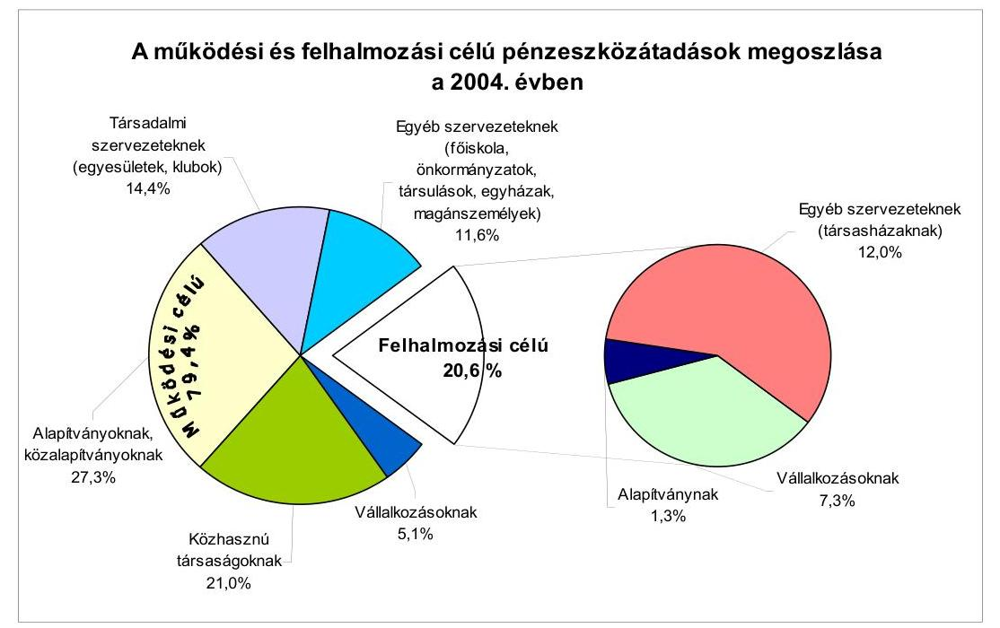
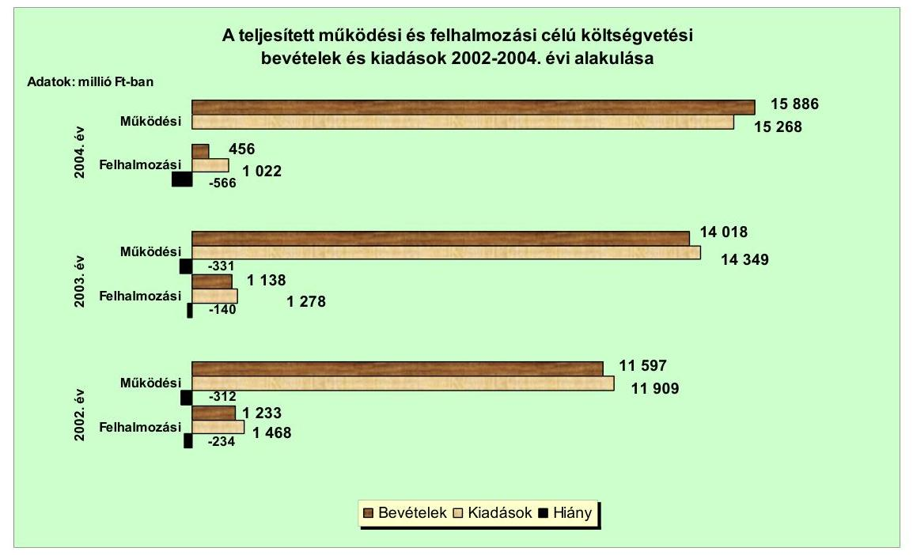
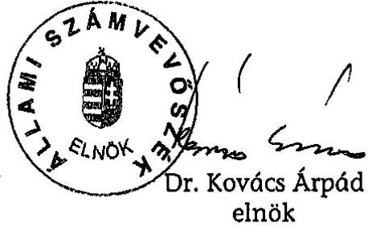
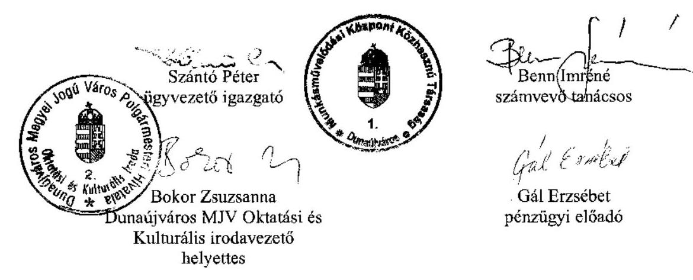
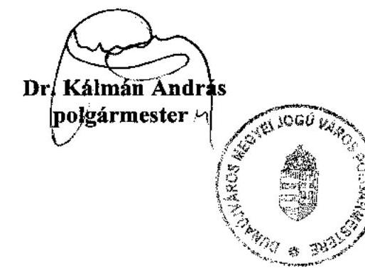

# JELENTÉS 

a Dunaújváros Megyei Jogú Város Önkormányzata gazdálkodási rendszerének átfogó ellenőrzéséről

---

3. Önkormányzati és Területi Ellenőrzési Igazgatóság
3.3. Átfogó Ellenőrzések Főcsoport
Iktatószám: V-1001-1/32/20/2005.
Témaszám: 749
Vizsgálat-azonosító szám: V0204
Az ellenőrzést felügyelte:
Dr. Lóránt Zoltán
főigazgató
Az ellenőrzés végrehajtásáért felelős:
Dr. Sepsey Tamás
főigazgató-helyettes
Az ellenőrzést vezette:
Csecserits Imréné
főcsoportfőnök-helyettes
Az ellenőrzést végezték:
Benn Imréné
számvevő tanácsos
Huberné Kuncsik Zsuzsanna
tanácsadó
Mohl Anna
számvevő

# A témához kapcsolódó - elmúlt három évben - készített számvevőszéki jelentések: 

címe
Sorszámc
Jelentés a helyi önkormányzatok és helyi kisebbségi 0220
önkormányzatok gazdálkodásának átfogó ellenőrzéséről
Jelentés a helyi önkormányzatok egyes pénzügyi befektetésekkel 0318
történő gazdálkodásának ellenőrzéséről
Jelentés a szakképzési struktúra szerepéről a munkaerőpiaci 0321
igények kielégítésében
Jelentés a települési önkormányzatok szennyvízközmű fejlesztési és 0416
működtetési feladatai ellátásának vizsgálatáról
Jelentés a középfokú oktatás feltételei alakulásának ellenőrzéséről 0445

---

# TARTALOMJEGYZÉK 

BEVEZETÉS ..... 5
I. ÖSSZEGZŐ MEGÁLLAPÍTÁSOK, KÖVETKEZTETÉSEK, JAVASLATOK ..... 7
II. RÉSZLETES MEGÁLLAPÍTÁSOK ..... 19

1. A költségvetés tervezésének, végrehajtásának, az Önkormányzat vagyongazdálkodásának és a zárszámadás elkészítésének szabályszerűsége ..... 19
1.1. A költségvetési rendelet jóváhagyásának, módosításának, az előirányzatok nyilvántartásának szabályszerűsége ..... 19
1.2. A gazdálkodás szabályozottsága, a bizonylati rend és fegyelem szabályszerűsége ..... 25
1.3. A pénzügyi-számviteli feladatok ellátásának informatikai támogatottsága ..... 33
1.4. Az önkormányzati vagyon nyilvántartása, számbavétele ..... 34
1.5. A vagyonnal való gazdálkodás szabályszerűsége, célszerűsége, nyilvánossága ..... 37
1.6. A céljelleggel nyújtott támogatások szabályszerűsége ..... 45
1.7. A közbeszerzési eljárások szabályszerűsége ..... 49
1.8. A zárszámadási kötelezettség teljesítésének szabályszerűsége ..... 52
1.9. A Polgármesteri hivatal helyi kisebbségi önkormányzatok gazdálkodását segítő tevékenysége ..... 54
2. Az önkormányzati feladatok és a rendelkezésre álló források összhangja ..... 56
2.1. A feladatok meghatározása és szervezeti keretei ..... 56
2.2. A költségvetés egyensúlyának helyzete ..... 60
2.3. A feladatok finanszírozása ..... 68
3. A belső irányítási, ellenőrzési rendszer működésének értékelése ..... 72
3.1. Az ellenőrzési rendszer kialakítása, működése ..... 72
3.2. A könyvvizsgálati kötelezettség teljesítése ..... 76
3.3. A korábbi számvevőszéki ellenőrzések javaslatainak hasznosulása ..... 77

---

# MELLÉKLETEK 

1. számú Az Önkormányzat gazdálkodását meghatározó adatok, mutatószámok (1 oldal)
2. számú Az önkormányzati vagyon nagyságának alakulása (1 oldal)
3. számú Az Önkormányzat 2004. évi bevételeinek és kiadásainak alakulása (1 oldal)
4. számú Egyes önkormányzati feladatok finanszírozása (1 oldal)
5. számú Helyszíni ellenőrzési jegyzőkönyv (4 oldal)
6. számú Dr. Kálmán András úr, a Dunaújvárosi Megyei Jogú Város Önkormányzata polgármesterének közös észrevétele Dr. Kálmán András úr címzetes főjegyzővel (2 oldal)

---

# RÖVIDÍTÉSEK JEGYZÉKE 

Ötv.
Áht.
Ámr.
$\mathrm{Kbt} .{ }_{1}$
Kbt. ${ }_{2}$
Számv. tv.
Htv.

Hatv.
Vhr.

Ber.
Nek. tv.
ÁSZ
Kincstár
Önkormányzat
Polgármesteri hivatal
Közgyűlés
polgármester
főjegyző
SzMSz
ügyrend
vagyongazdálkodási rendelet
lakás és helyiség hasznosítási rendelet

Pénzügyi bizottság
a helyi önkormányzatokról szóló 1990. évi LXV. törvény az államháztartásról szóló 1992. évi XXXVIII. törvény az államháztartás múködési rendjéről szóló 217/1998. (XII. 30.) Korm. rendelet
a közbeszerzésekről szóló 1995. évi XL. törvény
a közbeszerzésekről szóló 2003. évi CXXIX. törvény
a számvitelről szóló 2000. évi C. törvény
a helyi önkormányzatok és szerveik, a köztársasági megbízottak, valamint egyes centrális alárendeltségű szervek feladat- és hatásköreiről szóló 1991. évi XX. törvény
a helyi adókról szóló 1990. évi C. törvény
az államháztartás szervezetei beszámolási és könyvvezetési kötelezettségének sajátosságairól szóló 249/2000. (XII. 24.) Korm. rendelet
a költségvetési szervek belső ellenőrzéséről szóló 193/2003. (XI. 26.) Korm. rendelet
a nemzeti és etnikai kisebbségek jogairól szóló 1993. évi LXXVII. törvény
Állami Számvevőszék
Magyar Államkincstár Fejér Megyei Területi Igazgatósága
Dunaújváros Megyei Jogú Város Önkormányzata
Dunaújváros Megyei Jogú Város Önkormányzatának Polgármesteri Hivatala
Dunaújváros Megyei Jogú Város Önkormányzatának Közgyűlése
Dunaújváros Megyei Jogú Város Önkormányzatának polgármestere
Dunaújváros Megyei Jogú Város Önkormányzatának címzetes főjegyzője
Dunaújváros Megyei Jogú Város Önkormányzatának a Közgyűlés és Szervei Szervezeti és Múködési Szabályzatáról szóló 3/1991.(III. 19.) számú rendelete
A polgármester és a főjegyző által jóváhagyott 1999. május 12-től hatályos belső szabályozás Dunaújváros Megyei Jogú Város Önkormányzata Polgármesteri Hivatalának Úgyrendjéről
Dunaújváros Megyei Jogú Város Önkormányzatának 1/1993. (I. 27.) számú rendelete az önkormányzat gazdálkodásának rendjéről
Dunaújváros Megyei Jogú Város Önkormányzatának 1/1994. (I. 12.) számú rendelete a lakások és helyiségek elidegenítéséről és bérletéről
Dunaújváros Megyei Jogú Város Önkormányzatának Pénzügyi Bizottsága

---

| Gazdasági bizottság | Dunaújváros Megyei Jogú Város Önkormányzatának Gazdasági Bizottsága |
| :--: | :--: |
| Vagyongazdálkodási bizottság | Dunaújváros Megyei Jogú Város Önkormányzatának Vagyongazdálkodási Bizottsága |
| Kisebbségi bizottság | Dunaújváros Megyei Jogú Város Önkormányzatának Kulturális, Kisebbségi és Vallásügyi Bizottsága |
| Pénzügyi iroda | Dunaújváros Megyei Jogú Város Önkormányzata Polgármesteri Hivatal Pénzügyi és Vagyonkezelési Irodája |
| Jogi iroda | Dunaújváros Megyei Jogú Város Önkormányzata Polgármesteri Hivatal Szervezési és Jogi Irodája |
| Városüzemeltetési iroda | Dunaújváros Megyei Jogú Város Önkormányzata Polgármesteri Hivatal Városüzemeltetési és Fejlesztési Irodája |
| Koordinációs iroda | Dunaújváros Megyei Jogú Város Önkormányzata Polgármesteri Hivatal Koordinációs Irodája |
| Ellenőrzési szervezet | Dunaújváros Megyei Jogú Város Önkormányzata Polgármesteri Hivatal Pénzügyi és Vagyonkezelési Iroda Adóellenőrzési és Ellenőrzési csoportja |
| KBB | Dunaújváros Megyei Jogú Város Önkormányzatának Közbeszerzési Bíráló Bizottsága |
| Kórház | Dunaújváros Megyei Jogú Város Önkormányzat Szent Pantaleon Kórháza, önállóan gazdálkodó költségvetési intézmény |
| OEP | Országos Egészségbiztosítási Pénztár |
| CKÖ | Dunaújváros Megyei Jogú Város Helyi Cigány Kisebbségi Önkormányzat |
| HKÖ | Dunaújváros Megyei Jogú Város Helyi Horvát Kisebbségi Önkormányzat |
| LKÖ | Dunaújváros Megyei Jogú Város Helyi Lengyel Kisebbségi Önkormányzat |
| SZKÖ | Dunaújváros Megyei Jogú Város Helyi Szerb Kisebbségi Önkormányzat |
| FEUVE | Folyamatba épített, előzetes és utólagos vezetői ellenőrzés |
| DVG Rt. | DVG Dunaújvárosi Vagyonkezelő Részvénytársaság |
| MMK Kht. | Munkás Múvelődési Központ Közhasznú társaság |
| DTV Kht. | Dunaújvárosi Városi Televízió Közhasznú társaság |

---

# JELENTÉS   a Dunaújváros Megyei Jogú Város Önkormányzata gazdálkodási rendszerének átfogó ellenőrzéséről 

## BEVEZETÉS

Az Ötv. 92. § (1) bekezdése, az Állami Számvevőszékről szóló 1989. évi XXXVIII. törvény 2. § (3) bekezdése, valamint az Áht. 120/A. § (1) bekezdése szerint az önkormányzatok gazdálkodását az Állami Számvevőszék ellenőrzi. Az ellenőrzésre az Országgyúlés illetékes bizottságai részére is átadott, országosan egységes ellenőrzési program alapján került sor.

## Az ellenőrzés célja annak értékelése volt, hogy:

- az önkormányzati gazdálkodás törvényességét ${ }^{1}$, szabályszerűségét biztosítot-ták-e a tervezés, a költségvetés végrehajtása, a vagyongazdálkodás és a zárszámadás során;
- az Önkormányzat által ellátott feladatok és az azokhoz rendelkezésre álló források összhangja biztosított volt-e, különös tekintettel az egyes kiemelt feladatokra;
- a gazdálkodás szabályszerűségét biztosító kontrollok ${ }^{2}$ megfelelően segitettéke a végrehajtást.

Az ellenőrzött időszak: a 2004. év, az 1. 5., 2.1-2.3 és 3.3 ellenőrzési pontok esetében ezen túlmenően a 2002-2003. évek is.

Dunaújváros megyei jogú város Fejér megye második legnagyobb települése. A város lakosainak száma 2004. január 1-jén 53626 fő, 2005. január 1-jén 52426 fő volt. A Közgyűlés tagjainak száma 27 fő, munkáját 12 állandó bizottság támogatja. A polgármestert - aki az 1999. évi időközi választás óta tölti be tisztségét - egy főállású és két társadalmi megbízatású alpolgármester segíti feladatai ellátásában.

[^0]
[^0]:    ${ }^{1}$ A törvényi előírások betartásának elmulasztásakor a részletes megállapítások fejezetben egységesen a törvénysértés megjelölést alkalmazzuk, mivel az ÁSZ nem tehet különbséget a törvényi előírások között.
    ${ }^{2}$ A gazdálkodás szabályszerűségét biztosító kontroll alatt értjük a kiépített és működő belső irányítási és szabályozási rendszert, valamint a belső ellenőrzési funkciók ellátását.

---

A főjegyző az Önkormányzat megalakulásától kezdve vezeti a Polgármesteri hivatalt.

A városban négy kisebbségi ${ }^{3}$ önkormányzat múködik. Az Önkormányzat a 2004. évben 16888 millió Ft bevételből gazdálkodott, a teljesített kiadás 16292 millió Ft volt. A kiadások 93,7\%-át múködési, 6,3\%-át felhalmozási célra fordították. A könyvviteli mérlegben kimutatott vagyonának értéke 38573 millió Ftot tett ki.

A városban és a vonzáskörzetében élőknek nyújtott közszolgáltatásokhoz összesen 48 intézményt (ebből 16 részben önálló gazdálkodási jogkörrel rendelkezőt) tartottak fenn a 2003. évben. Az intézményracionalizálási intézkedések következtében a 2004. év folyamán az intézmények száma 33-ra csökkent, melyből kettő intézmény rendelkezik részben önálló gazdálkodási jogkörrel. Ezen kívül négy gazdasági társaságnak 100\%-os tulajdonosa az Önkormányzat, amelyek közremúködnek a kötelező feladatok, a különböző közszolgáltatások ellátásában. A Polgármesteri hivatalban foglalkoztatott köztisztviselők száma a 2004. évben 213 fő volt, az intézményekben 2832 fő közalkalmazott látta el a különböző közszolgáltatásokat, és az azokhoz kapcsolódó gazdálkodási teendőket. Az Önkormányzat gazdálkodását meghatározó adatokat, mutatószámokat a jelentés 1. számú melléklete tartalmazza.

A jelentés megállapításainak, javaslatainak egyeztetése során a polgármester arról adott tájékoztatást, hogy az időközben megtett intézkedésekkel a javaslatok egy részét megvalósították. Ezekben az esetekben a jelentés II. Részletes megállapítások fejezetében az adott témához kapcsolt lábjegyzetben a megtett intézkedést feltüntettük és a kapcsolódó javaslatot elhagytuk.

[^0]
[^0]:    ${ }^{3}$ cigány, horvát, lengyel, szerb

---

# I. ÖSSZEGZŐ MEGÁLLAPÍTÁSOK, KÖVETKEZTETÉSEK, JAVASLATOK 

A Közgyűlés az Ötv. előírásainak megfelelve a 2003. évben fogadta el az Önkormányzat gazdasági programját, ami alkalmas volt az éves tervezőmunkák megalapozásához, továbbá a gazdasági stabilizációs folyamatok beindításához. A polgármester az Áht-ban előírt határidőt betartva terjesztette a Közgyűlés elé a 2003. és a 2004. évi költségvetési koncepciókat, valamint a költségvetési rendelettervezeteket. A költségvetési koncepciók az Ámr-ben előírtaknak megfelelő tartalommal készültek, és az elfogadáskor a Közgyűlés döntött a részletes költségvetés kimunkálásával kapcsolatos elvárásokról.

A főjegyző a költségvetési rendelettervezetet beterjesztése előtt a költségvetési szervek vezetőivel az Ámr-ben foglaltaknak megfelelően egyeztette. Az Áhtban foglaltakat megsértve a 2004. és a 2005. évi költségvetési rendeletekben a bevételeket, és a kiadásokat egyensúlyban, a hiány bemutatása nélkül hagyta jóvá a Közgyűlés annak következtében, hogy a finanszírozási célú pénzügyi műveleteket (hitelt) vettek figyelembe költségvetési bevételként, illetve kiadásként. Az Áht. előírásait megsértve, előterjesztés hiányában a Közgyűlés a vagyonkimutatás kivételével nem határozta meg a költségvetés mellékleteként tájékoztatásul bemutatandó mérlegek és kimutatások tartalmi követelményeit. A Polgármesteri hivatal és az intézmények bevételi és kiadási előirányzatait az Ámr. előírásainak megfelelve mutatták be. A felújítási és felhalmozási előirányzatokat célonként és feladatonként határozták meg. Az Ámr. előírásai szerint mutatták be a Közgyűlésnek a több éves kihatással járó kiadások későbbi évekre vonatkozó hatásait, ezen belül a költségvetési évet követő két év várható előirányzatait éves bontásban. Bemutatták a helyi kisebbségi önkormányzatok költségvetését határozataik szerinti tartalommal. Az Ámr-ben előírtaknak megfelelően csatolták a költségvetésekhez az előirányzatok várható felhasználási ütemét bemutató tájékoztatást.

A 2004. és a 2005. évi költségvetésekben az Ámr-ben előírtak szerint meghatározták az általános és céltartalék összegét, főbb felhasználási jogcímeit. A 2004. és a 2005. évi költségvetésekben, az SzMSz-ben, valamint a vagyongazdálkodási rendeletben részletesen meghatározták a költségvetés végrehajtására vonatkozó szabályokat. A Közgyűlés az Ámr-ben előírtaktól eltérően nem negyedévenkénti gyakoriságot írt elő a kapott központi pótelőirányzatok miatt kötelező költségvetési rendeletmódosításokra, ezt évi három alkalomban határozta meg. Az éves költségvetésben nem tervezett, a tárgyév első negyedévében bekövetkezett előirányzat-változások miatt a költségvetési rendeletet a második negyedévben nem módosították, erre első alkalommal az Önkormányzat költségvetési rendeletében előírtak alapján a féléves beszámoló elkészítése előtt került sor.

A Polgármesteri hivatal szervezeti felépítését az SzMSz-ben határozta meg a Közgyűlés, a feladatokat az ügyrend tartalmazta. A Polgármesteri hivatal alapító okiratának számát és keltét, valamint a tervezéssel és végrehajtással kapcsolatos előírásokat az Ámr-ben előírtak ellenére az SzMSz-ben, illetve az ügy-

---

rendben nem határozták meg. A gazdasági szervezet feladatait a polgármester és a főjegyző az ügyrendben rögzítette. Az operatív gazdálkodással kapcsolatos hatás- és jogköröket a Polgármesteri hivatalban az Ámr-ben előírtak figyelembe vételével alakították ki. A Polgármesteri hivatalban az operatív gazdálkodást érintő szabályzatokban nem rendelkeztek az Ámr-ben előírtak ellenére a kötelezettségvállalás nyilvántartási rendjéről.

A főjegyző a Htv. előírásait megsértve nem alakította ki az intézmények egységes számviteli rendjét. A Polgármesteri hivatal rendelkezett számviteli politikával és a kapcsolódó szabályzatokkal, valamint számlarenddel. A számviteli politikában azonban nem határozták meg a Vhr-ben előírtak ellenére, hogy mit tekintenek a megbízható, valós összképet befolyásoló jelentős és lényeges, illetve nem jelentős és nem lényeges összegnek, információnak, valamint nem szabályozták a kisebbségi önkormányzatokkal összefüggő sajátos feladatokat. Az eszközök és források értékelési szabályzatában a Vhr. előírásaival szemben nem rendelkeztek a terven felüli értékcsökkenés elszámolási rendjéről, és az éven túli követelések értékvesztésének elszámolási szabályairól. A leltározás rendjéről szóló szabályzatot a Vhr. 2004. január 1-től hatályos módosításával nem aktualizálták, így az a hatályos jogszabályi előírástól eltérő módon és gyakorisággal írja elő a leltározási feladatokat. A számlarendben nem írták elő a Vhr. 2005. január 1-től hatályos rendelkezései ellenére a számviteli nyilvántartások egyeztetésének gyakoriságát, továbbá elvégzésének és dokumentálásának módját. A főkönyvi számlákhoz analitikus nyilvántartást vezettek. A főkönyvi könyvelés és az analitikus nyilvántartások egyeztetését negyedéves gyakorisággal dokumentáltan nem végezték el. Nem szabályozták indokoltsága ellenére a banki pénzforgalom bonyolítására igénybe vett ügyfélterminál használatát. A polgármester és a főjegyző az operatív gazdálkodást érintő belső szabályzatokban nem határozta meg az előző munkafázis ellenőrzését, nem jelölték ki az ellenőrzési pontokat, az elvégzendő műveleteket, az ellenőrzés viszonyítási alapját, nem rendelkeztek az eltérés rendezéséről. A munkaköri leírásokban az elvégzendő tevékenységet megelőző folyamat ellenőrzési kötelezettségét, felelősségi körét nem rögzítették.

A gazdasági eseményekről a számviteli bizonylatokat kiállították, melyek 12,5\%-ban, megsértve Számv. tv-t, nem feleltek meg az előírt alaki és tartalmi követelményeknek. Az Ámr. előírása ellenére a bevételek 18\%-ánál elmaradt az érvényesítés, a banki és a pénztári kifizetések utalványrendeletei 9\%-ban nem tartalmazták a kötelezettségvállalás nyilvántartásba vételének sorszámát. A gazdálkodási és ellenőrzési jogkörök gyakorlására hatáskörrel felhatalmazottak beszámoltatásának módját nem szabályozták, és nem számoltatták be őket tevékenységükről. A pénzforgalmat érintő gazdasági események rögzítése a Vhr. előírásai ellenére a pénztári kifizetéseknél nem a pénzmozgással egyidejűleg, a bankszámla forgalomnál nem a hitelintézeti értesítés megérkezésekor történt. A gazdálkodási jogköröket az arra jogosultak gyakorolták, az összeférhetetlenségi szabályokat betartották. A DVG Rt. által beszedett önkormányzati tulajdonú lakások és nem lakás céljára szolgáló helyiségek bérleti díj bevételeit a Számv. tv. bruttó elszámolási elvét, és a teljesség elvét megsértve beszámították a lakóház-kezelési terv megvalósítását szolgáló kiadások finanszírozása során. Az önkormányzati tulajdonú lakások elidegenítésével kapcsolatos bevételek beszedésével a Közgyűlés a DVG Rt-t bízta meg. Az ebből származó önkormányzati követelések nyilvántartásáról nem rendelkeztek, a követelés 2003.

---

május hóban történt értékesítésekor kimutatott 820,8 millió Ft követelésállomány sem a Polgármesteri hivatal, sem a DVG Rt könyvviteli mérlegében nem szerepelt, megsértve ezzel a Számv. tv-ben előírt teljesség és valódiság elvét. A követelésértékesítési bevétel a Polgármesteri hivatal 2003.évi bevételeinek részét képezte.

A Dunaferr Rt-ben való önkormányzati részesedés névértékének csökkenését a Vhr. előírása ellenére nem értékvesztésként, hanem állományváltozásként számolták el. A kötelezettségvállalásokról vezetett nyilvántartásból az Ámr. előírása ellenére a 2004. évi kötelezettségvállalások éves összege nem volt megállapítható, mivel a nyilvántartás nem tartalmazta a személyi jellegű kifizetéseket és a dologi kiadásokból a rendszeres kiadásokat, valamint az 50 ezer Ft alatti kiadásokat. Önkormányzati szinten a módosított kiemelt előirányzatokat betartották a teljesítés során, azonban egy intézmény a módosított kiadási előirányzatát $1,4 \%$-kal ( 3,4 millió Ft-tal) túllépte, ezen belül a kiemelt dologi kiadások előirányzatait 8,5\%-kal (13 millió Ft-tal) lépte túl, megsértve ezzel az Áht-ban foglalt előírásokat. A túllépés okát nem vizsgálták, felelősségre vonás nem történt.

A Polgármesteri hivatalban kiépített számítógép hálózat múködött, ennek ellenére a pénzügyi és számviteli területen az analitikus nyilvántartások 41\%át manuálisan vezették. Az Önkormányzat rendelkezett a 2005-2010. évekre vonatkozó informatikai stratégiával. A Polgármesteri hivatalban a folyamatos és biztonságos munkavégzés érdekében szükséges katasztrófa elhárítási tervet azonban nem készítettek. Az információs rendszer védelme érdekében a felhasználók jogosultságáról nyilvántartást vezettek, az adatállomány mentéséről és tárolásáról az adatvédelmi szabályzatban előírtak szerint gondoskodtak. A feladatellátás érdekében a 2004. évben fejlesztették, bővítették a számítógépes ellátottságot. A dolgozók a munkavégzéshez szükséges számítástechnikai ismeretekkel rendelkeztek, munkaköri leírásuk tartalmazta az informatikai rendszer alkalmazásával elvégzendő feladatokat.

Az Önkormányzat vagyonának számviteli nyilvántartásában a törzsvagyon elkülönített nyilvántartását a Vhr. előírása ellenére nem biztosították. Az ingatlanvagyon kataszter és számviteli nyilvántartások értékadatainak egyezőségét az önkormányzatok tulajdonában lévő ingatlanvagyon-nyilvántartási és adatszolgáltatási rendjéről szóló Korm. rendelet előírása ellenére nem valósították meg. Az ingatlanvagyon kataszterben az állományváltozással összefüggő értékváltozások rögzítéséről a 2004. évben nem gondoskodtak. A Vhr-ben rögzítettek ellenére a főjegyző a 2004. év könyvviteli záráskor az ingatlanok, üzemeltetésre, kezelésre átadott eszközök, követelések, kötelezettségek esetében mennyiségi leltárfelvétel helyett az analitikus és főkönyvi nyilvántartások egyeztetését rendelte el. A követelések, értékpapírok és részesedések esetében a Vhr. előírása ellenére a Polgármesteri hivatalban nem végezték el az év végi értékelési feladatokat, dokumentáltan nem vizsgálták az értékvesztés elszámolásának a szükségességét. Az értékvesztés elszámolásának alapját képező adatok szerint nem volt indokolt értékvesztés elszámolása, kivételt képeztek a DVG Rtbe apportált Dunaferr Rt részvények, melyeket a 2003. évben felülbélyegeztek és névértékük 1476,8 millió Ft-tal csökkent, továbbá nem állapítható meg az értékvesztés indokoltsága az információk hiánya miatt az Önkormányzat egyéb részesedései esetében.

---

A vagyongazdálkodás szabályait a vagyongazdálkodási rendeletben szabályozták. Az Áht. előírását azonban megsértve a vagyongazdálkodási rendeletben lehetőséget biztosítottak a Közgyűlés egyedi döntése alapján a versenyeztetés mellőzésére a vagyonhasznosítás során. A versenyeztetési eljárás mellőzésének lehetőségét a vagyongazdálkodási rendelet 2005. évi módosításakor megszüntették. A vagyongazdálkodási hatáskörökkel való rendelkezés szabályozása a helyi sajátosságok figyelembe vételével történt. A vagyontárgyak értékesítése, térítésmentes átadása a vagyongazdálkodási rendeletben meghatározott hatáskörök betartásával valósult meg. A polgármester hatáskörét túllépve a Gazdasági bizottság egyetértésével bérleti dij-kedvezményt biztosított a Polgármesteri hivatalban lévő helyiségek bérbeadásakor, valamint két párt részére történt helyiség bérbeadásakor. A kettő pártszervezet részére biztosított kedvezményes bérleti díj ellentétes az Ötv. előírásaival is. A vagyonhasznosítás nyilvánosságát szabályozta a Közgyűlés, melynek érvényesülését a 2002-2004. évek között a Dunaferr Rt. részvényeinek értékesítése során nem biztosították, valamint a versenyeztetés elkerülésével megsértették az Áht. előírását is. A vagyongazdálkodási rendeletben foglalt lehetőséggel élve, az Áht. előírását megsértve 2002-2004. között nyilvános pályázat mellőzésével döntöttek földterület és önkormányzati követelés értékesítéséről. Az ingatlanok értékesítésekor a vásártér, egy pincehelyiség és egy lakóingatlan estében a vételárat a vagyongazdálkodási rendeletben előírtaktól eltérően, nem értékbecslés alapján állapították meg. A vagyonhasznosítással kapcsolatos szerződések megkötésére a Közgyűlés és a bizottságok döntéseinek megfelelően került sor, melyekbe az Önkormányzat érdekeit védő garanciális elemeket (késedelmi kamat, földhivatali bejegyzési feltételek) beépítették. Az értékpapírok értékesítése célszerűen történt. Követelés elengedése a helyi adókból, valamint a lakás- és nem lakás célú helyiségek bérleti díjaiból történt. A helyi adóból a behajthatatlannak minősülő követelés elengedésének módját és eseteit az Áht. előírását megsértve önkormányzati rendeletben nem szabályozták. Ingatlan tulajdonjogának térítésmentes átadásáról, a vagyongazdálkodási rendeletben foglaltakkal összhangban, a Közgyűlés város- és társadalompolitikai érdekből két alkalommal döntött.

Az Önkormányzat a 2004. évben a külső szervezetek részére 593,6 millió Ft működési célú és 154,7 millió Ft felhalmozási célú támogatást nyújtott. A támogatásokról szóló döntéseknél a hatásköri szabályokat betartották, alapítványokat, közalapítványokat a Közgyűlés határozatával támogattak. Egy önkormányzati intézmény közgyűlési felhatalmazás nélkül támogatott sportegyesületet, megsértve az Áht. előírásait. A támogatások közel 7\%-ánál nem írták elő a számadási kötelezettséget, ezzel megsértették az Áht. előírásait. Nem szabályozták a támogatások ellenőrzésének módját. A támogatásokra vonatkozóan nem dolgoztak ki egységes nyilvántartási rendszert, melyből megállapítható, hogy a kérelmező, illetve pályázó milyen bizottságokhoz nyújtott be igényt, kapott-e támogatást, és azzal határidőre szabályosan elszámolt-e. A számadások tartalmi, formai ellenőrzését a hitelesített számlamásolatok, és összesített kimutatások alapján a szakosztályok elvégezték, a támogatás célszerinti felhasználásának ellenőrzését az Áht. előírásait megsértve azonban elmulasztották. A támogatott szervezetek 99\%-a elszámolt a kapott összegről, a számadást nem teljesítő két szervezet részére értesítést küldtek, az Áht. előírásait megsértve azonban nem intézkedtek a további támogatás felfüggesztésére és a visszafizetésre vonatkozóan.

---

A Közgyűlés a vagyongazdálkodási rendeletben szabályozta a közbeszerzési eljárás helyi szabályait, melyet 2004. május 1-től hatályon kívül helyeztek és új közbeszerzési szabályzatot készítettek. A közbeszerzési szabályzatban meghatározták a közbeszerzési eljárás előkészítésével, lefolytatásával, ellenőrzésével kapcsolatos felelősségi és dokumentálási rendet. A 2004. évben a Polgármesteri hivatal hat közbeszerzési eljárást folytatott le. A Kbt., előírásai ellenére a Polgármesteri hivatal nem folytatta le a közbeszerzési eljárást ingatlanok őrzési, védelmi és hirdetési feladatainak megrendelése esetében. A vegyszeres földi és légi úton történő szúnyogimágó-irtás elvégzésére, egy darab több frakciós szállításra alkalmas szelektív hulladékgyűjtő beszerzésére, valamint a bel- és külterületi úthálózat 2004. évi fenntartási és felújítási munkálatainak elvégzésére kiírt eljárások bonyolítása során érvényesültek a Kbt., előírásai. A közbeszerzési eljárások során nem vizsgálták az előkészítésben részt vevők összeférhetetlenségét a Kbt., ${ }_{1}$ ellenére. Az eljárást lezáró határozatot hozó döntést a KBB javaslata alapján a polgármester hozta meg. A bel- és külterületi úthálózat fenntartására és felújítására vonatkozó szerződéskötéskor a Kbt., előírása ellenére az ajánlati felhívás tartalmától eltértek. Szerződésmódosításokra nem került sor, késedelmes teljesítés miatt a szerződésben foglaltak alapján a kötbért érvényesítették.

A költségvetéssel összehasonlítható módon összeállított zárszámadási rendelettervezetet a polgármester az előírt határidőn belül terjesztette a Közgyűlés elé. Az előterjesztés megfelelt az Áht-ban és az Ámr-ben foglalt előírásoknak. Az Áht-ban foglaltakat megsértve azonban nem mutatták be a közvetett támogatások szöveges indokolását. A zárszámadás az Áht. előírásait betartva tartalmazta a helyi kisebbségi önkormányzatok mérlegeit. A Polgármesteri hivatal pénzmaradványának megállapítása, valamint az intézményi pénzmaradványok felülvizsgálata, jóváhagyása megfelelt a Vhr. és az Ámr. előírásainak. Az Ámr-ben előírtaknak megfelelően az intézményeket éves számszaki beszámolójuk és működésük elbírálásáról, jóváhagyásáról írásban értesítették.

A településen a 2004. évben négy helyi kisebbségi önkormányzat múködött, melyekkel az együttmúködési megállapodásokat az Ámr-ben meghatározott határidő után kötötték meg. A megállapodásokban rögzítették a kisebbségi önkormányzatok költségvetési koncepciójára, költségvetésére, az előirányzatok módosítására, a zárszámadás elkészítésére és elfogadására vonatkozó szabályokat. Az Ámr. előírása ellenére a főjegyző nem határozta meg a szakmai teljesítés igazolásának módját, nem jelölte ki az erre jogosultakat, valamint az érvényesítést a főjegyző megbízása nélkül a Koordinációs iroda munkatársa végezte. A kisebbségi önkormányzatok készpénz- és bankszámlaforgalmát a Polgármesteri hivatal elszámolási számláján bonyolították. Az Ámr előírása ellenére a kisebbségi önkormányzatokra vonatkozóan kötelezettségvállalási nyilvántartást nem vezettek, bevételeik közül az Önkormányzattól és a központi költségvetéstől kapott támogatásokat nem a központilag kijelölt szakfeladaton számolták el. Az Önkormányzat a kisebbségi önkormányzatok múködését támogatások nyújtásával segítette, biztosította testületi múködésükhöz az ingyenes helyiséghasználatot és az adminisztratív teendők ellátását.

Az Önkormányzat SzMSz-ében és gazdasági programjában rögzítette a kötelező és önként vállalt feladatokat. Az Önkormányzatnál a feladatok ellátását alapvetően költségvetési intézmények útján biztosították. A közművelődési,

---

szociális, sport, ifjúsági, egészségügyi alapellátási, és közszolgáltatási területeken közalapítványok, közhasznú társaságok, egyéni vállalkozások valamint önkormányzati többségi tulajdonú vállalkozások vettek részt a kötelező, és önként vállalt feladatok elvégzésében. A feladatellátás szervezeti kereteiben történő változtatások a feladatok megoldásának szinte minden területét érintették. Költségvetési intézményeket szüntettek meg a közoktatási, szociális, kulturális ágazatban, egy közalapítványt és két közhasznú társaságot hoztak létre. A városüzemeltetési feladatoknál közremúködő önkormányzati tulajdonú gazdasági társaságok köre a szennyvíztisztítási feladatok ellátására alakult kft-vel bővült. Az átszervezések intézményi racionalizálási terv végrehajtásaként történtek, amelyek 2005. I. félévében is folytatódtak.

Az Önkormányzat gazdálkodásának pénzügyi egyensúlya az elmúlt három évben nem volt biztosított, a költségvetési rendeletekben tervezett - finanszírozási tételeket nem tartalmazó - bevételek nem nyújtottak fedezetet a tervezett kiadásokra. A 2004. évben a tervezett hiány összege 1511,9 millió Ft volt, ez a költségvetés főösszegének 9,1\%-át alkotta. Az Önkormányzatnál a múködési forráshiány állandósult, a növekvő likviditási problémák megoldására a folyószámla hitelkeret-szerződés összegét évente növelték, ennek összege a 2004. évben 1700 millió Ft volt. Az év végi rövid lejáratú hitelállomány folyamatosan nőtt, a 2004. év végén 906,7 millió Ft éven belül nem törlesztett hitellel rendelkeztek. A tervezett felhalmozási kiadások finanszírozásához a 2003. évben és a 2004. évben több évre szóló kötelezettséget vállaltak további hitelek felvételével (280-150 millió Ft), a hosszú lejáratú hitelek- és kölcsönök állománya a 2004. év végén 828,3 millió Ft volt. Az adósságot keletkeztető kötelezettségvállalásoknál az Ötv-ben előírt felső határt betartották. A Kórház 2001. október hóban az Áht. előírását megsértve hitelügyletnek minősülő tartozásátvállalási szerződést kötött 300 millió Ft értékben, melyhez a Közgyűlés készfizető kezességet vállalt. A szerződés tőke- és kamatterhei az intézménynél jelentkeztek, a kezesség beváltására a 2005. június 30 -ig nem került sor.

A költségvetés teljesítése során a 2004. évben múködési bevételeket is felhasználtak a fejlesztési célkitúzések megvalósításához, ennek ellenére a felhalmozási kiadások részaránya a költségvetésen belül folyamatosan csökkent, a 2004. évben 6,3\%-os volt. Az Önkormányzat a 2002-2004. években a gazdálkodási nehézségek megoldására több alkalommal hozott költségcsökkentő és forrásbővítő intézkedéseket, ezek között legjelentősebb a 2003. évben, a gazdasági programban jóváhagyott célkitűzések megvalósítása volt. Intézmények megszüntetéséről, átszervezéséről döntöttek, létszámcsökkentést hajtottak végre, vagyonhasznosításra irányuló döntéseket hoztak, részvényeket és ingatlanokat értékesítettek. Az Önkormányzat a bevételek növelése érdekében a 2004. évben kettő új helyi adónemet (építményadó, magánszemélyek kommunális adója) vezetett be, ezek az iparűzési adó bevételekkel együtt a költségvetési bevételek $22,1 \%$-át alkották. Az iparűzési adónál a törvényi maximumot alkalmazták, az építményadó mértékét differenciáltan állapították meg. A magánszemélyek kommunális adójánál a törvényi maximumot a $120 \mathrm{~m}^{2}$ feletti ingatlanok esetében alkalmazták. A helyi adóról szóló törvényben meghatározottakon túlmenően is megállapítottak kedvezményeket, mentességeket.

A feladatok finanszírozását befolyásolták a központi bérintézkedések, a normatív állami hozzájárulások emelkedése és az intézmények kapacitáski-

---

használtsága, valamint az alapfokú oktatásnál az erőteljesen csökkenő gyermeklétszám. Az ellátotti létszám csökkenése miatti intézményátszervezések csoport és osztályszám csökkentések nem ellensúlyozták az óvodai fajlagos kiadások emelkedését, mely a 2002-2003. évet összehasonlítva elérte a 31,1\%-ot. Az önkormányzati támogatás aránya a költségek finanszírozásában a 2003. évben $47 \%$ volt, majd a 2004. évre az állami hozzájárulás emelése miatt 41,1\%-ra mérséklődött. Az Önkormányzat általános iskolai oktatás feltételeinek finanszírozásban való részesedése elérte a 2004. évben, a 24,3\%-ot. A szociális ágazatban a kapacitáskihasználtság kedvezően változott, ezért a nappali szociális ellátásnál, valamint a bentlakásos intézményi ellátásnál az Önkormányzat finanszírozásban való részesedése mérséklődött.

Az önként vállalt feladatok finanszírozására a költségvetési kiadások 6,5-5,7-5,8\%-át fordították, a 2002-2004. években. Az önként vállalt feladatok főleg a kulturális, sport és ifjúsági területeken történő intézmény fenntartást, illetve a nem feladat-ellátási szerződéseken alapuló céljellegú támogatást tartalmazták, korlátozásukra az Önkormányzat törekedett, de a támogatásokra fordított kiadások radikális mérséklésére csak a 2005. évi költségvetésben került sor.

Az Önkormányzat a fogyatékos személyek akadálymentes közlekedésének segítése érdekében felmérte a várható kiadásokat, mely szerint a teljes akadálymentesítés kiadásai 143,3 millió Ft-ot tesznek ki. A 2002-2004. években 5,4 millió Ft-ot terveztek ezen feladatokra a költségvetésben. A 76 önkormányzati tulajdonú középületből 10 épületben biztosított a teljes akadálymentesítés, 25 épület részlegesen akadálymentesített, az épületek 62\%-ában, 41 épületben nem biztosított a mozgássérült személyek akadálymentes közlekedése. Az Önkormányzat a fogyatékos személyek jogairól és esélyegyenlőségük biztosításáról szóló törvényben előírtakat figyelmen kívül hagyva a 2005. január 1-i határidőre a feladatok elvégzését nem biztosította.

Az ügyrendben és az ellenőrzési szabályzatban határozták meg az Önkormányzat intézményeinek és a Polgármesteri hivatalnak a belső ellenőrzési feladatait. A Ber-ben előírtakat betartva az SzMSz részét képező ügyrendben előírták a belső ellenőrzési kötelezettséget, az ellenőrzést végző szervezet jogállását, feladatait. Az Áht. és a Ber. előírásai ellenére az ellenőrzés funkcionális és szervezeti függetlenségét a 2004. évtől nem biztosították, mivel az ellenőrzést végzők nem közvetlenül a főjegyző irányításával végezték feladataikat és belső ellenőrzésen kívül egyéb feladatokat is elláttak. Az ellenőrök a 2004. évi feladatokat éves ellenőrzési munkaterv alapján végezték, melyet a főjegyző hagyott jóvá. Az intézményeket érintő ellenőrzési jelentésekben javaslatokat fogalmaztak meg, ez azonban elmaradt a Polgármesteri hivatal belső ellenőrzései esetében. Az ellenőrzött intézmények a hiányosságok kijavítására intézkedési tervet készítettek, melynek megvalósulásáról írásban értesítették az ellenőrzést végzőket. A vizsgálatok során egy intézménynél éltek felelősség felvetésével a súlyos szabálytalanságok miatt. A Közgyűlés, eleget téve a Htv. előírásának, megtárgyalta az ellenőrzésekről szóló beszámolót. A főjegyző a 2004. évben az ellenőrzési kézikönyvet elkészítette, az ellenőrzési nyomvonalat az Ámr-ben foglaltak ellenére nem határozta meg.

---

Az Önkormányzat a 2004. évben a törvényben előírt könyvvizsgálati kötelezettségét költségvetési minősítésű könyvvizsgálóval - az összeférhetetlenségi követelmények figyelembevételével - teljesítette. A könyvvizsgáló a 2004. évben auditálási eltérést állapított meg a mérlegben, amely minimális mértékben ( 90 ezer Ft) növelte a mérleg főösszegét, a hibát a 2005. évben kijavították. A könyvvizsgáló korlátozás nélküli hitelesítő záradékkal látta el a Polgármesteri hivatal és intézményei összevont adatait tartalmazó a 2003. és a 2004. évi egyszerűsített költségvetési beszámolókat.

Az Önkormányzatnál az előző négy évben végzett öt számvevőszéki vizsgálat 43 javaslatot tartalmazott. A javaslatok négyötöd részét végrehajtották, melynek eredményeként javult a feladatellátás törvényessége és szabályozottsága. A gazdálkodás 2001. évi átfogó ellenőrzésének javaslatai figyelembevételével sor került a pénzgazdálkodási jogkörök gyakorlásának szabályozására, a pénzkezelési, a közszolgáltatási és a leltározási szabályzat kiegészítésére, a számlarend aktualizálására, szabályozták a közbeszerzési eljárásokat, elkészítették a Polgármesteri hivatal alapító okiratát, pótolták a hiányzó munkaköri leírásokat. Nem valósult meg az önkormányzati ingatlanvagyon értékbecslése, az ingatlanvagyon kataszteri és számviteli nyilvántartások egyezőségének megteremtése. A pénzügyi befektetésekkel való gazdálkodás vizsgálatát követően elkészült az Önkormányzat gazdasági programja, számot adtak zárszámadás keretében az egyes vagyonelemek alakulásáról, az analitikus nyilvántartásokat aktualizálták. Elmaradt a tulajdonosi jogot gyakorlók beszámoltatása. A szakképzési struktúra és a munkaerő-piaci igények összhangjának vizsgálata eredményeként javították a munkaerő-piaci folyamatokról való informáltságot, intézkedtek a szakképzés személyi feltételeinek javítására, a javasolt szervezeti átalakításokat megvalósították. A szennyvíz közműfejlesztési és működtetési feladatok vizsgálata során tett javaslatok nem valósultak meg, emiatt a szennyvíztisztító-telep értéke az ingatlanvagyon kataszterben és a számviteli nyilvántartásban eltért, továbbá nem gondoskodtak a fajlagos mutatók statisztikai adatszolgáltatásának ellenőrzéséről. A közoktatási vizsgálat javaslatai alapján döntött a Közgyűlés az intézményrendszer minőségi programjáról, a kötelező eszközjegyzékre vonatkozó költségelőirányzatokat, és a végrehajtás ütemezését elfogadták.

A helyszíni ellenőrzés megállapításainak hasznosítása mellett javasoljuk:

# a polgármesternek 

a jogszabályi előírások maradéktalan betartása érdekében

1. terjessze - a főjegyző által készített előterjesztés alapján - a Közgyűlés elé az Áht. 118. §-ában előírt, az Áht. 116. § 6. pontja szerinti összevont, és elkülönítetten a helyi kisebbségi önkormányzatok mérlegeit, az Áht. 116. § 9. pontjában meghatározott többéves kihatással járó döntések számszerűsítését évenkénti bontásban és öszszesítve, továbbá az Áht. 116. § 10. pontjában előírt közvetett támogatásokat tartalmazó mérlegek, kimutatások tartalmának meghatározásáról szóló rendelettervezetet;

---

2. intézkedjen annak érdekében, hogy az intézmények az Áht. 93. § (1) bekezdésében foglaltaknak megfelelően a jóváhagyott előirányzatokon belül gazdálkodjanak. Az előirányzat túllépések okait vizsgáltassa ki, indokolt esetben kezdeményezzen felelősségre vonást;
3. gondoskodjon arról, hogy a pártok részére biztosított helyiségek bérleti díja összhangba kerüljön a Közgyűlés által az Önkormányzat tulajdonában lévő lakás- és nem lakás céljára szolgáló helyiségre vonatkozó lakás- és helyiséghasznosítási rendelet alapján meghatározott díjakkal;
4. biztosítsa az önkormányzati vagyon hasznosításakor a nyilvános pályáztatást, a köztulajdonnal történő gazdálkodás nyilvánosságát, a vagyongazdálkodási rendelet 11. § (1) bekezdésében és az Áht. 108. § (1) bekezdésében előírtak betartása érdekében,
5. tartsa be a helyiségek bérbeadásakor és ingatlanok értékesítésekor a vagyongazdálkodási rendelet 7. § (3) bekezdésében biztosított átruházott hatáskör gyakorlásakor a Közgyűlés által megállapított bérleti díjakat;
6. gondoskodjon arról, hogy a költségvetési intézmények hitelfelvételére vonatkozóan az Áht. 100. § (1) bekezdés a) pontjában előírtakat tartsák be
7. írjon elő az Áht. 13/A. § (2) bekezdése alapján a nem szociális céljellegű támogatások esetében számadási kötelezettséget a juttatott összeg rendeltetésszerű felhasználásáról, a számadási kötelezettséget nem teljesítők esetében intézkedjen a támogatás összegének visszafizetésére, valamint a további támogatást függessze fel, az intézmények vezetőinek figyelmét hívja fel, hogy a Közgyűlés jóváhagyása nélkül nem nyújthatnak támogatást;
8. gondoskodjon a középületek akadálymentessé tételéről, tekintettel a fogyatékos személyek jogairól és esélyegyenlőségük biztosításáról szóló 1998. évi XXVI. törvény 29 § (6) bekezdésében előírtakra;
9. intézkedjen a belső ellenőrzés funkcionális - feladatköri - és szervezeti függetlenségének biztosítása érdekében, figyelemmel az Áht. 121/A. § (4) bekezdés e) pontjában és a Ber. 6. § (3) bekezdésében foglaltakra;
a munka színvonalának javítása érdekében
10. terjessze a számvevőszéki jelentést a Közgyűlés elé, a feltárt hiányosságok megszüntetése érdekében készíttessen intézkedési tervet határidők és a felelősök megjelölésével;
11. számoltassa be a felhatalmazottakat a kötelezettségvállalási és utalványozási jogkörök gyakorlásáról;

---

# a föjegyzönek 

a jogszabályi előírások maradéktalan betartása érdekében

1. gondoskodjon arról, hogy a költségvetési rendelettervezetben az Áht. 8. § (1) bekezdésében foglaltaknak megfelelően a költségvetési bevételek és kiadások különbségeként a tervezett hiány bemutatásra kerüljön, valamint az Áht. 8/A. § (7) bekezdése alapján a költségvetési bevétel tervezett összege ne tartalmazzon finanszírozási célú bevételeket;
2. kezdeményezze a költségvetési rendelettervezet előkészítése során, hogy annak végrehajtására vonatkozó rendelkezések között a költségvetési előirányzatok módosítási időpontjának szabályait az Ámr. 53. § (2) bekezdésében foglaltak alapján határozzák meg, és a végrehajtás ennek feleljen meg;
3. a gazdálkodási és a pénzügyi-számviteli feladatok szabályozása tekintetében
a) gondoskodjon a Polgármesteri hivatal ügyrendjének kiegészítéséről az Ámr. 10. § 4) bekezdés a) pontjában előírt alapító okirat keltével, számával, valamint az i) pontjában előírt, a költségvetés tervezésével és végrehajtásával kapcsolatos előírásokkal és feltételekkel;
b) alakítsa ki a Htv. 140. § (1) bekezdés c) pontja alapján a költségvetési intézmények számviteli rendjét;
c) gondoskodjon az Ámr. 134. § (6) bekezdésében előírtaknak megfelelően a kötelezettségvállalások nyilvántartási rendjének kialakításáról, vezetéséről oly módon, hogy abból az évenkénti kötelezettségvállalás összege megállapítható legyen, valamint gondoskodjon arról, hogy az utalványozásra szolgáló írásbeli rendelkezésen az Ámr. 136. § (4) bekezdés h) pontja előírásainak megfelelően tüntessék fel a kötelezettségvállalás nyilvántartásba vételének sorszámát;
d) egészítse ki az eszközök és források értékelési szabályzatát a terven felüli értékcsökkenés elszámolási rendjével, valamint az éven túli követelések értékvesztésének elszámolási szabályaival a Vhr. 29. § (12) bekezdés, és a 31. § (1)-(2) bekezdésében foglaltaknak megfelelően;
e) gondoskodjon arról, hogy a Polgármesteri hivatal leltározási szabályzata a módosított hatályos Vhr. 37. § (3) és (7) bekezdésében foglaltaknak megfelelően írja elő a könyvviteli mérlegben kimutatott eszközök és források leltározását, továbbá biztosítsa a leltározási szabályzatban foglaltak betartását;
f) határozza meg a Polgármesteri hivatal számlarendjében a Vhr. 2005. január 1-től hatályos 49. § (2) bekezdésében előírtak alapján a számviteli nyilvántartások egyeztetésének gyakoriságát, továbbá elvégzésének és dokumentálásának módját, valamint gondoskodjon ennek betartásáról;
g) biztosítsa a számviteli bizonylatok feldolgozási rendjének kialakításakor a Számv. tv. 165. § (3) bekezdésében foglaltaknak megfelelően, hogy a pénzeszközöket érintő gazdasági múveletek, események, bizonylatok adatai késedelem

---

nélkül rögzítésre kerüljenek, készpénzforgalom esetében a pénzmozgással egyidejűleg, a bankszámlaforgalomnál a hitelintézeti értesítés megérkezésekor;
h) követelje meg, hogy az érvényesítő az Ámr. 135. § (1) bekezdésében foglaltaknak megfelelően eleget tegyen ellenőrzési kötelezettségének;
i) biztosítsa a DVG Rt. által beszedett lakásértékesítési bevételek és a lakás- és nem lakás céljára szolgáló helyiségek bérleti díjainak elszámolásakor, valamint a lakó-ház-felújítási terv finanszírozásakor a bruttó elszámolás elvének érvényesülését a Számv. tv. 15. § (9) bekezdése és a Vhr. 9. § (6) bekezdése alapján;
j) gondoskodjon a Vhr. 9. számú melléklet 1/k pontjában foglaltaknak megfelelően a törzsvagyon elkülönített számviteli nyilvántartásáról;
k) szabályozza az éven túli követelések értékvesztésének elszámolási rendjét és intézkedjen, hogy az év végi értékelési feladatokat elvégezzék a követelések, az értékpapírok és a részesedések esetében a Számv. tv. 16. § (1) bekezdésének megfelelően, valamint vizsgálják meg az értékvesztés elszámolásának szükségességét;
4. intézkedjen az Áht. 13/A. § (2) bekezdésének betartása érdekében arról, hogy az Önkormányzat által juttatott céljellegú támogatások felhasználásáról benyújtott számadások és a támogatások rendeltetésszerű felhasználásának ellenőrzése megtörténjen;
5. a közbeszerzések bonyolítása esetében
a) gondoskodjon a Kbt. 2. § (2) bekezdésében előírtak alapján a közbeszerzési értékhatárt elérő szolgáltatások megrendelésénél a közbeszerzési eljárás lefolytatásáról;
b) biztosítsa a közbeszerzések lebonyolítása során az eljárásban részvevők összeférhetetlenségének vizsgálatát a Kbt. 2 10. § (1) bekezdésében foglaltak alapján;
c) készítse elő az ajánlati felhívás és az eredményhirdetésnek megfelelő tartalommal a szerződéseket a Kbt. 2 99. § (1) bekezdésének megfelelően;
6. intézkedjen, hogy a zárszámadási rendelet előterjesztésekor az Áht. 118. § alapján tájékoztatásul mutassák be a közvetett támogatásokat tartalmazó kimutatás szöveges indokolását;
7. készítse elő, és kezdeményezze a kisebbségi önkormányzatokkal kötött együttműködési megállapodások Ámr. 29. § (11) bekezdésében foglalt határidőn belüli módosítását annak érdekében, hogy abban az Ámr. 135. § (3) bekezdésében előírtak alapján a szakmai teljesítés igazolására jogosult kijelölésre kerüljön, és határozzák meg annak módját;
8. intézkedjen, hogy az Ámr. 134. § (13) bekezdésében foglaltak szerint a kötelezettségvállalásokról a kisebbségi önkormányzatokra vonatkozó analitikus nyilvántartás készüljön, az érvényesítést végző személyt az Ámr. 135. § (2) bekezdése alapján írásban bízza meg;

---

9. biztosítsa, hogy a belső ellenőröket az Áht. 121/A § (4) bekezdés e. pontjában foglaltaknak megfelelően az ellenőrzési tevékenységen kívül más tevékenység végrehajtásába ne vonják be, valamint készítse el az Ámr. 145/B. § (1) bekezdésében előírtaknak megfelelően a Polgármesteri hivatal ellenőrzési nyomvonalát;
a munka színvonalának javítása érdekében
10. szabályozza az operatív gazdálkodási jogkörökkel felhatalmazottak beszámoltatásnak módját és gondoskodjon annak érvényesüléséről;
11. határozza meg az operatív gazdálkodást érintő szabályzatokban az előző munkafázis ellenőrzését, jelölje ki az ellenőrzési pontokat, az elvégzendő múveleteket, az ellenőrzés viszonyítási alapját és rendelkezzen az eltérés rendezésének módjáról;
12. szabályozza a banki pénzforgalom bonyolítására igénybe vett ügyfélterminál használatát;
13. gondoskodjon a Polgármesteri hivatal informatikai rendszerével történő biztonságos munkavégzés érdekében a váratlan események esetére katasztrófa elhárítási terv készítéséről;
14. gondoskodjon a céljelleggel nyújtott támogatások egységes nyilvántartásának kialakításáról, amelyből megállapítható, hogy a kérelmező milyen bizottságokhoz nyújtott be igényt, kapott-e támogatást és azzal határidőre szabályosan elszámolt-e. Egészítse ki a támogatásokra vonatkozó helyi szabályozást az ellenőrzés módjának meghatározásával.

---

# II. RÉSZLETES MEGÁLLAPÍTÁSOK 

## 1. A KÖLTSÉGVEtÉs TERVEZÉSÉNEK, VÉGREHAJTÁsÁNAK, AZ ÖNKORMÁNYZAT VAGYONGAZDÁLKODÁSÁNAK ÉS A ZÁRSZÁMADÁS ELKÉSZÍTÉSÉNEK SZABÁLYSZERŰSÉGE

### 1.1. A költségvetési rendelet jóváhagyásának, módosításának, az előirányzatok nyilvántartásának szabályszerűsége

A Közgyűlés az Ötv. 91. § (1) bekezdésében előírtak alapján a 2003. évben elfogadta ${ }^{4}$ a polgármester előterjesztésében az Önkormányzat Költségvetésének Középtávú Racionalizálási Gazdasági Programját. A gazdasági program elfogadását megelőzően elemezték az 1998-2002. évek közötti vagyoni, pénzügyi helyzet alakulását, bemutatták az Önkormányzat gazdálkodására ható, várható gazdasági folyamatokat.

A Közgyűlés döntését megalapozó előterjesztésben megállapították, hogy az Önkormányzat gazdasági pozíciója az 1998. évtől kezdődően folyamatosan romlott, amely egyrészt a központi finanszírozási rendszer, másrészt a helyi döntések következménye. Az Önkormányzat megalakulásától kezdődően intézményhálózatbővítést hajtott végre, az előterjesztés szerint a bevételek növekedése elmaradt a kiadásokétól, a tényleges feladatellátással (feladatmutatók alakulása) nincs összhangban a túlméretezett intézményhálózat.

A gazdasági programban megfogalmazták a 2004-2006. években megvalósítani kívánt főbb stratégiai célokat, az ezek eléréséhez szükséges intézkedéseket, amelyek alapul szolgálnak az egyes évek gazdálkodását megalapozó költségvetési tervező munkához. A célkitűzések között kiemelt volt a gazdasági stabilitás biztosítása, a pénzügyi helyzet javítása, az intézményi struktúra átalakítása, a nem kötelező feladatellátás csökkentése, a takarékos, költségkímélő gazdálkodás előtérbe helyezése és a forrásbővítési lehetőségek feltárása.

A polgármester az Áht. 70. §-ában előírt határidőt ${ }^{5}$ betartva 2003. november 12-én, illetve 2004. november 11-én nyújtotta be a Közgyűlésnek a főjegyző által elkészített 2004. és 2005. évi költségvetési koncepciókat. A koncepciók összeállítása előtt az Ámr. 28. § (2) bekezdésében foglaltak szerint tájékoztatta a kisebbségi önkormányzatok elnökeit a koncepciók őket érintő részéről. A költségvetési koncepciók tervezetét a bizottságok - köztük a Pénzügyi bizottság - és a könyvvizsgáló előzetesen megismerték, arról írásban véleményt

[^0]
[^0]:    ${ }^{4}$ A Közgyűlés 337/2003. (XI. 6.) számú határozata.
    ${ }^{5}$ Az Áht. 70. §-a szerint a következő évre vonatkozó költségvetési koncepciót november 30-ig, a helyi önkormányzati képviselő-testület tagjai általános választásának évében legkésőbb december 15-ig kell a Közgyűlésnek benyújtani.

---

nyilvánítottak. A kisebbségi önkormányzatok az Ámr. 28. § (3) bekezdésében előírtak ellenére a koncepcióról írásos véleményt nem alkottak ${ }^{6}$. A polgármester a Pénzügyi bizottság és a könyvvizsgáló véleményét az Ámr. 28. § (3) bekezdésének eleget téve csatolta a koncepciókhoz.

A költségvetési koncepciókat az előzetesen kiadott irányelvek alapján a helyben képződő bevételek és az ismert kötelezettségek figyelembevételével állították össze az Ámr. 28. § (1) bekezdésében foglaltaknak megfelelően, azokat a Közgyúlés tudomásul vette és döntött a költségvetés-készítés további munkálatairól ${ }^{7}$.

A költségvetési koncepciókról szóló előterjesztésekben, három változatban részletesen bemutatták a várható múködési és felhalmozási bevételek-kiadások alakulását, melynek alapján azt állapították meg, hogy a költségvetés nem lesz egyensúlyban, szükség lesz külső forrás (hitel) igénybevételére. A költségvetési koncepciót mindkét évben két fordulóban tárgyalták az előzetesen kimunkált igények, és az ebből következően kiemelkedően nagy összegű hiány miatt. (Ennek mértéke a 2005. évi koncepció „C" változatában elérte a 7 milliárd Ft-ot.)

A Közgyűlés az elfogadott gazdasági programmal összhangban az ésszerűsítéssel, racionalizálással, takarékossággal kapcsolatosan konkrét elvárásokat fogalmazott meg a költségvetés készítéséhez, a költségvetési egyensúly javítása, a külső források (hitel) minél alacsonyabb szintre történő visszaszorítása céljából. A költségvetési koncepciók tartalmazták a gazdálkodást meghatározó alapelveket, így az Önkormányzat fizetőképességének megőrzését, az intézmények biztonságos múködését, a vagyonfelélés elkerülését, meghatározták a költségcsökkentő intézkedések főbb területeit.

A 2004. és a 2005. évi költségvetési rendelettervezetben az Ámr. 26. § (2) és (6) bekezdésében előírt alap-előirányzatot, a tervévet megelőző év eredeti előirányzatának szerkezeti változásokkal és szintre hozásokkal módosított összegeként, a kiadási és bevételi többleteket a költségvetési évben jelentkező feladatváltozások alapján határozták meg. A költségvetés kimunkálásához az intézmények és a Polgármesteri hivatal szervezeti egységei részletes tervezési utasítást kaptak.

A főjegyző eleget tett az Ámr. 29. § (4) bekezdésében foglaltaknak, mivel a költségvetési rendelettervezetet az intézmények vezetőivel egyeztette, azok eredményéről intézményenként jegyzőkönyvek készültek.

[^0]
[^0]:    ${ }^{6}$ A főjegyző a 2005. július 6-án készített intézkedési tervben elrendelte, hogy a költségvetési koncepció tárgyalása során a kisebbségi önkormányzatok véleményét írásban be kell kérni a költségvetési koncepció tárgyalásakor.
    ${ }^{7}$ A Közgyűlés 357/2003. (XI. 27.) számú, valamint a 363/2004. (XI. 25.) számú határozatai.

---

A polgármester előterjesztésének hiányában a Közgyűlés a 2004. és a 2005. években - a vagyonkimutatás ${ }^{8}$ kivételével - nem határozta meg a költségvetés mellékleteként tájékoztatásul bemutatandó, az Áht. 116. 6. pontja szerinti összevont, és elkülönítetten a helyi kisebbségi önkormányzatok mérlegeit, az Áht. 116. § (9) bekezdésében meghatározott többéves kihatással járó döntések számszerűsítését évenkénti bontásban és összesítve, továbbá az Áht. 116. § (10) bekezdésében előírt közvetett támogatásokat tartalmazó mérlegek és kimutatások tartalmi követelményeit, amivel megsértették az Áht. 118. §ában előírt kötelezettséget.

A polgármester a költségvetési rendelettervezeteket az Áht. 71. § (1) bekezdésében előírt határidőt ${ }^{9}$ betartva 2004. február 3-án, illetve 2005. február 1-jén nyújtotta be megtárgyalásra a Közgyűlés bizottságainak. A Pénzügyi bizottság a 2004. február 9-i és a 2005. február 7-i ülésén megtárgyalta a 2004. évi, illetve a 2005. évi költségvetési rendelettervezetet, azokat indoklás nélkül nem támogatta. A polgármester a 2004. évben a bizottságok állásfoglalását - köztük a Pénzügyi bizottság döntését tartalmazó jegyzőkönyv kivonatát - és a könyvvizsgáló írásos jelentését az Ámr. 29. § (9) bekezdésében foglaltak ellenére nem csatolta a Közgyűlés részére készített költségvetési rendeletalkotási előterjesztéshez, a bizottságok elnökei a bizottságok véleményét a Közgyűlésen szóban ismertették. A 2005. évben a polgármester az Ámr. 29. § (9) bekezdésében előírtaknak eleget téve a költségvetési rendelet-tervezethez csatolta a Pénzügyi bizottság és a könyvvizsgáló véleményét.

A polgármester a költségvetési rendelettervezet megelőzően - a 2004. évben bevezetetett új adónemek kivételével - az Áht. 71. § (2) bekezdésében előírtaknak megfelelően előterjesztette azokat a rendelettervezeteket ${ }^{10}$, amelyek a javasolt előirányzatokat megalapozták, továbbá bemutatatta a többéves elkötelezettséggel járó kiadási tételek későbbi évekre vonatkozó kihatásait, ezen belül a költségvetési évet követő két év várható előirányzatait, az Áht. 71. § (3) bekezdésének megfelelően. A 2004. évben bevezetett új adónemekről ${ }^{11}$ (építményadó, kommunális adó) megsértve az Áht. 71. § (2) bekezdésének előírását a

[^0]
[^0]:    ${ }^{8}$ A vagyonkimutatás tartalmi követelményeit a vagyongazdálkodási rendelet 20. § (5) bekezdésében határozták meg.
    ${ }^{9}$ Az Áht. 71. § (1) bekezdése szerint a határidő a tárgyév február 15-e.
    ${ }^{10}$ Az előterjesztések alapján az Önkormányzat elfogadta a települési folyékony hulladék gyűjtésével és elszállításával összefüggő 47/2003. (XII. 19.) és az 59/2004.(XII. 17.) számú; a kommunális célú távhőszolgáltatás, a távhő- és melegvíz-szolgáltatás legmagasabb díjának megállapítása és díjalkalmazási feltételeiről szóló 3/2004. (I. 30.) és a 61/2004. (XII. 17.) számú; az ivóvíz- és szennyvízelvezetési, továbbá tisztítási díjak megállapítása, a számlázás és díjfizetés feltételeiről szóló 44/2003. (XII. 19.) és a 64/2004. (XII. 17.) számú; a települési szilárdhulladékkal kapcsolatos hulladékkezelési helyi közszolgáltatás és annak legmagasabb díjáról szóló 46/2003. (XII. 19.) és a 62/2004. (XII. 17.) számú; a helyi iparűzési adóról szóló 4/2004. (I. 30.) valamint a 65/2004 (XII. 17.) számú rendeleteket.
    ${ }^{11}$ Az Önkormányzat építményadóról szóló 13/2004. (III. 12.) számú, és a magánszemélyek kommunális adójáról szóló 14/2004. (III. 12.) számú rendeletei.

---

költségvetési rendelet elfogadását követően döntöttek, emiatt azok év közben (július 1-től) léptek hatályba.

Az Önkormányzat a 2004. és a 2005. évi költségvetésekről az 5/2004. (II. 13.) számú, illetve a 4/2005. (II. 11.) számú rendeletével döntött.

A költségvetési rendeletekben - az Áht. 67. § (3) bekezdésében előírtakat betartva - meghatározták a címrendet, mely szerint a Polgármesteri hivatal és az önállóan gazdálkodó intézmények külön címeket, a részben önállóan gazdálkodó költségvetési szervek alcímeket alkottak, melynek részletezését a költségvetési rendelet melléklete tartalmazta.

Az Áht. 69. § (1) bekezdésének megfelelően meghatározták az Önkormányzat, a költségvetési szervek és a helyi kisebbségi önkormányzatok múködési és felhalmozási bevételeit és kiadásait, a múködési kiadásokon belül a kiemelt előirányzatokat, a költségvetési létszámkeretet önállóan és részben önállóan gazdálkodó költségvetési szervenként. A 2004. és a 2005. évi költségvetésekben az Önkormányzat és az intézmények bevételeit - a pénzügyminiszter elemi költségvetés összeállítására vonatkozó tájékoztatójában rögzített - főbb jogcímcsoportonkénti részletezettségben, a múködési-fenntartási előirányzatokat önállóan és részben önállóan gazdálkodó költségvetési szervenként, azon belül kiemelt előirányzatonként részletezve bemutatták, megfelelve ezzel az Ámr. 29. § (1) bekezdés a) és b) pontjaiban előírtaknak. Az Ámr. 29. § (1) bekezdése c) és d) pontjában előírtak szerint részletezték a felújítási és felhalmozási előirányzatokat célonként, illetve feladatonként. Az Ámr. 29. § (1) bekezdése e)-k) pontjainak megfelelően mutatták be a Polgármesteri hivatal költségvetését feladatonként, valamint külön tételben az általános és céltartalékot.

A költségvetések tartalmazták a többéves kihatással járó feladatok előirányzatait éves bontásban, a múködési és felhalmozási célú bevételi és kiadási előirányzatokat mérlegszerűen egymástól elkülönítetten, de együttesen egyensúlyban, elkülönítetten a helyi kisebbségi önkormányzatok költségvetéseit, azok határozataiban foglaltaknak megfelelően, valamint az előirányzatfelhasználási ütemtervet.

Az Önkormányzat bevételeit és kiadásait a 2004. évi költségvetési rendeletben 16 657,9 millió Ft-ban, a 2005. évi költségvetési rendeletben 18 329,4 millió Ftban hagyta jóvá a Közgyűlés. Az Áht. 8. § (1) bekezdésében foglaltakat megsértve egyik évben sem mutatták be a költségvetési hiány összegét (a 2004. évben 1511,9 millió Ft, a 2005. évben 497,6 millió Ft), annak ellenére, hogy a tervezett költségvetési kiadások mindkét évben meghaladták a tervezett költségvetési bevételeket. Hitelfelvételt és hiteltörlesztést vettek figyelembe bevételeik és kiadásaik megtervezésénél, megsértve az Áht. 8/A. § (7) bekezdésében foglaltakat.

A Közgyűlés az SzMSz-ben, a vagyongazdálkodási rendeletben, valamint a költségvetési rendeletekben határozta meg a költségvetés végrehajtásával öszszefüggő szabályokat:

- a Közgyűlés az előirányzatok megváltoztatásának, módosításának jogát magának tartotta fenn, amely alól élve az Áht. 74. § (2) bekezdésében előírtakkal az SzMSz 23. § (3) bekezdésében foglaltak szerint engedélyezett kivé-

---

telt. Felhatalmazta a polgármestert, hogy a Pénzügyi és a Gazdasági bizottság előzetes véleményezése mellett a jóváhagyott költségvetésen belül a fejlesztési, felújítási, városüzemeltetési és városrendezési előirányzatok 20\%-os mértékéig előirányzat-átcsoportosítást hajthat végre, továbbá erre az Áht. 78. §-ában szabályozott esetekben ${ }^{12}$ is jogosult, melyről a következő Közgyűlésen köteles beszámolni;

- a költségvetési rendeletekben előírták, hogy az önkormányzati intézmények saját hatáskörben végrehajtott előirányzat-változtatásaikról a negyedévet követő hó 10 -ig kötelesek a főjegyzőt írásban tájékoztatni, azonban az Ámr. 53. § (6) bekezdésében foglaltak ellenére, előterjesztés hiányában, a Közgyűlés nem döntött arról, hogy év közben milyen időközönként módosítja a költségvetést az intézmények saját hatáskörben végrehajtott előirányzatmódosításai miatt;
- az Áht. 73. § (1)-(3) bekezdésben előírtaknak alapján rögzítették a tartalékok (általános és céltartalék) összegét, az előirányzatok igénybevételének rendjét, amely szerint az általános tartalék költségvetési rendeletekben meghatározott céltól történő felhasználására csak a Közgyűlés döntése alapján kerülhetett sor. A 2004. évi és a 2005. évi költségvetésben az általános tartalék összege 57,8 millió Ft, illetve 127,8 millió Ft volt;
- az Áht. 8/A. §-ában meghatározott költségvetési többlet felhasználásának szabályait, az Áht. 75. §-ában előírt, a költségvetés hiányának finanszírozásával összefüggő hitelműveleti hatáskört, továbbá az Áht. 108. § (1)-(2) bekezdésében meghatározott, a vagyonnal kapcsolatos tárgyévi aktuális teendőket, azok végrehajtásának jogosultjait és felelőseit az SzMSz-ben és a vagyongazdálkodási rendeletben rögzítették, továbbá a költségvetési rendeletekben meghatározták, hogy a többletbevételek elsősorban a hiány finanszírozására szolgáló múködési hitelek csökkentésére fordíthatók;
- a hitelfelvételről a Pénzügyi bizottság előzetes véleményét követően kizárólag a Közgyűlés dönthetett, az átmenetileg szabad (likvid) pénzeszközök hasznosítására (lekötésére) a polgármestert hatalmazta fel a Közgyűlés, utólagos tájékoztatási kötelezettséget előírva;
- rögzítésre kerültek a pénzellátás szabályai, mely szerint a költségvetési intézmények működési kiadásai teljesítéséhez jóváhagyott intézményfinanszírozást havi bontásban, időarányosan, a kiskincstári rendszer feltételei szerint, míg a beruházási-felújítási és célfeladatok finanszírozását teljesítményarányosan kellett folyósítani;
- az önkormányzati költségvetési szervek előirányzat-változtatásának, a többletbevételek felhasználásának hatásköri rendjét az Áht. 93. § (4) bekezdés, valamint az Ámr. 51. § (1)-(2) bekezdés előírásaival összhangban határozták meg. Az intézmények a tervezett múködési bevétel mértékét meghaladó

[^0]
[^0]:    ${ }^{12}$ Az élet- és vagyonbiztonságot veszélyeztető elemi csapás, illetőleg következményeinek elhárítása érdekében a polgármester az előirányzatok között átcsoportosítást hajthat végre, egyes kiadási előirányzatok teljesítését felfüggesztheti, a költségvetési rendeletben nem szereplő kiadásokat is teljesíthet.

---

többletbevétellel módosíthatták költségvetésüket, mely kizárólag a fenntartási költségek fedezetére volt felhasználható, az átvett pénzeszközöket a megállapodásban meghatározott célokra lehetett felhasználni. A többletbevételek terhére az Ámr. 57. § (2)-(3) bekezdései figyelembe vételével emelhették a személyi juttatások előirányzatait, továbbá meghatározták, hogy az előirányzat-módosítások támogatási igénnyel a tárgyévben és az azt követő években nem járhatnak.

A 2004. évi és a 2005. évi költségvetések előterjesztésekor - a szabályozás elmaradásának ellenére - a Közgyúlés részére tájékoztatásul bemutatták az Áht. 118. §-ában előírt mérlegeket és kimutatásokat. Az előterjesztésekhez csatolták a hitelállományt bemutató mellékletet, az Áht. 116. § 6. pontja alapján elkészített összevont mérlegeket, az Áht. 116. § 9. pontja alapján bemutatott többéves kihatású döntéseket, valamint az Áht. 116. § 10. pontja alapján kimutatott közvetett támogatásokat (adómentességeket, adókedvezményeket). Az egyedi elbírálás alapján nyújtott közvetett támogatások tervezett összegét (bérleti díjkedvezmények) a kimutatások nem tartalmazták. Az Önkormányzat az Áht. 118. §-ában előírtak ellenére a bemutatott közvetett támogatásokat szövegesen nem indokolta, ennek a kötelezettségnek a többéves kihatású döntéseknél eleget tettek.

Az Önkormányzat a 2004. évi költségvetési rendeletet három alkalommal ${ }^{13}$ módosította, az utolsó rendeletmódosításnál az Ámr. 53. § (6) bekezdéseiben előírt határidőt ${ }^{14}$ betartották.

A költségvetési rendelet módosítására előterjesztett rendelettervezetek a költségvetéssel összehasonlítható módon tartalmazták a módosított előirányzatokat. A csatolt előterjesztésekben részletesen felsorolták a költségvetés módosítását érintő, időközben meghozott közgyűlési és polgármesteri határozatokat.

A 2004. évben végrehajtott előirányzat módosítások hatásaként az eredeti előirányzathoz viszonyítva 1394 millió Ft-tal ( $8,4 \%$-kal) nőtt a költségvetés főösszege, ebből 766,7 millió Ft az intézményeknél, 627,3 millió Ft a Polgármesteri hivatalban keletkezett. Önkormányzati szinten a múködési bevételek előirányzata 5,7\%$\mathrm{kal}(79,7$ millió Ft), a helyi adóké $23,7 \%$-kal ( 330 millió Ft), a múködési célra átvett pénzeszközöké $20,9 \%$-kal ( 292,4 millió Ft), a felhalmozási célra átvett pénzeszközöké $5,6 \%$-kal ( 78,2 millió Ft), a költségvetési támogatásoké $16,7 \%$-kal ( 232,4 millió Ft), az előző évi pénzmaradvány igénybevétele $25,1 \%$-kal (350,5millió Ft), míg az egyéb forrásoké $2,3 \%$-kal ( 30,8 millió Ft) emelkedett.

Az eredeti előirányzatok változásait, módosításait és azok teljesülésének alakulását önkormányzati szinten, a Polgármesteri hivatal és intézményei részletezé-

[^0]
[^0]:    ${ }^{13}$ Az Önkormányzat a 41/2004. (VI. 18.) számú, a 66/2004. (XII. 17.) számú és az 12/2005. (II. 24.) számú rendeleteivel módosította a 2004. évi költségvetési rendeletét.
    ${ }^{14}$ Az Ámr. 53. § (2) és (6) bekezdése értelmében a Közgyűlés legkésőbb a költségvetési szerv számára a költségvetési beszámoló felügyeleti szervhez történő megküldésének külön jogszabályban meghatározott határidejéig dönt a költségvetési rendelet módosításáról. A Vhr. 10. § (1) bekezdése értelmében az éves költségvetési beszámolót legkésőbb a következő költségvetési év február 28-ig kell a felügyeleti szervnek megküldeni.

---

sében tartották nyilván. A manuálisan vezetett előirányzat-nyilvántartás az adatokat összevontan tartalmazta, emiatt a költségvetési rendeletben meghatározott bevételek és kiadások kiemelt előirányzatainak változása abból nem állapítható meg ${ }^{15}$. A Polgármesteri hivatalban valamennyi előirányzatváltoztatást hitelt érdemlően dokumentáltak, a 2004. évi előirányzatnyilvántartás főösszegei a költségvetési rendelettel és a számviteli elszámolásokkal megegyeztek.

A rendeletmódosítások időpontját illetően nem tartották be az Ámr. 53. § (2) bekezdésének előírását, mivel a Közgyűlés a kapott pótelőirányzatokról negyedéven belül nem döntött, hanem a 2004. évben három alkalommal ${ }^{16}$. Az Önkormányzat a 2004. I. negyedévben 14,4 millió Ft pótelőirányzatban részesült a közműfejlesztési- és a művészeti támogatás jogcímen, amelyet a költségvetésben nem terveztek, ezzel szemben a költségvetési rendeletet első alkalommal 2004. július hóban módosították. Betartva az Ámr. 53. § (6) és (8) bekezdésében előírtakat az intézmények saját hatáskörben végrehajtott előirányzat változtatásait, valamint a kisebbségi önkormányzatok költségvetést módosító határozatait a költségvetési rendelet évközi módosításaival egyidőben, valamint az utolsó rendeletmódosítás alkalmával vezették át a költségvetésen.

Az Önkormányzat a 2005. évi költségvetési rendeletét 2005. június 30-ig nem módosította annak ellenére, hogy a 2005. I. negyedévben 10,9 millió Ft pótelőirányzatban részesült a központi költségvetésből, melyet a 2005. évi költségvetési rendelet nem tartalmazott.

# 1.2. A gazdálkodás szabályozottsága, a bizonylati rend és fegyelem szabályszerűsége 

A Közgyűlés az 1991. évben fogadta el SzMSz-ét, melyet legutóbb 2005. április 8-án módosítottak a Polgármesteri hivatal átszervezése miatt. Az SzMSz tartalmazza az Önkormányzat feladatainak, a Közgyűlés, valamint a bizottságok működésének, a polgármester és alpolgármesterek, valamint a főjegyző és az aljegyző feladatainak meghatározásán kívül a Polgármesteri hivatal szervezeti felépítését és a szervezeti egységek megnevezését. A polgármester és a főjegyző az ügyrendben határozta meg a szervezeti egységek általános és sajátos feladatait, a vezetők és más dolgozók feladat-, hatás- és jogkörét.

[^0]
[^0]:    ${ }^{15}$ A polgármester és a főjegyző által adott, mellékelt tájékoztatás szerint: „intézkedést tettünk arra vonatkozóan, hogy az előirányzat-nyilvántartás 2006. január 1-étől számítógépes program segítségével valósuljon meg".
    ${ }^{16}$ A 2004. évi és a 2005. évi költségvetési rendeletekben a központi költségvetésből származó pótelőirányzatok, előirányzat zárolások miatti tájékoztatási kötelezettséget, és a költségvetési rendeletek módosítását évente három alkalommal - a féléves, a háromnegyed éves gazdálkodásról szóló beszámolóval egyidőben, valamint a tárgyévet követő január 31-ig - határozták meg.

---

Az ügyrend azonban nem tartalmazta az Ámr. 10. § (4) bekezdés a) és i) pontjaiban foglaltakat:

- az alapító okirat keltét, számát;
- a költségvetés tervezésével, végrehajtásával kapcsolatos különleges előírásokat, feltételeket.

A pénzügyi- gazdasági feladatok ellátása a Pénzügyi iroda feladatkörébe tartozik, melyről az Ámr. 17. § (5) bekezdése alapján az ügyrendben rendelkezett a polgármester és a főjegyző.

A Pénzügyi iroda ellátja az Ámr. 17. § (1) bekezdésében előírtak alapján a tervezéssel, az előirányzat-felhasználással, az előirányzat-módosítással, az üzemeltetéssel, fenntartással, múködtetéssel, beruházással, a vagyon használatával és hasznosításával, a munkaerő-gazdálkodással, a készpénzkezeléssel, a könyvvezetéssel és a beszámolással kapcsolatos szervezetére kiterjedő feladatokat. A Pénzügyi iroda feladatkörébe tartoznak a helyi adóztatással kapcsolatos feladatkörök, illetve a Polgármesteri hivatal 2005. évi átszervezését követően a vagyonkezelői feladatok.

Az operatív gazdálkodással kapcsolatos hatás- és jogköröket az Ámr. 134. § (3) bekezdésében megfogalmazott elvárások figyelembe vételével az ügyrend 3. számú melléklete tartalmazza:

- a polgármester a költségvetés szerkezetének megfelelő tagolásban, jogcímek szerint hatalmazta fel az illetékes szakirodák vezetőit kötelezettségvállalási jogkörrel, a kiadási jogcímek szerinti részletezésben biztosított utalványozási jogkört hét fő részére;
- a kiadási jogcímek szerinti tagolásban hatalmazta fel a főjegyző a kötelezettségvállalás és az utalványozás ellenjegyzésének jogával a Pénzügyi iroda vezetőjét és három dolgozóját;
- a polgármester és a főjegyző rendelkezése alapján a kötelezettségvállalási joggal felhatalmazottak feladatkörébe tartozik a szakmai teljesítés-igazolás, - az Ámr. 135. § (1) bekezdésében előírtak figyelembe vételével - egyben rendelkeztek az igazolás módjáról is.

Az érvényesítési feladatok elvégzésére a főjegyző, és a Pénzügyi iroda vezetője által aláírt munkaköri leírásban bízták meg az arra jogosultakat. Az érvényesítésre történő megbízásoknál betartották az Ámr. 135. § (2) bekezdésének az iskolai és szakmai végzettségre, képesítésre, valamint az Ámr. 135. § (5) bekezdésének az összeférhetetlenségre vonatkozó előírásait. Az Ámr. 135. § (2) bekezdésben előírtak ellenére, írásbeli megbízás nélkül az érvényesítést az ellenjegyzéssel megbízott dolgozó végezte a kisebbségi önkormányzatok gazdálkodását érintően. (A kisebbségi előadó a feladat ellátásához szükséges mérlegképes könyvelői képesítéssel 2004. július 2-től rendelkezik).

A kötelezettségvállalások nyilvántartását nem szabályozták. Az Ámr. 134. § (4) bekezdése alapján éltek azzal a lehetőséggel, hogy az 50 ezer Ft-ot el nem érő kifizetések esetén nem szükséges előzetes írásbeli kötelezettségvállalás, azonban

---

annak nyilvántartási formáját nem szabályozták az Ámr. 134. § (4) és (6) ${ }^{17}$ bekezdésében előírtak ellenére.

A felhatalmazásoknál biztosították az összeférhetetlenségi követelmények betartását az Ámr. 138. § (1)-(4) bekezdésében foglaltaknak megfelelően.

A főjegyző nem alakította ki az Önkormányzat felügyelete alá tartozó intézmények egységes számviteli rendjét, ezzel megsértette a Htv. 140. § (1) bekezdés c) pontjának előírásait. ${ }^{18}$

A Polgármesteri hivatal számviteli politikáját a 2003. évben a főjegyzö hagyta jóvá. A számviteli politikában rendelkezett az értékcsökkenés elszámolásáról, az 50 ezer Ft egyedi beszerzési ár alatti tárgyi eszközök elszámolási módjáról, az értékvesztés elszámolásának és visszaírásának feltételeiről, az értékpapírok számbavételéről, a számviteli elszámolás szempontjából jelentősnek minősített árfolyamváltozásról, valamint a rendkívüli esemény minősítéséről, a mérlegben értékben nem szereplő készletek leltározási módjáról, a számviteli alapelvekről, és a Vhr. 8. § (8) bekezdése alapján rögzítette a mérlegkészítés időpontját.
A Vhr. 8. § (5) bekezdés a) és b) pontjában foglaltak ellenére nem határozta meg a főjegyző a számviteli politikában, hogy mit tekintenek lényegesnek, illetve nem lényegesnek, és jelentős összegűnek, valamint nem jelentős összegűnek a megbízható, valós összkép kialakítását befolyásoló információk tekintetében. ${ }^{19}$

A Vhr 8. § (12) bekezdésében foglaltak ellenére a főjegyzö helyett a polgármester rendelkezett a Vhr. 8. § (4) bekezdés a) pontjában előírtak alapján a leltározási és leltárkészítési szabályokról. A szabályzat személyi hatályára vonatkozó rendelkezéseit a Polgármesteri hivatal átszervezése miatt a 2005. évben módosította a polgármester. A szabályzat tartalmazza a leltározás célját, fajtáit, meghatározza a leltározás előkészítésével és szervezésével kapcsolatos feladatokat, a leltározás módját és folyamatát, rögzíti az alkalmazandó bizonylatokat és az ellenőrzés módját. Rendelkezik a mennyiségi felvétellel történő leltározás 2001-2006. évekre vonatkozó ütemezéséről, mely szerint ötévente kell leltározni az ingatlanokat, háromévente a gépeket, berendezéseket és járműveket, kétévente az immateriális javakat és a számítástechnikai eszközöket, valamint a személyi használatra kiadott kis értékű tárgyi eszközöket. A szabályzat annak ellenére, hogy rendelkeznek ilyen eszközökkel, nem

[^0]
[^0]:    ${ }^{17}$ A bekezdés számozása 2005. január 1-től (13)-ra módosult.
    ${ }^{18}$ A közbenső egyeztetés során tett polgármesteri észrevétel szerint az Önkormányzat költségvetési intézményeinek egységes számviteli rendjére vonatkozó intézkedés 2005. szeptember 6-án megtörtént.
    ${ }^{19}$ A polgármester és a főjegyző által adott, mellékelt tájékoztatás szerint: „a polgármesteri hivatal számviteli politikájáról új szabályzat készült. A munkaanyagban, valamint a jelentésben Önök által kifogásolt szabályozási kérdések az új szabályzatba már beépültek".

---

terjed ki az üzemeltetésre, kezelésre átadott eszközök leltározásának sajátos szabályaira. A szabályzatot nem módosították a Vhr. 37. § (3)-(4) bekezdéseinek 2004. január 1-től hatályos változásával, valamint a Vhr. 37. § (7) bekezdéssel történő kiegészítésével. Ennek következtében a szabályzatban előírtak, mely szerint évenkénti mennyiségi leltározást kell biztosítani, továbbá amenynyiben a tulajdon védelme megfelelően biztosított és ellenőrzött, illetve az eszközökről és azok állományában bekövetkezett változásokról folyamatos részletező nyilvántartást vezetnek mennyiségben és értékben, elegendő kétévente elvégezni a leltározást, ellentétes a Vhr. 37. § (3) és (7) bekezdésében előírtak$\mathrm{kal}^{20}$

Az eszközök és források értékelési szabályait a főjegyző helyett polgármester a 2/2000. számú szabályzatban rögzítette 2002. április 10-től. Meghatározta a mérlegtételek értékelésének általános szabályait, az eszközök bekerülési értékének és a források értékelésének szabályait. Nem szabályozták a terven felüli értékcsökkenés elszámolási rendjét, valamint az éven túli követelések értékvesztésének elszámolási szabályait a Vhr. 30. § (12) bekezdése, valamint a 31. § (1) bekezdésében foglaltak ellenére. Az Önkormányzat vagyonának értékelésénél nem alkalmazták a piaci értékelés szabályait.

A Vhr. 31/A. § (1) bekezdésében a 2005. január 1-től biztosított csoportos értékelés lehetőségével, a helyi adók és az adók módjára behajtandó köztartozásokkal kapcsolatos követelések esetében nem éltek.

A Polgármesteri hivatal saját kivitelezésben nem végez beruházást, nem állít elő terméket, nem értékesít, és nem nyújt szolgáltatást, ezért önköltségszámítási szabályzatot nem köteles készíteni.

A házipénztári és a bankszámlapénz pénzkezelési szabályait a Vhr. 8. § (4) bekezdés d) pontjának megfelelően a főjegyző helyett a polgármester az 1/1999. számú szabályzatban határozta meg. Az Ámr. 103. § (2), (6) és (7) bekezdése alapján rögzítette a megnyitott bankszámlák körét, rendeltetését, a rendelkezésre jogosultakat. A Polgármesteri hivatal a pénzellátásához és a vásárlásokhoz bankkártyát nem vesz igénybe. A szabályzat az indokoltság ellenére nem tartalmazta az ügyfélterminál használatának részletes szabályait, az alkalmazásra kijelölt személyek jogosultságának feltételeit. A szabályzat tartalmazta a pénztári és banki pénzmozgást érintő eljárási rendet, feladatokat és a felelős munkaköröket, a helyettesítés rendjét és a pénztárkeretet ( 50 ezer Ft). A polgármester rendelkezett az elszámolásra kiadott összegek nyilvántartásáról elszámolási rendjéről, a házipénztáron kívüli pénzkezelés szabályairól és az alkalmazandó nyomtatványokról.

A Polgármesteri hivatal nyilvántartásában szereplő felesleges vagyontárgyak hasznosításának és selejtezésének szabályozásáról a főjegyző helyett a polgármester a Vhr. 37. § (5) bekezdésében előírtaknak megfelelően gondosko-

[^0]
[^0]:    ${ }^{20}$ A közbenső egyeztetés során tett polgármesteri észrevétel szerint „a hivatal új leltározási szabályzata elkészült, hatályba léptetése az önkormányzat gazdálkodási rendeletének módosításával - a leltározás gyakoriságát rögzítve - kerül sor".

---

dott, a vagyongazdálkodási rendelettel összhangban. A felesleges vagyontárgyak selejtezését egy millió Ft egyedi értékhatárig a selejtezési bizottság javaslata alapján a polgármester engedélyezi, ezt meghaladó értékhatár fölött a Közgyűlés.

A Polgármesteri hivatal számlarendjét a főjegyző 2003. január 16-án hagyta jóvá. A számlarend tartalmazza a főkönyvi számlák megnevezését, azok tartalmát, az értékváltozás jogcímeit, az analitikus nyilvántartások tartalmát, azok vezetését. A Vhr. 49. § (4) bekezdésében előírtak ellenére a számlarend nem tartalmazza az analitikus nyilvántartásokból készített összesítő kimutatások elkészítésének határidejét. Nem szabályozták a számviteli nyilvántartások egyeztetésének gyakoriságát és dokumentálásának módját.

A kisebbségi önkormányzatok költségvetésének és gazdálkodásának, valamint vagyonjuttatásának egyes kérdéseiről szóló 20/1995. (III. 3.) Korm. rendelet 15. §-ában előírtak és a Vhr. 8. § (3) bekezdésében foglaltak ellenére a számviteli politika nem tartalmazta a kisebbségi önkormányzatokkal összefüggő sajátos feladatokat, valamint a Vhr. 8. § (4) bekezdés d) pontja ellenére a kisebbségek gazdálkodásával kapcsolatos pénzkezelés eljárási rendjét. Szabályozást a kisebbségi önkormányzatok operatív gazdálkodásával kapcsolatos hatás- és jogkörökre vonatkozóan készítettek.

A pénzügyi és számviteli feladatok ellátását rögzítő szabályzatok kialakítása a helyi sajátosságok figyelembevételével történt, összhangban az SzMSz-ben és az ügyrendben, valamint a vagyongazdálkodási rendeletben foglaltakkal.

A polgármester, illetve a főjegyző az operatív gazdálkodást érintő szabályzatokban nem írták elő az előző munkafázis ellenőrzését, nem jelölték ki az ellenőrzési pontokat, az elvégzendő műveleteket, az ellenőrzés viszonyítási alapját, továbbá nem rendelkeztek az eltérés megállapítását követően a dokumentálás módjáról és a szükséges teendők, jelzési kötelezettség teljesítéséről. A Pénzügyi iroda dolgozóinak munkaköri leírásában az elvégzendő tevékenységet megelőző folyamat ellenőrzési kötelezettségét, felelősségi körét nem rögzítették.

A főkönyvi számlák további tagolásával, a feladatokhoz kapcsolódó egységkód alkalmazásával, illetve a könyvviteli számlákhoz tartozó analitikus nyilvántartások vezetésével biztosították a gazdasági események számviteli elszámolását, rögzítését.

A főkönyvi számlákhoz a Vhr. 49. § és a 9. számú melléklet, valamint a számviteli politikában előírtak szerint analitikus nyilvántartást vezettek. A főkönyvi és az analitikus nyilvántartások negyedévenkénti egyeztetését nem dokumentálták.

A 2004. évi beszámoló összeállítását megelőzően a könyvviteli mérleget és a pénzforgalmi jelentést a Vhr. 17. számú melléklete szerinti főkönyvi kivonattal alátámasztották.

A gazdasági eseményekről az előírt számviteli bizonylatokat a Számv. tv. 165. § (1)-(2) bekezdésének megfelelően kiállították. A bizonylatok a Számv.

---

tv. 167. § (1) bekezdésében foglaltakat megsértve, 12,5\%-ban nem feleltek meg az előírt alaki és tartalmi követelményeknek.

A Polgármesteri hivatalban a költségvetési pénzforgalmat érintő gazdasági események bizonylatainak adatait nem a pénzmozgással egyidejúleg, hanem 2-3 napos késedelemmel, utólagosan rögzítették a könyvvitelben, ezáltal nem tartották be a Vhr. 51. § (1) bekezdés a) pontjában előírtakat. A gazdasági eseményeket megtörténtük után, a tárgynegyedévet követő hónap 15. napjáig a főkönyvi számlákon rögzítették, az analitikus nyilvántartásokban azonban 1,5\%-ban elmaradt a földterületek értékesítésének kivezetése, mellyel megsértették a Számv. tv. 165. § (1) bekezdését. Az egyéb gazdasági műveletek rögzítése az analitikus nyilvántartások adataiból készült összesítő bizonylatok alapján történt a Vhr. 51. § (1) bekezdés b) pontjában előírtak szerint a tárgynegyedévet követő hónap 15. napjáig.

A kiadások és bevételek előirányzatait, azok teljesítését a főkönyvi könyvelésben közgazdasági osztályozás szerint költség-nemenként, funkcionális osztályozás szerint tevékenységenként és szakfeladatonként számolták el a Vhr. 9. számú mellékletének megfelelően.

A 2004. évben folyamatosan vezettek nyilvántartást az illetékes szakirodák a kötelezettségvállalásokról, melyek összesítését a Pénzügyi iroda végezte. A nyilvántartás nem tartalmazta az 50 ezer Ft alatti kötelezettségvállalásokat, továbbá a személyi jellegű kifizetéseket, a dologi kiadások közül az állandó költségeket. Ezáltal az Ámr. 134. § (6) bekezdésében előírtak ellenére nem volt megállapítható a 2004. évi kötelezettségvállalás éves összege.

A pénzgazdálkodási jogköröket minden esetben az arra jogosultak, illetve az általuk felhatalmazott személyek gyakorolták, ennek során az Ámr. 138. § (1)-(3) bekezdésében rögzített összeférhetetlenségi követelményeket betartották. Nem fordult elő a kötelezettségvállalás és utalványozás utasításra történő ellenjegyzése.

A gazdálkodási és ellenőrzési jogkörök gyakorlására hatáskörrel felhatalmazottak beszámoltatásának módját nem szabályozták, és elmaradt a beszámoltatásuk a végzett tevékenységükről.

A banki és pénztári kifizetések utalványrendeletei 8,8\%-ban (személyi jellegű kifizetések, kiküldetések, reprezentációs kiadások, kis értékű szolgáltatások) nem tartalmazták a kötelezettségvállalás nyilvántartásba vételének sorszámát, az Ámr. 136. § (4) bekezdés h) pontjában előírtak ellenére;

Az „Európa és térségünk biztonsága közbiztonsága" rendezvényhez előlegként igénybevett 0,5 millió Ft terhére 0,1 millió Ft értékben ajándék utalványt vásároltak a díjazás céljából. Az előleg elszámolása során nem dokumentálták az utalványok díjazottak által történő átvételét, ezáltal nem bizonyítható, hogy

---

azok ténylegesen a célnak megfelelően kerültek felhasználásra. ${ }^{21}$ A szakmai teljesítést igazoló az Ámr. 135. § (1) bekezdésében előírtak ellenére a teljesítés igazolásakor nem győződött meg a teljesítésről, illetve a pénztáros és a pénztár ellenőr a pénzkezelési szabályzatban előírtak ellenére nem hiányolta a kifizetésnél az átvevők aláírását.

A DVG Rt. által beszedett önkormányzati tulajdonú lakások és nem lakás céljára szolgáló helyiségek bérleti díj bevételeit beszámították a lakóház-kezelési terv megvalósítását szolgáló kiadások finanszírozásakor a Közgyűlés 195/2004. (VI.3.) számú határozata alapján, mellyel a főjegyző megsértette a Számv. tv. 15. § (9) bekezdését, a bruttó elszámolás elvét, ${ }^{22}$ és az eljárás ellentétes a Vhr. 9. § (6) bekezdésével. Az Önkormányzat és a DVG Rt közötti, a 2003. évet érintő pénzügyi elszámolásra a 2004. évben került sor.

A 2003. évben a DVG Rt nem utalta át a Polgármesteri hivatalnak a tevékenységgel kapcsolatban hozzá befolyt bevételt ( 97,2 millió Ft), így annak összege nem szerepelt a Polgármesteri hivatal bevételei között, valamint a lakóházkezelésre fordított kiadás ( 119,4 millió Ft ) nem jelent meg a Polgármesteri hivatal számviteli nyilvántartásában. A Polgármesteri hivatal a DVG Rt részére a be-vétel-kiadási különbözetet ( 22,2 millió Ft) fizette ki, illetve ezt az összeget számolta el kiadásként a számviteli nyilvántartásában.

A 2004. évi tevékenységgel kapcsolatos elszámolás 2005. május 17 -én történt a Közgyűlés 104/2005. (IV. 7.) számú határozata alapján, ennek során a DVG Rt által a bevételek és kiadások különbözeteként átutalt 241 ezer Ft-ot számolta el bevételként a Polgármesteri hivatal. (A tevékenységgel kapcsolatban a 2004. évben a DVG Rt-hez befolyt bevétel 78417 ezer Ft volt, a lakóház-kezelési kiadások összege 78176 ezer Ft-ot tett ki).

A Polgármesteri hivatal a 2003. évi és a 2004. évi könyvviteli mérlegében a követelés állományt és a kötelezettségeket nem mutatta ki, mellyel megsértette a Számv. tv. 15. § (2) bekezdését (teljesség elve). A 2004. évi mérleg föösszeg 0,4 \%-át ( 157 millió Ft) tette ki az eltérések összege, amely a Vhr. 5. § 8. pontja alapján jelentős összegű hibának minősül, mivel meghaladta a 100 millió Ftot.

A lakások elidegenítésével kapcsolatos bevételek beszedésével megbízási szerződés keretében a DVG Rt-t bízta meg a Közgyűlés. A bevételek analitikus nyilvántartása, a beszedett összegek havonkénti elszámolása és átutalása a Polgármesteri hivatal részére, továbbá évente egyszer a vevők részére egyenlegköz-

[^0]
[^0]:    ${ }^{21}$ A főjegyző 2005. július 6-i intézkedési terve alapján szabályzatot kell készíteni a rendezvények támogatásának rendjéről és elszámolási módjáról, rögzíteni kell az elfogadható bizonylatok körét, pl. ajándékutalvány esetén átvételi elismervény. Határidő: 2005. december 31.
    ${ }^{22}$ A főjegyző a 2005. július 6-án készített intézkedési tervben elrendelte a DVG Rt. által végzett lakóház-kezelési tevékenység bevételeinek és kiadásainak számviteli rögzítését az Önkormányzat bevételi és kiadási pénzforgalmában, valamint az e tevékenységgel kapcsolatos követelésállomány önkormányzati könyvviteli mérlegben történő kimutatását. Határidő: 2005. december 31.

---

lő levelek megküldése, valamint a fizetési kötelezettséget elmulasztók felszólítása és a behajtási intézkedések megtétele a szerződés szerint a DVG Rt. feladatkörébe tartozott, melynek eleget tett. Nem rendelkeztek a megbízási szerződésben még fennálló tartozásokkal (lejárt határidejű hátralékok, és az adás-vételi szerződések szerinti vételárak részletfizetések keretében történő további törlesztése) kapcsolatban készítendő egyenlegek Polgármesteri hivatal részére történő közlésének rendjéről, határidejéről, a követelésállomány könyvviteli mérlegben történő nyilvántartásáról. A 820,8 millió Ft követelésállomány 2003. május hóban történt értékesítésekor - és ezzel egyidejűleg az ellenértéknek a Polgármesteri hivatalhoz történt átutalásakor - a Polgármesteri hivatal nyilvántartásában nem szerepelt ez a követelésállomány, és ezt az összeget a DVG Rt. könyvviteli mérlegében sem mutatták ki követelésként. A Polgármesteri hivatal a számviteli nyilvántartásba vétel elmaradásával megsértette a Számv. tv. 15. § (2)-(3) bekezdésében meghatározott teljesség és a valódiság elvét.

A munkafolyamatba épített ellenőrzési kötelezettségének a pénztár- és bankszámla forgalmat érintően eleget tett a kötelezettségvállalás ellenjegyzője, a szakmai teljesítést igazoló, és az utalvány ellenjegyzője. Elmaradt az érvényesítés a bevételi pénzforgalom bizonylatainak 18\%-ánál (kamat, jogtalanul igénybevett kifizetések megtérítésekor, magán telefonhasználat térítésekor) az Ámr. 135. § (1) bekezdésében előírtak ellenére. Az ellenőrzési tevékenységet az arra jogosultak látták el.

A Közgyűlés által meghatározott kiemelt előirányzatokat a Polgármesteri hivatalban betartották, kötelezettségvállalás és utalványozás a jóváhagyott előirányzatokon belül történt az Áht. 12/A. § (1) és a 93. § (1) bekezdésének megfelelően.

A költségvetési szervek önkormányzati szinten a 2004. évi költségvetési kiadási és bevételi módosított előirányzati főösszegen belül gazdálkodtak. A módosított előirányzatok főösszege, azon belül a kiemelt működési kiadások tekintetében egy önállóan gazdálkodó intézmény nem tartotta be a 2004. évre jóváhagyott előirányzatokat.

A Bartók Kamaraszínház és Művészetek Háza 2004. évi teljesített kiadásai 3,4 millió Ft-tal ( $1,4 \%$-kal) meghaladták a jóváhagyott módosított előirányzatot, ezen belül a dologi kiadások túlteljesítése $8,5 \%$-os ( 13 millió Ft ) volt.

Az intézmény a jóváhagyott kiadási előirányzat túllépésével megsértette az Áht. 93. § (1) bekezdésében foglalt, a jóváhagyott előirányzaton belüli gazdálkodásra vonatkozó kötelezettséget, valamint megsértette az Áht. 12/A. § (1) bekezdésének azon előírását, mely szerint tárgyévi fizetési kötelezettség a jóváhagyott kiadási előirányzatok mértékéig vállalható.

A jóváhagyott előirányzat túllépésének okaira az érintett intézmény vezetője a 2004. évi beszámolójában adott magyarázatot, arról a zárszámadási rendelet előterjesztésében a Közgyűlést nem tájékoztatták. Vizsgálat nem indult az előirányzaton belüli gazdálkodásra vonatkozó kötelezettség megszegése miatt, felelősségre vonást nem kezdeményeztek.

---

# 1.3. A pénzügyi-számviteli feladatok ellátásának informatikai támogatottsága 

A Polgármesteri hivatalban működő számítógép-hálózat kiépítése a 1997. évben kezdődött, melyet folyamatosan fejlesztettek és korszerűsítettek. A Pénzügyi irodán a számítástechnikai eszközök a Polgármesteri hivatal hálózatához csatlakoztatva működtek.

A pénzügyi-számviteli feladatokból a főkönyvi könyvelés számítógépes programok alkalmazásával valósult meg, az analitikus nyilvántartások 41,1\%-át manuálisan vezették. A feladatellátás során - egy kivételével - a Kincstár által térítésmentesen biztosított szoftvereket használták, az analitikus nyilvántartásokhoz 34,8\%-ban saját fejlesztésű programokat alkalmaztak.

A manuális nyilvántartásokat a néhány tételszámhoz kapcsolódó (1-30) analitikus nyilvántartások esetében alkalmazták (bírságok, fejlesztési célú bevételek, közműfejlesztési hozzájárulás, letelepedési támogatás, munkáltatói kölcsön). Az informatikai stratégia alapján a 2006. évre ütemezték egy komplex pénzügyi rendszer vásárlását, amellyel a manuális nyilvántartások megszüntetését tervezik.

A számítógépes rendszerekben a közvetlen adatátadás nem biztosított, azonban a főkönyvi könyveléshez és a költségvetési gazdálkodáshoz kapcsolódó számviteli, analitikus nyilvántartások a jogszabályi és helyi szabályozásnak megfelelő tartalommal készültek, az adatok egyeztethetőségét biztosították.

A Polgármesteri hivatalban a 2004. évben 11,5 millió Ft-ot fordítottak informatikai fejlesztésre, melyből a pénzügyi-számviteli feladatokat érintően 2,4 millió Ft értékben 10 számítógép és operációs rendszer, 13 monitor, valamint hat nyomtató beszerzése történt. A fejlesztések létszámbővítés, illetve a meglévő eszközök korszerűsítése miatt valósultak meg. A meglévő programok módosítására és az új verziók telepítésére került sor a központi jogszabályváltozásokkal és a helyi szabályzatok módosításával összhangban.

A Közgyűlés az Önkormányzat középtávú (3-5 évre vonatkozó), az informatikával kapcsolatos elképzeléseket, terveket tartalmazó informatikai stratégiáról a 60/2004. (III. 11.) számú határozatával döntött. A stratégia egy fejlesztési pályázat benyújtásához készült, melyet 2005. évben felülvizsgáltak és a 2005-2010. évekre vonatkozó informatikai fejlesztési tervet a Közgyűlés a 167/2005. (V. 5.) számú határozatával fogadta el. A terv a helyzetelemzésen túl tartalmazza a fejlesztési célokat évekre lebontva, a hardver, és szoftver, valamint az internetes kommunikáció fejlesztését, illetve a Polgármesteri hivatal dolgozóinak és a képviselőknek az oktatását és képzését. A váratlan események bekövetkezésekor - a folyamatos, biztonságos munkavégzés, az adatmentés és adatmegőrzés érdekében - teendő intézkedésekre vonatkozó katasztrófaelhárítási tervvel nem rendelkezett a Polgármesteri hivatal. ${ }^{23}$

[^0]
[^0]:    ${ }^{23}$ A főjegyző a 2005. július 6-i intézkedési tervben 2005. szeptember 30-ai határidőre elrendelte a katasztrófa elhárítási terv javaslatának elkészítését.

---

A számítógépes információs rendszer védelmét a főjegyzó az adatkezelési és adatvédelmi szabályzatban rögzítette 2001. április 23-tól. Felülvizsgálatára és módosítására hat alkalommal került sor, legutóbb 2005. április 1-i hatállyal. A szabályzatban rendelkezett az adatvédelem szervezetéről, a nyilvántartási eljárásról, az adatszolgáltatás rendjéről, az infrastruktúrához, a hardverállományhoz, a szoftverekhez, az adathordozókhoz és a kommunikációhoz kapcsolódó adatvédelemről és adatbiztonságról, valamint a népességnyilvántartáshoz és a közgyűlési bizottsági iratanyagokhoz kapcsolódó szabályokról.

A Polgármesteri hivatalban a számítógépek hálózatba kötötten múködnek, valamennyi felhasználói névvel ellátott és a hozzáférés jelszóval védett. A hozzáférési jogosultságok megállapítása a felhasználó munkaköre alapján az irodavezetők által történt, a szervezeti egységek szakmai igényeinek megfelelően. A hozzáférési jogosultságokról nyilvántartást vezettek.

A Polgármesteri hivatal biztonságos feladatellátását, az üzemeltetés feltételeit a helyi szabályzatok és a kialakított védelmi rendszer biztosította.

A Polgármesteri hivatalban múködő informatikai rendszerhez (hálózat) üzemeltetési leírással nem rendelkeztek. A gazdálkodási és számviteli feladatok ellátásához a Pénzügyi irodán használt kilenc programból hétnél állt rendelkezésre üzemeltetési dokumentáció, valamennyi szoftverhez biztosított a felhasználói leírás.

A Pénzügyi irodán dolgozók közül négy fő rendelkezett (9\%) alapfokú informatikai végzettséggel, kettő fő gazdasági informatikusi végzettséggel. A Polgármesteri hivatalon belüli rendszerekkel kapcsolatos felhasználói szintű oktatás megoldott, a munkavégzéshez szükséges számítástechnikai ismeretekkel a köztisztviselők rendelkeztek. A pénzügy-számviteli szoftverek alkalmazását a programok készítői ismertették a dolgozókkal.

A pénzügyi-számviteli területen a felhasználók munkaköri leírása tartalmazta az informatikai rendszer alkalmazásával elvégzendő feladatok leírását. A ténylegesen ellátott feladatok összhangban voltak a munkaköri leírásokban meghatározott tevékenységgel.

# 1.4. Az önkormányzati vagyon nyilvántartása, számbavétele 

A Polgármesteri hivatalban a számviteli rendszer keretében az analitikus nyilvántartások és a főkönyvi számlák vezetésével, illetve az ingatlanvagyon kataszteri nyilvántartással biztosították a vagyon számbavételét. ${ }^{24}$

A számviteli nyilvántartásokban nem gondoskodtak a Vhr. 9. számú melléklet $1 / \mathrm{k}$ pontjában foglaltak ellenére a törzsvagyon elkülönített nyilván-

[^0]
[^0]:    ${ }^{24}$ Az önkormányzati vagyon nagyságának 2002-2004. év közötti alakulását a jelentés 2. számú melléklete mutatja be.

---

tartásáról. ${ }^{25}$ A főkönyvi számlákhoz kapcsolódóan analitikus nyilvántartást vezettek az ingatlanokról, részesedésekről, értékpapírokról, üzemeltetésre átadott eszközökről, rövid- és hosszú lejáratú követelésekről, kötelezettségekről és a pénzeszközökről. A 2004. évi könyvviteli mérleg készítésekor az értékadatok egyezőségét biztosították a főkönyvi számlák és a kapcsolódó analitikus nyilvántartások között. Az ingatlanvagyon kataszterben az ingatlanok értéke, az önkormányzatok tulajdonában lévő ingatlanvagyon nyilvántartási és adatszolgáltatási rendjéről szóló 147/1992. (XI. 26.) számú Korm. rendeletet módosító 48/2001. (III. 27.) sz. Korm. rendelet 2. sz. mellékletében előírtak ellenére, 2004. december 31-én 10664 millió Ft-tal alacsonyabb volt, mint a számviteli nyilvántartásban szereplő érték. Az Önkormányzatnál a 2002-2004. években 2547 millió Ft értékben történt szennyvíz csatornahálózat és szennyvíztisztító telep-fejlesztés. A beruházás miatti vagyonnövekedést a Polgármesteri hivatal könyvviteli mérlegében az üzemeltetésre átadott eszközök között kimutatták. Az ingatlanvagyon kataszterben azonban nem gondoskodtak az értékváltozás rögzítéséről az önkormányzatok tulajdonában lévő ingatlanvagyon nyilvántartási és adatszolgáltatási rendjéről szóló 147/1992. (XI. 6.) számú Korm. rendelet 4. § (1) bekezdésében rögzítettek ellenére. ${ }^{26}$

Az Önkormányzat a 2004. év végén 2886 millió Ft értékben rendelkezett üzemeltetésre, kezelésre átadott ingatlannal, géppel, berendezéssel, felszereléssel és járművekkel, melyeket a Polgármesteri hivatal az eszközök között a Vhr. 20. § (1) bekezdésében előírtaknak megfelelően tartott nyilván.

Gazdasági társaságoknak üzemeltetésre adta át a Közgyűlés a szennyvíztisztítót, a víz- és a csatorna-hálózatot, a temetőt, a kempinget, az uszodát, a vidámparkot, a piacot és a lakás, valamint nem lakás céljára szolgáló helyiségeket.

A Vhr. 8. § (12) bekezdésében rögzített jogosultsága ellenére a főjegyző a 2004. év könyvviteli zárásakor az ingatlanok, üzemeltetésre, kezelésre átadott eszközök, követelések, kötelezettségek esetében a 2004. évi könyvviteli mérleg tételeinek alátámasztásához a Vhr. 37. § (1) bekezdésében előírtak ellenére a leltározást nem rendelte el. ${ }^{27}$

Az utoljára, a 2003. év végén elvégzett mennyiségi leltárfelvétel a számítástechnikai hardverekre és szoftverekre, valamint a személyi használatra kiadott kis értékű tárgyi eszközökre terjedt ki. A mennyiségi leltárfelvételt követően azonban annak adatait nem értékelték ki. A leltározási szabályzat előírásai ellenére nem

[^0]
[^0]:    ${ }^{25}$ A főjegyző által kiadott 2005. július 6-i intézkedési terv alapján 2005. október 31-ig kell elkészíteni a törzsvagyon elkülönített nyilvántartását.
    ${ }^{26}$ A polgármester és a főjegyző által adott, mellékelt tájékoztatás szerint: „a vagyonkataszter felülvizsgálata az ellenőrzéssel párhuzamosan már megkezdődött. Az önkormányzati vagyont képező ingatlanok és más jogok felmérése és nyilvántartásba vétele a földhivatali adatokkal egyezően már elkészült. Az analitikával való egyezőség megteremtése, valamint az újra értékelés folyamatban van".
    ${ }^{27}$ A közbenső egyeztetés során tett polgármesteri észrevétel szerint a polgármester 2005. augusztus 4-én elrendelte 2005. december 31.-ei fordulónappal a teljes körű leltározás végrehajtását.

---

készítettek jegyzőkönyvet a leltározás befejezéséről, és nem ellenőrizték a végrehajtást.

A 2004. évi könyvviteli mérleg alátámasztásához a főkönyvi számlák és az analitikus nyilvántartások egyeztetését végezték el a tárgyi eszközök, részesedések, a hosszú és rövid lejáratú kölcsönök, az adósok, a bankszámlák valamint a készpénz, a függő és átfutó kiadások, bevételek, a hosszú és rövid lejáratú kötelezettségek esetében. Az egyeztetés során azonban nem állapították meg, hogy az Önkormányzat a Közgyűlés 59/2002. (III. 21.) számú határozata alapján a MMK Kht. közhasznú társaságban részesedéssel rendelkezik. Az Önkormányzat a társaság létrehozásához 0,8 millió Ft pénzbeli és 1,8 millió Ft nem pénzbeli tárgyi eszközt apportált a 2002. évben, a részesedés a Polgármesteri hivatal számviteli nyilvántartásaiban nem szerepelt.

A Polgármesteri hivatalban a szükséges információk a követelések és értékpapírok értékeléséhez rendelkezésre álltak, a részesedések értékeléséhez a $100 \%$ os önkormányzati tulajdonú társaságok kivételével hiányoztak a szükséges információk. A Polgármesteri hivatal a követelések ( 358,7 millió Ft), az értékpapírok ( 6,7 millió Ft), valamint a részesedések ( 3640,1 millió Ft) értékelési feladatait nem végezte el a Számv. tv. 16. § (1) bekezdését megsértve.

A Polgármesteri hivatal 2004. évi könyvviteli mérlegében kimutatott követelések, értékpapírok és részesedések állománya az alábbi volt:

- a 2004. évi könyvviteli mérlegben 358,7 millió Ft követelés került kimutatásra, melyből a vevőkkel szembeni követelés 14,4 millió Ft, a lakáscélú munkáltatói kölcsön tartozás összege 6,8 millió Ft, a különféle lakossági támogatások összege 30,9 millió Ft, a helyi adók és bírságok előírt tartozása 237 millió Ft, a bérleti díjakból fennálló követés értéke 19,6 millió Ft, egyéb követelés címén 50 millió Ft-ot tartanak nyilván.
- az Önkormányzat 6,7 millió Ft névértékű államkötvénnyel rendelkezett a 2004. év végén a 2002. évben a gázközmú vagyonnal összefüggő önkormányzati igények rendezéséről szóló 2001. évi LVI. számú, és a 2002. évi LXIII. számú törvények alapján biztosított vagyonjuttatásból;
- az Önkormányzat a 2004. év végén 100\%-os önkormányzati tulajdoni hányaddal rendelkezett a DVG Rt-ben ( 3492,1 millió Ft), a DTV Kht-ban (25,1 millió Ft), a Dunaújvárosi Szennyvíztisztító Kft-ben (20 millió Ft), és a Szent Pantaleon Kórház Kht-ban (3 millió Ft). Többségi tulajdoni hányaddal (85\%) rendelkeztek az Innopark Kht-ban ( 94 millió Ft) és a Kistérségi Európai Uniós Integrációs Kht-ban (3 millió Ft), 25\% alatti részesedésük volt a Partvonal Btben ( 1,8 millió Ft), az Utak-hidak Kht-ben ( 0,5 millió Ft) és a Forrás Rt-ben ( 0,6 millió Ft).

A részesedések esetében a befektetések könyv szerinti értéke és névértéke, a gazdasági társaságok saját tőkéje és jegyzett tőkéje megállapításához, a Polgármesteri hivatalban négy 100\%-os tulajdonú társaság esetében állt rendelkezésre információ. A 100\%-os önkormányzati tulajdonú társaságok közül háromnál nem volt indokolt értékvesztés elszámolása a Vhr. 31. § (1) bekezdése alapján. A DVG Rt-ben lévő részesedésnél a Vhr. 31. § (1) bekezdése alapján értékvesztést kellett elszámolni.

A Dunaferr Rt-ben való részesedése az Önkormányzatnak a DVG Rt-ben lévő apportvagyon részét képezte. A 2003. év folyamán a Dunaferr Rt. alaptőkéjének csökkenése miatt a részvényeket felülbélyegezték, melynek következtében az ön-

---

kormányzati részesedés 1476,8 millió Ft-tal csökkent. A piaci érték változását a 2004. évi számviteli elszámolás során nem a DVG Rt-ben lévő részesedés értékvesztéseként számolták el. A tőkeváltozásokkal szemben csökkentették a DVG Rtbe apportált részesedés állományi értékét ( 2988 millió Ft), és egyidejúleg állománynövekedésként vették nyilvántartásba a Dunaferr Rt. részvényeket az aktuális (felülbélyegzett) névértéken ( 1521,2 millió Ft).

Az értékpapír (a gázközművagyon kapcsán kapott államkötvény) esetében értékvesztést nem kellett elszámolni. A követelések értékelését a főjegyző nem szabályozta. A szabályozás hiányában is folyamatosan nyomon követték a vevőkkel szembeni, a munkáltatói kölcsöntartozásból, a különféle lakossági támogatásokból, a bérleti díjakból, a helyi adókból fennálló kintlévőségek alakulását, illetve felszólították a hátralékosokat tartozásuk rendezésére, ezért a Vhr. 31. § (2) bekezdése alapján nem volt indokolt értékvesztés elszámolása.

Az Önkormányzat nem élt a forgalomképes ingatlanvagyontárgyak esetében a Számv. tv. 57. § (3) bekezdésében biztosított piaci értékelés lehetőségével.

# 1.5. A vagyonnal való gazdálkodás szabályszerűsége, célszerúsége, nyilvánossága 

A Közgyűlés a Htv. 138. § (1) bekezdés j) pontjában foglaltaknak megfelelően, az Önkormányzat vagyonával történő gazdálkodás szabályait a vagyongazdálkodási rendeletben, valamint a lakás- és helyiség hasznosítási rendeletében rögzítette. A két rendelet hatálya együttesen az Önkormányzat teljes vagyonára kiterjed.

A vagyongazdálkodási rendelet 3-4. §-a nevesíti az Önkormányzat törzsvagyonát és a vállalkozói vagyontárgyakat. A vagyontárgyak forgalomképességének meghatározásáról, átminősítéséről a rendelkezési hatáskört a Közgyűlés megtartotta. A rendeletben szabályozottak szerint az átminősítésről egyedi határozattal dönthet a Közgyűlés, figyelembe véve a hatályos városrendezési terveket.

A vagyongazdálkodási rendeletben a Közgyúlés átruházott hatásköröket biztosított a polgármester részére a Gazdasági bizottság véleményének kikérése mellett:

- a forgalomképes ingatlanok hasznosítására (elidegenítésre, használatba adásra, bérbeadásra) öt millió Ft értékhatár alatt, valamint öt millió Ft/év bérleti díj alatt és a vállalkozásba vitel esetén kettő millió Ft értékhatár alatt;
- a pénzeszközök, követelések, értékpapírok részvények, kötvények és a vállalkozásban lévő üzletrészek eladására, vételére, elcserélésével kapcsolatos döntésre 50 millió Ft névértékig a Gazdasági bizottságon túl a Pénzügyi bizottság véleményének kikérése mellett;
- a forgalomképes vagyoni jogokról (használati jog) való rendelkezésre öt millió Ft értékhatár alatt;
- a törzsvagyonnal és a vállalkozói vagyonnal kapcsolatos egyéb tulajdonosi jognyilatkozatokra;

---

- a tárgyévi költségvetési törvényben megállapított értékhatárt el nem érő, kis összegű be nem hajtható követelések törlésére a Gazdasági és a Pénzügyi bizottság véleményének kikérése mellett;
- az önkormányzati költségvetési szervek 0,1 millió Ft-ot meghaladó könyv szerinti egyedi értékű eszközeinek értékesítésére, használatra történő átadására, illetve selejtezésére egy millió Ft értékhatárig az illetékes bizottságok véleményének kikérése mellett;
- ingó és ingatlanvagyon önkormányzat részére történő tulajdon vagy használati jog megszerzésére öt millió Ft értékhatár alatt, amennyiben a vagyonszerzéshez szükséges fedezet a költségvetésben rendelkezésre áll.

Az SzMSz 23. § (4)-(5) bekezdésében foglaltak alapján a polgármester köteles döntéseit határozatban rögzíteni, és a meghozott döntéseiről a Közgyűlést a soron következő ülésen tájékoztatni.

A Közgyűlés kizárólagos hatáskörében tartotta a közalapítvány létesítését, az alapítványhoz való csatlakozást, illetve a hozzájárulást, továbbá a forgalomképes ingatlanok ingyenes használatba-, bérbe-, illetve tulajdonba adását értékhatártól függetlenül várospolitikai és társadalompolitikai érdekből. A Közgyűlés meghatározta, hogy a vagyongazdálkodás során a vagyontárgyak hasznosítása nem veszélyeztetheti az Önkormányzat kötelező feladatainak ellátását. A vagyongazdálkodási rendelet alapján vagyon, vagyonrész vállalkozásba történő bevitelére, illetve vállalkozásból való kivonására műszakigazdasági elemzés alapján lehet javaslatot tenni. Önkormányzati tulajdonban álló vagyon nem pénzbeli hozzájárulásként gazdasági társaság, egyesülés, illetve közhasznú társaság részére történő szolgáltatáskor könyvvizsgáló által megállapított értéken vehető figyelembe.

A vagyonnal kapcsolatos döntési jogköröket a vagyongazdálkodási rendeletben a helyi sajátosságokat figyelembe véve osztották meg a Közgyűlés és a polgármester között.

A Közgyűlés az Áht. 108. § (1) bekezdésében előírtak alapján szabályozta a vagyon hasznosításának nyilvánosságát. A vagyongazdálkodási rendelet szerint az 50 millió Ft értékhatár fölött valamennyi vagyonhasznosítási eljárást a tömegkommunikációs eszközök igénybevételével meg kell hirdetni, a részvételi feltételeket a kiírásban közzé kell tenni, és biztosítani kell a pályázat nyílt lebonyolítását. Az Áht. 108. § (1) bekezdését megsértve a Közgyűlés lehetőséget biztosított egyedi döntéssel pályázat mellőzésére a Közgyűlés és a polgármester részére. A szabályozás nem segítette a köztulajdonnal való gazdálkodás nyilvánosságát, átláthatóságát. A vagyongazdálkodási rendeletet az Önkormányzat 30/2005. (VI. 3.) számú rendeletével módosították, melyben a pályáztatás értékhatárát az Áht. 2005. január 1-től hatályos 108. § (1) bekezdése alapján 20 millió Ft-ra csökkentették, ${ }^{28}$ valamint hatályon kívül helyezték a pályáztatás mellőzésének lehetőségét.

[^0]
[^0]:    ${ }^{28}$ A 2005. év I. félévében nem történt 20 millió Ft fölötti vagyonhasznosítás.

---

A vagyongazdálkodási rendelet alapján a 2005. évi módosításig nem kellett pályáztatni, illetve a külön eljárási szabályokat alkalmaztak:

- az önkormányzati tulajdonú lakóépületek és nem lakás céljára szolgáló helyiségek elidegenítését szabályozó külön önkormányzati rendelet hatálya alá tartozó ingatlanok esetében;
- a mezőgazdasági múvelésre alkalmas ingatlanok haszonbérbe adásánál;
- a közterületek használatának szabályozásáról és rendjéről szóló önkormányzati rendelet hatálya alá tartozó közterületeknél;
- a piacokról és vásárokról szóló önkormányzati rendelet hatálya alá tartozó árusitóhelyek bérbeadása esetében;
- a felépítmény tulajdonosának az építmény alatti terület telekvásárlási vagy használati jog biztosítására irányuló kérelme esetén;
- az ingatlanok vállalkozásba való bevitelénél vagy saját vállalkozás részére történő értékesítésénél;
- jogszabály vagy szerződés által biztosított elővásárlási jog gyakorlásánál;
- azokban a fent fel nem sorolt esetekben, amelyekben a vagyon hasznosítását, illetve kezelését - erre irányuló szerződés keretében - az Önkormányzat egyszemélyes gazdasági társasága, a DVG Rt. végzi, amennyiben a pályáztatási kötelezettséget jogszabály nem írja elő.

A vagyongazdálkodási rendelet 11. § (3) bekezdése alapján ingatlant csak értékbecslés figyelembe vételével lehet elidegeníteni, vagy rajta használati jogot biztosítani.

A vagyongazdálkodási rendelet 15/B. §-ában szabályozta a Közgyűlés Áht. 15/A. § (1) bekezdésében előírtak alapján a nem normatív, céljellegú, fejlesztési támogatások és Áht. 15/B. § (1) bekezdésével összhangban a nettó öt millió Ftot elérő, vagy azt meghaladó értékű árubeszerzés, építési beruházás, szolgáltatás megrendelés, vagyonértékesítés, vagyonhasznosítási, illetve a vagyon vagy vagyoni értékű jog átadására, koncesszióba adására vonatkozó szerződések közzétételét. A szerződések adatainak közzé tételéül az Önkormányzat hivatalos honlapját határozta meg a Közgyűlés. A támogatási és beszerzési, szolgáltatási szerződések közzétételi kötelezettségét a 2004. évben 65\%-ban, nem teljesítette az Önkormányzat. A főjegyző az ÁSZ helyszíni ellenőrzési ideje alatt, 2005. június 28 -án elrendelte a szerződések utólagos megjelentetését. A 2004. évben az Áht. 15/A. §(1) és 15/B. § (1) bekezdések hatálya alá tartozó 118 támogatási és 33 szolgáltatási szerződés, a 2005. évben 19 támogatási és 22 beszerzési, szolgáltatási szerződés tekintetében az Önkormányzat honlapján történő megjelentetéssel tettek eleget a közzétételi kötelezettségnek.

A 2002. évről a 2004. évre az eszközök és források könyvviteli mérleg szerinti értéke összességében 3\%-kal csökkent. A változások közül kiemelkedik a beruházások állományának 1476,1 millió Ft értékű csökkenése (70,3\%) mellett a szennyvízcsatorna-hálózat és a szennyvíztisztítótelep fejlesztés befejezett beruházása miatt az üzemeltetésre átadott eszközök állományának növekedése, valamint a Dunaferr Rt. részvényeinek értékváltozása (a 2002. évi eszköz állomány 3,7\%-ának megfelelő 1466,8 millió Ft-os csökkenés) miatt az eszközök állományának csökkenése. A beruházások eredményeként a 2002-2004. évi könyvviteli mérlegek főösszege 1781 millió Ft-tal növekedett, az eszközök álló-

---

mánya után elszámolt értékcsökkenés összege 1232,7 millió Ft volt. Az Önkormányzati vagyon 2002-2004. évi könyvviteli mérleg szerinti alakulását a jelentés 2. számú melléklete mutatja be.

Az Önkormányzat tulajdonát képező ingatlanok közül a 2002-2004. években 93 földterület, 21 ingatlan és öt nem lakás célját szolgáló helyiség eladása történt. A Közgyűlés három esetben döntött önkormányzati részesedésű társaság létrehozásáról, három alkalommal értékpapír eladásról, valamint egy alkalommal követelés eladásáról, illetve önkormányzati részvények eladásáról.

Az Önkormányzat vagyonát érintő intézkedések szabályszerűségét, négy nem lakás célú helyiség értékesítése, egy bérbeadás, valamint követelés eladása, illetve részvény értékesítés dokumentumainak áttekintése alapján ellenőriztük:

- a Polgármesteri hivatalt a 2003. évben megkereste a Dunaferr Foglalkoztatásáért Acélalapítvány a Polgármesteri hivatalban két irodahelyiség bérlése céljából. Kérelmében a non-profit tevékenység miatt az önkormányzati rendeletben meghatározott övezeti bérleti díj 20-30\%-ában kezdeményezte a díj megállapítását. A polgármester $38,6 \mathrm{~m}^{2}$ helyiséget biztosított részükre az 539/2003. (XI. 18.) számú határozatával, és a Gazdasági bizottság javaslata alapján a bérleti díjat az I. díjövezetben megállapított bérleti díj 50\%-ában ( $9000 \mathrm{Ft} / \mathrm{m}^{2} /$ év) határozta meg. A polgármester döntésével nem tartotta be a vagyongazdálkodási rendelet 7. § (3) bekezdésében átruházott hatáskörét, mivel a bérleti díj mérséklésére nem kapott felhatalmazást ${ }^{29}$.
- A Közgyűlés a 224/2002. (VI. 27.) számú határozatával felhatalmazta a polgármestert, hogy pályázat mellőzésével értékesítse a 844 hrsz-ú vásártér megnevezésű $40314 \mathrm{~m}^{2}$ alapterületű ingatlant. A Polgármesteri hivatal több tárgyalást folytatott különböző befektetési társasággal. A Közgyűlés által meghatározott minimális 180 millió Ft vételárra nem volt jelentkező. A Készpénz Rt. a 2002. és a 2003. években három vásárlási ajánlatot tett 105, 115, illetve 135 millió Ft vételárra. A Gazdasági bizottság javaslata alapján a Közgyűlés a 169/2003. (V. 8.) számú határozatával döntött a terület 135 millió Ft vételáron történő eladásáról. A polgármester a Közgyűlés döntésének megfelelő tartalmú szerződést 2003. május 14-én megkötötte, a vevő a vételárat a szerződés szerinti határidőben megfizette. A Polgármesteri hivatal a számviteli nyilvántartásából a 2,7 millió Ft bruttó értéken nyilvántartott ingatlant kivezette. Az ingatlan értékesítését megelőzően nem végeztek értékbecslést a vagyongazdálkodási rendelet 11. § (3) bekezdésében előírtak ellenére. ${ }^{30}$ A Közgyűlés a pályáztatás mellőzésével megsértette az Áht. 108. § (1) bekezdését, mivel nem biztosította a köztulajdonnal történő gazdálkodás nyilvánosságát.

[^0]
[^0]:    ${ }^{29}$ A főjegyző a 2005. július 6-i intézkedési tervben 2005. szeptember 30-i határidőre írta elő a vagyongazdálkodási rendelet módosításának előkészítését, melyben a polgármester átruházott hatáskörének kiegészítésére tesznek javaslatot annak érdekében, hogy méltánylást érdemlő körülmények esetén a rendeletben meghatározottnál alacsonyabb bérleti díjat állapíthasson meg.
    ${ }^{30}$ A polgármester és a főjegyző által adott, mellékelt tájékoztatás szerint: „a vagyontárgyak értékesítésére minden esetben már csak értékbecslés után kerülhet sor. Az értékbecslés meglétének vizsgálata, ellenőrzése beépült az előterjesztések előzetes törvényességi ellenőrzésének munkafolyamatába".

---

- Az OTP Faktoring Rt. 2002. december 6-án megkereste az Önkormányzatot azzal, hogy meg kívánja vásárolni az Önkormányzat által részletfizetéssel értékesített lakások miatti 972,4 millió Ft (2002. augusztus 30.-i állapot szerinti) követelés-állományát. A lakások eladására 1995. év előtt, fix 8\% kamat és 3\% kezelési költség mellett, 1995 után kamat és kezelési költség nélkül került sor 25-35 éves részletfizetéssel. A Közgyűlés a Gazdasági és a Vagyongazdálkodási bizottság javaslata alapján, a DVG Rt. tájékoztatása szerint 2003. május 30án fennálló, 821 millió Ft tőkeösszegű követelésállomány 51\%-ának megfelelő ellenértékért engedményezte követelését az OTP Faktoring Rt. részére a 219/2003. (VI. 19.) számú határozatával. Az ellenérték megállapítását alátámasztó értékbecslést a testületi előterjesztések nem tartalmaztak, ennek elvégeztetésére vonatkozó kötelezettséget a vagyongazdálkodási rendelet sem tartalmazott. A polgármester az engedményezési szerződést 2003. június 19-én megkötötte, a követelés ellenértékét az OTP Faktoring Rt. határidőre, 2003. június 20-ig megfizette. A követelés-állományról analitikus nyilvántartást a Közgyűlés 18/1994. (VI. 29.) számú rendeletében foglalt megbízás alapján a DVG Rt. vezetett. A DVG Rt. által pontatlanul vezetett analitikus nyilvántartást miatt a DVG Rt., az OTP Faktoring Rt. és a Polgármesteri hivatal között 2003. novemberétől hét alakalommal egyeztetés történt, melynek során megállapításra került, hogy az értékesített követelés-állománynál 28,5 millió Ft-tal kevesebb a tényleges követelés értéke. Közgyűlés a 111/2005. (IV. 7.) számú határozatával vállalta a 28,5 millió Ft különbözet $51 \%$-ának megtérítését az OTP Faktoring Rt. részére, egyben kinyilvánította, hogy valamennyi, a jövőben kimutatásra kerülő követelések kezeléséből, nyilvántartásából vagy ezekkel kapcsolatos intézkedések elmulasztásából adódó követelést a DVG Rt-vel fizetteti meg. A követelés eladására vonatkozó döntés a vagyongazdálkodási rendeletben meghatározott hatáskörben történt, azonban sérti az Áht. 108. § (1) bekezdését, az értékesítés nyilvánosságának elkerülése miatt.
- A Közgyűlés a 327/2004. (X. 21.) számú határozatával döntött a nem lakás célú helyiségek nyilvános pályázat keretében történő elidegenítéséről. A Gazdasági bizottságot bízta meg a Közgyűlés a pályázat megjelentetésével és az értékesítés előkészítésével. A 117 helyiség értékbecslése alapján összességében 186,8 millió Ft értékű eladásra írtak ki pályázatot, ebből öt helyiségre érkezett egy-egy érvényes ajánlat. A Közgyűlés a 16/2005. (I. 13.) számú határozatával hagyta jóvá az értékesítést, melyből kettő nem valósult meg, mivel a feltételek pontosítása során vált ismertté, hogy az Önkormányzat által értékesíteni kívánt, ajánlattal érintett helyiségekből egy nem az Önkormányzat tulajdona volt, egy esetében pedig a meghirdetett alapterület nem volt azonos a ténylegessel, ezért a pályázó elállt szándékától. Az Önkormányzatnak a három helyiség értékesítésből 0,7 millió Ft bevétele származott, amely 24 ezer Ft-tal haladta meg az értékbecslés által megállapított összeget. Az értékesítés előkészítése és lebonyolítása összhangban volt a vagyongazdálkodási rendelet 11. § (1) és (3) bekezdésében foglaltakkal, mivel az értékesítés nyilvános pályázat útján történt, és a vételár megállapítására értékbecslés készült.
- A Polgármesteri hivatalt megkereste vételár megjelölése nélkül a „Jurik" Kft. azzal a kéréssel, hogy meg kívánja vásárolni a 25/5/A/15 hrsz. alatt található $87 \mathrm{~m}^{2}$ alapterületű pincehelyiséget. Az ingatlan értékesítéséről a polgármester a 200/2004. (IV. 19.) számú határozatával döntött. A döntés a vagyongazdálkodási rendeletben foglaltaknak megfelelő hatáskörben történt, azonban ellentétes a vagyongazdálkodási rendelet 11. § (3) bekezdésével, mely szerint az ingatlan forgalmi értékét értékbecsléssel kell megállapítani. A helyiség értékét 1,25 millió Ft összegben a Gazdasági bizottság határozta meg. A szerződést a polgármester a döntés tartalmának megfelelően kötötte meg, a vételár kiegyenlítése a szerződés szerinti határidőre megtörtént.

---

- A Közgyűlés a 159/2004. (V. 27.) számú határozatával utasította a Kórház föigazgatóját a 36/4 hrsz-ú, $3008 \mathrm{~m}^{2}$ alapterületű „Zöld Rendelő Társasház" elnevezésű lakóingatlan értékesítésére vonatkozó pályázat kiírására. A pályázati kiírásban minimális vételi árként bruttó 127 millió Ft-ot határoztak meg. Az eladási ár megállapítása a vagyongazdálkodási rendelet 11. § (3) bekezdésében foglaltakkal ellentétesen, nem értékbecslés alapján történt. Az ingatlan értékesítésére a pályázat egy országos és kettő helyi újságban jelent meg. A pályázatra két érvényes ajánlat érkezett, melyből a Gazdasági bizottság javaslata alapján, a Közgyűlés az Eginvest Kft. mellett döntött a 230/2004. (VII. 2.) számú határozatával. A kedvezőbb vételi ajánlatot tevő vállalkozással a bruttó 118,6 millió Ft értékű szerződést 2004. november 2-án kötötte meg a polgármester, a vételár átutalása a szerződésben foglalt határidőre megtörtént. A bevétel az Egészségügyi Minisztériummal kötött adósságkonszolidációs szerződés alapján, a Közgyűlés vállalásának megfelelően a Kórház költségvetési számlájára folyt be.
- Az 1521,2 millió Ft névértékű Dunaferr Rt. részesedés értékesítéséről döntött a Közgyűlés a 364/2004. (XI.25.) számú határozatával. A 1521,2 millió Ft névértékű részvénycsomag értékesítését megelőzően a részvények értékére vonatkozóan értékbecslés nem készült (ennek kötelezettségét a vagyongazdálkodási rendelet nem írta elő). Az értékesítésre vonatkozó előterjesztés szerint a részvénycsomag ellenértékét a szerződő felek 32,87\%-os árfolyamban állapították meg, mely alapján az Önkormányzathoz 500 millió Ft bevétel 2005. január 14-én beérkezett. A vevő a Dunaferr Rt. 79,5\%-os tulajdonnal rendelkező konzorciumának a tagja volt. A vétellel egyidejúleg a Dunaferr Rt. vállalta öt éven keresztül évi 200 millió Ft értékben kiemelt közhasznú önkormányzati szervezetek támogatását, mely összeget a tárgyév február 28-ig átutal. Az értékesítés során nem tartották be a vagyongazdálkodási rendelet 11. § (1) bekezdését, megsértették és az Áht. 108. § (1) bekezdésében előírtakat, mely szerint a részvények értékesítési szándékát nyilvánosan meg kell hirdetni. A támogatási szerződés szerint, amennyiben a Dunaferr Rt. támogatási kötelezettségének a vállalt határidőre nem tesz eleget, az Önkormányzat írásbeli felszólítását követő 8 napon belül köteles a teljes támogatás még meg nem fizetett részét egy összegben a Dunaújváros Ifjúságáért Közalapítvány számlájára átutalni. A 2005. évi támogatást a szerződésben rögzített határidőre, február 28ig teljesítette a Dunaferr Rt.

A Gazdasági bizottság hozzájárulásával a polgármester a 125/2001. (III. 5.), és a 126/2001. (III. 5.) számú határozataival kettő pártszervezet ${ }^{31}$ részére biztosított a lakás- és helyiség hasznosítási rendelet alapján évente közgyűlési határozatban megállapított övezeti bérleti díjnál kedvezőbb bérleti díjért helyiségeket. A szerződések alapján a 2001. évtől egységesen $1000 \mathrm{Ft} / \mathrm{m}^{2} /$ hó bérleti díjat fizettek a szervezetek a Közgyűlés által megállapított 2002. évi $1348 \mathrm{Ft} / \mathrm{m}^{2} /$ hó, a 2003 . évi $1500 \mathrm{Ft} / \mathrm{m}^{2} /$ hó, és a 2004 . évi $1585 \mathrm{Ft} / \mathrm{m}^{2} /$ hó bérleti díj helyett, az igénybevett területek (összességében $46 \mathrm{~m}^{2}$ ) arányában. A pártszervezetek a helyiségek használatával kapcsolatos múködési és üzemeltetési költségeket 100\%-ban viselték. A szervezetek a Közgyűlés által megállapított bérleti díj és a ténylegesen megfizetett dí alapján közvetett támogatásban részesültek, melynek mértéke a 2002. évben 0,2 millió Ft, a 2003. évben 0,3 millió Ft, a 2004. évben 0,3 millió Ft volt. Az Önkormányzatnak a vagyonával való gazdálkodása - beleértve a vagyon hasznosítása során nyúj-

[^0]
[^0]:    ${ }^{31}$ Munkáspárt Koordinációs Bizottsága, Magyar Igazság és Élet Pártja.

---

tott kedvezményeket, támogatásokat is - a helyi önkormányzással, az önkormányzati feladatellátással kapcsolatos célokhoz kell, hogy kapcsolódjon. Az Ötv. 1. § (1) bekezdése alapján az Önkormányzat a feladat- és hatáskörébe tartozó helyi érdekű közügyekben önállóan jár el. A pártok, szervezetek támogatása nem tartozik a helyi közügyek körébe. A díjkedvezményen keresztül számukra nyújtott közvetett támogatás nem tekinthető olyannak, amely az önkormányzati feladatellátással kapcsolatos célokat szolgál. Ezért e szervezetek és más - e kedvezményben nem részesülő - helyiségbérlők közötti megkülönböztetésnek elfogadható indoka nincs. Az Alkotmány 70/A. §-ában, illetve az Ötv. 1. § (2) bekezdésében és a 78. §-ának (1) bekezdésébe ütközik az Önkormányzat részéről adott támogatás. (Az Alkotmánybíróság 47/2002. (X. 11.) AB. határozat indoklásának III. fejezete is ezt támasztja alá.)

A 2002-2004. években az átmenetileg szabad pénzeszközökböl, illetve más forrásból értékpapír vételre nem került sor. Az Önkormányzat tulajdonát képező 241,8 millió Ft névértékű az önkormányzati gázközmű vagyonjuttatásból származó államkötvény értékesítésére a Közgyűlés 188/2002. (VI. 13.) számú határozata alapján került sor. A döntést megelőzően 2002. június 13 -án valamennyi dunaújvárosi pénzintézettől (10) vételi ajánlatot kért be a Polgármesteri hivatal. Vételi ajánlatot három pénzintézet tett, melyből a legkedvezőbb ajánlatot tevőt választották ki. Az értékpapír eladásból az Önkormányzatnak 244,2 millió Ft bevétele származott (a névérték 101\%-a). Az aktuális pénzpiaci árfolyamnál 4,7-5,8 százalékponttal kedvezőbb ${ }^{32}$ eladási árfolyamon történt az értékesítés. A további 23,9 millió Ft névértékű állampapírból 17,2 millió Ft értékesítésre a 2004. évben került sor az Államadósság Kezelő Központ Rt-nek való felajánlás eredményeként. Az értékesítésből 18,2 millió Ft bevétele származott az Önkormányzatnak, mellyel a 2004. évi költségvetési bevételek tervezésénél már számoltak. Az államkötvények értékesítése célszerűen történt.

A vagyontárgyak értékesítésekor és bérbeadásakor a szerződésekbe az Önkormányzat érdekeit védő garanciális elemeket beépítették, bérleti díj és értékesítéskor vételár késedelmes fizetése esetén késedelmi kamat érvényesítését, tulajdonjog földhivatali átvezetéséhez vételár teljes kifizetését írták elő.

A követelésekkel kapcsolatos fogalmi meghatározásokat és az eljárás szabályait a helyi adóbevételek kivételével a vagyongazdálkodási rendelet szabályozza. A Polgármesteri hivatalban a számviteli nyilvántartásból az adózás rendjéről szóló 2003. évi XII. törvény 162. §-a alapján behajthatatlan adótartozás címén 2002. évben 2,3 millió Ft, 2003. évben 19,5 millió Ft és a 2004. évben 12,6 millió Ft gépjármúadó és iparúzési adó követelést töröltek, illetve engedtek el annak ellenére, hogy a behajthatatlan követelésnek minősülő adótartózás

[^0]
[^0]:    ${ }^{32}$ A Pénzügyi Szervezetek Állami Felügyelete internetes honlapján közzétett A060812D98, A070812C98, A080812B98, A090812A98 értékpapírokra vonatkozó árfolyamok figyelembe vételével.

---

elengedésének módját és eseteit az Áht. 108. § (2) bekezdését megsértve önkormányzati rendeletben nem szabályozták. ${ }^{33}$

A Közgyűlés felhatalmazása alapján a polgármester 1995. december 19-én szerződésben megbízta az Önkormányzat bevételeit képező lakás- és nem lakás céljára szolgáló helyiségek bérleti díjának beszedésével és annak nyilvántartásával a DVG Rt-t. A Közgyűlés a DVG Rt. számviteli nyilvántartásában szereplő önkormányzati tulajdonú lakás és nem lakás céljára szolgáló helyiségek bérleti díjából a 2002. évre vonatkozóan a 182/2003. (V. 22.) számú határozatával 2,9 millió Ft, a 2003. évre vonatkozóan a 195/2004. (VI. 3.) számú határozatával 2,8 millió Ft, a 2004. évre vonatkozóan a 104/2005. (IV. 7.) számú határozatával 6,4 millió Ft behajthatatlan követelés törlését engedélyezte. A követelés elengedésével megsértették az Áht. 108. § (1) bekezdésében foglaltakat, mivel előzetesen rendeletben nem szabályozták a követelések elengedésének módját, eseteit. A DVG Rt. a számviteli nyilvántartásában a követelés elengedést kivezette a követelésállományából, melyről írásban nyilatkozatot tett. A Polgármesteri hivatal számviteli nyilvántartásában a Számv. tv. 15. § (9) bekezdésében foglalt bruttó elszámolás elvét megsértve, az önkormányzati követelésállomány nem került kimutatásra, mivel a DVG Rt. és az Önkormányzat közötti együttműködési megállapodásban a követelések nyilvántartásáról nem rendelkeztek.

Ingatlan tulajdonjogának ingyenes átadására a 2002-2004. évek között a Közgyűlés 263/2004. (VII. 2.) számú határozatával került sor. A 102/2 hrszú kollégium, iskola és udvar megnevezésű $2990 \mathrm{~m}^{2}$ alapterületű kollégiumként funkcionáló épületet a Dunaújvárosi Főiskola tulajdonába adta a Közgyűlés, melynek könyvszerinti nettó értéke 12,2 millió Ft volt. A térítésmentes átadás összhangban volt a vagyongazdálkodási rendelet 7. § (2) bekezdés e) pontjával, és a Közgyűlés korábbi határozatával, melyben együttműködési nyilatkozatot tett a főiskola beruházása során köztér és új tévéstúdió kialakítására. A vagyongazdálkodási rendelet 7. § (2) bekezdés e) pontja alapján tulajdonjog ingyenes átadására várospolitikai és társadalompolitikai érdekből kerülhet sor. A Közgyűlés az ingyenes átadást várospolitikai célnak minősítette. A főiskola a tulajdonába került épületet saját beruházásban felújítja és az önkormányzati kollégium kialakításáig, bérleti díj fejében férőhelyeket biztosít az Önkormányzat számára.

A Közgyűlés a 102/2002. (IV. 18.) számú határozatával létrehozott Jószolgálati Otthon Közalapítvány induló vagyonába térítésmentesen átadta a 148. hrsz-ú és 13/2 hrsz-ú belterületi ingatlanokat. Az ingatlanok könyv szerinti értéke 57,3 millió Ft volt. Az ingatlan átruházás a vagyongazdálkodási rendelet 7. § (2) bekezdés e) pontjának figyelembe vételével történt.

[^0]
[^0]:    ${ }^{33}$ A polgármester és a főjegyző által adott, mellékelt tájékoztatás szerint: „az Önkormányzat vagyongazdálkodásáról szóló rendelet felülvizsgálata (új vagyongazdálkodási rendelet tervezet) elkészült. Szakmai egyeztetése a hivatalon belül folyamatban van. Közgyűlési tárgyalására várhatóan a 2005. október 27-ei ülésen kerül sor".

---

# 1.6. A céljelleggel nyújtott támogatások szabályszerűsége 

Az Önkormányzat 2004. évi költségvetési rendelete, betartva az Áht. 69. § (1) bekezdésében előírtakat, tartalmazta a speciális célú támogatásokat. A költségvetési rendelet 5 . számú mellékletében meghatározták a támogatandó szervezeteket, és a bizottságok részére pályázatok meghirdetésére kereteket biztosítottak.

A bizottságoknak a pályázatok elbírálásánál és a támogatások odaítélésénél véleményezési javaslattételi jogköre volt, döntési jogkörrel az alapítványok és közalapítványok, esetében kizárólag a Közgyűlés, egyéb szervezeteknél átruházott hatáskörben a polgármester rendelkezett.

A célhoz kötött támogatásokat a 2004. évben az alábbi kiadási jogcímeken és összegekben ${ }^{34}$ biztosították.

| Megnevezés | millió Ft |
| :-- | :--: |
| Múködési célú pénzeszközátadások | $\mathbf{5 9 3 , 6}$ |
| Vállalkozásoknak | 38,3 |
| Közhasznú társaságoknak | 156,8 |
| Alapítványoknak közalapítványoknak | 204,2 |
| Társadalmi szervezeteknek (egyesületek, klubok) | 107,6 |
| Egyéb szervezeteknek (főiskola, önkormányzatok, | 86,7 |
| társulások, egyházak, magánszemélyek) | 154,7 |
| Felhalmozási célú pénzeszközátadások | 55,0 |
| Vállalkozásoknak | 10,0 |
| Alapítványnak | 89,7 |
| Egyéb szervezeteknek (társasházaknak) | $\mathbf{7 4 8 , 3}$ |

Az Önkormányzat által nyújtott támogatások 79,4\%-a működési, 20,6\%-a felhalmozási célokat szolgált, a támogatások célszerinti és szervezeti típusonkénti megoszlását a következő ábra szemlélteti:

[^0]
[^0]:    ${ }^{34}$ A működési célú pénzeszközátadásokban nem szerepelnek az intézménymegszüntetések miatti, a jogutód költségvetési szerveknek átadott pénzeszközök, és az OEP támogatás intézmények közti átadása, összesen 32,0 millió Ft. A felhalmozási célú támogatás nem tartalmazza a magánszemélyek közműfejlesztési támogatását, 0,7 millió Ft-ot.

---

A múködési célú támogatások 88,2\%-át a költségvetési rendeletben felsorolt szervezeteknek biztosították. Az összes támogatott szervezet száma 130, ebből alapítvány, közalapítvány 37, közhasznú társaság hat, egyház három, társadalmi és egyéb szervezet 76, vállalkozás nyolc. A múködési célú támogatásokból a legnagyobb arányban ( $34,4 \%, 204,2$ millió Ft) az önkormányzati alapítású közalapítványok részesültek:

- a Dunaújváros Sportjáért Közalapítvány a sportiskola múködtetésére 46 millió Ft-ot, a Jószolgálati Otthon Közalapítvány a szakosított szociális ellátási feladatokra 87,1 millió Ft-ot, a Modern Múvészetekért Közalapítvány a Kortárs Művészeti Intézet fenntartására 21,5 millió Ft-ot kapott, 34 egyéb alapítvány részesült a támogatásokból 49,6 millió Ft értékben;
- a vállalkozások a múködési célú támogatások 6,5\%-át (38,3 millió Ft) kapták, köztük az Önkormányzat 100\%-os tulajdoni részesedésű gazdasági társasága (DVG Rt.), a további támogatottak (Dunanett Kft., a Dunaújvárosi Víz-, Csatorna- és Hőszolgáltató Kft.) a közcélú foglalkoztatásra és a települési folyékony hulladékszállításra normatív kötött felhasználású támogatást kaptak, aminek elszámolásáról gondoskodtak;
- a közhasznú társaságok 156,8 milliós támogatási összegéből főként az önkormányzati alapítású Kht-k részesedtek, a támogatottak közül az MMK Kht. múködésre, és pályázatok alapján rendezvények szervezésére összesen 56,3 millió Ft összeget kapott, a DTV Kht-nak 11,6 millió Ft támogatást biztosítottak;
- az Önkormányzat a különféle sportklubokat, egyesületeket, civil- és nyugdíjas szervezeteket múködésük finanszírozásában segítette, és támogatásban részesítették a helyi főiskola rendezvényeit.

A felhalmozási célú támogatásokból a lakóközösségeknek nyújtott támogatás összege 89,7 millió Ft, amely a legmagasabb arányt, 58\%-ot képviselt.

---

A lakótelepek állagmegóvási, energia-racionalizálási, felújítási programjában nyílászárók cseréjére, szigetelésekre fordították az Önkormányzat által átadott pénzeszközöket. Felhalmozási célú támogatást biztosítottak a kompok, révek felújítására, illetve a helyi buszközlekedésre, melynek forrása a központosított állami támogatás, összege 55 millió Ft volt. A támogatásról szóló döntéseknél a hatásköri szabályokat betartották, alapítványokat, közalapítványokat a Közgyűlés döntése alapján támogattak, betartva az Ötv. 10. § (1) bekezdés d) pontjában előírtakat.

Az Önkormányzat költségvetési szervei közül a Dunaferr Szakközép és Szakiskola a Közgyűlés felhatalmazása nélkül 0,565 millió Ft támogatást nyújtott a Dunaújvárosi Diáksport Egyesületnek, az egyesületben sportoló tanulói után, ezzel megsértették az Áht. 94. § (1) bekezdés előírásait.

Az Önkormányzat a vagyongazdálkodási rendeletének 41. §-ában szabályozta a céljelleggel (nem szociális) nyújtott támogatások feltételeit, forrásait, a pályázatok kiírásának, elbírálásának szabályait, a szerződéskötési és számadási kötelezettség előírását, ellenőrzését. Az ellenőrzéssel kapcsolatosan rögzítették, hogy a számadási kötelezettség teljesítését a finanszírozó köteles ellenőrizni, az ellenőrzés módját azonban nem határozták meg.

A támogatási szerződések megkötése a támogatásban részesülő szervezetekkel és magánszemélyekkel megtörtént. A támogatási szerződések közül az Oktatási iroda 2004. I. negyedévében kötött szerződései (öt), amelyek diákok külföldi szakmai gyakorlatának támogatására vonatkoztak, nem tartalmaztak számadási kötelezettséget, ezzel megsértették az Áht. 13/A. § pontjának (2) bekezdésében előírtakat. Az Oktatási iroda a Polgármesteri hivatal belső ellenőre által 2004. évben végzett célvizsgálatot követően utólag felszólította a támogatott diákokat, hogy a kapott támogatás felhasználásáról írásban adjanak számot, azonban annak módját nem határozták meg. A támogatott diákok által beküldött dokumentumok (szakmai beszámoló, tanfolyam elvégzését igazoló dokumentumok) nem feleltek meg az önkormányzati szabályozásnak, mivel abban a támogatás felhasználását igazoló számla másolatok benyújtását írták elő. Az Egészségügyi irodánál a támogatási szerződésekben (négy) a számadás elmulasztására vonatkozó szankcióként a vagyongazdálkodási rendeletben előírtak ellenére nem rögzítették a támogatás visszafizetési kötelezettségét. A tartalmilag hiányos támogatási szerződések (összesen kilenc) a 2004. évi összes támogatási szerződés közel 7\%-át alkották.

A Polgármesteri hivatalnál a támogatási szerződések egységesítése érdekében a szakirodáknak rendelkezésre bocsátották 2004. áprilisától az Úgyrendi igazgatási és jogi bizottság által javasolt támogatási szerződésmintát.

A közhasznú szervezetek esetében a támogatási szerződések tartalma megfelelt a közhasznú szervezetekről szóló 1997. évi CLVI. törvény. 14. § (2) bekezdésében foglaltaknak, mivel abban meghatározták a támogatással való elszámolás feltételeit és módját.

A támogatásokra vonatkozóan a Polgármesteri hivatalban nem dolgoztak ki olyan egységes nyilvántartási rendszert, melyből megállapítható, hogy a kérelmező, illetve pályázó milyen bizottsághoz nyújtott be igényt, kapott-e

---

támogatást, azzal határidőre, a támogatási szerződésben foglaltak szerint el-számolt-e. ${ }^{35}$ A támogatott szervezetek 20\%-a több bizottságtól vett igénybe támogatást.

A támogatási szerződésekben elszámolásként a felhasználást igazoló bizonylatok hitelesített másolatainak benyújtását írták elő, amelyet egy elszámolási összesítővel is kiegészítettek. Az elszámolás melléklete továbbá egy információ szolgáltatás, melyben a támogatott szervezetre vonatkozóan a bevételek és kiadások föösszege szerepel és az, hogy a kapott támogatás az éves kiadások hány \%-át fedezte.

A támogatásokkal a 2004. évben a támogatott szervezetek 99\%-a elszámolt.

A Buborékok, Asztmás Gyermekek Szüleinek Egyesülete, és a Kórház Sebészeti Alapítványa nem tett eleget a számadási kötelezettségnek. A támogatás összege ezen szervezeteknél 385 ezer Ft és 373 ezer Ft volt.

Az Önkormányzat a támogatott szervezetek 80\%-ánál egy összegben biztosította a támogatást, és számadási határidőként 2005. február 28 -át jelölte meg. A számadások 25\%-a többszöri felszólításra, késedelmesen került benyújtásra. A szakirodák a benyújtott számadások formai, tartalmi ellenőrzését elvégezték, a támogatás célszerinti felhasználásának ellenőrzése nem történt meg, ezzel megsértették az Áht. 13/A. § (2) bekezdésben foglaltakat. A számadásokat késedelmesen benyújtók esetében a számadás pótlására felszólítás történt, azonban az Áht. 13/A. § (2) bekezdésben foglaltakat megsértve nem intézkedtek a további támogatás felfüggesztésére. A számadást elmulasztó két szervezet esetében az Áht. 13/A. § (2) bekezdésben foglaltakat megsértve nem intézkedtek a támogatás visszafizetése érdekében.

Az ÁSZ-ról szóló 1989. évi XXXVIII. tv. 21. § (3) bekezdésében foglalt felhatalmazás alapján ellenőriztük az MMK Kht-nál az Önkormányzat által nyújtott 9 millió Ft összegű céljellegű támogatás felhasználását. A 2005. június 16 -án lefolytatott helyszíni ellenőrzésről jegyzőkönyv készült, amely a jelentés 5. sz. melléklete

A támogatásról az Önkormányzat Közgyűlése döntött a 2004. évi költségvetés elfogadásakor. A támogatási szerződésben előírták a támogatás felhasználásáról szóló számadási kötelezettséget, annak módját és határidejét. A MMK Kht. a szerződésben rögzített határidőre benyújtotta a hitelesített számlamásolatokat és azokhoz csatolt mellékletekkel alátámasztott összegzett elszámolását. A finanszírozó az elszámolást számszakilag és tartalmilag ellenőrizte.

A támogatott szervezetnél a rendelkezésre álló nyilvántartások alapján megállapítottuk, hogy a felhasználás a szerződésben meghatározott célra történt, a támogatás összegét és az ebből finanszírozott kiadásokat számviteli nyilvántartá-

[^0]
[^0]:    ${ }^{35}$ A főjegyző által 2005. július 6-án készített intézkedési terv alapján nyilvántartást kell készíteni arról, hogy mely szervezet kitől kapott támogatást - az érintett bizottságokat tájékoztatni kell. Ha valamely szervezet nem számol el, erre fel kell szólítani. Amenynyiben nem pótolja a mulasztást, a következő évben nem kaphat támogatást. Határidő: 2005. december 31.

---

sukban szerepeltették. A támogatott rendezvényt megtartották, a felhasználás jogszerűen, a meghatározott célra történt.

A speciális célú támogatásoknál az Áht. 12/A. § (1) és az Áht. 93. § (1) bekezdésében előírtaknak megfelelően betartották a 2004. évi költségvetésben meghatározott előirányzatokat.

# 1.7. A közbeszerzési eljárások szabályszerűsége 

A Közgyűlés a Kbt. ${ }_{1}$ felhatalmazása alapján a vagyongazdálkodási rendeletben szabályozta a közbeszerzések eljárási rendjét, az előkészítő munkacsoport és a KBB feladatait. A Közgyűlés rögzítette, hogy a közbeszerzések lebonyolítása során a közbeszerzési eljárás rendjéről, szervezeti feltételeiről és lefolytatásának feltételeiről szóló $1 / 2002$. számú polgármesteri szabályzat szerint kell eljárni.

A Kbt. ${ }_{1}$ 31. §-a alapján létrehozták a közbeszerzések előkészítésére az előkészítő munkacsoportot, valamint a KBB-t, amely szakvéleményével segítette az eljárást lezáró határozatot hozó polgármester döntését.

A Kbt. ${ }_{2}$ alapján a vagyongazdálkodási rendelet szabályozását a Közgyűlés 2004. május 1-től hatályon kívül helyezte. A Közgyűlés a 332/2004. (X. 24.) számú határozatával hagyta jóvá a Kbt. ${ }_{2}$ 6. § (1) bekezdése alapján a közbeszerzési szabályzatot, melyben meghatározta közbeszerzési eljárás előkészítésének, lefolytatásának, belső ellenőrzésének felelősségi rendjét, a nevében eljáró, illetőleg az eljárásba bevont személyek, illetőleg szervezetek felelősségi körét, a dokumentálási rendet. A nemzeti értékhatárt meghaladó, illetve az egyedileg, magához vont ügyekben a közbeszerzési eljárások ajánlatkérői döntési jogkörét a Közgyűlés megtartotta, a Közgyűlés a döntési körén kívül eső közbeszerzési eljárásokban a polgármesternek biztosított jogkört.

A Kbt ${ }_{1}$. előírásai szerint három, a $\mathrm{Kbt}_{2}$ rendelkezései szerint 2004. május 1-től hatályos szabályozás szerint szintén három közbeszerzésre került sor a Polgármesteri hivatalban.

A beszerzések során a közbeszerzési eljárás fajtájának kiválasztása megfelelt a Kbt ${ }_{1}$ 7-9. §-aiban előírtaknak.

A szállítói szerződések és a kötelezettségvállalások nyilvántartásai, valamint a 2004. évi tényleges kifizetések alapján megállapítottuk, hogy a Polgármesteri hivatal szolgáltatási szerződéseket kötött ingatlanok őrzése céljából két szervezettel, illetve az önkormányzati rendeletek és egyéb hirdetmények megjelentetésére három vállalkozással. Az azonos rendeltetésű feladatokra vállalt kötelezettségek együttes értéke éves szinten meghaladta a közbeszerzési értékhatárt ${ }^{36}$, ezért a közbeszerzési eljárás nélküli megbízással megsértették a Kbt. ${ }_{1}$ 2. § (1) és az 5. §. (2) bekezdésében előírtakat.

[^0]
[^0]:    ${ }^{36}$ A Kbt. ${ }_{2}$ 402. § (1) bekezdés d) pontja szerint 2004. december 31-ig a közbeszerzési értékhatár szolgáltatások igénybevétele esetén 15 millió Ft volt.

---

Az ingatlanok őrzésére fordított kifizetések általános forgalmi adó nélkül számított együttes értéke 17,6 millió Ft volt. A hirdetések 2004. évi tényleges kifizetése általános forgalmi adó nélkül 28,4 millió Ft volt.

A Polgármesteri hivatal a Kbt.,, rendelkezései szerint közbeszerzési eljárást indított a vegyszeres földi és légi úton történő szúnyogimágó-irtás elvégzésére, egy több frakciós szállításra alkalmas szelektív hulladékgyűjtő beszerzésére, valamint a bel- és külterületi úthálózat 2004. évi fenntartási és felújítási munkálatainak elvégzésére.

Az eljárások során a Kbt., 26. §-ának figyelembe vételével választották ki a nyílt közbeszerzési eljárási módot. A közbeszerzési eljárásban résztvevők az előkészítő munkacsoport, valamint a KBB tagjai rendelkeztek a Kbt., 31. § (1) bekezdésében meghatározottak szerint, megfelelő szakértelemmel. A Kbt., 31. § (2) bekezdését megsértve nem vizsgálták az egyes eljárások alkalmával a résztvevők összeférhetetlenségét. ${ }^{37}$ A közbeszerzési eljárások során az ajánlattevők megismerését követően az 1/2002. számú polgármesteri szabályozás ellenére az összeférhetetlenségi nyilatkozattételről a Ktb., 31. § (2) bekezdésének megfelelő tartalommal nem gondoskodtak az eljárásba bevont személyek esetében.

A közbeszerzési eljárások szabályszerűségét a következő közbeszerzési eljárások alapján vizsgáltuk részletesen:

- a Dunaújváros, Rácalmás és Kisapostag térségében vegyszeres földi és légi úton történő szúnyogimágó-irtás ajánlati felhívását 2004. január 5-én hirdették meg, melyre három ajánlat érkezett. A benyújtott ajánlatok bontása és bírálata az ajánlati felhívásban előírtaknak megfelelően a Kbt., 51. § betartásával történt. A három jelentkező ajánlatának értékelése az előkészítő munkacsoport összegzése alapján a KBB részéről történt. A bírálat az ajánlati felhívásban meghatározott legalacsonyabb ellenszolgáltatási dí alapján és a Kbt., 55.§-60. §-ában előírtak szerint történt. A polgármester a KBB javaslatát figyelembe véve a 113/2004. (III. 5.) számú határozatával döntött a szolgáltató kiválasztásáról. A 6,3 millió Ft értékű vállalkozási szerződést a felhívás és az ajánlat tartalmának megfelelően a Kbt., 62. §-át figyelembe véve kötötték meg 2004. március 22-én. Az eljárás eredményének kihirdetése a Kbt., 61. §-a szerint 2004. március 8-án megtörtént. Szerződésmódosításra nem került sor, a szerződésben vállalt kötelezettségeknek a vállalkozó határidőben eleget tett.
- A szelektív hulladékgyűjtő jármű beszerzésére vonatkozó ajánlati felhívás 2003. december 31-én jelent meg a Közbeszerzési Értesítőben. Az ajánlattételi határidőre kettő ajánlat érkezett. Az ajánlatok értékelésébe az előkészítő munkacsoport bevonta a regionális köztisztasági és hulladékkezelő, szolgáltató szervezetet, a minimális műszaki feltételek vizsgálata céljából. A KBB javaslata alapján a polgármester a 105/2004. számú határozatával döntött

[^0]
[^0]:    ${ }^{37}$ A főjegyző a 2005. július 6-án készített intézkedési tervben elrendelte, hogy a közbeszerzési eljárások lefolytatása során az összeférhetetlenségi nyilatkozatokat el kell készíteni.

---

a legalacsonyabb ellenszolgáltatási díjjal ajánlatot tevő kiválasztásáról. Az ajánlatok bontása, bírálata és a döntés meghozatala az ajánlati felhívásban rögzített feltételekkel, határidőben történt meg. Az ajánlatok elbírálása során figyelembe vették Kbt., 55.§-60. §-ában előírtakat. Az eljárás eredményének kihirdetésére 2004. március 1-jén került sor. A Polgármesteri hivatal a szerződést az ajánlat tartalmának megfelelően határidőben megkötötte. A 29,9 millió Ft értékű gépjármú szállítása a szerződésben vállalt határidőnél 13 nappal később valósult meg. A Polgármesteri hivatal élt a szankcionálás lehetőségével, kötbér címén 0,2 millió Ft-ot érvényesített a vállalkozó felé, melynek pénzügyi rendezése megtörtént.

- A bel- és külterületi úthálózat 2004. évi fenntartási és felújítási munkáinak elvégzésére a Polgármesteri hivatal 2004. január 5-én tett közzé ajánlati felhívást, nyílt eljárás keretében. A felhívásra kilenc ajánlat érkezett. Az ajánlatok bontását és bírálatát az ajánlati felhívásnak és a Kbt., 55.§-60. §-ában előírtaknak megfelelően bonyolították. A polgármester a KBB javaslatát figyelembe véve, a legalacsonyabb összegű ellenszolgáltatás alapján döntött a 114/2004. (III. 5.) számú határozatával a vállalkozók kiválasztásáról. A különféle munkanemekre, részfeladatokra négy vállalkozó ajánlatát hirdették ki nyertesként. Külön szerződést kötöttek az aszfaltburkolatok kisfelületű és nagyfelületű javítására, a burkolati jelek új és felújító festésére, a térburkolatú utak építésére, valamint a gyalogos létesítmények fenntartására, felújítására. A szerződéskötés során megsértették a Kbt., 62. § (2) bekezdését, mivel az ajánlati felhívásban foglaltaktól eltértek a szerződéskötéskor ${ }^{38}$. Az eredményhirdetésben jóváhagyott egységárak és az ajánlati felhívás menynyiségi adatai alapján számított ellenszolgáltatásnál összességében 59,3 millió Ft-tal magasabb keretösszegű szerződéseket kötöttek. A szerződések összege keretösszeg jellegű volt, az előre becsült munkafeladat munkamennyiségéből és a megrendelő által a feladatra fordítható pénzügyi forrásból került meghatározásra, azonban a szerződések nem tartalmazták az elvégzendő feladatok mennyiségét. A megkötött négy szerződés összességében bruttó 157,5 millió Ft értékű szolgáltatás elvégzésére vonatkozott. Szerződésmódosításra nem került sor.

A Közbeszerzések Tanácsa Közbeszerzési Döntőbizottsága felé jogorvoslati kérelemmel az ajánlattevők nem éltek, a Közbeszerzések Tanácsa Közbeszerzési Döntőbizottsága az Önkormányzatot érintő elmarasztaló döntést nem hozott a 2004. évben.

A 2004. évben a Kbt., 2. §-ában meghatározott értékhatár felett lefolytatott három közbeszerzésre vonatkozóan az Önkormányzat az összegzést 2005. május 30-án megküldte a Közbeszerzések Tanácsának.

[^0]
[^0]:    ${ }^{38}$ A kifogásolt esetben a Kbt., 79. § (7) bekezdésében meghatározott kezdeményezési határidő - a Kbt., szabályait sértő esemény bekövetkezésétől számított 90 nap - letelte miatt az ÁSZ-nak nem volt módja a Kbt., 79. § 849 bekezdésében biztosított jogorvoslat kezdeményezésére.

---

# 1.8. A zárszámadási kötelezettség teljesítésének szabályszerűsége 

A polgármester a 2004. évi zárszámadási rendelettervezetet, valamint az egyszerűsített tartalmú pénzforgalmi jelentést, a mérleget és a pénzmarad-vány-kimutatást határidőn belül ${ }^{39}$, április 11-én nyújtotta be. Az Önkormányzat a 24/2005. (IV. 22.) számú rendeletével fogadta el a 2004. évi költségvetésének végrehajtásáról szóló beszámolót.

A zárszámadásról szóló rendelettervezetet, valamint az egyszerúsített éves beszámolót a könyvvizsgáló az Ötv. 92/A. § (1) bekezdés, és a 92/C. § (2) bekezdésben előírtak alapján felülvizsgálta, melyről 2004. április 6-án kelt jelentésében adott számot, amit a polgármester a Közgyűlés elé terjesztett.

A zárszámadást az elfogadott költségvetéssel összehasonlítható módon készítették el, ezzel eleget tettek az Áht. 18. §-ban foglaltaknak. A zárszámadási rendeletben szereplő eredeti előirányzatok a 2004. évi költségvetési rendeletben elfogadott adatokkal megegyeztek. A zárszámadási rendeletben a módosított előirányzatok a legutolsó költségvetési rendeletmódosítás ${ }^{40}$ alkalmával megállapított előirányzatoktól egy intézmény kiemelt kiadási előirányzatai vonatkozásában eltértek, ebből adódóan a speciális célú támogatások esetében előirányzat-túllépést nem mutattak ki.

A zárszámadásban a 2004. évben megszüntetett Családi Intézet utolsó költségvetési rendeletmódosítással elfogadott módosított előirányzatai 195 ezer Ft-tal eltértek, melyet a kiemelt kiadási előirányzatok (speciális célú támogatások és a személyi jellegű kiadások) közötti átcsoportosítás okozott. A speciális célú támogatásokra tervezett kiadási előirányzatot a személyi jellegű kiadások előirányzataiban szerepeltették a költségvetési rendelet módosításakor, a zárszámadásban emiatt a tényleges felhasználásnak megfelelően az előirányzatot átcsoportosították. Az eltérés az intézményi költségvetés főösszegét nem érintette.

A zárszámadási rendelet az Ámr. 29. § (1) bekezdésében előírt szerkezetben, az Áht. 69. § (1) bekezdésében foglaltak szerint tartalmazta a múködési és felhalmozási célú bevételeket és kiadásokat elkülönítetten, mérlegszerűen, ezen belül költségvetési szervenként a személyi jellegű kiadásokat, a munkaadókat terhelő járulékokat, a dologi jellegű kiadásokat, az ellátottak pénzbeli juttatásait, a tényleges költségvetési létszámkeretet, a felújítási előirányzatok teljesítését célonként, valamint a felhalmozási kiadásokat feladatonként.

A zárszámadás előterjesztésekor bemutatták a Közgyűlésnek tájékoztatás céljából az Áht. 118 §-a alapján az Önkormányzat összes bevételét és kiadását, finanszírozását és pénzeszközeinek változását, valamint az Áht. 118. §-ában elő-

[^0]
[^0]:    ${ }^{39}$ Az Áht. 82. §-a alapján a költségvetési évet követő négy hónapon belül terjeszti a polgármester a Közgyűlés elé a zárszámadási rendelettervezetet, valamint a könyvvizsgálói záradékkal ellátott, az Önkormányzat és intézményei adatait összevontan tartalmazó éves pénzforgalmi jelentést, a könyvviteli mérleget, a pénzmaradványt és az eredmény-kimutatást.
    ${ }^{40}$ Az Önkormányzat 12/2005. (II. 24.) számú rendelete.

---

írt mérlegeket. Az Áht. 116. § 6. pontja alapján elkészített összevont mérlegeket, az Áht. 116. § 8. pontjában előírt vagyonkimutatást, az Áht. 116. § 9. pontja alapján a többéves kihatású döntéseket, valamint az Áht. 116. § 10. pontja alapján kimutatott közvetett támogatásokat (adómentességeket, adókedvezményeket). Az Önkormányzat az Áht. 118. §-ában előírtak ellenére a közvetett támogatások szöveges értékelését a zárszámadás jóváhagyásakor a Közgyűlés részére nem mutatta be, ennek a kötelezettségnek a többéves kihatású döntéseknél a rendelet előterjesztésében eleget tettek.

Az Áht. 118. §-ban előírtakat betartva a zárszámadás előterjesztésekor tájékoztatásul bemutatták a helyi kisebbségi önkormányzatok mérlegeit.

A Polgármesteri hivatalnál a pénzmaradvány megállapítását, elszámolását és felhasználását a költségvetési beszámolóban a Vhr. 38-39. §-aiban, és az Ámr. 65-67. §-aiban foglaltaknak megfelelően mutatták ki. A pénzmaradványt a záró pénzkészletből kiindulva, az aktív és passzív elszámolásokkal helyesbítve, szabályszerűen vezették le.

A Közgyűlés a zárszámadási rendeletben a pénzmaradványt önállóan gazdálkodó költségvetési szervenként határozta meg, az Ámr. 66. § (4) bekezdésének megfelelően. A pénzmaradvány jóváhagyására vonatkozó előírások betartása mellett élt az Ámr. 66. § (6) bekezdésében szereplő, a pénzmaradvány csökkentésére, elvonására biztosított jogkörével. A pénzmaradvány megállapításánál a feladatelmaradás miatti elvonásra került sor ( 13,6 millió Ft), valamint a kiutalatlan támogatás ( 10,3 millió Ft) összegét figyelembe vették. A felhasználható pénzmaradványt a Pénzügyi iroda által végzett tételes felülvizsgálatot követően hagyták jóvá. A 2004. évben kettő intézménynél „negatív elöjelü" pénzmaradvány keletkezett.

A Kórház, valamint a Móricz Zsigmond Általános Iskola a 2005. évet érintő bevételeiből finanszírozott 2004. évi kiadásokat, emiatt negatív pénzmaradvánnyal zárta az évet. (A Kórháznál ez jelentős, 168,3 millió Ft, míg a másik intézményben ennek összege 0,4 millió Ft volt).

A Közgyűlés a jóváhagyott pénzmaradványok megállapításánál figyelembe vette az intézmények és a Polgármesteri hivatal ismert kötelezettségvállalásait, a pénzmaradvány felhasználási jogcímeit tételesen meghatározta, azt előirányzat módosításként engedélyezte.

A Polgármesteri hivatal és az intézmények vállalkozási tevékenységet nem végeztek, így eredmény kimutatást nem kellett készíteniük.

Az Önkormányzat tárgyévi helyesbített pénzmaradványának összege 91,9 millió Ft-ban realizálódott, mely a finanszírozási korrekciókat követően (53,1 millió Ft befizetési kötelezettség) 38,8 millió Ft-ra módosult.

A zárszámadás megbízhatóságának biztosítása céljából a Pénzügyi iroda - a Közgyűlés hatáskörében eljárva - a zárszámadási rendeletről szóló előterjesztés összeállítása előtt, az Ámr. 149. § (3) bekezdésében foglaltak alapján felülvizsgálta az intézmények költségvetési beszámolóit. Az Ámr. 149. § (5) bekezdésében előírtakat betartva, az intézmények vezetőit írásban értesítették az éves beszámoló és a működés elbírálásáról, jóváhagyásáról, ezzel egyidejű-

---

leg közölték a jóváhagyott pénzmaradvány összegét, jogcímeit és az elszámolás módját.

A főjegyző a zárszámadás mellékleteinek, és a Kincstár felé továbbított költségvetési beszámoló adatainak egyezőségét nem biztosította. A zárszámadási rendeletben a teljesített bevételek főösszege eltért a költségvetési beszámoló adatától.

A zárszámadási rendeletben az előző évi pénzmaradvány-előirányzat maradvány igénybevételét, a beszámolóban szerepeltetett adatnál (389,4 millió Ft-tal) alacsonyabb összegben mutatták be. Az eltérést a zárszámadási rendelet előterjesztésében nem indokolták.

# 1.9. A Polgármesteri hivatal helyi kisebbségi önkormányzatok gazdálkodását segítő tevékenysége 

Dunaújvárosban 1998. év óta múködik a CKÖ. A 2002. évi választások eredményeként további három kisebbség (horvát, lengyel szerb) alakított helyi kisebbségi önkormányzatot. A kisebbségi önkormányzatok nem kezdeményezték az Ötv. 102/B. § (4) bekezdésében lehetővé tett, a Nek. tv. 27. § (1) bekezdésében rögzített önkormányzati rendeleti szabályozást. Az SzMSz a Nek. tv. 28. §-ában foglaltaknak megfelelően meghatározta a Polgármesteri hivatal kötelezettségét a helyi kisebbségi önkormányzatok munkájának segítésére, valamint a kapcsolattartási, koordinálási feladatokat.

Valamennyi kisebbségi önkormányzattal az Ámr. 29. § (11) bekezdésében előírtak ellenére határidőn ${ }^{41}$ túl, 2003. májusában kötöttek ${ }^{42}$ együttmúködési megállapodást.. Az egységes tartalmú együttműködési megállapodások tartalmazták a költségvetés elkészítésének, elfogadásának, módosításának rendjét, melyet az Önkormányzat a Kisebbségi bizottság, a Koordinációs iroda és a Pénzügyi iroda közreműködésével segít, felügyel. Az együttműködési megállapodások az Áht. 68. § (3) bekezdésében, és az Ámr. 29. § (10) bekezdésében előírtakon alapultak, alkalmasak voltak arra, hogy biztosítsák az együttműködés zavartalanságát és azt, hogy a tervezéstől az információszolgáltatásig terjedő feladatoknak a központi és a helyi elvárásoknak megfelelően eleget tudjanak tenni.

A megállapodásban rendelkeztek a költségvetési gazdálkodás lebonyolításának, és a pénzügyi-számviteli információszolgáltatásnak a rendjéről. Rögzítették a kisebbségi önkormányzatok költségvetési koncepciójának, költségvetésének, féléves, illetve éves beszámolójának elkészítési kötelezettségét, valamint az ezek elfogadását dokumentáló határozatok leadásának határidejét annak érdekében, hogy az Önkormányzat rendeletébe beépíthető

[^0]
[^0]:    ${ }^{41}$ Az együttműködési megállapodást az érintett önkormányzatoknak január 15-ig kell megkötni, és azt minden évben ezen időpontig módosíthatják.
    ${ }^{42}$ Az együttműködési megállapodást a Közgyűlés 111/2003. (IV. 10.) számú határozatával, a CKÖ a 9/2003. (V. 8.) számú, a HKÖ a 7/2003. (IV. 30.) számú, a LKÖ a 11/2003. (IV. 29.) számú, a SZKÖ a 6/2003. (IV. 29.) számú határozatával hagyta jóvá.

---

legyen. Szabályozták a kötelezettségvállalás, utalványozás rendjét, mely szerint a kisebbségi önkormányzat nevében fizetési, vagy más kötelezettséget vállalni, illetve kiadás, vagy kiadás teljesítésének, bevétel beszedésének, elszámolásának elrendelésére (utalványozására) kizárólag az elnök, vagy az általa felhatalmazott kisebbségi képviselő jogosult.

A megállapodásban rögzítették, hogy a kötelezettségvállalás, illetve az utalvány ellenjegyzésére a főjegyző által felhatalmazott személy jogosult. A főjegyző a Polgármesteri hivatal ügyrendjében, a Koordinációs iroda munkatársát bízta meg az ellenjegyzési feladat ellátásával, ez a gazdálkodási jogkör a dolgozó munkaköri leírásában is szerepelt.

Az érvényesítésre a főjegyző a Pénzügyi iroda előírt szakmai végzettséggel rendelkező két munkatársát bízta meg, ezek a dolgozók ezt a feladatot a Polgármesteri hivatal pénzforgalma vonatkozásában is ellátták az ügyrendben és a munkaköri leírásokban foglaltak szerint. A gyakorlatban a Koordinációs iroda munkatársa megbízás nélkül érvényesítette a bizonylatokat. A szakmai teljesítést igazoló személyét, az Ámr. 135. § (3) bekezdésében foglaltak ellenére, a főjegyző nem jelölte ki, a megállapodásban annak módjáról nem rendelkeztek.

Az Önkormányzat a Nek. tv. 28. §-a szerint eleget tett a kisebbségi önkormányzatokat segítő feladatának. Biztosította a kisebbségek testületi működésének rendjéhez igazodó ingyenes helyiséghasználatot, az adminisztratív teendők (postázás, kézbesítés, gépelés, sokszorosítás) térítésmentes ellátását.

A megállapodásban rögzítették, hogy a múködéshez szükséges eszközöket (berendezések, felszerelések) a kisebbségi önkormányzatok saját költségvetésükből biztosítják, tagjaik a polgármester engedélyével alkalmanként igénybe vehetik a Polgármesteri hivatal gépkocsiját, valamint az évente megrendezésre kerülő kisebbségi napok lebonyolításához, az Önkormányzat kisebbségi önkormányzatonként legfeljebb 0,5 millió Ft-tal hozzájárul.

A Polgármesteri hivatal épületében a kisebbségek részére biztosított helyiségek közüzemi költségeit a CKÖ irodahelyiségének költségei kivételével ${ }^{43}$ az Önkormányzat finanszírozta.

A Polgármesteri hivatal a kisebbségi önkormányzatok vagyoni, számviteli nyilvántartásait - a rendelkezésükre álló bevételek kivételével - az Önkormányzat nyilvántartásain belül elkülönítetten ${ }^{44}$ vezette. A kisebbségi önkormányzatok pénzforgalmuk bonyolítására önálló bankszámlát nem nyitottak, az Önkormányzat sem élt az Ámr. 103. § (6) bekezdésében biztosított lehe-

[^0]
[^0]:    ${ }^{43}$ A CKÖ irodáját nem a Polgármesteri hivatalban működteti, az Önkormányzat tulajdonában lévő nem lakás céljára szolgáló helyiséget térítésmentesen használja a 2003. február 24-én megkötött szerződés szerint, a fenntartási költségeket saját költségvetéséből fedezi.
    ${ }^{44}$ A kisebbségi önkormányzatok gazdálkodásának elszámolására kijelölt szakfeladat (751164) kódszámos megbontásával, a tárgyi eszközök analitikus nyilvántartásainak vezetésével biztosították.

---

tőséggel, és a kisebbségi önkormányzatok számára a költségvetési elszámolási számlájához kapcsolódóan nem nyitott alszámlát. A megállapodásban rögzítettekkel összhangban a készpénz- és bankszámlaforgalmat valamennyi kisebbségi önkormányzat esetében a Polgármesteri hivatal költségvetési számláján és házipénztárában bonyolították. A kisebbségi önkormányzatok a saját pénzforgalmuk bonyolítása tekintetében döntési jogosultsággal rendelkeztek.

Az elkülönített szakfeladaton a kiadások elkülönített elszámolását biztosították (21,5 millió Ft), azonban kisebbségi önkormányzatok részére a saját források terhére biztosított támogatásokat ( 13,1 millió Ft), valamint a kisebbségi önkormányzatok múködéséhez nyújtott központosított támogatást ( 2,8 millió Ft) nem a központilag kijelölt szakfeladaton (751164) számolták el. Az alkalmazott gyakorlat szerint az Önkormányzat csak a kisebbségi önkormányzatok egyéb szervezetektől származó átvett pénzeszközeit ( 5,6 millió Ft) szerepeltette bevételként a központilag kijelölt szakfeladaton. A kisebbségi önkormányzatok a két szakfeladaton ( 751164 és a 751966 ) elszámolt bevételeik felhasználásáról önállóan döntöttek.

A kisebbségi önkormányzatok gazdálkodásával kapcsolatos operatív feladatokat, ezen belül a kis értékű tárgyi eszközök nyilvántartásának vezetését, az előírt adatszolgáltatásokat a Koordinációs iroda és a Pénzügyi iroda, a kisebbségi önkormányzatok költségvetésének és gazdálkodásának, vagyonjuttatásának egyes kérdéseiről szóló 20/1995. (III. 3.) Korm. rendelet 15. §-a, valamint az Ámr. 57. § (5) bekezdésének előírásai alapján végezte. Az Ámr. 134. § (6) bekezdése előírása ellenére a kisebbségi önkormányzatok kötelezettségvállalásairól nyilvántartást nem vezettek. Nem tartották be az Áht. 103. § (1) bekezdésében előírtakat, mivel a jóváhagyott előirányzatok és azok teljesülésének alakulásáról nem vezettek analitikus nyilvántartást.

# 2. AZ ÖNKORMÁNYZATI FELADATOK ÉS A RENDELKEZÉSRE ÁLLÓ FORRÁSOK ÖSSZHANGJA 

### 2.1. A feladatok meghatározása és szervezeti keretei

A SzMSz mellékletében tételesen tartalmazza az Önkormányzatnak az Ötv. 8. §-a alapján, valamint a szakmai törvényekben előírt közszolgáltatások keretében ellátandó kötelező feladatait. Az önként vállalt feladatokat a gazdasági programban rögzítették. Az Önkormányzat kötelező és önként vállalt feladatait az általa alapított, és fenntartott költségvetési szervekkel, valamint az Önkormányzat tulajdonában lévő gazdasági társaságokkal, közhasznú társaságokkal, közalapítványokkal, illetve vállalkozások és non profit szervezetek közremúködésével látta el.

A szociális alapellátást, valamint a gyermekjóléti szolgáltatást intézményi formában végezték, az időskorúak, gyermekek és a hajléktalanok nappali ellátásának feladatait három önállóan gazdálkodó költségvetési szervezet biztosította. Bentlakásos ellátást és átmeneti elhelyezést is nyújtottak időskorúaknak, illetve éjjeli menedékhelyet tartottak fenn a hajléktalanok számára, ezen feladatokat is az intézményi formában látták el.

---

A szakosított ellátást nyújtó, 2003. április 1-ig költségvetési intézményként működő Jószolgálati Otthon a fogyatékos személyek nappali és bentlakásos ellátását, foglalkoztatását biztosította. A költségvetési intézményi formában való működtetésének megszüntetéséről a Közgyűlés a 102/2002. (IV. 18.) számú határozatával döntött és egyidejűleg ezen feladat megoldására létrehozták a Jószolgálati Otthon Közalapítványt. A szakosított ellátást közalapítványi formában az Önkormányzattal kötött szerződés alapján továbbra is biztosítják, a szervezeti forma megváltoztatásának indoka a közalapítványi formában elérhető pótlólagos források (személyi jövedelemadó $1 \%$-a, adományok, pályázatok) bevonásának lehetősége volt. A közalapítvány 2004. évi közhasznúsági jelentése szerint a pótlólagos forrás összege 1,3 millió Ft volt, a bevétel 0,8\%-a. A Jószolgálati Otthon Közalapítványt 80 millió Ft induló vagyonnal hozta létre a Közgyűlés.

Egészségügyi alapellátásról 24 háziorvosi, 14 fogorvosi, 12 házi gyermekorvosi körzetben vállalkozó orvosokkal kötött szerződések alapján gondoskodtak. Biztosították a védőnői, iskola-egészségügyi feladatok ellátását, és a központi ügyeleti szolgáltatást. A kórházi szakellátási feladatok ellátásáról intézmény útján gondoskodtak.

A Kórház szervezeti formájának megváltoztatási szándékáról a Közgyűlés a 210/2004. (VI. 17.) számú határozatával döntött. Létrehozták a Kórház privatizációjának előkészítése érdekében 3 millió Ft törzstőkével a Szent Pantaleon Kórház Közhasznú Társaságot.

Az Önkormányzat egészségnevelési, oktatási feladatok ellátására önállóan gazdálkodó költségvetési intézményként Egészségmegőrzési Központot működtet.

Az alapfokú közoktatási feladatok ellátását 11 önálló, és két részben önálló gazdálkodási jogkörű költségvetési intézményben végezték.

Az óvodai nevelés szervezeti formáját 2004. július 1-től megváltoztatták, az önállóan gazdálkodó költségvetési szervként működő Óvodai GAMESZt megszüntették. Létrehozták a 17. számú Óvodát, mint önállóan gazdálkodó költségvetési szervet, melyhez 16 óvoda tartozik mint tagintézmény, továbbá részben önálló intézményként a Nevelési Tanácsadó és a Logopédiai Intézet. Az Önkormányzat a 2002-2004. évek közti időszakban az óvodák kapacitás kihasználtságának növelése és a költségek csökkentése érdekében több intézkedést hozott. Az elhelyezett gyermeklétszám folyamatos csökkenése és a fajlagos költségek emelkedése miatt (a költségemelkedés 2002-ről a 2004. évre 34,3\%) 2003. évtől csökkentették az óvodai csoportszámokat, és leépítések történtek az óvodapedagógusi és a kisegítő létszámok tekintetében.

Az általános iskolai oktatásnál a csökkenő tanulólétszám indokolta az Önkormányzat által végrehajtott szervezeti átalakítást. Egy iskolát, mint önálló intézményt megszüntettek ${ }^{45}$ (Körösi Csoma Sándor Általános Iskola) 2004.

[^0]
[^0]:    ${ }^{45}$ A Közgyűlés 169/2004. (V. 27.) számú határozata.

---

július 1-től, és beolvasztották egy másik általános iskolába (Arany János Általános Iskola). Az általános iskolai osztályok számát a tanulólétszám csökkenése miatt mérsékelték, pedagógus valamint nem pedagógus álláshelyeket szüntettek meg. Az általános iskolák száma a zeneiskolával együtt 2002. évben 11 volt, mely 2004. év december végéig 10-re változott.

A középfokú oktatást, szakképzést, valamint a kollégiumi ellátást hét önálló gazdálkodási jogkörú intézményben végeztek a 2002. és a 2004. évek között. A tanulólétszám emelkedése miatt az intézményi összevonás nem volt indokolt, de ezen a területen is történt létszámleépítés a nem szakmai feladatot ellátó dolgozók esetében.

Az intézményhálózatban dolgozók létszámcsökkentése (84,5 fő), melyből az oktatási ágazatban 68 fő volt érintett, azon belül 19 pedagógus és 49 nem pedagógus álláshelyet szüntettek meg. A munkahelyek megszűnésével járó átszervezések előtt többször történt egyeztetés a szakszervezetekkel, intézményekkel és dolgozókkal, gondoskodtak a lakosság tájékoztatásáról és véleményének lehetőség szerinti figyelembe vételéről.

A 2002-2004. években végrehajtott szervezeti változtatások a közgyűlés döntései és a racionalizálási tervben foglaltak szerint kerültek végrehajtásra. A racionalizálási tervben az oktatási ágazatra vonatkozóan a finanszírozás önkormányzati részarányának csökkentését, a kiegészítő tevékenységek hatékonyabb elvégzését, a kulturális és egészségügyi ágazatban a feladatellátás intézményi formáinak megváltoztatását, vállalkozások és non profit szervezetek bevonását határozták el. A racionalizálási tervben a szervezeti átalakítások eredményeként várható költségmegtakarítás összege nem szerepelt.

A múködési kiadások csökkentését célzó takarékossági intézkedések 2004. évi költségvetésre gyakorolt hatása, az átszervezésekkel együtt járó többletköltségek miatt még nem volt mérhető. A kulturális és közoktatási intézményekben végrehajtott létszámleépítések, átszervezések eredményeként az Önkormányzat 2005. évi költségvetésében az intézmények támogatására tervezett összeg 134 millió Ft-tal kevesebb a 2004. évi tényleges összegnél.

A közművelődési feladatok ellátását három önállóan gazdálkodó költségvetési intézmény, az Önkormányzat által alapított közhasznú társaság (MMK Kht.), egy közalapítvány (Modern Művészetekért) továbbá öt egyéb kulturális alapítvány biztosítja. Egy önálló intézmény megszüntetésére (Dózsa Mozicentrum) 2004. július 1-től ${ }^{46}$ került sor, a feladat ellátására az Önkormányzat a továbbiakban gazdasági társasággal kötött szerződést. 2005. január 1-től megszüntették a családi ünnepek szervezését végző önállóan gazdálkodó Családi Intézetet jogutód nélkül, továbbá részben önálló gazdálkodási jogkört biztosítottak a korábban önálló gazdálkodási jogkörrel rendelkező Dunaújvárosi Városi Televízió részére, amelynek megszüntetéséről a Közgyűlés 185/2005. (V. 19.) számú határozatban döntött.

[^0]
[^0]:    ${ }^{46}$ A Közgyűlés 157/2004. (V. 27.) számú határozata.

---

A sportlétesítmények múködtetése, a tömegsport feltételeinek biztosítása, valamint az ifjúsági feladatok ellátása közalapítványok útján történik, melyek múködését az Önkormányzat támogatja (Dunaújváros Sportjáért Közalapítvány, Dunaújváros Ifjúságáért Közalapítvány).

Az Önkormányzatnál önálló költségvetési szervként múködtették a Hivatásos Tűzoltóságot.

# A településüzemeltetési fenntartási feladatokat elsősorban a DVG Rt. 

látta el. A feladatellátásra együttműködési megállapodást kötöttek 2000. október 12 -én, az egyes feladatok elvégzésének részletes meghatározása évente vállalkozási szerződésekben történt.

Szerződésekben rögzítették a köztemető fenntartás, városi parkok, zöldterületek, erdőterületek fenntartása, tisztántartása, köztéri mútárgyak, játszóterek karbantartása, óvárkok tisztítása, hó és síkosság-mentesítés, úttisztítás, piac- és vásárüzemeltetés terén ellátandó feladatokat.

Az egyéb köztisztasági, településüzemeltetési feladatok ellátására az Önkormányzat és a DVG Rt. többségi tulajdonában lévő gazdasági társaságokkal kötött szerződések alapján került sor (Dunanett Kft., Dunaújvárosi Víz-, Csatornaés Hőszolgáltató Kft., Duna Erdő Kft.). A közszolgáltatást végző gazdasági társaságok esetében a $\mathrm{Kbt}_{1}$ 2. § (1) bekezdésben foglalt feltételek fennálltak, így közbeszerzési eljárást nem kellett lefolytatni.

Az Önkormányzat az új szennyvíztisztító telep üzemeltetésére a 2002. évben létrehozta 20 millió Ft alaptőkével a Dunaújvárosi Szennyvíztisztító Kft-t. A 2002. évben a Dunaújvárosi Kereskedelmi és Iparkamarával közösen létrehozták a Kistérségi Európai Uniós és Idegenforgalmi Közhasznú Társaságot 3 millió Ft törzstőkével, melyből az önkormányzati részesedése 83\%, 2,5 millió Ft. Az Önkormányzat a gazdasági társaságok létrehozásáról, illetve abban való részvételről hozott döntéseinél betartotta az Ötv. 80. § (3) bekezdésében rögzített korlátozást.

Az Önkormányzat társulási megállapodást kötött Dunaújváros és vonzáskörzete katonai igazgatási ügyeinek intézésére 10 környező településsel a 2001. évben, ugyancsak ez évben Perkáta nagyközséggel a szabálysértési ügyek intézésére jött létre társulás. Az Önkormányzat részt vesz továbbá a Dunamenti Önkormányzatok Kistérségi Területfejlesztési Társulásában, melyet 17 település hozott létre az 1998. évben. A 2002-2004. években az Önkormányzat és a megyei önkormányzat között feladat átadás-átvétel nem történt.

A 2002-2005. I. félévben végrehajtott szervezeti változtatások szakmai és gazdasági előnyeit, hátrányait mérlegelve hoztak döntéseket, melyek végrehajtásának eredményeit a Közgyűlés nem értékelte. A szervezeti változások hatására nőtt a non profit szervezetek és vállalkozások önkormányzati feladatellátásban betöltött szerepe.

---

# 2.2. A költségvetés egyensúlyának helyzete 

Az Önkormányzatnak a 2002-2004. évi költségvetési rendeleteiben tervezett költségvetési bevételek nem nyújtottak fedezetet a tervezett költségvetési kiadásokra.

A 2002. évben 1311,1 millió Ft, a 2003. évben 1211,5 millió Ft, a 2004. évben 1511,9 millió Ft volt a tervezett hiány összege. A költségvetési főösszegeknek ez időrendben 10,3-7,7-9,1\%-át jelentette. A 2005. évi költségvetési rendeletben a tervezett hiány mérséklődött (497,6 millió Ft), ez a költségvetési főösszegnek $2,7 \%-a$.

A tervezett múködési forráshiány a 2002. évben 442,6 millió Ft-ot, a 2003. évben 1453,6 millió Ft-ot, a 2004. évben 1398,6 millió Ft-ot, míg a 2005. évben 656,0 millió Ft-ot tett ki. Felhalmozási célú forráshiányt a 2003. és a 2005. évben nem terveztek, ezekben az években a tervezett felhalmozási célú bevételek meghaladták a tervezett felhalmozási célú kiadásokat.

A költségvetési rendeletekben a múködési célú bevételek a 2002. évben 95,9\%-ban, a 2003. évben 89,6\%-ban, és a 2004. évben 90,6\%-ban fedezték a múködési célú kiadásokat. A tervezéskor a felhalmozási célú bevételek a 2002. évben 45,7\%-ban, a 2004. évben 88,6\%-ban fedezték a felhalmozási célú kiadásokat, ugyanakkor a 2003. évben azok 17,4\%-kal, a 2005. évben 14,6\%kal meghaladták a tervezett felhalmozási célú kiadásokat.

A 2004. évben a költségvetési bevétel eredeti előirányzata 14334,0 millió Ft volt, melynek 93,8\%-át tették ki a múködési bevételek, és 15845,9 millió Ft volt a költségvetési kiadás, melynek 93,7\%-a volt a múködési kiadás.

Az Önkormányzat a múködési bevételek-kiadások különbségét jelentő hiányt finanszírozási célú műveletekkel, elsősorban a múködést elősegítő hitel felvételével tervezte biztosítani. A fejlesztések finanszírozásához is terveztek hitelfelvételeket, a 2002. évben a korábban, a biológiai szennyvíztisztító megépítéséhez felvett világbanki hitel még lehívható részével számoltak, a 2003. évben 280 millió Ft, a 2004. évben 600 millió Ft fejlesztési hitel felvételét engedélyezte a Közgyűlés a fejlesztési feladatok megvalósításához a költségvetések elfogadásakor.

Az Önkormányzat 2002-2004. évekre szóló költségvetésének teljesítési adatait ${ }^{47}$ a múködési és felhalmozási célú bevételek, valamint kiadások alakulását a következő táblázat szemlélteti.

[^0]
[^0]:    ${ }^{47}$ Hitel, értékpapír, egyéb finanszírozási bevételek és kiadások nélküli adatok.

---

| Megnevezés | 2002. évi   tény | 2003. évi   tény | 2004. évi   tény |
| :-- | --: | --: | --: |
| Múködési bevételek | 11596,9 | 14017,6 | 15885,8 |
| Felhalmozási bevételek | 1233,2 | 1137,9 | 455,6 |
| Összes költségvetési bevétel | $\mathbf{1 2 8 3 0 , 1}$ | $\mathbf{1 5 1 5 5 , 5}$ | $\mathbf{1 6 3 4 1 , 4}$ |
| Múködési bevétel az összes költségvetési bevétel \%-ában | 90,4 | 92,5 | 97,2 |
| Felhalmozási bevétel az összes   költségvetési bevétel \%-ában | 9,6 | 7,5 | 2,8 |
| Múködési kiadások | 11908,9 | 14349,0 | 15267,7 |
| Felhalmozási kiadások | 1467,5 | 1278,2 | 1022,0 |
| Összes költségvetési kiadás | $\mathbf{1 3 3 7 6 , 4}$ | $\mathbf{1 5 6 2 7 , 2}$ | $\mathbf{1 6 2 8 9 , 7}$ |
| Múködési kiadás az összes költségvetési kiadás \%-ában | 89,0 | 91,8 | 93,7 |
| Felhalmozási kiadás az összes   költségvetési kiadás \%-ban | 11,0 | 8,2 | 6,3 |

A költségvetésben tervezett állapothoz viszonyítva a teljesítés lényegesen kedvezőbben alakult, a tényleges hiány a 2002. és a 2003. években a tervezett szint alatt volt ( 546,3 millió Ft, illetve 471,7 millió Ft), a 2004. évben pedig a költségvetési bevételek meghaladták ( 51,7 millió Ft-tal) a költségvetési kiadásokat. (A tényleges hiány a teljesített összes kiadásnak ${ }^{48}$ a 2002. évben 0,5\%-a, a 2003. évben 0,2\%-a volt). A tényleges teljesítések alapján a 2002. évben és a 2003. évben mind a múködési, mind pedig a felhalmozási bevételek alatta maradtak a kiadásoknak, a 2004. évben a legjelentősebb a felhalmozási forráshiány, amely 566,4 millió Ft-ban realizálódott. Ez alapvetően a tervezett ingatlanértékesítések elmaradása okozta, emiatt a fejlesztések megvalósításához múködési célú bevételeket vettek igénybe.

A múködési és felhalmozási célú teljesítési adatok 2002-2004. évi alakulását a következő diagram szemlélteti:

[^0]
[^0]:    ${ }^{48}$ A tervezett hiánynak a költségvetési főösszeghez viszonyított adatainak összehasonlíthatósága érdekében a kiadások a finanszírozási kiadásokat is tartalmazzák.

---

A múködési célú bevételek évenként csökkenő arányban növekedtek (a 2002. évről a 2003. évre 20,9\%-kal, a 2003. évről a 2004. évre 13,3\%-kal), az összes költségvetési bevételen belüli részarányuk mindhárom évben elérte a $90,4 \%$-ot.

Az összes költségvetési kiadáson belül a múködési célú kiadások voltak a jelentősek, a 2002-2004. években $89 \%$-ot meghaladó részarányt képviseltek. A működési kiadások a 2002. és a 2004. évek között 28,2\%-kal emelkedtek.

A felhalmozási célú bevételek a 2004. évben lényegesen alacsonyabb összegben realizálódtak, mint a 2002. évben, annak 36,9\%-át tették ki.

A felhalmozási célú kiadások a 2002. évben voltak a legmagasabbak, az összes kiadáson belüli részarányuk $11 \%$ volt, az utóbbi két évben meghaladták (140,3-566,4 millió Ft-tal) a felhalmozási célú bevételeket. A felhalmozási célú kiadások részaránya az összes költségvetési kiadásokon belül csökkenő tendenciát mutat, a legalacsonyabb a 2004. évben, mindössze 6,3\% volt.

A 2002. évben nem teljesültek a költségvetésben tervezett helyi adó és ingatlanértékesítési bevételek ( $20 \%$-kal, illetve $80 \%$-kal alatta maradtak). A 2003. évben az intézményi múködési bevételeknél ( $8 \%$-os), valamint a felhalmozási bevételeknél ( $47 \%$-os) volt az elmaradás, ami a 2004. évben tovább nőtt, a felhalmozási és tőkejellegű bevételek a költségvetésben tervezetthez viszonyítva 35\%-ban teljesültek, a betervezett ingatlaneladások (lakás és nem lakás célú helyiségek, telkek) elmaradása miatt. A költségvetésben tervezett kiadásokat nem teljesítették a 2002. évben az intézményi beruházások, a 2003. évben a felújítások esetében, ezeket forráshiány miatt átütemezték. A növekvő szociális kiadások ellenére a költségvetésben erre a célra tervezett összegeket egyik évben sem használták fel, a megtakarítás az évek sorrendjében 12-20-24\%-os volt.

A tervezett hiány kialakulásában elsősorban az Önkormányzat korábbi években kiszélesített intézményhálózata fenntartási kiadásainak növekedése, az in-

---

tézményi múködési bevételek csökkenése, központi bérintézkedések hatása játszottak szerepet.

A 2002-2004. évek között a bölcsődék múködési kiadása 29,3\%-kal, az óvodáké 23,7\%-kal, az általános iskoláké $44,8 \%$-kal, a középiskoláké $31,6 \%$-kal emelkedett, miközben az intézményi saját bevételek $21,1 \%$-kal csökkentek. Az Önkormányzat az ellátási költségekhez egyre nagyobb mértékben járult hozzá, az általános iskoláknál 10,5\%-kal kevesebb gyermek ellátása ellenére az egy tanulóra jutó kiadás $61,8 \%$-kal emelkedett, melynek finanszírozásához nyújtott önkormányzati támogatás a 2004. évben hatszorosa volt a 2002. évinek.. A felhalmozási célú bevételek $75 \%$-kal, az e célra átvett pénzeszközök $61 \%$-kal csökkentek.

A központi forrásszabályozás 2002-2004. évi változása következtében az Önkormányzat terhei növekedtek, a feladatmutatókhoz igazodó normatív állami hozzájárulása 2003. évről a 2004. évre $0,9 \%$-kal nőtt, miközben az intézmények kiadásai $2,9 \%$-kal emelkedtek. A központi forrásszabályozás az intézményi dologi kiadások emelkedésére nem tartalmazott többlettámogatást, ezek mértéke az inflációs hatások következtében folyamatosan emelkedett. (A 2002. évről a 2003. évre 8,6\%-kal, a 2003. évről a 2004. évre 9,9\%-kal, az utóbbi három évben összesen 19,3\%-kal). A közalkalmazottakat érintő központi bérintézkedések végrehajtása további terheket rótt az Önkormányzatra.

Az Önkormányzat költségvetési támogatásának nominál értéke a 2004. évben nem érte el az előző évit ( $0,8 \%$-kal csökkent), eközben a kiadások önkormányzati szinten 3,6\%-kal emelkedtek. A forráscsökkenést a saját bevételek, ezen belül az iparűzési adóbevételek növekedése ellensúlyozta, de ezek növekedési üteme is csökkent az előző időszakhoz viszonyítva. A források hiányában a felhalmozásra fordított kiadások évről évre mérséklődtek, az egy lakosra jutó felhalmozási kiadások a 2002-2004. évek között 28\%-kal csökkentek.

Az Önkormányzat a 2002-2004. években a hiány mérséklése érdekében költségcsökkentő intézkedéseket hozott, ezek között legjelentősebb a 2003. évben, a gazdasági programban jóváhagyott célkitűzések megvalósítása volt (intézmények megszüntetése, átszervezése, óvodai férőhelyek, általános iskolai tanulócsoportok számának csökkentése, a Polgármesteri hivatal átvilágítását követő szervezeti változás).

Az Önkormányzat a pénzügyi helyzet javítása érdekében forrásbővítő intézkedéseket is tett. Részvényértékesítésről döntött, az egyszeri nagyobb bevétel elérése érdekében a lakáseladásokból származó követelésállományt értékesítette, ingatlanokat értékesített, feloldotta az önkormányzati tulajdonú bérlakásokra vonatkozó elidegenítési tilalmat. A felhalmozási bevételek további növelése érdekében a 2004. évben a nem lakás célú ingatlanok értékesítését is tervezték, mely a pályáztatás elhúzódása miatt nem realizálódott. A DVG Rt. 2004. évi eredményei alapján kifizethető osztalékra igényt tartottak, a 2004. évben kettő új adónemet (építményadó, magánszemélyek kommunális adója) vezettek be.

Az Önkormányzat bevételi forrásainak bővítéséhez külső források is hozzájárultak. A pályázatokon elnyert többletforrásokból összességében a 2002. évben 161,1 millió Ft, a 2003. évben 180,1 millió Ft, a 2004. évben

---

134,8 millió Ft külső forrás állt az Önkormányzat rendelkezésére. A külső források jellemzően, 55-63-63\%-os részarányban felhalmozási célú pályázatokból származtak a 2002. és a 2004. évek között.

A külső források részaránya az Önkormányzat költségvetési bevételeiben nem jelentős, a 2002. évben 1,2\%, a 2003. évben 1,1\%, a 2004. évben 0,8\% volt.

A fejlesztési célkitűzések megvalósítását a 2002. évben 89,3 millió Ft, a 2003. évben 113,1 millió Ft, a 2004. évben 85,4 millió Ft külső forrás segítette. A kapott külső forrásokból számítástechnikai fejlesztéseket, eszközbeszerzéseket valósítottak meg, az akadálymentesítés, a szakképzés feltételeit javították, hozzájárultak a lakóépületek energiatakarékosságot célzó beruházásainak, a turizmusfejlesztésnek, a Dunaújvárosi híd megvalósítási tanulmányának, a Szalkisziget program végrehajtásának finanszírozásához.

A beruházási és felújítási kiadásoknak a 2002. évben 9,1\%-át, a 2003. évben 10,4\%-át, a 2004. évben 11,2\%-át finanszírozták a pályázati forrásokból.

Az Önkormányzat a 2002-2004. években céltámogatásban az egészségügyi gép-műszer beszerzés kapcsán részesült ( 56 millió Ft). A céljellegú decentralizált támogatás ( 28 millió Ft) a hóhelyzet miatti kárenyhítést, továbbá a szociális intézmények részleges rekonstrukcióját segítette.

A környező négy településsel (Nagyvenyim, Mezőfalva, Baracs, Kisapostag) együtt a szennyvízcsatorna beruházáshoz 1500 millió Ft támogatást nyertek, ennek a 2004. évre eső része 150 millió Ft, melynek felhasználása a közbeszerzési eljárás lefolytatása miatt áthúzódott a 2005. évre.

A múködési forráshiány rendezésére központi támogatásban nem részesültek, adósságrendezési eljárást nem kezdeményeztek.

Az Önkormányzat a bevételei növelése érdekében a pályázatok személyi, szakmai és szervezeti feltételeit kialakította, a pályázatok előkészítésével kapcsolatos feladatok koordinálására a 2004. évtől az aljegyző irányítása és felügyelete alatt működő háromfős „munkaerő-gazdálkodási és pályázati koordinációs csoportot" hoztak létre.

Az önkormányzati vonatkozású pályázati tevékenységek koordinációjáról az Önkormányzat a 15/2004. (III. 26.) számú rendeletet alkotta. A rendeletben rögzítették az intézmények és a Polgármesteri hivatal pályázatainál a pályázati önrészek biztosításának módját, a koordinációval, a pályázatfigyeléssel kapcsolatos tevékenységet, az információáramlás módját, a kapcsolódó adatkezelés rendjét, az adminisztrációs feladatokat, a pályázati tevékenységhez kapcsolódó ellenőrzési feladatokat.

A pályázatfigyelő csoport 2005. április hónapban beszámolt a Közgyűlésnek a végzett feladatairól. A feladatellátást segítette az adatok elektronikus feldolgozására és aktualizálására alkalmas számítógépes adatbázis létrehozása, az intézményekkel való folyamatos kapcsolattartás biztosítása. A pályázati tevékenység összhangban volt az éves költségvetésekben foglalt célkitűzésekkel. A külső források igénybevételénél, a pályázatok benyújtásához kapcsolódó döntéseknél a központi és a helyi szabályozásban előírt hatásköri előírásokat betartották.

---

A pénzállomány várható alakulásáról a főjegyző az Ámr. 139. §-ában előírtaknak megfelelően a 2002-2004. évben likviditási tervet készített, annak folyamatos aktualizálásáról a Közgyưlés döntésének ${ }^{49}$ megfelelően gondoskodott. A mindenkori aktuális pénzügyi helyzet alakulásáról a Közgyűlést havonta tájékoztatták, az operatív munkacsoport üléseiről írásos jegyzőkönyvek készültek. Az Önkormányzat fizetőképességét megőrizte, de ennek biztosításához folyamatosan növekvő likvid hitelt vett igénybe.

Az Önkormányzatnál a múködési forráshiány állandósult, a növekvő likviditási problémák megoldására a folyószámla hitelkeret-szerződés összegét évente emelték. (A 2002. évben ennek összege 1030 millió Ft, a 2003. évben 1300 millió Ft, a 2004. évben 1700 millió Ft volt.) A 2005. évben a hitelkeret összege az előző évhez viszonyítva nem változott.

A 2002. és a 2004. évek között romlott az Önkormányzat likviditási helyzete, az év végi könyvviteli mérlegadatok szerint a mobil pénzeszközök állománya egyik évben sem nyújtott fedezetet a rövid lejáratú kötelezettségek finanszírozására. Az Önkormányzat adósságállománya a 2004. év végén 3943 millió Ft volt, ebből a rövid lejáratú kötelezettség 3073 millió Ft-ot tett ki. A rövid lejáratú tartozásokból a szállítói állomány 750,5 millió Ft volt, melynek $86 \%$-a ( 645 millió Ft) a Kórháznál jelentkezett.

Az Önkormányzatnál rendszeressé váltak a finanszírozási problémák, ezért év közben több alkalommal is likviditási hitelt vettek igénybe. A folyószámlahitel keret igénybevételére a 2002. évben összesen 312 napon, a 2003. és a 2004. évben az év valamennyi munkanapján sor került. A 2004. évben az igénybevett hitel legkisebb napi összege 168,8 millió Ft, a legnagyobb 1565,2 millió Ft, átlagos napi hitelösszeg 791 millió Ft volt. A hitelek igénybevétele következtében a kamatkiadások a 2002-2004. évek között megnégyszereződtek ( 34 millió Ft-ról 134 millió Ft-ra emelkedtek).

A forráshiány állandósult, a múködőképesség fenntartását a likviditási hitel igénybe vételével biztosították a 2002-2004. évben. Ez a folyamat a 2005. év I. negyedévében is folytatódott. A likvid hitelt nem fizették vissza az év végéig, annak állománya is növekedett. A 2002-2004. évek végén a fennálló folyószámlahitel összege az évek sorrendjében 309 millió Ft, 584,4 millió Ft, illetve 906,7 millió Ft volt.

Az Önkormányzat a pénzügyi helyzetéből adódóan átmenetileg szabad pénzeszközökkel nem rendelkezett, a kamatbevétel az intézményeknél és a lakásalap elkülönített alszámlán lévő pénzeszközök következménye, a 2002. év és a 2004. év viszonylatában $58 \%$-kal csökkent.

Az Önkormányzat a 2004. évben egy alkalommal vállalt több évet érintő adósságot keletkeztető kötelezettséget, ennek során a számlave-

[^0]
[^0]:    ${ }^{49}$ A Közgyűlés 190/2002. (VI. 13.) számú határozata, melyben a kiadások teljesítésének rangsorolására, operatív munkacsoport létrehozására utasították a főjegyzőt.

---

zető pénzintézettől 150 millió Ft fejlesztési hitelt vett fel, melynek törlesztési kötelezettsége a 2014. évben jár le.

A 2004. év december 31-én fennálló hitel- és kölcsönállomány 1880,2 millió Ft volt, ebből a folyószámlahitel 906,7 millió Ft-ot tett ki. A több évet terhelő kötelezettségek - a 2003. és a 2004. évben felvett fejlesztési hitel kivételével - a korábbi években keletkeztek. A 2004. december 31-én fennálló hosszú lejáratú fejlesztési hitelek állománya 828,3 millió Ft volt, ebből a 2005. évet terhelő törlesztési kötelezettség összege 130,4 millió Ft. Az Önkormányzat a DVG Rt-től 2003. december hónapban 145,2 millió Ft kölcsönt vett fel, melyből a közalkalmazottak 13. havi fizetését előlegezte meg, a kölcsönt a 2004. évben nem fizették vissza.

Az Önkormányzat az alábbi hosszú lejáratú fejlesztési hitelekkel rendelkezett:

- a 2001. évi hitelszerződés alapján a biológiai szennyvíztisztító megépítéséhez 2 millió Európa világbanki hitelt vett igénybe. A hitel a 2014. évben jár le, az árfolyamváltozást is figyelembe véve a 2004. december 31-i hitelállomány 491,6 millió Ft volt. Az évenkénti törlesztési kötelezettségnek időarányosan eleget tettek;
- a számlavezető banktól a 2003. évben 280 millió Ft, a 2004. évben 150 millió Ft fejlesztési hitelt vettek fel. A 2003. évben felvett hitel 2007. évben, a 2004. évben felvett a 2014. évben jár le. A hitelállomány összege a 2004. év végén 336,7 millió Ft volt.

Az Önkormányzat a 2002-2004. években garancia- és kezességvállalásokról döntött, ennek le nem járt összege 2004. december 31-én 170 millió Ft volt.

A Közgyűlés 375/2001. (X. 25.) számú határozatával hozzájárult ahhoz, hogy a Kórház a CIB Közép-Európai Nemzetközi Bank Rt-vel adósságállományának rendezésére 300 millió Ft értékre tartozásátvállalási szerződést ${ }^{50}$ kössön. A pénzintézet a szerződés feltételeként előírta a fenntartó Önkormányzat készfizető kezességvállalását. A szerződés tőke- és kamatterhei az intézménynél jelentkeztek, a kezesség beváltására 2005. június 30-ig nem került sor. A 2004. év végén fennálló kötelezettség 170 millió Ft volt. Az Önkormányzat a Kórház által megkötött tartozásátvállalási szerződés jóváhagyásával megsértette az Áht. 100. § (1) bekezdés a) pontjában előírtakat, mivel a tartozásátvállalás tartalmát tekintve hitelügyletnek minősül, és ilyen ügylet megkötése - az Áht. 66. §-ban meghatározott költségvetési szervként múködő önkormányzati hivatalok kivételével - nem engedélyezett a költségvetési intézmények részére.

A Közgyűlés a 338/2003. (XI.6.) számú határozatával készfizető kezességet vállalt a Dunaújvárosi Atlétikai Club részére a Magyar Jégkorong Szövetségtől ka-

[^0]
[^0]:    ${ }^{50}$ Az Önkormányzat gazdálkodásáról 2001. június 11-én készült ÁSZ jelentés a tartozásátvállalási szerződés költségvetési intézmény általi megkötését törvénysértőnek minősítette.

---

pott visszatérítendő támogatás összegére ( 9 millió Ft ). A kezesség beváltására 2004. március 30-án 6,5 millió Ft értékben sor került.

A hitel indokait és megalapozottságát, a hitelfelvételeket megelőzően a Pénzügyi bizottság vizsgálta, arról a Közgyűlés döntött. Az adósságot keletkeztető kötelezettségvállalás felső határát - ami az Ötv. 88. § (3) bekezdésében meghatározott tartalommal számított korrigált saját folyó bevétel - vizsgálták, azt a döntés során betartották. Az Önkormányzat könyvvizsgálója az Ötv. 92/C. § (2) és (4) bekezdésében előírtaknak a költségvetési rendelettervezet írásos véleményezésével tett eleget, a hosszú távú kötelezettségvállaláshoz kapcsoltan év közben azonban külön véleményt nem készített.

A számított hitelfelvételi korlát összege a 2002. évben 1444,1 millió Ft, a 2003. évben 1953,6 millió Ft, a 2004. évben 2667,3 millió Ft. A likvid hitelkeretet ${ }^{51}$ is figyelembe véve, az évenkénti adósságot keletkeztető tárgyévi fizetési kötelezettség ennek a 2003. évben 21,6\%-a, a 2004. évben 27\%-a volt.

Az adósságot keletkeztető kötelezettségvállalások a 2004. évben - sem az előző két évben - nem veszélyeztették az Önkormányzat fizető- és működőképességét.

Az Önkormányzat gazdasági programja, - melynek fő célja a költségvetés középtávú racionalizálása és egyensúlyi helyzetének javítása - tartalmazza a helyi adók bevezetésének előkészítésére vonatkozó elképzeléseket. A gazdasági programban a korábban bevezetett iparűzési adó alkalmazása mellett az építményadó, és a kommunális adó kivetésének indokaként az Önkormányzat nehéz pénzügyi helyzetét, valamint a bevételi források bővítését határozták meg. Az új helyi adók bevezetése előtt a lakosság teherbíró képességét figyelembe vették.

Az Önkormányzat a 13/2004. (III. 12.) számú rendelettel 2004. július 1-i hatállyal bevezetette az építményadót, a magánszemélyek tulajdonában lévő nem lakás célú helyiségekre (üdülő, gépkocsi tároló), és a nem magánszemélyek tulajdonában lévő lakásokra és nem lakás (üzleti) céljára szolgáló helyiségekre. Az adómérték differenciáltan került megállapításra, a törvényi mérték maximumával egyező volt ( $900 \mathrm{Ft} / \mathrm{m}^{2} / \mathrm{év}$ ) banki, biztosítási tevékenységet folytató vállalkozások esetében, a kereskedelmi, vendéglátó ipari célú helyiségeknél $300 \mathrm{Ft} / \mathrm{m}^{2} / \mathrm{év}$, a lakossági tulajdonban lévő gépjármútárolókra és üdülőkre kiszabott adó $150 \mathrm{Ft} / \mathrm{m}^{2} / \mathrm{év}$, a törvényi mérték $16,6 \%$-a.

Az építményadó díjtételeinek meghatározására vonatkozóan a Pénzügyminisztérium Önkormányzati Adók Főosztálya az Önkormányzat figyelmét felhívta a 61/2001. AB határozatra, valamint a 22/2002. (VI. 10.) AB határozatra, melyek szerint a jogalanyok közti különbségtétel sérti az Alkotmány 44/A. § (1) bekezdésben és a 70/A. § (1) bekezdésben foglaltakat, ezért a vállalkozások tevékenysége alapján történő differenciált adótételek alkalmazására vonatkozó rendelkezést az Önkormányzat az 5/2005. (II. 11.) számú rendelettel megszüntette.

[^0]
[^0]:    ${ }^{51}$ Az Önkormányzatnál a likvid hitelek állománya az egyes években áthúzódott, az év végi állománya növekedett, emiatt a hitel jellegét és célját tekintve nem éven belülinek minősül.

---

A magánszemélyek kommunális adójának bevezetése az Önkormányzat 14/2004. (III. 12.) számú rendelete alapján történt, 2004. július 1-től kezdődően. Az adómérték $60 \mathrm{~m}^{2}$ alapterületig $5000 \mathrm{Ft} / \mathrm{év}, 60-120 \mathrm{~m}^{2}$-ig $8000 \mathrm{Ft} / \mathrm{év}, 120 \mathrm{~m}^{2}$ feletti alapterületnél $12000 \mathrm{Ft} /$ év. A differenciált adómértékek közül a törvényi maximumot a $120 \mathrm{~m}^{2}$ feletti alapterület esetében alkalmazták.

A helyi iparűzési adót 1993. január 1-től alkalmazzák, mértéke a 2000. évtől kezdődően $2 \%$-os, azonos a törvényi adómaximummal. Az iparűzési adóbevételek 2002-2004. között folyamatosan emelkedtek, a 2002. évben 2172,4 millió Ftot, a 2003. évben 2500,1 millió Ft-ot, a 2004. évben 3488,8 millió Ft-ot tettek ki. Az iparűzési adóbevételek az Önkormányzat költségvetési bevételeinek 2002-ben 17,8\%-át, 2003-ban 17,7\%-át alkották. A 2004. évben bevezetett építményadóval és kommunális adóval együtt, a helyi adóbevételek a költségvetési bevételek $22,1 \%$-át képezték.

A 2004. július 1-től alkalmazott adók közül az építményadó összege 123,6 millió Ft volt, az előirányzott összeg 137,2\%-a, míg a magánszemélyek kommunális adójából az Önkormányzatnak minimális bevétele (19 ezer Ft) származott, mivel az adóalanyok magas száma (14 462 fő) a bevallások feldolgozásának elhúzódását okozta.

Adómentességet biztosítottak az iparűzési adó fizetése alól, kezdő vállalkozóknak a vállalkozás megkezdését követő év december 31-éig, abban az esetben, ha arra 2003. március 31-ig szereztek jogosultságot. Mentesültek az iparűzési adó fizetése alól azon vállalkozások, amelyek jelentős zöldmezős beruházást hajtottak végre Dunaújvárosban, a mentesség utolsó éveként 2007. évet jelölték meg. Mentesültek továbbá az Önkormányzat által kötelezően ellátandó egészségügyi, kulturális, oktatási- és szociális alapfeladatot végző vállalkozások, ha a feladat ellátására az Önkormányzattal szerződést kötöttek. A mentesség az árbevétel azon részére vonatkozott, ami az önkormányzati szerződésben szerepelt. Mentes volt továbbá az a zöldség-gyümölcs értékesítést végző kistermelő, akinek tevékenysége kizárólag ezen tevékenységből származott, amennyiben erre 2003. március 31-ig jogosultságot szerzett.

Az építményadó fizetése alól adómentességet a törvényi szabályozásban meghatározottakon kívül a súlyosan mozgáskorlátozott személyek gépkocsi tárolóira biztosítottak.
A kommunális adónál adómentességre jogosultak a 70 év feletti egyedül élő személyek, az önkormányzati rendszeres szociális juttatásokban részesülők.
Az iparűzési adónál adókedvezményt biztosítottak a szakmunkástanulót foglalkoztató, a foglalkoztatottak létszámát bővítő vállalkozásoknak.

Az Önkormányzat az adómentességek és adókedvezmények biztosításával kieső adóként 2002. évben 40 millió Ft-ot, 2003. évben 98,9 millió Ft-ot, 2004. évben 59,6 millió Ft-ot mutatott ki a zárszámadási rendeleteiben.

# 2.3. A feladatok finanszírozása 

Az Önkormányzat által biztosított naturális mutatókkal mérhető feladatok fajlagos kiadásait, és ezek forrásainak alakulását a 2002-2004. évek között a bölcsődei ellátásnál, az óvodai nevelésnél, az általános iskolai oktatásnál, a középfokú iskolai oktatásnál, a nappali szociális ellátásnál és a bentlakásos szociális intézményi ellátásnál vizsgáltuk. (A részletes adatokat a 4. számú melléklet tartalmazza)

---

A kiadások és a rendelkezésre álló források alakulását befolyásolták a központi bérintézkedések - a közalkalmazottak bérének 2002. szeptember 1-től történt emelése, a minimálbér évenkénti emelése, a pótlékalap változása -, valamint az intézkedések fedezetére biztosított normatív hozzájárulások emelése, az intézményhálózat kapacitáskihasználtsága.

A bölcsődei ellátás engedélyezett férőhelyszáma a 2002-2004. évek között nem változott ( 350 férőhely), a kapacitáskihasználtság folyamatosan emelkedett, a 2004. évben már 79\%-ot ért el. A múködési kiadások abszolút értékben emelkedtek, de a jobb férőhely-kihasználtság miatt a fajlagos kiadás a 2004. évben 97,9\%-a volt a 2003. évinek. A felmerült kiadások finanszírozásában az állami hozzájárulás részaránya a 2002. évben $28,7 \%$ volt, mely a 2004. évre a normatív hozzájárulás emelkedése ellenére $28,4 \%$-ra csökkent. Az önkormányzati támogatás mértéke a 2002. évben $644968 \mathrm{Ft} /$ fő, a 2003. évben $824614 \mathrm{Ft} /$ fő, ami a nagyobb gondozotti létszám miatt a 2004. évre 799690 Ft-ra csökkent. A finanszírozásban az önkormányzati támogatás aránya magas, a 2002. évben $66 \%$, a 2003. évben $68,2 \%$, a 2004. évben $67,5 \%$ volt. Az intézményi saját bevételek alakulását befolyásolta az ingyenes bölcsődei étkezés 2004. évi bevezetése, így az egy főre jutó bevétel a 2004. évben a térítési díjak emelkedése ellenére 5,4\%-kal kevesebb a 2002. évinél.

Az óvodai nevelésnél a 2002. és a 2004. évek között a neveltek számának 133 fős átlagos csökkenése tapasztalható. Az engedélyezett férőhelyszám 2003. évi csökkentése javította a kapacitáskihasználtságot. A fajlagos kiadások 2002-2003. év közötti 31,1\%-os emelkedését (a 2002. évben $334639 \mathrm{Ft} /$ fő, a 2003. évben $438680 \mathrm{Ft} /$ fő) a központi bérintézkedések eredményezték, a növekedés a 2003-2004. év között 2,4\%-os volt. Az óvodai nevelés kiadásainak finanszírozásában az állami hozzájárulás, támogatás aránya a 2002. évben a legmagasabb ( $56,3 \%$ ), mivel a béremelés fedezetére központi támogatást is kapott az Önkormányzat. Az Önkormányzat hozzájárulásának aránya a kiadások finanszírozásához a 2003. évi $47,0 \%$-ról a 2004. évre $41,1 \%$-ra csökkent, amely az állami hozzájárulás növekedésének és az intézményi saját bevételek emelkedésének eredménye. Az óvodai nevelésnél a központi költségvetésből biztosított kiegészítő normatív hozzájárulások, valamint a 2004. évben az ellátotti létszámban szereplő 39 fő speciális nevelésben részesülő gyermek magasabb összegű állami hozzájárulása elősegítette az Önkormányzat által biztosított támogatás arányának 5,9 százalékpontos csökkenését.

Az általános iskolai oktatásnál a tanulócsoportok száma és a tanulólétszám jelentősen ( $14 \%$-kal, $11 \%$-kal) csökkent a 2002. és a 2004. évek között. A tanulócsoportok csökkentése az egy osztályban tanulók számának emelkedését eredményezte 26 föről 28 főre. A fajlagos kiadások emelkedésében a bérintézkedéseken kívül közrejátszott, hogy a csökkenő tanulólétszám mellett az intézmény fenntartási kiadásai növekedtek a közüzemi díjak emelkedése miatt, és az épületek adottságai a hatékony energiatakarékos üzemeltetést nem tették lehetővé. Az intézményi technikai létszámcsökkentésre tett önkormányzati intézkedések hatása a 2005. évben várható, mivel a 2004. évi felmondásokhoz kapcsolódó bérkifizetések a 2004. évi költségvetést terhelték. Az állami hozzájárulás aránya a források között a 2002. évben volt a legmagasabb $83 \%$, ami a 2004. évben már 69,7\%-ra csökkent. Az önkormányzati támogatás mértéke és a finanszírozási aránya folyamatosan emelkedett, a 2002. évben az egy

---

tanulóra jutó kiadás ( 217930 Ft ) 5,3\%-át, 11664 Ft-ot biztosította az Önkormányzat, míg a 2004. évben az egy főre jutó kiadás ( 352669 Ft ) 24,3\%-át 85866 Ft-ot fordították az általános iskolai oktatásban részesülő tanulókra. Az intézményi saját bevételek aránya csökkenő tendenciát mutat, 11,7\%-ról 6,0\%ra módosult a 2002. év és a 2004. év között, aminek oka a kedvezményes étkezésben részesülők számának bővülése volt.

A középiskolai oktatásban a tanulólétszám a 2002. év és a 2004. év között folyamatosan emelkedett 3210 fơről 3560 főre (111\%). A tanulócsoportok számában a 2003. évben az előző évhez viszonyítva 10\%-os emelkedés következett be. Az indítható osztályok számát a 2003. évről a 2004. évre mérsékelték (6\%-kal), ami az egy tanulócsoportra jutó átlaglétszám 24 fơről 26 fơre történő emelkedését eredményezte. A jobb kapacitáskihasználtság ellenére is az egy középfokú képzésben részesülő tanulóra jutó kiadások folyamatosan emelkedtek a 2002. és a 2004. évek között 323272 Ft-ról 383698 Ft-ra. A finanszírozásban a 2002. évben az állami hozzájárulás aránya $54,8 \%$, ami a normatív hozzájárulások emelkedése miatt $65,5 \%$-ra nőtt a 2004. évre. Az intézményi saját bevételek aránya a források között a 2002. évről a 2003. évre 2,9 százalékponttal, a 2003. évről 2004. évre 10,7 százalékponttal csökkent. Az intézményi saját bevételek arányát befolyásolta az étkeztetés igénybevételének csökkenő tendenciája a középiskolákban. Az önkormányzati támogatás aránya a finanszírozásban $27,1 \%$ és $30 \%$ közötti volt.

Az Önkormányzat nappali szociális ellátásra szakosodott intézményeiben az engedélyezett férőhelyek száma a 2002. évben és a 2003. évben 220 volt, melyet a Jószolgálati Otthon költségvetési intézményként való múködtetésének megszüntetése miatt 40 férőhellyel csökkentettek a 2004. évre. Az ellátottak átlagos létszáma a férőhelyszám csökkentéssel nem azonos mértékben változott, mivel a hajléktalanok nappali ellátásáról az Önkormányzat továbbra is gondoskodik, nappali melegedő és éjjeli menedékhely biztosításával. Az intézmények kapacitáskihasználtsága emiatt 12\%-kal javult a 2003. évről a 2004. évre. Az egy ellátottra jutó kiadás az átszervezés, és a jobb kapacitáskihasználtság következtében 337563 Ft-ról 262674 Ft-ra csökkent, amely azt eredményezte, hogy az állami hozzájárulás emelése miatt, annak aránya a finanszírozásban 13,6 százalékponttal nőtt, az önkormányzaté pedig közel azonos mértékben 13,8 százalékponttal csökkent. A Jószolgálati Otthon közalapítvány működéséhez biztosított önkormányzati támogatás az átadott pénzeszközök között szerepel, mértéke a 2004. évben 87 millió Ft volt. Az egy ellátottra jutó kiadásokhoz való önkormányzati hozzájárulás a 2002. évben 112744 Ft volt, amely a 2004. évben 52904 Ft-ot tett ki. Az intézményi saját bevételek alakulásában közrejátszott az ellátottak térítési díjának csökkenése, amely az ellátottak szociális helyzetének romlásával függ össze, nőtt a kedvezményes térítési díjat fizetők aránya az ellátott időskorúak esetében.

A bentlakásos szociális ellátást szolgáló Egyesített Szociális Intézmény tartós férőhelyeinek biztosítása mellett az Önkormányzat átmeneti ellátást biztosított a 2003. és a 2004. évben. A férőhely kihasználtság három év alatt 91\%-ról 100\%ra emelkedett. A bentlakásos intézményi ellátás fajlagos kiadásai a 2002. évről a 2003. évre 11,6\%-kal emelkedtek, a 2004. évi 100\%-os kapacitáskihasználtság az egy főre jutó kiadások 4,4\%-os mérséklődését eredményezte. A múködési kiadások 2003. évi emelkedésében közrejátszott a központi béremelés, amely a

---

szociális ágazatot is érintette. A normatív állami hozzájárulás emelése miatt a kiadások finanszírozásában az önkormányzati részarány a 2002. évről a 2003. évre 2,1 százalékponttal, a 2003. évről 2004. évre 6,4 százalékponttal mérséklődött, az állami hozzájárulások aránya viszont folyamatosan emelkedett (55,3 százalékponttal) a 2002. és a 2004. év között. Az intézményi saját bevételek a finanszírozásban 20,6-18,8\% közötti részarányt képviseltek.

Az Önkormányzat költségvetésében előirányzatot biztosított az önként vállalt intézményi feladatokra és speciális célú támogatásokra. A nem kötelező feladatokra az elmúlt három évben a költségvetési kiadások 6,5-5,7-5,8\%át fordították. A céljelleggel nyújtott támogatásokkal olyan alapítványok, gazdasági társaság, civil szervezetek, egyházak, egyéb szervezetek múködését is támogatták, melyek nem a kötelező önkormányzati feladatellátásban vettek részt. A felhalmozási célú pénzeszközátadásoknál a társasházaknak nyújtott támogatások voltak jellemzőek, a 2004. évben a felhasznált összeg 58\%-át alkották. Az Önkormányzat középtávú racionalizálási programjában az átadott pénzeszközök nagyságrendjét a Polgármesteri hivatal költségvetésének 8\%ában korlátozták 2004. január 1-től. A 2004. évi zárszámadási adatok szerint a működési és felhalmozási célú pénzeszközátadások a Polgármesteri hivatal tényleges kiadásainak 13\%-át alkották. A 2005. évi önkormányzati költségvetésben radikálisan csökkentették a támogatásokra előirányzott összeget, a 2004. évi teljesített kiadások 35\%-ára. Az Önkormányzat a kötelező feladatainak ellátását az önként vállalt feladatokra fordított kiadások a 2002-2004. években nem veszélyeztették.

Az Önkormányzat a közintézmények akadálymentesítése érdekében szükséges felméréseket a DVG Rt. közremúködésével elvégezte 2003. november, december hónapban.

Az intézményenként összeállított költségelőirányzat a közintézményekbe való akadálymentes bejutás feltételeit (járda, korlát, rámpa) tartalmazta, a mozgáskorlátozottak illemhelyeinek kialakítása, és a többszintes épületekben a lépcsőiftek beépítésének költségei nem szerepeltek teljes körűen a tervezetben. A felmérés szerint a részleges akadálymentesítés költségei 53 millió Ft-ot tettek ki, a teljes körú akadálymentesítés összegét a 2005. évi költségvetési koncepcióhoz benyújtott javaslatában a Városgazdálkodási iroda 143,3 millió Ft-ban jelölte meg.

Az Önkormányzatnál a 2002. évi költségvetésben eredeti előirányzatként nem szerepeltettek a középületek akadálymentesítésére kiadási tételeket. A Szociális és Családügyi Minisztérium által meghirdetett önkormányzati fenntartású intézményekre vonatkozó rekonstrukciós programra sikerrel pályáztak, és a 2002. év augusztusban aláírt támogatási szerződés szerint a Fogyatékosok Otthona, és az Éjjeli Menedékhely-Nappali Melegedő akadálymentes megközelítéséhez 3,3 millió Ft-ot kaptak, melyhez önerőként 1,4 millió Ft önkormányzati kiadási előirányzatról döntöttek.

Az akadálymentesítés módosított előirányzata 4,7 millió Ft volt a 2002. évben. A támogatás év végi kiutalása miatt a megvalósítás a 2003. évre húzódott át. Ezen túlmenően a 2003. évben nem terveztek a feladatra kiadást. A 2003. évben felmerült tényleges kiadás a Szociális és Családügyi Minisztériumtól szár-

---

mazó pályázati pénzből megvalósuló akadálymentesítés kiadásként szerepelt a beszámolóban, egyéb saját forrásból megvalósított fejlesztés nem történt.

A 2004. évre vonatkozóan 0,75 millió Ft-ot szerepeltettek előirányzatként az Önkormányzat költségvetésében a Móra Ferenc Általános Iskola, és a Gárdonyi Géza Általános Iskola akadálymentesítési terveinek elkészítésére. A terveket 2005. januárjában szállította le a tervező. A dokumentációban a két általános iskola akadálymentesítésének költsége összesen 21 millió Ft. A megvalósításhoz a fenntartó a fogyatékos személyek esélyegyenlőségének PHARE támogatási programjára nyújtott be pályázatot.

A 2004. december 31-én az Önkormányzat tulajdonában lévő 76 középületböl 10-ben volt biztosított az akadálymentes megközelíthetőség, ami 13\%-os arányt képvisel, részleges az akadálymentesség 25 épületben (37,8\%), és nem akadálymentesített 41 épület ( $62,2 \%$ ). A fogyatékos személyek jogairól és esélyegyenlőségük biztosításáról szóló 1998. évi XXVI. törvény 29. § (6) pontjában előírt határidőre, 2005. január 1-re az Önkormányzat a közintézmények akadálymentesítését nem oldotta meg.

# 3. A BELSŐ IRÁNYÍTÁSI, ELLENŐRZÉSI RENDSZER MŰKÖDÉSÉNEK ÉRTÉKELÉSE 

### 3.1. Az ellenőrzési rendszer kialakítása, múködése

Az Önkormányzat a 2004. évben és a 2005. évben a belső irányítási, ellenőrzési rendszerét módosította, a Ber-ben előírtakat fokozatosan vezette be. Az Önkormányzat az Ötv. 92. § (2) bekezdésében meghatározott belső ellenőrzési kötelezettsége teljesítéséhez szükséges személyi feltételeket kialakította.

Az Önkormányzat belső ellenőrzési struktúrája a 2004. évben a polgármester és a főjegyző együttes intézkedésével 1999. február l-től hatályos ellenőrzési szabályzat és az ügyrend VII. fejezete előírásai szerint múködött. Az intézményi és a Polgármesteri hivatal belső ellenőrzési feladatait a 2004. évben kettő fő költségvetési revizor és egy fő belső ellenőr látta el. A szervezeti felépítés szerint a Polgármesteri hivatal belső ellenőre a polgármester felügyelete alá tartozott és a főjegyző irányítása mellett végezte tevékenységét, az intézményi ellenőrzést végzők viszont a Pénzügyi iroda ellenőrzési csoportjaként múködtek, és közvetlen felügyeletüket a Pénzügyi iroda vezetője látta el. A foglalkoztatott ellenőrök az általános, és szakmai képesítési követelményeknek megfeleltek, egy fő kivételével felsőfokú iskolai végzettséggel és szakképesítéssel, öt évet meghaladó szakmai gyakorlattal rendelkeztek. A Ber. 11. § (2) bekezdésében foglaltak szerint a főjegyző az előírt képesítés megszerzésére halasztást adott.

A Ber. végrehajtása kapcsán az ellenőrzés szervezeti kerete, az ellenőrzést végzők jogállása a 2005. évben megváltozott. A Polgármesteri hivatal 2005. március 1-től átszervezésre került, ennek kapcsán a belső ellenőr szervezetileg az aljegyző irányításával múködő Koordinációs irodához tartozik, azzal a megjegyzéssel, hogy feladatait továbbra is a főjegyző irányításával látja

---

el. A Pénzügyi és Vagyongazdálkodási Irodán belül múködő Adóellenőrzési és Ellenőrzési Csoport öt főre bővült, a csoportvezető irányításával ellátta az intézményi szabályszerűségi, és egyedileg kötött meghatalmazások alapján, az intézményeken belüli belső ellenőrzéseket, továbbá a nem belső ellenőrzésnek minősülő adóellenőrzést (elsősorban az iparűzési adó) is.

Az ellenőrzést végzők jogállását a főjegyző 12/2005. számú szabályzata ${ }^{52}$ tartalmazza, ezen felül az Adóellenőrzési és Ellenőrzési Csoport által ellátandó feladatokról a Pénzügyi iroda vezetője által kiadott külön belső szabályozás készült. A főjegyző és a Pénzügyi iroda vezetője által kiadott szabályzatokban meghatározták a belső ellenőrzési kötelezettséget, az ellenőrzést végző szervezet jogállását, feladatait.

Az ellenőrzés funkcionális - feladatköri - és szervezeti függetlensége nem volt biztosított, ezzel megsértették az Áht. 121/A. § (4) bekezdése előírását, és nem tartották be a Ber. 6. § (1) és (2) bekezdésében előírtakat. A belső ellenőrt minőségirányítási feladattal, az intézmények belső ellenőrzését végzőket az Áht. 122/A. §-ban szabályozott, belső ellenőrzésnek nem minősülő adóellenőrzési feladat ellátásával bízták meg. Az intézményi belső ellenőrök a Pénzügyi iroda dolgozói, nem közvetlenül a főjegyzőnek voltak alárendelve. A szervezeti rend nem biztosítja a funkcionális függetlenséget a belső ellenőrök feladatai, szervezeti hovatartozását tekintve.

A főjegyzö gondoskodott a költségvetési intézmények ellenőrzéséről, a Htv. 140. § (1) bekezdés e) pontjában előírtak szerint. A 2004. évben a vizsgálatokat éves munkaterv alapján végezték, melyet az ügyrendben szabályozottak szerint a Pénzügyi bizottság előzetes véleményezését követően a főjegyző hagyott jóvá. A munkaterv az önállóan gazdálkodó önkormányzati költségvetési szervek pénzügyi-gazdasági ellenőrzése mellett polgármesteri hivatali belső ellenőri feladatokat, adóellenőrzéseket, és egyéb hatósági ellenőrzéseket is tartalmazott.

A 2004. évi munkatervben 13 intézmény pénzügyi-gazdasági ellenőrzését melyből három intézménynél előző évről áthúzódó vizsgálat volt - terveztek. Témavizsgálatot, és célvizsgálatot a terv nem tartalmazott. A Polgármesteri hivatalnál négy belső ellenőrzést - negyedévente egyet -, valamint negyedéves gyakorisággal a helyi kisebbségi önkormányzatok gazdálkodásának, az értékpapírok analitikus nyilvántartásának, a készpénzkezelés rendjének ellenőrzését tervezték. A kisebbségi önkormányzatok ellenőrzési kötelezettsége az ügyrendben és a belső ellenőr munkaköri leírásában szerepelt, ezt a kisebbségi önkormányzatokkal kötött megállapodásban nem rögzítették.

Az intézményeknél kétévente végeztek ellenőrzést. A 2004. évi munkatervben előirányzott ellenőrzések közül - soron kívüli ellenőrzési feladatok, és a revizori kapacitás kiesése miatt - elmaradt öt költségvetési intézmény ellenőrzése.

[^0]
[^0]:    ${ }^{52}$ Az SzMSz mellékletét képező, 2005. március 1-től hatályos ügyrend a Polgármesteri hivatal feladatairól, szervezetéről.

---

Soron kívüli feladatot jelentett négy célvizsgálat elvégzése, melyből három elrendelésére lakossági bejelentés alapján került sor, egy intézménynél (Arany János Általános Iskola) az év közben végrehajtott átszervezésből adódó feladatok, elszámolások felülvizsgálata vált szükségessé. A soron kívüli vizsgálatokat a Közgyűlés ${ }^{53}$, továbbá a főjegyző megbízásából a Pénzügyi iroda vezetője rendelte el. Az Egyesített Szociális Intézményben, és a Családsegítő és Gyermekjóléti Szolgálatnál az ellenőrzés a bizonylati rend és okmányfegyelem betartására, a gondozottak által letétbe helyezett értéktárgyak, pénzösszegek kezelésére terjedt ki.

Az intézményi ellenőrzéseket - a főjegyző megbízásából megjelöléssel - a Pénzügyi irodavezető által jóváhagyott ellenőrzési program és megbízólevél alapján folytatták le, azok egységes elvek szerint valamennyi intézményben azonos feladatok végrehajtását írták elő, melyeknél az intézményi működési sajátosságokat is figyelembe vették. Az ellenőrzési jelentések, a feltárt hibák, hiányosságok megszüntetésére javaslatokat fogalmaztak meg. A jelentéseket az intézményvezetők számára dokumentáltan adták át. Az intézményvezetők a megállapított hibák kijavítására, hiányosságok felszámolására intézkedési tervet készítettek. Az ellenőrzési megállapítások hasznosulására, a hibák kijavítására tett intézkedések eredményességére vonatkozó utóvizsgálatokat - egy eset kivételével- nem végeztek. (Az Egyesített Szociális Intézménynél feltárt súlyos hiányosságok miatt, a Közgyűlés az intézménynél utóellenőrzést rendelt el.)

A 2004. évben az intézményeknél a hiányosságok megállapítása alapján bün-tető-, kártérítési, illetve fegyelmi eljárás megindítására okot adó cselekményt egy esetben tártak fel.

Az Egyesített Szociális Intézményben működő idősek otthonában ellátott személyek készpénzének, értéktárgyai kezelésének szabálytalanságaival kapcsolatban indult célvizsgálat. A pénzkezeléssel, bizonylati rend és okmányfegyelemmel, a számviteli szabályok betartásával kapcsolatban súlyos szabálytalanságokat tártak fel, melyek alapvetően szabályozatlanságból, és a belső ellenőrzés teljes hiányából adódtak. A vizsgálatot végzők a vezető, és négy dolgozó felelősségét is felvetették, a felelőssé tett személyek felelősségüket elismerték. Az ellenőrzési tapasztalatokat a Közgyűlés soron kívül megtárgyalta, és a hibák megszűnésére vonatkozóan utóvizsgálatot rendeltek el. Az utóellenőrzést 2004. decemberében lefolytatták. A Közgyűlés döntése alapján a vezetőt 2004. december 1-től nyugdíjazták, a gazdasági vezetőjét fegyelmi eljáráson kívüli írásbeli figyelmeztetésben részesítették, a pénztárost más munkakörbe helyezték. A gazdasági vezető közalkalmazotti jogviszonya közös megegyezéssel megszűnt. A mentálhigiénés csoport munkatársa ellen 2004. július 1-jén megindították a fegyelmi eljárást, melyet nem folytattak le, mivel a dolgozó megszüntette munkaviszonyát az intézménnyel. Az intézmény új, megbízott vezetője ismeretlen tettes ellen sikkasztás alapos gyanúja miatt feljelentést tett a Dunaújvárosi Rendőrkapitányságon. A rendőrségi nyomozást elrendelték ${ }^{54}$, azonban a Dunaújvárosi Városi Úgyészség 2004. november 25 -i határozata értelmében bűncselekmény hiányában az eljárást megszüntette.

[^0]
[^0]:    ${ }^{53}$ A Közgyűlés 300/2004. (IX. 23.) számú határozata.
    ${ }^{54}$ A Dunaújvárosi Rendőrkapitányság Bűnügyi Osztály, Vizsgálati Alosztály 1718/04 bü. ügyszámú jegyzőkönyve.

---

A Polgármesteri hivatal belső ellenőrzését az intézményellenőrzés szervezetétől függetlenül közvetlenül a főjegyző irányításával a belső ellenőr végezte.

A Ber. 23. § (3) bekezdésében foglaltaknak eleget téve az ellenőrzési programot a Polgármesteri hivatal belső ellenőrzéséhez a főjegyzö hagyta jóvá. A Polgármesteri hivatal belső ellenőrzéséről készült jelentéseket a főjegyző és az érintett szervezeti egységek vezetői kapták meg. A 2004. évben tervezett belső ellenőrzéseket lefolytatták, elmaradás nem volt.

A belső ellenőrzésekhez ellenőrzési program készült, a tapasztalatokat tartalmazó jelentések az általános tartalmi követelményeknek nem feleltek meg. A jelentések rögzítették a megállapított hibákat, ellenben az azok kijavítására irányuló konkrét javaslatokat nem tartalmazták, ugyanakkor felhívták a figyelmet a belső szabályzatok átdolgozásának szükségességére.

A Polgármesteri hivatalban lefolytatott belső ellenőrzések a 2004. évben a munkaszervezési intézkedések célszerűségére, a gazdálkodási jogkörök gyakorlására, a támogatásokkal kapcsolatos feladatok ellátására, nyilvántartására, a közszolgálati szabályzatban meghatározott juttatások szabályszerűségére terjedtek ki. A negyedévenkénti rendszerességgel elvégzett ellenőrzések tapasztalatairól feljegyzés készült, azokat intézkedés nem követte. A belső ellenőr több alkalommal felhívta a figyelmet a belső szabályzatok (ügyrend, SzMSz) módosításának a szükségességére.

A Polgármesteri hivatal ellenőrzött egységei a feltárt hiányosságok megszüntetésére intézkedési tervet nem készítettek, a hiányosságok kijavításáról a belső ellenőrt írásban tájékoztatták. A megállapításokkal kapcsolatban a főjegyző egy esetben adott ki realizáló utasítást, amely a kötelezettségvállalások, az ellenjegyzés nyilvántartási rendjét és szabályozását érintette.

Az Önkormányzat intézményeit és a Polgármesteri hivatalt érintő ellenőrzések tapasztalatait összegző beszámolót a főjegyzö elkészítette, a Htv. 138. § (1) bekezdés g) pontjában előírtak alapján a Pénzügyi bizottsági tárgyalást követően a Közgyúlés megtárgyalta, határozattal elfogadta. Az ellenőrző munka eredményességének javítása érdekében a Közgyűlés követelményeket, elvárásokat nem fogalmazott meg.

A Polgármesteri hivatal „Belső ellenőrzési kézikönyvét" a belső ellenőr készítette el, az 2004. július 20-tól lépett hatályba a polgármester és a főjegyző együttes szabályzataként ${ }^{55}$. A Polgármesteri hivatal középtávú ellenőrzési és stratégiai tervét szintén a Polgármesteri hivatal belső ellenőre készítette el, azokat 2004. november 5-én hagyta jóvá a főjegyzö. A belső ellenőrzési kézikönyv a szervezeti felépítés kivételével megfelelt a Ber. 5. § (2) bekezdésében előírtaknak. A stratégiai terv és a középtávú ellenőrzési terv a Ber. 19. §-a, valamint a 20. §-a előírásai alapján készült.

A Pénzügyi és Vagyonkezelési Iroda Adóellenőrzési és Ellenőrzési Csoportja 2005. március 1-től öt főre bővült, ez időponttól a csoportvezető irányításával

[^0]
[^0]:    ${ }^{55}$ A polgármester és a főjegyző 2/2004. számú együttes szabályzata.

---

két fővel ellátja előzetes felmérés alapján az intézményeken belüli belső ellenőrzést is.

Az Ámr. 145/B. § és a Ber. II. fejezet 2. § p) pontja alapján a főjegyző a Polgármesteri hivatal ellenőrzési nyomvonalát nem határozta meg. A főjegyző körlevelet adott ki 2004. augusztus 31 -én az irodavezetők részére, melyben 2004. október 30-i határidővel kötelezte őket saját tevékenységükre vonatkozóan az ellenőrzési nyomvonalak kidolgozására, a tevékenység koordinálásával a polgármesteri hivatali belső ellenőrt bízta meg. Az irodavezetők az utasításnak eleget tettek, ugyanakkor az időközben végrehajtott polgármesteri hivatali átszervezés miatt a munka nem fejeződött be, és a Polgármesteri hivatal a tényleges feladatellátáshoz igazodó, a főjegyzó által jóváhagyott ellenőrzési nyomvonallal nem rendelkezik.

# 3.2. A könyvvizsgálati kötelezettség teljesítése 

Az Önkormányzat folyamatos könyvvizsgálatra kötelezett, az Ötv. 92/A. § (1) bekezdése alapján fennálló könyvvizsgálati kötelezettségének a 2003. és a 2004. évben is eleget tett.

A könyvvizsgáló rendelkezik a Magyar Könyvvizsgálói Kamara „költségvetési" minősítésével, továbbá nyilatkozott arról, hogy az Ötv. 92/B. § (2) bekezdése szerinti összeférhetetlenség nem áll fenn. Az Önkormányzat és a könyvvizsgáló 1996. szeptember 1-én kötött és 2001 januárjában többletfeladatokkal módosított megbízási szerződése jelenleg is hatályos.

A könyvvizsgáló írásban véleményezte az éves költségvetések készítésével, módosításával kapcsolatos előterjesztéseket, rendelet-tervezeteket. Felülvizsgálta a költségvetés végrehajtásáról szóló előterjesztést és zárszámadási rendelettervezetet, valamint az Önkormányzat egyszerúsített tartalmú költségvetési beszámolóját.

A könyvvizsgálói jelentés a 2003. évi és a 2004. évi összevont egyszerúsített éves beszámolókat közzétételre és testületi előterjesztésre alkalmasnak minősítette. A könyvvizsgáló mindkét évben korlátozás nélküli hitelesítő záradékkal látta el az Önkormányzat költségvetési beszámolóját.

A könyvvizsgáló a 2003. évi adatok vonatkozásában eltérést nem mutatott ki az egyszerúsített mérleg felülvizsgálata során, a 2004. évben auditálási eltérést állapított meg. Az auditálási eltérés a mérleg föösszegét 90 ezer Ft-tal növelte, a hiba nem jelentős (oka a kisebbségi önkormányzatok tárgyi eszközeinek téves leírási kulcs alkalmazásából adódó helytelen értékelése, továbbá egy intézménynél a szállítói kötelezettségek nem valós kimutatása). A könyvvizsgáló 2005. április 6-án készült jelentésében megállapította a részvényértékesítés (Dunaferr Rt. részvények) helytelen számviteli elszámolását, mely a mérleg főösszegét nem érintette. A jelentés rögzítette, hogy a mérleg sorait leltárkimutatások támasztják alá, továbbá a főkönyvi és analitikus nyilvántartások adatai az ingatlanvagyon kataszterben nyilvántartott adatokkal egyezőséget mutatnak.

---

# 3.3. A korábbi számvevőszéki ellenőrzések javaslatainak hasznosulása 

Az Állami Számvevőszék az Önkormányzat gazdálkodását a 2001. évben ellenőrizte átfogó jelleggel, és különböző témákban az elmúlt három évben további négy vizsgálatot végzett.

A gazdálkodás 2001. évi ellenőrzéséről készített jelentés 13 szabályszerűségi és 16 célszerűségi javaslatot tartalmazott. A javaslatok megvalósítására intézkedési tervet készített az Önkormányzat.

A javaslatok 86\%-a realizálódott, ennek eredményeként:

- a pénzgazdálkodási jogkörök szabályos gyakorlására a pénzkezelési szabályzat kiegészítésére, a számlarend aktualizálására intézkedtek;
- a közbeszerzési eljárásokra vonatkozóan az önkormányzati többségi tulajdonnal rendelkező gazdasági társaságokról információt kértek, és ugyancsak bekérték, majd elfogadták az önálló jogkörben közbeszerzést folytató költségvetési szervek közbeszerzési terveit;
- az Önkormányzat rendeletet alkotott a közbeszerzés helyi szabályairól ${ }^{56}$;
- a közbeszerzési eljárást lezáró határozat meghozatalára az egyszemélyi felelős kijelölése megtörtént;
- elkészítették a Polgármesteri hivatal alapító okiratát ${ }^{57}$ és intézkedtek a Piacfelügyelőség, valamint a Polgári Védelem törzskönyvből való törléséről;
- a Polgármesteri hivatal belső átalakítása során a Kulturális iroda integrálása az Oktatási irodához 2005. március 1-i hatállyal megtörtént;
- rendezésre került az ÁSZ által kifogásolt kettős szervezeti megoldásban múködtetett helyi televízió helyzete, a költségvetési intézményt megszüntették a Közgyűlés 185/2005. (V. 19.) számú határozatával;
- a Polgármesteri hivatal Közszolgálati Szabályzatát kiegészítették a mobiltelefon használatra vonatkozó szabályozással, gondoskodtak az egységes kiküldetési rendelvények használatáról;
- a hiányzó munkaköri leírásokat pótolták, és a minőségügyi munkatársak feladatait rögzítették az ügyrendben, kiegészítették az ingatlanvagyon kataszteri nyilvántartással foglalkozó személy munkaköri leírását a lakóépületek nyilvántartására vonatkozó feladattal;
- az átfogó ellenőrzés során vizsgált Óvodai GAMESZ intézmény a feltárt szabálytalanságokat kijavította, erről a Polgármesteri hivatalt tájékoztatta;
- a zárszámadási rendeletben a vagyonkimutatást kiegészítették a pénzvagyon részletezésével;
- a Közgyűlés 375/2001. (X. 25.) számú határozatával jóváhagyta, hogy a Kórház a számlavezető bankkal kössön tartozásátvállalási szerződést;
${ }^{56}$ Az Önkormányzat 53/2001. (XI. 9.) számú rendelete.
${ }^{57}$ Az alapító okirat elfogadása a Közgyűlés 366/2001. (X. 25.) számú határozatával történt.

---

- a CKÖ-nél az ellenjegyzésnél és utalványozásnál kifogásolt összeférhetetlenséget megszüntették, szabályozták a telefonhasználatot és gondoskodtak a tárgyi eszközök nyilvántartásáról;
- gondoskodtak a 2001. évi leltározás megszervezéséről.

Részben valósult meg a tulajdonosi jogok gyakorlására vonatkozó szabályozás kiegészítését célzó javaslat, mivel a beszámoltatási kötelezettséget rögzítették, de annak szempontjait nem határozták meg a vagyongazdálkodási rendeletben.

Nem valósították meg az ÁSZ jelentésben a vagyongazdálkodásra vonatkozó szabályszerűségi, célszerűségi javaslatokat:

- nem készült intézkedési terv a ingatlanvagyon kataszter nyilvántartással öszszefüggő feladatok megoldására;
- az ingatlanok értékbecslése ügyében nem intézkedtek, és nem biztosították az ingatlanvagyon kataszter és a számviteli nyilvántartások egyezőségét ${ }^{58}$.

A 2002. évben ellenőriztük az Önkormányzatnál kialakított szakképzési struktúra és munkaerő-piaci igények összhangját. A jelentés szabályszerűségi javaslatot nem tartalmazott.

A munka hatékonyságának javítását célzó négy javaslatra intézkedési tervet készítettek, melyből a következőket megvalósították:

- egyeztetéseket folytattak más intézményfenntartókkal az újonnan indítandó képzések előkészítésekor a párhuzamos képzések csökkentése, és a megfelelő képzési struktúra kialakítása érdekében;
- a Munkaügyi Központ Dunaújvárosi Kirendeltségétől segítséget kértek a mun-kaerő-piaci prognózisok átadása érdekében, és a munkaerő-piaci helyzet ismeretében döntöttek a képzések indításának engedélyezéséről;
- elkészítették 2003. júniusában a szakképzés személyi feltételeinek a felmérését, a szakképző intézmények felé intézkedtek, hogy a beiskolázási tervekben a munkakör betöltéséhez szükséges szakképzettség megszerzését részesítsék előnyben.

Részben valósult meg a szakképző intézményekben végzettek elhelyezkedésére vonatkozó felmérés, mivel a szakképző iskolákban a tanulók érdektelensége miatt a kiadott megcímzett levelezőlapok visszaküldése hiányos és késedelmes volt.

A 2002. évben lefolytatott, az Önkormányzat egyes pénzügyi befektetéseivel történő gazdálkodásának ellenőrzésére vonatkozó vizsgálati jelentés három szabályszerűségi és három célszerűségi javaslatot tartalmazott.

[^0]
[^0]:    ${ }^{58}$ Az Önkormányzat könyvvizsgálója a 2002. évi könyvvizsgálói jelentésében felhívta a figyelmet az ingatlanvagyon kataszterrel kapcsolatos 2003. január 1-i határidőre és a feladatok elvégzésére. Az egyezőség megteremtéséről a 2003. évi beszámolóval kapcsolatosan úgy nyilatkozott, hogy azt megvalósították. A 2004. évi beszámolóhoz adott könyvvizsgálói véleményben is az ingatlanvagyon kataszter és a számviteli adatok közti egyezőség meglétét rögzítette, az eltérés mértéke az ÁSZ vizsgálat szerint 10664 millió Ft.

---

Az Önkormányzat által készített intézkedési tervben foglaltak 75\%-át megvalósították:

2003. decemberében elfogadták az Önkormányzat gazdasági programját;

- a zárszámadási rendeletben számot adtak az egyes vagyonelemek alakulását jellemző mutatókról;
- a pénzügyi befektetések analitikus nyilvántartását aktualizálták, új értékpapír nyilvántartó lapokat vezettek be, módosították a leltárszabályzatot.

Részben valósult meg a tulajdonosi jogok gyakorlására vonatkozó javaslat, mert a helyi szabályozást kiegészítették, de a beszámoltatásról a jogokat gyakorló egyes személyek esetében nem gondoskodtak.

A 2003. évben végezte el az ÁSZ a települési önkormányzatok szennyvízközmű fejlesztési és múködtetési feladatainak helyszíni ellenőrzését.

A számvevői jelentésben feltárt hiányosságok megszüntetésére az Önkormányzat nem készített intézkedési tervet, és a két szabályszerűségi javaslat nem realizálódott:

- a szennyvíztisztító értékadatainak egyezőségét az ingatlanvagyon kataszterben és a számviteli nyilvántartásokban nem teremtették meg. Az eltérés a 2004. évi beszámolóban szereplő adathoz képest is fennállt, nem végezték el az egyeztetéseket;
- a fajlagos költségekre vonatkozó statisztikai adatszolgáltatások megbízhatóságának ellenőrzésére nem intézkedtek, a felelős személyek kijelölését elmulasztották.

# A középfokú oktatás feltételeinek alakulásáról a 2004. évben készített számvevői jelentés két szabályszerűségi javaslatot tartalmazott. 

A javaslatokra az Önkormányzat intézkedéseket tett, azok megvalósultak:

- döntött a Közgyűlés a közoktatási intézményrendszer működésének minőségirányítási programjáról ${ }^{59}$ és hozzájárult annak bevezetéséhez;
- a közoktatási intézmények kötelező eszközjegyzékében felsoroltak biztosítására elkészítették a szükséges eszközök költségeire vonatkozó számításokat, ütemezést, és intézkedtek az Országos Közoktatási Értékelési és Vizsgaközponthoz, hogy engedélyezze a teljesítés idejének halasztását 2008. augusztus 31-ig.

Budapest, 2005. november „ $\delta . „$.

Melléklet: $\quad 6 \mathrm{db} \quad 10 \mathrm{lap}$

[^0]
[^0]:    ${ }^{59}$ A Közgyűlés 121/2004. (IV. 22.) számú határozata.

---

# Dunaújváros Megyei Jogú Város Önkormányzata 

## Az Önkormányzat gazdálkodását meghatározó adatok, mutatószámok

| Megnevezés | 2004. év |
| :--: | :--: |
| A település állandó lakosainak száma (fő) 2004. év január 1-jén | 53626 |
| A Közgyűlés tagjainak a száma (fő) | 27 |
| A Közgyűlés munkáját segítő állandó bizottságok száma (db) | 12 |
| A Polgármesteri hivatalban foglalkoztatott köztisztviselők száma (fő) | 213 |
| Az összes vagyon értéke, a 2004. december 31-i számviteli mérleg szerint (millió Ft) | 38573 |
| Az adósságállomány értéke 2004. december 31-én (millió Ft) | 3943 |
| Az egy lakosra jutó adósságállomány (Ft) | 73528 |
| Az összes költségvetési bevétel (millió Ft) | 16341 |
| Ebből: saját bevétel (millió Ft), melyből | 11945 |
| helyi adóbevétel (millió Ft) | 3612 |
| Az egy lakosra jutó összes költségvetési bevétel (Ft) | 304722 |
| Az egy lakosra jutó saját bevétel (Ft) | 222746 |
| Az egy lakosra jutó helyi adóbevétel (Ft) | 67355 |
| Saját bevétel/Összes költségvetési bevétel (\%) | 73,10 |
| Helyi adó bevétel/Összes költségvetési bevétel (\%) | 22,10 |
| Az összes teljesített költségvetési kiadás (millió Ft) | 16290 |
| Ebből: felhalmozási célú kiadás (millió Ft) | 1022 |
| Az összes költségvetési kiadásból a felhalmozási kiadás részaránya (\%) | 6,27 |
| Az egy lakosra jutó költségvetési kiadás (Ft) | 303771 |
| Az egy lakosra jutó felhalmozási kiadás (Ft) | 19058 |
| Az Önkormányzat által fenntartott költségvetési intézmények száma (db) | 33 |
| Ebből: részben önállóan gazdálkodó (db) | 2 |
| Az Önkormányzat által fenntartott költségvetési intézményekben foglalkoztatott közalkalmazottak száma (fő) | 2832 |

---

# Az önkormányzati vagyon nagyságának alakulása

|  Mérlegsor
megnevezése | 2002.év
(ezer Ft) | 2003. év
(ezer Ft) | 2004. év
(ezer Ft) | Változás \%-a |  |   |
| --- | --- | --- | --- | --- | --- | --- |
|   |  |  |  | 2003/2002. | 2004/2003. | 2004/2002.  |
|  Immateriális javak | 11565 | 23573 | 18734 | 203,8 | 79,5 | 162,0  |
|  Tárgyi eszközök | 32296581 | 30709663 | 30599755 | 95,1 | 99,6 | 94,7  |
|  ebből: ingatlanok | 29297565 | 29217490 | 29134867 | 99,7 | 99,7 | 99,4  |
|  beruházások | 2100073 | 565697 | 624022 | 26,9 | 110,3 | 29,7  |
|  Befektetett pénzügyi eszközök | 5334353 | 5330374 | 3820273 | 99,9 | 71,7 | 71,6  |
|  Üzemeltetésre átadott eszközök | 948085 | 2710312 | 2886027 | 285,9 | 106,5 | 304,4  |
|  Befektetett eszközök összesen | 38590584 | 38773922 | 37324789 | 100,5 | 96,3 | 96,7  |
|  Forgóeszközök összesen | 1160615 | 1105586 | 1248422 | 95,3 | 112,9 | 107,6  |
|  ebből: követelések | 308209 | 318555 | 394154 | 103,4 | 123,7 | 127,9  |
|  pénzeszközök | 193188 | 86965 | 220409 | 45,0 | 253,4 | 114,1  |
|  Eszközök összesen | 39751199 | 39879508 | 38573211 | 100,3 | 96,7 | 97,0  |
|  Saját tőke összesen | 36527603 | 36156299 | 33811210 | 99,0 | 93,5 | 92,6  |
|  Tartalék összesen | - 158241 | - 272068 | - 261807 | 171,9 | 96,2 | 165,4  |
|  Kötelezettségek összesen | 3381837 | 3995277 | 5023808 | 118,1 | 125,7 | 148,6  |
|  ebből: rövid lejáratú kötelezettségek | 1567117 | 2010850 | 3073388 | 128,3 | 152,8 | 196,1  |
|  hosszú lejáratú kötelezettségek | 850098 | 967998 | 870037 | 113,9 | 89,9 | 102,3  |
|  Források összesen: | 39751199 | 39879508 | 38573211 | 100,3 | 96,7 | 97,0  |

Forrás: Magyar Államkincstár Fejlesztési Igazgatóság éves költségvetési beszámoló "01" számú űrlap adatai

---

# Az Önkormányzat 2004. évi bevételeinek és kiadásainak alakulása 

|  | Adatok: ezer Ft-ban |  |  |
| :--: | :--: | :--: | :--: |
| Mérlegsor megnevezése | Eredeti | Módosított | Teljesítés |
|  | elöirányzat |  |  |
| Bevételek |  |  |  |
| Intézményi müködési bevételek | 851826 | 931581 | 781140 |
| Kamatbevételek | 3209 | 6083 | 10306 |
| Gépjármüadó | 195000 | 224000 | 221358 |
| Helyi adók és kapcsolódó pótlékok, bírságok | 2310000 | 2640000 | 3612413 |
| Illetékek | 150000 | 150000 | 218611 |
| Személyi jövedelemadó | 1840537 | 1798497 | 1798497 |
| Egyéb átengedett adók, adójellegü bevételek | 1000 | 1000 | 99 |
| Önkorm. megillető bírságok és egyéb sajátos bevételek | 18500 | 18500 | 30168 |
| Müködési célra átvett pénzeszközök | 4418551 | 4710975 | 4724940 |
| Költségvetési kiegészitések, visszatérülések | 0 | 0 | 179737 |
| Felhalmozási és tőkejellegủ bevételek | 636000 | 674592 | 223818 |
| ebböl: |  |  |  |
| Tárgyi eszköz, immateriális javak értékesítése | 457360 | 488329 | 169423 |
| Önkorm. lakások, egyéb helyiségek ért., cseréje | 178640 | 186263 | 52856 |
| Részesedések értékesítése | 0 | 0 | 0 |
| Felhalmozási célra átvett pénzeszközök | 0 | 78167 | 88292 |
| Kölcsönök visszatérülése | 65537 | 67886 | 56103 |
| Kölcsönök igénybevétele | 0 | 0 | 0 |
| Saját bevételek összesen | 10490160 | 11301281 | 11945482 |
| Önkormányzat költségvetési támogatása | 3843807 | 4076172 | 3926172 |
| Előző évi pénzmaradvány igénybevétele | 0 | 350549 | 469789 |
| Hitelek bevételei | 2300000 | 2300000 | 472282 |
| Értékpapírok bevételei | 23900 | 23900 | 18215 |
| Egyéb finanszírozás bevételei | 0 | 0 | 56483 |
| BEVÉTELEK MINDÖSSZESEN | 16657867 | 18051902 | 16888423 |
| Kiadások |  |  |  |
| Személyi juttatások | 6251148 | 6547322 | 6428782 |
| Munkaadókat terhelő járulékok | 2061877 | 2159933 | 2125443 |
| Dologi kiadások | 4503803 | 5394423 | 5284017 |
| Egyéb folyó kiadások | 385322 | 613462 | 516985 |
| Ellátottak pénzbeli juttatása | 5184 | 58637 | 55537 |
| Müködési célú pénzeszköz átadás | 541867 | 668598 | 625581 |
| Társadalom- és szociálpolitikai juttatások | 411561 | 360122 | 310878 |
| Tervezett maradvány, eredmény, tartalék | 888334 | 104859 | 0 |
| Felújítás | 324309 | 370261 | 367864 |
| Intézményi beruházási kiadások | 359209 | 754916 | 391424 |
| Részesedések vásárlása | 0 | 3469 | 3469 |
| Felhalmozási célú pénzeszköz átadások | 85127 | 173163 | 155370 |
| Kölcsönök nyújtása | 28195 | 30806 | 24316 |
| Kölcsönök törlesztése | 20000 | 20000 | 0 |
| Hitelek törlesztése | 791931 | 791931 | 62224 |
| Értékpapírok kiadásai | 0 | 0 | 0 |
| Egyéb finanszírozás kiadásai | 0 | 0 | $-59229$ |
| KIADÁSOK MINDÖSSZESEN | 16657867 | 18051902 | 16292661 |

---

# Egyes önkormányzati feladatok finanszírozása

|  Megnevezés | 2002. év | 2003. év | 2004. év | A finanszírozási források megoszlásának változása (+/- százalékpont) |   |
| --- | --- | --- | --- | --- | --- |
|   |  |  |  | $\begin{gathered} 2003-2002 . \ \text { év } \end{gathered}$ | $\begin{gathered} 2004-2003 . \ \text { év } \end{gathered}$  |
|  Bölcsődei ellátás:
Kapacitás kihasználtsága (\%) | 74 | 76 | 79 |  |   |
|  Egy ellátottra jutó kiadás (Ft/fő) | 976860 | 1209491 | 1184618 |  |   |
|  Egy ellátottra jutó kiadás változása (előző év $=100 \%$ ) | 100,0 | 123,8 | 97,9 |  |   |
|  A kiadások forrásának megoszlása (\%) |  |  |  |  |   |
|  - állami hozzájárulás, támogatás | 28,7 | 28,5 | 28,4 | $-0,2$ | $-0,1$  |
|  - önkormányzati támogatás | 66,0 | 68,2 | 67,5 | 2,2 | $-0,7$  |
|  - intézményi saját bevétel | 5,3 | 3,3 | 4,1 | $-2,0$ | 0,8  |
|  Óvodai nevelés:
Kapacitás kihasználtsága (\%) | 99 | 104 | 96 |  |   |
|  Egy neveltre jutó kiadás (Ft/fő) | 334639 | 438680 | 449364 |  |   |
|  Egy neveltre jutó kiadás változása (előző év $=100 \%$ ) | 100,0 | 131,1 | 102,4 |  |   |
|  A kiadások forrásának megoszlása (\%) |  |  |  |  |   |
|  - állami hozzájárulás, támogatás | 56,3 | 45,6 | 51,4 | $-10,7$ | 5,8  |
|  - önkormányzati támogatás | 32,5 | 47,0 | 41,1 | 14,5 | $-5,9$  |
|  - intézményi saját bevétel | 11,2 | 7,4 | 7,5 | $-3,8$ | 0,1  |
|  Általános Iskolai oktatás:
Egy csoportra jutó tanulók száma (fő) | 26 | 26 | 28 |  |   |
|  Egy oktatottra jutó kiadás (Ft/fő) | 217930 | 283357 | 352669 |  |   |
|  Egy oktatottra jutó kiadás változása (előző év $=100 \%$ ) |  |  |  |  |   |
|  A kiadások forrásának megoszlása (\%) |  |  |  |  |   |
|  - állami hozzájárulás, támogatás | 83,0 | 81,1 | 69,7 | $-1,9$ | $-11,4$  |
|  - önkormányzati támogatás | 5,3 | 8,9 | 24,3 | 3,6 | 15,4  |
|  - intézményi saját bevétel | 11,7 | 10,0 | 6,0 | $-1,7$ | $-4,0$  |
|  Középiskolai oktatás:
Egy csoportra jutó tanulók száma (fő) | 24 | 24 | 26 |  |   |
|  Egy oktatottra jutó kiadás (Ft/fő) | 323272 | 390600 | 383698 |  |   |
|  Egy oktatottra jutó kiadás változása (előző év $=100 \%$ ) |  |  |  |  |   |
|  A kiadások forrásának megoszlása (\%) |  |  |  |  |   |
|  - állami hozzájárulás, támogatás | 54,8 | 55,0 | 65,5 | 0,2 | 10,5  |
|  - önkormányzati támogatás | 27,1 | 29,8 | 30,0 | 2,7 | 0,2  |
|  - intézményi saját bevétel | 18,1 | 15,2 | 4,5 | $-2,9$ | $-10,7$  |
|  Nappali szociális intézményi ellátás:
Kapacitás kihasználtsága (\%) | 119 | 111 | 123 |  |   |
|  Egy ellátottra jutó kiadás (Ft/fő) | 364177 | 337563 | 262674 |  |   |
|  Egy ellátottra jutó kiadás változása (előző év $=100 \%$ ) |  |  |  |  |   |
|  A kiadások forrásának megoszlása (\%) |  |  |  |  |   |
|  - állami hozzájárulás, támogatás | 57,5 | 57,7 | 71,3 | 0,2 | 13,6  |
|  - önkormányzati támogatás | 31,0 | 33,9 | 20,1 | 2,9 | $-13,8$  |
|  - intézményi saját bevétel | 11,5 | 8,4 | 8,6 | $-3,1$ | 0,2  |
|  Bentlakásos szociális intézményi ellátás:
Kapacitás kihasználtsága (\%) | 91 | 97 | 100 |  |   |
|  Egy ellátottra jutó kiadás (Ft/fő) | 1209696 | 1349620 | 1289939 |  |   |
|  Egy ellátottra jutó kiadás változása (előző év $=100 \%$ ) |  |  |  |  |   |
|  A kiadások forrásának megoszlása (\%) |  |  |  |  |   |
|  - állami hozzájárulás, támogatás | 42,8 | 47,8 | 53,1 | 5,0 | 5,3  |
|  - önkormányzati támogatás | 36,6 | 34,5 | 28,1 | $-2,1$ | $-6,4$  |
|  - intézményi saját bevétel | 20,6 | 17,7 | 18,8 | $-2,9$ | 1,1  |

---

# Helyszíni ellenőrzési jegyzőkönyv 

Készült: a Munkásművelődési Központ Kht. székhelyén, Dunaújváros, Apáczai Csere János u. 11. szám alatt 2005. június 16-án.

Jelen vannak: Szántó Péter ügyvezető igazgató a MMK Kht. részéről
Benn Imréné számvevő-tanácsos, az Állami Számvevőszék részéről
Bokor Zsuzsanna a Dunaújváros MJV. Közoktatási és Kulturális Iroda helyettes vezetője

Gál Erzsébet az MMK Kht. alkalmazottja, pénzügyi előadó
Tárgy: Dunaújváros Megyei Jogú Város Önkormányzata által a Munkásmúvelődési Központ Kht. részére az IDO Divattánc VB-re 2004. évben biztosított 9000 ezer Ft céljellegủ támogatás ellenőrzése.

A Munkásművelődési Központ Kht. (továbbiakban MMK Kht.) kiemelten közhasznú társaság, melynek alapítói a Dunaújváros Megyei Jogú Város Önkormányzata és a Dunaferr DV. Vasas Szakszervezeti Szövetség. Az MMK Kht. 2002. évtől müködik, az 1997. évi CLVI. tv. 26. §. c) pontjában felsorolt közhasznú tevékenységek közül, nevelési, oktatási, kulturális tevékenységet lát el, elősegíti a hátrányos helyzetű csoportok esélyegyenlőségét. Az Ötv. 8. § (1) bekezdésében, valamint a közművelődésről szóló 1997. évi CXL. törvény 76. § és 78. § (2) bekezdésében megjelölt, olyan közfeladatokat lát el, melyről a helyi önkormányzatnak kell gondoskodnia.

A közfeladat ellátásához az alapító feladat-ellátási szerződés alapján évente a költségvetési rendeletében meghatározott összegű támogatást nyújt, ezen felül a kiemelt kulturális rendezvényekhez céljelleggel, elszámolási kötelezettséggel további támogatást biztosít. Az éves támogatás felhasználásáról a Kht. közhasznúsági jelentésben ad számot.

Az IDO Divattánc Világbajnokság megrendezésére az Önkormányzat a 2004. évi költségvetéséről szóló 5/2004. (II. 13.) számú rendelet 5. számú melléklete 37. sorában 9000 ezer Ft támogatást biztosított a MMK Kht. részére.

A világbajnokság megrendezésére 1998. óta kétévenként kerül sor 15 kategóriában közel 2000 résztvevővel. A résztvevő versenyzők 3 korosztályt - gyermek, ifjúsági és felnőtt képviselnek.

A MMK Kht. és a támogató Dunaújváros Megyei Jogú Város Önkormányzata között létrejött, 2004. március 17 -én kelt céltámogatási szerződés értelmében két részletben 2004. április 15 -ig, illetve 2004. augusztus 30 -ig 4,5 millió-4,5 millió Ft összeg került átutalásra a rendezvény megtartása céljából. A támogatott részére 2005. március 15-i számadási határidőt rögzítettek a szerződésben tételes számlákkal igazolt célszerinti felhasználásra vonatkozóan. Az elszámolás elmulasztása, illetve a megjelölt céltól eltérő felhasználás esetére szankció-

---

ként a céltámogatás visszafizetését és az önkormányzati támogatási rendszerből 2 évre való kizárást helyeztek kilátásba.

A támogatási összegről a felhasználó határidőben 2005. március 7-én benyújtotta részletes elszámolását.

Az Önkormányzat által biztosított támogatás 2004. április 21-én és 2004. szeptember 22-én került jóváírásra az MMK Kht. elszámolási betétszámláján.
A kapott támogatásból a jegyzőkönyv mellékletét képező költségek kifizetését biztosította az MMK Kht.

Az elszámolást összesítő kimutatással és a mellé kapcsolt hitelesített számlamásolatokkal, megrendelésekkel teljesítették. Banki átutalással történő kiegyenlítés esetében az átutalási megbízást is szerepeltették másolatban. Fuvarszámlák esetében a fuvarleveleket is becsatolták.

A helyszíni vizsgálat során megállapítottuk, hogy:

- az elszámolásban szereplő számlák mindegyikének eredetije megtalálható volt az MMK Kht-nél, azok kiegyenlítése a házipénztárból és az elszámolási számláról maradéktalanul megtörtént, könyvelésükben rögzítésre került.
- A banki átutalásokat és a pénztári kifizetéseket az ügyvczctő minden vizsgált tétel esetében utalványozta, a pénztárbizonylatokon a pénztáros és könyvelő aláírásai szerepeltek, a számlákon a szakmai teljesítés igazolása megtörtént.
- A rendezvény bevételeit és kiadásait a főkönyvi könyvelésben gyüjtőkódon elkülönítve kimutatták.
- Az önkormányzati támogatás elszámolásában szereplő számlákat megjelölték, azokat más szervezeteknek történő elszámolásaikban nem szerepeltették.
- A rendezvényt 2004. október 8-10. között megtartották, melyet programfüzet, plakátok, DVD kazetták, TV felvétel, sajtótermékek igazolnak.

A MMK Kht. az IDO Divattánc Világbajnokság megrendezésére előzetes költségvetést készített, melyben a rendezvény költségeit 12600 ezer Ft-ban irányozták elő. A rendezvény tényleges bevételei és kiadásai az alábbiak voltak:

# Bevételek: 

- önkormányzati támogatás 9000 ezer Ft
- reklámszerződés bevétele (Dunaferr Rt-től) 450 ezer Ft
- résztvevők befizetései 11612 ezer Ft
- egyéb díjbevétel 135 ezer Ft

Összesen:
21197 ezer Ft

## Kiadások:

- anyagköltség 207 ezer Ft
- szállítási költség 137 ezer Ft

---

- bérleti díjak
- hirdetés, reklám, nyomda költség
- művészeti szolgáltatás
- rendezvény szervezési költség
- rendezvény szolgáltatási költség
- szállás költség
- étkezési költség
- egyéb költség

Összesen:

955 ezer Ft
791 ezer Ft
196 ezer Ft
2765 ezer Ft
3824 ezer Ft
8148 ezer Ft
2980 ezer Ft
221 ezer Ft

# 21224 ezet Ft 

Az előzetes költségvetés és a tényleges rendezvényi bevételek és kiadások közti különbség oka, hogy a résztvevők étkezési és szállás költségeiket az MMK Kht-nál fizették be, melyet a szolgáltatók felé továbbutaltak, valamint a tervezett 2000 fő résztvevő helyett a regisztrált versenyzők száma 2350 fő volt.

A bemutatott és ellenőrzött dokumentumok alapján megállapítható volt, hogy a 9000 ezer Ft összegű támogatást a IDO Divattánc Világbajnokság megrendezésére fordította az MMK Kht, a támogatási céltól eltérő felhasználás nem történt.

Kmf.

---

# Az 5. számú helyszíni ellenőrzési jegyzőkönyv melléklete

Az önkormányzati támogatásból finanszírozott költségek

|  Dátum | Költségek megnevezése | Számlák azonosító száma, mellékletek (db) | Összegek (Ft)  |
| --- | --- | --- | --- |
|  2004.04.28. 2004.10.08. | P.Mobil Bt. hang-, fénytechnikai szolgáltatás | 1406374, 1406398 146390, 6 db | 3750000  |
|  2004.09.22. 24., 10.07. | Octopus Bt.: plakát, belépőjegy, műsorfüzet | 0905437, 0905441, 40. 12 db | 798250  |
|  2004.09.10., 14., 21. | Sport Gold Sylver Bt.: éremgravírozás | 628060,62 628059 15 db | 1024595  |
|  2004.10.04 | IMP Irodagép fólia, mappa, papír | 40100399 3 db | 79836  |
|  2004.10.13 | Sziporka Bt.:öltöző kialakítása | 0799688 1 db | 187500  |
|  2004.10.16 | Dianet Bt.: festékpatron, munkadíj | 0071769, 0071771 2 db | 244538  |
|  2004.10.12 | Reklám Kft.: meghívóra nyomt., névtábla | 786, 787 4 db | 286750  |
|  2004.10. 0607. | Fa- Complex autókölcsönzés, benzin | 059756, 858597 6 db | 240864  |
|  2004. 10. 11, 12, 24. | Végtelen T. Green S. fuvardíj | 069549 0270309 11 db | 158635  |
|  2004.10.10 | Zenóbia Bt.: músorvezetés | 626088 1 db | 172500  |
|  2004.10.14 | Herku Attila rendezvény biztosítása | 0750882 2 db | 278200  |
|  2004.10.27 | Dunaferr Stadion bérleti díj | 557321 2 db | 450000  |
|  2004.10.28 | Arzenál 98. Bt.: VB rendezés, szervezés | 00722407 1 db | 950000  |
|  2004.10.18 | Stone 3 Szolg. Bt.: Tủzijáték | 383826 1 db | 210000  |
|  2004.11.15 | DTV Rádiós és Televíziós Kht TVfelvétel | 4279/04 3 db | 175000  |
|  Összesen: |  | 70 db | 9006668  |

---

# Dunaújváros Megyei Jogú Város   Polgármestere   2400 Dunaújváros, Városháza tér 1.   Telefon: (25) 410-525, Fax: (25) 410-404 

## Dunaújváros Megyei Jogú Város Jegyzöje   2400 Dunaújváros, Városháza tér 1.   Telefon: (25) 411-900, Fax: (25) 403-586

Ikt. szám: 24418-4 /2005.
Ügyintéző: Horváth L.

## ÁLLAMI SZÁMVEVÓSZÉK

Dr. Kovács Árpád úr
elnök

Budapest

## Tisztelt Elnök Úr !

A Dunaújváros Megyei Jogú Város Önkormányzata gazdálkodási rendszerének átfogó ellenőrzéséről készült, 2005. szeptemberi keltezésű Jelentés tartalmát megismertük.

A Jelentésben foglaltakkal kapcsolatban észrevételt nem kívánunk tenni.
A Dunaújváros Megyei Jogú Város Jegyzöje által kiadott Intézkedési tervröl, valamint a 2005. szeptember 7-ig végrehajtott intézkedésekről már tájékoztattuk Önt.

Továbbá tájékozatjuk arról, hogy az azóta eltelt időszakban a munkaanyagban és a Jelentésben javasolt intézkedések közül az alábbiak végrehajtására került sor:
1./ Az Önkormányzat által megalkotott helyi rendeletek archiválása céljából a hivatal számítógépes programot vásárolt, ennek teljes körű működéséig a Közgyűlés által elfogadott rendeleteket - egységes szerkezetben - minden egyes közgyülés után CD-re rögzítjük.
2./ A számvevőszéki vizsgálat után a vagyontárgyak értékesítésére minden esetben már csak értékbecslés után kerülhet sor. Az értékbecslés meglétének vizsgálata, ellenőrzése beépült az előterjesztések előzetes törvényességi ellenőrzésének munkafolyamatába.
3./ A vagyonkataszter felülvizsgálata az ellenőrzéssel párhuzamosan már megkezdődött. . Az Önkormányzati vagyont képező ingatlanok és más jogok felmérése és nyilvántartásba vétele a földhivatali adatokkal egyezően már elkészült. Az analitikával való egyezőség megteremtése, valamint az újra értékelés folyamatban van.

---

4./ Az Önkormányzat vagyongazdálkodásáról szóló rendelet felülvizsgálata ( új vagyongazdálkodási rendelet tervezet ) elkészült. Szakmai egyeztetése a hivatalon belül folyamatban van. Közgyülési tárgyalására várhatóan a 2005. október 27 -ei ülésen kerül sor.
5./ Intézkedést tettünk arra vonatkozóan, hogy az előirányzat-nyilvántartás 2006. január 1-étől számítógépes program segítségével valósuljon meg.
6./ A polgármesteri hivatal számviteli politikájáról új szabályzat készült. A munkaanyagban, valamint a jelentésben Önök által kifogásolt szabályozási kérdések az új szabályzatba már beépültek.

Kérjük Elnök Urat, hogy az előbb ismertetett intézkedéseket a jelentés végleges szövegezésének kialakításánál vegye figyelembe.

Az Önkormányzat és a hivatal szabályszerű működését segítő ellenőrzésüket, javaslataikat köszönjük.

Dunaújváros, 2005. október 5.

Tisztelettel:

Dr. Tóth István
címzetes föjegyzö