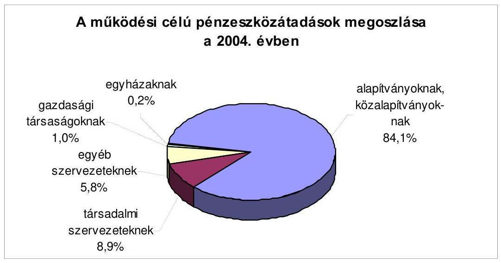
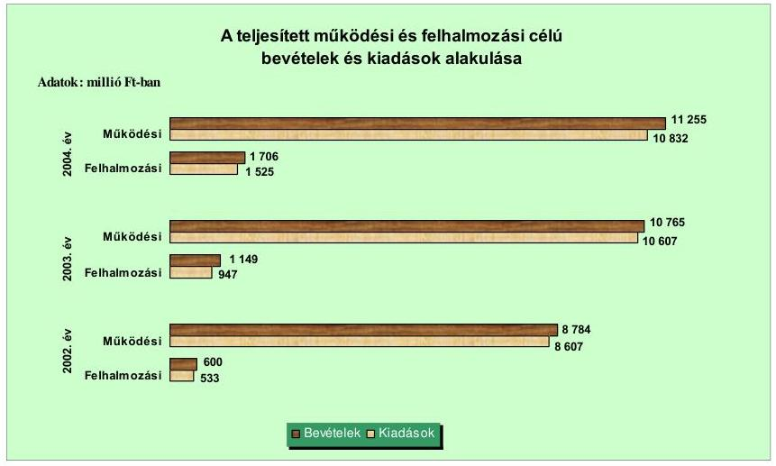
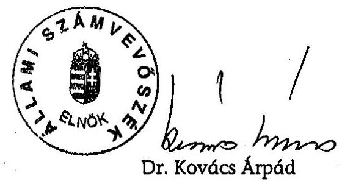
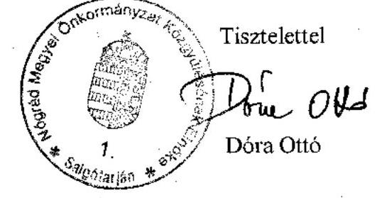

# JELENTÉS 

a Nógrád Megyei Önkormányzat gazdálkodási rendszerének átfogó ellenőrzéséről

---

3. Önkormányzati és Területi Ellenőrzési Igazgatóság
3.3. Átfogó Ellenőrzések Főcsoport
Iktatószám: V-1001-1/27/18/2005.
Témaszám: 749
Vizsgálat-azonosító szám: V0200
Az ellenőrzést felügyelte:
Dr. Lóránt Zoltán
főigazgató
Az ellenőrzés végrehajtásáért felelős:
Dr. Sepsey Tamás
főigazgató-helyettes
Az ellenőrzést vezette:
Csecserits Imréné
főcsoportfőnök-helyettes
Az ellenőrzést végezték:
Bocsi Sándor
főtanácsadó
Holman Magdolna
számvevő
Zeke József
számvevő tanácsos

# A témához kapcsolódó - elmúlt három évben - készített számvevőszéki jelentések: 

címe
sorszáma
Jelentés a helyi és a helyi kisebbségi önkormányzatok 0220 gazdálkodásának átfogó ellenőrzéséről
Jelentés az általános iskolai oktatás minőségének javítását szolgáló 0219 intézkedések ellenőrzésének tapasztalatairól
Jelentés a megyei, fővárosi illetékhivatali tevékenysége 0243 ellenőrzéséről
Jelentés a helyi önkormányzatok tartós szociális ellátási 0317 feladatainak ellenőrzéséről az idősek otthonainál
Jelentés a szakképzési struktúra szerepéről a munkaerőpiaci 0321 igények kielégítésében

---

# TARTALOMJEGYZÉK 

BEVEZETÉS ..... 5
I. ÖSSZEGZŐ MEGÁLLAPÍTÁSOK, KÖVETKEZTETÉSEK, JAVASLATOK ..... 7
II. RÉSZLETES VIZSGÁLATI MEGÁLLAPÍTÁSOK ..... 15

1. A költségvetés tervezésének, végrehajtásának, az Önkormányzat vagyongazdálkodásának és a zárszámadás elkészítésének szabályszerűsége ..... 15
1.1. A költségvetési rendelet jóváhagyásának, módosításának, az előirányzatok nyilvántartásának szabályszerűsége ..... 15
1.2. A gazdálkodás szabályozottsága, a bizonylati rend és fegyelem szabályszerűsége ..... 19
1.3. A pénzügyi-számviteli feladatok ellátásának informatikai támogatottsága ..... 27
1.4. Az önkormányzati vagyon nyilvántartása, számbavétele ..... 29
1.5. A vagyonnal való gazdálkodás szabályszerűsége, célszerűsége, nyilvánossága ..... 32
1.6. A céljelleggel nyújtott támogatások szabályszerűsége ..... 39
1.7. A közbeszerzési eljárások szabályszerűsége ..... 43
1.8. A zárszámadási kötelezettség teljesítésének szabályszerűsége ..... 47
2. Az önkormányzati feladatok és a rendelkezésre álló források összhangja ..... 48
2.1. A feladatok meghatározása és szervezeti keretei ..... 48
2.2. A költségvetés egyensúlyának helyzete ..... 53
2.3. A feladatok finanszírozása ..... 60
3. A belső irányítási, ellenőrzési rendszer múködésének értékelése ..... 63
3.1. Az ellenőrzési rendszer kialakítása, működése ..... 63
3.2. A könyvvizsgálati kötelezettség teljesítése ..... 66
3.3. A korábbi számvevőszéki ellenőrzések javaslatainak hasznosulása ..... 66

---

# MELLÉKLETEK 

1. számú Az Önkormányzat gazdálkodását meghatározó adatok, mutatószámok (1 oldal)
2. számú Az önkormányzati vagyon nagyságának alakulása (1 oldal)
3. számú Az Önkormányzat 2004. évi bevételeinek és kiadásainak alakulása (1 oldal)
4. számú Egyes önkormányzati feladatok finanszírozása (1 oldal)
5. számú Helyszíni ellenőrzési jegyzőkönyv (4 oldal)
6. számú Dóra Ottó úr, a Nógrád Megyei Közgyűlés elnökének észrevétele (1 oldal)

---

# RÖVIDÍTÉSEK JEGYZÉKE 

Ötv.
Áht.
$\mathrm{Kbt}_{. 1}$
$\mathrm{Kbt}_{. 2}$
Számv. tv.
Htv.

Ksztv.
Ámr.

Vhr.

Ber.
ÁSZ
Önkormányzat
Közgyűlés
Közgyűlés elnöke
föjegyzö
Hivatal
Pénzügyi, gazdasági főosztály
Humánszolgáltatási főosztály
Beruházási főosztály
ügyrend ${ }_{1}$
ügyrend $_{2}$
SzMSz

Közbeszerzési bizottság

Közoktatási bizottság

PEB
Ellátó szervezet
a helyi önkormányzatokról szóló 1990. évi LXV. törvény az államháztartásról szóló 1992. évi XXXVIII. törvény a közbeszerzésekről szóló 1995. évi XL. törvény a közbeszerzésekről szóló 2003. évi CXXIX. törvény a számvitelről szóló 2000. évi C. törvény a helyi önkormányzatok és szerveik, a köztársasági megbízottak, valamint egyes centrális alárendeltségű szervek feladat- és hatásköreiről szóló 1991. évi XX. törvény a közhasznú szervezetekről szóló 1997. évi CLVI. törvény az államháztartás múködési rendjéről szóló 217/1998. (XII. 30.) Korm. rendelet
az államháztartás szervezetei beszámolási és könyvvezetési kötelezettségének sajátosságairól szóló 249/2000. (XII. 24.) Korm. rendelet

193/2003. (XI. 26.) Korm. rendelet a költségvetési szervek belső ellenőrzéséről
Állami Számvevőszék
Nógrád Megyei Önkormányzat
Nógrád Megyei Önkormányzat Közgyűlése
Nógrád Megyei Közgyűlés elnöke
Nógrád Megyei Önkormányzat főjegyzője
Nógrád Megyei Önkormányzat Hivatala
Nógrád Megyei Önkormányzat Hivatalának Pénzügyi, Gazdasági Főosztálya
Nógrád Megyei Önkormányzat Hivatalának Humánszolgáltatási Főosztálya
Nógrád Megyei Önkormányzat Hivatalának Beruházási Főosztálya
Nógrád Megyei Önkormányzat Hivatalának Ügyrendje
Nógrád Megyei Önkormányzat Hivatala Pénzügyi, Gazdasági Főosztályának Ügyrendje
Nógrád Megyei Önkormányzat Közgyűlésének 24/2003. (XII. 29.) számú rendelete a közgyűlés és szervei Szervezeti és Müködési Szabályzatáról
Nógrád Megyei Önkormányzat Közgyűlésének Közbeszerzési Bíráló Bizottsága
Nógrád Megyei Önkormányzat Közgyűlésének Közoktatási, Művelődési és Múemlékvédelmi Bizottsága
Nógrád Megyei Önkormányzat Közgyűlésének Pénzügyi Ellenőrző Bizottsága
Nógrád Megye Önkormányzatának Ellátó Szervezete (önállóan gazdálkodó költségvetési szerv)

---

| MEGYEK | Megyei Gyermekvédelmi Központ (önállóan gazdálkodó |
| :-- | :-- |
|  | költségvetési szerv) |
| vagyongazdálkodási | Nógrád Megyei Önkormányzat 28/1999. (IV. 1.) számú |
| rendelet | rendelete az Önkormányzat vagyonáról és a vagyontár- |
|  | gyak feletti rendelkezési jog gyakorlásának szabályairól |
| Kincstár | Magyar Államkincstár |
| TERKI | Területi kiegyenlítést szolgáló fejlesztési célú támogatás |
| CÉDE | Céljellegú decentralizált támogatás |
| TTFC | Térség- és Településfelzárkóztatási Célelőirányzat |
| fejlesztési terv | Az Önkormányzat közoktatási feladatellátási, intézmény- |
|  | hálózat-múködtetési és fejlesztési terve |

---

# JELENTÉS 

## a Nógrád Megyei Önkormányzat gazdálkodási rendszerének átfogó ellenőrzéséről

## BEVEZETÉS

Az Ötv. 92. § (1) bekezdése, az ÁSZ-ról szóló 1989. évi XXXVIII. törvény 2. § (3) bekezdése, valamint az Áht. 120/A. § (1) bekezdése szerint az önkormányzatok gazdálkodását az ÁSZ ellenőrzi. Az ellenőrzés elvégzése az Országgyűlés illetékes bizottságai részére is átadott, országosan egységes ellenőrzési program alapján történt.

Az ellenőrzés célja annak értékelése volt, hogy:

- az önkormányzati gazdálkodás törvényességét ${ }^{1}$, szabályszerűségét biztosították-e a tervezés, a költségvetés végrehajtása, a vagyongazdálkodás és a zárszámadás során;
- az Önkormányzat által ellátott feladatok és az azokhoz rendelkezésre álló források összhangja biztosított volt-e, különös tekintettel egyes kiemelt feladatokra;
- a gazdálkodás szabályszerűségét biztosító belső kontrollok ${ }^{2}$ lehetővé tették-e a szabálytalanságok, hiányosságok, gazdaságtalan megoldások feltárását, megelőzését.

Az ellenőrzött időszak: A 2004. év, valamint a 2005. I. negyedév, az 1.5; 2.1-2.3; és a 3.3 ellenőrzési programpontok esetében ezen túlmenően a 20022003. évek is.

Nógrád megye Magyarország északi részén helyezkedik el, állandó lakosainak száma 2005. január 1-jén 218969 fő volt. A megyében 130 önkormányzat múködik, s az urbanizáció fokát jelzi, hogy a lakosság 44\%-a hat városban él, az 1000 fő alatti települések száma 74.

[^0]
[^0]:    ${ }^{1}$ A törvényi előírások betartásának elmulasztásakor a részletes megállapítások fejezetben egységesen a törvénysértés megjelölést alkalmazzuk, mivel az ÁSZ nem tehet különbséget a törvényi előírások között.
    ${ }^{2}$ A gazdálkodás szabályszerűségét biztosító kontroll alatt értjük a kiépített és működő belső irányítási és szabályozási rendszert, valamint a belső ellenőrzési funkciók ellátását.

---

A Közgyűlés tagjainak száma 40 fő, munkáját kilenc állandó bizottság támogatja. A Közgyűlés elnökének és két alelnökének személye a 2002. évi önkormányzati választásokat követően változott, a főjegyző 1997. március 28 -ától látja el feladatát.

Az Önkormányzat a 2004. évben 12 834,5 millió Ft költségvetési bevételből gazdálkodott. A kiadások $88 \%$-át működési, $12 \%$-át felhalmozási célra fordították. Könyvviteli mérlegében kimutatott vagyonának értéke a 2004. évben 12037 millió Ft-ot tett ki.

Az Önkormányzat 26 költségvetési intézményt tartott fenn, amelyekből 25 önálló, egy részben önálló gazdálkodási jogkörrel rendelkezett, valamint a 2004. évben két olyan gazdasági társaságban volt $100 \%$-os részesedése, amelyek közreműködtek a feladatellátásban. Az Önkormányzat a gyermek és ifjúságpolitikai célok megvalósulásának elősegítésére, a sport értékének megőrzésére, a közművelődés és a kultúra támogatására három alapítványt, valamint az alap- és középfokú oktatás feltételeinek javítására társalapítóként egy alapítványt hozott létre.

A Hivatalban foglalkoztatott köztisztviselők száma 2004-ben 90 fő volt, az intézményekben 2710 közalkalmazott látta el a különböző közszolgáltatásokat és az azokhoz kapcsolódó gazdálkodói teendőket. (Az Önkormányzat gazdálkodását meghatározó adatokat, mutatószámokat a jelentés 1. számú melléklete tartalmazza.)

A jelentés megállapításainak, javaslatainak egyeztetése során a Közgyűlés elnöke arról adott tájékoztatást, hogy az időközben megtett intézkedésekkel a javaslatok egy részét megvalósították. Ezekben az esetekben a jelentés II. Részletes megállapítások fejezetében az adott témához kapcsolt lábjegyzetben a megtett intézkedést feltüntettük és a kapcsolódó javaslatot elhagytuk.

---

# I. ÖSSZEGZŐ MEGÁLLAPÍTÁSOK, KÖVETKEZTETÉSEK, JAVASLATOK 

A Közgyűlés ciklusprogram megnevezéssel fogadta el a 2002-2006. éves időszakra vonatkozó gazdasági programját, ezzel eleget tett az Ötv. előírásának. A 2004. évi és a 2005. évi költségvetési koncepciót a helyben képződő bevételek és az ismert kötelezettségek figyelembevételével a ciklusprogramban foglaltakra alapozva állították össze. A koncepciókat a Közgyűlés elnöke az Áht. előírásai szerinti határidőre, a PEB véleménye csatolásával terjesztette a Közgyűlés elé.

A Közgyűlés elnöke határidőn belül terjesztette be az Önkormányzat 2004. és 2005. évi költségvetési rendelettervezetet, a könyvvizsgáló és a PEB véleményét. A 2004. évi költségvetési rendeletben címrendet a Hivatal kiadásaira állapítottak meg. A Közgyűlés 2005-ben már a költségvetés egészére meghatározta a címrendet, azt azonban még az Önkormányzat 2005. évi költségvetési rendelete jóváhagyásakor nem alkalmazták. A költségvetési rendeletekben a kiadási előirányzatok meghatározása megfelelt az Áht-ban és az Ámr-ben foglaltaknak. A költségvetési rendeletekben a hiány finanszírozását hitel felvétellel tervezték. A költségvetési rendeletekben, illetve a végrehajtásra vonatkozó határozatokban rögzítették a költségvetések végrehajtási szabályait. A Közgyűlés 2005. áprilisban elfogadta a költségvetési és zárszámadási rendelettervezetek előterjesztésekor tájékoztatásul bemutatandó mérlegek, kimutatások tartalmi követelményeire vonatkozó szabályozást, melyben azonban az Áht. előírása ellenére a közvetett támogatásra vonatkozó követelményeket nem állapítottak meg és a költségvetések előterjesztésekor sem mutatták be tájékoztatásként a tervezett közvetett támogatásokat.

Az Önkormányzat a 2004. évi költségvetési rendeletét négyszer módosította, ennek során az előirányzott kiadási főösszeg 9,9\%-kal, a bevételi főösszeg 13,6\%-kal növekedett. A költségvetési rendelet módosítására vonatkozó rendeletek számszaki részletezettsége összehasonlítható volt a költségvetési rendelettel. Az utolsó rendeletmódosításban szereplő előirányzatok megegyeztek a zárszámadási rendeletben kimutatott előirányzatokkal. A pótelőirányzatok, előirányzat módosítások előterjesztése során az Ámr. szerinti, a Közgyűlés tájékoztatására vonatkozó határidőket a Közgyűlés elnöke betartotta. Az előirányzat módosításokat hitelt érdemlően dokumentálták.

Az Önkormányzat SzMSz-ének függeléke az ügyrend ${ }_{1}$. Az ügyrend ${ }_{1}$ a 2005. évi módosítással megfelel az Ámr. szervezeti és múködési szabályzatra vonatkozó előírásainak. A Pénzügyi, gazdasági főosztály, mint gazdasági szervezet ügyrendjét (ügyrend ${ }_{2}$ ) 2005. április 1-jei hatállyal adták ki. Az operatív gazdálkodással összefüggő jogkörök szabályozására a Közgyűlés elnöke és a főjegyző az Ámr. előírásaival összhangban lévő együttes rendelkezést adott ki. A szakmai teljesítés igazolását végző személyeket a vizsgálat ideje alatt kijelölték, a szakmai teljesítés módját az együttes rendelkezés tartalmazta. A kötelezett-

---

ségvállalásra és ellenjegyzésére felhatalmazottak beszámoltatását nem szabályozták, a felhatalmazottakat a jogkörök gyakorlásáról nem számoltatták be.

A főjegyző által elkészített, az intézmények számviteli politikája, számviteli rendje, számviteli szabályozására vonatkozó elveket a Közgyűlés 2005. április hóban tudomásul vette, erről az intézmények az SzMSz előírásainak megfelelően az Önkormányzati közlönyből értesültek.

A Hivatal rendelkezett számviteli politikával, melynek összeállításánál a Vhr. előírásaira alapoztak. A számviteli politika melléklete a leltározási szabályzat, az eszközök és források értékelési szabályzata, a pénz- és értékkezelési szabályzat, a selejtezési szabályzat és a számlarend. Az eszközök és források értékelési szabályzatában az értékvesztés, az értékvesztés visszaírásának rendjét a 2004. évben az illetékhátralékok esetében nem szabályozták. Az illetékhátralékok értékelésére vonatkozó, 2005. évben módosított előírás a Vhr-ben foglaltak ellenére az egyszerűsített értékelési eljárás alá vont illetékkövetelések esetében a lejárat szerinti bontást nem biztosítja. A számlarend összeállításánál a Vhr-ben előírtakat betartották. A szabályozások során éltek az Ámr.-ben biztosított lehetőséggel, engedélyezték, hogy az 50 ezer Ft alatti kifizetések esetében nem szükséges az előzetes írásbeli kötelezettségvállalás, azonban az Ámr. előírásai ellenére nem rögzítették belső szabályzatban ennek rendjét és nyilvántartási formáját.

A Hivatal ellenőrzési nyomvonalában - melyet a főjegyző 2005. április 1-ével hagyott jóvá - meghatározták az egyes gazdálkodási területek kockázatait, a javasolt ellenőrzési pontokat, a felelősöket, a határidőket, az ellenőrzést végzőket, az eltérés megállapításának és dokumentálásának módját, az eltérés esetén szükséges teendőket. A pénzügyi-gazdasági területen dolgozók munkaköri leírásaiban az egyeztetési, ellenőrzési feladatokat szerepeltették.

A főkönyvi számlák további tagolásával, illetve analitikus nyilvántartások vezetésével biztosították a beszámoló adatainak alátámasztását. A könyvviteli nyilvántartásokban elszámolt gazdasági eseményekről a bizonylatokat kiállították. A kötelezettségvállalásokról 2004. október elejéig hiányosan készült a nyilvántartás, 2004. októberétől a Hivatal kiadási előirányzatai esetében azt teljes körűen biztosították. A pénzforgalmi tételek 10,3\%-ánál az Ámr. előírása ellenére nem történt meg az írásbeli kötelezettségvállalás, 1,7\%-ánál nem az arra jogosult vállalt kötelezettséget, a kötelezettségvállalás ellenjegyzése a bizonylatok 13,8\%-ánál hiányzott. Az érvényesítésre is alkalmazott utalványrendeleten az Ámr. előírása ellenére az érvényesítés elvégzését igazoló „érvényesítve" szöveget nem tüntették fel, 2005-ben érvényesítő bélyegző alkalmazásával a hiányosságot megszüntették. A szakmai teljesítés igazolása a bizonylatok 3,8\%-áról az Ámr. előírása ellenére hiányzott, a többi bizonylatnál a szakmai teljesítés igazolást arra nem kijelölt személyek végezték el. Ezen, valamint a kötelezettségvállalási és ellenjegyzési hiányosságok miatt a számviteli elszámolás bizonylatai nem feleltek meg a Számv. tv-ben előírt alaki és tartalmi követelményeknek. A gazdálkodási jogkörök gyakorlása során az Ámr-ben rögzített összeférhetetlenségi követelményeket betartották.

Az Áht. előírását megsértve 2004-ben négy intézménynél és a Hivatalánál különböző arányban ( $0,4-69,7 \%$-kal) túllépték egyes, a Közgyűlés által megállapí-

---

tott kiemelt előirányzatokat (a munkaadót terhelő hozzájárulásokat és a felújítás előirányzatát egy-egy intézménynél, a dologi kiadások és a felhalmozási kiadások előirányzatát két intézménynél). Az előirányzatok túllépésének indokairól a beszámolók keretében szöveges tájékoztatást kértek, felelősségre vonást nem kezdeményeztek.

A pénzügyi, gazdálkodási és számviteli feladatokat a Pénzügyi, gazdasági főosztályon több elemből álló informatikai, ügyviteli rendszerrel látták el. A különböző programok között az adatátvitel - két program kivételével - nem volt megoldott. A Pénzügyi, gazdasági főosztályon 2004-ben bővítették a számítógép állományt. A Hivatal informatikai stratégiáját az Önkormányzat Területi Információs Rendszer és az Intelligens Régió programjai tartalmazták. Az adatvédelmet, az adatbiztonságot, az adattárolást, a jogosulatlan hozzáférés megakadályozását a főjegyző által kiadott adatvédelmi szabályzatban rögzítették. Az informatika területére vonatkozó katasztrófa elhárítási tervet 2005-ben elkészítették. A pénzügyi és számviteli területen alkalmazott felhasználói programokról részletes felhasználói és üzemeltetési dokumentációval rendelkeztek. Az informatikai programok hozzáférési jogosultsági rendszerét, az engedélyezési jogköröket főosztályvezetői utasítás keretében - 2005. április 1-től - szabályozták, a dolgozók munkaköri leírásában azonban nem rendelkeztek az alkalmazott programok használatáról.

Az önkormányzati vagyon nyilvántartását, a törzsvagyon és a forgalomképes vagyon elkülönítését a főkönyvi könyvelésben biztosították. Az üzemeltetésre, kezelésre átadott eszközök a könyvviteli mérlegben a Vhr. előírásai szerint szerepeltek. A víziközmű fejlesztéséből származó vagyonnövekedést az önkormányzat könyvviteli mérlegében kimutatták. A főjegyző rendelkezése alapján a 2004. év végén valamennyi eszközre és forrásra elvégezték a leltározást. A részesedéseket, a rövid- és hosszú lejáratú követeléseket, a kötelezettségeket egyeztetéssel leltározták, az Ámr. előírása ellenére az adósokkal, vevőkkel, szállítókkal nem egyeztettek. Az üzemeltetésre átadott eszközök egyeztetéssel való leltározása nem felelt meg a Vhr. előírásának, az üzemeltetési szerződések nem tartalmazták az átadott eszközök leltározására vonatkozó előírásokat. A leltározás értékelését elvégezték, leltáreltérést nem állapítottak meg. A Vhr. előírásaival szemben az illetékkövetések esetében nem vizsgálták az értékvesztés elszámolásának szükségességét és indokoltságát, az értékvesztést nem számolták el. Az értékelési szabályzat alapján elvégezték a részesedések év végi értékelését, amelyhez a szükséges adatok rendelkezésre álltak.

Az Önkormányzat vagyonával kapcsolatos gazdálkodási feladatokat, hatásköröket a vagyongazdálkodási rendeletben célszerűen rögzítették. A vagyongazdálkodási rendeletben szabályozták a követelésről való lemondás eseteit és módját, azonban az Áht. előírását megsértve 2004. júniusától nem rendelkeztek a vagyon tulajdonjoga ingyenes átruházásának eseteiről. Megállapították azt az értékhatárt, amely felett a vagyontárgyak értékesítése csak nyilvános versenytárgyalás útján valósulhatott meg, azonban lehetőséget biztosítottak a Közgyűlés számára versenyeztetés mellőzésére, ezzel megsértették az Áht. előírását. A szabályozás nem segítette a köztulajdonnal való gazdálkodás nyilvánosságát. A közpénzek felhasználására, a köztulajdon használatának nyilvánosságára, átláthatóbbá tételére vonatkozó Áht. előírását megsértve, az Önkormányzat nem teljesítette a nettó öt millió Ft-ot elérő vagy azt meghaladó

---

értékű építési beruházásra, szolgáltatás megrendelésére, vagyonértékesítésre előírt közzétételi kötelezettségét. Az ingatlan adásvételi szerződések, a hasznosításra irányuló szerződések az Önkormányzat számára garanciális elemeket (tulajdonjog változás földhivatali bejegyzésének feltételeit, késedelmes fizetés szankcióit, a szerződéstől való elállás lehetőségét) tartalmaztak, a döntéseknél a vagyongazdálkodási rendeletben foglalt hatásköri szabályokat betartották. Az Önkormányzat követelésről nem mondott le, a térítésmentes átadásoknál betartották a vagyongazdálkodási rendeletben foglalt döntési hatásköröket, azonban két átadás nem felelt meg a vagyongazdálkodási rendeletben foglaltaknak, mert abban nem határozták meg a térítésmentes átadás eseteit, ezért a döntéssel megsértették az Áht. előírását.

Az Önkormányzat külső szervek részére a 2004. évben 65221 ezer Ft céljellegü támogatást nyújtott. A támogatási döntéseket a költségvetési rendeletben és a végrehajtására kiadott határozatban foglalt helyi szabályozásnak megfelelően hozták meg. Az elnöki keretből és a pályázati úton alapítványoknak nyújtott 2004. évi támogatásokról az Ötv. előírását megsértve 87\%-ban nem a Közgyűlés határozott. Nem írtak elő számadási kötelezettséget az alapítványok részére biztosított éves múködési támogatások valamint a kiemelt rendezvények támogatása esetében, amellyel megsértették az Áht. előírását, a többi támogatott részére az Áht.-ben előírtaknak megfelelően a felhasználásról való számadási kötelezettséget előírták. Az elnöki keretből nyújtott támogatások esetében a Ksztv. előírása ellenére a közhasznú szervezetekkel nem kötöttek írásbeli megállapodást. A 204 támogatott szervezetből 24 támogatott nem készített elszámolást, 55 támogatott késve tett eleget kötelezettségének. A támogatásban részesültek számadásainak tartalmi és formai ellenőrzését a számlamásolatok alapján végezték el, a támogatások felhasználását a helyszínen nem ellenőrizték. A számadási kötelezettségüket nem teljesítőket a 2005. évben felszólították a számadás pótlására. Az Önkormányzat - az Áht. előírását megsértve - nem kezdeményezte a támogatások visszafizetését azokban az esetekben, amikor a támogatott szervezetek számadási kötelezettségüknek nem tettek eleget, nem igazolták a rendeltetésszerú felhasználást.

A Közgyűlés a 2004. május 1-ig hatályban volt közbeszerzési rendeletében szabályozta az Önkormányzat és az intézmények közbeszerzéseinek rendjét. Az eljárást lezáró határozatok meghozatalának segítése érdekében előkészítő munkacsoportot hoztak létre. A Kbt., alapján lebonyolított közbeszerzési eljárásoknál a közbeszerzési eljárás fajtájának kiválasztásánál, egy közbeszerzési eljárás kivételével az ajánlatok bontásánál, az elbírálásnál, az eljárás eredményének kihirdetésénél és közzétételénél az előírásokat betartották. Az Önkormányzat az éves összegzést elkészítette. A Közbeszerzési Döntőbizottság egy közbeszerzési eljárás esetében az eljárást lezáró döntést megsemmisítette és az Önkormányzat részére bírságot szabott ki. Az éves összegzés szerint 2004-ben három önállóan gazdálkodó intézmény nem folytatott le közbeszerzési eljárást élelmiszer beszerzése esetében, valamint az Önkormányzat a költségvetési rendeletében meghatározott felújítási feladatokra, ezzel nem tettek eleget a Kbt.. ${ }_{1}$ előírásának. A Kbt. ${ }_{2}$ előírásának megfelelően a Közbeszerzési Szabályzatot elkészítették. A 2004. év közben újonnan indított felújítási feladatokra a közbeszerzési eljárást lebonyolították.

---

A Közgyűlés elnöke határidőn belül terjesztette a Közgyűlés elé az Önkormányzat 2004. évi zárszámadási rendelettervezetét. A rendelettervezet az Áht. előírásának megfelelően a költségvetési rendelettel összehasonlítható módon készült. A zárszámadásban az utolsó költségvetési rendeletmódosítás szerinti előirányzatokat szerepeltették. A zárszámadásban az előirányzatok és teljesítésük részletezése megfelelt az Áht-ban foglaltaknak. A zárszámadásban az Áht. előírása ellenére nem mutatták be a Közgyűlésnek a közvetett támogatásokat szöveges indokolással és a több éves kihatással járó döntések szöveges indokolását. Az Önkormányzat a zárszámadási rendeletben a Hivatal és az intézmények pénzmaradványát a Vhr., illetve az Ámr. előírásai alapján állapította meg. Az intézményeket éves számszaki beszámolójának és múködésének elbírálásáról, jóváhagyásáról az Ámr-ben foglaltak ellenére - a pénzmaradvány jóváhagyásának megfelelő időpontig - írásban nem értesítették.

A Közgyűlés az SzMSz-ben határozta meg az Önkormányzat kötelezően ellátandó és önként vállalt feladatait. A feladatokat és azok ellátási módját a négyéves ciklusprogram, valamint az ágazati koncepciók tartalmazták részletesen. Az Önkormányzat az egészségügyi, a szociális, a közoktatási és a közművelődési közfeladatait költségvetési intézményein keresztül látta el, a feladatok ellátásában további öt közalapítvány is szerepet vállalt. A közszolgáltatások biztosításába bevont egy gazdasági társaságot. A 2002. évtől a helyszíni ellenőrzésig végrehajtott szervezeti változások részben a települési önkormányzatok által átadott, illetve visszakért kötelező feladatokat ellátó intézmények átadás-átvételéhez, részben a feladatok racionálisabb megszervezése érdekében végrehajtott intézményi átalakításokhoz kapcsolódtak, melynek következtében az intézmények száma eggyel csökkent. Az ágazati koncepcióban meghatározott átfogó tervet nem készítettek.

A Közgyűlés jelentős ráfordítást igénylő, nem kötelező feladatok ellátását nem vállalta fel, az önként vállalt feladatok kiadásai költségvetésen belüli részaránya nem érte el az 1\%-ot. Az önként vállalt feladatok finanszírozása nem veszélyeztette a kötelezően ellátandó feladatok végrehajtását.

A 2002-2005. év között az Önkormányzat éves költségvetési rendeleteiben a költségvetési kiadások meghaladták a költségvetési bevételeket. Az Önkormányzat gazdálkodása a 2002-2004. évi beszámolóinak teljesítési adatai alapján egyensúlyban volt, a költségvetési bevétel fedezetet nyújtott a költségvetési kiadásokra, működési célú hitelt nem vettek fel. A múködési célú bevételek és kiadások közötti egyensúly - az intézményi múködési bevételek, az illetékbevételek túlteljesítését, valamint a pénzmaradvány igénybevételt követően biztosított volt. Az intézményi múködési bevételeket alultervezték és a pénzmaradvány összegét tervszinten figyelmen kívül hagyták, ami hozzájárult a tervezett hiány kialakulásához. A havonta aktualizált likviditási terv megfelelt az Ámr. előírásainak. Az Önkormányzat a 2002-2004. évek között pályázati forrásokat nyert el feladatellátásához. A pályázatok benyújtásához kapcsolódó döntések meghozatalakor, a külső források igénybevételekor, a központi és a helyi szabályozás szerinti hatásköri előírásokat betartották.

Az Önkormányzat feladatainak ellátásához rendelkezésre álló források közül a 2004. évben az állami támogatás a kiadások valamivel több mint felét fedezte a két legnagyobb költségvetési volument képviselő tevékenységnél, a

---

bentlakásos szociális intézményi ellátásnál, és a középiskolai ellátásnál. Az állami támogatás kevesebb, mint a felére nyújtott fedezetet az általános iskolai oktatás, a fogyatékos tanulók oktatása, az alapfokú művészetoktatás, és a megyei gyermekvédelmi feladatok esetében. A saját bevételek a legnagyobb arányban, a kiadások közel egyharmadát a bentlakásos szociális intézményi ellátásnál finanszírozták a 2004. évben. A tevékenységcsoportok kiadásainak emelkedésében a központi intézkedés eredményeként végrehajtott bérfejlesztés volt a meghatározó. A fenntartott intézmények kapacitáskihasználása a közoktatásban - az alapfokú művészetoktatást kivéve - kismértékben csökkent, míg a bentlakásos szociális intézmények teljes kihasználtsággal működtek. Az Önkormányzat ezért a közoktatás két feladat-ellátási területén is csökkentette az engedélyezett férőhelyek számát, a bentlakásos szociális intézmények férőhelyeit pedig 25 fővel növelte.

Az Önkormányzat a 2002., a 2003. és a 2005. évben fejlesztési célra összesen 45,9 millió Ft, 2003-ban a Szent Lázár Megyei Kórház kötelezettségeinek időleges átvállalására 40 millió Ft hitelt vett fel. A hitelfelvétel indokoltságát a PEB az Ötv-ben foglalt kötelezettsége ellenére nem vizsgálta meg. Az adósságot keletkeztető kötelezettségvállalás során a felső korlátot betartották, annak 0,2-13,8\%-át érték el. Az adósságot keletkeztető kötelezettségvállalás nem veszélyeztette az Önkormányzat fizető- és működőképességét.

Az Önkormányzat a fogyatékos személyek jogairól és esélyegyenlőségük biztosításáról szóló törvény alapján a középületekben az akadálymentes közlekedés kialakítására vonatkozó kötelezettségének a teljesítését az intézmények felújítási, korszerűsítési, bővítési munkáival kapcsolta össze. A törvényben megjelölt 2005. január 1-i határidőre a feladatok elvégzését nem teljesítette. A megvalósult fejlesztések eredményeként 2004. novemberében a szociális ágazatban a legkedvezőbb a helyzet, ahol az akadálymentes középületek aránya $26,2 \%$ volt.

Az Önkormányzat a feladatkörébe utalt ellenőrzés végrehajtásának szervezeti kereteit kialakította, a Közgyűlés 2004. májusában belső ellenőrzési egységet hozott létre, melynek tevékenysége során a funkcionális és szervezeti függetlenség érvényesült. A főjegyző a Ber-ben meghatározott tartalommal helyezte hatályba az Önkormányzat Ellenőrzési nyomvonalát és a Belső Ellenőrzési Kézikönyvét. Az átdolgozott Belső Ellenőrzési Szabályzat alapján a Hivatal Belső Ellenőrzési Csoportja ellátta a belső ellenőrzési feladatokat, a Hivatal működési rendjének, valamint az Önkormányzat által fenntartott intézmények pénzügyi, gazdasági ellenőrzését, szakmai vizsgálatát. A főjegyző jóváhagyta az ellenőrzési munka tervszerű lebonyolításához szükséges éves, középtávú és a stratégiai tervét. Az ellenőrzésekhez a Ber. előírásai szerinti ellenőrzési programot és megbízólevelet használtak. A jelentések az Önkormányzat hatályos ellenőrzési szabályozásának és a Ber-nek megfelelő szerkezetben, jó színvonalon készültek. A javaslatok a részletes megállapításokra épültek, jelentős segítséget nyújtva ezáltal a hatékony intézkedésekhez. Az intézkedési tervek végrehajtásának utóellenőrzését önállóan, vagy a következő rendszerellenőrzés során végezték el. Az ellenőrzések hasznosítható tapasztalatait értekezletek keretében az intézményvezetők számára minden évben közreadták. A Közgyűlés az ellenőrzések

---

megvalósulásának áttekintését a PEB-re ruházta át, amely évente tájékoztatást kapott az ellenőrzési munkáról.

Az Önkormányzat a könyvvizsgálati kötelezettséget teljesítette. A könyvvizsgáló kiválasztásánál és megbízásánál betartották a szakmai követelményekre és az összeférhetetlenségre vonatkozó előírásokat. A könyvvizsgáló vizsgálta a költségvetési és a zárszámadási rendelettervezeteket. A 2004. évi egyszerűsített beszámolót hitelesítő záradékkal látta el, auditálási eltérést nem állapított meg.

Az ÁSZ 2002-2004. között az Önkormányzatnál öt témavizsgálatot végzett, és 2001-ben ellenőrizte átfogóan a pénzügyi-gazdasági tevékenységet. Az Önkormányzat a számvevői jelentésekben tett javaslatokat elfogadta. A jelentésekben foglaltakról tájékoztatták a Közgyűlést. A javaslatok hasznosítására intézkedési terveket készítettek. Az javaslatok közel kilenctizedét részben, vagy egészben megvalósították. A pénzügyi-gazdasági tevékenység átfogó vizsgálata javaslatait figyelembe véve a felújítási és a felhalmozási kiadásokat feladatonként szerepeltetették a költségvetési rendeletben, a költségvetési előirányzatok megalapozását szolgáló rendelkezéseket a költségvetési keretszámok kialakítását megelőzően hozták meg, a nyilvántartási hiányosságokat megszüntették, de továbbra is előfordult előirányzat túllépés. A munka színvonalának javítása érdekében tett javaslatok döntő többségét teljesítették. Az illetékhivatali múködés szabályszerűségének, színvonalának javítására tett - illetékelőleg megállapítással, kötelezettségvállalási szabályozással, személyi és tárgyi feltételek javításával, ügyintézési idő csökkentésével kapcsolatos - javaslatok többségét megvalósították. Az általános iskolai oktatás minőségének javítását szolgáló - a pedagógiai szakmai szolgáltatásokra, a fejlesztési tervre vonatkozó - intézkedéseket és a szakképzéssel kapcsolatos javaslatokat végrehajtották. A szociális feladatok kapcsán tett javaslatra folyamatban van egy 150 férőhelyes szociális otthon építésének előkészítése. Az egészségügyi beruházások vizsgálatának javaslatára tekintettel a kórházi rekonstrukció záró ütemének megvalósításával generálkivitelezőt kívánnak megbízni.

A helyszíni ellenőrzés megállapításainak hasznosítása mellett javasoljuk:

# a Közgyűlés elnökének: 

a jogszabályi előírások maradéktalan betartása érdekében:

1. gondoskodjon a középületek akadálymentessé tételéről a fogyatékos személyek jogairól és esélyegyenlőségük biztosításáról szóló 1998. évi XXVI. törvény 29. § (6) bekezdésében előírtak végrehajtása érdekében;
a munka színvonalának javítása érdekében:
2. számoltassa be a felhatalmazottakat a kötelezettségvállalási és utalványozás jogkörök gyakorlásáról;
3. terjessze a számvevőszéki jelentést a Közgyűlés elé, a feltárt hiányosságok megszüntetése érdekében készíttessen intézkedési tervet;

---

# a föjegyzönek 

a jogszabályi előírások maradéktalan betartása érdekében:

1. kezdeményezze, hogy a költségvetési és a zárszámadási rendelettervezet előterjesztésekor a Közgyűlés részére tájékoztatásul mutassák be az Áht. 116. §. 10. pontja előírásának megfelelően a közvetett támogatásokat, valamint a zárszámadási rendelettervezet előterjesztésekor az Áht. 116. § 9. pontjában előírtaknak megfelelően a több éves kihatással járó döntések szöveges indokolását;
2. a gazdálkodási és pénzügyi- számviteli feladatok szabályozása és az év végi értékelési feladatok keretében:
a) határozza meg az eszközök és források értékelési szabályzatában az egyszerűsített értékelési eljárás alá vont illetékhátralékok értékeléséhez a Vhr. 9. számú melléklete 2. c) pontjában foglalt előírás alapján a lejárat szerinti bontás kötelezettségét;
b) biztosítsa, hogy a követelések és a kötelezettségek egyeztetéssel történő leltározása keretében a Vhr. 37. § (3) bekezdése és a Vhr. 9. számú mellékletében foglalt előírások alapján a követeléseket és a kötelezettségeket az adósokkal, vevőkkel, szállítókkal egyeztessék;
c) gondoskodjon arról, hogy a Vhr. 31. § (2) bekezdésének előírása alapján - az év végi értékelési feladatok keretében - vizsgálják az illetékkövetelések esetében az értékvesztés elszámolásának szükségességét, indokolt értékvesztést mutassák ki;
3. gondoskodjon arról, hogy a kötelezettségvállalás és az utalványozás ellenjegyzői az Ámr. 134. § (9) bekezdése, az érvényesítők az Ámr. 135. § (1) bekezdése és a szakmai teljesítést igazolók az Ámr. 135. § (3) bekezdése alapján az ellenőrzési feladatokat teljesítsék és a feladat elvégzését igazolják;
a munka színvonalának javítása érdekében:
4. gondoskodjon a gazdálkodási és ellenőrzési jogkörrel felhatalmazottak beszámoltatásának szabályozásáról, az ellenjegyzésre jogosultakat a jogosultság gyakorlásáról számoltassa be.

---

# II. RÉSZLETES VIZSGÁLATI MEGÁLLAPÍTÁSOK 

## 1. A KÖLTSÉGVETÉS TERVEZÉSÉNEK, VÉGREHAJTÁSÁNAK, AZ ÖNKORMÁNYZAT VAGYONGAZDÁLKODÁSÁNAK ÉS A ZÁRSZÁMADÁS ELKÉSZÍTÉSÉNEK SZABÁLYSZERŰSÉGE

### 1.1. A költségvetési rendelet jóváhagyásának, módosításának, az előirányzatok nyilvántartásának szabályszerűsége

A Közgyűlés a 7/2003. (II. 13.) számú határozatával fogadta el ciklusprogram megnevezéssel a 2002-2006. éves időszakra vonatkozó gazdasági programját, ezzel eleget tett az Ötv. 91. § (1) bekezdése előírásának.

A program tartalmazta az Önkormányzat múködésének főbb alapelveit, az Önkormányzat kiemelt feladatait a lakosság ellátás területén, ezen belül a közoktatás, közművelődés, egészségügyi szakellátás, szociális ellátás, idősügyi, gyermekvédelmi, ifjúsági, sport múködtetési és fejlesztési feladatokat. Célkitűzéseket fogalmaztak meg a térségfejlesztés területén a területfejlesztésre, az intézményeket érintő rekonstrukciókra, a környezetvédelemre. A célkitűzések megvalósításához figyelembe vehető forrásokat nem számszerúsítették, a megvalósítást a mindenkori költségvetési helyzethez igazodóan tervezték.

A Közgyűlés elnöke a ciklusprogramban megfogalmazottakat figyelembe véve kialakított 2004. évi költségvetési koncepciót az Áht. 70. §-ában előírt november 30-i határidőt betartva, 2003. november 12-én terjesztette a Közgyűlés elé. Az előterjesztést az Önkormányzatnál működő bizottságok előzetesen megtárgyalták, az Ámr. 28. § (3) bekezdésében előírtaknak megfelelve a Közgyűlés elnöke csatolta az előterjesztéshez a pénzügyi bizottsági feladatok ellátásával megbízott PEB koncepció-tervezetről alkotott írásos véleményét.

A Közgyűlés a 105/2003. (XI. 27.) számú határozatával elfogadta a 2004. évi költségvetési koncepciót, amelyben figyelembe vették a helyben képződő bevételeket. Az ellátandó feladatok kiadási szükségletét az intézményektől bekért adatokra alapozva, az Önkormányzat ismert kötelezettségei figyelembevételével számították. A koncepcióban feladatokat határoztak meg a költségvetés összeállításához.

A 2005. évi koncepció összeállításánál, beterjesztésénél, tárgyalásánál a 2004. évi koncepcióval azonosan jártak el.

A 2004. és a 2005. évi költségvetési rendelettervezetek elkészítését megelőzően a Hivatal vezetői és az érintett szakelőadók az intézményekkel egyeztetést folytattak le. Az egyeztetésről készített jegyzőkönyvekben rögzítették a javasolt kiemelt előirányzatokat. Az egyeztetés során nem merült fel olyan ügy, amely a Közgyűlés döntését igényelte volna.

---

Az Önkormányzatnál a vizsgált időszakra vonatkozóan az Áht. 118. §-ában foglaltakat megsértve a mérlegek, kimutatások tartalmi követelményeiről nem rendelkeztek. A Közgyúlés a 2005. április 21-i ülésén tárgyalta a költségvetési és zárszámadási rendelete tartalmának meghatározására, a költségvetés végrehajtásának szabályozására vonatkozó előterjesztést, és a 8/2005. (IV.29.) számú rendeletével elfogadta a szabályozást. Az Áht. 116. § 10. pontja szerinti közvetett támogatások kimutatásra vonatkozóan követelményeket nem állapítottak meg ${ }^{3}$.

A Közgyűlés elnöke határidőre ${ }^{4}$, 2004. január 28-án terjesztette be az Önkormányzat 2004. évi költségvetés tervezetét. A 2005. évi költségvetés tervezetét - szintén betartva a határidőt - 2005. február 2-án küldte meg Közgyűlés tagjainak. A Közgyűlés elnöke a 2004., és a 2005. évi költségvetési rendelettervezethez a könyvvizsgálói véleményt és az Ámr. 29. § (9) bekezdésében foglaltaknak megfelelően a PEB véleményét mellékelte.

A költségvetés készítését megelőzően, a 2003. december 18-i ülésén tárgyalta a Közgyűlés az előirányzatok megalapozása céljából a térítési díjakról szóló rendeleteit ${ }^{5}$. A költségvetési rendelettervezetben terjesztették a Közgyűlés elé a lakások bérletéről szóló rendeletben ${ }^{6}$ megállapított díjak mértékének módosítását.

A rendelettervezeteket a koncepciókban meghatározottak figyelembevételével, a koncepciókra alapozva állították össze. A rendelettervezetekben bemutatták a hitelek és a beruházások több évre átnyúló hatását, illetve az Áht. 71. § (2) bekezdésében foglaltaknak megfelelően a 2005-2006. év, illetve a 2006-2007. év várható bevételeit és kiadásait.
${ }^{3}$ A közbenső egyeztetés során a Közgyűlés elnöke által írásban adott tájékoztatás szerint 2005. szeptember 13-án írásban a közgyűlés tagjai elé terjesztette, az érintett bizottságok megtárgyalták és elfogadásra javasolták Nógrád Megye Önkormányzata költségvetési és zárszámadási rendelete tartalmának meghatározásáról, a költségvetés végrehajtásának szabályozásáról szóló 8/2005.(IV.29.) rendelet módosítására vonatkozó javaslatát, amelyben szabályozásra került a közvetett támogatások bemutatásának rendje, a több éves kihatással járó döntések szöveges indokolási kötelezettségének előírása.
${ }^{4}$ Az Áht. 71. § (1) bekezdése előírása szerint a költségvetési rendelettervezet beterjesztési határideje 2004-ben és 2005-ben február 15-e volt.
${ }^{5}$ Az Önkormányzat 26/2003. (XII. 29.) számú rendelete az általa fenntartott szociális intézményekben fizetendő térítési díjak megállapításáról, illetve a 27/2003. (XII. 29.) számú rendelete az általa biztosított gyermekvédelmi ellátások intézményi térítési díjak megállapításáról.
${ }^{6}$ Az Önkormányzat 2/2000. (II. 23.) számú rendelettel módosított, a megyei Önkormányzat tulajdonában lévő lakások bérletéről szóló 29/1999. (IV. 1.) számú rendelete.

---

A 2004. évi költségvetési rendeletben ${ }^{7}$ az Áht. 67. §-ában foglalt előírásoknak nem tettek eleget, mivel a címrendet a Hivatal kiadásain kívül a további kiadásokra nem állapítottak meg. Az Önkormányzat költségvetési és zárszámadási rendelete tartalmának meghatározására, a költségvetés végrehajtásának szabályozására vonatkozó 8/2005. (IV. 29.) számú rendelete 3. §ában a költségvetés egészére határoztak meg címrendet, azt azonban még az Önkormányzat 2005. évi költségvetési rendelete ${ }^{8}$ jóváhagyásakor nem alkalmazták.

Az Önkormányzat a költségvetési rendeletekben az Áht. 69. § (1) bekezdésében és az Ámr. 29. § (1) bekezdésében foglaltaknak megfelelve szerepeltette a múködési előirányzatokat és teljesítésüket Önkormányzat összesen, illetve intézményenként, azon belül kiemelt előirányzatonként, a létszámkereteket, a felújítási feladatokat célonként, a felhalmozási kiadásokat feladatonként, a Hivatal költségvetését feladatonként, az általános és a céltartalékot, valamint a több éves kihatással járó feladatok előirányzatait éves bontásban, továbbá a működési és felhalmozási mérlegeket egymástól elkülönítetten. Elkészítették az előirányzat felhasználási ütemtervet.

A 2004. évi költségvetési rendeletben a kiadási főösszeget 12187120 ezer Ftban, a bevételi főösszeget 11631804 ezer Ft-ban, a hiányt 555316 ezer Ft-ban határozták meg. Az Áht. 8/A. § (1) bekezdésében foglalt előírásnak megfelelően a költségvetési rendeletben rendelkeztek a hiány fedezetének módjáról, amely az Áht. 8/A. § (2)-(3) bekezdését figyelembe véve a finanszírozási célú pénzügyi műveletek között kimutatott hitelfelvétel volt.

A Közgyűlés döntött a költségvetés végrehajtásával összefüggő helyi szabályokról:

- az előirányzatok évközi megváltoztatásával összefüggő hatáskört a Közgyűlés nem ruházott át;
- az intézményeknek a kiemelt előirányzatokon belüli részelőirányzatok átcsoportosítására biztosított jogosultságot, a költségvetési főösszeg, a kiemelt előirányzatok módosítását kezdeményezhették;

A kialakult gyakorlat szerint a főjegyző a költségvetési rendelet módosítását megelőzően az intézmények részére körlevelet adott ki, mely alapján az intézmények előírt formátumban, szöveges indokolással kezdeményezték a költségvetésük kiadási, bevételi főösszegének, a kiemelt előirányzatoknak a költségvetési rendeletben történő módosítását.

- a tartalékkal való rendelkezési jogot a Közgyűlés a hatáskörében tartotta;

[^0]
[^0]:    ${ }^{7}$ Az Önkormányzat 2/2004. (II. 19.) számú rendelete Nógrád Megye Önkormányzata 2004. évi költségvetéséről.
    ${ }^{8}$ Az Önkormányzat 2/2005. (II. 25.) számú rendelete Nógrád Megye Önkormányzata 2005. évi költségvetéséről.

---

- a Közgyűlés elnöke felhatalmazást kapott az átmenetileg szabad pénzeszközök három hónapot meg nem haladó lekötésére, illetve a szükséges hitelfelvételek bonyolítására.

A 2004. évi, illetve a 2005. évi költségvetések előterjesztésekor eleget tettek az Áht. 118. §-ában foglalt kötelezettségüknek, bemutatták az Áht. 116. § 6. pontja alapján az Önkormányzat összevont mérlegeit, illetve a több éves kihatással járó döntéseket számszerúsítették az Áht. 116. § 9. pontjában előírtaknak megfelelően. Az Áht. 116. § 10. pontja előírását megsértve nem tájékoztatták a Közgyűlést a közvetett támogatásokról.

Az Önkormányzat a megyei önkormányzat által biztosított személyes gondoskodást nyújtó gyermekvédelmi szakellátások formáiról és igénybevételéről szóló 12/1998. (V. 1.) számú rendelete 11. § (6) és (7) pontjában, illetve az Önkormányzat által biztosított személyes gondoskodást nyújtó, szakosított szociális ellátásokról szóló 27/2000. (XII. 29.) számú rendelete 11. § (8) és (10) pontjában a Közgyűlés elnökének hatáskört adott térítési díj csökkentésére, vagy elengedésére, melyek révén a Közgyűlés elnöke az érintetteknek közvetett támogatást nyújtott.

Az Önkormányzat a 2004. évi költségvetési rendeletét négy alkalommal ${ }^{9}$ módosította. A módosítások révén a kiadási főösszeg 13397479 ezer Ft-ra, 9,9\%-kal növekedett, a bevételi főösszeg 13218586 ezer Ft-ra, 13,6\%-kal nőtt. A bevételi oldalon 428279 ezer Ft-tal nőtt az intézményi működési bevételek előirányzata, melyből 207000 ezer Ft a Szent Lázár Megyei Kórház gázdíj továbbszámlázásból keletkezett bevételi többlete. 376395 ezer Ft volt az eredeti előirányzatként nem tervezett 2003. évi pénzmaradvány. Az illetékbevételek előirányzatát 187322 ezer Ft-tal, 13,9\%-kal növelték. A kiadásokon belüli növekedés a felhalmozási kiadásoknál, a dologi kiadásoknál és a személyi juttatásoknál volt 100000 ezer Ft feletti összegű, a felhalmozási kiadások előirányzata 469074 ezer Ft-tal emelkedett a 2003. évi pénzmaradvány igénybevétele, a központi támogatások (címzett támogatás, TERKI, CÉDE, TTFC támogatások), illetve intézményi pénzátvételek miatt. A 2004. évi költségvetési rendeletmódosításoknál az Ámr. 53. § (2) bekezdésében foglaltakat a Közgyűlés elnöke teljesítette, a költségvetési fejezet, elkülönített állami pénzalaptól érkezett pótelőirányzatokról negyedéven belül a Közgyűlést tájékoztatta.

Az önállóan gazdálkodó intézmények előirányzat módosítási kezdeményezései a főjegyző felhívó leveleihez igazodóak voltak. Az intézményi kezdeményezésű előirányzat változtatások kapcsán az Ámr. 53. § (6) bekezdése szerinti előírásokat a Közgyűlés elnöke teljesítette, 30 napon belül tájékoztatta a Közgyűlést.

A 2004. évi költségvetési rendelet módosítására vonatkozó rendeletek számszaki részletezettsége összehasonlítható a költségvetési rendelettel. Az utolsó rendeletmódosításban szereplő előirányzatok megegyeztek a zárszámadási rendeletben ${ }^{10}$ kimutatott előirányzatokkal. A 2005. február 17-i előirányzat módosítás

[^0]
[^0]:    ${ }^{9}$ Az Önkormányzat 2004. évi költségvetésének módosításáról szóló 10/2004. (VI. 4.), 12/2004. (X. 8.), 15/2004. (XII. 3.) és 1/2005. (II. 25.) számú rendeletei.
    ${ }^{10}$ Az Önkormányzat 7/2005. (IV.29.) számú rendelete a 2004. évi költségvetés végrehajtásáról és a megyei önkormányzat vagyonkimutatásáról.

---

során módosították az illeték bevételi többlet miatt az előirányzatot, a megelőző rendeletmódosítás után számszerűsített intézményi működési bevételi többletek előirányzatait, az intézmények kezdeményezésére a működési és fejlesztési célú pénzeszköz átvételek előirányzatait, illetve ezekkel összefüggésben a kiadási előirányzatokat.

2005 I. negyedévében a 2005. évi költségvetési rendeletet nem módosították. Az első módosításra a Közgyűlés 2005. április 21-i ülésén került sor, addig Kormánytól, központi fejezettől, elkülönített állami pénzalaptól pótelőirányzatot nem kaptak.

Az előirányzatok módosításait hitelt érdemlően dokumentálták. A költségvetési rendelet mellékleteiben meghatározott kiemelt előirányzatokról analitikus nyilvántartást vezettek.

# 1.2. A gazdálkodás szabályozottsága, a bizonylati rend és fegyelem szabályszerűsége 

A Hivatal alapító okiratát a Közgyűlés a 19/2000. (XII. 1.) számú rendeletével fogadta el. Az Önkormányzat SzMSz-e 8. számú függelékeként kiadott 4/2004. számú főjegyzői rendelkezés a Hivatal ügyrendje ${ }^{11}$. Az ügyrend ${ }_{1}$ az Ámr. 10. § (4) bekezdésében a szervezeti és múködési szabályzatra vonatkozóan előírtaknak a 2005. március 29-i dátumozással kiadott 8. számú függelékkel megfelelt, tartalmazta a Hivatal szervezeti felépítését, működésének rendszerét, a szervezeti egységek megnevezését, és az ügyrend ${ }_{1}$ függelékében rögzítették az ellátott alaptevékenységet.

Az Ámr. 17. § (5) bekezdése ellenére a vizsgált időszakra vonatkozóan a gazdálkodó szervezetnek nem volt elfogadott ügyrendje. A főjegyzői rendelkezés 2005. március 30-i módosításának megfelelően a Pénzügyi, gazdasági főosztály vezetője 2005. április 1-i hatállyal kiadta a Pénzügyi, gazdasági főosztály, mint gazdasági szervezet ügyrendjét. A ügyrend ${ }_{2}$-ben az Ámr. 17. § (5) bekezdése előírásának megfelelően meghatározták a Hivatal gazdasági szervezete pénzügyi-gazdasági feladatok ellátásáért felelős személyek feladatait, a vezetők és más dolgozók részletes feladat-, hatás-, és jogkörét. Részletezték a munkaköröket, szabályozták a munkamegosztást és felelősségrendszert.

Az operatív gazdálkodással összefüggő jogköröket 2004. május 30-ig Közgyűlés elnöki, illetve főjegyzői utasításban ${ }^{12}$, 2004. június 1-jei hatállyal a Közgyűlés elnöke és a főjegyzö együttes rendelkezésében szabályozták ${ }^{13}$ :

[^0]
[^0]:    ${ }^{11}$ A főjegyzői rendelkezés 2004. május 1-jén lépett hatályba, addig a 10/2001. számú főjegyzői rendelkezés szerinti ügyrend volt érvényben.
    ${ }^{12}$ A 2/2002. Közgyűlés elnöki rendelkezéssel módosított 2/2001. Közgyűlés elnöki rendelkezés, illetve a 2/2002. főjegyzői rendelkezés.
    ${ }^{13}$ A Közgyűlés elnöke és a főjegyző 8/2004. számú együttes rendelkezése.

---

- a Közgyűlés elnöke akadályoztatása esetére a Közgyűlés alelnökeit, illetve a Hivatal igazgatási feladata ellátása tekintetében a főjegyzőt hatalmazta fel kötelezettségvállalásra.
- A kötelezettségvállalás ellenjegyzésére a főjegyző az aljegyzőt, illetve a Pénzügyi, gazdasági főosztály főosztályvezetőjét, továbbá helyettesítések esetére a jogtanácsost és a Pénzügyi, gazdasági főosztály főosztályvezető helyettesét hatalmazta fel.

Az együttes rendelkezésben előírták, hogy ugyanazon gazdasági eseményre kötelezettségvállaló és ellenjegyző ugyanazon személy nem lehet, az Ámr. 138. § (1) bekezdése szerinti összeférhetetlenséget a főjegyző kötelezettségvállalása esetében is kizárták.

- Utalványozásra kapott felhatalmazást a két alelnök, két főosztályvezető ${ }^{14}$, az illetékhivatal vezetője és egyik munkatársa, illetve a Pénzügyi, gazdasági főosztály két munkatársa. Az utalványozási jogosítványok gyakorlását témákhoz és értékhatárhoz kötötték, a Közgyűlés elnöke és az alelnökök öszszeghatártól függetlenül bármely esetben jogosultak voltak utalványozásra, a többiek a szakmai területükhöz kapcsolódóan és 5000 ezer Ft értékhatár alatti esetekben kaptak felhatalmazást az utalványozásra.
- Az utalványozás ellenjegyzésével a főjegyző az aljegyzőt, a Pénzügyi, gazdasági főosztály főosztályvezetőjét és a Pénzügyi, gazdasági főosztály egyik munkatársát hatalmazta fel.
- Az együttes rendelkezés meghatározta a szakmai teljesítés igazolásának módját, a szakmai teljesítés igazolását végző személyekre vonatkozóan kimondta, hogy a szakmai teljesítés igazolását végző szakdolgozó az a személy, aki a bevételhez, vagy kiadáshoz kapcsolódó feladatot koordinálja, felügyeli, igazolja, de az Ámr. 135. § (3) bekezdése előírása ellenére a szakmai teljesítés igazolására jogosult személyeket nem jelölte ki a főjegyzö. Az együttes rendelkezést a vizsgálat ideje alatt módosították, és 2005. július hónaptól a szakmai teljesítést igazoló személyeket a főjegyző megnevezte.
- Az érvényesítők személyét, a feladat végzését a munkaköri leírásokban határozták meg. Az érvényesítéssel írásban megbízott hat személy az Ámr. 135. § (2) bekezdésében előírt iskolai végzettséggel és szakmai képzettséggel rendelkezett.

A gazdálkodási jogkörök szabályozásánál az érvényesítéssel megbízottak a munkaköri leírásaikban a szakmai teljesítés igazolására nem kaptak felhatalmazást, a bevételhez, vagy kiadáshoz kapcsolódó feladatot nem koordináltak, így biztosított volt az Ámr. 135. § (5) bekezdésében foglalt összeférhetetlenség ${ }^{15}$.

[^0]
[^0]:    ${ }^{14}$ Humánszolgáltatási Főosztály vezetője és a Beruházási Főosztály vezetője.
    ${ }^{15}$ Az érvényesítést végző és a szakmai teljesítést igazoló nem lehet azonos személy.

---

Az Ámr. 138. § (1)-(3) bekezdésében foglalt összeférhetetlenségi követelmények ${ }^{16}$ betartásának kötelezettségét az együttes rendelkezés előírta.

A kötelezettségvállalásra és ellenjegyzésére kijelöltek beszámoltatására a szabályozás nem tartalmazott előírást, beszámoltatás nem volt.

A főjegyző a 2004. évben a Htv. 140. § (1) bekezdése c) pontja előírásait megsértve nem alakította ki az intézmények számviteli rendjét. A főjegyzö 2005ben kialakította az intézmények számviteli politikája, számviteli rendje, számviteli szabályozására vonatkozó elveket, amelyet Közgyűlés tudomásul vett, erről az intézmények az SzMSz előírásainak megfelelően az Önkormányzati közlöny megküldésével értesültek. A Közgyűlés 2005. április 21-i ülésén tárgyalta az Önkormányzat költségvetési és zárszámadási rendelete tartalmának meghatározására, a költségvetés végrehajtásának szabályozására vonatkozó előterjesztést. A főjegyző az intézményvezetőknek 2005. május 23-án tartott értekezleten ismertette a közgyűlési rendelkezésből adódó további feladatokat, amelyek dokumentált közreadására nem került sor.

A Hivatal hatályos számviteli politikáját a főjegyző a 2004. július 1-i, 18/2004. számú rendelkezésével léptette életbe. A számviteli politikában meghatározták, hogy a számviteli elszámolás és az értékelés szempontjából mit tekintenek lényegesnek és nem lényegesnek, illetve jelentős összegnek és nem jelentős összegnek. A megbízható és valós összkép kialakítását befolyásoló lényeges információnak a hiba mértékeket tekintették. A számviteli értékelés szempontjából jelentős összegnek egy millió Ft-ot határoztak meg. A jelentős összegű hiba mértékét az éves mérleg főösszeg 2,0\%-ában rögzítették, ami a Hivatal 2004. évi mérleg főösszegét (1 731686 ezer Ft) figyelembe véve megfelelt a Vhr. 5. § 8. pontjában foglaltaknak. A kisértékű tárgyi eszközök, a vagyoni értékű jogok, a szellemi termékek minősítésénél figyelembe veendő szempontként az egyedi bekerülési értéket határozták meg a beszerzéskor egy összegben dologi kiadásként elszámolhatóvá tették az áfával együtt 50 ezer Ft alatti értékű beszerzést.

A Hivatal a számviteli politikában foglaltak ellenére a 2004. évben aktivált számítástechnikai eszközök közül az 50 ezer Ft alatti egyedi értékű monitorokat a tárgyi eszközök között mutatta ki ${ }^{17}$, ennek következtében a 2004. évi könyvviteli mérlegben szereplő tárgyi eszközök értéke 1451 ezer Ft-tal magasabb a valóságosnál. A hiba mértéke, a számviteli politikában meghatározott mérték szerint nem jelentős összegű. A Hivatal 2005. július hónapban módosította a

[^0]
[^0]:    ${ }^{16}$ A kötelezettségvállaló és az ellenjegyző, illetőleg az utalványozó és az ellenjegyző ugyanazon gazdasági eseményre vonatkozóan - azonos személy nem lehet. Az érvényesítő személy nem lehet azonos a kötelezettségvállalásra, utalványozásra jogosult személlyel. Kötelezettségvállalási, érvényesítési, utalványozási, ellenjegyzési feladatot nem végezhet az a személy, aki ezt a tevékenységét közeli hozzátartozója, vagy a maga javára látná el.
    ${ }^{17}$ A számviteli politikában nem határozták meg, hogy a számítástechnikai eszközök esetében mit tekintenek egy nyilvántartási egységnek, a monitorokat a központi egységtől elkülönítve - tekintettel a nagy mozgásra - egyedileg tartották nyilván.

---

számviteli politikáját, mely szerint a számítógépes konfigurációhoz tartozó, az egyedi bekerülési értékben az 50 ezer Ft -ot el nem érő monitorokat, a tárgyi eszközök között tartja nyilván.

Az értékpapírok forgóeszközzé, vagy befektetett eszközzé nyilvánításához szempontokat a számlarendben határoztak meg.

A számviteli politikában a Vhr. 8. § (8) bekezdése előírása alapján kijelölték azt az időpontot, ameddig az értékelési feladatokat a tárgyévet követően el lehet végezni, illetve a költségvetési évre vonatkozóan a számvitelben helyesbítések végezhetők. Figyelembe vették a költségvetési beszámoló elkészítésének határidejét, a mérlegkészítés végső időpontjának a február 28-i határidőt jelölték ki.

A Vhr. 8. § (5) bekezdése g) pontja előírására alapján a terven felüli értékcsökkenés elszámolásánál figyelembe veendő pontokat a számlarendben rögzítették.

A befektetett pénzügyi eszközök piaci értékelésének lehetőségével nem éltek.
A számviteli politikában az 50 ezer Ft-ot el nem érő kifizetések esetében az előzetes írásbeli kötelezettségvállalást nem tették szükségessé, azonban az Ámr. 134. § (4) bekezdésében ${ }^{18}$ foglaltak ellenére nem rögzítették belső szabályzatban ennek rendjét és nyilvántartását ${ }^{19}$. Az 50 ezer Ft-ot el nem érő kötelezettségvállalások nyilvántartásba vétele 2004. októberétől a könyvelési programmal megoldott.

A számviteli politika melléklete a leltározási szabályzat, az eszközök és források értékelési szabályzata, a pénz- és értékkezelési szabályzat, a selejtezési szabályzat és a számlarend. Önköltségszámítás rendjére vonatkozó szabályzat készítésére a Vhr. 8. § (4) bekezdése c) pontja alapján nem kötelezettek, rendszeres termékértékesítést, szolgáltatásnyújtást nem végeztek.

A leltározási szabályzatban meghatározták a leltározási módokat, a leltározásban közremúködők feladatait, felelősségét, a leltározás előkészítésének és végrehajtásának feladatait, a leltárértékelés szabályait, a leltározás és az értékelés ellenőrzésének, illetve az eltérések rendezésének módját. Az eszközök és források évenkénti leltározását írták elő. Az üzemeltetésre átadott eszközök leltározásával kapcsolatos szabályokat a 2005. évben határozták meg, mely szerint az üzemeltetőktől az évenkénti leltározás megtörténtét igénylik a következőkben, illetve a leltározásban való részvételre jogosultságot határoztak meg,

[^0]
[^0]:    ${ }^{18}$ A 2005. év január 1-től a számozása az Ámr. 134. § (3) bekezdésére módosult.
    ${ }^{19}$ A közbenső egyeztetés során a Közgyűlés elnöke által írásban adott tájékoztatás szerint a kötelezettségvállalás, utalványozás, ellenjegyzés, érvényesítés szabályozásáról szóló elnöki, főjegyzői együttes rendelkezést módosították. Ebben szabályozásra került az 50 ezer Ft-ot el nem érő - előzetes írásbeliséget nem igénylő - kötelezettségvállalások rendje és nyilvántartási formája.

---

azonban az üzemeltetési szerződéseket nem módosították ${ }^{20}$. A leltározandó kört, a leltározásban résztvevő személyeket, a leltározási körzeteket, a leltározással összefüggő határidőket az évenként kiadandó leltározási ütemtervben jelölték ki. A 2004. évi leltározási ütemtervet az előzőek meghatározásával a főjegyző 2004. november 10 -én adta ki.

Az eszközök és források értékelési szabályzatban rögzítették az eszközök bekerülési értéken történő értékelését, a bekerülési érték meghatározásának módját. Az értékvesztés, az értékvesztés visszaírásának rendjét nem szabályozták az illetékhátralékokra. Az illetékhátralékok 100\%-os értéken történő értékelésére vonatkozó előírás nem felelt meg a követelések utáni értékvesztés elszámolását a 2004. évi beszámoló készítésére is előíró Vhr. 31/A. § (2), illetve 31. § (1) ${ }^{21}$ bekezdésében foglaltaknak. Az értékelési szabályzatban a 2005. évtől hatályos év végi értékelési eljárásra vonatkozó szabályokat 2005. április hóban módosították, amelyben szabályozták az illetékhátralékok értékelésének előírásait. A kialakított értékelési elv azonban nem biztosítja a Vhr. 9. számú melléklete 2. c) pontjában foglaltak ellenére az egyszerűsített értékelési eljárás alá vont illetékkövetelések esetében a lejárat szerinti bontást.

A megnyitott bankszámlák körét és rendeltetést a számviteli politikában rögzítették. A pénz- és értékkezelési szabályzatban az ügyfélterminál használatára megállapított szabályok között a bankszámlák feletti rendelkezési jogosultság gyakorlását a vizsgálat ideje alatt szabályozták. Meghatározták a bankkártyák és az üzemanyag kártyák használatának feltételeit. A szabályzat tartalmazta a bankszámlák és a pénztár kapcsolatrendszerét, a készpénzfelvétel rendjét, a pénztáros helyettesítésének rendjét, a pénztárátadás, átvétel szabályait, az előlegek nyilvántartásának, elszámolásának rendjét. Az illetékhivatali készpénz bevételezések 24 órán belüli bankszámlára történő befizetését írták elő. A házipénztári keretösszeget 300 ezer Ft-ban állapították meg. A pénztár ellenőrzésével a Pénzügyi, gazdasági főosztály főosztályvezető-helyettesét bízták meg. A szigorú számadású nyomtatványok kezelésére, illetve az előlegek elszámolásának rendjére vonatkozó szabályozás megfelelő.

A selejtezési szabályzat tartalmazta a felesleges vagyontárgyak feltárásának rendjét, azok hasznosítása során követendő eljárást, az ármegállapítás szabályait, a selejtezés bizonylati rendjét, a kiselejtezett eszközökkel, illetve a vonatkozó nyilvántartásokkal kapcsolatos feladatokat. A selejtezés elrendelése, javaslat alapján a selejtezendő eszközök értékéről, a selejtezés módjáról történő döntés a főjegyző hatáskörébe tartozott.

[^0]
[^0]:    ${ }^{20}$ A közbenső egyeztetés során a Közgyűlés elnöke által adott írásbeli tájékoztatás szerint „szeptember 13-án írásban a közgyűlés tagjai megkapták és az érintett bizottságok az elmúlt napokban megtárgyalták és elfogadásra javasolták a szeptember 29-i közgyűlési ülésre a Nógrád Megye Önkormányzata tulajdonában lévő víziközművek üzemeltetéséről szóló szerződések módosítását. A szerződés módosítások már tartalmazzák az üzemeltetésre átadott vagyon leltározására vonatkozó előírásokat, melyeket előzetesen egyeztettünk az üzemeltetőkkel is".
    ${ }^{21}$ Megállapította: a 383/2004. (XII. 29.) Korm. rendelet 15. §.

---

A Hivatal az alkalmazandó főkönyvi számláinak számát és megnevezését a helyi információs igények minél szélesebb körű kielégítése érdekében, a könyvelési program lehetőségét kihasználva speciálisan alakította ki. A számlarendben rögzítették a főkönyvi számlák megnevezését, a megnevezések utalnak a főkönyvi számlák tartalmára. A főkönyvi számlákat érintő gazdasági események, a főkönyvi számlák értékváltozásának jogcímei, alapbizonylatai meghatározásánál a költségvetési szervek részére kiadott kézikönyv aktualizált változatának alkalmazását írta elő a számlarend.

Az analitikus nyilvántartások formájára, tartalmára, vezetésük módjára vonatkozó szabályokat a Vhr. 49. § (2) bekezdése szerint rögzítették. A számlarendben meghatározták az analitikus nyilvántartások főkönyvi könyveléssel való egyeztetésének módját, gyakoriságát, a zárlati feladatok elvégzésének rendszerességét, módját. A Vhr. 49. § (2) bekezdésében előírt főkönyvi könyvelés és az analitikus nyilvántartás egyeztetésének dokumentálását, illetve a Vhr. 49. § (4) bekezdésében előírt összesítő kimutatások (feladások) elkészítésének rendjét a vizsgált időszakra vonatkozóan nem szabályozták. A helyszíni vizsgálat alatt a hiányosságot megszüntették.

Az ügyrend ${ }_{2}$-ben, illetve a gazdálkodási szabályzatokban a pénzügyi, számviteli feladatok munkafázisai elvégzésének ellenőrzését, az ellenőrzési pontokat, az ellenőrzéskor elvégzendő műveleteket, az ellenőrzés viszonyítási alapját, az eltérés megállapításának és dokumentálásának módját, az eltérés esetén szükséges teendőket, jelzési kötelezettséget nem határozták meg. A pénzügyigazdasági területen dolgozók vizsgált időszakra vonatkozó - az egyeztetési, ellenőrzési feladatokat általánosan megfogalmazásban tartalmazó - munkaköri leírásait a vizsgálat ideje alatt átdolgozták, az egyeztetési, ellenőrzési feladatokat részletezték. A főjegyző 7/2005. számú rendelkezésével 2005. április 1-jével hatályba léptette a Hivatal ellenőrzési nyomvonalát, melynek a 4. számú melléklet II. fejezete a költségvetés végrehajtására, a gazdálkodás folyamatára vonatkozott. Az ellenőrzési nyomvonalban részletesen meghatározták az egyes gazdálkodási területek kockázatait, a javasolt ellenőrzési pontokat, a felelősöket, határidőket, az ellenőrzést végrehajtókat. Az eltérés megállapításának és dokumentálásának módját, az eltérés esetén szükséges teendőket a főjegyző a 8/2005. számú, 2005. április 1-jétől hatályos rendelkezésében rögzítették. Az ellenőrzési nyomvonal 2005. április 15-től az SzMSz melléklete.

A főkönyvi számlák további tagolásával, illetve analitikus nyilvántartások vezetésével biztosították a beszámoló adatai megfelelő alátámasztását. Az analitikus nyilvántartások vezetése megfelelt a Vhr. 9. számú mellékletében, illetve a számlarendben foglalt előírásoknak. A főkönyvi és az analitikus nyilvántartások, valamint a bizonylatok adatai közötti egyeztetési pontokat kialakították. A számlarendben előírt havi, negyedévenkénti egyeztetések elvégzését aláírásokkal igazolták. Az éves beszámoló összeállításához, a könyvviteli mérleg és a pénzforgalmi kimutatás alátámasztására a Vhr. 17. számú mellékletének megfelelő főkönyvi kivonatot elkészítették.

A könyvviteli nyilvántartásokban elszámolt gazdasági eseményekről a bizonylatokat kiállították. A költségvetési pénzforgalmat érintő gazdasági események bizonylatainak adatait a Vhr. 51. § (1) bekezdése a) pontjának megfelelően rögzítették a könyvviteli nyilvántartásokban, a készpénzforgalmat

---

a pénzmozgással egyidejűleg, a bankszámlák forgalmát a pénzintézeti értesítés megérkezésekor. Az egyéb gazdasági események bizonylatai adatainak rögzítésénél betartották a Vhr. 51. § (1) bekezdése b) pontja előírását, az adatokat a tárgynegyedévet követő hó 15. napjáig a könyvviteli nyilvántartásokba felvezették.

A Hivatalnál az üzembe helyezést a gépek, berendezések, járművek, immateriális javak esetében állományba-vételi bizonylat alkalmazásával végezték, amelyen szerepelt az üzembe helyezést elrendelő személy aláírása is, a Hivatal által lebonyolított és az Önkormányzat felügyelete alá tartozó intézmények használatába adott beruházások üzembe helyezése átadás-átvételi jegyzőkönyv alapján történt. A 2004. évben a Hivatal által lebonyolított és az intézmények használatába átadott 1494710 ezer Ft bruttó értékű építési beruházás esetében az értékcsökkenés elszámolása nem felelt meg a Vhr. 30. § (1) bekezdésében foglalt előírásoknak, mert annak elszámolása nem a tényleges használatbavétel időpontjától történt.

A Hivatal által bonyolított Ludányhalászi Ápoló Gondozó Otthon és Rehabilitációs Intézet teljes rekonstrukciójának műszaki átadás-átvétele 2004. június 21-én fejeződött be, az egyes épületekre a használatba vételi engedélyt 2003. november 4-e és 2005. január 18-a között, összesen hét alkalommal adtak ki, a számviteli analitikus nyilvántartásokban - az átadás-átvételi megállapodás alapján - 2004. október 15 -ei hatállyal aktiválta az intézmény, és ettől az időponttól került elszámolásra az értékcsökkenési leírás.

A teljesített bevételeket és kiadásokat a közgazdasági és funkcionális osztályozásnak megfelelő főkönyvi számlákra könyvelték.

A kötelezettségvállalásokról az Ámr. 134. § (6) bekezdése ${ }^{22}$ előírása ellenére 2004. október elejéig hiányos volt a nyilvántartásuk, mivel a szerződések nyilvántartása és a könyvvitel között nem biztosították a kapcsolatot. A szerződések nyilvántartása nem tartalmazta az 50 ezer Ft alatti kötelezettségvállalásokat, részelőirányzatokra terjedt ki. A nyilvántartásból a 2004. évi kötelezettségvállalások összege nem volt megállapítható. A Hivatal kiadási előirányzatai esetében 2004. októberétől biztosították a kötelezettségvállalás nyilvántartását.

A szerződés nyilvántartás és a könyvvitel kapcsolatának hiánya miatt 2004. szeptember 30-ig az utalványrendeleteken a kötelezettségvállalás nyilvántartásba vételének sorszámát az Ámr. 136. § (4) bekezdése h) pontja előírása ellenére nem tüntették fel. A pénzforgalmi tételek 10,3\%-ánál nem volt írásbeli kötelezettségvállalás, 1,7\%-ánál nem az arra jogosult vállalt kötelezettséget, ezzel nem teljesítették az Ámr. 134. § (2) bekezdésében foglalt előírásokat ${ }^{23}$.

[^0]
[^0]:    ${ }^{22}$ 2005. január 1-től a bekezdés számozása (13) bekezdésre változott.
    ${ }^{23}$ A közbenső egyeztetés során a Közgyűlés elnöke által írásban adott tájékoztatás szerint körlevélben intézkedett arról, hogy a kötelezettségvállalás ellenjegyzése után az Ámr. 134. § (2) bekezdésének megfelelve az arra jogosult által a kötelezettségvállalás megtörténjen.

---

Az illetékhivatal vezetője, illetve vezető helyettese speciális illetékhivatali nyomtatványokat rendelt meg annak ellenére, hogy kötelezettség vállalási jogosultsága nem volt.

A kötelezettségvállalás ellenjegyzése az Ámr. 134. § (2) bekezdése előírásai ellenére a bizonylatok $13,8 \%$-ánál hiányzott.

Hiányzott a kötelezettségvállalás ellenjegyzése az illetékhivatali nyomtatvány megrendeléseken ( 154538 Ft ), illetve a költségvetési rendeletben foglalt felhatalmazás alapján a Közgyűlés elnöke által az elnöki keretből szervezeteknek adott támogatások esetében ( 350000 Ft kifizetésnél).

Az érvényesítésre is alkalmazott utalványrendeleten az Ámr. 135. § (4) bekezdésében előírt „érvényesitve" szöveget nem tüntették fel. A helyszíni vizsgálatot ideje alatt erre kialakított bélyegző lenyomat használat elrendelését követően az általános előírás alapján a hiányolt szöveget az utalványrendeleteken feltűntették. A szakmai teljesítést a bizonylatok 96,2\%-án igazolták, annak ellenére, hogy a szakmai teljesítést igazoló személyeket a főjegyző név szerint nem jelölte kik. Az utalványozást és az utalványozás ellenjegyzését valamennyi bizonylaton az arra jogosult végezte el. A vizsgált időszakban utasításra utalványozás, utalványozás ellenjegyzése nem történt.

Az „érvényesítve" szöveg feltüntetésének hiánya, a szakmai teljesítés igazolására nem jogosultak igazolásának elfogadása miatt az érvényesítők az Ámr. 135. § (1) bekezdésében, az utalványok ellenjegyzői az Ámr. 137. § (3) bekezdésében, foglalt előírásoknak nem tettek eleget, illetve a pénztár ellenőr a pénzkezelési szabályzatban előírt ellenőrzési feladatának elvégzését nem igazolta. Nem tettek eleget az érvényesítők, az utalványok ellenjegyzői, illetve a pénztári bizonylatok esetében a pénztárellenőr a felülvizsgálati kötelezettségüknek a kötelezettségvállalás, a kötelezettségvállalás ellenjegyzése elmaradása eseteiben sem. Az „érvényesitve" szöveg hiánya, a szakmai teljesítés igazolása nem kijelölt személyekkel végzése, a kötelezettségvállalási és ellenjegyzési hiányosságok miatt a bizonylatok nem feleltek meg a Számv. tv-ben előírt alaki és tartalmi követelményeknek.

A gazdálkodási jogkörök gyakorlása során betartották az Ámr. 138. § (1)-(3) bekezdésében rögzített összeférhetetlenségi követelményeket.

A 2004. évi zárszámadási rendelet mellékletei alapján az Önkormányzat szintjén kiemelt előirányzatokat betartották, négy intézmény és a Hivatal az Áht. 93. § (1) és az Áht. 12/A. § (1) bekezdése előírását megsértve túllépte egyes kiemelt előirányzatait ${ }^{24}$.

[^0]
[^0]:    ${ }^{24}$ A közbenső egyeztetés során a Közgyűlés elnöke által írásban adott tájékoztatás szerint „az intézmények felé szintén körlevélben intézkedtem annak érdekében, hogy a jogszabályi előírásoknak megfelelően a jóváhagyott előirányzaton belül gazdálkodjanak, tartsák be azt az előírást, miszerint tárgyévi fizetési kötelezettség a jóváhagyott előirányzat mértékéig vállalható. Felhívtam az intézményvezetők figyelmét arra, hogy az előírások be nem tartása személyes felelősségre vonást von maga után".

---

A Rózsavölgyi Márk Művészeti Iskola 0,4\%-kal túllépte a munkaadót terhelő járulék, a Lórántffy Zsuzsanna Kollégium 20,9\%-kal a felhalmozási kiadások, az Ellátó szervezet 1,8\%-kal a kiadási főösszeg, ezen belül 5,7\%-kal a dologi kiadások, $69,7 \%$-kal a felhalmozási kiadások és $41,8 \%$-kal a felújítások előirányzatát. A Megyei Múzeumi Szervezetnél túllépték a célelőirányzatként megállapított előirányzatok közül a pásztói múzeum személyi juttatások és dologi kiadások, a Csohány Galéria dologi kiadások előirányzatait. Nem csoportosították át a Hivatal előirányzatain belül a VIII. hitelmúveletek cím dologi és egyéb kiadása kiemelt előirányzatok között az éven belüli likviditási hitel kamatának helytelenül tervezett előirányzatát, emiatt a dologi előirányzatok kiemelt előirányzaton megtakarítás, az egyéb kiadás előirányzaton előirányzat nélküli teljesítés keletkezett.

Az előirányzat túllépéseket saját hatáskörú előirányzat módosítás kezdeményezésének elmaradása okozta. Az előirányzatok túllépésére a beszámolók szöveges mellékletében adtak indoklást, a főjegyző felelősségre vonást nem kezdeményezett.

# 1.3. A pénzügyi-számviteli feladatok ellátásának informatikai támogatottsága 

A Hivatal pénzügyi-számviteli feladataihoz kapcsolódó számviteli analitikus nyilvántartások vezetésére, a beszámoló és egyéb információk készítésére manuális és számítógépes megoldásokat egyaránt alkalmaztak. A részesedésekről, a pénzeszközökről, a hosszú lejáratú kölcsönökről, a támogatásokról az analitikus nyilvántartások kézi vezetésűek voltak, azonban a nyilvántartások adatait táblázatban rögzítették.

A Hivatalnál a főkönyvi könyvelés és a beszámoló készítés számítógépes támogatottsággal történt a Kincstár részéről biztosított programmal. A Hivatalban a gazdálkodási számviteli feladatok végzésére nem állt rendelkezésre egységes informatikai rendszer. A Pénzügyi, gazdasági főosztály hat szoftvert használt a könyvviteli, beszámolási és analitikus nyilvántartási feladatainak ellátására, amelyek egymástól elkülönülten, függetlenül múködtek, a különböző programok között az adatátvitel - két program kivételével nem volt biztosított. A vevőkről, a szállítókról, az aktív és passzív pénzügyi elszámolásokról vezetett analitikus nyilvántartás a főkönyvi könyvelési program része volt. A főkönyvi könyvelés és az analitikus nyilvántartások összhangját a havi, negyedéves, éves egyeztetések által biztosították. Az egyeztetés a kinyomtatott listákon dokumentáltan is megtörtént.

A költségvetési gazdálkodás, a számviteli jogszabályok, a helyi követelmények változását követte a számviteli folyamatokat támogató szoftverek aktualizálása, karbantartása, amelyet a programfejlesztők bocsátottak a Hivatal rendelkezésére.

Az Önkormányzat a 2004. évben a Hivatal számítástechnikai eszközeinek fejlesztésére 5792 ezer Ft-ot fordított, amelyből a Pénzügyi, gazdasági főosztályt 400 ezer Ft értékben érintette számítógép beruházás. Szoftver beszerzés, informatikával kapcsolatos oktatás, képzés nem volt a 2004. évben.

---

Az Önkormányzat a Hivatalra vonatkozó, az informatikával kapcsolatos hoszszú távú elképzeléseket, terveket tartalmazó Informatikai stratégiáját a Területi Információs Rendszer és az Intelligens Régió program keretében határozta meg. Az adatvédelem, az adatbiztonság, a jogosulatlan hozzáférés, az adatok megváltoztatásának és jogosulatlan nyilvánosságra hozatalának megakadályozása érdekében a főjegyző adatvédelmi szabályzatot ${ }^{25}$ adott ki. A szabályzat tárgyi hatálya kiterjedt minden állami és szolgálati titkot, személyes adatot és közérdekú adatot tartalmazó ügyiratra, számítógépes adathordozóra, számítógépre, valamint felhasználói programokra és azok dokumentációira. A szabályzat előírta az adatok számítógépen történő nyilvántartásának főbb szabályait. A Közgyűlés elnöke és a főjegyző által kiadott rendelkezés ${ }^{26}$ szabályozta az Ámr. 157/D. § (1) bekezdésében meghatározott közérdekü adatok közzétételének módját, az átadott információ tartalmáért felelősöket, a közérdekú adatok kérelemre történő adatszolgáltatását. A közérdekú adatok közzététele az Önkormányzat honlapján megtörtént.

A rendkívüli események bekövetkezésekor szükséges intézkedésekre a Hivatalnál a 2004. évre katasztrófa elhárítási tervvel nem rendelkeztek, azt 2005. július hónapban készítették el. Az adatvédelmi szabályzatban rendelkeztek a hardverhasználatról, amely a vagyon- munka, tűz és érintésvédelmi szabályokban foglaltak kötelező betartását írta elő. A vagyonvédelemre kiadott főjegyzői utasítás ${ }^{27}$ tartalmazta az informatikai eszközök környezetének és az adathordozók védelmére vonatkozó előírásokat. Az Ellátó szervezet részéről a Hivatal épületére vonatkozóan kiadott Tűzvédelmi szabályzat általánosságban a villamos berendezések használatára, a tűz esetére szóló teendőket tartalmazta. A Pénzügyi, gazdasági fóosztály vezetőjének, 2005. április 1-től hatályos utasítása határozta meg az adatmentés gyakoriságát, az adathordozók tárolására vonatkozó előírásokat. A szabályzatok és belső utasítás a 2005. évtől együttesen tartalmazták a biztonságos és hatékony üzemeltetés feltételeit.

A pénzügyi-számviteli feladatok felhasználói a pénzügyi és számviteli területen alkalmazott felhasználói programokról részletes felhasználói leírással rendelkeztek. Az üzemeltetési dokumentáció az alkalmazott hat programnál rendelkezésre állt. A pénzügyi-számviteli szoftvereket használók közül négy fő rendelkezett - számítógép kezelői alaptanfolyamon megszerzett - a számítógépes feladat ellátásához igazolt alapfokú informatikai képzettséggel,

[^0]
[^0]:    ${ }^{25}$ A főjegyző által a személyes adatok védelméről és a közérdekú adatok nyilvánosságáról szóló 1992. évi LXIII. törvény rendelkezései alapján kiadott 2004. június 1-jéig hatályban lévő 2/2003. számú és 2004. június 1-jétől hatályos 17/2004. számú rendelkezése a Hivatal Adatvédelmi Szabályzatáról.
    ${ }^{26}$ Az államháztartással összefüggő közérdekű adatok közzé-, illetve hozzáférhetővé tételéről szóló 3/2003. számú együttes rendelkezés.
    ${ }^{27}$ A Nógrád Megyei Önkormányzat Közgyűlésének Hivatala irodahelyiségeinek biztonsági és vagyonvédelméről szóló 5/1999. számú főjegyzői rendelkezés.

---

az alkalmazott programok használatához szükséges tanfolyamokon a programot használók részt vettek.

Az informatikai programok részletes hozzáférési jogosultsági rendszerét, az engedélyezési jogköröket - 2005. március 31-éig - nem rögzítették. A dolgozók munkaköri leírásában nem rendelkeztek az informatikai rendszer használatáról ${ }^{28}$. A Pénzügyi, gazdasági főosztály vezetője 2005. április 1-jétől a főosztályon alkalmazott számítástechnikai programok adataihoz való hozzáférésre, azok szabályainak meghatározására kiadott utasítása írta elő programonként a programot használók személyét, a hozzáférési jogosultságot, a programért felelősöket, a program telepítési helyét és a hozzá kapcsolódó adatok archiválását.

# 1.4. Az önkormányzati vagyon nyilvántartása, számbavétele 

Az Önkormányzat megfelelve a Vhr. 9. számú melléklete 1/k. pontjában - a törzsvagyon elkülönített nyilvántartására vonatkozó - előírásoknak a főkönyvi könyvelésben a fókönyvi számlák tovább-bontásával és a számviteli analitikus nyilvántartásokban is elkülönítette az önkormányzati vagyont törzsvagyonra - ezen belül forgalomképtelen és korlátozottan forgalomképes vagyonra - és nem törzsvagyonra. A vagyontárgyak elkülönítése a vagyongazdálkodási rendelet alapján történt.

Az analitikus nyilvántartást eszközcsoportonként vezették. Az immateriális javak, a tárgyi eszközök, az üzemeltetésre, kezelésre átadott eszközök, a rövid- és hosszú lejáratú követelések, a kötelezettségek, a pénzeszközök főkönyvi számláihoz analitikus nyilvántartások kapcsolódtak. Az Önkormányzat értékpapírokkal nem rendelkezett. A befektetett pénzügyi eszközök között szereplő tartós részesedésekre a vagyonvédelmet szolgáló és a piaci érték alakulását is követő egyedi nyilvántartással rendelkeztek.

A főkönyvi számlákhoz kapcsolódó számviteli analitikus nyilvántartások és a fókönyvi könyvelés adatainak egyezősége - a 2004. évi könyvviteli mérleg készítésekor és 2005. első negyedévi záráskor - a Számv. tv. 161. § (3) bekezdésében és a Vhr. 49. § (1) bekezdésében hivatkozott 9. számú mellékletében foglaltak szerint fennállt. A vagyon nyilvántartásának zárt rendszerét a főkönyvi könyvelés és a számviteli analitikus nyilvántartások együttesen biztosították.

Az ingatlanvagyon értékét befolyásoló események (vásárlás, létesítés, értékesítés, értékcsökkenés) adatait a számviteli analitikus nyilvántartásokban és a főkönyvi könyvelésben rögzítették.

Az üzemeltetésre átadott eszközök nettó értéke az Önkormányzat 2004. évi könyvviteli mérlegében 1733388 ezer Ft volt. Az üzemeltetésre átadott eszkö-

[^0]
[^0]:    ${ }^{28}$ A közbenső egyeztetés során a Közgyűlés elnöke által adott írásbeli tájékoztatás szerint a Pénzügyi, gazdasági főosztály érintett dolgozóinak munkaköri leírása az informatikai programok használatához kapcsolódó feladatokkal kiegészítésre került.

---

zökből két gazdasági társaság ${ }^{29}$ részére üzemeltetésre átadott ivóvíz távvezetékek és mútárgyak értéke 1663098 ezer Ft, nem az Önkormányzat felügyelete alá tartozó költségvetési szerv (Nógrád Megyei Közlekedésfelügyelet és a salgótarjáni tűzoltóság) részére átadott ingatlanok értéke 52780 ezer Ft, magánszemély ${ }^{30}$ részére átadott vagyontárgyak értéke 253 ezer Ft volt. Az Önkormányzat tulajdonában lévő, más gazdálkodó szerveknek üzemeltetésre, kezelésre, müködtetésre átadott eszközök a könyvviteli mérlegben a Vhr. 20. § (1) bekezdés előírásai alapján szerepeltek.

Az Önkormányzatnak más önkormányzattal közös tulajdonban lévő, üzemeltetésre, kezelésre átadott eszköze nem volt. Az önkormányzati forrásokból a 2004. évben megvalósult víziközmú fejlesztésekből származó, 42293 ezer Ft értékű vagyonnövekedést az önkormányzat könyvviteli mérlegében - az üzemeltetésre átadott eszközök között - kimutatták.

A főjegyzö által 2004-ben - a leltározási szabályzatban foglaltak szerint - leltározásra kiadott utasítása a Hivatalnál valamennyi eszközre és forrásra rendelte el a leltározást, meghatározva a leltározási körzeteket, a leltározás irányításért felelős személyt, a leltárellenőr személyét. A Hivatalra vonatkozó leltározási ütemterv a leltár fordulónapjaként 2004. december 31-ét határozta meg. A leltározást megelőzően került sor a selejtezésre, ami megfelelt a selejtezési szabályzatukban foglaltaknak.

A Hivatal könyvviteli mérlegében ingatlanok nem szerepeltek, azokat a Hivatal épületével együtt az Ellátó szervezet tartotta nyilván. A Vhr. 37. § (3) bekezdésében foglaltak ellenére, amely mennyiségi felvétellel történő leltározást írt elő az üzemeltetésre átadott eszközöket egyeztetéssel leltározták. A részesedések, a rövid- és hosszú lejáratú követelések, a kötelezettségek év végi állományát az analitikus nyilvántartások és a főkönyvi kivonatok egyeztetése alapján állapították meg. Az adósokkal, vevőkkel, szállítókkal nem egyeztettek, ezzel nem tettek eleget a Vhr. 37. § (3) bekezdésében és a Vhr. 9. számú mellékletében foglaltaknak. A leltározás értékelését elvégezték, leltáreltérést nem állapítottak meg. A Hivatal a 2004. évi könyvviteli mérlegének adatait - az üzemeltetésre átadott eszközök kivételével ${ }^{31}$ - leltárral támasztotta alá.
${ }^{29}$ A Közgyűlés 2003. decemberi ülésén döntött a „Dunai vizátvezetés" és mútárgyai vízellátó rendszer, 2004. január 1-jétől, határozatlan időre történő használatba adásáról a Nyugat-Nógrád Vízmú Kft. részére. A Közép-Nógrádi és ahhoz kapcsolódó kistérségi rendszerek üzemeltetését 1996. július 1-től az Észak-Magyarországi Regionális Vízmúvek Rt. végzi.
${ }^{30}$ Az IHM-ITP-5 számú, információs múveltség térnyeréséért kiírt pályázat keretében elnyert eszközök, amelynek kedvezményezettje közgyűjteményi dolgozó volt.
${ }^{31}$ Az üzemeltetésre átadott eszközök leltározása a jogszabályi előírásoktól eltérően a számviteli analitikus nyilvántartások és a főkönyvi könyvelés egyeztetésével történt, ezért a leltározás végrehajtását igazoló leltár sem felel meg a jogszabályi előírásoknak. A magánszemély részére átadott eszköz esetében a magánszemély részéről nyilatkozattal rendelkeztek arról, hogy az eszköz a használatában van.

---

A 2004. december 31-i állapotra vonatkozóan a Hivatal könyvviteli mérlegében 985806 ezer Ft követelést ${ }^{32}$ mutattak ki, melyből 625 ezer Ft vevőkövetelés, 812474 ezer Ft adósokkal szembeni követelés és 172707 ezer Ft egyéb követelés volt. Az adósokkal szembeni követelésként az Illetékhivatal által kimutatott illetékhátralékot szerepeltették a könyvviteli mérlegben a Vhr. 34. § (7) bekezdésében foglalt előírás alapján 100\%-os értéken. A Hivatalnál a Vhr. 31. § (2) bekezdésének ${ }^{33}$ előírásai ellenére az illetékkövetelések esetében nem vizsgálták az értékvesztés elszámolásának szükségességét és nem számoltak el értékvesztést, az értékvesztés elszámolására vonatkozó szabályozást ${ }^{34}$ 2005. május 1-jétől léptették hatályba. A 812474 ezer Ft illetékhátralékból 510397 ezer Ft, 2003. december 31-ig jogerőre emelkedett ${ }^{35}$ illetékhátralék volt. A vevőkövetelés és az egyéb követelések esetében az értékvesztés elszámolása a Számv. tv. 55. § (1)-(3) bekezdésében foglalt előírások figyelembevételével nem volt indokolt, mert azok 2004. december hónapban keletkeztek és fizetési határidejük még nem járt le.

Az Önkormányzat négy gazdasági társaságban meglévő részesedésének névértéke 7120 ezer Ft volt ${ }^{36}$, amelyet a Hivatal a 2004. évi könyvviteli mérlegében 6035 ezer Ft értéken mutatott ki. A Hivatal az AGRO-HELP Kht-ban lévő üzletrésze és a Rákóczi Bank Rt-ben meglévő részesedése után számolt el - öszszesen 1065 ezer Ft - értékvesztést a 2000. és a 2002. év végi értékelés során, a gazdasági társaságok éves könyvviteli mérlegében szereplő jegyzett tőke és saját tőke arányának alapján. A 2004. évi könyvviteli mérleg készítésekor, az értékelési eljárás keretében a Számv. tv. 54. § (1)-(3) bekezdéseiben, a Vhr. 31-32. §-aiban foglaltak és az értékelésre vonatkozó számviteli politikában előírt helyi szabályoknak megfelelően vizsgálták az értékvesztés elszámolásának és az elszámolt értékvesztés visszaírásának szükségességét, a befektetett eszközök könyv szerinti és piaci értékét a gazdasági társaságok saját és jegyzett tőkéjének aránya alapján minősítették. Értékvesztés elszámolása, az elszámolt értékvesztés visszaírása a 2004. év végén nem volt indokolt. A 2000ben és 2002-ben elszámolt értékvesztést a számviteli analitikus és főkönyvi

[^0]
[^0]:    ${ }^{32}$ Az Önkormányzat felügyelete alá tartozó önállóan gazdálkodó költségvetési szervek a 2004. december 31-i állapotra vonatkozó könyvviteli mérlegükben ezen felül 81658 ezer Ft követelést mutattak ki.
    ${ }^{33}$ Megállapította a 383/2004. (XII.29.) Korm. rendelet 15. §-a. Hatályos 2005. január 1től, rendelkezéseit a 2004. évről készített éves költségvetési beszámolóra is alkalmazni kellett.
    ${ }^{34}$ Az eszközök és források értékelési szabályzatának 2005. május 1-től hatályos rendelkezése szerint a 10 éven túli ügyek értékvesztése 90,0\%-os, az 5-10 év közötti ügyek értékvesztése 50,0\%-os, az 1-5 év közötti ügyek értékvesztése 30,0\%-os mértékű.
    ${ }^{35}$ A 2003.december 31-ig jogerős illetékhátralék állományból 62187 ezer Ft az 1999. év végéig, 40428 ezer Ft a 2000. év végéig, 53573 ezer Ft a 2001. év végéig, 86275 ezer Ft a 2002. év végéig jogerős volt.
    ${ }^{36}$ Az Önkormányzat felügyelete alá tartozó intézmények ezen felül 600 ezer Ft üzletrésszel rendelkeztek.

---

nyilvántartásokban szabályosan rögzítették. A Hivatalnál rendelkezésre álltak azok a dokumentumok, amelyekből megállapítható volt az értékvesztés elszámolásának vagy visszaírásának szükségessége.

Az Önkormányzat a 2004. évi könyvviteli mérlegében 3807 ezer Ft összegben mutatott ki személygépkocsik vásárlásához kapcsolódóan devizában teljesítendő kötelezettséget, amelyet a vásárláskor kalkulált árfolyamon tartott nyilván. A Vhr. 36. § (2) bekezdésében foglaltak ellenére, a Számv. tv. 60. §-a előírásait megsértve nem vizsgálták, hogy a devizaárfolyam különbözetek kötelezettségekre gyakorolt hatása jelentős összegűnek minősül-e, és ennek alapján a főkönyvi nyilvántartásban kötelezettségként egyedileg is el kell-e számolni ${ }^{37}$. Az árfolyam-különbözet mértéke a Magyar Nemzeti Bank által közzétett hivatalos devizaárfolyam alapján nem volt jelentős összegű.

# 1.5. A vagyonnal való gazdálkodás szabályszerűsége, célszerúsége, nyilvánossága 

Az Önkormányzat vagyonával kapcsolatos feladat-és döntési hatáskörök szabályozását - a Htv. 138. § (1) bekezdés j) pontjában foglaltak alapján - az Önkormányzat vagyongazdálkodási rendelete, valamint a lakások bérletéről, a lakások és lakásokhoz tartozó helyiségek elidegenítéséről szóló rendeletei ${ }^{38}$ tartalmazták, amely a teljes önkormányzati vagyoni körre kiterjedt és az Ötv. 79. §-ában előírt csoportosításnak megfelelően az Önkormányzat öszszes vagyonát nevesítette.

Az Önkormányzat vagyongazdálkodási rendeletét öt alkalommal módosította ${ }^{39}$, a 2004. június 4 -ei hatállyal történő módosítást követően rendelkeztek a vagyontárgyak forgalomképesség szerinti besorolás Közgyűlés döntése alapján történő megváltoztatásának lehetőségéről. A vagyonnal kapcsolatos döntési jogköröket a vagyongazdálkodási rendeletben célszerúen osztották meg a Közgyűlés, a Közgyűlés elnöke és a vagyont használó önkormányzat felügyelete alá tartozó költségvetési szervek intézményvezetői között.
2002. február 22-től 2004. június 4-ig hatályos vagyongazdálkodási rendelet szerint a Közgyülés kizárólagos hatáskörébe tartozott:

[^0]
[^0]:    ${ }^{37}$ Az Önkormányzat számviteli politikája és a Számv. tv. 60. §-ának előírásai alapján a kötelezettség devizaárfolyam-különbözetének mértéke 58 ezer Ft volt, amely nem jelentős összegű.
    ${ }^{38}$ Az Önkormányzat 29/1999. (IV. 1.) számú rendelete a tulajdonában lévő lakások bérletéről, valamint 61/1999. (XII. 1.) számú rendelete a tulajdonában lévő lakások és a lakáshoz tartozó helyiségek elidegenítéséről. A vagyongazdálkodási rendeletet a lakásokra akkor kellett alkalmazni, ha a lakások és a lakáshoz tartozó helyiségek elidegenítéséről, bérletéről szóló rendeletek másképp nem rendelkeztek.
    ${ }^{39}$ Az Önkormányzat 16/2001. (X. 1.), 2/2002. (II. 22.), 11/2004. (VI. 4.), 13/2004. (X. 8.) és 17/2004. (XII. 23.) számú rendeletei.

---

- a vagyontárgy gazdasági társaságba történő apportálása, a kezességvállalás, az Önkormányzattal szemben fennálló követelés biztosítékaként az ingatlan jelzálogba adása;
- az üzletrészek elidegenítése, pénzbeli betétjének, apportjának emelése, értékpapírral, részvénnyel, váltóval kapcsolatos ügylet lebonyolítása, amennyiben annak értéke az 1000 ezer Ft-ot meghaladja;
- a behajthatatlan pénzügyi követelésről való lemondás, illetve a követelés leértékelése 300 ezer Ft értékhatár felett;
- az ingatlan, valamint a 2000 ezer Ft egyedi értéket ${ }^{40}$ meghaladó ingó vagyontárgy visszterhesen történő elidegenítése;
- önkormányzati tulajdonú ingatlan és 300 ezer Ft egyedi értéket meghaladó ingó vagyontárgy tulajdonjogának közhasznú szervet, Magyar Állam és szervei, egyházak és más önkormányzat részére közérdekből történő ingyenes, vagy jelképes értéken történő átruházása, vagy használatba adása.

A Közgyúlés elnökének - átruházott - hatáskörébe tartozott:

- a 2000 ezer Ft egyedi értéket meg nem haladó ingó vagyontárgy elidegenítése;
- a 300 ezer Ft egyedi értéket meg nem meghaladó ingó vagyontárgy tulajdonjogának közhasznú szervet, Magyar Állam és szervei, egyházak és más önkormányzat részére közérdekből történő ingyenes, vagy jelképes értéken történő átruházása, vagy használatba adása;
- az üzletrész elidegenítése, pénzbeli betétéjének, apportjának emelése, értékpapírral, részvénnyel, váltóval kapcsolatos ügy lebonyolítása, amennyiben annak értéke az 1000 ezer Ft-ot nem haladja meg, és az ügylet során az Önkormányzat vagyona nem csökken;
- a behajthatatlan pénzügyi követelésről való lemondás, követelés elengedése 300 ezer Ft értékhatárig.

A vagyont használó intézmény vezetőjének hatásköre volt:

- az ingatlan három év időtartamot el nem érő használatának bérleti jogviszony keretei között történő hasznosítása;
- az 1000 ezer Ft egyedi értéket meg nem haladó ingó vagyontárgy tulajdonjogának visszterhesen történő átruházására.

A vagyongazdálkodási rendelet 2004. június 1-jétől történő módosításával a Közgyúlés, a Közgyúlés elnökének, a vagyont használó költségvetési szervek intézményvezetőinek hatáskörét módosították. Ennek alapján:

[^0]
[^0]:    ${ }^{40}$ A vagyongazdálkodási rendelet szerint az ingatlan vagyontárgy egyedi értékét a vagyontárgy értékesítése, vagy hasznosítása esetén a vonatkozó döntést megelőzően 90 napnál nem régebbi értékbecslés alapján kellett meghatározni. Az ingó vagyontárgy esetében az egyedi érték a főkönyvi nyilvántartási érték, a nullára leírt ingó vagyon esetében az új azonos vagyontárgy beszerzési értékének a 20\%-a, amennyiben ez az érték az 1000 ezer Ft-ot meghaladja, akkor az egyedi értéket értékbecslés alapján kellett meghatározni.

---

- az ingó vagyontárgy visszterhesen történő értékesítésének értékhatárát 5000 ezer Ft egyedi értékre emelték, amely alatt a Közgyűlés elnöke, 5000 ezer Ft egyedi érték felett a Közgyűlés dönt;
- a Közgyűlés elnökének új hatáskörébe tartozott a 1000 ezer Ft egyedi értéket meg nem haladó ingó vagyontárgy tulajdonjogának vagy használatának közérdekből történő átadása a közhasznú szervezetek, a Magyar Állam szervei, az egyház és más önkormányzat részére;
- törölték a Közgyűlés és a Közgyűlés elnökének az ingatlan, vagy ingó dologra vonatkozó ingyenes vagy jelképes áron történő átadás eseteinek meghatározását és ezzel egyidejűleg a szabályozták az önkormányzati vagyon térítésmentes átadásának módját, mely szerint az ingatlan és 5000 ezer Ft egyedi érték felett az ingyenes használatba adás, vagy a tulajdonjog ingyenes átruházása a Közgyűlés hatásköre. A Közgyűlés elnöke 5000 ezer Ft egyedi értékhatár alatt dönt ingó dolog ingyenes használatba adásáról, vagy átadásáról.

A vagyonnal való döntési hatáskörök szabályozása kiterjedt az értékesítésre, az apportálásra, a bérbeadásra, az értékvesztésre, pénzügyi befektetésekre, az értékpapírokra.

Az SzMSz szerint, a gazdálkodó szervezetbe való belépés, kilépés, gazdálkodó szervezet alapítása, megszüntetése, önkormányzati tulajdonban lévő ingatlanvagyon elidegenítéséről szóló döntések meghozatalához a Közgyűlés minősített többségének szavazatára volt szükséges. Az SzMSz alapján a Gazdasági és költségvetési bizottság az önkormányzati vagyonnal való gazdálkodásra tett javaslatokat, a PEB az önkormányzat vagyongazdálkodását véleményezte. A kizárólagosan önkormányzati tulajdonban lévő gazdasági és közhasznú társaságokban az Önkormányzat alapító jogait a Közgyűlés, az önkormányzati résztulajdonnal rendelkező gazdasági és közhasznú társaságokban a társaság közgyűlésén az Önkormányzatot a Közgyűlés elnöke vagy az általa felhatalmazott személy képviselte.

Az Önkormányzat a vagyongazdálkodási rendeletében meghatározta a vagyon tulajdonjoga ingyenes átruházása és a követelésről történő lemondás módját, az Áht. 108. § (2) bekezdését megsértve - 2004. június 4-től - nem rendelkezett a vagyon tulajdonjoga ingyenes átruházásának eseteiről ${ }^{41}$. A követelésekről való lemondás eseteit az Önkormányzat külön rendeletekben ${ }^{42}$ szabályozta, amely a térítési díjak esetében adott lehetőséget követelés elengedésére. Az utógondozói ellátásért és a gyermekek napközbeni ellátásáért fize-

[^0]
[^0]:    ${ }^{41}$ A közbenső egyeztetés során a Közgyűlés elnöke által adott írásbeli tájékoztatás szerint „szeptember 13-án írásban a közgyűlés tagjai elé terjesztettem és az érintett bizottságok az elmúlt napokban megtárgyalták és elfogadásra javasolták a megyei önkormányzat vagyonáról és a vagyontárgyak feletti rendelkezési jog gyakorlásának szabályairól szóló 28/1999.(IV.1.) Kgy. rendelet módosítására vonatkozó javaslatomat. Ebben ... beépítésre kerültek a vagyon térítésmentes átadásának esetei".
    ${ }^{42}$ Az Önkormányzatnak a megyei önkormányzat által biztosított személyes gondoskodást nyújtó gyermekvédelmi szakellátások formáiról és igénybevételéről szóló 12/1998. (V. 1.) számú rendeletének 11. § (6) bekezdése, valamint a megyei önkormányzat által biztosított személyes gondoskodást nyújtó szakosított szociális ellátásokról szóló 27/2000. (XII. 29.) számú rendeletének 10. § (9) bekezdése.

---

tendő személyi térítési díj és a díjhátralék csökkentésére vagy elengedésére - az intézmény vezetőjének javaslata alapján - átruházott hatáskörben a Közgyűlés elnöke kapott hatáskört. A személyes gondoskodást nyújtó szakosított szociális ellátások térítési díjhátralékénak behajtásáról, a behajthatatlan térítési díj törléséről a Közgyűlés elnöke átruházott hatáskörben, az intézményvezető tájékoztatása alapján intézkedhetett.

A vagyongazdálkodási rendeletben rendelkeztek arról, hogy a 2000 ezer Ft egyedi értéket meghaladó vagyontárgy hasznosítása csak nyilvános - indokolt esetben zártkörű - versenytárgyalás útján, a legjobb ajánlatot tevő javára történhet, valamint előírták a hirdetés közzétételének helyét. Meghatározták azonban azokat az eseteket, amikor nem kellett a versenyeztetési eljárást lefolytatni ${ }^{43}$ :

- a vagyontárgy Önkormányzat gazdálkodó szervezete, társulása részére történő használatba adása esetén;
- a vagyontárgy cseréjére esetén, ha az ajánlat nettó értéke és a vagyontárgy egyedi értéke azonos, vagy attól maximum 5,0\%-os mértékben tér el.

A vagyongazdálkodási rendeletben a Közgyűlés számára az Önkormányzat gazdálkodó szervezete részére értékhatártól függetlenül történő versenyeztetés nélküli használatba adás, valamint ingatlancsere esetén a versenyeztetés kizárásának lehetővé tételével megsértették az Áht. 108. § (1) bekezdésében foglalt előírásokat ${ }^{44}$. A versenyeztetés vagyongazdálkodási rendeletben foglalt előírásait - egy személygépkocsi értékesítés kivételével - betartották.

Az Önkormányzat az Áht. 15/B. §-ában előírtakat megsértve a 2004. évben és a 2005. év első negyedévében nem teljesítette az eszközei felhasználásával, vagyonával történő gazdálkodással összefüggő - a nettó öt millió Ft-ot elérő, vagy az azt meghaladó - építési beruházásra, szolgáltatás megrendelésére, vagyonhasznosításra kiterjedő szerződések egyes adataira vonatkozó közzétételi kötelezettségét 31 db (tervezési, vállalkozási, megbí-

[^0]
[^0]:    ${ }^{43}$ Az Önkormányzat 2004. június 4-e előtt vagyongazdálkodási rendeletében a nyilvános versenytárgyalás útján történő elidegenítés értékhatárát 1000 ezer Ft forgalmi értékben állapította meg. Nem kellett a versenyeztetés szabályait alkalmazni, amennyiben az ajánlat nettó értéke és a vagyontárgy egyedi értéke azonos, vagy attól maximum 5\%-os mértékben tér el, ha az önkormányzati vagyontárgy hasznosítása csere útján történt, ha az ingatlanra annak bérlője tett ajánlatot és a bérlet időtartama legalább a három évet meghaladta.
    ${ }^{44}$ A közbenső egyeztetés során a Közgyűlés elnöke által adott írásbeli tájékoztatás szerint „szeptember 13-án írásban a közgyűlés tagjai elé terjesztettem és az érintett bizottságok az elmúlt napokban megtárgyalták és elfogadásra javasolták a megyei önkormányzat vagyonáról és a vagyontárgyak feletti rendelkezési jog gyakorlásának szabályairól szóló 28/1999.(IV.1.) Kgy. rendelet módosítására vonatkozó javaslatomat. Ebben módosításra került az előírást sértő, a nyilvános pályáztatás szabályai alól felmentést adó szabályozás ...".

---

zási, adás-vételi, feladat-ellátási) szerződés esetén ${ }^{45}$. Az Önkormányzat a 2004. évben, az Áht. 15/A. §-ának hatálya alá tartozó, céljellegú fejlesztési támogatást nem ítélt meg. Kettő - önkormányzati vagyonhasznosításra vonatkozó szerződés kivételével az Önkormányzat 2005. június hónapban utólag közzétette ${ }^{46}$ a szerződéseket.

Az Önkormányzat a 2004. évben értékesítette a tulajdonában lévő Salgó Hotelt, valamint egy víziközmű rendszerre határozatlan időre szóló bérleti szerződést kötött, melyeknek értéke „a nettó öt millió Ft-ot" meghaladta és közzétételére nem került sor.

Az Önkormányzat könyvviteli mérlegében kimutatott vagyona, a 2. számú mellékletben részletezettek szerint 2002. december 31-én 10120706 ezer Ft, 2003. december 31-én 10916157 ezer Ft, 2004. december 31-én 12036999 ezer Ft volt, három év alatt 18,9\%-kal nőtt.

A tárgyi eszközök értéke a 2002. évi 6436837 ezer Ft-ról a 2004. év végére 1544651 ezer Ft-tal nőtt, amely elsősorban címzett támogatásból megvalósított beruházások következménye. A forgóeszközök állománya a 2004. évre $23,2 \%$-kal nőtt, amelyben a követelések (ezen belül az illeték hátralékok) állományának 59,4\%-os növekedése volt a meghatározó.

A felhalmozási feladatok és a felújítások kiadási előirányzatait feladatonként és célonként a költségvetési rendelet mellékleteiben munkálták ki, és a Közgyűlés jóváhagyása mellett valósították meg. A 2002-2004. évek költségvetési gazdálkodása során a vagyon értékét, összetételét befolyásoló gazdasági események: vagyonértékesítés, bérbeadás, térítésmentes átadás, selejtezés, beszerzések, beruházások, felújítások, voltak. A Közgyűlés hivatalánál és az Ellátó szervezetnél ${ }^{47}$ a 2002-2005. I. negyedév végéig 19 vagyonértékesítés történt, amelyből négy ingatlan, öt gép, berendezés, 10 személygépkocsi értékesítés volt, a 12 bérbeadásból - ebből öt önkormányzati bérlakás, egy helyiség - a Közgyűlés hivatalánál két ivóvíz távvezeték bérbeadásából származó bevétel realizálódott. A vagyonváltozást eredményező döntéseknél betartották a vagyongazdálkodási rendeletben elöirt hatásköri szabályokat.

A 2002- 2004. között a vagyongazdálkodási rendelet szerint a Közgyűlés hatáskörébe tartozó vagyonértékesítések közül az alábbiakat vizsgáltuk részletesen:
${ }^{45}$ A közbenső egyeztetés során a Közgyűlés elnöke által adott írásbeli tájékoztatás szerint „az előírásoknak megfelelően a nettó 5 millió Ft-ot elérő vagy azt meghaladó értékű vagyonértékesítésre, vagyonhasznosításra vonatkozó szerződéseket közzé tesszük. A jelentésben észrevételezett hiányosságot időközben az önkormányzat honlapján, illetve az augusztusi önkormányzati közlönyben közzétettük".
${ }^{46}$ Az Önkormányzat 3. számú Közlönyében 2005. június 3-án közzétette a nettó öt millió Ft-ot elérő és azt meghaladó értékű 2004. évi 29 db szerződést.
${ }^{47}$ Az Ellátó szervezet tartotta nyilván az Önkormányzat felügyelete alá tartozó költségvetési szervek részére használatba adott ingatlanokon kivételével az Önkormányzat ingatlanvagyonát. A Közgyűlés hivatalánál ingatlant nem tartanak nyilván, de a tulajdonosi jogokat a Közgyűlés gyakorolja.

---

- a Közgyűlés a 2002. évben döntött Diósjenő belterületén lévő camping elnevezésű ingatlan értékbecslésének elkészíttetéséről, és ennek függvényében a vagyon további hasznosításra vonatkozó javaslattételre kérte fel a Közgyűlés elnökét. A Közgyűlés 2002. szeptember hónapban az ingatlan nyilvános versenytárgyalás útján történő értékesítéséről döntött és meghatározta a pályázati kiírás főbb tartalmi elemeit. A pályázati felhívást egy országos napilapban, a megyei napilapban és az Interneten tették közzé, az irányárat 33000 ezer Ft-ban jelölték meg, amelyből az Önkormányzat tulajdonrészére 63/100, Diósjenő Község Önkormányzatának tulajdonrésze 37/100 volt. A pályázaton való részvételnek az irányár megajánlása nem volt a feltétele. Az értékbecslést az Illetékhivatal készítette, az ingatlan forgalmi értékét 32546 ezer Ft-ban állapította meg. Az ingatlan esetében Diósjenő Község Önkormányzatának elővásárlási jogát a pályázati kiírás tartalmazta. A pályázatban előírt határidőig (2002. november 14-ig) egy pályázat sem érkezett be. A tender bontásáról készült jegyzőkönyvet közjegyző hitelesítette. 2003. március 7-én egy 33000 ezer Ft-os vételi ajánlat érkezett be a Közgyűlés elnökéhez, az Illetékhivatal az értékbecslést aktualizálta. A Közgyűlés 31/2003. (IV. 17.) számú határozatában, valamint Diósjenő Község Önkormányzata a vételi ajánlatot elfogadta, az ingatlant értékesítették. A 33000 ezer Ft vételárból az Önkormányzatot - a tulajdonrészének arányában - a 21000 ezer Ft illette meg.
- A Közgyűlés 2004-ben döntött a Salgó Hotel megnevezésű ingatlan értékesítéséről, amelyet 58000 ezer Ft irányáron hirdetett meg. A Salgótarján külterületén lévő Salgó Hotel megnevezésű ingatlant az Illetékhivatal 57039 ezer Ft-ra értékelte. A 2004. április 28 -án értékesítésre meghirdetett ingatlanra a pályázati felhívásban kiírt határidőre két pályázat érkezett be. A beadott két ajánlat 61000 ezer Ft és 62000 ezer Ft vételi ajánlatról szólt, a tenderbontásról készült jegyzőkönyvet közjegyző hitelesítette. A Közgyűlés a 61000 ezer Ft-os vételi ajánlatot adó pályázó ajánlatát fogadta el, aki a Közgyűlés döntése után ajánlatát visszavonta. A Közgyűlés augusztus hóban az elidegenítésre közzétett pályázatát eredménytelennek nyilvánította és a pályázat ismételt kiírásáról döntött. Az illetékhivatal az értékbecslést aktualizálta. A meghirdetett irányár 60000 ezer Ft volt. A kiírásra két pályázat érkezett, egy 60000 ezer Ftot és egy 62000 ezer Ft vételi árat tartalmazó ajánlat. A Közgyűlés a 60000 ezer Ft-ot tartalmazó pályázó ajánlatát fogadta el, a kedvezőbb egy összegben történő fizetési feltételek miatt. A nyertes pályázó azonos volt az első pályázati kiíráson 62000 ezer Ft-ot adó és nem nyertes pályázóval.
- A Közgyűlés 2/2005. (II. 17.) számú határozatában döntött Volkswagen gépkocsijának csere keretében történő értékesítéséről. A gépkocsi 2003-ban balesetben sérült, javítása megtörtént, azonban a használat során szükséges megnyugtató biztonság érdekében úgy ítélték meg, hogy cseréje szükséges. A gépkocsira a szakszervíz 5500 ezer Ft-os vételáron tett ajánlatot, amelyet a Közgyűlés elfogadott és jóváhagyta, hogy az új gépjármú árába beszámításra kerüljön. Az Önkormányzat a Volkswagen gépkocsi értékesítése előtt nem készíttetett értékbecslést annak ellenére, hogy a vagyongazdálkodási rendelet ingó vagyontárgy esetében 1000 ezer Ft egyedi érték felett ezt előírta. A gépkocsi számviteli analitikus nyilvántartás szerinti nettó értéke 6297 ezer Ft volt, amely több mint $5,0 \%$-kal meghaladta az ajánlat értékét, és ebben az esetben - a vagyongazdálkodási rendelet előírása alapján a 2000 ezer Ft-ot meghaladó egyedi érték felett - a nyilvános versenyeztetés kötelező volt.
- Az Önkormányzat 51,0\%-ban - 1540 ezer Ft - volt tulajdonos a Nógrád SZESZÁM Kft-ben. A 2003. évben a Nógrád SZESZÁM Kft. Önkormányzaton kívüli tulajdonosai összevont vételi ajánlatot tettek, amelyet a Közgyűlés nem fogadott el és 3000 ezer Ft irányáron nyilvános pályázatot írt ki az üzletrész értékesítésére. A felhívásra két pályázat érkezett be, a társtulajdonosok az elő-

---

vásárlási joguk keretén belül 1540 ezer Ft-ot ajánlottak fel, egy külső vállalkozó 1800 ezer Ft-ot. A Közgyűlés az ajánlatokat nem fogadta el. A Nógrád SZESZÁM Kft. önkormányzaton kívüli tulajdonosai a 2004. évben ismét ajánlatot tettek, melyben 1750 ezer Ft készpénzben történő kiegyenlítést ajánlottak fel az üzletrészért. A Közgyűlés a Nógrád SZESZÁM Kft. könyvvizsgálójától átfogó vizsgálatot kért, aki jelentésében megállapította, hogy a társaság múködése veszteséges, az üzleti tervben meghatározott nyereség nem érhető el. A Közgyűlés a vételi ajánlatot elfogadta, az 1540 ezer Ft névértékű üzletrészét 1750 ezer Ft-ért értékesítette.

A hozott döntések az Önkormányzat költségvetési rendeletében rögzített bevételi előirányzat és a költségvetés végrehajtására kiadott határozat teljesítése szempontjából célszerúek voltak. Az értékesítések előtt - az egy gépjármú értékesítés kivételével - értékbecslést készítettek, amelyet a döntéshozatalnál figyelembe vettek. A döntések - a nyilvános versenytárgyalás megtartása nélküli gépkocsi értékesítés kivételével, ahol megsértették az Áht. 108. § (1) bekezdésének előírását és nem tettek eleget a vagyongazdálkodási rendelet 5. § (3) bekezdésében foglalt előírásnak - szabályszerúek voltak.

A Hivatal a selejtezéseket a 2003. és a 2004. évben a selejtezési szabályzatban foglaltaknak megfelelően hajtotta végre. A főjegyző döntött a selejtezendő eszközökről, a selejtezés módjáról, javaslat alapján a selejtezendő eszközök értékéről. A selejtezés végrehajtására bizottságot hozott létre, tagjait alkalmanként nevezte ki. A selejtezésről készült jegyzőkönyvek tartalmazták a selejtezett eszközök nyilvántartási számát, bruttó értékét, valamint a hasznosításra vonatkozó javaslatokat.

Az ingatlan adásvételi szerződések és a hasznosításra irányuló bérleti szerződések az Önkormányzat érdekeit védő garanciális elemeket (a tulajdonjog változás földhivatali bejegyzésének feltételeit, a késedelmes fizetés szankcióit, a szerződéstől való elállás lehetőségét) tartalmazták.

Pártoknak nem adtak bérbe ingatlant és nem nyújtott részükre az Önkormányzat közvetett támogatást sem.

A 2002-2004. években és 2005. első negyedévében követelésről való lemondásra nem került sor.

A Közgyűlés négy esetben döntött térítésmentes átadásról. A döntés megfelelt a vagyongazdálkodási rendeletben foglalt döntési módnak. A 2004. június 4-e után meghozott két térítésmentes átadás azonban nem felelt meg a vagyongazdálkodási rendeletben foglalt előírásoknak, mert abban nem határozták meg a térítésmentes átadás eseteit, és a döntés sérti az Áht. 108. § (2) bekezdésében foglaltakat, mert az államháztartás alrendszereihez kapcsolódó vagyon tulajdonjogát ingyenesen átruházni a helyi önkormányzatnál, a helyi önkormányzat rendeletében meghatározott esetekben lehet.

A Közgyűlés 119/2004. (XII. 16.) számú határozatával döntött a Szécsényi AGROHELP Mezőgazdasági Oktató, Termelő és Értékesítő Közhasznú Társaság 3550 ezer Ft értékű üzletrészének Szécsény Város Önkormányzata részére, 2005. január 1. napjával történő térítésmentes átadásáról. A térítésmentes átadásátvételről megkötött megállapodásban az átvevő vállalta, hogy az átvétel idő-

---

pontjától folyamatosan és térítésmentesen biztosítja az Önkormányzat fenntartásában lévő mezőgazdasági iskola számára az iskolában folyó szakmai előkészítő, szakmai alapozó és speciális gyakorlatok vonatkozásában a gyakorlóhelyszint és a feltételeket.

A Közgyűlés 102/2004. (XI. 25.) számú határozatában döntött 10 életmentő készülék (félautomata defibrillátor) beszerzéséről saját intézményei részére. A Közgyűlés hozzájárulását adta, hogy az Ellátó szervezet a beszerzett készülékekből egyet - adományként - a mentőszolgálat berceli mentőállomása részére átadjon.

A Közgyűlés 31/2003. (IV. 17.) számú határozatában döntött a választások lebonyolításához támogatás felhasználásával beszerzett számítástechnikai eszközök valamint telefon fövonalak használati jogának Kincstár részére történő ingyenes átadásáról. Az eszközöket - választási célra - a Kincstár használta, az átadott vagyon egyedi értéke 501 ezer Ft volt.

Az Önkormányzat és Balassagyarmat Város Önkormányzata 1999-ben kötött megállapodást egyes közoktatási feladatok átadás-átvételéről, amelyek közül két intézményt 2003-ban Balassagyarmat Város Önkormányzatának visszaadott. A két intézmény múködtetéséhez, a feladatellátáshoz szükséges ingó vagyont térítésmentesen adta a város tulajdonába. Az átadott vagyon értéke 91647 ezer Ft volt.

# 1.6. A céljelleggel nyújtott támogatások szabályszerűsége 

Az Önkormányzat 2004. évi költségvetési rendelete az Áht. 69. § (1) bekezdésében foglaltaknak megfelelően elkülönítetten tartalmazta a speciális - nem szociális - célú támogatásként elkülönített összegeket, melyeket a következő jogcímeken és összegben biztosítottak:

Adatok: ezer Ft-ban

| Megnevezés | Összeg |
| :-- | --: |
| Múködési célú pénzeszközátadások |  |
| - alapítványoknak, közalapítványoknak | 54862 |
| - társadalmi szervezeteknek | 5789 |
| - egyéb szervezeteknek (önkormányzatok, nem saját | 3780 |
| - $\quad$ költségvetési szervek, kisebbségi önkormányzatok) |  |
| - gazdasági társaságoknak | 630 |
| - egyházaknak | 160 |
| Összesen | $\mathbf{6 5} \mathbf{2 2 1}$ |

Az Önkormányzat a 2004. évben saját költségvetése terhére - nem szociális ellátásként - 65221 ezer Ft támogatást nyújtott, amelyek múködési célú pénzeszközátadások voltak. Az Önkormányzat a 2004. évben fejlesztési célú támogatást nem nyújtott.

---

A múködési célú pénzeszköz-átadások összetételét a 2004. évben a következő ábra szemlélteti:

A 2004. évben nyújtott támogatások közül az éves költségvetési rendeletben nevesítették a Közoktatási Közalapítvány részére a Magyar Köztársaság 2004. évi költségvetéséről és az államháztartás hároméves kereteiről szóló 2003. évi CXVI. törvény 8. számú mellékletének 3. pontja alapján átadott 43108 ezer Ft támogatást, a Mecénás Alapítvány és Nógrád Sportjáért Alapítvány múködéséhez nyújtott, összesen 3500 ezer Ft támogatást.

Az Önkormányzat sporttal kapcsolatos feladatainak ellátásáról szóló 9/2004. (IV. 29.) számú rendeletének 6. §-a szerint a sportfeladatok ellátásához az önkormányzat költségvetési rendeletében évente meghatározott mértékű támogatást nyújt. Ez a forrást biztosítja a mindenkori jogszabályokból adódó feladatok ellátását, a Nógrád Sportjáért Alapítvány támogatását, amelynek kuratóriuma pályázati rendszerben támogatja a megye sportszervezeteit, sportolóit, sportrendezvényeit.

Az Önkormányzat a 2004. évi költségvetési rendeletében hatalmazta fel a Közgyűlés elnökét, hogy az elnöki keret címen elkülönített 7000 ezer Ft erejéig, az előre nem látható egyéb feladatok, támogatási kérelmek finanszírozására kötelezettséget vállalhasson és teljesíthessen.

A Közgyűlés felhatalmazása alapján a Közoktatási bizottság döntött az Önkormányzat költségvetési rendeletében meghatározott források ${ }^{48}$ pályázati úton történő felhasználásának rendjéről. A Közoktatási bizottság a 2004. évi támogatások odaítélésének rendjét - összesen nyolc feladatot érintően - határozat-

[^0]
[^0]:    ${ }^{48}$ Az Önkormányzat a 2004. évi költségvetési rendeletében pályázati rendszerben múködő feladatai közé sorolta a megyei rendezvények, a kultúra, a sport, a kisebbségi feladatok, az ifjúsági programok támogatását, amelynek felhasználására a Közoktatási bizottság pályázati rendszert múködtetett.

---

ban szabályozta, amelyben meghatározta a támogatási összeg felső határát, a támogatás célját és a pályázatot kiíró szervet. A pályázatot kiíró szerv kettő támogatás esetében (kultúra támogatása, sport támogatása) alapítvány volt, amelyhez szükséges forrást az alapítvány részére átadták.

A támogatások részben az önkormányzati kötelező feladatellátáshoz, részben az önként vállalt feladatokhoz kapcsolódtak. Az önként vállat feladatokhoz államháztartáson kívülre 16636 ezer Ft támogatást nyújtottak. A támogatási döntéseket az Önkormányzat 2004. évi költségvetéséről szóló 2/2004. (II. 19.) számú rendelet 6. §-ában és a 2004. évi költségvetés végrehajtására kiadott 3/2004. (II. 12.) számú határozat 6. pontjában foglalt helyi szabályozásnak megfelelően, az arra jogosultak hozták meg.

Az Önkormányzat a 2004. évben 24 alapítványt támogatott, amelyekről 19 alapítvány esetében a Közgyúlés elnöke, két esetben a Közoktatási bizottság, három alapítványi támogatás esetében a Közgyúlés döntött. A Közgyűlés elnöke és a Közoktatási bizottság által alapítványoknak nyújtott támogatásokkal megsértették az Ötv. 10. § (1) bekezdésének d) pontjában foglalt azon előírást, mely szerint a Képviselő-testület hatásköréből nem ruházható át a közösségi célú alapítvány és alapítványi forrás átadása. A 2005. július hónapban kiadott főjegyzői utasítás szerint alapítvány részére támogatás folyósítására - az utasítás hatályba lépését követően - csak a Közgyűlés döntését követően kerülhet sor.

Önkormányzati költségvetési szerv nem támogatott társadalmi szervezetet. A támogatások felhasználásakor az éves költségvetésben jóváhagyott előirányzatokat betartották. A Közgyűlés elnöke az éves zárszámadás keretében beszámolt az elnöki keret felhasználásáról, amelyet a Közgyűlés a zárszámadási rendelet mellékleteként elfogadott. A Közoktatási bizottság év közben beszámolt a Közgyűlésnek a pályázatok eredményéről.

A pályázat keretében megítélt támogatások esetében a támogatott szervezetekkel a Közgyűlés elnöke támogatási szerződést kötött. Az elnöki keretből nyújtott támogatások esetében a támogatott szervezeteket, amelyek között közhasznú szervezet is volt, a Közgyűlés elnöke levélben tájékoztatta a támogatás megítélésről, amellyel az elnöki keretből közhasznú szervezet részére nyújtott támogatások esetében a Ksztv. 14. § (2) bekezdésében foglalt, kötelező írásbeli megállapodásra vonatkozó előírást megsértették.

A pályázati úton lenyert támogatásoknál a támogatási szerződésekben, az elnöki keretből nyújtott támogatások esetében a támogatás megítéléséről szóló értesítéshez csatolt elszámoló-lapokon írták elő a támogatás célját, összegét, a folyósítás ütemezését, és az Áht. 13/A. § (2) bekezdésében foglaltaknak megfelelően a felhasználásról való számadási kötelezettséget. A számadási kötelezettség teljesítéséhez előírták a számadás formáját - amely számlamásolatok benyújtása volt - és határidejét. A 2004. évben a költségvetési rendeletben nevesített alapítványi támogatások, valamint rendezvényekhez nyújtott támogatások esetében a támogatott szervezetek részére (összesen 15 esetben, a támogatott szervezetek 7,4\%-a) az Áht. 13/A. §

---

(2) bekezdésében előírtakat megsértve nem írtak elő számadási kötelezettséget.

A támogatásokról egységes analitikus nyilvántartást nem vezettek, csak résznyilvántartások (elnöki keret, ifjúsági és sport pályázatok) álltak rendelkezésre.

A nyilvántartásokból készített kimutatás szerint a 2004. évi 204 támogatott szervezetből 125 határidőben, 55 késve tett eleget kötelezettségének, 24 támogatott nem készített számadást. A Közoktatási Közalapítvány évente, a Nógrád Sportjáért Alapítvány és a Mecénás Alapítvány a 2005. évben a 2004. évben kapott támogatások felhasználásáról számolt be a Közgyűlésnek. A beszámolók tartalmazták az alapítványok által végzett feladatokat, a 2004. évi bevételeket és kiadásokat, az alapítványokból támogatott szervezeteket a támogatás összegének és a támogatás céljának megjelölésével. A Közgyűlés az alapítványi beszámolókat elfogadta.

A 2004. évi költségvetésben nevesített és a bizottsági hatáskörben hozott támogatások esetében az elszámolásokat az illetékes szakirodához küldték meg. Azok a szervezetek, amelyek számadási kötelezettségüket határidőben, vagy késve, de teljesítették, az elszámolást az előírt tartalommal készítették el, az elszámolások szerint a támogatások felhasználása a meghatározott célokra történt. A Pénzügyi, gazdasági főosztályon a számadások számszerú és tartalmi ellenőrzését - a kapott számla másolatok alapján - elvégezték. A támogatottak elszámolását fénymásolt és eredeti bizonylatok alapján elfogadták, a felhasználást a helyszínen nem ellenőrizték ${ }^{49}$. A Közgyűlés elnöke és a főjegyző 2005. július hónaptól a céljelleggel nyújtott támogatásokról együttes rendelkezést adott ki, amelyben rendelkeztek arról, hogy a Közgyűlés elnöke és a bizottságok kötelesek az alapítványtól érkezett támogatási kérelmet a Közgyűlés elé terjeszteni az alapítványi forrás átadásáról szóló döntés meghozatala érdekében. Előírták, hogy minden támogatottal írásbeli megállapodást kell kötni, amelyben a támogatott kötelezettséget vállal arra, hogy a juttatott összeg rendeltetésszerú felhasználásáról számot ad. A megállapodásra Hivatal által készített - formanyomtatvány használatát írták elő. Rendelkeztek a számadási kötelezettségüket határidőben nem teljesítők esetében a támogatás Önkormányzat részére történő visszafizetésének kötelezettségéről, a további támogatás felfüggesztéséről. Meghatározták a számadások ellenőrzésének módját, rendelkeztek a támogatások felhasználásának helyszíni ellenőrzéséről.

Az ÁSZ vizsgálathoz kapcsolódó helyszíni ellenőrzésre a Dr. Korill Ferenc Alapítványnál került sor ${ }^{50}$.

Az alapítvány a Szent Lázár Megyei Kórház részére EKG készülék beszerzéséhez kapott támogatásról határidőben nem számolt el. A támogatás felhasználása a támogatást közlő levélben megfogalmazott célra történt.

[^0]
[^0]:    ${ }^{49}$ Az ügyrend, 2005. március 30-ától hatályos rendelkezése szerint a Pénzügyi, gazdasági főosztály feladatai közé tartozik az elnöki keret felosztásával kapcsolatos adminisztratív és pénzügyi feladatok ellátása, valamint az ezzel kapcsolatos elszámoltatás.
    ${ }^{50}$ Az ellenőrzésről készült jegyzőkönyvet a jelentés 5. számú melléklete tartalmazza.

---

A számadási kötelezettségüket nem teljesítők részére a 2005. évben felszólítást küldtek. A számadási kötelezettség előírása nélkül folyósított, ellenőrzés nélküli támogatások esetében nem állapítható meg a támogatások felhasználása. Az Önkormányzat nem intézkedett a további támogatás összegének felfüggesztésére, nem kezdeményezte a támogatások visszafizetését azokban az esetekben, amikor a támogatott szervezetek számadási kötelezettségüknek nem tettek eleget, nem igazolták a rendeltetésszerű felhasználást, ezáltal az Önkormányzat megsértette az Áht. 13/A. § (2) bekezdésében foglaltakat ${ }^{51}$. A 2005. első negyedévében olyan szervezetet nem támogattak, amely a 2004. évben kapott támogatás felhasználásáról nem számolt el.

# 1.7. A közbeszerzési eljárások szabályszerűsége 

Az Önkormányzat - élve a Kbt., 96. § (2) bekezdésében foglalt felhatalmazással - a közbeszerzésekről és beruházásokról szóló 58/1999. (XII. 1.) számú rendeletében szabályozta a közbeszerzések rendjét ${ }^{52}$. Hatálya az Önkormányzatra, a Hivatalra és az Önkormányzat által alapított költségvetési szervekre terjedt ki. A helyi szabályozás szükségességéről szóló döntés indokolt volt, mivel az intézmények száma, gazdálkodásuk nagyságrendje szükségszerűvé tette a közbeszerzések kiírásával és elbírálásával kapcsolatos tevékenységekre és az abban eljáró személyekre vonatkozó - a Kbt.,-ben nem szabályozott - előírások rögzítését.

A közbeszerzési rendelet alanyi hatályát kiterjesztették az Önkormányzatra ${ }^{53}$, amellyel megsértették a Kbt., 96. § (2) bekezdésében foglaltakat, mely szerint az Önkormányzat az általa alapított költségvetési szervek közbeszerzési eljárásának rendeleti szabályozására kapott felhatalmazást. A közbeszerzési eljárásról szóló rendeletben foglaltak alapján a közbeszerzési eljárás keretében benyújtott ajánlatokat - értékhatártól függően - a Közbeszerzési bizottság, vagy a Közgyűlés bírálta el és döntött a nyertes ajánlattevőről. A szabályozás

[^0]
[^0]:    ${ }^{51}$ A közbenső egyeztetés során a Közgyűlés elnöke által adott tájékoztatás szerint „Elnöki, főjegyzői együttes rendelkezésben szabályozásra került a céljelleggel nyújtott támogatások rendje. Ennek mellékletét képező Támogatási szerződésben foglaltak szerint történnek az átadások. A szerződés aláírásával a támogatott tudomásul veszi, hogy a támogatás jogszabálysértő, vagy nem rendeltetésszerű felhasználása esetén visszafizetési kötelezettség terheli. Az elkövetkezőkben - az új szerződések létrejöttét követően, illetve a vizsgálat óta nyújtott támogatások esetében is - ennek szigorú és következetes betartásával járunk el".
    ${ }^{52}$ E rendeletet az Önkormányzat a 7/2004. (IV. 29.) számú rendeletével 2004. május 1jétől hatályon kívül helyezte, a szabályozást a közbeszerzésekről szóló új, Kbt. ${ }_{2}$ törvény alapján megalkotott és az Önkormányzat által 55/2004. (V. 27.) számú határozattal jóváhagyott közbeszerzési szabályzat váltotta fel.
    ${ }^{53}$ Az Önkormányzat a Kbt., 10. § b) pontja szerint nem tartozott az önkormányzati költségvetési szervek körébe.

---

nem felelt meg a Kbt. ${ }_{1} 31 . \S$ (3) bekezdésében foglalt személyi döntésre vonatkozó előírásnak ${ }^{54}$.

A közbeszerzési eljárás szakszerű előkészítése, a megfelelő szakértelem folyamatos biztosítása, az eljárást lezáró határozatot meghozó személyek döntésének segítése érdekében - a Kbt. ${ }_{1} 31 . \S$ (3) bekezdésében előírtaknak megfelelőn - Előkészítő Munkacsoportot hoztak létre.

A közbeszerzési előkészítő munkacsoport vezetője a közbeszerzési rendeletben foglaltak alapján, - a főjegyző által jóváhagyott - a Közbeszerzési előkészítő munkacsoport feladatai ellátásának rendjéről szóló Múködési Szabályzatban részletezte az ajánlati felhívás és ajánlati dokumentáció elkészítésére, az ajánlatok bontására, az ajánlatok értékelésére, eredményhirdetésre vonatkozó eljárási szabályokat.

A közbeszerzési eljárásról szóló rendeletben szabályozták a Hivatal és az intézmények közbeszerzési értékhatár alatti beszerzéseinek általános érvényű és részletes helyi eljárási, felelősségi rendjét.

Az önkormányzati költségvetési szervek összevont, centrális közbeszerzésének lehetőségét 2004-ben vizsgálták, amelyre a Közgyűlés a 2004. évi költségvetési rendelet végrehajtására kiadott határozatában adott utasítást.

Az erre vonatkozó javaslatot a Közgyűlés 2004. november havi ülésén tárgyalta meg. A közös beszerzési eljárásra vonatkozó felmérés alapján megállapították, hogy három intézmény azonnal, hat intézmény érdekeit nem sértő egyezség után csatlakozna a közös beszerzéshez. Ennek alapján a Közgyűlés úgy döntött, hogy a három intézmény esetében a közös beszerzési eljárások megfelelő előkésztését, végrehajtását megindítja.

Az Önkormányzat a 2004. évben - a Kbt. ${ }_{1}$ hatálya alá tartozó 2004. május 1-ig közzétett - négy, nyílt közbeszerzési eljárás keretében kiválasztott vállalkozóval kötött szerződést. A közbeszerzési eljárás fajtájának kiválasztása a Kbt. ${ }_{1}$ 7-9. §aiban előírtaknak megfelelően történt, a becsült érték számításakor a Kbt. ${ }_{1} 5 . \S$ ának előírásai szerint jártak el. A Kbt. ${ }_{1} 5 . \S$ (2) és a Kbt. ${ }_{2} 402 . \S$ (1) és bekezdésének előírásai ellenére az éves összegzés szerint a 2004. évben nem folytatott le közbeszerzési eljárást három önállóan gazdálkodó intézmény az élelmiszer beszerzése esetében, amelyeknél a 2004. évi gazdálkodás adatai ezt indokolták, valamint az Önkormányzat a 2004-ben induló, és az Önkormányzat költségvetési rendeletében szereplő, eredeti előirányzatként megtervezett felújítási feladatok megvalósítására ${ }^{55}$.

[^0]
[^0]:    ${ }^{54}$ A főjegyző a megállapítást több ÁSZ vizsgálatnál kifogásolta. A megállapítás jogszabályi értelmezéséhez kapcsolódik az Alkotmánybíróság 20/2003. (IV. 18.) számú határozata.
    ${ }^{55}$ A Kbt. ${ }_{2}$ 403. § (1) és a 402. § (1) bekezdése alapján a közbeszerzési értékhatár árubeszerzés esetén 25 millió Ft, szolgáltatás megrendelése esetén 15 millió Ft volt. A kifogásolt esetekben az ÁSZ a Kbt. ${ }_{1}$ 79. § (4) bekezdés d) pontja szerinti jogorvoslatai eljárást a Közbeszerzési Döntőbizottságnál nem kezdeményezett, mivel a Kbt. ${ }_{1}$ 79. § (7) bekezdé-

---

Az Önkormányzat a 2004. évi költségvetési rendeletében öt intézmény felújítására 46936 ezer Ft-ot tervezett, amelyből 19968 ezer Ft 2004-ben induló felújítási feladat volt. Az Önkormányzat a felújítási feladatok megvalósítására 2004. május 1-je előtt kötött vállalkozási szerződést. A 2003. évben induló és a 2004. évre áthúzódó, valamint a 2004-ben induló felújítási feladatok kivitelezőinek kiválasztása nem közbeszerzési eljárás keretében történt. A három önállóan gazdálkodó intézmény élelmiszer beszerzésének összege a 2004. évben 26720 - 47269 ezer Ft között volt.

Az élelmiszer beszerzésre vonatkozó közbeszerzési eljárások lebonyolítása az önálló intézmények 2005. évi közbeszerzési tervében szerepelt. Az Önkormányzat a 2004. évi költségvetési rendeletében - 2004. május 1-je után - módosított előirányzatként szereplő felújítási feladatok megvalósítása során a Kbt. 2 alapján járt el és folytatott le közbeszerzési eljárást.

A Kbt. ${ }_{2}$ hatály alá tartozó közbeszerzések száma a 2004. évben 20 volt, amelyből 12 egyszerű, hat központosított, egy hirdetmény nélküli tárgyalásos, egy hirdetményes egyszerű eljárás volt.

Az Önkormányzat által a 2004. évben lezárt közbeszerzési eljárások közül a részletesen vizsgált eljárások a következők voltak:

- Nógrád megye területrendezési, szerkezeti és szabályozási terve, valamint területrendezési szabályzatana;
- Megyeháza épülete elektromos rekonstrukciójának I. üteme.

A Nógrád megye területrendezési, szerkezeti és szabályozási terve, valamint területrendezési szabályzatának elkészítésére 2003-ban, a Megyeháza épülete elektromos rekonstrukciójának I. üteme megvalósítására 2004-ben nyílt közbeszerzési eljárást indítottak a Kbt., 26. §-ában előírtak szerint. Az eljárásban résztvevők esetében vizsgálták az eljárásba bevont személyek összeférhetetlenségét. A közbeszerzési eljárásban résztvevők megfelelő szakértelemmel rendelkeztek. A Nógrád megye területrendezési, szerkezeti és szabályozási terve, valamint területrendezési szabályzatának elkészítésére kiírt közbeszerzési felhívásra beérkezett ajánlatok felbontása során érvényesült a Kbt., 51-54. §-ainak előírása, az ajánlatok elbírálásánál a Kbt., 55-60. §-ában foglaltakat betartották. Az előkészítő munkacsoport az ajánlatokat értékelte, az eredmény kihirdetése és közzététele a Kbt. ${ }_{1}$ 61. §-a szerint történt. A Megyeháza épülete elektromos rekonstrukciójának I. üteme megvalósítására vonatkozó ajánlatok felbontásakor megsértették a Kbt. ${ }_{1}$ 52. § (2) bekezdésének d) pontját.

Ez esetben a Közbeszerzési Döntőbizottság jogorvoslati kérelem alapján eljárást folytatott le. Határozatában az Önkormányzat közbeszerzési eljárást lezáró döntését megsemmisítette és az Önkormányzatra 1000 ezer Ft bírságot szabott ki.
sében szabályozott jogorvoslati eljárásra vonatkozó jogvesztő határidő, a jogsértő esemény bekövetkezésétől számított 90 nap eltelt.

---

Az Önkormányzat a közbeszerzési ajánlati felhívásában az elbírálás szempontjaként a legalacsonyabb árat jelölte meg. A Közbeszerzési Döntőbizottsághoz egy ajánlatot adó fordult jogorvoslati kérelemmel, mivel ajánlatát a Közbeszerzési bizottság alkalmatlannak minősítette az ajánlatok elbírálása során, mert úgy ítélte meg, hogy az ajánlattevő által adott, kirívóan alacsony ár nem biztosítja a feladat megfelelő műszaki színvonalon történő ellátását. A Közbeszerzési Döntőbizottság ideiglenes intézkedésként a közbeszerzési eljárást lezáró szerződés megkötését megtiltotta, és a kérelem érdemi elbírálása után a jogorvoslati kérelemnek helyt adott. Álláspontja szerint az alacsony árra adott magyarázat el nem fogadására alapítani alkalmatlanságot, és emiatt érvénytelenné nyilvánítani ajánlatot nem lehet és megállapította, hogy az Önkormányzat megsértette a Kbt., 44. § (6) bekezdésére tekintettel a Kbt., 52. § (2) bekezdésének d) pontját.

A Közbeszerzési bizottság az eljárásban ajánlatot adó vállalkozókat - a Közbeszerzési Döntőbizottság határozatát követően - nyilatkozattételre kérte fel, mely a beadott ajánlatok fenntartására vonatkozott. A Közbeszerzési Döntőbizottsághoz forduló pályázó az ajánlatát visszavonta, ezért a Közbeszerzési bizottság ismét az eredetileg nyertesként megjelölt pályázót hirdette ki nyertesnek.

A vállalkozási szerződést, valamint a tervezési szerződést a Kbt., 62. §-ában elírtak szerint a közzétett felhívás és az ajánlati dokumentáció tartalmának megfelelően kötötték meg.

A Megyeháza épülete elektromos rekonstrukciójának I. ütemének kivitelezésére 2004. október 21-én megkötött vállalkozási szerződést nem módosították. A Nógrád megye területrendezési, szerkezeti és szabályozási terve, valamint területrendezési szabályzatára 2004. február 19-én megkötött szerződést két alkalommal módosították, amely a szerződés szerinti vállalási árat nem érintette, változtatásra a részteljesítési határidők tekintetében került sor. A módosítások megfeleltek a Kbt., 73 §-ában előírtaknak.

A tervezési szerződés 2004. május 27-én történő módosítása során a tervezés előkészítő fázis munkarészeinek közgyűlési előterjesztésre alkalmas dokumentálásának 2004. augusztus 15-i részhatáridejét 2004. október 15-re módosították, mivel megye területrendezését befolyásoló információk az érintett településektől csak részben érkeztek be. Az információt nem nyújtó önkormányzatokat ismételten felkérték az adatszolgáltatásra, elképzeléseik megfogalmazására.

A tervezési szerződés 2005. április 19-én történő módosítását a területrendezési tervek készítésére és elfogadására vonatkozó eljárási szabályokat tartalmazó a területfejlesztésről és a területrendezésről szóló 1996. évi XXI. törvényt módosító 2004. évi LXXV. törvény 2004. szeptember 1-jétől hatályba lépő rendelkezései tették szükségessé. A módosítás szerint a megyei területrendezési terv elfogadásáról szóló rendelet-tervezetet az egyeztetést követően az elfogadott és el nem fogadott vélemények indoklásával együtt meg kell küldeni a területfejlesztésért és területrendezésért felelős miniszternek. A kibővített egyeztetési eljárás miatt indokolt volt a szerződés teljesítési határidejének módosítása.

A Megyeháza épülete elektromos rekonstrukciójának kivitelezését a vállalkozó a szerződésben foglaltak szerint teljesítette, a Nógrád megye területrendezési, szerkezeti és szabályozási terv, valamint területrendezési szabályzat elkészítésére kötött vállalkozási szerződés teljesítésének határideje még nem járt le.

---

Az Önkormányzat a Kbt. ${ }_{1}$ 61. § (9) és a Kbt. ${ }_{2}$ 16. § (1) bekezdése szerinti éves összegzést elkészítette és azt a Közbeszerzések Tanácsa részére megküldte.

# 1.8. A zárszámadási kötelezettség teljesítésének szabályszerűsége 

A Közgyűlés elnöke az Áht. 82. §-ában meghatározott határidőn belül, - a költségvetési évet követő négy hónapon belül - a Közgyűlés 2005. április 21-i ülésére - 2005. április 6-án - terjesztette be az Önkormányzat 2004. évi zárszámadási rendelettervezetét. A rendelettervezet az Áht. 18. §-a előírásának megfelelően a költségvetési rendelettel összehasonlítható módon készült, az eredeti előirányzatok fő és rész összegei megegyeztek a költségvetés vonatkozó adataival. (Az Önkormányzat 2004. évi bevételeinek és kiadásainak alakulását a 3. számú melléklet tartalmazza.)

A könyvvizsgáló az elvégzett ellenőrzései alapján elfogadásra ajánlotta a zárszámadást. Az Önkormányzat a 7/2005. (IV. 29.) számú rendeletével fogadta el a zárszámadást és az egyszerúsített beszámolót. A zárszámadásban a Közgyűlés 2005. február 25-i ülésén elfogadott, legutolsó költségvetési rendeletmódosítás szerinti előirányzatokat szerepeltették.

Az Önkormányzat a 2004. évi zárszámadásban az Áht. 69. § (1) bekezdésében és az Ámr. 29. § (1) bekezdésében foglaltaknak megfelelve szerepeltette a zárszámadásban a működési előirányzatokat és teljesítésüket Önkormányzat öszszesen, illetve intézményenként, azon belül kiemelt előirányzatonként, a tényleges létszámkereteket, a felújítási előirányzatok teljesítését célonként, a felhalmozási kiadásokat feladatonként, a Hivatal kiadásainak teljesítését feladatonként, a működési és felhalmozási mérlegeket egymástól elkülönítetten.

A zárszámadásban az Áht. 118. §-a előírását megsértve nem mutatták be a Közgyűlésnek a közvetett támogatásokat szöveges indokolással és a több éves kihatással járó döntések szöveges indokolását. Az Önkormányzat vagyonkimutatásaként az összevont és intézményenkénti könyvviteli mérleg adatai bemutatása mellett helyrajzi számonkénti részletezettséggel kimutatást állítottak össze az Önkormányzat ingatlanvagyonáról intézményenként. Bemutatták továbbá az idegen tulajdonú földingatlanokon nyilvántartott önkormányzati épületek, építmények adatait, az Önkormányzat gazdasági társaságokban lévő részesedései állományát tételesen és a gyűjteményi anyagok 2004. év végi állományát.

Az Önkormányzat a zárszámadási rendeletben a Hivatal és az intézmények pénzmaradványát a Vhr. 38-39. §-a, illetve az Ámr. 65-67. §-ai előírásainak alapján állapította meg. Az Önkormányzat az Ámr. 66. § (6) bekezdése g) pontjában biztosított jogkörével nem élt, az intézményektől önkormányzati rendeletben megjelöltek alapján intézményi pénzmaradványt nem vont el.

A Hivatal vállalkozási tevékenységet nem folytatott.

---

Az önkormányzati költségvetési szerveknek a 2004. évi beszámolóik összeállításához a főjegyző körlevelet adott közre, melyben a központilag kötelező beszámoláson túl a zárszámadási rendelettervezet összeállításához, illetve a közzétételhez iránymutatásokat, figyelem felhívásokat fogalmaztak meg, illetve igényelték az Ámr. 149. § (3) bekezdésében foglalt felülvizsgálati szempontok szerinti szöveges beszámolót. Az intézményi beszámolókat a Kincstárhoz leadás határideje előtt a Pénzügyi, gazdasági főosztály feladattal megbízottai számszakilag ellenőrizték, egyeztették.

Az intézményeket éves számszaki beszámolójának és működésének elbírálásáról, jóváhagyásáról az Ámr. 149. § (5) bekezdésben foglaltak ellenére - a pénzmaradvány jóváhagyásának megfelelő időpontig - írásban nem értesítették ${ }^{56}$. Az Önkormányzat zárszámadásának, azon belül az intézmények teljesítési adatainak, pénzmaradványának elfogadásáról az Önkormányzat SzMSz-e előírásának megfelelően, az Önkormányzat Közlönye megküldésével értesültek az intézmények.

A zárszámadás és az Önkormányzat összevont beszámolója számszaki adatainak összhangját biztosították.

# 2. AZ ÖNKORMÁNYZATI FELADATOK ÉS A RENDELKEZÉSRE ÁLLÓ FORRÁSOK ÖSSZHANGJA 

### 2.1. A feladatok meghatározása és szervezeti keretei

Az Önkormányzat kötelező és önként vállalható feladatait a Közgyűlés az e területeket szabályozó Ötv. 69. § ( 1) bekezdésében és 70. § (1) és (4) bekezdéseiben rögzítettekkel azonosan határozta meg. Az SzMSz 3. számú függeléke tartalmazta a kötelezően ellátandó feladat és hatásköri jegyzéket, az önkéntes feladatvállalás elveit az SzMSz 7. §-ában rögzítették. A 2005. május 26-án önkormányzati rendelettel ${ }^{57}$ módosították az SzMSz-t, melynek során a függeléket kiegészítették az önként vállalt feladatokkal.

Az Önkormányzat a kötelezően ellátandó feladatait döntően az általa alapított költségvetési szerveivel látta el.

A közoktatási feladatellátás keretében a vizsgált időszak végén az Önkormányzat 11 önállóan gazdálkodó intézményt múködtetett, melyből nyolcban többcélú feladatellátás folyt.

[^0]
[^0]:    ${ }^{56}$ A közbenső egyeztetés során a Közgyűlés elnöke által írásban adott tájékoztatás szerint „az érintett munkatársunk munkaköri leírásába beépítésre került az a kötelezettsége, hogy az intézményeket az éves számszaki beszámolójuk és működésük elbírálásáról , jóváhagyásáról írásban értesítse. A 2005. évi beszámoló jóváhagyását követően erre kiemelt figyelmet fordítunk".
    ${ }^{57}$ Az Önkormányzat egyes rendeletek módosításáról szóló 10/2005. (VI. 3.) számú rendelete.

---

Általános iskolai oktatást öt intézményben végeztek, ebből négyben sajátos nevelési igényű tanulókat oktattak. Középfokú oktatást négy intézmény látott el, valamennyit a vizsgált időszakot megelőző években vették át az illetékes városi önkormányzatoktól. Két intézményben gondoskodtak a pedagógiai szakszolgálat települési önkormányzati intézményeket is érintő feladatairól, további két intézményben saját ellátottakat érintően végeztek ilyen feladatot. Alapfokú művészetoktatást egy intézményben folytattak. Kollégiumi, diákotthoni ellátást hét intézmény végzett, ezek közül három intézmény sajátos nevelési igényű gyermekek elhelyezését biztosította.

A 2002-2004. években a közoktatással kapcsolatos feladatokat végző intézmények köre egy intézménnyel csökkent. Az Ötv. 69. § (2) bekezdése alapján Balassagyarmat Város Képviselő-testülete kérésére a Közgyűlés határozatban ${ }^{58}$ döntött arról, hogy a Szondi György Szakközépiskola és Szakiskolát, valamint a Madách Imre Kollégiumot fenntartásra és múködtetésre 2003. július 1-vel viszszaadja Balassagyarmat Város Önkormányzatának. Szécsény Város Képviselőtestülete kérésére pedig 2003. július 1-től 2007. június 30-ig átvették a városi fenntartásban működő Művelődési és Művészetoktatási Központ által végzett alapfokú művészetoktatási feladatok ellátását ${ }^{59}$. Az átadás-átvételt megállapodásokban rögzítették, hogy azok az intézményi ingatlan vagyont nem érintették, mert ezek a városi önkormányzatok tulajdonában voltak, illetve maradtak. A működtetéshez kapcsolódó pénzügyi intézkedéseket a megállapodások tartalmazták.

Az Önkormányzat a közoktatási fejlesztési tervében ${ }^{60}$ meghatározta, hogy átfogó tervet kell kidolgozni a gyógypedagógiai intézményrendszer feltételeinek javítására. Az átfogó terv nem készült el, de a Közgyűlés a közoktatási fejlesztési tervben meghatározott feladatok végrehajtásának ütemezéséről határozatot hozott ${ }^{61}$.

A döntés értemében a Közgyűlés 2002. december 31-ig adott határidőt a középsúlyos értelmi fogyatékos tanulók megyei, valamint az enyhe értelmi fogyatékos tanulók nyugat-nógrádi ellátásának hosszú távú megoldását szolgáló helyszíneinek kijelölésére. A határidő lejárata előtt a vonatkozó újabb 117/2002. (XII. 12.) számú közgyűlési határozat kimondta, hogy a középsúlyos értelmi fogyatékosok elhelyezésében csak az épület átalakítására vonatkozó tanulmányterv ismereté-

[^0]
[^0]:    ${ }^{58}$ A Közgyűlés Balassagyarmat Város Önkormányzatával - a Madách Imre Kollégium és a Szondi György Szakközépiskola és Szakiskola által ellátott egyes közoktatási feladatok átadás-átvételére vonatkozó - megállapodás megkötéséről szóló 62/2003. (VI. 26.) számú határozata.
    ${ }^{59}$ A Közgyűlés Szécsény Város Önkormányzatával - az alapfokú művészetoktatási feladatok átadás-átvételérre vonatkozó - együttműködési megállapodások megkötéséről szóló 64/2003. (VI. 26.) számú határozatával fogadta el.
    ${ }^{60}$ A Közgyűlés a megyei közoktatási feladat-ellátási, intézményhálózat-működtetési és fejlesztési tervét 82/2001. (XI. 29.) számú határozatával fogadta el.
    ${ }^{61}$ A Közgyűlés a közoktatási fejlesztési tervben a megyei önkormányzat számára meghatározott feladatok végrehajtásának ütemezéséről szóló 52/2002. (VI. 27.) számú határozata.

---

ben határoz, míg az enyhe fogyatékosok elhelyezésére alkalmas épület kialakítása érdekében Balassagyarmat Város Önkormányzat vezetőivel veszi fel a kapcsolatot.

A pályázati lehetőségek beszűkülése ${ }^{62}$ miatt az elképzelések nem valósultak meg. A jogszabályok által előírt feltételrendszer teljesítése érdekében 20022005. években a gyógypedagógiai intézményrendszerben alapvető szervezeti változásokat határoztak el. A Közgyűlés 2005. februárban határozatot ${ }^{63}$ fogadott el a sajátos nevelési igényű gyermekeket ellátó intézmények átszervezéséről. Az átszervezés alapvetően a meglévő intézmények közötti feladatátrendezéssel kívánja a feltételeket javítani, de az előterjesztés szerint racionálisabb lesz a feladatellátás is.

A döntés értelmében megszüntetik a Szátokon múködő64 intézményt. Feladatait (enyhe értelmi fogyatékosok oktatása) a többi három gyógypedagógiai intézmény veszi át. A cserhátsurányi intézmény ${ }^{65}$ székhelyét áthelyezik a szátoki telephelyre, feladata az enyhe értelmi fogyatékosok oktatásával bővül, de megszűnik az eddig kísérleti jelleggel végzett speciális munkásképzés. A pásztói intézményben ${ }^{66}$ a középsúlyos fogyatékosok oktatása is megjelenik feladatként, míg a balassagyarmati egységnél ${ }^{67}$ a tevékenységi kör nem bővül, csak az intézmény múködési területe egészül ki Szécsény és Rétság statisztikai körzetével.

A szervezeti változtatásokra vonatkozó előterjesztés szerint az Önkormányzat az egyes rendeletek módosításáról szóló 12/2005. (VI. 3.) számú rendeletében meghatározott átszervezését a két felkért szakértő nem kifogásolta, a Közgyűlés Közoktatási bizottságának véleménye szerint az átszervezés, - melyhez a döntéselőkészítés során kikérték az igénybe vevők véleményét is - összhangban áll a megyei fejlesztési tervvel.

A középfokú oktatási intézményekben az ágazat hosszú távú elképzeléseinek megfelelően bővítették az intézmények feladatait. Az Önkormányzat a közoktatásról szóló 1993. évi LXXIX. évi törvény értelmében ellátta a kötelező 9-10. évfolyami beiskolázást jelentő feladatot, erre a tevékenységre a fejlesztési
${ }^{62}$ Az Önkormányzat az Európai Uniós pályázathoz való felkészítés célzó pályázatot nyújtott be a Pályázati Előkészítő Alaphoz a cserhátsurányi intézmény komplex fejlesztésére. A pályázat benyújtása után megváltoztatták a pályázati kiírásban szereplő feltételeket, melyek következtében kizárólag fogyatékosokat oktató, nevelő intézmények kikerültek a támogatottak köréből. Az azóta megjelent Európai Uniós pályázatok sem adnak lehetőséget kizárólag fogyatékosokat oktató intézmények támogatására.
${ }^{63}$ A Közgyűlésnek a Sajátos nevelési igényű gyermekeket ellátó megyei fenntartású ok-tató-nevelő intézmények átszervezésének koncepciójáról szóló 8/2005. (II. 17.) számú határozata.
${ }^{64}$ Százszorszép Általános Iskola, Diákotthon és Gyermekotthon.
${ }^{65}$ Általános Iskola, Készségfejlesztő Speciális Szakiskola, Diákotthon és Gyermekotthon.
${ }^{66}$ Óvoda, Általános Iskola, Diákotthon, Pedagógiai Szolgálat és Gyermekotthon.
${ }^{67}$ Óvoda, Általános Iskola és Pedagógiai Szolgálat.

---

tervben elfogadottak ellenére Salgótarján Megyei Jogú Várossal megállapodást nem kötöttek.

A szociális szakosított ellátást öt ápoló-gondozó és rehabilitációs intézmény biztosította, amely ellátta az idősek, fogyatékosok, pszichiátriai és szenvedélybetegek ápolását, gondozását és rehabilitációját. A szociális gondok mérséklésére az Önkormányzat - önként vállalt feladatként - a Nógrád Megyei Idősügyi Tanács múködtetésével vállalt további szerepet.

A gyermek- és ifjúságvédelem területén a MEGYEK rendelkezett feladatkörrel. A MEGYEK összesen 159 férőhelyen 10 otthont nyújtó ellátást biztosító lakásotthont, gyermekotthont és utógondozót múködtetett, továbbá ellátta a területi gyermekvédelmi szakszolgáltatást. A racionális feladatszervezés céljából az átmeneti gondozás terén 2004. évben átalakítást határoztak el.

A Közgyűlés 2004. júniusában a MEGYEK tevékenységével kapcsolatos tájékoztató alapján meghatározott további feladatokról szóló 65/2004. (VI. 17.) számú határozata értelmében az átmeneti gondozás feladata a „Fészek" lakásotthon feladatköréből 2005. május 31-gyel a Területi Gyermekvédelmi Szakszolgálathoz került.

Az egészségügyi feladatok ellátása érdekében az Önkormányzat két intézményt tartott fenn. Az egy telephellyel rendelkező Szent Lázár Megyei Kórházban fekvőbeteg- és járóbeteg-ellátást, fogorvosi szakellátást, továbbá egészségügyi szűrő- és gondozóhálózatot működtetett. A Megyei Tüdőgyógyintézet gondoskodott a tüdőbetegek gyógyításáról, végezte az alaptevékenységhez kapcsolódó betegségek szűrővizsgálatát, a betegek rehabilitációját.

A közmúvelődési feladatok ellátását (múzeumi, könyvtári, levéltári tevékenység, közművelődési szakmai tanácsadó szolgálat) három önálló és egy részben önálló intézmény útján biztosította. Az Önkormányzat a kultúra és a közművelődés támogatását a Nógrádi Mecénás Alapítvány létrehozásával és működtetésével is segítette.

A feladatellátás racionalizálása érdekében az Önkormányzat a közművelődési szakmai tanácsadás és szolgáltatás feladatait ellátó részben önálló intézményt megszüntette, tevékenységét más intézményhez rendelte.

A Közgyűlés a közművelődési és turisztikai feladatok ellátásának koncepciójáról szóló 7/2005. (II. 17.) számú határozatában úgy döntött, hogy az említett feladatokat a Nógrád Megyei Pedagógiai-Szakmai Szolgáltató Intézet keretében (telephelyeként) kívánja ellátni. A határozatban megfogalmazott intézkedés a szakértői vélemény szerint a hatályos jogszabályoknak megfelel. Az átszervezési terv az arra jogosultak körében véleményeztetésre került. A szakértő és az érintettek véleményének ismeretében az Önkormányzat a 11/2005. (VI. 3.) számú rendeletével a Nógrád Megyei Közművelődési és Turisztikai Intézetet 2005. július 1-i hatállyal megszüntette.

Az idegenforgalom értékeinek feltárása, bemutatása és propagálása is a Nógrád Megyei Közművelődési és Turisztikai Intézet feladatkörébe tarto-

---

zott. Az intézmények feladatainak átcsoportosítására vonatkozó rendelet ${ }^{68}$ értelmében ezeket a teendőket 2005. július 1-gyel a Nógrád Megyei Múzeumi Szervezet feladatkörébe kerültek. Az idegenforgalommal kapcsolatos önként vállalt feladatként jelentkező utazásszervezést, az Önkormányzat által létrehozott Nógrád Tourist Kft. végezte. A gazdasági társaságot, a végelszámolást követően 2004. február 17-én törölték a cégjegyzékből.

A megyei testnevelési és sportszervezési feladatok ellátásáról 2005. március 31-ig a Nógrád Megyei Sportigazgatóság gondoskodott. A költségvetési racionalizálási szempontok alapján, az Önkormányzat a sportigazgatással kapcsolatos kiadások csökkentése érdekében, a sportról szóló 2004. évi I. törvény 55. §-ában megfogalmazott feladatokat a továbbiakban nem költségvetési szerv útján kívánja megoldani.

Az Önkormányzat 9/2005. (IV. 29.) számú rendelete értelmében a kötelező testnevelési és sportszervezési feladatokat 2005. április 1-től a Nógrád Megyei Sportági Szövetségek Szövetségével kötött szerződés alapján látja el. A sporttal kapcsolatos önként vállalható feladatok megoldásában a Közgyűlés szervei, ifjúsági, sport és civilügyi tanácsnoka, a Közgyűlés szakbizottságai kapnak szerepet. A Nógrád Megyei Sportigazgatóságot az Önkormányzat 3/2005. (II. 25.) számú rendelete 2005. március 31-gyel megszüntette.

Az Önkormányzat a gyermek és ifjúságpolitikai célok megvalósulásának elősegítésére a Nógrád Ifjúságáért Alapítványt, a sportértékek megőrzésére a Nógrád Sportjáért Alapítványt, a közművelődés és a kultúra támogatására a Nógrád Mecénás Alapítványt hozta létre. Társalapítóként létrehozta az alap-, és középfokú oktatás feltételeinek javítására a Nógrád Megyei Közoktatási Közalapítványt. A megye gazdasági fejlődésének segítésére csatlakozott a Magyar Vállalkozásfejlesztési Alapítvány országos hálózatának részeként létrehozott Nógrád Megyei Vállalkozásfejlesztési Alapítványhoz. Az alapítványi formától a költségvetési intézményi formával szemben alapvetően az államháztartáson kívüli források bevonását, a pénzeszközök felhasználásának szélesebb társadalmi kontrollját várja.

A hátrányos helyzetú csoportok társadalmi esélyegyenlőségének elősegítése érdekében a Közgyűlés ${ }^{69}$ társalapító tagként létrehozta az Északmagyarországi Idegenforgalmi Közhasznú Társaságot, melynek közhasznú tevékenységei között megjelent a munkaerőpiacon hátrányos helyzetű rétegek képzésének, foglalkoztatásának és a hátrányos helyzetú csoportok társadalmi esélyegyenlőségének elősegítése. Az Önkormányzat valamennyi gazdasági társulás létrehozásánál, vagy abban való részvételénél betartotta az Ötv. 80. § (3) bekezdésében rögzített korlátozást, ami kimondja, hogy a helyi önkormányzat vállalkozása nem veszélyeztetheti a kötelező feladatainak ellátását, és felelőssége nem haladhatja meg a vagyoni hozzájárulásának mértékét.

[^0]
[^0]:    ${ }^{68}$ Az Önkormányzatnak az Egyes rendeletek módosításáról szóló 11/2005. (VI. 3.) számú rendelete.
    ${ }^{69}$ A Közgyűlés az Észak-magyarországi Idegenforgalmi és Gazdaságfejlesztési Kht. megalapításában történő részvételről szóló 131/2004. (XII. 16.) számú határozata.

---

# A kötelező tüzeléstechnikai közszolgáltatással kapcsolatos feladatot 

az Önkormányzat által alapított és 100\%-ban tulajdonában lévő NOTŰZ Kft látta el. Tevékenysége felölelte a kéményseprést, kéményvizsgálatot és építési tervek előzetes felülvizsgálatát.

Az Önkormányzat a 2002-2004. évben önkormányzati társulásban nem vett részt.

A 2002-2005. években a szervezeti átalakításra vonatkozó intézkedéseket követően is a költségvetési szervek töltenek be meghatározó szerepet a közszolgáltatásokban, a sport területén megjelent a társadalmi szervek megállapodás alapján történő feladatellátása.

### 2.2. A költségvetés egyensúlyának helyzete

Az Önkormányzat a 2002-2004. évi költségvetéseiben hiányt tervezett. A tervezett hiány a hitelmúveletek figyelembe vétele nélkül a költségvetési főösszeghez viszonyítva csökkenő arányú 5,3-4,8-4,6\% volt. 2003-ban a teljes költségvetési hiány, 2002-ben és 2004-ben pedig a hiány 86,4 , illetve $87,3 \%$-a a múködési területről származott. A tervezett hiány összegének alakulásához az intézményi múködési bevételek alultervezése, a pénzmaradvány tervszinten történő figyelmen kívül hagyása hozzájárult. A tervezett felhalmozási célú bevételeket 2002-ben 10,5\%-kal, 2004-ben 3,9\%-kal haladták meg az adott évre tervezett felhalmozási célú kiadások. A költségvetésekben a felhalmozási célú bevételek évről évre növekvő arányúak voltak 5,2-8,8-12,7\%, ami a címzett támogatásból származó források növekedésének köszönhető.

Az Önkormányzat 2002-2004. évekre szóló költségvetéseinek teljesítési adatai alapján a múködési és felhalmozási célú bevételek, valamint kiadások alakulását a következő táblázat ${ }^{70}$ szemlélteti:

Adatok: millió Ft-ban

| Megnevezés | 2002. év   tény | 2003. év   tény | 2004. év   tény |
| :-- | :--: | :--: | :--: |
| Múködési bevételek | 8784 | 10765 | 11255 |
| Felhalmozási bevételek | 600 | 1149 | 1706 |
| Összes költségvetési bevétel | $\mathbf{9 3 8 4}$ | $\mathbf{1 1 9 1 4}$ | $\mathbf{1 2 9 6 1}$ |
| Múködési bevétel az összes költségvetési bevétel \%-ában | 93,6 | 90,4 | 86,8 |
| Felhalmozási bevétel az összes   költségvetési bevétel \%-ában | 6,4 | 9,6 | 13,2 |

[^0]
[^0]:    ${ }^{70}$ Hitelek, egyéb finanszírozási múveletek bevételei és kiadásai nélkül.

---

| Megnevezés | 2002. év   tény | 2003. év   tény | 2004. év   tény |
| :-- | :--: | :--: | :--: |
| Múködési kiadások | 8607 | 10607 | 10832 |
| Felhalmozási kiadások | 533 | 947 | 1525 |
| Összes költségvetési kiadás | $\mathbf{9 1 4 0}$ | $\mathbf{1 1 5 5 4}$ | $\mathbf{1 2 3 5 7}$ |
| Múködési kiadás az összes költségvetési kiadás \%-ában | 94,2 | 91,8 | 87,7 |
| Felhalmozási kiadás az összes   költségvetési kiadás \%-ában | 5,8 | 8,2 | 12,3 |

A jelzett években a költségvetések végrehajtása során a bevételek fedezetet nyújtottak a kiadásokra, költségvetési hiány nem keletkezett. A felhalmozási célú bevételek minden évben meghaladták a felhalmozási célú kiadásokat, a működési célú bevételek pedig a működési célú kiadásokat. A tervszinten mutatkozó hiányt az Önkormányzat az intézményi múködési bevételi és illetékbevételi többleteivel, illetve az adható juttatások csökkentésével, a halasztható kiadások átütemezésével szüntette meg. Előre nem tervezhető kiadás fedezésére 2003-ban 40000 ezer Ft átmeneti hitelt vettek fel ${ }^{71}$. A költségvetési teljesített bevételekből a múködési bevételek 93,6-90,4-86,8 \%-ban részesedtek. A bevételi többleteket az illetékbevételek, az intézményi múködési bevételek, az átvett pénzeszközök, az előző évi pénzmaradvány igénybevételének növekedése eredményezte. A túlteljesítések az intézményi múködési bevételek és a pénzmaradvány eredeti előirányzatként történő reálisabb kialakítására hívják fel a figyelmet. ${ }^{72}$

[^0]
[^0]:    ${ }^{71}$ A Szent Lázár Megyei Kórház perben megállapított fizetési kötelezettségét, a kórház likviditási helyzetére való tekintettel az Önkormányzat átmenetileg átvállalta.
    ${ }^{72}$ A közbenső egyezetés során a Közgyűlés elnöke által adott írásbeli tájékoztatás szerint „a 2006. évi költségvetés előkészítése során kiemelt figyelmet fordítunk az intézményi múködési bevételek megalapozottabb tervezésére, a számításba vehető pénzmaradvány meghatározására."

---

A költségvetés tervszinten kimutatott hiányának kevesebb, mint hatodrésze származott a beruházások, felújítások forráshiányából. 2002-ben 13,6\%-ban, 2004-ben pedig 12,7\%-ban járult hozzá felhalmozási célú tervezett kiadás a költségvetési hiányhoz. A felhalmozási célú teljesített bevételek és kiadások egyenlege mindhárom évben pozitív volt, amit alapvetően a pályázati források bevonása, a vagyonértékesítésből, hasznosításból származó bevételek emelkedése eredményezett. Vagyonértékesítést az első két évben terveztek be a költségvetésbe 12745 ezer Ft összegben, de ilyen címen a három év alatt összesen 118068 ezer Ft teljesült. A fejlesztések területén azok a feladatok maradtak el, vagy kerültek később megvalósításra, amelyek feltételes módban a pályázati lehetőségek függvényében kerültek a költségvetés végrehajtásának megszervezéséről szóló határozatokban megfogalmazásra.

Fejlesztési célú hitel bevonására 2002-ben és 2003-ban került sor. A 2002. évben az eredeti előirányzatban tervezett 9293 ezer Ft-tal szemben 38175 ezer Ft bevétel származott hitelből. ${ }^{73}$ 2003. évben nem terveztek hitelfelvételt, de az évközi módosítások kapcsán gépjármú vásárlásra 8727 ezer Ft fejlesztési hitelt vettek igénybe.

Az egyensúly javítására tett takarékossági intézkedéseik a múködési és a fejlesztési területet is érintették.

A költségvetési beszámolók adatai szerint a múködési és felhalmozási kiadási megtakarításokat az adható juttatások leszűkítése, a halasztható kiadások csökkentése, illetve átütemezése tette lehetővé.

Az Önkormányzat az adható juttatások közül az intézményeinek többségénél nem, illetve nem az adómentes mértékig biztosít fedezetet a ruházati, étkezési, üdülési hozzájáruláshoz. A kiadások közül az éves tervben az árváltozás várható többletkiadásaira elkülönített előirányzatból, illetve az évközi előirányzat módosítások eredményeként kialakított pénzügyi lehetőségekből 2002-ben 3070 ezer Ft-ot, 2003-ban 6360 ezer Ft-ot, 2004-ben 12188 ezer Ft-ot takarítottak meg. Nem használták fel teljes egészében az intézményi átszervezésekre, továbbképzésekre, alkalmazottak többletteljesítésének elismerésére elkülönített fedezetet sem. Ezen előirányzatok maradványa 2002-ben 5323, 2003-ban 5598, 2004-ben 47105 ezer Ft volt. Részben teljesültek a Területi Információs Rendszer múködtetéséhez szükséges pénzügyi hozzájárulások, a részteljesítésekből a három évben összesen 12379 ezer Ft maradvány keletkezett. A tervezettnél szúkebb körben kerültek megvalósításra a beütemezett nemzetközi kapcsolatokhoz és idegenforgalmi marketing tevékenységhez kötődő kiadások és a civilszervetek támogatása területén is alacsonyabb volt a kiadás az előirányzottnál.

A kiadások csökkentése érdekében a gazdaságtalanul múködtetett kisegítő feladatokat lehetőség szerint megszüntették, vagy átszervezték. Ennek az elvnek megfelelően került felszámolásra 2004-ben a diósjenői intézmény mezőgazdasági tevékenységet folytató saját gazdasága. Az intézkedés eredményeképpen az Önkormányzat 24300 ezer Ft egyszeri bevételhez jutott és mentesült éves szinten 6-8000 ezer Ft hiány finanszírozásától. Előzetes kalkuláció alapján 980

[^0]
[^0]:    ${ }^{73}$ Az Önkormányzat Nógrád Megye Önkormányzata 2002. évi költségvetéséről szóló 25/2001. (XII. 28.) számú rendelete alapján.

---

ezer Ft kiadási megtakarítást terveznek, a MEGYEK 2004. évben kezdődött, de 2005-re is áthúzódott átszervezéséből, aminek eredményeként az átmeneti otthonnal kapcsolatos teendők a korábbinál kisebb kiadással oldhatók meg.

Összességében az oktatási intézményi feladatok átvétele és átadása is előnyösen befolyásolta az Önkormányzat pénzügyi egyensúlyát.

A Szondi György Szakközépiskola 2003. évi átadása az adott évben 26427 ezer Ft-tal javította a múködési egyenleget. Ugyanebben az évben a szécsényi alapfokú művészeti iskola átvétele 4663 ezer Ft-tal, a balassagyarmati Óvoda, Általános Iskola és Pedagógiai Szakszolgálat 2004. évi önálló gazdálkodási státuszának kialakítása 1200 ezer Ft egyszeri többletkiadást, és 3900 ezer Ft tartós kiadást eredményezett.

A racionálisabb feladatellátás érdekében tervezett 2005. évi intézményi átszervezések célja a költségvetési egyensúly biztosítása. A Sportigazgatóság tevékenységét 2005. áprilistól a Nógrád Megyei Sportági Szövetségek Szövetségével kötött feladatellátási szerződéssel oldják meg, amitől éves szinten 12000 ezer Ft megtakarítást terveznek. A gyógypedagógiai és a közművelődési intézmények átalakításából adódó megtakarítást a vonatkozó előterjesztés nem számszerúsítette, de rögzítette, hogy ezek is takarékosabb megoldások lesznek az eddigi feladatellátáshoz képest.

Az Önkormányzat a bevétel növelésére alapvetően a pályázati lehetőségek kihasználásával törekszik. Az Önkormányzat és intézményei 2002. és 2004. között összesen 969 db pályázatot nyújtottak be, melyből a címzett támogatásként 1571673 ezer Ft-ot, ezen felül 1045600 ezer Ft-ot sikerült elnyerniük. Különösen a közoktatási és a közművelődési intézmények voltak aktívak és eredményesek a pályázati munkában.

A takarékossági intézkedések mellett az Önkormányzat mindhárom évben megpályázta az önhibáján kívül hátrányos helyzetú önkormányzatok számára biztosított központi támogatást (ÖNHIKI).

A forrás-kiegészítő támogatásra beadott 2002. évi 40913 ezer Ft igényük alapján nem részesültek támogatásban, de a 2003-ban a 166452 ezer Ft-os pályázatukra 70219 ezer Ft, 2004-ben a 92320 ezer Ft-os kérelemre 52005 ezer Ft központi költségvetési támogatást kaptak.

A tényadatok alapján a forrás-kiegészítő támogatást elsősorban az illetékbevételek tervezettnél kedvezőbb alakulása miatt, mindkét évben vissza kellett fizetniük.

A túlteljesítés döntő részben abból adódott, hogy a központilag visszajuttatott illetékbevételek előirányzatának kialakításához nincs az Önkormányzatnak megbízható információja.

Az ÖNHIKI címen kapott támogatás 2004-ben a tényleges költségvetési bevételek $0,4 \%$-át jelentette, amely a költségvetésben tervezett múködési forráshiány 9,4-ára nyújtott fedezetet.

---

Az Önkormányzat nem tervezhető többletkiadásainak fedezésére kérelemmel fordult a belügyminiszterhez a múködésképtelenné vált helyi önkormányzatok kiegészítő támogatására. A belügyminiszter az intézményhálózatot érintő szigorodó szakmai előírások teljesítéséhez, egyszeri, nem tervezhető többletkiadásokra, a városi önkormányzattól átvett intézmény miatti többletkiadásra, rendkívüli helyzetek kezelésére a múködésképtelen helyi önkormányzatok egyéb támogatása keretből 2002-ben 30000 ezer Ft, 2003-ban 28000 ezer Ft, 2004-ben 25000 ezer Ft támogatást nyújtott.

A gazdálkodási éven belül a fenti támogatások mellett is problémát okozott a likviditás. A főjegyző eleget tett az Ámr. 139. §-ában foglalt előírásnak és elkészítette az éves likviditási tervet, amelynek aktualizálását havonta, a napi fizetési igényeket figyelembe véve végezték el. Az éves likviditási terv figyelembe vette a megyében keletkező illetékek és az egyéb sajátos bevételek beérkezésének ütemezését, de a bevételek időbeni megvalósulásában a tervtől jelentős eltérés mutatkozott. Az operatív gazdálkodás megszervezéséhez szükség volt a napi fizetőképesség számításához, amelyet a Pénzügyi, gazdasági főosztály minden hónapot megelőző héten a számlaegyenlegből kiindulva, figyelembe véve a várható bevételeket, a tervezett nagyobb kiadási igényeket egész hónapra lebontva végzett. A likviditási helyzet javítása érdekében az Önkormányzat az intézményei finanszírozására ún. kiskincstári rendszert múködtetett. Ennek alkalmazásával a kiadások finanszírozására először az intézményi saját bevételek kerültek felhasználásra, és csak ezt követően jelentkezett az önkormányzati támogatási igény.

A rövid távú pénzügyi egyensúly fenntartására 2002-től valamennyi évben 120000 - 150000 ezer Ft folyószámla hitelkeret szerződést kötöttek. Az első öt hónapban az igénybevett folyószámla hitelek átlagos nagysága növekedett, de rövidebb ideig állt fenn.
2002. év első öt hónapjában átlagosan 47406 ezer Ft nagyságrendben 88 napon keresztül rendelkeztek folyószámla hitellel. A 2003. évben, ugyanebben az időszakban rövidebb ideig ( 62 napig), de egyharmaddal nagyobb hitelállományuk volt. A következő két évben nem növekedett az első öt hónapban az igénybevett hitelösszeg átlaga, és évenként tíz nappal csökkent a hitellel finanszírozott napok száma.

A folyószámla hitelek kamatkiadása az elmúlt három év viszonylatában, 2004-ben volt a legmagasabb, aminek alapvetően az volt az oka, hogy a korábbi időszaktól eltérően még a második félévben is volt a likviditási probléma, amit döntő részben a félévek végén realizált illetékbevételek szüntettek meg.

2004-ben éves szinten, 149 napon keresztül állt fenn átlagosan 66651 ezer Ft folyószámlahitel, amihez 4581 ezer Ft kamatkiadás társult. Ebben az évben a napi hitelállomány maximuma 138808 ezer Ft volt. A folyószámla hitelek utáni kamatok 2003-ban 1463, 2002-ben 3282 ezer Ft kiadást jelentettek.

Az Önkormányzat pénzügyi helyzetében az éven belül jelentkező problémák takarékossági intézkedésekkel és folyószámla hitellel kezelhetőek voltak. A likviditásának megőrzésére igénybe vett hiteleket mindhárom év végéig vissza tudta fizetni. Éves szinten a korábbi éveknél kedvezőbb pénzügyi feltételek kialakulásában az illetékbevételek elosztási szabályainak

---

változása játszott meghatározó szerepet. Az Önkormányzat csődhelyzetbe nem került, a meglévő likviditási gondjait folyószámla hitellel megoldotta, adósságrendezési eljárást nem kellett kezdeményezni.

Az Önkormányzat a tervezettnél kedvezőbben realizálódott illetékbevételek egy részét (50 000-120 000 ezer Ft) időlegesen lekötötte. Az átmenetileg szabad pénzeszközök lekötéséből 2003-ban 833 ezer Ft, 2004-ben 530 ezer Ft bevétel származott az ilyen címen tartalékolt összegek után.

A 2002 és 2004. közötti időszakban a felhalmozási célú bevételek ugrásszerűen megemelkedtek ( 656207 ezer Ft - 1166444 ezer Ft - 1719129 ezer Ft). A növekedés oka a központi támogatások között elszámolt címzett támogatásokból megvalósuló beruházások voltak.

A ludányhalászi intézmény 2005. évre is áthúzódó rekonstrukciójához a 20022004. évben növekvő mértékű címzett támogatást realizáltak ( 8532 - 480770 925933 ezer Ft). Még a 2002. évet megelőző címzett támogatások áthúzódó hatásaként a Szent Lázár Megyei Kórház rekonstrukciójára 104571 ezer Ft, a kórházi rekonstrukció záróütemének lebonyolítására a 2004. évben pedig 51867 ezer Ft címzett támogatáshoz jutottak.

A címzett támogatás összegei alapvetően befolyásolták a bevételek állami támogatási részarányát, ami a három év alatt ennek megfelelően emelkedő tendenciát mutatott (12,6-51-63,5\%). Az átvett pénzeszközök az állami támogatással fordítottan csökkenő arányt mutattak (33,1-13,5-10,2\%), a fejlesztések finanszírozásánál kiegészítő szerepet játszottak. Az átvett pénzek döntő részben (62,7-41,8-$65,9 \%$-a) államháztartáson belülről, a központi költségvetésből, pályázati pénzeszközként kerültek az önkormányzathoz.

Ebben a konstrukcióban, a „Szociális intézmények rekonstrukciója" fejezeti kezelésű előirányzatból nyújtott az ESzCsM a diósjenői és a berceli ápoló gondozó otthon rekonstrukcióira 59749 ezer Ft, és 29000 ezer Ft támogatást, melyek átvett pénzeszközként jelentek meg a beszámolóban.

Az átvett összegek 82,1-52,8-65,9\%-a különböző pályázatokból származott. Elsősorban a területfejlesztés regionális alapjait pályázták eredményesen. 2002ben öt intézményi felújításhoz TERKI, további három felújításhoz CÉDE támogatásban részesültek. 2003-ban két rekonstrukcióhoz CÉDE, három felújításhoz TERKI támogatást kaptak. A 2004-es felhalmozási, fejlesztési feladatok közül az előző években elkezdett rekonstrukciókhoz és további két felújításhoz pedig TERKI támogatásból jutottak forráshoz. Az adott évben befejeződő felhalmozási és felújítási feladatok állami támogatottságának átlagos aránya a 2002. évi $57,4 \%$-ról, 2004-re 63,4 \%-ra emelkedett.

Területfejlesztési célelóirányzatból (TFC) a ludányhalászi rekonstrukció 40000 ezer Ft, a diósjenői rekonstrukció 50469 ezer Ft pályázati forrásban részesült, ezek a pályázati források az adott beruházás 4 , illetve $44,1 \%$-át tették ki.

A CÉDE forrásai 29000 ezer Ft-tal járultak hozzá a berceli rekonstrukció, 6582 ezer Ft-tal a Nógrád Megyei Múzeum, és 6829 ezer Ft-tal az Ezüstfenyő Idősek Otthona felújításához. Ezek az átvett eszközök az adott feladat megvalósításához az összköltségek, $48,69,8,69,8 \%$-át jelentették.

---

Jelentősebb TERKI pályázati pénzeszközt nyertek a Százszorszép Általános Iskola és Diákotthon felújítására 13825 ezer Ft -ot, a megyeháza fűtéskorszerűsítésére 40373 ezer Ft-ot, a Lorántffy kollégium felújítására 8789 ezer Ft-ot és a Tüdőgyógyintézet felújítására 9574 ezer Ft-ot. A pályázatokból átvett források az említett felújításoknál 39,4, 86, 89,1 és $80 \%$-os átlagos finanszírozottságot jelentettek.

Az eredményes pályázati munkához az Önkormányzat megteremtette a személyi, szakmai és a szervezeti feltételeket. Az SzMSz függelékeként elfogadott ügyrend ${ }_{1}$ értelmében a Beruházási főosztály keretében létrehozott Közbeszerzési és Pályázatelőkészítő Csoport feladataként határozták meg a forrásszerző pályázatok kidolgozásában és megvalósításában való részvételt. A csoport feladata a teljes megvalósítási ciklusban a pályázatok gondozása, a Hivatal érintett főosztályainak a pályázati lehetőségekről történő tájékoztatása, a pályázatokat kiíró és lebonyolító szervezetekkel történő kapcsolattartás. A pályázatokkal kapcsolatban az ügyrend ${ }_{1}$ a többi főosztály ${ }^{74}$ számára is határoz meg a pályázati lehetőségek felkutatásában és az előkészítésben közreműködési feladatokat. A főosztályok ez irányú teendőit is a Pályázatelőkészítő Csoport koordinálja. A pályázati tevékenység összhangban volt az éves költségvetések célkitűzéseivel. A pályázatok eredményeként a 2002-2004. években 2617273 ezer Ft-tal növelték az Önkormányzat bevételeit, melyből az intézmények által elnyert összeg 482000 ezer Ft volt.

A pályázatok benyújtásához kapcsolódó döntések meghozatalakor, a külső források igénybevételekor, a központi és a helyi szabályozás szerinti hatásköri előírásokat betartották.

Az Önkormányzat 2002-ben, 2003-ban és gépkocsi vásárlás céljából 2005. I. negyedévben vett fel hitelt. A PEB a hitelfelvételek indokait és gazdasági megalapozottságát nem vizsgálta, ezzel megsértette az Ötv. 92. § (3) bekezdés c) pontjában foglalt előírásokat ${ }^{75}$. A könyvvizsgáló az Ötv. 92/C. § (2) bekezdésében foglalt kötelezettségének eleget tett és az Önkormányzat pénzügyi helyzetét, az adósságot keletkeztető kötelezettségvállalást tekintetében elemezte. 2002-ben az Önkormányzat 2002. évi költségvetésről szóló rendelete ${ }^{76}$ alapján került sor 35000 ezer Ft hitel felvételére, ami három intézmény felújításának, gépkocsik és számítógépek beszerzésének megvalósítását szolgálta. 2003-ban a Szent Lázár Megyei Kórház peres úton keletkezett fizetési kötelezettségét a Közgyűlés ideiglenesen átvállalta, melyet részben hitelből teljesítettek. A hitel felvé-

[^0]
[^0]:    ${ }^{74}$ Önkormányzati, Jogi és Közszolgálati főosztály, Humánszolgáltatási főosztály, Pénzügyi, gazdasági főosztály.
    ${ }^{75}$ A közbenső egyeztetés során a Közgyűlés elnöke által írásban adott tájékoztatás szerint „az SzMSz-ben foglaltak szerint biztosítottuk, hogy a PEB a hitelfelvételek esetében a kérelmet, annak gazdasági megalapozottságát vizsgálja".
    ${ }^{76}$ Az Önkormányzat Nógrád Megye Önkormányzata 2002. évi költségvetéséről szóló 25/2001. (XII. 28.) számú rendelete.

---

teléről Közgyűlési határozat ${ }^{77}$ született. A gépkocsi vásárlásokhoz kapcsolódó hitelfelvételekhez szükséges intézkedésekre a Közgyűlés határozatokban ${ }^{78}$ hatalmazta fel a Közgyűlés elnökét.

A hitelfelvételek során vizsgálták az adósságot keletkeztető kötelezettségvállalások felső korlátját, ennek számítási anyagát az adott éves költségvetési rendelet 1. számú mellékletében szerepeltették. Az adósságot keletkeztető kötelezettségvállalások nem veszélyeztették az Önkormányzat fizetőképességét, működőképességét, sem az adott évben, sem a futamidő további éveiben. Az adott évi pénzügyi kötelezettségek a hitelképesség felső határának 2002-ben 6,9\%, 2003ban 13,8\%-át tették ki. Az Önkormányzat 2002-2004. években nem bocsátott ki kötvényt, nem kötött lízingszerződést, nem tett sem garancia-, sem kezességvállalást.

# 2.3. A feladatok finanszírozása 

Az Önkormányzat által ellátott feladatok fajlagos kiadásainak vizsgálata a kollégiumi ellátás, a fogyatékos tanulók kollégiumi ellátása, az általános iskolai oktatás, a középfokú oktatás, a fogyatékos tanulók nappali rendszerú oktatása, az alapfokú művészetoktatás, a bentlakásos szociális intézményi ellátás és a megyei gyermekvédelmi feladatok 2002-2004. évek közötti költségvetési gazdálkodás múködésére vonatkozó adatok felhasználásával történt. A feladatcsoportok naturális mutatókkal mérhető kiadási adatainak az alakulását a 4. számú melléklet tartalmazza.

Az alapfokú oktatási tevékenységet a Váci Mihály Gimnázium hatosztályos képzésének keretében két tanulócsoportban láttak el. A tanulók száma 2004ben $22,5 \%$-kal haladta meg a 2002. évit. A feladatnál évenkénti 8-9,1\%-os fajlagos kiadásnövekedés történt. Az egy tanulóra jutó kiadásnak 2004. évben valamivel több, mint a felét ( $55,3 \%$-át) fedezte állami hozzájárulás, támogatás.

A középiskolai oktatás állami támogatásban részesülő feladatai közül, amely 2004-ben a múködési kiadások 9,7\%-át tette ki - az Önkormányzat második legnagyobb volumenű kötelező feladata. A négy intézményben oktatott tanulólétszám stabil, az egy tanulócsoportra jutó létszám 22 fő, ami 78,6\%-a a közoktatásról szóló 1993. évi LXXIX. törvény 3. számú mellékletében jelzett átlaglétszámnak. Az összes múködési kiadás 2002. évről a 2004. évre 48,2\%-kal emelkedett, melyet a személyi juttatások és a munkaadói juttatások növekedé-

[^0]
[^0]:    ${ }^{77}$ A Közgyűlés zárt ülés keretében döntött a 117/2003. (XI. 27.) számú határozattal rövid lejáratú hitel felvételéről a Szent Lázár Megyei Kórház peres eljárásban megítélt fizetési kötelezettségeinek teljesítésére.
    ${ }^{78}$ A Közgyűlés Nógrád Megye Önkormányzata 2003. évi költségvetésének végrehajtásához kapcsolódó feladatokról szóló 4/2003. (II. 20.) számú határozata a hosszú lejáratú hitel felvételéről gépkocsik vásárlására, valamint a Közgyűlés Nógrád Megye Önkormányzata 2005. évi költségvetésének végrehajtásához kapcsolódó feladatokról szóló 6/2005. (II. 17.) számú határozata hosszú lejáratú hitel felvételéről mikrobusz vásárlására.

---

se okozott. Hasonló ütemű volt az egy tanulóra jutó kiadás is, mivel a létszámban nem volt számottevő változás. A fenntartási kiadásokhoz az önkormányzati támogatás 2004-ben 36,7\%-ban nyújtott fedezetet, ami 6,3 százalékponttal mérséklődött 2002-höz képest.

Három intézményben láttak el a fogyatékos tanulók nappali rendszerú oktatását. A tevékenység fenntartására elszámolt fajlagos kiadások 2003-ban és 2004-ben is $11,1 \%$-kal haladták meg az előző évi szintet. A kiadások emelkedése a központi bérintézkedés keretében végrehajtott személyi juttatások és a munkaadói juttatások miatt következett be. 2004-ben a múködési kiadások felét ( $50,2 \%$-át) fedezte önkormányzati támogatás, mértéke lényegében megegyezett a két évvel korábbi adattal ( $51,6 \%$ ).

Az alapfokú múvészetoktatás 2003-ban a szécsényi zeneiskola átvételével jelentősen kibővült. A tanulólétszám 2004-ben 42,3\%-kal magasabb volt, mint 2002-ben. Az összes elszámolt múködési kiadás a közalkalmazotti bértábla központi változtatása miatt dinamikusan emelkedett. Az egy tanulóra jutó kiadások ezek hatásaként $25,3 \%$-kal emelkedtek, de az Önkormányzatnak nem kellett az egy tanulóra jutó kiadásokon belül nagyobb arányt finanszírozni, mert az állami támogatások volumene megkétszereződött (201,3\%). 2004-ben a kiadások $7 \%$-át saját bevételből fedezték, melynek aránya 2,8 százalékponttal mérséklődött a 2002. évben kimutatott mértékhez képest.

A bentlakásos szociális intézményi ellátás jelentette az Önkormányzat állami támogatásban részesülő tevékenységei közül a legnagyobb költségvetési volumenű feladatát. 2004-ben az összes múködési kiadás 14,8\%-át fordították erre a feladatra. Az ellátást a fogyatékosok ápoló-gondozó otthona, az időskorúak, szenvedélybetegek ápoló-gondozó otthona és az időskorúak, gyermekek, fogyatékosok elhelyezését biztosító otthona fenntartásával biztosították. Az Önkormányzat e tevékenységekre 2004-ben négy intézménynél összesen 1142 férőhelyet múködtetett. Az engedélyezett férőhelyek száma az időközben megvalósított rekonstrukció eredményeként 25 férőhellyel emelkedett. A férőhelyek kihasználtsága mindhárom évben $98 \%$ feletti volt. Az egy ellátottra jutó múködési kiadás 2004-re 2002. évhez viszonyítva egyharmadával (33,4\%) nőtt. A kiadásokat a központi intézkedés során megemelt személyi juttatások és a munkaadói juttatások növelték meg. Az összes múködési kiadás dinamikus ( $32,4 \%$-os) emelkedése mellett sem változott meg lényegesen a fajlagos kiadások finanszírozásának összetétele. A jelzett időszakban az állami támogatások aránya 0,8 százalékponttal, az intézményi saját bevételek aránya $1 \%$-kal csökkent, míg 1,8 százalékponttal emelkedett az önkormányzati támogatások aránya. Az ellátott feladatcsoportok közül a térítési díjak volumene miatt ennél a tevékenységnél volt a legmagasabb a saját bevétel részaránya, az összes múködési kiadásnak közel egyharmadát (30,1-27,5-29,1\%-át) fedezte.

A különböző tevékenységcsoportok kiadásainak emelkedésében a központi intézkedés eredményeként 2002. szeptemberében és 2003. januárjában végrehajtott bérfejlesztés volt a meghatározó.

A Közgyűlés az önként vállalt feladatait az SzMSz mellékletében határozta meg.

---

Ennek alapján az Önkormányzat önként vállalt feladatként közalapítvány létrehozását, közép és felsőoktatási intézményekben tanuló Nógrád megyei fiatalok részére pályázatok kiírását, művészi alkotó munka feltételeinek javítását, az ifjúsági közösségek, közművelődési, tudományos, művészeti, idegenforgalmi, szociális és egészségügyi gondok mérséklésére irányuló tevékenységek támogatását, társadalmi és civil szervezetekkel való együttműködést, nemzetközi és regionális kapcsolatok alakítását, a területfejlesztés, a megye társadalmi, gazdasági folyamatainak menedzselését, gazdaságélénkítést, turisztikai lehetőségek feltárását látta el.

Az önként vállalt feladatokra fordított összeg az éves teljesített összes költségvetési kiadás 1\%-át el nem érő nagyságú feladatokból tevődött össze. E területre ráfordított összegek éves emelkedése nem haladta meg az összes költségvetési kiadás összegének emelkedését, arányuk így változatlanul 0,6\% volt.

Nem kötelező feladathoz kapcsolódó, államháztartáson kívülre történő működési célú pénzeszköz átadásra 2002-ben 18755 ezer Ft, 2003-ban 18599 ezer Ft, 2004-ben 16636 ezer Ft összegben került sor.

Ezek közül sporttámogatásra évenként 2500, 3000, 3500 ezer Ft-ot, az ITDH Kft múködésének támogatására 2002-ben 2800, 2003-ban 2600 ezer Ft-ot adtak át. Több kisebb tétel került felhasználásra ifjúságpolitikai, kulturális és közművelődési rendezvények megrendezéséhez.

Az önként vállalt feladatok 2002-2004. években nem veszélyeztették a kötelező feladatok megvalósítását.

A fogyatékos személyek jogairól és esélyegyenlőségük biztosításáról szóló 1998. évi XXVI. törvényben előírtak megvalósítására műszaki terveken nyugvó állapotfelmérés nem történt, a megyei közigazgatási hivatal felkérésére 2004. novemberében készült becslésen alapuló felmérés szerint 946360 ezer Ft értékű beruházási, felújítási, átalakítási feladatot kell a középületek akadálymentesítése érdekében megoldani. A felmérés szerint a szociális ágazatban a legkedvezőbb a helyzet, ahol az akadálymentes középületek aránya 26,2\% volt.

A középületek akadálymentesítésére külön programot nem készítettek, az éves költségvetésekben nem terveztek elkülönítetten erre a célra előirányzatot. Az ezzel kapcsolatos feladatok előirányzatai a felújítási, beruházási ráfordítások között szerepeltek, mivel a megkezdett felújítások, átalakítási munkálatokkal összekapcsolva végezték az akadálymentes közlekedés kialakítását. Ezek számszerűsítése nem történt meg, mivel azok sem műszakilag, sem pénzügyileg nem különültek el az intézmény többi felújítási feladatától.

A fogyatékos személyek jogairól és esélyegyenlőségük biztosításáról szóló 1998. évi XXVI. törvény 29. § (6) bekezdésében meghatározott 2005. január 1-i határidőre a közintézmények akadálymentes megközelíthetőségét az Önkormányzat nem oldotta meg.

---

# 3. A BELSŐ IRÁNYÍTÁSI, ELLENŐRZÉSI RENDSZER MŰKÖDÉSÉNEK ÉRTÉKELÉSE 

### 3.1. Az ellenőrzési rendszer kialakítása, múködése

Az Önkormányzat 2004. május 1-i hatállyal a főjegyzőhöz rendelve létrehozta az Önkormányzati Belső Ellenőrzési Csoportot. A csoportot kapacitás-felmérést követően, a rendelkezésre álló létszám-előirányzathoz igazodva hozták létre. A feladatrendszert ismételten áttekintő testületi előterjesztés szerint az ellátandó feladatokhoz öt főre lenne szükség, de a csoport létszámát négy főben határozták meg. A kinevezett ellenőrök megfelelnek a Ber. 11. §-ban megfogalmazott szakmai és általános követelményeknek. A csoport létrehozása óta egy fő tartósan távol van.

A szervezeti egység feladatait az SzMSz mellékletét képező ügyrendben határozták meg, mely szerint az Önkormányzati Belső Ellenőrzési Csoport ellátja a belső ellenőrzési feladatokat, a Hivatal múködési rendjének, valamint az Önkormányzat által fenntartott intézmények pénzügyi, gazdasági ellenőrzését, szakmai vizsgálatát. Belső ellenőrzési társulás létrehozásának lehetőségével nem éltek.

A Közgyűlés határozatban ${ }^{79}$ jóváhagyta Ideiglenes Belső Ellenőrzési Szabályzatát, amelyben a Ber. alapján meghatározta a belső ellenőrzés célját, az ellenőrzés típusait.

Rögzítette, hogy az Önkormányzat fenntartásában múködő költségvetési szervek esetében a belső ellenőrzés kialakításáról és múködéséről a költségvetési szerv vezetője köteles gondoskodni. Az ellenőrzési tervek készítésénél figyelembe kell venni, illetve mérlegelni kell a költségvetési szervek vezetőinek javaslatát. Az ellenőrzési terveket a főjegyző hagyja jóvá.

A Közgyűlés előírta, hogy a főjegyző a 2005. évi költségvetési rendelet előterjesztésekor tegyen javaslatot a belső ellenőrzés rendjére. A határozat megvalósításaként a 2005. februári közgyűlés ülésére a főjegyző előterjesztése a hangsúlyt az intézményi belső ellenőrzésre helyezte. A Közgyűlés utasította a főjegyzöt, valamint az önkormányzat intézményeinek vezetőit, hogy a belső ellenőrzési tevékenység feltételeit kölcsönösen egyeztetett módon az intézményekben biztosítsák. A főjegyző által kidolgozott Belső Ellenőrzési Szabályzatot a Közgyűlés jóváhagyta ${ }^{80}$. Az átdolgozott szabályzat a korábbi ideiglenes szabályzatra épít, de a Ber. 12. §-ainak előírásai ellenére a belső ellenőri vezető hatáskörében lévő feladatok a főjegyzőhöz kerültek. A helyszíni ellenőrzés időszakában a főjegyző kijelölte a belső ellenőrzési vezetőt, hatáskörét a Belső Ellenőrzési Kézikönyv tartalmazza.

[^0]
[^0]:    ${ }^{79}$ A Közgyűlés az ideiglenes belső ellenőrzési szabályzat elfogadásáról szóló 56/2004. (V. 27.) számú határozata.
    ${ }^{80}$ A Közgyűlés Nógrád Megye Önkormányzata belső ellenőrzési szabályzatának elfogadásáról szóló 45/2005. (IV. 21.) számú határozata

---

A föjegyzö a Ber. 37. §-ában a pénzügyminiszter által elkészített kézkönyv minta közzétételét követő 60 napon túl - 2004. július 20-i határidőt követően nyolc hónap múlva, 2005. április 1-jén hatályba helyezte a Ber. előírásai alapján az Önkormányzat Belső Ellenőrzési Kézikönyvét. A Pénzügyminisztérium által kiadott belső ellenőrzési kézikönyv-minta alapján készült szabályozás tartalma megfelel a Ber. 5. § (2) bekezdésében meghatározottaknak.

Tartalmazza a belső ellenőrzés alapszabályát, a szakmai etikai kódexet, a belső ellenőrzési tevékenységre vonatkozó szabályokat, és eljárásokat, a kockázatelemzést, módszertani útmutatót, az egységes iratmintákat.

A főjegyző 2005. május 18-án jóváhagyta az ellenőrzési munka tervszerű lebonyolításához szükséges középtávú és a stratégiai tervét. Mindkét dokumentum a Ber. 19. és 20. §-ai alapján készült.

Az ellenőrzéseket éves ellenőrzési terv alapján végezték. Az intézmények 2004. évi ellenőrzését a Közgyűlés ${ }^{81}$ ütemezte és meghatározta a végrehajtás során a kiemelt szempontokat, melyek átfogták az egész gazdálkodást. A 25 intézmény közül hatnál átfogó, háromnál utóellenőrzést ütemeztek.

A Közgyűlés 2004. május 31-gyel hatályon kívül helyezte a 2004. évi intézményi ellenőrzéséről szóló határozatát, és utasította a főjegyzőt, hogy készítse el a második félév ellenőrzéseinek ütemezését.

A főjegyző 1395/2004. számú utasításával meghatározta a második féléves belső ellenőrzési munkatervet, amelyben Százszorszép Általános Iskola, Diákotthon és Gyermekotthon utóellenőrzését, a Szent Lázár Megyei Kórház átfogó ellenőrzését és a Területi választási Iroda Európai Parlament tagjainak választására a központi költségvetésből biztosított pénzeszközök felhasználásának ellenőrzését írta elő.

A 2005. évi Belső ellenőrzési munkaterv a Ber. 21. §-a előírásai alapján készült. Tartalmazza azokat az ellenőrzéseket, amelyeket a középtávú ellenőrzési tervben már rögzítettek, kitér az ellenőrzési kapacitásra, ellenőrzések céljára, típusaira, ütemezésére.

Az éves ütemterv az Önkormányzat által fenntartott intézményeknél négy rendszerellenőrzést, nyolc szabályszerűségi, öt pénzügyi és 10 teljesítmény vizsgálatot tartalmaz. A Közgyűlés Hivatalában hivatali belső ellenőrzésként három témában szabályszerűségi ellenőrzést ütemezett, melyhez egy esetben külső szakértő igénybevételét is tervbe vette.

A belső ellenőrzési csoport munkatársainál - az Áht. 121/A. § (4) bekezdésében foglalt előírások szerint - érvényesült a funkcionális és szervezeti függetlenség:

- feladatukat közvetlenül a főjegyzőhöz rendelten látták el;
${ }^{81}$ A Közgyűlés Nógrád Megye Önkormányzata intézményeinek 2004. évi felügyeleti ellenőrzéséről szóló 128/2003. számú határozata.

---

- a főjegyző által 2004. május 3-án kiadott munkaköri leírások szerint más tevékenység nem tartozik a feladatkörükbe;
- az éves ellenőrzési terv kidolgozása kockázatelemzés alapján történt;
- az ellenőrzési program elkészítése, végrehajtása, az ellenőrzési módszerek kiválasztása, a következtetések, ajánlások kidolgozása, az ellenőrzési jelentés elkészítése a belső ellenőrzési csoport feladatát képezi;
- figyelemmel kísérik az intézkedési tervek végrehajtását.

2004-ben a tervezett kilenc ellenőrzésből (hat átfogó és három utóvizsgálat) az első félévben két átfogó és egy utóellenőrzés valósult meg. A második félévre, a módosítást követően tervezett három ellenőrzés (a választásokra biztosított központi pénzeszközök felhasználása, egy intézményi átfogó és egy intézményi utóellenőrzés) teljesült. Ebben az évben a megbízott belső ellenőrzési vezető irányításával elkészítették az ellenőrzési teendőkön kívül a belső ellenőrzésre vonatkozó jogszabályváltozásokból eredő önkormányzati szabályozási tervezeteket.

A 2005. évi tervezett ellenőrzések közül 2005. májusáig három vizsgálat fejeződött be. A Hivatalban két szabályszerűségi (időközi parlamenti választásokra felhasznált központi pénzeszközök és a szabadság-nyilvántartás vizsgálata) és egy intézményi célellenőrzésre került sor (a pénzügyi elszámolási rendszer múködése a Nógrád Megyei Közművelődési és Turisztikai Intézetnél).

Az ellenőrzésekhez a Ber. 23-24. §-aiban foglaltaknak megfelelő ellenőrzési programot és megbízólevelet használtak. A jelentések az Önkormányzat hatályos ellenőrzési szabályozásának és a Ber-nek megfelelő szerkezetben, jó színvonalon készültek. Helyes gyakorlat, hogy a vizsgálataik során minden esetben visszatértek az előző ellenőrzéseik javaslataihoz. A megállapításaik kellően részletezettek voltak.

A javaslatok a részletes megállapításokra épültek, azokat konkrét jogszabály helyekkel támasztották alá, jelentős segítséget nyújtva ezáltal a hatékony intézkedésekhez.

Az ellenőrzések alapján készített intézkedési terveket felülvizsgálták, azokat az ellenőrzött egység szükség esetén főjegyzői felszólításra kiegészítette. Az átfogó ellenőrzéseket követően zárótárgyalásokat tartottak, a hivatali belső ellenőrzésre tett intézkedések teljes körűségét a főjegyző értékelte. Az intézkedések elfogadásáról valamennyi ellenőrzési típus esetén a főjegyző döntött. Az intézkedési tervek végrehajtásának utóellenőrzését önállóan, vagy a következő rendszerellenőrzés során végezték el.

A főjegyző 2005. április 1-jével hatályba léptette a Hivatal ellenőrzési nyomvonalát. A kialakított szabályozás átfogja a Hivatal tervezési, pénzügyi lebonyolítási és ellenőrzési folyamatait. Alkalmas a tevékenységek kontrollálására.

Az ellenőrzések hasznosítható tapasztalatait értekezletek keretében az intézményvezetők számára minden évben közreadták. Ennek során a legfontosabb vizsgálati területenként értékelik az előző évi vizsgálatok általáno-

---

sítható pozitív és negatív megállapításait, ezzel jelentősen hozzájárulnak az ellenőrzések preventív jellegének erősítéséhez.

Az SzMSz szerint a Közgyűlés a PEB-re ruházta át a Hivatal és az intézmények ellenőrzési tapasztalatainak áttekintését. Ennek megfelelően a PEB minden évben áttekintette az ütemezett ellenőrzések megvalósulását ${ }^{82}$.

Az intézményi ellenőrzések során leggyakrabban a belső szabályozottság, a vagyonvédelem, a költségvetési tervezés, pénzkezelés terén állapítottak meg hibákat. 2004-ben nem tártak fel olyan súlyú hiányosságot, amely személyi felelősségre vonás kezdeményezését indokolta volna.

A PEB az ellenőrzések tapasztalatairól szóló beszámolót elfogadta, az ellenőrzési terv végrehajtását tudomásul vette.

# 3.2. A könyvvizsgálati kötelezettség teljesítése 

Az Önkormányzat az Ötv. 92/A. § (1) bekezdésében előírt könyvvizsgálati kötelezettségét költségvetési minősítésű könyvvizsgálóval teljesítette.

Az Önkormányzat a könyvvizsgáló kiválasztásánál és megbízásánál betartotta a szakmai követelményekre és az összeférhetetlenségre vonatkozó előírásokat. Az Önkormányzat 2004. februárban írt ki pályázatot a könyvvizsgálói feladatok ellátására. A pályázatra hárman jelentkeztek, közülük a Közgyűlés a 35/2004. (IV. 22.) számú határozatával a korábbi könyvvizsgálót bízta meg, aki a Magyar Könyvvizsgálói Kamara igazolásával a nyilvántartásba vételről, a „költségvetési" minősítéssel rendelkezett, az összeférhetetlenségi nyilatkozatot tett.

A könyvvizsgáló teljesítette az Ötv. 92/C. § (2) bekezdésében előírt kötelezettségét, a Közgyűlés elé terjesztett költségvetési és zárszámadási rendelettervezeteket véleményezte abból a szempontból, hogy azok valós adatot tartalmaznak-e, illetve megfelelnek-e a jogszabályok előírásainak, a pénzügyi helyzetet az adósságot keletkeztető kötelezettségvállalások tekintetében elemezte.

A 2004. évi egyszerűsített beszámolót a könyvvizsgáló hitelesítő záradékkal látta el, auditálási eltérést nem állapított meg.

### 3.3. A korábbi számvevőszéki ellenőrzések javaslatainak hasznosulása

Az ÁSZ a vizsgált időszakban az Önkormányzatnál öt témavizsgálatot végzett, és 2001-ben ellenőrizte átfogóan a pénzügyi-gazdasági tevékenységet. Az Önkormányzat a számvevői jelentésekben tett javaslatokat elfogadta. A jelentésekben foglaltakról minden esetben tájékoztatták a Közgyű-

[^0]
[^0]:    ${ }^{82}$ A 2004. évi ellenőrzések tapasztalatait a PEB a 2005. április 11-i ülésén tárgyalta.

---

lést. A javaslatok hasznosítására, a felvetett hiányosságok megszüntetésére intézkedési terveket készítettek.

# Az átfogó jellegú ellenőrzés négy törvényességi és 12 célszerúségi javaslatot tett, melyből három szabályszerűségi és 11 célszerűségi javaslatot egészében, vagy részben teljesítettek. 

Részben, vagy egészben teljesültek az alábbiak:

- az intézményi előirányzatok terhére tervezett felújítási és felhalmozási feladatokat az Ámr. 29. § (1) bekezdése c) és d) pontjai előírásainak megfelelően szerepeltetik a költségvetési rendeletekben;
- az illetékhátralékokat 2003-ban a hatályos Vhr. 34. § (7) bekezdése előírásának megfelelően mutatták be;
- a helyi rendeletben foglaltakhoz viszonyítottan elmaradt intézményi ellenőrzések ütemezésére vonatkozó szabályszerűségi javaslatot részben teljesítették, 2003 év végére még öt intézménynél nem pótolták a helyi szabályozás szerint a 2000-ben, 2001-ben esedékes, de elmaradt ellenőrzést;
- a költségvetési előirányzatok megalapozását szolgálóan a térítési díjakra vonatkozó rendelkezéseket a költségvetési keretszámok véglegesítése előtti időszakban hozták meg;
- az intézmények előirányzat változtatási igényeinek bejelentésére vonatkozó szabályokat a javaslatnak megfelelően módosították;
- a kiemelt előirányzatokat túllépő intézményektől a 2002-2004. évi beszámolóknál magyarázatot kértek be;
- a dolgozók lakásépítési, -vásárlási tartozásának összegeit dolgozónkénti nyilvántartással támasztják alá;
- a vagyongazdálkodási rendeletben a vagyontárgyak csoportba sorolására, a vállalkozásba bevitt vagyonnal való gazdálkodásra, a tulajdonosi ellenőrzésekre vonatkozó módosításokat végrehajtották;
- a szervezeti egységek és az egyének teljesítményének mérésére számon kérhető rendszert alakítottak ki és múködtetnek;
- az SzMSz mellékleteként a Közgyűlés elnökére átruházott hatáskörök jegyzékét elkészítették;
- a pénzügyi-költségvetési csoport dolgozóinak munkaköri leírásait átdolgozták;
- a pénzkezelési szabályzatban az illetékhivatali készpénzbevételek kezelésére vonatkozóan a javaslatnak megfelelő szabályokat állapítottak meg;
- a PEB feladat és hatáskörét a javaslat szerint az SzMSz-ben kiegészítették, azonban a Hivatal pénzkezelési szabályzata előírásai betartását, a bizonylati rend és a bizonylati fegyelem érvényesülését a PEB nem vizsgálta;
- intézkedési tervet készítettek.

Nem teljesültek az ÁSZ javaslatai a következőkben:

- a jóváhagyott előirányzaton belüli gazdálkodási kötelezettségre vonatkozó javaslat 2002-2004. években nem teljesült;

---

- a 2002-2003. évi esedékes, nagyszámú intézményi ellenőrzésekhez a személyi feltételeket nem javították, az ellenőrök létszáma a korábbi vizsgálat óta négy fő.

Az általános iskolai oktatás minőségének javítását szolgáló intézkedések 2001. évi vizsgálata három célszerűségi javaslatot fogalmazott meg.

A javaslatokat végrehajtották.

- a Közgyűlés áttekintette a közoktatási törvényben kötelező feladatként meghatározott pedagógiai szolgáltatások helyzetét, és a további feladatokat a fejlesztési tervben fogalmazta meg;
- a Közgyűlés megállapította a térítésmentes pedagógiai szakmai szolgáltatásokat, illetve a vonatkozó térítési díjakat;
- a fejlesztési tervben az általános iskolákra vonatkozó célrendszert aktualizálták, új feladatokat jelöltek ki.

Az illetékhivatali tevékenység vizsgálatáról készített számvevői jelentés egy törvényességi és kilenc célszerűségi javaslatot tartalmazott, a központilag biztosított illeték nyilvántartási program alkalmazása javításához tett két célszerűségi javaslat az Önkormányzaton kívüli okokból nem valósult.

A javaslatok részben, vagy egészben teljesültek az alábbiak szerint:

- az illetékelőleg megállapítás törvényi előírásait alkalmazzák;
- az illetékhivatal vezetője és helyettesei kötelezettségvállalási jogosultságára vonatkozó, az akkor hatályos SzMSz-ben, illetve Közgyűlés elnöki rendelkezésben lévő ellentmondást megszüntették;
- az iktatói és kiszabói személyi feltételeket a feladatok belső átcsoportosításával javították;
- a földhivatalok felé az irattovábbítási határidő betartására a vizsgálat javaslatára hivatkozva kérést továbbítottak;
- az ügyintézési idők csökkentésére intézkedtek, az átlagos ügyintézési idő csökkent;
- az érdekeltségi rendszert az egyéni teljesítménykövetelmények rendszerével összekapcsolták;
- az illeték behajtók helyszíni megjelenésének technikai feltételeit a hét minden napjára biztosították;
- a Salgótarján Megyei Jogú Várossal 2002. és 2003. évben kötött megállapodásban, illetve a tényleges finanszírozás megosztásáról a tárgyévet követően készített jegyzőkönyvekben a javaslatot figyelembe vették.

A 2004., illetve 2005. évben az illetékhivatali kiadások fedezetére vonatkozóan a Megyei Jogú Város és az Önkormányzat között nem született megállapodás. A 2004. évi költségmegosztásnál az Önkormányzat érvényesítette a 2004. évi költségvetési törvény ${ }^{83} 25$. § (6) bekezdése azon előírását, miszerint megállapodás hi-

[^0]
[^0]:    ${ }^{83}$ A Magyar Köztársaság 2004. évi költségvetéséről és az államháztartás hároméves kereteiről szóló 2003. évi CXVI. törvény.

---

ányában a felmerült kiadásokat az önkormányzatok a 2003. évben illetékből származó bevételek arányában viselik, az Önkormányzat az illetékhivatali kiadások részbeni fedezetére a megyei jogú várost megillető bevételekből visszatartotta az arányos összeget. Salgótarján Megyei Jogú Város főjegyző̉e 2005-ben kezdeményezte a megállapodás megkötését. A kezdeményezésre az Önkormányzat főjegyzöje megállapodás tervezetet készített, melyet a megyei jogú város részéről nem tartottak elfogadhatónak, így azt a megállapodás megkötésére előírt január 20-i törvényi határidőt követően, január 28-ára összehívott egyeztető bizottsági ülés napirendjére nem vették fel, a megállapodás nem jött létre. A megállapodás tervezetben az Önkormányzat 149717 ezer Ft múködési és a Magyar Köztársaság 2005. évi költségvetéséről szóló 2004. évi CXXXV. évi törvény 19. § (7) bekezdésében előírt legmagasabb mértéknek megfelelően 14900 ezer Ft felhalmozási kiadás megosztására tettek javaslatot. A megállapodás tervezetben az előzőek szerinti törvény 19. § (1) bekezdése a) pontjában meghatározott, a 2004. június 30-i hátralékból befolyt bevételből hardver- és szoftverfejlesztésre fordítható összeghez igényelték, konkrét összeg megjelölése nélkül a megyei jogú város arányos hozzájárulását. Az illetékhivatal 2005. évi kiadásainak megosztása a két önkormányzat között az előző törvény 19. § (6) bekezdésében meghatározott előírás alapján a 2004. évi illetékbevételek megosztásának arányában történik.

Az Önkormányzat tartós szociális feladatai vizsgálata az időskorúak ellátásában meglévő férőhelyhiány enyhítésére tett javaslatában foglaltakkal összhangban a több éves előkészítő munka után címzett támogatás megítélésétől függően terveznek 150 férőhelyes bentlakásos szociális intézményt létrehozni.

A szakképzéssel kapcsolatos ÁSZ vizsgálat hat célszerűségi javaslatot fogalmazott meg.

A javaslatokat megvalósították, ennek során:

- a Közgyűlés áttekintette a szakképző intézmények helyzetét, képzési struktúráját, módosította az alapító okiratokat a képzés szerkezetének változása miatt;
- két városi önkormányzattal közösen szakértői vizsgálatot végeztettek a Nógrád megyei szakképzési szerkezet racionalizálásának a megalapozásához;
- a szakképző intézmények költségvetése elfogadásakor a feladatrendszerből adódó igényeket a költségvetés keretein belül figyelembe vették;
- a főjegyző a munkaerő-piaci igényekhez jobban igazodó szakképzési struktúra kialakítása érdekében folyamatosan kapcsolatot tart a Nógrád Megyei Munkaügyi Központtal, rendszeres a kapcsolat a Regionális Fejlesztési és Képzési Bizottsággal;
- a szakképző intézmények költségvetési keretszámai megállapítása során a fenntartói hozzájárulással engedélyezett pályázatokon nyert eszközök többletüzemeltetési költségigényére figyelemmel vannak;
- a pályaválasztás segítésére a Nógrád Megyei Munkaügyi Központtal, a szakképző intézetekkel és a Pedagógiai Intézettel közösen kiállításokat, iskolalátogatásokat szerveznek.

A címzett támogatásból megvalósuló egészségügyi beruházások, rekonstrukciók vizsgálatának a két javaslata alapján a kórház rekonstrukció záró ütemének kivitelezését generálkivitelezővel kívánják megvalósítani. A gép-műszerek aktiválására vonatkozó javaslatra az intézkedési tervben tervezett megoldás

---

megfelel a javaslatnak, a vizsgálat óta azonban rekonstrukció keretében beszerzett gép-műszer aktiválásra nem került sor.

Budapest, 2005. november „ 8 „

elnök
Melléklet: $\quad 6 \mathrm{db} \quad 9$ lap

---

# A

## A

## A számú melléklet

a V-1001-1/27/2005. számú jelentéshez

## Nógrád Megyei Önkormányzat

## Az Önkormányzat gazdálkodását meghatározó adatok, mutatószámok

|  Megnevezés | 2004. év  |
| --- | --- |
|  A megye állandó lakosainak száma (fő) 2004. év január 1-jén | 220128  |
|  A Közgyűlés tagjainak a száma (fő) | 40  |
|  A Közgyűlés munkáját segítő állandó bizottságok száma (db) | 9  |
|  A Közgyűlés hivatalában foglalkoztatott köztisztviselők száma (fő) | 90  |
|  Az összes vagyon értéke, a 2004. december 31-i számviteli mérleg szerint (millió Ft) | 12037  |
|  Az adósságállomány értéke 2004. december 31-én (millió Ft) | 1157  |
|  Az egy lakosra jutó adósságállomány (Ft) | 5256  |
|  Az összes költségvetési bevétel (millió Ft) | 12835  |
|  Ebből: saját bevétel (millió Ft), melyből | 2917  |
|  Az egy lakosra jutó összes költségvetési bevétel (Ft) | 58307  |
|  Az egy lakosra jutó saját bevétel (Ft) | 13251  |
|  Saját bevétel/Összes költségvetési bevétel (\%) | $22,73 \%$  |
|  Az összes teljesített költségvetési kiadás (millió Ft) | 12345  |
|  Ebből: felhalmozási célú kiadás (millió Ft) | 1595  |
|  Az összes költségvetési kiadásból a felhalmozási kiadás részaránya (\%) | $7,74 \%$  |
|  Az egy lakosra jutó költségvetési kiadás (Ft) | 56081  |
|  Az egy lakosra jutó felhalmozási kiadás (Ft) | 7246  |
|  Az Önkormányzat által fenntartott költségvetési intézmények száma (db) | 26  |
|  Ebből: részben önállóan gazdálkodó (db) | 1  |
|  Az Önkormányzat által fenntartott költségvetési intézményekben foglalkoztatott közalkalmazottak száma (fő) | 2710  |

---

# Az önkormányzati vagyon nagyságának alakulása

|  Mérlegsor
megnevezése | 2002.év
(ezer Ft) | 2003. év
(ezer Ft) | 2004. év
(ezer Ft) | Változás \%-a |  |   |
| --- | --- | --- | --- | --- | --- | --- |
|   |  |  |  | 2003/2002. | 2004/2003. | 2004/2002.  |
|  Immateriális javak | 20078 | 16631 | 18181 | 82,8 | 109,3 | 90,6  |
|  Tárgyi eszközök | 6436837 | 6888446 | 7981488 | 107,0 | 115,9 | 124,0  |
|  ebből: ingatlanok | 5397114 | 5441869 | 7021163 | 100,8 | 129,0 | 130,1  |
|  beruházások | 137648 | 649053 | 144995 | 471,5 | 22,3 | 105,3  |
|  Befektetett pénzügyi eszközök | 26020 | 61221 | 23239 | 235,3 | 38,0 | 89,3  |
|  Üzemeltetésre átadott eszközök | 1787080 | 1760006 | 1733388 | 98,5 | 98,5 | 97,0  |
|  Befektetett eszközök összesen | 8270015 | 8726304 | 9756296 | 105,5 | 111,8 | 118,0  |
|  Forgóeszközök összesen | 1850691 | 2189853 | 2280703 | 118,3 | 104,1 | 123,2  |
|  ebből: követelések | 669338 | 964273 | 1067464 | 144,1 | 110,7 | 159,5  |
|  pénzeszközök | 656164 | 728813 | 823726 | 111,1 | 113,0 | 125,5  |
|  Eszközök összesen | 10120706 | 10916157 | 12036999 | 107,9 | 110,3 | 118,9  |
|  Saját tőke összesen | 8285587 | 8834581 | 9721540 | 106,6 | 110,0 | 117,3  |
|  Tartalék összesen | 220950 | 329238 | 455188 | 149,0 | 138,3 | 206,0  |
|  Kötelezettségek összesen | 1614169 | 1752338 | 1860271 | 108,6 | 106,2 | 115,2  |
|  ebből: rövid lejáratú kötelezettségek | 659638 | 868689 | 1156997 | 131,7 | 133,2 | 175,4  |
|  hosszú lejáratú kötelezettségek | 133014 | 91457 | 31273 | 68,8 | 34,2 | 23,5  |
|  Források összesen: | 10120706 | 10916157 | 12036999 | 107,9 | 110,3 | 118,9  |

Forrás: Magyar Államkincstár Fejlesztési Igazgatóság éves költségvetési beszámoló "01" számú űrlap adatai

---

# Az Önkormányzat 2004. évi bevételeinek és kiadásainak alakulása

|  |   |   |   |
| --- | --- | --- | --- |
|  Mérlegsor megnevezése | Eredeti | Módosított | Teljesítés  |
|   | előirányzat |  |   |
|  Bevételek |  |  |   |
|  Intézményi müködési bevételek | 919445 | 1358257 | 1373708  |
|  Kamatbevételek | 4000 | 43497 | 43951  |
|  Illetékek | 1350000 | 1537322 | 1537322  |
|  Személyi jövedelemadó | 1850556 | 1850556 | 1850556  |
|  Müködési célra átvett pénzeszközök | 4265496 | 4289589 | 4273718  |
|  Költségvetési kiegészítések, visszatérülések | 0 | 0 | 18338  |
|  Felhalmozási és tökejellegü bevételek | 59174 | 125574 | 105833  |
|  ebből: |  |  |   |
|  Tárgyi eszköz, immateriális javak értékesítése | 2400 | 67421 | 54318  |
|  Önkorm. lakások, egyéb helyiségek ért., cseréje | 0 | 543 | 0  |
|  Részesedések értékesítése | 0 | 1750 | 1750  |
|  Felhalmozási célra átvett pénzeszközök | 310540 | 344079 | 175481  |
|  Kölcsönök visszatérülése | 4958 | 6870 | 7380  |
|  Saját bevételek összesen | 8764169 | 9555744 | 9386287  |
|  Önkormányzat költségvetési támogatása | 2867635 | 3286447 | 3173978  |
|  Előző évi pénzmaradvány igénybevétele | 0 | 376395 | 401198  |
|  Hitelek bevételei | 555316 | 178893 | 0  |
|  Értékpapírok bevételei | 0 | 0 | 48  |
|  Egyéb finanszírozás bevételei | 0 | 0 | $-126973$  |
|  BEVÉTELEK MINDÖSSZESEN | 12187120 | 13397479 | 12834538  |
|  Kiadások |  |  |   |
|  Személyi juttatások | 5439864 | 5568912 | 5415048  |
|  Munkaadókat terhelő járulékok | 1766614 | 1810036 | 1763254  |
|  Dologi kiadások | 3044543 | 3426901 | 3254453  |
|  Egyéb folyó kiadások | 134285 | 185067 | 180273  |
|  Ellátottak pénzbeli juttatása | 29704 | 32012 | 28401  |
|  Müködési célú pénzeszköz átadás | 149115 | 202005 | 191030  |
|  Tervezett maradvány, eredmény, tartalék | 0 | 69250 | 0  |
|  Felújítás | 327729 | 407301 | 302605  |
|  Intézményi beruházási kiadások | 1197493 | 1576817 | 1214955  |
|  Felhalmozási célú pénzeszköz átadások | 10000 | 32545 | 600  |
|  Kölcsönök nyújtása | 0 | 0 | 6450  |
|  Kölcsönök törlesztése | 108 | 108 | 497  |
|  Hitelek törlesztése | 87665 | 86525 | 76797  |
|  Egyéb finanszírozás kiadásai | 0 | 0 | $-89154$  |
|  KIADÁSOK MINDÖSSZESEN | 12187120 | 13397479 | 12345209  |

Forrás: Magyar Államkincstár Fejlesztési Igazgatóság éves költségvetési beszámoló "80" számú űrlap adatai

---

# Egyes önkormányzati feladatok finanszírozása 

| Megnevezés | 2002. év | 2003. év | 2004. év | A finanszírozási források megoszlásának változása (+/- százalékpont) |  |
| :--: | :--: | :--: | :--: | :--: | :--: |
|  |  |  |  | 2003-2002.   év | 2004-2003.   év |
| Általános Iskolai oktatás:   Egy csoportra jutó tanulók száma (fő) | 20 | 23 | 25 |  |  |
| Egy oktatottra jutó kiadás (Ft/fő) | 333200 | 359957 | 392837 |  |  |
| Egy oktatottra jutó kiadás változása (előző év $=100 \%$ ) |  | 108,0 | 109,1 |  |  |
| A kiadások forrásának megoszlása (\%) |  |  |  |  |  |
| - állami hozzájárulás, támogatás | 41,7 | 53,9 | 43,0 | 12,2 | $-10,9$ |
| - önkormányzati támogatás | 53,5 | 44,2 | 55,3 | - | 9,3 |
| - intézményi saját bevétel | 4,8 | 1,9 | 1,7 | - | 2,9 |
| Középiskolai oktatás:   Egy csoportra jutó tanulók száma (fő) | 23 | 22 | 22 |  |  |
| Egy oktatottra jutó kiadás (Ft/fő) | 294621 | 398704 | 440206 |  |  |
| Egy oktatottra jutó kiadás változása (előző év $=100 \%$ ) |  | 135,3 | 110,4 |  |  |
| A kiadások forrásának megoszlása (\%) |  |  |  |  |  |
| - állami hozzájárulás, támogatás | 52,4 | 62,2 | 58,0 | 9,8 | - 4,2 |
| - önkormányzati támogatás | 43,0 | 34,7 | 36,7 | - 8,3 | 2,0 |
| - intézményi saját bevétel | 4,6 | 3,1 | 5,3 | - 1,5 | 2,2 |
| Fogyatékos tanulók nappali rendszerủ oktatása: Kapacitás kihasználtsága (\%) | 11 | 11 | 11 |  |  |
| Egy ellátottra jutó kiadás (Ft/fő) | 625428 | 789518 | 895919 |  |  |
| Egy ellátottra jutó kiadás változása (előző év $=100 \%$ ) |  | 111,1 | 111,1 |  |  |
| A kiadások forrásának megoszlása (\%) |  |  |  |  |  |
| - állami hozzájárulás, támogatás | 48,0 | 54,5 | 49,6 | 6,5 | - 4,9 |
| - önkormányzati támogatás | 51,6 | 45,4 | 50,2 | - 6,2 | 4,7 |
| - intézményi saját bevétel | 0,4 | 0,1 | 0,2 | - 0,3 | 0,1 |
| Alapfokú művészetoktatás:   Kapacitás kihasználtsága (\%) | 8 | 6 | 9 |  |  |
| Egy oktatottra jutó kiadás (Ft/fő) | 167281 | 232632 | 209553 |  |  |
| Egy oktatottra jutó kiadás változása (előző év $=100 \%$ ) |  | 139,1 | 90,1 |  |  |
| A kiadások forrásának megoszlása (\%) |  |  |  |  |  |
| - állami hozzájárulás, támogatás | 38,9 | 38,3 | 43,9 | - 0,5 | 5,6 |
| - önkormányzati támogatás | 51,3 | 52,2 | 49,1 | 0,9 | - 3,1 |
| - intézményi saját bevétel | 9,8 | 9,5 | 7,0 | - 0,3 | - 2,5 |
| Bentlakásos szociális intézményi ellátás: Kapacitás kihasználtsága (\%) | 102 | 99 | 99 |  |  |
| Egy ellátottra jutó kiadás (Ft/fő) | 1062785 | 1340119 | 1417591 |  |  |
| Egy ellátottra jutó kiadás változása (előző év $=100 \%$ ) |  | 126,1 | 105,8 |  |  |
| A kiadások forrásának megoszlása (\%) |  |  |  |  |  |
| - állami hozzájárulás, támogatás | 54,6 | 56,2 | 53,8 | 1,6 | - 2,4 |
| - önkormányzati támogatás | 15,3 | 16,3 | 17,1 | 1,0 | 0,8 |
| - intézményi saját bevétel | 30,1 | 27,5 | 29,1 | - 2,6 | 1,6 |
| Megyei gyermekvédelmi feladatok: Kapacitás kihasználtsága (\%) |  |  |  |  |  |
| Egy ellátottra jutó kiadás (Ft/fő) | 1368309 | 1786969 | 1996169 |  |  |
| Egy ellátottra jutó kiadás változása (előző év $=100 \%$ ) |  | 130,6 | 111,7 |  |  |
| A kiadások forrásának megoszlása (\%) |  |  |  |  |  |
| - állami hozzájárulás, támogatás | 46,9 | 43,8 | 41,0 | - 3,1 | - 2,8 |
| - önkormányzati támogatás | 51,6 | 55,1 | 57,5 | 3,5 | 2,4 |
| - intézményi saját bevétel | 1,5 | 1,1 | 1,5 | - 0,4 | 0,4 |

---

# Helyszíni ellenőrzési jegyzőkönyv 

Készült: A Szent Lázár Megyei Kórház hivatali helyiségében (Salgótarján, Füleki út 54-56.) 2005. július 28-án.

## Jelen vannak:

Holman Magdolna számvevő
a Állami Számvevőszék Nógrád Megyei Ellenőrzési Iroda részéről
Telek Nándorné főosztályvezető-helyettes
a Nógrád Megyei Önkormányzat, mint finanszírozó részéről
Szöllősiné Telek Ildikó belső ellenőr
a Nógrád Megyei Önkormányzat, mint finanszírozó részéről
Simon Andrásné gazdasági vezető,
a Dr. Korill Ferenc Alapítvány részéről
Dr. Bihary Lajos kuratóriumi elnök,
a Dr. Korill Ferenc Alapítvány részéről
Kaszás Erika gazdasági igazgató,
a Szent Lázár Megyei Kórház részéről

Tárgy: A dr. Korill Ferenc Alapítvány részére a megyei kórház gép-műszer ellátottságának javítása érdekében 2004. évben nyújtott 200 ezer Ft összegű, önkormányzati támogatás felhasználásának ellenőrzése, az államháztartásról szóló 1992. évi XXXVIII. törvény 13/A. §-ban előírtak alapján.

---

# MEGÁLLAPÍTÁSOK 

1. A Szent Lázár Megyei Kórház ( továbbiakban: Kórház) főigazgató főorvosa 2004. január 30-án kelt levelében a Nógrád Megyei Önkormányzat Elnökétől a kórház gép-műszer ellátottságának javítása érdekében kért támogatást. A támogatási kérelmét azzal indokolta, hogy a 2004. évben - a korábbi hagyományaiknak megfelelően - megrendezésre kerülő jótékonysági bál résztvevőinek támogatásával egy hordozható EKG készüléket szeretnének megvásárolni, mivel a meglévő készülékek egyszerre váltak müködésképtelenné, és amelyeknek használata a sürgősségi betegellátásban és a kardiológiai ellátásban nélkülözhetetlen. A támogatást a dr. Korill Ferenc Alapítvány számlájára vagy a Kórház számlájára kérte teljesíteni.
2. A Nógrád Megyei Önkormányzat Elnöke a 363/2004. számú, 2004. február 24-én kelt levelében tájékoztatta a Kórház főigazgató főorvosát, hogy az elnöki keret terhére, a dr. Korill Ferenc Alapítvány kezdeményezésére, a megyei kórház gép-műszer ellátottságának javítása érdekében, egy hordozható EKG készülék beszerzéséhez 200 ezer Ft támogatást ad és intézkedik a támogatás átutalásáról.
3. A támogatás nyújtásáról a finanszírozó és a támogatott szerződést nem kötöttek. A finanszírozó a támogatás nyújtásáról 2004. február 24-én írt levelében a Kórház főigazgató főorvosát tájékoztatta a támogatás megítéléséről, és egyben felhívta a figyelmét arra, hogy a Nógrád Megyei Önkormányzat 2004. évi költségvetésről szóló 2/2004.(II.19.) számú rendeletének 6. § (2) bekezdésében foglaltak alapján az elnöki keret felhasználásából a közgyűlés engedélyezi a társadalmi szervezetek, alapítványok részére történő egyszeri hozzájárulást, támogatást utólagos elszámolási kötelezettség mellett. A támogatás elszámolásához szükséges nyomtatvány a levél mellékletét képezte, amelyben a támogatás elszámolásának határidejét 2004. május 30 -ában jelölte meg. A támogatás megítéléséről írt tájékoztató levelet és a számadási kötelezettségre vonatkozó elszámoló lapot az Önkormányzat - a Kórház főigazgató főorvosa közreműködésével - az alapítvány részére is megküldte. A támogatást az Önkormányzat 2004. március 3-án utalta át a dr. Korill Ferenc Alapítvány számlájára.
4. A dr. Korill Ferenc Alapítvány az előírt határidőre nem számolt el a támogatás felhasználásáról. A Nógrád Megyei Önkormányzat Főjegyzöje 2005. június 6-án a Kórház főigazgató főorvosának írt levelében hívta fel a figyelmet az elszámolási kötelezettség elmulasztására, egyben közölte, hogy amennyiben elszámolási kötelezettségnek soron kívül nem tesznek eleget, úgy a 200 ezer Ft támogatást a Nógrád Megyei Közgyűlés

---

költségvetési elszámolási számlájára 15 napon belül utalják vissza. A dr. Korill Ferenc Alapítvány 2005. június 8 -án, a kiküldött nyomtatványon elszámolt a támogatás felhasználásáról és csatolta az EKG készülék beszerzéséhez az alapítvány támogatására vonatkozó 2004. április 30-1 kuratóriumi döntés másolatát, az alapítványi támogatás Kórház részére történő átutalására, valamint a Kórház EKG készülékek kiegyenlítésére vonatkozó bankszámla kivonatok másolatait, a beszerzett EKG gép számlamásolatát. A finanszírozó a számadást a számlamásolatok alapján ellenőrizte, azonban a támogatás felhasználását a helyszínen nem vizsgálta.
5. A dr. Korill Ferenc Alapítványt a Kórház alapította a betegellátás színvonalának emelésére, az egészségügyi dolgozók képzésének és szakmai továbbképzéseken való részvételének támogatására, az intézmény müszerparkjának bővítésére. Az alapító okirata szerint az alapítvány kuratóriuma, az alapítványi célok szem előtt tartásával figyelembe veszi a csatlakozók adományainak felhasználására kért feltételeit, az orvosi eszközök, műszerek intézményi beszerzésének támogatása során az alapító javaslatára támaszkodik. A dr. Korill Ferenc Alapítvány alapító okirata előírta, hogy az alapítványi támogatás igénylésének módját, annak alaki és tartalmi feltételeinek szabályait Szervezeti és Müködési Szabályzatban kell meghatározni, amelyet az alapítvány nem készített el. Az alapító okiratban megfogalmazottak alapján az orvosi eszközök, műszerek beszerzésének támogatása során a kuratóriumnak az alapító müszerügyi bizottsága javaslatára kellett támaszkodni, amelyet a kuratórium támogatási döntéseinél nem dokumentáltak.
6. A helyszínen, az eredeti bizonylatok, pénzügyi-számviteli nyilvántartások alapján elvégzett ellenőrzés során megállapítottuk, hogy a 2004. évben összesen 6099 ezer Ft támogatás érkezett az alapítványhoz, amelyből 2950 ezer Ft a támogató által megjelölt müszer megvásárlásához kötött volt. A célhoz kötött támogatásból 300 ezer Ft támogatás EKG gép vásárlására érkezett, amelyből a Közgyűlés elnökének 2004. március 3án teljesített támogatása 200 ezer Ft volt. A Közgyűlés elnöke által nyújtott támogatáson kívül az alapítvány egyéb szervezetektől, magánszemélyektől, az SZJA 1 \%-ából és más alapítványtól is részesült támogatásban. A kuratórium - döntései alapján - a 2004. évben az alapítvány összesen 5485 ezer Ft támogatást utalt át eszközvásárlásra a Kórház számlájára. A kuratórium 2004. április 30 -án a Kórház részére EKG készülék vásárlásához 510 ezer Ft támogatás utalásáról döntött. Az összeget 2004. október 4-én utalták át a Kórház részére. Az alapítvány számviteli nyilvántartásában a kapott támogatásokat és annak felhasználását kiadásként a számviteli törvény szerinti egyes egyéb szervezetek beszámolókészítési és könyvvezetési kötelezettségének sajátosságairól szóló 227/200. (XII.19.) számú Korm. rendeletben foglalt előírásoknak megfelelően rögzítették.
7. A A Kórház, a 2004. évben összesen 16940 ezer Ft értékben döntött gépműszer beszerzésről, amelynek forrása a dr. Korill Ferenc Alapítvány, a

---

Nógrád Megyei Cukorbetegekért Alapítvány támogatása és a kórházi saját forrás volt. A Kórház a 2004. évben két EKG gépet vásárolt, amelyet a VSZ001272 számú számlával igazolt. Az EKG készülékek értéke összesen 1419 ezer Ft volt. Az EKG készülékek vételárát - szállítóval történő egyezség alapján - részletekben egyenlítették ki, az utolsó részletet 2005. április 5 -én teljesítették. A Kórház az eredeti számlán az elszámolás tényét, a támogató nevét nem tüntette fel, EKG készülékek vásárlásához máshonnan támogatást nem kapott. A Közgyülés elnöke által nyújtott támogatás cél szerinti felhasználása megvalósult. A Kórház az EKG készülékeket nyilvántartásba vette, azt a helyszíni ellenőrzés során bemutatta.

A jelenlevők a jegyzőkönyvben rögzített megállapításokat egyeztették, egyetértésüket aláirásukkal igazolták.

Kmf.

Holman Magdolna

Szöllósiné Telek Ildikó

Dr. Bihary Lajos

Telek Nándorné

Simon Andrásné

Kaszás Erikd

---

# NÓGRÁD MEGYEI ÖNKORMÁNYZAT KÖZGYÜLÉSÉNEK ELNÖKE 

Ikt. szám: 942-25/2005.

## Állami Számvevőszék Dr. Kovács Árpád elnök

Budapest

## Tisztelt Elnök Úrl

A Nógrád Megyei Önkormányzatnál végzett átfogó ellenőrzésről készült Állami Számvevőszéki jelentést megkaptam, melyre a következő véleményt, észrevételt teszem.

Az ellenőrzést az előző vizsgálatokhoz hasonlóan igen alaposnak, körültekintőnek tartom. Külön pozitívnak ítélem meg, hogy a vizsgálatot végzőkkel egyes kérdések témájában többszöri szakmai egyeztetésre volt lehetőség.

A tervezett munkaanyagban foglaltak áttanulmányozását követően - lehetőség szerint - már azonnali lépéseket tettem a feltárt hiányosságok megszüntetése érdekében. Ezek a végleges jelentés részletes megállapításainál a lábjegyzetekben már megjelenítésre, az arra vonatkozó javaslatok elhagyásra kerültek. Ugyanakkor célszerünek tartottam volna, ha ezekre az intézkedéseinkre az összegző megállapításokban is lett volna utalás.

A megyei önkormányzatnál folyó munkák színvonalának javitása érdekében a jelentésben megfogalmazott feladatokra a további szükséges intézkedéseket megteszem.

Az Állami Számvevőszék jelentésének tartalmáról a Nógrád Megyei Önkormányzat Közgyűlését a novemberi ülésen kívánom tájékoztatni, mellyel egyidejűleg az abban foglaltak végrehajtására intézkedési tervet terjesztek elő.

Salgótarján, 2005. október 4.
