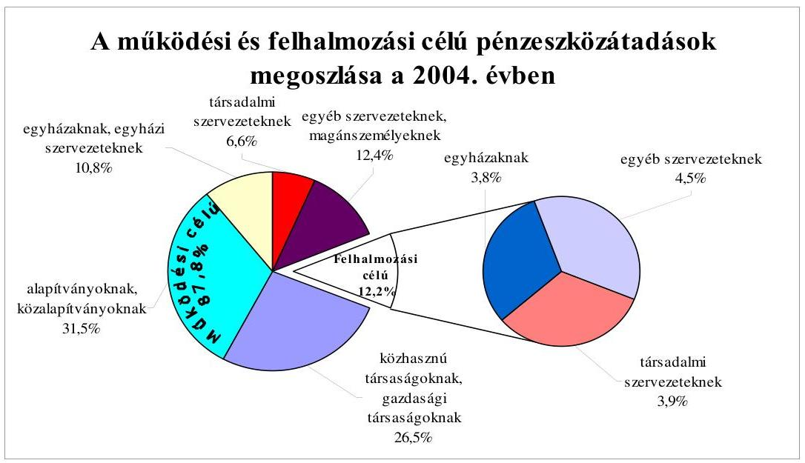
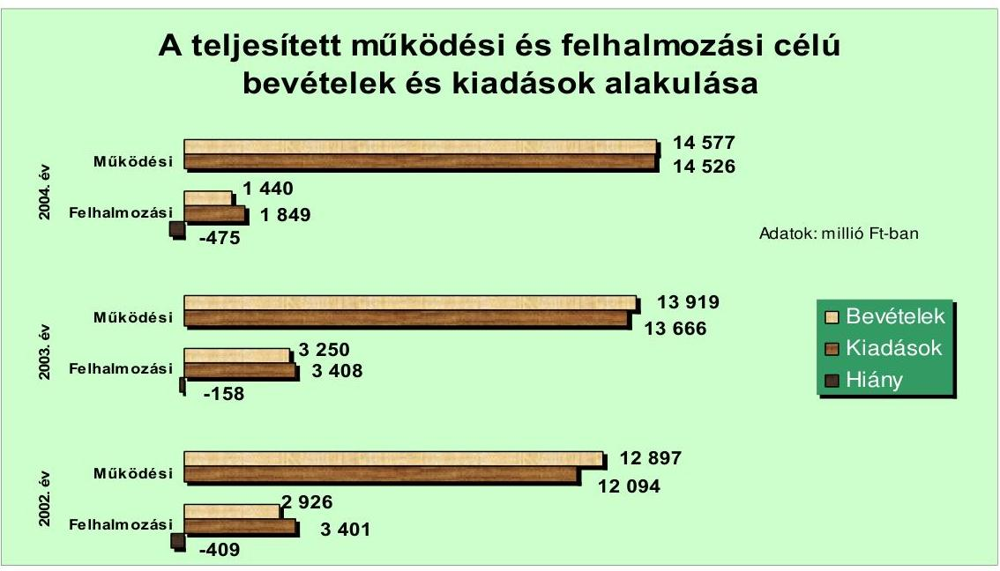
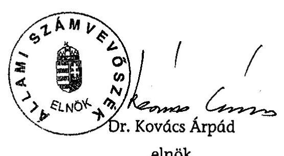
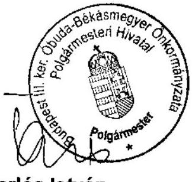

# JELENTÉS 

a Budapest Főváros III. kerület ÓbudaBékásmegyer Önkormányzata gazdálkodási rendszerének átfogó ellenőrzéséről

---

3. Önkormányzati és Területi Ellenőrzési Igazgatóság
3.3. Átfogó Ellenőrzések Főcsoport
Iktatószám: V-1001-1/21/19/2005.
Témaszám: 749
Vizsgálat-azonosító szám: V0209
Az ellenőrzést felügyelte:
Dr. Lóránt Zoltán
főigazgató
Az ellenőrzés végrehajtásáért felelős:
Dr. Sepsey Tamás
főigazgató-helyettes
Az ellenőrzést vezette:
Csecserits Imréné
főcsoportfőnök-helyettes
Az ellenőrzést végezték:
Gyüre Lajosné
számvevő
Schósz Attiláné
számvevő
Dr. Telkes Imre
számvevő tanácsos

# A témához kapcsolódó - elmúlt négy évben - készített számvevőszéki jelentések: 

címe
sorszáma
Jelentés a települési önkormányzatok adóztatási tevékenységének ..... 0121
vizsgálatáról
Jelentés a helyi és a helyi kisebbségi önkormányzatok ..... 0220
gazdálkodásának átfogó ellenőrzéséről
Jelentés a helyi önkormányzatok beruházásaihoz és ..... 0229
rekonstrukcióihoz nyújtott 2001. évi címzett- és céltámogatások
igénybevételének és felhasználásának vizsgálatáról
Jelentés a területfejlesztési tanácsok és munkaszervezeteik ..... 0327
rendelkezésére álló támogatások igénylésének és felhasználásának
ellenőrzéséről
Jelentés a középfokú oktatás feltételei alakulásának ellenőrzéséről ..... 0445
Jelentés a helyi önkormányzatok közművelődési és könyvtári ..... 0521
feladatellátásáról és finanszírozásáról

---

# TARTALOMJEGYZÉK 

BEVEZETÉS ..... 7
I. ÖSSZEGZŐ MEGÁLLAPÍTÁSOK, KÖVETKEZTETÉSEK, JAVASLATOK ..... 9
II. RÉSZLETES MEGÁLLAPÍTÁSOK ..... 20

1. A költségvetés tervezésének, végrehajtásának, az Önkormányzat vagyongazdálkodásának és a zárszámadás elkészítésének szabályszerűsége ..... 20
1.1. A költségvetési rendelet jóváhagyásának, módosításának, az előirányzatok nyilvántartásának és betartásának szabályszerűsége ..... 20
1.2. A gazdálkodás szabályozottsága, a bizonylati rend és fegyelem szabályszerűsége ..... 26
1.3. A pénzügyi-számviteli feladatok ellátásának informatikai támogatottsága ..... 34
1.4. Az önkormányzati vagyon nyilvántartása, számbavétele ..... 35
1.5. A vagyonnal való gazdálkodás szabályszerűsége, célszerűsége, nyilvánossága ..... 37
1.6. A céljelleggel nyújtott támogatások szabályszerűsége ..... 42
1.7. A közbeszerzési eljárások szabályszerűsége ..... 45
1.8. A zárszámadási kötelezettség teljesítésének szabályszerűsége ..... 48
1.9. A Polgármesteri hivatal helyi kisebbségi önkormányzatok gazdálkodását segítő tevékenysége ..... 49
2. Az önkormányzati feladatok és a rendelkezésre álló források összhangja ..... 51
2.1. A feladatok meghatározása és szervezeti keretei ..... 51
2.2. A költségvetés egyensúlyának helyzete ..... 54
2.3. A feladatok finanszírozása ..... 59
3. A belső irányítási, ellenőrzési rendszer működésének értékelése ..... 62
3.1. Az ellenőrzési rendszer kialakítása, működése ..... 62
3.2. A könyvvizsgálati kötelezettség teljesítése ..... 65
3.3. A korábbi számvevőszéki ellenőrzések javaslatainak hasznosulása ..... 66

---

# MELLÉKLETEK 

1. számú Az Önkormányzat gazdálkodását meghatározó adatok, mutatószámok (1 oldal)
2. számú Az önkormányzati vagyon nagyságának alakulása (1 oldal)
3. számú Az Önkormányzat 2004. évi bevételeinek és kiadásainak alakulása (1 oldal)
4. számú Az egyes önkormányzati feladatok finanszírozása (1 oldal)
5. számú Helyszíni ellenőrzési jegyzőkönyv (3 oldal)
6. számú Tartós István úr, a Budapest Főváros III. kerület Óbuda-Békásmegyer Önkormányzata polgármesterének észrevétele (1 oldal)

---

# RÖVIDÍTÉSEK JEGYZÉKE 

Ötv.
Áht.
$\mathrm{Kbt}_{-1}$
$\mathrm{Kbt}_{-2}$
Számv. tv.
Htv.

Hatv.
Nek. tv.

Fot.
Ámr.
Vhr.

Ber.
20/1995. (III. 3.) Korm. rendelet

ÁSZ
Kincstár
Közbeszerzési Döntőbizottság
OEP
Önkormányzat
Képviselő-testület
Oktatási bizottság
Pénzügyi bizottság
TKB
polgármester
jegyző
a helyi önkormányzatokról szóló 1990. évi LXV. törvény az államháztartásról szóló 1992. évi XXXVIII. törvény
a közbeszerzésekről szóló 1995. évi XL. törvény
a közbeszerzésekről szóló 2003. évi CXXIX. törvény
a számvitelről szóló 2000. évi C. törvény
a helyi önkormányzatok és szerveik, a köztársasági megbízottak, valamint egyes centrális alárendeltségű szervek feladat- és hatásköreiről szóló 1991. évi XX. törvény
a helyi adókról szóló 1990. évi C. törvény
a nemzeti és etnikai kisebbségek jogairól szóló 1993. évi LXXVII. törvény
a fogyatékos személyek jogairól és esélyegyenlőségük biztosításáról szóló 1998. évi XXVI. törvény
az államháztartás múködési rendjéről szóló 217/1998. (XII. 30.) Korm. rendelet
az államháztartás szervezetei beszámolási és könyvvezetési kötelezettségének sajátosságairól szóló 249/2000. (XII. 24.) számú Korm. rendelet
a költségvetési szervek belső ellenőrzéséről szóló 193/2003. (IX. 26.) számú Korm. rendelet
a kisebbségi önkormányzatok költségvetésének, gazdálkodásának, vagyonjuttatásának egyes kérdéseiről szóló 20/1995. (III. 3.) Korm. rendelet
Állami Számvevőszék
Magyar Államkincstár
Közbeszerzések Tanácsa Közbeszerzési Döntőbizottsága
Országos Egészségbiztosítási Pénztár
Budapest Főváros III. kerület Óbuda-Békásmegyer Önkormányzata
Budapest Főváros III. kerület Óbuda-Békásmegyer Önkormányzatának Képviselő-testülete
Budapest Főváros III. kerület Óbuda-Békásmegyer Önkormányzatának Oktatási Bizottsága
Budapest Főváros III. kerület Óbuda-Békásmegyer Önkormányzatának Pénzügyi és Költségvetési Bizottsága
Budapest Főváros III. kerület Óbuda-Békásmegyer Önkormányzatának Tulajdonosi és Közbeszerzési Bizottsága, 2002. november 22-éig Pénzügyi és Közbeszerzési Bizottsága
Budapest Főváros III. kerület Óbuda-Békásmegyer Önkormányzatának Polgármestere
Budapest Főváros III. kerület Óbuda-Békásmegyer Önkormányzatának Jegyzője

---

| Polgármesteri hivatal | Budapest Főváros III. kerület Óbuda-Békásmegyer Önkormányzatának Polgármesteri Hivatala |
| :--: | :--: |
| Munkaügyi iroda | Budapest Főváros III. kerület Óbuda-Békásmegyer Önkormányzatának Munkaügyi Irodája |
| Oktatási osztály | Budapest Főváros III. kerület Óbuda-Békásmegyer Önkormányzatának Oktatási és Kulturális Ügyosztálya |
| Pénzügyi osztály | Budapest Főváros III. kerület Óbuda-Békásmegyer Önkormányzatának Pénzügyi és Gazdasági Ügyosztálya |
| Ügyfélszolgálati iroda | Budapest Főváros III. kerület Óbuda-Békásmegyer Önkormányzatának Ügyfélszolgálati Irodája |
| Vagyonkezelő iroda | Budapest Főváros III. kerület Óbuda-Békásmegyer Önkormányzatának Vagyonkezelő Irodája |
| Ellenőrzési csoport | Budapest Főváros III. kerület Óbuda-Békásmegyer Önkormányzat Polgármesteri Titkárságának Belső Ellenőrzési Csoportja |
| SzMSz | Budapest Főváros III. kerület Óbuda-Békásmegyer Önkormányzatának Szervezeti és Múködési Szabályzatáról szóló 9/1995. (V. 1.) számú rendelete |
| Polgármesteri hivatal SzMSz-e | Budapest Főváros III. kerület Óbuda-Békásmegyer Önkormányzat Polgármesteri Hivatalának Szervezeti és Múködési Szabályzata (2003. november 1-jétől hatályos) |
| 2004. évi költségvetési rendelet | Budapest Főváros III. kerület Óbuda-Békásmegyer Önkormányzatának a 2004. évi költségvetéséről szóló 14/2004. (III. 31.) számú rendelete |
| 2005. évi költségvetési rendelet | Budapest Főváros III. kerület Óbuda-Békásmegyer Önkormányzatának a 2005. évi költségvetéséről szóló 11/2005. (III. 30.) számú rendelete |
| 2004. évi zárszámadási rendelet | Budapest Főváros III. kerület Óbuda-Békásmegyer Önkormányzatának 18/2005. (V. 5.) számú rendelete a 14/2004. (III. 31.) számú költségvetési rendelet végrehajtásáról szóló beszámoló elfogadásáról |
| bérbeadási rendelet ${ }_{1}$ | Budapest Főváros III. kerület Óbuda-Békásmegyer Önkormányzatának az Önkormányzat tulajdonában álló lakások bérbeadásának feltételeiről szóló 46/2001. (I. 2.) számú rendelete |
| bérbeadási rendelet ${ }_{2}$ | Budapest Főváros III. kerület Óbuda-Békásmegyer Önkormányzatának az Önkormányzat tulajdonában álló nem lakás céljára szolgáló helyiségek bérbeadásának feltételeiről szóló 47/2001. (I. 2.) számú rendelete |
| elidegenítési rendelet ${ }_{1}$ | Budapest Főváros III. kerület Óbuda-Békásmegyer Önkormányzatának az Önkormányzat tulajdonában lévő lakások elidegenítésének feltételeiről szóló 12/1998. (V. 7.) számú rendelete |
| elidegenítési rendelet ${ }_{2}$ | Budapest Főváros III. kerület Óbuda-Békásmegyer Önkormányzatának az Önkormányzat tulajdonában lévő nem lakás célú helyiségek elidegenítésének feltételeiről szóló 34/1997. (X. 10.) számú rendelete |

---

építményadó rendelet
közbeszerzési rendelet
telekadó rendelet
vagyongazdálkodási rendelet
versenyeztetési rendelet
gazdálkodási jogkörök szabályzata

Árpád Gimnázium
KSZKI
Múzeum
Szociális Foglalkoztató

CELER Kft.
Egészségügyi Kht.
ÉPFU Kft.
Kulturális Kht.
MMG AM Rt.

Budapest Főváros III. kerület Óbuda-Békásmegyer Önkormányzatának az építményadóról szóló 27/1995. (XII. 1.) számú rendelete

Budapest Főváros III. kerület Óbuda-Békásmegyer Önkormányzatának a közbeszerzési eljárás kiírásával és elbírálásával összefüggő egyes kérdések szabályairól szóló 10/1999. (IV. 12.) számú rendelete
Budapest Főváros III. kerület Óbuda-Békásmegyer Önkormányzatának a telekadóról szóló 11/2004. (IV. 1.) számú rendelete
Budapest Főváros III. kerület Óbuda-Békásmegyer Önkormányzatának az Önkormányzat vagyonáról, a vagyontárgyak feletti tulajdonosi jogok gyakorlásáról szóló 23/1995. (XII. 28.) számú rendelete
Budapest Főváros III. kerület Óbuda-Békásmegyer Önkormányzatának az Önkormányzat vagyonának értékesítése, hasznosítása során alkalmazandó versenyeztetési szabályokról szóló 13/1998. (V. 29.) számú rendelete
Budapest Főváros III. kerület Óbuda-Békásmegyer Önkormányzatának Polgármestere és Jegyzője által 2004. május 24 -én kiadott szabályzat a kötelezettségvállalás, ellenjegyzés, utalványozás és érvényesítés rendjéről
Budapest Főváros III. kerület Óbuda-Békásmegyer Önkormányzatának Árpád Gimnáziuma
Budapest Főváros III. kerület Óbuda-Békásmegyer Önkormányzat Költségvetési Szerveket Kiszolgáló Intézménye
Budapest Főváros III. kerület Óbuda-Békásmegyer Önkormányzat Óbudai Múzeuma
Budapest Főváros III. kerület Óbuda-Békásmegyer Önkormányzatának Óbudai Szociális Foglalkoztató Központja
CELER Épületfenntartó és Szolgáltató Korlátolt Felelősségű Társaság
Óbuda-Békásmegyer Egészségügyi Szolgáltató Közhasznú Társaság
Óbudai Kereskedelmi Fejlesztési és Szolgáltató Korlátolt Felelősségű Társaság
Csillaghegyi Kulturális Központ Kulturális és Szolgáltató Közhasznú Társaság
MMG Automatika Művek Részvénytársaság

---

.

---

# JELENTÉS 

## a Budapest Főváros III. kerület Óbuda-Békásmegyer Önkormányzata gazdálkodási rendszerének átfogó ellenőrzéséről

## BEVEZETÉS

A helyi önkormányzatokról szóló 1990. évi LXV. törvény 92. § (1) bekezdése, az Állami Számvevőszékről szóló 1989. évi XXXVIII. törvény 2. § (3) bekezdése, valamint az államháztartásról szóló 1992. évi XXXVIII. törvény 120/A. § (1) bekezdése alapján az önkormányzatok gazdálkodását az Állami Számvevőszék ellenőrzi.

## Az ellenőrzés célja annak értékelése volt, hogy:

- az önkormányzati gazdálkodás törvényességét ${ }^{1}$, szabályszerűségét biztosítot-ták-e a tervezés, a költségvetés végrehajtása, a vagyongazdálkodás és a zárszámadás során;
- az Önkormányzat által ellátott feladatok és az azokhoz rendelkezésre álló források összhangja biztosított volt-e, különös tekintettel az egyes kiemelt feladatokra;
- a gazdálkodás szabályszerűségét biztosító belső kontrollok² lehetővé tették-e a szabálytalanságok, hiányosságok, gazdaságtalan megoldások feltárását, megelőzését;

Az ellenőrzött időszak: a 2004. év, valamint a 2005. I. negyedév, az 1.5., 2.1-2.3. és 3.3. programpontok tekintetében a 2002-2003. évek is.

Budapest Főváros III. kerületét 19 városrész ${ }^{3}$ alkotja. A kerület lakosainak száma 2004. január 1-jén 128584 fő volt.

[^0]
[^0]:    ${ }^{1}$ A törvényi előírások betartásának elmulasztásakor a részletes megállapítások fejezetben egységesen a törvénysértés megjelölést alkalmazzuk, mivel az ÁSZ nem tehet különbséget a törvényi előírások között.
    ${ }^{2}$ A gazdálkodás szabályszerűségét biztosító kontroll alatt értjük a kiépített és működő belső irányítási és szabályozási rendszert, valamint a belső ellenőrzési funkciók ellátását.
    ${ }^{3}$ Békásmegyer, Csillaghegy, Római fürdő, Mocsárosfürdő, Aquincum, Óbudai-sziget, Filatorigát, Óbuda-Újlak, Mátyáshegy, Remetehegy, Táborhegy, Hármashatárhegy,

---

Az Önkormányzat 38 tagú Képviselő-testületének munkáját 11 állandó bizottság segítette. A polgármester személye az 1990. évtől, a jegyző személye az 1997. évtől nem változott.

Az Önkormányzat feladatainak végrehajtása érdekében 61 költségvetési szervet múködtet, amelyekből 31 önállóan gazdálkodik. A feladatok ellátásában részt vesz két közhasznú társaság és négy közalapítvány, továbbá egy gazdasági társaság. A feladatok ellátására az Önkormányzat költségvetési szerveinél a 2004. év végén foglalkoztatott közalkalmazottak száma 3136 fő, a köztisztviselők száma 265 fő volt. Az Önkormányzat a 2004. évben 16 420,2 millió Ft bevételt ért el és 16264,1 millió Ft kiadást teljesített, a 2004. év végén 107 983,8 millió Ft értékű könyvviteli mérleg szerinti vagyonnal rendelkezett. Az Önkormányzat gazdálkodását meghatározó adatokat, mutatószámokat az 1-3. számú mellékletek tartalmazzák.

A kerületben a 2002. évi választásokig hét4, a 2002. évi választásokat követően kilenc ${ }^{5}$ a megválasztott és múködő kisebbségi önkormányzatok száma.

Testvérhegy, Csúcshegy, Törökkő, Kaszásdűlő, Solymárvölgy, Aranyhegy-Péterhegy, Úrömhegy.
${ }^{4}$ Bolgár, cigány, görög, német, örmény, szerb, szlovák kisebbségi önkormányzat.
${ }^{5}$ Bolgár, cigány, görög, horvát, német, örmény, román, szerb, szlovák kisebbségi önkormányzat.

---

# I. ÖSSZEGZŐ MEGÁLLAPÍTÁSOK, KÖVETKEZTETÉSEK, JAVASLATOK 

Az Önkormányzat az Ötv-ben előírt gazdasági program meghatározási kötelezettségének a középtávú kerületfejlesztési koncepció elfogadásával a 2005. évben tett eleget.

A 2004. és a 2005. évi költségvetési koncepciót és rendelettervezetet a polgármester az Áht-ban előírt határidőben terjesztette a Képviselő-testület elé. A költségvetési koncepciók összeállítása előtt a helyi kisebbségi önkormányzatokra vonatkozó részekről a kisebbségi önkormányzatok elnökeit az Ámr. előírása ellenére nem tájékoztatták. A 2004. és a 2005. évi költségvetési koncepciót a bizottságok véleményének ismeretében, a helyben képződő bevételek és az ismert kötelezettségek figyelembevételével fogadta el a Képviselő-testület. A koncepciókban a Képviselő-testület döntött a további tervező munka során betartandó elvekről és szabályokról.

A polgármester a 2004. és a 2005. évi költségvetési rendelettervezetekkel együtt, illetve azt megelőzően a Képviselő-testület elé terjesztette azokat a rendelettervezeteket, amelyek a tervezett előirányzatokat megalapozták. A 2004. és a 2005. évi költségvetési rendelettervezetek egyeztetését a költségvetési szervek vezetőivel az Ámr. előírása ellenére a jegyző írásban nem rögzítette. A Képviselő-testület az Áht. előírása ellenére rendeletben nem határozta meg az Önkormányzat költségvetéseinek és zárszámadásainak előterjesztésekor a Kép-viselő-testület részére tájékoztatásul bemutatandó mérlegek, kimutatások tartalmi követelményeit. A költségvetési rendelettervezetek előterjesztései az Ámr. előírásai szerint tartalmazták a múködési és felhalmozási célú bevételeket és kiadásokat az Önkormányzatra és költségvetési szerveire elkülönítetten és öszszesítve. A Képviselő-testület tájékoztatása céljából mindkét évben bemutatták az Áht-ban előírt összevont mérlegeket az Önkormányzatra és elkülönítetten a helyi kisebbségi önkormányzatokra. A költségvetési rendelettervezetek nem tartalmazták az Áht-ban előírt kimutatásokat a többéves kihatással járó döntések számszerűsítéséről, valamint a közvetett támogatásokról szöveges indoklással. Az Ámr-ben előírtak ellenére az éves költségvetések várható bevételi és kiadási előirányzatainak teljesüléséről az előirányzat-felhasználási ütemtervet a költségvetési rendelettervezetek nem tartalmazták.

A 2004. és a 2005. évi költségvetési rendeletekben az Áht. előírásait megsértve a bevételek és kiadások különbségeként a hiányt nem mutatták be, a költségvetési bevételek finanszírozási célú pénzügyi múveleteket, a tervezett hitelfelvételt is tartalmazták. A Képviselő-testület a 2004. évi költségvetési rendeletbe az Áht. előírásait megsértve a bolgár és a görög kisebbségi önkormányzat költségvetését - annak hiánya miatt - nem a kisebbségi önkormányzat költségvetési határozata alapján építette be. A 2004. és a 2005. évi költségvetési rendeletben a Képviselő-testület jóváhagyta a költségvetés végrehajtásának szabályait, az önállóan gazdálkodó költségvetési szervek előirányzat módosítási jogkörét az Ámr. előírásai alapján szabályozták. A Képviselő-testület által költségvetési rendeletben meghatározott „intervenciós alap" elnevezése nem fe-

---

lelt meg az Áht-ban előírt feltételeknek, a kifejezés félreérthető. A Képviselőtestület a 2004. évi költségvetési rendeletében jóváhagyott előirányzatokat hat alkalommal módosította, az utolsó két rendeletmódosítás során nem tartották be az Ámr-ben előírt határidőt. A központi pótelőirányzatokkal az Ámr-ben foglaltak szerint módosították a költségvetési rendeletet. A 2004. évben az Áht. előírásaival szemben a helyi kisebbségi önkormányzatok költségvetési előirányzatainak módosításai azok hiányában nem a kisebbségi önkormányzatok határozatai alapján történtek. A 2004. évi költségvetési rendelet módosításai során nem tartották be az Áht-ban előírt tartalmi követelményt, mivel a módosított költségvetési rendeletek az előirányzat változtatás eredményeként jóváhagyott módosított előirányzatokat nem, csak az előirányzatokban bekövetkezett változások összegeit mutatták.

A Pénzügyi osztály - gazdasági szervezet - felépítését és feladatait az Ámr. előírásai alapján a Polgármesteri hivatal SzMSz-ében rögzítették, azonban az Ámr-ben foglalt előírás ellenére ügyrendet nem készítettek. A jegyző kijelölte a szakmai teljesítés igazolására jogosultakat, azonban az Ámr-ben foglalt előírás ellenére nem rendelkezett annak módjáról. Az érvényesítőket a jegyző írásban bízta meg, ennek során betartotta az Ámr-ben foglalt előírást.

A gazdálkodási jogkörök szabályzatában éltek az Ámr-ben biztosított lehetőséggel, miszerint az 50 ezer Ft-ot el nem érő kifizetések esetében nem szükséges előzetes írásbeli kötelezettségvállalás, azonban a kötelezettségvállalások rendjét és nyilvántartási formáját az Ámr. előírása ellenére belső szabályzatban nem rögzítették. A gazdálkodási és ellenőrzési jogkörök felhatalmazottainak kijelölésénél az Ámr-ben foglaltak szerinti összeférhetetlenségi követelmények érvényesülését biztosították. A gazdálkodási és ellenőrzési jogkörök gyakorlásáról a felhatalmazottakat nem számoltatták be, a beszámoltatás formáját és gyakoriságát nem szabályozták. A jegyző eleget tett a Htv-ben előírt - az intézmények számviteli rendjének kialakítására vonatkozó - kötelezettségének.

A Polgármesteri hivatal rendelkezett számviteli politikával és az ehhez kapcsolódó szabályzatokkal. A számviteli politikában azonban nem határozták meg a Vhr-ben foglalt előírás ellenére a számviteli elszámolás és értékelés szempontjából jelentős összeget. Az eszközök és források leltározási és leltárkészítési szabályzata tartalmazta a leltározás előkészítésével, megszervezésével és végrehajtásával kapcsolatos feladatokat. Az eszközök és források értékelésének szabályai keretében rögzítették az eszközök bekerülési értékébe beszámítandó kiadások tartalmát, megnevezését. A pénzkezelési szabályzat tartalmazta a készpénzfelvétel, a pénztári átadás-átvétel szabályait. A napi záró pénzkészlet maximális értéke 1,5 millió Ft volt, mely a napi pénzforgalom figyelembevételével indokolatlanul magas, vagyonvédelmi szempontból célszerűtlen. Szabályozták a selejtezés bizonylati rendjét, a selejtezéssel kapcsolatos feladatokat. A számlarendben előírták az analitikus nyilvántartások vezetésének kötelezettségét, azonban a Vhr-ben foglalt előírás ellenére nem határozták meg azok formáját és tartalmát. Az operatív gazdálkodás és a számviteli politika különböző területeinek rendjét meghatározó szabályzatok elkészítése során a helyi sajátosságokat, így a Polgármesteri hivatal szervezeti felépítését is figyelembe vették. A pénzügyi-számviteli területen dolgozók rendelkeztek a munkaköri feladataikat meghatározó munkaköri leírással.

---

A főkönyvi számlákhoz kapcsolódó analitikus nyilvántartások - a részvények nyilvántartása kivételével - megfeleltek a Vhr. előírásainak. A Polgármesteri hivatal a részvényeket a Számv. tv-ben foglalt előírás ellenére forgatási célú hitelviszonyt megtestesítő értékpapírként tartotta nyilván. A Számv. tv. előírásával szemben a beruházások között mutattak ki üzembe helyezett szennyvízcsatorna és víziközmű beruházásokat, az aktiválás elmaradása miatt a Vhr. előírása ellenére az értékcsökkenést nem számolták el. A kötelezettségvállalások nyilvántartásában folyamatosan nyomon követték a jóváhagyott és a szabad előirányzatokat, ezáltal a nyilvántartás biztosította az Áht. előírása alapján annak lehetőségét, hogy a költségvetés végrehajtása során kötelezettségvállalás és utalványozás csak a jóváhagyott kiadási előirányzatok mértékéig teljesüljön.

A gazdálkodási és ellenőrzési jogkörök gyakorlása során a munkafolyamatba épített ellenőrzési feladatok közül elmaradt a szakmai teljesítés igazolása a bevételi bizonylatok teljes körénél, továbbá eseti jelleggel a kiadási bizonylatok 3\%-ánál, mely esetekben az Ámr-ben foglalt előírás ellenére nem végezték el a kiadások teljesítésének és a bevételek beszedésének elrendelése előtt az ellenőrzéssel kapcsolatos feladatokat. A kiadási bizonylatok 12\%-ánál elmaradt a kötelezettségvállalás ellenjegyzése, melynek esetén az ellenjegyző nem tett eleget az Ámr-ben előírtaknak, ezáltal ezeknél a bizonylatoknál nem teljesült a kiadási előirányzat által biztosított fedezet meglétének, a kötelezettségvállalás jogszerűségének és célszerűségének munkafolyamatba épített ellenőrzése. Az Ámr. előírása ellenére elmaradt az utalványozás és az utalványozás ellenjegyzése a banki és pénztári - a nem termékértékesítésből és szolgáltatásnyújtásból származó - bevételek bizonylatainál, továbbá a kiadási bizonylatok 6\%-ánál. Az érvényesítő nem tett eleget az - Ámr-ben foglalt - munkafolyamatba épített ellenőrzési feladatainak. A házipénztárban a pénztáros a pénztárjelentést naponta zárta. A pénztárellenőr a bevételi és a kiadási pénztárbizonylatokat, továbbá a napi pénztárjelentések ellenőrzésének elvégzését aláírásával igazolta. A pénztári bizonylatokhoz kapcsolódó utalványrendeleteken az Ámr. előírása ellenére nem tüntették fel a kötelezettségvállalás nyilvántartásba vételének sorszámát. A Számv. tv. előírását megsértve, a gazdasági eseményeket magukba foglaló bizonylatok 30\%-a nem felelt meg az előírt alaki és tartalmi követelményeknek.

A 2004. évi zárszámadási rendelet szerint önkormányzati szinten a költségvetési rendelet módosított előirányzatait a teljesítési adatok nem haladták meg. A költségvetési szervek - négy intézmény kivételével, amelyek az Áht. előírását megsértették - a kiemelt előirányzatokat betartották. A Pénzügyi osztály ezen intézmények előirányzat túllépéseit megállapította, felelősségre vonás nem történt.

A Polgármesteri hivatalban integrált pénzügyi rendszert alkalmaztak. A 2004. évben informatikai fejlesztés keretében az 1998. évben bevezetett pénzügyi rendszert bővítették. Az Önkormányzat rendelkezett informatikai stratégiával, mely négy évre határozta meg a célkitűzéseket. A rendkívüli események bekövetkezésekor teendő intézkedéseket meghatározó katasztrófa elhárítási tervet nem készítettek. A Polgármesteri hivatalban az adatbiztonsági eljárásokról a minőségbiztosítási rendszer folyamatszabályozása keretében rendelkeztek.

---

A Polgármesteri hivatalban az önkormányzati vagyont a Vhr-ben foglalt előírásnak megfelelően forgalomképesség szerint elkülönítetten tartották nyilván. A 2004. évi leltározást a Vhr-ben foglalt előírásnak megfelelően az ingatlanok esetében mennyiségi felvétellel, a követelések, az értékpapírok, részesedések és a kötelezettségek esetében egyeztetéssel elvégezték. Az üzemeltetésre, kezelésre átadott eszközöket mennyiségi leltározás helyett egyeztetéssel leltározták, mely nem felelt meg a Vhr-ben foglalt előírásnak. A forgalomképes ingatlanok esetében éltek a piaci értékelés lehetőségével, annak 2004. évi aktualizálását a földterületek esetében elvégezték, a lakások és nem lakás célú helyiségek esetében azonban nem. A követelések, részesedések és értékpapírok értékeléséhez szükséges információk - egy gazdasági társaságban lévő üzletrész kivételével - rendelkezésre álltak. A részesedések analitikus nyilvántartása a Vhr. előírásával szemben tartalmazott olyan üzletrészt, amely társaságban az Önkormányzatnak tulajdoni részesedése a cégnyilvántartás szerint nem volt. A részvények könyvszerinti és piaci értéke közötti különbözetet értékvesztés helyett állománycsökkenésként számolták el, a Vhr-ben foglalt előírások ellenére.

A vagyonnal való rendelkezési, döntési hatásköröket a vagyongazdálkodási rendeletben értékhatár megjelölésével szabályozták. Rendeletben meghatározták az ingyenes és a kedvezményes vagyonátadás eseteit és módját, azonban megsértették az Áht. előírását, mivel a rendeletben nem rögzítették azt az értékhatárt, amely felett vagyont értékesíteni, a vagyonkezelés jogát, a vagyon használatát, illetve hasznosítás jogát átengedni csak nyilvános versenytárgyalás útján, a legjobb ajánlattevő részére lehet. Az Önkormányzat a versenyeztetési rendeletben az Áht. előírását megsértve lehetővé tette a versenyeztetési eljárás lefolytatásától való eltérést. A szabályozás nem segítette a közvagyonnal való gazdálkodás nyilvánosságát. Egy telekingatlant pályáztatás nélkül és az értékbecslésben megállapított forgalmi érték alatt értékesítettek. A vagyongazdálkodási döntések során a hatásköri szabályokat betartották. A szerződések közzétételével kapcsolatos Áht-ban foglalt kötelezettségnek eleget tettek.

Az Önkormányzat négy párt részére a 2003. évig kedvezményesen, egy párt részére díjmentesen biztosított helyiséget, ezzel megsértette az alkotmányos jogegyenlőséget, továbbá az Ötv-ben foglalt előírást, mivel a pártokat közvetett anyagi támogatásban részesítette. Az Önkormányzat a 2003. évben felmondta a pártszervezetekkel kötött bérleti szerződéseket, azonban azok a helyiségeket a felmondást követően is változatlanul kedvezményesen használják. A Képviselő-testület a polgármester - piaci bérleti díj bevezetésére irányuló javaslatát elutasította.

Az Önkormányzat a 2004. évben gazdasági társaságnak, közhasznú társaságoknak, alapítványoknak, közalapítványoknak, egyházaknak és egyházi szervezeteknek, társadalmi szervezeteknek és magánszemélyeknek adott céljellegü támogatást. A Képviselő-testület és a bizottságok hatáskörében hozott támogatási döntéseknél előírták a támogatás célját, összegét, folyósításának ütemezését és a számadási kötelezettséget. A polgármester az általa hozott 18 támogatási döntés (a támogatási összeg 1\%-ára terjedt ki) esetében az Áht-ban foglaltakat megsértve nem írta elő a számadási kötelezettséget. A számadás tartalmi és formai ellenőrzését a Polgármesteri hivatalban elvégezték. A támogatások felhasználását a társasházak és a panelházak felújítása esetében a helyszínen ellenőrizték. A közhasznú szervezetekkel támogatási szerződést kö-

---

töttek, melyben az elszámolás feltételeit és módját meghatározták. A Képviselőtestület döntési hatáskörét 16 alapítvány támogatása tekintetében nem gyakorolta, ezzel megsértették az Ötv. előírását. A támogatásban részesített szervezetek közül nyolc, határidő után, felszólításra számolt el a kapott támogatás felhasználásáról. A számadást határidőben nem teljesítő szervezetek felé az Önkormányzat az Áht. előírását megsértve nem intézkedett a további támogatás felfüggesztéséről, illetve visszavonásáról. Egy alapítvány támogatásának számadását és a felhasználás jogszerűségét a helyszínen ellenőriztük. Az alapítvány finanszírozási szerződésében nem határozták meg a támogatás nyújtásának alapját képező mutatószám tartalmát, számítási módját. A támogatott alapítvány a gondozottakról, a gondozás módjáról, gyakoriságáról vezetett nyilvántartás (betegnapló, ellátási napló, korlapok) alapján végezte az átlagos gondozotti gyermeklétszám számítását. A Polgármesteri hivatal a támogatások utalása előtt a helyszínen nem ellenőrizte a lejelentett gondozotti létszám valódiságát.

Az Önkormányzat a 2004. évben megkezdett közbeszerzéseiről a Kbt. ${ }_{1,2}$ által előírt határidőben és tartalommal megküldte a Közbeszerzések Tanácsa részére az éves összegzéseket, amelyek nyolc közbeszerzési eljárást tartalmaztak. A becsült érték számításakor a Kbt. ${ }_{1}$ előírásai szerint jártak el. Az egyes beszerzéseknél a közbeszerzési eljárás fajtájának kiválasztása a Kbt. ${ }_{1}$ előírásának megfelelően történt. A közbeszerzési eljárást az értékhatár feletti beszerzések esetében lebonyolították. Az ajánlatok felbontása és elbírálása során a Kbt. ${ }_{1}$-ben foglalt szabályokat érvényesítették. A szakmai véleményező bizottság tagjai a benyújtott ajánlatokra vonatkozóan egységes bizottsági szakvéleményt nem alakítottak ki, mely nem felelt meg a Kbt. ${ }_{1}$ előírásának, valamint a 6/2003. számú polgármesteri és jegyzői együttes utasításnak. A Közbeszerzési Döntőbizottság a 2004. évben egy lefolytatott közbeszerzési eljárást az ajánlati kiírásnak nem megfelelő ajánlat elfogadása miatt jogsértőnek minősített. Az Önkormányzat a Közbeszerzési Döntőbizottság határozatának felülvizsgálata iránt keresetet nyújtott be a Fővárosi Bírósághoz.

A 2004. évi zárszámadási rendelettervezetet a polgármester az Áht-ban előírt határidőn belül terjesztette a Képviselő-testület elé. A zárszámadás előterjesztésekor a Képviselő-testület részére bemutatták az Áht. szerinti összevont mérlegeket, valamint a vagyonkimutatást, azonban az Áht-ban foglaltak ellenére nem mutatták be az előírt kimutatásokat a többéves kihatással járó döntésekről, továbbá a közvetett támogatásokról szöveges indoklással együtt. A zárszámadási rendelet - az éves létszámkeret bemutatása kivételével - az Áhtban előírt szerkezetben készült. A költségvetési rendelettel való - az Áht-ban előírt - összehasonlíthatósági követelmény ellenére a zárszámadási rendelet nem tartalmazta az éves létszámkeret tényleges alakulását önállóan és részben önállóan gazdálkodó költségvetési szervenként. A Képviselő-testület a zárszámadási rendeletben jóváhagyta a Polgármesteri hivatal és az önállóan gazdálkodó intézmények felülvizsgált költségvetési pénzmaradványát, azonban az Ámr. előírása ellenére előterjesztés hiányában a rendelettel egy időben nem hagyta jóvá az önkormányzati költségvetési szerveket megillető, illetve az elvonandó pénzmaradvány összegét. A zárszámadási rendeletben jóváhagyott pénzmaradvány összegének megállapításánál a Vhr. előírásai szerint jártak el. A Vhr-ben előírt határidőben elkészített költségvetési beszámolók és a zárszámadási rendelet számszaki adatai egymással megegyeztek. Az önkormányzati in-

---

tézmények költségvetési beszámolóit a Polgármesteri hivatal az Ámr. szerinti határidőben felülvizsgálta, azonban az Ámr-ben előírtak ellenére az intézményeket az éves számszaki beszámolóik és múködésük elbírálásáról, jóváhagyásáról írásban nem értesítették.

Az Önkormányzat az Áht-ban előírt együttműködési megállapodást a kisebbségi önkormányzatokkal megkötötte. Az együttműködési megállapodásban a helyi kisebbségi önkormányzatok a kötelezettségvállalás és az utalványozás ellenjegyzésére nem a jegyzőt kérték fel, hanem - az Áht-ban biztosított lehetőséggel élve - vállalták, hogy saját testületük tagjaiból határozat útján kijelölik az ellenjegyzésre jogosult személyt és erről értesítik a Pénzügyi osztályt. Az ellenjegyzésre jogosult személyek kijelölése és az ellenjegyzés elvégzése azonban elmaradt. Az Ámr. előírása ellenére a jegyző nem rögzítette a szakmai teljesítés igazolásának módját és nem jelölte ki annak személyét. A kisebbségi önkormányzatok kötelezettségvállalásairól az Ámr. előírása ellenére analitikus nyilvántartást nem vezettek.

Az Önkormányzat feladatai ellátását saját fenntartású intézményeivel oldotta meg, emellett közhasznú társaságai és gazdasági társasága, valamint civil és társadalmi szervezetek is megállapodás alapján részt vettek a feladatellátásban. A gazdálkodás egyensúlyának biztosítása, javítása érdekében a 20022004. évek között az érintettek előzetes véleményének ismeretében 3-3 óvoda összevonás útján történő megszüntetéséről döntött a Képviselő-testület, továbbá az Egészségügyi Szolgálatot, mint költségvetési intézményt megszüntette és a feladat ellátását az Egészségügyi Kht. keretében biztosította a 2004. évtől.

Az Önkormányzat költségvetési beszámolói szerint a teljesített költségvetési bevételek a 2002. és a 2003. években fedezték a költségvetési kiadásokat, a gazdálkodás egyensúlya biztosított volt, azonban a 2004. évben a gazdálkodás során a tervezett felhalmozási bevételek elmaradása miatt költségvetési hiány jött létre. A teljesített éves kiadások 2\%-át jelentő hiányt a 2004. évben hitel igénybevételével pótolták. A 2002-2004. években az elért múködési célú bevételek fedezetet nyújtottak a múködési célú kiadásokra. A realizált felhalmozási célú bevételek a 2002. évben 86\%-ban, a 2003. évben 95\%-ban és a 2004. évben 78\%-ban fedezték a felhalmozási célú kiadásokat, a hiányzó fedezetet hitel igénybevételével és a múködési célú bevételekből biztosították. A múködési célú bevételek a 2002-2004. évek között évről évre emelkedtek, míg a felhalmozási célú bevételek részaránya az összes bevételen belül 19\%-ról 9\%-ra csökkent. A felhalmozási célokra fordított kiadások összege a felhalmozási források csökkenésével összhangban változott, az összes kiadáshoz viszonyítva részaránya a 2002. évi $22 \%$-os részarányról a 2004. évre $11 \%$-ra csökkent. A költségvetés egyensúlyának javítása érdekében az önkormányzati feladatellátás hatékonyságát az intézmények kapacitás kihasználtságát a költségvetések előkészítése során vizsgálták és intézmény átszervezésekről döntöttek. Az Önkormányzat bevételeinek növelése érdekében a pályázati munka feltételeit kialakították. A pénzállomány alakulásáról az Ámr. előírása szerint a jegyző likviditási tervet készített, amit havonta aktualizáltak. Az átmeneti likviditási gondok megoldására a 2002-2004. években a számlavezető pénzintézettől évről-évre növekvő összegű likviditási hitelt vettek igénybe. Az Önkormányzatnak a 2004. december 31-én 636,9 millió Ft likviditási hitel visszafizetési kötelezettsége volt. Az Önkormányzat a bevételek növelése érdekében élt a helyi adók megállapításá-

---

nak lehetőségével. A 2004. évben az Önkormányzat által bevezetett építményadó mértéke a Hatv. szerinti adómérték felső határával azonos, a telekadó mértéke a Hatv. szerinti felső határ 20\%-a volt.

A naturális mutatókkal mérhető feladatok (bölcsődei ellátás, óvodai nevelés, általános iskolai és középiskolai oktatás, nappali szociális és bentlakásos szociális intézményi ellátás) egy főre jutó kiadásai a 2002. évről a 2004. évre 1-34\%-os mértékben emelkedtek. A kiadások 2003. évi növekedését a közalkalmazottak bérének 2002. évi rendezése eredményezte. A kapacitás kihasználtság a bölcsődei ellátásban, a középfokú oktatásban és a bentlakásos szociális intézményi ellátásban javult, amely kedvezően hatott a fajlagos kiadások alakulására. A kiadások finanszírozásában a 2004. évben az állami hozzájárulás és támogatás a források több mint felét ( $55 \%$ és $76 \%$ közötti volt) biztosította a bentlakásos szociális, a nappali szociális intézményekben, az általános és középiskolákban. Az önkormányzati kiadások részesedése a bölcsődei ellátásban, az óvodai nevelésben és az általános iskolai oktatásban volt meghatározó. Az intézményi saját bevételek aránya csak a nappali és a bentlakásos szociális ellátásban jelentettek a 2004. évben 10\% feletti arányt (18\% és 21\%). Az Önkormányzat a kötelező feladatai mellett önként vállalt feladatokat is ellátott, amelyek nem veszélyeztették az Önkormányzat kötelező feladatait. Az Önkormányzat a középületek akadálymentessé tétele érdekében felmérést készíttetett, amely szerint a feladat megoldásához 1,3 milliárd Ft szükséges. A feladatok végrehajtására 2005. I. félévig 26,1 millió Ft-ot fordítottak. A Fot-ban előírt 2005. január 1-jei határidőig az akadálymentesítési feladatokat nem valósították meg.

Az Önkormányzat az Ötv-ben előírtakkal összhangban a Polgármesteri hivatal SzMSz-ében Ellenőrzési csoportot hozott létre, mellyel kialakította a feladatkörébe utalt belső ellenőrzési feladatok végrehajtásához szükséges szervezeti kereteket. A belső ellenőrök feladatköri függetlensége az éves ellenőrzési terv összeállítása, az ellenőrzési módszer kiválasztása, a jelentés elkészítése és az ajánlások kidolgozása során érvényesült. A Polgármesteri hivatalon belül az Ellenőrzési csoport közvetlenül a polgármesternek alárendelve végzi tevékenységét, mely szervezeti besorolással nem tettek eleget az Áht-ban foglalt azon előírásnak, miszerint a belső ellenőrzést végző személy vagy szervezet tevékenységét a költségvetési szerv vezetőjének közvetlenül alárendelve végzi, továbbá a Htv. azon előírásának, amely szerint a költségvetési szervek pénzügyi, gazdasági ellenőrzésének ellátása a jegyző hatáskörébe tartozik. Az elkészített belső ellenőrzési kézikönyvben foglaltakkal összhangban az ellenőrzési programot és módosítását a polgármester hagyta jóvá, ami ellentétes a Ber-ben foglalt előírásokkal. Az ellenőrzésekről készült jelentések megfeleltek a Ber-ben előírt követelményeknek. Az ellenőrök az ellenőrzési jelentésben az ellenőrzési program alapján megfelelő megállapításokat tettek, következtetéseiket és javaslataikat jogszabállyal támasztották alá. Az Ellenőrzési csoport vezetője a 2004. évről szóló ellenőrzési jelentés összeállításával eleget tett a Ber-ben előírt kötelezettségének. A 2004. évi intézményi és hivatali ellenőrzések tapasztalatairól a Kép-viselő-testület részére a jegyző tájékoztató előterjesztést készített, melyet a Kép-viselő-testület a 2004. évi zárszámadási rendelet részeként elfogadott.

Az Önkormányzatnál eleget tettek az Ötv-ben előírt könyvvizsgálati kötelezettségnek. A könyvvizsgáló a 2004. évi mérleg adataira és a 2004. évi pénz-

---

maradvány összegére vonatkozóan a mérleg főösszegének a 0,07\%-át jelentő auditálási eltérést állapított meg. A Polgármesteri hivatal és az önkormányzati intézmények adatait összevontan tartalmazó 2004. évi egyszerűsített költségvetési beszámolót hitelesítő záradékkal látta el.

Az ÁSZ a 2002. évtől 2004. évig terjedő időszakban az Önkormányzatnál öt témavizsgálatot végzett, az Önkormányzat gazdálkodását átfogó jelleggel utolsó alkalommal a 2001. évben ellenőrizte. Az ÁSZ ellenőrzések során feltárt hiányosságok megszüntetése érdekében intézkedési tervet készítettek, a javaslatok négyötöd része hasznosult. A gazdálkodás átfogó ellenőrzése során megfogalmazott javaslatok figyelembevételével gondoskodtak a vagyongazdálkodás irányelveinek meghatározásáról, az értékcsökkenési leírás Vhr. szerinti elszámolásáról, a jegyző közvetlen irányítása alá tartozó közbeszerzési csoport létrehozásáról, a Polgármesteri hivatal ügyosztályai közötti együttműködés rendjének szabályozásáról, a belső ellenőrzés személyi feltételeinek javításáról. Nem teljesítették az önkormányzati lakások értékesítéséből származó bevételek Budapest Fővárosi Önkormányzattal történő elszámolására irányuló javaslatot. Az Önkormányzat beruházásaihoz és rekonstrukcióihoz nyújtott 2001. évi cím-zett- és céltámogatások igénybevételének és felhasználásának ellenőrzéséről készített számvevői jelentésben megfogalmazott, a Kbt. ${ }_{1}$ előírásainak betartására vonatkozó javaslatok végrehajtásáról intézkedtek. A középfokú oktatás feltételei alakulásának ellenőrzéséről készített jelentés javaslatait a középiskolákat érintő fejlesztési elképzelések kidolgozására, a szakmai munka értékelésére, a kétszintű érettségi vizsgákra való felkészítésre vonatkozóan végrehajtották. A területfejlesztési tanácsok és munkaszervezeteik rendelkezésére álló támogatások igénylésének és felhasználásának ellenőrzéséről készített jelentés javaslatait a regionális finanszírozási források jobb kihasználására vonatkozóan érvényesítették. Az Önkormányzat közművelődési és könyvtári feladatellátásának és finanszírozásának ellenőrzéséről készített jelentésben rögzített javaslatok realizálása érdekében a pályázatfigyelés rendszerét kialakították, az intézményektől a Szervezeti és Működési Szabályzatokat bekérték, a közművelődési rendelet felülvizsgálatára az intézkedéseket megtették.

A helyszíni ellenőrzés megállapításainak hasznosítása mellett javasoljuk:

# a polgármesternek 

a jogszabályi előírások maradéktalan betartása érdekében
1. a költségvetési gazdálkodás jogszabályszerű kereteinek kialakításához kezdeményezze a jegyző által készített előterjesztés alapján a Képviselő-testületnél, hogy rendeletben határozza meg az Áht. 118. §-a alapján az Áht. 116. §-ának 6., 9. és 10. pontja szerinti - a költségvetés és zárszámadás előterjesztésekor tájékoztatásul bemutatandó - mérlegek, kimutatások tartalmát;
2. gondoskodjon az Áht. 93. § (1) bekezdésében és a 12/A. § (1) bekezdésében előírtak betartása érdekében arról, hogy az önkormányzati intézmények a költségvetés végrehajtása során tárgyévi fizetési kötelezettséget a jóváhagyott kiadási előirányzatok mértékéig vállaljanak, az előirányzat túllépések okait vizsgáltassa ki és indokolt esetben kezdeményezzen felelősségre vonást;

---

3. kezdeményezze a vagyongazdálkodási rendelet módosítását annak érdekében, hogy az ne tartalmazzon az Áht. 108. § (1) bekezdésében előírtaktól eltérő, a versenyeztetési kötelezettség alól felmentést lehetővé tevő szabályozást;
4. írjon elő az Önkormányzat által juttatott céljellegű támogatásokról számadási kötelezettséget az Áht. 13/A. § (2) bekezdésének betartása érdekében, továbbá kezdeményezze, hogy az alapítványoknak nyújtott támogatások odaítéléséről az Ötv. 10. § (1) bekezdésének d) pontja alapján a Képviselő-testület döntsön;
5. gondoskodjon a középületek akadálymentesítésének tervezése és annak végrehajtása során a Fot. 29. § (6) bekezdésében foglaltak végrehajtásáról;
a munka színvonalának javítása érdekében
6. terjessze a számvevőszéki jelentést a Képviselő-testület elé és a feltárt hiányosságok megszűntetése érdekében készíttessen intézkedési tervet a határidők és a felelősök megjelölésével;
7. gondoskodjon a kötelezettségvállalásra és utalványozásra felhatalmazott személyek beszámoltatásáról.

# a jegyzönek 

a jogszabályi előírások maradéktalan betartása érdekében
1. gondoskodjon a költségvetési rendelettervezet előkészítésekor:
a) az Ámr. 28. § (6) bekezdésében foglaltak betartása érdekében arról, hogy a helyi kisebbségi önkormányzatok elnökeit tájékoztassák az Önkormányzat költségvetési koncepciójának a kisebbségi önkormányzatokra vonatkozó részeiről;
b) az Ámr. 29. § (4) bekezdése szerinti előírás betartása érdekében a költségvetési rendelettervezet költségvetési szervek vezetőivel lefolytatott egyeztetéseinek írásban történő rögzítéséről;
c) az Ámr. 29. § (1) bekezdés j) pontjában foglalt előírás betartása érdekében készítsék el a költségvetési rendelettervezethez az év várható bevételi és kiadási előirányzatainak teljesüléséről az előirányzat-felhasználási ütemtervet;
d) az Áht. 65. § (3) bekezdésében előírtak betartása érdekében arról, hogy az Önkormányzat költségvetési rendelettervezetébe a helyi kisebbségi önkormányzatok költségvetése azok határozata alapján épüljön be;
e) az Áht. 118. §-a alapján az Áht. 116. § 9. pontja szerint a többéves kihatással járó döntések számszerűsítéséről évenkénti bontásban és összesítve tartalmazó kimutatás és szöveges indoklás, valamint a 10. pontja szerint a közvetett támogatásokat tartalmazó kimutatás és szöveges indoklás elkészítéséről annak érdekében, hogy a Képviselő-testület részére az éves költségvetési és zárszámadási rendelettervezet előterjesztésekor bemutassák;

---

2. az éves költségvetési rendeletmódosítások előkészítésekor:
a) gondoskodjon az Áht. 74. § (3) bekezdésében foglalt előírás betartása érdekében arról, hogy az Önkormányzat költségvetési rendeletébe beépített helyi kisebbségi önkormányzati előirányzatokat kizárólag a helyi kisebbségi önkormányzatok határozata alapján módosítsák;
b) kezdeményezze előterjesztés biztosításával az Ámr. 53. § (6) bekezdésében előírt határidő betartása érdekében, hogy a Képviselő-testület december 31-i hatállyal, legkésőbb a költségvetési beszámoló felügyeleti szervhez történő megküldésének külön jogszabályban meghatározott határidejéig (a tárgyévet követő február 28ig) módosítsa a költségvetési rendeletét;
3. a költségvetési gazdálkodás szabályozottsága, a gazdálkodási és a kapcsolódó ellenőrzési jogkörök gyakorlása szabályszerűségének biztosítása érdekében:
a) gondoskodjon az Ámr. 17. § (5) bekezdésének előírása alapján arról, hogy a Pénzügyi osztály - gazdasági szervezet - készítse el az ügyrendjét;
b) határozza meg a Vhr. 8. § (5) bekezdésében előírtak alapján a számviteli politikában, hogy a számviteli elszámolás és értékelés szempontjából mit tekintenek jelentős összegnek, határozza meg a számlarendben a Vhr. 49. § (2) bekezdésének megfelelően az analitikus nyilvántartások formáját és tartalmát;
c) intézkedjen az Áht. 13/A. § (2) bekezdésének betartása érdekében a számadást elmulasztó támogatottak esetében a további támogatás felfüggesztéséről, tegye meg a szükséges intézkedéseket a céltól eltérő jogsértő felhasználás esetén a támogatás összegének visszafizetéséről, továbbá a céljellegú támogatások felhasználásának ellenőrzéséről;
d) gondoskodjon a kisebbségi önkormányzatokra vonatkozóan a gazdálkodási jogkörök szabályzatának kiegészítéséről az Ámr. 135. § (3) bekezdésében előírtak alapján a szakmai teljesítés igazolásának módjával és jelölje ki a szakmai teljesítés igazolását végző személyeket;
4. a szabályszerű költségvetési és operatív gazdálkodás érdekében:
a) gondoskodjon arról, hogy az üzembe helyezett beruházásokat a Számv. tv. 26. § (7) bekezdésben foglalt előírás alapján vezessék ki a beruházások nyilvántartásából és a Vhr. 30. § (9) bekezdésének előírása alapján értékcsökkenést számoljanak el, valamint gondoskodjon a Vhr. 46. § (3) bekezdésében és a számviteli politikában foglalt előírás betartása érdekében arról, hogy a lakások és nem lakás célú helyiségek esetében évente végezzék el a piaci értéken történő értékelést;
b) intézkedjen az Ámr. 135. § (1) bekezdésében előírtak betartása érdekében arról, hogy a kiadások teljesítésének és a bevételek beszedésének elrendelése előtt az okmányok alapján ellenőrizzék, szakmailag igazolják azok jogosságát, összegszerűségét, a szerződés, megrendelés, megállapodás teljesítését;
c) gondoskodjon arról, hogy a Vhr. 31. § előírását betartva az Önkormányzat tulajdonában lévő részvények értékelése során a könyv szerinti és a piaci érték közötti különbözetet értékvesztésként számolják el;

---

5. gondoskodjon a $\mathrm{Kbt}_{2}$ 8. § (3) bekezdésében foglaltak betartásáról, a szakmai véleményező bizottság készítsen írásos szakvéleményt és döntési javaslatot az eljárást lezáró döntést meghozó részére, a bizottság munkájáról készítsen jegyzőkönyvet, amelynek részét képezzék a tagok indoklással ellátott bírálati lapjai;
6. gondoskodjon a zárszámadási rendelettervezet előkészítésekor:
a) az Áht. 18. §-ában előírt követelmény betartása érdekében az éves létszámkeret tényleges alakulásának önállóan és részben önállóan gazdálkodó költségvetési szervenként történő bemutatásáról, valamint az Ámr. 149. § (5) bekezdésében előírtak betartása érdekében arról, hogy az intézményeket az éves számszaki beszámolójuk és múködésük elbírálásáról, jóváhagyásáról a tárgyévet követő április 30-ig írásban értesítsék;
b) az Ámr. 66. § (4) bekezdésében foglalt előírás betartásáról, az önkormányzati költségvetési szerveket megillető, illetve az elvonandó pénzmaradvány összegeire vonatkozó javaslat előkészítéséről annak érdekében, hogy a Képviselő-testület a költségvetési szervek pénzmaradványát a zárszámadási rendelettel egy időben hagyja jóvá;
7. a belső ellenőrzés jogszabályszerű kereteinek kialakítása érdekében:
a) kezdeményezze a Polgármesteri hivatal SzMSz rendelkezésének módosítását az Áht. 121/A. § (3) bekezdésében és a Htv. 140. § e) pontjában foglalt előírások betartása érdekében, hogy az Ellenőrzési csoport közvetlenül a jegyzőnek alárendelve végezze tevékenységét;
b) módosítsa a belső ellenőrzési kézikönyvet a Ber. 23. § (3) bekezdésében foglalt előírás betartása érdekében, hogy az ellenőrzési programot és módosítását az Ellenőrzési csoport vezetője hagyja jóvá;
a munka színvonalának javítása érdekében
8. gondoskodjon a kötelezettségvállalás ellenjegyzésére és az utalványozás ellenjegyzésére felhatalmazott személyek beszámoltatásáról, a beszámoltatás formájának és gyakoriságának szabályozásáról;
9. határozza meg a Polgármesteri hivatal informatikai rendszerére vonatkozóan a folyamatos és zavartalan múködés érdekében szükséges katasztrófa elhárítási tervet;
10. kezdeményezze, hogy a korai fejlesztési feladatot ellátó alapítvány részére nyújtott támogatás esetében a finanszírozási szerződés tartalmazza a támogatás összegét meghatározó mutatószám (gyermek létszám) képzésének szabályait.

---

# II. RÉSZLETES MEGÁLLAPÍTÁSOK 

## 1. A KÖLTSÉGVETÉS TERVEZÉSÉNEK, VÉGREHAJTÁSÁNAK, AZ ÖNKORMÁNYZAT VAGYONGAZDÁLKODÁSÁNAK ÉS A ZÁRSZÁMADÁS ELKÉSZÍTÉSÉNEK SZABÁLYSZERŰSÉGE

### 1.1. A költségvetési rendelet jóváhagyásának, módosításának, az előirányzatok nyilvántartásának és betartásának szabályszerúsége

A Képviselő-testület az Önkormányzat hosszú távú szakmai koncepcióit ${ }^{6}$ a választási ciklus idejére elfogadott célkitűzések figyelembevételével jóváhagyta, azonban összehangolt, a helyzetelemzést és a főbb célkitűzéseket megfogalmazó gazdasági programmal 2005. március 30-ig az Önkormányzat - az Ötv. 91. § (1) bekezdésének előírását megsértve - nem rendelkezett. A Képviselőtestület a 193/2005. (III. 30.) számú határozatával középtávú kerületfejlesztési koncepciót hagyott jóvá, amely tartalmát tekintve megfelel az Önkormányzat gazdasági programjának, ezzel eleget tettek az Ötv. 91. § (1) bekezdésében előírt gazdasági program meghatározási kötelezettségnek.

A kerületfejlesztési koncepció a kerület adottságainak figyelembevételével bemutatta és értékelte a gazdaság, a társadalom, a humánpolitika, az épített környe-zet-városrendezés, a közlekedés, az egyes városrészek komplex fejlesztése vonatkozásában kialakult helyzetet, az elérendő stratégiai célokat és feladatokat.

A 2004. és a 2005. évi költségvetési koncepciót az Ámr. 28. § (1) bekezdésében foglaltaknak megfelelően a helyben képződő bevételek és az ismert kötelezettségek figyelembevételével állították össze. A kiadások meghatározásánál számításba vették a jogszabályok és a központi előírások változásából eredő, valamint az Önkormányzat által vállalt kötelezettségeket.

A polgármester a 2004. és a 2005. évi költségvetési koncepciót az Áht. 70. §-ában előírt határidőn ${ }^{7}$ belül - 2003. november 19-én és 2004. november 23-án - nyújtotta be a Képviselő-testület részére. A költségvetési koncepciók összeállítása előtt a helyi kisebbségi önkormányzatokra vonatkozó részekről a kisebbségi önkormányzatok elnökeit az Ámr. 28. § (6) bekezdésében előírtak ellenére nem tájékoztatták. A költségvetési koncepciókhoz a polgármester csatolta az Ámr. 28. § (3) bekezdésében előírtak alapján a bizottságok - köztük

[^0]
[^0]:    ${ }^{6}$ Vagyongazdálkodási koncepció, Szociálpolitikai koncepció, Egészségügyi koncepció, Környezetvédelmi program, önkormányzati helyiségek hasznosításának irányelvei.
    ${ }^{7}$ Az Áht. 70. § előírása szerint a költségvetési koncepciót november 30-ig, a Képviselőtestület tagjai általános választásának évében december 15-ig kell benyújtani a Képvi-selő-testületnek.

---

a Pénzügyi bizottság - koncepcióról alkotott véleményét ${ }^{8}$. A helyi kisebbségi önkormányzatok véleményét ${ }^{9}$ a koncepció-tervezetről a 2004. évi költségvetési koncepcióhoz a polgármester csatolta, azonban a 2005. évi költségvetési koncepcióhoz a vélemény csatolása - annak hiánya miatt - nem történt meg az Ámr. 28. § (3) bekezdésének előírása ellenére.

A Képviselő-testület a 2004. évi költségvetési koncepcióról a 667/2003. (XI. 26.) számú, a 2005. évi koncepcióról a 752/2004. (XI. 30.) számú határozattal döntött. A határozatokban az Ámr. 28. § (4) bekezdésének előírása szerint a Képviselő-testület rendelkezett a költségvetés készítés további munkálatairól, meghatározta a kiadások tervezésének fő szempontjait, célul tűzte ki az Önkormányzat gazdálkodásában meglévő tartalékok feltárását, a költségvetés egyensúlyának javítását, a vagyonfelélés megszüntetését.

A Képviselő-testület nem határozta meg önkormányzati rendeletben az Önkormányzat költségvetésének és zárszámadásának előterjesztésekor a Képvise-lő-testület részére tájékoztatásul bemutatandó - az Áht. 116. § 6., 9., 10. pontja szerinti - mérlegek, kimutatások tartalmi követelményeit, ezzel megsértette az Áht. 118. §-ában előírtakat.

A 2004. és a 2005. évi költségvetési rendelettervezetek költségvetési szervek vezetőivel lefolytatott egyeztetését ${ }^{10}$ az Ámr. 29. § (4) bekezdésének előírása ellenére a jegyző írásban nem rögzítette.

A polgármester az Ámr. 29. § (9) bekezdésének előírásait betartva, a bizottságok által megtárgyalt, a Pénzügyi bizottság által véleményezett, valamint a könyvvizsgáló írásos véleményét is csatoltan tartalmazó 2004. és a 2005. évi költségvetési rendelettervezetet az Áht. 71. § (1) bekezdésében meghatározott határidőn ${ }^{11}$ belül, 2004. január 29-én, illetve 2005. január 26-án nyújtotta be a Képviselő-testületnek. A polgármester a költségvetési rendelettervezetekkel együtt, illetve azt megelőzően - az Áht. 71. § (2) bekezdésében előírtaknak megfelelően - a Képviselő-testület elé terjesztette azokat a rendelettervezeteket, amelyek a tervezett előirányzatokat megalapozták ${ }^{12}$. A költségvetési
${ }^{8}$ Az Önkormányzat bizottságai a költségvetési koncepciókról a véleményüket, javaslataikat határozatokban rögzítették.
${ }^{9}$ A helyi kisebbségi önkormányzatok az önkormányzati támogatási igényüket fogalmazták meg.
${ }^{10}$ A Pénzügyi osztály vezetőjének a K-2/PÜ/2004. és a K-8/2005/PÜ. számú levelében kiadott ütemterv alapján készítették elő és egyeztették az intézmények költségvetéseit.
${ }^{11}$ Az Áht. 71. § (1) bekezdésében előírt határidő a tárgyév február 15-e.
${ }^{12}$ Az Önkormányzat 24/2003. (IX. 08.) és a 13/2005. (III. 03.) számú rendelete a személyes gondoskodást nyújtó ellátások intézményi térítési díjainak mértékéről, a 4/2004. (II. 12.) és a 10/2005. (III. 10.) számú rendelete az önkormányzati lakások bérleti díjáról, valamint a 48/2003. (XII. 22.) és az 55/2004. (XII. 22.) számú rendelete a vásárcsarnokokról, piacokról és üzletközpontokról.

---

rendelettervezetekben bemutatták az Áht. 71. § (3) bekezdésének előírásával összhangban a költségvetési évet követő két év várható előirányzatait.

A Képviselő-testület a 2004. évi költségvetést a 14/2004. (III. 31.) számú rendelettel, 17 587,8 millió Ft bevételi és kiadási főösszeggel, a 2005. évi költségvetést a 11/2005. (III. 30.) számú rendelettel, 17 999,8 millió Ft bevételi és kiadási főösszeggel fogadta el. A finanszírozási célú pénzügyi műveletek értéke nélkül a 2004. és a 2005. évi költségvetési rendeletekben a tervezett költségvetési bevételek nem fedezték a költségvetési kiadásokat. A bevételek-kiadások különbségeként - az Áht. 8. § (1) bekezdésében foglaltakat megsértve - a hiányt nem mutatták be a költségvetési rendeletekben. A költségvetési hiány összegét - a 2004. évben 199,9 millió Ft-ot, a 2005. évben 844,5 millió Ft-ot - finanszírozási célú pénzügyi művelettel, hitel felvételével tervezte fedezni a Képvise-lő-testület. A 2004. és a 2005. évi költségvetésben az Áht. 8/A. § (4) bekezdésének előírását megsértve a költségvetési bevételek előirányzataként finanszírozási célú pénzügyi műveletek - hitelek - bevételeit is szerepeltették ${ }^{13}$. A költségvetési rendeletek elfogadásakor megsértették az Áht. 8/A. § (7) bekezdésének azon előírását, amely szerint a költségvetésben nem lehet az Áht. 8/A. § (3)-(6) bekezdéseiben foglaltak szerinti finanszírozási célú pénzügyi műveleteket a költségvetési hiányt módosító költségvetési bevételként elszámolni ${ }^{14}$.

A 2004. és a 2005. évi költségvetési rendeletekben az Áht. 67. § (3) bekezdésében előírtaknak megfelelően a Képviselő-testület meghatározta a címrendet. A költségvetési rendelettervezetek az Áht. 69. § (1) bekezdésében elöírt tartalommal készültek, az előkészítés során az Ámr. 29. § (1) bekezdésében meghatározott, a költségvetés szerkezetére vonatkozó előírásokat - a j) pont kivételével - figyelembe vették. A költségvetési rendelettervezetek az Ámr. 29. § (1) bekezdésének j) pontjában előírtak ellenére nem tartalmazták az év várható bevételi és kiadási előirányzatainak teljesüléséről az előirányzat-felhasználási ütemtervet.

A 2004. és a 2005. évi költségvetési rendeletek az Önkormányzat bevételeit forrásonként - az Ámr. 29. § (1) bekezdés a) pontjában előírtaknak megfelelően főbb jogcím-csoportonkénti részletezettséggel mutatták be. Az Áht. 69. § (1) bekezdésében és az Ámr. 29. § (1) bekezdésében előírtakra figyelemmel a költségvetési rendeletek tartalmazták az Önkormányzat működési és felhalmozási célú bevételeit és kiadásait az Önkormányzatra és költségvetési szerveire elkülönítetten és összesítve. Az Ámr. 29. § (1) bekezdésének i) pontjában előírtak alapján a 2004. és a 2005. évi költségvetési rendelet elkülönítetten tartalmazta a helyi kisebbségi önkormányzatok költségvetését. A 2004. évi

[^0]
[^0]:    ${ }^{13}$ Hitelek bevételei jogcímen a 2004. évi költségvetés 199,9 millió Ft, a 2005. évi költségvetés 844,5 millió Ft bevételi előirányzatot tartalmazott.
    ${ }^{14}$ A közbenső egyeztetés során a polgármester és a jegyző által adott tájékoztatás szerint a 2005. augusztus 31-i képviselő-testületi ülésre készített - a költségvetési rendelet módosítására irányuló - előterjesztésben hiányt módosító költségvetési bevételként finanszírozási célú pénzügyi műveletet nem számoltak el, valamint gondoskodtak a tervezett hiány bemutatásáról.

---

költségvetési rendeletben két kisebbségi önkormányzat ${ }^{15}$ költségvetésének beépítéséről - megsértve az Áht. 65. § (3) bekezdésében előírtakat ${ }^{16}$ - nem a helyi kisebbségi önkormányzat költségvetési határozata alapján döntött a Képviselőtestület.

A 2004. és a 2005. évi költségvetési rendeletekben elkülönítetten szerepeltek az általános és céltartalék előirányzatok. A költségvetési rendeletekben a céltartalékok között feltüntetett intervenciós tartalékot a rendelet normaszövegében „intervenciós alap" elnevezéssel határozták meg. Az alap elnevezés nem felel meg az Áht. 54. § (1)-(2) bekezdésében ${ }^{17}$ előírtaknak, mivel forrásai nem államháztartáson kívülről származtak, továbbá alapot létrehozni csak törvénnyel lehet. Az államháztartás rendszerében a meghatározott feltételekhez kötött fogalmak eltérő tartalmú alkalmazása bizonytalanságot, az egyértelműség hiányát okozza ${ }^{18}$.

A 2004. és a 2005. évi költségvetési rendeletben a Képviselő-testület meghatározta a költségvetés végrehajtási szabályait:

- az önkormányzati szintű előirányzatok évközi megváltoztatásával kapcsolatos átcsoportosítás jogát - a céltartalékok kivételével - magánál tartotta, a céltartalékok esetében élt az Áht. 74. § (2) bekezdésében biztosított átruházási lehetőséggel, a céltartalékok előirányzatain belül a polgármesteri keret és a reprezentációs keret előirányzatai közötti átcsoportosítás jogát átruházta a polgármesterre;
- az önállóan és részben önállóan gazdálkodó költségvetési szervek előirányzat módosítási jogkörét az Ámr. 53. § (4) bekezdése alapján határozták meg, a költségvetési rendeletek 17. § 3. pontja szerint a költségvetési szervek vezetői a költségvetésük bevételi és kiadási főösszegét érintő módosításokat, valamint a kiemelt előirányzatok közötti átcsoportosításokat csak a Képviselőtestület döntésével hajthattak végre;

[^0]
[^0]:    ${ }^{15}$ A bolgár és a görög kisebbségi önkormányzat nem állapította meg határozatban a 2004. évi költségvetését.
    ${ }^{16}$ „A helyi önkormányzat költségvetési rendeletébe a helyi kisebbségi önkormányzat költségvetése a helyi kisebbségi önkormányzat költségvetési határozata alapján elkülönítetten épül be. A helyi önkormányzat Képviselő-testülete a helyi kisebbségi önkormányzat költségvetésére vonatkozóan nem rendelkezik döntési jogosultsággal."
    ${ }^{17}$ Az Áht. 54. § (1) bekezdésében foglaltak szerint „Alapot létrehozni csak törvénnyel lehet ...," továbbá az 54. § (2) bekezdése szerint „Az alap létrehozásának feltétele, hogy a meghatározott feladatok állami ellátásához részben célzott adójellegú befizetések, hozzájárulások, járulékok, illetve bírságok címén államháztartáson kívülről származó források legyenek közvetlenül hozzárendelhetők."
    ${ }^{18}$ A közbenső egyeztetés során a polgármester és a jegyző által adott tájékoztatás szerint a 2005. augusztus 31-i képviselő-testületi ülésre készített előterjesztésben a jegyző kezdeményezte a Képviselő-testületnél a félreérthető „intervenciós alap" elnevezésének megváltoztatását.

---

- élve az Áht. 93. § (4) bekezdésében biztosított lehetőséggel az önállóan és részben önállóan gazdálkodó intézmények jóváhagyott bevételi előirányzatain felüli többlet bevételeinek intézményi hatáskörben való felhasználását a Képviselő-testület nem engedélyezte, az intézményi többlet bevételek jóváhagyására, illetve felhasználására vonatkozóan az intézmények részére előírta, hogy az önállóan gazdálkodó intézmények a Polgármesteri hivatalon, a részben önállóan gazdálkodó intézmények a KSZKI-n keresztül kötelesek kezdeményezni a költségvetési előirányzataik módosítását, amely módosításokról a Képviselő-testület dönt;
- az általános tartalék előirányzata feletti rendelkezési jogot magánál tartotta, a céltartalékok feletti rendelkezés jogát a támogatási céltartalékok és az ok-tatási-nevelési intézmények felújítási céltartalékai tekintetében a bizottságokra, a polgármesteri keret, és a reprezentációs keret céltartalék előirányzatai vonatkozásában a polgármesterre ruházta át az Áht. 73. § (3) bekezdésének megfelelően;
- meghatározott mérték ${ }^{19}$ és feltételek előírásával az Áht. 75. §-ában foglaltak alapján, éven belüli likviditási hitel felvételéhez döntési jogot biztosított a polgármester részére;
- előírta az önkormányzati intézmények, a helyi kisebbségi önkormányzatok, valamint az Önkormányzat által támogatott szervezetek és magánszemélyek finanszírozásának részletes rendjét a havonta aktualizált likviditási terv figyelembevételével.

A Képviselő-testület tájékoztatása céljából a költségvetési rendelettervezetek előterjesztései a 2004. és a 2005. években tartalmazták az Áht. 116. § 6. pontja szerinti összevont mérlegeket az Önkormányzatra és elkülönítetten a helyi kisebbségi önkormányzatokra. A költségvetési rendeletek előterjesztéseiben nem mutatták be a Képviselő-testület tájékoztatása céljából az Áht. 116. § 9. pontja szerinti kimutatást a több éves kihatással járó döntések számszerúsítéséről évenkénti bontásban, összesítve és szöveges indoklással, valamint a 10. pontjában előírt közvetett támogatásokat tartalmazó kimutatást és szöveges indoklást, ezzel megsértették az Áht. 118. §-ában előírtakat.

A Képviselő-testület a 2004. évi költségvetési rendeletében jóváhagyott előirányzatokat hat alkalommal, összesen 148,6 millió Ft-tal módosította ${ }^{20}$. A főösszeget érintő módosítások az eredeti előirányzat 0,8\%-át tették ki. A polgármester az év közben - az Országgyűléstől, a Kormánytól, a költségvetési fejezettől - kapott pótelőirányzatokról az Ámr. 53. § (2) bekezdésében foglaltak szerint tájékoztatta a Képviselő-testületet, azokkal a költségvetési rendeletet a

[^0]
[^0]:    ${ }^{19}$ Az éven belüli likviditási hitel maximális összeghatárát a Képviselő-testület a 2004. évi költségvetési rendeletében 800 millió Ft-ban, a 2005. évi költségvetési rendeletben 1800 millió Ft-ban határozta meg.
    ${ }^{20}$ Az Önkormányzat 28/2004. (VI. 24.), 32/2004. (IX. 10.), 35/2004. (XI. 8.), 42/2004. (XII. 8.), 12/2005. (III. 23.) és 18/2005. (V. 5.) számú rendeleteivel.

---

pótelőirányzatok érkezését követően negyedévenként módosították ${ }^{21}$. Az önállóan gazdálkodó költségvetési szervek saját hatáskörben előirányzatmódosítást nem hajtottak végre, így saját hatáskörű előirányzat-módosításról a jegyző előkészítésében a polgármesternek - az Ámr. 53. § (6) bekezdése szerint - nem kellett tájékoztatnia a Képviselő-testületet. A 2004. évi költségvetési rendeletbe beépített helyi kisebbségi önkormányzati előirányzatok módosításának költségvetési rendeleten történő - Ámr. 53. § (8) bekezdésében előírt - átvezetése során a Képviselő-testület az előirányzatokat - annak hiánya miatt - nem a helyi kisebbségi önkormányzatok határozata alapján módosította ${ }^{22}$, ezzel megsértette az Áht. 74. § (3) bekezdésének előírását, miszerint a helyi kisebbségi önkormányzati előirányzatok kizárólag a kisebbségi önkormányzat határozata alapján módosíthatók.

A Képviselő-testület a 2004. évi költségvetési rendeletét utolsó két alkalommal december 31-i hatállyal az Ámr. 53. § (6) bekezdésében előírt határidőn ${ }^{23}$ túl, a 2005. március 2-i és a 2005. április 21-i ülésén a 2004. évi zárszámadási rendelet elfogadásakor módosította ${ }^{24}$. A 2004. évi költségvetési rendelet előirányzatainak módosítására irányuló előterjesztések részletes információt nyújtottak a Képviselő-testület számára a pótelőirányzatok forrásairól, a módosítások okairól. Az előirányzat-változtatások - a helyi kisebbségi önkormányzatok előirányzat-változásai kivételével - hitelt érdemlően dokumentáltak, az előirányzatok az Áht. 69. § (1) és az Ámr. 29. § (1) bekezdésének megfelelően részletezettek, áttekinthetőek voltak

A 2004. évi költségvetési rendelet módosításai során megsértették az Áht. 69. § (1) bekezdésében előírt tartalmi követelményt, mivel a módosított költségvetési rendeletek az előirányzatokban bekövetkezett változások ösz-
${ }^{21}$ A 2004. év és a 2005. év első negyedévében az Önkormányzat pótelőirányzatot nem kapott az Ámr. 53. § (2) bekezdésében felsorolt szervezetekről.
${ }^{22}$ A 32/2004. (IX. 10.) és a 12/2005. (III. 23.) számú rendeletekben a helyi kisebbségi önkormányzatok előirányzatait a részükre bizottsági célalapból jóváhagyott támogatások összegével a Jogi és Kisebbségi Bizottság határozatai alapján módosították.
${ }^{23}$ A költségvetési beszámoló felügyeleti szervhez történő megküldésének külön jogszabályban meghatározott határidejéig, amely a Vhr. 10. § (1) bekezdése alapján február 28-a.
${ }^{24}$ A Képviselő-testület a 2005. március 2-i ülésén a költségvetés bevételi és kiadási főösszegét 49,2 millió Ft-tal csökkentette, ami a saját bevételek, valamint a személyi jellegű kiadások, a munkáltatót terhelő járulékok és a dologi kiadások kiemelt előirányzatainak csökkentéséből adódott. A 2004. évi zárszámadási rendeletben a 2004. évi költségvetés kiemelt - saját bevételek, átvett pénzeszközök, áfa bevételek, pénzmaradvány, személyi jellegű kiadások, dologi kiadások, pénzeszközátadások, általános- és céltartalék - előirányzatai közötti módosításokat hagyott jóvá, a módosítások egyenlegeként a költségvetés bevételi és kiadási főösszegét 2 ezer Ft-tal emelte meg, a módosítást a 2004. december 31-én megszűnt Egészségügyi Szolgálat költségvetési előirányzataira vonatkozóan az OEP elszámolások figyelembevételével hajtották végre.

---

szegeit mutatták, az előirányzat változás eredményeként jóváhagyott érvényes módosított előirányzatokat nem ${ }^{25}$.

# 1.2. A gazdálkodás szabályozottsága, a bizonylati rend és fegyelem szabályszerúsége 

A Pénzügyi osztály - gazdasági szervezet - felépítését és feladatait az Ámr. 17. § (4) bekezdésének előírása alapján a Polgármesteri hivatal SzMSz-ében rögzítették. A Pénzügyi osztály az Ámr. 17. § (5) bekezdésében foglalt előírás ellenére ügyrendet nem készített. A Polgármesteri hivatal SzMSz-e és a Minőségügyi kézikönyv ${ }^{26}$ tartalmazta a Pénzügyi osztály és szervezeti egységei tekintetében ellátandó feladatokat, a vezetők és más dolgozók feladat-, hatás- és jogkörét.

A Polgármesteri hivatal és a hozzá kapcsolódó részben önállóan gazdálkodó költségvetési szerv - Múzeum - vonatkozásában a kötelezettségvállalás, utalványozás, ellenjegyzés, érvényesítés és szakmai teljesítésigazolás rendjét a polgármester és a jegyző a gazdálkodási jogkörök szabályzatában rögzítette.

- A polgármester az Ámr. 134. § (3) bekezdése alapján kötelezettségvállalásra hatalmazta fel - a feladatok és a kiadási jogcímek megjelölésével - az alpolgármestereket, a jegyzőt és a szervezeti egységek vezetőit.
- A polgármester az utalványozási jogkör gyakorlására az Ámr. 136. § (2) bekezdése alapján a szervezeti egységek vezetőit hatalmazta fel.
- A kötelezettségvállalások ellenjegyzésére a jegyző az Ámr. 134. § (3) bekezdésében foglaltak alapján az aljegyzőt, a Munkaügyi iroda vezetőjét, a vezető jogtanácsost, a Vagyonkezelő iroda jogtanácsosát és a Pénzügyi osztály vezetőjét hatalmazta fel.
- A jegyző 2005. június 22-ig ${ }^{27}$ nem élt az Ámr. 137. § (2) bekezdésében biztosított lehetőséggel, mivel nem adott felhatalmazást az utalványozás ellenjegyzésére.
- A szakmai teljesítés igazolására a jegyző a szervezeti egységek vezetőit jelölte ki, azonban az Ámr. 135. § (3) bekezdésében foglalt előírás ellenére

[^0]
[^0]:    ${ }^{25}$ A közbenső egyeztetés során a polgármester és a jegyző által adott tájékoztatás szerint a 2005. augusztus 31-i képviselő-testületi ülésre készített előterjesztésben a 2005. évi költségvetési rendelet módosításának tervezete az eredeti költségvetési rendelettel összehasonlítható módon tartalmazza a javasolt módosított előirányzatokat.
    ${ }^{26}$ A Minőségügyi kézikönyv 2003. szeptember 15-től hatályos. A Pénzügyi osztályra vonatkozó folyamatszabályozást FE-03-02 szám alatt hagyta jóvá a polgármester és a jegyző.
    ${ }^{27}$ A jegyző az utalványozás ellenjegyzésére írásban felhatalmazást adott a Pénzügyi osztály csoportvezetője részére 2005. június 22-én.

---

nem rendelkezett a bevételek és kiadások szakmai teljesítés igazolásának módjáról ${ }^{28}$.

- Az érvényesítőket a jegyző írásban bízta meg és a kijelölés során betartotta az Ámr. 135. § (2) bekezdésében foglalt - iskolai végzettségre és pénzügyiszámviteli képesítésre vonatkozó - előírást.

A gazdálkodási jogkörök szabályzatában éltek az Ámr. 134. § (4) bekezdésében biztosított lehetőséggel, miszerint nem szükséges előzetes, írásbeli kötelezettségvállalás az 50 ezer Ft-ot el nem érő kifizetések esetében, azonban az Ámr. 134. § (4) bekezdésének előírása ellenére ennek rendjét és nyilvántartási formáját belső szabályzatban nem rögzítették ${ }^{29}$. A gazdálkodási és ellenőrzési jogkörök gyakorlásáról a felhatalmazottakat nem számoltatták be, a beszámoltatás formáját és gyakoriságát nem szabályozták.

A gazdálkodási és ellenőrzési jogkörök felhatalmazottainak kijelölésénél az Ámr. 135. § (5) bekezdésében és a 138. § (1)-(4) bekezdéseiben foglaltak szerinti összeférhetetlenségi követelmények érvényesülését biztosították.

A jegyző a 3/2003. számú utasításban - határidő megjelölésével - előírta az önállóan gazdálkodó költségvetési szervek részére a számviteli politika készítésének kötelezettségét, ezzel eleget tett a Htv. 140. § (1) bekezdés c) pontjában előírt - az intézmények számviteli rendjének kialakítására vonatkozó - kötelezettségének.

A 2004. évben hatályos számviteli politikában meghatározták a számviteli elszámolás és értékelés szempontjából mit tekintenek lényegesnek. Nem határozták meg a Vhr. 8. § (5) bekezdésében foglaltak ellenére a számviteli elszámolás és értékelés szempontjából jelentős összeget. A Vhr. 8. § (5) bekezdés b) és g) pontjának előírása ellenére nem rögzítették, mi tekintendő figyelembe veendő szempontnak a vagyoni értékű jogok és a szellemi termékek minősítésénél és a terven felüli értékcsökkenés elszámolása tekintetében. A - 2005. június 21-én kiadott - eszközök és források értékelési szabályzatában a jegyző előírta a Vhr. 8. § (5) bekezdés b) és g) pontjának előírása alapján, hogy mi tekintendő figyelembe veendő szempontnak a vagyoni értékű jogok és a szellemi termékek minősítésénél, továbbá a terven felüli értékcsökkenés elszámolása tekintetében. A Vhr. 8. § (8) bekezdésének megfelelően kijelölték a mérlegkészítés időpontját, azt az időpontot ameddig az értékelési feladatokat el lehet végezni, illetve amíg a költségvetési évre vonatkozóan a könyvekben helyesbítések végezhetők. Rögzítették, hogy a forgalomképes ingatlanok esetében élni kívánnak a - Számv.

[^0]
[^0]:    ${ }^{28}$ A közbenső egyeztetés során a polgármester és a jegyző által adott tájékoztatás szerint a 2005. augusztus 4-én kiadott 12. számú polgármesteri és jegyzői együttes utasításban a jegyző rendelkezett a bevételek és kiadások szakmai teljesítés igazolásának módjáról.
    ${ }^{29}$ A közbenső egyeztetés során a polgármester és a jegyző által adott tájékoztatás szerint a 2005. augusztus 4-én kiadott polgármesteri és jegyzői együttes utasításban az 50 ezer Ft-ot el nem érő kifizetések esetében a kötelezettségvállalás rendjét, továbbá a pénzkezelési szabályzatban ezen kötelezettségvállalások nyilvántartási formáját rögzítették.

---

tv. 57. § (3) bekezdés, valamint a Vhr. 32/A. § (5) bekezdésében biztosított - piaci értékelés lehetőségével. Nem határozták meg a Vhr. 8. § (5) bekezdés h) pontjának előírása ellenére a befektetett eszközök piaci értéken történő értékelése esetén a piaci érték és a könyv szerinti érték közötti különbözet jelentős öszszegét, mely hiányosságot 2005. június 21-én pótolták az eszközök és források értékelési szabályzatában.

Az eszközök és források leltározási és leltárkészítési szabályzata ${ }^{30}$ tartalmazta a leltározás előkészítésével, megszervezésével és végrehajtásával kapcsolatos feladatokat. Meghatározták a leltározás és a könyvvitel adatainak egyeztetési feladatait, a leltározás során alkalmazandó nyomtatványok körét és azok kezelésével kapcsolatos szabályokat, azonban nem szabályozták a leltárkülönbözetek rendezésének módját, mely hiányosságot a jegyző a 7/2005. számú utasítással - 2005. június 22-én kiadott leltározási és leltárkészítési szabályzatban pótolt. Rendelkeztek a piaci értékeléshez és az üzemeltetésre, kezelésre átadott eszközök leltározásához kapcsolódó sajátos szabályokról. A Vhr. - 2004. január 1-jétől hatályban lévő - 37. § (1) és (3) bekezdéseiben foglaltakkal ellentétesen ${ }^{31}$ ötévenként írtak elő mennyiségi felvétellel történő leltározást az ingatlanok, a gépek, berendezések és felszerelések, valamint a járművek esetében. A jegyző 2005. június 22-én évenkénti leltározási kötelezettséget írt elő az ingatlanokra, a gépekre, a berendezésekre és a felszerelésekre, valamint a járművekre.

Az eszközök és források értékelésének szabályait a 2004. évben hatályos számlarend tartalmazta. Rögzítették az eszközök bekerülési értékébe beszámítandó kifizetések, kiadások tartalmát, megnevezését, eszközcsoportonkénti részletezettségben. Nem szabályozták az értékvesztés és az értékvesztés visszaírásának eszközcsoportonkénti rendjét, a terven felüli értékcsökkenés elszámolásának rendjét, mely hiányosságokat a 2005. június 21-én kiadott eszközök és források értékelési szabályzatában pótoltak.

A Polgármesteri hivatal saját kivitelezésben nem végzett beruházást, nem állított elő terméket, nem értékesített és nem nyújtott szolgáltatást, ezért önköltség számítási szabályzatot nem köteles készíteni.

A jegyző és a polgármester a pénzkezelési szabályzatot 1997. június 1-jei hatállyal adta ki a 3/1997. számú együttes utasításban. A szabályzat tartal-

[^0]
[^0]:    ${ }^{30}$ A jegyző 1997. január 1-jei hatállyal adta ki az eszközök és források leltározási és leltárkészítési szabályzatát.
    ${ }^{31}$ A Vhr. 37. § (1) bekezdése 2004. január 1-jétől évenkénti leltározási kötelezettséget írt elő, melyet a 37. § (3) bekezdése értelmében az eszközök - kivéve az immateriális javakat, a követeléseket - esetében mennyiségi felvétellel, a csak értékben kimutatott eszközök és a források esetében egyeztetéssel kellett végrehajtani. A Vhr. 37. § (7) bekezdése 2005. január 1-jétől a 2004. évi beszámolóra is lehetőséget biztosított arra, hogy amennyiben a tulajdon védelme megfelelően biztosított és ellenőrzött, valamint az államháztartás szervezete az eszközökről és az azok állományában bekövetkezett változásról folyamatosan részletező nyilvántartást vezet mennyiségben és értékben, akkor a 37. § (1) bekezdés szerinti leltározást elegendő kétévenként végrehajtani, ezt önkormányzati rendeletben kell szabályozni.

---

mazta a készpénzfelvétel, a pénztári átadás-átvétel szabályait, rögzítették a pénztáros, a pénztárellenőr feladatait, a helyettesítések rendjét, az előlegek igénybevételének, nyilvántartásának, elszámolásának részletes szabályait. A napi záró pénzkészlet maximális értékét az 1998. évben 1 millió Ft-ra és a 2003. évben 1,5 millió Ft-ra emelték fel, mely a napi pénzforgalom figyelembevételével indokolatlanul magas, vagyonvédelmi szempontból célszerűtlen volt ${ }^{32}$. Nem szabályozták a házipénztáron kívüli pénzkezelés szabályait annak ellenére, hogy nem a házipénztárban, hanem az Úgyfélszolgálati irodán árusítottak illetékbélyeget, lakásbejelentő adatlapot és útlevélkérő lapot. A jegyző 2005. június 25 -én új pénzkezelési szabályzatot adott ki, mely részletesen tartalmazta a házipénztáron kívüli pénzkezelés szabályait.

A Vhr. 37. § (5) bekezdésében foglalt felhatalmazás alapján elkészített felesleges vagyontárgyak hasznosításának, selejtezésének szabályzatában ${ }^{33}$ a selejtezés esetében a döntéshozatalra jogosult - a selejtezési bizottság javaslata alapján - a jegyző. Hasznosítási formaként az értékesítést és a térítésmentes átadást jelölték meg. Az ár megállapítására a szabályzat szerint a jegyző volt jogosult. Szabályozták a selejtezés bizonylati rendjét, a kiselejtezett eszközökkel, illetve a vonatkozó nyilvántartásokkal kapcsolatos feladatokat.

A számlarend tartalmazta a Számv. tv. 161. § (2) bekezdés a-c) pontjaiban előírtaknak megfelelően az alkalmazásra kijelölt főkönyvi számlák számjelét, megnevezését, tartalmát, értékváltozásainak jogcímeit, melyet évenként aktualizáltak. Rögzítették a számlarendben a főkönyvi számlákat érintő gazdasági eseményeket, azoknak más számlákkal való kapcsolatait. Meghatározták az Ámr. 103. § (6) bekezdése alapján a megnyitható bankszámlák körét, rendeltetését. Előírták az analitikus nyilvántartások vezetésének kötelezettségét, azonban a Vhr. 49. § (2) bekezdésében foglaltak ellenére nem határozták meg azok formáját és tartalmát. Az analitikus nyilvántartás a főkönyvi könyveléssel való egyeztetésének módját és gyakoriságát a jegyző felhatalmazása alapján a Pénzügyi osztály vezetője évente szabályozta. Nem határozták meg a számlarendben a Vhr. 49. § (4) bekezdésének előírása ellenére az analitikus nyilvántartások adataiból készült összesítő bizonylatok (feladások) elkészítésének határidejét, mely hiányosságot a 2005. június 21-én kiadott számrendben pótoltak.

A számlarend és a számviteli politika részeként elkészített pénzkezelési szabályzat hatályát a jegyző́ kiterjesztette a kisebbségi önkormányzati gazdálkodással összefüggő feladatokra. A kisebbségi önkormányzatok számviteli nyilvántartásai elkülönített vezetésének előírásával eleget tettek a 20/1995. (III. 3.) Korm. rendelet 15. §-ában foglaltaknak.

Az operatív gazdálkodás és a számviteli politika különböző területeinek rendjét meghatározó szabályzatok elkészítése során a helyi sajátosságokat, így a

[^0]
[^0]:    ${ }^{32}$ A közbenső egyeztetés során a polgármester és a jegyző által adott tájékoztatás szerint a pénzkezelési szabályzat 2005. augusztus 4-én kiadott módosításában a napi záró pénzkészlet maximális értékét 1 millió Ft-ra csökkentették.
    ${ }^{33}$ A szabályzatot a jegyző 1997. április 1-jén adta ki, mely módosításra nem került.

---

Polgármesteri hivatal szervezeti felépítését is figyelembe vették. A különböző szabályzatok előírásai a Polgármesteri hivatal SzMSz-ével és egymással összhangban voltak.

A pénzügyi-számviteli területen dolgozók rendelkeztek a munkaköri feladataikat meghatározó munkaköri leírással, melyekben előírták a főkönyvianalitikus nyilvántartás egyeztetési, ellenőrzési kötelezettséget, a helyettesítések rendjét, a dolgozók hatáskörét és felelősségét. A munkaköri leírások - az érvényesítés kivételével - tartalmazták a folyamatba épített ellenőrzési, egyeztetési feladatokat. Eltérés esetére előírták a jelzési kötelezettséget. A gazdálkodási jogkörök szabályzata, a pénzkezelési szabályzat és a munkaköri leírások folyamatba épített belső ellenőrzésre, egyeztetésre vonatkozó előírásai - 2005. június 25 -ig - az érvényesítés és a házipénztáron kívüli pénzkezelés tekintetében nem voltak egymással összhangban.

Az írásban megbízott érvényesítési feladatokat ellátó dolgozók munkaköri leírása nem tartalmazta az érvényesítési feladatokat, melyeket a jegyző 2005. június 22én pótolt. A pénzkezelési szabályzat 2005. június 25 -ig nem tartalmazta a házipénztáron kívüli pénzkezelés szabályait annak ellenére, hogy az Úgyfélszolgálati irodán illetékbélyeget, lakásbejelentő adatlapot és útlevélkérő lapot árusítottak. Az Úgyfélszolgálati irodán a pénzkezeléssel foglalkozó dolgozó munkaköri leírása azonban részletesen tartalmazta a pénzkezeléssel kapcsolatos feladatokat.

A Polgármesteri hivatal SzMSz-ének mellékleteként a jegyző nem készítette el a Polgármesteri hivatal ellenőrzési nyomvonalát az Ámr. 145/B. § (1) és (2) bekezdésének előírása ellenére, azonban a 2004. évi költségvetési rendelet 1213. mellékleteiben szövegesen szabályozták a Polgármesteri hivatal és az intézmények tervezési folyamatait, a Minőségügyi kézikönyvben szövegesen és folyamatábrákkal szemléltetve szabályozták a pénzügyi lebonyolítási és ellenőrzési folyamatokat. A jegyző a 9/2005. számú utasítással, 2005. június 22-én kiadta a Polgármesteri hivatal ellenőrzési nyomvonalát, mely az utasítás szerint a Polgármesteri hivatal SzMSz-ének 18. számú melléklete.

A főkönyvi számlákhoz kapcsolódó analitikus nyilvántartások vezetésével biztosították az időközi mérlegjelentések és a beszámoló megfelelő alátámasztását. Az analitikus nyilvántartások - a részvények nyilvántartása kivételével - megfeleltek a Vhr. 9. számú mellékletében az analitikus nyilvántartásokra vonatkozó előírásoknak. A Polgármesteri hivatal forgatási célú hitelviszonyt megtestesítő értékpapírként tartotta nyilván a részvényeket, mellyel megsértette a Számv. tv. 3. § (6) bekezdésének 3. pontjában foglaltakat, mely szerint a részvény tulajdoni részesedést jelentő befektetés ${ }^{34}$. A Polgármesteri hivatalban a 2004. évi könyvviteli mérlegben a beruházások között mutattak ki üzembe helyezett szennyvízcsatorna ( 3147,8 millió Ft) és víziközmú beruházásokat (179,4 millió Ft), ezzel megsértették a Számv. tv. 26. § (7) bekezdésében foglalt előírást. A beruházások aktiválásának elmaradása miatt - a Vhr. 30. § (9) bekezdésének előírása ellenére - az értékcsökkenést nem számolták el.

[^0]
[^0]:    ${ }^{34}$ A közbenső egyeztetés során a polgármester és a jegyző által adott tájékoztatás szerint a részvényeket 2005. július 31-től tulajdoni részesedést jelentő befektetésként tartják nyilván.

---

A főkönyvi és az analitikus nyilvántartások, valamint a bizonylatok adatai közötti egyeztetési pontokat kialakították. A gazdasági eseményeket rögzítő főkönyvi könyvelésből azonosítható az összesítő bizonylat és visszakereshető az analitikus nyilvántartási tétel. A főkönyvi és az analitikus nyilvántartások egyeztetése negyedévente megtörtént. A mérlegjelentéshez készített összesítő bizonylatokon (feladásokon) az analitikus nyilvántartó és a főkönyvi könyvelő az egyeztetés és az egyezőség tényét dátummal ellátott kézjeggyel igazolta. Az éves beszámoló összeállítását megelőzően a könyvviteli mérleget és a pénzforgalmi kimutatást a Vhr. 17. számú melléklete szerinti főkönyvi kivonattal alátámasztották. A negyedéves mérlegjelentéseket a főkönyvi kivonat állományi számláiból állították össze. A könyvviteli nyilvántartásokban elszámolt gazdasági műveletekről, eseményekről ${ }^{35}$ a Számv. tv. 165. § (1)-(2) bekezdéseiben előírt bizonylatokat kiállították.

A költségvetési pénzforgalmat érintő gazdasági események bizonylatainak adatait a bankszámlák esetében a pénzintézeti értesítés megérkezésekor, készpénzforgalom esetében a pénzmozgással egyidejűleg rögzítették a könyvviteli nyilvántartásban a Vhr. 51. § (1) bekezdés a) pontjának előírása alapján. Az egyéb gazdasági eseményeket - az analitikus nyilvántartásokból készített öszszesítő bizonylatok (feladások) alapján - a Vhr. 51. § (1) bekezdés b) pontjában foglalt előírás szerint a tárgynegyedévet követő hónap 15. napjáig rögzítették a könyvvitelben. A teljesített bevételek és kiadások elszámolása a főkönyvi számlákon a Vhr. 9. számú mellékletének a számlaosztályok tartalmára vonatkozó előírásai szerint, a költségvetés szerkezeti rendjének megfelelően történt.

A kötelezettségvállalásokról az analitikus nyilvántartást intézményenként és a Polgármesteri hivatalon belül szervezeti egységenként, kiemelt előirányzatonként, ezen belül költségvetési soronként vezették. A nyilvántartásban folyamatosan nyomon követték a jóváhagyott és a szabad előirányzatokat, ezáltal a nyilvántartás biztosította az Áht. 12/A. § (1) bekezdésének előírása alapján annak lehetőségét, hogy a költségvetés végrehajtása során kötelezettségvállalás és utalványozás csak a jóváhagyott kiadási előirányzatok mértékéig teljesüljön. A nyilvántartásból megállapítható az Ámr. 134. § (6) bekezdésében foglalt előírásnak megfelelően az évenkénti kötelezettségvállalás összege.

A Polgármesteri hivatalban a gazdálkodási és ellenőrzési jogkörök gyakorlása során a pénztári és a bankszámla pénzmozgások bizonylatain, illetve az utalványrendeleteken a kötelezettségvállalást, a kötelezettségvállalás ellenjegyzését, a szakmai teljesítés igazolását, az érvényesítést és az utalványozást az arra jogosultak látták el. Az utalványok ellenjegyzését 2005. június 22-ig írásbeli felhatalmazás nélkül a Pénzügyi osztály csoportvezetője gyakorolta, mellyel nem tartották be az Ámr. 137. § (2) bekezdésében foglalt azon előírást,

[^0]
[^0]:    ${ }^{35}$ A Polgármesteri hivatal 2004. évi operatív gazdálkodásának ellenőrzése során a 2004. évi főkönyvi könyvelés adatállományából vett 234 elemű mintában talált hibáknak a teljes sokaságra ( 26701 elem) való kivetítése $95 \%$-os bizonyossági szint mellett történt, így a megállapításokban közölt hibaszázalékok 95\%-os bizonyossággal a sokaság maximális becsült hibaarányát jelentik.

---

amely szerint utalvány ellenjegyzésére a jegyző vagy az általa írásban felhatalmazott személy jogosult.

A Számv. tv. 167. § (1) bekezdését megsértve, a gazdasági eseményeket magukba foglaló bizonylatok $30,3 \%$-a nem felelt meg az előírt alaki és tartalmi követelményeknek annak következtében, hogy

- a pénztári bizonylatokhoz kapcsolódó utalványrendeleteken az Ámr. 136. § (4) bekezdés h) pontjának előírása ellenére nem tüntették fel a kötelezettségvállalás nyilvántartásba vételének sorszámát ${ }^{36}$;
- a munkafolyamatba épített ellenőrzési feladatok közül elmaradt a szakmai teljesítés igazolása a bevételi bizonylatok ${ }^{37}$ teljes körénél, továbbá eseti jelleggel a kiadási bizonylatok 3,3\%-ánál, mely esetekben az Ámr. 135. § (1) ${ }^{38}$ bekezdésében foglalt előírás ellenére nem végezték el a kiadások teljesítésének és a bevételek beszedésének elrendelése előtt az ellenőrzéssel kapcsolatos feladatokat;
- a kiadási bizonylatok 11,7\%-ánál ${ }^{39}$ elmaradt a kötelezettségvállalás ellenjegyzése, melynek során az ellenjegyzö nem tett eleget az Ámr. 134. § (2) és (7) bekezdésében előírt ellenőrzési feladatának, nem ellenőrizte a kiadási előirányzat által biztosított fedezet meglétét, a kötelezettségvállalás jogszerűségét ${ }^{40}$;
- a banki és pénztári bevételi bizonylatoknál elmaradt az utalványozás az Ámr. 136. § (3) bekezdésében foglalt előírás ellenére ${ }^{41}$, továbbá az Ámr. 137. § (3) bekezdésében foglaltak előírás ellenére az utalványozás ellenjegyzése, a nem termékértékesítésből és szolgáltatásnyújtásból szárma-

[^0]
[^0]:    ${ }^{36}$ A közbenső egyeztetés során a polgármester és a jegyző által adott tájékoztatás szerint a jegyző a 2025/2005/J. számú levelében intézkedett a kötelezettségvállalás nyilvántartásba vételi sorszámának az utalványrendeleteket történő feltüntetéséről.
    ${ }^{37}$ Kivéve a termékértékesítésből, szolgáltatásnyújtásból befolyó bevételek beszedését, amelyet az Ámr. 136. § (6) bekezdésének előírása alapján nem kell utalványozni.
    ${ }^{38}$ Az Ámr. 135. § (1) bekezdése szerint a kiadások teljesítésének és a bevételek beszedésének elrendelése előtt okmányok alapján ellenőrizni, szakmailag igazolni kell azok jogosultságát, összegszerűségét, a szerződés, megrendelés, megállapodás teljesítését.
    ${ }^{39}$ A kötelezettségvállalás ellenjegyzése rendszerszerűen a Múzeum vezetője által vállalt kötelezettségek esetében maradt el.
    ${ }^{40}$ A közbenső egyeztetés során a polgármester és a jegyző által adott tájékoztatás szerint a jegyző a 2025/2005/J. számú levelében rendelkezett a kötelezettségvállalások ellenjegyzésének elvégzéséről.
    ${ }^{41}$ A közbenső egyeztetés során a polgármester és a jegyző által adott tájékoztatás szerint a 14. számú polgármesteri és jegyzői utasításban a polgármester intézkedett az utalványozás teljes körű elvégzéséről.

---

zó bevételeknél, továbbá a kiadási bizonylatok 6,4\%-ánál ${ }^{42}$, ezáltal nem győződött meg az ellenjegyző arról, hogy a szakmai teljesítés igazolása és az érvényesítés megtörtént-e ${ }^{43}$.

A pénzforgalmat érintő gazdasági események bizonylatain az érvényesítő a gazdasági események szakfeladati besorolását és a főkönyvi számlák kijelölését elvégezte, azonban nem tett eleget az - Ámr. 135. § (1) ${ }^{44}$ bekezdésében foglalt - munkafolyamatba épített ellenőrzési feladatainak, mert annak ellenére érvényesítette a pénztári kiadási bizonylatokat, hogy hiányzott a kötele-zettségvállalás-nyilvántartásba vételi sorszámának feltüntetése, a bevételi bizonylatoknál a szakmai teljesítés igazolása, valamint a kiadási bizonylatoknál a kötelezettségvállalás ellenjegyzése ${ }^{45}$.

A gazdálkodási jogkörök gyakorlása során az Ámr. 135. § (5) bekezdésében és a 138. § (1)-(3) bekezdéseiben rögzített összeférhetetlenségi követelményeket betartották. Kötelezettségvállalás ellenjegyzése és utalványozás ellenjegyzése utasításra nem történt.

A házipénztárban a pénztáros a pénztárjelentést - a pénzkezelési szabályzat előirása alapján - naponta zárta. A házipénztári keret maximális összegét nem lépték túl. Az elszámolásra kiadott előlegekről a pénztáros - a pénzkezelési szabályzatban meghatározott tartalommal - analitikus nyilvántartást vezetett. A házipénztárból kifizetett előlegekkel a dolgozók az előírt határidőn belül elszámoltak. A pénztárellenőr a bevételi és a kiadási pénztárbizonylatokat, továbbá a napi pénztárjelentések ellenőrzésének elvégzését aláírásával igazolta.

A 2004. évi zárszámadási rendelet szerint önkormányzati szinten a költségvetési rendelet módosított előirányzatait a teljesítési adatok nem haladták meg. A költségvetési szervek - az Árpád Gimnázium és a Szociális Foglalkoztató kivételével - éves költségvetésükön belül gazdálkodtak. Az Árpád Gimnázium és a Szociális Foglalkoztató az éves költségvetési előirányzatát, valamint egyes kiemelt előirányzatait, az Angol-Francia Tagozatos Iskola ${ }^{46}$ és a

[^0]
[^0]:    ${ }^{42}$ Az utalványozás és az utalványozás ellenjegyzése rendszerszerűen a banki utalások jutaléka esetében maradt el.
    ${ }^{43}$ A közbenső egyeztetés során a polgármester és a jegyző által adott tájékoztatás szerint a jegyző a 2025/2005/J. számú levelében rendelkezett az utalványozás ellenjegyzési feladatainak ellátásáról.
    ${ }^{44}$ A szakmai teljesítésigazolás alapján az érvényesítőnek ellenőriznie kell az összegszerűséget, a fedezet meglétét és azt, hogy az előírt alaki követelményeket betartották-e.
    ${ }^{45}$ A közbenső egyeztetés során a polgármester és a jegyző által adott tájékoztatás szerint a jegyző a 2025/2005/J. számú levelében rendelkezett az érvényesítés munkafolyamatba épített ellenőrzési feladatainak elvégzéséről.
    ${ }^{46}$ Budapest Főváros III. kerület Óbuda-Békásmegyer Önkormányzatának AngolFrancia Tagozatos Általános Iskola és Gimnáziuma.

---

Pais Dezső Általános Iskola ${ }^{47}$ egyes kiemelt előirányzatait lépte túl, mellyel megsértették az Áht. 93. § (1) bekezdésében foglalt, a jóváhagyott előirányzatokon belüli gazdálkodásra vonatkozó kötelezettséget, valamint az Áht. 12/A. § (1) bekezdésének azon előírását, amely szerint tárgyévi fizetési kötelezettség a jóváhagyott kiadási előirányzatok mértékéig vállalható és kifizetés is ezen öszszeghatárig rendelhető el.

Az Árpád Gimnázium az éves költségvetési előirányzatát összesen 0,2\%-kal ( 0,4 millió Ft), a Szociális Foglalkoztató az éves költségvetési kiadási előirányzatát 8,6\%-kal (14,6 millió Ft), bevételi előirányzatát 5,0\%-kal (8,5 millió Ft) lépte túl. A kiadási előirányzatok túllépése annak ellenére történt, hogy az előirányzat és a kötelezettségvállalás nyilvántartásai alkalmasak voltak a szabad előirányzatok naprakész követésére. A Szociális Foglalkoztató a 2004. évben teljesített bevételi előirányzatain felüli többletbevételét 8,5 millió Ft-ot - a 2004. évi költségvetési rendelet szabályai ellenére - úgy használta fel, hogy arról a Képviselő-testület döntést nem hozott ${ }^{48}$. Az intézmény a 2003. évi pénzmaradványából (11,4 millió Ft) 6,1 millió Ft-ot felhasznált annak ellenére, hogy a Képviselő-testület nem döntött az előző évi pénzmaradvány intézményt megillető összegéről, így a Szociális Foglalkoztató előirányzatait a pénzmaradvány összegével nem emelte meg.

A Szociális Foglalkoztató 5,5 millió Ft felhalmozási kiadást teljesített jóváhagyott előirányzat nélkül, a személyi jellegű kiadásokat 3,0\%-kal (3,1 millió Ft), a munkáltatót terhelő járulékokat 17,7\%-kal (6,0 millió Ft), az Angol-Francia Tagozatos Iskola a pénzeszköz átadásokat 17,0\%-kal ( 0,6 millió Ft), a Pais Dezső Általános Iskola a pénzeszköz átadásokat 15,7\%-kal ( 0,3 millió Ft), az Árpád Gimnázium a felhalmozási kiadásokat $29,1 \%$-kal ( 0,2 millió Ft ), a személyi jellegú kiadásokat $1,3 \%$-kal ( 1,6 millió Ft), a munkáltatót terhelő járulékokat 2,5\%-kal ( 1,0 millió Ft) haladta meg a teljesítés összege a módosított előirányzatot.

A Pénzügyi osztály az intézmények előirányzat túllépéseit megállapította, felelősségre vonás nem történt.

# 1.3. A pénzügyi-számviteli feladatok ellátásának informatikai támogatottsága 

A Polgármesteri hivatalban az analitikus nyilvántartások közül az elszámolásra kiadott előlegekről az analitikus nyilvántartást manuálisan vezették. A fókönyvi könyvelés és a beszámoló készítés számítógépes feldolgozással történt. A Polgármesteri hivatalban integrált pénzügyi rendszert alkalmaztak.

Az egységes pénzügyi-számviteli információs rendszer kapcsolódik a főkönyvi könyvelőprogramhoz, alkalmas a költségvetési előirányzatok és azok teljesítésének követésére, a kiadási előirányzatokat terhelő kötelezettségvállalások, továbbá a vevők és szállítók analitikus nyilvántartására. A főkönyvi könyvelést, a ne-

[^0]
[^0]:    ${ }^{47}$ Budapest Főváros III. kerület Óbuda-Békásmegyer Önkormányzatának Pais Dezső Általános Iskolája.
    ${ }^{48}$ Az intézmény a Polgármesteri hivatalon keresztül - a Pénzügyi Osztály felszólító levele ellenére - nem kezdeményezte költségvetési előirányzatainak többletbevételeivel történő módosítását.

---

gyedéves pénzforgalmi- és mérlegjelentéseket, valamint a beszámolók készítését folyamatosan frissített programokkal biztosították. Ezek a programok egységes rendszerben múködtek és támogatták a Kincstár részére történő tájékoztatók, beszámolók, valamint a Képviselő-testület részére a beszámolók elkészítését. A banki átutalások lebonyolítására és nyilvántartására a számlavezető pénzintézet által adott szoftvert alkalmaztak.

A Polgármesteri hivatalban a 2004. évben informatikai fejlesztésekre összesen 19,7 millió Ft-ot fordítottak, a vásárolt hardverekből hét db a pénzügyiszámviteli feladatok ellátását szolgálta, továbbá az 1998. évben bevezetett pénzügyi rendszert bővítették. A pénzügyi és számviteli információs rendszert a 2004. évben több modullal - helyi lakásvásárlási támogatás, társasházak felújítása, adósságkezelés - bővítették.

Az Önkormányzat 2004. április 26-tól rendelkezett informatikai stratégiával, mely négy évre határozta meg a hosszú távú célkitűzéseket. A rendkívüli események bekövetkezésekor teendő intézkedéseket meghatározó katasztrófa elhárítási tervet nem készítettek. A Polgármesteri hivatalban az adatbiztonsági eljárásokról a minőségbiztosítási rendszer folyamatszabályozása keretében rendelkeztek.

A számítógépekhez, illetve programokhoz való illetéktelen hozzáférés kizárásához a jogosultsági rendszert a rendszergazda múködtette. A pénzügyi és számviteli rendszerek múködését biztosító szervereken a mentéseket az előírásoknak megfelelő gyakorisággal végezték. A gazdálkodási és számviteli feladatok ellátásához használt szoftverek üzemeltetési dokumentációja és felhasználói leírása a Polgármesteri hivatalban rendelkezésre állt. Az Önkormányzat informatikával kapcsolatos szabályozása biztosítja a biztonságos és a feladatellátást segítő üzemeltetés feltételeit. A Képviselő-testület a hiányosságok felszámolása érdekében a 2005. évben döntött az adatvédelmi helyzetfelmérés, célmeghatározás és EU konform adatvédelmi szabályzat kidolgozásáról, továbbá az egységes pénzügyi és számviteli információs rendszer továbbfejlesztéséről és az intézmények integrálásáról.

A Pénzügyi osztályon a pénzügyi-számviteli programokat alkalmazók a számítógépes feladat ellátásához szükséges alapfokú informatikai képzettséggel rendelkeztek, felhasználói számítógép-kezelői alaptanfolyamot - a Pénzügyi osztály dolgozóinak 70\%-a - 32 fő végzett, az alkalmazott programok használatához szükséges ismeretekkel a felhasználók rendelkeztek. A Pénzügyi osztály informatikus és közgazdász munkatársa informatikai, rendszergazdai és pénzügyi feladatokat látott el. A Pénzügyi osztály dolgozóinak munkaköri leírásai a felhasználók esetében tartalmazták a rendszer használatát és az általuk végzett feladatok előírását.

# 1.4. Az önkormányzati vagyon nyilvántartása, számbavétele 

A Polgármesteri hivatalban az önkormányzati vagyont forgalomképesség szerint elkülönítetten tartották nyilván, ezzel eleget tettek a Vhr. 9. számú melléklet 1. k) pontjában foglalt előírásnak. A nyilvántartásban a törzsvagyont forgalomképtelennek és korlátozottan forgalomképesnek, az egyéb vagyont korlátozottan forgalomképesnek és forgalomképesnek sorolták be. A vagyon nyilván-

---

tartási feladatokat az ingatlanok, részesedések, értékpapírok, üzemeltetésre, kezelésre átadott eszközök, rövid- és hosszú lejáratú követelések, rövid lejáratú kötelezettségek és a pénzeszközök esetében analitikus nyilvántartások vezetésével oldották meg. Az analitikus nyilvántartások és a kapcsolódó főkönyvi számlák értékadatai egymással megegyeztek. A 2004. évben a Polgármesteri hivatal könyvviteli mérlege szerint hosszú lejáratú kötelezettséggel nem rendelkeztek. Üzemeltetésre, kezelésre átadott eszközöket ${ }^{49}$ az Önkormányzat 2004. évi mérlegében 32 988,7 millió Ft összegben mutattak ki a Vhr. 20. § (1) bekezdésének megfelelően. Más önkormányzattal közös tulajdonban lévő üzemeltetésre, kezelésre átadott eszközzel nem rendelkeztek. Az ingatlanok analitikus nyilvántartása a 2004. évben közművagyont nem tartalmazott. Az Önkormányzat 2004. évi könyvviteli mérlegében kimutatott 5185,1 millió Ft összegű beruházásból 3428,6 millió Ft szennyvízcsatorna, 183,5 millió Ft ivóvíz 131,0 millió Ft zöldterület, 60,7 millió Ft közvilágítás, 1234,1 millió Ft útépítés, 0,2 millió Ft egyéb gép, berendezés és 147,0 millió Ft épületek beruházásai voltak. A 2001. évben indult szennyvízcsatorna beruházáshoz az Önkormányzat 50\% céltámogatást és a Budapest Fővárosi Önkormányzattól 25\% céltámogatást kapott. A 2001. évben indult víziközmű hálózat beruházáshoz 90\% címzett támogatásban részesültek.

A 2004. évi leltározást a Vhr. 37. § (3) bekezdésében foglalt előírásnak megfelelően az ingatlanok esetében mennyiségi felvétellel, a követelések, az értékpapírok, részesedések és a kötelezettségek esetében egyeztetéssel biztosították. Az üzemeltetésre, kezelésre átadott eszközöket egyeztetéssel leltározták, mely nem felelt meg a Vhr. 37. § (3) bekezdésében foglalt azon előírásnak, mely szerint ezen eszközöket mennyiségi felvétellel kell leltározni. A leltározási és leltárkészítési szabályzatnak megfelelően a leltározással megbízott köztisztviselők a főkönyvi számlák és az analitikus nyilvántartások egyeztetésének elvégzését aláírásukkal és dátummal igazolták. A leltár kiértékelése megtörtént, eltérést nem mutattak ki.

A forgalomképes ingatlanok esetében a 2003. évben éltek a piaci értékelés lehetőségével, annak 2004. évi aktualizálását a földterületek esetében elvégezték, a lakások és nem lakás célú helyiségek esetében azonban nem, mellyel nem tettek eleget a Vhr. 46. § (3) bekezdésében foglalt azon előírásnak, hogy minden költségvetési év mérlegforduló napjára vonatkozóan el kell végezni a piaci értéken történő értékelést. A földterületek esetében az értékhelyesbítés elszámolt összege 6329,2 millió Ft volt, a leltár tartalmazta a Vhr. 32. § (1) bekezdése előírásának megfelelően a piaci értéket, a könyv szerinti nettó értéket és a két érték közötti különbözetet. Az értékhelyesbítések megállapításának, elszámolásának szabályszerűségét - a Számv. tv. 59. § (2) bekezdésének előírása alapján - a könyvvizsgáló ellenőrizte. Az értékhelyesbítéseket a számviteli analitikus és főkönyvi nyilvántartásokban a Számv. tv. 58. § (5) bekezdésében foglalt előírásnak megfelelően az eszközök között értékhelyesbítésként, a saját tőkén belül értékelési tartalékként mutatták ki.

[^0]
[^0]:    ${ }^{49}$ Az Önkormányzat a lakásokat és a nem lakás célú helyiségeket üzemeltetésre, kezelésre a CELER Kft. részére adta át.

---

A követelések, részesedések és értékpapírok értékeléséhez szükséges információk - az ÉPFU Kft-ben lévő üzletrész kivételével - rendelkezésre álltak. A vevő követelésekből adódó hátralékkal rendelkezők tartozás egyenlegét egyenlegközlő levelekben egyeztették, amelyek alapján az értékelést elvégezték. Az adóhátralék az adó zárási összesítő adataival egyezett. Egyéb követelésként a Budapest Fővárosi Önkormányzat által megítélt céltámogatást tartották nyilván. Az értékelés során a követeléseket behajthatónak minősítették, ezért értékvesztés elszámolása nem volt indokolt. Az Önkormányzat 2004. évi könyvviteli mérlegében kimutatott részesedések értéke 11,2 millió Ft volt. Az analitikus nyilvántartás a Vhr. 9. számú melléklet 1. h) pontjában foglalt előírással szemben tartalmazta az ÉPFU Kft. 3,2 millió Ft üzletrészét annak ellenére, hogy az Önkormányzatnak ebben a cégben tulajdoni részesedése a cégnyilvántartás szerint nem volt ${ }^{50}$.

A CELER Kft., a Kulturális Kht. és az Egészségügyi Kht. esetében a 2004. évi mérlegbeszámolók a Polgármesteri hivatal rendelkezésére álltak. Az értékvesztés elszámolásának szükségességét vizsgálták, mely azonban a Számv. tv. 54. § (1)(2) bekezdéseiben foglalt előírások alapján nem volt indokolt.

Az Önkormányzat részére a letétkezelő a 2004. év végi értékelési feladatok elvégzéséhez közölte az Önkormányzat tulajdonában lévő részvények piaci értékeit. A letétkezelő év végi piaci értékelését elfogadva, a Pénzügyi osztály a részvények könyvszerinti és piaci értéke közötti különbözetet - összesen 151 millió Ft-ot - értékvesztés helyett állománycsökkenésként számolta el, mely nem felelt meg a Vhr. 31. §-ában foglalt előírásnak. A 2003. évben értékvesztést nem számoltak el, a Számv. tv. 54. § (3) bekezdésére figyelemmel értékvesztés visszaírására nem volt szükség.

# 1.5. A vagyonnal való gazdálkodás szabályszerűsége, célszerűsége, nyilvánossága 

Az Önkormányzat a Htv. 138. § (1) bekezdés j) pontjában előírt kötelezettségét teljesítve megalkotta vagyongazdálkodási rendeletét, amely az Önkormányzat vagyonáról, a vagyontárgyak feletti tulajdonosi jogok gyakorlásáról szólt. A vagyongazdálkodási rendelet, a bérbeadási rendelet ${ }_{1,2}$ valamint az elidegenítési rendelet ${ }_{1,2}$ hatálya kiterjedt a teljes vagyoni körre. A vagyont felosztották törzsvagyonra és a törzsvagyon körébe nem tartozókra. A vagyongazdálkodási rendelet meghatározta a törzsvagyon forgalomképtelen és korlátozottan forgalomképes, valamint a törzsvagyon körébe nem tartozó forgalomképes vagyon elemeit. A szabályozásban nem éltek az Ötv. 79. § (2) bekezdésében biztosított lehetőséggel, nem rendelkeztek a forgalomképesség szerinti besorolás megváltoztatásának módjáról.

[^0]
[^0]:    ${ }^{50}$ A közbenső egyeztetés során a polgármester és a jegyző által adott tájékoztatás szerint a részesedések analitikus nyilvántartásának felülvizsgálatát követően 2005. július 31-től az analitikus nyilvántartás kizárólag az önkormányzati tulajdonú üzletrészeket tartalmazza.

---

A vagyonnal való rendelkezési jog kiterjedt az elidegenítésre, az apportálásra, a bérbeadásra, a használat jogának átengedésére, az ingyenes átadásra, az értékpapírok vételére, eladására és a pénzügyi befektetésekre. A rendelkezési, döntési hatásköröket célszerúen alakították ki.

# A döntési jogkör 

1. A Képviselő-testület hatáskörébe tartozott:

- a forgalomképtelen törzsvagyon három évet meghaladó hasznosítása esetén;
- a térítésmentes vagy kedvezményes átadásra vonatkozóan;
- a forgalomképes vagyonra vonatkozó döntések tekintetében az 50 millió Ft értéket elérő és azt meghaladó értékhatár felett;
- a vagyon megterhelése esetén.

2. A TKB hatáskörébe tartozott a forgalomképes vagyonra vonatkozó döntések tekintetében 50 millió Ft értékhatárig, vagyontárgy megszerzése esetén a Pénzügyi bizottság véleményének kikérésével.
3. A polgármester hatáskörébe tartozott a törzsvagyon három évet meg nem haladó hasznosítása esetén.
4. Az önkormányzati intézmények vezetői hatáskörébe tartozott:

- a rábízott forgalomképtelen vagy forgalomképes vagyon éves bérbeadás útján történő hasznosítása esetén;
- az egy évet meghaladó bérbeadáshoz a TKB, valamint az illetékes szakbizottság egyetértését írták elő;
- a három évet meghaladó, vagy határozatlan időtartamú bérbeadáshoz a Képviselő-testület hozzájárulása szükséges.

Az Önkormányzat a vagyongazdálkodási rendelet 14. §-ában az Áht. 108. § (2) bekezdésének előírása alapján szabályozta az ingyenes és kedvezményes vagyonátadás eseteit és módját az alábbiak szerint:

- ajándékozás, közérdekű kötelezettségvállalás közalapítvány javára és alapítványi hozzájárulás jogcímen;
- az egyházak részére, elsősorban az 1991. évi XXXII. törvény végrehajtásának elősegítése céljából;
- társadalmi szervezet részére abban az esetben, ha az Önkormányzattal együttműködési megállapodást kötött, az együttműködési megállapodásban rögzített feltételekkel;
- más Önkormányzat részére a feladat- és hatáskör átadása, ingatlanok tulajdonjogi helyzetének rendezése kapcsán kizárólag írásos előterjesztés alapján a Képviselő-testület határozatával lehet.

---

A követelésekről való lemondás módját és eseteit meghatározták. A vagyongazdálkodási rendelet 14. § (3) bekezdése szerint „Az Önkormányzatot megillető követelésről lemondani - jogszabály eltérő rendelkezése hiányában - nem lehet."

A vagyongazdálkodási rendeletben megsértették az Áht. 108. § (1) bekezdésének előírását, mivel nem határozták meg azt az értékhatárt, amely felett vagyont elidegeníteni, hasznosítani versenytárgyalás útján, a legjobb ajánlatot tevő részére lehet ${ }^{51}$. A vagyongazdálkodási rendelet 15. § (1) bekezdésében kimondta: „Az önkormányzati vagyon elidegenitése, használatba- vagy birtokba adása, illetve más módon történő hasznosítása fő szabályként versenyeztetési eljárás eredményeként történhet." A versenyeztetési rendeletben lehetővé tett kivételekkel ${ }^{52}$ a Képviselő-testület eltérhetett az Áht. 108. § (1) bekezdésében foglalt jogszabályi előírástól, ezzel megsértette ezen jogszabályhelyt, mivel erre az nem adott lehetőséget. A vagyongazdálkodási rendelet 12. § (1) bekezdésének előírása szerint vagyontárgy értékesítésére, illetve egyéb módon történő hasznosítására és megterhelésére irányuló döntést megelőzően az adott vagyontárgy forgalmi (piaci) értékét ingatlan vagyon esetén három hónapnál nem régebbi értékbecslés alapján kell meghatározni.

Az Önkormányzat az általa nyújtott céljellegú fejlesztési támogatásokat, illetve az 5 millió Ft feletti nettó értékú árubeszerzéssel, szolgáltatásvásárlással, beruházással és vagyongazdálkodással összefüggően megkötött szerződéseket az Áht. 15/A. és 15/B. § előírásainak megfelelően 2004. január 1-je után honlapján közzétette.

Az Önkormányzatnál a 2002-2004. években volt vagyonértékesítés, bérbeadás, követelésekről való lemondás és selejtezés. Térítésmentes vagyonátadás, apportálás nem történt. Az Önkormányzatnak az ingatlanok értékesítéséből és bérbeadásából a 2002. évben 1882,0 millió Ft, a 2003. évben 1590,7 millió Ft és a 2004. évben 1217,4 millió Ft bevétele keletkezett, ebből a bérbeadás aránya $34,9 \%, 42,1 \%$ és $65,7 \%$-ot képezett. A jegyző az építményadó, illetve a telekadó rendeletben foglaltak szerint méltányosságból a 2002. évben 0,3 millió Ft, a 2003. évben 0,8 millió Ft és a 2004. évben 2,9 millió Ft helyi adó elengedéséről döntött. Az Önkormányzatnál a 2002-2004. években a felesleges vagyontárgyak feltárását követően nulláig leírt és gazdaságosan fel nem újítható számítástechnikai, híradástechnikai eszközöket a selejtezési szabályzatban foglalt előírásoknak megfelelően selejteztek, a nyilvántartásokból való kivezetésükről gondoskodtak.

A TKB 221/2004. (VI. 21.) számú határozata alapján a Budapest III. kerületi Farkastorki út 16 885/8-10 és 12-17. helyrajzi számú, kilenc telekingatlant pályázati úton kívánták értékesíteni.

[^0]
[^0]:    ${ }^{51}$ A Magyar Köztársaság 2005. évi költségvetéséről szóló 2004. évi CXXXV. törvény 7. § (1) bekezdése 20 millió Ft-ban határozta meg azt az értékhatárt, amely felett versenytárgyalás alkalmazása kötelező.
    ${ }^{52}$ A versenyeztetési rendelet 2. § (1) bekezdésben felsorolt esetekben.

---

A kiírásban az ingatlanok együttes értékesítését előnyben részesítették. Az ingatlanok területe $6050 \mathrm{~m}^{2}$, együttes értéke áfával 242,0 millió Ft volt, mely 40 ezer $\mathrm{Ft} / \mathrm{m}^{2}$ irányárat jelentett. Ajánlatot tenni a pályázati biztosíték egyidejú befizetésével és 60 napos ajánlati kötöttség tartásával lehetett. Az ajánlatok bontása közjegyző jelenlétében történt. A pályázatbontó bizottság megállapította, hogy három ajánlattevő négy ingatlanra érvényesen pályázott és az ajánlatokat a TKB elé terjesztették. A 16885/8, 9, 13, 14, 15 helyrajzi számú, összesen öt telekingatlanra pályázat nem érkezett. A 16885/10. helyrajzi számú $798 \mathrm{~m}^{2}$ és a 16885/12 helyrajzi számú $982 \mathrm{~m}^{2}$ területú ingatlanokra az irányárat 700 Ft -tal meghaladó ajánlatot tettek, $40700 \mathrm{Ft} / \mathrm{m}^{2}$ áron az ingatlanokat értékesítették. A 16885/16. és 17. helyrajzi számú ingatlanokra egy Kft-től csak 34 és 35 ezer $\mathrm{Ft} / \mathrm{m}^{2}$ egységárú ajánlat érkezett. A Vagyonkezelői íroda tárgyalásokat kezdeményezett a Kft-vel és felkínálta a 16885/13-17. helyrajzi számú, összesen $3021 \mathrm{~m}^{2}$ területú ingatlanok egyben történő értékesítését. A tárgyalások során a felek 100,0 millió Ft bruttó vételárban megegyeztek. A 40,0 ezer $\mathrm{Ft} / \mathrm{m}^{2}$ irányárat a pályázat kiírása előtt ingatlanforgalmi értékbecslő állapította meg. A 16885/13-17. helyrajzi számú öt ingatlant az Önkormányzat 33,1 ezer $\mathrm{Ft} / \mathrm{m}^{2}$ egységáron értékesítette, ezzel az eladási ár eltért a 40,0 ezer $\mathrm{Ft} / \mathrm{m}^{2}$ egységárban megállapított irányártól. A Képvise-lő-testület a megajánlott és megegyezett vételáron történő ingatlanértékesítéseket 2004. szeptember 29-i ülésén határozataival jóváhagyta, amely alapján a 2005. október hónapban a szerződéseket megkötötték.

Az ingatlanértékesítés során az Önkormányzat betartotta a döntéshozatali szabályokat. Az ingatlanokat a vagyongazdálkodási rendelet és a versenyeztetési rendelet előírásainak megfelelően nyilvános pályázat útján értékesítették. Az értékesített ingatlanok szerepeltek az Önkormányzat által a 2004. év elején jóváhagyott ingatlanhasznosítási listán. A szerződésben szerepeltek az Önkormányzat érdekeit védő garanciális elemek (a tulajdonjognak az ingatlan nyilvántartásába való bejegyzésére csak a vételár teljes kiegyenlítése esetén kerülhet sor).

Egy nyelvoktatással foglalkozó Kft. megkereste az Önkormányzatot abból a célból, hogy a 16 391/8. helyrajzi számú Kisceli köz 17. számon lévő $8162 \mathrm{~m}^{2}$ telket megvásárolni kívánja iskolaépítés céljából és erre 2003. május 14-én 170,0 millió Ft-os vételi árajánlatot tett. Az Önkormányzat értékbecslést készíttetett, amely a telek bruttó piaci forgalmi értékét 244,8 millió Ft-ban állapította meg. A tárgyalások eredményeként az Önkormányzat és a Kft. 200,0 millió Ft bruttó eladási árban egyeztek meg.

A TKB 198/2003. (VI. 17.) számú határozatával javasolta az értékesítést 200,0 millió Ft vételáron, a Képviselő-testület a 332/2003. (VI. 25.) számú határozatával elfogadta. A szerződésben az Önkormányzat érdekeit védő garanciális elemek szerepeltek. A vevő a vételárat 8 napon belül köteles egy összegben átutalni, a telken csak iskola funkciójú intézmény létesíthető, amennyiben ezek a feltételek nem teljesülnek az a szerződés felbontását eredményezi. A telek szerepelt a jóváhagyott ingatlanhasznosítási listán és a döntés a 200,0 millió Ft eladási ár miatt a Képviselő-testület hatáskörében történt.

Az értékesítés során a vagyongazdálkodási rendelet 15. §-ában (vagyont értékesíteni versenyeztetési eljárással lehet), valamint a versenyeztetési rendelet 2. § (1) bekezdésében foglalt előírást nem tartották be, mivel az értékesítés pályáztatás nélkül történt. Az eladási árat 200,0 millió Ft-ban állapították meg, amely elmaradt a vagyongazdálkodási rendelet előírása szerint elkészített értékbecslésben megállapított 244,8 millió Ft piaci forgalmi értéktől.

---

Az üresen álló, nem lakás célú helyiségek bérbeadás útján való hasznosítása a TKB döntése alapján - a feltételek meghatározásával, a CELER Kft. által 2004. augusztusában 26 helyiségre történő pályázat kiírása és elbírálása után történt.

A kitűzött határidőre hat helyiségre kilenc érvényes pályázat érkezett. A pályázatok közül három helyiségre két ajánlatot tettek, az ajánlatok között az eltérés nem haladta meg a $15 \%$-ot, ezért a tenderbontás után a bizottság tagjai a bérbeadási rendelet ${ }_{2} 10 . \S$-ának előírása alapján zárt licit eljárás alapján tettek javaslatot a nyertesre. A három helyiségre a hat pályázó közül három vesztesként kiesett a versenyből. A pályázat bontásról és a licitálásról jegyzőkönyvet készítettek. A pályázatok nyerteseiről a CELER Kft. előterjesztést készített a TKB részére azzal a céllal, hogy jelöljék ki a helyiségek bérlőit. A TKB határozatokban döntött a bérlők kijelölésekről és az elidegenítési rendelet felhatalmazása alapján megbízta a CELER Kft-t a bérleti szerződések megkötésével.

Az eljárás során betartották a versenyeztetési és az elidegenítési rendelet ${ }_{2}$ pályáztatási és döntéshozatali szabályait. A bérleti díjat a hatályban lévő és a Képviselő-testület által jóváhagyott övezeti besorolás alapján állapították meg, továbbá gondoskodtak az ingatlan használatba vételéért járó „egyszeri megszerzési dij ${ }^{153}$ és óvadék befizettetéséről. A szerződésben az Önkormányzat érdekeit védő garanciális elemeket (szerződésszegés, nem vagy késedelmes fizetés következményei) érvényre juttatták.

A TKB a 224/2003. (VIII. 26.) számú határozatával kilenc elővásárlási joggal terhelt nem lakás céljára szolgáló helyiség elidegenítéséről döntött, mivel azok szerepeltek a Képviselő-testület által jóváhagyott vagyonhasznosítási listán és az ingatlanforgalmi értékbecslések is elkészültek.

A TKB felkérte a Vagyonkezelő irodát, hogy a bérlők részére tegyen eladási ajánlatot az értékbecslésben meghatározott forgalmi értéken. A megtett ajánlatok alapján a bérlők részére értékesítették a Budapest, III. Mátyás király u. 8. sz. alatti $62415 / \mathrm{A} / 5$. helyrajzi számú $53 \mathrm{~m}^{2}$ alapterületű iroda és raktárhelyiségeket a megajánlott 16,5 millió Ft forgalmi értéken ( 311,3 ezer $\mathrm{Ft} / \mathrm{m}^{2}$ ) a Budapest, III. Selmeczi u. 18. sz. alatt $17425 / \mathrm{O} / \mathrm{A} / 6$. helyrajzi számú $18 \mathrm{~m}^{2}$ alapterületű raktárat, valamint a $17425 / \mathrm{O} / 5$. helyrajzi számú $85 \mathrm{~m}^{2}$ alapterületű üzlethelyiséget 11,5 millió Ft forgalmi értéken ( 111,6 ezer $\mathrm{Ft} / \mathrm{m}^{2}$ ).

A helyiségek eladásáról az arra jogosult TKB a forgalmi értékbecslést figyelembe véve döntött. A vevők az elővásárlási joggal rendelkező bérlők voltak. A szerződésekben az Önkormányzat érdekeit védő garanciális elemek (az eladó elállási joga arra az esetre, ha a vevő fizetési kötelezettségének a kitűzött határidőben nem tesz eleget, a tulajdonjog bejegyzésére csak a vételár kiegyenlítése esetén kerülhet sor) szerepeltek.

Az Önkormányzat egy pártszervezetnek díjmentesen, négynek a bérbeadási rendelet ${ }_{2}$ övezeti besorolásához képest kedvezményesen, $1000 \mathrm{Ft} /$ hó bérleti díjért biztosított múködésükhöz helyiségeket. Az Alkotmánybíróság

[^0]
[^0]:    ${ }^{53}$ A megszerzési díj a bérleti díj megszerzésének ellenértéke, a pályázati kiírás szerint a megajánlott bérleti díj egy éves összege áfával növelten.

---

47/2002. (X. 11.) számú határozata szerint ez indokolatlan megkülönböztetést eredményezett e szervezetek és más - e kedvezményben nem részesülő - helyiségbérlők között. Az Önkormányzat vagyonával való gazdálkodásának - a vagyon hasznosítása során nyújtott kedvezmények és támogatások tekintetében is - az önkormányzati feladatellátással kapcsolatos célokhoz kell kapcsolódnia. A pártok támogatása nem tartozik a helyi közügyek körébe, a díjkedvezményen keresztül számukra nyújtott közvetett támogatás az önkormányzati feladatellátással kapcsolatos célokat nem szolgálta. Ezért a pártok és más - e kedvezményben nem részesülő - helyiségbérlők közötti megkülönböztetésnek elfogadható indoka nincs. Az Alkotmány 70/A. §-ában szereplő - a jogegyenlőség általános elvét megfogalmazó - alkotmányos követelményt, illetve az Ötv. 1. § (2) bekezdésében meghatározott helyi közügyekre vonatkozó előírást megsértette az Önkormányzat a pártok közvetett anyagi támogatásával. Az Önkormányzat a pártokkal kötött bérleti szerződést - a Munkáspárt esetében ingyenes használati jogviszonyát - 2003. december 17-én kelt levélben 2004. január 31. napjával felmondta. A pártok továbbra is változatlanul használják a számukra korábban juttatott helyiségeket. A Képviselő-testület foglalkozott a 2004. évben az alkotmányellenes helyzet feloldásával, azonban a polgármester piaci bérleti díj bevezetésére irányuló javaslatát a 330/2004. (V. 26.) számú határozatával elutasította.

Az Önkormányzat tulajdoni részesedést jelentő befektetéseinek állományi értéke a 2004. év végén 42,0 millió Ft volt, melyből a társasági részesedések értéke 11,2 millió Ft, a részvények értéke 30,8 millió Ft-ot képviselt. A tulajdoni részesedést jelentő befektetések részaránya nem érte el az Önkormányzat 2004. évi mérlegében kimutatott vagyon 1\%-át (0,038\%). Az Önkormányzat 6510 db 1000 Ft címlet értékű kárpótlási jegy csomagját 2003. július 11-én a letétkezelőn keresztül 120,0\%-os eladási ár kikötésével 7,8 millió Ft-ért értékesítette. A megbízási jutalék a teljesítési érték 0,5\%-át képezte. Az értékesítés során betartották a vagyongazdálkodási rendelet 12. § (1) bekezdésének előírását, mivel a döntést - az értékesítési feltételek meghatározásával - a TKB javaslatára a Kép-viselő-testület hozta meg.

# 1.6. A céljelleggel nyújtott támogatások szabályszerűsége 

Az Önkormányzat 2004. évi költségvetési rendelete tartalmazta az Áht. 69. § (1) bekezdése előírásának megfelelően a speciális célú támogatásokat. A költségvetési rendeletben az előirányzatokat támogatott szervenként részletezték.

A céljellegú támogatásokról szóló döntéseket a 2004. évben a támogatási öszszeg 98,0\%-a esetében a Képviselő-testület, 1,2\%-ában az éves költségvetési rendeletben hatáskörrel felhatalmazott bizottságok és $0,8 \%$-a esetében a polgármester hozta. Az Önkormányzat költségvetési szervei nem támogattak társadalmi szervezeteket.

A 2004. évben a céljelleggel nyújtott speciális célú támogatások előirányzatának felhasználásakor betartották az Áht. 12/A. § (1) és az Áht. 93. § (1) bekezdésében foglaltakat, mivel az éves költségvetésben meghatározott előirányzatokon belül gazdálkodtak.

---

A céljelleggel - nem szociális ellátásként - nyújtott önkormányzati támogatásokat a 2004. évben a következő jogcímeken és összegekben ${ }^{54}$ biztosították.

| Megnevezés | millió Ft |
| :-- | :--: |
| Müködési célú pénzeszközátadások | $\mathbf{6 6 8 , 7}$ |
| közhasznú társaságoknak, gazdasági társaságoknak | 202,0 |
| alapítványoknak, közalapítványoknak | 239,9 |
| egyházaknak, egyházi szervezeteknek | 82,4 |
| társadalmi szervezeteknek | 50,3 |
| egyéb szervezeteknek, magánszemélyeknek | 94,1 |
| Felhalmozási célú pénzeszközátadások | $\mathbf{9 2 , 5}$ |
| társadalmi szervezeteknek | 30,0 |
| egyházaknak | 28,7 |
| egyéb szervezeteknek | 33,8 |
| Mindösszesen | $\mathbf{7 6 1 , 2}$ |

A 2004. évben a bizottságok hét alapítványt összesen 1,1 millió Ft összegben, míg a polgármester kilenc alapítványt összesen 1,4 millió Ft-tal támogattak, melynek során megsértették az Ötv. 10. § (1) bekezdés d) pontjában előírtakat, amely szerint alapítvány és alapítványi forrás átadása és átvétele a Képviselő-testület kizárólagos hatáskörébe tartozik, nem ruházható át.

[^0]
[^0]:    ${ }^{54}$ A táblázat nem tartalmazza az átadott pénzeszközök között az Önkormányzat által kártalanítások címén, szociális jellegű juttatásként, valamint a kisebbségi önkormányzatoknak adott támogatásokat. A felhalmozási támogatások között nem szerepel a lakosságnak továbbadott közműfejlesztési hozzájárulás, a saját tulajdonú lakások utáni felújítási alap befizetések, valamint a Honvédelmi Minisztériumi és a Belügyminisztériumi lakások eladása utáni befizetési kötelezettség.

---

A 2004. évi költségvetési rendeletben nevesített 126 támogatott szervezet részére az Áht. 13/A. § (2) bekezdésében foglaltak alapján szerződésekben (megállapodásokban) előírták a számadási kötelezettséget. A bizottsági jogkörben hozott döntésekhez kapcsolódóan 28 támogatott szervezettel kötöttek szerződést, melyben előírták a támogatás célját, összegét, folyósításának ütemezését. A szerződésekben rögzítették a felhasználásról való számadási kötelezettség teljesítésének módját, formáját és határidejét, ezzel eleget tettek az Áht. 13/A. § (2) bekezdésében foglalt - számadási kötelezettség előírására vonatkozó - kötelezettségnek. A polgármesteri keretből céljelleggel nyújtott - nem szociális jellegű - támogatásokról 18 támogatott esetében a döntés egyedi kérelmek alapján történt. A támogatottak részére nem írták elő a számadási kötelezettséget, ezzel megsértették az Áht. 13/A. § (2) bekezdésben foglalt előírást.

A közhasznú szervezetek esetében a közhasznú szervezetekről szóló 1997. évi CLVI. törvény 14. § (2) bekezdésében foglaltaknak megfelelően szerződésben határozták meg a támogatással való elszámolás feltételeit és módját.

A céljelleggel nyújtott támogatások elszámoltatásának szabályait a 2004. évi költségvetési rendelet 21. §-a részletezte. A polgármester a 18/2004. számú utasításban intézkedett a civil szervezetek részére történő pénzeszközátadások és támogatások nyilvántartásáról és elszámoltatásáról az Áht. 13/A. § (2) bekezdésében előírtak figyelembevételével.

A Képviselő-testület döntése alapján támogatásban részesített 126 szervezet közül hét nem számolt el a kapott támogatással. A Pénzügyi osztály 2005. június hónapban intézkedett az elszámolást nem teljesítő szervezetek felé a számadás pótlásáról. A felszólított szervezetek pótlólag, 2005. július hónapban eleget tettek számadási kötelezettségüknek. A számadást határidőben nem teljesítő szervezetek felé a jegyző nem intézkedett a további támogatás felfüggesztéséről, illetve visszavonásáról, ezzel a mulasztásával megsértette az Áht. 13/A. § (2) bekezdésében foglaltakat. A bizottsági hatáskörben történt támogatásokról a számadások az előírt tartalommal és határidőben elkészültek és azokat az ügyosztályoknak és bizottsági referenseknek átadták. A polgármesteri keretből nyújtott támogatásról egy esetben nem történt számadás, melyet 2005. június hónapban pótoltak. A számadást elmulasztó szervezet 2005. évben támogatásban nem részesült.

A számadások felülvizsgálatát a Polgármesteri hivatalban a számlamásolatok tartalmi és formai ellenőrzésével elvégezték, céltól eltérő és jogsértő felhasználást nem állapítottak meg. A támogatások felhasználását a helyszínen a társasházak és a panelházak felújításánál ellenőrizték.

Az Ellenőrzési csoport a 2004. évben az Önkormányzat által nyújtott támogatás pénzügyi ellenőrzését végezte el a közoktatási megállapodás alapján önkormányzati feladatellátást végző Óbudai Szentpéter és Pál Szalézi Általános Iskolánál, valamint a Mustármag Keresztény Óvoda, Általános Iskola és Gimnáziumnál. Az ellenőrzés során a támogatás felhasználását szabályszerűnek és a célnak megfelelőnek minősítették.

Az Önkormányzat a Gézengúz Alapítvány számára a 2004. évi költségvetési rendeletében 6,7 millió Ft támogatást nyújtott a korai fejlesztési feladatok ellá-

---

tására. A támogatottnál a benyújtott számadást és a felhasználás jogszerűségét a helyszínen ellenőriztük. A bemutatott dokumentumok és a számviteli nyilvántartások alapján a támogatás felhasználása a támogatási célra történt. Az Önkormányzat és a támogatott alapítvány által aláírt finanszírozási szerződés szerint a támogatás a gondozott gyermek/év mutatószám szerint járt, a támogatott alapítvány által lejelentett előző évi mutatószám alapján. A 2003. évi lejelentett gondozott létszám 139 fő volt, ezért a 2004. évi költségvetési rendeletben a támogatott alapítvány gyermekenként 40000 Ft , összesen 6,7 millió Ft támogatásban részesült. A finanszírozási szerződésben nem határozták meg a támogatás nyújtásának alapját képező mutatószám tartalmát, számítási módját. A támogatott alapítvány a gondozottakról, a gondozás módjáról, gyakoriságáról vezetett nyilvántartás (betegnapló, ellátási napló, kórlapok) alapján végezte az átlagos gondozotti gyermeklétszám számítását. A Polgármesteri hivatal a támogatások utalása előtt a helyszínen nem ellenőrizte a lejelentett gondozotti létszám valódiságát. Az ellenőrzésről készített jegyzőkönyv a számvevői jelentés 5 . számú melléklete.

# 1.7. A közbeszerzési eljárások szabályszerűsége 

Az Önkormányzat a Kbt., 96. § (2) bekezdésének felhatalmazása alapján megalkotta közbeszerzési rendeletét. A Képviselő-testület a közbeszerzési rendeletet két alkalommal módosította ${ }^{55}$, 2004. április 30-ával hatályon kívül helyezte ${ }^{56}$.

A Képviselő-testület a közbeszerzési rendelet 4. § (1) bekezdés c) pontjában a Kbt., 31. § (3) bekezdésének ${ }^{57}$ előírásait megsértve a közbeszerzési eljárást lezáró határozat meghozatalának jogát a TKB hatáskörébe utalta ${ }^{58}$. A közbeszerzési rendelet 1. § d) pontja és a 2. § (1) bekezdés a) pontja szerint a rendelet alanyi hatálya kiterjedt a CELER Kft. és az Önkormányzat közbeszerzéseire is. A közbeszerzési rendelet alanyi hatályának az Önkormányzatra és a CELER Kft-re történő kiterjesztésével megsértették a Kbt., 96. § (2) bekezdésében foglaltakat, amely arra hatalmazta fel az Önkormányzatokat, hogy az általuk alapított önkormányzati költségvetési szervek ${ }^{59}$ vonatkozásában szabályozzák a közbeszerzési eljárás egyes kérdéseit. Az Alkotmánybíróság a közbeszerzési rendelet döntéshozóra, valamint
${ }^{55}$ A 45/2001. (XII. 4.) számú és a 29/2002. (X. 22.) számú rendeleteivel.
${ }^{56}$ A Képviselő-testület a közbeszerzési rendeletet a 17/2004. (IV. 13.) számú rendeletével hatályon kívül helyezte, majd a 453/2004. (VI. 23.) számú határozatában elfogadta az Önkormányzat 2004. június 23 -tól hatályos közbeszerzési szabályzatát.
${ }^{57}$ Az ajánlatkérő az ajánlatok elbírálására legalább háromtagú bizottságot hoz létre, amely szakvélemény készítésével segíti az ajánlatkérő nevében a közbeszerzési eljárást lezáró határozatot meghozó személy döntését.
${ }^{58}$ A Kbt., előírásaival ellentétes szabályozást az ÁSZ a 0229 sorszámú jelentésében kifogásolta és javasolta annak Kbt., szerinti módosítását. A Képviselő-testület a 140/2002. (IV. 24.) számú határozatában a polgármester - rendelet módosítását kezdeményező - előterjesztését nem fogadta el.
${ }^{59}$ A Kbt., 10. § b) pontja meghatározta az önkormányzati költségvetési szerveket, miszerint a helyi önkormányzatok és gazdasági társaságaik nem tartoznak ide.

---

az Önkormányzatra és a CELER Kft-re vonatkozó rendelkezéseit alkotmányellenesnek minősítette és megsemmisítette ${ }^{60}$.

A közbeszerzési rendeletben foglaltak végrehajtásának részletes szabályait, az eljárás belső felelősségi rendjét a polgármester és a jegyző együttes utasításokban ${ }^{61}$ határozták meg. Az utasításokban a Kbt., 31. § (3) bekezdésének előírása szerint kijelölték a szakmai véleményező bizottság tagjait.

Az Önkormányzat a 2004. évben megkezdett közbeszerzéseiről a Kbt. ${ }_{1,2}$ által előírt határidőben ${ }^{62}$ és tartalommal megküldte a Közbeszerzések Tanácsa részére az éves összegzéseket. A 2004. évi éves összegzések nyolc közbeszerzési eljárást tartalmaztak, amelyek összértéke 930,3 millió Ft volt. A közbeszerzési eljárások során mind a nyolc alkalommal nyílt eljárást alkalmaztak.

A becsült érték számításakor a Kbt., 5. §-ának előírásai szerint egybe számították mindazon szolgáltatások értékét, amelyek beszerzésére egy költségvetési évben kerül sor, beszerzésére egy ajánlattevővel lehetne szerződést kötni, továbbá rendeltetése azonos, vagy hasonló, illetve felhasználásuk egymással öszszefügg. Az egyes beszerzéseknél a közbeszerzési eljárás fajtájának kiválasztása a Kbt., 7-9. §-ok előírásainak megfelelően történt.

A 6/2003. számú polgármesteri és jegyzői együttes utasítás előírásainak megfelelően a Polgármesteri hivatal ügyosztályai 2004. január 15-ig jelezték az év során várható közbeszerzéseket. A 2004. évi költségvetési rendelet 15. b. számú melléklete tartalmazta a Kbt. ${ }_{1,2}$ hatálya alá tartozó tervezett árubeszerzéseket, építési beruházásokat és szolgáltatásokat a tervezett előirányzatok megjelölésével. A költségvetési rendelet kihirdetését követő 15 napon belül a jegyző a polgármester elé terjesztette a Kbt. ${ }_{1,2}$ hatálya alá tartozó beszerzések éven belüli ütemezését.

A közbeszerzési eljárást a Kbt., 2. §-ában foglaltaknak megfelelően az értékhatár feletti beszerzések esetében lebonyolították. A közbeszerzési eljárások szabályszerűségének ellenőrzését az útjavítási munkákra és a parkfenntartásra a 2004. évben - a Kbt. ${ }_{2}$ hatálybalépését megelőzően - kiírt közbeszerzések lebonyolításának vizsgálatával végeztük el.

Az eljárási fajta kiválasztása a Kbt., 26. § előírásainak figyelembevételével, szabályosan történt. A közbeszerzési eljárásban résztvevők rendelkeztek - a Kbt. ${ }_{1}$ 31. § (1) bekezdése szerint - megfelelő szakértelemmel, valamint a Kbt. ${ }_{1}$ 31. § (2) bekezdésében foglaltak alapján az összeférhetetlenséget vizsgálták.

[^0]
[^0]:    ${ }^{60}$ Az Alkotmánybíróság 20/2003. (IV. 18.) számú határozata.
    ${ }^{61}$ A 6/2003. számú, 2003. június 16-án hatályba lépett utasítást 2004. július 30-ával a 6/2004. számú utasítás hatályon kívül helyezte.
    ${ }^{62}$ A 2004. évben a Kbt. ${ }_{2}$ hatályba lépését megelőzően megkezdett közbeszerzésekről készített éves összegzést 2005. március 31-ig, a Kbt. ${ }_{2}$ hatályba lépését követően megkezdett közbeszerzésekről készített éves összegzéseket 2005. május 31-ig kellett a Közbeszerzések Tanácsának megküldeni.

---

Az ajánlatokat tartalmazó zárt iratokat a Kbt., 51. § (1) bekezdésének előírása alapján az ajánlattételi határidő lejárta időpontjában bontották fel és arról a Kbt. 154 . § előírásának megfelelő tartalmú jegyzőkönyvet készítettek. A szakmai véleményező bizottság az ajánlati felhívás kiírásának és a Kbt. 1 55-60. §-ai előírásainak megfelelően bírálta el és értékelte az ajánlatokat. A szakmai véleményező bizottság tagjai a benyújtott ajánlatokra vonatkozó szakmai véleményüket külön-külön írásban rögzítették, azonban egységes bizottsági szakvéleményt nem alakítottak ki, ezzel megsértették a Kbt. 131 . § (3) bekezdésében foglalt előírást, valamint nem tartották be a 6/2003. számú polgármesteri és jegyzői együttes utasítás 8. pontjának előírását, amely szerint a szakmai véleményező bizottság ülésén a bizottság javaslatait jegyzőkönyvben kell rögzíteni. Az eljárások eredményének kihirdetése és közzététele a Kbt. 161. $\S$-a szerint történt.

Az útjavítási munkákra kiírt közbeszerzési eljárásra hat ajánlat érkezett. A TKB a 200/2004. (VI. 2.) számú határozatában négy ajánlatot érvénytelennek nyilvánított és döntött az eljárás nyerteséről. A parkfenntartásra kiírt közbeszerzési eljárásra három ajánlat érkezett. A TKB a 201/2004. (VI. 2.) számú határozatában döntött az eljárás nyerteséről.

Az eljárásokat lezáró határozatok TKB általi meghozatalával ${ }^{63}$, az Önkormányzat megsértette a Kbt. 1 31. § (3) bekezdésében foglalt azon előírást, amely szerint a közbeszerzési eljárást lezáró határozatot személynek kell meghoznia ${ }^{64}$.

A szerződéseket a Kbt. 1 62. § előírásai szerint a felhívás, a dokumentáció és az ajánlat tartalmának megfelelően kötötték meg. A szerződéseket nem módosították, a bennük foglalt teljesítési határidőket a vállalkozók betartották.

A Közbeszerzési Döntőbizottság a 2004. évben - ultrahang készülékek beszerzése tárgyában - megkezdett és lefolytatott közbeszerzési eljárást jogsértőnek minősítette, a D. 94/11/2005. számú határozatában elmarasztalta az Önkormányzatot.

Az Önkormányzat a Kbt. 2 VI. fejezete szerinti nyílt eljárás lefolytatására ajánlati felhívást tett közzé a Közbeszerzési Értesítő 2004. október 25-i számában ultrahang készülékek beszerzésére tárgyában. Az egyik ajánlattevő 2005. február 11én jogorvoslati kérelmet terjesztett a Közbeszerzési Döntőbizottság elé az Önkormányzat közbeszerzési eljárása ellen. A Közbeszerzési Döntőbizottság a kérelmező jogorvoslati kérelmének részben helyt adott és megállapította, hogy az ajánlatkérő megsértette a Kbt. 2 81. § (3) bekezdését és a 90. § (1) bekezdését, mivel a nyertes által ajánlott készülék nem felelt meg az előírt műszaki feltételeknek, ezért az ajánlatát érvénytelennek kellett volna nyilvánítani, valamint, hogy a nyertes ajánlat érvénytelen volt a referenciák hiánya miatt is, továbbá az ajánlatkérő az ajánlatok értékelésénél helytelenül járt el az ajánlatoknak a jótállásra vonatkozó

[^0]
[^0]:    ${ }^{63}$ A Képviselő-testület a 242/2004. (IV. 28.) számú határozatában úgy döntött, hogy a közbeszerzési ügyekben a következő rendes képviselő-testületi ülésig a döntéshozó a TKB.
    ${ }^{64}$ Kbt. 2 8. § (3) bekezdése szerint a közbeszerzési eljárást lezáró döntést testület is hozhatja.

---

nyilatkozatait illetően. A jogsértések miatt 1,5 millió Ft bírságot szabott ki az Önkormányzat terhére.

Az Önkormányzat 2005. április 8-án a Közbeszerzési Döntőbizottság határozatának felülvizsgálata iránt keresetet nyújtott be a Fővárosi Bírósághoz.

# 1.8. A zárszámadási kötelezettség teljesítésének szabályszerűsége 

A polgármester a 2004. évi zárszámadási rendelettervezetet - a könyvvizsgálói záradékkal ellátott egyszerúsített költségvetési beszámolóval együtt az Áht. 82. §-ában előírt határidőn ${ }^{63}$ belül, 2004. április 18-án terjesztette a Képviselő-testület elé. Az Önkormányzat a 18/2005. (V. 5.) számú rendeletével elfogadta a 2004. évi zárszámadást és az egyszerúsített költségvetési beszámolót.

A 2004. évi zárszámadásról szóló rendelettervezet az Áht. 69. § (1) bekezdésének megfelelően kiemelt előirányzatonként tartalmazta a működési és felhalmozási bevételeket és kiadásokat az Önkormányzatra és költségvetési szerveire, valamint a helyi kisebbségi önkormányzatokra. Az Ámr. 29. § (1) bekezdésében meghatározott előírásokat - az éves létszámkeret bemutatása kivételével - figyelembe vették. A zárszámadási rendelettervezet előkészítésekor nem mutatták be az éves létszámkeret tényleges alakulását önállóan és részben önállóan gazdálkodó költségvetési szervenként, ennek tekintetében megsértették az Áht. 18. §-ában előírt követelményt, mely szerint a zárszámadást az Önkormányzat költségvetési rendeletével összehasonlítható módon kell elkészíteni.

A 2004. évi zárszámadási rendelet előterjesztésekor a Képviselő-testület tájékoztatása céljából bemutatták az Áht. 118. §-ának előírása alapján az Önkormányzat összes bevételét és kiadását, finanszírozását és pénzeszközének változását, továbbá az Áht. 116. § 6. pontja szerinti összevont mérlegeket és a 8. pontja szerinti vagyonkimutatást. Az Áht. 118. §-ában foglaltakat megsértve nem mutatták be szöveges indoklásaikkal együtt az Áht. 116. §-ában meghatározott kimutatások közül a 9. pont szerint a többéves kihatással járó döntéseket, továbbá a 10. pont szerint a közvetett támogatásokat.

A Képviselő-testület a 2004. évi zárszámadási rendeletben jóváhagyta a Polgármesteri hivatal és az önállóan gazdálkodó intézmények 2004. évi felülvizsgált költségvetési pénzmaradványát 117,5 millió Ft összegben, valamint annak költségvetési szervenkénti összetételét. A 2004. évi zárszámadási rendeletben kimutatott és jóváhagyott pénzmaradvány összegének megállapításánál a Vhr. 38-39. §-ai szerint jártak el.

A Képviselő-testület a 2004. évi zárszámadási rendelettel egy időben a jegyző előterjesztése hiányában az Ámr. 66. § (4) bekezdésében foglalt előírás ellenére

[^0]
[^0]:    ${ }^{63}$ A költségvetési évet követő négy hónapon belül.

---

nem hagyta jóvá az önkormányzati költségvetési szerveket megillető, illetve az elvonandó pénzmaradvány összegét ${ }^{66}$.

A Vhr. 10. § (1) és (5) bekezdéseiben előírt határidőben elkészített és az államháztartás információs rendszere keretében továbbított költségvetési szervenkénti beszámolók, illetve a 2004. évi zárszámadási rendelet számszaki adatainak összhangját biztosították. Az Önkormányzat vállalkozási tevékenységet nem folytatott, így költségvetési szerveinek eredmény kimutatást nem kellett készíteniük.

A Pénzügyi osztály az intézmények 2004. évi költségvetési beszámolóit az Ámr. 149. § (3) bekezdésében előírt határidőn belül felülvizsgálta. Az intézményeket az éves számszaki beszámolóik és múködésük elbírálásáról, jóváhagyásáról az Ámr. 149. § (5) bekezdésében előírtak ellenére írásban nem értesítették.

# 1.9. A Polgármesteri hivatal helyi kisebbségi önkormányzatok gazdálkodását segítő tevékenysége 

A Budapest III. kerületben a 2004. évben kilenc helyi kisebbségi önkormányzat működött. Az Önkormányzat a Nek. tv. 28. §-ában foglaltakat teljesítve az SzMSz-ében rögzítette a helyi kisebbségi önkormányzatok múködése segítésének szabályait. A helyi kisebbségi önkormányzatok nem kezdeményezték az Ötv. 102/B. § (4) bekezdése által lehetővé tett rendeleti szabályozást. A Képviselő-testület a kisebbségi önkormányzatok múködésére, tevékenységére, önállóságára vonatkozó jogszabályi és SzMSz előírások érvényesülésének figyelemmel kísérése céljából Jogi és Kisebbségi Bizottságot hozott létre.

Az Önkormányzat a helyi kisebbségi önkormányzatokkal az Áht. 68. § (3) bekezdésében előírtaknak megfelelően és az Ámr. 29. § (11) bekezdésében meghatározott határidőig ${ }^{67}$ megkötötte az együttmúködési megállapodásokat. Az együttmúködési megállapodásokat az Önkormányzat és a kisebbségi önkormányzatok képviselő-testületei is megtárgyalták és jóváhagyó határozatokkal elfogadták. Az Áht. 66. §-ában foglaltak szerint az együttmúködési megállapodásokban rögzítették, hogy a kisebbségi önkormányzatok gazdálkodásának végrehajtó szerve a Polgármesteri hivatal. A kisebbségi önkormányzatok az Ámr. 29. § (3) bekezdésében biztosított lehetőséggel úgy éltek, hogy a jegyzőt csak a zárszámadási határozat-tervezetek előkészítésére kérték fel, a költségvetési és az előirányzat-módosítási határozat-tervezetek elkészítését az együttmúködési megállapodásokban a helyi kisebbségi önkormányzatok vállalták.

[^0]
[^0]:    ${ }^{66}$ A 2004. évi zárszámadási rendelet 2. § (1) bekezdése szerint: „A 12. számú mellékletben szereplő pénzmaradvány elszámolását és ezzel párhuzamosan a 2005. évi költségvetésről szóló rendelet módosítását legkésőbb 2005. november 30-ig kell Képviselőtestület elé terjeszteni."
    ${ }^{67}$ Az említett Önkormányzatok az együttműködési megállapodást január 15-ig kötik meg és azt minden évben ezen időpontig módosíthatják.

---

Az együttműködési megállapodások az Áht. 68. § (3) és az Ámr. 29. § (10) bekezdés előírásain alapultak, mivel tartalmazták a költségvetési határozatok, a zárszámadási határozatok benyújtási határidejét, a költségvetési előirányzat módosítások rendjét, továbbá az előbbiekről szóló kisebbségi önkormányzati határozatok Önkormányzat részére történő átadásának határidejét. Az együttműködési megállapodásokban a kötelezettségvállalás és az utalványozás ellenjegyzésével nem a jegyzőt bízták meg, az Áht. 74/A. § (3) bekezdésében biztosított lehetőség alapján úgy rendelkeztek, hogy az ellenjegyző személyét a kisebbségi önkormányzatok határozat útján saját képviselőik közül jelölik ki, erről értesítik a Pénzügyi osztályt. Az ellenjegyzésre jogosult személyek kijelölése és az ellenjegyzés elvégzése azonban elmaradt ${ }^{68}$. Az ellenjegyző kijelölésének hiányában a kötelezettségvállalások és az utalványozások ellenjegyzésére az Áht. 74/A. § (2) bekezdésében foglaltak szerint a jegyző volt jogosult. Az együttműködési megállapodások tartalmuk alapján - a kötelezettségvállalás és az utalványozás ellenjegyzése kivételével - biztosították annak lehetőségét, hogy a központi és a helyi előírásoknak megfelelő legyen az Önkormányzat és a kisebbségi önkormányzatok működése, a költségvetési tervezés, az operatív gazdálkodás és a zárszámadás területén. A gazdálkodási jogkörök szabályzatában a helyi kisebbségi önkormányzatok gazdálkodásának tekintetében az Ámr. 135. § (3) bekezdésében foglaltak ellenére a jegyző nem rendelkezett a szakmai teljesítés igazolás módjáról és nem jelölte ki annak személyét. Az Ámr. 135. § (2) bekezdése előírását betartva a jegyző írásban adott megbízást a Pénzügyi osztály egyik megfelelő képesítéssel rendelkező munkatársának az érvényesítés elvégzésére.

A Polgármesteri hivatal a Nek. tv. 28. §-a alapján biztosította a helyi kisebbségi önkormányzatok testületi múködésének feltételeit és ellátta az ezzel kapcsolatos teendőket, különösen a kisebbségi önkormányzati testület múködésének rendjéhez igazodó helyiséghasználatot, a postai kézbesítési, gépelési, sokszorosítási feladatokat, ideértve az ezzel járó költségek viselését is. A 20/1995. (III. 3.) Korm. rendelet 15. §-ának és az Ámr. 57. § (5) bekezdésének előírásait betartva az Önkormányzat elkülönítetten vezette a kisebbségi önkormányzatok vagyoni és számviteli nyilvántartásait, köztük a kis értékű tárgyi eszközök nyilvántartását is. Kisebbségi önkormányzatonként külön-külön szakfeladaton számolták el a bevételeket és a kiadásokat, valamint elkülönítetten tartották nyilván a jóváhagyott költségvetési előirányzatokat. Az Ámr. 134. § (6) bekezdésében foglalt előírás ellenére a kötelezettségvállalásokról analitikus nyilvántartást nem vezettek ${ }^{69}$.

[^0]
[^0]:    ${ }^{68}$ A közbenső egyeztetés során a polgármester és a jegyző által adott tájékoztatás szerint a K-13/2005./PÜ számú rendelkező levél alapján a kisebbségi önkormányzatok saját képviselőik köréből kijelölték a kötelezettségvállalás és az utalványozás ellenjegyzését végző személyeket.
    ${ }^{69}$ A közbenső egyeztetés során a polgármester és a jegyző által adott tájékoztatás szerint a jegyző a 2025/2005/J. számú levelében intézkedett a kisebbségi önkormányzatok kötelezettségvállalásaihoz kapcsolódó analitikus nyilvántartás vezetéséről.

---

# 2. Az ÖNKORMÁNYZATI FELADATOK ÉS A RENDELKEZÉSRE Álló FORRÁSOK ÖSSZHANGJA 

### 2.1. A feladatok meghatározása és szervezeti keretei

Az Önkormányzat az Ötv-ben ${ }^{70}$ előírt kötelező és önként vállalt feladatai ellátását az általa alapított költségvetési szervek útján, valamint gazdasági társaságokkal, közhasznú szervezetekkel, közalapítványaival és egyéb szervezetekkel kötött ellátási szerződésekkel biztosította. A kötelező és önként vállalt önkormányzati feladatokat a szakmai koncepciókban, valamint a 2004. és a 2005. évi költségvetési rendeletben kiemelt előirányzatonként rögzítették.

Az Önkormányzat feladatainak ellátásában meghatározó szerepe volt az általa alapított 31 önálló és 30 részben önálló gazdálkodási jogkörrel rendelkező költségvetési intézménynek. A KSZKI és a hozzá tartozó 29 részben önállóan gazdálkodó intézmény, valamint a Polgármesteri hivatal és a hozzá kapcsolódó részben önállóan gazdálkodó Múzeum között az Ámr. 14. § (5) bekezdés b) pontjában foglaltaknak megfelelően létrejött a munkamegosztás és felelősségvállalás rendjét rögzítő megállapodás.

Az Önkormányzat a szociális alap- és szakosított ellátást intézményeivel biztosította. Az intézmények, valamint az alapítványokkal kötött ellátási szerződések útján oldotta meg a házi segítségnyújtást, a szociális étkeztetést, az idősek nappali ellátását és a házi szakápolást, a családsegítést, a gyermekjóléti szolgálat, valamint a családok átmeneti otthona feladatait. A szakosított ellátás körében látta el az idősek átmeneti otthona fenntartását, megoldotta a szociális és a közhasznú foglalkoztatást, valamint napközi otthont múködtetett az értelmi fogyatékosok részére. Az Önkormányzat a hajléktalanok ellátását és a pszichiátriai betegek nappali intézményi ellátását alapítványokkal együttmúködési megállapodás, illetve ellátási szerződések keretében oldotta meg.

A bölcsődei ellátást az Önkormányzat önállóan gazdálkodó intézménye 11 telephellyel biztosította. Az egészségügyi alap- és szakellátást az Önkormányzat által létrehozott Egészségügyi Kht. keretében oldották meg. A szakorvosi ellátást a Budapest Fővárosi Önkormányzattól 2003. december 1jétől átvett feladatként látják el, melyhez a Budapest Fővárosi Önkormányzat az épületeket az Önkormányzat tulajdonába adta, a múködés pénzügyi feltételeit az Önkormányzat vállalta. Emellett biztosítják a fogorvosi és a háziorvosi felnőtt és gyermekorvosi ellátást. A háziorvosi felnőtt 60 körzetből 59, a gyermekorvosi 28 körzetből 27 privatizált. A felnőtt 26 fogorvosi körzet mind, míg a 14 gyermek fogorvosi körzetből csak egy privatizált. A védőnői szolgálat a KSZKI-hez rendelten, részben önállóan gazdálkodó intézményként végzi tevékenységét.

Az oktatási és nevelési feladatok megoldására az Önkormányzat a kerületben a 2005. év I. negyedévében 21 óvodát, egy többcélú intézményt - óvodát és iskolát - tart fenn, amelyek részben önállóak és a KSZKI-hez csatoltak. Önállóan

[^0]
[^0]:    ${ }^{70}$ Az Ötv. 8. § (1) és (4), 63. § (1), (2) bekezdései és a 63/A. § n) pontja.

---

gazdálkodó intézményként 18 általános iskolát ${ }^{71}$ és három gimnáziumot múködtet az Önkormányzat. Az ellátásban részt vesznek az Önkormányzattól feladatot vállaló szervezetek (két egyházi, két közhasznú szervezet és négy alapítvány) is, akikkel az Önkormányzat közoktatási megállapodást kötött. Az oktatást közvetlenül segítette az Önkormányzat hat intézménye, amelyekben pedagógia szakszolgálati, művészetoktatási, népzene oktatási, nevelési tanácsadási, úszás oktatási feladatokat láttak el.

Az Önkormányzat a sporttal kapcsolatos feladatainak ellátására a 2000. évben létrehozta Sport Közalapítványát. Emellett az Önkormányzat együttmúködési megállapodások alapján éves költségvetésében rendszeresen támogatást nyújt sportegyesületeknek és a szabadidő hasznos eltöltésében közremúködő szervezeteknek.

A közmúvelődési feladatok ellátásáról az Önkormányzat három önállóan gazdálkodó intézményén keresztül gondoskodott. A kerület kulturális örökségének megóvásában kiemelkedő szerep jutott az Önkormányzat által alapított Öbudai Múzeum Közalapítványnak, valamint a helytörténeti értékeket bemutató saját intézménynek, a Múzeumnak.

A kommunális feladatok közül az ivóvíz szolgáltatást, a szennyvíztisztítástés elvezetést, valamint szemétszállítást Budapest Fővárosi Önkormányzat gazdasági társaságai biztosították a kerület lakossága számára.

A saját kezelésben lévő helyi közutak fenntartásáról, a közterületek tisztántartásáról az Önkormányzat vállalkozók megbízásával gondoskodott. A két önkormányzati tulajdonú piac múködtetését bérbeadással oldották meg. Az Önkormányzat a lakás és nem lakás céljára szolgáló helyiségek üzemeltetésével, kezelésével az általa alapított 100\%-ban saját tulajdonú CELER Kft-t bízta meg.

Az Önkormányzat a III. kerület közrendjét és közbiztonságát segítő tevékenység céljából az Óbuda Közbiztonságáért Közalapítványt rendszeresen támogatta.

A Képviselő-testület a 234/2003. (V. 28.) számú határozatában arról döntött, hogy az egészségügyi alap- és szakellátást az általa létrehozandó egyszemélyes Egészségügyi Kht. keretében kívánja múködtetni. Az új szervezeti formától a források felkutatásának jobb lehetőségeit és a költséghatékonyabb múködést várták. A Képviselő-testület a 877/2004. (XII. 20.) számú határozatával döntött az Egészségügyi Szolgálat, mint költségvetési intézményének megszüntetéséről. A megszüntetés határnapja 2004. december 31 volt. Ezt megelőzően a létesítés során betartották az Ötv. 80. § (3) bekezdésében rögzített korlátozást. Az Önkormányzat és az Egészségügyi Kht. közhasznúsági szerződése szerint a feladatellátás körébe tartoznak: a gyermek- és felnőtt háziorvosi tevékenység, a fogászati alap- és szakellátás, a szájsebészet, az ifjúság egészségügyi, foglalkozás egészségügyi ellátása, a kerületi gondozó hálózat múködtetése, továbbá a járóbeteg szakellátás és a rendelőintézeti tevékenység. A megszüntetett önkor-

[^0]
[^0]:    ${ }^{71}$ Ebből háromban gimnáziumi osztályok és egyben szakiskolai osztályok is múködnek.

---

mányzati költségvetési intézmény eszközeit használati szerződésben rögzített módon adták át az Egészségügyi Kht-nak. A járóbeteg ellátást és a rendelőintézeti tevékenységet, valamint a tüdőgondozót - az Egészségügyi Kht. megalakításával egyidejűleg - az Ötv. 63. §-a alapján az Önkormányzat átvette a Budapest Fővárosi Önkormányzattól. A megállapodásban rögzítették az átadásátvétel pénzügyi feltételeit.

Az Önkormányzat a gazdálkodás egyensúlyának biztosítása, javítása érdekében intézmények összevonásáról és megszüntetéséről döntött:

- az Önkormányzat óvodák összevonás után történő megszüntetéséről is határozott. A 2002. évben egy-egy, a 2004. évben két-két óvoda összevonásáról döntöttek, melyek következtében hárommal csökkent az óvodák száma. Az átszervezéseket a csökkenő gyermeklétszám indokolta, illetve az eszközök átcsoportosításával javították a nevelési feltételeket. A szabaddá vált helyiségeket az Önkormányzat bérbeadás útján hasznosította. Az óvodák összevonása előtt, az önkormányzati döntést megelőzően egyeztettek a nevelőtestülettel és a szülői szervezetekkel.
- A Képviselő-testület a 334/2004. (V. 26.) számú határozatával 2004. augusztus 31-i hatállyal megszüntette a Kelta Vendéglátó Szakiskolát. A feladatot önként vállaltként látta el, a kerületben csökkent a beiskolázási igény. A megszüntetett intézmény középfokú oktatási feladatainak jövőbeni ellátását a Kelta Iskola Oktatási Szolgáltató Kht. közoktatási megállapodás alapján vette át. A Kht-ban az Önkormányzatnak nincs részesedése, az iskolaépület használatát bérleti szerződés alapján engedték át a Kht-nak.

Az Önkormányzat a 2003. évben, a Csillaghegyi Kulturális Egyesülettel társult és a közművelődési alapfeladatok jobb területi ellátása céljából létrehozták a Kulturális Kht-t, melynek során az Önkormányzat betartotta az Ötv. 80. § (3) bekezdésében foglalt - vagyoni hozzájárulásának mértékére vonatkozó korlátozást. Az Önkormányzat a Kulturális Kht-val közszolgáltatási szerződést kötött és a feladat ellátásáért rendszeres támogatást vállalt.

Az Önkormányzat egy vállalkozóval kötött szerződést bölcsőde múködtetésére és gyermekek átmeneti gondozására. A Képviselő-testület a szerződést folyamatos és súlyos szerződésszegés (nem viselte a használatába adott helyiségcsoportok fenntartásával járó költségeket) miatt a 126/2003. (III. 26.) számú határozatával 2003. április 30 -val felmondta. Ugyancsak ellátási szerződés megszüntetéséről döntöttek a 127/2003. (III. 26.) számú határozatban. Ebben egy alapítványnak a családok átmeneti otthona szolgáltatás megszervezését mondták fel 2003. augusztus 31-i határidővel, mivel a színvonalasabb feladatellátást saját intézmény igénybevételével oldották meg.

Az Önkormányzat az önkormányzati szabálysértési hatósági feladatok elvégzésére a Budapest Főváros I-II. kerületi önkormányzatokkal megállapodás alapján - II. kerületi székhellyel - 2003. májusban közös társulást hoztak létre, amely létszám- és bérmegtakarítást eredményezett.

A Képviselő-testület 2004. november 30-i ülésén az intézmények gazdálkodási jogkörének megváltoztatásáról hozott döntést. A változtatást az Önkormányzat által elfogadott 2005. évi költségvetési koncepció indokolta, mely kimondta: „a

---

szociális ágazat részben önállóan gazdálkodó intézményeinél 2005. január 1-jével be kell vezetni az önálló gazdálkodást".

A részben önálló gazdálkodási jogkörű Kerületi Egyesített Bölcsődék, „KIÚT" Családsegítő Központ, Óbudai Gondozási Központ, Derűs Alkony Gondozóház intézmények gazdálkodási jogkörét 2005. január 1-jei hatállyal teljes jogkörű önállóan gazdálkodó költségvetési szervvé alakították. Az Értelmi Fogyatékosok Napközi Otthonát, mint részben önálló költségvetési intézményt 2004. december 31-i hatállyal megszüntették és a feladatot beolvasztották a Szociális Foglalkoztató, mint önállóan gazdálkodó intézménybe.

A Képviselő-testület a 2002-2004. években végrehajtott szervezeti változások teljesített szakmai és gazdasági előnyeit átfogóan nem értékelte.

# 2.2. A költségvetés egyensúlyának helyzete 

Az Önkormányzat 2002-2004. évekre jóváhagyott költségvetéseiben a költségvetési bevételek eredeti előirányzatai nem nyújtottak fedezetet a költségvetési kiadásokra ${ }^{72}$. A 2002. és a 2004. évi költségvetésekben magasabb múködési célú kiadásokat terveztek, mint amennyire a tervezett múködési célú bevétel fedezetet nyújtott, a tervezett múködési hiány 865,9 millió Ft, illetve 271,8 millió Ft volt. A 2003. évi költségvetésben a felhalmozási kiadásokat nem fedezték a tervezett felhalmozási célú bevételek, a felhalmozási hiány 525,1 millió Ft volt. A hiányzó forrást hitel felvételével, továbbá a 2002. és a 2004. években a felhalmozási célú bevételek többletével, a 2003. évben a múködési célú bevételek többletével tervezte biztosítani a Képviselő-testület ${ }^{73}$. A tervezett költségvetési hiány összege a 2002-2004. években a költségvetési főösszeg $0,7 \%$-ának, $1,5 \%$-ának, illetve $1,1 \%$-ának felelt meg.

Az Önkormányzat 2002-2004. évekre vonatkozó költségvetési beszámolója alapján a teljesített múködési és felhalmozási célú bevételek és kiadások alakulását a következő táblázat mutatja be ${ }^{74}$ :

[^0]
[^0]:    ${ }^{72}$ A 2002., a 2003. és a 2004. évi költségvetési bevételek összege 15071,2 millió Ft, 17579,7 millió Ft és 17387,9 millió Ft, a költségvetési kiadások összege 15174,5 millió Ft, 17 842,1 millió Ft és 17587,8 millió Ft volt.
    ${ }^{73}$ A tervezett felhalmozási célú bevételi többlet a 2002. évben 762,6 millió Ft, a 2004. évben 71,9 millió Ft, a tervezett múködési célú bevételi többlet a 2003. évben 262,6 millió Ft volt.
    ${ }^{74}$ A bevételek és kiadások értékadata nem tartalmazza a finanszírozási célú pénzügyi műveletek - hitelek, értékpapírok, egyéb finanszírozás - adatait.

---

Adatok: millió Ft-ban

| Megnevezés | 2002. év   tény | 2003. év   tény | 2004. év   tény |
| :-- | :--: | :--: | :--: |
| Múködési bevételek | 12897,1 | 13918,8 | 14577,3 |
| Felhalmozási bevételek | 2925,7 | 3250,2 | 1439,5 |
| Összes költségvetési bevétel | $\mathbf{1 5 8 2 2 , 8}$ | $\mathbf{1 7 1 6 9 , 0}$ | $\mathbf{1 6 0 1 6 , 8}$ |
| Múködési bevétel az összes   költségvetési bevétel \%-ában | 81,5 | 81,1 | 91,0 |
| Felhalmozási bevétel az összes   költségvetési bevétel \%-ában | 18,5 | 18,9 | 9,0 |
| Múködési kiadások | 12093,6 | 13666,0 | 14525,6 |
| Felhalmozási kiadások | 3400,8 | 3407,7 | 1849,4 |
| Összes költségvetési kiadás | $\mathbf{1 5 4 9 4 , 4}$ | $\mathbf{1 7 0 7 3 , 7}$ | $\mathbf{1 6 3 7 5 , 0}$ |
| Múködési kiadások az összes   költségvetési kiadás \%-ában | 78,1 | 80,0 | 88,7 |
| Felhalmozási kiadás az összes   költségvetési kiadás \%-ában | 21,9 | 20,0 | 11,3 |

Az Önkormányzat költségvetési beszámolói szerint a realizált költségvetési bevételek a 2002. és a 2003. években fedezték a költségvetési kiadásokat, a 2004. évben a költségvetési gazdálkodás során 358,2 millió Ft költségvetési hiány jött létre. A teljesített éves kiadások 2,2\%-át jelentő hiányt hitel igénybevételével ${ }^{75}$ pótolták.

A 2004. évi költségvetésben tervezett múködési célú bevételeket 100,7\%-ra teljesítették, a felhalmozási célú bevételek teljesítése 50,6\%-kal maradt el az eredeti előirányzattól. Az önkormányzati földterületek eladásából tervezett bevételek 26,7\%-a, az önkormányzati lakások és egyéb helyiségek értékesítéséből származó bevételek tervszámának 76,5\%-a teljesült. A Képviselő-testület a 2004. évi költségvetési rendeletben értékesítésre kijelölt ingatlanok körét a 2004. szeptember 29-én jóváhagyott költségvetési rendelet módosításában szűkítette, a tárgyi eszközök, immateriális javak értékesítési bevételeinek előirányzatát 489,2 millió Fttal ( $42,0 \%$-kal) csökkentette. A múködési kiadások teljesítése $1,5 \%$-kal, míg a felhalmozási kiadásoké $35,0 \%$-kal maradt el az eredeti előirányzattól. A felhalmozási kiadások tervszámának alulteljesítése a beruházási kiadások előirányzatának 72,6\%-os teljesítéséből adódott. A pénzügyi teljesítések 2005. évre történő áthúzódása miatt az Aranyhegy-Ürömhegy ivóvíz vezeték építésére tervezett kiadási előirányzatból 54,0 millió Ft ( $48,6 \%$ ), a tervezett útépítések előirányzataiból 326,6 millió Ft $(72,7 \%)$ teljesült.

[^0]
[^0]:    ${ }^{75}$ Az Önkormányzat a 2004. évben 580,6 millió Ft összegben folyószámla hitelt vett fel.

---

A 2002-2004. években a működési és felhalmozási célú bevételek és kiadások alakulását a következő diagram szemlélteti:

Az elért múködési célú bevételek mind a három évben fedezték a múködési célú kiadásokat. A realizált felhalmozási célú bevételek a 2002. évben 86,0\%-ban, a 2003. évben 95,4\%-ban és a 2004. évben 77,8\%-ban nyújtottak fedezetet a felhalmozási célú kiadásokhoz, a hiányzó fedezetet hitel felvételével ${ }^{76}$ és a múködési célú bevételekből biztosították.

A 2002-2004. évek között a múködési célú bevételek évről évre emelkedtek, a megelőző évihez viszonyítva a 2003. évben 7,9\%-kal, a 2004. évben 4,7\%-kal. A felhalmozási célú bevételek részaránya az összes bevételen belül a 2002. évről a 2004. évre 18,5\%-ról 9,0\%-ra mérséklődött. A felhalmozási célú bevételek a megelőző évihez képest a 2003. évben 11,1\%-kal nőttek, míg a 2004. évben 55,7\%-kal csökkentek. A felhalmozási célokra fordított kiadások összege a felhalmozási források csökkenésével összhangban változott, az összes kiadáshoz viszonyítva a felhalmozási célú kiadások aránya a 2002. évi 21,9\%-os részarányról 11,3\%-ra csökkent.

A felhalmozási célú bevételek között a vagyonértékesítésből (forgalomképes ingatlanok) származó bevételek összege a 2002. évben 1301,6 millió Ft-ot, a 2003. évben 1012,1 millió Ft-ot, a 2004. évben 509,3 millió Ft-ot tett ki, míg beruházásra és felújításra a 2002-2004. években összesen 6496,7 millió Ft-ot fordítottak a múködési célú bevételek bevonásával, valamint a pályázatokon elnyert többletforrások segítségével. Az Aranyhegy-Ürömhegy ivóvíz vezeték építésére a 20022004. években összesen 162,4 millió Ft kiadás teljesült, amely beruházáshoz az Önkormányzat a 2002. évben 14,9 millió Ft, a 2003. évben 82,8 millió Ft, a 2004. évben 43,1 millió Ft összegű címzett támogatásban részesült. A céltámogatás

[^0]
[^0]:    ${ }^{76}$ Az Önkormányzat a 2002. évben 197,4 millió Ft, a 2003. évben 362,5 millió Ft folyószámla hitelt vett igénybe, mely hiteleket egy éven belül visszafizettek.

---

igénybevételével megvalósuló csatornaépítési beruházások ${ }^{77}$ összes költsége a 2002-2004. években 3308,3 millió Ft-ot jelentett. A csatornaépítési munkákhoz az összesen 757,9 millió Ft önkormányzati önrészhez a 2002. évben 149,4 millió Ft, a 2003. évben 1148,8 millió Ft, a 2004. évben 304,5 millió Ft összegű központi céltámogatást, továbbá a Budapest Fővárosi Önkormányzattól a 2002. évben 65,6 millió Ft, a 2003. évben 701,4 millió Ft, a 2004. évben 180,7 millió Ft csatorna önrész térítést és támogatást kapott az Önkormányzat.

A költségvetés egyensúlyának javítása érdekében az önkormányzati feladatellátás hatékonyságát, az egyes intézmények kapacitás kihasználtságát, a nevelési-oktatási intézmények gyermeklétszámának alakulását - a pedagógiai programok, az óraszámok és a csoportlétszámok jóváhagyását megelőzően rendszeresen vizsgálták. Az intézmények feladatellátásához szükséges létszámkeretet az éves költségvetések előkészítése során felülvizsgálták, a 20022004. években intézményi átszervezéseket hajtottak végre.

Az Önkormányzat a feladatok megvalósításához múködési és felhalmozási célú pénzeszközöket a 2002. évben 811,8 millió Ft, a 2003. évben 1741,1 millió Ft, a 2004. évben 1490,9 millió Ft összegben vett át. Az átvett források a múködési feladatok megvalósításának finanszírozásához a 2002. évben $5,1 \%$-kal, a 2003. évben $7,0 \%$-kal, a 2004. évben $6,8 \%$-kal, a felhalmozási feladatok megvalósításához a 2002. évben 5,6\%-kal, a 2003. évben 23,1\%kal, a 2004. évben 27,3\%-kal járultak hozzá. A 2002-2004. évek közötti időszakban az Önkormányzat az államháztartáson belülről (az OEP finanszírozással együtt) 3684,8 millió Ft, az államháztartáson kívülről 359,0 millió Ft átvett pénzeszközben részesült. Az OEP-től átvett pénzeszközök összege a 2002. évben 283,2 millió Ft, a 2003. évben 319,2 millió Ft, a 2004. évben 739,3 millió Ft volt.

Az Önkormányzat a bevételek növelése érdekében a pályázati munka személyi, szakmai és szervezeti feltételeit kialakította, a pályázatok előkészítésével kapcsolatos teendőket a polgármester által megbízott ${ }^{78}$ - négy fő köztisztviselőből álló - munkacsoport végezte, a pályázatfigyelés feladatait a munkacsoport kijelölt tagja látta el. A pályázati tevékenység összhangban volt az éves költségvetések célkitűzéseivel. A pályázatok benyújtásához kapcsolódó döntések meghozatalakor a központi és önkormányzati szabályozásban foglalt hatásköri előírásokat betartották. A pályázatok eredményeként elnyert pénzösszsegek a 2002-2004. években összesen 1612 millió Ft-tal növelték az Önkormányzat bevételeit.

Az Önkormányzat a 2002-2004. években a Budapest Fővárosi Önkormányzat Stratégiai Alapjából a Bécsi úti csatorna főgyűjtő építésére 126,1 millió Ft, a parkok és játszóterek építésére 149 millió Ft, a Határ út építésére 95,7 millió Ft támogatásban részesült, amely összegek a beruházások költségeinek $90 \%$-át fedezték.

[^0]
[^0]:    ${ }^{77}$ Hévizi út-Remetehegy, Testvérhegy-Pusztakúti út, Csillaghegy Keleti rész Déli és Északi Főgyűjtő, Csillaghegy Nyugati rész-Békásmegyer Ófalu.
    ${ }^{78}$ A polgármester a 2004. január 14-én kiadott 3/2004. számú utasításban rendelkezett a pályázatokkal foglalkozó munkacsoport létrehozásáról és múködésének részletes szabályairól.

---

A Csobánka tér fejlesztési kiadásainak 55\%-át (78,8 millió Ft ) Céljellegú Decentralizált Alapból finanszírozták. A Budapest Fővárosi Önkormányzattól csatornaépítéshez 656,4 millió Ft összegű céltámogatást, továbbá 291,3 millió Ft csatorna önrész térítést kapott az Önkormányzat.

Az Önkormányzatnál múködtetett kiskincstári rendszer alapelveire épülő finanszírozással a pénzkezelés centralizált volt, a pénzállomány alakulását napi rendszerességgel figyelték. A költségvetésben tervezett feladatok megvalósításának folyamatos pénzellátása érdekében - az Ámr. 139. §-ában - előírt likviditási tervet az Önkormányzat pénzállományának alakulásáról a jegyző elkészítette. A költségvetési folyamatok alakulásának évközi ütemezéséhez, megfigyeléséhez elkészített likviditási tervben reálisan vették számításba a havonta várható bevételeket és kiadásokat. A likviditási tervet a 2004. és a 2005. évi költségvetési rendelet 15. § 4. pontjának előírásai szerint havonta aktualizálták, a havi likviditási terveket a polgármester hagyta jóvá. Az Önkormányzat a 2002-2004. években az átmeneti finanszírozási zavarok megoldására likviditási hitelt vett igénybe. A likviditási hitelt a 2002. évben 66, a 2003. évben 85, a 2004. évben 236 napon keresztül vették igénybe, az egy napra eső átlagos összeg 137,4 millió Ft, 298,4 millió Ft, illetve 591,2 millió Ft volt. Az Önkormányzatnak 2002. december 31-én 197,3 millió Ft, 2003. december 31-én 115,1 millió Ft és 2004. december 31-én 636,9 millió Ft likviditási hitel visszafizetési kötelezettsége volt.

Az Önkormányzat kamatbevételei évről évre csökkentek, a 2002. évi 161,5 millió Ft-ról a 2003. évben 71,4 millió Ft-ra, a 2004. évben 38,3 millió Ftra. A kamatbevételt a 2002. és a 2003. években a Polgármesteri hivatal elszámolási számláján lévő átmenetileg szabad összegek betéti lekötésével és az elszámolási számla kamatából érték el. A 2004. évben átmenetileg szabad pénzeszközök befektetésére nem került sor.

Az Önkormányzat a 2002-2004. években az Ötv. 88. § (2) bekezdése szerinti adósságot keletkeztető kötelezettségvállalásról döntést nem hozott, kötvényt nem bocsátott ki, lízing-, illetve felhalmozási célú feladatokhoz kapcsolódóan hitelszerződést nem kötött, garancia-, illetve kezességvállalási nyilatkozatot nem tett.

Az Önkormányzat a Hatv. 1. § (1) bekezdésében foglalt felhatalmazás alapján az építményadót ${ }^{79}$, és a telekadót ${ }^{80}$ vezette be. A Képviselő-testület a Hatv. szerinti valamennyi adónem bevezetésének indokoltságát, célszerűségét értékelte. Az egyes adónemek bevezetésénél megvizsgálták a kerületi adottságokat és a lakosság teherbíró képességét. A helyi adóbevételek szerepe az összes bevételen belül a 2002-2004. évek közötti időszakban csökkent, a 2002. évben az összes önkormányzati bevétel 30,6\%-a, a 2003. évben 28,5\%-a, a 2004. évben 29,9\%-a származott a helyi adók és kapcsolódó pótlékok, bírságok bevételeiből. A helyi adókból származó bevételek a 2002. évben 44,2\%-os, a 2003. év-

[^0]
[^0]:    ${ }^{79}$ Az Önkormányzat 27/1995. (XII. 1.) számú rendelete az építményadóról.
    ${ }^{80}$ Az Önkormányzat 11/2004. (IV. 1.) számú rendelete a telekadóról.

---

ben $44,4 \%$-os, a 2004. évben $43,1 \%$-os részarányt képviseltek a saját bevételekből.

Az építményadó mértéke a 2002. és a 2003. években $820 \mathrm{Ft} / \mathrm{m}^{2} / \mathrm{év}$, a 2004. évben $900 \mathrm{Ft} / \mathrm{m}^{2} /$ év, a Hatv. szerinti adómérték felső határához képest $91,1 \%$ os, illetve $100 \%$-os volt. Az Önkormányzatnál a 2002. évben 672,2 millió Ft, a 2003. évben 779,4 millió Ft, a 2004. évben 891,8 millió Ft építményadó bevétel teljesült. A telekadó mértéke a 2004. évben $40 \mathrm{Ft} / \mathrm{m}^{2} /$ év, a Hatv. szerinti adómérték felső határának $20 \%$-a volt, az Önkormányzat éves szinten 3,6 millió Ft telekadó bevételt realizált.

# Az adózók részére a Hatv-ben rögzítetteken túlmenően adómentességeket biztosítottak. 

Az építményadó rendeletben ${ }^{81}$ adómentességet biztosítottak a lakásokra és a kiegészítő helyiségekre, továbbá a kerületben élő és/vagy alkotó, képzőművészek, iparművészek használatában lévő nyilvántartott műtermek közül azokra, amelyek nagysága a $60 \mathrm{~m}^{2}$-t nem haladja meg és amelyekben a Magyar Képzőművészek és Iparművészek Szövetségének, illetve amelyekben a Magyar Alkotóművészek Országos Egyesületének tagjai kizárólagosan alkotnak. Az adómentesség mértéke - a rendeletben előírt dokumentumok csatolása esetén - a felújításokra fordított összeg. A telekadó rendeletben ${ }^{82}$ mentességet azon adóalanyok részére biztosítottak, akik jogerős építési engedéllyel rendelkeztek, az építési engedély jogerőre emelkedésétől és végrehajthatóvá válásától számított két évig.

### 2.3. A feladatok finanszírozása

A Polgármesteri hivatalban egyes kiemelt feladatok fajlagos bevételeinek és kiadásainak alakulásáról, a kiadások szerkezetéről részletes számításokat, ágazati elemzéseket készítettek, amelyeket az illetékes szakbizottságok megtárgyaltak és a szükséges intézkedésekről - intézmények átszervezése és összevonása - a Képviselő-testület határozatokban rendelkezett. A kiadások alakulását a 20022004. évek között befolyásolták a közalkalmazottak bérének 2002. évi rendezése, amelynek hatása a 2003. évben jelentkezett.

A vizsgálat szempontjából a kiemelt feladatok elemzése történt meg a 20022004. évekre vonatkozóan, ezen önkormányzati feladatok finanszírozásának alakulását a 4. számú melléklet részletezi.

A bölcsődei ellátásnál az egy ellátottra a 2002. évben 1139545 Ft/fő kiadás jutott, mely a 2004. évre 1153390 Ft/főre emelkedett, 1,2\%-os növekedést jelentett. Ez a múködési kiadás $24,4 \%$-os és az ellátotti létszám $22,9 \%$-os, valamint a kapacitáskihasználtság növekedésének együttes hatását mutatja. Az Önkormányzat a kiadások finanszírozásából a meghatározó részt fokozatosan csökkenő (a 2002. évben 67,1\%, a 2004. évben 58,9\%) arányban viselte. Az állami hozzájárulás részaránya $23,3 \%$-ról $31,9 \%$-ra emelkedett, az intézményi

[^0]
[^0]:    ${ }^{81}$ Az építményadó rendelet 4. § (2) bekezdése szerint.
    ${ }^{82}$ A telekadó rendelet 4. §- szerint.

---

saját bevételek aránya kis mértékben 9,6\%-ról 9,2\%-ra csökkent a 2002. évről a 2004. évre.

Az óvodai nevelésnél az egy ellátottra jutó kiadás összege a 2004. évben $436539 \mathrm{Ft} /$ fő volt, amely $12,3 \%$-kal magasabb a 2002 . évi $388737 \mathrm{Ft} /$ fő fajlagos mutatónál. A kiadás növekedését az összes működési kiadás 11,4\%-os növekedése és az ellátottak számának $0,8 \%$-os csökkenése okozta. A kerületben az óvodai nevelésre a gyermeklétszám csökkenése miatt kisebb az igény. A kapacitáskihasználtság a 2002. évi 115,5\%-ról a 2004. évre 98,0\%-ra csökkent. Az Önkormányzat átszervezés keretében hárommal csökkentette az óvodák számát. Az Önkormányzat a kiadások finanszírozásából a meghatározó részt csökkenő arányban (a 2002. évben 58,6\%, a 2004. évben 54,5\%) fedezte. Az állami hozzájárulás részaránya $41,0 \%$-ról $45,3 \%$-ra emelkedett, míg az intézményi saját bevételek aránya $0,4 \%$-ról $0,2 \%$-ra változott a 2002 . és a 2004 . évek alatt.

Az általános iskolai oktatásban az egy tanulóra jutó kiadás 2004. évi öszszege 365134 Ft/fő volt, 12,7\%-kal magasabb a 2002. évi 323794 Ft/fő fajlagos értéknél. A fajlagos kiadások emelkedéséhez az összes múködési kiadás 6,1\%-os növekedése, valamint a tanulólétszám 5,8\%-os csökkenése járult hozzá. A kiadások finanszírozásából a meghatározó részt a központi költségvetés viselte, részaránya a 2002. évi 56,0\%-ról a 2004. évre 65,4\%-ra, 9,4 százalékponttal emelkedett. A tanulólétszám csökkenésével arányosan változtatták a tanulócsoportok számát, amelynek következtében az egy csoportra jutó tanulók száma, a kihasználtság nem romlott.

A középiskolai oktatásban az egy tanulóra jutó kiadás 2004. évi összege 367117 Ft volt, 11,3\%-kal magasabb a 2002. évi 329928 Ft/fő értéknél. A fajlagos kiadások emelkedéséhez az összes múködési kiadás 19,7\%-os és a tanulólétszám 7,6\%-os növekedése járult hozzá. A kiadások finanszírozásában a meghatározó részt növekvő arányban a központi költségvetés fedezte, részaránya a 2002. évben 64,8\%, a 2004. évben 75,5\% volt. Az önkormányzati finanszírozás részaránya folyamatosan csökkent 33,4\%-ról 22,6\%-ra. Az intézményi saját bevételek részaránya 1,9\%-kal szinten maradt. A tanulólétszám növekedésével összefüggésben a kerületben a középiskolai oktatásra növekvő igény mutatkozott, a tanulócsoportok száma kettővel növekedett. A kapacitáskihasználtsági mutató (egy tanulócsoportra jutó gyermekek száma) javult, 3,9 százalékponttal emelkedett.

A nappali szociális intézményi ellátás múködési kiadása 24,4\%-kal nőtt, mivel az ellátottak száma 57 fővel csökkent a 2002. évről a 2004. évre. Ezek együttes hatásaként a fajlagos kiadások a 2002. évi 202501 Ft/főről 272074 Ft/főre, 34,4\%-kal emelkedtek a 2004. évre. A feladat finanszírozásában csökkenő részarány mellett is meghatározó szerepe volt a központi költségvetésnek, a 2002. évben 75,6\%-át, a 2004. évben 67,5\%-át fedezte a múködési kiadásoknak. Az önkormányzati támogatás részesedése 3,0\%-ról 14,8\%-ra emelkedett, míg az intézményi saját bevételek aránya 21,4\%-ról 17,7\%-ra csökkent a 20022004. évek alatt. Az ellátás iránt csökkent az igény, a kapacitáskihasználtság a három év alatt 105,9\%-ról 98,0\%-ra csökkent.

---

A bentlakásos szociális intézményi ellátásban az egy ellátottra jutó kiadások a 2002. évi 1517220 Ft/főről a 2004. évre 12,0\%-kal 1337652 Ft/főre csökkentek. Az idősek átmeneti otthona feladatot ellátó Derűs Alkony Gondozóházban az Önkormányzat 50 férőhelyes kapacitásbővítő fejlesztést valósított meg a 2004. évben és ennek következtében az engedélyezett férőhelyek száma a 2002. évről a 2004. évre 81,6\%-kal emelkedett. A 100\%-os kapacitáskihasználtság mellett a fajlagos kiadások a három év alatt csökkentek. A kiadások finanszírozásából a meghatározó részt a központi költségvetés növekvő arányban - a 2002. évben 45,7\%-ban, a 2004. évben 55,1\%-ban - fedezte. Az önkormányzati finanszírozás $26,3 \%$-ról $24,1 \%$-ra és a saját bevételek aránya $28,0 \%$-ról $20,8 \%$-ra, közel azonos mértékben csökkent a 2002. évről a 2004. évre.

Az Önkormányzat önként vállalt feladatait költségvetési rendeletében szerepeltette. Ezek egy része az intézményi múködtetés keretében (közművelődési intézmények, gimnáziumok, zeneiskola, bölcsőde, múzeum) valósult meg, más részük pénzeszközátadások és támogatások ${ }^{83}$ formájában szerepelt a költségvetésekben.

A 2004. évi zárszámadási rendelet mellékletében összehasonlítható módon bemutatták az Önkormányzat által önként vállalt feladatokat és annak költségvetési súlyát. Az Önkormányzat zárszámadási rendeletében az önként vállalt feladatok ellátására fordított kiadások a 2002-2004. években $15,5 \%$-os, $14,3 \%$-os és $14,9 \%$-os részarányt képviseltek. Az önként vállalt feladatok ellátása nem veszélyeztette az Önkormányzat kötelező feladatainak ellátását, azonban a 2004. évben szerepe volt a költségvetési hiány kialakulásában.

A Fot-ban foglaltak végrehajtására több intézkedés történt. A feladatok teljesítése érdekében az Önkormányzat a 2003. évben akadálymentesítési felmérést készített. A felmérés szerint az Önkormányzat 113 közintézménye akadálymentesítése megvalósításának becsült költségigénye 1306,0 millió Ft.

Az Önkormányzat a 2002. évi költségvetésben 10,0 millió Ft kiadási előirányzatot tervezett, ebből 8,0 millió Ft teljesült. Megvalósult a Harrer Pál utcai ügyfélszolgálati irodához a rámpa és az akadálymentes bejárat, az Óbudai Társaskörben és a Fő tér 1. szám alatt lévő Múzeumban a vízesblokk megközelítése. A járda- és útfelújítások során az érintett szakaszokhoz döntött szegély épült a Nyár u. 10. szám alatt, a Gyógyszergyár u. 62. szám alatt és a Vöröskereszt utcánál. A Veres Péter Gimnáziumnál rámpát létesítettek és a bejárati lépcső́lift I. üteme elkészült. A 2003. évben 11,0 millió Ft kiadási előirányzatot terveztek, amely teljesült. Az Okmányirodánál rámpát és akadálymentes parkolót, a Csobánka térnél rámpát, a Veres Péter Gimnáziumnál megvalósult a bejárati lépcső lift II. üteme. A 2004. évi költségvetésben nem volt előirányzat akadálymentesítésre. A 2005. évi költségvetésben 20,0 millió Ft előirányzat szerepel a középületek akadálymentesítési terve elkészítésére. Az Önkormányzat a 2005. évben augusztusig 7,1 millió Ft-ot

[^0]
[^0]:    ${ }^{83}$ Egyházak és egyházi szervezetek, közhasznú társaságok, alapítványok, közalapítványok, társadalmi szervezetek, egyesületek céljelleggel, nem szociális ellátásként nyújtott támogatása.

---

költött akadálymentesítésre, ebből valósult meg az okmányiroda vizesblokkjának és burkolatának felújítása.

A nagyszámú feladat és a magas költségigény miatt az Önkormányzat 2005. január 1-re nem biztosította a középületek akadálymentessé tételét, ezzel megsértette a Fot. 29. § (6) bekezdésében előírtakat.

# 3. A BELSŐ IRÁNYÍTÁSI, ELLENŐRZÉSI RENDSZER MÜKÖDÉSÉNEK ÉRTÉKELÉSE 

### 3.1. Az ellenőrzési rendszer kialakítása, múködése

Az Önkormányzat az Ötv. 92. § (2) bekezdésében előírtakkal összhangban a Polgármesteri hivatal SzMSz-ében Ellenőrzési csoportot hozott létre, mellyel kialakította a feladatkörébe utalt belső ellenőrzési feladatok végrehajtásához szükséges szervezeti kereteket. A Polgármesteri hivatal SzMSz-ében a jegyző az Ellenőrzési csoport feladataként határozta meg az önkormányzati intézmények ellenőrzését és az Önkormányzat gazdálkodásának belső ellenőrzését.

A belső ellenőrök feladatköri függetlensége az éves ellenőrzési terv öszszeállításakor, az ellenőrzési módszer kiválasztásakor, a jelentés elkészítésekor és az ajánlások kidolgozásakor érvényesült. A Polgármesteri hivatal SzMSzének előírása szerint a Polgármesteri hivatalon belül az Ellenőrzési csoport közvetlenül a polgármesternek alárendelve végzi tevékenységét. Ezen szervezeti besorolással megsértették az Áht. 121/A. § (3) bekezdésében foglalt azon előírást, miszerint a belső ellenőrzést végző személy vagy szervezet tevékenységét a költségvetési szerv vezetőjének ${ }^{84}$ közvetlenül alárendelve végzi, továbbá a Htv. 140. § (1) bekezdés e) pontjának azon előírását, amely szerint a költségvetési szervek pénzügyi, gazdasági ellenőrzésének ellátása a jegyző hatáskörébe tartozik. A belső ellenőröket más irányítási, végrehajtási tevékenység ellátásába nem vonták be. A belső ellenőrök az ellenőrzés megállapításairól készült jelentéseket megküldték a polgármesternek és a jegyzőnek.

A közbenső egyeztetés során a polgármester által adott észrevétel szerint: „

1. Az 1990. évi LXV. Tv. 35. § 2) bekezdése alapján. „A Polgármester a Képviselőtestület döntései szerint és saját önkormányzati jogkörében irányítja a hivatalt"
2. Az 1990. évi LXV. Tv. 90. § 1) bekezdése alapján. „.... a gazdálkodás szabályszerűségéért a polgármester felelős."
3. 1991. évi XX. Tv. 139. § (1) bekezdés b) pontja alapján a Polgármester „gondoskodik a helyi önkormányzat költségvetésének végrehajtásáról"
[^0]
[^0]:    ${ }^{84}$ A költségvetési szerv ez esetben az Ámr. 14. § (2) bekezdés b) pontja alapján az önkormányzati hivatal, melynek vezetője az Ötv. 36. § (2) bekezdése alapján a jegyző.

---

4. 1991. évi XX. Tv. 140. § (1) bekezdés e) pontja alapján a Jegyző „e) ellátja az önkormányzat által alapított és fenntartott költségvetési szervek pénzügy-gazdasági ellenőrzését"

A jogszabályokban a Polgármesterre és Jegyzőre telepített hatáskörök valamint a belső ellenőrzésre vonatkozó jogszabályok feloldhatatlan ellentmondást tartalmaznak. A Polgármester törvényben meghatározott irányítási és gazdálkodási hatásköreit csak abban az esetben lehet felelősséggel és maradéktalanul ellátni, ha a belső ellenőrzés irányítása a Jegyző hatáskörétől függetlenül közvetlenül a Polgármesterhez tartozik. „A gazdálkodás szabályszerűségért a Polgármester felelős" kitétel a Polgármestertől elvont belső ellenőrzési hatáskör esetén üres és nem végrehajtható törvényhely. A törvények között további ellentmondás, hogy az 1990. évi LXV. Tv. 35. § (2) bekezdése e) pontja alapján a Polgármester „gyakorolja az egyéb munkáltatói jogokat az alpolgármester, a jegyző és az önkormányzati intézményvezetők tekintetében". A Jegyző belső ellenőrzés hatáskörében közvetve ellenőrzi a Polgármestert is, így a belső ellenőrzés függetlensége maradéktalanul nem teljesül. Javasoljuk az Állami Számvevőszéknek, hogy kezdeményezze a Polgármesteri, Jegyzői hatáskörökre, valamint a belső ellenőrzésre vonatkozó törvények harmonizációját. Javasoljuk, hogy a Polgármesteri és Jegyző hatásköröknek megfelelően a belső ellenőrzés differenciáltabb és egyértelmú jogszabályi megfogalmazását."

Az észrevétel nem megalapozott, mivel az Ötv. 92. § (4), (5) bekezdésében, a Htv. 140. § (1) bekezdés e) pontjában, az Áht. 97. § (1) és a 121/A. § (3) bekezdésében a belső ellenőrzés jegyzői hatáskörbe való rendelése nem zárja ki az Ötv. 35. § (2) és a 90. § (1) bekezdésében foglaltak végrehajtását, mivel az Ötv. - 2005. augusztus 31-től hatályos - 92. § (9) bekezdésében foglalt előírás alapján a polgármester a belső ellenőrzésről készült, megállapításokat és ajánlásokat tartalmazó jelentést megkapja és lehetősége van arra, hogy azt indokolt esetben a Képviselőtestület soron következő ülésére előterjessze. Az Ötv. 92. § (10) bekezdésében foglalt előírás alapján a polgármester kötelessége az éves ellenőrzési jelentést, valamint a költségvetési szervek éves ellenőrzési jelentései alapján készített éves összefoglaló ellenőrzési jelentést a Képviselő-testület elé terjeszteni. Az Ötv. 92. § (6) bekezdésének előírása alapján a helyi önkormányzatra vonatkozó éves belső ellenőrzési tervet a Képviselő-testület hagyja jóvá, ezáltal lehetősége van a Képvise-lő-testületnek a tervezett ellenőrzések meghatározására.

Az Ötv. 35. § (2) bekezdése alapján a polgármester a Képviselő-testület döntései szerint és saját önkormányzati jogkörében irányítja a hivatalt. A polgármester irányító munkája nem közvetlenül jelenik meg, hanem a jegyző közreműködésével, mivel a jegyző a hivatal vezetője. A polgármester Ötv-ben rögzített felelőssége a gazdálkodás szabályszerűségére vonatkozik, amelynek biztosítása alapvetően a Polgármesteri hivatal és a jegyző feladata. A Htv. 139. § (1) bekezdés b) pontja alapján a polgármester gondoskodik a helyi önkormányzat költségvetésének végrehajtásáról. Ennek során az operatív gazdálkodási jogkörök gyakorlója a kötelezettségvállalás és az utalványozás tekintetében a polgármester, a kötelezettségvállalás és az utalványozás ellenjegyzése vonatkozásában a jegyző. A kötelezettségvállaló az Önkormányzat nevében fizetési vagy más teljesítési kötelezettséget kizárólag ellenjegyzést követően vállalhat. A kötelezettségvállalások ellenjegyzőjének meg kell győződnie arról, hogy a kötelezettségvállalás nem sérti-e a gazdálkodásra vonatkozó szabályokat.

Az ÁSZ a 2004. és a 2005. években a pénzügyminiszter felé kezdeményezte az önkormányzati belső ellenőrzési feladatok ellátására, elvégzésére, irányítására vonatkozó jogszabályi előírások - a feladatellátásra vonatkozóan a Ktv. 1. § (8) bekezdésének és a Ber. 2. § m) pontjában foglaltaknak, a feladat irányítására, szervezeti hovatartozására vonatkozóan az Ötv. 90. § (1) bekezdésének, a 92. § (2) bekezdésének és a Htv. 140. § (1) bekezdés e) pontjának, az Áht. 97. § (1) be-

---

kezdésének, az Áht. 121/A. § (2) bekezdésének - összhangba hozatalát annak érdekében, hogy egyértelmű legyen ki jogosult az önkormányzatoknál a Polgármesteri hivatal és az Önkormányzat felügyelete alá tartozó intézményeknél a belső ellenőrzés elvégzésére és a belső ellenőrzési feladatok felelős vezetésére, irányítására.

Az Országgyűlés a 2005. július 4-i ülésnapján elfogadta az Ötv. 92. §-ának módosítását, amely szerint a jegyző köteles gondoskodni a belső ellenőrzés múködtetéséről. A fentiek figyelembevételével - az ellenőrzési rendszer kialakítása, múködtetése tárgykörében - tett megállapításokat és javaslatokat továbbra is fenntartjuk.

A jegyző a Ber. 4. § (1) bekezdésében foglalt előírásnak megfelelően az Ellenőrzési csoport működtetéséhez szükséges forrásokat biztosította. A Polgármesteri hivatal SzMSz-ében a Ber. 4. § (2) bekezdése előírásának megfelelően rögzítették a belső ellenőrzési kötelezettséget, az Ellenőrzési csoport jogállását és feladatait.

Az Ellenőrzési csoport létszáma a 2003. évben három fő volt. Az Ellenőrzési csoport létszámkeretét - a Ber. 4. § (6) bekezdésének előírását figyelembe véve kapacitás felmérés alapján, az elvégzendő feladatokhoz mérten hat főben határozták meg. A Polgármesteri hivatalhoz benyújtott önéletrajzok alapján a 2004. évben egy főt vettek fel, mivel a jelentkezők a Ber. 11. § (1) bekezdésében meghatározott - költségvetési, pénzügyi vagy számviteli munkakörben eltöltött - két éves munkaviszonnyal nem rendelkeztek. A foglalkoztatott belső ellenőrök iskolai végzettsége, szakmai képesítése megfelelt a Ber. 11. § (1) bekezdésében foglalt követelményeknek. Az Ellenőrzési csoport vezetője részére a Ber. 11. § (2) bekezdése alapján a jegyző halasztást adott a képesítés megszerzése alól 2006. december 31-ig.

Az Ellenőrzési csoport vezetője által elkészített belső ellenőrzési kézikönyvet a Ber. 5. § (1) bekezdésében foglalt előírás alapján a jegyző a 9/2004. számú utasításban ${ }^{85}$ 2004. június 30 -án jóváhagyta. A belső ellenőrzési kézikönyv tartalmazta a Ber. 5. § (2) bekezdésében foglaltakat. A belső ellenőrzési kézikönyv szerint a Ber. 23. § (3) bekezdésében foglalt előírás ellenére az ellenőrzési programot és módosítását az Ellenőrzési csoport vezetője helyett a polgármester hagyja jóvá, aki ennek megfelelően az ellenőrzési programokat kiadta.

A 2004-2008. évekre vonatkozó stratégiai tervet, a 2004-2006. évekre szóló középtávú tervet és a 2004., illetve a 2005. évre vonatkozó éves ellenőrzési terveket a jegyző hagyta jóvá a Ber. 18. §-ában foglalt előírásnak megfelelően. A 2004. évi ellenőrzési terv nem felelt meg a Ber. 21. § (3) bekezdés a) és f) pontjában előírtaknak, mivel nem kockázatelemzésen alapult és nem tartalmazta az ellenőrzések módszereit. A 2005. évre szóló ellenőrzési terv tartalma megfelelt a Ber. 21. § (3) bekezdésében foglalt előírásoknak.

[^0]
[^0]:    ${ }^{85}$ Az utasítás készítése során figyelembe vett jogszabályi hivatkozások között rögzítették az Ötv. 90. § (1) bekezdését, amely szerint az Önkormányzat gazdálkodásának biztonságáért a Képviselő-testület, a gazdálkodás szabályszerűségéért a polgármester felelős.

---

A 2004. évben tervezett 34 ellenőrzésből 33 az ütemezésnek megfelelően megvalósult, továbbá elvégeztek hat munkaterven kívüli ellenőrzést.

Az elvégzett ellenőrzésekből 22 átfogó ellenőrzés volt. Témaellenőrzést kilenc intézménynél végeztek a normatív állami hozzájárulás igénylésével és elszámolásával kapcsolatban. Utóellenőrzést az előző ellenőrzés által feltárt hiányosságok miatt két intézménynél tartottak. Az ellenőrzések közül egy az Önkormányzat gazdálkodását, tíz a Polgármesteri hivatal szervezeti egységeinek munkáját érintette, 28 vizsgálat az önkormányzati intézményeknél volt. A munkaterven kívüli ellenőrzések célvizsgálatok voltak.

Az ellenőrzésekről készült jelentések megfeleltek a Ber. 27. §-ában előírt követelményeknek. Az ellenőrök az ellenőrzési programnak megfelelő megállapításokat tettek, következtetéseiket és javaslataikat jogszabállyal támasztották alá. Az ellenőrzöttek a jelentésben foglalt megállapításokra észrevételt nem tettek, a Ber. 29. § (1) bekezdésének előírása alapján intézkedési tervet készítettek. Az Ellenőrzési csoport az intézmények gazdálkodásában feltárt hiányosságok megszüntetése érdekében az intézkedési terv végrehajtásáról beszámoltatta az ellenőrzött intézmények vezetőit, továbbá a 2004. évben két intézménynél utóellenőrzést végzett. A 2005. évre szóló éves ellenőrzési terv három intézménynél és a Polgármesteri hivatal két szervezeti egységénél tervezett utóellenőrzést. Az ellenőrzésekről vezetett nyilvántartás szerint a három intézménynél és a Polgármesteri hivatal egyik szervezeti egységénél a 2005. év I. negyedévében az ellenőrzés megtörtént. A Polgármesteri hivatal gazdálkodásának 2004. évi belső ellenőrzése során feltárt hiányosságok alapján kiadott 1/2005. számú polgármesteri-jegyzői közös utasításban megfogalmazott intézkedések realizálódtak. Az Önkormányzatnál a 2004. évi belső ellenőrzési hiányosságok megállapítása alapján büntető-, kártérítési-, illetve fegyelmi eljárás megindítására okot adó cselekményt nem tártak fel.

Az Ellenőrzési csoport vezetője a 2004. évről szóló ellenőrzési jelentés öszszeállításával eleget tett a Ber. 12. § h) pontjában előírt kötelezettségének. A jegyző a 2004. évi intézményi és hivatali ellenőrzések tapasztalatairól a Képvi-selő-testület részére tájékoztató előterjesztést készített, a Képviselő-testület a beszámolót a 2004. évi zárszámadási rendelet részeként fogadta el ${ }^{86}$, ellenőrzéssel kapcsolatos követelményeket, elvárásokat nem fogalmazott meg.

# 3.2. A könyvvizsgálati kötelezettség teljesítése 

Az Önkormányzat az Ötv. 92/A. § (1) bekezdésében előírt kötelezettségének eleget téve könyvvizsgálót bízott meg a folyamatos könyvvizsgálat feladataival. A könyvvizsgáló kiválasztásánál és megbízásánál a szakmai követelményekre és az összeférhetetlenségre vonatkozó - Ötv. 92/B. §-a szerinti - előírásokat betartották.

[^0]
[^0]:    ${ }^{86}$ A Képviselő-testület a 2004. évi zárszámadási rendelet 1. § (18) bekezdésével, annak 10. számú mellékleteként hagyta jóvá a 2004. évi ellenőrzések tapasztalatainak szöveges beszámolóját.

---

Az Önkormányzatnál érvényesült az Ötv. 92/B. § (1) bekezdésében foglalt előírás, mivel a könyvvizsgálattal, az egyszerúsített költségvetési beszámoló felülvizsgálatával megbízott ${ }^{87}$ könyvvizsgáló szerepel a Magyar Könyvvizsgálói Kamara által vezetett könyvvizsgálói névjegyzékben, továbbá rendelkezik az előírt „költségvetési" minősítéssel. A könyvvizsgálói megbízási szerződésben az Ötv. 92/B. § (3) bekezdésében foglalt előírásnak megfelelően megnevezték a könyvvizsgálatot ellátó természetes személyt. A Képviselő-testület a könyvvizsgáló kiválasztásánál vizsgálta az összeférhetetlenséget, betartotta az Ötv. 92/B. § (2) bekezdésében előírtakat.

A könyvvizsgáló a Polgármesteri hivatal és az önkormányzati intézmények adatait összevontan tartalmazó 2004. évi egyszerúsített költségvetési beszámolót hitelesítő záradékkal látta el, a 2004. évi mérleg adataira vonatkozóan 73471 ezer Ft, a 2004. évi pénzmaradvány összegében 924 ezer Ft auditálási eltérést állapított meg. Az auditálási eltérés a mérleg főösszeg 0,07\%át jelentette.

A könyvvizsgáló megállapítása szerint az éves egyszerúsített költségvetési beszámoló az Önkormányzat vagyoni, pénzügyi és jövedelmi helyzetéről megbízható és valós képet ad, az ingatlanvagyon-kataszter nyilvántartásban, valamint az ingatlan nyilvántartásban szereplő értékadatok az egyszerúsített éves költségvetési beszámoló adataival összhangban vannak.

A könyvvizsgáló megállapításairól a folyamatos kapcsolattartás keretében írásos jelentéseiben tájékoztatta az Önkormányzatot, javaslatait figyelembe vették, hasznosították.

A könyvvizsgáló írásban véleményezte az éves költségvetés készítésével kapcsolatos előterjesztéseket, rendelettervezeteket, elemezte az Önkormányzat pénzügyi helyzetének alakulását, felhívta a figyelmet a költségvetési egyensúly kedvezőtlen alakulására. Felülvizsgálta a költségvetés végrehajtásáról szóló előterjesztést, a zárszámadási rendelettervezetet.

# 3.3. A korábbi számvevőszéki ellenőrzések javaslatainak hasznosulása 

Az ÁSZ a 2002. évtől 2004. évig terjedő időszakban az Önkormányzatnál öt témavizsgálatot végzett, az Önkormányzat gazdálkodását átfogó jelleggel utolsó alkalommal a 2001. évben ellenőrizte.

Az ÁSZ összesen 15 törvényességi és 19 célszerúségi javaslatot tett az Önkormányzat gazdálkodásának, az adóztatási tevékenységének, az Önkormányzat beruházásaihoz, rekonstrukcióihoz nyújtott 2001. évi címzett- és céltámogatások igénybevételének és felhasználásának, a középfokú oktatás feltételei alakulásának, a területfejlesztési tanácsok és munkaszervezeteik rendelkezésére álló támogatások igénylésének és felhasználásának, a közművelődési és

[^0]
[^0]:    ${ }^{87}$ A Képviselő-testület a 438/2003. (VIII. 27.) számú határozatával pályáztatás útján kiválasztott könyvvizsgáló társaságot 2003. szeptember 1-jétől határozatlan időre bízta meg az Önkormányzat folyamatos könyvvizsgálatának feladataival.

---

könyvtári feladatellátásának és finanszírozásának ellenőrzéséről készült jelentésekben rögzített hiányosságok megszüntetése érdekében.

A vizsgálatról készült jelentések javaslatainak hasznosítására intézkedési tervet készítettek a felelősök és a határidők megjelölésével. A törvényességi javaslatokat tartalmazó jelentéseket ${ }^{88}$ a Képviselő-testület megtárgyalta. Az ellenőrzések javaslatait 79,4\%-ban realizálták, nem valósult meg egy és részben valósult meg hat javaslat:

- a 2001. évben a gazdálkodás átfogó ellenőrzése során 12 törvényességi és hét célszerűségi javaslatot fogalmaztak meg a számvevők. A számvevői javaslatok 63,2\%-a realizálódott, hat javaslatot részben, egy javaslatot nem valósítottak meg. Az ÁSZ javaslatainak figyelembevételével gondoskodtak az értékcsökkenési leírás elszámolásáról a Vhr. előírásainak megfelelően, elkészítették az ingatlanvagyon-katasztert és a vagyonleltárt. Megvalósították a számviteli politika és a kapcsolódó szabályzatok korszerűsítésére irányuló javaslatot. A jegyző közvetlen irányítása alá tartozó közbeszerzési csoportot hoztak létre a közbeszerzések szabályszerű lebonyolítása érdekében, a szerződéskötéseknél betartották a Kbt. ${ }_{1,2}$-ben előírt értékhatárokat. Gondoskodtak az SzMSz és a Polgármesteri hivatal SzMSz-ének folyamatos felülvizsgálatáról, aktualizálásáról. Megvalósult a vagyongazdálkodás irányelveinek kidolgozása és jóváhagyása, a Képviselő-testület célul tűzte ki a vagyonfelélés megszüntetését. Az ingatlanok eladása a 2002-2004. években mérséklődött, a működési kiadásokat az Önkormányzat a múködési célú bevételeiből finanszírozta. Intézkedtek a Polgármesteri hivatal ügyosztályai közötti együttműködés rendjének szabályozásáról, a munkaköri leírásokban rögzítették a munkafolyamatba épített ellenőrzés módját és gyakoriságát. Javították a belső ellenőrzés személyi feltételeit, az Ellenőrzési csoport létszámát növelték. Az Önkormányzat önként vállalt feladatait a 2004. és a 2005. évi költségvetési rendeletében és a 2004. évi zárszámadásban a Képvi-selő-testület részére bemutatták. Részben teljesítették a költségvetés és a zárszámadás szerkezetére vonatkozó javaslatokat, valamint a költségvetési előirányzatok módosítására és az előirányzat túllépések szankcionálására irányuló javaslatot. Részben teljesítették az önkormányzati lakások és nem lakás céljára szolgáló ingatlanok bérleti dijának elszámolásában a bruttó elszámolás elvének érvényesítésére vonatkozó javaslatot, mivel a 2004. évben nem valósult meg a bruttó elszámolás elve a CELER Kft. és a Polgármesteri hivatal között, a Képviselő-testület a 348/2005. (V. 25.) számú határozatában rendelte el új szerződés megkötését, a szerződés alapján a bruttó elszámolás érvényesítését. Nem teljesítették az önkormányzati lakások értékesítéséből származó bevételek Budapest Főváros Önkormányzattal történő elszámolására irányuló javaslatot.
- Az adóztatási tevékenység keretében vizsgált forrásmegosztás ellenőrzésének tapasztalatairól szóló jelentés javaslatot nem tartalmazott.

[^0]
[^0]:    ${ }^{88}$ Az Önkormányzat gazdálkodásának átfogó ellenőrzéséről és az Önkormányzat beruházásaihoz és rekonstrukcióihoz nyújtott 2001. évi címzett- és céltámogatások igénybevételének és felhasználásának vizsgálatáról szóló jelentések.

---

- Az Önkormányzat beruházásaihoz és rekonstrukcióihoz nyújtott 2001. évi címzett- és céltámogatások igénybevételének és felhasználásának ellenőrzéséről készített számvevői jelentésben megfogalmazott - kbt., előírásainak betartására vonatkozó - három törvényességi javaslat végrehajtása érdekében intézkedtek.
- A középfokú oktatás feltételei alakulásának ellenőrzéséről készített jelentés hat javaslatát végrehajtották. A javaslatok figyelembevételével a középiskolákban folyó szakmai munka értékelését az Önkormányzat négyéves közoktatási fejlesztési terve alapján végezték. A középiskolákat érintő fejlesztési elképzelések kidolgozásába, a döntések előkészítésébe az Oktatási bizottság és az Oktatási osztály az érintett intézmények vezetőit is bevonta. A pedagógiai programokban az Önkormányzat kiemelt szempontként kezelte a kétszintú érettségi vizsgákra való felkészítést, az általános és tantárgy specifikus feladatokat. Az emeltszintű érettségivel kapcsolatos jogszabályi változások figyelemmel kísérésére az Oktatási osztály az érintett intézmények vezetőinek figyelmét felhívta. A közoktatási intézmények külső szakértővel történő vizsgálatának rendjét a Képviselő-testület az oktatás területére vonatkozó 2004/2005. tanévre szóló éves tervben határozta meg.
- A területfejlesztési tanácsok és munkaszervezeteik rendelkezésére álló támogatások igénylésének és felhasználásának ellenőrzéséről készített jelentésben tett - a regionális finanszírozási források jobb kihasználására vonatkozó - javaslatot érvényesítették, az Önkormányzat a 20022004. években regionális forrásokból 141,8 millió Ft-ot nyert el.
- Az Önkormányzat közmúvelődési és könyvtári feladatellátásának és finanszírozásának ellenőrzéséről készített jelentésben rögzített öt célszerűségi javaslat realizálása érdekében az intézkedéseket megtették. Az átdolgozott és felülvizsgált intézményi Szervezeti és Múködési Szabályzatokat az intézményektől bekérték, a közművelődési rendelet felülvizsgálatát az intézkedési terv szerint a Kulturális és Turisztikai Bizottság végzi, a pályázatfigyelés rendszerét kialakították, a nagyrendezvények finanszírozásához 3,3 millió Ft pályázati forrást nyert el az Önkormányzat a 2004. évben.

Budapest, 2005. november " 8 "

elnök

Melléklet: $\quad 6 \mathrm{db} \quad 8$ lap

---

Budapest Főváros III. kerület Óbuda-Békásmegyer Önkormányzata

# Az Önkormányzat gazdálkodását meghatározó adatok, mutatószámok 

| Megnevezés | 2004. év |
| :--: | :--: |
| A település állandó lakosainak száma (fő) 2004. év január 1-jén | 128584 |
| A Képviselő-testület tagjainak a száma (fő) | 38 |
| A Képviselő-testület munkáját segítő állandó bizottságok száma (db) | 11 |
| A Polgármesteri hivatalban foglalkoztatott köztisztviselők száma (fő) | 265 |
| Az összes vagyon értéke, a 2004. december 31-i számviteli mérleg szerint (millió Ft) | 107984 |
| Az adósságállomány értéke 2004. december 31-én (millió Ft) | 637 |
| Az egy lakosra jutó adósságállomány ( Ft$)$ | 4954 |
| Az összes költségvetési bevétel (millió Ft) | 16017 |
| Ebből: saját bevétel (millió Ft), melyből | 11356 |
| helyi adóbevétel (millió Ft) | 4891 |
| Az egy lakosra jutó összes költségvetési bevétel (Ft) | 124564 |
| Az egy lakosra jutó saját bevétel (Ft) | 88316 |
| Az egy lakosra jutó helyi adóbevétel (Ft) | 38037 |
| Saját bevétel/Összes költségvetési bevétel (\%) | 70,90 |
| Helyi adó bevétel/Összes költségvetési bevétel (\%) | 30,54 |
| Az összes teljesített költségvetési kiadás (millió Ft) | 16375 |
| Ebből: felhalmozási célú kiadás (millió Ft) | 1630 |
| Az összes költségvetési kiadásból a felhalmozási kiadás részaránya (\%) | 9,95 |
| Az egy lakosra jutó költségvetési kiadás (Ft) | 127349 |
| Az egy lakosra jutó felhalmozási kiadás (Ft) | 12677 |
| Az Önkormányzat által fenntartott költségvetési intézmények száma (db) | 61 |
| Ebből: részben önállóan gazdálkodó (db) | 30 |
| Az Önkormányzat által fenntartott költségvetési intézményekben foglalkoztatott közalkalmazottak száma (fő) | 3136 |

---

# Az önkormányzati vagyon nagyságának alakulása

|  Mérlegsor
megnevezése | 2002.év
(ezer Ft) | 2003. év
(ezer Ft) | 2004. év
(ezer Ft) | Változás \%-a |  |   |
| --- | --- | --- | --- | --- | --- | --- |
|   |  |  |  | 2003/2002. | 2004/2003. | 2004/2002.  |
|  Immateriális javak | 52314 | 48569 | 39221 | 92,8 | 80,8 | 75,0  |
|  Tárgyi eszközök | 18580582 | 62670140 | 72981123 | 337,3 | 116,5 | 392,8  |
|  ebből: ingatlanok | 16290590 | 58262378 | 61090708 | 357,6 | 104,9 | 375,0  |
|  beruházások | 1871288 | 3971294 | 5185162 | 212,2 | 130,6 | 277,1  |
|  Befektetett pénzügyi eszközök | 531830 | 673153 | 408118 | 126,6 | 60,6 | 76,7  |
|  Üzemeltetésre átadott eszközök | 1478774 | 33444569 | 32988742 | 2261,6 | 98,6 | 2230,8  |
|  Befektetett eszközök összesen | 20643500 | 96836431 | 106417204 | 469,1 | 109,9 | 515,5  |
|  Forgóeszközök összesen | 2155622 | 1237899 | 1566617 | 57,4 | 126,6 | 72,7  |
|  ebből: követelések | 485176 | 408001 | 875575 | 84,1 | 214,6 | 180,5  |
|  pénzeszközök | 984074 | 122806 | 307344 | 12,5 | 250,3 | 31,2  |
|  Eszközök összesen | 22799122 | 98074330 | 107983821 | 430,2 | 110,1 | 473,6  |
|  Saját tőke összesen | 20640757 | 96570469 | 106065969 | 467,9 | 109,8 | 513,9  |
|  Tartalék összesen | 733685 | 17968 | 171502 | 2,4 | 954,5 | 23,4  |
|  Kötelezettségek összesen | 1424680 | 1485893 | 1746350 | 104,3 | 117,5 | 122,6  |
|  ebből: rövid lejáratú kötelezettségek | 618623 | 861730 | 1260889 | 139,3 | 146,3 | 203,8  |
|  hosszú lejáratú kötelezettségek | - | - | - | - | - | -  |
|  Források összesen: | 22799122 | 98074330 | 107983821 | 430,2 | 110,1 | 473,6  |

Forrás: Magyar Államkincstár Fejlesztési Igazgatóság éves költségvetési beszámoló "01" számú űrlap adatai

---

# Az Önkormányzat 2004. évi bevételeinek és kiadásainak alakulása 

|  | Adatok: ezer Ft-ban |  |  |
| :--: | :--: | :--: | :--: |
| Mérlegsor megnevezése | Eredeti | Módosított | Teljesítés |
|  | elöirányzat |  |  |
| Bevételek |  |  |  |
| Intézményi müködési bevételek | 1951091 | 1513995 | 1421558 |
| Kamatbevételek | 60096 | 60607 | 38256 |
| Gépjármüadó | 333000 | 513000 | 513609 |
| Helyi adók és kapcsolódó pótlékok, bírságok | 5314996 | 5020020 | 4890781 |
| Illetékek | 0 | 0 | 0 |
| Személyi jövedelemadó | 1935739 | 1948981 | 1948981 |
| Egyéb átengedett adók, adójellegủ bevételek | 0 | 0 | 0 |
| Önkorm. megillető bírságok és egyéb sajátos bevételek | 51643 | 12859 | 63616 |
| Müködési célra átvett pénzeszközök | 1048345 | 1078377 | 985625 |
| Költségvetési kiegészítések, visszatérülések | 0 | 0 | 0 |
| Felhalmozási és tőkejellegủ bevételek | 1398000 | 908818 | 509288 |
| ebböl: |  |  |  |
| Tárgyi eszköz, immateriális javak értékesítése | 1164000 | 674818 | 310732 |
| Önkorm. lakások, egyéb helyiségek ért., cseréje | 140000 | 140000 | 107105 |
| Részesedések értékesítése | 0 | 0 | 0 |
| Felhalmozási célra átvett pénzeszközök | 675508 | 665640 | 505248 |
| Kölesönök visszatérülése | 200040 | 209628 | 479044 |
| Kölesönök igénybevétele | 0 | 0 | 0 |
| Saját bevételek összesen | 12968458 | 11931925 | 11356006 |
| Önkormányzat költségvetési támogatása | 4419470 | 4758995 | 4650763 |
| Előző évi pénzmaradvány igénybevétele | 0 | 10085 | 10071 |
| Hitelek bevételei | 199904 | 738259 | 580606 |
| Értékpapírok bevételei | 0 | 0 | 0 |
| Egyéb finanszírozás bevételei | 0 | 0 | $-177281$ |
| BEVÉTELEK MINDÖSSZESEN | 17587832 | 17439264 | 16420165 |
| Kiadások |  |  |  |
| Személyi juttatások | 6333117 | 6247958 | 6211404 |
| Munkaadókat terhelő járulékok | 2157634 | 2084200 | 2077678 |
| Dologi kiadások | 4152883 | 4220562 | 3987649 |
| Egyéb folyó kiadások | 112059 | 179155 | 186344 |
| Ellátottak pénzbeli juttatása | 0 | 35395 | 36756 |
| Müködési célú pénzeszköz átadás | 485029 | 1121159 | 1115849 |
| Társadalom- és szociálpolitikai juttatások | 756551 | 985380 | 909910 |
| Tervezett maradvány, eredmény, tartalék | 1203311 | 56218 | 0 |
| Felújítás | 164105 | 293998 | 193596 |
| Intézményi beruházási kiadások | 1778743 | 1840706 | 1292398 |
| Részesedések vásárlása | 0 | 0 | 0 |
| Felhalmozási célú pénzeszköz átadások | 268400 | 198533 | 144389 |
| Kölesönök nyújtása | 176000 | 176000 | 219040 |
| Kölesönök törlesztése | 0 | 0 | 0 |
| Hitelek törlesztése | 0 | 0 | 58828 |
| Értékpapírok kiadásai | 0 | 0 | 0 |
| Egyéb finanszírozás kiadásai | 0 | 0 | $-169705$ |
| KIADÁSOK MINDÖSSZESEN | 17587832 | 17439264 | 16264136 |

---

# Egyes önkormányzati feladatok finanszírozása 

| Megnevezés | 2002. év | 2003. év | 2004. év | A finanszírozási források megoszlásának változása (+/- százalékpont) |  |
| :--: | :--: | :--: | :--: | :--: | :--: |
|  |  |  |  | $\begin{gathered} 2003-2002 . \\ \text { év } \end{gathered}$ | $\begin{gathered} 2004-2003 . \\ \text { év } \end{gathered}$ |
| Bölcsődei ellátás:   Kapacitás kihasználtsága (\%) | 65,1 | 70,9 | 74,8 | - | - |
| Egy ellátottra jutó kiadás (Ft/fő) | 1139545,0 | 1289 144,0 | 1153 390,0 | - | - |
| Egy ellátottra jutó kiadás változása (előző év $=100 \%$ ) | 100,0 | 113,1 | 89,5 | - | - |
| A kiadások forrásának megoszlása (\%) |  |  |  |  |  |
| - állami hozzájárulás, támogatás | 23,3 | 28,0 | 31,9 | 4,7 | 3,9 |
| - önkormányzati támogatás | 67,1 | 63,8 | 58,9 | 3,3 | 4,9 |
| - intézményi saját bevétel | 9,6 | 8,2 | 9,2 | 1,4 | 1,0 |
| Óvodai nevelés:   Kapacitás kihasználtsága (\%) | 115,5 | 114,2 | 98,0 | - | - |
| Egy ellátottra jutó kiadás (Ft/fő) | 388737,0 | 460 582,0 | 436 539,0 | - | - |
| Egy ellátottra jutó kiadás változása (előző év $=100 \%$ ) | 100,0 | 118,5 | 94,8 | - | - |
| A kiadások forrásának megoszlása (\%) |  |  |  |  |  |
| - állami hozzájárulás, támogatás | 41,0 | 41,3 | 45,3 | 1,3 | 4,0 |
| - önkormányzati támogatás | 58,6 | 58,3 | 54,5 | 0,3 | 3,8 |
| - intézményi saját bevétel | 0,4 | 0,4 | 0,2 | - | 0,2 |
| Általános Iskolai oktatás:   Egy csoportra jutó tanulók száma (fő) | 23,1 | 22,9 | 23,1 | - | - |
| Egy oktatott jutó kiadás (Ft/fő) | 323794,0 | 375 876,0 | 365 134,0 | - | - |
| Egy oktatott jutó kiadás változása (előző év $=100 \%$ ) | 100,0 | 116,0 | 97,1 | - | - |
| A kiadások forrásának megoszlása (\%) |  |  |  |  |  |
| - állami hozzájárulás, támogatás | 56,0 | 60,2 | 65,4 | 4,2 | 5,2 |
| - önkormányzati támogatás | 43,0 | 38,8 | 32,7 | 4,2 | 4,1 |
| - intézményi saját bevétel | 1,0 | 1,0 | 1,9 | - | 0,9 |
| Középiskolai oktatás:   Egy csoportra jutó tanulók száma (fő) | 29,0 | 30,0 | 30,0 | - | - |
| Egy oktatott jutó kiadás (Ft/fő) | 329 928,0 | 384 772,0 | 367 117,0 | - | - |
| Egy oktatott jutó kiadás változása (előző év $=100 \%$ ) | 100,0 | 116,6 | 95,4 | - | - |
| A kiadások forrásának megoszlása (\%) |  |  |  |  |  |
| - állami hozzájárulás, támogatás | 64,8 | 66,5 | 75,5 | 1,7 | 9,0 |
| - önkormányzati támogatás | 33,4 | 31,9 | 22,6 | 1,5 | 9,3 |
| - intézményi saját bevétel | 1,8 | 1,6 | 1,9 | 0,2 | 0,3 |
| Nappali szociális intézményi ellátás: Kapacitás kihasználtsága (\%) | 105,9 | 111,8 | 98,1 | - | - |
| Egy ellátottra jutó kiadás (Ft/fő) | 202501,0 | 249716,0 | 272 074,0 | - | - |
| Egy ellátottra jutó kiadás változása (előző év $=100 \%$ ) | 100,0 | 123,3 | 108,9 | - | - |
| A kiadások forrásának megoszlása (\%) |  |  |  |  |  |
| - állami hozzájárulás, támogatás | 75,6 | 72,7 | 67,5 | 2,9 | 5,2 |
| - önkormányzati támogatás | 3,0 | 10,6 | 14,8 | 7,6 | 4,2 |
| - intézményi saját bevétel | 21,4 | 16,7 | 17,7 | 4,7 | 1,0 |
| Bentlakásos szociális intézményi ellátás: Kapacitás kihasználtsága (\%) | 102,0 | 102,0 | 100,0 | - | - |
| Egy ellátottra jutó kiadás (Ft/fő) | 1517 220,0 | 1690 900,0 | 1337 652,0 | - | - |
| Egy ellátottra jutó kiadás változása (előző év $=100 \%$ ) | 100,0 | 111,4 | 79,1 | - | - |
| A kiadások forrásának megoszlása (\%) |  |  |  |  |  |
| - állami hozzájárulás, támogatás | 45,7 | 42,9 | 55,1 | 2,8 | 12,2 |
| - önkormányzati támogatás | 26,3 | 30,1 | 24,1 | 3,8 | 6,0 |
| - intézményi saját bevétel | 28,0 | 27,0 | 20,8 | 1,0 | 6,2 |

---

# Helyszini ellen örzési jegyz ökönyv 

Készült: A Gézengúz Alapítvány a Születési Károsultakért Budapest III. kerület Medgyessy F. u. 3. szám alatti hivatali helységében 2005. június 23 -án.

## Jelen vannak:

Dr Telkes Imre számvevõ tanácsos az Állami Számvevőszék Önkormányzati és Területi Ellenőrzési Igazgatósága részéről,

Dr Schultheisz Judit orvosszakmai-ügyvezető a Gézengúz Alapítvány, mint támogatott részéről,

Kittlemé Orosz Valéria pénzügyi csoportvezető a Polgármesteri Hivatal Egészségügyi és Szociális Ügyosztály, mint támogató részéről

Kafka Györgyné fötanácsos a Polgármesteri Hivatal Pénzügyi és Gazdasági Ügyosztály, mint támogató részéről

Tárgy: Budapest III kerület Óbuda-Békásmegyer Önkormányzat (továbbiakban: Önkormányzat) által céljelleggel juttatott 2004 évi támogatás felhasználásának ellenőrzése az Állami Számvevőszékről szóló 1989. évi XXXVIII. törvény 1. § (3) bekezdésében kapott felhatalmazás alapján.

## Megállapítások:

1. Az Önkormányzat és a Gézengúz Alapítvány (továbbiakban: Alapítvány) 1998. május 13-án együttmüködési megállapodást írtak alá. Ebben rögzítették, hogy az Alapítvány már 1991. óta korai fejlesztési tevékenységet végez az Önkormányzat által fenntartott Medgyessy F. áti bölcsőde egyik egységében. Az Alapítvány az Önkormányzattal kötött együttmüködési megállapodásban vállalta:

- a III. kerület korai fejlesztésre szoruló gyermekeinek teljes körének ellátását,
- a 0-6 éves korú születési károsult kerületi gyermekek terápiás ellátását,
- a korai, 0-3 éves korú rizikófaktoros gyermekek prevenciós ellátását, mind a bölcsődei helységben, mind a kerület két uszodájában biztosítja,
- a III. kerületi gyermekek neurológiai, gyermekortopédiai szakorvosi szürő vizsgálatát elvégzi,

---

- a III. kerület rászoruló gyermekeinek 0-6 éves korig ambulanter módon történő ellátását és az integrált bölcsőde müködésén belül gyógypedagógiai szakmai vezetését.

Az Önkormányzat és az Alapítvány együttmüködési megállapodásban 1998. május 13-án megerősítette, hogy az Alapítvány III. kerületi müködését térítésmentesen történő helyiség biztosításával továbbra is segíti.
2. Az együttmüködési megállapodásban rögzítették, hogy az Alapítvány tevékenysége során olyan közfeladatot lát el, melyet az Önkormányzattól átvállalt és azt az 1998. évtől területi ellátási kötelezettséggel végzi.
3. A területi ellátási feladatok zavartalan megvalósítása érdekében az Önkormányzat az Alapítvánnyal 2002. március 15 -én határozatlan idöre finanszírozási szerződést kötött.
4. Az együttmüködési megállapodás célja az volt, hogy az Önkormányzat rendszeres pénzügyi támogatást nyújtson az Alapítvány III. kerületi tevékenységéhez.
5. A finanszírozási szerződésben megállapodtak abban, hogy a támogatás mértéke határozatlan ideig $40000 \mathrm{Ft} /$ gyermek/év. A teljesítés utólagos elszámolás keretében történik a tárgyévet megelőző évben ténylegesen ellátott és a tárgyév január 15-éig lejelentett gyermeklétszám alapján. A gondozásért járó összeget az Önkormányzat az adott év március 31-ig utalja az Alapítvány számlájára. A finanszírozási szerződés hiányossága, hogy nem határozta meg a $40000 \mathrm{Ft} /$ gondozott gyermek/év támogatás mutató tartalmát. Az Alapítvány a rászoruló beteg gyermekek ellátása során diagnosztikai és terápiás kezelést is végzett, melynek az ápolási időigénye eltérő. Az Alapítvány orvos-szakmai ügyvezetőjének nyilatkozata szerint a lejelentett $139 \mathrm{fö} /$ gyermek/év mutatószám a kétféle ellátásban részesültek átlagolásával történt. A gondozottakról, a gondozás módjáról, gyakoriságáról az Alapítvány nyilvántartást ( betegnapló, ellátási napló, kórlapok) vezet, amelynek alapján végezte az átlagos gondozotti gyermeklétszám számítását.
6. A finanszírozási szerződésben az Alapítvány vállalta, hogy a közfeladat ellátásáról és a kapott támogatásról a tárgyév végén elszámol.
7. A Képviselő-testület az Alapítvány kérésére a 2004. évben a fajlagos támogatást 48000 Ft/gyermek/év összegre felemelte. A 2003. évben ellátott 139 gyermek után a 2004. évi támogatás kerekített összege 6,7 millió Ft volt, melyet a Képviselő-testület a 2004. évi költségvetési rendeletben jóváhagyott.
8. A 2004. évi támogatás átutalását a 2004. évi költségvetési rendelet szabályai szerint a Pénzügyi osztály a likviditási helyzetre tekintettel két részletben teljesítette, 2004. október 27-én 5 millió Ft-ot, december 29-én 1,7 millió Ft-ot utalt át az Alapítvány számlájára.
9. A Polgármesteri Hivatal külön levelében felhívta az Alapítvány figyelmét arra, hogy a támogatásról a Pénzügyi osztály részére, 2005. február 15-éig számadást kell készítenie. A támogatás felhasználását a támogatási összeg terhére kifizetett számlák felsorolásával és a hitelesített számlamásolatok csatolásával kérték alátámasztani, valamint azt személyi juttatások, dologi kiadások, felhalmozási kiadások és egyéb kiadások jogcímenként kérték részletezni.
10. A számadási kötelezettségének az Alapítvány 2005. február 1-jén, határidőben és a kért tartalommal eleget tett.

---

11. Az Önkormányzat által a 2004. évben az Alapítvány számára nyújtott 6,7 millió Ft támogatás a 2003. évi lejelentett 139 gyermek ellátásán alapult. A 2004. évi támogatás költségvetési rendeletben történt szerepeltetése előtt a Polgármesteri Hivatal Egészségügyi és Szociális Ugyosztálya a lejelentett 139 gyermek ellátásának valódiságtartalmát a helyszínen a nyilvántartások (betegnapló, ellátási napló, kórlapok) alapján nem ellenőrizte.
12. Az Alapítvány éves beszámolója és közhasznósági jelentése szerint a szervezet 2004. évi bevétele 135,0 millió Ft, a kiadása 103,3 millió Ft, a tárgyévi közhasznúsági tevékenység eredménye 31,7 millió Ft volt. Az Alapítvány bevételeinek $81,3 \%$-a különféle szervezetek és magánszemélyek támogatásaiból és adományaiból képződött. Az Alapítvány az Önkormányzatoktól (Budapest Főváros III., XI., XIV. kerületi, a Fővárosi és Győr Megyei Jogú Városi) öszszesen 13,4 millió Ft támogatásban részesült. Az önkormányzati támogatások 50,0\%-a a III. kerületi Önkormányzattól származott. Ezen kívül 20,0 millió Ft vissza nem térítendő müködési támogatást nyújtott az Alapítványnak az Egészségügyi, Szociális és Családügyi Minisztérium fejezeti kezelésủ előirányzat terhére. A kapott 2004. évi támogatásokról az önkormányzatok és a minisztérium részére számadást készítettek, amelynek során a kiadások önkormányzatonkénti elkülönitését biztosították. A Minisztérium a 7793-1/2005-003sz. levelében tájékoztatta az Alapítványt a szakmai és pénzügyi beszámoló elfogadásáról.
13. Az Alapítvány az Önkormányzattól kapott 6,7 millió Ft támogatás felhasználását számlákkal és bérnyilvántartó lapokkal alátámasztottan kimutatta. Személyi juttatásokra 5,40 millió Ft-ot, dologi kiadásokra 1,24 millió Ft-ot és felhalmozási kiadásokra 0,06 millió Ft-ot használt fel.

A bemutatott és az előzőekben felsorolt dokumentumok alapján megállapítható, hogy a kiadások az Alapítvány által a megállapodásban vállalt feladat ellátáshoz kapcsolódnak. A támogatási bevételt, valamint a kiadásokat az Alapítvány könyveiben rögzítették.

Az Alapítvány a támogatás összegéből vásárolt diagnosztikai teszt eszközöket a tárgyi eszköznyilvántartásban szerepeltette, azokat rendeltetésszerűen müködési feladataira használta fel.

A fenti jegyzőkönyv a megjelentek által elmondottakat tartalmazzák, melyet aláírásukkal igazolnak.

Budapest, 2005. június 23.

Dr. Telkes Imre
számvevő tanácsos

Dr. Schultheizz Judit
orvosszakmai-ügyvezető

Katka Györgyné
főtanácsos

Kittlerné Orosz Valéria
pénzügyi csoportvezető

CPAGE 030

---

# 1 ÓBUDA-BÉKÁSMEGYER ÖNKORMÁNYZAT 

## POLGÁRMESTER

1033 Budapest, Fö tér 3.

Állami Számvevőszék
ÚISZ:K-782/2005/PÚ
Úgyintéző: Verö Tibor

## Dr. Kovács Árpád   Elnök Úr részére

## Tisztelt Elnök Úr!

Köszönettel megkaptam Óbuda-Békásmegyer Önkormányzat gazdálkodási rendszerének 2002-2005. éveket átfogó Állami Számvevőszéki ellenőrzéséről szóló,Elnök Úr által aláirt jelentést (Iktatószám:V-1001-1-/21/11/2005., témaszám: 749, Vizsgálat-azonosító szám: V0209).

A számvevői jelentés Jegyzőre vonatkozó javaslat 8. a) pontjára tett észrevételünkre vonatkozó válaszlevelüket (Hiv. szám: V-1001-1/21/6/2005) is megkaptuk.

Jelen vizsgálat keretében további észrevételt nem kivánunk tenni.
Az önkormányzat belsö ellenőrzési rendszerére vonatkozó álláspontomat - jobbító szándékkal - jelen vizsgálaton kivül, későbbi levelemben kivánom megfogalmazni.

Köszönjük eddigi együttmüködésüket. A jelentésben megfogalmazott észrevételeiket, javaslataikat a további munkánk során, az önkormányzat müködésének jobbitása érdekében hasznosítani fogjuk.

Budapest, 2005. október 7.

Tisztelettel:

Tarlós István
Polgármester
Ibicic.