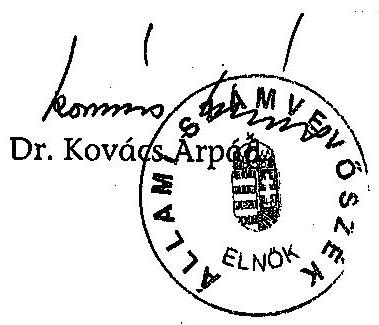

# JELENTÉS 

a Szabad Demokraták Szövetsége -
Magyar Liberális Párt
2003-2004. évi gazdálkodása
törvényességének ellenőrzéséről

---

3. Önkormányzati és Területi Ellenőrzési Igazgatóság
3.1. Szabályszerüségi Ellenőrzési Főcsoport
V-1019-021/2005.
Témaszám: 779
Vizsgálat-azonosító szám: V-0221
Az ellenőrzést felügyelte:
Dr. Lóránt Zoltán
főigazgató
Az ellenőrzés végrehajtásáért felelős:
Dr. Elek János
általános főigazgató-helyettes
Az ellenőrzést vezette:
Horváth Balázs
főcsoportfőnök-helyettes
Az összefoglaló jelentést készítette:
Tóth István
tanácsadó
Az ellenőrzést végezték:
Tóth István Baracsi Szilvia
tanácsadó számvevő

# A témához kapcsolódó eddig készített számvevőszéki jelentések: 

címe
sorszáma
A Szabad Demokraták Szövetsége 1991. évi gazdálkodása 161
törvényességének ellenőrzése
A Szabad Demokraták Szövetsége 1992-1993-1994. évi 279
gazdálkodása törvényességének ellenőrzése
A Szabad Demokraták Szövetsége 1995-1996. évi gazdálkodása 407
törvényességének ellenőrzése
A Szabad Demokraták Szövetsége 1997-1998. évi gazdálkodása 9936
törvényességének ellenőrzése
A Szabad Demokraták Szövetsége 1999-2000. évi gazdálkodása 0131
törvényességének ellenőrzése
A Szabad Demokraták Szövetsége 2001-2002. évi gazdálkodása 0352
törvényességének ellenőrzése

Jelentéseink az Országgyűlés számítógépes hálózatán és az Interneten a www.asz.hu címen is olvashatók.

---

# TARTALOMJEGYZÉK 

BEVEZETÉS ..... 5
I. ÖSSZEGZŐ MEGÁLLAPÍTÁSOK, KÖVETKEZTETÉSEK, JAVASLATOK ..... 6
II. RÉSZLETES MEGÁLLAPÍTÁSOK ..... 10

1. A Párt gazdálkodásáról szóló 2003-2004. évi beszámolók ..... 10
1.1. A teljes vizsgálati időszakra érvényes megállapítások ..... 10
1.2. A 2003. és 2004. évi beszámoló ..... 10
1.2.1. Bevételek ..... 10
1.2.2. Kiadások ..... 11
2. A Pártnak a beszámoló összeállítására és az azt alátámasztó könyvvezetésre vonatkozó belső szabályozása és gyakorlata ..... 12
2.1. A belső szabályozás rendszere ..... 12
2.2. A könyvvezetés gyakorlata, összhangja a törvényi és a belső előírásokkal ..... 13
2.3. Analitikus nyilvántartások ..... 13
2.4. A bizonylati elv és a bizonylati fegyelem érvényesülése ..... 14
3. A Párt bevételszerző, gazdálkodó tevékenysége ..... 14
4. A gazdálkodással összefüggő, egyéb jogszabályokban foglalt előírások betartása ..... 15
4.1. Személyi jellegű kifizetések ..... 15
4.2. Az adózási, társadalombiztosítási és egyéb jogszabályok rendelkezéseinek érvényesítése ..... 15
5. A Párt belső ellenőrzésének rendszere ..... 16
5.1. A belső ellenőrzés rendszerének szabályozottsága ..... 16
5.2. A belső ellenőrzés múködése ..... 16
6. Az előző ellenőrzés megállapításaira tett intézkedések ..... 16

## MELLÉKLETEK

1. számú A Szabad Demokraták Szövetsége 2003. évi pénzügyi beszámolója
2. számú A Szabad Demokraták Szövetsége- Magyar Liberális Párt 2004. évi pénzügyi beszámolója

---

.

---

# RÖVIDÍTÉSEK JEGYZÉKE 

| APEH | Adó és Pénzügyi Ellenőrzési Hivatal |
| :-- | :-- |
| ÁSZ | Állami Számvevőszék |
| OEP | Országos Egészségbiztosítási Pénztár |
| OTP Bank Rt. | Országos Takarékpénztár Bank Rt. |
| Párt | Szabad Demokraták Szövetsége - Magyar Liberális Párt |
| Párttörvény | A pártok múködéséről és gazdálkodásáról szóló - többször   módosított - 1989. évi XXXIII. törvény |
| Számviteli törvény | A számvitelről szóló - többször módosított - 2000. évi C.   törvény |
| Szja törvény | A személyi jövedelemadóról szóló - többször módosított -   1995. évi CXVII. törvény |
| SZMSZ | Szervezeti és Múködési Szabályzat |

---

.

---

# JELENTÉS 

## A Szabad Demokraták Szövetsége - Magyar Liberális Párt 2003-2004. évi gazdálkodása törvényességének ellenőrzéséről

## BEVEZETÉS

A pártok múködéséről és gazdálkodásáról szóló - többször módosított - 1989. évi XXXIII. törvény (továbbiakban: párttörvény) 10. § (1) bekezdése, valamint az Állami Számvevőszékről szóló 1989. évi XXXVIII. törvény 5. §-a és a 16. § (2) bekezdése alapján a pártok gazdálkodása törvényességének ellenőrzésére az Állami Számvevőszék (továbbiakban: ÁSZ) jogosult. Az ÁSZ 2005. évi ellenőrzési tervének megfelelően vizsgálta a Szabad Demokraták Szövetsége-Magyar Liberális Párt (továbbiakban: Párt) 2003-2004. évi gazdálkodásának törvényességét.

Az ellenőrzés célja annak megállapítása volt, hogy:

- a Párt által készített és a Magyar Közlönyben, valamint a Párt internetes honlapján közzétett éves beszámolók a törvényi előírásoknak megfelelnek-e, a könyvvezetéssel és a valósággal megegyező adatokat tartalmaznak-e;
- a könyvvezetés és a gazdálkodás során betartották-e a számvitelről szóló többször módosított - 2000. évi C. tv. (továbbiakban: számviteli törvény) és az egyéb jogszabályi rendelkezéseket és belső előírásokat;
- a Párt a múködéséhez szabályszerűen igénybe vehető forrásokat használt-e fel, nem folytatott-e a párttörvény által tiltott gazdálkodó tevékenységet, nem fogadott-e el tiltott vagyoni hozzájárulást, illetőleg adományt.

Az ellenőrzés körülményeit illetően rögzíteni szükséges, hogy az ÁSZ évek óta folyamatosan javasolja a Kormánynak a pártellenőrzésekről készített jelentéseiben a párttörvény módosítását tekintettel arra, hogy

- a párttörvény 1. számú melléklete szerinti beszámoló-mintához magyarázatot, kitöltési útmutatót nem készítettek a jogalkotók, így ennek kitöltése pártonként - kialakított számviteli politikájuknak megfelelően - eltérő lehet;
- a beszámoló-minta a számviteli törvény rendelkezéseivel nem harmonizál, nem felel meg sem a mérleg, sem az eredmény-kimutatás követelményeinek.

Az ellenőrzés előkészítését és végrehajtását az ÁSZ elnöke 13/2003. 03. 25. sz. utasításával kiadott „Módszertan a pártok gazdálkodása törvényességének ellenőrzéséhez" c. kiadvány és a 14/2003. 12. 15. sz. elnöki határozattal elfogadott segédletben foglaltak alapján végeztük.
A helyszíni ellenőrzésre: 2005. július 8-szeptember 22-e között, a Párt bérelt, 1143 Budapest, Gizella u. 36. szám alatti központi székházában került sor.

---

# I. ÖSSZEGZŐ MEGÁLLAPÍTÁSOK, KÖVETKEZTETÉSEK, JAVASLATOK 

A Párt 2003. és 2004. évi pénzügyi beszámolóit a párttörvényben előírt határidőben, meghatározott formában közzétette. A Magyar Közlönyben és az internetes honlapon megjelent beszámolók összeállítása során sérült a számviteli törvény teljességre, valódiságra és következetességre vonatkozó elve.

A Párt mindkét évben elmulasztotta az önkormányzati ingatlanok kedvezményes használatával, valamint ingyenes eszközhasználattal összefüggésben kapott nem pénzbeli vagyoni hozzájárulások értékelését, ennek következtében a beszámolóban való szerepeltetését is. Az Európai Parlament képviselő választási kampány ingyenes eszközhasználatával összefüggő értéket a vizsgálat során 300 ezer Ft-tal dokumentálták. Az önkormányzati ingatlanokhoz kapcsolódó vagyoni hozzájárulás értékére az ellenőrzés nem kapott információt, így a hiba mértéke nem volt értékelhető az ÁSZ-nál általánosan elfogadott 2\%-os lényegességi küszöb viszonylatában.

A 2004. évi beszámolóban a bevételeknél 180 ezer Ft-tal több tagdíjat közöltek; a kiadásoknál a pártalapítvány 595 ezer Ft összegű alapítói vagyonának befizetését a számlarendi előírástól eltérően vállalkozás alapítására fordított összegként jelezték, az eszközbeszerzés összegéből - a pénzügyi beszámoló összeállítására vonatkozó rendelkezés pontatlansága miatt - kihagyták a főkönyvben szerepelt 1069 ezer Ft értékű lízingdíjat. A hibák a bevételi, illetve kiadási főösszegre vetítve nem minősültek lényegesnek.

A Párt beszámolási és könyvvezetési szabályozásának rendszere a 2001. január 1-től hatályos számviteli szabályozásokon alapult. A számlarendet az ÁSZ előző jelentésének felhívására 2003. január 1-jei hatállyal kiegészítették. A beszámolási hibák részben a számviteli szabályozás hiányosságaiból fakadtak. A számviteli politikában a gazdálkodási változásokra tekintettel nem aktualizálták a beszámoló főkönyvi kapcsolatát meghatározó előírásokat. Az amortizációs politika keretében nem rendelkeztek a terv szerinti értékcsökkenés számviteli törvényben rögzített sajátos elszámolási szabályairól. A pénzkezelési szabályzat nem terjedt ki a banki átutaláshoz használt kódok kezelésére, a hozzáférés jogosultjainak és felelősségének meghatározására. Az értékelési szabályzat nem tartalmazta a részletes értékelési eljárásokat, módszereket és ellenőrzésének szempontjait.

A beszámoló alapjául szolgáló központi könyvvezetést külső szolgáltatói szerződéssel, kettős könyvviteli program alkalmazásával végezték. A 2003. január 1-jétől hatályos számlarendi változásokat a könyvelési programban átvezették. A rendelkezésre álló dokumentumok alapján a könyvelés idősorrendben valósult meg; a számlakijelölés gyakorlatában érvényesítették a törvényi és belső szabályozási előírásokat. A szabályozási hiányosságok miatt a főkönyvben nem könyveltek nem pénzbeli vagyoni hozzájárulásokat, nem számoltak el terv szerinti értékcsökkenést.

---

A főkönyvi számlákhoz rendelt analitikus nyilvántartások körét, vezetésének módját szabályozták. A törvényi követelményeknek és a belső előírásoknak megfelelően vezették a befektetett pénzügyi eszközök, a különféle követelések és kötelezettségek, az időszaki pénztárjelentések, a szigorú számadású nyomtatványok nyilvántartását. A számviteli szabályozáshoz képest az immateriális javak és tárgyi eszközök nyilvántartásából hiányoztak az értékcsökkenésre, maradványértékre, élettartamra vonatkozó adatok; az előlegekről vezetett nyilvántartásban nem jelölték az előleg jogcímét, határidejét, elszámolt összegét.

Az eszközök és források leltározását évente kiadott leltározási utasítás - ütemterv szerint, szabályszerűen bonyolították; kivéve egy 180 ezer Ft összegű könyvelési többletet, amelyet az előírt határidőt követően bizonylatoltak, könyveltek.

A bizonylati rend és okmányfegyelem követelményeit a számviteli szabályzatokban meghatározták, ennek megfelelően betartották az utalványozás és kötelezettségvállalás rendelkezéseit, összeférhetetlenségi korlátozásait. A kódok használatáról a pénzkezelési szabályzatban nem rendelkeztek, de az átutalási gyakorlat megfelelő volt. A Pártnál nem érvényesültek teljes körűen a számviteli törvényben rögzített bizonylati elv és fegyelem szabályai. Nem megfelelően bizonylatolták a nem pénzbeli vagyoni hozzájárulásokat, illetve a leltári többletet főkönyvi zárást követően jegyzőkönyvezték. Hiányoztak a bizonylati szabályzatba foglalt alaki és tartalmi kellékek a kiküldetési és pénztárbizonylatokról; nem készült a csoportos tagdíj könyveléséhez szabályos összesítő.

A Párt 2003-2004. évi gazdálkodásához megállapított állami támogatáson felül jelentős bevételt szerzett tagdíjak, egyéb hozzájárulások és adományok címén; továbbá a tulajdonát képező eszközök értékesítéséből és bérbeadásából, szabad pénzeszközei kamatozásából, rendezvényszervezési és propaganda tevékenységből, költség- és kártérítésből. A könyvvitel nyilvántartásai szerint betartotta a párttörvényben előírt gazdálkodási tilalmakat és forrásszerzési korlátokat, kizárólag engedélyezett gazdálkodó tevékenységeket folytatott. A Pártnak a tulajdonában álló egyszemélyes kft nyereségéből bevétele nem származott. Egyik kft-je 2004-ben végelszámolással megszűnt, a másik társasággal pénzügyileg rendezett szolgáltatási kapcsolatban állt.

A Párt a helyi önkormányzatoktól szerződéssel bérelt ingatlanok közül 17 használatáért egyik évben sem fizetett bérleti díjat; 2003-ban öt, 2004-ben hat ingatlannál a piaci értéknél kisebb összeget térített. Az ezzel összefüggésben kapott nem pénzbeli vagyoni hozzájárulások értékét a párttörvény szerint elmulasztották megállapítani.

A Párt a személyi jellegú kifizetéseket a külföldi kiküldetések, valamint a személygépkocsik hivatali célú használatának költségtérítési szabályzata szerint teljesítette. A Párt tulajdonában álló gépkocsikat üzemanyagkártyás, kulcsos rendszerben használták, futásteljesítményéről menetlevelet vezettek. A gépkocsik igény szerinti vezetésére két megbízási szerződést kötöttek, de nem határozták meg a gépkocsi átadás-átvétel szabályait, a teljesítmény és várakozási idő elszámolási rendjét, a teljesítésigazolás módját. A külföldi kiküldetéseket szabálytalanul bizonylatolták, a magántulajdonú gépjárművek hivatali célú használatának költség elszámolási gyakorlata nem felelt meg az Szja törvény előírásainak.

---

A Párt munkáltatói jogkörében teljesítette adózási- társadalombiztosítási kötelezettségeit. Megállapították a munkavállalót terhelő levonásokat, előírták a munkáltatót terhelő költségvetési kötelezettségeket. Az adók és járulékok bevallását és befizetését szabályszerűen teljesítették. A Párt a tulajdonában álló gépkocsikra cégautó-adót fizetett, a külföldi kiküldetések napidíja után szabályszerűen teljesítette kötelezettségeit. A természetbeni juttatást a törvényben rögzített adómentes mértékkel folyósították.

A Párt belső ellenőrzésének rendszerét alapdokumentumok szabályozták. Az alapszabály a számvizsgáló bizottság hatáskörébe utalta a gazdálkodás folyamatos ellenőrzését, a pénzügyi és számviteli szabályok érvényesülésének figyelemmel kísérését. A vezetői ellenőrzés jogosultsági keretét az SZMSZ, konkrét feladatait a pénzkezelési szabályzat határozta meg. A munkafolyamatba épített ellenőrzés követelményeiről a számviteli szabályozások rendelkeztek.

A számvizsgáló bizottság az ügyrendben előírt éves munkaterv alapján múködött. A bizottság mindkét évben véleményezte a gazdálkodási beszámolót, ajánlást tett a költségvetés elfogadására. A célvizsgálatoknál szabálytalanságot nem dokumentáltak. A vezetői és munkafolyamatba épített ellenőrzés az utalványozás és pénztárellenőrzés területén eredményesen funkcionált, de visszatérően jelentkeztek bizonylatolási, kifizetési szabálytalanságok.

A Párt az előző ÁSZ jelentés felhívására kiegészítette számlarendjét, de a kiküldetési költségek szabályszerű elszámolására tett intézkedések eredménytelenek voltak.

A helyszíni ellenőrzés megállapításainak hasznosítása mellett az Állami Számvevőszék elnöke felhívja

# a Párt elnökét 

1. Gondoskodjon a párttörvény 4. § (2) bekezdésében foglaltak szerint a kedvezményes önkormányzati ingatlanhasználat formájában kapott nem pénzbeli vagyoni hozzájárulások megállapításáról, a beszámoló összeállítása során a számviteli törvény 15. § (2), (3), (5) bekezdésében előírt számviteli elvek érvényesítéséről.
2. Intézkedjen a beszámolási és könyvvezetési szabályok számviteli törvényhez, gazdasági sajátosságokhoz igazodó kiegészítésére:
a) a számviteli törvény 52. § (1) - (7) bekezdésére figyelemmel rendelkezzenek a terv szerinti értékcsökkenés elszámolási szabályairól,
b) a gazdálkodási változásokra tekintettel pontosítsák az éves beszámoló főkönyvi kapcsolatát, valamint a banki átutalások bonyolításának rendjét meghatározó szabályozásokat,
c) a számviteli törvény 14. § (3)-(4) bekezdésében foglalt számviteli alapelvekkel összhangban alakítsák ki az értékelési eljárásokat, módszereket és ellenőrzési szempontokat.

---

3. Biztosítsa teljes körűen a főkönyvi számlákhoz rendelt analitikus nyilvántartások szabályszerű vezetését.
4. Szerezzen érvényt a számviteli törvény 165. § (1) bekezdésében foglalt bizonylati elv és fegyelem, továbbá a bizonylatolás 167. § (1) bekezdésében meghatározott alaki és tartalmi követelményeinek.
5. Rendeljen el önellenőrzést a kiküldetési költségtérítések felülvizsgálatára, figyelemmel az Szja törvény 25. § (2)-(3) bekezdése, valamint az 5. számú melléklet II/7. pontja előírásainak betartására.
6. Módosítsa a Párt tulajdonában lévő gépkocsik vezetésére kötött megbízási szerződéseket annak érdekében, hogy a munkajogi kötelezettség és felelősség egyértelművé váljon, ellenőrizhető legyen.

Az ellenőrzési tapasztalatokra figyelemmel javasoljuk:

# a Kormánynak 

Kezdeményezze a párttörvény következők szerinti módosítását:
A korábbi pártellenőrzések alapján tett jelzésekre is figyelemmel a pártok számviteli nyilvántartási és beszámolási rendszerét érintő ellentmondások feloldását, amelyek a pártok működéséről és gazdálkodásáról szóló - többször módosított - 1989. évi XXXIII. törvény, valamint a 2001. január 1. napjától hatályos számviteli törvény között továbbra is fennállnak.

---

# II. RÉSZLETES MEGÁLLAPÍTÁSOK 

## 1. A PÁrt GAZDÁlKODÁSÁról SZÓLÓ 2003-2004. ÉVI BESZÁMOLÓK

### 1.1. A teljes vizsgálati időszakra érvényes megállapítások

A Párt az előző évi gazdálkodásáról szóló beszámolóit mindkét évben, a párttörvényben előírt határidőn belül, meghatározott formában közzétette. A 2003. évi beszámolója 2004. április 22-én a Magyar Közlöny 52. számában, a 2004. évi beszámolója 2005. április 28-án a Magyar közlöny 56. számában, valamint internetes honlapján jelent meg (1-2. számú melléklet).

A Párt közzétett beszámolói a központilag vezetett, számítógépes rendszerú, kettős könyvvitel zárlati nyilvántartásain alapultak és tartalmazták a Párt valamennyi szervezetének gazdasági adatait.

A Párt a vizsgált időszakban elmulasztotta két eset kivételével a nem pénzbeli vagyoni hozzájárulások értékelését, ennek következtében a beszámolókban való szerepeltetését is. A Párt az Európai Parlament képviselő választási kampány ingyenes eszközhasználatával összefüggő nem pénzbeli vagyoni hozzájárulás értékét a vizsgálat során 300 ezer Ft-tal igazolta. Az önkormányzati ingatlanok kedvezményes használatával kapcsolatosan az ellenőrzés nem kapott információt a nem pénzbeli vagyoni hozzájárulás értékére, így a hiba mértéke nem volt értékelhető a pártok ellenőrzésénél alkalmazott 2\%-os lényegességi küszöb viszonylatában. Az értékelés hiánya miatt sérült a számviteli törvény 15. § (2)-(3) bekezdésében foglalt teljesség és valódiság elve.

### 1.2. A 2003. és 2004. évi beszámoló

### 1.2.1. Bevételek

A tagdíjak összegét 2003-ban helyesen közölték, a 2004. évre szerepeltetett 11162 ezer Ft bevétel ténylegesen 180 ezer Ft-tal kevesebb volt. Az eltérést szabálytalan bizonylatolásból eredő könyvelési hiba okozta.

Az állami költségvetésből származó támogatást mindkét évben a Magyar Államkincstár által folyósított 282000 ezer Ft összeggel egyezően szerepeltették.

Az egyéb hozzájárulások, adományok 2003. évi 107375 ezer Ft, illetve 2004. évi 136977 ezer Ft összegét a párttörvény előírása szerint részletezték. Az éves beszámolókban nevesítendő, értékhatár feletti hozzájárulás külföldi jogi személyektől, valamint belföldi magánszemélyektől teljesült. A beszámolósorok összegei egyeztek a főkönyvi és analitikai adatokkal.

---

Az egyéb bevételeket a számviteli politikában meghatározott kapcsolati rendnek megfelelően közölték. A 2004. évi beszámoló 253490 ezer Ft összege belső előírás szerint - tartalmazta az igénybe vett kölcsönöket is.

# 1.2.2. Kiadások 

A Párt hatályos számlarendjében teremtett összhangot a beszámolás és könyvvezetés eltérő szerkezete között. Ennek alapján a kiadási sorokhoz rendelt főkönyvi számlák eseti eltérést mutattak.

A támogatás egyéb szervezeteknek beszámolósoron közölt adat mindkét évben megegyezett az adott támogatások számla egyenlegével. A főkönyvi számlákon a jogcímnek megfelelő támogatásokat könyveltek.

A vállalkozás alapítására fordított összeg beszámolósoron 2004. évben tévesen közölték az 595 ezer Ft összegű kiadást, amely a főkönyvben „Alapítói vagyon befizetése Szabó Miklós Alapítvány" megjelöléssel szerepelt. A párttörvény 6. § (3) bekezdésének rendelkezése szerint „a párt vállalatot hozhat létre, továbbá egyszemélyes korlátolt felelősségú társaságot alapithat". Az alapítvány létrehozása a párttörvény 9/A § (1) bekezdése alapján történt, amelynek tevékenysége tudományos, ismeretterjesztő, kutatási célokra irányulhat. Az alapítványok gazdálkodásának rendjéről szóló 115/1992. (VII. 23.) Korm. rendelet 2. § (2) bekezdése alapján vállalkozási tevékenységet csak kiegészítő jelleggel végezhet. A számlarendje szerint az 595 ezer Ft alapítói vagyont nem e beszámoló soron, hanem az egyéb kiadások között kellett volna kimutatni. A hiba következtében sérült a számviteli törvény 15. § (5) bekezdésében foglalt következetesség elve.

A múködési kiadások ismérveit meghatározták, a belső előírásokat betartották. A beszámolóban szereplő összeg mindkét évben megegyezett a kapcsolódó főkönyvi számlák együttes egyenlegével.

Az eszközbeszerzés 2003. évi adata megegyezett a tárgyévben beszerzett immateriális javak és tárgyi eszközök értéknövekményével. A 2004. évi beszámolóból a pénzügyi beszámoló összeállítására vonatkozó rendelkezés pontatlansága miatt kimaradt a főkönyvben szereplő 1069 ezer Ft összegű lízingdíj értéke. A hiba miatt nem érvényesült teljes körűen a számviteli törvény 15. § (2) bekezdésében foglalt teljesség elve.

A politikai tevékenység kiadásai beszámolósoron a Párt a számviteli politikában meghatározottaknak megfelelően a reklám, propaganda költség; a tanulmány, közvélemény kutatás költségei; az üzleti vendéglátás; a rendezvényköltség; az országgyűlési választási és a helyhatósági választási költségek főkönyvi számlái összesített adatát mutatta ki. Ennek keretében külön kimutatták a 2004. évi időközi országgyűlési képviselő választásra fordított 886 ezer Ft összegű kiadást.

Egyéb kiadások soron a beszámolók mindkét évben az egyéb ráfordítások, a pénzügyi műveletek egyéb ráfordításai, a rendkívüli ráfordítások és a Cityház Kft elszámolási számla főkönyvi számlák összesített adatait tartalmazták.

---

# 2. A PÁrtnak a beszámoló ÖsszeÁllítására És az azt alátáMASZTÓ KÖNYVVEZETÉSRE VONATKOZÓ BELSŐ SZABÁLYOZÁSA ÉS GYAKORLATA 

### 2.1. A belső szabályozás rendszere

A Párt beszámolási és könyvvezetési szabályozásának rendszere 2001. január 1-jétől hatályos szabályozásokon alapult. A számviteli törvénnyel összhangban kiadott számviteli politika és hozzákapcsolódó pénzkezelési, értékelési, leltározási szabályzat előírásait a vizsgált időszakban nem módosították.

A számviteli politika részeként szabályozták a pénzügyi beszámoló összeállításának rendjét. A beszámoló főkönyvi kapcsolatát meghatározó szabályozást a gazdálkodási változásokkal összhangban nem aktualizálták (pártalapítványnak vagyonjuttatás, kölcsönfelvétel, lízingdíj). Az amortizációs politika keretében nem rendelkeztek a terv szerinti értékcsökkenés elszámolási szabályairól, amelynek követelményeit a számviteli törvény 52. § (1)-(7) bekezdése rögzíti.

A pénzkezelési szabályzatban meghatározták a házipénztárak működésének alapvető szabályait. A banki átutalások kihelyezett ügyfélterminálon való bonyolítási rendjével összefüggésben a szabályozás nem terjedt ki az átutaláshoz használt kódok kezelésére, a hozzáférés jogosultjainak és felelősségének meghatározására. A hiányosság vagyonvédelmi kockázatot jelentett.

Az eszközök és források értékelési szabályzat a számviteli politika elveivel összhangban nem tartalmazta a gazdálkodó eszközeihez és forrásaihoz kapcsolódó részletes értékelési eljárásokat, módszereket, azok végrehajtásának és ellenőrzésének teendőit, dokumentálását. A szabályozás nem felelt meg a számviteli törvény 14. § (3)-(4) bekezdésében foglaltaknak. A konkrét előírások hiánya könyvvezetési, beszámolási hibához vezetett.

A leltározási szabályzat a pénzügyi beszámoló alátámasztását szolgáló leltár összeállítását írta elő. A szabályzat tartalmazta a leltározás fogalmát, a leltározás során elvégzendő feladatokat, továbbá rögzítette a leltározás végrehajtásának módját és értékelésének szabályait, dokumentációs követelményeit.

A számlarendet az ÁSZ előző jelentésének felhívására 2003. január 1-jei hatállyal kiegészítették, figyelemmel a számviteli törvény 161. § (2)-(3) bekezdésében foglalt követelményekre. A számlarendhez kialakított bizonylati szabályzat, valamint 2003. és 2004. évre alkalmazott számlatükör összhangban állt a jogszabályi követelményekkel, illetve a gazdálkodási sajátosságokkal.

A Pártnál a gazdálkodás törvényességét segítette a külföldi kiküldetési szabályzat; a hivatali gépkocsik használatára, nyilvántartására, igénylésére vonatkozó szabályzat; a selejtezési szabályzat. A szabályzatok összhangban voltak az időszakban hatályos jogszabályokkal.

---

# 2.2. A könyvvezetés gyakorlata, összhangja a törvényi és a belső előírásokkal 

A könyvvezetést és a beszámoló összeállítását mindkét ellenőrzött évben ugyanazon külső vállalkozás végezte. A számviteli szolgáltatást végző a számviteli törvény 151. § (1) bekezdés szerint meghatározott képesítéssel rendelkezik és szerepel a PM által vezetett könyvviteli szolgáltatást végzők nyilvántartásában. A könyvelő kft. a Párt központi székházában végezte tevékenységét, így az operatív információáramlás feltételei biztosítottak voltak.

A Párt számítógépes rendszerú kettős könyvvitelét mindkét vizsgált évben azonos program alkalmazásával végezte. A 2003. január 1-jétől hatályos számlarendi változásokat a könyvelési programban aktualizálták. A kialakított számítógépes könyvelésből biztosították az ellenőrzéshez szükséges adatokat. A rendelkezésre álló dokumentumok alapján a zárlati munkálatok végrehajtása - a feltárt leltáreltérés kivételével - szabályosan, határidőben történt.

A szabályozási hiányosságok miatt a főkönyvben 2003-2004. évben nem könyvelték az önkormányzati ingatlanok kedvezményes bérleti díja és a piaci érték közötti különbségből adódó nem pénzbeli vagyoni hozzájárulások értékét, a terv szerinti értékcsökkenési leírás elszámolását. Bizonylatolási mulasztásból fordult elő, hogy 180 ezer Ft-tal több tagdíjat könyveltek. A könyvvezetési hibák miatt sérült a számviteli törvény 15. § (2)-(3) bekezdésében előírt teljesség és valódiság elve.

A területi irodák, csoportok, a budapesti kerületi szervezetek pénzforgalmi analitikát vezettek. A havi rendszerességgel teljesült könyvelési feladások feldolgozása a Párt központjában teljes körűen, idősorrendben valósult meg. A könyvelés számára átadott bizonylatok alaki és tartalmi követelményét rendszeresen ellenőrizték, az észlelt hiányosságokat pótoltatták. A számlakijelölés (kontírozás) gyakorlatában érvényesítették a törvényi és belső előírásokat.

### 2.3. Analitikus nyilvántartások

A Párt a számviteli törvény 161. § (2) bekezdés c) pontja alapján számlarendjében szabályozta a főkönyvi számlákhoz rendelt analitikák körét, vezetésének módját. A befektetett pénzügyi eszközök, különféle követelések és kötelezettségek nyilvántartása, egyeztetése megfelelt a számlarend előírásainak. A házipénztári nyilvántartások vezetését és ellenőrzését szabályszerűen végezték. A szigorú számadás alá vont bizonylatokat a számviteli törvény 168. § (3) bekezdésében és a pénzkezelési szabályzatban előírtak szerint tartották nyilván. Az immateriális javak és tárgyi eszközök nyilvántartásában hiányoztak az értékcsökkenésre, maradványértékre, élettartamra vonatkozó adatok; az elszámolásra kiadott előlegekről vezetett nyilvántartásban nem jelölték az előleg jogcímét, határidejét, elszámolt összegét.

Az eszközök és források leltározását szabályozás szerint évente kiadott leltározási utasítás és ütemterv alapján bonyolították. A leltározás során - egy 180 ezer Ft összegű könyvelési többlet jegyzőkönyvezésének, rendezésének kivételével - érvényesültek a jogszabályi és belső előírások.

---

# 2.4. A bizonylati elv és a bizonylati fegyelem érvényesülése 

A Pártnál elnöki utasítás rendelkezett az utalványozás és kötelezettségvállalás rendjéről. A Párt elnöke a területi irodák utalványozási joggyakorlását 2003ban az összeférhetetlenségi követelményekre figyelemmel újraszabályozta. Az elnöki utasításban foglaltakat betartották.

A Párt a banki átutalások teljesítésére az OTP Bank Rt. által szerződéssel kihelyezett ügyfélterminált üzemeltet, amelyhez azonosítási célból titkos jelszót és kulcslemezt bocsátottak a számlatulajdonos részére. A kódok használatának rendjéről a pénzkezelési szabályzat nem rendelkezett, de a banki átutalások gyakorlata megfelelő volt.

Az utalványozott pénzforgalmi bizonylatokhoz az előírt alapbizonylatokat csatolták. A bizonylatok feldolgozása a számviteli törvény 165. § (3) bekezdésében és a számviteli politikában meghatározott idősorrendben történt. A vegyes bizonylatok alapján könyvelt tételekhez megfelelő részletező kimutatások, számviteli bizonylatok kapcsolódtak.

A Párt nem teljes körűen érvényesítette a bizonylati elv és a bizonylati fegyelem 165. § (1) bekezdésben foglalt követelményét: nem pénzbeli vagyoni hozzájárulásokat nem bizonylatoltak, leltáreltérést főkönyvi zárást követően jegyzőkönyveztek. A bizonylatolás számviteli törvény 167. § (1) bekezdésben meghatározott, a Pártnál bizonylati szabályzatba foglalt alaki és tartalmi kellékei részben hiányoztak: könyvelés tényét, időpontját nem igazolták; csoportos tagdíj könyveléséhez szabályos összesítő nem készült, kiküldetési bizonylatokon az előírt adat, aláírás nem szerepelt.

## 3. A PÁRT BEVÉTELSZERZŐ, GAZDÁLKODÓ TEVÉKENYSÉGE

A Párt 2003-2004. évi gazdálkodásához megállapított állami támogatáson felül jelentős bevételt szerzett tagdíjak, hozzájárulások és adományok, egyéb bevételek (eszközértékesítés, költségtérítés, bérbeadás, kártérítés, kamat, visszatérítés, rendezvényszervezés, propaganda tevékenység) címén.

A Párt könyvviteli nyilvántartásai szerint a párttörvény 4. §-ában meg nem engedett forrásból származó, illetve névtelen vagyoni hozzájárulást nem fogadott el; a párttörvény 6. §-ában nem engedélyezett gazdálkodó tevékenységet nem folytatott, gazdasági társaságban részesedést nem szerzett, értékpapírt nem vásárolt. A tulajdonában álló egyszemélyes kft-k nyereségéből bevétele nem volt.

A Párt olyan nem pénzbeli vagyoni hozzájárulásokra is szert tett, amelyek értékeléséről a párttörvény 4. § (5) bekezdése szerint nem gondoskodott. A helyi önkormányzatoktól szerződéssel bérelt ingatlanok közül az egyes időszakokban 17 használatáért bérleti díjat nem fizettek, további öt illetve hat ingatlannál a bérleti díj mértéke kedvezményesnek minősült. 2004-ben választási kampányhoz 300 ezer Ft értékben Rt-től kölcsönkapott számítógépes eszközöket.

A Párt két, korábban alapított egyszemélyes kft-vel rendelkezett, amelyből az egyik 2004-ben végelszámolással megszűnt. A másik társasággal pénzügyileg rendezett megrendelői-szállítói kapcsolatban állt.

---

# 4. A GAZDÁLKODÁSSAL ÖSSZEFÜGGŐ, EGYÉB JOGSZABÁLYOKBAN FOGLALT ELŐÍRÁSOK BETARTÁSA 

### 4.1. Személyi jellegú kifizetések

A külföldi kiküldetéshez kapcsolódó valuta felvételét, elszámolását és nyilvántartását a Pártnál hatályos külföldi kiküldetések szabályzat határozta meg. Az elszámolásra előírt nyomtatványról minden esetben hiányzott a kiküldött aláírása, a repülőjeggyel való ellátás tényének feltüntetése.

A Párt 2001. január 1-től hatályos szabályozása szerint engedélyezték a személygépkocsik hivatali célú használatát, költségtérítését. A Párt tulajdonában álló gépkocsikat üzemanyagkártyás, kulcsos rendszerben használták, futásteljesítményéről menetlevelet vezettek. A gépkocsik igény szerinti vezetésére 2003. január 1-jei hatállyal megbízási szerződést kötöttek két magánszeméllyel, de nem határoztak meg fontos munkajogi kötelezettségeket: gépkocsi átadásátvétel szabályait, teljesítmény és várakozási idő elszámolási rendjét, teljesítésigazolás módját. A Párt a magántulajdonú gépjárművek hivatali célú használatát alkalmazottainak és tagjainak kiküldetési rendelvény alapján, normatív módon térítette. A kiküldetési rendelvények $80 \%$-án nem tüntették fel az utazás célját, hiányzott a kiküldetés elrendelése és az utazási időpontok pontos feltüntetése. A költségelszámolások 90\%-ánál az előírt útnyilvántartás helyett kiküldetési rendelvényt használtak. A hibák következtében az elszámolások nem feleltek meg az Szja törvény 25. § (2) bekezdés c) pontja és (3) bekezdése, valamint az 5. sz. melléklet II/7. pontja előírásának.

### 4.2. Az adózási, társadalombiztosítási és egyéb jogszabályok rendelkezéseinek érvényesítése

A Párt munkáltatói jogkörében folyamatosan eleget tett a társadalombiztosításról és az egészségügyi ellátásról, valamint a személyi jövedelemadóról és az adózás rendjéről szóló hatályos törvényi előírásoknak. A munkaerő foglalkoztatásához és a kifizetői feladatokhoz rendelt nyilvántartásokat áttekinthetően vezette, a kötelező adatszolgáltatásokat teljes körűen, határidőben teljesítette. A Pártnál megállapították a munkavállalót terhelő levonásokat, előírták a munkáltatót terhelő költségvetési kötelezettségeket. Az adók és járulékok bevallását, befizetését teljesítették. Az APEH által küldött folyószámla kivonatok határidő előtti teljesítésből eredően túlfizetést mutattak.

A Párt a saját tulajdonú gépkocsik után cégautó adót fizetett; a külföldi kiküldetések napidíja után a személyi jövedelemadót megfizette, az érintettek részére az adófizetési kötelezettséget tartozásként előírta. Természetbeni juttatásként étkezési hozzájárulást biztosítottak, amelynél mindenkor figyelemmel voltak az Szja törvény 1. számú melléklet 8.17. pontjában rögzített adómentes mértékre.

A Párt bejegyzett társadalombiztosítási kifizetőhelyként múködött. A vizsgált időszaki táppénzek és egyéb juttatások folyósításának szabályszerűségét az OEP nem ellenőrizte.

---

# 5. A PÁRT BELSŐ ELLENŐRZÉSÉNEK RENDSZERE 

### 5.1. A belsö ellenőrzés rendszerének szabályozottsága

A Párt alapszabálya a számvizsgáló bizottság hatáskörébe utalta a gazdálkodás folyamatos ellenőrzését; a gazdálkodási, pénzügyi és számviteli szabályok érvényesülésének figyelemmel kísérését. A választott testület ügyrendben szabályozta múködésének előírásait.

A vezetői ellenőrzés jogosultsági keretét az SZMSZ, konkrét feladatait a pénzkezelési szabályzat határozta meg. A munkafolyamatba épített ellenőrzés követelményeiről a számviteli szabályozások rendelkeztek.

### 5.2. A belső ellenőrzés múködése

A számvizsgáló bizottság az ügyrendben előírt éves munkaterv alapján múködött. A bizottság mindkét évben, közzététel előtt véleményezte az előző évi gazdálkodásról szóló beszámolót, továbbá ajánlást tett a tárgyévi költségvetés elfogadására. A testület konkrét vizsgálatot 2004-ben végzett. Munkaterv szerint ellenőrizték a Párt és kft-je szolgáltatási-elszámolási kapcsolatát, a bevételi források teljesülését, az Európai Parlament képviselő választási kampány kifizetések jogszerűségét. A célvizsgálatoknál szabálytalanságot nem dokumentáltak.

A vezetői és munkafolyamatba épített ellenőrzés az utalványozás, a pénztárellenőrzés területén eredményesen funkcionált. A belső kontrollok hiányos gyakorlására utalt, hogy visszatérően jelentkeztek bizonylatolási, kifizetési szabálytalanságok.

## 6. Az elöző elLENŐRZÉs MEGÁLLAPítÁSAIRA TETT INTÉZKEDÉSEK

A Párt a 0352. számú jelentés felhívására kiegészítette számlarendjét, amelyet az alapszabálynak megfelelően az Országos Tanács hagyott jóvá. A kiküldetési költségek szabályszerű elszámolására tett intézkedések eredménytelennek minősíthetők, mivel jellemzőek maradtak a korábban feltárt hiányosságok.

Budapest, 2005. november " 24 "

Melléklet: $\quad 2 \mathrm{db} \quad 2$ lap

---

# A Szabad Demokraták Szövetsége 2003. évi pénzügyi beszámolója

## Bevėtelek

|  1. Tagdijak | 8 266  |
| --- | --- |
|  2. Állami költségvetésből származó támogatás |   |
|  2.1. Állami támogatás alapösszege | 282 000  |
|  2.2. Egyéb címen kapott állami támogatás |   |
|  3. Képviselőcsoportnak nyújtott állami támogatás |   |
|  4. Egyéb hozzájárulások, adományok összesen | 107 375  |
|  4.1. Jogi személyektől |   |
|  4.1.1. Belföldiektől | 36  |
|  4.1.2. Külföldiektől | 27 369  |
|  100 000 forint feletti hozzájárulás nevesítve |   |
|  LIBERALIS INSTITUT OESTERREICH | 24 311  |
|  LIBERAL DEMOKRATS UK. | 2 523  |
|  CONSEIL DE L'EUROPE | 235  |
|  VOLKSPARTIJ VOOR VRIJHEIDEN DEMOCRATIE | 202  |
|  Határérték alatt külföldiektől | 98  |
|  4.2. Jogi személynek nem minősíthető gazdasági társaságtól |   |
|  4.3. Magánszemélyektől | 79 970  |
|  4.3.1. Belföldiektől 500 000 Ft feletti hozzájárulás nevesítve |   |
|  Boruzs András | 1 040  |
|  Eörsi Mátyás | 2 000  |
|  Horn Gábor | 1 000  |
|  Horuczi Csaba | 1 000  |
|  Kiss Zoltán | 850  |
|  Kovács Kálmán | 1 000  |
|  Kurdi Péter | 850  |
|  Lakos Imre | 2 000  |
|  Pető Iván | 1 000  |
|  Szent-Iványi István | 1 000  |
|  Tisler István | 690  |
|  Vásárhelyi István | 940  |
|  Belföldiektől értékhatár alatt | 66 600  |
|  4.3.2. Külföldiektől értékhatár alatt |   |
|  5. A párt által alapított vállalat és korlátolt felelősségű társaság nyereségéből származó bevétel |   |
|  6. Egyéb bevétel | 7 638  |
|  Összes bevétel a gazdasági évben: | 405 279  |

## Kiadások

|  1. Támogatás a párt országgyűlési csoportja számára |   |
| --- | --- |
|  2. Támogatás egyéb szervezeteknek | 193  |
|  3. Vállalkozások alapítására fordított összegek |   |
|  4. Működési kiadások | 222 974  |
|  5. Eszközbeszerzés | 2 468  |
|  6. Politikai tevékenység kiadásai | 43 113  |
|  6.1. Országgyűlési képviselő-választás kiadása |   |
|  6.2. Helyhatósági választás kiadása |   |
|  7. Egyéb kiadások | 77 238  |
|  Összes kiadás a gazdasági évben: | 345 986  |

Kuncze Gábor s. k., pártelnők

---

# A Szabad Demokraták Szövetsége - a Magyar Liberális Párt 2004. évi pénzügyi beszámolója 

Ezer forintban
Bevételek

1. Tagdijak ..... 11162
2. Állami költségvetésböl származó támogatás ..... 282000
2.1. Állami támogatás alapösszege ..... 282000
2.2. Egyéb címen kapott állami támogatás
3. Képviselöcsoportnak nyújtott állami támogatás
4. Egyéb hozzájárulások, adományok összesen ..... 136977
4.1. Jogi személyektól ..... 70711
4.1.1. Belföldiektől (az 500000 Ft feletti hozzájárulás nevesitve) ..... 261
4.1.2. Külföldiektől (a 100000 Ft feletti hozzájárulás nevesitve) ..... 70450
LIBERALIS INSTITUT OESTERREICH ..... 68680
PARL EUR GR. LIBERAL ..... 1770
Határérték alatt külföldiektől
4.2. Jogi személynek nem minősülő gazdasági társaságtól
4.3. Magánszemélyektől ..... 66266
4.3.1. Belföldiektől (az 500000 Ft feletti hozzájárulás nevesitve) ..... 66266
Böhm András ..... 2000
Boruzs András ..... 650
Eörsi Mátyás ..... 2500
Gadus István ..... 1540
Gál István ..... 674
Horn Gábor ..... 1000
Horuczi Csaba ..... 1000
Kovács Kálmán ..... 1000
Pető Iván ..... 1000
Rajk László ..... 720
Szent-Iványi István ..... 1000
Értékhatár alatt ..... 53182
4.3.2. Külföldiektől értékhatár alatt
5. A párt által alapított vállalat és kft. nyereségéből származó bevétel ..... -
6. Egyéb bevétel ..... 253490
Összes bevétel a gazdasági évben: ..... 683629
Kiadások
7. Támogatás a párt országgyülési csoportja számára
8. Támogatás egyéb szervezetnek ..... 10
9. Vállalkozás alapitására fordított összegek
3.1: Alapitvány alapitására fordított összeg ..... 595
10. Müködési kiadások ..... 252264
11. Eszközbeszerzés ..... 1696
12. Politikai tevékenység kiadásai ..... 337433
6.1. Országgyülési képviselőválasztás kiadása ..... 886
6.2. Helyhatósági választás kiadása ..... -
13. Egyéb kiadások ..... 90719
Összes kiadás a gazdasági évben: ..... 682717
Kuncze Gábor s. k., pártelnők