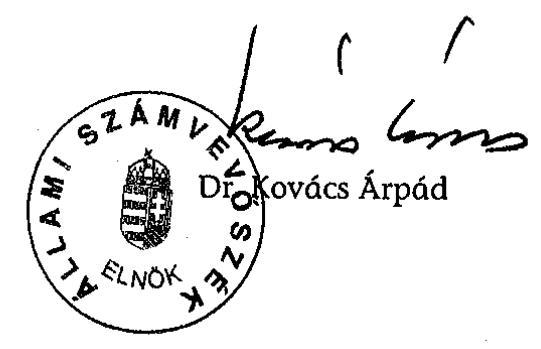

# JELENTÉS 

a Szabó Miklós Szabadelvü Alapítvány 2003-2004. évi gazdálkodása törvényességének ellenőrzéséről

---

3. Önkormányzati és Területi Ellenőrzési Igazgatóság
3.1. Szabályszerüségi Ellenőrzések Föcsoport
Iktatószám: V-1018-32/2005.
Témaszám: 777
Vizsgálat-azonosító szám: V0217

# Az ellenőrzést felügyelte: 

Dr. Lóránt Zoltán
föigazgató

## Az ellenőrzés végrehajtásáért felelős:

Dr. Elek János
föigazgató-helyettes
Az ellenőrzést vezette:
Solymár Ágnes
osztályvezető főtanácsos
Az ellenőrzésben részt vettek:
Pásztor Katalin
számvevő tanácsos
Dr. Nagy Korsa Márta
számvevő tanácsos

---

# TARTALOMJEGYZÉK 

BEVEZETÉS ..... 5
I. ÖSSZEGZŐ MEGÁLLAPÍTÁSOK, KÖVETKEZTETÉSEK, JAVASLATOK ..... 7
II. RÉSZLETES MEGÁLLAPÍTÁSOK ..... 10

1. A kuratórium gazdálkodási tevékenysége ..... 10
1.1. A gazdálkodás szabályozottsága és szabályossága ..... 10
1.2. A gazdálkodást érintő kuratóriumi határozatok ..... 12
2. Az induló vagyon és az alapítvány bevételei ..... 13
2.1. Az induló vagyon ..... 13
2.2. A központi költségvetési támogatás ..... 13
2.3. Az alapítvány bevételszerző tevékenysége ..... 15
3. A bevételek felhasználása ..... 15
3.1. Az alapítvány által nyújtott támogatások ..... 15
3.2. Az alapítvány által végzett tevékenység ráfordításai ..... 17
4. A gazdálkodás és a könyvvezetés törvényessége ..... 18
4.1. Az éves beszámolók és a könyvvezetés ..... 18
4.2. A képviseleti, utalványozási és banki aláírási jog ..... 20
5. Az adókkal, járulékokkal kapcsolatos kötelezettség teljesítése ..... 20
6. Az ellenőrzés rendszere ..... 20

## MELLÉKLETEK

1. számú Az alapítvány által nyújtott támogatások 2004-ben
2. számú Az alapítvány 2004. évi költségei
3. számú Az alapítvány 2004. évi mérlege
4. számú Az alapítvány 2004. évi eredménykimutatása

---

.

---

# RÖVIDÍTÉSEK JEGYZÉKE 

| ÁSZ | Állami Számvevőszék |
| :-- | :-- |
| ÁSZ törvény | az Állami Számvevőszékről szóló 1989. évi XXXVIII. tör- |
|  | vény |
| Kincstár | Magyar Államkincstár |
| pátalapítványi törvény | a pártok múködését segitő tudományos, ismeretterjesztő, |
|  | kutatási, oktatási tevékenységet végző alapítványokról |
|  | szóló 2003. évi XLVII. törvény |
| párttörvény | a pártok múködéséről és gazdálkodásáról szóló 1989. évi |
|  | XXXIII. törvény |
| Ptk. | a Polgári Törvénykönyvről szóló 1959. évi IV. törvény |
| Szt. | a számvitelről szóló 2000 . évi C. törvény |
| SZDSZ | Szabad Demokraták Szövetsége |
| SZMA | Szabó Miklós Tudományos, Ismeretterjesztő, Kutatási és |
|  | Oktatási Szabadelvú Alapítvány |
| SZMSZ | Szervezeti és Müködési Szabályzat |

---

.

---

# JELENTÉS 

## a Szabó Miklós Szabadelvú Alapítvány 20032004. évi gazdálkodása törvényességének ellenőrzéséről

## BEVEZETÉS

Az Országgyűlés a pártok Alkotmányban biztosított, a népakarat kialakításában és kinyilvánításában történő közreműködésének elősegítése, az állampolgári tájékoztatás szélesítése, a politikai kultúra fejlesztése érdekében történő politikai képzés, kutatás, tudományos és ismeretterjesztő tevékenység támogatására, a pártok múködését segítő tudományos, ismeretterjesztő, kutatási, oktatási tevékenységet végző alapítványokról szóló 2003. évi XLVII. törvény (pártalapítványi törvény) lehetővé tette, hogy a parlamenti pártok költségvetési támogatásra jogosult alapítványokat hozzanak létre, amelyek gazdálkodása törvényességének ellenőrzését kétévenként az Állami Számvevőszék végzi.

A Szabad Demokraták Szövetsége (SZDSZ) - a törvényben biztosított lehetőséggel élve - létrehozta a Szabó Miklós Tudományos, Ismeretterjesztő, Kutatási és Oktatási Szabadelvű Alapítványt (SZMA), amelyet a Fővárosi Bíróság 2003. december 13-án a 7.Pk.61.077/2003/2. számú végzésével nyilvántartásba vett.

Az alapítvány alapító okirat szerinti céljai a modern, európai liberális politikai kultúra magyarországi népszerüsítése, a modern, európai liberális politikai kultúra hazai társadalmi viszonyoknak megfelelő átültetése, újrafogalmazása, liberális politikai kultúrát fejlesztő programok készítése, a pluralista, demokratikus és toleráns politikai kultúra terjesztése. Az alapító e célok elérése érdekében az alapítvány feladatául határozta meg elsősorban a magyar és az európai liberális politikai célkitűzéseket népszerűsítő tájékoztatási tevékenységet, széleskörű ismeretterjesztési, tudományos kutatási tevékenységeket, politikai és egyéb társadalomtudományi képzéseket, valamint szabadelvű politikatudományi műhely létesítését.

A pártalapítványi törvény 3. § (6) bekezdése szerint az alapítvány céljára legalább a párttörvény 9/A. § (5) bekezdés a) pontja szerinti alaptámogatás 1\%ának megfelelő összegű vagyont kell rendelni. Az alapítvány a párttörvény alapján alaptámogatásban, mandátumarányos kiegészítő támogatásban és eseti támogatásban részesülhet. A támogatás összegét a költségvetési törvény évenként állapítja meg.

A pártalapítványi törvény 4. § (2) bekezdése alapján az alapítvány gazdálkodása törvényességének ellenőrzésére az Állami Számvevőszék jogosult, a törvény 4. § (4) bekezdése alapján az Állami Számvevőszék kétévenként ellenőrzi

---

azoknak az alapítványoknak a gazdálkodását, amelyek e törvény szerint állami költségvetési támogatásban részesültek.

Ellenőrzésünk célja az volt, hogy az alapítvány gazdálkodásának törvényességi ellenőrzése során értékelje, hogy

- az alapítvány alapító okirata és belső szabályzatai megteremtették-e az induló vagyon és a központi költségvetési támogatás felhasználásának törvényes kereteit;
- a kuratórium biztosította-e az alapítvány könyvvezetésének és éves beszámolóinak törvényességét;
- a kuratórium az induló vagyonnal, a központi költségvetési támogatással és az alapítvány egyéb bevételeivel, a párttörvénynek és a pártalapítványi törvénynek, valamint az alapító okiratban megjelölt céloknak megfelelően gazdálkodott-e.

Az ellenőrzés az alapítvány megalakulásától a 2004. december 31.-éig tartó időszakra terjedt ki.

---

# I. ÖSSZEGZŐ MEGÁLLAPÍTÁSOK, KÖVETKEZTETÉSEK, JAVASLATOK 

A Szabad Demokraták Szövetsége a pártalapítványi törvényben előírt induló vagyonnal (594 ezer Ft) létrehozta a Szabó Miklós Tudományos, Ismeretterjesztő, Kutatási és Oktatási Szabadelvű Alapítványt (SZMA). Az alapítvány éves költségvetési támogatásának mértéke 2003-ban is és 2004-ben is megfelelt a párttörvény által meghatározott alap-, és mandátumarányos kiegészítő támogatás együttes értékének. Az ellenőrzött időszakban az alapítvány részére adományt sem természetbeni, sem pénzbeli hozzájárulásként nem ajánlottak fel, vállalkozási tevékenységet nem folytatott, így a 149,7 millió Ft összegű központi költségvetési támogatáson kívül csak az átmenetileg szabad pénzeszközei lekötéséből származott 0,4 millió Ft bevétele.

Az alapítványi vagyon felhasználásának kereteit a pártalapítványi törvény és az alapító okirat, részletes szabályait az alapítvány belső szabályzatai rögzítették. Az alapító okirat az alapítvány céljait, az alapítványhoz való csatlakozás szabályait a pártalapítványi törvény előírásaival összhangban határozta meg, de nem írta elő a kuratóriumi határozat érvényességéhez szükséges szavazatarányt, így nem határozta meg az érvényes döntés feltételeit. Az alapítvány az ellenőrzött időszakban rendelkezett a számviteli törvény által előírt gazdálkodási szabályzatokkal, melyeket a kuratórium, az ülésekről készített jegyzőkönyvek tanúsága szerint, jóváhagyólag tudomásul vett, de azokról határozatban nem döntött, azokat a képviseletre jogosult aláírásával nem érvényesítette. A számviteli politika a költségvetésből kapott és az alapítvány által továbbadott támogatások számviteli elszámolásának alapítványi sajátosságát nem a vonatkozó jogszabályi előírásoknak megfelelően tartalmazta, de a gyakorlatban az alapítvány könyvvezetése során a támogatásokat a hatályos jogszabályi előírások figyelembe vételével tartották nyilván. Az eszközök és források leltározási szabályzatban a személyi feltételek meghatározása, ezen belül a leltározással kapcsolatos feladatok és hatáskörök kialakítása nem az alapítvány munkaszervezetének megfelelően történt. A számlarend nem az alapítvány sajátosságainak figyelembevételével tartalmazta az egyéb ráfordítások számlacsoport tartalmát, a pénzkezelési szabályzat nem rögzítette a bankszámlaforgalom lebonyolításával kapcsolatos részletes feladatokat, az elektronikus átutalások rendjét, az utalványozásra jogosultak körét, valamint a pénztáros anyagi felelősségét.

Az alapítvány elkészítette a kettős könyvvitel szerinti egyszerűsített éves beszámolóját, amelyeket leltárral, főkönyvi kivonattal, főkönyvi számlákkal és analitikus nyilvántartásokkal támasztott alá. Az éves beszámoló elkészítése során érvényesítette a pártalapítványi törvény előírásait és a számviteli alapelveket. Az éves beszámoló tartalma kielégítette a valódiság követelményét. A 2004. évről szóló éves beszámolója tekintetében, az ellenőrzés során a rövid lejáratú kötelezettségek és az aktív időbeli elhatárolás sorok esetében feltárt hibák mértéke nem érte el a számviteli politikában meghatározott lényegességi küszöböt, így azok a megbízható és valós képet nem befolyásolták. A számviteli nyilvántartások alkalmasak voltak a központi költségvetésből és egyéb

---

forrásból kapott támogatásoknak a pártalapítványi törvényben és az alapító okiratban megjelölt jogcímek szerinti kimutatására, azonban nem különítették el teljes körűen az alapítványi célú tevékenység közvetlen költségeit (pl. a személyi jellegű ráfordításokon belül az alapítványi célhoz kapcsolódó, illetve a működéshez kapcsolódó) a kuratórium és a munkaszervezet költségeitől, illetve az egyéb közvetett költségektől.

A kuratórium - mint az alapítvány döntéshozó és kezelő szerve - határozatait minden esetben határozatképes ülésen hozta meg, üléseiről minden alkalommal jegyzőkönyvet készített, de ezeket - az alapító okirat előírásától eltérően - az ülések levezető elnöke nem írta alá. A kuratórium elfogadta az alapítvány költségvetését, a 2004. évi éves beszámolóját, döntött a pályázatok kiírásáról, a költségvetés elfogadásával meghatározta a működési feltételeket. A célszerinti támogatásaira (liberális klubok, tanulmányírás, honlap készítés) vonatkozó határozatai - az egyedi kérelmekről való döntések kivételével - nem feleltek meg az alapító okiratnak, mivel azok nem tartalmazták a támogatások összegét.

A képviseleti jog, valamint a bankszámla és értékpapírszámla feletti rendelkezés alapító okiratbeli szabályozása megfelelt a törvényi előírásoknak. A képviseleti jog gyakorlása az alapító okirat előírásainak megfelelően történt, azonban az alapítvány és a számlavezető bank közötti szerződésben a bankszámla feletti rendelkezésre vonatkozó szabályozás az ellenőrzött időszakban ellentétes volt az alapítvány alapító okiratával. Az alapítvány a szerződést ellenőrzésünk ideje alatt módosította.

A kuratórium az ellenőrzött időszakban realizált alapítványi bevételek kevesebb, mint felét használta fel, amelynek $86 \%$-át céljai megvalósítására és $14 \%$ át múködésre fordított. Az alapítványi célokat egyrészt az alapítvány saját szervezeti keretei között, másrészt más szervezetek részére továbbadott támogatások útján valósította meg. A kuratórium által nyújtott támogatások, valamint az alapítvány saját szervezeti keretei között megvalósított programok a párttörvényben, a pártalapítványi törvényben, valamint az alapító okiratban rögzített, az SZDSZ múködését segítő tudományos, ismeretterjesztő, kutatási és oktatási tevékenységekre irányultak. A kuratórium a múködési költségekre fordítható keretösszeget az éves költségvetésében fogadta el, a ténylegesen felhasznált múködési költség a tervezett alatt maradt.

Az alapítvány, mint munkáltató eleget tett a személyi jövedelemadóról, a társadalombiztosítás ellátásaira és a magánnyugdíjra jogosultakról, valamint e szolgáltatások fedezetéről, az egészségügyi hozzájárulásról és az adózás rendjéről szóló 2004-ben hatályos törvényi előírásoknak. Vezette a jogszabályok által előírt munkáltatói és kifizetői feladatokhoz kapcsolódó nyilvántartásokat, az előírt adatszolgáltatási kötelezettségét teljesítette. Levonta a kifizetett bér- és személyi jellegű jövedelmekből az adóelőlegeket és járulékokat. A központi költségvetéssel szembeni bevallási és befizetési kötelezettségét teljesítette.

A belső ellenőrzés a vezetői és munkafolyamatba épített ellenőrzéssel valósult meg. A vezetői ellenőrzés a képviseleti és utalványozási jog gyakorlása útján érvényesült. A munkafolyamatba épített ellenőrzés a házipénztári pénzkezelés kivételével múködött.

---

A helyszíni ellenőrzés megállapításainak hasznosítása mellett javasoljuk:

# a Szabad Demokraták Szövetsége elnökének, mint az alapító képviselőjének 

1. Gondoskodjék arról, hogy az alapító okirat a legközelebbi módosítás alkalmával kiegészítésre kerüljön a kuratóriumi határozat érvényességéhez szükséges szavazatarány meghatározásával.

## az alapítvány kuratóriumának

1. Vizsgálja felül a belső szabályzatokat a következők figyelembevételével:
a) határozza meg a számvitel politikában az alapítvány sajátosságait figyelembe véve az alapítványi tevékenység közvetlen költségeibe (kiadásaiba), illetve a múködési költségekbe (kiadásokba) tartozó költségeket (kiadásokat), a költségek elkülönítésének módját, valamint módosítsa - a 224/2000. (XII. 19.) Korm. rendelettel összhangban - az alapítvány által továbbadott támogatásokra és a kapott költségvetési támogatásokra vonatkozó számviteli elszámolás szabályait;
b) módosítsa a számlarend egyéb ráfordításokra vonatkozó előírásait az alapítványi sajátosságok figyelembe vételével;
c) módosítsa az eszközök és források leltározási szabályzatát, annak érdekében, hogy az az alapítvány szervezeti felépítésének figyelembevételével tartalmazza a leltározással kapcsolatos feladat és hatásköröket;
d) egészítse ki a pénzkezelési szabályzatát a bankszámlaforgalom lebonyolításával kapcsolatos részletes feladatokra, ezen belül az elektronikus átutalások rendjére vonatkozóan, valamint szabályozza az utalványozásra jogosultak körét, és a pénztáros anyagi felelősségét;
e) gondoskodjék a kuratóriumi határozattal jóváhagyott belső szabályzatok hatálybaléptetéséről és maradéktalan alkalmazásáról.
2. Gondoskodjék az alapítvány vagyona feletti rendelkezési kötelezettség teljes körű teljesítéséről, ennek keretében határozatban döntsön valamennyi célszerinti támogatás összegéről.

---

# II. RÉSZLETES MEGÁLLAPÍTÁSOK 

## 1. A KURATÓRIUM GAZDÁLKODÁSI TEVÉKENYSÉGE

### 1.1. A gazdálkodás szabályozottsága és szabályossága

Az SZMA-t az SZDSZ hozta létre a 2003. július 1-jétől hatályos pártalapítványi törvény alapján. Az alapítvány közérdekű céljait az alapító okirat a pártalapítványi törvény előírásaival összhangban határozta meg.

Az alapítvány alapító okiratában megfogalmazott célja:

- a modern, európai liberális politikai kultúra magyarországi népszerűsítése;
- a modern, európai liberális politikai kultúra hazai társadalmi viszonyoknak megfelelő átültetése, újrafogalmazása;
- liberális politikai kultúrát fejlesztő programok készítése;
- a pluralista, demokratikus és toleráns politikai kultúra terjesztése.

Az alapítvány céljainak megvalósítása érdekében fő tevékenységként segítette az SZDSZ múködését a tudományos kutató, a politikai oktatási, képzési, és az ismeretterjesztő tevékenységek körében. A Fővárosi Bíróság 2003. december 13án a 7.Pk. 61.077/2003/2. számú végzésével vette nyilvántartásba az alapítványt.

Az alapítvány a párttörvény 9/A. § (5) bekezdésében meghatározott mértékű, rendszeres költségvetési támogatásra volt jogosult, amelyet a kuratórium - az alapítvány kezelő szerve - kizárólag az alapító okiratban meghatározott célok megvalósítására fordíthatott. Az alapítványi vagyon felhasználásának kereteit a pártalapítványi törvény és az alapító okirat, részletes szabályait pedig az alapítvány belső szabályzatai rögzítették.

Az alapítvány munkaszervezete működésének rendjét meghatározó SZMSZ-t nem készítettek, a feladatokat munkakörre lebontva a munkaköri leírások tartalmazták. Az ügyvezető igazgató munkaköri leírását elkészítették, de az a részére nem került kiadásra.

Az alapítvány az ellenőrzött időszakban rendelkezett az Szt. által előírt gazdálkodási szabályzatokkal, azokat a kuratórium - a kuratóriumi ülésekről szóló jegyzőkönyvek tanúsága szerint - jóváhagyólag tudomásul vette, de határozattal nem fogadta el, a képviseletre jogosult pedig aláírásával nem érvényesítette.

Az Szt. 14. § (3)-(5) bekezdései szerint az alapítványnak el kellett készíteni a számviteli politikát, a számviteli politika keretében az eszközök és a források leltárkészítési és leltározási-, az eszközök és a források értékelési-, és a pénzkezelési szabályzatokat, továbbá az Szt. 161. §-a szerinti számlarendet.

A kuratórium a 2004. március 10-én tartott ülésén napirendre tűzte az alapítvány számviteli szabályzatainak megtárgyalását, és tudomásul vette azok elkészítését, de erről határozatot nem hozott. Az alapító okirat X. fejezet g.) pontja ér-

---

telmében a kuratórium kizárólagos döntési jogkörébe tartozik az alapítvány gazdálkodási elveinek és szabályainak meghatározása.

A számviteli politika tartalmazta, hogy az alapítvány mit tekint a számviteli elszámolás és az értékelés szempontjából lényeges és jelentős összegű hibának. Meghatározta az eszközök és források értékelésének elvét. Az Szt. 15. § (2) bekezdése előírásától eltérően a költségek pénzforgalmi szemléletű elszámolását írta elő a szabályzat, annak ellenére, hogy a gyakorlatban az alapítvány könyvvezetése a 224/2000. (XII. 19.) Korm. rendelet 8. § (4) bekezdésének rendelkezése értelmében a kettős könyvvitel rendszerében történt, így a pénzforgalomtól függetlenül beszámolójában minden, a tárgyévet érintő gazdasági eseményt kimutatott.

Az Szt. 15. § (2) bekezdése értelmében a gazdálkodónak könyvelnie kell mindazon gazdasági eseményeket, amelyeknek az eszközökre és a forrásokra, illetve a tárgyévi eredményre gyakorolt hatását a beszámolóban ki kell mutatni, ideértve azokat a gazdasági eseményeket is, amelyek az adott üzleti évre vonatkoznak, amelyek egyrészt a mérleg fordulónapját követően, de még a mérleg elkészítését megelőzően váltak ismertté, másrészt azokat is, amelyek a mérleg fordulónapjával lezárt üzleti év gazdasági eseményeiből erednek, a mérleg fordulónapja előtt még nem következtek be, de a mérleg elkészítését megelőzően ismertté váltak.

Bár a számviteli politika a támogatások számviteli elszámolásának alapítványi sajátosságát nem a 224/2000. (XII. 19.) Korm. rendeletnek megfelelően tartalmazta, a gyakorlatban az alapítvány könyvvezetése során a támogatásokat a hatályos jogszabályi előírások figyelembe vételével tartották nyilván.

A számviteli politika II/4. pontja előírása szerint nem bevételként, hanem kötelezettségként kell kimutatni az alaptevékenység céljára kapott támogatást. Ezzel szemben a 224/2000. (XII. 19.) Korm. rendelet 16. § (5) bekezdése értelmében 2004. január 1-jétől a kapott alapítói, központi költségvetési támogatásokat - ha jogszabály másként nem rendelkezik - az egyéb szervezeteknek bevételként kell elszámolni.

Az értékelési szabályzat a számviteli törvényben rögzített alapelveken és értékelési előírásokon alapult. Tartalmazott minden, a mérlegben megjelenő eszközés forrás tétel értékelésére vonatkozó szabályt.

Az eszközök és források leltározási szabályzata előírta a mérleg tételeit alátámasztó leltár készítésére és a leltárban szereplő eszközök és források értékelésére vonatkozó szabályokat, de a leltározás személyi feltételeit nem az alapítvány munkaszervezete felépítésének megfelelően tartalmazta.

A leltározásban résztvevők feladata és felelőssége vonatkozásában olyan munkakörök kerültek kijelölésre, melyek az alapítvány munkaszervezetében nem voltak megnevezve, úgymint vállalkozás vezetője, főkönyvelő.

Az alapítvány számlarendje az egységes számlakeret előírásai alapján készült. A számlarend tartalmazta a számlák számjelét, megnevezését és tartalmát, az egyes számlákat érintő gazdasági eseményeket, a főkönyvi számlák és analitikus nyilvántartások kapcsolatát. A szabályzat azonban az alapítvány által nyújtott támogatások elszámolására vonatkozó számviteli előírástól eltérően

---

az egyéb ráfordítások helyett a költségek között írta elő a továbbutalt támogatások nyilvántartását.

Az egyes egyéb szervezetek beszámolókészítési és könyvvezetési kötelezettségeinek sajátosságairól szóló 224/2000. (XII. 19) Korm. rendelet 16. § (6) bekezdése alapján az egyéb szervezetnél a kapott támogatás továbbutalt, átadott összegét egyéb ráfordításként kell elszámolni. A (7) bekezdése szerint továbbutalási céllal kapott támogatásnak minősül az olyan támogatás, amelyet az egyéb szervezet, közhasznú egyéb szervezet az alapítójától, illetve más szervezettől, pályázati vagy egyéb más úton kap, és azt továbbutalja, illetve átadja olyan szervezet részére, amely a támogatás célja szerinti feladatot közvetlenül megvalósítja.

Az alapítvány a kifizetett támogatásokat a 2004. évi éves beszámoló eredménykimutatásában - a számlarendjének megfelelően, de a vonatkozó számviteli előírásoktól eltérően - költségként mutatta ki, a kimutatott érték megegyezett a vonatkozó főkönyvi számlák és a könyvelési alapbizonylatok (támogatási szerződések és banki kivonatok) összesített adataival.

A pénzkezelési szabályzat a készpénzforgalmat szabályozta, nem rögzítette azonban a bankforgalom lebonyolításával kapcsolatos részletes feladatokat, az elektronikus átutalások rendjét. A készpénzforgalomra vonatkozóan meghatározta az alkalmazandó bizonylatok körét, kitért a pénztári nyilvántartás vezetésére, előírta a pénztár ellenőrzését, de nem rögzítette a pénztáros anyagi felelősségét.

# 1.2. A gazdálkodást érintő kuratóriumi határozatok 

Az alapítványnál öttagú kuratórium működött, amely az ellenőrzött időszakban megtartott öt ülésen összesen 43 határozatot fogadott el. A kuratórium határozatait minden esetben határozatképes ülésen hozta meg. Az alapító okirat a kuratóriumi ülés határozatképességére tartalmazott előírást, de nem határozta meg a kuratórium - mint az alapítvány döntéshozó és kezelő szerve - által testületként meghozott döntések érvényességének feltételeit.

A Ptk 74/B. § (1) bekezdéséhez kapcsolódó értelmező rendelkezések alapján az alapító okiratból ki kell tűnnie, hogy az alapítványi célok megvalósítása érdekében a kezelő szerv pályázat útján, vagy más módon, milyen döntések során és döntési mechanizmussal használja fel a vagyont.

Az alapító okirat szerinti, a kuratórium kizárólagos döntési jogkörébe tartozó, a gazdálkodást érintő ügyekben a kuratórium elfogadta az alapítvány költségvetését, a 2004. évi mérlegét, döntött a pályázatok kiírásáról, a költségvetés elfogadásával meghatározta a múködési feltételeket, határozott egyedi támogatási kérelmek elbírálásáról. Azonban az alapítvány vagyona feletti rendelkezési kötelezettségét hiányosan gyakorolta a kuratórium, ugyanis a támogatásokról szóló határozatai - az egyedi kérelmekről való határozatok kivételével - nem feleltek meg az alapító okirat előírásának, mivel azok a támogatások összegét nem tartalmazták.

Az alapítvány 2004. évi költségvetését, a kuratórium az 1. számú (2004. 03. 10.) kuratóriumi határozatával fogadta el, a 2004. év mérlegkimutatást pedig a 7. számú (2005. 02. 23.) kuratóriumi határozatával.

---

A kuratórium támogatási határozatai a támogatások összegét nem tartalmazták, az ügyvezető igazgató előterjesztése alapján a támogatási programok tartalmáról döntöttek, a költségvetés elfogadásakor utólagosan hagyták jóvá a programok költségkeretét.

Az alapító okirat X. fejezet b.) pontja értelmében az alapítvány vagyona feletti rendelkezés a kuratórium kizárólagos döntési jogkörébe tartozik.

A kuratórium üléseiről minden alkalommal jegyzőkönyvet készítettek, de ezek nem feleltek meg az alapító okirat XI. fejezet c.) pontja előírásának, mert az ülések levezető elnöke nem írta alá a jegyzőkönyveket.

# 2. Az induló VAGYON És AZ ALAPíTVÁNY BEVÉTELEI 

### 2.1. Az induló vagyon

Az alapító párt, az SZDSZ az alapítvány célja megvalósításához szükséges vagyont a pártalapítványi törvényben előírt minimális mértékben ( 594000 Ft ) biztosította, de azt csak 2004-ben bocsátotta az alapítvány rendelkezésére az alapítvány késedelmes bankszámla nyitása miatt.

A pártalapítványi törvény 3. § (6) bekezdése alapján az alapítvány céljára legalább a párttörvény 9/A. § (5) bekezdés a) pontja szerinti alaptámogatás 1\%-ának megfelelő összegű vagyont kellett rendelni. A párttörvény 9/A. § (5) bekezdés a) pontja szerint számított alaptámogatás $1 \%$-a pedig 594 ezer Ft volt.

Az SZDSZ 2003. november 14-én a számlavezető pénzintézeténél a Szabó Miklós Alapítvány induló vagyonának elkülönítése céljából alszámlát nyitott, melyre készpénzbefizetéssel 594000 Ft -ot helyezett el. Az alapítvány a bankkal kötött bankszámlaszerződés szerint 2004. január 8-án nyitott Szabó Miklós Alapítvány Pénzforgalmi Számla elnevezéssel saját bankszámlát. Az SZDSZ pártelnöke ugyanezen a napon írásban kérte a számlavezető pénzintézettől az alszámla zárolásának feloldását, megszüntetését, az alszámlán lévő alapítványi induló vagyon összegének átvezetését az alapítvány számlájára. Az induló tőke összegének jóváírását az alapítvány 2004. január 9-i bankszámla kivonata tartalmazta.

Az induló vagyont az alapító okirat előírása értelmében az alapítvány céljai megvalósítása érdekében teljes összegében felhasználhatja.

A 2004. évben átadott induló vagyont az alapítvány az egyszerűsített éves beszámolóban a saját tőke részeként, ezen belül induló tőke címen mutatta ki. Az induló tőke értéke megegyezett az alapító okiratban meghatározott 594000 Ft összeggel.

### 2.2. A központi költségvetési támogatás

Az alapítvány a pártalapítványi törvény 1. §-a alapján költségvetési támogatásra volt jogosult, a támogatás mértékét a párttörvény határozta meg. A költségvetési támogatás összege mindkét évben megfelelt a párttörvény 2003. július 1-jétől hatályos 9/A. § (5) bekezdésében meghatározott mértékű alap-, és mandátumarányos kiegészítő támogatás együttes értékének, eseti támogatásban az alapítvány nem részesült.

---

A párttörvény 9/A. § (5) bekezdése alapján a támogatás mértéke:
a) alaptámogatás: az országgyúlési képviselők tiszteletdijáról, költségtérítéséről és kedvezményeiről szóló 1990. évi LVI. törvény szerinti egyévi képviselöi alapdij huszonötszöröse;
b) mandátumarányos kiegészitő támogatás: képviselőnként az éves képviselői alapdij $85 \%-a ;$
c) eseti támogatás: az éves költségvetési törvényben kiemelt célra rendelt, az a) és b) pontban foglaltak megfelelő alkalmazásával meghatározott összeg.

Az alapítvány a 2003-2004. években összesen 149700 ezer Ft központi költségvetési támogatást kapott, ezen belül a 2003. évre időarányosan 49900 ezer Ftot, a 2004. évre 99800 ezer Ft-ot.

Az SZDSZ 20 fős képviselőcsoportjára számított 2003. évi alaptámogatás 29700 ezer Ft, a mandátumarányos kiegészítő támogatás 20196 ezer Ft, a 2004. évre az alaptámogatás 59400 ezer Ft, a mandátumarányos kiegészítő támogatás 40400 ezer Ft volt.

A 2003. évi időarányos támogatás biztosítására a pártalapítványi törvény 5. § (5) bekezdésében a Kormány felhatalmazást kapott, hogy az előző évek előirányzatmaradványaiból - függetlenül az eredeti felhasználási céltól - átcsoportosítást hajtson végre az alapítványok 2003. évi támogatásának biztosítása céljából.
A párttörvény 9/A. §. (7) bekezdése alapján a támogatás összegét a központi költségvetésről szóló törvény állapítja meg.
A 2004. évi költségvetési törvény az Országgyúlés fejezeten belül egy összegben tartalmazta a pártalapítványok támogatását, amelyből a Kormány a pártalapítványok támogatásának felosztásáról szóló 2024/2004. (I. 31.) számú Korm. határozattal az SZMA-nak 99800 ezer Ft-ot csoportosított át.

A Miniszterelnökség fejezet a 2003. évi költségvetési támogatást az alapítvány késedelmes bankszámla nyitása miatt csak 2004. januárjában utalta át.

A pártalapítványi törvény 5. § (3) bekezdése szerint az alapítvány nyilvántartásba vételét követő 15 napon belül a 2003-ban esedékes teljes támogatást rendelkezésre kellett volna bocsátani. Az SZMA-t a Főváros Bíróság 2003. december 13-án jegyezte be, az alapítvány a bankszámláját 2004. január 8-án nyitotta meg.

A Kincstár a 2004. évi támogatást - az első negyedév kivételével - a pártalapítványi törvénynek megfelelően negyedéves ütemezésben, a negyedév első napjaiban átutalta. Az első negyedévi támogatást 2004. február 11-én folyósította, mivel az Országgyúlés által egy összegben elfogadott támogatásnak a pártalapítványok közötti felosztásáról a Kormány 2004. január végén hozott határozatot, így a támogatás utalására csak ez után kerülhetett sor.

Az alapítvány a 2004. évi egyszerűsített éves beszámolóinak eredménykimutatásaiban a költségvetési támogatást a - vonatkozó számviteli előírásokkal összhangban - az egyéb bevételek között mutatta ki, a kimutatott érték megegyezett a vonatkozó főkönyvi számla és vonatkozó könyvelési alapbizonylatok (bankkivonatok) összesített adataival.

---

# 2.3. Az alapítvány bevételszerző tevékenysége 

Az alapítványnak a központi költségvetési támogatáson kívül 2004-ben a folyószámláján elhelyezett pénzösszegek után 398 ezer Ft kamatbevétele volt. A 2004. évi éves beszámoló eredmény kimutatásában a pénzügyi műveletek bevételei között kimutatott kamatbevétel a vonatkozó főkönyvi számla és a könyvelési alapbizonylatok (bankkivonatok) összesített adataival megegyezett.

Az alapító okirat lehetővé tette az alapítvány számára a kívülállók által teljesített adományok, egyéb támogatások, juttatások és felajánlások elfogadását a pártalapítványi törvény vonatkozó előírásai figyelembe vételével. Az ellenőrzött időszakban az alapítvány részére adományt sem természetbeni, sem pénzbeli hozzájárulásként nem ajánlottak fel.

Az alapító okirat rögzítette, hogy az alapítvány másodlagosan és kisegítő jelleggel vállalkozási tevékenységet is folytathat, az ellenőrzött 2004. évben vállalkozási tevékenységet nem végzett.

## 3. A bevételek felhASZNÁlása

Az alapító okirat rögzítette, hogy az alapítvány vagyonát a kuratórium kezeli, dönt a vagyonnak az alapító okiratban előírt céloknak megfelelő felhasználásáról, meghatározza az alapítvány céljai eléréséhez a múködési feltételeket, a gazdálkodási elveket.

Az alapítvány a 2003. decemberi bírósági nyilvántartásba vételből adódóan a 2004. évben kezdte meg tevékenységét. A kuratórium a 2004. évben az alapítványi célokat részben más szervezetek részére továbbadott támogatások útján, másrészt az alapítvány saját szervezeti keretei között valósította meg, melynek során az ellenőrzött időszakban a realizált alapítványi bevételek 47,4 \%-át használta fel. Kiadásainak legnagyobb hányadát, 77,5\%-át célszerinti tevékenységére és egyéb, az alapítvány múködésével kapcsolatos kiadásaira, 22,5\%-át támogatásra fordította. Az ellenőrzés tételes volt.

### 3.1. Az alapítvány által nyújtott támogatások

A kuratórium a 2004. évben az alapító okiratban meghatározott célok megvalósítása érdekében támogatást nyújtott különböző szervezetek (alapítvány, társadalmi szervezet, egyesület), gazdasági társaságok (kft., bt.) és magánszemélyek részére különféle - az alapítvány céljaival összhangban lévő, kiadványok, tanulmányok, rendezvények - programok megvalósításához.

A kuratórium által nyújtott támogatások a pártalapítványi törvényben, valamint az alapító okiratban rögzített, az SZDSZ múködését segítő tudományos, ismeretterjesztő, kutatási tevékenységekre irányultak. A támogatások 43,9\%-át ismeretterjesztő tevékenységre fordították a párt társadalmi kapcsolatainak szélesítése, a szabaddemokrata értékek elfogadtatása, a tudományos, ismeretterjesztő rendezvények és kiadványok támogatása érdekében, a tudományos kutató tevékenység 56,1\%-ban részesült az összes támogatásból.

---

Az SZMA alapítványi célú támogatásaira egyedi kérelmek alapján adományként alapítványok és más szervezetek rendezvényeit, kiadványait, 2,2\%-ban, nyilvános pályázati úton liberális klubok múködését 32\%-ban, kuratóriumi felkérésre tanulmányok írását 11,9\%-ban, ösztöndíjasai kutatási tevékenységét pedig 53,9\%-ban támogatta.

Az alapítvány által nyújtott támogatásokat az 1. számú mellékletben foglaltuk össze.

Az alapítvány a támogatások nyújtásának szabályait nem dolgozta ki. A kuratórium az ügyvezető igazgató előterjesztése alapján döntött a támogatási programok tartalmáról, a költségvetés elfogadásakor utólagosan hagyta jóvá a programok költségkeretét.

A támogatottakkal az ügyvezető igazgató szerződést kötött. A támogatási szerződés tartalmazta a támogatás célját, összegét, a támogatott kötelezettségeit, az elszámolási kötelezettséget és annak határidejét, szerződésszegés esetére a jogkövetkezményeket.

Az egyedi kérelmekre adott támogatások szabályosságának ellenőrzése alapján megállapítottuk, hogy az egyedi kérelmek elbírálásáról - az alapító okiratban rögzített célokkal összhangban - minden esetben a kuratórium döntött.

A liberális klubok részére kiírt nyilvános pályázatról hozott kuratóriumi határozatban az alapító okirat X. fejezetétől eltérően a kuratórium nem hagyta jóvá a pályázat feltételeit, a támogatási keretet nem határozta meg. Nem a kuratórium, hanem az ügyvezető igazgató határozott a pályázatok bírálati szempontrendszeréről, a támogatottak köréről, a támogatás összegéről. A kiírt pályázat tartalmazta a bírálati szempontrendszert. A benyújtott pályázatok értékelése után a támogatottak listáját, a támogatási összegeket nyilvánosságra hozták az alapítvány honlapján.

Az alapító okirat a kuratórium kizárólagos döntési jogkörébe utalta a pályázatok kiírását, elbírálását, a szerződéskötéssel kapcsolatos feltételek meghatározását.

A pályázati kiírás 2004. januárban történt, a pályázati lehetőségről a kuratórium csoportos döntéssel - „a megtárgyalt programanyag tartalmát a kuratórium elfogadta" - 2004. január 30-án hozott határozatot, de a programokra fordítható pénzösszegek nagyságáról nem döntött.

A kuratórium az 1. számú (2004. 03. 10.) határozatával a 2004. évi költségvetés elfogadásával utólag fogadta el a liberális klubok támogatását a pályázati kiírással megegyező összeggel. A pályázatra az ügyvezető igazgató döntése alapján ténylegesen kifizetett támogatás a keretösszegnél magasabb volt 125 ezer Ft-tal, annak ellenére, hogy 5 klub nem vett fel támogatást. A liberális kluboknak kifizetett támogatás egy esetben sem haladta meg a pályázati kiírásban meghatározott, egy támogatott részére nyújtható maximális összeget.

A liberális klubok részére kiírt pályázatra benyújtott támogatási kérelmek mindegyikét támogatta az alapítvány, de öt támogatott szervezet a pályázati cél meghiúsulása miatt nem vette fel a támogatást. A támogatásban részesült klubok a támogatási igény 54,5\%-át kapták meg. A támogatások pénzügyi elszámolását a megbízott könyvelő cég ellenőrizte. A helyszíni ellenőrzés lezárásáig

---

mindössze 25 támogatott számolt el a teljes támogatási összeggel, 17 részben számolt el, 5 támogatott nem nyújtott be elszámolást annak ellenére, hogy az elszámolási határidő 2005. januárban járt le. A kuratórium az elszámolások hiányosságait megtárgyalta és ennek alapján határozott a 2005. évi támogatási feltételekről.

A kuratórium 2004 novemberében meghozott határozata a 2005. évre szóló a liberális klubok részére kiírt pályázat feltételrendszereként tartalmazta, hogy kizárható a pályázatból az a klub, amelyik az előző évi támogatásával nem számolt el.

A kuratórium a saját kezdeményezésére indított tanulmányírás támogatásról hozott 3. számú (2004. 05. 18.) határozatával felkérte az ügyvezető igazgatót, hogy tanulmányírásra szakértőket kérjen fel, ugyanakkor nem határozta meg, hogy a tanulmányok elkészítése milyen összegben támogatható. A tanulmány írására az ügyvezető igazgató három szakértőt kért fel, akikkel egyenként 100 ezer Ft támogatási összegről szóló szerződést kötött. A támogatások kifizetése két esetben nem a szerződés szerint történt, mivel azt szolgáltatásként számla ellenében és nem támogatásként fizették ki.

Az SZMA kutatási ösztöndíjban részesített 19 főt. A kutatási ösztöndíjasokkal az ügyvezető igazgató szerződést kötött, az ösztöndíjasok a szerződésben vállalt kutatási tanulmánykészítési kötelezettségüknek eleget tettek.

A kuratórium határozatban nem fogadta el az ösztöndíjasok személyét, nem döntött az ösztöndíjak összegéről. Egy személy részére a kuratórium határozatával ellentétesen ösztöndíjként került kifizetésre egyéb, a kuratórium mellett végzett munkája elismeréseként részére a kuratórium által megítélt díjazás.

A kuratórium a 6. számú (2004. 05. 18.) határozatával döntött a megbízott titkár havi díjazásáról. Az ügyvezető igazgató a kuratóriumi döntéssel ellentétesen a megbízott titkárral kutatási ösztöndíj nyújtására kötött szerződést. A megkötött szerződés alapján a kuratóriumi titkár tanulmányban számolt be kutatási eredményeiről.

# 3.2. Az alapítvány által végzett tevékenység ráfordításai 

Az SZMA a 2004. évben összesen 55222 ezer Ft költséget számolt el, ennek 81,5\%-át célszerinti feladataira, 18,5\%-át pedig múködési kiadásokra fordította.

Az alapítvány költségeit jogcímenként a 2. számú tanúsítvány tartalmazza.
Az alapítványi célokra fordított költségek a pártalapítványi törvényben, valamint az alapító okiratban rögzített célok megvalósulását szolgálták. A költségek 59,8\%-át kutatásra, 12,3\%-át oktatásra, 9,2\%-át hirdetésre, 8,8\%-át a honlappal kapcsolatos munkabérre és szoftverekre, 5,0 \%-át rendezvényre, 4,9\%-át pedig megbízási díjakra és annak járulékaira, valamint egyéb költségeire fordította.

A célszerinti kifizetések 59,8 \%-át közvélemény kutatásokra költötte az SZMA. Kutatásokra nyújtott támogatásként tartották nyilván a közvélemény kutatás-

---

ra fordított költségeket, melyek valójában az alapítványi tevékenység közvetlen költségei voltak. A kuratórium két alkalommal döntött közvélemény-kutatás megrendeléséről, egy alkalommal pedig az ügyvezető igazgató kuratóriumi döntés nélkül rendelt meg kutatást.

Az alapítvány célszerinti tevékenysége keretében tanulmány- és esszéíró versenypályázatot írt ki, melyre a célszerinti kifizetéseinek 3,5\%-át fordította. A pályázati kiírás szövegét a kuratórium elfogadta, a bírálati szempontok alapján értékelt pályázat nyerteseiről döntött, az alapítvány honlapján a nyertesek pályamúveit kivonatosan nyilvánosságra hozta, a díjak átadása ünnepélyes keretek között történt. A versenydíjak mértékét és a pályázati feltételeket a kuratórium határozta meg. Az alapítvány ügyvezető igazgatója a kuratórium által kihirdetett nyertesekkel a pályázati céltól eltérően megbízási szerződést kötött.

A pályázatok nyerteseit a kiírás szerinti versenyben elért helyezésük alapján versenydíj illette meg. A megbízási szerződés tartalma viszont tanulmány, illetve esszé írására irányuló munkavégzés és ezért járó megbízási díj volt.

Az alapítvány tevékenységének nyilvánossá tételére, a támogatási lehetőségek megismertetésére, az alapítvány honlapjának elkészítésére hozott határozatot a kuratórium 2004. január 30-án, ugyanakkor a költség fedezetéről nem döntött. A honlap készítésével, karbantartásával, bővítésével kapcsolatban az alapítvány szoftverekre és munkadíjra és annak járulékaira és költségtérítésre a célszerinti tevékenysége költségeinek 8,8 \%-át fordította az SZMA.

Az SZMA alapító okirata a múködési költségek mértékére előírást nem tartalmazott. A kuratórium a múködési költségekre fordítható keretösszeget a költségvetéssel fogadta el, a ténylegesen felhasznált működési költség a tervezett alatt teljesült. A múködési költségek 56 \%-át az igénybevett szolgáltatások, $44 \%$-át a személyi jellegú ráfordítások tették ki.

Az ellenőrzött időszakban az SZMA tárgyi eszközt nem szerzett be, az ügyviteli eszközök, számítógépek a könyvelést végző kft. tulajdonában voltak.

# 4. A GAZDÁLKODÁs ÉS A KÖNYVVEZETÉs TÖRVÉNYESsÉGE 

### 4.1. Az éves beszámolók és a könyvvezetés

Az alapítvány számviteli politikájának megfelelően a 2004. évre elkészítette a kettős könyvvitel szerinti egyszerúsített éves beszámolóit, amely mérlegből és eredmény-kimutatásból állt. Az éves beszámolókat leltárral, főkönyvi kivonattal, főkönyvi számlákkal és analitikus nyilvántartásokkal támasztották alá. A kuratórium a 7.(2005. 02. 23.) kuratóriumi határozat értelmében elfogadta a 2004. év mérlegkimutatását.

Az alapítvány éves beszámolóját a 3. és 4. számú mellékletek mutatják be.
Az alapítvány az éves beszámolók elkészítése során érvényesítette a számviteli alapelveket, az éves beszámolók, ezen belül a mérleg és eredmény-kimutatás sorok tartalma kielégítette a valódiság követelményét. Az ellenőrzés során fel-

---

tárt hiba mértéke nem érte el a lényegességi küszöböt, így a megbízható és valós képet nem befolyásolta.

Az Szt. 29. § (1) bekezdése előírásától eltérően a kötelezettségeket csökkentő tételként vették figyelembe egy szállító cég részéről a mérlegkészítésig vissza nem igazolt, pénzügyileg ki nem egyenlített alapítványi túlfizetés összegét. A tartozás elismertetése a helyszíni ellenőrzés idején folyamatban volt.

A kifizetések és alapbizonylatai ellenőrzése során az alapítvány 115 ezer Ft többlet kifizetést állapított meg, melynek visszafizetésére felszólította szállítót. A helyszíni ellenőrzés lezárásáig a szállító nem ismerte el a tartozását, a túlfizetés öszszegét nem utalta vissza.

Az Szt. 32. § (1) bekezdéstől eltérően aktív időbeli elhatárolásként nem mutatták ki a mérlegben a mérleg fordulónapja után esedékes, de a mérleggel lezárt időszakra eső kamatbevételt.

Az alapítvány által szabad pénzeszközeiből 2004. november 30 -án lekötött, és 2005. január 31 -én lejárt betét kamata 760 ezer Ft volt, így 380 ezer Ft-ot aktív időbeli elhatárolásként kellett volna kimutatni.

A fenti hibák összértéke a 2004. évi mérleg főösszegének 0,61\%-át tette ki, így az nem érte el a számviteli politikában jelentős összegűnek minősített $2 \%$-os mértéket.

Az alapítvány könyvvezetése a 224/2000. (XII. 19.) Korm. rendelet 8. § (4) bekezdésében foglaltaknak megfelelően, a kettős könyvvitel rendszerében, az alapbizonylatok számítógépes feldolgozásával történt. A főkönyvi számlák és analitikus nyilvántartások kapcsolata megfelelő volt, alkalmasak voltak a központi költségvetésből és egyéb forrásból kapott támogatások, adományok jogcím szerinti nyilvántartására.

Az alapítvány könyveiben költségeit megbontotta alapítványi célú közvetlen költségekre és az alapítvány működésével kapcsolatos költségekre. Nem volt világosan elhatárolva azonban az, hogy a bérköltségként, személyi jellegű kifizetésként, bérjárulékként kifizetett összegből melyek és milyen összegben kapcsolódnak az alapítványi célú közvetlen költségekhez, illetve a múködéssel kapcsolatos költségekhez. Az összesen elszámolt költségek és ráfordítások együttes értéke a vonatkozó számlák összesített egyenlegével megegyezett.

A könyvvezetésében a továbbutalt támogatások, az alapítványi tevékenység közvetlen költségei és a múködési költségek nem különültek el teljes mértékben.

Az alapítvány a múködési költségek körében tartotta nyilván a honlap készítéssel, karbantartással kapcsolatos költségeit, melyek valójában az alapítványi célokat szolgálták, így a tevékenység közvetlen költségei voltak.

Kutatásokra adott támogatásként tartottak nyilván igénybevett szolgáltatást, mely az alapítvány célszerinti költsége volt.

Ugyanazon - a célszerinti tevékenység körébe tartozó - rendezvény terembérleti díja a múködési költségek között, étkezési költsége pedig a célszerinti tevékenység költségei között került elszámolásra.

---

# 4.2. A képviseleti, utalványozási és banki aláírási jog 

Az alapítvány által megkötött szerződések, megállapodások ellenőrzése alapján megállapítottuk, hogy a képviseleti jog gyakorlása során betartották az alapító okiratban foglalt szabályokat. Az alapító okirat felhatalmazása alapján az alapítvány ügyvezetője gyakorolta a képviseleti jogot. Az utalványozással összefüggő szabályozást a pénzkezelési szabályzat 2. pontja tartalmazta, de nem határozta meg az arra jogosultakat. Az utalványozási jogot szintén az alapítvány ügyvezető igazgatója gyakorolta.

A banki aláírási jog, vagyis a bankszámla feletti rendelkezés joga az alapító okiratban került meghatározásra. A 2004. február 4-i banki aláírási címpéldány az alapító okiratban meghatározottakkal összhangban volt, a kuratórium elnöke és még egy rendelkezésre jogosult személy együttes aláírását határozta meg.

Az alapítvány átutalási kötelezettségeit az OTP Bank Rt. által rendelkezésre bocsátott ügyfélterminálon keresztül teljesítette. Az ügyfél terminál üzemeltetésére vonatkozó szerződésben a bankszámla feletti rendelkezésre vonatkozó előírás ellentétes volt az alapítvány alapító okiratával, mivel e szerint a terminált üzemeltető a számlatulajdonos alapítvány nevében és terhére jogosult volt a bankszámlán nyilvántartott követelések felett rendelkezni. A szerződés módosítása ellenőrzésünk lezárása előtt megtörtént.

A pénzkezelési szabályzat a házipénztárban tartható készpénz értékhatárát 800 ezer Ft-ban állapította meg, amelyet a havi záró pénzkészlet 2004. április, május és június hónapjaiban meghaladott.
2004. április 8 -ától április 30 -áig minden nap túllépték a szabályzatban meghatározott értékhatárt. Május hónapban 15 alkalommal, júniusban minden napon volt túllépés.

## 5. Az adókkal, járulékokkal KAPCSOLATOS köTEleZetTSÉG TELJESÍTÉSE

Az alapítvány, mint munkáltató eleget tett a személyi jövedelemadóról, a társadalombiztosítás ellátásaira és a magánnyugdíjra jogosultakról, valamint e szolgáltatások fedezetéről, az egészségügyi hozzájárulásról és az adózás rendjéről szóló 2004-ben hatályos törvényi előírásoknak. Vezette a jogszabályok által előírt munkáltatói és kifizetői feladatokhoz kapcsolódó nyilvántartásokat, előírt adatszolgáltatási kötelezettségét teljesítette.

Levonta a kifizetett bér- és személyi jellegű jövedelmekből a magánszemélyeket terhelő levonásokat, a munkáltatót terhelő költségvetési befizetési kötelezettséget határidőben teljesítette.

## 6. Az ellenŐrzés rendszere

Az alapító a kuratórium ellenőrzésére jogosult szervet nem jelölt ki, erre vonatkozó jogszabályi kötelezettsége nem is volt.

---

A munkaszervezet kis létszáma ( 1 fő teljes, 2 fő részmunkaidőben foglalkoztatott), továbbá az ügyviteli feladatok megbízás alapján, külső szervezet útján való ellátása függetlenített belső ellenőrzés létrehozását nem indokolta.

A vezetői ellenőrzés a képviseleti- és utalványozási jog gyakorlása útján érvényesült, amelyet minden esetben az arra felhatalmazottak gyakoroltak, erre vonatkozó megállapításainkat a 4.2. pont tartalmazza.

Bár a munkafolyamatba épített ellenőrzés szabályozása nem volt teljes körű, mivel az alapítvány nem készített SZMSZ-t, az ügyvezető igazgató az ellenőrzött időszakban nem rendelkezett munkaköri leírással, de a gyakorlatban - a házipénztári pénzkezelés kivételével - múködött (az erre vonatkozó megállapításunkat a jelentés 1.1 pontja tartalmazza).

Budapest, 2005. november 28.

Melléklet: $\quad 4 \mathrm{db} \quad 4$ lap

---

1. számú melléklet a V-1018/2005. számú jelentéshez

# A SZABÓ MIKLÓS ALAPÍTVÁNY ÁLTAL NYÚJTOTT TÁMOGATÁSOK 2004-BEN

Értékadatok: ezer Ft

|  Támogatott célok és feladatok | Beérkezett
kérelmek
száma (db) | Támogatott
kérelmek
száma (db) | A beérkezett
támogatás
kérelmek
összege | A kuratórium
által
odaltélt
támogatás | Kifizetett
támogatás
összege | Elszámolt | Részben
számolt el  |
| --- | --- | --- | --- | --- | --- | --- | --- |
|  1) kérelemre, egyedi elbírálás alapján
a) ismeretterjesztés | 5 | 4 | 4 450 | 3 900 | 1 900 |  | 1 meghiúsult  |
|  2) pályázat kiírás útján
a) ismeretterjesztés, liberális klub | 52 | 52 | 9 406 | 5 495 | 5 125 | 25 | 17  |
|  3) saját kezdeményezésre
a) kutatás |  | 3 |  | 350 | 350 |  |   |
|  4) Ösztöndíj támogatások
a) kutatás | 19 | 19 |  | 9 546 | 8 630 |  | 1 meghiúsult  |
|  Mindösszesen | 76 | 78 | 13 856 | 19 291 | 16 005 |  |   |

Nem vette fel a támogatást 5 klub

Egyáltalán nem számolt el 5 klub

Alulírott az Allami Számvevőszékről szóló 1989. évi XXXVIII. Törvény 24. § c) pontja alapján aláírásommal kijelentem, hogy a feltüntetett adatok teljesek és az alapítvány nyilvántartásaival, okmányaival mindenben egyeznek.

Budapest, 2005. Július

Szabó Mikita T. I. K. O. SZ. Alapítvány 1143 Budapest, óvótila út 36. Adószám: 18181483-1-42 Bankaz.sz.: 11786001-201649^

Képviseletre jogosult aláírása

---

# A Szabó Miklós Alapítvány 2004. évi költségei (kiadásai)

|  Sor szám | Megnevezés | Cél szerinti tevékenység költségei | Müködési költségek | Összes költség  |
| --- | --- | --- | --- | --- |
|  1 | Anyag költségek |  |  |   |
|  11 | nyomtatvány, irodaszer |  | 18 | 18  |
|  12 | egyéb anyag költség |  |  |   |
|  2 | Igénybevett szolgáltatások |  |  |   |
|  21 | szoftver bérleti dij |  | 240 | 240  |
|  22 | rendezvény | 2233 |  | 2233  |
|  23 | Kutatás | 26925 |  | 26925  |
|  24 | hirdetés, reklám költség | 4156 |  | 4156  |
|  25 | tréning, oktatás | 5547 |  | 5547  |
|  26 | posta, telefon,mobil, tájékoztató levél | 149 |  | 149  |
|  27 | ügyviteli,ügyvédi, könyvvizsgálói szolgáltatás |  | 4675 | 4675  |
|  28 | honlap karbantartás | 632 |  | 632  |
|  29 |  |  |  | 0  |
|  210 | egyéb igénybevett szolgáltatás | 161 | 830 | 991  |
|  211 | egyéb szolgáltatások költsége |  |  |   |
|  3 | Bérköltség |  |  |   |
|  31 | föfoglalkozású dolgozók bérköltsége | 2420 | 3078 | 5498  |
|  32 | megbízási díjak | 1549 |  | 1549  |
|  4 | Személyi jellegű egyéb kifizetés |  |  |   |
|  41 | pénzbeli díjazás |  |  |   |
|  42 | reprezentációs költség |  |  |   |
|  43 | útiköltség térítés |  | 28 | 28  |
|  44 | természetbeni juttatás, szakmai rendezvény |  |  |   |
|  45 | egyéb személyi jellegű ráfordítás (étkezési utalvány) |  | 144 | 144  |
|  46 | Bérjárulékok | 1261 | 1034 | 2295  |
|  5 | Bankköltség |  | 142 | 142  |
|  6 |  |  |  |   |
|  61 |  |  |  |   |
|  I. | Összes költség | 45033 | 10189 | 55222  |
|  II. | Tárgyi eszköz beszerzések |  |  |   |
|  III. | Adott támogatások |  |  |   |

Alulírott az Állami Számvevőszékről szóló 1989. évi XXXVIII. törvény 24. § c) pontja alapján aláírásommal kijelentem, hogy a feltüntetett adatok teljesek és az alapítvány nyilvántartásaival mindenben egyeznek.

Budapest, 2005. július

Szabó Miklós T.I.K.O.SZ. Alapítvány 1143 Budapest, Gizella út 36. Adószám: 18181489-1-42 Banksz.sz.: 11786001-20164904

képviseletre jogosult aláírása

---

18181483-1-42 Statisztikai számjel vagy adószám (csekkszámlaszám)

2004 ÉV

MÉRLEG adatok E Ft-ban

|  Sor-
szám | A tétel megnevezése | Előző év | Előző
év(ek)
helyesbí-
tései | Tárgyév  |
| --- | --- | --- | --- | --- |
|  a | b | c | d | e  |
|  1 | A. Befektetett eszközök | 0 | 0 | 0  |
|  2 | I. IMMATERIÁLIS JAVAK |  |  |   |
|  3 | II. TÁRGYI ESZKÖZÖK |  |  | 0  |
|  4 | III. BEFEKTETETT PÉNZÜGYI ESZKÖZÖK |  |  | 0  |
|  5 | B. Forgóeszközök | 0 | 0 | 81417  |
|  6 | I. KÉSZLETEK | 0 |  | 0  |
|  7 | II. KÖVETELÉSEK | 0 |  | 20  |
|  9 | III. ÉRTÉKPAPÍROK | 0 |  | 0  |
|  10 | IV. PÉNZESZKÖZÖK | 0 |  | 81397  |
|  11 | C. Aktív időbeli elhatárolások | 0 |  |   |
|  12 | ESZKÖZÖK ÖSSZESEN | 0 | 0 | 81417  |
|  13 | D. Saját tőke | 0 | 0 | 79568  |
|  14 | I. INDULÓ TÖKE | 0 |  | 594  |
|  15 | II. TÖKEVÁLTOZÁS | 0 |  |   |
|  16 | III. LEKÖTÖTT TARTALÉK | 0 |  |   |
|  17 | IV. ÉRTÉKELÉSI TARTALÉK | 0 |  |   |
|  18 | V. TÁRGYÉVI EREDMÉNY ALAPTEVÉKENYSÉGBÖL | 0 |  | 78974  |
|  19 | VI. TÁRGYÉVI EREDMÉNY VÁLLALKOZÁSI TEVÉKENYSÉGBÖL | 0 |  | 0  |
|  20 | E. Céltartalékok | 0 |  |   |
|  21 | F. Kötelezettségek | 0 | 0 | 1849  |
|  22 | I. HÁTRASOROLT KÖTELEZETTSÉGEK | 0 |  |   |
|  23 | II. HOSSZÚ LEJÁRATÚ KÖTELEZETTSÉGEK | 0 |  |   |
|  24 | III. RÖVID LEJÁRATÚ KÖTELEZETTSÉGEK | 0 |  | 1849  |
|  25 | G. Passzív időbeli elhatárolások | 0 |  |   |
|  26 | FORRÁSOK ÖSSZESEN | 0 | 0 | 81417  |

Keltezés: 2005.február 22. az alapítvány lépviselőj P. H. Szabó Miklós T.I.K.O.SZ. Alapítvány 1143 Budapest, Gizelle 01-38 Adószám: 18181483-1-42 Banksz.sz.: 11786001-2015497

---

18181483-1-42 Statisztikai számjel vagy adószám (csekkszámlaszám)

18181483-1-42 a V-1018/2005. számú jelentéshez 2004 ÉV

EREDMÉNYKIMUTATÁS adatok E Ft-ban

|  Sor-
szám | A tétel megnevezése | Előző év | Előző év(ék) helyesbítése | Tárgyév  |
| --- | --- | --- | --- | --- |
|   |  | Alaptec. Váll.tecl. Össze | Alaptec. Váll.tecl. Össze | Alaptec. Váll.tecl. Össze  |
|  a | b | c | d | e  |
|  1 | 1. Értékesítés nettó árbevétele |  |  |   |
|  2 | 2. Aktivált saját teljesítmények értéke |  |  |   |
|  3 | 3. Egyéb bevételek |  |  |   |
|  4 | ebből: támogatások |  |  |   |
|  5 | - alapítói |  |  |   |
|  6 | - központi költségvetési |  |  |   |
|  7 | - helyi önkormányzati |  |  |   |
|  8 | - társadalombiztosítási |  |  |   |
|  9 | - továbbutalási célú |  |  |   |
|  10 | - egyéb támogatás |  |  |   |
|  11 | 4. Pénzügyi műveletek bevételei |  |  |   |
|  12 | 5. Rendkívüli bevételek |  |  |   |
|  13 | ebből: támogatások |  |  |   |
|  14 | - alapítói |  |  |   |
|  15 | - központi költségvetési |  |  |   |
|  16 | - helyi önkormányzati |  |  |   |
|  17 | - társadalombiztosítási |  |  |   |
|  18 | - továbbutalási célú |  |  |   |
|  19 | - egyéb támogatás |  |  |   |
|  20 | A. ÖSSZES BEVÉTEL (1.a2 +3.+4.+5.) |  |  |   |
|  21 | 6. Anyagjellegű ráfordítások |  |  |   |
|  22 | 7. Személyi jellegű ráfordítások |  |  |   |
|  23 | 8. Értékesökkenési leírás |  |  |   |
|  24 | 9. Egyéb ráfordítások |  |  |   |
|  25 | ebből: továbbutalt támogatás |  |  |   |
|  26 | 10. Pénzügyi műveletek ráfordításai |  |  |   |
|  27 | 11. Rendkívüli ráfordítások |  |  |   |
|  28 | B. ÖSSZES RÁFORDÍTÁS (6.+7.+8.+9.+10.+11.) |  |  |   |
|  29 | C. ADÓZÁS ELŐTTI EREDMÉNY (A.-B.) |  |  |   |
|  30 | D. Adófizetési kötelezettség |  |  |   |
|  31 | E. TÁRGYÉVI EREDMÉNY (C.-D.) |  |  |   |
|   |  |  |  | 78974  |
|  Keltezés | 2005 február 22. |  | Szabó Miklóz T.T.K.O.SZ. Alapítvány |   |
|   |  |  | P.H. 1143 Budapestszobák, ólási alapítvány vezetője (kapvissölje) |   |
|   |  |  | Adószám: 18181483-1-42 |   |
|   |  |  | Benkoz.sz.: 11786001-2014 |   |