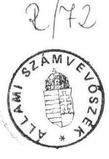
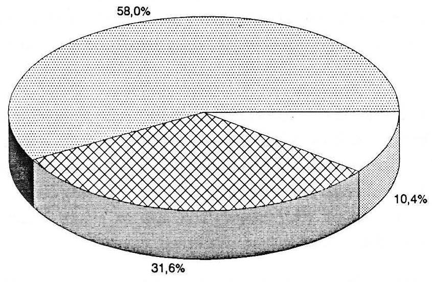
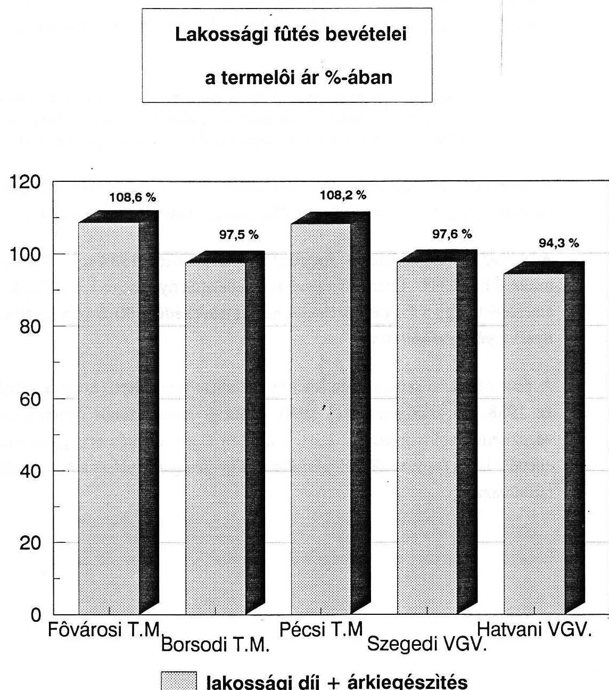
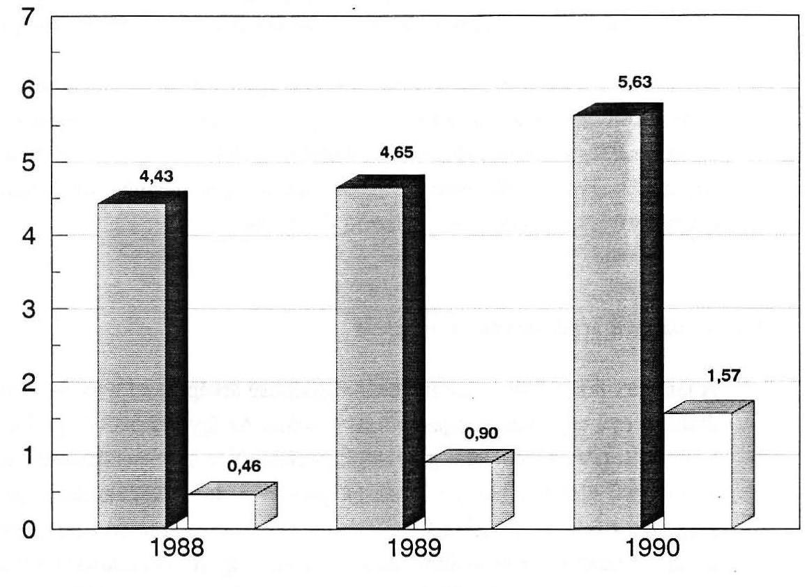
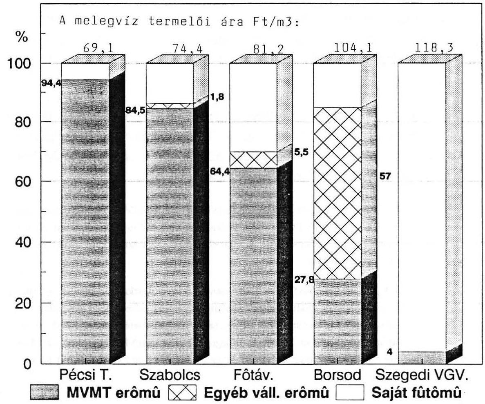
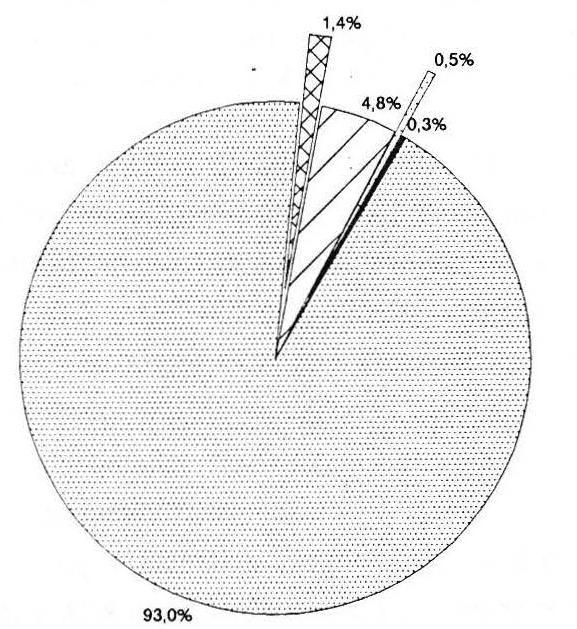
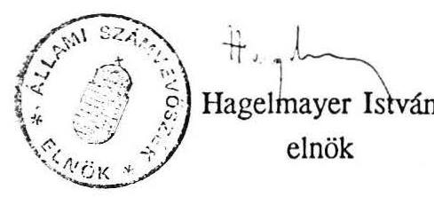

# 21lami 2̊ámbeböséé 

## JELENTÉS

a távfütés és melegvizszolgáltatás támogatási és gazdálkodási rendszerének vizsgálatáról

---

A vizsgálatot Nagy József régióvezető főtanácsos vezette.
Az összefoglalót Nagy József - Kocsis István számvevő közreműködésével - állította össze.

A vizsgálatot végezték:

Borsod Távhó Vállalatnál:

Debreceni Hőszolgáltató Vállalatnál:

Fővárosi Távfűtő Műveknél:

Győri Hőszolgáltató Vállalatnál:

Hegedűs György számvevő Kocsis István számvevő

Fekete Tibor tanácsos
dr. Katona Béláné számvevő Giday Zoltán számvevő
dr. Kurucz István számvevő

Kalmár István számvevő
dr. Szeli Tibor számvevő
Nógrád megyei Hőszolgáltató Vállalatnál:
Németh Péterné számvevő
Pécsi Távhőszolgáltató Vállalatnál:
`Maczekó Károly tanácsos
Szabolcs Hőszolgáltató Vállalatnál:
László András számvevő
Hatvani Városgazdálkodási Vállalatnál:
Fekete Tibor tanácsos
Kaposvári IKV-nál:
dr. Szigeti István számvevő
Szegedi Városgazdálkodási Vállalatnál:
dr. Klapcsik László számvevő

---

# Jelentés   a távfütés és melegvizszolgáltatás   támogatási és gazdálkodási rendszerének vizsgálatáról 

Az Állami Számvevőszék 1991. I. félévi munkaterve alapján törvényességi, célszerűségi és eredményességi szempontok alapján vizsgálta a távhőszolgáltatás támogatási és gazdálkodási rendszerét. Az ellenőrzés célja annak megállapítása volt, hogy
— miképpen müködik a távhőszolgáltatás támogatási rendszere,
— az önkormáyzati felügyelet alatt álló vállalatok gazdálkodásában érvényesül-e az eredményesség,
— az energiagazdálkodásban milyen lehetőségek vannak a hőfelhasználás mérséklésére és a szolgáltatás szinvonalának javítására.

A vizsgálat 10 hőszolgáltató vállalatra terjedt ki, átfogta e tevékenység több mint egyharmadát.

A távfűtésnek az energetikai rendszeren belüli súlyát mutatja, hogy napjainkban 640 ezer lakásban ezen szolgáltatást mintegy 2 millió ember veszi igénybe.

A távfűtés és melegvízellátás a panelos lakásépítési technológiával terjedt, amely főképpen a nagyobb városokban vált meghatározó fűtési móddá. A távhőellátás is számos szabályozási, árrendszerbeli és az ellenérdekeltségből fakadó ellentmondás hordozója. A termelés elosztás felhasználás kölcsönös kapcsolataiban a résztvevők (hőtermelő és szolgáltó vállalatok, a fogyasztók) érdekei sem egymással,sem a nemzetgazdasági érdekekkel nem azonosak. Ebből adódik, hogy az árkiegészítéssel és a fogyasztási adókkal többszörösen torzított árak a valóságos értékarányokat nem tükrözik. Ésszerű gazdasági dönésekre nem orientálja az érdekelteket.

---

Pl. a tüzelőolajat a lakosság lényegesen alacsonyabb áron kapja meg, mint a távhőszolgáltató vállalat. 1991. I. negyedévében a lakosság $17 \mathrm{Ft} / \mathrm{l}$ áron, míg a vállalatok a fútőolajat $40,67 \mathrm{Ft} / \mathrm{kg}$-os egységáron vásárolhatták. Hasonló volt a helyzet a földgáz beszerzésénél is. A lakosság $5-6 \mathrm{Ft} / \mathrm{m}^{3}$-es, a hőtermelő vállalatok pedig $12-13 \mathrm{Ft} / \mathrm{m}^{3}$-es áron jutottak ezen fútőanyaghoz. A fogyasztási adóval terhelt, magas árfekvésú tüzelőanyagból előállított hőenergiát és melegvizszolgáltatást — a lakossági fogyasztás esetén — az állam jelentős összegekkel dotálja.

A szolgáltatott hőt és melegvizet sok esetben még a lakóépület vagy a közintézmény hőközpontjában sem mérik, a lakosok pedig mérés nélkül, átalány alapján megállapított - a valóságos termelői árnál lényegesen alacsonyabb - összegben fizetik a távfűtés és melegvíz fogyasztás díját. A termelői ár és a lakossági díj közötti különbözetet a fogyasztói árkiegészítés fedezi.

A 80-as években a földgáz fűtőanyag arányának növekedésével sikerült az átlagos meteorológiai viszonyokra korrigált fajlagos fűtési hőfelhasználást - ami az elosztási veszteségeket is tartalmazza - a $266 \mathrm{MJ} / \mathrm{lm}^{3} /$ év értékről 1989-re 238 $\mathrm{MJ} / \mathrm{lm}^{3} /$ év-re csökkenteni. Ez a hőfelhasználási érték azonban - a nemzetközi tapasztalatok alapján - mintegy 20-30 \%-kal még napjainkban is magasabb, mint a hasonló hőmérsékleti viszonyok között lévő nyugati országokban. A hőfelhasználás fajlagos értékét elsősorban a hőtermelés és az elosztás magasabb veszteségei, a lakások nem kellő szigetelése, és a hőmérséklet lakásokon belüli szabályozásának a hiánya miatt nem sikerült jelentősebb mértékben csökkenteni. E területen pazarló jellegű fogyasztás tapasztalható, mivel a melegvíz és hő többnyire mérés nélkül jut a fogyasztóhoz. A lakásokon belüli hő szabályozása, a hőmérséklet csökkentése pedig többnyire csak az ablakok kinyitásával oldható meg.

A hőenergia nagyobb hányadát a szolgáltató vállalatok vásárolják a Magyar Villamosművek Tröszt (MVMT) vállalataitól, illetve egyéb erőművektől. Közel egyharmadát állítják elő saját fűtőműveikben.

---

# Energiaforrások megoszlása 

1990-ben

MVMT erőmű
Saját fütőmüben

Egyéb erőmü

A vásárlás jelentős részaránya a szolgáltatás termelői árának alakulása szempontjából kedvező, mert a MVMT lényegesen olcsóbban tudja előállítani a hőt, mint a szolgáltató vállalatok. Ennek oka az, hogy a MV́MT erőműveiben hatékonyabb a hőtermelés, valamint a felmerült költségek részben megoszlanak a villamos- és a hőenergia között. A hőtermelés legmagasabb termelői ára a kisvárosokban tapasztalható, ahol a kevésbé kihasznált és rossz hatásfokú kazánok müködnek. Az alacsony fogyasztói szám, a magas tüzelőolajár miatt, a lakások $1 \mathrm{~lm}^{3}$-ére jutó ár kétszer, háromszor magasabb mint a nagyvárosokban.

[^0]
[^0]:    Pl. Balatonalmádiban és Jászberényben a rossz hatásfokkal múködő olajkazán és a kevés fogyasztó, (kétszáz-háromszáz lakás) valamint a $40 \mathrm{Ft} / \mathrm{kg}$-ot meghaladó olajár miatt az előállított hő fajlagos termelői ára (1991. I. negyedévben) 450 Ft , illetve $477 \mathrm{Ft} / \mathrm{lm}^{3} / \mathrm{ev}$ volt.

---

# 1.1. A távhőszolgáltatás szervezeti rendszere és finanszírozása 

A szolgáltatás alapvevően két különböző szervezeti struktúrában valósul meg. Döntő részét az un. tiszta profilú távhőszolgáltató vállalatok adják, amelyek — közel tíz évvel ezelőtt — az érintett városok ingatlankezelő és városgazdálkodási vállalatainak részlegeiből alakultak. A hőellátásnak a kisebb hányadát a városgazdálkodási, ingatlankezelő vállalatok és költségvetési üzemek biztosítják.

A hőszolgáltatás finanszírozása alapvetően két forrásból: a fogyasztók amelyek lehetnek vállalatok és intézmények, valamint lakosok - által fizetett összegekből és a fogyasztói árkiegészítésből áll. A vállalatok és közintézmények a termelői ár szintjén jutnak a szolgáltatáshoz. A lakosság átalány alapján, központilag megállapított fix összeget fizet, ami az elmúlt időszakban az energia áremelésekkel párhuzamosan növekedett.

A lakás $1 \mathrm{~lm}^{3} /$ év fútési díja 1987-ben 34,20 Ft-ba, a melegvíz $\mathrm{m}^{3}$-re 17,40 Ft-ba került. 1991. I. negyedévében a fütés $\mathrm{lm}^{3} /$ év $61,20 \mathrm{Ft}-\mathrm{ba}$, a melegvíz $31,50 \mathrm{Ft} / \mathrm{m}^{3}$-be került. A vizsgálat végzésének időszakában érvényes lakossági tarifával számolva egy $52 \mathrm{~m}^{2}, 135 \mathrm{~lm}^{3}$-es lakás fütése 8262 Ft , a melegvíz 3402 Ft , együttesen 11664 Ft terhet jelent évente.

Annak érdekében, hogy a lakosság a termelői ár alatt jusson a szolgáltatáshoz, az állam egyre nagyobb összeggel dotálta és dotálja jelenleg is a hőszolgáltatást. A távhőszolgáltatás országosan 1988-ban 7,7, 1989-ben már 8,1 és 1990-ben pedig 9,2 milliárd Ft-tal terhelte az állami költségvetést.

### 1.2. A fogyasztói árkiegészítés múködési mechanizmusa és célszerűsége

Az igényelhető fogyasztói árkiegészítés vetítési alapját - jogszabályban rögzített matematikai képlet alapján - a fajlagos termelői ár és a lakossági díj hányadosának a lakossági bevétellel való szorzata adja. A vállalatok termelői árai, a lakossági díjtételek és a fogyasztói árkiegészítés mértéke a vizsgált időszakban gyakran változott. Az árkiegészítésnek az a funkciója, hogy a lakossági díjjal együtt a termelői árat fedezze. Ezt a feladatát csak globálisan tudta teljesíteni, egyes vállalatoknál vagy nem fedezte a termelői árat, vagy pedig meghaladta azt.

---

# Energiaforrások megoszlása 

1990-ben

MVMT erőmű
Saját fütőmüben
Egyéb erőmú

A vásárlás jelentős részaránya a szolgáltatás termelői árának alakulása szempontjából kedvező, mert a MVMT lényegesen olcsóbban tudja előállítani a hőt, mint a szolgáltató vállalatok. Ennek oka az, hogy a MVMT erőműveiben hatékonyabb a hőtermelés, valamint a felmerült költségek részben megoszlanak a villamos- és a hőenergia között. A hőtermelés legmagasabb termelői ára a kisvárosokban tapasztalható, ahol a kevésbé kihasznált és rossz hatásfokú kazánok müködnek. Az alacsony fogyasztói szám, a magas tüzelőolajár miatt, a lakások $1 \mathrm{~lm}^{3}$-ére jutó ár kétszer, háromszor magasabb mint a nagyvárosokban.

[^0]
[^0]:    Pl. Balatonalmádiban és Jászberényben a rossz hatásfokkal müködő olajkazán és a kevés fogyasztó, (kétszáz-háromszáz lakás) valamint a $40 \mathrm{Ft} / \mathrm{kg}$-ot meghaladó olajár miatt az előállított hő fajlagos termelői ára (1991. I. negyedévben) 450 Ft , illetve $477 \mathrm{Ft} / \mathrm{lm}^{3} / \mathrm{év}$ volt.

---

(A jelenlegi fűtés bevételei és a termelői ár kapcsolatát a következő ábra szemlélteti).

A Fővárosi Távfűtő Műveknél az árkiegészítés és a lakossági díj 1988-ban 22,9 millió Ft, 1989-ben 28,6 millió Ft, 1990-ben 236,2 millió Ft többletbevételt eredményezett.

---

A Hatvani Városgazdálkodási Vállalatnál a vizsgált időszakban a fogyasztói árkiegészítés (a lakossági díjjal együtt) 90-102 \%-ban biztosította a termelői ár fedezetét.

A fogyasztói árkiegészítés hatékony gazdálkodásra nem ösztönözte a vállalatokat, a célszerűtlenűl működtetett mechanizmusa könnyen elérhető, biztos bevételhez juttatta a szolgáltatókat. Ennek alapvető oka, hogy a kalkulált termelői árak számos esetben olyan költségelemeket is tartalmaztak, amelyek nem merültek föl.

A kalkulálható nyereséghányadot is tartalmazó, jóváhagyott termelői árak jelentősen meghaladták az önköltséget. A vizsgált vállalati körben a jóváhagyott átlagos termelői ár 1988-ban $11 \%$-kal, 1990-ben pedig már $21 \%$-kal volt nagyobb az önköltségnél.

A fogyasztói árkiegészítés növekményének csak minimális része szogálta az eredeti célját, döntő hányada a vállalatok nyereségét gyarapította.

A vizsgált vállalatoknál a fogyasztói árkiegészítés 1988-tól 1990-ig 1,2 milliárd Ft-tal nőtt. Ezen időszak alatt a vállalatok nyeresége 1,1 milliárd Ft-tal emelkedett. Így a fogyasztói árkiegészítés növekedése $90 \%$-ban a vállalatok nyereségét gyarapította.

A finanszírozási rendszerben lévő tartalékokat szemlélteti, hogy a vállalatok az 1988. évi árkiegészítéssel 1990. évben is közel azonos nyereségszinten végezhették volna a szolgáltatást, a közben eltelt jelentős energiaáremelések ellenére is. (A fogyasztói árkiegészítés és a nyereség alakulását a 3. sz. melléklet tartalmazza.)

---

# A vizsgált távhőszolgáltató vállalatok árkiegé szítésének és a nyereségének alakulása 

## milliárd Ft

fogyasztói árkiegészítés mérleg szerinti nyereség

A költségvetés "nagyvonalúsága", az utólagos elszámolás hiánya azt az ellentmondást hozta létre, hogy míg a lakossági teherviselés közel $80 \%$-kal nőtt az energia áremelések miatt, a hőszolgáltató vállalatok ugyanakkor egyre jobb gazdasági pozícióba kerültek. (Pl. a Fővárosi Távfűtő Művek nyeresége négy és félszeresére, a Szabolcs-Szatmár-Bereg megyei Távfűtő Vállalaté három és félszeresére növekedett 1988-1990 között).

A fogyasztói árkiegészítés igénybevételének az ellenőrzése az APEH feladata.

A Szabolcs-Szatár-Bereg megyei Távfűtő Vállalatnál az APEH megyei Igazgatósága a fogyasztói árkiegészítés igénybevételének jogszerüségét nem vizsgálta (írásos

---

dokumentum nem található). A vállalat egy alkalommal önrevízióval tárt fel 60 E Ft jogtalan igénybevételt, melyet visszafizetett.

Az APEH B.A.Z. megyei Igazgatósága az elmult három évben egy alkalommal 1989. március 24 és május 29-e között - végzett pénzügyi-gazdasági ellenőrzést a vállalatnál. A vizsgálati program alapján az ellenőrzési feladat magában foglalta a fogyasztói árkiegészítés igénybevételének a szabályszerűségi ellenőrzését is, ezzel kapcsolatban azonban a vizsgálati anyagban írásos megállapítás nem szerepelt.

A 9 milliárd Ft fogyasztói árkiegészítést igénybe vevő vállalatoknak az állami költségvetéssel szemben - az igénybevétel szabályszerűségén kívül - semmiféle utólagos elszámolási kötelezettségük nincs. A PM nem vizsgáltatta, hogy a jóváhagyott termelői árak alapján igénybe vett fogyasztói árkiegészítés mennyiben volt célszerű és indokolt.

# 1.3. A vállatok árképzésének értékelése 

A termelői árat a vállalat az un, önköltségtipusú árképzéssel határozza meg az átalány- és a teljesítménydíjas szolgáltatásaira. Az így kalkulált ár jóváhagyása a 6/1982. (IV.15) valamint a 3/1988. (VII.20) ÁH sz. rendelkezések alapján a fővárosi, illetve a megyei tanácsok jogköre volt. A közületek és az ipari fogyasztók felé, mint maximált árat érvényesíti a vállalat mind a teljesítmény-, mind az átalánydíjas szolgáltatásainál. A jogszabály rögzített árként határozza meg a lakosság által fizetett díjakat. A lakossági fogyasztóknak a vizsgálat végzésének időszakában a 80/1990. (ÁSZ 19) ÁH sz. rendelet alapján fűtésre $61,20 \mathrm{Ft} / \mathrm{lm}^{3}$ (fűtési idényre), a használati melegvízre $31,50 \mathrm{Ft} / \mathrm{m}^{3}$-ot kellett fizetniük. (A Kormány döntése értelmében 1991. június 1-jétől a lakossági díjak $70 \%$-kal emelkednek). A vizsgált vállalatoknál a jelenleg érvényes átlagár fűtésre $131,40-207,50 \mathrm{Ft} / \mathrm{lm}^{3}$, használati melegvízre $69,08-118,30 \mathrm{Ft} / \mathrm{m}^{3}$ között változott. A fogyasztói árkiegészítés kulcsát a 80/1990. (XI.1), illetve az 1/1991. (I. 1.) Kormány sz. rendelet határozza meg, melyek az egyes vállalatok esetében 55-68 \% közötti. A fajlagos termelői árat - a vállalati kérelem alapján - a területileg illetékes árhatóságok (a tanácsok) hagyták jóvá, amelyek egyben a távhőszolgáltató vállalatok felügyeleti szervei is voltak. Ebből adódóan mind a volt tanácsok, mind a vállalatok érdeke az volt, hogy

---

minél magasabb összegű fogyasztói árkiegészítést igényeljenek. Ezt a vállalati termelői árak növelésével, sok esetben az indokolatlan vállalati költségek elismertetésével el is érték. Ezt támasztja alá az is, hogy a vizsgált időszakban a vállalatok által javasolt és az árhatóságok által jóváhagyott termelői árak szinte azonosak voltak.

A Fővárosi Távfűtő Művek, a Borsod megyei Távhőszolgáltató Vállalat, a Pécsi Távhő, a Szabolcs-Szatmár-Bereg megyei távhő a vizsgált időszakban 4 alkalommal benyújtott fütési- és melegvizszolgáltatási termelői árait az árhatóság valamennyi esetben változtatás nélkül elfogadta.

A Győri Távhő - jóváhagyásra benyújtott 8 díjtételéből — a fütési díjat 2 alkalommal $1,2 \%$, illetve $7 \%$-os mértékben, a használati melegvizdijat 1 alkalommal $4,9 \%$-os mértékben csökkentette az árhatóság.

A Szegedi Városgazdálkodási Vállalat jóváhagyásra benyújtott árai közül egy esetben, a melegvíz termelői árát ( $1,7 \%$-kal) csökkentették.

A városgazdálkodási vállalatoknál az egyéb maximált áras tevékenységek ármegállapításainál az árhatóságok több esetben eleve veszteséghányaddal számoltak. Az így keletkezett veszteséget a távhőszolgáltatás nyereségével kompenzálták.

Ezt a tényt a Szeged város II. 316/1990. sz. testületi döntése alapján megtartott alapító által végzett célvizsgálat írásbeli anyaga is rögzíti. (A vállalat távhő szolgáltatáson kívüli minden tevékenysége 1990-ben veszteséges volt.)

Az árhatósági hatáskör 1991-től az Ipari és Kereskedelmi Minisztériumhoz került. A korábbi időszakra jellemző árhatósági és vállalati érdekazonosság jelenleg nem áll fenn, azonban az árjóváhagyás szinvonala nem javult, érdemi helyszini költségelemzés és felülvizsgálat az árjóváhagyást nem előzi meg.

A termelői ár "a távhőszolgáltató közmủ által a fogyasztó számára szolgáltatott hőenergia költségeit, a termelői költségeket és az elosztási költség (nettó állóeszköz értéke, forgóeszköz értéke és bérköltségre vetítve) $2 \%$-os nyereséggel növelt összegét tartalmazza." A hőenergia menynyiségi eltétérésein, az energiatervek "tartalékain" kívül a vizsgálat az energia árképzésében is jelentős szabálytalanságokat tárt fel.

A Borsod-Abauj-Zemplén megyei Hőszolgáltató Vállalat az árszabályozási rendelettel ellentétben a vásárolt hőenergia (miskolci fűtőműtől) illetve saját fűtőművi előállítás esetén egyes energiahordozók egységárait — gáz, olaj -

---

a tényköltségeknél magasabb értéken állította be az árkalkulációjába. Ennek következtében a vállalat 1988. évben 7,4 millió Ft, 1990. évben 72,7 millió Ft és 1991. évben — a vizsgálat végzésének időpontjáig — 78,8 millió Ft, összesen 158,9 millió Ft többletköltséget érvényesített a szolgáltatás áraiban.

A vállalat 1988. évben a gázenergia ténylegestől eltérő árkalkulációjával 7,4 millió Ft összegben olyan költséget érvényesített áraiban, mely nem merült fel.
A vállalat jelenleg érvényes árkalkulációja (1990.XI.15.) a ténylegesnél magasabb olajár alkalmazása miatt éves szinten 35,4 millió Ft többletköltséget tartalmaz. Ebből a vállalat 1990. évben 7 millió Ft-ot, 1991-ben 23,8 millió Ft-ot számolt el többletköltségként.
A vállalat 1990. III. 1-én jóváhagyott árkalkulációja, mely 1990. XI. 15-ig volt érvényben, - a Miskolci Fütőmútől vásárolt hőenergiára vonatkozóan - mind a teljesítménydíjat, mind a hódijat a részére számlázottól magasabb értékeken tartalmazta.
Ezzel 1990-ben 47,4 millió Ft többletbevételhez jutott.
A vállalat jelenleg érvényes 1990. XI.15-én jóváhagyott árkalkulációja (szintén a Miskolci fútőmúre vonatkozóan) a teljesítménydíj és a hódij esetében is jelentősen magasabb összeget tartalmaz annál, mint amilyennel a vállalat részére a vizsgálat idejéig a Fütőmú Vállalat számlázott.

A kalkuláció ezen részének költségtöbblete éves szinten 205 millió Ft. Ebből a vállalat 1990. évben 18,3 millió Ft-os, 1991. évben 55 millió Ft-os többletbevételt ért el.
2. A távhőszolgáltató vállalatok gazdálkodási és érdekeltségi rendszerének múködése

# 2.1. A távfűtés és melegvíz-ellátásának költségviszonyai 

### 2.1.1. A hőenergia vásárlás, illetve előállítás hatása a költségekre

A termelői ár költségszerkezetében meghatározó jelentőségű a hőenergia költsége, mely az összes költségek $70 \%$-a körül változik. A további részét a hőenergia nélküli un. elosztási költségek alkotják, melyek összetevői a közvetlen anyag, közvetlen bér, értékcsökkenés, üzemi általános költség, fel nem osztott költség, illetve nyereség. Az egyes vállalatok termelői árait

---

alapvetően az határozza meg, hogy az egységnyi hőenergiaköltség ( $\mathrm{Ft} / \mathrm{GJ}$ ) milyen nagyságú.

A fajlagos hőenergia költségeit - a jelenlegi energia árak mellett alapvetően két tényező, a biztosítás módja, a vásárlás, illetve a saját előállítású hő esetében pedig a felhasznált energiahordozó fajtája határozza meg. (4.sz. melléklet)

A vizsgált vállalatok a szolgáltatott energia 68,4 \%-át vásárolják, döntően (58 \%-ban) a Magyar Villamosművek Tröszt erőműveitől. A szolgáltatott hőenergia közel egyharmad részét állítják elő a saját fűtőműveikben. Legolcsóbb az MVMT erőművektől vásárolt energia.

A Szabolcs-Szatmár-Bereg megyei Távfűtő Vállalatnál MVMT erőművektől vásárolt energia hődíja $247 \mathrm{Ft} / \mathrm{GJ}$, saját fűtőművekben előállított (üzemenként eltérően) 340-360 Ft/GJ között változik. A saját előállítású hőenergia hődíja közel másfélszerese a vásárolténak.

A B.A.Z. megyei Távfűtő vállalat jelenlegi termelői árkalkulációjában a fajlagos hőenergia költség (hődíj + teljesítménydíj) az MVMT erőműveknél $294 \mathrm{Ft} / \mathrm{GJ}$, egyéb vállalati erőmű esetén $537,8 \mathrm{Ft} / \mathrm{GJ}$, saját fütőmủ esetén $817,4 \mathrm{Ft} / \mathrm{GJ}$. A saját fütőmüben előállított hőenergia fajlagos költsége kettő-háromszorosa az MVMT erőművektől, illetve másfélszerese az egyéb üzemi erőművektől vásárolt hőenergia költségének.

Az érintett hőszolgáltató vállalatoknál a hőenergia eredete (belső arányai) és a termelői árak közötti kapcsolatot a következő ábra szemlélteti. (1990. november)

---

A fajlagos hőenergia költségét befolyásoló másik jelentős tényező — melynek hatása különösen a saját fűtőművi energia előállításánál érvényesül, — hogy melyik energiahordozó felhasználásával törénik a hőtermelés.

A saját fűtőművekben felhasznált energiahordozók arányát a következő ábra szemlélteti.

---

Saját fűtőműben felhasznált energiahordozók megoszlása (1990-ben)

Egyéb (faapriték) Fütőolaj Szén
Földgáz Termálviz

A felhasznált energiahordozók közül (a termálvíz és egyéb, $1 \%$ alatti aránya miatt elhanyagolható) a legolcsóbb a gázenergia, ezt követi a szén, és a legdrágább a tüzelőolaj.
B.A.Z. megyei Távhőszolgáltató Vállalatnál ezen energiahordozókkal üzemelő kazánházak 1990. évi tényköltségei alapján meghatározott hódija földgáz felhasználásánál 293,66 Ft/GJ, szén esetén 586,96 Ft/GJ, tüzelőolajnál 770,93 Ft/GJ. (A tényköltségek alapján meghatározott hódij jobban tükrözi a tényleges árviszonyokat, mint a fütőértékből számított, mivel az egyes berendezések eltérő hatásfokkal üzemelnek pl. gázkazánház esetén közel $90 \%$-os, széntüzelésünél pedig ez csak $60 \%$ körüli). A széntüzelésű kazánok hódija kétszerese, a tüzelőolajjal üzemelőké kettő-háromszorosa a gázkanázokénak.

A hőenergia különböző előállítási módjai (saját, vásárolt) illetve a felhasznált energiahordozó eltérő fajlagos költsége miatt a távfűtés és melegvízszolgál-

---

tatás termelői árai nagymértékben változnak. (Még egyes hőszolgáltató vállalatokon belül is).

A Szabolcs-Szatmár-Bereg megyei Távhőszolgáltató Vállalatnál a jelenlegi átalánydíjas fűtés és melegvíz ára Nyíregyháza városban $118,9 \mathrm{Ft} / \mathrm{lm}^{3} /$ fütési idény, illeve $65,8 \mathrm{Ft} / \mathrm{m}^{3}$. Ugyanez Nyírbátorban $241,6 \mathrm{Ft} / \mathrm{lm}^{3} /$ fütési idény, illetve $116,2 \mathrm{Ft} / \mathrm{m}^{3}$. Kisvárdán $251,6 \mathrm{Ft} / \mathrm{lm}^{3} /$ fütési idény, illetve $124,8 \mathrm{Ft} / \mathrm{m}^{3}$.

Az MVMT-től vásárolt hőenergia maximált áras, az árak felső értékét rendelet szabályozza. A hőszolgáltató vállalatok számára a vásárolt energia a legolcsóbb, azonban ennek további csökkentésére is lenne lehetőség. A hőerőművek jelentős részben a távfűtési célra előállított hőenergia termeléssel párhuzamosan un. kapcsolt villamosenergia termelést is folytatnak. Ennek költségcsökkentő hatása azonban a vizsgált időszak maximált áraiban kellőképpen nem érvényesült. A kapcsolt villamosenergia termelés lehetséges költségcsökkentő hatását nehéz számszerűsíteni, mert az egyes hőerőművekben eltérőek a költségviszonyok, másrészt a jelenlegi maximált árak nem ösztönzik az erőműveket a kapacitások jobb kihasználására. Egyes szakértői válemények szerint a kapcsolt villamosenergia termelés mellett megvalósuló hőenergia előállítás költségei 10-15 \%-kal csökkenthetőek lennének, ha az így előállított villamosenergia költségcsökkentő hatása érvényesülne a hőenergia eladási árában. Ehhez azonban érdekeltségre, piaci körülményekre lenne szükség.

# 2.1.2. A külső hőmérséklet hatása a hőenergia költségére 

Az éves időtartamra készülő árkalkuláció részeként a vállalat energiatervet készít, melyben meghatározza a fűtés- és használati melegvíz szolgáltatáshoz várhatóan szükséges hőenergia mennyiségét.

A vizsgált vállalatoknál szolgáltatott hőenergia 50,6 \%-a fűtés céljára került felhasználásra, így ez meghatározó az összes hőenergia felhasználás szempontjából.

A fűtés biztosításához szükséges fűtőanyag mennyisége (azonos fűtött térfogatot feltételezve) az időjárástól, az átlagos külső hőmérséklettől függ. Ezért az energiatervben feltételezett várható átlagos külső hőmérséklet figyelembevételével határozzák meg a szükséges hőenergia mennyiségét. Az átlagos külső hőmérséklet és a felhasznált fűtési hőenergia közötti függvény-

---

kapcsolat alapján 1 C fok átlagos hőfokemelkedés a felhasznált hőenergia 5-6 \%-os csökkentését eredményezi.

Ezek alapján lényeges, hogy az egyes vállalatok milyen átlagos külső hőmérsékletre tervezték hőenergia szükségletüket, és ezzel szemben a fútési idény milyen átlagos hőmérsékleten valósult meg.

A Fővárosi Távfűtő Művek 1988-1990 között minden évben 3,66 C fok átlagos külső hőmérsékletre tervezte hőenergia szükségletét. Ezzel szemben 1988-ban 4,64 C fokon, 1989-ben 6,24 C fokon, 1990-ben 6,44 C fokon valósult meg a fütés.
A tervezettnél kisebb hőenergia szükséglet miatt a vállalatnak 1988-ban 104,1 millió Ft, 1989-ben 227,5 millió Ft, 1990-ben 329,6 millió Ft. Összesen 661,2 millió Ft olyan bevétele származott, mely mögött nem volt szolgáltatás.
A Szabolcs-Szatmár-Bereg megyei távhőszolgáltató vállalatnál 1989-ben a tényleges fütési hőmérséklet 3,24 C fokkal, 1990-ben 3,16 C fokkal haladta meg a tervezett értéket. Ezáltal a vállalat 1989. évben 16,2 \%-kal, 1990-ben 15,8 \%-kal kevesebb hőenergiát használt fel az előzetesen kalkuláltnál.

A vállalatok energiatervei a fűtés hőenergia szükséglete vonatkozásában jelentős tartalékot tartalmaztak, amely a felhasznált energia kb. $15 \%$-a. Ez a vizsgált vállalatok összes költségeinek közel $10 \%$-át jelenti 1990-ben. Természetesen ezek a hőfokeltérések csak utólagosan állapíthatók meg. A szolgáltatás, a vállalati gazdálkodás biztonsága érdekében a vállalatok arra törekedtek, hogy tartalékot képezzenek. Ezt indokolja az a tény, hogy a ráfordítások közel $70 \%$-át kitevő energiaköltségek nagysága az időjárástól függ.

A jelenlegi finanszírozási rendszer egyik lényeges hiányossága, hogy a kalkulált termelői árakon keresztül a fogyasztók, illetve a költségvetés (árkiegészítés formájában) mintegy "megelőlegezi" ezen tartalékokat, ugyanakkor a felhasználás módjáról, nagyságáról a szolgáltatóknak semmilyen utólagos elszámolási kötelezettsége nincs, szabadon kötöttség nélkül felhasználják azt.

# 2.1.3. A pótfűtés során felhasznált energia hatása a vállalati költségekre és az eredményre 

A vállalatoknak jelentős többletbvételei származtak abból is, hogy a fütési idényben és az azon kívüli elő- és pótfűtések időtartama alatt — a vonatkozó rendeleteknek megfelelően — a fűtésszolgáltatás díjai azonosak, ugyanakkor

---

a ráfordítások nagyságát meghatározó energiaköltségek a magasabb külső hőmérséklet miatt 40-50 \%-kal alacsonyabbak.

A B.A.Z. megyei Távhőszolgáltató Vállalatnál előzőek következtébn 1988. évben 21,5 millió Ft, 1989. évben 35,8 millió Ft, 1990. évben 47,2 millió Ft, összesen 104,5 millió Ft többletbevétel képződött.
A Fővárosi Távfűtő Műveknél àz elő- és pótfűtés energiamegtakarításából származó többletbevétel nagysága 1988-ban 112,2 millió Ft, 1989-ben 180,8 millió Ft, 1990-ben 200,7 millió Ft, összesen 493,7 millió Ft volt.
A Szabolcs-Szatmár megyei Távfűtő Vállalatnál 1990. évben a 10 napos elő- és a 13 napos pótfűtés 23 millió Ft többletbevételt eredményezett.

# 2.1.4. A lakossági melegvízfogyasztás 

A lakossági melegvízfogyasztás megállapítása nem mérés útján, hanem a jogszabályban rögzített átalány alapján történik. A $\mathrm{m}^{3}$-ben kifejezett átalány mértéke a lakás $\mathrm{m}^{2}$-től függ. E megoldási mód nem megnyugtató, a vizsgált vállalatoknál együttesen az 1990. évben a felhasznált melegvíz 2400 ezer $\mathrm{m}^{3}$-rel kevesebbnek bizonyult, mint ami után a vállalatok - átalány alapján - bevételhez jutottak.

A Szegedi Városgazdálkodási Vállalatnál az 1988. évben 1637 ezer $\mathrm{m}^{3}$, az 1989. évben 1749 ezer $\mathrm{m}^{3}$ az 1990. évben 1732 ezer $\mathrm{m}^{3}$ volt a tényleges melegvíz felhasználás mennyisége.

Előzőekkel szemben a vállalat átalánydíjas melegvíz szolgáltatásként - jogszabályi előírása alapján - a lakosság részére 1988-ban 2835 ezer $\mathrm{m}^{3}$, 1989-ben 2872 ezer $\mathrm{m}^{3}$, 1990-ben 2936 ezer $\mathrm{m}^{3}$ használati melegvizet számlázott ki. Ezzel a vállalatnak 1988. évben 71,2 millió Ft, 1989. évben 66,9 millió Ft, 1990. évben 89,7 millió Ft, összesen 227,8 millió Ft tényleges szolgáltatáshoz nem kapcsolható bevétele (árkiegészítése) volt.

### 2.1.5. Az egyes energiahordozóknál alkalmazott árak

A földgáz és a tüzelőolaj lakossági és közületi ára eltérő. A távfűtési célu földgáz beszerzési ára (1991. III. 31 -én) $12-13 \mathrm{Ft} / \mathrm{m}^{3}$, a lakossági felhasználás esetén $5-6 \mathrm{Ft} / \mathrm{m}^{3}$ között változott. Hasonló a helyzet a tüzelőolaj vásárlás esetén is, a vállalati beszerzési ár $40 \mathrm{Ft} / \mathrm{kg}$, a lakossági $14 \mathrm{Ft} / \mathrm{kg}$ volt.

A kétféle ár alkalmazása elfedi a valóságos gazdasági érdekeket, tisztább közgazdasági helyzetet teremtene az azonos ár alkalmazása.

---

Amennyiben a távhőszolgáltató vállalatok - a lakosságnak nyujtott szolgáltatásaik arányában - lakossági áron vásárolnák az egyes energiahordozókat (olaj, gáz), úgy a - jelenlegi árszinten - ráfordításaik 14 \%-kal csökkenthetők lennének.

# 2.1.6. A hőszolgáltató vállalatok költséggazdálkodása és érdekeltsége 

A vállalatok költségérzékenységéről a vizsgálat tapasztalatai alapján nem lehet beszélni, mert a termelői ár és az árkiegészítés közötti meghatározott kapcsolat a vállalatokat az ár növelésére ösztönözte, illetve az árkiegészítés és a vállalati költségek elismertethetőségének eddig alkalmazott módszere nem késztette a szervezeteket a gazdaságossági követelmények érvényesítésére, az erőforrások ésszerű kihasználására.

Az általános költségek (vállalati, üzemi) a vizsgált időszakban valamennyi vállalatnál jelentős mértékben növekedtek.

A Fővárosi Távfűtő Múveknél a vállalati általános költség nagysága 1988-tól 1990-ig $72,2 \%$-kal nőtt.
A Szabolcs-Szatmár-Bereg megyei Távhőszolgáltató Vállalatnál szintén gyors ütemben növekedett a vizsgált három évben a központi irányítás költsége, mely 1988-ban 34,5 millió Ft, 1990-ben már 75,9 millió Ft volt.

A vállalatok kedvező gazdasági pozicióit jellemzi, hogy a vizsgált időszakban jelentősen növekedett a bérköltségek nagysága.

A Fővárosi Távfűtő Múveknél a vizsgált időszakban a bérköltség $58 \%$-kal ( 153 millió Ft-tal) nőtt. A bérköltség aránya az összes költségen belül az 1988. évi 4,4 \%-ról 1990 -re $5,6 \%$-ra nőtt.

A Pécsi Távfűtő Múveknél a bérköltség nagysága 1989-ről 1990-re 53,9 \%-kal növekedett. Ezáltal a bérköltség aránya $1,5 \%$-ról $2,1 \%$-ra nőtt a teljes önköltségen belül.

A vállalatokon belüli termelő és szolgáltató üzemek többnyire nem önelszámoló egységek. A jelenlegi finanszírozási rendszer nem kényszerítette a vállalatokat arra, hogy létrehozzanak egy olyan érdekeltségi rendszert, amely az önálló üzemekre épül. E nélkül is stabil, folyamatosan javuló eredményszintet tudtak elérni.

---

A vizsgálat tapasztalata alapján megállapítható, hogy az álló́eszközfenntartás és egyéb területeken jobb szervezéssel, a teljesítménykövetelmények fokozásával, további létszámcsökkenés érhető el.

A nemzetközi tapasztalatok felhasználása, összevetése a magyar viszonyokkal - a jelentősen eltérő körülmények miatt — csak óvatosan tehető meg, a párhuzam megvonása mégis indokolt, mert jelzi a fejlődés irányát és tennivalóit. A Szabolcs Távhő egy külföldi céggel átvilágíttatta a vállalatát.

E tanulmányban összehasonlítás történt a Szabolcs-távhó vállalat és egy nyugat-európai vállalat létszáma és gazdálkodási adatai között. A nyugat-európai távhó vállalatnál háromszor nagyobb GJ hőszolgáltatást, tízszer nagyobb hálózatot, harmincszor több vevőcsatlakozást, kétszer kiscbb létszámmal müköd̉tetnek.

A vállalati összes bevétel a vizsgált három évben 3 milliárd Ft-tal nőtt, az 1988. évi 10,7-ről, 14,7 milliárd Ft-ra. Az alaptevékenységen kívüli bevételek aránya 5-7 \%-os. A vállalatok kintlévő követelései, a lakosság és a közület tartozásai az 1988. évi 100,8 milló Ft-ról 1990-re 234,3 millió Ft-ra emelkedett. A vállalaltok törekedtek a kintlévőségek behajtására, azonban a lakosság és a közületi fogyasztók egyre nagyobb hányada válik fizetésképtelenné.
A hőszolgáltató tevékenység korlátozott nyereségérdekeltségi rendszerbe tartozik, a vállalatok $80 \%$-os nyereségadó kedvezményben részesülnek. A vállalatok mérlegszerinti nyeresége a vizsgált időszakban több mint háromszorosára emelkedett, s 1990-ben meghaladta az 1,5 milliárd Ft-ot. A vállalatok kedvező jövedelmi pozicióját mutatja az is, hogy a vagyoni betétjük, és a részvényekbe fektetett tőkéjük az 1988. évi 276 millióról 1990-ben 542,5 millió Ft-ra emelkedett.

A Fővárosi Távfütő Müvek napjainkban 13 különböző gazdasági társaságban érdekelt, 407,8 millió Ft értékủ tőkével. A Borsod megyei hőszolgáltató vállalat 1990 év végén 6 gazdasági társaságba fektetett tőkéje 70 millió Ft volt.

A hőszolgáltató vállalatok fejlesztési politikájára jellemző, hogy sok esetben nem az energifelhasználás csökkentésére irányuló beruházásokat sorolták előre, hanem gépkocsi vásárlásokra és egyéb célokra költöttek jelentős összegeket.

A Fővárosi Távfűtő Müvek 1990-ben üzemviteli célra szerződést kötött 25 db Ford Tranzit-ra, 50 db Ford Escord-ra, és 30 db Ford Fiesta-ra. Ezen kocsik beszerzési költsége 100 millió Ft nagyságrendủ.

---

1990. december hónapban a Miskolci DIMED műszertechnikai KFT-vel lizingszerződést kötött a Borsod Távhőszolgáltató Vállalat, egy Miskolci Kisavas I. sor ingatlanra, amely 9 helyiségből és 16 ágú pincerendszerből áll. A szerződés időtartama 3 hét, lizingdíj 9,9 millió Ft volt. A lizingdíjat a vállalat a nem anyagjellegủ költségei között számolta el.

# 3. A fűtés- és melegvízszolgáltatás értékelése 

A vállalatok és a fogyasztók kapcsolatát lényegében a 2/1966 (II. 31) NIM sz. és a 9/1972 NIM sz. rendelet szabályozza, melyek konkrétan meghatározzák a fűtés és melegvíz szolgáltatás paramétereit.

A vállalat a lakókkal közvetlen jogviszonyban van, ez azonban formális, hiszen a szolgáltatás mennyiségét és minőségét, illetve annak igénybevételét nem az egymással jogviszonyban álló felek határozzák meg, hanem rendelet írja elő.

A fogyasztói panaszok száma a vizsgált vállalatoknál növekvő tendenciát mutat, ezen belül azonban a jogos bejelentések száma folyamatosan csökkent. Az átalánydíjas fűtés és főleg a melegvízszolgáltatás nem ösztönzi a fogyasztókat az ésszerű megtakarításra. A fogyasztói magatartás kedvező irányú befolyásolása érdekében mindenképpen a mérésen alapuló, az energiafelhasználás nagyságához igazodó díjtételek alkalmazása segíthet az energiapazarlás felszámolásában. A mérés bevezetése azonban több problémát felvet, főleg a paneltechnológiás lakótelepi lakások esetében. Ezen lakások alapvető tulajdonsága, hogy a tervezésük épületenkénti hőháztartásra történt. A lakásonkénti mérés-szabályozás bevezetésével a lakásonkénti hőháztartás követelményeit kell kialakítani. Erre azonban a válaszfalak "hőszigetelési képességei" miatt alkalmatlanok. Az általunk jelenleg ismert statikai szakvélemények csak folyamatos lakásonkénti fűtés esetére szavatolják az épületek állékonyságát. A lakásonkénti hőfokszabályozás alsó mértékét ezért valamilyen értéken korlátozni kell. Ezt támasztja alá az a tény is, hogy a válaszfalak minimális hőszigetelése miatt a fűtésből kizárt lakásokat a mellettük lévő fűtött lakások látják el hőenergiával. A válaszfalakon keresztüli hőáramlás akkor is fennállna, ha az egyik lakásban lényegesen magasabb hőfokot tartanának, mint a mellette lévőben. A mérések bevezetésének további feltétele - a jogszabályi lehetőségen kivül - a műszaki megoldáshoz alkalmazkodó fogyasztói díjtételek kialakítása is.

A párologtató rendszerủ költségmegosztó (amit Nyugat-Európában széles körben alkalmaznak) felhasználásánál felmerül az a gond, hogy milyen korrekciós

---

tényezőt alkalmazzanak a szélső, illetve a legfelső szintű lakások esetében. A fűtésszabályozás kialakításához a fűtési rendszerek átalakítása szükséges, melynek mértéke a különböző tipusú fűtési rendszereknél (kétcsöves, egycsöves stb.) eltérő.
A mérés-szabályozás bevezetésével a lakások fűtéséhez felhasznált energia mintegy $15 \%$-kal lenne csökkenthető (egyes szakértők $20 \%$-os csökkenést is reálisnak tartanak). A mérés-szabályozás bevezetésével a remélt energiamegtakarítás elérése érdekében szükséges a vállalatok kezelésében lévő távhőrendszerek átalakítása is. Az un. változó tömegáramra való áttérés beruházási költsége közel azonos nagyságú, mint az épületen belüli átalakításoké.

A különböző termelő árakat figyelembe véve a beruházások várható megtérülési ideje négy-hat év.

A mérés bevezetésétől a melegvíz fogyasztás minimálisan $20 \%$-os csökkenés várható. A kedvezőbb beruházási költség és a nagyobb arányú megtakarítás miatt a megtérülési idő itt másfél-három év között várható.

A hálózati veszteségek nagyságáról a vizsgált vállalatoknak csak megközelítő adatai vannak. Ennek oka - az érdektelenségen kivül - az is, hogy a korábbi Kormányprogram alapján a hőközpontokban felszerelt hőenergia mennyiségmérők ezen veszteségforrások meghatározására nem alkalmasak.

A B.A.Z. megyei Távhőszolgáltató Vállalatnál jelen időszakban végzett "megközelítő mérések" alapján a hálózati veszteségek nagysága egyes hidraulikai körök esetén közel $50 \%$-os volt. A vállalatnál jelenleg folyamatban van egy mérésen és egyes műszaki paraméterek felhasználásán alapuló számítógépes rendszer beüzemelése, mely a hálózati veszteségek meghatározására alkalmas.

A vállalatok energiagazdálkodására jellemző egységnyi fűtött $\mathrm{lm}^{3}$-re vetített hőfelhasználás normatívájának átlagos értéke $251,8 \mathrm{MJ} / \mathrm{lm}^{3}$ volt. Az összehasonlítható - azonos külső 4 C fok hőmérsékletre számított - korrigált hőfelhasználás átlagos értéke a vizsgált vállalatoknál az 1988-1990. között 3 $\%$-os mértékben csökkent. (7. sz. melléklet)

---

# 4. Következtetések, ajánlások a minisztériumok, az önkormányzatok és a vállalatok részére 

A távhőszolgáltatás eddigi finanszírozási rendszere, az árjôváhagyás gyakorlata, a fogyasztói árkiegészítés mértékének a megállapítása hatékony gazdálkodásra nem ösztönözte a vállalatokat.

A Kormány döntése értelmében az 1991. év fütési szezon kezdetével a fogyasztói árkiegészítés megszünik, nem indokolt azonban, hogy az így bekövetkezett teher - az 1991. március 31-ei dí két-háromszorosa - teljes mértékben a lakosságot terhelje, amikor a vállalati termelői árak - 1990. évi árszinten - 30-40 \%-os tartalékot tartalmaznak. A gondokat csupán a lakossági díjak emelésével nem lehet megoldani, a vállalatok érdekeltségét is meg kell teremteni az energiatakarékosság érvényesítéséhez. Szakértői becsléseken alapuló számításaink szerint:
—az MVMT vállalatainál a kapcsolt hőenergia termelés árcsökkentő hatásának az érvényesítésével,
—a ténylegesen felhasznált hőenergia alapján a termelői árak utólagos elszámoltatásával,
—a földgáz és a tüzelőolaj árának (csökkentésével), a lakossági árhoz történő közelítésével,
—a fűtés és melegvíz mérhetőségének és szabályozásának a bevezetésével,
—az energiaköltségek együttesen közel $50 \%$-kal csökkenthetők lennének, ami a vállalati termelői ár kb. 30-40 \%-os mérséklését is eredményezné (az 1990. évi árszinten).

A fentiekben vázolt intézkedések megtételével, figyelembe véve a távfűtés és melegvíz dí június 1 -jei $70 \%$-os emelését is, a gazdaságosabban termelő vállalatoknál a hőtermelés önfinanszírozása megvalósítható lenne.
4.1. A termelői áron fizetett díjak a szociálpolitikai kompenzálás ellenére is többletterhet jelentenek. Szűkebb körben - átmenetileg -, a nagymértékben eltérő termelői árak miatt indokoltnak tartjuk a támogatási rendszer további fenntartását, azonban a fogyasztói árkiegészítést a jelenlegi formájában nem célszerű működtetni. A fogyasztói árkiegészítés a hőellátás tényleges önkölt-

---

sége és a lakossági díj különbözetét fedezze és - a jelenlegi gyakorlattól eltérően - ne tartalmazzon nyereséget. A PM utólagosan számoltassa el az árkiegészítésben részesült vállalatokat.
4.2. A tiszta profilú hőszolgáltató vállalatok a fővárosi és a megyei önkormányzati felügyelet alatt működnek, a tulajdoni helyzetük konkrétan még nem tisztázott. A nagyobb hőszolgáltató vállalatoknak vidéken, kisebb városban is működnek egységeik, hőtermelő üzemeik. A helyi önkormányzati érdekeltség megteremtése azt indokolná, hogy a hőszolgáltató vállalatok a müködésük szerinti települések önkormányzatainak megosztott tulajdonába kerüljenek.
4.3. A hőszolgáltató vállalatok a felhasznált energia nagyobb hányadát az MVM Tröszt hőerőműveiből vásárolják. A kapcsolt villamosenergia termelés esetén a hőenergia árak alakulására, a kapacitások jobb kihasználására az érintett önkormányzatoknak nincs ráhatása. Az önkormányzati tulajdon rendezésével célszerú lenne, ha ezen egységek vagyoni hányadából a helyi önkormányzatokat résztulajdon illetné meg.
4.4. A hőszolgáltatás és melegvíz díja jelenleg maximált árformába tartozik, az árhatósági hatáskört az Ipari és Kereskedelmi Minisztérium gyakorolja. A vizsgálat tapasztalata szerint támogatni lehet azt az elgondolást, hogy - az önkormányzati tulajdon rendezésével - az árhatósági hatáskör a helyi önkormányzatokhoz kerüljön.
4.5. A szolgáltatók, a lakosság valamint a közületi fogyasztók közötti kapcsolat ujraszabályozása szükséges. Az energiagazdálkodás érdeke megköveteli, hogy bizonyos alapkérdések - mint például a lakó azon jogát, hogy a fogyasztott hőt és melegvizet mérés útján állapítsák meg részére - jogszabályban kellene rögzíteni.
4.6. A panelos technológiával épített lakások tervezési szabályainak felülvizsgálatával és a jelenlegi előírások korrigálásával gondoskodni kellene arról, hogy az ujonnan épülő lakásokba beépített fütési és melegvízszolgáltatási rendszerek úgy épüljenek, hogy a hő- és melegvízszolgáltatás mérése, szabályozása biztosítható legyen.

A jelenlegi fütési rendszereknél a mérés-szabályozás megoldását, a fütési rendszerek átalakítását központilag kidolgozott szerelési ajánlásokkal, irányelvekkel kellene segíteni.

---

4.7. A fűtési rendszerek szükséges átalakításának, a fűtés és a melegvíz mérését szolgáló eszközök beépítésének a költségei jelentős terhet ró az érintett lakosokra, ezért kedvezményes hitelkonstrukció kialakításával, vám- és adókönnyítésekkel is támogatni kellene az ilyen jellegü - energiaracionálást elősegítő — vállalakozásokat. A Pénzügyminisztérium dolgozza ki ennek jogi és pénzügyi feltételeit.
4.8. A Borsod megyei Hőszolgáltató vállalat helytelen áralkalmazással a vizsgált időszakban 158,9 millió Ft többletbevételt ért el az állam és a közületi fogyasztók rovására. Az Ipari és Kereskedelmi Minisztérium, mint árhatóság vizsgálja felül a vállalat áralkalmazását, a helytelen gyakorlatot szüntesse meg.

A Pénzügyminisztérium számoltassa el a vállalatot, s az államot megillető hányadot fizettesse vissza. A közületi fogyasztóktól jogtalanul befolyt összegeket pedig a vállalat az érdekeltek részére térítse meg.

Az árhatóság kisérje figyelemmel a visszafizetési kötelezettség teljesítését és kezdeményezze a Gazdasági Versenyhivatalnál a birság kiszabását.
4.9. A termelői árak csökkentésének érdekében szükséges intézkedések egy része a vállalatok és az önkormányzatok hatáskörébe tartozik. Ezért a helyi önkormányzatok és a vállalatok vezetése vizsgálja felül, hogy az érintett szolgáltató szervezetek müködésében és gazdálkodásában milyen tartalékok találhatók az árak mérséklésére, a lakossági terhek csökkentésére.

Budapest, 1991. május

Melléklet: 9 lap

---

Távfütés és melegvízszolgáltatás jellemző adatai 1990-ben

1. sz. melléklet V-74-27/1991.

|  Vállalat megnevezése | Fütött lakások száma: | Fütött lakások térfogata: | Közös helyiségek térfogata: | Közületek fütött térfogata: | Melegvízzel ellátott lakások száma: | Melegvíz felhasználás: | Egy lakásra jutó átlagfogyasztás:  |
| --- | --- | --- | --- | --- | --- | --- | --- |
|   | db | ezer $\mathrm{lm}^{3}$ | ezer $\mathrm{lm}^{3}$ | ezer $\mathrm{lm}^{3}$ | db | $\mathrm{ezer} \mathrm{m}^{3}$ | $\mathrm{m}^{3} / \mathrm{ev}$  |
|  BAZ megyei Távhő V. | 53727 | 7091 | 902 | 1995 | 48704 | 5281 | 98  |
|  Fővárosi Távfütő M. | 238253 | 32331 | 3776 | 1626 | 225141 | 25280 | 112  |
|  Győri Hőszolg. V. | 22587 | 3156 | 414 | 738 | 19685 | 2385 | 121  |
|  Nógrád megyei HV. | 4517 | 650 | 65 | 252 | 3955 | 379 | 96  |
|  Pécsi Távhősz. V. | 40855 | 5281 | 430 | 722 | 36953 | 4186 | 113  |
|  Szabolcs Távhő V. | 18433 | 2511 | 281 | 1471 | 17864 | 1996 | 112  |
|  Kaposvári IKV. | 6678 | 873 | 42 | 193 | 6071 | 694 | 114  |
|  Szegedi Városg. V. | 27208 | 3622 | 493 | 484 | 26017 | 1732 | 66  |
|  Összesen: | 412258 | 55515 | 6403 | 7481 | 384390 | 41933 | 109  |

---

Vizsgált távfütő vállalatok bevételi forrásainak alakulása

2. sz. melléklet

V-74-27/1991.

ezer Ft-ban

|  Vállalatok megnevezése | 1988. |  |  | 1989. |  |  | 1990. |  |   |
| --- | --- | --- | --- | --- | --- | --- | --- | --- | --- |
|   | Saját bevétel: | Árkiegészítés: | Üsszes bevétel: | Saját bevétel: | Árkiegészítés: | Üsszes bevétel: | Saját bevétel | Árkiegészítés: | Üsszes bevétel:  |
|  B.A.Z. megyei Távhő V. | 734872 | 846114 | 1.580986 | 870924 | 910931 | 1.781855 | 1.064041 | 1.149308 | 2.213349  |
|  Fővárosi Távfütő M. | 3.792895 | 2.633015 | 6.425910 | 4.185833 | 2.681401 | 6.867234 | 5.498885 | 3.301422 | 8.800307  |
|  Győri Hőszolg. V. | 441076 | 230656 | 671732 | 496281 | 233033 | 729314 | 647483 | 293551 | 941034  |
|  Nógrád megyei H.V. | 56272 | 32551 | 88823 | 178050 | 105618 | 283668 | 221188 | 106134 | 327322  |
|  Pécsi Távfütő V. | 986536 | 472534 | 1.459070 | 1.049701 | 496241 | 1.545942 | 1.138330 | 539984 | 1.678314  |
|  Szabolcs Távhő V. | 307153 | 222166 | : 529319 | 386813 | 225279 | 612092 | 526808 | 240847 | 767655  |
|  Üsszesen: | 6.318804 | 4.437036 | 10.755840 | 7.167602 | 4.652503 | 11.820105 | 9.096735 | 5.631246 | 14.727981  |
|  Az összes bevétel %-ban: | 58,7 | 41,3 | 100 | 60,6 | 39,4 | 100 | 61,7 | 38,3 | 100  |

---

# A távhőszolgáltató vállalatok árkiegészítésének és nyereségének alakulása

|  Távhőszolgáltató vállalatok megnevezése | 1988 |  |  | 1989 |  |  | 1990 |  |   |
| --- | --- | --- | --- | --- | --- | --- | --- | --- | --- |
|   |  |  |  |  |  |  |  |  | 1990  |
|   |  |  |  |  |  |  |  |  | 11,5  |
|  B.A.Z. megyei Távhő V. | 846114 | 53225 | 6,3 | 910931 | 89108 | 9,7 | 1.149308 | 132818 | 11,5  |
|  Fővárosi Távfűtő M. | 2.633015 | 254778 | 9,6 | 2.681401 | 522988 | 19,5 | 3.301422 | 1.162460 | 35,2  |
|  Győri Hőszolg. V. | 230656 | 57781 | 25,0 | 233033 | 103952 | 44,6 | 293551 | 91644 | 31,2  |
|  Nógrád megyei Hőszolg. | 32551 | 8055 | 24,7 | 105618 | 25610 | 24,2 | 106134 | 14395 | 13,5  |
|  Pécsi Távfűtő V. | 472534 | 67884 | 14,4 | 496241 | 97480 | 19,6 | 539984 | 92828 | 17,2  |
|  Szabolcs Távhő V. | 222166 | 23952 | 10,7 | 225279 | 62466 | 27,7 | 240847 | 84705 | 35,2  |
|  Összesen | 4.437036 | 465675 | 10,5 | 4.652503 | 901604 | 19,4 | 5.631246 | 1.578850 | 28,0  |

---

Szolgáltatott hőmennyiség adatai

Me: TJ/év *

|  Távhőszolgáltató vállalat megnevezése: | MVM erőmű- től: | Egyéb vállalat erőműtől: | Saját fütőmü- től: | Összesen: | MVM erőműtől: | Egyéb váll-i erőműtől: | Saját hütőmü- től: | Összesen:  |
| --- | --- | --- | --- | --- | --- | --- | --- | --- |
|  BAZ megyei Távhő V. | 1158 | 2432 | 606 | 4196 | 1121 | 2336 | 580 | 4037  |
|  Fővárosi Távf. M. | 13.050 | 1054 | 6138 | 20242 | 12904 | 1140 | 5976 | 20020  |
|  Győri Hőszolg. V. | 4 | 22 | 2116 | 2142 | 4 | 22 | 2037 | 2063  |
|  Nógrád megyei Hőszolg. | 406 | - | 79 | 485 | 408 | - | 77 | 485  |
|  Pécsi Távfűtő V. | 4254 | - | 249 | 4503 | 4097 | - | 243 | 4340  |
|  Szabolcs Távhő V. | 1146,1 | 29,3 | 207,6 | 1383 | 1198,8 | 26,4 | 192,7 | 1417,9  |
|  Kaposvári IKV. | - | - | 373,7 | 373,7 | - | - | 336,2 | 336,2  |
|  Szegedi Városi V. | 36,1 | - | 1421,7 | 1457,8 | 58,3 | - | 1368,1 | 1426,4  |
|  Összesen: | 20054,2 | 3537,3 | 11191 | 34782,5 | 19791,1 | 3524,4 | 10810 | 34125,5  |
|  Megoszlása viszonysz.: | 57,6% | 20,2% | 32,2% | 100% | 58% | 10,4% | 31,6% | 100%  |

- A hőenergia mértékegysége a J

$$TJ=10^{12}$$

---

5. sz. melléklet V-74-27/1991. Hőfelhasználás célonkénti megoszlása

Me: TJ/év

|  Vállalatok megnevezése | 1989 |  |  |  |  |  |  | 1990 |  |  |  |  |  |   |
| --- | --- | --- | --- | --- | --- | --- | --- | --- | --- | --- | --- | --- | --- | --- |
|   | Lakossági fütésre | Lakossági me legvízre | Közületi fütés |  |  |  |  | Lakossági fütésre | Lakossági me legvízre |  |  |  |  |   |
|  B.A.Z. megyei Távhő V. | 2255 | 1079 | 569 | 142 | - | 196 | 4241 | 2147 | 1080 | 531 | 111 | - | 202 | 4071  |
|  Fővárosi Távfűtő M. | 8088 | 5461 | 1348 | 159 | 6 | 5096 | 20158 | 8550 | 4971 | 1662 | 84 | 7 | 4687 | 19961  |
|  Győri Hőszolg. V. | 835 | 488 | 199 | 14 | 12 | 593 | 2141 | 773 | 495 | 169 | 14 | 11 | 598 | 2060  |
|  Nógrád megyei Hőszolg. V. | 208 | 85 | 80 | 9 | - | 98 | 480 | 214 | 86 | 82 | 8 | - | 95 | 485  |
|  Pécsi Távfűtő V. | 1423 | 826 | 395 | 28 | 2 | 1829 | 4503 | 1480 | 837 | 205 | 25 | 2 | 1791 | 4340  |
|  Szabolcs Távhő. V. | 634 | 346 | 335 | 29 | 7 | 32 | 1383 | 635 | 380 | 332 | 30 | 7 | 34 | 1418  |
|  Kaposvári IKV | 52 | 35 | 11 | 1 | - | - | 99 | 49 | 38 | 11 | 2 | - | - | 100  |
|  Szegedi Városg. V. | 993 | 346 | 102 | 14 | - | 3 | 1458 | 973 | 338 | 100 | 13 | - | 2 | 1426  |
|  Összesen: | 14488 | 8666 | 3039 | 396 | 27 | 7847 | 34463 | 14821 | 8225 | 3092 | 287 | 27 | 7409 | 33861  |
|  Megoszlási viszonyszám \% | 42 | 25 | 9 | 1 | - | 23 | 100 | 44 | 24,2 | 9 | 0,8 | - | 22 | 100  |

---

A hőtermeléshez felhasznált energia

# 6. sz. melléklet 

V-74-27/1991.

Me: TJ/év

| Vállalat mege | 1989. |  |  |  |  |  | 1990. |  |  |  |  |  |
| :--: | :--: | :--: | :--: | :--: | :--: | :--: | :--: | :--: | :--: | :--: | :--: | :--: |
| nevezése | szén | olaj | földgáz | termál-   víz | egyéb | Összesen: | szén | olaj | földgáz | termál-   víz | egyéb | Összesen: |
| BAZ megyei Távhő V. | 23,1 | 124,8 | 530 | - | 65,3 | 743,2 | 21 | 118,5 | 520,8 | - | 52,8 | 713,1 |
| Fővárosi Távf.M. | - | 2,9 | 7024 | - | - | 7026,9 | - | 0,4 | 6817,- | - | - | 6817,4 |
| Győri Hőszolg. V. | 127,6 | 186,2 | 2094 | - | - | 2407,8 | 162 | 284,- | 1890,- | - | - | 2336,- |
| Nógrád megyei Hősz. V. | - | 59,7 | 41 | - | - | 100,7 | - | 58,6 | 35,9 | - | - | 94,5 |
| Pécsi Távh. V. | - | 160,- | 165 | 20 | - | 345,- | - | 115,- | 255,- | 20 |  | 390,- |
| Szabolcs Távh. V. | - | 106,2 | 145,8 | - | - | 252,- | - | 36,6 | 191,1 | - | - | 227,7 |
| Kaposvári IKV. |  |  | 478,- |  |  | 478,- |  |  | 429,4 |  |  | 429,4 |
| Szegedi V.G.V. |  |  | 176,6 | 11,2 |  | 1777,2 |  |  | 1663,4 | 15,3 |  | 1678,7 |
| Összesen: | 150,7 | 639,8 | 12243,8 | 31,2 | 65,3 | 13130,8 | 183,0 | 613,1 | 11802,6 | 35,3 | 52,8 | 12686,8 |

---

Hôfelhasználás fajlagos adatai

| Távhőszolgáltató vállalatok megnevezése | 1988 |  |  | 1989 |  |  | 1990 |  |  |
| :--: | :--: | :--: | :--: | :--: | :--: | :--: | :--: | :--: | :--: |
|  | Fütési idôszak átlagos hômérséklete $+C^{0}$ | Hôfelhaszn. normatívája MJ/1m3 | Korrigált hôfelhaszn. MJ/1m3 | Fütési idôszak átlagos hômérséklete $+C^{0}$ | Hôfelhaszn. normatívája MJ/1m3 | Korrigált hôfelhaszn. MJ/1m3 | Fütési idôszak átlagos hômérséklete $+C^{0}$ | Hôfelhaszn. normatívája MJ/1m3 | Korrigált hôfelhaszn. MJ/1m3 |
| B.A.Z. megyei Távhô V. | 2,35 | 260 | 254,2 | 3,98 | 260 | 254,3 | 4,53 | 260 | 244.8 |
| Fôvárosi Távf. M. | 4,64 | 250 | 244,3 | 6,24 | 250 | 242,8 | 6,44 | 250 | 257,3 |
| Gyôri Hôszolg V. | 3,79 | 248 | 245,7 | 5,32 | 248 | 245,0 | 5,20 | 248 | 234,2 |
| Pécsi Távfütô V. | 4,05 | 255 | 254,8 | 6,32 | 255 | 254,9 | 6,35 | 255 | 271,5 |
| Szabolcs Távhô V. | 2,75 | 235 | 233,0 | 4,39 | 235 | 221,0 | 4,61 | 235 | 219,0 |
| Kaposvári IKV | 4,10 | 260 | 255,0 | 5,62 | 260 | 237,8 | 6,30 | 260 | 212,0 |
| Szegedi Városgazd. V. | 4,65 | 255 | 260 | 6,71 | 255 | 255,0 | 6,81 | 255 | 256,0 |
| Átlagok |  | 251,8 | 249,6 |  | 251,8 | 244,4 |  | 251,8 | 242.2 |

* A tényleges fajlagos hôfelhasználás az összehasonlíthatóság érdekében $+4 \mathrm{C}^{0}$-ra van átszámítva.
$\mathrm{MJ}=10^{6}$

---

# A távfütés minöségére jellemzö 

mutatók alakulása

Me: db

| Vállalatok megnevezése | 1988 |  |  |  | 1989 |  |  |  | 1990 |  |  |  |
| :--: | :--: | :--: | :--: | :--: | :--: | :--: | :--: | :--: | :--: | :--: | :--: | :--: |
|  | Höfok el-   lenörzésak   száma | Átlagos   hőm.   c. | Alulfü-   tött   lakások | Tülfütött   lakásak | Höfok el-   lenörzésak   száma | Átlagos   hőm.   c. | Alulfü-   tött   lakásak | Tülfütött   lakásak | Höfok el-   lenörzésak   száma | Átlagos   hőm.   c. | Alulfü-   tött   lakásak | Tülfütött   lakásak |
| B.A.Z. megyei Távhő V. | 151663 | - | 1483 | 23980 | 152667 | - | 1157 | 21400 | 157584 | - | 757 | 20707 |
| Fővárosi Távf. V. | 735922 | 21,8 | 11978 | 180089 | 577936 | 22 | 5483 | 193851 | 373624 | 21,9 | 4147 | 112700 |
| Györi Hőszolg. V. | 29573 | 21,9 | 176 | 2660 | 26379 | 22 | 154 | 2447 | 21869 | 22,3 | 81 | 2285 |
| Nógrád megyei H.V. | - | - | - | - | 3649 | 21 | 163 | 1318 | 2362 | 21 | 135 | 813 |
| Pécsi Távfütő V. | 97506 | 22,3 | 796 | 47060 | 34975 | 22 | 263 | 15467 | 18738 | 22 | 676 | 6636 |
| Szabolcs Távhő V. | 81369 | 22 | 808 | 587 | 63237 | 22,7 | 469 | 1572 | 44534 | 22,7 | 509 | 1806 |
| Kaposvári IKV | 31723 | 22 | 449 | 4052 | 32240 | 21 | 356 | 3110 | 33562 | 21,7 | 311 | 2906 |
| Szegedi Városg. V. | 41792 | 22 | 597 | 17545 | 23875 | 22,3 | 442 | 12392 | 21088 | 21,9 | 745 | 8248 |
| Összesen: | 1169548 | 22 | 16287 | 275973 | 914958 | 21,8 | 8487 | 251557 | 673361 | 21,9 | 7280 | 156101 |
| Höfok ellenőrzés \%-ban | $100 \%$ |  | $13,9 \%$ | $23,6 \%$ | $100 \%$ |  | $9,3 \%$ | $27,5 \%$ | $100 \%$ |  | $1,1 \%$ | $23,2 \%$ |

---

Távfütéssel is foglalkozó vizsgált városgazdálkodási és ingatlan-
kezelö vállalatok jövedelmezőségének alakulása
/lakossági távfütés/
9. sz. mellékletek
$\mathrm{V}-74-27 / 1991$.
Me: 1.000 Ft-ban

| Vállalatok megnevezése | 1989 |  |  |  |  | 1990 |  |  |  |  |
| :--: | :--: | :--: | :--: | :--: | :--: | :--: | :--: | :--: | :--: | :--: |
|  | Távfütés szükített önköltsége | Vállalati ált. költség | Távfütés tel jes önköltsége | Nyereség | Nyereség a teljes önköltség $\%$-ban | Távfütés szükített önköltsége | Vállalati ált. költség | Távfütés tel jes önköltsége | Nyereség | Nyereség a tel jes önköltség $\%$-ban |
| Balatonalmédi Költségv. Üzem | 10819 | 2348 | 13167 | 1687 | 12,8 | 20790 | 4247 | 25037 | - | - |
| Hatvani Várnsgazd. V. | 6578 | 515 | 7093 | 466 | 6,6 | 9044 | 503 | 9547 | 1606 | 16,8 |
| Kaposvári IKV | 124900 | 14117 | 139017 | 18812 | 13,5 | 172.234 | 12567 | 184801 | 8832 | 4,7 |
| Szegedi Várnsgazd. V. | 389574 | 97087 | 486661 | 65358 | 13,4 | 582549 | 113656 | 696205 | 48914 | 7,0 |
| Összesen: | 531871 | 114067 | 645938 | 86323 | 13,4 | 784617 | 130973 | 915590 | 59352 | 6,4 |
| Megoszlási viszonyszám \%-ban | 82 | 18 | 100 | - | - | 85,6 | 14,4 | 100 | - | - |

1991. május hó