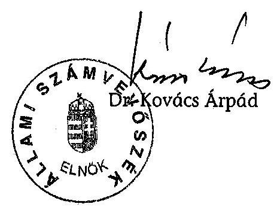
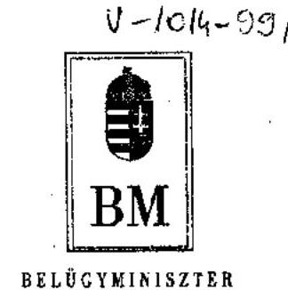
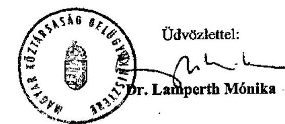
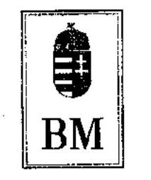
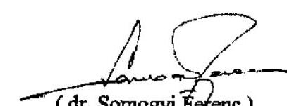

# JELENTÉS 

a 2004. június 13-án megtartott, az EP tagjai választás és a 2004. december 5-én megtartott országos ügydöntő népszavazás lebonyolításához felhasznált pénzeszközök elszámolásának ellenőrzéséről

---

# 3. Önkormányzati és Területi Ellenőrzési Igazgatóság 

3.3. Átfogó Ellenőrzések Főcsoport

Iktatószám: V-1014-112/2005.
Témaszám: 769
Vizsgálat-azonosító szám: V-0196

## Az ellenőrzést felügyelte:

Dr. Lóránt Zoltán
főigazgató
Az ellenőrzés végrehajtásáért felelős:
Dr. Sepsey Tamás
főigazgató helyettes

## Az ellenőrzést vezette:

## Molnár Gyula Mihály

számvevő főtanácsos
A számvevői jelentések feldolgozásában és a jelentés összeállításában közreműködtek:

Dér Géza
számvevő
Klinga László
számvevő tanácsos
Az ellenőrzést végezték:

| Benczik Lászlóné | Bialkó Zsolt | Böröcz Imre |
| :-- | :-- | :-- |
| számvevő tanácsos | számvevő tanácsos | tanácsadó |
| Dér Géza | György Árpád | Kéri Péter |
| számvevő | számvevő tanácsos | számvevő tanácsos |
| Klinga László | László András | Mohl Anna |
| számvevő tanácsos | külső munkatárs | számvevő |
| Molnár Gyula Mihály | Nagy János | Szenténé Tubak Klára |
| számvevő főtanácsos | számvevő tanácsos | számvevő tanácsos |

Kassai László szakértő

## A témához kapcsolódó eddig készített számvevőszéki jelentések:

## Címe

sorszáma
Jelentés az 1990. évi országgyűlési képviselő választások
V-38
előkészítésével és lebonyolításával kapcsolatos állami feladatok végrehajtására biztosított költségvetési pénzeszközök felhasználásának ellenőrzéséről (1991. évben elkészített jelentés)

Jelentés az 1994. évi országgyűlési, valamint a helyi és kisebbségi V-1023/94 önkormányzati képviselő választások lebonyolítására felhasznált

---

pénzeszközök ellenőrzéséről (1995. évben elkészített jelentés)

| Jelentés az 1997. évi népszavazásra, továbbá az 1998. évi | 9920 |
| :-- | :-- |
| országgyűlési, valamint a helyi és kisebbségi önkormányzati |  |
| képviselő választások lebonyolítására felhasznált pénzeszközök |  |
| vizsgálatáról |  |

Jelentés a 2002. évi országgyűlési, valamint a helyi és kisebbségi 0325 önkormányzati képviselő választásra felhasznált pénzeszközök ellenőrzéséről
Jelentés a 2003. április 12-én megtartott országos népszavazás 0423 lebonyolításához felhasznált pénzeszközök elszámolásának ellenőrzéséről

---

# TARTALOMJEGYZÉK 

BEVEZETÉS ..... 5
I. ÖSSZEGZŐ MEGÁLLAPÍTÁSOK, KÖVETKEZTETÉSEK, JAVASLATOK ..... 7
II. RÉSZLETES MEGÁLLAPÍTÁSOK ..... 13

1. A választási kiadások tervezése, az előirányzatok nyilvántartása és módosítása ..... 13
2. Az elkülönített szakfeladati, vagyoni nyilvántartási kötelezettség teljesítése ..... 19
3. A pénzeszközök biztosítása és a felhasználás szabályszerűsége ..... 23
3.1. A pénzügyi fedezet biztosítása ..... 23
3.2. A gazdálkodási jogkörök szabályozása és gyakorlati végrehajtása ..... 26
3.3. A választásokkal kapcsolatos kiadások célszerűsége és szabályszerűsége ..... 28
3.4. A közbeszerzések és a szabadkézi vétel lebonyolítása ..... 36
4. A választások informatikai ellátottsága ..... 39
5. A választási pénzeszközök elszámolása ..... 41
6. A választási pénzeszközök felhasználásának és elszámolásának ellenőrzése ..... 44
6.1. Az OVI ellenőrzési tevékenysége ..... 44
6.2. A TVI-k, és a HVI-k pénzügyi ellenőrzési tevékenysége ..... 45
7. A korábbi ÁSZ vizsgálatok hasznosulása ..... 46

---

# MELLÉKLETEK 

1. számú Az ellenőrzött szervek jegyzéke (1 oldal)
2. számú A 2004. évi EP választás normatíváinak összehasonlítása a 2003. április 12-én megtartott országos népszavazás normatíváival (7 oldal)
3. számú A 2004. évi választások lebonyolítása érdekében lefolytatott közbeszerzési eljárások adatai ( 1 oldal)
4. számú A 2004. évi választások előirányzatainak és azok felhasználásainak alakulása (1 oldal)
5. számú Dr. Lamperth Mónika belügyminiszter úrhölgy észrevétele (3 oldal)
6. számú Dr. Lamperth Mónika belügyminiszter úrhölgynek válaszlevél (2 oldal)
7. számú Dr. Somogyi Ferenc külügyminiszter úr észrevétele (2 oldal)
8. számú Dr. Somogyi Ferenc külügyminiszter úrnak válaszlevél (2 oldal)
9. számú Dr. Veres János pénzügyminiszter úr észrevétele (1 oldal)

---

# RÖVIDÍTÉSEK JEGYZÉKE 

| Ve. | a választási eljárásról szóló 1997. évi C. törvény |
| :--: | :--: |
| Áht. | az államháztartásról szóló 1992. évi XXXVIII. törvény |
| Ámr. | az államháztartás működési rendjéről szóló 217/1998. (XII. 30.) Korm. rendelet |
| Számv. tv. | a számvitelről szóló 2000. évi C. törvény |
| Vhr. | az államháztartás szervezetei beszámolási és könyvvezetési kötelezettségének sajátosságairól szóló 249/2000. (XII. 24.) Korm. rendelet |
| Ep. Tv. | az Európai Parlament tagjainak választásáról szóló 2003. évi CXIII. törvény |
| BM rendelet ${ }_{1}$ | az Európai Parlament tagjai 2004. évi választása költségeinek normatíváiról, tételeiről, elszámolási és belső ellenőrzési rendjéről szóló 10/2004. (IV. 7.) BM rendelet |
| BM rendelet ${ }_{2}$ | az országos népszavazások költségeinek normatíváiról, tételeiről, elszámolási és belső ellenőrzési rendjéről szóló 60/2004. (X. 22.) BM rendelet |
| BM rendeletek | a BM rendelet ${ }_{1}$ és a BM rendelet ${ }_{2}$ |
| $\mathrm{Kbt}_{1}$ | a közbeszerzésekről szóló 1995. évi XL. törvény |
| $\mathrm{Kbt}_{2}$ | a közbeszerzésekről szóló 2003. évi CXXIX. törvény |
| Szkr. | a központi költségvetési szervek szabadkézi vétellel történő beszerzésének szabályairól szóló 126/1996. (VII. 24.) Korm. rendelet |
| 151/1999. (X. 22.) | egyes beszerzések nemzetbiztonsági és titokvédelmi okok miatti sajátos szabályairól szóló 151/1999. (X. 22.) Korm. rendelet |
| Korm. rendelet | az államtitkot, vagy szolgálati titkot, illetőleg alapvető biztonsági, nemzetbiztonsági érdeket érintő vagy különleges biztonsági intézkedést igénylő beszerzések sajátos szabályairól szóló 143/2004. (IV. 29.) Korm. rendelet |
| 168/2004. (V. 25.) | a központosított közbeszerzési rendszerről, valamint központi beszerző szervezet feladat - és hatásköréről szóló 168/2004. (V. |
| Korm. rendelet | 25.) Korm. rendelet |
| 125/1996. (VII. 24.) | a központi költségvetési szervek központosított beszerzéseinek |
| Korm. rendelet | részletes szabályairól szóló 125/1996. (VII. 24.) Korm. rendelet |
| 53/2003. (XII. 27.) | a választási adatszolgáltatásokért fizetendő igazgatási szolgáltatási díjakról szóló 53/2003. (XII. 27.) BM. rendelet |
| ÁSZ | Állami Számvevőszék |
| OVI | Országos Választási Iroda |
| OEVK | Országgyúlési Egyéni Választókerületi Választási Iroda |
| TVI | Területi Választási Iroda |
| HVI | Helyi Választási Iroda |
| KüVI | Külképviseleti Választási Iroda |
| OVB | Országos Választási Bizottság |
| TVB | Területi Választási Bizottság |
| HVB | Helyi Választási Bizottság |

---

| SzSzB | Szavazatszámláló Bizottság |
| :--: | :--: |
| KüM | Külügyminisztérium |
| KüM Gazdálkodási Főosztály | Külügyminisztérium Gazdálkodási Főosztály |
| EP választás | a 2004. június 13-án megtartott, az Európai Parlament tagjai választása |
| népszavazás | a 2004. december 5-én megtartott országos ügydöntő népszavazás |
| választások | a 2004. június 13-án megtartott Európai Parlament tagjai választása és a 2004. december 5-én megtartott országos ügydöntő népszavazás |
| EU népszavazás | a 2003. április 12-én megtartott európai uniós népszavazás |
| BM | Belügyminisztérium |
| EU | Európai Unió |
| BM KÖNYV Hivatal | BM Központi Adatfeldolgozó, Nyilvántartó és Választási Hivatal |
| Közgazdasági Főosztály | BM KÖNYV Hivatal Közgazdasági Főosztály |
| BM TÁSZ | Belügyminisztérium Távközlési Szolgálat |
| BM BK Rt. | Belügyminisztérium Beszerzési és Kereskedelmi Rt. |
| BM KGF | Belügyminisztérium Központi Gazdasági Főigazgatóság |
| ORFK | Országos Rendőrfőkapitányság |
| Kincstár | Magyar Államkincstár |

---

# JELENTÉS 

## a 2004. június 13-án megtartott, az Európai Parlament tagjai választás és a 2004. december 5-én megtartott országos ügydöntő népszavazás lebonyolításához felhasznált pénzeszközök elszámolásának ellenőrzéséről

## BEVEZETÉS

A választási eljárásról szóló 1997. évi C. törvény 5. § felhatalmazása, valamint az Állami Számvevőszékről szóló 1989. évi XXXVIII. törvény 2. § (3) bekezdése és az ÁSZ 2005. évi ellenőrzési terve alapján került sor a 2004. június 13-án megtartott, az Európai Parlament tagjai választására és a 2004. december 5-én megtartott országos ügydöntő népszavazásra fordított pénzeszközök szabályszerű és célszerű felhasználásának vizsgálatára.

Az EU népszavazás alapján az Európai Unióhoz történő csatlakozásról szóló szerződés 2003. április 16-ai aláírása után a Magyar Köztársaság 2004. május 1-től az EU tagjává vált, ennek következtében Magyarország választópolgárai is választhatnak képviselőket az Európai Parlamentbe. Az európai parlamenti képviselőválasztásokon Magyarország először 2004. júniusában vehetett részt, melynek előkészítése a 2003. évben megkezdődött.

A Kormány a 2193/2003. (VIII. 22.) határozatával felhatalmazta a belügyminisztert a választás előkészítéséhez szükséges közbeszerzési eljárások 670 millió Ft értékben való megindítására, elrendelte a választás előkészítéséhez szükséges 2003. évi költségek fedezeteként a költségvetés általános tartalékából 60 millió Ft átcsoportosítását a BM Központi Adatfeldolgozó, Nyilvántartó és Választási Hivatal dologi kiadásaira, valamint a választáshoz szükséges további források figyelembevételét a 2004. évi költségvetés tervezésekor. Az Országgyűlés 2003. december 23-án határozatban fogalmazta meg egyetértését az Európai Parlament tagjai 2004. évi választásának előkészítése és lebonyolítása

---

eredményes végrehajtása érdekében a Belügyminisztérium fejezetben 4350,8 millió Ft felhasználását illetően ${ }^{1}$.

Az Országgyűlés 2004. május 18-án és 2004. szeptember 15-én határozatban rendelte el a benyújtott népszavazási kezdeményezések alapján a feltett kérdésekre vonatkozóan az országos ügydöntő népszavazást. A második határozatban a 2004. december 5-i ügydöntő országos népszavazás költségeire - a külképviseleti szavazás nélkül - 2658,9 millió Ft, a külképviseleti szavazás módjától függetlenül - amennyiben az országos népszavazás napján másik népszavazás megtartására is sor kerül - 50 millió Ft összegben állapított meg támogatást.

A pénzügyi támogatást a Kormány a 2278/2004. (XI. 3.) határozatával 2902,6 millió Ft összegben hagyta jóvá a költségvetés általános tartaléka terhére.

Az ellenőrzés célja annak megállapítása volt, hogy a központi szerveknél, a közigazgatási hivataloknál, valamint a megyei és a helyi önkormányzatoknál a választással kapcsolatos feladatok ellátása során:

- a kiadások tervezése megalapozottan történt-e;
- a pénzeszközök felhasználását célszerűen, a jogszabályi előírásoknak megfelelően végezték-e;
- a pénzügyi elszámolásokat határidőben, a jogszabályban meghatározott módon teljesítették-e.

Helyszíni ellenőrzést folytattunk a BM KÖNYV Hivatalban, a KüM Gazdálkodási Főosztálynál, négy közigazgatási hivatalban, három megyei, valamint 21 települési önkormányzatnál. A vizsgált szerveket az 1. számú mellékletben soroljuk fel.

[^0]
[^0]:    ${ }^{1}$ Az 1994. évi országgyűlési képviselőválasztásra 1700 millió Ft, az önkormányzati képviselőválasztásra 1118 millió Ft, mindösszesen 2818 millió Ft; az 1997. évi népszavazásra 1700 millió Ft, az 1998. évi országgyűlési képviselőválasztásra 3853 millió Ft, önkormányzati és országos kisebbségi képviselőválasztásra 2654 millió Ft, mindösszesen 8207 millió Ft; a 2002. évi országgyűlési képviselőválasztásra 6370,7 millió Ft, önkormányzati és országos kisebbségi képviselőválasztásra 3100 millió Ft, mindösszesen 9470,7 millió Ft előirányzat, a 2003. április 12-én megtartott országos népszavazásra 3824 millió Ft előirányzat került korábban jóváhagyásra.

---

# I. ÖSSZEGZŐ MEGÁLLAPÍTÁSOK, KÖVETKEZTETÉSEK, JAVASLATOK 

Az EP választáshoz szükséges kiadások költségtervének kidolgozása a BM KÖNYV Hivatalnál a 2003. év májusában megkezdődött. A tervezés időszakában a rendelkezésre álló információkat, az EU népszavazás teljesített kiadásait, a személyi juttatás normatívák emelését vették figyelembe. A körültekintő, óvatos, általános tartalékot tartalmazó tervszámokkal alapozták meg a jóváhagyásra kerülő előirányzat összegét. A feladatsoros költségtervet a belügyminiszter 2004. február 11-én hagyta jóvá 4350816 ezer Ft összegben, ami a Belügyminisztérium fejezetben szerepelt előirányzatként. A Kormány 2193/2003. (VIII. 22.) határozatával 4350816 ezer Ft összegben elfogadta az EP választás költségtervét, az Országgyűlés 139/2003. (XII. 23.) határozatában egyetértett az EP választás eredményes végrehajtása érdekében 4350816 ezer Ft kiadási előirányzat felhasználásával.

A népszavazás lebonyolítását biztosító pénzügyi fedezetre az előzetes számítások 2004. április 7-én készültek el, a feladatsoros költségtervet a belügyminiszter 2004. november 9-én hagyta jóvá 2902653 ezer Ft összegben, a Kormány
 2278/2004. (XI. 3.) határozatában, az Országgyűlés a 82/2004. (IX. 15.) határozatában döntött az előirányzat összegéről.

A névjegyzék és az értesítő nyomtatványok mennyiségének megállapítása érdekében a TVI vezetők tájékoztatták az OVI vezetőjét. Az EP választásnál a központilag biztosított nyomtatványok mennyiségének meghatározásánál az igényfelmérés mellett az EU népszavazás tapasztalatait vették figyelembe, a szállítandó mennyiség megállapítása (szórólapoknál, lakossági tájékoztatóknál) a tájékoztatás megismétlési lehetőségre és a minőségi különbségekre is felkészültek. A népszavazás lebonyolításához a tervezett tételek és a megrendelt (leszállított) mennyiségek azonosak voltak, $\pm 10 \%$ tartalék keret figyelembevételével. Az informatikai kiadásoknál a megtakarítást az EU népszavazásnál alkalmazott szakrendszerek aktualizálással történő igénybevétele tette lehetővé.

A KüM Gazdálkodási Főosztály a választások lebonyolításához kapcsolódó - a külügyi feladatokat magába foglaló megállapodásokban leírtak figyelembevételével - költségterveket készített. A költségterveket a feladatok változása és a lebonyolítással kapcsolatos döntések függvényében szükség szerint módosították, az utolsó módosítás után véglegesített tervekben szereplő kiadási összegeket tartalmazó kimutatást mellékelték a megállapodásokhoz.

A vizsgált polgármesteri hivatalok közel 20\%-a a BM rendeletek előírása ellenére nem gondoskodott az EP választás és a népszavazás költségtervének elkészítéséről, míg a TVI-k és a közigazgatási hivatalok elkészítették azokat. A költségtervek a költségnormatívák figyelembevételével készültek. A választások lebonyolítására biztosított központi támogatást a TVI-k, a HVI-k és a közigazgatási hivatalok átvett pénzeszközként kezelték.

---

A 2004. évi választásokkal kapcsolatos előirányzatokat a BM KÖNYV Hivatalban nyilvántartották, a módosításokat átvezették. Az EP választás jóváhagyott forrásainak összegét kormányhatározat alapján - az államháztartás egyensúlyi helyzetének javítása érdekében - a Belügyminisztérium 8\%-kal csökkentette. A BM KÖNYV Hivatalnál a saját hatáskörben végrehajtott előirányzat-átcsoportosítások a kiadási főösszeget nem változtatták meg. A népszavazás lebonyolítására biztosított központi előirányzatot nem módosították, saját hatáskörben belső átcsoportosítást hajtottak végre. A külképviseleteken lebonyolított választásokkal kapcsolatosan megkötött megállapodásokban foglalt összegeknek megfelelő előirányzat-módosításokat elvégezték.

Az EP választásnál az önkormányzatok 58\%-a, míg a népszavazás során 50\%-a nem gondoskodott az Ámr-ben előírt negyedévenkénti előirányzat-módosításról. A közigazgatási hivatalok határidőben kezdeményezték előirányzataik módosítását. Az előirányzat-túllépések miatt nem valósult meg a jóváhagyott előirányzatokon belüli gazdálkodásra vonatkozó Áht-ban előírt követelmény. Két HVI a központilag biztosított előirányzattal, míg egy HVI a saját forrás összegével elmulasztotta költségvetési rendeletének módosítását.

A BM rendeletek a választás céljára biztosított pénzeszközök elkülönített kezelését, elszámolását a választásokra kijelölt szakfeladaton történő nyilvántartását írták elő valamennyi bevétel (központi és saját forrás) és kiadás (közvetlen és általános költségek) tekintetében. A PM választásonként külön szakfeladat számokat nem biztosított, így a választásonkénti elkülönítést a szakfeladat, vagy azon belül a főkönyvi számlák alábontásával lehetett megoldani. A választási szervezetek 89,3\%-a az elkülönítést nem végezte el, ezért a választási kiadások teljes összege elkülönítve nem mutatható ki. A választásokkal kapcsolatos előirányzatokat a KüM Gazdálkodási Főosztály nem a kijelölt szakfeladaton tartotta nyilván, ami ellentétes a BM rendeletek előírásával.

A választási szervezetek egytizede biztosította az előírt szakfeladaton a választásonkénti nyilvántartást. Az önkormányzatok egyötöde, a közigazgatási hivatalok fele teljesített olyan választásokkal összefüggő bevételeket és kiadásokat, amelyeket nem mutattak ki a választási szakfeladaton.

A központi költségvetésből az EP választáshoz kapcsolódó támogatást a havi kincstári finanszírozás keretében kapta meg a BM KÖNYV Hivatal, a népszavazás lebonyolításának fedezetét 2004. november 8-án módosított előirányzatként biztosították. A rendelkezésre bocsátott pénzügyi fedezet az EP választásnál és a népszavazásnál a jogszabályban előírt határidőben a választásban résztvevő szerveknél rendelkezésre állt. A választások lebonyolítására megelőlegezett kiadások finanszírozási-likviditási nehézséget nem okoztak.

A gazdálkodási jogköröket a BM KÖNYV Hivatal vezetője intézkedéseiben szabályozta, amelyek megfeleltek az Ámr. előírásainak. A 2004. évi választásokhoz kapcsolódó pénzügyi műveletekre vonatkozóan a BM rendeletekben előírt kiegészítő intézkedést is kiadta. A BM rendeletekben az OVI vezetőjének a választás pénzeszközei feletti kötelezettségvállalásokkal kapcsolatos előzetes egyetértési jogára vonatkozó előírásai nincsenek összhangban az Ámr-ben és az Áht-ban a kötelezettségvállalásra vonatkozó előírásokkal.

---

A gazdálkodási jogkörök általánostól eltérő gyakorlásának rendjét az Ámr-ben és a BM rendeletekben előírtak ellenére az EP választásnál a helyi önkormányzatok közel 20\%-a, a népszavazásnál 14\%-a nem szabályozta. A TVI-k és a közigazgatási hivatalok eleget tettek szabályozási kötelezettségüknek.

A dologi kiadások teljesítése a BM KÖNYV Hivatalnál az előirányzatokhoz viszonyítva az EP választásnál 57,6\%-ot, a népszavazásnál 60,8\%-ot ért el, a megtakarítások meghatározó tételei a szavazólapok és nyomtatványok kiadásai voltak. A bizonylati fegyelem betartása, a rendelkezési jogosultság aláírással történő igazolása teljesült.

A gazdasági eseményeket magukba foglaló bizonylatok a kötelezettségvállalás, utalványozás, ellenjegyzés, érvényesítés, teljesítés szakmai igazolásának elmaradása miatt nem feleltek meg a Számv. tv-ben előírt alaki és tartalmi követelménynek a választási szervek közel egynegyedénél.

A választásokat terhelő általános költségekre vonatkozó számításokat a BM rendeletek előírása ellenére nem végzett és nem is számolt el a választási szakfeladaton a vizsgált TVI-k 67\%-a, a közigazgatási hivatalok 50\%-a, az EP választásnál a HVI-k 90\%-a, a népszavazásnál 86\%-a. A normatívák összegeit a saját forrás terhére a választási szervezetek egynegyede egészítette ki, amit azok egytizede könyvelt a választási szakfeladatra.

A választások lebonyolításához kötődő eszközbeszerzés az EP választásnál a választási szervezetek 3,6\%-ánál, a népszavazásnál 3,5\%-ánál történt, melyek kis értékű tárgyi eszköz beszerzések voltak, a dologi kiadások előirányzatából. A BM rendeletekben előírtak ellenére az EP választás dologi kiadásai terhére egy városi polgármesteri hivatal felhalmozási kiadást számolt el 564 ezer Ft összegben.

A KüM-nél elszámolt kiadások - a KüVI tagjaként eljáró futárok utazási kiadásainak célszerűsége kivételével - megalapozottak, indokoltak és célszerűek voltak.

A KüM Gazdálkodási Főosztálynál a megállapodásban rögzített, a TVI-k, a HVI-k és a közigazgatási hivatalok a normatíva terhére teljesített személyi jellegű kifizetéseknél - a vizsgált szervek közül - az EP választásnál három városi, egy nagyközségi, egy községi önkormányzat, a népszavazásnál egy városi, egy nagyközségi, egy községi, továbbá egy közigazgatási hivatal nem tartotta be az Ámr. rendelkezését azzal, hogy saját dolgozónak megbízási díjat fizetett ki a munkakörébe tartozó feladatra.

A normatívában megállapított személyi jellegű előirányzatokat, a kifizetések teljesítése során saját forrásból az EP választásnál és a népszavazásnál a helyi önkormányzatok 14,2\%-a, a népszavazásnál a megyei önkormányzatok 33,3\%-a, illetve a közigazgatási hivatalok 25\%-a egészítette ki, amit normatíván felüli többlet díjazásokra fordítottak.

A választási szervezetek a költségtervekben és a normatívákban rögzített dologi kiadási előirányzatokból változó összegben a személyi jellegű kiadások

---

előirányzatára csoportosítottak át, erre a BM rendeletek lehetőséget adtak.

A helyi önkormányzatok szerződéses kapcsolat keretében a közigazgatási hivatalok és a BM KÖNYV Hivatal közreműködését vették igénybe a választói névjegyzékek és értesítők elkészítésére, továbbá a Magyar Posta Rt. szolgáltatását azok választópolgárokhoz történő továbbítására. A helyi önkormányzatok 14\%-a végzett gazdaságossági számítást az EP választással és a népszavazással összefüggő adminisztrációs feladatok költségtakarékos elvégzése érdekében. A helyi önkormányzatok közel egyötöde a Magyar Posta Rt. szolgáltatási díjánál többet fizetett a kézbesítésre.

Az EP választáskor papír szavazóurnát az ellenőrzött helyi önkormányzatok közül 11, míg a népszavazás során négy igényelt és kapott az OVI-tól. Mobil szavazófülkét a választásokkal összefüggésben négy önkormányzat igényelt. A központilag biztosított eszközöket rendeltetésüknek megfelelően használták.

A központi szervek működési kiadásai között a választások végrehajtását követően a BM KÖNYV Hivatalnál hét szervezetből, különböző létszámban kaptak a résztvevők jutalmat. Az EP választásnál 33,2 millió Ft, a népszavazásnál 25,6 millió Ft összegű jutalom kifizetésekor a tervezett személyi jellegű kiadási előirányzatot betartották (a legkisebb összegű jutalom az EP választásnál 16 ezer Ft, a népszavazásnál 24 ezer Ft, a legnagyobb összegű jutalom az EP választásnál 2474 ezer Ft, a népszavazásnál 2105 ezer Ft volt), melyet a belügyminiszter hagyott jóvá. A BM KÖNYV Hivatal saját személyi juttatás előirányzata terhére 4,2 millió Ft jutalmat fizetett ki.

A BM KÖNYV Hivatal az EP választás lebonyolítása érdekében hat, a népszavazás végrehajtásához négy közbeszerzési eljárást folytatott le, amelyek során a jogszabályi előírásokat - a tájékoztatási kötelezettség kivételével - betartották. A közbeszerzésekhez kapcsolódó tájékoztatási kötelezettségét a $\mathrm{Kbt}_{1}$ és a $\mathrm{Kbt}_{2}$ előírását megsértve teljesítette az ajánlatkérő. A BM KÖNYV Hivatal azonban megsértette a $\mathrm{Kbt}_{2}$ előírását azzal, hogy szolgáltatás-vásárlást értékhatár feletti összegben közbeszerzési eljárás lefolytatása nélkül valósított meg, ezért az ÁSZ eljárást kezdeményezett a Közbeszerzési Döntőbizottságnál. Az eljárás bírságot tartalmazó határozattal zárult. A szabadkézi vétel körébe tartozó beszerzések során a BM KÖNYV Hivatal három ajánlatot kért be, melyeket a bírálati szempontoknak megfelelően értékeltek.

Az informatikai rendszerek költségeinek tervezésénél a 2002. évi helyi és helyi kisebbségi önkormányzati képviselő választások, valamint az EU népszavazás informatikai kiadásait vették figyelembe, annak szükséges költségeit a meglévő eszközök figyelembevételével tervezték. Az informatikai kiadások összege az EP választás teljes kiadásának 31,1\%-át, 1052,1 millió Ft-ot, a népszavazás kiadásainak 24,1\%-át, 597,6 millió Ft-ot tett ki. A választásokhoz nem vásároltak eszközöket, hanem a meglévőket alkalmazták és béreltek olyan berendezéseket, amelyeket csak a választásokhoz használtak. Az informatikai rendszer jól működött, nem merült fel olyan probléma, amely feldolgozási fennakadást okozott volna.

---

A BM KÖNYV Hivatal vezetője a BM rendeletekben meghatározott határidőben átadta az elszámolásokat az OVI vezetőjének, aki azokat haladéktalanul továbbította a belügyminiszter részére. Az elszámolások szerint az EP választásnál a módosított előirányzat összege 4011 millió Ft, a teljesített kiadások összege 3381,4 millió Ft, a maradvány 629,6 millió Ft volt, a népszavazásnál az eredeti és módosított előirányzatok összege 2902,6 millió Ft, a teljesített kiadások összege 2584,6 millió Ft-ot tett ki és 318 millió Ft maradvány keletkezett.

A vizsgált HVI-knél a szavazókörök számában nem volt változás, ezáltal feladatelmaradás nem történt. A TVI-k a jelentkező többletköltségek kiutalását azok felülvizsgálatát követően elvégezték. Az elismert többletköltségek (SzSzB póttagok bevonása) - az EP választásnál 40,6 millió Ft, a népszavazásnál 53,2 millió Ft összegek - HVI-k részére történő megtérítését és a pénzeszközök továbbutalásának határidejét a BM rendeletek nem határozták meg.

A HVI-k a TVI-k felé történő feladattípusú elszámolási kötelezettségüknek a népszavazás során minden esetben határidőre eleget tettek, míg az EP választással összefüggésben 14\%-uk késedelmesen nyújtotta be az elszámolást. A TVI-k a feladattípusú és összegző jellegű elszámolásokat, valamint a KüM Gazdálkodási Főosztály a megállapodás szerinti KüVI-kénti és összesítő elszámolásokat határidőben elkészítették. Az OVI nem tartott ellenőrzést a KüM Gazdálkodási Főosztálynál, ez ellentétes az Áht. előírásával.

A HVI-k vezetőinek közel fele a választási pénzeszközök felhasználásának utóellenőrzéséről a BM rendeletekben előírtakkal ellentétben nem gondoskodott. A TVI vezetők mindegyike gondoskodott a választási pénzeszközök felhasználásának utóellenőrzéséről. A HVI-k által összeállított feladattípusú elszámolások pénzügyi ellenőrzését - azok informatikai feldolgozása során számszaki egyeztetéssel - a TVI-k elvégezték.

A 2002. évi országgyűlési, valamint a helyi és kisebbségi önkormányzati képviselő választásra felhasznált pénzeszközök ellenőrzéséről készített 2003. évi jelentés hat javaslatot tartalmazott a belügyminiszter számára.

Az ÁSZ javaslatok háromnegyede hasznosult, a végleges kiadásokról készített elszámolás időpontját nem határozta meg a belügyminiszter, a közbeszerzési előírások miatti
 felelősség megállapítása nem történt meg és nem alakítottak ki a $\mathrm{Kbt}_{2}$ előírásainak megfelelő belső szabályozási rendet.

A 2003. április 12-én megtartott országos népszavazás lebonyolításához felhasznált pénzeszközök elszámolásának ellenőrzéséről készített 2004. évi jelentésben négy javaslatot tettünk a belügyminiszternek. A belügyminiszter részére tett javaslatokat hasznosították, a póttámogatások felülvizsgálata után az elrendelt visszafizetések megtörténtek.

Az önkormányzatoknál az EU népszavazással kapcsolatban végzett ÁSZ vizsgálatok megállapításaihoz képest a választásra felhasznált pénzeszközök teljes körű, átlátható számbavételét biztosító, elkülönített szakfeladaton történő nyilvántartás, a negyedévenkénti előirányzat-módosítások előírásoknak megfelelő végrehajtása és a pénzfelhasználások utóellenőrzésének elmaradása tekintetében nem történt változás. Az általános költségek elszámolására a két választás

---

tekintetében hasonló arányban nem került sor, az általánostól eltérő gazdálkodási jogkörök szabályozása ugyanakkor a javaslatainknak megfelelően több mint $5 \%$-kal javult.

A helyszíni ellenőrzés megállapításainak hasznosítása mellett javasoljuk:

# a belügyminiszternek: 

1. kezdeményezze az OVI vezetőjének a 60/2004. (X. 22.) BM rendelet 1. § (1) bekezdés b) pontja alapján a választás pénzeszközei feletti kötelezettségvállalásokkal kapcsolatos előzetes egyetértési jogkörének és a BM KÖNYV Hivatal vezetőjének az Áht. 98. § (1) bekezdése, illetve az Ámr. 134. § (1) bekezdése előírásain alapuló kötelezettségvállalási jogkörének gyakorlására vonatkozóan a törvény, a kormányrendelet és a BM rendelet közötti összhang biztosítását;
2. rendelje el, hogy az OVI vezetője vizsgálja felül a Vhr. 9. számú melléklet 9. c) pontja szerint az EP választásokhoz nem kapcsolódó, a dologi kiadások terhére elszámolt felhalmozási kiadásokat, egyéb felhasználásokat és jogszerűtlen felhasználás esetén intézkedjen a visszafizetés iránt;
3. terjessze ki az OVI pénzügyi ellenőrzési feladatát a KüM Gazdálkodási Főosztály által a választásokra felhasznált kiadások pénzügyi ellenőrzésére, az Áht. 13/A. § (2) bekezdésében előírtak alapján;
4. a következő választások előkészítése és végrehajtása során a munka színvonalának javítása érdekében:
a) határozza meg a felmerült és elfogadott többletköltségek HVI-k részére történő továbbutalásának határidejét;
b) a BM rendeletekben határozza meg az Áht-ban és az Ámr-ben előírtak figyelembevételével a dologi kiadások előirányzatából a személyi juttatásra történő átcsoportosítás mértékét;
c) rendelje el, hogy a HVI-k és a TVI-k vezetői részére kifizethető díjak folyósítására az elszámolás határidejéig a választásra felhasznált kiadások ellenőrzésének igazolása alapján kerülhessen sor.

## a külügyminiszternek:

1. gondoskodjon a külföldi kiküldetést teljesítők költségtérítéséről kiadott 2/2001. KüM utasítás felülvizsgálatáról a magasabb komfortosztályú utazásra jogosultak vonatkozásában, annak érdekében, hogy a KüM utasítás az állami vezetői juttatások jogosultsági feltételeiről szóló 131/1997. (VII. 24.) Korm. rendelet 19. § (1) bekezdés b) pontjában előírtakkal összhangban legyen;
2. biztosítsa, hogy az Ámr. 59. § (9) bekezdésében előírtaknak megfelelően, saját dolgozókkal ne kössenek megbízási szerződést a dolgozó munkakörébe tartozó, munkaköri leírása szerint számára előírható feladatokra.

---

# II. RÉSZLETES MEGÁLLAPÍTÁSOK 

## 1. A VÁlasztÁsi kiadások TERVEZÉse, az elóirányzatok NyilVÁNTARTÁSA ÉS MÓDOSÍTÁSA

Az EP választáshoz a szükséges kiadások előzetes számításai alapján a BM KÖNYV Hivatal vezetője az OVI vezetőjével egyetértésben első alkalommal 2003. május 19-én a BM közigazgatási államtitkár részére megküldte a Kormány 2003. május 7-ei ${ }^{2}$ döntésének végrehajtására kidolgozott költségtervben meghatározott adatokat, amely összesen 6966 millió Ft megvalósítási összeget tartalmazott.

A tervezett kiadások főbb csoportjai az egyfordulós választás költségének 3049 millió Ft-os, az informatikai kiadás 1050 millió Ft-os, a nyilvántartási rendszerek módosítása költségének 1200 millió Ft-os és a külképviseleti elektronikus szavazás költségigényének 1667 millió Ft-os összegéből tevődtek ki.

Az Ep. tv. előkészítés szakaszában az uniós polgárok választó jogának gyakorlásához szükséges nyilvántartási rendszerek kialakítását a személyi adat és lakcímnyilvántartásban, az idegenrendészeti nyilvántartásban és a választójoggal nem rendelkezők nyilvántartásában tervezték.

Az Ep. tv. 2004. május 25-ei ${ }^{3}$ módosítása után a nyilvántartó rendszerek átalakítása elmaradt és a külképviseleti elektronikus szavazás helyett a hagyományos szavazás kiadásai kerültek a módosított előirányzatok összegébe.

A BM KÖNYV Hivatalnál a tervezés időszakában a rendelkezésre álló információkat és a választás előkészítése közben hozott döntéseket vették figyelembe. Az EU népszavazáskor alkalmazott személyi juttatás normatívái emelésének hatásából következő, az óvatos tervezéssel és a biztonságos megvalósítást fedező (tartalékot is tartalmazó) számításokkal alapozták meg a tervezett előirányzatok összegét. Az eredeti előirányzatot általános tartalékkal tervezték meg az EP választás zökkenőmentes lebonyolítása érdekében. A körültekintő tervezéssel kialakított költségterv főösszege került előterjesztésre jóváhagyás céljából.

A Kormány megtárgyalta és a 2193/2003. (VIII. 22.) határozatával 4350,8 millió Ft összegben elfogadta az EP választás költségtervét, felhatalmazta a belügyminisztert a választás előkészítéséhez szükséges közbeszerzési eljárások 670 millió Ft értékben való megindítására, elrendelte a választás előkészítéséhez szükséges 2003. évi költségek fedezeteként a költségvetés általános

[^0]
[^0]:    ${ }^{2}$ A Kormány döntött arról, hogy a szavazás napján külföldön tartózkodó választó polgárok a külképviseleteken elektronikus úton szavazhatnak.
    ${ }^{3}$ Beiktatta: 2004. évi XLIII. törvény 1. §-a.

---

tartalékából 60 millió Ft átcsoportosítását a BM KÖNYV Hivatal dologi kiadásaira.

Az EP választáshoz szükséges további források figyelembevételét a 2004. évi költségvetés tervezésekor írta elő, a fejezeti költségvetésben a költségterv szerinti összeg rögzítésre került.

Az Országgyúlés 139/2003. (XII. 23.) számú határozatában egyetértett az Európai Parlament tagjai 2004. évi választásának és lebonyolításának eredményes végrehajtása érdekében a Belügyminisztérium fejezetben 4350816 ezer Ft felhasználásával.

Az országgyűlési határozatban jóváhagyott összegből a belügyminiszter által jóváhagyott költségterv alapján a helyi választási feladatok költségei 1453,4 millió Ft-ot, a területi kiadások (OEVK és TVI) 169,7 millió Ft-ot, a külképviseleti szavazás 300 millió Ft-ot, a központi kiadások (közigazgatási hivatalok, BM KÖNYV Hivatal) 1216,7 millió Ft-ot, az informatikai kiadások 1060,1 millió Ft-ot tettek ki. Az eredeti előirányzat 150,9 millió Ft általános tartalékot tartalmazott.

A feladatsoros költségtervet a belügyminiszter 2004. február 11-én hagyta jóvá. A költségterv tételeinek és normatíváinak összehasonlítását a 2003. április 12-én megtartott országos népszavazás tételeihez és normatívához végeztük el, a változások részletezését a 2. sz. melléklet tartalmazza, amelyben az EP választás tervezett kiadásai 526,8 millió Ft-tal haladták meg az EU népszavazás végösszegét.

A helyi választási feladatok költségeit az EU népszavazáshoz képest 122,9 millió Ft-tal magasabb összegben határozták meg, a növekedés oka a személyi juttatások (szavazatszámláló bizottsági tagok, jegyzőkönyvvezetők és a HVB-i tagok díjának $2000 \mathrm{Ft} /$ fő tétel emelése) növelése és a munkaadót terhelő járulék változás volt. A TVI-nél a növekedést 12,9 millió Ft összegben tervezték, amely a TVB választott tagjainak $6500 \mathrm{Ft} /$ fő összeggel, a TVI tagjainak $4000 \mathrm{Ft} /$ fő összeggel, a TVI vezető helyettesének, informatikai, pénzügyi felelősei díjának $10000 \mathrm{Ft} /$ fő összeggel és a TVI vezetőjének $80000 \mathrm{Ft} /$ fő díj emelése eredményezte. A központi kiadások esetében 76 millió Ft ( $6 \%$-os) csökkentést terveztek, amely a választói névjegyzék, az értesítők és az ajánló szelvények előállítására, a pártsemleges kampányra fordítható kiadások mérsékléséből keletkezett.

Az OVI vezetője a 2004. december 5-én megtartott országos népszavazás szervezése és lebonyolítása pénzügyi feltételeinek meghatározására - a BM KÖNYV Hivatal vezetője által elkészített előzetes számításokat - a Kormány részére 2004. április 7-én előterjesztette, a Ve. módosításáról szóló törvényjavaslat mellékleteként. A népszavazás költségvetése a külképviseleti szavazás módjától függően három változatban készült.

Az Országgyűlés a 46/2004. (IV. 18.) határozatában rendelte el az országos ügydöntő népszavazást és döntött a népszavazás költségvetésének három változatáról.

- A hagyományos papír alapú külképviseleti szavazás esetén a költség 2902 653 ezer Ft.
- A külképviseleti gépi szavazásnál a költség 3368986 ezer Ft.

---

- A külképviseleti szavazás nélkül a költség 2658953 ezer Ft.

A BM KÖNYV Hivatal vezetője 2004. június 2-án feljegyzésben fordult a belügyminiszterhez a népszavazás közbeszerzési eljárásai pénzügyi fedezetének biztosítására a közbeszerzési eljárások előírt határidőn belüli megindítása érdekében.

Az előkészítés során a BM KÖNYV Hivatal vezetője 2004. július 8-án a közbeszerzés keretében beszerzendő eszközök és szolgáltatások listáját felterjesztette a BM közigazgatási államtitkár részére, aki jóváhagyta azt.

Az Országgyűlés a 82/2004. (IX. 15.) határozatában döntött arról is, hogy amennyiben a 2004. december 5-én megtartandó országos népszavazás napján másik népszavazás megtartására is sor kerül, akkor a külképviseleti szavazás módjától függetlenül, ennek költségvetési kiadási előirányzata 50 millió Ft. A Köztársasági Elnök 2004. október 28-i határozatában a népszavazás időpontját 2004. december 5-ére tűzte ki.

A BM KÖNYV Hivatal vezetője az OVI vezetőjével egyetértésben a népszavazás feladatsoros pénzügyi tervét 2004. november 8-án jóváhagyásra a belügyminiszterhez felterjesztette. A Kormány a népszavazás pénzügyi fedezetét a 2278/2004. (XI. 3.) számú határozatában 2902,6 millió Ft összegben, a költségvetés általános tartaléka terhére hagyta jóvá.

A népszavazás feladatsoros költségtervét a belügyminiszter 2004. november 9-én hagyta jóvá 2902,6 millió Ft összeggel. A népszavazás megvalósításának tervezett összege az EP választás költségterve összegénél 1448,2 millió Ft-tal kevesebb volt. A költségterv főösszegének csökkentését a külképviseleti kiadások 170,9 millió Ft-os, a TVI kiadások 4,5 millió Ft-os, a közigazgatási hivatalok kiadásainak 18,2 millió Ft-os, a központi kiadások 660,9 millió Ft-os és az informatikai kiadások 442,7 millió Ft-os csökkentésével tervezték, valamint általános tartalékot sem terveztek.

A tervezett előirányzatból a helyi választási feladatok kiadásai 1453,4 millió Ft-ot, a területi kiadások (TVI és OEVK) 165,2 millió Ft-ot, a külképviseleti szavazás kiadásai 129,1 millió Ft-ot, a központi kiadások (közigazgatási hivatalok, BM KÖNYV Hivatal) 537,5 millió Ft-ot, az informatikai kiadások 617,4 millió Ft-ot tettek ki.

A népszavazás lebonyolítását a BM KÖNYV Hivatal a pénzügyi terv belső átcsoportosításával - a második kérdésre előirányzott 50 millió Ft esetében figyelmen kívül hagyta az OGY határozatát - tervezte végrehajtani.

A népszavazás költségtervének készítése során az EP választás tényleges teljesítési adatait figyelembe vették, ennek következtében a kialakított tervadatok 14,2%-kal alacsonyabb összegben kerültek meghatározásra. Az EP választás tényleges kiadásaiból kiindulva a HVI-k, az OEVK-k és a TVI-k tervezett kiadásai közel azonosan, 97,9%-100,9% közötti szinten maradtak. A külképviseleti választások kiadásainak tervezésénél az EP választások teljesített kiadásainak 102,4 millió Ft-os összegénél 26%-kal magasabb összegben tervezték. A közigazgatási hivatalok kiadási előirányzatát a teljesítési adat 37,6%-ára csökkentették, a központi kiadások mérséklése közel 10% volt, az informatikai kia-

---

dásokat 41,3%-kal csökkentették. A népszavazás lebonyolításához kapcsolódó kiadások tervezésekor a csökkentést a központi és az informatikai kiadások tételeinek elhagyása, mérséklése biztosította.

Az EP választás és a népszavazás lebonyolítását meghatározó jogszabályi előírások eltérő feladatokat rögzítettek, mivel az EP választás lebonyolítására minimum 72 nap, a népszavazásra maximum 43 nap felkészülési időt biztosítottak. A kiadások tervezése során tudatos költségtakarékosság volt az alapelv.

A központi választási szervek OVB, OVI tervezett működési kiadásai a rövidebb felkészülési idő, a korábbi begyakorlottság miatt voltak alacsonyabbak. A kampányra, kommunikációra tervezett kiadásokat egynegyedére csökkentették, mivel a szavazáson való részvételre a mozgósítás a népszavazást kezdeményező szervezet feladata, míg az EP választásról a tájékoztatást az uniós előírások szerint kellett tervezni. A népszavazásnál a szavazólapokra, nyomtatványokra, szavazástechnikai anyagokra a kiadások tervezett összege fele volt az EP választás kiadásainak, amit a szavazólap méretbeli különbsége
 (EP választásnál a jelölő szervezetek számától függött, a népszavazásnál A/5-ös méret), az urnadobozok újbóli felhasználása, az eredményről a tájékoztató belföldi közzétételi kötelezettsége és a fordítási, tolmácsolási feladatok csökkentése tett lehetővé.

A népszavazás informatikai kiadásait a tervezés során csökkentették az EP választás tényleges kiadásaihoz viszonyítva, mert az EP választásra nem volt korábban kialakított informatikai választási szakrendszer (újat kellett fejleszteni), a népszavazásnál az EU népszavazásra kifejlesztett informatikai rendszert aktualizálással alkalmazni tudták, így a költségek háromnegyed része megtakarítható volt. Az informatikai szolgáltatások (rendszerüzemeltetés, illetéktelen hozzáférés elleni védelmi és hálózati szolgáltatás) költségeit változatlan összegben tervezték, a projektmenedzsment és a projektadminisztráció által támogatandó időszak fele volt az EP választásnál szükségesnek, a minőségbiztosítás csak a módosításokra terjedt ki, ezek következtében a tervezett kiadást 70%-kal csökkentették.

A BM KÖNYV Hivatal kidolgozta a választásokhoz kapcsolódó tervezési, elszámolási feladatok informatikai támogatásának koncepcióját, amely a jövőben lehetővé teszi a választások kiadási szükségleteinek tervezésekor a megalapozottabb tervváltozatok elkészítését. A tervezési, elszámolási és a közel 10 éve működő normatíva rendszert két TVI közreműködésével felülvizsgálták.

A költségtervek elkészítése a külképviseleti szavazások lebonyolításához kapcsolódó KüM feladatokat magába foglaló megállapodásokban leírtak figyelembevételével történt. A választásokhoz kapcsolódó saját forrást és egyéb támogatást nem terveztek.

A BM KÖNYV Hivatal jóváhagyott EP választás előirányzata 4011 millió Ft-ra változott. A Kormány az államháztartás egyensúlyi helyzetének javítása érdekében a 2345/2003. (XII. 23.) számú határozatban elrendelt kiadás és támogatás mérséklő intézkedésének végrehajtására a Belügyminisztérium az EP választás kiadási előirányzatát 2004. február 18-án 301,7 millió Ft-tal, 2004.

---

április 16-án 98 millió Ft-tal csökkentette, az EU népszavazás 60 millió Ft-os - 2003. október 15-i elszámolás - maradványával növelte.

A kiadási előirányzat csökkentés jogcímeit a külképviseleti szavazás 50 millió Ft-os tartaléka, a központi kiadások között a szavazólapok 40,8 millió Ft-os, nyomtatvány-szállítás 48 millió Ft-os, a fordítási kiadás 50 millió Ft-os elvonási összegei, illetve a minőségbiztosításra tervezett kiadások 59 millió Ft-os növelését határozták meg.

A kiadási előirányzat főösszegét nem módosította a BM KÖNYV Hivatal vezetője, az EP-112/3/2004. számú saját hatáskörben végrehajtott 36,1 millió Ft átcsoportosítása - az OVI vezetője egyetértésével - az informatikai kiadások alkalmazásfejlesztési tételére, a rendszerüzemeltetés 26,6 millió Ft és a 9,5 millió Ft minőségbiztosítás tételsorok terhére történt. Az átcsoportosítás megfelelt az Ámr. 51. § (2) bekezdés, illetve a BM rendelet 5. § (1) bekezdés előírásainak.

A KüM Gazdálkodási Főosztály a tervezett dologi előirányzatából személyi juttatás előirányzatára az EP választásnál 2,6 millió Ft-os átcsoportosítást hajtott végre.

A népszavazás eredeti előirányzatát nem módosították. A kiadási előirányzatokat kiemelt előirányzat csoportonként elkülönített analitikus nyilvántartásba vették.

A BM KÖNYV Hivatal vezetője az OVI vezetőjének egyetértésével a BM rendelet ²5. § (1) bekezdésének megfelelően a jóváhagyott feladatsoros pénzügyi terv előirányzatán belül két előirányzat átcsoportosítást rendelt el.

Az NSZ-88/1/4 számú előirányzat átcsoportosítás a dologi előirányzatok 91,4 millió Ft-os csökkentését, a működési célú pénzeszköz átadás 39,2 millió Ft-os és az intézményi beruházásra 52,2 millió Ft-os növelését tartalmazta. Az átcsoportosítások dokumentálása megfelelő volt, a nyilvántartásokon az előirányzat átcsoportosításokat szabályszerűen átvezették. A külképviseleteken lebonyolított választásokkal kapcsolatosan megkötött megállapodásokban foglalt összegeknek megfelelő előirányzat módosításokat elvégezték. A KüM részére rendelkezésre álló előirányzatokról és az ehhez kapcsolódó kötelezettségvállalásokról az Áht. 103. § (1) bekezdésében előírt nyilvántartást felfektették és a (2) bekezdésben foglaltaknak megfelelően folyamatosan vezették.

A vizsgált polgármesteri hivatalok 19%-a nem gondoskodott az EP választás és a népszavazás költségtervének elkészítéséről, így a HVI vezetője nem tartotta be a BM rendeletek 1. § (2) bekezdés c) pontjának a tervezésre vonatkozó előírását. A HVI-k 66,6%-ánál a tervezésért felelős jegyző, 9,5%-ánál a gazdálkodási előadó vagy a pénzügyi vezető hagyta jóvá a költségtervet, míg

[^0]
[^0]:    ⁴ A pénzeszköz átadás tervezés az eredeti előirányzatok között nem történt, a választások lebonyolításakor a KüM Gazdálkodási Főosztály és a BM TÁSZ részére a megállapodás pénzeszközátadást tartalmazott.
    ⁵ Alkalmazás fejlesztésre dologi előirányzatot terveztek, a szállítási szerződések beruházási pénzeszközöket igényeltek.

---

4,9%-ánál a költségterv jóváhagyása a HVI vezetője részéről elmaradt. A TVI-k és a közigazgatási hivatalok a választásokra vonatkozó költségtervet elkészítették, amit a közigazgatási hivataloknál a hivatalvezető, a TVI-k esetében a főjegyző hagyott jóvá.

A költségtervekben a bevételeket forrásonként, a kiadásokat kiemelt előirányzatonként, illetve feladatonként tervezték meg a BM rendeletek 1. számú mellékleteiben rögzített költségnormatívák figyelembe vételével. A EP választási kiadások saját forrással történő kiegészítésére egy TVI tervezett a 2004. évi költségvetésében eredeti előirányzatot a választási feladatokra (Bács-Kiskun Megyei Önkormányzat), de annak összegét (1 millió Ft) az EP választás költségtervébe nem építette be.

A 2004. évi költségvetés tervezésének időszakában az EP választás konkrét időpontja bizonytalan volt, a népszavazás pedig nem volt ismert, ezért a választásokkal kapcsolatos eredeti előirányzatokat az önkormányzatok és a közigazgatási hivatalok nem terveztek.

A választások lebonyolítására biztosított központi támogatást a TVI-k, a HVI-k, a KüM Gazdálkodási Főosztály és a közigazgatási hivatalok a BM rendeletek 3. § (3) bekezdésében előírtaknak megfelelően átvett pénzeszközként kezelték.

Az EP választásnál az önkormányzatok 58,3%-a, a népszavazás során 50%-a nem gondoskodott⁶ az Ámr. 53. § (2) és (6) bekezdéseiben előírt negyedévenkénti előirányzat módosításról. A költségvetési beszámoló felügyeleti szervhez történő megküldésének külön jogszabályban⁷ meghatározott határidején túl az önkormányzatok 41,6%-a döntött a költségvetési rendelet módosításáról.

A választásokra biztosított előirányzatok módosításáról Gönc, Polgárdi, Érd városi önkormányzatok, Kunbaja, Héreg, Hantos, Szada, Csővár, Szajk, Pogány községi önkormányzatok a külön jogszabályban meghatározott időponton túl döntöttek.

Az önkormányzatok 8,3%-a az Ámr. 53. § (2) bekezdésében meghatározott központilag biztosított előirányzatok összegével, míg 4,1%-a az Ámr. 53. § (6) bekezdésével ellentétben a saját forrás összegével nem módosította költségvetési rendeletét.

Sály Község Önkormányzata a választásokra központilag biztosított 690 ezer Ft összeggel, míg Aba Nagyközség Önkormányzata a népszavazás kiadásaira felhasznált 771,4 ezer Ft összeggel nem módosította előirányzatait.

[^0]
[^0]:    ⁶ Az ÁSZ a 2004. évi 0423 számú jelentésében az EU népszavazás pénzeszközeinek felhasználásakor megállapította, hogy az önkormányzatok 28%-a nem gondoskodott az előirányzatok negyedévenkénti módosításáról.
    ⁷ A Vhr. 10. § (1) bekezdése alapján az éves költségvetési beszámolót legkésőbb a következő költségvetési év február 28-ig kell a felügyeleti szervnek megküldeni.

---

Szada Község Önkormányzata a népszavazás során saját forrásból felhasznált 7,4 ezer Ft-tal nem módosította előirányzatait.

A polgármesteri hivatalok az előirányzatok túllépésével megsértették az Áht. 93. § (1) bekezdésében előírt, a jóváhagyott előirányzatokon belüli gazdálkodásra vonatkozó követelményt, továbbá az Áht. 12/A. § (1) bekezdését, mivel fizetési kötelezettséget a jóváhagyott kiadási előirányzatok mértéke felett is vállaltak.

A közigazgatási hivatalok az Ámr. 51. § (2) bekezdésében előírt határidőket betartva kezdeményezték előirányzataik módosítását a területileg illetékes Kincstárnál.

# 2. AZ ELKÜLÖNÍTETT SZAKFELADATI, VAGYONI NYILVÁNTARTÁSI KÖTELEZETTSÉG TELJESÍTÉSE 

A BM KÖNYV Hivatal 2004. évi költségvetésének kiemelt előirányzataiba beépítették - a Magyar Köztársaság költségvetéséről szóló 2003. évi CXVI. törvény szerint - az EP választás előirányzatainak összegét. A jóváhagyott előirányzatról külön analitikus nyilvántartást fektettek fel a belügyminiszter által jóváhagyott költségterv részletezettségének megfelelően.

A főkönyvi nyilvántartást a 75117-5 számú Országgyűlési választás és Európa Parlament tagjai választása szakfeladaton vezették, a PM nem határozott meg új szakfeladatot, elnevezésbővítés történt.

A választásokkal kapcsolatos előirányzatokat és az elszámolt teljesítést a BM KÖNYV Hivatalban a kijelölt szakfeladaton⁸ időrendbeli elkülönítéssel tartották nyilván. A szakfeladatról készített kivonat éves forgalma tartalmazta a választásokkal kapcsolatos bevételt és kiadást, a pénzforgalmi analitikus nyilvántartásokban rögzített választások összes kiadásával az egyezőség fennállt.

A BM rendeletek 6. § (1) bekezdése előírta a választás céljára biztosított pénzeszközök elkülönített kezelését, feladatonként (választásonként) történő elszámolását és a főkönyvi könyvelésben a tényleges pénzforgalom kijelölt szakfeladaton történő nyilvántartását.

A választásokkal kapcsolatos előirányzatokat és az elszámolt teljesítést a KüM-ben nem a kijelölt szakfeladaton tartották nyilván, ami ellentétes a BM rendeletek 6. § (1) bekezdésében és a megkötött megállapodásokban előírtakkal. A választásokkal összefüggő bevételek és kiadások összege az elkülönített szakfeladaton való főkönyvi könyvelés hiányában nem volt megállapítható és egyeztethető a vezetett belső nyilvántartás összesített adatával, ezzel megsértették a Számv. tv. 165. § (4) bekezdésének előírását, mivel nem biztosították a főkönyvi könyvelés, az analitikus nyilvántartások és a bizonylatok adatai közötti egyeztetés és ellenőrzés lehetőségének logikailag zárt rendszerét.

A közbenső egyeztetés során a közigazgatási államtitkár által tett észrevétel, mely szerint: „A KÜM számviteli elszámolása a szintetika és az analitika egyeztethetősége és a zárt könyvelési rendszer szempontjából megfelel a Szv.Tv. 165 paragrafus (4.) bekezdésében foglaltaknak, és nem sértette meg a hivatkozott jogszabályhely előírásait.

A megállapodás kötésekor az idő rövidsége miatt nem volt lehetőség lemodellezni az új elszámolási rendet. Az év közben kapott, a minisztérium működésétől és számvitelétől idegen feladat a gazdálkodás bonyolult rendszerébe menet közben nem volt beilleszthető.

A 2004. évi nyilvántartási rendszer 113 külképviselet és közel 30 egyéb gazdálkodó egység, valamint feladat elkülönített nyilvántartására épült.

A választással összefüggő kiadások előirányzatai és azok felhasználása ezeken belül, és között oszlottak meg. Ebbe az elszámolási rendbe tárgyév közepén újabb csoportosítási szempont már nem volt kialakítható.

Mint azt a jelentés is megállapítja a kifizetések szabályosak, az analitikus nyilvántartásban teljes körűen feltüntetettek, a gazdasági események tételesen nyomon követhetők a főkönyvi könyvelésben is. Megvalósult a főkönyvi könyvelés, az analitikus nyilvántartások és a bizonylatok adatai egyeztetési és ellenőrzési lehetőségének zárt rendszere. A belső adatgyűjtő program további ellenőrzési garanciát jelentett az elszámolás szabályosságának és határidőre történő teljesítésének biztosításához.

A választási kiadások szakfeladatra nem, de tételesen bármikor beazonosíthatók és kigyűjthetők a főkönyvi könyvelésből. Ez ugyan jelentős többletmunkát igényel, de beazonosításuk az analitikában is feltüntetett hivatkozási tételszámok (külképviseleti pénztárnaplószámok, banki napok) alapján megoldott."

Az észrevétel nem megalapozott, mivel a választásokkal kapcsolatos bevételek és kiadások főkönyvi könyvelésben való elszámolására a 75117-5 számú Országgyűlési választás és Európa Parlament tagjai választása szakfeladat alkalmazását - a BM rendeletek 6. § (1) bekezdésében foglaltak, illetve a KüM és a BM KÖNYV Hivatal között létrejött megállapodások - írták elő. A kijelölt szakfeladat alkalmazásának hiányában, a főkönyvi könyvelésben nem történt meg a választásokkal kapcsolatos bevételek és kiadások elkülönített összegzése, ezért annak az analitikus nyilvántartás összegével és a bizonylatokkal való egyeztetése sem volt biztosított.⁹

Az elkülönített nyilvántartás arra szolgált, hogy valamennyi - választással összefüggő - központi és saját forrásból biztosított bevétel mellett valamennyi teljesített kiadás megjelenjen a szakfeladaton, ide értve a közvetlen és általános költségeket

[^0]
[^0]:    ⁸ A BM KÖNYV Hivatal a 2003. évi EP választással és népszavazással kapcsolatos feladatokra kért szakfeladat kialakítást, a 71-2131/1/2003. számú BM fejezeti leiratban a kibővített szakfeladat elnevezést határozták meg.

 is. A Belügyminisztérium és az OVI a választások pénzügyi lebo-

[^0]
[^0]:    ${ }^{9}$ Az észrevételben foglaltaknak megfelelően a KüM a szakfeladaton történő könyvelés lehetőségét már a 2005. évben biztosította a számviteli rendjében.

---

nyolítási szabályairól kiadott tájékoztatójában ${ }^{10}$ rendelkezett arra vonatkozóan, hogy a választási szakfeladaton valamennyi kiadást és bevételt (közvetlen és általános költségeket is) meg kell jeleníteni, biztosítva ezzel a választásra fordított pénzeszközök teljes körű számbavételét. A PM választásonként külön szakfeladat számokat nem biztosított, így a választásonkénti elkülönítést (EP választás, népszavazás) a szakfeladat, vagy azon belül a főkönyvi számlák alábontásával lehetett megoldani.

A választási szervezetek 10,7%-a biztosította a szakfeladaton belüli belső egységkód szerinti elkülönítéssel a választásonkénti nyilvántartást. A választással összefüggő bevételeket és kiadásokat - szakfeladat vagy főkönyvi számlák alábontásával - választásonként a 75117-5 szakfeladaton ${ }^{11}$ belül nem különítették el, így annak átlátható számbavétele nem volt biztosított. Az elkülönítés hiánya miatt a választásokkal összefüggő bevételek és kiadások - választásonként nem - csak összességében állapíthatók meg. Az önkormányzatok 20,8%-a, a közigazgatási hivatalok fele teljesített olyan választással összefüggő bevételeket és kiadásokat, amelyeket nem mutattak ki a választási szakfeladaton.

Az igazgatási szakfeladaton (75115-3) könyvelte Kunbaja Község Önkormányzata a személyi juttatások nettó és bruttó bér különbözetét valamint annak járulékait, Sükösd Nagyközség Önkormányzata a népszavazással összefüggő személyi juttatásokat és annak járulékait, Polgárdi Város Önkormányzata az EP választáskor, míg Aba Nagyközség Önkormányzata mindkét választás esetében a saját forrásból finanszírozott kiadásait, Nagyigmánd Nagyközség Önkormányzata a választással összefüggő bevételeket.

A Fejér Megyei Közigazgatási Hivatalnál a népszavazáskor a központi támogatás bevételét, valamint a megbízási díjakat és annak járulékait nem a választási szakfeladaton számolták el.

A Baranya Megyei Közigazgatási Hivatalnál a főkönyvi könyvelésben nem nyitották meg a választási szakfeladatot, mivel az általuk használt számítógépes program nem tudta kezelni a szakfeladat szerinti elszámolást. A teljesített kiadások elkülönítését főkönyvi számla alábontásával biztosították.

A választásokhoz kapcsolódó általános költségek (közüzemi díjak, bérleti díjak, gépjármű használat, irodai kiadások) tényleges felmerülési helyén történő kimutatása - azok felosztása után - a szakfeladatonkénti elkülönítéssel oldható meg. A 2004. évi választások lebonyolításával kapcsolatban a BM KÖNYV Hivatal működési kiadásai között általános költségek is merültek fel, melyek megosztását a 2003. január 1-től hatályos önköltség számítási szabályzat IV. fejezet 2. pontja alapján a választások dologi kiadásai

[^0]
[^0]:    ${ }^{10}$ Tájékoztató a 2004. június 13-án megtartásra kerülő Európai Parlament tagjai választásának pénzügyi lebonyolítási szabályairól (Választási füzetek 123. szám). Pénzügyi tájékoztató a 2004. december 5. napjára kitűzött országos népszavazás pénzügyi feladatai ellátásához a területi és helyi választási irodák részére.
    ${ }^{11}$ Az ÁSZ a 2004. évi 0423 számú jelentésében megállapította, hogy az EU népszavazás pénzeszközeinek felhasználásakor annak szakfeladaton való elkülönítését a vizsgált szervek 12,8%-a nem teljesítette.

---

módosított előirányzatának intézményi költségvetésből képviselt megoszlási aránya szerint számolták ki. Az EP választásra elszámolt kiadás 6,50%-os megoszlása 48,8 millió Ft-ot, a népszavazásra elszámolt kiadás 4,03%-os megoszlási aránya 35,4 millió Ft-ot képviselt, az összegeket a könyvvitelben általános költségként elszámolták 2004. július 26-án, illetve 2005. január 12-én.

A felmerült általános költségek választásokat terhelő hányadára vonatkozó számításokat a TVI-k 66,7%-a, az EP választásnál 90%-a, a népszavazásnál a HVI-k 85,8%-a, a közigazgatási hivatalok 50%-a nem végzett, általános költségeket nem számoltak el ${ }^{12}$ a választási szakfeladaton. Ezekben az esetekben a ténylegesen felmerült választásokkal összefüggő általános költségeket költségfelosztás hiányában - az igazgatási szakfeladaton számolták el.

A TVI-k közül a Bács-Kiskun Megyei Önkormányzat, a közigazgatási hivatalok közül a Fejér és a Szabolcs-Szatmár-Bereg Megyei, a HVI-k esetében Rakamaz, Solt városi önkormányzatok EP választás és népszavazás során, míg Nagyigmánd Nagyközség Önkormányzata a népszavazás tekintetében végzett költségszámításokat.

Saját forrás terhére a HVI-k 23,8%-a, a TVI-k 33,3%-a és a közigazgatási hivatalok 25%-a egészítette ki a választásra biztosított normatívák összegét, melyek közül 10,7%-ánál került sor annak választási szakfeladatra történő könyvelésére.

A választások kiadásait saját forrásból Gönc Város Önkormányzata 66 ezer Ft-tal, a Bács-Kiskun Megyei Önkormányzat 1000 ezer Ft-tal, míg a Szabolcs-Szatmár-Bereg Megyei Közigazgatási Hivatal 300 ezer Ft-tal egészítette ki, amit a választási szakfeladaton lekönyveltek.

Tekintettel arra, hogy az általános költségek választásokat terhelő összege és mértéke ezekben az esetekben nem mutatható ki, illetve a saját forrásból finanszírozott kiadások elszámolása teljes körűen nem történt meg a választási szakfeladaton, így nem számszerűsíthető, hogy azok milyen összegben és mértékben terhelték a kiadási előirányzatokat, továbbá az, hogy a központilag biztosított támogatás fedezte-e a választásokhoz kapcsolódó összes kiadást.

A BM KÖNYV Hivatalban választási szakfeladaton belül a befektetett eszközök főkönyvi számlákon összesen 566,3 millió Ft felhalmozási kiadást könyveltek le. A befektetett eszközökről vezetett analitikus nyilvántartás szerint az EP választáshoz 19 db egyedi nyilvántartó lapon 486,4 millió Ft, a népszavazáshoz három db egyedi nyilvántartó lapon 79,9 millió Ft összegben immateriális javakat vételeztek be a Számv. tv. 23. § (4) és 24. § (1) bekezdése előírásának megfelelően.

[^0]
[^0]:    ${ }^{12}$ Az ÁSZ a 2004. évi 0423 számú jelentésében megállapította, hogy az ellenőrzött helyi önkormányzatok háromnegyede, a megyei önkormányzatok fele, a közigazgatási hivatalok egyharmada nem végzett számítást, hogy az általános költségeiből mennyi terhelte a népszavazás lebonyolítását.

---

A választások lebonyolításához kötődő eszközbeszerzéseket az EP választásoknál a választási szervezetek 3,6%-a, a népszavazásnál 3,5%-a végzett, melyek kis értékű tárgyi eszköz beszerzések (kávéfőző, zsebszámológép, szék) voltak. A beszerzett eszközök mennyiségi nyilvántartásba vétele megtörtént.

Az EP választáskor papír szavazóurnát a ellenőrzött polgármesteri hivatalok több mint fele, a népszavazás során egyötöde igényelt és kapott az OVI-tól. Mobil szavazófülkét a választásokkal összefüggésben a HVI-k 19%-a igényelt és kapott. A központilag biztosított eszközöket minden esetben azok rendeltetésének megfelelően használták. Azon önkormányzatok, akik az igénylés lehetőségével nem éltek az előző választások lebonyolítása során biztosított eszközöket vették igénybe.

Gönc Város Önkormányzata a korábbi években kapott papír szavazófülkét nem használta, annak kiváltása érdekében a meglévő fülkék összeszereléséért az EP választás során 11,5 ezer Ft-ot, a népszavazás során 15,7 ezer Ft-ot fizettek az Önkormányzat tulajdonában lévő Kht-nak számla ellenében.

# 3. A PÉNZESZKÖZÖK BIZTOSÍTÁSA ÉS A FELHASZNÁLÁS SZABÁLYSZERŰSÉGE 

### 3.1. A pénzügyi fedezet biztosítása

A központi költségvetésből az EP választással kapcsolatos feladatok ellátásához szükséges pénzügyi támogatást a BM KÖNYV Hivatal előirányzatfelhasználási keret számláján havi finanszírozás keretében 2004. januártól decemberig tizenkét részletben írták jóvá. A BM rendelet ${ }_{1}$ 3. § (4) bekezdése szerint a BM KÖNYV Hivatal vezetőjének a szavazás napját megelőző 20. munkanapig kellett átutalnia a támogatást a megyei közgyűlések hivatalának bankszámlájára, a közigazgatási hivatalok és a KüM Gazdálkodási Főosztály előirányzat-felhasználási keretszámlájára.

Az átutalás a BM rendelet ${ }_{1}$ 3. § (4) bekezdésében meghatározott, határidőn belül május 13-án, 21 munkanappal, a KüM részére április 30-án, 29 munkanappal a szavazás napja előtt megtörtént.

A BM KÖNYV Hivatalban a közbeszerzési eljárások lebonyolításával 2003. augusztus 1-jén a BM BK Rt.-t bízták meg. A szabályszerű lebonyolítás érdekében a Kormány a 2193/2003. (VIII. 22.) határozatával felhatalmazta a belügyminisztert a választás előkészítéséhez szükséges közbeszerzési eljárások 670 millió Ft értékben való megindítására és az azzal kapcsolatos kötelezettségvállalásokra.

A Ve. V. fejezetében nevesített választási szerveken és a közigazgatási hivatalokon kívül három szervezet kapott az EP választással összefüggő feladatra megállapodás alapján költségvetési támogatást:

- a BM TÁSZ az EP választáshoz kapcsolódó távközlési és adatátviteli szolgáltatások biztosítására 2004. május 3-án megállapodást kötött a BM KÖNYV Hivatallal 24,8 millió Ft költségvetési pénzeszköz átadására, 45 napon belüli

---

elszámolási kötelezettség mellett. Az elszámolás 18 millió Ft összegben megtörtént, a 6,8 millió Ft maradvány visszautalását teljesítették;

- a BM KÖNYV Hivatal és a BM Duna Palota és Kiadó 2004. március 31-én együttműködési megállapodásban rögzítették az EP választás előkészítő és a választást követő tevékenységek helyszínének biztosítási feltételeit, a szolgáltatások ellenértékére 16,1 millió Ft összegben állapodtak meg, az igénybevétel és a teljesítés igazolás alapján bérleti díj címén 15,4 millió Ft került kifizetésre;
- a külképviseleti szavazás lebonyolítására - a BM rendelet ${ }_{1}$ 1. § (5) bekezdés d) pontjában előírtaknak megfelelően - KüM Gazdálkodási Főosztály vezetőjével 2004. április 23-án a BM KÖNYV Hivatal vezetője és az OVI vezetője megállapodást írt alá. A feladatok megvalósításához - a BM rendelet ${ }_{1}$ 2. számú mellékletében meghatározott tételek és normatívák figyelembevételével - 218,4 millió Ft támogatás átutalásáról állapodtak meg, utólagos elszámolási kötelezettség rögzítésével, a felmerült kiadások elszámolt összege 102,4 millió Ft volt, a különbözet visszautalása megtörtént.

A BM KÖNYV Hivatal a népszavazási feladatok kiadásaira a központi költségvetésből a Kormány 2278/2004. (XI. 3.) határozatában jóváhagyott 2902,6 millió Ft módosított előirányzatot 2004. november 8-án kapta meg az előirányzat-felhasználási keretszámlájára. A BM KÖNYV Hivatal vezetője a szavazás napját megelőző 20. munkanapig, illetve megállapodás szerint a BM rendelet ${ }_{2}$ 3. § (4) bekezdésében előírtak alapján átutalja a támogatást a megyei önkormányzati hivatalok bankszámlájára, a közigazgatási hivatalok és a KüM Gazdálkodási Főosztály előirányzat-felhasználási keretszámlájára. Az átutalásokat a BM KÖNYV Hivatal vezetője a BM rendelet ${ }_{2}$ 3. § (4) bekezdésében előírt határidő után egy nappal, 2004. november 9-én teljesítette a megyei önkormányzati hivatalok és közigazgatási hivatalok részére.

A népszavazási feladatokat teljesítő egyéb szervezetek részére a kiadások fedezetének átutalása a megállapodásokban meghatározott határidőn belül megtörtént.

A népszavazással összefüggő feladatok teljesítésére a BM KÖNYV Hivatal három szervezettel kötött megállapodást pénzeszközátadásra, amelyről a teljesítéseknek megfelelő elszámolást írtak elő:

- a népszavazás távközlési és adatátviteli feladatainak ellátásával bízta meg a BM KÖNYV Hivatal a BM TÁSZ-t. A 2004. november 17-én kötött megállapodásban 22,2 millió Ft támogatási előleg folyósításában állapodtak meg, amelyről a népszavazást követő 45 naptári napon belüli elszámolást határoztak meg. Az elszámolás szerint 15 millió Ft került felhasználásra, a 7,2 millió Ft maradvány visszautalása megtörtént;
- a BM Duna Palota és Kiadó és a BM KÖNYV Hivatal működési célú pénzeszköz átadásáról állapodott meg, utólagos elszámolás rögzítésével, hogy a népszavazás időszakában a választási központként működjön a helyiségei bérbeadásával. A bérleti díjat a 2004. november 19-én aláírt megállapodásban 17 millió Ft-ban határozták meg, az igénybevett terembérleti díj összege 11,5 millió Ft volt, a maradványt a támogatott visszautalta;

---

- a BM rendelet 2 1. § (5) bekezdés d) pontjában leírtak alapján a BM KÖNYV Hivatal vezetője és az OVI vezetője megállapodott 2004. november 25-én a KüM Gazdálkodási Főosztály vezetőjével a külképviseleten történő népszavazás megvalósításának feladatairól és annak pénzügyi támogatásáról. A külképviseleti szavazás lebonyolítására - a BM rendelet ${ }_{2}$ mellékletének tételeit és normatíváit figyelembe véve - 66,8 millió Ft támogatásban állapodtak meg a
 rendelet szerinti elszámolási feltételekkel. A külképviseleteken a választással kapcsolatban 48,3 millió Ft kiadást számolt el a KüM Gazdálkodási Főosztálya, a 18,5 millió Ft maradvány visszautalása a 2005. év első hónapjában a BM KÖNYV Hivatal számláján jóváírásra került.

A 2004. évben a választásokra átvett központi pénzeszközökből a Ve-ben nevesített szervezetek részére és a három szervezettel kötött megállapodás összegein kívül más szervezetnek a választással összefüggő feladatra költségvetési pénzeszköz átadása nem történt.

A KüM Gazdálkodási Főosztály előirányzat felhasználási keret számlájára a népszavazásra vonatkozóan megkötött megállapodásban foglaltak szerint a BM KÖNYV Hivatal átutalása alapján, 2004. november 30-án - az előírt határidőn belül - érkezett meg az előleg.

A TVI-knél az EP választással összefüggésben meghatározott normatívák összegei a BM rendelet ${ }_{1} 3 . \S$ (4) bekezdésében meghatározott időpontban (2004. május 14-én) rendelkezésre álltak. A népszavazás lebonyolítására nyújtott előlegek a BM rendelet ${ }_{2} 3$. § (4) bekezdésében meghatározott időponton túl ${ }^{13}$, két nap késéssel 2004. november 10-én érkeztek meg a megyei önkormányzatok költségvetési elszámolási számlájára.

A TVI-k az előlegek összegeit az EP választás során - 7,1\%-ot kivéve - 2004. május 19-20-a, míg a népszavazás tekintetében - 10,7\%-ot kivéve - 2004. november 11-15-e között a BM rendeletekben rögzített határidőn belül átutalták a HVI-k részére. A polgármesteri hivatalok, - körjegyzőség esetében - a körjegyzőségi hivatalok részére, az előlegek jóváírásra kerültek a költségvetési elszámolási számlákon.

A Komárom-Esztergom Megyei Önkormányzat a népszavazás vonatkozásában két napos késéssel utalta tovább a polgármesteri hivatalok és körjegyzőségek részére az előleget, ez Tata Város, Nagyigmánd Nagyközség, Héreg Község önkormányzatait érintette. Az EP választás során Tata és Rakamaz városi önkormányzatok költségvetési elszámolási számlájára három nap késéssel került jóváírásra az előleg.

A választásokkal kapcsolatban felmerülő dologi kiadásokat (névjegyzékkészítés, postai kézbesítés, útiköltség, telefonköltség, internet használati díj) az önkormányzatok egyharmada, míg a közigazgatási hivatalok kétharmada előlegezte meg. A személyi jellegű juttatások közül az SzSzB póttagok dí-

[^0]
[^0]:    ${ }^{13}$ A népszavazás lebonyolításához nyújtott előlegek a megyei önkormányzatok költségvetési elszámolási számlájára történő beérkezésének határideje - a választás napját megelőző 20. munkanap - 2004. november 8-a volt.

---

ját és annak járulékait, továbbá a Ve. 21. § (4) bekezdése alapján járó átlagbért az önkormányzatok 12,5\%-a előlegezte meg. Az ezzel kapcsolatban felmerült többletköltségek utólagosan megtérítésre kerültek. A megelőlegezett kiadások finanszírozási-likviditási nehézséget nem okoztak.

# 3.2. A gazdálkodási jogkörök szabályozása és gyakorlati végrehajtása 

A BM KÖNYV Hivatal vezetője a 11/2001. számú, illetve a 2004. június 1-től hatályos 6/2004. számú intézkedésében szabályozta ${ }^{14}$ a kötelezettségvállalás, az ellenjegyzés, a teljesítés szakmai igazolás, az érvényesítés és az utalványozás rendjét. Az intézkedésekben a gazdálkodási, rendelkezési és ellenőrzési jogköröket az Ámr. XII. fejezet előírásai és a helyi sajátosságok figyelembevételével határozta meg. Az intézkedésekhez mellékelték a kötelezettségvállalás, a teljesítés szakmai igazolása és utalványozás nyomtatványait, az érvényesítésre, utalványozásra és ellenjegyzésre jogosultak jegyzékét az aláírás mintával, valamint a szabályozásban leírt fogalmak értelmezését.

Az EP választással kapcsolatos pénzmozgásokra vonatkozóan a BM rendelet ${ }_{1} 1$. § (1) bekezdés b) pontjának, a népszavazással kapcsolatos pénzmozgásokra vonatkozóan a BM rendelet ${ }_{2} 1 . \S$ (1) bekezdés b) pontjának előírása szerint szabályozták azzal, hogy a választásokhoz kapcsolódóan kötelezettséget vállalni csak az OVI vezetőjének előzetes egyetértésével lehet ${ }^{15}$. A BM KÖNYV Hivatalban az EP választáshoz és a népszavazáshoz kapcsolódó pénzmozgásokról kiállított bizonylatokra vonatkozó bizonylati fegyelem megfelelő volt. A kötelezettségvállalások a választásokhoz az OVI vezetőjének egyetértő aláírásával történtek, ezzel betartották a BM rendeletek 1. § (1) bekezdés b) pontjának előírását, amely szabályozás nincs összhangban az Ámr. 134. § (1) bekezdésében ${ }^{16}$, illetve az Ámr. 10. § (5) bekezdés c) pontja előírásával és sérti az Áht. 98. § (1) bekezdésében ${ }^{17}$ foglaltakat, mivel ezekben a jogszabályokban nem szabályozott az egyetértési jog gyakorlásának a rendje. Az OVI vezetőjét a Ve. 36. § (1) bekezdése alapján a belügyminiszter határozatlan időre bízta meg és nem költségvetési szerv vezetőjeként. A választási irodavezetők (HVI, TVI) konkrét kötelezettségvállalási jogkörrel rendelkeznek az Ámr. 134. § (3) bekezdésében foglaltak szerint, az OVI vezetője ilyen jogosítvánnyal nem rendelkezik.

[^0]
[^0]:    ${ }^{14}$ Az EP választás pénzügyi feladataira a 11/2001. számú intézkedést, a népszavazás pénzügyi feladataira a 6/2004. számú intézkedést kellett alkalmazni.
    ${ }^{15}$ A BM KÖNYV Hivatal vezetőjének 2004. január 5-én kelt 3-358/11/2004. számú utasítása, illetve a 3-487/6/2004. számú utasítása is előírta az OVI vezetőjének egyetértési kötelezettségének szükségességét.
    ${ }^{16}$ Költségvetési szerv nevében kötelezettséget vállalni a költségvetési szerv vezetője jogosult.
    ${ }^{17}$ A költségvetési szerv kötelezettség vállalása, követelés előírása a költségvetési szerv vezetőjének hatáskörébe tartozik.

---

A kiadások teljesítésének elrendeléséhez a gazdasági eseményekre teendő ellenjegyzési kötelezettséget maradéktalanul teljesítették.

A választások pénzeszközeinek felhasználásával összefüggésben a gazdálkodási jogosítványok gyakorlásának szabályozása az általános előírásoktól annyiban tért el, hogy a KüM Gazdálkodási Főosztály főosztályvezető-helyettese, mint a választások pénzügyi lebonyolításának végrehajtásával, irányításával megbízott vezető a szakmai teljesítések igazolására, a szervezeti egység vezetőket megillető kibővített jogkört kapott. A külügyminiszter a kötelezettségvállalásra és utalványozás rendjére vonatkozó utasításában ${ }^{18}$ kötelezettségvállalásra adott felhatalmazást az Ámr. 134. § (1) bekezdésében előírtaknak megfelelően.

A TVI-knél és a közigazgatási hivataloknál a választás pénzeszközeinek felhasználásával összefüggésben szabályozták az általánostól eltérő gazdálkodási (kötelezettségvállalás, utalványozás) jogkörök gyakorlásának rendjét az Ámr. 134. § (3) bekezdésében és a BM rendeletek 1. § (2) bekezdés b), illetve (4) bekezdés b) pontjaiban meghatározottak figyelembe vételével. Az ellenőrzési (ellenjegyzés, érvényesítés, teljesítés szakmai igazolása) jogkörök gyakorlási rendjének meghatározásakor a helyi szabályozásokban rögzített általános szabályok voltak az irányadók. A helyi szabályozások 28,5\%-a nem felelt meg az Ámr. és a BM rendeletek vonatkozó előírásainak. ${ }^{19}$

A Komárom-Esztergom Megyei Önkormányzat szabályzatában nem rögzítették a teljesítések szakmai igazolásának és a kötelezettségvállalások nyilvántartásának rendjét. A főjegyzői utalványozási jogkört a gépjármű használatok esetében korlátozták, figyelmen kívül hagyva azt, hogy a BM rendeletek 1. § (2) bekezdés b) pontja kötelezettségvállalási és utalványozási jogot biztosít számára.

A Pest Megyei Közigazgatási Hivatal vezetője a teljesítés szakmai igazolása módjának szabályozásáról és az azt végző személy kijelöléséről nem gondoskodott, annak gyakorlati végrehajtását nem teljesítették a központi előírásoknak megfelelően.

Az EP választásnál helyi önkormányzatok 19\%-a nem gondoskodott a gazdálkodási jogkörök általánostól eltérő gyakorlásának szabályozásáról, míg a népszavazás tekintetében 14,7\%-a nem készített szabályozást az Ámr. 134. § (3) bekezdésében és a BM rendeletek 1. § (2) bekezdés b) pontjában meghatározottak ellenére. A szabályozással rendelkező önkormányzatok 38\%-ánál hiányosság volt, hogy a teljesítés szakmai igazolásának módjáról és az azt végző személyek kijelöléséről az Ámr. 135. § (3) bekezdésében előírtak ellenére nem rendelkeztek.

[^0]
[^0]:    ${ }^{18}$ A Külügyminiszter 13/2000. számú utasítása a Külügyminisztérium költségvetésének terhére megvalósuló kötelezettségvállalások és utalványozások rendjéről, melyet a 25/2002. számú, a 32/2002. számú és a 20/2004. számú utasítással módosított, valamint a gazdasági és igazgatási helyettes államtitkára 2/2004. évi ügyviteli rendelkezése a 2004.évi költségvetési előirányzatok felhasználásáról és a gazdálkodási szabályokról.
    ${ }^{19}$ Az ÁSZ a 2004. évi 0423 számú jelentésében megállapította, hogy az EU népszavazás pénzeszközeinek felhasználásakor az önkormányzatok 24,1\%-a nem gondoskodott a gazdálkodási jogkörök előírás szerinti szabályozásáról.

---

A gazdasági eseményeket magukba foglaló bizonylatok a kötelezettségvállalás, utalványozás, ellenjegyzés, érvényesítés, teljesítés szakmai igazolásának elmaradása miatt nem feleltek meg a Számv. tv. 167. § (1) bekezdés c) pontjában előírt alaki és tartalmi követelménynek, megsértve ezzel a törvény előírását.

Az EP választás alkalmával a kötelezettségvállalást, az utalványozást és annak ellenjegyzését a választási szervezetek 25\%-a, a kötelezettségvállalás ellenjegyzését 39,2\%-a, az érvényesítést és a teljesítés szakmai igazolását 28,5\%-a nem teljesítette.

A népszavazást lebonyolító szervezetek a kötelezettségvállalást 17,8\%-ban, annak ellenjegyzését 35,7\%-ban, az utalványozást és annak ellenjegyzését továbbá az érvényesítést 28,5\%-ban, míg a teljesítés szakmai igazolását 32,1\%-ban nem teljesítették.

A könyvviteli nyilvántartásokban elszámolt gazdasági műveletekről, eseményekről a Számv. tv. 165. § (1)-(2) bekezdéseiben előírt számviteli bizonylatokat - egy esettől eltekintve - kiállították és azok adatait a főkönyvi könyvelésben rögzítették.

Érd Város Önkormányzata az EP választási értesítőket helyben (saját maga) állította elő, melynek során az előállítás költségét nem határozták meg, belső bizonylatot nem állítottak ki, így a szolgáltatás ellenértékének elszámolása bizonylat nélkül történt. Érd Város Önkormányzata ezzel megsértette a Számv. tv. 165. § (1) bekezdését, ami rögzíti, hogy minden gazdasági eseményről bizonylatot kell kiállítani.

# 3.3. A választásokkal kapcsolatos kiadások célszerűsége és szabályszerűsége 

A BM KÖNYV Hivatalnál a tervezés időszakában a rendelkezésre álló információk alapján az EP választás dologi kiadásainak eredeti előirányzata 996,7 millió Ft volt. A választás előkészítése közben hozott döntések miatt az előirányzat módosítások után 850,3 millió Ft-ra csökkent, a felhasználás 489,9 millió Ft-ra teljesült. A teljesített kiadásokon belül a legnagyobb tételt a szavazólapok és nyomtatványok (55,2%), valamint a választói névjegyzékek, értesítők és ajánlószelvények jogcímen elszámolt (9%) tételek tették ki. A tájékoztató anyagok, választási füzetek készítése (6,1%), a köztisztviselők képzése (5,6%), az internetes megjelenítés, a pártsemleges kampány kiadásai, és az OVI működési kiadásai 0,1-3,9% közötti összeget képviseltek.

A népszavazás dologi kiadásainak előirányzata ${ }^{20} 355$ millió Ft volt, a felhasználás 215,9 millió Ft összegben teljesült, amelyen belül a meghatározó összeg (57,6%) a szavazólapok és nyomtatványok kiadási tétele volt. A felhasználás további összetevői 3-10,3%-os megoszlási részarányt képviseltek, a

[^0]
[^0]:    ${ }^{20}$ A népszavazás második kérdéséről a döntés és a költségterv jóváhagyása november hónapban történt meg, a népszavazás december 5-én volt, ezért előirányzat-módosítást nem hajtottak végre.

---

választói névjegyzékek, értesítők előállítása 10,3%-os, az OVI működési kiadásai 5,1%-os, a köztisztviselők képzése 4,7%-os, a választási központ működtetése 3,6%-os, az internetes megjelenítés 3,3%-os és a tájékoztatási, kommunikációs kiadások 3%-os összeggel szerepeltek.

A Számv. tv. 165. § (1) bekezdésében előírtak szerint a gazdasági eseményekről a számviteli bizonylatokat kiállították, azok a bizonyosság mértékét figyelembe véve 100%-ban megfelelőek voltak. Az Ámr. 134-138. §-aival összhangban lévő belső szabályozás - figyelembe véve a BM rendeletek választásokra vonatkozó előírását - megfelelő alapot biztosított a bizonylati fegyelem betartásához, a rendelkezési és ellenőrzési jogosultságok, kötelezettségek aláírással történő igazolása valamennyi bizonylatra (gazdasági eseményre) vonatkozóan teljesült.

Az ellenőrzési munkaszakaszok közül az Ámr. 136. (4) bekezdés e) és g) pontjában előírtak ellenére az érvényesítéshez ${ }^{21}$ tartozó adatok (dátumok, főkönyvi számlakijelölések) nem kerültek rögzítésre, emiatt nem állapítható meg, hogy az utalványozás az érvényesítés alapján történt-e. A teljesítés szakmai igazolás feladatának végrehajtásakor figyelmen
 kívül hagyták az Ámr. 135. § (1) bekezdés előírását, mivel az igénybevett szolgáltatás, a vásárolt áru mennyiségét és értékét az EP választásnál négy, a népszavazásnál két esetben elmulasztották feltüntetni, csak szerződési hivatkozás volt.

Az EP választási szótárának 20 nyelvre történő fordításánál a megrendelés 800 oldalra vonatkozott, a teljesítés szakmai igazolása szerződésre hivatkozás volt, a mennyiség megjelölése elmaradt. (A számla bruttó összege 2,4 millió Ft.)

Az EP választás elektromos karbantartói készenléti ügyeleti díja 0,7 millió Ft összeggel került kifizetésre, a teljesítés szakmai igazolása nem tartalmazta az ügyeletet tartók létszámát és a teljesített óráit.

A népszavazásnál a számítástechnikai helyiségek klímarendszerének készenléti ügyeleti díja 2,4 millió Ft összeggel szerepelt a számlán, a teljesítés szakmai igazolása hiányosan csak a szerződés szerinti hivatkozást tartalmazta, nem igazolták az óraszámot és a létszámot.

Az OVI vezetője a szavazókörök területi beosztásának felülvizsgálatáról és az ezzel összefüggő adattovábbítások rendjéről az EP választáshoz az 1/2004. (I. 20.) számú, a népszavazáshoz a 11/2004. (X. 4.) számú intézkedést adta ki. Az intézkedésekben elrendelte, hogy valamennyi TVI vezetője ${ }^{22}$ a HVI vezetőkkel történő egyeztetés alapján összesítse, hogy a megyében mely települések készítik egyénileg a névjegyzéket, illetve mely települések készíttetik azokat a közigazgatási hivatalokkal.

[^0]
[^0]:    ${ }^{21}$ Az érvényesítésre vonatkozó szabályozási előírásukat a vizsgálat lezárása előtt vezetői utasítással kiegészítették, 2005. május 1-től az előírt adatok rákerültek a bizonylatokra.
    ${ }^{22}$ Budapest és Pest megye kivételével.

---

Az összesítés eredményéről a névjegyzék és az értesítő nyomtatványok mennyiségének megállapítása érdekében a TVI vezetők tájékoztatták az OVI vezetőjét. Az EP választásnál a központilag biztosított nyomtatványok mennyiségének meghatározásánál az igényfelmérés mellett az EU népszavazás tapasztalatait vették figyelembe, a szállítandó mennyiséggel (szórólapoknál, lakossági tájékoztatóknál) a megismétlési lehetőségre és a minőségi különbségekre is felkészültek. A népszavazás lebonyolításához a tervezett tételek és a megrendelt (leszállított) mennyiségek azonosak voltak, $\pm 10 \%$ tartalék keret figyelembevételével.

Az Állami Nyomda Rt.-vel a közbeszerzési eljárás lezárása alapján nyomtatványok, szavazástechnikai anyagok gyártására és szállítására vállalkozási szerződést kötött a BM KÖNYV Hivatal az EP választáshoz 272 millió Ft, a népszavazáshoz 88,6 millió Ft összegben. A EP választáshoz a szerződésben rögzített mennyiségek miatt az összeg túltervezett volt, amit a 68,4 millió Ft-tal kevesebb leszámlázott összeg is igazol. Az EP választásnál és a népszavazásnál bekövetkezett közel 200 millió Ft csökkenés megalapozott felmérés és a szavazás során korábban beszerzett szavazástechnikai anyagok felhasználása miatt alakult ki.

Az EP választást előkészítő nyomtatványok tervezett tételei közül nem került megrendelésre a II. és III. jelű szórólap 100 ezres, illetve a VI. és a VII. jelű szórólap 4 milliós példányszáma, amelyek ismételt tájékoztatást és színes kivitelű, különböző nyomású papíron történő megjelenítést szolgálták volna. A népszavazásnál a szórólapok alkalmazása az EP választáshoz viszonyítva elmaradt, a tájékoztatás plakátok alkalmazásával valósult meg. Az urnadobozok előállítási és szállítási költségeit nem tervezték, mivel az EP választásnál használtak megfelelőek voltak, a tájékoztató és oktató anyagok előállítására nem volt lehetőség az idő rövidsége miatt.

Számítástechnikai eszközöket a 2004. évi EP választáshoz és a népszavazáshoz a közigazgatási hivatalok, a TVI-k és az OEVK-k részére központilag nem biztosított a BM KÖNYV Hivatal. Az OVI vezetője eleget tett a választások előkészítéséhez központi nyomtatványok és szavazástechnikai anyagok szállítási kötelezettségének a BM rendeletek (1) § (1) bekezdésében rögzített előírásoknak.
A Ve. 38. § (1) bekezdés e), f) és g) pontjaiban előírt OVI feladatok, a választási információs-rendszer működtetése, a jelölt ajánlások ellenőrzésével kapcsolatos technikai feladatok ellátása és a választási csalást felderítő számítógépes program üzemeltetése.
A BM DUNA Palota és Kiadó a 2004. év választási időszakokban mint választási központ működött, helyszínt biztosított a központi választási szerveknek. A 2004. évi választások központi feladatainak végrehajtását az OVI, a BM KÖNYV Hivatal, a BM szervezetei, a KülM, ORFK, BM KGF és a BM Duna Palota és Kiadó biztosította.
Az elkészített feladatsoros költségtervek az EP választáshoz 35 millió Ft, a népszavazáshoz 30 millió Ft személyi kiadás (jutalom) előirányzatot tartalmaztak.

---

A központi szervek dolgozói részére a jutalom jogcímen kifizetett összeget az EP választásnál és a népszavazásnál az alábbi táblázat szemlélteti:

| Központi   szervek meg-   nevezése |  | EP választás |  |  | Országos népszavazás |  |  |
| :-- | --: | --: | --: | --: | --: | --: | --: |
|  | Létszám | Jutalom   ezer/Ft/fő    átlag osztály-   köz |  |  | Jutalom   ezer/Ft/fő    átlag osztály-   köz |  |  |
| OVI | 58 | 325 | $83-2474$ | 49 | 341 | $103-2105$ |  |
| BM KÖNYV Hiv. | 147 | 50 | $16-645$ | 57 | 78 | $33-564$ |  |
| BM | 26 | 91 | $40-290$ | 11 | 82 | $32-161$ |  |
| KüM | 4 | 363 | $161-484$ | 3 | 296 | $242-403$ |  |
| ORFK | 12 | 120 | $48-242$ | 11 | 92 | $81-161$ |  |
| BM KGF | 12 | 46 | $24-97$ | 12 | 42 | $24-97$ |  |
| Duna Palota | 7 | 202 | $129-210$ | 8 | 141 | $97-323$ |  |
| Összesen: | $\mathbf{2 6 6}$ | $\mathbf{1 2 5}$ | $\mathbf{1 6 - 2 4 7 4}$ | $\mathbf{1 5 1}$ | $\mathbf{1 6 9}$ | $\mathbf{3 2 - 2 1 0 5}$ |  |

A jutalmak összegéről a döntést a BM rendeletek 5. § (5) bekezdése szerint a belügyminiszter hozta meg, a kifizetések elrendeléséről a BM KÖNYV Hivatal vezetője döntött. Az elszámolás a jóváhagyott költségtervek 252. és 256. sorain tervezett eredeti előirányzatok szintjéig történt meg jutalom jogcímen. Az EP választásnál összesen 33,2 millió Ft, a népszavazásnál 25,6 millió Ft jutalom számfejtése történt meg. A BM KÖNYV Hivatal saját költségvetési előirányzatból 4,2 millió Ft jutalom kifizetést teljesítettek az EP választáshoz kapcsolódóan.

A TVI-knél, a HVI-knél és a közigazgatási hivataloknál kiállított kiadási és bevételi bizonylatok alátámasztották, hogy - egy kivétellel, ahol a BM rendeletek 1. számú mellékletében kiemelt dologi kiadási előirányzat jogcímén biztosított előirányzatot felhalmozási kiadásra használtak fel - az elszámolt kiadások megalapozottak, indokoltak és célszerúek voltak, a választásokhoz nem kapcsolódó kiadásokat nem számoltak el.

Érd Város Önkormányzata az informatikai hálózatépítés jogcímén kifizetett 1067 ezer Ft-os számlából az EP választás pénzeszközeinek terhére tévesen a dologi kiadások között 564 ezer Ft felhalmozási célú kiadást számolt el, a BM rendelet; 5. § (2) bekezdés a) pontjában és a Vhr. 9. számú melléklet 9. c) pontjában előírtak ellenére, amely kiadás nem kapcsolható a választáshoz.

A KüM-nél elszámolt kiadások - a KüVI tagjaként eljáró futárok utazási kiadásainak célszerűsége kivételével - megalapozottak, indokoltak és célszerúek voltak. A KüVI tagjaként eljáró futárok utazási kiadásainak összege az EP választásnál 26 millió Ft-ot, a teljes kiadás összegének 26,2%-át, a népszavazásnál 20,4 millió Ft-ot, a teljes kiadás összegének 42,6%-át tette ki, melyek nem voltak célszerúek, mert nem takarékos megoldást alkalmaztak.

---

A külügyminiszter 10/2004. utasítása alapján ${ }^{23}$ diplomáciai futárszolgálat keretében teljesítették a kiutazók a kiküldetést és a repülőutaknál a külügyminiszter 2/2001. utasításának ${ }^{24}$ 12.2. b) pontja alapján business „C" osztályú repülőjegyre voltak jogosultak Európán kívüli utazás esetén. Ez jelentősen (a business osztályú repülőjegy átlagára kettő-ötszöröse a turista osztályú repülőjegy átlagárának) növelte az utazási kiadások összegét. A külügyminiszteri utasításban szereplő kibővített magasabb komfortosztályú repülőjegyre való jogosultság nincs összhangban az állami vezetői juttatások jogosultsági feltételeiről szóló kormányrendelet ${ }^{25} 19 . \S$ (1) bekezdése b) pontjában foglaltakkal, mely az államtitkár, a helyettes államtitkár és a számukra járó juttatásra jogosult személyek részére teszi lehetővé a négy óra repülési időt meghaladó tengerentúli utazásnál, illetőleg más hosszú távú járatoknál magasabb komfortosztálynak (business-class) megfelelő árú repülőjegy vásárlását.

A közbenső egyeztetés során a közigazgatási államtitkár által tett észrevétel, mely szerint: „A KüVI tagként eljáró futárok utazási kiadásaival kapcsolatos megállapításokat, miszerint azok nem voltak célszerúek, mert nem takarékos megoldást alkalmaztunk, az alábbiak miatt nem fogadjuk el.
1.) A feladat jellegéből adódóan jelen esetben a célszerúségi követelmény és a törvényes határidők felülírták a gazdaságossági követelményt. A külképviseleti választási iroda vezetőjének, tagjának a sértetlen szavazóurnával, határidőre a külképviseletre, illetve a BM-be kellett érkeznie.

A KüVI tagok futárként, és az Európán kívüli utaknál business osztályon történő utaztatását elsősorban biztonsági szempontok indokolták. A kiutazóknak a szavazóurnát magukkal kell vinni a fedélzetre, személyes felelősséggel tartoznak azok sértetlen állapotban történő megérkezéséről, állandó személyes felügyelet biztosításáról. A turista osztályon az urnákat helyszüke miatt a csomagtartókban elhelyezni nem lehet, nem várható el, hogy egy 8-10 órás repülőútnál az urnákat ölben szállítsák a futárok, amellyel másokat is akadályoznak a zavartalan utazásban. Az urnák a légi utaskísérőknél, vagy a csomagtérben nem helyezhetők el.
2.) A Külügyminisztérium az összes zavaró körülmény ellenére, az utolsó utazás előtti napokon is biztosította, gazdaságos úton kijuttatni a futárokat, és a szavazóurnákat. Tekintettel arra, hogy a szavazóurnák ki- és hazahozatalára törvényi határidők vannak, a repülőjegyek beszerzésénél nem lehet elsődlegesen a gazdaságossági szempontokat figyelembe venni. Nem tehette meg a KüM, hogy ha pl. a szavazás lezárását követő 2 nap múlva olcsóbb lett volna visszarepülni, akkor ezt a megoldást válassza, ugyanis az urnákat a lehető legrövidebb határidőn belül haza kellett szállítani.

A kiutazásoknál is csak közvetlenül a kiutazások előtt vált ismertté, hogy mely állomáshelyekre kell utazni, a szavazólisták, és urnák átvételére a szavazás napja előtt meghatározott időpontban került sor, ezért a kiutazások időpontja is kötött volt. A KüM az

[^0]
[^0]:    ${ }^{23}$ A külügyminiszter 10/2004. KüM utasítása a Külügyminisztérium diplomáciai és konzuli futárszolgálatáról, mely 2004. május 10-én lépett hatályba.
    ${ }^{24}$ A külügyminiszter 2/2001. KüM utasítása a külföldi kiküldetést teljesítők költségtérítéséről, mely 2001. március 13-tól hatályos.
    ${ }^{25}$ A 131/1997. (VII. 24.) Korm. rendelet az állami vezetői juttatások jogosultsági feltételeiről.

---

adott lehetőségen belül minden esetben az optimális, gazdaságos és takarékos megoldást választotta. „

Az észrevétel nem megalapozott, mivel a diplomáciai futárszolgálat keretében a KüVI tagjaként eljáró futárok utazási kiadásai célszerűségét nem támasztják alá a leírt indokok. Az utazási kiadások alapját képező 2/2001. számú külügyminiszteri utasítás a külföldi kiküldetést teljesítők költségtérítéséről a magasabb komfortfokozatú tengerentúli utazások repülőjegy vásárlása tekintetében nincs összhangban az
 állami vezetői juttatások jogosultsági feltételeiről szóló 131/1997. (VII. 24.) Korm. rendelet 19. § (1) bekezdése b) pontjában foglaltakkal. A Kormányrendelet nem biztosít business osztályú repülőjegy vásárlási lehetőséget az államtitkárnál, a helyettes-államtitkárnál és a számukra járó juttatásra jogosult személyeknél alacsonyabb beosztású köztisztviselők részére. A futárok utazási kiadásainak nem célszerű voltára vonatkozó megállapítás alapját a magasabb szintű jogszabály által biztosított kedvezmény alacsonyabb szintű szabályozásban való kiterjesztése képezi, amit az észrevételében a KüM nem vitatott. A KüM kezdeményezte a külföldi kiküldetést teljesítők költségtérítéséről kiadott 2/2001. KüM utasítás felülvizsgálatát és módosítását, illetve az új kormányrendelet kiadását a külföldi kiküldetések szabályozását illetően.

A választásokhoz kapcsolódó megállapodásokban rögzített KüM kapacitás kiegészítésére biztosított személyi jellegű kiadások terhére az EP választásnál 5,8 millió Ft, a népszavazásnál 3,9 millió Ft megbízási díjat fizettek ki az Ámr. 59. § (9) bekezdésében foglaltak ellenére, ami előírja, hogy saját dolgozónak megbízási díj, szerződéssel díjazás a dolgozó munkakörébe tartozó, munkaköri leírása szerint számára előírható feladatra nem fizethető.

A közbenső egyeztetés során a közigazgatási államtitkár által tett észrevétel, mely szerint: „A Külügyminisztérium fenntartja a Nyilatkozatában közölteket, és a választásokkal összefüggő, munkaköri leírásban nem szereplő feladatellátásra kötött megbízási szerződéseket nem tartja ellentétesnek az Ámr. 59.§ (9) bekezdésében foglaltakkal.

A munkaköri leírásokba nem voltak beilleszthetőek az EP választásokkal kapcsolatos feladatok, mert:

Olyan, külképviseleteken végrehajtott választás-szakmai feladatok ellátásáról volt szó, amelyek kívül estek az érintett köztisztviselők feladatkörén.

Ellátásuk - a napi rendszeres munkatevékenységen túlmutató - más szerv számára végzett többletfeladatok rövid határidőre történő teljesítését igényelte.

A külügyminiszter feladat-és hatásköréről szóló 152/1994.(XI.17) Korm. Rendelet nem tartalmazza a választási eljárással kapcsolatos tevékenységeket, ez a belügyminiszter feladat körét képezi. Ennek hiányában a Külügyminisztériumnál ez a funkció nem illeszthető be sem vezetői, sem ügyintézői munkaköri leírásokba.

A megállapodás 2. számú melléklete egyértelműen „megbízási szerződések"-ről (22406, 22407) rendelkezik, többek között tételesen felsorolja azokat a tevékenységeket, melyeket a jelentés kifogásol.

Külső személyekkel megbízási szerződés nem volt köthető, tekintettel az idő rövidségére a speciális ismeretek elsajátítása nem biztosítható.

A választási ad hoc munkacsoportot vezető főcsoportfőnök, és a szakmai teljesítések igazolására szervezet vezetői jogosítvánnyal rendelkező főosztályvezető-helyettes erre feladatra felhatalmazva a 11/2003. KüM utasítás alapján gyakorolhatta a szerződésköté-

---

si, valamint a szerződés teljesítés igazolási jogkört a megbízási szerződések tekintetében."

Az észrevétel nem megalapozott, mivel a választásokkal kapcsolatos feladatokat megbízási szerződés keretében ellátó KüM dolgozók annak egy részét munkanapokon, munkaidőben látták el, az előírt feladatok nagy részben megegyeztek a munkaköri leírásukban szereplő repülőjegy ügyintézési-, bérszámfejtési-, adminisztrációs, csomagolási-, jogi-, irányítási és vezetési feladatokkal. Ennek alapján a megbízási díj kifizetése ellentétes az Ámr. 59. § (9) bekezdésében előírtakkal, miszerint saját dolgozónak megbízási díj, szerződéssel díjazás munkakörébe tartozó, munkaköri leírás szerint számára előírható feladatra nem fizethető. Téves az észrevételben hivatkozott állítás, miszerint a külképviseleti szavazások lebonyolítására kötött megállapodás 2. számú melléklete egyértelműen megbízási szerződésekről rendelkezik, mivel ott a „munkaszerződések" kifejezés is feltüntetésre került. Az észrevételben foglaltak alapján a vizsgálat észrevételeit figyelembe véve pontosítani kívánják a 11/2003. KüM utasítást a saját dolgozókkal történő megbízási szerződések kötésénél.

A TVI-k, HVI-k és közigazgatási hivatalok a normatíva terhére teljesített személyi jellegű kifizetések 21,4%-ánál nem tartották be az Ámr. 59. § (9) bekezdésének rendelkezését.

Gönc, Polgárdi városi önkormányzatoknál az EP választás során, a Baranya Megyei Közigazgatási Hivatal vezetője a népszavazás alkalmával, Siklós Város Önkormányzatánál, Hantos Község Önkormányzatánál és Nagyigmánd Nagyközség az EP választás és a népszavazás során fizettek saját dolgozó részére megbízási díjat munkakörébe tartozó feladatra.

A választások lebonyolításában résztvevő KüVI vezetők és tagok díjazása a BM rendeletek 2. számú mellékletében szereplő normatívákkal egyező összegben történt. A önkormányzati választási szervezetek és közigazgatási hivatalok a normatíva terhére történt személyi jellegű kifizetések esetében a BM rendeletek 5. § (2) bekezdés a) pontjaiban előírtak és a BM rendeletek 1. számú melléklete szerinti feladatok tekintetében az ott meghatározott normatívákat biztosítani kellett, melynek két helyi önkormányzat és egy közigazgatási hivatal nem tett eleget.

Érd Város Önkormányzatnál az EP választás tekintetében 15 fő HVI tag nem kapta meg a BM rendeletben meghatározott (8 ezer Ft/fő) normatíva összegét. A HVI vezetője részére a központi normatíva terhére 200 ezer Ft-ot fizettek ki, figyelmen kívül hagyva, hogy a HVI vezetőjének személyi juttatásaira vonatkozóan meghatározott feladatokat a TVI vezetője látja el.

Szada Község Önkormányzatnál az EP választás során az SzSzB tagjai közül egy fő 8 ezer Ft bruttó díjazást kapott a BM rendeletek 1. számú mellékletében minimum összegként meghatározott 10 ezer Ft díjazás helyett. A helyi választási iroda vezetője az EP választás esetében 20 ezer Ft, míg a népszavazás esetében 15 ezer Ft díjazásban részesült. A kifizetésnél figyelmen kívül hagyták, hogy a HVI vezetője személyi juttatásának összegéről és a díjazás kifizetéséről a TVI vezetője dönt.

A Pest Megyei Közigazgatási Hivatalnál a kapacitás kiegészítésére az EP választásnál megyénként a BM rendelet 5. § (2) bekezdésében meghatározott 1. számú mellékletében 6 fő/hó/120 ezer Ft (összesen 720 ezer Ft) keretet biztosított, amit hat fő részére 40-260 ezer Ft közötti összegekben fizettek ki, így a minimum összegként meghatározott 120 ezer Ft/fő kifizetést nem teljesítették. A népszavazás-

---

nál a BM rendelet 5. § (2) bekezdésében meghatározott 1. számú mellékletében 1 fő/hó/120 ezer Ft pénzügyi keretet biztosított a kapacitás kiegészítésére, amit négy dolgozó 30 ezer Ft/fő díjazására használtak fel. Ebben az esetben sem teljesítették az egy főre jutó minimum összeg kifizetését.

A normatívában megállapított személyi jellegű előirányzatokat, a kifizetések teljesítése során saját forrásból az EP választásnál és a népszavazásnál a helyi önkormányzatok 14,2%-a, a népszavazásnál a megyei önkormányzatok 33,3%-a és a közigazgatási hivatalok 25%-a egészítette ki, amit normatíván felüli többlet díjazásokra fordítottak.

Aba Nagyközség Önkormányzata, valamint Kunbaja, Szada községi önkormányzatok az EP választásnál 62-106 ezer Ft közötti, míg a népszavazásnál 29-214 ezer Ft közötti összegekkel egészítették ki saját forrásból. A Bács-Kiskun Megyei Önkormányzat a népszavazásnál 547 ezer Ft-ot biztosított saját forrásból erre a célra. A Szabolcs-Szatmár-Bereg Megyei Közigazgatási Hivatal a népszavazásnál 300 ezer Ft normatíván felüli kifizetést teljesített a saját forrás terhére.

A költségtervekben és a normatívákban rögzített dologi kiadási előirányzatokból a személyi jellegű kiadások előirányzatára az EP választásnál az ellenőrzött szervezetek 60,7%-a, míg a népszavazásnál 46,4%-a csoportosított át előirányzatot. A dologi kiadások személyi jellegű kifizetésekre történő átcsoportosítását a BM rendeletek 5. § (2) bekezdés a) pontjában előírtak lehetővé tették. Az átcsoportosítások összege a városi önkormányzatok között az EP választásnál 78-178,9 ezer Ft, a népszavazásnál 10-308 ezer Ft között, a községi és nagyközségi önkormányzatoknál az EP választásnál 8-134,7 ezer Ft, a népszavazásnál 20-164 ezer Ft között szóródott. A megyei önkormányzatok az EP választásnál 69-395 ezer Ft, a népszavazásnál 151-345 ezer Ft közötti összegek átcsoportosításáról döntöttek. A közigazgatási hivataloknál a dologi kiadások terhére történő előirányzat átcsoportosítás nem volt.

A személyi jellegű juttatásokra átcsoportosított kiadásokat a választásban résztvevők díjának kiegészítésére, illetve a választási értesítők (nem postai úton történő) saját dolgozóval történő kézbesítés - megbízási szerződésben rögzített díjának kifizetésére használták fel. A kifizetett díjazások könyvelése során két esetben figyelmen kívül hagyták a Vhr. 9. számú melléklet 9. a) pontjában előírtakat.

A választási értesítők kézbesítésére Sály Község Önkormányzata 69,9 ezer Ft-ot, míg Szada Község Önkormányzata 67,6 ezer Ft-ot fizetett ki saját dolgozója részére. A személyi jellegű juttatásként kifizetett díjazást mindkét esetben a dologi kiadások között számolták el a főkönyvi könyvelés során.

Az okmányirodát működtető települések HVI-jének az OEVK-k számára meghatározott feladat és hatásköröket is el kellett látnia. A HVI-k illetékességi területét - az OVI vezetőjének tájékoztatása mellett - és az egységesen 30 ezer Ft-os normatíva ténylegesen felhasznált összegét a TVI vezetője állapította meg. A választások során egyes okmányirodák többlet feladatot láttak el, míg mások csak saját HVI-jük tekintetében láttak el feladatot, ezért a normatívák tényleges teljesítmény arányos felosztása vált szükségessé, melynek az ellenőrzött megyei önkormányzatok egyharmada tett eleget.

---

A Bács-Kiskun Megyei Önkormányzat a HVI-k részére a választások okmányirodai feladataira járó dologi normatívát (30 ezer Ft/okmányiroda) az okmányirodák által ellátott szavazókörök arányában felosztotta, így az egyes HVI-ktől az arányos részt elvonta, illetve másokét kiegészítette.

A helyi önkormányzatok szerződéses kapcsolat keretében a közigazgatási hivatalok és a BM KÖNYV Hivatal közreműködését vették igénybe a választói névjegyzék és értesítők elkészítésére, továbbá a Magyar Posta Rt. szolgáltatását azok választópolgárokhoz történő továbbítására.

A közigazgatási hivataloktól, illetve a BM KÖNYV Hivataltól a választási névjegyzékek elkészítését az ellenőrzött helyi önkormányzatok - az EP választás esetében Érd Város Önkormányzata kivételével - igényelték, a szolgáltatás feltételeit, annak díjának mértékét megállapodásban rögzítették. A megrendelés alapján végzett szolgáltatás kiszámlázásra került az önkormányzatok felé, melynek költségét a dologi normatívák terhére teljesítették. Az EP választáskor és a népszavazáskor a szolgáltatást egységesen 15 Ft/db áron végezték el, melynek összege a BM rendeletek 1. számú mellékletében meghatározott összeggel azonos volt.

A BM rendeletek 1. számú mellékleteiben az ajánlószelvények, értesítők borítékolási és postázási, a jegyzők egymás közötti értesítései, a szórólapok kézbesítési, valamint a külképviseleten szavazók értesítési kiadásaira választópolgáronként, továbbá a névjegyzék továbbvezetésére, kezelésére 50 Ft-ot biztosítottak választópolgáronként. A Magyar Posta Rt. az értesítők választópolgárokhoz történő továbbítását 23 Ft/darab egységáron vállalta az EP választás és a népszavazás esetében, ami 25 Ft-tal volt kedvezőbb a 2004. évi postai levélküldemények (48 Ft) díját figyelembe véve. Az ajánlat elfogadása mellett - a választásoknál azonos arányban - a helyi önkormányzatok egyharmada kötött szerződést a szolgáltatóval a feladat elvégzésére, míg kétharmaduk saját maga (megbízási szerződések keretében) gondoskodott a kézbesítésről.
A helyi önkormányzatok közül a választásokkal összefüggő adminisztrációs feladatok (választási értesítők kézbesítése, hirdetmények sokszorosítása és közzététele) költségtakarékos elvégzése érdekében mindössze három önkormányzat (Kunbaja, Solt, Rakamaz) végzett gazdaságossági számítást. A gazdaságossági számítások elmaradásából következően az ellenőrzött helyi önkormányzatok 19%-ánál fordult elő, hogy a Magyar Posta Rt. által vállalt kézbesítési díjtételen (23 Ft/db) felül teljesítettek kifizetést a választási értesítők kézbesítése során. Csővár Község Önkormányzata és Aba Nagyközség Önkormányzata a postai díjtételeket meghaladó mértékben (50 Ft/db, illetve 50,4 Ft/db) fizettek a választási névjegyzék kézbesítéséért. Pogány és Szajk községi önkormányzatok szintén saját dolgozókkal oldották meg a kézbesítést, de ezért díjazást nem fizettek.

# 3.4. A közbeszerzések és a szabadkézi vétel lebonyolítása 

A BM KÖNYV Hivatal a 2004. évi választásokkal kapcsolatos közbeszerzési eljárásoknál és a szabadkézi vétel lebonyolításánál - az év közbeni közbeszerzési jogszabály változásnak megfelelően - a
 Kbt${ }_{1}$ és a Kbt${ }_{2}$ tárgyalásos eljárásra

[^0]
[^0]:    ${ }^{26}$ A közbeszerzésekről szóló 2003. évi CXXIX. törvényt az Országgyűlés a 2003. december 22-i ülésnapján fogadta el, a törvény 2004. május 1-én lépett hatályba.

---

vonatkozó előírásait, valamint a 151/1999. (X. 22.) Korm. rendelet, a 125/1996. (VII. 24.) Korm. rendelet, a 143/2004. (IV. 29.) Korm. rendelet és a 168/2004. (V. 25.) Korm. rendelet szabályait alkalmazta. A közbeszerzések lebonyolítását a BM BK Rt. ${ }^{27}$ végezte a BM KÖNYV Hivatal megbízása alapján.

A BM BK Rt. az EP választásnál hat közbeszerzési eljárást folytatott le 1235,4 millió Ft összegben. A szavazástechnikai, informatikai anyagokat központosított közbeszerzés keretében szerezték be 13 esetben 108,8 millió Ft értékben. A népszavazás végrehajtásához négy közbeszerzési eljárást folytattak le 529,5 millió Ft szerződési összegben, a hat központosított közbeszerzés összege 47,6 millió Ft volt. Az eljárások során a 125/1996. (VIII. 24.) Korm. rendelet és a 168/2004. (V. 25.) Korm. rendelet előírásait - a kiemelt termékek központosított közbeszerzésére vonatkozóan - betartották. A hat, illetve a négy közbeszerzés tárgyát, formáját és azok beszerzési, szerződési értékét a 3. számú melléklet tartalmazza. A közbeszerzési eljárásokkal kapcsolatos feladatokat, hatásköröket és a felelősségi rendszert a BM KÖNYV Hivatal Szervezeti és Működési Szabályzata, valamint a 9/2003. számú vezetői intézkedés ${ }^{28}$ tartalmazta.

A BM BK Rt.-vel, mint megbízottal kötött megbízási szerződések - amelyek a közbeszerzési eljárások lebonyolításának jogszerűségére, szakszerűségére, a törvényesség biztosítására és a megbízó célszerűtlenségre irányuló írásos figyelmeztetésének elmaradásából eredő károkra terjedtek ki - közbeszerzésenként készültek el. A BM KÖNYV Hivatal a választások lebonyolításához a Belügyminisztérium fejezetben jóváhagyott központi tartalékkeret terhére engedélyezett előirányzatok kerültek rögzítésre, amelyekre a közbeszerzési felhívásokat kiírták. Az ajánlatkérő az EP választásra a hat közbeszerzési eljárás közül három hirdetmény közzétételével induló, három hirdetmény közzététele nélkül induló tárgyalásos eljárást alkalmazott a Kbt${ }_{1}$ 70. § (1) bekezdésének b), c) és e) pontjainak megfelelően, a népszavazásra kiírt négy közbeszerzési eljárás során - a határidő rövidsége miatt - hirdetmény nélküli tárgyalásos eljárást alkalmazott egységesen a Kbt${ }_{2}$ 125. § (2) bekezdése c) pontjának előírása szerint. Az előírt határidőket - a részvételi, jelentkezési, ajánlattételi, eredményhirdetési és szerződéskötési - betartották.

A Kbt${ }_{1}$ 31. § (3) bekezdése és a Kbt${ }_{2}$ 8. § (3) bekezdése előírását a lefolytatott eljárások során betartották, mivel a bíráló bizottságok legalább három tagúak voltak, a javaslatok alapján a döntést minden esetben az ajánlatkérő nevében a BM KÖNYV Hivatal vezetője hozta meg. A BM KÖNYV Hivatal vezetője által meghozott határozatokkal (döntésekkel) azonos összegben kerültek megkötésre a szerződések, a szolgáltatási, szállítási szerződések összege az ajánlattevők eredeti árajánlataiban szereplő összegénél 0-15,6%-kal alacsonyabb volt.

[^0]
[^0]:    ${ }^{27}$ A BM BK Rt. a megbízásban szereplő feladatokat a módosított 17/2000. számú BM rendeletben biztosított jogosultsága alapján egyszemélyes gazdasági társaságként végzi.
    ${ }^{28}$ A BM KÖNYV Hivatal vezetőjének 2003. augusztus 31-i 9/2003. számú intézkedése a közbeszerzési eljárások és szabadkézi vétellel történő beszerzések lebonyolításáról.

---

Az EP választásnál a lebonyolításhoz igénybevett szakrendszer alkalmazásokra, emberi erőforrás igénybevételére, informatikai szolgáltatásokra vonatkozó szerződések esetében 5-7% mértékű, az illetéktelen hozzáférés eredeti árajánlatához viszonyítva 11,7%-os csökkentést értek el. A népszavazáshoz kapcsolódó közbeszerzési eljárások során a szakrendszer alkalmazások szerződési összege azonos volt az ajánlattételi összeggel, az informatikai szolgáltatások szerződéseinél az 5,2%-ot, a pénzügyi információs rendszer és szolgáltatás szerződés esetében a 15%-ot meghaladta a csökkentés összege (4,8 millió Ft). A szavazólapok és nyomtatványok szállítására vonatkozó szerződések ajánlati kosár egységárait tartalmazták, az összeg csökkentés az egységár 2-6%-os mérsékléséből és a megrendelt mennyiség 0-20%-os csökkenéséből keletkezett.

A BM KÖNYV Hivatal megsértette a Kbt${ }_{1}$ 61. § (5) bekezdésének és a Kbt${ }_{2}$ 307. § (1) bekezdésének előírását azzal, hogy a tájékoztatót hiányosan, illetve késedelmesen küldte meg a Közbeszerzések Tanácsa részére.

Az EP választásnál az emberi erőforrások és speciálisan képzett szakértői kapacitások biztosítása tárgyában készült tájékoztatót a Közbeszerzések Tanácsa KÉ9169/2003. szám alatt hiánypótlásra visszaküldte, mivel - hiányosan - az értékelés módszerét nem a Kbt${ }_{1}$ 34. § (4) bekezdés d) pontjának megfelelően határozta meg.

A népszavazás lebonyolításához szükséges szakrendszer alkalmazások tárgyú közbeszerzési eljárásról készített tájékoztató késedelmes megküldésének indoklására kérte fel az ajánlattevőt a Közbeszerzések Tanácsa a KÉ-11520/2004. iktatószám alatt.

# A BM KÖNYV Hivatal megsértette a Kbt${ }_{2}$ 240. § (1) bekezdésének a) 

pontjában foglalt előírást, - amely a nemzeti értékhatárokat elérő értékű közbeszerzésekre, közbeszerzési eljárás lefolytatásának kötelezettségét határozza meg - , mivel közbeszerzési eljárás nélkül módosította az „emberi erőforrások és speciálisan képzett szakértői kapacitások biztosítása, projektmenedzselési, projekt adminisztrációs és projekt dokumentációs tevékenység, valamint tesztelés és teszttervezési feladatok" ellátására vonatkozó szerződést 2004. október 22-én. A népszavazáshoz megbízási szerződés módosítással biztosított szolgáltatás értéke 59,9 millió Ft volt, amely meghaladta a 2004. évben rögzített nemzeti közbeszerzési értékhatár összegét, ${ }^{29}$ az ÁSZ közbeszerzési eljárás jogtalan mellőzése miatt 2005. május 27-én eljárást kezdeményezett. ${ }^{30}$

A Közbeszerzési Döntőbizottság a Közbeszerzések Tanácsa nevében a közbeszerzési eljárás jogtalan mellőzése miatt kezdeményezett eljárást lefolytatta, amelyet a D.365/8/2005. számú, egy millió Ft bírságot tartalmazó határozattal lezárt.

Az Országgyűlés 46/2004. (V. 18.) határozatában rendelte el a népszavazást, a lebonyolításhoz jóváhagyott költségterv a fenti tárgyú szolgáltatásra 60 millió Ft

[^0]
[^0]:    ${ }^{29}$ A Kbt${ }_{2}$ 402. § (1) d) pontja szerint a nemzeti közbeszerzési értékhatár 2004. január 1-étől 2004. december 31-ig szolgáltatás megrendelése esetében 15 millió Ft.
    ${ }^{30}$ A Kbt${ }_{2}$ 327. § (1) bekezdés b) pontja alapján az ÁSZ feladatköre ellátása során e törvénybe ütköző magatartás jut tudomására, akkor hivatalból eljárást kezdeményezhet.

---

előirányzatot tartalmazott, amelyre a Belügyminisztérium által engedélyezett pótelőirányzat nyújtott fedezetet. A BM KÖNYV Hivatal az AAM Vezető Informatikai Tanácsadó Rt.-vel 2004. június 18-án kötött szerződése - a Kbt${ }_{1}$ 70. § (1) bekezdés e) pontja szerinti közbeszerzési eljárás alapján jött létre - emberi erőforrások és speciálisan képzett szakértői kapacitások biztosítása szolgáltatást tartalmazott, az okmányirodák működésével kapcsolatos projektre, valamint a BM KÖNYV Hivatal központi nyilvántartásainak korszerűsítése projekthez. A szolgáltatási szerződésben biztosított kapacitás nem fedte le a népszavazáshoz szükséges mennyiséget, azt alvállalkozó bevonásával tudták teljesíteni. Az OVI vezetőjének az NSZ-31/2/2004. számon nyilvántartott - a szerződés módosításához a BM-től kért - szakmai vélemény indoklásként az idő rövidségét hangsúlyozta. A népszavazáshoz ugyanilyen rövid idő alatt négy közbeszerzést bonyolítottak le a Kbt${ }_{2}$ 125. § (2) bekezdés c) pontja alapján, amely szerint az előállt rendkívüli sürgősség miatt hirdetmény nélküli tárgyalásos eljárás alkalmazható. ${ }^{31}$

A BM KÖNYV Hivatal vezetője a választásokhoz kapcsolódóan a Kbt${ }_{1}$, a Kbt${ }_{2}$ és az Szkr. előírásainak hatálya alá tartozó árubeszerzésekre, szolgáltatás megrendelésekre kötött szerződések közzétételére vonatkozóan az Áht. 15/B. § (1) bekezdés előírásain alapuló kötelezettségének 2004. január 1-től történő teljesítéséről - a szerződés létrejöttét követő hatvan napon belül - a BM honlapján gondoskodott.

A BM KÖNYV Hivatal az EP választáshoz kapcsolódó dologi kiadásaiból 4,9%-ot, a népszavazáshoz kapcsolódó dologi kiadásaiból 2,7%-ot képviselt a szabadkézi beszerzés. A 2004. évi választásokhoz kapcsolódó beszerzések során az Szkr. előírása szerint, 2004. május 1-ét követően a Kbt${ }_{2}$ 299. § (1) bekezdés b) pontjában előírtak alapján egyszerűsített eljárás beszerzései során három ajánlatot kért be. A beérkezett ajánlatokat a bírálati szempontok alapján a BM KÖNYV Hivatalban összehasonlítás alapján rangsorolták és a legalacsonyabb árat adó ajánlattevővel kötöttek szerződést, illetve adtak megrendelést a teljesítésre.

# 4. A VÁLASZTÁSOK INFORMATIKAI ELLÁTOTTSÁGA 

Az informatikai rendszerek költségeinek tervezésénél a 2002. évi helyi önkormányzati és helyi kisebbségi önkormányzati képviselő választások, valamint az EU népszavazás során felmerült informatikai kiadásokat vették figyelembe. A tervezett előirányzatokat az eltérő feladatok alapján különböző összegekben határozták meg, figyelembe véve a meglévő eszközök kapacitását. Az informatikai rendszerek átalakításának (kialakításának) üzemeltetésének szükséges költségeit, a jogi követelmények teljesítésének feladatait, a meglévő eszközök igénybevételével tervezték.

[^0]
[^0]:    ${ }^{31}$ A kiküldött jelentésre adott észrevételében a belügyminiszter közölte, hogy a közbeszerzési eljárás lefolytatásának elmulasztásával kapcsolatos személyes felelősség megállapítására a közigazgatási államtitkár intézkedett az ÁSZ javaslatának megfelelően. A nyilvánosságra kerülő jelentésben a megtett intézkedésre tekintettel az erre vonatkozó javaslatot elhagytuk.

---

A választások informatikai feladataira tervezett és teljesített kiadásainak alakulását táblázatban szemléltetjük.

|  | adatok: millió Ft-ban |  |  |  |  |  |
| :-- | :--: | :--: | :--: | :--: | :--: | :--: |
| Informatikai   kiadások | EP választás |  |  |  | népszavazás |  |
|  | Terve-   zett | Tény-   leges | Teljesi-   tés   $\%-a$ | Terve-   zett | Tény-   leges | Teljesi-   tés   $\%-a$ |
| Alkalmazás-fejlesztés | 440 | 476 | 108,2 | 96 | 94 | 97,9 |
| Informatikai anyagok | - | - | - | 16 | 14 | 87,5 |
| Informatikai szolgáltatások | 405 | 361 | 89,1 | 445 | 430 | 96,6 |
| Projekt menedzsment és   minőségbiztosítás | 215 | 215 | 100,0 | 60 | 60 | 100,0 |
| Összes kiadás | $\mathbf{1 0 6 0}$ | $\mathbf{1 0 5 2}$ | $\mathbf{9 9 , 2}$ | $\mathbf{6 1 7}$ | $\mathbf{5 9 8}$ | $\mathbf{9 6 , 9}$ |

Az informatikai kiadások tényleges összege az EP választás teljes kiadásának 31,1%-át, 1052 millió Ft-ot, a népszavazás kiadásainak 24,1%-át, 598 millió Ft-ot tett ki, amely a tervezett kiadások 99,2%-os, illetve 96,9%-os teljesítését jelentette.

Az EP választás szoftvereinek átalakítása és annak tesztelése jelentős szoftverfejlesztői munkát igényelt, mert korábban nem volt olyan választást segítő informatikai rendszer, mely egy választókerületként kezelte az egész országot (tehát az ország minden szavazatát együtt kellett összeadni, bárhol adták le) és közben a szavazatok jelöltekre szóltak (EP választásnál listákra). Ehhez úgynevezett „jelölt adatbázist" kellett létrehozni, karbantartani és biztosítani, hogy a szavazatokat a jelöltekhez rendeljék. A népszavazás is egy választókerületes szavazás volt, itt jelölt adatbázisra nem volt szükség. A jelentős átalakítás miatt a bevezetés és a tesztelések költségei is magasabbak voltak az EU népszavazás költségeinél.

Költségkímélő megoldást alkalmaztak azzal, hogy a választásokhoz nem vásároltak eszközöket, hanem a meglévőket alkalmazták és olyan berendezéseket béreltek, melyeket csak a választásokhoz használtak. A választásokkal kapcsolatban alkalmazott informatikai rendszerek az előző választások tapasztalataira épültek, a biztonságot és az illetéktelen hozzáférés elleni védelmet is kifejlesztették, a szabályzatokat elkészítették. Az informatikai beszerzések és az
 igénybe vett szolgáltatások tartalmának meghatározása a részrendszerek és részfeladatok elemeinek figyelembevételével történt, ez alapozta meg a megkötött szerződések átláthatóságát. Az informatikai rendszerben a minőségbiztosítás elkülönítetten szerepelt és biztosította a hibamentes működést. A bérelt eszközöket és a fejlesztett informatikai rendszereket akkor tekintették használhatónak, ha a tesztelési folyamat során hibamentesen működtek.

A rendszerek oktatása több szinten történt. A felhasználói kézikönyvek elkészültét megelőzően értekezleteken beszélték meg az elkövetkező feladatokat. Az oktatásokat próbákkal kötötték össze.

---

Az informatikai rendszer jól működött, annak használata során nem merült fel olyan probléma, amely feldolgozási fennakadást, tájékoztatási hiányt, vagy összesítési hibát okozott volna.

# 5. A VÁLASZTÁSI PÉNZESZKÖZÖK ELSZÁMOLÁSA 

A BM KÖNYV Hivatal vezetője a BM rendeletekben megjelölt határidőn belül 2004. augusztus 12-én EP/1841/1/2004. számon, illetve 2005. február 4-én NSZ/37/1/2005. számon - az elkészített beszámolókat a választások költségvetési előirányzatainak felhasználásáról az OVI vezetőjének átadta. Az OVI vezetője a beszámolókat elfogadta és azt a belügyminiszterhez haladéktalanul felterjesztette.

A beszámolókban értékelésre kerültek az előirányzatok alakulásai, az átcsoportosítások indokoltságai, mellékletként csatolták a jóváhagyott feladatsoros pénzügyi terveket, a feladatsoros költség elszámolásokat.

A BM KÖNYV Hivatal a közigazgatási hivatalokat, a TVI vezetőit, a KüM Gazdálkodási Főosztályt, a BM TÁSZ-t és a BM Duna Palota és Kiadót a biztosított források felhasználásáról elszámoltatta. A feladattípusú elszámolások összesítése alapján többletkiadások a szavazatszámláló bizottsági póttagok bevonása miatt jelentkeztek a TVI-k teljes körénél. A többletkiadások és a közigazgatási hivatal vezetők díjának összege együtt került kiutalásra.

A beszámoló szerint az EP választás lebonyolítására rendelkezésre álló előirányzat 4011 millió Ft-ra módosult a Kormánynak az államháztartás egyensúlyi helyzete javítása érdekében végrehajtott zárolásai miatt. A módosított előirányzatból a helyi és területi választási szerveket 1623,1 millió Ft illette meg, amelyből 1614,7 millió Ft-ot használtak fel a maradvány 8,4 millió Ft (0,5%) volt. A külképviseleteken történő szavazás módosított előirányzata 250 millió Ft, teljesülése 41%-os mértékű volt, a maradvány összege 147,6 millió Ft-ot képviselt. A központi kiadások módosított előirányzatát 56%-ban használták fel, így 457,9 millió Ft maradvány alakult ki, az informatikai kiadások maradványa 15,6 millió Ft-ot tett ki.

Az EP választás lebonyolítására összesen 3381,4 millió Ft-ot használtak fel és 629,6 millió Ft maradvány keletkezett a módosított előirányzathoz képest. (4. számú melléklet)

A népszavazás lebonyolítására biztosított 2902,6 millió Ft eredeti előirányzatot nem módosították, csak saját hatáskörű előirányzat átcsoportosítás$^{32}$ történt. A központilag biztosított előirányzatból a választási szerveket 1618,6 millió Ft illette meg, a felhasználás teljesítése 1608,2 millió Ft, így a maradvány 10,4 millió Ft. A külképviseleteken történő szavazásra 129,1 millió Ft-ot terveztek, ebből a felhasználás 37,4%-ra teljesült, a képződött maradvány

[^0]
[^0]:    $^{32}$ Az NSZ-88/2004. számú rendelkező levélben, 91,4 millió Ft dologi előirányzat csökkentésre és 39,2 millió Ft pénzeszköz átadás, illetve 52,2 millió Ft beruházási kiadás előirányzat növelésre intézkedtek.

---

80,8 millió Ft. A központi kiadás előirányzatát 60,7%-os mértékben használták fel, a maradvány 207 millió Ft, az informatikai kiadások előirányzata 617,4 millió Ft, a maradvány 19,8 millió Ft.

A népszavazás lebonyolítása 2584,6 millió Ft kiadásba került, a módosított előirányzathoz viszonyított maradvány összege 318 millió Ft, a 4. számú mellékletben foglaltaknak megfelelően.

Az Országgyűlés a 7/2005. (II. 5.) számú határozatával a Ve. 153. § (3) bekezdése értelmében a belügyminiszternek a 2004. december 5-én megtartott országos ügydöntő népszavazással kapcsolatos állami feladatok megszervezéséről és lebonyolításáról szóló beszámolóját elfogadta.

A választásokhoz kapcsolódó adatszolgáltatásokért fizetendő ellenértéket az igazgatási szolgáltatási díjakról szóló 53/2003. (XII. 27.) BM rendelet szabályozta, a BM KÖNYV Hivatal által a választásokhoz a teljesített adatszolgáltatásért felszámított díjak mértékénél és elszámolásánál ezt alkalmazták. A Ve. 45. § (1)-(2) bekezdése szerint a névjegyzékben szereplő választópolgárok adatait a jelölteknek, a jelölő szervezeteknek kérésükre, a BM KÖNYV Hivatal díjfizetés ellenében átadja. A BM rendeletek 6. § (1) bekezdésében előírtak szerint a választási szervek a tényleges pénzforgalomról (bevétel, kiadás) főkönyvi könyvelésükben a választási feladatokkal kapcsolatos szakfeladaton nyilvántartást vezettek, igazgatási szolgáltatási díjat (bevételt) nem könyveltek a szakfeladatra.

A pártok, magánszemélyek és társadalmi szervezetek adatszolgáltatásokat kértek a választó polgárokról különböző szempontok szerint. A BM KÖNYV Hivatalnál az elszámolások szabályosan történtek, írásbeli megrendelés után az előírás szerinti díjtétellel számlát állítottak ki. A bevételt a 75124-1 Statisztika adatgyűjtés és feldolgozás szakfeladatra könyvelték, csak az analitikus vevő nyilvántartásból volt megállapítható a választásokhoz kapcsolódó bevételek összege.

A választások bevételeinek és kiadásainak elkülönített nyilvántartására meghatározott szakfeladatra nem könyvelték ezen bevételeket és az elszámolásokban sem szerepeltették a BM rendeletek 6. § (1) bekezdésében és a Vhr. 9. § (4) bekezdésében$^{33}$ előírtak ellenére. A BM KÖNYV Hivatal a választásokkal kapcsolatos adatszolgáltatásért 2,1 millió Ft bevételt realizált, amelyet a szakfeladaton elszámolt általános költségek ellentételeként kellett volna elszámolni.

A KüM Gazdálkodási Főosztály a külképviseleti választások elszámolásait a BM rendeletek 8. § (1) bekezdésében előírt határidőt$^{34}$ megelőzően, illetve a megállapodásban foglaltak szerint nyújtotta be KüVI-ként és összesítve.

[^0]
[^0]:    $^{33}$ Az összemérés elve szerint a maradvány megállapításakor a ténylegesen befolyt bevételeket és a ténylegesen teljesített kiadásokat kell figyelembe venni.
    $^{34}$ A választás napját követő 45 naptári napon belül.

---

A BM rendeletek 5. § (2) bekezdés b) pontja a többletköltségekre, míg a c) pontja a feladatelmaradás esetén, a biztosított normatívák szerint elszámolt támogatás és annak maradványának visszafizetésére (kötelezettségekre) vonatkozóan határozott meg előírásokat a HVI-k és a TVI-k részére egyaránt. A HVI-knél a szavazókörök számában nem volt csökkenés, feladatelmaradás nem történt, emiatt a TVI-knek a pénzügyi felülvizsgálati kötelezettség teljesítése során visszafizetésre nem kellett intézkedni.

A TVI-k a jelentkező többletköltségek$^{35}$ kiutalását - a HVI-k kezdeményezésére - azok felülvizsgálatát követően elvégezték.

A felmerült többletköltségek fedezetére a Borsod-Abaúj-Zemplén Megyei Önkormányzat az EP választás során 4072 ezer Ft-ot, a népszavazáskor 5585 ezer Ft-ot, a Bács-Kiskun Megyei Önkormányzat az EP választás során 3393 ezer Ft-ot, a népszavazáskor 4354 ezer Ft-ot, a Komárom-Esztergom Megyei Önkormányzat az EP választás során 1892 ezer Ft-ot, a népszavazáskor 2443 ezer Ft-ot utalt át a HVI-k részére.

A BM rendeletekben az elismert többletköltségek - az EP választásnál 40,6 millió Ft, a népszavazásnál 53,2 millió Ft összegek - HVI-k részére történő megtérítésének szabályait, a továbbutalás határidejét nem határozták meg. Az igényelt és felmerült kiadásokat a HVI-knek kellett megelőlegezniük.

A Komárom-Esztergom Megyei Önkormányzat költségvetési elszámolási számlájára a népszavazás elszámolását követően igényelt többlettámogatás 2005. január 28-án érkezett meg, amit az érintett 36 HVI felé 2005. június 6-án utaltak tovább.

A TVI-k vezetői a felülvizsgált feladattípusú elszámolások elfogadásával egyidejűleg a BM rendeletek 5. § (4) bekezdésében rögzítettekkel összhangban döntöttek a HVI-k és az OEVK-k vezetői részére történő díjazások kifizetéséről.

A HVI-k a TVI-k felé történő feladattípusú elszámolási kötelezettségüknek határidőre$^{36}$ az EP választással összefüggésben 14,2%-ban nem tettek eleget, míg a népszavazás során azt minden esetben teljesítették.

Érd Város Önkormányzata, Szada Község Önkormányzata, a Pest Megyei Közigazgatási Hivatal az elszámolást határidőn túl, 10-20 napos késedelemmel készítette el.

A TVI-k az EP választás kapcsán a BM rendeletek 7. § (3) bekezdéseiben meghatározott feladat-típusú és összegző jellegű feladat-típusú elszámolást a BM rendelet; 8. § (1) bekezdésében rögzített - 30 napos - határidőn belül elkészítették. A népszavazás feladat-típusú és összegző jellegű feladat-típusú elszámolásait a BM rendelet 28. § (1) bekezdésében rögzített - 45 napos - határidőn belül készítették el.

# 6. A VÁLASZTÁSI PÉNZESZKÖZÖK FELHASZNÁLÁSÁNAK ÉS ELSZÁMOLÁSÁNAK ELLENŐRZÉSE 

### 6.1. Az OVI ellenőrzési tevékenysége

A választások pénzügyi ellenőrzését a BM KÖNYV Hivatal az OVI vezetője által 2004. május 12-én EP-121/2/2004. számon és 2004. november 23-án NSZ82/1/2004. számon kiadott ellenőrzési programok alapján szervezte meg és hajtotta végre. A programok szerint az ellenőrzés a mintavételben meghatározott TVI-re, OEVK-ra, HVI-re és közigazgatási hivatalra terjedt ki. A programban meghatározták az ellenőrzés témaköreit, az ellenőrzés végrehajtásának és írásba foglalásának határidejét. A programhoz ellenőrzési ütemterv készült, amely tartalmazta a kiválasztott megyéket$^{37}$, az ellenőrzést végző személyeket - akiket megbízólevéllel láttak el - és az ellenőrzés időtartamát. Az ellenőrzést a BM KÖNYV Hivatal és a külső szervezet$^{38}$ munkatársai hajtották végre. Az ellenőrzés lefolytatása az ellenőrzési programban meghatározott szempontok alapján elkészített munkalapok segítségével történt, amelyen rögzítették a megállapításokat, a munkalapokat az ellenőrzést végzők és az ellenőrzött szerv képviselője írták alá.

Az ellenőrzés szempontjaként a választáshoz kapcsolódó pénzeszközök feletti rendelkezési jogkörök gyakorlásának szabályszerűségét, a TVI-k és a HVI-k ellenőrzési kötelezettségének szabályszerűségét, a felhasznált pénzeszközök elkülönített nyilvántartását, a választáshoz kapcsolódó általános költségek elszámolását, a támogatások időben történő utalását, a kifizetések célszerűségét, a személyi kifizetések szabályszerűségének és a feladattípusú elszámolások megfelelőségének ellenőrzését határozták meg.

A feldolgozott munkalapok alapján a BM KÖNYV Hivatalban 2004. augusztusában az EP választás, illetve 2005. februárjában a népszavazás pénzügyi lebonyolításának ellenőrzési tapasztalatairól készítettek összefoglalót, melyet tájékoztatásul az OVI vezetője a BM közigazgatási államtitkár részére megküldött.

Az összefoglalókban a megállapításokból választási szervenkénti csoportosításban a jellemző tapasztalatokat kiemelték.

A tervezőmunka hiányosságaként állapították meg, hogy a választásokhoz kapcsolódó saját forrás igénybevételét nem tervezték, a kifizetésekre tett kötelezettségvállalások és azok ellenjegyzése nem a választásokra vonatkozó BM rendele-

[^0]
[^0]:    $^{37}$ A kiválasztott megyében az EP választásnál a TVI, a közigazgatási hivatal, az OEVK és két HVI ellenőrzését, a népszavazásnál a közigazgatási hivatalok közül kettő ellenőrzését végezték el.
    $^{38}$ Zalaszám Informatikai Kft.

---

tek előírása szerint történtek, a lebonyolítás során felmerült általános költségek (felosztás alapján való elszámolása) szakfeladatra történő átvezetéséről nem gondoskodtak, megállapították továbbá, hogy a központi költségvetésből biztosított támogatások feladattípusú elszámolása hiánytalanul és az előírt határidőn belül megtörtént.

Az ellenőrzések során a részletes megállapítások alapján intézkedés megtételére nem volt szükség.

Az OVI nem tartott ellenőrzést a választásokhoz kapcsolódó - átadott pénzeszközök felhasználására vonatkozóan - a KüM Gazdálkodási Főosztálynál, ez ellentétes az Áht. 13/A §. (2) bekezdésében előírtakkal, mely szerint a finanszírozó köteles ellenőrizni a felhasználást és a számadást.

A közbenső egyeztetés során tett közigazgatási államtitkári észrevétel, mely szerint: „A jelentés azon előírása, miszerint a belügyminiszter terjessze ki a BM Központi Hivatal pénzügyi ellenőrzési feladatát a KüM Gazdálkodási Főosztály által választásokra felhasznált kiadások pénzügyi ellenőrzésére, álláspontunk szerint nem felel meg az általános közigazgatási szervezeti rendszer elveinek. (A Belügyminiszter nem
 utasíthat egy azonos jogállású államigazgatási szervet, ilyen javaslat legfeljebb a Kormány részére írható elő.)"

Az észrevétel nem megalapozott, mivel a következő választások előkészítése és végrehajtása során a tett javaslatunk a belügyminiszternek biztosítja, hogy a Külügyminisztérium Gazdálkodási Főosztály részére - külön megállapodásban rögzített - átadott pénzeszköz felhasználása az Áht. 13/A. (2) bekezdésének előírása szerint történjen, mely szerint az államháztartás alrendszereiből céljelleggel juttatott összeget a finanszírozó köteles ellenőrizni, ezért javaslatunkat továbbra is fenntartjuk.

# 6.2. A TVI-k, és a HVI-k pénzügyi ellenőrzési tevékenysége 

A HVI vezetőinek 42,8%-a a választási pénzeszközök felhasználásának utóellenőrzéséről ${ }^{39}$ a BM rendeletek 9. § (3) bekezdésében előírtakkal ellentétben nem gondoskodott, annak elvégzésére a választási iroda tagjának megbízást nem adott. A TVI vezetőinek mindegyike gondoskodott a választási pénzeszközök felhasználásának utóellenőrzéséről.

A HVI-k által összeállított feladattípusú elszámolások számszaki ellenőrzése a TVI-k feladata volt, amit teljes körűen elvégeztek. A HVI-knál a TVI-k szúrópróbaszerűen helyszíni ellenőrzést tartottak, annak megállapításait jegyzőkönyvekbe foglalták.

Az EP választás során a Borsod-Abaúj-Zemplén Megyei Önkormányzat helyszíni ellenőrzést nem végzett, a népszavazással kapcsolatban három HVI-nél és két OEVK-nál ellenőrzött. A választásoknál a Komárom-Esztergom Megyei Önkormányzat kilenc helyszínen, a Bács-Kiskun Megyei Önkormányzat 34 helyszínen végzett ellenőrzést.

[^0]
[^0]:    ${ }^{39}$ Az ÁSZ a 2004. évi 0423. számú jelentésében az EU népszavazásra felhasznált pénzeszközök ellenőrzésekor megállapította, hogy a helyi választási irodák vezetői a kiadások elszámolásának ellenőrzéséről csak a települések 31%-ában gondoskodtak.

---

# 7. A KORÁBBI ÁSZ VIZSGÁLATOK HASZNOSULÁSA 

A 2002. évi országgyűlési, valamint a helyi és kisebbségi önkormányzati képviselő választásra felhasznált pénzeszközök ellenőrzéséről készített 2003. évi jelentés hat javaslatot tartalmazott a belügyminiszter részére.

A javaslatok és azok hasznosulása a következő:

- „kérjen a BMKH ${ }^{40}$-tól a választások tényleges kiadásainak megismerése érdekében a 2002. évi választásokra fordított teljes összegről, az eredeti és a módosított terv, valamint tényadatok összehasonlítását is tartalmazó elszámolást;"

A BM KÖNYV Hivatal a javasolt elszámolást 2003. augusztus 13-án elkészítette és megküldte a felügyeleti szerv részére.

- „határozza meg, hogy a választások tényleges kiadásainak megismerése érdekében a jövőben a BMKH a közbenső tájékoztatási célt szolgáló - 60 napon belüli - elszámolási kötelezettségén túlmenően mely időponton belül készítsen elszámolást a végleges kiadásokról;"

A választási pénzeszközök normatíváiról, tételeiről, elszámolási és belső ellenőrzési rendjéről az egyes választásokra külön-külön BM rendeletek kerültek kiadásra, melyekben rögzítették a 60 napon belül teljesítendő elszámolási kötelezettséget. A BM KÖNYV Hivatal vezetőjének a 2003. augusztus 7-én kelt levelében foglaltak alapján nincs szükség ilyen időpont meghatározására, mivel „a választási pénzeszközök kezelésére szolgáló számítógépes rendszer lehetővé teszi - az átadott pénzeszközökkel történő elszámoláson kívül - a központi pénzfelhasználás bármely időpontban történő ellenőrzését. A körülményekre tekintettel nem látom szükségességét a fent említett BM rendeletek módosításának." Az ÁSZ javaslata nem hasznosult, a választások végleges kiadásairól készített elszámolás időpontját nem határozta meg a belügyminiszter.

- „kezdeményezze, hogy a jövőbeni önkormányzati választások megfelelő előkészítése érdekében is tartalmazzon előirányzatot az előkészítés, lebonyolítás feladataihoz, a választást megelőző és a választási év költségvetése;"

A választások megfelelő előkészítése érdekében 2003. szeptember 15-én kiadásra került a BM KÖNYV Hivatal vezetőjének a 8/2003. számú intézkedése, melyben szabályozta a választást megelőző év, valamint a választás évének költségvetésében az e célra biztosított pénzeszközök megjelenését, illetve a megalapozott költségterv elkészítésének szabályait.
A BM KÖNYV Hivatal 2005. évi költségvetése 150 millió Ft választási célú előirányzatot tartalmaz annak érdekében, hogy a 2006. évi választásokhoz kapcsolódó közbeszerzési eljárások megindíthatóak legyenek.

- „intézkedjen a BMKH-n belül olyan belső szabályozási és eljárási rend kialakítására, amely szavatolja a közbeszerzési törvény előírásainak maradéktalan betartását;"

A BM KÖNYV Hivatal vezetője 2003. augusztus 29-én kiadta a 9/2003. szá-

[^0]
[^0]:    ${ }^{40}$ A BMKH 2002. december 31-ig a BM KÖNYV Hivatal jelölése volt.

---

mú intézkedését a közbeszerzési és szabadkézi vétellel történő beszerzések lebonyolításáról.

- „tegyen intézkedést a közbeszerzési előírások megsértése miatti felelősség megállapítása érdekében,"

A javaslat nem hasznosult, a közbeszerzési előírások megsértése miatti felelősség megállapítása nem történt meg.

- „intézkedjen, hogy a BMKH a következő választásokhoz megalapozott költségtervet készítsen."

A javaslat hasznosult, mivel a BM KÖNYV Hivatal vezetője a megalapozott költségterv készítése érdekében tervezési útmutatót adott ki.

A 2003. április 12-én megtartott országos népszavazás lebonyolításához felhasznált pénzeszközök elszámolásának ellenőrzéséről készített 2004. évi jelentésben négy javaslatot tettünk a belügyminiszternek. A javaslatokhoz kapcsolódóan a belügyminiszter 2004. július 20-án adott ki intézkedési tervet. A megfogalmazott javaslatok és azok hasznosulása a következő:

- „Gondoskodjon a választásban közreműködő szervek tervezési, költségmegosztási és elszámolási feladatainak egyértelmű szabályozásáról."

A belügyminiszter kijelölte a végrehajtásért felelősöket és a szabályozás tervezetének elkészítési határidejeként 2004. szeptember 30-át írta elő. A BM KÖNYV Hivatal és az OVI vezetője a szabályozás megváltoztatására vonatkozó javaslatát 2004. szeptember 7-én megküldte a Belügyminisztériumnak, melyben szakértői bizottság létrehozását javasolták a szabályozási és a végrehajtási problémák vizsgálatára. A több jogszabályt érintő változtatások miatt a Pénzügyminisztériummal is egyeztetést kezdeményeztek, de a megkeresésre adott válaszban a Pénzügyminisztérium helyettes államtitkára nem értett egyet a bizottság felállításával, illetve a választással kapcsolatos jogszabályok tervezett megváltoztatásával arra hivatkozással, hogy az elszámolás szabályait jogszabályi háttér (Számv. tv., Áht., Ámr. és Vhr.) biztosítja. A konkrét szabályozás a BM rendeletek 6. § (1) bekezdésében foglaltak alapján a BM KÖNYV Hivatal részletes módszertani útmutatót adott ki, azt a pénzügyi tájékoztatóban a választási szervezetek részére közreadták. Az ÁSZ javaslat teljesítése megtörtént.

- „Intézkedjen a BM KÖNYV Hivatal vezetője felé, hogy gondoskodjon a közbeszerzési előírások megsértése miatti felelősségre vonásról."

A közbeszerzési előírások megsértéséért felelős főosztályvezető írásbeli figyelmeztetést kapott.

- „Utasítsa az OVI vezetőjét, hogy a jövőben a póttámogatás esetén a feladat elvégzéséhez szükséges időben értesítse a választási szerveket, póttámogatást csak indokolt esetben nyújtson."

Az utasítást a belügyminiszter az intézkedési terv 3. pontjában kiadta.

- „Rendelje el, hogy az OVI vezetője teljes körűen vizsgálja felül a póttámogatások felhasználását a területi választási irodák és a megyei közigazgatási hivatalok által leadott elszámolások és az azokat alátámasztó bizonylatok alapján a rendeltetés-

---

től eltérő felhasználása megállapítására és jogszerűtlen felhasználás esetén a rendezésre."

A belügyminiszter elrendelte a póttámogatások felhasználásának a felülvizsgálatát. Az OVI vezetője által elkészített ellenőrzési terv alapján a BM KÖNYV Hivatal lefolytatta a vizsgálatot, ennek alapján négy TVI és kettő közigazgatási hivatal esetében rendeltek el visszafizetési kötelezettséget 2,8 millió Ft összegben. A visszafizetések 2005. január hónapban megtörténtek.
Budapest, 2005. december " 7 "

Melléklet: $\quad 9 \mathrm{db} \quad 20$ lap

---

# Az ellenőrzött szervek jegyzéke 

| sor-   szám | Megye | Megnevezés | Közigazgatási hivatal | Megye | Város | Nagy-   község | Község 1000 fő lakosságszám |  |
| :--: | :--: | :--: | :--: | :--: | :--: | :--: | :--: | :--: |
|  |  |  |  |  |  |  | felett | alatt |
| 1 | Baranya | Megyei közigazgatási hivatal | x |  |  |  |  |  |
| 2 |  | Siklós |  |  | x |  |  |  |
| 3 |  | Pogány |  |  |  |  | x |  |
| 4 |  | Szajk |  |  |  |  |  | x |
| 5 | Bács-Kiskun | Megyei Önkormányzat |  | x |  |  |  |  |
| 6 |  | Solt |  |  | x |  |  |  |
| 7 |  | Sükösd |  |  |  | x |  |  |
| 8 |  | Kunbaja |  |  |  |  | x |  |
| 9 | Borsod | Megyei Önkormányzat |  | x |  |  |  |  |
| 10 |  | Gönc |  |  | x |  |  |  |
| 11 |  | Rudabánya |  |  |  | x |  |  |
| 12 |  | Sály |  |  |  |  | x |  |
| 13 | Fejér | Megyei Közigazgatási Hivatal | x |  |  |  |  |  |
| 14 |  | Polgárdi |  |  | x |  |  |  |
| 15 |  | Aba |  |  |  | x |  |  |
| 16 |  | Hantos |  |  |  |  | x |  |
| 17 | Komárom | Megyei Önkormányzat |  | x |  |  |  |  |
| 18 |  | Tata |  |  | x |  |  |  |
| 19 |  | Héreg |  |  |  |  |  | x |
| 20 |  | Nagyigmánd |  |  |  | x |  |  |
| 21 | Pest | Megyei Közigazgatási Hivatal | x |  |  |  |  |  |
| 22 |  | Érd |  |  | x |  |  |  |
| 23 |  | Szada |  |  |  |  | x |  |
| 24 |  | Csővár |  |  |  |  |  | x |
| 25 | Szabolcs-   Szatmár-   Bereg | Megyei Közigazgatási Hivatal | x |  |  |  |  |  |
| 26 |  | Rakamaz |  |  | x |  |  |  |
| 27 |  | Mezőladány |  |  |  |  | x |  |
| 28 |  | Szabolcsbáka |  |  |  |  | x |  |
|  | összesen: |  | 4 | 3 | 7 | 4 | 7 | 3 |
| 29 |  | BM KÖNYV Hivatal |  |  |  |  |  |  |
| 30 |  | Külügyminisztérium Gazdálkodási Főosztály |  |  |  |  |  |  |

  |  |  |  |

---

2. számú melléklet a V-1014-112/2005. számú számvevői jelentéshez

A 2004. június 13-án megtartott Európai Parlament tagjai választás normatívái összehasonlítása a 2003. április 12-én megtartott országos népszavazáséval

|  Ellátandó feladatok megnevezése |  |  |  |  |  |  |  |   |
| --- | --- | --- | --- | --- | --- | --- | --- | --- |
|   |  |  |  |  |  |  |  | Költség  |
|   |  |  |  |  |  |  |  | EP választás  |
|   |  |  |  |  |  |  |  | ezer/Ft-ban  |
|  1 |  |  |  |  |  |  |  | 2  |
|  HELYI TELEPÜLÉSI FELADATOK KÖLTSEGEI |  |  |  |  |  |  |  |   |
|  |   |   |   |   |   |   |   |   |
|  Dologi kiadások |  |  | norma | fő | forint |  |  |   |
|  101 |  | Hirdetmény és tájékoztató nyomtatvány költsége szavazókörönként (10850 szavazó kör * 3500 Ft) | 10 850 | 1 | 3 500 | 37 975 | 37 975 |   |
|   |  | Lakossági tájékoztatók, hirdetmények (szavazókörök helye, címe, választás napja) nyomtatása, sokszorosítása, kiragasztása |  |  |  |  |  |   |
|  102 |  | Egyéb kiadások szavazás napján |  |  |  |  |  |   |
|   | 10201 | Kiadás szavazás napján szavazókörökben (10850 szavazó kör * 2800 Ft) | 10 850 | 1 | 2 800 | 30 380 | 30 380 |   |
|   |  | Szavazókörben: telefon, fax, villamos energia, takarítás, portaszolgálat kiadása |  |  |  |  |  |   |
|   | 10202 | Kiadás szavazás napján helyi választási irodákban önálló településeken, és községjegyzőségi székhelyeken (2237 HVI * 4200 Ft) | 2 237 |  | 4 200 | 9 395 | 9 395 |   |
|   |  | Polgármesteri hivatal: telefon, fax, villamos energia, gépkocsi használat, takarítás, portaszolgálat kiadása |  |  |  |  |  |   |
|   | 10203 | Kiadás szavazás napján községjegyzőségi HVI részére kapcsolódó településeiként pótelőirányzat (920 HVI * 1400 Ft) | 920 | 1 | 1 400 | 1 288 | 1 288 |   |
|   |  | Községjegyzőségi hivatal kapcsolatotartása a településekkel, gépkocsi használat, telefon, fax kiadása |  |  |  |  |  |   |
|   | 103 | Választó névjegyzék és értesítő szelvények elkészítése (6,15 millió vál.polg. * 15 Ft/fő) | 6,15 | 1 | 15 | 92 250 | 92 250 |   |
|   |  | Névjegyzék és értesítő szelvény megszemélyesítése, nyomtatása, vágása, csomagolása (a szükséges nyomtatványok beszerzési kiadása a Központi kiadásoknál kerül megtervezésre) |  |  |  |  |  |   |
|   | 104 | Ajánlószelvények, értesítők borítékolása és postázása, a jegyzők egymás közötti értesítései, szórólapok kézbesítései, a külképviseleteken szavazók értesítései (nem tartalmazza a külföldre történő postázás költségét), | 6,15 | 1 | 50 | 307 500 | 307 500 |   |
|   |  | Névjegyzék és NESZA jegyzők továbbvezetése, lakcímváltozások kezelése, igazolások kiadása. (6,15 millió vál.polg. * 50 Ft/fő) |  |  |  |  |  |   |
|   | 105 | Választással összefüggő egyéb dologi kiadások (10850 szavazó kör * 10000 Ft) | 10 850 |  | 10 000 | 108 500 | 108 500 |   |
|   |  | Helyben készülő nyomtatványok előállítása, papír költsége: eskütételi gyk-ek, napközbeni jelentések nyomtatványai, választási bizottságok tagjainak megbízó levelei, szavazó urnák átadás-átvétel gyk-e, nyilvántartás a mozgó urnát igénylők, visszautasítottak jegyzéke. |  |  |  |  |  |   |
|  Dologi kiadások összesen: |  |  |  |  |  | 717 288 | 717 288 |   |
|  Személyi kiadások |  |  |  |  |  |  |  |   |
|  201 |  | Szavazatszámláló bizottság tagjainak díja |  |  |  |  |  |   |
|   | 20101 | SzSzB 3 választott tagjának díja, település szavazókörökben (10850 szavazó kör * 3 fő * 10000 Ft) | 10 850 | 3 | 10 000 | 325 500 | 215 448 | 110 052  |
|   |  | Szavazás napján 05 órától 22-24 óráig elvégzendő szavazatszámlálási feladatok. |  |  |  |  |  |   |
|   |  | Egy szavazókörös település esetén a HVB negyedik és ötödik tagjának díja (Ve. 30.§., 31. §. (1) és (2) I. pontja), akik egyben ellátják az SzSzB feladatait is (1900 szavazó kör * 2 fő * 10000 Ft) | 1 900 | 2 | 10 000 | 38 000 | 74 920 | 36 920  |
|   |  | Szavazás napján 05 órától 22-24 óráig elvégzendő szavazatszámlálási feladatok. |  |  |  |  |  |   |
|  202 |  | Szavazatszámláló bizottság mellett működő jegyzőkönyvező díja (10850 szavazó kör * 10000 Ft) | 10 850 | 1 | 10 000 | 108 500 | 86 800 | 21 700  |
|   |  | Szavazás napján 05 órától 22-24 óráig az SzSzB mellett elvégzendő adminisztratív feladatok. |  |  |  |  |  |   |
|  203 |  | A helyi választási iroda tagjainak díja az alábbi tagokkal számolva 8 000 Ft/fő (OEVK székhely és okmányirodai feladatot ellátó település kivételével) |  |  |  |  |  |   |
|   |  | Az iroda feladatait a Ve. 35-39. §.-ai határozzák meg, feladatuk a választás kitűzésétől a jogerős jegyzőkönyvi eredmény megállapításáig tart |  |  |  |  |  |   |
|   | 20301 | 0 - 1 000 lakosig (3 tag * 606 település * 8000 Ft) | 606 | 3 | 8 000 | 14 544 | 10 908 | 3 636  |
|   | 20302 | 1 001 - 5 000 lakosig (4 tag * 1326 település * 8000 Ft) | 1 326 | 4 | 8 000 | 42 432 | 31 824 | 10 608  |
|   | 20303 | 5 001 - 10 000 lakosig ( 5 tag * 142 település * 8000 Ft) | 142 | 5 | 8 000 | 5 680 | 4 260 | 1 420  |
|   | 20304 | 10 001 - 20 000 lakosig (9 tag * 77 település * 8000 Ft) | 77 | 6 | 8 000 | 5 544 | 4 158 | 1 388  |
|   | 20305 | 20 001 - 50 000 lakosig (13 tag * 47 település * 8000 Ft) | 47 | 13 | 8 000 | 4 888 | 3 666 | 1 222  |
|   | 20306 | 50 001 - 100 000 lakosig (15 tag * 26 település * 8000 Ft) | 26 | 15 | 8 000 | 3 120 | 2 340 | 760  |
|   | 20307 | 100 001 lakos felett (20 tag * 13 település * 8000 Ft) | 13 | 20 | 8 000 | 2 080 | 1 560 | 520  |
|  204 |  | HVB választott tagjai díja több szavazókörös település (1284 település * 3 fő * 6000 Ft) | 1284 | 3 | 6000 | 23 112 | 23 112  |
|  205 |  | HVL tagjai díja községjegyzőségnél kapcsolódó település után (920 település * 1 fő * 8000 Ft) | 920 | 1 | 8 000 | 7 360 | 5 520 | 1 840  |
|  Személyi kiadások összesen: |  |  |  |  |  | 557 648 | 464 516 | 93 132  |
|  Munkaadó terhelő járulék |  |  |  |  |  |  |  |   |
|  20101 |  | Munkaadó terhelő járulék (29% +3% ) * TB alap FI |  |  |  | 178 447 | 148 645 | 29 802  |
|  Munkaadó terhelő járulék összesen: |  |  |  |  |  | 178 447 | 148 645 | 29 802  |
|  HELYI TELEPÜLÉSI FELADATOK KÖLTSEGEI ÖSSZESEN: |  |  |  |  |  | 1 453 383 | 1 330 449 | 122 934  |

---

|  Ellátandó feladatok megnevezése |  |  |  |  |  |  |  |  |  |  |

  |  |  |  |  |  |  |  |  |  |  |  |  |  |  |  |  |   |
|---|---|---|---|---|---|---|---|---|---|---|---|---|---|---|---|---|---|---|---|---|---|---|---|---|---|---|---|---|---|
|   |  |  |  |  |  |  |  |  |  |  |  |  |  |  |  |  |  |  |  |  |  |  |  |  |  |  |  |   |
|   |  |  |  |  |  |  |  |  |  |  |  |  |  |  |  |  |  |  |  |  |  |  |  |  |  |  |  |   |
|   |  |  |  |  |  |  |  |  |  |  |  |  |  |  |  |  |  |  |  |  |  |  |  |  |  |  |  |   |
|   |  |  |  |  |  |  |  |  |  |  |  |  |  |  |  |  |  |  |  |  |  |  |  |  |  |  |  |   |
|   |  |  |  |  |  |  |  |  |  |  |  |  |  |  |  |  |  |  |  |  |  |  |  |  |  |  |  |   |
|   |  |  |  |  |  |  |  |  |  |  |  |  |  |  |  |  |  |  |  |  |  |  |  |  |  |  |  |   |
|   |  |  |  |  |  |  |  |  |  |  |  |  |  |  |  |  |  |  |  |  |  |  |  |  |  |  |  |   |
|   |  |  |  |  |  |  |  |  |  |  |  |  |  |  |  |  |  |  |  |  |  |  |  |  |  |  |  |   |
|   |  |  |  |  |  |  |  |  |  |  |  |  |  |  |  |  |  |  |  |  |  |  |  |  |  |  |  |   |
|   |  |  |  |  |  |  |  |  |  |  |  |  |  |  |  |  |  |  |  |  |  |  |  |  |  |  |  |   |
|   |  |  |  |  |  |  |  |  |  |  |  |  |  |  |  |  |  |  |  |  |  |  |  |  |  |  |  |   |
|   |  |  |  |  |  |  |  |  |  |  |  |  |  |  |  |  |  |  |  |  |  |  |  |  |  |  |  |   |
|   |  |  |  |  |  |  |  |  |  |  |  |  |  |  |  |  |  |  |  |  |  |  |  |  |  |  |  |   |
|   |  |  |  |  |  |  |  |  |  |  |  |  |  |  |  |  |  |  |  |  |  |  |  |  |  |  |  |   |
|   |  |  |  |  |  |  |  |  |  |  |  |  |  |  |  |  |  |  |  |  |  |  |  |  |  |  |  |   |
|   |  |  |  |  |  |  |  |  |  |  |  |  |  |  |  |  |  |  |  |  |  |  |  |  |  |  |  |   |
|   |  |  |  |  |  |  |  |  |  |  |  |  |  |  |  |  |  |  |  |  |  |  |  |  |  |  |  |   |
|   |  |  |  |  |  |  |  |  |  |  |  |  |  |  |  |  |  |  |  |  |  |  |  |  |  |  |  |   |
|   |  |  |  |  |  |  |  |  |  |  |  |  |  |  |  |  |  |  |  |  |  |  |  |  |  |  |  |   |
|   |  |  |  |  |  |  |  |  |  |  |  |  |  |  |  |  |  |  |  |  |  |  |  |  |  |  |  |   |
|   |  |  |  |  |  |  |  |  |  |  |  |  |  |  |  |  |  |  |  |  |  |  |  |  |  |  |  |   |
|   |  |  |  |  |  |  |  |  |  |  |  |  |  |  |  |  |  |  |  |  |  |  |  |  |  |  |  |   |
|   |  |  |  |  |  |  |  |  |  |  |  |  |  |  |  |  |  |  |  |  |  |  |  |  |  |  |  |   |
|   |  |  |  |  |  |  |  |  |  |  |  |  |  |  |  |  |  |  |  |  |  |  |  |  |  |  |  |   |
|   |  |  |  |  |  |  |  |  |  |  |  |  |  |  |  |  |  |  |  |  |  |  |  |  |  |  |  |   |
|   |  |  |  |  |  |  |  |  |  |  |  |  |  |  |  |  |  |  |  |  |  |  |  |  |  |  |  |   |

  |  |  |  |  |  |  |  |  |  |  |  |  |  |  |  |  |  |  |  |  |  |  |  |  |  |   |
|   |  |  |  |  |  |  |  |  |  |  |  |  |  |  |  |  |  |  |  |  |  |  |  |  |  |  |  |   |
|   |  |  |  |  |  |  |  |  |  |  |  |  |  |  |  |  |  |  |  |  |  |  |  |  |  |  |  |   |
|   |  |  |  |  |  |  |  |  |  |  |  |  |  |  |  |  |  |  |  |  |  |  |  |  |  |  |  |   |
|   |  |  |  |  |  |  |  |  |  |  |  |  |  |  |  |  |  |  |  |  |  |  |  |  |  |  |  |   |
|   |  |  |  |  |  |  |  |  |  |  |  |  |  |  |  |  |  |  |  |  |  |  |  |  |  |  |  |   |
|   |

---

|  Ellátandó feladatok megnevezése |  |  |  |  |  |  |  |  |  |  |  |  |  |  |  |  |  |  |  |  |  |  |  |  |  |  |  |  |   |
| --- | --- | --- | --- | --- | --- | --- | --- | --- | --- | --- | --- | --- | --- | --- | --- | --- | --- | --- | --- | --- | --- | --- | --- | --- | --- | --- | --- | --- | --- |
|   |  |  |  |  |  |  |  |  |  |  |  |  |  |  |  |  |  |  |  |  |  |  |  |  |  |  |  |  |   |
|   |  |  |  |  |  |  |  |  |  |  |  |  |  |  |  |  |  |  |  |  |  |  |  |  |  |  |  |  |   |
|   |  |  |  |  |  |  |  |  |  |  |  |  |  |  |  |  |  |  |  |  |  |  |  |  |  |  |  |  |   |
|   |  |  |  |  |  |  |  |  |  |  |  |  |  |  |  |  |  |  |  |  |  |  |  |  |  |  |  |  |   |
|   |  |  |  |  |  |  |  |  |  |  |  |  |  |  |  |  |  |  |  |  |  |  |  |  |  |  |  |  |   |
|   |  |  |  |  |  |  |  |  |  |  |  |  |  |  |  |  |  |  |  |  |  |  |  |  |  |  |  |  |   |
|   |  |  |  |  |  |  |  |  |  |  |  |  |  |  |  |  |  |  |  |  |  |  |  |  |  |  |  |  |   |
|   |  |  |  |  |  |  |  |  |  |  |  |  |  |  |  |  |  |  |  |  |  |  |  |  |  |  |  |  |   |
|   |  |  |  |  |  |  |  |  |  |  |  |  |  |  |  |  |  |  |  |  |  |  |  |  |  |  |  |  |   |
|   |  |  |  |  |  |  |  |  |  |  |  |  |  |  |  |  |  |  |  |  |  |  |  |  |  |  |  |  |   |
|   |  |  |  |  |  |  |  |  |  |  |  |  |  |  |  |  |  |  |  |  |  |  |  |  |  |  |  |  |   |
|   |  |  |  |  |  |  |  |  |  |  |  |  |  |  |  |  |  |  |  |  |  |  |  |  |  |  |  |  |   |
|   |  |  |  |  |  |  |  |  |  |  |  |  |  |  |  |  |  |  |  |  |  |  |  |  |  |  |  |  |   |
|   |  |  |  |  |  |  |  |  |  |  |  |  |  |  |  |  |  |  |  |  |  |  |  |  |  |  |  |  |   |
|   |  |  |  |  |  |  |  |  |  |  |  |  |  |  |  |  |  |  |  |  |  |  |  |  |  |  |  |  |   |
|   |  |  |  |  |  |  |  |  |  |  |  |  |  |  |  |  |  |  |  |  |  |  |  |  |  |  |  |  |   |
|   |  |  |  |  |  |  |  |  |  |  |  |  |  |  |  |  |  |  |  |  |  |  |  |  |  |  |  |  |   |
|   |  |  |  |  |  |  |  |  |  |  |  |  |  |  |  |  |  |  |  |  |  |  |  |  |  |  |  |  |   |
|  

 |  |  |  |  |  |  |  |  |  |  |  |  |  |  |  |  |  |  |  |  |  |  |  |  |  |  |  |  |   |
|   |  |  |  |  |  |  |  |  |  |  |  |  |  |  |  |  |  |  |  |  |  |  |  |  |  |  |  |  |   |
|   |  |  |  |  |  |  |  |  |  |  |  |  |  |  |  |  |  |  |  |  |  |  |  |  |  |  |  |  |   |
|   |  |  |  |  |  |  |  |  |  |  |  |  |  |  |  |  |  |  |  |  |  |  |  |  |  |  |  |  |   |
|   |  |  |  |  |  |  |  |  |  |  |  |  |  |  |  |  |  |  |  |  |  |  |  |  |  |  |  |  |   |
|   |  |  |  |  |  |  |  |  |  |  |  |  |  |  |  |  |  |  |  |  |  |  |  |  |  |  |  |  |   |
|   |  |  |  |  |  |  |  |  |  |  |  |  |  |  |  |  |  |  |  |  |  |  |  |  |  |  |  |  |   |
|   |  |  |  |  |  |  |  |  |  |  |  |  |  |  |  |  |  |  |  |  |  |  |  |  |  |  |  |  |   |
|   |  |  |  |  |  |  |  |  |  |  |  |  |  |  |  |  |  |  |  |  |  |  |  |  |  |  |  |  |   |
|   |  |  |  |  |  |  |  |  |  |  |  |  |  |  |  |  |  |  |  |  |  |  |  |  |  |  |  |  |   |
|   |  |  |  |  |  |  |  |  |  |  |  |  |  |  |  |  |  |  |  |  |  |  |  |  |  |  |  |  |   |
|   |  |  |  |  |  |  |  |  |  |  |  |  |  |  |  |  |  |  |  |  |  |  |  |  |  |  |  |  |   |
|   |  |  |  |  |  |  |  |  |  |  |  |  |  |  |  |  |  |  |  |  |  |  |  |  |  |  |  |  |   |
|  

---

|  Ellátandó feladatok megnevezése |  |  |  |  |  |  |  |  |  |  |  |  |  |  |  |  |  |  |  |  |  |  |  |  |  |  |  |   |
| --- | --- | --- | --- | --- | --- | --- | --- | --- | --- | --- | --- | --- | --- | --- | --- | --- | --- | --- | --- | --- | --- | --- | --- | --- | --- | --- | --- | --- |
|   |  |  |  |  |  |  |  |  |  |  |  |  |  |  |  |  |  |  |  |  |  |  |  |  |  |  |  |   |
|   |  |  |  |  |  |  |  |  |  |  |  |  |  |  |  |  |  |  |  |  |  |  |  |  |  |  |  |   |
|   |  |  |  |  |  |  |  |  |  |  |  |  |  |  |  |  |  |  |  |  |  |  |  |  |  |  |  |   |
|   |  |  |  |  |  |  |  |  |  |  |  |  |  |  |  |  |  |  |  |  |  |  |  |  |  |  |  |   |
|   |  |  |  |  |  |  |  |  |  |  |  |  |  |  |  |  |  |  |  |  |  |  |  |  |  |  |  |  |   |
|   |  |  |  |  |  |  |  |  |  |  |  |  |  |  |  |  |  |  |  |  |  |  |  |  |  |  |  |  |   |
|   |  |  |  |  |  |  |  |  |  |  |  |  |  |  |  |  |  |  |  |  |  |  |  |  |  |  |  |  |   |
|   |  |  |  |  |  |  |  |  |  |  |  |  |  |  |  |  |  |  |  |  |  |  |  |  |  |  |  |  |   |
|   |  |  |  |  |  |  |  |  |  |  |  |  |  |  |  |  |  |  |  |  |  |  |  |  |  |  |  |  |   |
|   |  |  |  |  |  |  |  |  |  |  |  |  |  |  |  |  |  |  |  |  |  |  |  |  |  |  |  |  |   |
|   |  |  |  |  |  |  |  |  |  |  |  |  |  |  |  |  |  |  |  |  |  |  |  |  |  |  |  |  |   |
|

 |  Ellátandó feladatok megnevezése |  |  |  |  |  |  |  |  |  |  |  |  |  |  |  |  |  |  |  |  |  |  |  |  |  |  |  |  |  |  |   |
| --- | --- | --- | --- | --- | --- | --- | --- | --- | --- | --- | --- | --- | --- | --- | --- | --- | --- | --- | --- | --- | --- |

 --- | --- | --- | --- | --- | --- | --- | --- | --- | --- | --- |
|   |  |  |  |  |  |  |  |  |  |  |  |  |  |  |  |  |  |  |  |  |  |  |  |  |  |  |  |  |  |  |  |   |
|   |  |  |  |  |  |  |  |  |  |  |  |  |  |  |  |  |  |  |  |  |  |  |  |  |  |  |  |  |  |  |  |   |
|   |  |  |  |  |  |  |  |  |  |  |  |  |  |  |  |  |  |  |  |  |  |  |  |  |  |  |  |  |  |  |  |   |
|   |  |  |  |  |  |  |  |  |  |  |  |  |  |  |  |  |  |  |  |  |  |  |  |  |  |  |  |  |  |  |  |   |
|   |  |  |  |  |  |  |  |  |  |  |  |  |  |  |  |  |  |  |  |  |  |  |  |  |  |  |  |  |  |  |  |   |
|   |  |  |  |  |  |  |  |  |  |  |  |  |  |  |  |  |  |  |  |  |  |  |  |  |  |  |  |  |  |  |  |   |
|   |  |  |  |  |  |  |  |  |  |  |  |  |  |  |  |  |  |  |  |  |  |  |  |  |  |  |  |  |  |  |  |   |
|   |  |  |  |  |  |  |  |  |  |  |  |  |  |  |  |  |  |  |  |  |  |  |  |  |  |  |  |  |  |  |  |   |
|   |  |  |  |  |  |  |  |  |  |  |  |  |  |  |  |  |  |  |  |  |  |  |  |  |  |  |  |  |  |  |  |   |
|   |  |  |  |  |  |  |  |  |  |  |  |  |  |  |  |  |  |  |  |  |  |  |  |  |  |  |  |  |  |  |  |   |
|   |  |  |  |  |  |  |  |  |  |  |  |  |  |  |  |  |  |  |  |  |  |  |  |  |  |  |  |  |  |  |  |   |
|   |  |  |  |  |  |  |  |  |  |  |  |  |  |  |  |  |  |  |  |  |  |  |  |  |  |  |  |  |  |  |  |   |
|   |  |  |  |  |  |  |  |  |  |  |  |  |  |  |  |  |  |  |  |  |  |  |  |  |  |  |  |  |  |  |  |   |
|   |  |  |  |  |  |  |  |  |  |  |  |  |  |  |  |  |  |  |  |  |  |  |  |  |  |  |  |  |  |  |  |   |
|   |  |  |  |  |  |  |  |  |  |  |  |  |  |  |  |  |  |  |  |  |  |  |  |  |  |  |  |  |  |  |  |   |
|   |  |  |  |  |  |  |  |  |  |  |  |  |  |  |  |  |  |  |  |  |  |  |  |  |  |  |  |  |  |  |  |   |
|   |  |  |  |  |  |  |  |  |  |  |  |  |  |  |  |  |  |  |  |  |  |  |  |  |  |  |  |  |  |  |  |   |
|   |  |  |  |  |  |  |  |  |  |  |  |  |  |  |  |  |  |  |  |  |  |  |  |  |  |  |  |  |  |  |  |   |
|   |  |  |  |  |  |  |  |  |  |  |  |  |  |  |  |  |  |  |  |  |  |  |  |  |  |  |  |  |  |  |  |   |
|   |  |  |  |  |  |  |  |  |  |  |  |  |  |  |  |  |  |  |  |  |  |  |  |  |  |  |  |  |  |  |  |   |
|   |  |  |  |  |  |  |  |  |  |  |  |  |  |  |  |  |  |  |  |  |  |  |  |  |  |  |  |  |  |  |  |   |
|   |  |  |  |  |  |  |  |  |  |  |  |  |  |  |  |  |  |  |  |  |  |  |  |  |  |  |  |  |  |  |  |   |
|   |  |  |  |  |  |  |  |  |  |  |  |  |  |  |  |  |  |  |  |  |  |  |  |  |  |  |  |  |  |  |  |   |
|   |  |  |  |  |  | 

 |   |  |  |  |  |  |  |  |  |  |  |  |  |  |  |  |  |  |  |  |  |  |  |  |  |   |
|   |  |  |  |  |  |  |  |  |  |  |  |  |  |  |  |  |  |  |  |  |  |  |  |  |  |  |  |  |  |  |  |   |
|   |  |  |  |  |  |  |  |  |  |  |  |  |  |  |  |  |  |  |  |  |  |  |  |  |  |  |  |  |  |  |  |   |
|   |  |  |  |  |  |  |  |  |  |  |  |  |  |  |  |  |  |  |  |  |  |  |  |  |  |  |  |  |  |  |  |   |
|   |  |  |  |  |  |  |  |  |  |  |  |  |  |  |  |  |  |  |  |  |  |  |  |  |  |  |  |  |  |  |  |   |
|   |  |  |  |  |  |  |  |  |  |  |  |  |  |  |  |  |  |  |  |  |  |  |  |  |  |  |  |  |  |  |  |   |
|   |  |  |  |  |  |  |  |  |  |  |  |  |  |  |  |  |  |  |  |  |  |  |  |  |  |  |  |  |  |  |  |   |
|   |  |  |  |  |  |  |  |  |  |  |  |  |  |  |  |  |  |  |  |  |  |  |  |  |  |  |  |  |  |  |  |   |
|   |

---

|   |  |  |  |  |  | 2. számú melléklet |  |   |
| --- | --- | --- | --- | --- | --- | --- | --- | --- |
|   |  |  |  |  |  | a V-1014-112/2005. számú számvevői jelentéshez |  |   |
|   |  |  |  | Ellátandó feladatok megnevezése |  |  |  |   |
|   |  |  |  |  |  | Nemzeti népszavazás/Európai |  |   |
|   |  |  |  |  |  | Parlamenti választás |  |   |
|   |  |  |  |  |  |  |  |   |
|   |  |  |  |  |  |  |  |   |
|   |  |  |  |  |  |  |  |   |
|   |  |  |  |  |  |  |  |   |
|   |  |  |  |  |  |  |  |   |
|   |  |  |  |  |  |  |  |   |
|   |  |  |  |  |  |  |  |   |
|   |  |  |  |  |  |  |  |   |
|   |  |  |  |  |  |  |  |   |
|   |  |  |  |  |  |  |  |   |
|   |  |  |  |  |  |  |  |   |
|   |  |  |  |  |  |  |  |   |
|   |  |  |  |  |  |  |  |   |
|   |  |  |  |  |  |  |  |   |
|   |  |  |  |  |  |  |  |   |
|   |  |  |  |  |  |  |  |   |
|   |  |  |  |  |  |  |  |   |
|   |  |  |  |  |  |  |  |   |
|   |  |  |  |  |  |  |  |   |
|   |  |  |  |  |  |  |  |   |
|   |  |  |  |  |  |  |  |   |
|   |  |  |  |  |  |  |  |   |
|   |  |  |  |  |  |  |  |   |
|   |  |  |  |  |  |  |  |   |
|   |  |  |  |  |  |  |  |   |
|   |  |  |  |  |  |  |  |   |
|   |  |  |  |  |  |  |  |   |
|   |  |  |  |  |  |  |  |   |
|   |  |  |  |  |  |  |  |   |
|   |

---

|  Ellátandó feladatok megnevezése |  |  |  |  |   |
| --- | --- | --- | --- | --- | --- |
|  |   |   |   |   |   |
|  |   |   |   |   |   |
|  1 |  |  | 2 |  |   |
|  |   |   |   |   |   |
|  6.1 | Alkalmazásfejlesztés és szolgáltatások |  |  | 440 000 | 348 000  |
|  6.1.1 | Választási alkalmazások |  |  |  | 320 000  |
|  6.1.2 | Választási ügyeleti rendszer |  |  |  | 5 000  |
|  6.1.3 | Választási pénzügyi alkalmazás |  |  |  | 20 000  |
|  6.2 | Informatikai szolgáltatások |  |  | 405 120 | 498 000  |
|  6.2.1 | Rendszerüzemeltetés |  |  | 305 000 | 100 000  |
|  6.2.2 | Eszközhárter |  |  | 20 120 | 25 000  |
|  6.2.3 | Telefon hozzáférés elleni védelmi szolgáltatás |  |  | 35 000 | 65 000  |
|  6.2.4 | Hálózati egyéb szolgáltatás |  |  | 45 000 | 120 000  |
|  6.2.5 | Pénzügyi rendszer üzemeltetése, oktatása |  |  |  | 70 000  |
|  6.2.6 | Behatolás elleni védelem |  |  |  | 32 000  |
|  6.2.7 | Hálózati szolgáltatások |  |  |  | 91 000  |
|  6.2.8 | Közbeszerzési eljárások lebonyolítása |  |  |  | 5 000  |
|

  6.3 | Projektmenedzsment és minőségbiztosítás |  |  | 215 000 | 204 000  |
|  |   |   |   |   |   |
|  1 |  |  | 1 060 120 | 1 050 000 | 10 120  |
|  |   |   |   |   |   |
|  7.1 |  |  |  |  |   |
|  7.1.1 |  |  |  |  |   |
|  |   |   |   |   |   |
|  1 |  |  |  |  |   |
|  1.1 |  |  |  |  |   |
|  7.1.2 |  |  |  |  |   |
|  |   |   |   |   |   |
|  1 |  |  |  |  |   |
|  1.1.3 |  |  |  |  |   |
|  1.2 |  |  |  |  |   |
|  1.2.1 |  |  |  |  |   |
|  1.2.2 |  |  |  |  |   |
|  1.2.3 |  |  |  |  |   |
|  1.2.4 |  |  |  |  |   |
|  1.2.5 |  |  |  |  |   |
|  1.2.6 |  |  |  |  |   |
|  1.2.7 |  |  |  |  |   |
|  1.2.8 |  |  |  |  |   |
|  1.2.9 |  |  |  |  |   |
|  1.3 |  |  |  |  |   |
|  1.3.1 |  |  |  |  |   |
|  1.3.2 |  |  |  |  |   |
|  1.3.3 |  |  |  |  |   |
|  1.3.4 |  |  |  |  |   |
|  1.3.5 |  |  |  |  |   |
|  1.3.6 |  |  |  |  |   |
|  1.3.7 |  |  |  |  |   |
|  1.3.8 |  |  |  |  |   |
|  1.3.9 |  |  |  |  |   |
|  1.3.10 |  |  |  |  |   |
|  1.3.11 |  |  |  |  |   |
|  1.3.12 |  |  |  |  |   |
|  1.3.13 |  |  |  |  |   |
|  1.3.14 |  |  |  |  |   |
|  1.3.15 |  |  |  |  |   |
|  1.3.16 |  |  |  |  |   |
|  1.3.17 |  |  |  |  |   |
|  1.3.18 |  |  |  |  |   |
|  1.3.19 |  |  |  |  |   |
|  1.3.20 |  |  |  |  |   |
|  1.3.21 |  |  |  |  |   |
|  1.3.22 |  |  |  |  |   |
|  1.3.23 |  |  |  |  |   |
|  1.3.24 |  |  |  |  |   |
|  1.3.25 |  |  |  |  |   |
|  1.3.26 |  |  |  |  |   |
|  1.3.27 |  |  |  |  |   |
|  1.3.28 |  |  |  |  |   |
|  1.3.29 |  |  |  |  |   |
|  1.3.30 |  |  |  |  |   |
|  1.3.31 |  |  |  |  |   |
|  1.3.32 |  |  |  |  |   |
|  1.3.33 |  |  |  |  |   |
|  1.3.34 |  |  |  |  |   |
|  1.3.35 |  |  |  |  |   |
|  1.3.36 |  |  |  |  |   |
|  1.3.37 |  |  |  |  |   |
|  1.3.38 |  |  |  |  |   |
|  1.3.39 |  |  |  |  |   |
|  1.3.40 |  |  |  |  |   |
|  1.3.41 |  |  |  |  |   |
|  1.3.42 |  |  |  |  |   |
|  1.3.43 |  |  |  |  |   |
|  1.3.44 |  |  |  |  |   |
|  1.3.45 |  |  |  |  |   |
|  1.3.46 |  |  |  |  |   |
|  1.3.47 |  |  |  |  |   |
|  1.3.48 |  |  |  |  |   |
|  1.3.49 |  |  |  |  |   |
|  1.3.50 |  |  |  |  |   |
|  1.3.51 |  |  |  |  |   |
|  1.3.52 |  |  |  |  |   |
|  1.3.53 |  |  |  |  |   |
|  1.3.54 |  |  |  |  |   |
|  1.3.55 |  |  |  |  |   |
|  1.3.56 |  |  |  |  |   |
|  1.3.57 |  |  |  |  |   |
|  1.3.58 |  |  |  |  |   |
|  1.3.59 |  |  |  |  |   |
|  1.3.60 |  |  |  |  |   |
|  1.3.61 |  |  |  |  |   |
|  1.3.62 |  |  |  |  |   |
|  1.3.63 |  |  |  |  |   |
|  1.3.64 |  |  |  |  |   |
|  1.3.65 |  |  |  |  |   |
|  1.3.66 |  |  |  |  |   |
|  1.3.67 |  |  |  |  |   |
|  1.3.68 |  |  |  |  |   |
|  1.3.69 |  |  |  |  |   |
|  1.3.70 |  |  |  |  |   |
|  1.3.71 |  |  |  |  |   |
|  1.3.72 |  |  |  |  |   |
|  1.3.73 |  |  |  |  |   |
|  1.3.74 |  |  |  |  |   |
|  1.3.75 |  |  |  |  |   |
|  1.3.76 |  |  |  |  |   |
|  1.3.77 |  |  |  |  |   |
|  1.3.78 |  |  |  |  |   |
|  1.3.79 |  |  |  |  |   |
|  1.3.80 |  |  |  |  |   |
|  1.3.81 |  |  |  |  |   |
|  1.3.82 |  |  |  |  |   |
|  1.3.83 |  |  |  |  |   |
|  1.3.84 |  |  |  |  |   |
|  1.3.85 |  |  |  |  |   |
|  1.3.86 |  |  |  |  |   |
|  1.3.87 |  |  |  |  |   |
|  1.3.88 |  |  |  |  |   |
|  1.3.89 |  |  |  |  |

   |
|  1.3.90 |  |  |  |  |   |
|  1.3.91 |  |  |  |  |   |
|  1.3.92 |  |  |  |  |   |
|  1.3.93 |  |  |  |  |   |
|  1.3.94 |  |  |  |  |   |
|  1.3.95 |  |  |  |  |   |
|  1.3.96 |  |  |  |  |   |
|  1.3.97 |  |  |  |  |   |
|  1.3.98 |  |  |  |  |   |
|  1.3.99 |  |  |  |  |   |
|  1.3.100 |  |  |  |  |   |
|  1.3.101 |  |  |  |  |   |
|  1.3.102 |  |  |  |  |   |
|  1.3.103 |  |  |  |  |   |
|  1.3.104 |  |  |  |  |   |
|  1.3.105 |  |  |  |  |   |
|  1.3.106 |  |  |  |  |   |
|  1.3.107 |  |  |  |  |   |
|  1.3.108 |  |  |  |  |   |
|  1.3.109 |  |  |  |  |   |
|  1.3.109.1 |  |  |  |  |   |
|  1.3.110 |  |  |  |  |   |
|  1.3.111 |  |  |  |  |   |
|  1.3.112 |  |  |  |  |   |
|  1.3.113 |  |  |  |  |   |
|  1.3.114 |  |  |  |  |   |
|  1.3.115 |  |  |  |  |   |
|  1.3.116 |  |  |  |  |   |
|  1.3.117 |  |  |  |  |   |
|  1.3.118 |  |  |  |  |   |
|  1.3.119 |  |  |  |  |   |
|  1.3.120 |  |  |  |  |   |
|  1.3.121 |  |  |  |  |   |
|  1.3.122 |  |  |  |  |   |
|  1.3.123 |  |  |  |  |   |
|  1.3.124 |  |  |  |  |   |
|  1.3.125 |  |  |  |  |   |
|  1.3.126 |  |  |  |  |   |
|  1.3.127 |  |  |  |  |   |
|  1.3.128 |  |  |  |  |   |
|  1.3.129 |  |  |  |  |   |
|  1.3.130 |  |  |  |  |   |
|  1.3.131 |  |  |  |  |   |
|  1.3.132 |  |  |  |  |   |
|  1.3.133 |  |  |  |  |   |
|  1.3.134 |  |  |  |  |   |
|  1.3.135 |  |  |  |  |   |
|  1.3.136 |  |  |  |  |   |
|  1.3.137 |  |  |  |  |   |
|  1.3.138 |  |  |  |  |   |
|  1.3.139 |  |  |  |  |   |
|  1.3.140 |  |  |  |  |   |
|  1.3.141 |  |  |  |  |   |
|  1.3.142 |  |  |  |  |   |
|  1.3.143 |  |  |  |  |   |
|  1.3.144 |  |  |  |  |   |
|  1.3.145 |  |  |  |  |   |
|  1.3.146 |  |  |  |  |   |
|  1.3.147 |  |  |  |  |   |
|  1.3.148 |  |  |  |  |   |
|  1.3.149 |  |  |  |  |   |
|  1.3.150 |  |  |  |  |   |
|  1.3.151 |  |  |  |  |   |
|  1.3.152 |  |  |  |  |   |
|  1.3.153 |  |  |  |  |   |
|  1.3.154 |  |  |  |  |   |
|  1.3.155 |  |  |  |  |   |
|  1.3.156 |  |  |  |  |   |
|  1.3.157 |  |  |  |  |   |
|  1.3.158 |  |  |  |  |   |
|  1.3.159 |  |  |  |  |   |
|  1.3.160 |  |  |  |  |   |
|  1.3.161 |  |  |  |  |   |
|  1.3.162 |  |  |  |  |   |
|  1.3.163 |  |  |  |  |   |
|  1.3.164 |  |  |  |  |   |
|  1.3.165 |  |  |  |  |   |
|  1.3.166 |  |  |  |  |   |
|  1.3.167 |  |  |  |  |   |
|  1.3.168 |  |  |  |  |   |
|  1.3.169 |  |  |  |  |   |
|  1.3.170 |  |  |  |  |   |
|  1.3.171 |  |  |  |  |   |
|  1.3.172 |  |  |  |  |   |
|  1.3.173 |  |  |  |  |   |
|  1.3.174 |  |  |  |  |   |
|  1.3.175 |  |  |  |  |   |
|  1.3.176 |  |  |  |  |   |
|  1.3.177 |  |  |  |  |   |
|  1.3.178 |  |  |  |  |   |
|  1.3.179 |  |  |  |  |   |
|  1.3.180 |  |  |  |  |   |
|  1.3.181 |  |  |  |  |   |
|  1.3.182 |  |  |  |  |   |
|  1.3.183 |  |  |  |  |   |
|  1.3.184 |  |  |  |  |   |
|  1.3.185 |  |  |  |  |   |
|  1.3.186 |  |  |  |  |   |
|  1.3.187 |  |  |  |  |   |
|  1.3.188 |  |  |  |  |   |
|  1.3.189 |  |  |  |  |   |
|  1.3.190 |  |  |  |  |   |
|  1.3.191 |  |  |  |  |   |
|  1.3.192 |  |  |  |  |   |
|  1.3.193 |  |  |  |  |   |
|  1.3.194 |  |  |  |  |   |
|  1.3.195 |  |  |  |  |   |
|  1.3.196 |  |  |  |  |   |
|  1.3.197 |  |  |  |  |   |
|  1.3.198 |  |  |  |  |   |
|  1.3.199 |  |  |  |  |   |
|  1.3.200 |  |  |  |  |   |
|  1.3.201 |  |  |  |  |   |
|  1.3.202 |  |  |  |  |   |
|  1.3.203 |  |  |  |  |   |
|  1.3.204 |  |  |  |  |   |
|  1.3.205 |  |  |  |  |   |
|  1.3.206 |  |  |  |  |   |
|  1.3.207 |  |  |  |  |   |
|  1.3.208 |  |  |  |  |   |
|  1.3.209 |  |  |  |  |   |
|  1.3.210 |  |  |  |  |   |
|

 1.3.23 |  |  |  |  |   |
|  1.3.24 |  |  |  |  |   |
|  1.3.25 |  |  |  |  |   |
|  1.3.26 |  |  |  |  |   |
|  1.3.27 |  |  |  |  |   |
|  1.3.28 |  |  |  |  |   |
|  1.3.29 |  |  |  |  |   |
|  1.3.30 |  |  |  |  |   |
|  1.3.31 |  |  |  |  |   |
|  1.3.32 |  |  |  |  |   |
|  1.3.33 |  |  |  |  |   |
|  1.3.34 |  |  |  |  |   |
|  1.3.35 |  |  |  |  |   |
|  1.3.36 |  |  |  |  |   |
|  1.3.37 |  |  |  |  |   |
|  1.3.38 |  |  |  |  |   |
|  1.3.39 |  |  |  |  |   |
|  1.3.40 |  |  |  |  |   |
|  1.3.41 |  |  |  |  |   |
|  1.3.42 |  |  |  |  |   |
|  1.3.43 |  |  |  |  |   |
|  1.3.44 |  |  |  |  |   |
|  1.3.45 |  |  |  |  |   |
|  1.3.46 |  |  |  |  |   |
|  1.3.47 |  |  |  |  |   |
|  1.3.48 |  |  |  |  |   |
|  1.3.49 |  |  |  |  |   |
|  1.3.50 |  |  |  |  |   |
|  1.3.51 |  |  |  |  |   |
|  1.3.52 |  |  |  |  |   |
|  1.3.53 |  |  |  |  |   |
|  1.3.54 |  |  |  |  |   |
|  1.3.55 |  |  |  |  |   |
|  1.3.56 |  |  |  |  |   |
|  1.3.57 |  |  |  |  |   |
|  1.3.58 |  |  |  |  |   |
|  1.3.59 |  |  |  |  |   |
|  1.3.60 |  |  |  |  |   |
|  1.3.61 |  |  |  |  |   |
|  1.3.62 |  |  |  |  |   |
|  1.3.63 |  |  |  |  |   |
|  1.3.64 |  |  |  |  |   |
|  1.3.65 |  |  |  |  |   |
|  1.3.66 |  |  |  |  |   |
|  1.3.67 |  |  |  |  |   |
|  1.3.68 |  |  |  |  |   |
|  1.3.69 |  |  |  |  |   |
|  1.3.70 |  |  |  |  |   |
|  1.3.71 |  |  |  |  |   |
|  1.3.72 |  |  |  |  |   |
|  1.3.73 |  |  |  |  |   |
|  1.3.74 |  |  |  |  |   |
|  1.3.75 |  |  |  |  |   |
|  1.3.76 |  |  |  |  |   |
|  1.3.77 |  |  |  |  |   |
|  1.3.78 |  |  |  |  |   |
|  1.3.79 |  |  |  |  |   |
|  1.3.80 |  |  |  |  |   |
|  1.3.81 |  |  |  |  |   |
|  1.3.82 |  |  |  |  |   |
|  1.3.83 |  |  |  |  |   |
|  1.3.84 |  |  |  |  |   |
|  1.3.85 |  |  |  |  |   |
|  1.3.86 |  |  |  |  |   |
|  1.3.87 |  |  |  |  |   |
|  1.3.88 |  |  |  |  |   |
|  1.3.89 |  |  |  |  |   |
|  1.3.90 |  |  |  |  |   |
|  1.3.91 |  |  |  |  |   |
|  1.3.92 |  |  |  |  |   |
|  1.3.93 |  |  |  |  |   |
|  1.3.94 |  |  |  |  |   |
|  1.3.95 |  |  |  |  |   |
|  1.3.96 |  |  |  |  |   |
|  1.3.97 |  |  |  |  |   |
|  1.3.98 |  |  |  |  |   |
|  1.3.99 |  |  |  |  |   |
|  1.3.10 |  |  |  |  |   |
|  1.3.11 |  |  |  |  |   |
|  1.3.12 |  |  |  |  |   |
|  1.3.13 |  |  |  |  |   |
|  1.3.14 |  |  |  |  |   |
|  1.3.15 |  |  |  |  |   |
|  1.3.16 |  |  |  |  |   |
|  1.3.17 |  |  |  |  |   |
|  1.3.18 |  |  |  |  |   |
|  1.3.19 |  |  |  |  |   |
|  1.3.20 |  |  |  |  |   |
|  1.3.21 |  |  |  |  |   |
|  1.3.22 |  |  |  |  |   |
|  1.3.23 |  |  |  |  |   |
|  1.3.24 |  |  |  |  |   |
|  1.3.25 |  |  |  |  |   |
|  1.3.26 |  |  |  |  |   |
|  1.3.27 |  |  |  |  |   |
|  1.3.28 |  |  |  |  |   |
|  1.3.29 |  |  |  |  |   |
|  1.3.30 |  |  |  |  |   |
|  1.3.31 |  |  |  |  |   |
|  1.3.32 |  |  |  |  |   |
|  1.3.33 |  |  |  |  |   |
|  1.3.34 |  |  |  |  |   |
|  1.3.35 |  |  |  |  |   |
|  1.3.36 |  |  |  |  |   |
|  1.3.37 |  |  |  |  |   |
|  1.3.38 |  |  |  |  |   |
|  1.3.39 |  |  |  |  |   |
|  1.3.40 |  |  |  |  |   |
|  1.3.41 |  |  |  |  |   |
|  1.3.42 |  |  |  |  |   |
|  1.3.43 |  |  |  |  |   |
|  1.3.44 |  |  |  |  |   |
|  1.3.45 |  |  |  |  |   |
|  1.3.46 |  |  |  |  |   |
|  1.3.47 |  |
  |  |  |   |
|  1.3.48 |  |  |  |  |   |
|  1.3.49 |  |  |  |  |   |
|  1.3.50 |  |  |  |  |   |
|  1.3.51 |  |  |  |  |   |
|  1.3.52 |  |  |  |  |   |
|  1.3.53 |  |  |  |  |   |
|  1.3.54 |  |  |  |  |   |
|  1.3.55 |  |  |  |  |   |
|  1.3.56 |  |  |  |  |   |
|  1.3.57 |  |  |  |  |   |
|  1.3.58 |  |  |  |  |   |
|  1.3.59 |  |  |  |  |   |
|  1.3.60 |  |  |  |  |   |
|  1.3.61 |  |  |  |  |   |
|  1.3.62 |  |  |  |  |   |
|  1.3.63 |  |  |  |  |   |
|  1.3.64 |  |  |  |  |   |
|  1.3.65 |  |  |  |  |   |
|  1.3.66 |  |  |  |  |   |
|  1.3.67 |  |  |  |  |   |
|  1.3.68 |  |  |  |  |   |
|  1.3.69 |  |  |  |  |   |
|  1.3.70 |  |  |  |  |   |
|  1.3.71 |  |  |  |  |   |
|  1.3.72 |  |  |  |  |   |
|  1.3.73 |  |  |  |  |   |
|  1.3.74 |  |  |  |  |   |
|  1.3.75 |  |  |  |  |   |
|  1.3.76 |  |  |  |  |   |
|  1.3.77 |  |  |  |  |   |
|  1.3.78 |  |  |  |  |   |
|  1.3.79 |  |  |  |  |   |
|  1.3.80 |  |  |  |  |   |
|  1.3.81 |  |  |  |  |   |
|  1.3.82 |  |  |  |  |   |
|  1.3.83 |  |  |  |  |   |
|  1.3.84 |  |  |  |  |   |
|  1.3.85 |  |  |  |  |   |
|  1.3.86 |  |  |  |  |   |
|  1.3.87 |  |  |  |  |   |
|  1.3.88 |  |  |  |  |   |
|  1.3.89 |  |  |  |  |   |
|  1.3.90 |  |  |  |  |   |
|  1.3.91 |  |  |  |  |   |
|  1.3.92 |  |  |  |  |   |
|  1.3.93 |  |  |  |  |   |
|  1.3.94 |  |  |  |  |   |
|  1.3.95 |  |  |  |  |   |
|  1.3.96 |  |  |  |  |   |
|  1.3.97 |  |  |  |  |   |
|  1.3.98 |  |  |  |  |   |
|  1.3.99 |  |  |  |  |   |
|  1.3.10 |  |  |  |  |   |
|  1.3.11 |  |  |  |  |   |
|  1.3.12 |  |  |  |  |   |
|  1.3.13 |  |  |  |  |   |
|  1.3.13 |  |  |  |  |   |
|  1.3.13.14 |  |  |  |  |   |
|  1.3.13.15 |  |  |  |  |   |
|  1.3.13.16 |  |  |  |  |   |
|  1.3.14 |  |  |  |  |   |
|  1.3.14 |  |  |  |  |   |
|  1.3.14.17 |  |  |  |  |   |
|  1.3.14.18 |  |  |  |  |   |
|  1.3.14.19 |  |  |  |  |   |
|  1.3.14.19 |  |  |  |  |   |
|  1.3.15 |  |  |  |  |   |
|  1.3.15.11 |  |  |  |  |   |
|  1.3.15.12 |  |  |  |  |   |
|  1.3.15.13 |  |  |  |  |   |
|  1.3.15.13.14 |  |  |  |  |   |
|  1.3.15.15 |  |  |  |  |   |
|  1.3.15.16 |  |  |  |  |   |
|  1.3.15.16 |  |  |  |  |   |
|  1.3.15.16 |  |  |  |  |   |
|  1.3.15.17 |  |  |  |  |   |
|  1.3.15.17 |  |  |  |  |   |
|  1.3.15.18 |  |  |  |  |   |
|  1.3.15.18 |  |  |  |  |   |
|  1.3.15.19 |  |  |  |  |   |
|  1.3.15.19 |  |  |  |  |   |
|  1.3.15.19 |  |  |  |  |   |
|  1.3.15.20 |  |  |  |  |   |
|  1.3.15.21 |  |  |  |  |   |
|  1.3.15.21 |  |  |  |  |   |
|  1.3.15.22 |  |  |  |  |   |
|  1.3.15.22 |  |  |  |  |   |
|  1.3.15.23 |  |  |  |  |   |
|  1.3.15.23 |  |  |  |  |   |
|  1.3.15.24 |  |  |  |  |   |
|  1.3.15.24 |  |  |  |  |   |
|  1.3.15.25 |  |  |  |  |   |
|  1.3.15.25 |  |  |  |  |   |
|  1.3.15.26 |  |  |  |  |   |
|  1.3.15.26 |  |  |  |  |   |
|  1.3.15.27 |  |  |  |  |   |
|  1.3.15.27 |  |  |  |  |   |
|  1.3.15.28 |  |  |  |  |   |
|  1.3.15.28 |  |  |  |  |   |
|  1.3.15.29 |  |  |  |  |   |
|  1.3.15.30 |  |  |  |  |   |
|  1.3.15.31 |  |  |  |  |   |
|  1.3.15.32 |  |  |  |  |   |
|  1.3.15.33 |  |  |  |  |   |
|  1.3.15.33 |  |  |  |  |   |
|  1.3.15.33 |  |  |  |  |   |
|  1.3.15.33 |  |  |  |  |   |
|  1.3.15.34 |  |  |  |  |   |
|  1.3.15.35 |  |  |  |  |   |
|  1.3.15.36 |  |  |  |  |   |
|  1.3.15.37 |  |  |  |  |   |
|  1.3.15.38 |  |  |  |  |   |
|  1.3.15.39 |  |  |  |  |   |
|  1.3.15.40 |  |  |  |

   |
|  1.3.15.41 |  |  |  |   |
|  1.3.15.41 |  |  |  |  |   |
|  1.3.15.42 |  |  |  |   |
|  1.3.15.42 |  |  |  |   |
|  1.3.15.42 |  |  |  |   |
|  1.3.15.43 |  |  |  |   |
|  1.3.15.43 |  |  |  |   |
|  1.3.15.43 |  |  |  |   |
|  1.3.15.43 |  |  |  |   |
|  1.3.15.44 |  |  |  |   |
|  1.3.15.44 |  |  |  |   |
|  1.3.15.44 |  |  |  |   |
|  1.3.15.45 |  |  |  |   |
|  1.3.15.45 |  |  |  |   |
|  1.3.15.46 |  |  |  |   |
|  1.3.15.47 |  |  |  |   |
|  1.3.15.47 |  |  |  |   |
|  1.3.15.48 |  |  |  |   |
|  1.3.15.48 |  |  |  |   |
|  1.3.15.49 |  |  |  |   |
|  1.3.15.50 |  |  |  |   |
|  1.3.15.51 |  |  |  |   |
|  1.3.15.52 |  |  |  |   |
|  1.3.15.52 |  |  |  |   |
|  1.3.15.53 |  |  |  |   |
|  1.3.15.53 |  |  |  |   |
|  1.3.15.40 |  |  |  |   |
|  1.3.15.41 |  |  |  |   |
|  1.3.15.41 |  |  |   |
|  1.3.15.41 |  |  |  |   |
|  1.3.15.42 |  |  |   |
|  1.3.15.42 |  |  |  |   |
|  1.3.15.43 |  |  |   |
|  1.3.15.43 |  |  |   |
|  1.3.15.43 |  |  |  |   |
|  1.3.15.43 |  |  |   |
|  1.3.15.44 |  |  |   |
|  1.3.15.45 |  |  |   |
|  1.3.15.46 |  |  |   |
|  1.3.15.47 |  |  |   |
|  1.3.15.48 |  |  |   |
|  1.3.15.49 |  |  |   |
|  1.3.15.52 |  |  |   |
|  1.3.15.53 |  |  |   |
|  1.3.15.53 |  |  |   |
|  1.3.15.53 |  |  |   |
|  1.3.15.54 |  |  |   |
|  1.3.15.54 |  |  |   |
|  1.3.15.55 |  |  |   |
|  1.3.15.56 |  |  |   |
|  1.3.15.57 |  |  |   |
|  1.3.15.58 |  |  |   |
|  1.3.15.59 |  |  |   |
|  1.3.16.0 |  |  |   |
|  1.3.17.0 |  |  |   |
|  1.3.17.10 |  |  |   |
|  1.3.17.11 |  |  |   |
|  1.3.17.12 |  |   |
|  1.3.17.13 |  |   |
|  1.3.17.13 |  |   |
|  1.3.17.14 |  |   |
|  1.3.17.15 |  |   |
|  1.3.17.15 |  |   |
|  1.3.17.16 |  |   |
|  1.3.17.17 |  |   |
|  1.3.17.18 |  |   |
|  1.3.18.19 |  |   |
|  1.3.19.19 |  |   |
|  1.3.19.19 |  |   |
|  1.3.19.20 |  |   |
|  1.3.19.21 |  |   |
|  1.3.19.21 |  |   |
|  1.3.19.21 |  |   |
|  1.3.19.21 |  |   |
|  1.3.19.22 |  |   |
|  1.3.19.22 |  |   |
|  1.3.19.23 |  |   |
|  1.3.19.23 |  |   |
|  1.3.19.23 |  |   |
|  1.3.19.23 |  |   |
|  1.3.19.23 |  |   |
|  1.3.19.23 |  |   |
|  1.3.19.23 |  |   |
|  1.3.19.23 |  |   |
|  1.3.19.23 |  |   |
|  1.3.19.23 |  |   |
|  1.3.19.23 |  |   |
|  1.3.19.23 |  |   |
|  1.3.19.23 |  |   |
|  1.3.19.23 |  |   |
|  1.3.19.23 |  |   |
|  1.3.19.23 |  |   |
|  1.3.19.23 |  |   |
|  1.3.19.23 |  |   |
|  1.3.19.23 |  |   |
|  1.3.19.23 |  |   |
| 1.3.19.23 |  |   |
|  1.3.19.23 |  |   |
| 1.3.19.23 |  |   |
|  1.3.19.23 |  |   |
| 1.3.19.23 |  |   |
| 1.3.19.23 |  |   |
|  1.3.19.23 |  |   |
| 1.3.19.23 |  |   |
| 1.3.19.23 |  |   |
| 1.3.19.23 |  |   |
| 1.3.19.23 |  |   |
| 1.3.19.23 |  |   |
| 1.3.19.23 |  |   |
| 1.3.19.23 |  |   |
| 1.3.19.23 |  |   |
| 1.3.19.23 |  |   |
| 1.3.19.23 |  |   |
| 1.3.19.23 |  |   |
| 1.3.19.23 |  |   |
| 1.3.19.23 |  |   |
| 1.3.19.23 |  |   |
| 1.3.19.23 |  |   |
| 1.3.19.23 |  |   |
| 1.3.19.23 |  |   |
| 1.3.19.23 |  |   |
| 1.3.19.23 |  |   |
| 1.3.19.23 |  |   |
| 1.3.19.23 |  |   |
| 1.3.19.23 |  |   |
| 1.3.19.23 |  |   |
| 1.3.19.23 |  |   |
| 1.3.19.23 |  |   |
| 1.3.19.23 |  |   |

---

# A 2004. évi választások lebonyolítása érdekében lefolytatott közbeszerzési eljárások adatai

Adatok: millió Ft-ban

|  Közbeszerzési eljárás |  | EP választás |  | Népszavazás |   |
| --- | --- | --- | --- | --- | --- |
|  Tárgya | Formája | Szerződés értéke | Kifizetett összeg | Szerződés értéke | Kifizetett összeg  |
|  A 2004. évi választások lebonyolításához szükséges alkalmazások kifejlesztése és a kapcsolódó szolgáltatások | A Kbt. ${ }_{1}$ 70.§ (1) b) és a Kbt. ${ }_{2}$ 125. § (2) c) | 517,5 | 517,5 | 253,5 | 253,5  |
|  A 2004. évi választások előkészítéséhez és lebonyolításához szükséges szolgáltatások, eszközbérletek | A Kbt. ${ }_{1}$ 70.§ (1) e) és a Kbt. ${ }_{2}$ 125. § (2) c) | 122,5 | 122,5 | 147,5 | 147,5  |
|  A 2004. évi választások informatikai rendszerének illetéktelen hozzáférés elleni védelme | A Kbt. ${ }_{1}$ 6.§ (1) és a 70. § (1) b) és c) | 34,0 | 34,0 | -* | -  |
|  Emberi erőforrások és speciálisan képzett szakértői kapacitás biztosítása, minőségbiztosítás | A Kbt. ${ }_{1}$ 70.§ (1) e) | 210,0 | 210,0 | -* | -  |
|  A 2004. évi választások pénzügyi, logisztikai információs rendszer változtatása, kapcsolódó szolgáltatás | A Kbt. ${ }_{1}$ 70.§ (1) e) és a Kbt. ${ }_{2}$ 125. § (2) c) | 79,4 | 79,4 | 39,9 | 39,9  |
|  A 2004. évi választások szavazólapjai, nyomtatványai gyártása, csomagolása és leszállítása | A Kbt. ${ }_{1}$ 70.§ (1) e) és a Kbt. ${ }_{2}$ 125. § (2) c) | 272,0 | 203,6 | 88,6 | 87,6  |
|  A 2004. évi választások lebonyolításához az összesen közbeszerzések értéke |  | 1235,4 | 1167,0 | 529,5 | 528,5  |

- Az illetéktelen hozzáférés elleni védelem a lebonyolításhoz szükséges szolgáltatásként került biztosításra. Az Emberi erőforrások és speciálisan képzett szakértői kapacitás biztosítása 2004. június 18-án közbeszerzési eljárás alapján megkötött szerződés módosításaként 59,9 millió Ft összegben teljesült.

---

# A 2004. évben megtartott választások kiadási előirányzatainak és azok felhasználásának alakulása

Adatok: millió Ft-ban

|  Megnevezés | EP választás |  |  |  |  | Népszavazás |  |  |  |   |
| --- | ---

 | --- | --- | --- | --- | --- | --- | --- | --- | --- | --- |
|   | Kiadási előirányzat |  |  | Teljesítés | Maradvány | Kiadási előirányzat |  |  | Teljesítés | Maradvány  |
|   | eredeti | módosított | teljesített | \% | összege | eredeti | módosított | teljesített | \% | összege  |
|  1. | 2. | 3. | 4. | 5=4/3. | 6=3-4. | 7. | 8. | 9. | 10. $=9 / 8$ | 11=8-9  |
|  Választási szervek (HVI, EVK, TVI) | 1623,1 | 1623,1 | 1614,7 | 99,5 | 8,4 | 1618,6 | 1618,6 | 1608,2 | 99,4 | 10,4  |
|  Külképviseletek | 300,0 | 250,0 | 102,4 | 41,0 | 147,6 | 129,1 | 129,1 | 48,3 | 37,4 | 80,8  |
|  Közigazgatási hivatal | 29,2 | 29,2 | 29,1 | 99,7 | 0,1 | 10,9 | 10,9 | 10,9 | - | -  |
|  Átadott pénzeszköz összesen | 1952,3 | 1902,3 | 1746,2 | 91,8 | 156,1 | 1758,6 | 1758,6 | 1667,4 | 94,8 | 91,2  |
|  Központi kiadások | 1187,5 | 1041,0 | 583,1 | 56,0 | 457,9 | 526,6 | 526,6 | 319,6 | 60,7 | 207,0  |
|  Összesen | 3139,8 | 2943,3 | 2329,3 | 79,1 | 614,0 | 2285,2 | 2285,2 | 1987,0 | 86,9 | 298,2  |
|  Informatikai kiadások | 1060,1 | 1067,7 | 1052,1 | 98,5 | 15,6 | 617,4 | 617,4 | 597,6 | 96,8 | 19,8  |
|  Általános tartalék | 150,9 | - | - | - | - | - | - | - | - | -  |
|  Választások összesen | 4350,8 | 4011,0 | 3381,4 | 84,3 | 629,6 | 2902,6 | 2902,6 | 2584,6 | 89,0 | 318,0  |

---

Iktatószám: 1-a-1/35/05.
$19-315 / 6 / 2005$.

Hivatkozási szám: V-1014-97/2005.

Dr. Kovács Árpád Úrnak
Állami Számvevőszék
Elnöke

# Budapest 

## Tisztelt Elnök Úr!

A 2004. június 13-án megtartott, az EP tagjai választás és a 2004. december 5-én megtartott országos ügydöntő népszavazás lebonyolításához felhasznált pénzeszközök elszámolásának ellenőrzéséről szóló jelentésben rögzített számvevői megállapításokból és következtetésekből eredő javaslatok között két témakörben tettünk észrevételt, amelyeket a számvevőszéki álláspont ismeretében az alábbiak szerint fogalmazunk meg:

A BM Központi Hivatalban (a jelentésben: KÖNYV Hivatal megnevezésű szervezet) a megismételt közbeszerzési eljárás kiírásának elmulasztása miatti elmarasztalást, a felelősség érvényesítésére irányuló számvevőszéki indokolást elfogadjuk.
A megállapítás realizálásaként a BM Közigazgatási Államtitkára intézkedett a személyi felelősség megállapítására.

A Központi Hivatal ellenőrzési feladatainak a külügyminisztériumi Gazdálkodási Főosztály felé kiterjesztése kérdésében észrevételünket fenntartjuk. Álláspontom szerint az államháztartási törvény 13. § (1) bekezdésében található előírás vonatkozik az esetünkre. Az államháztartáson belüli forrásátadásokat a törvény nem a hivatkozott (2) bekezdésben szabályozza. Értelmezésünk szerint a (2) bekezdés csak a források államháztartáson kívülre irányuló átadása esetére ír elő ellenőrzési kötelezettséget. Ezt támasztják alá a törvényhely további előírásai is, mivel a támogatások további feltételei (pl.: a köztartozások, mint kizáró feltétel) az államháztartáson belüli esetekre nem értelmezhetők. Megítélésünk szerint az államháztartáson belül átvett forrás az átvevő érdekkörébe kerül, tehát a felhasználásának ellenőrzéséért elsősorban az átvevő költségvetési szerv vezetője felelős, az államháztartási belső pénzügyi ellenőrzés keretében.

---

Kérem, hogy tolmácsolja köszönetemet munkatársai felé az ellenőrzés során tapasztalt korrekt és szakszerű munkavégzésért.

Budapest, 2005. október 03.

Melléklet: 1 lap 19-315/5/2005. sz. levél

---

# BELÜGYMINISZTÉRIUM

## Közigazgatási Államtitkár

Iktatószám: 3-2804/05
19-315/5/2005

Urbán György úrnak
hivatalvezető
BM Központi Adatfeldolgozó, Nyilvántartó és
Választási Hivatal

Budapest

Tisztelt Hivatalvezető Úr!

Mint Ön előtt ismert, az Állami Számvevőszék által készített, a 2004. június 13-án megtartott, az EP tagjai választás és a 2004. december 5-én megtartott országos ügydöntő népszavazás lebonyolításához felhasznált pénzeszközök elszámolásának ellenőrzéséről szóló számvevőszéki jelentés tervezetére észrevételt tettünk. Észrevételeinket az Állami Számvevőszék válaszlevelében elutasította.

A számvevői javaslat a Belügyminiszternek:

„3. intézkedjen a BM KÖNYV Hivatal vezetője felé, hogy gondoskodjon a közbeszerzési eljárások megsértése miatti felelősség érvényesítéséről;”

Felkérem, hogy a számvevőszéki javaslat realizálásaként folytasson le eljárást az érintett témakörben a személyi felelősség megállapítására, illetve érvényesítésére.

A megtett intézkedéseiről, illetve az intézkedés állásáról folyamatos tájékoztatást kérek.

Budapest, 2005. október 03.

Tisztelettel:

Dr. Dudás Ferenc

Budapest V., József Attila u. 2-4. Postacím: 1903 Budapest, Pf.: 314

---

# Állami Számvevőszék 

Elnök

Ikt.szám: V-1014-102/2005.

## Dr. Lamperth Mónika Úrhölgy belügyminiszter

Belügyminisztérium

## B UDA PEST

## Tisztelt Miniszter Úrhölgy!

Köszönettel vettem az 1-a-1/35/05. 19-315/6/2005. számon, 2005. október 3-án megküldött észrevételét, melyet a 2004. június 13-án megtartott, az Európai Parlament tagjai választás és a 2004. december 5-én megtartott országos ügydöntő népszavazás lebonyolításához felhasznált pénzeszközök elszámolásának ellenőrzéséről készült jelentésben foglalt megállapításokhoz és javaslatokhoz tett.

Örömmel vettem, hogy a közbeszerzési eljárás kiírásának, lefolytatásának elmulasztása miatti felelősség érvényesítésére vonatkozó javaslatunkat elfogadta, illetve azzal kapcsolatosan tett közigazgatási államtitkári intézkedést elfogadjuk, ezért a nyilvánosságra kerülő jelentésünkben az erre vonatkozó javaslatot elhagyjuk.

Az észrevétel további részében foglaltakat nem tudom elfogadni és a jelentés erre vonatkozó megállapításait, illetve a javaslatot továbbra is fenntartjuk, mivel:

- Nem értünk egyet az államháztartási törvény 13/A. § (1) bekezdésével kapcsolatos álláspontjával, mert a választásokkal kapcsolatos pénzeszköz átadások nem ide tartoznak, mivel ezek nem minősülnek sem adománynak, sem segélynek.
- A választások lebonyolítása a választási eljárásról szóló 1997. évi C. tv. alapján a Belügyminisztérium feladata és az ehhez biztosított források is itt állnak rendelkezésre. A külképviseleti szavazás lebonyolításában a Külügyminisztérium segítséget nyújt a 2004. évtől kezdődően. Ezen feladat ellátására a BM KÖNYV Hivatal, az OVI és a külügyminiszter által kijelölt KÜM Gazdálkodási Főosztály megállapodásokat kötött, melyben többek között a feladatok ellátását biztosító finanszírozási szabályokat is rögzítették. A megállapodásokban a finanszírozó elszámolási kötelezettséget írt elő az államháztartási törvény 13/A. § (2) bekezdésében foglaltaknak megfelelően. Ezen jogszabályi hely azonban előírja, hogy „a finanszírozó köteles ellenőrizni a felhasználást és a számadást". A számadás ellenőrzése a jelentésben foglaltak alapján megtörtént, azonban a felhasználás ellenőrzését a finanszírozó nem végezte el, melynek jövőbeni biztosítását és így a jogszabályban foglalt kötelezettség teljesítését javasoltuk, melyet a továbbiakban is fenntartunk.

---

Kérem szíveskedjen az Állami Számvevőszék javaslatainak végrehajtására intézkedési tervet készíttetni és azt részemre megküldeni. Egyben megköszönöm Önnek és munkatársainak az ellenőrzés során tanúsított segítőkész együttműködését, s bízom benne, hogy a jelentésben foglaltak hasznosítása a legközelebbi választások során megtörténik.

Budapest, 2005. október "17"

Tisztelettel:

Dr. Kovács Árpád

---

# MAGYAR KÖZTÁRSASÁG   KÜLÜGYMINISZTÉRIUMA 

Dr. Kovács Árpád Úr
Úgyiratszámunk: 2600/MIN/2005. elnök

Állami Számvevőszék

Budapest

## Tisztelt Elnök Úr!

A 2004. júniusi európai parlamenti választások és a 2004. december 5-én megtartott országos ügydöntő népszavazás lebonyolításához felhasznált pénzeszközök elszámolásának ellenőrzéséről készült jelentéshez az alábbi észrevételeket teszem:

- 19. oldal 5. bekezdés:

A szakfeladaton történő csoportosítást a KÜM 2005. évtől kezdődően megvalósította a számviteli elszámolásában.

- 9. oldal 6. bekezdés és 30. oldal 4., 5. bekezdés:

A KÜVI tagként eljáró futárok utazási kiadásaival kapcsolatos megállapításaira adott közigazgatási államtitkári válaszunkat fenntartjuk és kiegészítjük az alábbiakkal:

A 131/1997.(VII.24.) Korm. Rendelet „az állami vezetői juttatások jogosultság feltételeiről" 1.§-a hatályában rögzíti, mely körre alkalmazandók az abban foglaltak (a Kormány tagjára, a politikai és közigazgatási államtitkárra, a helyettes államtitkárra, vagyis az állami vezetőkre). A rendelet hatálya nem terjed ki a köztisztviselőkre. Jelenleg nincs egységes, központi szabály a köztisztviselők külföldi kiküldetésének költségtérítéséről, utazási szabályairól, azt minden tárca saját hatáskörben határozza meg.

A 2/2001/KÜM utasítás a külföldi kiküldetést teljesítők költségtérítéséről az állami vezetőkre vonatkozóan azonos a kormányrendeletben foglaltakkal, egyúttal szabályozza

---

a hatálya alá tartozó egyéb köztisztviselők körét és a külföldi hivatalos utazásaikkal összefüggő költségtérítések mértékét, formáját és elszámolási rendjét.

A választásokra kiutazók között sem állami, sem köztisztviselői vezetők nem voltak, a futárokra vonatkozó külügyminiszteri utasítás szabályait a Külügyminisztérium jogosan alkalmazta a választásokra kiutazó köztisztviselőire, jogsértés nem történt.

A KÜM az adott lehetőségen belül minden esetben az optimális, gazdaságos és takarékos megoldást választotta.

- 9. oldal 6. bekezdés és 30. oldal 4-5. bekezdés:

A Külügyminisztérium fenntartja a Nyilatkozatában közölteket, és a választásokkal összefüggő, munkaköri leírásban nem szereplő feladatellátásra kötött megbízási szerződéseket nem tartja ellentétesnek az Ámr. 59.§ (9) bekezdésében foglaltakkal.

A választásokkal kapcsolatos többletmunkavégzés, és a határidős feladat ellátása során mérlegelni kellett, mely részét kellett munkatársainknak munkaidő alatt, munkaköri kötelezettségükbe tartozó feladataik rovására elvégezni, és mekkora részt munkaidőn túl, hétvégén. Erre a többletfeladat ellátásra kötöttük meg a megbízási szerződéseket. A Megállapodásban szereplő „munkaszerződések" nem köthetők saját köztisztviselővel, ezért ezt a formát nem alkalmazhattuk, csak a megbízási szerződést.

Külső személyekkel sem munkaszerződés, sem megbízási szerződés nem volt köthető, tekintettel az idő rövidségére, a speciális ismeretek elsajátítása nem volt biztosítható.

A megbízási szerződésekkel kapcsolatos észrevételüket nem tartjuk jogszerűnek, és a 11/2003. KÜM utasítás pontosítására vonatkozó utalásunk a saját dolgozókkal történő megbízási szerződések kötésénél nem az észrevételek elfogadását jelenti, hanem a jövőben az ilyen esetek elkerülésének lehetőségét vizsgáljuk meg.

Budapest, 2005. október „ 4. "

Tisztelettel:

---

# Állami Számvevőszék 

## Elnök

Ikt.szám: V-1014-101/2005.

## Dr. Somogyi Ferenc Úr   külügyminiszter

Külügyminisztérium

## B U D A P E S T

## Tisztelt Miniszter Úr!

Köszönettel vettem a 2600/MIN/2005. számon, 2005. október 5-én megküldött észrevételét, melyet a 2004. június 13 -án megtartott, az Európai Parlament tagjai választás és a 2004. december 5-én megtartott országos ügydöntő népszavazás lebonyolításához felhasznált pénzeszközök elszámolásának ellenőrzéséről készült jelentésben foglalt megállapításokhoz és javaslatokhoz tett. Az észrevételben foglaltakat az alábbiak miatt nem tudom elfogadni és a jelentés erre vonatkozó megállapításait és a javaslatokat továbbra is fenntartjuk:

- A választásokkal kapcsolatos bevételek és kiadások elkülönített szakfeladaton történő rögzítése a KÜM főkönyvi könyvelésében a 2004. évben nem volt biztosított, amit a jelentésben megállapításként rögzítettünk és továbbra is fenntartunk. A 2005. évtől kezdődő megvalósításra vonatkozó észrevételüket elfogadtuk, az erre vonatkozó javaslatunk elhagyásra került az államtitkári egyeztetést követően.
- A KÜVI tagjaként eljáró futárok utazási kiadásaira vonatkozó észrevételében foglaltakkal ellentétben a jelentés nem tartalmazott jogsértésre vonatkozó megállapítást. Egyetértek Önnel abban, hogy az állami vezetői juttatások jogosultsági feltételeiről szóló 131/1997. (VII. 24.) Korm. rendelet 1. §-ában foglaltaknak megfelelően a rendelet hatálya nem terjed ki a diplomáciai futárszolgálatot teljesítő köztisztviselőkre. Ennek megfelelően a kormányrendelet 19. § (1) bekezdése b) pontjában az állami vezetőknek biztosított - a repülőjegy vásárlásra vonatkozó - jogosultsági szinttel megegyező ellátás biztosítását a diplomáciai futárok számára a KÜM utasítás alapján továbbra sem tartjuk célszerűnek és a magasabb szintű jogszabályban foglalt előírásokkal összhangban lévőnek.
- A választásokkal kapcsolatos feladatok ellátására kötött megbízási szerződés alapján a saját dolgozóknak fizetett megbízási díjjal kapcsolatos észrevételét továbbra sem tudom elfogadni, mivel

 az nem tartalmaz az államtitkári egyeztetéshez képest érdemi változásokat. Az érintett dolgozók a munkaköri leírásukban szereplő, a beosztásuknak, szakképzettségüknek megfelelő feladatokat látták el ebben az esetben is, többnyire a KÜM-ben meghatározott munkarendben és munkaidőben. A rendkívüli (a napi meghatározott munkaidőn túli, hétvégi) munkavégzés szabályait a Ktv. 40. §-ának előírásai tartalmazzák és azok között nem szerepel az ilyen munkavégzés esetére vonatkozóan ellentételezésként megbízási díj fizetése. Ennek alapján a jelentésben szereplő megállapítást és javaslatot változatlanul fenntartjuk, mivel a választásokkal kapcsolatosan fizetett megbízási díj kifizetése ellentétes az Ámr. 59. (9) bekezdésében foglalt előírásokkal, miszerint saját dolgozónak megbízási díj, szerződéssel díjazás munkakörébe tartozó, munkaköri leírásában számára előírható feladatra nem fizethető.

Kérem szíveskedjen az Állami Számvevőszék javaslatainak végrehajtására intézkedési tervet készíttetni és azt részemre megküldeni. Egyben megköszönöm Önnek és munkatársainak az ellenőrzés során tanúsított segítőkész együttműködését, s bízom benne, hogy a jelentésben foglaltak hasznosítása a legközelebbi választások során megtörténik.

Budapest, 2005. október 27.

Tisztelettel:

Dr. Kovács Árpád

---

# $U-1014-10312005$ 

H-1051 BUDAPEST V., JÓZSEF NÁDOR TÉR 2-4. POSTACIM: 1369 BUDAPEST, POSTATIÓK 481.

TELEFON: (36-1) 327-2159, (36-1) 327-2141
FAX: (36-1) 318-0738

## PÉNZÜGYMINISZTER

$15810 / 3 / 2005$.

Ügvintéző: Lajtár Mónika
Hiv.szám: V-1014-97/2005.
Tárcs: jelentés-tervezet véleményezése

Dr. Kovács Árpád úrnak, elnök

Állami Számvevőszék

## Budapest

## Tisztelt Elnök Úr!

A 2004. év június 13-án megtartott EP tagjai választás és a 2004. december 5-én megtartott országos ügydöntő népszavazás lebonyolításához felhasznált pénzeszközök ellenőrzéséről szóló jelentés-tervezethez észrevételt nem teszek.

Budapest, 2005. október 27.

## Üdvözlettel:

Dr. Veres János
