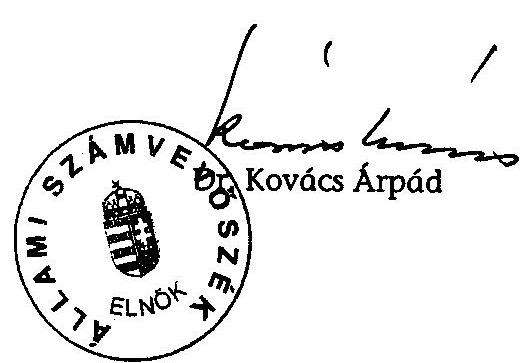

# JELENTÉS 

a Magyar Szocialista Párt 2003-2004. évi gazdálkodása törvényességének ellenőrzéséről

---

3. Önkormányzati és Területi Ellenőrzési Igazgatóság
3.1. Szabályszerűségi Ellenőrzési Főcsoport
Iktatószám: V-1020-022/2005.
Témaszám: 780
Vizsgálat-azonosító szám: V0222
Az ellenőrzést felügyelte:
Dr. Lóránt Zoltán
főigazgató
Az ellenőrzés végrehajtásáért felelős:
Dr. Elek János
általános főigazgató-helyettes
Az ellenőrzést vezette:
Horváth Balázs
főcsoportfőnök-helyettes
Az összefoglaló jelentést készítette:
Dr. Dotterweich Antal
főtanácsadó
Az ellenőrzést végezték:
Dr. Dotterweich Antal Szakmányné Bilik Mária Szendrey Lajos főtanácsadó számvevő számvevő

# A témához kapcsolódó eddig készített számvevőszéki jelentések: 

címe
sorszáma
Jelentés a Magyar Szocialista Párt (mint a Magyar Szocialista Munkáspárt jogutódja) bejegyzési kérelmével egyidejűleg a bírósághoz benyújtott vagyonmérlege vizsgálata
Jelentés a Magyar Szocialista Párt 1991. évi gazdálkodása 156
törvényességének ellenőrzéséről
Jelentés a Magyar Szocialista Párt 1992-1993-1994. évi 278
gazdálkodása törvényességének ellenőrzéséről
Jelentés a Magyar Szocialista Párt 1995-1996. évi gazdálkodása 352
törvényességének ellenőrzéséről
Jelentés a Magyar Szocialista Párt 1997-1998. évi gazdálkodása 004
törvényességének ellenőrzéséről
Jelentés a Magyar Szocialista Párt 1999-2000. évi gazdálkodása 0134
törvényességének ellenőrzéséről
Jelentés a Magyar Szocialista Párt 2001-2002. évi gazdálkodása 0353
törvényességének ellenőrzéséről

Jelentéseink az Országgyűlés számítógépes hálózatán és az Interneten a www.asz.hu címen is olvashatók.

---

# TARTALOMJEGYZÉK 

BEVEZETÉS ..... 5
I. ÖSSZEGZŐ MEGÁLLAPÍTÁSOK, KÖVETKEZTETÉSEK, JAVASLATOK ..... 7
II. RÉSZLETES MEGÁLLAPÍTÁSOK ..... 10

1. A Párt gazdálkodásáról szóló 2003-2004. évi beszámolók ..... 10
1.1. A teljes vizsgálati időszakra érvényes megállapítások ..... 10
1.2. A 2003. és 2004. évi beszámolók ..... 10
1.2.1. Bevételek ..... 10
1.2.2. Kiadások ..... 11
2. A Pártnak a beszámoló összeállítására és az azt alátámasztó könyvvezetésre vonatkozó belső szabályozása és gyakorlata ..... 11
2.1. A belső szabályozás rendszere ..... 11
2.2. A könyvvezetés gyakorlata, összhangja a törvényi és belső előírásokkal ..... 12
2.3. Analitikus nyilvántartások ..... 12
2.4. A bizonylati elv és bizonylati fegyelem érvényesülése ..... 13
3. A Párt bevételszerző, gazdálkodó tevékenysége ..... 13
4. A gazdálkodással összefüggő, egyéb jogszabályokban foglalt előírások betartása ..... 14
4.1. Személyi jellegű kifizetések ..... 14
4.2. Az adózási, társadalombiztosítási és egyéb jogszabályok rendelkezéseinek érvényesítése ..... 15
5. A Párt belső ellenőrzésének rendszere ..... 15
5.1. A belső ellenőrzés rendszerének szabályozottsága ..... 15
5.2. A belső ellenőrzési rendszer működése ..... 16
6. Az előző ellenőrzés megállapításaira tett intézkedések ..... 16

## MELLÉKLETEK

1. számú A Magyar Szocialista Párt 2003. évi pénzügyi beszámolója
2. számú A Magyar Szocialista Párt 2004. évi pénzügyi beszámolója

---

.

---

# RÖVIDÍTÉSEK JEGYZÉKE 

| ÁSZ | Állami Számvevőszék |
| :-- | :-- |
| APEH | Adó és Pénzügyi Ellenőrzési Hivatal |
| KPEB | Központi Pénzügyi Ellenőrző Bizottság |
| Párt | Magyar Szocialista Párt |
| Párttörvény | A pártok működéséről és gazdálkodásáról szóló - többször |
|  | módosított - 1989. évi XXXIII. törvény |
| PEB | Pénzügyi Ellenőrző Bizottság |
| Szja tv. | A személyi jövedelemadóról szóló - többször módosított - |
|  | 1995. évi CXVII. törvény |
| Számviteli törvény | A számvitelről szóló - többször módosított - 2000. évi C. |
|  | törvény |
| SZMSZ | Szervezeti és Működési Szabályzat |

---

.

---

# JELENTÉS 

## A Magyar Szocialista Párt 2003-2004. évi gazdálkodása törvényességének ellenőrzéséről

## BEVEZETÉS

Az Állami Számvevőszékről szóló 1989. évi XXXVIII. törvény 5. §-a és a 16. § (2) bekezdése, valamint a pártok működéséről és gazdálkodásáról szóló - többször módosított - 1989. évi XXXIII. törvény (továbbiakban: párttörvény) 10. § (1) bekezdése alapján a pártok gazdálkodása törvényességének ellenőrzésére az Állami Számvevőszék (továbbiakban: ÁSZ) jogosult. Az ÁSZ 2005. évi ellenőrzési tervének megfelelően vizsgálta a Magyar Szocialista Párt (továbbiakban: Párt) 2003-2004. évi gazdálkodása törvényességét.

Az ellenőrzés célja annak megállapítása volt, hogy:

- a Párt által készített, a Magyar Közlönyben és a Párt internetes honlapján közzétett éves beszámolók a törvényi előírásoknak megfelelnek-e, a könyvvezetéssel és a valósággal megegyező adatokat tartalmaznak-e;
- a könyvvezetés és a gazdálkodás során betartották-e a számvitelről szóló többször módosított - 2000. évi C. törvény (továbbiakban: számviteli törvény) és az egyéb jogszabályi rendelkezéseket és belső előírásokat;
- a Párt a működéséhez szabályszerűen igénybe vehető forrásokat használt-e fel, nem folytatott-e a párttörvény által tiltott gazdálkodó tevékenységet, nem fogadott-e el tiltott vagyoni hozzájárulást, illetőleg adományt.

Az ellenőrzés előkészítését és végrehajtását az ÁSZ elnöke 13/2003. 03. 25. sz. utasításával kiadott "Módszertan a pártok gazdálkodása törvényességének ellenőrzéséhez" c. kiadvány és a 14/2003. 12. 15. sz. elnöki határozattal elfogadott segédletben foglaltak alapján végeztük.

Az ellenőrzés körülményeit illetően rögzíteni szükséges, hogy az ÁSZ évek óta folyamatosan javasolja a Kormánynak a pártok ellenőrzéseiről készített jelentéseiben a párttörvény módosítását tekintettel arra, hogy

- a párttörvény 1. sz. melléklete szerinti beszámoló-mintához magyarázatot, kitöltési útmutatót nem készítettek a jogalkotók, így ennek kitöltése pártonként - kialakított számviteli politikájuknak megfelelően - eltérő lehet;
- a beszámoló-minta a számviteli törvény rendelkezéseivel nem harmonizál, nem felel meg sem a mérleg, sem az eredmény-kimutatás követelményeinek.

---

A helyszíni ellenőrzés: 2005. augusztus 22 - október 6. között a Párt központi székházában a rendelkezésre bocsátott dokumentumok alapján történt.

---

# I. ÖSSZEGZŐ MEGÁLLAPÍTÁSOK, KÖVETKEZTETÉSEK, JAVASLATOK 

A Párt 2003. és 2004. évi pénzügyi beszámolóját a párttörvényben előírt határidőben, meghatározott formában közzétette a Magyar Közlönyben és internetes honlapján. A nyilvánosságra hozott éves beszámolók a szabályozásnak megfelelően, megbízható módon tartalmazták a Párt gazdasági adatait.

A Párt beszámolási és könyvvezetési szabályozásának rendszere 2001. január 1-jétől hatályos számviteli szabályozásokon alapult. A Párt a gazdálkodási változásokra figyelemmel aktualizált számlarendjében szabályozta a beszámolósorok és a főkönyvi számlák kapcsolati megfeleltetését. A számviteli törvénnyel összhangban kiadott számviteli politika és kapcsolódó pénzkezelési, leltározási szabályzat előírásai időszerűek maradtak.

Az értékelési szabályzatot nem egészítették ki az önkormányzatoktól kedvezményesen bérelt ingatlanok párttörvény által meghatározott kötelező értékelésével. Ennek következtében kimaradt a könyvelésből, így az éves beszámolókból is a vizsgálat során megállapított nem pénzbeli vagyoni hozzájárulások értéke. Figyelemmel az ÁSZ-nál általánosan elfogadott 2%-os lényegességi küszöbre a hiba 0,9% illetve 0,8% mértékkel nem minősült lényegesnek, de sértette a számviteli törvény teljességre és valódiságra vonatkozó elvét.

A beszámolás alapjául szolgáló könyvvezetés a törvényi és belső előírásokkal összhangban kialakított kettős könyvvitel rendszerében központilag, a számviteli bizonylatok számítógépes feldolgozásával történt. A könyvelési feladatokat szervezett módon, szakmai kontrollal az Országos Központ főkönyvelősége végezte. A könyveléshez alkalmazott számítógépes programban a számlarendi változásokat átvezették. A kialakított számítógépes könyvelési rendszer biztosította az ellenőrzéshez szükséges adatokat. A vizsgált dokumentumok alapján a könyvvezetés idősorosan, a zárlati munkálatok végrehajtása a belső előírásoknak megfelelően történt. A kontírozási feladatokat szabályszerűen látták el.

A főkönyvi számlákhoz rendelt analitikus nyilvántartások körét, vezetésének módját a számlarendben határozták meg. A részletező nyilvántartások vezetése megfelelt a törvényi és belső előírásoknak. Az év végi zárás során az előírt egyeztetéseket végrehajtották, amelynek eredményeként az analitikai és főkönyvi zárlatok megegyeztek.

A leltározást szabályozás szerint évente kiadott leltározási utasítással és ütemtervvel bonyolították. Az eszközök és források leltárait szabályosan dokumentálták, kiértékelését határidőre elvégezték. Leltári eltérés egyik évben sem volt.

A Párt betartotta a bizonylati elv és bizonylati fegyelem számviteli törvényben rögzített szabályait. A könyvelt gazdasági műveleteket, eseményeket számviteli bizonylatokkal alátámasztották, a bizonylatok feldolgozása megfelelt az előírásoknak. A kötelezettségvállalást és utalványozást az arra jogosult

---

vezetők gyakorolták. A Pártnál nem érvényesültek a számviteli törvényben és a bizonylati szabályzatban foglalt alaki, tartalmi követelmények. A bizonylatokról hiányzott a könyvviteli nyilvántartásban történt rögzítés időpontja és igazolása, valamint az Országos Központban a pénztárellenőr aláírása.

A Párt 2003-2004. évi gazdálkodásához megállapított állami támogatáson felül jelentős bevételt szerzett tagdíjak és egyéb hozzájárulások, adományok címén, továbbá saját tulajdonú vagyontárgyak értékesítéséből és hasznosításából; költség- és kártérítésből; kamatbevételből és árfolyamnyereségből; propaganda tevékenységből. A könyvviteli nyilvántartásai szerint betartotta a párttörvényben előírt gazdálkodási tilalmakat és forrásszerzési korlátokat, kizárólag engedélyezett gazdálkodó tevékenységeket folytatott. A Pártnak a tulajdonában álló egyszemélyes kft-k nyereségéből bevétele nem származott.

A Pártnál a személyi jellegű kifizetések a belső szabályzatok előírásainak és a jogszabályi követelményeknek megfelelően történtek. A külföldi kiküldetéseknél a ténylegesen felmerült utazási költségeket térítették meg. A személygépjárművek hivatalos célú használatát az Szja tv. előírásainak megfelelően kitöltött útnyilvántartások alapján számolták el. Az alkalmazottaknak a törvényben meghatározott értékű étkezési utalványt biztosítottak.

A Párt az adó- és társadalombiztosítási bevallási, befizetési kötelezettségeit határidőre teljesítette. Munkáltatói jogkörében megállapította a személyi jövedelemadót, a munkáltatót és munkavállalókat terhelő járulékokat. A kötelező nyilvántartásokat a főkönyvvel egyezően vezették; az előírt adatszolgáltatásokat, igazolásokat határidőben megküldték. Nyilvántartásai és az APEH folyószámla kivonata szerint hátraléka nem volt.

A Párt belső ellenőrzésének rendszerét hatályos alapdokumentumok szabályozták. A választott központi és területi pénzügyi ellenőrző bizottságok megválasztásáról és feladatköréről az alapszabály rendelkezett. Az Országos Központban a vezetői és munkafolyamatokba épített ellenőrzés konkrét követelményeit a gazdálkodási-számviteli szabályzatok rögzítették. A területi szövetségek az SZMSZ-ben határozták meg a gazdálkodásért felelős személyeket, a pénzügyi ellenőrzés rendjét.

A kétszintű pénzügyi ellenőrző bizottságok működési-ügyrendi szabályzatuk szerint éves munkatervben meghatározták és ennek megfelelően végezték ellenőrzési feladataikat.

Az ellenőrzések megállapításait jegyzőkönyvbe és jelentésbe foglalták, továbbá a feltárt hiányosságok megszüntetését indítványozták. Az illetékesek megtették a szükséges intézkedéseket. A vezetői és a munkafolyamatba épített ellenőrzés a kötelezettségvállalás és utalványozás gyakorlásán, a főkönyvelőség által végzett számla felülvizsgálaton keresztül valósult meg. A hibák kijavításáról történő visszacsatolás esetenként hiányzott a kontrollfolyamatból.

A Párt az előző ÁSZ jelentés felhívására korszerűsítette és belső szabályozásával összhangba hozta gazdálkodási szabályzatát, amelyet a hatáskörileg illetékes Országos Választmány hagyott jóvá.

---

Az ellenőrzési tapasztalatokra és a korábbi pártellenőrzések alapján tett jelzésekre figyelemmel javasoljuk:

# a Kormánynak 

Kezdeményezze a párttörvény módosítását a pártok számviteli nyilvántartási és beszámolási rendszerét érintő ellentmondások feloldása érdekében, amelyek a pártok működéséről és gazdálkodásáról szóló - többször módosított - 1989. évi XXXIII. törvény, valamint a 2001. január 1. napjától hatályos számviteli törvény között továbbra is fennállnak.

A helyszíni ellenőrzés megállapításainak hasznosítása mellett az Állami Számvevőszék elnöke felhívja

## a Párt elnökét

1. Egészítse ki a számviteli törvény 15. § (2)-(3) bekezdésében előírt számviteli elvek, valamint a párttörvény 4. § (2) bekezdésében foglaltak érvényesítése érdekében az értékelési szabályzatot az önkormányzati tulajdonú ingatlanok kedvezményes használatának értékelési szabályaival.
2. Érvényesítse a bizonylatolásban, hogy a számviteli bizonylatok tartalma feleljen meg a számviteli törvény 167. § (1) bekezdése előírásainak.

---

# II. RÉSZLETES MEGÁLLAPÍTÁSOK 

## 1. A PÁRT GAZDÁLKODÁSÁRÓL SZÓLÓ 2003-2004. ÉVI BESZÁMOLÓK

### 1.1. A teljes vizsgálati időszakra érvényes megállapítások

A Párt az előző évi gazdálkodásáról szóló beszámolóit mindkét évben, a törvényben előírt határidőn belül és meghatározott formában tette közzé. A 2003. évi beszámolója 2004. április 24-én a Magyar Közlöny 54. számában; a 2004. évi beszámolója 2005. április 27-én a Magyar Közlöny 55. számában, valamint a Párt internetes honlapján jelent meg (1-2. számú melléklet).

A Párt nyilvánosságra hozott éves beszámolói a központilag vezetett, számítógépes rendszerű, kettős könyvvitel zárlati nyilvántartásain alapultak. Területi, budapesti, központi összesítésben tartalmazták a Párt valamennyi szervezetének gazdasági adatait. A beszámolók összeállítása a számviteli politikában meghatározott követelmények betartásával történt. Az alapszabály rendelkezése szerint mindkét időszaki beszámolót jóváhagyta az Országos Választmány.

A Párt az ellenőrzés feltárására pótolta az önkormányzati
 ingatlanok kedvezményes bérleti díja és piaci értéke különbségéből adódó nem pénzbeli vagyoni hozzájárulások értékelését. A Párt számításai szerint 2003. évben 11063 ezer Ft, 2004. évben 10825 ezer Ft értékű nem pénzbeli vagyoni hozzájárulásban részesültek, amelyek beszámolóból való kihagyása nem minősült lényeges hibának (0,9% illetve 0,8%), de sértette a számviteli törvény 15. § (2) (3) bekezdésében foglalt teljesség és valódiság elvét.

### 1.2. A 2003. és 2004. évi beszámolók

### 1.2.1. Bevételek

Az éves tagdíjak közlése a jogcímnek megfelelően, főkönyvi adattal egyezően történt. A tagdíjfizetés rendje összhangban állt az alapszabály 48. §-ában rögzített előírásokkal, bizonylatolása megfelelt a belső szabályozásnak.

Az állami költségvetésből származó támogatást 2004-ben helyesen, a Magyar Államkincstár által megadott 969200 ezer Ft-tal szerepeltették. A 2003. évi támogatást összesítési hiba miatt a ténylegesnél 20 ezer Ft-tal kisebb összegben mutatták ki.

Az egyéb hozzájárulások, adományok belföldi jogi és magánszemélyektől teljesültek. A párttörvény 9. § (2) bekezdése előírásának megfelelően az egy naptári évre kapott 500 ezer Ft-ot meghaladó hozzájárulásokat nevesítve közölték. Jogi személyektől származó hozzájárulás esetén nyilatkozatot csatoltak arról, hogy az adományozó nem részesült költségvetési támogatásban.

---

Az egyéb bevételek főkönyvi jogcímeit a számlarendben meghatározták, a közölt adatok levezethetők voltak a kapcsolódó főkönyvi számlák egyenlegeiből.

# 1.2.2. Kiadások 

A Párt a hatályos számlarendjében teremtett összhangot a beszámolósorok és főkönyvi számlák kapcsolati megfeleltetésének. A kiadások könyvelésénél, illetve közzétételénél érvényt szereztek a számviteli törvény 15-16. §-ában foglalt elveknek.

A támogatás egyéb szervezeteknek beszámolósoron a jogcímnek megfelelő, a főkönyvi adattal megegyező kiadások szerepeltek.

Az eszközbeszerzés soron mutatták ki az immateriális javak, ingatlanok és kapcsolódó vagyoni értékű jogok, a berendezések és felszerelések, továbbá a járművek számlacsoportban könyvelt kiadások együttes összegét.

A működési kiadások ismérveit meghatározták, a belső előírásokat betartották. A vizsgált években érvényesült a kiadási jogcímek azonossága és a beszámolók adata megegyezett a főkönyvi számlák zárlati összegével.

A politikai tevékenység kiadásait mindkét évben szabályszerűen elhatárolták a működési kiadásoktól. A beszámolók adata megegyezett a számlarendben részletezett főkönyvi számlák összesített adatával.

Az egyéb kiadások beszámolósor tartalma összhangban volt a belső előírásokkal, a főkönyvi számlákon a szabályozásnak megfelelő kiadásokat könyveltek.

## 2. A Pártnak a beszámoló összeállítására és az azt alátámasztó könyvvezetésre vonatkozó belső szabályozása és gyakorlata

### 2.1. A belső szabályozás rendszere

A Párt beszámolási és könyvvezetési szabályozásának rendszere 2001. január 1-jétől hatályos szabályozásokon alapult. A számviteli törvénnyel összhangban, valamint a gazdálkodási sajátosságokra figyelemmel kiadott számviteli politika és hozzákapcsolódó pénzkezelési, leltározási szabályzat előírásai a vizsgált időszakban megfeleltek a jogszabályi követelményeknek. Az eszközök és források értékelési szabályzata nem terjed ki a nem pénzbeli vagyoni hozzájárulások piaci értékének meghatározására.

A számviteli politikához rendelt számlarendet a gazdálkodásban bekövetkezett változásokkal összefüggésben aktualizálták. A számlarendben meghatározták a beszámolósorok főkönyvi számla kapcsolatait, valamint a sajátos bevételi és kiadási jogcímek fogalmi ismérveit, besorolási kritériumait. A számlarendben foglaltakat alátámasztó bizonylati rendet a bizonylati szabályzat és bizonylati album rögzítette.

---

A gazdálkodási szabályzatot az ÁSZ előző jelentésének felhívására korszerűsítették és összhangba hozták a hatályos számviteli szabályozásokkal. Az átdolgozott szabályozást a hatáskörileg illetékes Országos Választmány 2003. végén hagyta jóvá.

A Pártnál a gazdálkodás törvényességét segítették a gépkocsik használatának, a külföldi kiküldetések elszámolásának, a protokoll és vendéglátás szabályzatai, valamint a „mobil távközlési szolgáltatás használati rendje”.

# 2.2. A könyvvezetés gyakorlata, összhangja a törvényi és belső előírásokkal 

A könyvvezetés a szabályozásnak megfelelően a kettős könyvvitel rendszerében központilag, az alapbizonylatok számítógépes feldolgozásával történt. Mindkét vizsgált évben azonos számítógépes programot alkalmaztak, amelyen a számlarendi változásokat átvezették. A kialakított számítógépes könyvelési rendszer biztosította az ellenőrzéshez szükséges adatokat. A főkönyvi számlák és az analitikus nyilvántartások kapcsolata a reprezentatív minta esetében (Országos Központ, Budapesti Tanács; Komárom-Esztergom, Jász-Nagykun-Szolnok, Vas, Veszprém megyei területi szövetség) megfelelő volt. A vizsgált dokumentumok alapján a könyvvezetés idősorosan, a belső előírásoknak megfelelően történt. A kontírozási feladatokat szabályszerűen végezték.

A Pártnál kialakították a helyi szervezetek és a területi szövetségek gazdasági kapcsolatának, könyvvezetésének rendjét. A területi szövetség negyedévente küldte meg az Országos Központ főkönyvelősége részére a helyi szervezetek tartalmilag és formailag ellenőrzött pénztárbizonylatait. Az ellenőrzött helyi szervezetek 3-4%-a nem tartotta be az évközi elszámolási határidőket, hiányosan tett eleget a hibajavítási kötelezettségének. Az éves beszámolóra a mulasztás nem volt kihatással.

A Párt kettős könyvviteli feladatait az Országos Központ főkönyvelősége szervezett módon, szakmai kontrollal végezte. A könyvvezetés szabályszerűsége érdekében a főkönyvelőség rendszeresen ellenőrizte a könyvelési feladások helyességét. A hibás bizonylatokat a területi szövetség részére visszaküldték javítás céljából. A számítógépes feldolgozást követően a területi szövetségeknek visszajuttatták a beküldött bizonylatokat és egyidejűleg a feldolgozásról csatolták a számviteli nyilvántartásokat.

A főkönyvi könyvelésben, egyik évben sem rögzítették az önkormányzati tulajdonú ingatlanok kedvezményes bérleti díja és a piaci érték különbségéből adódó nem pénzbeli vagyoni hozzájárulás összegét.

### 2.3. Analitikus nyilvántartások

A Párt a számviteli törvény előírása alapján számlarendjében szabályozta a főkönyvi számlákhoz rendelt analitikák körét, vezetésének módját. Az analitikus nyilvántartások vezetése megfelelt a törvényi és belső előírásoknak. Az év végi zárást az előírt egyeztetésekkel végezték, amelynek eredményeként az analitikus nyilvántartások a főkönyvi számlákkal egyezőséget mutattak.

---

Az immateriális javak és aktivált tárgyi eszközök egyedi nyilvántartása teljes körűen tartalmazta az 50 ezer Ft értékhatár feletti beszerzések adatait. A szállítónkénti kötelezettségek, vevőnkénti követelések nyilvántartási értéke megfelelt az értékelési szabályzatnak. A pénzkezelési szabályzat követelményei szerint vezették az időszaki pénztárjelentéseket és tartották nyilván az elszámolásra kiadott előlegeket, a szigorú számadású nyomtatványokat. A vásárolt értékpapírok, a kölcsönadott pénzeszközök analitikája megfelelt a vagyonvédelmi előírásoknak.

A leltározást a leltárkészítési és leltározási szabályzat alapján évente kiadott leltározási utasítás és ütemterv szerint hajtották végre. Az eszközök és források leltárfelvételét megfelelően dokumentálták. Határidőre elvégezték a leltárak kiértékelését, leltári eltérés egyik évben sem volt.

# 2.4. A bizonylati elv és bizonylati fegyelem érvényesülése 

A Párt gazdálkodási szabályzata, szervezeteinek hatályos SZMSZ-e határozta meg a gazdálkodással kapcsolatos hatás- és jogkört. A pénzkezelési szabályzat előírta a számlavezetés és készpénzkezelés, a kötelezettségvállalás és utalványozás rendjét. Az alapszabály rendelkezésének megfelelően a pénztárnok által kijelölt, valamint a területi szövetségek SZMSZ-ében felhatalmazott vezetők gyakorolták az utalványozási jogkört.

A Párt betartotta a számviteli törvény bizonylati elvre és bizonylati fegyelemre vonatkozó szabályait. A könyvelt gazdasági műveleteket, eseményeket számviteli bizonylatokkal alátámasztották, a bizonylatok feldolgozása megfelelt a törvényi és belső előírásoknak.

A Pártnál nem érvényesültek a számviteli törvény 167. § (1) bekezdésében meghatározott és bizonylati szabályzatba foglalt alaki és tartalmi követelmények közül a következők: a bizonylatokról hiányzott a könyvelés időpontja, igazolása; az Országos Központnál a pénztárellenőr aláírása; a vizsgált mintában 1-2%-ban előfordultak utalványozás nélküli bizonylatok.

## 3. A Párt bevételszerző, gazdálkodó tevékenysége

A Párt bevételszerző, gazdálkodó tevékenységével kapcsolatos legfontosabb előírásokat a gazdálkodási szabályzat tartalmazta, amelyet a korábbi ellenőrzés felhívásának megfelelően módosítottak.

A Párt összes bevételéből a gazdálkodásához megállapított állami támogatás 2003. évben 78%-os, 2004. évben 75%-os részaránnyal teljesült. A tagdíjak és egyéb hozzájárulások, adományok 18%-ot illetve 20%-ot tettek ki. Az egyéb bevételek propaganda tevékenységből; saját tulajdonú vagyontárgyak értékesítéséből és hasznosításából; költség- és kártérítésből; valamint kamat és árfolyamnyereség címén teljesültek. A bevételeket számlák, szerződések támasztották alá.

A Párt könyvviteli nyilvántartásai szerint a párttörvény 4. §-ában meg nem engedett forrásból származó, illetve névtelen vagyoni hozzájárulást nem fogadott el; a párttörvény 6. §-ában nem engedélyezett gazdálkodó tevékenységet nem

---

folytatott, gazdasági társaságban részesedést nem szerzett; a párttörvényben engedélyezett értékpapírokkal rendelkezett (diszkont kincstárjegy, takarék szelvény, befektetési jegy). A Párt által a párttörvény 9/A. § (1) bekezdése alapján létrehozott Táncsics Mihály Alapítvány a 9/A. § (2) bekezdés c) pontja szerinti tilalmat az ellenőrzés rendelkezésére bocsátott dokumentumok tanúsága szerint betartotta, nem nyújtott támogatást a Pártnak.

A Pártnak 2003. évben három egyszemélyes kft-je volt, amelyből 2004-ben egyet értékesített. A tulajdonában álló egyszemélyes kft-k nyereségéből bevétele nem származott. A társaságokkal való pénzügyi kapcsolata áttekinthető volt.

A Párt az általa használt önkormányzati tulajdonú ingatlanok után az ingyenes vagy jelképes bérleti díj fizetés formájában a piaci értékhez képest kapott nem pénzbeli vagyoni hozzájárulás értékét a párttörvény 4. § (5) bekezdésében előírtak ellenére nem határozta meg. A nem pénzbeli vagyoni hozzájárulás értékét a vizsgálat időszakában a Párt az ellenőrzés kérésére megállapította. A tanúsítványok szerint 2003. évben kilenc önkormányzattól jutott nem pénzbeli vagyoni hozzájáruláshoz, ebből két esetben ingyenes ingatlanhasználat formájában; 2004. évben egy önkormányzattól ingyenes használat, nyolc önkormányzattól kedvezményes bérleti díj megállapítása eredményeképpen.

# 4. A gazdálkodással összefüggő, egyéb jogszabályokban foglalt előírások betartása 

### 4.1. Személyi jellegű kifizetések

A Párt munkáltatói jogkörében munkaszerződéseket és megbízási szerződéseket kötött. A különféle jövedelmek számfejtését és utalását, az adójogszabályokban előírt levonási, bevallási, befizetési és adatszolgáltatási kötelezettségek teljesítését - a Párt egészére vonatkozóan - az Országos Központ főkönyvelősége végezte.

A külföldi kiküldetések elrendelésének és elszámolásának rendjét hatályos szabályzat rögzítette. Előírásait betartva a ténylegesen felmerült utazási költségeket térítették meg.

A Párt által üzemeltetett gépkocsik igénybevételének rendjét, az üzemanyag- illetve költségelszámolás módját és mértékét a 2001. január 1-jétől hatályos gépkocsik használatának szabályzatában rögzítették. A szabályozás szerint kizárólag hivatalos célú használatot engedélyeztek. A Párt tulajdonában álló és bérelt gépkocsik futásteljesítményéről vezetett útnyilvántartások, a gépkocsik tárolási helyét is figyelembe véve megfeleltek az Szja törvény 70. §-ában, valamint a törvény 5. számú melléklet II/7. pontjában meghatározott adatkövetelményeknek. Az üzemanyag-vásárlás az ellenőrzött években üzemanyagkártyával történt. Az ellenérték kifizetésére az előírt teljesítésigazolás és felülvizsgálat alapján került sor.

A kiadott szabályzat rendelkezett a saját tulajdonú személygépkocsik hivatali célú használatának és költségelszámolásának rendjéről is. A vezetett útnyilvántartásokból a hivatalos jelleg megállapítható volt. A költségtérítések a 60/1992.

---

(IV. 1.) Korm. rendeletben szabályozott normatív mértékkel és az Szja törvény előírásának betartásával adómentesen teljesültek.

A Párt természetbeni juttatásként étkezési utalványt biztosított az alkalmazottainak az Szja törvény 1. számú melléklet 8.17. pontjában szabályozott adómentes értékben.

# 4.2. Az adózási, társadalombiztosítási és egyéb jogszabályok rendelkezéseinek érvényesítése 

A Párt a vizsgált időszakban a személyi jövedelemadót, a munkáltatót és munkavállalókat terhelő járulékokat, valamint a magánnyugdíj-pénztári befizetési kötelezettséget havonta megállapította. Az adózási és társadalombiztosítási jogszabályokban előírt havi és éves bevallási kötelezettségének eleget tett.

A kötelező nyilvántartásokat vezették, melyek megegyeztek a főkönyvi könyveléssel és bevallásokkal. A Párt az adó-és társadalombiztosítási befizetési kötelezettségeit havonta, határidőre teljesítette. Nyilvántartásai szerint hátraléka egyik vizsgált évben sem volt, ezt igazolta az ellenőrzés rendelkezésére bocsátott folyószámla kivonat is. A Párt az előírt adatszolgáltatásokat illetve igazolásokat az adóhatóság, valamint a magánszemélyek részére határidőre megküldte.

A Párt a reprezentációs kiadások mértékét, elszámolását szabályozta. Az önálló adószámmal rendelkező szervezetek kiadásairól külön-külön nyilvántartást vezetett. Adó- és járulékfizetési kötelezettsége 2003. évben két területi szövetség vonatkozásában keletkezett, mivel a reprezentációs kiadások értéke meghaladta az Szja törvény 69. § (7) bekezdés b) pontja
 szerinti mértéket. A Párt a befizetési kötelezettséget határidőre teljesítette.

## 5. A PÁRT BELSŐ ELLENŐRZÉSÉNEK RENDSZERE

### 5.1. A belső ellenőrzés rendszerének szabályozottsága

A Párt gazdálkodásának, pénzügyi és számviteli tevékenységének belső ellenőrzési rendszerét hatályos alapdokumentumok szabályozták. A Párt alapszabálya rendelkezett a KPEB, valamint a PEB-ek megválasztásáról és feladatköréről.

A KPEB hatáskörébe utalta a pártvagyon kezelésének, a Párt központi szerveinek és országos intézményeinek, valamint vállalkozásainak és alapítványainak gazdálkodásának szabályszerűségi ellenőrzését.

A gazdálkodási szabályzat értelmében az önálló jogi személyiséggel rendelkező területi szövetségek az SZMSZ-ben határozták meg a gazdálkodásért felelős személyeket, a gazdálkodásra vonatkozó előírásokat, a pénzügyi ellenőrzés rendjét. A területi szövetségek és helyi szervezetek ellenőrzésére PEB-eket választottak. A vezetői és munkafolyamatokba épített ellenőrzés követelményeit a gazdálkodási és számviteli szabályzatokban konkrétan rögzítették.

---

# 5.2. A belső ellenőrzési rendszer működése 

A KPEB és a vizsgált három PEB ellenőrzési feladatait működési és ügyrendi szabályzatuk szerint éves munkatervben határozták meg. A központilag választott testület átfogóan ellenőrizte az Országos Központ gazdálkodását, vizsgálta az alapítványok vagyoni helyzetét és pályázati rendszerét, ajánlást tett az éves költségvetés és pénzügyi beszámoló elfogadására. A területileg választott bizottságok célellenőrzés keretében vizsgálták az alapszabályban előírt szabályzatok meglétét, a házipénztári pénzkezelést, a nyilvántartások vezetését. Az ellenőrzések megállapításait jegyzőkönyvbe és jelentésbe foglalták, a feltárt hiányosságok megszüntetését indítványozták. Az illetékesek megtették a szükséges intézkedéseket.

A vezetői és a munkafolyamatba épített ellenőrzés a kötelezettségvállalás és utalványozás gyakorlásán, a főkönyvelőségen végzett számlaellenőrzéseken keresztül valósult meg. A területi szövetségek könyvelésre átadott bizonylatait a főkönyvelőség munkatársai érvényesítés előtt ellenőrizték, a gazdasági események hiányzó bizonylatait pótoltatták, a bizonylatolási hibákról hibajegyzéket készítettek, melyet a bizonylatokkal együtt visszaküldtek. A hibák kijavításáról történő visszacsatolás hiányzott az ellenőrzési rendszerből, így évközben a bizonylatok javítása az ellenőrzött dokumentumok 3,6%-ánál nem valósult meg. A bizonylatolási hiányosságokat az év végi záráskor szüntették meg.

## 6. AZ ELŐZŐ ELLENŐRZÉS MEGÁLLAPÍTÁSAIRA TETT INTÉZKEDÉSEK

A Párt a 0353 számú jelentés felhívására korszerűsítette és belső szabályozásával összhangba hozta gazdálkodási szabályzatát, amelyet az Országos Választmány hagyott jóvá.

Budapest, 2005. december $f$.

Melléklet: $\quad 2 \mathrm{db} \quad 2$ lap

---

# A Magyar Szocialista Párt 2003. évi pénzügyi beszámolója 

## Bevételek

1. Tagdijak
2. Állami költségvetésből származó támogatás
3. Képviselőcsoportnak nyújtott állami támogatás
4. Egyéb hozzájárulások, adományok
4.1. Jogi személyektől
4.1.1. Belföldiektől (az 500000 Ft feletti hozzájárulás nevesítése)
4.1.2. Külföldiektől (a 100000 Ft feletti hozzájárulás nevesítve)
4.2. Jogi személynek nem minősülő gazdasági társaságtól
4.2.1. Belföldiektől (az 500000 Ft feletti hozzájárulás nevesítve)
4.2.2. Külföldiektől (a 100000 Ft feletti hozzájárulás nevesítve)
4.3. Magánszemélyektől
4.3.1. Belföldiektől (az 500000 Ft feletti hozzájárulás nevesítve)
dr. Botka László
Gur Nándor
Kárpáti Zsuzsa
dr. Kozma József
Nagy Zsuzsanna
Petruska Béla
Szabó Árpádné
dr. Szili Katalin
4.3.2. Külföldiektől (a 100000 Ft feletti hozzájárulás nevesítve)
5. A párt által alapított vállalat és kft. nyereségéből származó bevétel
6. Egyéb bevételek

Összes bevétel a gazdasági évben:

## Kiadások

1. Támogatás a párt országgyűlési csoportja számára
2. Támogatás egyéb szervezetnek
3. Vállalkozások alapítására fordított összegek
4. Eszközbeszerzés
5. Működési kiadások
6. Politikai tevékenység kiadásai
7. Egyéb kiadások

Összes kiadás a gazdasági évben:

## 175101

175101
175101
16231
8207
204783
711168
17312
957701
Puch László s. k., pénztárnok

Szerkeszti a Miniszterelnöki Hivatal, a Szerkesztőbizottság közreműködésével.
A Szerkesztőbizottság elnöke: dr. Pulay Gyula. A szerkesztésért felelős: dr. Müller György. Budapest V., Kossuth tér 1-3. Kiadja a Magyar Hivatalos Közlönykiadó. Felelős kiadó: dr. Kodela László elnök-vezérigazgató. Budapest VIII., Somogyi Béla u. 6. Telefon: 266-9290.
Előfizetésben megrendelhető a Magyar Hivatalos Közlönykiadótól
Budapest VIII., Somogyi Béla u. 6., 1394 Budapest 62. Ft. 357, vagy faxon 318-6668.
Előfizetésben terjeszti a Magyar Hivatalos Közlönykiadó a FAMA Rt. közreműködésével. Telefon/fax: 266-6567.
Információ: tel./fax: 317-9999, 266-9290/245, 357 mellék.
Példányonként megvásárolható a kiadó Budapest VIII., Somogyi B. u. 6. (tel./fax: 267-2780) szám alatti közlönyboltjában, illetve megrendelhető a www.mhk.hu/közlőnybolt internetcímen.
2004. évi éves előfizetési díj: 73140 Ft. Egy példány ára: 161 Ft 16 oldal terjedelemig, utána +8 oldalanként +161 Ft . A kiadó az előfizetési díj évközbeni emelésének jogát fenntartja.

## HU ISSN 0076-2407

04.0940 - Nyomja a Magyar Hivatalos Közlönykiadó Lajosmizsei Nyomdája. Felelős vezető: Burján Norbert.

---

A Magyar Szocialista Párt 2004. évi pénzügyi beszámolója

# Bevételek 

1. Tagdijak ..... 51784
2. Állami költségvetésből származó támogatás ..... 969200
3. Képviselőcsoportnak nyújtott állami támogatás ..... -
4. Egyéb hozzájárulások, adományok ..... 206584
4.1. Jogi személyektől ..... 333
4.1.1. Belföldiektől (az 500000 Ft feletti hozzájárulás nevesítve) ..... 333
4.1.2. Külföldiektől (a 100000 Ft feletti hozzájárulás nevesítve) ..... -
4.2. Jogi személynek nem minősülő gazdasági társaságtól ..... -
4.2.1. Belföldiektől (az 500000 Ft feletti hozzájárulás nevesítve) ..... -
4.2.2. Külföldiektől (a 100000 Ft feletti hozzájárulás nevesítve) ..... -
4.3. Magánszemélyektől ..... 206251
4.3.1. Belföldiektől (az 500000 Ft feletti hozzájárulás nevesítve) ..... 206251
Gur Nándor ..... 591
Soós Győző ..... 566
Dr. Botka László ..... 671
Dr. Kozma József ..... 649
Dr. Szili Katalin ..... 992
Göndör István ..... 527
Török Zsolt ..... 574
Dr. Nagy Imre ..... 623
Márkus András ..... 792
Kurtán Pál ..... 500
Bácsó Lajos ..... 1100
Dr. Pető György ..... 592
Hagyó Miklós ..... 642
Tütő Katalin ..... 561
Tatai-Tóth András ..... 586
4.3.2. Külföldiektől (a 100000 Ft feletti hozzájárulás nevesítve) ..... -
5. A párt által alapított vállalat és kft. nyereségéből származó bevétel ..... -
6. Egyéb bevétel ..... 60919
Összes bevétel a gazdasági évben: ..... 1288487
Kiadások
7. Támogatás a párt országgyűlési csoportja számára ..... 6601
8. Támogatás egyéb szervezetnek ..... 50375
9. Vállalkozás alapítására fordított összegek ..... 240214
10. Eszközbeszerzés ..... 1163938
11. Működési kiadások ..... 25348
12. Politikai tevékenység kiadásai ..... 1486476
13. Egyéb kiadások ..... 1486476
Összes kiadás a gazdasági évben: ..... Puch László s. k., pénztárnok
