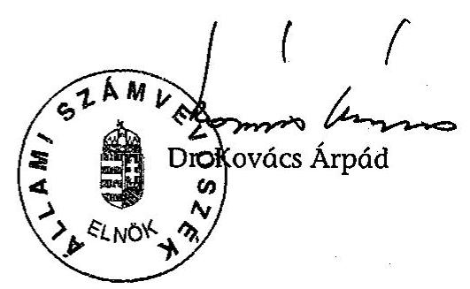

# JELENTÉS 

A 2004-2005. évi időközi országgyúlési választási kampányra a jelölő szervezetek által fordított pénzeszközök ellenőrzéséről

---

3. Önkormányzati és Területi Ellenőrzési Igazgatóság
3.1. Szabályszerüségi Ellenőrzési Főcsoport
Iktatószám: V-1023-017/2005.
Témaszám: 791
Vizsgálat-azonosító szám: V0226
Az ellenőrzést felügyelte:
Dr. Lóránt Zoltán
főigazgató
Az ellenőrzés végrehajtásáért felelős:
Dr. Elek János
általános főigazgató-helyettes
Az ellenőrzést vezette:
Horváth Balázs
főcsoportfőnök-helyettes
Az összefoglaló jelentést készítette:
Dr. Dotterweich Antal
főtanácsadó
Az ellenőrzést végezte:
Dr. Dotterweich Antal
főtanácsadó

# A témához kapcsolódó eddig készített számvevőszéki jelentések: 

címe
sorszáma
Jelentés az 1998. évi országgyűlési választásra fordított
pénzeszközök elszámolásának ellenőrzéséről a jelölő szervezeteknél és a független jelölteknél
Jelentés az 1999. októberi és a 2000. áprilisi időközi országgyűlési
választási kampányokra a jelölő szervezetek és független jelöltek
039
által fordított pénzeszközök ellenőrzéséről
Jelentés a 2001. évi időközi országgyűlési választási kampányra a
jelölő szervezetek által fordított pénzeszközök ellenőrzéséről
Jelentés a 2002. évi országgyűlési választásra fordított
pénzeszközök elszámolásának ellenőrzéséről a jelölő szervezeteknél és a független jelölteknél

Jelentéseink az Országgyűlés számítógépes hálózatán és az Interneten a www.asz.hu címen is olvashatók.

---

# TARTALOMJEGYZÉK 

BEVEZETÉS ..... 5
I. ÖSSZEGZŐ MEGÁLLAPÍTÁSOK, KÖVETKEZTETÉSEK, JAVASLATOK ..... 7
II. RÉSZLETES MEGÁLLAPÍTÁSOK ..... 9

1. A beszámolók közzététele és tartalma ..... 9
2. A választásokkal kapcsolatos speciális nyilvántartási és gazdálkodási teendők szabályozása, a választási bevételek és kiadások nyilvántartásban történő elkülönítése ..... 10
3. A választásokra fordítható összeghatár és a párttörvényben meghatározott korlátozó előírások betartása ..... 10
4. A beszámolóban közzétett adatok bizonylati alátámasztottsága ..... 11

## MELLÉKLETEK

1. számú A FIDESZ-Magyar Polgári Szövetség által 2004. évi szécsényi időközi országgyűlési képviselő-választásra fordított pénzeszközök forrásai és felhasználása
2. számú A FIDESZ-Magyar Polgári Szövetség által 2005. évi soproni időközi országgyűlési képviselő-választásra fordított pénzeszközök forrásai és felhasználása

---

.

---

# RÖVIDÍTÉSEK JEGYZÉKE 

| ÁSZ | Állami Számvevőszék |
| :-- | :-- |
| KDNP | Kereszténydemokrata Néppárt |
| Párt | FIDESZ-Magyar Polgári Szövetség |
| Párttörvény | A pártok múködéséről és gazdálkodásáról szóló - többször |
|  | módosított - 1989. évi XXXIII. törvény |
| Ve. törvény | A választási eljárásról szóló 1997. évi C. törvény |

---

.

---

# JELENTÉS 

## a 2004-2005. évi időközi országgyúlési választási kampányra a jelölő szervezetek által fordított pénzeszközök ellenőrzéséről

## BEVEZETÉS

Az Állami Számvevőszékről szóló 1989. évi XXXVIII. törvény 5. §-a és a 16. § (2) bekezdése, valamint a pártok múködéséről és gazdálkodásáról szóló - többször módosított - 1989. évi XXXIII. törvény (továbbiakban párttörvény) 10. § (1) bekezdése alapján a pártok gazdálkodása törvényességének ellenőrzésére az Állami Számvevőszék (továbbiakban: ÁSZ) jogosult. A választási eljárásról szóló 1997. évi C. törvény (továbbiakban: Ve.) 92. § (3) bekezdésében kapott felhatalmazás alapján az országgyúlési képviselőválasztásra fordított állami és más pénzeszközök, anyagi támogatások felhasználásának ellenőrzése az ÁSZ feladata. Az ÁSZ az ellenőrzést az országgyúlési képviselethez jutott jelölő szervezeteknél és a független jelölteknél hivatalból, a képviselethez nem jutott jelölő szervezetek és független jelöltek esetében más jelölt, jelölő szervezet kérelmére köteles elvégezni. Ugyanezen törvény 115. § (1) bekezdésének utolsó mondata szerint: „Az időközi választásra az általános választás szabályait kell alkalmazni."

A Ve. 92. § (3) bekezdése alapján történt a FIDESZ-Magyar Polgári Szövetség (továbbiakban: Párt) ellenőrzése, mivel a Kereszténydemokrata Néppárttal (továbbiakban: KDNP) közösen állított jelöltje mandátumhoz jutott 2004-ben a Nógrád megye 3. számú, továbbá 2005-ben a Győr-Moson-Sopron megye 7. számú országgyúlési egyéni választókerületben megtartott időközi országgyúlési képviselőválasztáson.

Egyéb jelölő szervezetek és független jelölt ellenőrzésére más jelölt vagy szervezet részéről a törvényes határidő lejártáig az ÁSZ-hoz kérelem nem érkezett.

Az ellenőrzés feltételeiről és körülményeiről szükséges rögzíteni, hogy a választási eljárásról, továbbá a pártok müködéséről és gazdálkodásáról szóló törvények jelenleg nem biztosítják a választási kampánypénzek eredetének és felhasználásának teljes átláthatóságát, így az ÁSZ nem tudja teljes mértékben betölteni a választási kampány átláthatóságával kapcsolatosan azt a szerepet, amelyet az alkotmányos szabályozás megkívánna.

Az ÁSZ ennek következtében korábbi ilyen tárgyú vizsgálataival azonosan tudomásul vette, hogy csak az minősül kampányköltségnek, amit valamely jelö-

---

lő szervezet annak minősít, továbbá amely az ellenőrzés időpontjáig megjelent a számviteli nyilvántartásokban.

Az ellenőrzött időszak: A 2004. évi Nógrád megye 3. számú és a 2005. évi Győr-Moson-Sopron megye 7. számú országgyúlési egyéni választókerületben megtartott választási kampány.

Az ellenőrzés célja: A Ve.-ben kapott felhatalmazás alapján, az időközi választáson jelöltet állított és ellenőrzésre kijelölt párt esetében a választásra fordított állami és más pénzeszközök felhasználásának ellenőrzése a törvényesség és az átláthatóság biztosítása érdekében, valamint a törvény megsértése esetén az előírt szankciók alkalmazásának kezdeményezése.

Az ellenőrzés módszere: A Párt országos központjában rendelkezésre bocsátott iratok és a Magyar Közlönyben közzétett választási beszámolók tartalmi összevetése, valamint az alkalmazott eljárások és a jogszabályi követelmények egybevetésével történt. Az ellenőrzést az ÁSZ V-1023-006/2005. számú ellenőrzési programja alapján végeztük.

A helyszíni ellenőrzés: 2005. szeptember 21-22. között a Párt országos központjában történt.

---

# I. ÖSSZEGZŐ MEGÁLLAPÍTÁSOK, KÖVETKEZTETÉSEK, JAVASLATOK 

A 2004-2005. évi időközi országgyűlési választások lebonyolítására a választási eljárásról szóló törvény rendelkezéseit kellett alkalmazni. Az Állami Számvevőszék az 1998. évi általános választást követően készített, továbbá az 1999-2000. évi időközi választás után kiadott, továbbá a 2001. évi időközi választást követően közzétett és a 2002. évi általános választást követően megjelentetett jelentéseiben jelezte a törvény azon hiányosságait, amelyek akadályozzák az ellenőrzést. A jelentések javaslatokat fogalmaztak meg a Kormánynak, hogy kezdeményezze a választási eljárásról szóló törvény módosítását, amely biztosítja a kampányfinanszírozás átláthatóságát.

A hatályos törvény ilyen irányú módosítása nem történt meg, ezért a 20042005. évi időközi országgyűlési választásokat a korábbi hiányos szabályozás alapján kellett végrehajtani. A törvény jelenleg sem határozza meg a pénzügyi, számviteli elszámolások tekintetében a választási kampány fogalmát, a választási költség fogalomkörébe sorolható kiadásokat, a kampányköltségek szempontjából figyelembe veendő kampányidőszakot, továbbá a beszámoló közzétételével kapcsolatos szabályok is kiegészítésre, pontosításra szorulnak.

Az Állami Számvevőszék ennek következtében - a korábbi ilyen tárgyú vizsgálataival azonosan - tudomásul vette, hogy csak az minősül kampányköltségnek, amit valamely jelölő szervezet annak minősít, és ami az elszámolási határidőig megjelent a számviteli nyilvántartásokban.

A Ve. törvény az Állami Számvevőszék számára az országgyűlési képviselethez jutott jelölő szervezetek helyszíni ellenőrzését írja elő. Tekintettel arra, hogy a FIDESZ-Magyar Polgári Szövetség mindkét időközi választáson a KDNP-vel állított jelöltet és a két párt között létrejött megállapodás alapján a kampány szervezése, annak finanszírozása és a Magyar Közlönyben történő kampánybeszámoló közzététele a FIDESZ-Magyar Polgári Szövetség feladata volt, így helyszíni ellenőrzés csak ennél a pártnál történt.

A Párt a törvényben előírt beszámolási kötelezettségét határidőben teljesítette, a 2004. évi Nógrád megyei 3. számú egyéni választókerületben a választás 2004. évi november 28-i második fordulóját követően a beszámoló a Magyar Közlöny 2005. évi január 13-i 5. számában jelent meg. A 2005. évi Győr-Moson-Sopron megyei 7. számú egyéni választókerületben a beszámoló a választás 2005. évi május 8-i második fordulóját követően a Magyar Közlöny 2005. évi június 20-i 83. számában jelent meg.

A Ve. törvény a jelölő szervezetek számára azt írta elő, hogy az egy jelöltre jutó kampányköltség nem haladhatja meg az egymillió Ft-ot. A rendelkezésre bocsátott nyilvántartások, dokumentumok alapján a Párt nem lépte túl a szankció nélkül felhasználható keretösszeget.

---

A Párt a Ve. törvény hatályba lépését követően szabályzatot készített a választásokkal kapcsolatos speciális nyilvántartási és gazdálkodási teendők ellátására, az előírások a gyakorlatban érvényesültek.

A Párt a kampányra a kiadások fedezeteként elszámolt bevételeket a számviteli nyilvántartásokban nem elkülönítetten kezelte. A kiadási adatok egyeztethetők voltak a számviteli nyilvántartásokkal. A nyilvántartott kampányköltségeket bizonylatokkal támasztották alá, ezek megfeleltek a számviteli törvényben meghatározott alaki és tartalmi követelményeknek.

A Párt nyilvántartásai szerint a beszámolóban feltüntetett országgyúlési képviselő választásra fordított összeg forrásai esetében betartotta a pártok múködéséről szóló törvényben rögzített korlátozó előírásokat.

A helyszíni ellenőrzés megállapításainak hasznosítása mellett javasoljuk

# a Kormánynak 

Kezdeményezze a választási eljárásról szóló törvény módosítását - figyelemmel az Állami Számvevőszék korábbi jelentéseiben megfogalmazott javaslataira is - annak érdekében, hogy a választási kampány finanszírozása átlátható, ellenőrizhető legyen.

---

# II. RÉSZLETES MEGÁLLAPÍTÁSOK 

## 1. A beSzámolók közzÉtÉtele És TARTALMA

A Ve. 92. § (2) bekezdése előírja, hogy minden jelölő szervezetnek és független jelöltnek a választás második fordulóját követő 60 napon belül a Magyar Közlönyben nyilvánosságra kell hoznia a választásra fordított állami és más pénzeszközök, anyagi támogatások összegét, forrását és felhasználásának módját.

A nyilvánosságra hozandó adatok tartalmára vonatkozóan a Választási füzetek 1998. évi 44. számában az Állami Számvevőszék ajánlást tett közzé.

A Ve. 49. § (2) bekezdése szerint „Ha több jelölőszervezet közösen állít jelöltet, a továbbiakban - a választás szempontjából - egy jelölő szervezetnek számítanak." A Párt és a vele közös jelöltet állító KDNP között együttmúködési megállapodás jött létre 2004. április 14-én, az időközi választásokra a két párt között a közös jelöltállításra tekintettel 2004. május 11-én jött létre finanszírozási megállapodás. A megállapodás szerint a kampány költségeit teljes egészében az ellenőrzött párt viselte.

A Párt a 2004. és a 2005 évi időközi országgyűlési választásra fordított pénzeszközök forrásairól és felhasználásáról szóló beszámolóit határidőben küldte meg közzététel céljából. A 2004. évi Nógrád megyei 3. számú egyéni választókerületben a választás 2004. évi november 28-i második fordulóját követően a beszámoló a Magyar Közlöny 2005. évi január 13-i 5. számában jelent meg. A 2005. évi Győr-Moson-Sopron megyei 7. számú egyéni választókerületben a beszámoló a választás 2005. évi május 8-i második fordulóját követően a Magyar Közlöny 2005. évi június 20-i 83. számában jelent meg (1-2. számú melléklet). A beszámolók szerkezete, tartalma összhangban van az ÁSZ ajánlással.

A Párt a 2004. évi időközi választással kapcsolatos bevételeit és kiadásait 953 ezer Ft összegben, a 2005. évi időközi választással kapcsolatosan pedig 999 ezer Ft-ban jelölte meg.

A közzétett bevételi jogcím mindkét beszámolóban az állami támogatás volt, a kiadási jogcím a 2004. évi választás esetében kizárólag anyagjellegú ráfordítás, a 2005. évi választásnál anyagjellegú ráfordítás 541 ezer Ft, nem anyagjellegú ráfordítás 458 ezer Ft volt. A Párt a kampányra a kiadások fedezeteként elszámolt bevételeket a számviteli nyilvántartásokban nem elkülönítetten kezelte. A Párt bevételi és kiadási pénzforgalma - az elkülönített bankszámlán kezelt tagdíjbevétel kivételével - a kampányidőszakban is egy pénzforgalmi bankszámlán történt, így a kampány forrása az akkor rendelkezésre álló, tagdíjon kívüli, a párttörvényben meghatározott jogcímeken befolyt és rendelkezésre álló összeg volt. A kiadási adatok egyeztethetők voltak a számviteli nyilvántartásokkal.

---

# 2. A VÁLASZTÁSOKKAL KAPCSOLATOS SPECIÁLIS NYILVÁNTARTÁSI ÉS GAZDÁLKODÁSI TEENDŐK SZABÁLYOZÁSA, A VÁLASZTÁSI BEVÉTELEK ÉS KIADÁSOK NYILVÁNTARTÁSBAN TÖRTÉNŐ ELKÜLÖNÍTÉSE 

A választási kampánnyal kapcsolatos sajátos feladatok ellátására a Párt a Ve. hatályba lépését követően belső utasítást készített az 1998. évi általános választások előtt, ennek rendelkezéseit alkalmazták értelemszerúen a 2004. és 2005. évi időközi választások kiadásainak nyilvántartására, elszámolására. A 2004. és a 2005. évi költségvetések egymillió Ft-ban határozták meg a választásra fordítható kiadások összegét. A kampánykiadások esetében a belső előírás rögzítette az elszámolási határidőket, a kampány során vezetendő nyilvántartásokat. A kampányköltségek elkülönítésének szabályozása a Párt hatályos számlarendjében megtalálható, kódszámok alkalmazásával a 6. számlaosztályban könyvelték másodlagosan a kampányköltségeket a Központi országgyúlési kampány elnevezésű főkönyvi számlára.

## 3. A VÁLASZTÁSOKRA FORDÍTHATÓ ÖSSZEGHATÁr ÉS A PÁRTTÖRVÉNYBEN MEGHATÁROZOTT KORLÁTOZÓ ELŐÍRÁSOK BETARTÁSA

A Ve. 92.§ (1) bekezdésének előírása szerint jelöltenként legfeljebb egymillió Ft fordítható szankciómentesen kampány célokra. A rendelkezésre bocsátott dokumentumok alapján a Párt nem lépte túl az összeghatárt. Az ÁSZ ellenőrzési jogosultsága csak a pártok kampányelszámolásainak ellenőrzésére terjed ki, a változatlanul hézagos jogi szabályozás következtében a korábbi ilyen tárgyú vizsgálatokkal azonosan tudomásul vettük, hogy csak az minősül kampányköltségnek, amelyet a párt annak minősít, és ami az elszámolási határidőig megjelent a számviteli nyilvántartásokban.

A párttörvény 4. § (2) és (3) bekezdése értelemszerűen a választási kampányra vonatkozóan is korlátokat határoz meg a pártok részére a vagyoni hozzájárulások, adományok elfogadhatóságát illetően a következők szerint:
„(2) A párt részére - a 4. § (1) bekezdésében foglalt kivételektől eltekintve - költségvetési szerv, továbbá állami vállalat, állami részvétellel múködő gazdasági társaság, közvetlen költségvetési támogatásban, vagy költségvetési szervi támogatásban részesülő alapítvány vagyoni hozzájárulást nem adhat, a párt költségvetési szervtől, továbbá állami vállalattól, állami részvétellel múködő gazdasági társaságtól, közvetlen költségvetési támogatásban, vagy költségvetési szervi támogatásban részesülő alapítványtól vagyoni hozzájárulást nem fogadhat el."
„(3) A párt vagyoni hozzájárulást más államtól nem fogadhat el. A párt névtelen adományt nem fogadhat el; az ilyen adományt be kell fizetni a 8. § (1) bekezdésében említett alapítvány céljaira."

A Párt rendelkezésre bocsátott iratanyagának áttanulmányozása alapján nem merült fel adat arra vonatkozóan, hogy figyelmen kívül hagyták volna a hivatkozott előírásokat.

---

# 4. A beSzÁmolóban KözzÉTETT ADATOK bizONYLATI ALÁTÁMASZTOTTSÁGA 

A Párt mindkét kampányt megelőzően szerződést kötött gazdálkodó szervezetekkel a lebonyolításra, a számla kibocsátása a teljesítést követően megtörtént. A szerződések, a számlák, a főkönyvi könyvelés adatai a Pártnál rendelkezésre álltak, a rendelkezésre álló adatok a beszámoló valódiságát és teljes körűségét támasztották alá.

Budapest, 2005. december" 7 "

Melléklet: $\quad 2 \mathrm{db} \quad 2$ lap

---

# A Fidesz - Magyar Polgári Szövetség által 2004. évi szecsényi idöközi országgyưlési képviselö-választásra fordított pénzeszközök forrásai és felhasználása 

Ezer forintban

1. A jelölt szervezet neve:

Fidesz - Magyar Polgári Szövetség
2. A jelölő szervezet által állított
jelöltek száma: 1 fő
3. Az országgyúlési képviselö-választásra fordított összeg:
3.1. Forrásai összesen:
3.1.1. Állami költségvetési
támogatás:
3.1.2. Egyéb források:
ebből

- választási célra kapott adományok:
- saját források:

3.2. Jogcímek szerinti felhasználás
összege:
3.2.1. Az állami költségvetési
támogatás terhére:
ebből

- anyagjellegủ ráfordítás:

953

- nem anyagjellegủ ráfordítás:
- egyéb ráfordítás:
3.2.2. Egyéb források terhére:
ebből
- anyagjellegủ ráfordítás:
- személyi jellegủ ráfordítás:
- nem anyag jellegủ ráfordítás:
- egyéb ráfordítás:

Tóth Józsefné s. k., Priszter Erzsébet s. k., gazdasági igazgazi
főkönyvelő

---

# KÖZSÉMÉNYEK, HABITTIMÉNYEK 

A Fidesz - Magyar Polgári Szövetség által 2005. évi soproni idöközi országgyülési képviselö-választásra forditott pénzeszközök forrásai és felhasználása
(Ezer forintban)

1. A jelölő szervezet neve: Fidesz - Magyar Polgári Szövetség
2. A jelölő szervezet által állított jelöltek száma: 1 fő
3. Az országgyülési képviselö-választásra fordított összeg:
3.1. Forrásai összesen:
3.1.1. Állami költségvetési támogatás:
3.1.2. Egyéb források:
ebből:

- választási célra kapott adományok:
- saját forrás:
3.2. Jogcímek szerinti felhasználás összesen:
3.2.1. Állami költségvetési támogatás terhére:
ebből:
- anyagjellegủ ráfordítás:
- nem anyagjellegủ ráfordítás:
- egyéb ráfordítás:
3.2.2. Egyéb források terhére:
ebből:
- anyagjellegủ ráfordítás:
- személyi jellegủ ráfordítás:
- nem anyagjellegủ ráfordítás:
- egyéb ráfordítás:

Tóth Józsefné s. k., gazdasági igazgató

Priszter Erzsébet s. k.,
fökönyvetü