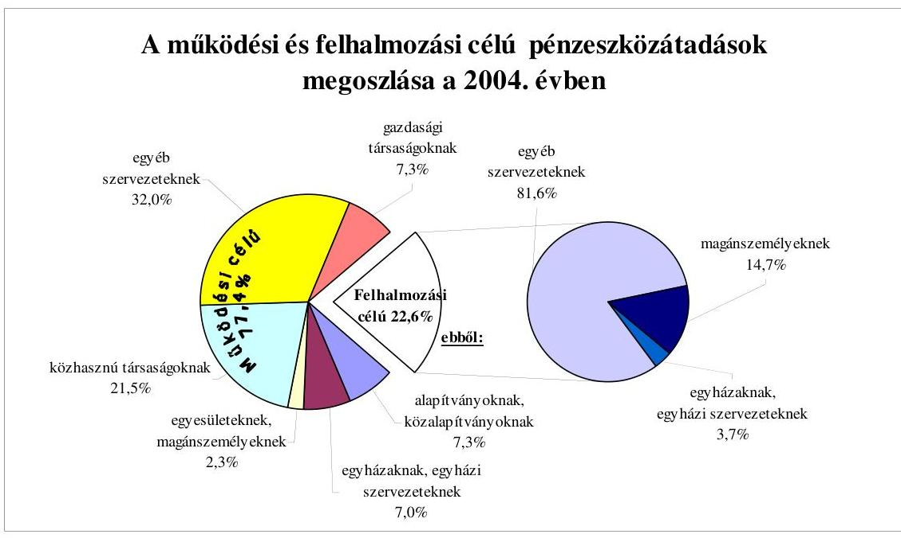
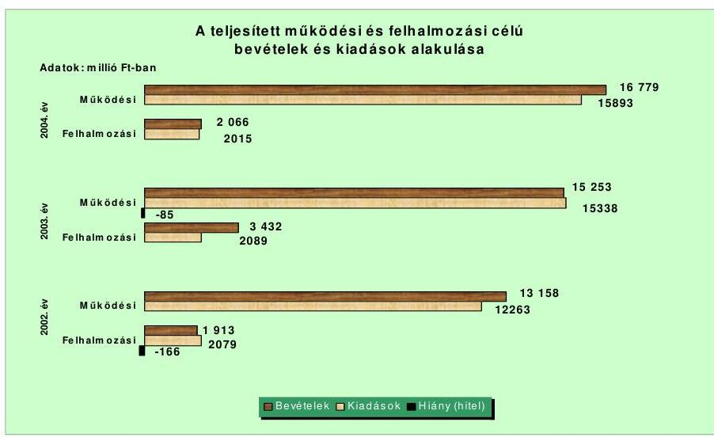
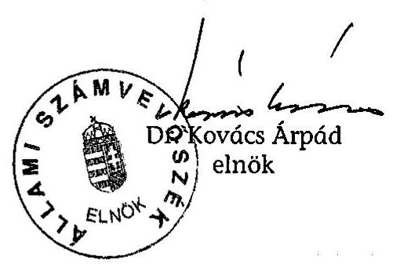
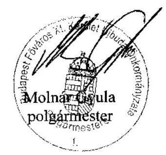

# JELENTÉS 

a Budapest Főváros XI. kerület Újbuda Önkormányzata gazdálkodási rendszerének átfogó ellenőrzéséről

---

3. Önkormányzati és Területi Ellenőrzési Igazgatóság
3.3. Átfogó Ellenőrzések Főcsoport
Iktatószám: V-1001-1/23/18/2005.
Témaszám: 749
Vizsgálat-azonosító szám: V0210
Az ellenőrzést felügyelte:
Dr. Lóránt Zoltán
főigazgató
Az ellenőrzés végrehajtásáért felelős:
Dr. Sepsey Tamás
főigazgató-helyettes
Az ellenőrzést vezette:
Csecserits Imréné
főcsoportfőnök-helyettes
Az ellenőrzést végezték:
Endrődy Péterné
számvevő tanácsos
Fejszák Tamás
számvevő
Dr. Karáné Kőszegi Zsuzsanna
számvevő tanácsos
Kozma Gábor
számvevő

# A témához kapcsolódó - elmúlt három évben - készített számvevőszéki jelentések: 

címe
sorszáma
Jelentés a helyi és a helyi kisebbségi önkormányzatok 0220
gazdálkodásának átfogó ellenőrzéséről
Jelentés a helyi önkormányzatoknak bérlakásépítésre és 0331
korszerűsítésre juttatott pénzügyi támogatások ellenőrzéséről
Jelentés a Magyar Köztársaság 2003. évi költségvetése 0443
végrehajtásának ellenőrzéséről

---

# TARTALOMJEGYZÉK 

BEVEZETÉS ..... 7
I. ÖSSZEGZŐ MEGÁLLAPÍTÁSOK, KÖVETKEZTETÉSEK, JAVASLATOK ..... 9
II. RÉSZLETES MEGÁLLAPÍTÁSOK ..... 22

1. A költségvetés tervezésének, végrehajtásának, az Önkormányzat vagyongazdálkodásának és a zárszámadás elkészítésének szabályszerűsége ..... 22
1.1. A költségvetési rendelet jóváhagyásának, módosításának, az előirányzatok nyilvántartásának szabályszerűsége ..... 22
1.2. A gazdálkodás szabályozottsága, a bizonylati rend és fegyelem szabályszerűsége ..... 29
1.3. A pénzügyi-számviteli feladatok ellátásának informatikai támogatottsága ..... 36
1.4. Az önkormányzati vagyon nyilvántartása, számbavétele ..... 37
1.5. A vagyonnal való gazdálkodás szabályszerűsége, célszerűsége, nyilvánossága ..... 40
1.6. A céljelleggel nyújtott támogatások szabályszerűsége ..... 48
1.7. A közbeszerzési eljárások szabályszerűsége ..... 54
1.8. A zárszámadási kötelezettség teljesítésének szabályszerűsége ..... 57
1.9. A Polgármesteri hivatal helyi kisebbségi önkormányzatok gazdálkodását segítő tevékenysége ..... 59
2. Az önkormányzati feladatok és a rendelkezésre álló források összhangja ..... 61
2.1. A feladatok meghatározása és szervezeti keretei ..... 61
2.2. A költségvetés egyensúlyának helyzete ..... 65
2.3. A feladatok finanszírozása ..... 71
3. A belső irányítási, ellenőrzési rendszer működésének értékelése ..... 75
3.1. Az ellenőrzési rendszer kialakítása, működése ..... 75
3.2. A könyvvizsgálati kötelezettség teljesítése ..... 77
3.3. A korábbi számvevőszéki ellenőrzések javaslatainak hasznosulása ..... 77

---

# MELLÉKLETEK 

1. számú Az Önkormányzat gazdálkodását meghatározó adatok, mutatószámok (1 oldal)
2. számú Az önkormányzati vagyon nagyságának alakulása (1 oldal)
3. számú Az Önkormányzat 2004. évi bevételeinek és kiadásainak alakulása (1 oldal)
4. számú Egyes önkormányzati feladatok finanszírozása (1 oldal)
5. számú Helyszíni ellenőrzési jegyzőkönyv (2 oldal)
6. számú Molnár Gyula polgármester úr észrevétele (1+ 2 oldal melléklet)

---

# RÖVIDÍTÉSEK JEGYZÉKE 

| Áht. | az államháztartásról szóló 1992. évi XXXVIII. törvény |
| :--: | :--: |
| Fot. | a fogyatékos személyek jogairól és esélyegyenlőségük biztosításáról szóló 1998. évi XXVI. törvény |
| Hatv. | a helyi adókról szóló 1990. évi C. törvény |
| Htv. | a helyi önkormányzatok és szerveik, a köztársasági megbízottak, valamint egyes centrális alárendeltségű szervek feladatai és hatásköreiről szóló 1991. évi XX. törvény |
| Kbt. $_{1}$ | a közbeszerzésekről szóló 1995. évi XL. törvény |
| Kbt. 2 | a közbeszerzésekről szóló 2003. évi CXXIX. törvény |
| Ksztv. | a közhasznú szervezetekről szóló 1997. évi CLVI. törvény |
| Ktv. | a köztisztviselők jogállásáról szóló 1992. évi XXIII. törvény |
| Ltv. | a lakások és helyiségek bérletére, valamint az elidegenítésükre vonatkozó egyes szabályokról szóló 1993. évi LXXVIII. törvény |
| Nek. tv. | a nemzeti és etnikai kisebbségek jogairól szóló 1993. évi LXXVII. törvény |
| Ötv. | a helyi önkormányzatokról szóló 1990. évi LXV. törvény |
| Számv. tv. | a számvitelről szóló 2000. évi C. törvény |
| Ámr. | az államháztartás működési rendjéről szóló 217/1998. (XII. 30.) Korm. rendelet |
| Ber. | a költségvetési szervek belső ellenőrzéséről szóló 193/2003. (IX. 26.) számú Korm. rendelet |
| Vhr. | az államháztartás szervezetei beszámolási és könyvvezetési kötelezettségének sajátosságairól szóló 249/2000. (XII. 24.) számú Korm. rendelet |
| ÁSZ | Állami Számvevőszék |
| Önkormányzat | Budapest Főváros XI. kerület Önkormányzata |
| Polgármesteri hivatal | Budapest Főváros XI. kerület Önkormányzatának Polgármesteri Hivatala |
| Képviselő-testület | Budapest Főváros XI. kerület Önkormányzatának Képviselőtestülete |
| polgármester | Budapest Főváros XI. kerület Önkormányzatának Polgármestere |
| alpolgármesterek | Budapest Főváros XI. kerület Önkormányzatának alpolgármesterei |
| jegyző | Budapest Főváros XI. kerület Önkormányzatának Jegyzője |
| aljegyző | Budapest Főváros XI. kerület Önkormányzatának Aljegyzője |
| Pénzügyi bizottság | Budapest Főváros XI. kerület Önkormányzata Képviselőtestületének Pénzügyi és Költségvetési Bizottsága |
| Gondnokság | Budapest Főváros XI. kerület Önkormányzata Polgármesteri Hivatal Jegyzői Osztályának Gondnoksága |
| Pénzügyi igazgatóság | Budapest Főváros XI. kerület Önkormányzata Polgármesteri Hivatalának Pénzügyi és Költségvetési Igazgatósága |

---

Pénzügyi osztály

Vagyongazdálkodási bizottság
Vagyongazdálkodási osztály

Költségvetési csoport

Számviteli csoport

Lakás és helyiség pénzügyi csoport

Revizori csoport
pénzügyi igazgató
pénzügyi osztályvezető

SzMSz
ügyrend
vagyongazdálkodási rendelet
lakás és helyiség elidegenítési rendelet
közbeszerzési rendelet
2004. évi költségvetési rendelet
2005. évi költségvetési rendelet

Budapest Főváros XI. kerület Önkormányzata Polgármesteri Hivatal Pénzügyi és Költségvetési Igazgatóságának Pénzügyi Osztálya
Budapest Főváros XI. kerület Önkormányzata Képviselőtestületének Vagyongazdálkodási Bizottsága
Budapest Főváros XI. kerület Önkormányzata Polgármesteri Hivatal Városüzemeltetési Igazgatóságának Vagyongazdálkodási Osztálya
Budapest Főváros XI. kerület Önkormányzata Polgármesteri Hivatal Pénzügyi és Költségvetési Igazgatósága Pénzügyi Osztályának Költségvetési Csoportja
Budapest Főváros XI. kerület Önkormányzata Polgármesteri Hivatal Pénzügyi és Költségvetési Igazgatósága Pénzügyi Osztályának Számviteli Csoportja
Budapest Főváros XI. kerület Önkormányzata Polgármesteri Hivatal Pénzügyi és Költségvetési Igazgatóságába Pénzügyi Osztályának Lakás és Helyiség Pénzügyi Csoportja
Budapest Főváros XI. kerület Önkormányzata Polgármesteri Hivatalának Pénzügyi és Költségvetési Igazgatóságának Revizori Csoportja
Budapest Főváros XI. kerület Önkormányzata Polgármesteri Hivatalának Pénzügyi és Költségvetési Igazgatóságának a vezetője
Budapest Főváros XI. kerület Önkormányzata Polgármesteri Hivatalának Pénzügyi és Költségvetési Igazgatósága Pénzügyi Osztályának a vezetője
Budapest Főváros XI. kerület Önkormányzatának 1/2003. (I. 20.) számú rendelete a Képviselő-testület és szervei Szervezeti és Működési Szabályzatáról
Budapest Főváros XI. kerület Önkormányzatának a Képviselő-testület és szervei Szervezeti és Működési Szabályzatáról szóló 1/2003. (I. 20.) rendeletének 5. számú melléklete a Polgármesteri Hivatal ügyrendjéről
Budapest Főváros XI. kerület Önkormányzatának 13/2003. (V. 20.) számú rendelete az Önkormányzat tulajdonában álló vagyonnal való rendelkezés szabályairól
Budapest Főváros XI. kerület Önkormányzatának 40/2001. (XII. 29.) számú rendelete az Önkormányzat tulajdonában álló lakások és nem lakás céljára szolgáló helyiségek elidegenítésének szabályairól
Budapest Főváros XI. kerület Önkormányzatának 3/1999. (II. 17.) számú rendelete a közbeszerzési eljárás kiírásával és elbírálásával összefüggő egyes kérdések szabályairól
Budapest Főváros XI. kerület Önkormányzatának 5/2004. (II. 24.) számú rendelete a 2004. évi költségvetésről

Budapest Főváros XI. kerület Önkormányzatának 9/2005. (II. 28.) számú rendelete a 2005. évi költségvetésről

---

2004. évi zárszámadási rendelet
pénzgazdálkodási jogkör gyakorlásáról szóló intézkedés
hatásköri jegyzék
támogatási dokumentumok
OEP
Gyógyír Kht.
BM
MÁK

Budapest Főváros XI. kerület Önkormányzatának 13/2005. (IV. 27.) számú rendelete a 2004. évi zárszámadásról
Budapest Főváros XI. kerület Önkormányzata polgármesterének és jegyzőjének 6/2004. számú együttes intézkedése a kötelezettségvállalási és utalványozási jogkör gyakorlásáról Hatásköri Jegyzék, a helyi önkormányzatok és szerveik feladat- és hatásköri jegyzéke, a Belügyminisztérium hivatalos kiadványa
A támogatásokról szóló szerződések, megállapodások, pályázati felhívások, valamint kiértesítő levelek
Országos Egészségbiztosítási Pénztár
GYÓGYÍR XI. Szolgáltató Közhasznú Társaság
Belügyminisztérium
Magyar Államkincstár

---

.

---

# JELENTÉS   a Budapest Főváros XI. kerület Újbuda Önkormányzata gazdálkodási rendszerének átfogó ellenőrzéséről 

## BEVEZETÉS

Az Ötv. 92. § (1) bekezdése, az Állami Számvevőszékről szóló 1989. évi XXXVIII. törvény 2. § (3) bekezdése, valamint az Áht. 120/A. § (1) bekezdése alapján az önkormányzatok gazdálkodását az ÁSZ ellenőrzi. Az ellenőrzés elvégzése az Országgyűlés illetékes bizottságai részére is átadott, országosan egységes ellenőrzési program alapján történt.

## Az ellenőrzés célja annak értékelése volt, hogy:

- az önkormányzati gazdálkodás törvényességét ${ }^{1}$, szabályszerűségét biztosították-e a tervezés, a költségvetés végrehajtása, a vagyongazdálkodás és a zárszámadás során;
- az Önkormányzat által ellátott feladatok és az azokhoz rendelkezésre álló források összhangja biztosított volt-e, különös tekintettel az egyes kiemelt feladatokra;
- a gazdálkodás szabályszerűségét biztosító belső kontrollok ${ }^{2}$ lehetővé tették-e a szabálytalanságok, hiányosságok, gazdaságtalan megoldások feltárását, megelőzését;

Az ellenőrzött időszak: a 2004. év és 2005. I. félév, az 1.5., 2.1-2.3. és 3.3. programpontok tekintetében a 2002-2003. évek is.

Budapest Főváros XI. kerületét kilenc településrész ${ }^{3}$ alkotja. A kerület lakosainak száma 2005. január 1-jén 129 040 fő volt.

[^0]
[^0]:    ${ }^{1}$ A törvényi előírások betartásának elmulasztásakor a részletes megállapításokban egységesen a törvénysértés megjelölést alkalmazzuk, mivel az ÁSZ nem tehet különbséget a törvényi előírások között.
    ${ }^{2}$ A gazdálkodás szabályszerűségét biztosító kontroll alatt értjük a kiépített és működő belső irányítási és szabályozási rendszert, valamint a belső ellenőrzési funkciók ellátását.
    ${ }^{3}$ Gellérthegy, Lágymányos, Albertfalva, Kelenföld, Gazdagrét, Kelenvölgy, Őrmező, Örsöd, Sas-hegy, Sasad.

---

Az Önkormányzat 38 tagú Képviselő-testületének munkáját tíz állandó bizottság segítette. A 2002. évi választásokat követően a polgármester személye változott. A jegyző a 2003. év közepén került kinevezésre, előtte megbízott jegyző látta el a jegyzői feladatokat.

Az Önkormányzat feladatainak ellátására a 2004. évben a Polgármesteri hivatalon kívül 14 önállóan és 48 részben önállóan gazdálkodó költségvetési szervet működtetett, valamint öt közhasznú társasága és kilenc korlátolt felelősségű társasága vett részt a feladatok végrehajtásában. Intézményeinél a 2004. év végén 2771 főt foglalkoztattak, a Polgármesteri hivatalban 378 köztisztviselő dolgozott.

Az Önkormányzat a 2004. évben 18 845 millió Ft költségvetési bevételt, és 17 908 millió Ft költségvetési kiadást teljesített. A 2004. év végén 54 605 millió Ft könyvviteli mérleg szerinti vagyonnal rendelkezett. Az Önkormányzat gazdálkodását jellemző adatokat és mutatószámokat az 1-3. számú mellékletek részletesen tartalmazzák.

A kerületben a 2002. évi önkormányzati választásokig nyolc ${ }^{4}$, a 2002. évi választásokat követően tíz ${ }^{5}$ helyi kisebbségi önkormányzat működött.

Az Önkormányzat 2005. május 29-től - képviselő-testületi döntéssel - felvette a Budapest Főváros XI. kerület Újbuda Önkormányzata nevet.

A jelentés megállapításainak, javaslatainak egyeztetése során a polgármester arról adott tájékoztatást, hogy az időközben megtett intézkedésekkel a javaslatok egy részét megvalósították. Ezekben az esetekben a jelentés II. Részletes megállapítások fejezetében az adott témához kapcsolt lábjegyzetben a megtett intézkedést feltüntettük és a kapcsolódó javaslatot elhagytuk.

[^0]
[^0]:    ${ }^{4}$ Bolgár, cigány, horvát, lengyel, német, örmény, román, szerb.
    ${ }^{5}$ Bolgár, cigány, görög, horvát, lengyel, német, örmény, román, ruszin, szerb.

---

# I. ÖSSZEGZŐ MEGÁLLAPÍTÁSOK, KÖVETKEZTETÉSEK, JAVASLATOK 

Az Önkormányzat rendelkezett a helyi gazdasági, társadalmi adottságok figyelembevételével készített, több évre szóló ágazati koncepciókkal, azonban az Önkormányzat költségvetési lehetőségeivel összhangban lévő célkitűzéseket, feladatokat tartalmazó gazdasági programmal az Önkormányzat az Ötv-t megsértve nem rendelkezett.

A 2004. és a 2005. évi költségvetési koncepciókat az Ámr. előírásainak megfelelően a helyben képződő bevételek és az ismert kötelezettségek figyelembevételével állították össze. Az Önkormányzat bizottságai, valamint a helyi kisebbségi önkormányzatok az éves költségvetési koncepciókról véleményeiket határozatban rögzítették. A határidőben beterjesztett költségvetési koncepciókhoz a polgármester az Ámr. előírása ellenére azonban nem csatolta a Pénzügyi bizottság és a helyi kisebbségi önkormányzatok véleményét. A költségvetési koncepciók alapján a Képviselő-testület határozatban döntött a költségvetés készítésének további munkálatairól.

A polgármester a 2004. és a 2005. évi költségvetési rendelettervezeteket az Áht-ban előírt határidőben a Képviselő-testület elé terjesztette, azonban az Ámr. előírása ellenére a rendelettervezetekhez nem csatolta a Pénzügyi bizottság véleményét, valamint a könyvvizsgáló írásos jelentését. A költségvetési rendeletekben a „képviselői keret" meghatározásával, illetve az egyéni képviselői keretek feletti rendelkezési jog képviselőknek történt biztosításával megsértették az Ötv. hatáskör átruházásra vonatkozó előírását. Az Áht.
 előírásának megfelelően meghatározták a költségvetési és zárszámadási rendelet előterjesztésekor tájékoztatásul bemutatandó mérlegek és kimutatások tartalmi követelményeit. A költségvetési rendeletekben az Ámr. előírásától eltérően a Polgármesteri hivatal költségvetésében a céltartalék előirányzaton túlmenően a dologi kiadások és a speciális célú támogatások között céltartalék jellegű előirányzatokat. A különböző feladatok támogatására „Alap" elnevezéssel keretösszegeket határoztak meg, amely elnevezés félreérthető, mivel azok - a Környezetvédelmi Alap kivételével - nem feleltek meg az Áht-ban meghatározott feltételeknek. A költségvetési rendeletekben a Képviselő-testület meghatározta a költségvetés végrehajtási szabályait.

A Képviselő-testület a 2004. évi költségvetés kiadási és bevételi előirányzatait év közben összesen 20%-kal növelte. Az intézmények saját hatáskörben végrehajtott előirányzat-változtatásairól a polgármester az Ámr. előírása ellenére nem tájékoztatta a Képviselő-testületet 30 napon belül, mert a tájékoztatót a jegyző nem készítette elő. A költségvetési előirányzatok módosításáról az Ámr-ben foglalt (dokumentáltságra, nyilvántartásra vonatkozó) előírásokat betartva döntött a Képviselő-testület. Az utolsó előirányzat-módosítást az Ámr-ben előírt határidőn túl fogadták el.

A Polgármesteri hivatal rendelkezett a Képviselő-testület által jóváhagyott, szervezetére és működésére vonatkozó szabályzattal, amit ügyrendnek neveztek, és az SzMSz mellékletét képezte. A ügyrendben azonban az Ámr. előírásai ellenére nem szerepeltették az alapító okirat keltét, számát, a Polgármesteri hivatal költségvetésének végrehajtására szolgáló számlaszámot, a szervezeti egységek vezetőjének azon jogosítványait, amelyek körében a költségvetési szerv képviselőjeként járhat el, és nem részletezték a gazdasági szervezet felépítését. A gazdasági szervezet az Ámr. előírása ellenére nem rendelkezett olyan ügyrenddel, amely részletesen tartalmazta volna e szervezet és szervezeti egységei és a pénzügyi-gazdasági feladatok ellátásáért felelős személyek által ellátandó feladatokat, a vezetők és más dolgozók feladat-, hatás- és jogköreit. Az operatív gazdálkodási jogkörök részletes szabályait a pénzgazdálkodási jogkörök gyakorlásáról szóló intézkedés tartalmazta. A pénzgazdálkodási jogkörök gyakorlásáról szóló intézkedésben a jegyző szabályozta a szakmai teljesítés igazolás módját, kijelölte az azt végző személyeket. Az érvényesítést végzők írásos kijelölése a jegyző részéről megtörtént, amely során az érvényesítők iskolai végzettségre és szakmai képesítésre vonatkozó előírásait betartotta. A polgármester nevében általános helyettesítési jogkörben eljáró alpolgármester részére tájékoztatási kötelezettséget írtak elő a kapott kötelezettségvállalási jogkör gyakorlásáról. Más személy részére a gazdálkodási jogkörök gyakorlására történő felhatalmazásoknál utólagos beszámolási kötelezettséget nem írtak elő, és beszámoltatásra nem került sor. A jegyző 2005. július hónapban az intézményvezetőkhöz küldött levélben intézkedett az önállóan gazdálkodó önkormányzati intézmények számviteli rendjének kialakításáról.

A jegyző elkészítette a Polgármesteri hivatal számviteli politikáját és a kapcsolódó szabályzatokat. A leltározási szabályzatban előírta a részletes leltározási feladatokat. Az önköltség-számítás szabályozásánál a Vhr. 2005. január 1-től hatályos előírása ellenére nem határozta meg a nevelési-oktatási intézményekben fizetendő térítési díjak esetében az önköltségszámítás során figyelembe veendő adatok dokumentálási rendjét, valamint az adatok főkönyvi számlákkal és analitikus nyilvántartásokkal való kapcsolatát. A pénzkezelési szabályzatban rögzített házipénztári keret maximális összege a házipénztár átlagos napi pénzforgalma figyelembevételével indokolatlanul magas volt. A pénzkezelési szabályzatban az indokoltsága ellenére nem rögzítették a bankszámlák felett rendelkezésre jogosult személyeket, az ügyfélterminál használatának rendjét, a pénztárellenőrzés gyakoriságát. Az eszközök hasznosítási, selejtezési szabályzata tartalmazta a selejtezéssel kapcsolatos eljárási szabályokat, hatásköröket. A számlarendben meghatározták többek közt az analitikus nyilvántartások formáját, tartalmát, azok vezetésének módját, az analitikus nyilvántartások főkönyvi könyveléssel való egyeztetésének dokumentálási módját, azonban a Számv. tv-ben foglaltakat megsértve a tőkeleszállítás esetének elszámolási szabályait a számlarendben nem határozták meg. A Polgármesteri hivatal számviteli politikája, számlarendje a Vhr. előírásai ellenére nem tartalmazta a kisebbségi önkormányzatok tárgyi eszközeire, dologi kiadásaira vonatkozó számviteli elszámolási és nyilvántartási szabályokat, valamint a leltározást érintő sajátos feladatokat.

A munkaköri leírások tartalmazták a munkafolyamatba épített ellenőrzési, egyeztetési feladatokat, azonban a jegyző az Ámr. előírása ellenére a Polgármesteri hivatal ellenőrzési nyomvonalát nem készítette el. A főkönyvi számlákhoz a Vhr. és a számlarend szerinti tartalommal és formában vezették az analitikus nyilvántartásokat, azonban az előlegek analitikus nyilvántartásában a számlarendben előírt adatokat hiányosan vezették. A főkönyvi és analitikus nyilvántartások közötti egyeztetés a számlarendben foglaltak szerint megtörtént. A nem termékértékesítésből, szolgáltatásnyújtásból eredő banki pénzforgalmi bevételek bizonylatainál az Ámr. előírásai ellenére rendszeresen elmaradt az utalványozás, az utalványozás ellenjegyzése, az érvényesítés és a szakmai teljesítés igazolása. A kötelezettségvállalásokról vezetett nyilvántartásból az Ámr. előírása ellenére nem állapítható meg az évenkénti kötelezettségvállalások összege. A kötelezettségvállalás nyilvántartásba vételi sorszáma az Ámr. előírása ellenére hiányzott az utalványrendeletek 53%-ánál.

A kötelezettségvállalást, utalványozást, a kötelezettségvállalás és utalványozás ellenjegyzését, az érvényesítést és szakmai teljesítés igazolását az arra jogosultak, illetve felhatalmazottak végezték. A kötelezettségvállalások 11%-ánál az Ámr. előírásai ellenére hiányzott az ellenjegyzés. A szakmai teljesítés igazolása az Ámr. előírása ellenére a kiadások 15%-ánál elmaradt, további 23%-ánál pedig a szakmai teljesítés igazolása nem a pénzgazdálkodási jogkörök gyakorlásáról szóló intézkedésben előírt formában történt. Az utalványozás ellenjegyzője, valamint az érvényesítést végző az Ámr. előírásaival szemben nem tettek eleget ellenőrzési feladatuknak a kiadási bizonylatok 45%-ánál, mivel nem észrevételezték a szabálytalan kötelezettségvállalásokat, valamint a hiányos és szabálytalanul végzett szakmai teljesítés-igazolásokat. A pénztárellenőr a pénzkezelési szabályzat előírásával ellentétben nem igazolta a készpénzforgalmi tételek ellenőrzésének elvégzését. Az utólagos elszámolásra kiadott előlegek 70%-ánál a pénzkezelési szabályzatban előírt határidőn túl számoltak el, a pénzkezelési szabályzatban előírt napi zárás helyett hetente történt a pénztár zárása, valamint a pénztárzárások felénél túllépték a napi záró pénzkészletre meghatározott keretösszeget. A Polgármesteri hivatalnál a kiemelt előirányzatokat, valamint az intézmények költségvetési főösszegére meghatározott előirányzatokat betartották. Összesen hét intézmény lépte túl a dologi kiadások Képviselő-testület által meghatározott módosított előirányzatát, átlagosan 5%-kal, valamint négy intézmény haladta meg a fejlesztési kiadások Képviselő-testület által meghatározott módosított előirányzatát, átlagosan 57%-kal a 2004. évben, amivel megsértették az Áht. előirányzatokon belüli gazdálkodásra vonatkozó előírásait. Az intézményeknél az előirányzat-túllépések okait egy intézmény kivételével nem vizsgálták, felelősségre vonás a túllépésekkel kapcsolatban nem történt.

A Polgármesteri hivatalban a pénzügyi-számviteli feladatok informatikai támogatottságát biztosították, az informatikai eszközök fejlesztéséről, a dolgozók számítástechnikai képzéséről gondoskodtak. A Polgármesteri hivatal rendelkezett az informatikai rendszerre vonatkozó hosszabb távú célkitűzéseket tartalmazó informatikai stratégiával. A katasztrófa-elhárítási tervet és az informatikai rendszerről az üzemeltetési leírást azonban nem készítettek. A pénz-ügyi-számviteli területet érintően nem készült az egyes alkalmazási területeket érintő hozzáférési jogosultságokra vonatkozó, a jogosultak neveit tartalmazó szabályozás.

A vagyon nyilvántartásáról a Vhr. előírásainak megfelelően gondoskodtak. A 2004. évi leltározást az ingatlanok kivételével szabályszerűen végezték, az ingatlanok mennyiségi felvétele a Vhr., valamint a leltározási és leltárkészítési szabályzat előírása ellenére elmaradt. A követelések értékvesztésének elszámolása az értékelési szabályzatban foglaltakkal összhangban megtörtént, a 2004. évben ezen a címen indokoltan elszámolt értékvesztés 41,5 millió Ft volt. Két társaság részvényeinek, valamint az Önkormányzat által alapított társaságokban lévő részesedések vonatkozásában az értékvesztés elszámolásának szükségességét a Számv. tv. előírása ellenére nem vizsgálták. A részesedésekre értékvesztés-elszámolás a 2004. évben négy - önkormányzati többségi tulajdonú - társaság esetében a Számv. tv. előírása ellenére nem történt. A piaci értékelés lehetőségével az Önkormányzat nem élt.

A vagyongazdálkodással kapcsolatos feladatokat és döntési hatásköröket az Önkormányzat rendeletekben szabályozta. A vagyongazdálkodási rendelet a teljes vagyoni körre kiterjedt, a forgalomképesség szerinti besorolás megváltoztatásának módjáról azonban nem rendelkeztek. A vagyongazdálkodási rendeletben a döntési hatásköröket a forgalomképtelen vagyon egy évet meg nem haladó hasznosítása, a forgalomképes vagyoni körbe tartozó - a módosított költségvetési főösszeg 0,8%-áig terjedő - vagyonügyletek, valamint a 25 millió Ft alatti követelés elengedés esetében nem egyértelműen határozták meg, mivel a szabályozás szerint a tulajdonosi jogokat „a Vagyongazdálkodási bizottság döntésének megfelelően a polgármester gyakorolja." A versenyeztetés nélküli hasznosítás eseteinek rögzítésével az Áht. előírását megsértve lehetőséget biztosított az Önkormányzat a versenyeztetési eljárás mellőzésére. A versenyeztetési eljárás mellőzésének szabályozásban foglalt lehetősége nem biztosította a köztulajdonnal való gazdálkodás nyilvánosságát, átláthatóságát. Az éves költségvetési előirányzatból nyújtott fejlesztési támogatások és vagyonváltozást érintő - értékhatár feletti - szerződések közzétételi határidejének elmulasztása miatt megsértették az Áht. előírását.

A telekértékesítés nyilvános pályáztatással, a vagyongazdálkodási rendelet előírásainak megfelelően, szabályszerűen történt. A lakás és helyiség elidegenítési rendelet előírását figyelembe véve a helyiség bérlője által megvásárlásra kijelölt harmadik személy részére értékesítettek ingatlanokat. A nem lakás céljára szolgáló helyiségek eladásra történő kijelölését gazdaságossági számítás nem előzte meg. A szerződésekbe az Önkormányzat érdekeit védő garanciális elemeket beépítették. Az Önkormányzat kedvezményes bérleti díj alkalmazásával közvetett támogatásban részesített tíz pártszervezetet, így nem tett eleget az Ötv. előírásainak, valamint nem biztosította az alkotmányos egyenlőséget a bérlők között. Követelés elengedésekor, apportáláskor és a kárpótlási jegyek értékesítésekor a vagyongazdálkodási rendeletben foglaltakat betartották. A selejtezési eljárás az értékesítésre történő felajánlás kivételével szabályszerűen történt. Víziközmű és közvilágítási eszközök gazdasági társaságnak történő térítésmentes átadásával megsértették az Áht. és az Ötv. előírásait, az átadást képviselő-testületi döntés nem előzte meg.

A Képviselő-testület a 2004. évi költségvetési rendeletében céljelleggel - nem szociális ellátásként - nyújtott speciális célú támogatási előirányzatot különített el és szabályozta a döntési hatásköröket, valamint a számadások ellenőrzését. A „képviselői keretből" egyéni képviselői döntéssel alapítványoknak nyújtott támogatással megsértették az Ötv. azon előírását, miszerint a Képviselő-testület hatásköréből nem ruházható át a közösségi célú alapítványi forrás átadása. A speciális célú támogatások felhasználásakor betartották a 2004. évi költségvetési rendeletben meghatározott előirányzatokat. A támogatási dokumentumokban feltüntetett számadási határidők azonban nem voltak összhangban a költségvetési rendeletben meghatározott határidővel. A támogatások 11%-ánál az Áht. előírását megsértve nem írtak elő számadási kötelezettséget. A közhasznú szervezetek esetében az írásbeli szerződés nélküli támogatással, valamint a számadás feltételeinek meghatározása nélkül kötött írásbeli szerződésekkel nem tettek eleget a Ksztv. előírásának. A számadások benyújtásakor 20%-ban nem tartották be a 2004. évi költségvetési rendelet Pénzügyi bizottsághoz történő benyújtásra vonatkozó előírását.

A Pénzügyi bizottság a számadásokat ellenőrizte, szükség szerint felkérte az érintett szervezetet annak pontosítására, a támogatási cél szerinti felhasználás igazolására, illetve a támogatási összeg visszafizetésére. Négy szervezet részesült annak ellenére támogatásban, hogy nem számolt el az előző évi támogatással, ezáltal megsértették az Áht. előírását, mert a számadás megtörténtéig nem függesztették fel a támogatást, valamint a számadások elmulasztása esetén nem intézkedtek a támogatás visszafizettetéséről. A Polgármesteri hivatalban nem vezettek a támogatások szabályszerűvé tételének elősegítését biztosító - a támogatásról való döntést, a folyósítást és a számadást tartalmazó összesített, zártrendszerű - nyilvántartást, nem írták elő a támogatott szervezet közhasznúságának ellenőrzését, valamint a támogatási dokumentum egységes tartalmi elemeit.

A közbeszerzési eljárások rendjét 2004. május 31-ig rendeletben, azt követően polgármesteri-jegyzői együttes intézkedésben szabályozták. A 2004. évi közbeszerzésekről szóló összegzést az előírt határidőre megküldték a Közbeszerzések Tanácsa részére. A Polgármesteri hivatalnál a 2004. évben a Kbt.₁ előírásai alapján tíz közbeszerzési eljárást folytattak le összesen 1970,3 millió Ft értékben. A közbeszerzési
 eljárások fajtájának kiválasztása a Kbt. ${ }_{1}$ előírásainak megfelelően történt. A közbeszerzési eljárások lefolytatása során azonban nem tettek eleget a Kbt. ${ }_{1}$ döntés előkészítésre és döntésre, valamint a bontás időpontjára és az eljárás eredményéről szóló tájékoztató megjelentetésére vonatkozó előírásainak, a szerződéskötésre meghatározott időpontot nem tartották be. A közbeszerzési eljárást lebonyolító társaság részéről szakértői véleményt készítő személy összeférhetetlenségét nem vizsgálták. Közbeszerzési eljárás lefolytatása nélkül kötöttek a 2004. évben út kátyúzásra szerződést a Kbt. ${ }_{1}$ előírása ellenére.

A polgármester az Áht-ban meghatározott határidőn belül terjesztette elő a zárszámadási rendelettervezetet, amelyet a költségvetési rendelettel összehasonlítható módon készítettek el. A zárszámadási rendelettervezet előterjesztésekor a helyi kisebbségi önkormányzatok mérlegeit a 2004. évben nem az Önkormányzat rendeletében meghatározott tartalommal mutatták be tájékoztatásul a Képviselő-testület részére. Az önkormányzati szintű költségvetési pénzmaradványt a Vhr. és az Ámr. előírásainak megfelelően határozták meg. Az intézményi beszámolókat az előírt határidőben felülvizsgálták, a beszámoló és a működés elfogadásáról, az intézményi pénzmaradvány jóváhagyott összegéről és felhasználási jogcímeiről a Polgármesteri hivatal írásban értesítette az intézmények vezetőit.

A kerületben működő tíz kisebbségi önkormányzat működésének feltételeit a Polgármesteri hivatal biztosította. A polgármester az Áht-ban előírt együtt-

---

működési megállapodást a kisebbségi önkormányzatokkal az Ámr-ben előírt határidőt követően kötötte meg és módosította. Az együttműködési megállapodások az Ámr. előírásától eltérően nem tartalmazták a jegyző felkérését a költségvetési, előirányzat-módosítási és a zárszámadási határozattervezetek előkészítésére, valamint a zárszámadási határozatok benyújtási határidejét és a zárszámadás határozattal való elfogadásának kötelezettségét. A szakmai teljesítés igazolását végző személyeket a német kisebbségi önkormányzat kivételével a jegyző kijelölte. A Polgármesteri hivatalban a helyi kisebbségi önkormányzatok költségvetésének, gazdálkodásának, vagyonjuttatásának egyes kérdéseiről szóló kormányrendelet előírásának megfelelően elkülönítetten vezették a helyi kisebbségi önkormányzatok vagyoni és számviteli elszámolásait. A kisebbségi önkormányzatok kötelezettségvállalásáról az Ámr. előírása ellenére nyilvántartást nem vezettek.

A Képviselő-testület az Ötv. előírásai ellenére nem határozta meg önként vállalt feladatait, a kötelező és önként vállalt feladatok ellátásának módját és mértékét. Az Önkormányzat feladatai ellátását elsősorban általa alapított költségvetési szervekkel, valamint gazdasági társaságokkal, közhasznú szervezetekkel és egyéb szervezetekkel kötött ellátási szerződésekkel biztosította. A 2002-2004. évek közötti időszakban a Képviselő-testület döntött három óvoda, két általános iskola, valamint az Egészségügyi Szolgálat intézmény megszüntetéséről, gyermekszám csökkenés, illetve más szervezeti formában való hatékonyabb feladatellátás miatt. A Képviselő-testület döntött továbbá az egészségügyi alap- és szakellátás, valamint az informatikai feladatellátása érdekében két közhasznú szervezet, a beruházási, fejlesztési feladatok ellátása érdekében két gazdasági társaság alapításáról, a járóbeteg-szakellátás feladat Budapest Főváros Önkormányzatától való átvételéről.

Az Önkormányzat a 2002-2005. évi költségvetéseiben fokozatosan csökkenő mértékű hiányt tervezett. A teljesített költségvetési bevételek a 2002. és a 2004. évek közötti időszakban meghaladták a költségvetési kiadásokat, tényleges hiány a 2002-2004. évek költségvetéseinek teljesítése során nem jött létre, a gazdálkodás egyensúlya biztosított volt. A hiány tervezése során figyelembe vett beruházások, felújítások a tervezettnél kisebb mértékben teljesültek a beruházási feladatok átütemezése, illetve elmaradása miatt, valamint a felhalmozási célú pénzeszközátadások a tervezettnél kisebb mértékben valósultak meg. Az Ltv. előírását megsértve az Önkormányzat lakóépületeinek elidegenítéséből származó bevétel 50%-ának a Budapest Főváros Önkormányzata részére történő befizetése elmaradt. A felhalmozási kiadások tervezettnél kisebb mértékű teljesítése miatt a hiány finanszírozására tervezett hiteleket az Önkormányzat nem vette igénybe a költségvetés végrehajtása során. A 2003. évben a működési célú költségvetési kiadások meghaladták a működési célú költségvetési bevételeket, az egyensúlyhiány megszüntetése érdekében bevételnövelő és takarékossági intézkedéseket hoztak. A feladatok finanszírozását a 2002-2004. évek között az Önkormányzat pályázati tevékenysége elősegítette. A felhalmozási célú pályázati döntéseknél a központi és önkormányzati szabályozásban foglalt hatásköri előírásokat betartották.

Az Önkormányzat a 2002. és a 2004. évek közötti időszakban az Ötv. szerinti adósságot keletkeztető kötelezettségvállalásról négy esetben hozott döntést. A Pénzügyi bizottság megvizsgálta a kezességvállalások és a hitelfelvé-

---

telek indokait és gazdasági megalapozottságát. Az éves költségvetésben tervezett működési hitelfelvétellel, illetve a tényleges hitelfelvételnek az adott évre vonatkozó törlesztési kötelezettségével és a készfizető kezességvállalásokkal az Ötv. szerinti adósságot keletkeztető kötelezettségvállalási korlátot nem lépték túl a 2002-2004. években. Az adósságot keletkeztető kötelezettségvállalások az Önkormányzat fizetőképességét, működőképességét a 2004. évben nem veszélyeztették.

Az Önkormányzat az 1995. évben vezette be vagyoni típusú adókat, melyek szerepe az összes bevételen, illetve az Önkormányzat saját bevételein belül az adóbehajtási tevékenység fokozása miatt a 2004. évben megnövekedett. Az építmény- és a telekadó bevételek aránya a saját bevételekhez viszonyítva a 2002. évben 8%, a 2003. évben 8%, a 2004. évben 11%. Az adózók részére a Hatv-ben rögzítetteken túlmenően adómentességet és adókedvezményt biztosítottak az Önkormányzat rendeletében meghatározott esetekben.

A naturális mutatókkal mérhető feladatok (bölcsődei ellátás, óvodai nevelés, általános iskolai és középiskolai oktatás, nappali, valamint a bentlakásos szociális intézményi ellátás) egy főre jutó kiadásai a 2002. évről a 2004. évre 6-39%-os mértékben emelkedtek, 30%-ot meghaladó növekedés az oktatás területén volt tapasztalható. Az általános és középiskolai oktatás kiadásainak növekedését elsősorban a személyi és dologi kiadások növekedése okozta, az egy csoportra jutó tanulók száma az időszak alatt alig változott. Az óvodai nevelés kapacitás-kihasználtságának intézmény-racionalizálás miatti 9%-os növekedése a kiadások emelkedését visszafogta. A bölcsődei és a bentlakásos szociális intézményi ellátás kapacitás-kihasználtságának növekedése (50%-ról 58%-ra, illetve 53%-ról 68%-ra) a fajlagos kiadások növekedési ütemét csökkentette a 2002-2004. évek közötti időszakban. A kiadások finanszírozásában a bölcsődei ellátás esetében az önkormányzati támogatásnak, az oktatási és a szociális intézményi ellátásban az állami támogatásnak volt meghatározó szerepe. Az Önkormányzat önként vállalt feladatainak ellátása nem veszélyeztette a kötelező feladatainak ellátását. A Fot. előírását megsértve az előírt határidőig a középületek akadálymentesítési feladatait az épületek kilenctized részénél nem valósították meg.

Az Önkormányzat nem alakította ki az Ötv-ben foglaltak alapján a feladatkörébe utalt ellenőrzési feladatok végrehajtásához szükséges szervezeti kereteket 2005. májusáig, mivel a Polgármesteri hivatalban nem hoztak létre és nem működtettek a Polgármesteri hivatal gazdálkodásának belső ellenőrzését végző szervezeti egységet. Ezzel a jegyző megsértette az Áht. vonatkozó előírásait. A 2005. év májusától kezdődően a Polgármesteri hivatal belső ellenőrzését a jegyző közvetlen irányítása alá tartozó két felsőfokú végzettséggel rendelkező belső ellenőr látta el, esetükben a belső ellenőrök feladatköri és szervezeti függetlenségét az Áht. előírásainak megfelelően biztosították. Az intézmények gazdálkodásának rendszeres ellenőrzését a Revizori csoport végezte el. Az intézmények gazdálkodásával összefüggő ellenőrzések során az ellenőrök vizsgálati feladataikat nem a jegyző közvetlen alárendeltségében hajtották végre, a Revizori csoportnak a Pénzügyi igazgatósághoz történő szervezeti besorolásával megsértették az Áht. előírását. A Revizori csoportban foglalkoztatott két belső ellenőr képesítése nem felelt meg a Ber-ben előírt szakmai, képzettségi követelményeknek. Az intézmények pénzügyi-gazdasági ellenőrzéséről készített jelentéseket az ellenőrzési programoknak megfelelő, azokkal összehasonlítható, áttekinthető szerkezetben készítették el. A jegyző - a Polgármesteri hivatal kivételével - az intézmények 2004. évi ellenőrzésének tapasztalatairól a Pénzügyi bizottságot tájékoztatta.

Az Önkormányzat az Ötv-ben előírt Könyvvizsgálati kötelezettségének eleget tett. A könyvvizsgáló a 2004. évi egyszerűsített beszámolót korlátozás nélküli hitelesítő záradékkal látta el, auditálási eltérést nem állapított meg.

A korábbi számvevőszéki ellenőrzések során feltárt hiányosságok megszüntetésére az Önkormányzatnál intézkedési terveket készítettek. A kötött felhasználású támogatások 2003. évi felhasználásának ellenőrzése során tett javaslatok alapján készített intézkedési tervben foglaltakat végrehajtották, a számvevői jelentés javaslatai hasznosultak. A pénzügyi-gazdasági tevékenység átfogó jellegű ellenőrzéséről készült jelentés, valamint a bérlakásépítésre és korszerűsítésre juttatott pénzügyi támogatások felhasználásának ellenőrzéséről készült jelentés javaslatainak mintegy négyötöde teljesen vagy részben hasznosult. A javaslatokat figyelembe véve a kisebbségi önkormányzatokkal az együttműködési megállapodást megkötötték, a kisebbségi önkormányzatok költségvetését a költségvetési rendelettervezetekben szerepeltették. A törzsvagyon korlátozottan forgalomképes tárgyairól történő rendelkezés feltételeit a vagyongazdálkodási rendeletben meghatározták. A Polgármesteri hivatal értékelési szabályzatát elkészítették, a számlarend aktualizálása megtörtént. Az előírt mérlegeket a zárszámadási rendelettervezet előterjesztésekor tájékoztatásul bemutatták. Az önként vállalt feladatok meghatározása és dokumentálása nem történt meg, a gazdasági szervezet ügyrendjét nem készítették el. A pártok közvetett támogatása továbbra is fennáll. Az önkormányzati lakóépületek elidegenítéséből származó bevételek ötven százalékának a Budapest Főváros Önkormányzatának elkülönített számlájára történő befizetése elmaradt. A közbeszerzési eljárások során a döntés előkészítésre és döntéshozatalra vonatkozó előírásokat nem tartották be.

A helyszíni ellenőrzés megállapításainak hasznosítása mellett javasoljuk:

# a polgármesternek 

a jogszabályi előírások maradéktalan betartása érdekében
1. a költségvetési gazdálkodás jogszabályszerű kereteinek kialakítása céljából:
a) terjessze az Ötv. 91. § (1) bekezdésében foglaltak betartása érdekében a Képviselő-testület elé a jegyző által elkészített gazdasági program-tervezetet a Htv. 139. § (1) bekezdés a) pontja alapján;
b) csatolja a költségvetési koncepció tervezethez az Ámr. 28. § (3) bekezdése alapján a Pénzügyi bizottság és a helyi kisebbségi önkormányzatok koncepció-tervezetről szóló véleményét, továbbá a költségvetési rendelet előterjesztésekor a rendelettervezethez az Ámr. 29. § (9) bekezdése alapján a Pénzügyi bizottság véleményét és a könyvvizsgáló jelentését;

---

2. intézkedjen az Áht. 93. § (1) bekezdésében, illetve az Áht. 12/A. § (1) bekezdésében előírtak betartása érdekében, hogy az intézmények a jóváhagyott előirányzatokon, illetve a Képviselő-testület által meghatározott kiemelt kiadási előirányzatokon belül gazdálkodjanak, előirányzat-túllépések esetén kezdeményezzen vizsgálatot, illetve felelősségre vonást;
3. gondoskodjon arról, hogy az Ötv. 10. § (1) bekezdés d) pontja előírásának megfelelően csak a Képviselő-testület döntése alapján nyújtson anyagi támogatást az Önkormányzat alapítványoknak;
4. kezdeményezze a vagyongazdálkodási rendelet módosítását annak érdekében, hogy a döntési jogosultság egyértelműen meghatározásra kerüljön a forgalomképes vagyoni körbe tartozó - a módosított költségvetési főösszeg 0,8%-áig terjedő - vagyonügyletek és a 25 millió Ft alatti követelés elengedése esetében;
5. gondoskodjon arról, hogy az ingatlanok pártszervezetek részére történő bérbeadásánál a bérleti díj összhangba kerüljön a Vagyongazdálkodási bizottság 306/VGB/2004. számú határozatában a hasonló övezeti besorolású nem lakás céljára szolgáló helyiségek bérleti díjával;
6. gondoskodjon arról, hogy az Ötv. 79. § (2) bekezdése és a vízgazdálkodásról szóló 1995. évi LVII. törvény 6. § (3) bekezdése előírásainak megfelelően a 2003-2004. években térítésmentesen átadott víziközművek önkormányzati tulajdonba kerüljenek és térítésmentes átadásokra a vagyongazdálkodási rendeletben rögzített esetekben kerüljön sor az Áht. 108. § (2) bekezdésében foglaltak betartása érdekében;
7. gondoskodjon a helyi kisebbségi önkormányzatokkal kapcsolatban arról, hogy
a) a helyi kisebbségi önkormányzatokkal kötött együttműködési megállapodások felülvizsgálata az Ámr. 29. § (11) bekezdésében előírt január 15-i határidőig megtörténjen;
b) kezdeményezze a helyi kisebbségi önkormányzatokkal kötött együttműködési megállapodások tartalmának kiegészítését az Ámr. 29. § (3) bekezdése alapján a jegyzőnek a költségvetési, előirányzat-módosítási és zárszámadási határozattervezetek előkészítésére történő felkérésével, valamint az Ámr. 29. § (10) bekezdése szerint a zárszámadási határozatok benyújtási határidejének meghatározásával;
8. kezdeményezze, hogy a Képviselő-testület az Ötv. 8. § (2) bekezdésében előírtaknak megfelelően határozza meg az Önkormányzat önként vállalt feladatait, a kötelező és önként vállalt feladatok ellátásának módját
 és mértékét;
9. gondoskodjon a középületek akadálymentessé tételéről, tekintettel a Fot. 29. § (6) bekezdésében előírtakra;
a munka színvonalának javítása érdekében
10. kezdeményezze a számvevőszéki ellenőrzés tapasztalatainak képviselő-testületi megtárgyalását, a feltárt hiányosságok megszüntetésére készíttessen intézkedési tervet;

---

11. gondoskodjon a kötelezettségvállalásra és az utalványozásra felhatalmazottak beszámoltatásának szabályozásáról és a beszámoltatásról;
12. kezdeményezze a vagyongazdálkodási rendelet kiegészítését a vagyonelemek forgalomképesség szerinti megváltoztatása módjának és eseteinek meghatározásával;

# a jegyzőnek 

a jogszabályi előírások maradéktalan betartása érdekében
1. a költségvetési és a zárszámadási rendelettervezet előkészítésekor:
a) gondoskodjon, hogy a költségvetési rendelettervezet az Ámr. 29. § (1) bekezdés e) pontja alapján a tartalmában céltartalék jellegű előirányzatokat elkülönítetten, céltartalékként tartalmazza;
b) gondoskodjon arról, hogy a 2005. évi költségvetési rendelet előirányzatainak utolsó módosításáról a rendelettervezet benyújtása az Ámr. 53. § (2) bekezdésében előírt határidő figyelembevételével történjen;
c) gondoskodjon az Áht. 118. §-ában előírtaknak megfelelően arról, hogy a zárszámadási rendelettervezet előterjesztésekor az Önkormányzat 9/2005. (II. 28.) számú rendeletének 5. §-ában meghatározott tartalommal mutassák be a Képviselő-testület részére tájékoztatásul a helyi kisebbségi önkormányzatok könyvviteli mérlegeit;
2. a költségvetési gazdálkodás szabályozottsága, a gazdálkodási és a kapcsolódó ellenőrzési jogkörök gyakorlása szabályszerűségének biztosítása érdekében:
a) gondoskodjon arról, hogy a gazdasági szervezet ügyrendje tartalmazza a gazdasági szervezet és szervezeti egységei, a pénzügyi-gazdasági feladatok ellátásáért felelős személyek által ellátandó feladatokat, a vezetők és más dolgozók feladat-, hatás- és jogköreit az Ámr. 17. § (5) bekezdésben foglaltaknak megfelelően;
b) rögzítse az önköltség-számítási szabályzatban az önköltségszámítás során figyelembe veendő adatok dokumentálásának rendjét, az adatok főkönyvi számlákkal, analitikus nyilvántartásokkal való kapcsolatát a 2005. január 1-jétől hatályos Vhr. 8. § (14) bekezdés előírása alapján;
c) gondoskodjon arról, hogy a Polgármesteri hivatal számviteli politikája, számlarendje tartalmazza a kisebbségi önkormányzatok tárgyi eszközeire, dologi kiadásaira vonatkozó számviteli elszámolási és nyilvántartási szabályokat, valamint a leltározást érintő sajátos feladatokat a számvitel rendjének szabályozását előíró Vhr. 8. § (3)-(5) bekezdéseinek, 49. § előírásainak megfelelően, valamint jelölje ki a német kisebbségi önkormányzatnál is a szakmai teljesítés igazolásra jogosultakat az Ámr. 135. § (3) bekezdés alapján;
d) határozza meg a számlarendben a Számv. tv. 161. § (2) bekezdés b) pontjában foglaltak alapján a tőkeleszállítás esetének elszámolási szabályait;

---

e) készítse el a Polgármesteri hivatal ellenőrzési nyomvonalát az Ámr. 145/B. § (1)(2) bekezdés előírásai alapján;
3. a szabályszerű költségvetési és operatív gazdálkodás érdekében:
a) gondoskodjon arról, hogy az előlegek analitikus nyilvántartása a számlarend II. fejezetében foglaltaknak megfelelően tartalmazza a kiadási, valamint a visszavételezés bevételi bizonylat sorszámát, a felvétel jogcímét, és az elszámolási határidőt;
b) gondoskodjon arról, hogy a nem termékértékesítésből, szolgáltatásnyújtásból eredő banki pénzforgalmi bevételeknél a bizonylatokon szerepeljen az utalványozás, utalványozás ellenjegyzése, érvényesítés és szakmai teljesítés igazolás elvégzésének igazolása az Ámr. 136. § (1) bekezdés, Ámr. 137. § (1) bekezdés, Ámr. 135. § (1) bekezdés előírásai alapján;
c) biztosítsa, hogy a kötelezettségvállalásokról vezetett nyilvántartásból megállapítható legyen az évenkénti kötelezettségvállalások összege, valamint az utalványrendeletek tartalmazzák a kötelezettségvállalás nyilvántartásba vételi sorszámát az Ámr. 134. § (13) bekezdésben foglaltaknak és az Ámr. 136. § (4) bekezdés h) pontjában foglaltaknak megfelelően;
d) biztosítsa, hogy a kötelezettségvállalás ellenjegyzése megtörténjen az Ámr. 134. § (2) és (8) bekezdés előírása szerint az Ámr. 138. § (1) bekezdésben rögzített összeférhetetlenségi követelmények betartásával, a szakmai teljesítés igazolás az Ámr. 135. § (1) bekezdése szerint megvalósuljon a pénzgazdálkodási jogkörök gyakorlásáról szóló intézkedésben foglalt módon, az utalványozás ellenjegyzője, az érvényesítő, valamint a pénztárellenőr tegyen eleget ellenőrzési feladataiknak az Ámr. 135. § (1) bekezdés, Ámr. 137. § (3) bekezdés és a pénzkezelési szabályzat előírásainak megfelelően;
e) gondoskodjon arról, hogy az utólagos elszámolásra kiadott előlegeknél az elszámolási határidőt, a pénztári záró állományra meghatározott keretösszeget, valamint a napi pénztárzárásra vonatkozó előírást a pénzkezelési szabályzatban foglaltak szerint betartsák;
4. a szabályszerű vagyongazdálkodás érdekében:
a) gondoskodjon az értékelési feladatok keretében a tulajdoni részesedést jelentő befektetések piaci értékének vizsgálatáról a Számv. tv. 54. § (1) bekezdés foglaltak betartása érdekében, és számoljon el értékvesztést az indokolt esetekben;
b) gondoskodjon az ingatlanoknak a leltározási és leltárkészítési szabályzatban előírt évenkénti mennyiségi felvétellel történő leltározásáról a Vhr. 37. § (3) bekezdésben foglaltak betartása érdekében;
c) biztosítsa az üres helyiségek nyilvános pályáztatással történő értékesítését az Áht. 108. § (1) bekezdésének, valamint az Önkormányzat lakás és helyiség elidegenítésének szabályairól szóló 40/2001. (XII. 29.) számú rendeletének betartása érdekében;

---

d) gondoskodjon a selejtezési szabályzatban foglaltak betartásáról a felesleges vagyontárgyak értékesítésre történő felajánlásával;
5. gondoskodjon a fejlesztési célú támogatások és a vagyont érintő (árubeszerzés, szolgáltatásvásárlás, beruházás, vagyonértékesítés) nettó 5 millió Ft értéket elérő vagy azt meghaladó értékű szerződések határidőben történő közzétételéről az Áht. 15/A. § (1) bekezdésében és a 15/B. § (1) bekezdésében foglaltak betartása érdekében;
6. gondoskodjon arról, hogy a céljelleggel - nem szociális ellátásként - nyújtott támogatások esetében:
a) megtörténjen a számadási kötelezettség előírása az Áht. 13/A. § (2) bekezdése előírása alapján és a számadások határidejének meghatározása összhangban legyen a költségvetési rendeletben meghatározott határidővel, valamint a számadások Pénzügyi bizottsághoz történő eljuttatása megtörténjen;
b) a közhasznú szervezetekkel írásbeli szerződést kössenek, melyben határozzák meg a támogatással való elszámolás feltételeit és módját a Ksztv. 14. § (2) bekezdésének megfelelően;
c) a számadási kötelezettség elmulasztásakor a további támogatást függesszék fel a számadási kötelezettség pótlásáig, illetve a támogatási céltól való eltérés és a számadások elmulasztása esetében a támogatást fizettessék vissza az Áht. 13/A. § (2) bekezdése előírása alapján;
7. biztosítsa, hogy a közbeszerzési eljárások lefolytatása során tartsák be a Kbt. ² alábbi előírásait:
a) a 8. § (3) bekezdésében foglaltakat a döntés előkészítés során a bíráló bizottság létrehozására vonatkozóan;
b) a 10. § (7) bekezdésében foglaltakat az összeférhetetlenség vizsgálatára vonatkozóan;
c) a 80. § (1) bekezdésében foglaltakat az ajánlatok felbontása során;
d) a 98. § (1) bekezdésében foglaltakat az eljárás eredményéről szóló tájékoztató közzétételével;
8. biztosítsa a szerződéskötés során a közbeszerzés ajánlati felhívásában a Kbt. ² 99. § (2) bekezdésének előírása szerint meghatározott időpont betartását;
9. gondoskodjon a közbeszerzés becsült értékének kiszámításánál a Kbt. ² 40. § (1) és (2) bekezdésében foglalt előírások betartásáról;
10. gondoskodjon az Ltv. 63. § (1) bekezdésében foglaltaknak megfelelően a lakóépületek elidegenítéséből származó bevétel 50%-a befizetéséről Budapest Főváros Önkormányzata részére;

---

a munka színvonalának javítása érdekében
11. kezdeményezze a költségvetési rendelettervezet előkészítése során a félreérthető önkormányzati pénzalapok elnevezésének megváltoztatását;
12. gondoskodjon az ellenjegyzésre felhatalmazottak beszámoltatásának szabályozásáról és a beszámoltatásról;
13. gondoskodjon a pénzkezelési szabályzatban előírt 3 millió Ft összegű házipénztári keret nagyságrendje indokoltságának felülvizsgálatáról;
14. egészítse ki a pénzkezelési szabályzatot a bankszámlák felett rendelkezésre jogosult személyek felsorolásával, az ügyfélterminál használatának rendjével, a pénztárellenőrzés rendszerességének meghatározásával;
15. készítse el a Polgármesteri hivatal informatikai rendszerének üzemeltetési leírását, katasztrófa-elhárítási tervét, valamint az alkalmazási területeket érintő hozzáférési jogosultságokra vonatkozó, a jogosultak neveit tartalmazó szabályozást a pénzügyiszámviteli területen dolgozók részére;
16. gondoskodjon arról, hogy a nem lakás céljára szolgáló helyiségek értékesítésre történő kijelölése előtt végezzenek gazdaságossági számítást és az előterjesztés összeállításánál annak eredményét vegyék figyelembe;
17. határozza meg a céljelleggel - nem szociális ellátásként - nyújtott támogatások esetében a támogatási dokumentum egységes tartalmi elemeit.

---

# II. RÉSZLETES MEGÁLLAPÍTÁSOK 

## 1. A KÖLTSÉGVETÉS TERVEZÉSÉNEK, VÉGREHAJTÁSÁNAK, AZ ÖNKORMÁNYZAT VAGYONGAZDÁLKODÁSÁNAK ÉS A ZÁRSZÁMADÁS ELKÉSZÍTÉSÉNEK SZABÁLYSZERŰSÉGE

### 1.1. A költségvetési rendelet jóváhagyásának, módosításának, az előirányzatok nyilvántartásának szabályszerűsége

Az Önkormányzat rendelkezett a helyi gazdasági, társadalmi adottságai figyelembevételével készített, több évre szóló ágazati koncepciókkal. Ezen koncepciók egy része az előző választási ciklusban került elfogadásra ${ }^{6}$, melyekben foglaltakat figyelembe vette a - 2002. évi önkormányzati választásokat követően alakult - Képviselő-testület az éves költségvetési koncepciójának tervezésekor. A Képviselő-testület az időközben megváltozott körülmények alapján új koncepciókat ${ }^{7}$ fogadott el, illetve aktualizálta a meglévőket ${ }^{8}$.

Az Önkormányzat nem határozta meg az Ötv. 91. § (1) bekezdésében előírtakat megsértve a gazdasági programját, mert a jegyző nem készítette el a Htv. 140. § (1) bekezdés a) pontja előírása alapján az Önkormányzat gazdasági programtervezetét, amelynek Képviselő-testület elé terjesztése a Htv. 139. § (1) bekezdés a) pontja értelmében a polgármester feladata.

A 2004. és a 2005. évi költségvetési koncepciót az Ámr. 28. § (1) bekezdésében foglaltaknak megfelelően a helyben képződő bevételek és az ismert kötelezettségek figyelembe vételével állították össze. A kiadások meghatározásánál számba vették a jogszabályok és a központi előírások változásából eredő, illetve az Önkormányzat által vállalt kötelezettségeket.

Az Önkormányzat bizottságai a 2004. és a 2005. évi költségvetési koncepcióról véleményeiket, javaslataikat határozatokban rögzítették. A költségvetési kon-

[^0]
[^0]:    ${ }^{6}$ A Képviselő-testület 631/2000. (XII. 21.) számú határozata a nevelési-, oktatási, 221/2000. (IV. 20.) számú határozata a kulturális, 401/1996. (XI. 19.) számú határozata az egészségügyi, 365/2001. (VII. 10.) számú határozata a közoktatási intézmények informatikai-, számítástechnikai fejlesztési koncepcióról.
    ${ }^{7}$ A Képviselő-testület 373/2004. (X. 21.) számú határozata a lakásgazdálkodási, 462/2004. (XI. 18.) számú határozata a sport, 500/2004. (XII. 15.) számú határozata a szolgáltatásszervezési koncepcióról, a 226/2004. (VI. 17.) számú határozata a 2004-2010. évekre szóló kerületi környezetvédelmi programról.
    ${ }^{8}$ A Képviselő-testület 164/2005. (V. 19.) számú határozata a közbiztonsági koncepció módosításáról. A Képviselő-testület a 467/2004. (XI. 18.) számú határozatában felkérte az Egészségügyi Bizottságot az egészségügyi koncepció kidolgozására és jóváhagyására 2005. VI. 30-i határidővel. Az Egészségügyi Bizottság 44/2005. (VI. 13.) számú határozattal fogadta el a szakértő által készített egészségügyi koncepciót.

---

cepció helyi kisebbségi önkormányzatokra vonatkozó részeiről a helyi kisebbségi önkormányzatok elnökei tájékoztatást kaptak, amely alapján meghozták határozataikat.

A polgármester az Áht. 70. §-ában előírt határidőn ${ }^{9}$ belül - a Képviselőtestület 2003. november 20-i, illetve 2004. november 18-i ülésére - nyújtotta be a 2004. évre, illetve a 2005. évre szóló költségvetési koncepciót. A polgármester az Ámr. 28. § (3) bekezdésének előírása ellenére nem csatolta a koncepcióhoz a Pénzügyi bizottság ${ }^{10}$ és a helyi kisebbségi önkormányzatok véleményét. A Pénzügyi bizottság véleményét a költségvetési koncepciót tárgyaló Képviselő-testületi ülésen osztották ki.

A közbenső egyeztetés során a polgármester által adott észrevétel szerint: „Az Ámr. 28. § (3) bekezdése előírja, hogy a Polgármester az SZMSZ-ben foglaltak szerint kikéri a bizottságok véleményét és a helyi kisebbségi önkormányzatok véleményével együtt a koncepcióhoz csatolja. A hivatkozott jogszabály nem rendelkezik arról, hogy ennek a koncepcióról szóló előterjesztés kiküldésével egyidejűleg kell megtörténnie. Az Ámr. 28. § (4) bekezdésében foglaltak szerint bizottságok véleményével együtt a koncepciót a Képviselő-testület megtárgyalja és határozatot hoz a költségvetés-készítés további munkálatairól.
Az SZMSZ-ben foglaltak szerint a Képviselő-testületi anyagok kiküldésének az ülést megelőzően 6 nappal kell megtörténnie. A Pénzügyi Bizottság és más bizottságok tagjai - képviselők, és külső megbízott tagok - is ekkor kapták az anyagokat, így a kiküldés időpontjában nem
 álltak rendelkezésre a bizottsági vélemények, határozatok, ezek utólagosan kerültek megküldésre, azaz a Képviselő-testület az Ámr. 28. § (4) bekezdésében foglaltak szerint a bizottság véleményével együtt tárgyalta a koncepciót. Véleményünk szerint ez a gyakorlat a jogszabályi előírásoknak megfelel, így a döntés időpontjában teljes körűen a képviselők rendelkezésére álltak a szükséges információk.

Az észrevétel nem megalapozott, mivel a Pénzügyi bizottság véleményét a költségvetési koncepcióról az azt napirendi pontként tárgyaló képviselő-testületi ülésen osztották ki, így nem biztosították a képviselők részére a döntést megelőzően a tájékozódási, felkészülési lehetőséget a megalapozott vélemény kialakításához. A Képviselő-testület a költségvetési koncepció-tervezetet az Ámr. 28. § (3) bekezdésében foglaltak alapján a Pénzügyi bizottság egész koncepcióról alkotott véleményének megismerése után, az abban foglaltak figyelembe vételével tárgyalja. A képviselői vélemény kialakításához a Pénzügyi bizottság véleményének ismerete szükséges. A költségvetési koncepció-tervezetről alkotott bizottsági vélemény előterjesztése és tárgyalása közötti időszakot - tekintettel a felkészülési igényre - az SzMSz-ben a Képviselő-testület maga határozza meg.

A Képviselő-testület a 2004. évi költségvetési koncepciót a 631/2003. (XI. 20.) számú, a 2005. évi költségvetési koncepciót a 465/2004. (XI. 18.) számú határozattal fogadta el, melyekben rendelkezett a költségvetés-készítés további munkálatairól.

[^0]
[^0]:    ${ }^{9}$ Az Áht. 70. § előírása szerint a költségvetési koncepciót november 30-ig, a Képviselőtestület tagjai általános választásának évében december 15-ig kell benyújtani a Képviselő-testületnek.
    ${ }^{10}$ A Pénzügyi bizottság véleményezte teljes egészében a költségvetési koncepciókat.

---

A Képviselő-testület a 2004. évre vonatkozóan nem határozta meg rendeletben a költségvetési és zárszámadási rendelet előterjesztésekor tájékoztatásul bemutatandó mérlegek és kimutatások tartalmi követelményeit, a 2005. évi költségvetési rendelet 5. §-ában azonban igen, ezzel eleget tett az Áht. 118. §-ában előírtaknak.

A 2004. és a 2005. évi költségvetési rendelettervezetet a jegyző az intézményvezetőkkel 2004. január 14-22., illetve 2005. január 13-21. között egyeztette és azt írásban rögzítette az Ámr. 29. § (4) bekezdésének megfelelően.

A polgármester benyújtotta a tervezett előirányzatokat megalapozó rendelettervezeteket ${ }^{11}$ a költségvetési rendelettervezet beterjesztését megelőzően, illetve azzal egy időben az Áht. 71. § (2) bekezdésének megfelelően.

A polgármester a 2004. és a 2005. évi költségvetési rendelettervezetet az Áht. 71. § (1) bekezdésében előírt határidőt ${ }^{12}$ betartva 2004. február 5-én, illetve 2004. február 8-án nyújtotta be a Képviselő-testületnek, azonban az Ámr. 29. § (9) bekezdésének előírása ellenére nem csatolta a Pénzügyi bizottság véleményét és a könyvvizsgáló írásos jelentését.

A bizottságok - köztük a Pénzügyi bizottság - a 2004. évben február 9-18-a közötti időszakban tartották üléseiket, a könyvvizsgáló február 12-én foglalta írásba véleményét. A jegyző a Képviselő-testület 2004. február 19-én megtartott ülésén, a napirend tárgyalása előtt engedélyezte a bizottsági határozatok és a könyvvizsgáló jelentésének kiosztását. Tekintettel arra, hogy az Egészségügyi Bizottság a 10/2004. (II. 9.) számú határozata szerint a 2004. évi költségvetés egészségügyi ágazatra vonatkozó részeit nem javasolta elfogadásra, valamint a Szociális és Lakás Bizottság 74/2004. (II. 18.) számú határozatában módosításokkal javasolta a 2004. évi költségvetés szociális ellátásokra és lakásokra vonatkozó részét elfogadásra, a képviselőknek nem volt elegendő idejük az eltérő álláspontok okainak megismerésére. Nem rendelkeztek elegendő információval döntésük meghozatalához. A 2005. évben a költségvetési rendelettervezet Képviselő-testületnek történő benyújtása az előző évivel azonos rendszerben történt.

A közbenső egyeztetés során a polgármester által adott észrevétel szerint: „Az Ámr. 29. § (9) bekezdése értelmében „A polgármester a Képviselő-testület elé terjeszti a bizottságok által megtárgyalt, a pénzügyi bizottság által véleményezett, valamint az önkormányzatokról szóló törvény 92/A-92/C §-ok alapján szükséges könyvvizsgáló írásos jelentését is csatoltan tartalmazó rendelettervezetet."
A hivatkozott jogszabály nem rendelkezik arról, hogy mikor kell csatolni a pénzügyi bizottság véleményét, és a könyvvizsgáló jelentését. Mind a Pénzügyi Bizottság véleménye

[^0]
[^0]:    ${ }^{11}$ Az Önkormányzat módosította a 44/2003. (XII. 22.) számú rendelettel az építmény- és telekadóról szóló 31/2003. (X. 21.) számú rendeletet, melyben a 2004., a 2005. és a 2006. évre vonatkozóan növelte az adó mértékét, valamint a 6/2004. (II. 24.) számú rendelettel a 17/2003. (VI. 24.) számú rendeletet meghatározva az adott évre vonatkozó intézményi térítési díjakat, a 25/2003. (IX. 22.) számú rendelettel módosított 42/2001. (XII. 29.) számú rendelet alapján a lakások lakbére és a bérleti díj az éves infláció mértékével növekszik.
    ${ }^{12}$ Az Áht. 71. § (1) bekezdése szerint a határidő február 15-e.

---

határozat formájában, mind a könyvvizsgáló írásos jelentése az előterjesztés tárgyalása időpontjában a Képviselő-testület elé teljes körűen beterjesztésre került.

Az észrevétel nem megalapozott, mert a Képviselő-testület elé terjesztésre vonatkozóan az Ámr. 29. § (9) bekezdése előírja, hogy a polgármester a bizottságok által megtárgyalt, a Pénzügyi bizottság és a könyvvizsgáló által véleményezett és a véleményeket is csatoltan tartalmazó költségvetési rendelettervezetet terjeszt a Képviselő-testület elé, amely ennek alapján alkotja meg a költségvetési rendeletet. A költségvetési rendelettervezetről történő képviselői vélemény megalapozott kialakításához szükséges felkészülési időt is figyelembe véve a Képviselő-testület az SzMSz-ben maga határozza meg a Pénzügyi bizottság és a könyvvizsgáló erről alkotott véleményének előterjesztése és tárgyalása közötti időszakot. A vélemények képviselő-testületi ülésen történő kiosztásával nem biztosították a képviselők részére a megalapozott, átgondolt vélemény kialakításához szükséges felkészülési időt.

A költségvetési rendelettervezetekben az Áht. 71. § (2) bekezdésének megfelelően bemutatták a több éves elkötelezettségekkel járó kiadási tételek későbbi évekre vonatkozó kihatásait, valamint az Áht. 71. § (3) bekezdés alapján a tárgyévet követő két év várható előirányzatait.

Az Önkormányzat a 2004. évi költségvetést az 5/2004. (II. 24.) számú rendelettel fogadta el, 17787 millió Ft bevételi és 20761 millió Ft kiadási főösszeggel. A bevételi és a kiadási előirányzatok közötti hiányt 2974 millió Ft-ban állapították meg, a hiány fedezetéül hitelfelvételt terveztek a 2004. évi költségvetési rendelet 2. § (7) bekezdésében. Az Önkormányzat a 2005. évi költségvetést a 9/2005. (II. 28.) számú rendelettel fogadta el 20303 millió Ft bevételi és 23177 millió Ft kiadási főösszeggel. A hiány összegét 2874 millió Ft-ban határozta meg. A költségvetési hiány finanszírozását hitelfelvétellel tervezték. A költségvetésben nem mutattak ki költségvetési bevételként, illetve kiadásként finanszírozási célú pénzügyi műveleteket.

A 2004. és a 2005. évi költségvetési rendeletekben - az Áht. 67. § (3) bekezdésében előírtakat betartva - meghatározták a címrendet. A költségvetési rendeletek az Áht. 69. § (1) bekezdésének megfelelően kiemelt előirányzatonként tartalmazták a működési és felhalmozási célú bevételeket és kiadásokat az Önkormányzatra és költségvetési szerveire elkülönítetten és összesítve.

A Képviselő-testület a 2004. és a 2005. évi költségvetési rendelet 18. §, illetve 19. § (1) bekezdésében a feladatok megvalósítására felhasználható „képviselői keret" esetében a hatáskört, illetve rendelkezési jogot a képviselőkre ruházta át, ezáltal megsértette az Ötv. 9. § (3) bekezdésben foglalt előírást, miszerint a Képviselő-testület egyes hatásköreit a polgármesterre és a bizottságaira ruházhatja át. ${ }^{13}$

A költségvetési rendeletekben bemutatták a Polgármesteri hivatal költségvetését feladatonként, elkülönítetten az általános és céltartalékot. Az Ámr. 29. § (1) bekezdés e) pont előírásától eltérően a Polgármesteri hivatal költségvetés-

[^0]
[^0]:    ${ }^{13}$ A közbenső egyeztetés során a Közgyűlés elnöke által írásban adott tájékoztatás szerint a 2005. évi költségvetési rendelet 19. §-át a Képviselő-testület 2005. november 17-én módosította, megfeleltette az Ötv. 9. § (3) bekezdésében foglalt előírásának.

---

ében a céltartalék előirányzaton túlmenően a dologi kiadások és a speciális célú támogatások között céltartalék jellegű előirányzatokat is feltüntettek.

A dologi kiadások között a 3.15. címszámú sportfeladatok sorról pályázat útján kerületi sportszervezeteknek nyújtottak támogatást, valamint a speciális célú támogatások között év közbeni felhasználási céllal különítettek el előirányzatokat ${ }^{14}$.

A Polgármesteri hivatal költségvetésén belül, a céltartalék kiadási előirányzat részletezésében különböző feladatok támogatását „Alap”${ }^{15}$ elnevezéssel határozták meg. A költségvetésben elkülönített pénzügyi keretösszegek alapként történő elnevezése megtévesztő, ugyanis az Áht. az elkülönített állami pénzalapokra használja röviden az alap kifejezést, amelyekre az Áht. meghatározza azok létrehozásának, gazdálkodásának feltételeit. Az Áht. 54. §-ában meghatározott feltételeknek az Önkormányzat által létrehozott alapok - a 2005. évi költségvetési rendeletben a Környezetvédelmi Alap ${ }^{16}$ kivételével - nem felelnek meg, ezért a kifejezés félreérthető. Az államháztartás rendszerében a meghatározott feltételekhez kötött fogalomnak eltérő tartalmú alkalmazása bizonytalanságot, az egyértelműség hiányát okozza. Az Ámr. 29. § (1) bekezdésében meghatározott további, a költségvetés szerkezetére vonatkozó előírásokat figyelembe vették.

A költségvetési rendeletek tartalmazták a felújítási előirányzatokat célonként, a felhalmozási kiadásokat feladatonként, a működési és a felhalmozási célú bevételi és kiadási előirányzatokat tájékoztatási jelleggel mérlegszerűen egymástól elkülönítetten, de - a finanszírozási műveleteket is figyelembe véve - együttesen egyensúlyban. Az éves létszámkeretet az önállóan, illetve a részben önállóan gazdálkodó költségvetési szervenként és összesen, a helyi kisebbségi önkormányzatok határozatai alapján elkülönítetten, változatlan tartalommal a helyi kisebbségi önkormányzatok költségvetését, az év várható bevételi és kiadási előirányzatainak teljesüléséről az előirányzat felhasználási ütemtervet.

# A költségvetési rendeletek tartalmazták a költségvetés végrehajtási szabályait: 

- az Áht. 74. § (2) bekezdése alapján az önkormányzati szintű előirányzatok évközi megváltoztatásával kapcsolatosan meghatározott keretek között módosítási és értékhatárhoz kötötten átcsoportosítási jogot biztosított a polgármester részére;

[^0]
[^0]:    ${ }^{14}$ Ezen előirányzatok a következők: 5.11. közművelődési támogatások, közművelődési intézmények pályázat, 5.14. ellátási szerződések, karitatív szervezetek támogatása, 5.16. kerületi sportcélok támogatása, 5.17. civil szervezetek támogatása, 5.18. egyházak támogatása, 5.19. táboroztatás támogatása, 5.23. képviselői keret.
    ${ }^{15}$ Környezetvédelmi Alap, Kulturális Alap, Nyugdíjasházi Alap, Kisebbségi Alap, Oktatási Alap.
    ${ }^{16}$ A Környezetvédelmi Alap létrehozására az önkormányzatok felhatalmazást kaptak a környezet védelmének általános szabályairól szóló 1995. évi LIII. törvény 58. § (1) bekezdése alapján.

---

- az önállóan gazdálkodó költségvetési szervek részére előírta az Ámr. 53. § (4) bekezdése szerinti előirányzat módosítási jogkör gyakorlásának a feltételeit;
- a céltartalék előirányzattal való rendelkezésre - meghatározott feladatoknál az illetékes bizottság javaslata alapján - a polgármesternek biztosított jogot, továbbá a polgármester dönthet az általános tartalék felhasználásáról esetenként 5 millió Ft összegig;
- az Áht. 93. § (4) bekezdése alapján az önállóan gazdálkodó intézmények részére meghatározta, hogy többletbevételüket az Ámr. 57. § (3) bekezdése szerint használhatják fel személyi juttatásokra és a dologi kiadások levonása után fennmaradó rész az alapellátást segítő eszközök beszerzésére fordítható;
- előírta, hogy a költségvetési többletbevételt a Polgármesteri hivatalnál tervezett hitel csökkentésére kell fordítani;
- az Áht. 75. §-ában foglalt előírást betartva a hitelműveleti hatásköröket meghatározta, mely szerint a polgármester átruházott hatáskörben dönt az éves költségvetés kettő százalékát összesen meg nem haladó hitel felvételéről;
- rögzítette a kiskincstár keretében működő önállóan gazdálkodó intézmények pénzellátásának, finanszírozásának rendjét;
- kijelölte a fejlesztési és felújítási feladatok önálló végzésére felhatalmazott költségvetési szerveket.

A Képviselő-testület tájékoztatása céljából a költségvetési rendeletek mellékletében bemutatták
 az Áht. 118. §-ában előírt mérlegeket és kimutatásokat az Önkormányzat rendeletében meghatározott tartalomnak megfelelően. A költségvetési rendeletek előterjesztésekor bemutatták az Önkormányzat összevont mérlegeit, és elkülönítetten a helyi kisebbségi önkormányzatok mérlegeit, a több éves kihatással járó döntések számszerűsítését évenkénti bontásban és összesítve, valamint a közvetett támogatásokat tartalmazó kimutatást szöveges indoklással együtt.

Az Önkormányzat a 2004. évi költségvetési rendeletében jóváhagyott előirányzatokat nyolc alkalommal módosította, összesen 3518 millió Ft-tal, valamint a 2005. évi költségvetésében jóváhagyott előirányzatokat egy alkalommal, 1714 millió Ft-tal, melyekről rendeleteket alkotott ${ }^{17}$. A módosítások a főösszeg 2004. évi eredeti előirányzatát 19,8%-kal növelték. A polgármester évközben a központi költségvetési fejezettől kapott pótelőirányzatok összegéről negyedévenként tájékoztatta a Képviselő-testületet az Ámr. 53. § (2) bekezdésében foglaltak szerint és azokkal a költségvetési rendeleteket módosították.

[^0]
[^0]:    ${ }^{17}$ Az Önkormányzat 2004. évi költségvetésének módosításáról szóló 20/2004. (V. 25.), 31/2004. (VI. 22.), 39/2004. (IX. 20.), 40/2004. (IX. 20.), 45/2004. (X. 27.), 50/2004. (XI. 23.), 57/2004. (XII. 20.) és a 10/2005. (III. 22.) számú rendeletei, valamint a 2005. évi költségvetésének módosításáról szóló 24/2005. (V. 25.) számú rendelete.

---

A költségvetési kiadások teljesítésének szabályszerű elszámolása érdekében gondoskodtak a központi költségvetésből juttatott pótelőirányzatoknak, visszaigényléseknek, különféle feladatokra elnyert pályázati és más szervektől átvett pénzeszközöknek, a saját bevételi többleteknek, az előző évi pénzmaradvány igénybevételének a költségvetési rendeletben történő átvezetéséről, a költségvetési előirányzatok módosításáról.

Az önállóan gazdálkodó intézmények jelezték a Polgármesteri hivatalnak a saját hatáskörben végrehajtott módosításokat, azokról a polgármester az Ámr. 53. § (6) bekezdésének előírása ellenére nem tájékoztatta a Képviselő-testületet 30 napon belül, mert a jegyző nem készítette elő a saját hatáskörben végrehajtott előirányzat-változtatásokról a tájékoztatót ${ }^{18}$. A 2004. évi költségvetési rendeletbe az előirányzat-változtatások beépítése a költségvetési rendeletek módosításakor megtörtént az Ámr. 53. § (6) bekezdése szerinti december 31-i hatálynak megfelelően.

Az előirányzat-módosítására irányuló előterjesztések részletes információt nyújtottak a Képviselő-testület számára a pótelőirányzatok forrásairól, a módosítások okairól. Az előirányzat-változtatások hitelt érdemlően dokumentáltak, az azokról vezetett nyilvántartások teljes körűek, az előirányzatok az Áht. 69. § (1) és az Ámr. 29. § (1) bekezdésének megfelelően részletezettek, áttekinthetőek voltak. A helyi kisebbségi önkormányzatok előirányzat-változtatásait az arról szóló testületi határozatuk alapján az Ámr. 53. § (7) és (8) bekezdés előírásainak megfelelően vezették át az Önkormányzat 2004. évi költségvetési rendeletén. A költségvetési rendelet módosítására előterjesztett rendelettervezetek részletezettsége azonos volt az eredeti előirányzatokat tartalmazó költségvetési rendelet szerkezetével, azzal összehasonlítható módon készült.

Az Önkormányzat a 2004. évi költségvetésének előirányzatait utolsóként a 2005. március 17-i ülésén, a 10/2005. (III. 22.) számú rendelettel módosította, az abban elfogadott előirányzatokat szerepeltették a zárszámadásban. ${ }^{19}$ Az utolsó rendeletmódosítás esetében nem tartották be az Ámr. 53. § (2) bekezdésében előírt határidőt ${ }^{20}$.

A közbenső egyeztetés során a polgármester által adott észrevétel szerint: „Az Ámr. 53. § (2) bekezdése alapján „.... A Képviselő-testület negyedévenként, de legkésőbb a költségvetési szerv számára a költségvetési beszámoló felügyeleti szervhez történő megküldésének külön jogszabályban meghatározott határidejéig, december 31-i hatálylyal dönt a költségvetési rendeletének ennek megfelelő módosításáról.
A külön jogszabályban meghatározott határidő február 28. A kincstár a 2004. évi költ-

[^0]
[^0]:    ${ }^{18}$ A közbenső egyeztetés során adott polgármesteri észrevétel szerint a 2005. július-augusztusi előirányzat-változtatásokról a Képviselő-testület tájékoztatása írásos formában megtörtént, „mely gyakorlatot a jogkövető magatartás érdekében most már folyamatosan" követnek.
    ${ }^{19}$ Az Önkormányzat 13/2005. (IV. 27.) számú rendelete a 2004. évi zárszámadásról.
    ${ }^{20}$ Az Ámr. 53. § (2) bekezdése értelmében a Képviselő-testület legkésőbb a költségvetési szerv számára a költségvetési beszámoló felügyeleti szervhez történő megküldésének külön jogszabályban meghatározott határidejéig dönt a költségvetési rendelet módosításáról. A Vhr. 10. § (1) bekezdése értelmében az éves költségvetési beszámolót legkésőbb a következő költségvetési év február 28-ig kell a felügyeleti szervnek megküldeni.

---

ségvetési beszámoló elkészítéséhez szükséges egyeztető táblát az állami hozzájárulások és támogatások központi költségvetési előirányzatainak és pénzforgalmi teljesítésének levezetéséhez 2005. március 7-én küldte meg. A jogszabályi határidőre történt előterjesztés feltételei - az éves előirányzatok teljes körű egyeztetése - a kincstári gyakorlat szerint így nem biztosítottak."

Az észrevétel nem megalapozott, mert a kincstár által, a tárgyévre vonatkozó utolsó előirányzat-módosítási lehetőségre jogszabályban előírt határidőt 2005. február 28-át követően - 2005. március 7-én - küldött adatszolgáltatás segíti ugyan az utólagos egyeztetést, de nem feltétele az előirányzat-módosításról határidőre történő döntésnek. A központi költségvetéstől kapott támogatások és hozzájárulások összegeit ismernie kell az Önkormányzatnak az utólagosan kapott kincstári egyeztető tábla nélkül is, ezért a megállapítást továbbra is fenntartjuk.

Az Önkormányzat a 2005. évi költségvetési rendeletét a 2005. május 19-i ülésén módosította az első negyedévre ${ }^{21}$ vonatkozóan, a 2004. évi pénzmaradvány, a központi költségvetési támogatások, a pályázati pénzeszközök többletbevétele és a kapcsolódó kiadások, valamint egyes kiemelt előirányzatok közötti átcsoportosítások és a hitelfelvételi igény összegének csökkentése miatt.

# 1.2. A gazdálkodás szabályozottsága, a bizonylati rend és fegyelem szabályszerűsége 

Az Önkormányzat a 2003. évben elfogadott SzMSz-ében ${ }^{22}$ rögzítette az Önkormányzat, azon belül a Képviselő-testület, a bizottságok feladatait, meghatározta a Polgármesteri hivatal belső szervezeti egységeit. A Polgármesteri hivatal rendelkezett a felügyeleti szerv által jóváhagyott, szervezetére és működésére vonatkozó szabályzattal, amit ügyrendnek neveztek, és az SzMSz 5. számú mellékletét képezte. Az ügyrend nem felelt meg az Ámr. 10. § (4) bekezdésében a szervezeti és működési szabályzattal szemben támasztott valamennyi követelménynek, mivel nem tartalmazta az Ámr. 10. § (4) bekezdés a), g), j) pontjai ellenére:

- az alapító okirat keltét, számát;
- a Polgármesteri hivatal költségvetésének végrehajtására szolgáló számlaszámot;
- a szervezeti egységek vezetőjének azon jogosítványait, amelyek körében a költségvetési szerv képviselőjeként járhat el. ${ }^{23}$
${ }^{21}$ Az Önkormányzat a 2005. évben első alkalommal február hóban kapott a központi költségvetésből pótelőirányzatot.
${ }^{22}$ Az SzMSz-t a 13/2003. (V. 20.), 24/2003. (VII. 1.), 30/2003. (IX. 22.), 42/2003. (XII. 29.), 11/2004. (IV. 21.), 41/2004. (IX. 20.), 44/2004. (X. 27.), 23/2005. (V. 25.) számú önkormányzati rendeletek módosították.
${ }^{23}$ A közbenső egyeztetés során a Közgyűlés elnöke által írásban adott tájékoztatás szerint a Képviselő-testület 2005. november 17-i ülésén tárgyalta és módosította az ÁSZ észrevételek figyelembevételével e Képviselő-testület és szervei szervezeti és működési szabályzatát, valamint a Polgármesteri hivatal Alapító Okiratát.

---

Az ügyrendben meghatározták a gazdasági szervezet feladatait, a gazdasági szervezet felépítését azonban nem részletezték, mivel csak a Pénzügyi osztályt nevesítették a gazdasági szervezet szervezeti egységeként, a Pénzügyi osztály alá tartozó többi szervezeti egységet ${ }^{24}$ nem, ezzel nem tettek eleget az Ámr. 17. § (4) bekezdés előírásának, miszerint a gazdasági szervezet felépítését a költségvetési szerv szervezeti és működési szabályzatában kell rögzíteni.

A 6/2004. (IX. 28.) számú jegyzői intézkedésben szabályozták az Önkormányzat és szervei működésével kapcsolatos feladat- és hatásköröket. Az intézkedés mellékletét képezte a hatásköri jegyzék, amelyben felsorolt feladat- és hatáskörök közül a fővárosi kerületekre meghatározott feladatokat írta elő ellátandó feladatként. A 6/2004. (IX. 28.) számú jegyzői intézkedés a Képviselőtestület, a jegyző, valamint az ellenőrzési jogkörrel felruházott ügyintézők döntési, végrehajtási és ellenőrzési hatásköreit sorolja fel a jogszabályi rendelkezések megismétlésével.

Nem szerepel a jegyzői intézkedésben, hogy milyen feladatot, milyen mértékben kell a Pénzügyi igazgatóság dolgozóinak elvégezniük, hiányzik a döntés-előkészítési, végrehajtási, ellenőrzési feladatok részletezése, a munkafolyamat és az egyes munkaszakaszok leírása. Az Ámr. 17. § (5) bekezdés előírása ellenére ügyrendben nem szabályozták a gazdasági szervezet és szervezeti egységei, valamint a pénzügyi-gazdasági feladatok ellátásáért felelős személyek által ellátandó feladatokat, a vezetők és más dolgozók feladat-, hatás- és jogkörét.

Az operatív pénzgazdálkodási jogkörök részletes szabályozását a pénzgazdálkodási jogkörök gyakorlásáról szóló intézkedés tartalmazta, ennek keretében:

- a polgármester az alpolgármestereket, a költségvetési rendeletben megjelölt előirányzatoknál a jegyzőt, valamint a Polgármesteri hivatalnál tervezett tételenkénti 500 ezer Ft alatti személyi juttatások, illetve tételenkénti 1000 ezer Ft alatti dologi kiadások tekintetében az aljegyzőt hatalmazta fel az Önkormányzat nevében történő kötelezettségvállalási hatáskör gyakorlására;
- a jegyző az aljegyzőt, a pénzügyi igazgatót, és a pénzügyi osztályvezetőt hatalmazta fel a kötelezettségvállalás ellenjegyzésének jogával. A szabályozás szerint a polgármester kötelezettségvállalásánál a jegyző ellenjegyez, ezt az ellenjegyzési jogot 10000 ezer Ft alatt az aljegyző gyakorolja, a jegyző és az aljegyző kötelezettségvállalásánál a pénzügyi igazgató ellenjegyez;
- a polgármester a jegyzőt, a pénzügyi igazgatót, a pénzügyi osztályvezetőt, a költségvetési, illetve a Számviteli csoportból kijelölt egy-egy személyt hatalmazta fel az utalványozás jogával értékhatár és előirányzat-megkötések nélkül;

[^0]
[^0]:    ${ }^{24}$ A jegyző a 12/2004. (IX. 30.) számú, a Polgármesteri hivatal szervezeti egységei belső tagozódásának megállapításáról szóló, illetve az azt módosító 8/2005. (V. 2.) számú jegyzői intézkedésben határozta meg a Pénzügyi osztály alá tartozó szervezeti egységeket.

---

- a jegyző az aljegyzőnek, a pénzügyi igazgatónak, a pénzügyi osztályvezetőnek, a költségvetési, a számviteli, illetve a Lakás és helyiség pénzügyi csoportból megbízott egy-egy személynek adott felhatalmazást az utalványozás ellenjegyzésének elvégzésére értékhatár és előirányzat-megkötések nélkül;
- a pénzgazdálkodási jogkör gyakorlásáról szóló intézkedés tartalmazta a kisebbségi önkormányzati pénzgazdálkodással kapcsolatos jogkörök gyakorlására jogosultakat.

A pénzgazdálkodási jogkörök gyakorlásáról szóló intézkedés szerint az 50 ezer Ft alatti kötelezettségvállalás esetén szerződéskötés, kötelezettségvállalási lap készítése nem kötelező, ebben az esetben írásbeli megrendelésen vállal kötelezettséget a feladatmegosztás ${ }^{25}$ alapján illetékes alpolgármester.

A pénzgazdálkodási jogkörök gyakorlásáról szóló intézkedésben a jegyző szabályozta a szakmai teljesítés igazolás módját, kijelölte az azt végző személyeket az Ámr. 135. § (3) bekezdésének megfelelően. Az érvényesítést végzőket a jegyző írásban megbízta, ennek során az Ámr 135. § (2) bekezdésének, az érvényesítők iskolai végzettségére és szakmai képesítésére vonatkozó előírásait betartotta. A pénzgazdálkodási jogkörök gyakorlásáról szóló intézkedésben a gazdálkodási jogkörökkel való felhatalmazásoknál és kijelöléseknél biztosították az Ámr. 135. § (5) bekezdésében, és az Ámr. 138. § (1)-(3) bekezdéseiben rögzített összeférhetetlenségi követelmények érvényesülését.

A pénzgazdálkodási jogkörök gyakorlásáról szóló intézkedésben előírták, hogy a polgármester nevében általános helyettesítési jogkörben eljáró alpolgármester a helyettesítésre okot adó körülmény megszűnésétől számított egy héten belül a polgármester részére tájékoztatást ad a kötelezettségvállalásról. Más személy részére a gazdálkodási jogkörök gyakorlására történő felhatalmazásoknál utólagos beszámolási kötelezettséget nem írtak elő és beszámoltatásra nem került sor.

Az 5/2004. (VI. 30.) számú jegyzői intézkedés határozta meg a Polgármesteri hivatal számviteli politikáját és számlarendjét. A jegyző 2005. július 13-ig nem alakította ki az önállóan gazdálkodó önkormányzati intézmények számviteli rendjét, ezzel megsértette a Htv. 140. § (1) bekezdés c) pontban foglaltakat. A helyszíni ellenőrzés idején a jegyző megküldte ${ }^{26}$ az önkormányzati önállóan gazdálkodó intézmények vezetőinek a Polgármesteri hivatal 2005. évi számviteli
 politikáját és számlarendjét és felhívta az intézményvezetők figyelmét, hogy szervezetüknek annak alapján kell kidolgozniuk számviteli politikájukat, számlarendjüket.

[^0]
[^0]:    ${ }^{25}$ A polgármester 3/2004. számú, az alpolgármesterek feladatairól, valamint a polgármester és az alpolgármesterek kiadmányozási és munkáltatói jogköréről szóló 2004. szeptember 30-án kiadott, 2004. október 1-től hatályos intézkedése határozta meg az alpolgármesterek közötti, a kötelezettségvállalást is érintő, az illetékességi területeket személyenként felsoroló, feladatmegosztást.
    ${ }^{26}$ A jegyző 2005. július 13-án küldte meg az intézmények vezetőinek a Polgármesteri hivatal számviteli politikáját és a számlarendet.

---

A Polgármesteri hivatal számviteli politikájában a helyi sajátosságoknak megfelelően rögzítették, hogy az éves költségvetési beszámoló megbízható és valós összképének kialakításánál mit tekintenek lényeges, illetve nem lényeges szempontnak. Meghatározták a kis értékű tárgyi eszközök, vagyoni értékű jogok és szellemi termékek minősítésénél, az eszközök befektetett eszközök, illetve forgóeszközök közé való besorolásánál figyelembe veendő szempontokat. A számviteli politikában a költségvetési évet követő február 25-én jelölték meg azt az időpontot, ameddig helyesbítések végezhetők a számviteli nyilvántartásokban a tárgyévre vonatkozóan.

A számviteli politikában meghatározták a terven felüli értékcsökkenés, az értékvesztés és ezek visszaírása megállapításának szabályait. Az értékelés során a könyv szerinti érték és a piaci érték közötti jelentős összegű eltérés mértékét a terven felüli értékcsökkenés esetében az éves terv szerinti értékcsökkenés összegében vagy 100 ezer Ft-ban, az értékvesztés esetében a bekerülési érték 20%-ában vagy 100 ezer Ft-ban határozták meg, ami megfelel a Vhr. 5. § 7. pontjában foglalt szabályozásnak. A számviteli politika részeként szerepeltették az immateriális javak, tárgyi eszközök üzembe helyezése dokumentálásának szabályait. A számviteli politika részeként elkészítették az eszközök és források leltározási és leltárkezelési szabályzatát, az eszközök és források értékelési szabályzatát, az önköltség-számítási szabályzatot, valamint a pénzkezelési szabályzatot. Ezen kívül a Vhr. 37. § (5) bekezdésnek megfelelően elkészült az eszközök hasznosítási és selejtezési szabályzata is.

Az eszközök és források leltározási és leltárkészítési szabályzatában az eszközök és források évenkénti leltározását írták elő. A szabályzatban rögzítették a leltározás szervezési feladatait, a leltározás módját és az értékelés szabályait, a leltározás és az értékelés ellenőrzésének módját, a leltár és a könyvvitel adatainak egyeztetését, a leltárkülönbözetek megállapításának és rendezésének módját, a mérlegben értékkel nem szereplő használt és használatban lévő kis értékű eszközök leltározási idejét és módját, valamint az üzemeltetésre átadott eszközök leltározási módját.

Az eszközök és források értékelési szabályzatában meghatározták az egyes eszközcsoportoknál a bekerülési értékbe beszámítandó kiadások tartalmát, megnevezését. A terven felüli értékcsökkenés, az értékvesztés és ezek visszaírásának szabályozása a számviteli politika részletes, erre vonatkozó előírásaira való hivatkozással valósult meg az eszközök és források értékelési szabályzatában. A Vhr. 8. § (17) bekezdés előírásai alapján meghatározták a követelések év végi értékelésének elveit.

Az önköltség-számítási szabályzat a nevelési-oktatási intézményekben fizetendő térítési- és tandíj alapjának kiszámítási módját határozta meg. A szabályzat az Önkormányzat térítési díj- és tandíjfizetési kötelezettségről szóló 14/1999. (IX. 22.) számú rendeletével együtt tartalmazta a szolgáltatás bekerülési értékének megállapítására vonatkozó részletes előírásokat. Az önköltségszámítás során figyelembe veendő adatok dokumentálásának rendjét, az adatok főkönyvi számlákkal, analitikus nyilvántartásokkal való kapcsolatát nem rögzítették a szabályozásban, a 2005. január 1-jétől hatályos Vhr. 8. § (14) bekezdés előírása ellenére.

---

A pénzkezelési szabályzatban meghatározták az Ámr. 103. § (2), (6) és (7) bekezdése alapján megnyitható bankszámlák körét, rendeltetését, azon bankszámlák felsorolását, amelyről készpénz vehető fel; a készpénz felvételének rendjét; a bankszámlák és a pénztár kapcsolatrendszerét; a pénztár ellenőrzésével kapcsolatos teendőket; a pénztáros helyettesítésének rendjét, a pénztár átadásának-átvételének szabályait; az előlegek nyilvántartásának, elszámolásának rendjét; a házipénztáron kívüli pénzkezelés szabályait; a szigorú számadású nyomtatványok kezelésével, elszámolásával kapcsolatos teendőket. A szabályzat szerint ügyfélterminállal történik az átutalás a bankszámlákról és a bankszámlák között. A szabályzatban rögzített házipénztári keret (3 millió Ft) maximális összege a házipénztár átlagos napi pénzforgalma (0,6 millió Ft) figyelembevételével indokolatlanul magas volt. Nem rögzítették a szabályzatban - annak indokoltsága ellenére - a bankszámlák felett rendelkezésre jogosult személyeket, az ügyfélterminál használatának rendjét, nem jelölték meg a pénztárellenőrzés gyakoriságát.

Az eszközök hasznosítási, selejtezési szabályzata tartalmazta a feleslegessé vált vagyontárgyak feltárásának és hasznosításának eljárási rendjét, köztük a minősítési jogokat gyakorló munkaköröket, a döntéshozatalra jogosultak körét, a selejtezés bizonylati rendjét, a kiselejtezett eszközökkel, illetve a vonatkozó nyilvántartásokkal kapcsolatos feladatokat. A szabályzat szerint a leltározás során feltárt és elkülönített felesleges, vagy rendeltetésszerű használatra alkalmatlan eszközök hasznosítására a Gondnokság vezetője tesz javaslatot, mely alapján a jegyző elrendeli a hasznosítást, illetve selejtezést. Az értékesítés során követendő eladási irányárat - a szabályozás szerint - a Gondnokság vezetőjének javaslata alapján a jegyző határozza meg.

A Polgármesteri hivatal számlarendjében rögzítették az alkalmazni kívánt főkönyvi számlák számát, megnevezését és tartalmát, a főkönyvi számlák értéke növekedésének és csökkenésének jogcímeit, a főkönyvi számlák más számlákkal való kapcsolatát, valamint a számlarendben foglaltakat alátámasztó bizonylati rendet. A számlarendben olyan nyilvántartást írtak elő, amelyből megállapítható a törzsvagyon, ezen belül a forgalomképtelen, illetve a korlátozottan forgalomképes eszközök értéke. Meghatározták az analitikus nyilvántartások formáját, tartalmát, azok vezetésének módját, illetve a főkönyvi számlák analitikus nyilvántartással való kapcsolata szabályozásának keretében az analitikus nyilvántartások adataiból készített összesítő kimutatások (feladások) elkészítésének határidejét. Rögzítették a zárlati teendőket, azok gyakoriságát. Az analitikus nyilvántartások főkönyvi könyveléssel való egyeztetésére havi gyakoriságot írtak elő. Előírták az analitikus nyilvántartások főkönyvi könyveléssel való egyeztetésének dokumentálási módját. A Számv. tv. 161. § (2) bekezdés b) pontjában foglaltakat ${ }^{27}$ megsértve a tőkeleszállítás esetének elszámolási szabályait a számlarendben nem határozták meg.

A Polgármesteri hivatal számlarendjében a személyi juttatásoknál és a pénzügyi elszámolásoknál meghatározták a kisebbségi önkormányzatokra vonatkozó számviteli szabályokat, a pénzkezelési szabályzatban pedig a

[^0]
[^0]:    ${ }^{27}$ A Számv. tv. 161. § (2) bekezdés b) pontja szerint a számlarend tartalmazza - többek között - a számlát érintő gazdasági eseményeket.

---

kisebbségi önkormányzatokra vonatkozó pénzkezelési szabályokat rögzítették. A Polgármesteri hivatal számviteli politikája, számlarendje viszont nem tartalmazta a kisebbségi önkormányzatok tárgyi eszközeire, dologi kiadásaira vonatkozó számviteli elszámolási és nyilvántartási szabályokat, valamint a leltározást érintő sajátos feladatokat, ezzel nem tettek eleget a számvitel rendjének szabályozását előíró Vhr. 8. § (3)-(5) bekezdéseiben és a 49. §-ban előírtaknak.

Az ügyrendben, az operatív gazdálkodási jogkörök szabályozásánál, a számviteli politika részeként elkészített szabályzatokban - az egyes szabályozási területeknél leírt hiányosságok miatt - a helyi sajátosságokat nem vették figyelembe. A számvitel rendjét, a gazdálkodási jogköröket meghatározó szabályzatok előírásai egymással, valamint az ügyrenddel összhangban voltak.

A munkaköri leírások tartalmazták a munkafolyamatba épített ellenőrzési, egyeztetési feladatokat.

A jegyző nem készítette el a Polgármesteri hivatal ellenőrzési nyomvonalát az Ámr. 145/B. § (1) bekezdése előírása ellenére.

A főkönyvi számlákhoz a Vhr. 9. számú melléklet és a számlarend szerinti tartalommal és formában vezették az analitikus nyilvántartásokat, azonban az előlegek analitikus nyilvántartása nem felelt meg a számlarend II. fejezetében foglaltaknak, mert a nyilvántartásból hiányzott a kiadási, valamint a visszavételezés bevételi bizonylat sorszáma, a felvétel jogcíme, az elszámolási határidő.

A főkönyvi, az analitikus nyilvántartások, valamint a bizonylatok közötti egyeztetési pontokat kialakították. A kötelezettségvállalás nyilvántartásba vételi sorszáma azonban hiányzott az utalványrendeletek 52,9%-ánál, az Ámr. 136. § (4) bekezdés h) pontjának előírása ellenére.

A főkönyvi és analitikus nyilvántartások közötti egyeztetés a számlarendben foglaltak szerint megtörtént. Az éves beszámoló összeállítását megelőzően a könyvviteli mérleget és a pénzforgalmi kimutatást a Vhr. 17. számú melléklete szerinti főkönyvi kivonattal alátámasztották.

A könyvviteli nyilvántartásokban elszámolt gazdasági műveletekről, eseményekről a Számv. tv. 165. § (1) bekezdésében előírt számviteli bizonylatokat kiállították. A pénztári kiadási bizonylatok megfeleltek a Számv. tv. 167. § (1) bekezdésében foglalt alaki és tartalmi követelményeknek. A nem termékértékesítésből, szolgáltatásnyújtásból eredő banki pénzforgalmi bevételek bizonylatainál rendszeresen elmaradt az utalványozás, utalványozás ellenjegyzése, érvényesítés és szakmai teljesítés igazolás az Ámr. 136. § (1) bekezdés, Ámr. 137. § (1) bekezdés, Ámr. 135. § (1) bekezdés előírásai ellenére.

A pénzforgalmat érintő gazdasági események bizonylatainak adatait készpénzforgalom esetében a pénzmozgással egy időben, bankszámlák esetében a pénzintézeti értesítés megérkezésekor - a könyvviteli nyilvántartásokban rögzítették a Vhr. 51. § (1) bekezdés a) pontjának megfelelően. Az egyéb gazdasági műveletek bizonylatainak adatait, illetve az analitikus nyilvántartásokból készített összesítő bizonylatok adatait a tárgy negyedévet követő hó

---

15. napjáig rögzítették a könyvviteli nyilvántartásokban a Vhr. 51. § (1) bekezdés b) pontja szerint.

A bevételeket és kiadásokat a költségvetés szerkezeti rendjének megfelelően rögzítették a könyvviteli nyilvántartásokban.

A kötelezettségvállalásokról vezetett analitikus nyilvántartás nem tartalmazta a kötelezettségvállalások 13,9%-át (jellemzően a bizottságok, a Polgármesteri hivatal szervezeti egységeinek reprezentációs kiadásait). A kötelezettségvállalások analitikus nyilvántartásából - a hiányos rögzítések miatt - nem állapítható meg az évenkénti kötelezettségvállalások összege az Ámr. 134. § (13) bekezdés előírása ${ }^{28}$ ellenére. A kötelezettségvállalási nyilvántartásban a kötelezettségvállalásokat előirányzatok szerinti megbontásban vezették, amely alapján követhető volt az előirányzatok kötelezettséggel nem terhelt része is. A nyilvántartás hiányos vezetése a bizottsági és reprezentációs kiadások esetében azonban nem biztosította annak feltételeit, hogy az Áht. 12/A. § (1) bekezdése értelmében a költségvetés végrehajtása során kötelezettségvállalás és utalványozás csak a jóváhagyott kiadási előirányzatok mértékéig teljesüljön.

A kötelezettségvállalást, utalványozást, a kötelezettségvállalás és utalványozás ellenjegyzését, az érvényesítést és szakmai teljesítés igazolást az arra jogosultak, illetve felhatalmazottak végezték.

A kifizetések esetében az írásbeli kötelezettségvállalás megtörtént. A kötelezettségvállalások 11,3%-ánál azonban az Ámr. 134. § (2) és (8) bekezdés előírása ellenére hiányzott az ellenjegyzés. Az ellenjegyzés hiánya dolgozói költségtérítések, eljárási díjak kifizetéséhez, valamint az 50 ezer Ft alatti kifizetésekhez kapcsolódott.

A szakmai teljesítés igazolás a kiadások 15,17%-ánál elmaradt, további 23,0%-ánál pedig a szakmai teljesítés igazolás nem a pénzgazdálkodási jogkör gyakorlásáról szóló intézkedésben előírt formában, bélyegző használatával történt, ez nem felelt meg az Ámr. 135. § (1) bekezdésében foglaltaknak, miszerint a kiadás teljesítésének és a bevétel beszedésének elrendelése előtt okmányok alapján ellenőrizni, szakmailag igazolni kell azok jogosultságát, összegszerűségét, figyelemmel az Ámr. 135. § (3) bekezdésében foglaltakra, miszerint a szakmai teljesítés igazolás módjáról a költségvetési szerv vezetője belső szabályzatban rendelkezik.

Egy 2005. február 28-i bérleti díj kifizetéshez kapcsolódó kötelezettségvállalásnál a kötelezettségvállaló és az ellenjegyző személye ugyanaz volt ${ }^{29}$, ami nem felel meg az Ámr. 138. § (1) bekezdés előírásának. Utasításra nem történt kötelezettségvállalás és utalványozás ellenjegyzés.

[^0]
[^0]:    ${ }^{28}$ 2005. január 1-től a kötelezettségvállalások analitikus nyilvántartását előíró jogszabályhely az Ámr. 134. § (6) bekezdésről módosult a (13) bekezdésre.
    ${ }^{29}$ A közbenső egyeztetés során tett polgármesteri észrevétel szerint „a kötelezettségvállalás és az ellenjegyzés nem ugyanazon a napon történt, így fordulhatott elő, hogy a Jegyzőt helyettesítő pénzügyi irodavezető két
 külön időpontban más-más jogkörben járt el".

---

Az utalványozás ellenjegyzői, valamint az érvényesítést végzők nem tettek eleget ellenőrzési feladatuknak a kiadási bizonylatok 45,5%-ánál, amikor nem észrevételezték a szakmai teljesítés igazolásának elmaradását, illetve annak nem a pénzgazdálkodási jogkör gyakorlásáról szóló intézkedésben előírt formáját, valamint az ellenjegyzés nélküli kötelezettségvállalásokat és ugyanazon gazdasági eseményre vonatkozóan a kötelezettségvállalás és ellenjegyzés azonos személy általi elvégzését, ezzel nem tettek eleget az Ámr. 135. § (1) bekezdés, és az Ámr. 137. § (3) bekezdés előírásának. A pénztárellenőr aláírásával nem igazolta a készpénzforgalmi tételek ellenőrzésének elvégzését, ezáltal megszegte a pénzkezelési szabályzat erre vonatkozó előírásait.

Az utólagos elszámolásra kiadott előlegek 70%-ánál a pénzkezelési szabályzatban meghatározott határidőn túl számoltak el, átlagosan 10 nappal lépve túl az elszámolási határidőt. A pénzkezelési szabályzatban előírt napi rendszeresség helyett hetente történt a pénztárzárás. A napi záró pénzkészletre a pénzkezelési szabályzatban meghatározott 3 millió Ft-os keretösszeget a pénztárzárások felénél túllépték, a túllépés átlagos mértéke 12,4%-os volt.

A Polgármesteri hivatalnál a kiemelt előirányzatokat, valamint az intézmények költségvetési főösszegére meghatározott előirányzatokat betartották. Összesen hét intézmény lépte túl a dologi kiadások Képviselő-testület által meghatározott módosított előirányzatát, 14-3535 ezer Ft közötti mértékben, átlagosan 958 ezer Ft-tal (4,7%-kal), valamint négy intézmény lépte túl a fejlesztési kiadások Képviselő-testület által meghatározott módosított előirányzatát, 13-14 615 ezer Ft közötti mértékben, átlagosan 3740 ezer Ft-tal (56,8%-kal) a 2004. évben. Az előirányzat túllépésekkel megsértették az Áht. 12/A. § (1) bekezdésében foglaltakat, miszerint a költségvetés végrehajtása során az államháztartás alrendszereiben tárgyévi fizetési kötelezettség a jóváhagyott kiadási előirányzatok mértékéig vállalható és kifizetések is ezen összeghatárig rendelhetők el (utalványozás), illetve az Áht. 93. § (1) bekezdésében foglaltakat, amely szerint a költségvetési szerv a jóváhagyott előirányzatokon belül köteles gazdálkodni. Az előirányzat túllépések okait az önállóan gazdálkodó Őrmezői Közösségi Ház intézmény kivételével nem vizsgálták, felelősségre vonás a túllépésekkel kapcsolatban nem történt.

# 1.3. A pénzügyi-számviteli feladatok ellátásának informatikai támogatottsága 

A Polgármesteri hivatalban a pénzügyi-számviteli feladatok informatikai támogatottságát biztosították. A pénzügyi-számviteli területen dolgozók munkavégzésükhöz hálózatba kötött számítógépeket használtak. A beérkező számlák, a bevételek, a pénztárjelentés, a letétek, az áfa, az előirányzat módosítások, az előirányzat felhasználás, valamint az intézmények pénzellátásának analitikus nyilvántartását manuálisan, a többi analitikus nyilvántartást számítógépes programmal vezették. A főkönyvi könyvelés számítógépes feldolgozással történt, azonban a főkönyvi és az analitikus nyilvántartások programjai közötti közvetlen adatátvitel lehetőségét nem teremtették meg.

A Polgármesteri hivatalban a pénzügyi-számviteli feladatokat érintően az alábbi informatikai fejlesztésekre került sor: a 2004. évben beszerzésre

---

került hat új számítógép konfiguráció, valamint egy nagyteljesítményű multifunkcionális nyomtató berendezés. A 2005. év januárjában elindult a dolgozók részére szervezett informatikai alapképzés. A 2005. év tavaszán új szerverparkot üzemeltek be a Polgármesteri hivatalban. Az Önkormányzat sikeresen pályázott az európai uniós forrású GVOP-4.3.2. pályázaton, melynek keretében a Polgármesteri hivatal egészét érintő informatikai fejlesztéseket terveznek a 2006. év decemberéig bezárólag.

A Polgármesteri hivatal rendelkezett az informatikai rendszerre vonatkozó hosszabb távú célkitűzéseket, a fejlesztési prioritásokat tartalmazó informatikai stratégiával. A vészhelyzetek kezelésére az adatok biztonságát, az informatikai rendszer működőképességének helyreállítását szolgáló katasztrófaelhárítási tervet nem készítettek. Az informatikai eszközökkel kapcsolatos adat- és vagyonvédelemre vonatkozó szabályzat készült a Polgármesteri hivatalban. A szabályzat a hardver és szoftver nyilvántartásra, az eszközök fizikai védelmére, az adatokhoz való hozzáférési jogosultságokra, adatmentésekre tartalmazott előírásokat. Előírták, hogy a feldolgozás adataiba csak a munkakör ellátásához szükséges mértékig történhet betekintés, valamint a felhasználásra, illetve betekintésre jogosult személyeket a belső információáramlás folyamatában az alkalmazási hely vezetője, több szervezet esetén a legmagasabb beosztású vezető jelöli ki. A pénzügyi-számviteli területen nem készült az egyes alkalmazási területeket érintő hozzáférési jogosultságokra vonatkozó, a jogosultak neveit tartalmazó szabályozás.

A gyakorlatban az adatvédelmet felhasználói azonosító jelszavakkal, a számítógépes programoknak csak az arra jogosult felhasználók részére történő biztosításával, az egyes programokhoz és felhasználókhoz tartozó, az egyes adatműveleteket engedélyező, hálózati beállításokkal, illetve naponta, külső adathordozóra történő mentésekkel oldották meg. A Polgármesteri hivatal nem rendelkezett informatikai rendszerének üzemeltetési leírásával.

A gazdálkodási és számviteli feladatok ellátásához használt szoftverek üzemeltetési dokumentációi és felhasználói leírásai rendelkezésre álltak a Polgármesteri hivatalban. A pénzügyi-számviteli, informatikai rendszert használók 82,1%-a rendelkezett informatikai alapképzettséggel, vagy végzett számítógépkezelői, az alkalmazott programok használatához szükséges tanfolyamot. A pénzügyi-számviteli területen a MÁK által kifejlesztett programokkal dolgozó számítógép felhasználók munkaköri leírása tartalmazta az általuk ellátandó, informatikával kapcsolatos feladatokat.

# 1.4. Az önkormányzati vagyon nyilvántartása, számbavétele 

Az önkormányzati vagyon számviteli nyilvántartását a Polgármesteri hivatal a Vhr. 49. §-ában előírtaknak és a számlarendben rögzítetteknek megfelelően főkönyvi számlák és az ezekhez kapcsolódó analitikus nyilvántartások vezetésével oldotta meg.

A forgalomképtelen és a korlátozottan forgalomképes törzsvagyon értékének elkülönített kimutatásáról a Vhr. 9. számú melléklete 1/k. pontjában előírt analitikus nyilvántartások vezetésével gondoskodtak.

---

Az ingatlanok, az üzemeltetésre, kezelésre átadott eszközök, tartós hitelviszonyt megtestesítő értékpapírok, rövid- és hosszú lejáratú követelések, kötelezettségek, a pénzeszközök főkönyvi számláit analitikus nyilvántartások támasztották alá, amelyek a 2004. évi záráskor a főkönyvi számlákkal egyezőséget mutattak.

A részesedések egyedi nyilvántartását a Polgármesteri hivatal a 2002. évben alakította ki. Az önkormányzati tulajdonú gazdasági, valamint a közhasznú társaságokban lévő befektetések analitikus nyilvántartását a Vagyongazdálkodási osztály, a befektetett értékpapírok (részvények) részletező nyilvántartását a Pénzügyi osztály a számlarendben előírt tartalommal vezette, azok értékadata a főkönyvi számla 2004. évi záró állományával egyezett.

Az Önkormányzat a tulajdonában lévő üzemeltetésre átadott eszközként a 2004. évi éves beszámolóban 33592 ezer Ft összeget mutatott ki, amely a Gazdagréten működtetett térfigyelő kamerarendszer (ügyviteli és számítástechnikai eszközök, egyéb gépek, berendezések felszerelések) értéke. A rendszer működtetéséről egy háromoldalú megállapodás (Budapesti Rendőr-főkapitányság XI. Kerületi Kapitánysága - Újbuda Kht. - Önkormányzat) alapján a felek közösen gondoskodnak. Az együttműködési megállapodás nem tartalmazza az átadott eszközök listáját. A nyilvántartás alapja a használatbavételkor készített - az építtető, kivitelező és az üzemeltető képviselője - által aláírt műszaki átadás-átvételi jegyzőkönyv, amely azonban az üzemeltető megnevezését nem tartalmazta, így az üzemeltető nem meghatározott. Az üzemeltető személyére közvetetten utal, hogy az üzemeltetésre átadott eszközök leltározását az Önkormányzat az Újbuda Kht-val közösen végezte, a leltározási ívet a társaság képviselője is aláírta.

Az Önkormányzatnak más önkormányzattal közös tulajdonban lévő üzemeltetésre, kezelésre átadott eszköze nem volt.

Az Önkormányzat forrásaiból megvalósult víziközmű fejlesztések, csatornahálózat bővítés értéke a 2003. év végéig az Önkormányzat üzemeltetésre átadott eszközei között szerepelt annak ellenére, hogy az üzemeltetésre átadás nem történt meg, mivel az elkészített csatornahálózat kényszerüzemeltetését végzi a Fővárosi Csatornázási Művek Rt. a meghiúsult szerződéskötés következtében. Az üzemeltetési szerződés nélkül üzemeltetett csatornahálózat számviteli nyilvántartását a 2004. év óta a tárgyi eszközök között biztosítja a Polgármesteri hivatal.

Forgatási céllal beszerzett értékpapírral az Önkormányzat nem rendelkezett.
A Polgármesteri hivatalban a leltározási tevékenységet az ingatlanok kivételével a leltározási és leltárkészítési szabályzatban foglaltaknak megfelelően végezték. A rövid- és hosszú lejáratú követelések, kötelezettségek, az üzletrészek leltározása a főkönyvi könyvelés adatainak az analitikus nyilvántartással történő egyeztetésével történt. Az értékpapírok, az üzemeltetésre átadott eszközök leltározását mennyiségi felvétellel végezték. Az ingatlanok mennyiségi felvétellel történő leltározását - a Vhr. 37. § (3) bekezdésében foglalt előírás és a leltározási szabályzatban előírtak ellenére - a 2004. évben nem végezték el. Az elvégzett leltározásokról záró jegyzőkönyv készült, a leltár kiértékelése megtörtént. Jelentős összegű hiány, illetve felelősség megállapításának szükségessége nem merült fel.

A követelések értékvesztésének elszámolása - az értékelési szabályzatban foglaltakkal összhangban - a mérlegforduló napján fennálló és a könyvviteli mérleg készítésének időpontjában pénzügyileg nem rendezett tételeknél megtörtént a mérlegkészítés időpontjában rendelkezésre álló - az indokoltságot alátámasztó - információk alapján. A követelés könyv szerinti értéke és a követelés várhatóan megtérülő összege közötti különbözetként a 2004. évben ezen a címen elszámolt összeg 41,5 millió Ft volt, amelynek meghatározó részét (35,6 millió Ft-ot) a nem lakás céljára szolgáló helyiségek bérbeadásával kapcsolatos hátralékra elszámolt értékvesztés tette ki. Az ilyen címen korábban elszámolt 2 millió Ft értékvesztés ugyanakkor a hátralék kifizetése következtében visszaírásra került a 2004. évben. Az értékvesztés és visszaírás elszámolását a számviteli nyilvántartásokban szabályosan, a Vhr. 31. § előírásának megfelelően rögzítették.

Követelés fejében évekkel korábban átvett készletekre (autóalkatrészek, különféle ruhaneműk) számoltak el 2,5 millió Ft értékvesztést a BÁV Rt. ${ }^{30}$ értékbecslése alapján, mivel a BÁV Rt. a tételek átvételére nem tartott igényt.

A részesedések esetében (hat részvénytársaság értékpapírjai ${ }^{31}$ és az Önkormányzat által alapított közhasznú társaságokban és gazdasági társaságokban lévő üzletrészek) értékvesztés elszámolás a 2004. évben nem történt.

A közbenső egyeztetés során a polgármester által adott észrevétel szerint: „A Számv. Tv. 54.§ (1) bekezdése szerint a gazdasági társaságban lévő tulajdoni részesedést jelentő befektetésnél értékvesztést kell elszámolni, ha ez a különbözet tartósnak mutatkozik és jelentős összegű. A önkormányzat saját tőke kiegészítéseként tőkepótlással orvosolta az értékvesztést, így az nem volt tartós. Ennek alapján nem értek egyet azzal a megállapítással, hogy az Önkormányzat megsértette a már hivatkozott előírást."

Az észrevétel nem megalapozott, mert nem tartalmazza, hogy „tőkepótlás" mely társaságok esetében és mikor történt. A megállapítást - miszerint értékvesztés elszámolás az indokoltság ellenére elmaradt - a számvevői jelentésben megnevezett négy gazdasági társaságra vonatkozóan fenntartjuk, mivel ezek esetében az értékvesztés elszámolásának feltételei a 2004. évi piaci értékelés időszakában fennálltak.

A Konzumex Rt. és a Dréher Rt. esetében értékvesztést számoltak el a korábbi években, értékvesztés visszaírás nem volt szükséges, mert az értékvesztés elszámolást követően a társaságoknál alaptőke leszállítás történt. Alaptőke leszállítást hajtottak végre a Mogürt Rt-nél és a Villért Rt.-nél is. Az összes részvényérték (92 millió Ft) 81%-át kitevő Bau-Möbel Rt. részvények és az F-1 Vagyonkezelő Rt. részvények piaci értékének vizsgálata a 2004. évi könyvviteli mérleg készítés időszakában elmaradt. Az ÁSZ ellenőrzés rendelkezésére bocsátott dokumentumok alapján értékvesztés elszámolás nem volt indokolt. Az Önkormány-

[^0]
[^0]:    ${ }^{30}$ BÁV Bizományi Kereskedőház és Záloghitel Rt.
    ${ }^{31}$ Konzumex Rt., Mogürt Rt., F-1 Vagyonkezelő Rt., Dréher Rt., Villért Rt., Bau-Möbel Rt.

---

zat öt közhasznú társaságot ${ }^{32}$ alapított, amelyekben az alapítói tőke 2004. év végi összértéke 83,1 millió Ft. Többségi tulajdonnal rendelkezik az Önkormányzat az általa alapított korlátolt felelősségű társaságok ${ }^{33}$ több mint felében. A társaságokban lévő részesedések (2076 millió Ft) vonatkozásában az értékvesztés elszámolásának szükségességét nem vizsgálták. A saját tőke/jegyzett tőke aránya tartósan és jelentős mértékben a befektetés könyv szerinti értéke/névértéke aránya alá csökkent négy társaság (Média XI. Kft., Hosszúréti Lakópark Kft., Gyógyír Kht., Újbuda Kht.) esetében, amelyek közül kettőnél a saját tőke negatív értéket mutatott. Értékvesztés elszámolás ennek ellenére nem történt. Az Önkormányzat ezzel megsértette a Számv. tv. 54. § (1)
 bekezdésében foglalt előírást.

A piaci értékelés Számv. tv. 57. § (3) bekezdésében biztosított lehetőségével az Önkormányzat nem élt.

# 1.5. A vagyonnal való gazdálkodás szabályszerűsége, célszerűsége, nyilvánossága 

A Képviselő-testület - a Htv. 138. § (1) bekezdés j) pontja előírásának eleget téve - az Önkormányzat tulajdonában álló vagyonnal való rendelkezés szabályairól rendeletet alkotott. A vagyongazdálkodási rendelet hatálya kiterjedt a teljes vagyoni körre, az Ötv. 79. § (2) bekezdésének megfelelően határozta meg a forgalomképtelen és a korlátozottan forgalomképes törzsvagyon körét. A törzsvagyon és a törzsvagyonon kívüli, forgalomképes vagyon tárgyainak vagyoncsoportokba való besorolását a vagyongazdálkodási rendelet 1. számú melléklete tartalmazza. A szabályozásban az Önkormányzat az Ötv. 79. § (2) bekezdés b) pontjában kapott lehetőséggel nem élt, a forgalomképesség szerinti besorolás megváltoztatásának módjáról nem rendelkeztek.

A vagyongazdálkodási rendeletben az alábbiak szerint szabályozták a vagyonnal való rendelkezési jogosultságot:

- a Képviselő-testület gyakorolja a tulajdonosi jogokat a törzsvagyon körébe tartozó vagyontárgyak egy évet meghaladó hasznosítása esetében, dönt továbbá a törzsvagyonon kívüli egyéb vagyoni körben „az Önkormányzat zárszámadása szerinti módosított költségvetési főösszeg 0,8%-át meghaladó vagyonügyletekben" (a 2003. évi zárszámadásban meghatározott összeg 173 millió Ft, a 2004. évi 183 millió Ft). Az Önkormányzat a Képviselőtestület döntése alapján alapíthat gazdasági társaságot, illetve válhat gazdasági társaság tagjává;
- a Képviselő-testület a fenti értékhatárok alatti ügyletek esetében a tulajdonosi jogok gyakorlását a Vagyongazdálkodási bizottságra, a polgármesterre, illetve az intézményvezetőkre ruházta át. A vagyont érintő döntési

[^0]
[^0]:    ${ }^{32}$ Újbuda Kht., Kamaraerdei Ifjúsági Park Kht., Kör 2004. Informatikai Kht., Gyógyír Kht., Újbuda Prizma Kht.
    ${ }^{33}$ Innotech Kft., Buda-Hold Kft., Budaplakát Kft., Média XI. Kft., Út XI. Kft., Autó Néró II. Kft., Hosszúréti Lakópark és Sportlétesítmény Üzemeltető és Szolgáltató Kft., Öböl XI. Kft., Zsombolyai Ingatlanhasznosító Kft.

---

hatásköröket azonban nem egyértelműen határozták meg. A vagyongazdálkodási rendelet szerint ugyanis a forgalomképtelen törzsvagyon egy évet meg nem haladó hasznosítása, valamint a módosított költségvetési főösszeg 0,8%-áig terjedő - törzsvagyonon kívüli egyéb vagyoni körbe tartozó - vagyonügyletek esetében a tulajdonosi jogokat „a Vagyongazdálkodási bizottság döntésének megfelelően a polgármester gyakorolja"34. A vagyongazdálkodási rendelet ezen előírása alapján nem egyértelmű, hogy a döntésre a Vagyongazdálkodási bizottság vagy a polgármester jogosult. A korlátozottan forgalomképes törzsvagyontárgyak tulajdonjogát nem érintő hasznosítások tekintetében a döntési jogosultság egyértelműen meghatározott, az egy éven belüli ügyletek esetén az intézményvezető önállóan dönt.

A vagyongazdálkodási rendeletben a forgalmi érték döntést megelőző megállapításáról rendelkeztek, ingatlanvagyon esetén három hónapnál nem régebbi értékbecslés beszerzését írták elő.

Az önkormányzati vagyon ingyenes vagy kedvezményes átengedésének módját és eseteit a vagyongazdálkodási rendeletben rögzítették, a döntési hatáskört - a társadalmi szervezetek részére történő használatba adás (Vagyongazdálkodási bizottság dönt) kivételével - a Képviselő-testülethez rendelték.

A követelés törlésének és elengedésének eseteit és módját meghatározták. A követelés törlésére kerülhet sor többek között, ha a követelés a hatályos jogszabály alapján elévült, a követelés behajtására valamennyi jogi eszközt eredménytelenül kimerítettek, az adós ellen vezetett végrehajtás során talált fedezet a követelést nem elégítené ki, a követelést bizonyítottan csak veszteséggel vagy aránytalanul nagy költséggel lehet érvényesíteni, a felszámoló által adott nyilatkozat alapján a követelés bizonyítottan nem térül meg. Azt az értékhatárt, amely felett a követelés elengedéséről vagy mérsékléséről, illetve a részletfizetés engedélyezéséről a Képviselő-testület dönt, 25 millió Ft-ban határozták meg. Ezen értékhatár alatti követelés elengedéséről a döntéseket a vagyongazdálkodási rendelet szerint „a követelés keletkezése szerint illetékes Vagyongazdálkodási bizottság döntésének megfelelően a polgármester hozza meg". A vagyongazdálkodási rendelet ezen előírása alapján nem egyértelmű, hogy a döntésre a Vagyongazdálkodási bizottság vagy a polgármester jogosult.

A 2005. május 25-től hatályos vagyongazdálkodási rendeletben ${ }^{35}$ nyilvános versenyeztetést írtak elő a 20 millió Ft-ot meghaladó értékű vagyon elidegenítése esetén. Ezt megelőzően az értékhatárt 100 millió Ft forgalmi értékben határozták meg, ezen értékhatár felett a 2004. évben értékesítés nem történt. A versenyeztetési eljárás alóli felmentés eseteit az értékhatár módosítás alkalmá-

[^0]
[^0]:    ${ }^{34}$ A közbenső egyeztetés során tett polgármesteri észrevétel szerint a vagyongazdálkodási rendelet módosítása a forgalomképtelen törzsvagyon hasznosítására vonatkozóan megtörtént.
    ${ }^{35}$ Az Önkormányzat 28/2005. (V. 25.) számú rendelete az Önkormányzat tulajdonában álló vagyonnal való rendelkezés szabályairól szóló 13/2003. (V. 20.) számú rendelet módosításáról.

---

val nem helyezték hatályon kívül ${ }^{36}$, emiatt a kivételek között lehetővé tették a pályáztatás mellőzését a 100 millió Ft-ot meg nem haladó értékesítés esetén, túlléphetővé téve ezáltal a 2005. január 1-jétől meghatározott 20 millió Ft-os értékhatárt. A pályáztatás nélküli értékesítés jogának biztosítása nem segítette a köztulajdonnal való gazdálkodás nyilvánosságát és átláthatóságát. Az Önkormányzat a jelenleg hatályos szabályozással megsértette a Magyar Köztársaság 2005. évi költségvetéséről szóló 2004. évi CXXXV. törvény 7. § (1) bekezdésének előírását, miszerint az önkormányzatoknál az Áht. 108. §-ának (1) bekezdésében szabályozott versenytárgyalás alkalmazása kötelező, amennyiben az érintett vagyontárgy forgalmi értéke a 20 millió Ft-ot meghaladja.

# A lakások és nem lakás céljára szolgáló helyiségek bérbeadásának 

feltételeit, valamint elidegenítésükre vonatkozó szabályokat külön rendeletekben ${ }^{37}$ határozták meg. A vagyongazdálkodási rendeletben rögzítették, hogy szabályait akkor kell alkalmazni, ha az „Önkormányzat tulajdonában lévő lakások és helyiségek bérletére és elidegenítésére vonatkozó rendelete eltérően nem rendelkezik".

A lakások és helyiségek elidegenítésének szabályairól szóló rendeletben az Önkormányzat a tulajdonosi jogok gyakorlását 30 millió Ft érték alatti helyiségek elidegenítése esetén a Vagyongazdálkodási bizottsághoz rendelte, ezen értékhatár felett pedig a Képviselő-testület dönt. A lakások esetében az értékhatárt 15 millió Ft-ban határozták meg. A rendeletben rögzítették, hogy eladásra kijelölt helyiséget elsődlegesen pályázat útján kell elidegeníteni. A pályáztatási eljárás szabályait a rendelet melléklete tartalmazza. ${ }^{38}$

Az Önkormányzat a 2004. évben és a 2005. év első negyedévében kötött vagyont érintő (árubeszerzés, szolgáltatásvásárlás, beruházás, ingatlan értékesítés) 5 millió Ft értéket meghaladó szerződéseinek típusát, tárgyát, összegét, a

[^0]
[^0]:    ${ }^{36}$ A közbenső egyeztetés során tett polgármesteri észrevétel szerint az Önkormányzat a 2005. szeptember 15-i képviselő-testületi ülésen „hatályon kívül helyezte a kifogásolt részt".
    ${ }^{37}$ Az Önkormányzat 40/2001. (XII. 29.) számú rendelete a Budapest Főváros XI. kerületi Önkormányzat tulajdonában álló lakások és nem lakás céljára szolgáló helyiségek elidegenítésének szabályairól.

    Az Önkormányzat 41/2001. (XII. 29.) számú rendelete a Budapest XI. kerületi Önkormányzat tulajdonában álló lakások és nem lakás céljára szolgáló helyiségek bérbeadásának feltételeiről.
    ${ }^{38}$ A közbenső egyeztetés során a Közgyűlés elnöke által írásban adott tájékoztatás szerint az Önkormányzat lakás és helyiség elidegenítésének szabályairól szóló 40/2001. (XII. 29.) számú rendeletet úgy kívánják módosítani, hogy csak az üres helyiségek nyilvános pályázat útján történő értékesítését írnák elő kötelezően. Azon helyiségekre, amelyek lakottak és a bent lakó bérlő vételi szándéknyilatkozata alapján kerülnek értékesítésre a nyilvános pályáztatásai kötelezettség nem vonatkozna, ugyanis a lakott ingatlanok forgalmi értéke általában lényegesen alacsonyabb, mint az üres, beköltözhető ingatlanoké. Így előfordulhatna, hogy a helyiséget a beköltözhető piaci forgalmi érték alatti áron kellene értékesíteni. A vételi szándékot előterjesztő bérlő ugyanakkor a szakértői értékbecslésben megállapított piaci forgalmi értéket köteles megfizetni.

---

szerződő felek nevét nem hozta nyilvánosságra az előírt 60 napon belül. A közzététel utólag, a helyszíni ellenőrzés megkezdését követően, 2005. júniusában történt meg. Ezzel egyidejűleg hozták nyilvánosságra a 2004. évi nem normatív, céljellegű fejlesztési támogatásokra vonatkozó adatokat is. Az Önkormányzat a közzétételi határidő elmulasztása miatt megsértette az Áht. 15/A. § (1) bekezdésének és a 15/B. § (1) bekezdésének előírásait.

Az Önkormányzat könyvviteli mérleg szerinti vagyona a 2002-2004. közötti években 2,6-szorosára (54605 millió Ft-ra) növekedett. A 2002. évről a 2003. évre történő 31 milliárd Ft-os növekedés (149,5%) elsősorban az addig értéken nem szereplő ingatlanok érték megállapításának a következménye. A 2003. évről a 2004. évre történő vagyonnövekedés már csak 5,4%-os. Az üzemeltetésre átadott eszközök 2004. évi 90,0%-os csökkenésének oka, hogy az üzemeltetésre átadott eszközök között kimutatott csatorna közmű vagyon a 2004. évben a kényszerüzemeltetés miatt átkerült a tárgyi eszközök közé.

Az Önkormányzat a 2002-2004. évre vonatkozó vagyongazdálkodási koncepcióval nem rendelkezett, és a 2005-2006. évek vagyonpolitikai irányelveit is csak 2005. áprilisában határozta meg.

Az Önkormányzatnak telekingatlanok értékesítéséből a 2004. évben befolyt bevétele 530,7 millió Ft volt, amelyből 345,9 millió Ft a korábbi években történő elidegenítéséből származott. Az ellenőrzött - értékhatár alatti - tranzakció nyilvános pályáztatással történt. Az értékesítést a vagyongazdálkodási rendelet előírásának megfelelően a Vagyongazdálkodási bizottság döntése alapján hajtották végre.

A XI. kerületben működő Kaschmir-Gold Ipari, Kereskedelmi és Szolgáltató Kft. a Budaörsi úti 2624/1 helyrajzi számú $572 \mathrm{~m}^{2}$ és a 2624/2 helyrajzi számú $822 \mathrm{~m}^{2}$ alapterületű 6,9 millió Ft és 9,9 millió Ft nyilvántartási értékű önkormányzati ingatlanok megvásárlására tett ajánlatot bio gyógycentrum kialakítása céljából 2003. márciusában. A Vagyongazdálkodási bizottság elidegenítésről szóló döntése alapján pályázatot írt ki az Önkormányzat az ingatlan értékbecslésben meghatározott forgalmi értéken (94 millió Ft), ami a helyi újság (Újbuda c. lap) 2003. november 26-i számában és a Buda-Hold Kft. hirdető tábláin jelent meg. Mivel a felhívásra egyetlen pályázat sem érkezett, és az ingatlan a 2004. évi elidegenítési tervben szerepelt, a Vagyongazdálkodási bizottság ismételten pályázat kiírásáról döntött 90 millió Ft kikiáltási áron. A Kaschmir-Gold Kft. a vételi szándékát megerősítő 2003. decemberében küldött levelében az ajánlati árat 65-70 millió Ft-ban határozta meg. Az újabb pályázat a helyi újság mellett egy országos napilapban (Népszabadság) is megjelent 2004. március 31-i benyújtási határidővel. A határidő lejártát követően érkezett egyetlen ajánlat, amely vállalkozás lakóház építésére szándékozott a telket felhasználni. A telek - a Budaörsi út közelsége miatti - „?” övezeti besorolása ezt nem tette lehetővé, ezért a pályázó elállt vételi szándékától. Ez követően a Vagyongazdálkodási bizottság 539/VGB/2004. (VI. 21.) számú határozata alapján a Kaschmir-Gold Kft. részére - mivel az a vételi szándékát továbbra is fenntartotta - került értékesítésre a telekingatlan (70 millió Ft + áfa) 87,5 millió Ft áron.

Az Önkormányzat helyiség elidegenítésből származó 2004. évi bevétele 1229,1 millió Ft volt, amelyből a korábbi években megkötött adás-vételi szerződések alapján befolyt vételár 77,4 millió Ft. A 2004. év folyamán összesen 74 nem lakás céljára szolgáló helyiség értékesítés történt, az Önkormányzat tu-

---

lajdonában maradt helyiségek száma 926 db. A helyiség értékesítések közül négy tranzakció szabályszerűségének ellenőrzését végeztük el. A Vagyongazdálkodási bizottság elnöke a helyiségek bérlői által benyújtott vételi szándéknyilatkozatok alapján tett javaslatot a helyiségek elidegenítésére. Az értékesítések szakértő cég által készített, 3 hónapnál nem régebbi értékbecsléssel alátámasztottak, a döntést az értéktől függően a Vagyongazdálkodási
 bizottság, illetve a Képviselő-testület hozta meg a lakás és helyiség elidegenítési rendelet hatásköri előírását betartva.

A Karinthy Frigyes út 14. sz. alatti $327 \mathrm{~m}^{2}$ alapterületű (üzlettér és raktár) helyiség a bérlő (ART-KER JOBB Kereskedelmi Kft.) részére került eladásra. A döntést a Képviselő-testület hozta meg a Vagyongazdálkodási bizottság javaslata alapján. Az értékesítés a lakás és helyiség elidegenítési rendelet előírását betartva az értékbecslésben megállapított forgalmi értéken (44,8 millió Ft + áfa áron) történt, ami a 2004. évre megállapított 4,9 millió Ft éves bérleti díjat figyelembe véve 9 évi bérleti díj bevételnek felel meg.

A helyiség bérlője által megvásárlásra kijelölt harmadik személy részére értékesítették a következő három ingatlant. A Vagyongazdálkodási bizottság előterjesztése az ingatlan adatain kívül a bérlő nevét tartalmazta. Az elidegenítésről hozott határozat szövegét a Képviselő-testület újabb határozatával (297/2004. (VI. 22.) „a bérlő, illetve a bérlő által kijelölt vevő részére” szövegrésszel kiegészítette. A három értékesítési eljárás során betartották a lakás és helyiség elidegenítési rendelet 29. § (1) bekezdésének előírását, miszerint „az eladásra kijelölt helyiséget elsődlegesen pályázat útján kell elidegeníteni azzal, hogy a kialakult vételár és egyéb szerződési feltételek vonatkozásában az Ltv-ben biztosított elővásárlási jog gyakorlására jogosult személyt nyilatkozattételre kell felhívni arra nézve, hogy elővásárlási jogával élni kíván-e”.

A Fehérvári u. 7. szám alatti $97 \mathrm{~m}^{2}$ alapterületű nem lakás céljára szolgáló helyiség bérbeadására az Önkormányzat 1997. július 2-án kötött bérleti szerződést a Keravill Nagy-és Kiskereskedelmi Rt-vel. A 2004. évre megállapított éves bérleti díj összege 2,2 millió Ft. A társaság képviselője 2004. június 28-án írásban nyilatkozott, hogy a Keringatlan Kereskedelmi Ingatlanfejlesztő- és Kezelő Kft-t a vételi jog gyakorlására kijelöli, amit az elfogadott. Az adásvételi szerződést a Képviselő-testület 288/2004. (VI. 17.) számú határozata alapján az értékbecslésben megállapított áron (28,9 millió Ft + áfa) kötötték meg. A döntés a Vagyongazdálkodási bizottság javaslata - 475/VGB/2004. (VI. 7.) számú határozat alapján történt.

A Móricz Zsigmond krt. 2. szám alatti $219 \mathrm{~m}^{2}$ alapterületű nem lakás céljára szolgáló helyiséget az Azúr Kereskedelmi Rt. bérelte az Önkormányzattól, a 2004. évtől 3,5 millió Ft éves bérleti díj ellenében. A bérlő 2004. június 25-i írásos nyilatkozatával kijelölte a Keringatlan Kereskedelmi Ingatlanfejlesztő- és Kezelő Kft-t az elővásárlási jog gyakorlására, amit az elfogadott. Az ingatlant a Vagyongazdálkodási bizottság elidegenítésre javasolta, az értékesítésről a Képviselőtestület 2004. június 7-én döntött. Az értékesítés az értékbecslésben megjelölt áron (57,8 millió Ft) történt.

A Bartók Béla út 44. szám alatti $23 \mathrm{~m}^{2}$ alapterületű nem lakás céljára szolgáló helyiséget az Arany-Virág Nemesfém Ipari és Szolgáltató Kft. bérelte. A 2004. évre megállapított éves bérleti díj 468 ezer Ft. Az ügyvezető, mint a társaság képviselője 2004. augusztus 12-én nyilatkozott, hogy a helyiség megvételére a társaság nem tart igényt, és hozzájárul, hogy azt a társaság két tagja (az ügyvezető és neje) mint magánszemélyek megvásárolják. A szerződést a lakás és he-

---

lyiség elidegenítési rendelet előírásának megfelelően a Vagyongazdálkodási bizottság határozata alapján, az értékbecslésben meghatározott áron (6,4 millió Ft + áfa) kötötték meg 2004. szeptember 3-án.

A nem lakás céljára szolgáló helyiségek eladásra történő kijelölését gazdaságossági számítás nem előzte meg. Az ellenőrzött tranzakciók esetében az eladási ár és az éves bérleti díjbevétel aránya eltérő értéket mutat. Az értékesítésből származó bevétel 9-17 évi éves bérleti díjbevételnek felelt meg, a 2004. évi összes nem lakás céljára szolgáló helyiség értékesítés vonatkozásában pedig az átlag 13 év. Az átlagosnál kedvezőbb pénzügyi feltételekkel bérbe adott üzlethelyiségek értékesítése célszerűtlen döntés volt a jövőbeni bevételkiesés miatt.

A közbenső egyeztetés során a polgármester által adott észrevétel szerint: „A nem lakás céljára szolgáló helyiségek elidegenítését szabályozó rendelet nem írja elő az elidegenítést megelőző gazdaságossági számítás elkészítését. Több esetet vizsgálva a helyiség forgalmi értéke átlagosan 9-17 év közötti bérleti díj nagyságával megegyező a piaci életben a 7-12 éves bérleti díj megtérülés gazdaságilag alkalmazott megfelelő nagyságrend, így a 42-43. oldalon a Karinthy Frigyes út 14. szám alatti helyiség értékbecslésében megállapított vételár reális nagyságrendet képez. A döntés-előkészítés során a hatáskörrel rendelkező Vagyongazdálkodási Bizottság minden esetben figyelembe veszi az értékesítésnél a gazdaságossági szempontokat.
Az önkormányzat gazdálkodása során betervezett bevételeinek egy része a helyiségek értékesítéséből származik. Így az adott állományból szükséges az elidegenítésre kerülő kört kiválasztani, ami célszerűtlen döntésként semmiképpen nem minősíthető.”

Az észrevétel nem megalapozott, mivel az egyszeri bevétel elérése érdekében a vizsgált esetekben az Önkormányzat a jövőbeni rendszeres, folyamatos bevételi forrásokról mondott le. Továbbra is fenntartjuk, hogy indokolt az értékesítést megelőzően az egyszeri és folyamatos bevételi lehetőség mértékének figyelembe vételével gazdaságossági számítás elvégzése során annak mérlegelése, hogy függetlenül a bérlők vételi szándékától, mely helyiségeknél áll az Önkormányzat érdekében az értékesítés.

Az Önkormányzat 2003 októberében 866,8 millió Ft törzstőkével - amelyből a pénzbeli betét 1 millió Ft - megalapította az Öböl XI. Ingatlanhasznosítási Beruházó és Szolgáltató Kft-t. A Képviselő-testület a vagyongazdálkodási rendelet előírását betartva határozattal [615/2003 (X. 16.) sz.] döntött az Alapító Okirat és az apportlista elfogadásáról. Az Önkormányzat a társaság működésének biztosításához 19 ingatlant bocsátott nem pénzbeli betétként rendelkezésre, összesen 865,8 millió Ft értékben.

Az Önkormányzat tulajdonában lévő ingatlanokban - többször módosított bérleti szerződések alapján - 10 pártszervezet működött a 2002-2004. években $38-325 \mathrm{~m}^{2}$ alapterületen. A bérleti szerződéseket utoljára a Vagyongazdálkodási bizottság 48/2000. (II. 8.) számú határozata alapján módosították. A határozat a helyiségek bérleti díját a bérlemény nagyságától függően állapította meg a következők szerint:

| $50 \mathrm{~m}^{2}$ alatti alapterületű helyiség | $800 \mathrm{Ft} /$ hó/bérlemény |
| :-- | :--: |
| $51-100 \mathrm{~m}^{2}$ között | $1000 \mathrm{Ft} /$ hó/bérlemény |
| $101 \mathrm{~m}^{2}$ felett | $1200 \mathrm{Ft} /$ hó/bérlemény |

---

A szerződéseket mind a 10 párttal azonos feltételekkel kötötték meg, a bérleti díjon felül fizetendő közüzemi díjak (víz és csatorna átalány, szemétszállítás) összegét meghatározták. A bérleti szerződésekben rögzítették, hogy a bérleti és közüzemi díj évente a KSH által az előző évre megállapított fogyasztói árindex mértékével - külön értesítés nélkül - automatikusan módosul. A hasonló adottságú ingatlanok bérleti díja (1047-2469 Ft/m²/hó) a 2004. évben jelentősen meghaladta ezen ingatlanok bérleti díját, annak 78-476-szorosa. A helyiségbérlők közötti megkülönböztetésből adódóan ezen ingatlanok bérbeadásánál az Önkormányzatnak a 2004. évben 37 millió Ft bevételkiesése származott. Az Önkormányzat a tulajdonában lévő helyiségek kedvezményes bérleti díj ellenében történő használatba adásával közvetett támogatásban részesített tíz pártszervezetet, amellyel megsértette az Ötv. 78. § (1) bekezdésének előírását - miszerint a helyi önkormányzatok vagyona az önkormányzati célok megvalósítását szolgálja, - valamint nem érvényesítette az Alkotmány 70/A. § (1) bekezdésében megfogalmazott jogegyenlőség követelményét. Az Alkotmánybíróság álláspontja szerint a pártok közvetett támogatása nem tartozik a helyi közügyek körébe, önkormányzati feladatellátással kapcsolatos célokat nem szolgál, ezen szervezetek és más e kedvezményben nem részesülő helyiségbérlők közötti megkülönböztetésnek alkotmányosan elfogadható indoka nincs³⁹.

A nem lakás céljára szolgáló helyiségek értékesítésére és bérbeadására irányuló szerződésekben az Önkormányzat érdekeit védő garanciális elemeket rögzítették. A tulajdonos változás földhivatali bejegyzéséhez csak a vételár teljes összegének kifizetését követően járultak hozzá. A bérbeadásnál a jogviszony megszüntetésének feltételeit és a késedelmes fizetés szankcióit meghatározták.

Az Önkormányzat a 2002. év január 1-jén 75 millió Ft névértékű kárpótlási jeggyel rendelkezett, amely számviteli nyilvántartási értéke 30,1 millió Ft volt a korábban elszámolt értékvesztés miatt. A polgármester 2002. szeptember 26-án az értékpapírok átadásával egyidejűleg tőzsdei árfolyamon történő értékesítésre adott megbízást egy pénzügyi társaságnak⁴⁰. A kárpótlási jegyek értékesítéséből befolyt bevétel 52,9 millió Ft volt. A döntés a helyi előírásnak megfelelően történt, mert a kárpótlási jegyek felhasználásáról az SzMSz szerint átruházott hatáskörben a polgármester volt jogosult dönteni. A tranzakció a 2002. szeptember végi tőzsdei árfolyamon történt.

Az Önkormányzatnál a helyi adóból származó hátralék esetében volt követelés elengedés méltányossági címen, a 2002. évben 4 millió Ft, a 2003. évben 9,1 millió Ft, a 2004. évben 15,6 millió Ft összegben. A követelés elengedésre az adózás rendjéről szóló 2003. évi XCII. törvény 134. § alapján került sor, miszerint az adóhatóság a magánszemély kérelme alapján az őt terhelő adótartozást elengedheti, ha azok megfizetése az adózó és a vele együtt élő közeli hozzátartozók megélhetését súlyosan veszélyezteti. Az éves szinten ezen a címen elengedhető összeg felső határát a költségvetési rendeletben határozták

[^0]
[^0]:    ³⁹ Az Alkotmánybíróság önkormányzati rendelet törvényességének és alkotmányosságának vizsgálatára irányuló indítvány alapján meghozott 47/2002. (X. 11.) határozata.
    ⁴⁰ ERSTE Bank Befektetési Magyarország Rt.

---

meg. Az egyedi kérelmek elbírálásáról - helyi szabályozásban⁴¹ foglaltaknak megfelelően - a Polgármesteri hivatal hatósági igazgatóságának vezetője döntött. A helyi adó követelésből a 2002-2004. években méltányosság címen elengedett összeg az év eleji nyitó állomány 1,7 %, 3,1 % és 2,9 %-át tette ki növekvő követelésállomány mellett. Ugyanezen időszak alatt a behajthatatlanság miatt adóhatósági határozattal törölt adóhátralék összesen 5,6 millió Ft volt.

A Polgármesteri hivatal ügyviteli és számítástechnikai eszközök, szoftver termékek, valamint egyéb gépek, berendezések (rádiótelefonok, fénymásoló gépek, klímaberendezés) selejtezését hajtotta végre a 2004. évben összesen 23,8 millió Ft értékben. A selejtezési eljárás - az értékesítésre történő felajánlás kivételével - a helyi szabályozás⁴² előírásainak megfelelően történt. A selejtezési szabályzat I/2. pontjában foglalt előírást - miszerint a feltárt felesleges vagyontárgyak hasznosítása során először mindig azok értékesítését kell megkísérelni és csak azt követően lehet selejtezni - nem tartották be. A selejtezett eszközök megsemmisítéséről jegyzőkönyv készült.

Térítésmentes eszközátadás a 2003. és a 2004. évben a következő esetekben történt:

- a Képviselő-testület döntése⁴³ alapján az Egészségügyi Szolgálat tárgyi eszközeit és készleteit annak 2004. október 31-i megszűnésével térítésmentesen az Önkormányzat által alapított Gyógyír Kht. tulajdonába adták. Az átadott eszközök bruttó értéke a „0”-ra leírt gépekkel, eszközökkel együtt 273,8 millió Ft;
- a víziközmű fejlesztése során épített vízvezeték értékadatait a számviteli nyilvántartásból megállapodás alapján a Fővárosi Vízművek Rt. részére történő térítésmentes átadásként a Polgármesteri hivatal kivezette. A 2003. évben átadott eszközök értéke 5,3 millió Ft, a 2004. évi érték 3,1 millió Ft. A víziközmű gazdasági társaságnak történt térítésmentes átadásával megsértették az Ötv. 79. § (2) bekezdésének és a vízgazdálkodásról szóló 1995. évi LVII. törvény 6. § (3) bekezdésének előírásait is, mivel mindkét jogszabály szerint önkormányzati törzsvagyon része a víziközmű;
- közvilágítási hálózat és közvilágítási berendezéseknek a BDK Budapesti Dísz és Közvilágítási Kft. részére térítésmentesen átadott értéke 2,6 millió Ft. A térítésmentes átadás számviteli nyilvántartásban történt rögzítésének dokumentuma az átadás-átvételi jegyzőkönyv.

Az előzőekben ismertetett térítésmentes tranzakciókat a vagyongazdálkodási rendelet az ingyenes vagy kedvezményes átengedés esetei között
 nem nevesítette, a víziközmű és a közvilágítási eszközök térítésmentes átadását képviselőtestületi döntés nem előzte meg, emiatt megsértették az Áht. 108. § (2) bekezdé-

[^0]
[^0]:    ${ }^{41}$ A jegyző 7/2004. számú intézkedése a Polgármesteri hivatal kiadmányozási jogkörének szabályozásáról.
    ${ }^{42}$ A jegyzői 15/1999. számú intézkedése a felesleges vagyontárgyak hasznosításának és selejtezésének szabályairól.
    ${ }^{43}$ A Képviselő-testület 385/2004. (X. 21.) számú határozata.

---

sének előírását, miszerint önkormányzati vagyon tulajdonjogát ingyenesen átruházni önkormányzati rendeletben meghatározott módon és esetekben lehet.

# 1.6. A céljelleggel nyújtott támogatások szabályszerűsége 

A Képviselő-testület a 2004. évi költségvetési rendeletében 1324,5 millió Ft-ot különített el speciális célú támogatásokra.

A 2004. és a 2005. évi költségvetési rendeletekben szerepelt, hogy mely szervezeteket, milyen összegű támogatásban részesít az Önkormányzat, továbbá feladatonként meghatározták a támogatások, valamint a „képviselői keret" és a céltartalékok között az „Alapok" összegét.

Az Önkormányzat a 2004. évben céljelleggel - nem szociális ellátásként - az alábbi kiadási jogcímeken és összegekben biztosított támogatást ${ }^{44}$ :

| Megnevezés | millió Ft |
| :-- | :--: |
| Működési célú pénzeszközátadások | $\mathbf{9 31,4}$ |
| alapítványoknak, közalapítványoknak | 87,8 |
| egyházaknak, egyházi szervezeteknek | 83,8 |
| egyesületeknek, magánszemélyeknek | 28,0 |
| közhasznú társaságoknak | 258,7 |
| egyéb szervezeteknek ${ }^{45}$ | 385,8 |
| gazdasági társaságoknak | 87,3 |
| Felhalmozási célú pénzeszközátadások | $\mathbf{272,4}$ |
| egyházaknak, egyházi szervezeteknek | 10,0 |
| egyéb szervezeteknek ${ }^{46}$ | 222,4 |
| magánszemélyeknek | 40,0 |

[^0]
[^0]:    ${ }^{44}$ A táblázat adatai nem tartalmazzák a működési célú pénzeszközátadások között a központi költségvetési szerv (OEP) részére átadott 3,1 millió Ft-ot, az önkormányzati intézmények 17,6 millió Ft összegű finanszírozását és az év közben megszüntetett Egészségügyi Szolgálattól a Gyógyír Kht. részére átadott 80,4 millió Ft-ot, valamint a felhalmozási célú pénzeszközátadások között a BM szolgálati lakások elidegenítése következtében a BM-et megillető 14,6 millió Ft-ot és a Főváros Önkormányzatát megillető 5,0 millió Ft-ot.
    ${ }^{45}$ Ebből a társasházaknak üzemeltetésre 258,2 millió Ft-ot, a TV 11 Szerkesztőségnek 28,9 millió Ft-ot, a BEAC részére 17,5 millió Ft-ot juttatott az Önkormányzat.
    ${ }^{46}$ Ebből a társasházaknak felújításra 175,4 millió Ft-ot, a Buda Hold Kft. részére 36,0 millió Ft-ot biztosított az Önkormányzat.

---

Az átadott pénzeszközök 77,4%-át működési célra, 22,6%-át felhalmozási célra biztosította az Önkormányzat a támogatott szervezeteknek. Az Önkormányzat egyéb szervezeteknek és közhasznú társaságoknak nyújtott a legnagyobb mértékben támogatást, 53,5%-ban. A működési és felhalmozási célú pénzeszközátadások megoszlását a következő ábra mutatja be:

A támogatási döntési hatásköröket a 2004. és a 2005. évi költségvetési rendelet szabályozta. A célhoz kötött támogatásokról szóló döntéseket a támogatási összeg 44,0%-a esetében a Képviselő-testület, 55,7%-ában a hatáskörrel felruházott polgármester, 0,3%-a esetében a képviselői keret terhére a képviselők hozták meg a 2004. évi költségvetési rendelet szabályozásának megfelelően.

Az alapítványok, közalapítványok támogatásáról - egy eset kivételével - a Képviselő-testület döntött. A képviselői keretéből egy képviselő 2004. december 13-án 60 ezer Ft támogatásról döntött a Savio Szt. Domonkos Alapítvány részére működési célú felhasználásra, ezáltal megsértette az Ötv. 10. § (1) bekezdés d) pontjának előírását, miszerint a Képviselő-testület hatásköréből nem ruházható át a közösségi célú alapítványi forrás átadása.

A társadalmi szervezetek céljellegű támogatása a 2004. évi költségvetési rendelet szabályozása szerint a polgármester döntési hatáskörébe tartozó előirányzatokból történt. Az Önkormányzat intézményei nem részesítettek társadalmi szervezeteket céljellegű támogatásban.

A speciális célú támogatások felhasználásakor betartották a 2004. évi költségvetési rendeletben meghatározott előirányzatokat.

A 2004. és a 2005. évi költségvetési rendelet 6. § (4), illetve 7. § (4) bekezdése tartalmazta a céljelleggel támogatott szervezetekre, magánszemélyekre vonatkozóan a felhasználást követő 30 napon belüli, folyamatos támogatás esetén a negyedévet követő hónap 20-ig az elszámolási kötelezettséget a Pénzügyi bizottság felé. Előírta továbbá az elszámolás biztosíthatósága érdekében a támogatások céljának meghatározását, valamint, hogy a felhasználást és a

---

számadást a Pénzügyi bizottság ellenőrzi. Az elszámolás elmulasztásának esetére rendelkezett arról, hogy további támogatás nem nyújtható és a visszafizetést az Önkormányzat kezdeményezi.

Az Önkormányzat 2004. évi költségvetési rendeletében megállapított támogatásokról szóló támogatási dokumentumok 88,9%-ban tartalmazták a támogatás célját, összegét, a cél szerinti felhasználásról szóló beszámolási és a számlákkal igazolt számadási kötelezettséget és annak határidejét.

A számadási kötelezettséget a Kulturális Alap „pályázati szerződése", a „közművelődési megállapodás", a „támogatási megállapodás", a fűtés korszerűsítésre kötött szerződés, valamint a helyi lapok és a kerületi sportszervezetek támogatásánál a kiértesítő levél tartalmazta. A civil szervezetek támogatásánál a pályázati felhívás a számadási kötelezettséget, a kiértesítő levél a számadási kötelezettségen túl a támogatás célját és összegét tartalmazta, a határidőt, a számadás módját a mellékelt tájékoztató részletezte.

A támogatási dokumentumokban a számadás határidejének meghatározása eltért a 2004. évi költségvetési rendelet 6. § (4) bekezdésében meghatározott határidőtől.

Az elszámolás határideje a Kulturális Alap „pályázati szerződésében" 2005. április 30-a, a „közművelődési megállapodásban" 2005. január 15-e, a „támogatási megállapodásban" az átutalást követő 6. hónap 30-a, a nagy rendezvények esetében a rendezvényt követő két héten belül. A civil szervezetek és a helyi lapok támogatásánál 2005. január 31-e, a kerületi sportszervezetek támogatása esetén 2004. december 31. A felhalmozási célú támogatásoknál a cél megvalósítása után 30 napon belül, de legkésőbb 2004. november 15-ig.

A számadási kötelezettséget nem tartalmazó támogatási dokumentumok valamint a támogatási dokumentum nélkül nyújtott támogatások esetében (11,1%) az Áht. 13/A. § (2) bekezdését megsértve nem írták elő a számadási kötelezettséget.

E körbe tartoztak az Oktatási Alapból, az általános tartalék keretből, a képviselői keretből támogatott szervezetek támogatási dokumentumai, az „ellátási szerződések ${ }^{47}$, a kiemelt sportegyesületekkel kötött támogatási szerződések, illetve együttműködési megállapodások. A felhalmozási célú támogatások közül egy egyházi szervezet, valamint a Gyógyír Kht. támogatási dokumentum nélkül a 2004. évi költségvetési rendelet szerinti összegben részesült támogatásban.

A felhalmozási célú támogatások közül a lakóház felújítási pályázatok keretében nyújtott támogatásokat a felújítási munkák elvégzésének helyszíni ellenőrzése, valamint a benyújtott számlák ellenőrzése alapján utalták át a támogatott szervezetek számlájára.

A közhasznú szervezetek 58,8%-ban írásbeli szerződés alapján részesültek támogatásban annak ellenére, hogy a támogatásról való döntés során nem kérték a támogatott szervezet közhasznúságának az igazolását. A szerződések 72,7%-ában határozták meg a támogatással való elszámolás felté-

[^0]
[^0]:    ${ }^{47}$ A 2004. évi költségvetés E. táblázat 5.14 pontja szerinti megnevezés: ellátási szerződések, karitatív szervezetek támogatása.

---

teleit és módját. Az írásbeli szerződés nélküli támogatás, valamint a támogatás elszámolása feltételeinek meghatározása hiányában kötött írásbeli szerződések esetében megsértették a Ksztv. 14. § (2) bekezdésében foglalt előírást, miszerint a közhasznú szervezet az államháztartás alrendszereitől csak írásbeli szerződés alapján részesülhet támogatásban, melyben meg kell határozni a támogatással való elszámolás feltételeit és módját.

Azon támogatásban részesült szervezetek közül, amelyek részére a számadási kötelezettséget előírták 62,2%-a elszámolt. A számadások 80,4%-át a Pénzügyi bizottsághoz nyújtották be jóváhagyásra, a többi számadás (19,6%) esetében nem tartották be a 2004. évi költségvetési rendelet 6. § (4) bekezdésének előírását. A támogatási dokumentumokban előírt határidőt 30,3%-ban nem tartották be, a számadásokat késedelemmel nyújtották be.

A Kulturális Alap pályázati szerződése alapján a támogatott szervezetek 78%-a nyújtott be számadást, melyek 55,0%-a határidőn túl történt. Ezen számadásokat benyújtották a Pénzügyi bizottsághoz ellenőrzésre a 2004. évi költségvetési rendelet előírásának megfelelően.

Az „ellátási szerződések" alapján támogatott szervezetek annak ellenére, hogy a szerződésük nem tartalmazott előírást a számadásra, benyújtották számadásukat a Pénzügyi bizottsághoz.

A kerületi sportszervezetek 90%-a a támogatási dokumentumban feltüntetett Sport és Üdülési Csoportnak nyújtotta be számadását, 25%-a határidőn túl. A számadások 17,8%-a nem volt megfelelő, mivel egy esetben 2003. évi számlamásolatot, három esetben a szervezet zárszámadását, pénzügyi beszámolóját, illetve számlamásolat nélkül csak számlaösszesítőt mellékeltek. A számadásokat elfogadás céljából a Sport és Üdülési Csoport nem továbbította a Pénzügyi bizottság részére.

A támogatott civil szervezetek 56,5%-a teljesítette számadási kötelezettségét, 30,7%-a határidőn túl.

Az Önkormányzat az Áht. 13/A. § (2) bekezdését megsértve nem teljesítette a támogatás felhasználásának és a számadásának ellenőrzésére, valamint a támogatás visszafizettetésére vonatkozó kötelezettségét a számadást nem adó szervezetek esetében.

A támogatásokról szervezetenként, azon belül támogatott célonként nem vezettek összesített nyilvántartást. A döntési javaslatok előtt a civil szervezetek támogatása és a Kulturális Alapból támogatott szervezetek esetében egyeztetés útján kísérték figyelemmel, hogy ugyanaz a szervezet nyújtott-e be több támogatásra igényt. A többi támogatás esetében nem történt egyeztetés.

A támogatások felhasználásának és számadásának ellenőrzésével megbízott Pénzügyi bizottság a benyújtott dokumentumok alapján ellenőrizte a támogatások meghatározott célra történt felhasználását, valamint a számadást. A számadás elfogadásáról határozatot hozott, melyről levélben tájékoztatták az érintett szervezetet. A Pénzügyi bizottság hét szervezetet ${ }^{48}$ kért

[^0]
[^0]:    ${ }^{48}$ A Pénzügyi bizottság 20/2005. (II. 14.) számú, 42-45/2005. (IV. 18.) és 61/2005. (V. 17.) számú határozatában.

---

fel elszámolásuk pontosítására, három szervezetet a felhasználás támogatási cél szerinti igazolására, vagy a támogatási összeg visszafizetésére szólított fel ${ }^{49}$, egy esetben ${ }^{50}$ az elszámolást részben fogadta el és határidő megjelölése nélkül 90 ezer Ft visszafizetését kérte ${ }^{51}$.

A támogatás felhasználását minden esetben a helyszínen ellenőrizték a felhalmozási célú támogatásoknál, mert a műszaki átadás-átvételi eljáráson részt vett az Önkormányzat képviselője, melyről jegyzőkönyv készült.

A különböző kiadványok támogatása esetén a szerződésben előírták az elkészült dokumentum benyújtását.

A Kulturális bizottság 391/2004. (XII. 14.) számú határozatában a Váci Mihály biblikus költészetét tartalmazó könyv kiadásának támogatásakor 20 példány Önkormányzat rendelkezésére bocsátásáról döntött, mely előírásnak a szerző eleget tett. A Vuelta Kft. az elszámolásához csatolta a kiadott prospektust, az internetes tájékoztatást, valamint a rendezvényről készített felvételeket tartalmazó CD-t és DVD-t. A helyi lapok támogatásánál két példány benyújtását kérték, mely feltételnek a támogatott szervezetek eleget tettek.

Az Önkormányzat ellenőrzése során az ÁSZ helyszíni vizsgálat keretében ellenőrizte a Vuelta Kft. részére a Tour de Hongrie kerékpáros verseny előkészítési és szervezési feladataira folyósított 5 millió Ft önkormányzati támogatás felhasználását és elszámolását az Állami Számvevőszékről szóló 1989. évi XXXVIII. törvény 1. § (5) bekezdésében foglalt felhatalmazás alapján. ${ }^{52}$

A támogatás nyújtásáról a 2004. évi költségvetési rendelet szabályozásának megfelelően a polgármester döntött. A támogatásról szóló megállapodásban meghatározták a felhasználás tartalmi követelményeit és a számadási kötelezettség határidejét. A Vuelta Kft. a támogatást a megállapodásban foglalt célokra használta fel. A számadási kötelezettségének határidőn túl tett eleget, azonban azt nem a kapcsolattartásra kijelölt Polgármesteri hivatal munkatársának nyújtotta be, így az elszámolás nem került a Pénzügyi bizottsághoz ellenőrzésre.

A helyszíni ellenőrzés során megállapítottuk, hogy a támogatott célhoz kapcsolódóan a bevétel a szponzorokon kívül további négy önkormányzattól
 származott, melyekkel szemben teljesítették a számadási kötelezettségüket. A számadáshoz - a kapott támogatást meghaladó összegben - csatolták a számlákat. Az érintett önkormányzatok a szerződési feltételeknek megfelelő pontosítást kértek és azt követően fogadták el a számadást. A többszörös elszámolás lehetőségének kizárása érdekében a helyszíni szemlén kértük a számadás pontosítását, melynek a
${ }^{49}$ A Pénzügyi bizottság 46-48/2005. (IV. 18.) számú határozatában.
${ }^{50}$ A Pénzügyi bizottság 49/2005. (IV. 18.) számú határozatában.
${ }^{51}$ A közbenső egyeztetés során tett polgármesteri észrevétel szerint:,,...a Karinthy és Karinthy Kft. a bizottsághoz eljuttatott levelében méltányosságból kérte a visszafizetési kötelezettségtől történő eltekintést. A Pénzügyi Bizottság 94/2005. (VII. 26.) számú határozatában úgy döntött, hogy a Kft. elszámolását kivételes méltányosságból elfogadta, azzal hogy felszólította a pályázót, hogy a jövőben a célszerinti felhasználáshoz ragaszkodjon".
${ }^{52}$ A helyszíni ellenőrzési jegyzőkönyvet a jelentés 5. számú melléklete tartalmazza.

---

támogatott eleget tett. Kimutatást készített az összes önkormányzatra vonatkozóan, melyben igazolta, hogy többszörös elszámolás nem történt, valamint átadta az Önkormányzatnak a támogatás időszakára vonatkozó és a támogatás összegének megfelelő számlákat.

A számadási kötelezettség elmulasztása miatt a Polgármesteri hivatal egy civil szervezetnek nem utalta addig a 2004. évi támogatást, amíg az nem rendezte a számadását. Az „ellátási szerződés" alapján támogatott szervezetek közül egy, a kerületi sportszervezetek közül három részesült úgy támogatásban, hogy nem számolt el az előző évi támogatással, ezáltal megsértették az Áht. 13/A. § (2) bekezdésének előírását, miszerint a számadási kötelezettség pótlásáig a további támogatást fel kell függeszteni.

Az Önkormányzat által juttatott közpénzek felhasználására és elszámolására vonatkozóan egységes és átlátható rendszer működtetése céljából a polgármester és a jegyző együttes intézkedésében 2005. március 1-től hatályba léptette a támogatási szabályzatot ${ }^{53}$.

# A szabályzat tartalmazta, hogy 

- a támogatás odaítéléséről szóló döntést írásba kell foglalni a támogatási cél és az elszámolás határidejének feltüntetésével;
- nem ítélhető meg támogatás, illetve a kifizetést fel kell függeszteni, ha a támogatott nem tett eleget korábbi támogatással összefüggésben elszámolási, visszafizetési kötelezettségének;
- egységes költség összesítő elszámoló lapon kell az elszámolást benyújtani;
- a cél megvalósulásáról szóló szöveges beszámolót kell készíteni.

A szabályzat nem terjedt ki a támogatott szervezet közhasznúságának ellenőrzésére, a támogatásról való döntés, a folyósítás és az elszámolás ${ }^{54}$ együttes, összesített, zártrendszerű nyilvántartásának kialakítására, valamint az „eseti támogatás"-ban részesülő szervezettel kötendő írásbeli támogatási szerződés egységes tartalmi elemeinek meghatározására. ${ }^{55}$

[^0]
[^0]:    ${ }^{53}$ A polgármester és a jegyző 1/2005. számú együttes intézkedése a XI. kerületi Önkormányzat költségvetési forrásaiból juttatott céljellegű pénzügyi támogatások felhasználásának és elszámolásának rendjéről.
    ${ }^{54}$ A 2004. évi támogatások elszámolásának nyilvántartása nem tartalmazta a Pénzügyi bizottság 6/2005. (I. 17.) számú határozatában szereplő három szervezet elszámolásának, a 21/2005. (II. 14.) számú határozattal az Eklektika Klub civil szervezetek támogatásából 60 ezer Ft-ról, a helyi lapkiadáshoz az 50 ezer Ft-ról és a képviselői keretből juttatott 80 ezer Ft-ról szóló elszámolások elfogadását.
    ${ }^{55}$ A közbenső egyeztetés során a Közgyűlés elnöke által írásban adott tájékoztatás szerint a támogatások összesítő, zártrendszerű nyilvántartása kialakításra került.

---

# 1.7. A közbeszerzési eljárások szabályszerűsége 

Az Önkormányzat a Kbt., 96. § (2) bekezdésének felhatalmazása alapján a közbeszerzési eljárások rendjét közbeszerzési rendeletben szabályozta. A rendelet alanyi hatálya kiterjedt az Önkormányzat költségvetési szerveinek teljes körére. A közbeszerzési rendeletben meghatározták az ajánlatkérő nevében eljáró személyeket, a döntési jogköröket, valamint az eljárást előkészítő szakmai szervet kijelölő személyeket. A polgármester által kiírt ajánlati felhívásra benyújtott ajánlatokról az értékelő bizottság szakvéleményének figyelembe vételével a polgármester, a jegyző felhívására benyújtott ajánlatokról a jegyző dönt. A közbeszerzési rendelet végrehajtására kiadott polgármesteri-jegyzői együttes intézkedésben ${ }^{56}$ meghatározták az ajánlatok bontásáról és az ajánlatok értékeléséről kötelezően készítendő jegyzőkönyvek tartalmát, az ajánlatkérések iktatásának és az iratok őrzésének rendjét.

A Kbt. 2 2004. május 1-i hatálybalépésével az Önkormányzat közbeszerzési rendeletét hatályon kívül helyezték. Ezt követően polgármesteri-jegyzői együttes intézkedésben ${ }^{57}$ szabályozták az Önkormányzat, valamint a Polgármesteri hivatal közbeszerzési eljárásai előkészítésének, lefolytatásának, belső ellenőrzésének rendjét. A szabályozás keretében meghatározták az ajánlatkérő nevében eljáró és az eljárásba bevont személyeket, szervezeteket, a közbeszerzési eljárás dokumentálását és a felelősségi rendet.

A 2004. évi közbeszerzésekről szóló összegzést az Önkormányzat az előírt határidőben megküldte a Közbeszerzések Tanácsa részére. A Polgármesteri hivatal által 2004. január 1. - április 30. között megkezdett közbeszerzési eljárások száma 10 (kilenc nyílt, egy tárgyalásos eljárás), összértékük 1970,3 millió Ft volt. A Kbt. ${ }_{2}$ hatálybalépését követően - a 2004. május 1. - december 31-ig terjedő időszakban négy, a nemzeti értékhatárt meghaladó értékű közbeszerzési eljárást bonyolítottak le 287,8 millió Ft értékben. A nemzeti értékhatárok alatti közbeszerzések száma ugyancsak négy, értékük 28,9 millió Ft volt.

A 2004. január 1. - április 30. között indított közbeszerzési eljárások fajtájának kiválasztása a Kbt. 1 26. §-ában foglaltaknak megfelelően történt. A Kbt. 2. §-ában meghatározott értékhatár feletti beszerzések esetében a közbeszerzési eljárást lebonyolították.

A közbeszerzési eljárások lefolytatásának szabályszerűségét három (két nyílt, egy tárgyalásos) - 2004. április 30-a előtt meghirdetett (a Kbt. ${ }_{1}$ előírásai alapján kiírt) - közbeszerzésnél ellenőriztük. Mindhárom közbeszerzési eljárás lebonyolításával ugyanazon társaságot ${ }^{58}$ bízták meg. A közbeszerzési eljárás felelősségi rendjét a megbízási szerződésben határozták meg. Mindhárom közbeszerzési eljárásra vonatkoznak a következő megállapítá-

[^0]
[^0]:    ${ }^{56}$ Polgármesteri-jegyzői 1/1999. számú együttes intézkedés az Önkormányzat 3/1999. (II. 17.) számú rendeletének végrehajtására
    ${ }^{57}$ Polgármesteri-jegyzői 2/2004. számú együttes intézkedés az Önkormányzat és a Polgármesteri hivatal közbeszerzési szabályzatáról
    ${ }^{58}$ Fürst Family Kereskedelmi és Mérnöki Iroda Bt.

---

sok: az ajánlatok bontásáról a jegyzőkönyvet elkészítették; az ajánlatkérő a bíráló bizottság tagjait nem jelölte ki, az ajánlatok értékeléséről jegyzőkönyv, a döntésről határozat vagy egyéb dokumentum nem készült; a közbeszerzési eljárást lebonyolító társaság részéről szakértői véleményt készítő személy összeférhetetlenségét nem vizsgálták. Ezáltal mind a három közbeszerzési eljárás lefolytatása során megsértették a Kbt., 31. § (2)-(3) bekezdésében a döntés előkészítésére és a döntésre vonatkozó előírásokat, valamint nem tartották be a közbeszerzési rendelet végrehajtására kiadott intézkedés ${ }^{59} 4$. pontjában foglaltakat.

A Budapest XI. kerület Bocskai út 39-41. szám és a Budapest XI. kerület Erőmű utca 4-8. szám alatti épületek homlokzati nyílászáró cseréjére és belső felújítási munkákra kiírt nyílt közbeszerzési eljárás - Kbt., 60. § (1) bekezdés b) pontjára hivatkozással, miszerint kizárólag érvénytelen ajánlatok érkeztek - eredménytelen volt. Az érvénytelen ajánlatokról - a Kbt., 54. § előírásának ellenére - jegyzőkönyv nem készült, az ajánlatok érvénytelenné nyilvánításának tényét és okát a felbontásáról készített jegyzőkönyv sem tartalmazza.

A nyílt ajánlati felhívás a Közbeszerzési Értesítő 2004. április 19-i számában jelent meg. A felhívás az összességében legelőnyösebb ajánlatot határozta meg bírálati szempontként, részajánlat tételi lehetőséget biztosítva az ajánlati dokumentációban meghatározottak szerint. Az ajánlati felhívásban rögzítették, hogy az ajánlat érvénytelen, amennyiben az nem tartalmazza az ajánlati biztosíték ajánlattételi határidőig való befizetésének tényét tanúsító dokumentumot. Két ajánlat érkezett, a bontásról jegyzőkönyv készült. Az ajánlatok elbírálásáról bíráló bizottság által aláírt jegyzőkönyv, a bíráló bizottsági szakvélemény nem készült. Az eljárás eredményéről szóló tájékoztatót a közbeszerzési eljárást lebonyolító cég értékelése alapján a Közbeszerzési Értesítő 2004. július 12-i számában tették közzé. Az érvénytelenné nyilvánítás okaként azt jelölték meg, hogy egyik ajánlat sem felelt meg az ajánlati felhívás 9. pontjában (az ajánlatkérő részszámlázási lehetőséget nem biztosít) foglaltaknak.

Hirdetmény közzététele nélküli tárgyalásos eljárást folytattak le a Fehérvári úti Rendelőintézet rekonstrukciójához szükséges kiviteli terv elkészítésére. Az eljárás során a határidőket betartották.

A közbeszerzési eljárás lebonyolításával megbízott cég 2004. április 20-án tájékoztatta a Közbeszerzési Döntőbizottság Elnökét a hirdetmény közzététele nélküli tárgyalásos eljárás megindításáról a Kbt., 70. § (1) bekezdés b) pontjára (kizárólag egy személy képes teljesíteni) hivatkozással. Ezzel egyidejűleg az ajánlati felhívást megküldte az ajánlattételre felkért cégnek ${ }^{60}$. Az ajánlat bontásáról jegyzőkönyv készült, amelyben az ajánlattevő ajánlatát érvényesnek és alkalmasnak nyilvánították. Rögzítették, hogy az ajánlattevő az árat (32625 ezer Ft tervezési díj) annak magas volta miatt felülvizsgálja. Egyúttal meghatározták az új tárgyalás időpontját. A második tárgyalás alkalmával 29125 ezer Ft tervezői díjban állapodtak meg. Mindkét jegyzőkönyv három aláírója: alpolgármester, alpolgármesteri biztos és a lebonyolító cég képviselője.

[^0]
[^0]:    ${ }^{59}$ Polgármesteri-jegyzői 1/1999. számú együttes intézkedés az Önkormányzat 3/1999.(II. 17.) számú rendeletének végrehajtására
    ${ }^{60}$ Attik'art Építészeti és Mérnöki Iroda Kft.

---

A közbeszerzési eljárás ellen a Közbeszerzési Döntőbizottság hivatalból jogorvoslati eljárást kezdeményezett, mert a rendelkezésre álló iratokból a Kbt., 70. § (1) bekezdés b) pontja szerinti feltételek nem voltak megállapíthatóak. A Döntőbizottság a szóbeli és írásbeli észrevétel alapján a D.264/11/2004. számú határozatával a jogorvoslati eljárást megszüntette, mivel kérésére az Önkormányzat az eljárás alkalmazásának indokaként megjelölt információkat kiegészítette. Az előző évben a felkért ajánlattevőtől rendelte meg a Rendelőintézet rekonstrukciójának engedélyezési terveit. A tervezési szerződésben rögzítésre került, hogy a megrendelő tudomásul veszi, hogy az elkészítendő dokumentáció a vállalkozó szellemi alkotásának minősül, azt másnak csak a vállalkozó előzetes engedélyével adhatja át. Az Önkormányzat felhívására a felkért ajánlattevő úgy nyilatkozott, hogy a tervezési szerződésben kikötött szerzői jogosultságát a dokumentáció szerint meghatározott kiviteli tervek felhasználásra vonatkozóan fenn kívánja tartani, a kiviteli terveket maga kívánja elkészíteni. A szerződést az ajánlati felhívásban meghatározott tartalommal kötötték meg, szerződésmódosítás nem történt.

Nyílt közbeszerzési eljárást indított az Önkormányzat a Bp. XI. kerületi utak fenntartási munkáira, a közbeszerzési eljárás lebonyolítására megbízott társaság közreműködésével. Az ajánlatok bontása a felhívásban megjelölt időpontot követően történt, a szerződést az ajánlati felhívásban meghatározott időpont előtt kötötték meg. Az eljárás eredményéről szóló tájékoztatót a Közbeszerzési Értesítőben nem jelentették meg. Emiatt megsértették a Kbt., 51. § (1) bekezdésének a bontás időpontjára vonatkozó, valamint a 61. § (5)-(6) bekezdésének a közbeszerzési eljárás eredményéről szóló tájékoztató megjelentetésére és a 62. § (2) bekezdésének a szerződéskötés időpontjára vonatkozó előírásait.

A nyílt ajánlati felhívás a Közbeszerzési Értesítő 2004. január 19-i számában jelent meg. A felhívás részajánlat tételi lehetőséget biztosítva a legalacsonyabb összegű ellenszolgáltatást határozta meg bírálati szempontként. A dokumentációt megvásárolók (kilenc társaság) közül nyolc vállalkozás adott be ajánlatot. Az ajánlatok bontása 2004. március 9-én (a felhívásban megjelölt időpontot követően) történt, az ajánlatok beérkezésének idejét igazoló dokumentumot nem őrizték meg. A közbeszerzési eljárást lebonyolító társaság által készített szakvélemény tartalmaz javaslatot az eljárás eredményessé nyilvánítására, valamint a nyertes ajánlattevők kihirdetésére. A nyertes (összességében legelőnyösebb ellenszolgáltatást megjelölő) pályázókkal a szerződést a bontási jegyzőkönyv készítésének napján (2004. március 9.) kötötték meg, szerződésmódosítás nem történt.

Közbeszerzési eljárás lefolytatása nélkül
 öntött aszfalttal történő kátyázásra kötött szerződést az Önkormányzat 2004. február 20-án az „ÚT XI" Építő, Kereskedelmi és Szolgáltató Kft-vel 4 millió Ft + áfa összegben. A kátyúzásra megkötött szerződés azonos rendeltetésű a Budapest XI. kerületi utak fenntartására kiírt közbeszerzési eljárás lefolytatását követően megkötött szerződések tárgyával, emiatt megsértették a Kbt. 5. § (1), (2), (4) bekezdésében foglalt előírásokat.

A Közbeszerzési Döntőbizottság az Önkormányzatra vonatkozó elmarasztaló döntést nem hozott.

---

# 1.8. A zárszámadási kötelezettség teljesítésének szabályszerűsége 

A polgármester a 2004. évi zárszámadási rendelettervezetet az Áht. 82. §-ában előírt határidőn ${ }^{61}$ belül a Képviselő-testület 2005. április 21-i ülésére terjesztette be. A polgármester a zárszámadási rendelettervezet mellékleteként mutatta be az egyszerűsített tartalmú éves pénzforgalmi jelentést, a könyvviteli mérleget és a pénzmaradvány-kimutatást. A könyvvizsgáló felülvizsgálta a zárszámadásról szóló rendelettervezetet, valamint az egyszerűsített éves költségvetési beszámolót, amelyről a 2005. április 18-án kelt jelentésben adott számot és azt a polgármester a Képviselő-testület elé terjesztette az Áht. 82. §-ában foglaltaknak megfelelően.

Az Önkormányzat a 13/2005. (IV. 27.) számú rendeletével elfogadta a 2004. évi költségvetésének végrehajtásáról szóló zárszámadást és az egyszerűsített beszámolót. A 2004. évi költségvetés teljesítése a módosított előirányzathoz képest a bevételeknél 81,1%-os teljesítést, a kiadásoknál 77,5%-os teljesítést mutatott. Az Önkormányzat 2004. évi bevételeinek és kiadásainak alakulását a 3. számú melléklet mutatja be. A zárszámadási rendeletbe az Ámr. 36. § (5) bekezdése előírásával összhangban változatlan tartalommal építették be a helyi kisebbségi önkormányzatok 2004. évi gazdálkodásáról szóló zárszámadási határozataiban foglaltakat.

A 2004. évi zárszámadást az elfogadott költségvetéssel összehasonlítható módon készítették el, ezzel eleget tettek az Áht. 18. §-ában foglaltaknak.

A zárszámadási rendelettervezet az Áht. 69. § (1) bekezdésének megfelelve kiemelt előirányzatonként tartalmazta a működési és felhalmozási célú bevételek és kiadások teljesítését az Önkormányzatra és költségvetési szerveire elkülönítetten és összesítve, továbbá az Ámr. 29. § (1) bekezdés h) pontja előírásának megfelelve mérlegszerűen bemutatta a működési, felhalmozási célú bevételi és kiadási előirányzatokat, azok teljesítését. Az Ámr. 29. § (1) bekezdésében meghatározott, a költségvetés szerkezetére vonatkozó előírásokat figyelembe vették.

A zárszámadási rendelettervezet előterjesztésekor bemutatták a Képviselőtestület részére tájékoztatásul az Önkormányzat összes bevételét és kiadását, finanszírozását és pénzeszközeinek változását, az Önkormányzat összevont mérlegét, a vagyonkimutatását, a több éves kihatással járó döntések számszerűsítését évenkénti bontásban, valamint összesítve szöveges indokolással, a közvetett támogatásokat szöveges indokolással az Áht. 118. §-a alapján. Az Áht. 118. §-át megsértve nem az Önkormányzat rendeletében ${ }^{62}$ meghatározott tartalommal mutatták be tájékoztatásul az Áht. 116. § 6. pontja szerint a helyi kisebbségi önkormányzatok mérlegeit a tényleges adatok alapján.

Az Önkormányzat 2002. és a 2003. évi zárszámadásról szóló 7/2003. (IV. 22.) és 10/2004. (IV. 21.) számú rendeleteinek 12. számú melléklete tartalmazta a helyi

[^0]
[^0]:    ${ }^{61}$ Az Áht. 82. §-a alapján a polgármester a zárszámadási rendelettervezetet a költségvetési évet követő négy hónapon belül - április 30-ig - terjeszti a Képviselő-testület elé.
    ${ }^{62}$ Az Önkormányzat 9/2005. (II. 28.) számú rendelete a 2005. évi költségvetésről.

---

kisebbségi önkormányzatok könyvviteli mérlegeit a Számv. tv. 22. § (1) bekezdése által előírt tagolásban. ${ }^{63}$ Ugyanilyen szerkezetben határozta meg a helyi kisebbségi önkormányzatok mérlegeinek tartalmi követelményeit a 2005. évi költségvetési rendelet. A 2004. évi zárszámadásban a könyvvizsgáló észrevétele ${ }^{64}$ alapján hagyták el az Önkormányzat rendeletében előírt tagolású mérlegeket. A könyvvizsgáló javaslatának megfelelően az Ámr. 29. § (1) bekezdésében a költségvetési rendelettervezet szerkezetére vonatkozó előírásnak megfelelő - a költségvetési bevételeket és kiadásokat feltüntető - táblázat adatait egészítették ki az előző (2003.) év tényadataival az Áht. 115. § előírása ${ }^{65}$ alapján.

A Képviselő-testület az önkormányzati szintű költségvetési pénzmaradványt - 904 millió Ft - a zárszámadási rendeletben hagyta jóvá a Vhr. 38-39. §-aiban és az Ámr. 65-67. §-aiban foglaltaknak megfelelően. A Polgármesteri hivatal zárszámadásában kimutatott, helyesbített pénzmaradvány megegyezett a főkönyvi könyvelésben a tárgyévi költségvetési tartalék záró egyenlegével, valamint a beszámoló szerinti pénzmaradvánnyal és a könyvviteli mérlegben szereplő összeggel. A Képviselő-testület nem határozott meg előírásokat az Ámr. 66. § (6) bekezdés g) pontja szerint a költségvetési szerveik pénzmaradványának elszámolására. A zárszámadási rendelet a pénzmaradványt önállóan gazdálkodó költségvetési szervenként tartalmazta az Ámr. 66. § (4) bekezdésének megfelelően. A Polgármesteri hivatal vállalkozási tevékenységet nem végzett, így eredmény-kimutatást nem kellett készítenie.

Az intézményi beszámolókat az Ámr. 149. § (3) bekezdésében foglaltak figyelembevételével számszaki szempontból az előírt határidőben ${ }^{66}$ - 2005. február 28-ig - felülvizsgálták. Az Ámr. 149. § (5) bekezdésében előírtakat teljesítették, mivel az intézmények vezetőit írásban tájékoztatták ${ }^{67}$ a 2004. évi pénzmaradványuk összegéről és felhasználási jogcímeiről, valamint a számszaki beszámolójuk és működésük jóváhagyásáról.

A zárszámadási rendeletben jóváhagyott bevételi-kiadási főösszegek megegyeztek az Önkormányzat költségvetési szervei által készített elemi költségvetési beszámolók önkormányzati szintre összesített, nettósított főösszegeivel.
${ }^{63}$ A mérleg előírt tagolását a Számv. tv. 1. számú melléklete az eszközök (aktívák) és források (passzívák) mérlegtételei szerint határozza meg.
${ }^{64}$ A 2004. évi zárszámadás rendelettervezetével kapcsolatos könyvvizsgálói észrevételekről szóló, 2005. március 3-án kelt emlékeztető.
${ }^{65}$ Az Áht. 115. §-a szerint az államháztartás mérlegeinek a költségvetés előterjesztésekor a vonatkozó év és az előző év várható, valamint az azt megelőző év tényadatait kell tartalmaznia. A mérlegeknek a zárszámadáskor a vonatkozó év terv- és tény, illetve az előző év tényadatait kell tartalmazniuk.
${ }^{66}$ Az Ámr. 149. § (3) bekezdése alapján a költségvetési szerv beszámolóját a tárgyévet követően április 30-ig kell felülvizsgálni.
${ }^{67}$ A Pénzügyi igazgatóság III-593/2005. számú április 26-án, valamint a III-680/2005. számú április 27-én kelt levelében.

---

# 1.9. A Polgármesteri hivatal helyi kisebbségi önkormányzatok gazdálkodását segítő tevékenysége 

Tíz helyi kisebbségi önkormányzat (bolgár, cigány, görög, horvát, lengyel, német, örmény, román, ruszin, szerb) működött a kerületben a 2004. és a 2005. években. Nyolc helyi kisebbségi önkormányzat a 2002. évi önkormányzati választásokat megelőzően alakult meg, kettő (görög, ruszin) a 2002. évben jött létre.

A Polgármesteri hivatal SzMSz-ében meghatározták a helyi kisebbségi önkormányzatok segítésének módját. Az SzMSz külön fejezetben ${ }^{68}$ tartalmazta a helyi kisebbségi önkormányzatokkal kapcsolatos szabályozást a Nek. tv. 28. §-a alapján. Az Önkormányzat területén működő helyi kisebbségi önkormányzatok nem kezdeményezték az Ötv. 102/B. (4) bekezdésében lehetővé tett önkormányzati rendeleti szabályozást.

Az Önkormányzat az együttműködési megállapodást a kisebbségi önkormányzatokkal az Ámr. 29. § (11) bekezdésében előírt határidőt, január 15-ét követően kötötte meg és módosította.

A hatályban lévő együttműködési megállapodásokat 2003. október 28-án kötötte meg az Önkormányzat mindegyik helyi kisebbségi önkormányzattal. A 2005. évi módosítást az ÁSZ helyszíni vizsgálata időszakában, 2005. június 21-én végezték el.

Az Önkormányzat részéről az együttműködési megállapodásokat a polgármester kötötte meg a Képviselő-testület által átruházott hatáskörben. ${ }^{69}$

Az együttműködési megállapodások tartalmazták a Polgármesteri hivatal felkérését a gazdálkodás végrehajtására az Áht. 66. §-ában foglaltaknak megfelelően. Nem rögzítették azonban a jegyző felkérését a költségvetési, előirányzat-módosítási és zárszámadási határozat-tervezetek előkészítésére az Ámr. 29. § (3) bekezdésében foglaltak ellenére. A jegyző feladatait a költségvetési koncepció egyeztetésével kapcsolatban határozták meg.

A helyi kisebbségi önkormányzatokkal kötött együttműködési megállapodások magukba foglalták az Ámr. 29. § (10) bekezdés szerint a költségvetési határozatok és az előirányzat-módosításokról szóló határozatok benyújtási határidejét, de nem tartalmazták a zárszámadási határozatok benyújtási határidejét. A Polgármesteri hivatal körlevélben kérte a helyi kisebbségi önkormányzatok elnökeit a költségvetési határozatok eljuttatására, a 2004. évben január 20., a 2005. évben január 17. beküldési határidővel. A körlevélben rögzített dátumok eltértek az együttműködési megállapodásban szabályozott január 15-i határidőtől.

Rögzítették a költségvetési tervezet, az előirányzat-módosítások határozattal való elfogadásának rendjét, a zárszámadás határozattal való elfogadá-

[^0]
[^0]:    ${ }^{68}$ SzMSz VIII. fejezet: A helyi kisebbségi önkormányzatok
    ${ }^{69}$ SzMSz 3. számú melléklet

---

sának szabályozása azonban elmaradt. Az együttműködési megállapodásokban a kötelezettségvállalás és az utalványozás ellenjegyzésének gyakorlására az Áht. 74/A. § (3) bekezdésben biztosított lehetőség alapján a helyi kisebbségi önkormányzatok testületének tagját hatalmazták fel. A fentiek alapján a megállapodások részben voltak alkalmasak arra, hogy a központi és a helyi előírásoknak megfelelő legyen az Önkormányzat és a helyi kisebbségi önkormányzatok együttműködése a költségvetési tervezés, az operatív gazdálkodás és a zárszámadás területén.

Az együttműködési megállapodások tartalmazták a pénzellátás, pénzforgalom rendjének szabályozását. A bankszámlarendre vonatkozóan alszámla megnyitásáról rendelkeztek. A szabályozással ellentétben a helyi kisebbségi önkormányzatok mindegyike önálló bankszámlával rendelkezett. A készpénzforgalommal kapcsolatosan a pénzeszközök felhasználását dokumentáló bizonylatok Polgármesteri hivatalba való eljuttatásának határidejét, tárgyhót követő 10. nappal rögzítették. A határidő nem felelt meg a Vhr. 51. § (1) bekezdés a) pontjában előírtaknak, miszerint a pénzforgalmat érintő gazdasági műveletek bizonylatainak adatait késedelem nélkül rögzíteni kell.

A jegyző rendelkezett a szakmai teljesítés igazolás módjáról és a szakmai teljesítést igazoló személyekről a pénzgazdálkodási jogkör gyakorlásáról szóló intézkedés 5. számú mellékletében, az Újbuda Német Kisebbségi Önkormányzat kivételével. A jegyző az érvényesítés végzésére külön írásban nem adott megbízást, a feladatra kijelölteket a hivatkozott intézkedés hivatkozott melléklete tartalmazta, akik az Ámr. 135. § (2) bekezdése szerinti pénzügyi-számviteli képesítéssel rendelkeztek.

A Polgármesteri hivatal segítette a helyi kisebbségi önkormányzatok munkáját a Nek. tv. 28. §-a alapján, valamint biztosította testületi működésük feltételeit - öt helyi kisebbségi önkormányzat esetében az Önkormányzat épületében, öt helyi kisebbségi önkormányzat részére az Önkormányzat tulajdonában lévő más épületben, térítési díj fizettetése nélkül - az Ámr. 57. § (6) bekezdésének megfelelően, miszerint a Polgármesteri hivatal biztosítja a helyi kisebbségi önkormányzat testületi működésének rendjéhez igazodó helyiséghasználatot, a postai, kézbesítési, gépelési, sokszorosítási feladatok ellátását, ideértve az ezzel járó költségek viselését is.

A Polgármesteri hivatalban a helyi kisebbségi önkormányzatok költségvetésének, gazdálkodásának, vagyonjuttatásának egyes kérdéseiről szóló 20/1995. (III. 3.) Korm. rendelet 15. § (1) bekezdése alapján elkülönítetten vezették a helyi kisebbségi önkormányzatok vagyoni és számviteli elszámolásait, ezeken belül elkülönítetten a Gondnokság vezette helyi kisebbségi önkormányzatonként a tárgyi eszközök, a kis értékű tárgyi eszközök analitikus nyilvántartását (faxok, laptop, mobiltelefonok). A főkönyvi könyvelés elkülönített szakfeladaton tartotta nyilván kisebbségenként a bevételi és kiadási előirányzatokat és azok teljesítését. Kialakították és vezették a kisebbségi önkormányzatonkénti nyilvántartás rendszerét a költségvetési előirányzatok alakulásáról, a bevételek és kiadások teljesítéséről az Áht. 103. § (1) bekezdésének megfelelően. A kötelezettségvállalásokról nem vezettek nyilvántartást az Ámr. 134. § (13) bekezdésében foglalt előírás ellenére.

---

# 2. Az ÖNKORMÁNYZATI FELADATOK ÉS A RENDELKEZÉSRE ÁLLÓ FORRÁSOK ÖSSZHANGJA 

### 2.1. A feladatok meghatározása és szervezeti keretei

Az Önkormányzat kötelező és önként vállalt feladatait az Ötv. 8. § (2) bekezdésében foglalt előírást megsértve nem határozta meg és nem rendelkezett azok ellátásának módjáról. A kötelező és önként vállalt feladatok
 ellátását az Önkormányzat döntően az általa alapított költségvetési szervekkel, valamint gazdasági társaságokkal, közhasznú szervezetekkel és egyéb szervezetekkel kötött ellátási szerződésekkel biztosította.

A közbenső egyeztetés során a polgármester által adott észrevétel szerint: „Az Ötv. Hivatkozott szakaszának (1) bekezdése szerint az önkormányzat maga határozza meg a lakosság igényei alapján anyagi lehetőségétől függően - mely feladatokat, milyen módon és mértékben lát el.
A jogszabály nem határozza meg konkrét részletekbe menően, hogy az önkormányzatnak hogyan kell ennek eleget tennie.
Véleményünk szerint, az önkormányzat az éves költségvetési rendeletében eleget tesz e jogszabályi előírásnak, oly módon hogy a Képviselő-testület az éves költségvetési rendelet elfogadásával, a benne szerepeltetett kötelező - és vállalt feladatok és azok ellátásához biztosított összegéről, ily módon mértékéről is dönt. A költségvetési rendelet - Áht. szerinti előírt - szerkezete mutatja azt is, hogy a feladatok milyen módon, intézményi szervezeti keretek között, szolgáltatás vásárlással, vagy más szervezetek támogatása útján kerül ellátásra.
Ezt támasztja alá a számvevői jelentés 60. oldalán található részletező megállapítás is, mely rögzíti, hogy a „kötelező és önként vállalt feladatok ellátását az önkormányzat döntően az általa alapított költségvetési szervekkel, valamint gazdasági társaságokkal, közhasznú szervezetekkel és egyéb szervezetekkel kötött ellátási szerződésekkel biztosította."
Véleményünk szerint tehát a költségvetési rendeletből megállapítható a feladatellátás módja is."

Az észrevétel nem megalapozott, mert az Ötv. 8. § (2) bekezdésben foglaltak ellenére az Önkormányzat az észrevételben hivatkozott költségvetési rendeletben sem határozta meg, hogy mely feladatokat milyen mértékben és módon lát el. Az éves költségvetés az adott évben tervezett feladatokhoz kapcsolódó kiadásokat és bevételeket tartalmazza, azonban nem határozza meg, hogy az Önkormányzat a kötelező és önként vállalt feladatokat milyen mértékben és módon kívánja ellátni intézményei, szolgáltatási szerződések, vagy megbízások segítségével.

Az Önkormányzat a szociális alap- és szakosított ellátási, valamint a gyermekjóléti szolgáltatási feladatokat intézményeivel, valamint alapítványokkal kötött ellátási szerződésekkel, társulásban való részvétellel oldotta meg. A szociális alapellátás köréből az étkeztetés, házi segítségnyújtás, családtámogató szolgálat feladatokat intézményeivel, ${ }^{70}$ míg a szenvedélybetegek ellátása és az utcai szociális munka feladatokat alapítványokkal kötött ellátási szerződések útján látta el. A szakosított ellátás keretében egy bentlakásos idősek otthonát, valamint nyolc telephelyen idősek klubját működtetett saját alapítású, részben önállóan gazdálkodó intézményként, valamint a fogyatékos gyermekek részére nappali intézményt tartott fenn társulási formában. ${ }^{71} \mathrm{Az}$ Önkormányzat a családok átmeneti otthonát, sérült, fogyatékos emberek nappali ellátását és átmeneti otthonát, hajléktalanok nappali és átmeneti ellátását, valamint szenvedélybetegek nappali ellátását alapítványokkal, civil szervezetekkel kötött szolgáltatási szerződés útján biztosította. A szociális feladatok ellátását az Önkormányzat által létrehozott két közhasznú szervezet is szolgálta, a fogyatékkal élők foglalkoztatását az Újbuda Prizma XI. Szociális Fejlesztési és Foglalkoztatási Kht., a szociális feladatok széles körét a VICUS XI. Közalapítvány végezte.

A bölcsődei ellátást az Önkormányzat egy részben önállóan gazdálkodó, ${ }^{72}$ kilenc telephelyen működő intézményével biztosította.

Az Önkormányzat az egészségügyi alapellátás feladatát az önállóan gazdálkodó Egészségügyi Szolgálat intézmény útján látta el, biztosítva a felnőtt és gyermek háziorvosi ellátást, a fogorvosi ellátást, valamint a védőnői és iskolaegészségügyi ellátást. Az orvosi körzeteket - kettő kivételével - privatizálták. Az egészségügyi szakellátást Budapest Főváros Önkormányzatától átvett feladatként látták el a 2004. évben kht. formában.

Az Önkormányzat alapfokú nevelési-, oktatási feladatait a 2002. évben 26 részben önállóan gazdálkodó óvoda, nyolc önállóan gazdálkodó és 10 részben önállóan gazdálkodó általános iskola, valamint négy alap- és középfokú oktatást is ellátó iskola fenntartásával biztosította. Ezen feladatok ellátására közoktatási megállapodásokat is kötöttek négy egyházi szervezettel és egy alapítvánnyal. Az alapfokú nevelési-oktatási feladatok ellátásában az Önkormányzat által alapított közhasznú szervezetek is részt vettek. ${ }^{73}$ A középfokú oktatást egy önállóan gazdálkodó önkormányzati gimnázium, valamint három önállóan és két részben önállóan gazdálkodó egyéb iskola látta el. A nevelési-oktatási feladatok ellátását az Önkormányzat három részben önállóan gazdálkodó intézménye segítette. ${ }^{74}$

A közművelődési feladatok ellátását az Önkormányzat öt intézményben (egy önállóan és négy részben önállóan gazdálkodó) biztosította. Közművelődési megállapodások alapján az Önkormányzat intézményi formában működő művelődési központ, egyesületek, gazdasági társaságok és alapítvány segítségével is gondoskodott a közművelődési feladat ellátásáról. Az Önkormányzat által alapított két közalapítvány ${ }^{75}$ is részt vett a közművelődési feladatok ellátásában.

A sport feladatok ellátása egy saját intézmény (uszoda) működtetésének biztosításával, megállapodás alapján sportegyesületeknek nyújtott támogatással, és az Önkormányzat által alapított két közhasznú szervezet ${ }^{76}$ útján történt.

A kommunális feladatok köréből az ivóvíz szolgáltatás, a szennyvízelvezetés és tisztítás és a szemétszállítás feladatokat a Budapest Főváros Önkormányzata gazdasági társaságaival megkötött szerződések alapján biztosították. A helyi közutak fenntartása a Városüzemeltetési osztály feladata volt. A közterületek tisztántartására a Fővárosi Közterület-fenntartó Rt-vel kötöttek megállapodást, valamint a parkok takarítását az Önkormányzat közhasznú szervezete ${ }^{77}$ is biztosította. Az Önkormányzat vagyongazdálkodással kapcsolatos feladatait a Vagyongazdálkodási osztály látta el, valamint az ingatlanforgalmazással, ingatlanfejlesztéssel kapcsolatos feladatokban gazdasági társaságai is segítették.

A közrend, közbiztonság helyi feladatainak támogatására az Önkormányzat két közhasznú szervezetet hozott létre. ${ }^{78}$

Az Önkormányzat kötelező és önként vállalt feladatainak ellátási formái, szervezeti megoldásai változtak a 2002-2004. évek közötti időszakban. Az intézményrendszert érintették a Képviselő-testület azon határozatai, melyek szerint a nevelési-oktatási koncepció intézkedési terve alapján határozatot hozott három óvoda és két általános iskola megszüntetéséről, intézmény összevonásokról, átszervezésekről a 2003. évben. A változtatásokat a kerületet is érintő általános demográfiai jellemzők alapján csökkenő gyermeklétszám miatti gazdaságossági szempont is indokolta. Az intézmények megszüntetése, átszervezése előtt, a helyszíneken felvett jegyzőkönyvek tanúsága szerint kikérték az érintettek véleményét. Az egészségügyi feladatellátásnál a 2004. évben határozatot hoztak az Egészségügyi Szolgálat önállóan gazdálkodó intézmény megszüntetéséről, a feladat más szervezeti formában (kht.) való színvonalasabb ellátási lehetősége miatt.

Az Önkormányzat közhasznú szervezeteket alapított a 2003-2004. években. A 2003. évben a GYÓGYÍR Kht-t hozta létre, melynek feladata az egészségügyi alap- és szakellátás átvétele a megszüntetett Egészségügyi Szolgálat intézménytől. A feladatok tényleges átadása a 2004. évben történt meg. A kht. formától színvonalasabb feladatvégzést, a pénzügyi források hatékonyabb felhasználását, az önkormányzati vagyon ésszerűbb kihasználását várták. A 2004. évben alapították a KÖR 2004 Informatikai Kht-t, 100%-os önkormányzati tulajdonnal, az informatikai adatfeldolgozások, komplex rendszerkialakítások érdekében, előzetes állapotfelmérés alapján. A 2003. évben az Önkormányzat megszüntette két ${ }^{79}$ közalapítványát, melyek feladatait a VICUS XI. Közalapítvány vette át, hatékonyabb működés céljából.

Két gazdasági társaság alapításáról hozott a Képviselő-testület határozatot a 2002-2004. évek közötti időszakban. A 2003. évben az ÖBÖL XI. Kft., míg a 2004. évben a Zsombolyai Ingatlanhasznosító és Fejlesztő Kft. alakult meg. A létrehozás indokai az Önkormányzat meghatározott területére vonatkozó beruházások, fejlesztések külön gazdasági társaságban való kezelése, illetve a Polgármesteri hivatal működtetési kiadásainak csökkentése, munkaszervezésének javítása egy hivatali épület kialakításával. A gazdasági társaságok létrehozásánál az Önkormányzat betartotta az Ötv. 80. § (3) bekezdésében szabályozott korlátot, többségi tulajdonú kft-k alapításával. (Az időszakban három kft-ben való részvételt szüntettek meg. Takarékossági szempontok miatt két kft. tevékenységét egy harmadik kft-be vonták be, illetve egy kft-t a Nógrád Megyei Bíróság felszámolási ügyben hozott záró végzéssel szüntetett meg.)

Az Önkormányzat bővítette az ellátási szerződésekkel megoldott feladatokat. A szociális feladatoknál a 2003. évben a hajléktalanok nappali ellátása, a 2004. évben a családok átmeneti ellátása feladatoknál kötöttek új ellátási szerződéseket. ${ }^{80}$ Az alapfokú oktatás területén a meglévő közoktatási megállapodások módosítása mellett, három új megállapodást kötöttek, két egyházi szervezettel, illetve egy önkormányzattal óvodai nevelési feladat ellátására. A közművelődési feladatok ellátására a 2002. évben meglévő feladatátadási megállapodások mellé a 2003. évben újabb hármat, a 2004. évben további hármat kötöttek meg kht-kal, kft-vel, egyesületekkel, szövetséggel, vállalkozóval, alapítvánnyal (15 szervezettel) a közművelődési programok ellátása, színesítése érdekében.

Az Önkormányzat feladatot vállalt át Budapest Főváros Önkormányzatától. A Képviselő-testület 217/2003. (IV. 17.) számú határozatában döntött a járóbeteg-szakellátás és gondozói feladatok átvételéről, mely feladatokat 2004. július 31-ig az Egészségügyi Szolgálat intézménye látta el. A Képviselőtestület 211/2003. (IV. 17.) számú határozatával döntött a járóbeteg-ellátás területén kizárólagos tulajdonú Gyógyír Kht. létrehozásáról, megkötötték a szerződést, a társaság 2004. augusztus 1-től nyújtott ellátást. Határozatot hoztak a járóbeteg-szakellátás finanszírozási megállapodásáról, ${ }^{81}$ valamint a közszolgáltatási szerződés megkötéséről ${ }^{82}$ az Önkormányzat és a Gyógyír Kht. között. A szerződést megkötötték, a társadalombiztosítási támogatás előirányzatának megosztására vonatkozó megállapodás aláírásával, valamint a Fővárosi és Pest Megyei Egészségbiztosítási Pénztárnál kapacitás-lekötési megállapodás módosításával biztosították az átvett feladat ellátásának pénzügyi feltételeit. A 2004. évben Budapest Főváros Önkormányzata által felajánlott további szakrendelésre kötöttek megállapodást. Az emelt szintű idősek otthonában férőhely átvételéről kötöttek megállapodást Budapest Főváros Önkormányzatával a Képviselő-testület 91/2004. (III. 18.) számú határozata alapján. A megállapodásban rögzítették a feladat átvételének pénzügyi forrását, miszerint a feladathoz kapcsolódó normatív hozzájárulást az Önkormányzat igényli meg, az intézmény fenntartásának további kiadásait pedig az Önkormányzat saját forrásai terhére biztosítja.

A Képviselő-testület a 2003. évben határozatot hozott társulás létrehozására a Budapest Főváros XXII. kerület Önkormányzatával elsőfokú szabálysértési feladatok ellátására, valamint döntött egy mezőgazdasági hatósági feladatokat ellátó társulásból történő kilépésről a nem hatékony működés miatt.

A végrehajtott szervezeti változások értékelését a Képviselő-testület az adott ágazathoz kapcsolódó koncepciók, intézkedési tervek elfogadásával, ${ }^{83}$ felülvizsgálatával, egyes területek (közalapítványok) tevékenységének áttekintésével, egyedi szervezeti változtatáshoz kapcsolódó határozathozatallal ${ }^{84}$ biztosította. A megtett intézkedések hatására az Önkormányzat feladatellátó szervezeti rendszerében megmaradt az intézmények meghatározó szerepe, de az egyéb szervezeti formák által ellátott feladatok köre bővült.

# 2.2. A költségvetés egyensúlyának helyzete 

Az Önkormányzat a 2002-2004. évi költségvetéseiben évente fokozatosan csökkenő mértékű hiányt tervezett, a hiány
 mértéke a költségvetés főösszegéhez viszonyítva a 2002. évben 20%, a 2003. évben 15,7%, a 2004. évben 14,3% volt. A 2005. évi költségvetésben a tervezett hiány mértéke 12,4%-ra csökkent. A teljesített költségvetési bevételek a 2002. és a 2004. évek közötti időszakban meghaladták a teljesített költségvetési kiadásokat, tényleges hiány a 2002-2004. évek költségvetéseinek teljesítése során nem jött létre.

A hiány tervezése során figyelembe vett beruházások, felújítások a tervezettnél kisebb mértékben teljesültek a beruházási feladatok átütemezése, illetve elmaradása miatt. A felhalmozási célú pénzeszközátadások a tervezettnél kisebb mértékben teljesültek - az Ltv. 63. § (1) bekezdésében foglalt előírást megsértve - az Önkormányzat lakóépületeinek elidegenítéséből származó bevétel 50%-a befizetésének elmaradása miatt. A felhalmozási kiadások tervezettnél kisebb mértékű teljesítése miatt a működési hiány finanszírozására tervezett hiteleket az Önkormányzat nem vette igénybe a költségvetés végrehajtása során.

A tervezett működési célú bevételek aránya a tervezett költségvetési bevételekhez viszonyítva a 2002. és a 2004. évek közötti időszakban a 2002. évben 82,4%, a 2003. évben 81,2%, a 2004. évben 86,1% volt. A működési célú bevételeket a tervezetthez képest magasabb arányban teljesítették a költségvetési bevételekhez viszonyítva a 2002. és a 2004. évek közötti időszakban. A költségvetési bevételeken belül a működési bevételek arányának növekedésében a 2002. és a 2003. években az intézményi működési, illetve a gépjárműadó bevételek kedvező alakulása játszott szerepet. Az intézményi működési bevételek a 2002. évben az eredeti előirányzat 125,1%-ára, a 2003. évben az eredeti előirányzat 133,5%-ára, a gépjárműadó bevételek a 2002. évben 113,5%-ra, a 2003. évben 142,7%-ára teljesültek. A 2003. évben a tervezettnél kedvezőbben teljesültek továbbá a működési célra átvett pénzeszközökből származó bevételek (közel két és félszeresére, 232,3%-ra), a 2004. évben az Önkormányzat kamatbevételei növekedtek meg a tervezetthez képest (az eredeti előirányzat négy és félszeresére, 458,5%-ra). Mindhárom évben az eredeti előirányzatnál nagyobb mértékű központi költségvetési támogatásban részesült az Önkormányzat (az eredeti előirányzat a 2002. évben 128,2%-ra, a 2003. évben 109,2%-ra, a 2004. évben 106,5%-ra teljesült). A működési bevételek kedvező alakulása mellett a felhalmozási bevételek a tervezetthez képest kisebb összegben realizálódtak a 2002. és a 2004. években (a 2002. évben az eredeti előirányzat 87,8%-ra, a 2004. évben 83,8%-ra teljesült). Ezek együttes hatásaként a teljesített működési bevételek aránya növekedett a teljesített költségvetési bevételeken belül.

A tervezett működési célú kiadások aránya a tervezett költségvetési kiadásokhoz viszonyítva a 2002. évben 79,3%, a 2003. évben 79,9%, a 2004. évben 79,3% volt. A működési kiadások a tervezetthez képest magasabb arányban (85,5%-88,7%) teljesültek a 2002. és a 2004. évek közötti időszakban. A költségvetési kiadásokon belül a működési kiadások aránya a 2002. évben hat százalékponttal, a 2003. évben nyolc százalékponttal és a 2004. évben kilenc százalékponttal növekedett. A növekedésben a 2002. évben a közalkalmazotti bérek emelése miatt a személyi juttatások és a munkaadót terhelő járulékok eredeti előirányzatot meghaladó növekedése (a teljesítés az eredeti előirányzathoz viszonyítva 106,9%), a 2003. és a 2004. évben az egyéb folyó kiadások tervezettnél nagyobb összegben történő teljesítése (a 2003. évben 174,3%, a 2004. évben 176,2%) játszott szerepet. Mindhárom évben meghaladta a tervezettet a dologi kiadások teljesítése (a 2002. évben 113,3%, a 2003. évben 112,4%, a 2004. évben 105%). A működési kiadások növekedése mellett a tervezetthez képest kisebb összegben teljesültek a felhalmozási kiadások a 2002. és a 2004. évek közötti időszakban (a 2002. évben 65%, a 2003. évben 55,5%, a 2004. évben 47%). A felhalmozási célú pénzeszközátadások a tervezettnél lényegesen kisebb összegben realizálódtak (a 2002. évben 16,3%, a 2003. évben 14,3%, a 2004. évben 13,6%). Ezek együttes hatásaként a teljesített működési kiadások aránya növekedett a teljesített költségvetési kiadásokon belül.

---

A ténylegesen teljesített működési és felhalmozási célú bevételek és kiadások alakulását az Önkormányzat 2002-2004. évekre vonatkozó éves költségvetési beszámolója alapján mutatja be a következő táblázat:

|  | Adatok: millió Ft-ban |  |  |
| :-- | :--: | :--: | :--: |
| Megnevezés ${ }^{85}$ | 2002. év   tény | 2003. év   tény | 2004. év   tény |
| Működési bevételek | 13158,1 | 15253,5 | 16779,3 |
| Felhalmozási bevételek | 1913,3 | 3432,0 | 2066,1 |
| Összes költségvetési bevétel | $\mathbf{1 5 0 7 1 , 4}$ | $\mathbf{1 8 6 8 5 , 5}$ | $\mathbf{1 8 8 4 5 , 4}$ |
| Működési bevétel az összes költségvetési bevétel %-ában | 87,3 | 81,6 | 89,0 |
| Felhalmozási bevétel az összes költségvetési bevétel %-ában | 12,7 | 18,4 | 11,0 |
| Működési kiadások | 12263,3 | 15338,0 | 15893,1 |
| Felhalmozási kiadások | 2078,9 | 2089,4 | 2014,6 |
| Összes költségvetési kiadás | $\mathbf{1 4 3 4 2 , 2}$ | $\mathbf{1 7 4 2 7 , 4}$ | $\mathbf{1 7 9 0 7 , 7}$ |
| Működési kiadás az összes költségvetési kiadás %-ában | 85,5 | 88,0 | 88,7 |
| Felhalmozási kiadás az összes költségvetési kiadás %-ában | 14,5 | 12,0 | 11,3 |

A teljesített felhalmozási célú bevételek a teljesített felhalmozási célú kiadások 92%-ára nyújtottak fedezetet a 2002. évben, a felhalmozási célú kiadásokat a 2003. és a 2004. évben meghaladták, a 2003. évben 164,3%, a 2004. évben 102,5% fedezetet biztosítottak. A teljesített működési célú bevételek a működési célú kiadások 99,5%-ára nyújtottak fedezetet a 2003. évben. A teljesített működési célú bevételek a működési célú kiadásokat a 2002. és a 2004. évben meghaladták, a 2002. évben 107,3%, a 2004. évben 105,6% fedezetet biztosítottak. A működési és felhalmozási célú bevételek és kiadások alakulását szemlélteti a következő diagram:

[^0]
[^0]:    ${ }^{85}$ A költségvetési bevételek és a költségvetési kiadások nem tartalmazzák a finanszírozási célú (hitelekkel, értékpapírokkal, egyéb finanszírozással kapcsolatos) műveleteket.

---

A 2003. évi költségvetésben szereplő működési célú kiadások és bevételek egyensúlyhiányának megszüntetése érdekében bevételnövelő és takarékossági intézkedéseket hoztak.

Az adóbehajtási tevékenység fokozásával jelentősen növelték az építményadó és telekadó bevételeket a 2004. évben. A 2002. évben a fenti adónemekből összesen 875,5 millió Ft folyt be az Önkormányzathoz, a 2003. évben 1020,4 millió Ft, a 2004. évben 1447,5 millió Ft. A helyi adóbevételek növekedése a 2002. évhez viszonyítva a 2004. évre vonatkozóan 65,3%.

Az oktatási-nevelési intézmények körében megszüntetéseket, illetve összevonásokat hajtottak végre a kapacitás-kihasználtság növelése érdekében, illetve a gyermeklétszám várható csökkenése miatt. A takarékossági intézkedések hatása a 2004. évben érvényesült, 55,5 álláshelyet szüntettek meg, ez a 2004. évben 121,5 millió Ft megtakarítást eredményezett. Az oktatási intézmények dologi kiadásait az átszervezések hatásaként a 2004. évben 58 millió Ft összeggel csökkentették.

A 2003. évben a működési célú kiadások és bevételek egyensúlyhiányát a felhalmozási célú költségvetési bevételeknek a felhalmozási célú költségvetési kiadásokat meghaladó része finanszírozta, a 2003. évi teljesített költségvetés egyensúlyban volt. A működési célú kiadások és bevételek egyensúlyhiányának finanszírozását a vagyontárgyak értékesítéséből származó bevételek növelésével, illetve a felhalmozási célú pénzeszközátadások kiadásainak tervezettnél alacsonyabb teljesítésével biztosították.

A tárgyi eszközök és immateriális javak értékesítésének bevételeit másfélszeresére (150,9%-ra) az önkormányzati lakások és egyéb helyiségek bevételeit közel másfélszeresére (142,9%-ra) növelték. Ezzel szemben a felhalmozási célú pénzeszközátadások teljesítése 14,3%-os volt az eredeti előirányzathoz viszonyítva.

Feladatellátás finanszírozására az Önkormányzat a 2002-2004. évek között külső forrásokat vett igénybe. A felhalmozási és felújítási célokra átvett pénzeszközök összege a 2002. évben 352,9 millió Ft, a 2003. évben 254,8 millió Ft, a 2004. évben 323,7 millió Ft volt.

Az államháztartáson belülről a Fővárosi Önkormányzat Stratégiai Alapjából, a központi költségvetésből nyertek pályázati forrásokat, amelyeket csatornaépítésre, bérlakásépítésre, fiatalok garzonházának építésére, nyugdíjasház építésére, fűtéskorszerűsítésre, a közterületek és a zöldterületek fejlesztésére, kerékpárutak építésére, játszótérépítésre, a szociális ágazat informatikai rendszerének korszerűsítésére fordítottak. Az államháztartáson kívülről a 2003. évben a Fővárosi Közoktatásfejlesztési Közalapítvány pályázatán nyertek el támogatást kötelező taneszközök és felszerelések beszerzésére. Az államháztartáson kívülről igénybe vett pályázati forrás az összes igénybe vett 2003. évi felhalmozási célú támogatás 4,7%-át tette ki. Az államháztartáson belülről és kívülről a 2002-2004. évek között átvett források az érintett felhalmozási és felújítási feladatok megvalósítását 37% és 59% közötti arányban finanszírozták.

Az Önkormányzat a pályázatok személyi, szakmai és szervezeti feltételeit a Polgármesteri hivatalban három fő pályázati referens munkakör létrehozásával biztosította, ami elősegítette az éves költségvetésekben megfogalmazott célkitűzések megvalósítását. A felhalmozási célú pályázati döntéseknél a központi és önkormányzati szabályozásban foglalt hatásköri előírásokat betartották.

---

A jegyző elkészítette a likviditási tervet és gondoskodott annak évközi aktualizálásáról az Ámr. 139. § előírásának megfelelően a 2002. és a 2004. évek közötti időszakban.

A likviditási tervet a 2003. év első és harmadik negyedévében havi gyakorisággal aktualizálták a pénzügyi helyzet megfelelő kezelése érdekében. A 2004. évben az átmenetileg szabad pénzeszközökből leköthető betétek pontos összegének megállapítása tette szükségessé a likviditási terv évközi aktualizálását. Az éves likviditási terv elkészítésekor figyelembe vették, hogy a helyi adókból származó bevételek márciusban és szeptemberben érkeznek az Önkormányzathoz.

A 2002. év harmadik és negyedik negyedévében és a 2003. év első és harmadik negyedévében a működési célú költségvetési kiadások növekedése, illetve a működési célú költségvetési bevételek és kiadások eltérő időbeni ütemezése miatt áthidaló jelleggel működési hitelt vettek igénybe, amelyet az Önkormányzat számlavezető bankja folyósított. A működési hitelt teljes összegében év végéig visszafizették. A 2004. évben működési hitelt a költségvetés végrehajtásának finanszírozására nem vettek igénybe.

A 2002. évben az áthidaló jelleggel felvett munkabérhitel állománya a 2002. augusztus 30. és 2002. szeptember 26., illetve a 2002. november 29. és a 2002. december 23. közötti időszakban állt fenn, összesen 53 naptári napig. A hitelfolyósítás maximuma 284 millió Ft, minimuma 201,3 millió Ft volt. Az éves szintű átlagos hitelállomány a folyamatos törlesztés figyelembevételével 121,3 millió Ft, a teljes működési hitelfelvétel (a hitelfolyósítások 2002. évi összege) 485,3 millió Ft volt.

A 2003. évben az áthidaló jelleggel felvett munkabérhitel állománya a 2003. január 30. és 2003. február 27., illetve a 2003. július 29. és a 2003. szeptember 19. közötti időszakban állt fenn, összesen 103 naptári napig. A hitelfolyósítás maximuma 289,3 millió Ft, minimuma 277,8 millió Ft volt. Az éves szintű átlagos hitelállomány a folyamatos törlesztés figyelembevételével 141,9 millió Ft, a
 teljes hitelfelvétel (a hitelfolyósítások 2003. évi összege) 1134,9 millió Ft volt.

Az átmenetileg szabad pénzeszközök lekötéséből származó bevétel összege közel hatszorosára (573%-ra, 9,9 millió Ft-ról 57,2 millió Ft-ra) növekedett a 2003. évről a 2004. évre. A kamatbevételek jelentős növekedésében szerepet játszott, hogy a 2003. évi pénzügyi helyzet rendezését követően a 2004. évben az Önkormányzat éven belüli futamidejű pénzügyi tartalékokról gondoskodott a zavartalan gazdálkodás biztosítása érdekében. A lekötött betétek összege a 2004. év januári 400 millió Ft elhelyezését követően fokozatosan 900 millió Ft összegre növekedett november utolsó napjáig, ezt követően a lekötést megszüntették és a költségvetési elszámolási számlára visszavezették.

Az Önkormányzat a 2004. évben az Ötv. 88. § (2) bekezdés szerinti adósságot keletkeztető kötelezettség-vállalásról két esetben - egy 10 millió Ft összegű és egy 6,8 millió Ft összegű készfizető kezességvállalásról - hozott döntést. ${ }^{86}$ A bérlakás építési programhoz kapcsolódóan a Képviselő-testület a

[^0]
[^0]:    ${ }^{86}$ A Képviselő-testület 152/2004. (IV.15.) és 401/2004. (X.21.) számú határozataiban az Önkormányzat által alapított közhasznú társaság pályázataihoz szükséges önrész erejéig vállalt készfizető kezességet.

---

2002. évben 123,7 millió Ft, a 2003. évben 489 millió Ft beruházási hitel igénybevételéről döntött. A Pénzügyi bizottság megvizsgálta a hitelek felvételének indokait és gazdasági megalapozottságát. ${ }^{87}$

A 2002-2005. évi adósságot keletkeztető kötelezettségvállalásokhoz kapcsolódó hitelfelvételi korlát számítását megalapozottan, az Önkormányzat költségvetésében és beszámolójában, főkönyvi könyvelésében szereplő adatokkal, illetve a korábban vállalt kötelezettségek szerződéseiben és analitikus nyilvántartásaiban foglalt adatokkal megegyezően mutatták be. A számítást a 2004-2005. években az Ámr. előírásai ${ }^{88}$ szerint végezték el. A számítások alapján a költségvetésben tervezett működési célú hitelfelvétellel, illetve a tényleges hitelfelvételnek az adott évre vonatkozó törlesztési kötelezettségével és a készfizető kezességvállalásokkal az adósságot keletkeztető kötelezettségvállalási korlátot nem lépték túl. A tényleges igénybevétel az adósságot keletkeztető kötelezettségvállalási korlát 0,5%-át tette ki a 2003. évben, a 2004. évben 0,6%-ot, a 2005. évben 0,7%-ot ért el. Az adósságot keletkeztető kötelezettségvállalások az Önkormányzat fizetőképességét, működőképességét a 2004. évben és a beruházási hitelek futamidejének további éveiben nem veszélyeztették.

A Képviselő-testület a Hatv. szerint valamennyi adónem bevezetésének indokoltságát, célszerűségét értékelte. Az Önkormányzat az 1995. évben vagyoni típusú adókat vezetett be (építményadó és telekadó). A főváros illetékességi területén - a Hatv. 1. § (2)-(3) bekezdése, illetve a 7. § d) pontja alapján az iparűzési, illetve az idegenforgalmi adót Budapest Főváros Önkormányzata vezette be.

A helyi adóbevételek szerepe az összes bevételen belül az adóbehajtási tevékenység fokozása miatt a 2004. évben növekedett meg a 2002-2004. közötti időszakban. Az Önkormányzat költségvetési bevételeinek 5,8%-a származott az építményadó és a telekadó bevételekből a 2002. évben, ez az arány a 2003. évben 5,5%-ra, a 2004. évben 7,7%-ra emelkedett. Az Önkormányzat építményadó és a telekadó bevételeinek aránya saját bevételeihez viszonyítva a 2002. évben 7,9%, a 2003. évben 7,6%, a 2004. évben 10,6%. A bevezetett vagyoni típusú adók mértéke a törvényben rögzített adó mértékek felső határához képest a 2004. évben 100%-os (az építményadó esetében 900 Ft/m²/év, a telekadó esetében 200 Ft/m²/év). Az adózók részére a Hatv-ben rögzítetteken túlmenően adómentességet biztosítottak:

- a telekadó megfizetése alól azokra a beépítetlen belterületi telkekre, amelyekre a hatályos jogszabályok alapján építési engedélyt nem lehetett kiadni;
- az építményadó megfizetése alól azokra a lakásokra és lakrészekre, amelyeket a tulajdonos lakás céljára használ vagy hasznosít, illetve az óvóhelyekre,

[^0]
[^0]:    ${ }^{87}$ A Pénzügyi bizottság 64/2002. (VI. 18.) számú és 22/2003. (II.17.) számú határozataiban.
    ${ }^{88}$ Az Ámr. módosításáról szóló 280/2003. (XII. 29.) Korm. rendelet 2. sz. mellékletének 25. sz. űrlapja (Önkormányzatok hitelképességének vizsgálata).

---

továbbá a lakóközösségek közös tulajdonában és közös használatában lévő helyiségeire;

- az építményadó mértékének eltérő megállapításával a lakó és üdülőterületeken elhelyezkedő építmények után, az övezeti besorolás alapján megállapított csökkentett adómértékeket 2005. december 31-ig megszüntetik. ${ }^{89}$

# 2.3. A feladatok finanszírozása 

Az Önkormányzat egyes naturális mutatókkal mérhető feladatainak meghatározó jellemzőit, - kapacitás-kihasználtság, fajlagos kiadás és azok változása, pénzügyi források megoszlása - a jelentés 4. számú melléklete tartalmazza.

A bölcsődei ellátás feladat kapacitás-kihasználtsága a 2002. évről a 2004. évre 16,4%-kal nőtt, amit változatlan engedélyezett férőhelyszám mellett (675 férőhely) a ténylegesen ellátottak számának növekedése okozott. Az ellátás alacsony (2002. év 50,0%, 2003. év 59,0%, 2004. év 58,0%) kapacitás-kihasználtságának növekedése mögött az Önkormányzat területén a vonatkozó korcsoportba tartozó gyermekek számának növekedése húzódott meg. A javuló kapacitás-kihasználtság hatása miatt az egy ellátottra jutó kiadás - 2002. évben 1166928 Ft/ellátott; 2003. évben 1214151 Ft/ellátott, a 2004. évben 1231051 Ft/ellátott - a bölcsődéknél nem emelkedett jelentősen, az előző évhez viszonyítva a 2003. évre 4,1%-kal a 2004. évre 1,4%-kal. A csökkenő mértékű növekedés oka a kiadások döntő részét kitevő személyi juttatások létszámcsökkenés miatti utolsó két év közötti csökkenése is. A kiadások pénzügyi finanszírozásában meghatározó volt az önkormányzati támogatás szerepe a 2002-2004. években, csökkenő részarányban (2002. év 74,2%, 2004. év 63,7%). A feladatellátáshoz kapcsolódó állami hozzájárulás, támogatás részaránya az időszakban 12,4 százalékponttal megnőtt, (a 2003. és a 2004. években egyező arányt, 30,3%-ot mutatott). A növekedés oka a 2003. évi vonatkozó normatív hozzájárulási jogcím fajlagos összegének megemelése volt (208800 Ft/ellátottról 361000 Ft/ellátottra), az egyező arányt mutató évek között a fajlagos költségvetési támogatás összege kis mértékben (a 2004. évben 365100 Ft/ellátott, 1,1%-kal) nőtt. A saját bevételek részesedése (csökkenő tendencia mellett) nem képviselt meghatározó részarányt, a 2002-2004. évek időszakában (7,9%-ról, 6%-ra).

Az óvodai nevelés kapacitás-kihasználtsága a 2002. évről a 2003. évre 3,7%-kal csökkent, míg a 2004. évre 9,9%-kal nőtt. Az ellentétes tendenciákat befolyásolta az Önkormányzat óvodai intézményrendszerében óvodai nevelést igénybevevő vonatkozó korcsoportba tartozók számának csökkenése (3817 gyermekről 3211 gyermekre), valamint az Önkormányzat által a 2003. évben végrehajtott intézményracionalizálási program. A program eredményeként óvodák megszüntetésével, csoportok számának csökkentésével az engedélyezett férőhelyek számát az időszakban 3817 férőhelyről 3226 férőhelyre csökkentették. Az egy gyermekre jutó kiadás a 2002. évről a 2003. évre 52,8%-kal nőtt (265 225 Ft-ról 405145 Ft-ra), a 2004. évre az előző évhez viszonyítva 9,5%-kal csökkent (366756 Ft-ra) az intézményracionalizálás hatásaként a működési

[^0]
[^0]:    ${ }^{89}$ Az Önkormányzat építmény- és telekadóról szóló 31/2003. (X. 21.) számú rendeletének 9. § (2) bekezdésében foglaltak szerint.

---

kiadásokon belül a nagyarányú személyi juttatások visszafogásával, a dologi kiadások növekedése mellett. A kiadások finanszírozásában meghatározó volt az állami hozzájárulás, támogatás a 2002. és a 2004. években (50,9% és 53,6%), míg a 2003. évben az önkormányzati támogatás volt a döntő súlyú (52,7%). Az intézményi saját bevételek nem részesedtek számottevően a bevételi forrásokból, arányuk nem haladta meg a fél százalékot.

Az általános iskolai oktatás feladatát az Önkormányzat a 2002-2004. évek közötti időszakban csökkenő tanulócsoport (350-ről 322-re) számmal látta el. A csökkenés oka az oktatási területet érintő intézkedési terv volt, melynek megvalósítására a 2003. évben két iskolát megszüntettek, iskola-összevonást hajtottak végre. Az általános demográfiai jellemzők hatásaként a vonatkozó korcsoportban az oktatást igénybevevők száma 9221 tanulóról 8707 tanulóra csökkent. Az előzőek hatásaként az egy tanulócsoportra jutó tanulók száma (2002. év 26,3 tanuló/tanulócsoport, 2004. év 27 tanuló/tanulócsoport) 2,6%-kal nőtt. Az egy tanulóra jutó kiadás (253420 Ft/oktatott) növekedése (33,6%) jelentős volt a 2002. és a 2003. évek között. A jelzett intézményi változások a növekedés ütemét visszafogták a 2003. évről a 2004. évre, a fajlagos kiadás (338 473 Ft/oktatott) 1,7%-os emelkedést mutatott a működési kiadások személyi juttatás részének csökkenése, a dologi kiadások folyamatos emelkedése mellett. A kiadások finanszírozásában meghatározó részarányt az állam által biztosított pénzügyi források képviseltek a vizsgált időszakban (55,2%, 60,3%, 57,8%). Az intézményi saját bevételek alacsony részarányai meghatározták az önkormányzati támogatás szükséges arányát. Az Önkormányzat a vizsgált időszakban a 2002. évben járult hozzá a legnagyobb arányban (42,1%-ban) az általános iskolai nevelés feladatának finanszírozásához, míg a 2003. évben 38,1%, a 2004. évben 39,8% arányban biztosította a feladatellátás pénzügyi forrásait.

A középiskolai oktatás feladat kapacitás-kihasználtságát mutató egy tanulócsoportra jutó tanulók száma az Önkormányzatnál a 2002. évről a 2003. évre 6,7%-kal nőtt, a 2003. évről a 2004. évre 10,9%-kal csökkent. A kapacitáskihasználtságának alakulását befolyásolta a tanulócsoportok számának megemelése a 2002-2004. évek közötti időszakban 89-ről 98-ra ${ }^{90}$ (a 2003. évben új tagozatok indítása történt) és a tanulók számának növekedésében mutatkozó középiskolai szintű tanulás utáni igény (2176 tanulóról 2275-re nőtt az oktatottak létszáma). Az egy tanulóra jutó kiadás (318066 Ft/oktatott) az előző évhez viszonyítva a 2003. évre 34,3%-kal, a 2004. évre 3,4%-kal (441785 Ft/oktatott értékre) nőtt. Az egy tanulóra jutó kiadás alakulását befolyásolta a tanulók számának változása, valamint a működési kiadások a 2002. és a 2003. évek közötti 43,0%, a 2003. és a 2004. évek közötti 1,5% mértékű növekedése. A nagy mértékű növekedés a személyi juttatások jelentős béremelés miatti emelkedéséből adódott. A feladatellátás finanszírozásában növekvő mértékben meghatározó szerep jutott a központi költségvetésből származó forrásoknak (2002. év 64,4%, 2003. év 79,4%, 2004. év 83,4%), az önkormányzati támogatás csökkenő részaránya mellett (33,4%-ról 14,7%-ra csökkent a 2002-2004. évek között). Az intézményi saját bevétel aránya két százalékot közelítő részarányt képviselt mindhárom évben.

[^0]
[^0]:    ${ }^{90}$ Idegen nyelvi előkészítő osztály, idegenvezetői és hostess-képző szak

---

A nappali szociális intézményi ellátás kapacitás-kihasználtsága a vizsgált időszak első két évében egyezően 97%, a 2004. évben 105% volt. Az Önkormányzat két intézménye látja el a nappali szociális ellátás intézményi feladatát időskorúakra és fogyatékos gyermekekre. A 2004. évben a 100%-ot meghaladó kapacitás-kihasználtságot döntően az idősek napközi otthonánál engedélyezett 270 férőhely 19 fővel való túllépése okozta. Önkormányzati szinten a nappali szociális intézményi ellátás feladatra az engedélyezett férőhelyek száma változatlan (295 férőhely) maradt. Az egy ellátottra jutó kiadás (317986 Ft/ellátottról) a 2002. évről a 2003. évre 18,5%-kal nőtt (376684 Ft/ellátottra), a 2004. évre az előző évhez képest 4,9%-kal csökkent (358397 Ft/ellátottra). A jelzett ellentétes irányú változást befolyásolta egyrészt a működési kiadások csökkenő arányú növekedése (melyet a személyi juttatások csökkenő mértékű és a dologi kiadások növekvő mértékű változása határozott meg), másrészt az, hogy az ellátottak száma az első két évben közel azonos volt (286 fő, illetve 285 fő), míg a 2004. évre 310 főre nőtt. A
 feladatellátás bevételi forrásaiban növekvő arányban jelent meg az állami szerepvállalás a 2002-2004. évek közötti időszakban (45,1%-ról 56,2%-ra nőtt). A központi költségvetésből származó források arányának változását döntően befolyásolta a vonatkozó normatív hozzájárulási jogcímek fajlagos értékeinek növekedése. ${ }^{91}$ Az intézményi saját bevételek részaránya emelkedett a 2002. évről 2004. évre 8,2%-ról 23,5%-ra, melynek oka könyveléstechnikai, az intézményi saját bevételt az első évben más szakfeladaton számolták el.

A bentlakásos szociális intézményi ellátás kapacitás-kihasználtsága a 2002-2004. évek közötti időszakban folyamatosan nőtt, 52,9%-ról 67,5%-ra. A változást befolyásolták az engedélyezett férőhelyek számában (70-ről 80-ra) és az ellátottak tényleges számában (37-ről 54-re) bekövetkezett növekedések. Az alacsony kapacitás-kihasználtság oka a területen végzett beruházások, felújítások. Az egy ellátottra jutó kiadás csökkenő ütemben nőtt az előző évhez képest (6,1%-kal, illetve 2,6%-kal). A kiadások fajlagos összegének (1 648 405 Ft/ellátottról 1 795 685 Ft/ellátottra) változását meghatározta a működési kiadások növekvő mértékű emelkedése (a 2002. évről 2003. évre 14,3%, a 2003. évről 2004. évre 38,6%), és az ellátottak számának ugyanezen időszakban 8,1%-kal, illetve 35,0%-kal való növekedése. A feladat finanszírozási forrásaiban döntő szerepe az állami hozzájárulásoknak, támogatásoknak volt. A 2002. évben 32,7%-os, a 2004. évben 41,3%-os részarányt képviseltek. Az Önkormányzat feladatfinanszírozó szerepvállalása csökkent az időszakban (43,7%-ról 33,6%-ra). Az intézményi saját bevételek bevételi forráskör aránya jelentősen nem változott (2002. év 23,9%, 2003. év 25,3%, 2004. év 25,1%).

Az Önkormányzat önként vállalt feladatokat is ellátott kötelező feladatai mellett. Az önként vállalt feladatok ellátására fordított kiadások részaránya a 2002-2004. években az összes teljesített költségvetési kiadásból 15,7%, 14,7% és 18,6%-ot tett ki. Az önként vállalt feladatokra teljesített költségvetési kiadások összege emelkedett az időszakban a 2002. évi 2370 millió Ft-ról a 2003. évre 2721 millió Ft-ra, a 2003. évről a 2004. évre 3295 millió Ft-ra. Az önként vállalt feladatokra fordított kiadások között meghatározó súlya volt a

[^0]
[^0]:    ${ }^{91}$ Az idősek nappali ellátása jogcímen a 2002. évben 143 300 Ft/ellátott, a 2004. évben 177 300 Ft/ellátott összeget biztosított a központi költségvetés.

---

működési kiadásoknak (14,5%, 13,6%, 17,2%), amelyekben jelentősebb kiadásként a középiskolai oktatás és az alap- és középfokú művészetoktatás feladata szerepelt. A felhalmozási kiadások részarányai nem képviseltek jelentős arányt (1,2%, 1,0%, 1,3%) és nem változtak jelentősen. A teljesített kiadásokban meghatározó szerepet játszott az Önkormányzat által felvállalt lakóházfelújítás, panelprogram mindhárom évben. Az önként vállalt feladatok nem veszélyeztették a költségvetés végrehajtását, az Önkormányzat pénzügyi egyensúlyát. Az Önkormányzat által önként vállalt feladatok ellátása nem veszélyeztette az Önkormányzat kötelező feladatainak ellátását a 2002-2004. évek közötti időszakban.

Az Önkormányzat a fogyatékos személyek jogainak és esélyegyenlőségének biztosításáért a középületek akadálymentessé tétele érdekében a 2002. évben végzett felmérést. A GAMESZ által készített tanulmányok alapján a törvényi előírásoknak megfelelő átépítések és eszközfelszerelések kiadásait 418 millió Ft-ban határozták meg. Az Önkormányzat a költségvetésében a 2002. évben az akadálymentesítésre előirányzatot nem tervezett. A 2003. és a 2004. években három kiemelt előirányzaton (dologi, felújítási, beruházási kiadások) terveztek és teljesítettek kiadásokat. A dologi kiadásoknál az időszakra meghatározott előirányzat 70 millió Ft volt, melyet 59,8%-ra teljesítettek. A műszaki teljesítés szintje ezt meghaladta (90,5%). A kiadások tartalma járdák akadálymentesítése volt. A felhalmozási kiadások közé a 2003. és a 2004. évi önkormányzati költségvetésekbe 152 millió Ft előirányzat épült be intézményekre fordítandó felhalmozási kiadásként. Az előirányzatokban nem mutatták ki külön minden intézményre az akadálymentesítés érdekében tervezett kiadások összegét, míg a kiadások teljesítésére vonatkozóan megtörtént az elkülönítés. Az akadálymentesítés érdekében teljesített felhalmozási kiadások az Önkormányzat 95 középületéből kilenc intézményét érintették. Ebből hét intézménynél a bejárat megfelelő kialakítása, a bejutás biztosítása, egy-egy intézménynél akadálymentes mellékhelyiség kialakítása, illetve felvonó telepítése történt meg. Az Önkormányzat már meglévő épületeinek tizedénél végezte el azok akadálymentessé tételét, így megsértette a Fot. 29. § (6) bekezdésében előírtakat, mivel - 2005. január 1-ig - az épületek kilenctized részénél nem teljesítette a középületek akadálymentessé tételét. ${ }^{92}$ A 2002. évben készített felmérés felülvizsgálatát a 2005. évben, az éves költségvetés céltartalékában elkülönített 10 millió Ft akadálymentesítési program keretéből tervezik megvalósítani. Az előirányzatot az akadálymentesítés feladatainak felmérésére, a felmérések alapján tervezési munkák végzésére, beruházási program készítésére tervezik felhasználni annak érdekében, hogy 2006. évtől pontosan tudják meghatározni az e feladat végzéséhez szükséges előirányzatokat és azok műszaki tartalmát.

[^0]
[^0]:    ${ }^{92}$ Az 1045/2005.(II. 25.) Korm. határozat a mindenki számára akadálymentesen hozzáférhető környezet és közszolgáltatások megteremtéséhez szükséges kormányzati intézkedésekről felhívja az esélyegyenlőségi minisztert törvénymódosítás kezdeményezésére az 1. b) pontban, hogy a közszolgáltatások akadálymentes hozzáférhetőségének biztosítására meghatározott határidő 2010. december 31. legyen.

---

# 3. A BELSŐ IRÁNYÍTÁSI, ELLENŐRZÉSI RENDSZER MŰKÖDÉSÉNEK ÉRTÉKELÉSE 

### 3.1. Az ellenőrzési rendszer kialakítása, működése

Az Önkormányzat nem alakította ki az Ötv. 92. § (2) bekezdésében foglaltak alapján a feladatkörébe utalt ellenőrzési feladatok végrehajtásához szükséges szervezeti kereteket, mivel a Polgármesteri hivatalban nem hoztak létre és nem működtettek a Polgármesteri hivatal gazdálkodásának belső ellenőrzését végző szervezeti egységet 2005. májusáig. Ezzel a jegyző megsértette az Áht. 121/A. § (3) bekezdésében foglaltakat, mely szerint a költségvetési szerv vezetője köteles gondoskodni a belső ellenőrzés kialakításáról és megfelelő működtetéséről.

A Polgármesteri hivatal belső ellenőrzését a jegyző közvetlen irányítása alá tartozó két felsőfokú végzettséggel rendelkező belső ellenőr látta el 2005. májusától kezdődően. A belső ellenőrök feladatköri és szervezeti függetlenségét az éves ellenőrzési terv kidolgozása, az ellenőrzési program elkészítése és végrehajtása, az ellenőrzési módszerek kiválasztása, az ellenőrzési tevékenység más tevékenységektől való elkülönítése tekintetében az Áht. 121/A. § (4) bekezdése előírásainak megfelelően biztosították.

Az intézmények gazdálkodásának rendszeres ellenőrzését a Revizori csoport végezte. Az intézmények gazdálkodásával összefüggő ellenőrzések során az ellenőrök vizsgálati feladataikat nem a jegyző közvetlen alárendeltségében hajtották végre. A Revizori csoportnak a Pénzügyi igazgatósághoz történő szervezeti besorolásával nem biztosították az ellenőrök feladatköri és szervezeti függetlenségét az éves ellenőrzési terv kidolgozása, az ellenőrzési program elkészítése és végrehajtása, az ellenőrzési módszerek kiválasztása, az ellenőrzési tevékenység más tevékenységektől való elkülönítése, a jelentések elkészítése és az ajánlások kidolgozása tekintetében, ezzel megsértették az Áht. 121/A. § (3) és (4) bekezdését, illetve nem tartották be a Ber. 6. § (2) bekezdésének előírását. A Revizori csoportban foglalkoztatott két belső ellenőr képesítése nem felelt meg a Ber. 11. § (1) bekezdésében előírt szakmai képzettségi követelményeknek. ${ }^{93}$

Az intézmények ellenőrzésének megállapításairól a Revizori csoport jelentésekben tájékoztatta a polgármestert és a jegyzőt, figyelemmel az Áht. 121/A. § (3) bekezdésében előírtakra. A Ber. 36. §-ában foglaltak alapján döntött a Képviselő-testület az intézményi gazdálkodás ellenőrzésének megszervezéséről a 2004. évi költségvetési rendelet végrehajtási szabályaiban. A döntés értelmében - egy önállóan gazdálkodó intézmény kivételével - az intézmények belső ellenőrzését továbbra is a Polgármesteri hivatal látta el. Az önállóan gazdálkodó intézményben a belső gazdálkodást és a hozzá tartozó

[^0]
[^0]:    ${ }^{93}$ A közbenső egyeztetés során a Közgyűlés elnöke által írásban adott tájékoztatás szerint a Polgármesteri hivatal szervezetén belül három fős, funkcionálisan és szakmailag független belső ellenőrzési csoport kialakítására intézkedés történt. A foglalkoztatott belső ellenőrök a jogszabályban előírt szakmai képzettségi követelményeknek megfelelnek.

---

részben önálló intézmények ellenőrzését a 2004. évben egy fő belső ellenőr végezte, a 2005. év májusától három fő belső ellenőrből álló szervezeti egységet alakítottak ki a vizsgálati feladatok ellátására. ${ }^{94}$

Az SzMSz-ben rögzítették az egyes ellenőrzési tevékenységek szervezeti kereteit és feladatait. A belső ellenőrzés eljárásának és végrehajtásának helyi rendjét polgármesteri és jegyzői együttes utasításban ${ }^{95}$ rögzítették. A belső ellenőrzési szabályzat hatálya kiterjedt a Polgármesteri hivatalban és az Önkormányzat intézményeiben végzett ellenőrzésekre. A jegyző a 2005. év májusában jóváhagyta az ellenőrzési kézikönyvet és a 2005. év júliusában a belső ellenőrök stratégiai tervét és középtávú tervét.

A Polgármesteri hivatalban a jegyző közvetlen irányítása alá tartozó belső ellenőrök a 2005. év második félévére vonatkozóan, a Revizori csoport a 2004-2005. években éves ellenőrzési munkatervet készített. Az éves ellenőrzési munkaterveket a jegyző hagyta jóvá. A Revizori csoport tevékenysége során az intézményi ellenőrzések szabályszerűsége érdekében ellenőrzési programot készített. A helyszíni ellenőrzést végző ellenőröket megbízólevéllel látták el, az elvégzett ellenőrzéseket összehangoltan, az éves ütemezésnek megfelelően hajtották végre.

Az intézmények gazdálkodásának ellenőrzéséről a 2004. évben készített jelentéseket az ellenőrzési programoknak megfelelő, azokkal összehasonlítható, áttekinthető szerkezetben készítették el.

Az önálló intézmények ellenőrzése - a Polgármesteri hivatal kivételével - kiterjedt a belső szabályozottság, a költségvetési tervezés megalapozottsága, az eszköz és készletgazdálkodás, a számviteli tevékenység, a pénzforgalom, a pénz- és értékkezelés, a vagyongazdálkodás átfogó vizsgálatára. A 2004. évre tervezett 13 vizsgálatot elvégezték, terven felüli ellenőrzést nem hajtottak végre. Az intézmények ellenőrzése során büntető, kártérítési, illetve fegyelmi eljárás megindítására okot adó cselekményt nem tártak fel. A Revizori csoport egy részben önálló intézményt célvizsgálat keretében ellenőrzött a 2004. évben, a vizsgálat a készpénz kezelésére, az étkezési és táborozási bevételek elszámolására, illetve a bérleti szerződések számlázására irányult, továbbá kiterjedt az intézmény szabályozottságának és költségvetési előirányzatai alakulásának ellenőrzésére.

Az intézmények ellenőrzéséről a 2004. évben készített jelentések javaslatokat tartalmaztak, amelyekre az ellenőrzött intézmények intézkedési tervet nem készítettek, azonban a megtett intézkedésekről írásos tájékoztatást adtak a Polgármesteri hivatal pénzügyi igazgatója részére. Az ellenőrzött intézmények közül egy tett észrevételt a 2003. évben megtartott ellenőrzések lezárását követően, a 2004. évben észrevétel nem volt. Az intézkedési tervek végrehajtását utó-, illetve a munkaterv szerint következő vizsgálatok keretében ellenőrizték, a 2004. évben egy utóvizsgálatot tartottak. A 2004. évi ellenőrzések megállapításait az intézmények realizálták.

[^0]
[^0]:    ${ }^{94}$ A Képviselő-testület 186/2005. (V. 19.) számú határozata a GAMESZ Szervezeti és működési szabályzata módosításáról.
    ${ }^{95}$ A polgármester és jegyző 2/2000. (VI. 30.) számú együttes utasításában.

---

Az intézményekben végzett 2004. évi ellenőrzések tapasztalatairól a Képviselőtestülettől átruházott hatáskörben a Pénzügyi bizottság tájékozódott a jegyző által készített tájékoztató alapján.

# 3.2. A könyvvizsgálati kötelezettség teljesítése 

Az Önkormányzat eleget téve az Ötv. 92/A. § (1) bekezdésében foglalt kötelezettségének a folyamatos könyvvizsgálat ellátására könyvvizsgálót bízott meg.

A megbízott könyvvizsgálóval a Képviselő-testület a 240/2004. (VI. 17.) számú határozata alapján a megbízási szerződését 2004. július 1-jével felmondta. Pályázat kiírását követően, a Képviselő-testület a 358/2004. (IX. 16.) számú határozatával kiválasztott könyvvizsgálót 2004. október 1-től egy éves időtartamra bízta meg az Önkormányzat könyvvizsgálói feladatainak ellátásával.

A könyvvizsgálók kiválasztásánál és megbízásánál a szakmai követelményekre és az összeférhetetlenségre vonatkozó törvényi előírásokat betartották.

Az Önkormányzatnál érvényesült az Ötv. 92/B. § (1) bekezdésében foglalt előírás, miszerint a könyvvizsgálattal, az
 egyszerűsített beszámoló felülvizsgálatával megbízott könyvvizsgálók a Magyar Könyvvizsgálói Kamara által vezetett könyvvizsgálói névjegyzékben szerepeltek, rendelkeztek „költségvetési” minősítéssel. A könyvvizsgálókkal kötött szerződésekben az Ötv. 92/B. § (3) bekezdésében foglalt előírásnak megfelelően megnevezték a könyvvizsgálatot ellátó természetes személyt. A könyvvizsgálati feladatokat ellátó könyvvizsgálók nyilatkoztak arról, hogy az Ötv. 92/B. § (2) bekezdése szerinti összeférhetetlenségek nem állnak fenn.

A könyvvizsgálók írásban véleményezték az éves költségvetés készítésével és módosításaival kapcsolatos előterjesztéseket, rendelettervezeteket. Felülvizsgálták a költségvetés végrehajtásáról szóló előterjesztést, a zárszámadási rendelettervezetet, valamint az Önkormányzat egyszerűsített tartalmú költségvetési beszámolóját.

A könyvvizsgáló az Önkormányzat költségvetési szervei adatait összevontan tartalmazó 2004. évi egyszerűsített mérleg, egyszerűsített pénzforgalmi jelentés és egyszerűsített pénzmaradvány kimutatás, valamint a zárszámadási rendelettervezet felülvizsgálatáról jelentésben számolt be. A 2004. évi egyszerűsített beszámolót érintően auditálási eltérést nem állapított meg, azt hitelesítő záradékkal látta el.

### 3.3. A korábbi számvevőszéki ellenőrzések javaslatainak hasznosulása

Az ÁSZ a 2001-2003. években három alkalommal folytatott vizsgálatot az Önkormányzatnál.

Az ÁSZ 2001. évben az Önkormányzat pénzügyi-gazdasági tevékenységét ellenőrizte. A jelentés 17 szabályszerűségre vonatkozó és négy célszerűségi javaslatot tartalmazott. Egyes intézmények megszűntek, így a hozzájuk kapcsolódó javaslatok aktualitásukat veszítették. Az ellenőrzés során tett javaslatok megvalósulása érdekében részletes intézkedési tervet készítettek, amit a Képviselőtestület az ÁSZ jelentéssel egyidejűleg megtárgyalt.

---

# Az ÁSZ jelentésben megfogalmazott javaslatok 73%-a megvalósult: 

- a kisebbségi önkormányzatokkal az együttműködési megállapodást megkötötték;
- a törzsvagyon korlátozottan forgalomképes tárgyairól történő rendelkezés feltételeit a vagyongazdálkodási rendeletben meghatározták;
- a kisebbségi önkormányzatok költségvetését a 2004. és a 2005. évi költségvetési rendelettervezetben szerepeltették;
- a Polgármesteri hivatal értékelési szabályzatát elkészítették;
- a vagyon - előírásoknak megfelelő - értékben történő nyilvántartásáról gondoskodtak;
- a GAMESZ által bonyolított felújítások lebonyolítása során a Kbt. előírásait figyelembe vették;
- az eszközök és források értékelésének szabályozását elkészítették, a számlarend aktualizálása megtörtént;
- a zárszámadási rendelettervezetben a bevételi és kiadási főösszeget az egyszerűsített pénzforgalmi jelentéssel összhangban terjesztették a Képviselőtestület elé;
- az előírt mérlegeket a zárszámadási rendelettervezet előterjesztésekor tájékoztatásul bemutatták;
- a Polgármesteri hivatal által bonyolított beruházások számviteli elszámolása előírásszerűen, az ügyletek tényleges tartalmának megfelelően történt.

Részben valósult meg a folyamatba épített ellenőrzés továbbfejlesztése.
Nem hasznosultak az alábbi javaslatok:

- a gazdasági szervezet feladatait, a vezetők és más dolgozók feladat-, hatás- és jogkörét részletesen tartalmazó ügyrendet nem készítették el;
- az önként vállalt feladatok meghatározása és dokumentálása nem történt meg;
- a pártok közvetett támogatása - a piaci ár alatt történő helyiség bérbeadás révén - továbbra is fennáll.

A bérlakás építésre és korszerűsítésre juttatott pénzügyi támogatásokat ellenőrizte az ÁSZ a 2003. évben. A számvevői jelentés hat javaslatot tartalmazott, amelyeknek fele megvalósult: az idősek otthona beruházásra megkötött támogatási szerződés módosítása megtörtént; a költségvetési elszámolási számlára átvezetett összegek visszapótlásáról gondoskodtak; a fecskeház kijelölt bérlőivel a szerződéskötést megelőzően a feltételek fennállását igazoltatták.

---

Nem hasznosultak a következő javaslatok:

- az önkormányzati bérlakások üzemeltetését, pénzügyi elszámolását végző osztályok tevékenységét, feladat- és hatáskörök szabályozása elmaradt, az ezeket részletező ügyrendet nem készítették el;
- az önkormányzati lakóépületek elidegenítéséből származó bevételek ötven százalékának a Budapest Főváros Önkormányzatának elkülönített számlájára történő befizetése elmaradt;
- a közbeszerzési eljárások során a döntés előkészítésére és döntéshozatalra vonatkozó előírásokat nem tartották be.

A kötött felhasználású támogatások 2003. évi felhasználásának ellenőrzésére került sor a 2004. évben. A vizsgálatnak négy szabályszerűségi és hat célszerűségi javaslata volt. A szabályszerűségi javaslatok az egyes jogcímeken jogosulatlanul igénybevett összegek visszafizetésére vonatkoztak. A célszerűbb feladatellátás megszervezése érdekében tett javaslatok a pedagógiai szakszolgálatot ellátó intézmény alapító okiratának kiegészítésére, a munkafolyamatba épített ellenőrzések megfelelő működtetésére, a szociális szakképzés normatíva kötelezettségvállalással terhelt maradványának megállapítására alkalmas analitikus nyilvántartás kialakítására és folyamatos vezetésére irányultak. A javaslatok megvalósulása érdekében a jegyző intézkedési tervet adott ki, amelyben rögzítették a négy érintett - akkor még irodának nevezett szervezeti egység ${ }^{96}$ feladatait a felelősök és a határidők meghatározásával. A jogosulatlanul igénybe vett állami támogatásokat visszautalták, az intézkedési tervben előírt feladatokat a szervezeti egységek írásbeli beszámolója alapján végrehajtották.

Budapest, 2005. december 7.

Melléklet: 6 db, 8 lap

[^0]
[^0]:    ${ }^{96}$ Oktatási és Kulturális Iroda, Közgazdasági Iroda, Szociális és Egészségügyi Iroda, Városüzemeltetési Iroda

---

# Budapest Főváros XI. kerület Újbuda Önkormányzata 

## Az Önkormányzat gazdálkodását meghatározó adatok, mutatószámok

| Megnevezés | 2004. év |
| :--: | :--: |
| A település állandó lakosainak száma (fő) 2005. év január 1-jén | 129040 |
| A Képviselő-testület tagjainak a száma (fő) | 38 |
| A Képviselő-testület munkáját segítő állandó bizottságok száma (db) | 10 |
| A polgármesteri hivatalban foglalkoztatott köztisztviselők száma (fő) | 378 |
| Az összes vagyon értéke, a 2004. december 31-i számviteli mérleg szerint (millió Ft) | 54605 |
| Az adósságállomány értéke 2004. december 31-én (millió Ft) | 572 |
| Az egy lakosra jutó adósságállomány (Ft) | 4347 |
| Az összes költségvetési bevétel (millió Ft) | 18845 |
| Ebből: saját bevétel (millió Ft), melyből | 13601 |
| helyi adóbevétel (millió Ft) | 4971 |
| Az egy lakosra jutó összes költségvetési bevétel (Ft) | 141116 |
| Az egy lakosra jutó saját bevétel (Ft) | 103359 |
| Az egy lakosra jutó helyi adóbevétel (Ft) | 37777 |
| Saját bevétel/Összes költségvetési bevétel (%) | 73 |
| Helyi adó bevétel/Összes költségvetési bevétel (%) | 27 |
| Az összes teljesített költségvetési kiadás (millió Ft) | 17908 |
| Ebből: felhalmozási célú kiadás (millió Ft) | 1974 |
| Az összes költségvetési kiadásból a felhalmozási kiadás részaránya (%) | 11 |
| Az egy lakosra jutó költségvetési kiadás (Ft) | 134907 |
| Az egy lakosra jutó felhalmozási kiadás (Ft) | 14999 |
| Az Önkormányzat által fenntartott költségvetési intézmények száma (db) | 62 |
| Ebből: részben önállóan gazdálkodó (db) | 48 |
| Az Önkormányzat által fenntartott költségvetési intézményekben foglalkoztatott közalkalmazottak száma (fő) | 2771 |

---

# Az önkormányzati vagyon nagyságának alakulása

| Mérlegsor
megnevezése | 2002. év
(ezer Ft) | 2003. év
(ezer Ft) | 2004. év
(ezer Ft) | Változás %-a |  |   |
| --- | --- | --- | --- | --- | --- | --- |
|   |  |  |  | 2003/2002. | 2004/2003. | 2004/2002.  |
| Immateriális javak | 89181 | 96378 | 82570 | 108,1 | 85,7 | 92,6  |
| Tárgyi eszközök | 14539847 | 44332760 | 48387379 | 304,9 | 109,1 | 332,8  |
| ebből: ingatlanok | 13662273 | 43666032 | 47681485 | 319,6 | 109,2 | 349,0  |
| beruházások | 115528 | 261888 | 256140 | 226,7 | 97,8 | 221,7  |
| Befektetett pénzügyi eszközök | 2887840 | 2336868 | 2398272 | 80,9 | 102,6 | 83,0  |
| Üzemeltetésre átadott eszközök | 392976 | 375108 | 33592 | 95,5 | 9,0 | 8,5  |
| Befektetett eszközök összesen | 17909844 | 47621114 | 50901813 | 265,9 | 106,9 | 284,2  |
| Forgóeszközök összesen | 2863963 | 4204844 | 3703285 | 146,8 | 88,1 | 129,3  |
| ebből: követelések | 1050863 | 1665495 | 1589469 | 158,5 | 95,4 | 151,3  |
| pénzeszközök | 1086626 | 1831810 | 1588225 | 168,6 | 86,7 | 146,2  |
| Eszközök összesen | 20773807 | 51825958 | 54605098 | 249,5 | 105,4 | 262,9  |
| Saját tőke összesen | 17093961 | 46062628 | 49514769 | 269,5 | 107,5 | 289,7  |
| Tartalék összesen | 955735 | 1752756 | 1602326 | 183,4 | 91,4 | 167,7  |
| Kötelezettségek összesen | 2724111 | 4010574 | 3488003 | 147,2 | 87,0 | 128,0  |
| ebből: rövid lejáratú kötelezettségek | 1670863 | 2069242 | 2254557 | 123,8 | 109,0 | 134,9  |
| hosszú lejáratú kötelezettségek | 226200 | 1183731 | 744255 | 523,3 | 62,9 | 329,0  |
| Források összesen: | 20773807 | 51825958 | 54605098 | 249,5 | 105,4 | 262,9  |

Forrás: Államháztartási Hivatal Költségvetési Nyilvántartási és Adatfeldolgozási Főosztály éves költségvetési beszámoló „01” számú űrlap adatai

---

# Budapest Főváros XI. kerület Újbuda Önkormányzata 

Az Önkormányzat 2004. évi bevételeinek és kiadásainak alakulása

| Mérlegsor megnevezése | Eredeti | Módosított | Teljesítés |
| :--: | :--: | :--: | :--: |
|  | előirányzat |  |  |
| Bevételek |  |  |  |
| Intézményi működési bevételek | 1164168 | 1470886 | 1309916 |
| Kamatbevételek | 35377 | 162191 | 162348 |
| Gépjárműadó | 550000 | 623123 | 623123 |
| Helyi adók és kapcsolódó pótlékok, bírságok | 4989642 | 4971467 | 4971467 |
| Illetékek |  |  |  |
| Személyi jövedelemadó | 1863054 | 1863918 | 1863918 |
| Egyéb átengedett adók, adójellegű bevételek |  |  |  |
| Önkorm. megillető bírságok és egyéb sajátos bevételek | 1372200 | 1628699 | 1462274 |
| Működési célra átvett pénzeszközök | 1414681 | 1094073 | 1073045 |
| Költségvetési kiegészítések, visszatérülések |  |  | 12825 |
| Felhalmozási és tőkejellegű bevételek | 2296513 | 2881274 | 1713174 |
| ebből: |  |  |  |
| Tárgyi eszköz, immateriális javak értékesítése | 901401 | 961656 | 614355 |
| Önkorm. lakások, egyéb helyiségek ért., cseréje | 631112 | 1148744 | 1070523 |
| Részesedések értékesítése | 764000 | 763077 | 20499 |
| Felhalmozási célra átvett pénzeszközök | 169050 | 692788 | 352904 |
| Kölcsönök visszatérülése |  | 55729 | 55729 |
| Kölcsönök igénybevétele |  |  |  |
| Saját bevételek összesen | 13854685 | 15444148 | 13600723 |
| Önkormányzat költségvetési támogatása | 3921831 | 4176568 | 4176568 |
| Előző évi pénzmaradvány igénybevétele | 10717 | 1724057 | 1068055 |
| Hitelek bevételei | 2973991 | 1558626 |  |
| Értékpapírok bevételei |  |  |  |
| Egyéb finanszírozás bevételei |  |  | 276579 |
| BEVÉTELEK MINDÖSSZESEN | 20761224 | 22903399 | 18568767 |
| Kiadások |  |  |  |
| Személyi juttatások | 7366044 | 7422248 | 7049727 |
| Munkaadókat terhelő járulékok | 2347770 | 2368559 | 2271992 |
| Dologi kiadások | 4372353 | 5457507 | 4608339 |
| Egyéb folyó kiadások | 117321 | 218936 | 206689 |
| Ellátottak pénzbeli juttatása |  | 16761 | 16501 |
| Működési célú pénzeszköz

 átadás | 1045176 | 1088110 | 1032458 |
| Társadalom- és szociálpolitikai juttatások | 539000 | 746604 | 661741 |
| Tervezett maradvány, eredmény, tartalék | 669198 | 228176 | - |
| Felújítás | 693300 | 942883 | 753168 |
| Intézményi beruházási kiadások | 1451062 | 2069677 | 928466 |
| Részesedések vásárlása | - | 41000 | 41000 |
| Felhalmozási célú pénzeszköz átadások | 2140000 | 2237326 | 292028 |
| Kölcsönök nyújtása | - | 45612 | 45612 |
| Kölcsönök törlesztése | - | - | - |
| Hitelek törlesztése | 20000 | 20000 | 20000 |
| Értékpapírok kiadásai | - | - | - |
| Egyéb finanszírozás kiadásai | - | - | 175255 |
| KIADÁSOK MINDÖSSZESEN | 20761224 | 22903399 | 17752466 |

Forrás: Magyar Államkincstár Fejlesztési Igazgatóság éves költségvetési beszámoló "80" számú űrlap adatai

---

# Egyes önkormányzati feladatok finanszírozása

|  Megnevezés | 2002. év | 2003. év | 2004. év | A finanszírozási források megoszlásának változása (+/- százalékpont) |   |
| --- | --- | --- | --- | --- | --- |
|   |  |  |  | 2003-2002. év | 2004-2003. év  |
|  Bölcsődei ellátás:
Kapacitás kihasználtsága (\%) | 50 | 59 | 58 |  |   |
|  Egy ellátottra jutó kiadás (Ft/fő) | 1166928 | 1214151 | 1231051 |  |   |
|  Egy ellátottra jutó kiadás változása (előző év = 100\%) |  | 104,1 | 101,4 |  |   |
|  A kiadások forrásának megoszlása (\%) |  |  |  |  |   |
|  - állami hozzájárulás, támogatás | 17,9 | 30,3 | 30,3 | 12,4 | -  |
|  - önkormányzati támogatás | 74,2 | 63,5 | 63,7 | -10,7 | 0,2  |
|  - intézményi saját bevétel | 7,9 | 6,2 | 6,0 | -1,7 | -0,2  |
|  Övodai nevelés:
Kapacitás kihasználtsága (\%) | 91 | 87 | 100 |  |   |
|  Egy neveltre jutó kiadás (Ft/fő) | 265225 | 405145 | 366756 |  |   |
|  Egy neveltre jutó kiadás változása (előző év = 100\%) |  | 152,8 | 90,5 |  |   |
|  A kiadások forrásának megoszlása (\%) |  |  |  |  |   |
|  - állami hozzájárulás, támogatás | 50,9 | 46,9 | 53,6 | -4,0 | 6,7  |
|  - önkormányzati támogatás | 48,6 | 52,7 | 45,9 | 4,1 | -6,8  |
|  - intézményi saját bevétel | 0,5 | 0,4 | 0,5 | -0,1 | 0,1  |
|  Általános Iskolai oktatás:
Egy csoportra jutó tanulók száma (fő) | 26 | 27 | 27 |  |   |
|  Egy oktatottra jutó kiadás (Ft/fő) | 253420 | 338473 | 344370 |  |   |
|  Egy oktatottra jutó kiadás változása (előző év = 100\%) |  | 133,6 | 101,7 |  |   |
|  A kiadások forrásának megoszlása (\%) |  |  |  |  |   |
|  - állami hozzájárulás, támogatás | 55,2 | 60,3 | 57,8 | 5,1 | -2,5  |
|  - önkormányzati támogatás | 42,1 | 38,1 | 39,8 | -4,0 | 1,7  |
|  - intézményi saját bevétel | 2,7 | 1,6 | 2,4 | -1,1 | 0,8  |
|  Középiskolai oktatás:
Egy csoportra jutó tanulók száma (fő) | 24 | 26 | 23 |  |   |
|  Egy oktatott jutó kiadás (Ft/fő) | 318066 | 427052 | 441785 |  |   |
|  Egy oktatottra jutó kiadás változása (előző év = 100\%) |  | 134,3 | 103,4 |  |   |
|  A kiadások forrásának megoszlása (\%) |  |  |  |  |   |
|  - állami hozzájárulás, támogatás | 64,4 | 79,4 | 83,4 | 15,0 | 4,0  |
|  - önkormányzati támogatás | 33,4 | 18,9 | 14,7 | -14,5 | -4,2  |
|  - intézményi saját bevétel | 2,2 | 1,7 | 1,9 | -0,5 | 0,2  |
|  Nappali szociális intézményi ellátás:
Kapacitás kihasználtsága (\%) | 97 | 97 | 105 |  |   |
|  Egy ellátottra jutó kiadás (Ft/fő) | 317986 | 376684 | 358397 |  |   |
|  Egy ellátottra jutó kiadás változása (előző év = 100\%) |  | 118,5 | 95,1 |  |   |
|  A kiadások forrásának megoszlása (\%) |  |  |  |  |   |
|  - állami hozzájárulás, támogatás | 45,1 | 51,2 | 56,2 | 6,1 | 5,0  |
|  - önkormányzati támogatás | 46,7 | 38,3 | 20,3 | -8,4 | -18,0  |
|  - intézményi saját bevétel | 8,2 | 10,5 | 23,5 | 2,3 | 13,0  |
|  Bentlakásos szociális intézményi ellátás:
Kapacitás kihasználtsága (\%) | 53 | 57 | 68 |  |   |
|  Egy ellátottra jutó kiadás (Ft/fő) | 1648405 | 1749400 | 1795685 |  |   |
|  Egy ellátottra jutó kiadás változása (előző év = 100\%) |  | 106,1 | 102,6 |  |   |
|  A kiadások forrásának megoszlása (\%) |  |  |  |  |   |
|  - állami hozzájárulás, támogatás | 32,7 | 41,8 | 41,3 | 9,1 | -0,5  |
|  - önkormányzati támogatás | 43,4 | 32,9 | 33,6 | -10,5 | 0,7  |
|  - intézményi saját bevétel | 23,9 | 25,3 | 25,1 | 1,4 | -0,2  |

---

# Helyszíni ellenőrzési jegyzőkönyv 

| Készült: | Budapest X. Maglódi út 16. szám alatt a Vuelta Sport Klub Szolgáltató Kft. (rövid név: Vuelta Kft.) irodájában, az EuroMontex irodaház II. emelet 214. szobában 2005. június 27-én, valamint a XI. kerület Újbuda Önkormányzata Polgármesteri Hivatalában 2005. július 4-én. |
| :--: | :--: |
| Jelen vannak: | Dr. Karáné Köszegi Zsuzsanna számvevő tanácsos az Állami Számvevőszék 3. Önkormányzati és Területi Ellenőrzési Igazgatóság részéről   Hörich Szilvia igazgató a XI. kerület Újbuda Önkormányzata Polgármesteri Hivatal Pénzügyi és Költségvetési Igazgatóság részéről   Eisenkrammer Károly ügyvezető a Vuelta Kft. részéről |
| Tárgy: | A Vuelta Kft. részére a 2004. évben nyújtott 5 millió Ft önkormányzati támogatás felhasználásának ellenőrzése az államháztartásról szóló 1992. évi XXXVIII. törvény 13/A. §-ban előírtak szerint. |

## Megállapítások

1. Az Önkormányzat a 2004. évi költségvetési rendeletében az E. táblázat 1.13.17. település marketing feladatok céltartalék előirányzatból a 2004. évi költségvetési rendelet 20. § (17) bekezdése alapján a polgármester - a 2004. május 6-án kelt megállapodásban - a Vuelta Kft. részére 5 millió Ft vissza nem térítendő támogatásról döntött.
2. A megállapodás szerint az Önkormányzat a támogatást 2004. június 15-ig átutalja a Vuelta Kft. számlájára. Az átutalás 2004. augusztus 9-én történt meg.
3. A megállapodásban meghatározták a támogatás célját (2004. július 26-augusztus 1. között a Tour de Hongrie előkészítési és szervezési feladatai), összegét, folyósításának időpontját, a számadási kötelezettség határidejét (a versenyt követő 45 napon belül), annak konkrét tartalmi követelményeit (sajtóanyag, fotók, filmfelvételek átadása, tételes elszámolás a számlamásolatok csatolásával), előírták az elszámolás ellenőrzésének feltételét (az elszámolás megtörténtét külön okiratban kell rögzíteni). A megállapodás tartalmazza a kapcsolattartásra kijelölt személyek nevét és telefonszámát (a Vuelta Kft. részéről egy, az Önkormányzat részéről kettő munkatársét).
4. A támogatott a feladatot a vállalt határidőn belül elvégezte, a számlákat és annak mellékleteit a 2005. június 15-én kelt levele szerint 2005. február 3-án a „Média" 11 Kft. képviselőjének adta át. A megállapodásban rögzített határidőn túl tett eleget a számadási kötelezettségének. A dokumentumokat azonban nem a megállapodás szerinti polgármesteri hivatali munkatársnak adták át, ezért az elszámolás nem került a 2004. évi költségvetési rendeletben ellenőrzésre felhatalmazott Pénzügyi és Költségvetési Bizottsághoz. A Vuelta Kft. ügyvezetője a levelében elnézést kért a Pénzügyi és Költségvetési Bizottságtól, amiért a számlamásolatok és a médiaanyag nem a megfelelő helyre jutott el.

---

5. A megállapodásban foglaltak szerint a díjátadáson a Polgármester személyesen vett részt, azonban a megállapodás mellékletében felsorolt programok teljesítését a helyszínen nem ellenőrizték. A megállapodásban az elszámolásra vonatkozó feltétel, miszerint az elszámolás megtörténtét külön okiratban kell rögzíteni, nem teljesült.
6. A Polgármesteri Hivatal Pénzügyi és Költségvetési Igazgatósága - az ÁSZ ellenőrzés jelzése után - a 2005. június 15-én megküldött tájékoztatás alapján bekért számlamásolatokból megállapította, hogy a benyújtott 66 db számla végösszege 14,0 millió Ft, ami jelentősen meghaladta az 5 millió Ft önkormányzati támogatást.
7. A helyszínen elvégzett ellenőrzés során az eredeti bizonylatok, a naplófőkönyv, egyéb dokumentumok alapján megállapítottuk, hogy a támogatott a támogatást a megállapodásban rögzített célra, jogszerűen használta fel. A kiadási bizonylatokat a Számv. tv.-ben foglalt előírásoknak megfelelően állították ki, azonban az eredeti példányon nem tüntették fel, hogy azt az önkormányzati támogatás terhére számolták el.
8. A támogatott számviteli nyilvántartása szerint a támogatás összegét egy tétel alatt bevételként és annak felhasználását 2099 kódszámmal több tételként a jogszabályi előírásoknak megfelelően rögzítették.
9. A támogatott cél összköltsége 26,4 millió Ft, melynél a kerékpáros-autós karaván utazási és ellátási költségei mellett jelentős tétel a verseny média-megjelenéseinek összes költsége, az útvonal biztosítása, a közreműködők fizetése, a versenyzők doppingellenőrzéseinek költsége, a rajtpénz és a díjazás. A bevételek jelentős része szponzoroktól, minisztériumtól (NKÖM,) és a mezőnyt fogadó négy önkormányzattól származik. A mezőny utolsó szakasza érinttette a XI. kerület önkormányzatát, mely a megállapodás szerint az Újbuda Nagydíj elnevezést kapta.

- A támogatott által benyújtott számlák összköltsége az önkormányzatoktól pályázaton kapott támogatás összegét fedezte. A Vuelta Kft. a helyszíni szemle időpontjáig a többi önkormányzat felé is elszámolt a kapott támogatás felhasználásáról, amikor a számlák többségét - a kapott támogatást meghaladó összegben - minden érintett önkormányzatnak megküldték. Egyes önkormányzatok pontosítást kértek és csak azt követően
 fogadták el az elszámolást. A XI. kerület Újbuda Önkormányzata a helyszíni szemlét követően levélben kérte a benyújtott elszámolás számláinak korrigálását a többszörös elszámolás megszüntetése érdekében.
- A támogatott 2005. július 4-én pontosította elszámolását. Kimutatta az érintett önkormányzatok felé az azonos számlákon figyelembe vett összegeket, ezáltal igazolta, hogy többszörös elszámolás nem történt.

A jelenlévők a jegyzőkönyvben rögzített megállapításokat egyeztették, egyetértésüket aláírásukkal igazolták.
Budapest, 2005. július 4.
Dr. Karáné Kőszégl Zsuzsanna
Hörich Szilvia
Hörich Szilvia
Vuelta Kft.
1141 Budapest, Rózsavölgyi tér 7.
Eisenkrammer Kárp 0002 - 20114253 - 00003285

---

# Állami Számvevőszék

**Dr. Kovács Árpád elnök részére**

**Budapest**

**Lónyai u. 44.**

**1097**

**Tisztelt Elnök Úr!**

Budapest Főváros XI. ker. Újbuda Önkormányzata gazdálkodási rendszerének átfogó ellenőrzéséről készült számvevői jelentést 2005. 11. 16-án átvettem.

A jelentésben foglaltakkal kapcsolatban az Állami Számvevőszékről szóló 1989. évi XXXVIII. tv. 25. § (1) alapján mellékelten megküldöm további írásbeli észrevételeimet, valamint az időközben megtett intézkedésekről szóló tájékoztatót.

Kérésének megfelelően közlöm, hogy a végleges jelentésben kérjük a közbenső egyeztetés során tett észrevételeink további feltüntetését az ÁSZ álláspontjának egyidejű közlése mellett.

Segítő közreműködését köszönöm.

Budapest, 2005. november 23.

Tisztelettel:

Molnár Gyula
polgármester

Melléklet: 1 db

1113 Budapest, Bocsiai út 39-41 • Telefon: 372 4638 • Fax: 465 5287 • e-mail: polgarmester@hpl12hut.hu • www.olb2005.hu

---

# Észrevételek és intézkedések a 2005. november 16-án megküldött átfogó ellenőrzésről szóló jelentéshez 

1) A jelentés 9. oldalán található „A költségvetési rendeletben a „Képviselői keret" meghatározásáról, illetve az egyéni képviselői keretek feletti rendelkezési jog képviselőknek történt biztosításával megsértették az Ötv. hatáskör átruházásra vonatkozó előírását."

A 2005. évi költségvetési rendelet 19.§-t a Képviselő-testület 2005. 11. 17-én az alábbiak szerint módosította, így megfeleltette az Ötv. fent hivatkozott előírásának.

A 2005. évi költségvetésről szóló 9/2005./II.28./XI. Ök. sz. rendelet 19.§ (1) bekezdése az alábbiak szerint módosult:

Régi
19. §
(1) Az egyéni képviselői keret 300 E Ft/fő, a nem egyéni képviselők (listás képviselők) kerete 100 E Ft/fő. A képviselői keret felhasználása értelemszerűen módosítja a költségvetési előirányzatot. A keretet a képviselők - akár több képviselői keret összevonásával - csak az Önkormányzat feladatainak, céljainak megvalósítására használhatják fel. A nem saját intézménynek nyújtott támogatások felhasználásáról - a 7. § (4) - (6) bekezdéseiben meghatározottak szerint - kell elszámolni.

Új
19. §
(1) A Polgármesteri Hivatal költségvetésében E. táblázat 1.5.23. Képviselői keret soron tervezett 8.100 E Ft összegű előirányzat az Önkormányzat évközben jelentkező (nem tervezett) feladatainak, céljainak megvalósítására használható fel. A felhasználásról a képviselői javaslatok alapján a Polgármester dönt.
2) A jelentés 18. oldalán található, a Polgármesternek tett 10. sz. javaslattal kapcsolatban tájékoztatom, hogy az ÁSZ által megküldött végleges jelentést és az abban foglalt javaslatokra tett intézkedési tervet a Képviselő-testület ezt követő rendes ülésén előterjesztem.
3) A jelentés 18. oldalán található, a jegyző részére tett javaslatok 2. a) pontjára történt intézkedés az alábbiak szerint:

A Képviselő-testület 2005. november 17-i ülésén tárgyalta és módosította az ÁSZ észrevételek figyelembevételével a Képviselő-testület és szervei Szervezeti és Működési Szabályzatát, valamint a Polgármesteri Hivatal Alapító Okiratát.

---

4) A jelentés 20. oldalán a 4.c.) pontban a Jegyzőnek címzett javaslatot miszerint: „biztosítsa a helyiségek nyilvános pályáztatással történő értékesítését........" kérjük pontosítani az alábbi észrevételünk alapján:
Az Önkormányzat lakás és helyiség elidegenítésének szabályairól szóló 40/2001.(XII.29.) számú rendeletet ugyanis úgy kívánjuk módosítani, hogy csak az üres helyiségek nyilvános pályázat útján történő értékesítését írnánk elő kötelezően. Azon helyiségekre, amelyek lakottak, és a bent lakó bérlő vételi szándéknyilatkozata alapján kerülnek értékesítésre a nyilvános pályáztatási kötelezettség nem vonatkozna, ugyanis a lakott ingatlanok forgalmi értéke általában lényegesen alacsonyabb, mint az üres, beköltözhető ingatlanoké. Így előfordulhatna, hogy a helyiséget a beköltözhető piaci forgalmi érték alatti áron kellene értékesíteni. A vételi szándékot előterjesztő bérlő ugyanakkor a szakértői értékbecslésben megállapított piaci forgalmi értéket köteles megfizetni.
5) A jelentés 21. oldalán található 10. a) és b) javaslatra intézkedés történt, a Polgármesteri Hivatal szervezetén belül 3 fős, funkcionálisan és szakmailag független belső ellenőrzési csoport létrehozásával. A foglalkoztatott belső ellenőrök a jogszabályban előírt szakmai képzettségi követelményeknek megfelelnek.
6) A jelentés 21. oldalán található 18. javaslatra intézkedés történt, a támogatások összesítő, zártrendszerű nyilvántartása kialakításra került.

Budapest, 2005. november 23.

