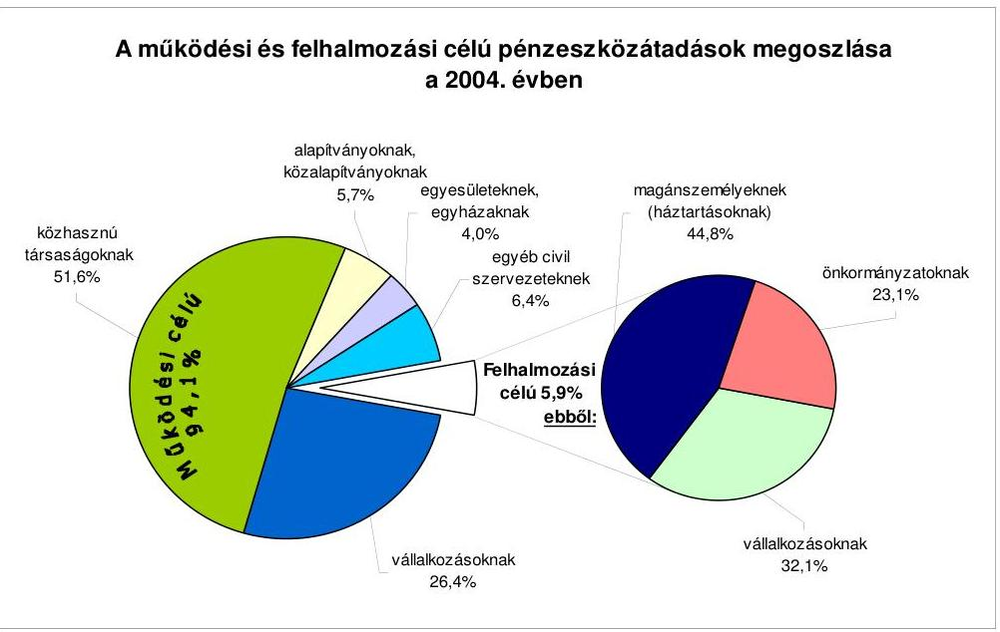
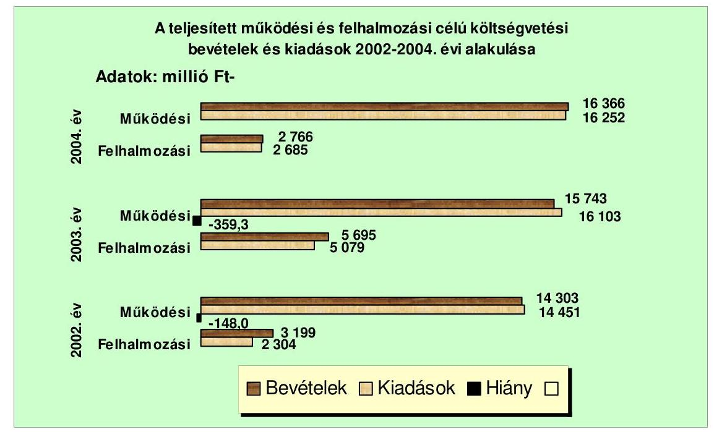
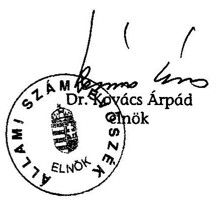
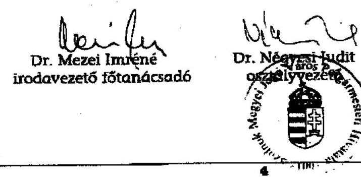
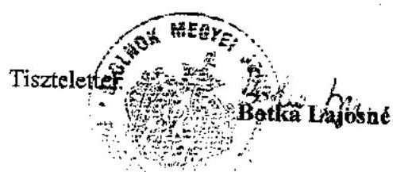

# JELENTÉS 

a Szolnok Megyei Jogú Város Önkormányzata gazdálkodási rendszerének átfogó ellenőrzéséről

---

3. Önkormányzati és Területi Ellenőrzési Igazgatóság
3.3. Átfogó Ellenőrzések Főcsoport
Iktatószám: V-1001-1/33/18/2005.
Témaszám: 749
Vizsgálat-azonosító szám: V0206
Az ellenőrzést felügyelte:
Dr. Lóránt Zoltán
főigazgató
Az ellenőrzés végrehajtásáért felelős:
Dr. Sepsey Tamás
főigazgató-helyettes
Az ellenőrzést vezette:
Csecserits Imréné
főcsoportfőnök-helyettes
Az ellenőrzést végezték:
Dr. Csapó Anna Dr. Mezei Imréné Papp József
tanácsadó főtanácsadó számvevő tanácsos

# A témához kapcsolódó - elmúlt három évben - készített számvevőszéki jelentések: 

címe
sorszáma
Jelentés a helyi és a helyi kisebbségi önkormányzatok 0220
gazdálkodásának átfogó ellenőrzéséről
Jelentés a foglalkoztatást elősegítő támogatások felhasználásának 0226
ellenőrzéséről
Jelentés a helyi önkormányzatok egyes pénzügyi befektetésekkel 0318
történő gazdálkodásának ellenőrzéséről
Jelentés a szakképzési struktúra szerepéről a munkaerő-piaci 0321
igények kielégítésében
Jelentés a települési önkormányzatok szennyvízközmű fejlesztési és 0416
működtetési feladatai ellátásának vizsgálatáról
Jelentés a Magyar Köztársaság 2003. évi költségvetése 0443
végrehajtásának ellenőrzéséről

---

# TARTALOMJEGYZÉK 

BEVEZETÉS ..... 5
I. ÖSSZEGZŐ MEGÁLLAPÍTÁSOK, KÖVETKEZTETÉSEK, JAVASLATOK ..... 7
II. RÉSZLETES MEGÁLLAPÍTÁSOK ..... 16

1. A költségvetés tervezésének, végrehajtásának, az Önkormányzat vagyongazdálkodásának és a zárszámadás elkészítésének szabályszerűsége ..... 16
1.1. A költségvetési rendelet jóváhagyásának, módosításának, az előirányzatok nyilvántartásának szabályszerűsége ..... 16
1.2. A gazdálkodás szabályozottsága, a bizonylati rend és fegyelem szabályszerűsége ..... 23
1.3. A pénzügyi-számviteli feladatok ellátásának informatikai támogatottsága ..... 31
1.4. Az önkormányzati vagyon nyilvántartása, számbavétele ..... 33
1.5. A vagyonnal való gazdálkodás szabályszerűsége, célszerűsége, nyilvánossága ..... 35
1.6. A céljelleggel nyújtott támogatások szabályszerűsége ..... 44
1.7. A közbeszerzési eljárások szabályszerűsége ..... 48
1.8. A zárszámadási kötelezettség teljesítésének szabályszerűsége ..... 52
1.9. A Polgármesteri hivatal helyi kisebbségi önkormányzatok gazdálkodását segítő tevékenysége ..... 54
2. Az önkormányzati feladatok és a rendelkezésre álló források összhangja ..... 55
2.1. A feladatok meghatározása és szervezeti keretei ..... 55
2.2. A költségvetés egyensúlyának helyzete ..... 59
2.3. A feladatok finanszírozása ..... 68
3. A belső irányítási, ellenőrzési rendszer működésének értékelése ..... 71
3.1. Az ellenőrzési rendszer kialakítása, működése ..... 71
3.2. A könyvvizsgálati kötelezettség teljesítése ..... 74
3.3. A korábbi számvevőszéki ellenőrzések javaslatainak hasznosulása ..... 74

---

# MELLÉKLETEK 

1. számú Az Önkormányzat gazdálkodását meghatározó adatok, mutatószámok (1 oldal)
2. számú Az önkormányzati vagyon nagyságának alakulása (1 oldal)
3. számú Az Önkormányzat 2004. évi bevételeinek és kiadásainak alakulása (1 oldal)
4. számú Egyes önkormányzati feladatok finanszírozása (1 oldal)
5. számú Helyszíni ellenőrzési jegyzőkönyv (4 oldal)
6. számú Botka Lajosné polgármester úrhölgy észrevétele (1 oldal)

---

# RÖVIDÍTÉSEK JEGYZÉKE 

| Áht. | az államháztartásról szóló 1992. évi XXXVIII. törvény |
| :--: | :--: |
| Htv. | a helyi önkormányzatok és szerveik, a köztársasági megbízottak, valamint egyes centrális alárendeltségű szervek feladat- és hatásköreiről szóló 1991. évi XX. törvény |
| Kbt. $_{1}$ | a közbeszerzésekről szóló 1995. évi XL. törvény |
| Kbt. 2 | a közbeszerzésekről szóló 2003. évi CXXIX. törvény |
| Ktv. | a köztisztviselők jogállásáról szóló 1992. évi XXIII. törvény |
| Ltv. | a lakások és helyiségek bérletére, valamint az elidegenítésükre vonatkozó egyes szabályokról szóló 1993. évi LXXVIII. törvény |
| Nek.tv. | a nemzeti és etnikai kisebbségek jogairól szóló 1993. évi LXXVII. törvény |
| Ötv. | a helyi önkormányzatokról szóló 1990. évi LXV. törvény |
| Számv.tv. | a számvitelről szóló 2000. évi C. törvény |
| Ámr. | az államháztartás működési rendjéről szóló 217/1998. (XII. 30.) Korm. rendelet |
| Ber. | a költségvetési szervek belső ellenőrzéséről szóló 193/2003. (IX. 26.) Korm. rendelet |
| Vhr. | az államháztartás szervezetei beszámolási és könyvvezetési kötelezettségének sajátosságairól szóló 249/2000. (XII. 24.) Korm. rendelet |
| Kök. | a kisebbségi önkormányzatok költségvetésének, gazdálkodásának, vagyonjuttatásának egyes kérdéseiről szóló 20/1995. (III. 3.) Korm. rendelet |
| Ber. | a költségvetési szervek belső ellenőrzéséről szóló 193/2003. (XI. 26.) Korm. rendelet |
| rt. | részvénytársaság |
| kft. | korlátolt felelősségű társaság |
| kht. | közhasznú társaság |
| áfa | általános forgalmi adó |
| EU | Európai Unió |
| ÁSZ | Állami Számvevőszék |
| Önkormányzat | Szolnok Megyei Jogú Város Önkormányzata |
| Közgyűlés | Szolnok Megyei Jogú Város Önkormányzatának Közgyűlése |
| Polgármesteri hivatal | Szolnok Megyei Jogú Város Önkormányzatának Polgármesteri Hivatala |
| polgármester | Szolnok Megyei Jogú Város Önkormányzatának polgármestere |
| jegyző | Szolnok Megyei Jogú Város Önkormányzatának jegyzője |
| VMZK Kht. | Városi Művelődési és Zenei Központ Közhasznú Társaság |
| PHESZ | Szolnok Megyei Jogú Város Önkormányzata Polgármesteri Hivatalának Ellátó és Szolgáltató Szervezete |

---

SzMSz
ügyrend $_{1}$
ügyrend $_{2}$
közbeszerzési rendelet
vagyongazdálkodási rendelet
ellenőrzési szabályzat
belső ellenőrzési szabályzat
belső ellenőrzési kézikönyv

PEB
Költségvetési bizottság
IBSZ

Szolnok Megyei Jogú Város Önkormányzata 31/2002. (XII. 19.) számú rendelete az Önkormányzat Szervezeti és Működési Szabályzatáról
Szolnok Megyei Jogú Város Önkormányzata polgármesterének és jegyzőjének I. 1986/2003. számú együttes utasítása a Szolnok Megyei Jogú Város Önkormányzata Polgármesteri Hivatalának Ügyrendjéről
Szolnok Megyei Jogú Város Önkormányzata polgármesterének és jegyzőjének I. 20785/2005. számú együttes utasítása a Szolnok Megyei Jogú Város Önkormányzata Polgármesteri Hivatalának Ügyrendjéről
Szolnok Megyei Jogú Város Önkormányzata 16/2001. (V. 29.) számú rendelete a közbeszerzési eljárás részletes szabályairól
Szolnok Megyei Jogú Város Önkormányzata 25/2003. (VII. 9.) számú rendelete az Önkormányzat vagyonáról és a vagyongazdálkodás szabályairól
Szolnok Megyei Jogú Város Önkormányzatának polgármestere és jegyzője által kiadott I. 20785. számú együttes utasítás 6. számú melléklete a jegyző hatáskörébe tartozó pénzügyi-gazdasági ellenőrzések Ellenőrzési Szabályzatáról
Szolnok Megyei Jogú Város Önkormányzata polgármesterének I. 37/1999. számú utasítása a Szolnok Megyei Jogú Város Önkormányzata Polgármesteri Hivatalának Belső Ellenőrzési Szabályzatáról
Szolnok Megyei Jogú Város Önkormányzata Polgármesteri Hivatalának I. 24743/2004. számú Belső Ellenőrzési Kézikönyve
Szolnok Megyei Jogú Város Önkormányzata Közgyűlésének Pénzügyi Ellenőrző Bizottsága
Szolnok Megyei Jogú Város Önkormányzata Közgyűlésének Költségvetési Bizottsága
Szolnok Megyei Jogú Város Önkormányzata jegyzőjének I. 3640/2004. számú utasítása a Szolnok Megyei Jogú Város Önkormányzata Polgármesteri Hivatalának Informatikai Biztonsági Szabályzatáról

---

# JELENTÉS 

## Szolnok Megyei Jogú Város Önkormányzata gazdálkodási rendszerének átfogó ellenőrzéséről

## BEVEZETÉS

Az Ötv. 92. § (1) bekezdése, az Állami Számvevőszékről szóló 1989. évi XXXVIII. törvény 2. § (3) bekezdése, valamint az Áht. 120/A. § (1) bekezdése szerint az önkormányzatok gazdálkodását az ÁSZ ellenőrzi. Az ellenőrzés elvégzése az Országgyűlés illetékes bizottságai részére is átadott, országosan egységes ellenőrzési program alapján történt.

## Az ellenőrzés célja annak értékelése volt, hogy:

- az önkormányzati gazdálkodás törvényességét ${ }^{1}$, szabályszerűségét biztosították-e a tervezés, a költségvetés végrehajtása, a vagyongazdálkodás és a zárszámadás során;
- az Önkormányzat által ellátott feladatok és az azokhoz rendelkezésre álló források összhangja biztosított volt-e, különös tekintettel az egyes kiemelt feladatokra;
- a gazdálkodás szabályszerűségét biztosító belső kontrollok ${ }^{2}$ lehetővé tették-e a szabálytalanságok, hiányosságok, gazdaságtalan megoldások feltárását, megelőzését.

Ellenőrzött időszak: a 2004. év, valamint a 2005. I. félév, az 1.5., 2.1-2.3. és 3.3. programpontok esetében a 2002-2003. évek is.

Szolnok Megyei Jogú Város Jász-Nagykun-Szolnok megye székhelye, lakosainak száma 2005. január 1-jén 76881 fő volt. A 27 képviselőből álló Közgyűlés munkáját hat állandó bizottság segítette. Az Önkormányzat a 2004. évben a Polgármesteri hivatalon kívül 42 önállóan gazdálkodó és két részben önállóan gazdálkodó költségvetési intézményt működtetett, továbbá öt gazdasági és há-

[^0]
[^0]:    ${ }^{1}$ A törvényi előírások betartásának elmulasztásakor a részletes megállapítások fejezetben egységesen a törvénysértés megjelölést alkalmazzuk, mivel az ÁSZ nem tehet különbséget a törvényi előírások között.
    ${ }^{2}$ A gazdálkodás szabályszerűségét biztosító kontroll alatt értjük a kiépített és működő belső irányítási és szabályozási rendszert, valamint a belső ellenőrzési funkciók ellátását.

---

rom közhasznú társaságban rendelkezett többségi tulajdonnal, amelyek részt vettek a feladatok ellátásában. Az Önkormányzat a 2005. évben 21355 millió Ft kiadást tervezett. Az önkormányzati feladatok ellátásához foglalkoztatott közalkalmazottak létszáma 2004. január 1-jén 3429 fő volt, a Polgármesteri hivatalban 268 fő köztisztviselő dolgozott, a könyvviteli mérlegben kimutatott önkormányzati vagyon értéke 65345 millió Ft volt. Az Önkormányzat gazdálkodását meghatározó adatokat, mutatószámokat az 1. számú melléklet tartalmazza. A 2002. évi helyhatósági választások során a polgármester, valamint 2004. július 14-én a jegyző személye változott. Az Önkormányzatnál a 2002. évi önkormányzati választásokat követően két helyi kisebbségi önkormányzat működött (cigány és lengyel). A Polgármesteri hivatal a 2004. évben megszerezte az EN ISO 9001:2000 előírásainak megfelelő minőségbiztosítási tanúsítványt.

A jelentés megállapításainak, javaslatainak egyeztetése során a polgármester arról adott tájékoztatást, hogy az időközben megtett intézkedésekkel a javaslatok egy részét megvalósították. Ezekben az esetekben a jelentés II. Részletes megállapítások fejezetében az adott témához kapcsolt lábjegyzetben a megtett intézkedést feltüntettük és a kapcsolódó javaslatot elhagytuk.

---

# I. ÖSSZEGZŐ MEGÁLLAPÍTÁSOK, KÖVETKEZTETÉSEK, JAVASLATOK 

Az Önkormányzat az Ötv-ben foglaltak alapján a 2004. évben a városfejlesztési célkitűzéseket és azok megvalósításának feltételrendszerét tartalmazó gazdasági programot határozott meg. A polgármester a 2004. és a 2005. évi költségvetési koncepciókat az Áht-ban előírt határidőben terjesztette a Közgyűlés elé, azonban - az Ámr. előírása ellenére - nem csatolta a költségvetési koncepciók előterjesztéseihez a Költségvetési bizottság véleményét, hanem azokat a Közgyűlésen osztották ki. A kisebbségi önkormányzatok elnökeit tájékoztatták a költségvetési koncepciók rájuk vonatkozó célkitűzéseiről, azonban erről a kisebbségi önkormányzatok írásbeli véleményt nem készítettek. A beterjesztett költségvetési koncepciók alapján a Közgyűlés döntött a költségvetés készítés további munkálatairól, melyet a Polgármesteri hivatal a költségvetési rendelettervezetek készítésénél figyelembe vett. A polgármester a költségvetési koncepciók elfogadását követően előterjesztette azokat a rendelettervezeteket is, amelyek a javasolt előirányzatokat megalapozták.

A polgármester a 2004. évi és a 2005. évi költségvetési rendelettervezeteket az Áht-ban előírt határidőben a Közgyűlés elé terjesztette, azonban az Ámr. előírása ellenére a rendelettervezetekhez a könyvvizsgáló és a Költségvetési bizottság írásos véleményét nem csatolta, hanem azokat a Közgyűlésen osztották ki. A 2004. évi és a 2005. évi költségvetési rendeletekben tervezett költségvetési bevételek nem fedezték a költségvetési kiadásokat, a hiányzó összeget - más, egyensúlyt teremtő intézkedések mellett - hitel felvételével tervezték biztosítani. Az Önkormányzat 2004. évi költségvetési rendelete az Áht-ban és az Ámr-ben előírtak ellenére nem tartalmazta elkülönítetten a kisebbségi önkormányzatok költségvetését. A 2005. évi önkormányzati költségvetésbe már az Ámr. előírásának megfelelően a kisebbségi önkormányzatok képviselő-testületeinek határozatai alapján építették be a kisebbségi önkormányzatok költségvetését. A Polgármesteri hivatal költségvetésén belül különböző feladatok támogatási keretösszegét alap elnevezéssel határozták meg, a költségvetésen belül elkülönített pénzügyi keretösszegek alapként történő elnevezése az Áht-ban meghatározott feltételeknek, a Környezetvédelmi Alap kivételével nem felel meg, a kifejezés félreérthető. A Közgyűlés a költségvetési rendeletekben a költségvetés végrehajtásának szabályait meghatározta. Az Áht-ban előírtaknak megfelelően az Önkormányzat rendeletben rögzítette a költségvetések és a zárszámadások előterjesztésekor a Közgyűlés részére tájékoztatásul bemutatandó mérlegek, kimutatások tartalmi követelményeit. Az Áht-ban előírt mérlegeket és kimutatásokat a költségvetési rendeletek mellékleteként bemutatták.

Az Önkormányzat a költségvetési rendelet főösszegét a 2004. évben a módosítások során 4%-kal növelte. A költségvetési rendeletmódosításoknál az Ámr-ben előírt határidőket betartották, a módosításra vonatkozó előterjesztések megfelelő információt biztosítottak a Közgyűlés számára. Az Önkormányzat költségvetési rendeletébe beépült kisebbségi önkormányzati előirányzatok módosítását az Áht-ban foglaltakat megsértve a kisebbségi önkormányzatok határozata nélkül vezették át az Önkormányzat bevételi-kiadási előirányzatain.

---

A Polgármesteri hivatal
 rendelkezett a feladatokat meghatározó szabályzatokkal. A pénzügyi-gazdasági feladatok ellátásáért felelős személyek feladatait, a vezetők és más dolgozók feladat-, hatás- és jogkörét az ügyrendben, 2005. május 1-től az ügyrendben, illetve 2005. július 27-től a Polgármesteri hivatal szervezeti és működési szabályzatában határozták meg. A polgármester és a jegyző együttes utasításban rögzítette az operatív gazdálkodással kapcsolatos hatásköröket. A jegyző a szakmai teljesítés igazolásának módjáról és az azt végző személyek kijelöléséről, valamint az érvényesítők megbízásáról gondoskodott. A felhatalmazottak beszámoltatási módjának szabályozása és a beszámoltatás nem történt meg. A polgármester és a jegyző az operatív gazdálkodással kapcsolatos hatásköröket tartalmazó együttes utasításában az előzetes írásbeli kötelezettségvállaláshoz nem kötött kötelezettségvállalások rendjét és nyilvántartási formáját rögzítette.

A jegyző kialakította a Polgármesteri hivatal és az intézmények számviteli rendjét. A számviteli politikában rögzítették, hogy a számviteli elszámolás szempontjából mit tekintenek lényeges, illetve nem lényeges információnak, valamint jelentős, illetve nem jelentős összegnek. A leltározási és leltárkészítési szabályzatban az évenkénti leltározási kötelezettséget és annak módját meghatározták. Az eszközök és források értékelési szabályzatában az adókövetelések csoportos értékelését választva a dokumentálás szabályait is rögzítették. A pénzkezelési szabályzatban rögzítették a bankszámlák kezelésével kapcsolatos szabályokat, valamint megállapodás alapján a készpénzfizetések sajátos a PHESZ önállóan gazdálkodó költségvetési szerv házipénztárában történő lebonyolításának rendjét. A Polgármesteri hivatal számviteli szabályzatai nem tartalmazták a kisebbségi önkormányzatokkal összefüggő sajátos feladatokat. Az Ámr. előírása ellenére a kisebbségi önkormányzatokhoz kapcsolódó feladatok ellátását az együttműködési megállapodások és saját számviteli szabályzatai alapján a PHESZ önállóan gazdálkodó költségvetési szerv végezte.

Az eszközökről és forrásokról a számlarendben előírt tartalmú analitikus nyilvántartásokat vezették. Az egyeztetési feladatokat a Számv. tv-ben és a számlarendben foglaltaknak megfelelően, dokumentáltan elvégezték. A könyvviteli nyilvántartásokban elszámolt gazdasági műveletekről, eseményekről a Számv. tv. előírásait betartva a számviteli bizonylatokat kiállították, azok adatait a könyvvitelben rögzítették. A készpénzforgalom lebonyolítását - házipénztár kezelés együttműködési szabályzat alapján, a kiskincstári rendszerben, az igényelt pénzfelvétel fedezetének folyamatos biztosítása mellett - a PHESZ önállóan gazdálkodó költségvetési szerv házipénztárában végezték. A Polgármesteri hivatalban a kötelezettségvállalásokról az Ámr-ben előírtaknak megfelelően olyan analitikus nyilvántartást vezettek, amelyből megállapítható az évenkénti kötelezettségvállalás összege. A gazdálkodási hatásköröket az arra jogosultak gyakorolták. Az érvényesítés a szakmai teljesítés igazolásán alapult. A munkafolyamatba épített ellenőrzési kötelezettségének a kötelezettségvállalás ellenjegyzője, a szakmai teljesítést igazoló, az érvényesítő és az utalvány ellenjegyzője, valamint a PHESZ-nél a pénztárellenőr eleget tett. Önkormányzati szinten és a Polgármesteri hivatalnál a 2004. évben a jóváhagyott előirányzatokon belül gazdálkodtak, azonban az önállóan gazdálkodó költségvetési szervek 40%-ánál az Áht. előírását megsértve, a kiemelt előirányzatokat 0,1-14,5% közötti mértékben túllépték. Az előirányzat túllépések okait nem vizsgálták, felelősségre vonás nem történt.

---

A Polgármesteri hivatalban a főkönyvi könyvelés és a beszámoló készítés informatikai támogatottságát biztosították, azonban az analitikus nyilvántartásoknál manuális és számítástechnikai megoldásokat egyaránt alkalmaztak. Informatikai stratégiával, a szükséges üzemeltetési dokumentációval, valamint az alkalmazott programok felhasználói leírásával rendelkeztek. A folyamatos és biztonságos munkavégzéshez az informatikai katasztrófa elhárítási tervet 2005. júliusában elkészítették. Meghatározták a hozzáférési jogosultságot biztosító adatbiztonsági rendszert. A pénzügyi-számviteli területen dolgozók munkaköri leírása - a ténylegesen ellátott feladatok részletezésével - tartalmazta az informatikai rendszer használatát.

Az önkormányzati vagyon nyilvántartásáról, ezen belül a törzsvagyon elkülönítéséről gondoskodtak. A 2004. évi leltározási feladatokat a Vhr., valamint a leltározási szabályzatban foglaltak szerint végezték. A leltárak kiértékelése megtörtént, ennek alapján az eltérések számviteli rendezését elvégezték. Az eszközök és források értékelésekor a Számv. tv-ben foglaltakat érvényesítették.

Az Önkormányzat a vagyonával való gazdálkodás szabályait, a gazdálkodás döntési hatásköreit a vagyongazdálkodási, valamint lakás- és helyiséggazdálkodási rendeleteiben határozta meg. A vagyonhasznosítás nyilvánosságának biztosítása érdekében előírták, hogy az főszabályként pályázati, vagy liciteljárás keretében történhet. A szabályozás azonban lehetőséget adott a versenyeztetés mellőzésével való értékesítésre, hasznosításra is, ezzel megsértették az Áht. előírásait. A szabályozás nem segítette a köztulajdonnal való gazdálkodás nyilvánosságát, átláthatóságát. A vagyongazdálkodási rendeletben rögzítették a vagyon ingyenes átruházásának módját, eseteit, azonban az Áht. előírását megsértve a követelésekről való lemondás módjáról és eseteiről nem rendelkeztek. Célszerűsége ellenére nem határozták meg a vagyongazdálkodás során figyelembe veendő értékbecslések érvényességének határidejét.

Az önkormányzati vagyon számviteli nyilvántartás szerinti értéke a 2002-2004. közötti években megháromszorozódott, 21111 millió Ft-ról 65345 millió Ft-ra növekedett, döntően az ingatlanok értékének a növekedése miatt, melyet háromnegyed részben a korábban érték nélkül nyilvántartott ingatlanok értékmegállapítása okozott. Az Önkormányzat vagyonhasznosítási döntései a költségvetésben megfogalmazott programcélokkal összhangban voltak. A vagyonhasznosítási döntések során betartották a vagyongazdálkodási rendeletben rögzített hatásköri szabályokat. Kettő ingatlanértékesítés esetében a versenyeztetés mellőzésével megsértették az Áht. előírását. Az adásvételi szerződésekben az Önkormányzat érdekeit védő garanciális elemeket rögzítették, meghatározták a fizetési feltételeket, a szerződéstől való elállás eseteit, a birtokbaadás és a tulajdonjog bejegyzés feltételeit. A liciteljárásokban az előírt eljárási rendet betartották. Az Önkormányzat a fejlesztési célú támogatások és a vagyonváltozást érintő - az Áht-ban meghatározott értékhatár feletti - szerződések közzétételét biztosította, az erre vonatkozóan önkormányzati rendeletben előírt nyilvántartás vezetéséről azonban nem gondoskodtak. Az Önkormányzat két párt részére, a bérbe adott helyiség bérleti díjában kedvezményeket biztosított, ezzel közvetve támogatást adott részükre a nem közfeladathoz nyújtott támogatással, nem tett eleget az Ötv. előírásainak, valamint nem biztosította az alkotmányos egyenlőséget a bérlők között.

---

Az Önkormányzat a 2004. évi költségvetéséből összesen 669,2 millió Ft céljellegű támogatást nyújtott. A Közgyűlés bizottságai és a polgármester a támogatási keretek költségvetési rendeletben és a Közgyűlés határozataiban meghatározott felhasználási szabályait betartva döntöttek a támogatások odaítéléséről. Az alapítványok, közalapítványok támogatásainak 53%-ában az Ötv. előírásait megsértették, mivel arról nem a Közgyűlés döntött. A döntéshozók között koordinációra nem került sor, így a támogatott szervezetek az év folyamán több forrásból részesültek támogatásban. A támogatottakkal a támogatás célját, összegét, a felhasználás jogcímeit, a számadás kötelezettségét, módját, határidejét tartalmazó megállapodást kötöttek. Az előírt számadási kötelezettség teljesítését figyelemmel kísérték, a beérkezett dokumentumot tartalmilag és formailag ellenőrizték, azonban a célszerinti felhasználást helyszínen nem ellenőrizték. Megsértették az Áht. előírását a költségvetési szervek által történt társadalmi szervezetek támogatásakor, mivel az nem a Közgyűlés hozzájárulásával történt. Az ÁSZ által helyszínen ellenőrzött Szolnok Város közbiztonságáért Közalapítvány a támogatás célszerinti felhasználását biztosította és az előírt számadási kötelezettségének eleget tett.

Az Önkormányzat 2004. május 31-ig rendeletben szabályozta a közbeszerzés és az értékhatár alatti beszerzések helyi rendjét. A közbeszerzési rendeletben foglaltak alapján lefolytatott közbeszerzési eljárásoknál a törvényben és az önkormányzati rendeletben foglalt előírásokat betartották. Az Önkormányzatnál a 2004. május 1. utáni időszakban a $\mathrm{Kbt}_{2}$-ben biztosított lehetőséggel élve általános érvényű helyi közbeszerzési szabályokat nem alkottak, az eljárások lefolytatása esetén egyedi előírásokat fogalmaztak meg. Az Önkormányzatnál 2004-ben összesen 12 közbeszerzési eljárást folytattak le 1664,1 millió Ft összértékre, amelyből két eljárás indult a Kbt. ${ }_{1}$ hatálya alatt, egy eljárás pedig 933 millió Ft értékű banki hitel felvételére irányult. A 2005. év I. negyedévében 12 közbeszerzési eljárás indult, ezek összértéke 229,4 millió Ft volt.

A polgármester a 2004. évi zárszámadási rendelettervezetet az Áht-ban előírt határidőn belül terjesztette a Közgyűlés elé. A zárszámadási rendelettervezet azonban az Áht-ban előírtakat megsértve nem tartalmazta a Polgármesteri hivatalra vonatkozóan a munkaadót terhelő járulékok, a dologi jellegű kiadások, a speciális célú támogatások előirányzatainak teljesítését, valamint a tényleges létszámkeretet. A zárszámadás előterjesztésekor a Közgyűlés részére bemutatták az Áht. előírása alapján az összevont mérlegeket Önkormányzatra és elkülönítetten a kisebbségi önkormányzatokra, a vagyonkimutatást, szöveges indoklással együtt a többéves kihatással járó döntésekre vonatkozó kimutatást számszerűsítve évenkénti bontásban, valamint összesítve, illetve a közvetett támogatásokat tartalmazó kimutatást. A Közgyűlés a 2004. évi zárszámadási rendeletben a költségvetési szervek Ámr-ben és Vhr-ben foglaltak figyelembevételével számított 2004. évi pénzmaradványát jóváhagyta. Az Ámr-ben előírtaknak megfelelően az intézményeket éves számszaki beszámolójuk és működésük elbírálásáról, jóváhagyásáról írásban értesítették.

Szolnok városban a 2004. évben két kisebbségi önkormányzat működött, amelyekkel az együttműködési megállapodást megkötötték. A Polgármesteri hivatal kisebbségi önkormányzatok munkáját segítő feladatait a Nek. tv. előírásának megfelelően az SzMSz-ben meghatározták. Az együttműködési megállapodásokban az Áht-ban foglaltakat megsértve rögzítették, hogy a kisebbségi

---

önkormányzatok költségvetési és gazdálkodási feladatait a PHESZ látja el a Polgármesteri hivatal helyett, valamint az Ámr. előírása ellenére a kötelezettségvállalások, utalványozások ellenjegyzési feladatainak elvégzésével a jegyző helyett a PHESZ vezetőjét hatalmazták fel. A költségvetési előirányzatok évközi módosításáról szóló kisebbségi önkormányzati képviselő-testületi határozatok Önkormányzat részére átadásának határidejét az Ámr. előírása ellenére nem határozták meg az együttműködési megállapodásokban. A kisebbségi önkormányzatok esetében az Ámr-ben előírtak ellenére belső szabályzatban a jegyző nem adott megbízást az érvényesítés végzésére, és nem jelölte ki a szakmai teljesítést igazoló személyeket. Az együttműködési megállapodások - a költségvetésre és a zárszámadásra vonatkozó előírások kivételével - nem voltak alkalmasak arra, hogy az Önkormányzat és a kisebbségi önkormányzatok együttműködése az operatív gazdálkodás területén a központi előírásoknak megfelelő legyen. A Polgármesteri hivatal nyilvántartásain belül a kisebbségi önkormányzatok számviteli nyilvántartásait elkülönítetten vezették, azonban a kisebbségi önkormányzatok kötelezettségvállalásairól az Ámr. előírása ellenére nem vezettek nyilvántartást.

Az Önkormányzat programjaiban, helyi szabályozásában nem rögzítette kötelező és önként vállalt feladatainak körét, mértékét, ezzel megsértette az Ötv. előírásait. A feladatok ellátásáról az Önkormányzat költségvetési intézmények, közhasznú társaságok, gazdasági társaságok alapításával, valamint szolgáltatókkal kötött koncessziós szerződések, közszolgáltatási szerződések és megállapodások megkötésével gondoskodott. A feladatellátás szervezeti kereteinek alakulását és az intézmények kapacitáskihasználását folyamatosan figyelemmel kísérték, szükség szerint gondoskodtak azok módosításáról. Ennek keretében történt meg a szociális és gyermekvédelmi ellátórendszer áttekintése, valamint az óvodai és iskolai intézményrendszer befogadóképességének ellátotti létszámhoz igazodó felülvizsgálata. A változásokat elemző munka, valamint társadalmi és szakmai egyeztetés előzte meg. Az egyes ellátási területeken felszabaduló erőforrások átrendezésével új szakmai programok indításának és a méretgazdaságossági szempontok érvényesítésének feltételeit teremtették meg. A városkörnyék 17 önkormányzatával közösen a 2004. évben megalakították a Szolnoki Kistérségi Többcélú Társulást, az érdemi munka azonban nem kezdődött meg az eredetileg vállalt időpontban.

Az Önkormányzat a 2002-2004. évi költségvetési rendeleteit forráshiánnyal hagyta jóvá, a hiány fedezetéül hitelfelvételt tervezett. A költségvetések tényadatai alapján költségvetési egyensúlyhiány a 2003. évben a működési célú bevételeknél és kiadásoknál keletkezett, az összege a tervezettnél alacsonyabb volt, mert a fejlesztési kiadások áthúzódtak a következő évre. A 2002. és a 2004. évben a teljesített bevételek fedezték a kiadásokat. A költségvetés egyensúlyát a saját bevételek tervhez viszonyított többleteiből, a feladatok átszervezésével létrejött megtakarításokkal teremtették meg. A fejlesztéseket, beruházásokat a pályázati úton elnyert pénzeszközökből, hitelek felvételével, és a saját bevételek bevonásával valósították meg. A fejlesztési kiadások áthúzódtak a következő évre, annak következtében, hogy az ISPA támogatással, címzett támogatásokkal, valamint a céljellegű decentralizált támogatásokkal kapcsolatos döntések elhúzódtak. A jegyző a pénzállomány várható
 alakulásáról az Ámr. előírása ellenére likviditási tervet nem készített. Az Önkormányzat a likviditási gondok kezelésére a 2002. évben 500 millió Ft, a 2003. évben 1470 millió Ft, a 2005. évben 1754 millió Ft folyószámlahitelt vett igénybe. A Közgyűlés a vizsgált időszakban adósságot keletkeztető kötelezettségvállalásról döntött, felhalmozási célú hitelt vett fel, kezességet vállalt és garanciavállalást tett. Az adósságot keletkeztető kötelezettségvállalások közül a hitel visszafizetési kötelezettség az Ötv-ben előírt felső határérték egyharmadát érte el, a felső határra vonatkozó előírást betartották. Az adósságot keletkeztető kötelezettségvállalások nem veszélyeztették az Önkormányzat működőképességét.

Az Önkormányzat a saját bevételek növelése érdekében 1992-től az iparűzési és az építményadó, 2004-től az idegenforgalmi adó bevezetéséről rendelkezett. A helyi adóbevétel aránya a 2002-2004. években az Önkormányzat összes költségvetési bevételén belül növekedett, ami a szerepének kismértékű emelkedését jelentette. A megállapított adómérték az iparűzési és az építményadónál az alkalmazható mérték maximuma, az idegenforgalmi adónál mintegy kétharmada volt. A helyi adóról szóló törvényben meghatározottakon túlmenően megállapítottak kedvezményeket, mentességeket.

Az Önkormányzat naturális mutatókkal mérhető feladatainak fajlagos kiadása a 2002-2004. évben nőtt, amit elsősorban az összes működési kiadáson belül a személyi jellegű kiadások központi intézkedések miatti emelkedése okozott. A kiadások finanszírozásában a bölcsődei ellátásnál az önkormányzati támogatás, az óvodai nevelés, az általános iskolai és középiskolai oktatás, a nappali és a bentlakásos szociális intézményi ellátás feladatoknál az állami hozzájárulás részaránya volt a meghatározó. A Közgyűlés a 2004. évben áttekintette a közoktatási intézményhálózat kapacitás kihasználását a feladatmutatók alakulásának értékelésével, megfogalmazta 2007-ig az új feladatokat, átszervezéseket, korszerűsítéseket.

A Szigligeti Színház fenntartására, mint önként vállalt feladatra a 2002-2004. években 2128,9 millió Ft-ot fordítottak, ez, valamint a további önként vállalt feladatokra fordított kiadások a pénzügyi egyensúlyt és a kötelező feladatok ellátását nem veszélyeztették.

Az Önkormányzat a fogyatékos személyek mozgásának segítése érdekében a középületek akadálymentesítésére a 2004. évben felmérést készíttetett. A 98 közintézmény akadálymentesítésének becsült költsége 297 millió Ft volt. A 2004. év végére a középületek közül ötnél volt biztosított az akadálymentes megközelítés lehetősége. A fennmaradó 93 épületre vonatkozóan, a fogyatékos személyek jogairól és esélyegyenlőségük biztosításáról szóló törvényben előírtaknak nem tettek eleget, a meghatározott 2005. január 1-jei határidőre a feladatok elvégzését nem biztosították.

Az Önkormányzat az Ötv-ben előírt belső ellenőrzési kötelezettség teljesítéséhez a szervezeti keretek kialakításáról az SzMSz-ben gondoskodott. Az ügyrend$_{1,2}$-ben, illetve 2005. július 27-től a Polgármesteri hivatal szervezeti és működési szabályzatában rögzítették a belső ellenőrzési kötelezettséget, az ellenőrzést végzők jogállását és feladatait. A jegyző az önkormányzati intézmények ellenőrzési feladatait az önálló szervezeti egységként működő Ellenőrzési osztállyal, valamint a Polgármesteri hivatal belső ellenőrzését az osztályszervezetbe nem tartozó belső ellenőrrel, összesen kilenc fővel látta el, a belső ellenőrzési vezetőt 2005. július 27-i hatállyal jelölte ki. Az Ellenőrzési osztály vezetője és a belső ellenőr számára biztosították a funkcionális és szervezeti függetlenséget. A jegyző a belső ellenőrzési kézikönyvet elkészíttette, a stratégiai tervet, a középtávú ellenőrzési tervet valamint a 2004. és a 2005. évi ellenőrzési tervet jóváhagyta. Ellenőrzési program rendszeres használatára a jegyző 2005. augusztus hóban intézkedett. A jelentéseket a Ber-ben foglaltaknak megfelelő tartalommal készítették el. A jelentések javaslatai a gazdálkodás szabályszerűségének javítására, a gazdaságosság, a hatékonyság és az eredményesség érvényesülésének előmozdítására alkalmasak voltak. A Közgyűlés a PEB véleményét is tartalmazó polgármesteri előterjesztés útján folyamatosan áttekintette az ellenőrzések tapasztalatait. A jegyző 2005. júliusában készítette el éves ellenőrzési jelentését, valamint ekkor számolt be a Közgyűlésnek a Polgármesteri hivatalnál és az Önkormányzat intézményeinél a 2004. évben végzett ellenőrzési tevékenységről.

Az Önkormányzat a 2004. évben, a törvényben előírt könyvvizsgálati kötelezettségét költségvetési minősítésű könyvvizsgálóval teljesítette. A Polgármesteri hivatal és intézményei összevont adatait tartalmazó 2004. évi egyszerűsített költségvetési beszámolót a könyvvizsgáló korlátozott záradékkal látta el, mert a Polgármesteri hivatalnál a leltározás és kiértékelés zártságáról, teljes körűségéről meggyőződni nem tudott. A könyvvizsgáló auditálási eltérést nem állapított meg.

A korábbi hat számvevőszéki ellenőrzés 18 szabályszerűségi és 16 célszerűségi javaslatának mintegy kilenctizedét hasznosították. A korábbi átfogó ellenőrzés témaköreit érintő javaslatok megvalósítása során gazdasági programot készítettek, kiegészítették a számviteli szabályzatokat és az analitikus nyilvántartásokat, számba vették az önkormányzati vagyont, bővítették a költségvetési ellenőrzési szempontokat, a pénzügyi-számviteli munkakörökben dolgozók munkaköri leírásaiban részletezték a munkafolyamatba épített ellenőrzési feladatokat. A kiemelt előirányzatok betartását az intézményeknél nem biztosították, a túllépések okait nem vizsgálták, valamint a kötelező és önként vállalt feladatokat nem nevesítették, azok helyett a szakfeladatokat sorolták fel. A foglalkoztatást elősegítő támogatások felhasználásához a közhasznú és közcélú foglalkoztatás elszámolását kialakították, az önkormányzati koordináláshoz az információs bázist létrehozták. A pénzügyi befektetésekkel történő gazdálkodáshoz a vagyoni jog gazdasági társaságban gyakorlásának szabályozását, az analitikus nyilvántartások kiegészítését, a számviteli politika módosítását, a mérleg pontos alátámasztását, az értékvesztések elszámolását és a kiegészítő mellékletben a részesedések arányának bemutatását megvalósították. A piacképes szakmák oktatása érdekében az Önkormányzat és az érintett szervek és intézmények együttműködése a szakképző intézmények személyi, tárgyi feltételeinek ütemezett biztosítása megvalósult. A szakképzés gazdaságosságának javítására irányuló tanulmány elkészítésére megbízást adtak, azonban a felmerült kiadások oktatott szakmánkénti gyűjtését és az egyes szakmák képzési költségigényét nem határozták meg. Ezt a feladatot a Közgyűlés által 2006. januártól létrehozni tervezett szervezet feladatkörébe kívánják beilleszteni. A szennyvízközmű fejlesztés során elkészült beruházás átadás-átvételét végrehajtották, valamint a csatorna-hálózatba be nem kötött ingatlanok bekötésének támogatását kezdeményezték. A beruházásokhoz és rekonstrukciókhoz nyújtott felhalmozási célú támogatásoknál a támogatási és a finanszírozási szerződéseket megkötötték.

A helyszíni ellenőrzés megállapításainak hasznosítása mellett javasoljuk:

# a polgármesternek 

a jogszabályi előírások maradéktalan betartása érdekében

1. a költségvetési gazdálkodás jogszabályszerű kereteinek kialakítása érdekében csatolja az Ámr. 28. § (3) bekezdésében foglaltak alapján a költségvetési koncepció előterjesztéséhez a Költségvetési bizottság tervezetről alkotott véleményét, valamint az Ámr. 29. § (9) bekezdése alapján a költségvetési rendelettervezet előterjesztéséhez a Költségvetési bizottság véleményét és a könyvvizsgáló jelentését;
2. intézkedjen az Áht. 93. § (1) bekezdésében, illetve az Áht. 12/A. § (1) bekezdésében előírtak betartása érdekében, hogy az önkormányzati költségvetési intézmények a jóváhagyott előirányzatokon belül gazdálkodjanak, előirányzat túllépések esetén kezdeményezzen vizsgálatot, illetve felelősségre vonást;
3. intézkedjen az Ötv. 78. § (1) bekezdésben foglaltak érvényre juttatása érdekében arról, hogy a pártok részére megállapított helyiségbérleti díj összhangba kerüljön az Önkormányzat által a hasonló adottságú helyiségek esetében kialakított piaci alapú bérleti díjjal;
4. biztosítsa, hogy az Ötv. 10. § (1) bekezdés d) pontjában foglaltaknak megfelelően az alapítványok, a közalapítványok támogatásáról a Közgyűlés döntsön;
5. intézkedjen az Áht. 94. § (1) bekezdésében foglaltak alapján, hogy az Önkormányzat költségvetési intézményei társadalmi szervezeteket csak közgyűlési hozzájárulással támogassanak;
6. kezdeményezze, hogy a Közgyűlés az Ötv. 8. § (2) bekezdésében foglaltak alapján rögzítse az Önkormányzat kötelező és önként vállalt feladatait és azok ellátásának módját és mértékét;
7. gondoskodjon a középületek akadálymentessé tételéről, tekintettel a fogyatékos személyek jogairól és esélyegyenlőségük biztosításáról szóló 1998. évi XXVI. törvény 29. § (6) bekezdésében előírtakra;
a munka színvonalának javítása érdekében
8. kezdeményezze, hogy a számvevőszéki ellenőrzés tapasztalatait a Közgyűlés tárgyalja meg és a feltárt hiányosságok megszüntetése érdekében készítsen intézkedési tervet;

## a jegyzőnek

a jogszabályi előírások maradéktalan betartása érdekében

1. gondoskodjon az önkormányzati költségvetési rendelet módosításának előkészítése során arról, hogy az Áht. 74. § (3) bekezdésében előírtaknak megfelelően a helyi kisebbségi önkormányzati előirányzatokat kizárólag a helyi kisebbségi önkormányzatok határozata alapján módosítsák;
2. gondoskodjon a zárszámadási rendelettervezet előkészítésekor az Áht. 69. § (1) bekezdésének előírása alapján a Polgármesteri hivatal vonatkozásában a munkaadót terhelő járulék, a dologi jellegű kiadás, a speciális célú támogatás előirányzatai teljesítésének, és a tényleges létszámkeretnek a bemutatásáról;
3. készítse elő és kezdeményezze a kisebbségi önkormányzatokkal kötött együttműködési megállapodások módosítását annak érdekében, hogy az tartalmazza:
a) az Áht. 66. §-ában foglaltak alapján a kisebbségi önkormányzatok gazdálkodásának végrehajtó szerveként a Polgármesteri hivatal kijelölését;
b) az Áht. 74/A. § (2) bekezdésében előírtaknak megfelelően a kötelezettségvállalás, utalványozás ellenjegyzési feladatainak végzésére a jegyző jogosultságát;
c) az Ámr. 53. § (8) bekezdésének előírása alapján a költségvetési előirányzatok évközi módosításáról szóló kisebbségi önkormányzati képviselő-testületi határozatok Önkormányzat részére történő átadásának a határidejét;
4. adjon megbízást az Ámr. 135. § (2)-(3) bekezdésében előírtak alapján belső szabályzatban a kisebbségi önkormányzatok esetében az érvényesítés végzésére, valamint gondoskodjon a szakmai teljesítés igazolására jogosult személyek kijelöléséről;
5. gondoskodjon az Ámr. 134. § (13) bekezdésében foglaltak alapján a kisebbségi önkormányzatok kötelezettségvállalásaihoz kapcsolódóan olyan nyilvántartás vezetéséről, amelyből megállapítható az évenkénti kötelezettségvállalás összege;
6. készítse el az Ámr. 139. § (1) bekezdése alapján az Önkormányzat pénzállományának alakulásáról a likviditási tervet és gondoskodjon annak szükség szerinti aktualizálásáról;
a munka színvonalának javítása érdekében
7. kezdeményezze a költségvetési rendelettervezet előkészítése során a félreérthető önkormányzati pénzalapok elnevezésének a megváltoztatását.

# II. RÉSZLETES MEGÁLLAPÍTÁSOK 

## 1. A KÖLTSÉGVETÉS TERVEZÉSÉNEK, VÉGREHAJTÁSÁNAK, AZ ÖNKORMÁNYZAT VAGYONGAZDÁLKODÁSÁNAK ÉS A ZÁRSZÁMADÁS ELKÉSZÍTÉSÉNEK SZABÁLYSZERŰSÉGE

### 1.1. A költségvetési rendelet jóváhagyásának, módosításának, az előirányzatok nyilvántartásának szabályszerűsége

A Közgyűlés a 236/2004. (X. 28.) számú határozatával elfogadta Szolnok Város Gazdaságfejlesztési Programját, amely tartalmazta a városfejlesztési célkitűzéseket (munkahelyteremtés, lakosság jövedelmi helyzetének javítása, városi kötődés elősegítése) és azok megvalósításának feltételrendszerét. Ezzel az Önkormányzat eleget tett az Ötv. 91. § (1) bekezdésében előírt gazdasági program meghatározási kötelezettségének.

A gazdasági program az infrastruktúrafejlesztés és városrendezés, a városháztartási és közigazgatási reform, Szolnok megítélésének és imázsának javítása, a társadalmi szféra fejlesztése csoportosításban bemutatta az Önkormányzat stratégiai céljait.

A Közgyűlés által elfogadott 2004. és 2005. évi költségvetési koncepciókban$^3$ az Ámr. 28. § (1) bekezdésében foglaltaknak megfelelően a gazdasági program célkitűzéseit, a helyben képződő bevételeket és az ismert kötelezettségeket figyelembe vették.

A kisebbségi önkormányzatok elnökeit tájékoztatták az Ámr. 28. § (6) bekezdése alapján a költségvetési koncepció-tervezet rájuk vonatkozó célkitűzéseiről, azonban erről a kisebbségi önkormányzatok nem adtak írásos véleményt.

A költségvetési koncepciók tervezetét a bizottságok - köztük a Költségvetési bizottság$^4$ - előzetesen megismerték, javaslataikat határozatokban rögzítették, melyeket az Ámr. 28. § (3) bekezdésében foglaltak ellenére a polgármester nem csatolt az előterjesztésekhez, hanem azokat a Közgyűlésen osztották ki.

[^0]
[^0]: $^3$ A Közgyűlés a 2004. évi költségvetési koncepcióról a 271/2003. (XI. 27.) számú, a 2005. évi költségvetési koncepcióról a 250/2004. (XI. 25.) számú határozattal döntött.
    $^4$ 2004. november 30-ig elnevezése az SzMSz 6. § (1) bekezdése szerint Költségvetési és városfejlesztési bizottság.

A polgármester az Áht. 70. §-ában előírt határidőt$^5$ betartva 2003. november 13-án, illetve 2004. november 25-én nyújtotta be a Közgyűlésnek a jegyző által elkészített 2004. és 2005. évi költségvetési koncepciókat.

A költségvetési koncepciókról szóló előterjesztésekben bemutatták a várható működési és felhalmozási bevételek-kiadások alakulását, valamint a hitelek állományát és törlesztésének ütemezését, a kezességvállalás
 összegét. Mindezek alapján megállapították, hogy a tervezett bevételek nem elegendőek a tervezett kiadásokra, ezért külső forrás (hitel) igénybevétele szükséges.

A költségvetési koncepciókról szóló határozatokban az Ámr. 28. § (4) bekezdésében előírtakra figyelemmel a Közgyűlés határozott a költségvetés készítés további munkálatairól.

A költségvetési koncepciók főbb célkitűzései: a 2004. évben a pénzügyi egyensúly megteremtése és megőrzése, az adósságállomány növekedésének megállítása; a 2005. évben a költségvetési intézményeknél a források elosztásával ösztönözni a feladatokkal arányos kapacitások kialakítását.

A 2004. és a 2005. évi költségvetési rendelettervezetekben a Polgármesteri hivatal és az intézmények kiadási és bevételi előirányzatait az Ámr. 26. § (2) bekezdésének előírását betartva, az előző évi eredeti előirányzatból kiindulva, a szerkezeti változások, szintre hozások és előirányzati többletek kimunkálásával határozták meg, továbbá érvényesítették a költségvetési koncepció irányelveit.

A jegyző a 2004. és 2005. évi költségvetési rendelettervezeteket az Ámr. 29. § (4) bekezdésében foglaltaknak megfelelően egyeztette a költségvetési szervek vezetőivel, melynek eredményét intézményenként írásba foglalták. A polgármester a 2004. és a 2005. évi költségvetési rendelettervezeteket az Áht. 71. § (1) bekezdésében előírt határidőt $^{6}$ betartva 2004. február 12-én, illetve 2005. február 11-én nyújtotta be a Közgyűlésnek, amely azokat elfogadva alkotta meg az 5/2004. (II. 27.) számú, illetve az 5/2005. (II. 28.) számú rendeletét. A rendelettervezet előterjesztéséhez - az Ámr. 29. § (9) bekezdésében előírtak ellenére - nem csatolták a Költségvetési bizottság véleményét, és a könyvvizsgáló írásos jelentését, hanem azokat a Közgyűlésen osztották ki.

A közbenső egyeztetés során a polgármester által adott észrevétel szerint: „Az Ámr. 28. § (3) bekezdése értelmében a polgármester a helyi önkormányzatnál működő bizottságok véleményét a szervezeti és működési szabályzatban foglaltak szerint kikéri, és a helyi kisebbségi önkormányzatnak a koncepció tervezetről alkotott véleményével együtt a koncepcióhoz csatolja. A Szolnok Megyei Jogú Város Önkormányzata Szervezeti és Működési Szabályzatáról szóló 31/2002. (XII. 19.) számú KR. rendelet 52. §-ban foglalt rendelkezések alapján a bizottságok, azon előterjesztéseket, melyek az SzMSz melléklete szerint véleményezési jogkörükbe tartoznak, kötelesek véleményezni. Valamennyi bizottság feladat és hatáskörében szerepel a költségvetési koncepció és költségvetési

[^0]
[^0]:    $^{5}$ Az Áht. 70. §-a szerint a következő évre vonatkozó költségvetési koncepciót november 30-ig, a helyi önkormányzati képviselő-testület tagjainak választásának évében legkésőbb december 15-ig kell a Közgyűlésnek benyújtani.
    $^{6}$ Az Áht. 71. § (1) bekezdése szerint a határidő a tárgyév február 15.

---

rendelet tervezetének véleményezése, melyet a vizsgált időszak tekintetében valamennyi bizottság megtett. A véleményekről bizottsági határozatok születtek. A bizottsági határozatokban foglalt véleményeket a Polgármester a napirendi ponthoz csatoltan, annak tárgyalásakor szóban is ismertette, melyet az egyes közgyűlési jegyzőkönyvek rögzítettek, és tartalmaznak. A költségvetési koncepció előterjesztéséhez megfogalmazott javaslat ügyviteli szempontból elfogadható, a működési mechanizmust tekintve nem. A közgyűlésről készített jegyzőkönyvek bekötött példányaiban a költségvetési bizottság véleménye nem a költségvetési koncepció mögött található. Ez azonban nem jelenti azt, hogy ezzel sérült az Ámr. 28. § (3) bekezdésében foglalt előírás. Az Ötv. 10. § (1) bekezdés b) pontja értelmében a Közgyűlés kizárólagos hatáskörébe tartozik működési rendjének meghatározása. A Szolnok Megyei Jogú Város Önkormányzata Szervezeti és Működési Szabályzatáról szóló 31/2002. (XII. 19.) számú KR. rendelet 16. § (3) bekezdésében foglalt rendelkezések alapján a közgyűlés munkaterve tartalmazza: "a) az ülések időpontját (hónap és nap megjelölésével); b) az ülések napirendjét, továbbá az előterjesztések előadóit; c) az előterjesztés előkészítésében közreműködő szerv, vagy személy megnevezését; d) az előterjesztést véleményező bizottság(ok) megjelölését; e) azon témák megjelölését, amelyek előkészítésénél lakossági fórum összehívása szükséges; f) kétfordulós tárgyalásra javasolt előterjesztések megjelölését." Ennek alapján elfogadott munkatervek szerint a hónap utolsó csütörtöki napján kerül sor a Közgyűlés soros ülésének összehívására. A vizsgált időszakban érvényes volt az a szabály, hogy a közgyűlést megelőző héten, illetve a közgyűlési hét hétfői napján zajlottak le a bizottsági ülések. Valamennyi bizottság önálló napirendként tárgyalta a költségvetési koncepciót és alakította ki állásfoglalását, hozta meg döntését. Az Ámr. 29. § (9) bekezdésének véleményem szerint a költségvetési rendelettervezet tárgyalására vonatkozó eljárásrendünk megfelel. Ennek megfelelően a polgármester a képviselő-testület elé terjeszti a bizottságok által megtárgyalt, a pénzügyi bizottság által véleményezett rendelettervezetet, a közgyűlésen az előterjesztéshez csatoltan az előbbiekben említettek szerint szóban ismerteti a bizottsági határozatokba foglalt véleményeket, és az Ötv. 92/A-92/C. §-ok alapján szükséges könyvvizsgáló írásos jelentését is csatolja. Tekintettel arra, hogy az Ámr. hivatkozott bekezdései nem tartalmaznak részletes szabályokat arra vonatkozóan, hogy mit jelent a "csatolás" szó tartalma, így azt sem határozza meg, hogy a csatolást milyen formában kell megvalósítani. Mindezeket figyelembe véve véleményem szerint a témában alkalmazott eljárásrendünk a hatályos jogszabályoknak megfelel."

Az észrevétel nem megalapozott, mert az Ámr. 28. § (3) bekezdése és az Ámr. 29. § (9) bekezdése előírja, hogy a polgármester Közgyűlés elé terjeszti a bizottságok által megtárgyalt, a pénzügyi bizottság által véleményezett költségvetési koncepciókat, valamint költségvetési rendelettervezeteket. A hivatkozott jogszabályból egyértelmű, hogy a Közgyűlés elé a koncepció tervezet, és a rendelettervezet beterjesztésével egyidejűleg kell a pénzügyi bizottság véleményét is csatolni, ezzel biztosítva elegendő felkészülési időt a képviselők számára, hogy az Önkormányzat életében az egyik legfontosabb éves döntéshozatalra megfelelő módon fel tudjon készülni. A költségvetési koncepciókról és rendelettervezetekről alkotott költségvetési bizottsági vélemények előterjesztései és tárgyalásai közötti időszakot - tekintettel a képviselők felkészülési idejére - az SzMSz-ben a Közgyűlés maga határozza meg. A Közgyűlésen a költségvetési koncepció tervezetről és a költségvetési rendelettervezetről történő átgondolt, megalapozott képviselői döntéshez szükséges a Költségvetési bizottság - ezekről alkotott - véleményének ismerete. A Költségvetési bizottsági véleménynek a költségvetési koncepció tervezeteket és a költségvetési rendelettervezeteket napirendként tárgyaló Közgyűlésen történő kiosztása és szóban is történő ismertetése nem felel meg az Ámr. 28. § (3), valamint az Ámr. 29. § (9) bekezdésében előírt követelményeknek, mert nem biztosít elegendő felkészülési időt a képviselői vélemény átgondolt kialakításához, ezért javaslatunkat fenntartjuk.

---

Az éves költségvetési rendelettervezetekben az Áht. 67. § (3) bekezdésében előírtaknak megfelelően a Közgyűlés meghatározta a címrendet, mely szerint a Polgármesteri hivatal és az önállóan gazdálkodó intézmények egy-egy címet alkottak.

A polgármester az Áht. 71. § (2) bekezdésében előírtaknak megfelelően a költségvetési rendelettervezetek előterjesztését megelőzően, a Közgyűlés elé terjesztette azokat a rendelettervezeteket, amelyek a tervezett előirányzatokat megalapozták $^{7}$. Bemutatta továbbá a többéves elkötelezettséggel járó kiadási tételek későbbi évekre vonatkozó kihatásait, illetve az Áht. 71. § (3) bekezdésében előírtakkal összhangban a költségvetési évet követő két év várható előirányzatait.

A 2004. és a 2005. évi költségvetési rendelettervezetek az Áht. 69. § (1) bekezdésében és az Ámr. 29. § (1) bekezdésben foglaltaknak megfelelően tartalmazták:

- az önállóan, illetve részben önállóan gazdálkodó költségvetési szervek bevételeit forrásonként, a pénzügyminiszter elemi költségvetés összeállítására vonatkozó tájékoztatójában rögzített főbb jogcím-csoportonkénti részletezettségben;
- a működési, fenntartási előirányzatokat önállóan és részben önállóan gazdálkodó költségvetési szervenként, intézményen belül kiemelt előirányzatonként részletezve;
- a felújítási előirányzatokat célonként, a felhalmozási kiadásokat feladatonként;
- a Polgármesteri hivatal, mint önállóan gazdálkodó költségvetési szerv működési és felhalmozási célú bevételi és kiadási előirányzatait elkülönítetten, valamint külön tételben a céltartalékot;
- a működési és felhalmozási célú bevételi és kiadási előirányzatokat tájékoztatási jelleggel mérlegszerűen egymástól elkülönítetten, de - a finanszírozási műveleteket is figyelembe véve - együttesen egyensúlyban;
- az éves létszámkeretet önállóan, illetve részben önállóan gazdálkodó költségvetési szervenként és összesen;
- a többéves kihatással járó feladatokat éves bontásban.

[^0]
[^0]:    $^{7}$ Az előterjesztések alapján az Önkormányzat elfogadta a személyes gondoskodást nyújtó szociális és gyermekjóléti ellátások intézményi térítési díjainak megállapításáról szóló 50/2003. (XII. 22.) számú, valamint a 2/2005. (I. 31.) számú; az önkormányzati tulajdonban lévő lakások bérletéről, valamint elidegenítésükről szóló 48/2003. (XII. 22.) számú, valamint a 36/2004. (X. 29.) számú; a helyi iparűzési adóról szóló 52/2003. (XII. 22.) számú, valamint a 48/2004. (XII. 18.) számú; az építményadóról szóló 53/2003. (XII. 22.) számú, valamint a 47/2004. (XII. 18.) számú; az idegenforgalmi adóról szóló 54/2003. (XII. 22.) számú, valamint a 49/2004. (XII. 18.) számú rendeleteket.

---

Elkészítették az év várható bevételi és kiadási előirányzatainak teljesüléséről az előirányzat-felhasználási ütemtervet, valamint bemutatták a költségvetési rendelettervezetben elkülönítetten az EU-s támogatással megvalósuló programok bevételeit, kiadásait.

Az Önkormányzat 2004. évi költségvetési rendelete az Ámr. 29. § (1) bekezdés i) pontjában előírtak ellenére, elkülönítetten a kisebbségi önkormányzatok költségvetését nem tartalmazta. A 2005. évi költségvetési rendelettervezetbe a kisebbségi önkormányzatok költségvetését az Ámr. 29. § (1) bekezdés i) pontja és az Ámr. 32. §-a előírásának megfelelően a kisebbségi önkormányzatok képviselő-testületeinek határozatai alapján építették be.

A 2004. és a 2005. évi költségvetésekben az Áht. 8/A. § (7) bekezdésében előírtakat betartva költségvetési bevételként, illetve költségvetési kiadásként finanszírozási célú pénzügyi műveleteket nem mutattak ki.

# A Közgyűlés a költségvetési rendeletekben meghatározta a költségvetés végrehajtási szabályait: 

- az önállóan gazdálkodó költségvetési szervei részére előírta az Ámr. 53. § (4) bekezdése szerinti előirányzat módosítási jogkör gyakorlásának feltételeit;
- az Áht. 73. § (3) bekezdésében lehetővé tett tartalékkal való rendelkezés jogát a költségvetésben jóváhagyott céltartalék előirányzatok felett, az általa meghatározott keretek között a bizottságaira, és a polgármesterre ruházta át;
- az Áht. 93. § (4) bekezdésében foglaltaknak megfelelően rögzítette, hogy az önállóan gazdálkodó intézmények a többletbevételük terhére is csak a forrásképződés mértékének, illetve ütemének figyelembevételével és az intézmény biztonságos működésének szem előtt tartásával vállalhatnak kötelezettséget, valamint a többletbevételük terhére vállalt, felhalmozási jellegű kiadási előirányzataikat csak a Közgyűlés jóváhagyását követően módosíthatják;
- az Áht. 75. §-ában foglaltak alapján a 2004. évi költségvetésben a polgármester részére biztosított hatáskört a tervezett hiány fedezetére 625 millió Ft - legkedvezőbb törlesztő részletű - hitel felvételéhez, a feladatok teljesítéséhez igazodóan; a 2005. évi költségvetésben tervezett hiány fedezetéhez szükséges hitel felvételével kapcsolatos hatáskört a Közgyűlés megtartotta;
- az Ámr. 66. § (4) bekezdésében foglaltaknak megfelelően rögzítette, hogy a költségvetési intézmények pénzmaradványát felülvizsgálják és jóváhagyják, továbbá az Ámr. 66. § (6) bekezdés g) pontja alapján megállapította a pénzmaradvány elvonására vonatkozó előírásokat.

A költségvetésen belül különböző feladatok támogatására elkülönített keretösszegeket határoztak meg, melyek alapként történő elnevezése megtévesztő, ugyanis az Áht. az elkülönített pénzalapokra használja az alap kifejezést és meghatározza azok létrehozásának, gazdálkodásának felté-

---

teleit. Az Áht. 54. §-ában meghatározott feltételeknek az Önkormányzat által létrehozott alapok - a Környezetvédelmi Alap $^{8}$ kivételével - nem felelnek meg, a kifejezés félreérthető. Az államháztartás rendszerében meghatározott feltételekhez kötött fogalomnak eltérő tartalmú alkalmazása bizonytalanságot, az egyértelműség hiányát okozza.

A közbenső egyeztetés során a polgármester által adott észrevétel szerint: „Az "alapok" elnevezés alkalmazása megítélésünk szerint nem okoz félreértést. Az Áht. IV. fejezete az

 elkülönített állami pénzalapokra vonatkozó szabályokat tartalmaz. A fejezeten belül a jogalkotó az "elkülönített állami pénzalap" megnevezést egységesen "alap" kifejezésként használja. Az 54. § (1) bekezdése határozza meg pontosan, hogy mely alapok minősülnek elkülönített állami pénzalapnak, annak létrehozása, rendeltetése, bevételi forrásai, a teljesíthető kiadásai, valamint a rendelkezésre jogosult kör figyelembe vétele mellett. Véleményem szerint azon alapok, melyek tartalmuk alapján megfelelnek ennek a kritériumrendszernek, azok minősülnek elkülönített állami pénzalapnak, és azokra kell az Áht. vonatkozó rendelkezéseit alkalmazni. Példaként kívánom megemlíteni, hogy hasonlóan az önkormányzat által létrehozott alapokhoz, a Befektetővédelmi Alap sem minősül tartalmi szempontból elkülönített állami pénzalapnak. Véleményem szerint a fogalmi azonosság nem jelent tartalmi azonosságot egyben.

Az észrevétel nem megalapozott, mivel az Áht. az elkülönített állami pénzalapokat az államháztartás egyik alrendszereként határozza meg, és szóhasználatában röviden alapoknak nevezi ezeket. Az Áht. a IV. fejezetében külön kitér az alapok működtetésének (pl. sajátos bevételi forrásainak) szabályaira. Az Áht. 54. § (1) bekezdése hangsúlyozza, hogy alapot létrehozni csak törvénnyel lehet. Álláspontunk szerint az egyértelműség érdekében szükséges az államháztartás egyik alrendszerét jellemző és kifejező jogi-szakmai terminológiát megtartani. Az Áht-ban hivatkozott törvényi előírás alapján az önkormányzatoknál lehetőség van az Áht-ban előírt feltételeknek megfelelő Környezetvédelmi Alap létrehozására, azonban további önkormányzati alapok létrehozására vonatkozó törvényi felhatalmazás jelenleg nincs. A félreérthetőség elkerülése érdekében indokolt az államháztartás egyik alrendszerét jellemző és működésének rendszerét kifejező tartalmilag jogszabályban meghatározott alap elnevezésnek az államháztartás más alrendszerében is az Áht-ban foglaltakat figyelembe véve történő alkalmazása. Az észrevételben hivatkozott Befektetővédelmi Alap nem tartozik az államháztartás rendszerébe, ezért nem hasonlítható az önkormányzat által létrehozott alapokhoz. Az elnevezés módosítására vonatkozó javaslatunkat ezért fenntartjuk.

A Közgyűlés a 2004. évi zárszámadási rendelet mellékletében és a 2005. évi költségvetési rendeletben jóváhagyta - a tárgyévi és a következő évek költségvetéseinek és zárszámadásainak előterjesztésekor - az Áht. 118. §-ában előírtak szerint tájékoztatásul bemutatandó mérlegek, kimutatások tartalmi követelményeit. A közvetett támogatások a gépjárműadó és az iparűzési adókedvezmény bemutatására vonatkoztak.

A Közgyűlés tájékoztatása céljából a költségvetések előterjesztésekor mindkét évben az Áht. 118. §-ban foglaltak alapján bemutatták az összevont mérlegeket önkormányzatra és a 2004. évben nem, azonban a 2005.

[^0]
[^0]:    ${ }^{8}$ A Környezetvédelmi Alap létrehozására az önkormányzatok felhatalmazást kaptak a környezet védelmének általános szabályairól szóló 1995. évi LIII. törvény 58. § (1) bekezdésében.

---

évben elkülönítetten a kisebbségi önkormányzatokra vonatkozóan, valamint szöveges indokolásokkal a kimutatásokat a több éves kihatással járó döntések számszerűsítéséről évenkénti bontásban és a közvetett támogatásokról (adókedvezményekről).

Az Önkormányzat a költségvetést a 2004. évben ${ }^{9} 627,3$ millió Ft, a 2005. évben ${ }^{10} 873,6$ millió Ft hiánnyal állapította meg. A költségvetési hiány finanszírozásához szükséges pénzügyi fedezetet - más egyensúlyt teremtő intézkedések mellett - hitel felvételével tervezték biztosítani.

A Közgyűlés a 2004. évi költségvetési rendeletet nyolc ${ }^{11}$, a 2005. évit egy ${ }^{12}$ alkalommal módosította és az abban jóváhagyott előirányzatok főösszegét a módosítások során 3,8%-kal (751,1 millió Ft-tal) növelte. Az előirányzatok évközi módosítását a központi költségvetési támogatások növekedése, a saját bevételekben bekövetkező változások, az előző évi pénzmaradvány igénybevétele, valamint a kiadási jogcímek közötti átcsoportosítás indokolta.

A költségvetési előirányzatok módosítására előterjesztett rendelettervezetek a költségvetéssel összehasonlítható módon tartalmazták a módosítási javaslatokat. Az előterjesztésekben részletes számadatokkal indokolták a módosítások okait és a Közgyűlés számára megfelelő információt biztosítottak a rendeletek módosításaihoz.

Az előirányzat-változtatásokat hitelt érdemlően dokumentálták. A 2004. és a 2005. évi költségvetési rendeletekben jóváhagyott előirányzatokról és az azokban bekövetkezett változásokról önkormányzati szinten és költségvetési szervenkénti bontásban nyilvántartást vezettek.

Az Önkormányzatnál a költségvetési rendelet módosítására előírt határidőket betartották. A központi költségvetési kapcsolatokban biztosított pótelőirányzatokkal az Ámr. 53. § (2) bekezdésében előírtakat betartva legalább negyedévente módosították a költségvetési rendeletet. Az Önkormányzat a 2004. évben és a 2005. év első negyedévében nem kapott olyan központi támo-

[^0]
[^0]:    ${ }^{9}$ A 2004. évi költségvetés kiadási főösszege 19781,9 millió Ft, és bevételi főösszege 19 154,6 millió Ft, a tervezett hiány 627,3 millió Ft (ebből: működési célú hiány 799,9 millió Ft, felhalmozási célú többlet 172,6 millió Ft).
    ${ }^{10}$ A 2005. évi költségvetés kiadási főösszege 21355 millió Ft, a bevételi főösszege 20 481,4 millió Ft, a tervezett hiány 873,6 millió Ft (ebből: működési célú hiány 690,6 millió Ft, felhalmozási célú hiány 183 millió Ft).
    ${ }^{11}$ A Közgyűlés 11/2004. (IV. 29.), 10/2004. (V. 5.), 22/2004. (VI. 25.), 28/2004. (VIII. 26.), 32/2004. (X. 5.), 33/2004. (X. 12.), 45/2004. (XII. 18.), 3/2005. (I. 31.) számú rendeleteivel.
    ${ }^{12}$ A Közgyűlés 21/2005. (VI. 30.) számú rendeletével.

---

gatást ${ }^{13}$, pótelőirányzatot, amely indokolta volna a költségvetési rendelet módosítását. A Közgyűlés a 2004. és a 2005. évi költségvetési rendeletekben szabályozta az intézmények saját hatáskörű előirányzat módosításaira vonatkozó tájékoztatási és rendeletmódosítási rendet. A rendeletmódosításra előírt időpontokban - betartva az Ámr. 53. § (6) bekezdésében előírt 30 napon belüli határidőt - a polgármester tájékoztatta a Közgyűlést az önállóan gazdálkodó költségvetési szervek által saját hatáskörben végrehajtott előirányzat módosításokról.

Az Önkormányzat a 2004. évi költségvetési rendeletét december 31-i hatállyal az Ámr. 53. § (2), (6) bekezdésében előírt határidőn belül ${ }^{14}$ a 2005. január 31-i ülésen a 3/2005. (I. 31.) számú rendeletével módosította.

Az Önkormányzat költségvetési rendeletében a helyi kisebbségi önkormányzatok 2004. évi költségvetési előirányzatait négy alkalommal az előző évi pénzmaradvány összegével, a többletbevételekkel az Áht. 74. § (3) bekezdését megsértve, továbbá az Ámr. 53. § (8) bekezdésének előírása ellenére a kisebbségi önkormányzatok erre felhatalmazó határozatai nélkül módosították.

# 1.2. A gazdálkodás szabályozottsága, a bizonylati rend és fegyelem szabályszerűsége 

A Közgyűlés a Polgármesteri Hivatal szervezeti felépítését, munka- és ügyfélfogadási rendjét az SzMSz 1. számú mellékletében rögzítette. A Polgármesteri Hivatal alapító okiratában foglaltak részletezését az ügyrend$_{1,2}$-ben, illetve 2005. július 27-től a Polgármesteri Hivatal szervezeti és működési szabályzatában rögzítették. A szabályozásban részletezték a Polgármesteri Hivatal szakfeladatait, azonban az Ámr. 10. § (4) bekezdés b) pontjában előírtak ellenére az állami feladatként ellátott alaptevékenységet, benne elhatároltan a kisegítő, kiegészítő tevékenységeket, valamint az azokat meghatározó jogszabályokat nem jelölték meg.

A pénzügyi-gazdasági feladatok ellátásáért felelős személyek feladatait, a vezetők és más dolgozók feladat-, hatás- és jogkörét a Polgármesteri Hivatal ügyrendjében ${ }^{15}$, illetve 2005. július 27-től a szervezeti és működési szabályzatában határozták meg.

[^0]
[^0]:    ${ }^{13}$ Az Önkormányzat eredeti előirányzatként megtervezte a különböző kötött felhasználású normatív támogatásokat, a támogatási szerződésekkel alátámasztott felhalmozási bevételeket, melynek következtében a központi költségvetésből kapott támogatások összegeivel nem kellett a költségvetési rendeletet június hóig módosítani.
    ${ }^{14}$ A költségvetési beszámoló felügyeleti szervhez történő megküldésének külön jogszabályban meghatározott határidejéig, amely a Vhr. 10. § (1) bekezdése alapján február 28.
    ${ }^{15}$ Az ügyrend$_{1}$-ben és 2005. május 1-től az ügyrend$_{2}$-ben.

---

A polgármester és a jegyző együttes utasításban ${ }^{16}$ - a személyek név szerinti kijelölésével - rögzítette az operatív gazdálkodással kapcsolatos hatásköröket.

Ennek keretében:

- a polgármester felhatalmazást adott: az éves költségvetési rendeletben jóváhagyott előirányzatok feletti kötelezettségvállalási jog gyakorlására az Ámr. 134. § (3) bekezdésében ${ }^{17}$ foglaltak alapján a három alpolgármester részére, valamint egyes igazgatási kiadások esetében a jegyző számára; az Ámr. 136. § (2) bekezdése alapján az utalványozási jog gyakorlására az alpolgármesterek, a jegyző és egy főosztályvezető számára;
- a jegyző felhatalmazta: az Ámr. 134. § (3) bekezdésében ${ }^{18}$ alapján a kötelezettségvállalás ellenjegyzési jog gyakorlásával az aljegyzőt, két főosztályvezetőt, valamint a Költségvetési Osztály öt ügyintézőjét; az Ámr. 137. § (2) bekezdése alapján az utalványozás ellenjegyzési jog gyakorlásával az aljegyzőt, két főosztályvezetőt és egy osztályvezetőt;
- a jegyző a szakmai teljesítés igazolásának módjáról - „a szakmai teljesítést igazolom" szöveg és dátum, aláírás feltüntetésével - és az azt végző személyek kijelöléséről az Ámr. 135. § (3) bekezdésében foglaltaknak megfelelően az operatív gazdálkodással kapcsolatos részletes hatásköröket tartalmazó együttes utasításban gondoskodott.

A jegyző érvényesítési jogkör gyakorlásával kilenc személyt bízott meg, azonban közülük egy - az érvényesítés ellátására helyettesítőként megbízott - költségvetési ügyintéző nem rendelkezett az Ámr. 135. § (2) bekezdésében előírt szakmai végzettséggel. Az operatív gazdálkodással kapcsolatos hatáskörökről szóló polgármesteri és jegyzői együttes utasítást a jogkörök gyakorlását érintő személyi változások ellenére (az aljegyző és a Városüzemeltetési főosztályvezető távozása, valamint aljegyző kinevezése) nem aktualizálták ${ }^{19}$.

Az operatív gazdálkodással és ellenőrzéssel kapcsolatos jogkörök kialakításánál, a felhatalmazásoknál és kijelöléseknél az Ámr. 135. § (5) bekezdésében és az Ámr. 138. §-ban foglalt összeférhetetlenségi követelményeket betartották. A jegyző azonban nem rendelkezett a felhatalmazottak beszámoltatásának

[^0]
[^0]:    ${ }^{16}$ A polgármester és a jegyző az ellenőrzött időszakban hatályos az operatív gazdálkodással kapcsolatos hatáskörökről szóló 9725/2003. és 3970/2004. számú együttes utasítását 2003. január 1-jén, valamint 2004. február 9-én, illetve ez utóbbi módosítását 2004. április 26-án és 2004. június 22-én léptették hatályba.
    ${ }^{17}$ A 2005. év január 1-től számozása az Ámr. 134. § (2) bekezdésére módosult.
    ${ }^{18}$ A 2005. év január 1-től számozása az Ámr. 134. § (2) bekezdésére módosult.
    ${ }^{19}$ A közbenső egyeztetés során tett polgármesteri észrevétel szerint „Az operatív gazdálkodással kapcsolatos hatáskörökről szóló polgármesteri és jegyzői együttes utasítást átdolgozták. Az új szabályozás 2005. október 10-én lépett hatályba, amely megszüntette a szakmai képesítéssel nem rendelkező munkatárs érvényesítési megbízását, valamint tartalmazza a személyi változásokra is figyelemmel, aktualizáltan a jogkör gyakorlók megjelölését."

---

módjáról és formájáról és a beszámoltatás a 2004. évben, valamint 2005. I. negyedévében nem történt meg ${ }^{20}$.

Az operatív gazdálkodással kapcsolatos hatásköröket tartalmazó polgármesteri és jegyzői együttes utasításban az előzetes írásbeli kötelezettségvállaláshoz nem kötött kötelezettségvállalások rendjét és nyilvántartási formáját rögzítették, azonban az Ámr. 134. § (2) bekezdésében ${ }^{21}$ foglalt 50 ezer Ft-ot el nem érő kifizetési értékhatár ellenére 2004. április 26-tól 100 ezer Ft-os értékhatárt határoztak meg, amelyet a 2005. július 18-án hatályba léptetett 1. számú kiegészítéssel a jogszabályi előírásnak megfelelően módosítottak.

A jegyző a Htv. 140. § (1) bekezdés c) pontja alapján kialakította a Polgármesteri Hivatal és az intézmények számviteli rendjét.

A Polgármesteri Hivatal számviteli politikájában ${ }^{22}$ és a kapcsolódó szabályzatokban a feladatokat a helyi sajátosságoknak megfelelően határozták meg. A számviteli politikában a lényegesség elvének érvényesítéséhez rögzítették, hogy a számviteli elszámolás szempontjából mit tekintenek lényeges, illetve nem lényeges információnak, valamint jelentős, illetve nem jelentős összegnek.

Ezek alapján:

- a megbízható
 és valós kép kialakítását lényegesen befolyásoló hiba, ha a megállapítások következtében a saját tőke és tartalékok együttes értéke 10%-kal változik. A Polgármesteri hivatal saját tőkéjének és tartalékának együttes összege a 2004. évi éves beszámoló adatai szerint 52266 millió Ft volt, ezáltal a megbízható és valós képet lényegesen befolyásoló hiba - 5227 millió Ft - indokolatlanul magas összeg volt. A jegyző 2005. július 18-án kiadott számviteli politika módosítása során a 10%-os értéket 1%-ra csökkentette.
- a jelentős összegű hiba nagyságát a mérleg főösszeg 2%-ában jelölték meg, amely a Polgármesteri hivatal 2004. évi költségvetési mérleg főösszege figyelembevételével 1141 millió Ft volt. A jelentős összegű hiba nagyságrendje - figyelembe véve a közpénzekkel történő gazdálkodással szembeni fokozott és szigorú elszámolási igényt - indokolatlanul magas volt, valamint meghaladta a Vhr. 5. § 8. pontjában előírt 2004. január 1-től alkalmazandó maximálisan 100 millió Ft-os értéket. A jegyző 2005. július 18-án kiadott számviteli politika módosítása során a jelentős összegű hiba értékhatárát 100 millió Ft-ban határozta meg.
${ }^{20}$ A közbenső egyeztetés során tett polgármesteri észrevétel szerint az operatív gazdálkodással és ellenőrzéssel felhatalmazottak esetében a jogkör gyakorlásának tapasztalatairól a hetenkénti vezetői és főosztályvezetői értekezleteken az aktuális feladatokhoz kapcsolódóan kerül sor beszámoltatásra. Ennek alapját a Polgármesteri hivatal számítástechnikai rendszerében rögzített és folyamatosan vezetett kötelezettségvállalási nyilvántartás képezi. A Polgármesteri hivatal szervezeti és működési szabályzatának 9. számú melléklete, amely a Polgármesteri hivatal ellenőrzési nyomvonaláról szól, tartalmazza a felhatalmazással biztosított hatáskörök gyakorlásának szabályozását. A melléklet „kötelezettségvállalás, utalványozás, érvényesítés, ellenjegyzés teljesítése" c. fejezete tételesen rögzíti a jogkör jogosultjának és gyakorlóinak feladatát.
${ }^{21}$ Számozása 2005. január 1-től (3) bekezdésre módosult.
${ }^{22}$ A jegyző a számviteli politikát 2004. és 2005. január 1-től léptette hatályba.

---

A számviteli politikában meghatározták a Vhr. 8. § (5) bekezdés a)-b), és g) pontjaiban előírtaknak megfelelően, hogy mit tekintenek figyelembe veendő szempontnak a megbízható és valós összkép kialakítását befolyásoló lényeges információnál; a kis értékű tárgyi eszközök, vagyoni értékű jogok és szellemi termékek minősítésénél; a terven felüli értékcsökkenés elszámolásánál. A Polgármesteri hivatalnál vállalkozást nem folytattak, készleteket nem raktároztak, valamint a piaci értékelés lehetőségével nem éltek. Rögzítették a Vhr. 8. § (8) bekezdése alapján a mérlegkészítés időpontját (február 15.), ameddig az értékelési feladatokat el kell végezni, illetve ameddig a költségvetési évre vonatkozóan a könyvekben helyesbítések végezhetők.

Az eszközök és források leltározási és leltárkészítési szabályzatában ${ }^{23}$ meghatározták az eszközök és források évenkénti leltározási kötelezettségét, a leltározás módját, az értékelés szabályait, a leltározás és a könyvvitel adatainak egyeztetési módját, a leltározás és az értékelés ellenőrzésének, valamint a leltárkülönbözetek megállapításának és rendezésének szabályait. A szabályzatban a Vhr. 37. §-ban foglaltak ellenére az ellenőrzött időszakban nem rendelkeztek az üzemeltetésre, kezelésre átadott eszközök leltározásának sajátos feltételeiről, amelyet a jegyző 2005. július 18-án hatályba léptetett kiegészítésével pótolt.

Az eszközök és források értékelési szabályzatában ${ }^{24}$ rögzítették az eszközök bekerülési, (beszerzési) és előállítási értékébe beszámító kifizetések, ráfordítások tartalmát és megnevezését eszközcsoportonkénti részletezésben. A számviteli politikában a terven felüli értékcsökkenés, valamint az értékvesztés elszámolásának, visszaírásának eszközcsoportonként részletezett rendjét szabályozták. A Vhr. 31/A. § (1)-(3) bekezdésében foglalt lehetőséggel élve az adókövetelések csoportos értékelését rögzítették, valamint az adókövetelések negyedévenkénti besorolásának elveit ${ }^{25}$, dokumentálásának szabályait a Vhr. 8. § (18) bekezdésében foglaltaknak megfelelően részletezték.

A Polgármesteri hivatalnál saját kivitelezésben beruházási tevékenységet nem folytattak, rendszeresen terméket nem állítottak elő és nem értékesítettek, valamint szolgáltatást nem nyújtottak, ezért a Vhr. 8. § (4) bekezdés c) pontja alapján önköltségszámítás rendjére vonatkozó belső szabályzat készítésére nem voltak kötelezettek.

[^0]
[^0]:    ${ }^{23}$ A jegyző az eszközök és források leltározási és leltárkészítési szabályzatát 2001. május 20-tól léptette hatályba, azt többször módosította.
    ${ }^{24}$ A jegyző az eszközök és források értékelési szabályzatát 2004. január 1-től léptette hatályba.
    ${ }^{25}$ A szabályozás szerint az alábbi minősítési kategóriákat alkalmazták: 0-90 nap között 0%, 91-180 nap között 20%, 181-360 nap között 50%, 360 napon túl 80%, folyamatos működésben korlátozott adós (felszámolás, végelszámolás alatt) esetében 90% az értékvesztés.

---

A pénzkezelési szabályzatban ${ }^{26}$ rögzítették az Ámr. 103. § (2), (6) és (7) bekezdése alapján megnyitható bankszámlák körét, rendeltetését és az azok felett rendelkezésre jogosultak megnevezését, azoknak a bankszámláknak a felsorolását, amelyekről készpénz vehető fel, az ügyfélterminál használatának, valamint az előlegek, utólagos elszámolásra átadott összegek nyilvántartásának, elszámolásának rendjét.

A Polgármesteri hivatal készpénzfizetéseinek a PHESZ önállóan gazdálkodó költségvetési szerv házipénztárában történő teljesítését együttműködési szabályzatban, illetve a pénztári forgalom ${ }^{27}$ bonyolítására vonatkozó előírásokat a PHESZ-nél, annak pénzkezelési szabályzatában rögzítették. Ebben meghatározták az elszámolás szabályait, a házipénztár keretösszegét (400 ezer Ft), a pénztáros helyettesítésének rendjét, a pénztár átadásának, átvételének és a házipénztáron kívüli pénzkezelésnek a szabályait, a pénztárellenőrzésért felelős munkaköröket, az azzal kapcsolatos teendőket és azok gyakoriságát, valamint a szigorú számadás alá vont nyomtatványok, nyilvántartások kezelésével, elszámolásával kapcsolatos teendőket.

A felesleges vagyontárgyak hasznosításáról, selejtezéséről szóló szabályzatban ${ }^{28}$ rögzítették a feleslegessé minősítésre jogosultak munkakörét, a hasznosítás során követendő eljárási rendet, az ármegállapítás szabályait, a selejtezés bizonylati rendjét, a kiselejtezett eszközökkel, illetve a vonatkozó nyilvántartásokkal kapcsolatos feladatokat. Továbbá rögzítették a döntéshozatalra jogosultak körét meghatározó vagyongazdálkodási rendeletre hivatkozást, amely alapján 25 millió Ft felett a Közgyűlés, 1-25 millió Ft között a Költségvetési bizottság, 0,5-1 millió Ft között a polgármester, 0,5 millió Ft alatt a jogszerű használó szerv vezetője dönthetett.

A számlarend ${ }^{29}$ a Számv. tv. 161. § (2) bekezdésében, valamint a Vhr. 49. § (1)-(2) bekezdésében foglaltaknak megfelelően tartalmazta az alkalmazott főkönyvi számlák, alszámlák számát, megnevezését, tartalmát, értékváltozásának jogcímeit, alapbizonylatait, a főkönyvi számlát érintő gazdasági eseményeket, a főkönyvi számlák kapcsolatát. Továbbá a Vhr. 49. § (4) bekezdésében foglaltak alapján az analitikus nyilvántartások adataiból készített összesítő bizonylatok, feladások elkészítésének határidejét, a főkönyvi számla és az analitikus nyilvántartás kapcsolatát, az analitikus nyilvántartások formáját, tartalmát, vezetését, a főkönyvi könyveléssel való egyeztetetését. A számlarendben meghatározták a havi, negyedéves, éves zárlati feladatokat, az egyeztetések dokumentálási módját.
${ }^{26}$ A jegyző a pénzkezelési szabályzatot 2001. április 1-től léptette hatályba.
${ }^{27}$ A pénztári forgalom a kiskincstári rendszerben az igényelt pénzfelvétel fedezetének folyamatosan biztosítása mellett, a 2005. szeptember 12-én a Gazdasági és Városfejlesztési Főosztály vezetője által kiállított tanúsítvány alapján átlagosan, hetente 15 db bizonylaton 556 ezer Ft értékű volt.
${ }^{28}$ A jegyző a felesleges vagyontárgyak hasznosításának selejtezésének szabályzatát 2001. május 20-tól léptette hatályba.
${ }^{29}$ A jegyző a számlarendet 2004. és 2005. január 1-től léptette hatályba.

---

A kisebbségi önkormányzatokkal kötött együttműködési megállapodások szerint, azok költségvetési és gazdálkodási feladatait - az Ámr. 12. § (3) bekezdésében, valamint az Ámr. 57. § (5) bekezdésében foglaltaktól eltérően - a Polgármesteri hivatal kisebbségi önkormányzatokra vonatkozó operatív gazdálkodási feladataival együtt a PHESZ önállóan gazdálkodó költségvetési szerv a saját számviteli szabályzatai alapján látta el. A Polgármesteri hivatal számviteli szabályzatai (számviteli politikája, leltározási, értékelési, pénzkezelési és selejtezési szabályzata, valamint számlarendje) a kisebbségi önkormányzatokkal összefüggő sajátos feladatokat a Kök. 15. §-ában, valamint a Vhr. 8. § (3) bekezdésében foglaltak ellenére nem tartalmazták. A jegyző a számviteli politika 2005. július 18-án kiadott módosítása szerint „a kisebbségi önkormányzatokhoz kapcsolódó feladatok ellátását a kisebbségi önkormányzatokkal kötött együttműködési megállapodások alapján a PHESZ végzi. A kisebbségi önkormányzatokra vonatkozó szabályozást a PHESZ számviteli politikája és annak mellékleteit képező szabályzatai tartalmazzák".

A Polgármesteri hivatalnál az operatív gazdálkodás, illetve a számviteli politika különböző területeinek rendjét meghatározó szabályzatok megalkotása során a jogszabályi előírásokat és a helyi sajátosságokat nem vették figyelembe az operatív gazdálkodással kapcsolatos hatásköröket tartalmazó polgármesteri és jegyzői együttes utasítás aktualizálása, valamint a kisebbségi önkormányzatokkal összefüggő sajátos feladatok meghatározása területén. A pénzügyi, gazdálkodási és számviteli feladatellátásra készített belső szabályzatok egymással, az ügyrenddel, illetve 2005. július 27-től a Polgármesteri hivatal szervezeti és működési szabályzatával összhangban voltak.

A Polgármesteri hivatalnál a pénzügyi-számviteli területen dolgozók számára a Ktv. 1. § (7) bekezdés a) pontjában és a Ktv. 11. § (6) bekezdésében foglalt előírásoknak megfelelően, az ellenőrzési és egyeztetési feladatokat tartalmazó munkaköri leírásokat elkészítették.

A pénzügyi-számviteli munkafolyamatoknál a munkaköri leírásokban, valamint a pénzügyi gazdálkodási és számviteli feladatellátásra készített szabályzatokban az ellenőrzési pontokat kijelölték, az ellenőrzéskor elvégzendő műveleteket, az ellenőrzés viszonyítási alapját, az eltérések megállapításának és dokumentálásának módját, és eltérés esetén szükséges teendőket, jelzési kötelezettséget meghatározták. A pénzügyi-számviteli dolgozók munkaköri leírásaiban az ellenőrzési feladatok között szerepeltették:

- a főkönyvi könyvelés és az analitikus nyilvántartások egyeztetését, az intézményektől beérkező havi, negyedéves pénzforgalmi jelentéseknek, az intézményi beszámolóknak, valamint a beérkező számláknak a felülvizsgálatát, a szállítói számlanyilvántartás egyeztetését, az operatív gazdálkodási és ellenőrzési jogkörök gyakorlására vonatkozó és a Polgármesteri hivatalban kiépített minőségügyi rendszer működésével kapcsolatos előírások betartását;
- az érvényesítési és ellenjegyzési jogkör gyakorlásával kapcsolatos feladatokat.

---

A pénzügyi gazdálkodási és számviteli feladatellátásra készített szabályzatok és a munkaköri leírások folyamatba épített ellenőrzésre vonatkozó előírásai egymással összhangban voltak.

A jegyző az Ámr. 145/B. § (1) bekezdésben előírtaknak megfelelően elkészítette a Polgármesteri hivatal tervezési, pénzügyi lebonyolítási és ellenőrzési folyamatainak szöveges, valamint táblázatba foglalt és folyamatábrákkal szemléltetett ellenőrzési nyomvonalát ${ }^{30}$.

A Polgármesteri hivatalnál 2005. május 1-től az ügyrend ${ }_{2}$, illetve 2005. július 27-től a Polgármesteri hivatal szervezeti és működési szabályzata 7-8. mellékletében az Áht. 121. § (3) bekezdés a) pontjában foglalt valamennyi gazdálkodással kapcsolatos tevékenység és cél, valamint a szabályszerűség, szabályozottság és megbízható gazdálkodás elvei összhangjának megteremtése érdekében Szabálytalanságok kezelésének eljárásrendjét, valamint Kockázatkezelési szabályzatot léptettek hatályba.

A Polgármesteri hivatalban a főkönyvi számlákhoz a Vhr. 9. számú mellékletében és a számlarendben meghatározott tartalommal és formában analitikus nyilvántartásokat vezettek. A főkönyvi könyvelés, az analitikus nyilvántartások, valamint a bizonylatok adatai közötti egyeztetési pontokat a Számv. tv. 165. § (4) bekezdésében foglaltaknak megfelelően, logikailag zárt rendszerrel biztosították.

A főkönyvi könyvelés és az analitikus nyilvántartások adatainak egyeztetését a Vhr. 49. § (3) és az Áht. 121. § (3) bekezdés c) pontjában foglalt elveknek megfelelően a számlarendben meghatározott időpontokban (legalább negyedévente) és módon, dokumentáltan végrehajtották. Az éves beszámoló összeállítását megelőzően a 2004. évi könyvviteli mérleget és a pénzforgalmi kimutatást a Vhr. 17. számú melléklete szerinti főkönyvi kivonattal alátámasztották.

A Polgármesteri hivatalnál a bizonylati rendet a Számv. tv. 161. § (2) bekezdés d) pontjában foglaltaknak megfelelően a számlarendben rögzítették. A könyvviteli nyilvántartásokban elszámolt gazdasági műveletekről, eseményekről a Számv. tv. 165. § (1)-(2) bekezdésében előírt számviteli bizonylatokat kiállították. A gazdasági eseményeket magukba foglaló banki és pénztári bizonylatok
 a Számv. tv. 167. § (1) bekezdésében foglalt alaki és tartalmi követelményeknek megfeleltek. A Polgármesteri hivatal pénzforgalmát érintő gazdasági műveletekről szóló számviteli bizonylatok adatait a Vhr. 51. § (1) bekezdés a) pontjának megfelelően bankszámla esetén - a pénzintézeti értesítés megérkezésekor a könyvvitelben hiánytalanul, megfelelő számlákon rögzítették. A készpénzforgalom lebonyolítását - házipénztár kezelési együttműködési szabályzat alapján - a kiskincstári rendszerben az igényelt pénzfelvétel fedezetének folyamatos biztosítása mellett a PHESZ önállóan gazdálkodó költségvetési szerv házipénztárában végezték.

[^0]
[^0]:    ${ }^{30}$ A polgármester és a jegyző a Polgármesteri hivatal ellenőrzési nyomvonalát az ügyrend ${ }_{2}$ 9. számú mellékletével 2005. május 1-től léptette hatályba, illetve 2005. július 27-től azt a Polgármesteri hivatal szervezeti és működési szabályzatának 9. számú melléklete tartalmazza.

---

A költségvetési pénzforgalmat érintő gazdasági események bizonylatainak adatait a banki tételeknél a pénzintézeti értesítés megérkezésekor rögzítették a főkönyvi könyvelésben.

Az egyéb gazdasági műveletek bizonylatainak adatait, valamint az analitikus nyilvántartásokból készített összesítő feladások tételeit - a gazdasági események megtörténte után - a tárgynegyedévet követő hó 15. napjáig a Vhr. 51. § (1) bekezdés b) pontjának megfelelően rögzítették. A Polgármesteri hivatalban a bevételeket és a kiadásokat a költségvetés szerkezeti rendjének megfelelően könyvelték.

A Polgármesteri hivatalban a kötelezettségvállalásokról az Ámr. 134. § (6) ${ }^{31}$ bekezdésében előírtaknak megfelelően olyan analitikus nyilvántartást vezettek, amelyből megállapítható az évenkénti kötelezettségvállalás összege. A kötelezettségvállalás nyilvántartás folyamatos vezetésének eredményeként a Polgármesteri hivatal kötelezettségvállalásait a jóváhagyott kiadási előirányzatok mértékéig teljesítették.

A Polgármesteri hivatalnál a banki és a - PHESZ-hez irányított - pénztári pénzmozgások bizonylatain a kötelezettségvállalást, a kötelezettségvállalás ellenjegyzését, a szakmai teljesítés igazolását, az érvényesítést, az utalványozást, és az utalványozás ellenjegyzését arra jogosultak végezték. Az operatív gazdálkodással kapcsolatos hatásköröket tartalmazó polgármesteri és jegyzői együttes utasításban az előzetes írásbeli kötelezettségvállaláshoz nem kötött kötelezettségvállalások esetében tévesen meghatározott 100 ezer Ft-os értékhatárt nem alkalmazták, hanem az Ámr. 134. § (4) bekezdésében ${ }^{32}$ foglalt 50 ezer Ft-ot el nem érő kifizetési értékhatárt vették figyelembe. Utasításra kötelezettségvállalás ellenjegyzése, vagy utalványozás ellenjegyzése nem történt. Az érvényesítés a szakmai teljesítés igazolásán alapult. A helyettesítőként megbízott - az Ámr. 135. § (2) bekezdésében előírt szakmai végzettséggel nem rendelkező - érvényesítő a jogkört nem gyakorolta. Az utalványokon (utalványrendeleteken) az Ámr. 136. § (4) bekezdés h) pontjában meghatározottaknak megfelelően a kötelezettségvállalás nyilvántartásba vételének sorszámát feltüntették.

A Polgármesteri hivatalnál az összeférhetetlenségi szabályok érvényesülését az Ámr. 135. § (5) bekezdése, valamint az Ámr. 138. § (1)-(3) bekezdésében foglaltaknak megfelelően a gazdálkodási, ellenőrzési jogkörök gyakorlása során biztosították.

A munkafolyamatba épített ellenőrzési kötelezettségének a kötelezettségvállalás ellenjegyzője, a szakmai teljesítést igazoló, az érvényesítő és az utalvány ellenjegyzője, valamint a PHESZ-nél a pénztárellenőr eleget tett.

A 2004. évben önkormányzati szinten és a Polgármesteri hivatalnál a Közgyűlés által jóváhagyott előirányzaton belül gazdálkodtak, azonban az önállóan

[^0]
[^0]:    ${ }^{31}$ A 2005. év január 1-től számozása az Ámr. 134. § (3) bekezdésére módosult.
    ${ }^{32}$ Számozása 2005. január 1-től (3) bekezdésre módosult.

---

# gazdálkodó költségvetési szervek közül kettő az intézményi szintű, 16 pedig a kiemelt előirányzatokat túllépte. 

Két intézmény - a II. számú Óvodai Igazgatóság és a Bölcsődei Igazgatóság - túllépte 316 ezer Ft-tal ( $0,1 \%-\mathrm{kal})$ és 4553 ezer Ft-tal ( $0,9 \%-\mathrm{kal})$ az intézményi szintű előirányzatát, 16 intézmény pedig hét kiemelt előirányzatát. Az intézményi előirányzat túllépések a módosított előirányzathoz viszonyítva 63 ezer Ft $(0,1 \%)$ és 13297 ezer Ft (14,5\%) között szóródtak. Két intézménynél, a II. számú Óvodai Igazgatóságnál és a Tallinn Általános Iskolánál előirányzat nélkül teljesített felhalmozási kiadás (649 ezer Ft, 30 ezer Ft,) és felújítási kiadás (681 ezer Ft, 105 ezer Ft) volt.

Az előirányzat túllépésekkel az intézményeknél megsértették az Áht. 93. § (1) bekezdésében foglaltakat, mely szerint a költségvetési szerv a jóváhagyott előirányzatokon belül köteles gazdálkodni, valamint az Áht. 12/A. § (1) bekezdésének előírását, mely szerint tárgyévi fizetési kötelezettség a jóváhagyott kiadási előirányzatok mértékéig vállalható. A túllépések okait azok megállapításakor nem vizsgálták, felelősségre vonás nem történt.

A közbenső egyeztetés során a polgármester által adott észrevétel szerint: „Az Áht. 93. § (1) bekezdésében foglalt szabály megsértése miatt kezdeményezett intézkedésekkel kapcsolatban tájékoztatom, hogy az intézményi ellenőrzésekről szóló jegyzőkönyvek tartalmaznak intézkedések megtételére vonatkozó javaslatokat, illetve az ellenőrzési megállapítások a pénzügyi ellenőrző bizottság ülésén megtárgyalásra kerülnek. Az előirányzat túllépések okait minden esetben vizsgáljuk, és minden esetben felhívtuk az intézményvezető figyelmét a kiemelt előirányzatok betartására. A számvevői jelentésben említett II. számú Óvodai Igazgatóság vizsgálata jelenleg tart, befejezését követően a pénzügyi ellenőrző bizottság elé kerül a megállapításról készített összefoglaló. Tapasztalataink azt igazolják, hogy az intézményi túllépések alapvető oka, hogy az intézményi hatáskörben végrehajtható költségvetési előirányzat-módosítások kezdeményezése elmarad, vagy a felhasználásra előirányzat-módosítás nélkül kerül sor. Erre a hiányosságra tervezési értekezleten, intézményvezetőknek, gazdaságvezetőknek tartott egyéb fórumokon, illetve a költségvetési rendelet elfogadását követően az intézményeknek írt levélben eddig is felhívtuk a figyelmet. Fontosnak tartom ugyanakkor azt is kiemelni, hogy az Áht. 93. § (2)(4) bekezdéseiben foglalt többletbevételek felhasználásának szabályait, illetve a bevételek körét rendeletben szabályoztuk."

Az észrevétel nem megalapozott, mert az Áht. 93. § (1) bekezdésében, illetve az Áht. 12/A. § (1) bekezdésében foglaltak alapján a költségvetési szervek a jóváhagyott előirányzatokon belül kötelesek gazdálkodni, azonban ennek betartatására az intézményeknek írt figyelemfelhívó levél és az érintett körből egyes költségvetési szervek éves tervben ütemezett belső ellenőrzése nem elegendő. Az intézményeknél az előirányzatok tapasztalt túllépésének kivizsgálására és megelőzés érdekében intézkedés megtételére a 2001. évben lefolytatott ÁSZ átfogó ellenőrzés során is tettünk javaslatokat. Az észrevételben hivatkozott, éves ütemezés szerint elvégzett intézményi ellenőrzések során tett javaslatok, valamint a jelzett figyelemfelhívások nem minősültek elegendőnek. A továbbra is tapasztalt előirányzat túllépések miatt a megállapítást és a kapcsolódó javaslatot továbbra is fenntartjuk.

### 1.3. A pénzügyi-számviteli feladatok ellátásának informatikai támogatottsága

A Polgármesteri hivatalban a főkönyvi könyvelés és a beszámoló készítés informatikai támogatottságát biztosították. A pénzügyi számviteli fel-

---

adatok ellátását biztosító külső fejlesztésű szoftverek egy-egy részterülethez kapcsolódtak. Az analitikus nyilvántartások közül az áfa, a beruházások, a felújítások, a részesedések, az értékpapírok, a követelések, kötelezettségek, aktív és passzív függő, átfutó, kiegyenlítő elszámolások, működési és felhalmozási célú pénzeszköz-átadások analitikus nyilvántartásainak vezetését manuálisan végezték. Az analitikus nyilvántartások programjai által előállított listákból a főkönyvi könyvelés részére nyújtott feladásokat manuálisan készítették.

A Polgármesteri hivatalnál a 2004. évben a pénzügyi-számviteli területen dolgozók által használt, a költségvetési gazdálkodás feladatait támogató informatikai feltételrendszert 400 ezer Ft értékben (nyomtató vásárlásával), valamint a 2005. évben a Kincstártól térítésmentesen átvett több modulos költségvetési gazdálkodási programrendszerrel bővítették, amelynek a főkönyvi könyvelési modulját használták.

Az Informatikai osztály által készített és a polgármester, valamint a jegyző által 2004. május 26-án jóváhagyott Polgármesteri hivatal Informatikai Fejlesztési Terve tartalmazta az informatikai stratégiát, az informatikai rendszer hosszú távra vonatkozó fejlesztési irányainak kijelölését.

Az Informatikai Fejlesztési Terv tartalmazta az önkormányzati feladatok hatékony elvégzéséhez nyújtható számítógépes támogatás tervezésére, az erőforrások megteremtésére és elosztására, működtetésére, a fejlődés irányainak kijelölésére, a lehetőségek kihasználására vonatkozó stratégiai elemeket. Az Informatikai Fejlesztési Terve a Közgyűlés nem tárgyalta meg, azt a benyújtott informatikai fejlesztést szolgáló pályázatokhoz mellékelték.

A Polgármesteri hivatalban a folyamatos és biztonságos munkavégzéshez informatikai katasztrófa elhárítási tervet az ellenőrzött időszakban nem készítettek, azt a jegyző 2005. július 12-én a 24 820/2005. iktatási számon hagyta jóvá.

Az adatmentési és adatmegőrzési eljárásokat IBSZ-ben ${ }^{33}$ rögzítették. Meghatározták a hozzáférési jogosultságot biztosító adatbiztonsági rendszert, ezen belül az adatok fizikai és logikai védelmét, valamint az adatkezelést, az adatmentési eljárásokat, azok gyakoriságát és felelőseit.

A Polgármesteri hivatalban működő informatikai rendszer folyamatát és használatát bemutató üzemeltetési leírással rendelkeztek.

Az Informatikai osztályon a hardver eszközöket (azokat felépítő részegységeket), az üzemeltetett szoftvereket egyedileg (használó szervezeti egységenként és személyenként) nyilvántartották.

A Polgármesteri hivatal informatikai rendszerének biztonságos és a feladatellátást segítő üzemeltetésének feltételeit biztosították.

[^0]
[^0]:    ${ }^{33}$ A szabályzatot 2004. február 1-től a 3640/2004. számú jegyzői utasítással léptették hatályba.

---

A Polgármesteri hivatalban a pénzügyi és számviteli területen alkalmazott felhasználói programok működtetéséhez szükséges részletes üzemeltetési dokumentációval és felhasználói leírásokkal rendelkeztek.

A pénzügyi-számviteli informatikai rendszert alkalmazó 23 fő 30%-a (hét fő) rendelkezett a számítógépes feladat ellátásához szükséges igazolt alapfokú informatikai képzettséggel. Felhasználói számítógép-kezelői alaptanfolyamokon, illetve az alkalmazott számítógépes programok használatának elsajátításához szükséges, a programokat készítő szervezet által lebonyolított képzéseken a dolgozók 48%-a (11 fő) vett részt.

A pénzügyi-számviteli területen dolgozók munkaköri leírása - a ténylegesen ellátandó feladatok részletezésével - tartalmazta az informatikai rendszer használatát.

# 1.4. Az önkormányzati vagyon nyilvántartása, számbavétele 

Az Önkormányzat számviteli rendje és számviteli szabályzata meghatározta a vagyon nyilvántartásának módját. A törzsvagyon elkülönített nyilvántartásáról - megfelelve a Vhr. 9. számú melléklet 1/k. pontjában foglaltaknak - a főkönyvi könyvelésben, a főkönyvi számlák tovább tagolásával gondoskodtak.

Az ingatlanok, részesedések, értékpapírok, üzemeltetésre, kezelésre átadott eszközök, követelések, kötelezettségek, pénzeszközök főkönyvi számláihoz analitikus nyilvántartás kapcsolódott, azok értékadatai a 2004. évi könyvviteli záráskor a főkönyvi nyilvántartással egyezőek voltak. Az üzemeltetésre és koncessziós kezelésbe adott eszközök analitikus nyilvántartását - szerződéses kötelezettség alapján, a Polgármesteri hivatal által meghatározott tartalommal - a vagyont kezelő szervezetek vezették. A főkönyvi és az analitikus nyilvántartások egyeztetése, a változások átvezetése az év folyamán negyedévenként történt.

Az Önkormányzat 2004. évi összevont könyvviteli mérlegében üzemeltetésre és koncessziós kezelésbe adott eszközök is szerepeltek. Ezen eszközök könyvviteli mérleg szerinti értéke a 2003. év végén 10842,6 millió Ft, a 2004. év végén 11 493,6 millió Ft volt, amely természetben az Önkormányzat koncessziós üzemeltetésbe adott vízi közmű, távhő szolgáltatási eszközeit, valamint a lakás és nem lakás célját szolgáló helyiségeket jelentette. A vízi közmű fejlesztés keretében létrejött vagyonelemek növekményét a Polgármesteri hivatal számviteli nyilvántartásaiban - megfelelve a Vhr. 20. § (1) bekezdésében foglaltaknak koncessziós üzemeltetésbe adott eszközként mutatták ki.

A 2004. évi leltározási feladatokat a leltározási szabályzatban foglaltaknak megfelelően hajtották végre. Az ingatlanoknál a Vhr. 37. § (3) bekezdésében foglaltaknak megfelelve 2004. december 31-i fordulónappal mennyiségi felvételekkel történő leltározást hajtottak végre. A részesedéseknél és az értékpapíroknál a leltározást az analitikus nyilvántartások főkönyvi könyveléssel történő egyeztetésével végezték, amelyről az egyezőség megállapítását tartalmazó jegyzőkönyv készült. Az üzemeltetésre, kezelésre átadott eszközök esetében a leltározást az üzemeltetést végző szervezetek végezték, amelyet egyeztettek a Polgármesteri hivatal számviteli nyilvántartásával. A vevői

---

követelések, adósok és egyéb követelések, rövid- és hosszú lejáratú kötelezettségek év végi leltározását az analitikus nyilvántartások és főkönyvi kivonatok, valamint a vevőkkel, adósokkal, szállítókkal történő egyeztetéssel hajtották végre.

A leltározás befejezéséről kiértékelő záró-jegyzőkönyv készült, amelyben főkönyvi számlánként rögzítették a leltári
 eltéréseket. A 2004. évi leltározás során 21 tétel kapcsán 971,3 millió Ft leltári többletet és 325,3 millió Ft leltári hiányt állapítottak meg. A leltári eltérések kivizsgálásáról tételes feljegyzés készült, amelyben rögzítették, hogy az eltérések a számviteli nyilvántartások és az ingatlan vagyonkataszter vezetésének és az előző leltározás hiányos elvégzése miatt következett be. A leltári eltérések számviteli rendezése megtörtént, felelősségre vonásra - az eltérések előfordulási okaira figyelemmel - nem került sor.

A Polgármesteri hivatalnál az eszközök és források értékelése az értékelési szabályozásnak megfelelően történt.

A részesedések, követelések, értékpapírok év végi értékelését elvégezték, az azt megalapozó információk rendelkezésre álltak. Az Önkormányzat CITY Rt-ben lévő 9 millió Ft-os összegű 1,3%-os tulajdoni részesedése 2004-ben teljes egészében leírásra került. Az értékvesztés elszámolását a piaci tényezők alátámasztották, a kárpótlási jegyek befektetésével foglalkozó CITY Rt-nél a saját tőke-jegyzett tőke aránya tartósan 21%-ra csökkent. A gazdasági társaságokban lévő önkormányzati tagsági részesedések után 2004-ben értékvesztés elszámolására, illetve korábban elszámolt értékvesztés visszaírására - figyelemmel a Számv. tv. 54. § (2), (3) bekezdésében foglaltakra - nem került sor. A társaságok nyereségesen gazdálkodtak, a saját tőke-jegyzett tőke aránya javult.

Az Önkormányzat értékvesztéssel csökkentett részesedéseinek a 2004. év végi könyvviteli mérleg szerinti értéke 687,1 millió Ft volt, amelyet négy rt-ben ${ }^{34}$, négy kft-ben ${ }^{35}$, valamint négy kht-ban ${ }^{36}$ különböző arányú tulajdoni részesedésként birtokolt. A részesedések a 2004. év végén a könyvviteli mérleg főösszegének 1,2%-át képviselték.

Tartós hitelviszonyt megtestesítő értékpapírként 35 ezer Ft névértékű kárpótlási jegyet tartottak nyilván. Az Önkormányzat egyéb értékpapírral nem rendelkezett.

A tartósan adott kölcsönök (munkáltatói kölcsön, lakáshitel-tartozások), az egyéb hosszú lejáratú követelések (lakásértékesítés hátraléka), az adósokkal, vevőkkel szembeni követelések körében egyaránt vizsgálták, majd elvé-

[^0]
[^0]:    ${ }^{34}$ Amfóra Rt., Remondis Rt., Dohányfermentáló Rt., Szolnok TV Rt.
    ${ }^{35}$ Szollak Kft., Logiszol Kft., Ipari Park Kft., Remondis Kétpó Kft.
    ${ }^{36}$ VMZK Kht., Munkalehetőség a Jövőért Kht., Sportcentrum Kht., Észak-Alföldi Regionális Termálvízhasznosító Kht.

---

gezték az értékelési dokumentumokkal alátámasztott értékvesztés és visszaírás elszámolását.

A követelések teljes állományával összefüggésben 2004-ben 131,7 millió Ft értékvesztés visszaírást számoltak el, ezzel a 2004. év végére az elszámolt értékvesztés összege 175,7 millió Ft volt. Az adókövetelések értékelésekor a hátralékállományt minősítették, majd az elmúlt évek behajtási tapasztalataira alapozva öt értékvesztés elszámolási kategóriát alakítottak ki.

Az elszámolt értékvesztés és visszaírás számviteli elszámolása a Vhr. 32. § (2) bekezdésében foglaltak szerint történt.

# 1.5. A vagyonnal való gazdálkodás szabályszerűsége, célszerűsége, nyilvánossága 

Az Önkormányzat a vagyongazdálkodással kapcsolatos feladatait és a döntési hatásköröket a Htv. 138. § (1) bekezdés j) pontjában foglalt előírás alapján vagyongazdálkodási ${ }^{37}$, illetve a lakás ${ }^{38}$ és a helyiségek ${ }^{39}$ gazdálkodásáról szóló rendeletekben határozta meg.

A vagyongazdálkodási rendelet személyi hatályát az Önkormányzatra és szerveire, költségvetési szerveire, az Önkormányzat vagyontárgyait szerződéses kötelezettség alapján kezelő vagy üzemeltető szervezetre, magánszemélyre, az önkormányzati tulajdonú, illetve önkormányzat tulajdoni részesedésével működő gazdasági és közhasznú társaságokba delegált igazgatósági és felügyelő bizottsági tagokra, az e társaságokban tulajdonosi képviseleti joggal megbízott személyekre is kiterjesztették. A vagyongazdálkodási rendelet megalapozta az üzemeltetőkkel kötött szerződéses megállapodások vagyonkezelésre vonatkozó előírásait.

A teljes vagyoni kört érintően rögzítették a vagyontárgyak minősítési, nyilvántartási előírásait, a tulajdonosi jogok gyakorlásának keretfeltételeit. Rendelkeztek - a Közgyűlés döntési körébe utalva - a vagyon forgalomképesség szerinti besorolásának megváltoztatási módjáról. A vagyongazdálkodási hatásköröket a vagyon forgalomképesség szerinti besorolásához igazodóan, vagyoncsoportonként értékhatártól függően, a hasznosítás módjára tekintettel differenciáltan, célszerűen állapították meg.

[^0]
[^0]:    ${ }^{37}$ Az Önkormányzat a vagyongazdálkodási rendeletet megalkotása óta három alkalommal - az 56/2003. (XII. 23.); a 20/2004. (VI. 7.); és a 24/2004. (VI. 25.) számú rendeletekkel - módosította. A 2004. évi módosítások leglényegesebb eleme a koncesszióba adott vagyonra vonatkozó különleges szabályok megalkotása, az évenkénti tételes mennyiségi felvételre alapozott leltárkészítés előírása, a vagyontárgyak értékesítési szabályainak pontosítása volt.
    ${ }^{38}$ Az Önkormányzat az önkormányzati tulajdonban lévő lakások bérletéről, valamint elidegenítésükről szóló 11/2003. (IV. 1.) számú rendeletét utoljára 2004. október 29-én módosította.
    ${ }^{39}$ Az Önkormányzat az önkormányzati tulajdonban lévő helyiségek bérletéről szóló 18/1994. (IV. 29.) számú rendeletét utoljára 2004. március 29-én módosította.

---

A Közgyűlés kizárólagos hatáskörébe tartozott:

- a korlátozottan forgalomképes törzsvagyon körében a 25 millió Ft feletti nyilvántartási értékű tárgyi eszköz értékesítéséhez, használatra való átengedéséhez, hasznosításához, selejtezéshez való hozzájárulás;
- korlátozottan forgalomképes vagyontárgy megterhelése;
- vagyoni besorolástól függetlenül a 25 millió Ft feletti ingatlan értékesítéséről, hasznosításáról való döntés licit vagy pályázati eljárás keretében;
- vállalkozói vagyon önkormányzati érdekből való ingyenes vagy jelképes ellenértékű átruházása, vállalkozásba való bevitele.

A Költségvetési bizottság hatáskörébe tartozott:

- korlátozottan forgalomképes törzsvagyon körében az 1 millió Ft feletti, 25 millió Ft alatti nyilvántartási értékű tárgyi eszköz hasznosításához, selejtezéséhez való egyetértés megadása; ilyen értékű ingatlan értékesítéséről, selejtezéséről való döntés licit vagy pályázati eljárás keretében;
- vállalkozói vagyonba tartozó 7-25 millió Ft közötti forgalmi értékű vagyon elidegenítése, licit vagy pályázati eljárás keretében;
- vállalkozói vagyonba tartozó vagyontárgy öt évet vagy bruttó 15 millió Ft forgalmi értékhatárt meghaladó bérbeadása (határozatlan időre szóló bérbeadás esetén a bérleti díj öt évre eső összegét figyelembe véve);
- az elidegenítés során alkalmazásra kerülő pályázati és liciteljárás részletes feltételeinek megállapítása.

A polgármester hatáskörébe tartozott:

- a törzsvagyon elemeinek öt évet meghaladó, vagy határozatlan időre szóló bérbeadásához való hozzájárulás;
- a korlátozottan forgalomképes vagyon körében a 0,5-1 millió Ft közötti tárgyi eszköz értékesítéséhez, hasznosításához, selejtezéséhez való egyetértés megadása; ilyen értékű ingatlan értékesítéséről, hasznosításáról, selejtezéséről való döntés, licit vagy pályázati eljárás keretében;
- a vállalkozói vagyon hétmillió Ft értékhatár alatti elidegenítése, forgalmi értékbecslés alapján;
- a vállalkozói vagyonba tartozó vagyontárgy öt év alatti vagy bruttó 15 millió Ft forgalmi értékhatárt el nem érő bérbeadásáról való döntés (határozatlan időre szóló bérbeadás esetén a bérleti díj öt évre eső összegét figyelembe véve);
- az önkormányzati vagyon elidegenítésével, bérbeadásával, megterhelésével, vagyoni állapot változásával nem járó tulajdonosi nyilatkozatok megtétele.

A hatáskörök gyakorlóját a Jász-Nagykun-Szolnok Megyei Illetékhivatal összehasonlító forgalmi érték adatai alapján állapították meg. Előírták, hogy az ötmillió Ft értékhatárt meghaladó önkormányzati ingatlant csak forgalmi értékbecsléssel megalapozva lehet értékesíteni, azonban a vagyongazdálkodás során figyelembe veendő értékbecslések érvényességének határidejét nem határozták meg ${ }^{40}$.

[^0]
[^0]:    ${ }^{40}$ A közbenső egyeztetés során tett polgármesteri észrevétel szerint: „A helyi rendelet 2005. szeptember 22-ei módosítása szabályokat vezetett be az értékbecslések érvényes-

---

A vállalkozói vagyon hasznosításával kapcsolatos eljárás rendjeként rögzítették, hogy arra - fő szabályként, értékhatár megjelölése nélkül - nyílt pályázat útján kerülhet sor, azonban ennek során egyidejűleg kivételeket ${ }^{41}$ is tettek. A vagyongazdálkodási rendeletben ezzel a szabályozással megsértették az Áht. 108. § (1) bekezdésében foglaltakat, mivel lehetőséget biztosítottak a versenyeztetési eljárás mellőzésére ${ }^{42}$. A szabályozás a versenyeztetés, licitálás nélküli értékesítés, hasznosítás jogának engedélyezésével nem segítette a köztulajdonnal való gazdálkodás nyilvánosságát és átláthatóságát.

Az Önkormányzat a vizsgált időszakban követelésről nem mondott le, annak módját és eseteit az Áht. 108. § (2) bekezdésében foglalt előírást megsértve ön-
ségi idejére. A vizsgált időszak alatt a rendelet a fenti szabályokat nem tartalmazta, de az ingatlanforgalmi szakértők az általuk elkészített értékbecslésben annak érvényességi idejét feltüntették. A vizsgálat alatt hatályos Szolnok Megyei Jogú Város vagyongazdálkodási liciteljárási szabályzata 6. pontja szerint a liciteljárást, csak 6 hónapnál nem régebbi forgalmi értékbecslés alapján lehet lefolytatni."
${ }^{41}$ A vagyongazdálkodási rendelet szerint kivétel volt a hárommillió Ft forgalmi értéket meg nem haladó építési telek és nem lakás célú helyiség elidegenítése, a nem lakás céljára szolgáló helyiség bérleti jogviszonyának meghosszabbítása, a mezőgazdasági művelésre alkalmas ingatlan haszonbérbe adása, a felépítmény tulajdonosainak földvásárlási, használati jog biztosítása, a vagyontárgy vállalkozásba való bevitele, vagy saját vállalkozás részére történő értékesítése, jogszabály vagy szerződés szerinti elővásárlási jog gyakorlása, külső ajánlat vagy a Közgyűlés egyedi döntése alapján 50 millió Ft értékhatár felett ingatlanközvetítő cég bevonásával való értékesítés, a hatáskör gyakorlójának egyedi döntése alapján.
${ }^{42}$ A közbenső egyeztetés során tett polgármesteri észrevétel szerint „Szolnok Megyei Jogú Város vagyonáról és a vagyonnal való gazdálkodás egyes szabályairól szóló 25/2003. (VII. 9.) KR. sz. rendeletre a törvényességi felügyeletet ellátó közigazgatási szervtől észrevétel nem érkezett.
A Magyar Köztársaság 2005. évi költségvetésről szóló 2004. évi CXXXV. törvény 7. §ában meghatározottakat ( 20 millió forint feletti pályáztatási kötelezettség) 2005. évben az önkormányzat alkalmazta. A helyi rendeletet a közgyűlés a 2005. szeptember 22.-ei ülésén módosította, így a költségvetési törvény által előírt módosítás - az alkalmazott gyakorlat - a helyi rendeletben átvezetésre került.
Az Áht. előírásai szerint az önkormányzatnak rendeletben kell meghatároznia azt az értékhatárt, amely felett kötelező a nyílt versenytárgyalás alkalmazása. A fenti szabályt szigorította a Magyar Köztársaság 2005. évi költségvetéséről szóló 2004. évi CXXXV. törvény 7. §-a, azzal hogy 20 millió forint felett ezt kötelezővé tette. A fenti rendelkezések a helyi rendeletben átvezetésre kerültek."

---

kormányzati rendeletben nem szabályozták ${ }^{43}$. A térítésmentes vagyonátadás módját, eseteit meghatározták.

Értékpapírok vétele, eladása, pénzügyi befektetések döntéseire vonatkozó hatásköröket rögzítették, azt közgyűlési hatáskörben tartották.

Az Önkormányzat a közpénzek felhasználásával, a köztulajdon használatának nyilvánosságával, átláthatóbbá tételével és ellenőrzésének bővítésével kapcsolatos szabályokról 2003-ban rendeletet ${ }^{44}$ alkotott. Az Áht. 15/A. és 15/B. § előírásait érvényesítő helyi szabályozás szerint az éves szinten egybeszámított 200 ezer Ft összegű támogatás, valamint a nettó ötmillió Ft-ot elérő árubeszerzésre, építési beruházásra, szolgáltatás megrendelésre, vagyonértékesítésre, vagyonhasznosításra, koncesszióba adásra vonatkozó éves szinten közzétételi kötelezettség szempontjából egybeszámított szerződések főbb jellemző adatait a Polgármesteri hivatal hirdető táblájára történő kifüggesztéssel kell közzétenni.

A közzétételt a szerződés megkötését illetve támogatási döntés meghozatalát követő 60 napon belül legalább 15 napos időtartamra határozták meg.

A kifüggesztésre kerülő támogatási és szerződéses adatokról nyilvántartás vezetését írták elő, azonban annak pontos tartalmát nem határoz-

[^0]
[^0]:    ${ }^{43}$ A közbenső egyeztetés során tett polgármesteri észrevétel szerint „Szolnok Megyei Jogú Város Önkormányzata a követelésről való lemondás módjára és esetére nem alkotott szabályokat helyi rendeletben, melyből az következik, hogy az Önkormányzat követelésről nem mondhatott le a vizsgált időszak alatt. Maga a számvevői jelentés állapítja meg, hogy ilyen a vizsgált időszak alatt nem történt.
    A törvény nem ír elő rendeletalkotási kötelezettséget, csak azt írja elő, hogy ha az önkormányzat követeléséről lemond annak szabályait helyi rendeletben kell meghatározni.
    A helyi rendelet 2005. szeptember 22-ei módosításával a követelésről való lemondás szabályai megfogalmazásra kerültek. Ezért ezt követően az ott meghatározott módon és esetben lehetősége nyílik az önkormányzatnak a fenti jogával élni."

 ${ }^{44}$ Az Önkormányzat 49/2003. (XII. 22.) számú rendelete. A közzététel rendje az Önkormányzat 22/2005. (VI. 30.) számú rendelete szerint úgy változott, hogy 2005. szeptember 1-től a támogatási döntéseket és szerződéseket az Önkormányzat honlapján kell közzétenni.

---

ták meg. A nyilvántartást a közzétett hirdetmények összegyűjtése jelentette, amely a nyilvántartás zártkörű vezetését nem biztosította. ${ }^{45}$

Az Önkormányzat vagyona a 2002-2004. évek között a könyvviteli mérleg szerint megháromszorozódott (a vagyon könyvviteli mérleg szerinti alakulását a jelentés 2. számú melléklete részletezi), a 2002. évi 21111 millió Ft-ról a 2003. év végére 61840 millió Ft-ra, 2004-re pedig 65345 millió Ft-ra növekedett. A vagyonnövekmény 44234 millió Ft, amelyből 43414 millió Ft 98,1\% - az ingatlanok értékének növekedése miatt következett be. Ennek 73\%-a a korábban érték nélkül nyilvántartott ingatlanok értékmegállapításának, a fennmaradó hányad pedig beruházások (vízi közmű, út, önkormányzati bérlakás, intézményi létesítmények) megvalósításával függött össze. Az értékmegállapítással összefüggésben a vagyonszerkezet is megváltozott, a forgóeszközök részaránya 19 százalékponttal csökkent.

Az Önkormányzat vagyonhasznosítási döntései a költségvetésben megfogalmazott programcélokkal összhangban voltak. Nem lakás céljára szolgáló helyiségeket, beépítetlen belterületi földingatlanokat, lakó- és üdülőtelkeket értékesítettek. Az Önkormányzatnak 2003-ban 108 ingatlan értékesítéséből 440,4 millió Ft, 2004-ben 68 ingatlan értékesítéséből 695,2 millió Ft, 2005. I. negyedévében 15 tétel kapcsán 155,2 millió Ft bevétele keletkezett. Az ingatlanértékesítések 69\%-ban (133 esetben) telekingatlan eladásához kapcsolódtak, amelyek bruttó eladási ára összesen 491,9 millió Ft volt. A 2002-2005. I. negyedév között nyolc új nem lakás céljára szolgáló helyiség bérleti jogviszonyának létesítésére került sor. A nem lakás céljára szolgáló helyiségek értékesítése során 2004-ben az elidegenítésről nyolc alkalommal - az esetek egyharmadában - a Közgyűlés, 14 alkalommal a Közgyűlés bizottsága, kettő esetben a polgármester határozott, amely - az értékesítési árat figyelembe véve - megfelelt a vagyongazdálkodási rendeletben rögzített hatásköri szabályoknak. Az ingatlanokat a helyiségbérlők számára értékesítették.

A telekingatlanok esetében - a hatásköri szabályokat betartva - 2004-ben a döntések 76\%-át - 26 alkalommal - a polgármester hozta meg, hat esetben a bizottság, kettő nagy értékű ingatlan átruházásáról pedig a Közgyűlés döntött. A döntéshozatali eljárás hatásköri szabályait betartó értékesítési eljárások 58\%-át a külső ajánlattevők kezdeményezték, 42\%-át pedig önkormányzati oldalról

[^0]
[^0]:    ${ }^{45}$ A közbenső egyeztetés során tett polgármesteri észrevétel szerint: „A Számvevői Jelentés felhívta a figyelmet az államháztartásról szóló 1992. évi XXXVIII. törvény 15/A. és 15/B. §-ában foglalt támogatások közzétételi kötelezettségére vonatkozó zártkörű nyilvántartás vezetésére.
    Szolnok Megyei Jogú Város Közgyűlése megalkotta a közpénzek felhasználásával, a köztulajdon használatának nyilvánosságával, átláthatóbbá tételével és ellenőrzésének bővítésével kapcsolatos szabályokról szóló 49/2003. (XII. 22.) KR. rendeletét, melyet a 22/2005. (VII. 7.) KR. rendeletével, 2005. szeptember 1-i hatállyal módosított.
    A módosítás az államháztartásról szóló 1992. évi XXXVIII. törvény 15/A. és 15/B. §-ában biztosított felhatalmazás alapján vezette be az önkormányzati támogatások honlapon történő közzétételét, valamint a közzétett támogatások nyilvántartása vezetésének kötelezettségét.
    A nyilvántartásra alkalmazott számítástechnikai rendszer biztosítja a közzétételi kötelezettségre vonatkozó zártkörű nyilvántartás vezetését."

---

induló kezdeményezésként, liciteljárás keretében értékesítették. A külső ajánlattevők kezdeményezésére indult eljárásokban versenyeztetésre nem került sor. A liciteljárások dokumentálása a helyi szabályozásnak megfelelően történt.

A vizsgált időszak ingatlanértékesítési eljárásaiból ellenőrzésre került a Lidl Élelmiszerkereskedelmi Bt. részére történő kettő telekértékesítés, az ideálSzolnok Kereskedelmi Kft. részére és az EXTREME Kft. részére történő üzlethelyiség, valamint a Széchenyi krt. 8869/81 hrsz. telek és a Szolnok, József A. u. 4. sz. alatti 4150/2/A/6 hrsz. üzlethelyiség értékesítési folyamata.

A Lidl Élelmiszerkereskedelmi Bt. 2001-ben jelezte az Önkormányzat felé, hogy beépítésre alkalmas telket kíván vásárolni. Több ütemű egyeztetést követően a Közgyűlés - az akkor hatályos vagyongazdálkodási rendelet ${ }^{46}$ hatásköri előírásait betartva, de az Áht. 108. § (1) bekezdésében foglalt versenyeztetési előírás megsértésével a Szolnok, Széchenyi krt., 9678/18 hrsz. ingatlan művelési ágának megváltoztatását követően a Z-6/2002. (I. 31.) számú határozatával döntött $8080 \mathrm{~m}^{2}$ - 8080/19219 tulajdoni hányadú - földterület eladásáról. A földterület forgalmi értékét a Jász-Nagykun-Szolnok Megyei Illetékhivatal 2002. január 15-én $4000 \mathrm{Ft} / \mathrm{m}^{2}$-ben jelölte meg. Egyeztetéseket követően a Közgyűlés $7000 \mathrm{Ft} / \mathrm{m}^{2}$ eladási árat határozott meg. Az ingatlan adásvételi szerződés megkötésére 2002. február 26-án került sor, amelyben a szerződő felek a hatálybalépés feltételeként gazdasági és ellátási szempontból fontos önkormányzati, valamint versenytilalmi érdekeket - jogerős építési engedély és közúti csatlakozási engedély kiadása, környezetszennyezés hiányát megállapító talajvizsgálati eredmény - fogalmaztak meg. A fizetési feltételek között a szerződés aláírását követően 15 napon belül 10\%-os előleg, majd a szerződés hatálybalépésekor a vételárhátralék egyösszegű, 15 napon belüli megfizetését írták elő. Az adásvételi szerződés a feltételeknek megfelelően 2002. szeptember 2-án lépett hatályba, a vevő a vételárhátralékot az előírt határidőn belül megfizette, az Önkormányzat ezt követően - 2002. szeptember 9-én - hozzájárult a Lidl Élelmiszerkereskedelmi Bt. tulajdonjogának bejegyzéséhez.

A Lidl Élelmiszerkereskedelmi Bt. 2003 áprilisában újabb, az előzőekben megvásárolt telekrész kiegészítésére a fennmaradó önkormányzati tulajdonrész megvásárlására nyújtott be vételi szándéknyilatkozatot. Az Önkormányzat soron kívül intézkedett a vételi szándékkal érintett telekingatlan-hányadának értékbecslése iránt. A Jász-Nagykun-Szolnok Megyei Illetékhivatal ekkor $7000 \mathrm{Ft} / \mathrm{m}^{2}$ forgalmi értéket állapított meg. A hatályos vagyongazdálkodási rendelet szerint a Költségvetési és városfejlesztési bizottság Z-8/2003. (V. 20.) számú határozatával véleményezte az elidegenítés tárgyában készült előterjesztést. A Közgyűlés 2003. május 29-én döntött 11139/19129 tulajdoni hányad előző évivel azonos $7000 \mathrm{Ft} / \mathrm{m}^{2}$ - áron való értékesítéséről az Áht. 108. § (1) bekezdésében foglalt versenyeztetési kötelezettségre vonatkozó előírás megsértésével. A 2003. június 2-án megkötött adásvételi szerződés ennek megfelelően 77973 ezer Ft vételárat tartalmazott, megfizetését egy összegben, a hatálybalépést követő 15 napon belüli teljesítéssel írták elő. A Lidl Élelmiszerkereskedelmi Bt-vel megkötött adásvételi szerződésekben az Önkormányzat érdekeit védő garanciális elemek szerepeltek. Rendelkeztek a birtokbaadási és fizetési feltételekről, az ingatlant érintő használati és szolgálmi jogok érvényesítéséről. A hatálybalépés feltételeként rögzítették a környezetszennyezés hiányát megállapító talajvizsgálati eredmény 60 napon belüli elvégeztetését. Az Önkormányzat a tulajdonjogát a vételár teljes megfizetésé-

[^0]
[^0]:    ${ }^{46}$ Az Önkormányzat 11/1998. (V. 6.) számú rendelete, amely 2003. augusztus 1-ig volt hatályban.

---

ig fenntartotta, vevő tulajdonjogának bejegyeztetésére a vételár megfizetését is igazoló tulajdonjog bejegyző hozzájáruló nyilatkozat alapján került sor.

Az ideál-Szolnok Kereskedelmi Kft. 1994-től bérelt üzlethelyiségeket az Önkormányzattól. A bérleti szerződéseket az Önkormányzat az Ltv. 77. § alapján 2004. december 31-ére felmondta. Ezzel egyidejűleg a bérleti díjak jelentős összegű emelését is jelezte a bérlő felé. Az ideál-Szolnok Kereskedelmi Kft. 2004 júniusában a megváltozott kereskedelmi környezet ismeretében négy üzlethelyiség megvásárlásának és három további bérletének szándékát jelezte az Önkormányzat felé. A vételi ajánlatát értékmegállapító szakvélemény támasztotta alá. Az Önkormányzat a vagyongazdálkodási rendeletére figyelemmel beszerezte a Jász-Nagykun-Szolnok Megyei Illetékhivatal értékbecslését, amely 1,7\%-kal alacsonyabb volt, mint a bérlő által készített szakvéleményben foglalt összeg. A döntési hatásköröket betartva a Szolnok, Ságvári krt. 1-3. sz. alatti 2078/A/26 hrsz-ú, 124 $\mathrm{m}^{2}$ nagyságú üzlethelyiség elidegenítéséről a Közgyűlés határozattal ${ }^{47}$ döntött, a vételárat a bérlő ajánlata alapján bruttó 34087,5 ezer Ft-ban határozta meg. A döntés során figyelemmel voltak a Közgyűlés önkormányzati tulajdonú lakások és nem lakás céljára szolgáló helyiségek vételi jogának és feltételeinek szabályozásáról szóló rendeletének ${ }^{48}$ hatásköri előírásaira. Az adásvételi szerződést a Közgyűlés döntésének megfelelően 2004. október 27-én kötötték meg. A megkötött szerződésben a vételár egyösszegű, 30 napon belüli megfizetését írták elő, rögzítették, hogy annak határidőn belüli meg nem fizetése a szerződés megszűnését vonja maga után. Az Önkormányzat a tulajdonjogát a vételár megfizetéséig fenntartotta.

Az EXTREME Kft. 1997-től bérelt üzlethelyiséget az Önkormányzattól, 2001-2004 között három alkalommal kezdeményezte a bérlemény megvásárlását. Az Önkormányzat a vételi szándékról tárgyalt, értékbecsléseket is készíttetett a döntés megalapozása érdekében, azonban a vételi szándékot elutasította. Az EXTREME Kft. 2004. augusztus 18-i vételi szándéknyilatkozatát követően készült értékbecslés 36260 ezer Ft bruttó összegben határozta meg a Szolnok, Ságvári krt. 13. sz. alatti 1981/14/A/1 hrsz-ú, $175 \mathrm{~m}^{2}$ nagyságú üzlethelyiség forgalmi értékét. A Közgyűlés az üzlethelyiség fenti áron való elidegenítését jóváhagyta, hozzájárult, hogy a szerződést ennek alapján megkössék. A megkötött szerződésben a vételár egyösszegű, 15 napon belüli megfizetését írták elő, rögzítették, hogy annak határidőn belüli meg nem fizetése a szerződés megszűnését vonja maga után. Az Önkormányzat a tulajdonjogát a vételár megfizetéséig fenntartotta.

A Szolnok, Széchenyi krt. menti 8869/81 hrsz. 724 m² nagyságú beépítetlen terület művelési ágú ingatlan értékesítése az Önkormányzat által közzétett licitfelhívás alapján indult. Az ingatlanra vonatkozó - hat hónapnál nem régebbi - Jász-Nagykun-Szolnok Megyei Illetékhivatal által készített értékbecslés alapján 5320 ezer Ft minimum vételárat határoztak meg. A szabályosan lebonyolított liciteljárásban 13530 ezer Ft eladási árat értek el. Az adásvételi szerződést a 2004. május 20-án lefolytatott liciteljárást követően 2004. június 4-én kötötték meg.

A Szolnok, József A. u. 4. sz. alatti 4150/2/A6 hrsz-ú $82 \mathrm{~m}^{2}$ alapterületű üzlethelyiség ingatlan liciteljárás keretében való elidegenítésére 2005-ben került sor,

[^0]
[^0]:    ${ }^{47}$ A Közgyűlés Z-91/2004. (IX. 30.) számú határozata szerint egyidejűleg a Szolnok, Kossuth L. u. 17-23 sz. alatti 2072/13/A/35 hrsz-ú, $114 \mathrm{~m}^{2}$ alapterületű üzlethelyiséget is értékesítették az Ideál-Szolnok Kereskedelmi Kft. részére.
    ${ }^{48}$ Az Önkormányzat 16/1994. (IV. 11.) számú rendelete.

---

két ingatlanforgalmazó szakértői értékbecslését követően. Az értékbecslésekben a szakértők 18250 ezer Ft illetve 17636 ezer Ft forgalmi értéket állapítottak meg, a licitfelhívást a polgármester a magasabb forgalmi értéken tette közzé. A liciteljárásban egyetlen érvényes ajánlat érkezett, az adásvétel a licitfelhívásban szereplő limitáron - 18250 ezer Ft - történt. Az adásvételi szerződést 2005. május 11-én kötötték meg.

A liciteljárások lefolytatását követően megkötött adásvételi szerződésekben meghatározták, hogy a liciteljáráson való részvételi jogosultság feltételéül előírt ajánlati biztosíték a vételárba beszámít, amely a vevő a szerződéstől való elállása esetén nem kerül visszafizetésre. A vételárhátralék megfizetésének határidejét és a birtokba adás napját rögzítették. Rendelkeztek az ingatlan terheinek és hasznainak viseléséről, a tulajdonjog bejegyzéséről. A telekingatlan esetében előírták annak három éven belül beépítési kötelezettségét, illetve be nem tartása esetére rögzítették az Önkormányzat visszavásárlási jogát.

Az Önkormányzat a vizsgált időszakban forgatási céllal értékpapírt nem vásárolt, nem adott el. Meglévő részesedései közül a Közgyűlés 2003. június 26-i döntése alapján a Szolnoki Cukorgyár Rt. részvényeit értékesítette. Ennek során a vagyongazdálkodási rendeletében foglalt hatásköri előírást betartották.

Az Önkormányzat a Szolnoki Cukorgyár Rt-ben 1994 óta rendelkezett a belterületi föld értékének megfelelő 1625 db, egyenként 100 ezer Ft névértékű - összesen 162500 ezer Ft értékű - részvénnyel. A Szolnoki Cukorgyár Rt. ez időtől kezdődően osztalékot nem fizetett, az értékvesztések
 elszámolását követően a részvények számvitelben nyilvántartott értéke ekkor 60 125 ezer Ft volt.

A Szolnoki Cukorgyár Rt. többségi tulajdonosi körében változás következett be, így az Önkormányzat a gazdasági társaságokról szóló 1997. évi CXLIV. törvény 295. § (1) bekezdése alapján kérte, hogy részvényeit a többségi tulajdonos forgalmi értéken vásárolja vissza. A Közgyűlés 2003. június 26-ai döntésére ${ }^{49}$ alapozva a polgármester bejelentette a forgalmi vagy legalább névértéken való eladási szándékot. A szerződő felek tárgyalását követően a Közgyűlés a Szolnoki Cukorgyár Rt. részvényeinek forgalmazása során kialakult átlagos piaci árat, mint érvényesíthető eladási árat jóváhagyta ${ }^{50}$, a részvények 81 250 ezer Ft összegű - a névérték 50%-án való - eladásáról döntött. A részvényeladás a számvitelben nyilvántartott üzleti nyilvántartási érték felett, azt 35%-kal meghaladóan történt.

Az Önkormányzat 2002-2004 között a 100%-os önkormányzati tulajdonú Szolnoki Ipari Park Kft-ben két alkalommal hajtott végre jegyzett tőkeemelést, vagyontárgyak apportálásával. Az apportálás mindkét alkalommal a vagyongazdálkodási rendeletben foglalt hatásköri előírások betartásával, a könyvvizsgáló által hitelesített apportlista és közgyűlési döntés ${ }^{51}$

[^0]
[^0]:    ${ }^{49}$ A Közgyűlés Z-67/2003. (VI. 26.) számú határozata.
    ${ }^{50}$ A Közgyűlés Z-87/2003. (IX. 25.) számú határozata.
    ${ }^{51}$ A Közgyűlés Z-67/2002. (VI. 27.) számú és Z-141/2004. (XI. 25.) számú határozata.

---

alapján történt. Az apportálással érintett telekingatlanok összértéke 743,8 millió Ft volt, a számviteli nyilvántartásba vétele megfelelően történt.

A Polgármesteri hivatalnál a vizsgált időszakban selejtezést nem hajtottak végre.

Két párt helyi szervezetének biztosított az Önkormányzat ingatlan bérleti jogviszony keretében történő helyiség használatot. A MIÉP Jász-Nagykun-Szolnok Megyei Szervezete $20 \mathrm{~m}^{2}$ alapterületű ingatlant használt - a vizsgálat során a jegyző által adott tanúsítvány szerint - kedvezményes bérleti díj ellenében, így a 2002-2005. I. negyedév között az Önkormányzattól összesen 79 200 Ft közvetett támogatásban részesült. A Munkáspárt 2004. évtől bérelt önkormányzati helyiséget. A vizsgálat során a jegyző által adott tanúsítvány szerint a hasonló adottságú helyiségek piaci alapú bérleti díjának 9,4%-át érvényesítették a helyi szervezet felé, így a 2004-2005. március 31-ig az Önkormányzattól összesen 181 170 Ft közvetett támogatásban részesült. A helyiség üzemeltetésével kapcsolatos kiadásokat a pártszervezetek viselték.

Az Önkormányzatnak a vagyonával való gazdálkodása - vagyon hasznosítása során nyújtott kedvezmények és támogatások esetében is - az önkormányzati feladatellátással kapcsolatos célokhoz kell igazodnia. A pártok támogatása nem tartozik a helyi közügyek körébe, a bérleti díjkedvezményen keresztül számukra nyújtott közvetett támogatás az önkormányzati feladatellátással kapcsolatos célokat nem szolgálta. A pártok részére kedvezményesen nyújtott ingatlan használattal megsértették az Ötv. 78. § (1) bekezdésében foglaltakat. Az Alkotmány 70/A. §-ában szereplő a jogegyenlőség általános elvét megfogalmazó alkotmányos követelménybe, illetve az Ötv. 1. § (2) bekezdésében meghatározott helyi közügyekre vonatkozó előírásba ütközik az Önkormányzat részéről a pártoknak adott támogatás. Ezt támasztja alá az Alkotmánybíróság határozata ${ }^{52}$, mely szerint e szervezetek és más e kedvezményben nem részesülő helyiségbérlők közötti megkülönböztetésnek alkotmányosan elfogadható indoka nincs.

A közbenső egyeztetés során a polgármester által adott észrevétel szerint: „A Közgyűlés a 2004. március 29-ei ülésén módosította a 18/1994. (IV. 29.) KR. számú rendeletét. A módosítást követően az Ltv. 38. §-ában megfogalmazott szabályok kerültek átvezetésre: "a felek a helyiségbér mértékében szabadon állapodnak meg". A fentiekre tekintettel a Munkáspárt részére bérbe adott helyiségre a rendelet konkrét bérleti díjat nem állapított meg, annak összegét a felek megállapodására bízta. Az Önkormányzat nem tett különbséget az egyes bérlők között, tekintettel arra, hogy a bérleti díj nem előre meghatározott, hanem a felek tárgyalása során alakul ki. A MIÉP részére biztosított helyiség bérleti díja szintén nem konkrét, rendeletben előírt összegtől tért el. A 18/1994. (IV. 29.) KR. számú rendelet szerinti feltételeknek megfelelt. Az Ltv. fenti szabályainak alkalmazásával minden egyes helyiség bérleti díja egyénileg alakul ki, ellentétben az önkormányzati tulajdonú lakásokkal, ahol az Ltv. pontosan meghatározza azokat a kritériumokat, amelyek alapján a lakbér kialakításra kell, hogy kerüljön. Ellentétben a 18/1994. (IV. 29.) KR. számú rendelet szabályaival a számvevői jelentésben hivatkozott

[^0]
[^0]:    ${ }^{52}$ Az Alkotmánybíróság önkormányzati rendelet törvényességének és alkotmányosságának vizsgálatára irányuló indítvány alapján meghozott 47/2002. (X. 11.) számú határozata.

---

AB határozat esetében az önkormányzat rendeletében piaci bérleti díjakat állapított meg és ehhez viszonyítva adott kedvezményt az önkormányzati választásokon listát állító pártoknak."

Az észrevétel nem megalapozott, mert a pártok részére kedvezményesen nyújtott ingatlan használat az Ötv. 78. § (1) bekezdése ellenére nem önkormányzati célok megvalósítását szolgálta, valamint az Alkotmány 70/A. § (1) bekezdésében megfogalmazott jogegyenlőség alkotmányos követelményébe ütközött. Az önkormányzat - a pártok által bérelt helyiségek bérleti díjáról a vizsgálatot végzők kérésére a jegyző által adott tanúsítvány szerint - a pártok részére 2002-2005. I. negyedév között hasonló adottságú helyiség piaci alapú bérleti díjából származó bevételhez viszonyítva összesen 260 460 Ft kedvezményt biztosított. A kedvezmény nyújtása az Ötv. 78. § (1) bekezdésében foglaltakkal ellentétben nem önkormányzati cél elérését szolgálta, ezért az ezzel kapcsolatos javaslatunkat fenntartjuk.

# 1.6. A céljelleggel nyújtott támogatások szabályszerűsége 

Az Önkormányzat 2004. évi költségvetési rendelete az Áht. 69. §. (1) bekezdésének előírása szerint elkülönítetten tartalmazta a speciális, nem szociális célú támogatások keretösszegeit. A speciális célú támogatások 2004. évi költségvetésben tervezett előirányzata 641,9 millió Ft volt, amelyből a szociális jellegű kiadásokat (175,1 millió Ft) kivéve ágazatonként és főbb támogatási jogcímenként 466,8 millió Ft előirányzat felhasználását tervezték. Ez utóbbiak között elkülönítetten szerepelt annak a Közgyűlés által létrehozott 11 alapnak ${ }^{53}$, illetve alapszerűen működő elkülönített céljellegű költségvetési keretnek az előirányzata, amelyek felhasználásáról átruházott hatáskörben a Közgyűlés illetékes bizottságai döntöttek. A speciális célú támogatások előirányzatát növelte az a 37 millió Ft összegű céltartalékként tervezett előirányzat, amelynek felhasználásáról a Közgyűlés döntése szerint a polgármester a képviselők javaslata alapján dönthetett. Az egyes alapok működését a Közgyűlés határozataival, illetve a költségvetési rendeletben ${ }^{54}$ szabályozták.

[^0]
[^0]:    ${ }^{53}$ Oktatási és Közművelődési Alap, Szociális Alap, Egészségügyi Alap, Sport Alap, Épített Környezet Helyi Védelmét Támogató Alap, Városszépítési Alap, Bűnmegelőzési és Közbiztonsági Alap, Környezetvédelmi Alap, Gyermek és Ifjúsági Alap, Idegenforgalmi Alap, Civil Alap.
    ${ }^{54}$ Az Önkormányzat 2004. évi költségvetésről szóló 5/2004. (II. 27.) számú rendeletének 11. §-a szerint a polgármester által vállalható kötelezettségek pénzügyi fedezetére 37 millió Ft céltartalék került meghatározásra. A megállapított előirányzaton belül az önkormányzati képviselők kezdeményezésére felhasználható Képviselői Alap előirányzata 27 millió Ft volt, amely a képviselőket azonos összegben - személyenként egymillió Ft illette meg, ez utóbbi felhasználására a képviselők tettek javaslatot oly módon, hogy az alapból nyújtott támogatás legalább 50%-ának a kommunális ellátás területére kellett irányulnia. A kötelezettségvállalásra, a pénzeszköz felhasználására vonatkozó támogatási szerződés megkötésére a polgármester intézkedett.

---

Az évközi előirányzat-módosításokat követően az alábbiak szerinti támogatásokat biztosították ${ }^{55}$ :

| Megnevezés | millió Ft |
| :-- | :--: |
| Működési célú pénzeszközátadások összesen: | $\mathbf{629,9}$ |
| Ebből: |  |
| - alapítványoknak, közalapítványoknak | 38,2 |
| - egyesületeknek, egyházaknak | 27,0 |
| - egyéb civil szervezeteknek | 42,8 |
| - közhasznú társaságoknak | 345,0 |
| - vállalkozásoknak | 176,9 |
| Felhalmozási célú pénzeszközátadások összesen: | $\mathbf{39,3}$ |
| Ebből: |  |
| - önkormányzatoknak | 9,1 |
| - vállalkozásoknak | 12,6 |
| - magánszemélyeknek (háztartásoknak) | 17,6 |
| Mindösszesen: | $\mathbf{669,2}$ |

A működési és felhalmozási célú pénzeszköz-átadások 2004. évi teljesítése önkormányzati szinten 669,2 millió Ft volt, amelynek 94,1%-át működési célra biztosították. A pénzeszköz-átadások összetételét a következő ábra szemlélteti:

[^0]
[^0]:    ${ }^{55}$ Az összegek csak az önkormányzati körön kívülre adott céljellegű támogatásokat tartalmazzák.

---

A működési célú támogatások 54,8%-át (345 millió Ft-ot) Kht-k kapták, melynek döntő hányada (99,3%-a) az Önkormányzat által alapított három Kht-val (Munkalehetőség a Jövőért Szolnok Kht., Szolnoki Sportcentrum Kht., VMZK Kht.) megkötött közszolgáltatási szerződéses kötelezettség teljesítéséhez kapcsolódott.

A Munkalehetőség a Jövőért Kht. a város kommunális ellátását segítő közcélú foglalkoztatás feltételeinek biztosítására, a Sportcentrum Kht. a sportiskolai és utánpótlás nevelésének támogatására, a VMZK Kht. a közművelődési programok megvalósítása érdekében részesült önkormányzati juttatásban.

A vállalkozásoknak a működési célú pénzeszközátadás 28,1%-át (176,9 millió Ft-ot) jutatták, ezen belül 61 millió Ft-ot (34,5%-át) két önkormányzati alapítású gazdasági társaság (Szolnok TV Rt., Szollak Kft.) közgyűlési döntés alapján kapta. Az Önkormányzat által támogatott gazdasági társasági formában működő városi sportszervezetek a versenysport támogatására (Szolnok MÁV FC Kft., Szolnoki Olaj Kosárlabda Klub Kft., Szolnoki Női Kosárlabda Klub Kft.) a támogatások 30,2%-át - együttesen 53,5 millió Ft-ot - kaptak. A városi tömegközlekedést biztosító Jászkun Volán Rt. a helyi közlekedés feltételeinek támogatása érdekében 59,3 millió Ft-ban, a működési támogatás 33,5%-ában részesült. A fennmaradó 3,1 millió Ft-tal (1,8%) 29 tételben egyedi rendezvények kiadásaihoz hozzájárulva további 12 gazdasági társaságot támogattak.

Az alapítványokat, közalapítványokat az Önkormányzat 38,2 millió Ft összeggel, az összes folyósítás 6%-ával támogatta.

Az alapítványokat, közalapítványokat több forrásból (a költségvetési rendeletben keretszerűen jóváhagyott 11 szakmai ágazati alapból, a képviselői alapból, illetve a tételesen megtervezett alapítványi támogatási keretből) támogatták. Ennek során azonban csak a Szolnoki Gyermek és Ifjúsági Közalapítvány 14 millió Ft-os, a Jász-Nagykun-Szolnok Megyei Közoktatási Közalapítvány 0,5 millió Ft-os, az Esély a Díjhátralékosokért Közalapítvány egymillió Ft-os, az Alcsi Holt-Tiszáért Közalapítvány kétmillió Ft-os, a Jász-Nagykun-Szolnok Megye Tudományért Közalapítvány 0,3 millió Ft-os tételes működési támogatásáról döntött a Közgyűlés, összesen 17,8 millió Ft összegben. Az e körön kívüli alapítványi támogatások tételeiről - összesen 20,4 millió Ft összegről, az alapítványi, közalapítványi támogatás 53,4%-áról - nem a Közgyűlés, hanem az alapok és keretszerűen kezelt célelőirányzatok előirányzata feletti rendelkezési jog átruházását követően - megsértve az Ötv. 10. § (1) bekezdés d) pontjában foglalt előírást - a Közgyűlés bizottságai, illetve saját elhatározása valamint a képviselők javaslata alapján a polgármester döntött.

Mivel a döntéshozók között koordinációra nem került sor, a támogatott szervezetek - így az alapítványok, közalapítványok is - az év folyamán több alkalommal, több jogcímen részesültek támogatásban.

A Közgyűlés által meghatározott szakmai alapok 47 millió Ft-os előirányzatából 2004-ben 272 szervezet részére 440 alkalommal biztosítottak céljellegű támogatást, míg a képviselői alap 37 millió Ft-os előirányzatát 423 tételben osztották fel.

---

Az alapítványok, közalapítványok esetében 45 különböző szervezet - 127 alkalommal - részesült 15-30 ezer Ft közötti összegű támogatásban. Legtöbb alkalommal (19-szer) a Liget-Folklór Centrum Alapítványt támogatták, összesen 815 ezer Ft összegben, míg a Szolnok Város Közbiztonságáért Közalapítványt 16 alkalommal összesen 2485 ezer Ft összegű támogatásban részesítették.

Egyéb civil szervezetek, egyesületek,
 egyházak a működési célú támogatásra fordított összeg 11,1%-át kapták.

A felhalmozási célú pénzeszközátadás 2004-ben a nem szociális ellátásként nyújtott támogatásnak 5,9%-a - összegében 39,3 millió Ft - volt. E jogcímen az Önkormányzat ingatlanait kezelő Szollak Kft-t felújítási, karbantartási célra - az összes fejlesztési támogatás 32,1%-ában - 12,6 millió Ft támogatásban részesítették. A felhalmozási célú pénzeszközátadások 44,8%-át - 17,6 millió Ft-ot - magánszemélyek (háztartások) kapták az első lakáshoz jutók önkormányzati támogatása címén, 63 szerződés kapcsán. Az Önkormányzat útépítési beruházás megvalósításával összefüggésben két települési önkormányzatnak 9,1 millió Ft pénzeszközt adott át.

A speciális célú támogatások felhasználásakor a költségvetésben jóváhagyott előirányzatokat betartották.

A támogatott szervezetekkel, illetve magánszemélyekkel a támogatás célját, összegét, felhasználási jogcímeit, az elszámolás kötelezettségét rögzítő megállapodásokat kötöttek, amelyek tartalmazták az előírt számadás finanszírozó általi ellenőrzésének lehetőségét is. A közhasznú szervezetek esetében szerződésekben rögzítették, hogy a megállapodásban foglalt feladatok finanszírozásának támogatására - a Közgyűlés döntésének megfelelően - milyen összegű támogatást folyósítanak. Meghatározták a feladatellátásról való beszámolás és a támogatás célszerinti felhasználásával való elszámolás feltételeit.

A támogatásban részesült szervezetek számadási kötelezettségének teljesítését figyelemmel kísérték. A támogatott szervezetek a vállalt kötelezettségnek eleget tettek, az előírt tartalmú számadást - a célszerinti felhasználást számlamásolatokkal igazolva - az Önkormányzat részére az előírt határidőn belül megküldték. A Polgármesteri hivatal a beérkezett számadásokat tartalmilag és formailag a beküldött dokumentumok alapján ellenőrizte, azonban a nyújtott támogatások célszerinti, szabályszerű felhasználását helyszínen nem ellenőrizték. Céltól eltérő, jogsértő felhasználást a számadások áttekintése során nem tártak fel. A támogatási cél vagy elszámolási határidő módosulása esetén a hatásköröket betartva, azok engedélyezéséről az alapok felhasználására jogosult bizottságok döntöttek. A Polgármesteri hivatalban a biztosított támogatásokról egységes nyilvántartást nem vezettek, az alapok és támogatási keretek felhasználását külön-külön kísérték figyelemmel, azokat év közben önkormányzati szinten nem összesítették, amely a közpénzek felhasználásának átláthatóságát akadályozta.

Az Önkormányzat ellenőrzésével egyidőben számvevőszéki ellenőrzésre került sor „Szolnok Város Közbiztonságáért" Közalapítványnál, az ellenőrzés jegyzőkönyvét a jelentés 5. számú melléklete tartalmazza.

---

A Szolnok Város Közbiztonságáért Közalapítvány 2004-ben az Önkormányzattól összesen 2485 ezer Ft támogatásban részesült. A támogatások három kiemelt célt szolgáltak: a drogmegelőzési programot 1350 ezer Ft-tal, a Városi Rendőrség eszközfejlesztési programját 500 ezer Ft-tal, a Városi Tourist Police programját 185 ezer Ft-tal, bűnmegelőzési tájékoztató készítését 100 ezer Ft-tal, a városi térfigyelő rendszer kialakítását 350 ezer Ft-tal támogatták.

A Közalapítvány a támogatás célszerinti felhasználását biztosította, az előírt elszámolási kötelezettségének eleget tett, a tevékenységéről szóló beszámolót a Közgyűlés 330/2005. (VI. 23.) számú határozatával elfogadta.

Az Önkormányzat költségvetési intézményei 2004-ben két esetben - 1310 ezer Ft összegben - támogattak társadalmi szervezeteket, alapítványokat. A támogatás juttatása az Áht. 94. § (1) bekezdésében foglalt előírást megsértve közgyűlési hozzájárulás mellőzésével történt. ${ }^{56}$

# 1.7. A közbeszerzési eljárások szabályszerűsége 

A Közgyűlés - a Kbt., 96. § (2) bekezdés a) pontjában biztosított felhatalmazással élve 1999-től rendeletekkel ${ }^{57}$ szabályozta a közbeszerzési eljárások lefolytatásának helyi rendjét. A rendeletek hatálya az Önkormányzat és az általa alapított költségvetési szervek Kbt.-ben meghatározott értékhatárt elérő árubeszerzéseire, szolgáltatásaira, illetve építési beruházásaira terjedt ki. A helyi szabályozást a közbeszerzések száma, nagyságrendje, a közbeszerzések kiírásával, elbírálásával kapcsolatos tevékenységek rendjének meghatározása, az azokban eljáró személyekre vonatkozó - törvényben nem szabályozott - előírások rögzítése egyaránt indokolta.

A Kbt. hatálya alá tartozó beszerzések helyi rendjének szabályozásán túl az Önkormányzat 2000-ben - a Kbt., 96. § (2) bekezdés b) pontjára alapozva rendeleti szabályozást alkotott az önkormányzati költségvetési szervek értékhatár alatti beszerzéseiről is ${ }^{58}$.

A rendelet hatálya kiterjedt valamennyi intézményi körben megvalósult, áfa nélkül számított 500 ezer Ft egyedi értékhatárt elérő, de a Kbt. hatálya alá nem vont beszerzésekre. Az értékhatár alatti beszerzések eljárási alapelveit, a lebonyolításának rendjét, gyakorlatát a közbeszerzési eljárás szabályaihoz közelálló módon határozták meg. Ennek keretében előírták, hogy a beszerzések során legalább három ajánlattevőtől kell árajánlatot kérni, az ajánlatok elbírálására pedig legalább háromtagú bizottságot kell létrehozni. Az e kategóriába sorolt beszerzések megvalósításakor az intézmények a jóváhagyott költségvetési előirányzataik

[^0]
[^0]:    ${ }^{56}$ A közbenső egyeztetés során a polgármester által adott észrevétel szerint a Közgyűlés a költségvetési beszámoló tárgyalásakor jóváhagyta az intézmények ilyen jellegű intézkedéseit.
    ${ }^{57}$ Az Önkormányzat közbeszerzési eljárás részletes szabályairól szóló 6/1999. (III. 16.); 8/2000. (III. 9.); 19/2000. (V. 26.); 16/2001. (V. 29.) számú rendeletei.
    ${ }^{58}$ Az Önkormányzat önkormányzati költségvetési szervek értékhatár alatti beszerzéseiről szóló 20/2000. (V. 26.) számú rendelete, amely 2004. május 1-ig, a Kbt. 2 hatálybalépéséig volt hatályban.

---

mértékéig, a rendeleti szabályozásban foglaltaknak megfelelően önállóan, saját felelősségi körükben jártak el.

A közbeszerzési rendeletben az Önkormányzat beszerzései esetében az ajánlatkérő nevében eljáró személyként a polgármestert, az intézmények beszerzései esetében az intézményvezetőt jelölték meg. Az intézmények Kbt.-beli jogalanyiságát az önálló gazdálkodási jogkörrel rendelkező költségvetési szervek szintjén értelmezték.

Az intézmények azonos típusú árubeszerzési vagy szolgáltatási célú beszerzéseinek központosított, centrális megvalósítási lehetőségét nem vizsgálták.

A közbeszerzési rendelet a törvényi előírásokkal összhangban meghatározta az előkészítő munkacsoport és a bírálat szakmai előkészítését végző Közbeszerzési Bizottság létrehozásának és működésének szabályait, továbbá rendelkezett az összeférhetetlenség igazolásáról is. A közbeszerzési rendelet az éves költségvetési előirányzatok elfogadását követően éves közbeszerzési terv készítését írta elő. Az eljárások tényleges indításával egyidejűleg a polgármester intézkedett az Előkészítő Munkacsoport és a Közbeszerzési Bizottság létrehozásáról. A Közbeszerzési Bizottságot a szabályozás szerint öt taggal ${ }^{59}$ a Kbt.-ben meghatározott feladatkörrel alakították meg.

Az Előkészítő Munkacsoport összetételénél fogva biztosította az eljárások lefolytatása során megkívánt szakmai és speciális közbeszerzési szakértelmet. Az Önkormányzatnál 2004. május 1-ig önálló Közbeszerzés-felügyeleti Osztály működött, e szervezeti egység vezetője és egy munkatársa minden esetben tagja volt az Előkészítő Munkacsoportnak.

A közbeszerzési eljárást lezáró határozat meghozatalára 30 millió Ft-ot meghaladó értékű közbeszerzés esetén a Közgyűlést, az alatt a polgármestert jogosította fel a közbeszerzési rendelet. A szabályozás - mivel a Közgyűlés számára döntési jogkört biztosított - megsértette a Kbt., 31. § (3) bekezdésében foglaltakat. A Kbt. csak természetes személy számára biztosította a közbeszerzési eljárást lezáró döntés meghozatalának jogát.

Az Önkormányzat a közbeszerzési rendeletét 2004. május 1-ig, a Kbt. 2 hatálybalépésének idejéig tartotta érvényben. Ez időponttól kezdődően önálló, általános érvényű közbeszerzési szabályozást nem alkotott, élve a Kbt. 2 6. § (2) bekezdésében foglaltakkal, az eljárások lefolytatásának igénye esetén egyedi előírásokat fogalmaztak meg.

A Polgármesteri hivatal 2004-ben összesen 12 közbeszerzési eljárást folytatott le, közülük két eljárás - TVM lakótelep átépítésével létrejövő 91 lakásos szociális bérlakásépítés, kerékpárút-építés - indult a Kbt. hatálya alatt. Mindkét építési beruházás nyílt eljárás, ezen belül a szociális bérlakás építése két szakaszból álló, 360 millió Ft nettó bekerülési értékkel tervezett előminősítéses eljárás volt. Az eljárások becsült értékének meghatározásakor a Kbt. 5. §-

[^0]
[^0]:    ${ }^{59}$ Városfejlesztési és környezetvédelmi bizottság elnöke, Vagyongazdálkodási bizottság elnöke, a polgármester által a beszerzés tárgyára figyelemmel felkért alpolgármester, önkormányzati képviselő, a polgármester által megbízott szakértő.

---

ában foglalt előírásokat betartották, az eljárási kategóriákat a Kbt., 7-9. §-ának megfelelően határozták meg, az értékhatárt elérő építési beruházások, árubeszerzések és szolgáltatások (intézményi felújítások) esetében a közbeszerzési eljárásokat lefolytatták, az éves összegzést elkészítették.

Az Önkormányzat által 2004-ben lefolytatott 12 közbeszerzési eljárás közül az ellenőrzött eljárások az alábbiak voltak:

- Tiszamenti Vegyimúvek lakótelepen 91 db szociális bérlakás kialakítása, két szakaszból álló előminősítéses nyílt közbeszerzési eljárás, nettó 360 millió Ft beszerzési értékben,
- Széchenyi krt. - Egyetértés utca - Zagyvaparti sétány kerékpárút építés, nyílt eljárás, 69379 ezer Ft értékben.

A Tiszamenti Vegyimúvek lakótelepen 91 db szociális bérlakás kialakítására irányuló építési beruházás közbeszerzési eljárása 2004. február 20-án közzétett előminősítési eljárás megindítására szóló részvételi felhívással indult. A részvételre való jelentkezés határidejét a közzétételtől számított 25. napban határozták meg. A részvételi felhívás tartalmazta a kialakítandó lakások számát, alapterületét, összetételét, valamint rögzítették, hogy a beruházás tárgya két részre - 47 lakás, 44 lakás és kapcsolódó közösségi és egyéb helyiségek létesítése - bontható, ezekre külön-külön is tehető ajánlat. A részvételi felhívás pályázati dokumentációját 14-en vásárolták meg, közülük tíz érvényes részvételi ajánlatot is tett. A részvételi szakasz 2004. március 23-án eredményesen zárult, a Közbeszerzési Bizottság mindegyik részvételre jelentkezőt teljesítésre alkalmasnak minősítette. Az ajánlattételi szakaszban az előírt határidőn - 2004. május 10. - belül öt, egyenként két változatot tartalmazó ajánlat érkezett. A Közbeszerzési Bizottság a benyújtott ajánlatok közül mindkét beszerzési csoportban az összességében legkedvezőbb ajánlat megítélésére vonatkozó szempontok súlyozása mellett, a legalacsonyabb vállalási díjat tartalmazó ajánlatot javasolta elfogadni. A közbeszerzési rendeletben megállapított hatásköri szabályok megtartása mellett meghozott döntés eredményeként a beruházási feladat megvalósítására az ajánlati felhívás tartalmának megfelelően 2004. június 7-én két vállalkozói szerződést kötöttek.

A Hajlék Vállalkozási és Kereskedelmi Kft-vel kötött szerződés 44 db szociális bérlakás építésére irányult, a vállalkozói díjat 220804105 Ft egyösszegű átalánydíjként állapították meg. Az N+N Építőipari Vállalkozási és Kereskedelmi Kft. szerződése 47 db szociális bérlakás megépítésére szólt, 230840182 Ft egyösszegű átalánydíj formájában megállapított vállalkozói dí ellenében.

Mindkét szerződéshez részletes műszaki tartalmat és pénzügyi teljesítési feltételeket meghatározó mellékleteket csatoltak. A hiánymentes eredményes műszaki átadás-átvétel határidejét 2005. március 18-ban határozták meg. A szerződés teljesítését biztosító mellékkötelezettségeket (napi hat illetve hárommillió Ft kötbér, 45 illetve 48 havi jótállás, nyolc illetve kilencmillió Ft jóteljesítési biztosíték) és a pótmunkák költségeinek felszámíthatósági előírásait az önkormányzati érdekekre figyelemmel állapították meg. A beruházás a vállalkozói szerződésben foglalt határidőn belül valósult meg.

A Széchenyi krt. - Egyetértés utca - Zagyvaparti sétány kerékpárút beruházás megvalósítására irányuló nyílt, egy szakaszból álló közbeszerzési eljárás ajánlati felhívása 2004. március 24-én jelent meg a Közbeszerzési Értesítőben. Az ajánlattételi határidő 2004. május 10-én járt le, ez időpontig - miután az ajánlatkérő lehetővé tette - nyolc kétváltozatú ajánlat érkezett. Az ajánlatok tartal-

---

mazták 4031 m hosszú kerékpárút díszkő burkolatú (alapajánlat) illetve az aszfalt burkolattal való (alternatív ajánlat) kialakításának költségeit.

Az ajánlatok bírálati szempontjaiként az ajánlati árat és a vállalt - maximálisan öt évben meghatározott - jótállási időt jelölték meg. Az elvégzett értékelést követően a közbeszerzési rendelet hatásköri előírásainak megfelelve a 2004. június 3-án legalacsonyabb vállalási árat megjelölő MÁVÉPCELL Kft. alapajánlatát hirdették ki a közbeszerzési eljárás nyertesének.

Az ajánlati felhívás tartalmának megfelelő, 86724784 Ft-ról szóló vállalkozói szerződést 2004. június 11-én kötötték meg, a teljesítés határidejét 2005. május 31-i napban jelölték meg. A szerződésben rögzítették a részteljesítés határidőit, azok műszaki és pénzügyi szakaszait. A vállalkozói szerződésben kétmillió Ft összegű jóteljesítési biztosíték rendelkezésre állását, illetve napi kötbérként a teljes nettó vállalási ár két ezrelékét,
 de legfeljebb a bruttó teljes vállalási ár 10%-át határozták meg. A megkötött vállalkozói szerződést 2004. október 1-jén az előteljesítés miatt a Kbt. 73. §-ában foglaltak alapján módosították, az indokolttá vált pótmunkákra (nyomvonal szélesítés) figyelemmel a vállalkozói díjat 95171809 Ft-ban határozták meg. A vállalkozó kapacitása a beruházás megvalósítása során előteljesítést tett lehetővé, így a vállalási határidőt 2004. december 15-re módosították. A kerékpárút a módosított teljesítési határidőn belül elkészült.

Mindkét ellenőrzött közbeszerzési eljárás esetében a Kbt. ${ }_{1}$ 26. §-ban foglalt előírásnak megfelelően választották ki az eljárás típusát. A két szakaszból álló eljárás esetén a Kbt. ${ }_{1}$ 63-64. §-ában foglaltakat betartották. Az eljárások lebonyolítása során az összeférhetetlenséget a Kbt. ${ }_{1}$ 31. § (2) bekezdésében foglaltak szerint vizsgálták, az előírt követelményeket érvényesítették, az eljárások lebonyolításában közreműködők megfelelő közbeszerzési szakértelemmel rendelkeztek. Az ajánlatok bontása, annak dokumentálása megfelelt a Kbt. ${ }_{1}$ 51-54. §-ában foglaltaknak. Az ajánlatok elbírálására a Kbt. ${ }_{1}$ 31. § (3) bekezdésében előírt bíráló bizottságot létrehozták és a törvényi előírásnak megfelelően működtették, a bírálat során a Kbt. ${ }_{1}$ 55-56. §-ában foglaltakat betartották. A közbeszerzési eljárást lezáró határozatot - a közgyűlési döntés alapján - a polgármester hozta meg. Az eljárások eredményének kihirdetése és közzététele megfelelt a Kbt. ${ }_{1}$ 61. §-ában foglaltaknak. A vállalkozói szerződések megkötése az ajánlati felhívás, a dokumentáció és az ajánlat tartalmának megfelelve történt.

A 2004. május 1. napját követően lebonyolított tíz közbeszerzésből egy építési beruházás, öt árubeszerzés, négy szolgáltatás megrendelésére irányult. A beszerzések összértéke 1234,7 millió Ft-ot tett ki, amelyből egy (hirdetmény közzétételével induló, gyorsított szolgáltatási tárgyú eljárás) 933 millió Ft összegű banki hitel felvételére irányult.

A 2004. május 1. napját követően indult közbeszerzési eljárások közül közbeszerzési döntőbizottsági eljárást egy esetben - a jelzőrendszeres szociális segítségnyújtás technikai feltételeinek kialakítása tárgyában indított eljárásnál - indítottak. A kérelmet elkésettség miatt a Közbeszerzések Tanácsa Közbeszerzési Döntőbizottsága elutasította.

Az Önkormányzat 2005. I. negyedévében összesen 12 eljárást bonyolított le, ezek közül hét szolgáltatási (földmérési, értékbecslési, szúnyoggyérítési, növényvédelmi szolgáltatások), kettő árubeszerzési, három építési beruházási

---

tárgyú eljárás volt. A közbeszerzések közül kilenc esetben az egyszerű eljárás szabályait, egy esetben a nemzeti nyílt, egy esetben a nemzeti hirdetmény közzététele nélküli tárgyalásos, egy esetben a közösségi nyílt eljárás szabályait alkalmazták, amelyek összértéke 229,4 millió Ft volt.

A Közbeszerzések Tanácsa Közbeszerzési Döntőbizottsága 2005-ben egy esetben, hirdetmény közzététele nélkül induló tárgyalásos eljárásban, az önkormányzati bérlakásépítés előre nem látható kiegészítő munkáinak vállalkozásba adása kapcsán, hivatalból kezdeményezett eljárást az Önkormányzat ellen. A Közbeszerzések Tanácsa Közbeszerzési Döntőbizottsága eljárása során - miután az Önkormányzat az ajánlati felhívásában nem megfelelően határozta meg a teljesítésre való alkalmasság igazolásának módját és a szerződés megkötésének időpontját - a Kbt. 133. § (1) bekezdés I) pontjának, valamint a Kbt. 99. § (2) bekezdésének sérelmét állapította meg, a felmerült költségek viselésének előírása mellett.

# 1.8. A zárszámadási kötelezettség teljesítésének szabályszerűsége 

A bizottságok által véleményezett zárszámadási rendelettervezetet, valamint az egyszerűsített tartalmú pénzforgalmi jelentést, könyvviteli mérleget, pénzmaradvány-kimutatást a polgármester az Áht. 82. §-ában foglalt határidőn belül ${ }^{60}$, 2005. április 11-én terjesztette a Közgyűlés elé. Az Önkormányzat a zárszámadás elfogadásáról május 5-i ülésén a 14/2005. (V. 5.) számú rendeletével döntött. Az Önkormányzat zárszámadásában a költségvetés teljesítését 20680,5 millió Ft bevétellel és 19987,7 millió Ft kiadással fogadta el.

A zárszámadásról szóló rendelettervezetet, valamint az egyszerűsített éves beszámolót a könyvvizsgáló az Ötv. 92/A. § (1) bekezdés és a 92/C. § (2) bekezdésben előírtak alapján felülvizsgálta, melyről 2005. április 18-án kelt jelentésében adott számot, amit a polgármester a Közgyűlés elé terjesztett.

A zárszámadási rendelet az Ámr. 29. § (1) bekezdésében előírt szerkezetben, az Áht. 69. § (1) bekezdésében foglaltak szerint tartalmazta összesítve a működési és a felhalmozási célú bevételeket és kiadásokat. Ezen belül költségvetési szervenként a személyi jellegű kiadások, a munkaadókat terhelő járulékok, a dologi jellegű kiadások, az ellátottak pénzbeli juttatásai előirányzatainak teljesítését, a tényleges létszámkeretet, valamint az Önkormányzat által kijelölt felhalmozások (beruházások, felújítások és a támogatások) előirányzatait és teljesítéseit. A zárszámadási rendelet az Áht. 69. § (1) bekezdésének előírása ellenére nem tartalmazta a Polgármesteri hivatal vonatkozásában a munkaadót terhelő járulékok, a dologi jellegű kiadások, a speciális célú támogatások előirányzatainak teljesítését, valamint a tényleges létszámkeretet. Ezért a zár-

[^0]
[^0]:    ${ }^{60}$ Az Áht. 82. §-a alapján a költségvetési évet követő négy hónapon belül terjeszti a polgármester a Közgyűlés elé a zárszámadási rendelet-tervezetet, valamint a könyvvizsgálói záradékkal ellátott, az önkormányzat intézményei adatait összevontan tartalmazó éves pénzforgalmi jelentést, könyvviteli mérleget, pénzmaradvány kimutatást.

---

számadási rendeletet az Áht. 18. §-ában előírtakat megsértve nem az elfogadott költségvetéssel összehasonlítható módon készítették el.

A zárszámadás előterjesztésekor a Közgyűlés részére bemutatták az Áht. 118. §-ában előírt mérlegeket, az összevont mérlegeket az Önkormányzatra és elkülönítetten a kisebbségi önkormányzatokra, a vagyonkimutatást, és szöveges indokolásokkal együtt a többéves kihatással járó döntések számszerűsítését évenkénti bontásban és összesítve, valamint a közvetett támogatásokat (adókedvezményeket).

Az Önkormányzat zárszámadási rendeletébe a kisebbségi önkormányzatok teljesítési adatait az Áht. 74. § (3) bekezdésében előírtak szerint a kisebbségi önkormányzatok zárszámadást elfogadó határozata alapján építették be.

A Közgyűlés a 2004. évi zárszámadási rendelet 3-4. §-ában jóváhagyta a Vhr. 38-39. §-ban és az Ámr. 65-67. §-ban foglaltaknak megfelelően az önállóan gazdálkodó intézmények, a Polgármesteri hivatal és a kisebbségi önkormányzatok 2004. évi módosított pénzmaradványát 153,5 millió Ft összegben.

A Polgármesteri hivatal 2004. évi módosított pénzmaradványa -93,5 millió Ft, mert 236,5 millió Ft-ot megelőlegeztek beruházási számlák kifizetéséhez, amelyhez a pályázaton elnyert (149,5 millió Ft címzett, 72,9 millió Ft egyéb és 14,1 millió Ft céljellegű decentralizált) támogatást 2005. január-február hónapban kapták meg. A pénzmaradvány összegét - költségvetési szervenként az előző évek tartalékát számításba véve, és a záró pénzkészletből kiindulva - állapították meg, a költségvetési többlettámogatás miatt befizetéssel és a költségvetési kiutalatlan támogatással, az elszámolási kötelezettséggel biztosított önkormányzati támogatással, az aktív és passzív elszámolásokkal, valamint az intézmények 2004. évi alulfinanszírozásával és az intézményi feladatelmaradások miatti elvonásokkal korrigálva.

Az Önkormányzat az Ámr. 66. § (6) bekezdés g) pontjában biztosított jogkörével élt, - a központi előírásokon túl - költségvetési rendeletben szabályozta a felügyelete alá tartozó költségvetési szervek pénzmaradvány elszámolásának rendjét. A Közgyűlés az Ámr. 66. § (4) bekezdésének megfelelően a zárszámadási rendeletben a pénzmaradványt költségvetési szervenként határozta meg. A költségvetési szervek részére 220,9 millió Ft kiutalatlan támogatással és 10,1 millió Ft túlfinanszírozással, 4,8 millió Ft elszámolási kötelezettséggel biztosított önkormányzati támogatás elvonásával korrigált 247,1 millió Ft összegű módosított pénzmaradványból szabadon felhasználható 31,8 millió Ft-tal az intézmények 2005. évi költségvetési előirányzatait csökkentette.

A Polgármesteri hivatal nem folytatott vállalkozási tevékenységet, így eredmény-kimutatást nem kellett készíteniük.

A jegyző az Ámr. 149. § (2) bekezdésében foglaltaknak megfelelően az intézmények elemi beszámolója felülvizsgálatának rendjét és tartalmát meghatározta. Az intézmények 2004. évi beszámolóit a felügyeleti szerv hatáskörében eljárva, a Polgármesteri hivatal az Ámr. 149. § (3) bekezdésében foglaltak alapján felülvizsgálta. A felülvizsgálat határidőn belül - tárgyévet követően április 30-ig - megtörtént, kiterjedt az eredeti és módosított előirányzat-

---

ok és teljesítési adatok egyeztetésére. Az intézmények vezetőit az Ámr. 149. § (5) bekezdésének megfelelően az éves beszámolójuk és működésük elbírálásáról, és jóváhagyásáról, valamint a felülvizsgálat során megállapított módosított pénzmaradvány összegéről írásban értesítették.

A zárszámadásról szóló rendeletben szereplő kiemelt előirányzatok eredeti és módosított fő és részösszegei megegyeztek a költségvetési rendelet eredeti és módosított adataival. A zárszámadási rendelet és a költségvetési beszámolók eredeti és módosított előirányzatainak, valamint a teljesítési adatainak egyezőségét biztosították.

# 1.9. A Polgármesteri hivatal helyi kisebbségi önkormányzatok gazdálkodását segítő tevékenysége 

Szolnok városban az 1994. évi önkormányzati választások óta működött a Cigány Kisebbségi Önkormányzat, és az 1998. év óta a Lengyel Kisebbségi Önkormányzat.

Az SzMSz a Nek. tv. 28. §-ában foglaltaknak megfelelően szabályozta az Önkormányzat együttműködését a helyi kisebbségi önkormányzatokkal, valamint meghatározta, hogy a támogatásuk összegét az éves költségvetési rendeletben hagyja jóvá.

A kisebbségi önkormányzatok nem éltek kezdeményezési jogukkal a Közgyűlésnél az Ötv. 102/B. § (4) bekezdésében lehetővé tett, a Nek. tv. 27. § (1) bekezdésében rögzített önkormányzati rendeletalkotást illetően, a feladataik törvényes végrehajtásához szükséges keretek szabályozására vonatkozóan, a vagyonhasználat, a költségvetés, a zárszámadás, az Önkormányzat által rendelkezésre bocsátott források felhasználása területén.

A két kisebbségi önkormányzattal 2000. március 1-jén kötöttek együttműködési megállapodást.

## Az együttműködési megállapodások tartalmazták:

- az Áht. 66. §-ában foglaltakat megsértve, hogy a kisebbségi önkormányzatok költségvetési és gazdálkodási feladatait a PHESZ látja el, a Polgármesteri hivatal helyett;
- az Ámr. 29. § (3) bekezdésében előírtak szerint a jegyző felkérését a kisebbségi önkormányzatok költségvetési (zárszámadási) határozat tervezetének előkészítésére;
- az Ámr. 29. § (10) bekezdésében előírtak alapján a határidőt a kisebbségi önkormányzatok költségvetési (zárszámadási) határozatai megalkotására, és átadására a polgármester részére;
- az Áht. 74/A. § (2) bekezdésében foglaltakat megsértve a kötelezettségvállalások, utalványozások ellenjegyzési feladatainak elvégzésével, a jegyző helyett a PHESZ vezetőjét hatalmazták fel.

---

A költségvetési előirányzatok évközi módosításáról szóló kisebbségi önkormányzati képviselő-testületi határozatok Önkormányzat részére átadásának határidejét az Ámr. 53. § (8) bekezdésének előírása ellenére nem rögzítették az együttműködési megállapodásban.

A kisebbségi önkormányzatok operatív gazdálkodása tekintetében az Ámr. 135. § (2)-(3) bekezdésében előírtak ellenére belső szabályzatban a jegyző nem adott megbízást az érvényesítés végzésére, és nem jelölte ki a szakmai teljesítést igazoló személyeket. Az együttműködési megállapodások - a költségvetésre és a zárszámadásra vonatkozó előírások kivételével - nem voltak alkalmasak arra, hogy az Önkormányzat és a kisebbségi önkormányzatok együttműködése az operatív gazdálkodás területén a központi előírásoknak megfelelő legyen.

A Polgármesteri hivatal - a Nek. tv. 28. §-ának rendelkezése alapján - biztosította a kisebbségek testületi működésének feltételeit (rendelkeztek önálló - csak általuk használt - helyiséggel és az Önkormányzat által rendelkezésre bocsátott eszközökkel). A helyiségek közüzemi költségeit és az adminisztratív teendők (gépelés, postázás stb.) költségeit a kisebbségi önkormányzatok fizették az Önkormányzat által biztosított támogatás terhére.

A Polgármesteri hivatal nyilvántartásain belül a Kök. 15. §-a, valamint az Ámr. 57. § (5) bekezdésének előírásai alapján a kisebbségi önkormányzatok számviteli nyilvántartásait elkülönítetten vezették. Kisebbségi önkormányzatonként elkülönítetten vezették a kis értékű tárgyi eszközök nyilvántartását. A kötelezettségvállalások nyilvántartását az Ámr. 134. § (6) ${ }^{61}$ bekezdésének előírása ellenére nem vezették. A jóváhagyott előirányzatok alakulását elkülönítetten tartották nyilván, az Áht. 103. § (1) bekezdésében foglaltaknak megfelelően. A kisebbségi önkormányzatok bevételeit és kiadásait az erre a célra kijelölt, elkülönített szakfeladaton számolták el.

# 2. AZ ÖNKORMÁNYZATI FELADATOK ÉS A RENDELKEZÉSRE ÁLLÓ FORRÁSOK ÖSSZHANGJA 

### 2.1. A feladatok meghatározása és szervezeti keretei

A Közgyűlés az
 ellátandó kötelező és önként vállalt feladatokat és azok ellátásának módját és mértékét nem rögzítette, ezzel megsértette az Ötv. 8. § (2) bekezdésében foglaltakat.

Az Önkormányzat a kötelező és önként vállalt feladatainak ellátására 42 önálló és kettő részben önálló gazdálkodási jogkörű költségvetési szervet alapított.

Az egészségügyi alapellátást 28 felnőtt háziorvosi körzet, 18 házi gyermekorvosi körzet, 14 vegyes típusú fogorvosi szolgálat és kilenc iskolai-ifjúsági fogorvosi szolgálat keretei között látta el. A körzetek 11,6%-ában (négy vegyes tí-

[^0]
[^0]:    ${ }^{61}$ A 2005. év január 1-től a számozása az Ámr. 134. § (13) bekezdésére módosult.

---

pusú fogorvosi szolgálatnál és négy iskolai-ifjúsági fogorvosi szolgálatnál) közalkalmazotti jogviszony keretében történt a feladatellátás. Az iskola-egészségügyi, védőnői szolgálat, anya-, gyermek- és csecsemővédelem megszervezése az Egészségügyi Szolgálat feladatát képezte. Nyolc telephelyen Bölcsődei Igazgatóságot működtettek, amely az Egészségügyi Szociális és Családügyi Minisztérium kijelölése alapján az Észak-Alföldi Régió területén a regionális módszertani feladatokat is ellátta.

A szociális ellátás területén egyesített intézmény keretén belül tíz telephelyen gondoskodtak az idősek nappali és bentlakásos ellátásáról. Önálló intézményben biztosították a fogyatékosok napközi, lakóotthoni és ápoló-gondozó intézeti elhelyezését. A Humán Szolgáltató Központ a szociális alapszolgáltatás keretében biztosította a családsegítés, az utcai szociális munka, a közösségi pszichiátriai ellátás, a szenvedélybetegek közösségi ellátása, a hajléktalanok nappali ellátása kapcsán felmerülő önkormányzati feladatokat, valamint adósságkezelési tanácsadást működtetett. A szakosított szociális ellátás körében három helyen átmeneti szállót, nappali melegedőt és éjjeli menedékhelyet tartottak fenn, valamint a költségvetés keretei között gondoskodtak a különböző szaktanácsadó szolgáltatások, intézmény által segített célcsoportok esélyeinek javítását célzó képzési és foglalkoztatási programok működtetéséről. Az Önkormányzatra háruló szociális feladatok ellátásában további kilenc civilszervezet és egy közalapítvány kapott szerepet. A családsegítő és gyermekjóléti feladatok ellátásában a Contact Munkarehabilitáció Kht., valamint a Magyar Ökomenikus Szeretetszolgálat ellátási szerződés alapján vett részt.

A szociális ellátórendszerben a 2003. évben bekövetkezett változások a családsegítő és gyermekjóléti feladatok ellátását végző önkormányzati intézmény és civilszervezetek közötti feladatmegosztást érintették, amelyek célja a feladatellátás szakmai feltételrendszerének - egyidejűleg gazdaságosságának - javítása volt.

A szociális és gyermekjóléti ellátásában 2003. II. félévéig a közreműködő szervezetek - Humán Szolgáltató Központ, CONTACT Munkarehabilitáció Kht., Magyar Ökomenikus Szeretetszolgálat - közötti munkamegosztás területi alapon történt, a szervezetek egyes városrészekben a teljes feladatkört ellátva tevékenykedtek. A szervezetek mindegyike különböző típusú ellátást nyújtott, eltérő szakmai színvonalon, eltérő költség-hatékonyság mellett. Az ellátórendszer áttekintésének eredményeként a szervezetek között profiltisztítás és egységesítés ment végbe. A szociális alapellátások - családsegítés, utcai szociális munka - a hajléktalan ellátás teljes rendszere, egyéb szociális feladatok a város egész területén az önkormányzati intézmény feladatává váltak, míg gyermekvédelmi alapellátások területén jelentkező feladatokat - szintén teljes városra kiterjedő illetékességgel - a két civilszervezet között osztották meg.

A városban, az óvodai ellátásban négy óvodai igazgatóság keretében 23 tagóvodát, 14 általános iskolát és egy zeneiskolát működtettek. Két általános iskolában táncművészeti oktatást is szerveztek. Az általános iskolák közül egy-egy intézményben speciális felzárkóztató program, képességkibontakoztató felkészítés, illetve az enyhe és középsúlyos értelmi fogyatékos iskolásoknak előkészítő és készségfejlesztő szakiskolai oktatása és a különleges nevelési igényű gyermekek oktatása is megoldott.

---

A városi pedagógiai szakszolgálat keretében biztosították a nevelési tanácsadást, a Tanulási Képességet Vizsgáló Szakértői és Rehabilitációs Bizottság, valamint a Logopédiai Szakszolgálat működését.

A középfokú oktatásban öt gimnázium és hét szakközép és szakiskola látta el a különböző képzési időhöz és profilokhoz kapcsolódó oktatási-nevelési feladatokat. A középfokú oktatáshoz kapcsolódóan a kollégiumokat városi szinten egy intézménybe szervezték. A középfokú oktatás képzési programjai biztosították a két-tannyelvű oktatást, az Arany János Tehetséggondozó Program működtetését, valamint a sajátos nevelési igényű tanulók nappali rendszerű gimnáziumi nevelését is. A hátrányos helyzetű tanulók oktatását érintő feladatok megvalósításában egy alapítványi szakiskola közoktatási megállapodás alapján vesz részt.

A város sportiskolai és utánpótlás nevelési feladatait a Városi Sportcentrum Kht. látja el.

Az óvodai ellátásban és az oktatásban az ellátotti létszám változása miatt évente különböző intézkedésekre került sor. A Közgyűlés - a Közoktatási Feladatellátási Intézkedési Terv felülvizsgálatát követően - 2005. március 31-én határozott a város oktatási intézményeinek újabb, szélesebb ellátotti kört érintő átszervezéséről. A változásokat elemző munka, szakmai és társadalmi egyeztetés előzte meg. A gazdaságossági szempontok mellett a csökkentéssel érintett területeken felszabaduló erőforrások átrendezésével teremtették meg új szakmai programok indításának és a növekvő arányú speciális nevelési igényű gyermekek ellátásának, oktatásának feltételeit.

Ennek keretében hat általános iskolát érintően - a képzési profilokat megtartó átrendezés mellett - döntöttek két-két intézmény összevonásáról, a beiskolázási körzetek megváltoztatásáról, valamint két középiskola összevonásáról. Figyelembe vették az intézkedés intézményszerkezetre, szervezetre, a tanulócsoport szervezésre, tárgyi feltételekre, az ellátotti kört érintő probléma kezelésre és a humán erőforrásra gyakorolt hatását, kimunkálták a döntések várható költségvetési megtakarításait. Eszerint 2005-re 31,4 millió Ft, 2006-ra 89,2 millió Ft álláshely megszűnéséből fakadó előzetes megtakarítással számoltak.

A közművelődés színterét biztosító intézmény a Hild Viktor Városi Könyvtár, amely keretén belül további hét fiókkönyvtár mellett két helyszínen gyermekházat, illetve közösségi házat és önálló állandó színházat - Szigligeti Színház üzemeltettek. A városi művelődési és zenei központot közhasznú társasági formában működtették.

Együttműködési - közművelődési - megállapodást kötött továbbá az Önkormányzat a Területi Művelődési Intézmények Egyesülete Borostyán Művelődési Házzal és Korona Könyvtárával, a Szolnoki Művészeti Egyesülettel, a Vasutasok Országos Közhasznú Egyesülete Csomóponti Művelődési Központ és Könyvtárral, a Belvárosi Plébániával, az Ifjúságért Egyesülettel, az Impulzus Egyesülettel.

Költségvetési intézményként tartották fent az előzőeken kívül a városi Piac és Csarnok intézményt, valamint a Városi Tűzoltóságot és a PHESZ-t is.

---

A településüzemeltetési feladatok ellátásában öt, az Önkormányzat által különböző tulajdoni részesedés ${ }^{62}$ mellett alapított gazdasági társaság és egy kht. - Munkalehetőség a Jövőért Kht. - kapott szerepet.

A hulladékkezelési, köztisztasági közszolgáltatások ellátásában 1995-től külföldi érdekeltségű gazdasági társaság - a Remondis Szolnok Rt. - vett részt hosszú távú szerződéses kapcsolatok alapján. A Szolnok TV Rt. a városi tömegkommunikáció média eszközeként, a Szollak Kft. az önkormányzati tulajdonú ingatlanok kezelőjeként, a Szolnoki Ipari Park Kft. az ipari park megvalósításában és benépesítésében (a Remondis Kétpó Hulladékgazdálkodási Kft. pedig a 2005-ben létesült regionális hulladéklerakó üzemeltetésében) kapott szerepet. A Remondis Kétpó Hulladékgazdálkodási Kft-t 2005-ben alapították, ennek során az Ötv. 80. § (3) bekezdésben foglaltakat betartották, mert az Önkormányzat társaságban viselt anyagi felelőssége nem haladta meg a vagyoni hozzájárulásának mértékét.

A víz- és csatornaszolgáltatásban és fürdővagyon üzemeltetésében, a távhőszolgáltatás biztosításában 1996-ban kötött koncessziós szerződéseken alapult a feladatellátás. E gazdasági társaságokban (Víz- és Csatornaművek Koncessziós Rt., Alfa Nova Kft.) az Önkormányzat nem rendelkezik tulajdoni részesedéssel.

Az Önkormányzat alapítója négy ${ }^{63}$ alapítványnak és kilenc ${ }^{64}$ olyan közalapítványnak, amelyek szerződéses kötelezettség alapján vettek részt a különböző település-üzemeltetési feladatok ellátásában. A Szolnok Város Közbiztonságáért Közalapítványt 2003-ban - az Ötv. 88. § (1) bekezdésében foglalt előírásokat betartva - közgyűlési döntéssel ${ }^{65}$ alapították.

A Szolnoki Kistérségi Többcélú Társulás 2004. évben alakult meg. Az alapító okirat széleskörű együttműködési lehetőséget teremtett a kistérség önkormányzatai számára. Az együttműködési megállapodás szerint 2005. július 1-től a társult 17 önkormányzat 122438 fő lakosát érintően közoktatási (óvodai nevelés és alsó tagozatos oktatás), szociális alapszolgáltatási (családsegítő hálózat, közösségi ellátás, támogató szolgálat) és belső ellenőrzési feladat tár-

[^0]
[^0]:    ${ }^{62}$ Az Önkormányzat a Remondis Szolnok Rt-ben 45%-os, a Szollak Kft-ben, az Ipari Park Kft-ben, a Szolnok TV Rt-ben 100%-os, a Remondis Kétpó Kft-ben 51%-os tulajdoni részesedéssel rendelkezik.
    ${ }^{63}$ „Jász-Nagykun-Szolnok megye Tűzvédelmének Korszerűsítésért" Alapítvány; „Vasúti Skanzen" Alapítvány; Jász-Nagykun-Szolnok megyei Vállalkozásfejlesztési Alapítvány; Szolnok Városi Állatotthon Alapítvány Közhasznú Szervezet.
    ${ }^{64}$ Jász-Nagykun-Szolnok Megyei Közoktatási Közalapítvány; „Katasztrófa Elhárításért" Közalapítvány; „Esély a Díjhátralékosokért" Közalapítvány; „Alcsi Holt-Tiszáért" Közalapítvány; „Informatika a Katasztrófavédelemért" Közalapítvány; Szolnoki Gyermek és Ifjúsági Közalapítvány; „Jász-Nagykun-Szolnok megye Tudományáért" Közalapítvány; „Szolnok Város Közbiztonságáért" Közalapítvány; Szolnok Város Jövője Közalapítvány.
    ${ }^{65}$ A Közgyűlés 11/2003. (IV. 24.) számú határozata.

---

sulásban való ellátását vállalta. A társulási szerződésben foglalt együttműködési területek szervezeti kereteinek kialakítása a vállalt határidőre részlegesen történt meg, a többcélú kistérségi társulás érdemi működését nem kezdte meg az eredetileg vállalt időpontban.

Az intézményszervezési intézkedéseket (összevonások, megszüntetések, feladatátrendezések) követően az önkormányzati feladatellátásban a költségvetési intézmények meghatározó jellege megmaradt, településüzemeltetés területén a gazdasági társaságok, közhasznú és civilszervezetek szerepe megerősödött.

Az alapfeladatokat ellátó oktatási intézmények átszervezése előtt a döntés-előkészítés során a szolgáltatást igénybevevők véleményét kikérték, észrevételeiket figyelembe vették.

Az Önkormányzat és Jász-Nagykun-Szolnok Megyei Önkormányzat között a vizsgált időszakban feladat átadás-átvételre nem került sor, új, megyei feladatként előírt körzeti szolgáltatást nem szervezett, hivatala körjegyzőségi feladatokat nem látott el.

# 2.2. A költségvetés egyensúlyának helyzete 

Az Önkormányzat a 2002-2004. évi költségvetési rendeleteiben forráshiányt, valamint a hiány fedezetére hitelfelvételt tervezett. A tervezett működési célú bevételeket a működési célú kiadások a 2002-2004. években 8,3 %, 4,5 %, 5,6 %-kal haladták meg. A teljesített működési célú bevétel a 2002-2004. években a tényleges működési célú kiadás 98,9 %, 97,8 %, 100,3 %-át tette ki, növekvő tendenciát mutatott.

A költségvetésekben tervezett felhalmozási célú bevételek meghaladták a felhalmozási célú kiadásokat, azonban a működési célú kiadásokhoz nem volt elegendő a működési célú bevétel.

A 2002. évi tervezett forráshiány 566 millió Ft a bevételi főösszeg 3,7%-a, a 2003. évi 575,7 millió Ft, mely 3,3%-ot, a 2004. évi 627,2 millió Ft pedig 3,2%-ot tett ki. A tervezetthez képest a 2002. évi és a 2004. évi zárszámadási rendeletekben szereplő teljesítési adatok alapján az Önkormányzatnak nem volt forráshiánya. A 2002. évi tervezett költségvetési hiány megszűnését a saját bevételek tervezetthez viszonyított többletei (helyi adó) eredményezték.

A 2003. évi zárszámadási rendelet alapján a tényleges költségvetési hiány összege 55,1 millió Ft, a költségvetési kiadás 0,2 %-át jelentette, és a működési kiadásoknál keletkezett. A tényleges hiány a tervezetthez viszonyítva kedvezőbben alakult, annak következtében, hogy a beruházások a tervezett időpontnál később kezdődtek az ISPA támogatás, címzett támogatások, céljellegű decentralizált támogatásokkal kapcsolatos döntések elhúzódása miatt, ezért a közbeszerzési eljárások is később történtek, a fejlesztési kiadások áthúzódtak a következő évre. A működésképtelen önkormányzatok egyéb támogatása címén, pályázat alapján a 2003. évben ötmillió Ft vissza nem térítendő támogatásban részesült az Önkormányzat.

---

A 2004. évi költségvetés teljesítése során a költségvetési bevételek fedezetet nyújtottak a költségvetési kiadásokra. Ez annak eredménye, hogy:

- az Önkormányzatnál 2003. július 1-től a fizetőképesség biztosítása érdekében bevezették a „kincstári rendszer" szerinti pénzellátást ${ }^{66}$ az önállóan gazdálkodó költségvetési intézmények finanszírozásában. Az Önkormányzat és a számlavezető pénzintézet megállapodásban rögzítették az önkormányzati intézmények kincstári finanszírozási rendjét.

A kincstári rendszer annak biztosítását jelentette, hogy a szakmai feladatellátás pénzügyi fedezete a Polgármesteri hivatalnál és az intézményeknél a fizetési
 határidőre rendelkezésre álljon. A pénzforgalom tervezése céljából az önállóan gazdálkodó költségvetési intézmények, a Polgármesteri hivatal főosztályai havi, valamint heti finanszírozási tervet készítettek, amelyben kimutatták, hogy mekkora összeget terveznek igénybe venni a kiadásaikra. A finanszírozási tervet úgy kellett elkészíteni, hogy a kiadások időarányosak legyenek és a fizetést heti egy alkalomra kellett ütemezni. A pénzgazdálkodás tervezhetősége érdekében az intézmények és a Polgármesteri hivatal által megkötött szerződések esetében törekedni kellett a 15-30 napos fizetési határidőben történő megállapodásra.

- Az Önkormányzatnál 2003. december hónapban felülvizsgálták az energetikai üzemeltetés szervezési és vállalkozási szerződést, és új szerződés megkötéséről határoztak. ${ }^{67}$

Az Önkormányzat 1999. március 18-tól – 2003. december 31-ig szóló időszakra 37 költségvetési intézményének az energetikai üzemeltetés szervezésével, határozott időtartamú szerződés keretén belül az ALFA-NOVA Kft-t bízta meg. Megteremtették az egységes intézményi energiagazdálkodás alapjait. A költségtakarékos üzemeltetés megvalósítása érdekében bevezették 2004. évtől a normatív energia költséggazdálkodási rendszert. A Polgármester és az intézmények vezetői megállapodást kötöttek a 2004. január 1-től 2008. december 31-ig terjedő időszakra, hogy az Önkormányzat az intézmény energia költség előirányzatát a 2000. január 1. – 2003. december 31. közötti időszak tényleges energia fogyasztási adatai alapján képzett bázis energia-felhasználási normákkal tervezi. A bázis energia felhasználási normákkal tervezett költségvetési előirányzathoz viszonyítva keletkező éves energia költség megtakarítás 50%-a az intézményt illeti meg. A 2004. és a 2005. évi költségvetési rendeletek függeléke tartalmazta az „energia kincstár" körébe tartozó intézmények felsorolását és az energia (villamos energia, földgáz és távhőszolgáltatás) felhasználás normáit.

A 2002-2004. években a felhalmozási célú bevételek meghaladták a felhalmozási célú kiadásokat, hiány nem keletkezett. A felhalmozási célú bevételek – kiadások egyensúlyának megtartása érdekében az Önkormányzat elsőbbséget adott azoknak a fejlesztési elképzeléseknek, amelyek beruházási forrásszükségletét pályázati úton biztosították.

[^0]
[^0]:    ${ }^{66}$ A Közgyűlésnek az önkormányzati kincstár bevezetéséről szóló 131/2003. (V. 29.) számú határozata.
    ${ }^{67}$ A Közgyűlésnek az energetikai üzemeltetés szervezési és vállalkozási szerződés felülvizsgálatáról, új szerződés megkötéséről szóló 315/2003. (XII. 18.) számú határozata.

---

Az Önkormányzat teljesített működési célú bevétele kevesebb volt a 2002. évben 148 millió Ft-tal, a 2003. évben 359,3 millió Ft-tal a teljesített működési célú kiadásnál, a 2004. évben pedig az elért működési célú bevételek meghaladták a működési célú kiadásokat. A tényleges működési forráshiány a 2002. évben 0,01%-a, a 2003. évben 0,02%-a volt a teljesített éves működési kiadásoknak.

A működési célú kiadások összegének 2003. évi emelkedése a közalkalmazottak központi bérrendezésének következménye.

A költségvetési egyensúly megteremtése érdekében az intézményeket a kiadások csökkentésére, a saját bevételek növelésére eredményesen ösztönözték.

A 2002-2004. évi költségvetések mellékletében meghatározták a költségvetési intézményeknek az önkormányzati támogatással kiváltott egyéb bevételek előirányzatát. A zárszámadás keretében elszámoltak, és ha a költségvetési intézmény által teljesített egyéb bevétel az előirányzott bevételnél kevesebb volt, akkor a különbséget elvonták, illetve ha az előirányzotthoz képest bevételi többlet keletkezett, akkor azt korlátozás nélkül átadták.

A működési kiadásokra a hiányzó forrást a felhalmozási célú bevételekből és a folyószámlahitel-keret (2002. évben 500 millió Ft, 2003. évben 1470 millió Ft, a 2004. évben 1754 millió Ft), illetve a felvett hitelek összegének előző évhez képest megemelésével finanszírozták.

Az Önkormányzat a működésképtelen önkormányzatok egyéb (vissza nem térítendő) támogatását ${ }^{68}$ pályázat alapján (a 2003. évben 35 millió Ft-ot, a 2004. évben 96,1 millió Ft-ot) igényelt. Ezen a jogcímen a 2003. évben ötmillió Ft és a 2004. évben 8,6 millió Ft támogatást, az igényelt összeg 14,2%-át és 8,9%-át, kapta meg.

Az Önkormányzat működési és felhalmozási célú teljesített bevételeinek, és kiadásainak a 2002-2004. évi alakulását a következő táblázat ${ }^{69}$ mutatja be:

[^0]
[^0]:    ${ }^{68}$ A Magyar Köztársaság 2003. évi költségvetéséről szóló 2002. évi LXII. törvény 6. számú melléklet 3. pontja, a Magyar Köztársaság 2004. évi költségvetéséről és az államháztartás kereteiről szóló 2003. évi CXVI. törvény 6. számú melléklet 3. pontja.
    ${ }^{69}$ A bevételek és kiadások értékadata nem tartalmazza a finanszírozási célú pénzügyi műveletek - hitelekkel, értékpapírokkal, egyéb finanszírozással kapcsolatos műveletek - adatait.

---

|  | Adatok: millió Ft-ban |  |  |
| :--: | :--: | :--: | :--: |
| Megnevezés | 2002. év   tény | 2003. év   tény | 2004. év   tény |
| Működési bevételek | 14303,4 | 15743,3 | 16365,5 |
| Felhalmozási bevételek | 3199,1 | 5694,6 | 2766,4 |
| Összes költségvetési bevétel | 17502,5 | 21437,9 | 19131,9 |
| Működési bevételek/összes költségvetési bevétel (%) | 81,7 | 73,4 | 85,5 |
| Felhalmozási bevételek/összes költségvetési bevétel (%) | 18,3 | 26,6 | 14,5 |
| Működési kiadások | 14451,4 | 16102,6 | 16251,6 |
| Felhalmozási kiadások | 2304,2 | 5078,9 | 2685,4 |
| Összes költségvetési kiadás | 16755,6 | 21181,5 | 18937,0 |
| Működési kiadások/összes költségvetési kiadás (%) | 86,2 | 76,0 | 85,8 |
| Felhalmozási kiadás/összes költségvetési kiadás (%) | 13,8 | 24,0 | 14,2 |

A működési célú bevételek a 2002-2004. évek között 14,4%-kal növekedtek, miközben a felhalmozási bevételek a 2002. évhez viszonyítva 13,5%-kal csökkentek. A felhalmozási bevételek csökkenésével egyidejűleg a felhalmozási kiadások növekedtek. Ennek mértéke a 2002. évihez viszonyítva a 2004. évben 16,5%-os volt.

A költségvetési kiadásokon belül a 2002-2004. években a működési kiadások 76,0 – 86,2% részarányt képviseltek.

Az Önkormányzat 2004. évi költségvetési bevételeit és kiadásait a 3. számú melléklet alapján az alábbiak jellemzik.

---

A 2002-2004. évek között a költségvetési bevételek 9,3%-kal nőttek, a költségvetési kiadások növekedése 13%-os volt. A saját bevételek az Önkormányzat bevételeinek 56,8%-64,5%-át képezték. A központi költségvetési támogatás aránya a költségvetési bevételekhez viszonyítva 35,5%–43,2%-os mértéket mutatott. A költségvetési bevételeken belül csökkent az intézményi működési bevételek aránya 4,2 százalékponttal, a helyi adók aránya 0,3 százalékponttal. A felhalmozási célú bevételeken belül a felhalmozási célra átvett pénzeszköz összege 194%-kal növekedett, amely a pályázati pénzeszközök növekedését mutatja.

Az Önkormányzat működési kiadásai között a személyi jellegű juttatások és járulékok összege 27,9%-kal (2011,7 millió Ft-tal) nőtt, a közalkalmazotti bérfejlesztés következtében. A dologi kiadások összege 2%-kal (145,5 millió Ft-tal) csökkent, a karbantartás elmaradás és a mérsékelt fenntartási anyag felhasználás miatt.

A 2002-2004. év között az egy lakosra jutó költségvetési bevételek összege 10,9%-kal nőtt, az egy lakosra jutó költségvetési kiadások összege 15,1%-kal emelkedett.

A költségvetési hiány csökkentése érdekében a költségvetési koncepciókban megállapították, hogy a források elosztásával, az intézményi feladatellátással arányos kapacitások kialakítását ösztönzik. A forráshiány csökkentése céljából az Önkormányzat a kiadásait a kötelező és az önként vállalt feladatok oldaláról nem tekintette át, a szabályozásban és a végrehajtásban ezeket nem különítették el. A költségvetési egyensúly javítása érdekében tett intézkedések hatásait a kincstári rendszerek működtetésével számszerűsítették. A 2004. évben a „kincstári rendszer" szerinti pénzellátás eredményeként tízmillió Ft hitelkamat megtakarítást, az energetikai üzemeltetés szervezési és vállalkozási szerződés megkötésével 8,5 millió Ft energiaköltség megtakarítást értek el.

Az Önkormányzat saját bevételeit átvett pénzeszközökkel, köztük pályázati forrásokkal egészítette ki. Az Önkormányzat a 2002-2004. években az ál-

---

lamháztartáson belülről fejlesztési célra a 2002. évben 1659,8 millió Ft-ot, a 2003. évben 723,2 millió Ft-ot, a 2004. évben 1461,3 millió Ft-ot vett át, mely Szolnok – Szajol – Rákóczifalva – Rákócziújfalu csatornaépítést, Szolnok és térsége tartalék ivóvízbázis létesítését, Kétpói regionális hulladéklerakó építését, a Tiszamenti Vegyiművek lakótelepen 91 db bérlakás kialakítását szolgálta. Az államháztartáson kívülről átvett pénzeszköz a 2002. évben 225,2 millió Ft, a 2003. évben 139,4 millió Ft, a 2004. évben 148,6 millió Ft volt, amely a Kétpói regionális hulladéklerakó építését, közoktatási intézmények eszközfejlesztését, lakossági önerős közműfejlesztéseket szolgálta.

A címzett támogatás összege a 2002. évben 520,2 millió Ft, a 2003. évben 502,5 millió Ft, a 2004. évben 38,1 millió Ft volt, amelyből a Szolnok és térsége tartalék ivóvízbázis megvalósult, valamint a Városi Művelődési és Zenei Központ rekonstrukciójának a tervezési díját finanszírozták.

A céltámogatás összege a 2002. évben 849 millió Ft, amelyből a Szolnok-Szajol-Rákóczifalva-Rákócziújfalu csatornaépítés valósult meg.

Az ISPA támogatás összege a 2004. évben 679 millió Ft volt, amelyből a Kétpói regionális hulladéklerakó építése valósult meg.

Az Önkormányzat fejlesztéseihez a 2004. évben az átvett pénzeszközök támogatásonként eltérő arányú forrást biztosítottak. A saját forrás mértéke, a beruházás teljes bekerülési értékéhez viszonyítva a címzett támogatás esetében 5-5%, céltámogatás esetében 30% volt. Az ISPA támogatás mellett 10%-os önerőre volt szükség.

Az Önkormányzat a pályázatok személyi, szakmai és szervezeti feltételeit 2003. január 1-től a Polgármesteri hivatal Gazdasági és városfejlesztési főosztály Program és városfejlesztési osztályán hat fő foglalkoztatásával biztosította. Az osztály munkatársai a pályázati lehetőségeket folyamatosan figyelték. A pályázati döntéseknél az éves költségvetésekben megfogalmazott célkitűzések szerint jártak el. A pályázatok benyújtásánál a pályázati felhívásokban, az SzMSz, valamint az ISO 9001 minőségbiztosítási szabvány alapján 2003. szeptember 15-én hatályba léptetett, MF 0718 számú folyamat-leírásban foglaltak alapján jártak el, valamint a pályázati források igénybevétele lehetővé tette a költségvetésekben megfogalmazott célkitűzések megvalósítását.

Az önkormányzati feladatok folyamatos ellátása, a biztonságos gazdálkodás alátámasztása érdekében a pénzállomány alakulásáról az Ámr. 139. §-ban ${ }^{70}$ előírtak ellenére a jegyző évenként nem készített likviditási terveket.

Az Önkormányzat a számlavezető pénzintézettel kötött folyószámla-hitelkeretszerződés szerint 2002. július 26-tól 500 millió Ft${ }^{71}$, 2003. június

[^0]
[^0]:    ${ }^{70}$ A 2005. év január 1-től számozása az Ámr. 139. § (1) bekezdésére módosult.
    ${ }^{71}$ Az Önkormányzat a 2002. évi költségvetési rendeletben foglaltak alapján a számlavezető pénzintézettel 500 millió Ft-ról szóló folyószámla-hitelkeretszerződést kötött.

---

27-től 1470 millió Ft${ }^{72}$, 2004. június 8-tól 2005. május 30-ig 1754 millió Ft folyószámla-hitelkerettel rendelkezett. A 2004. évben egy alkalommal 29 napra átmeneti hitelt vett fel, 297,5 millió Ft összegben, amely után 2,7 millió Ft kamatot fizettek. A folyószámla hitelkeret összege az előző évhez képest a 2003. évben 194%-kal, a 2004. évben 19,3%-kal emelkedett. A folyószámlahitel összege 2004. december 31-én 530 millió Ft volt. A folyószámla-hitelfelvétel a következő év hiányára közvetlen befolyással volt, mert a pénzintézet – külön rendelkezés nélkül – csökkenthette a folyószámlahitel-tartozás összegével az Önkormányzat folyószámláján jóváírt összeget. Az Önkormányzat a folyószámla hitelkeretet 69%-ban használta ki. A 2004. évben 252 napon keresztül vett igénybe az Önkormányzat folyószámlahitelt, amelynek átlagos nagysága 1215,4 millió Ft/nap. A legmagasabb összeget 2004. július 9-én 1753,5 millió Ft-ot, a legkisebb összeget 2004. december 27-én 112,1 millió Ft-ot vettek igénybe. Az igénybevett folyószámla hitel maximális kihasználtsága 2004. június 4. és augusztus 30. közötti időszakban volt, összege 1639,5 millió Ft volt. A folyószámla-hitel igénybevétele után
 fizetett kamat a 2004. évben 143,3 millió Ft-tal terhelte meg az Önkormányzatot.

Az Önkormányzat kamatbevétele csökkent, a 2002. évben 62,2 millió Ft, a 2003. évben 54,2 millió Ft és a 2004. évben 23,7 millió Ft volt. A kamatbevétel a számlaforgalom után járó kamatbevételből, és a 2002. évben 295,7 millió Ft névértékű gázközmű vagyon kompenzációjaként kapott államkötvény kamatából és az eladott ingatlanok (lakás, telek) vételárának részletekben fizetésével összefüggő kamatbevételből tevődött össze. Az Önkormányzat tulajdoni részesedést jelentő osztalékhoz növekvő mértékben jutott. A 2002. évben az osztalékbevétel 20,3 millió Ft, a 2003. évben 32,3 millió Ft, a 2004. évben 74,5 millió Ft volt.

Az Önkormányzat feladatainak megvalósításához a vizsgált időszakban a következő nem likviditáshoz kapcsolódó hiteleket vette fel:

- a 2002. költségvetési évben 2004-2008. évek közötti lejáratra 409 millió Ft-ot, melyből 150 millió Ft-ot a Sportcsarnok rekonstrukciójára, 144 millió Ft-ot útépítésekre, 115 millió Ft-ot a Tiszamenti Vegyiművek lakótelep vételár kiegyenlítéséhez használtak fel;
- a 2003. költségvetési évben 2005-2009. évek közötti lejáratra 403 millió Ft-ot, melyből 20 millió Ft-ot a Tiszamenti Vegyiművek lakótelep vételár kiegyenlítéséhez, 341 millió Ft-ot útépítésre, 42 millió Ft-ot intézményi beruházásokra használtak fel;
- a 2004. költségvetési évben 2006-2011. évek közötti lejáratra 667 millió Ft-ot, melyből 290 millió Ft-ot a Tiszamenti Vegyiművek lakótelep vételár kiegyenlítéséhez és 91 db lakásépítéshez, 73 millió Ft-ot útépítésekre, 33 millió Ft-ot parkok, játszóterek korszerűsítésére, 40 millió Ft-ot intézmények felújításaira, 103 millió Ft-ot a Logisztikai Központ, 50 millió Ft-ot hulladék-

[^0]
[^0]:    ${ }^{72}$ Az Önkormányzat 2003. évi költségvetés módosításáról szóló 13/2003. (V. 1.) számú rendelete a folyószámla-hitelkeret 2002. évi 500 millió Ft összegét a működési hitelek 2003. január 1-jén fennálló tőkeállományával, 970 millió Ft-tal megemelte.

---

gyűjtő szigetek kialakítására, 78 millió Ft-ot Ipari Park közmű beruházás előkészítésére.

A Közgyűlés a 2002-2004. év közötti időszakban a költségvetési rendeletek elfogadásakor felhalmozási célú hitel felvételéről döntött. A Költségvetési bizottság és a PEB a hitel felvételének indokait és gazdasági megalapozottságát - az Ötv. 92. § (3) bekezdés c) pontjában foglalt előírás alapján - a költségvetési rendelettervezet tárgyalása során vizsgálta.

Az adósságot keletkeztető kötelezettségvállalás felső határát - ami az Ötv. 88. § (2)-(4) bekezdésében meghatározott tartalommal számított korrigált saját folyó bevétel -, a költségvetési rendelet mellékletében évente bemutatták, melynek összege a 2002. évben 1131,4 millió Ft, a 2003. évben 1760,2 millió Ft, a 2004. évben 1708,7 millió Ft volt. Az Önkormányzat az adósságot keletkeztető kötelezettségvállalásoknál, a hitel felvételnél megvizsgálta és betartotta az Ötv. 88. § (2)-(4) bekezdésének a felső határra vonatkozó előírását. Az adósságot keletkeztető kötelezettségvállalások közül a hitel visszafizetési kötelezettség az Ötv. 88. § (3) bekezdésében előírt felső határértékhez viszonyítva a 2002. évben 36,6%, a 2003. évben 22,9%, a 2004. évben 39% volt. Kötvényt nem bocsátott ki, lízingszerződést nem kötött a 2002-2004. években az Önkormányzat. A garanciavállalási kötelezettsége a 2002-2004. években 13,4 millió Ft volt. Az Önkormányzat a 2002-2004. évek közötti időszakban 989,3 millió Ft kezességvállalást tett. A kezességvállalások összegéből az Ipari Park Kft által felvett hitelhez kapcsolódott 826,5 millió Ft. A kezességvállalások önkormányzati tulajdonú gazdasági társaságok hitel felvételeire történt megállapodások voltak.

A 2002-2004. évi adósságot keletkeztető kötelezettségvállalások az Önkormányzat fizetőképességét nem veszélyeztették, a működőképességet a folyószámlahitel igénybevételével biztosították. Az Önkormányzat 2004. december 31-én fennálló - 2005-2011. közötti években lejáró - hitelállománya 2981,3 millió Ft volt. A kezességvállalása 989,3 millió Ft, a lejárata a 2010. év. Az adósságot keletkeztető kötelezettségvállalások futamideje a jelenlegi választási ciklust meghaladja, ezzel a következő választási ciklusban működő Közgyűlés mozgásterét is behatárolja.

A Közgyűlés a hitelállomány kezeléséről az aktív adósságszolgálati rendszer alkalmazásáról szóló 247/2005. (IV. 28.) és 248/2005. (IV. 28.) számú határozataival döntött. A Közgyűlés úgy határozott, hogy az adósságszolgálati terhek csökkentése érdekében az önkormányzati kölcsönforrások kezelésének nemcsak arra kell irányulnia, hogy az érvényes hitelszerződésnek megfelelő törlesztések történjenek, hanem arra is, hogy a különböző hitelfajták, és pénzpiaci műveletek kínálta lehetőségek kihasználása az Önkormányzat számára kiadási megtakarításokat eredményezzen. Ezért a meglévő 14 fejlesztési célú 1829 millió Ft összegű 2004. évi hitelállomány kétféleképpen módosul. Egyrészt a futamidőt növelik 2019-ig, másrészt a Ft alapú hitelt svájci frank alapú hitelre cserélik, amelynek eredményeként számításuk szerint az éves adósságteher 800-900 millió Ft-ról 500-600 millió Ft-ra, és a kamatkiadás 323 millió Ft-ról 213 millió Ft-ra csökken. Az aktív adósságszolgálati rendszerben a devizaárfolyam növekedéséből adódó kockázat csökkentése érdekében a devizahitel igénybevételéről szóló 2005. július 19-én aláírt hitelszerződések szerint

---

az Önkormányzat kérheti a svájci frankban nyilvántartott hitelkereteknek euró és forint alapú hitelekre történő átalakítását.

Az Önkormányzat adópolitikáját a gazdasági programban rögzített fő célok alapján alakította ki, mely szerint a település adottságai és a lakosság teherbíró képessége egyidejű figyelembevételével 1992-től vetették ki az iparűzési adót és az építményadót, a 2003. évben döntöttek az idegenforgalmi adó bevezetéséről. Az Önkormányzat 2004. évi helyi adó bevétele a 2002. évhez viszonyítva 8,4%-kal, a 2003. évhez képest 5,4%-kal emelkedett. A saját bevételek között a helyi adó aránya a 2002. évi 27,3%-ról a 2004. évre 23,9%-ra csökkent, az önkormányzati összes költségvetési bevételen belül a részaránya 13,3%-ról 14,2%-ra emelkedett, ami a helyi adók költségvetésen belüli szerepének kismértékű emelkedését jelentette.

Az iparűzési adó mértéke 2% volt, ami megfelelt az alkalmazható felső határnak.

Különböző (50-100%-ig terjedő) nagyságrendű kedvezményeket biztosítottak az új munkahelyeket létrehozó vállalkozások számára, a többlet foglalkoztatottak számától függően. Az Önkormányzat ezen felül 30% adókedvezményt biztosított a Szolnoki Ipari Park területén létesült vállalkozásoknak a tevékenységük megkezdésétől számított 3 évig, de legfeljebb 2007. december 31-ig.

Az építményadó mértéke az épület $\mathrm{m}^{2}$-ben számított hasznos alapterülete után 900 Ft/m², ami az alkalmazható felső határnak felelt meg. Az építményadónál adómentes - a helyi adóról szóló törvény előírása ${ }^{73}$ alapján - minden olyan építmény, amely nem vállalkozás célját szolgálja.

Az idegenforgalmi adó mértéke 200 Ft/fő/vendégéjszaka, ami az alkalmazható felső határ (300 Ft/fő/vendégéjszaka) 67,8%-a. A helyi adóról szóló törvényben foglaltakon ${ }^{74}$ túlmenően az idegenforgalmi adóból nem állapítottak meg adómentességet.

További 26,4-38,3 millió Ft bevételt jelentettek a 2002-2004. években az adókkal kapcsolatban fizetett bírságok és pótlékok, amelyek összege az összes adóbevétel 0,9-1,3%-a volt.

Az Önkormányzat közvetett támogatásai az iparűzési adóhoz kapcsolódó kedvezmények révén 135 millió Ft-tal (0,6%-kal) csökkentették a 2004. évi költségvetési bevételeket. Ebből a beruházás esetén adott kedvezmény 132 millió Ft volt.

[^0]
[^0]:    ${ }^{73}$ A helyi adókról szóló 1990. évi C. törvény 13. §-a.
    ${ }^{74}$ A helyi adókról szóló 1990. évi C. törvény 31. §-a.

---

# 2.3. A feladatok finanszírozása 

Az Önkormányzat által ellátott egyes kötelező jellegű, naturális mutatókkal mérhető feladatok finanszírozásának elemzése a jelentés 4. számú mellékletében részletezett adatok alapján történt. ${ }^{75}$

A bölcsődei ellátást szolgáló férőhelyek számát a demográfiai változásokra figyelemmel a 2003. évben 487-ről 460-ra csökkentették.

Egy 40 férőhelyes bölcsődét 2002. szeptember 1-től bezártak, ezzel egyidejűleg hat fővel csökkentették az engedélyezett álláshelyek számát.

A bölcsődei intézményhálózat férőhely-kihasználtsága a 2002. évről a 2004. évre 73,7%-ról 81,5%-ra nőtt, az ellátottak számának 359 főről 375 főre emelkedése és a férőhely szám csökkenése következtében. Az egy ellátottra jutó 139,6 ezer Ft/fő kiadás növekedés forrásai közül a 2004. évben a 2002. évhez képest nőtt az állami hozzájárulás összege 159,6 ezer Ft/fővel, miközben csökkent az intézményi saját bevétel 17,5 ezer Ft/fővel és az önkormányzati támogatás összege 2,5 ezer Ft/fővel. Az egy ellátottra jutó kiadás finanszírozásában 2002. évről a 2004. évre növekedett az állami hozzájárulás aránya 12,3 százalékponttal, azonban csökkent az intézményi saját bevétel aránya 3,5 százalékponttal és az önkormányzati támogatás aránya 8,8 százalékponttal.

A Közgyűlés az óvodai nevelést biztosító férőhelyek számát a csökkenő gyermeklétszám miatt a 2003. évben 68 fővel, a 2004. évben 37 fővel csökkentette az előző évhez képest. Az egy neveltre jutó kiadás összegének emelkedése a 2002. évről 2004. évre 107,6 ezer Ft/fő volt. Az egy neveltre jutó kiadás növekedését a neveltek számának 96 fős csökkenése és az összes működési kiadás 30,7%-os növekedése okozta. Az egy neveltre jutó kiadás finanszírozásában 2002. évről a 2004. évre növekedett az állami hozzájárulás összege 49,3 ezer Ft/fővel, az aránya 2,8 százalékponttal, az önkormányzati támogatás összege 53,5 ezer Ft/fővel, az aránya 2,4 százalékponttal és az intézményi saját bevétel összege 4,8 ezer Ft/fővel, az aránya 0,5 százalékponttal.

A Közgyűlés az általános iskolai oktatásban résztvevő tanulócsoportok számát, a 2000. évben elfogadott és kétévenként felülvizsgált közoktatási feladat-ellátási intézkedési tervhez igazodva a 2002. és a 2004. évek között 13-mal, 4,2%-kal csökkentette, azonban a tanulók létszáma ennél nagyobb mértékben 524 fővel, 7%-kal csökkent. Az egy oktatottra jutó kiadás a 2004. évben 74,3 ezer Ft/fővel több volt, mint a 2002. évben. Az egy oktatottra jutó kiadás növekedését a tanulók létszámának csökkenése és az összes működési kiadás 23%-os növekedése okozta. Az egy oktatottra jutó kiadás finanszírozásában a 2002. és a 2004. évek között növekedett az állami támogatás összege 64,1 ezer Ft/fővel, az aránya 2,7 százalékponttal, melyhez az intézményi saját bevétel összegének 14,8 ezer Ft/fő összegű, 3,5 százalékpontos arányú növekedése tár-

[^0]
[^0]:    ${ }^{75}$ Az általános iskolák kiadásai között szerepel az alapfokú művészeti oktatás kiadása. Az integrált intézmények esetében az általános kiadások megosztása létszám alapján történt. A bentlakásos intézményi ellátások kiadásai az átmeneti és tartós bentlakást biztosító intézmények adatait tartalmazzák.

---

sult. Csökkent az önkormányzati támogatás összege 4,6 ezer Ft/fővel, az aránya 6,1 százalékponttal.

A középfokú oktatás egy oktatottra jutó kiadása 69,8 ezer Ft-tal, 36,1%-kal nőtt, melynek oka a tanulók létszámának 31 fővel csökkenése és az összes működési kiadás 35,6%-os növekedése. Az egy oktatottra jutó kiadás finanszírozásában a 2002. és a 2004. évek között növekedett az állami támogatás összege 60 ezer Ft/fővel, az aránya 3,2 százalékponttal, azonban csökkent az intézményi saját bevételek összege 9,9 ezer Ft/fővel, az aránya 0,8 százalékponttal és az önkormányzati támogatás összege 0,1 ezer Ft/fővel, az aránya 2,3 százalékponttal.

Az Önkormányzat nappali szociális intézményi ellátást az idősek klubjaiban, értelmi fogyatékosok intézetében és a nappali melegedőben összesen 220 férőhelyen biztosított.

Az idősek klubjai az Egyesített Szociális Intézmény, az értelmi fogyatékosok napközi otthona a „Liget Otthon" Fogyatékos Személyek Ápoló Gondozó Intézete keretében működött. A 40 férőhelyes hajléktalanoknak biztosított nappali melegedőt a Humán Szolgáltató Központ tartotta fenn.

A nappali szociális ellátások egy ellátottra jutó kiadása a 2004. évben a 2002. évhez
 viszonyítva 42,2 ezer Ft/fővel (11,6%-kal) emelkedett. Az egy ellátottra jutó kiadások megoszlásában a 2002-2004. évek között nőtt az állami hozzájárulás összege 34 ezer Ft/fővel, az aránya 4,3 százalékponttal és az intézményi saját bevételek összege (a térítési díjak emelése következtében) 13,6 ezer Ft/fővel, az aránya 1,8 százalékponttal. Csökkent az önkormányzati támogatás összege 5,4 ezer Ft/fővel, az aránya 6,1 százalékponttal.

A bentlakásos szociális intézményi ellátást az időskorúak gondozását, ápolását nyújtó intézmények, valamint a hajléktalanok éjjeli menedékhelye és átmeneti szállása fenntartásával biztosították.

A bentlakásos szociális intézményi ellátást biztosító intézmények az Egyesített Szociális Intézmény keretén belül működtek. Az idősek otthonai férőhelyeinek száma 194 fő. A hajléktalanok éjjeli menedékhelye 34 férőhelyes és az átmeneti szállás 23 férőhelyes.

Az egy ellátottra jutó kiadás a 2004. év végére a 2002. évhez viszonyítva 296,9 ezer Ft/fővel (24,2%-kal) nőtt. Az egy ellátottra jutó kiadás finanszírozásában a 2002-2004. évek között emelkedett az állami támogatás összege 212 ezer Ft/fővel, az aránya 6,4 százalékponttal. Növekedett az intézményi saját bevétel összege (a térítési díjak emelése miatt) 34,8 ezer Ft/fővel, azonban az aránya 4 százalékponttal csökkent, és nőtt az önkormányzati támogatás összege 50,1 ezer Ft/fővel, azonban az aránya 2,4 százalékponttal csökkent. A szociális intézmények egy ellátottra jutó kiadásainak növekedése a szakmai jogszabályokban megfogalmazott személyi és tárgyi feltételekkel kapcsolatos előírások teljesítése valamint a központi béremelések hatására következett be.

A Közgyűlés az oktatási intézményhálózat kapacitás kihasználtságának javítása érdekében a tanulók létszám változásával összhangban évente döntött az általános és középiskolai tanulócsoportok számáról. Ennek következtében a tanulócsoportok száma az általános iskolai oktatásban a 2002. évhez viszonyítva

---

2004. évre 13-mal csökkent, a középiskolai oktatásnál a képzési rendszerhez igazodó csoportszám növekedés miatt eggyel nőtt. A Közgyűlés a 2004. évben a közoktatási intézményhálózat kapacitás kihasználását a feladatmutatók alakulásának értékelésével tekintette át, a 2000. évben elfogadott közoktatási feladat-ellátási intézkedési terv célkitűzései, és annak kétévente elvégzett felülvizsgálati tapasztalata alapján. Megfogalmazták az új feladatokat (átszervezéseket, korszerűsítéseket) 2007-ig, a közoktatási feladat-ellátási intézkedési terv érvényességi idejéig. A tervezett és megtett intézkedések a növekvő intézményi működési kiadásokat érintették, melynek emelkedése a vizsgált feladatok vonatkozásában a 2002-2004. években 27,5% volt.

Jelentős, az éves teljesített költségvetési kiadás egy százalékát meghaladó, önként vállalt feladat a Szigligeti Színház költségvetési kiadása volt. A 2002-2004. években a teljesített éves költségvetési kiadásokhoz viszonyítva 3,2%, 3,1%, és 4%-os részarányt képviselt, összege a 2002. évi 635,7 millió Ft-ról a 2003. évben 699,4 millió Ft-ra, illetve a 2004. évben 793,8 millió Ft-ra növekedett. A Szigligeti Színház működési kiadásainak 2002-2004. évi részaránya az éves költségvetési kiadáshoz képest 3,1%, 3%, illetve 3,8%-ot jelentett. Az önként vállalt feladat felhalmozási kiadásának összege növekvő tendenciát mutatott, a 2002. évi 17,9 millió Ft-ról (0,1%) a 2003. évben 34,3 millió Ft-ra (0,1%), a 2004. évben 37,4 millió Ft-ra (0,2%) nőtt. A felhalmozási kiadás a színházi hang- és fénytechnika korszerűsítésére fordított összeg volt.

A nem kötelező feladathoz kapcsolódó, a költségvetési kiadás egy százalékát el nem érő pénzeszközátadást a Csarnok és Piac Intézmény fenntartására, valamint államháztartáson kívülre sportegyesületek, társadalmi és civilszervezetek, egyházak, alapítványok támogatására fordították.

Az önként vállalt feladatok ellátása a 2002-2004. években nem veszélyeztette az előírt kötelező feladatok ellátását. A kiadások fedezetét a központi költségvetéstől, illetve pályázati úton elnyert átvett pénzeszközök, továbbá az Önkormányzat saját bevételei biztosították.

A Beruházási osztály 2004. március hónapban készíttetett összesítést az épületek akadálymentesítésével kapcsolatban. Az Önkormányzat 98 épületéből a 2004. év végére ötnél (5,1%) volt biztosított az akadálymentes megközelítés lehetősége. Teljes körű műszaki felmérés és annak alapján - részletes tervdokumentáció nélküli - költségbecslés az oktatási, az egészségügyi, a szociális és igazgatási épületekre, illetve a kulturális- és a sportlétesítményekre készült. Az összes intézményt figyelembe véve - tervezési költségekkel is számolva - a Jász-Nagykun-Szolnok Megyei Közigazgatási Hivatal részére készített tájékoztatás szerint 297 millió Ft szükséges a középületek akadálymentesítésére.

Az Önkormányzat 2002-2004. évi költségvetéseiben nem terveztek elkülönítetten akadálymentesítésre előirányzatot. Az akadálymentesítéssel összefüggő kiadások a felújítási, átalakítási munkák részét képezték. Ennek keretében az intézmények akadálymentesítésére a 2004. évben 3,5 millió Ft-ot fordítottak. A Polgármesteri hivatal Kossuth tér 9. szám alatti épületében a 2004. évben 3,3 millió Ft akadálymentesítésre kapott támogatásból lépcsőliftet építettek be, és saját forrásból 0,2 millió Ft-ért az Információs Irodánál feljárót építettek.

---

A fogyatékos személyek jogairól és esélyegyenlőségük biztosításáról szóló 1998. évi XXVI. törvény megjelenése óta a Beruházási osztály által bonyolított beruházások esetén, illetve a felújításoknál a középületek akadálymentesítése megvalósult. Akadálymentesítéshez a PHARE program keretéből támogatás elnyerésére öt iskola nyújtott be pályázatot, de nem nyertek. Közhasznú munka keretében két kht. öt hónap alatt, 25 ember foglalkoztatásával 30 útkereszteződést tett akadálymentessé.

A fogyatékos személyek jogairól és esélyegyenlőségük biztosításáról szóló 1998. évi XXVI. törvény 29. § (6) bekezdésében előírtaknak nem tettek eleget, az Önkormányzat az akadálymentessé tételre meghatározott 2005. január 1-i határidőre 93 középület teljes akadálymentes megközelíthetőségét nem biztosította.

# 3. A BELSŐ IRÁNYÍTÁSI, ELLENŐRZÉSI RENDSZER MŰKÖDÉSÉNEK ÉRTÉKELÉSE 

### 3.1. Az ellenőrzési rendszer kialakítása, működése

Az Önkormányzat az Ötv. 92. § (2) bekezdésében meghatározott belső ellenőrzési kötelezettség teljesítéséhez szükséges szervezeti keretek kialakításáról, valamint az ellenőrzési feladatok megszervezéséről és végrehajtásáról gondoskodott. A Polgármesteri hivatal belső ellenőrzésének és a saját intézmények pénzügyi ellenőrzésének szervezeti kereteit az SzMSz-ben, az ügyrend1,2-ben, illetve 2005. július 27-től a Polgármesteri hivatal szervezeti és működési szabályzatában határozták meg. Az önkormányzati intézmények pénzügyi ellenőrzésének szabályait 2003. május 15-től hatályos ellenőrzési szabályzatban, a Polgármesteri hivatal belső ellenőrzésének szabályait az 1999. február 22-től hatályos belső ellenőrzési szabályzatban rögzítették.

A társult önkormányzatok által 2005. áprilisában jóváhagyott Szolnoki Kistérség Többcélú Társulása Társulási Megállapodásában a belső ellenőrzésre vonatkozó megállapodás alapján: „Tiszajenő és Vezseny települések kivételével a Társulás további 15 települése a belső ellenőrzési feladatok ellátásáról közösen fog gondoskodni a Polgármesteri hivatal útján az egész kistérségre kiterjedően.” A megállapodás tartalmazta, hogy a belső ellenőrzési feladatokat, a feladatellátásra vonatkozó részletes feltételeket külön megállapodásba foglalják.

A jegyző az Áht. 97. § (1) bekezdésében és a Htv. 140. § (1) bekezdés e) pontjában foglalt kötelezettsége alapján az Önkormányzat által alapított és fenntartott költségvetési intézmények ellenőrzési feladatait a Polgármesteri hivatalban önálló szervezeti egységeként működő Ellenőrzési osztály egy fő osztályvezető, hat fő belső ellenőr és egy fő szakasszisztens köztisztviselőjével, valamint a Polgármesteri hivatal belső ellenőrzését az osztályszervezetbe nem tartozó egy fő teljes munkaidőben foglalkoztatott köztisztviselő belső ellenőrrel láttatta el.

Az Ellenőrzési osztály és a belső ellenőr 2004. november 25-től az Áht. 121/A. § (3)-(4) bekezdésében foglaltaknak megfelelően közvetlenül a jegyzőnek alárendelve végezte feladatait, más irányítási, végrehajtási tevékenység ellátásába nem vonták be őket, valamint (az éves ellenőrzési terv összeállításakor, az ellenőrzési módszer kiválasztásakor, a jelentések elkészítésekor, az ajánlások kidolgozásakor) biztosították a funkcionális és szervezeti függetlenségüket.

Az Önkormányzatnál 2004. november 24-ig az Áht. 121/A. § (3)-(4) bekezdésében foglaltakat megsértve a szervezeti függetlenséget nem biztosították, mert a belső ellenőr a Polgármesteri Kabinethez, valamint az Ellenőrzési osztály a Gazdasági és Városfejlesztési Főosztályhoz tartozott.

Az Ellenőrzési osztály vezetője, valamint a belső ellenőr az ellenőrzések végrehajtásáról az Áht. 121/A. § (3) bekezdésében előírtaknak megfelelően a jegyzőt ellenőrzési jelentésben tájékoztatta.

A jegyző a Ber. hatályba lépése előtt kialakított szervezeti keretekben a működéshez szükséges források biztosításával gondoskodott a belső ellenőrzési tevékenység ellátásáról. A Közgyűlés a 172/2005. (III. 31.) számú határozatában rögzítette, hogy az Önkormányzat által fenntartott önállóan gazdálkodó költségvetési intézmények ellenőrzési feladatait az Ellenőrzési osztály látja el. A Polgármesteri hivatal és az önkormányzati intézmények belső ellenőrzése végrehajtását szolgáló szervezeti struktúrában meglévő kettősséget fenntartották, valamint 2005. július 27-ig a jegyző a belső ellenőrzési vezetőt a Ber. 12. §-ában meghatározott feladatok ellátására nem jelölt ki.

A belső ellenőrzési kötelezettséget, a Polgármesteri hivatal belső ellenőrzését végző személy, valamint az önkormányzati intézmények ellenőrzését végző Ellenőrzési osztály jogállását, feladatait a Polgármesteri hivatal szervezeti és működési szabályzatának megfelelő tartalmú ügyrend1,2-ben, valamint 2005. július 27-től a Polgármesteri hivatal szervezeti és működési szabályzatában rögzítették.

Az Önkormányzatnál foglalkoztatott belső ellenőrök számát 2004. január 5-én a Ber. 4. § (6) bekezdése alapján középtávra (három évre vonatkozóan) kapacitás-felméréssel, az ellátott feladatok arányában határozták meg.

A jegyző a belső ellenőrrel a Ber. 5. § (1) bekezdésében előírt belső ellenőrzési kézikönyvet elkészíttette, amelyet 2004. július 20-án jóváhagyott.

A Polgármesteri hivatalnál foglalkoztatott nyolc belső ellenőr közül hat (75%) rendelkezett a Ber. 11. §-ában előírt végzettséggel. Két fő mérlegképes könyvelői képesítéssel rendelkezett, azonban felsőfokú iskolai végzettségük nem volt. Közülük egy fő a követelmények teljesítése érdekében felsőfokú tanulmányokat folytat. A jegyző a képesítéssel nem rendelkező, tanulmányt folytató belső ellenőrnek a tanulmányai befejezéséig mentesítést adott, a másik dolgozónak pedig 2006. január 31-i hatállyal megszűnik a munkaviszonya.

A jegyző a Ber. 19-20. §-ban foglaltaknak megfelelő tartalmú stratégiai terveket, a középtávú ellenőrzési terveket, valamint a Ber. 21. §-ban foglalt előírásoknak megfelelő tartalmú 2004. évi és 2005. évi ellenőrzési terveket jóváhagyta.

Az Ellenőrzési osztály által elvégzett 27 db jelentéssel végződő ellenőrzéshez a Ber. 23-24. §-ban foglalt kötelezettség ellenére ellenőrzési programot nyolc (30%) és megbízólevelet két esetben (7%) nem készítettek. A belső ellenőr által

---

elvégzett nyolc jelentéssel végződő ellenőrzéshez a Ber. 23-24. §-ban foglalt kötelezettség ellenére ellenőrzési programot három (37%) és megbízólevelet öt esetben (62%) nem készítettek. A jegyző 2005. augusztus 27-én vezetői levélben intézkedett az ellenőrzési vezető felé a belső ellenőrzési szabályok - az ellenőrzési programok és a megbízólevelek teljes körű elkészítésére vonatkozó - betartására.

Az Ellenőrzési osztály és a belső ellenőr a jelentéseket az ellenőrzési tervekben tervezett és a terven felüli ellenőrzések végrehajtása során a Ber. 27. §-ban foglaltaknak megfelelő tartalommal készítették el, amelyek főbb témái az alábbiak voltak: önkormányzati intézmények (16 db) átfogó költségvetési ellenőrzése; normatív állami hozzájárulások igénylése és elszámolása; előirányzatokkal való gazdálkodás; leltározási tevékenység; az intézmények házipénztárainak vizsgálata; a vagyonkataszterre és a vagyonértékelésre vonatkozó előírások betartásának ellenőrzése; megbízási szerződések, szakértői díjazások szabályszerűsége. A jelentések javaslatai a gazdálkodás szabályszerűségének javítására, a gazdaságosság, a hatékonyság és az eredményesség érvényesülésének előmozdítására alkalmasak voltak.

A jelentéseket a Ber. 28. §-ban foglaltak alapján egyeztetés céljából megküldték az ellenőrzött szervek vezetőinek, amely után az ellenőrzöttek közül egy tett észrevételt. Intézkedési terv készítését 16 jelentésben kérték, amelyeknél a határidő meghatározása, azok megküldése és az intézkedési terv véleményezése a Ber. 29. §-ban foglaltaknak megfelelt.

Az Ellenőrzési osztály két esetben tárt fel az önkormányzati
 intézményeknél fegyelmi eljárás megindítására okot adó cselekményt. Az egyik esetben a pénztári pénzkezelés hiányosságai (pénztári többlet) miatt a pénzügyi előadó, illetve a másik esetben az okmányfegyelem és bizonylati fegyelem megsértése (két azonos sorszámú eredeti számla befogadása) miatt a gazdaságvezető felelősségét vetették fel.

A jegyző a felelőssé tett személyekkel szemben 2004. júliusában eljárást kezdeményezett, amelynek lefolytatását - tájékoztatási kötelezettséggel - az érintett intézmények vezetőinek hatáskörébe utalta.

Az intézmények gazdálkodásában feltárt hiányosságok megszüntetéséről utóellenőrzéssel győződtek meg. A Polgármesteri hivatal gazdálkodásának belső ellenőrzése során feltárt hiányosságokat megszüntették.

A Közgyűlés a Htv. 138. § (1) bekezdés g) pontjában foglaltaknak megfelelően a PEB véleményét is tartalmazó, két ülés között végzett tevékenységről szóló polgármesteri előterjesztés útján folyamatosan áttekintette az általa alapított és fenntartott költségvetési szervek belső ellenőrzésének tapasztalatait.

Az Ellenőrzési osztály az önkormányzati intézményeknél, valamint a belső ellenőr a Polgármesteri hivatalban végzett 2004. évi ellenőrzésekről a jegyzőnek írásban beszámolt. A PEB-et a lefolytatott ellenőrzésekről évközben folyamatosan tájékoztatták, azok tapasztalatairól a PEB ülésein beszámoltak.

A jegyző az Áht. 97. § (2) bekezdését megsértve a Közgyűlésnek az éves költségvetési beszámoló keretében a Polgármesteri hivatalnál és az Önkormányzat intézményeinél a 2004. évben végzett ellenőrzési tevékenységről nem számolt be,

---

azonban azt a Közgyűlés 2005. július 6-ai ülésén pótolta. A Közgyűlés a jegyzőnek, az ellenőrzést végzőknek, valamint az ellenőrzöttek számára az ellenőrzési munkával kapcsolatos feladatot nem határozott meg.

# 3.2. A könyvvizsgálati kötelezettség teljesítése 

Az Önkormányzat folyamatos könyvvizsgálatra kötelezett, amelyet 2003. május 1-től egy könyvvizsgáló társaság lát el. A polgármester a könyvvizsgálói feladatra szóló megbízási szerződést a gazdasági társasággal 2003. május 1-től 2007. április 30-ig terjedő időszakra kötötte meg. A megbízási szerződésben az Ötv. 92/B. § (3) bekezdésében foglalt előírásnak megfelelően megnevezték a könyvvizsgálatot végző természetes személyt.

A könyvvizsgáló rendelkezik a Magyar Könyvvizsgálói Kamara „költségvetési” minősítésével, és nyilatkozatot tett arról, hogy az Ötv. 92/B. § (2) bekezdése szerinti összeférhetetlenség esetében nem áll fenn.

A könyvvizsgáló az Ötv. 92/C. § (2) bekezdésében foglaltaknak megfelelően a 2004. és a 2005. évre vonatkozó költségvetési valamint a 2004. évi zárszámadási rendelettervezetet felülvizsgálta, továbbá a pénzügyi helyzetet, az adósságot keletkeztető kötelezettségvállalást elemezte. Az éves költségvetések, valamint a költségvetési szervek adatait összevontan tartalmazó egyszerűsített mérleg, egyszerűsített pénzforgalmi jelentés és egyszerűsített pénzmaradvány kimutatás, illetve a zárszámadási rendelettervezet előterjesztésének felülvizsgálatáról jelentést készített a könyvvizsgáló.

A 2004. évi összevont, egyszerűsített beszámolót a könyvvizsgáló korlátozott záradékkal látta el, auditálási eltérést nem állapított meg. A könyvvizsgálói jelentés szerint: „A Polgármesteri hivatalnál a leltározás és kiértékelés zártságáról, teljességéről a vizsgálatuk lezárásáig meggyőződni nem tudtak. Az egyszerűsített éves költségvetési beszámoló - az előző szakaszban ismertetett ténynek a pénzügyi kimutatásokra gyakorolt hatása kivételével - az Önkormányzatnak 2004. december 31-én fennálló vagyoni, pénzügyi és jövedelmi helyzetéről megbízható és valós képet ad.” A 2004. évi összevont egyszerűsített éves beszámoló közgyűlési elfogadását és nyilvánosságra hozatalát javasolta a könyvvizsgáló.

### 3.3. A korábbi számvevőszéki ellenőrzések javaslatainak hasznosulása

Az ÁSZ az Önkormányzat gazdálkodását a 2001. évben átfogó jelleggel, valamint az elmúlt három évben öt témavizsgálat keretében - a foglalkoztatást elősegítő támogatások felhasználása, egyes pénzügyi befektetésekkel történő gazdálkodás, a szakképzési struktúra szerepe a munkaerő-piaci igények kielégítésében, szennyvízközmű fejlesztési és működtetési feladatok ellátása, beruházásokhoz és rekonstrukciókhoz nyújtott felhalmozási célú támogatások - ellenőrizte. Ennek során az ellenőrzést végzők 18 szabályszerűségi és 16 célszerűségi javaslatot tettek.

A Polgármesteri hivatalban az ÁSZ vizsgálatok során feltárt hiányosságok megszüntetéséről - a szükséges esetben intézkedési terv készítésével - gondoskodtak és a szabályszerűségi javaslatok 89%-át megvalósították. Az át-

---

fogó ellenőrzés javaslatai közül egyet részben, egyet pedig nem hasznosítottak. A célszerűségi javaslatok 87%-át megvalósították. A szakképzési struktúra szerepe a munkaerő-piaci igények kielégítésében témájú ellenőrzés javaslatai közül egyet részben, valamint az átfogó ellenőrzés javaslatai közül egyet nem hasznosítottak.

Az ÁSZ átfogó ellenőrzése után a megvalósított szabályszerűségi javaslatok a gazdasági program, a költségvetési és a zárszámadási rendelettervezet előírás szerinti elkészítését, az előirányzatok módosítását, a leltározás végrehajtását, valamint a gazdálkodási jogkörök gyakorlását érintették. A kisebbségi önkormányzatokat érintő területen részben valósították meg az ÁSZ javaslatait, mert bemutatták elkülönítetten a helyi kisebbségi önkormányzatok költségvetését, tájékoztatták a kisebbségi önkormányzatok elnökeit a költségvetési koncepció-tervezet rájuk vonatkozó célkitűzéseiről, azonban erről a kisebbségi önkormányzatok nem adtak írásos véleményt. Az ÁSZ szabályszerűségi javaslata ellenére a 2004. évben a kiemelt előirányzatok betartását 16 intézménynél nem biztosították, a túllépések okait nem vizsgálták. A megvalósított célszerűségi javaslatok elsősorban az önkormányzati vagyon számbavételét, a bevételi források bővítését és a kintlévőségek behajtását, az intézményi költségvetési ellenőrzési szempontok bővítését, valamint a pénz-ügyi-számviteli munkakörökben dolgozók munkaköri leírásaiban a munkafolyamatba épített ellenőrzési feladatok részletezését érintették. A javaslat ellenére a kötelező és önként vállalt feladatokat nem határozták meg.

A kötelező és önként vállalt feladatok meghatározása helyett, az ügyrend$_{2}$-ben, illetve 2005. július 27-től a Polgármesteri hivatal szervezeti és működési szabályzatában a szakfeladatokat sorolták fel, amely nem felelt meg a javaslat tartalmának.

A foglalkoztatást elősegítő támogatások felhasználása témájú ÁSZ ellenőrzés után a megvalósított szabályszerűségi javaslat a közhasznú és közcélú foglalkoztatást szervező kht. elszámolásának kialakítását, valamint a megvalósított célszerűségi javaslat a foglalkoztatás önkormányzati koordinálását és ehhez információs bázis kialakítását érintette.

Az egyes pénzügyi befektetésekkel történő gazdálkodás témájú ÁSZ ellenőrzés után a megvalósított szabályszerűségi javaslatok a gazdasági program megalkotását, a vagyoni jog gazdasági társaságban gyakorlásának szabályozását, az analitikus nyilvántartások kiegészítését, a számviteli politika módosítását, a mérlegben a részesedések, értékpapírok és tartósan adott kölcsönök pontos, alátámasztott kimutatását, az értékvesztés elszámolását, valamint a kiegészítő mellékletben a részesedések százalékos arányának bemutatását érintették.

A szakképzési struktúra szerepe a munkaerő-piaci igények kielégítésében témájú ÁSZ ellenőrzés után a megvalósított célszerűségi javaslatok a piacképes szakmák oktatásában az Önkormányzat és az iskolarendszerű szakképzésben érintett szervek és intézmények együttműködését, a szakképző intézmények személyi, tárgyi feltételeinek ütemezett biztosítását, a hátrányos helyzetű fiatalok piacképes szakmai ismeretekhez juttatását érintették. Az Önkormányzat részben valósította meg az ÁSZ egyik javaslatát, mert az információ igény kielégítése érdekében a szakképzés gazdaságosságának javítására

---

irányuló tanulmány elkészítésére megbízást adtak egy kft-nek, azonban a felmerült kiadások oktatott szakmánkénti gyűjtését és az egyes szakmák képzési költségigényét nem határozták meg.

Az oktatott szakmánként felmerült kiadások tételes kimutatását és ebből az egyes szakmák képzési költségigényének meghatározását, a Közgyűlés által 2006. januártól létrehozni tervezett költségvetési intézmények pénzügyi, gazdasági ellátó szervezetének feladatkörébe kívánják beilleszteni.

A szennyvízközmű fejlesztési és működtetési feladatok ellátása témájú ÁSZ ellenőrzés után a megvalósított szabályszerűségi javaslat a PHARE támogatásból elkészült beruházás átadás-átvételét, valamint a megvalósított célszerűségi javaslat a csatorna-hálózatba be nem kötött ingatlanok bekötése támogatásának kezdeményezését érintette.

A beruházásokhoz és rekonstrukciókhoz nyújtott felhalmozási célú támogatások témában végzett ÁSZ ellenőrzés után a megvalósított célszerűségi javaslat az intézmények részleges felújítása érdekében, a támogatási és finanszírozási szerződések megkötésének gyorsítását érintette.

Budapest, 2005. december 7.

Melléklet: $\quad 6 \mathrm{db} \quad 9$ lap

---

# Szolnok Megyei Jogú Város Önkormányzata 

## Az Önkormányzat gazdálkodását meghatározó adatok, mutatószámok

| Megnevezés | 2004. év |
| :--: | :--: |
| A település állandó lakosainak száma (fő) 2005. év január 1-jén | 76881 |
| A Közgyűlés tagjainak a száma (fő) | 27 |
| A Közgyűlés munkáját segítő állandó bizottságok száma (db) | 6 |
| A Polgármesteri hivatalban foglalkoztatott köztisztviselők száma (fő) | 268 |
| Az összes vagyon értéke, a 2004. december 31-i számviteli mérleg szerint (millió Ft) | 65345 |
| Az adósságállomány értéke 2004. december 31-én (millió Ft) | 2981 |
| Az egy lakosra jutó adósságállomány ( Ft ) | 38774 |
| Az összes költségvetési bevétel (millió Ft) | 19132 |
| Ebből: saját bevétel (millió Ft), melyből | 12292 |
| helyi adóbevétel (millió Ft) | 3282 |
| Az egy lakosra jutó összes költségvetési bevétel (Ft) | 248852 |
| Az egy lakosra jutó saját bevétel (Ft) | 159883 |
| Az egy lakosra jutó helyi adóbevétel (Ft) | 42689 |
| Saját bevétel/Összes költségvetési bevétel (\%) | 64,25 |
| Helyi adó bevétel/Összes költségvetési bevétel (\%) | 17,15 |
| Az összes teljesített költségvetési kiadás (millió Ft) | 18937 |
| Ebből: felhalmozási célú kiadás (millió Ft) | 2616 |
| Az összes költségvetési kiadásból a felhalmozási kiadás részaránya (\%) | 13,81 |
| Az egy lakosra jutó költségvetési kiadás (Ft) | 246316 |
| Az egy lakosra jutó felhalmozási kiadás (Ft) | 34027 |
| Az Önkormányzat által fenntartott költségvetési intézmények száma (db) | 44 |
| Ebből: részben önállóan gazdálkodó (db) | 2 |
| Az Önkormányzat által fenntartott költségvetési intézményekben foglalkoztatott közalkalmazottak száma (fő) | 3429 |

---

# Az önkormányzati vagyon nagyságának alakulása

|  Mérlegsor
megnevezése | 2002.év
(ezer Ft) | 2003. év
(ezer Ft) | 2004. év
(ezer Ft) | Változás %-a |  |   |
| --- | --- | --- | --- | --- | --- | --- |
|   |  |  |  | 2003/2002. | 2004/2003. | 2004/2002.  |
|  Immateriális javak | 37084 | 56438 | 68543 | 152,2 | 121,4 | 184,8  |
|  Tárgyi eszközök | 6877374 | 49347387 | 51102714 | 717,5 | 103,6 | 743,1  |
|  ebből: ingatlanok | 4825868 | 48006417 | 48239868 | 994,8 | 100,5 | 999,6  |
|  beruházások | 1378048 | 596084 | 2009505 | 43,3 | 337,1 | 145,8  |
|  Befektetett pénzügyi eszközök | 422104 | 348597 | 821315 | 82,6 | 235,6 | 194,6  |
|  Üzemeltetésre átadott eszközök | 9144547 | 10842645 | 11493550 | 118,6 | 106,0 | 125,7  |
|  Befektetett eszközök összesen | 16481109 | 60595067 | 63486122 | 367,7 | 104,8 | 385,2  |
|  Forgóeszközök összesen | 4629829 | 1244955 | 1858560 | 26,9 | 149,3 | 40,1  |
|  ebből: követelések | 516991 | 483651 | 879296 | 93,6 | 181,8 | 170,1  |
|  pénzeszközök | 1046539 | 193202 | 529974 | 18,5 | 274,3 | 50,6  |
|  Eszközök összesen | 21110938 | 61840022 | 65344682 | 292,9 | 105,7 | 309,5  |
|  Saját tőke összesen | 16241324 | 58120497 | 60136616 | 357,9 | 103,5 | 370,3  |
|  Tartalék összesen | 723904 | 58933 | 216057 | 8,1 | 366,6 | 29,8  |
|  Kötelezettségek összesen | 4145710 | 3660592 | 4992009 | 88,3 | 136,4 | 120,4  |
|  ebből: rövid lejáratú kötelezettségek | 2164414 | 1814542 | 2749549 | 83,9 | 151,5 | 127,0 |

 | 83,8 | 151,5 | 127,0  |
|  hosszú lejáratú kötelezettségek | 1183699 | 1177363 | 1512061 | 99,5 | 128,4 | 127,7  |
|  Források összesen: | 21110938 | 61840022 | 65344682 | 292,9 | 105,7 | 309,5  |

Forrás: Magyar Államkincstár Fejlesztési Igazgatóság éves költségvetési beszámoló "01" számú űrlap adatai

---

Az Önkormányzat 2004. évi bevételeinek és kiadásainak alakulása

|  |  |  | Adatok: ezer Ft-ban |
| :--: | :--: | :--: | :--: |
| Mérlegsor megnevezése | Eredeti | Módosított | Teljesítés |
|  | előirányzat |  |  |
| Bevételek |  |  |  |
| Intézményi működési bevételek | 1386399 | 1690640 | 1729843 |
| Kamatbevételek | 40590 | 19149 | 23735 |
| Gépjárműadó | 278000 | 377024 | 377024 |
| Helyi adók és kapcsolódó pótlékok, bírságok | 2919000 | 2919000 | 2905056 |
| Illetékek | 300000 | 617101 | 617101 |
| Személyi jövedelemadó | 2824173 | 2840808 | 2840808 |
| Egyéb átengedett adók, adójellegű bevételek | 3500 | 3500 | 833 |
| Önkorm. megillető bírságok és egyéb sajátos bevételek | 445356 | 446117 | 432045 |
| Működési célra átvett pénzeszközök | 507851 | 629447 | 575020 |
| Költségvetési kiegészítések, visszatérülések | - | - | 286658 |
| Felhalmozási és tőkejellegű bevételek ebből: | 1096282 | 809472 | 936804 |
| Tárgyi eszköz, immateriális javak értékesítése | - | 2916 | 18765 |
| Önkorm. lakások, egyéb helyiségek ért., cseréje | 1010546 | 602519 | 577054 |
| Részesedések értékesítése |  |  |  |
| Felhalmozási célra átvett pénzeszközök | 3654892 | 2201248 | 1516568 |
| Kölcsönök visszatérülése | 15000 | 52287 | 50740 |
| Kölcsönök igénybevétele |  |  |  |
| Saját bevételek összesen | 13471043 | 12605793 | 12292235 |
| Önkormányzat költségvetési támogatása | 5683585 | 6559401 | 6475997 |
| Előző évi pénzmaradvány igénybevétele | - | 363074 | 363618 |
| Hitelek bevételei | 627249 | 1004742 | 1494500 |
| Értékpapírok bevételei | - | - | - |
| Egyéb finanszírozás bevételei | - | - | 54158 |
| BEVÉTELEK MINDÖSSZESEN | 19781877 | 20533010 | 20680508 |
| Kiadások |  |  |  |
| Személyi juttatások | 6882635 | 6994367 | 6930254 |
| Munkaadókat terhelő járulékok | 2324055 | 2341576 | 2291357 |
| Dologi kiadások | 4270994 | 5008356 | 4959582 |
| Egyéb folyó kiadások | 297373 | 659463 | 718852 |
| Ellátottak pénzbeli juttatása | 19363 | 41936 | 36099 |
| Működési célú pénzeszköz átadás | 466733 | 835138 | 817280 |
| Társadalom- és szociálpolitikai juttatások | 175129 | 570453 | 550077 |
| Tervezett maradvány, eredmény, tartalék | 505988 | 77874 | - |
| Felújítás | 207807 | 243824 | 248214 |
| Intézményi beruházási kiadások | 4051095 | 3076121 | 2320101 |
| Részesedések vásárlása | - | - | 1630 |
| Felhalmozási célú pénzeszköz átadások | 35000 | 45332 | 46527 |
| Kölcsönök nyújtása | - | 19287 | 17245 |
| Kölcsönök törlesztése | 121669 | 65747 | 65747 |
| Hitelek törlesztése | 424036 | 553536 | 1102643 |
| Értékpapírok kiadásai | - | - | - |
| Egyéb finanszírozás kiadásai | - | - | 117937 |
| KIADÁSOK MINDÖSSZESEN | 19781877 | 20533010 | 19987671 |

Forrás: Magyar Államkincstár Fejlesztési Igazgatóság éves költségvetési beszámoló "80" számú űrlap adatai

---

# Egyes önkormányzati feladatok finanszírozása

|  Megnevezés | 2002. év | 2003. év | 2004. év | A finanszírozási források megoszlásának változása (+/- százalékpont) |   |
| --- | --- | --- | --- | --- | --- |
|   |  |  |  | 2003-2002. év | 2004-2003. év  |
|  Bölcsődei ellátás:
Kapacitás kihasználtsága (\%) | 73,7 | 81,1 | 81,5 |  |   |
|  Egy ellátottra jutó kiadás (Ft/fő) | 886919 | 971582 | 1026533 |  |   |
|  Egy ellátottra jutó kiadás változása (előző év = 100\%) | 100,0 | 109,6 | 105,7 |  |   |
|  A kiadások forrásának megoszlása (\%) |  |  |  |  |   |
|  - állami hozzájárulás, támogatás | 23,9 | 37,2 | 36,2 | 13,3 | 1,0  |
|  - önkormányzati támogatás | 62,8 | 52,5 | 54,0 | 10,4 | 1,6  |
|  - intézményi saját bevétel | 13,3 | 10,4 | 9,8 | 2,9 | 0,6  |
|  Övodai nevelés:
Kapacitás kihasználtsága (\%) | 99,9 | 99,3 | 100,3 |  |   |
|  Egy neveltre jutó kiadás (Ft/fő) | 299681 | 385886 | 407281 |  |   |
|  Egy neveltre jutó kiadás változása (előző év = 100\%) | 100,0 | 128,8 | 105,5 |  |   |
|  A kiadások forrásának megoszlása (\%) |  |  |  |  |   |
|  - állami hozzájárulás, támogatás | 56,5 | 52,4 | 53,7 | 4,1 | 1,3  |
|  - önkormányzati támogatás | 40,6 | 45,2 | 43,0 | 4,6 | 2,2  |
|  - intézményi saját bevétel | 2,9 | 2,4 | 3,3 | 0,4 | 0,9  |
|  Általános iskolai oktatás:
Egy csoportra jutó tanulók száma (fő) | 24 | 24 | 23 |  |   |
|  Egy oktatottra jutó kiadás (Ft/fő) | 230249 | 275914 | 304540 |  |   |
|  Egy oktatottra jutó kiadás változása (előző év = 100\%) | 100,0 | 119,8 | 110,4 |  |   |
|  A kiadások forrásának megoszlása (\%) |  |  |  |  |   |
|  - állami hozzájárulás, támogatás | 75,7 | 80,9 | 78,3 | 5,3 | 2,6  |
|  - önkormányzati támogatás | 18,7 | 11,1 | 12,6 | 7,6 | 1,5  |
|  - intézményi saját bevétel | 5,6 | 8,0 | 9,1 | 2,4 | 1,1  |
|  Középiskolai oktatás:
Egy csoportra jutó tanulók száma (fő) | 35 | 34 | 35 |  |   |
|  Egy oktatottra jutó kiadás (Ft/fő) | 193301 | 262316 | 263121 |  |   |
|  Egy oktatottra jutó kiadás változása (előző év = 100\%) | 100,0 | 135,7 | 100,3 |  |   |
|  A kiadások forrásának megoszlása (\%) |  |  |  |  |   |
|  - állami hozzájárulás, támogatás | 74,3 | 74,4 | 77,4 | 0,2 | 3,0  |
|  - önkormányzati támogatás | 8,6 | 10,8 | 6,2 | 2,2 | 4,5  |
|  - intézményi saját bevétel | 17,2 | 14,8 | 16,4 | 2,4 | 1,6  |
|  Nappali szociális intézményi ellátás:
Kapacitás kihasználtsága (\%) | 94,6 | 98,2 | 91,8 |  |   |
|  Egy ellátottra jutó kiadás (Ft/fő) | 363880 | 379764 | 406084 |  |   |
|  Egy ellátottra jutó kiadás változása (előző év = 100\%) | 100,0 | 104,4 | 106,9 |  |   |
|  A kiadások forrásának megoszlása (\%) |  |  |  |  |   |
|  - állami hozzájárulás, támogatás | 39,4 | 46,3 | 43,7 | 7,0 | 2,7  |
|  - önkormányzati támogatás | 45,8 | 35,8 | 39,7 | 10,0 | 3,9  |
|  - intézményi saját bevétel | 14,8 | 17,8 | 16,6 | 3,0 | 1,2  |
|  Bentlakásos szociális intézményi ellátás:
Kapacitás kihasználtsága (\%) | 88,7 | 95,5 | 85,0 |  |   |
|  Egy ellátottra jutó kiadás (Ft/fő) | 1229190 | 1380744 | 1526128 |  |   |
|  Egy ellátottra jutó kiadás változása (előző év = 100\%) | 100,0 | 112,3 | 110,5 |  |   |
|  A kiadások forrásának megoszlása (\%) |  |  |  |  |   |
|  - állami hozzájárulás, támogatás | 38,6 | 45,5 | 45,0 | 6,9 | 0,5  |
|  - önkormányzati támogatás | 29,1 | 27,8 | 26,8 | 1,4 | 1,0  |
|  - intézményi saját bevétel | 32,3 | 26,8 | 28,3 | 5,5 | 1,5  |

---

# Helyszíni ellenőrzési jegyzőkönyv 

Készült: Szolnok Megyei Jogú Város Önkormányzatának Polgármesteri Hivatala (Szolnok, Kossuth tér 9.) helyiségében 2005. július 27-én.

Jelen vannak: Dr. Mezei Imréné irodavezető főtanácsadó, az Állami Számvevőszék Jász-Nagykun-Szolnok Megyei Ellenőrzési Iroda részéről;

Dr. Négyesi Judit osztályvezető, a Szolnok Megyei Jogú Város Önkormányzata Polgármesteri Hivatala részéről;

Jóvér Zoltán kuratórium elnöke, a „Szolnok Város Közbiztonságáért" Közalapítvány részéről.
Tárgy: A „Szolnok Város Közbiztonságáért" Közalapítványnak 2004-ben Szolnok Megyei Jogú Város Önkormányzata által céljelleggel nyújtott támogatások felhasználásának ellenőrzése az Állami Számvevőszékről szóló 1989. évi XXVIII. törvény 21. §-ának felhatalmazása alapján.

## Megállapítások

A „Szolnok Város Közbiztonságáért" Közalapítványt Szolnok Megyei Jogú Város Önkormányzata 113/2003. (IV. 24.) sz. Közgyűlési határozatával alapította 1 millió Ft induló tőkével. A nyílt jellegű közalapítványt azzal az alapítói szándékkal hozták létre, hogy a város közbiztonságát, a közbiztonsággal összefüggő tevékenységek koordinációját, a város fiatalsága lakóhelyének, környezetének biztonságáért érzett felelősségérzetét javítsa.
1.) A „Szolnok Város Közbiztonságáért" Közalapítvány (továbbiakban: Közalapítvány) 2004-ben a Szolnok Megyei Jogú Város Önkormányzatától 2485 ezer Ft támogatásban részesült, az alábbiak szerint:
a.) Szolnok Megyei Jogú Város Önkormányzata által létrehozott Közbiztonsági Alap terhére, 5 tételben összesen 2000 ezer Ft összegű támogatás, amelyből 1300 ezer Ft (két tételben) a DADA (Drog, Alkohol, Dohányzás, AIDS elleni egészséges életmódra nevelő) programhoz, 500 ezer Ft a Városi Rendőrség eszközfejlesztési programjához, 100 ezer Ft a városi Tourist Police program támogatásához, 100 ezer Ft bűnmegelőzési tájékoztató készítéséhez kapcsolódott.

---

b.) Szolnok Megyei Jogú Város Önkormányzata által létrehozott Gyermek és Ifjúsági Alapból „Vigyázz magadra drogok" rendezvény megtartásához 50 ezer Ft támogatásban részesült.
c.) Szolnok Megyei Jogú Város Képviselői Alapjából
 9 képviselő javaslata alapján a polgármester 10 tételben 2 feladatra összesen 435 ezer Ft-ot biztosított, amelyből 85 ezer Ft a Tourist Police programhoz, 350 ezer Ft pedig a városi térfigyelő rendszer kialakításához kapcsolódott.

A biztosított támogatások a Közgyűlésnek az alapok felhasználását szabályozó 69/1995. (IV. 27.) számú határozatával, a 27/2003. (II. 27.) számú határozatával, valamint az Önkormányzat 2004. évi költségvetéséről szóló 5/2004. (II. 27.) számú közgyűlési rendeletének 11. §-ában foglaltakkal összhangban voltak.

A három önkormányzati alap terhére juttatott támogatásból a helyi szabályozásnak megfelelő döntési hatásköröket betartva az illetékes bizottságok, illetve a képviselők egyéni kezdeményezése alapján a polgármester döntött. E döntés meghozatala során azonban a döntéshozók megsértették a helyi önkormányzatokról szóló 1990. évi LXV. törvény 10. § (1) bekezdés d) pontjában foglaltakat, mivel a közösségi célú alapítvány részére történő forrás átadás a képviselőtestület át nem ruházható hatásköre.
2.) A Közalapítvány és az Önkormányzat - megfelelve a közhasznú szervezetekről szóló 1997. évi CLVI. törvény 14. § (2) bekezdésében foglaltaknak - a biztosított támogatások felhasználására vonatkozóan írásbeli szerződést kötött.
A támogatást nyújtók szerződésekben - megfelelve az államháztartásról szóló 1992. évi XXXVIII. törvény 13/A. §-ában foglaltaknak - a céljelleggel juttatott támogatások felhasználásáról szóló számadási kötelezettséget előírták, valamint rögzítették annak módját, határidejét. A támogatások célszerinti felhasználásáról a támogatottnak számlamásolatokkal kellett elszámolnia. A számadások elkészítésének határidejét - a DADA program 2. ütemét kivéve, ahol az elszámolási határidő 2005. február 29. volt - 2004. december 31-i időpontban jelölték meg.
3.) A támogatott a részére biztosított támogatások célszerinti felhasználásáról a Közalapítvány nevére szóló számlamásolatok csatolásával az előírt határidőt betartva elszámolt. A DADA program II. ütemében biztosított 650 ezer Ft támogatás esetében a számadás határidejét pedig a támogatott kezdeményezésre - a Közgyűlés 232/2005. (IV. 28.) sz. határozatában - 2005. november 30-ra módosították.

A módosítás indoka az volt, hogy a drogmegelőzési program a költségvetési éven túlnyúlóan részben 2005-ben került megvalósításra, a Bűnmegelőzési és Közbiztonsági Alap 2004. évi felhasználásáról készült beszámoló időpontjára, - 2004. április végére - még sem szakmailag, sem pénzügyileg nem került lezárásra.
A benyújtott számadások támogatási döntésenként részletezetve támasztják alá a juttatott támogatások célszerinti felhasználását.
A DADA program megvalósítása folyamatosan történt. A biztosított támogatásból a programot népszerűsítő tárgyak, illetve a programok keretében zajló

---

vetélkedő és pályázat tárgyjutalmai, valamint a DADA gyermeknap rendezvény kellékei kerültek megvásárlásra 59971 Ft értékben. A „drogmodell táska" beszerzése (84375 Ft) a megelőzési célú előadásokon való szemléltetést szolgálta. A középiskolás korú fiatalok részére megtartott preventív jellegű előadáson 2004. május 17-én 1200 tanuló vett részt, amelyhez 50000 Ft kifizetése kapcsolódott.

A Városi Rendőrkapitányság eszközfejlesztési programjának támogatása számítástechnikai eszközök beszerzését jelentette.

A Tourist Police program keretében 5 db Magellán típusú kerékpárt vásároltak, az elkészített bűnmegelőzési tájékoztató a trükkös lopások, vagyon elleni bűncselekmények, vízibalesetek megelőzése érdekében készített figyelemfelhívó kiadvány volt, amely 98625 Ft-ba került.

A Közalapítvány által a támogatásból beszerzett eszközök közül - 5 db Magellán típusú kerékpár, 2 db P4 számítógép, 1 db Notebook, 1 db színes nyomtató, 1 db drogmodell táska - átadásra került a Szolnok Városi Rendőrkapitányság részére. Az eszközök összértéke 1073880 Ft volt. Az eszközök térítésmentes átadásáról azonosítási és értéknyilatkozatot is tartalmazó szerződés készült. Az azonosítási és értéknyilatkozat az eszközök egyedi azonosítóinak megjelölése mellett tartalmazza az átadott számítástechnikai eszközök konfigurációs kiépítettségét is.

A szerződés a támogatásból beszerzett eszközökön túl tartalmaz 1 db érték nélkül nyilvántartott, külső vállalkozástól kapott P1 típusú Intel Pentium számítógép átadását is.
4.) Az Önkormányzat a biztosított támogatások célszerinti felhasználását a helyszínen nem ellenőrizte.
5.) A Közalapítvány 2004-ben más költségvetési szervtől, államháztartás alrendszerétől támogatást nem kapott.
A Közalapítványt 2004-ben 8 egyéni és társasvállalkozás összesen 990 ezer Ft összeggel, 1 vállalkozás pedig számítástechnikai eszköz juttatásával támogatta. A támogatók a felajánlott összegek tételes felhasználásáról elszámolást nem kértek.

Az Önkormányzattól kapott támogatással együtt az Alapítvány 2004-ben az alábbi bevételekkel rendelkezett:

- előző évi pénzmaradvány 51 ezer Ft
- Önkormányzat támogatása 2485 ezer Ft
- egyéni és társasvállalkozások támogatása

990 ezer Ft

- szja 1%-os felajánlása

Összesen:
3526 ezer Ft

---

6.) A Közalapítvány a könyvelését a kettős könyvvitelt vezető egyéb szervezetekre vonatkozó előírások - 224/2000. (XII. 19.) Korm. rendelet - szerint vezeti, a 2004. évi egyszerűsített éves beszámolóját ennek megfelelően állította össze. A beszámolót könyvvizsgáló felülvizsgálta, és hitelesítő záradékkal látta el. A beszámoló szerint a Közalapítvány a közhasznú tevékenység céljaira 2004-ben 2376 ezer Ft-ot fordított, az alábbi részletezésben:

- támogatók által meghatározott eszközbeszerzések és programok céljára
- propaganda kiadás, hirdetési díj, könyvvizsgálói díj
- pénzügyi szolgáltatás (számlakezelés) díja

2275 ezer Ft

84 ezer Ft

17 ezer Ft

A számlákon szereplő tételek megnevezése szerint a beszerzett anyagok, eszközök a Közalapítvány által megvalósított programok céljait szolgálták.

A Közalapítvány éves tevékenységének pénzmaradványa 1150 ezer Ft, amelyből 1083 ezer Ft a 2005. évre áthúzódó DADA drogprevenciós, valamint a térfigyelő rendszer kialakítására szolgáló program célelőirányzatának maradványa, 67 ezer Ft pedig a Közalapítvány éves közhasznú tevékenységének eredménye. A térfigyelő rendszer kialakítására juttatott 2004. évi támogatások összege nem tette lehetővé a rendszer kiépítését, a Közgyűlés tudomásul vette, hogy a program forráskoordinációja 2005-ben folytatódik.

A Közalapítvány 2004-ben dolgozókat nem foglalkoztatott, vezető tisztségviselői részére díjazást nem fizetett.

A Közalapítvány az éves közhasznúsági jelentés közzétételéről törvényi kötelezettségének megfelelően, határidőben gondoskodott.
7.) A Közalapítvány az Önkormányzaton kívül más szervhez pályázatot nem nyújtott be, számláival más szervezet felé elszámolási kötelezettsége nem volt.
8.) A Közalapítvány a 2004. évi tevékenységéről az Önkormányzat Közgyűlésének beszámolt, azt a Közgyűlés 330/2005. (VI. 23.) számú határozatával elfogadta.

Kmf.

I. 111

Ióvér Zoltán
kuratórium elnöke $h$.

---

# Dr. Kovács Árpád 

elnök úr
Állami Számvevőszék
1052 Budapest
Apáczai Csere János utca. 10.
Levelezési cím:
1364 Budapest
Pf. 54

## Tisztelt Elnök Úr!

A Szolnok Megyei Jogú Város Önkormányzata gazdálkodási rendszerének átfogó ellenőrzéséről készített számvevőszéki jelentést köszönettel megkaptam, az abban foglaltakat áttanulmányoztam.

A számvevőszéki jelentéshez írt észrevételben kifejtettük azokat a kérdéseket, melyek a jelentésben foglaltakkal kapcsolatban részünkről megfogalmazódtak. Ebben az észrevételben tájékoztatást adtam azokról az intézkedéseiről, melyek időközben megtörténtek, illetve azokról, melyeket a közeljövőben tervezünk. Ennek része az is, hogy a számvevőszéki jelentésben foglaltakat a közgyűlés elé terjesztem.

Mindezek alapján Elnök úr által megküldött jelentésben foglaltakat elfogadom, az abban leírtakhoz további észrevételeket nem kívánok tenni. Egyúttal kérem, hogy a végleges jelentésben a korábban tett, de az Állami Számvevőszék által el nem fogadott észrevételeinket - a hozzájuk kapcsolódó ÁSZ állásponttal együttesen - szíveskedjenek feltüntetni.

Végezetül szeretném köszönetemet kifejezni Elnök úrnak azért, hogy a vizsgálatot végző munkatársai rendkívül alapos, tényszerű, részletekbe menő, határozott és korrekt módon lefolytatott ellenőrzést végeztek.

Szolnok, 2005. november 22.

