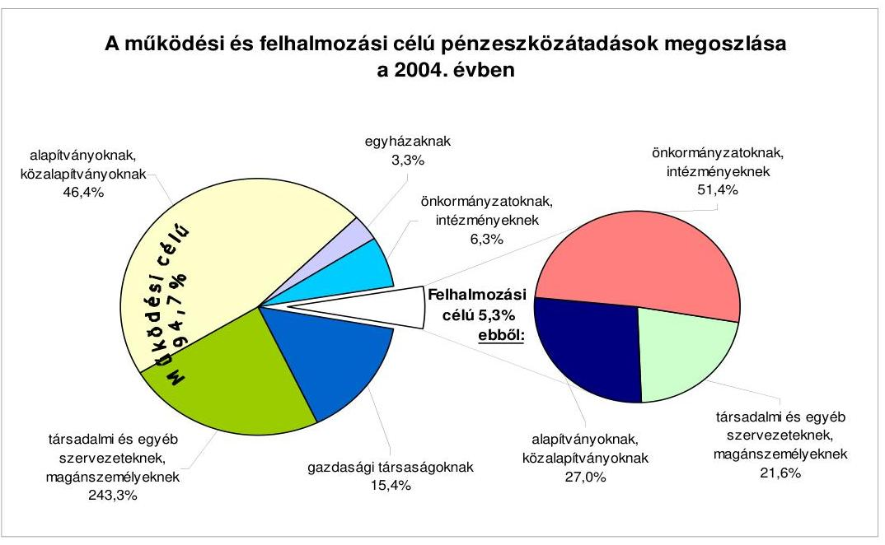
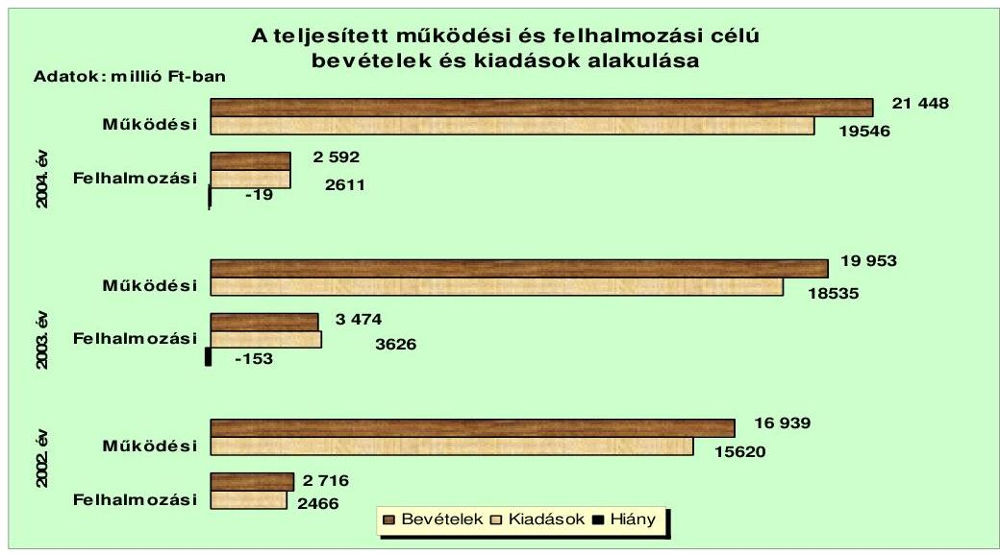
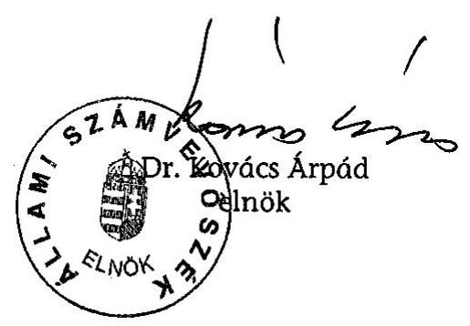
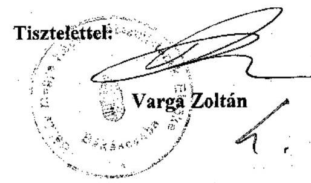
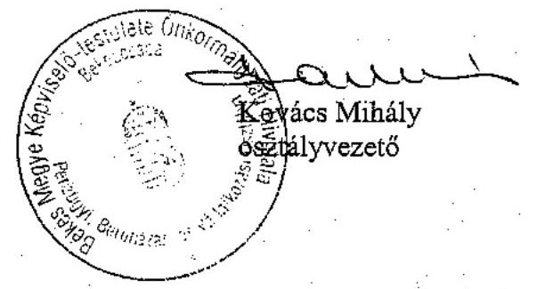
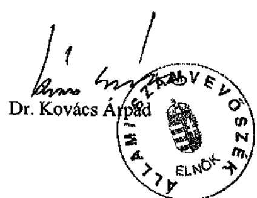

# JELENTÉS 

a Békés Megyei Önkormányzat gazdálkodási rendszerének átfogó ellenőrzéséről

---

3. Önkormányzati és Területi Ellenőrzési Igazgatóság
3.3. Átfogó Ellenőrzések Főcsoport
Iktatószám: V-1001-1/26/19/2005.
Témaszám: 749
Vizsgálat-azonosító szám: V0198
Az ellenőrzést felügyelte:
Dr. Lóránt Zoltán
főigazgató
Az ellenőrzés végrehajtásáért felelős:
Dr. Sepsey Tamás
főigazgató-helyettes
Az ellenőrzést vezette:
Csecserits Imréné
főcsoportfőnök-helyettes
Az ellenőrzést végezték:
Hirka Mihály
főtanácsadó
Kersmájer Ágota
számvevő tanácsos
Vida László
számvevő tanácsos

# A témához kapcsolódó - elmúlt három évben - készített számvevőszéki jelentések: 

címe
sorszáma
Jelentés az általános iskolai oktatás minőségének javítását szolgáló 0219
intézkedések ellenőrzésének tapasztalatairól
Jelentés a helyi és a helyi kisebbségi önkormányzatok 0220
gazdálkodásának átfogó ellenőrzéséről
Jelentés a megyei, fővárosi illetékhivatali tevékenység 0243
ellenőrzéséről
Jelentés a helyi önkormányzatok tartós szociális ellátási 0317
feladatainak ellenőrzéséről az idősek otthonainál
Jelentés a kötött felhasználású támogatások 2002. évi 0331
felhasználásának ellenőrzéséről
Jelentés a helyi önkormányzatok közművelődési és könyvtári 0521
feladatellátásáról és finanszírozásáról
Jelentés a címzett támogatásból finanszírozott egészségügyi 0523
beruházások, rekonstrukciók ellenőrzéséről

Jelentéseink az Országgyűlés számítógépes hálózatán és az Interneten a www.asz.hu címen is olvashatók.

---

# TARTALOMJEGYZÉK 

BEVEZETÉS ..... 5
I. ÖSSZEGZŐ MEGÁLLAPÍTÁSOK, KÖVETKEZTETÉSEK, JAVASLATOK ..... 7
II. RÉSZLETES MEGÁLLAPÍTÁSOK ..... 15

1. A költségvetés tervezésének, végrehajtásának, az Önkormányzat vagyongazdálkodásának és a zárszámadás elkészítésének szabályszerűsége ..... 15
1.1. A költségvetési rendelet jóváhagyásának, módosításának, az előirányzatok nyilvántartásának szabályszerűsége ..... 15
1.2. A gazdálkodás szabályozottsága, a bizonylati rend és fegyelem szabályszerűsége ..... 19
1.3. A pénzügyi- számviteli feladatok ellátásának informatikai támogatottsága ..... 27
1.4. Az önkormányzati vagyon nyilvántartása, számbavétele ..... 29
1.5. A vagyonnal való gazdálkodás szabályszerűsége, célszerűsége, nyilvánossága ..... 32
1.6. A céljelleggel nyújtott támogatások szabályszerűsége ..... 40
1.7. A közbeszerzési eljárások szabályszerűsége ..... 44
1.8. A zárszámadási kötelezettség teljesítésének szabályszerűsége ..... 47
2. Az önkormányzati feladatok és a rendelkezésre álló források összhangja ..... 49
2.1. A feladatok meghatározása és szervezeti keretei ..... 49
2.2. A költségvetés egyensúlyának helyzete ..... 53
2.3. A feladatok finanszírozása ..... 57
3. A belső irányítási, ellenőrzési rendszer működésének értékelése ..... 60
3.1. Az ellenőrzési rendszer kialakítása, működése ..... 60
3.2. A könyvvizsgálati kötelezettség teljesítése ..... 63
3.3. A korábbi számvevőszéki ellenőrzések javaslatainak hasznosulása ..... 63

---

# MELLÉKLETEK 

1. számú Az Önkormányzat gazdálkodását meghatározó adatok, mutatószámok (1 oldal)
2. számú Az önkormányzati vagyon nagyságának alakulása (1 oldal)
3. számú Az Önkormányzat 2004. évi bevételeinek és kiadásainak alakulása (1 oldal)
4. számú Az egyes önkormányzati feladatok finanszírozása (1 oldal)
5. számú Helyszíni ellenőrzési jegyzőkönyv (4 oldal)
6. számú Varga Zoltán úr, a Békés Megyei Közgyűlés elnökének észrevétele (4 oldal +1 db melléklet)
7. számú Varga Zoltán úrnak, a Békés Megyei Közgyűlés elnökének írt válaszlevél (2 oldal)

---

# RÖVIDÍTÉSEK JEGYZÉKE 

| Áht. | az államháztartásról szóló 1992. évi XXXVIII. törvény |
| :--: | :--: |
| Htv. | a helyi önkormányzatok és szerveik, a köztársasági megbízottak, valamint egyes centrális alárendeltségú szervek feladat- és hatásköreiről szóló 1991. évi XX. törvény |
| Kbt. $_{1}$ | a közbeszerzésekről szóló 1995. évi XL. törvény |
| Kbt. $_{2}$ | a közbeszerzésekről szóló 2003. évi CXXIX. törvény |
| Ksztv. | a közhasznú szervezetekről szóló 1997. évi CLVI. törvény |
| Ötv. | a helyi önkormányzatokról szóló 1990. évi LXV. törvény |
| Számv. tv. | a számvitelről szóló 2000. évi C. törvény |
| Szoc. tv. | a szociális igazgatásról és szociális ellátásokról szóló 1993. évi III. törvény |
| Ámr. | az államháztartás múködési rendjéről szóló 217/1998. (XII. 30.) Korm. rendelet |
| Ber. | a költségvetési szervek belső ellenőrzéséről szóló 193/2003. (IX. 26.) számú Korm. rendelet |
| Vhr. | az államháztartás szervezetei beszámolási és könyvvezetési kötelezettségének sajátosságairól szóló 249/2000. (XII. 24.) számú Korm. rendelet |
| ÁSZ | Állami Számvevőszék |
| Kincstár | Magyar Államkincstár Békés Megyei Területi Igazgatósága |
| SzMSz | Békés Megyei Önkormányzat 7/1995. (V. 26.) számú rendelete a Szervezeti és Múködési Szabályzatáról |
| ügyrend | Békés Megyei Önkormányzati Hivatalnak ügyrendje, az SzMSz 8. számú függeléke |
| Önkormányzat | Békés Megyei Önkormányzat |
| Közgyűlés | Békés Megyei Önkormányzat Közgyűlése |
| Önkormányzati hivatal | Békés Megyei Önkormányzati Hivatal |
| Közgyűlés elnöke | Békés Megyei Közgyűlés elnöke |
| főjegyző | Békés Megyei Önkormányzat főjegyzője |
| Pénzügyi bizottság | Békés Megyei Önkormányzat Közgyűlésének Pénzügyi Bizottsága |
| Gazdasági bizottság | Békés Megyei Önkormányzat Közgyűlésének Gazdasági és Környezetgazdálkodási Bizottsága |
| Közbeszerzési bizottság | Békés Megyei Önkormányzat Közgyűlésének Közbeszerzési Bizottsága |
| Illetékhivatal | Békés Megyei Illetékhivatal |
| Pénzügyi osztály | Békés Megyei Önkormányzati Hivatal Pénzügyi, Beruházási és Vállalkozási Osztálya |
| Intézményfelügyeleti osztály | Békés Megyei Önkormányzati Hivatal Intézményfelügyeleti Osztálya |
| Titkársági osztály | Békés Megyei Önkormányzati Hivatal Titkársági Osztálya |

---

| Területfejlesztési osztály | Békés Megyei Önkormányzati Hivatal Területfejlesztési   Osztálya |
| :-- | :-- |
| Ellenőrzési csoport | Békés Megyei Önkormányzati Hivatal Pénzügyi, Beruhá-   zási és Vállalkozási Osztály Ellenőrzési Csoportja |
| MÉSZI | Mezőgazdasági és Élelmiszeripari Szakképző Iskola, Sza-   badkígyós |
| vagyongazdálkodási | Békés Megyei Önkormányzat 5/1994. (V. 27.) számú re-   redelete az Önkormányzat vagyonáról és a vagyontárgyak   feletti rendelkezési jog gyakorlásának szabályairól |
| Kórház | Békés Megye Közgyűlése Pándy Kálmán Kórháza |
| Tüdőkórház | Békés Megyei Tüdőkórház |
| KDB | Közbeszerzések Tanácsa Közbeszerzési Döntőbizottsága |
| TEKI támogatás | területi kiegyenlítést szolgáló fejlesztési célú támogatás |
| CÉDE támogatás | céljellegú decentralizált támogatás |
| SzCsM | Szociális és Családügyi Minisztérium |

---

# JELENTÉS 

## a Békés Megyei Önkormányzat gazdálkodási rendszerének átfogó ellenőrzéséről

## BEVEZETÉS

Az Ötv. 92. § (1) bekezdése, az Állami Számvevőszékről szóló 1989. évi XXXVIII. törvény 2. § (3) bekezdése, valamint az Áht. 120/A. § (1) bekezdése alapján az önkormányzatok gazdálkodását az ÁSZ ellenőrzi. Az ellenőrzés elvégzése az Országgyűlés illetékes bizottságai részére is átadott, országosan egységes ellenőrzési program alapján történt.

## Az ellenőrzés célja annak értékelése volt, hogy

- az önkormányzati gazdálkodás törvényességét ${ }^{1}$, szabályszerűségét biztosítot-ták-e a tervezés, a költségvetés végrehajtása, a vagyongazdálkodás és a zárszámadás során;
- az Önkormányzat által ellátott feladatok és az azokhoz rendelkezésre álló pénzforrások összhangja biztosított volt-e, különös tekintettel egyes kiemelt feladatokra;
- a gazdálkodás szabályszerűségét biztosító belső kontrollok ${ }^{2}$ lehetővé tették-e a szabálytalanságok, hiányosságok, gazdaságtalan megoldások feltárását, megelőzését.

Az ellenőrzött időszak: a 2004. év és 2005. I. félév, valamint az 1.5; 2.1-2.3; és 3.3. ellenőrzési programpontok esetében ezen túlmenően a 2002-2003. évek is.

Békés megye népesség száma 2005. január 1-jén 394 ezer fő volt. A megye 75 településéből 18 város, ahol az összlakosság 70\%-a él.

Az Önkormányzat 40 tagú Közgyűlésének munkáját kilenc állandó bizottság segítette. A Közgyűlés elnökének a személye a 2002. évi önkormányzati választásokat követően változott, a főjegyző e munkakörét 1990 óta tölti be.

[^0]
[^0]:    ${ }^{1}$ A törvényi előírások betartásának elmulasztásakor a részletes megállapítások fejezetben egységesen a törvénysértés megjelölést alkalmazzuk, mivel az ÁSZ nem tehet különbséget a törvényi előírások között.
    ${ }^{2}$ A gazdálkodás szabályszerűségét biztosító kontroll alatt értjük a kiépített és működő belső irányítási és szabályozási rendszert, valamint a belső ellenőrzési funkciók ellátását.

---

Az Önkormányzat a 2004. évben 33 költségvetési intézményt tartott fenn, amelyből 31 önállóan gazdálkodott. A feladatok folyamatos ellátásában egy közüzemi vállalat, két közhasznú társaság, négy közalapítvány és négy gazdasági táraság vett részt. Az Önkormányzat által fenntartott költségvetési intézményekben foglalkoztatott közalkalmazottak száma 4867 fő volt, az Önkormányzati hivatalban 123 fő köztisztviselő dolgozott.

Az Önkormányzat a 2004. évben a zárszámadási rendelet szerint 24040 millió Ft költségvetési bevételt és 22157 millió Ft költségvetési kiadást teljesített, a 2004. év végén a könyvviteli mérleg szerint 27114 millió Ft értékű vagyonnal rendelkezett. A Közgyűlés az Önkormányzat 2005. évi költségvetésének bevételi és kiadási főösszegét 24104 millió Ft-tal hagyta jóvá. Az Önkormányzat gazdálkodását meghatározó 2004. évi adatokat, mutatószámokat az 1. számú melléklet részletezi.

A jelentés megállapításainak, javaslatainak egyeztetése során a Közgyűlés elnöke arról adott tájékoztatást, hogy az időközben megtett intézkedésekkel a javaslatok egy részét megvalósították. Ezekben az esetekben a jelentés II. Részletes megállapítások fejezetében az adott témához kapcsolt lábjegyzetben a megtett intézkedést feltüntettük és a kapcsolódó javaslatot elhagytuk.

---

# I. ÖSSZEGZŐ MEGÁLLAPÍTÁSOK, KÖVETKEZTETÉSEK, JAVASLATOK 

Az Önkormányzat rendelkezett a Közgyűlés által elfogadott a 2003-2006. évekre szóló, ágazati célkitűzéseket, feladatokat meghatározó gazdasági programmal. A 2004-2005. évi költségvetési koncepciókat a helyben képződő bevételek és az ismert kötelezettségek számbavételével, valamint a gazdasági program figyelembevételével állították össze. A Közgyűlés elnöke a költségvetési koncepciókat az Áht-ban előírt határidőn belül, a Pénzügyi bizottság véleményének csatolásával terjesztette a Közgyűlés elé. A Közgyűlés a költségvetés készítésének további feladatairól határozatban döntött.

A Közgyűlés elnöke a 2004. évi és a 2005. évi költségvetési rendelettervezeteket az Áht-ban előírt határidőn belül a Pénzügyi bizottság és a könyvvizsgáló véleményének csatolásával terjesztette a Közgyűlés elé. Előterjesztette továbbá azokat a rendelettervezeteket is, amelyek a javasolt előirányzatokat megalapozták. Az Önkormányzat meghatározta az Áht-ban előírt mérlegek és kimutatások közül a hitelek állományára, az összevont mérlegekre, valamint a többéves kihatással járó döntésekre vonatkozó tartalmi követelményeket, azonban elmaradt a közvetett támogatásokra vonatkozó kimutatás tartalmi követelményeinek a meghatározása. A vagyonkimutatás tartalmi követelményeinek előírásakor a Vhr-ben foglaltak ellenére nem vették figyelembe a „0"ra leírt, de használatban lévő, illetve a használaton kívüli eszközök állományát, az Önkormányzat tulajdonában lévő érték nélkül nyilvántartott eszközök állományát, valamint a mérlegben értékkel nem szereplő kötelezettségeket. Az Áht. előírásait megsértve a címrendet a 2004. évi, valamint a 2005. évi költségvetési rendeletekben nem, csak a 2005. évi költségvetési rendelet első módosításakor határozták meg. A költségvetési rendeletekben rögzítették a költségvetés végrehajtásával összefüggő szabályokat. A költségvetési rendeletek szerkezete megfelelt az Áht. és az Ámr. vonatkozó előírásainak. A költségvetések előterjesztésekor a Közgyűlés részére az Áht-ban szereplő mérlegek és kimutatások közül nem mutatták be a közvetett támogatásokra vonatkozó kimutatást szöveges indoklással. A Közgyűlés a 2004. évi költségvetési rendeletét 14\%kal, míg a 2005. évit 6\%-kal módosította. Az előirányzat változások hitelt érdemlően dokumentáltak voltak. A költségvetési rendeletmódosítások mindkét évben szabályszerűen, az Ámr. előírásait betartva történtek.

Az Ámr-ben előírt szervezeti és múködési szabályzatnak megfelelő ügyrendben határozták meg az Önkormányzati hivatal szervezeti felépítését, feladatait. Az ügyrend azonban nem tartalmazta az Ámr-ben előírtak közül, az alapító okirat keltét, számát, a költségvetés végrehajtására szolgáló számlaszámot, a gazdasági szervezet felépítését. A gazdasági szervezet (Pénzügyi osztály) ügyrendjét elkészítették. A Közgyűlés elnöke és a főjegyző együttes rendelkezésben, az Ámr-ben foglaltaknak megfelelően határozta meg a költségvetési gazdálkodással kapcsolatos hatásköröket. A felhatalmazásokkal kapcsolatos utólagos beszámoltatási kötelezettség előirása és a beszámoltatás elmaradt. Az érvényesítésre jogosult munkaköröket a főjegyző belső szabályzatokban kijelölte, azonban a munkakört betöltő személyek írásbeli megbízása kétharmaduk

---

esetében a munkaköri leírásban nem szerepelt. A főjegyző 2005. január 1-től gondoskodott az Önkormányzati hivatalban a szakmai teljesítést igazolók kijelöléséről, azonban az Ámr-ben foglaltak ellenére elmaradt a szakmai teljesítés igazolás módjának meghatározása. A főjegyző az Illetékhivatalban az Ámrben előírtak ellenére nem gondoskodott az érvényesítők megbízásáról, nem szabályozta a szakmai teljesítés igazolásának módját, és nem jelölte ki a szakmai teljesítést igazoló személyeket.

A főjegyző kialakította az intézmények számviteli rendjét, azonban a Vhrben foglaltak ellenére nem alakította ki az Önkormányzati hivatal szervezeti egységét képező Illetékhivatal számviteli politikáját. A Vhr. előírásai ellenére a számviteli politikában nem határozták meg, hogy az Önkormányzati hivatal és az Illetékhivatal külön vezetett, két önálló könyvviteli nyilvántartásából, milyen szempontok figyelembevételével kell az egységes költségvetési beszámolót elkészíteni. A Vhr-ben foglaltak ellenére a 2004. évben az Önkormányzati hivatalnak nem volt leltározási és leltárkészítési szabályzata. A 2005. évben elkészült leltározási szabályzat hiányossága, hogy csak az ingatlanok, valamint a gépek, berendezések és felszerelések leltározását szabályozta, de nem tartalmazta a többi eszköz, illetve a források leltározásának szabályait. A Vhr-ben előírt önkormányzati rendeleti szabályozás hiánya ellenére a mennyiségi leltározást kétévenkénti gyakorisággal határozták meg. Az eszközök és források értékelési szabályzatában a Vhr-ben foglaltakkal összhangban meghatározták az eszközök bekerülési értékébe beszámítandó kiadásokat. A terven felüli értékcsökkenés elszámolásának rendjét, az értékvesztés, és az értékvesztés visszaírásának rendjét a számviteli politikában szabályozták. Az Önkormányzati hivatalnak a Vhr. előírása ellenére a 2004. évben nem volt selejtezési szabályzata, a 2005. évtől hatályos szabályzat előírta a követendő eljárási rendet, a selejtezési bizottság feladatait, a döntéshozatalra jogosultak körét.

Az Önkormányzati hivatal számlarendjében az analitikus nyilvántartások vezetését előírták, de - a tárgyi eszközök és az értékpapírok kivételével - a Vhrben foglaltakat figyelmen kívül hagyva nem írták elő azok tartalmát, formáját, az egyeztetések módját és dokumentálási formáját, nem határozták meg az összesítő kimutatások (feladások) elkészítésének határidejét. Nem vezettek analitikus nyilvántartást az üzemeltetésre, kezelésre átadott eszközökről, a hitelekről, továbbá a részesedések analitikus nyilvántartása nem tartalmazta az állományváltozásokat. Az Illetékhivatalban a különböző időben, különböző áron beszerzett szoftverekről és számítástechnikai eszközökről nem vezettek egyedi nyilvántartást. A főkönyvi és analitikus nyilvántartások negyedévenkénti egyeztetését a Vhr-ben előírt belső szabályozás hiányában nem végezték el. A kiadások és bevételek könyvelése során a megfelelő főkönyvi számlákat jelölték ki, azonban az államkötvények bekerülési értékének elszámolása nem felelt meg a Vhr. előírásainak, mert az tartalmazta a vételárban megfizetett kamat összegét is. Az ellenjegyző, az érvényesítők és a szakmai teljesítést igazolók esetében a munkaköri leírásokban az ellenőrzési feladat nem szerepelt. Az Önkormányzati hivatal ellenőrzési nyomvonalát a főjegyző 2005. áprilisában elkészítette, amely az Áht-ban előírtak alapján tartalmazta a költségvetési tervezési, pénzügyi lebonyolítási, valamint az ellenőrzési folyamatok leírását.

Az Önkormányzati hivatalban a könyvviteli nyilvántartásokban elszámolt gazdasági műveletekről, eseményekről a Számv. tv-ben előírt alaki követelmé-

---

nyeknek megfelelő bizonylatokat kiállították. Az Illetékhivatalban teljes körűen, az Önkormányzati hivatalban a 2004. évben a bizonylatokról a Számv. tv. előírásait megsértve hiányzott a szakmai teljesítést igazoló aláírás. Az Illetékhivatalban - az írásbeli megbízás elmaradása miatt - a bizonylatok érvényesítése elmaradt, valamint a bizonylatok $77 \%$-án nem tüntették fel a kötelezettségvállalás nyilvántartási sorszámát. Az Önkormányzati hivatal esetében ez utóbbi a 2004. évben teljes körűen, a 2005. évben a bizonylatok 12\%-ánál hiányzott. A gazdálkodási jogkörök gyakorlása során a kötelezettségvállalást, utalványozást az arra felhatalmazottak elvégezték. A pénztárellenőr feladatát ellátta. A gazdálkodási jogkörök gyakorlásánál betartották az összeférhetetlenségi szabályokat. Az Ámr. előírásai ellenére nem történt meg az utalványozás ellenjegyzése az Önkormányzati hivatalnál a 2005. évben a bizonylatok $35 \%$-a esetében. Az érvényesítők és az utalványozás ellenjegyzői a munkafolyamatba épített ellenőrzési kötelezettségüknek nem tettek eleget, az Ámr-ben előírt feladatukat nem teljesítették az Önkormányzati hivatalban, mert a 2004. évben nem kifogásolták, hogy a szakmai teljesítés igazolása elmaradt, nem észrevételezték, hogy az utalványokon nem tüntették fel a kötelezettségvállalás nyilvántartásba vételi sorszámát. Ellenőrzési kötelezettségüknek nem tettek eleget az Illetékhivatalban sem az ellenjegyzők, mert nem kifogásolták, hogy a szakmai teljesítés igazolása nem történt meg, az érvényesítők megbízása elmaradt, és a bizonylatok $77 \%$-án nem tüntették fel a kötelezettségvállalás nyilvántartási sorszámát. Az Ámr. előírásai ellenére az Önkormányzati hivatalban a 2004. évben, az Illetékhivatalban a 2005. évben sem rendelkeztek olyan kötelezettségvállalási nyilvántartással, amelyből megállapítható az éves kötelezettségvállalás összege. Önkormányzati szinten a kiemelt előirányzatokat betartották. Az Önkormányzati hivatal a múködési célú pénzeszközátadások előirányzatát lépte túl $0,5 \%$-kal, az intézmények közül pedig tíz lépte túl előirányzatát, megsértve az Áht-ban foglalt előírásokat.

A főkönyvi könyvelés és a költségvetési beszámoló elkészítésének informatikai támogatottsága biztosított volt, az analitikus nyilvántartások is számítógépes feldolgozással készültek. A pénzügyi és számviteli területen dolgozók rendelkeztek számítógéppel, az informatikai fejlesztések a gépek korszerűsítését segítették. Az informatikai rendszer üzemeltetési szabályzatában meghatározták a vezetők, a rendszergazda és a felhasználók jogait, kötelezettségeit. Az informatikai stratégiát elkészítették, katasztrófa elhárításra tervezet készült. A gazdálkodási és számviteli feladatok ellátásához használt szoftverekhez rendelkeztek az üzemeltetési dokumentációval és a felhasználói leírással. A pénzügyi és számviteli területen dolgozók egytizedének a munkaköri leírása tartalmazta az informatikai rendszer használatával kapcsolatos feladatokat.

A számviteli nyilvántartásokban gondoskodtak az önkormányzati vagyon, ezen belül a törzsvagyon elkülönített nyilvántartásáról. A részesedések és a hitelek egyedi, analitikus nyilvántartását a Vhr-ben foglaltak ellenére azonban nem alakították ki. A gazdasági társaságok által működtetett, részükre használatra átadott önkormányzati tulajdonú ingatlanok számviteli nyilvántartása nem felelt meg a Vhr. előírásainak, azokat nem az Önkormányzat, hanem a gazdasági társságok szerepeltették nyilvántartásaikban és számolták el utánuk az értékcsökkenést. Az Önkormányzat a két gazdasági társaság részére működtetésre, használatra átadott ingatlanok esetében a hasznosítás feltételeiről nem kötött szerződést, ezáltal nem biztosította az Önkormányzat tulajdono-

---

si érdekeinek érvényesülését. A részesedések között nem mutatták ki az Önkormányzatnak egy vállalat jegyzett tőkéjéből való részesedését. Az eszközök év végi állományának megállapítása során a 2004. évben az Önkormányzati hivatal kezelésében lévő ingatlanok, valamint az egyéb tárgyi eszközök állományát a Vhr-ben előírtak ellenére az analitikus és főkönyvi nyilvántartások egyeztetésével állapították meg. Az Önkormányzati hivatal nem tett eleget a Számv. tv. előírásainak, mert az év végi értékelési feladatokat csak a követelések esetében végezte el, a részesedéseket és a tartós hitelviszonyt megtestesítő értékpapírokat érintően nem. Az Illetékhivatalnál a Vhr-ben foglaltak ellenére csak a csőd-, a felszámolási, a végelszámolási eljárás alatt álló adósok év végi értékelését végezték el, az ennek során megállapított 48,2 millió Ft értékvesztés elszámolása indokolt volt.

A vagyongazdálkodással kapcsolatos feladatokat és döntési hatásköröket az Önkormányzat rendeletben szabályozta. A vagyonnal való rendelkezési, döntési hatásköröket - az átmenetileg szabad pénzeszközök befektetésére vonatkozó döntés kivételével - célszerűen alakították ki, azokat megosztották a Közgyűlés, a Közgyűlés elnöke, a Gazdasági bizottság és az intézmények között. A nyilvános pályáztatási kötelezettséget a vagyongazdálkodási rendelet egy millió Ft értékhatár feletti vagyontárgyak esetében írta elő, nem szabályozta azonban a nyilvános pályáztatás eljárási rendjét. Meghatározták az önkormányzati vagyon ingyenes átruházásának módját és eseteit. A követelésekről történő lemondás módját, eseteit rendeletben nem határozták meg, ezért a kölcsön elengedésével megsértették az Áht. előírását. A vagyongazdálkodással kapcsolatos döntések során a vagyongazdálkodási rendeletben meghatározott hatásköröket betartották, az előírt nyilvános pályáztatási kötelezettségnek eleget tettek. Az Önkormányzat ingatlanvagyonát érintő szerződésekben szerepeltek az Önkormányzat érdekeit védő garanciális elemek. Az Ötv. előírását megsértve, a Közgyűlés a költségvetési rendeletekben az átmenetileg szabad pénzeszközök befektetésére az Önkormányzati hivatalt hatalmazta fel. Értékpapírok (államkötvények, diszkont kincstárjegyek) vásárlásáról és eladásáról, valamint a pénzeszközök betétként történő elhelyezéséről a költségvetési rendeletek felhatalmazása alapján a Pénzügyi osztály vezetői döntöttek. A döntést megelőzően nem kértek ajánlatokat dokumentált formában több befektetési szolgáltatótól. Az értékpapír vásárlásoknál a befektetési kockázat csökkentése érdekében nem gondoskodtak a KELER Rt-nél az Önkormányzat nevére szóló értékpapír alszámla nyitásáról, és az együttes rendelkezési jog kikötéséről. Az Áht-ban foglalt előírást megsértve, a nem normatív, céljellegú, fejlesztési támogatások és a nettó öt millió Ft-ot elérő, vagy azt meghaladó értékű építési beruházások, szolgáltatás megrendelések, árubeszerzések esetében a szerződések egyes adatait nem tették közzé. Az Önkormányzat az Ötv. előírásai ellenére a pártok részére, a pártok helyiségbérleti díjában kedvezményeket, közvetett támogatást nyújtott, nem biztosította az alkotmányos jogegyenlőséget a bérlők között.

Az Önkormányzat a 2004. évben céljelleggel - nem szociális ellátásként - 207 millió Ft támogatást biztosított múködési és felhalmozási célra, mely összeg a költségvetési kiadások 1\%-át jelentette. A támogatások 97\%-áról a Közgyűlés, 3\%-áról az egyes bizottságok döntöttek. A támogatások odaítélésének, felhasználásának, elszámolásának és ellenőrzésének eljárási rendjét a 2004. évben nem szabályozták, az a 2005. évben történt meg. Az Önkormányzati hivatal által alapítványok részére folyósított támogatásokról a Közgyűlés döntött. Egy

---

intézmény az Ötv. előírását megsértve alapítványnak is nyújtott támogatást. A költségvetési intézmények a Közgyűlés egyetértésével nyújtottak támogatást társadalmi szervezeteknek. Az Áht. előírásait megsértve a 2004. évben a támogatott szervezeteknek számadási kötelezettséget nem írtak elő. Nem tettek eleget a Ksztv. előírásainak, mivel a közhasznú szervezetekkel nem kötöttek támogatási szerződést, nem határozták meg a támogatással való elszámolás feltételeit és módját. A számadásra vonatkozó utólagos felhívás 22 esetben eredménytelen maradt, de megsértve az Áht. előírását ezekben az esetekben a támogatás visszafizetésére nem intézkedtek. Az Áht. előírását megsértve a támogatások célszerinti felhasználásának ellenőrzése elmaradt. A 2005. évben a támogatási megállapodásokat, a közhasznú szervezetekkel a szerződéseket megkötötték. A szerződések hiányossága, hogy - a Gazdasági bizottság megállapodásait kivéve - azokban az Áht-ban foglaltakat megsértve, csak tájékoztatási és nem számadási kötelezettséget írtak elő.

Az Önkormányzat rendeletet, majd annak hatályon kívül helyezését követően közbeszerzési szabályzatot alkotott a közbeszerzési eljárások lefolytatásának szabályairól. Az Önkormányzati hivatal az értékhatárt elérő, felhalmozási célú beszerzések esetében lefolytatta a közbeszerzési eljárásokat. Az Önkormányzati hivatalnál a 2004. január 1. - 2004. május 1. közötti időszakban négy, míg a 2005. év első félévében 13 közbeszerzési eljárást indítottak. A közbeszerzésekről készült éves összegzést a Közbeszerzések Tanácsának elküldték. A közbeszerzési eljárás szabályszerűségét a Dél-Békési Oktatási Centrum létrehozása esetében ellenőriztük. A lefolytatott közbeszerzési eljárás, az eljárást lezáró döntéshozatal kivételével, szabályszerű volt a közbeszerzési eljárást lezáró határozatot a Közbeszerzési bizottság hozta meg. A vizsgált időszakban lefolytatott közbeszerzési eljárások közül egynél kezdeményeztek jogorvoslati eljárásokat, melyek még nem zárultak le.

A Közgyűlés elnöke az Áht-ban meghatározott határidőn belül terjesztette elő a 2004. évi zárszámadási rendelettervezetet, amelyet a költségvetési rendelettel összehasonlítható módon készítettek el. A címzett támogatás módosított előirányzataként azonban nem a Közgyűlés által elfogadott módosított előirányzatot szerepeltették a zárszámadásban, hanem a Kincstár által - a legutolsó költségvetési rendelet módosítása után - megküldött egyeztető kimutatásban szereplő, ténylegesen teljesített adatokat. A zárszámadási rendeletben az Ámrben foglaltak ellenére a felújítások teljesítésének célonkénti bemutatása az Önkormányzati hivatalra vonatkozóan megtörtént, azonban elmaradt az intézmények esetében. A zárszámadás előterjesztésekor az Áht-ban előírtak ellenére a Közgyűlés részére nem mutatták be a közvetett támogatásokra vonatkozó kimutatást szöveges indoklással. A passzív pénzügyi elszámolások számbavétele nem felelt meg a Vhr. előírásainak, mert az illetékbevételek megosztását követően a mérlegkészítés időpontjáig nem vezették át az átfutó bevételekből az illetékbevételek közzé az Önkormányzatot megillető 19 millió Ft-ot. Emiatt a 2004. évi pénzmaradvány összege 817 millió Ft, szemben a zárszámadásban kimutatott 798 millió Ft-tal. Az intézmények 2004. évi beszámolóit az Önkormányzati hivatal Pénzügyi osztálya felülvizsgálta, és az intézmények vezetőit írásban értesítették az éves beszámolójuk és működésük elbírálásáról, jóváhagyásáról, valamint a megállapított, módosított pénzmaradvány összegéről.

---

Az Önkormányzat kötelező és önként vállalt feladatait az SzMSz-ben, a feladatok ellátásának mértékét és módját a társadalmi- gazdasági programban és különböző ágazati koncepciókban határozta meg. A Közgyűlés az önkormányzati feladatok ellátásáról költségvetési intézményeivel, társulásokkal, az általa alapított gazdasági társaságokkal, közhasznú társasággal, vállalatokkal, közalapítványokkal és feladat ellátási szerződés alapján közhasznú társaságokkal gondoskodott. Az Önkormányzat kötelező feladatai közül a Szoc. tv-ben előírtak ellenére nem gondoskodtak a hajléktalanok otthonának és a hajléktalanok rehabilitációs intézményének a múködtetéséről. A Közgyűlés a 20022005. I. félév között több alkalommal hozott döntést a feladatellátás egyes részterületeinek módosításáról, amelyek a vizsgált időszakot megelőzően végrehajtott jelentős intézményi struktúra átalakítást követően az ágazati törvényekben előírt feladatok ellátására, gazdasági integrációk megszüntetésére, valamint az Önkormányzat és két települési önkormányzat között a közoktatáshoz kapcsolódó feladatátvételre, illetve átadásra vonatkoztak.

Az 2002-2005. évi költségvetési rendeletekben a tervezett költségvetési bevételek és költségvetési kiadások összhangját biztosították, forráshiányt nem mutattak ki. Az egyensúly fenntartása nemcsak a tervezés szintjén, hanem a végrehajtás során is biztosított volt. Az Önkormányzat hangsúlyt fektetett a pályázatok adta lehetőségek minél jobb kihasználására, ezért megteremtette a pályázatok benyújtásához szükséges személyi, szakmai és szervezeti feltételeket. Az adósságot keletkeztető kötelezettségvállalás Ötv-ben előírt felső korlátját a 2003. évi hitelfelvételnél vizsgálták és betartották. A hitelfelvétel nem veszélyeztette az Önkormányzat fizetőképességét, működőképességét.

A naturális mutatókkal mérhető nevelési, oktatási és szociális feladatok fajlagos kiadásai a 2002-2004. években elsősorban a központi bérintézkedések hatására növekedtek. A feladatok finanszírozásában az állami hozzájárulások, támogatások aránya a 2002. évihez képest a 2004. évre az óvodai nevelésnél, az általános iskolai oktatásnál, a nappali szociális ellátásnál növekedett, a középiskolai oktatásnál és a bentlakásos szociális ellátásnál csökkent. A finanszírozási forrásokon belül az önkormányzati támogatás aránya - a középiskolai oktatás kivételével - csökkent. Az Önkormányzat az önként vállalt feladatokra a 2002-2004. években az éves költségvetési kiadásának közel 5\%-át fordította. Az önként vállalt feladatok a gazdálkodás pénzügyi egyensúlyát és a kötelező feladatok ellátását nem veszélyeztették.

Az Önkormányzat a közintézmények akadálymentesítése érdekében szükséges felméréseket elvégezte, amely szerint a 170 önkormányzati tulajdonú középület $78 \%$-ánál nem, vagy csak részben biztosított az akadálymentes megközelítési lehetőség. A felmérés szerint a középületek akadálymentessé tételéhez 1035 millió Ft szükséges. Az Önkormányzat a fogyatékos személyek jogairól és esélyegyenlőségük biztosításáról szóló törvényben előírtak ellenére 132 középületnél az akadálymentessé tételt 2005. január 1-ig nem biztosította.

Az Önkormányzat a 2005. évben kialakította a belső ellenőrzési feladatok végrehajtásához szükséges szervezeti kereteket. Az intézmények ellenőrzését a Pénzügyi osztályhoz tartozó Ellenőrzési csoport, az Önkormányzati hivatal belső ellenőrzését 2005. áprilisától két fő belső ellenőr. A főjegyző megsértve az Áht-ban foglaltakat nem biztosította az Ellenőrzési csoport szervezeti független-

---

ségét, megsértette továbbá a Htv. előírását, mert 2005. áprilisáig nem gondoskodott az Önkormányzati hivatal belső ellenőrzéséről. Az Önkormányzati hivatal két belső ellenőre részére elkészült és elfogadott belső ellenőrzési kézikönyv tartalma megfelelt a Ber. előírásainak, ugyanakkor az Ellenőrzési csoport számára a Ber-ben előírtak ellenére nem készült belső ellenőrzési kézikönyv. Mind az Önkormányzati hivatal, mind az intézmények ellenőrzését végzők számára elkészültek, és elfogadásra kerültek a Ber-ben előírt tartalommal a stratégiai, középtávú és éves ellenőrzési tervek. Az intézmények 2004. és 2005. évi ellenőrzési terveit - a Ber. előírásai ellenére a főjegyző helyett a Pénzügyi bizottság hagyta jóvá. A 2004. évi ellenőrzési tervben rögzített feladatokat az ütemezésnek megfelelően végrehajtották. Az ellenőrzési jelentések a 2005. évtől a Berben előírt tartalommal készültek. Az ellenőrzöttek az intézkedési terveket elkészítették, a hiányosságok megszüntetéséről utóellenőrzések során győződtek meg. Az éves ellenőrzési jelentést összeállították, de az a Ber.-ben előírtak ellenére nem tartalmazta az ajánlások hasznosulásának tapasztalatait, és az ellenőrzési tevékenység fejlesztésére vonatkozó javaslatokat. Az intézményekben végzett ellenőrzések tapasztalatait - a Közgyűlés felhatalmazása alapján - a Pénzügyi bizottság tekintette át, feladatokat az ellenőrzés számára nem fogalmazott meg.

Az Önkormányzat az Ötv-ben előírt könyvvizsgálati kötelezettségének eleget tett. A könyvvizsgáló az Önkormányzati hivatal és az intézmények öszszevont adatait tartalmazó éves beszámolót korlátozás nélküli hitelesítő záradékkal látta el, auditálási eltérést nem állapított meg.

Az ÁSZ a 2001-2005. évek között hét ellenőrzést végzett az Önkormányzatnál. Az ellenőrzési jelentések összesen 12 javaslatot tartalmaztak. A javaslatok közel nyolctizedét részben, vagy egészben megvalósították. A gazdálkodás átfogó ellenőrzése során tett javaslatokat követően a költségvetési és a zárszámadási rendeletek tartalmazták az Önkormányzati hivatal költségvetését feladatonként, a zárszámadási rendelet tartalmazta a működési és felhalmozási célú bevételeket és kiadásokat mérlegszerűen. Elkészítették az Önkormányzati hivatal pénzkezelési szabályzatát, és a földterületek, parkok értékbecslését. A függetlenített belső ellenőrök foglalkoztatására 2005. április hónaptól kezdődően sor került, valamint a szabályzatok felülvizsgálata és folyamatos aktualizálása részben megtörtént. A szociális feladatok ellátásának ellenőrzésekor tett javaslatokat figyelembe véve módosultak a megkötött ellátási szerződések, négy szociális intézmény közül háromnál biztosították a szükséges szakmai létszámot, míg három intézménynél javították a dolgozók szakképzettségét. Két szociális intézménynél továbbra sem oldották meg az egy ellátottra jutó hat $\mathrm{m}^{2}$-nyi lakóterületet biztosítását, valamint a lakószobánkénti négy fős elhelyezést. A kötött felhasználású támogatások ellenőrzését követően a kapott költségvetési támogatások célszerinti felhasználását ellenőrizték. Az Illetékhivatal tevékenységére, a közművelődési feladatok ellátására, a címzett támogatásokból finanszírozott egészségügyi beruházások ellenőrzésére, valamint a felhalmozási célú támogatások ellenőrzésére vonatkozó vizsgálatok javaslatokat nem fogalmaztak meg.

---

A helyszíni ellenőrzés megállapításának hasznosítása mellett javasoljuk:

# a Közgyűlés elnökének 

a jogszabályi előírások maradéktalan betartása érdekében

1. kezdeményezze, hogy a Közgyűlés gondoskodjon a Szoc. tv. 71/B. § és 74/A. §aiban előírt kötelező szociális feladatok teljesítéséről a hajléktalanok otthona és a hajléktalanok rehabilitációs intézménye ellátásának megszervezésével;
2. gondoskodjon a középületek teljes körű akadálymentessé tételéről a fogyatékos személyek jogairól és esélyegyenlőségük biztosításáról szóló 1998. évi XXVI. törvény 29. § (6) bekezdésében előírtak végrehajtása érdekében;
a munka színvonalának javítása érdekében
3. terjessze a számvevőszéki jelentést a Közgyűlés elé, a feltárt hiányosságok megszüntetésére készíttessen intézkedési tervet a határidők és a felelősök megjelölésével;

## a főjegyzőnek:

a jogszabályi előírások maradéktalan betartása érdekében

1. gondoskodjon a gazdasági társaságok által működtetett önkormányzati tulajdonban lévő ingatlanok számviteli nyilvántartásba vételéről a Vhr. 12. §-ában foglaltak alapján, valamint azok analitikus nyilvántartásba-vételéről a Vhr. 49. § (1) bekezdés alapján.

---

# II. RÉSZLETES MEGÁLLAPÍTÁSOK 

## 1. A KÖLTSÉGVEtÉs TERVEZÉSÉNEK, VÉGREHAJTÁSÁNAK, AZ ÖNKORMÁNYZAT VAGYONGAZDÁLKODÁSÁNAK ÉS A ZÁRSZÁMADÁS ELKÉSZÍTÉSÉNEK SZABÁLYSZERŰSÉGE

### 1.1. A költségvetési rendelet jóváhagyásának, módosításának, az előirányzatok nyilvántartásának szabályszerűsége

Az Önkormányzat rendelkezett a Közgyűlés 7/2003. (II. 7.) számú határozatával elfogadott gazdasági programmal, amely megfelelt az Ötv. 91. § (1) bekezdésében előírtaknak.

A Békés Megyei Önkormányzatnak a 2003-2006. időszakra szóló társadalmigazdasági programja részletesen foglalkozott az Önkormányzat kötelező és önként vállalt feladatainak a változásával, kapcsolatrendszerével, a feladataihoz kötődő fejlesztési irányokkal, a vagyon hasznosításának lehetőségeivel, a pályázati tevékenységgel, a hatáskörébe tartozó ágazati feladatok célkitűzéseivel, valamint a megye fejlesztésében való szerepével.

A 2004. és a 2005. évi költségvetési koncepciók tervezetét az Ámr. 28. § (1) bekezdésében foglaltaknak megfelelően elkészítette a főjegyző. A költségvetési koncepciókat a helyben képződő bevételek és az ismert kötelezettségek számbavételével, valamint a gazdasági program figyelembevételével állították össze.

A költségvetési koncepciók tartalmazták azok elkészítésének részletes menetét, a koncepciókban érvényesített, gazdasági programban elfogadott prioritásokat, az intézményhálózatot érintő változásokat, az adott év fő feladatait, valamint bemutatták az önkormányzati szintű várható bevételeket és kiadásokat múködési és felhalmozási célokra bontva, illetve a hosszú távú kötelezettségeket.

A bizottságok - köztük a Pénzügyi bizottság - a 2004. évi és a 2005. évi költségvetési koncepciókat megtárgyalták, írásos véleményüket az Ámr. 28. § (3) bekezdésében előírtaknak megfelelően a Közgyűlés elnöke csatolta az előterjesztéshez.

A Közgyűlés elnöke a 2004. évi és a 2005. évi költségvetési koncepciót az Áht. 70. §-ában előírt határidőn ${ }^{3}$ belül - 2003. november 13-án, illetve 2004. november 18-án - terjesztette a Közgyűlés elé.

[^0]
[^0]:    ${ }^{3}$ Az Áht. 70. §-a szerint a költségvetési koncepciót a Közgyűlés elnöke november 30-ig, az általános választás évében legkésőbb december 15-ig benyújtja a Közgyűlésnek.

---

A költségvetési koncepciók elfogadásával a Közgyűlés - eleget téve az Ámr. 28. § (4) bekezdése előírásainak - határozatában ${ }^{4}$ döntött a költségvetés készítés további munkálatairól.

A 2004. évi és a 2005. évi költségvetési rendelettervezetekben az Ámr. 26. § (3)-(5) bekezdéseiben előírtak szerint meghatározták a bevételi és a kiadási előirányzatokat, továbbá érvényesítették az adott évi költségvetési koncepciók irányelveit. A költségvetési rendelettervezetekben szereplő intézményi bevételi és kiadási előirányzatokat az Ámr. 29. § (4) bekezdésében előírtakkal összhangban a költségvetési szervek vezetőivel a főjegyzö egyeztette. Az egyeztetések tartalmát, eredményét jegyzőkönyvekben rögzítették.

Az Önkormányzat a költségvetési tárgyú előterjesztésekhez szükséges, az Áht. 118. §-a szerinti kimutatásokról szóló 7/2005. (III. 4.) számú rendeletében meghatározta az Áht. 118. §-a alapján a hitelek állományára, az összevont mérlegekre, valamint a többéves kihatással járó döntésekre vonatkozó mérlegek és kimutatások tartalmi követelményeit. A rendeletben a vagyonkimutatás tartalmi követelményeinek meghatározásakor nem vették figyelembe a Vhr. - 2005. január 1-től hatályos - 44/A. § (3) bekezdésében foglaltakat, mert nem írták elő a „0"-ra leírt, de még használatban lévő, illetve a használaton kívüli eszközök állományának, az Önkormányzat tulajdonában lévő érték nélkül nyilvántartott eszközök állományának, valamint a mérlegben értékkel nem szereplő kötelezettségek bemutatásának a kötelezettségét. Az Áht. 118. §-ában előírtakat megsértve a közvetett támogatásokra vonatkozó kimutatás tartalmi követelményeit nem határozták meg. ${ }^{5}$

A Közgyűlés elnöke a bizottságok által megtárgyalt és a Pénzügyi bizottság által véleményezett költségvetési rendelettervezeteket az Áht. 71. § (1) bekezdésében rögzített határidőn belül ${ }^{6}$ - 2004. január 29-én, illetve 2005. január 27-én - terjesztette a Közgyűlés elé.

A könyvvizsgáló a költségvetési rendelettervezeteket megvizsgálta és az Ötv. 92/C. § (4) bekezdésének előírását betartva véleményéről írásban tájékoztatta a
${ }^{4}$ A Közgyűlés 202/2003. (XI. 21.), és 242/2004. (XI. 26.) számú határozatai.
${ }^{5}$ A közbenső egyeztetés során a Közgyűlés elnöke által adott észrevétel szerint: „Intézkedtem annak érdekében, hogy az önkormányzat költségvetésének előterjesztésekor, illetőleg a zárszámadáskor a képviselő-testület részére tájékoztatásul hiánytalanul bemutatásra kerüljenek az 1992. évi XXXVIII. törvény 118. §-ában előírt mérlegek és kimutatások. A közgyűlés a 2005. október 7-én tartott ülésén megtárgyalta és kiegészítette az Önkormányzatnak az Áht. 118. §-ában előírt mérlegek és kimutatások tartalmi követelményeit meghatározó 7/2005. (III. 4.) számú rendeletét. A rendelet most már tartalmazza a közvetett támogatásokra vonatkozó kimutatás tartalmi követelményét, valamint a vagyonkimutatás tartalmának kiegészítését és így a vagyonkimutatás megfelel az államháztartás szervezetei beszámolási és könyvvezetési kötelezettségeinek sajátosságairól szóló 249/2000. (XII. 24.) Kormány rendeletben (továbbiakban: Vhr.) foglaltaknak."
${ }^{6}$ Az Áht. 71. § (1) bekezdése szerinti határidő a tárgyév február 15-e.

---

Közgyűlést, azt elfogadásra javasolta. Az Ámr. 29. § (9) bekezdésének megfelelően a könyvvizsgálói jelentést a Közgyűlés elnöke az előterjesztéshez csatolta.

A Közgyűlés elnöke a költségvetési rendelettervezettekkel együtt, és azt megelőzően az Áht. 71. § (2) bekezdésében előírtaknak megfelelően előterjesztette azokat a rendelettervezeteket ${ }^{7}$, amelyek a javasolt előirányzatokat megalapozták, továbbá bemutatta a többéves elkötelezettségekkel járó kiadási tételek későbbi évekre vonatkozó kihatásait, ezen belül a költségvetési évet követő két év várható előirányzatait, az Áht. 71. § (3) bekezdésének megfelelően.

Az Áht. 67. § (3) bekezdésében előírtakat megsértve a 2004. évi, valamint a 2005. évi költségvetési rendeletben nem határozták meg a címrendet. A 2005. évi költségvetési rendelet első módosításakor az Önkormányzat 12/2005. (VI. 3.) számú rendeletében utólag döntöttek a címrend meghatározásáról.

A 2004. évi és a 2005. évi költségvetési rendelettervezet az Áht. 69. § (1) és az Ámr. 29. § (1) bekezdéseinek megfelelően tartalmazta az Önkormányzat bevételeit forrásonként, a működési előirányzatokat önkormányzatra összesen, továbbá önállóan és részben önállóan gazdálkodó költségvetési szervenként, a felújítási előirányzatokat célonként, a felhalmozási kiadásokat feladatonként, a létszámkeretet, az Önkormányzati hivatal költségvetését feladatonként, az általános és céltartalékot, valamint a működési és felhalmozási célú bevételi és kiadási előirányzatokat mérlegszerűen egymástól elkülönítetten, de együttesen egyensúlyban. Elkészítették továbbá az adott év várható bevételi és kiadási előirányzatainak teljesüléséről az előirányzat-felhasználási ütemtervet, valamint bemutatták elkülönítetten az európai uniós támogatással megvalósuló programok bevételeit, kiadásait.

A 2004. és a 2005. évi költségvetési rendeletben meghatározták a költségvetés végrehajtásával összefüggő szabályokat:

- a Közgyűlés megtartotta az előirányzatok átcsoportosítási jogát, a tartalékkal való rendelkezés jogát, illetve a költségvetési többlet felhasználásának a jogát;
- a központi és a saját hatáskörben végrehajtott költségvetési előirányzatok módosításának helyi rendjét, gyakoriságát az Ámr. 53. § (2) és (6) bekezdéseiben foglaltaknak megfelelően szabályozták, valamint meghatározták az intézményi többletbevételek feletti rendelkezési jogosultságot az Áht. 93. § (4) bekezdése előírásainak figyelembevételével. A költségvetési rendeletek a költségvetési szervek vonatkozásában korlátozták az intézményi többletbevé-

[^0]
[^0]:    ${ }^{7}$ Az előterjesztések alapján az Önkormányzat elfogadta a szociális biztonságról, a személyes gondoskodást nyújtó ellátásokról, azok igénybevételéről és a fizetendő térítési díjakról szóló 5/2002. (II. 22.) számú rendelet 21/2003. (XII. 12.) számú, 13/2004. (XII. 17.) számú, és a 4/2005. (II. 4.) számú módosításait, illetve a személyes gondoskodást nyújtó gyermekvédelmi ellátások formáiról, azok igénybevételéről és a fizetendő térítési díjakról alkotott 7/2003. (IV. 4.) számú rendelet 20/2003. (XII. 12.) számú és a 14/2004. (XII. 17.) számú módosításait.

---

telekből személyi juttatásokra és az azzal összefüggő munkaadókat terhelő járulékokra fordítható összegek nagyságát.

Az Áht. 108. § (1)-(2) bekezdésében foglaltak alapján a vagyongazdálkodási rendelet tartalmazta az Önkormányzat vagyonával és a vagyontárgyak feletti rendelkezési joggal kapcsolatos előírásokat.

A 2004. és a 2005. évi költségvetés előterjesztésekor a Közgyűlés részére bemutatták az Áht. 118. §-ában előírt mérlegek és kimutatások közül az öszszevont mérlegeket, valamint a több éves kihatással járó döntések számszerűsítését, évenkénti bontásban és összesítve, szöveges indoklással. Nem mutatták be a közvetett támogatásokat tartalmazó kimutatást szöveges indoklással, amellyel megsértették az Áht. 118. §-ában foglaltakat. ${ }^{8}$

Az Önkormányzat a 2004. évi költségvetést az 1/2004. (II. 6.) számú rendeletével, míg a 2005. évi költségvetést az 5/2005. (II. 4.) számú rendeletével fogadta el. A 2004. évi költségvetési rendeletben a bevételek és a kiadások főösszegét 20 939,6 millió Ft-tal, azon belül a céltartalékok összegét 454,3 millió Ft-tal hagyták jóvá. A 2005. évi költségvetés bevételi és kiadási főösszege 24 104,4 millió Ft, azon belül a céltartalékok összege 305,9 millió Ft volt.

Az Önkormányzat a 2004. évi költségvetési rendeletet négy alkalommal ${ }^{9}$ módosította, melyek összegszerűségükben 2974,9 millió Ft-ot jelentettek, és az eredeti előirányzathoz képest 14,2\%-os növekedésnek feleltek meg.

A 2005. évi költségvetési rendeletet - 2005. júliusáig- egy alkalommal ${ }^{10}$ módosították. A 2005. évi költségvetési rendeletben jóváhagyott előirányzatok főösszege a módosítások következtében 5,5\%-kal (1336,1 millió Ft-tal) nőtt. Az előirányzatok évközi módosítását - mindkét évben - a központi költségvetésből kapott pótelőirányzatok, a saját bevételekben bekövetkezett változások, az előző évi pénzmaradvány igénybevétele, valamint a kiadási jogcímek közötti átcsoportosítás indokolta.

Az előirányzat módosításra irányuló előterjesztések részletes információt nyújtottak a Közgyűlés számára a pótelőirányzatok forrásairól, a módosítások okairól. Az előirányzat-változtatások hitelt érdemlően dokumentáltak, az azokról vezetett nyilvántartások teljes körűek, áttekinthetőek voltak. A költségvetési rendeletek módosítására előterjesztett rendelettervezetek a költségvetéssel összehasonlítható módon tartalmazták a módosítási javaslatokat.

[^0]
[^0]:    ${ }^{8}$ A közbenső egyeztetés során a Közgyűlés elnöke által adott észrevétel szerint: „A közgyűlés a 2005. október 7-én tartott ülésén megtárgyalta és kiegészítette az Önkormányzatnak az Áht. 118. §-ában előírt mérlegek és kimutatások tartalmi követelményeit meghatározó 7/2005. (III. 4.) számú rendeletét."
    ${ }^{9}$ Az Önkormányzat 2004. évi költségvetésének módosításáról szóló 9/2004. (VI. 4.), 10/2004. (IX. 10.), 12/2004. (XII. 17.), 6/2005. (II. 4.) számú rendeletei.
    ${ }^{10}$ Az Önkormányzat 2005. évi költségvetésének módosításáról szóló 12/2005. (VI. 3.) számú rendelete.

---

A költségvetési rendeletmódosítások megfeleltek az Ámr. 53. § (2) bekezdésében foglaltaknak, mivel a kapott pótelőirányzatok esetében negyedéven belül megtörtént a költségvetési rendeletek módosítása.

Az önállóan gazdálkodó költségvetési szervek saját hatáskörben végrehajtott előirányzat változtatásáról a főjegyző előkészítésében a Közgyűlés elnöke - az Ámr. 53. § (6) bekezdésének megfelelően - 30 napon belül tájékoztatta a Közgyűlést. A 2004. évre vonatkozó utolsó előirányzat-módosítás az Ámr. 53. § (2) és (6) bekezdéseiben előírt, a költségvetési beszámoló felügyeleti szervhez történő megküldésére külön jogszabályban ${ }^{11}$ meghatározott február 28-i határidőt betartva történt.

# 1.2. A gazdálkodás szabályozottsága, a bizonylati rend és fegyelem szabályszerűsége 

Az Önkormányzati hivatal szervezeti felépítését, múködésének rendszerét és a szervezeti egységek megnevezését az Önkormányzati hivatal ügyrendjében rögzítették, melyet a Közgyűlés az SzMSz 8. számú függelékeként hagyott jóvá. Az ügyrend tartalma azonban nem felelt meg az Ámr. 10. § (4) bekezdése a), g) pontjaiban foglaltaknak, mivel nem tartalmazta az alapító okirat keltét, számát, a költségvetési szerv költségvetésének végrehajtására szolgáló számlaszámot, valamint az Ámr. 17. § (4) bekezdésében előírtaknak, mert nem határozta meg a gazdasági szervezet felépítését. ${ }^{12}$

A Pénzügyi osztálynak, mint az Önkormányzati hivatal gazdasági szervezetének ügyrendjét az Ámr. 17. § (5) bekezdésének előírásait betartva elkészítették. Ez tartalmazta a gazdasági szervezet feladatait, a pénzügyi- gazdasági feladatok ellátásáért felelős személyek feladatait, a vezetők és más dolgozók fe-ladat-, hatás- és jogkörét.

A Közgyűlés elnöke és a főjegyző együttes rendelkezésben ${ }^{13}$ rögzítette a költségvetési gazdálkodással kapcsolatos hatásköröket az alábbiak szerint:

- a Közgyűlés elnöke kötelezettségvállalási jog gyakorlására az Ámr. 134. § (3) bekezdésében foglaltak alapján felhatalmazást adott az alelnöknek, valamint az Önkormányzati hivatal osztályvezetőinek (a Titkársági osztály vezetőjének kivételével), távollétükben helyetteseiknek az osztály feladatkörébe tartozó ügyekben, összeghatár megjelölése nélkül. Az Illetékhi-

[^0]
[^0]:    ${ }^{11}$ Vhr. 10. § (1) bekezdése.
    ${ }^{12}$ A közbenső egyeztetés során a Közgyűlés elnöke által adott észrevétel szerint: „Az ügyrend kiegészítésére vonatkozó előterjesztést az Ámr. 17. § (4) bekezdés alapján az Önkormányzati hivatal gazdasági szervezetének felépítésével, a közgyűlés 2005. október 7-én megtárgyalta és a 254/2005. (X. 07.) KT. számú határozatával elfogadta. Az Ügyrenden átvezettük az Önkormányzati Hivatal alapító okiratát meghatározó közgyűlési határozat számát, keltét, valamint a számlavezető által meghatározott, a költségvetés végrehajtását szolgáló számlaszámot"
    ${ }^{13}$ A Közgyűlés elnökének és a főjegyzőnek a 2/1997. számú rendelkezése. Hatályos 1997. február 12-től.

---

vatalnál kötelezettségvállalásra felhatalmazást adott az Illetékhivatal vezetőjének, annak távollétében helyettesének;

- a Közgyűlés elnöke az Ámr. 136. § (2) bekezdése alapján az utalványozási jog gyakorlására a saját feladatkörükbe tartozó előirányzatok tekintetében, banki átutalások esetében, összeghatár megjelölése nélkül az osztályvezetőket (a Titkársági osztály vezetője kivételével), távollétükben helyetteseiket hatalmazta fel. Pénztári kifizetések esetében csak a Pénzügyi osztály vezetőjének és helyettesének adott utalványozásra felhatalmazást. Az Illetékhivatalban a vezetőt, valamint helyettesét hatalmazta fel a banki és a pénztári bizonylatok utalványozására;
- a főjegyzö az Ámr. 134. § (2) bekezdése alapján a kötelezettségvállalás és utalványozás ellenjegyzésére 10 millió Ft értékhatárig a Titkársági osztály vezetőjét hatalmazta fel, 2005. január 1-től az aljegyző részére is adott ilyen felhatalmazást. Az Illetékhivatalnál a főjegyző a kötelezettségvállalás és utalványozás ellenjegyzésére felhatalmazta a gazdasági csoportvezetőt, annak távollétében helyettesét.

A felhatalmazások a gazdálkodási és ellenőrzési jogkörök gyakorlásával kapcsolatban utólagos beszámolási kötelezettséget nem írtak elő, beszámoltatásra nem került sor. ${ }^{14}$

A főjegyző az Ámr. 135. § (3) bekezdésében előírtak ellenére 2004-ben nem szabályozta a szakmai teljesítés igazolásának módját, és nem gondoskodott az azt végző személyek kijelöléséről. 2005. január 1-től a személyek kijelölése megtörtént, azonban elmaradt az igazolás módjának meghatározása. A főjegyzö az Ámr. 135. § (3) bekezdésében foglaltak ellenére az Illetékhivatalban nem szabályozta a szakmai teljesítés módját, nem jelölte ki az igazolást végző személyeket.

Az érvényesítésre jogosultakat az Önkormányzati hivatalnál a főjegyző a belső szabályzatokban kijelölte, de az érintett munkakört betöltő személyek írásbeli megbízása a munkaköri leírásokban csak a kijelöltek egyharmadánál (két főnél) történt meg. A kijelölésnél az Ámr. 135. § (2) bekezdésében megfogalmazott iskolai végzettségre és szakmai képzettségre vonatkozó előírásokat betartotta. A főjegyző az Ámr. 135. § (2) bekezdésében előírtak ellenére az Illetékhivatalban nem gondoskodott az érvényesítők írásbeli megbízásáról. ${ }^{15}$

[^0]
[^0]:    ${ }^{14}$ A közbenső egyeztetés során a Közgyűlés elnöke által tett észrevétel szerint a Közgyűlés elnöke és a főjegyzö intézkedett annak érdekében, hogy a kötelezettségvállalásra, utalványozásra és azok ellenjegyzésére felhatalmazottak a jogkörükben eljárva, a százezer forint értékhatárt elérő eljárási cselekményekről minden hónap negyedik hetében beszámoljanak a vezetői értekezleten.
    A jelenleg hatályos kötelezettségvállalási és pénzkezelési szabályzatok kiegészítésre kerülnek egy-egy új melléklettel, amely mellékletek tartalmazzák a beszámolási kötelezettséget is az előzőekben leírtak szerint.
    ${ }^{15}$ A közbenső egyeztetés során a Közgyűlés elnöke által adott észrevétel szerint: "Gondoskodtam arról, hogy az Illetékhivatalban az érvényesítést végző személyek megbízása írásban megtörténjen."

---

A felhatalmazásoknál és az érvényesítők kijelölésénél az Ámr. 135. § (5) bekezdésében, valamint a 138. § (1)-(3) bekezdéseiben foglalt összeférhetetlenségi követelményeket betartották.

A főjegyzö a Htv. 140. § (1) bekezdése c) pontja alapján kialakította az intézmények számviteli rendjét, intézkedett az egységes számviteli politika alkalmazásáról. Az Illetékhivatal esetében azonban a főjegyző az Illetékhivatal vezetőjét hatalmazta fel az Illetékhivatal szabályzatainak kiadmányozási jogával, ennek alapján az Illetékhivatalban önálló számviteli politikát készítettek. A főjegyző a Vhr. 8. § (12) bekezdésében foglaltak ellenére nem határozta meg, hogy az Önkormányzati hivatalban az Illetékhivatal nélkül, valamint az Illetékhivatalban önállóan kialakított könyvviteli rendszerből, hogyan, milyen szempontok figyelembevételével, illetve feltételek betartásával kell az Önkormányzati hivatal, mint költségvetési szerv egységes költségvetési beszámolóját elkészíteni. ${ }^{16}$

A számviteli politikában a Vhr. 8. § (5) bekezdése alapján 2005. január 1től rögzítették, hogy mit tekintenek a számviteli elszámolás és értékelés szempontjából jelentős összegnek, valamint lényegesnek. A jelentős összegű hiba nagyságát a mérleg főösszeg 2\%-ában, illetve 100 millió Ft-ban határozták meg. (A 2004. évre vonatkozó számviteli politika nem tartalmazta a felső határ megjelölését.) Rögzítették, hogy mit tekintenek figyelembe veendő szempontnak a megbízható és valós összkép kialakítását befolyásoló lényeges információk tekintetében a kis értékű tárgyi eszközök, a vagyoni értékű jogok és a szellemi termékek minősítésénél, valamint a terven felüli értékcsökkenés elszámolásánál. Az Önkormányzati hivatal vállalkozási tevékenységet nem folytatott. Az értékpapírok forgóeszközzé, vagy befektetett eszközzé történő besorolásának szempontjait szabályozták, és meghatározták a számviteli elszámolás szempontjából nem jelentősnek minősített árfolyamváltozást.

A Vhr. 8. § (8) bekezdésében előírtaknak megfelelően határozták meg a mérlegkészítés időpontját, illetve azt az időpontot - február 20. -, ameddig a költségvetési évre vonatkozóan a könyvelésben helyesbítések végezhetők.

A 2004. évben az Önkormányzati hivatalnak - a Vhr. 8. § (4) bekezdés a) pontjában előírtak ellenére - nem volt leltározási és leltárkészítési szabályzata. A 2005. január 1-től hatályos leltározási és leltárkészítési szabályzat tartalmazta a leltározás és az értékelés szabályait, a leltározás és a könyvviteli adatok egyeztetési módját, a leltározás ellenőrzésének szabályait, a leltárkülönbözetek megállapításának és rendezésének módját. A szabályzat hiányossága, hogy a Vhr. 37. § (1) bekezdésében előírtak ellenére csak az ingatlanok, valamint a gépek, berendezések és felszerelések leltározását szabályozta, és nem tartalmazta a többi eszköz, valamint a források leltározásának szabályait. Az Illetékhivatal vezetője a főjegyzőtől kapott felhatalmazás alapján elkészítette a leltározási szabályzatot, amely tartalmazta a leltározást végzők feladatait és felelősségét, a leltár kiértékelések szabályait, a hiányok és többletek rendezé-

[^0]
[^0]:    ${ }^{16}$ A közbenső egyeztetés során a Közgyűlés elnöke által adott észrevétel szerint: „Kiegészítésre került az Illetékhivatalnál és az Önkormányzati Hivatalnál a Számviteli politika, mely most már biztosítja a két szerv szervezeti egységét."

---

sének módját. Mindkét szabályzatban (az Önkormányzati hivatal és az Illetékhivatal 2005. évi leltározási és leltárkészítési szabályzatában) a Vhr. 37. § (7) bekezdésében foglaltak ellenére, önkormányzati rendeleti szabályozás nélkül, a mennyiségi felvétellel történő leltározás kétévenkénti elvégzését írták elő az ingatlanok és a gépek, berendezések, felszerelések esetében. ${ }^{17}$

Az eszközök és források értékelési szabályzatát a Vhr. 8. § (4) bekezdés b) pontja alapján elkészítették. Meghatározták az eszközök bekerülési értékébe beszámítandó kifizetések tartalmát, megnevezését, eszközcsoportonkénti részletezésben. Előírták az eszközök és források értékelésének szabályait. A terven felüli értékcsökkenés elszámolásának rendjét, az értékvesztés, és az értékvesztés visszaírásának rendjét a számviteli politikában szabályozták. Az értékelési szabályzat szerint az eszközök értékelésénél nem éltek a piaci értékelés lehetőségével.

A Vhr. 8. § (4) bekezdés d) pontjában előírtak alapján az Önkormányzati hivatalban és az Illetékhivatalban is elkészítették a pénzkezelési szabályzatokat. Azok tartalmazták a megnyitható bankszámlák körét, rendeltetését, az azok feletti rendelkezésre jogosultak megnevezését. Meghatározták az ügyfélterminál használatának rendjét, szabályozták a bankszámlák és a pénztár kapcsolatrendszerét. Meghatározták a készpénzfelvétel, a pénzszállítás módját, a házipénztári keret összegét. (Ez a 2004. és a 2005. évben az Önkormányzati hivatalban 500 ezer Ft, az Illetékhivatalban 150 ezer Ft volt.) Rögzítették a pénzkezeléssel kapcsolatos feladatokat, a helyettesítés rendjét, az átadás- átvétel szabályait, a pénztárellenőrzés feladatait, módját és gyakoriságát. Szabályozták az elszámolásra kiadott előlegek felvételének, nyilvántartásának és elszámolásának módját.

Az Önkormányzati hivatalban a felesleges vagyontárgyak hasznosításának és selejtezésének szabályzatát 2005. január 1-től léptette hatályba a főjegyzö, 2004-ben ilyen szabályzata az Önkormányzati hivatalnak a Vhr. 37. § (5) bekezdésében előírtak ellenére nem volt. Az Illetékhivatal a vizsgált időszakban rendelkezett selejtezési szabályzattal. A selejtezési szabályzatok tartalmazták a felesleges vagyontárgyak feltárásának rendjét, a feleslegessé válás ismérveit, a döntéshozatalra jogosultak körét, (Önkormányzati hivatalban a főjegyző, Illetékhivatalban a hivatalvezető) a selejtezés bizonylati nyilvántartási feladatait, a hasznosítás során követendő eljárási rendet.

Az Önkormányzati hivatal 2004-2005. évre vonatkozó számlarendje tartalmazta a Vhr. 48. § (2) bekezdésében előírt számlakeretet. A számlarendben a Számv. tv. 161. § (2) bekezdésében foglaltaknak megfelelően meghatározták az alkalmazandó könyvviteli számlák számát, megnevezését, valamint a számlaosztályok, főkönyvi számlák tartalmára vonatkozó előírásokat, valamint tartalmazta a főkönyvi számlák értékváltozásainak jogcímeit, a főkönyvi számlák kapcsolatát. Az egyes főkönyvi számlákhoz kapcsolódó analitikus nyilvántartások vezetését előírták, de a Vhr. 49. § (2) bekezdésében foglaltak el-

[^0]
[^0]:    ${ }^{17}$ A közbenső egyeztetés során a Közgyűlés elnöke által adott észrevétel szerint: „Intézkedtem a Leltárkészítési Szabályzat módosításáról, mely most már megfelel a Vhr. 37. § (1) bekezdésben és a (7) bekezdésében foglaltaknak."

---

lenére nem határozták meg a nyilvántartások formáját, tartalmát. Kivételt képeztek a tárgyi eszközök és az értékpapírok analitikus nyilvántartásai, melynek formáját és tartalmát a bizonylati szabályzatban írták elő. Az analitikus nyilvántartásoknak a főkönyvi könyveléssel való egyeztetésének gyakoriságát meghatározták, de a Vhr. 49. § (2) bekezdésében foglalt, 2005. január 1-től hatályos előírás ellenére nem határozták meg az egyeztetések módját és annak dokumentálási formáját. Meghatározták a zárlati feladatok (havi, féléves, éves) elvégzésének módját, azonban nem tettek eleget a Vhr. 49. § (4) bekezdésében foglaltaknak, mert nem szabályozták az összesítő kimutatások (feladások) elkészítésének határidejét. ${ }^{18}$

A pénzügyi- számviteli dolgozók munkaköri leírásaiban a folyamatba épített ellenőrzési feladatokat nem határozták meg. Nem rögzítették az elvégzendő tevékenységet megelőző művelet ellenőrzési kötelezettségét, felelősségi körét. Nem tértek ki azok elvégzési határidejére, valamint az eltérések dokumentálási módjára. Az aljegyző munkaköri leírása nem tartalmazta a 10 millió Ft alatti kötelezettségvállalások, illetve utalványok ellenjegyzésére vonatkozó jogkörét, az érvényesítésre kijelölt dolgozók kétharmadának a munkaköri leírása nem tartalmazta ezt a feladatot ${ }^{19}$, az érintett dolgozók munkaköri leírásaiban a szakmai teljesítés igazolása feladat nem szerepelt. A házipénztár ellenőrzésével megbízott dolgozó munkaköri leírása a pénzkezelési szabályzatban foglaltakkal összhangban volt.

Az Ámr. 145/B. §-ában foglaltak alapján a 2005. év áprilisában a főjegyzö elkészítette az Önkormányzati hivatalra vonatkozó ellenőrzési nyomvonalat, amely az Önkormányzati hivatal szervezetét és működési rendjét szabályozó ügyrend melléklete volt. Tartalmazta a költségvetés tervezési, pénzügyi lebonyolítási, valamint az ellenőrzési folyamatok táblázatba foglalt, és folyamatábrákkal szemléltetett leírását.

# A főkönyvi számlákhoz kapcsolódóan analitikus nyilvántartást vezettek a következőkről: immateriális javakról, ingatlanokról, gépek, berendezések, felszerelésekről, tartósan adott kölcsönökről, adósokról, vevőkről, egyéb követelésekről, munkabér előlegekről, szállítókról, aktív és passzív pénzügyi elszámolásokról. Nem vezettek azonban analitikus nyilvántartást az üze-meltetésre-, kezelésre átadott eszközökről, hitelekről. Nem volt megfelelő tartalmú a részesedések analitikus nyilvántartása, mivel az állományváltozás 

[^0]
[^0]:    ${ }^{18}$ A közbenső egyeztetés során a Közgyűlés elnöke által adott észrevétel szerint: „Intézkedtem az analitikus nyilvántartások formájára, tartalmára a Bizonylati Szabályzat kiegészítésével, és azok egyeztetésének módjára, valamint az egyeztetések dokumentálására is, és így ez már megfelel a Vhr. 49. § (2) és a (4) bekezdéseiben foglaltaknak. A munkaköri leírások kiegészítésre kerültek az egyeztetések elvégzésének határidejével."
    ${ }^{19}$ A közbenső egyeztetés során a Közgyűlés elnöke által adott észrevétel szerint: „Az aljegyző munkaköri leírása kiegészítésre került a belső szabályzatokkal összhangban, az azokban jelölt felhatalmazásokkal az alábbiak szerint:
    „A főjegyző távollétében az SZMSZ 57. § (4) bekezdése szerinti helyettesítési jogkörében ellenjegyez a főjegyzői ellenjegyzési jogkörébe tartozó esetekben, illetőleg a titkársági osztályvezető távollétében gyakorolja tízmillió forint értékhatárig a titkársági osztályvezető ellenjegyzési jogkörét."

---

(növekedés, csökkenés) nem volt megállapítható, csak az év végi állomány, a főkönyvi mérleg alátámasztásához kapcsolódó összesítő kimutatás alapján. Így ezek az analitikus nyilvántartások nem biztosították a költségvetési beszámoló adatainak a valóságnak megfelelő, áttekinthető alátámasztását, ami ellentétes a Vhr. 49. § (1) bekezdésében foglaltakkal. Az Illetékhivatalban a nem egyedileg beszerzett, nem azonos beszerzési árhoz tartozó szoftvereket és számítástechnikai eszközöket nem egyedileg, hanem csoportosan tartották nyilván. Ez nem felel meg a Vhr. 9. számú mellékletének 1. n) pontjában foglaltaknak. ${ }^{20}$

A fókönyvi és analitikus nyilvántartások, dokumentált módon történő negyedévenkénti egyeztetését - a Vhr. 49. § (2) bekezdésében előírt szabályozás hiányában - nem végezték el. ${ }^{21}$

A 2004. évi beszámoló összeállítását megelőzően a könyvviteli mérleget és a pénzforgalmi jelentést a Vhr. 17. számú melléklete szerinti - a főkönyvi könyvelésből előállított - főkönyvi kivonattal alátámasztották.

A könyvviteli nyilvántartásokban elszámolt gazdasági műveletekről, eseményekről a Számv. tv. 165. § (1)-(2) bekezdésében előírt bizonylatokat kiállították. A bizonylatok megfeleltek a Számv. tv. 167. § (1) bekezdésében foglalt alaki követelményeknek. A tartalmi követelményeket illetően megsértették a Számv. tv. 167. § (1) bekezdésének előírásait, mert az Önkormányzati hivatalban a 2004. évben valamennyi bizonylatról hiányzott a szakmai teljesítés igazolása, és egyiken sem szerepelt a kötelezettségvállalás nyilvántartásba vételének a sorszáma. A 2005. évben a bizonylatok 12\%-áról hiányzott a kötelezettségvállalás nyilvántartási sorszámának a feltüntetése, a bizonylatok 35\%-án pedig nem volt megtalálható az ellenjegyzés elvégzésének az igazolása. Az Illetékhivatalban a bizonylatokról - kijelölés hiányában - hiányzott a szakmai teljesítés igazolása és az érvényesítés elvégzésének az igazolása, valamint a bi-

[^0]
[^0]:    ${ }^{20}$ A közbenső egyeztetés során a Közgyűlés elnöke által adott észrevétel szerint: „Az illetékhivatalnál a szoftverek és a számítástechnikai eszközök egyedi nyilvántartásának elkészítéséről intézkedtem. Ennek elkészítési határideje: 2005. december 31.
    Gondoskodtam arról, hogy a hitelekről legyen analitikus nyilvántartás, valamint kiegészítésre került a részesedések analitikus nyilvántartása.
    Önkormányzatunk esetében üzemeltetésre, kezelésre átadott eszköz nincs, mivel a vizsgálat megállapította, hogy a Békés Megyei Temetkezési Vállalat esetében részesedésünk van. Az analitikus nyilvántartást és a könyvelési adatokat ennek megfelelően helyesbítettük."
    ${ }^{21}$ A közbenső egyeztetés során a Közgyűlés elnöke által adott észrevétel szerint: „Intézkedtem annak érdekében, hogy a főkönyvi és az analitikus nyilvántartások egyeztetése negyedévenként dokumentáltan megtörténjen az adott területen dolgozók munkaköri leírásának módosításával."

---

zonylatok 77\%-án nem tüntették fel a kötelezettségvállalások nyilvántartási sorszámát. ${ }^{22}$

A költségvetési pénzforgalmat érintő gazdasági események bizonylatainak adatait a Vhr. 51. § (1) bekezdésében előírtaknak megfelelő időben rögzítették a számviteli nyilvántartásban. A házipénztárban a pénzmozgással egy időben, a bankszámlák esetében a bankkivonat megérkezésekor. Az egyéb gazdasági események, illetve az analitikus nyilvántartások alapján készített összesítő kimutatások (feladások) könyvelése a tárgynegyedévet követő hónap 15. napjáig megtörtént.

A múködési és felhalmozási kiadások és bevételek könyvelése során mind a közgazdasági (költségnemek és jogcímek), mind a funkcionális (tevékenységenkénti) osztályozás szerint az Önkormányzati hivatal számlarendjének megfelelő főkönyvi számlákat és szakfeladatokat jelöltek ki. A 2004. évi mérlegben kimutatott 213,6 millió Ft államkötvény bekerülési értékének meghatározása azonban nem felelt meg a Vhr. 29. § (2) bekezdésében foglaltaknak, mert az tartalmazta a vételár részét képező, kamatbevételt csökkentő kamatot 1,1 millió Ft összegben. ${ }^{23}$

Az Önkormányzati hivatalban a 2004. évben az Ámr. 134. § (6) bekezdésében ${ }^{24}$ előírt kötelezettségvállalási nyilvántartást nem vezettek. 2005. január 1-től új külső fejlesztésű szoftver biztosította a kötelezettségvállalások nyilvántartását. A nyilvántartás folyamatos vezetésével a 2005. évben biztosítható, hogy az évenkénti kötelezettségvállalás összege megállapítható legyen, valamint az, hogy kötelezettségvállalás és utalványozás csak az Áht. 12/A. § (1) bekezdésének megfelelően a kiadási előirányzatok mértékéig teljesüljön ${ }^{25}$.

Az Illetékhivatalban a 2004. év első félévétől manuálisan vezették a kötelezettségvállalások nyilvántartását, ez azonban nem felelt meg az Ámr. 134. § (6)

[^0]
[^0]:    ${ }^{22}$ A közbenső egyeztetés során a Közgyűlés elnöke által adott észrevétel szerint: „Az Önkormányzati Hivatalban a kötelezettségvállalás nyilvántartásba vételi sorszáma visszamenőlegesen minden bizonylaton feltüntetésre kerül. Továbbá az Illetékhivatalnál elrendeltem, hogy a kötelezettségvállalásról olyan nyilvántartás készüljön, melyből megállapítható az évenkénti kötelezettségvállalás összege.
    Intézkedtem, és utasítást adtam ki, hogy az érvényesítő és az utalvány ellenjegyzője tegyen eleget az Ámr. 135.§ (1) bekezdésében, illetve az Ámr. 137. § (3) bekezdésében foglalt, folyamatba épített ellenőrzés feladatának."
    ${ }^{23}$ A közbenső egyeztetés során a Közgyűlés elnöke által adott észrevétel szerint: „A hitelviszonyt megtestesítő értékpapírok nyilvántartásba vett bekerülési értéke a Vhr. 29. § (2) bekezdésben foglaltak alapján 2005. év vonatkozásában már nem tartalmazza a vételár részét képező (felhalmozott) kamat összegét, mivel intézkedtem ennek kijavításáról"
    ${ }^{24}$ 2005. január 1-től számozása, Ámr. 134. § (13) bekezdésre módosult.
    ${ }^{25}$ A 2005. évben a szoftveren még módosításokat kellett végezni, így az adatok egy részének a felvitele utólagosan történt meg.

---

bekezdésében foglaltaknak, mert abból nem volt megállapítható az évenkénti kötelezettségvállalások összege.

A számviteli bizonylatokon a kötelezettségvállalást, a kötelezettségvállalás ellenjegyzését az arra felhatalmazottak végezték. Az Önkormányzati hivatalban a munka elvégzését, a szolgáltatás teljesítését, az áru leszállításának igazolását a 2004. évben - kijelölés hiányában - nem végezték el, a 2005. évben ezen igazolásokat elvégezték. A bizonylatok érvényesítését a feladattal megbízottak végezték el. A banki és a pénztári forgalomban a bevételek beszedésére, a kiadások teljesítésére az arra jogosultak utalványozása alapján került sor. Az utalványozás ellenjegyzését a 2004. évben az arra jogosultak elvégezték, a 2005. évben az utalványozás $35 \%$-án azonban nem igazolta az Ámr. 137. § (3) bekezdésében meghatározott ellenőrzési feladatok elvégzését az ellenjegyző. Az Illetékhivatalban - kijelölés hiányában a szakmai teljesítés igazolások nem történtek meg, és írásbeli megbízás hiányában az érvényesítési feladatokat sem látták el. A bevételek beszedésére és a kiadások teljesítésére az arra jogosultak utalványozása alapján került sor. Az utalványozás ellenjegyzését az arra jogosultak végezték el.

Nem tettek eleget az Ámr. 136. § (4) bekezdés h) pontjában előírtaknak, mert az Önkormányzati hivatalban a kiadások utalványainak 72\%-án, az Illetékhivatalban 77\%-án a kötelezettségvállalás nyilvántartásba vételi sorszámát nem tüntették fel.

A gazdálkodási jogkörök gyakorlása során az Ámr. 138. § (1)-(3) és a 135. § (5) bekezdésében rögzített összeférhetetlenségi követelményeket betartották. Kötelezettségvállalás és utalványozás ellenjegyzése utasításra nem történt.

A munkafolyamatba épített ellenőrzési feladatok közül a kötelezettségvállalás ellenjegyzöje eleget tett az Ámr. 134. § (7) bekezdésében foglalt előírásoknak. A szakmai teljesítést igazolók az Ámr. 135. § (1) bekezdésében előírt feladatukat - kijelölés hiányában - csak az Önkormányzati hivatalban a 2005. évben látták el. Az érvényesítők az Önkormányzati hivatal esetében a 2004. évben nem hajtották végre az Ámr. 135. § (1) bekezdésében előírt feladatukat, mert nem kifogásolták, hogy az összes bizonylaton a szakmai teljesítés igazolása kijelölés és szabályozás nélkül történt, valamint az utalványokon elmaradt a kötelezettségvállalás nyilvántartási számának a feltüntetése. Az Illetékhivatalban az érvényesítési feladatokat - megbízás hiányában - nem látták el.

Az utalványozás ellenjegyzői az Ámr. 137. § (3) bekezdésében foglaltak ellenére nem ellenőrizték, hogy

- az Önkormányzati hivatalban a 2004. évben a szakmai teljesítés igazolását végzőket kijelölték-e, nem észrevételezték, hogy hiányzik a kötelezettségvállalás nyilvántartási sorszámának a feltüntetése;
- az Illetékhivatalban a szakmai teljesítés igazolását végzőket kijelölték-e, az érvényesítők írásbeli megbízása megtörtént-e, és hogy a bizonylatok 77\%-án nem tüntették fel a kötelezettségvállalás nyilvántartásba vételi sorszámát.

---

A pénztárellenőr eleget tett munkafolyamatba épített ellenőrzési kötelezettségének, naponta ellenőrizte a bevételi és kiadási bizonylatokat, a pénztárjelentést, a meglévő pénzkészletet.

Önkormányzati szinten a Közgyűlés által meghatározott kiemelt előirányzatokat betartották. Az Önkormányzati hivatal a működési célú pénzeszkózátadások előirányzatát 1,4 millió Ft-tal ( $0,5 \%$-kal) lépte túl. A többi kiemelt előirányzatot az Önkormányzati hivatalban betartották. Az intézmények közül tíz intézmény (az önállóan gazdálkodó intézmények 31\%-a) egy-egy feladatnál lépte túl a kiemelt előirányzatát, azonban az intézményi szintű előirányzatot betartották.

Egy intézmény a személyi, három intézmény a dologi, egy intézmény a felújítási és öt intézmény a beruházási kiadások előirányzatát lépte túl. Az előirányzat túllépés nyolc intézmény esetében 0,5-5,5\%-os mértékű volt. A legnagyobb összegű túllépés 16,1 millió Ft (14,8\%) a MÉSZI dologi kiadásainál volt, a legnagyobb arányú $52,4 \%$-os a Megyei Levéltárnál a beruházási kiadásoknál, ennek összege 1,1 millió Ft volt.

Az előirányzat túllépésekkel megsértették az Áht. 93. § (1) bekezdésében foglaltakat, amely szerint a költségvetési szerv a jóváhagyott előirányzatokon belül köteles gazdálkodni. Az előirányzat túllépések okait nem vizsgálták, felelősségre vonás nem történt. ${ }^{26}$

# 1.3. A pénzügyi-számviteli feladatok ellátásának informatikai támogatottsága 

Az Önkormányzati hivatalban a fökönyvi könyvelés és a beszámoló készítés informatikai támogatottsága biztosított volt.

A vagyonkataszter nyilvántartásához, illetve a kötelezettségek nyilvántartásához külső fejlesztésű programmal rendelkeztek. A többi analitikus nyilvántartást saját maguk által szerkesztett táblázatok segítségével, számítógépen vezették. A főkönyvi könyvelés részére az összesítő kimutatások (feladások) szintén számítógépen készültek.

A pénzügyi-számviteli területen dolgozó munkatársak mindegyike rendelkezett számítógéppel, így a fejlesztések során nem a géppark bővítése, hanem az elavult gépek cseréje volt a meghatározó. A 2004. évben egy, 2005 első félévében öt számítógép cseréjére került sor a hozzátartozó szoftverekkel. Ezen túlmenően két szoftvert (a 2004. évben a kötelezettség nyilvántartáshoz, a 2005. évben a számlázáshoz) szereztek be.

[^0]
[^0]:    ${ }^{26}$ A közbenső egyeztetés során a Közgyűlés elnöke által adott észrevétel szerint: A Közgyűlés elnöke és a főjegyző intézkedtek annak érdekében, hogy az Önkormányzati hivatal és az intézmények az államháztartásról szóló 1992. évi XXXVIII. törvény (továbbiakban: Áht.) 93. § (1) bekezdése szerinti jóváhagyott előirányzaton belül gazdálkodjanak, valamint tartsák be az Áht. 12/A. § (1) bekezdésében foglaltakat, amely szerint fizetési kötelezettséget a jóváhagyott előirányzatok mértékéig vállalhatnak. A túllépések okának kivizsgálása megkezdődött, és amennyiben indokolt a felelősségre vonási eljárás, az legkésőbb 2005. december 31-ig lezárul.

---

Az Önkormányzati hivatal informatikai stratégiáját a 2002. évben készítették el. Ebben bemutatták a használt informatikai eszközök helyzetét, továbbá meghatározták az informatikai berendezések, és az azokon futó szoftverek fejlesztési irányvonalát. A megfogalmazott célkitűzések három évre (2005ig) vonatkoztak, melyeket évenként az igényeknek, és a megjelenő új technológiák függvényében módosítottak.

Az informatikai eszközök használatával kapcsolatos szabályokat az Informatikai üzemeltetési szabályzat ${ }^{27}$ tartalmazta. Ebben meghatározták a vezetők, a rendszergazda és a felhasználók jogait, kötelezettségeit. Meghatározták a jogosultsági szinteket, az adatok elérésének módját. Szabályozták az adatés titokvédelmet, ezen belül a hálózati biztonsági előírásokat, a szoftveres adatvédelmet, meghatározták a biztonsági szinteket. Részletezték a felelősségi szabályokat az eszközökben bekövetkezett károsodás esetén, illetve tiltott tevékenységek, vagy titoksértés esetén. A katasztrófa elhárításra vonatkozó tervezetet 2005. augusztusában készítették el. A biztonságos és a feladatellátást segítő üzemeltetés feltételeit biztosították. ${ }^{28}$

A pénzügyi (számviteli) programok múködtetésére a Pénzügyi osztály vezetője 2005. januárjában külön utasítást adott ki. Az osztályon alkalmazott szoftverek az Önkormányzati hivatal központi szerverére, hálózatára nincsenek telepítve, azok csak az osztály kijelölt számítógépein futnak. Az utasítás szoftverenként szabályozta a telepítés és az elérés helyét, a felhasználókat, a jelszavas védelmet, az archiválás felelősét és az archiválás gyakoriságát. Így a hozzáférési jogosultsági rendszer és az adatbiztonsági eljárások szabályozottsága biztosított volt.

A Pénzügyi osztály 23 számítógépet használt, az ellátottság 100\%-os volt, a gazdálkodási és számviteli feladatok ellátásához használt szoftverek mindegyike rendelkezett üzemeltetési dokumentációval és felhasználói leírással.

A pénzügyi-számviteli területen dolgozók 35\%-a rendelkezett teljes ECDL, 56\%-a ECDL start vizsgával, 9\%-a pedig az ECDL 3 moduljából tett sikeres vizsgát. Az alkalmazott programok használatához szükséges tanfolyamot a programok alkalmazásának beindítása során tartottak.

A pénzügyi-számviteli területen dolgozók 10\%-ának (két főnek) a munkaköri leírása tartalmazta az informatikai rendszer használatát, és az általuk végzendő feladatok leírását. ${ }^{29}$

[^0]
[^0]:    ${ }^{27}$ A főjegyző 2003. november 28-án kiadmányozta, hatályos 2004. január 1-től.
    ${ }^{28}$ A közbenső egyeztetés során a Közgyűlés elnöke által adott észrevétel szerint: „Gondoskodtam az Önkormányzati Hivatal informatikai katasztrófa elhárítási tervének a jóváhagyásáról."
    ${ }^{29}$ A közbenső egyeztetés során a Közgyűlés elnöke által adott észrevétel szerint: „A pénzügyi- számviteli területen a felhasználók munkaköri leírása kiegészítésre került az informatikai rendszer használatával, az általuk végzendő feladatok leírásával."

---

# 1.4. Az önkormányzati vagyon nyilvántartása, számbavétele 

A számviteli nyilvántartásokban a Vhr. 9. számú melléklet 1/k. pontjában foglaltaknak megfelelően a törzsvagyon, valamint az egyéb vagyon részét képező eszközök elkülönítéséről a főkönyvi számlák további bontásával gondoskodtak.

Az ingatlanok, az értékpapírok, a rövid- és hosszú lejáratú követelések, a pénzeszközök, valamint a kötelezettségek - kivéve a hiteleket - fókönyvi számláihoz analitikus nyilvántartás kapcsolódott, ezek értékadatai 2004. december 31-én megegyeztek a főkönyvi könyvelés értékadataival. A részesedések, és a hitelek egyedi nyilvántartását a Vhr. 49. § (1) bekezdésének előírásai ellenére nem alakították ki.

Az Önkormányzati hivatal a 2004. évi könyvviteli mérlegében 45,3 millió $\mathrm{Ft}^{30}$ értéket mutatott ki üzemeltetésre, kezelésre átadott eszközként. A Vhr. 20. § (1) bekezdésében foglaltak ellenére 43,3 millió Ft összegben az üzemeltetésre átadott eszközök között szerepeltették a 2002. évben 3 millió Ft törzstőkével gazdasági társasággá alakult, 100\%-ban önkormányzati tulajdonú Tüzeléstechnikai Vállalat átalakulás előtti jegyzett tőkéjét, valamint 2 millió Ft összegben a 38,7\%-ban önkormányzati tulajdonban lévő Békés Megyei Temetkezési Vállalat 8,4 millió Ft jegyzett tőkéjének a 23,4\%-át. ${ }^{31}$

Az Önkormányzat a 2004. évi könyvviteli mérlegében a Vhr. 12. §-ában foglaltak ellenére nem szerepeltette az Önkormányzat tulajdonában lévő, gazdasági társaságok által múködtetett ingatlanokat.

Három gazdasági társaság összesen 10 ingatlan múködtetését látta el:

- a Közgyűlés a Tüzeléstechnikai Vállalat gazdasági társasággá történő alakulása során a 220/2001. (XII. 14.) számú határozatában döntött a vállalat székhelyének és hat telephelyének az átalakulással létrejött Békés Megyei Tüzeléstechnikai Kft. részére történő ingyenes használatba adásáról, melyet megállapodásban is rögzítettek. Az ingyenes használatba adással az ingatlanok az Önkormányzat tulajdonában maradtak, ennek ellenére a gazdasági társaság mutatta ki azokat számviteli nyilvántartásaiban;
- a Békés Megyei Temetkezési Vállalat által múködtetett 9176 és 9177/2. hrsz-ú ingatlanokból az Önkormányzat 1/10-ed tulajdoni hányaddal rendelkezett, mely ingatlanok szintén nem szerepeltek az Önkormányzat 2004. évi könyvviteli mérlegében;
- a 100\%-ban önkormányzati tulajdonban lévő Thermál Consulting Kft. gondoskodott a 3 ha területú, 2746/4. hrsz-ú Gyulai Thermál Camping bérbeadás formájában történő hasznosításáról. Az ingatlanvagyon kataszteri nyilvántar-

[^0]
[^0]:    ${ }^{30}$ Az Önkormányzat felügyelete alá tartozó intézmények ezen felül 53,9 millió Ft üzemeltetésre, kezelésre átadott eszközzel rendelkeztek.
    ${ }^{31}$ A közbenső egyeztetés során a Közgyűlés elnöke által adott észrevétel szerint: „Intézkedtem annak érdekében, hogy a Békés Megyei Temetkezési Vállalatban lévő tulajdonosi részesedés szerepeljen a számviteli nyilvántartásunkban és kerüljön kivezetésre az üzemeltetésbe, kezelésbe átadott eszközök közül."

---

tás szerint önkormányzati tulajdonban lévő ingatlant a gazdasági társaság szerepeltette a számviteli nyilvántartásaiban.

A közbenső egyeztetés során a Közgyűlés elnöke által adott észrevétel szerint: „Az Állami Számvevőszék jelenlegi vizsgálata során került az felszínre, hogy Önkormányzatunk esetében nincs üzemelésre, kezelésre átadott vagyon, ezért a Vhr. 15. § (1) bekezdésének megfelelő nyilvántartást nem kell vezetni."

Az észrevétel nem megalapozott, mert az államháztartás szervezetei beszámolási és könyvvezetési kötelezettségének sajátosságairól szóló 249/2000. (XII. 24.) Korm. rendelet (továbbiakban: Vhr.) 12. §-ában foglaltak szerint az önkormányzatoknak a tulajdonukban lévő eszközeiket a számviteli nyilvántartásbavétel alapján a könyvviteli mérlegükben ki kell mutatniuk. Tekintettel arra, hogy az Önkormányzat tulajdonában lévő eszközök a Közgyűlés elnökének tett javaslatok 10. pontjában foglaltakra adott észrevétel szerint a közeljövőben szerződéses kapcsolatban is rendezni kívánt, gazdasági társaságoknak működtetésre átadott eszközök, a szerződéskötésnél és a kapcsolódó számviteli nyilvántartásnál figyelembe kell venni a Vhr. 20. § (1) bekezdésében foglaltakat is.

Az Önkormányzat a Békés Megyei Temetkezési Vállalattal és a Thermál Consulting Kft-vel nem kötött szerződést, megállapodást az ingatlanok hasznosítására vonatkozóan, ezáltal nem biztosította tulajdonosi érdekeinek - állagmegóvás, fejlesztés, selejtezés, leltározás - érvényesülését. ${ }^{32}$

Az Önkormányzati hivatalnál és az Illetékhivatalnál a 2004. évi könyvviteli mérlegben szereplő eszközök közül az ingatlanok és az egyéb tárgyi eszközök, a részesedések, az értékpapírok, a rövid lejáratú és hosszú lejáratú követelések és kötelezettségek esetében a leltározást egyeztetéssel végezték. Az eszközökön belül a készpénz leltározását végezték el mennyiségi felvétellel. Az ingatlanok és az egyéb tárgyi eszközök egyeztetéssel történő leltározása nem felelt meg a Vhr. 37. § (3) bekezdésében foglaltaknak, mely szerint az immateriális javak és a követelések kivételével az eszközök leltározását menynyiségi felvétellel kell leltározni.

Az Önkormányzati hivatal a 2004. évi könyvviteli mérlegében a befektetett pénzügyi eszközök között szereplő 90,5 millió Ft adott kölcsönnel együtt 819,7 millió $\mathbf{F t}^{33}$ követelést mutatott ki, melyből 728,3 millió Ft volt az adósokkal szembeni követelés, 91,1 millió Ft a kölcsönnyújtásból származó követelés, és 0,3 millió Ft a vevőkövetelés. Az adósokkal szembeni követelésként az Illetékhivatal által kimutatott illetékhátralékot szerepeltették. Az Ille-

[^0]
[^0]:    ${ }^{32}$ A közbenső egyeztetés során a Közgyűlés elnöke által adott észrevétel szerint: „A Közgyűlés már az Állami Számvevőszék vizsgálatát megelőzően határozatban részben intézkedett az önkormányzati tulajdonú ingatlanok hasznosítására vonatkozó szerződések megkötésével kapcsolatban. A jelenlegi vizsgálatra való tekintettel azonban intézkedtem annak érdekében, hogy a 2005. december 2-án megtartásra kerülő Közgyűlés újra tárgyalja és teljes körűen hozzon döntést a gazdasági társaságok által működtetett önkormányzati tulajdonban lévő ingatlanok hasznosítására vonatkozó szerződést, melyben a tulajdonosi érdekek érvényesülése rögzítésre kerül.."
    ${ }^{33}$ Az Önkormányzat felügyelete alá tartozó intézmények, ezen felül 47,6 millió Ft követeléssel rendelkeztek.

---

tékhivatalnál az illetékkövetelések (776,5 millió Ft) év végi értékelését a csőd, felszámolás, végelszámolás alatt álló adósok körében elvégezték és - az értékelési szabályzat alapján - 100\% értékvesztést számoltak el, összesen 48,2 millió Ft összegben. Az elszámolt értékvesztést a Vhr. 32. § (2) bekezdése alapján rögzítették a számviteli nyilvántartásokban. A Vhr. 31. § (2)-(3) bekezdéseiben foglaltak ellenére nem vizsgálták az értékvesztés elszámolásának szükségességét a további 728,3 millió Ft illetékkövetelés vonatkozásában. ${ }^{34} \mathrm{~A}$ kölcsönök és vevők értékeléséhez rendelkezésre álltak a szükséges információk, ennek alapján értékvesztés elszámolása nem volt indokolt.

Az Önkormányzati hivatal 2004. évi könyvviteli mérlegében 132,8 millió Ft részesedést mutattak ki ${ }^{35}$. A részesedések között - a Számv. tv. 30. § (1) bekezdését megsértve - nem szerepeltették az Önkormányzatnak a Békés Megyei Temetkezési Vállalat jegyzett tőkéjéből való 38,7\%-os, 3,3 millió Ft részesedését. Az Önkormányzati hivatalban a részesedések év végi értékelési feladatait nem végezték el, megsértve a Számv. tv. 54. § (1)-(2) bekezdéseit. ${ }^{36}$ Az értékeléshez szükséges információk - a Körösök Völgye Kht. kivételével - rendelkezésre álltak. A befektetések könyv szerinti értéke, névértéke, és a gazdasági társaságok saját tőkéje, jegyzett tőkéje alapján e közhasznú társaságnál indokolt lett volna az értékvesztés elszámolása.

A Körösök Völgye Kht. 2000. évi beszámolója alapján a saját tőke összege -3,3 millió Ft volt a 3 millió Ft jegyzett tőkével szemben, valamint 2004. március 23án felszámolási eljárás indult a társaság ellen. Ezért indokolt lett volna a 0,2 millió Ft könyv szerinti értékű részesedés után értékvesztés elszámolása.

Az egy évnél hosszabb lejáratú értékpapírok (213,6 millió Ft államkötvény) esetében nem vizsgálták az értékvesztés indokoltságát, megsértve a Számv. tv. 54. § (4) bekezdését. Értékvesztés elszámolása az egy évnél hosszabb lejáratú értékpapírok esetében nem volt indokolt.

Korábban nem számoltak el értékvesztést a követelések, a részesedések és az értékpapírok év végi értékelése során, ezért a visszaírás szükségességét nem kellett vizsgálniuk.

[^0]
[^0]:    ${ }^{34}$ A közbenső egyeztetés során a Közgyűlés elnöke által adott észrevétel szerint: „Az Illetékhivatal vonatkozásában intézkedtem, hogy az értékelési feladatokat végezzék el az adósokat érintően. Az illeték követelések értékelésének megállapítása az illetékprogram által biztosított adatokból, vagy kigyűjtés alapján történjen."
    ${ }^{35}$ Az Önkormányzat hat korlátolt felelősségű társaságban, két közhasznú társaságban és egy vállalatban rendelkezett tulajdonosi részesedést jelentő befektetéssel.
    ${ }^{36}$ A közbenső egyezetés során a Közgyűlés elnöke által adott észrevétel szerint: „... intézkedtem annak érdekében is, hogy megvizsgálásra kerüljön az értékvesztés elszámolásának szükségessége az év végi számviteli zárlati munkálatok elvégzése keretében az értékpapírok és a részesedések esetében."

---

# 1.5. A vagyonnal való gazdálkodás szabályszerűsége, célszerúsége, nyilvánossága 

Az Önkormányzat a Htv. 138. § (1) bekezdés j) pontja alapján vagyongazdálkodási rendeletben rögzítette az önkormányzati vagyonnal történő gazdálkodás szabályait. Az Ötv. 79. § (2) bekezdésének megfelelően a vagyongazdálkodási rendeletben meghatározták a korlátozottan forgalomképes törzsvagyon, illetve a forgalomképes vagyon elemeit. Forgalomképtelen törzsvagyonnal az Önkormányzat nem rendelkezett. A rendelet hatálya a hitelviszonyt megtestesítő értékpapírok megszerzésén és elidegenítésén, valamint az éves költségvetés által jóváhagyott pénzeszközökkel való gazdálkodáson kívül a teljes vagyoni körre kiterjedt.

A vagyonnal való gazdálkodási jogosultságokat az ideiglenesen szabad források befektetésére vonatkozó döntés szabályozását kivéve célszerűen határozták meg, mivel az éves költségvetési rendeletekben a Közgyűlés az Ötv. 2. § (2) és az Ötv. 9. § (3) bekezdéseit megsértve az Önkormányzati hivatalt hatalmazta fel arra, hogy az ideiglenesen szabad forrásokat hozam elérése érdekében fektesse be. Másrészt nem volt összhangban a költségvetési rendeletek felhatalmazása az SzMSz-szel, mely a Közgyűlés elnökére átruházott hatáskörök között nevesítette a döntést az átmenetileg szabad pénzeszközök betétként történő elhelyezéséről. Nem határozták meg azt, hogy az ideiglenesen szabad források milyen típusú értékpapírokba fektethetők be.

A forgalomképesség szerinti besorolás megváltoztatása a Közgyűlés hatáskörébe tartozott, arról a vagyongazdálkodási rendeletben külön nem rendelkeztek. A vagyongazdálkodási rendeletben meghatározták a vagyon használatának, illetve a vagyon feletti tulajdonosi jogok gyakorlásának szabályait, amelyre a Közgyűlés, a Közgyűlés elnöke, a Gazdasági bizottság és a költségvetési intézmények vezetői voltak jogosultak.

A Közgyűlés hatáskörébe tartozott:

- az intézményi gazdálkodás során keletkezett többletbevétel terhére történő ingóság vétele, ingatlan felújítása és beruházása 3 millió Ft, a Kórház és a Tüdőkórház esetében 5 millió Ft egyedi értékhatár felett;
- az önkormányzati vagyon ingyenes átadása, ingatlanvagyon elidegenítése, apportálása, biztosítékul adása, és az intézmények használatában lévő ingók értékesítése, ingyenes átadása, apportálása, biztosítékul adása, selejtezése, vagy egyéb módon történő megterhelése 3 millió Ft egyedi értékhatár felett, a Kórház és a Tüdőkórház esetében az ingóságok értékesítése és a selejtezésre vonatkozó döntés 5 millió Ft egyedi értékhatár felett;
- az Önkormányzat intézményei tulajdonában lévő értékpapírok, üzletrészek elidegenítése, megterhelése, külső vállalkozásba fektetése, gazdasági társaságban pénzbeni hozzájárulással történő részvétel 1,5 millió Ft értékhatár felett;
- az intézmények használatába adott korlátozottan forgalomképes ingatlanok bérbe, haszonbérbe adása, ha a hasznosításból származó éves bevétel jogügyletenként meghaladja a 3 millió Ft-ot, a Kórház és a Tüdőkórház esetében az 5 millió Ft-ot.

---

A Közgyűlés elnökének hatáskörébe tartozott:

- forgalomképtelen vagyon tulajdonjogát nem érintő hasznosítás;
- az intézményi gazdálkodás során keletkezett többletbevétel terhére történő ingóság vétele, ingatlan felújítása és beruházása 0,5-3 millió Ft, a Kórház és a Tüdőkórház esetében 2-5 millió Ft között;
- önkormányzati vagyon ingyenes átadása, ingatlanvagyon elidegenítése, apportálása, biztosítékul adása, és az intézmények használatában lévő ingók értékesítése, ingyenes átadása, apportálása, biztosítékul adása, selejtezése, vagy egyéb módon történő megterhelése 0,5-3 millió Ft között, a Kórház és a Tüdőkórház esetében ingók értékesítése és a selejtezésre vonatkozó döntés 2-5 millió Ft között;
- az Önkormányzat intézményei tulajdonában lévő értékpapírok, üzletrészek elidegenítése, megterhelése, külső vállalkozásba fektetése, gazdasági társaságban pénzbeni hozzájárulással történő részvétel 0,3 millió Ft értékhatárig;
- az intézmények használatába adott korlátozottan forgalomképes ingatlanok bérbe, haszonbérbe adása, amennyiben a hasznosításból származó éves bevétel jogügyletenként 0,5-3 millió Ft között van.

A Gazdasági bizottság hatáskörébe tartozott:

- az Önkormányzat intézményei tulajdonában lévő értékpapírok, üzletrészek elidegenítése, megterhelése, külső vállalkozásba fektetése, gazdasági társaságban pénzbeni hozzájárulással történő részvétel 0,3-1,5 millió Ft értékhatár között.

Az intézmények vezetőinek hatáskörébe tartozott:

- az intézményi gazdálkodás során keletkezett többletbevétel terhére ingóság vétele, épület felújítása, beruházása 0,5 millió Ft, a Kórház és a Tüdőkórház esetben 2 millió Ft egyedi értékhatár alatt;
- önkormányzati vagyon ingyenes átadása, ingatlanvagyon elidegenítése, apportálása, biztosítékul adása, és az intézmények használatában lévő ingók értékesítése, ingyenes átadása, apportálása, biztosítékul adása, selejtezése vagy egyéb módon történő megterhelése 0,5 millió Ft, a Kórház és a Tüdőkórház esetében az ingók értékesítése és a selejtezésre vonatkozó döntés 2 millió Ft egyedi értékhatár alatt;
- az intézmények használatába adott korlátozottan forgalomképes ingatlanok bérbe, haszonbérbe adása, amennyiben a jogügyletből származó éves bevétel nem éri el a 0,5 millió Ft-ot, a Kórház és a Tüdőkórház esetében a 2 millió Ftot.

A vagyongazdálkodási rendeletben a nyilvános pályáztatás alkalmazásának kötelezettségét, ingatlanforgalmi értékbecslés alapján 1 millió Ft értékhatár felett határozták meg, azonban a versenyeztetési eljárás részletes

---

szabályait (a pályázati felhívás tartalma, a pályázat, hirdetmény közzététel módja, a pályázat elbírálásának követelményei) nem határozták meg. ${ }^{37}$

A vagyongazdálkodási rendeletben szabályozták az önkormányzati vagyon ingyenes (térítésmentes) átruházásainak módját és eseteit.

A rendelet szerint önkormányzati vagyont ingyenesen átruházni, ajándékozás, közérdekű kötelezettségvállalás, alapítványi hozzájárulás jogcímén, ezen kívül elsősorban az egyes állami tulajdonban lévő vagyontárgyak önkormányzati tulajdonba adásáról szóló 1991. évi XXXIII. törvény végrehajtását elősegítendő közszolgáltatást, illetve államigazgatási feladatot ellátó állami szerv részére, továbbá ingatlanok tulajdoni helyzetének rendezése kapcsán lehet.

Az Önkormányzat a követeléseiről történő lemondás módját, eseteit az Áht. 108. § (2) bekezdés előírásait megsértve nem szabályozta. ${ }^{38}$

A személyes gondoskodást nyújtó gyermekvédelmi és gyermekjóléti ellátások formáiról, azok igénybevételéről és a fizetendő térítési díjakról szóló 7/2003. (IV. 4.) számú rendelet 15. § (2) bekezdése és a szociális biztonságról, személyes gondoskodást nyújtó ellátásokról, azok igénybevételéről és a fizetendő térítési díjakról alkotott 5/2002. (II. 22.) számú rendelet 13. § (2) bekezdése a személyi térítési díjakból származó behajthatatlan követelések törléséről rendelkezett, a Közgyűlés elnökének hatáskörébe utalva azt.

Az Önkormányzat az Áht. 15/A. § előírását megsértve nem tette közzé a nem normatív, céljellegű, fejlesztési támogatásokra vonatkozó adatokat, valamint

[^0]
[^0]:    ${ }^{37}$ A közbenső egyeztetés során a Közgyűlés elnöke által adott észrevétel szerint: „A nyilvános pályáztatás eljárási rendje szabályainak kidolgozásával kapcsolatban intézkedtem a Vagyonrendelet módosítására, úgy hogy ez a módosítás a 2005. december 2ai Közgyűlésre beterjesztésre kerüljön. A módosítás a pályázati felhívás tartalmának, a közzététel módjának és a pályázat elbírálásának részletes szabályozására terjed ki."
    ${ }^{38}$ A közbenső egyeztetés során a Közgyűlés elnöke által adott észrevétel szerint: „A Közgyűlés az Áht. 108. § (2) bekezdése alapján a vagyonrendelet módosításával a 2005. október 7 -én tartott ülésén meghatározta követelésekről való lemondás módját és eseteit a következők szerint:
    „(1) Jogszabály eltérő rendelkezése hiányában az önkormányzatot megillető követelések közül azokról lehet lemondani:
    a) amelyre az adós ellen vezetett végrehajtás során nincs fedezet, vagy a talált fedezet a követelést csak részben fedezi,
    b) amelyre a felszámolás, az adósságrendezési eljárás befejezésekor a vagyonfelosztási javaslat szerinti értékben átvett eszköz nem nyújt fedezetet,
    c) a mindenkori költségvetési törvényben meghatározott kis összegű követelések tekintetében, amelyet eredményesen nem lehet érvényesíteni, amelynél a végrehajtással kapcsolatos költségek nincsenek arányban a követelés várhatóan behajtható összegével (a végrehajtás veszteséget eredményez, vagy növeli a veszteséget), illetve amelynél az adós nem lelhető fel,
    d) amelyet bíróság előtt érvényesíteni nem lehet,
    e) amely a hatályos jogszabályok alapján elévült.
    (2) A követelések érvényesítése (behajtása) érdekében tett intézkedéseket igazolni kell. A behajthatatlan követeléseket elengedni (törlés) - amennyiben jogszabály eltérően nem rendelkezik - a közgyűlés elnöke jogosult."

---

az Áht. 15/B. § előírását megsértve a vagyonnal történő gazdálkodással összefüggő nettó ötmillió Ft-ot elérő vagy azt meghaladó értékű árubeszerzésre, építési beruházásra, szolgáltatás megrendelésre, vagyonértékesítésre, vagyonhasznosításra, vagyon vagy vagyoni értékű jog átadására és a koncesszióba adásra vonatkozó szerződések adatait. ${ }^{39}$

Az Önkormányzat vagyonának számviteli nyilvántartás szerinti értéke a 2002. évben 22 446,5 millió Ft, a 2003. évben 24 710,1 millió Ft, a 2004. évben 27 114,4 millió Ft volt. A vagyon az előző évhez viszonyítva a 2003. évben $10,1 \%$-kal, a 2004. évben 9,7\%-kal nőtt. (Az önkormányzati vagyon változásának alakulását a 2 . számú melléklet tartalmazza.)

A saját vagyon ${ }^{40}$ értéke a 2002. évről a 2004. évre 4415,6 millió Ft-tal, 21,2 \%kal, a kötelezettségek állománya 252,3 millió Ft-tal, 15,9\%-kal növekedett. Az eszközök forrásain belül a saját vagyon részaránya a 2002. évi 92,9\%-ról a 2004. évre $93,2 \%$-ra növekedett.

A befektetett eszközök értéke a 2002. évi 18 509,8 millió Ft-ról a 2004. évre 21,5\%-kal növekedett. A tárgyi eszközök nettó értéke a 2002-2004. évek között 3910,7 millió Ft-tal, 21,6\%-kal nőtt. A vizsgált időszakban megvalósított fejlesztések közül a Kórház új központi épületének beruházása 1091,8 millió Ft-tal, a neuró-pszichiátriai tömb rekonstrukciója 1500,9 millió Ft-tal, a repülőtér fejlesztés 634,0 millió Ft-tal, a nyolc település belterületi vízrendezése 580,0 millió Ft-tal járult hozzá a tárgyi eszközök állományának növekedéséhez. A forgóeszközök értéke a 2002. évről a 2004. év végére 693,9 millió Ft-tal, 17,6\%-kal nőtt. Ebből a követelések növekedésének mértéke 32,4\%, a pénzeszközöké 12,8\%-os. A 776,8 millió Ft követelésen belül az illetékkövetelések a 2002. évről a 2004. évre 42,2\%kal növekedtek. A kötelezettségeken belül a szállítók állománya a 2004. évre a 2002. évhez képest 3,1-szeresére, 541,0 millió Ft-ra, a hitelállomány 67,5 millió Ft-ról 94,4 millió Ft-ra, 39,8\%-kal nőtt.

A 2002-2004. években az Önkormányzat a tárgyi eszközök, immateriális javak értékesítéséből összesen 151,1 millió Ft bevételt ért el, ezen belül az ingatlanértékesítésből származó bevételek összege 76,3 millió Ft volt. Az ingatlanok forgalmi értékének megállapítását ingatlanforgalmi értékbecslővel végeztették. A részletesen vizsgált ingatlanértékesítések során betartották a vagyongazdálkodási rendeletben meghatározott döntéshozatali szabályokat, hatásköröket, az előírt nyilvános pályáztatási kötelezettségnek eleget tettek. A szerződésekbe az Önkormányzat érdekeit védő garanciális elemeket beépítették.

[^0]
[^0]:    ${ }^{39}$ A közbenső egyeztetés során a Közgyűlés elnöke által adott észrevétel szerint: „Az Áht. 15/A. § (1) bekezdésében előírt nem normatív, céljellegű, fejlesztési támogatások, és az Áht. 15/B. § (1) bekezdésében előírt költségvetési előirányzatokból - a nettó ötmillió forintot elérő, vagy azt meghaladó értékű - építési beruházások, szolgáltatás megrendelések, árubeszerzések esetében a szerződések Áht. 15/B § (1) bekezdésében meghatározott adatait 2004. év és 2005. év vonatkozásában 2005. október 18-án megjelentettük önkormányzatunk internetes honlapján a megjelentetés ezt követően folyamatosan megtörténik."
    ${ }^{40}$ Saját vagyon = saját tőke és a tartalékok együttes összege.

---

Az Önkormányzati hivatal 2002. február 13-án pályázati felhívást tett közzé megyei napilapban a békéscsabai Garzon Szálló értékesítésére. Az értékbecslő az ingatlan forgalmi értékét nettó 49,5 millió Ft-ban állapította meg. A pályázati felhívásra egyetlen nettó 49,5 millió Ft-os ajánlat érkezett a szállót bérlő gazdasági társaságtól. A Közgyűlés 128/2002. (VI. 28.) számú határozata alapján az Önkormányzat 2002. július 17-én vételi jogot biztosító szerződést kötött a gazdasági társasággal, melyben a vételárat nettó 49,5 millió Ft-ban rögzítették. A gazdasági társaság 2002. október 1-jével élt vételi jogával. A vételár megfizetésével a tulajdonjog fenntartási nyilatkozat az Önkormányzat részéről feloldásra került.

Egy gazdasági társaság 2003. május 26-án szándéknyilatkozatot nyújtott be az Önkormányzat által készíttetett tanulmányterv alapján megvalósítandó Logisztikai Központ létesítéséhez, a kijelölt 38,5 ha területén lévő ingatlanok megvételére vonatkozóan. Ezt követően - a Közgyűlés 138/2003. (VI. 6.) számú határozattervezetének előterjesztésében foglaltak szerint - az ingatlanok az Önkormányzati hivatal hirdetőtábláján a Közgyűlés elnöke által 2003. május 28-án aláírt hirdetményben is meghirdetésre kerültek. A hirdetmények hirdetőtáblán történő kihelyezésével kapcsolatos eljárási rendet az Önkormányzat nem szabályozta. A hirdetmény szerint az ajánlattételi határidő 2003. június 6. de: $9^{00}$ óra volt. A szándéknyilatkozatot benyújtó társaság ajánlatán kívül más ajánlat nem érkezett. Az adásvételi előszerződést a Közgyűlés 138/2003. (VI. 6.) számú határozata alapján 2003. június 30-án kötötték meg az ajánlatot tevő gazdasági társasággal. A bruttó 480,8 millió Ft összegű vételár meghaladta a szakértő által bruttó 469,3 millió Ft összegben megállapított forgalmi értéket. Az előszerződés megkötésekor 5 millió Ft foglalót utalt át a vevő, a vételárból további 115,8 millió Ft a beruházás megkezdéséhez szükséges építési engedély jogerőre emelkedésétől számított 8 napon belül volt esedékes, a fennmaradó 360,0 millió Ft pedig 2006. szeptember 30-ig. A szerződésben a vételár 20\%-ának megfelelő kötbért határoztak meg, amennyiben a vevő a beruházás megvalósítását 2004. március 31-ig nem kezdi el. További garanciát jelentett az Önkormányzatnak a tulajdonjog fenntartás a vételár teljes kiegyenlítéséig. A vevő az előírt határidőre nem rendelkezett jogerős építési engedéllyel, ezért az Önkormányzat 2004. december 23-án fizetési meghagyás kibocsátását kérte a megyei bíróságtól, 96,2 millió Ft kötbér és kamatai megfizetésére vonatkozóan. Az ellentmondás folytán az eljárás perré alakult. A megyei bíróság ítéletében a kötbér mértékét 15\%-ra, 71,1 millió Ft-ra mérsékelte, mely 2005. május 14 -ével jogerőssé és végrehajthatóvá vált.

A 2004. évben értékesítette az Önkormányzat a Gyula, Szent Benedek Major külterületi ingatlant. Az ajánlati felhívás a megyei napilapban került meghirdetésre. Az értékbecslés szerint az ingatlan forgalmi értéke bruttó 10,9 millió Ft. A hirdetésre egy vételi ajánlat érkezett bruttó 12,5 millió Ft összegben. Az ingatlan bérlője egy közhasznú társaság nyújtott be vételi ajánlatot, mely szociális otthonként múködtette az ingatlant, az Önkormányzattal megkötött feladat átvállalási szerződés alapján. A Közgyűlés a 96/2004. (V. 6.) számú határozatában döntött az ingatlan bruttó 12,5 millió Ft eladási áron történő értékesítéséről. A vevő a vételár 10\%-ának megfelelő foglalót fizetett. Az adásvételi szerződés megkötésére 2004. szeptember 16-án került sor. A szerződésben garanciális elemként tulajdonjog fenntartásban állapodtak meg a teljes vételár kiegyenlítéséig, illetve visszavásárlási jogot kötött ki az Önkormányzat öt év időtartamra, mely akkor illeti meg, ha a vevő az ingatlan funkcióját öt éven belül megszünteti, vagy kívülálló harmadik személy részére kívánja értékesíteni. A teljes vételár 2004. október 13-i megfizetésével a tulajdonjog fenntartási nyilatkozat az Önkormányzat részéről feloldásra került.

Az Önkormányzat 2005. év április 22-én eladásra meghirdette az állam vállalkozói vagyonából ingyenesen önkormányzati tulajdonba került a békéscsabai repülőtér melletti 50 ha területű külterületi ingatlanokat az Önkormányzati hivatal

---

hirdetőtábláján, valamint a megyei sajtóban. Az ingatlanforgalmi értékbecslő az ingatlanok piaci forgalmi értékét nettó 440 millió Ft-ban határozta meg. Az ajánlattételi határidőig - 2005. május 4-ig - egy vételi ajánlat érkezett nettó 440 millió Ft vételár megjelölésével. A Közgyűlés 148/2005. (V. 6.) számú határozatában döntött az ajánlat elfogadásáról. Az adásvételi előszerződést 2005. május 26-án kötötte meg az Önkormányzat a gazdasági társasággal a Közgyűlés döntésének megfelelően. A felek 10\% foglalóban állapodtak meg, 200 millió Ft-ot 2006. április 30-ig, 196 millió Ft-ot az ingatlanok birtokbaadásáig, de legkésőbb 2007. december 31-ig köteles a vevő megfizetni. Az Önkormányzat érdekeit védő alábbi garanciális elemeket tartalmazta a szerződés: foglaló, szerződéstől való elállás egyoldalú írásbeli nyilatkozattal, amennyiben a vevő a foglalót az előírt határidőre nem utalja át, tulajdonjog fenntartása a teljes vételár megfizetéséig.

A Közgyűlés a beérkezett ajánlatok elfogadásakor az előterjesztésekhez mellékelt adásvételi szerződéstervezetek jóváhagyásáról döntött. A megkötött szerződések és a Közgyűlési határozatok tartalma összhangban volt.

Az Önkormányzat érdekeit védő garanciális elemeket - a késedelmes fizetés szankcióit, a jogviszony megszüntetésének feltételeit - a bérleti szerződésekben is rögzítették.

A 2002. évben kettő, a 2003. évtől egy párt működött az Önkormányzat tulajdonában lévő ingatlanokban. A pártszervezetek kedvezőbb bérleti díjakat fizettek, mint a hasonló adottságú helyiségek piaci bérleti díjai voltak. A bérleti díjat az inflációs rátának megfelelő mértékben évente emelték. A 20032004. években önkormányzati ingatlant bérlő párt esetében az adott övezetre jellemző, piaci alapon megállapított bérleti díj alsó határa háromszor, a felső határa négyszer volt magasabb, mint a párt által fizetett bérleti díj. A pártok részére a helyiségek kedvezményes bérleti díj ellenében történt bérbeadásával megsértették az Ötv. 78. § (1) bekezdésében foglaltakat, mivel az Önkormányzat vagyona az önkormányzati célok megvalósulását hivatott szolgálni. Rendeltetését figyelembe véve nem tartozik a pártok támogatása a helyi közügyek körébe, nem szolgál önkormányzati feladatellátással kapcsolatos célokat. Ezért e szervezetek és más - e kedvezményben nem részesülő - helyiségbérlők közötti megkülönböztetésnek elfogadható indoka nincs. Az Alkotmány 70/A. § (1) bekezdésében szereplő a jogegyenlőség általános elvét megfogalmazó alkotmányos követelménybe, illetve az Ötv. 1. § (2) bekezdésében meghatározott helyi közügyekre vonatkozó előírásba ütközik az Önkormányzat részéről a pártoknak adott támogatás. Ezt támasztja alá az Alkotmánybíróság határozata ${ }^{41}$, mely szerint e szervezetek és más e kedvezményben nem részesülő helyiségbérlők közötti megkülönböztetésnek alkotmányosan elfogadható indoka nincs.

A közbenső egyeztetés során a Közgyűlés elnöke által adott észrevétel szerint. „Gondoskodjon az önkormányzati ingatlanok pártszervezetek részére történő bérbeadási kedvezmények megszüntetéséről.
A Munkáspárt Békés Megyei Szervezete számára bérbe adott helyiségek -összesen 36 négyzetméter - bérleti díja álláspontunk szerint nem minősül kedvezményes bérbe adásnak, mert az épület állaga és a fekvése nem indokol magasabb összegű bérleti díj

[^0]
[^0]:    ${ }^{41}$ Az Alkotmánybíróság 47/2002. (X. 11.) számú határozata.

---

érvényesítést. Így a számvevői jelentés tervezetben foglalt törvénysértés Önkormányzatunk részéről nem áll fenn."

Az észrevétel nem megalapozott, mert a pártok részére kedvezményesen nyújtott ingatlan használat az Ötv. 78. § (1) bekezdése ellenére nem önkormányzati célok megvalósítását szolgálta, valamint az Alkotmány 70/A. § (1) bekezdésében megfogalmazott jogegyenlőség alkotmányos követelményébe ütközött. A vizsgálatot végzők kérésére a jegyző által a pártok bérleti dijáról adott tanúsítvány szerint az Önkormányzat a pártok részére 2002-2004. között, a hasonló adottságú helyiségek piaci alapú bérleti díjához viszonyítva, kedvezményt biztosított. A Munkáspárt Békés Megyei Elnöksége a hasonló adottságú helyiségek piaci alapú bérleti díjához viszonyítva a 2002. évben $246 \mathrm{Ft} / \mathrm{m}^{2} / \mathrm{hó}$, a 2003. évben $256 \mathrm{Ft} / \mathrm{m}^{2} / \mathrm{hó}$, a 2004. évben $267 \mathrm{Ft} / \mathrm{m}^{2} /$ hó kedvezményben, a Független Kisgazdapárt a 2002. évben $133 \mathrm{Ft} / \mathrm{m}^{2} /$ hó kedvezményben részesült. A kedvezmény nyújtása az Ötv. 78. § (1) bekezdésében foglaltakkal ellentétben nem önkormányzati cél elérését szolgálta, ezért az ezzel kapcsolatos javaslatunkat fenntartjuk ${ }^{42}$.

A 2002-2004. években az Önkormányzati hivatalban selejtezést nem hajtottak végre ${ }^{43}$.

Az átmenetileg szabad pénzeszközöket diszkont kincstárjegyekbe, államkötvényekbe fektették, illetve betétként kötötték le. Az Önkormányzatnak a vizsgált időszakban öt pénzintézettel volt értékpapírszámla szerződése. Az értékpapír számla szerződések megkötése során a Közgyűlés elnöke a befektetési kockázat csökkentését elősegítő lehetőséggel nem élt, nem nyittatott a befektetési szolgáltatókkal a KELER Rt-nél ${ }^{44}$ az Önkormányzat nevére szóló értékpapír alszámát. Nem kérte annak biztosítását, hogy kizárólag az Önkormányzat és a befektetési szolgáltatók együttes rendelkezése alapján kerülhessen sor a számlán terhelésre, jóváírásra. ${ }^{45}$

Az értékpapírok vételéről és eladásáról a költségvetési rendeletek felhatalmazása alapján - az Ötv. 2. § (2) és 9. § (3) bekezdésében foglaltakat megsértve - az
${ }^{42}$ A Közgyűlés elnöke által adott, mellékelt tájékoztatás szerint: "A Független Kisgazdapárttal kötött bérleti szerződés 2002. évben megszűnt. A Munkáspárt Békés Megyei Szervezetével kötött bérleti szerződéssel kapcsolatban intézkedtem annak érdekében, hogy a számukra bérbe adott 36 négyzetméter nagyságú iroda helyiségre vonatkozó bérleti szerződés felbontásra kerüljön.".
${ }^{43}$ Az Önkormányzati hivatal elhelyezését szolgáló ingatlanokat, valamint a múködéshez szükséges egyéb eszközöket az önállóan gazdálkodó Ellátó és Szolgáltató Szervezet tartotta nyilván.
${ }^{44}$ Központi Elszámolóház és Értéktár (Budapest) Rt.
${ }^{45}$ A közbenső egyeztetés során a Közgyűlés elnöke által adott észrevétel szerint: „Kezdeményeztem a befektetési szolgáltatón keresztül a befektetési kockázat csökkentése érdekében az alszámla nyitását és az együttes rendelkezési jog kikötését."

---

Önkormányzati hivatal Pénzügyi osztályának vezetői döntöttek. ${ }^{46}$ A döntést megelőzően nem kértek dokumentált formában árajánlatokat több befektetési szolgáltatótól a befektetési lehetőségekről, feltételekről. ${ }^{47}$ Az Önkormányzat a 2002. év végén 521,8 millió Ft, a 2003. év végén 804,3 millió Ft diszkont kincstárjeggyel, a 2004. év végén pedig 606,4 millió Ft diszkont kincstárjeggyel és 213,6 millió Ft államkötvénnyel rendelkezett. Az értékpapír adásvételek által realizált hozam a vizsgált időszakban 0,05 százalékponttal alatta volt az Államadósság Kezelő Központ által jegyzett - a befektetések időtartamának megfelelő futamidőkre vonatkozó - referenciahozamoknak. Az értékpapírok adásvétele eredményeképpen az Önkormányzat a 2002. évben 46,3 millió Ft, a 2003. évben 46,8 millió Ft, a 2004. évben 93,6 millió Ft kamatbevételt ért el.

Követelésről való lemondás a 2002-2005. I. félév között egy esetben történt. A Közgyűlés 118/2002. (VI. 28.) számú határozatában döntött az Előre FC. Kft. részére az 1994. évben folyósított 2 millió Ft és a 2000. évben folyósított 5 millió Ft kölcsönök elengedéséről. Az Önkormányzat a követeléseiről való lemondás eseteit és módját rendeletben nem szabályozta, ezért a kölcsönök elengedésével megsértették az Áht. 108. § (2) bekezdését. Az elengedett kölcsönök összege a 2002. január 1-i követelésállomány 1,3\%-a volt.

A önkormányzati vagyon térítésmentes átruházására a vagyongazdálkodási rendeletben szabályozott módon és esetekben került sor. A 2002-2005. I. félé között kettő ingatlant adott át az Önkormányzat térítésmentesen:

- a Közgyűlés 68/2003. (IV. 4.) számú határozatában döntött arról, hogy a battonyai gyermekotthon megszüntetését követően az ingatlant átadja közfeladat ellátására Battonya Város Önkormányzatának;
- az eleki Integrált Gyermekotthon és Óvoda megszüntetését követően a 245/2003. (XII. 12.) számú határozatban döntött a Közgyűlés, hogy az ingatlant szociális célú hasznosításra Elek Város Önkormányzatának térítésmentesen átadja.

[^0]
[^0]:    ${ }^{46}$ A közbenső egyeztetés során a Közgyűlés elnöke által adott észrevétel szerint: „Az átmenetileg szabad pénzeszközökkel való gazdálkodás a helyi önkormányzatokról szóló 1990. évi LXV. törvény (továbbiakban: Ötv.) 9.§ (3) bekezdése alapján történik. A 2005. október 6-án tartott Közgyűlés módosította a Megyei Önkormányzat 2005. évi költségvetéséről szóló többször módosított 5/2005. (II. 04.) KT. számú rendeletét az alábbiak szerint.
    „Békés Megye Képviselő-testülete és Szervei Szervezeti és Működési Szabályzata 1. sz. melléklete B./ 2./ pontjában kapott felhatalmazás alapján a közgyűlés elnöke az ideiglenesen szabad forrásokat hozam elérése érdekében befektetheti. Az így keletkezett forrásból, az intézményi ideiglenes megtakarításokhoz kötődő bevételt a Képviselő-testület az intézmények között póttámogatásként - a költségvetés módosításának időpontjában - az alábbiak szerint szétosztja."
    ${ }^{47}$ A közbenső észrevétel során a Közgyűlés elnöke által adott észrevétel szerint: „Intézkedtem annak érdekében, hogy az átmenetileg szabad pénzeszközök befektetésére vonatkozó döntés meghozatala több befektetési szolgáltatótól bekért írásos árajánlat alapján történhet meg. Ugyanakkor megjegyzem, hogy a befektetések biztonsága érdekében több befektetőnél történő elhelyezés a célszerű."

---

# 1.6. A céljelleggel nyújtott támogatások szabályszerűsége 

Az Önkormányzat 2004. évi költségvetési rendelete tartalmazta a speciális célú támogatásként elkülönített összegeket, ezáltal az Áht. 69. § (1) bekezdésében foglaltaknak eleget tettek. A speciális célú támogatásokra elkülönített összegek a múködési és felhalmozási célra átadott pénzeszközöket is tartalmazták.

A 2004. évben a speciális célú támogatások a költségvetési kiadások 0,9\%át tették ki, összegük 206,8 millió Ft volt. A múködési célú pénzeszközöknek ${ }^{48}$ a $80,9 \%$-át az Önkormányzati hivatal, 19,1\%-át az intézmények adták át. A felhalmozási célú átadások ${ }^{49} 77,5 \%$-át az Önkormányzati hivatal, $22,5 \%$-át pedig az intézmények teljesítették.

A teljesített céljellegú (nem szociális ellátásként nyújtott) támogatások összetételét a következő táblázat mutatja be:

Adatok: millió Ft-ban

| Megnevezés | 2004. évi tény |
| :-- | :--: |
| Müködési célú pénzeszközátadások | 195,7 |
| - gazdasági társaságoknak | 31,8 |
| - társadalmi és egyéb szervezeteknek, magánszemélyeknek | 48,1 |
| - alapítványoknak, közalapítványoknak | 96,0 |
| - egyházaknak | 6,8 |
| - önkormányzatoknak, intézményeknek | 13,0 |
| Felhalmozási célú pénzeszközátadások | 11,1 |
| - társadalmi és egyéb szervezeteknek, magánszemélyeknek | 2,4 |
| - alapítványoknak, közalapítványoknak | 3,0 |
| - önkormányzatoknak, intézményeknek | 5,7 |
| Összesen | 206,8 |

[^0]
[^0]:    ${ }^{48}$ A múködési célú pénzeszköz átadások a számviteli nyilvántartásban múködési célú pénzeszközátadásként kimutatott összegtől eltérően nem tartalmazzák az EU parlamenti választásokra és a népszavazásra a települési önkormányzatoknak továbbított 118,8 millió Ft -ot, a területfejlesztési önkormányzati társulásokban való részvétel tagdíját, 6,9 millió Ft-ot, az intézmény átszervezések miatti pénzügyi rendezések 32,3 millió Ft-os összegét. A Fogyatékosok Ápoló- Gondozó Otthona által - több intézmény közös PHARE pályázatán nyert összegből - a többi önkormányzati intézmény számára átadott 33,9 millió Ft-ot, és egy intézmény támogatás visszafizetésének 0,6 millió Ft-os összegét.
    ${ }^{49}$ A felhalmozási célú pénzeszköz átadások a számviteli nyilvántartásban felhalmozási célú pénzeszközátadásként kimutatott összegtől eltérően nem tartalmazzák az intézményektől az Önkormányzati hivatal részére a fejlesztési kiadások megvalósításához átadott 104,6 millió Ft-ot, a dolgozók lakásvásárlásához átadott 12,6 millió Ft-ot, az intézmények átszervezéséhez kapcsolódó 3,2 millió Ft-ot, a közmúfejlesztési hozzájárulások 1,4 millió Ft-os összegét.

---

A múködési és felhalmozási célú pénzeszköz átadások összetételét a 2004. évben a következő ábra szemlélteti:

A 2004. évben kifizetett céljellegű támogatások 97,4\%-áról a Közgyűlés, 2,6\%áról a bizottságok döntöttek. A müködési támogatások 49,1\%-át ( 96 millió Ft), a felhalmozási célú támogatások 27\%-át (3 millió Ft) közalapítványok, alapítványok részére nyújtották. Ezen támogatások 86,5\%-át a Békés Megyei Közoktatási Közalapítvány működését biztosító központi költségvetési hozzájárulás ( 83 millió Ft) képezte. A Közgyűlés további 15,2 millió Ft támogatásról döntött a különböző alapítványok részére. (Ebből 0,4 millió Ft-ot tett ki a bizottsági keretek terhére, a bizottságok javaslata alapján történt támogatás.)

Az Önkormányzat egy intézménye támogatott a 2004. évben alapítványt összesen 0,8 millió Ft összegben. A támogatás nyújtásánál a Németh László Középiskolai Kollégium megsértette az Ötv. 10. § (1) bekezdés d) pontjában foglaltakat, amely szerint a Közgyűlés át nem ruházható hatáskörébe tartozik az alapítványok részére történő forrásátadás. ${ }^{50}$

Az Önkormányzat költségvetési intézményei az Áht. 94. § (1) bekezdésében előírtaknak megfelelően a Közgyűlés egyetértésével nyújtottak támogatást társadalmi szervezeteknek. Az intézmények közül meghatározó volt (75,5\%) a Humán Fejlesztési és Információs Központon keresztül a különböző sportszövetségeknek biztosított 31,8 millió Ft összegű támogatás.

[^0]
[^0]:    ${ }^{50}$ A közbenső egyeztetés során a Közgyűlés elnöke által adott észrevétel szerint: „Intézkedtem annak érdekében, hogy a költségvetési intézmények alapítvány támogatásáról ne döntsenek. Felhívtam a figyelmüket az Áht. módosított rendelkezéseire, amelyek szabályozzák az intézmények alapítványokkal kapcsolatos hatásköreit, jogosítványait. Az engedélyezésre vonatkozó hatáskör átruházást (elnökre) a 21/2005. (X. 7.) KT. sz. rendelet 2. §-ával töröltük (visszavontuk)."

---

A támogatási rendszer múködésének, önkormányzati szinten egységes, a támogatások folyósításának, felhasználásának, elszámolásának és ellenőrzésének részletes feltételeit, módját a 2004. évben nem szabályozták. Nem határozták meg a támogatások felhasználásával kapcsolatos számadási kötelezettségeket, nem jelölték ki a számadások ellenőrzéséért felelősöket. Nem alakították ki a céljellegú támogatások nyilvántartásának olyan egységes rendszerét, melyből megállapítható, hogy a támogatottak mikor, milyen szervezet döntése alapján, milyen célra, milyen forrásból részesültek támogatásban, eleget tettek-e számadási kötelezettségüknek.

A 2005. évben a Közgyűlés 118/2005. (IV. 18.) számú határozatában szabályozta a külső szervezeteknek, személyeknek átadott támogatásokkal kapcsolatos előírásokat. Meghatározták a támogatási kérelmek tartalmát, a megállapodások egységes formáját, előírták a számadási kötelezettség tartalmát, határi dejét. Kijelölték az elszámolásért és az ellenőrzésért felelősöket, szabályozták az elszámolást elmulasztókkal szembeni szankciókat. Kialakították a támogatások nyilvántartási rendszerét.

Önkormányzati szinten a speciális célú támogatások felhasználásakor az előirányzatokat betartották. Az Önkormányzati hivatalban a felhalmozási célú átadásoknál megtakarítás, a múködési célú átadások esetében 1,4 millió Ft $(0,5 \%)$ túllépés jelentkezett.

A versenysport támogatásánál 5,9 millió Ft-tal, a vendégház támogatásánál 0,8 millió Ft-tal lépték túl az előirányzatokat, az egészségfejlesztési program, és a külkapcsolatokhoz kapcsolódó átadások előirányzatainál ugyanakkor megtakarítás jelentkezett.

Az előirányzat túllépésekkel megsértették az Áht. 93. § (1) bekezdésében foglaltakat, amely szerint a költségvetési szerv a jóváhagyott előirányzatokon belül köteles gazdálkodni.

A 2004. évben a támogatásban részesült szervezetek részére számadási kötelezettséget nem írtak elő, ezzel megsértették az Áht. 13/A. § (2) bekezdésének előírásait. Megsértették a Ksztv. 14. § (2) bekezdésében foglalt - szerződéskötési kötelezettségre vonatkozó - előírást, mivel a közhasznú szervezetekkel nem kötöttek szerződést a támogatás nyújtásáról. A Pénzügyi osztály vezetője a 2004. évben támogatásban részesült szervezeteket 2005. februárjában levélben szólította fel, hogy a részükre juttatott támogatás felhasználásáról 2005. március 15-ig „egyszerúsített elszámolást" juttassanak el az osztályhoz.

A támogatásban részesült 131 támogatott 66\%-a számlamásolatok csatolásával, 12\%-a pedig felsorolásszerűen, levélben jelezte, hogy a támogatást milyen célra fordította. A bizottságok által nyújtott támogatások számadásának tartalmi és formai felülvizsgálatát a bizottsági titkárok, a többit a Pénzügyi osztály végezte el.

A támogatottak 5\%-a (hét támogatott) jelezte, hogy a támogatást még nem használta fel (ezek az utalások 2004. december végén történtek). A támogatottak 17\%-a (22 támogatott) nem számolt el a kapott támogatással. Ezek esetében a támogatások összegének visszakövetelésére intézkedéseket nem tettek, megsértve ezzel az Áht. 13/A. § (2) bekezdésében előírtakat.

---

A támogatások célszerinti felhasználásának ellenőrzése az Áht. 13/A. § (2) bekezdésében foglaltakat megsértve nem történt meg.

A 2005. évben folyósított támogatásokra vonatkozóan támogatási megállapodásokat, illetve közhasznú szervezetek esetében szerződéseket kötöttek.

A megállapodások, illetve szerződések tartalma - egy hiányosság kivételével - megfelelt a jogszabályi előírásoknak. A Pénzügyi osztály által - a közgyűlési határozat végrehajtásához - kiadott „Megállapodás" minta a támogatottól nem számadást kért, csak azt határozta meg, hogy a megadott határidőig „köteles az Átadót tájékoztatni". Ezzel az előírással megsértették az Áht. 13/A. § (2) bekezdésében foglaltakat, mely szerint számadási kötelezettséget kell előírni.

A közbenső egyeztetés során a Közgyűlés elnöke által adott észrevétel szerint: „A Közgyülés a 118/2005. (IV. 8.) KT. számú határozatával döntött a külső szerveknek adott támogatásokkal kapcsolatos feladatok végrehajtásáról. A Közgyülés ezen határozatának tartalma teljes mértékben megfelel az Áht. 13/A. § (2) bekezdésében foglaltaknak. Ez a határozat a 2005. évben folyósított támogatásokra már vonatkozik, így újabb intézkedés álláspontunk szerint már nem indokolt."

Az észrevétel nem megalapozott, mert a Közgyűlés 118/2005. (IV. 8.) számú határozatában foglaltak ellenére az annak végrehajtása elősegítéseként kiadott és alkalmazott „megállapodás" minta és az ennek alapján megkötött megállapodások a támogatások felhasználásáról csak tájékoztatási kötelezettséget írtak elő. Az államháztartásról szóló 1992. évi XXXVIII. törvény 13/A. § (2) bekezdése azonban a számadási kötelezettség előírását tartalmazza. A támogatással a 2004. évben a támogatottak 17\%-a nem számolt el, az észrevétel nem tért ki arra, hogy ezek esetében történt-e intézkedés a támogatások összegének visszafizettetésére és a további támogatások felfüggesztésére, ezért a megállapítást és a kapcsolódó javaslatunkat továbbra is fenntartjuk ${ }^{51}$.

A számadás előírására vonatkozó gyakorlat a különböző bizottságok esetében nem volt egységes. Általában tájékoztatási kötelezettséget írtak elő, a Gazdasági bizottság megállapodásaiban számadási kötelezettséget határozott meg, és a támogatási döntésről szóló levélben szólították fel a támogatottakat a támogatási célnak megfelelő felhasználást igazoló számlamásolatok csatolására.

Az ÁSZ tv. 21. § (3) bekezdésében foglalt felhatalmazás alapján ellenőriztük a Békéscsabai Szabadidő Lovas Klub számára nyújtott 90 ezer Ft támogatás fo-

[^0]
[^0]:    ${ }^{51}$ A főjegyző által adott, mellékelt tájékoztatás szerint: „a közgyűlés határozatának végrehajtására kiadott megállapodás mintában a kifogásolt rész kijavítása érdekében intézkedtem és most már nem tájékoztatást, hanem elszámolást kötelesek adni az érintett szervezetek. Továbbá intézkedtem azon szervezetek felé is, amelyek 2004. évben nem számoltak el a kapott támogatással, hogy utólag küldjék be az elszámolást. Az elszámolás és a célszerinti felhasználás ellenőrzése után tudok intézkedni az esetleges visszafizetésekről. A fenti határozat a 2005. évben folyósított támogatásokra már vonatkozik, és előzőekben tett kiegészítő intézkedésekkel együtt újabb intézkedés már nem szükséges.".

---

lyósítását és elszámolását ${ }^{52}$. A támogatást két bizottság döntése alapján folyósították. A támogatott közhasznú szervezet volt, azonban megsértve a Ksztv. 14. § (2) bekezdésében foglaltakat, támogatási szerződés megkötésére és számadás előírására nem került sor. A pótlólag kért számadási kötelezettségét a Békéscsabai Szabadidő Lovas Klub teljesítette, tételesen felsorolva a lovasversenyekre fordított kiadásokat. A rendezvényekre fordított, számlákkal igazolt kiadások több mint kétszeresen haladták meg a kapott támogatások összegét, a bizonylatok a támogatási célnak megfelelő felhasználást igazolták.

# 1.7. A közbeszerzési eljárások szabályszerűsége 

Az Önkormányzat a Kbt.. 96. § (2) bekezdésének felhatalmazása alapján megalkotta közbeszerzési rendeletét, amely a közbeszerzési eljárás kiírásával és elbírálásával kapcsolatos tevékenységekre és az abban eljáró személyekre vonatkozó - a Kbt. ${ }_{1}$-ben nem szabályozott - rendelkezéseket tartalmazott. A közbeszerzési rendelet 4. § (7) bekezdése tartalmazta a Közbeszerzési bizottság feladatait, amelyből megállapítható volt, hogy az alkalmazott közbeszerzési eljárások típusának, az ajánlati felhívások tartalmának, az ajánlatok értékelési és elbírálási elveinek a meghatározása, valamint azt, hogy az eljárást lezáró határozat meghozatala a Közbeszerzési bizottság hatáskörébe tartozott. Az eljárást lezáró határozat meghozatalára vonatkozó szabályozással és az annak megfelelő́ gyakorlattal megsértették a Kbt.. 31. § (3) bekezdésében foglalt személyes döntésre vonatkozó elő́rást ${ }^{53}$.

A közbeszerzési rendelet 6. § (1)-(4) bekezdése rendelkezett arra vonatkozóan, hogy a Közgyűlés elnöke - mint kötelezettségvállaló - a Közbeszerzési bizottság döntésétől eltérő tartalmú határozatot is hozhat. (Ilyen eset a vizsgált években nem fordult elő.) A Közbeszerzési bizottság minden eljárást lezáró határozatán szerepelt a Közgyűlés elnökének, mint kötelezettségvállalónak az aláírása a határozatok végrehajtásának elrendeléséről.

A Kbt. 2 6. § (1) bekezdése alapján megalkotott közbeszerzési szabályzatban meghatározták a közbeszerzési eljárások tervezésének, előkészítésének, lefolytatásának és ellenőrzésének felelősségi rendjét, az ajánlatkérő nevében eljáró, illetve az eljárásba bevont személyek, illetőleg szervezetek felelősségi körét és a közbeszerzési eljárások dokumentálási rendjét, illetve a döntésekért felelős személyeket, testületeket (Közbeszerzési bizottság, Előkészítő és Bíráló bizottság).

Az Önkormányzati hivatalnál a 2004. január 1. - 2004. május 1. közötti időszakban az alábbi négy, nyílt előminősítéses közbeszerzési eljárást folytatták le:

- Békéscsaba, Békés, Gyula, Elek, Orosháza, Kétegyháza, Lőkösháza, Békéssámson települések belterületi vízrendezése (bruttó 1384,0 millió Ft). A közbeszerzési eljárás még 2003. július 9-én indult, de a jogorvoslati eljárások miatt az eredmény kihirdetésére csak 2004. február 4-én került sor;

[^0]
[^0]:    ${ }^{52}$ Az ellenőrzésről készült jegyzőkönyvet a jelentés 5. számú melléklete tartalmazza.
    ${ }^{53}$ A Kbt. 2 2004. május 1-i hatályba lépésével a Kbt. 8. § (3) bekezdése alapján a közbeszerzési eljárást lezáró döntést személy, vagy testület hozhatja meg.

---

- Biharugra, Doboz, Vésztő, Zsadány, Szeghalom települések belterületi vízrendezése (bruttó 335,5 millió Ft);
- Dévaványa, Ecsegfalva, Füzesgyarmat, Körösladány települések belterületi vízrendezése (bruttó 375,0 millió Ft);
- Dél-Békési Oktatási Centrum létrehozása (bruttó 867,0 millió Ft).

Az Önkormányzati hivatal a Kbt. ${ }_{1}$ 2. § (1) és (3), valamint 4. § (1) bekezdéseiben meghatározott értékhatárt elérő felhalmozási célú beszerzések esetén lefolytatta a közbeszerzési eljárást. A becsült érték kiszámításakor a Kbt. ${ }_{1}$ 5. §-ának előírásai szerint jártak el. A közbeszerzési eljárás fajtájának kiválasztása a Kbt. ${ }_{1}$ 7.-9. §-ainak megfelelően történt.

A 2004. május 1. -2004. december 31. közötti időszakban nem volt a Kbt. 2 402. § (4) bekezdésének a)-b)-c) pontjában meghatározott értékhatárokat elérő egyszerű közbeszerzési eljárás az Önkormányzati hivatalnál.

A 2005. év első félévében 13 közbeszerzési eljárást indítottak el a Kbt. ${ }_{2}$ szabályai szerint. Mindezek közül hat vonatkozott építési beruházásra, amelyekből négy közbeszerzési eljárás (két belterületi vízrendezés, repülőtéri kifutópálya és az ahhoz kapcsolódó fénytechnikai rendszer kiépítése) értéke haladta meg a nemzeti értékhatárt, míg további két közbeszerzési eljárás (múzeumi rekonstrukció, szakiskola épületének a bővítése) értéke nem érte el a nemzeti értékhatár felét, ezért ezekben az esetekben az eljárást a Kbt. 2 299. § (1) bekezdésének b) pontja alapján folytatták le. Árubeszerzéssel kapcsolatosan négy (első eszközbeszerzés, projektor beszerzés, számítógép beszerzés, hivatali gépkocsi beszerzés), míg szolgáltatás megrendelése esetén három (műszaki ellenőrzések, műszaki lebonyolítás) közbeszerzési eljárást folytattak le a $\mathrm{Kbt}_{2}$ 299. § (1) bekezdésének b) pontja szerint.

A 2005. év első félévében elindított 13 közbeszerzési eljárás közül a következő tíz fejeződött be a félév végéig:
építési beruházás

- Repülőtéri kifutópálya építés (bruttó 1412,5 millió Ft),
- Repülőtéri fénytechnika kiépítése (bruttó 75,6 millió Ft),
- Szakiskola és Kollégium Dévaványa bővítése és vendégház kialakítása (bruttó 34,3 millió Ft),
- Munkácsy Mihály Múzeum részleges rekonstrukciója (bruttó 26,6 millió Ft)
árubeszerzés
- Önkormányzati hivatal gépjármú (kettő db) beszerzése (bruttó 12,3 millió Ft),
- Önkormányzati hivatal számítógép beszerzése (5,9 millió Ft),
- Szakiskola és Kollégium Dévaványa első eszközbeszerzés (bruttó 5,3 millió Ft)
szolgáltatás megrendelés
- Dévaványa, Ecsegfalva, Füzesgyarmat, Körösladány települések belterületi vízrendezése kivitelezési munkálatainak műszaki ellenőrzése (bruttó 6 millió Ft),

---

- Biharugra, Doboz, Szeghalom, Vésztő, Zsadány települések belterületi vízrendezése kiviteli munkálatainak műszaki ellenőrzése (bruttó 6 millió Ft),
- Békésszentandrás, Kondoros, Köröstarcsa, Telekgerendás, Gyomaendrőd, Csárdaszállás települések belterületi vízrendezésének műszaki lebonyolítása (bruttó 9 millió Ft).

Az Önkormányzati hivatal a 2004. évi közbeszerzéseiről az éves öszszegzést a Kbt. ${ }_{1} 61 . \S$ (9) bekezdésében, illetve a Kbt. ${ }_{2} 16 . \S$ (1) bekezdésében foglaltak alapján elkészítette és megküldte a Közbeszerzések Tanácsának.

A közbeszerzési eljárás szabályszerűségét a Dél-Békési Oktatási Centrum létrehozása esetében részletesen megvizsgáltuk.

A nyílt, előminősítéses közbeszerzési eljárást a Kbt. ${ }_{1}$ 26. §-ának megfelelően választották ki. A közbeszerzési eljárás előkészítésével és lefolytatásával egy ügyvédi irodát bíztak meg, amely esetében biztosítva volt a $\mathrm{Kbt}_{1} 31 . \S$ (1) és(2) bekezdéseiben előírt megfelelő szakértelem és az összeférhetetlenség. A részvételi felhívás tartalmát a Közbeszerzési bizottság a 4/2004. (III. 19.) számú határozatával állapította meg. A Közbeszerzési bizottság 2004. augusztus 4-i ülésén megtörtént a részvételi jelentkezések értékelése, és jóváhagyásra került [10/2004. (VII. 4.) számú határozat] a részvételi felhívás tartalma is. A részvételi felhívásra jelentkező kilenc építőipari vállalkozás mindegyike érvényes és alkalmas részvételi jelentkezést nyújtott be. A részvételi szakasz eredményhirdetése 2004. augusztus 11-én történt. Valamennyi részvételi jelentkezést benyújtó vállalkozás részére megküldték az írásbeli ajánlattételi felhívást. Az ajánlatokat tartalmazó iratok az ajánlattételi határidő lejárta időpontjában kerültek felbontásra. A beérkezett hat ajánlatból kettőt nyilvánítottak érvénytelennek a Kbt. ${ }_{1}$ 52. § (2) bekezdésének d) pontja alapján, mivel az ajánlatok műszaki tartalma csak részben felelt meg az ajánlati felhívásban, illetőleg a dokumentációban meghatározott feltételeknek, továbbá az ajánlattevők csak részben dolgozták ki az opciós tételeket. Az ajánlatok felbontásáról, ismertetéséről, az érvénytelen ajánlatokról és a kizárt ajánlattevőkről az ajánlatkérő jegyzőkönyvet készített. Az ajánlatok elbírálásánál betartották a Kbt ${ }_{1}$ 55-58. §-aiban foglaltakat. Az ajánlatok elbírálása a Kbt ${ }_{1}$ 34. § (1) bekezdésének b) pontjának megfelelően „az összességében legelőnyösebb ajánlat" szempontja alapján történt. Az ajánlatok megítélésére szolgáló szempontok között szerepelt az ajánlati ár (súlyszám 60), a teljesítési határidő (súlyszám 25), a jótállás (súlyszám 10), és a késedelmi kötbér (súlyszám 5). A Közbeszerzési bizottság a Kbt ${ }_{1}$ 31. § (3) bekezdését megsértve - a közbeszerzési rendeletben foglaltaknak megfelelően - a 19/2004. (XI. 11.) számú határozatával meghozta az eljárást lezáró döntést. A Kbt ${ }_{1}$ 61. §-ának megfelelően az ajánlatkérő írásbeli összegzést készített az ajánlatokról, az eljárás eredményéről szóló tájékoztatót az előírt határidőn belül hirdetményben közzétette, továbbá az ajánlattevők tájékoztatása az előírt határidőn belül megtörtént. A nyertes ajánlattevővel a Kbt ${ }_{1}$ 62. §-ában előírtak szerint az ajánlati felhívásnak és az ajánlatnak megfelelő tartalommal 2004. november 23-án megkötötték a bruttó 867,0 millió Ft összegű vállalkozói szerződést. A szerződést nem módosították. A beruházás tervezett befejezési határideje 2005. december 5. A beszerzéssel kapcsolatosan a KDB-hez jogorvoslati kérelmet nem terjesztettek elő.

A KDB nyolc település belterületi vízrendezésével kapcsolatosan hozott az Önkormányzatot érintő elmarasztaló döntést. Egy vállalkozás már az előminősítés eredménye ellen kezdeményezett jogorvoslati eljárást, míg ugyanez a vállalkozás egy további vállalkozással a közbeszerzési eljárást lezáró döntés ellen is nyújtott be jogorvoslati kérelmet. A KDB az előminősítés eredménye ellen kezdeményezett jogorvoslati eljárás kapcsán a D.653/8/2003. számú határozatá-

---

ban 1 millió Ft-ra, míg az eljárást lezáró döntés kapcsán a D.78/23/2004. számú határozatában 10 millió Ft-ra bírságolta meg az Önkormányzatot. Ezen határozatok ellen az Önkormányzat keresettel fordult a Fővárosi Bírósághoz a határozatok hatályon kívül helyezése, valamint azok végrehajtásának felfüggesztése tárgyában. A Fővárosi Bíróság a 25.K.31.360/2004/7. I. számú határozatában, tárgyalás nélkül helyt adott az Önkormányzat keresetének, jogerős bírói ítélet nem született az ügyben.

# 1.8. A zárszámadási kötelezettség teljesítésének szabályszerűsége 

Az Önkormányzat a Vhr. 7. § (1) bekezdés, valamint a 10. § (1) és (5) bekezdései alapján teljesítette a 2004. évről szóló beszámolási és adatszolgáltatási kötelezettségét. A Közgyűlés elnöke a 2004. évi zárszámadási rendelettervezetet az Áht. 82. §-a előírásainak megfelelő határidőben ${ }^{54}$, (2005. március 31-én) benyújtotta a Közgyűlésnek, amelyről az Önkormányzat 8/2005. (IV. 8.) számon alkotott rendeletet.

Az Önkormányzat 2004. évi zárszámadásában a költségvetés teljesítését 23 971,6 millió Ft bevétellel és 22 045,1 millió Ft kiadással fogadták el.

A rendelettervezetet az Áht. 18. §-ában foglaltaknak megfelelően az Önkormányzat költségvetési rendeletével összehasonlítható módon készítették el. A zárszámadási rendeletben szereplő eredeti előirányzatok fő- és részösszegei megegyeztek a költségvetési rendelet vonatkozó adataival.

## A zárszámadásban szereplő módosított előirányzatok azonban nem egyeztek meg az utolsó költségvetési rendeletmódosítás adataival.

A zárszámadásban módosított előirányzatként helyesen 23 937,5 millió Ft szerepelt, míg a legutolsó költségvetési rendeletmódosításban pedig 23 914,5 millió Ft. A 23,0 millió Ft-os eltérést az okozta, hogy a címzett támogatás módosított előirányzataként nem a Közgyűlés által elfogadott módosított előirányzatot szerepeltették a zárszámadásban, hanem a - legutolsó rendeletmódosítás után - a Kincstár által megküldött egyeztető listán szereplő adatokat.

A zárszámadási rendelet az Áht. 69. § (1) és az Ámr. 29. § (1) bekezdés előírásainak megfelelően tartalmazta az Önkormányzatra összesen és költségvetési szervenként a működési, fenntartási előirányzatok teljesítését, és a tényleges költségvetési létszámkeretet, a felhalmozási kiadásokat feladatonként, az Önkormányzati hivatal kiadásainak teljesítését feladatonként, valamint a működési és felhalmozási célú bevételeket és kiadásokat mérlegszerűen.

A zárszámadási rendeletben a felújítási előirányzatok teljesítésének célonkénti bemutatása az Önkormányzati hivatalra vonatkozóan meg történt, azonban ez az Ámr. 29. § (1) bekezdésének c) pontjában foglaltak ellenére elmaradt az intézmények esetében.

[^0]
[^0]:    ${ }^{54}$ Az Áht. 82. §-a alapján a zárszámadási rendelettervezet Közgyűlés elé terjesztésének határideje április 30.

---

A 2004. évi zárszámadási rendelettervezet előterjesztésekor a Közgyűlés tájékoztatása céljából az Áht. 118. § alapján bemutatták az Önkormányzat összes bevételét és kiadását, finanszírozását és pénzeszközének változását, továbbá az Áht. 118. §-ában előírt mérlegek és kimutatások közül az Áht. 116. § 6. pontja alapján az Önkormányzat összevont mérlegét, az Áht. 116. § 8. pontja alapján az Önkormányzat vagyonkimutatását, továbbá az Áht. 116. § 9. pontja alapján a többéves kihatással járó döntések számszerúsítését évenkénti bontásban és összesítve, ezen belül a tárgyévet követő két év várható előirányzatait. Az Áht. 118. §-ában előírtakat megsértve nem mutatták be a közvetett támogatásokat tartalmazó kimutatást szöveges indoklással, valamint a többéves kihatással járó döntések szöveges indoklását. ${ }^{55}$

A Közgyűlés a 2004. évi zárszámadási rendeletben - az Ámr. 66. § (4) bekezdésében előírtaknak megfelelően - jóváhagyta az Önkormányzat és azon belül az önállóan és a részben önállóan gazdálkodó költségvetési szervek pénzmaradványát.

A passzív pénzügyi elszámolások számbavétele nem felelt meg a Vhr. 9. számú mellékletének 3. c) pontjában foglaltaknak, mert az illetékbevételek megosztását követően a 2004. évi könyvviteli mérleg elkészítéséig nem vezették át az átfutó bevételekből az illetékbevételek közé az Önkormányzatot megillető 18,9 millió Ft-ot. Emiatt a 2004. évi pénzmaradvány összege 817,1 millió Ft, szemben a zárszámadásban kimutatott 798,2 millió Ft-tal. ${ }^{56}$

A főjegyző az Ámr. 149. § (3) bekezdésében foglaltaknak megfelelően meghatározta az intézmények elemi beszámolója felülvizsgálatnak rendjét és tartalmát. Az intézmények 2004. évi beszámolóit a felügyeleti szerv hatáskörében eljárva, az Önkormányzati hivatal Pénzügyi osztálya az Ámr. 149. § (3) bekezdésében foglaltak alapján felülvizsgálta. A felülvizsgálat határidőn belül - tárgyévet követő április 30 -áig - megtörtént, kiterjedt az eredeti és módosított előirányzatok és a teljesítési adatok egyeztetésére. Az Ámr. 149. § (5) bekezdésének megfelelően az intézmények vezetőit írásban értesítették az éves beszá-

[^0]
[^0]:    ${ }^{55}$ A közbenső egyeztetés során a Közgyűlés elnöke által adott észrevétel szerint: „Intézkedtem annak érdekében, hogy az önkormányzat költségvetésének előterjesztésekor, illetőleg a zárszámadáskor a képviselő-testület részére tájékoztatásul hiánytalanul bemutatásra kerüljenek az 1992. évi XXXVIII. törvény 118. §-ában előírt mérlegek és kimutatások. A közgyűlés a 2005. október 7-én tartott ülésén megtárgyalta és kiegészítette az Önkormányzatnak az Áht. 118. §-ában előírt mérlegek és kimutatások tartalmi követelményeit meghatározó 7/2005. (III. 4.) számú rendeletét. A rendelet most már tartalmazza a közvetett támogatásokra vonatkozó kimutatás tartalmi követelményét, valamint a vagyonkimutatás tartalmának kiegészítését és így a vagyonkimutatás megfelel az államháztartás szervezetei beszámolási és könyvvezetési kötelezettségeinek sajátosságairól szóló 249/2000. (XII. 24.) Kormány rendeletben (továbbiakban: Vhr.) foglaltaknak."
    ${ }^{56}$ A közbenső egyeztetés során a Közgyűlés elnöke által adott észrevétel szerint: „Intézkedtem annak érdekében, hogy az illetékbeszedési számla félév végi és év végi egyenlegének átvezetése a mérlegkészítés időpontjáig megtörténjen. Az Önkormányzatot megillető rész illetékbevételként kerül elszámolásra és ezáltal, a passzív pénzügyi elszámolások csökkenek."

---

molójuk és működésük elbírálásáról és jóváhagyásáról, valamint a felülvizsgálat során megállapított módosított pénzmaradvány összegéről.

A zárszámadási rendeletben jóváhagyott bevételi-kiadási főösszegek az Önkormányzat költségvetési szervei által készített elemi költségvetési beszámolók önkormányzati szintre összesített, nettósított föösszegeivel megegyeztek.

# 2. AZ ÖNKORMÁNYZATI FELADATOK ÉS A RENDELKEZÉSRE Álló FORRÁSOK ÖSSZHANGJA 

### 2.1. A feladatok meghatározása és szervezeti keretei

Az Önkormányzat feladatait a Közgyűlés az Ötv. 69-70. §-aiban foglaltak figyelembevételével határozta meg az SzMSz-ben.

Az SzMSz 2. számú függeléke - tételesen, részletező jogszabályi hivatkozással tartalmazta az Önkormányzat múködésével összefüggő feladat- és hatásköröket, valamint a Közgyűlés feladat- és hatásköreit. Az önként vállalt feladatokat szintén e függelékben rögzítették. A kötelezően ellátandó és önként vállalt feladatok szervezeti rendszerét részleteiben az Önkormányzat 2003-2006. évekre vonatkozó társadalmi-, gazdasági programja, és az ágazati közoktatási, szociális, területfejlesztési - programok, koncepciók tartalmazták.

Az Önkormányzat feladatait saját fenntartású intézményeivel, valamint az általa alapított, vagy a résztulajdonában álló gazdasági társaságok, közhasznú társaságok, közüzemi vállalatok, közalapítványok, valamint ellátási szerződés alapján közhasznú társaságok útján látta el.

Az Önkormányzat intézményeinek száma a vizsgált időszakban 33-ról 34-re emelkedett. Az Önkormányzat egyes feladatainak ellátásáról a következők szerint gondoskodott:

- egészségügyi ellátást az Önkormányzat által fenntartott két önállóan gazdálkodó intézmény nyújtott. A Kórház és a Tüdőkórház az aktív és a krónikus fekvőbeteg ellátás mellett a járóbetegek szakorvosi ellátását is biztosította. Vállalkozási tevékenységként mind a két intézmény gyógyszer kiskereskedelmi tevékenységet folytatott;
- szociális ellátások területén az Önkormányzat hét önállóan gazdálkodó intézményt tartott fenn, és két közhasznú társasággal kötött feladat ellátási szerződést. Az intézmények 2002. január 1-jén az időskorúak, fogyatékos személyek, pszichiátriai betegek, szenvedélybetegek ápolását, gondozását, a szenvedélybetegek rehabilitációját, valamint a fogyatékos személyek ápoló, gondozó lakóotthoni és nappali szociális ellátását biztosították. A közhasznú társaságok időskorúak ápolását, gondozását látták el. A 2002-2005. I. félév között négy intézmény alakított ki a fogyatékos személyek részére még további öt ápoló, gondozó lakóotthont. A feladatellátás 2003. január 1-től bővült, mivel az egyik intézményben biztosították a fogyatékosok rehabilitációs intézményi és lakóotthoni ellátását. Az Önkormányzat egyik intézménye - kötelezően ellátandó feladatként - biztosította a megyei módszertani fela-

---

datok ellátását. A kötelező szociális feladatok közül a szakosított ellátások körébe tartozó hajléktalanok otthona ellátást az 1999. október 1-i határidőig és a hajléktalanok rehabilitációs intézménye ellátást a 2004. december 31-i határidőig az Önkormányzat a Szoc. tv. 71/B. § és 74/A. §-aiban foglaltakat megsértve nem valósította meg, erre ellátási szerződés megkötésével sem intézkedett;

A közbenső egyeztetés során a Közgyűlés elnöke által adott észrevétel szerint: „A szociális igazgatásról és szociális ellátásokról alkotott 1993. évi III. törvény 88. § (1) a) pontja szerint „A megyei és a fövárosi önkormányzat gondoskodik azoknak a szakosított ellátásoknak a megszervezéséről, amelyek biztosítására e törvény alapján a települési önkormányzat köteles."
A szakosított ellátások megszervezése és müködtetése Békés megye viszonylatában igen fejlettnek mondható. A szolgáltatást nyújtók között jelen vannak az önkormányzatok, az egyházak, a civil szervezetek, és a kistérségi társulások egyaránt. A települések a kötelezően ellátandó feladataikon túl önként vállalt feladatként gondoskodnak lakosaik szakosított szociális szolgáltatáshoz való hozzájárulásról. A hajléktalan ellátás tekintetében a törvény a harmincezernél több állandó lakossal rendelkező települések számára írja elő az átmeneti szállások, ezen belül a hajléktalanok átmeneti szállásának biztosítását kötelező jelleggel. A megye városai közül Békéscsaba, Gyula, Békés, Orosháza és Sarkad rendelkezik a hajléktalan személyek ellátását biztosító intézményekkel összesen 183 engedélyezett férőhelyen. A rendelkezésre álló férőhelyek elegendő szolgáltatást jelenteknek megyei szinten is, hiszen a sarkadi intézménynek még ez ideig nem volt igénybevevő lakója. Az átmeneti szállások mellett nappali melegedők, és utcai szociális munkások segitik a hajléktalan személyek élet vitelét. A rossz idő beálltával (novembertől áprilisig) Békéscsaba városban időszakos férőhelybővítéssel oldják meg a meg növekedett igények kielégítését. A tartós ápolást, gondozást igénylő hajléktalan személyek állapotuktól függően az idősek, vagy a szenvedélybetegek otthonaiban kapnak elhelyezést.
Hajléktalan rehabilitációs intézménnyel nem rendelkezik ugyan önkormányzatunk, de a szenvedélybetegek rehabilitációs intézményében is igen gyakori a fedél nélkül maradt fiatal. Ebben az intézménytípusban szabad férőhelyekkel rendelkezünk a motivált fiatalok befogadására.
A gondoskodást igénylő és elfogadható hajléktalan személyek megyei szinten nem maradnak szolgáltatás nélkül."

Az észrevétel nem megalapozott. Az 1993. évi III. törvény (továbbiakban: Szoctv.) 88. § (1) bekezdése alapján a megyei önkormányzat gondoskodik azoknak a szakosított ellátásoknak a megszervezéséről, amelyek biztosítására a települési önkormányzat nem köteles. A Szoctv. 86. § (2) bekezdés d) pontja alapján a települési önkormányzat csak az átmeneti elhelyezési formákat (éjjeli menedékhely, hajléktalan személyek átmeneti szállása) köteles biztosítani. A megyében lévő városi önkormányzatok által biztosított hajléktalanok átmeneti szállása nem helyettesíti, nem váltja ki a megyei önkormányzat által ellátandó nem átmeneti jellegű hajléktalan ellátási feladatot. A fentieket figyelembe véve a hajléktalan személyek rehabilitációs intézményi ellátásáról, valamint az ápolást, gondozást nyújtó intézmények körébe tartozó hajléktalanok otthona ellátásáról az egész megyére kiterjedően a megyei önkormányzatnak kell gondoskodnia.

- gyermek-, és ifjúságvédelmi feladatok ellátását 2002. január 1-jén négy önállóan és egy részben önállóan gazdálkodó intézmény működtetésével biztosította, melyek a szakellátás keretében gondoskodtak az otthont nyújtó ellátási formákról, az utógondozói ellátásról, valamint a területi gyermekvédelmi szakszolgálat működtetéséről. Kötelező megyei feladatként a 2002. évben egy szakosított szociális ellátásokat nyújtó intézmény részlegeként 12 férőhelyes gyermekotthon került kialakításra a 0-3 éves, illetve a

---

tartósan beteg, fogyatékos gyermekek elhelyezésére, mivel a vizsgált időszakot megelőzően, az alacsony kapacitáskihasználtság miatt megszüntetésre került az e feladatot ellátó gyermekotthon. A Közgyűlés a 2003. évben három gyermekotthont szüntetett meg, s a gyermekek otthont nyújtó ellátását lakásotthonokban történő elhelyezéssel oldotta meg. Az átszervezés célja a gyermekek családias körülmények között történő elhelyezése volt. A Békés Megyei Területi Gyermekvédelmi Szakszolgálat gondoskodott a 2003. július 1-jén megalakult Megyei Gyermekvédelmi Szakértő Bizottság működtetéséről. A Közgyűlés 203/2003. (XI. 21.) számú határozatában döntött egy ápo-ló- gondozó otthon részben önállóan gazdálkodó intézményeként működő gyermekotthon gazdasági integrációjának megszüntetéséről, melyet az előterjesztés szerint az eltérő szakmai feladatellátással indokolt. Az Önkormányzat 59 települési önkormányzat részére, feladat ellátási szerződés alapján biztosította a gyermekek átmeneti gondozását;

- közoktatási feladatok ellátását a 2002. évben az Önkormányzat 14 önállóan és három részben önállóan gazdálkodó intézményében biztosította. Az Önkormányzat az intézmények útján gondoskodott az óvodai nevelésről, a középiskolai és szakiskolai oktatásról, az alapfokú művészetoktatásról, a felnőttoktatásról, a kollégiumi ellátásról, a sajátos nevelési igényű gyermekek, tanulók óvodai, iskolai, kollégiumi ellátásáról, a pedagógiai szakszolgálati feladatok ellátásról, valamint a pedagógiai szakmai szolgáltatások nyújtásáról. A Közgyűlés 2003. június 30-tól, a csökkenő gyermeklétszám miatt megszüntetett ${ }^{57}$ egy önállóan gazdálkodó, nem fogyatékos gyermekek nevelését ellátó óvodát. A Közgyűlés - kötelező megyei feladatként - 2003. július 1-től átvette ${ }^{58}$ Orosháza Város Önkormányzatától a Nevelési Tanácsadó, valamint a Gyógypedagógiai és Szakszolgálati Intézmény fenntartói jogát. A fenntartói jog átvételével az intézmények vagyonleltárában szereplő ingó vagyon térítés nélkül az Önkormányzat tulajdonába került, az ingatlanok a települési önkormányzat tulajdonában maradtak. A Közgyűlés Békéscsaba Megyei Jogú Város kezdeményezésére 2005. július 1-től átadta ${ }^{59}$ egy kollégiumi ellátást nyújtó, önállóan gazdálkodó intézményének fenntartói és tulajdonjogát. Az Önkormányzat és a települési önkormányzatok a feladatok és a tulajdon átadás- átvételét megállapodásokban rögzítették, melyek tartalmazták a működtetéshez kapcsolódó pénzügyi teendőket. A Közgyűlés 2005. július 1-től megszüntette ${ }^{60}$ egy ápoló, gondozó otthonhoz tartozó részben önállóan gazdálkodó középiskola és kollégium gazdasági integrációját, melyet az eltérő szakmai feladatellátással indokoltak;
- közmúvelődési feladatok tekintetében az Önkormányzat megszervezte a színházi, bábszínházi, levéltári, múzeumi, közművelődési és könyvtári feladatok ellátását költségvetési szerv működtetésével. A Közgyűlés a Megyei Művelődési Központ és Kézműves Szakiskola, valamint a Múzeumok Igazga-

[^0]
[^0]:    ${ }^{57}$ A Közgyűlés 10/2003. (II. 7.) számú határozata.
    ${ }^{58}$ A Közgyűlés 92/2003. (V. 9.) számú határozata.
    ${ }^{59}$ A Közgyűlés 203/2005. (VI. 3.) számú határozata.
    ${ }^{60}$ A Közgyűlés 91/2005. (IV. 8.) számú határozata.

---

tósága gazdasági integrációját 2002. december 31-től megszüntette ${ }^{61}$. A Közgyűlés a 2004. évben döntött ${ }^{62}$ a bábszínház alapításáról, mely 2005. január 1-től részben önállóan gazdálkodó intézményként kezdte meg múködését. Az Önkormányzat és Békéscsaba Megyei Jogú Város Önkormányzata 2000. május 30-án megállapodásban rögzítette a békéscsabai székhelyű művészeti, közművelődési és közgyűjteményi intézmények működési kiadásainak közös finanszírozási elveit. E megállapodás alapján a 2002-2005. években évente megállapodásban rögzítették a Jókai Színház, a Megyei Könyvtár, illetve a Megyei Múzeumok Igazgatósága által ellátott városi feladatokhoz, valamint a közös városi rendezvényekhez való hozzájárulás mértékét;

- a megyei sportigazgatási feladatok ellátását, egy önállóan gazdálkodó költségvetési szerv biztosította;
- az Önkormányzat az épületüzemeltetési, vagyonkezelési feladatok ellátására önálló gazdálkodási jogkörű intézményt múködtetett;
- az önkormányzati feladatok ellátásában négy közalapítvány is szerepet vállalt. Békés Megye Szociális Közalapítványát a megye szociális szempontból hátrányos helyzetű lakosságának a támogatására, esélyegyenlőségük javítására, valamint a szociális célú fejlesztések támogatására alapította az Önkormányzat. A Békés Megyei Gyermek- és Ifjúsági Közalapítvány feladata a kedvezményes üdültetések, táborok szervezése volt. Az Önkormányzat a közoktatásról szóló 1993. évi LXXIX. törvény 119. § (1) bekezdésében meghatározott közoktatási feladatok támogatására alapította meg Békés Megye Közoktatási Közalapítványát. A megye társadalmi, gazdasági fejlődésének elősegítése, kis-, és középvállalkozások támogatása, segítése volt a feladata a Békés Megyéért Vállalkozásfejlesztési Közhasznú Közalapítványnak;
- az Önkormányzat társulásban való részvétele a 2002-2004. években nem változott. Az Önkormányzat a megyében megalakult területfejlesztési társulások közül tíz társulásnak tagja;
- idegenforgalmi, területfejlesztési, közszolgáltatási - kéményseprés, temetkezés - feladatokat látott el 2002. január 1-jén az Önkormányzat által alapított három gazdasági társaság, egy közhasznú társaság és két vállalat. A Közgyűlés a 2002-2004. években egy gazdasági társaság és egy közhasznú társaság alapításáról, valamint egy közüzemi vállalat gazdasági társasággá történő átalakulásáról döntött. Az Önkormányzat 80\%os tulajdonosi részvételével 2002. május 31-én megalapították Békés Airport Kft-t, amely múködtette a békéscsabai Repülőteret. Az Euroatlanti integráció elősegítésére hozta 2003. május 23-án létre nyolc - köztük öt külföldi önkormányzat a DKMT Kht-t, melyben az Önkormányzat részesedése 11\%os. A DKMT Kht. a határ menti együttműködést támogató INTERREG programokra pályázatokat készített. Az Önkormányzat betartotta az Ötv. 80. § (3) bekezdésében foglaltakat, mert olyan vállalkozásokban vett részt, amelyekben felelőssége nem haladta meg vagyoni hozzájárulásának mértékét;

[^0]
[^0]:    ${ }^{61}$ A Közgyűlés 191/2002. (XII. 13.) számú határozata.
    ${ }^{62}$ A Közgyűlés 112/2004. (VI. 4.) számú határozata.

---

- az Önkormányzat a 2002-2005. között évente az Illetékhivatallal kapcsolatos kiadások bevételarányos finanszírozásáról megállapodást kötött Békéscsaba Megyei Jogú Város Önkormányzatával. A megállapodásokban előre rögzítették a várható bevételi arányokat, melyeket a tényleges bevételi arányok figyelembevételével havonta és az év végi zárszámadáskor korrigáltak.

A feladatokat áttekintve, a vizsgált időszakot megelőzően végrehajtott jelentős intézményi struktúra átalakítást követően, a 2002-2005. I. félév között a korábbinál szűkebb körben történtek átszervezések. A szakosított szociális ellátások körébe tartozó lakóotthonok, illetve a gyermekek otthont nyújtó ellátását biztosító lakásotthonok célja volt az ellátást igénybevevők részére a családias körülmények megteremtése. Az intézményi gazdasági integrációk megszüntetését, az előterjesztések alapján az eltérő szakmai feladatellátás indokolta. A Közgyűlés az ágazati koncepciók végrehajtásáról szóló beszámolók, valamint az éves zárszámadások keretében tájékozódott a szervezeti változások hatásáról.

# 2.2. A költségvetés egyensúlyának helyzete 

Az Önkormányzat a 2002-2005. évi költségvetési rendeleteiben a tervezett költségvetési bevételek és költségvetési kiadások összhangját biztosították, forráshiányt nem mutattak ki. Az egyensúly fenntartása nemcsak a költségvetés szintjén, hanem annak végrehajtása során is biztosított volt.

A 2002-2004. évi költségvetések végrehajtása során a költségvetési bevételek fedezetet nyújtottak a költségvetési kiadásokra.

A múködési és felhalmozási célú bevételek és kiadások 2002-2004. évek közötti alakulását a következő táblázat részletezi:

|  |  | Adatok: millió Ft-ban |  |
| :-- | --: | --: | --: |
| Megnevezés | 2002. év   tény | 2003. év   tény | 2004. év   tény |
| Múködési bevételek | 16 938,9 | 19 953,3 | 21 448,3 |
| Felhalmozási bevételek | 2 716,2 | 3 473,7 | 2 591,8 |
| Összes költségvetési bevétel | $\mathbf{1 9 6 5 5 , 1}$ | $\mathbf{2 3 4 2 7 , 0}$ | $\mathbf{2 4 0 4 0 , 1}$ |
| Múködési bevétel az összes költségvetési bevétel \%-ában | 86,2 | 85,2 | 89,2 |
| Felhalmozási bevétel az összes költségvetési bevétel \%-ában | 13,8 | 14,8 | 10,8 |
| Múködési kiadások | 15 620,0 | 18 535,1 | 19 545,8 |
| Felhalmozási kiadások | 2 466,4 | 3 626,4 | 2 611,1 |
| Összes költségvetési kiadás | $\mathbf{1 8 0 8 6 , 4}$ | $\mathbf{2 2 1 6 1 , 5}$ | $\mathbf{2 2 1 5 6 , 9}$ |
| Múködési kiadások az összes költségvetési kiadás \%-ában | 86,4 | 83,6 | 88,2 |
| Felhalmozási kiadás az összes költségvetési kiadás \%-ában | 13,6 | 16,4 | 11,8 |

A múködési bevételek a 2002. évi 16 938,9 millió Ft-ról a 2004. évre 26,6\%kal, míg a múködési kiadások pedig $25,1 \%$-kal növekedtek, miközben a fel-

---

halmozási bevételek a 2002. évhez viszonyítva 4,6\%-kal csökkentek. A felhalmozási bevételek csökkenésével egyidejúleg a felhalmozási kiadások $5,9 \%$-kal nőttek.

A költségvetési bevételeken belül a 2002-2004. években a múködési bevételek 87,6-90,9\%-os részarányt képviseltek tervszinten, míg ténylegesen 85,2-89,2\%ot. A múködési kiadások költségvetési kiadásokon belüli aránya tervszinten $87,7-91,1 \%$ között változott a vizsgált években, míg ténylegesen 83,6-88,2\% között.

A vizsgált évek mindegyikében meghaladták (7,6-9,7\%-kal) a múködési bevételek a múködési kiadásokat. A felhalmozási bevételek csak a 2002. évben haladták meg ( $10,1 \%$-kal) a felhalmozási kiadásokat. A 2003-2004. években a felhalmozási bevételek már nem érték el a felhalmozási kiadásokat, így azokat múködési bevételekkel kellett pótolni.

Az Önkormányzat 2004. évi költségvetési bevételeit és kiadásait a 3. számú melléklet tartalmazza.

A 2002-2004. évek között a költségvetési bevételek 22,3\%-kal nőttek, míg a költségvetési kiadások növekedése 22,5\%-os volt. A saját bevételek a 2002. évben a költségvetési bevételeknek a 74,9\%-át, a 2003. évben 69,6\%-át, a 2004. évben $73,1 \%$-át képezték.

Az Önkormányzat múködési kiadásain belül a személyi jellegú juttatások és járulékok együttes aránya 58,4 - 62,4\%-ot képviselt az ellenőrzött években.

Az Önkormányzat - pályázati úton - a felhalmozási, felújítási feladatokhoz a 2002. évben 905,7 millió Ft-ot, a 2003. évben 1312,5 millió Ft-ot, a 2004. évben 864,6 millió Ft-ot vett át, amelynek az államháztartáson belülről származó pénzeszközök a 2002. évben a 79,6\%-át, a 2003. évben 90,8\%-át, a 2004. évben a $88,5 \%$-át tették ki. A felhalmozási célra átvett pénzeszközök aránya a költségvetési bevételeken belül a 2002. évi 4,6\%-ról 5,6\%-ra nőtt a következő évre, majd a 2004. évben 3,6\%-ra esett vissza. Az átvett források az egyes feladatok

---

finanszírozásában folyamatosan növekvő részarányt képviseltek (a 2002. évi átlag $68,1 \%$-ról $81,9 \%$-ra növekedett két év alatt).

A felhalmozási és felújítási feladatokhoz állami támogatásokban (címzett támogatás, céltámogatás, TERKI támogatás, CÉDE támogatás) is részesült az Önkormányzat, amelyeknek együttes összege a 2002. évben 1124,6 millió Ft, a 2003. évben 1287,8 millió Ft, a 2004. évben 1208,9 millió Ft volt. Az állami támogatások az egyes feladatok finanszírozásában a 2002. évben átlag $67,4 \%$-os részarányt képviseltek, majd a következő két évben ez az arány átlag $86,8-89,2 \%$-ra emelkedett. Az állami támogatásokon belül a vizsgált években $89,6-92,9 \%$-ot jelentett a címzett támogatások aránya. A címzett támogatások a Pándy Kálmán Kórház, a Nagyszénási Szociális Otthon, a Békéscsabai Fogyatékosok Ápoló- Gondozó Otthona, és a Szarvasi Idősek és Szenvedélybetegek Otthona a rekonstrukciójához, a Dél-Békési Oktatási Centrum létesítéséhez, valamint a Belterületi bel vízrendezéshez (nyolc település és kilenc település) kapcsolódtak. A pályázati források a 3050,0 millió Ft összköltségű belterületi vízrendezések 90,1\%-ára, a 2448,5 millió Ft összköltségű repülőtér fejlesztés $36,5 \%$-ára, míg a 156,9 millió Ft összköltségű intézményi rekonstrukciók, bővítések 76,0\%-ára nyújtottak fedezetet.

A legnagyobb beruházások között a Pándy Kálmán Kórház új orvosi ellátó épületéhez biztosított 2010,0 millió Ft és a neuro-pszichiátriai tömb rekonstrukciójához kapott 1350,4 millió Ft címzett támogatás a feladat megvalósításának finanszírozásában $89,7 \%$-ot, illetve $89,9 \%$-ot; a Szarvasi Szociális Otthon rekonstrukciójához elnyert 531,0 millió Ft címzett támogatás $89,9 \%$-ot; a Nagyszénási Szociális Otthon rekonstrukciójához biztosított 313,6 millió Ft címzett támogatás $79,8 \%$-ot; az egészségügyi gép- műszer beszerzésre elnyert 97,3 millió Ft céltámogatás 39,5\%-ot; a Radványi György Középiskola bővítéséhez kapott 49,0 millió Ft TERKI támogatás $70 \%$-ot; a Békés Megyei Nefelejcs Otthon foglalkoztatójának építéséhez biztosított 15,0 millió Ft SzCsM támogatás $56,8 \%$-ot és a Csabai Tanya és Gabonatörténeti Kiállítóhely fogadóépületének kialakítására elnyert 14,6 millió Ft CÉDE támogatás $77,9 \%$-ot jelentett.

# Az Önkormányzat megteremtette a pályázatokkal kapcsolatosan a személyi, szakmai és szervezeti feltételeket. 

Az Önkormányzati hivatalnál kialakították a pályázati lehetőségek figyelemmel kísérésének szervezeti rendjét. Az európai uniós, valamint a megyei, illetve regionális területfejlesztési tanács által kiírásra került pályázatok figyelése a Területfejlesztési osztály keretében működő Európai Integrációs és Tervezési csoport feladata volt. A csoport a megjelent pályázatokról elektronikus úton tájékoztatta az Önkormányzati hivatal téma szerint érintett szervezeti egységeit. Az Önkormányzati hivatalon belüli tájékoztatáson kívül a csoport a települési önkormányzatok, kistérségek részére is segítséget nyújtott a pályázati lehetőségek felkutatásában, illetve a pályázatok elkészítésében. A minisztériumok, alapítványok és más szervezetek által kiírt pályázatokat a Pénzügyi osztály kijelölt munkatársa, illetve az Intézményfelügyeleti osztály szakreferensei kisérték figyelemmel. Az említett osztályok között kölcsönös információ átadás történt.

Az Önkormányzati hivatal munkatársai közül öten végeztek olyan akkreditált tanulmányokat, amelyek az európai uniós, továbbá a pályázatok írását elősegítő projekt ciklus menedzsmentről szóló ismeretek megszerzését biztosították. Az Önkormányzati hivatal a 2004. évtől két pályakezdő közgazdászt foglalkoz-

---

tatott a munkaügyi központ által szervezett Európa Expressz Program keretében, akik aktív szerepet játszottak a pályázatok készítésében és a megnyert projektek megvalósításában. A pályázatok beadását a Pénzügyi osztály, illetve a Pénzügyi és az Intézményfelügyeleti osztály közösen kezdeményezte. A javaslatok a szakbizottságok támogatásával kerültek döntésre a Közgyűlés elé. A megszerzett projekt ciklus menedzsment ismereteket a gyakorlatban jól hasznosították, hiszen a beadott pályázatok döntő többsége sikeres volt, elutasításra csak forráshiány miatt került sor. Külső szakembereket a pályázatok műszaki megalapozásához vettek igénybe.

Az Önkormányzat a felügyelete alatt működő intézmények pályázatokon való részvételét pénzügyileg is támogatta. Az intézmények részére minden évben pályázati sajáterő alapot képeztek ( 10 millió Ft/év), amelyből a költségvetési rendelet megalkotásakor a Közgyűlés meghatározta az egyes intézmények által felhasználható keretet. A Közgyűlés az intézmények által elnyert pályázatokhoz a keret erejéig biztosította év közben a saját erőt. A pályázati sajáterő alap hatékonyan múködött, az elmúlt években az alap minden forintja közel megnégyszereződött.

Az Önkormányzat nagy hangsúlyt fektetett a pályázati lehetőségek minél jobb kihasználására. A 2002. évben benyújtott 91 db pályázatból 74 db (81,3\%), a 2003. évben benyújtott 76 db pályázatból 58 db (76,3\%), a 2004. évben benyújtott 49 db pályázatból $37 \mathrm{db}(75,5 \%)$, míg a 2005. évben benyújtott 23 db pályázatból ( 7 db még elbírálás alatt) $10 \mathrm{db}(58,8 \%)$ volt nyertes. A 2002-2005. években az Önkormányzat összesen 239 db pályázatot nyújtott be, amelyből $179 \mathrm{db}(74,9 \%)$ volt nyertes. Ezeken a pályázatokon összesen 5201,1 millió Ft pályázati forráshoz jutott az Önkormányzat, amelyet 7701,0 millió Ft összköltségű beruházásokhoz, illetve felújításokhoz használt fel. A pályázati források az egyes feladatok finanszírozásában átlagosan 68\%-os részarányt képviseltek.

A pályázati tevékenység összhangban volt a gazdasági programban és az éves költségvetésekben megfogalmazott célkitűzésekkel. A felhalmozási célú pályázati döntéseknél a központi és az önkormányzati hatásköri előírásokat betartották. A pályázatok beadásáról, illetve az önerő biztosításáról a döntést minden esetben a Közgyűlés hozta meg.

A költségvetési egyensúly mellett a gazdálkodás folyamatában likviditási zavarok nem jelentkeztek. Likvid hitelek felvételére nem került sor. A föjegyzö a 2002-2005. évekre vonatkozóan a pénzállomány várható alakulásáról az Ámr. 139. §-ában előírt likviditási tervet elkészítette, folyamatos aktualizálásáról a Pénzügyi osztályon keresztül gondoskodott.

Az átmenetileg szabad pénzeszközök lekötéséből származó kamatbevételek összege folyamatosan nőtt, a 2002. évi 115,9 millió Ft-ról 201,4 millió Ftra, amely $74 \%$-os növekedésnek felelt meg két év alatt.

A 2002-2005. I. félév közötti időszakban az Önkormányzat egy alkalommal döntött adósságot keletkeztető kötelezettségvállalásról. A 2003. július 5-én megkötött hitelszerződés értelmében a Békés Megyei Önkormányzat 100 millió Ft célhitelt vett fel az OTP Bank Rt-től a Békés Megyei Önkormányzat Pándy Kálmán Kórháza (Gyula) Sugárterápiás Centrumának bővítésére.

---

A hitel visszafizetésére a 2004. évtől kezdődően került sor, évi 20 millió Ft-os részletekben. A megfizetett kamat összege a 2003. évben 2,4 millió Ft, a 2004. évben 7,6 millió Ft, míg a 2005. évben 1,1 millió Ft volt. A hitel lejárta 2008. március 10 .

A Közgyűlés a 124/2003. (VI. 6.) számú határozatával döntött a hitel felvételéről. A döntést megelőzően az adósságot keletkeztető kötelezettségvállalás Ötv. 88. § (2)-(4) bekezdésében előírt felső korlátját vizsgálták, és azt be is tartották. A Pénzügyi bizottság a hitel felvételének indokait és gazdasági megalapozottságát az Ötv. 92. § (3) bekezdés c) pontjában foglalt előírás alapján vizsgálta.

A hitelfelvétel nem veszélyeztette az Önkormányzat fizetőképességét, múködőképességét a kötelezettségvállalás évében és a futamidő további éveiben sem.

# 2.3. A feladatok finanszírozása 

Az Önkormányzat által biztosított naturális mutatókkal mérhető feladatok fajlagos kiadásait és ezek forrásainak alakulását az óvodai nevelésnél, általános iskolai oktatásnál, a középfokú iskolai oktatásnál, a nappali és a bentlakásos szociális intézményi ellátásnál vizsgáltuk. A források és kiadások alakulását döntően befolyásolták a központi bérintézkedések a közalkalmazottak bérének és pótlékainak 2002. szeptember 1-i növelése. Az egyes ellátásoknál a fajlagos mutatók alakulását és a feladatok finanszírozásának forrásösszetételét a jelentés 4. számú melléklete mutatja be.

Az óvodai nevelést biztosító férőhelyek száma a vizsgált időszakban 40 volt. A neveltek számának növekedésével a kapacitáskihasználtság a 2002. évi 58\%ról 2004-re 70\%-ra nőtt. Az összes működési kiadás 11,8\%-os növekedése ellenére az egy gyermekre jutó kiadás összege a 2002. évi 710478 Ft/főről 2004. évre 652714 Ft/főre csökkent. A fajlagos kiadások csökkenését egyrészt a kapacitáskihasználtság növekedése okozta, másrészt az, hogy a nem fogyatékos gyermekek nevelését is ellátó intézmény a 2003. június 30 -ával várható megszüntetése miatt már alacsony gyermeklétszám mellett magas fajlagos kiadásokkal működött a 2002/2003. tanévben. A forrásokon belül az állami hozzájárulások és támogatások részaránya a 2002. évi 34,9\%-ról a 2003. évre 54,5\%ra, a 2004. évre $70,1 \%$-ra növekedett a fajlagos kiadások csökkenése és a neveltek létszámán belül a fogyatékos gyermekek részarányának növekedése miatt. A finanszírozásban az önkormányzati támogatás aránya a 2002. évi 62,4\%ról, a 2003. évre 44,2\%-ra a 2004. évre 28,2\%-ra csökkent. Az intézményi saját bevételek aránya nem volt meghatározó a finanszírozásban, az a 2002. évi 2,7\%-ról a 2004. évre 1,7\%-ra csökkent.

Az általános iskolai oktatás a vizsgált időszakban gyógypedagógiai ellátás keretében folyt az intézményekben. Az egy tanulócsoportra jutó tanulók száma a 2002-2004. években tíz fő volt. Az egy tanulóra jutó kiadás a működési kiadások $15,1 \%$-os növekedése és a tanulók számának $9,4 \%$-os csökkenésének hatására a 2002. évi 469951 Ft/főről a 2003. évre $27 \%$-kal növekedett, míg a 2004. évre - az előző évhez viszonyítva - 4,5\%-kal csökkent, mivel az ellátottak számának növekedése 5,0 százalékponttal meghaladta a működési kiadások

---

növekedését. A feladat finanszírozásában a 2002-2004. években az állami források részaránya volt a meghatározó, mely a 2002. évi 69,6\%-ról a 2003. évre 4,8 százalékponttal, a 2004. évre pedig további 5,7 százalékponttal növekedett. Az intézményi saját bevételek részaránya a bérbeadásból származó bevételek növekedése miatt a 2002. évi 4,8\%-ról a 2004. évre 6,1\%-ra növekedett.

A középiskolai oktatásban az egy tanulócsoportra jutó tanulók száma a 2002. évben 22 fő, a 2003-2004. években 23 fő volt. A tanulócsoportok számát a 2002. évi 226 csoportról a 2003. évre két csoporttal csökkentették, a 2004. évre pedig egy csoporttal növelték. Az egy tanulóra jutó működési kiadás a 2002. évi 296761 Ft/főről a 2004. évre 421402 Ft/főre növekedett, mivel a működési kiadások $47 \%$-os növekedése mellett a tanulólétszám csak 3,5\%-kal nőtt. A működési kiadásokon belül a személyi juttatások és a munkaadói járulékok növekedését a 2002. szeptember 1-i közalkalmazotti béremelés, a dologi kiadások növekedését az energia áremelkedés okozta. Az finanszírozás forrásösszetételében jelentős változások nem következtek be a vizsgált időszakban. Az állami hozzájárulások és támogatások átlagos részaránya $68 \%$, az intézményi saját bevételek átlagos részaránya $9 \%$ volt. Az Önkormányzatnak a működési kiadások finanszírozásához átlag 22,5\%-ban kellett hozzájárulnia.

A nappali szociális intézményi ellátást az Önkormányzat a vizsgált időszakban egy intézményben, 40 férőhelyen, fogyatékos személyek részére biztosította. A kapacitáskihasználtság a 2002. évi 70\%-ról a 2003. évre 88\%-ra növekedett, míg a 2004. évre $83 \%$-ra csökkent. A fajlagos kiadások a 2002. évi 546786 Ft/főről a 2003. évre 5,7\%-kal csökkentek, mivel az ellátottak számának $25 \%$-os növekedése mellett a múködési kiadások kisebb mértékben, 17,8\%kal növekedtek. A 2003. évről a 2004. évre a fajlagos kiadások 10,3\%-kal növekedtek a kapacitáskihasználtság $83 \%$-ra történő csökkenése miatt. A kiadások finanszírozását a 2002. évben 34,4\%-ban, a 2003. évben 87,0\%-ban, a 2004. évben 80,5\%-ban a központi költségvetés biztosította. A 2002. évhez képest a 2003. évi 52,6 százalékpontos állami szerepvállalás növekedést az állami normatíva rendszer változása okozta. A 2003. évben a nappali szociális intézményi ellátás normatíváját két kategóriára megbontották, az időskorúak, pszichiátriai, szenvedélybetegek, hajléktalanok nappali ellátására és a fogyatékos személyek nappali ellátására. A 2002. évben még egységesen járó $143300 \mathrm{Ft} /$ fő helyett a 2003. évben a fogyatékos személyek nappali ellátására $442000 \mathrm{Ft} /$ fő hozzájárulást biztosított a központi költségvetés. A feladat finanszírozásában az intézményi saját bevételek nem voltak meghatározóak a 2002-2004. években $4,5 \%, 5,5 \%, 8,2 \%$ volt. Az állami szerepvállalás növekedésével párhuzamosan az önkormányzati támogatás részaránya a 2002. évi 61,1\%-ról a 2003. évre 53,6 százalékponttal csökkent, a 2004. évre az előző évhez képest 3,8 százalékponttal növekedett.

A bentlakásos szociális intézményi ellátás kapacitáskihasználtsága a 2002. évben $99 \%$, a 2003-2004. években $93 \%$ volt. Az egy ellátottra jutó kiadások a 2002. évi 1064938 Ft/főről a 2003. évre 31,2\%-kal, a 2004. évre további 7,1\%-kal növekedtek, mivel a 2004. évben a 2002. évhez képest az ellátottak számának 5,3\%-os csökkenése ellenére a múködési kiadások 33\%-kal növekedtek. A feladat finanszírozásában az állami hozzájárulások, támogatások részaránya folyamatosan csökkent, a 2002. évi 58,6\%-ról a 2004. évre 52,2\%-ra, az intézményi saját bevételek részaránya a térítési díjak évenkénti emelésének hatására folyamatosan növekedett a 2002. évi 13,7\%-ról a 2004. évre 26,3\%-ra.

---

Az önkormányzati támogatás részaránya a 2002-2004. években 27,7\%, 20,8\%, $21,5 \%$ volt.

Az Önkormányzat kötelező feladatai mellett olyan feladatokat is ellátott, amelyek a jogszabályi előírások szerint számára nem voltak kötelezőek. Az önként vállalt feladatok megvalósítására a 2002-2004. évek között az éves költségvetési kiadások $4,7 \%, 5,6 \%, 5,3 \%$-át fordították, összegük a 2002 . évben 846,1 millió Ft-ot, a 2003. évben 1249,8 millió Ft-ot, a 2004. évben 1173,6 millió Ft-ot tett ki.

Az önként vállalt feladatok kiadásainak a 2002-2004. évek között 48,2\%-át, $40,1 \%$-át és $42,6 \%$-át fordították a Jókai Színház működtetésére és fejlesztésére. Az Önkormányzat három intézménye folytatott vállalkozási tevékenységet, melynek kiadásai a 2002-2004. években az önként vállalt feladatok kiadásainak a $28,2-24,5-41,9 \%$-át jelentette. A békéscsabai repülőtér fejlesztésére az önként vállalt feladatok kiadásainak a 18,7-29,7-10,0\%-át fordították. A nem kötelező feladatokhoz kapcsolódó működési és felhalmozási célú pénzeszköz átadások a 2002. évben 4,9\%-át, a 2003. évben 5,7\%-át, a 2004. évben 5,4\%-át tették ki az önként vállalt kiadásoknak.

Az Önkormányzatnál az önként vállalt feladatok finanszírozása nem veszélyeztette a kötelező feladatok ellátását.

Az Önkormányzat a fogyatékos személyek mozgásának segítése érdekében a 2004. évben állapotfelmérést hajtott végre. A felmérés szerint az Önkormányzat fenntartásában, tulajdonában álló 170 db középület $78 \%$-ánál nem, vagy csak részben volt biztosított az akadálymentes közlekedés. A felmérés az akadálymentesítésre irányuló műszaki munkák forrásigényét 1035 millió Ft-ban határozta meg.

Az Önkormányzat e feladatra a 2002-2005. évek költségvetéseiben költségvetési előirányzatot nem különített el, az akadálymentesítéssel kapcsolatos feladatok előirányzatai a felújítási, beruházási előirányzatok között szerepeltek. Az akadálymentesítésre az Önkormányzat a 2002. évben 60,1 millió Ft-ot, a 2003. évben 77,1 millió Ft-ot, a 2004. évben 22,6 millió Ft-ot fordított. A 2005. évben a Dél-Békési Oktatási Centrum kialakítása keretében terveztek akadálymentesítésre kiadást 20 millió Ft összegben.

Az Önkormányzat a fogyatékos személyek jogairól és esélyegyenlőségük biztosításáról szóló 1998. évi XXVI. törvény 29. § (6) bekezdés előírásával szemben, az akadálymentesítésre meghatározott 2005. január 1-i határidőre a középületek akadálymentes megközelíthetőségét 132 középület esetében nem biztosította.

---

# 3. A BELSŐ IRÁNYÍTÁSI, ELLENŐRZÉSI RENDSZER MŰKÖDÉSÉNEK ÉRTÉKELÉSE 

### 3.1. Az ellenőrzési rendszer kialakítása, múködése

A Htv. 140. § (1) bekezdés e) pontjában meghatározott feladatot - az Önkormányzat által alapított és fenntartott költségvetési szervek pénzügyi-gazdasági ellenőrzését - a főjegyző az Önkormányzati hivatal két szervezeti egységén keresztül teljesítette. Az intézmények ellenőrzését a Pénzügyi osztály Ellenőrzési csoportja végezte. Az Önkormányzati hivatal belső ellenőrzését 2005. áprilisától biztosította két belső ellenőr beállításával, akik közvetlenül a főjegyzőnek voltak alárendelve.

A főjegyző nem kezdeményezte a Közgyűlésnél, hogy az intézmények ellenőrzését ellátó Ellenőrzési csoport tevékenységét a főjegyzönek közvetlenül alárendelve végezze, ezzel megsértette az Áht. 121/A. § (3) bekezdésében foglaltakat. A csoport tagjai az ellenőrzési feladatokon túlmenően más irányítási, végrehajtási tevékenységet azonban nem végeztek. A főjegyző megsértette továbbá a Htv. 140. § (1) bekezdés e) pontjában foglaltakat, mert a 2004. évben és a 2005. év áprilisáig nem látta el az Önkormányzati hivatal pénzügyi- gazdasági ellenőrzését ${ }^{63}$.

A főjegyző a belső ellenőrzés működtetéséhez szükséges forrásokat a Ber. 4. § (1) bekezdésének megfelelően biztosította. A belső ellenőrzési kötelezettséget, a hivatali belső ellenőrzést végző személyek és az intézményi ellenőrzést ellátó Ellenőrzési csoport jogállását, feladatait az ügyrend tartalmazta.

A foglalkoztatott belső ellenőrök számát kapacitás felmérés alapján, az ellátandó feladatok figyelembevételével határozták meg. Az Önkormányzati hivatal és az intézmények ellenőrzését ellátó, összesen hat fő ellenőr közül négy fő megfelelt a Ber. 11. §-ában megfogalmazott általános szakmai követelményeknek, két fő részére a főjegyző 2006. december 31-ig halasztást adott a Ber. 11. § (2) bekezdésében biztosított lehetőség alapján.

[^0]
[^0]:    ${ }^{63}$ A főjegyző által adott, mellékelt tájékoztatás szerint: „A 03.341-2/2005. ikt. számú, a számvevői jelentéstervezetben foglaltakra tett észrevételeinkről szóló levélben reagáltunk e pontra (7. oldal 5. p. a)-b)). Annak kiegészítéseként: az Önkormányzati törvény módosítása egyértelművé tette a Belső ellenőrzési feladat- és hatásköröket. Annak megfelelően a 2005. december 2-i megyei közgyűlésre javaslat készül az SzMSz, valamint az Ügyrend módosítására. A javaslat szerint a közgyűlés az egységes önkormányzati hivatal új, belső szervezeti egységeként létrehozza a Belső Ellenőrzési Csoportot, élén csoportvezető áll, osztályvezető-helyettesi beosztásban. A belső ellenőrzési csoportvezetőt az osztályvezetőkhöz hasonlóan - a főjegyző nevezi ki és közvetlen főjegyzői alárendeltségbe tartozik. A csoportvezetőt - a csoportban dolgozók tekintetében - megilletik mindazon jogok, terhelik mindazon kötelezettségek, amely az osztályvezetőket saját dolgozói tekintetében megilletik, illetve terhelik. Az SzMSz, illetve részletesebben az Ügyrend tartalmazni fogja - a javaslat szerint - az egységes Belső Ellenőrzési Csoport részletes feladatait.".

---

Az Önkormányzati hivatalnál a két ellenőrzési egység részére két szabályzat készült. Az Önkormányzati hivatal belső ellenőrzését ellátó két fő részére az ellenőrzési csoportvezető készítette el a belső ellenőrzési kézikönyvet, melyet a főjegyző 2005. április 25 -én jóváhagyott.

A megyei intézmények ellenőrzésére vonatkozó szabályokat a Belső ellenőrzési szabályzatban fogalmazták meg. Ez tartalmazta a belső ellenőrzés célját, feladatait, az Ellenőrzési csoport hatáskörét, a belső ellenőrzési vezető feladatait, a továbbképzésre vonatkozó elveket, a tervezéssel kapcsolatos előírásokat és a helyszíni munka főbb feladatait. A Ber. 5. § (2) bekezdésében előírt tartalmú ellenőrzési kézikönyv nem készült ${ }^{64}$.

Mind a hivatali, mind az intézményi ellenőrzés számára stratégiai, középtávú és éves ellenőrzési tervet készítettek. A hivatali belső ellenőrzésre vonatkozó terveket a főjegyző, az intézményi ellenőrzés számára összeállított terveket a Pénzügyi bizottság hagyta jóvá. Azáltal, hogy a Pénzügyi bizottság fogadta el a 2004. és a 2005. évi intézményellenőrzési tervet, nem vette figyelembe, és a főjegyző sem teljesítette a Ber. 18. §-ában rögzített szabályokat, amely szerint az éves ellenőrzési tervet a költségvetési szerv vezetője hagyja jóvá. A stratégiai, a középtávú és az éves ellenőrzési tervek tartalma a Ber. 19-21. §-aiban foglaltaknak megfelelt.

Az ellenőrzések szabályszerűsége érdekében az ellenőrzések lefolytatásához ellenőrzési programokat készítettek, és a belső ellenőrt megbízó levéllel látták el. Az ellenőrzések végrehajtása során a Ber. 25. § (5) bekezdésében meghatározott követelményeket betartották, az ellenőrzések összehangoltan, egyeztetett időpont szerint történtek. Az intézményi ellenőrzések 2004. évi ellenőrzési tervében meghatározott feladatokat az ütemezésnek megfelelően végrehajtották. Ellenőrzésre 16 intézménynél került sor, és egy gazdasági társaságnál tulajdonosi utóellenőrzést végeztek. A 2005. évre elfogadott ellenőrzési terv szerint változtattak a korábbi gyakorlaton. A középtávú tervnek megfelelően átfogó vizsgálatra csak háromévenként kerül sor az intézményeknél, viszont minden intézményben, minden évben ellenőrzik a gazdálkodás néhány területét (vagyongazdálkodás, humán erőforrásokkal történő gazdálkodás, pénzgazdálkodás és számviteli rend). Az évenkénti ellenőrzések során így a korábbiaknál jobban biztosítható az utóellenőrzés.

A 2004. évi ellenőrzésekről készített jelentések a Ber. 27. §-ában foglalt követelmények közül a (2) bekezdés c), e), f), h), és k) pontjaiban meghatározottakat nem tartalmazták, nem rögzítették az ellenőrzésre vonatkozó jogszabályi felhatalmazást, az ellenőrzött időszakot, a helyszíni ellenőrzés kezdetét és végét, az alkalmazott ellenőrzési módszereket és eljárásokat és az ellenőrzött időszakban hivatalban lévő vezetők nevét, beosztását. A 2005. évi ellenőrzési jelentések a Ber. 27. § (2) bekezdésében előírt tartalommal készültek.

[^0]
[^0]:    ${ }^{64}$ A főjegyző által adott, mellékelt tájékoztatás szerint: „A december 2-ai megyei közgyűlés időpontjáig a jelenlegi belső ellenőrzési vezető kidolgozza az egységes belső ellenőrzési kézikönyvet, amely véglegesítésre, aláírásra kerül a közgyűlés döntését követő munkanapon. (Jelenleg is rendelkezik mindkét ellenőrzési csoport belső ellenőrzési kézikönyvvel, amelyek egységesítésre kerülnek.)".

---

Az ellenőrzöttek a jelentésekben foglaltakra észrevételeket nem tettek. Az elvégzett vizsgálatok során négy intézménynél állapítottak meg olyan hiányosságokat, amelyek alapján kérték a Ber. 29. § (1) bekezdésében meghatározott intézkedési terv elkészítését. Az intézkedési terveket elkészítették.

Az éves ellenőrzési jelentést összeállították, ennek tartalma azonban nem felelt meg a Ber. 31. § (3) bekezdés b) pontjában foglaltaknak. Részletesen bemutatta a végzett tevékenységet, de nem tartalmazta az intézkedési tervek megvalósításáról szóló beszámolót, az ajánlások hasznosulásának tapasztalatait, valamint az ellenőrzési tevékenység fejlesztésére vonatkozó javaslatokat. ${ }^{65}$

A 2004. évi, illetve a 2005. első félévi vizsgálatok során büntető, kártérítési, illetve fegyelmi eljárás megindítására okot adó cselekményt nem tártak fel.

Az intézmények gazdálkodásában feltárt hiányosságok megszüntetéséről kétféle módszerrel győződtek meg. Ahol nem kértek intézkedési tervet, ott a javaslatok megvalósítását a következő évi ellenőrzés során vizsgálták. Ahol intézkedési terv elkészítését rendelték el, ott annak megvalósítását az Ellenőrzési csoport az intézkedési tervben megadott határidők letelte után ellenőrizte. Erről külön jelentés nem készült, hanem az ellenőrzési naplóban rögzítették a megállapításokat, melyek alapján megállapítható, hogy az intézkedési tervekben foglaltakat végrehajtották.

Az Önkormányzati hivatal gazdálkodását a 2004. évben nem ellenőrizték, a 2005. év első félévében a közbeszerzési tevékenységet és a házipénztár pénzkezelési tevékenységét ellenőrizték, a két vizsgálat hiányosságokat nem állapított meg.

A Közgyűlés az intézményekben végzett ellenőrzések tapasztalatainak áttekintését a Pénzügyi bizottság hatáskörébe utalta ${ }^{66}$. A bizottság minden év elején (februárban) megtárgyalta az Ellenőrzési csoport tevékenységéről a Pénzügyi osztály vezetője által elő́terjesztett beszámolót. A főjegyző megsértve az Áht. 97. § (2) bekezdésében előírtakat nem költségvetési beszámoló keretében számolt be az ellenőrzések tapasztalatairól. A Pénzügyi bizottság az ellenőrzési jelentésben foglaltakat megtárgyalta és elfogadta, fe-

[^0]
[^0]:    ${ }^{65}$ A közbenső egyeztetés során a Közgyűlés elnöke által adott észrevétel szerint: „Intézkedtem annak érdekében, hogy a költségvetési szervek belső ellenőrzéséről szóló 193/2003. (IX. 26.) számú Korm. rendelet (továbbiakban: Ber.) 31. § (1) bekezdése alapján az éves ellenőrzési jelentés a Ber. 31. § (3) bekezdése b) pontja szerint tartalmazza az intézkedési tervek megvalósításáról szóló beszámolót, valamint az ajánlások hasznosulásának tapasztalatait.
    Továbbá a közgyűlés a 2005. október 7-én tartott ülésén megtárgyalta és kiegészítette az Önkormányzatnak az Áht. 118. §-ában előírt mérlegek és kimutatások tartalmi követelményeit meghatározó 7/2005. (III. 4.) számú rendeletét, mely most már előírja, hogy a belső ellenőrzésekről szóló jelentéseket is tartalmaznia kell az adott évi zárszámadási rendeletnek."
    ${ }^{66}$ Az Önkormányzat 7/1992. (IV. 24.) számú rendelete.

---

ladatokat a főjegyző, illetve a belső ellenőrök számára nem fogalmazott meg.

# 3.2. A könyvvizsgálati kötelezettség teljesítése 

Az Önkormányzat az Ötv. 92/A. § (1) bekezdésében előírt könyvvizsgálati kötelezettségének eleget tett. A választott könyvvizsgálót az 1995. évtől kezdődően foglalkoztatták, megbízási szerződéssel. A könyvvizsgáló megbízásakor figyelemmel voltak az Ötv. 92/B. §-ában előírt szakmai és összeférhetetlenségi követelményekre. A megbízott könyvvizsgáló a Magyar Könyvvizsgálói Kamara bejegyzett, regisztrált, költségvetési minősítéssel rendelkező tagja.

A könyvvizsgáló az Ötv. 92/C. § (2) bekezdése alapján vizsgálta és írásban véleményezte a 2004. és 2005. évi költségvetési rendelettervezeteket, ezek módosításaival kapcsolatos előterjesztéseket és a 2004. évi zárszámadási rendelettervezet. A könyvvizsgálat kiterjedt az egyszerúsített mérleg, pénzforgalmi jelentés, pénzmaradvány kimutatás, eredmény kimutatás felülvizsgálatára, továbbá a beszámoló záradékkal történő ellátására.

A könyvvizsgáló jelentésében megállapította, hogy a költségvetési beszámolót a Számv. tv. és az általános számviteli elvek figyelembevételével állították öszsze, és az Önkormányzat vagyoni, pénzügyi és jövedelmi helyzetéről megbízható és valós képet adott. A könyvvizsgáló az Önkormányzatnak a 2004. évi költségvetési beszámolóját hitelesítő záradékkal látta el, auditálási eltérést nem állapított meg.

### 3.3. A korábbi számvevőszéki ellenőrzések javaslatainak hasznosulása

Az ÁSZ a 2001-2005. években hét ellenőrzést hajtott végre az Önkormányzatnál. Az ellenőrzési jelentések összesen 12 szabályszerűségi javaslatot tartalmaztak. A javaslatok közel nyolctizedét részben vagy egészében megvalósították, míg kettő végrehajtása elmaradt.

Az Önkormányzat gazdálkodásának a 2001. évben végrehajtott átfogó ellenőrzése során hét javaslatot fogalmazott meg a vizsgálat. (Az ÁSZ vizsgálatban megfogalmazott javaslatok végrehajtására felelős és határidő megjelöléssel intézkedési terv készült. Az ÁSZ jelentésben foglaltakról a Közgyűlést tájékoztatták.)

Megvalósult javaslatok:

- a költségvetési és a zárszámadási rendeletek az Ámr. 29. § (1) bekezdésének e) pontja alapján tartalmazták az Önkormányzati hivatal költségvetését feladatonként;
- a zárszámadási rendelet az Ámr. 29. § (1) bekezdésének h) pontja szerint tartalmazta a működési és felhalmozási célú bevételeket és kiadásokat mérlegszerűen;
- a Vhr. 8. § (4) bekezdésének d) pontja értelmében elkészítették az Önkormányzati hivatalra vonatkozó pénzkezelési szabályzatot;
- a földterületek és a parkok értékbecslését elvégezték;

---

- a függetlenített belső ellenőrök foglalkoztatására 2005. április hónaptól kezdődően sor került.

Részben megvalósult javaslat:

- a szabályzatok felülvizsgálata és folyamatos aktualizálása csak részben történt meg, mivel az Önkormányzati hivatalra vonatkozóan csak 2005. január 1-től rendelkeztek leltározási, valamint selejtezési szabályzattal.

Nem realizált javaslat:

- a Közgyűlés tájékoztatására a költségvetés és a zárszámadás előterjesztésekor az Áht. 118. §-ában előírt mérlegek és kimutatások közül nem mutatták be az Áht. 116. § 10. pontjában előírt közvetett támogatásokra vonatkozót szöveges indoklással, mivel annak tartalmi követelményeit nem határozták meg.

A 2002. évben ellenőrzésre került az illetékhivatal tevékenysége, amelynek során az ellenőrzés javaslatot nem tett. Szintén a 2002. évben került sor a szociális ellátási feladatok ellenőrzésére, melynek kapcsán az ÁSZ négy javaslatot fogalmazott meg.

Megvalósult javaslat:

- az Önkormányzat szociális rendelete a Szoc. tv.. 121. § (2) bekezdésének g) - j) pontjainak megfelelően kiegészült, illetve ezek figyelembevételével módosultak a megkötött ellátási szerződések.

Részben megvalósult javaslatok:

- négy szociális intézmény közül háromnál biztosították a 6/2000. (VII. 6.) SzCsM rendelet szerinti szakmai létszámot, egynél pedig nem, az ápolási létszámot;
- három szociális intézménynél javították a dolgozók szakképzettségét, de az még nem felelt meg az 1/2000. (I. 7.) SzCsM rendelet 6. § (5) bekezdésében foglaltaknak.

Nem realizált javaslat:

- két szociális intézmény esetében nem volt biztosított az 1/2000. (I. 7.) SzCsM rendelet 41. § (4) bekezdésének a) pontjában előírt egy ellátottra jutó hat m²nyi lakóterület, valamint a 42. § (1) bekezdése szerinti előírás, miszerint egy lakószobában legfeljebb négy személy helyezhető el. Ezen a területen előrelépés nem történt, mivel az intézmények ütemezett rekonstrukciójára később kerül sor.

A kötött felhasználású támogatások 2002. évi felhasználásának ellenőrzése a 2003. évben történt, mely egy javaslatot fogalmazott meg. A javasolt intézkedés megvalósult, így a támogatások célszerinti felhasználását minden évben a zárszámadás elkészítése keretében ellenőrizték. Az ellenőrzések során a támogatások elszámolásáért felelős személy intézményenként ellenőrizte a célszerinti felhasználást az alapdokumentumok alapján.

---

A közmũvelődési feladatok ellátásának és finanszírozásának, valamint a címzett támogatásból finanszírozott egészségügyi beruházások és rekonstrukciók 2004. évi ellenőrzése önkormányzati intézkedés megtételét nem kezdeményezte.

A helyi önkormányzatok beruházásaihoz és rekonstrukcióihoz nyújtott 2004. évi felhalmozási célú támogatások 2005. évben végrehajtott ellenőrzése során intézkedést igénylő javaslatot nem fogalmaztunk meg.

Budapest, 2005. december " 7. "

Melléklet: $\quad 5 \mathrm{db} \quad 7$ lap

---

# Békés Megyei Önkormányzat 

## Az Önkormányzat gazdálkodását meghatározó adatok, mutatószámok

| Megnevezés | 2004. év |
| :--: | :--: |
| A megye állandó lakosainak száma (fő) 2005. év január 1-jén | 394298 |
| A Közgyűlés tagjainak a száma (fő) | 40 |
| A Közgyűlés munkáját segítő állandó bizottságok száma (db) | 9 |
| Az Önkormányzati hivatalban foglalkoztatott köztisztviselők száma (fő) | 123 |
| Az összes vagyon értéke, a 2004. december 31-i számviteli mérleg szerint (millió Ft) | 27114 |
| Az adósságállomány értéke 2004. december 31-én (millió Ft) | 153 |
| Az egy lakosra jutó adósságállomány ( Ft ) | 386 |
| Az összes költségvetési bevétel (millió Ft) | 24040 |
| Ebből: saját bevétel (millió Ft), melyből | 17585 |
| Az egy lakosra jutó összes költségvetési bevétel (Ft) | 61015 |
| Az egy lakosra jutó saját bevétel (Ft) | 44632 |
| Saját bevétel/Összes költségvetési bevétel (\%) | 73,1 |
| Az összes teljesített költségvetési kiadás (millió Ft) | 22157 |
| Ebből: felhalmozási célú kiadás (millió Ft) | 2611 |
| Az összes költségvetési kiadásból a felhalmozási kiadás részaránya (\%) | 11,8 |
| Az egy lakosra jutó költségvetési kiadás (Ft) | 56236 |
| Az egy lakosra jutó felhalmozási kiadás (Ft) | 6627 |
| Az Önkormányzat által fenntartott költségvetési intézmények száma (db) | 33 |
| Ebből: részben önállóan gazdálkodó (db) | 2 |
| Az Önkormányzat által fenntartott költségvetési intézményekben foglalkoztatott közalkalmazottak száma (fő) | 4867 |

---

# Az önkormányzati vagyon nagyságának alakulása

|  Mérlegsor
megnevezése | 2002.év
(ezer Ft) | 2003. év
(ezer Ft) | 2004. év
(ezer Ft) | Változás \%-a |  |   |
| --- | --- | --- | --- | --- | --- | --- |
|   |  |  |  | 2003/2002. | 2004/2003. | 2004/2002.  |
|  Immateriális javak | 53179 | 54125 | 108905 | 101,8 | 201,2 | 204,8  |
|  Tárgyi eszközök | 18141632 | 20538320 | 22052317 | 113,2 | 107,4 | 121,6  |
|  ebből: ingatlanok | 13285077 | 15635986 | 17221635 | 117,7 | 110,1 | 129,6  |
|  beruházások | 3311137 | 2054631 | 805646 | 62,1 | 39,2 | 24,3  |
|  Befektetett pénzügyi eszközök | 211373 | 201429 | 223407 | 95,3 | 110,9 | 105,7  |
|  Üzemeltetésre átadott eszközök | 103613 | 101386 | 99211 | 97,9 | 97,9 | 95,8  |
|  Befektetett eszközök összesen | 18509797 | 20895260 | 22483840 | 112,9 | 107,6 | 121,5  |
|  Forgóeszközök összesen | 3936674 | 3814823 | 4630554 | 96,9 | 121,4 | 117,6  |
|  ebből: követelések | 586631 | 637755 | 776822 | 108,7 | 121,8 | 132,4  |
|  pénzeszközök | 2052994 | 1475072 | 2316396 | 71,8 | 157,0 | 112,8  |
|  Eszközök összesen | 22446471 | 24710083 | 27114394 | 110,1 | 109,7 | 120,8  |
|  Saját tőke összesen | 19612062 | 22248760 | 23598310 | 113,4 | 106,1 | 120,3  |
|  Tartalék összesen | 1250781 | 910123 | 1680110 | 72,8 | 184,6 | 134,3  |
|  Kötelezettségek összesen | 1583628 | 1551200 | 1835974 | 98,0 | 118,4 | 115,9  |
|  ebből: rövid lejáratú kötelezettségek | 221393 | 294289 | 621998 | 132,9 | 211,4 | 280,9  |
|  hosszú lejáratú kötelezettségek | 38501 | 94175 | 152655 | 244,6 | 162,1 | 396,5  |
|  Források összesen: | 22446471 | 24710083 | 27114394 | 110,1 | 109,7 | 120,8  |

Forrás: Magyar Államkincstár Fejlesztési Igazgatóság éves költségvetési beszámoló "01" számú űrlap adatai

---

# Az Önkormányzat 2004. évi bevételeinek és kiadásainak alakulása 

Adatok: ezer Ft-ban

| Mérlegsor megnevezése | Eredeti | Módosított | Teljesítés |
| :--: | :--: | :--: | :--: |
|  | elöirányzat |  |  |
| Bevételek |  |  |  |
| Intézményi müködési bevételek | 1966636 | 2518350 | 2540282 |
| Kamatbevételek | 36325 | 91301 | 201370 |
| Gépjárműadó | 0 | 0 | 0 |
| Helyi adók és kapcsolódó pótlékok, bírságok | 0 | 0 | 0 |
| Illetékek | 1600000 | 1600000 | 1961180 |
| Személyi jövedelemadó | 2535675 | 2535675 | 2535675 |
| Egyéb átengedett adók, adójellegủ bevételek | 0 | 0 | 0 |
| Önkorm. megillető bírságok és egyéb sajátos bevételek | 0 | 0 | 0 |
| Müködési célra átvett pénzeszközök | 8018555 | 9107715 | 9215158 |
| Költségvetési kiegészítések, visszatérülések | 0 | 0 | 164002 |
| Felhalmozási és tőkejellegủ bevételek | 10000 | 35475 | 47398 |
| ebböl: |  |  |  |
| Tárgyi eszköz, immateriális javak értékesítése | 0 | 25475 | 32278 |
| Önkorm. lakások, egyéb helyiségek ért., cseréje | 0 | 0 | 0 |
| Részesedések értékesítése | 0 | 0 | 0 |
| Felhalmozási célra átvett pénzeszközök | 852157 | 905718 | 864642 |
| Kölcsönök visszatérülése | 0 | 0 | 55115 |
| Kölcsönök igénybevétele | 0 | 0 | 0 |
| Saját bevételek összesen | 15019348 | 16794234 | 17584822 |
| Önkormányzat költségvetési támogatása | 5089860 | 5536299 | 5379907 |
| Előző évi pénzmaradvány igénybevétele | 830345 | 802681 | 1075347 |
| Hitelek bevételei | 0 | 0 | 0 |
| Értékpapírok bevételei | 0 | 804268 | 0 |
| Egyéb finanszírozás bevételei | 0 | 0 | $-68516$ |
| BEVÉTELEK MINDÖSSZESEN | 20939553 | 23937482 | 23971560 |
| Kiadások |  |  |  |
| Személyi juttatások | 8995309 | 9541039 | 9014991 |
| Munkaadókat terhelő járulékok | 2987253 | 3153224 | 2975588 |
| Dologi kiadások | 5667483 | 6864521 | 6577103 |
| Egyéb folyó kiadások | 102946 | 125209 | 378001 |
| Ellátottak pénzbeli juttatása | 197985 | 196244 | 186645 |
| Müködési célú pénzeszköz átadás | 209676 | 372168 | 388181 |
| Társadalom- és szociálpolitikai juttatások | 720 | 2205 | 2205 |
| Tervezett maradvány, eredmény, tartalék | 479295 | 300027 | 23107 |
| Felújítás | 120907 | 195153 | 152569 |
| Intézményi beruházási kiadások | 1901780 | 2976399 | 2264143 |
| Részesedések vásárlása | 0 | 100 | 100 |
| Felhalmozási célú pénzeszköz átadások | 230980 | 153986 | 132956 |
| Kölcsönök nyújtása | 0 | 11988 | 61311 |
| Kölcsönök törlesztése | 0 | 0 | 0 |
| Hitelek törlesztése | 45219 | 45219 | 45231 |
| Értékpapírok kiadásai | 0 | 0 | 15718 |
| Egyéb finanszírozás kiadásai | 0 | 0 | $-172751$ |
| KIADÁSOK MINDÖSSZESEN | 20939553 | 23937482 | 22045098 |

---

# Egyes önkormányzati feladatok finanszírozása 

| Megnevezés | 2002. év | 2003. év | 2004. év | A finanszírozási források megoszlásának változása (+/- százalékpont) |  |
| :--: | :--: | :--: | :--: | :--: | :--: |
|  |  |  |  | $\begin{gathered} 2003-2002 . \\ \text { év } \end{gathered}$ | $\begin{gathered} 2004-2003 . \\ \text { év } \end{gathered}$ |
| Övodai nevelés: Kapacitás kihasználtsága (\%) | 58 | 65 | 70 |  |  |
| Egy ellátottra jutó kiadás (Ft/fő) | 710478 | 728731 | 652714 |  |  |
| Egy ellátottra jutó kiadás változása (előző év = 100\%) | $100,00 \%$ | $102,60 \%$ | $89,60 \%$ |  |  |
| A kiadások forrásának megoszlása (\%) |  |  |  |  |  |
| - állami hozzájárulás, támogatás | 34,9 | 54,5 | 70,1 | 19,6 | 15,6 |
| - önkormányzati támogatás | 62,4 | 44,2 | 28,2 | 18,2 | 16,0 |
| - intézményi saját bevétel | 2,7 | 1,3 | 1,7 | 1,4 | 0,4 |
| Általános Iskolai oktatás:   Egy csoportra jutó tanulók száma (fő) | 10 | 10 | 10 |  |  |
| Egy ellátottra jutó kiadás (Ft/fő) | 469951 | 596728 | 569792 |  |  |
| Egy ellátottra jutó kiadás változása (előző év = 100\%) | $100,0 \%$ | $127,0 \%$ | $95,5 \%$ |  |  |
| A kiadások forrásának megoszlása (\%) |  |  |  |  |  |
| - állami hozzájárulás, támogatás | 69,6 | 74,4 | 80,1 | 4,8 | 5,7 |
| - önkormányzati támogatás | 25,6 | 20,0 | 13,8 | 5,6 | 6,2 |
| - intézményi saját bevétel | 4,8 | 5,6 | 6,1 | 0,8 | 0,5 |
| Középiskolai oktatás:   Egy csoportra jutó tanulók száma (fő) | 22 | 23 | 23 |  |  |
| Egy ellátottra jutó kiadás (Ft/fő) | 296761 | 395536 | 421402 |  |  |
| Egy ellátottra jutó kiadás változása (előző év = 100\%) | $100,0 \%$ | $133,3 \%$ | $106,5 \%$ |  |  |
| A kiadások forrásának megoszlása (\%) |  |  |  |  |  |
| - állami hozzájárulás, támogatás | 68,5 | 68,9 | 68,2 | 0,4 | 0,7 |
| - önkormányzati támogatás | 22,0 | 23,1 | 22,6 | 1,1 | 0,5 |
| - intézményi saját bevétel | 9,5 | 8,0 | 9,2 | 1,5 | 1,2 |
| Nappali szociális intézményi ellátás: Kapacitás kihasználtsága (\%) | 70 | 88 | 83 |  |  |
| Egy ellátottra jutó kiadás (Ft/fő) | 546786 | 515429 | 568394 |  |  |
| Egy ellátottra jutó kiadás változása (előző év = 100\%) | 100,0 | 94,3 | 110,3 |  |  |
| A kiadások forrásának megoszlása (\%) |  |  |  |  |  |
| - állami hozzájárulás, támogatás | 34,4 | 87,0 | 80,5 | 52,6 | 6,5 |
| - önkormányzati támogatás | 61,1 | 7,5 | 11,3 | 53,6 | 3,8 |
| - intézményi saját bevétel | 4,5 | 5,5 | 8,2 | 1,0 | 2,7 |
| Bentlakásos szociális intézményi ellátás: Kapacitás kihasználtsága (\%) | 99 | 93 | 93 |  |  |
| Egy ellátottra jutó kiadás (Ft/fő) | 1064938 | 1396725 | 1495627 |  |  |
| Egy ellátottra jutó kiadás változása (előző év = 100\%) | $100,0 \%$ | $131,2 \%$ | $107,1 \%$ |  |  |
| A kiadások forrásának megoszlása (\%) |  |  |  |  |  |
| - állami hozzájárulás, támogatás | 58,6 | 54,3 | 52,2 | 4,3 | 2,1 |
| - önkormányzati támogatás | 27,7 | 20,8 | 21,5 | 6,9 | 0,7 |
| - intézményi saját bevétel | 13,7 | 24,9 | 26,3 | 11,2 | 1,4 |

---

# HELYSZÍNI ELLENŐRZÉSI JEGYZŐKÖNYV 

Készült: a Békés Megyei Önkormányzati Hivatal hivatalos helyiségében 2005. szeptember 6-án.

Jelen vannak: Susánszky Pál a Békéscsabai Szabadidő Lovas Klub elnöke
Nyikora Illésné a Békés Megye! Önkormányzati Hivatal Pénzügyi, Beruházási és Vállalkozási Osztályának csoportvezetője

Diós János a Békés Megyei Önkormányzati Hivatal Pénzügyi, Beruházási és Vállalkozási Osztályának vezető fónatácsosa

Hirka Mihály az Állami Számvevőszék Békés Megyei Ellenőrzési Irodájának főtanácsadója

Tárgy: A Békéscsabal Szabadidő Lovas Klub (5600. Békéscsaba, Tolnai u. 6/A. III/9.) (továbbiakban: Klub) részére 2004. évben az államháztartásról szóló 1992. évi XXXVIII. tv. 13/A. §-a szerint a Békés Megyei Önkormányzat által céljelleggel nyújtott támogatások ellenőrzése az Állami Számvevőszékről szóló 1998. évi XXXVIII. tv. 21. § (3) bekezdésében kapott felhatalmazás alapján.

## MEGÁLLAPÍTÁSOK

A Klubot 1989-ben jegyezték be, létrehozásának célja „A lósport tránt érdeklődés felkeltése, az Igények kielégítése. A gyermekkori lovagoltatás népszerüsítése, az ifjúság és az idősebb korosztály szabadidejének hasznos eltöltése. A ver-seny-lótenyésztés minőségi javításával, utánpótlásával igyekszik a galopp, az ügető és ugró egyedekkel rendelkezésre állni. Az adott kisközösségen belül szakágak, önköltséges tanfolyamok és egyéb szabadidősport igények felkeltése, biztosítása."

1. A Klub 2004. április 4-én nyújtott be két azonos tartalmú támogatás tránti kérelmet a Pénzügyi Bizottsághoz, valamint a Mezögazdasági Bizottsághoz. A kérelemben előadták, hogy évente két nagyszabású díjugrató lovasversenyt rendeznek, melyek szüneteiben csikós, tornász, lovastorna, ejtőernyős

---

bemutatókat is tartanak, ezzel egész napos családi szórakozást biztosítanak a megjelenteknek.
Ezen rendezvények megszervezéséhez jelentős anyagi forrás szükséges, melynek egy részét a vállalkozót réteg finanszírozza meg, a hiányzó részt egyéb forrásokból tervezik biztosítani.
Kérik a bizottságokat, hogy lehetőségeikhez mérten támogatást biztosítsanak. (Konkrét összeget nem jelöltek meg.)
2. A kérelem alapján a Pénzügyi Bizottság 2004. április 7-i ülésén 6/2004. (IV. 7.) PB. sz. határozatával 50 ezer Ft támogatásról döntött a kérelemben meghatározott célra.
Az ugyanolyan tartalmú kérelem alapján a Mezőgazdasági Bizottság 2004. április 8-i ülésén döntött, az 1/2004. (IV. 8.) MB. sz. határozatban 40 ezer Ft támogatást ítélt meg a lovas rendezvények lebonyolításához.
3. A Klubot a Békés Megyei Bíróság Pk. 60.107/1989. számon egyesületként jegyezte be, 2000. október 11. óta közhasznú minősitésủ.

A Klubbal az Önkormányzat támogatási szerződést, megállapodást nem kötött.

A közhasznú szervezetekről szóló 1997. évi CLVI. törvény 14. § (2) bekezdésének előirása szerint a közhasznú szervezet az államháztartás alrendszereitől - a normatív támogatás kivételével - csak írásbeli szerződés alapján részesülhet támogatásban. A szerződésben meg kell határozni a támogatással való elszámolás feltételeit és módját. Ezt az elöírást az Önkormányzat és a Klub nem tartotta be.
A Békés Megyei Önkormányzati Hivatal Pénzügyi, Beruházási és Vállalkozási Osztályának 03-282/2005. számú 2005. február 23-án kelt levélben a juttatott összeg felhasználásáról 2005. március 15-i határidőre elszámolást kért.
4. A Klub 2005. március 16-án kelt, a Pénzügyi osztálynak címzett levelében számolt be, melynek mellékletében a lovasversenyek szervezésével kapcsolatos valamennyi kiadást számlánként felsorolták (a számlaszámokat nem tüntették fel). Az elszámoláshoz számlamásolatot nem csatoltak (ezt az Önkormányzat nem is kérte).
5. A Klub könyvelését az egyszeres könyvvitelen alapuló naplófőkönyvben végzi.
A főkönyvi könyvelés bizonylatokkal alátámasztott, az idősoros naplóforgalom adatai a számviteli bizonylatokkal egyezőséget mutattak.
A naplófőkönyv szerint a 2004. évi

- összes bevétel 1840 ezer Ft,
- összes kiadás 1636 ezer Ft volt.

---

A Klub költségvetési szervtól, államháztartás alrendszerétől a következő támogatáshoz jutott:

|  Békés Megyei Önkormányzat | 90 ezer Ft  |
| --- | --- |
|  Békéscsaba Megyei Jogú Város Önkormányzata | 360 ezer Ft  |
|  Wesselényi Közalapítvány (pályázaton) | 260 ezer Ft  |
|  Összesen: | 710 ezer Ft.  |

Békéscsaba Megyei Jogú Város az utánpótlás neveléséhez és az éves pályabérleti díjhoz, a Wesselényi Közalapítvány serlegekre, akadálypálya kiépítéséhez, a pályabérietre és a versenyek lebonyolításához nyújtott támogatást. A többi bevétele a szponzori támogatásokból és a tagdíjakból származott.

A két lóversenyt 2004. május 30-án és 2004. augusztus 29-én rendezték meg, melyeken rendezvényenként mintegy 1500 fő vett részt. A rendezvények helyszíne a Pegazus Lovasiskola, Békéscsaba, Fényes tanya 1025. A két verseny bizonylatokkal igazolt kiadása 1362 ezer Ft. jelentősen meghaladta a kapott támogatások összegét, a 710 ezer Ft-ot. (A kiadások részletezését a jegyzőkönyv melléklete tartalmazza.) A naplófokönyvet alátámasztó bizonylatok a támogatási célnak megfelelő felhasználást igazolták, a támogatást a lovasversenyek megrendezésére fordították. (Főbb kiadások: versenykiírások postázása, a verseny engedélyeztetése, rádiós hirdetés, serlegek, versenyzők ellátása, hangozítás, hirdetés, szórólapok, pálya és akadálypark bérleti díja, mentő és orvos, pályák pormentesítése, ejtőernyős légibemutató.) Mivel szerződést nem kötöttek, így a Klubnak nem írták elő, hogy a számlákon jelöljék meg, hogy azt önkormányzati támogatásból fizették, ezért utólag nem lehet a rendezvényhez kapcsolódó 1362 ezer Ft összegű számlamennyiségből a 90 ezer Ft-nak megfelelő számladoszeget kiválasztani, a megfelelőstest elvégezni.

BÉKÉSCSABAI SZABADIDÓ LOVAS KLUB 5800 Békéscsaba 1. Tolval u. Békéscsaba Adószámlu-2838282911, 2001. Bareszszz: 000012011 (cokszz.)

Susánszky Pál elnök

Kmf.

ÁLLAMI ÉLÁNVEVÓSZIK Békés Megyei Állandiradi Izsala Békéscsaba Hírku Mihály főtandácsadó

Nylkora Illésné csoportvezető

Diós János vezető főtandécsos

---

## Összesítő

2004. évi lovasversenyek költségek 2004. május 30. 2004. augusztus 29.

|  Felhasználás | összeg  |
| --- | --- |
|  verseny postaköltségei | 624  |
|  versenykilrások postázása | 4 615  |
|  verseny bejelentési díj szövetséghez engedélyeztetés | 15 000  |
|  verseny rádiós hirdetése | 47 500  |
|  serlegek, díjszalagok | 116 000  |
|  versenyzők, közreműködők ellátása | 261 000  |
|  nyakba akasztó | 3 200  |
|  hangosítás | 15 000  |
|  verseny nyomdai költség | 55 000  |
|  hirdetés, szórólapok engedélyeztetése | 750  |
|  pálya és akadálypark bérleti díj | 150 000  |
|  mentő és orvosi költségkívonulás | 46 000  |
|  postaköltség | 3 250  |
|  adminisztrációs anyagok | 9 475  |
|  versenykilrások postázása | 5 330  |
|  serlegek, díjszalagok | 73 000  |
|  lovasverseny hangosítása | 15 000  |
|  lovasverseny állatorvosi felügyelet | 2 830  |
|  versenyzők, közreműködők ellátása | 155 700  |
|  versenypálya, melegítőpálya pormentesítése locsolással | 15 000  |
|  verseny rádiós hirdetése | 27 800  |
|  pálya és akadálypark bérleti díj | 150 000  |
|  verseny légibemutató/ejtőernyős | 100 000  |
|  verseny nyomdaköltségei | 27 500  |
|  hirdetés, szórólapok engedélyeztetése | 1 875  |
|  verseny bejelentési díj szövetséghez engedélyeztetés | 15 000  |
|  mentő és orvosi költségkívonulás | 46 000  |
|  összesen: | 1 362 449  |

---

# BÉKÉS MEGYE KÉPVISELŐ-TESTÜLETÉNEK ELNÖKE 

5601 Békéscsaba, Derkovits sor. Pf.: 118
Telefon: $66 / 441-156 \quad$ Telefax: $66 / 441-609$
03.341-4/2005. ikt. szám

Tárgy: Intézkedés és észrevétel a V-1001-1/26/15/2005. ikt. számú számvevői jelentéshez
Mell.: 1 db

Dr. Kovács Árpád elnök úr részére

Állami Számvevőszék
1364 Budapest 4.
Pf. 54.

## Tisztelt Elnők Úr!

A Békés Megyei Önkormányzat gazdálkodási rendszerének átfogó ellenőrzésével kapcsolatban megküldött V-1001-1/26/15/2005. iktatószámú levél alapján, a számvevői jelentésben foglaltakra az 1989. évi XXXVIII. törvény 25. § (1) bekezdése alapján, a rendelkezésemre álló 8 napon belül, az alábbi észrevételeket tesszem, egyben tájékoztatom Elnök Urat az idöközben elrendelt, illetve a végrehajtott intézkedésekröl:

## A Közgyülés elnökének

1. „Gondoskodjon az Ötv 78. § (1) bekezdésében foglaltak betartása érdekében önkormányzati ingatlanok pártszervezetek részére történő bérbeadási kedvezmények megszüntetéséről."
A Független Kisgazdapárttal kötött bérleti szerződés 2002. évben megszűnt.
A Munkáspárt Békés Megyei Szervezetével kötött bérleti szerződéssel kapcsolatban intézkedtem annak érdekében, hogy a számukra bérbe adott 36 négyzetméter nagyságú iroda helyiségre vonatkozó bérleti szerződés felbontásra kerüljön. A bérleti szerződés 2005. november 9-i felmondásáról szóló megállapodást mellékelem.

Így a számvevői jelentésben foglaltak már Önkormányzatunk részéről nem állnak fenn.
2. „Kezdeményezze, hogy a közgyülés gondoskodjon a Szoc. Tv. 71/B. § és 74/A. §-iban elöirt kötelezö szociális feladatok teljesítéséről a hajléktalanok otthona és a hajléktalanok rehabilitációs intézménye ellátásának megszervezésével."
A jelölt helyen tett megállapítással nem értünk egyet, kérjük annak elhagyását az alábbi indoklásra tekintettel:

A szociális igazgatásról és a szociális ellátásról szóló 1993. évi III. törvény (Sztv.) 1999. évi LXXIII. számú törvénnyel történő módosítása azt a célt szolgálta többek között, hogy

---

a növekvő számban megjelenő, hajléktalanság okán szociális ellátásra szorulók a helyzetükhöz igazodó ellátásban részesüljenek. Hajléktalanság okán ellátás nélkül az arra rászoruló nem maradhat.

Önkormányzatunk biztosítja a Sztv. 85/C. § (1) c) szerinti szervezeti formában, integrált, vegyes profilú intézményi ellátásként a hajléktalanság okán szakosított ellátási körbe tartozóan a hajléktalan személyek tartós bentlakást igénylő, illetőleg rehabilitációs intézményi ellátását.
A vegyes profilú integrált ellátást biztosító intézmény(ek) alapító okirataiban/okiratában alaptevékenységként szerepel a Sztv. III. címe szerinti „Ápolást, gondozást nyújtó és rehabilitációs intézményi ellátás", mint alaptevékenység (pl. Hajnal István Idősek Otthona).
Ugyanezen intézmény(ek) rendelkezik(nek) a Sztv. besorolás szerinti Szakosított ellátást nyújtó, tartós bentlakásos szociális ellátást biztosító $1 / 285-3 / 2003$. számú hatályos müködési engedéllyel.
A Békés Megyei Önkormányzat valóban nem hozott létre önálló intézményként hajléktalanok otthonát és ilyen megnevezésű rehabilitációs intézményt (arra törvény nem is kötelezi), de meglévő intézményeinek körében a jelentkező szükségleteket ki tudja elégíteni, ennek a müködési engedélyek eltérő rendelkezéseitől eltekintve - ahol a személyi és tárgyi feltételek ütemezett megvalósításáról van szó a Sztv. 66.§ (1), illetőleg a 134.§ figyelembe vételével - feltételei biztosítottak.
Így az alapján is differenciált ellátásban lehet a meglévő intézményhálózaton keresztül a jelentkező szükségletet kielégíteni, hogy a hajléktalan személy szenvedélybetegsége, vagy fogyatéka okán igényel speciális ellátást.

A megyei önkormányzatot feladat ellátási kötelezettség terheli, amelyet intézmény rendszerén keresztül maradéktalanul biztosít.

Az integrált vegyesprofilú intézményben ahol a müködés személyi és tárgyi feltételei jelenleg csak részben felelnek meg a jogszabályi előírásoknak, ott a Sztv. 134.§ a)-c) rendelkezéseire tekintettel járunk el.

# 3. „Gondoskodjon a középületek teljes körű akadálymentessé tételéről." 

Az elmúlt években az akkori Szociális és Családügyi Minisztérium hét éves Rekonsrtukciós programja, valamint a címzett beruházások sora kapcsán jelentős előrelépést tudtunk elérni az intézmények akadálymentessé tételében.
Továbblépésre alapvetően e beruházásokat segítő pályázatok és programok függvényében van lehetőségünk, figyelemmel a feszítő költségvetési gondokra. Megoldást az önkormányzati törvény 87. § (2) bekezdésében foglaltak betartása szolgálná, amely szerint: „új önkormányzati feladat megállapítása esetén az Országgyűlés egyidejűleg biztosítja az ellátáshoz szükséges pénzügyi fedezetet". Önkormányzati intézményeink szempontjából az akadálymentesítés törvényi előírása új önkormányzati feladat volt.
Hivatalunk - szakmai szempontok figyelembe vételével - intézményi sorrendet dolgoz ki az akadálymentesítésre, amelyet a pénzügyi lehetőségek függvényében fogunk megvalósítani.

---

4. A jelenlegi vizsgálat tapasztalatainak közgyűlési megtárgyalását kezdeményezni fogom, a feltárt hiányosságok megszüntetésével kapcsolatosan az intézkedési terv elkészítése elkezdődött.

# A Főjegyzönek 

1. „Gondoskodjon a gazdasági társaságok által működtetett önkormányzati tulajdonban lévő ingatlanok számviteli nyilvántartásba vételéről a Vhr. 12.§-ában foglaltak alapján, valamint azok nyilvántartásba-vételéről a Vhr. 49. § (1) bekezdés alapján."
Elfogadjuk, hogy a gazdasági társaságok által működtetett önkormányzati tulajdonban levő ingatlanok számviteli nyilvántartásba vételéről önkormányzatunknak gondoskodni kell az államháztartás szervezetei beszámolási és könyvvezetési kötelezettségének sajátosságairól szóló 249/2000.(XII. 24.) Korm. rendeletnek megfelelően.
Ennek megfelelően intézkedtünk, hogy a Békés Megyei Tüzeléstechnikai Kft., valamint a Thermál Consulting Kft. által működtetett ingatlanok fenti rendelet 12.§ és 49.§ (1) bekezdésében foglaltak szerint számviteli nyilvántartásba vételéről, illetve azoknak analitikus nyilvántartásba vételéről nulla forintértékben.

Nem fogadjuk el a vizsgálatnak azt a 1.4. Az önkormányzati vagyon nyilvántartása, számbavétele részben foglalt megállapítását, mely szerint önkormányzatunk ingatlanok feletti tulajdonjoga és azoknak a társaság számviteli nyilvántartásába vétele között ellentmondás van.
A Békés Megyei Tüzeléstechnikai Kft. számára az ingatlanok ingyenes használatba adásával az Önkormányzat tulajdonjoga továbbra is fennmarad függetlenül attól, hogy a gazdasági társaság szerepelteti azokat - jogszabálynak megfelelően - számviteli nyilvántartásában.
Ugyanis a számvitelről szóló 2000 . évi C. törvény 23.§ (1) bekezdése, valamint a 26.§ (2), (3) és (7) bekezdéseiben foglaltaknak megfelelően a használatra átvett ingatlanokat érték szerint a társaságnak kell szerepeltetni mérlegében.

A Békés Megyei Temetkezési Vállalat részére a 193/1993. (XI. 26.) Kt. sz. határozata, a Thermál Consulting Kft. jogelődje részére a 158/1994. (XI. 25.) Kt. sz. határozata, valamint a Megyei Önkormányzat vagyonáról szóló és a vagyontárgyak feletti rendelkezési jog gyakorlásáról szóló többször módosított 5/1994.(V. 27.) KT. sz. rendelet alapján történt a használatba adás. Mindkét gazdálkodó szervezet az átvett eszközöket az előbb hivatkozott jogszabálynak megfelelően tartja nyilván számvitelében.
A Thermál Consulting Kft. számára használatba átadott ingatlanokra vonatkozóan megállapodás készül.
2. „Intézkedjen az ÁHT. 13/A. § (2) bekezdése alapján, hogy a támogatott szervezetek részére írjanak elő számadási kötelezettséget"
A Közgyűlés a 118/2005. (IV. 8.) Kt. számú határozatával döntött a külső szerveknek adott támogatásokkal kapcsolatos feladatok végrehajtásáról. A Közgyűlés e határozatának tartalma teljes mértékben megfelel az Áht. 13/A. § (2) bekezdésében foglaltaknak.

A Közgyűlés határozatának végrehajtására kiadott megállapodás mintában a kifogásolt rész kijavítása érdekében intézkedtem és most már nem tájékoztatást, hanem elszámolást kötelesek adni az érintett szervezetek. Továbbá intézkedtem azon szervezetek felé is, amelyek 2004. évben nem számoltak el a kapott támogatással, hogy utólag küldjék be az

---

elszámolást. Az elszámolás és a célszerinti felhasználás ellenőrzése után tudok intézkedni az esetleges visszafizetésekről.
A fenti határozat a 2005. évben folyósított támogatásokra már vonatkozik, és előzőekben tett kiegészítő intézkedésekkel együtt újabb intézkedés már nem szükséges.

# 3. A belső ellenőrzéssel kapcsolatban 

## a) pontra:

A 03.341-2/2005. ikt. számú, a számvevői jelentéstervezetben foglaltakra tett észrevételeinkről szóló levélben reagáltunk e pontra (7. oldal 5.p. a)-b)).

Annak kiegészitéseként: az Önkormányzati törvény módosítása egyértelművé tette a Belső ellenőrzési feladat- és hatásköröket.

Annak megfelelően a 2005. december 2-i megvei közgyülésre javaslat készül az SZMSZ, valamint az Ügyrend módosítására.

A javaslat szerint a közgyűlés az egységes önkormányzati hivatal új, belső szervezeti egységeként létrehozza a Belső Ellenőrzési Csoportot, élén csoportvezető áll, osztályvezető-helyettesi beosztásban.
A belső ellenőrzési csoportvezetőt - az osztályvezetőkhöz hasonlóan - a főjegyző nevezi ki és közvetlen főjegyzői alárendeltségbe tartozik. A csoportvezetőt - a csoportban dolgozók tekintetében - megilletik mindazon jogok, terhelik mindazon kötelezettségek, amely az osztályvezetőket saját dolgozói tekintetében megilletik, illetve terhelik.
Az SZMSZ, illetve részletesebben az Ügyrend tartalmazni fogja - a javaslat szerint - az egységes Belső Ellenőrzési Csoport részletes feladatait.

## b) pontra:

A december 2-ai megyei közgyűlés időpontjáig a jelenlegi belső ellenőrzési vezető kidolgozza az egységes belső ellenőrzési kézikönyvet, amely véglegesítésre, aláírásra kerül a közgyűlés döntését követő munkanapon. (Jelenleg is rendelkezik mindkét ellenőrzési csoport belső ellenőrzési kézikönyvvel, amelyek egységesítésre kerülnek.)

A korábban tett intézkedések túlnyomó többsége a jelenlegi jelentésben már lábjegyzetként szerepel, és az akkor el nem fogadott intézkedések lábjegyzetként történő feltüntetését a most megtett észrevételekkel együttesen kérem.

Békéscsaba, 2005. november 17.

---

# MEGÁLLAPODÁS 

mely létrejött egyrészről a Békés Megyei Önkormányzati Hivatal 5600 Békéscsaba, Derkovits sor 2., mint bérbeadó (továbbiakban: bérbeadó - képviseli: Kovács Mihály osztályvezető)
másrészről a Munkáspárt Békés Megyei Elnöksége 5600 Békéscsaba, Kiss Ernő u. 2/a., mint bérlő (a továbbiakban: bérlő - képviseli: Bánhegyi József elnök) között alulírott napon és helyen a következő feltételek mellett:
1./ Békés Megye Képviselő-testülete Önkormányzati Hivatala, mint bérbeadó és a Munkáspárt Békés Megyei Szervezete (névváltozásból adódóan: 2003. szeptember 01-től a Munkáspárt Békés Megyei Elnöksége), mint bérlő között 1996. november 01. napján szerződés jött létre, a bérbeadó tulajdonát képező Békéscsaba, Kiss Ernő u. 2/a. szám alatti ingatlan 2 db irodahelyiségének bérletére vonatkozóan, a hozzátartozó szociális és közlekedő helyiségekkel együtt összesen $36 \mathrm{~m}^{2}$ területre.
2./ Bérbeadó és Bérlő a közöttük fennálló, jelen megállapodás 1./ pontjában hivatkozott bérleti jogviszonyt a mai napon - személyesen történt egyeztetésük alapján - közös megegyezéssel megszüntetik.
3./ Felek a bérleti jogviszony megszűnése tekintetében a szerződésben rögzítetteknek megfelelően járnak el.
4./ Felek kijelentik, hogy a bérleti jogviszony megszünéséből adódóan egymással szemben semminemű követelésük nem áll fenn.
5./ Felek a megállapodást, mint akaratukkal mindenben megegyezőt, helybenhagyólag írják alá.

Békéscsaba, 2005. november 09.

Bánhegyi József elnők
Munkdipátra megei
elwoke

---

# Állami Számvevőszék 

## Varga Zoltán úr,   elnök

Békés Megye Önkormányzata

Békéscsaba

## Tisztelt Elnök Úr!

Köszönettel vettem a Békés Megyei Önkormányzat gazdálkodásának ellenőrzéséről készült jelentésre adott észrevételét. Örömömre szolgált tájékoztatása, mely szerint a helyszini ellenőrzés befejezését követően javaslataink egy részét már megvalósitották.

A véglegezett jelentésben a megtett intézkedésekre vonatkozó tájékoztatást a részletes megállapításnál lábjegyzetben feltüntettük, és ezekhez kapcsolódóan javaslatokat a továbbiakban nem szerepeltetünk.

1. A hajléktalanok tartós bentlakásos intézményi ellátására vonatkozó észrevételben írt szándékot, mely szerint vegyes profilú intézményben kívánják biztosítani a hajléktalanok otthona és a hajléktalanok rehabilitációs intézményi ellátását, köszönettel vettem. A személyes gondoskodást nyújtó szociális intézmény és a falugondnoki szolgálat müködésének engedélyezéséről, továbbá a szociális vállalkozás engedélyezéséről szóló 188/1999. (XII. 16.) Korm. rendelet 4. § (2) bekezdés a) pontja alapján bentlakásos intézmény elvi müködési engedélyezéséhez szükséges az alapító okirat, amely tartalmazza a tevékenység Szt. szerinti besorolását, feladatait is. A Békés Megyei Önkormányzat által alapított szociális intézmények közül egyik alapító okirata sem tartalmazza a hajléktalanok otthona, vagy a hajléktalan személyek rehabilitációs intézménye által ellátandó feladatokat. Amennyiben a feladat ellátását szabályszerűen biztosítani kívánja az Önkormányzat, úgy szükséges a feladatot végző intézmény alapító okiratának kiegészítése és ennek alapján az intézmény müködési engedélyének a módosítása.
2. A gazdasági társaságok által müködtetett önkormányzati tulajdonban lévő ingatlanok számviteli nyilvántartásba-vételére vonatkozó észrevétel esetében köszönettel vettem tájékoztatását, miszerint a Békés Megyei Tüzeléstechnikai Kft., valamint a Thermal Consulting Kft. által müködtetett önkormányzati tulajdonú ingatlanok esetésben a számviteli nyilvántartásba-vételről intézkedni kívánnak. A nyilvántartási értékre vonatkozó tájékoztatáshoz kapcsolódóan szükséges annak megjegyzése, hogy az államháztartás szervezetei beszámolási és könyvvezetési kötelezettségének sajátosságáról szóló 249/2000. (XII. 24.) Korm. rendelet (Vhr.) a 32. §-ban rögzíti a könyvviteli mérlegben szereplő eszközök értékelésére vonatkozó előírásokat, amelyet az üzemeltetésre, kezelésre átadott eszközök esetében is figyelembe kell venniük a költségvetési szerveknek. A Vhr. 30. § (9) bekezdése alapján az üzemeltetésre, kezelésre átadott

---

eszközök után a költségvetési szervnek kell az értékcsökkenést elszámolnia addig, amíg azokat az üzemeltetők, kezelők rendeltetésüknek megfelelően használják. Az eszközöket üzemeltető, használó gazdasági társaságoknál az üzemeltetésre, használatra átvett eszközöket, mivel azok a saját tőke összegét közvetlenül nem befolyásolják, a 0 számlaosztályban kell kimutatni a számvitelről szóló 2000 . évi C. törvény 160 . § (5) bekezdésében foglaltak alapján. Az észrevételben leírtak szerint az eszközök vállalati, illetve gazdasági társasági használatba adása nem jelentette az önkormányzati tulajdonjog átadását, ezért esetükben a Vhr. üzemeltetésre, kezelésre átadott eszközökre vonatkozó előírásai a meghatározóak.
3. Köszönettel vettem, hogy tájékoztatott a középuletek akadálymentesítésével kapcsolatos tervezett intézkedésekről.

Az ellenőrzés lefolytatásához nyújtott segitő közremüködését köszönöm.
Budapest, 2005. december " 7. "

Tisztelettel:
