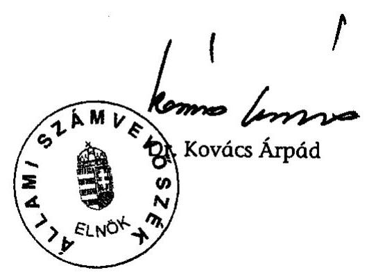
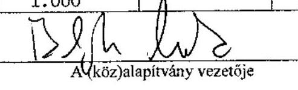
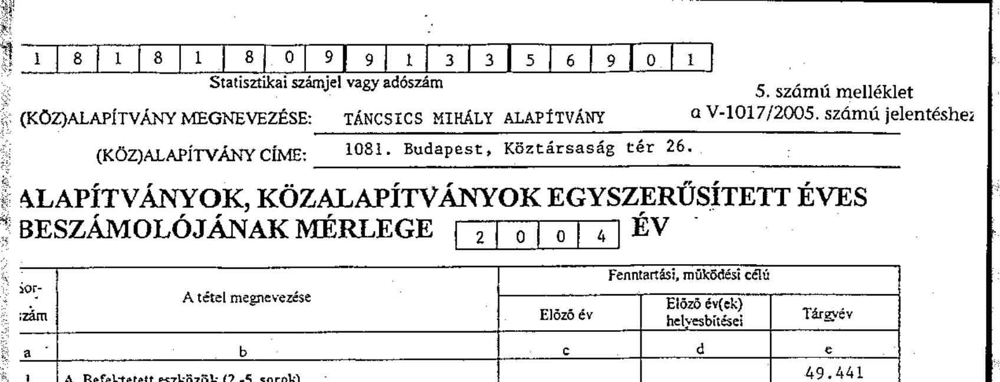

# JELENTÉS 

a Táncsics Mihály Alapítvány 2003-2004. évi gazdálkodása törvényességének ellenőrzéséről

---

3. Önkormányzati és Területi Ellenőrzési Igazgatóság
3.1. Szabályszerűségi Ellenőrzések Főcsoport
Iktatószám: V-1017-34/2005.
Témaszám: 776
Vizsgálat-azonosító szám: V0216

# Az ellenőrzést felügyelte: 

Dr. Lóránt Zoltán
főigazgató
Az ellenőrzés végrehajtásáért felelős:
Dr. Elek János
főigazgató-helyettes
Az ellenőrzést vezette:
Solymár Ágnes
osztályvezető főtanácsos
Az ellenőrzésben részt vettek:
Dr. Méri Sándorné
számvevő

## Sas Imréné

számvevő tanácsadó

---

# TARTALOMJEGYZÉK 

BEVEZETÉS ..... 3
I. ÖSSZEGZŐ MEGÁLLAPÍTÁSOK, KÖVETKEZTETÉSEK, JAVASLATOK ..... 5
II. RÉSZLETES MEGÁLLAPÍTÁSOK ..... 8

1. A kuratórium gazdálkodási tevékenysége ..... 8
1.1. A gazdálkodás szabályozottsága és szabályossága ..... 8
1.2. A gazdálkodást érintő kuratóriumi határozatok ..... 9
2. Az induló vagyon és az alapítvány bevételei ..... 11
2.1. Az induló vagyon ..... 11
2.2. A központi költségvetési támogatás ..... 11
2.3. Az alapítvány bevételszerző tevékenysége ..... 12
3. A bevételek felhasználása ..... 13
3.1. A kuratórium által nyújtott támogatások ..... 13
3.2. Az alapítvány által végzett tevékenység ..... 15
4. A gazdálkodás és a könyvvezetés törvényessége ..... 16
4.1. Az éves beszámolók és a könyvvezetés ..... 16
4.2. A képviseleti, banki aláírási és utalványozási jog ..... 17
5. Az adókkal és járulékokkal kapcsolatos kötelezettség ..... 19
6. Az ellenőrzés rendszere ..... 19

## MELLÉKLETEK

1. számú Az alapítvány által nyújtott támogatások 2004-ben
2. számú Az alapítvány 2004. évi költségei
3. számú Az alapítvány 2003. évi mérlege
4. számú Az alapítvány 2003. évi eredménykimutatása
5. számú Az alapítvány 2004. évi mérlege
6. számú Az alapítvány 2004. évi eredménykimutatása

---

# RÖVIDÍTÉSEK JEGYZÉKE 

| ÁSZ | Állami Számvevőszék |
| :-- | :-- |
| ÁSZ törvény | az Állami Számvevőszékről szóló 1989. évi XXXVIII. törvény |
| call center | telefonos ügyfélszolgálat |
| FB | Felügyelő Bizottság |
| Kincstár | Magyar Államkincstár |
| MSZP | Magyar Szocialista Párt |
| pátalapítványi törvény | a pártok működését segítő tudományos, ismeretterjesztő, |
|  | kutatási, oktatási tevékenységet végző alapítványokról |
|  | szóló 2003. évi XLVII. törvény |
| párttörvény | a pártok működéséről és gazdálkodásáról szóló 1989. évi |
|  | XXXIII. törvény |
| Ptk. | a Polgári Törvénykönyvről szóló 1959. évi IV. törvény |
| Szt. | a számvitelről szóló 2000. évi C. törvény |
| SZMSZ | Szervezeti és Működési Szabályzat |
| TMA | Táncsics Mihály Alapítvány |

---

# JELENTÉS 

## A Táncsics Mihály Alapítvány 2003-2004. évi gazdálkodása törvényességének ellenőrzéséről

## BEVEZETÉS

Az Országgyűlés a pártok Alkotmányban biztosított, a népakarat kialakításában és kinyilvánításában történő közreműködésének elősegítése, az állampolgári tájékoztatás szélesítése, a politikai kultúra fejlesztése érdekében történő politikai képzés, kutatás, tudományos és ismeretterjesztő tevékenység támogatására, a pártok működését segítő tudományos, ismeretterjesztő, kutatási, oktatási tevékenységet végző alapítványokról szóló 2003. évi XLVII. törvény (pártalapítványi törvény) lehetővé tette, hogy a parlamenti pártok költségvetési támogatásra jogosult alapítványokat hozzanak létre, amelyek gazdálkodása törvényességének ellenőrzését kétévenként az Állami Számvevőszék végzi.

A Magyar Szocialista Párt (MSZP) - a törvényben biztosított lehetőséggel élve - létrehozta a Táncsics Mihály Alapítványt (TMA), amelyet a Fővárosi Bíróság 2003. december 18-án a 7.Pk.61.170/2003/3. számú végzésével nyilvántartásba vett.

Az alapítvány alapító okirat szerinti céljai: elősegíteni az MSZP Alkotmányban biztosított, a népakarat kialakításában, valamint kinyilvánításában történő hatékony közreműködését, szélesíteni az állampolgárok tájékozódását a magyar társadalmat érintő társadalmi és politikai kérdésekről, a szociáldemokrácia elméleti megközelítéseiről, ösztönözni a magyar politikai kultúra színvonalának emelését, a demokrácia elveinek és gyakorlatának erősítését, bátorítani a magyar és a globális kulturális értékek, valamint a tudományos eredmények tiszteletben tartását és elfogadtatását, előmozdítani a szociáldemokrata gondolkodás fejlődését, és a szociáldemokrata eszmeiség terjesztését, segíteni a nemzeti érdekeknek a változó körülményeknek megfelelő időszerű megfogalmazását, különös figyelmet fordítva Magyarország uniós tagságából következő feladatokra.

A pártalapítványi törvény 3. § (6) bekezdése szerint az alapítvány céljára legalább a párttörvény 9/A. § (5) bekezdés a) pontja szerinti alaptámogatás 1\%-ának megfelelő összegű vagyont kell rendelni. Az alapítvány a párttörvény alapján alaptámogatásban, mandátumarányos kiegészítő támogatásban és eseti támogatásban részesülhet. A támogatás összegét a költségvetésről szóló törvény évenként állapítja meg.

A pártalapítványi törvény 4. § (2) bekezdése alapján az alapítvány gazdálkodása törvényességének ellenőrzésére az Állami Számvevőszék jogosult, ugyanezen törvény 4. § (4) bekezdése alapján az Állami Számvevőszék kétévenként ellenőrzi azoknak az alapítványoknak a gazdálkodását, amelyek e törvény szerint állami költségvetési támogatásban részesültek.

Ellenőrzésünk célja az volt, hogy az alapítvány gazdálkodásának törvényességi ellenőrzése során értékelje, hogy

- az alapítvány alapító okirata és belső szabályzatai megteremtették-e a törzsvagyonon felüli induló vagyon és a központi költségvetési támogatás felhasználásának törvényes kereteit;
- a kuratórium biztosította-e az alapítvány könyvvezetésének és éves beszámolóinak törvényességét;
- a kuratórium a törzsvagyonon felüli induló vagyonnal, a központi költségvetési támogatással és az alapítvány egyéb bevételeivel, a párttörvénynek és a pártalapítványi törvénynek, valamint az alapító okiratban megjelölt céloknak megfelelően gazdálkodott-e.

Az ellenőrzés az alapítvány megalakulásától a 2004. december 31.-éig tartó időszakra terjedt ki.

---

# I. ÖSSZEGZŐ MEGÁLLAPÍTÁSOK, KÖVETKEZTETÉSEK, JAVASLATOK 

A Táncsics Mihály Alapítványt a Magyar Szocialista Párt a pártalapítványi törvényben előírt mértéket meghaladó egymillió Ft induló vagyonnal hozta létre. Az alapítvány éves költségvetési támogatásának mértéke 2003-ban is és 2004-ben is megfelelt a párttörvény által meghatározott alap-, és mandátumarányos kiegészítő támogatás együttes értékének. Az ellenőrzött időszakban az alapítvány részére adományt sem természetbeni, sem pénzbeli hozzájárulásként nem ajánlottak fel, vállalkozási tevékenységet nem folytatott, így a központi költségvetési támogatáson (628,3 millió Ft) kívül csak az átmenetileg szabad pénzeszközei lekötéséből származott (34 millió Ft) bevétele.

Az alapítványi vagyon felhasználásának kereteit a pártalapítványi törvény és az alapító okirat, részletes szabályait az alapítvány belső szabályzatai rögzítették. Az alapító okirat az alapítvány céljait, az alapítványhoz való csatlakozás, valamint az adományok elfogadásának szabályait a pártalapítványi törvény előírásaival összhangban határozta meg. Nem rögzítette az alapítvány vezető beosztású alkalmazottjai számára biztosított képviseleti jog gyakorlásának módját és terjedelmét, valamint a kuratóriumi határozat érvényességéhez szükséges szótöbbség viszonyítási alapját. A működés szervezeti kereteit és rendjét az alapítvány által működtetett call center kivételével - a kuratórium által jóváhagyott SZMSZ tartalmazta. Az alapítvány az ellenőrzött időszakban rendelkezett a számviteli törvény által előírt gazdálkodási szabályzatokkal, melyeket a kuratórium határozatban jóváhagyott. A számviteli politika nem tartalmazta az alapító okiratban rögzített célok szerinti tevékenységekhez kapcsolódó költségek és az alapítvány működéséhez kapcsolódó költségek elkülönítését. A pénzkezelési szabályzat nem rögzítette a bankszámlaforgalom lebonyolításával kapcsolatos részletes feladatokat és az elektronikus átutalások rendjét.

Az alapítvány az ellenőrzött időszak mindkét évére elkészítette és független könyvvizsgálóval auditáltatta a kettős könyvvitel szerinti egyszerűsített éves beszámolóit, amelyeket leltárral, főkönyvi kivonattal, főkönyvi számlákkal és analitikus nyilvántartásokkal támasztott alá. Az éves beszámolók elkészítése során érvényesítette a pártalapítványi törvény előírásait, a számviteli alapelveket. Az éves beszámolók tartalma kielégítette a valódiság követelményét. A 2004. évről készített éves beszámolója tekintetében, az ellenőrzés során az immateriális javak és az anyagjellegű ráfordítások sorokon feltárt hiba mértéke nem érte el a számviteli politikában meghatározott lényegességi küszöböt, így az a megbízható és valós képet nem befolyásolta. Az alapítvány számviteli nyilvántartása alkalmas volt a központi költségvetésből és egyéb forrásból kapott támogatásoknak a pártalapítványi törvényben és az alapító okiratban megjelölt jogcímek szerinti elszámolására és kimutatására, biztosította az alapítvány által nyújtott támogatások jogszabályi előírás szerinti kimutatását. Nem biztosította teljes körűen az alapítványi célú tevékenység közvetlen költségeinek elkülönítését a kuratórium és a munkaszervezet költségeitől, illetve az egyéb közvetett költségektől.

---

A kuratórium - mint az alapítvány döntéshozó és kezelő szerve - határozatait minden esetben határozatképes ülésen hozta meg, üléseiről minden alkalommal - az alapító okirat előírásának megfelelően - jegyzőkönyvet készített. A kuratórium elfogadta az alapítvány éves beszámolóit, döntött a célszerinti támogatásokról, a célok megvalósításához szükséges tárgyi és személyi feltételek biztosításáról, az alapító okirat előírásától eltérően, tekintettel az indulás éve miatti tapasztalati adatok hiányára, nem hozott határozatot az éves munkatervről, és az alapítvány pénzügyi-, gazdálkodási tervéről, valamint az alapítványi titkárság működéséhez szükséges számítástechnikai eszközök beszerzéséről. Az arculattervezésre és a honlap elkészítésére vonatkozó határozat nem felelt meg az alapító okiratnak, mivel az konkrét összeget nem tartalmazott.

A képviseleti jog, valamint a bankszámla feletti rendelkezés alapító okiratbeli szabályozása megfelelt a törvényi előírásoknak, gyakorlása pedig az alapító okiratnak. A kifizetéseket minden esetben a kuratórium által jóváhagyott utalványozásra jogosult személyek engedélyezték. A pénztári alapbizonylatok 14%-át nem a kijelölt pénztáros, hanem más, arra fel nem hatalmazott töltötte ki, illetve írta alá. A pénztáros a pénzkezelési szabályzat előírásától eltérően nem készített havi pénztárjelentést, a pénztári be- és kifizetéseket csak a főkönyvi számlán rögzítették. Az ellenőrzött bevételi és kiadási pénztárbizonylatok és a főkönyvi könyvelés adatai között eltérést nem állapítottunk meg.

A kuratórium az ellenőrzött időszakban realizált alapítványi bevételek kevesebb, mint egyharmadát használta fel céljai megvalósítására (94%) és működésre (6%). Az alapítványi célokat egyrészt más szervezetek részére továbbadott támogatások útján, másrészt saját szervezeti keretei között valósította meg. A kuratórium által nyújtott támogatások, valamint az alapítvány saját szervezeti keretei között megvalósított programok a párttörvényben, a pártalapítványi törvényben, valamint az alapító okiratban rögzített, az MSZP működését segítő tudományos, ismeretterjesztő, kutatási és oktatási tevékenységekre irányultak. A támogatások odaítéléséről - az alapító okiratban rögzített célokkal összhangban - minden esetben a kuratórium döntött. A támogatottakkal megkötött szerződésekben nem határozták meg azonban az elszámolás konkrét határidejét, a pénzügyi elszámoláshoz csatolandó dokumentumok körét, a támogatás cél szerinti felhasználását igazoló dokumentumok megküldését, nem rendelkeztek a fel nem használt támogatási összegről, nem írtak elő szankciót.

Az alapítvány, mint munkáltató eleget tett a személyi jövedelemadóról, a társadalombiztosítás ellátásaira és a magánnyugdíjra jogosultakról, valamint e szolgáltatások fedezetéről, az egészségügyi hozzájárulásról és az adózás rendjéről szóló 2004-ben hatályos törvényi előírásoknak. Vezette a jogszabályok által előírt munkáltatói és kifizetői feladatokhoz kapcsolódó nyilvántartásokat, az előírt adatszolgáltatási kötelezettségét teljesítette. Levonta a kifizetett bér- és személyi jellegű jövedelmekből az adóelőlegeket és járulékokat. A központi költségvetéssel szembeni bevallási és befizetési kötelezettségét teljesítette.

Az alapító az alapítvány általános ellenőrző szerveként öt főből álló felügyelő bizottságot (FB) jelölt ki, melynek működését az alapító okirat a vonatkozó törvényi előírásokkal összhangban szabályozta. Az ellenőrzött időszakban az FB az alapító okiratban előírt ellenőrzési tevékenységét ellátta, megállapításairól a kuratóriumot, valamint az alapítót évente egyszer tájékoztatta. A belső ellenőrzés a vezetői és munkafolyamatba épített ellenőrzéssel valósult meg. A vezetői ellenőrzés a képviseleti- és utalványozási jog gyakorlása útján érvényesült. A munkafolyamatba épített ellenőrzés a házipénztári pénzkezelés kivételével működött.

A helyszíni ellenőrzés megállapításainak hasznosítása mellett javasoljuk:

# a Magyar Szocialista Párt elnökének, mint az alapító képviselőjének 

1. Gondoskodjék arról, hogy az alapító okirat a legközelebbi módosítás alkalmával kiegészítésre kerüljön az alapítvány vezető beosztású alkalmazottjainak biztosított képviseleti jog gyakorlása módjának és terjedelmének, valamint a kuratóriumi határozatok érvényességéhez szükséges szótöbbség viszonyítási alapjának meghatározásával.

## az alapítvány kuratóriumának

1. Vizsgálja felül a belső szabályzatokat a következők
 figyelembevételével:
a) egészítse ki az SZMSZ-t a call center működtetésének szervezeti kereteire, működési rendjére, feladataira vonatkozóan;
b) határozza meg a számviteli politikában - az alapítvány sajátosságaira figyelemmel az alapítványi tevékenység közvetlen költségeibe, illetve a működési költségekbe tartozó költségek körét és a költségek elkülönítésének módját;
c) egészítse ki a pénzkezelési szabályzatát a bankszámlaforgalom lebonyolításával kapcsolatos részletes feladatokra, ezen belül az elektronikus átutalások rendjére vonatkozóan.
2. Gondoskodjék a pénzkezelési szabályzat házipénztár kezelésére vonatkozó előírásainak maradéktalan betartásáról.
3. Gyakorolja teljes körűen az alapítvány vagyona feletti rendelkezési jogot, ennek keretében határozataiban konkrét összeg megjelölésével döntsön a vagyon felhasználásáról.
4. Határozza meg a támogatottakkal megkötött szerződésekben az elszámolás konkrét határidejét, a pénzügyi elszámoláshoz csatolandó dokumentumok körét, a támogatás cél szerinti felhasználását igazoló dokumentumok megküldését, szerződésszegés szankcióit.

---

# II. RÉSZLETES MEGÁLLAPÍTÁSOK 

## 1. A KURATÓRIUM GAZDÁLKODÁSI TEVÉKENYSÉGE

### 1.1. A gazdálkodás szabályozottsága és szabályossága

Az alapítványt az MSZP hozta létre a 2003. július 1-jétől hatályos pártalapítványi törvény alapján. A Fővárosi Bíróság 2003. december 18-án a 7.Pk. 61.170/2003/3. számú végzésével vette nyilvántartásba. Az alapítvány közérdekű céljait az alapító okirat a pártalapítványi törvény előírásaival összhangban határozta meg.

Az alapítvány alapító okirat szerinti céljai:

- elősegíteni az MSZP Alkotmányban biztosított, a népakarat kialakításában, valamint kinyilvánításában történő hatékony közreműködését;
- szélesíteni az állampolgárok tájékozódását a magyar társadalmat érintő társadalmi és politikai kérdésekről, a szociáldemokrácia elméleti megközelítéseiről;
- ösztönözni a magyar politikai kultúra színvonalának emelését, a demokrácia elveinek és gyakorlatának erősítését;
- bátorítani a magyar és a globális kulturális értékek, valamint a tudományos eredmények tiszteletben tartását és elfogadtatását;
- előmozdítani a szociáldemokrata gondolkodás fejlődését, és a szociáldemokrata eszmeiség terjesztését;
- segíteni a nemzeti érdekeknek a változó körülményeknek megfelelő időszerű megfogalmazását, különös figyelmet fordítva Magyarország uniós tagságából következő feladatokra.

Az alapítvány céljainak megvalósítása érdekében fő tevékenységként segíti az MSZP működését a tudományos kutató, a politikai oktatási, képzési, és az ismeretterjesztő tevékenységek körében.

Az alapítvány a párttörvény 9/A. §-ában meghatározott mértékű, rendszeres költségvetési támogatásra volt jogosult, amelyet a kuratórium - mint az alapítvány kezelő szerve - kizárólag az alapító okiratban meghatározott célok megvalósítására fordíthatott. Az alapítványi vagyon felhasználásának kereteit a pártalapítványi törvény és az alapító okirat, részletes szabályait pedig az alapítvány belső szabályzatai rögzítették.

Az alapítvány működésének szervezeti kereteit, működésének rendjét meghatározó SZMSZ-t a kuratórium - 2004. márciusban - egyhangú szótöbbséggel elfogadta. A szabályzat alapján a kuratórium elnöke és ügyvezető alelnöke között a hatás és jogkörök megosztásra kerültek. Az SZMSZ az alapítvány munkaszervezete keretében szabályozta a kuratóriumi titkárság feladatkörét, amely 2004. elejétől működött, és a titkársági feladatok elvégzéséről két fő gondoskodott. Az SZMSZ nem tartalmazta azonban a call center működtetésével kapcsolatos fel-

---

adatköröket, az alapítvány a call centert működtető személyi állományt 2004. októberétől foglalkoztatta.

Az alapítvány az ellenőrzött időszakban rendelkezett a számviteli törvény által előírt, és a kuratórium által elfogadott gazdálkodási szabályzatokkal.

Az Szt. 14. § (3)-(5) bekezdései szerint az alapítványnak el kellett készíteni a számviteli politikát, a számviteli politika keretében az eszközök és a források leltárkészítési és leltározási-, az eszközök és a források értékelési-, és a pénzkezelési szabályzatokat, továbbá a 161. §-a szerinti számlarendet.

A kuratórium a szabályzatokat az Szt. előírása szerint, az alapítvány bejegyzését követő 90 napon belül (2004. március 9-én), egyhangú szótöbbséggel elfogadta.

Az alapítvány számviteli politikáját az Szt. előírásai alapján készítette el, amely tartalmazta, hogy az alapítvány mit tekint a számviteli elszámolás és az értékelés szempontjából lényeges és jelentős összegű hibának, rögzítette az alapítványra jellemző számviteli előírásokat és módszereket, tartalmazta továbbá az eszközök és források értékelésének szabályait is. Nem tartalmazta azonban az alapítvány sajátosságaira figyelemmel - az alapítványi tevékenység közvetlen költségeibe, illetve a működési költségekbe (kiadásokba) tartozó költségeket, a költségek elkülönítésének módját.

A számlarendet az alapítvány az egységes számlakeret előírásai alapján készítette el, amely tartalmazta a főkönyvi számlák számjelét, megnevezését és tartalmát, az egyes számlákat érintő gazdasági eseményeket, a főkönyvi számlák és analitikus nyilvántartások kapcsolatát.

A pénzkezelési szabályzat a készpénzforgalmat szabályozta, nem rögzítette azonban a bankforgalom lebonyolításával kapcsolatos részletes feladatokat, az elektronikus átutalások rendjét.

A leltározási szabályzat tartalmazta a mérleg tételeit alátámasztó leltár készítésére vonatkozó szabályokat.

# 1.2. A gazdálkodást érintő kuratóriumi határozatok 

Az alapítványnál hét tagú kuratórium működött, amely az ellenőrzött időszakban megtartott nyolc ülésen összesen 84 határozatot fogadott el. A kuratórium határozatait az alapító okirat előírásának megfelelően hozta meg. A határozatok 96%-át az ülésen jelenlévő kurátorok egyhangú szavazattal fogadták el.

A kuratórium üléseiről minden alkalommal jegyzőkönyvet készítettek, amelyet a kuratórium elnöke és alelnöke, valamint a hitelesítésre felkért kurátor, és a jegyzőkönyvvezető írtak alá. A kuratóriumi határozatokról külön sorszámozott nyilvántartást vezettek.

A kuratóriumi határozatok elfogadásához szükséges egyszerű szótöbbséget az alapító okirat nem határozta meg konkrétan, mivel nem rögzítette azt, hogy a

---

szótöbbséget az ülésen jelenlévő, vagy a teljes kuratóriumi létszámhoz kell-e viszonyítani.

Az alapító okirat szerint a kuratórium határozatainak megszületéséhez egyszerű szótöbbség szükséges, szavazategyenlőség esetén az ülést levezető elnök szavazata dönt.

A kuratóriumnak a gazdálkodást érintő döntései - az ülések jegyzőkönyveinek tanúsága szerint - az alapítványi vagyon felhasználására, ennek keretében az alapító okirat szerinti célok megvalósítását szolgáló tevékenységek támogatására, az alapítványi célok alapítványi keretek közötti megvalósításával összefüggő tevékenységekre, valamint a célok megvalósításához szükséges tárgyi és személyi feltételek biztosítására irányultak.

A kuratórium - az alapító okirat és az SZMSZ előírásától eltérően - az ellenőrzött időszakban, tekintettel az indulás éve miatti tapasztalati adatok hiányára, nem hozott határozatot az éves munkatervről, és az alapítvány pénzügyi-, gazdálkodási tervéről.

Az alapító okirat és az SZMSZ szerint az ügyvezető alelnök volt felelős az alapítvány éves munkaprogramjának, pénzügyi-, gazdálkodási tervének és költségvetésének elkészítéséért.

A kuratórium az arculattervezésről és a honlap elkészítéséről szóló határozatot konkrét összeg megjelölése nélkül hozta meg, így az nem felelt meg az alapító okirat azon előírásának, mely szerint a kuratórium kezeli az alapítvány vagyonát, illetve dönt annak felhasználásáról.

A kuratórium az arculat és honlap elkészítéséről szóló határozatát konkrét összeg, vagy keretösszeg meghatározása nélkül fogadta el, és felhatalmazta az ügyvezető alelnököt a kivitelezési szerződés megkötésére (47/2004. 05. 07. számú kuratóriumi határozat). A honlap elkészítésére megkötött szerződést a kuratórium utólag jóváhagyta (49/2004. 07. 12. számú kuratóriumi határozat).

A call center üzemeltetéséhez szükséges műszaki berendezések megvásárlásáról szóló határozat bár hivatkozott az e témában előterjesztett költségvetésre, de az abban foglalt összeget nem tartalmazta.

A kuratórium a call center üzemeltetéséhez szükséges műszaki berendezések megvásárlásáról szóló határozatát az előterjesztett költségvetés keretein belül, konkrét vételár megjelölése nélkül fogadta el, és a szerződési feltételekben, ennek keretében a vételárban történő megállapodásra felhatalmazta az ügyvezető alelnököt és az FB elnököt (64/2004. 09. 21. számú kuratóriumi határozat). A tényleges vételár az ellenőrzés kérésére átadott költségvetés keretein belül maradt.

Az FB elnökének megbízása FB elnöki funkciójával összeférhetetlen volt, az alapító az FB-t azzal a céllal hozta létre, hogy ellenőrizze a kuratórium tevékenységét, gazdálkodásának törvényességét és célszerűségét.

Az alapítványi titkárság működéséhez szükséges számítástechnikai eszköz beszerzésekről - eltérően az alapító okirat előírásától - a kuratórium nem határozott, arról az ügyvezető alelnök döntött.

---

# 2. Az induló vagyon és az alapítvány bevételei 

### 2.1. Az induló vagyon

Az alapító vagyoni hozzájárulási kötelezettségét a pártalapítványi törvényben előírt minimális mértéket meghaladóan teljesítette azzal, hogy az alapítvány részére egymillió forint összegű induló vagyont biztosított, amelyet az alapító okirat rendelkezése szerint - az alapítvány nyilvántartásba vételére vonatkozó kérelem benyújtásáig - külön e célra nyitott letéti számlán helyezett el.

A pártalapítványi törvény 3.§ (6) bekezdése alapján „az alapítvány céljára legalább a párttörvény 9/A. § (5) bekezdés a) pontja szerinti alaptámogatás 1%-ának megfelelő összegű vagyont kellett rendelni." A párttörvény 9/A. § (5) bekezdés a) pontja szerint számított alaptámogatás 1%-a pedig 594 ezer Ft volt.

Az alapítvány induló vagyonából a törzsvagyon mértéke ötszázezer forint volt, amelynek az alapítvány csak a mindenkori hozadékát használhatta fel. A törzsvagyon elkülönített összegét - az év végi mérleget alátámasztó bankkivonat szerint - az alapító okirat előírásának megfelelően folyamatosan elkülönített letéti számlán tartották.

A kuratórium jogosult volt a költségvetési támogatás egy részének is a törzsvagyonba helyezésére, erre az ellenőrzött időszakban nem került sor.

A 2003. évben átadott induló vagyont az alapítvány a 2003. és 2004. évi egyszerűsített éves beszámolóiban a saját tőke részeként, ezen belül induló tőke címen mutatta ki, amely megegyezett az alapító okiratban meghatározott egymillió forint összeggel.

### 2.2. A központi költségvetési támogatás

Az alapítvány a pártalapítványi törvény 1. §-a alapján költségvetési támogatásra volt jogosult, a támogatás mértékét a párttörvény határozta meg. A költségvetési támogatás összege mindkét évben megfelelt a párttörvény 2003. július 1-jétől hatályos 9/A. § (5) bekezdésében meghatározott mértékű alap-, és mandátumarányos kiegészítő támogatás együttes értékének, eseti támogatásban az alapítvány nem részesült.

A párttörvény 9/A. § (5) bekezdése alapján a támogatás mértéke:
a) alaptámogatás: az országgyűlési képviselők tiszteletdijáról, költségtérítéséről és kedvezményeiről szóló 1990. évi LVI. törvény szerinti egyévi képviselői alapdíj huszonötszöröse;
b) mandátumarányos kiegészítő támogatás: képviselőnként az éves képviselői alapdíj 85%-a;
c) eseti támogatás: az éves költségvetési törvényben kiemelt célra rendelt, az a) és b) pontban foglaltak megfelelő alkalmazásával meghatározott összeg.

Az alapítvány a 2003-2004. években összesen 628 300 ezer Ft központi költségvetési támogatást kapott, ezen belül a 2003. évre időarányosan 209 400 ezer Ft-ot (az éves támogatás 50%-a), a 2004. évre 418 900 ezer Ft-ot.

---

A 2004. évi éves költségvetési támogatás 418 900 ezer Ft volt, ebből az alaptámogatás 59 400 ezer Ft, az MSZP 178 fős képviselőcsoportjára számított mandátumarányos kiegészítő támogatás pedig 359 500 ezer Ft.

A 2003. évi időarányos támogatás biztosítására a pártalapítványi törvény 5. § (5) bekezdésében a Kormány felhatalmazást kapott, hogy az előző évek előirányzatmaradványaiból - függetlenül az eredeti felhasználási céltól - átcsoportosítást hajtson végre az alapítványok 2003. évi támogatásának biztosítása céljából.

A párttörvény 9/A. §. (7) bekezdése alapján a támogatás összegét a központi költségvetésről szóló törvény állapítja meg. A 2004. évi költségvetési törvény az Országgyűlés fejezeten belül egy összegben tartalmazta a pártalapítványok támogatását, amelyből a Kormány a pártalapítványok támogatásának felosztásáról szóló 2024/2004. (I. 31.) Korm. határozattal a Táncsics Mihály Alapítványnak 418,9 millió Ft-ot csoportosított át.

A Miniszterelnökség fejezet a 2003. évi időarányos támogatást egy összegben, a pártalapítványi törvénynek megfelelően, az alapítvány jogerős bírósági nyilvántartásba vételét követő tizenegyedik napon folyósította.

A pártalapítványi törvény 5. § (3) bekezdése szerint az alapítvány nyilvántartásba vételét követő 15 napon belül kellett a 2003-ban esedékes teljes támogatást rendelkezésre bocsátani.

A Kincstár a 2004. évi támogatást - az első negyedév kivételével - a pártalapítványi törvénynek megfelelően, negyedéves ütemezésben, a negyedév első napjaiban átutalta. Az első negyedévi támogatást 2004. február 11-én folyósította, mivel az Országgyűlés által egy összegben elfogadott támogatásnak
 a pártalapítványok közötti felosztásáról a Kormány 2004. január végén hozott határozatot, így a támogatás utalására csak ez után kerülhetett sor.

A pártalapítványi törvény 2. § (1) bekezdése alapján a költségvetési támogatás kifizetése negyedévenként történik, a negyedév első napján.

A költségvetési támogatást az alapítvány a 2003. és 2004. évi egyszerűsített éves beszámolóinak eredmény-kimutatásaiban a - vonatkozó számviteli előírásokkal összhangban - az egyéb bevételek között mutatta ki, a kimutatott érték mindkét évben megegyezett a főkönyvi számlák és vonatkozó könyvelési alapbizonylatok (bankkivonatok) összesített adataival.

# 2.3. Az alapítvány bevételszerző tevékenysége 

Az alapító okirat lehetővé tette az alapítvány számára a kívülállók által teljesített adományok, egyéb támogatások, juttatások és felajánlások elfogadását a pártalapítványi törvény vonatkozó előírásai figyelembe vételével. Az ellenőrzött időszakban az alapítvány részére adományt sem természetbeni, sem pénzbeli hozzájárulásként nem ajánlottak fel.

Az ellenőrzött időszakban az alapítványnak a központi költségvetési támogatáson kívül csak az átmenetileg szabad pénzeszközei lekötéséből származott bevétele. A szabad pénzeszközök folyamatos lekötésével az alapítvány 2004-ben összesen 33964 ezer Ft kamatbevételt realizált. A pénzeszközök lekötéséről minden esetben a bankszámla felett aláírásra jogosultak rendelkeztek.

---

Az év folyamán lekötött pénzeszközök átlagos állománya 430000 ezer Ft, a 2004. december 31-i állomány 455000 ezer Ft, a realizált kamat mértéke pedig átlagosan 8% volt.

A 2004. évi éves beszámoló eredménykimutatásában a pénzügyi műveletek bevételei között kimutatott kamatbevétel a vonatkozó főkönyvi számla és a könyvelési alapbizonylatok (bankkivonatok) összesített adataival megegyezett.

Az alapító okirat rögzítette, hogy az alapítvány másodlagosan és kisegítő jelleggel vállalkozási tevékenységet is folytathat, az ellenőrzött években vállalkozási tevékenységet nem végzett.

# 3. A bevételek felhasználása 

Az alapító okirat rögzítette, hogy a kuratórium kezeli az alapítvány vagyonát, dönt a vagyonnak az alapító okiratban előírt céloknak megfelelő felhasználásáról, meghatározza az alapítványi célok prioritását, a rendelkezésre álló anyagi eszközök felhasználásának módját, feltételeit, dönt az alapítványi célok szerinti támogatásokról.

A kuratórium 2004. december 31.-éig az ellenőrzött időszakban realizált alapítványi bevételek 69%-át nem használta fel. Az alapítvány a - 2003. év végi bírósági nyilvántartásba vételből eredően - tényleges működését a 2004. évben kezdte meg. A kuratórium a 2004. évben összesen 204962 ezer Ft-ot használt fel, ennek keretében 85640 ezer Ft (42%) támogatást nyújtott, 107497 ezer Ft (52%) volt célszerinti költség és eszközbeszerzés, valamint 11825 ezer Ft (6%) működési költség merült fel. A kuratórium az alapítványi célokat részben más szervezetek részére továbbadott támogatások útján, másrészt az alapítvány saját szervezeti keretei között valósította meg. Az ellenőrzés tételes volt.

### 3.1. A kuratórium által nyújtott támogatások

A kuratórium a 2004. évben az alapító okiratban meghatározott célok megvalósítása érdekében támogatást nyújtott különböző szervezetek (alapítvány, társadalmi szervezet, felsőoktatási intézmény, egyesület), gazdasági társaságok (kft., bt.) és két alkalommal magánszemélyek részére különféle - az alapítvány céljaival összhangban lévő tanfolyamok, kiadványok, tanulmányok, konferenciák, rendezvények - programok megvalósításához.

A kuratórium által nyújtott támogatások a pártalapítványi törvényben, valamint az alapító okiratban rögzített, az MSZP működését segítő tudományos, ismeretterjesztő, kutatási és oktatási tevékenységekre irányultak. A támogatások 54%-át ismeretterjesztő tevékenységre fordították a párt társadalmi kapcsolatainak szélesítése, a szociáldemokrata értékek elfogadtatása, a tudományos, ismeretterjesztő rendezvények és kiadványok támogatása érdekében, a politikai, oktatási és képzési tevékenység 25%-ban, a tudományos kutató tevékenység pedig 21%-ban részesült az összes támogatásból.

A kuratórium a támogatásokat, az alapító okirat felhatalmazása alapján, pályázatok kiírása nélkül, egyedi kérelmekre nyújtotta, a benyújtott kérelmek 63%-át támogatta az igényelt összeg 50%-ának megfelelő mértékben. A leg-

---

magasabb támogatási összeg húszmillió forint, a legalacsonyabb negyvenötezer forint, az átlagos támogatási összeg négymillió forint volt.

A kuratórium huszonnégy egyedi kérelmet támogatott, amelyből az alapítvány huszonegy támogatást fizetett ki. Három esetben a megítélt támogatás nem realizálódott, mivel a kérelemben megjelölt támogatási cél módosult, vagy a szerződéskötést megelőzően már teljesült.

A kuratórium a támogatások eljárási rendjét nem szabályozta, a szervezeti és működési szabályzat pedig elsősorban a pályázati úton nyújtott támogatásokra vonatkozóan tartalmazott általános előírásokat.

Az alapító okirat IV. fejezet 3. d) pontja alapján a kuratórium pályázatokat ír ki és bírál el, egyedi támogató döntéseket hagy jóvá. Az SZMSZ II. fejezetének 2) pontja tartalmazta többek között, hogy a kuratórium bármely cél szerinti juttatását pályázathoz kötheti, gondoskodik a pályázati feltételek meghirdetéséről és nyilvánosságáról, dönt a támogatások odaítéléséről, felhasználásának ellenőrzéséről. Támogatás pályázaton kívüli elnyerésére csak a kuratórium által elfogadott szabályzatokban előzetesen meghatározott esetekben és rögzített elvek figyelembevételével kerülhet sor.

Az alapítvány a pályázatkezelési szabályzat tervezetet 2005. év elején készítette el, a kuratórium 2005. májusban annak átdolgozásáról határozott, elfogadásáról a helyszíni ellenőrzés 2005. júliusi befejezésekor még nem hozott határozatot.

Az alapítvány a kifizetett támogatásokat a 2004. évi éves beszámoló eredménykimutatásában - a vonatkozó számviteli előírásokkal összhangban - az egyéb ráfordítások között mutatta ki, a kimutatott érték megegyezett a vonatkozó főkönyvi számlák és a könyvelési alapbizonylatok (támogatási szerződések és banki kivonatok) összesített adataival.

Az alapítvány által nyújtott támogatásokat a 1. számú melléklet tartalmazza.
Az egyedi kérelmekre adott támogatások szabályosságának tételes ellenőrzése alapján megállapítottuk, hogy a kérelmek elbírálásáról és a támogatások odaítéléséről - az alapító okiratban rögzített célokkal összhangban - minden esetben a kuratórium döntött.

Három esetben a kuratórium az igényelt összeget meghaladó támogatást ítélt meg, két esetben a benyújtott költségvetés szerinti önrésszel, egy esetben az igényelt összegnél 20%-kal volt magasabb a megítélt támogatás összege.

A támogatott szervezetekkel az alapítvány képviseletében a kuratórium elnöke/alelnöke minden esetben támogatási szerződést kötött. A szerződés tartalmazta a támogatás célját és összegét, folyósításának és elszámolásának módját. Nem határozta meg azonban az elszámolás konkrét határidejét, a pénzügyi elszámoláshoz csatolandó dokumentumok körét, a támogatás cél szerinti felhasználását igazoló dokumentumok (pl. jelenléti ív, támogatott kiadvány mintapéldánya) megküldését, nem rendelkezett a fel nem használt támogatási összegről, nem írt elő szankciót (pl. a szerződéstől eltérő felhasználás, a késedelmes vagy hiányos elszámolás, illetve az elszámolás elmulasztása, stb. miatt).

---

Az alapítvány - a 2004. évi elszámoltatások tapasztalatai alapján - a 2005. évben pontosította és kiegészítette a támogatási szerződés előírásait.

Az ellenőrzött időszakban adott támogatások felhasználásáról a helyszíni ellenőrzés júliusi befejezéséig, a támogatottak 85%-a elszámolt, három támogatás felhasználása még folyamatban volt.

A támogatottak 55%-ban számlamásolatokkal, 28%-ban a kifizetési és a kifizetést igazoló bizonylatok másolataival, 17%-ban hitelesített számlamásolatokkal igazolták a támogatás felhasználását.

Két támogatott szervezet összesen öt támogatással (a realizált támogatások 24%-a, amely a kifizetett támogatási összeg 10%-át tette ki) csak az alapítvány többszöri felszólítására - az ÁSZ helyszíni ellenőrzésének időszakában - számolt el. A kuratórium mindkét szervezet részére úgy ítélt meg további támogatást, hogy a korábbiakkal nem számoltak el.

A támogatottak egyike csak a támogatás 28%-ának felhasználását igazolta dokumentumokkal, és a benyújtott dokumentumok 10%-a nem a szerződés szerinti rendezvényhez kapcsolódott. Az elszámolás elfogadásáról, valamint a fel nem használt támogatásról a helyszíni ellenőrzés befejezésekor a kuratórium még nem határozott.

# 3.2. Az alapítvány által végzett tevékenység 

Az alapítványi célokra fordított költségekkel megvalósított feladatok a pártalapítványi törvényben, valamint az alapító okiratban rögzített célok megvalósulását szolgálták. A költségek 29%-a a call center működtetéséhez kapcsolódott, a rendszer működtetéséről és annak költségeiről a kuratórium határozott (64/2004. 09. 21. számú kuratóriumi határozat). E költségek között számolták el a rendszer működtetésével megbízott személyi állomány bér- és járulékköltségét, valamint a rendszer karbantartási költségét.

Az MSZP programjáról - elsősorban a párton kívüli értelmiségiek körében szervezett társadalmi vitasorozatra a célszerinti költségek 22%-át számolták el, a programról és költségeiről a kuratórium határozott (50/2004. 07. 12. számú kuratóriumi határozat). E költség között számolták el a rendezvényekhez kapcsolódó terem-, és technikai eszközök bérleti díját, a személyszállítási, a szervezési, a lebonyolítási, a dekorációs és az egyéb költségeket.

Az elszámolt költségek a könyvelési alapbizonylatokon (szállítói számlák, megrendelések, szerződések) feltüntetett teljesítési idő, a teljesítés igazolása, a rendezvények helyszíne és időpontja alapján beazonosíthatóak voltak.

A célszerinti kifizetések 14%-át fordították a szociáldemokráciával kapcsolatos adatgyűjtés, kutatás, elemzés és tanulmány elkészítésére, a feladatról és a vonatkozó megbízási szerződés elfogadásáról a kuratórium határozott (84/2004. 10. 04. számú kuratóriumi határozat).

A művészetet támogató program az alapítványi célú költségek 13%-át képezte. A kuratórium által elfogadott kortárs képző- és iparművészetet támogató program első állomása volt 2004-ben a Táncsics Mihály Életmúdíj alapítása szobrászat és festészet kategóriában (48/2004. 07. 12. és a 65-67/2004. 09. 21. számú

---

kuratóriumi határozatok). Itt számolták el a művészek díjazását és a rendezvény lebonyolításának költségeit.

Az alapítvány internetes portáljának elkészítése, fejlesztése és működtetése a célszerinti költségek 10%-a volt, a célszerinti tevékenységet szolgáló eszközök után elszámolt terv szerinti értékcsökkenés pedig 11%-át alkotta, és 1% volt az egyéb jogcímen felmerült alapítványi célú költség.

Az alapító a működésre felhasználható kiadások mértékének meghatározását a kuratórium hatáskörébe utalta.

Az alapító okirat IV. fejezetének 3) pontja alapján a kuratórium dönt az alapítvány működési költségeire felhasználható összegekről.

A 2004. évben a kuratórium egyedi határozatokkal döntött az alapítvány működéséhez elszámolt költségekről és ráfordításokról, amelyek 55%-át az anyagjellegű ráfordítások (irodabérleti díj, könyvvizsgálati díj, igénybevett ügyviteli szolgáltatás), 26%-át a személyi jellegű ráfordítások, 19%-át a működést szolgáló eszközök után elszámolt értékcsökkenés és egyéb költségek alkották.

A 2004. évi éves beszámoló eredmény-kimutatásában kimutatott költségek összege megegyezett a főkönyvi költségszámlák és a könyvelési alapbizonylatok (szerződések, szállítói számlák, banki és pénztári kifizetések) adataival.

Az alapítvány költségeit jogcímenként a 2. számú melléklet tartalmazza.
A 2004. évi eszközbeszerzések 93%-át a call center működtetéséhez szükséges technikai eszközök és berendezések, 4%-át a szellemi termékek (honlap), 3%-át az alapítványi titkárság működéséhez beszerzett eszközök tették ki.

Az alapítvány és az MSZP közötti együttműködési megállapodás alapján a call center működtetéséhez a párt irodahelyiséget és telefonhasználatot, az alapítvány pedig a működtetés technikai és személyi feltételeit biztosította.

# 4. A gazdálkodás és a könyvvezetés törvényessége 

### 4.1. Az éves beszámolók és a könyvvezetés

Az alapítvány számviteli politikájának megfelelően az ellenőrzött időszak mindkét évére elkészítette a kettős könyvvitel szerinti egyszerűsített éves beszámolóit, amely mérlegből és eredmény-kimutatásból állt. Az éves beszámolókat leltárral, főkönyvi kivonattal, főkönyvi számlákkal és analitikus nyilvántartásokkal támasztották alá.

A 2003. évi éves beszámolót a 3. és 4. számú, a 2004. évi éves beszámolót az 5. és 6. számú melléletek mutatják be.

Az éves beszámolókat mindkét évben függetlenített könyvvizsgáló ellenőrizte, és azokat hitelesítő záradékkal látta el. Az FB az alapítvány 2003. évi beszámolóját utólag, a beszámoló kuratóriumi jóváhagyását követően, a 2004. évről készített beszámolót, a kuratóriumi jóváhagyást megelőzően, írásban vélemé-

---

nyezte, és elfogadásra javasolta. A kuratórium az alapító okirat előírásának megfelelően mindkét évben döntött a beszámolók elfogadásáról.

Megállapítottuk, hogy az éves beszámolók elkészítése során érvényesítették a számviteli alapelveket, az éves beszámolók, ezen belül a mérleg és eredménykimutatás sorok tartalma
 kielégítette a valódiság követelményét. Az ellenőrzés során feltárt hiba mértéke nem érte el a lényegességi küszöböt, így a megbízható és valós képet nem befolyásolta.

A 2004. évről készített éves beszámoló mérlegében téves főkönyvi számlakijelölés miatt az immateriális javak mérlegsoron 4298 ezer Ft-tal alacsonyabb, az eredménykimutatásban az anyagjellegű ráfordítások soron pedig, ugyanezen összeggel magasabb értéket mutattak ki. A hiba a 2004. évi mérleg főösszegének 0,83%-át tette ki, így az nem érte el a számviteli politikában jelentős összegűnek minősített 2%-os mértéket.

Az alapítvány az internetes portál elkészítésére kötött szerződés szerinti díj első részletét helyesen eszközbeszerzésként, az immateriális javak között mutatta ki. A szerződés szerinti díj további részleteit (4298 ezer Ft) azonban az anyagjellegű ráfordítások között karbantartási költségként számolta el, amelyet - a szerződés tartalma szerint - az immateriális javak között kellett volna kimutatni.

Az alapítvány könyvvezetése a 224/2000. (XII. 19.) Korm. rendelet 8. § (4) bekezdésében foglaltaknak megfelelően, a kettős könyvvitel rendszerében, az alapbizonylatok számítógépes feldolgozásával történt. A főkönyvi számlák és analitikus nyilvántartások kapcsolata megfelelő volt. Az ellenőrzött években a könyvvezetés alkalmas volt a központi költségvetésből és egyéb forrásból kapott támogatásoknak a pártalapítványi törvényben és az alapító okiratban megjelölt jogcímek szerinti elszámolására és kimutatására. Biztosította az alapítvány által nyújtott támogatásoknak a 224/2000. (XII. 19.) Korm. rendelet 16. § (6) és (7) bekezdések szerinti kimutatását. Nem biztosította azonban a költségeknek az alapítványok gazdálkodási rendjéről szóló 115/1992. (VII. 23.) Korm. rendelet 3. § (2) bekezdése szerinti - alapítványi célú tevékenység közvetlen költségei, az alapítvány kezelő szervének költségei és az egyéb közvetett költségek - elkülönítését.

# 4.2. A képviseleti, banki aláírási és utalványozási jog 

A képviseleti jogot az alapító okirat és az SZMSZ egymással összhangban szabályozta, amely szerint a kuratórium elnöke az alapítvány általános és teljes jogkörű, minden ügyre kiterjedő hatáskörű képviselője, a kuratórium ügyvezető alelnöke az alapítvány gazdasági- és munkaügyi ügyekre, valamint az elnök akadályoztatása esetén történő helyettesítésére kiterjedő hatáskörű képviselője.

Az alapítvány által megkötött támogatási és egyéb szerződések/megállapodások tételes ellenőrzése alapján megállapítottuk, hogy a képviseleti jog gyakorlása során érvényesítették az alapító okiratban és SZMSZ-ben foglalt szabályokat.

A képviseleti jogot a támogatási szerződések 45%-ánál és az egyéb szerződések 20%-ánál az ügyvezető alelnök, egyéb esetekben a kuratórium elnöke gyakorolta.

---

Az alapító az alapító okirat záró rendelkezésének 3) pontjában felhatalmazta a kuratóriumot, hogy - a zavartalan napi működés biztosításához szükséges mértékben - az alapítvány vezető beosztású alkalmazottjai számára képviseleti jogot biztosítson. Az alkalmazottak vonatkozásában azonban a Ptk. 74/C. § (4) bekezdésében foglaltaktól eltérően, nem határozta meg a képviseleti jog gyakorlásának módját és terjedelmét. Az ellenőrzött időszakban a kuratórium nem élt ezzel a lehetőséggel.

A Ptk. 74/C. § (4) bekezdése 2002. január 1-jétől tette lehetővé, hogy az alapító az alapító okiratban úgy is rendelkezhet, hogy a kuratórium az alapítvány alkalmazottjának képviseleti jogot biztosíthat, megjelölve a képviseleti jog gyakorlásának módját, illetőleg terjedelmét.

Az alapítvány bankszámlája feletti rendelkezés szabályozása és gyakorlása megfelelt az alapító okiratban foglaltaknak. A hatályos alapító okirat szerint az alapítvány bankszámlái felett való rendelkezéshez a kuratórium elnökének és ügyvezető alelnökének külön-külön, egyedüli és önálló aláírására, vagy az alapítvány erre írásban felhatalmazott két alkalmazottjának együttes aláírására volt szükség.

A banki aláírás bejelentés szerint 2004. február 18.-ától március 26.-áig az alapítvány bankszámlája feletti rendelkezésre a kuratórium elnöke és ügyvezető alelnöke voltak jogosultak, a gyakorlat ennek megfelelt. Ezt követően - a korábbi aláírók mellett - a kuratórium titkárát is bejelentették banki aláíróként, aki vagy az elnökkel, vagy az alelnökkel együttesen gyakorolhatta és gyakorolta az aláírási jogot.

A kuratórium jóváhagyta az utalványozásra jogosultak körét, utalványozásra a kuratórium elnökét, ügyvezető alelnökét, valamint a működéshez szükséges napi kiadások tekintetében a kuratórium titkárát hatalmazta fel. A szállítói számlák, a bank- és a pénztár bizonylatok tételes ellenőrzése alapján megállapítottuk, hogy a kifizetést minden esetben az arra jogosult személyek engedélyezték.

Az alapítványi célok teljesítéséhez kapcsolódó kifizetéseket a kuratórium elnöke és alelnöke - megosztva - engedélyezték, a kuratóriumi titkár utalványozása a működési költségekhez kapcsolódott.

A kuratórium alelnöke - a pénzkezelési szabályzattal összhangban - a pénztárosi feladatok ellátására a könyvelési-ügyviteli szolgáltatást végző külső szervezet vezetőjének kijelölése alapján, a külső szervezet egyik munkatársát hatalmazta fel. Megállapítottuk, hogy az ellenőrzött időszakban, a pénzkezelési szabályzattól eltérően, a pénztári alapbizonylatok 14%-át nem a kijelölt pénztáros, hanem más, arra fel nem hatalmazott írta alá. Ezekben az esetekben a pénztár átadás-átvételét jegyzőkönyvvel nem dokumentálták. A pénztáros a pénzkezelési szabályzat előírásától eltérően nem készített havi pénztárjelentést, a pénztári be- és kifizetéseket csak a főkönyvi számlán rögzítették. A pénzkészletet dokumentáltan egy alkalommal, az év végi mérleghez készített leltározás során ellenőrizték. Az ellenőrzött bevételi és kiadási pénztárbizonylatok és a főkönyvi könyvelés adatai között eltérést nem állapítottunk meg.

---

# 5. Az adókkal és járulékokkal kapcsolatos kötelezettség 

Az alapítvány munkáltatói jogkörében 2004. évben eleget tett a személyi jövedelemadóról, a társadalombiztosítás ellátásaira és a magánnyugdíjra jogosultakról, valamint e szolgáltatások fedezetéről, az egészségügyi hozzájárulásról és az adózás rendjéről szóló hatályos törvényi előírásoknak. A munkáltatói és kifizetői feladatokhoz rendelt nyilvántartásokat vezette, az előírt adatszolgáltatásokat teljesítette.

A kifizetett bér és személyi jellegű jövedelmekből - munkabér, megbízási díj, pénzbeli díjazás, szerzői jogdíj - a magánszemélyeket terhelő levonásokat teljesítették, a munkáltatót/kifizetőt terhelő költségvetési befizetési kötelezettséget előírták, azt havi rendszerességgel, határidőben befizették.

A 2004. évben a nyugdíjbiztosítási járulék bevallása és megfizetése között éves szinten - eltérő kerekítés miatt - egyezer forint eltérést állapítottunk meg.

Az alapító okirat alapján a kuratórium és felügyelő bizottság tagjai tiszteletdíjban és költségtérítésben részesülhettek. Az ellenőrzött időszakban a kurátorok és FB tagok tiszteletdíjat nem vettek fel, részükre az alapítvány költségtérítést nem számolt el.

Az alapítvány útiköltség térítést fizetett saját tulajdonú gépkocsi hivatali célú használatával összefüggésben. A kuratórium elnöke a gépkocsi használatára a tulajdonossal megállapodást kötött, és a költséget igazolt útnyilvántartás alapján, a vonatkozó jogszabályoknak megfelelően, adómentes mértékben térítette meg.

Az üzemanyagköltséget - a 60/1992. (IV. 1.) Korm. rendelet szerinti - üzemanyag-fogyasztási norma és az APEH által közzétett üzemanyagár alapulvételével számolták el, és gépjárműhasználat címen három forint/km adómentes költségtérítést fizettek.

Természetbeni juttatásként adómentesen elszámolható étkezési költségtérítést biztosítottak egy fő munkavállaló részére. A személyi jellegű ráfordítások között elszámolt reprezentáció és a tízezer forint egyedi értéket meg nem haladó üzleti ajándék együttes értéke az adómentesen elszámolható érték alatt volt.

## 6. Az ellenőrzés rendszere

Az alapító az alapítvány általános ellenőrző szerveként öt főből álló felügyelő bizottságot jelölt ki és kijelölte annak elnökét is, az alapító okirat pedig az FB működését a Ptk.-val összhangban szabályozta.

Az FB ügyrendjét maga állapította meg. A kuratórium felkérése alapján valamennyi kuratóriumi ülésen tanácskozási joggal képviseltette magát, ezáltal folyamatosan informálódott a kuratórium működéséről.

Az ellenőrzött időszakban az FB az alapító okiratban előírt ellenőrzési tevékenységét ellátta.

---

Az FB ülések jegyzőkönyveinek tanúsága szerint a belső szabályzatokat, és az alapítvány gazdálkodását rendszeresen áttekintette, a gazdálkodás törvényességét és célszerűségét folyamatosan ellenőrizte, az elvégzett ellenőrzésekről külön jelentést nem készített.

Az ellenőrzési megállapításairól a kuratóriumot valamint az alapítót évente egyszer tájékoztatta. Az FB elnöke rendkívüli kuratóriumi ülést az ellenőrzött időszakban egyetlen alkalommal sem kezdeményezett, mivel a törvényes működés feltételeit megfelelőnek ítélte.

Függetlenített belső ellenőrt az alapítvány nem foglalkoztatott.
A vezetői ellenőrzés a képviseleti- és utalványozási jog gyakorlása útján érvényesült, melyet minden esetben az arra felhatalmazottak gyakoroltak, erre vonatkozó megállapításainkat a jelentés 4.2. pontjában foglaltuk össze.

A munkafolyamatba épített ellenőrzés szabályait az SZMSZ és a gazdálkodási szabályzatok rögzítették. A munkafolyamatba épített ellenőrzés a házipénztári pénzkezelés során nem működött, erre vonatkozó megállapításunkat a jelentés 4.2. pontja tartalmazza.

Budapest, 2005. december 12.

Melléklet: $\quad 6 \mathrm{db} \quad 8$ lap

---

# A TÁNCSICS MIHÁLY ALAPÍTVÁNY ÁLTAL ADOTT TÁMOGATÁSOK 2004. ÉVBEN

|  Támogatott célok és feladatok | Beérkezett kérélmek száma (db) | Támogatott kérélmek száma (db) | A beérkezett támogatási kérélmek összege (ezer Ft) | A kuratórium által odaítélt támogatás összege (ezer Ft) | Kifizetett támogatás összege (ezer Ft) | Lezárt pályázatok száma (db)  |
|---|---|---|---|---|---|---|
|  Tudományos kutató tevékenység összesen | 7 | 5 | 78.975 | 17.975 | 17.975 | 4  |
|  szociáldemokrata eszmeiség kutatása | 2 | 2 | 395 | 395 | 395 | (+ 1 nem határidős)  |
|  politológiai kutatások | 2 | 2 | 17.500 | 17.500 | 17.500 | 2  |
|  szociáldemokrata gondolkodás | 3 | 1 | 61.080 | 80 | 80 | 1  |
|  MSZP program terjesztése | 0 | 0 | 0 | 0 | 0 | 0  |
|  Politikai, oktatási, képzési tevékenység összesen | 6 | 4 | 37.280 | 25.980 | 21.480 | 2  |
|  párt oktatási intézményrendszer és infrastruktúra bővítése | 1 | 0 | 10.000 | 0 | 0 | 0  |
|  oktatási programok, módszerek kidolgozása | 1 | 1 | 2.000 | 2.000 | 0 | 0 (+1 nem került felhasználásra)  |
|  oktatók képzése, továbbképzése | 0 | 0 | 0 | 0 | 0 | 0  |
|  oktatók nemzetközi kapcsolatai | 0 | 0 | 0 | 0 | 0 | 0  |
|  oktatási, képzési tevékenység | 2 | 2 | 22.500 | 22.500 | 20.000 | 1 (+1 nem került felhasználásra)  |
|  fiatalok politikai képzése | 1 | 1 | 980 | 1.480 | 1.480 | 1  |
|  politikai, közigazgatási, idegennyelvi képzés | 1 | 0 | 1.800 | 0 | 0 | 0  |
|  ismeretterjesztő tevékenység összesen | 25 | 15 | 66.812 | 46.435 | 46.185 | 10  |
|  szociáldemokrata értékek elfogadtatása | 3 | 3 | 17.410 | 15.260 | 15.260 | 3  |
|  a párt társadalmi kapcsolatainak szélesítése | 5 | 4 | 17.127 | 13.400 | 13.400 | 4  |
|  a párt népszerűsítésének növelése | 0 | 0 | 0 | 0 | 0 | 0  |
|  tudományos, ismeretterjesztő kiadványok | 7 | 4 | 17.375 | 12.375 | 12.325 | 2 (+ 2 nem határidős)  |
|  tudományos, ismeretterjesztő rendezvények | 10 | 4 | 14.900 | 5.400 | 5.200 | 1 (+1 nem került felhasználásra + 2 elszámolás folyamatban)  |
|  Mindösszesen | 38 | 26 | 201.067 | 117.365 | 113.865 |

 24 | 183.067 | 90.390 | 85.640 | 16 (3 nem került felhasználásra, 3 nem határidős, 2 elszámolás folyamatban)  |

Alulírott az Állami Számvevőszékről szóló 1989. évi XXXVIII. törvény 24. § c) pontja alapján aláírásommal kijelentem, hogy a feltüntetett adatok teljesek és az alapítvány nyilvántartásaival, okmányaival mindenben egyeznek.

Budapest, 2005. július 06.

TÁNCSICS MIHÁLY ALAPÍTVÁNY

Képviseletre jogosult aláírása

---

# A Táncsics Alapítvány 2004. évi költségei (kiadásai)

|  Sor szám | Megnevezés | Értékadatok; ezer Ft-ban |  |   |
| --- | --- | --- | --- | --- |
|   |  | Cél szerinti költségek (kiadások) | Működési költségek (kiadások) | Összesen  |
|  1 | Anyag költségek | 237 | 590 | 827  |
|  11 | Nyomtatvány, irodaszer | 140 | 404 | 544  |
|  12 | Egyéb anyag költség | 97 | 186 | 283  |
|  2 | Igénybevett szolgáltatások | 29872 | 6196 | 36068  |
|  21 | Szállítási és taxi költség | 1033 | 19 | 1052  |
|  22 | Irodabérleti díj |  | 2590 | 2590  |
|  23 | Rendezvényekhez kapcsolódó terembérleti díj | 4104 |  | 4104  |
|  24 | Hang- és vizuáltechnikai eszközök bérlése | 3400 |  | 3400  |
|  25 | Karbantartási költség (call center) | 2813 |  | 2813  |
|  26 | Honlap fejlesztése, működtetése és karbantartása | 5381 |  | 5381  |
|  27 | Hirdetés, reklám költség | 101 |  | 101  |
|  28 | Oktatás (előadói díjak) | 213 |  | 213  |
|  29 | Posta és telefon költség | 227 | 333 | 560  |
|  210 | Ügyviteli és könyvvizsgálói szolgáltatás |  | 2863 | 2863  |
|  211 | Kutatás, elemzés, tanulmánykészítés | 7500 |  | 7500  |
|  212 | Nyomdai szolgáltatás (sokszorosítás) | 701 | 65 | 766  |
|  213 | Rendezvények szervezése és lebonyolítása | 2488 |  | 2488  |
|  214 | Grafikai tervezés, dekoráció | 1402 |  | 1402  |
|  215 | Rendezvények egyéb költsége (videó, film, stb.) | 240 |  | 240  |
|  216 | Külföldi útiköltség | 267 |  | 267  |
|  217 | Bankköltség, biztosítás | 2 | 326 | 328  |
|  3 | Bérköltség | 9678 | 1272 | 10950  |
|  31 | Főfoglalkozású dolgozók bérköltsége |  | 1272 | 1272  |
|  32 | Megbízási díjak | 9678 |  | 9678  |
|  4 | Személyi jellegű egyéb kifizetés | 5255 | 883 | 6138  |
|  41 | Pénzbeli díjazás (TA életműdíj) | 3226 |  | 3226  |
|  42 | Étkezési költségtérítés |  | 54 | 54  |
|  43 | Reprezentáció, üzleti ajándék | 1933 | 55 | 1988  |
|  44 | Útiköltség térítés | 96 | 774 | 870  |
|  5 | Bérjárulékok | 3094 | 439 | 3533  |
|  6 | Értékcsökkenési leírás | 5658 | 579 | 6237  |
|  61 | Terv szerinti értékcsökkenés | 5658 | 470 | 6128  |
|  62 | 50.000 Ft alatti beszerzések |  | 109 | 109  |
|  I. | Összes költség | 53794 | 9959 | 63753  |
|  II. | Tárgyi eszköz beszerzések | 53703 | 1866 | 55569  |
|  III. | Adott támogatások | 85640 |  | 85640  |
|  IV. | Mindösszesen (I-III.) | 193137 | 11825 | 204962  |

Alulírott az Állami Számvevőszékről szóló 1989. évi XXXVIII. törvény 24. § c) pontja alapján aláírásommal kijelentem, hogy a feltüntetett adatok teljesek és az alapítvány nyilvántartásaival mindenben egyeznek.

Budapest, 2005. június

## TÁNCSICS MIHÁLY ALAPÍTVÁNY

---

1. számú melléklet a V-1017/2005. számú jelentéshez

|  1 | 8 | 1 | 8 | 1 | 8 | 0 | 9 | 9 | 1 | 3 | 3 | 5 | 6 | 9 | 0 | 1  |
| --- | --- | --- | --- | --- | --- | --- | --- | --- | --- | --- | --- | --- | --- | --- | --- | --- |

Statisztikai számjel vagy adószám

(Köz)alapítvány megnevezése: TÁNCSICS MIHÁLY ALAPÍTVÁNY

(Köz)alapítvány címe: 1081, Budapest, Köztársaság tér 26.

# ALAPÍTVÁNYOK, KÖZALAPÍTVÁNYOK EGYSZERŰSÍTETT ÉVES BESZÁMOLÓJÁNAK MÉRLEGE

## ÉV

|  Sorszám | A tétel megnevezése | Fenntartási, működési célú  |
| --- | --- | --- |
|   |  | 2003.12.18. Előző év(ek) helyesbítései  |
|  a | b | c  |
|  1. | A. Befektetett eszközök (2.-5. sorok) |   |
|  2. | I. Immateriális javak |   |
|  3. | II. Tárgyi eszközök |   |
|  4. | III. Befektetett pénzügyi eszközök |   |
|  5. | IV. Befektetett eszközök értékhelyesbítése |   |
|  6. | B. Forgóeszközök (7.-10. sorok) | 1,000  |
|  7. | I. Készletek |   |
|  8. | II. Követelések |   |
|  9. | III. Értékpapírok |   |
|  10. | IV. Pénzeszközök | 1,000  |
|  11. | C. Aktív időbeli elhatárolások |   |
|  12. | Eszközök (aktívák) összesen (1.+6.+11. sor) | 1,000  |
|  13. | D. Saját tőke (14.-19. sorok) | 1,000  |
|  14. | I. Indulótőke | 1,000  |
|  15. | II. Tőkeváltozás |   |
|  16. | - alaptevékenységből |   |
|   | - vállalkozási tevékenységből |   |
|  17. | III. Lekötött tartalék |   |
|  18. | IV. Értékelési tartalék |   |
|  19. | V. Tárgyévi eredmény |   |
|  20. | - alaptevékenységből |   |
|   | - vállalkozási tevékenységből |   |
|  21. | E. Céltartalék |   |
|  22. | F. Kötelezettségek (23.-25. sorok) |   |
|  23. | I. Hátrasorolt kötelezettségek |   |
|  24. | II. Hosszú lejáratú kötelezettségek |   |
|  25. | III. Rövid lejáratú kötelezettségek |   |
|  26. | IV. Fűszív időbeli elhatárolások |   |
|  27. | Források (passzívák) összesen (13.+21.+22.+26. sor) | 1,000  |

Keltezés: Budapest, 2004. március 02.

T.1715/f. r.sz. - 3 - AB

---

1. számú melléklet 1. oldal a V-1017/2005. számú jelentéshez

|  1 | 8 | 1 | 8 | 1 | 8 | 0 | 9 | 9 | 1 | 3 | 3 | 5 | 6 | 9 | 0 | 1  |
| --- | --- | --- | --- | --- | --- | --- | --- | --- | --- | --- | --- | --- | --- | --- | --- | --- |

Statisztikai számjel vagy adószám (csekkszámlaszám)

Az egyéb szervezet megnevezése: TÁNCSICS MIHÁLY ALAPÍTVÁNY

Az egyéb szervezet címe: 1081, Budapest, Köztársaság tér 26.

2 0 0 3 ÉV

# KETTŐS KÖNYVVITELT VEZETŐ EGYÉB SZERVEZETEK EGYSZERŰSÍTETT ÉVES BESZÁMOLÓJÁNAK EREDMÉNYKIMUTATÁSA

|  Sor-
szám | A tétel megnevezése | Előző év | Előző év(ek) helyesbítése | Tárgyév  |
| --- | --- | --- | --- | --- |
|   |  | Alaptev. | Váll. tev. | Összes  |
|  1. | 1. Értékesítés nettó árbevétel |  |  |   |
|  2. | 2. Aktivált saját teljesítmények értéke |  |  |   |
|  3. | 3. Egyéb bevételek |  |  |   |
|  4. | Állami költségvetésből származó támogatás |  |  |   |
|  5. | - alaptámogatás |  |  |   |
|  6. | - mandátumarányos kiegészítő támogatás |  |  |   |
|  7. | - eseti támogatás |  |  |   |
|  8. | Egyéb hozzájárulások |  |  |   |
|  9. | - jogi személyektől |  |  |   |
|  10. | - 500 eFt feletti hozzájárulás belfölditől |  |  |   |
|  11. | - 100 eFt feletti hozzájárulás külfölditől |  |  |   |
|  12. | - jogi személynek nem minősülő GT |  |  |   |
|  13. | - 500 eFt feletti hozzájárulás belfölditől |  |  |   |
|  14. | - 100 eFt feletti hozzájárulás külfölditől |  |  |   |
|  15. | - magánszemélytől |  |  |   |
|  16. | - 500 eFt feletti hozzájárulás belfölditől |  |  |   |
|  17. | - 100 eFt feletti hozzájárulás külfölditől |  |  |  |

 |

---

1. számú melléklet 2. oldal a V-1017/2005. számú jelentéshez

|  18. | 4. Pénzügyi műveletek bevételei |  |  |  |  |  |  |   |
| --- | --- | --- | --- | --- | --- | --- | --- | --- |
|  19. | 5. Rendkívüli bevételek |  |  |  |  |  |  |   |
|  20. | A. Bevételek összesen |  |  |  |  |  | 209.400 | 209.400  |
|  21. | 1. Anyag jellegű ráfordítások |  |  |  |  |  |  |   |
|  22. | 2. Személyi jellegű ráfordítások |  |  |  |  |  |  |   |
|  23. | 3. Értékesítési leírás |  |  |  |  |  |  |   |
|  24. | 4. Egyéb ráfordítások |  |  |  |  |  |  |   |
|  25. | 5. Pénzügyi műveletek ráfordításai |  |  |  |  |  |  |   |
|  26. | - nyújtott támogatások |  |  |  |  |  |  |   |
|  27. | 6. Rendkívüli ráfordítások |  |  |  |  |  |  |   |
|  28. | B. Kiadások, ráfordítások összesen |  |  |  |  |  |  |   |
|  29. | C. Adózás előtti eredmény |  |  |  |  |  | 209.400 | 209.400  |
|  30. | D. Adófizetési kötelezettség |  |  |  |  |  |  |   |
|  31. | E. Tárgyévi eredménye |  |  |  |  |  | 209.400 | 209.400  |

Keltezés: Budapest, 2004. március 02.

A (köz)alapítvány vezetője

---

# ALAPÍTVÁNYOK, KÖZALAPÍTVÁNYOK EGYSZERŰSÍTETT ÉVES BESZÁMOLÓJÁNAK MÉRLEGE

## ÉV

|  sor-
szám | A tétel megnevezése | Fenntartási, működési célú |  |  |   |
| --- | --- | --- | --- | --- | --- |
|   |  | Előző év |  | Előző év(ek)
helyesbítései | Tárgyév  |
|  a | b | c | d | e |   |
|  1. | A. Befektetett eszközök (2.-5. sorok) |  |  |  | 49.441  |
|  2. | I. IMMATERIALIS JAVAK |  |  |  | 2.191  |
|  3. | II. TÁRGYI ESZKÖZÖK |  |  |  | 47.250  |
|  4. | III. BEFEKTETETT PÉNZÜGYI ESZKÖZÖK |  |  |  |   |
|  5. | IV. BEFEKTETETT ESZKÖZÖK ÉRTÉKHELYESBÍTÉSE |  |  |  |   |
|  6. | B. Forgóeszközök (7.-10. sorok) | 210.400 |  |  | 465.412  |
|  7. | I. KÉSZLETEK |  |  |  |   |
|  8. | II. KÖVETELÉSEK |  |  |  | 200  |
|  9. | III. ÉRTÉKPAPÍROK |  |  |  |   |
|  10. | IV. PÉNZÉSZKÖZÖK | 210.400 |  |  | 465.212  |
|  11. | C. Aktív időbeli elhatárolások |  |  |  | 2.613  |
|  12. | ESZKÖZÖK (AKTÍVÁK) ÖSSZESEN (1.+6.+11. sor) | 210.400 |  |  | 517.466  |
|  13. | D. Saját tőke (14.-19. sorok) | 210.400 |  |  | 513.871  |
|  14. | I. INDULÓ TÖKE | 1.000 |  |  | 1.000  |
|  15. | II. TÖKEVÁLTOZÁS |  |  |  | 209.400  |
|  16. | - alaptevékenységből
- vállalkozási tevékenységből |  |  |  | 209.400
-  |
|  17. | III. LEKÖTÖTT TARTALÉK |  |  |  |   |
|  18. | IV. ÉRTÉKELÉSI TARTALÉK |  |  |  |   |
|  19. | V. TÁRGYÉVI EREDMÉNY | 209.400 |  |  | 303.471  |
|  20. | - alaptevékenységből
- vállalkozási tevékenységből | 209.400 |  |  | 303.471
-  |
|  21. | E. Céltartalék |  |  |  |   |
|  22. | F. Kötelezettségek (23.-25. sorok) |  |  |  | 3.524  |
|  23. | I. HÁTRASOROLT KÖTELEZETTSÉGEK |  |  |  |   |
|  24. | II. HOSSZÚ LEJÁRATÚ KÖTELEZETTSÉGEK |  |  |  |   |
|  25. | III. RÖVID LEJÁRATÚ KÖTELEZETTSÉGEK |  |  |  | 3.524  |
|  26. | V. TÁRGYÉVI HÉJEZÉSZKÖZÖK |  |  |  | 71  |
|  27. | FORRÁSOK (PASSZÍVÁK) ÖSSZESEN (13.-21.-22.+26. sor) | 210.400 |  |  | 517.466  |

Keltezés: Budapest, 2005. május 12.

T.1715/1. rész - 5 - AB

TÁNCSICS MIHÁLY ALAPÍTVÁNY

---

1. számú melléklet 1. oldal a V-1017/2005. számú jelentéshez

Statisztikai számjel vagy adószám (csekélyszámlaszám)

Az egyéb szervezet megnevezése: TÁNCSICS MIHÁLY ALAPÍTVÁNY

Az egyéb szervezet címe: 1081. Budapest, Köztársaság tér 26.

2 0 0 4 ÉV

KETTŐS KÖNYVVITELT VEZETŐ EGYÉB SZERVEZETEK EGYSZERŰSÍTETT ÉVES BESZÁMOLÓJÁNAK EREDMÉNYKIMUTATÁSA

|  Sor-
szám | A tétel megnevezése | Előző év | Előző év(ek) helyesbítése | Tárgyév  |
| --- | --- | --- | --- | --- |
|   |  | Alaptev. | Váll. tev. | Összes  |
|  1. | 1. Értékesítés nettó árbevétele |  |  |   |
|  2. | 2. Aktivált saját teljesítmények értéke |  |  |   |
|  3. | 3. Egyéb bevételek | 209.400 |  | 209.400  |
|  4. | Állami költségvetésből származó támogatás | 209.400 |  | 209.400  |
|  5. | - alaptámogatás | 209.400 |  | 209.400  |
|  6. | - mandátumarányos kiegészítő támogatás |  |  |   |
|  7. | - eseti támogatás |  |  |   |
|  8. | Egyéb hozzájárulások |  |  |   |
|  9. | - jogi személyektől |  |  |   |
|  10. | - 500 eFt feletti hozzájárulás belfölditől |  |  |   |
|  11. | - 100 eFt feletti hozzájárulás külfölditől |  |  |   |
|  12. | - jogi személynek nem minősülő GT |  |  |   |
|  13. | - 500 eFt feletti hozzájárulás belfölditől |  |  |   |
|  14. | - 100 eFt feletti hozzájárulás külfölditől |  |  |   |
|  15. | - magánszemélytől |  |  |   |
|  16. | - 500 eFt feletti hozzájárulás belfölditől |  |  |   |
|  17. | - 100 eFt feletti hozzájárulás külfölditől |  |  |   |

---

|  18. | 4.Pénzügyi műveletek bevételei |  |  |  |  |  |  | 33.964 |  | 33.964  |
| --- | --- | --- | --- | --- | --- | --- | --- | --- | --- | --- |
|  19. | 5. Rendkívüli bevételek |  |  |  |  |  |  |  |  |   |
|  20. | A. Bevételek összesen | 209.400 |  | 209.400 |  |  |  | 452.864 |  | 452.864  |
|  21. | 1. Anyag jellegű ráfordítások |  |  |  |  |  |  | 36.895 |  | 36.895  |
|  22. | 2. Személyi jellegű ráfordítások |  |  |  |  |  |  | 20.621 |  | 20.621  |
|  23. | 3. Értékesítési leírás |  |  |  |  |  |  | 6.237 |  | 6.237  |
|  24. | 4. Egyéb ráfordítások |  |  |  |  |  |  | 85.640 |  | 85.640  |
|  25. | - nyújtott támogatások |  |  |  |  |  |  | 85.640 |  | 85.640  |
|  26. |  |  |  |  |  |  |  |  |  |   |
|  27. | 6. Rendkívüli ráfordítások |  |  |  |  |  |  |  |  |   |
|  28. | B. Kiadások, ráfordítások összesen | 0 |  | 0 |  |  |  | 149.393 |  | 149.393  |
|  29. | C. Adózás előtti eredmény | 209.400 |  | 209.400 |  |  |  | 303.471 |  | 303.471  |
|  30. | D. Adófizetési kötelezettség |  |  |  |  |  |  |  |  |   |
|  31. | E. Tárgyévi eredmény | 209.400 |  | 209.400 |  |  |  | 303.471 |  | 303.471  |

Keltezés: Budapest, 2005. május 12.

A

 (köz)alapítvány vezetője

TÁNCSICS MIHÁLY ALAPÍTVÁNY

6. számú melléklet 2. oldal a V-1017/2005. számú jelentéshez
