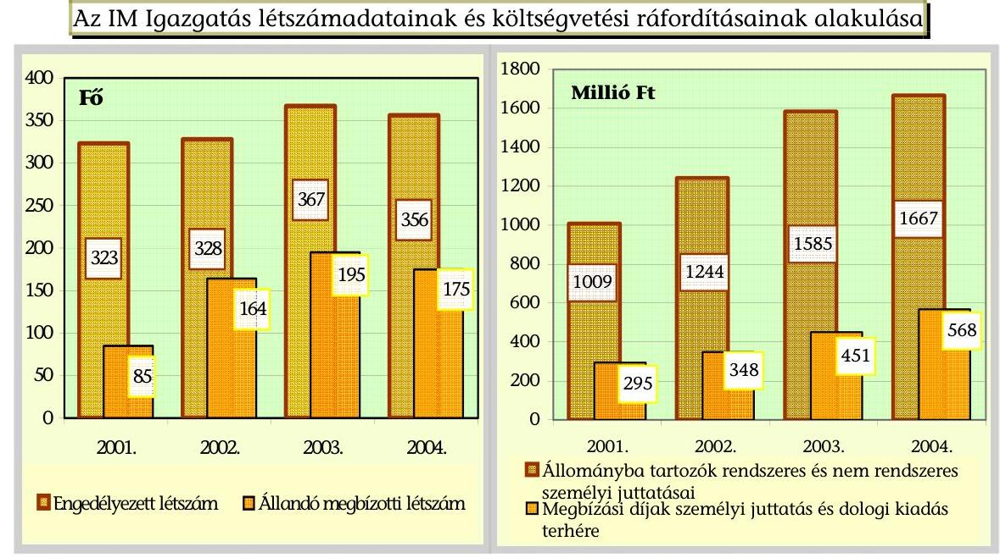
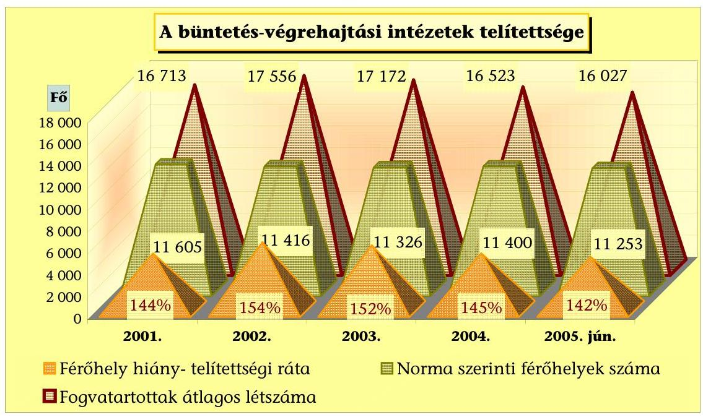
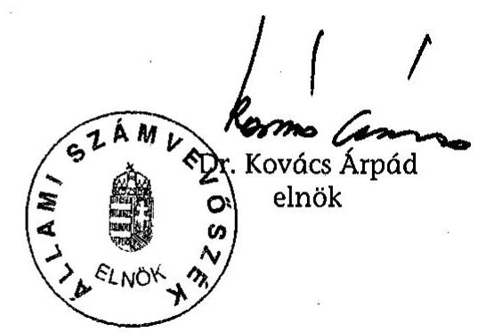
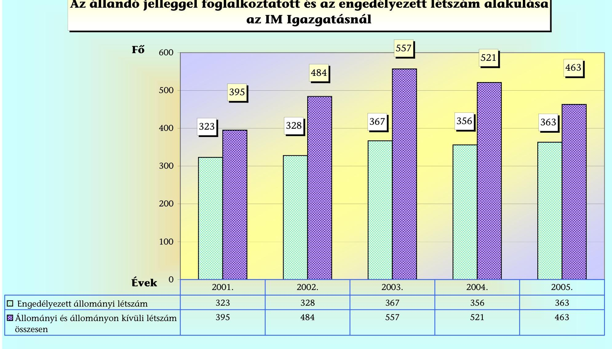
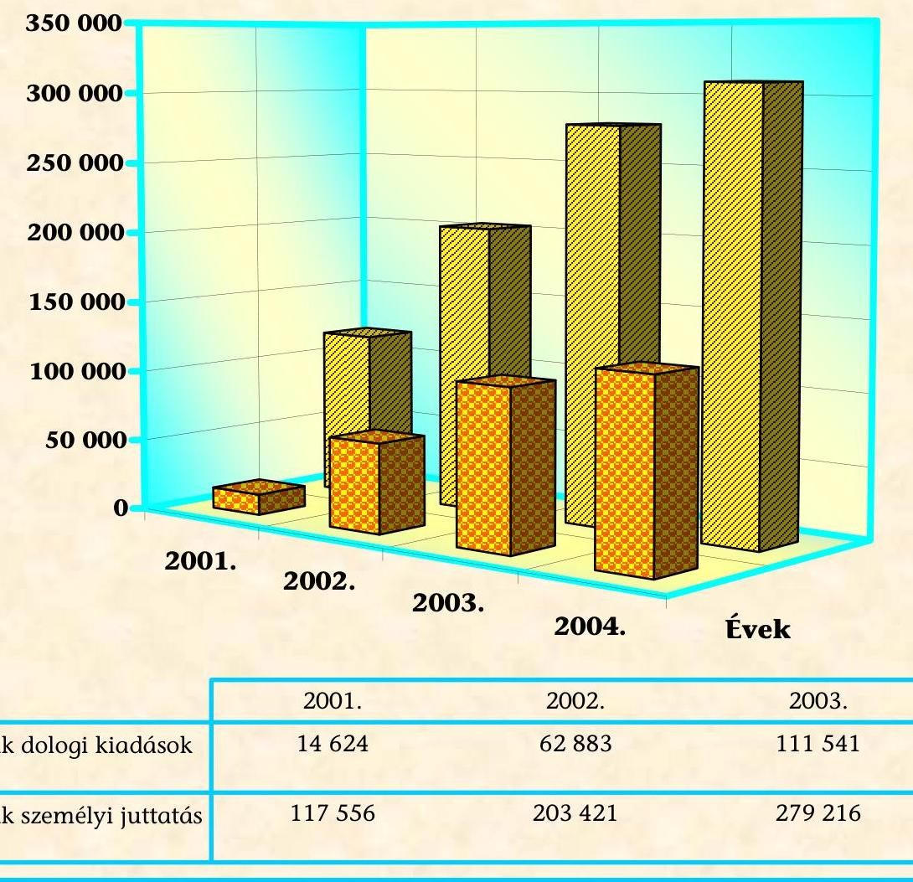

# JELENTÉS 

## az Igazságügyi Minisztérium fejezet működésének ellenőrzéséről

---

# 2. Államháztartás Központi Szintjét Ellenőrző Igazgatóság 

2.3. Átfogó Ellenőrzési Főcsoport

Iktatószám: V-12-54/2005.
Témaszám: 773
Vizsgálat-azonosító szám: V0195

## Az ellenőrzést felügyelte:

Bihary Zsigmond
főigazgató
Az ellenőrzés végrehajtásáért felelős:
Hegedüsné Dr. Müllern Veronika
főcsoportfőnök
Az ellenőrzést vezette:
Hudik Zoltán
főcsoportfőnök-helyettes
Az ellenőrzést végezték:

| Balkay Attila számvevő tanácsos | Domonkosné Kurilla Edit számvevő tanácsos | Dr. Jártas Ágnes számvevő tanácsos |
| :--: | :--: | :--: |
| Dr. Király László számvevő tanácsos, tanácsadó | Dr. Pataki Magdolna számvevő tanácsos tanácsadó | Trenovszki István számvevő tanácsos, főtanácsadó |
| Vásárhelyi Zoltán számvevő tanácsos |  |  |

A témához kapcsolódó eddig készített számvevőszéki jelentések: címe
sorszáma
Jelentés az Igazságügyi Minisztérium fejezet pénzügyi-gazdasági ellenőrzéséről 1995.
Jelentés a költségvetési fejezetek jóléti célú kiadásainak és jóléti [9925] intézményei működésének pénzügyi-gazdasági utóellenőrzéséről 1999.

Jelentés az állami tulajdonú földterületek nyilvántartásának [0035] ellenőrzéséről
Jelentés a Phare támogatások felhasználásának vizsgálatáról [0042]
Jelentés az Igazságügyi Minisztérium fejezet működésének [0110] ellenőrzéséről 2001.
Jelentés a központi költségvetés területén működő belső [0115] kontrollmechanizmusok működéséről 2001.
Jelentés a társadalmi szervezeteknek és köztestületeknek juttatott [0237] költségvetési támogatások ellenőrzéséről 2002.
Éves jelentések központi költségvetés előirányzatai
[9839]

---

| megalapozottságáról (évente) | $[9932]$ |
| :-- | :-- |
|  | $[0034]$ |
|  | $[0241]$ |
|  | $[0338]$ |
| Éves jelentések a központi költségvetés zárszámadásainak | $[9927]$ |
| ellenőrzéséről (évente) | $[0024]$ |
|  | $[0126]$ |
|  | $[0232]$ |
|  | $[0329]$ |

---

# TARTALOMJEGYZÉK 

BEVEZETÉS ..... 5
I. ÖSSZEGZŐ MEGÁLLAPÍTÁSOK, KÖVETKEZTETÉSEK, JAVASLATOK ..... 9
II. RÉSZLETES MEGÁLLAPÍTÁSOK ..... 20

1. A fejezeti irányítás és a működés kontrollkörnyezete ..... 20
1.1. A működés szabályozottsága, szervezeti háttere ..... 20
1.2. A feladatellátás létszámfeltételeinek kockázati tényezői ..... 25
1.3. A működés informatikai hátterének kockázati elemei ..... 28
1.3.1. Az informatikai rendszerek üzemeltetésének rendezettsége ..... 28
1.3.2. Az IM Cégnyilvántartási és Céginformációs Szolgálata ..... 29
1.4. A fejezeti irányítás kontroll tevékenységei ..... 32
2. A költségvetési gazdálkodás kontrollkörnyezete ..... 37
2.1. A fejezeti sajátosságok érvényesülése a költségvetésben ..... 37
2.2. A tervezés és beszámolás kontroll kockázatai ..... 41
2.3. A pénzügyi-számviteli folyamatok kontrollmechanizmusa ..... 42
2.4. Az IM érdekeltségű gazdálkodó szervezetek működése ..... 46
3. A büntetés-végrehajtás EU harmonizációs folyamata ..... 49
3.1. A fogvatartottak elhelyezése, foglalkoztatása és ellátása ..... 50
3.2. A büntetés-végrehajtási intézményrendszer fejlesztése ..... 52
3.3. A börtönépítések új finanszírozási lehetőségei ..... 55
3.3.1. A Public Private Partnership szabályozási háttere ..... 55
3.3.2. A magánszféra bevonása a börtönépítésekbe ..... 57

---

# MELLÉKLETEK 

| 1. sz. melléklet | Igazságügyi Miniszter IM/KGF/2005/ELL/834/40. sz. levele |
| :--: | :--: |
| 2./A sz. melléklet | Az IM Igazgatás létszámának alakulása |
| 2./B sz. melléklet | A személyi juttatások és a megbízási díjak alakulása az IM Igazgatásnál |
| 2./C sz. melléklet | Az állandó jelleggel foglalkoztatott és az engedélyezett létszám alakulása az IM Igazgatásnál |
| 2./ D sz. melléklet | A megbízási díjak forrásaik szerinti alakulása az IM Igazgatásnál |
| 3. sz. melléklet | A vállalkozások könyvvezetés módja szerinti megoszlása és a feldolgozott mérlegek száma |
| 4. sz. melléklet | A cégnyilvántartási és céginformációs tevékenységek bevételének és kiadásának alakulása |
| 5. sz. melléklet | Az Országos Fordító és Fordításhitelesítő Rt. tevékenységének főbb adatai |
| 6. sz. melléklet | A büntetés-végrehajtás gazdasági társaságainak többletköltségei és az ellentételező támogatások alakulása 2001-2004 között |
| 7. sz. melléklet | A büntetés-végrehajtás gazdasági társaságai összesített mérleg szerinti eredményének alakulása |
| 8. sz. melléklet | A büntetés-végrehajtási férőhelyek telítettségi mutatói |

---

# RÖVIDÍTÉSEK JEGYZÉKE 

| APEH | Adó- és Pénzügyi Ellenőrzési Hivatal |
| :--: | :--: |
| Ber. | 193/2003. (XI. 26.) Korm. rendelet a költségvetési szervek belső ellenőrzéséről |
| bv. | büntetés-végrehajtás |
| Bvt. | a büntetés-végrehajtási szervezetről szóló 1995. évi CVII. törvény |
| CPT | European Committee for the Prevention of Torture and Inhuman or Degrading Treatment or Punishment - Európai Bizottság a Kínzás és Embertelen vagy Megalázó Bánásmód és Büntetések Megelőzésére |
| Ctv. | a cégnyilvántartásról, cégnyilvánosságról és a bírósági cégeljárásról szóló 1997. évi CXLV. törvény |
| DBFO | Design-Build-Finance-Operate - a PPP azon formája, ahol a tervezés-építés-finanszírozás-működtetés egyaránt a magánszféra felelősségi körébe tartozik |
| EBESZ | Európai Biztonsági és Együttműködési Szervezet |
| EUROSTAT | Statistical Office of the European Union, az EU Statisztikai Hivatala |
| FEUVE | folyamatba épített, előzetes és utólagos vezetői ellenőrzési rendszer |
| ICsSzEM | Ifjúsági, Családügyi, Szociális és Esélyegyenlőségi Minisztérium |
| IM | Igazságügyi Minisztérium |
| IM Bv. | IM Büntetés-végrehajtás |
| IM BVOP | IM Büntetés-végrehajtás Országos Parancsnoksága |
| IM CCSZ | IM Cégnyilvántartási és Céginformációs Szolgálata |
| IM ICF | IM Informatikai és Céginformációs Főosztály |
| IM PFJSz OH | IM Pártfogó Felügyelői és Jogi Segítségnyújtó Szolgálat Országos Hivatala |
| IM PFSZ OH | IM Pártfogó Felügyelői Szolgálat Országos Hivatala |
| ISZIH | Igazságügyi Szakértői Intézetek Hivatala |
| KGF | Költségvetési és Gazdasági Főosztály |
| KKI | Központi Kárrendezési Iroda |
| MeH | Miniszterelnöki Hivatal |
| NEKH | Nemzeti és Etnikai Kisebbségi Hivatal |
| OAH | Országos Atomenergia Hivatal |
| OBmB | Országos Bűnmegelőzési Bizottság |
| OCÖ | Országos Cigány Önkormányzat |
| OGY | Országgyűlés |
| PHARE | Poland-Hungary Assistance for the Restructuring of the Economy |
| PM | Pénzügyminisztérium |
| PSC | Public Sector Comparator - a hagyományos állami beruházás hipotetikus értéke, mellyel a PPP konstrukcióban kapott ajánlat értékét kell összehasonlítani |
| PPP | Public Private Partnership - az állami és a magánszektor közötti fejlesztési, illetve szolgáltatási együttműködés |
| RAÜH | Roma Antidiszkriminációs Ügyfélszolgálati Hálózat |
| Szvt. | a számvitelről szóló 2000. évi C. törvény |

---

.

---

# JELENTÉS 

## az Igazságügyi Minisztérium fejezet működésének ellenőrzéséről

## BEVEZETÉS

Az Igazságügyi Minisztérium (IM) költségvetési fejezet gazdálkodásának 2000. évi átfogó ellenőrzését követő időszakban az igazságügyi reform folyamata mind a feladatokban, mind a fejezet intézményi struktúrájában jelentős változásokat eredményezett. A reformfolyamat szerves részét képezték a magyar büntetés-végrehajtás feltételeinek és módszereinek az Európai Unió (EU) szabályaihoz és elvárásaihoz történő igazítása, a bűnüldözés és a büntető igazságszolgáltatás hatékonyságának növelésére, valamint a büntetés-végrehajtási költségek csökkentésére irányuló törekvések. A bűncselekmények kedvezőtlen alakulása késztette az Országgyűlést a társadalmi bűnmegelőzés nemzeti stratégiájának megalkotására ${ }^{1}$, amely a bűnmegelőzés komplex elveit és az ezek érvényesítéséhez szükséges fő feladatokat határozta meg az EU ajánlásainak figyelembevételével.

Az igazságügy-miniszter feladat- és hatásköre - részben az EU csatlakozásra tekintettel - módosult, a társadalmi bűnmegelőzéssel kapcsolatos jogalkotási és koordinációs feladatokat illetően, valamint az Európai Bíróság előtti eljárásokban ellátandó feladatokkal összefüggésben. Kormányzati döntés értelmében 2004. november 10-től a tárca felügyelete alá rendelték az Országos Atomenergia Hivatalt (OAH). A jogegyenlőség érvényesítése területén pedig a romák társadalmi integrációját elősegítő kormányzati programok adtak további feladatot a tárca számára, melynek vezetését a 2001-2004 közötti időszakban három miniszter látta el.

Feladatcsökkenést jelentett a Nemzeti és Etnikai Kisebbségi Hivatal (NEKH) és a kisebbségi feladatokkal kapcsolatos tevékenység IM-től történt kivonása 2002-ben, míg a Roma Antidiszkriminációs Ügyfélszolgálati Hálózatot (RAÜH) továbbra is az IM működteti.

A pártfogói rendszer reformjának végrehajtása - az Országgyűlés döntései alapján - 2003. júliusától új szervezet ${ }^{2}$ létrehozásával járt együtt. A jogi segítségnyújtásról szóló 2003. évi LXXX. törvény (Jstv.) elfogadásával pedig első ízben jött létre Magyarországon olyan állami intézményrendszer, amely - az EU határo-

[^0]
[^0]:    ${ }^{1}$ 115/2003. (X. 28.) OGY határozat a társadalmi bűnmegelőzés nemzeti stratégiájáról
    ${ }^{2}$ IM Pártfogó Felügyelői Szolgálat Országos Hivatala (IM PFSZ OH)

---

zatának is megfelelve ${ }^{3}$ - egységesen gondoskodik a különböző okokból rászorultak jogi segítéséről („nép ügyvédje" program). A pártfogó felügyelet és a jogi segítségnyújtás egységes szakmai irányítása érdekében 2004-től a két feladat egy hivatali szervezetbe - az IM Pártfogó Felügyelői és Jogi Segítségnyújtó Szolgálat Országos Hivatalába - integrálódott, amely 2004-ben jelentős (3,655 Mrd Ft) költségvetési támogatásban részesült.

A bűnmegelőzés stratégiájának kormányzati cselekvési programjával összefüggésben az IM kereteiben 2003 őszén újjászerveződött az Országos Bűnmegelőzési Bizottság (OBmB), amely a feladatainak végrehajtásához szükséges forrásokat fejezeti kezelésű előirányzatként kapta meg.

Az EU csatlakozás a kiemelt jelentőségű kormányzati feladatok közé emelte a jogharmonizáció végrehajtását, melynek fő felelőse az igazságügy-miniszter. Prioritást kapott a jogharmonizációs tevékenység programozása, a közösségi joganyag magyarra fordítása és a jogszabálytervezetek véleményezése. A miniszter látja el többek között a közjegyzőkkel, a bírósági végrehajtókkal, szakfordítókkal kapcsolatos egyes felügyeleti és igazgatási feladatokat és működteti az IM Cégnyilvántartási és Céginformációs Szolgálatot (IM CCSZ).

Az igazságügy-miniszter irányítása alatt maradt az IM Büntetés-végrehajtás (IM Bv.) működése, ellátta továbbá az Igazságügyi Szakértői Intézetek Hivatala (ISZIH) és a kárpótlási feladatokat végző Központi Kárrendezési Iroda (KKI) felügyeletét, gyakorolta a Büntetés-végrehajtás gazdasági társaságainak, valamint az Országos Fordító és Fordításhitelesítő Iroda Rt. (OFFI) alapítói, tulajdonosi jogait.

A Magyar Köztársaság 2005. évi költségvetéséről szóló 2004. évi CXXXV. törvény az IM fejezet támogatási előirányzatát 47,9 Mrd Ft-ban, kiadási előirányzatát 60,6 Mrd Ft-ban határozta meg, ami - a bekövetkezett változásokra is figyelemmel - 30 Mrd Ft-tal haladja meg a 2000. évi kiadási előirányzatot. Az előirányzatok közel kétharmadát (37,8 Mrd Ft) az IM Bv. céljaira fordítják, melyen belül jelentős súllyal szerepelnek fejezeti kezelésű kiadásként a Büntetésvégrehajtás központi beruházásai (börtönépítések és felújítások), valamint a fogvatartottakat foglalkoztató gazdasági szervezetek támogatása.

Az előző átfogó ellenőrzést követő időszakban a fejezetnél végzett számvevőszéki ellenőrzések az éves költségvetések tervezésére, valamint az éves költségvetések végrehajtásának pénzügyi-szabályszerűségi (megbízhatósági) és kapcsolódóan a belső kontrollmechanizmusok ellenőrzésére terjedtek ki. Az IM érintett volt a központi költségvetés területén működő belső kontrollmechanizmusok 2001. évi, valamint a társadalmi szervezeteknek és köztestületeknek juttatott költségvetési támogatások 2002. évi számvevőszéki ellenőrzésében is. Jelen ellenőrzés végrehajtására az Állami Számvevőszékről szóló 1989. évi

[^0]
[^0]:    ${ }^{3}$ Az Európai Unió Tanácsának 2001. március 15-én elfogadott, az áldozatok büntetőeljárásbeli jogállásáról szóló kötelező kerethatározata szerint a tagországokban tovább kell fejleszteni a lakossági jogsegély-szolgáltatást.

---

XXXVIII. törvény 2. § (3), (5) és (9), valamint a 17. § (3) és (5) bekezdésben foglaltak adtak jogszabályi alapot.

Az ellenőrzés célja annak értékelése volt, hogy az Igazságügyi Minisztérium fejezet:

- irányítási, működtetési rendje és szervezeti kialakítása összhangban volt-e a jogszabályokban, az állami irányítás egyéb szabályozóiban meghatározott feladatokkal; a fejezet-irányítás és felügyelet kontroll tevékenységei, kockázatkezelő képessége megfelelő feltételeket biztosítottak-e a működés eredményességéhez;
- költségvetési gazdálkodási rendszere lehetővé tette-e az igazságügyi tárca feladatainak, nemzetközi kötelezettségeinek teljesítését, a gazdálkodási feladatok előírásszerű, eredményes ellátását, az erőforrások és a vagyon megfelelő védelmét; az IM érdekeltségű gazdálkodó szervezetek - gazdasági társaságok működése biztosította-e az állami feladatellátás célszerűségét;
- a büntetés-végrehajtás EU harmonizációja során meghozott intézkedések eredményesen

 szolgálták-e a közösségi elvárások teljesülését, az erőforrások felhasználásának célszerűségét, a fogvatartottak elhelyezési körülményeinek javulását, valamint a foglalkoztatási kötelezettség és a gazdaságossági követelmény összhangját;
- a belső kontrollrendszerének fejlesztésében hasznosította-e a korábbi számvevőszéki ellenőrzések megállapításait, ajánlásait, különös tekintettel a büntetés-végrehajtás normatív finanszírozását megalapozó, a működés hatékonyságát javító intézkedések végrehajtásának eredményességére.

Az átfogó ellenőrzés az IM fejezet belső kontroll (szabályozási, irányítási, ellenőrzési, információs-informatikai, számviteli) rendszerére irányult annak értékelése céljából, hogy a kontroll mechanizmusai megfelelő biztosítékot adtak-e az ágazati feladatok előírásszerű, gazdaságos és eredményes ellátásához, az erőforrások védelméhez, a megbízható információ-szolgáltatáshoz, valamint a beszámolási kötelezettségek teljesítéséhez.

Rendszerszemléletben tekintettük át az IM fejezet felügyeletét ellátó szerv fő funkcióit a kontrollhiányosságok, kockázatok feltárása érdekében. Teljesítmény-ellenőrzés módszerével értékeltük az Európai Unió ajánlásainak, irányelveinek megfelelő büntetés-végrehajtási rendszer kialakítása érdekében hozott intézkedések eredményességét. Ellenőrzési kritériumként használtuk fel az EU vonatkozó normáit, valamint a korábbi ellenőrzési ajánlásaink figyelembevételével megfogalmazott, tárcaintézkedésekben meghatározott célokat.

Az átfogó ellenőrzés az IM, valamint az IM Bv. fejezeti szintű tervezésben, gazdálkodásban, az intézmények felügyeletében és ellenőrzésében érintett szervezetekre terjedt ki. Az ellenőrzés a működés és gazdálkodás 2001-2004 közötti időszakára, ezen belül hangsúlyozottan az utóbbi két év feladatellátására irányult, de a szükséges mértékben az ellenőrzés lezárásáig figyelemmel kísérte a 2005. évre áthúzódó folyamatokat.

---

A végleges jelentést az Állami Számvevőszékről szóló 1989. évi XXXVIII. tv. III. fejezet 25. § (1) bekezdésének megfelelően észrevételezésre megküldtük Dr. Petrétei József miniszter úrnak, aki a jelentést tárgyszerűnek tartotta, észrevételt nem tett. Jelezte, hogy a hatáskörében teendő intézkedésekről a törvényes határidőben tájékoztatást ad. A vonatkozó levelet a jelentés 1. sz. melléklete tartalmazza.

---

# I. ÖSSZEGZŐ MEGÁLLAPÍTÁSOK, KÖVETKEZTETÉSEK, JAVASLATOK 

Az igazságügyi tárca irányítási, szabályozási rendszere alapvetően a szakmai feladatellátás szempontjai szerint alakult. A működés szabályainak aktualizálásáról a tárca mindenkori felső vezetése gondoskodott. A fejezeti irányítás a feladatváltozásokra rugalmas szervezeti módosításokkal reagált, ami egyúttal a vezetői szintek, szervezeti egységek nem kívánatos növekedését (főcsoportfőnökök, főosztályvezetők számának emelkedését) is eredményezte.

A feladatellátás költségvetési hátterének - a létszámkorlátozások miatt - nem egyszer hiányzó feltételeit kényszermegoldásokkal (alapfeladatokra szóló megbízások útján) hidalták át a tárcánál. Jellemzővé vált a felsővezetők mellett is a megbízási szerződéssel foglalkoztatott munkaerő alkalmazása, a jogviszony szükségességének időszakos felülvizsgálata nélkül. A megbízások dologi kiadásokat, illetve személyi juttatásokat terhelő költségei következtében lényegében nem érvényesülhetett a Kormány által elrendelt létszámcsökkentések működési költség csökkentő hatása. Az IM Igazgatásnál a különböző előirányzatokat terhelő megbízási díjak 2001-2004 között folyamatosan, összességében háromszorosára nőttek, meghaladva a 2004. évi személyi juttatás előirányzat egynegyedét.

Az IM fejezet működési feltételeinek áttekintése is érzékelhetővé tette, hogy a központi költségvetési kondíciók javítása érdemben az állami feladatellátás racionalizálásától várható, a kormányzati létszámcsökkentés megfelelő feladatelemzés és differenciálás nélküli előírása önmagában nem jelent érdemi megoldást. Az igazságügyi tárcánál szerzett tapasztalatok is megerősítették a számvevőszéki ellenőrzések utóbbi években a nyilvánosság előtt is hangoztatott általános következtetését, miszerint elodázhatatlanná vált az állami feladatok

---

felülvizsgálata, definiálása, mivel ennek hiányában a közszolgálat, a közigazgatás feladatai sem tehetők egyértelművé. ${ }^{4}$

A fejezeti felügyelet és a gazdálkodás tekintetében középirányító funkciót ellátó Büntetés-végrehajtás Országos Parancsnoksága (IM BVOP) - a büntetésvégrehajtás működésének racionalizálása érdekében tett - eddigi erőfeszítései, úgy az intézményi rendszert, mint az IM Bv. gazdasági társaságokat illetően még külső szakértők megbízása útján sem tudták feloldani a több évtizede fennálló finanszírozási nehézségeket. Az ellenőrzés ez alkalommal is - a korábbi ellenőrzéseinél tett javaslatokhoz ${ }^{5}$ hasonlóan - arra a következtetésre jutott, hogy a megalapozott számításokra épülő feladatfinanszírozás nyújthat érdemi megoldást, amelyet az állami feladatellátás funkcionális elemzésén alapuló, következetes szervezeti reform keretében lehet megvalósítani. (A közelmúltban kinevezett miniszteri biztos racionalizálási feladatokkal történt megbízása kezdeti lépése lehet a szervezet korszerűsítésének, de a megbízatása korlátozott lehetőséget jelent a működés teljes keresztmetszetű racionalizálásában.)

A fejezet feladatszerkezete a kisebbségi ügyek jelentős részének kivonásával (a NEKH más tárca felügyelete alá helyezésével) egyszerűsödött, ugyanakkor a tárcánál maradt a cigányság diszkriminációellenes kormányzati programja ${ }^{6}$ keretében létrehozott Roma Antidiszkriminációs Ügyfélszolgálati Hálózat (RAÜH) működtetése. A RAÜH feladatáról jogszabály nevesítetten nem rendelkezett, ellenben a roma integrációval kapcsolatos kormányhatározat ${ }^{7}$ - amely komplex intézkedési tervébe szinte valamennyi tárcát bevonta - 2004-től kifejezetten a RAÜH működésével kapcsolatosan szabott feladatokat az IM részére. A RAÜH működtetése és továbbfejlesztése részét képezi a 2005 májusában meghirdetett Roma Integráció Évtizede Program ${ }^{8}$ 2005-2015 közötti időszakra megalkotott Cselekvési Tervének is.

Jelentős eredményként értékelhető, hogy a jogi segítségnyújtás intézményrendszerének törvényi szabályozásával és kialakításával az IM megvalósította a rászorultak hatékony állami segítségének uniós követelményét a jogérvényesítés-

[^0]
[^0]:    ${ }^{4}$ Lásd: Gondolatok az államháztartás működéséről (2005.)
    Vélemény és javaslatok a Kormány takarékossági intézkedéseinek megalapozásához (2004.)
    ${ }^{5}$ Jelentés az Igazságügyi Minisztérium fejezet működésének ellenőrzéséről 2001. [0110]
    ${ }^{6}$ 1047/1999. (V. 5.) Korm. határozat a cigányság életkörülményeinek és társadalmi helyzetének javítására irányuló középtávú intézkedéscsomagról
    ${ }^{7}$ 1021/2004. (III. 18.) Korm határozat a romák társadalmi integrációját elősegítő kormányzati programról és az azzal összefüggő intézkedésekről
    ${ }^{8}$ A Roma Integráció Évtizede Programot az EBESZ Miniszteri Tanácsának döntése alapján Közép- és Kelet-Európa nyolc országa kezdeményezte, a térségben élő roma lakosság életkörülményeinek, valamint gazdasági és társadalmi státuszának javítása érdekében. A Cselekvési Terv magyarországi megvalósításában szerepel a jogegyenlőség érvényesítése, melynek egyik pillére a RAÜH tevékenysége.

---

ben. Figyelembe véve, hogy a tárcánál három jogsegélyszolgálat (ügyfélszolgálat, jogi segítségnyújtás, RAÚH) működik hasonló jogpolitikai céllal, a megkezdett szervezeti racionalizálás akkor éri el a célját, amennyiben a 2006-tól felállítandó Igazságügyi Hivatal működési feltételrendszerének megfelelő kialakításával társul.

Meg kell jegyezni, hogy a szervezeti racionalizálás igénye mellett még nem kapott kellő hangsúlyt az uniós követelmények teljesítésének hatékonyság-elemzése. Ez azért bír jelentőséggel, mert pl. a dologi előirányzatokból finanszírozott megbízási díjak többszörösére - négy év alatt kilencszeresére - növekedése az uniós követelmények hatására kialakított ügyfél-, illetve jogsegély szolgálatokon foglalkoztatott ügyvédek díjazásával hozható összefüggésbe. A célkitűzések megvalósítását szakmai szempontból figyelemmel kísérték. A szolgáltatásokkal kapcsolatos ráfordítások hatékonyságáról viszont a tárcának nem volt információja, aminek a jelentősége azáltal nő, hogy a szolgáltatások hangoztatott továbbfejlesztésének éppen a költségvetés teherbíró képessége szabhat határt.

Az informatikai rendszer fejlesztéseinek feladatorientált tervezéséhez szükséges - 2001-ben még hiányolt - alapvető követelmények meghatározása a belső informatikai, adatbiztonsági és az ágazati stratégiák kiadásával 2003-ban teljesült. Ugyanakkor a felügyeleti irányítás nem fordított kellő figyelmet a stratégiai célok megvalósításának ellenőrzésére, ami az informatikai rendszerek kockázatelemzésében, a biztonsági kontrollok kialakításában és a megfelelő eljárásrendek kiadásában vezetett lényeges - a biztonságos működést veszélyeztető - elmaradásokhoz. Továbbra is magas kockázatot jelent a katasztrófa- és rendkívüli helyzetek kezelését, a folyamatos üzemfenntartást biztosító tervek hiánya.

Az ellenőrzött időszakban működtetett monitoring rendszer kiépítettsége alkalmas volt a feladatok ellátásához szükséges információk megfelelő döntési szintekhez juttatására. Míg a korábbi éveket a költségvetési események (tervezés, zárszámadás) időszakai szerinti felső vezetői tájékoztatás jellemezte, addig 2005-től a miniszter már havonta kapott információkat a fejezet egészének gazdálkodásáról. A költségvetési gazdálkodást támogató informatikai rendszer működése megfelelő, a modulbővítésekkel növekedett a vezetői tevékenységet és gazdálkodást segítő adatok megbízhatósága és naprakészsége, bővültek a számviteli tevékenység kontroll pontjai.

Egyes esetekben (létszámcsökkentések értékelése, mérlegközzététel problémáinak kezelése) a vezetői döntések vagy intézkedések elmaradtak. A felügyeleti szerv az IM Cégnyilvántartási és Céginformációs Szolgálata (IM CCSZ) működését sem kísérte az elvárható figyelemmel, így érdemi intézkedések hiányában elhúzódott a mérlegközzétételre kötelezett cégek teljes körének feltárása, a jogkövető magatartás kikényszerítése és az IM CCSZ szolgáltatásaihoz rendelt költségtérítések valós költségeken alapuló meghatározása.

A költségvetési fejezetek belső ellenőrzésének 2003. évi újraszabályozásáig a tárca ellenőrző szervezete (IM EF) előírásszerűen végezte a fejezet költségvetési szerveinek pénzügyi ellenőrzéseit. A Büntetés-végrehajtást felügyelő minisztériumi főosztállyal egyidejűleg végrehajtott átfogó ellenőrzések kiterjed-

---

tek az IM Bv. költségvetési intézményeire is, pótolva azt a hiányt, amit az IM BVOP - megfelelő ellenőri kapacitás létesítése hiányában - nem volt képes elvégezni.

A felügyeleti költségvetési ellenőrzés szakmai létszáma (az informatikai ellenőr kivételével) kielégítő volt, azonban az IM BVOP - a 2002-ben középirányító szervként történt elismerését követően - aránytalanul alacsony költségvetési ellenőrzési létszámmal rendelkezett (3 fő 38 intézmény ellenőrzéséhez). 2004 elejéig az IM BVOP nem rendelkezett a középirányítói funkciók gyakorlásához szükséges személyi és tárgyi feltételekkel, így függetlenített belső ellenőrzése sem volt képes betölteni a gazdálkodás egészét átfogó ellenőrzés funkcióit.

Alapvetően az ellenőrzés új szabályozási környezetéhez igazodóan állították össze a tárca belső ellenőrzési stratégiai tervét. Nem számoltak azonban az informatikai rendszerellenőrzések betervezésével.

A fejezethez tartozó intézmények éves beszámolóinak ún. megbízhatósági ellenőrzéseit (financial audit) a rendelkezésre álló ellenőrzési kapacitáshoz igazodó ütemezéssel 2003-tól végzik. A megbízhatósági ellenőrzések teljes körűvé tételéhez a fejezeti ellenőrző szervezet még 2003-ban, a stratégiai tervében a meglévő kapacitását lényegesen meghaladó létszámfejlesztési igénnyel számolt, aminek teljesíthetőségét a forrásoldali lehetőségek behatárolták. A megbízhatósági ellenőrzések kiszélesítésében további bizonytalanságot jelentett az államháztartási belső pénzügyi ellenőrzési rendszer továbbfejlesztésére vonatkozó kormányhatározattal kijelölt feladat ${ }^{9}$ végrehajtásának elhúzódása is, ami már tisztázhatta volna, hogy az ilyen típusú ellenőrzéseket ki, hogyan és milyen ütemezésben hajtja végre. Ezzel együtt a fejezetnél az erőforrás szükséglet felülvizsgálatát indokolják az időközben realizált létszámfejlesztések, az IM BVOP középirányító szervi funkciójának megjelenése és ellenőrzési kapacitásának fejlesztése. Nem elhanyagolható szempont az sem, hogy az ellenőrzési jártasság megszerzésével intézményenként kedvezőbb ellenőri nap ráfordítással lehet tervezni, ami már elérhető közelségbe hozhatja a megbízhatósági ellenőrzések kiterjesztését a fejezet valamennyi intézményére.

Az új típusú folyamatba épített előzetes és utólagos vezetői ellenőrzési rendszer (FEUVE) kialakítása a tárcánál az előírástól eltérően késéssel valósult meg, amiben közrejátszott, hogy az új szabályozás megfelelő színvonalú kialakításához a gazdasági terület túlterhelésére hivatkozással külső vállalkozót bíztak meg. A külső szakértő igénybevételének célszerűsége - bár erre tiltó rendelkezés nem volt - utólag nem látszik teljességgel megalapozottnak, mivel az érintett szervezetek közreműködése nélkül e feladat nem volt végrehajtható.

A fejezet pénzügyi-számviteli szabályozó rendszere annak ellenére, hogy a számviteli alapelvek, a pénzügyi és bizonylati fegyelem, az adatszolgáltatási

[^0]
[^0]:    ${ }^{9}$ Az államháztartási belső pénzügyi ellenőrzési rendszer továbbfejlesztéséről szóló 2201/2004. (VIII. 12.) Korm. határozat 2. pontjában a Kormány 2004. december 31-i határidővel „felhívja a pénzügyminisztert, hogy a Miniszterelnöki Hivatalt vezető miniszter véleményének kikérésével dolgozzon ki javaslatot arra vonatkozóan, hogy a zárszámadáshoz kapcsolódó ellenőrzéseket ki, hogyan és milyen ütemezésben hajtja végre".

---

és beszámolási követelmények tekintetében megfelel a jogszabályi előírásoknak, még tartalmaz kockázati elemeket a belső szabályozás nélkül maradt kérdések vonatkozásában (a PFJSZ OH kivételével valamennyi intézménynél az előirányzat-módosításokkal összefüggő nyilvántartások, a könyvelés bizonylati feltételei, az előirányzat-maradványok egyeztetésének lépései).

Míg
 az IM Igazgatás pénzügyi-számviteli szabálykövetése (néhány kivétellel, mint a fejezeti szöveges beszámolók pontatlanságai) megfelelő volt, addig az IM BVOP középirányítói szerepkörében sem tudta elérni, hogy a bv. költségvetési szerveknél a pénzügyi-számviteli és gazdálkodási területre vonatkozó jogszabályi előírások és változások maradéktalanul érvényesüljenek az intézmények gazdálkodásának belső szabályozásában. Ezzel együtt a fejezet számviteli rendje, nyilvántartási rendszere alkalmas volt a tárca vagyonának kimutatására, biztosította a vagyonelemek nyomon követhetőségét, az SZMSZ és a kapcsolódó belső szabályok rendelkezései garantálták a feladatellátáshoz kapcsolódó gazdálkodási előirányzatok felhasználásának a törvényi keretek között tartását. Tárca szinten a gazdálkodáshoz fűződő döntési jogosultságok és felelősségi viszonyok szabályozottsága megfelelő volt, érvényesülésüket a vezetői ellenőrzés biztosította.

A költségvetés tervezési és végrehajtási rendszerének kialakítása és működtetése összességében szabályszerűen és az ágazati sajátosságok érvényre juttatásával történt. A szakmai és pénzügyi szervek együttműködése az elmúlt időszakban hatékonyabbá vált, azonban csak lassan szűnő gyakorlat a szakmai szervek egy részénél a becslésen alapuló tervezési adatszolgáltatás (informatikai igények, létszám költségei), illetve költségvetésük felhasználásának elnagyolt szakmai értékelése (Közigazgatási Államtitkári Hivatal, Igazságügyi Igazgatási és Kodifikációs Főosztály, Kegyelmi Főosztály, Ellenőrzési Főosztály).

A költségvetési tervezés lényegében a hagyományos módszeren (bázistervezésen) alapult. A Büntetés-végrehajtás normatív finanszírozását megalapozó teljesítménymutatók kidolgozására - az előző számvevőszéki átfogó ellenőrzés javaslatára ${ }^{10}$ - tett lépések nem jártak sikerrel, illetve az értékelő elemzésekre épülő tervezés megfelelő kapacitások és szakmai segédletek hiányában még nem vált általános gyakorlattá.

Az IM fejezet 2001-2004. évek közötti költségvetési forrásai nem fedezték teljes körűen az évenként jelentkező többletigényeket, azokat a felügyeleti szerv csak töredékében tudta érvényesíteni. A realizált források biztosították a személyi állomány juttatásainak jogszerű emelését, az alapvető feladatok végrehajtásának folyamatosságát. A hiányzó feltételek az IM Igazgatásnál elsősorban a feladat-végrehajtás minőségi elemeinek fejlesztését hátráltatták, a Büntetés-végrehajtásnál azonban a működéshez tartozó feladatok elhagyását is előidézték (amire pl. a biztonságos munkavégzés feltételeinek megteremtésében mutatkozó hiányosságok, illetve részben ezekkel összefüggésben az évenként több alkalommal bekövetkezett tűzesetek utaltak). Az elítéltek foglalkoztatásában meghatározó szerepet betöltő gazdasági társaságok munkáltatási kapacitásai-

[^0]
[^0]:    ${ }^{10}$ Jelentés az Igazságügyi Minisztérium fejezet működésének ellenőrzéséről 2001. [0110]

---

nak bővítését is hátráltatta a sajátos többletköltségeiket finanszírozó fejezeti támogatás beszűkülése.

A tárca pénzügyi-gazdasági igazgatása - a Büntetés-végrehajtás visszatérő likviditási gondjaira figyelemmel - kiemelten kezelte a testület költségvetési szükségleteit, melynek következtében - bár a bv. korábbi években jellemző forráshiánya továbbra is fennállt - előrelépést jelentett, hogy az egyes évek végére a tartozásállomány (2004 közepén 600 M Ft) határidőn belül maradt.

A rendszeresen jelentkező költségvetési elvonásokat a működés elsődlegességét biztosító előirányzat-átcsoportosításokkal hidalták át. A költségvetési megszorítások érvényesítése elsősorban a felújítások rovására történt, illetve a büntetés-végrehajtási beruházások fejlesztési ütemének lassítását jelentette, ezzel halasztásra kényszerítve a korábban meghatározott kormányzati célkitűzések ${ }^{11}$ megvalósítását. A költségvetési elvonások az igazságügyi szakértői tevékenység korszerű infrastrukturális feltételeinek kialakításában is késedelemhez, a jogi segítségnyújtás esetében átmeneti nehézségekhez vezettek.

A fejezeti kezelésű előirányzatok felhasználása döntően cél szerint történt, részleteiben és a jogszabályi előírásoknak megfelelően szabályozott volt. A PHARE támogatású - börtönkörülmények javítását szolgáló - projektnél a szerződéskötések elhúzódása, a tervezettől lényegesen elmaradó éves előirányzat felhasználások arra figyelmeztetnek, hogy a késedelem költségnövekedés kockázatával jár.

A büntetés-végrehajtás európai uniós harmonizációs folyamata alapvetően három fő területen zajlik (jog, bánásmód, elhelyezés). Az elvárásoknak teljes körűen megfelelő teljesítés a jogszabályalkotás terén történt. Az Európa Tanács ajánlásainak figyelembevételével - többek között - meghatározásra kerültek a szabadságvesztés végrehajtásának szabályai ${ }^{12}$, illetve a bűnmegelőzés komplex elvein alapuló büntetés-végrehajtási feladatok ${ }^{13}$.

A bánásmódot kifejező területeken - a fogvatartottak ellátásában, foglalkoztatásában és reszocializációjuk előkészítésében - az európai normákhoz történt közeledés volt kimutatható. Az elítéltek ellátási feltételeit érintően számos, azok színvonalát javító intézkedés történt (az étkezési normák rendezése, az egészségügyi, az oktatási, a szociális juttatások kibővítése). Az elért oktatási, munkáltatási, összességében 60-62%-os foglalkoztatási arányok európai viszonylatban is kiemelkedő eredményt jelentenek. Az elítéltek hitéletének feltételei biztosítottak, 12 intézetben került kialakításra kábítószer prevenciós részleg, az elvárt színvonalon működik a betegellátás és biztosított az EU közegészségügyi előírásainak érvényesítése is.

[^0]
[^0]:    ${ }^{11}$ A büntetés-végrehajtás intézetrendszerének hosszú távú fejlesztéséről szóló 2072/1998. (III. 31.) Korm. határozat, valamint a büntetés-végrehajtás fejlesztési programjáról szóló 2147/2002. (V. 10.) Korm. határozat.
    ${ }^{12}$ A szabadságvesztés és az előzetes letartóztatás végrehajtásának szabályairól szóló időközben többször módosított - 6/1996 (VII. 12.) IM rendelet.
    ${ }^{13}$ 115/2003. (X. 28.) OGY határozat a társadalmi bűnmegelőzés nemzeti stratégiájáról

---

Az elhelyezésre vonatkozó EU követelmények érvényesítése még nem vált lehetségessé teljes körűen az ország 32 büntetés-végrehajtási intézetében, ahol az egyik legnagyobb gond a 150% körüli telítettség. Az 1999-2008 közötti időszakra vonatkozó kormányzati célkitűzések öt területen (az előzetes letartóztatottak, a fiatalkorúak és az elítélt nők elhelyezésének bővítése, a férőhely korszerűsítés és a börtönépítés) határoztak meg ezzel kapcsolatosan is feladatokat, melyek teljesítése, illetve megvalósíthatósága változó képet mutatott.

Az IM Bv. hosszú távú fejlesztési céljainak időarányos teljesítését a költségvetési források beszűkülése hátráltatta (elmaradás van az előzetesen letartóztatottak és az elítélt nők férőhelyének bővítésében, a börtönépítés programjában). A megvalósult férőhelybővítések - átmeneti ingadozásokkal - a zsúfoltságot 2005-ig közel 140%-ra csökkentették. Alapvetően a behatárolt forráslehetőségek következtében a fejlesztések, korszerűsítések nem csak pozitív hatással voltak az uniós követelményekhez igazodás folyamatára. Hat intézet esetében fordult elő, hogy az elkészült, színvonalas új létesítmény működtetése (pl. a kecskeméti anya-csecsemő részleg) a többi intézet forrásának a rovására történt. A korszerűsítések esetenként - a humánusabb elhelyezés érdekében - férőhely csökkenéssel és a foglalkoztatást segítő helyiségek (pl. oktató termek) megszüntetésével jártak együtt. Kiemelhető viszont a férőhely-korszerűsítések pozitív szerepe a fegyelmi helyzet kimutatható javulásában. Mindenesetre egyértelművé vált, hogy az uniós elhelyezési mutatók közelítése elképzelhetetlen új büntetés-végrehajtási intézmények építése nélkül.

A felzárkózáshoz szükségesnek ítélt beruházások az államháztartás lehetőségeit meghaladó mértékű forrásigénye terelte a figyelmet az állami és a magánszektor közötti fejlesztési, illetve szolgáltatási együttműködés (Public Private Partnership - PPP) újszerű formáira, melynek szabályozott keretek közötti bevezetése érdekében a Kormány 2003-ban hozta meg az első intézkedé-

---

sét ${ }^{14}$. Az egyidejűleg létrehozott Tárcaközi Bizottság (TB) még abban az évben bemutatta a Kormánynak az érintett tárcák közreműködésével készített - PPP projektekkel kapcsolatos - makrogazdasági hatáselemzést, a költségvetés kötelezettségvállalásának kívánatos mértékére vonatkozó összefüggéseket, az ún. maastrichti hiány- és államadósság-számításnál ${ }^{15}$ meghatározó szempontokat jelentő projektjellemzőket, a jogszabályi környezettel kapcsolatos elemzés következtetéseit.

Az igazságügy-miniszter - a TB és a Gazdasági Kabinet egyetértésével benyújtott - előterjesztésére hozott határozatot a Kormány 2004-ben két új büntetés-végrehajtási intézet PPP megoldással történő létesítéséről (amelyeknél a tervezést, építést, a finanszírozást és a működtetést is a magánszféra végezné, a fogvatartottak őrzése, szállítása, nevelése, egészségügyi ellátása, nyilvántartása, és az intézet igazgatási feladatainak ellátása maradna tisztán állami feladat). Ekkor még azzal számolt az igazságügyi tárca, hogy a létrejött infrastruktúra a szerződéses kapcsolat időtartamának végére maradványértéken a magyar állam tulajdonába kerül.

A projektek gazdaságos és hatékony megvalósításához nélkülözhetetlen eljárásrend jogszabályi szintre emelése hiányában (csak tervezet formájában létezett) a PPP konstrukciót hazai területen elsőként alkalmazók úttörő munkája a személyes kommunikációkra, munkakapcsolatokra támaszkodhatott. A szabályozás - ehhez tartozóan a koordináló, értékelő, ellenőrző feladatok végzésében felelős szervezetek kijelölésének - hiányára visszavezethető magas kockázat sajnálatos módon megmutatkozott az újonnan induló projekteknél, így a börtönépítési PPP projektnél is. Az előkészítés kockázatát jelentő szabályozási hiányosságok között említhető még, hogy a többéves fizetési kötelezettséggel járó kötelezettségvállalások nettó jelenérték számításának módszertanáról szóló kormányrendelet ${ }^{16}$ is csak a közelmúltban jelent meg (ami a jogszabály előterjesztőjének megítélése szerint sem tekinthető a gazdaságossági számítás módszertanának.)

A projekttervezés egyik legnehezebb eleme a PPP konstrukció költséghatékonyságának, illetve annak alátámasztása, hogy az alkalmazása előnyösebb az állami beruházáshoz képest. Ebben az előzőkre tekintettel és a hazai tapasztalatok hiányában inkább a szakirodalom szintjén (PPP kézikönyv ${ }^{17}$ ) és a munkakapcsolataikra (nem dokumentált információkra) szorítkozva kap-

[^0]
[^0]:    ${ }^{14}$ 2098/2003. (V. 29.) Korm. határozat az állami és a magánszektor közötti fejlesztési, illetve szolgáltatási együttműködés (PPP) újszerű formáinak alkalmazásáról
    ${ }^{15}$ Az EU maastrichti kritériumai szerint az államháztartási hiány nem lehet több a GDP 3%-ánál, az államadósság mértéke pedig nem haladhatja meg a GDP 60%-át.
    ${ }^{16}$ 161/2005. (VIII. 16.) Korm. rendelet a többéves fizetési kötelezettséggel járó kötelezettségvállalások nettó jelenérték számításának módszertanáról, valamint az alkalmazandó diszkonttényezőről
    ${ }^{17}$ PPP-kézikönyv - A köz- és magánszféra sikeres együttműködése, Gazdasági és Közlekedési Minisztérium, Sajtó és Protokoll Főosztály, Budapest, 2004. október

---

hattak támogatást a projekt tervezői. A börtönépítésben a PPP forma kedvezőbb voltának alátámasztására - a PM és a GKM munkatársaival egyeztetett jelenérték számítást használták, ami megfelelő eszköz az előkészítő fázis elemzéseihez, de nem elégséges a végső következtetés levonásához (a végső összehasonlítási alapként szolgáló érték meghatározása ${ }^{18}$ elmaradt). A költségek meghatározása alapvetően becsléseken alapult, melyek megalapozottsága - az összehasonlító adatok hiányában - nem állapítható meg egyértelműen. (Ebből eredő bizonytalanság más PPP projektek előterjesztő anyagaiban is tetten érhető.)

A hazai börtönállapotok, a férőhely-bővítés akut problémája szorításában a börtönépítési projekt szakmai előkészítése, a létesítés helyszínének kiválasztása - a költségvetési szférában újnak számító feladat - rendkívüli erőfeszítést igényelt. A tárcánál 2004-ben gondoskodtak a PPP beruházások minisztériumi irányítására, felügyeletére és ellenőrzésére operatív bizottság, a tiszalöki, illetve szombathelyi helyszínekhez kapcsolódó feladatok koordinálására Projekt Irányító Bizottság létrehozásáról. Ezzel együtt előfordultak nem kellően átgondolt lépések, mint amilyen a tiszalöki projekt esetében a közbeszerzési eljárás ingatlan jogi helyzetének rendezettsége hiányában történt indítása volt, ami a Közbeszerzési Döntőbizottság elmarasztalását is magával vonta. A börtönépítési PPP konstrukciókhoz kapcsolódó folyamatok előrehaladottsága eltérő. A szombathelyi projekt relatív lemaradása még abból a szempontból kedvezőbbnek is tűnik, hogy már megalapozottabb döntés születhet a magánszféra bevonásának indokoltságáról, célszerűségéről.

A tiszalöki projekt tárgyalási szakaszának lezárását követően a versenyben maradt pályázók formálisan (az ajánlattevő ún. nyers PSC érték számítása alapján) kedvező - a PPP formájú börtönépítésre elvi engedélyt adó kormányhatározatban szabott pénzügyi feltételeket kielégítő - ajánlatokat tettek. Ezek, valamint a Közbeszerzési Döntőbizottság határozata alapján (miszerint nem volt jogszerű a tender eredménytelennek minősítése az ingatlan jogi rendezetlenségére való hivatkozással) kötelezettséggé vált az eredményhirdetés.

Időközben azonban - a maastrichti elvárásoknak való megfelelés érdekében eltértek a tárca 2004. évi kormány-előterjesztésében vázolt elképzeléstől, hogy a futamidő végén a létrehozott infrastruktúra állami tulajdonba kerül. Azzal, hogy az átgondolás következményeként a szerződéstervezetben már nem tértek ki az épület futamidő lejárta utáni tulajdoni és használati viszonyaira - a létesítmény befektetői tulajdonban
 maradására tekintettel - a fogvatartottak konstrukció lejárta utáni elhelyezése a befektetői érdekeltségtől függő kockázattá vált. Végső soron ez a lépés a projektet jóváhagyó kormányhatározattal behatárolt költségvetési keretek túllépését nem igényli, de - mivel az előkészítő fázis PSC számítása az építmény állami tulajdonba kerülésével

[^0]
[^0]:    ${ }^{18}$ A PPP forma költséghatékonysági elemzésének lehetséges eszköze a PSC (Public Sector Comparator) érték kiszámítása. A PSC a projekt nettó jelenértékét adja meg hagyományos állami beruházás és üzemeltetés esetén, ezt az értéket kell összevetni a PPP konstrukció nettó jelenértékével. Az előkészítő fázisban az előzetes („nyers") értéknek a számítása készül el, a kockázatok részletes elemzésével lehet a végső összehasonlítási alapként szolgáló értéket meghatározni. (Forrás: PPP kézikönyv)

---

számolt, a bérleti díj megállapítása a teljes beruházási költség beszámításával történt - a PPP konstrukció alkalmazása melletti/elleni döntés más alapra helyeződött. A módosult eredményállapotot nézve nyilvánvaló, hogy a bérleti díjat változatlanul hagyó szerződéstartalom esetén a költségvetés - a jóváhagyásra előterjesztett változathoz képest - hátrányosabb helyzetbe kerül. A végső PSC számítások elvégzésének hiányára tekintettel a tiszalöki PPP projekt költségvetést valóban kímélő hatása egyértelműen nem volt igazolható.

A helyszíni ellenőrzés megállapításainak hasznosítása mellett javasoljuk:

# a Kormánynak: 

Gondoskodjon
a) az állami feladatellátás racionalizálási törekvéseinek megvalósításáról, az érintett intézményrendszer - a racionalizálás eredményeire alapozott - működési és létszámfeltételeinek meghatározásáról, felhasználva a központi költségvetés kondíciójának javítására hozott korábbi intézkedések hasznosulásának tapasztalatait;
b) az állami és a magánszektor közötti fejlesztési, illetve szolgáltatási együttműködés (PPP) magyarországi eljárásrendjének, valamint a koordináló, értékelő, ellenőrző feladatok elvégzéséért felelős szervezeti háttér mielőbbi kialakításáról, ezek rendezéséig a kormányzati jóváhagyással folyamatban lévő PPP projektek beszámoltatásáról, a szükségesnek tartott operatív intézkedések meghozataláról (pl. a projekt jóváhagyását követő módosítások esetén a szerződéskötést megelőző Kormány, illetve Tárcaközi Bizottság részére történő - előterjesztési kötelezettségről).

## az igazságügy-miniszternek:

1. Intézkedjen
a) a jogszabályokban előírt, továbbá az uniós elvárásokhoz kapcsolódó feladatok végrehajthatóságának reális erőforrásigénye meghatározása érdekében a fejezet létszámgazdálkodásának, különös tekintettel a megbízási szerződéssel foglalkoztatott állomány indokoltságának felülvizsgálatára, ennek keretében gondoskodjon a szolgáltató típusú, ügyfél-centrikus közigazgatás megvalósítására kiépített hálózat működésének hatékonysági elemzéséről, illetve az elemzés tapasztalatainak hasznosításáról;
b) az alapfeladatot támogató szervezeti egységek vezetőinek fejezeti szintű feladatszabásáról és beszámoltatásáról, hangsúlyozottan az informatikai rendszerek szabályozási és biztonsági hiányosságainak megszüntetése, valamint az IM Cégnyilvántartási és Céginformációs Szolgálat rendeltetésszerű működtetése céljából;
c) az IM BVOP és intézményei vonatkozásában a jogszerű és teljes körű pénzügyi és számviteli szabályozás feltételeinek megteremtésére.

---

2. Gondoskodjon
d) a költségvetési fejezet hatékony belső ellenőrzéséhez szükséges személyi tárgyi feltételek kialakításáról, a fejezet-irányító és a középirányító funkciók összehangolt működtetéséről, az intézményrendszer megbízhatósági ellenőrzéseinek teljes körűvé válása érdekében a fejezetszintű lehetőségek maximális kihasználásáról;
e) az IM Büntetés-végrehajtást érintően az irányítás és szervezet-korszerűsítés, valamint a gazdálkodás racionalizálási folyamatának hatékonyságát növelő feltételek biztosításáról, megfelelő követelménytámasztással az érdemi döntéseihez szükséges gazdasági számítások, elemzések elvégzéséről;
f) a Büntetés-végrehajtás intézményeinél a munka- és tűzbiztonsági követelmények érvényesítéséről és az ehhez szükséges költségvetési feltételek megteremtéséről;
g) a büntetés-végrehajtási szervezet átfogó reformja keretében a működés és a beruházások tervezésének megalapozott és komplex szemléletű megvalósításáról, illetve azok ellenőrzéséhez szükséges szervezeti és szabályozási feltételek kialakításáról;
h) a megkezdett PPP konstrukciós folyamatokkal kapcsolatban a végleges összehasonlítási alapként szolgáló PSC számítások elvégzéséről, a projektek jóváhagyását követően történt, illetve indokoltnak tartott módosítások Kormány (Tárcaközi Bizottság) elé terjesztéséről, a tiszalöki projekt esetében a földingatlan tulajdonviszonyának szerződéskötést megelőző jogi rendezéséről.

---

# II. RÉSZLETES MEGÁLLAPÍTÁSOK 

## 1. A FEJEZETI IRÁNYÍTÁS ÉS A MŰKÖDÉS KONTROLLKÖRNYEZETE

### 1.1. A működés szabályozottsága, szervezeti háttere

Az IM alaptevékenysége az Alapító Okiratában meghatározott, melyet 2000 végén adtak ki, a tárca akkori feladatkörének megfelelően. A 2002-2003. évi változások - a NEKH kikerülése az IM felügyelete alól, az igazságügyminiszter feladat- és hatásköréről szóló 157/1998. (IX. 30.) Korm. rendeletben is megjelenő új feladatok, a PFSZ OH, majd a PFJSZ OH létrejötte, a társadalmi bűnmegelőzés új feladatai - a 2004. júniusi módosítással kerültek a dokumentumba.

Az új Szervezeti és Működési Szabályzatot (SZMSZ) 2005. január 1-jével léptették hatályba, amely tartalmazza a korábbi időszakban bekövetkezett változásokat. Az új SZMSZ kiadását követően a közigazgatási államtitkár (KÁT) valamennyi szervezeti egységnél elrendelte az ügyrendek aktualizálását, illetve a munkaköri leírások felülvizsgálatát, amelyet 2005 áprilisáig végrehajtottak.

Az IM SZMSZ-ét a vizsgált időszakban mindhárom, a hivatalt betöltő miniszter felülvizsgáltatta. Egységes, aktualizált SZMSZ kiadására 2000. májusban, 2003. májusban, majd 2004 decemberében került sor.

Az IM szervezetét a bekövetkezett feladatváltozásokkal összefüggésben 2001-2004 között többször alakították át, melynek következtében szervezeti struktúrája széttagoltabb lett, megnőtt az önálló szervezeti egységek száma, az irányítás több vezető között oszlik meg. A 2002. évi átszervezést követően a szervezeti egységek száma 32-ről 42-re, illetve 2005-re 43-ra nőtt.

A 2002-ben hatályos SZMSZ alapján a KÁT négy helyettes államtitkár (HÁT) útján irányította az egyes jogágak szerint felosztott jogi szakmai területeket. A KÁT közvetlenül irányította a Pénzügyi és Gazdasági Főosztályt, az Ellenőrzési Főosztályt és a személyzeti feladatokat is ellátó Közszolgálati és Oktatási Főosztályt. A miniszter közvetlen alárendeltségében egy miniszteri biztos tevékenykedett, aki az új Büntető Törvénykönyv kodifikációjáért felelt.

A 2002. évi átszervezés után a helyettes államtitkárok száma ötre emelkedett, továbbá három főcsoportfőnöki beosztást is rendszeresítettek, - amivel megduplázódott a helyettes államtitkári juttatású vezetők száma (8 fő) -, és 7 új szervezeti egységet állítottak fel. A KÁT irányítása helyett az újonnan létrehozott gazdasági HÁT alá szervezték a Költségvetési és Gazdasági Főosztályt (KGF), valamint az Informatikai és Céginformációs Főosztályt (ICF). Az ellenőrzött időszakban több osztály főosztállyá alakult (pl. Alkotmányjogi Főosztály, Nemzetközi Magánjogi Főosztály, Nemzetközi Büntetőjogi Főosztály, Polgári Jogi Kodifikációs Főosztály). A büntetőpolitika elvi kérdéseiért felelős miniszteri biztost neveztek ki.

A 2005-től hatályos SZMSZ-ben megjelent az új Alkotmány előkészítéséért felelős miniszteri biztos posztja és az OBmB Titkársága. Önálló főcsoportfőnök vezetésével különvált a büntetés-végrehajtás és a büntetőjogi kodifikáció, a korábban

---

csak a Kárpótlás Felügyeleti Főosztályt irányító főcsoportfőnök feladata kibővült a PFJSZ teendőivel, továbbá a kabinetfőnöktől ide került a Társadalmi Kapcsolatok Főosztálya. 2005 augusztusában újabb, a bv. korszerűsítésért felelős miniszteri biztost neveztek ki. A miniszteri biztosok száma ezzel négyre emelkedett, akik önálló titkárságokkal rendelkeznek a szervezeti struktúra további bővülését eredményezve.

Az átszervezésekkel együtt járt a szervezeti egységek elaprózódásának folyamata is egyes osztályok főosztállyá minősítésével és tevékenységének osztályokra bontásával (pl. a Nemzetközi Büntetőjogi Főosztály kettéválása Büntetőjogi és Büntető Jogsegély Ügyek Osztályára, vagy a Nemzetközi Magánjogi Főosztály Magánjogi Osztályra és Polgári Jogsegély Ügyek Osztályra tagozódása.)

A vezetők-beosztottak aránya 2001. január 1-jén 16-84% volt, ami 2004. január 1-jéig 21,4-78,6%-ot ért el. A vezetők arányának növekedése a személyi juttatások növekedésének egyik tényezője.

A NEKH és a kisebbségi ügyek kivonásával homogénebb lett a minisztérium feladatszerkezete, annak következtében, hogy a kisebbségi vagy szociális jogok érvényesítése 2002-től a kormányzati munkamegosztásban más tárca és hivatalok feladata ${ }^{19}$ lett.

A cigányság életkörülményeinek javítására irányuló kormányzati intézkedések (1093/1997. (VII. 29.) Korm. hat., 1047/1999. (V. 5.) Korm. hat.) folyományaként vezetői döntés alapján 2001-ben kezdték kiépíteni a tárca felügyelete alatt működő Roma Antidiszkriminációs Ügyfélszolgálati Hálózatot (RAÜH). A korábbi kormányzati intézkedések felülvizsgálata alapján rendelkezett a Kormány 2004-ben a romák társadalmi integrációját elősegítő kormányzati programról (1021/2004. (III. 18.) Korm. hat.), ami a jogegyenlőség érvényesítése tárgykörben már konkrét feladatokat szabott az igazságügy-miniszter részére is. A feladatok között jelent meg, hogy évente felül kell vizsgálni a RAÜH továbbfejlesztésének szükségességét, a működési és szakmai tapasztalatok értékelése alapján. A RAÜH működésével és kapcsolattartási tevékenységével kapcsolatos feladatokat az SZMSZ-ben, illetve az érintett tárcákkal kötött megállapodásban rögzítették.

A romák társadalmi integrációját elősegítő kormányzati program a 2004-2006 közötti időszakra fogalmazott meg feladatokat, ezek között éves beszámolási kötelezettséget írtak elő a tárgyévet megelőző év intézkedési terveinek szakmai és pénzügyi teljesítéséről (első alkalommal 2004 márciusában).

Az SZMSZ 2. sz. függeléke tartalmazza a tárca szervezeti egységeinek feladatait, e szerint a Társadalmi Kapcsolatok Főosztálya látja el a RAÜH működtetésével kapcsolatos feladatokat és kapcsolatot tart a kormányzati és egyéb szervekkel a cigányságot érintő jogalkotási, valamint a roma koordinációs feladatok tekintetében.

[^0]
[^0]:    ${ }^{19}$ A Nemzeti és Etnikai Kisebbségi Hivatalról szóló 125/2001. (VII. 10.) Korm. rendelet módosításáról szóló 244/2002. (XI. 16.) Korm. rendelet a NEKH-t a Miniszterelnöki Hivatalt vezető miniszter irányítása alá, majd a 35/2005. (III. 1.) Korm. rendelet az ifjúsági, családügyi, szociális és esélyegyenlőségi miniszter felügyelete alá helyezte.

---

A RAÚH működésének alapelveit a négy érintett szervezet (IM, ICsSzEM, NEKH, OCÓ) által - először 2001 októberében megkötött - legutóbb 2005 januárjában megújított Megállapodás rögzíti, amely meghatározza az együttműködő felek jogait és kötelezettségeit. Ez a dokumentum képezi alapját a RAÚH felügyeletét ellátó Koordinációs Bizottságnak (KB) is, melynek tagjai az érintett tárcák és hivatali szervezetek első számú vezetői. A KB tagjai részére havonta készítenek értékelést és ügyforgalmi statisztikát diszkriminációs ügyekről, aminek alapján tájékozódhatnak a RAÚH működéséről.

A kormányzati program gondoskodott arról is, hogy szakmai fórum megszervezésével évente lehetővé tegyék a romák hátrányos megkülönböztetése ellen fellépő szervezetek számára a tevékenységeik, tapasztalataik összegzését, továbbá azokról az OCÓ tájékoztatását. Az igazságügyi tárca közreműködésével 2004 októberében szervezett szakmai konferencián résztvevők többek között állami segítséget igénylő problémaként jelölték meg ${ }^{20}$, hogy „szükség van romákat érintő programok megfelelő koordinálására, figyelembe véve a romákkal foglalkozó szervezetek munkáját. Nincs megfelelő információáramlás, ... hiányzik a romák helyzetének javítására fordított pénzek felhasználásának megfelelő ellenőrzése, nyomon követése... Kérdéses a támogatásokból finanszírozott programok során készült tanulmányok, elemzések felhasználásának sorsa, ezek hatékonysága." Megfogalmazódott továbbá, hogy a különböző jog- és érdekvédő civil szervezetek - mivel részben állami feladatot látnak el - működőképességük fenntartásához támogatásra tartanak számot.

A szakmai fórum tapasztalatai is alátámasztják, hogy a romák társadalmi integrációját érintő kérdésekben sem nélkülözhető az állami feladatellátás egyértelművé tétele, továbbá a kapcsolódó költségvetési ráfordítások hatékonyságának az elemzése. A tárcánál intézkedési terv kiadásával gondoskodtak a RAÜH szakmai munkájának figyelemmel kíséréséről, a szolgáltatást végzők beszámoltatásáról, a társszervek tájékoztatásáról, ismeretterjesztő kiadványok készítéséről, a szakmai feladatellátás továbbfejlesztéséről, azonban a racionalizálást, illetve a továbbfejlesztés lehetőségeit befolyásoló költségvetési összefüggések elemzése (a szolgáltatási ráfordítások hatékonyságának mérése) még nem kapott kellő hangsúlyt. Figyelembe véve, hogy az eredményes felvilágosító munka következményeként a szolgáltatásban részesülők körének bővülésével lehet számolni (ami a szolgáltatások továbbfejlesztését igényli), különösen megemeli a hatékonysági elemzések jelentőségét.
2001. október 15-től 2005. március végéig a RAÜH mindösszesen 4309 üggyel foglalkozott, amelyekből diszkriminációs ügy 278 (6,45%) volt. 2001-2002-ben 23, a következő két évben 27, 2005-ben 30 ügyvéd segítette a Hálózat munkáját. 2002-ben 31,5 M Ft, 2005-ben 72,7 M Ft volt a RAÜH tervezett költségvetése.

A hálózatot olyan ügyvédek alkotják, akik megbízási
 díját az IM fizeti, amit 2004-ig működési költségeiből gazdálkodott ki. Az IM a feladatra 2004-ben és 2005-ben - pályázat útján - kapott költségvetési előirányzatot.

[^0]
[^0]:    ${ }^{20}$ Kisebbségi jogvédelem - Szakmai fórum 2004., Nemzeti és Etnikai Kisebbségi Jogvédő Iroda kiadvány

---

A Kormánynak azon törekvése alapján, hogy a hatósági jellegű közigazgatást szolgáltató típusúvá és ügyfélcentrikussá tegye, az IM ügyfélszolgálati irodák útján - a rászorultságtól függetlenül - ingyenes jogi tanácsadást indított és tart fenn az állampolgárok részére.

Az IM hat ügyfélszolgálati irodája a KKI területi kirendeltségein 2001. április második felében kezdte meg működését, 2001 októberében előterjesztés készült a hálózat bővítésére további 6 kirendeltségen. Az IM 2001 óta 12 ügyvédet foglalkoztat ingyenes jogi tanácsadásra.

2003-ban átalakult a magyar pártfogói szervezet és a Kormány 2003. július 1-jével létrehozta a Pártfogó Felügyelői Szolgálat Országos Hivatalát ${ }^{21}$ (IM PFSZ OH), melynek létrejöttével, valamint az új szervezet IM irányítás alá helyezésével megvalósult az intézmény egységes büntetőpolitikai irányítása.

A pártfogókra vonatkozó egyes törvényeket módosító 2003. évi XIV. törvény a felnőtt korúak pártfogóit kiemelte a megyei (fővárosi) bíróságok büntetésvégrehajtási csoportjai állományából, valamint a fiatalkorúak pártfogóit a megyei (fővárosi) közigazgatási hivatalok gyámhivatali állományából. A szabályozás a pártfogó intézményrendszerben működő pártfogó felügyelők feladatait a büntetés-végrehajtást és a szociális igazgatást egyaránt végző sajátos foglalkozásként határozza meg.

2003-ban a jogi segítségnyújtásról szóló 2003. évi LXXX. törvény (Jstv.) megalkotásának célja egy olyan intézményrendszer létrehozása volt, amelyben a rászorulók jogi tanácsadást és eljárásjogi képviseletet kaphatnak („a nép ügyvédje" program). Az ügyfelek kapcsolódó költségeit a Jogi Segítségnyújtó Szolgálat működtetésével az állam átvállalja, vagy megelőlegezi.

A Jogi Segítségnyújtó Szolgálat a Pártfogó Felügyelői Szolgálathoz integrálódott, szervezeti egységei 2004. április 1-jén kezdték meg tevékenységüket ${ }^{22}$.

A dekoncentrált szolgálatok ésszerűbb működtetésé és egységes irányítása érdekében az IM két - eltérő mértékű centralizációra vonatkozó - alternatívát tartalmazó előterjesztése alapján az erősebb centralizációt elfogadva kormánydöntés született arról, hogy jöjjön létre egy olyan hivatal, amely integrálja a pártfogó felügyelői, a jogi segítségnyújtási, a kárpótlási és 2006-tól az áldozatvédelmi feladatok ellátását ${ }^{23}$, ugyanakkor a jogsegély egyéb szolgálatait nem érintette.

Az IM jelezte: 2006 végéig, a rendelkezésre álló tapasztalatok birtokában megvizsgálja annak lehetőségét, hogy a szervezeti átalakítás által jelenleg nem érin-

[^0]
[^0]:    ${ }^{21}$ 72/2003. (V. 28.) Korm. rendelet az IM Pártfogó Felügyelői Szolgálat Országos Hivatala létrehozásáról, valamint ehhez kapcsolódóan egyes kormányrendeletek módosításáról
    ${ }^{22}$ 254/2003. (XII. 24.) Korm. rendelet az IM Pártfogó Felügyelői és Jogi Segítségnyújtó Szolgálat Országos Hivataláról
    ${ }^{23}$ 144/2005. (VII. 27.) Korm. rendelet az Igazságügyi Hivatalról

---

tett két szervezet (RAÜH és ügyfélszolgálat) az eltérő funkciók ellenére integrálható-e és milyen formában az Igazságügyi Hivatalba.

A 76/2004. (XI. 10.) ME határozat az OAH - ezzel a Központi Nukleáris Pénzügyi Alap - feletti felügyelet ellátására az igazságügy-minisztert jelölte ki, aki a bv. ügyekért felelős főcsoportfőnök felelősségébe utalta a felügyelettel kapcsolatos miniszteri feladatok ellátásának előkészítését, önálló szervezeti egységet erre a célra nem hozott létre.

A büntetés-végrehajtási intézményeknél - működésük krónikus költségvetési nehézségei ellenére - évtizedekre visszamenően nem történt érdemi, átfogó szervezet-átalakítás, illetve korszerűsítés. Az előző átfogó számvevőszéki ellenőrzést követően fogadta el a Kormány a BVOP által készített „Helyzetértékelés és a fejlesztés rövidtávú programja" c. dokumentumot (2147/2002. (V. 10.) Korm. határozat a büntetés-végrehajtás fejlesztési programjáról). Ez megfelelő alapot nyújtott a vezetés minden szintje számára az eseti fejlesztési döntések előkészítéséhez és a napi munkához egyaránt, ugyanakkor nem foglalkozott az intézményrendszer irányításának, működésének hatékonyságával, az ésszerűsítésében rejlő lehetőségek (gazdasági és egyéb előnyök) kihasználása érdekében szükséges feladatokkal.

Az IM vezetése és az IM BVOP újabb kísérlete volt a büntetés-végrehajtás irányításának ésszerűsítésére 2004 végétől külső szakértői munkacsoport bevonása, de átfogó korszerűsítési program kidolgozására sem a munkacsoport tanulmányának, sem az azt követően készített előterjesztéseknek - vezetői értekezleteken történt - megvitatását követően nem történt intézkedés.

Az IM BVOP és a büntetés-végrehajtási szervek feladatrendszerének többszöri áttekintése és a több változatban elkészített állománytábla-javaslatok ellenére az országos vezető testület - létszám és költségvetési előirányzat megtakarítással járó - átszervezése nem valósult meg. A középirányító funkciók már 2004-ben szükségesnek tartott és IM EF által javasolt szervezeti szétválasztása sem történt meg. Ugyanakkor az Országos Parancsnokság évek óta lebegtetett átfogó koncepcióval nem támogatott - átszervezésének elhúzódása a személyi állomány munkavégzésére is közvetve negatív hatást gyakorol. Az egyes intézkedések következetlenségére utal, hogy amíg az IM BVOP az állományszervezési táblában két parancsnokhelyettesre tett javaslatot, 2005 májusától már négy helyettese van az országos parancsnoknak.

A BVOP az IM vezetésének iránymutatása szerint 2005 elején javaslatot készített az országos parancsnokság munkájának átszervezésére. A javaslat a korábbi 199 fős létszámot úgy csökkentette volna 100 főre, hogy sem a feladatok csökkentéséről, sem azok más szervezethez rendeléséről, sem a feladatellátás módjának megváltoztatásáról nem tett említést. A javaslatot a miniszter nem fogadta el, annak csak egyes elemei hasznosultak a későbbiekben, külső szakértői munkacsoport tanulmányában.

A BVOP újabb (2005. júliusi) - a parancsnokság szervezetére vonatkozó - javaslata számos területen felvetette a kiszervezés (outsourcing) lehetőségét, a részletek és a gazdaságosság későbbiekben történő bemutatása ígéretével. A költségvetési szféra tisztítására hivatkozva végrehajtott kiszervezések számos példája mutatta, hogy a költségvetés kímélése terén nem váltották be a hozzáfűzött

---

reményeket. Körültekintő hatástanulmány, megalapozott gazdasági számítások alapján hozható érdemi döntés, ezek hiányában a kiszervezés csak elvi lehetőség marad, magában hordozva a gazdaságosság, a hatékonyság és a büntetés-végrehajtás esetében még a fogvatartás biztonságának kockázatait is. (A javaslat jóváhagyása a helyszíni ellenőrzés lezárásáig nem történt meg.)

2005 augusztusára konszenzus alakult ki az IM vezetésében a tekintetben, hogy a korábban felmerült lehetőségek közül a régiónként kialakítandó „gazdálkodási központ" konstrukciójára vonatkozóan el kell végezni a modellkísérleteket, ehhez augusztus végéig a különböző szervezeti, gazdálkodási konstrukciókat ki kell dolgozni, és javaslatokat kell tenni a modellkísérletek helyére és időtartamára. A bv. szervezet ilyen célú átalakításával összefüggő döntések előkészítésének, valamint a kapcsolódó gazdasági, szervezési, személyzeti intézkedések végrehajtásának irányítására az igazságügy-miniszter - 2005. augusztus 15. és december 31. közötti időszakra - miniszteri biztost jelölt ki.

A miniszteri biztos feladatai közé sorolták az Országos Parancsnokság irányítási körébe tartozó, a döntés előkészítés, egyeztetés, tervezés, ellenőrzés és beszámoltatás rendszerével kapcsolatos feladatok, valamint azok szervezeti kereteinek és létszám szükségletének meghatározását. A bv. intézetek működésének továbbfejlesztése tekintetében javaslatot kell tennie a párhuzamos tevékenységek megszüntetésére, illetve azok célszerűbb elvégzésére. Az önálló és részjogkörű költségvetési szervekre vonatkozó jogi előírások áttekintésével fel kell tárnia a racionalizálás szervezeti és gazdálkodási szempontból érintett területeit, a feladatok ütemezésének meghatározásával együtt.

A racionálisabb feladatellátáshoz, a költségek méréséhez, összehasonlításához szükséges feladatmutatók, normatívák kidolgozása túlmutat a miniszteri biztos számára megszabott feladatokon, ami a rendelkezésére álló időtartam és a korábbi, hasonló racionalizálási törekvések eredménytelensége tükrében előre vetíti az érdemi korszerűsítés következetes véghezvitelének kockázatait.

# 1.2. A feladatellátás létszámfeltételeinek kockázati tényezői 

A 2001-2004 közötti időszakban három miniszter vezette a fejezetet és több felsővezető (közigazgatási államtitkár, helyettes államtitkár, főcsoportfőnök, miniszteri biztos) személyében is változás történt. A jogi szakmai feladatokat ellátó főosztályokon nem volt jelentős fluktuáció, azok viszonylag stabilnak tekinthetők. Az Igazgatás létszáma mérsékelten - 2005-ig összességében 11,6%-kal - nőtt (2./A sz. melléklet), 2005 elejéig 350 fő körül alakult. Az engedélyezett létszámon felüli megbízási szerződéssel foglalkoztatott munkaerő, a megbízások száma és a díjakra kifizetett összeg azonban az IM minisztériumi létszámához és a kifizetett rendszeres juttatásokhoz képest jelentősen megemelkedett az ellenőrzött periódusban. Annak ellenére, hogy a szervezet egyik évben sem töltötte fel a teljes engedélyezett létszámát, a megbízási szerződéseket alapfeladatok ellátására kötötte.

Ezen időszakban a megbízásokra történt kifizetések több mint háromszorosára nőttek, 2004-ben a személyi juttatásokból és a dologi előirányzatokból mindösszesen 439,3 M Ft-ot fizettek ki.

---

A legnagyobb számban az uniós csatlakozás kapcsán fordítással összefüggő feladatokra alkalmaztak szakembereket (jogi-nyelvi szerkesztőket, terminológusokat) állandó és eseti megbízással. (Az Európai Közösségi Jogi Főosztály 5 fős állománybővülését az európai integráció előrehaladásával megnövekvő jogharmonizációs feladatok indokolták.)

Az uniós jogszabályok fordításának kötelezettsége a csatlakozásig - azaz 2004. április 30-ig - született uniós jogi aktusokra vonatkozott, melyből a közösségi jogszabályok fordítása 2004 novemberében zárult le. A továbbiakban még fordításra váró 869 Európai Bírósági határozat jogi-nyelvi ellenőrzését 2005 végére irányozták elő.

Szervezeti döntések is növelték az állandó megbízások számát, melyek általában ügyvédi (számlás) megbízások voltak (IM Ügyfélszolgálata, a RAÜH fenntartása).

Az új vezetők (államtitkárok és miniszteri biztosok) szervezetben történt megjelenésével nőtt a megbízások száma mind az állandó, mind az eseti megbízások vonatkozásában. A felsővezetők körül alkalmazottak a nyilvántartások szerint nagy többségben szakértők, akik jogi, kodifikációs, média, kommunikációs vagy személyes tanácsadást végeztek. A szerződések kis hányada szól ügyviteli, biztonsági, nyelvoktatási feladatokra.

A miniszter alá tartozó szervezeti egységeknél alkalmazott állandó megbízással rendelkezők száma 2003-ban 70, 2004-ben 81 volt, míg az eseti megbízásoké 2003-ban 10, 2004-ben 41 volt. Az engedélyezett feltölthető létszám a fenti egységeknél ugyanakkor 2003-ban 44 fő, 2005. január 1-jén 34 fő volt, tehát az engedélyezett létszám több mint kétszeresét foglalkoztatták állandó megbízással.

Eseti megbízások irányultak a jogi szakvizsgáztatásra, nemzetközi tárgyalásokon való részvételre, illetve az OBmB szakmai tevékenységére, továbbá különböző szakértői tevékenységekre.

A minisztériumokban foglalkoztatott köztisztviselők és munkavállalók létszámáról szóló 2242/2002. (VIII. 12.) Korm. határozat módosításáról szóló 2163/2003. (VII. 18.) Korm. határozat a létszám felső határát az IM esetében a 2003. évi 367 fővel szemben 384 főben állapította meg 2004-re. A határozat alapján e létszám megváltoztatására irányuló javaslat kizárólag új feladatok ellátásával, valamint az EU-hoz történő csatlakozással összefüggésben nyújtható be a Kormányhoz. A vizsgált időszakban - bár azt az IM kezdeményezte - a Kormány nem engedélyezte a létszámkeret növelését.

A 2002-ben 400 fölé emelkedett létszámból a létszámkereten felüli státuszokat fejezeten belüli átcsoportosítással áthelyezték az IM által irányított intézményekhez. A 2003-ra engedélyezett létszámot a 2263/2003. (X. 27.) Korm. határozat lecsökkentette. Az elrendelt létszámcsökkentés a működési költségek csökkentését és a túlzott szervezeti létszám mérséklését volt hivatott szolgálni.

A kormányzati létszámcsökkentésről szóló 1106/2003. (X. 31.) Korm. határozat az IM-et érintően úgy rendelkezett, hogy az IM igazgatásánál 28 fős, a Központi Kárrendezési Irodánál 19 fős, mindösszesen 47 fős létszámcsökkentést kell végre-

---

hajtani. Az IM Igazgatás engedélyezett létszáma 2003 végére és 2004-től a 384 helyett 356 lett.

A létszámleépítés alapvetően az alaptevékenységet támogató területeket - a KGF-t 17, az ICF-t 8 és a Közszolgálati és Oktatási Főosztályt 3 státusz megszüntetésével - érintette. A jogi szakmai főosztályok engedélyezett létszáma - az Európai Közösségi Jogi Főosztály és az Alkotmányjogi Főosztály összesen 11 fős létszámnövekedésétől eltekintve - érdemben nem
 változott. A 2005. januártól az előző évi engedélyezett létszám (356 fő) az OBmB titkársági feladatainak ellátására 5, a MeH-től átvett feladatokra (Korrupcióellenes Cselekvési Program és az új fizetésképtelenségi törvény kidolgozása) 2, valamint a költségvetésben a jogi segítségnyújtással kapcsolatban 5 fővel növekedett.

Az engedélyezett létszám keretében foglalkoztatottak juttatásai 2001-2004 között 65%-kal emelkedtek (2./B sz. melléklet).

A rendszeres személyi juttatások emelkedéséhez 2002-ben hozzájárult a létszámnövekedés, a foglalkoztatottakon belül a vezetők arányának emelkedése és a köztisztviselők kormányzati béremelése. 2003-ban a közel 27%-os növekedést döntően a hivatásos és a közalkalmazotti bérrendezés eredményezte. 2004-ben nem volt bérfejlesztés, így a rendszeres juttatásokra kifizetett összeg 3%-kal kevesebb volt, mint 2003-ban. A nem rendszeres juttatások közül a törvény alapján kifizetett végkielégítések a vizsgált időszakban a vezetőváltásokhoz (2002., 2004.), 2003-ban és részben 2004-ben (áthúzódó hatásként) a létszámleépítéshez kötődtek. A jutalom címén történt kifizetések 2001-2004 között közel kétszeresére nőttek. A rendszeres és a nem rendszeres személyi juttatások aránya 2001-től 2003-ig 72-28% volt, 2004-ben viszont 66-34%, amit a jutalomra (és kis mértékben a végkielégítésre) fordított összeg nagyarányú növekedése idézett elő.

A 2003-ban végrehajtott kormányzati létszámleépítés az Igazgatásnál 2004 végéig nem eredményezett jelentős létszámcsökkenést (2./C sz. melléklet) és megtakarítás sem mutatható ki, mert azok kis mértékű visszaesését ellensúlyozták a jutalomra történt megnövekedett összegű kifizetések, illetve a megbízások miatti többletkifizetések. A megbízásra kifizetett összegek mind a személyi juttatások, mind a dologi kiadások terhére emelkedtek (2./D sz. melléklet).

A személyi juttatások terhére kifizetett díjak összege 2004-ben meghaladta a 300 M Ft-ot, ez az ugyanabban az évben kifizetett rendszeres juttatások 28%-a volt. A dologi kiadásokból fedezett díjak a 2001. évinek közel kilencszeresére, 130 M Ft-ra emelkedtek. A dologi kiadásokban megjelenő megbízási költségek alapvetően a vidéki ügyfélszolgálatokon és a RAÜH-ben foglalkoztatott ügyvédek díjai. Ezen kívül a jogharmonizációs feladatokhoz alkalmazott jogi-nyelvi szerkesztőknek és terminológusoknak kifizetett díjak egy része is itt jelent meg.

Az IM az informatikai üzemeltetési és fejlesztési feladatok ellátásában is nagymértékben külső szolgáltatások igénybevételére támaszkodott. A várt költségvetési megtakarítás helyett ezen a területen többletkiadás keletkezett, aminek okait az IM vezetése nem vizsgálta.

A 2003. évi jelentős (közel 50%-os) létszámcsökkentést követően a személyi feltételeket a 15 fős főosztályi létszám mellett megbízási és szolgáltatási szerződések biztosítják. Az IM ICF a létszámleépítést követően a központosított közbeszerzés alapján technikusi (középfokú végzettséggel ellátható) szolgáltatást rendelt egy

---

vállalkozástól, amelynek keretében a heti 40 órában dolgozó 3 fő 2004. évi összköltsége 29,47 M Ft volt.

# 1.3. A működés informatikai hátterének kockázati elemei 

### 1.3.1. Az informatikai rendszerek üzemeltetésének rendezettsége

Az IM informatikai feladatainak ellátása, koordinálása az ICF felelősségi körébe tartozik, de az informatikai fejlesztési és üzemeltetési feladatokat ügyrendi szabályzatban csak 2005. februártól határozták meg. Az ellenőrzött időszakban az informatikai feladatok felső vezetői meghatározása, illetve a feladatellátás beszámoltatása esetileg történt meg.

A miniszteri értekezlet elé csak a jogalkotási feladatokkal összefüggő, illetve azok határidőre történő megvalósításához elengedhetetlen informatikai fejlesztések (pl. elektronikus cégeljárás, jogszabály-nyilvántartó rendszer) kerültek. Az alaptevékenységek támogatását érintő fejlesztések és üzemeltetési feladatok tervezése és végrehajtása az ICF vezetőjének hatáskörében maradt, beszámoltatása általában elmaradt.

Az informatikai tevékenység belső ellenőrzése a megfelelő szakértelem hiányában nem valósult meg. Az Informatikai Biztonsági Felelős beosztás létrehozása előrelépést jelentett a független informatikai felügyelet kialakításában, de az eltelt két évben az üzemeltető állomány terheltségének csökkentése érdekében a Biztonsági Felelős - a felügyeleti feladatok ellátása mellett - olyan üzemeltetési feladatokat (pl. vírusvédelem-menedzsment, dokumentációs-tár kezelése) lát el, melyek tevékenységével összeférhetetlenek.

Az IM informatikai feladatainak ellátása 2003 előtt gyengén szabályozott környezetben történt. Az előző számvevőszéki jelentésben hiányolt $^{24}$ informatikai fejlesztések feladatorientált tervezéséhez és megvalósításához, valamint az informatikai biztonság kialakításához szükséges alapvető követelmények meghatározása a Hivatali Belső Informatikai Stratégia, az IM Adatbiztonsági Stratégia 2003. februári, valamint a Magyar Információs Társadalom Stratégiájának ágazati részstratégiája megfelelő tartalmú 2003. júniusi kiadásával teljesült. A stratégiai célok és feladatok megvalósításának ellenőrzésében, számon kérésében, a prioritások meghatározásában és költségvetési lehetőségekhez illesztésében a felsőbb vezetés nem vett részt.

Az adatbiztonsággal összefüggő szabályozás teljes hiányát szüntette meg az IM Adatbiztonsági Stratégiájának jóváhagyása 2003-ban, amely megfelelő részletezettséggel és rendszerszemléletben koncentrált a korábbi hiányosságok felszámolására. Ugyanakkor kielégítő adatbiztonság nem jött létre, mivel lényeges feladatokat nem sikerült megoldani az Informatikai Házirend és a Belső Biztonsági Utasítás kiadása ellenére.

Az informatikai szolgáltatások üzemeltetésének és rendelkezésre állásának alapvető követelményei nem meghatározottak, ami a biztonsági kontrollok kialakítá-

[^0]
[^0]:    $^{24}$ Jelentés az Igazságügyi Minisztérium fejezet működésének ellenőrzéséről 2001. [0110]

---

sának és költségtervezésének alapja. Nem határozták meg, hogy az IM által ellátott informatikai szolgáltatásoknak (fájl szerver, levelezés, hálózati szolgáltatások, nyomtatás), milyen szintű rendelkezésre állással kell működniük, ami alapvetően szükséges az üzemeltetési és fejlesztési feladatok tervezéséhez. Az ICF munkatársai saját hatáskörükben döntöttek a szolgáltatások üzembiztos működtetéséhez szükséges (eljárási és technikai) háttér kialakításáról.

A vállalkozásoktól igénybe vett informatikai szolgáltatások (bérszámfejtés, könyvelés, céginformációs rendszer) szerződéseiben a rendelkezésre állás meghatározott volt, de a biztosítékok (kidolgozott katasztrófa- és üzemfenntartási tervek, eljárásrendek, beépített kontrollok) ellenőrzésére az IM nem fordított figyelmet, egyúttal nem is rendelkezik ennek ellátására humán erőforrással.

Nem történt meg az IM informatikai rendszereinek kockázatelemzése, melyen belül kiemelt jelentőségű hiányosság a működtetés kulcsfontosságú összetevőinek (szolgáltatások, folyamatok, adatok, eszközök, személyek) azonosítása és megjelölése, a szolgáltatások relatív prioritásának meghatározása, valamint azon időtartamok megállapítása, melyen belül a szolgáltatások működését vissza kell állítani (akár csökkentett hatásfokkal is) annak érdekében, hogy a szervezeti működés, illetve a közszolgáltatás ne szenvedjen jelentős kárt. A biztonsági mentések, a működtetés, a karbantartás, a helyreállítás, valamint a környezeti kontrollok alkalmazási, végrehajtási eljárásrendjeit, szabályozási hátterét sem teljes körűen és nem számon kérhető módon alakították ki.

A tárca nem rendelkezett megfelelő eljárásrendekkel az előre nem látható üzemzavarok kockázatának minimálisra csökkentésére, illetve arra vonatkozóan, hogy a szervezet kulcsfontosságú folyamatait mielőbb vissza tudják állítani egy esetleges üzemzavar után. Az informatikai feladatok folyamatos és biztonságos ellátásában magas kockázatot jelent a katasztrófa- és rendkívüli helyzetek kezelését, a folyamatos üzemfenntartást biztosító tervek hiánya.

# 1.3.2. Az IM Cégnyilvántartási és Céginformációs Szolgálata 

A cégekről nyilvántartott adatok körét, az adatszolgáltatás rendjét, valamint a cégek és a tárca céginformációk közzétételével, nyilvántartásával és szolgáltatásával összefüggő feladatait a cégnyilvántartásról, cégnyilvánosságról és a bírósági eljárásról szóló 1997. évi CXLV. törvény (Ctv.) határozta meg. Az IM CCSZ működési célja, hogy közszolgáltatásként biztosítsa a közhiteles nyilvántartásában szereplő cégek adatainak nyilvánosságát, bárki által való - jogszabályok útján szabályozott - igénybevételét. Az IM a szolgáltatások ellátásában nagymértékben külső megbízottak igénybevételére kényszerült.

Az IM CCSZ által az informálásra felhasznált Cégnyilvántartás adattartalmát a cégek által közzétett közlemények képezik. A Cégközlönyben megjelenő cégbírósági (bírósági) közlemények, illetve a cégek közleményeinek közzétételét a Ctv. 7. § megfelelően szabályozza, a cégközzétételi szolgáltatások költségtérítéseit az ellenőrzött időszakban a 9/1998 (V. 23.) IM rendelet állapította meg. Ezen közlemények közzétételének költségtérítései a Ctv. 9. § (2) alapján 2000. január 1-jétől a központi költségvetés központosított bevételét képezik. Annak ellenére, hogy ez a bevétel a vonatkozó IM rendelet értelmében költségtérítés, abból az IM az ellenőrzött időszakban támogatást nem kapott.

---

A CCSZ céginformációs tevékenységének igénybevételéért - a szolgáltatás költségeivel összhangban álló - térítést kell fizetni. A számvitelről szóló 2000. évi C. törvény (Sztv.) 154. §-ának értelmében minden, az Sztv. hatálya alá tartozó kettős könyvvitelt vezető vállalkozó köteles az éves beszámolóját, illetve az egyszerűsített éves beszámolóját - kötelezettség szerint könyvvizsgálói záradékkal együtt - letétbe helyezni és közzétenni (továbbiakban: mérlegközzététel). E szolgáltatásokért járó térítés az IM bevételét képezi $^{25}$.

A mérleg-közzétételi fegyelem, annak ellenére, hogy a kötelezettek számára egyértelműen megfogalmazott a jogszabály - sem a közzétételre, sem annak térítésére vonatkozóan - nem nyilvánult meg egységesen. A jogellenes magatartás megállapításához és a közzététel kikényszerítéséhez szükséges információkkal az IM nem rendelkezett, mivel nem ismerte a kötelezett vállalkozások pontos körét. Az ICF vezetője 2003 szeptemberében tájékoztatta a minisztert a fennálló helyzetről.
„Az elmúlt néhány év közzétételi mérlegfeldolgozásának adatai azt mutatják, hogy kb. 300 ezerre becsülhető mérleg közzétételre kötelezett cégből kb. 240-250 ezer küld beszámolót, s közülük is csak kb. 100-120 ezer cég fizeti meg a költségtérítést. Így az IM évente a közzétételre kötelezettek teljes számát tekintve 600 milliós, csak a beszámolót beküldők számát tekintve is 300 milliós bevételtől esik el."

Az IM KÁT a hiányzó információk beszerzése érdekében felvette a hivatalos kapcsolatot Adó- és Pénzügyi Ellenőrzési Hivatallal (APEH), a kérést azonban az APEH kénytelen volt visszautasítani, mivel az adózás rendjéről szóló 1990. évi XCI. törvény, illetve a 2003. évi XCII. törvény (Art.) vonatkozó rendelkezése alapján a gazdasági társaságok könyvvezetésének módjára vonatkozó adatok adótitoknak minősülnek. A teljes kötelezetti kör feltárására az ellenőrzött időszakban további kísérlet nem történt, a minisztérium nem használta ki a jogszabályok által együttesen biztosított lehetőséget. A hatályos Art. 54. § (6) bek. a) pontja lehetővé teszi a bíróság tájékoztatását, az IM-nek pedig a Ctv. 52. § (3) bekezdéséből következően lehetett volna tájékoztatnia a cégbíróságot a problémáról, átadva a mérlegközzétételt teljesítő cégek listáját, aki az IM és az APEH nyilvántartásainak összevetésével a Ctv. 52. § (3) bekezdésének megfelelően törvényességi felügyeleti intézkedéseket alkalmazhatott volna.

Az IM jelezte, hogy a 2006. július 1-jei hatályba lépésre tervezett új cégtörvény nevesíti a CCSZ azon törvényi kötelezettségét, hogy a törvényességi felügyeleti eljárás lefolytatása érdekében cégbírósághoz forduljon, ha a cég határidőn belül közzétételi kötelezettségeinek nem tett eleget. Az IM tervezett feladatai között szerepel a reá vonatkozó előírások végrehajtásának megszervezése.

Az APEH a társasági adó nyilvántartása alapján az ÁSZ ellenőrzés részére megadta a vállalkozások könyvvezetés módja szerinti megoszlását (3. sz. melléklet), így ennek és az IM éves mérleg-feldolgozási adatainak összevetése alapján 2004-ben mintegy 143000 db vállalkozás nem tette közzé a 2003. évre vo-

[^0]
[^0]:    $^{25}$ A céginformációs, valamint a mérleg-közzétételi szolgáltatások költségtérítéseinek mértékét a Cégnyilvántartási és Céginformációs Szolgálat működéséről, valamint a céginformáció költségtérítéséről szóló 10/1998. (V. 23.) IM rendelet határozza meg.

---

natkozó mérlegét. A 2004. évre vonatkozó mérlegek 2005. évi feldolgozása azonos nagyságrendet mutat a 2004. évi időarányos feldolgozással.

Az IM ezzel összefüggő 2004. évi bevételkiesését a költségtérítés év közbeni változása miatt csak becsülni lehet. A 2004. április 7. előtt közzétett mérlegek költségtérítése 3000 Ft volt, ezt követően a költségtérítés differenciáltan emelkedett, a jogi személyiséggel rendelkező vállalkozás esetében 10000 Ft-ra, a jogi személyiség nélküli vállalkozás esetében 5000 Ft-ra. Az IM bevételkiesése a 2004-ben érvényes legalacsonyabb (3000 Ft) költségtérítés mellett legalább 430 M Ft. 2005-ben
 a mérleg-közzétételi kötelezettség teljesítésének elmaradása a 2004. évivel megegyező nagyságrendben valószínűsíthető, mivel a 2005. júliusig közzétett mérlegek száma (190000 db) megegyezik a 2004. évi időarányos teljesítéssel.

Az IM CCSZ a nyilvánosság információ-ellátásának érdekében – a költségtérítés befizetésétől függetlenül – minden megküldött mérleget közzétette, mivel nem rendelkezett kapacitásokkal a befizetések előzetes ellenőrzésére.

Az IM 2003-ban ún. hátralék beszedési projekt keretében a költségtérítést nem fizető cégeket felszólította az előző két évi beszámolókkal kapcsolatban be nem fizetett közzétételi költségtérítés teljesítésére, aminek hatására mintegy 231 M Ft bevétel keletkezett. Ugyanakkor a téves felszólítások és visszautalások (1700 db) miatt később ebből 10 M Ft visszafizetést kellett teljesíteni.

Az IM ICF a gazdálkodó szervezetek 2003-2004. évben közzétett beszámolóinak feldolgozási feladataira megkötött szolgáltatási szerződés tárgyát nem körültekintően határozta meg, így aránytalan költségvetési terhet vállalt.

Az IM ICF a 2002. szeptember 5. és 2006. december 31. közötti időszakra évi 33,6 M Ft + ÁFA értékben kötött szerződést évente „kb. 400000 db" mérlegbeszámoló számítógépes feldolgozására. A szerződés teljesítésére 2002-ben 16 M Ft, 2003-ban 65 M Ft, 2004-ben pedig 46 M Ft kifizetés történt, annak ellenére, hogy a 2003-2004. időszakban éves szinten a feldolgozott mérlegek száma (3. sz. melléklet) meg sem közelítette a szerződésben foglalt mennyiséget.

Az IM ICF a helyszíni ellenőrzés végéig nem tudta bemutatni a szerződésben foglalt éves vállalkozói díjat meghaladó éves kifizetések indokoltságát. Az ellenőrzés rendelkezésére bocsátott kimutatások alapján a CCSZ szolgáltatásainak meghatározott költségtérítései nem voltak összhangban a költségekkel.

A valós ráfordítások kimutatását az IM az ellenőrzés felkérésére készítette el, ilyen költségkimutatás az ellenőrzött időszakban a vezetői döntések alátámasztásához a szolgáltatások vonatkozásában nem készült.

A szolgáltatások összesített bevételei az ellenőrzött időszakban mindvégig lényegesen meghaladták a költségeket (5. sz. melléklet). Mindemellett a költségek, illetve a bevételek eltérő (fejezeti és központi) szintű elszámolása miatt 2001-2002-ben az IM bevételei nem fedezték a szolgáltatások költségeit, mivel a cégközzétételi szolgáltatás vonatkozásában csak a kiadások jelentkeztek az IM költségvetésében, a bevételeket a központi költségvetésbe fizette be a fejezet. 2003-ban csak a 2001-2002 évek díjhátralékainak beszedésével (231 M Ft) tudta az IM bevétele fedezni az összköltséget.

Az utólagos költségkimutatások alapján az egyes szolgáltatások tekintetében csak az IM céginformációs szolgáltatásához kapcsolódó bevételei nem fedezték a költségeket a 2001-2003. években. Az IM a cégközzétételi szolgáltatás központi költségvetési támogatásának rendezése, valamint a költségtérítési díjak valós költségekhez igazítása helyett 2004-ben nagymértékben emelte a szolgáltatások költségtérítéseit. A költségtérítések mértékét meghatározó IM rendeletek módosítása és a költségtérítés emelése azonban nem megalapozott számításokra épült, a döntések nem a szolgáltatások teljes körű és pontos költségeinek bemutatásával, elemzésével születtek.

Az ellenőrzött időszakban a mérlegközzétételi és céginformációs szolgáltatások esetében 2004. április 7-éig a 10/1998. (V. 23.) IM rendeletet módosító 4/2001. (II. 28.) IM rendelet által meghatározott költségtérítési díjak voltak érvényben. A 2001. évi módosítás csak a mérlegközzététel költségtérítését érintette, melynek összege 2000 Ft-ról 3000 Ft-ra emelkedett. A 2004. április 7-étől hatályos 5/2004. (III. 23.) IM rendelet a mérlegközzététel költségtérítését a korábban egységes 3000 Ft-ról a jogi személyiséggel nem rendelkező cég esetén 5000 Ft-ra, a jogi személyiségű cég esetén 10000 Ft-ra, a céginformációs szolgáltatások költségtérítéseit pedig átlagosan kétszeresére emelte. A költségtérítés emelése már a 2004. év bevételeiben nagymértékben érvényesült.

A díjemelés előkészítése során a tárca illetékes főosztályainál keletkező feljegyzések, illetve a Miniszteri Értekezlet előterjesztő anyaga a CCSZ költségtérítéseinek emelését az IM költségvetésének kormányzati takarékossági intézkedésekkel összefüggő elvonásával, valamint a cégbíróságok ugyanazon szolgáltatásokra vonatkozó lényegesen magasabb illetékeivel indokolták.

Az illetékekről szóló 1990. évi XCIII. törvény szabályozása alapján a cégbíróságon kérhető cégkivonat (5000 Ft), cégbizonyítvány (3000 Ft), cégmásolat (7000 Ft) illetéke jelentősen meghaladta a CCSZ költségtérítéseit (cégkivonat és cégbizonyítvány: 1200 Ft, cégmásolat: 2500 Ft). A differenciálás célja az volt, hogy a cégbíróságok munkaterhe csökkenjen és ezekben az ügyekben az érdeklődők a CCSZ-hez forduljanak. Az IM által 2004-ben meghatározott költségtérítések a differenciáltságot fenntartották, csak a különbség mértékét csökkentették.

A költségtérítési díjak emelését követően 2004-ben a szolgáltatások bevételei már egyenként és összességében is jelentősen meghaladták a költségeket, sőt az IM saját bevételei már önmagukban meghaladták a szolgáltatások összköltségét. Az IM Igazgatása költségvetésében a bevételi előirányzatot minden évben lényegesen felülmúlta a tényleges teljesítés. A többletbevételekben kiemelkedő súlyt képviselt az „alaptevékenység körében végzett szolgáltatások igénybevétele" előirányzat évenkénti túlteljesítése. Az évenkénti többletbevételt – a jogszabályokkal összhangban – a minisztérium és intézményei működésének biztosítására, valamint személyi kiadásokra használták fel. Így az IM többek között a szolgáltatások költségtérítésének túlértékelésével biztosította a minisztérium működéséhez esetenként hiányzó forrásokat.

# 1.4. A fejezeti irányítás kontroll tevékenységei 

A fejezet feladatellátásának alapját a Kormány törvényalkotási programjával és munkatervével összhangban álló féléves munkatervek képezték, melyek végrehajtásának legfelső szintű felügyeletét a miniszter részére készített havi jelentések, valamint miniszteri értekezleten történő beszámoltatás biztosította. Ugyanakkor az alapfeladatok ellátását biztosító ún. „egyéb", támogató felada-

tok nem kaptak megfelelő hangsúlyt a vezetői feladatszabásban és beszámoltatásban, ezek tárca szintű tervezése az éves költségvetési előirányzatok tervezéséhez szükséges adatszolgáltatásokra szorítkozott.

A tárca szintű feladatszabás és a miniszteri értekezletek napirendjére általában csak olyan fejlesztési feladatok kerültek, melyek szorosan kapcsolódtak az alaptevékenység ellátásához, és végrehajtásukhoz több szakterület közötti szoros együttműködés volt szükséges (pl. a jogszabály nyilvántartás korszerűsítése, az IM Internetes honlapjának megújítása, a kodifikációt támogató programcsomag, iktató és iratkezelési rendszer továbbfejlesztése).

A költségvetési gazdálkodás vezetői kontrollja biztosított, a gazdálkodási döntések meghozatalához a vezetés megfelelő információval rendelkezett.

Évente két alkalommal – a második negyedévben, illetőleg az utolsó negyedévben – készült előterjesztések a fejezet aktuális pénzügyi helyzetéről adtak értékelést, továbbá a testület minden évben tájékoztatást kapott a következő évi tervek kialakításának folyamatáról és jóváhagyta a fejezet éves költségvetését. A beszámolás a gazdálkodásra, a teljesítésekre fókuszált, az emberi erőforrások felhasználásáról, a létszámról (főállású, szerződéses) azonban nem adott számot.

2005-től az intézmények havonta adnak tájékoztatást a pénzügyi helyzetükről a felügyeleti szerv számára. Az IM Igazgatás és az intézmények adatainak összesítése alapján a miniszter havonta kap tájékoztatást a fejezet gazdálkodásáról, ez lehetővé teszi a gazdálkodási folyamatok rendszeres vezetői monitoringját.

A gazdálkodás irányítási és döntési jogköreit az IM Igazgatás hatályos SZMSZ-ében a miniszter az államháztartás működési rendjéről szóló 217/1998. (XII. 30.) Korm. rendelet 165. §-ának (1) bekezdése alapján a gazdasági és informatikai ügyekért felelős helyettes államtitkárra ruházta át, a jogkörök gyakorlását illetően rögzített, hogy mely esetekben szükséges miniszteri egyetértés.

Az intézmények részéről az előirányzat-módosítási kérelmek írásos indoklással készültek, illetőleg az engedélyezés dokumentált volt. Az SZMSZ és a kapcsolódó belső szabályok rendelkezéseinek betartásával az IM Igazgatásnál biztosították a feladatellátáshoz kapcsolódó gazdálkodási előirányzatok felhasználásának a törvényi keretek között tartását. A kötelezettségvállalások célszerűségét megalapozták, dokumentálták. A döntési folyamat részét képezték az előzetes, illetve az utólagos kontrollok.

A fejezeti gazdálkodás információs rendszerének informatikai feltételei megfelelően működtek.

1999-től vezették be az IM Igazgatásnál a FORRÁS integrált, zárt számítástechnikai rendszert, amelynek moduljai a számvitel, pénzügy és a főkönyv voltak. 2001-ben a rendszer az eszköz-készletnyilvántartással egészült ki, valamint a külföldi kiküldetések elszámolásával. A működő alrendszerek támogatják a gazdálkodást, az adott időszakra vonatkozó adatok feldolgozását, az aktuális állapot kimutatását, ennek költségvetési tervezési hasznosítását. A rendszer alkalmas a kötelezettségvállalások naprakész kimutatására és lehetővé teszi a szabad előirányzat keret havi lekérdezését.

Az IM Ellenőrzési Főosztály (EF) a közigazgatási államtitkár felügyelete alatt, a BVOP vezetői, országos parancsnoki és szakmai értekezleteinek állandó meghívottjaként közvetlenül nyomon követheti a bv.-t érintő, gazdálkodási és szakmai ügyeket, ugyanakkor az IM fejezeti gazdálkodását érintő vezetői értekezleteknek nem meghívottja. Az EF létszáma a korábban jellemző szakemberhiány után 11 főben stabilizálódott, az ellenőrök a szakirányú felsőfokú végzettséggel és szakmai gyakorlattal rendelkeznek, folyamatos továbbképzésük biztosított.

Az államháztartás működési rendjéről szóló 217/1998. (XII. 30.) Korm. rendelet 2002. év végi módosításával összhangban kiadott 32/2002. (XII. 21.) IM rendelet ismerte el a BVOP-t középirányító szervként. Ezzel összefüggésben a gazdálkodási jogosítványok meghatározása, illetve az érintett bv. szervek alapító okiratainak módosítása megtörtént, ugyanakkor a költségvetési ellenőrzési feladatokat ellátó 3 fős létszám nem állt arányban a középirányító szerv alá tartozó összesen 38 – ebből 34 önálló – gazdálkodó bv. intézetnél elvégzendő ellenőrzési feladatokkal. (Erre az ellentmondásra már az ÁSZ 2001. évi ellenőrzése felhívta a figyelmet ${ }^{26}$.)

A pénzügyi-gazdasági feladatok végrehajtásában a BVOP középirányító szervi feladatai érdemben nem voltak kimutathatóak. A BVOP függetlenített belső ellenőrzése 2004 elejéig a kialakított formájában nem tudta betölteni a gazdálkodás egészét átfogó ellenőrzés funkcióit.

A BVOP nem rendelkezett a belső ellenőrzésre vonatkozó ügyrenddel. A munkafolyamatba épített ellenőrzéssel kapcsolatos feladatok nem az előírásoknak megfelelően kerültek meghatározásra. A kialakított vezetői ellenőrzési gyakorlat hiányossága volt, hogy az inkább a bv. intézetekre irányult, kevésbé magára a BVOP-ra, valamint, hogy kimerült a dokumentumok aláírásában, írásos jelentéseket nem készítettek. A BVOP a munkafolyamatba épített ellenőrzést meghatározó egységes és a jogszabályi követelményeknek megfelelő belső szabályzattal nem rendelkezett.

A BVOP önálló ellenőrzési szervezetének létrehozásáig az IM nagy hangsúlyt helyezett a fejezethez tartozó költségvetési szervek átfogó pénzügyi ellenőrzésére. Az átfogó jelleget erősítette, hogy a bv. intézményeknél a bv.-t felügyelő IM szakmai főosztály egyidejűleg szakmai ellenőrzést végzett, az éves ellenőrzési beszámolót pedig közösen készítették el. Ugyanakkor az IM EF 2001-ben és 2002-ben a tervezettnél kevesebb szervnél végzett átfogó ellenőrzést, 2003-ra pedig a módosítások után egyetlen átfogó ellenőrzést sem vett tervbe az új feladatként jelentkező megbízhatósági ellenőrzésre való felkészülés időigényességére hivatkozva. Ezzel együtt 2003-ban egy átfogó ellenőrzést végrehajtottak a BVOP-nál.

Az államháztartásról szóló 1992. évi XXXVIII. tv. (Áht.) 2003. évi módosításával összhangban a Kormány újra szabályozta a belső ellenőrzés fogalmát, feladatait, az ellenőrzés típusait (193/2003. (XI. 26.) Korm. rendelet a költségvetési szervek belső ellenőrzéséről – Ber.). A nemzetközi belső ellenőrzési standardokon alapuló gyakorlat kialakítását célozva az átfogó felügyeleti ellenőrzésről a hangsúlyt a

[^0]
[^0]:    ${ }^{26}$ Jelentés az Igazságügyi Minisztérium fejezet működésének ellenőrzéséről 2001. [0110]

beszámolók megbízhatósági ellenőrzésére, valamint a különböző időtávú ellenőrzési tervek kockázatelemzéssel való alátámasztására helyezte.

Az új szabályozás szerinti feladatokat az IM a megkívánt színvonalon végezte el annak ellenére, hogy a fejezetek munkájának egységesítését szolgáló módszertani anyagokat a PM jelentős késéssel adta ki. A PM késése azt is eredményezte, hogy az új módszer sehol nem képezhette alapját a korábban elkészített stratégiának és a különböző időtávú terveknek. Az előírt belső ellenőrzési kézikönyvet a PM mintája alapján a fejezet minden ellenőrzési szervénél elkészítették, azonban a szervezetek sajátosságait az EF tapasztalatai szerint nem mindenhol építették be kellő mértékben.

Az EF véleménye szerint a PM kézikönyv „nem
 igazán tudta betölteni" a minta szerepét, különös gondot jelentett a kockázatelemzés módszereinek kidolgozása és alkalmazása, aminek korábban sem elmélete, sem gyakorlata nem volt a költségvetési szférában.

2002 júliusában az igazságügy-miniszter jelezte, hogy az éves beszámolókat az ÁSZ módszerével kívánják ellenőrizni (financial audit). A 69/2002 (X. 4.) OGY határozat szükségesnek tartotta a költségvetés végrehajtásának ellenőrzésénél a beszámolók szabályszerűségét minősítő ellenőrzések fokozatos teljes körűvé tételét, és ennek érdekében a felügyeleti költségvetési ellenőrzés bevonásával ezen ellenőrzések zárt rendszerben való kiépítését. Felkérte a Kormányt, hogy a Magyar Köztársaság 2003. és 2004. évi költségvetéséről szóló törvényjavaslatok összeállításánál az ehhez szükséges költségvetési forrásokat vegye figyelembe. Az OGY 2003-ban is - korábbi, erre vonatkozó határozatát megerősítve - a Kormányt ismételten felkérte a beszámolókat minősítő rendszer működtetéséhez szükséges költségvetési források biztosítására ${ }^{27}$.

A 2003. évi költségvetés a fejezet számára erre a célra nem tartalmazott előirányzatot, így az IM EF a meglévő létszámmal évi 2, majd 2004-től 3 intézmény beszámolójának auditálását vállalta, a személyi és tárgyi feltételek esetleges biztosítása esetén a teljes intézményi körre való kiterjesztés lehetőségét 2006-ra prognosztizálta. A megbízhatósági ellenőrzések teljes körűvé tételére megszabott 2010. évi határidőt alapul véve a stratégiai terv 34-36 fős létszámfejlesztéssel számolt, első közelítésben figyelmen kívül hagyva az IM BVOP ez irányú szerepvállalását. A kormányzati létszámkorlátozásokra tekintettel ilyen mértékű fejlesztésnek nem volt realitása.

A stratégiai terv jóváhagyását követően az IM EF munkatársai mellett az IM BVOP-nál létrehozott Ellenőrzési Főosztály munkatársai is jártasságot szereztek a megbízhatósági ellenőrzések végzésében. Ennek figyelembevételével a 2003-2004 évi átlagoknál kedvezőbb időráfordítással, a korábbi igényeknél kisebb létszámfejlesztéssel is realizálható a megbízhatósági ellenőrzés teljes körűvé tétele. 2005. III. negyedévében azonban az IM Igazgatás ellenőrzési létszámát 1 fővel, a BVOP-ét 3 fővel csökkentették.

[^0]
[^0]:    ${ }^{27}$ 35/2003. (IV. 9.) OGY határozat az Állami Számvevőszék 2002. évi tevékenységéről szóló jelentés elfogadásáról

---

A PM által készített kimutatásban ${ }^{28}$ a felügyeleti szervek által egy-egy költségvetési intézményük megbízhatósági ellenőrzésére fordított ellenőri munkanapok átlagai széles határok (12-163 nap) között szóródtak ${ }^{29}$, ezen belül az IM a felső sávban helyezkedett el. Ugyanakkor az egyes minisztériumok által közölt adatok megalapozottságának vizsgálatára jelen ellenőrzésünk nem terjedt ki.

Az IM EF 12 költségvetési szervnél, az IM BVOP EF 7 bv. intézetnél ellenőrzi 2005-ben a belső ellenőrzés megszervezését és működtetését, a párhuzamosság elkerülése érdekében egyeztetik terveiket. Az IM EF javaslatai alapján jelenleg már valamennyi fejezeti költségvetési szervnél függetlenített belső ellenőrzés működik.

Az IM EF 2004-2010. évekre összeállított belső ellenőrzési stratégiai terve figyelembe vette a fejezet adottságait, lehetőségeit, jogszabályi feladatait, helyesen fogalmazta meg a hosszabb távon elérendő célkitűzéseket. Hiányolható volt azonban az informatikai rendszerellenőrzés éves betervezése, bár előremutató, hogy az SZMSZ 30. § (2) bekezdése az EF feladatai között sorolta fel ennek elvégzését.

A fejezeti kezelésű előirányzatok ellenőrzése folyamatosan szerepelt az IM EF programjaiban, az ellenőrzések megállapításai és javaslatai hasznosultak.

Ellenőrzésre került a kisebbségi koordinációs és intervenciós keret, a cigány tanulók ösztöndíj-támogatása, a fogvatartottakat foglalkoztató gazdálkodó szervezetek támogatása, a bv. beruházások többsége, a PHARE keretében felhasznált pénzeszközök.

Az államháztartási belső pénzügyi ellenőrzési rendszer modernizációja keretében megfogalmazódtak az új típusú folyamatba épített előzetes és utólagos vezetői ellenőrzési rendszer (FEUVE) követelményei. Az Áht. 2003. XI. 27-től hatályos 121. §-a rögzíti a FEUVE-re vonatkozó előírásokat.

A FEUVE a gazdálkodásáért felelős szervezeti egység által végzett felső szintű pénzügyi irányítási és ellenőrzési rendszer, amelyért a költségvetési szerv vezetője a felelős. A szerv vezetője köteles olyan szabályzatokat kiadni, folyamatokat kialakítani és működtetni a szervezeten belül, amelyek biztosítják a rendelkezésre álló források szabályszerű, gazdaságos, hatékony és eredményes felhasználását.

Az Ámr. 145/A.-C. §-ai az ellenőrzési nyomvonallal és a kockázatkezeléssel egészítették ki a FEUVE rendszerét 2004. január 1-jei hatállyal. Az ellenőrzési nyomvonal kiépítésével összefüggésben a költségvetési szerv vezetője köteles szabályozni a szabálytalanságok kezelésének eljárásrendjét, mely az SZMSZ mellékletét kell, hogy képezze. Bár a PM FEUVE-vel kapcsolatos, 2005 januárjában kiadott útmutatója kellő alapot adott a rendszer kialakítására, az IM 2005 márciusában vállalkozási szerződést kötött a feladatra 2,0 M Ft + ÁFA vállalkozási díj ellenében, elsősorban a gazdasági terület jelentős többletterheire való tekintettel. (Az új szabályozás megfelelő szintű kialakítása - a gazdasági terület véleménye szerint - a határidők be nem tartását, és a napi munkavégzést akadályozta volna.) A külső tanácsadó igénybevétele a folyamatok időigényes felmérését és egyeztetését jelentette, amelynek következtében a FEUVE működtetése várhatóan 2005 szeptemberétől kezdődik meg.

# 2. A KÖLTSÉGVETÉSI GAZDÁLKODÁS KONTROLLKÖRNYEZETE

### 2.1. A fejezeti sajátosságok érvényesülése a költségvetésben

A kormányzati programot tükröző alapvető szakmai prioritások érvényesítését - amelyek elsősorban a jogharmonizáció végrehajtásával összefüggésben jelentkeztek - a fejezetnek biztosított költségvetési források minden évben lehetővé tették. Ugyanakkor a rendelkezésre álló forrásokra tekintettel a tárca egyéb szakmai feladataihoz kapcsolódó szükségletek teljes körű kielégítése nem valósulhatott meg. A tervezési időszak elején a PM által megadott kiinduló fejezeti keretszámhoz képest az IM minden évben jelentős többletigényt jelzett, amelynek általában töredékét - átlagosan egynegyedét - tudta érvényesíteni.

A bejelentett többletigények 2001-re vonatkozóan voltak a legmagasabbak 19 850,1 M Ft, 2005-re a legalacsonyabbak: 7595,8 M Ft.

Minden esetben prioritást élvezett az európai uniós jogharmonizációs feladatok megfelelő ütemezésű elvégzése, a bűnmegelőzés hatékonyságának javítása, az igazságügyi szakértői tevékenység fejlesztése, a börtönkörülmények javítása, továbbá a RAÜH működtetése, a vonatkozó években a pártfogói hálózat fejlesztése, a nép ügyvédje program folytatása. Az egyéb, szintén jelentős szakmai célkitűzések finanszírozottsága az aktualitás, illetve a szakterület sürgető igényei szerint változott (pl. felújítások, bv. állomány oktatása, minőségi igények kielégítése).

Az IM gazdálkodásában a megszűnő, illetve az új feladatok függvényében törekedtek a feladatok és a források összhangjának kialakítására.

Az életüktől és szabadságuktól politikai okból jogtalanul megfosztottak kárpótlásáról szóló 1992. évi XXXII. törvény, valamint az azt módosító 1997. évi XXIX. törvény alapján hivatalból indított eljárásban érintett kárpótlási igények elbírálása befejeződött. Ezzel összefüggésben a KKI négy megyei kirendeltsége 2004 végén megszűnt, mely során összesen 50 fős létszámcsökkentés történt. A KKI kapacitás csökkentése átmeneti nehézségeket okozott megmaradó feladatok tekintetében.

A 4 kirendeltség által kezelt több mint 35000 ügyirat átcsoportosítását, és a folyamatban lévő ügyek zökkenőmentes továbbvitelét a 4. negyedévben kellett megoldani, amely feladat az élet elvesztéséért járó egyösszegű kárpótlás végrehajtásáról szóló 31/2003. (III. 27.) Korm. rendelet feldolgozási ütemének csökkenését eredményezte. További gondot jelentett, hogy forráshiány miatt a munka elvégzéséhez szükséges informatikai programfejlesztést nem tudták végrehajtani.

Az új szervezeti egységek - IM PFSZ OH, illetve az IM PFJSZ OH - létrehozásához és működésének eredményességéhez a minimális költségvetési feltételek biztosítottak voltak, a költségvetési megszorítások elsősorban a munkavégzés informatikai és kényelmi feltételeinek kialakítását hátráltatták.

Az IM PFSZ OH kialakításának költségvetési szükségletét 2003-ban 6334,0 M Ft-ban mutatták ki, a ténylegesen jóváhagyott támogatási előirányzat 600,0 M Ft lett. A cím költségvetési támogatása 2004-ben már 3655,0 M Ft volt, amelyben a jogi segítségnyújtó szolgálat kialakításának 720 m Ft-os igénye is szerepelt. Az informatikai fejlesztések befejezéséhez csak 2005-re nyíltak meg források a támogatás 4672,9 M Ft-ra történő növekedésével.

A Magyar Köztársaság 2005. évi költségvetéséről szóló 2004. évi CXXXV. törvény az igazságszolgáltatási reform folytatásaként az IM-nél többletforrást biztosított a pártfogói hálózat, a "nép ügyvédje" program (jogi segítségnyújtás) fejlesztésére, a társadalmi bűnmegelőzési programra. Az IM PFJSz OH-nál a kibővült feladatok ellátására létszámfejlesztés valósult meg 2005-ben.

Az OAH és a kezelésében lévő Központi Nukleáris Pénzügyi Alap központilag támogatott hányada az IM fejezeti költségvetésében két új önálló címet eredményezett 2005-től, valamint a fejezeti kezelésű előirányzatok kibővültek az OAH szakmai programfelelősségéhez tartozó PHARE támogatásból megvalósuló programokkal.

2001-től 2004 végéig a személyi juttatások közel kétszeresre emelkedtek (2001-ben 12,9 Mrd Ft, 2004-ben 24,8 Mrd Ft). Az évenkénti források biztosították az intézmények bérfejlesztésének végrehajtását és azok járulékait. Rendeződött a bv. hivatásos állomány személyi juttatásainak korábbi krónikus hiánya azáltal, hogy 2001-re 1133,8 M Ft személyi juttatási többletben részesültek és az egy foglalkoztatottra jutó keresetnövekedés 12,21% volt, ami a további években az előírásoknak megfelelően alakult. Megtörtént a bv. állomány újonnan rendszeresített egyenruházattal történő ellátása is.

A dologi kiadások tényadatai mérsékeltebb - 34 %-os - növekedést mutattak (2001-ben 10,3 Mrd Ft, 2004-ben 13,8 Mrd Ft) annak ellenére, hogy a fejezet legjelentősebb előirányzat felhasználója, a bv. dologi kiadásait a fogvatartotti létszám folyamatos emelkedése és ellátási kötelezettsége is terhelte, miközben a jellemzően felhasznált élelmiszerek és a közületi fogyasztás díjai az átlagos inflációnál jobban emelkedtek. Az ismétlődő árnövekedések ellenére a fogvatartottak ellátása legalapvetőbb elemének minősülő élelmezési normák fogyasztói árkövetése nem volt rendszeres, a normarendezésre sem került sor minden évben.

2001-ben és 2002-ben az élelmiszerek drágulása átlag feletti volt - pl. a sertéshús 41, a liszt 34, a burgonya 30, a tej 28, a sertészsiradék 23, a kenyér 17, illetve 13%-os emelkedést ért el. 2003-ban a postai szolgáltatások 14, a szemétszállítás 10%-kal drágultak, a járműüzemanyagok 14, az újságok, folyóiratok 12%-kal kerültek többe. 2004-ben a gyógyszerek térítési díjai átlagosan 23, az oktatási szolgáltatás és a szemétszállítás 14-14, a csatornadíj és a kábeltelevízió-előfizetés díjai egyaránt 13, az elektromos energia 19, a távfűtés pedig 11%-kal drágult. ${ }^{30}$

[^0]
[^0]:    ${ }^{30}$ Forrás: Központi Statisztikai Hivatal Nemzeti számlák főosztály éves gyorstájékoztatói (http://portal.ksh.hu/pls/ksh/docs/hun/kiadv/tfara.html)

---

2002-ben 266 Ft/fő/nap volt az élelmezési norma, melyet 20%-kal emeltek 2003 februárjára. A norma 2003-ban és 2004-ben változatlanul 320 Ft/fő/nap volt, 12%-os emelésre 2005-től nyílt lehetőség.

A fogvatartottak egészségügyi ellátásáról szóló 5/1998. (III. 6.) IM rendelet 2003. évi módosítása ${ }^{31}$ a bv. működési kiadásaiban eredményezett további növekedést azáltal, hogy az egészségügyi ellátás körét kötelező erővel kibővítette (pl. a különböző szűrések bevezetése, fogvatartott szülő nő gyermekének elhelyezéséhez szükséges berendezések meglétének előírása, térítésmentes gyógyszerellátás). Az alapvető egészségügyi ellátásokat biztosítani tudták. Ugyanakkor költségvetési keret hiányában csak részben kerültek kijavításra a bv. intézeteknél az elektromos és villámvédelmi szabványossági felülvizsgálatok során megállapított hiányosságok, miközben számos tűzeset történt. A biztonságos munkavégzés feltételeinek hiánya a munkavédelemről szóló 1993. évi XCIII. törvény (Mvt.) rendelkezéseibe ütközik. Az Mvt. 2. § (2) kimondja, hogy „a munkáltató felelős az egészséget nem veszélyeztető és biztonságos munkavégzés követelményeinek megvalósításáért".

2002-ben 15 tűzeset 2,3 M Ft
 kárral járt. 2003-ban 14 tűzeset történt, egy ember életét vesztette, valamint összesen 39,7 M Ft kár keletkezett. 2004-ben 19 tűzeset történt, hét személy sérült meg, valamint 448 E Ft kár keletkezett. Az eseteket hibásan működő elektromos és villámvédelmi berendezések idézték elő, amelyek felújítási tervei a felülvizsgálatokat követően elkészültek, de megvalósításukra nem rendelkeztek költségvetési forrásokkal az érintett bv. intézetek.

A dologi kiadások növekedése az ISZIH növekvő ügyszámaiból is következett (évi átlagban 5%-os emelkedés), illetve a bonyolultabb eszközrendszerű bűnözés növekedésével összefüggésben a vegyszerfelhasználás növekedésével, a DNS vizsgálatok számának emelkedésével. Az IM Igazgatásnál a külkapcsolatokból és az igazságügyi szervek nemzetközi együttműködéséből eredő költségek emelkedése volt tipikus (kiküldetések, fordítás, tolmácsolás, postaköltség stb.).

A dologi kiadások viszonylag mérsékeltebb ütemű növekedése mögött következetes takarékossági intézkedések állnak a fejezet valamennyi intézményénél, ugyanakkor a bv.-nél továbbra is jellemző az évközi tartozások halmozódása (a mérlegfőösszeg 1,4-1,5%-a, 2004 közepén 600 M Ft). Kedvező jelenség az előző számvevőszéki ellenőrzés óta, hogy az egyes évek végére határidőn túli tartozásállomány nem maradt.

A fejezeti többletigényeken belül a bv. intézmények és a BVOP igényei messze meghaladták a költségvetési törvényben a bv. részére biztosított felújítási és felhalmozási célú előirányzatokat, amelyek realizálhatatlansága növelte a feladatellátás nehézségeit.

Nem volt biztosítható rendszeresen a biztonsági berendezések, a speciális biztonsági csoportok, a fogvatartottak szállítási és élelmezési eszközeinek beszerzése, illetve pótlása, az informatikai eszközök avultsága növekedett, a működő szoftverek továbbfejlesztése megtorpant stb. Az intézeteknél a túlzsúfoltság okozta foko-

[^0]
[^0]:    ${ }^{31}$ 25/2003. (VII. 1.) IM rendelet

---

zott igénybevétel és a többéves alulfinanszírozottság miatt a karbantartások elmaradása fokozza a felhalmozási szükségleteket.

A bv. beruházásaira, felhalmozási kiadásaira rendelkezésre álló forrás nem volt egyenletesen biztosított, ami a beruházások tervezett befejezését, vagy indítását hátráltatta. Nem nyílt lehetőség időben a beruházás elkészülte és az azt követő működtetési költségek biztosítására. (A 2072/1998. (III. 31.) Korm. határozatban megfogalmazott férőhely-bővítések - Miskolc, Szirmabesenyő, Szeged, Máríanosztra, Szolnok -, valamint a kecskeméti anyacsecsemő részleg működtetéséhez szükséges létszám és előirányzatok csak a többi intézet működési feltételeinek terhére volt biztosíthatóak 2002-ben.) Ezzel együtt a bv. folyamatos fejlesztési tevékenységet folytatott, amely a bv. intézménybővítő beruházásokon túlmenően biztonsági, technikai, informatikai, kommunikációs eszközök beszerzését, bővítését, korszerűsítését is takarta.

A bv. felhalmozási kiadásai, illetve azokon belül a központi beruházások tényadatai: 2001: 3606,3 M Ft (2286,4 M Ft), 2002: 4364,8 M Ft (3231,3 M Ft), 2003: 2174,0 M Ft (1319,2 M Ft), 2004: 1719,8 M Ft (674,7 M Ft).

A fejezeti működés feltételeit 2004-től korlátozta az államháztartás egyensúlyi helyzetének javításához szükséges rövid és hosszabb távú intézkedésekről szóló 2050/2004. (III. 11.) Korm. határozat, mely felhívta a fejezetek felügyeletét ellátó és a felügyeletük alá tartozó költségvetési szervek vezetőit a határozattal kialakuló - csökkentett - előirányzatok tartására. Az IM eleget tett az előírt követelményeinek.

2004 volt az áttekintett időszak alatt az egyetlen év, amikor az évközi elvonások és többlet-támogatások egyenlegeként a támogatások eredeti előirányzata csökkent (-259,0 M Ft).

Az IM fejezettől az összes elvonás a kormányhatározat szerint 1448,2 M Ft volt, amelyből a fejezeti kezelésű előirányzatokat 761,4 M Ft terhelte. Ezen belül a zárolás legérzékenyebben a bv. kormányzati beruházásokat érintette, mivel az előirányzott összeg (1041,9 M Ft) több mint fele került elvonásra (51,14 %, azaz 532,8 M Ft). Ez az intézkedés ellentmondásban állt a büntetésvégrehajtás intézetrendszerének hosszú távú fejlesztéséről szóló 2072/1998. (III. 31.) Korm. határozattal, valamint a büntetés-végrehajtás fejlesztési programjáról szóló 2147/2002. (V. 10.) Korm. határozattal is.

A kormányzati intézkedések korábban differenciálatlanul követelték meg az évközi megszorítások érvényesítését, de 2005-ben már figyelembe vették az IM feladataiból következő sajátosságokat, amellyel elkerülhetővé válhat - a korábbi határozatokkal való ütközéssel együtt - a bv. fejlesztések radikális visszaesése. A Magyar Köztársaság 2005. évi költségvetéséről szóló 2004. évi CXXXV. törvény pedig már kiemelten kezelte a bv. fejlesztés finanszírozási szükségletét.

A 2005. évi fejezeti kezelésű költségvetési előirányzatok I. félévi felhasználásáról szóló 2045/2005. (III. 23.) Korm. határozat megszorító intézkedései nem vonatkoztak a "Büntetés-végrehajtás beruházásai", "A büntetőeljárásról szóló törvény alapján megállapított kártalanítás", a "Peren kívüli jogi szolgáltatások" és a "Kapacitás növelés a püspökszilágyi hulladéktárolóban" jogcímek előirányzataira.

---

A költségvetési törvény szerint a bv. intézményrendszere 2,0 Mrd Ft többlettámogatásban részesül az intézetek folyamatos működése és a börtön beruházások folytathatósága érdekében.

A BVOP koordinálásával megvalósuló "A börtönkörülmények javítása a fiatalkorú bűnelkövetőknek a társadalomba való visszailleszkedésének megkönnyítése érdekében" elnevezésű fejezeti kezelésű előirányzat 2003. évi eredeti előirányzata 824,8 M Ft, 2004-ben 368,2 M Ft, az egyes évek felhasználása 123,4 M Ft, illetve 6,6 M Ft volt. Az évenkénti felhasználás rendkívül alacsony mértéke a projekt előkészítetlenségére utal (szerződéskötések elhúzódása), céljának teljesülése az eredetileg tervezett költségek mellett nem látszik biztosítottnak.

A PHARE keretében létrehozott projekt egy 50 fő fiatalkorú elhelyezésére alkalmas épületszárny kialakítását, valamint egy twinning lebonyolítását foglalja magában. A rendelkezésre álló előirányzat terhére 2003-ban még csak ez utóbbi indult el, a költségek fordításokat, fénymásolást, képzési programok kidolgozását, konferenciák szervezését, oktatók képzését takarták.

# 2.2. A tervezés és beszámolás kontroll kockázatai 

A fejezeti tervezésnél a felügyeleti szerv az intézmények finanszírozási igényeinek meghatározásához a megfelelő segédleteket rendelkezésre bocsátotta, az intézmények az előirányzatok tervezésének módszereit betartották és határidőre készítették el tervjavaslataikat. Az IM Igazgatása a tervelőirányzatokat a lehetőségek függvényében a tényleges igényekhez igazította.

A megfelelően szabályozott és célirányosan szervezett - szakmai igényekre koncentráló - költségvetési információs rendszer (tervezés, beszámolás) korábbiakhoz képest erősödő területe a költségvetési és szakmai szervezetek közötti koordináció. Elsősorban az új szervezeti egységek (pártfogó felügyelői, jogi segítségnyújtói szolgálat) törekedtek az aktív - széles körű számításokra alapozott igény meghatározásokkal fellépő - költségvetési együttműködésre. Ugyanakkor még előfordultak becsléssel, kellő számításokkal meg nem alapozott igénybeterjesztések, a költségvetési szervezetnek történő szakmai beszámolást sem tartotta valamennyi szervezeti egység egyértelmű feladatnak.

A KGF minden évben - kellő időráhagyással - írásban felkérte a szakmai főosztályok és intézmények vezetőit a költségvetési tervezéshez szükséges következő évek igényeinek meghatározására. Ugyanezzel a felhívással élt az éves szakmai beszámolók elkészítésére. Több esetben az igényeket csak becsléssel, hozzávetőlegesen határozták meg (pl. az IM Igazgatásnál informatikai eszközbeszerzés, létszámszükséglet költségvonzata, oktatás költségei stb.). Szakmai értékelést nem adtak azok a főosztályok, amelyek kifejezetten számukra nevesített költségvetési előirányzattal nem rendelkeztek, figyelmen kívül hagyva, hogy a foglalkoztatás költségei is az IM költségvetésének részét képezik (pl. a 2002 évre vonatkozóan a Közigazgatási Államtitkári Hivatal, Igazságügyi Igazgatási és Kodifikációs Főosztály, Kegyelmi Főosztály, Ellenőrzési Főosztály).

A tervezés hatékonyabb megalapozása érdekében a bv. normatív finanszírozását megalapozó feladatmutatók kimunkálását javasolta a korábbi átfogó elle-

---

nőrzés ${ }^{32}$. Az IM vonatkozó Intézkedési Tervében a feladat végrehajtására kijelölt felelősök a Tervtől függetlenül is rendszeresen figyelemmel kísérték, elemezték és különböző formában értékelték a költségvetési szervek, közöttük kiemelten a bv. szervek gazdálkodását, azonban a bv. normatív finanszírozását megalapozó feladatmutatók kimunkálása sem az Intézkedési tervben megadott határidőig (2002. április 30.), sem a helyszíni ellenőrzés lezárásáig nem valósult meg. A szükséges szakmai kapacitás továbbra is fennálló hiánya miatt, illetve adekvát PM iránymutatás hiányában a tervezésben hasznosítható költségszámítások, elemzések nem készültek.

Törekvések voltak annak érdekében, hogy a bv. feladatrendszerében a korábban is használatos (élelmezési, ruházati ellátási) normák mellett olyan feladatmutatóhoz (fogvatartotti létszám) kapcsolható szorzószámot (normatívát) hozzanak létre, melynek segítségével a bv. intézetek és intézmények teljes éves dologi költségvetési igényét meg tudják határozni, valamint 2004. év folyamán létrehozták a BvOP Pénzügyi és Gazdasági Főosztályán a dologi kiadások intézetenként történő felosztását kezelő adatbázis-rendszert. Ezen túlmenően a számítások alkalmazhatóságával összefüggő elemzés, vagy az Intézkedési Tervben meghatározott feladat végrehajtását dokumentáló iratanyag nem készült.

A költségvetés végrehajtási folyamatában a felügyeleti szerv rendszeresen értékelte az intézmények gazdálkodását, amelyek az előirányzat módosítási kérelmeket részletes számításokkal és indoklással támasztották alá.

A fejezeti beszámolók készítése során a felügyeleti szerv fogja össze és ellenőrzi az intézmények negyedéves, féléves és éves beszámolóit, a KGF-en belül a Fejezeti Költségvetési Osztály felelős a költségvetési szervek által közzéteendő elemi költségvetés és beszámolás adattartalmának helyességéért, helytállóságáért. Előfordult, hogy a fejezeti szöveges költségvetési beszámolók a bv. beruházásokra vonatkozóan egyes években ellentmondásos tartalommal készültek, amit a pontatlan intézményi adatszolgáltatással, illetve a felügyeleti szerv folyamatba épített ellenőrzésének - túlterheltség miatti - elégtelenségével indokoltak. (A helyszíni ellenőrzés időszakában a szükséges korrekciók elvégzését megkezdték.)

Három egymást követő évben - a 2001. a 2002. és a 2003. évi beszámolóban - is szerepel elkészült beruházásként, a Jász-Nagykun-Szolnok Megyei Bv. Intézet 72 (illetve 70) férőhelybővítése, a szirmabesenyői objektum átépítése, átadása 115 (illetve 114) főre, míg a Szegedi Fegyház és Börtön 230 fős férőhelybővítése 2001-ben és 2002-ben szerepel elkészült beruházásként. A 2003. június 26-án átadott Veszprém megyei Bv. Intézet a 2003. és a 2004. évi beszámolóban is megjelenik adott évi beruházási eredményként.

# 2.3. A pénzügyi-számviteli folyamatok kontrollmechanizmusa 

Az IM felügyelete alá tartozó költségvetési szervek számvitel rendjüket, a beszámolási követelményeket meghatározó saját belső szabályaikat a hatályos, vonatkozó jogszabályok figyelembevételével, valamint a fejezet felügyeleti

[^0]
[^0]:    ${ }^{32}$ Jelentés az Igazságügyi Minisztérium fejezet működésének ellenőrzéséről 2001. [0110]

---

szervi iránymutatása, útmutatása alapján alakították ki. A fejezet az intézmények, intézetek számára a főkönyvi könyvelési rendszer működtetéséhez évente könyvelési útmutatót, számlarendet biztosított, amely megfelelő keretet adott a költségvetési beszámolók követelmények szerinti összeállításához.

Az intézmények számviteli rendjének fejezeti szintű felügyelete a felügyeleti ellenőrzések, majd a költségvetési belső ellenőrzések keretében realizálódott. Az ellenőrzések visszatérő megállapítása volt, hogy a gazdálkodással kapcsolatos szabályzatok nem feleltek meg teljes körűen a jogszabályi előírásoknak, illetve - a bv. intézetek esetében - túlzott mértékben támaszkodtak a hatályos országos parancsnoki intézkedésekre, figyelmen kívül hagyva az intézeti sajátosságokat. A szabályozottsággal összefüggő hiányosságok többségében a kötelezettségvállalási, utalványozási, ellenjegyzési, érvényesítési jogkörök kialakításában mutatkoztak, illetve az aktualizálás hiányával függtek össze.

A BVOP mint középirányító szerv ${ }^{33}$ 2003-tól működik, a számviteli rend kialakításával kapcsolatos tárca szintű feladatok meghatározása az irányítása alá tartozó intézményei tekintetében a szerv hatáskörébe kerültek. Ennek ellenére továbbra is volt hiányosság a szabályozási tevékenységben.
2003. január 1-jétől nem következett be a BVOP felügyelete és irányítása alá tartozó bv. intézetek és intézmények pénzügyi-számviteli folyamatainak, valamint saját belső, korábban kiadott gazdálkodási és számviteli szabályzatainak, intézkedéseinek teljes körű és határidőhöz kötött felülvizsgálata, a jogszabály által biztosított jog- és feladatkörök szerinti újraszabályozása a költségvetési gazdálkodási, számviteli és beszámolási követelményeinek megfelelően.

A bv. költségvetési szerveknél a pénzügyi-számviteli-, és gazdálkodási területre vonatkozó jogszabályi előírások és változások - a belső ellenőrzés tapasztalatai szerint - nem érvényesültek maradéktalanul az intézmények gazdálkodásának belső szabályozásában.

Többek közt szinte valamennyi intézmény számviteli politikájából hiányzott a számviteli elszámolás és az értékelés szempontjából lényeges, jelentős
 és nem jelentős összeg meghatározása. A leltározási szabályzatok nem tartalmazták a leltározás kiválasztott módját, a fordulónapját, a leltározásban részvevők feladatait, a tapasztalt eltérések esetén követendő eljárásokat, az eltérések rendezésének, valamint a felelősség érvényesítésének módját, határidejét.

Az intézmények pénzkezelési szabályzatai nem tartalmazták a kincstári számlákkal való rendelkezés jogosultságát, a kötelezettségvállalás, szakmai teljesítés és igazolás rendjét, a kincstári kártyák használatának szabályait, a pénzkezeléshez kapcsolódó összeférhetetlenségi szabályokat.

A tárcánál a jogszabályi előírásoknak megfelelően határozták meg a fejezet költségvetési gazdálkodásának szabályait. A Beszerzési szabályzat

[^0]
[^0]:    ${ }^{33}$ 32/2002. (XII. 21.) IM rendelet az Igazságügyi Minisztérium fejezethez tartozó költségvetési szerv középirányító szervként történő elismeréséről, a gazdálkodási jogosítványok megosztási rendjéről és a büntetés-végrehajtási szervek alapító okiratainak módosításáról

---

hiányát - ami az IM EF szerint szabálytalan eljárást nem okozott - 2004-ben a jogszabályi előírásokkal összhangban pótolták. A KGF a tárgyévre tervezett közbeszerzésekről évente közbeszerzési tervet készít.

A vagyonvédelem és a bizonylati fegyelem érvényesülését a Bizonylati szabályzat részletes előírásainak alkalmazása biztosítja. A források felhasználása során tartalmát tekintve a folyamatba épített előzetes és utólagos ellenőrzés működik a kötelezettségvállalás, az utalványozás, a szakmai teljesítésigazolás, az ellenjegyzés és az érvényesítés végrehajtásának folyamatában. A bankszámlákon és készpénzben bonyolított pénzforgalom szabályszerű. A előirányzat kezelés fejezeti szabályozása és működése, az előirányzatmódosítások rendezése úgyszintén szabályszerű, kontrollmechanizmusa biztosítja a források feladat szerinti felhasználását, elősegíti a vagyon védelmét.

Az intézmények az előirányzatok saját hatáskörű módosításait a felügyeleti szerv és a Kincstár részére küldik meg, a KGF vezetőjének jóváhagyását követően, melyekről analitikus nyilvántartást vezetnek, illetőleg a főkönyvben könyvelik. Az intézmények a Kincstárral havonta folyamatosan egyeztetik az előirányzatokat. A főkönyvi program alapegyezőségéből következően minden kivonat könyvelése után lehetővé válik az előirányzat-felhasználási keretszámlák forgalmának és egyenlegének egyeztetése. Az egyeztetések megtörténtét aláírással igazolják, ezt az osztály vezetője szúrópróbaszerűen ellenőrzi.

Az Ámr. 155. §. (1) bekezdése szerinti rendszeresen ismétlődő adat- és információszolgáltatási kötelezettségnek az IM eleget tett.

Az IM költségvetésében az Áht. rendelkezéseivel összhangban (20. § (3) bek.) tervezték meg a fejezeti kezelésű előirányzatokat, melyek felhasználását, kezelési költségeit, a rendelkezési jogosultságokat és a felhasználás ellenőrzését meghatározó fejezeti szintű szabályozás törvényi előírását (Áht. 24. § (9) bek., illetve 49. § o) pontja) - a fejezet minden évben - határidőre, az egyes jogcímek sajátosságainak megfelelően - teljesítette. A fejezeti kezelésű előirányzatok felhasználásának szabályait egyes kiemelt jelentőségű vonatkozásokban külön IM rendeletek is meghatározzák.

A fogvatartottak foglalkoztatására jóváhagyott költségvetési előirányzat felhasználási rendjéről szóló (módosított) 2/1996. (III. 13.) IM-PM együttes rendelet határozta meg a bv. gazdálkodó szervezetei sajátos többletkiadásainak jogcímeit és számbavételük módját "A fogvatartottakat foglalkoztató gazdálkodó szervezetek támogatása" c. fejezeti kezelésű előirányzatra vonatkoztatva. A "Peren kívüli jogi szolgáltatások" előirányzatának felhasználásáról és elszámolásáról a jogi segítségnyújtás igénybevételének részletes szabályairól szóló 10/2004. (III. 30.) IM rendelet rendelkezik átfogóan. A "Társadalmi bűnmegelőzéssel összefüggő kiadások, támogatások" pályázati úton történő felhasználása szabályozásáról szóló 21/2004. (V. 7.) IM rendelet az MK mindenkori költségvetési törvényében meghatározott, az IM fejezetéhez tartozó társadalmi bűnmegelőzéssel összefüggő kiadások, támogatások fejezeti kezelésű előirányzat pályázati úton történő felhasználását, kezelését, működtetését és ellenőrzését szabályozza. Az igazságügyminiszter az előirányzat kezelői jogosítványát az OBmB Titkársága és a Büntetőpolitika elvi kérdéseiért felelős miniszteri biztos útján gyakorolja.

---

A "Fejezeti kezelésű előirányzatokkal kapcsolatos feladatokról és azok felhasználási rendjéről szóló szabályzatok" minden évben kiegészültek a vonatkozó számviteli politikával, számlarenddel és számlakeret-tükörrel, illetve a fejezet felügyeletét ellátó szerv irányítási feladataival kapcsolatos elszámolások rendjével. A felhasználással és az előirányzatok évközi módosításával összefüggő nyilvántartási, adatszolgáltatási és beszámolási kötelezettség végrehajtásának fejezeti rendje kielégítette a jogszabályi követelményeket. A fejezeti kezelésű előirányzatok rendeltetésszerű felhasználásáért felelős címzettekkel az igazságügyminiszter minden évben megállapodást kötött a cél szerinti felhasználás biztosítására.

Az IM Igazgatása a vagyongazdálkodási szabályok szerint készítette el az éves vagyongazdálkodási tervet, melynek elveit az illetékes szervezeti egység írásban rögzíti. Külön írásos értékelés nem készült, a Kincstári Vagyon Igazgatóság (KVI) a megjegyzés rovatban rögzített indoklást szöveges beszámolóként elfogadta. Az IM EF 2003-ban vizsgálta az ingatlanok kezelésének kérdéseit, mely során a számviteli feladatok szabályszerű végzését állapította meg.

A tárgyi eszközökről analitikus nyilvántartást vezettek mennyiségben és értékben a FORRÁS SQL program eszköz moduljában, mely a leltározás analitikus nyilvántartását is lehetővé teszi. A változások követése - új beszerzés, eszközátadás, eszközmozgatás - dokumentált, a nyilvántartást negyedéven belül aktualizálták. A selejtezést a belső szabályzat előírásai szerint végezték, szükség szerinti gyakorisággal és dokumentáltan. A feleslegessé vált tárgyi eszközök hasznosítása az intézmények részére térítés nélküli átadással valósult meg, döntően a BVOP intézményei részére. A belső ellenőrzés 2002-ben vizsgálta a leltározási és a selejtezési tevékenységet, szabálytalanságot nem állapított meg.

Az ÁSZ a zárszámadásról készített jelentéseiben megállapította, hogy az IM Igazgatás mérlegadatai a főkönyvi kivonat vonatkozó számláival megegyeztek, intézményi beszámolója a költségvetési szerv vagyoni, pénzügyi helyzetéről megbízható, valós képet adott.

A fejezet számviteli szabályozásában a jogszabályi megfelelés érdekében folyamatosan végrehajtott módosítások, pontosítások, kiegészítések eredményeképpen 2004. évre az intézmények számviteli szabályozottsága, a jogszabályi előírások és a belső szabályozások összhangja összességében javult, valamennyi intézmény rendelkezett jóváhagyott, aktualizált számviteli politikával. Ugyanakkor a szabályos gazdálkodáshoz szükséges belső szabályozásokban még mutatkoztak hiányosságok.

A bv. néhány intézete, intézménye, valamint a BVOP számviteli politikájának tartalmi hiányossága maradt, hogy nem került meghatározásra, hogy mit tartanak a számviteli elszámolás szempontjából lényegesnek és jelentősnek. Az ISZIHnél nem határozták meg a számviteli elszámolásoknál használt bizonylatok tartalmi és alaki követelményeit, számviteli rendje nem tartalmazta a főkönyvi számlák és az analitikus nyilvántartások kapcsolatát. A PFSZ OH intézményi számlarendjében nem határozták meg a féléves zárlati feladatokat és a főkönyvi kivonatokkal kapcsolatos teendőket, valamint nem rögzítették a főkönyvi és az analitikus könyvelés egyeztetésének módját és időpontját (a számlarend felülvizsgálatára a helyszíni ellenőrzés után került sor). Az IM Igazgatás 2001. évtől hatályos, a reprezentációs költségkeretek mértékéről és azok megállapításáról készült belső szabályzat átdolgozása indokolt a változások következtében (pl. jog-

---

szabályi hivatkozás, döntéstől függően a keretek nagyságának átgondolása). A felesleges vagyontárgyak selejtezési szabályzatának átdolgozása időszerű (pl. a jogszabályokra való hivatkozás, szervezeti egység elnevezése).

Nem volt egyértelmű a belső szabályozás a Bv. költségvetési címen belüli, az egyes bv. intézmények előirányzatait érintő módosításokra, átcsoportosításokra vonatkozóan. A felügyeleti szervi feladatok középirányítóra történő átruházásáról szóló jogszabály nem tartalmaz az előirányzatok módosításánál hasznosítható végrehajtási útmutatást.

# 2.4. Az IM érdekeltségű gazdálkodó szervezetek működése 

Az állam tulajdonában lévő vállalkozói vagyon értékesítéséről szóló 1995. évi XXXIX. törvény, valamint az IM hatályos SZMSZ-e alapján a 100%-os állami tulajdonú Országos Fordító és Fordításhitelesítő Iroda Rt. (OFFI Rt.) tulajdonosi jogait az 5 fős Igazgatóság és a 3 fős Felügyelő Bizottság (FEB) bevonásával az igazságügy-miniszter gyakorolja. Az OFFI az előírások alapján kizárólagos feladatkörben készít hiteles fordításokat és végez fordításhitelesítést (közokirat készítés), ebben a feladatkörében ellátási kötelezettsége van az igazságügyi, rendészeti szervek vonatkozásában.

A fordítások területén az országban működő vállalkozások között az árbevétel nagysága, a (többnyire eseti megbízással) foglalkoztatott szakdolgozók száma alapján a legnagyobb cég az OFFI Rt. évente közel százezer megrendelést teljesít.

A vállalkozás feladatait átlagosan 220-230 fős állományi létszámmal és közvetített szolgáltatások útján látja el. A vizsgált időszakban az Rt. nettó árbevétele 1300 M Ft-ról 1700 M Ft-ra, mérleg szerint eredménye 23 M Ft-ról 132 M Ft-ra nőtt (5. sz. melléklet). Az alapító határozatainak megfelelően az eredményt visszaforgatták a vállalkozásba, amelynek következtében a saját tőke a 2001. évi 223 M Ft-ról 2004. évre 475 M Ft-ra nőtt, így az alapításkori 49,6 M Ft jegyzett tőkét közel megtízszerezték. A nyereséges tevékenység lehetővé tette, hogy az Rt. fejlessze ingatlan állományát (vidéki irodák), illetve kövesse az információ technológia fejlődését. Az adminisztrációs, számítástechnikai fejlesztési, üzemeltetési, valamint a kereskedelmi fordítási feladatokat az Rt. többségi tulajdonában lévő OFFICE, OFFI-COOP, OFFI-COMP, OFFI-BON és SKART Kft-k látják el.

A vizsgált időszak mérlegeinek elemzése azt mutatja, hogy az Rt. fizetőképessége jó, a befektetések eredményesek, az adózott eredmény és a saját tőke aránya minden évben átlagon felüli. Kedvezőtlen jelenség azonban, hogy a követelések között nagy súllyal (közel 40%-kal) és növekvő arányban szerepelnek a bíróságok (2004-ben 60,6 M Ft), ügyészségek és a rendőrség kiegyenlítetlen számlái, melyek teljesítése - a polgári peres eljárások költségei behajtásának elhúzódása, esetenként behajthatatlansága miatt - a 300 napot is meghaladja.

A szintén 100%-osan állami tulajdonú bv. gazdasági társaságok összes jegyzett tőkéje 2,8 Mrd Ft. A tulajdonosi jogokat az alapító igazságügyminiszter a BVOP parancsnokon, a felügyelő bizottságokon és kizárólagos jogosítványain (pl. FEB és könyvvizsgáló választása, átalakulás engedélyezése, nagyértékű szerződések és hitelfelvételek megkötése) keresztül gyakorolja. A szakmai döntés-előkészítésben az IM Büntetés-végrehajtási Felügyeleti Főosztály, a BVOP tekintetében a BVOP Gazdasági Társaságok Koordinációs Főosztálya vesz részt.

A 12 gazdasági társaság közül 8 folytat ipari tevékenységet a textil- és a könnyűipar, a bútoripar és a vegyes-szerelőipar területén, míg 4 mezőgazdasági társaság.

A társaságok létrehozása a fogvatartottak mind teljesebb körű foglalkoztatása érdekében történt, de egyúttal a nyereséges gazdálkodást is alapvető célkitűzésként fogalmazták meg. Ugyanakkor megoldatlan problémaként jelentkezett a társaságok túlnyomó többségének forráshiánya, a fejlesztési lehetőségek beszűkülése, a versenyképesség csökkenése, amit a kedvezőtlen adottságú munkaerő kötelező foglalkoztatásából eredő sajátos többletköltségek csökkenő támogatása egyik évben sem tudott kompenzálni teljes mértékben (6. sz. melléklet).

A többletköltségek oka a munkahelyekre telepített biztonsági berendezések üzemeltetése, javítása, felújítása, a fogvatartottak betanítása, gyakori cserélődése, a képzetlenségből eredő selejt és eszközromlások miatt a javítások, karbantartások, az anyagok és pótalkatrészek készletezési többlete, a fogvatartottak jogszabályban előírt előállításából és a szállításból eredő termeléskiesés.

A többletköltségek ellentételezését és elszámolását a fogvatartottak foglalkoztatására jóváhagyott költségvetési előirányzat felhasználási rendjéről szóló 2/1996. (III. 13.) IM-PM együttes rendelet határozza meg, melynek alapján a gazdálkodó szervezetek szabályszerű előirányzat-felhasználásának ellenőrzése úgy az IM mint a PM részéről biztosított.

A rendelet 3. §-a szerint a gazdálkodó szervezeteknek az előirányzatok felhasználásáról jogcímenkénti bontásban negyedéves (év végén összesített éves) jelentést kell készíteniük, és azt a negyedévet (tárgyévet) követő hó 15. -éig a vagyonkezelői jogok gyakorlójához meg kell küldeni. E jogok gyakorlója a jelentések összegzése alapján, tíz napon belül tájékoztatást nyújt az IM részére, amelyet az - az ellenőrzést követően a PM részére továbbít.

Ugyanakkor a fogvatartottak foglalkoztatásához kapcsolódó állami feladatellátás teljes körű költségeinek egyértelmű meghatározására és elszámolására még nem alakult ki megfelelő költségvetési metodika, amit a feladatellátáshoz nyújtott támogatások jogcímeinek sokfélesége támaszt alá.

A gazdálkodó szervezetek többletköltségeinek ellentételezését szolgáló fejezeti kezelésű előirányzaton kívül az alapító esetenként - szükség és lehetőség szerint rendkívüli juttatásokat nyújt, a társaságoknál felügyelő őrök bérköltségére többletet biztosít a fegyveres szervek hivatásos állományú tagjainak szolgálati viszonyáról szóló 1996. évi XLIII. törvény (Hszt.), valamint az alapítás óta
 adókedvezményekre is jogosultak a társaságok. Ugyanakkor ezek a költségvetési juttatások és kedvezmények csak részben ellentételezik a jogszabály alapján elszámolható tényleges költségeket, így a keletkezett negatív szaldó rendszeres eszközkivonást eredményez.

A kedvezőtlen piaci környezet ellenére (textil- és könnyűipari ágazati válsága, az esetenkénti aszály, a hús- és tejtermékkörben a piacvesztés, forint felértékelődés exportcsökkentő hatása stb.) a vizsgált időszakban a társaságok

---

a 2003. év kivételével összességükben nyereségesek voltak (7. sz. melléklet), az időközben végrehajtott beruházások és szerkezet-átalakítás a korábban felhalmozott veszteség megszűnését eredményezte.

A Duna Papír Kft. 100,0 M Ft-os infrastrukturális beruházást hajtott végre, ezzel megteremtette a munkahely teremtő $1,5 \mathrm{Mrd}$ Ft idegen tőke bevonásának feltételrendszerét, $400,0 \mathrm{M}$ Ft értékű gépbeszerzésével pedig hosszú távon biztosítja a foglalkoztatás fejlesztését. Az Állampusztai Kft. reorganizációja 220,0 M Ft-os beruházással befejeződött. A Pálhalmai Agrospeciál Kft. összességében 480 M Ft géppark fejlesztéssel bővítette tevékenységi körét stb.

A társaságok 2002-ben igyekeztek eleget tenni az alapító elvárásának, és ennek megfelelően bővítették a munkáltatást, azonban ennek nem volt stabil gazdasági alapja, a kedvezőtlen külső körülmények miatt nem sikerült fenntartani azt. A 2003-2004. években csökkenés, visszarendeződés következett be a vállalkozások szempontjából még gazdaságosan foglalkoztatható létszámhoz.

A társaságok alapításuk óta 2002-ben végezték a legmagasabb fogvatartotti létszámmal - 5234 fő - gazdálkodási tevékenységüket. Ez a foglalkoztatotti létszám a 2001. évit 13,3%-al, a 2000. évit pedig 22,5%-al haladta meg. A munkáltatott létszám 2003-ban 7,1%-kal, 2004-ben 2,4%-kal csökkent.
2004. május 1-jéig a bv. társaságok piaci helyzetét a bv. számára történő értékesítés is stabilizálta (fogvatartottak felszerelése, ruházata stb.), melyet törvényi rendelkezés alapozott meg ${ }^{34}$. A közbeszerzésekről szóló 2003. évi CXXIX. törvény azonban - a közösségi jognak való megfelelés érdekében - hatályon kívül helyezte az erre vonatkozó rendelkezést. Az IM költségvetési és szakmai ellenőrzései már ezt megelőzően is kifogásolták a Bv. Központi Ellátó Igazgatóság beszerzési gyakorlatát, miszerint a bv. kft-k termékeit előnyben részesítette a beszerzések során.

A bv. vállalatok 1994. évi gazdasági társasági átalakulását megelőzően a termékszerkezet és termelői kapacitások létrehozásában a fogvatartottak kötelező munkáltatása mellett a nagy mértékű önellátásra való törekvés is szerepet játszott. Így alakult ki a központosított ellátás intézménye, amely a bv. intézeteknek természetben biztosította a fogvatartottak felszereléséhez, ellátásához szükséges termékeket és azokat a bv. vállalatoktól rendelte meg.

A jogilag tisztázatlan helyzet felszámolása érdekében a BVOP és az IM illetékes főcsoportfőnöke 2003-ban megvizsgálta a központi biztosítású termékekkel történő gazdálkodás közvetlen intézeti hatáskörbe adásának lehetőségét, melynek következményeként a BVOP módszertani útmutatót adott ki a fogvatartotti ruházat, ágyfelszerelések és zárkaberendezések beszerzési rendjéről és 2003. május 1-jétől a beszerzéseket a fedezetként szolgáló előirányzatokkal együtt az intézetek hatáskörébe utalta.

Az IM EF-nek 2004 végén végrehajtott rendszerellenőrzése megállapította, hogy a decentralizált termékbeszerzések árai nem haladják meg a központi ellátás során kimutatott értékeket. A költségvetés átláthatósága javult, mert a kifizetés a termékeket felhasználó intézeteknél jelentkezik, a korábbi elosztásnál takarékosabb

[^0]
[^0]:    ${ }^{34}$ 1995. évi CVII. törvény a büntetés-végrehajtási szervezetről

---

gazdálkodásra ösztönöz. Ugyanakkor felhívta a figyelmet a döntés-előkészítés egyes hiányosságaira (a hatásvizsgálat elmaradása) és a közbeszerzésre vonatkozó belső szabályozások további pontosításának szükségességére.

A bv. kft-k évenkénti beszámolói a romló versenyképességgel összefüggésben rendszeresen előre vetítették a kettős célkitűzés - munkáltatás és nyereséges működtetés - ellehetetlenülését. A felismert folyamatok megfordításához szükséges intézkedések előkészítésére az alapító a gazdasági társaságoknál az elmúlt időszakban két átvilágítást végeztetett, de realizálható eredmény még nem mutatkozott.

Az első átvilágítás (2000-ben) eredményeként felvázolt - alapvetően a szervezet és irányítási rendszer átalakítását célzó - vagyonkezelési modellt, illetve javaslatokat vezetői fórum nem tárgyalta. A helyszíni ellenőrzés lezárásának idején a második (2005. évi) anyagot, amely a társaságok irányítási és szervezeti rendszerének fejlesztéséről szólt, még értékelték az érintett vezetők.

Az IM tájékoztatása szerint a helyszíni ellenőrzés lezárását követően, 2005. szeptember 28-án az alapító képviselője előterjesztette javaslatát a bv. gazdasági társaságok irányítási és szervezetkorszerűsítésének lehetséges irányairól, a szükséges intézkedésekről.

# 3. A BÜNTETÉS-VÉGREHAJTÁS EU HARMONIZÁCIÓS FOLYAMATA 

A 2004. május 1-jei EU csatlakozással befejeződött az a harmonizációs folyamat, amellyel a magyar bv. szabályozási háttere illeszkedik az uniós szabályokhoz. Ugyanakkor az öröklött, elégtelen elhelyezési feltételek miatt az előírtak kielégítéséhez további fejlesztések szükségesek.

Az Európai Bizottság 2001. évi országjelentésében a zsúfoltság és annak káros hatásai hangsúlyosan jelentek meg, az Európai Bizottság a Kínzás és Embertelen vagy Megalázó Bánásmód és Büntetések Megelőzésére (CPT) további hiányosságokat állapított meg, ugyanúgy, mint a Magyar Helsinki Bizottság a fogdamegfigyelő programjaival összefüggő 2003. évi jelentésekben.

A büntetés-végrehajtás fejlesztési programjáról szóló 2147/2002. (V. 10.) Korm. határozat a fejlesztendő területeket határozta meg a 2003-2008-ig tartó időszakra. A 2002. évi Korm. határozat túlmutatott az 1998-ban meghatározott hosszú távú fejlesztési programon ${ }^{35}$, amennyiben a bv. férőhely bővítésén kívül a fogvatartás minőségi kritériumaira is kiterjedt, mivel célként határozta meg a foglalkoztatás, az oktatás, szakképzés, illetve az egészségügyi ellátás körülményeinek és eszközrendszerének fejlesztését. A program figyelembe vette a társadalmi bűnmegelőzés nemzeti stratégiájáról szóló 115/2003. (X. 28.) OGY határozatban megjelölt, a bűnmegelőzés komplex elvein alapuló büntetésvégrehajtási feladatokat.

[^0]
[^0]:    ${ }^{35}$ 2072/1998. (III. 31.) Korm. határozat a büntetés-végrehajtás intézetrendszerének hosszú távú fejlesztéséről

---

# 3.1. A fogvatartottak elhelyezése, foglalkoztatása és ellátása 

Az Európai Börtönszabályok az elhelyezéssel kapcsolatosan több területen (elosztás, osztályozás, elszállásolás, újszülöttek, előzetes letartóztatottak és elmebetegek) fogalmaztak meg előírásokat. A fogvatartottak elhelyezésének minimális körülményeit meghatározó Európa Tanács ajánlás alapján került megalkotásra a szabadságvesztés és az előzetes letartóztatás végrehajtásának szabályairól szóló - időközben többször módosított - 6/1996 (VII. 12.) IM rendelet, amelynek elhelyezésre vonatkozó előírásait (137-138. §) a büntetésvégrehajtás szervezetei mindeddig nem tudták maradéktalanul teljesíteni.

A hatályos szabályok szerint ma a magyar büntetés-végrehajtásnál a zárkában, lakóhelyiségben az elhelyezhető létszámot úgy kell meghatározni, hogy minden elítéltre hat köbméter légtér és férfi elítéltek részére 3, fiatalkorúak és nők részére 3,5, az előzetesen letartóztatottak részére 4 m² mozgásteret kell biztosítani. A mozgástér meghatározása szempontjából a zárka (lakóhelyiség) alapterületéből az azt csökkentő berendezési és felszerelési tárgyak által elfoglalt területet figyelmen kívül kell hagyni. A 2001-es felmérés adatai szerint 3206 lakózárka és 165 lakóhelyiség szolgált elhelyezési célokat ${ }^{36}$.

A BVOP a fogvatartottak átlaglétszámára és az intézetek átlag telítettségére vonatkozó adatokkal rendelkezik, azonban nem készült a zárkák mérete alapján fogvatartotti kimutatás, illetve komfort fokozat szerinti nyilvántartás. Magyarország 32 büntetés-végrehajtási intézetében az egyik legnagyobb probléma a 150% körüli telítettség (8. sz. melléklet). Az ET azon ajánlása, miszerint az elítéltet lehetőleg a lakóhelyéhez legközelebb eső büntetés-végrehajtási intézetben kell elhelyezni, csak részben érvényesült.

A korábban 13 ezer fő körül állandósult fogvatartotti létszámban 1997-től kezdődően jelentős emelkedés következett be, meghaladta a 16 ezer főt.

A 2005. 06. 23-i adatok szerint 12054 elítéltből 4220 tartózkodott megyebeli intézetben, ami 35%-os arányt jelent. Az előzetesen letartóztatottak (3973 fő) esetében 3008 fő regionális elhelyezésével ez az arány jóval kedvezőbb (76%). Összességében 16027 fogvatartottból 7228 fő tartozik megyei körbe, ami 45%-ot mutat.

A büntetések és az intézkedések végrehajtásáról szóló 1979. évi 11. törvényerejű rendelet 36. § (1) bekezdése szerint az elítélt jogosult általános iskolai, indokolt esetben középfokú, valamint felsőfokú tanulmányok folytatására, a vizsgákra való felkészüléshez a jogszabályban meghatározott tanulmányi és vizsgaszabadságra. A bv. a beiskolázható elítélteknek az általános iskolai tanulmá-

[^0]
[^0]:    ${ }^{36}$ Zárka az elítéltek elhelyezésére szolgáló olyan helyiség, amelynek ajtaja, ablaka (a továbbiakban: nyílászárók) a külön rendelkezésekben meghatározott biztonsági követelményeknek megfelel. A zárkában folyóvízzel ellátott mosdót, illetve - az ön- vagy közveszélyes magatartást tanúsító elítéltek elhelyezésére kialakított zárka kivételével elkülönített, lehetőség szerint önálló szellőzésű WC-t kell létesíteni.

    A lakóhelyiség az elítéltek elhelyezésére szolgáló olyan lakhatásra alkalmas helyiség, amelynek nyílászáróinál a zárkára meghatározott biztonsági berendezés (felszerelés) mellőzhető. A lakóhelyiségeknél a tisztálkodáshoz szükséges folyóvizet, fürdőt, illetve WC-t körletenként is lehet biztosítani.

---

nyok folytatását biztosítani tudja, a tanév kezdetekor ilyen kérelmet előterjesztők beiskolázása teljes körűen megtörtént.

Azokat a fogvatartottakat, akik középiskolai tanulmányok folytatására jelentkeztek, lehetőség szerint átszállították olyan bv. intézetekbe (jelenleg 7 db), ahol képzésük elkezdődhetett. Újdonságnak számít, hogy a Fiatalkorúak Regionális Bv. Intézetében, Szirmabesenyőn kísérleti jelleggel digitális középiskolai képzés indult, ahol a tanulók számítógépes hálózaton kapott feladatok megoldásával készülnek fel a vizsgákra. Iskolarendszerű szakképzésre két bv. intézetben van lehetőség. Az iskolarendszeren kívüli szakképzésben a tanfolyamok többsége informatika tárgyú, de a fogvatartottak munkába állását jól segítő más tanfolyamok is megvalósultak. Felsőfokú tanulmányokat négy fő folytatott 2004. évben, ami az előző évi 1 főhöz képest jelentős emelkedés.

A 2004-ben indított tanfolyamok közül 52 fejeződött be, amelyeken 901 fő közül 784 fő tett sikeres vizsgát. A 87%-os arány országos viszonylatban is kiemelkedő.

A büntetések és az intézkedések végrehajtásáról szóló 1979. évi 11. tvr. 25. § (1) bek. d) pontja kimondja, hogy a bv. intézetnek a szabadságvesztés végrehajtása során biztosítani kell az elítélt munkáltatását ${ }^{37}$. A fogvatartott köteles a kijelölt munkát szakismereteinek és képességeinek megfelelően, fegyelmezetten elvégezni.

A fogvatartottak munkáltatásának célja, hogy elősegítse azok testi és szellemi erejének fenntartását, lehetőséget adjon szakmai ismeretek és gyakorlottság megszerzésére és fejlesztésére, és ezáltal megkönnyítse, hogy az elítélt szabadulása után a társadalomba beilleszkedjék.

A bv. intézet a fogvatartottat munkáltatása során köteles társadalmilag hasznos munkával foglalkoztatni, figyelembe véve testi és szellemi képességeit, szakmai képzettségét és érdeklődését is. A követelmény végrehajtását kielégítően szabályozza a 6/1996. (VII. 12.) IM rendelet és a BV országos parancsnokának 1-1/17/1999. OP intézkedése.

A rendelet és az intézkedés részleteiben meghatározza a fogvatartottak befogadásának és munkába állításának rendjét, a munkáltatási szabályzatot, a munkáltatási adatok nyilvántartását stb. A fogvatartottnak az IM rendeletben és az OP intézkedésekben meghatározott módon a mindenkori minimálbérrel arányos munkadíj jár. Ennek nagyságrendje a vizsgált időszakban 10-12 E Ft/fő/hó volt. Ez annak ellenére, hogy bérjellegű kifizetés, nem tekinthető munkabérnek, mivel nem keletkeztet a bérhez kapcsolódó jogosultságokat (nyugdíj, TB ellátás), viszont annak járulékaitól is mentes.

Nem minősül munkáltatásnak a fogva tartottnak az intézet tisztán tartásában és ellátásban való díjazás nélküli kötelező részvétele, ami a napi 4, havi összesítés-

[^0]
[^0]:    ${ }^{37}$ A munkáltatás a fogva tartott szervezett foglalkoztatásának az a formája, amikor a munkavégzés rendszeresen, díjazás ellenében történik. A fogvatartottat a bv. intézet, vagy az e célra alapított kizárólagos állami tulajdonban lévő gazdálkodó szervezet foglalkoztatja, illetve a munkáltatónak más gazdálkodó szervezettel kötött szerződése alapján végez munkát.

---

ben a 24 órát nem haladhatja meg. Ugyanakkor társadalmilag hasznos foglalkoztatásnak számít az oktatásban való részvétel, különösképpen a szakképzés.

A 2003. évben lényeges fordulat következett be a kábítószer
 ellenes stratégia végrehajtásában, első lépésben négy, majd további nyolc intézetben kábítószer-prevenciós részleg létesült. E részlegeken közel 200 fő elhelyezésére és kezelésére nyílik lehetőség.

A fogvatartottak szabad vallásgyakorlásának lehetőségét a büntetés-végrehajtás széles körűen biztosítja, a fogvatartotti igényeknek megfelelően. A missziós szervezetek eljutnak minden bv. intézetbe, ahol a börtönlelkészek koordinálásával nagy létszámú fogvatartott hitéletét segítik elő.

A nem büntetés-végrehajtási alapfeladatként jelentkező, de annak végrehajtásához elengedhetetlenül fontos szolgáltatások közül jellemzően az élelmezés (konyha üzemeltetése) és a mosatás az, amit az intézetek a költségvetési körön kívüli vállalkozókkal kötött szerződések alapján végeztetnek. Az intézetek tapasztalatai összességében kedvezőek voltak.

Az intézet bevételei a fogvatartottak munkadíjazásával nőnek (a munkadíjból a fogvatartott tartásához történő hozzájárulás levonható), ugyanakkor a vizsgált időszakban az intézeti foglalkoztatottak száma gyakorlatilag állandó, 2800 fő körüli. Javult az eszközök kihasználtsága (ez a mosodáknál a külső megrendelések megszervezése és teljesítése következtében állt elő). Az élelmezésben 2004-től kötelező HACCP rendszer bevezetését az intézetek saját költségvetésükből nem tartották megvalósíthatónak, ugyanakkor a vállalkozások ezt szerződéses kötelezettség alapján teljesítették.

Megfelelő színvonalú volt a betegellátás, kielégítőnek tekinthető a járványügyi helyzet, fertőző betegség halmozódására vagy járványos előfordulására nem került sor. Nagy jelentőségű változást jelentett a befogadás alkalmával végzett vizsgálatok kiterjesztése, az EKG és laborszűrés bevezetése, valamint az egyéb szűrőeljárások, kiemelten a HIV-teszt anonim, önkéntes lehetőségének kínálata. Az ÁNTSz és a büntetés-végrehajtás közegészségügyi együttműködéséről szóló 30/2003. (VII. 18.) IM-ESzCsM együttes rendelet megjelenése, illetve az ÁNTSz és a Büntetés-végrehajtási Szervezet együttműködéséről szóló megállapodás megfelelő feltétel az EU közegészségügyi előírásainak érvényesüléséhez.

# 3.2. A büntetés-végrehajtási intézményrendszer fejlesztése 

A kormányzati fejlesztési programok ${ }^{38}$ hatására megvalósult bővítések nem voltak elégségesek az elfogadható elhelyezési körülmények biztosításához. Míg 1996-ban a börtönök telítettsége 116%-os volt, ez az arány fokozatosan romlott, és a fejlesztések ellenére 2003 márciusára elérte a 161%-ot ${ }^{39}$. Még a 2002.

[^0]
[^0]:    ${ }^{38}$ A büntetés-végrehajtás intézetrendszerének hosszú távú fejlesztéséről szóló 2072/1998. (III. 31.) Korm. határozat és a büntetés-végrehajtás fejlesztési programjáról szóló 2147/2002. (V. 10.) Korm. határozat.
    ${ }^{39}$ Összehasonlításként: a csatlakozásunkkor az uniós átlag 104% volt.

---

évi programban szereplő összesen 1500 főre tervezett új börtönökkel bővülő elhelyezési kapacitás is csak 130%-ra képes csökkenteni a börtönök zsúfoltságát 2008-ra.

Az előzetes letartóztatottak elhelyezésének fejlesztésére a 2072/1998. (III. 31.) Korm. határozatban foglalt 10 cél közül 5 forráshiány miatt nem valósult meg (Nyíregyháza 150 fős bővítés, Debrecen 180 fős új épület, Balassagyarmat 100 fős új létesítmény, Pécs 50 fős bővítés, Martonvásár 550 férőhely kialakítása). Egy esetben (közép-dunántúli 200 fős börtönépítés) koncepcióváltás miatt a megvalósítás az eredeti formában már nem aktuális és egy esetben (Esztergom) a bv. intézet (30 fős) bővítését az önkormányzat nem támogatta, így az építési engedély iránti kérelem benyújtására nem került sor. A megvalósult beruházások 405 új férőhelyet eredményeztek.

A Jász-Nagykun-Szolnok Megyei Bv. Intézet (Szolnok) bővítése 76 fő részére a régi körletépület zárkáinak felújításával együtt. A beruházás, melynek költsége 0,6 Mrd Ft volt, 2002. decemberében került átadásra.

A Veszprém megyei új bv. intézet a régi börtön egyidejű megszüntetésével 2,8 Mrd Ft-ért zöldmezős beruházásként valósult meg Veszprém és Kádárta között, a hajdani honvédségi gyakorlótéren. Ez a kialakítás tükrözi a biztonságos és jogszerű fogvatartással szemben támasztott összes jelenkori követelményt. A 214 fős börtönt 2003. júliusában helyezték üzembe.

A Borsod-Abaúj-Zemplén Megyei Büntetés-végrehajtási Intézet (Miskolc) meglévő szálláskörletének bővítése Szirmabesenyőn 115 fős kapacitásnövekedést eredményezett. A beruházás 2002. március végére készült el.

A fiatalkorúak elhelyezésének bővítésére kitűzött 2 cél közül egy megvalósult (Északkelet-Magyarországon 100 új férőhely létesítése), a Baranya Megyei Bv. Intézet (Pécs) területén pedig PHARE program keretében folyamatban van egy 50 fős körlet építése, amelynek tervezett elkészülési ideje 2006. első negyedévének vége.

Az elítélt nők férőhelyének fejlesztésére tervezett új 100 fős intézet megépítésére - az önkormányzat támogató szándéka mellett - Egerben nyílna lehetőség, azonban a megvalósításhoz hiányoznak a költségvetési feltételek.

A férőhely-korszerűsítési programban több mint 600 fő fogvatartott elhelyezési körülményei korszerűsödtek, illetve egészségügyi és szociális ellátást szolgáló helyiségek kialakítása történt meg európai norma szerint.

A Sopronkőhidai Fegyház és Börtön rekonstrukciója 1996-ban kezdődött és 2004. júliusi befejezéssel 407 elítélt zárkája került felújításra. Jelenleg folyamatban lévő munkálatokkal további 220 fogvatartott elhelyezését fogják modernizálni. 2002. január 31-én megtörtént a Szegedi Fegyház és Börtön II. objektuma (Dorozsmai út) műszaki átadása. Az üresen álló, funkcióját tekintve átmeneti intézet épületében 230 fő előzetes fogvatartása vált lehetségessé.
2002. év során megvalósult az Igazságügyi Megfigyelő és Elmegyógyító Intézet (IMEI) neuro-pszichiátriai részleg bővítése, amely még nem tekinthető végleges megoldásnak az egészségügyi szükségleteket tekintve.

---

2003-ban a Bács-Kiskun Megyei Bv. Intézet (Kecskemét) II. objektumában befejeződött az anya és fogvatartása alatt született gyermeke együttes elhelyezésére szolgáló körlet építése. A kialakítás minden igényt kielégítő módon valósult meg.

A börtönépítési programból a 2147/2002. (V.10.) Korm. határozatban megfogalmazott 4 börtönépítési cél közül kettő pénzügyi források hiányában nem valósult meg (Solt és Nagyfa 150-150 fős bővítése), az északkeleti régióban 700 fős, illetve a Korm. határozat módosítása nyomán a nyugati régióban eredetileg 700 fős helyett 800 fős bv. intézet létesítésének előkészületei a helyszíni ellenőrzés idején folyamatban voltak.

Költségvetési forrás csak az úgynevezett kormányzati beruházásokra (Miskolc, Veszprém, Szolnok, Szeged, Sopronkőhida) állt rendelkezésre, a korszerűsítésekre a pénzt a bv.-nek kellett kigazdálkodnia. A kormányhatározatok minden évben a PM és az IM tárcavezetőjének egyeztetésére bízták a költségvetési források biztosítását. Az IM/BV/2004/BVMÜK/210 sz. kormány-előterjesztés szerint a férőhelybővítésre vonatkozó hatályos programok költségvetési támogatás szükséglete 2004 májusában - csak a beruházási forrásokat illetően - meghaladta a 40 Mrd Ft-ot.

A négy kiemelt beruházással (Szirmabesenyő, Szeged, Veszprém, Szolnok) összesen 5,4 Mrd Ft felhasználással 635 új férőhely létesült, ami átlagosan 8,5 M Ft/fő (kb. 45 ezer USD ${ }^{40} /$ fő) ráfordítást jelentett. Az adatok a körülmények függvényében 4,4 M Ft/fő (kb. 23 ezer USD/fő) és 12,9 M Ft/fő (kb. 68 ezer USD/fő) között változtak. Ez utóbbi ráfordítási adat a teljesen újonnan létesült, kulcsrakész 14 ezer $\mathrm{m}^{2}$ alapterületű, a nemzetközi viszonylatban is jó színvonalon kivitelezett beruházás, a Veszprém Megyei Bv. Intézet 1 fő fogvatartottra jutó fajlagos bekerülési költségét jellemzi (a beruházás négyzetméterenként 197 E Ft-ért valósult meg). Figyelembe véve, hogy itt összesen 113 db zárka került kialakításra 24,5 M Ft/zárka (kb. 129 ezer USD/zárka) költséggel, szembetűnő, hogy a magyarországi bérek jelentős elmaradása ellenére a költségmutatók közelítik a fejlett országok fajlagos ráfordítási adatait.

A börtönrendszerek átalakítása, költségkímélő fejlesztése és működtetése tárgyában 1994 októberében Pilisszentkereszten tartott nemzetközi konferencia egyik előadása (Carter, Stephen A.: „A kurrens nemzetközi börtöntervezési irányzatok áttekintése") a legfrissebb építési tapasztalatokra alapozva megemlítette, hogy az Egyesült Királyságban egy zárka bekerülési költsége 80-120 ezer dollár között van. Az 1994-es árszínvonalhoz képest Angliában 2003. év végére az építési árindex 136% volt, így az összehasonlítási érték 109-163 ezer USD/zárka.

Az intézményrendszer fejlesztése - a büntetés-végrehajtás reszocializálódást segítő tevékenysége mellett - a humánusabb elhelyezés következtében javulást eredményezett a fegyelmi helyzetet illetően is.

Miközben 2002 és 2004 között az átlagos fogvatartotti létszám 6%-os csökkenést mutatott, a fegyelmi vétségek száma közel 8,5%-os javulást mutatva 9231-ről 8458-ra változott. Az engedélyezett eltávozások, kimaradások száma több mint 83%-kal nőve 2808-ra emelkedett, ugyanakkor a nem visszatérők aránya felére

[^0]
[^0]:    ${ }^{40} 1$ USD=190 Ft árfolyammal számolva

---

esett vissza. A vizsgált időszakban a jutalmazások (dicséret, látogató fogadása, látogatási idő meghosszabbítása stb.) száma is enyhén emelkedett, 700 esetnövekedést követően 2004-ben 41421 esetben került rá sor.

# 3.3. A börtönépítések új finanszírozási lehetőségei 

### 3.3.1. A Public Private Partnership szabályozási háttere

Az állami és a magánszektor közötti fejlesztési, illetve szolgáltatási együttműködés újszerű formájának, a Public Private Partnership ${ }^{41}$ (PPP) hazai alkalmazására a 2098/2003. (V. 29.) Korm. határozat nyitott utat. A Kormány Tárcaközi Bizottság (TB) létrehozásával, működtetésével kívánta elősegíteni az újszerű konstrukció meghonosodását.

A TB vezetője a gazdasági és közlekedési miniszter, illetőleg az általa kijelölt személy. Tagjai a PM, az IM, a MeH és a Központi Statisztikai Hivatal (KSH) képviselői. A TB-nek nincs döntési jogköre egy projekt megvalósítására vonatkozóan, mindössze véleményezi azt, s dönt a projekt Bizottság általi támogatásáról vagy elutasításáról, mielőtt azok a megfelelő döntéshozó fórum (Gazdasági Kabinet, Kormány vagy Országgyűlés) elé kerülnek. A TB 2003 júniusában tartotta alakuló ülését.

A Gazdasági és Közlekedési Minisztériumban (GKM) létrehozott Köz- és Magánszféra Partnersége Titkárság feladatává vált a PPP konstrukciók előkészítéséhez, illetve a projektek megvalósításához szükséges szakmai, információs és koordinációs támogatás biztosítása.

A TB még 2003 augusztusában jelentést nyújtott be a Kormánynak, ami magában foglalta a PM PPP projektekkel kapcsolatos makrogazdasági hatáselemzését és a költségvetés kötelezettségvállalásának kívánatos mértékére vonatkozó álláspontját, a KSH által készített és a PM által kiegészített alapelveket, projektjellemzőket, amelyek meghatározók a projektek ún. maastrichti hiány- és államadósság-számításnál, továbbá a PPP projektek megvalósításának jogszabályi környezetét érintő megállapításokat.

A makrogazdasági elemzés alapján a PPP konstrukció lényege a közszolgáltatás vásárlása, legfontosabb előnye, hogy hosszú távon optimális érdekeltségi rendszer megteremtésével növeli a hatékonyságot. Bár egy ilyen rendszer működése ellen szól általában a két fél hosszú távú elkötelezettsége, amely a szolgáltató váltás lehetőségének hiánya miatt a minőségi követelmények érvényesítését nehezíti, különböző, a pályáztatási eljárásban érvényesített elemekkel, ill. a szerződési technikákkal ez a nem kívánt hatás csökkenthető. A magánszektor profitérdekeltsége a PPP konstrukcióban is fennmarad, így a kormányzat által fizetett térítési díjnak az üzleti partner nyereségét is fedeznie kell. Ez a forma csak akkor előnyösebb a tisztán állami megvalósítású projekteknél, ha a beruházás olyan mérték-

[^0]
[^0]:    ${ }^{41}$ A Public Private Partnership a köz- és a magánszféra olyan hosszú távú (15-30 év) együttműködését jelenti, amelyben a közfeladatokhoz kötődő tervezési, építési, működtetési és finanszírozási feladatokat az állam a megszokottnál nagyobb mértékben és komplexebb módon bízza a magánszektorra, így az nemcsak az infrastruktúra létrehozásában vállal szerepet, hanem a közszolgáltatásban és a finanszírozásban is.

---

ben költség-hatékony, hogy még a vállalkozás nyereségét tekintetbe véve is hosszú távon olcsóbb az állam számára.

A költségvetési elkötelezettség felső határával kapcsolatban a jelentés hangsúlyozta, hogy a projektekről hozott döntések alkalmával figyelembe kell venni a makrogazdasági korlátokat, így el kell kerülni, hogy az esetlegesen túlzottan nagy számban indított PPP konstrukciók szétfeszítsék a fenntartható növekedés kereteit. Minden esetben meg kell vizsgálni, hogy a PPP szerződés - amelynek időtartama az eszköz élettartamának jelentős részét le kell hogy fedje - valóban szolgáltatás nyújtását takarja-e, vagy egyszerűen egy állami beruházás kivitelezése a szerződés lényege, amit rejtett állami hitelfelvétel finanszíroz.

A jelentés kitért arra
 is, hogy a szerződésekben meg kell határozni, hogy mi történjék az eszközökkel a lejárat után, különös tekintettel arra, hogy PPP szerződésekben leggyakrabban olyan eszközökről van szó, amelyeknek a szerződés lejárta után célszerű állami tulajdonban maradni. (Erre három lehetőség áll fenn: új szerződés megkötése, megvásárlás, illetve ingyenes átvétel.)

A PM szükségesnek tartotta a PPP projektekre vonatkozó előterjesztésekkel szemben szigorú tartalmi és formai követelmények meghatározását is, mivel így biztosítható, hogy a Kormány a szükséges információk birtokában hozhassa meg döntéseit. Követelményként említik még, hogy a maradványérték kockázatát az államnak nem szabad átvállalnia, és javasolják, hogy a szerződés kösse ki, hogy milyen állapotban kell az eszközt átadni.

A PPP projektek gazdaságos és hatékony megvalósításához szükséges eljárásrend egy változata elkészült, de a jóváhagyása elmaradt, mivel az előterjesztést pontosítás végett levették a 2004. október 6-i kormányülés napirendjéről. 2005 augusztusában még folyamatban volt az előterjesztés Gazdasági Kabinet ülésére történő ismételt napirendre vétele.

Az eljárásrend funkciója, hogy bemutassa, milyen formális lépések vezetnek a PPP projekt megvalósítási ötletének elfogadtatásához (a projektjavaslat Kormány, illetve Országgyűlés elé terjesztését megelőzően mikor kell azt a PPP TB elé terjeszteni) és a magánbefektetőkkel a szerződés megkötéséhez. Az eljárásrendnek kell iránymutatást adnia a PPP Tárcaközi Bizottság elé terjesztett anyagok tartalmi követelményrendszeréről. Pl. az eljárásrend-tervezet kitért arra, hogy a projektek részletes ismertetésekor kell tisztázni, a szerződés lejáratakor kinek a tulajdonába kerülnek az eszközök.

A PPP konstrukciók elvi és jogszabályi alapját jelentő eljárásrend hiánya, a koordináló, értékelő, ellenőrző feladatok végzésére alkalmas szervezeti háttér kialakításának elmaradásával együtt magas kockázatot jelentett az induló ún. pilot projekteknél, így a börtönépítési PPP projektnél is. Nem csak a megfelelő kontroll biztosításában érintett tárcák, intézmények hatáskörének és felelősségének tisztázására nem került még sor, hanem időközben a TB tevékenységéhez kötődő titkársági feladatokat beolvasztották a GKM Vagyonkezelési Főosztály feladatkörébe.

A GKM Köz- és Magánszféra Partnersége Titkárság a tárca SZMSZ módosítása kapcsán 2005. június 13. napjával miniszteri utasítással [4/2005. (VI. 10.)] megszűnt és a Titkárság által ellátott feladatkör tekintetében a GKM Vagyongazdálkodási Főosztály lett a jogutód. A továbbiakban ez a főosztály a felelős a PPP TB tevékenységének koordinálásáért, a PPP TB működéséhez kapcsolódó, a tárca hatáskörébe tartozó feladatok feltérképezéséért, előkészítéséért, ütemezésének nyomon követéséért, egyéb feladatainak ellátása mellett.

# 3.3.2. A magánszféra bevonása a börtönépítésekbe 

Az igazságügyi tárca magántőke bevonásával megvalósuló börtönépítésre irányuló kezdeményezéséhez - a magyarországi börtönállapotok közismert zsúfoltságára tekintettel - a pénzügyminiszter 2003 januárjában elvi egyetértését adta, a GKM gondozásában levő „PPP-program" keretein belüli végrehajtással. Az igazságügy-miniszter a TB és a Gazdasági Kabinet véleményére is tekintettel, a szükséges egyeztetések után olyan konstrukcióra nyújtott be előterjesztést, amelyben a tervezést, építést, a finanszírozást és a működtetést is a magánszféra végzi (ún. DBFO), a tulajdonos a befektető. A koncepció szerint az épület megtervezésén és kivitelezésén túl magántársaság üzemeltetné az infrastruktúrát, továbbá a futamidő végéig a fogvatartottak ellátásához kapcsolódó élelmezési, mosodai szolgáltatások ellátására és a munkáltatás biztosítására vállalna kötelezettséget.

A fogvatartottak őrzése, szállítása, nevelése, egészségügyi ellátása, nyilvántartása, továbbá az intézet igazgatási feladatainak ellátása tisztán állami feladat maradna. Az előterjesztés azzal számolt, hogy a létrejött infrastruktúra a szerződéses kapcsolat időtartamának végére maradványértéken a magyar állam tulajdonába kerül ${ }^{42}$.

Az előterjesztés közigazgatási egyeztetése 2003. július végén kezdődött meg. A TB is októberben megtárgyalta azt és támogatta, hogy az IM a részletes tenderdokumentáció kidolgozását megkezdje, illetve ennek érdekében a szükséges lépéseket megtegye. Az egyeztetési folyamat azonban az IM és a PM vezetőinek megbeszélése és az azt követő KSH szakértő pozitív állásfoglalása ellenére november végén megszakadt, majd 2004. márciusában folytatódott.

A Kormány a 2004. évi határozatában - a megvalósítás feltételeinek egyidejű rögzítésével - nyilvánította ki az ország északkeleti térségében és nyugati régiójában két új büntetés-végrehajtási intézet létesítésével, a beruházásokhoz költségvetési és költségvetési körön kívüli források bevonásával kapcsolatos egyetértését.

A 2126/2004. (V. 28.) Korm. határozat feltételként szabta, hogy 2006. június 1-jétől kezdődően a létesítmények üzemeltetéséhez max. $840 \mathrm{M} \mathrm{Ft} /$ év/létesítmény személyi jellegű előirányzat tervezhető, továbbá a létesítmények üzemeltetési díja és a lízingdíj együttes éves összege létesítményenként nem haladhatja meg az 1,91 Mrd Ft-ot (2004. január 1-jei árszinten számolva).

A börtönépítési projektek kialakításánál a tárca a megelőző évek fejlesztéseinek (különösen a veszprémi beruházás) intézet-működtetési tapasztalatait vette figyelembe. A költségek meghatározása során több lényeges elem esetében feltételezésekre, becslésekre hagyatkoztak, ezek megalapozottságát azonban

[^0]
[^0]:    ${ }^{42}$ Ez jelent meg a Magyar Köztársaság 2005. évi költségvetéséről szóló CXXXV. tv. indoklásában is.

---

összehasonlító adatokkal a kivitelezésre és a beruházás értékére vonatkoztatva nem, legfeljebb az üzemeltetést illetően tudták alátámasztani, ami a konstrukció kockázatát növelő tényezőjének tekinthető. A PPP konstrukció kedvezőbb voltának alátámasztására a pénzügyi mutatók összehasonlítására alkalmasabb - a PM és GKM munkatársaival egyeztetett - jelenérték számítást használták. (Megjegyzendő, hogy a gazdaságosság kérdésében a kiinduló adatoknak lényegesen nagyobb a szerepe, mint az inflációs, illetve diszkontrátáknak.)

Feltételezték, hogy ha az üzemeltetést és egyes fogvatartottakhoz kapcsolódó ellátási feladatokat a magánszektor végzi, akkor intézetenként mintegy 20%-os, 70 fős csökkenés érhető el az állami alkalmazottak létszámában. Továbbá a kiszervezett tevékenységek becsült üzemeltetési díjának fedeznie kell a magántársaság személyi költségeit és dologi kiadásait, amelyek az alkalmazott technológiának és üzemeltetési módszernek köszönhetően várhatóan alacsonyabb költségszintet jelentenek, mint állami üzemeltetés esetén. Ezen üzemeltetési díj tartalmazza a vállalkozó elvárt profitját is.

Más PPP projektek előterjesztő anyagaiban is tetten érhető hasonló bizonytalanság. „Az MTV székház és gyártóbázis létrehozása, üzemeltetése" tárgyú anyagban a $\mathrm{NAO}^{43}$-ra hivatkozva mind a beruházás kivitelezése, mind az üzemeltetés fázisában 15-15%-os többletköltséggel számoltak állami megvalósítás esetén. A  magyaróvári sportcsarnok projekt tervében a tervezési, lebonyolítói költségeknél 20, a kivitelezésnél 17 és fél, míg az üzemeltetésnél 15%-os megtakarítást prognosztizálnak PPP-ben történő megvalósítás esetére. A Debreceni Egyetem Diákotthon projektjénél állami megvalósításkor 15%-os beruházási, ill. 10%-os üzemeltetési többletköltségekkel számoltak.

A Tárcaközi Bizottság érzékelve a tisztázatlan helyzetből adódó problémákat a közszféra szakemberei és döntéshozói számára 2004 októberében kiadott egy javarészt elméleti szempontú, külföldi tapasztalatokra alapozott PPP kézikönyvet. A kiadvány a nemzetközi szakirodalom alapján bemutatja a PPP általános jellemzőit, a különféle struktúrákat, a projektek életciklusát és gazdasági vonatkozásait, valamint különböző szektorokból vett esettanulmányok segítségével néhány konkrét (angol) projekt tapasztalatait.

A jelenérték számítással kapcsolatosan is tanácstalanság volt érzékelhető. (Az előterjesztésekben pl. a diszkontrátát 2 és 15% között határozták meg.) Az egyes PPP projektek kapcsán több esetben, így a börtön építéssel kapcsolatban is megkeresték a PM-et, hogy a projekttel kapcsolatos jelenérték számításhoz diszkontlábat javasoljon. Ez a gyakorlat azonban nem alapult semmiféle előíráson, az adott tárca döntése volt, hogy igénybe kívánta-e venni a PM közreműködését.

Amennyiben a projektgazda tárca saját tanácsadói alapján állított össze egy anyagot, a projekt tárcaegyeztetése során a PM-nek továbbra is adódott lehetősége a jelenérték számítás ellenőrzésére, illetve PPP projektek esetén ilyen ellenőrző funkciót töltött be a PPP Titkárság, illetve a PPP Tárcaközi Bizottság is.

[^0]
[^0]:    ${ }^{43}$ NAO: National Audit Office (angol számvevőszék)

---

A többéves fizetési kötelezettséggel járó kötelezettségvállalások nettó jelenérték számításának módszertanáról, valamint az alkalmazandó diszkonttényezőről szóló 161/2005. (VIII. 16.) Korm. rendelet kiadása a jelenérték számítás egységes gyakorlatának hiányát pótolta, de nem tekinthető a gazdaságosság számítása módszertanának.

A PM hangsúlyozta is, hogy a kormányrendelet elkészítésével az elsődleges célja nem az egyes projektek gazdaságossági számításaihoz használt módszertan kidolgozása, hanem a Kormány rendelet jogi alapját jelentő, az Áht. 22.§. (1)-(2) bekezdésében említett nettó jelenérték kiszámításának meghatározása volt, ami alapján el lehet dönteni, hogy egy adott projekt végrehajtására ki jogosult felhatalmazást adni. Ugyanakkor a rendelkezés tartalmaz olyan szabályokat is, ami biztosítja, hogy a gazdaságossági számításokhoz használt adatok egységesedjenek (diszkontláb, infláció).

A BVOP a börtönépítési projekt szakmai előkészítését - mint az alaprendeltetéséhez eddig nem tartozó, sőt a költségvetési szférában is újnak számító feladatot - egy kellően nem szabályozott területen végezte. A speciális előkészítés, az eljárásban való helytállás a munkát végzőktől esetenként heroikus erőfeszítést igényelt, amelynek tétje az volt, hogy sikerül-e mintegy 10%-kal növelni a büntetés-végrehajtás férőhely kapacitását a beruházási keretösszegek rendelkezésre állása nélkül. A feladatok koordinálására a BVOP parancsnoka régiónként (2004. július 1-jei hatállyal) Projekt Irányító Bizottságokat, az IM a PPP beruházások minisztériumi irányítására, felügyeletére és ellenőrzésére (2004. november végén) operatív bizottságot (vezetője a büntetésvégrehajtási ügyekért felelős főcsoportfőnök) hozott létre.

A BVOP elkészítette a mintegy 200 oldal terjedelmű követelményrendszerét, amely részletesen meghatározta a 700 fős intézetek létesítésének és működtetésének szakmai előírásait. A piac felmérése érdekében előtendert írtak ki, amely elérte célját, információt szolgáltatott arról, hogy a vállalkozók megértették a követelményeket és megfelelő ajánlatot képesek és szándékoznak adni. A létesítés helyszínének kiválasztásához több mint 40 ingatlant vizsgáltak meg, végül a keleti országrészben az önkormányzat által ingyenesen felajánlott mezőgazdasági területre (Tiszalök), illetőleg Nyugat-Magyarországon a HM-től térítésmentesen átvett, volt Savaria kiképző központra (Szombathely) esett a választás.

A tiszalöki projekt megvalósítására a közbeszerzési eljárást - megpályáztatott lebonyolító közreműködésével - a szóban forgó ingatlan jogi helyzetének rendezettsége hiányában indították el, mivel ekkor az IM, a Kincstári Vagyoni Igazgatóság (KVI) jóváhagyásával, és termőföldről lévén szó az FVM hozzájárulásával, illetve a Nemzeti Földalapkezelő Szervezet (NFA) egyetértő nyilatkozatával még nem rendelkeztek, a BVOP vagyonkezelői jogára vonatkozó szerződés sem létezett. A BVOP ennek ellenére az ajánlati felhívásában az ingatlan jogi sorsát illetően tiszta jogi helyzetet vázolt fel (miszerint az ingatlan a Magyar Állam tulajdona, a vagyonkezelő a BVOP). A BVOP előírásokat figyelmen kívül hagyó eljárása - a Közbeszerzési Döntőbizottság elmarasztalásán túl - az eredményhirdetés elhúzódását is eredményezte.

A BVOP 2005. február 24-én a Tiszalök Városi Önkormányzattal és egy magánszeméllyel megállapodást kötött azok közös tulajdonát képező mezőgazdasági

---

művelésű földként nyilvántartott ingatlan térítés nélkül történő átruházásáról, bv. intézet beruházás telepítése céljára. A megállapodás szerint a közös tulajdon megszűnt és telekalakítás után az eredeti ingatlanból létrejött 2 db ingatlan - 1/1 arányban - a Magyar Állam tulajdonába és a BVOP vagyonkezelésébe kerül. Ennek ingatlan-nyilvántartási átvezetése az önkormányzat jogi képviselőjének intézkedésére megtörtént.

Az ingatlan-nyilvántartás közhitelességét vonja kétségbe, hogy a tulajdoni lap 2005. február 25-i bejegyzéssel a BVOP-t tüntette fel vagyonkezelőként. A felügyeleti szerv (IM) már a tender lezárása után, 2005. július elején adta engedélyét a vagyonkezelői kijelölésre, a BVOP csak ezután fordult a KVI-hoz, majd az NFAhoz.

A tárgyalási szakasz lezárását követően a versenyben maradt pályázók kedvező ajánlatokat tettek ${ }^{44}(16,7-19,7-19,9 \mathrm{Mrd} \mathrm{Ft})$. A bíráló bizottság a nyertes meghatározásával együtt, sajátos fordulattal a tendert mégis eredménytelen minősítéssel ajánlotta lezárni, hivatkozással az ajánlattevő BVOP szerződéskötésre képtelenné válására
 (tekintettel az ingatlan-vagyonkezelő kijelölésének hiányára). Ezt a döntést azonban a tender elvi győztese megtámadta, aminek a Közbeszerzési Döntőbizottság helyt adott, határozatában ${ }^{45}$ a BVOP közbeszerzési eljárás eredménytelenségre vonatkozó döntését megsemmisítette, indoklásában jogszabálysértést állapított meg.

A tiszalöki PPP projekt tendere végezetül eredményhirdetéssel zárult, így a BVOP szerződéskötésre kötelezetté vált. A szerződés tartalmát tekintve azonban aggályos a futamidő (15 év) lejárta utáni tulajdonjogi helyzet, illetve az adott feltételek mellett egyáltalán a PPP konstrukció költségvetést kímélő hatása. Mindez abból adódott, hogy bár a kormánydöntés megalapozásához az IM előterjesztése ${ }^{46}$ a létrejött infrastruktúra állami tulajdonba kerülésével számolt, időközben azonban a maastrichti elvárásoknak megfelelés érdekében a szolgáltatási szerződés tervezetében - igazságügyi miniszteri egyetértéssel - a felépítmény tulajdonjoga a beruházót illeti meg a futamidő lejárta után.

A börtönépítés PPP projektjének Kormány részére készített előterjesztése - a projekt során felmerülő kockázatok között - a maradványérték kockázatával kapcsolatban rögzítette: „Mindegyik konstrukció esetén azzal számoltunk, hogy a létrejött infrastruktúra a szerződéses kapcsolat időtartamának végére maradványértéken a magyar állam tulajdonába kerüljön. A maradványérték kockázata az államot terheli, azt a létesítmény jellege indokolttá teszi. A magánvállalkozás maradványérték kockázatát, illetve kockázatvállalását azzal kívánjuk elérni, hogy a létrejött szerződésben rögzítják az infrastruktúra megvásárlásának feltételeit: a létesítményt, illetve az eszközöket milyen állapotban kell átadni, illetve a vételár mihez köthető." (A Magyar Köztársaság 2005. évi költségvetéséről szóló 2004. évi CXXXV. tv. indoklása és az ún. PPP kézikönyv
${ }^{44}$ A 2126/2004. (V. 28.) Korm. határozat szerinti maximálisan 1,91 Mrd Ft költségráfordítás 15 éves futamidőre - a megfelelő módszerekkel - számítva 19-20 Mrd Ft-os ajánlatnak felelne meg.
${ }^{45}$ Közbeszerzési Döntőbizottság KD.485/12/2005. sz. határozata, 2005. augusztus 15.
${ }^{46}$ Előterjesztés a Kormány részére a büntetés-végrehajtási intézetek létesítéséről az állami- és magánszektor közötti együttműködésben (2004. május)

---

példatára a börtönprojektekkel kapcsolatban leegyszerűsítve már úgy fogalmazott, hogy „az épület tulajdonjoga a futamidő végén az államra száll".)

A maastrichti kritériumok alapján számított költségvetési hiány, illetve az államadósság szempontjából lényeges, hogy valóban állami szolgáltatásvásárlásról van-e szó. Ha egy PPP-nek címkézett ügyletről bebizonyosodik, hogy tulajdonképpen állami beruházásról és állami hitelfelvételről van szó - nem valódi szolgáltatásvásárlásról -, a statisztikai módszertan a beruházás teljes összegét állami kiadásként számoltatja el abban az időszakban, amikor a beruházás megvalósul. Így a beruházás időszakában a költségvetési hiány és az államadósság lényegesen magasabb lesz, mint a pénzforgalmi alapon összeállított beszámolók adata.

Az EUROSTAT 2004. február 11-i határozatában fogalmazta meg a PPP projektek elszámolásának fő irányelveit. Az EUROSTAT ajánlása szerint az állami és a magánszféra közötti kockázatallokáció játssza a kulcsszerepet a PPP-projekt költségvetési deficitre, illetve államadósságra gyakorolt hatásában.

A maradványérték kockázata tekintetében, ha a szerződés úgy rendelkezik, hogy az eszköz a futamidő lejártakor a magánbefektető tulajdonában marad, továbbá jelentős gazdasági értékkel rendelkezik, akkor kormányzati szektoron kívül, a magántársaság könyveiben kerül elszámolásra. Ez vonatkozik azon konstrukciókra is, ahol a futamidő végén az államnak aktuális piaci értéken elővásárlási joga van az eszköz megvételére. Az előzőekkel ellentétben az eszköz államháztartási körbe sorolása felé billentheti a mérleget az, ha az állam kötelezettséget vállal arra, hogy a futamidő végén az eszközt egy olyan, előre meghatározott áron vásárolja meg, amely várhatóan nem tükrözi az eszköz majdani piaci értékét, hiszen a szerződéskötés időpontjában megállapodott árról van szó. Hasonlóképpen az államháztartási körbe sorolást valószínűsíti, ha az állam a szerződés futamideje alatt a magasabb szolgáltatási díjakon keresztül fizeti meg az eszköz vételárát, amely így a futamidő végén automatikusan az államra száll.

A PPP projektek és az államháztartás egyensúlyának összefüggései valóban nem elhanyagolható tényezők. A szerződés tervezett tartalommal történő megkötésével az államháztartási hiány, illetve az államadósság kérdése megoldható, ugyanakkor látni kell, hogy a számított bérleti díjjal a futamidő végéig a befektető beruházási költségei megtérülnek és a létesítmény is a befektető tulajdonában marad. A tiszalöki PPP projekt szerződéskötésének előkészítésénél a magánszféra bevonásával megvalósítható börtönépítés eredeti elképzeléseitől történt eltérés hatását, hogy ilyen körülmények között is előnyös maradt-e a konstrukció a költségvetés számára, a tárcánál nem vizsgálták.

A szombathelyi PPP projekt megvalósításánál a BVOP saját maga a lebonyolító. A Savaria Kiképző Központ épületei átalakításának engedélyezés szintű dokumentációit is - költségtakarékossági megfontolásból - a BVOP készítette el, a közbeszerzési eljárás jogi támogatására ügyvédi iroda kapott megbízást. A tárgyalások függvényében a szerződéstervezet még alakulófélben volt, tekintettel arra a vállalkozói javaslatra, hogy a részben felújított kultúrház és a sportcsarnok célszerűségi okok miatt bekerüljön a ténylegesen börtöncélú területre.

A szombathelyi börtönépítés tulajdonviszonyaival kapcsolatos elképzelések között is alapvetően az ingatlanok állami tulajdonban maradása szerepelt, a helyzetet azzal bonyolítva, hogy azokban a beruházás értékének megfelelően a vállalkozó résztulajdont szerez. Ez a projekt még a tárgyalásos szakaszban volt,

---

ami lehetőséget ad úgy az EU elvárásokhoz igazodó, mint a hazai költségvetést is kímélő projekt konstrukció kialakításához.

Budapest, 2005. december " 20 "

Melléklet: $\quad 11 \mathrm{db} \quad 6$ lap

---

1. sz. melléklet a V-12-54/2005. sz. Jelentéshez

A Magyar Köztársaság
Igazságügyi-minisztere

IM/KGF/2005/ELL/834/40.

Dr. Kovács Árpád úr
elnök

Állami Számvevőszék

Budapest

ÁLLAMI SZÁMVEVŐSZÉK
ÜGYVITELI IRODA
ATD-770H/01
Érkezct: 2005 DEC 20.
Iktatószám: V-12-52/2005.
Melléklet:

Hiv. sz: V-12-52/2005.

Hlegedies V

Xil. Lo.

Hudik 2
Xil/2005
As. Illion

Tisztelt Elnök Úr!

Az Igazságügyi Minisztérium fejezet működésének ellenőrzéséről az Állami
Számvevőszék által készített jelentést áttekintettük. A jelentés tárgyszerű, azzal
kapcsolatban a minisztérium részéről észrevételt nem teszünk.

Tájékoztatom Elnök Urat, hogy az ellenőrzés alapján elrendelt intézkedésekről
2006. január 13-ig az Intézkedési Tervet az Állami Számvevőszék részére
megküldjük.

Budapest, 2005. december 19.

Tisztelettel:

Dr. Petretei József

---

# Az IM Igazgatás létszámának alakulása

|  Sorszám | Megnevezés | 2001. | 2002. | 2002./2001. | 2003. | 2003./2002. | 2004. | 2004./2003. | 2004./2001.  |
| --- | --- | --- | --- | --- | --- | --- | --- | --- | --- |
|  1. | A/Tényleges állományi létszám (fő) | 310 | 320 | 103,2\% | 362 | 113,1\% | 346 | 95,6\% | 111,6\%  |
|  2. | B/Állományon kívül állandó megbízással foglalkoztatottak száma (fő)* | 85 | 164 | 192,9\% | 195 | 118,9\% | 175 | 89,7\% | 205,9\%  |
|  3. | Állandó jelleggel foglalkoztatott összes létszám(1+2) | 395 | 484 | 122,5\% | 557 | 115,1\% | 521 | 93,5\% | 131,9\%  |
|  4. | A/ Engedélyezett állományi létszám (fő) | 323 | 328 | 101,5\% | 367 | 111,9\% | 356 | 97,0\% | 110,2\%  |
|  5. | Állományon kívüliek aránya az összes létszámon belül (\%) | 21,5\% | 33,9\% | 157,5\% | 35,0\% | 103,3\% | 33,6\% | 95,9\% | 156,1\%  |
|  6. | Összes létszám aránya az engedélyezett létszámhoz képest (\%) | 122,3\% | 147,6\% | 120,7\% | 151,8\% | 102,9\% | 146,3\% | 96,4\% | 119,7\%  |

Forrás: A/ Költségvetési és Gazdasági Főosztály B/Közszolgálati és Oktatási Főosztály nem teljes körű nyilvántartása

- A 2005. évre a júliusig kötött megbízások adata szerepel

---

# A személyi juttatások és a megbízási díjak alakulása az IM Igazgatásnál

|   | Megnevezés | 2001. | 2002. | 2002/2001. | 2003. | 2003/2002. | 2004. | 2004/2003. | 2004/2001.  |
| --- | --- | --- | --- | --- | --- | --- | --- | --- | --- |
|  1. | Rendszeres személyi juttatások | 714072 | 895228 | $125,4 \%$ | 1133481 | $126,6 \%$ | 1099450 | $97,0 \%$ | 154,0\%  |
|  2. | Nem rendszeres személyi juttatások, ebből: | 294763 | 348442 | $118,2 \%$ | 451334 | $129,5 \%$ | 567599 | $125,8 \%$ | 192,6\%  |
|  2/4 | jutalom | 191678 | 228649 | 119,3\% | 289682 | 126,7\% | 379857 | 131,1\% | 198,2\%  |
|  2/5 | végkielégítés | 0 | 9682 |  | 3941 | 40,7\% | 17131 | 434,7\% |   |
|  3. | Állományba tartozók juttatásai összesen | 1008835 | 1243670 | $123 \%$ | 1584815 | $127 \%$ | 1667049 | $105 \%$ | 165\%  |
|  4. | Állományba nem tartozók juttatásai (Megbízási díjak személyi juttatások terhére) | 117556 | 203421 | $173,0 \%$ | 279216 | $137,3 \%$ | 309719 | $110,9 \%$ | 263,5\%  |
|  5. | Személyi juttatások összesen (3+4): | 1126391 | 1447091 | 128\% | 1864031 | 129\% | 1976768 | 106\% | 175\%  |
|  6. | Megbízásra kifizetett összegek dologi kiadások terhére | 14624 | 62883 | $430,0 \%$ | 111541 | $177,4 \%$ | 129592 | $116,2 \%$ | 886,2\%  |
|  7. | Megbízásra kifizetett összegek összesen (4+6): | 132180 | 266304 | 201,5\% | 390757 | 146,7\% | 439311 | 112,4\% | 332,4\%  |
|  8. | Foglalkoztatáshoz kapcsolódó juttatások összesen (5+6): | 1141015 | 1509974 | $132,3 \%$ | 1975572 | $130,8 \%$ | 2106360 | $106,6 \%$ | 184,6\%  |
|  9. | Összes megbízásra kifizetett összeg/összes személyi juttatás(7/5): | $11,7 \%$ | $18,4 \%$ | $156,8 \%$ | $21,0 \%$ | $113,9 \%$ | $22,2 \%$ | $106,0 \%$ | $189,4 \%$  |

---

# Az állandó jelleggel foglalkoztatott és az engedélyezett létszám alakulása az IM Igazgatásnál

|  Évek | 2001. | 2002. | 2003. | 2004. | 2005.  |
| --- | --- | --- | --- | --- | --- |
|  ☐ Engedélyezett állományi létszám | 323 | 328 | 367 | 356 | 363  |
|  ☐ Állományi és állományon kívüli létszám összesen | 395 | 484 | 557 | 521 | 463  |

---

## **A megbízási díjak forrásaik szerinti alakulása az IM Igazgatásnál (ezer Ft)**

|   | 2001. | 2002. | 2003. | 2004.  |
| --- | --- | --- | --- | --- |
|  ☐ Megbízási díjak dologi kiadások terhére | 14 624 | 62 883 | 111 541 | 129 592  |
|  ☐ Megbízási díjak személyi juttatás terhére | 117 556 | 203 421 | 279 216 | 309 719  |

---

# A vállalkozások könyvvezetés módja szerinti megoszlása és a feldolgozott mérlegek száma

(darab)

|  A/Könyvvezetés
módja | 2001. | 2002. | 2003. | 2004. | 2005.  |
| --- | --- | --- | --- | --- | --- |
|  Egyszeres | 237162 | 212721 | 103931
 | 88635 |   |
| Kettős (Szvt. alapján mérlegközzétételre kötelezett) | 221950 | 250381 | 368094 | 390888 |   |
| B/ Feldolgozott (megelőző évre vonatkozó) mérlegek száma |  | 233031 | 244952 | 224369 | 254028*  |

- 2005. július 19-i állapot

Forrás: A/ Az APEH 2005. július 29-én kelt hivatalos közlése az ÁSZ részére a társasági adó nyilvántartás alapján (Ikt. sz. 8931856769) B/ IM ICF

---

# A cégnyilvántartási és céginformációs tevékenységek bevételének és kiadásának alakulása

|  Évek | 2001. |  | 2002. |  | 2003. |  | 2004. |   |
| --- | --- | --- | --- | --- | --- | --- | --- | --- |
|  Megnevezés | Bevétel | Költség | Bevétel | Költség | Bevétel | Költség | Bevétel | Költség  |
|  Céginformáció | 225 | 355 | 264 | 464 | 342 | 483 | 562 | 790  |
|  Mérlegközzététel | 331 | 162 | 398 | 159 | 710 | 332 | 1764 | 659  |
|  Cégközzététel | 1913 | 145 | 1911 | 142 | 2062 | 154 | 2807 | 69  |
|  Összesen | 2469 | 662 | 2573 | 765 | 3114 | 969 | 5133 | 1518  |

---

# Az Országos Fordító és Fordításhitelesítő Rt. tevékenységének főbb adatai 

Ezer Ft

| Évek | 2001. | 2002. | 2003. | 2004. |
| :--: | :--: | :--: | :--: | :--: |
| Jegyzett tőke | 49590 | 49590 | 49590 | 49590 |
| Saját tőke | 223104 | 236067 | 343075 | 474945 |
| - Ebből: Mérleg szerinti eredmény | 22682 | 12962 | 107009 | 131870 |
| Befektetett eszközök | 168754 | 164577 | 186325 | 223388 |
| - Ebből: Befektetett pü. eszköz | 15221 | 14607 | 16221 | 14465 |
| Forgóeszközök | 176843 | 196664 | 353042 | 454067 |
| - Ebből: követelések | 80255 | 91581 | 139727 | 152005 |
| ezen belül bíróságok | 18709 | 23616 | 38980 | 60590 |
| pénzeszközök | 90386 | 99162 | 206185 | 294589 |
| Kötelezettségek | 84915 | 107034 | 170727 | 164778 |
| - Ebből: szállítók | 16462 | 31606 | 40851 | 41616 |
| Mérleg főösszeg | 353036 | 368931 | 548963 | 688417 |
| Nettó árbevétel | 1322969 | 1343195 | 1574285 | 1710069 |
| Anyagjellegű ráfordítások | 471765 | 502476 | 589966 | 648156 |
| Személyi jellegű ráfordítások | 670012 | 657896 | 760285 | 852579 |
| Egyéb ráfordítások | 108001 | 116751 | 32318 | 40311 |
| Foglalkoztatott létszám (fő) | 238 | 232 | 228 | 230 |
| statisztikai átlagos létszám | 230 | 224 | 220 | 222 |
| teljes munkaidős létszám | 198 | 194 | 191 | 192 |
| OFFI Rt. által fizetett osztalék | 0 | 0 | 12500 | 0 |

---

# A büntetés-végrehajtás gazdasági társaságainak többletköltségei és az ellentételező támogatások alakulása 2001-2004 között

|  Megnevezés | 2001. | 2002. | 2003. | 2004.  |
| --- | --- | --- | --- | --- |
|  Értékesítés nettó árbevétele | 7005 | 6799 | 6637 | 6757  |
|  Többletköltségek részbeni ellentételezése | 531 | 529 | 517 | 483  |
|  Kimutatott többletköltségek | 654 | 767 | 787 | 852  |
|  Különbözet | $\mathbf{- 1 2 3}$ | $\mathbf{- 2 3 8}$ | $\mathbf{- 2 7 0}$ | $\mathbf{- 3 6 9}$  |
|  IM rendkívüli juttatás* | 664 | 110 | 28 | 155  |

*2001-ben a hivatásosok költségtérítésére adott 594 M Ft pénzeszköz átadást is tartalmazza

---

# A büntetés-végrehajtás gazdasági társaságai összesített mérleg szerinti eredményének alakulása

(ezer Ft)

|  Megnevezés | 2000. | 2001. | 2002. | 2003. | 2004.  |
| --- | --- | --- | --- | --- | --- |
|  Ipari társaságok | -125023 | 104043 | 112088 | 26025 | -88470  |
|  Mezőgazdasági társaságok | 167681 | 214050 | 153360 | -44284 | 234188  |
|  Bv. társaságok összesen | 42658 | 318093 | 265448 | -18259 | 145718  |

---

# A büntetés-végrehajtási férőhelyek telítettségi mutatói

|  Évek | 2001. | 2002. | 2003. | 2004. | 2005. jún.  |
| --- | --- | --- | --- | --- | --- |
|  Norma szerinti férőhelyek száma (fő) | 11165 | 11416 | 11326 | 11400 | 11253  |
|  Fogvatartottak átlagos létszáma (fő) | 16713 | 17556 | 17172 | 16523 | 16027  |
|  Telítettség (\%) | 156 | 154 | 152 | 145 | 142  |

Budapest, 2005. december
