# JELENTÉS 

az Ifjúsági, Családügyi, Szociális és Esélyegyenlőségi Minisztérium fejezet működésének ellenőrzéséről

---

# 2. Államháztartás Központi Szintjét Ellenőrző Igazgatóság 

2.3. Átfogó Ellenőrzési Főcsoport
V-11-106/2005.
Témaszám: 770
Vizsgálat-azonosító szám: V-0197

## Az ellenőrzést felügyelte:

Bihary Zsigmond
főigazgató
Az ellenőrzés végrehajtásáért felelős:
Hegedűsné dr. Müllern Veronika
főcsoportfőnök
Az ellenőrzést vezette:
Belovai Sándorné
osztályvezető főtanácsos
Az ellenőrzést végezték:

| Alexovics Ágota számvevő tanácsos | Jakubcsák Jenő számvevő | Szendrődi Józsefné számvevő tanácsos, főtanácsadó |
| :--: | :--: | :--: |
| Bialkó Zsolt számvevő tanácsos | Jankó Géza számvevő | Tóth Árpád számvevő tanácsos |
| Csomán Mihály számvevő tanácsos, főtanácsadó | Kéri Péter számvevő tanácsos | Vértényi Gábor számvevő |
| Dobos András számvevő tanácsos | Koltay Zsoltné számvevő | Zagyi Judit számvevő |
| Fercsik Gyula számvevő tanácsos, főtanácsadó | Laki Dóra számvevő tanácsos | Záhonyiné Horváth Ildikó számvevő |
| Dr. Fónyad Erzsébet számvevő tanácsos | Maklári Ferencné számvevő tanácsos, főtanácsadó | Vécsey László számvevő tanácsos, főtanácsadó |
| Hadházy Sándor számvevő tanácsos | Pálfiné Pusztai   Magdolna   számvevő | Vörös Katalin   külső munkatárs |
| Huszár Sándorné számvevő tanácsos | Renkó Zsuzsa számvevő tanácsos |  |

Jelentéseink az Országgyűlés számítógépes hálózatán és az Interneten a www.asz.hu címen is olvashatók.

---

# A témához kapcsolódó eddig készített számvevőszéki jelentések: 

## Címe

Jelentés a mozgáskorlátozottak támogatására előirányzott 0344 pénzeszközök hasznosulásának ellenőrzéséről
Jelentés a Gyermek, Ifjúsági és Sportminisztérium fejezet 0341 működésének az ellenőrzéséről
Jelentés a Miniszterelnökség fejezet működésének ellenőrzéséről 0216
Jelentés a Szociális és Családügyi Minisztérium fejezet 0032 működésének ellenőrzéséről
Jelentés a magyarországi nemzeti és etnikai kisebbségek 0468 támogatási rendszerének ellenőrzéséről
Jelentés a helyi önkormányzatok gyermekvédelmi szakellátási 0430 tevékenységének ellenőrzéséről
Jelentés a családpolitikai célok teljesülését szolgáló egyes pénz- 0537 összegek hasznosulásának ellenőrzéséről

---

# TARTALOMJEGYZÉK 

BEVEZETÉS ..... 5
I. ÖSSZEGZŐ MEGÁLLAPÍTÁSOK, KÖVETKEZTETÉSEK, JAVASLATOK ..... 8
II. RÉSZLETES MEGÁLLAPÍTÁSOK ..... 15

1. Az ICSSZEM létrehozása, irányító és felügyeleti tevékenysége és a működés feltételrendszerének kialakítása ..... 15
1.1. A minisztérium létrehozása, a feladat, forrás és a létszám átadása és átvétele ..... 15
1.2. A fejezet ágazati irányító tevékenysége, az irányító és ellenőrző szervezetek kialakítása ..... 19
1.3. A tárca ágazati feladatainak ellátása ..... 21
1.4. A minisztérium gazdálkodása ..... 22
1.5. A vagyonelemek értéke, használhatósága ..... 24
1.6. A minisztérium tulajdonosi, érdekeltségi körébe tartozó államháztartáson kívüli szervezetek ..... 25
2. A belső kontrollrendszer kialakítása, és a monitoring működése ..... 27
2.1. A belső kontrollrendszer kialakítása, értékelése ..... 27
2.2. A monitoring rendszer kialakítása, működése ..... 31
2.3. Az informatikai rendszer kialakítása, szabályozottsága, működése ..... 31
3. A kábítószer-fogyasztás megelőzésére fordított támogatások pályázati rendszerének kialakítása, működése és hasznosulása ..... 34
3.1. A Kábítószer Egyeztető Fórumok ..... 35
3.2. Az egyedi támogatások ..... 36
3.3. A nyílt pályáztatás ..... 38
3.4. A kábítószer-fogyasztás megelőzésére fordított támogatások felhasználásának helyszíni tapasztalatai ..... 40
4. Az Országos Fogyatékosügyi Program végrehajtására fordított állami támogatások pályázati rendszerének működése és hasznosulása ..... 42
4.1. Az ellátó rendszer kiépítése, az OFP pályázati forrásai ..... 44
4.2. A pályázati cél-és feltételrendszer ..... 45
4.3. A támogatások elosztása, beszámolási, értékelési és ellenőrzési rendszer ..... 47
4.4. A támogatások felhasználásának helyszíni tapasztalatai ..... 48
5. A korábbi számvevőszéki vizsgálatok utóellenőrzése ..... 51

---

# MELLÉKLETEK 

1. számú Észrevétel
2. számú Az ICSSZEM létrehozása
2/a számú EÜM-től az ICSSZEM-be átvett fejezeti kezelésű előirányzatok
2/b számú A NSH-nak a GYISM-től átadott szervezetek
2/c számú A GYISM-től az NSH-nak átadott fejezeti kezelésű előirányzatok
3. számú Az ICSSZEM költségvetésének grafikai ábrázolása
4. számú Az Ifjúsági, Családügyi, szociális és Esélyegyenlőségi Minisztérium felépítése
5. számú A foglalkoztatottak létszáma és átlagkeresete
6 számú A bevételek alakulása kiemelt előirányzatonként
6. számú A kiadások és bevételek alakulása
8 számú A fejezet eszközökre vonatkozó mérlegadatai
9 számú Az immateriális javak és tárgyi eszközök értéke
7. számú OFP végrehajtásának szervezeti változásai 2001-2005.
10/a számú A vizsgált években a pályázati feladat meghatározásában tapasztalható szervezeti változások az SZMSZ alapján
8. számú Az OFP-nél beérkezett és a támogatásra javasolt pályázatok számának alakulása

---

# RÖVIDÍTÉSEK JEGYZÉKE 

| ÁSZ | Állami Számvevőszék |
| :--: | :--: |
| Ber. | a költségvetési szervek belső ellenőrzéséről szóló 193/2003. (XI. 26.) Korm. rendelet |
| BM | Belügyminisztérium |
| CSSZSZF | Családi és Szociális Szolgáltatások Főosztálya |
| EKH | Esélyegyenlőségi Kormányhivatal |
| EKTB | Európai Koordinációs Tárcaközi Bizottság |
| ESZCSM | Egészségügyi, Szociális és Családügyi Minisztérium |
| EU | Európai Unió |
| EÜM | Egészségügyi Minisztérium |
| FEUVE | Folyamatba épített, előzetes és utólagos vezetői ellenőrzés |
| FF | Fogyasztóvédelmi Főfelügyelőség |
| GKM | Gazdasági és Közlekedési Minisztérium |
| GYISM | Gyermek- Ifjúsági és Sportminisztérium |
| ICSSZEM | Ifjúsági, Családügyi, Szociális és Esélyegyenlőségi Minisztérium |
| ITB | Informatikai Tárcaközi Bizottság |
| KA | Közalapítvány |
| KEF | Kábítószerügyi Egyeztető Fórumok |
| KIKERES | Közigazgatási Információkereső Rendszer |
| MeH | Miniszterelnöki Hivatal |
| Mobilitás | Mobilitás Ifjúsági Szolgálat (ICSSZEM fejezethez tartozó önálló Költségvetési szerv) |
| NCSSZI | Nemzeti Család-és Szociálpolitikai Intézet (ICSSZEM fejezethez tartozó önálló Költségvetési szerv) |
| NCST | Nemzeti Cselekvési Terv |
| NDI | Nemzeti Drogmegelőzési Intézet |
| NEKH | Nemzeti és Etnikai Kisebbségi Hivatal |
| NFT | Nemzeti Fejlesztési Terv |
| NGYIK | Nemzeti Gyermek és Ifjúsági KA |
| NSH | Nemzeti Sporthivatal |
| NUPI | Nemzeti Utánpótlás-nevelési Intézet |
| OFP | Országos Fogyatékosügyi Program |
| OGY | Országgyűlés |
| ONYF | Országos Nyugdíjbiztosítási Főigazgatóság |
| SZCSM | Szociális és Családügyi Minisztérium |
| SZMSZ | Szervezeti és Működési Szabályzat |
| Sztv. | Számvitelről szóló 2000. évi C. törvény |
| TEIR | Országos Területfejlesztési és Területrendezési Rendszer |

---

.

---

# JELENTÉS 

## az Ifjúsági, Családügyi, Szociális és Esélyegyenlőségi Minisztérium fejezet működésének ellenőrzéséről

## BEVEZETÉS

Az Állami Számvevőszék (ÁSZ) stratégiájában kiemelt célként szerepel a nagy elosztórendszerek keretében felhasznált források vizsgálata. Ezen belül folyamatosan figyelemmel kíséri a családügyi, szociális, ifjúsági, esélyegyenlőségi területek működését. Az esélyegyenlőséggel összefüggő társadalmi feladatok megvalósítása fontos szerepet kapott hazánk EU-hoz történő csatlakozásával. Ennek szervezeti és hatásköri kifejezéseként a 2004. évi kormányátalakítással a Magyar Köztársaság minisztériumainak felsorolásáról szóló 2002. évi XI. törvény módosítása alapján 2004. október 21-én az ifjúsági, szociális, családügyi, esélyegyenlőségi feladatkörök egy fejezetbe koncentrálásával a Gyermek-, Ifjúsági és Sportminisztérium (GYISM) bázisán létrejött az Ifjúsági, Családügyi, Szociális és Esélyegyenlőségi Minisztérium (ICSSZEM). Az ICSSZEM létrehozását a 2; 2/a-b-c számú mellékletek mutatják be.

A minisztérium szervezetébe integrálódtak az Esélyegyenlőségi Kormányhivatal (EKH) által ellátott feladatok, az Egészségügyi, Szociális és Családügyi Minisztérium (ESZCSM) feladatkörének családügyi és szociálpolitikai részei, a társadalombiztosítási nyugdíjrendszerrel, a fogyasztóvédelemmel kapcsolatos irányítási feladatok, valamint a Nemzeti és Etnikai Kisebbségi Hivatal (NEKH) felügyelete.

Az ICSSZEM kincstári körbe tartozó, az előirányzatok feletti rendelkezési jogosultság szerint teljes jogkörű szervezet. A miniszter feladat- és hatáskörét a 289/2004. (X. 28.) Korm. rendelet írta elő, alapvető feladata, hogy kialakítsa és működtesse a lakosság szociális védelmi rendszerét, illetve a hátrányos helyzetű csoportok esélyegyenlőségének megteremtéséhez, a gyermek- és ifjúsági lét életkori sajátosságainak megfelelő készségek kibontakoztatásához szükséges eszközrendszert. Feladata, hogy elősegítse a családok jólétének növekedését, a gyermekek, az ifjúság, az időskorúak, a fogyatékos és a hátrányos helyzetű emberek, a fogyasztók jogainak, valamint a nők és férfiak társadalmi esélyegyenlőségének érvényesülését, az egyenlő bánásmód követelményének megtartatását, a kábítószer-fogyasztás visszaszorítását, a kisebbségpolitika célkitűzéseinek megvalósulását, a romák társadalmi integrációját, valamint a civil társadalom és a civil szektor partnerségi együttműködését és fejlődését.

A 2005. évi feladatokhoz szükséges forrásokat a Magyar Köztársaság 2005. évi költségvetéséről szóló 2004. évi CXXXV. törvény XXIV. ICSSZEM fejezet tartalmazza. A fejezet összes kiadását 563,3 Mrd Ft-ban (ezen belül a vonal alatti tételek kiadása 497,1 Mrd Ft), bevételét 2,3 Mrd Ft-ban, támogatási összegét 63,9 Mrd Ft-ban határozták meg (3. számú melléklet). A minisztérium engedélyezett létszáma 2005. évre 316 fő.

A fejezet felügyelete alá az ICSSZEM igazgatása, és 17 önálló költségvetési intézmény tartozik ${ }^{1}$.

Szervezeti felépítését és működését az ICSSZEM Szervezeti és Működési Szabályzata (SZMSZ) tartalmazza, amely 2004. december 1-jétől hatályos. Az ICSSZEM szervezeti felépítését a 4. számú melléklet szemlélteti.

Az ellenőrzés célja annak értékelése volt, hogy:

- a létrehozott fejezet irányítási, működési rendje, szervezeti kialakítása, valamint költségvetése, személyi és tárgyi feltételei, gazdálkodása összhangban voltak-e a jogszabályokban, az állami irányítás egyéb szabályzóiban meghatározott feladatokkal; a fejezet irányítási és kontroll tevékenységei megfelelő feltételeket biztosítottak-e a feladatok ellátásához;
- a kábítószer-fogyasztás megelőzésével kapcsolatos feladatok ellátására fordított állami támogatások, az Országos Fogyatékosügyi Program (OFP) középtávú intézkedési tervének végrehajtása során a szociális ellátások területén felhasznált pénzeszközök eredményesen és hatékonyan hasznosultak-e;
- a korábbi ÁSZ ellenőrzések megállapításai, javaslatai megfelelően hasznosultak-e.

A fejezet működését átfogó jelleggel ellenőriztük, de a hangsúlyt a fejezet létrehozásának feltételeire, kialakításának körülményeire helyeztük.

A teljesítmény-ellenőrzés módszerével vizsgáltuk a kábítószer fogyasztás megelőzésére fordított támogatások, valamint az OFP végrehajtására vonatkozó középtávú intézkedési terv alapján a szociális ellátások területén felhasznált pénzeszközök hasznosulását.

Az ICSSZEM fejezet működésének ellenőrzése a 2004-2005. évekre, a teljesítmény-ellenőrzések a 2001-2005. évekre terjedtek ki.

Vizsgálatunk során támaszkodtunk az átvett szakmai feladatokat korábban kezelő fejezeteknél végzett átfogó, teljesítmény, a fejezeti költségvetés zárszámadásának és a költségvetés tervezésének ÁSZ ellenőrzési tapasztalataira. 2005. év augusztusában hoztuk nyilvánosságra a családpolitikai célokra fordított

[^0]
[^0]:    ${ }^{1}$ Nemzeti Család-és Szociálpolitikai Intézet (NCSSZI), a Mobilitás Ifjúsági Szolgálat (Mobilitás), a NEKH, a Fogyasztóvédelmi Főfelügyelőség (FF), az Országos Nyugdíjbiztosítási Főigazgatóság (ONYF), 4 állami szociális intézet, 8 gyermek- és ifjúságvédelmi intézet

---

egyes pénzösszegek hasznosulásáról szóló jelentésünket, ezért ezzel a témával jelen ellenőrzésünk nem foglalkozott².

Az ellenőrzés végrehajtására az Állami Számvevőszékről szóló 1989. évi XXXVIII. törvény 2. § (3), (5), (9), valamint a 17. § (3) bekezdésében foglaltak adnak jogszabályi alapot.

A jelentést egyeztettük az Ifjúsági, Családügyi, Szociális és Esélyegyenlőségi Minisztérium miniszter asszonyával, véleménykülönbség nem maradt fenn (1. sz. melléklet).

[^0]
[^0]:    ${ }^{2}$ (0537) Jelentés a családpolitikai célok teljesülését szolgáló egyes pénzösszegek hasznosulásának ellenőrzéséről

---

# I. ÖSSZEGZŐ MEGÁLLAPÍTÁSOK, KÖVETKEZTETÉSEK, JAVASLATOK 

A 2004. év közepén megfogalmazódott kormányzati javaslat koncepciója szerint létrehozott új minisztérium a társadalompolitika széles körét fogja át, felelősségi köre felöleli az állampolgárok egész életét a gyermekkortól egészen az időskorúakat érintő kérdésekig.

Az ellenőrzési tapasztalatok alapján célszerűnek minősíthető a korábbi széttagolt feladatellátás egy fejezetbe integrálása. A fejezet megalakítását megelőzően azonban nem készültek ezt megalapozó elemzések, a költségvetési és létszámigényeket meghatározó számítások, tanulmányok. Az évközi struktúraváltozás sem az elvégzendő feladatok, sem a gazdasági, pénzügyi és számviteli folyamatok szempontjából nem volt kellően átgondolt. A humánerőforrás kialakítása nem kapcsolódott a szervezeti egységek tevékenységéhez hozzárendelhető létszám megalapozottságához, mivel nem végezték el a szervezet, a feladatok és a hozzájuk kapcsolódó létszám átfogó összehasonlító vizsgálatát. A részleges felülvizsgálat eredményeként viszont 24 fő létszám leépítéséről döntöttek (7\%). A létszámot öt minisztériumtól csoportosították át³. Az ICSSZEM engedélyezett létszáma 2005. évre 316 fő, a 2005. I. félév átlagos

 állományi létszáma 307 fő volt. A szakmai alapfeladatot ellátó és a többi terület között a létszám megoszlása 57-43% volt.

A tárca szervezetét, feladatait és működését jóváhagyó SZMSZ 2004. december 1-jén lépett hatályba. A minisztériumi szervezet még nem konszolidálódott, a helyszíni ellenőrzés idején működő szervezet felépítése eltért a hatályban lévő SZMSZ-től. Az SZMSZ-ben felsorolt nagy számú, számos vonatkozásban speciális felkészültséget igénylő feladatokat a 3-5 fős hivatali szervezetek nem tudják hatékonyan megoldani. Ugyanakkor a háttérintézmények (Mobilitás, NCSSZI) alapító okiratai és a minisztérium SZMSZ-e között részben átfedések tapasztalhatók az állami feladatellátásban.

Az összes létszámon belül magas volt a felső és középvezetők aránya, az egy vezetőre jutott beosztottak száma nem érte el a 3 főt, emellett jelentős a megbízási szerződések száma is. A 183 megbízási szerződés arra utal, hogy a 2004. novembere óta elvégzett feladatok és a mellé rendelt állományi létszám között nem volt meg a kellő összhang. A külső kapacitás igénybevételén belül a megbízási szerződések 35%-a munkaviszony jellegű foglalkoztatást tartalmazott.

A kormányzati szerkezetváltozással összefüggő feladatok végrehajtására az érintett átadó fejezetek felügyeletét ellátó szervek vezetőivel megállapodásokat kötöttek, amelyek még a helyszíni ellenőrzés idején sem teljesültek maradékta-

[^0]
[^0]:    ${ }^{3}$ A minisztérium megalakulásakor az ESzCSM-ből 145 fő, a GYISM-ből 110 fő, az EKH-ból 66 fő, a MeH-ből 11 fő és a GKM-ből 8 fő, összesen 340 fő évközi átcsoportosítására került sor

---

lanul (pl. az ICSSZEM Igazgatása 2004. évi mérlegében kimutatott befektetett eszközöket leltárral nem támasztották alá, a vagyonelemek átvétele és átadása számos hiányossággal történt). A létszámok, munkakörök, eszközök, vagyontárgyak részletezése mellett egyetlen megállapodásban sem szerepeltek feladatátadások.

A minisztérium szakmai feladatellátásához kapcsolódó célkitűzéseinek hosszú, illetve középtávú horizontális ${ }^{4}$ és szakterületi részstratégiákban történő megjelenítése a kormányprogramhoz, az ehhez kapcsolódó kormányrendeletekhez és kormányhatározatokhoz, az Országgyülési (OGY) határozatokhoz, továbbá az EU tagsághoz fűződő és a nemzetközi megállapodásokban megfogalmazott feladatokhoz illeszkedik. A minisztérium szerteágazó tevékenysége miatt egységes, minden ágazatot és szakterületet felölelő közép- és hosszú távú stratégia nem készült.

A minisztérium irányításában az újonnan alakult szervezetek kezdeti időszakára jellemző, az irányítás különböző szintjein az első számú vezető közvetlen részvételével megvalósuló operatív vezetési módszer volt tapasztalható. Ennek megfelelően mind az információcserére, mind a feladat meghatározásra és beszámoltatásra a szóbeliség volt a jellemző. A megalakulást követően a minisztérium és a fejezet működésének irányító, koordinációs és ellenőrző rendszere kialakításának áttekintésére, kiértékelésére, a szükséges korrekciókra nem került sor.

Átfogó stratégia kialakítására a társadalmi kirekesztés elleni küzdelem Nemzeti Cselekvési Tervéhez (NCST), az I. Nemzeti Fejlesztési Tervhez (NFT) és a kidolgozás alatt lévő II. NFT-hez kapcsolódóan a horizontális területeken került sor. A szakterületek közül a szociális, a kábítószer-megelőzés, a fogyatékos emberek esélyegyenlőségének megteremtése, a roma társadalmi integráció, a nyugdíjakkal kapcsolatos területekre készültek közép- és hosszú távú részstratégiák, programok, cselekvési tervek, vagy erre vonatkozó ajánlásokat tartalmazó átfogó tanulmányok. Az ifjúság- és gyermekpolitika területén helyzetelemzések és ajánlások készültek a stratégiához, kidolgozásra került a GYISM tárcastratégia, amelyet nem követett a gyermek- és ifjúsági stratégia kidolgozása és elfogadása. Nem készült el a közép- és hosszú távú részstratégia a nők és férfiak társadalmi esélyegyenlősége és a kisebbségpolitika területén.

Az I. NFT és az Európa Terv, valamint az NCST céljaiban és eszközrendszerében jelentős átfedést mutat. Az NCST, illetve az I. NFT tárcát érintő részei esetében a cselekvési irányok megjelölését - különösen a hazai költségvetési források vonatkozásában - nem követte az egyes programokhoz hozzárendelendő források konkrét megjelölése. Az Európai Bizottság felvetette az NCST, valamint a végrehajtás és annak monitorozásának gyengeségeit, amelyek megjelentek a végrehajtásról készült beszámolóban is.

A minisztérium jogszabály előkészítési tevékenységét a Kormány jogszabály alkotási feladatához igazodóan végezte. A tevékenységét azonban jelentő-

[^0]
[^0]:    ${ }^{4}$ Horizontális stratégia: több tárcát, ágazatot, alágazatot, szakterületet érintő stratégiai terv

---

sen befolyásolta az egyeztető folyamatok elhúzódása, illetve az új kormányzati feladatok megjelenése. A 2005. I. féléves jogszabály alkotási programjában 31 feladatot jelöltek meg. A Kormány jogszabály alkotási programjában bekövetkezett változások miatt további 18 feladat jelent meg a tárcánál. Megkezdődött a Kormány 100 lépés programjához igazodóan a szükséges jogszabálymódosítások előkészítése is. Az első félévre vonatkozó nemzetközi kötelezettséghez kapcsolódó feladatokat teljesítette a minisztérium.

A FEUVE rendszer teljes körű kialakításának és a pénzügyi számviteli szabályozásnak a hiányosságai a fejezeti gazdálkodás kockázatát jelentős mértékben növelték. Az évközi struktúraváltás, a fejezetek közötti feladat- és előirányzat-átcsoportosítások végrehajtása és ennek következménye a személyi állományra komoly problémákat okozott a feladatok folyamatos, megfelelő szakmai szintű ellátásában. ${ }^{5}$ Ebből is adódott, hogy az ICSSZEM fejezeti kezelésű előirányzatainak 2004. évi beszámolója az ÁSZ financial audit módszerével történt felülvizsgálata alapján a vagyoni, pénzügyi helyzetet csak korlátozott módon mutatta ${ }^{6}$, az ICSSZEM Igazgatás 2004. évi beszámolója pedig a vagyoni, pénzügyi helyzetről nem adott megbízható és valós képet ${ }^{7}$.

Az ICSSZEM felügyelete alá tartozó 8 közalapítvány és 1 közhasznú társaság (Zánka Kht.) feladatai ellátása során a minisztérium feladatkörébe tartozó tevékenységeket is végzett. A szervezetek - a Zánka Kht. kivételével - a költségvetési támogatáson kívül számottevő bevételi forrással nem rendelkeztek. A szervezetek költségvetési támogatása 2004. évben 3775 M Ft volt, a 2005. évi előirányzat az előző évihez hasonló, tervezett értéke 3835 M Ft. Rendezetlen a Nemzeti Gyermek és Ifjúsági KA (NGYIK) ingatlan vagyonának valós értéken történő nyilvántartása és az ingatlanok további sorsa. Megalakulásakor több mint 60 ingatlannal rendelkezett, azóta az ingatlanok száma jelentősen csökkent. A hatályos Alapító Okirata szerint a NGYIK törzsvagyona 1 milliárd forintnál kevesebb nem lehet.

A belső kontrollrendszer kialakításánál és működésénél eredendő kockázatot jelentett, hogy a szervezetet újonnan alapították, több minisztériumtól és országos hatáskörű szervezettől vett át részben, vagy egészben feladatokat. Kockázatnövelő tényező volt továbbá, hogy a megalapítás óta a vezetésben és a munkatársak körében is nagy volt a fluktuáció, továbbá a dolgozók nem minden esetben rendelkeztek aktualizált munkaköri leírással. A gazdasági, illetve a funkcionális területeken (Humánpolitikai, Közgazdasági és költségvetési, Gazdálkodási Főosztályok) magas kontrollkockázatot jelentett, hogy kicserélődtek a főosztályvezetők, a helyetteseik, valamint a beosztott munkavállalók is. Ez kedvezőtlenül befolyásolta a gazdálkodás megszilárdulását, a folyamatok

[^0]
[^0]:    ${ }^{5}$ (0540) Jelentés a Magyar Köztársaság 2004. évi költségvetése végrehajtása ellenőrzéséről Függelék 177. oldal
    ${ }^{6}$ (0540) Jelentés a Magyar Köztársaság 2004. évi költségvetése végrehajtása ellenőrzéséről 141. oldal, Függelék 185. oldal
    ${ }^{7}$ (0540) Jelentés a Magyar Köztársaság 2004. évi költségvetése végrehajtása ellenőrzéséről 140. oldal, Függelék 181. oldal

---

teljes mélységű vizsgálatát. Ellentétes az Sztv. előírásaival és növelte a belső kontroll kockázatot a számviteli rendszer szabályozottságának hiánya (számviteli politika, pénzkezelési szabályzat, számlarend, számlakeret-tükör).

A minisztérium az ellenőrzési tevékenységével kapcsolatos hosszú távú elképzeléseit nem rögzítette stratégiai tervben. Az intézményi beszámolók megbízhatósági ellenőrzési rendszerének kialakítására, módszerére, gyakoriságára és szabályozottságára vonatkozóan belső intézkedés még nem történt.

Az ICSSZEM monitoring rendszerének kialakítása részlegesen valósult meg. A monitoring rendszer kialakításában tapasztalt lemaradások, illetve a fejezet eddigi működésének rövid időszaka (9 hónap), nem tették lehetővé a monitoring rendszer átfogó értékelését. A működésre, szervezetre, fejezeti koordinációra kockázatértékelést, a működés tapasztalataira vonatkozó elemző, értékelő tevékenységet az ICSSZEM nem végzett, tekintettel a megalakulástól eltelt rövid időszakra.

Az ICSSZEM informatikai szakterületét egy stabil, hosszú távra kialakított informatikai szervezeti struktúra, valamint az irányításhoz szükséges hatáskörök és jogkörök stabil rendjének hiánya jellemezte. A változó szervezeti környezet az informatika területén az irányítás stabilizálását nem tette lehetővé. A szervezeti változásokat ezen a területen sem előzte meg elemzés, így hiányzott a szakterület kialakítására vonatkozó átfogó koncepció. Ebből következően az informatika helyzete ellentmondásos, a szervezet hovatartozása és irányítása csak részben felel meg a vonatkozó kormányrendeletnek. Az ICSSZEM a teljes informatikai hálózat működtetését 2005. április 30-tól végezte, addig részben a MeH működtette a hálózatot.

A fejezet felügyelete alá tartozó intézmények informatikai tevékenységének szabályozottsága vonatkozásában a tárca fejezeti irányító szerepe nem érvényesült megfelelően. A Minisztérium a helyszíni ellenőrzés végéig nem dolgozta ki az ágazati Informatikai Stratégiát, emellett további alapvető szabályzatok is hiányoztak. Az ICSSZEM létrejöttekor az egyes területekről áthozott informatikai eszközök leltárba vétele és az átadás-átvétele nem történt meg, amellyel megsértették a vonatkozó kormányrendelet előírásait.

A Minisztérium költségvetésében a kábítószer megelőzéséhez kötődő fejezeti kezelésű előirányzatok 2001-2004 között növekvő, 2005-ben jelentősen csökkenő összegben jelentek meg. Az ellenőrzött időszakban a minisztérium a kábítószerprobléma visszaszorítása érdekében készített Nemzeti Stratégiában (2001) megfogalmazott célokkal összhangban 19-féle pályázatot írt ki.

A Stratégia egyik célja volt a helyi közösségek együttműködésének fejlesztése, a Kábítószer Egyeztető Fórumok (KEF) támogatása, amelyek összességükben csak részben voltak eredményesek. A minisztérium csak részben érte el azt a célt, hogy a helyi közösségek növeljék problémamegoldó készségüket a kábítószerkérdés visszaszorításában. Megvalósult az a hosszú távú cél, hogy minden megyeszékhelyen legyen KEF, de a megyei koordinációs szerepet betöltő KEF-ek létrehozására csak részben került sor. A minisztérium a szervezetekkel együttműködve nem dolgozott ki olyan mutatószámokat, amelyek lehetővé tennék a szervezet munkája és a helyi stratégiák végrehajtása eredményességének és hatékonyságának mérését. Nem sikerült elérni, hogy a KEF-ek a központi költségvetésen kívüli forrást találjanak a helyi kábítószer-ellenes akciók finanszírozására, és ebben jelentős legyen a helyi közösségek szerepvállalása.

Összesen 487 M Ft támogatási összegben részesült 216 pályázatot (támogatást) ellenőriztünk a helyszínen. A támogatási összegen felül a támogatottak 55 M Ft-ot - a támogatási összeg 11,2%-át - biztosították önerőként. A pályázatok közel 60%-ánál a megítélt támogatás összege kevesebb volt a pályázati cél megvalósításához igényelt összegnél, csökkentésének mértéke a 40-50%-ot is elérte. Ennek ellenére a pályázók mindössze 2%-a lépett vissza azért, mert a csökkentett támogatásból nem tudták megvalósítani a programot. A pályázatok többsége a pályázati szerződésben foglalt céloknak megfelelően valósult meg. A terület sajátosságai nem tették lehetővé a cél szerinti eredményes megvalósulás megítélését (látencia, anonimitás).

A kábítószer-fogyasztás megelőzésére nyújtott egyedi támogatások száma és összege 2002-ig nőtt, azóta darabszámuk jelentősen lecsökkent, ezzel párhuzamosan az egy támogatottra jutó fajlagos támogatás összege 2,6 M Ft-ról 4,0 M Ft-ra emelkedett.

7 db nagyobb összegű egyedi támogatás felhasználásából 5 szervezet cél szerint, 1 esetben a támogatást nem egyértelműen a célnak megfelelően használták fel, másik esetben pedig a vállalt feladat jelentős részét nem fejezték be a beszámoló elkészítéséig.

A pályázati célok részben valósultak meg, ahol a pályázat célja KEF-ek folyamatos működésének támogatása és fejlesztése, valamint a helyi szükségletek meghatározása volt. A KEF-ek a támogatási összegeket folyamatos működtetésükre használták, és részben teljesítették a helyi szükségletek meghatározására vonatkozó feladatokat.

Az OGY a fogyatékos személyek jogairól
 és esélyegyenlőségük biztosításáról szóló törvény alapján elfogadta az Országos Fogyatékosügyi Programot (OFP), a fogyatékos személyek esélyegyenlőségének megteremtéséhez szükséges intézkedéseket OGY határozatban rögzítette. Az OFP célja azon intézkedések meghatározása, amelyeket az egészségügyi, foglalkoztatási, szociális, oktatási, közlekedési, településrendezési, fejlesztési területeken kell megvalósítani a fogyatékkal élők esélyegyenlőségének javítása érdekében.

A vizsgált időszakban a rendelkezésre álló támogatási források és a szociális területet érintő célkitűzések összhangja nem állapítható meg, mert az OFP indítását megelőzően nem készült kalkuláció a megvalósításhoz szükséges forrás mértékére és annak időbeni ütemezésére. A megítélést az is akadályozta, hogy az OFP által meghatározott célok és a végrehajtás során elért eredmények bemutatása 2001-2003-ra megtörtént, az ezt követő időszakra azonban még nem teljesült.

A minisztérium adatszolgáltatása nehézkes, pontatlan volt, hátráltatta a vizsgálat munkáját. Többszöri adatkérésünk ellenére sem kaptuk meg azokat a pénzügyi adatokat, amelyek az OFP megvalósítására összesítve, tárca szinten mutatták volna a ráfordításokat.

---

A 2003. évi összes keret 9%-kal volt alacsonyabb a 2001. évihez képest, a 2004. évi pedig annak mindössze a 27%-a volt. A támogatási keretek csökkentésével azonban a végrehajtandó feladatok száma nem csökkent, a beadott pályázatok száma, és szakmai indokoltsága a támogatási források iránti igény növekedését jelezte. A pályázati kiírásban rögzített feltételek és a szerződésekben foglaltak nem minden esetben voltak összhangban és nem volt kellően hatékony a pályázatok elszámoltatása és ellenőrzése sem.

A támogatási szerződésekben, a beszámolókban, és annak elszámoltatásánál a közbeszerzési törvény, illetve a szabadkézi vételről szóló Korm. rendelet előírásait nem érvényesítették.

A pályázati felhívásokban meghatározták a pályázati célokat, a programok általános feltételrendszerét és az eljárás rendjét azonban a pályázati célokhoz eredményességi kategóriákat nem rendeltek. A pályázati kiírásban megfogalmazott több ütemű teljesítéshez kötött finanszírozás helyett 2004. évtől minden esetben, egy összegben megelőlegezték a támogatási összeget.

A pályázati támogatásra rendelkezésre álló keret szűkösségét jelzi, hogy 2003-ban a támogatási igény 30,5%-ára, 2004-ben 43%-ára volt elegendő. Emellett a támogatási keret drasztikusan, 160 M Ft-ra, 32%-ra csökkent. Ez magyarázza azt a minisztériumi gyakorlatot, hogy a program céljának eredményes megvalósításához szükséges, a pályázatban igényelt támogatási összegeket csökkentve hagyták jóvá.

A vizsgált támogatással megvalósított célok az OFP-vel összhangban a fogyatékosok érdekeit szolgálták. A létrejött működőképes beruházások, a beszerzett tárgyi eszközök, az infrastruktúra javítása, a gépjárművek beszerzése vagy az ellátórendszer megszervezése a fogyatékkal élők életkörülményeit javította. Azonban egyes esetekben nem feleltek meg a pályázati célnak, vagy csak részben teljesültek, így eredményességük is annak megfelelően volt értékelhető.

A helyszínen 67 db pályázatot ellenőriztünk, amely 505,7 M Ft-os támogatási igényt, és 205,3 M Ft önerőt jelentett. A támogatási igényeket a minisztérium változatlan önerő mellett - 354,0 M Ft-os összeggel, vagyis a kért összeg átlag 70%-ában támogatta. A csökkentett támogatási összeg, a monitorozás hiánya a vizsgált pályázatoknál számos problémát okozott. Nem az eredetileg pályázott cél valósult meg 2 esetben (0,3%), 17 pályázat esetében (26%) az eredetileg tervezett célok csak részben teljesültek. Előfordult, hogy a támogatási összeg jelentős csökkentése miatt a pályázati cél megvalósíthatatlanná vált.

A helyszíni ellenőrzés megállapításainak hasznosítása mellett javasoljuk:

# A Kormánynak 

1. Gondoskodjon arról, hogy a központi költségvetés fejezeti rendjét, azon belül a feladat struktúrát érintő módosításokat - a folyamatos működés és gazdálkodás érdekében - megfelelően és körültekintően készítse elő és a végrehajtást folyamatosan kísérje figyelemmel. Fontolja meg, hogy a változtatásokra lehetőleg a költségvetési év kezdetével kerüljön sor.

---

# a Miniszternek 

1. Tegyen intézkedéseket a minisztérium működésének átvilágítására annak érdekében, hogy a feladatok ellátásához szükséges létszámot meghatározza, és annak megfelelően egy hatékonyabb szervezeti struktúra alakuljon ki.
2. Vizsgáltassa felül az ágazati feladatellátás területén a minisztérium szakmai főosztályai, a háttérintézmények (Mobilitás, NCSSZI) alapfeladatait, és a megbízási szerződéseket annak érdekében, hogy az átfedések megszüntetésre kerüljenek.
3. Intézkedjen, hogy a minisztérium informatikai rendszere a jogszabályoknak megfelelően működjön (ágazati informatikai stratégia elkészítése, informatikai rendszer biztonsági auditjának elvégzése, biztonsági szabályzatok elkészítése, független informatikai biztonsági felügyelő kinevezése, a működésfolytonosság és katasztrófa-elhárítási tervek elkészítése).
4. Intézkedjen a hiányzó számviteli és gazdálkodási szabályzatok elkészítéséről, továbbá a FEUVE átfogó szabályozásáról, a kockázatkezelési rendszer kialakításáról, a munkaköri leírások aktualizálásáról.
5. Intézkedjen az NGYIK ingatlanállományának valós értéken történő nyilvántartása és további sorsának rendezése érdekében.
6. Gondoskodjon a fejezet kockázat elemzésének jogszabályokban meghatározottak szerinti elvégzéséről, kiértékeléséről, a kockázatok csökkentését biztosító intézkedések megtételéről.
7. Alakítsa ki a kábítószer probléma visszaszorítása érdekében kialakított Nemzeti Stratégia, és az OFP keretében nyújtott állami támogatások felhasználásának eredményességét, hatékonyságát tükröző mutatókat, és gondoskodjon a kívánt célok elérésének méréséről.
8. Kezdeményezze, hogy a közép- és hosszú távú stratégiák, a kapcsolódó cselekvési tervek, programok kialakítása során meghatározzák a végrehajtáshoz szükséges és tervezett források összességét és éves bontását.

---

# II. RÉSZLETES MEGÁLLAPÍTÁSOK 

## 1. Az ICSSZEM LÉTREHOZÁSA, IRÁNYÍTÓ ÉS FELÜGYELETI TEVÉKENYSÉGE ÉS A MŰKÖDÉS FELTÉTELRENDSZERÉNEK KIALAKÍTÁSA

### 1.1. A minisztérium létrehozása, a feladat, forrás és a létszám átadása és átvétele

A 2004. év közepén megfogalmazódott kormányzati javaslat szerint - a korábban széttagolt feladatellátás helyett - az ICSSZEM felelősségi köre átfogja az állampolgárok egész életét, kezdve a gyermekkortól - az ifjúsági, család- és szociálpolitikai, valamint esélyegyenlőségi területeken keresztül - egészen az időskorúakat érintő kérdésekig.

A fejezet megalakításának célszerűségére utaló elemzések, a költségvetési és létszámigényeket meghatározó számítások, tanulmányok nem készültek. A 2005. évi munkaterv összeállítására készített első főosztályi javaslatokat nem előzte meg egy felső-szintű vezetés által jóváhagyott koncepció.

A minisztérium személyi feltételeinek kialakítása, a munkatársak kiválasztása nem kapcsolódott a szervezeti egységek által elvégzendő feladatok létszámszükségletének megalapozásához. Az átadás-átvételi jegyzőkönyvek szerint az ESZCSM-ből 145 fő, a GYISM-ből 110 fő, az EKH-ból 66 fő, a MeH-ből 11 fő és a GKM-ből 8 fő, összesen 340 fő átirányítására került sor. A létszámok, eszközök, vagyontárgyak részletezése mellett feladat-átadások egyetlen megállapodásban sem szerepelnek.

Az ICSSZEM Alapító Okiratát 2004. november 5-én írta alá az ifjúsági, családügyi, szociális és esélyegyenlőségi miniszter. A minisztérium alaptevékenységét a Kormány által a miniszter részére megállapított - 12 szakmai területre kiterjedő - feladat- és hatáskör határozza meg.

Az általános feladatkörön kívül a tárcához tartozik a nemzetközi, a szociál- és családpolitikai, a gyermekpolitikai, az ifjúságpolitikai, az esélyegyenlőség és társadalmi kohézió megteremtése, a roma társadalmi integrációs, nők és férfiak társadalmi esélyegyenlőségének érvényesülésével kapcsolatos, a kisebbségpolitikai, a társadalmi és civil kapcsolatok fejlesztésével összefüggő, a kábítószermegelőzéssel kapcsolatos és kábítószerügyi koordinációs, valamint a fogyasztóvédelmi feladatok.

Az Alapító Okiratban felsorolták a miniszter által működtetett 11 Tanácsot, Tanácsadó Testületet és Bizottságokat; az általa irányított Országos Nyugdíjbiztosítási Főigazgatóságot, Nemzeti és Etnikai Kisebbségi Hivatalt, Fogyasztóvédelmi Főfelügyelőséget; azt a 8 Közalapítványt, ahol a Kormány képviseletében a miniszter gyakorolja az alapítói jogokat.

---

Az ICSSZEM hivatali szervezete a feladatok végrehajtását biztosító szervezeti egységekre, elsősorban főosztályokra tagozódik, amelyek irányítják a tevékenységi körükbe tartozó országos intézményhálózatot is.

A minisztérium számos szakterületének képviseletében, érdekegyeztetési ügyeiben - a tárcák többségétől eltérően - három politikai államtitkár jár el. Egy-egy államtitkárhoz tartoznak a szociális, illetve a romaügyek és egy államtitkárhoz az ifjúsági, a kábítószerügyi és az esélyegyenlőségi feladatok.

A minisztériumi szervezet még nem konszolidálódott, a helyszíni ellenőrzés idején működő szervezeti felépítés több helyen eltért a 2004. december 1-jétől hatályos SZMSZ-től.

Betöltetlen például az ifjúsági és kábítószerügyekért felelős helyettes államtitkári és a koordinációs főcsoportfőnöki státusz, továbbá nem alakult meg a Stratégiai Programiroda. A helyettes államtitkári felügyeletet 2 miniszteri biztos látja el, a főcsoportfőnök helyett pedig 5 szervezeti egységet közvetlenül a közigazgatási államtitkár irányít. A Programiroda SZMSZ-ben előirányzott feladatai közül a kiemelt programokat a stratégiai fejlesztési és nemzetközi ügyekért felelős helyettes államtitkár közvetlenül felügyeli, a további nemzetközi és hazai forrásokból finanszírozott feladatokat a minisztérium más szervezetei végzik.

A szervezet, a feladatok és a létszám összehasonlító vizsgálatára a megalakulás óta eltelt közel egy év alatt nem került sor, részterületek átvilágítása azonban már megtörtént, ennek eredményeképpen 24 fős létszámleépítés történt. A részleges átvilágításával együtt további elemzések nem készültek sem az egyenlőtlen terhelések mérséklésére, sem a több szervezetben párhuzamosan történő munkavégzések megszűntetésére vonatkozóan.

Az ICSSZEM engedélyezett létszáma 2004-re 343 fő, az átirányított létszám 340 fő, a 2004. évi tényleges átlagos statisztikai állományi létszám 323 fő (94,2%) volt. A minisztérium 2005. évre tervezett, illetve jóváhagyott létszáma 316 fő, az I. félév átlagos állományi létszáma 307 fő (97,2%) volt. 2005. június 30-án az I. félévi átlaggal megegyezően 307 álláshely volt betöltve. (5. számú melléklet).

A szakterületek és a funkcionális területek megoszlása 57-43%. Az összes létszámon belül magas a vezetők (osztály-, főosztályvezetők, felső vezetők) aránya, az 1 vezetőre jutott beosztottak száma nem éri el a 3 főt (229/78 = 2,94 beosztott/vezető).

Az SZMSZ-ben felsorolt sokrétű, számos vonatkozásban speciális felkészültséget igénylő feladatokat a 3-4 fős hivatali szervezetek nem tudják megoldani.

A minisztérium igazgatási létszáma, belső aránya egy, az előtanulmányok és előzetes elemzések hiányában létrehozott szervezet sajátosságait tükrözi.

A minisztériumi létszámot jelentős számban egészítik ki megbízásos szerződéssel dolgozó természetes személyek, egyéni vállalkozók és vállalkozó szervezetek (ez utóbbiak többsége gazdasági társaság). 2005. január 1. és június 30. között 183 megbízásos szerződés szerepelt az ICSSZEM nyilvántartásában. Ebből adminisztrációs, titkársági feladatok végzését tartalmazta 64 szerződés, pályáza-

---

tokkal kapcsolatos feladatokat 19 szerződés, szakértők alkalmazását és háttéranyagok készítését 16 szerződés, tanácsadók, szaktanácsadók alkalmazását 37 szerződés, valamint egyéb jogcímeken 47 szerződés volt. A megbízási szerződések egy részét az ICSSZEM jogutódként vette át, számuk 2005. II. félévében fokozatosan csökken, ezt a tendenciát is figyelembe véve a teljes évben kifizetésre kerülő összeg mintegy 600 M Ft-ra tehető.

Az ellátandó feladatok és a jóváhagyott létszám nagyságának nem kellő összhangjára utal, hogy a megbízási szerződések 35%-a munkaviszony jellegű foglalkoztatást tartalmaz, ami nem felel meg a hatályos munkajogi szabályozásnak.

A megbízó a szerződésekben meghatározta a munkavégzés helyét, idejét, ami gyakorlatilag munkáltatói jogkör. Titkársági, adminisztrátori, jogi-kodifikációs, illetmény-számfejtési feladatokat végeznek a megbízottak a köztisztviselői jogviszonyban foglalkoztatottakkal megegyező hivatalos munkaidőben, a minisztérium hivatali helyiségeiben.

A szúrópróbaszerűen ellenőrzött megbízási szerződések egységes minta alapján készültek, világos, áttekinthető formában, a megbízás tárgya azonban nem kellő mélységig részletezett, azokból a teljesítmények nem ítélhetők meg.

A szakmai képzések 2005. évben a jogelőd szervezetek tervében szereplő tematikák, illetve az előző évben/években megkötött tanulmányi szerződések szerint folytak, a 2006. évre vonatkozó tervet a Kormány középtávú oktatási tervében foglaltaknak megfelelően készíti a Humánpolitikai Főosztály.

A működést segítő további belső szabályzatok többségükben elkészültek, vagy készítésük folyamatban volt. A helyszíni vizsgálat lezárásáig az ügyrendek részben elkészültek, de a munkaköri leírások többsége csak tervezet formájában állt rendelkezésre.

Nem készítették el a Számviteli Politikát, a Számlarendet, a Számlakeret-tükröt, a Pénzkezelési Szabályzatot és az Informatikai Stratégiát és
 az egyéb informatikai szabályzatokat.

Az ICSSZEM 2004. évi beszámolója a kormányzati struktúraváltásnak és a feladatátcsoportosításokban érdekelt kormányzati szervekkel kötött megállapodásoknak megfelelően tartalmazta a GYISM és intézményei, az ESZCSM-től, a Gazdasági és Közlekedési Minisztériumtól (GKM) és a megszűnt EKH-tól átvett intézmények és igazgatási feladatok előirányzatait és azok teljesítését. Nem foglalta magába az ESZCSM-től, a MeH-től, az EKH-tól és a GKM-től átvett feladatokhoz rendelt fejezeti kezelésű előirányzatokat, amelyek a megállapodások alapján 2004. évben még a jogelődök beszámolójában szerepeltek. A kormányzati szerkezetváltozással összefüggő feladatok végrehajtására az érintett átadó fejezetek felügyeletét ellátó szervek vezetőivel megállapodásokat kötöttek, amelyeknek az időpontjai és az abban foglaltak teljesítései eltérőek voltak.

Az ESZCSM 2004. október 21-én, a MeH 2004. november 15-én, a Nemzeti Sporthivatal (NSH) 2004. november 18-án, a GKM 2004. december 9-én és a Belügyminisztérium (BM) 2004. december 21-én írta alá az átadás-átvételi megállapodást. A MeH-ICSSZEM megállapodás szerint került sor a NEKH új fejezethez történő átirányítása mellett a feladatok ellátására rendelkezésre álló előirányzatok, a feladatköréhez kapcsolódó 18 fejezeti kezelésű előirányzat és a hivatal munkavállalóinak átadására.

Az ICSSZEM-NSH megállapodásban rögzített előirányzatok megosztására a zárszámadás időszakában csak részben került sor a tárgyi eszközök, vagyoni értékű jogok tekintetében a megosztás nem valósult meg 2004. december 31-ével.

A GKM-től átcsoportosították a fogyasztóvédelmi tevékenység irányításával összefüggő feladatok és kapcsolódó pénzügyi előirányzatokat, valamint a feladatot ellátó munkavállalókat.

Az ESZCSM-ICSSZEM megállapodás alapján az intézmények beszámolóját az ICSSZEM készítette, a kapcsolódó iratanyagok is hozzá kerültek át, a fejezeti kezelésű előirányzatok 2005-től tartoztak az új fejezet költségvetésébe. A 2004. évi beszámoló számszaki részét az EÜM, szöveges indoklását az ICSSZEM Költségvetési és Közgazdasági Főosztálya készítette el.

A létrehozott új minisztérium 340 fő induló létszámához átadott előirányzatokat nem egységesen határozták meg.

Az ESZCSM 505 fős létszámából 145 főt, az egészségügyi és családügyi miniszter és az EKH tárca nélküli miniszter által 2004. június 18-án kötött megállapodás alapján 15 főt, majd a törvény hatálybalépésének napjával további 130 főt adott át az új minisztériumnak. Az ESZCSM a béremelésre és a 13. havi személyi juttatásra nem adott át előirányzatot, ez utóbbit forrás hiányában saját költségvetésében sem tervezte be. A béremelést és a 13. havi juttatást ennek ellenére az ICSSZEM a jogszabályoknak megfelelően átutalta.

Az átlagkeresetek 2005. első félévében a 2004. évihez hasonlítva kedvezően alakultak, amiben szerepe van a nulladik havi bér kifizetésének és a létszám összetétel változásának is. Az ICSSZEM fejezethez átvett dolgozók 2004. évi havi átlagkeresete 276832 Ft, 2005. első félév átlagában 342183 Ft volt, amely 23,6%-os növekedést jelentett. Ebből 6% a köztisztviselői illetmény változása, valamint a hatályos rendelkezések alapján a nulladik havi külön juttatás, összesen 94,4 M Ft. Ez utóbbi 2005. január hónapban került kifizetésre 307 fő részére, átlagosan 1 főre, 1 hónapra 51249 Ft (6 hónapra vetítve).

A 2005. évi munkaerőmozgás 88 fő, amelyből a belépők száma 47, a kilépő létszám 41 fő volt. Ezen belül a gazdasági, illetve a funkcionális területeken volt nagy fluktuáció, kicserélődtek a főosztályvezetők, helyetteseik, valamint a beosztott munkavállalók is. Mindez hátráltatta a gazdálkodási folyamatok teljes mélységű vizsgálatát, az ahhoz szükséges információk megszerzését, az átszervezésből eredő problémák megismerését. Nincsenek olyan szakemberek a gazdasági területen, akik a múltbeli eseményeket, gazdasági döntéseket ismerik, amely kockázati tényezőt jelent. A hiányzó munkaerőt megbízási, illetve vállalkozási szerződések keretében pótolták, akiknek közel 90%-a szakmai főosztályokhoz kapcsolódó feladatokat látott el.

---

# 1.2. A fejezet ágazati irányító tevékenysége, az irányító és ellenőrző szervezetek kialakítása 

A fejezet ágazati irányító és koordinációs tevékenységével kapcsolatos feladatokat alapvetően az egyes ágazatok, szakterületek tevékenységét szabályozó jogi normák határozzák meg.

#### Abstract

A szociális, család és gyermekvédelem területén elsősorban a családok támogatásáról szóló 1998. évi LXXXIV. törvény, a gyermekek védelméről és a gyámügyi igazgatásról szóló 1997. évi XXXI. törvény, a szociális igazgatásról és szociális ellátásokról szóló 1993. évi III. törvény, a társadalombiztosítási nyugellátásról szóló 1997. évi LXXXI. törvény, az esélyegyenlőség területén az egyenlő bánásmódról és az esélyegyenlőség előmozdításáról szóló 2003. évi CXXV. törvény, a fogyatékos személyek jogairól és esélyegyenlőségük biztosításáról szóló 1988. évi XXVI. törvény, a kisebbségpolitika területén a nemzeti és etnikai kisebbségek jogairól szóló 1993. évi LXXVII. törvény. Az érintett törvények mellett az egyes területekre vonatkozó ágazati irányító és koordinációs feladatok ellátását, számos kormányrendelet, kormány- és OGY határozat, valamint miniszteri rendelet is szabályozza.

A minisztérium számára meghatározott ágazati irányító és koordinációs tevékenységet a szakfőosztályok látják el, ebben közreműködnek egyes területeken a háttérintézmények. Ennek keretében kidolgozzák a szakterületet érintő szakmapolitikai irányokat, fejlesztési koncepciókat, cselekvési és szakmai programokat, részt vesznek a támogatási rendszer kidolgozásában, működtetésében, a statisztikai adatszolgáltatási rendszer kialakításában. Kidolgozzák a szakterületet érintő jogszabályokat, figyelemmel kísérik szakmai megalapozottságukat és érvényesülésüket.

A gyermek- és ifjúságvédelmi, szociális és az ifjúsági szakterületek módszertani, koordinációs, irányítási feladatokat látnak el a szakterületükön működő összes intézmény vonatkozásában. A gyermek- és ifjúságvédelmi, valamint a szociális területen hatósági feladatokat is ellátnak. A minisztérium kiterjedt civil kapcsolatai és tevékenységének széles társadalmi rétegekre gyakorolt hatása miatt 11 különböző tanácsot, bizottságot működtet. A vizsgált 6 tanács közül 2005-ben 5 működött.

Az egyes szakterületek fejezeti ágazati irányító és koordinációs tevékenységüket a korábbi, az ICSSZEM megalakulása előtti gyakorlat szerint folytatták.

A szakmai feladatellátáshoz kapcsolódóan a minisztériumban működő egyes szakmai főosztályok és a háttérintézmények (Mobilitás, NCSSZI) állami feladat ellátásában - a helyszíni ellenőrzés során fellelhető alapító okiratok és az SZMSZ megfogalmazásai szerint - részben átfedések tapasztalhatók.

Az SZMSZ szerint a szakmai főosztályok, valamint alapító okirataik szerint a Mobilitás és az NCSSZI egyaránt végeznek a módszertanok kialakítására, ellenőrzésére, a háttértanulmányok, a szakmai anyagok készítésére, a statisztikai adatszolgáltatásokhoz és ezek tartalmának kialakításához kapcsolódó tevékenységeket, és pályázatkezelési feladatokat.

---

Az irányító és ellenőrző tevékenységeket az SZMSZ-ben szabályozták és részben kialakították. A főosztályvezetők és helyetteseik munkaköri leírásait - a vizsgált főosztályok (összes főosztály 20%) esetében - a tárca létrehozását követően nem aktualizálták. Az SZMSZ-ben meghatározott vezetői ellenőrzési feladatok nem épültek be a munkaköri leírásokba, szabályozottsága nem megfelelő, a számonkérés nem megoldott.

A minisztériumban 8 értekezleti formát alakítottak ki, amelyekre jellemzően írásos előterjesztés nem készült. Az értekezletekről - a referáló és a kormányfelkészítő értekezletek kivételével - rövid kivonatos feljegyzés, emlékeztető készült, amely rögzítette az érintett témával kapcsolatos feladatokat, a felelős személyt és a határidőt. A szóbeli beszámoltatásra szükség esetén a következő értekezlet keretében került sor. A feladatokról és a döntések teljesítéséről nyilvántartás nem készült, ezért nem követhető nyomon azok teljesülése.

A tárcánál a miniszter vezetésével működik a miniszteri, miniszteri szakmai, kormányfelkészítő, kormányülést követő referáló és a köztisztviselői értekezlet. A közigazgatási államtitkár vezeti a főosztályvezetői és a közigazgatási államtitkári referáló értekezleteket. A helyettes államtitkárok a hozzájuk tartozó területek részére tartanak referáló értekezletet.

A minisztériumi munkatervet csak a Kormány jogszabály alkotási tevékenységéhez, a Kormány, az OGY és a nemzetközi beszámolási kötelezettségéhez igazodóan készítették. Az egyes főosztályok munkatervei is ezt követték, nem tartalmazták a fejezeti szakmai feladatellátáshoz, irányításhoz, koordinációhoz kapcsolódó feladatokat. Ezekre az egyes főosztályok ügyrend tervezetei sem tértek ki.

A vizsgált szakmai főosztályok vezetői által elkészített ügyrend tervezetek az SZMSZ-ből átvett feladatokat rögzítették, nem tértek ki az elvégzendő feladatok végrehajtásának (elsősorban irányítási, koordinációs, ellenőrzési) módjára, az ezzel kapcsolatos teendők részletes meghatározására.

A minisztériumban egységes vezetői információs rendszer nem került kialakításra.

A gazdálkodási területen SAP és Forrás SQL rendszert használtak, bevezetés alatt áll az IMAP iktató-munkanyilvántartó-archiváló program. A program iktatónyilvántartó részét már bevezették, a szerződés nyilvántartó részének a nyomon követés archiváló modulja próbaüzemben működik.

A minisztérium irányítására az újonnan alakult szervezeteknél tapasztalható operatív vezetési módszer volt jellemző, az első számú vezető közvetlen részvételével az irányítás különböző szintjein. Ennek megfelelően mind az információcserére, mind a feladatmeghatározásra és beszámoltatásra a szóbeliség volt a jellemző. A megalakulást követően a minisztérium és a fejezet működésének irányító, koordinációs és ellenőrző rendszere kialakításának áttekintésére, kiértékelésére, a szükséges korrekciókra nem került sor.

---

# 1.3. A tárca ágazati feladatainak ellátása 

A stratégiák, a részstratégiák, a tanulmányok kidolgozásának megkezdése a tárca megalakulása előtti időszakban kezdődött, és az ICSSZEM keretében folytatódott. A nemzetközi kötelezettségből, valamint az EU tagságból adódó stratégiák részstratégiák, fejlesztési tervek, cselekvési programok összehangolásának javulása tapasztalható.

A minisztérium szakmai feladatellátásához kapcsolódó célkitűzéseinek hosszú, illetve középtávú horizontális és szakterületi részstratégiákban történő megjelenítése a kormányprogramhoz, az ehhez kapcsolódó kormányrendeletekhez és kormányhatározatokhoz, az Országgyűlési (OGY) határozatokhoz, az EU tagsághoz fűződő és a nemzetközi megállapodásokban megfogalmazott feladatokhoz illeszkedik. A minisztérium szerteágazó tevékenysége miatt egységes, minden ágazatot, alágazatot és szakterületet felölelő közép- és hosszú távú stratégia nem készült.

Átfogó stratégia kialakítására a társadalmi kirekesztés elleni küzdelem Nemzeti Cselekvési Tervéhez (NCST), az I. Nemzeti Fejlesztési Tervhez (NFT) és a kidolgozás alatt lévő II. NFT-hez kapcsolódóan a horizontális területeken került sor. A szakterületek közül közép- és hosszú távú stratégia, program, illetve cselekvési terv, vagy erre vonatkozó ajánlásokat tartalmazó átfogó tanulmány készült a szociális, a kábítószer-megelőzés, a fogyatékos emberek esélyegyenlőségének megteremtésére, a roma társadalmi integrációra, a nyugdíjakkal kapcsolatos területekre vonatkozóan. Az ifjúság- és gyermekpolitika területén helyzetelemzések és ajánlások készültek a stratégiához, kidolgozásra került a GYISM tárcastratégia, amelyet nem követett a gyermek- és ifjúsági stratégia kidolgozása és elfogadása. Nem készült el a közép- és hosszú távú stratégia a nők és férfiak társadalmi esélyegyenlősége, kisebbségpolitika területeken.

A kialakított cselekvési tervek elsősorban azokra a cselekvési irányokra koncentráltak, amelyekhez EU-s források nyerhetők el, és kevésbé kidolgozottak azok, amelyeknél nem számíthatunk külső támogatásokra. A kidolgozott tervek nem fogják át az érintett szakterületek teljes körét. A horizontális, átfogó feladatokhoz nem kapcsolódó alágazatokra, szakterületekre kidolgozott közép- és hosszú távú stratégiákra nem készültek megalapozott számításokra épülő finanszírozási tervek.

A I. NFT és az Európa Terv, valamint a NCST céljaiban és eszközrendszerében jelentős átfedést mutat. Az NCST, illetve az I. NFT tárcát érintő részei esetében a cselekvési irányok megjelölését - különösen a hazai költségvetési források vonatkozásában - nem követi az egyes programokhoz hozzárendelendő források konkrét megjelölése.

Az NCST elsősorban a készítésekor már elfogadott vagy tervbe vett kormányzati intézkedéseket, a társadalmi összetartozás szempontjait összefoglaló dokumentum, önmagában forrásigénye nincs. Az NCST-ben rögzített intézkedések forrásai az egyes tárcák költségvetéseiben és az uniós alapokon keresztül jelennek meg.

---

Az NCST javasolt intézkedései számszerű célkitűzéseinek megfogalmazása, a megvalósulás monitorozásának az Európai Bizottság által felvetett gyengeségei megjelentek a feladatok végrehajtásáról készült beszámolóban is.

A minisztérium jogalkotást előkészítő tevékenységét a Kormány jogszabály alkotási feladatához igazodóan végezte. A minisztérium tevékenységi köréhez, szakterületeinek megfelelően 16 törvény, 1 törvényerejű rendelet, 38 kormányrendelet és 25 miniszteri rendelet tartozik.

A minisztérium
 feladat- és hatáskörébe tartozó jogszabályalkotó tevékenységét a tárcán belül az SZMSZ és a jogszabály-előkészítési szabályzat tervezete szabályozza, az erre vonatkozó tevékenységét az I. és II. féléves munkatervei tartalmazzák.

Az I. féléves jogszabály-alkotási programban 31 feladatot jelöltek meg. A Kormány jogszabály-alkotási programjában bekövetkezett változások miatt, valamint a minisztérium tevékenységéhez kapcsolódóan - a munkaterv összeállításakor nem ismert okok miatt - az első félévben 18 további új feladat jelent meg a tárcánál, illetve megkezdődött a Kormány 100 lépés programjához igazodóan a szükséges jogszabály-módosítások előkészítése.

Az első félévben a minisztérium által előterjesztettekből 26 jogszabály-tervezetet, és a jogi irányítás egyéb eszközeit fogadta el az OGY és a Kormány (3 törvény, 8 Korm. rendelet, 2 OGY határozat, 7 kormányhatározat, 6 ICSSZEM rendelet). További 3 beszámolási kötelezettség alá tartozó jelentést hagytak jóvá.

A jogszabály-alkotási tevékenységet jelentősen befolyásolta az egyeztetési folyamatok elhúzódása, a 2005. I. félévében a kormányzás által megjelölt új feladatok.

Az EU tagságból adódó, minisztériumot érintő legfontosabb szakmai feladatok elsősorban az EU döntéshozatali mechanizmusában, valamint a hazai Európai Koordinációs Tárcaközi Bizottság (EKTB) rendszerében való aktív részvételhez, a nemzetközi megállapodásokból és kötelezettségekből eredő feladatellátáshoz kapcsolódnak. A feladat ellátását a tárcán belül az egyes szakmai főosztályok végzik, munkájukat az Európai és Nemzetközi Kapcsolatok Főosztálya koordinálja és segíti. Az első félévre vonatkozó nemzetközi kötelezettséghez kapcsolódó feladatokat teljesítették.

Az EKTB Európai Unió tanácsi formáció előkészítésének kormányzati felelősségi rendje alapján társfelelősként vesz részt a Foglalkoztatás, Szociálpolitika, Egészséges Fogyasztóvédelmi Ügyek Tanácsában és a Versenyképességi Tanácsban. Az EKTB 49 szakértői munkacsoportja közül az ICSSZEM a Fogyasztóvédelem, a fogyasztók egészségének védelme, az Ifjúságpolitika és sportügyek, valamint a kábítószerügy munkacsoportokat vezeti. Tagként 11 munkacsoport tevékenységében vesz részt. A fejezet EU-s forrásokat 3 kifutó PHARE projekt esetében kezel, az I. NFT-hez kapcsolódó szociális területekre vonatkozó forrásokat az EÜM Forrásirodája kezeli megállapodás alapján.

# 1.4. A minisztérium gazdálkodása 

Az ICSSZEM fejezet jogelődje a GYISM fejezet részére a 2004. évi feladatok ellátásához a Magyar Köztársaság 2004. évi költségvetéséről szóló módosított

---

2003. évi CXVI. törvény 25 430,4 M Ft bevételi és 22 600,2 M Ft támogatási előirányzatot állapított meg. A kormányzati struktúraváltozás következtében az ICSSZEM fejezet 2004. évi törvényi módosított kiadási előirányzata $33053,4 \mathrm{M}$ Ft, bevételi előirányzata 3843,3 M Ft és támogatási előirányzata 29 210,1 M Ft volt. A különböző szintű módosított 42581 M Ft kiadási előirányzattal szemben a tényleges teljesítés 34336 M Ft-ra alakult. A módosított bevételi előirányzat 13127 M Ft volt, ami 9702 M Ft-ra teljesült. A támogatás előirányzatának teljesítése 29454 M Ft volt (6. számú melléklet).

A FEUVE rendszer teljes körű kialakításának és a pénzügyi számviteli szabályozásnak a hiányosságai a fejezeti gazdálkodás kockázatát jelentős mértékben növelték. Az évközi struktúraváltás, a fejezetek közötti feladat- és előirányzat-átcsoportosítások végrehajtása és ennek következménye a személyi állományra, komoly problémákat okozott a feladatok folyamatos, megfelelő szakmai szintű ellátásában. ${ }^{8}$ Ebből is adódott, hogy az ICSSZEM fejezeti kezelésű előirányzatainak 2004. évi beszámolója az ÁSZ financial audit módszerével történt felülvizsgálata alapján a vagyoni, pénzügyi helyzetet csak korlátozott módon mutatja, az ICSSZEM Igazgatás 2004. évi beszámolója pedig a vagyoni, pénzügyi helyzetről nem ad megbízható és valós képet.

A minisztérium 2005. évi kiadási előirányzata 563,3 Mrd, bevétele 2,3 Mrd Ft, támogatási előirányzata 63,9 Mrd Ft. A kiadási előirányzat tartalmazza a családi támogatások 330,3 Mrd Ft, valamint az egyéb szociális ellátások és költségtérítések 166,8 Mrd Ft-os előirányzatát is.

A 2005. I. félévi gazdálkodásról a fejezeti beszámoló a helyszíni ellenőrzés befejezéséig és a számvevői jelentés elkészítéséig (augusztus 31.) nem készült el. A tanúsítványokban a kiadások és bevételek alakulása kiemelt előirányzatonként 2005. I. félévi adatainak kitöltésére 2005. szeptember 14-én került sor. A jelentés kiegészítése az előzetes egyeztetés után, azt követően történt.

A kiadások eredeti előirányzata 66,2 Mrd Ft, módosított előirányzata 80,2 Mrd Ft, a növekedés $21,1 \%$. A teljesítés 38,2 Mrd Ft, az eredeti előirányzathoz képest $57,7 \%$, a módosított előirányzathoz hasonlítva $47,7 \%$-os, amely kis mértékben elmarad az időarányostól, az elmaradást a dologi kiadások teljesítése (35,6\%) okozta. A kiadások 76,1\%-át egyéb működési célú támogatásokra, $8,3 \%$-át személyi juttatásokra fordították (7. számú melléklet).

A bevételek módosított előirányzata - a kiadásokkal azonosan - 21,1\%-kal haladta meg az eredeti előirányzatot, ezen belül a költségvetési támogatás 3,6\%-kal magasabb, a törvény szerinti bevételek pedig négyszeresét érték el az eredeti előirányzatnak.

A 2005. I. félévi bevételek teljesítése a módosított előirányzat időarányos részétől elmarad ( $48,2 \%$ ), a költségvetési támogatás $44,3 \%$-ra teljesült, a törvény szerinti bevételek féléves szinten meghaladták az éves módosított előirányzatot $(103,6 \%)$.

[^0]
[^0]:    ${ }^{8}$ (0540) Jelentés a Magyar Köztársaság 2004. évi költségvetése végrehajtása ellenőrzéséről

---

# 1.5. A vagyonelemek értéke, használhatósága 

Fejezeti szinten a mérleg főösszege 2004. december 31-én 26765 M Ft volt, amely az átszervezés következtében 18,1\%-kal magasabb az előző évinél. Az immateriális javak változatlan részaránya mellett a tárgyi eszközök összege egy év alatt 10335 M Ft-ról 7433 M Ft-ra (a beruházások, felújítások eszközcsoportban a harmadára), a befektetett pénzügyi eszközöké pedig 5761 M Ft-ról 246 M Ft-ra csökkent, ezen belül az egyéb tartós részesedés az 5730 M Ft-tal szemben 213 M Ft-ra mérséklődött. (8. számú melléklet).
2004. év végén a fejezet eszközeinek 0,9\%-át az immateriális javak, 27,8\%-át a tárgyi eszközök, $46,6 \%$-át a követelések és $22,4 \%$-át a pénzeszközök alkották (8. számú melléklet).

Az immateriális javak állománya 2004. december 31-én 253,0 M Ft, aminek $61,3 \%$-a a jogelőd GYISM-től került át, 32,0\%-a a GKM-től (9. sz. melléklet).

A 7433,0 M Ft tárgyi eszköz állomány 61,4\%-át ingatlanok (ezen belül 74,8\%-át az ESZCSM-től átvett ingatlanok) és $21 \%$-át a gépek, berendezések és felszerelések alkotják. Járművek átadásához kapcsolódik 197,0 M Ft, a tárgyi eszközök 2,7\%-a, beruházásokhoz és felújításokhoz 14,9\%, mely nagyrészt az ESZCSM átadása

A forgóeszköz-állomány változásának oka a követelések részarányának 453 M Ft-ról 12477 M Ft-ra (2,0\%-ról 46,6\%-ra) történő emelkedése.

A Gazdasági Főosztály eszközökre vonatkozó mérlegadatai 2342,6 M Ft mérlegfőösszeg, amely az átszervezés következtében (a bázis a GYISM adata volt) $74,8 \%$-kal alacsonyabb az előző évinél.

A befektetett eszközök részaránya a 95,1\%-ról 75,1\%-ra, 20,0\%-kal csökkent, ugyancsak az eltérő összetételű bázis és tárgyévi adatok következtében. A forgóeszközök csoportjában azonos a növekedés.

Az ICSSZEM igazgatásának 2004. évi mérlegében kimutatott befektetett eszközöket leltárral nem támasztották alá, ezzel nem tettek eleget a 249/2000.(XII. 24.) Korm. rendelet 37. §. (1) bekezdésében foglaltaknak.

A mérlegben kimutatott eszközérték nem az ICSSZEM által 2004. december 31-én használt eszközök valós értékét mutatja, melyet az ÁSZ a 2004. évi zárszámadásról készített jelentésében már jelzett.

A vagyonelemek átvétele és átadása számos hiányossággal történt. Az NSH-nak az ICSSZEM-től térítésmentesen átadott ingatlanok és járművek kivezetése ténylegesen 2004. december 1-jével, az átadás-átvételi jegyzőkönyvek szerint december 31-ével történt. Az NSH által használt gépek, berendezések, számítástechnikai eszközök stb. átadására a vizsgálat befejezéséig nem került sor.

Az ICSSZEM által 2005. szeptember 6-án kitöltött tanúsítványában (8. számú melléklet) az immateriális javak és tárgyi eszközök rovataiban a Nemzeti Utánpótlás-nevelési Intézet (NUPI) és a Testnevelési és Sportmúzeum adatai is szerepelnek, tehát nem a valóságnak megfelelő adatokat tartalmaznak.

---

A MeH és az ICSSZEM Gazdasági Főosztálya között létrejött vagyonátadás-átvételi megállapodás szerint az Esélyegyenlőségi Tárca nélküli Miniszter kabinetirodájától, illetve a Roma Ügyekért Felelős Politikai Államtitkárságtól távozó 9 fő dolgozó csak a személyi használatú eszközöket hozhatták át. Ezt az ICSSZEM az átadás-átvételi eljárás során kifogásolta, de ez a vita nem akadályozta az új minisztériumban a folyamatos munkavégzést.

Az eredeti megállapodástól eltérően 2004-ben 4 gépjármű, 2005-ben 1 gépjármű átadására került sor.

Az átadott létszámhoz kapcsolódóan a GKM-től a tárgyi eszközöket 3 lépésben adták át leltár szerint, név és eszköz megnevezésével, térítésmentesen. Az eszközök átadása két esetben, a megállapodásban foglaltaktól időben eltért. Az átadásról/átadás-átvételről felvett jegyzőkönyvön pontos dátum nem szerepelt.

Az értékcsökkenést 2004. november 30-ig számolta el a GKM az átadott eszközökre, amelyet az ÁSZ a fejezet zárszámadásának ellenőrzésekor már kifogásolt ${ }^{9}$.

Az ICSSZEM és az ESZCSM között megállapodás jött létre az Akadémia utca 3. szám alatti székház vagyonkezelői jogának az ICSSZEM részére történő átadásáról, valamint a székházban maradó dolgozók vagyonleltárában szereplő eszközök átadásáról. Az ESZCSM 2004-re vállalta az Akadémia utcai székház üzemeltetését, valamint egyéb költségek, szolgáltatások biztosítását is. A megállapodás hat gépjármű átadását is tartalmazta. Az ESZCSM az átadott eszközökről készített leltárt és annak alapján 2004 decemberében a könyveiből kivezette azokat. Az ICSSZEM részéről azonban nem történt meg az eszközök leltározása.

Az immateriális javak és tárgyi eszközök átvétele több esetben eltért a megállapodásban foglaltaktól. A beszámoló elfogadhatatlan hiányosságait e vonatkozásban is rögzítette az ÁSZ 2004. évről készített zárszámadási jelentése, amely szerint az ICSSZEM Igazgatás beszámolója szerint nem ad megbízható és valós képet.

A tárgyi eszközök és az immateriális javak használhatóságának mértéke megfelelő. Az immateriális javak eszközállománya $316,4 \mathrm{M} \mathrm{Ft}$, melynek $4,9 \%$-a „0"-ra leírt állomány. A tárgyi eszközök vonatkozásában az eszközállomány $2042,6 \mathrm{M} \mathrm{Ft}$, ebből a „0"-ra leírt állomány 3,6\%.

# 1.6. A minisztérium tulajdonosi, érdekeltségi körébe tartozó államháztartáson kívüli szervezetek 

Az ICSSZEM felügyelete alatt 8 közalapítvány (KA) működik.

[^0]
[^0]:    ${ }^{9}$ (0540) Jelentés a Magyar Köztársaság 2004. évi költségvetése végrehajtása ellenőrzéséről

---

Magyarországi Nemzeti és Etnikai Kisebbségekért KA, Magyarországi Cigányokért KA, Összefogás a Budapesti Hajléktalan Emberekért KA, Hajléktalanokért KA, Nemzetközi Pikler Emmi KA, Betegjogi, Ellátottjogi és gyermekjogi KA, Nemzeti Gyermek és Ifjúsági KA, Fogyatékosok Esélye KA).

A minisztérium 1 közhasznú társaságban, a Zánkai Gyermek és Ifjúsági Centrum Kht.-ban (Zánka Kht.) rendelkezik tulajdonrésszel.

A miniszter feladat- és hatáskörét tartalmazó 289/2004. (X. 28.) Korm. rendeletben foglalt feladatokból kerültek államháztartáson kívülre operatív és szolgáltató tevékenységek. A költségvetési támogatáson kívül a közalapítványoknak számottevő bevételi forrásuk nincs. A speciális feladatkörrel működő Zánka Kht.-nak vannak egyéb más forrásokból - üdültetésből, kereskedelmi tevékenységekből, sport- és autóbusz szolgáltatásokból - is bevételei. A kifejezetten támogatási célú összegeken felül, többségében pályázatokon elnyert bevételek ugyancsak költségvetési forrásokból származnak.

A 9 szervezet költségvetési támogatása 2004. évben 3775 M Ft volt, a 2005. évre tervezett előirányzat 3835 M Ft, az előző évhez képest minimális mértékkel 1,6\%-al növekedett.

Változó a KA-ok ingatlan állománya; a Betegjogi, Ellátottjogi és Gyermekjogi KA-nak például nincs ingatlanvagyona, a Nemzeti Gyermek és Ifjúsági KA (NGYIK) ugyanakkor több mint 60 ingatlannal (és egyéb bevételi forrásautomatizmusból származó jövedelemmel) kezdte a működését.

Ez utóbbi KA ingatlanjainak túlnyomó részét az Alapító Okirat szerint - terhelési és elidegenítési tilalommal terhelten - az Alapítványnak tovább
 kellett adnia a később létrejött megyei alapítványok számára. Az ingatlanok száma jelenleg is folyamatosan csökken. A hatályos Alapító Okirat szerint a KA törzsvagyona 1 Mrd forintnál kevesebb nem lehet.

A Nemzeti Gyermek és Ifjúsági KA ingatlan vagyonának valós értéken történő nyilvántartása rendezetlen. Jelentős feszültséget eredményezett az NGYIK-nél, hogy támogatása a tárca 2005. évi költségvetésben nem szerepel.

A tárca felügyelete alá tartozó 8 közalapítvány és 1 közhasznú társaság a minisztérium feladatkörébe tartozó tevékenységeket végez. A megkötött támogatási szerződések áttekinthetőek, a szerződéses összegek szakmai indokoltságát, gazdaságossági számításait a közalapítványok éves tervei tartalmazták. A szerződések előkészítésének elhúzódása azonban számos esetben akadályozta a feladatok hatékony teljesítését (például FOKA, éves támogatási szerződések; Összefogás KA, téli ellátási költségekre vonatkozó szerződések).

---

# 2. A BELSŐ KONTROLLRENDSZER KIALAKÍTÁSA, ÉS A MONITORING MÜKÖDÉSE 

### 2.1. A belső kontrollrendszer kialakítása, értékelése

A belső kontrollrendszer, és ennek elemeinek kialakítása a helyszíni vizsgálat idején megkezdődött. A belső ellenőrzési szervezet kialakításra került. A belső kontroll tevékenységhez kapcsolódó belső szabályzatok részlegesen elfogadásra kerültek illetve elkészítésük megkezdődött. A helyszíni ellenőrzéskor a belső kontrollrendszer megismeréséhez összeállított munkalap kiértékelése alapján eredendő kockázatot jelentett, hogy a szervezetet újonnan alapították, több minisztériumtól és országos hatáskörű szervezettől vett át részben, vagy egészben feladatokat. A megalapítás óta a felső vezetésben több személyi változás történt, a munkatársak körében is nagy volt a fluktuáció.

A Közgazdasági és Költségvetési Főosztályon a 17 fő engedélyezett létszámból a vizsgálat ideje alatt 12 fő volt a betöltött létszám, a főosztályvezető és helyettese személyében is változás történt. A Gazdálkodási Főosztályon a főosztályvezetőt felmentették, utódját június 15-én nevezték ki.

Az SZMSZ 60. § előírása szerint a minisztérium hivatali egységei folyamatos működését a jogszabályok, az állami irányítás egyéb jogi eszközei, a minisztériumi szabályzatok, a hivatali egységek ezekre épülő ügyrendjei és a felettes vezetők utasításai határozzák meg. Az SZMSZ 21. §-a alapján a főosztályok ügyrendjeinek elkészítéséért a főosztályvezető a felelős. Az ügyrend szerkezetét az SZMSZ 2. számú mellékletében meghatározták.

A belső kontroll kockázatot növelte, hogy a Gazdálkodási Főosztály nem rendelkezett jóváhagyott ügyrenddel, a Közgazdasági és Költségvetési Főosztály ügyrendje a vezetők feladatkörén túl nem tartalmazta a vezetők hatás- és jogkörét, valamint a dolgozók feladat-, hatás- és jogkörét.

## Növelte a belső kontroll kockázatot, hogy a dolgozók nem minden esetben rendelkeztek aktualizált munkaköri leírással.

A Költségvetési Főosztály GYISM-től átjött dolgozói még a jogelődnél kiadott, és azóta sem aktualizált munkaköri leírással rendelkeztek. A Gazdálkodási Főosztály dolgozóinak augusztus 1-jétől van munkaköri leírása.

A fejezeti kezelésű előirányzatok és az igazgatás nem rendelkezik jóváhagyott számviteli politikával, pénzkezelési szabályzattal, nem készült számlarend és számlakeret-tükör, nem rögzítették az analitikus nyilvántartás vezetésének szabályait, ami ellentétes a számvitelről szóló 2000. évi C. törvénnyel (Sztv.) és növeli a belső kontroll kockázatot.

A belső ellenőrzésre összeállított munkalap kiértékelése alapján az igazgatás 2005. évi belső ellenőrzési tevékenysége és szabályozottsága az eredendő és belső kontrollok tekintetében együttesen alacsony kockázatúnak minősült. Javulás érzékelhető a szakterület szabályozottságában és szabályszerűségében.

---

Az ICSSZEM felügyelete alá az Igazgatáson kívül 17 önálló költségvetési intézmény tartozik. Az intézmények kockázatértékelésénél felhasználtuk az általuk kitöltött előzetes kockázatértékelés munkalapjait. Két intézménynél - véletlenszerű kiválasztás alapján - helyszíni ellenőrzést végeztünk, amelynek során jelentősebb eltérést nem tapasztaltunk az írásos adatszolgáltatáshoz viszonyítva. Az intézmények közül 1 magas (Reménysugár Habilitációs Intézet), 3 közepes és 12 alacsony kockázati minősítést ért el, így összességében az intézmények alacsony kockázatot jelenítettek meg.

Az intézmények a tevékenység szabályozottsága, a számviteli rendszer vonatkozásában alacsony kockázatot képviseltek. Kockázatot jelentett az informatikai ellenőrzések megoldatlansága, a külső szakmai kontrollok hiánya. A Reménysugár Habilitációs Intézet belső ellenőrzési tevékenysége nem megoldott.

# Az informatikai környezet szabályozottsága azonban 11 intézménynél magas kockázati minősítésű. 

6 intézmény nem készített informatikai biztonsági szabályzatot, az intézmények fele nem oldotta meg a fejlesztési és üzemeltetési feladatok szétválasztását. 7 intézmény nem rendelkezik az informatikai eszközökön kezelt adatbázisok teljes körű nyilvántartásával. 10 intézmény nem rendelkezik a hozzáférési jogosultságok megállapítására, módosítására vonatkozó eljárásrenddel.

A minisztérium jelenleg magas kockázati minősítésű, mert újonnan alapított, a magas fluktuáció miatt dolgozói állománya változó. A belső kontroll kockázatot növelik az egyes szervezeti egységek szabályozottságának hiányosságai, pl.: ügyrend, munkaköri leírás, számviteli politika. A megítélés minősítését kedvezően befolyásolta, hogy az ICSSZEM-hez átkerült intézmények változatlan feladatrendszerrel, megfelelő szabályozottsággal működtek.

A Minisztérium létrehozásakor az Ellenőrzési Főosztályon hat fő köztisztviselő kezdte meg az ellenőri feladatok ellátását, melyből öt fő ellenőr a Főosztály státusza. A Főosztály engedélyezett létszámát a vezetői státusszal együtt 5 fő volt. Egy fő határozott idejű köztisztviselő nem a Főosztályhoz tartozott de, annak feladatellátásában vett részt. Az ellenőrzési terület kontroll kockázatát csökkentette, hogy 2005. január 1-jétől kinevezték a szakterület főosztályvezetőjét. Az ICSSZEM Ellenőrzési Főosztálya esetében teljesültek a költségvetési szervek belső ellenőrzéséről szóló 193/2003. (IX. 26.) Korm. rendelet (Ber) 6. és 7. §-ában szabályozott funkcionális függetlenség elemei. Az új szervezet kialakítása miatt részletes kockázatelemzést még nem végeztek. A belső ellenőrzés tevékenységében tapasztalt változások is a kockázatok csökkenését eredményezték. Az ellenőrzési tevékenység dokumentumai a belső szabályzat hatályba lépése előtt nem voltak egységesek, a Ber. előírásait nem mindenben követték.

A vizsgált időszakban az ellenőrzési programok, megbízólevek és ellenőrzési jelentések nem egységes formában készültek, mivel a munkatársak három különböző jogelőd szervtől érkeztek és kezdetben az ott elfogadott dokumentumokat alkalmazták. A belső ellenőrzési feladatok ellátására rendelkezésre álló humánerőforrás nem tette lehetővé a minőségbiztosítási rendszer korábbi bevezetését, illetve alkalmazását. Az éves terv nem tartalmazta külön a folyamatba épített, előzetes és utólagos vezetői ellenőrzési rendszer (továbbiakban: FEUVE) kiépített-

---

ségének, működésének, jogszabályoknak és szabályzatoknak való megfelelőségének vizsgálatát és értékelését. A helyszíni vizsgálat befejezéséig lefolytatott szabályszerűségi ellenőrzések kiterjedtek a FEUVE működésének értékelésére is.

A Belső ellenőrzési tevékenységet szabályozó kézikönyv hatálybalépését követően megkezdték a kézikönyvben meghatározott iratminták alkalmazását. A vonatkozó jogszabályok előírásaihoz képest hiányosság volt, hogy az Ellenőrzési Főosztályon dolgozó köztisztviselők nem rendelkeztek jóváhagyott munkaköri leírással, nem készült stratégiai ellenőrzési terv. További kockázatot jelentett, hogy az új minisztérium 2004. IV. negyedévben alakult és ezért az éves ellenőrzési tervet nem részletes kockázatelemzés figyelembevételével állították össze, illetve nem vezettek nyilvántartást az ellenőrzésekről.

A 2005. évi éves ellenőrzési tervet a Főosztály a szakmai tapasztalataikra alapozva, részletes kockázatelemzés nélkül, valamint a Közigazgatási Államtitkár véleményének figyelembevételével állította össze, ami nem felelt meg maradéktalanul a Ber. 21. § (3) bekezdésének.

A minisztérium új Belső ellenőrzési kézikönyvét az Ellenőrzési Főosztály késedelemmel készítette el, s jóváhagyásra 2005. május 30-án juttatta el a Közigazgatási Államtitkár részére.

A jóváhagyott kézikönyv megfelelt a jogszabályi előírásoknak azzal, hogy a minisztérium sajátosságaira vonatkozó módosításokat, a hatályba helyezés időpontját nem tartalmazta, kimaradt a szervezet funkcionális függetlenségét bemutató szervezeti ábra.

A 2005. éves ellenőrzési tervben egy szabályszerűségi, egy teljesítmény-, kettő rendszer-, nyolc pénzügyi, három szabályszerűségi és pénzügyi, egy megbízhatósági ellenőrzést, továbbá egy utóvizsgálatot szerepeltettek. A helyszíni ellenőrzés befejezéséig az ellenőrzések végrehajtása kettő-négy hónapos csúszással teljesült, amelyet részben a közigazgatási államtitkár kezdeményezésére öt soron kívüli és egy előre hozott ellenőrzés okozott. A minisztérium az ellenőrzést követő intézkedések elrendelésének szabályait a Belső ellenőrzési kézikönyv G. pontjában a Ber. előírásainak megfelelően szabályozta. A lefolytatott hat belső ellenőrzés megállapításaira vonatkozó intézkedési terv két esetben készült kettő, illetve három hónappal a vizsgálat lezárását követően. Így a különböző szintű ellenőrzések hasznosulása, a megállapítások döntési mechanizmusba történő visszacsatolása részben történt meg, s még az utóvizsgálatok lefolytatására sem kerülhetett sor. Az ellenőrzések hatékonysága, eredményessége az utóvizsgálatok lefolytatását követően értékelhető.

Az elvégzett, illetve folyamatban lévő ellenőrzésekről nem vezettek nyilvántartást, ezzel nem tettek eleget a Ber. 32. §-ában rögzített követelményeknek. A helyszíni ellenőrzés ideje alatt megkezdték a nyilvántartás felvezetését.

Az ellenőrzési szakterületen ellenőri kapacitás-felmérés az éves ellenőrzési terv megalapozásához készült, viszont az egyes vizsgálatokra fordított ellenőri napok számának tényleges alakulásáról nyilvántartást nem vezettek, melyet az ellenőrzés ideje alatt pótoltak.

---

A nyilvántartásban szereplő adatok alapján megállapítható, hogy a lefolytatott ellenőrzések humánerő ráfordítása 40%-kal meghaladta a tervezettet. A 17 intézmény közül ez évben egy intézmény megbízhatósági ellenőrzését tervezték és folytatják le. Indokoltnak tartják, hogy a következő időszakokra szóló belső ellenőrzési feladatok megtervezését követően a feladatellátáshoz szükséges humánerőforrást újból meghatározzák és biztosítsák.

# Az ellenőrzési szakterület éves, közép- és hosszú távú képzési tervet nem készített, és a belső ellenőrök a vizsgált időszakban továbbképzésen sem vettek részt. 

Az ICSSZEM ellenőrzési kapacitásának szűkösségét támasztja alá a pénzügyminiszter 2005. júliusi előterjesztése a Kormány részére, melyben tájékoztatást ad az egy belső ellenőrre jutó fejezeti költségvetési kiadások alakulásáról. A kimutatás szerint az Állami Belső-és Pénzügyi Ellenőrzési rendszeren belül a vizsgált minisztériumnál a legmagasabb a mutató, mely szerint egy belső ellenőr - 2004. december 31-i állapotot tekintve - 20,85 Mrd Ft kiadási előirányzat ellenőrzését végezte, ami kiugróan magas érték más tárcák azonos vetítési alapú 10 Mrd Ft alatti kiadási előirányzatához képest.

A miniszter 2004. évre vonatkozóan az éves, valamint az éves összefoglaló ellenőrzési jelentéskészítési és a pénzügyminiszter részére történő megküldési kötelezettségének határidőben eleget tett.

## Az intézményi beszámolók megbízhatósági ellenőrzési rendszerének

kialakítására, módszerére, gyakoriságára és szabályozottságára vonatkozóan belső intézkedés még nem történt. Az Ellenőrzési Főosztály 2004. évre nem tervezett, és nem is hajtott végre az új minisztériumban megbízhatósági ellenőrzést. A tárgyévi ellenőrzési tervében egy intézmény megbízhatósági ellenőrzését tervezte, melynek végrehajtását három és fél hónapos késedelemmel kezdték meg, s a helyszíni vizsgálat ideje alatt még nem fejeződött be. A minisztérium felügyelete alá tartozó 17 intézményből 10 intézménynél pénzügyi, szabályszerűségi ellenőrzéseket terveztek annak érdekében, hogy megismerjék azok működését. Az ellenőrzési Főosztály nem rendelkezik a szükséges személyi és anyagi erőforrásokkal.

A minisztérium irányítása alá tartozó NCSSZI, FF, NEKH, állami szociális, és gyermek-és ifjúságvédelem intézetei 2004. évi beszámolóit a minisztérium belső ellenőrzése megbízhatósági vizsgálatnak nem vetette alá, vagy külső könyvvizsgáló nem auditálta. A MOBILITÁS a beszámoló európai uniós pályázatokra vonatkozó részét kétévente - a vonatkozó megállapodásnak megfelelően - külső könyvvizsgálóval auditáltatja. Az Országos Nyugdíjfolyósító Intézet közbeszerzési pályázaton kiválasztott könyvvizsgálóval auditáltatja beszámolóját.

A minisztérium megalakulását követően két külső ellenőrzés történt, amelyet az ÁSZ hajtott végre. Az ÁSZ a minisztérium igazgatásának beszámolóját elutasító, a fejezeti kezelésű előirányzatok beszámolóját korlátozó záradékkal auditálta 2004. évre ${ }^{10}$.

[^0]
[^0]:    ${ }^{10}$ (0540) Jelentés a Magyar Köztársaság 2004. évi költségvetése végrehajtása ellenőrzéséről

---

# 2.2. A monitoring rendszer kialakítása, működése 

A monitoring rendszer kialakítására, a minisztérium szakmai feladatellátására, irányítási és koordinációs tevékenységére vonatkozóan nem rendelkezett saját belső szabályozással, az ellátandó feladatok a különböző szakterületre vonatkozó jogi szabályozásban találhatóak. Monitoring rendszer működtetésére nagyobb programok, vagy olyan szakterületek esetében került sor, ahol

 ezt és az ezzel kapcsolatos beszámolást OGY vagy kormányhatározat, kormányrendelet, vagy nemzetközi kötelezettség írta elő.

Ebbe a körbe tartoztak az Országos Fogyatékosügyi Program végrehajtásáról, a Romák Társadalmi Integrációját Elősegítő Kormányzati Program végrehajtásáról, a Magyarországi Nemzeti és Etnikai Kisebbségek helyzetéről, a 2004-2006. évekre szóló társadalmi összetartozásról szóló NCST végrehajtásáról készített átfogó beszámolók és értékelések.

A tárca a minisztériumra és a fejezet intézményeire vonatkozóan kockázatelemző, értékelő tevékenységet nem végzett. A monitoring rendszer kialakításában tapasztalt lemaradások, illetve a fejezet eddigi működésének elmúlt rövid időszak (9 hónap), nem tették lehetővé a monitoring rendszer átfogó értékelését. A működésre, szervezetre, fejezeti koordinációra vonatkozó kockázatértékelést, a működés tapasztalataira vonatkozó elemző, értékelő tevékenységet az ICSSZEM nem végzett – tekintettel a megalakulástól eltelt rövid időre.

A minisztériumnál a monitoring rendszer kialakítása részlegesen valósult meg. A gazdálkodási területen a fejezeti kezelésű előirányzatok felhasználása szabályozásra került, ami rendezi a támogatásokra fordítandó források felhasználását, monitorozását és részlegesen az ezzel kapcsolatos FEUVE-ra vonatkozó elemeket. A gazdálkodási és pénzügyi beszámoláshoz a fejezeti kezelésű előirányzatok számviteli szabályozását (eszközök források értékelése, számvitel politika, számlarend számlatükör, leltározás) nem léptették hatályba.

Az Igazgatás nem rendelkezett hatályos, a gazdálkodásra vonatkozó szabályozással, a beszámoláshoz kapcsolódó számviteli politikával és számlarenddel, nem került kialakításra a FEUVE rendszere. A szabályzatok elkészítését megkezdték, de ezek elfogadására a helyszíni vizsgálat lezárásáig nem került sor.

### 2.3. Az informatikai rendszer kialakítása, szabályozottsága, működése

A minisztérium informatikai szakterületét egy stabil, hosszú távra kialakított informatikai szervezeti struktúra, valamint az irányításhoz szükséges hatáskörök és jogkörök stabil rendjének hiánya jellemzi. A változó szervezeti környezet az irányítás stabilizálását az informatika vonatkozásában nem tette lehetővé, különös tekintettel arra, hogy a szervezeti változásokat nem előzte meg elemzés, így hiányzott a szakterület átalakítására vonatkozó átfogó koncepció, az informatika helyzete, szervezeti hovatartozása és irányítása ellentmondásos és részben jogszabályellenes is. Az ICSSZEM a teljes informatikai hálózat működését 2005. április 30-tól végezte, addig részben a MeH működtette a hálózatot.

Az aktuális SZMSZ szerint az Informatikai Önálló Osztályt a közigazgatási államtitkár a koordinációs főcsoportfőnök útján irányítja, azonban a minisztériumban nincs koordinációs főcsoportfőnök.

A kormányzati informatika fejlesztésének koordinálásával kapcsolatos egyes feladatokról szóló 1054/2004. (VI. 3.) Korm. határozat értelmében a minisztériumokban az informatikának az illető ágazatra kiterjedő koordinációjával, az irányított, illetőleg a felügyelt szervek és intézmények közös informatikai stratégiájának kidolgozásával, annak éves lebontásával és végrehajtásának felügyeletével (miniszter vagy) államtitkár közvetlen alárendeltségébe tartozó informatikai vezetőt kell megbízni.

# A minisztérium a helyszíni ellenőrzés végéig nem dolgozta ki az ágazati Informatikai Stratégiát.

A kormányzati informatika fejlesztésének koordinálásával kapcsolatos egyes feladatokról szóló 1054/2004. (VI. 3.) Korm. határozat értelmében a minisztériumoknak az illető ágazatra kiterjedően évente el kell készíteniük, ill. aktualizálniuk az ágazati informatikai stratégiát és biztosítani kell ezen feladatok ellátásához szükséges erőforrásokat.

A minisztérium költségvetésében nem szerepeltek elkülönítetten források ágazati informatikai feladatok megvalósítására, az egyéb forrásokból biztosított pénzek összegüknél fogva, valamint hosszabb távra kidolgozott ágazati fejlesztési koncepció hiányában – nagyobb horderejű projektek tervszerű megvalósítására nem adtak lehetőséget.

## A stratégia elkészítéséhez az Informatikai Önálló Osztály nem rendelkezik a szükséges személyi és anyagi erőforrásokkal. Az osztályvezetőn kívül 2 köztisztviselő és 7 fő megbízási szerződéssel dolgozik az osztályon.

Az osztály kapacitását lekötik az informatikai hálózat napi üzemeltetése kapcsán jelentkező, valamint a költözéssel, szervezeti átalakulással, az új informatikai hálózat kialakításával kapcsolatos feladatok.

A fejezet felügyelete alá tartozó intézmények informatikai tevékenységének szabályozottsága vonatkozásában a tárca fejezeti irányító szerepe nem érvényesült megfelelően. Hiányoznak az alapvető informatikai dokumentumok és szabályzatok: Informatikai Stratégia – a helyszíni ellenőrzés alatt csak tervezete volt meg – Biztonságpolitika, Biztonsági szabályzat, Informatikai Biztonsági Szabályzat (tervezete van meg), Üzemeltetési Szabályzat, Működésfolytonossági Terv, Katasztrófa elhárítási Terv stb. Nincs a gazdasági irányítástól független informatikai biztonsági felelős, így nem felel meg a Ber. informatikai rendszerellenőrzésekre vonatkozó előírásainak.

Szabályozottak az egyes informatikai rendszerek mentési eljárásai, (a vírusvédelem megoldott, a fejlesztői, a teszt és az éles rendszerkörnyezetek szétválasztása megtörtént). Az informatikai rendszerekhez való hozzáférés engedélyezési eljárása jól definiált és kontrollált. Az automatikus mentések meghatározott rendszerességgel történő a szerverszobától elkülönített helységben, megfelelő védettségű

---

páncélszekrényben való elhelyezése nem volt megoldott, melynek megoldására a helyszíni vizsgálat idején intézkedés történt.

A 2001. szeptember 11-i amerikai terrortámadást követően, a kormányzati adatvagyon védelme érdekében kibocsátott kormányhatározatban foglaltaknak megfelelő – amely szerint a fontos mentések elkülönített és megfelelő védettségű tárolását a kormányhatározat alapján, kormányzati szinten kell megoldani – központi intézkedés nem történt.

Az új struktúra kialakítását követően az új szervezet informatikai rendszerének kialakítása és az átszervezésre került egységek informatikai csatlakoztatása az új rendszerekhez az információáramlás hátrányos befolyásolásán túl gazdasági megfontolásokból sem volt kedvező.

Az ICSSZEM korszerű, de nem egységes pénzügyi információs rendszereket használ. Használják a FORRÁS és az SAP pénzügyi rendszert is, mert az ICSSZEM létrejöttekor több, korábban elkülönült terület olvadt össze, melyek továbbra is az összeolvadás előtti – egymással nem kompatibilis – pénzügyi rendszereket alkalmazzák.

Az Informatikai Önálló Osztály ágazati célkitűzései közé tartozik az ICSSZEM honlapjának továbbfejlesztése.

A pályázati rendszerben elköltött pénzek átláthatóságát hátráltatja, hogy nincs egy olyan kormányzati honlap, amelyről minden, az adott pillanatban elérhető pályázattípus – egységes pályázatkezelési eljárásrendben – megtalálható lenne.

Az ágazati információs rendszer létrehozására az ICSSZEM szerződést kötött a Magyar Regionális Fejlesztési és Urbanisztikai Közhasznú Társasággal.

A szerződés alapján a Vállalkozó 9,5 M Ft-ért a KSH adatgyűjtések adatait – 2004-től 1997. évig visszamenőleg – az Országos Területfejlesztési és Területrendezési Rendszerbe (TEIR) jelenlegi adattartalmával egységes lekérdező rendszerbe beilleszti.

A TEIR fejlesztés segítségével jelentős lépést tett a minisztérium az ágazati informatika fejlesztése terén. Olyan döntés-előkészítését támogató rendszer kiépítése kezdődik el, amely nem csak adatgyűjtésre szorítkozik, hanem adatszolgáltatást, támogatást ad a minisztériumnak és a hozzá fűződő intézményeknek (régiós és megyei szinten is).

A fejlesztés további lépésében, amelyre 7,5 M Ft áll rendelkezésre, a minisztériumban meglévő további adatokkal is bővíteni kívánják az adatbázist pl. a szociális intézmények működési engedélyeit tartalmazó adatbázis valamint az Országos Nyugdíjbiztosítási Főigazgatóság adatai.

Az ÁSZ a mozgáskorlátozottak támogatására előirányzott pénzeszközök hasznosulásának ellenőrzéséről szóló jelentése (0344/2003) javasolta az egészségügyi, szociális és családügyi miniszternek, hogy rendelje el olyan információs rendszer kialakítását, amely támogatja a súlyosan mozgáskorlátozott személyek közlekedési kedvezményei rendszerével kapcsolatos stratégiai tervezést, ami eddig nem történt meg.

---

Az Informatikai Tárcaközi Bizottság (ITB) 1999-ben indított el egy, a közigazgatási adatvagyon katalógus alapjait megteremtő projektet. A Közigazgatási Információkereső Rendszerhez (KIKERES) való csatlakozásra a MeH Informatikai Kormánybiztosság által 2001-ben kiírt pályázaton az ICSSZEM jogelődje, az SZCSM is nyert támogatást. Az SZCSM projektjének megvalósítása 2002-ben megtörtént, azonban nem folytatódott a KIKERES kiépítése.

A közigazgatás széles körének (minisztériumok, önkormányzatok) feladata van az ICSSZEM-mel kapcsolatos területeken, ezért lényeges a KIKERES rendszer kormányzati szintű kialakítása, naprakészen tartása és az adatok elérhetővé tétele a döntéshozók részére.

Az ICSSZEM létrejöttekor az egyes területekről hozott informatikai eszközök leltárba vétele és átadása-átvétele nem történt meg, amellyel megsértették a 249/2000. (XII. 24.) Korm. rendelet 37. § előírásait, ami a zárszámadás valódiságát kérdőjelezi meg.

# Nem volt kellően átgondolt a minisztérium elhelyezése.

A minisztérium Akadémia utcai és a bérelt, időközben eladott Vigadó utcai épületei között 10 M Ft-os költséggel informatikai kapcsolatot teremtettek. A minisztérium 130 dolgozója 2005. év végéig használhatja az értékesített épületet, jelenleg még nem ismert hová fognak költözni.

A szociális ágazat informatikai rendszerének kialakításához, az információs társadalomban való sikeres szerepléséhez szükséges a hosszú távú fejlesztési tervek, informatikai szabályzatok kidolgozása, az elengedhetetlen források és a minisztérium szervezeti stabilitásának biztosítása.

## 3. A KÁBÍTÓSZER-FOGYASZTÁS MEGELŐZÉSÉRE FORDÍTOTT TÁMOGATÁSOK PÁLYÁZATI RENDSZERÉNEK KIALAKÍTÁSA, MŰKÖDÉSE ÉS HASZNOSULÁSA

A kábítószer visszaszorítása érdekében készített Nemzeti Stratégia ${ }^{11}$ (Stratégia) célja volt a helyi közösségek együttműködésének fejlesztése, a kábítószerek iránti kereslet csökkentése, gyógyítás és rehabilitáció fejlesztése, a kínálat csökkentése. A Kormány a 1039/1998. (III. 31.) Korm. határozattal létrehozta a Kábítószerügyi Koordinációs Bizottságot (KKB), amelynek feladata többek között a kábítószerügyben illetékes központi költségvetési szervek tevékenységének összehangolása, a Stratégia végrehajtásának ellenőrzése.

A KKB évente jelentésben számolt be a Kormánynak a hazai kábítószer helyzetről. A minisztériumnak koordinációs szerep jutott a kábítószer megelőzés terén, amit az is jelez, hogy a KKB elnöke a gyermek-, ifjúsági és sportminiszter, társelnöke az egészségügyi, szociális és családügyi miniszter volt.

A minisztérium költségvetésében a kábítószer megelőzését segítő fejezeti kezelésű előirányzatok 2001-2004 között növekvő, 2005-ben jelentősen csökkenő

[^0]
[^0]:    ${ }^{11}$ 96/2000. (XII. 11.) OGY határozat

---

összegben jelentek meg. A vizsgált időszakban a kábítószer visszaszorítása érdekében nyújtott támogatásokból pályázati úton 2001-ben 407,6 M Ft, 2002-ben 530,9 M Ft, 2003-ban 647,8 M Ft, 2004-ben 757,5 M Ft került felosztásra. E költségvetési forrásból támogatták a Kábítószerügyi Egyeztető Fórumok (KEF) megalakítását, illetve az egyedi döntésű és nyílt pályázati programok megvalósítását.

A kábítószer visszaszorítása érdekében nyújtott pályázati támogatások 2001-2004 között a fejezeti kezelésű előirányzatok között öt jogcímcsoportban jelentek meg. A minisztérium feladatkörének megfelelően a Stratégia első három pillérének megvalósítását segítették, mint a helyi közösségek együttműködésének fejlesztése, megelőzés és kereslet csökkentése, valamint a gyógyítás és rehabilitáció. Az ellenőrzött időszakban a minisztérium 19 témakörben írt ki pályázatot a kábítószer probléma visszaszorítására, ezek mindegyike megfelelt a Stratégiában megfogalmazott céloknak.

# 3.1. A Kábítószer Egyeztető Fórumok

A Stratégia első pillére a helyi közösségek együttműködésének fejlesztése, melynek kulcselemei a Kábítószerügyi Egyeztető Fórumok (KEF), amelyekben a helyi állami, önkormányzati, civil és egyházi szervezetek képviseltetik magukat. Alapvető feladatuk a helyi kábítószerhelyzet felmérése, a feladatok feltérképezése, javaslatok megfogalmazása a helyi közigazgatás számára, az országos programokhoz történő kapcsolódás biztosítása, a helyi erőforrások mozgósítása, a hatékonyság növelése.

A KEF-ek támogatása során a minisztérium részben érte el azt a Stratégiában megfogalmazott célt, hogy a helyi közösségek növeljék problémamegoldó készségüket a kábítószer-kérdés visszaszorításában. Nem érte el azt a Stratégiában kitűzött rövidtávú célt, hogy minden megyében legyen egy koordináló megyei KEF. Ez azonban nem értékelhető eredménytelenségnek, mert ennek oka a célszerű koncepcióváltás volt. A minisztérium a nagyobb közigazgatási egységeknél előbbre helyezte a települési KEF-ek létrehozását, és elérte, hogy a 20000 főnél nagyobb lélekszámú települések és fővárosi kerületek 87%-ában létrejöttek ilyen szervezetek. Megvalósult az a hosszú távú cél, hogy minden megyeszékhelyen legyen KEF.

Számuk 2001 óta átlagosan 16%-kal nőtt évente, és a Nemzeti Drogmegelőzési Intézet (NDI) nyilvántartása alapján 2005. június 30-án 82 települési, 5 kistérségi, 5 megyei, 1 regionális, összesen 93 KEF működött. Ellenőrzésünk időszakában minden megyeszékhelyen volt KEF, és a 85 db 20 ezer főnél nagyobb település közül már csak 11-ben (ebből 6 fővárosi kerület) nem alakítottak ki ilyen szervezetet.

A pályázati támogatás összege a KEF-ek számának növekedésével arányosan nőtt, de az egy KEF-re jutó támogatás összege
 változatlan volt a vizsgált időszakban.

2000-ben 25 támogatott összesen 30 M Ft támogatásban részesült, 2004-ben 64 támogatott 74 M Ft támogatáshoz jutott, a vizsgált időszakban összesen 264 M Ft került pályázati úton szétosztásra.

---

A minisztérium nem dolgozott ki olyan mutatószámokat, amelyek lehetővé teszik a KEF munkája és a helyi stratégiák végrehajtása eredményességének és hatékonyságának mérését. Nem sikerült elérni, hogy a KEF-ek a központi költségvetésen kívüli forrást találjanak a helyi kábítószer-ellenes akciók finanszírozására, és ebben jelentős legyen a helyi közösségek szerepvállalása. A minisztérium 2001. februárjában a Mobilitáson belül részjogkörű költségvetési egységként létrehozta a NDI-t, amely szakmailag támogatja a Stratégia megvalósulását, különös tekintettel a KEF-ek létrehozásának és működésének szakmai támogatására.

Ezen belül főbb feladata az információ, a módszertani tanácsadás és konzultáció biztosítása, a koordináció, a KEF-ek teljesítményének vizsgálata, és egységes képviselete a kormányzat irányába.

A GYISM és az NDI a PHARE Twinning Projekt keretében, 2002. szeptemberétől 2004. áprilisáig együtt dolgozott a Phare 2002-es „Kábítószerügyi Egyeztető Fórumok fejlesztése és intézményesülése" programon a holland Trimbos Mentálhigiénés és Addiktológiai Intézettel és az Egészségügyi, Népjóléti és Sportminisztériummal, valamint az Egyesült Királyság-beli DrugScope-pal. Mindkét intézet Nemzeti Drog Fókuszpont is. A Twinning Assistance alprogram célja az NDI szakmai kapacitásának erősítése és fejlesztése, valamint a KEF-ek szakmai továbbképzése volt.

Helyszíni ellenőrzésünk alkalmával kérdőívet készítettünk, melynek célja a KEF-ek adatainak megismerése volt. A KEF-ek 86%-a (80 szervezet) küldte vissza, az értékelést ez alapján végeztük el. 82%-a írásban meghatározta stratégiáját és 83%-a készített beszámolót az országos összesítésekhez. A szervezetek 40%-a használja csak az Internetet terveinek és eredményeinek közzétételére, annak ellenére, hogy ez az egyik leghatékonyabb módja az információcserének. A stratégiáknak csak 21%-ában határozták meg a célok elérésének mutatóit (mérőszámok), és 32%-ában a végrehajtáshoz szükséges forrást, amelyet 60%-ban központi költségvetési támogatásból kívánják biztosítani.

Az NDI 2003. II. félévétől működteti a KEF-ek információs honlapját. Hiányzott a honlapról a „RAR - a gyors helyzetfelmérés és reagálás" kézikönyv, a KEF-ek elérhetősége, helyzetfelmérése, stratégiája, éves tervei és beszámolói, valamint SZMSZ-ei. Ennek pótlása a vizsgálat időtartama alatt megkezdődött. Ezek az anyagok szolgálnának arra, hogyan szervezzék és értékeljék tevékenységüket a KEF-ek és növeljék helyi elismertségüket. Nem került sor a működésükhöz és a helyi stratégiák végrehajtásához szükséges finanszírozási útmutató kidolgozására, amely a költségvetési forráson túl az egyéb finanszírozási lehetőségek eléréséhez nyújthatna segítséget.

# 3.2. Az egyedi támogatások 

Az egyedi támogatások száma és összege is 2002-ig nőtt, azóta jelentősen lecsökkent. Az egyedi támogatások aránya 7%-ról 2%-ra csökkent a nyílt pályázati úton támogatottak számához viszonyítva. Az egyedi támogatások száma a 2001. évi 87-ről 2004-re 15-re, a felosztott 224,3 M Ft-ról 60,1 M Ft-ra csökkent. Ezzel szemben az egy támogatottra jutó fajlagos támogatási összege 2,6 M Ft-ról, 2004-re 4,0 M Ft-ra nőtt.

---

A kábítószer-probléma visszaszorítása érdekében 2001-2004 között 154 szervezetnek nyújtott 242 egyedi támogatás 50%-a 1,5 M Ft alatt volt. A támogatásokat összességében főleg beruházásra (42%), rendezvényekre (21%), valamint működtetésre (15%), kisebb részben film- és műsorkészítésre, képzésre, kiadványokra, konferenciákra, kutatásra költötték.

Az ellenőrzésünk - figyelembe véve a minisztérium többszöri szervezeti változását és a költözéseket - a költség-haszon összemérés elve alapján 7 db, 2003-2004-ben adott, nagyobb összegű egyedi támogatás felhasználására terjedt ki.

Az ellenőrzött igénylések nem tartalmazták az egyedi támogatás indoklását, amely a már meglevő programokhoz képest nem hozott újat. Az igénylések csupán a célok szakmai leírását és költségvetését tartalmazták.

A minisztérium nem dolgozta ki a támogatott kiadványok és média-megjelenések eredményeinek mérési rendszerét, ami - a Stratégiának megfelelően - csak olyan információs kiadványok megjelenését és média-eseményeket támogatna, amelyek a meghatározott célcsoportokhoz hatékonyan jutnak el.

Az ellenőrzött 7 támogatás közül 1 esetben nem célszerűen a kábítószerfogyasztás megelőzésére költötték a támogatást (Sportfólió Kht.). Nem érvényesült az Áht. 24. § (4) bekezdésében valamint a minisztérium fejezeti kezelésű előirányzatok felhasználásáról szóló szabályzatban rögzített előírás, amely szerint a fejezeti kezelésű előirányzatok csak a költségvetési törvényben jóváhagyott célokra használhatók fel. A minisztérium megkerülte a közbeszerzési eljárást annak ellenére, hogy az ÁSZ ugyanezt az eljárást kifogásolta a GYISM fejezet működésének ellenőrzéséről szóló jelentésében $^{12}$.

A minisztérium 2003-ban, mint közvetett alapító a Sportfólió Kht.-n keresztül a Magyar Sportmarketing Kft.-nek nyújtott 88,0 M Ft támogatást gyermek- és ifjúsági rendezvények szervezésére, valamint kommunikációs feladatokra. Kifogásoljuk, hogy a támogatás fedezetét az 5/3/3 Drogmegelőzési program (64,3 M Ft) és az 5/3/6 Alacsony küszöbű és drogkezelő intézmények szolgáltatásainak fejlesztési támogatása (23,7 M Ft) előirányzatok terhére biztosította.

A megvizsgált támogatási kérelmeknél nem indokolták megalapozottan, hogy miért kértek egyedi támogatást.

Egy esetben a vállalt feladat jelentős részét nem fejezték be a támogatási szerződés szerinti beszámoló elkészítéséig.

A Revisz Trade Építőipari és Gazdasági Szolgáltató Kft 5,6 M Ft támogatásban részesült 2003-ban „Szenvedélybetegségeket megelőző családi audio kazetta program és szülőket segítő telefonos szolgáltatás" céljára. A pályázók nem mutatták be, miben különbözik programjuk a már működő segélyvonalaktól. A Szülősegély vonalat nem hasonlították össze a többi, már hosszabb ideje létező, ingyenes, naponta akár 24 órán keresztül hívható segélyvonallal (Drog Stop, Drogfree). A kazettaprogramot nem fejezték be, amelyet beszámolójukban jeleztek a pályáztató felé. Ennek ellenére az elszámolást a minisztérium elfogadta.

[^0]
[^0]:    $^{12}$ 0341. számú jelentés a GYISM fejezet működéséről

---

Két szervezet (Két Zsiráf Kft, Tiszta Jövőért Alapítvány) mind a négy évben kapott egyedi támogatást folyamatos programjára, amelyek céljaikat tekintve pályázati úton is elbírálhatóak lehetettek volna.

# 3.3. A nyílt pályáztatás 

A minisztérium 2000. évtől rendszeresen közös kábítószer-megelőzési programot hirdetett az Oktatási Minisztériummal. A pályázaton normatív jellegű támogatást kaptak a nyertesek. A program célja az volt, hogy egyetlen hazai közoktatásban tanuló diák se fejezze be úgy tanulmányait, hogy rendszeres és hatékony kábítószer-megelőzési programba ne részesült volna.

A normatíva összege 2000-2002. között 1200 Ft/fő volt, amelyet 2003-ban alapfokú intézményben 1500 Ft, középfokú intézményben 1350 Ft-ra emeltek. A támogatás keretei között az iskolák kidolgozták drogprevenciós hangsúlyú egészségfejlesztési stratégiájukat és éves cselekvési tervüket.

A drogmegelőzési program keretében 2001-ben 132,5 M Ft, 2002-ben 109,6 M Ft, 2003-ban 278,9 M Ft, 2004-ben 176,7 M Ft támogatási összeg került kifizetésre.

2002-ben a minisztérium elkészítette az OM-GYISM előző évi drogmegelőzési közös pályázat hatásvizsgálatát. A pályázaton 712 általános iskola, 352 középiskola és 173 regisztrált szakmai szervezet vett részt. Az ellenőrzés eredményeként megállapították, hogy a programok legnagyobb része a pályázatoknak megfelelően zajlott le.

A minisztérium által meghirdetett nyílt pályázatok technikai lebonyolítását a Mobilitás végezte, évente megkötött megállapodás szerint. A pályázatkezelési feladatok finanszírozása az egyes előirányzatokból az éves pályázati keret összegének 6%-ért, a bírálat és ellenőrzés további 4% költséggel járt.

A Mobilitás feladatköre az évek során egyre bővült, 2004-ben már a teljes pénzügyi és szakmai ellenőrzést is e szervezet végezte.

## A pályázati felhívások és eredmények nyilvántartását megfelelően biztosították.

A pályázati felhívások minden évben megjelentek a minisztérium és a Mobilitás honlapján, a SANSZ pályázati újságban, illetve országos napilapban. A miniszteri jóváhagyás után a nyertesek névsorát és az elnyert támogatás összegét szintén megjelentették a honlapokon.

A minisztérium szakfőosztálya gondoskodott a pályázati felhívások szakmai előkészítéséről. A Mobilitás kidolgozta a pályázatkezelés rendszerét, adatlapokat, programűrlapokat készített és a pénzügyi és szakmai beszámolóhoz is egységes formanyomtatványokat szerkesztett. A pályázatokban a KEF pályázatok kivételével minden esetben kikötötték a saját forrás szükségességét, ami a program megvalósítási költségének 10-30% között változott. A saját forrás felhasználásáról a pénzügyi beszámoló keretein belül számot kellett adni. A pályázatokkal kapcsolatos teljes körű információt - személyesen, telefonon, Interneten - a Mobilitás biztosította a pályázók részére.

---

Az érvényes pályázatokat szakértőkből álló pályáztatási munkacsoportok bírálták el, a bíráló bizottság tagjainak kiválasztása a minisztérium által kezelt szakértői jegyzék alapján, felkérés útján történt.

A szakértők összetett pontrendszer alapján bírálták el a pályázatokat, majd szakmai álláspontjukat a bizottsági ülésen védték meg. A bírálat során osztályozták a szakmai megalapozottságot, a fenntarthatóságot, a költségvetés megalapozottságát, a program végrehajtásában résztvevők szakértelmét. A bizottsági ülésen a minisztérium képviselői is jelen voltak. A szakértők által előterjesztett pályázatok benyújtóival a miniszteri jóváhagyás után a minisztérium nevében a Mobilitás kötött támogatási szerződést.

# A Mobilitás által kezelt pályázatok alakulása a vizsgált időszakban 

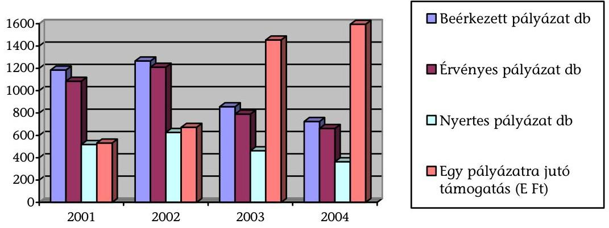

A vizsgált időszakban a kábítószer-probléma visszaszorítására nyújtott támogatások összege növekedett. Ugyanakkor csökkent a pályázók, illetve a nyertes pályázatok száma, ami a pályázati feltételrendszer átalakításával magyarázható.

Az internetes pályáztatás bevezetését előzetes hatásvizsgálat nem előzte meg. A rendszert nem tesztelték, a javításokat az éles rendszeren próbálták ki, amelynek következtében esetenként mentett adatok vesztek el, vagy lefagyott a rendszer, ami csökkentette a hatékonyságot és komoly túlmunkát jelentett mind a pályázók, mind a pályáztatók részére. A pályázatok száma az előző évihez viszonyítva csökkent. Ennek okát a 2005. szeptemberében kiadott kérdőíves felméréssel próbálja a Mobilitás feltárni.

A szakmai beszámolók elsősorban adatszolgáltatásra irányultak és nem tartalmaztak értékeléseket, elemzéseket, eredményességre vonatkozó mutatókat. Az ellenőrzés tapasztalata szerint a szakmai konzultáció és információcsere a szakmai terület és a pályázatkezelő között nem kielégítő mértékű, tartalmaz némi esetlegességet. A minisztérium nem dolgozott ki a pályázatok eredményességének és hatékonyságának megítéléséhez szükséges mérési módszert. A szakmai terület és a pályáztatás lebonyolításának és ellenőrzésének jelenlegi nagyfokú szétválása hátráltatja a kellő mélységű információ-áramlást.

---

# 3.4. A kábítószer-fogyasztás megelőzésére fordított támogatások felhasználásának helyszíni tapasztalatai 

Helyszíni vizsgálat keretében 216 támogatást 487 M Ft összegben vizsgáltunk meg. Egy támogatás felhasználását nem lehetett ellenőrizni, mert a szervezet iratait a rendőrség bevonta.

A pályázók 55 M Ft-ot, a támogatási összeg 11,2%-át biztosították önerőként a programok megvalósításához. (KEF-ek támogatásához önerőt nem kötött ki a pályáztató).

A pályázók a pályázati lehetőségek meghirdetését és nyilvánosságát megfelelőnek értékelték. Pozitívan értékelhető, hogy két évben a már korábban pályázóknak a támogató mini CD-n is megküldte a pályázati kiírást. A papíralapú pályázatokat felváltó internetes pályázati módszer bonyolultabb volt, a technikai rendszer hiányosságait és a felhasználók technikai tudását figyelmen kívül hagyták a pályázat kiírói. Előfordult, hogy a döntések elhúzódása miatt a tervezett megvalósítási időre még nem döntöttek a pályázat elbírálásáról, így egyes események nem valósulhattak meg.

A vizsgált 487 M Ft támogatás 14,3%-ából, 69,5 M Ft-ból beruházást valósítottak meg.

A beruházások közül a rakacai Drogrehabilitációs Otthon, a nagyszénási félutasház és a kovácsszénájai félutasház kialakítására fordították a legnagyobb támogatási összeget (25,0 M Ft, 11,0 M Ft, 7,5 M Ft). Kisebb beruházási összeggel mikrobusz-vásárlást és védett ház kialakítását támogattak.

A pályázatok közel 60%-ánál a megítélt támogatás összege kevesebb volt a pályázati cél megvalósításához szükséges összegnél, a csökkentésének mértéke a 40-50%-ot is elérte. Ennek
 oka a benyújtott költségvetések a bíráló bizottság szerinti felülértékeltsége, illetve az igényekhez viszonyított szűkös támogatási keret. Ennek ellenére a pályázók csupán 2%-a lépett vissza azért, mert a csökkentett pályázati támogatásból nem tudták megvalósítani a programot (Média3 Kft. Szolnok KAB-MA-01, Belvárosi Tanoda Bp. KAB-KA04 ABC). Csökkentett támogatási összeg megítélése esetén a pályázók a tervet módosították, költségvetését átdolgozták, illetve, ha lehetőségük nyílt rá az önerő (más pályázati támogatás) bevonásával biztosították az eredeti program megvalósítását.

A győri Szent Cirill és Method Alapítvány a vizsgált időszakban 14 alkalommal pályázott és összesen 12,2 M Ft támogatást nyert el. Pályázatai többségénél kevesebb támogatást kapott az igényeltnél, ezekben az esetekben a költségvetés átdolgozásával, illetve a tematika kisebb módosításával valósították meg a programot. Az Alapítvány működési kiadásainak forrása elsősorban a központi költségvetési és önkormányzati támogatás, de jelentősnek tekinthető a civil forrás és saját bevétele is. Munkájában karitatív elemek vannak, ami egyik útja a drogellenes küzdelem fejlesztésének.

Kazincbarcika Város Önkormányzata 7 pályázatot nyújtott be a vizsgált időszakban. Ezek közül 3 esetben az igényeltnél 60-25%-kal kevesebb támogatásban részesült. A pályázó minden esetben átdolgozta költségvetését és a minisztérium a módosított költségvetésnek megfelelően kötötte meg a támogatási szerződéseket.

---

A pécsi Remény Rádió médiaprogram támogatására nyújtott be pályázatot két alkalommal. 2002-ben 5 M Ft támogatási igényre 3 M Ft megítélt támogatást, 2003-ban 3,15 M Ft igényre 2,5 M Ft támogatást kaptak. Mindkét alkalommal a költségvetés átdolgozása után került sor a támogatási szerződés megkötésére.

A helyszíni vizsgálatba vont pályázatok többségénél a finanszírozásban átfedés nem történt. A pályázóknak nyilatkozniuk kellett arról, hogy a program finanszírozását önerőn kívül milyen egyéb forrás bevonásával kívánják megvalósítani. A pályázók a programot már korábban tervezték, de csak a központi költségvetésből származó támogatás elnyerésével tudták megvalósítani.

Más forrás igénybe vétele miatt az eredeti költségvetés módosítására került sor a KAB-KS-01-70 számú pályázatnál a Zalai Bűnmegelőzési kortárs-segítő tábor esetében, mivel az Országos Bűnmegelőzési Tanács által kiírt pályázaton 200 E Ft szállástámogatásban részesült a pályázó.

A miskolci Drogambulancia Alapítvány részére a 18 megvalósított program közül 2 esetben támogatást nyújtott Miskolc Megyei Jogú Város Önkormányzata a város Szociális Alapjából. (KAB-AL-01 100 E Ft; KAB-TÜ-02-AB-200 E Ft).

A rakacai (B.A.Z. megye) Paraklisz Drogellenes Alapítvány Drogrehabilitációs Otthon létrehozásához 25 M Ft egyedi támogatásban részesült. Ezen túlmenően az ESZCSM-hez benyújtott „szociális szolgáltatások szakmai fejlesztése" című pályázatával 8,5 M Ft támogatásban, illetve az Esélyegyenlőségi Kormányhivatal Roma Integrációs Igazgatóságától az épület akadálymentesítésére 1,5 M Ft támogatásban részesült. Az Alapítvány tájékoztatási kötelezettségének eleget tett, és részletesen elkülönített nyilvántartást vezetett a támogatások elszámolásához.

# A pályázatok kevesebb, mint 3%-a valósult meg a pályázati szerződésben foglalt céloktól eltérően.

A Sziget Droginformációs Alapítvány 2000-ben 7,5 M Ft pályázati támogatást kapott beruházás céljára. Többszöri szerződésmódosítás után a feladatot elvégezte, de nem a támogatási összegből. Az ÁSZ részére adott nyilatkozat alapján a pályázati összeget a támogatási céltól eltérően rezsiköltségre és bérre használta fel. Az Alapítvány szakmai beszámolója az ellenőrzés részére nem állt rendelkezésre.

A Drogmegelőzési Alapítvány KAB-AL-04. számú pályázata támogatását 5 M Ft-ot a támogató visszavont, mert többszöri felszólítás ellenére a szervezet a pénzügyi beszámolóját nem készítette el.

A helyszíni vizsgálat hiányosságként állapította meg, hogy részben valósult meg a pályázati cél a KEF-ek működéséhez nyújtott támogatásoknál. A pályázat célja KEF-ek folytatólagos működésének támogatása és fejlesztése, valamint a helyi szükségletek meghatározása. A KEF-ek a támogatási összeget folyamatos működtetésükre használták és csak részben teljesítették a helyi szükségletek meghatározására vonatkozó feladatokat (KAB KEF-02-50,-53; KAB-KEF-03-50,53; KAB-KEF-04-A).

Általában a szervezetek nem vizsgálták a költségtakarékos megoldás lehetőségét. Étkeztetés, kiadvány előállítás, nagyobb mennyiségű eszköz beszerzésekor nem kértek be több árajánlatot a legkedvezőbb ajánlat kiválasztása érdekében.

---

A cél szerinti, eredményes megvalósulás megítélését nem tette lehetővé, hogy rendezvényeken, előadásokon a jelenlévők részvételét jelenléti ívvel nem dokumentálták (KAB-AL-02-14, KAB-SZ-01-10, KAB-KEF-03-41, KAB-KEF-04-B-9, KAB-AL-01). Előfordult, hogy a tájékoztatók elkészítéséhez megrendelést nem készítettek, szerződést nem kötöttek, illetve nem készítettek felmérést arra vonatkozóan, hogy a kiadvány hány emberhez jutott el és ez milyen arányt képvisel a célcsoporthoz képest (KAB-KEF-02-53, KAB-KEF-03-53). A szakmai beszámolókat e hiányosságok ellenére elfogadta a pályázatkezelő.

A Sziget Droginformációs Alapítvány Droginfo kézikönyv elkészítéséhez 3 esetben, összesen 7 M Ft támogatáshoz jutott. A vizsgálat megállapította, hogy a kiadványok elkészítéséhez költségkalkuláció nem készült, ezért a támogatás költséghatékonysága nem ítélhető meg. Arról sincs adat, hogy a kézikönyv hány felhasználóhoz jutott el, hogyan hasznosult.

A pályázók közül néhányan nem tettek eleget a támogatási szerződésben kikötött iratmegőrzési kötelezettségüknek.

Különösen két budapesti alapítvány, a Sziget Droginformációs Alapítvány és a Drogprevenciós Alapítvány esetében tapasztaltuk, hogy a pályázattal kapcsolatos irataikat, bizonylataikat nem őrizték meg teljes körűen, így azokat nem tudták az ellenőrzés rendelkezésére bocsátani. A hiányzó dokumentumokat a Mobilitás adta át az ellenőrzés részére.

# 4. Az Országos Fogyatékosügyi Program végrehajtására fordított állami támogatások pályázati rendszerének működése és hasznosulása

Az OGY a fogyatékos személyek jogairól és esélyegyenlőségük biztosításáról szóló 1998. évi XXVI. törvény alapján elfogadta az Országos Fogyatékosügyi Programot (OFP), a fogyatékos személyek esélyegyenlőségének megteremtéséhez szükséges intézkedéseket a 100/1999. (XII. 10.) számú OGY határozatban rögzítette. Az OFP célja azon intézkedések meghatározása, amelyeket az egészségügyi, foglalkoztatási, szociális, oktatási, közlekedési, településrendezési, fejlesztési területeken kell megvalósítani a fogyatékkal élők esélyegyenlőségének javítása érdekében. Az OFP végrehajtására vonatkozó középtávú intézkedési tervet a 2062/2000. (III. 24.) Korm. határozat fogadta el. Vizsgálatunk az OFP és az intézkedési terv szociális ellátások területét felölelő 8. pont támogatási rendszerére terjedt ki, a szervezeti változásokat a 10. sz. melléklet mutatja.

A 2062/2000. (III. 24.) Korm. határozat 8. pontja alapján nyújtottak támogatást a fogyatékos személyek gondozását biztosító szociális intézmények részére, a szakosított ellátások bővítésére, a gondozási feltételek javítására, az otthoni lakhatást és életvitelt segítő szolgáltatások fejlesztésére. A támogatható szervezetek köre önkormányzatokra, civil szervezetekre és alapítványokra terjedt ki.

A 2001. és 2002. években a Szociális és Családügyi Minisztérium (SZCSM) fejezeti kezelésű előirányzatai között „fogyatékosügyi program támogatása" alcímen található az OFP megvalósításához rendelt előirányzat. 2003-tól ilyen alcímen, de még jogcímcsoportként sem található előirányzat a költségvetésben.

---

Egy jogcímen belül, a költségvetés az előirányzat továbbbontását témákra nem írta elő, ezért 2003, 2004. években az OFP-nak nincs eredeti előirányzata, csak módosított, így a minisztérium döntésének függvényévé vált. Az előirányzat összevonása után a módosított előirányzat csökkenő mértékű volt.

# 2005-ben az OFP ismét önálló jogcímcsoport az ICSSZEM költségvetésében, így önálló előirányzattal rendelkezik.

2005-ben a keret a fogyatékos személyek jogairól és esélyegyenlőségük biztosításáról szóló 1998. évi XXVI. tv. 24.§-val létrehozott Országos Fogyatékosügyi Tanácsnak, állandó bizottságainak és az országos civil műhely működésének, az ENSZ-szel, az Európa Tanáccsal és az Európai Unióval összefüggő nemzetközi kötelezettségeinknek, továbbá a társadalmi tudatformálással és az egyenlő esélyű hozzáféréssel kapcsolatos tájékoztatási feladatainknak a forrását tartalmazza. 2005. évben az OFP megvalósítását több jogcímcsoport is szolgálja: 9.15.4 akadálymentesítési program támogatása, 9.18.2 Fogyatékosok Esélye Közalapítvány támogatása.
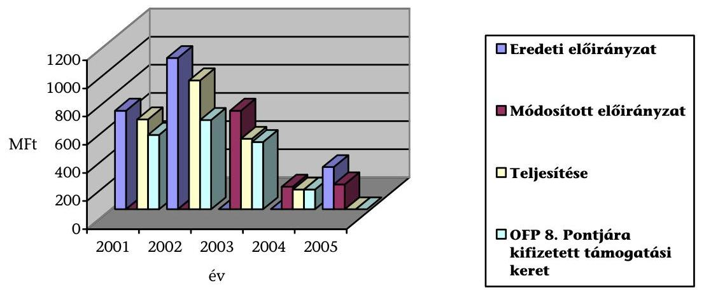

A vizsgált időszakban a rendelkezésre álló támogatási források és a szociális területet érintő célkitűzések összhangja nem állapítható meg, mert az OFP indítását megelőzően (2062/2000.(III. 24.) Korm. határozat) nem készült kalkuláció a megvalósításhoz szükséges forrás mértékére és annak időbeni ütemezésére. A megítélést az is akadályozta, hogy az OFP által meghatározott célok és a végrehajtás során elért eredmények bemutatása, értékelése 2001-2003-ra megtörtént, az ezt követő időszakra azonban még nem teljesült.

A minisztérium adatszolgáltatása nehézkes, pontatlan volt, hátráltatta a vizsgálat munkáját. Többszöri adatkérésünk ellenére sem kaptuk meg azokat a pénzügyi adatokat, amelyek az OFP megvalósítására összesítve, tárca szinten mutatta volna a ráfordításokat. Nem tudták rendelkezésünkre bocsátani azt az információt sem, hogy a vizsgált időszakban mennyi volt az OFP 8. pontjának a teljes ráfordítása.

A fejezeti kezelésű előirányzat teljesítésén belül 2001. évben az előirányzat 83%-a, 2002-ben 69%-a, 2003-ban 96%-a, 2004-ben 100%-a CSSZSZF és jogelődei kezelésében volt.

---

Az ellenőrzés kockázatát növelte, hogy a minisztériumot folyamatosan átszervezték (10-10/a melléklet), ami miatt a pályázatokról 2001, és 2002. évekre kevés információ állt rendelkezésre.

# 4.1. Az ellátó rendszer kiépítése, az OFP pályázati forrásai

A fogyatékos személyek ellátórendszere kiépítésének első lépése a lakóotthonok megteremtése, a meglévők bővítése, korszerűsítése volt. A nagy létszámú ápológondozó intézeti ellátásról a lakóotthonokra való áttérés minőségi életkörülmény-változást jelentett, mert jobban szolgálta a fogyatékkal élők civil életben való aktív részvételének biztosítását.

A 2001. és 2002. években a fogyatékos személyek speciális szükségleteihez igazodó komplex támogató szolgálatok létrehozásának és fejlesztésének modellkísérlete került meghirdetésre.

Az OFP 8. pontja keretében a SZCSM 2001-ben 150 M Ft-os előirányzattal kezdte meg a modellkísérleteket. A kísérletek eredményei lehetővé tették a fogyatékos személyek önállóságának, esélyegyenlőségének biztosításához szükséges szolgáltatások kialakítását, fejlesztését, az ellátó rendszerek bővítését, a támogató szolgálatok országos körű elterjesztését.

A 2003. évi költségvetési törvény azzal, hogy normatív támogatást biztosított a támogató szolgálatoknak, megteremtette működésük feltételeit. Számuk a minisztérium 2003. évi OFP beszámolója szerint 60-ra tehető. A támogató szolgálatoknak kifizetett normatíva 2003-ban 276,6 M Ft, 2004-ben már 601,9 M Ft volt. Ezek az összegek csak egyházi, alapítványi és egyéb civilszervezetek gondozásában létrehozott támogató szolgálatoknak kifizetett normatív összegeket tartalmazzák. Az önkormányzati támogató szolgálatokat a költségvetés IX. fejezetében előirányzott normatíva terhére finanszírozzák.
2003. évtől a minisztérium az otthonokban történő ellátás, illetve a kialakult támogató szolgálat hálózat esetében építésre, felújításra, illetve gépkocsi beszerzésre adott támogatást.

## 2004. évről az ICSSZEM nem készítette el az OFP beszámolóját, nem értékelte a szociális terület ráfordításait, így a növekedés mértékét nem ismerjük.

A költségvetés által biztosított keretek szétosztása az OFP által meghatározott célokra döntően pályáztatás útján valósult meg 2001, és 2002. években (az SZCSM 2002. októberi megszüntetéséig). Ezt követően a feladatok végrehajtásában akadozott a belső koordináció, ami a hatékony feladatellátást hátráltatta. Az eredményes pályáztatás kockázatát növelte, hogy az CSSZSZF-on 2003-tól 1 fő látta el kapcsolt munkakörben az OFP-hez kapcsolódó szakmailag szélesebb körű feladatokat.

A támogatási keretek felosztására 2001 és 2002-ben nyílt, vagy meghívásos, 2003. évtől - a támogatási keretek csökkenése miatt - csak nyílt eljárású pályázatot írtak ki.

Miniszteri hatáskörben egyedi döntéssel 2001. évben 41,8 M Ft, 2002. évben 36,9 M Ft pályázati keret került elkülönítésre.

---

A 2003. évi összes keret 9%-kal volt alacsonyabb a 2001. évihez képest, a 2004. évi a 2001. évinek mindössze a 27%-a volt. A támogatási keretek csökkentésével azonban a végrehajtandó feladatok száma nem csökkent, a beadott pályázatok száma, és szakmai indokoltsága a támogatási keretek iránti igény növekedését jelezte.

A legnagyobb támogatást az új lakóotthonok kialakítása program kapott, ennek átlagos összege 2003-ban 15,1 M Ft volt. Ettől a programtól várták a legnagyobb eredményt, azonban mérőszámok
 alkalmazására, eredményességi kritériumok meghatározására, teljesítményértékelésre nem került sor.

A pályázati támogatásra rendelkezésre álló keret 2003-ban a támogatási igény 30,5%-a, 2004-ben 43%-a volt. A rendelkezésre álló támogatási keret 2003-ról 2004-re 500,5 M Ft-ról 160 M Ft-ra, 32%-ra csökkent. A beérkező pályázatok száma jóval meghaladta a támogatható pályázatokat. Ez magyarázza azt a minisztériumi gyakorlatot, hogy a program céljának eredményes megvalósításához szükséges, a pályázatban igényelt támogatási összegeket csökkentve hagyták jóvá (11. számú melléklet).

A célok végrehajtásához szükséges források felmérése nem készült el, a végrehajtás költségvetési kerete 2002-ben még nőtt, azt követően az OFP által meghatározott feladatok eredményes megvalósítását a keretek folyamatos csökkentése nem biztosította.

# 4.2. A pályázati cél- és feltételrendszer 

A pályázati felhívásokban meghatározták a pályázati célokat, a pályázók körét, a programok általános feltételrendszerét és az eljárás rendjét, az elbírálás általános szempontjait, a támogatás folyósításának feltételeit, a saját erő mértékét, azonban a pályázati célokhoz eredményességi kategóriákat nem fogalmaztak meg.

A pályázati célokat az OFP előírásaival összhangban, a szociális ellátások bővítése érdekében határozták meg.

Személyes gondoskodást nyújtó szociális ellátórendszer fejlesztése, lakóotthon kialakítása, korszerűsítése, új nappali és szociális intézmények létrehozása, támogató szolgálatok létrehozása és működtetése. Fogyatékos személyek szociális ellátását segítő támogatások, lakóotthonok kialakítása és korszerűsítése, fogyatékosok integrált intézményeinek létrehozása, alapellátási és speciális alapellátási feladatok teljesítése.

A minisztérium a pályázati felhívásokat a szociális és munkavédelmi, és a szociális közlönyben, illetve honlapján tette közzé. A pályázati kiírásokban nem szerepeltették a kizárás pontos okait, egy programra több pályázat is beadható volt, amit nem kellett jelölni az adatlapon. A pályázatban jelezni kellett a már elnyert támogatásokat, de az elszámolását, befejezését nem. Így nem zárták ki azokat, akik lejárt esedékességű, befejezetlen, elszámolatlan támogatással rendelkeztek. A pályázati kiírásban rögzített feltételek és a szerződésekben foglaltak nem minden esetben voltak összhangban.

A támogatás felhasználásának 24 pontos minimum feltételeit szabályzatban rögzítették. Előírták például az elkülönített analitikus nyilvántartás vezetésének

---

kötelezettségét, a támogatási összegek külön számlán való kezelését, a működtetési kötelezettséget és az elidegenítési tilalmat, amely követelmények a támogatási szerződésekben nem mindig jelentek meg (Nyilatkozat a költségvetési pénzeszközök ellenőrizhetőségéhez, titoktartási nyilatkozat, tájékoztatás üzleti titokról, teljesítésigazolás stb.).

A pályáztatónak gondoskodnia kellett arról, hogy jogtalan igénybevétel esetén a támogatás visszafizetésre kerüljön. A 2001. és 2002. évi szerződések tartalmaztak „azonnali beszedési megbízást" az SZCSM részére, de ezt követő években nem volt érvényesíthető a visszafizetési kötelezettség.

A támogatási szerződésekben, a beszámolókban, és annak ellenőrzésénél a közbeszerzési törvény, illetve a szabadkézi vételről szóló 126/1996. (VII. 24.) Korm. rendelet előírásai nem jelentek meg.

A pályázati kiírásban több ütemű, teljesítéshez kötött finanszírozást szerepeltettek, a támogatási szerződéseket ezzel szemben 2003. évben sok esetben, 2004. évtől mindig egy összegű előfinanszírozással kötötték meg. Nem készült finanszírozási terv, a támogatási összeg megítélésével egyidejűleg döntöttek az egyösszegű kifizetésről. Ez a támogatási forma a cél elérése ellen hatott, pazarló volt, a hatékony és eredményes felhasználást kizáró módszernek bizonyult, nem ösztönzött költségkalkulációra, amivel több esetben vissza is éltek a pályázók. Volt olyan pályázó, aki a megvalósítási határidő lejártakor a program végrehajtásába még bele sem kezdett. A gyakorlatban előfinanszírozás történt, ami a költségvetési gazdálkodás előírásaival ellentétes.
36.033-147/2003 számú szerződés alapján 2003. október 27-én 15 M Ft támogatásban részesítették Cegléd város Önkormányzatát, 2004. június 30-i elszámolással, amely program megvalósításához 2004. július 27-én szerződésmódosítást kértek, és azt a minisztérium engedélyezte. A program a helyszíni ellenőrzés lezárásáig nem valósult meg.

Szakmai igazolást csak utólag, a beszámoló alapján tettek, amely nem garantálta, hogy a kifizetés jogossága és összegszerűsége megfelelt a szerződés szerinti cél érvényesítésének.

A helyszínen ellenőrzött pályázatok (MÁl, Mozgássérültek Pető András Nevelőképző és Nevelő Intézete, Magyar Máltai Szeretetszolgálat) mindegyikénél jellemző volt, hogy a támogatások elszámolására vonatkozó jogszabályi előírásokkal ellentétben a pénzügyi beszámolók fő sorait analitikával nem kellett alátámasztaniuk a pályázóknak, a számlák érvénytelenítését és helyességét nem kontrollálták, az önerővel nem kellett elszámolni, a számlákhoz készített számlaösszesítőt (nem volt mindig csatolva, vagy kézi összesítés volt) számlahelyettesítő okmányként nevezték meg.

A támogatási szerződésekben a programok végrehajtásához igazodó határidők kerültek meghatározásra, ennek ellenére a végrehajtási határidők kitolódtak, a pályázók gyakran éltek határidő módosítási kérelemmel.

A MÁl „Lakótelepi lakás lakóotthonná alakítása modell" pályázati programjánál az ismételt határidő módosítások ellenére, a program végelszámoltatása nem fejeződött be a helyszíni ellenőrzés lezárásáig.

---

A pályázat kiírással szemben a működtetésre benyújtott pályázatok esetében a költségterv-betétlap készítés követelményének a pályázatok egyike sem felelt meg.

A szükséges önerőt a pályázók biztosíthatták más támogatási forrásokból is, erről a pályázónak nem kellett elszámolnia. A csökkentett mértékű támogatások esetében pedig az önerő mértékét is csökkentett összegben fogadták el a benyújtott elszámolásokban.

A pályázati feltételek között kizáró tényezőként szerepelt, ha a teljesítés eltért a támogatási szerződés tartalmától, vagy ha hamis adatközlés történt. A módosítási kérelmeknél azonban ezt a szempontot nem vették figyelembe, és a helyszínen sem ellenőrizték.

# 4.3. A támogatások elosztása, beszámolási, értékelési és ellenőrzési rendszer 

A nyertes és elutasított pályázatok meghatározása pályázati listán - formai, és szakmai előszűrés, szakértő bizottsági javaslat, és miniszteri jóváhagyást követően - történt, elve a vizsgált időszakban nem változott. A nyertes pályázatokat a minisztérium honlapján közzétették, az elutasított pályázatokhoz azonban indoklást nem fűztek.

A szakértők alkalmazásának, és a pályázatok értékelése követelményeinek feltételeit, szempontjait nem szabályozták, és nem készült jegyzőkönyv az értékelésekről. A pályázati felhívás tartalmazta a döntési kritériumokat, de az elutasítás kritériumát nem adták meg, formai okokkal, vagy forráshiánnyal indokolták, mely módszer nem segítette a következő pályázat eredményességét, és az elutasítás okának a kiküszöbölését. A pályázatok között rangsor nem volt, ami szintén az eredményesség ellen hatott, mert így nem volt olyan pályázat, ami eredményessége, hatékonysága bizonyíthatta volna a pályázatos forráselosztás célszerűségét és a támogatási célnak legmegfelelőbb pályázat kiválasztását.

A programok megvalósíthatóságát veszélyeztette, hogy a támogatásokat csökkentett összeggel hagyták jóvá, amelyhez utólag pótköltségvetést kellett készíteni. A csökkentett összegből, csökkentett programot valósítottak meg, amely nem felelt meg a pályázati célnak. A céltól eltérő felhasználás, vagy a megvalósítás elmaradása esetén a támogatást vissza kellett fizetni. A gyakorlatban teljesítésigazolás nem volt. 2004. évben a szerződéskötést követően a teljes összeget átutalták. Nem volt kellően hatékony a pályázatok elszámoltatása és ellenőrzése. A minisztérium feladata lett volna a teljesítés ellenőrzése. 2001 és 2002-ben monitorozták a pályázatok megvalósulását, azonban 2003 és 2004-ben ez a feladat elmaradt.

A 2002. évi pályázati programok támogatási összegének 56%-a került monitorozásra, ahol a megvalósítást követő továbbélést vizsgálták a helyszínen. Eredményei beépítésre kerültek az eljárásrendbe, de a megállapításaik jelentős részét nem értékelték ki. A pályázati fegyelem és kiértékelés romlott, mert amíg a 2002. évi támogatások 79%-a 2002-ben befejeződött, és elszámolásra senkit nem kellett felszólítani, addig 2003-ban monitorozás nélkül a programok 48%-a fejeződött

---

be, az 52%-ot elszámolásra fel kellett szólítani. A hatékonyság mértékét befolyásolta a beruházások elhúzódása. A 2004. évi pályázataik értékelése még nem zárult le.

A diszpozíciós jogkört gyakorló szervezeti egység köteles volt gondoskodni a programkeret felhasználásának, megvalósulásának szakmai és pénzügyi célnak megfelelő mélységű ellenőrzéséről. Az ellenőrzések tapasztalatairól a szakmai felső vezetőt és az Ellenőrzési Főosztályt írásban tájékoztatni kellett, amely a gyakorlatban nem érvényesült.

A szakmai és pénzügyi beszámoltatásra a pénzügyileg, jogilag jóváhagyott beszámoló űrlapok alapján került sor, de analitikát, leltárkimutatást nem kértek hozzá. A pénzügyi elszámolás elegendő feltétele volt egy számlaösszesítő készítése, amit számlahelyettesítő okmányként nevesítettek.

A számlahelyettesítő okmányok valóságtartalmát nem ellenőrizték. A szakmai és pénzügyi ellenőrzésekről beszámolók a 2001. és 2002. években végrehajtott monitorozás alkalmával készültek. A pályázati támogatásokat először az ICSSZEM Ellenőrzési Főosztálya vizsgálta 2005. első félévében.

A helyszíni ellenőrzés keretében vizsgált (MÁl) két lezárt pályázatnál a támogatások elszámolására vonatkozó jogszabályi előírásokkal ellentétben a program kezdésének időpontjánál korábbi számlát fogadtak el.

A hiányosságokat az ICSSZEM a Fejezeti Kezelésű Előirányzatok Gazdálkodási Szabályzatában (2/2005. (III. 4.) ICSSZEM rendelet) foglalt előírásaiban felszámolta, és az ellenőrzési kötelezettséget a rendeletben szigorította. A pályáztatási feladatokat közreműködő szervezetek kezelésébe adta.

# 4.4. A támogatások felhasználásának helyszíni tapasztalatai 

A vizsgált támogatással megvalósított célok az OFP-vel összhangban a fogyatékosok érdekeit szolgálta. A létrejött működőképes beruházások, a beszerzett tárgyi eszközök, az infrastruktúra javítása, a gépjárművek beszerzése vagy az ellátórendszer megszervezése a fogyatékkal élők életkörülményeit javította. Azonban egyes esetekben eltértek a pályázati céltól, ennek csak részben feleltek meg, vagy csak részben teljesültek, így eredményességük is annak megfelelően volt értékelhető.

Helyszínen vizsgáltunk 67 db, véletlen mintavételezéssel kiválasztott pályázatot. A vizsgált pályázatok cél szerinti megvalósítása 505,7 M Ft-os támogatási igényt, és 205,3 M Ft önerőt jelentett. A támogatási igényeket a minisztérium változatlan önerő mellett - 354,0 M Ft-os összeggel, vagyis a kért összeg 70%-ában támogatta.

A csökkentett támogatási összeg, a monitorozás hiánya a vizsgált pályázatoknál számos problémát okozott.

Nem az eredetileg pályázott cél valósult meg 2 esetben (0,3%), amelyhez 18 M Ft támogatási összeget folyósítottak.

---

Az Értelmi Fogyatékosok Fejlesztő Szolgálata 2002. évben 3 M Ft támogatásból, és 1,8 M Ft önrészből korlátsíkemelőt tervezett, ehelyett épületének külső homlokzatát újította fel.

A Gézengúz Alapítvány 2001. évi 15 M Ft-os támogatási összegből, és 11,6 M Ft önrészből a fogyatékos gyermekek ellátását segítő lakóotthon építése helyett egészségügyi apartmanokat alakított ki.

17 pályázatnál (26%) 52 M Ft jóváhagyott támogatási összeg vonatkozásában az eredetileg tervezett célok csak részlegesen valósultak meg.

A Magyar Máltai Szeretetszolgálat Egyesület 2002. évi 10 M Ft támogatásból és 2,7 M Ft önrészből tetőtéri lakóotthon kialakítása helyett a fogyatékkal élőket segítő jelzőrendszeres szolgálatot valósított meg. 2004. évi 4 M Ft támogatásból, és 2 M Ft önrészből új gépjármű helyett használtat vásároltak.

Az Autista Sérültekért Alapítvány 2002. évi 3 M Ft támogatásból, és 0,9 M Ft önrészből a lakóotthon átalakítását, férőhely bővítését, infrastruktúra kiépítését csak részben valósította meg.

Saját erő felhasználásával nem számoltak el 3 esetben (0,5%) 25,9 M Ft jóváhagyott támogatási összeg felhasználásánál.

A Látássérült Cseppkő Országos Egyesület 2002. évi 3 M Ft-os támogatási összeg nappali átmeneti intézmények átalakítására, és gépjármű üzemeltetési költségére kapott támogatáshoz önrészt nem használt, és szakmai beszámolót sem készített.

A Mozgássérültek Állami Intézete 2002. évi 20 M Ft-os támogatási összegének lakóotthon létrehozása, számítástechnikai eszközök, konyhai és egyéb berendezések beszerzése céljára kapott támogatás önrészének elszámolása, és a program lezárása 2005. szeptemberéig nem történt meg. A pályázati program nem a szerződés szerint, és nem a szakmai programhoz kapcsolódó pénzügyi terv szerint valósult meg, a vállalt önrész felhasználásáról nem történt elszámolás.

Egy esetben a támogatási összeg jelentős csökkentése miatt a támogatott visszautalta az elnyert pályázati támogatást miután a pályázati cél megvalósíthatatlanná vált.

A Nemzetközi Pető András Közalapítvány a 2001. évi 15 M Ft-os támogatási
 igényéből 5 M Ft-ot kapott meg, amely az elérendő cél megvalósításához (nappali intézet tárgyi feltételeinek javítása) nem volt elegendő, ezért azt visszautalta a támogatást nyújtónak.

Egy esetben a pályázati terv megváltozása után sem sikerült elérni a kívánt eredményt.

A Magdaléneum Református Egészségügyi Gyermekotthon 2003. évi 15,6 M Ft támogatás, és 8 M Ft önrész felhasználásával 8 fő részére új lakóotthont vásárlására pályázott. A pályázatban eredetileg megjelölt ingatlan helyett (eladó visszalépett) a támogatási szerződés módosítása után vásárolt ingatlan a tervezett lakóotthon megvalósítására nem alkalmas.

A pályázók az önerőt a támogatási összeg elnyerése érdekében általában magasabb összeggel kalkulálták, mint azt a pályázati kiírás feltételként előírta. A

---

vizsgált esetekben a támogatási összeg mellett 58 % önerőt mutattak be annak ellenére, hogy a pályázati kiírások csak 10-30%-ot írták elő.

A vizsgált 67 db pályázat közül 39 esetben (58%) csak olyan kisebb szabálytalanságot tapasztaltunk, amely a pályázati kiírás pontos betartása, illetve betartatása mellett elkerülhető lett volna. Ez a vizsgált 354 M Ft támogatási összeg több mint felét, 199,3 M Ft-ot tette ki.

A támogatási célok megvalósításának több mint felénél a felhasználás célszerű és takarékos volt, a pályáztató által előírt követelményeknek megfelelt.

A pályázatok egy részénél a határidőcsúszást, az eredetileg tervezett program részleges végrehajtását, vagy az eredeti cél megváltoztatását a pályázóktól független, külső körülmények befolyásolták. Jellemzően a felhasználók a pályázati támogatás megszerzése, és megvalósítása érdekében igyekeztek eljárni.

Példa értékű megvalósításra került sor a Baranya megyei Önkormányzat 2002. évi 9 M Ft-os támogatási összeg, és 7,5 M Ft önrész felhasználásánál, ahol $915 \mathrm{~m}^{2}$ ingatlan vásárlására, fürdő, korlát, és rámpa kialakítására került sor, a lakóotthon 100%-os kihasználtsággal működik. A feladat teljesítéséhez 10,7 M Ft-ot igényelt az Önkormányzat, amelyet a minisztérium 9 M Ft-ra csökkentett, így az eredetileg 5,8 M Ft-os önrészt az önkormányzat felemelte 7,5 M Ft-ra. A támogatással megvalósított lakóotthon lakói elégedettek, nőtt az autonómiájuk, nagyobb a felelősségük, életkörülményeik javultak.

A Kerekvilág Jóléti Szolgálat Alapítvány 2001. évi pályázatán nyert 14 M Ft támogatási összegből és 13,2 M Ft önrészből valósított meg egy 20 főt ellátó szociális átmeneti intézményt. Az elkészült rehabilitációs Központ egy iskolából, és egy szociális intézményből áll az enyhe,- középsúlyos,- illetve súlyos értelmi fogyatékos mozgássérült gyermekek oktatására, fejlesztésére. A 2002. július 16-án készített monitorozási szakvélemény szerint a program újszerű, modellértékű, és olyan ellátást valósít meg, amely hiánypótló szolgáltatás. Segíti a halmozottan sérültek megfelelő képzéshez jutását, és lehetőséget nyújt a társadalmi integrációra.

A Békés Megyei Fogyatékosok Ápoló Gondozó Otthona 2001. évi pályázaton nyert 10 M Ft támogatási összegből és 11,3 M Ft önerőből 12 fős új lakóotthont hozott létre önálló életvitelre részben képes fogyatékos fiatalok részére. A pályázatos támogatási igény 15 M Ft volt, azonban a csökkentett összegből is képesek voltak - a kivitelezők pályáztatásának eredményeként - kisebb költséggel az ellátást létrehozni. A lakószobák berendezése a fogyatékos fiatalok szüleinek segítségével történt, az ellátással kapcsolatos teendők egy részét az ott lakók végzik. Az újfajta ellátási forma a lakók életminőségében jelentős változást eredményezett, soha nem tapasztalt készségek és képességek kerültek felszínre.

Helyszíni ellenőrzésünk alkalmával kérdőívet készítettünk, melynek célja pályázatokon sikerrel részt vett szervezetek pályázati rendszerrel kapcsolatos véleményének felmérése volt. A felhasználók véleménye szerint a támogatásból finanszírozott szociális ellátás akkor valósultak meg nagy valószínűséggel, ha azokat már korábban tervezték, de a megvalósítás csak a támogatás elnyerésével vált lehetővé. A pályázati kiírások egyértelműek, az ügyintézés jó, az elbírálás gyorsaságát közepesre minősítették. A felhívásban megjelenő célok megfelelőek a válaszadók 65%-ának véleménye szerint. A támogatási stratégiákra vonatkozóan a megkérdezettek 72%-a a kevesebb de nagyobb összegű támogatást részesítené előnyben. A megkérdezettek 12%-ánál fordult elő, hogy

---

elnyert támogatását annak csökkentett összege miatt nem vette igénybe. A pályázat szerint kitűzött célt a pályázók 40%-a volt képes teljes mértékben megvalósítani. Utólagos elemzést, értékelést a támogatások hatásáról, eredményességéről a vizsgált pályázók 86%-a készített, de csak szöveges formában, a beszámoló részeként, de nem konkrét mutatószámokra alapozottan.

# 5. A KORÁBBI SZÁMVEVŐSZÉKI VIZSGÁLATOK UTÓELLENŐRZÉSE 

Tekintettel arra, hogy a minisztérium 2004. október 21.-én jött létre, a korábbi ÁSZ vizsgálatok ${ }^{13}$ utóellenőrzése keretében azoknak a korábbi javaslatoknak a megvalósítását vizsgáltuk, amelyek az ICSSZEM-hez kerültek, és a jogelőd fejezeteknél állapítottuk meg. A vizsgálat elvégzését nehezítette, hogy a különböző átszervezések következtében részben a személyi változások, részben dokumentumok átadásának hiányosságai miatt az intézkedési tervek és az ezekben foglaltak teljesítésére vonatkozó dokumentumok nem kerültek át teljes körűen az újonnan létrejött tárcához.

Az Ifjúsági, Családügyi, Szociális és Esélyegyenlőségi Minisztérium Ellenőrzési Főosztályának vezetője ismételten kérte az Egészségügyi Minisztérium Ellenőrzési Főosztályának vezetőjét, hogy a szociális területre vonatkozó mindazon jelentéseket küldje meg, amely jelentésekben utóvizsgálatokat írtak elő és ezek még nem történtek meg. A jelentések átadása a két minisztérium között a helyszíni ellenőrzés befejezéséig nem valósult meg. Az ÁSZ által tett javaslatok hasznosulásának ellenőrzését vagy az előd minisztériumban, vagy a feladatot végző osztályon lehetett elvégezni.

Az Állami Számvevőszék 2003-ban a mozgáskorlátozottak támogatására előirányzott pénzeszközök hasznosulásának ellenőrzése során javaslatokat fogalmazott meg a szabályozás módosítására a támogatási rendszer általános felülvizsgálatáig az egészségügyi, szociális és családügyi miniszter számára.

A Mozgáskorlátozottak Egyesületének Országos Szövetsége (MEOSZ) is kezdeményezte a támogatási rendszer átalakítását, amelyre vonatkozóan javaslatait konkrétan megfogalmazta, és megállapodás történt a fő szakmai kérdésekben.

A vizsgálat óta eltelt időszakban koncepció készült a szaktárcánál a súlyos mozgáskorlátozottak közlekedési kedvezményrendszere korszerűsítésére.

A javaslatok megvalósítását a tárca kormány-előterjesztésben kívánta rendezni, amelynek tervezetét a kormány nem tárgyalta meg. Ezáltal a támogatási rendszer általános felülvizsgálatára nem került sor, a konszenzussal kialakított szakmai koncepció és az ÁSZ egyes javaslatai csak részlegesen kerültek megvalósításra.

[^0]
[^0]:    ${ }^{13}$ Jelentés a mozgáskorlátozottak támogatására előirányzott pénzeszközök hasznosulásának ellenőrzéséről (0344/2003); Jelentés a Gyermek, Ifjúsági és Sport Minisztérium fejezet működésének az ellenőrzéséről (0341/2003); Jelentés a Miniszterelnökség fejezet működésének ellenőrzéséről (0216/2002); Jelentés a Szociális és Családügyi Minisztérium fejezet működésének ellenőrzéséről (0032/2000); Jelentés a magyarországi nemzeti és etnikai kisebbségek támogatási rendszerének ellenőrzéséről (0468/2005)

---

Elkészült a súlyosan mozgáskorlátozott személyek közlekedési kedvezményeinek információs rendszere, amely alkalmas az ellátórendszer működésének a nyomon követésére és a stratégia tervezésére. Módosultak a támogatás finanszírozási feltételei, mert 2005-től a központi költségvetés előirányzat-módosítási kötelezettség nélkül teljesülő kiadásai körében maradt a közlekedési támogatás. A szerzési és átalakítási támogatás esetén „felülről zárt" előirányzat megállapítására került sor, melynek révén ez a közlekedési támogatás forrásigényétől függetleníthető finanszírozható.

Nem valósult meg a személygépkocsi vásárlási támogatások odaítélésével kapcsolatban a súlyos mozgáskorlátozott személyek közlekedési kedvezményeiről szóló 164/1995. (XII. 27.) Korm. rendeletben meghatározott előnyfeltételek prioritási sorrendje meghatározására vonatkozóan a közigazgatási hivatalok gyakorlatának egységesítése. A beruházási jellegű támogatások átalakítása, az orvosi szakvéleményezés rendszerének átalakítása.

Nem valósult meg a fejezet informatikai stratégiájának kialakítására, valamint a Mobilitás pályázati rendszerei és a minisztérium szervezeti egységei közötti informatikai kapcsolat kialakítására vonatkozó javaslat.

A MeH 2002. évben intézkedési tervet készített - és minden intézménynek megküldött - a feltárt szabályozási és működési hiányosságok megszüntetésére. Az érintett intézmények 2002. év végén beszámoltak a minisztériumnak az intézkedési terv végrehajtásáról, amit a MeH elfogadott.

A Gyermek, Ifjúsági és Sportminisztériumot 2004. október 21-én átszervezték. A költségvetés gazdálkodási szabályszerűségére és célszerűségére, valamint az ellenőrzés hatékonyságára tett javaslatok aktualitásukat vesztették tekintettel arra, hogy a tárca feladatai megoszlottak a jogutód tárcák között (Belügyminisztérium, Ifjúsági, Családügyi, Szociális és Esélyegyenlőségi Minisztérium).

A szociális és családügyi feladatokat ellátó minisztériumot a vizsgált időszakban 2 alkalommal átszervezték. 2002. évben a feladatok az Egészségügyi Minisztériumhoz, 2004. október 21-én az Ifjúsági, Családügyi, Szociális és Esélyegyenlőségi Minisztériumhoz kerültek, így a megfogalmazott javaslatok aktualitásukat vesztették.

A magyarországi nemzeti és etnikai kisebbségek támogatási rendszerének ellenőrzése során tett ÁSZ javaslatokra a minisztérium általánosságban fogalmazta meg az elvégzendő feladatokat, nem készített olyan intézkedési tervet, amelyben az egyes feladatokhoz határidőket és felelősöket rendelt volna, és nem kezdeményezte a Kormánynál megvalósításukat.

Budapest, 2006. január „ 16 "

Melléklet: $\quad 15 \mathrm{db} \quad 15$ lap
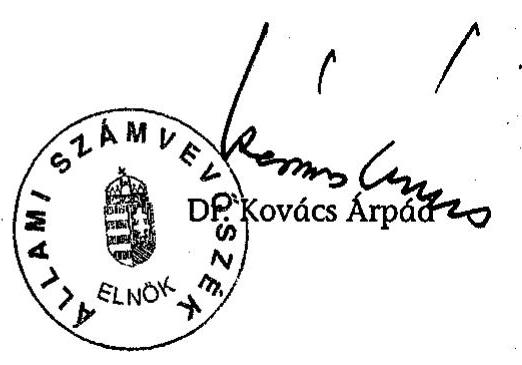

---

# ÉSZREVÉTEL

---

.

---

# ÉSZREVÉTEL

---

1. sz. melléklet
a V-11-106/2005-06. sz. jelentéshez
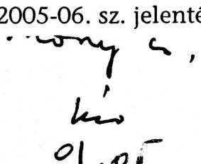

Ifjúsági, Családügyi, Szociális és Esélyegyenlőségi Miniszter
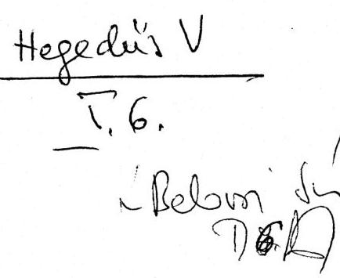

Ikt. szám:24480-8/2005.
Hiv. szám: V-11-104/2005.
Ügyintéző: Jenőfi György
Kérjük, hogy válasz esetén szíveskedjen
levelünk számára hivatkozni.

Dr. Kovács Árpád
Elnök

Állami Számvevőszék
Budapest

Tisztelt Elnök Úr!

Az Ifjúsági, Családügyi, Szociális és Esélyegyenlőségi Minisztérium fejezet működésének ellenőrzéséről készült jelentés megállapításait elfogadjuk, azokra vonatkozóan észrevételt nem teszünk.

Budapest, 2006. január 4.

Üdvözlettel:
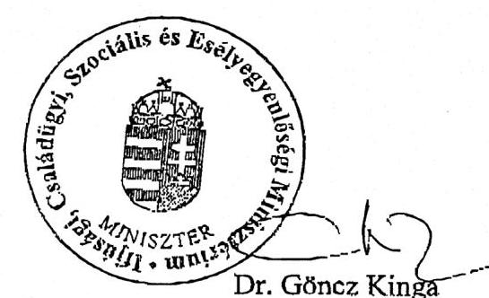

---

# Az ICSSZEM létrehozása 

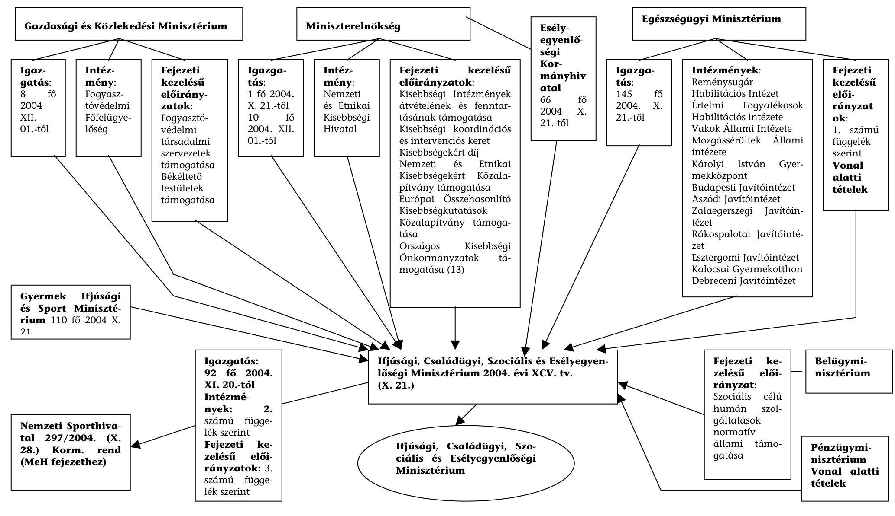

---

# EÜM-tól az ICSSZEM-be átvett fejezeti kezelésű előirányzatok: 

Háromszoros esélyteremtés a szociális ellátórendszer fejlesztésével
Hitelhátralékok konszolidációs programja
Intézményi felújítások (részben)
Nem állami fenntartók szociális címzett támogatása
Otthonteremtési támogatás
Gyermektartásdíjak megelőlegezése
Hozzájárulás a hadigondozásról szóló törvényt végrehajtó közalapítványhoz
Mozgáskorlátozottak közlekedési támogatása
Mozgáskorlátozottak szerzési és átalakítási támogatása
GYES-en és GYED-en lévők hallgatói hitelének célzott támogatása
Gyermekjóléti alapellátások, gyermekvédelmi szakellátások
Hajléktalanokért Közalapítvány támogatása
Nemzetközi Pikler Emmi Közalapítvány támogatása
Tessedik Sámuel, hogy a gyermekek megszülessenek és felnőjenek Alapítvány támogatása

Összefogás a Budapesti Lakástalanokért és Hajléktalan Emberekért Közalapítvány támogatása

Bentlakásos és átmeneti elhelyezést nyújtó intézményi ellátás
Pszichiátriai és szenvedélybetegek, valamint a fogyatékosok bentlakásos intézményi ellátása

Gyermek- és ifjúságvédelem keretében állami és intézeti, vagy átmenetileg tartósan neveltek, ideiglenes hatállyal elhelyezettek ellátása

Hajléktalanok átmeneti intézményei
Egyházi szociális intézményi normatíva kiegészítése
Bölcsődei ellátás
Szociális továbbképzés és szakvizsga
Támogató szolgálatok működtetése

---

Szociális szolgáltatási országos módszertani feladatok
Szociális szolgáltatások regionális módszertani feladatai
Nappali szociális intézményi ellátás finanszírozása időskorúak, pszichiátriai, szenvedélybetegek, hajléktalanok részére

Nappali szociális intézményi ellátás finanszírozása fogyatékos személyek részére

Étkeztetés támogatása
Házi segítségnyújtás támogatása
Falugondnoki vagy tanyagondnoki szolgáltatás támogatása
Közösségi ellátás támogatása
Utcai szociális munka támogatása
Nappali szociális központ támogatása
Családi napközi támogatása
Magyar Máltai Szeretetszolgálat támogatása
Nagycsaládosok Országos Egyesülete támogatása
GYITOSZ
Kékvonal támogatása
Nemzetközi szervezetek tagdíjai és egyéb támogatások (részben)
EU tagságból és nemzetközi együttműködésből eredő kötelezettségek teljesítése (részben)

Betegjogi, Ellátottjogi és Gyermekjogi Közalapítvány támogatása
Lelki segélyszolgálat támogatása

---

2/b. sz. melléklet a V-11-106/2005-06. sz. jelentéshez

# A NSH-nak a GYISM-től átadott szervezetek: 

Testnevelési és Sport Múzeum
Nemzeti Utánpótlás-nevelési Intézet
Sportfólió Kht.
Sportlétesítmények Rt.
Rendezvénycsarnok Rt.
Hazai Sportlapok kiadó Kft.
Hungaroring Sport Rt.
Nemzeti Labdarúgó akadémia Kht.
Csanádi Árpád Általános Iskola és Gimnázium

---

2/c. sz. melléklet a V-11-106/2005-06. sz. jelentéshez

# A GYISM-től az NSH-nak átadott fejezeti kezelésű előirányzatok: 

## Nonprofit szervezetek működési támogatása

## Nonprofit sportszervezetek működési támogatása

Sportegyesületek
Országos sportági szakszövetségek és sportági szövetségek
Szabadidősport szövetségek
Fogyatékosok sportszövetségei
Magyar Olimpiai Bizottság
Nemzeti Sportszövetség
Nemzeti Szabadidősport Szövetség
Fogyatékosok nemzeti Sportszövetsége
Wesselényi Miklós Sport Közalapítvány
Mező Ferenc Sportközalapítvány
Önkormányzati sportigazgatás támogatása
Egyéb sportszakmai és civil szervezetek támogatása

## Versenysport támogatása

Műhelytámogatás
Kiemelt hazai rendezésű sportesemények (VB,EB,VK)
Forma-1 Magyar Nagydíj támogatása
Nemzeti válogatottak felkészülésének támogatása
Olimpiai részvétel támogatása
Kiemelt nemzetközi eseményeken történő részvétel támogatása
Sporteszközök beszerzése
A Wesselényi Miklós Sport Közalapítvány által folyósított Gerevics Aladár egységes sportösztöndíj

Eredményességi jutalmak elismerések
Olimpiai járadék

---

Nemzet Sportolója elismerés
Miniszteri elismerések
Sportegészségügyi feladatok
Doppingellenes feladatok
Sporttudomány
Sportinformatikai feladatok
Fogyatékosok sportjának fejlesztése
Mező Ferenc Sportközalapítvány által folyósított segélyek

# Utánpótlásnevelési feladatok támogatása 

Sportágfejlesztés - SPORT XXI program
Héraklész-program
Sportiskolák támogatása
Egyéb utánpótlás nevelési feladatok
Iskolai, diák- és felsőoktatási sport támogatása
Szabadidő sport támogatása
Koordinált programok
Helyi szabadidős programok támogatása
Sportlétesítmények fejlesztése és kezelése
Stadion rekonstrukció
Kiemelt önkormányzati létesítmény-fejlesztések támogatása
Magyar Sportok Háza program
Létesítmény-fejlesztési pályázatok
Sportlétesítmény-kezelés intézményi rendszerének támogatása
A Budapest Sportarénával és

 a magyarországi olimpia megrendezésével összefüggő állami feladatok

Úszó EB-hez kapcsolódó létesítményfejlesztések

---

# Sporttal kapcsolatos ki nem emelt állami feladatok 

## PHARE programok és az átmeneti támogatás programjai

PHARE támogatásból megvalósuló programok
Fogyatékosok sport általi esélyegyenlősége program

---

3. sz. melléklet a V-11-106/2005-06. sz. jelentéshez

# Az ICSSZEM költségvetésének grafikai ábrázolása

---

# Az ICSSZEM költségvetési kiadásainak megoszlása 2004-évben (MFt) 

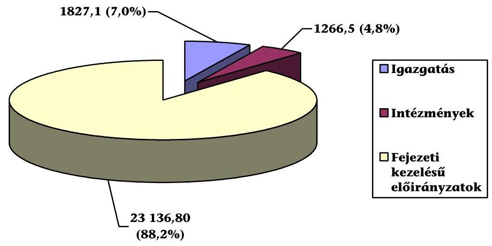

## Az ICSSZEM költségvetési kiadásainak megoszlása 2005-évben (MFt)

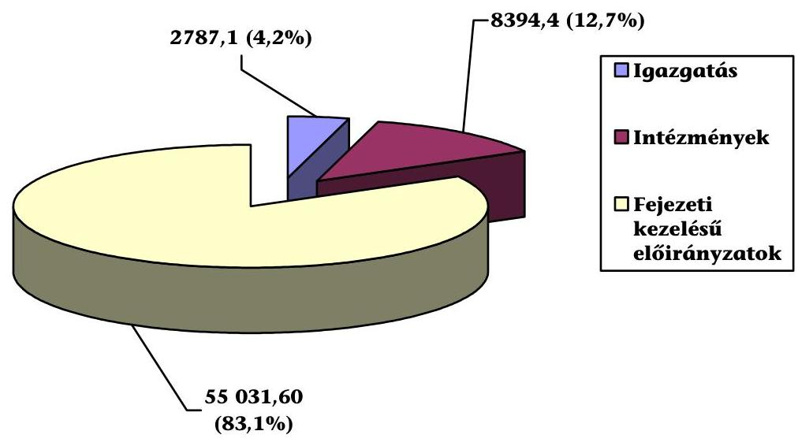

---

# Az ICSSZEM kiadásainak, bevételeinek és a felhasznált támogatásoknak alakulása 2004-2005-ben (MFt) 

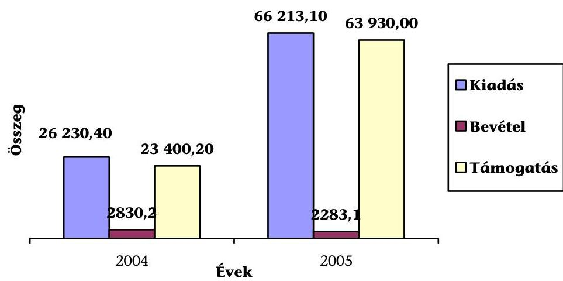

ICSSZEM fejezet 2005. évi költségvetési kiadásainak a felhasználás célja szerinti megoszlása (MFt)
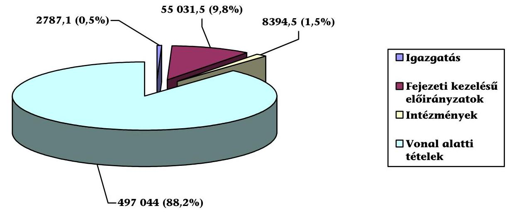

---

4. sz. melléklet
a V-11-106/2005-06. sz. jelentéshez

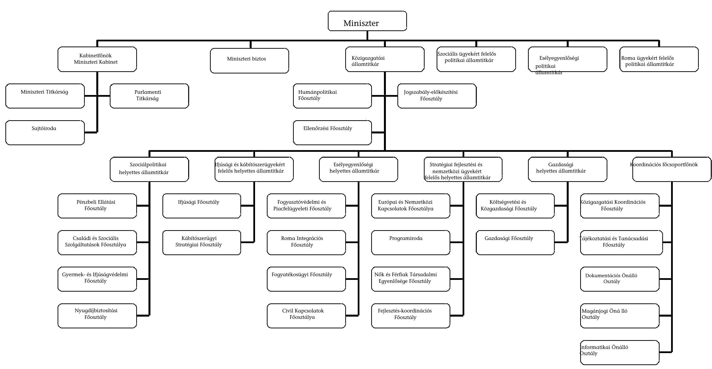

---

# A foglalkoztatottak létszáma és átlagkeresete 

| ICSSZEM létszámának kialakítása |  | Besorolás | Engedélyezett   státusz/fő | Tényleges átlagos stat. áll. létszám/fő | Átlagkereset Ft/fő/hó |
| :--: | :--: | :--: | :--: | :--: | :--: |
| Honnan*   (fejezet: EüM,   EKH, GYISM) | Hová*   ICSSZEM   főoszt/oszt. |  | 2005. I. félév |  |  |
|  |  | Miniszter | 1 | 1 | 1.378.566 |
|  |  | Allamtitkár, helyettes államtitkár, helyettes államtitkárnak minősülő vezető | 10 | 9 | 863.848 |
|  |  | Főosztályvezető, főosztályvezetőhelyettes | 53 | 51 | 571.337 |
|  |  | Osztályvezető, ügykezelő osztályvezető | 17 | 17 | 488.312 |
|  |  | I. besor. oszt. összesen | 150 | 144 | 309.205 |
|  |  | II. besor. oszt. összesen | 43 | 42 | 156.842 |
|  |  | III. besor. oszt. összesen | 9 | 9 | 161.637 |
|  |  | Mt. Hatálya alá tartozók | 34 | 34 | 147.323 |
| Összesen |  |  | 316 | 307 | 342.183 |

* Átadó fejezetekre, az ICSSZEM Igazgatásra, valamint ICSSZEM fejezet összesenre kérjük kitölteni. Tanúsítom, hogy az adatok a fejezet nyilvántartásában szereplő adatokkal megegyeznek.

Budapest, 2005. szeptember 8.
P. H.
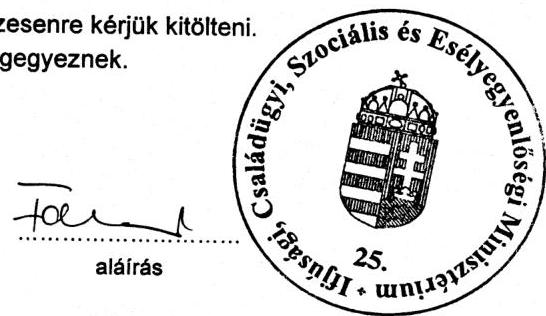

---

6. sz. melléklet a V-11-106/2005-06. sz. jelentéshez

A bevételek alakulása kiemelt előirányzatonként

adatok: M Ft-ban

|  Megnevezés | 2004. év |  |  | 2005. I. félév |  |   |
| --- | --- | --- | --- | --- | --- | --- |
|   | Eredeti | Módosított | Teljesítés | Eredeti | Módosított | Teljesítés  |
|   | előirányzat |  |  | előirányzat |  |   |
|  Működési bevételek | 1 314 | 1 663 | 1 587 | 1 347 | 1 356 | 882  |
|  Kamatbevételek |  |  | 1 |  |  |   |
|  Működési célú pénzeszköztvétel |  | 1 | 5 |  |  |   |
|  Egyéb működési célú pénzeszköztvétel, bevétel | 330 | 3 036 | 2 429 | 932 | 6 874 | 7 759  |
|  Felhalmozási jellegű pénzeszköztvétel |  |  |  |  |  |   |
|  Egyéb felhalmozási célú pénzeszköztvétel | 2 307 | 2 985 | 963 | 4 | 778 | 687  |
|  Kölcsönök visszatérülése |  | 2 | 2 |  |  |   |
|  Kölcsönök igénybevétele |  |  |  |  |  |   |
|  Osztalékok, koncessziós díjak |  |  |  |  |  |   |
|  Pénzügyi befektetések bevételeiből részesedések |  |  |  |  |  |   |
|  Sajátos bevételek |  |  |  |  |  |   |
|  Törvény szerinti bevételek | 3 951 | 7 687 | 4 987 | 2 283 | 9 008 | 9 328  |
|  Költségvetési támogatás | 28972 | 29454 | 29454 | 63930 | 66245 | 29325  |
|  felhasznált előző évi maradvány |  | 5440 | 4715 |  | 4937 |   |
|  Bevételek összesen | 32 923 | 42 581 | 39 156 | 68 213 | 80 190 | 38 653  |

Tanúsítom, hogy az adatok a fejezet költségvetési beszámolójában szereplő adatokkal megegyező az Ér. Ér. Budapest, 2005. szeptember 14.

Nagyné Bezeúzky Ágnes aláírás

---

ICSSZEM

7. sz. melléklet a V-11-106/2005-06. sz. jelentéshez

A kiadások alakulása kiemelt előirányzatonként

|  Megnevezés | 2004 |  | 2005. I. félév |   |
| --- | --- | --- | --- | --- |
|   | Eredeti | Módosított | Teljesítés | Eredeti  |
|   | előirányzat |  | előirányzat |   |
|  Személyi juttatások | 5 952 | 8 055 | 7 751 | 6 270  |
|  Munkaadókat terhelő járulékok | 1 821 | 2 058 | 1 918 | 2 117  |
|  Dologi kiadások | 3 683 | 5 301 | 4 540 | 5 146  |
|  Egyéb folyó kiadások | 351 | 1 345 | 1 240 | 537  |
|  Ellátottak pénzbeli juttatásai | 51 | 55 | 51 | 51  |
|  Egyéb műk. célú támogatások, kiadások | 15 416 | 17 757 | 14 169 | 49 822  |
|  Kamatkiadások |  |  | 1 |   |
|  Felhalmozási kiadások | 5 649 | 7 206 | 3 862 | 2 270  |
|  Kölcsönök nyújtása és törlesztése |  | 4 | 4 |   |
|  Pénzügyi befektetések, részvény vásárlás |  | 800 | 800 |   |
|  Költségvetési kiadások összesen | 32 923 | 42 581 | 34 336 | 66 213  |

Tanúsítom, hogy az adatok a fejezet költségvetési beszámolójában szereplő adatokkal megegyeznek! Budapest, 2005. szeptember 14.

Jasffar Nagyné Bezéczky Ágnes aláírás

---

8. sz. melléklet a V-II-106/2005-06. sz. jelentéshez

A fejezet eszközökre vonatkozó mérlegadatai

|  Megnevezés | 2003. év | Részarány, % | 2004. év | Részarány, % | Változás indexe, %  |
| --- | --- | --- | --- | --- | --- |
|  Immateriális javak | 290 | 1,3 | 253 | 0,9 | 87,2  |
|  Tárgyi eszközök | 10335 | 45,6 | 7433 | 27,8 | 71,9  |
|  Befektetett pénzügyi eszközök | 5761 | 25,4 | 246 | 0,9 | 4,3  |
|  Üzemeltetésre, kezelésre átadott eszközök | 26 | 0,1 | 104 | 0,4 | 400,0  |
|  Befektetett eszközök | 16412 | 72,4 | 8036 | 30,0 | 49,0  |
|  Készletek | 100 | 0,4 | 125 | 0,5 | 125,0  |
|  Követelések | 453 | 2,0 | 12477 | 46,6 | 2754,3  |
|  Pénzeszközök | 5595 | 24,7 | 5982 | 22,4 | 106,9  |
|  Egyéb aktív elszámolások | 103 | 0,5 | 145 | 0,5 | 140,8  |
|  Forgóeszközök | 6251 | 27,6 | 18729 | 70,0 | 299,6  |
|  Eszközök összesen | 22663 | 100,0 | 26765 | 100,0 | 118,1  |

---

9. sz. melléklet a V-11-106/2005-06. sz. jelentéshez

Az immateriális javak és tárgyi eszközök értéke a 2004. december 31-i állapot szerint

adatok: M Ft-ban

|  Megnevezés | Immateriális javak | Ingatlanok | Gépek, berendezések és felszerelések | Járművek | Egyéb tárgyi eszközök | Beruházások, felújítások | Tárgyi eszközök összesen  |
| --- | --- | --- | --- | --- | --- | --- | --- |
|  Miniszterelnökség | EKH |  |  |  |  |  |   |
|   | NEKH | 3 |  | 34 | 12 |  | 46  |
|  Belügyminisztérium |  |  |  |  |  |  | 0  |
|  Egészségügyi Minisztérium |  | 14 | 3 418 | 342 | 66 | 1 | 3 841  |
|  Gazdasági és Közlekedési Minisztérium |  | 81 | 296 | 535 | 11 |  | 923  |
|  Gyermek-, Ifjúsági és Sportminisztérium* |  | 155 | 853 | 651 | 108 |  | 1 767  |
|  Összesen: |  | 253 | 4 567 | 1 562 | 197 | 1 | 7 433  |

*Kivéve a Nemzeti Sporthivatalnak átadott eszközöket

Tanúsítom, hogy az adatok a számviteli nyilvántartásban szereplő adatokkal megegyeznek! Budapest, 2005. szeptember 6.

Nagyné Bezetszky Ágnes aláírás

---

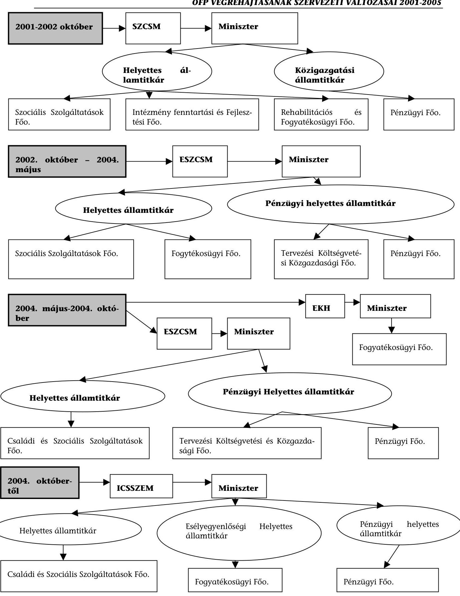

10. sz. melléklet a V-11-106/2005-06. sz. jelentéshez

---

10/a. sz. melléklet a V-11-106/2005-06. sz. jelentéshez

A vizsgált években a pályázati feladat meghatározásában tapasztalható szervezeti változások az SZMSZ alapján

|   | Szociális Szolgáltatási Főosztály | Rehabilitációs és Fogyatékosügyi Főosztály | Intézményfenntartási és Fejlesztési Főosztály | Pénzügyi Főosztály  |
| --- | --- | --- | --- | --- |
|  10/10/2020 | Feladata a szociális célú szakmai programok elkészítése, a pályázatok döntés-előkészítő munkálatainak elvégzése. Közreműködött az OFP és Intézkedési terv végrehajtásában. | Feladatai az OFP és Intézkedési terv végrehajtásával kapcsolatos szakmai koordináció, a fogyatékos érdekképviseletek költségvetési támogatásának tervezése, pénzügyi nyilvántartása, könyvvezetés, beszámoltatás | Döntésre előkészíti a pályázati kiírásokat, pályázatok érkeztetése, nyilvántartása, feldolgozása, bíráló bizottságok tagjainak és elnökeinek kijelölése. Végzi, ill. szervezi a pályázatok megvalósításának bonyolítását, monitorozását, ellenőrzését, értékelését, támogatásokat nyilvántartja, és egyezteti a Pénzügyi Főosztályal. Előkészíti a szerződéseket, és végzi az utalványozást. | Ellátja a pályázati díjak elkülönített nyilvántartását, pénzügyi bonyolítását.  |
|   | Szociális Szolgáltatási Főosztály | Fogyatékosügyi Főosztály | Pénzügyi Főosztály | A hivatali egység  |
|  10/10/2020 | Korszerűsíti az OFP-ot, és vizsgálja megvalósulását, szabályozási koncepciókat készít elő, kidolgozza a támogatási formák fejlesztési feladatait, felügyeli a fogyatékos személyek számára létrehozott szociális intézményeket. | Kidolgozza és korszerűsíti az OFP-ot, és nyomon követi annak megvalósulását, az ellátási rendszerének fejlesztését. Előkészíti a szabályozási koncepciókat, irányítja és
 felügyeli a szociális intézményeket. | Nyilvántartja a fejezeti kezelésű előirányzatokat, és azok módosításait. Teljesíti az átutalásokat. | Elkészíti az ágazati pályázatok szakmai döntéselőkészítő anyagait, javaslatot tesz a megkötni javasolt támogatási szerződések jóváhagyására és gondoskodik a szerződések teljesítésének ellenőrzéséről.  |

|   | Szociális Szolgáltatási Főosztály | Fogyatékosügyi Főosztály | Pénzügyi Főosztály | A hivatali egység  |
| --- | --- | --- | --- | --- |
|  10/10/2020 | Bonyolítja a szakmai pályázatokat (feldolgozza, előkészíti döntésre, elvégezteti a bírálatokat, megköti a szerződéseket, monitoroz, értékel). Közreműködik a fogyatékos személyek esélyegyenlőségét szolgáló szakmai feladatokban, az OFP és Intézkedési terv végrehajtásában. | Az OFP és Intézkedési terv végrehajtásával, karbantartásával kapcsolatos szakmai koordináció, nyomon követi annak megvalósulását, irányítja és felügyeli a szociális intézményeket. Szervezi a fogyatékkal élő emberek érdekképviseleteivel és szakmai szervezeteivel való kapcsolattartást, költségvetési támogatásának tervezésével, pénzügyi nyilvántartásával, könyvvezetésével, beszámoltatásával kapcsolatos feladatokat. | A szakmai főosztályok által megfogalmazott, támogatandó célok szerződéses úton történő teljesítése, (pénzköltési) ütemtervet készít, számítógépes program segítségével figyelemmel kíséri a végrehajtását, és beszámol a felsővezetésnek. Elkészíti a szerződések tervezetét, ellenjegyzéssel látja el és felterjeszti az aláírásra jogosult vezetőség jóváhagyására és gondoskodik a szerződések teljesítésének ellenőrzéséről. | Előkészíti az ágazati pályázatok szakmai döntéselőkészítő anyagait, javaslatot tesz a támogatási szerződések jóváhagyására és gondoskodik a szerződések teljesítésének ellenőrzéséről.  |

---

|   | Szociális Szolgáltatási Főosztály | Fogyatékosügyi Főosztály | Pénzügyi Főosztály | A hivatali egység  |
| --- | --- | --- | --- | --- |
|  1.1.1.1.1.1.1.1.1.1.1. | ellenőrzi a főosztály diszpozitóri jogkörébe tartozó keretösszegek szakmai és pénzügyi felhasználását, kidolgozza a szociális szolgáltatások fejlesztését, bonyolítja a szakmai pályázatokat (feldolgozza, előkészíti döntésre, elvégezteti a bírálatokat, megköti a szerződéseket, monitoroz, értékel). Közreműködik a fogyatékos személyek esélyegyenlőségét szolgáló szakmai feladatokban, az OFP és Intézkedési terv végrehajtásában, elkészíti a pályázatok döntéselőkészítő munkálatait, bonyolítja a nem állami fenntartók címzett támogatását. | szervezi a fogyatékkal élő emberek érdekképviseleteivel és szakmai szervezeteivel való kapcsolattartást, ellátja a fogyatékkal élő emberek érdekképviseleteinek költségvetési támogatásának tervezésével, pénzügyi nyilvántartásával, könyvvezetésével, beszámoltatásával kapcsolatos feladatokat, figyelemmel kíséri a szerződésekben foglalt kötelezettségvállalást és teljesítést, a szakmai ellenőrzést. | Az illetékes szakfőosztállyal együttműködve figyelemmel kíséri a szerződések pénzügyi teljesítését, a kifizetéseket és egyeztet a szakfőosztállyal. A szerződések előkészítésével foglalkozó szervezeti egység jogi szempontból ellenjegyzi a szerződéseket, illetve mintaszerződéseket készít. | Javaslatot tesz a meghirdetett pályázatok alapján megkötni javasolt támogatási szerződések jóváhagyására és gondoskodik a szerződések teljesítésének ellenőrzéséről.  |
|   | Családi és Szociális Szolgáltatási Főosztály | Fogyatékosügyi Főosztály | A hivatali egység | A Költségvetési és Közgazdasági Főosztály  |
|  1.1.1.1.1.1.1.1.1.1.1.1. | Bonyolítja a szociális szolgáltatások rendszerének átalakítását, fejlesztését támogató pályázatokat. | Részt vesz a fogyatékos emberek érdekképviseleteinek költségvetési támogatásának tervezésében, az OFP és Intézkedési terv végrehajtásával kapcsolatos feladatai során korszerűsíti és nyomon követi annak megvalósulását. Működteti az Országos Fogyatékosügyi Tanácsot, előkészíti a Fogyatékosok Esélye Közalapítvány alapítói döntéseit, és ellenőrzi azok végrehajtását. | Előkészíti az ágazati pályázatok szakmai döntéselőkészítő anyagait, javaslatot tesz a meghirdetett pályázatok alapján megkötni javasolt támogatási szerződések jóváhagyására és gondoskodik teljesítésének ellenőrzéséről. | Véleményezi és pénzügyi ellenjegyzéssel látja el a szerződéseket, kezeli a fejezeti kezelésű előirányzat-felhasználási keretszámlákat. Nyilvántartást vezet a fejezeti kezelésű előirányzatok felhasználásáról és a kötelezettségvállalásokról, figyelemmel kíséri a fejezeti kezelésű előirányzatok felhasználását, jogszabályoknak megfelelő lekötését és a pénzügyi teljesítést.  |

---

# Az OFP-nél beérkezett és a támogatásra javasolt pályázatok számának alakulása 

| Pályázati   Program | Beérkezett   pályázatok száma | Támogatási   igény | Támogatásra   javasolt pályázatok   száma | Támogatásra   javasolt összeg | Rendelkezésre   álló pénzkeret |
| :-- | :-- | :-- | :-- | :-- | :-- |
| Fogyatékos   személyek   ellátását   segítő   programok | 194 db | 1641 M Ft | 68 db (35\%) | 477 M Ft | $500,5 \mathrm{M} \mathrm{Ft}$ |

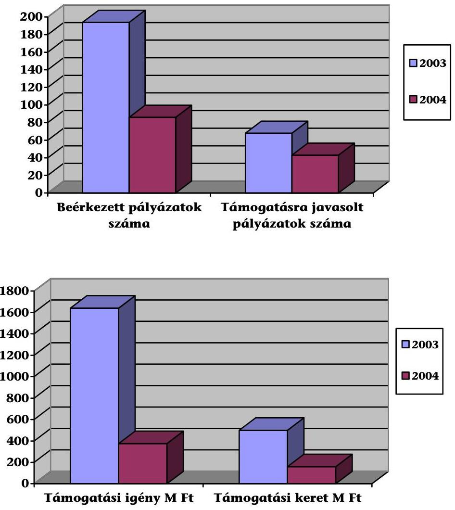

Budapest, 2006. január
