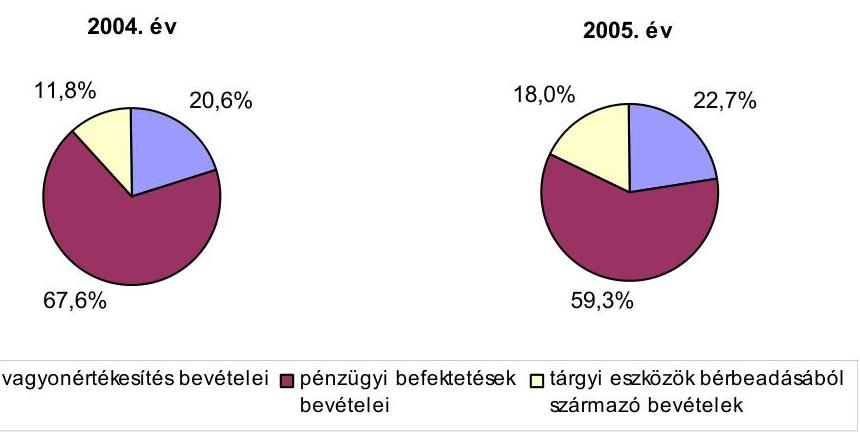
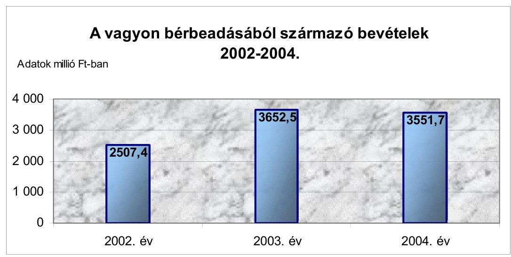
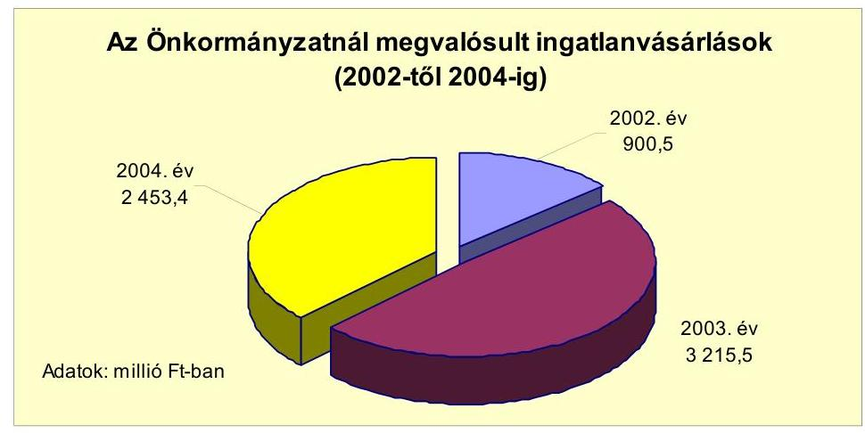
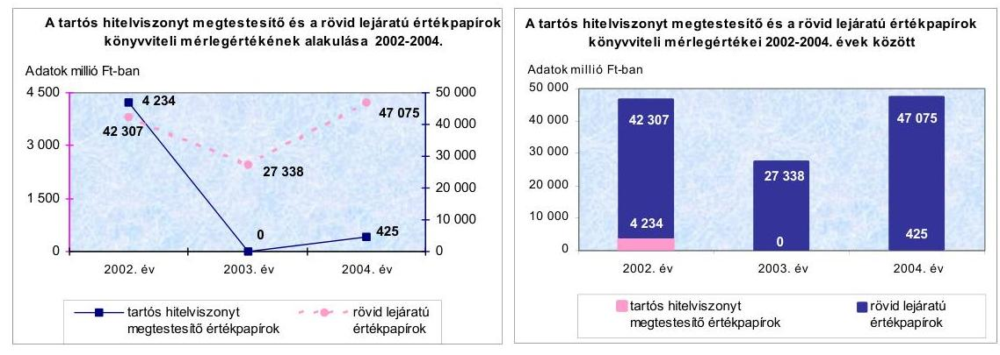
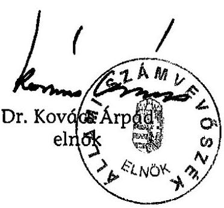
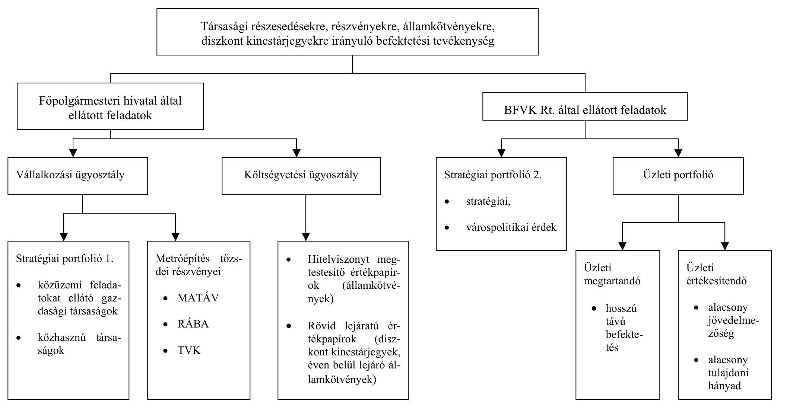
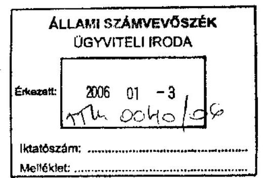
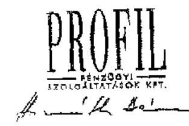
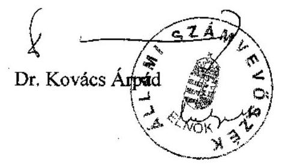

# JELENTÉS 

a Budapest Főváros Önkormányzatánál a vagyonnal való gazdálkodás
szabályszerűségének és tervszerűségének ellenőrzéséről.
Az önkormányzati gazdálkodás átfogó ellenőrzésének III. üteme

---

3. Önkormányzati és Területi Ellenőrzési Igazgatóság
3.3. Átfogó Ellenőrzések Főcsoport
Iktatószám: V-1001-1/20/25/2005.
Témaszám: 749
Vizsgálat-azonosító szám: V0199
Az ellenőrzést felügyelte:
Dr. Lóránt Zoltán
főigazgató
Az ellenőrzés végrehajtásáért felelős:
Dr. Sepsey Tamás
főigazgató-helyettes
Az ellenőrzést vezette:
Csecserits Imréné
főcsoportfőnök-helyettes
Az ellenőrzést végezték:
Bauer Lajosné
Gyüre Lajosné
számvevő főtanácsadó
számvevő
Dr. Karáné Kőszegi Zsuzsanna
Nagy Istvánné dr.
számvevő tanácsos
számvevő tanácsos
Tóth László
számvevő gyakornok

# A témához kapcsolódó - az elmúlt négy évben készített - számvevőszéki jelentések: 

## Címe

Jelentés a települési önkormányzatok szilárdhulladék-gazdálkodási feladatai ellátásának ellenőrzéséről
Jelentés Budapest Főváros Önkormányzata gazdálkodásának utóvizsgálatáról
Jelentés a helyi önkormányzatok egyes pénzügyi befektetésekkel történő gazdálkodásának ellenőrzéséről
Jelentés a helyi önkormányzatoknak bérlakásépítésre és korszerűsítésre juttatott pénzügyi támogatások ellenőrzéséről
Jelentés a Budapest Főváros Önkormányzatnál a beruházási rendszer működésének ellenőrzéséről
Az önkormányzati gazdálkodás átfogó ellenőrzésének I. üteme
Jelentés a Budapest Főváros Önkormányzatánál a működési célú pénzeszközátadás rendszerének ellenőrzéséről
Az önkormányzati gazdálkodás átfogó ellenőrzésének II. üteme

Jelentéseink az Országgyűlés számítógépes hálózatán és az Interneten a www.asz.hu címen is olvashatók.

---

# TARTALOMJEGYZÉK 

BEVEZETÉS ..... 7
I. ÖSSZEGZŐ MEGÁLLAPÍTÁSOK, KÖVETKEZTETÉSEK, JAVASLATOK ..... 11
II. RÉSZLETES MEGÁLLAPÍTÁSOK ..... 20

1. A vagyongazdálkodással kapcsolatos költségvetési előirányzatok tervezésének, végrehajtásának szabályszerűsége ..... 20
1.1. A vagyongazdálkodással kapcsolatos költségvetési előirányzatok tervezése, jóváhagyása a költségvetési rendeletben, az előirányzatok módosításának a szabályszerűsége ..... 20
1.2. A gazdálkodás szabályozottsága, a bizonylati rend és fegyelem szabályszerűsége a vagyongazdálkodással kapcsolatos bevételeknél és kiadásoknál ..... 39
2. A vagyongazdálkodás szabályszerűsége ..... 51
2.1. Az önkormányzati vagyon nyilvántartása, számbavétele ..... 51
2.2. A vagyonnal való gazdálkodás szabályszerűsége, nyilvánossága ..... 53
2.3. A zárszámadáshoz kapcsolódó kötelezettség teljesítésének szabályszerűsége ..... 72
3. A belső irányítási, ellenőrzési rendszer működésének értékelése ..... 74
3.1. Az ellenőrzési rendszer kialakítása, működése ..... 74
3.2. A korábbi számvevőszéki ellenőrzések javaslatainak hasznosulása ..... 77

---

# MELLÉKLETEK 

1. számú Az Önkormányzat 2004. évi bevételeinek és kiadásainak alakulása (1 oldal)
2. számú Az önkormányzati vagyon nagyságának alakulása (1 oldal)
3. számú Budapest Főváros Önkormányzatának vagyongazdálkodással kapcsolatos bevételi előirányzatai és teljesítése (2002-2005. I. félév) (1 oldal)
4. számú Budapest Főváros Önkormányzatának vagyongazdálkodással kapcsolatos kiadási előirányzatai és teljesítése (2002-2005. I. félév) (1 oldal)
5. számú Bérbeadás útján hasznosított önkormányzati vagyon jellemző adatai (2002-2005. I. félév) (1 oldal)
6. számú Az Önkormányzat pénzügyi befektetési tevékenysége ellátásának szervezete (1 oldal)
7. számú A Budapest, Bécsi út 343. szám alatti ingatlan vagyonkezelésének bevételei és kiadásai (2003-2005. I. félév) (1 oldal)
8. számú Dr. Demszky Gábor úr, a Budapest Főváros Önkormányzata főpolgármesterének észrevétele ( $3+2$ oldal)
9. számú Dr. Demszky Gábor főpolgármester úrnak írt válaszlevél (2 oldal)

## FÜGGELÉK

1. számú A részletes megállapításokat alátámasztó gazdasági események leírása ( 9 oldal)

---

# RÖVIDÍTÉSEK JEGYZÉKE 

| Áht. | az államháztartásról szóló 1992. évi XXXVIII. törvény |
| :--: | :--: |
| Htv. | a helyi önkormányzatok és szerveik, a köztársasági megbízottak, valamint egyes centrális alárendeltségű szervek feladat- és hatásköreiről szóló 1991. évi XX. törvény |
| Kbt. | a közbeszerzésekről szóló 1995. évi XL. törvény |
| Ltv. | a lakások bérletére, valamint az elidegenítésükre vonatkozó egyes szabályokról szóló 1993. évi LXXVIII. törvény |
| Ötv. | a helyi önkormányzatokról szóló 1990. évi LXV. törvény |
| Számv. tv. | a számvitelről szóló 2000. évi C. törvény |
| Ámr. | az államháztartás működési rendjéről szóló 217/1998. (XII. 30.) Korm. rendelet |
| Ber. | a költségvetési szervek belső ellenőrzéséről szóló 193/2003. (XI. 26.) Korm. rendelet |
| Vhr. | az államháztartás szervezetei beszámolási és könyvvezetési kötelezettségének sajátosságairól szóló 249/2000. (XII. 24.) Korm. rendelet |
| ÁSZ | Állami Számvevőszék |
| Önkormányzat | Budapest Főváros Önkormányzata |
| Közgyűlés | Budapest Főváros Önkormányzatának Közgyűlése |
| főpolgármester | Budapest Főváros Önkormányzatának Főpolgármestere |
| főjegyző | Budapest Főváros Önkormányzatának Főjegyzője |
| Lakásügyi bizottság | Budapest Főváros Önkormányzata Közgyűlésének Szociálpolitikai és Lakásügyi Bizottsága |
| Pénzügyi bizottság | Budapest Főváros Önkormányzata Közgyűlésének Pénzügyi Bizottsága |
| Tulajdonosi bizottság | Budapest Főváros Önkormányzata Közgyűlésének Tulajdonosi Bizottsága |
| Főpolgármesteri hivatal | Budapest Főváros Önkormányzata Közgyűlésének Főpolgármesteri Hivatala |
| Belső ellenőrzési alosztály | Főpolgármesteri Hivatal Főjegyzői Iroda Belső Ellenőrzési Alosztálya |
| Gazdasági ellátási ügyosztály | Főpolgármesteri Hivatal Gazdasági Ellátási Ügyosztálya |
| Gazdálkodási ügyosztály | Főpolgármesteri Hivatal Költségvetési Gazdálkodási Ügyosztálya |
| Költségvetési ügyosztály | Főpolgármesteri Hivatal Költségvetési, Tervezési és Gazdálkodási Ügyosztálya |
| Költségvetés-tervezési ügyosztály | Főpolgármesteri Hivatal Költségvetési Tervezési Ügyosztálya |
| Közmű ügyosztály | Főpolgármesteri Hivatal Közmű Ügyosztálya |
| Kulturális ügyosztály | Főpolgármesteri Hivatal Kulturális Ügyosztálya |
| Lakás ügyosztály | Főpolgármesteri Hivatal Lakás Ügyosztálya |
| Oktatási ügyosztály | Főpolgármesteri Hivatal Oktatási Ügyosztálya |

---

Vagyon-nyilvántartási ügyosztály
Vállalkozási ügyosztály
BFVK Rt.
FCSM Rt.
FIMÜV
Főgáz Rt.
SzMSz
ügyrend
hivatali SzMSz és ügyrend

BMSz
beruházási rendelet
bérlakások eladásáról szóló rendelet
2004. évi költségvetési rendelet
2005. évi költségvetési rendelet
lakások bérletéről szóló rendelet
nem lakás célú helyiségek bérletéről és elidegenítéséről szóló rendelet
vagyongazdálkodási rendelet
versenyeztetési rendelet

2004. évi vagyongazdálkodási irányelvek

Főpolgármesteri Hivatal Vagyon-nyilvántartási Ügyosztálya
Főpolgármesteri Hivatal Vállalkozási és Vagyonkezelési Ügyosztálya
Budapest Főváros Vagyonkezelő Központ Rt.
Fővárosi Csatornázási Művek Rt.
Fővárosi Ingatlankezelő és Műszaki Vállalkozói Rt.
Fővárosi Gázművek Rt.
Budapest Főváros Önkormányzata 7/1992. (III. 26.) számú rendelete a Fővárosi Önkormányzat Szervezeti és Működési Szabályzatáról
Budapest Főváros Önkormányzata Főpolgármesteri Hivatalának ügyrendjéről szóló 03-942/3/1998. számú Főpolgármesteri és Főjegyzői együttes intézkedés
A Főpolgármesternek és a Főjegyzőnek 525/2005. számú intézkedése a Főpolgármesteri Hivatal Szervezeti és Működési Szabályzatáról, ügyrendjéről
Belső Működési Szabályzat
Budapest Főváros Önkormányzata 50/1998. (X. 30.) számú rendelete a Budapest Főváros Önkormányzata és intézményei beruházási és felújítási tevékenysége előkészítésének, jóváhagyásának, megvalósításának rendjéről
Budapest Főváros Önkormányzata 33/1994. (VI. 10.) számú rendelete a Budapest Főváros Önkormányzata tulajdonában lévő önkormányzati bérlakások eladásának feltételeiről
Budapest Főváros Önkormányzata 8/2004. (III. 19.) számú rendelete a 2004. évi költségvetésről
Budapest Főváros Önkormányzata 12/2005. (III. 11.) számú rendelete a 2005. évi költségvetésről
Budapest Főváros Önkormányzata 19/1998. (IV. 15.) számú rendelete a Fővárosi Önkormányzat tulajdonában lévő önkormányzati lakások bérletéről, a lakbérek mértékéről, valamint a Fővárosi Önkormányzatot megillető bérlő-kiválasztási jogok hasznosításának szabályairól
Budapest Főváros Önkormányzata 5/1994. (II. 24.) számú rendelete a Fővárosi Önkormányzat tulajdonában lévő nem lakás céljára szolgáló helyiségek bérletéről és elidegenítéséről
Budapest Főváros Önkormányzata 27/1995. (VI. 21.) számú rendelete a Fővárosi Önkormányzat vagyonának értékesítése, hasznosítása során alkalmazandó versenyeztetési szabályokról
Budapest Főváros Önkormányzata 45/1996. (V. 15.) számú rendelete a Fővárosi Önkormányzat vagyonáról, a vagyontárgyak feletti tulajdonosi jogok gyakorlásáról
A Közgyűlés 167/2004. (II. 29.) számú határozata a vagyongazdálkodás 2004. évi irányelveiről

---

2005. évi vagyongazdálkodási irányelvek 531/1998. számú együttes intézkedés

517/2003. számú intézkedés

531/2003. számú intézkedés

554/2003. számú intézkedés

516/2004. számú együttes intézkedés

529/2004. számú intézkedés

547/2005. számú intézkedés

551/2005. számú intézkedés

556/2005. számú együttes intézkedés

2003. évre hatályos számlarend

2004. évre hatályos számlarend

Bizonylati szabályzat

A Közgyűlés 770/2005. (III. 31.) számú határozata a vagyongazdálkodás 2005. évi irányelveiről
A Főpolgármesternek és a Főjegyzőnek az 531/1998. számú együttes intézkedése a Főpolgármesteri Hivatal pénzgazdálkodásával kapcsolatos kötelezettségvállalás, utalványozás, ellenjegyzés és érvényesítés hatásköri rendjéről
A Főpolgármester 517/2003. számú intézkedése Budapest Főváros Önkormányzatának költségvetési rendeletében megtervezett alapokra és alapszerű céltartalékokra vonatkozó eljárás rendjéről
A Főpolgármesternek és a Főjegyzőnek a DBR metro tőzsdei finanszírozására szolgáló, tőzsdei forgalmazásban szereplő részvényportfolió értékesítéséhez kapcsolódó döntési eljárás, kötelezettségvállalás és ellenjegyzés rendjéről
A Főpolgármesternek és a Főjegyzőnek az 554/2003. számú intézkedése a Főpolgármesteri hivatal pénzügyi befektetési szabályzatáról
A Főpolgármesternek és a Főjegyzőnek az 516/2004. számú együttes intézkedése a Főpolgármesteri Hivatal pénzgazdálkodásával kapcsolatos kötelezettségvállalás, utalványozás, ellenjegyzés, érvényesítés és szakmai teljesítésigazolás hatásköri rendjéről
A Főpolgármester 529/2004. számú intézkedése Budapest Főváros Önkormányzatának költségvetési rendeletében megtervezett alapokra és alapszerű céltartalékokra vonatkozó eljárás rendjéről
A Főpolgármester 547/2005. számú intézkedése Budapest Főváros Önkormányzatának költségvetési rendeletében megtervezett alapokra és bizottsági keret céltartalékokra vonatkozó eljárás rendjéről
A Főpolgármesternek és a Főjegyzőnek az 551/2005. számú intézkedése a Főpolgármesteri hivatal pénzügyi befektetési szabályzatáról
A Főpolgármesternek és a Főjegyzőnek az 556/2005. számú együttes intézkedése a Főpolgármesteri Hivatal pénzgazdálkodásával kapcsolatos kötelezettségvállalás, utalványozás, ellenjegyzés, érvényesítés és szakmai teljesítésigazolás hatásköri rendjéről
A Főjegyző 543/2002. számú intézkedése Budapest Főváros Önkormányzata Főpolgármesteri Hivatala számlarendjéről
A Főjegyző 544/2004. számú intézkedése Budapest Főváros Önkormányzata Főpolgármesteri Hivatala számviteli politikájáról és számlarendjéről
A 2003. évre hatályos számlarend 4. számú, illetve a 2004. évre hatályos számlarend 2. számú melléklete

---

# ÉRTELMEZŐ SZÓTÁR 

értékpapírok
portfolió vagyon
rövid lejáratú értékpapírok
vagyonbérbeadás
vagyonértékesítés
vagyongazdálkodás
vagyongazdálkodás kiadásai
ezen ellenőrzés keretében a különféle államkötvények és a diszkont kincstárjegyek közös megnevezése
a vagyongazdálkodási rendelet 1. § (1) bekezdés b) pontja alapján a tagsági jogot megtestesítő értékpapírokat, a közhasznú társaságokban és a gazdasági társaságokban az Önkormányzatot megillető egyéb társasági részesedéseket foglalta magában
ezen ellenőrzés keretében az Államadósság Kezelő Központ Rt. által kibocsátott diszkont kincstárjegyek
ezen ellenőrzés keretében az Önkormányzat tulajdonában álló lakások, a nem lakás céljára szolgáló ingatlanok, az egyéb helyiségek, a telkek bérbeadása
ezen ellenőrzés keretében a tárgyi eszközök, az immateriális javak, az Önkormányzat tulajdonában álló lakások értékesítése, a privatizációból származó bevétel, a vállalatértékesítés, valamint az egyéb vagyoni jog értékesítése együttesen
ezen ellenőrzés keretében a vagyonértékesítés, az ingatlanbérbeadás, az ingatlanvásárlás, a részesedések, valamint az értékpapírok értékesítésének, vásárlásának vagyongazdálkodási területeit foglalja magában
ezen ellenőrzés keretében a vagyon bérbeadásából és értékesítéséből származó bevétel
ezen ellenőrzés keretében az ingatlanvásárlások, a részesedések, valamint értékpapírok vételére fordított kiadások

---

# JELENTÉS 

## a Budapest Főváros Önkormányzatánál a vagyonnal való gazdálkodás szabályszerűségének és tervszerűségének ellenőrzéséről

## Az önkormányzati gazdálkodás átfogó ellenőrzésének III. üteme

## BEVEZETÉS

Az Ötv. 92. § (1) bekezdése, az Áht. 120/A. § (1) bekezdése, valamint az Állami Számvevőszékről szóló 1989. évi XXXVIII. törvény 2. § (3) bekezdése alapján az Önkormányzat gazdálkodását az ÁSZ vizsgálta.

Az Önkormányzatnál több évre ütemezett átfogó vizsgálati program végrehajtása keretében III. ütemként az Önkormányzat vagyonnal való gazdálkodásának szabályszerűségét, tervszerűségét ellenőriztük. Az önkormányzati vagyongazdálkodás szabályszerűségét és tervszerűségét a vagyongazdálkodással kapcsolatos pénzforgalmi adatok, a bevételek és a kiadások tervezésével, a vagyongazdálkodási feladatok végrehajtásával és elszámolásával összefüggésben vizsgáltuk, az átfogó ellenőrzés országosan egységes vizsgálati programjához illeszkedően.

A vagyongazdálkodással kapcsolatos bevételek és kiadások tervezésének, a vagyongazdálkodási feladatok végrehajtásának és elszámolásának ellenőrzése a vagyonértékesítés, a vagyon bérbeadás, az ingatlanvásárlás, a társasági részesedések, valamint a hosszú és a rövid lejáratú értékpapírok vásárlása, értékesítése területeire irányult, a Főpolgármesteri hivatalnál és a BFVK Rt-nél.

Az ellenőrzés az Önkormányzat és a kerületi önkormányzatok vagyongazdálkodási kapcsolataira a 2004. és a 2005. évi vagyongazdálkodási irányelvekben foglaltak (az ingatlanrendezések, elővásárlási jog gyakorlása) érvényesülésének minősítéseként az adott gazdasági események vizsgálata során tért ki.

Az ÁSZ korábbi ellenőrzései során már vizsgálta

- az átfogó ellenőrzések keretében a költségvetés tervezését, a tárgyi eszközök műszaki állapot felmérését, a számviteli nyilvántartási rendszert, a vagyongazdálkodás keretében kiemelten az értékpapír kezelést, a zárszámadást, a belső ellenőrzést, valamint a beruházási rendszer működését, a felhalmozási és működési célú pénzeszközátadások rendszerét;

---

- a vagyongazdálkodáshoz kapcsolódóan az önkormányzati vagyon kialakulását, a vagyon szerkezetét, a vagyonhasznosítási és nyilvántartási tevékenységet, a korlátozottan forgalomképes törzsvagyonnal történő gazdálkodást, az egyes pénzügyi befektetésekkel történő gazdálkodást. A vagyongazdálkodás során hozott döntések célszerűségére és eredményességére nem terjedtek ki a vizsgálatok;
- a közszolgáltatási feladatokra kiterjedő ellenőrzések keretében a szennyvízközmű fejlesztést és működését, a bérlakásépítésre és korszerűsítésre

 juttatott pénzügyi támogatásokat, az idősek otthonaiban biztosított tartós szociális ellátási feladatokat, a szilárdhulladék-gazdálkodási feladatokat, a nagyvárosi tömegközlekedés feladatellátását és finanszírozását, a beruházásokhoz és rekonstrukciókhoz nyújtott címzett- és céltámogatások felhasználását, az Önkormányzat tulajdonában lévő közutak, hidak, alagutak fejlesztését, fenntartását és üzemeltetését, a tartós szociális ellátást nyújtó intézmények helyzetét és finanszírozását, a fogászati ellátás finanszírozását, az infrastrukturális fejlesztésekre fordított pénzeszközök felhasználását, a közüzemi víz- és csatornaszolgáltatás támogatási rendszerét, a távfűtés és melegvíz szolgáltatás finanszírozási és gazdálkodási rendszerét, a településtisztasági tevékenység finanszírozási rendszerét, a közvilágításra, az útfenntartásra, és a lakásgazdálkodásra biztosított források finanszírozási rendszerét, a kórházak pénzügyi helyzetét, gazdálkodását;
- a témavizsgálatok keretében a pénzbeli szociális ellátás helyzetét, az adóztatási tevékenységet, ennek keretében a fővárosi forrásmegosztási rendszer működését, a foglalkoztatást elősegítő támogatások felhasználását, a szakképzési struktúra munkaerő-piaci szerepét, az illetékhivatali tevékenységet, a központi költségvetési hozzájárulások, támogatások igénybevételét, felhasználását, a képviselő-választásokra fordított pénzeszközök felhasználását, a Főpolgármesteri hivatal létszám- és bérgazdálkodását.

A korábbi években a vagyongazdálkodáshoz kapcsolódóan végzett vizsgálatok, valamint az átfogó ellenőrzés 2003. és 2004. évben lefolytatott vizsgálatai során tett javaslatok döntő többségét hasznosította az Önkormányzat, ezáltal számottevően javult a gazdálkodás szabályozottsága ${ }^{1}$.

Budapest főváros lakosainak száma 2005. január 1-jén 1 696 461 fő volt, ami 10 466 fővel kevesebb a megelőző év január 1-jei állapotnál. Az Önkormányzat 66 tagú Közgyűlésének munkáját 21 állandó bizottság segítette. Feladatainak végrehajtása érdekében az Önkormányzat a 2005. évben 253 költségvetési szervet működtetett, amelyből 25 részben önálló gazdálkodási jogkörű volt. A közfeladatok ellátásában gazdasági társaságok és közhasznú társaságok is részt vettek. Az Önkormányzat költségvetési szerveinél foglalkoztatottak száma 2005. január elején 42 178 fő volt, ebből 1083 fő köztisztviselő.

Az Önkormányzat a 2004. évi költségvetési gazdálkodása során 538 milliárd Ft bevételt és 399 milliárd Ft kiadást teljesített, a 2004. évi bevételek és kiadások alakulását az 1. számú melléklet tartalmazza. Az Önkormányzat 2005. évi

[^0]
[^0]:    ${ }^{1}$ Az ellenőrzések megállapításai alapján tett javaslatokat és azok megvalósítását részletesen a jelentés 3.2 pontja tartalmazza.

---

költségvetési rendelete 351 milliárd Ft bevételi előirányzatot és 399 milliárd Ft kiadási előirányzatot tartalmazott. A könyvviteli mérleg szerint az Önkormányzat a 2004. év végén 1988 milliárd Ft nettó vagyonnal rendelkezett². Az önkormányzati vagyon nagyságának alakulását a 2. számú melléklet tartalmazza. Az Önkormányzat eszközeinek állománya 1243 milliárd Ft-tal, azaz 6,6%-kal növekedett a 2002-től a 2004-ig terjedő időszakban. Az önkormányzati vagyon értéke a 2003. évben az előző évhez viszonyítva 78 milliárd Ft-tal, a 2004. évben a 2003. évhez viszonyítva 45 milliárd Ft-tal emelkedett. Az eszközök állományán belül az Önkormányzat gazdálkodását az egy éven túl szolgáló eszközök (befektetett eszközök) állománya a 2002-től a 2004-ig terjedő időszakban 125 milliárd Ft-tal növekedett, míg a forgóeszközök állománya ugyanezen időszak alatt 2 milliárd Ft-tal csökkent. A 2004. évben a vagyon összetételében a befektetett eszközök meghatározó, 91,5%-os arányt képviseltek. A metróépítés céljára tartalékolt, tőzsdére bevezetett részvények piaci értéke 2005. január 25-én 1 milliárd Ft volt. Ezen részvények esetében számolni kell az értékpapírok piaci árfolyam-ingadozásainak kockázatával, ezért ennek következtében értékük a majdani felhasználásig emelkedhet, vagy csökkenhet.

A vagyongazdálkodás bevételi előirányzatai az Önkormányzat 2004. és 2005. évi költségvetési rendeletében a következő bevételi jogcím-csoportokon belül jelentek meg:

- a működési bevételek között: az önkormányzati lakások lakbérbevételeiből, az ingatlanok, telkek és az egyéb helyiségek bérbeadásából, valamint a közterületek használatából származó bevételi előirányzatok;
- a felhalmozási és tőkejellegű bevételek között: a vagyonértékesítésből származó bevételek (tárgyi eszközök értékesítése, önkormányzati lakások értékesítése, privatizációs bevételek, vállalat-értékesítésből származó bevételek, egyéb vagyoni jog értékesítéséből származó bevételek), a részesedések értékesítése, az államkötvények értékesítése, az üzemeltetésre átadott tárgyi eszközök bérleti díja;
- a támogatási kölcsönök visszatérülése, értékpapírok értékesítésének bevételei között: a hosszú és rövid lejáratú értékpapírok értékesítésének előirányzatai.

A felsorolt bevételi források bevételi előirányzatainak összege az Önkormányzat 2004. évi költségvetésében 34 017 millió Ft, a 2005. évi költségvetésében 53 013 millió Ft volt. A vagyongazdálkodási bevételi előirányzatok számottevő arányban részesedtek az Önkormányzat tervezett bevételeiből, a 2004. évben 10%-ot, a 2005. évben 13%-ot képviseltek. A felhalmozási és tőkejellegű bevételi előirányzatok összegét kiegészíti az osztalék- és hozambevételek 2004. évi 3721 millió Ft és a 2005. évi 3484 millió Ft bevételi előirányzata. Az osztalék- és hozambevételi előirányzatok pénzügyi teljesítését a gazdasági társaságok működésének eredményessége határozta meg.

[^0]
[^0]:    ${ }^{2}$ A fővárosi kerületi önkormányzatok 2004. évi könyvviteli mérleg szerinti vagyona 1613 milliárd Ft volt. A Fővárosi önkormányzat és a fővárosi kerületi önkormányzatok könyvviteli mérleg szerinti összes vagyona 37,4%-os arányt képviselt a helyi önkormányzatok együttes vagyoni értékéből.

---

A vagyongazdálkodás kiadási előirányzatai az Önkormányzat 2004. és 2005. évi költségvetési rendeletében a felhalmozási kiadások között a beruházások részeként vásárolt ingatlanok, és a pénzügyi befektetések (részvények, részesedések, államkötvények vásárlása) kiadásaiként, továbbá az egyéb kiadások között az éven belüli értékpapír-vásárlás kiadásaiként jelentek meg.

A vagyongazdálkodás kiadási előirányzatainak összege a 2004. évi költségvetésben 3241 millió Ft, a 2005. évi költségvetésben 13 182 millió Ft volt, ezen kiadási előirányzatok nem képviseltek számottevő arányt az Önkormányzat 2004. évi és 2005. évi tervezett kiadásai között, mivel a tervezett összes kiadásból a 2004. évben 1%-ban, a 2005. évben 3%-ban részesedtek.

# Az ellenőrzés célja annak értékelése volt, hogy: 

- az önkormányzati gazdálkodás törvényességét ${ }^{3}$, szabályszerűségét biztosították-e a vagyonnal való gazdálkodás esetében a költségvetés tervezése, a költségvetés végrehajtása és a zárszámadás során;
- a gazdálkodás szabályszerűségét biztosító kontrollok ${ }^{4}$ megfelelően segítették-e a végrehajtást.

Az ellenőrzött időszak: a 2004. év, valamint a 2005. I. féléve, a 2.2. és a 3.2. ellenőrzési programpontok esetében a 2002-től a 2005. I. félévig terjedő időszak.

[^0]
[^0]:    ${ }^{3}$ A törvényi előírások betartásának elmulasztásakor a részletes megállapítások fejezetben egységesen a törvénysértés megjelölést alkalmazzuk, mivel az ÁSZ nem tehet különbséget a törvényi előírások között.
    ${ }^{4}$ A gazdálkodás szabályszerűségét biztosító kontroll alatt értjük a kiépített és működő belső irányítási és szabályozási rendszert, valamint a belső ellenőrzési funkciók ellátását.

---

# I. ÖSSZEGZŐ MEGÁLLAPÍTÁSOK, KÖVETKEZTETÉSEK, JAVASLATOK 

Az Önkormányzat hét évre szóló finanszírozási prognózissal és fejlesztési tervvel rendelkezett, ezzel eleget tett az Ötv-ben előírt gazdasági programkészítési kötelezettségnek. A hétéves finanszírozási prognózist és a hétéves fejlesztési tervet a Közgyűlés évente felülvizsgálta és egy évvel kiegészítette. A főpolgármester a 2004. évre, illetve a 2005. évre szóló költségvetési koncepciót határidőben terjesztette a Közgyűlés elé, a 2004. évi előterjesztéshez csatolta a Pénzügyi bizottság véleményét, a 2005. évi előterjesztésnél ez elmaradt, a Pénzügyi bizottság elnöke azt a költségvetési javaslat közgyűlési tárgyalása során szóban ismertette.

A 2004. évre, illetve a 2005. évre előkészített, az Ámr-ben előírtaknak megfelelően a Pénzügyi bizottság által véleményezett, a könyvvizsgáló írásos jelentését csatoltán tartalmazó költségvetési rendelettervezetet a főpolgármester az Áht-ban előírt határidőt betartva nyújtotta be a Közgyűlés részére. A Közgyűlés az éves költségvetési rendeletekben meghatározta a költségvetés végrehajtási szabályait, azok között a vagyongazdálkodáshoz kapcsolódó szabályokat is előírt. Az Önkormányzat 2004. és 2005. évi költségvetési rendelettervezetei a vagyongazdálkodás bevételi és kiadási előirányzatait az Áht-ban és az Ámrben előírt követelményeknek megfelelően tartalmazták, a Vagyongazdálkodási Alap kivételével. A Vagyongazdálkodási Alap terhére megvalósuló, előre nem tervezhető ingatlan vásárlások felhalmozási célú kiadási előirányzatait az Áht. és az Ámr. előírásai ellenére nem a tartalékok elkülönített előirányzatai között, hanem a Vagyongazdálkodási Alap elnevezésű keretösszeg működési előirányzataiban szerepeltették a költségvetési rendeletekben, az alap elnevezése sem felelt meg az Áht-ban - az alapokra vonatkozóan - meghatározott feltételeknek, a kifejezés félreérthető.

A költségvetés tervezési folyamata a hétéves fejlesztési terv, a hétéves finanszírozási prognózis, a vagyongazdálkodási irányelvek és az éves költségvetési koncepció elkészítésén, folyamatos aktualizálásán alapult. A 2004. és a 2005. évi költségvetésről szóló rendelettervezetekben azonban nem vették figyelembe a vagyongazdálkodási irányelveknek a szőlősgyörki ingatlan értékesíthetőségére vonatkozó korlátait, az ebből elérhető bevételt a gyermek- és ifjúságvédelmi fejlesztésekre visszaforgatható bevételi forrásként tüntették fel. A 2004. évi költségvetési rendeletben - módosító indítvány elfogadásával - értékesíthető ingatlanként a Közgyűlés által elfogadott vagyongazdálkodási irányelvek feltételeinek nem megfelelő, jogi és műszaki szempontból rendezetlen, intézményi vagyoni körből még ki nem vont, forgalomképessé nem nyilvánított ingatlant szerepeltettek.

A bérleti díjak bevételi előirányzatainak tervezése - az Ámr-ben előírt tervezési módszernek megfelelően - a szakmai ügyosztályok, valamint a vagyonkezelő és üzemeltető cégek javaslatai alapján történt. Ennek során a bérbeadás útján hasznosítható vagyonelemek alakulásából, a tartós bérleti szerződések-

---

ben rögzítettek szerint a bérleti díjak infláció-követéséből, a lakbérek Közgyűlés által meghatározott mértékéből, bázis alapú tervezéssel, az előző évi teljesítési adatokból indultak ki.

A vagyongazdálkodással összefüggő költségvetési előirányzatok felhasználását a 2004. évi költségvetési rendelet a vagyonértékesítésre, a vagyonhasznosításból származó többletbevételekre, az államkötvény-vásárlásra, valamint az átmenetileg szabad pénzeszközök igénybevételére vonatkozóan szabályozta. A 2005. évi költségvetési rendelet a vagyonértékesítéssel és az átmenetileg szabad pénzeszközök felhasználásával összefüggő szabályozást tartalmazott. A Közgyűlés a 2004. és a 2005. évi költségvetési rendeleteiben a jóváhagyott előirányzatok között átcsoportosítási jogot biztosított a bizottságai és a főpolgármester részére. A 2004. évi költségvetésben a vagyongazdálkodással kapcsolatos előirányzatok a főpolgármesteri hatáskörű átcsoportosítás következtében 81 millió Ft-tal, a 2005. évi költségvetés első félévi végrehajtása során 85 millió Ft-tal emelkedtek. Az Önkormányzat a 2004. évi költségvetési rendeletét módosította, a jóváhagyott eredeti előirányzatok főösszege a módosítások következtében a 2004. évben 13%-kal, a 2005. év első félévében 10%-kal növekedett.

A vagyonbérbeadás bevételeinek előirányzatait a 2004. évben nem módosították, a 2005. első félévében végrehajtott módosítások az Ámr-ben és a költségvetési rendeletben rögzített szabályok szerint, az előírt határidők betartásával történtek. A Vagyongazdálkodási Alap cím terhére megvalósított ingatlanvásárlások előirányzatainak módosítása során azonban az Ámr-nek a költségvetési rendelet szerkezetére vonatkozó előírása ellenére, a költségvetési rendelet a felhalmozási kiadásokat feladatonként nem tartalmazta.

A főjegyző a költségvetési rendeletekben jóváhagyott előirányzatok nyilvántartásának módját, formáját, tartalmát - az Áht-ban előírtakkal összhangban - szabályozta a számlarendben. A nyilvántartás folyamatos vezetésével biztosított volt a költségvetési címeken jóváhagyott előirányzatok és azok teljesülése alakulásának, valamint a kiadási előirányzatokat terhelő kötelezettségvállalásoknak a figyelemmel kísérése.

A Főpolgármesteri hivatalban a pénzgazdálkodással és a munkafolyamatba épített ellenőrzéssel összefüggő feladat- és hatáskörökről a főpolgármester és a főjegyző együttes intézkedésben rendelkeztek. A vagyongazdálkodással kapcsolatos gazdálkodási, ellenőrzési jogköröket, a jogszabályi követelményeknek és a sajátosságoknak megfelelően, a célszerűség szempontjaira is figyelemmel határozták meg. A munkafolyamatba épített ellenőrzési kötelezettséget, valamint a gazdálkodási feladatokat az érintett dolgozók munkaköri leírása az adott feladat elvégzését rögzítő szabályzatokkal összhangban és egyértelműen tartalmazta. A kötelezettségvállalást, az utalványozást és annak ellenjegyzését az Ámr-ben előírtaknak megfelelően szabályozták. A kiadás teljesítésének elrendelését megelőző Ámr. szerinti érvényesítési feladatot a
 helyi sajátosságok figyelembevételével előzetes és utólagos érvényesítésre osztották. A gazdálkodási és ellenőrzési jogkörökre történt felhatalmazásoknál, megbízásoknál a szabályozásban érvényesültek az Ámr-ben foglaltak szerinti összeférhetetlenségre vonatkozó követelmények. A Főpolgármesteri hivatalban a főjegyző meghatározta a szakmai teljesítés igazolásának módját, és kijelölte az azt végző személyeket, de az Ámr-ben előírtak ellenére elmaradt a bevétel beszedésének elrendeléséhez kapcsolódó teljesítésigazolási feladat rögzítése.

A főjegyző által jóváhagyott számviteli politikában a Vhr-ben előírtaknak megfelelően határozták meg a számviteli elszámolás és az értékelés szempontjait. A számviteli politika keretében a Vhr-ben előírtaknak megfelelően elkészítették az eszközök és a források leltározási és leltárkészítési szabályzatát, az eszközök és a források értékelésének szabályzatát, az önköltség számítás rendjére vonatkozó szabályzatot, valamint a pénzkezelési szabályzatot. A 2004. évre hatályos leltározási szabályzat a mérlegtételek leltárral történő alátámasztásához a Vhr. előírásával ellentétesen - az eszközök évenkénti mennyiségi felvétellel történő leltározása helyett - időközönkénti leltározást írt elő, a vagyongazdálkodási rendelet módosítása során gondoskodtak a Vhr. rendelkezéseivel összhangban álló szabályozásról. A 2004. évi költségvetési beszámoló elkészítésére és a 2005. évre vonatkozóan a vagyongazdálkodási rendeletben előírtak szerint a mennyiségi felvétellel történő leltározást a leltározási szabályzatban meghatározott módon kétévenként, első ízben a 2005. évi költségvetési beszámoló készítésénél kell kötelezően végrehajtani. A 2005. július hónapban hatályba léptetett leltározási szabályzat tartalmazta a leltározás módjára, fordulónapjára, bizonylataira, a leltár adatainak feldolgozására, az ellenőrzésre vonatkozó előírásokat, a leltározás és a könyvvitel adatai egyeztetésének módját, a Vhr. előírása szerint az évenkénti leltározási kötelezettség előírását. A Főpolgármesteri hivatal selejtezési szabályzatát a főjegyző a 2005. év október hónapban léptette hatályba. A Vhr-ben foglaltak alapján az eszközök és források értékelési szabályzatában meghatározták az eszközök és a források minősítésének szempontjait, a terv szerinti, illetve a terven felüli értékcsökkenés elszámolásának rendjét, az értékvesztés elszámolásának és az elszámolt értékvesztés visszaírásának eszközcsoportonként (befektetések, értékpapírok, készletek, követelések) részletezett szabályait. A Főpolgármesteri hivatal számlarendjének tartalma megfelelt a Számv. tv. és a Vhr. előírásainak.

A vagyongazdálkodás bevételeinek és kiadásainak gazdasági eseményeiről kiállították a számviteli bizonylatokat. A Számv. tv. 167. § (1) bekezdését megsértve a vagyongazdálkodás gazdasági eseményeit magukba foglaló bizonylatok 57,9%-a nem felelt meg az előírt alaki és tartalmi követelményeknek. A lakások bérbeadási szerződéseinél az Ámr-ben előírtak ellenére elmaradt a kötelezettségvállalás ellenjegyzése, ezáltal nem teljesült annak ellenőrzése, hogy a kötelezettségvállalás a gazdálkodásra vonatkozó szabályoknak megfelelt-e, továbbá elmaradt a szakmai teljesítés igazolása az értékpapírvásárlásnál, a lakásvásárlások kiadásainak teljesítésénél, a nullára leírt gépjárművek értékesítésénél. Az értékpapír-vásárlás utalványrendeletein nem tüntették fel a kötelezettségvállalás-nyilvántartásba vétel sorszámát, a hiányosság kiküszöbölésére az ellenőrzés időszaka alatt intézkedtek. A szakmai ügyosztályokon az érvényesítők nem tettek eleget az Ámr-ben előírt, munkafolyamatba épített ellenőrzési feladataiknak azon gazdasági eseményeknél, ahol hiányzott a szakmai teljesítés igazolása.

Az önkormányzati vagyon számviteli nyilvántartásáról a Vhr. és a belső szabályzatok előírásainak megfelelően gondoskodtak. Az analitikus nyilvántartások és a főkönyvi számlák értékadatai a 2004. év végén megegyeztek. A Főpolgármesteri hivatalban a kötelezettségvállalások analitikus nyilvántartási rendjét az Ámr-ben foglaltak figyelembevételével alakították ki. A gazdálkodó szervezeti egységek a kötelezettségvállalás analitikus nyilvántartását az államkötvények vásárlása kivételével vezették. Az ellenőrzés időszaka alatt elrendelték az államkötvény-vásárlás kiadási előirányzatának és az adásvételi szerződések adatainak nyilvántartását. A 2004. évben a vagyongazdálkodás jóváhagyott kiadási előirányzatait betartották, tárgyévi fizetési kötelezettséget a jóváhagyott kiadási előirányzatok mértékéig vállaltak.

A 2004. évi leltározást a Vhr-ben és a vagyongazdálkodási rendeletben foglaltaknak megfelelően az ingatlanoknál és a társasági részesedések materializált részvényeinél, a bérleti díjak és a lakbérek követeléseinél egyeztetéssel elvégezték. A társasági részesedések dematerializált részvényeinél, a metróépítés céljára tartalékolt, tőzsdére bevezetett részvényeknél, a BFVK Rt. által kezelt részvényeknél, valamint az államkötvényeknél és a rövid lejáratú értékpapíroknál a leltározást a letétkezelő pénzintézetek által a 2004. év végére megküldött állományjelentés (zárolási kivonat) adatainak a kapcsolódó analitikus nyilvántartásokkal történő egyeztetésével hajtották végre. Az értékpapír számla és értékpapír letéti számla vezetésére az OTP Bank Rt-vel, a Magyar Külkereskedelmi Bank Rt-vel, az ERSTE Befektetési Bank Rt-vel kötött szerződésekben nem zárták ki annak lehetőségét, hogy a befektetési szolgáltató az Önkormányzat tudta és hozzájárulása nélkül rendelkezzen a befektetésekről a KELER Rt. felé, ezáltal nem csökkent a befektetések kockázata.

A bérleti díj és a lakbér követeléseket a 2004. évi könyvviteli mérlegkészítés időpontjáig az értékelési szabályzat előírása alapján értékelték. A Főpolgármesteri hivatal bérleti díj követeléseinek 2004. év végi értékelésekor 57,0 millió Ft összegű értékvesztést számoltak el a Vhr-ben és az értékelési szabályzatban foglalt előírásoknak megfelelően. A Főpolgármesteri hivatalban a közüzemi feladatokat ellátó gazdasági társaságokban lévő részesedésekre és a metróépítés céljára tartalékolt, tőzsdére bevezetett részvényekre az értékvesztés elszámolásának szükségességét a Számv. tv. előírása ellenére nem vizsgálták. A Számv. tv-ben rögzített értékvesztés elszámolására vonatkozó kötelezettséget nem tartották be, mivel a metróépítés céljára tartalékolt, tőzsdére bevezetett részvények között a Rába Rt. részvényekre nem számolták el az indokolt 53,7 millió Ft értékvesztést. A metróépítés céljára tartalékolt, tőzsdére bevezetett részvények értékesítésére a Közgyűlés 2003. december 19-én, 2004. június 24-én és 2005. január 27-én értékesítési minimál árat határozott meg, a Rába Rt. részvényeknél a tőzsdei árfolyam 4,4-szeresében, a TVK Rt. részvényeknél 1,6-szorosában. Az értékesítési minimálár meghatározásánál nem voltak tekintettel a részvények tőzsdei árfolyamának alakulására. A tőzsdei árfolyamoknál magasabb értéket rögzítettek értékesítési minimálárként a névértéket jelentősen meghaladó tőzsdei árfolyamú részvényeknél és a névérték alatti tőzsdei árfolyamú részvényeknél. A megállapított magas értékesítési minimálár miatt nem valósult meg azon részvények tervezett értékesítése, amelyek piaci értéke, tőzsdei árfolyama tartósan csökkent.

Az Önkormányzat a vagyongazdálkodással kapcsolatos feladatokat és döntési hatásköröket a vagyongazdálkodási rendeletben, illetve a lakások bérletéről, a bérlakások eladásáról, valamint a nem lakás célú helyiségek bérbeadásáról és elidegenítéséről szóló rendeletekben határozta meg. A vagyonnal való rendelkezési, döntési hatásköröket - külön a törzsvagyonhoz, illetve külön a forgalomképes vagyonhoz kapcsolódóan - a Közgyűlés, a Tulajdonosi bizottság és a főpolgármester között célszerűen megosztották. A vagyongazdálkodási rendelet tartalmazta a követelés elengedés módjára vonatkozó rendelkezéseket. Az Önkormányzatnak a 2005. november 30-ig hatályban lévő versenyeztetési rendelete a kötelező versenyeztetés értékhatárát ingatlan és ingó vagyon esetében 800 millió Ft, a vagyongazdálkodási rendeletben meghatározott együttes értékesítés esetében 1500 millió Ft, portfolió vagyon esetében 1500 millió Ft, illetve együttes értékesítés esetén 3000 millió Ft értékhatár felett írta elő. Ezzel a 2005. évtől megsértették a 2005. évi költségvetési törvénynek a versenytárgyalás kötelező alkalmazására vonatkozó előírását, a 20,0 millió Ft forgalmi értéket meghaladó vagyontárgyaknál. A versenyeztetésre vonatkozó előírásokat 2005. november 30-tól a vagyongazdálkodási, illetve a nem lakás célú helyiségek bérletéről és elidegenítéséről szóló rendeletbe építették be, az Áht-ban szabályozott versenytárgyalás alkalmazását a 2005. évi költségvetési törvény szerint írták elő, azaz kötelező a versenyeztetés, amennyiben az érintett vagyontárgy forgalmi értéke a 20 millió Ft-ot meghaladja. Rögzítettek azonban a fő szabálytól eltérő, versenyeztetés nélküli vagyonértékesítési, hasznosítási eseteket, amellyel az Önkormányzat az Áht-ban foglaltakat megsértve lehetőséget biztosított a versenyeztetési eljárás mellőzésére. A szabályozás nem segíti a közvagyonnal való gazdálkodás nyilvánosságát, átláthatóságát. A vagyongazdálkodási rendelet előírta - az Áht-ban foglaltakkal összhangban - a nettó 5 millió Ft-ot elérő vagy azt meghaladó értékű szerződések egyes adatainak az Önkormányzat internetes honlapján történő közzétételi kötelezettségét.

Az Önkormányzat az Ötv-ben foglaltak alapján a portfolió vagyon kezelésére a közüzemi feladatokat ellátó gazdasági társaságok és a közhasznú társaságok részesedései, valamint a metróépítés céljára tartalékolt, tőzsdére bevezetett részvények kivételével - vagyonkezelési szerződéseket kötött a BFVK Rt-vel. A vagyonkezelési szerződésekben rendelkeztek a tulajdonosi jogok gyakorlásáról. A Főpolgármesteri hivatalban az értékpapír-gazdálkodás területére vonatkozó előírásokat a főpolgármester és a főjegyző együttes intézkedéseként kiadott pénzügyi befektetési szabályzat tartalmazta. A pénzügyi befektetési szabályzatban meghatározták az értékpapír befektetések összetételének szabályait, az ügyletek lebonyolításának rendjét és nyilvántartását. A befektetési ügyletet tartalmazó szerződések nyilvántartására vonatkozó előírások nem voltak összhangban a számlarenddel, mivel nem utaltak a hosszú- és rövid lejáratú értékpapír befektetések kötelezettségvállalás nyilvántartásának eltérő módjára.

A vagyonnal való rendelkezési, döntési hatáskör gyakorlása során az osztatlan közös tulajdon megszüntetése érdekében a használaton kívüli középiskola értékesítésénél - a vagyongazdálkodási rendelet előírása ellenére - a Közgyűlés hozott döntést a Tulajdonosi bizottság helyett, illetve a Közgyűlés a döntési hatáskör eseti magához vonásáról az SzMSz-ben foglalt szabályozás ellenére nem hozott határozatot. A nullára leírt gépjárművek értékesítésénél nem tartották be a vagyongazdálkodási rendeletben az ingóságok selejtezése tekintetében a tulajdonosi jogok gyakorlójának meghatározására vonatkozó előírást, mert az értékesítéséről nem a Tulajdonosi bizottság döntött. A Főpolgármesteri hivatal 2005. október 14-től hatályos selejtezési szabályzata már meghatározta a követendő eljárást.

Az önkormányzati lakások bérbeadása a lakások bérletéről szóló rendelet előírásait betartva, pályázati eljárás útján történt, a pályázati feltételeket a rendelet előírásával összhangban a hatáskörrel rendelkező Lakásügyi bizottság határozta meg. A nem lakás célú helyiségek 2004. évi és 2005. első félévi bérbeadása során a nem lakás célú helyiségek bérletéről és elidegenítéséről szóló rendeletben biztosított döntési jogosultsággal élve a Tulajdonosi bizottság a pályázati kiírások alól felmentetést adott. A Főpolgármesteri hivatal használatában lévő helyiségek bérbeadása során a vagyongazdálkodási és a versenyeztetési rendelet előírásait betartották. A BFVK Rt. által - vagyonkezelési szerződés alapján - hasznosított Budapest, Bécsi út 343. szám alatti, ipartelep elnevezésű ingatlan bérbeadásai pályáztatás nélkül valósultak meg, mivel a vagyonkezelési szerződés a vagyongazdálkodási rendelet előírásával ellentétesen nem rendelkezett a versenyeztetés szabályairól. A 2005. évben jóváhagyott vagyongazdálkodási rendelet módosítás szerint a vagyonkezelővel kötött szerződésben rögzíteni kell a versenyeztetés szabályait. A lakások, a nem lakáscélú helyiségek és az egyéb ingatlanok bérleti szerződéseiben az Önkormányzat érdekeit védő garanciális elemeket rögzítették.

A lakások vásárlása, illetve a Vagyongazdálkodási Alap előirányzata terhére megvalósuló ingatlanvásárlások során a vagyongazdálkodási rendelet döntéshozatali szabályait betartották, a döntéseket a Tulajdonosi bizottság hozta. Az ingatlanok vételárának meghatározása a lakások, valamint a Budapest XI. kerület Etele téri ingatlanok esetén ingatlanforgalmi értékbecslés alapján történt, azonban a vagyongazdálkodási rendelet a vásárolt ingatlanok esetében nem rendelkezett a vételár meghatározásának szabályairól. Az elővásárlások és a Budapest XV. kerület Klebelsberg Kunó úti ingatlan vásárlása esetén a valós piaci érték meghatározására ingatlanforgalmi értékbecslést nem készíttetett az Önkormányzat. Az adásvételi szerződések az Önkormányzat érdekeit védő garanciális elemeket tartalmazták.

A főpolgármester a 2004. évi zárszámadási rendelettervezetet az Áht-ban előírt határidőn belül terjesztette a Közgyűlés elé. A zárszámadási előterjesztésben a Közgyűlés részére bemutatták az Áht-ban előírt vagyonkimutatást. A 2004. évi vagyonkimutatás szerinti értékadatok összhangban álltak a 2004. évi költségvetési beszámoló könyvviteli mérlegében, valamint az Önkormányzat ingatlanvagyon-kataszterében szereplő és megfeleltethető adatokkal.

Az Önkormányzat az Ötv. előírásának megfelelően kialakította a feladatkörébe utalt belső ellenőrzési feladatok végrehajtásához szükséges szervezeti kereteket. A főjegyző
 gondoskodott a belső ellenőrzés kialakításáról és működtetéséről. A Belső ellenőrzési alosztály vezetőjének munkaköri leírásában előírták, hogy feladatát a főjegyző irányítása mellett látja el. A főjegyző a Főpolgármesteri Hivatal intézményeinek gazdálkodásának ellenőrzéséről – a Htv. alapján – gondoskodott. A belső ellenőrzést a 2004. és a 2005. évben éves ellenőrzési terv alapján végezték. A belső ellenőrzésről készült jelentések tartalmaztak szabályszerűségi és célszerűségi javaslatokat. Az ellenőrzött szervezeti egységek intézkedési tervet készítettek. A hiányosságokat felszámolták, a szükséges intézkedések végrehajtásáról a főjegyzőnek feljegyzésben számoltak be. A 2005. évi ellenőrzési terv – a 2004. évről áthúzódó vizsgálatok között – tartalmazta a Fővárosi Önkormányzat vagyongazdálkodására és a vagyonnyilvántartásra irányuló ellenőrzések javaslatai alapján megtett intézkedések eredményességének vizsgálatát. A 2005. évi ellenőrzési tervben előírt ellenőrzésekről a jelentések az ÁSZ helyszíni vizsgálata lezárásáig nem készültek el. A 2004. évről szóló összefoglaló ellenőrzési jelentést a Pénzügyi bizottság 2005. április 27-én megtárgyalta és határozattal elfogadta.

Az Önkormányzat gazdálkodásának átfogó ellenőrzése első két ütemét az ÁSZ a 2003. és a 2004. évben végezte el. Az I. ütemben a beruházási rendszer működésének, a II. ütemben a működési célú pénzeszközátadás rendszerének vizsgálatát hajtotta végre. Az ÁSZ az átfogó ellenőrzés két ütemében 33 szabályszerűségi és 31 célszerűségi javaslatot fogalmazott meg. A szabályszerűségi javaslatok ötödét realizálták, kettő részben hasznosult és kettő nem valósult meg. A célszerűségi javaslatok ötödét hasznosult, négy javaslat nem valósult meg. A vizsgálatokról készült jelentések javaslatainak hasznosítására, a feltárt hiányosságok megszüntetésére intézkedési tervet készítettek.

Az ÁSZ a 2003. évben ellenőrizte az Önkormányzat szennyvízközmű fejlesztési és működési feladatai ellátását. A vizsgálatról készült jelentés négy, a munka színvonalának növelése, valamint a Főváros közszolgáltatói feladatai jobb ellátása érdekében tett javaslatot tartalmazott, amelyek közül egy a szennyvízközmű vagyon vagyonnyilvántartásával volt kapcsolatos. A vagyonnyilvántartás rendezésével a javaslatot realizálták. A 2003. évben került sor az Önkormányzatnál a bérlakás építésre és korszerűsítésre juttatott pénzügyi támogatások felhasználásának ellenőrzésére. A vizsgálat során két – a nem lakás célú helyiségek bérletéről és elidegenítéséről szóló rendelet, valamint a Széchenyi Terv keretében a használt lakások megvásárlására kötött támogatási szerződések módosítására vonatkozó – a törvényes állapot helyreállítása érdekében megfogalmazott javaslat született. Az Önkormányzat a rendelet, valamint a támogatási szerződések módosításával a javaslatokat hasznosította. Az ÁSZ a 2002. évben ellenőrizte az Önkormányzat egyes pénzügyi befektetéseivel történő gazdálkodását. Az ellenőrzés során négy szabályszerűségi – a BFVK Rt-vel kapcsolatos számviteli elszámolás rendszerére vonatkozó – és hat célszerűségi, a pénzügyi befektetési döntések eljárási rendjének szabályozására irányuló javaslatot tettek a vizsgálatot végzők. Az önkormányzat valamennyit realizálta. Az Önkormányzat gazdálkodásának utóvizsgálatáról szóló, a 2002. évben elkészült számvevőszéki jelentés a vagyongazdálkodás szabályszerűségével és tervszerűségével kapcsolatban öt szabályszerűségi és három célszerűségi javaslatot tartalmazott, az érték nélkül nyilvántartott, illetve a térítésmentesen átvett eszközök értékelésére, az értékesített ingatlanok vagyonleltárból történő kivezetésére, valamint a belső szabályzatok összhangba hozatalára. A vizsgálatról készült jelentés javaslatait hasznosították.

A helyszíni ellenőrzés megállapításainak hasznosítása mellett javasoljuk:

# a főpolgármesternek

a jogszabályi előírások maradéktalan betartása érdekében

1. kezdeményezze a vagyongazdálkodási rendelet, valamint a nem lakás célú helyiségek bérletéről és elidegenítéséről szóló rendelet módosítását, azért hogy azok az

---

Áht. 108. § (1) bekezdésében előírtakon túl ne tartalmazzanak a versenytárgyalási kötelezettség alól felmentést lehetővé tevő szabályozást;
a munka színvonalának javítása érdekében
2. kezdeményezze a Közgyűlésnél a metróépítés céljára tartalékolt, tőzsdére bevezetett részvények értékesítési szándékát megelőzően annak mérlegelését, hogy az értékesítési minimálár meghatározásakor célszerű-e a tőzsdei árfolyamok alakulásának figyelembevétele;
3. kezdeményezze a számvevőszéki ellenőrzés tapasztalatainak Közgyűlés általi megtárgyalását, és a feltárt hiányosságok megszüntetése érdekében készíttessen intézkedési tervet;

# a főjegyzőnek

a jogszabályi előírások maradéktalan betartása érdekében

1. gondoskodjon a költségvetési rendelettervezet előkészítésekor az Áht. 73. § (1) és (2) bekezdésében, illetve az Ámr. 29. § (1) bekezdés e) 2. pontjában előírtak betartása érdekében arról, hogy az ingatlan vásárlások céljára szolgáló keret előirányzatokat a céltartalékok között elkülönítetten szerepeltessék, valamint az Ámr. 29. § (1) bekezdés d) pontjában foglalt, a költségvetési rendelet szerkezetére vonatkozó előírás betartása érdekében arról, hogy a költségvetési tartalék előirányzatok terhére teljesített ingatlanvásárlások kiadási előirányzatait a felhalmozási kiadások között feladatonként a költségvetési rendeletmódosítás során mutassák be;
2. a szabályszerű költségvetési és operatív gazdálkodás érdekében
a) gondoskodjon arról, hogy a gazdálkodási és ellenőrzési jogköröket tartalmazó szabályzatban a szakmai teljesítésigazolás feladatát az Ámr. 135. § (1) bekezdésében foglaltaknak megfelelően a bevétel beszedésének elrendeléséhez kapcsolódóan is rögzítsék;
b) biztosítsa a folyamatba épített ellenőrzési feladatok elvégeztetésével, hogy a lakások bérbeadási szerződéseinél a kötelezettségvállalás az Ámr. 134. § (8) bekezdésének előírása szerint az arra kijelölt személy ellenjegyzése után történjen meg;
c) intézkedjen az Ámr. 135. § (1) bekezdésében előírtak betartása érdekében arról, hogy a lakásvásárlások és az értékpapír-vásárlások kiadásai teljesítésének, valamint a nullára leírt gépjárművek értékesítési bevételeinek elrendelése előtt az okmányok alapján ellenőrizzék, szakmailag igazolják azok jogosultságát, összegszerűségét, a szerződés teljesítését, valamint az érvényesítők tegyenek eleget a munkafolyamatba épített ellenőrzési feladataiknak azáltal, hogy a szakmai teljesítés igazolása alapján ellenőrizzék az összegszerűséget, a fedezet meglétét és a bizonylatok alaki követelményeinek betartását;
3. gondoskodjon arról, hogy a használaton kívüli intézményi ingatlan forgalomképessé minősítését követően a vagyongazdálkodási rendelet 23. § (1) bekezdése előírásának megfelelően a tulajdonosi jogok gyakorlója döntsön az értékesítésről, illetve az

---

SzMSz 9. § (9) bekezdése alapján, ha a Közgyűlés kíván döntést hozni, akkor intézkedjen az átruházott hatáskör eseti visszavonásáról;
4. gondoskodjon a vagyon értékelésére vonatkozó szabályok betartása érdekében
a) a közüzemi feladatokat ellátó gazdasági társaságok részesedéseinél és a metróépítés céljára tartalékolt, tőzsdére bevezetett részvényeknél az év végi értékelési feladatok elvégzéséről a Számv. tv. 16. § (1) bekezdésében előírtak alapján;
b) az indokolt értékvesztés könyvviteli elszámolásáról a Számv. tv. 54. § (1)-(5) bekezdéseiben foglaltak szerint;
5. gondoskodjon a vagyongazdálkodási rendelet 15. § (3) bekezdésének előírása alapján a Bécsi út 343. számú ingatlan vagyonkezelése tárgyában – a BFVK Rt-vel – kötött szerződés kiegészítéséről, annak érdekében, hogy a szerződés tartalmazza a versenyeztetési előírásokat;
a munka színvonalának javítása érdekében
6. gondoskodjon arról, hogy a költségvetési rendelettervezetben a vagyongazdálkodási irányelvek szerint az értékesíthetőségi korlátok figyelembe vételével szerepeltessenek értékesítésre kijelölt ingatlant a gyermek- és ifjúságvédelmi ágazat fejlesztéseire visszaforgatható bevételi forrásként;
7. észrevételezze a költségvetési rendelethez benyújtott módosító indítvány esetében, ha értékesíthető ingatlanként a vagyongazdálkodási irányelvekben a Közgyűlés által elfogadott feltételeknek nem megfelelő, jogi és műszaki szempontból rendezetlen, intézményi vagyoni körből még ki nem vont, forgalomképessé nem nyilvánított ingatlant tartalmaz a javaslat;
8. kezdeményezze a költségvetési rendelettervezet előkészítése során a félreérthető Vagyongazdálkodási Alap elnevezésének megváltoztatását;
9. kezdeményezze a vagyongazdálkodási rendelet módosítása során az önkormányzati lakás, illetve ingatlan vásárlások vételár meghatározásának szabályozása érdekében az értékbecslés készítési kötelezettség előírását;
10. alakítsa ki az összhangot a pénzügyi befektetési szabályzat és a számlarend előírásai között a hosszú és a rövid lejáratú értékpapír befektetések kötelezettségvállalásának nyilvántartására vonatkozóan;
11. intézkedjen, hogy a pénzintézetekkel az értékpapír számla és az értékpapír letéti számla vezetésére kötött számlaszerződésekben zárják ki annak lehetőségét, hogy a befektetési szolgáltató az Önkormányzat tudta és hozzájárulása nélkül rendelkezzen a befektetésekről a KELER Rt. felé.

---

# II. RÉSZLETES MEGÁLLAPÍTÁSOK

## 1. A VAGYONGAZDÁLKODÁSSAL KAPCSOLATOS KÖLTSÉGVETÉSI ELŐIRÁNYZATOK TERVEZÉSÉNEK, VÉGREHAJTÁSÁNAK SZABÁLYSZERŰSÉGE

1.1. A vagyongazdálkodással kapcsolatos költségvetési előirányzatok tervezése, jóváhagyása a költségvetési rendeletben, az előirányzatok módosításának a szabályszerűsége

Az Önkormányzat több évre szóló működési és fejlesztési elgondolásait, terveit a hét évre szóló finanszírozási prognózisok és a hétéves fejlesztési tervek tartalmazták, ezzel az Önkormányzatnál eleget tettek az Ötv. 91. § (1) bekezdésében előírt gazdasági programkészítési kötelezettségnek. A hétéves finanszírozási prognózist és a hétéves fejlesztési tervet a Közgyűlés évente, az éves költségvetési koncepció elfogadásával egyidejűleg felülvizsgálta és egy évvel kiegészítette.

A főpolgármester a 2004. évre, illetve a 2005. évre szóló költségvetési koncepciót tartalmazó javaslatait az Áht. 70. §-ában előírt⁵ határidőt betartva – 2003. november 12-én, illetve 2004. november 29-én – nyújtotta be a Közgyűlés részére. Az Önkormányzat 2004. évre szóló költségvetési koncepciójának előterjesztése a Közgyűlés 2003. november 27-i ülésére szóló meghívóban a tervezett napirendek között szerepelt, annak elfogadásáról a 2004. január 29-i ülésen⁶ hoztak döntést. A főpolgármester az Önkormányzat 2005. évre szóló költségvetési koncepcióját a Közgyűlés 2004. december 16-17-i ülésének tervezett napirendjei között szerepeltette, annak tárgyalását a Közgyűlés a költségvetési rendelet jóváhagyását megelőzően nem vette fel a tárgyalandó napirendek közé. Ennek következtében a 2005. évi költségvetési rendelettervezet előkészítését nem alapozták meg a Közgyűlés által meghatározott költségvetési elvek, elgondolások. A főjegyző az Önkormányzat 2005. évre szóló költségvetési rendelettervezetét a 2005. évi költségvetési koncepcióra benyújtott javaslatban foglaltak alapján készíttette elő. A Közgyűlés a 2005. évi költségvetési rendelet megalkotásával egyidejűleg határozatban rögzítette⁷, hogy elfogadta a 2005. évi költségvetés tervezésének kiindulási alapjaként az előterjesztés melléklete szerinti koncepcionális irányelvek⁸, a hét évre szóló finanszírozási prog-

[^0]
[^0]: ⁵ Az általános határidő a költségvetési koncepció benyújtására november 30-a, de a helyi önkormányzati választások évében december 15-e.
⁶ A Közgyűlés 29/2004. (I. 29.) számú határozatában.
⁷ A Közgyűlés 555/2005. (II. 24.) számú határozatában.
⁸ Az előterjesztés 1/a. számú melléklete „Budapest Főváros Önkormányzata 2005. évi költségvetési koncepció javaslatának egyes aktualizált kérdéseiről”.

---

nózis⁹ és fejlesztési terv¹⁰ által meghatározott feltételeket. Az Ámr. 28. § (3) bekezdése alapján a Pénzügyi bizottság a 2004. évre szóló költségvetési koncepciót megtárgyalta és azzal kapcsolatosan javaslatokat tett a Közgyűlés részére. A Pénzügyi bizottság véleményét csatolták a költségvetési koncepció előterjesztéséhez. A 2005. évi előterjesztésnél a vélemény csatolása elmaradt, a Pénzügyi bizottság elnöke azt a költségvetési javaslat közgyűlési tárgyalása során szóban ismertette.

A főjegyző által a 2004. évre, illetve a 2005. évre előkészített, az Ámr. 29. § (9) bekezdésében előírtaknak megfelelően a bizottságok által megtárgyalt, a Pénzügyi bizottság által véleményezett, a könyvvizsgáló írásos jelentését csatoltán tartalmazó költségvetési rendelettervezetet a főpolgármester az Áht. 71. § (1) bekezdésében előírt február 15-i határidőt betartva – 2004. február 11-én, illetve 2005. február 11-én – nyújtotta be a Közgyűlés részére. A Közgyűlés a 2004. évi költségvetési rendelettervezetet két fordulóban tárgyalta¹¹, és a 2004. március 4-i ülésén fogadta el az Önkormányzat 2004. évi költségvetését¹². A 2005. évi költségvetési rendelettervezetet a Közgyűlés a 2005. február 24-i ülésén tárgyalta és megalkotta az Önkormányzat 2005. évi költségvetését¹³. A 2004. évi, illetve a 2005. évi költségvetés megalkotásával egyidejűleg a Közgyűlés jóváhagyta az Önkormányzat hét évre vonatkozó – a gördülő tervezés módszerével évente kiegészített és felülvizsgált – finanszírozási

[^0]
[^0]: ⁹  Az előterjesztés 1/b. számú melléklete „Budapest Főváros Önkormányzata 2005-2011. évi finanszírozási prognózisa”.
¹⁰ Az előterjesztés 1/c. számú melléklete „Budapest Főváros Önkormányzata 2005-2011. évi fejlesztési terve”.
¹¹ A Közgyűlés 2004. február 26-i és március 4-i ülésein.
¹² A Közgyűlés 46/2004. (III. 4.) számú határozatában.
¹³ A Közgyűlés 555/2005. (II. 24.) számú határozatában.

 prognózisát ${ }^{14}$ és fejlesztési tervét ${ }^{15}$.

Az Önkormányzat 2004. és 2005. évi költségvetési rendelettervezetei a vagyonértékesítésből, az önkormányzati vagyon bérbeadás útján történő hasznosításából, a részesedések értékesítéséből, az államkötvények értékesítéséből, valamint a rövid lejáratú értékpapírok beváltásából származó bevételek előirányzatait az Áht. 69. § (1) bekezdésében és az Ámr. 29. § (1) bekezdésében

[^0]
[^0]:    ${ }^{9}$ Az előterjesztés 1. számú melléklete „Budapest Főváros Önkormányzata finanszírozási prognózisa (2005-2011)".
    ${ }^{10}$ Az előterjesztés 9. számú melléklete „Budapest Főváros Önkormányzata aktualizált hét éves fejlesztési terve forrásonként".
    ${ }^{11}$ A 2004. évi költségvetési rendelettervezetet 2004. február 26-án és március 4-én.
    ${ }^{12}$ A 2004. évi költségvetést az Önkormányzat 8/2004. (III. 19.) számú rendeletében hirdették ki.
    ${ }^{13}$ A 2005. évi költségvetést az Önkormányzat 12/2005. (III. 11.) számú rendeletével hirdették ki.
    ${ }^{14}$ A 2004-2010. évekre, illetve a 2005-2011. évekre szóló finanszírozási prognózist a Közgyűlés a 333/2004. (III. 4.) számú, illetve az 561/2005. (II. 24.) számú határozattal hagyta jóvá.
    ${ }^{15}$ A 2004-2010. évekre, illetve a 2005-2011. évekre vonatkozó fejlesztési tervet a Közgyűlés a 335/2004. (III. 4.) számú, illetve az 560/2005. (II. 24.) számú határozattal hagyta jóvá.

---

# előírt tartalmi, szerkezeti követelményeknek megfelelően tartalmazták. 

A vagyongazdálkodással kapcsolatos bevételi előirányzatok alakulását a 3. számú melléklet mutatja be, amely szerint a 2004. és a 2005. évi költségvetési rendeletben a vagyonértékesítés bevételi előirányzata 3671 millió $\mathrm{Ft}^{16}$, illetve 3020 millió Ft volt, amelynek a tervezett felhalmozási és tőkejellegű bevételi előirányzathoz viszonyított aránya 20,6 %, illetve 22,7 % volt.

A felhalmozási tőke jellegű bevételi előirányzatok összetétele

A vagyonértékesítés bevételi előirányzatán belül a 2004. és a 2005. években a tárgyi eszközök, immateriális javak értékesítésének volt jelentős szerepe 71,2 %-os, illetve 85,7 %-os részesedésükkel. E körbe tartozott a forgalomképes telkek és ingatlanok, az intézményi ingatlanok, valamint a lakásépítési telkek eladásából, a nyugdíjasházakban lévő önkormányzati lakásba való bekerüléshez szükséges térítésből tervezett összeg. Az Önkormányzat tulajdonában lévő lakások értékesítéséből származó bevételek a vagyonértékesítés bevételi előirányzatán belül 12,6%-ot, illetve 13,7%-ot képviseltek. A lakások értékesítéséből származó bevételeken belül a kerületi önkormányzatok tulajdonában lévő lakások értékesítésekor a bevétel 50%-ának az Önkormányzat részére történő befizetéséből származó bevétel meghaladta a 94 %-os arányt. A privatizációs bevételeket a volt tanácsi vállalatok értékesítéséből származó állami bevétel 50%-a címen a részletfizetések ismeretében tervezték. A vállalat értékesítésként tervezett bevétel a fővárosi gyógyszertári hálózat magánosításából az érvényben lévő szerződések szerint adott évi törlesztő részlet. Az egyéb vagyoni jog értékesítése a volt szovjet ingatlanok hasznosítására 1998. december 31-ig megkötött szerződések alapján befolyó, a ráfordításokkal csökkentett bevételből az Önkormányzatot megillető rész. Az utóbbi három bevételi forrásra vonatkozóan az Önkormányzatnak nincs hatásköre, ezen bevételi elői-

[^0]
[^0]:    ${ }^{16}$ Az intézmények által használt tárgyi eszközök, immateriális javak értékesítéséből származó, a 2004. évi 101,1 millió Ft, a 2005. évi 50,8 millió Ft bevételi előirányzatokkal együtt, amelyek a vagyonértékesítés bevételi előirányzatának 2,7%, illetve 1,7%-át képezték.

---

rányzatok aránya - a 2004. évi privatizációs bevétel előirányzata kivételével ${ }^{17}$ nem haladta meg a vagyonértékesítésből származó bevétel 3,8%-át.

A vagyonértékesítés bevételi előirányzatának tervezése a fejlesztési kiadások tárgyévre tervezett összegének figyelembevételével történt. A vagyonértékesítési bevételek tervezett összes bevételhez viszonyított aránya 1,0%, illetve 0,8% volt a 2004. és a 2005. évben.

A vagyonértékesítésből származó bevételek felhasználási célját az éves vagyongazdálkodási irányelvek a költségvetés folyamatos finanszírozásában, az intézményi vagyoni körbe tartozó ingatlanok esetében - a forgalomképes vagyoni körbe történő átsorolást követően - az ágazati fejlesztésekhez történő felhasználásban határozták meg. Ennek megfelelően döntött a Közgyűlés az éves költségvetés elfogadásakor.

A 2004. és a 2005. évi költségvetési rendeletben a vagyon bérbeadásból származó működési bevételek és a tárgyi eszközök bérbeadásából származó bevételek tervezett előirányzata 3457,6 millió Ft, illetve 3717,4 millió Ft volt, amely a tervezett összes bevétel 1,0%-át, illetve 0,9%-át jelentette. (A vagyon bérbeadásból tervezett bevételek előirányzatait a 3. számú melléklet tartalmazza.) Az önkormányzati vagyon bérbeadásából tervezett működési bevételek előirányzatai a működési célú bevételekből összesen a 2004. évben 1,1 %-os, a 2005. évben 1,0%-os részarányt képviseltek. A vagyon bérbeadás útján történő hasznosításából tervezett bevételek csökkenését a bérleti díjak inflációt követő emelésének, valamint a Főpolgármesteri hivatal használatában lévő bérbe adott helyiségek száma csökkenésének ${ }^{18}$ együttes hatása okozta. A bérbeadás keretében hasznosított önkormányzati ingatlanok, lakások, telkek, közterületek és egyéb helyiségek jellemző adatait az 5. számú melléklet mutatja be. A tervezett felhalmozási és tőkejellegű bevételekből az üzemeltetésre átadott tárgyi eszközök (szennyvízcsatornák, átemelők és szennyvíztisztító telepek) bérleti díjának bevételi előirányzata a 2004. évben 11,8%-kal, a 2005. évben 18,0%-kal részesült.

Az ingatlanok vásárlására az Önkormányzat a 2004. évi költségvetésben 3241,3 millió Ft, a 2005. évi költségvetésben 2365,8 millió Ft előirányzatot tervezett, amely a felhalmozási kiadások 3,6%-át, illetve 2,0%-át jelentette. Az összes kiadásból az ingatlanvásárlások részesedése a 2004. évi költségvetésben 0,9 %, a 2005. évben 0,6 % volt. A vagyongazdálkodással kapcsolatos kiadási előirányzatok alakulását a 4. számú melléklet tartalmazza. A 2004. évben az ingatlan vásárlások 80,1 %-át a közlekedési, 5,1 %-át a lakás, 14,7 %-

[^0]
[^0]:    ${ }^{17}$ A 2004. évi 580 millió Ft (15,2%) privatizációs bevételből a Fővárosi Bíróság jogerős ítélete alapján 454,2 millió Ft bevétel realizálását tervezték.
    ${ }^{18}$ A szerződések számának csökkenését öt esetben a bérlők általi felmondása, két esetben szerződés szegés miatt az Önkormányzat felmondása, továbbá a határozott idejű szerződések lejárata, és a „Városháza épülettömb" Károly körúti üzletsorának lebontása okozta.

---

át az oktatási, 0,1 %-át a gyermek- és ifjúságvédelmi ágazat beruházásaihoz tervezték megvalósítani ${ }^{19}$.

Az önkormányzati vagyongazdálkodás részét képezte a befektetett pénzügyi eszközökkel és a forgatási célú értékpapírokkal történő gazdálkodás. A befektetett pénzügyi eszközök gazdálkodása magában foglalta a tulajdoni részesedést jelentő befektetések, valamint a hitelviszonyt megtestesítő államkötvények vásárlását, értékesítését. A forgatási célú értékpapírokkal összefüggő gazdálkodás a diszkont kincstárjegyek és az éven belül lejáró államkötvények vásárlására, értékesítésére irányult.

A társasági részesedések vásárlása az alapítói tőke kifizetésével az önkormányzati feladatok ellátásában résztvevő gazdasági társaságok, közhasznú társaságok alapítása, valamint az osztalékbevétel elérése, növelése érdekében történt. Az Önkormányzat 2004. évi költségvetése nem tartalmazott eredeti előirányzatot a részesedések vásárlására. A 2005. évi költségvetésben a pénzügyi befektetések kiadási előirányzata 6 millió Ft volt a részesedések vásárlására, amely a felhalmozási kiadásokból nem képviselt számottevő arányt. A részesedések értékesítésének a vagyongazdálkodási irányelvekben és a vonatkozó vagyonkezelési szerződésekben rögzített célja: a portfolió vagyonon belül az üzleti értékesítendő alcsoportba sorolt alacsony jövedelmezőségű gazdasági társaságok eladása. A részesedések értékesítésének bevételi előirányzata az Önkormányzat 2004. évi költségvetésében 4100,4 millió Ft, a 2005. évi költségvetésében 4000,4 millió Ft volt. Az értékesítésből tervezett bevétel a felhalmozási és tőkejellegű bevételekből a 2004. évben 23,0%-ban, a 2005. évben 30,0%-ban részesedett. (A 2005. évi részesedési arány előző évhez képest bekövetkező növekedését a felhalmozási és tőkejellegű bevételek összegének 25,1%-os csökkenése okozta.) A részesedések értékesítéséből tervezett bevétel részesedésével a felhalmozási és tőkejellegű bevételeken belül a második legjelentősebb bevételi forrás volt.

Az államkötvények, a rövid lejáratú értékpapírok értékesítése:

- a költségvetési gazdálkodási számlán lévő átmenetileg szabad pénzeszközökből vásárolt államkötvények, rövid lejáratú értékpapírok a felhalmozási feladatok finanszírozását;
- a BFVK Rt. kezelésében lévő rövid lejáratú értékpapírok értékesítéséből tervezett bevételekből a további részesedések vásárlása a pénzügyi befektetések bővítését;
- a városrehabilitációs számlán, valamint az önkormányzati tulajdonú lakásértékesítési számlán lévő ideiglenesen szabad pénzeszközökből vásárolt rövid lejáratú értékpapírok értékesítéséből tervezett bevételi többletek a számlákról teljesített kiadások finanszírozását szolgálták.

[^0]
[^0]:    ${ }^{19}$ Az ÁSZ jelenlegi ellenőrzése az önkormányzati bérlakások vásárlására és a Vagyongazdálkodási Alap terhére megvalósuló ingatlan vásárlásokra terjed ki, tekintettel arra, hogy az Önkormányzat beruházásainak átfogó ellenőrzését az ÁSZ 2003. évben végezte.

---

Az államkötvények értékesítésének bevételi előirányzata az Önkormányzat 2004. évi költségvetésében 4206,9 millió Ft, a 2005. évi költségvetésében 425 millió Ft volt. Az értékesítésből tervezett bevételek a felhalmozási és tőkejellegű bevételekből a 2004. évben 23,6%-ban, a 2005. évben 3,2%-ban részesedtek. (A 2005. évi kismérvű részesedési arányt az értékesíteni tervezett államkötvények 2004. december 31-i alacsony szintje okozta.) Az államkötvények értékesítéséből tervezett bevétel a 2004. évben a felhalmozási és tőkejellegű bevételeken belül a legjelentősebb jogcímcsoport volt. A rövid lejáratú értékpapírok értékesítésének bevételi előirányzata az Önkormányzat 2004. évi költségvetésében 18 468,1 millió Ft, a 2005. évi költségvetésében 41 850,4 millió Ft volt. Az értékesítésből tervezett bevétel a támogatási kölcsönök visszatérülése, értékpapírok értékesítésének bevétele jogcímcsoport bevételeiből a 2004. évben 93,1 %-ban, a 2005. évben 95,2 %-ban részesedett, ezáltal a rövid lejáratú értékpapírok értékesítéséből tervezett bevétel meghatározó arányt képviselt a jogcímcsoport bevételei között.

Az államkötvények és a rövid lejáratú értékpapírok vásárlásának célja: a beruházások finanszírozási szükségletében - a beruházási engedélyokirat és a céltartalékban lévő előirányzat, valamint a kivitelezés tervezett és tényleges üteme között - jelentkező különbségek miatt keletkezett átmenetileg szabad pénzeszközök hasznosítása volt. Az Önkormányzat 2004. évi költségvetése nem tartalmazott az államkötvények és a rövid lejáratú értékpapírok vásárlására eredeti kiadási előirányzatot. A 2005. évi költségvetésben a felhalmozási kiadásokon belül, a pénzügyi befektetések között az államkötvények vásárlására 10816,6 millió Ft-ot terveztek. Az államkötvények vásárlására tervezett kiadási előirányzat a felhalmozási kiadásokból 9,3%-ban részesedett. A rövid lejáratú értékpapírok vásárlására eredeti előirányzatot nem terveztek a 2005. évi költségvetésben.

Az államkötvények és a rövid lejáratú értékpapírok vásárlásának kiadási előirányzatait a beruházási feladatokhoz kötődően, előirányzat-módosítással alakították ki. Az évközi gazdálkodás során vásárolt értékpapírok közül a következő évben lejáró állomány értéke határozta meg az állampapírok és a rövid lejáratú értékpapírok értékesítéséből tervezhető bevételek következő évi előirányzatát.

A vagyonértékesítésből származó bevételek elkülönített kimutatása a Főpolgármesteri hivatal bevételei között az Áht. 67. § (1) bekezdésének előírása alapján meghatározott címrendben ${ }^{20}$ a 8513 Tárgyi eszközök, immateriális javak értékesítése, a 8514 Önkormányzati lakások értékesítése, a 8515 Privatizációból származó bevételek, a 8516 Vállalatértékesítésből származó bevétel és a 8517 Egyéb vagyoni jog értékesítéséből származó bevétel címeken történt.

A vagyongazdálkodáshoz kapcsolódó bérleti díjak bevételi előirányzatainak elkülönített kimutatását, a 7238 Bécsi út 343. vagyonkezelése, a 8506 Bírságok, pótlékok és egyéb sajátos bevételek, a 7103 Gazdasági és ellátási feladatok, a

[^0]
[^0]:    ${ }^{20}$ Az Önkormányzat felügyelete alá tartozó intézmények az 1000-6000 címeken szerepeltek, amelyek esetében a felhalmozási és tőkejellegű bevételek tartalmazták a vagyonértékesítésből származó bevételeket.

---

7209 Lakásügyi feladatok ${ }^{21}$, valamint a 8518 Egyéb önkormányzati vagyon bérbeadásából származó bevételek címeken biztosították.

A
 2004. és a 2005. évi költségvetési rendeletek az Önkormányzat tervezett beruházásainak megvalósításához szükséges ingatlanvásárlásokra jóváhagyott előirányzatokat az Ámr. 29. § (1) bekezdés d) pontjában előírtaknak megfelelően feladatonként - a 8403 Önkormányzati fejlesztések és a 9112 Évközi indítású beruházások címen a beruházások részeként feladatonként tartalmazták.

A részesedések értékesítése bevételi előirányzatának nyilvántartására és azonosítására a Főpolgármesteri hivatalon belül a 8519 Részesedések értékesítése címet jelölték ki. Az államkötvények értékesítésének, valamint a rövid lejáratú értékpapírok értékesítésének bevételi előirányzatai elkülönített kimutatását a 8521 Államkötvények, egyéb értékpapírok értékesítése címen, a rövid lejáratú értékpapírok beváltásának a 8525 Rövid lejáratú értékpapírok kibocsátása címen biztosították.

A 2004. és a 2005. évi költségvetési rendeletekben a Vagyongazdálkodási Alap szolgált a vagyongazdálkodási feladatok dologi kiadásainak és az előre nem tervezhető felhalmozási - ingatlan vásárlási - kiadások előirányzatainak tervezésére. Az előre nem tervezhető - ingatlan vásárlási - kiadások fedezetéül szolgáló előirányzatokat az Áht. 73. § (1) és (2) bekezdésében, illetve az Ámr. 29. § (1) bekezdés e) 2. pontjában előírtakat megsértve nem a tartalékok elkülönített előirányzatai között, hanem a Vagyongazdálkodási Alap működési kiadásai között szerepeltették.

A vagyongazdálkodás egyes területeivel - az Önkormányzat forgalomképes vagyonának és portfoliójának gyarapításával, annak kezelésével, értékelésével, értékesítésével - kapcsolatos működési kiadásokat a 8201 Vagyongazdálkodási Alap címen, a dologi kiadások során tervezték. A 2004. és a 2005. évi vagyongazdálkodási irányelvek szerint a Vagyongazdálkodási Alap előirányzata a forgalomképes ingatlanok vásárlására is fordítható. Az ingatlanvásárlások céljára szükséges előirányzatokat az eredeti költségvetésekben a Vagyongazdálkodási Alap működési kiadásainak előirányzatairól biztosították, amely összeget a főpolgármester átruházott hatáskörben ${ }^{22}$ év közben az ingatlanvásárlási kiadások teljesítését követő hónapban a Vagyongazdálkodási Alap beruházások sorára - a 9300 Általános tartalék cím terhére - feltöltés útján pótolta vissza.

A Vagyongazdálkodási Alap - tervezési hiányosságain túl - elnevezése sem felelt meg az Áht. 54. § (1)-(2) bekezdéseiben ${ }^{23}$ meghatározott feltételeknek, mivel a különböző vagyongazdálkodási feladatok kiadásaira elkülönített pénz-
${ }^{21}$ A 2005. évben a 7371 Fővárosi Önkormányzat tulajdonában lévő lakások üzemeltetése címen.
${ }^{22}$ A 2004. évi költségvetési rendelet 10. § b) pontjában, valamint a 2005. évi költségvetési rendelet 11. § b) pontjában foglaltak alapján.
${ }^{23}$ Az Áht. 54. § (1) bekezdésében foglaltak szerint „Alapot létrehozni csak törvénnyel lehet ...", továbbá az 54. § (2) bekezdése szerint „Az alap létrehozásának feltétele, hogy meghatározott feladatok állami ellátásához részben célzott adójellegű befizetések, hozzájárulások, járulékok, illetve bírságok címén államháztartáson kívülről származó források legyenek közvetlenül hozzárendelhetők."

---

ügyi keretösszegek alapként történő elnevezése megtévesztő, ugyanis az Áht. az elkülönített állami pénzalapokra használja röviden az alap kifejezést, amelyre az Áht. meghatározza azok létrehozásának, gazdálkodásának feltételeit. Az államháztartás rendszerében a meghatározott feltételekhez kötött fogalom eltérő tartalmú alkalmazása bizonytalanságot, az egyértelműség hiányát okozza.

#### Abstract

A közbenső egyeztetés során a főpolgármester által adott észrevétel szerint „A Vagyongazdálkodási Alap elnevezésével kapcsolatos javaslatuk tekintetében ugyanakkor megjegyezzük, hogy az Áht. 4. §-a szerint az elkülönített állami pénzalap az állam egyes feladatait részben az államháztartáson kívüli forrásokból finanszírozó olyan alap, amely működésének jellege az államháztartáson belül elkülönített finanszírozást tesz szükségessé. Az Áht. 54. § (1) és (2) bekezdése is az elkülönített állami pénzalapokra vonatkozik, ezért a Vagyongazdálkodási Alap megnevezését nem tartjuk ellentétesnek az Áht. előirásaival. Abban a kérdésben pedig, hogy ezen nem önkormányzati pénzalapként működő, de Alap elnevezésű Vagyongazdálkodási Alap előirányzata mire és milyen megkötések mellett használható fel a költségvetési rendeletünk szabályozza."

Az észrevétel nem megalapozott, mert az Áht. az elkülönített állami pénzalapokat az államháztartás egyik alrendszereként határozza meg, és szóhasználatában röviden alapoknak nevezi. Álláspontunk szerint az egyértelműség érdekében szükséges az államháztartáson belül elkülönített állami pénzalapok rendszerét jellemző és kifejező jogi-szakmai terminológiát megtartani. A félreérthetőség elkerülése érdekében indokolt az államháztartás egyik alrendszerét jellemző és működésének lényegére utaló, tartalmilag jogszabályban meghatározott alap elnevezésnek az államháztartás más alrendszerében is az Áht-ban foglaltakat figyelembe vevő alkalmazása.

A vagyongazdálkodási bevételek tervezésének megalapozása érdekében a főpolgármester az Áht. 71. § (2) bekezdésében előírtaknak megfelelően a költségvetési rendelettervezetekkel együtt, illetve azt megelőzően a Közgyűlés elé terjesztette az önkormányzati lakások bérletéről és lakbérek mértékéről a tervezett előirányzatokat megalapozó rendelettervezeteket ${ }^{24}$.

A 2005. évi költségvetési rendelettervezetben a részesedések, valamint az államkötvények vásárlásának kiadási előirányzatát az Áht. 69. § (1) bekezdésében, a 71. § (3) bekezdésében, valamint az Ámr. 29. § (1) bekezdésében előírt tartalmi és szerkezeti követelményeket teljesítve jelenítették meg.

A költségvetés tervezési folyamata során az éves költségvetés összeállításának megalapozottsága érdekében - a vagyongazdálkodási rendelet 9. § (1) bekezdésében előírt kötelezettségnek eleget téve - minden évben elkészítették a tárgyévre vonatkozó vagyongazdálkodási irányelveket, amelyek tartalmazták a vagyongazdálkodás előző évi irányelveiben foglaltak teljesítéséről szóló beszámolót és arra alapozva a tárgyévi vagyongazdálkodásra vonatkozó javaslatokat. Az ingatlanok értékesítése során követett fő alapelv az volt, hogy csak jogilag és műszakilag rendezett ingatlanok kerülhettek be az értékesítési

[^0]
[^0]:    ${ }^{24}$ Az Önkormányzat 64/2003. (XII. 12.) és 60/2004. (XII. 13.) számú rendelete az Önkormányzat tulajdonában lévő önkormányzati lakások bérletéről, a lakbérek mértékéről.

---

tervbe, vagy olyan ingatlanok, amelyek rendezése éppen az eladással oldható meg (telekrendezés vagy idegen tulajdonú felépítményes ingatlanok). Az ingatlan értékesítésével kapcsolatos tulajdonosi döntéshez szükség volt az ingatlan forgalmi értékét megállapító, hat hónapnál nem régebbi értékbecslésre, valamint az ingatlan intézményi vagyonból történő kivonására és forgalomképessé minősítésére.

A Közgyűlés a 2004. és a 2005. évi vagyongazdálkodási irányelveket határozatban fogadta el.

A 2004., illetve a 2005. évi vagyongazdálkodási irányelvekben a vagyonértékesítésből tervezett bevétel 3569,3 millió Ft, illetve 2969,3 millió Ft volt.

A vagyonértékesítéssel kapcsolatos költségvetési előirányzatok tervezése - a vagyongazdálkodási irányelvek készítésével egyidejűleg, de ebben a szakaszban azzal nem összehangoltan - az éves költségvetési koncepcióra és a gazdasági programra vonatkozó javaslat előkészítésével kezdődött.

A 2004. évi költségvetési tervezés során a vagyonértékesítésből származó bevételi előirányzatok kimunkálása a kialakított tervezési folyamathoz illeszkedően ment végbe. A 2004. februárban benyújtott 2004. évi költségvetésről szóló javaslatban figyelembe vették a 2004. évi költségvetési koncepcióban, illetve a 2004. évi vagyongazdálkodási irányelvekben foglaltakat, azonban a szőlősgyörki ingatlan értékesíthetőségére vonatkozó tájékoztatást nem.

A korábbi években többször írtak ki pályázatot az értékesítésre. Az érdeklődés hiányában a Közgyűlés 2003. októberi ülésén a pályázatot eredménytelennek minősítette. A 2004. évi értékesítés tervezésekor a Vállalkozási ügyosztály az ingatlant nem szerepeltette azért, hogy a fizetőképes kereslet jelentkezéséig ne terhelje a 2004. évi költségvetés kiadási előirányzatát a pályázatonkénti bruttó 1 millió Ft-os költség. Ennek ellenére a gyermek- és ifjúságvédelemre vonatkozóan a Költségvetési ügyosztály a szőlősgyörki ingatlant tüntette fel a 2004. évi költségvetésre vonatkozó előterjesztés eladásra tervezett ingatlanjai között, fejlesztésre visszaforgatható bevételi forrásként. A 2004. évi költségvetési rendelettervezet, a céljellegű bevétel realizálásáig kötelezettségvállalási tilalmat határozott meg, amely következtében a Béke Gyermekotthon rekonstrukciójának III. ütemét nem lehetett megkezdeni.

A Kulturális ügyosztály a 2004. évi vagyongazdálkodási irányelvekhez négy ingatlan értékesítését jelezte, ennek ellenére a költségvetési tervezés előkészítésének első ütemében nem tüntetett fel értékesíthető ingatlant, ezért a 2004. évi költségvetési rendelettervezetben sem szerepelt a beruházási kiadásaira visszaforgatható ingatlanértékesítésből származó bevétel. A 2004. évi költségvetési rendeletbe képviselői módosító indítvány elfogadása következtében kerültek - a vagyongazdálkodási irányelvekben a Közgyűlés által elfogadott feltételeknek nem megfelelő - a kulturális fejlesztések forrását képező, értékesítésre kijelölt ingatlanok. A módosító javaslatban felsorolt hat, az Önkormányzat tulajdonában lévő korlátozottan forgalomképes ingatlan jogi és műszaki rendezettsége, intézményi vagyoni körből kivonása és forgalomképessé minősítése a költségvetés elfogadását megelőzően nem történt meg.

A Közgyűlés az ingatlanok forgalomképessé minősítéséről a 2004. június 24-i ülésén döntött, melyet követően a forgalomképes ingatlanokat át kellett adni az

---

ügyrendben a forgalomképes ingatlanok elidegenítési feladatára kijelölt Vállalkozási ügyosztálynak értékesítésre.

A 2005. februárban előterjesztett 2005. évi költségvetésről szóló javaslat a 2005. évi vagyongazdálkodási irányelvekben és az aktualizált hétéves finanszírozási prognózisban foglaltak figyelembevételével készült, azonban a gyermek- és ifjúságvédelmi feladatok beruházásának forrásául változatlanul a szőlősgyörki ingatlan értékesítési bevételét tervezték.

A vagyonértékesítésből tervezett bevételt a 2004., illetve a 2005. évi költségvetési rendelettervezetben az értékbecslésekben szereplő becsült érték 60%-ában, illetve 50%-ában határozták meg a tapasztalati adatok alapján az értékesítési kockázat figyelembevételével. A 2004. évi költségvetési rendeletben tervezett vagyonértékesítési bevétel 3784 millió Ft a 2004. évi vagyongazdálkodási irányelvekben tervezett vagyonértékesítési bevétel 106%-a, a 2005. évi költségvetési rendeletben tervezett vagyonértékesítési bevétel 3020 millió Ft a 2005. évi vagyongazdálkodási irányelvekben tervezett vagyonértékesítési bevétel 102%-a.

Az évente elkészített vagyongazdálkodási irányelvek megfelelő alapot nyújtottak a költségvetés vagyonértékesítési bevételeinek a tervezéséhez. A hétéves finanszírozási prognózis - céljának megfelelően - a beruházásokhoz kapcsolódó több éves kötelezettségvállalás tervezését biztosította, amelynek adatait összhangba hozták az elfogadott költségvetési rendelet adataival. Az „értékesítések" között ennek során figyelembe vették a részvények, részesedések értékesítéséből származó bevételt. Ennek következtében az „értékesítések" prognosztizált bevétele a 2004. évben 9876 millió Ft, a 2005. évben 7020 millió Ft volt.

A 2004. évi költségvetési rendeletben a javaslathoz képest a vagyonértékesítési bevétel a kulturális beruházások fedezete érdekében benyújtott módosító indítvány következtében nőtt az ingatlanértékesítéséből tervezett 113 millió Ft-tal ${ }^{25}$, a 2005. évi költségvetési rendeletben jóváhagyott előirányzatok megegyeztek a javasolt előirányzatokkal.

A bérleti díjak bevételi előirányzatainak tervezése - az Ámr. 26. § (2) bekezdésében előírt tervezési módszernek megfelelően - a szakmai ügyosztályok ${ }^{26}$, valamint a vagyonkezelő és üzemeltető cégek ${ }^{27}$ javaslatai alapján a bérbeadás útján hasznosítható vagyonelemek alakulásának, a tartós bérleti szerződésekben rögzítettek szerint a bérleti díjak infláció követésével, a lakbérek Közgyűlés által meghatározott mértékével számolva, bázis alapú tervezéssel, az előző évi teljesítési adatokból kiindulva történt.
${ }^{25}$ A 8513 címkódra III/1 sorra vonatkozó többletbevételt a 2004. évi költségvetési rendelet 1. számú táblázatában tévedésből a 8523 címkódnál IV. 12. sorban tüntették fel, melyet az első rendeletmódosítás során javítottak.
${ }^{26}$ Lakás ügyosztály, Vállalkozási ügyosztály, Gazdasági ellátási ügyosztály.
${ }^{27}$ BFVK Rt., FIMÜV Rt., GUEST Szolgáltató és Idegenforgalmi Rt.

---

A részesedések értékesítésének 2004. és 2005. évi bevételi előirányzatát a 2004. évi költségvetési koncepció és a 2005. évi előterjesztett költségvetési koncepció tervezett előirányzatai, valamint a 2004. és a 2005. évi vagyongazdálkodási irányelvek alapozták meg.

A Vállalkozási ügyosztály a Főpolgármesteri hivatal kezelésében lévő tőzsdei portfolióhoz tartozó részvények értékesítéséhez, a BFVK Rt. az általa kezelt üzleti értékesítendő alcsoportba sorolt részesedésekhez kötődően szolgáltatott adatokat a tervezéshez.

A Vállalkozási ügyosztály a 2004. és a 2005. évi bevételi előirányzatok tervezéséhez nyújtott adatszolgáltatása szerint a metróépítés céljára tartalékolt, tőzsdére bevezetett részvények értékesítéséből mindkét évben 4000,4 millió Ft-ot javasolt tervadatként. A tervezett bevételt a Közgyűlés által meghatározott minimáláron ${ }^{28}$, a Budapesti Értéktőzsde aktuális árfolyamának figyelembevétele mellett határozták meg. A BFVK Rt. a 2004. évi
 bevételi előirányzatok tervezéséhez nyújtott adatszolgáltatásában az üzleti értékesítendő alcsoportba sorolt részesedések eladásából 100,0 millió Ft értékesítési bevételre tett javaslatot. A 2005. évi tervezéshez közölt adatszolgáltatása alapján bevétel nem volt tervezhető, az alcsoportba sorolt részesedések alacsony fokú értékesíthetősége miatt.

A részesedések vásárlásának 2005. évi kiadási előirányzata a Budai Gyermekkórház és Rendelőintézet Kht., valamint a Visegrádi Rehabilitációs Szakkórház Kht. alapításához kapcsolódó törzstőkének a fizetési kötelezettségét tartalmazta. A kiadási előirányzatok meghatározása a Közgyűlés döntésén és a szakmai ügyosztály adatszolgáltatásán alapult.

Az államkötvények vásárlása 2005. évi kiadási előirányzatának kimunkálása a 2004-2010. évekre szóló fejlesztési és finanszírozási prognózis 2005. évre vonatkozó prognosztizált adataiból indult ki. A 2004-2010. évekre szóló fejlesztési terv és finanszírozási prognózis 11958,6 millió Ft prognosztizált adatot tartalmazott. A Közgyűlés a 2005. évi költségvetési rendeletben 10816,6 millió Ft összegben hagyta jóvá az államkötvény vásárlásának kiadási előirányzatát. A 2005. évi költségvetési rendelet szöveges indoklásában az államkötvény vásárlásának forrását a 2006. évi beruházási kiadásokra tartalékolt pénzeszközben jelölték meg.

A bevételek és a kiadások különbségeként kimunkált, az államkötvény vásárlásra fordítandó prognosztizált értéket a költségvetési előirányzatok tervezése és a hétéves finanszírozási prognózis aktualizálása során pontosították. A tárgyévi folyó kiadások prognosztizált adatainak növelésével indokoltan csökkent az államkötvény vásárlás 2005. évi kiadási előirányzata.

Az államkötvények, valamint a rövid lejáratú értékpapírok értékesítésére a 2004-2010. évekre szóló finanszírozási prognózis a 2004. évre 16000 millió Ft, a 2005-2011. évekre szóló finanszírozási prognózis a 2005. évre 12 275,0 millió

[^0]
[^0]:    ${ }^{28}$ A Közgyűlés 2315/2003. (XII. 18.) számú, 1455/2004. (VI. 24.) számú, 119/2005. (I. 27.) számú határozataiban rögzítette a tőzsdei portfolió részvényértékesítésénél alkalmazható legalacsonyabb eladási árat.

---

Ft prognosztizált értéket ${ }^{29}$ tartalmazott. Az államkötvények, valamint a rövid lejáratú értékpapírok értékesítésének prognosztizált adatát a finanszírozási prognózisban a tárgyévi forráshiány finanszírozásának egyik fedezeteként vették figyelembe. Az államkötvények és a rövid lejáratú értékpapírok értékesítésének bevételi előirányzata a 2004. és a 2005. évi költségvetési koncepció a 2004-2010., valamint a 2005-2011. évekre szóló finanszírozási prognózis adatával egyezett. A 2004. évi költségvetésben jóváhagyott előirányzat 6675,0 millió Ft-tal haladta meg a 2004. évi költségvetési koncepcióban rögzített előirányzatot. A bevételi előirányzatok eltérésének oka, hogy a 2004. évi költségvetési koncepció előirányzata a 2004. szeptember 30-án rendelkezésre álló értékpapír állomány értékén alapult, míg a költségvetésben jóváhagyott előirányzatot az év végi értékpapír állomány adata alapján munkálták ki.

A Közgyűlés a 2004. és a 2005. évi költségvetési rendeletekben meghatározta a költségvetés végrehajtási szabályait, azok között a vagyongazdálkodáshoz kapcsolódó szabályokat is előírt.

- Az előirányzatok felhasználásának szabályait a vagyonértékesítésre vonatkozóan az éves költségvetési rendeletek azonosan határozták meg. A 8513 Tárgyi eszközök, immateriális javak értékesítése és a 8514 Önkormányzati lakások értékesítése címeken tervezett bevételeket céljellegű bevételnek minősítették és meghatározták az érintett ágazatok beruházási kiadásaira visszaforgatható összeget, valamint az önkormányzati fejlesztések, lakásgazdálkodási feladatok között a bérlakások értékesítéséhez kapcsolódó kiadásokra megtervezett összeget. Az érintett ágazatok beruházásaira visszaforgatható összegre kötelezettségvállalási tilalmat határoztak meg a céljellegű bevételek realizálásáig és a Közgyűlés felhatalmazta a főpolgármestert a feltételek teljesülése esetén a kötelezettségvállalási tilalom feloldására.
- A 2004. évi költségvetési rendelet 1. § (8) bekezdésében a Közgyűlés - az Áht. 93. § (4) bekezdése alapján - rendelkezett a vagyon hasznosításából származó, az év közben realizálódó többletbevételek felhasználásáról. Meghatározta, hogy a 8506 Bírságok, pótlékok és egyéb sajátos bevételek, a 8513 Tárgyi eszközök, immateriális javak értékesítése, a 8515 Privatizációból származó bevételek, a 8516 Vállalatértékesítésből származó bevételek, a 8517 Egyéb vagyoni jog értékesítéséből származó bevétel, a 8519 Részvények, részesedések értékesítése, a 8520 Osztalék és hozambevétel eredeti előirányzathoz képest jelentkező önkormányzati többletbevételt a következő évek adósságszolgálati és felhalmozási kötelezettségeire történő tartalékolásra kell fordítani. Ez a szabályozás összhangban volt a 2004. évi vagyongazdálkodási irányelvek célkitűzésével, amely szerint a vagyonhasznosításból származó bevételekkel biztosítani kell a gazdálkodás fedezetét, a költségvetés finanszírozását, különös tekintettel az ágazati fejlesztésekre.
- A Közgyűlés - az Áht. 74. §-ának (2) bekezdésében előírtak alapján - a 2004. és a 2005. évi költségvetési rendeletében meghatározottak szerint a jó-

[^0]
[^0]:    ${ }^{29}$ A 2004-2010. és a 2005-2011. évekre szóló finanszírozási prognózisban a vásárolt értékpapír értékesítése megjelölést alkalmazták, amely magában foglalta az államkötvények, valamint a rövid lejáratú értékpapírok értékesítésének prognosztizált értékét.

---

váhagyott előirányzatok között átcsoportosítási jogot biztosított a főpolgármester és a bizottságai részére. Az átruházott hatáskörben végrehajtott, főösszeget nem érintő kiemelt kiadási előirányzatok közötti átcsoportosítás összege a 2004. évben 5607,4 millió Ft, a 2005. év I. félévében 5465,3 millió Ft, ami az eredeti előirányzati összegek 1,6%-ának, illetve 1,4%-ának a változását jelentette. A főösszeget nem érintő előirányzat átcsoportosításokból a 2004. évben 5286,4 millió Ft főpolgármesteri és 321,0 millió Ft bizottsági hatáskörben, a 2005. év I. félévében 5340,6 millió Ft főpolgármesteri és 124,7 millió Ft bizottsági hatáskörben történt. A 2004. évi költségvetésben a vagyongazdálkodással kapcsolatos előirányzatok a főpolgármesteri hatáskörű átcsoportosítás következtében 80,9 millió Ft-tal, a 2005. évi költségvetés I. féléves végrehajtása során 85,0 millió Ft-tal emelkedtek, a bizottságok a vagyongazdálkodással kapcsolatosan előirányzat átcsoportosításról nem intézkedtek.

- A Közgyűlés - az Áht. 73. § (3) bekezdése alapján - a 2004. és a 2005. évi költségvetési rendeletekben ${ }^{30}$ a 9300 Általános tartalék cím feletti rendelkezés jogát a főpolgármesterre ruházta át. Rögzítette, hogy a Vagyongazdálkodási Alap feltöltésére a tárgyhót megelőző hónapban történt tényleges kifizetésekkel azonos összegű előirányzat átcsoportosítására, de éves szinten legfeljebb 200 millió Ft erejéig az Általános tartalék terhére a főpolgármester jogosult. Meghatározta ${ }^{31}$, hogy a 8201 Vagyongazdálkodási Alap felhasználásáról a főpolgármester javaslatára a Tulajdonosi bizottság dönt, továbbá a vagyongazdálkodási irányelvekkel összhangban jóváhagyta ${ }^{32}$ a Vagyongazdálkodási Alap felhasználási területeit.
- A Közgyűlés a költségvetési rendeletekben ${ }^{33}$ - az Ámr. 53. § (4) bekezdésében előírtakkal összhangban - meghatározta az átruházott hatáskörben jóváhagyott előirányzatok között végrehajtható előirányzat átcsoportosítás eseteit. A Közgyűlés a jóváhagyott költségvetési előirányzatok átcsoportosítására vonatkozó hatáskörök átadásával segítette a költségvetésben előírt feladatok végrehajtását.

A Főpolgármesteri hivatal 7101-7371 címei közötti kiadási és bevételi előirányzatok közötti átcsoportosítás 20 millió Ft egyedi értékhatárig főpolgármesteri hatáskörben hajtható végre. A főpolgármester jogosult a 8201 Vagyongazdálkodási Alap címen tervezett kiadási előirányzatokat a tényleges teljesítésnek megfelelő

[^0]
[^0]:    ${ }^{30}$ A 2004. évi költségvetési rendelet 10. § b) pontjában, a 2005. évi költségvetési rendelet 11. § b) pontjában.
    ${ }^{31}$ A 2004. évi költségvetési rendelet 16. § (1) bekezdésében, valamint a 2005. évi költségvetési rendelet 17. § (1) bekezdésében.
    ${ }^{32}$ A 2004. évi költségvetési rendelet 16. § (3) bekezdésében, valamint a 2005. évi költségvetési rendelet 17. § (2) bekezdésében.
    ${ }^{33}$ A 2004. évi költségvetési rendelet 12. § (1) bekezdés A) c.) pontjában és a 2005. évi költségvetési rendelet 12. § (3) bekezdésében.

---

kiadási előirányzatokra átcsoportosítani ${ }^{34}$. A Közgyűlés a 2004. és a 2005. évi költségvetési rendelet 11. § (7), illetve (5) bekezdésében a főpolgármesterre ruházta át a 9112 Évközi indítású beruházások címen tervezett céltartalékból a 8403 Önkormányzati fejlesztések címre történő átcsoportosítás jogát. Az átcsoportosítási jog gyakorlását a vagyongazdálkodási rendelet 23. §-ában foglaltakkal ${ }^{35}$ összhangban feltételhez kötötték, hogy amennyiben a beruházás előkészítési költsége, illetve a beruházások engedélyokirata ingó, vagy ingatlan megszerzését tartalmazza, az átcsoportosításhoz 500 millió Ft értékhatárig a Tulajdonosi bizottság, 500 millió Ft értékhatár felett a Közgyűlés - ingatlanvagyon megszerzését jóváhagyó - döntése szükséges.

- A 2005. évi költségvetési rendelet nem tartalmazott a részesedések értékesítéséből származó bevétel, valamint a részesedések vásárlása kiadási előirányzatának felhasználásával összefüggő külön előírást. A Közgyűlés a 2004. évi költségvetési rendelet 11. § (7) bekezdésében az államkötvény-vásárlás kiadási előirányzatát érintően rendelkezett a főpolgármesteri átruházott hatáskörök keretében az évközi indítású beruházásokkal összefüggő átcsoportosításról, és annak kereteiről.

A Közgyűlés rendelkezése szerint, ha

- az engedélyokiratban a beruházás tárgyévi üteme alacsonyabb volt a céltartalékban lévő előirányzatnál, a különbözetet a következő években jelentkező magasabb pénzügyi ütemek finanszírozásáig értékpapír vásárlásra kell átcsoportosítani,
- az engedélyokiratban a beruházás tárgyévi üteme magasabb a céltartalékban lévő előirányzatnál és a későbbi évek üteme fedezi a többletet, a magasabb éves ütemet az éven belüli értékpapír-vásárlás előirányzatából kell biztosítani.
- A Közgyűlés a 2004. évi költségvetési rendelet 22. § (5) bekezdésében és a 2005. évi költségvetési rendelet 32. § (5) bekezdésében - azonos tartalommal - határozta meg az átmenetileg szabad pénzeszközök felhasználására vonatkozó szabályokat. A szabályozás szerint a főpolgármester az Önkormányzat átmenetileg szabad pénzeszközeit a központi költségvetésből származó hozzájárulások és támogatások kivételével államilag garantált értékpapír vásárlásra fordíthatta, számlavezető vagy más pénzintézetnél betétként leköthette, valamint kereskedelmi kötvényt és bankgaranciával rendelkező értékpapírt vásárolhatott. A Közgyűlés - a tulajdonosi jogokat gyakorló testületként - az átmenetileg szabad pénzeszközök felhasználására vonatkozó döntési hatáskörét a főpolgármesterre ruházta át.

A főpolgármesteri és a bizottsági hatáskörű előirányzat átcsoportosítások megfeleltek a költségvetési rendeletekben előírtaknak. Az előirányzat módosítások

[^0]
[^0]:    ${ }^{34}$ A 2004. évi költségvetési rendelet 12. § (1) bekezdés B) pontja és a 2005. évi költségvetési rendelet 12. § (5) bekezdése szerint.
    ${ }^{35}$ A forgalomképes önkormányzati ingatlan és ingó vagyon tekintetében a tulajdonosi jogokat 500 millió Ft egyedi forgalmi értéket elérő vagy azt meghaladó forgalomképes önkormányzati vagyon felett a Közgyűlés, az 500 millió Ft egyedi forgalmi értéket el nem érő forgalomképes ingatlan és ingó vagyon felett a Tulajdonosi bizottság gyakorolja.

---

hitelt érdemlően, bizonylatokkal alátámasztottak. Az Ámr. 53. § (6) bekezdése előírásának megfelelően a Közgyűlés a vagyongazdálkodási döntésekkel kapcsolatosan a főpolgármesteri és bizottsági hatáskörben végrehajtott előirányzat módosításokkal összefüggésben módosította a költségvetési rendeleteit.

A Főpolgármesteri hivatalra vonatkozóan a költségvetési rendeletekben jóváhagyott előirányzatok nyilvántartásának módját, formáját, tartalmát a főjegyző a számlarendben előírta ${ }^{36}$ és a Bizonylati szabályzat szerint meghatározta ${ }^{37}$. A szabályozás megfelelt az Áht. 103. § (1)-(2) bekezdéseiben foglaltaknak, a nyilvántartás folyamatos vezetésével a költségvetés végrehajtása során biztosított a végrehajtásért felelősök számára a költségvetési címeken jóváhagyott előirányzatok és azok teljesülése alakulásának, valamint a kiadási előirányzatokat terhelő kötelezettségvállalásoknak a figyelemmel kísérése.

Az Önkormányzat a 2004. évi költségvetési rendeletét hat alkalommal ${ }^{38}$, a 2005. évi költségvetési rendeletét a helyszíni ellenőrzés befejezéséig három alkalommal ${ }^{39}$ módosította. A jóváhagyott eredeti előirányzatok főösszege a módosítások következtében a 2004. évben 46 237,2 millió Ft-tal, 13,1%-kal ${ }^{40}$, a 2005. évben 38 300,1 millió Ft-tal, 9,6%-kal növekedett ${ }^{41}$. A költségvetési előirányzatok módosítására előterjesztett rendelettervezetek a költségvetéssel összehasonlítható módon tartalmazták a módosítási javaslatokat. A költségvetés módosításáról szóló

 rendeletekben az aktuális módosítást megelőző módosított előirányzatokat ${ }^{42}$ és a változásokat ${ }^{43}$ szerepeltették. A Közgyűlés a 2004. évi költségvetési rendeletét utolsó módosításként, 2004. december 31-i hatállyal az Ámr. 53. § (2) bekezdésében előírt, a költségvetési beszámoló felügyeleti szerv-

[^0]
[^0]:    ${ }^{36}$ A számlarend IV. Az analitikus nyilvántartás rendszere rész 11. pontjában.
    ${ }^{37}$ A 261. számú bizonylati törzslap az előirányzat és kötelezettségvállalás nyilvántartásáról, a 262. számú bizonylati törzslap az éven túli kötelezettségvállalások kimutatásáról és a 278. számú bizonylati törzslap a tárgyévi költségvetési előirányzat terhére vállalt kötelezettségekről.
    ${ }^{38}$ Az Önkormányzat 33/2004. (VI. 10.), 42/2004. (VII. 16.), 53/2004. (X. 27), 63/2004. (XII. 13.), 76/2004. (XII. 31.) és a 11/2005. (III. 8.) számú rendeletei.
    ${ }^{39}$ Az Önkormányzat 33/2005. (V. 24.), az 51/2005. (VII. 20.) és a 68/2005. (X. 25.) számú rendeletei.
    ${ }^{40}$ A költségvetési bevételek főösszege 49 592,0 millió Ft-tal, a költségvetési kiadások főösszege 46 237,2 millió Ft-tal emelkedett, a költségvetési hiány összege 3354,8 millió Ft-tal csökkent.
    ${ }^{41}$ A 2005. első félévet érintően jóváhagyott előirányzat-módosítások szerint a költségvetési hiány összege nem változott.
    ${ }^{42}$ Érvényes előirányzat megnevezéssel.
    ${ }^{43}$ Módosítás megnevezés címén.

---

hez történő megküldésére külön jogszabályban, a Vhr. 10. § (1) bekezdésében meghatározott február 28-i határidőt betartva módosította 2005. február 24-én.

A Közgyűlés a vagyonértékesítésen belül a Főpolgármesteri hivatal és az intézmények tárgyi eszközök, immateriális javak értékesítése előirányzatát módosította a 2004. évben összesen 1513,9 millió Ft, a 2005. I. félévében 55,7 millió Ft összegben ${ }^{44}$.

Az Önkormányzat a 33/2004. (VI. 10.) számú rendeletében módosította az eredetileg jóváhagyott normaszöveget és a kapcsolódó táblázatok adatait a 2004. évi költségvetési rendelet elfogadásához benyújtott módosító javaslat téves átvezetése miatt, amely következtében az előirányzat 85,0 millió Ft-tal nőtt; az Önkormányzat a 42/2004. (VII. 16.) számú rendeletében a Vhr. 1. számú melléklet 14. c) pont előírásának megfelelően, a beruházásokra adott előlegből visszatérülő összegnek a felhalmozási és tőkejellegű bevételek közti elszámolása érdekében a tárgyi eszközök, immateriális javak értékesítése előirányzatát 14,9 millió Ft-tal növelte új 8534 Előző évi beruházási előleg visszatérülése címen; az Önkormányzat 53/2004. (X. 27.), valamint a 11/2005. (III. 8.) számú rendeletében a főpolgármesterre átruházott hatáskörben a 2004. I., illetve II. félévében végrehajtott előirányzat-módosításainak tervbevétele következtében 2,2 millió Ft-tal, illetve 1358,1 millió Ft-tal növelte a vonatkozó bevételi előirányzatot. A 2004. II. félévi módosításból 1356,7 millió Ft előirányzat-növekedés az ÉPÍT Rt. ${ }^{45}$. bevételei és kiadásai elszámolásának teljesítéséből származott. Az Önkormányzat a 33/2005. (V. 24.) számú rendeletében a 2005. évben a Vakok óvodája létesítéséhez 50 millió Ft-tal emelte meg a bevételi előirányzatot. Az Önkormányzat a 68/2005. (X. 25.) számú rendeletében a főpolgármesteri hatáskörben történő a nullára leírt járműértékesítésből származó 2,7 millió Ft bevétellel növekedett a bevételi előirányzat. A központi előírásoknak való megfelelés, valamint a teljesített kiadások alapján a tárgyi eszközök, immateriális javak értékesítésére vonatkozó előirányzat-módosítások indokoltak voltak.

Az önkormányzati vagyon hasznosításából származó bérleti díjak bevételi előirányzatát tartalmazó 8506 Bírságok, pótlékok és egyéb saját bevételek címen a 2004. évben tervezett bérleti díj előirányzatokat a túlteljesítés összegével nem módosították ${ }^{46}$. A 2005. évi költségvetésben a Közgyűlés a 8506 Bírságok, pótlékok és egyéb sajátos bevételek címen az önkormányzati lakások lakbérbevételeinek előirányzatát - a lakások üzemeltetési kiadási előirányzatainak egyidejű növelésével - 1,8 millió Ft-tal módosította ${ }^{47}$. A főpolgármester a 2005. évi költségvetési rendelet 16. § (13) bekezdése alapján 2005. június 20-án
${ }^{44}$ Az intézményi hatáskörű előirányzat-módosítás a 2004. I. félévben 0,4 millió Ft, a II. félévben 53,3 millió Ft, a 2005. I. félévében 3,0 millió Ft volt.
${ }^{45}$ Észak-pesti Ingatlan és Térségfejlesztési Rt.
${ }^{46}$ A 2004. évben az ingatlanok, telkek bérbeadásának bevételei 9,6\%-kal, az egyéb helyiségek bérleti díjbevételei 8,0\%-kal haladták meg az előirányzatot, a túlteljesítés abból adódott, hogy az év közben megkötött szerződések alapján realizálódó bevételekkel az eredeti előirányzatok tervezése során nem számoltak, azokkal év közben a tervadatokat nem módosították, ennek kötelezettségét az Ámr. 53. §-a nem írja elő.
${ }^{47}$ Az Önkormányzat 51/2005. (VII. 20.) számú rendelete.

---

döntött 8,1 millió Ft összegben a 7239 Lakásügyi feladatok címen a lakbérbevételek előirányzatának emeléséről, egyidejűleg ugyanezen összeggel módosította az önkormányzati lakások üzemeltetésének kiadási előirányzatait. A lakbérbevételek előirányzatainak a 2005. évi módosításait a döntés előkészítés során az előterjesztésekben indoklással alátámasztották.

A Közgyűlés a 8506 Bírságok, pótlékok és egyéb sajátos bevételek cím bevételi előirányzatát, valamint a 7371 Lakásügyi feladatok cím dologi kiadási előirányzatait 1,8 millió Ft-tal növelte - a Fővárosi Vízművek Rt. üzemeltetéséből a Főpolgármesteri hivatal üzemeltetésébe visszavett 27 db lakás 2005. II. félévi üzemeltetési költségének fedezete céljából - a tervezhető bevételi többlet figyelembevételével.

A lakbér bevételek 8,1 millió Ft összegű többletét a 2005. évi költségvetés eredeti előirányzatai között nem szerepeltetett - pályázat útján öt évre megkötött lakásbérleti szerződések alapján - bérleti díjak előre történő megfizetéséből ${ }^{48}$ módosították. A többletbevételt megüresedett önkormányzati lakások helyreállítására, lakhatóvá tételére, karbantartási munkálataira kívánta fordítani az ágazat, azzal az indokkal, hogy ezáltal növeljék a bérbe adható lakásállományt, csökkentsék a következő évekre a lakások felmerülő, önkormányzatot terhelő járulékos kiadásait.

A 7238 Bécsi út 343. vagyonkezelése címen ${ }^{49}$ az előirányzatokat nem módosították, mivel a realizált bérleti díjak teljesítési adatai a 2004. évben és a 2005. I. félévben nem indokolták az eredeti előirányzat módosítását. A 7209 Lakásügyi feladatok címen a 2004. évben a lakbérbevételek eredeti előirányzatait, valamint a 7103 Gazdasági és ellátási feladatok a címen a bérleti díjak eredeti előirányzatait a 2004. évben és a 2005. I. félévben nem módosították ${ }^{50}$.

A főpolgármester a Vagyongazdálkodási Alap feltöltésére vonatkozó előirányzat-átcsoportosításokat a 2004. évben és a 2005. I. félévben a költségvetési rendeletek előírásainak ${ }^{51}$ megfelelően havonta a tárgyhót megelőző hónap tényleges kifizetésével azonos összegben hagyta jóvá. Ezen előirányzat-átcsoportosítások a 2004. évben 49,9 millió Ft összegben, a 2005. I. félévében 85,0 millió Ft összegben biztosítottak fedezetet forgalomképes ingatlanok vásárlására.

A 8201 Vagyongazdálkodási Alap cím terhére megvalósított ingatlanvásárlások kiadási előirányzatainak módosítása során nem tartották be az Ámr. 29. § (1) bekezdés d) pontjának - költségvetési rendelet szerkezetére vonatkozó - előírását, amely szerint a költségvetési rendeletnek a felhalmozási kiadásokat feladatonként kell tartalmaznia.

A főpolgármester átruházott hatáskörében hozott - 9300 Általános tartalék cím terhére történő Vagyongazdálkodási Alap feltöltésére vonatkozó - döntéseit a költségvetési rendeleteken ${ }^{52}$ átvezették. A Közgyűlés az ingatlanvásárlások kiadási előirányzatával a Vagyongazdálkodási Alap címen belül a dologi kiadások előirányzatát csökkentette, a beruházási kiadások előirányzatát egy összegben növelte, az önkormányzati beruházások között az ingatlanvásárlások kiadási előirányzatát a Vagyongazdálkodási Alap című soron egy összegben és nem feladatonként szerepeltette.

A főpolgármester a 2004. évi költségvetési rendelet 11. § (7) bekezdés a) pontja alapján a 9112 Évközi indítású beruházások címről a 8403 Önkormányzati fejlesztések címre 75 millió Ft összegű előirányzatot csoportosított át ${ }^{53}$ a Budapest, IV. kerületi Irányi Dániel út 5-9. szám „E" épületében lévő önkormányzati bérlakások bérleti jogának lakásvásárlással történő megváltására ${ }^{54}$ az engedélyezési okiratnak megfelelően.

Az önkormányzati vagyon bérbeadásából származó bérleti díjak, a Vagyongazdálkodási Alap, valamint a lakásvásárlások előirányzatainak módosítása során a 2004. és a 2005. évi költségvetési rendeletben előírt határidőket ${ }^{55}$ betartották. A főpolgármester eleget tett a költségvetési rendeletekben előírt tájékoztatási kötelezettségének, a rendes ülést megelőző hónapban hozott

[^0]
[^0]:    ${ }^{48}$ A lakások bérletéről szóló rendelet 4. § c) pontja, valamint a 11. § (1) és (2) bekezdése szerint az önkormányzati lakás nem szociális jelleggel történő bérbeadásakor a bérleti szerződést öt évre kell megkötni a bérlővel, valamint a bérbeadó az önkormányzati lakást annak adja bérbe, aki a bérleti díj előre történő megfizetését a leghosszabb időre vállalja.
    ${ }^{49}$ Ezen a címen tartották nyilván az Önkormányzat tulajdonában álló, - a BFVK Rt. kezelésében lévő - Budapest III. kerület Bécsi út 343. szám alatti 19914, 19915, illetve a 19916/5 helyrajzi számokon szereplő, mindösszesen 17 ha. $4240 \mathrm{~m}^{2}$ területű, ipartelep elnevezésű ingatlan hasznosításából származó bevételeket és kiadásokat.
    ${ }^{50}$ A gazdasági ellátási feladatok körében a Főpolgármesteri hivatal használatában lévő, bérbe adott helyiségek bérleti díjának bevételei a bérbe adott helyiségek számának csökkenése miatt 9,5\%-kal maradtak el az előirányzatoktól. A 2004. évben az önkormányzati lakások lakbérbevételei 40,7\%-kal haladták meg az eredeti előirányzat összegét, a túlteljesítés a pályázaton nyertes bérlők előre befizetett, azonban az eredeti költségvetésben nem tervezett bevételeinek teljesítéséből adódott.
    ${ }^{51}$ A 2004. évi költségvetési rendelet 10. § b) és a 2005. évi költségvetési rendelet 11. § b) pontjában foglalt előírás szerint.

---

előirányzat-átcsoportosítási intézkedéseiről - a költségvetési rendeletekben ${ }^{56}$ előírt formában és részletezettséggel - havonta tájékoztatta a Közgyűlést, bemutatta az átcsoportosítási intézkedések előirányzat-csoportokat érintő hatásait.

A Közgyűlés a részesedések értékesítésének eredeti bevételi előirányzatát a 2004. és a 2005. évben nem módosította. Az Önkormányzat 2004. évi költségvetése a részesedések vásárlásának kiadásaira eredeti előirányzatot nem tartalmazott. A Közgyűlés a költségvetési rendelet
 módosítása során 20,0 millió Ft összegben döntött közhasznú társaságok, közalapítványok törzstőkéjének befizetéséről, illetve törzstőke-emeléséről ${ }^{57}$. A részesedések vásárlásának 2004. évi teljesített kiadásai alapján az előirányzat módosítása indokolt volt. A Közgyűlés a 2005. évi költségvetési rendelet módosítása során a részesedések vásárlása kiadási előirányzatát 39,0 millió Ft-tal, azaz 0,4\%-kal növelte a 2005. év I. félévében. Az előirányzat-módosítással a Közgyűlés négy közhasznú társaság törzstőke-befizetéséhez biztosított kiadási előirányzatot. A 2005. évi féléves beszámoló teljesítési adatai igazolták az előirányzat-módosítás indokoltságát.

A Közgyűlés a rövid lejáratú értékpapírok értékesítésének 2004. és 2005. évi eredeti előirányzatait nem módosította. A 2004. és a 2005. évi költségvetési rendelet értékpapír-vásárlással összefüggő szabályozásának hatásaként az eredeti előirányzattal nem rendelkező rövid lejáratú értékpapír-vásárlásának kiadási előirányzatát a 2004. évben 12 299,1 millió Ft-ra növelték ${ }^{58}$ a beruházási kiadásoknál keletkezett átmenetileg szabad pénzeszközök hasznosítása céljából. A Közgyűlés az előirányzat módosítás összegének 91,8\%-áról, a főpolgármester átruházott hatáskörében - 8,2\%-áról hozott döntést. Az államkötvény-vásárlás kiadási előirányzatát a 2005. év I. félévében nem módosították.

A szakmai ügyosztályokon az előirányzat-változtatások hitelt érdemlően dokumentáltak, az azokról vezetett nyilvántartások teljes körűek, az előirányzat-nyilvántartások az Áht. 69. § (1) és az Ámr. 29. § (1) bekezdésének

[^0]
[^0]:    ${ }^{56}$ A 2004. évi költségvetési rendelet 17. § b) pontja, 2005. évi költségvetési rendelet 18. § b) pontja szerint a főpolgármester havonta, a Közgyűlés rendes ülésén a rendelet 1. és 2. számú táblázatainak megfelelő formában tájékoztatást köteles adni a 10-12. §-okban részletezett rendelkezési, illetve előirányzat-módosítási jogkörben - a rendes ülést megelőző hónapban - hozott intézkedések előirányzat-csoportokat érintő bontásairól.
    ${ }^{57}$ A részesedések vásárlásának kiadási előirányzatát módosító rendeletek a 2004. évben: az Önkormányzat a 33/2004. (VI. 10.) számú rendeletében a Szabad Tér Színház Kht-nál 0,5 millió Ft, a Madách Színház Kht-nál 3,0 millió Ft, az 53/2004. (X. 27.) számú rendeletében a Madách Színház Kht-nál 0,5 millió Ft, az Összefogás a Budapesti Lakástalanokért és Hajléktalan Emberekért Közalapítványnál 13,0 millió Ft, a 76/2004. (XII. 31.) számú rendeletében Schöpf Merei Ágost Kórház és Anyavédelmi Központ Kht-nál 3,0 millió Ft.
    ${ }^{58}$ Az Önkormányzat az 53/2004. (X. 27.) számú, a 63/2004. (XII. 13.) számú, a 76/2004. (XII. 31.) számú és 11/2005. (III. 8.) számú rendeleteiben döntött az előirányzatok módosításáról.

---

megfelelően részletezettek, áttekinthetőek voltak. A szakmai ügyosztályok az előirányzat-módosításokra irányuló javaslataikat a Bizonylati albumban előírt formanyomtatványon továbbították a Költségvetés-tervezési ügyosztály részére, melyhez csatolták a kért előirányzat-módosítás szöveges indoklását. A főpolgármester átruházott hatáskörben hozott döntéseit, illetve a közgyűlési döntést igénylő előirányzat-változások indokát belső bizonylatok, iktatott ügyiratok rögzítették.

# 1.2. A gazdálkodás szabályozottsága, a bizonylati rend és fegyelem szabályszerűsége a vagyongazdálkodással kapcsolatos bevételeknél és kiadásoknál 

A Főpolgármesteri hivatal szervezeti felépítését az SzMSz tartalmazta. A Közgyűlés az SzMSz 61. § (3) bekezdésében a főjegyző javaslatára benyújtott főpolgármesteri előterjesztés alapján meghatározta a Főpolgármesteri hivatal belső szervezeti tagozódását, melyet az SzMSz 9. számú mellékletben rögzített. Az SzMSz 61. § (4) bekezdésben foglaltak alapján a főpolgármester és a főjegyző intézkedésben állapították meg a Főpolgármesteri hivatal ügyrendjét, szervezeti és működési szabályzatát.

A hivatali SzMSz és ügyrend tartalma megfelelt az Ámr. 10. § (4) bekezdés a)-d), f), g), h)-j) pontjaiban foglalt - a szervezeti és működési szabályzat tartalmára vonatkozó - előírásoknak.

Tartalmazta a hivatali SzMSz és ügyrend az alapító okirat keltét, számát, a Főpolgármesteri hivatal állami feladatként ellátott alaptevékenységét, a megjelölt tevékenységek forrását, szervezeti felépítését és működésének rendszerét, költségvetésének végrehajtására szolgáló számlaszámot, a pénzügyi-gazdasági tevékenységet ellátó személyek feladatkörének, munkakörének meghatározását, a költségvetés tervezésével és végrehajtásával, a Főpolgármesteri hivatal képviseletével kapcsolatos előírásokat.

A hivatali SzMSz és ügyrend a tartalma alapján megfelelt az Ámr. 17. § (5) bekezdésében a gazdasági szervezet ügyrendjére előírt követelményeknek, tartalmazta a Főpolgármesteri hivatal és szervezeti egységei, valamint a pénzügyi-gazdasági feladatok ellátásáért felelős személyek által ellátandó feladatokat, a vezetők és más dolgozók feladat-, hatás- és jogkörét. A hivatali SzMSz és ügyrend az Ámr. 17. § (1) bekezdésében foglaltaknak megfelelően tartalmazta a tervezéssel, az előirányzat-felhasználással és -módosítással, a vagyon használatával, hasznosításával, a készpénzkezeléssel, a könyvvezetéssel és beszámolással kapcsolatos feladatokat.

A Főpolgármesteri hivatalban a pénzgazdálkodással és a munkafolyamatba épített ellenőrzéssel összefüggő feladat- és hatásköröket (a továbbiakban: pénzgazdálkodással kapcsolatos hatáskörök) a főpolgármester és a főjegyző együttes intézkedésben szabályozták. A pénzgazdálkodással kapcsolatos hatásköröket 2004. március 31-ig az 531/1998. számú, 2005. május 14-ig az 516/2004. számú, illetve május 15-től az 556/2005. számú együttes intézkedés (a továbbiakban a három intézkedés együtt: pénzgazdálkodással kapcsolatos intézkedések) tartalmazták.

---

A pénzgazdálkodással kapcsolatos intézkedésekben a vagyongazdálkodással kapcsolatos feladatok esetében a kötelezettségvállalást és annak ellenjegyzését a Htv. 139. § (1) bekezdés d) pontjának, valamint az Ámr. 134. § (2) bekezdésének megfelelően szabályozták.

A főpolgármestertől kötelezettségvállalásra értékhatár nélkül kaptak felhatalmazást a lakásértékesítés esetén a főpolgármester-helyettesek, illetve a Költségvetési ügyosztály vezetője és alosztályvezetői, a nullára leírt gépjárművek értékesítésénél a Gazdasági ellátási ügyosztály vezetője, alosztályvezetői és a pénzügyi csoportvezető. Az önkormányzati tulajdonú lakások bérbeadási feladatai esetén a Lakás ügyosztály vezetője és alosztályvezetője, az ingatlanok, telkek és egyéb helyiségek bérbeadása tekintetében a Vállalkozási ügyosztály vezetője, a Gazdasági ellátási ügyosztály vezetője és alosztályvezetői - célszerűen az üzemeltetési feladatok megosztását figyelembe véve - értékhatár nélkül kapott felhatalmazást kötelezettségvállalásra a főpolgármestertől. A főpolgármester összeghatár nélkül felhatalmazást adott a Tulajdonosi bizottság és a Pénzügyi bizottság elnöke részére, hogy a Tulajdonosi, illetve a Pénzügyi bizottság átruházott hatáskörben hozott döntései alapján kötelezettséget vállaljanak. A főpolgármester felhatalmazást adott kötelezettségvállalásra a pénzügyi főpolgármester-helyettesnek az átmenetileg szabad pénzeszközök lekötésére 2005. május 14-ig, az ágazatilag illetékes főpolgármester-helyettesnek a részesedések vásárlására, a szociálpolitikai főpolgármester-helyettesnek a metróépítés céljára tartalékolt, tőzsdére bevezetett részvények értékesítésére. A főpolgármester 2005. május 14-ig az értékpapírok értékesítésével összefüggő kötelezettségvállalásra hatalmazta fel a pénzügyi főpolgármester-helyettest, ezt követően a felhatalmazást visszavonta.

A főjegyző a Tulajdonosi bizottság döntése alapján megkötendő szerződések, így az ingatlanértékesítés, az ingatlanvásárlások kötelezettségvállalásának ellenjegyzésére a feladatkörök szerint illetékes ügyosztályok vezetőjét, akadályoztatása esetén alosztályvezetőjét, a bérlakás-értékesítési, a nullára leírt gépjárművek értékesítési, a helyiség-bérbeadási szerződések kötelezettségvállalásainak ellenjegyzésére az aljegyzőt, a Lakás ügyosztály vezetőjét, a Gazdasági ellátási ügyosztály főelőadóit, illetve a Vállalkozási ügyosztály alosztályvezetőjét hatalmazta fel. A főjegyző felhatalmazást adott a kötelezettségvállalás ellenjegyzésére a Költségvetési ügyosztály, valamint a kijelölt alosztály vezetőjének az átmenetileg szabad pénzeszközök lekötésére, a feladat végrehajtásáért felelős szervezeti egység vezetőjének a részesedések vásárlására, valamint a Vállalkozási ügyosztály alosztályvezetőjének a metróépítés céljára tartalékolt, tőzsdére bevezetett részvények értékesítésére.

Az Ámr. 135. § (3) bekezdésének előírását betartva a Főpolgármesteri hivatalban a főjegyző meghatározta a szakmai teljesítés igazolásának módját és kijelölte az azt végző személyeket. A szakmai teljesítés igazolásának módját egységesen, a pénzgazdálkodással kapcsolatos intézkedések mellékletében írta elő. A szakmai teljesítésigazolás feladatát a pénzgazdálkodással kapcsolatos intézkedések segédletében, annak fogalom-meghatározó melléklete tartalmazta, de az Ámr. 135. § (1) bekezdésében előírtak ellenére elmaradt a bevétel beszedésének elrendeléséhez kapcsolódó teljesítésigazolási feladat rögzítése. A szakmai teljesítésigazolást végző személyek kijelöléséről a főjegyző 2004. április 1-től az 516/2004. számú együttes intézkedés szerint gon-

---

doskodott ${ }^{59}$, amely szabályozás beépült az 556/2005. számú együttes intézkedés szabályai közé.

A főjegyző a szakmai teljesítés igazolását végző személyeket feladatonként, ügyosztályonként a feladatcsoportok megjelölésével jelölte ki. A vagyonértékesítési bevételek esetében a Költségvetési ügyosztály vezetőjét, alosztályvezetőjét, főtanácsosát; a Vagyongazdálkodási Alapból teljesített feladatok esetében a Vállalkozási ügyosztály vezetőjét, az alosztályvezetőket és vezető főtanácsosokat; a lakásvásárlási feladatok tekintetében az alosztályvezetőjét és főtanácsosát; a nullára leírt gépjárművek értékesítése esetében a Gazdasági ellátási ügyosztály vezetőjét, alosztályvezetőjét, főelőadóját bízta meg a feladat elvégzésével.

A kiadás teljesítésének elrendelését megelőző érvényesítési feladatot az Ámr. 135. § (2) bekezdése alapján, a helyi sajátosságok figyelembevételével előzetes és utólagos érvényesítésre osztották. Az előzetes érvényesítő feladata az Ámr. 135. § (1) és (4) bekezdése alapján az okmányok ellenőrzése és a könyvviteli elszámolásra utaló főkönyvi számlaszám megjelölése. Az utólagos érvényesítést folyamatba épített ellenőrzésként írták elő, amely feladat elvégzéséhez kötötték a kiadás teljesítését.

Az ingatlanértékesítésről, a vagyon bérbeadásáról és a nullára leírt gépjárművek értékesítéséről kiállított számlák esetében az előzetes érvényesítésre a Vállalkozási, a Lakás és a Gazdasági ellátási ügyosztály pénzügyi-számviteli képesítésű köztisztviselőit, utólagos érvényesítésre az előző esetekben, valamint a bérlakásértékesítésnél a Költségvetési ügyosztály kijelölt dolgozóit bízta meg a főjegyző. Az érvényesítői feladatok ellátásával a Költségvetési és a Lakás ügyosztály kijelölt pénzügyi-számviteli szakképesítésű köztisztviselőit írásban bízta meg a főjegyző az átmenetileg szabad pénzeszközök lekötésénél, részesedések vásárlásánál.

Az utalványozást az Ámr. 136. § (2) bekezdésének, illetve annak ellenjegyzését az Ámr. 137. § (2) bekezdésének megfelelően határozták meg.

Az ingatlanértékesítésekről és a nullára leírt gépjárművek értékesítéséről kiállított számlák esetében a főpolgármester és a főjegyző utalványozásra, illetve az utalványozás ellenjegyzésére a Vállalkozási ügyosztály vezetőjét, illetve alosztályvezetőjét, főelőadóját és a Gazdasági ellátási ügyosztály vezetőjét, alosztályvezetőit, pénzügyi csoportvezetőjét, illetve főelőadóit hatalmazta fel. A lakásértékesítés esetében utalványozásra a Lakás ügyosztály vezetője és alosztályvezetői, ellenjegyzésre a vezető tanácsosa, főmunkatársai kaptak felhatalmazást. A Vagyongazdálkodási Alap előirányzataiból megvalósuló kifizetések utalványozására a főpolgármestertől a Tulajdonosi bizottság elnöke kapott felhatalmazást. A főpolgármestertől értékhatár nélkül kaptak felhatalmazást az önkormányzati lakások vásárlására jóváhagyott előirányzatokból megvalósuló kifizetések utalványozásaira a Lakás ügyosztály vezetője és alosztályvezetői. Az önkormányzati vagyon bérbeadás útján történő hasznosításából származó bevételek beszedésére vonatkozóan a főpolgármester utalványozásra a kötelezettségvállalásra felhatalmazott személyeknek, a főjegyző utalványozás ellenjegyzésére a kötelezettségvállalás ellenjegyzésére jogosultaknak adott felhatalmazást. A főpolgármester felhatalmazást adott az utalványozás feladatainak ellátására a Költségvetési ügyosztály vezetőjének és helyettesének az átmenetileg szabad pénzeszközök lekötésére, a

[^0]
[^0]:    ${ }^{59}$ Az 531/1998. számú együttes intézkedés még nem tartalmazta a szakmai teljesítésigazolással kapcsolatos előírásokat.

---

szakmai ügyosztályok alosztályvezetőinek a részesedések vásárlására, valamint a Költségvetési ügyosztály vezetőjének és kijelölt köztisztviselőjének az értékpapírok értékesítésére. A kötelezettségvállalás és az utalványozás ellenjegyzésére a főjegyző által felhatalmazott személyek voltak jogosultak az átmenetileg szabad pénzeszközök lekötésénél, valamint a részesedések értékesítésénél és vásárlásánál. A főjegyző felhatalmazást adott az utalványozás ellenjegyzési feladatainak ellátására a Költségvetési és a Lakás ügyosztály kijelölt köztisztviselőinek az ügyosztály által kezelt alszámlákról történő átmenetileg szabad pénzeszközök lekötésére, a feladat végrehajtásáért felelős szervezeti egység kijelölt dolgozóinak a részesedések vásárlására.

A pénzgazdálkodással kapcsolatos intézkedések 1. számú mellékletében - figyelemmel a szervezet létszámára, tagozódására, összetettségére - a folyamatok átláthatósága érdekében rögzítették az eljárási rendet azon esetekre, ha a belső szervezeti egység több feladat, előirányzat, szakmai keret feletti rendelkezésre kapott gazdálkodási és ellenőrzési jogosultságot.

A gazdálkodási és ellenőrzési jogkörökre történő felhatalmazásoknál, megbízásoknál, kijelöléseknél érvényesültek
 az Ámr. 135. § (5) és 138. § (1)-(3) bekezdéseiben foglaltak szerinti összeférhetetlenségre vonatkozó követelmények.

A hatályos 556/2005. számú együttes intézkedésben meghatározták a költségvetési rendeletekben megtervezett alapokkal – köztük a Vagyongazdálkodási Alap – kapcsolatos gazdálkodási és ellenőrzési jogkörök hatásköri szabályozását.

Az 556/2005. számú együttes intézkedés hatályba lépését megelőzően az éves költségvetési rendeletekben megtervezett alapok jóváhagyott előirányzataira vonatkozóan a pénzgazdálkodásra vonatkozó hatáskörök közül az érvényesítés szabályozását tartalmazta az 531/1998. és az 516/2004. számú együttes intézkedés. A kötelezettségvállalás, utalványozás és azok ellenjegyzése szabályozását külön főpolgármesteri és főjegyzői intézkedések tartalmazták. A Vagyongazdálkodási Alappal kapcsolatos kötelezettségvállalási jogkör gyakorlására a főpolgármester felhatalmazást adott a Tulajdonosi bizottság elnöke részére, külön intézkedésben szabályozta az utalványozást, illetve a főjegyző intézkedésben rögzítette a kötelezettségvállalással, valamint az utalványozás ellenjegyzésével kapcsolatos előírásokat.

A pénzgazdálkodással kapcsolatos intézkedésekhez tartozóan külön jegyzékben határozták meg, hogy az egyes költségvetési címek ${ }^{60}$ felett mely gazdálkodó egység gyakorolja a gazdálkodási és ellenőrzési hatásköröket, megnevezték – a kialakított helyi szabályozás alapján – az előirányzat gazdálkodásban felelős gazdálkodót, az illetékes tisztségviselőt, szervezeti egységet.

A főpolgármester és a főjegyző a gazdálkodási és ellenőrzési jogkörök ellátására felelős személyek felhatalmazására, megbízására, kijelölésére a pénzgazdálkodással kapcsolatos intézkedésekben formanyomtatványt alakítottak ki, a kitöltött aláírás bejelentőkben megnevezettek a főpolgármester, illetve főjegyző

[^0]
[^0]:    ${ }^{60}$ A címkód és a feladat megnevezésével együtt.

---

jóváhagyásával kaptak jogosultságot gazdálkodási és ellenőrzési jogköreik gyakorlására.

A pénzgazdálkodással kapcsolatos intézkedések előírása szerint a gazdálkodási és ellenőrzési jogköröket azok gyakorlására felhatalmazott, megbízott, illetve kijelölt dolgozók munkaköri leírásában szerepeltetni kell. A gazdálkodási és ellenőrzési jogkörök gyakorlására felhatalmazott, illetve kijelölt dolgozók munkaköri leírása –a pénzgazdálkodással kapcsolatos intézkedések előírásának ${ }^{61}$ megfelelően – tartalmazta a munkafolyamatba épített ellenőrzési kötelezettséget.

A pénzügyi és számviteli feladatellátás területén a munkafolyamatba épített ellenőrzési kötelezettséget a szakmai ügyosztályvezetők és alosztályvezetők munkaköri leírásában feltüntették. A szakmai ügyosztályok köztisztviselőinek munkaköri leírása tartalmazta a főkönyvi és az analitikus nyilvántartás egyeztetési kötelezettségeket ügyosztályon belül, valamint a Költségvetési ügyosztállyal. A dolgozók munkaköri leírásában szerepelt, hogy kötelesek megismerni és betartani a minőségügyi dokumentációban ${ }^{62}$ a feladatkörükre vonatkozó követelményeket, amelyben rögzítették a munkafolyamatba épített ellenőrzési feladatokat.

A főjegyző a helyszíni ellenőrzés ideje alatt, 2005. október 21-ével a 605/2005. számú intézkedésével léptette hatályba a 2005. évre a Főpolgármesteri hivatal hatályos számviteli politikáját és számlarendjét. A 2004. évre hatályos számlarendet 2004. szeptember 9-én hagyta jóvá és 2004. október 1-től léptette hatályba. A számviteli politikában a Vhr. 8. § (5) bekezdésében előírtaknak megfelelően meghatározták a számviteli elszámolás és értékelés szempontjait. Rögzítették, hogy a megbízható és a valós összkép kialakítását befolyásoló lényeges információk tekintetében mit tekintenek lényeges, illetve nem lényeges szempontnak, továbbá jelentős összegű eltérésnek, illetve nem jelentős összegnek, megbízható és valós képet lényegesen befolyásoló hibának, valamint jelentős összegű és nem jelentős összegű hibának, mit értenek a tartós kifejezés alatt. Meghatározták a figyelembe veendő lényeges és nem lényeges szempontokat a kis értékű tárgyi eszközök, vagyoni értékű jogok és szellemi termékek minősítésénél, a raktári készletek leltározása során az eltérések elszámolásánál, valamint a terven felüli értékcsökkenés elszámolásánál. Előírták a jelentős összegű eltérés minősítésénél figyelembe veendő szempontokat a terven felüli értékcsökkenés elszámolásánál (a forgalomképes ingatlanok esetében), az értékvesztés elszámolásánál (a tulajdonosi részesedést jelentő befektetések, a hitelviszonyt megtestesítő, egy évnél hosszabb lejáratú értékpapírok, a készletek, a követelések esetében), valamint a visszaírás elszámolásánál (a követelések esetében).

[^0]
[^0]:    ${ }^{61}$ Az egyéb rendelkezések 15. pontja előírja, hogy a gazdálkodással összefüggő jogköröket a köztisztviselők munkaköri leírásában szerepeltetni kell, a megbízás visszavonásig érvényes.
    ${ }^{62}$ Budapest Főváros Önkormányzat Főpolgármesteri Hivatalának Minőségügyi Eljárása keretében az ügyosztályok, alosztályok folyamatszabályozása.

---

A vagyongazdálkodást érintően lényeges szempontként rögzítették, hogy a könyvviteli mérlegben nem mutatható ki a behajthatatlannak minősített követelés, valamint azok a követelések sem, amelyekről önkormányzati rendeletben meghatározott módon és esetben lemondtak (elengedtek).

Az eszközök év végi értékeléséhez jelentős összegű eltérésnek rögzítették

- a tulajdoni részesedést jelentő befektetések, illetve a hitelviszonyt megtestesítő értékpapírok értékvesztése elszámolásánál, ha a veszteség jellegű különbözet ${ }^{63}$ összege meghaladja a nyilvántartásba vételi érték 20%-át vagy 100 ezer Ft-ot;
- a követelések értékvesztése elszámolásánál a veszteség jellegű értékelési különbözet meghaladja a nyilvántartásba vételi érték 20%-át vagy a 80 ezer Ft-ot, illetve a 2005. évi számviteli politika szerint a mindenkor hatályos költségvetési törvényben meghatározott kisösszegű követelés értékhatárát.

A számviteli politikában meghatározottak – amely megfelelt Vhr. 5. §-a 8., 10. pontjaiban előírtaknak – szerint

- jelentős összegű a hiba, ha a hiba megállapításának évében, a különböző ellenőrzések során, egy adott költségvetési évet érintően feltárt hibák és hibahatások értékének együttes, előjeltől független összege meghaladja az ellenőrzött költségvetési év könyvviteli mérleg főösszegének a 2%-át, illetve ha a könyvviteli mérleg főösszeg 2%-a meghaladja a 100 millió Ft-ot, akkor 100 millió Ft;
- megbízható és valós képet lényegesen befolyásoló a hiba, ha a vagyoni, pénzügyi és jövedelmi helyzetre vonatkozó megállapítások következtében a hiba megállapításának évét megelőző költségvetési év könyvviteli mérlegében kimutatott saját tőke és tartalékok együttes értéke legalább 10%-kal változik.

A Vhr. 8. § (8) bekezdésében előírtaknak megfelelően rögzítették a mérlegkészítés időpontját, illetve azt az időpontot, ameddig az értékelési feladatokat el kell végezni, illetve a költségvetési évre vonatkozóan a könyvekben helyesbítések végezhetők ${ }^{64}$. A számviteli politika keretében a Vhr. 8. § (4) bekezdésében előírtaknak megfelelően elkészítették az eszközök és források leltározási és leltárkészítési szabályzatát, az eszközök és források értékelésének szabályzatát, az önköltség számítás rendjére vonatkozó szabályzatot, valamint a pénzkezelési szabályzatot.

A 2004. évre hatályos leltározási szabályzat ${ }^{65}$ a mérlegtételek leltárral történő alátámasztásához a Vhr. 37. § (3) bekezdése előírásával ellentétesen az eszközök évenkénti mennyiségi felvétellel történő leltározása helyett időközönkénti – épületeknél 10 évenkénti – leltározást írt elő. A Vhr. 37. § (7) bekezdésében foglaltak alapján a Közgyűlés a 4/2005. (II. 10.) számú vagyongazdálkodási rendeletet módosító rendeletének 7/A. § (3) bekezdésében annak alkalmazását írta elő, hogy amennyiben a tulajdon védelme megfelelően biztosított és ellenőrzött, akkor az évenkénti mennyiségi felvétellel történő leltározást a leltár-

[^0]
[^0]:    ${ }^{63}$ A könyv szerinti érték és a piaci érték közötti különbözet.
    ${ }^{64}$ A számlarend 3.2.2. pontjában rögzített időpont február 25.
    ${ }^{65}$ A főjegyző 520/1994. számú, módosított intézkedése a Főpolgármesteri hivatal leltározási szabályzatáról.

---

ozási szabályzatban meghatározott módon kétévenként, első ízben a 2005. évi költségvetési beszámoló készítésénél kell kötelezően végrehajtani ${ }^{66}$.

A 2005. július 11-től hatályban ${ }^{67}$ lévő leltározási szabályzat tartalmazta a leltározás módjára, fordulónapjára, bizonylataira, a leltár adatainak feldolgozására, az ellenőrzésre vonatkozó előírásokat, a leltározás és a könyvvitel adatai egyeztetésének módját, a Vhr. 37. § (1) bekezdése alapján az évenkénti leltározási kötelezettség előírását. A leltározási szabályzat 1. számú melléklete tartalmazta – a Vhr. 37. § (7) bekezdésében előírtak szerint, illetve a vagyongazdálkodási rendelet 7/A. § (3) bekezdésében a leltározás módjára meghatározottakkal összhangban – eszközönkénti csoportosításban a leltározás fordulónapjának, módjának, módszerének, valamint az alkalmazandó leltári bizonylatoknak az előírását. A szabályzat évente a leltározási munka megkezdése előtt a főjegyző részéről leltározási utasítások kiadását írta elő.

A Főpolgármesteri hivatalban a 2005. év október 13-ig nem rendelkeztek selejtezési szabályzattal, október 14-től a főjegyző a Vhr. 37. § (5) bekezdésében előírtak betartásához intézkedést ${ }^{68}$ adott ki a felesleges vagyontárgyak hasznosításának, selejtezésének részletes szabályairól.

A Vhr. 8. § (4) bekezdése b) pontjában foglaltak alapján az eszközök és források értékelési szabályzatában részletesen meghatározták az eszközök bekerülési (beszerzési) és előállítási értékébe beszámítandó kifizetések, ráfordítások tartalmát, megnevezését eszközcsoportonkénti részletezettségben, így a vagyongazdálkodást érintően a tárgyi eszközökre, a befektetett pénzügyi eszközökre, a követelésekre. Rögzítették az eszközök és források minősítésének szempontjait, az éves, illetve a terven felüli értékcsökkenés elszámolásának rendjét, az értékvesztés elszámolásának és az elszámolt értékvesztés visszaírásának eszközcsoportonként (befektetések, értékpapírok készletek, követelések) részletezett szabályait.

A Főpolgármesteri hivatal számlarendje – az Önkormányzatok sajátos működési bevételei számlacsoport kivételével – a Számv. tv. 161. § (2) bekezdésében előírtak szerint tartalmazta a főkönyvi számlák megnevezését, tartalmát, a főkönyvi számlát érintő gazdasági események szerinti értékváltozások jogcímeit, más számlákkal való kapcsolatát, a főkönyvi számlák és az analitikus nyilvántartások kapcsolatát, a számlarendben foglaltakat alátámasztó bizonylati rendet. A számlarendben előírták a főkönyvi számlákhoz kapcsolódóan az analitikus nyilvántartások vezetésének kötelezettségét, szabályozták az analitikus nyilvántartás rendszerét, amelyben a Vhr. 49. § (2) bekezdésében foglaltaknak megfelelően rögzítették az analitikus nyilvántartások formáját

[^0]
[^0]:    ${ }^{66}$ A vonatkozó rendelkezésre lehetőséget adott a Vhr-t módosító 383/2004. (XII. 29.) Korm. rendelet 17. §-a és a 26. § (2) bekezdése a Vhr. 37. § előírásainak kiegészítésével.
    ${ }^{67}$ A főjegyző 576/2005. számú intézkedése az eszközök és források leltározási és leltárkészítési szabályzatáról.
    ${ }^{68}$ A Főjegyző 599/2005. számú intézkedése Budapest Főváros Önkormányzata Főpolgármesteri Hivatala felesleges vagyontárgyainak hasznosításáról, selejtezéséről.

---

és tartalmát, azok vezetésének módját. Meghatározták a főkönyvi számlák és az analitikus nyilvántartások egyeztetésének gyakoriságát, a 2005. évre hatályos számlarendben szabályozták a Vhr. 49. § (2) bekezdésében foglalt, 2005. január 1-től hatályos előírása alapján az egyeztetés dokumentálásának a módját. A zárlati feladatok keretében előírták a havi, a negyedéves, a féléves és éves zárlati teendőket, a kapcsolódó egyeztetési feladatokat, valamint meghatározták a Vhr. 49. § (4) bekezdésében foglaltakat betartva az analitikus nyilvántartások adataiból készítendő összesítő bizonylatok elkészítésének határidejét.

A számlarendben – az Önkormányzatok sajátos működési bevételei számlacsoportra vonatkozó előírások – szabályozták az Önkormányzat sajátos működési bevételeinek főkönyvi nyilvántartását. A számlarend a Számv. tv. 161. § (2) bekezdés a)-c) pontjainak előírásait megsértve nem tartalmazta az egyéb sajátos folyó bevételek főkönyvi számláinak számjelét, megnevezését, a számlák tartalmát, értéknövekedésének jogcímeit, a számlákat érintő gazdasági eseményeket, valamint azok más számlákkal való kapcsolatát. Az Önkormányzatok sajátos működési bevételei számlacsoport számlái között nem szerepeltek a Vhr. 9. számú melléklete 14. b) pontjának előírása ellenére az egyéb sajátos – önkormányzati lakások lakbérbevételek, önkormányzati egyéb helyiségek bérbeadásából származó bevétel – folyó bevételei számlái. Ezt a hiányosságot a helyszíni vizsgálat idején jóváhagyott számlarendben megszüntették.

A Főpolgármesteri hivatal számlarendjében a Vhr. 9. számú mellékletében közölt számlatükörhöz igazodóan jelölték ki a tulajdoni részesedést jelentő befektetésekre, a hitelviszonyt megtestesítő értékpapírokra, a forgatási célú értékpapírokra vonatkozóan a főkönyvi számlákat, valamint a felhalmozási és tőkejellegű bevételeken belül a pénzügyi befektetések bevételeinek főkönyvi számláit, alszámláit. A Vhr. 49. § (2) bekezdésében előírtakat teljesítve kialakították a befektetett pénzügyi eszközök és a rövid lejáratú értékpapírok részletező nyilvántartásának formáját, (az éven túli lejáratú értékpapírok nyilvántartására,
 a rövid lejáratú értékpapírok nyilvántartására, a részvények nyilvántartására), meghatározták a tartalmát és rendelkeztek a vezetésének módjáról. Az értékpapírok részletező nyilvántartására kialakított bizonylaton nem jelenítették meg az értékvesztés elszámolására, az elszámolt értékvesztés visszaírására vonatkozó adatok helyét, mivel államilag garantált értékpapírt vásároltak, és az éven túli lejáratú államkötvényeknél meghatározott árfolyamon, a pénzintézet visszavásárlási kötelezettségére kötöttek szerződést.

A gazdálkodási szabályzatok előírásai egymással, valamint a gazdasági szervezet ügyrendjének előírásaival összhangban voltak.

Az értékpapírügyleteket bonyolító köztisztviselők munkaköri leírásában nem írták elő a főkönyvi és az analitikus nyilvántartások közötti egyeztetési, ellenőrzési kötelezettséget. A pénzügyi befektetési szabályzatokban előírt ellenőrzési fel-

---

adatokat ellátó munkatárs személyét nem jelölték ki, ezért a munkaköri leírásokból hiányzott az elvégzendő szakmai ellenőrzési feladatok rögzítése ${ }^{69}$.

Az ingatlanok, a lakások, a járművek, a részesedések, valamint az értékpapírok állományi és pénzforgalmi adatait tartalmazó főkönyvi számlákhoz az analitikus nyilvántartásokat a szakmai ügyosztályokon vezették, az analitikus nyilvántartások megfeleltek a Vhr. 9. számú mellékletében, valamint a számlarendben előírt tartalmi követelményeknek.

A Lakás ügyosztályon a bruttó értékkel számszerűen megegyező analitikus nyilvántartást vezettek az önkormányzati lakásokról. A nyilvántartás tartalmazta a lakások azonosító adatait, műszaki jellemzőit, az üzembehelyezéssel, az értékcsökkenéssel a bruttó és a nettó érték változásával kapcsolatos adatokat. A Vállalkozási, valamint a Gazdasági ellátási ügyosztály analitikus nyilvántartási rendszerében tartották nyilván az ügyosztályok feladatkörében hasznosított nem lakás céljára szolgáló épületeket, helyiségeket, telkeket, járműveket a számlarend előírásainak megfelelő tartalommal. A BFVK Rt. vagyonkezelésében lévő ingatlanokról a vagyonkezelő a szerződés részét képező Eljárási rend előírásainak megfelelő analitikus nyilvántartást vezetett. A bérleti díj és lakbér követelésekről a hasznosítást végző ügyosztályokon ${ }^{70}$ - a Bizonylati albumban előírt - azonos tartalmú nyilvántartást vezettek.

A részesedések analitikus nyilvántartását a Főpolgármesteri hivatal kezelésében lévő stratégiai portfolió 1. vagyoni körre és a metróépítés céljára tartalékolt, tőzsdére bevezetett részvényekre a Vállalkozási ügyosztályon, a stratégiai portfolió 2., az üzleti megtartandó és az üzleti értékesítendő csoportokra a BFVK Rt-nél vezették. Az értékpapírok analitikus nyilvántartását a költségvetési elszámolási számláról vásárolt értékpapírokra vonatkozóan a Költségvetési ügyosztályon, a városrehabilitációs és az önkormányzati tulajdonú lakások értékesítési számláiról vásárolt értékpapírok esetében a Lakás ügyosztályon vezették.

A főkönyvi számlák, az analitikus nyilvántartások és a bizonylatok adatai között az egyeztetéshez és az ellenőrzéshez az egyeztetési, a hivatkozási pontokat a bérleti díj és lakbér követelések, az ingatlanok, a járművek, részesedések, valamint az értékpapírok esetében kialakították. A főkönyvi számlák és az analitikus nyilvántartások egyeztetését a szakmai ügyosztályok a számlarend előírásainak megfelelően végrehajtották. Az analitikus nyilvántartások értékadatai a 2004. évi záráskor a főkönyvi számlák adataival számszerűen megegyeztek.

A főkönyvi számlák és az analitikus nyilvántartások egyeztetését

- a részesedésekre vonatkozóan negyedévenként a BFVK Rt. adatszolgáltatása alapján a BFVK Rt. és a Vállalkozási ügyosztály, valamint a Vállalkozási ügyosztály és a Költségvetési ügyosztály dolgozói egyeztető táblák alkalmazásával végeztek,

[^0]
[^0]:    ${ }^{69}$ Az ellenőrzés időszaka alatt végrehajtották a munkaköri leírások módosítását, pótolták az ellenőrzés által feltárt hiányosságokat.
    ${ }^{70}$ Lakás ügyosztály, Vállalkozási ügyosztály, Gazdasági ellátási ügyosztály

---

- az értékpapírok esetében havonta a pénzforgalmi analitikus nyilvántartás felhasználásával hajtották végre.

Az egyeztetés megtörténtét és az egyezőség fennállását a Lakás ügyosztályon írásban rögzítették. A Költségvetési és a Vállalkozási ügyosztályon az egyeztető táblákon (a pénzforgalmi analitikus nyilvántartáson) jelölték az egyezőségeket, de azt nem igazolták.

A Vhr. 50. §-ában foglaltakat betartva a könyvviteli zárlat keretében az éves beszámoló összeállítását megelőzően a könyvviteli mérleget és a pénzforgalmi kimutatást a Vhr. 17. számú melléklete szerinti főkönyvi kivonattal - könyvelési körönként - támasztották alá.

A könyvviteli nyilvántartásokban elszámolt vagyongazdálkodási bevételekkel és kiadásokkal kapcsolatos gazdasági eseményekről a számviteli bizonylatokat a Számv. tv. 165. § (1) bekezdésében előírtaknak megfelelően kiállították.

A Számv. tv. 167. § (1) bekezdését megsértve a vagyongazdálkodás gazdasági eseményeit magukba foglaló bizonylatok 57,9%-a nem felelt meg az előírt alaki és tartalmi követelményeknek.

- Az ingatlanvásárlások kiadásait külön írásbeli rendelkezésen utalványozták, de az ügyosztályokon a 2004. évben különböző adattartalmú utalványrendeleten utalványoztak. A Vállalkozási ügyosztályon és a Lakás ügyosztályon a 2004. évi ingatlanvásárlások kifizetéseinek utalványozására nem a bizonylati szabályzatban előírt egységes utalványrendeletet, hanem attól eltérően ún. rövidített utalványt, illetve belső bizonylatot és utalványlapot használtak. A 2005. évben megvalósuló ingatlanvásárlások kiadásait a bizonylati szabályzat előírásainak megfelelő utalványrendeleten utalványozták.
- Az Ámr. 136. § (4) bekezdés h) pontjában előírtak ellenére nem tüntették fel a kötelezettségvállalás-nyilvántartásba vétel sorszámát az értékpapírvásárlások utalványrendeletein ${ }^{71}$.
- Elmaradt a szakmai teljesítés igazolása az Ámr. 135. § (1) bekezdésben foglaltak ellenére az értékpapírok vásárlásánál, a lakásvásárlások 2004. és 2005. évi kiadásainak teljesítését megelőzően, a nullára leírt gépjárművek értékesítésénél. A szakmai teljesítés igazolás hiánya miatt nem érvényesült a bevételek és a kiadások teljesítésének elrendelése előtti szakmai teljesítés igazolást végző munkafolyamatba épített ellenőrzése.
- A lakások bérbeadási szerződéseinél, valamint a nullára leírt gépjárművek értékesítésénél ${ }^{72}$ elmaradt a kötelezettségvállalás ellenjegyzése,

[^0]
[^0]:    ${ }^{71}$ Az értékpapír-vásárlás utalványrendeletein a kötelezettségvállalás-nyilvántartásba vételi sorszámának feltüntetéséről 2005. X. 1-től intézkedtek.
    ${ }^{72}$ A 2005. év második félévében történt átszervezés következtében létrehozott Védelmi és Gazdasági Ügyosztály által kiadott szerződéseken szerepel az aktualizált aláírás bejelentő formanyomtatványon felhatalmazott köztisztviselő ellenjegyzése.

---

melynek során nem tettek eleget az Ámr. 134. § (2) bekezdésében és (7) bekezdés b) pontjában ${ }^{73}$ előírt ellenőrzési feladatoknak, ezáltal nem ellenőrizték, hogy a kötelezettségvállalás a gazdálkodásra vonatkozó szabályoknak megfelelt-e.

A közbenső egyeztetés során a főpolgármester észrevételében javasolta a megállapítás következők szerinti módosítását: „...a vizsgálat alá vont bizonylatok 57,9 %a nem felelt meg ...".
"Indoklás:
A vizsgálat a véletlenszerűen kiválasztott minta alapján történt és nem terjedt ki a bizonylatok teljes körére."

Az észrevétel nem megalapozott, mivel a vagyongazdálkodás főkönyvi számláira feljegyzett könyvelési tételekből összeállított minta számvevői ellenőrzése során levont következtetések helytállóak a vagyongazdálkodás gazdasági eseményeit magukba foglaló bizonylatok körére.

A szakmai ügyosztályokon az érvényesítők a vagyongazdálkodás gazdasági eseményeinek szakfeladati besorolását és a főkönyvi számlák kijelölését elvégezték, a bizonylatok 31,6%-ánál azonban az érvényesítők nem tettek eleget az - Ámr. 135. § (1) bekezdésében foglalt - munkafolyamatba épített ellenőrzési feladataiknak, mert annak ellenére érvényesítették a bizonylatokat, hogy hiányzott a szakmai teljesítés igazolása.

A közbenső egyeztetés során a főpolgármester észrevételében javasolta a megállapítás következők szerinti módosítását: „...a vizsgálat alá vont bizonylatok 31,6 %a nem felelt meg ...".
"Indoklás:
A vizsgálat a véletlenszerűen kiválasztott minta alapján történt és nem terjedt ki a bizonylatok teljes körére."

Az észrevétel nem megalapozott, mivel a vagyongazdálkodás főkönyvi számláira feljegyzett könyvelési tételekből összeállított minta számvevői ellenőrzése során levont következtetések helytállóak a vagyongazdálkodás gazdasági eseményeit magukba foglaló bizonylatok körére.

Az önkormányzati ingatlanvagyon értékesítésére, hasznosítására, illetve megszerzésére kötött szerződések Központi Ügyleti Nyilvántartásba vételéről a vagyongazdálkodási rendelet 16. § (1) bekezdésében foglalt előírást betartva gondoskodtak. A gazdálkodási jogkörök gyakorlása során az Ámr. 135. § (5) bekezdésében és a 138. § (1)-(3) bekezdésében rögzített összeférhetetlenségi követelményeket betartották. Kötelezettségvállalás ellenjegyzése és utalványozás ellenjegyzése utasításra nem történt.

A főkönyvi számlákhoz kapcsolódó analitikus nyilvántartások vezetésével biztosították az időközi mérlegjelentések és a beszámoló megfelelő alátámasztását. A vagyongazdálkodás bevételeinek és kiadásainak közgazdasági és funkcionális elszámolása a főkönyvi számlákon a Vhr. 9. számú mel-

[^0]
[^0]:    ${ }^{73}$ A bekezdés számozása 2005. január 1-jétől 134. § (8) bekezdésre és (9) bekezdés c) pontjára módosult.

---

lékletének a számlaosztályok tartalmára vonatkozó előírásai szerint, a költségvetés szerkezeti rendjének megfelelően történt. A vagyongazdálkodás bevételeit és kiadásait a pénzintézeti értesítés alapján a Vhr. 51. § (1) bekezdés a) pontjában előírtaknak megfelelő időben rögzítették a könyvviteli nyilvántartásban.

A BFVK Rt. vagyonkezelésébe adott társasági részesedések pénzforgalmi gazdasági eseményeinek elszámolásához - az eljárási rendnek megfelelően - a BFVK Rt-nél külön alszámlákat nyitottak az osztalék beszedésének, az üzleti értékesítendő portfolió alcsoport ellenértékének, valamint az üzleti megtartandó portfolió alcsoport pénzmozgásainak könyvelésére. A BFVK Rt. az alszámlákon jóváírt bevételeket az eljárási rendben rögzített határidőket betartva utalta az Önkormányzat költségvetési elszámolási számlájára.

A vagyongazdálkodással kapcsolatos egyéb gazdasági események analitikus nyilvántartásaiból készített összesítő bizonylatok adatait a Vhr. 51. § (1) bekezdés b) pontjában és a számlarendben foglalt előírás alapján a tárgynegyedévet követő hónap 15. napjáig rögzítették a könyvvitelben.

A Főpolgármesteri hivatalban a kötelezettségvállalások analitikus nyilvántartási rendszerét az Ámr. 134. § (6) bekezdésében ${ }^{74}$ foglaltak figyelembevételével kialakították. A gazdálkodó szervezeti egységek a kötelezettségvállalás analitikus nyilvántartását az államkötvények vásárlása kivételével címenként vezették.

Az államkötvények vásárlásának kiadási előirányzatát és a kapcsolódó kötelezettségvállalásoknak az Ámr. 134. § (6) bekezdésében előírt követelményeket kielégítő nyilvántartását az ellenőrzés időszakáig nem vezették ${ }^{75}$. A rövid lejáratú értékpapírok adásvételi szerződéseit ellátták nyilvántartásba vételi sorszámmal, nyilvántartást ennek ellenére nem vezettek. A 797/2005. számú alosztály vezetői intézkedés 2005. október 1-től elrendelte a nyilvántartás vezetését.

A kötelezettségvállalások analitikus nyilvántartásának folyamatos vezetésével biztosították, hogy az Áht. 12/A. § (1) bekezdésben foglalt előírásoknak megfelelően a költségvetés végrehajtása során kötelezettségvállalás és utalványozás csak a jóváhagyott kiadási előirányzatok mértékéig teljesüljön az adott címen, a gazdálkodó szervezeti egységeknél.

A 2004. évi zárszámadási rendelet szerint önkormányzati szinten a vagyongazdálkodás jóváhagyott kiadási előirányzatait - az éven belüli értékpapírvásárlás kivételével - betartották. A finanszírozási célú pénzügyi műveletek közé sorolt éven belüli értékpapír-vásárlás kiadási előirányzata - az Áht. 8/A. § (4) bekezdése szerint - előirányzat módosítás nélkül túlléphető.

[^0]
[^0]:    ${ }^{74}$ A 2005. január 1-jétől a (6) bekezdés számozása (13) bekezdésre módosult.
    ${ }^{75}$ Az ellenőrzés időszaka alatt (2005. október 3-án) kiadott 797/2005. számú alosztály vezetői belső utasítás elrendelte az államkötvény vásárlás előirányzatainak és adásvételi szerződés szerinti adatainak nyilvántartását, és a nyilvántartás 2005. évi visszamenőleges összeállítását. A nyilvántartást elkészítették és gondoskodtak a folyamatos vezetéséről.

---

A 2004. évben a vagyongazdálkodás jóváhagyott kiadási előirányzatainál betartották az Áht. 93. § (1) bekezdésében foglalt, a jóváhagyott előirányzatokon belüli gazdálkodás kötelezettségét, valamint az Áht. 12/A. § (1) bekezdésében rögzített azon előírást, amely szerint tárgyévi fizetési kötelezettség a jóváhagyott kiadási előirányzatok mértékéig vállalható.

# 2. A VAGYONGAZDÁLKODÁS SZABÁLYSZERŰSÉGE 

### 2.1. Az önkormányzati vagyon nyilvántartása, számbavétele

Az önkormányzati vagyon számviteli nyilvántartása során a főkönyvi könyvelésben a főkönyvi számlák alábontásával, valamint a Vhr. 9. számú melléklete 1/k. pontjának megfelelő részletező, analitikus nyilvántartások vezetésével gondoskodtak a forgalomképtelen és a korlátozottan forgalomképes törzsvagyon elkülönített kimutatásáról. Az ingatlanok, a részesedések, az értékpapírok, az üzemeltetésre, kezelésre átadott eszközök, a követelések és kötelezettségek, valamint a pénzeszközök főkönyvi számláihoz kapcsolódtak a szükséges analitikus nyilvántartások. Az analitikus nyilvántartások és a főkönyvi számlák értékadatai a 2004. év végén megegyeztek. A 2005. évben a 12. és a 16. számlacsoportban a főkönyvi számlák további bontásával biztosították a vagyonnak
 forgalomképtelen és korlátozottan forgalomképes törzsvagyon, illetve forgalomképes vagyon részletezésében történő főkönyvi könyvelését.

A Főpolgármesteri hivatalban a 2004. évi leltározást a Vhr. 37. § (3) bekezdésében foglalt előírásoknak megfelelően hajtották végre a járműveknél, a vagyon-bérbeadással összefüggő követeléseknél, a metróépítés céljára tartalékolt, tőzsdére bevezetett részvényeknél, a társasági részesedések dematerializált részvényeinél, az államkötvényeknél és a rövid lejáratú értékpapíroknál.

A bérleti díjak és lakbérek követeléseinek 2004. év végi leltározását a szakmai ügyosztályokon a Vhr. 37. § (3) bekezdésében foglalt előírásnak megfelelően egyeztetéssel elvégezték.

A bérlők részére kiküldött egyenlegközlő levelek alapján visszaigazolt követeléseket egybevetették a főkönyvi számlák és az analitikus nyilvántartások adataival. Az év végén leltározott követelésekről készített kimutatás tartalmazta a követelések könyv szerinti értékét, várhatóan megtérülő összegét, azok különbözetét, az értékeléskor megállapított értékvesztést, a behajthatatlan követelések értékének kivezetését hitelezési veszteségként.

A társasági részesedések dematerializált részvényeinél, a metróépítés céljára tartalékolt, tőzsdére bevezetett részvényeknél, a BFVK Rt. által kezelt részvényeknél, valamint az államkötvények és a rövid lejáratú értékpapírok leltározását a letétkezelő pénzintézetek által a 2004. év végére megküldött állományjelentés (zárolási kivonat) adatainak a kapcsolódó analitikus nyilvántartásokkal történő egyeztetésével hajtották végre. Egyeztették az értékpapír megnevezését, azonosító jelét, mennyiségét, névértékét. A leltár kiértékelése megtörtént, eltérést nem mutattak ki.

---

A 2004. évi könyvviteli mérleg alátámasztásához egyeztették az ingatlanok és a társasági részesedések materializált részvényeinek egyedi nyilvántartásait az összevont analitikus nyilvántartásokkal, majd ezeket a megfelelő főkönyvi számlákkal ${ }^{76}$.

A bérleti díj és lakbér követeléseket a 2004. évi mérlegkészítés időpontjáig az értékelési szabályzat előírása alapján értékelték. Az év végi értékeléshez a szükséges információk a szakmai ügyosztályokon rendelkezésre álltak. A Főpolgármesteri hivatal bérleti díj követeléseinek 2004. év végi értékelésekor 57,0 millió Ft összegű értékvesztést számoltak el a saját tőkével szemben a Vhr. 31. §-ában és az értékelési szabályzatban foglalt előírások alapján.

Egy felszámolás alatt lévő szervezet esetében 56,7 millió Ft-os tartozásra 100%-ban számoltak el értékvesztést a 2004. évi könyvviteli mérleg készítésekor. A szervezet felszámolási eljárása 1999-ben indult a Fővárosi Bíróság végzése alapján. A felszámoló biztos 2004. július 14-ei közbenső jelentése szerint az Önkormányzat hitelezői igényeinek kielégítésére nem lehet számítani. Értékvesztést számoltak el 0,3 millió Ft összegben egy alapítvány esetében, amely ellen az Önkormányzat 1999. évben peres eljárást indított, majd a bírósági végrehajtó 2002. november 12-i jegyzőkönyvében jelezte, hogy a végrehajtási eljárás behajthatatlanság miatt szünetel.

Az eszközök - Számv. tv. 16. § (1) bekezdése szerinti - év végi értékelése során

- a Vállalkozási ügyosztály pénzügyi, számviteli feladatokat ellátó alosztályának a feladata a közüzemi feladatokat ellátó gazdasági társaságokban lévő önkormányzati részesedések és a metróépítés céljára tartalékolt, tőzsdére bevezetett részvények értékelése,
- a BFVK Rt. feladata a vagyonkezelésébe adott gazdasági társaságok részesedéseinek értékelése volt.

A Vállalkozási ügyosztály pénzügyi, számviteli feladatokat ellátó alosztályán nem rendelkeztek a közüzemi feladatokat ellátó gazdasági társaságokban lévő részesedések év végi értékeléséhez szükséges saját tőke adatokkal, mivel erre vonatkozóan nem kértek adatszolgáltatást. A metróépítés céljára tartalékolt, tőzsdére bevezetett részvények év végi értékeléséhez rendelkezésükre álltak a részvények év végi tőzsdei árfolyamának adatai. Az értékvesztés elszámolásának szükségességét azonban nem vizsgálták a közüzemi feladatokat ellátó gazdasági társaságokban lévő részesedésekre és a metróépítés céljára tartalékolt, tőzsdére bevezetett részvényekre. A Számv. tv. 54. § (1)-(5) bekezdéseiben az értékvesztés elszámolására vonatkozó kötelezettséget megsértették, mivel a metróépítés céljára tartalékolt, tőzsdére bevezetett részvények között a Rába Rt. részvényekre vonatkozóan nem számolták el az indokolt értékvesztést.

[^0]
[^0]:    ${ }^{76}$ A Főpolgármesteri hivatal kezelésében lévő materializált részvényeknél mennyiségi felvétellel végrehajtott leltározás kezdődött 2005. augusztus 15-én, amely az ellenőrzés időszaka alatt még folyamatban volt. (A megelőző mennyiségi felvétellel végrehajtott leltározás 1998. január 15-én volt.)

---

A Rába Rt. részvények tőzsdei árfolyama alapján a részvények értéke tartósan, a 2004. évre hatályos számviteli politikában meghatározott jelentős összeget meghaladóan csökkent. A Rába Rt. részvényeinek 2004. december 31-i tőzsdei árfolyama alapján az értékvesztés 53,7 millió Ft volt.

A BFVK Rt. elvégezte a kezelésébe adott gazdasági társaságok részesedéseinek év végi értékelését. Az értékeléshez szükséges információk birtokában két gazdasági társaságnál állapította meg az értékvesztés elszámolásának szükségességét 1,9 millió Ft összegben. Az értékvesztésről készített feladás alapján a Főpolgármesteri hivatal analitikus és a főkönyvi nyilvántartásában rögzítették az értékvesztés elszámolását. A korábban elszámolt értékvesztés visszaírásának szükségességét vizsgálták, azonban az a Számv. tv. 54. § (6) bekezdése alapján nem volt indokolt.

# 2.2. A vagyonnal való gazdálkodás szabályszerűsége, nyilvánossága 

Az Önkormányzat a Htv. 138. § (1) bekezdés j) pontja alapján vagyongazdálkodási rendeletet alkotott, amelyet a 2004-2005. években 11 alkalommal módosított ${ }^{77}$. A vagyongazdálkodási rendelet az Önkormányzat tulajdonában lévő vagyonnal való gazdálkodás szabályait részletesen tartalmazta. A lakások, illetve a nem lakás célú helyiségek bérbeadásának és elidegenítésének feltételeit külön - a lakások bérletéről, a bérlakások eladásáról, illetve a nem lakás célú helyiségek bérbeadásáról és elidegenítéséről szóló rendeletekben szabályozták. A vagyongazdálkodási rendelet hatálya kiterjedt az Önkormányzat tulajdonában lévő, illetve tulajdonába kerülő ingatlan és ingó vagyonra, valamint vagyoni értékű jogokra, továbbá a portfolió vagyonra. A vagyontárgyak, illetve a vagyonhasznosítási módok meghatározásával rögzítették, mire nem terjesztették ki a hatályát, illetve, hogy mely vagyontárgyak hasznosítása esetén feltételhez - más önkormányzati rendelet rendelkezéséhez - kötött a vagyongazdálkodási rendelet előírásainak az alkalmazása.

A vagyongazdálkodási rendelet hatálya nem terjedt ki:

- az önkormányzati tulajdonú nem lakás céljára szolgáló helyiségekre ${ }^{78}$, kivéve a törzsvagyonba tartozó helyiségek tulajdonjogának átruházását, illetve forgalomképességtől függetlenül a helyiségek vagyonkezelésbe adását és a már vagyonkezelésbe adott helyiségek hasznosítását, valamint a helyiségek hasznosításából származó pénzügyi követeléseket;

[^0]
[^0]:    ${ }^{77}$ Az Önkormányzat vagyongazdálkodási rendeletét módosító rendeletek: az 1/2004. (II. 16.), a 3/2004. (III. 10.), a 25/2004. (V. 24.), a 34/2004. (VI. 10.), a 43/2004. (IX. 17.), a 4/2005. (II. 10.), a 40/2005. (VI. 23.), a 46/2005. (VII. 20.), a 34/2005. (V. 24.), az 53/2005. (VII. 20.) és a 62/2005. (X. 18.) számú rendeletek.
    ${ }^{78}$ A nem lakás célú helyiségek bérletéről és elidegenítéséről szóló rendelet tartalmazta a szabályozást.

---

- az önkormányzati tulajdonú lakások hasznosítására ${ }^{79}$;
- a kisebbségi önkormányzatok vagyonjuttatásaira;
- a vásárcsarnokok, piacok fenntartására, kezelésére, hasznosítására ${ }^{80}$;
- a versenyeztetési szabályok vonatkozásában az Önkormányzat tulajdonában álló gazdasági társaságok vagy közhasznú társaságok részleges vagy teljes körű privatizációjára.

A költségvetési vagy más önkormányzati rendeletben meghatározott feltételhez kötötten terjedt ki a vagyongazdálkodási rendelet hatálya:

- a hitelviszonyt megtestesítő értékpapírok megszerzésére és elidegenítésére, a pénzeszközökkel való gazdálkodásra, az Önkormányzatot megillető követelések elengedésére és mérséklésére;
- közterületek tulajdonjogot nem érintő hasznosítására.

A vagyongazdálkodási rendelet az Ötv. 79. § (2) bekezdésében foglaltaknak megfelelően tartalmazta az Önkormányzat forgalomképtelen és korlátozottan forgalomképes törzsvagyonához tartozó vagyonelemek megnevezését. Az Önkormányzat - az Ötv. 79. § (2) bekezdés b) pontjában foglaltak alapján - rendelkezett a vagyontárgy forgalomképesség szerinti besorolásának megváltoztatásának módjáról, miszerint a vagyontárgy vagyonkimutatás szerinti besorolásának megváltoztatásáról a vagyontárgy forgalomképessége és értéke szerint hatáskörrel rendelkező szerv minősített szavazat többséggel ${ }^{81}$ jogosult döntést hozni.

A vagyongazdálkodási rendeletben rögzítették a vagyon nyilvántartására, az értékesítésére, illetve egyéb módon történő hasznosítására és megterhelésére irányuló döntéshez a vagyon értékének megállapításával kapcsolatos szabályokat. Meghatározták az önkormányzati vagyon feletti tulajdonosi jogok gyakorlásának közös szabályait, miszerint

- a tulajdonosi jogok gyakorlója a Közgyűlés, illetve átruházott hatáskörben a főpolgármester, valamint a bizottságok;
- az elővásárlási jog gyakorlását 500 millió Ft egyedi értékhatárhoz kötötten megosztották a Tulajdonosi bizottság és a Közgyűlés között;
- az ingyenes vagy kedvezményes vagyonszerzésnek, illetve vagyon ingyenes vagy kedvezményes átengedésének, átruházásának hatásköre 100 millió Ft értékhatárhoz kötötten a Közgyűlést, illetve az SzMSz szerint illetékes szakmai bizottság hozzájárulásával a Tulajdonosi bizottságot illette meg.

[^0]
[^0]:    ${ }^{79}$ A vonatkozó szabályozást a lakások bérletéről, illetve a bérlakások eladásáról szóló rendeletek tartalmazták.
    ${ }^{80}$ A szabályozást az Önkormányzat 37/1994. (VI. 24.) számú rendelete tartalmazta.
    ${ }^{81}$ Az SzMSz 3. számú mellékletének 17. pontjában előírtak szerint.

---

A vagyonnal való rendelkezési, döntési hatásköröket - külön a törzsvagyonhoz, illetve külön a forgalomképes vagyonhoz kapcsolódóan - a Közgyűlés, a Tulajdonosi bizottság és a főpolgármester között célszerűen megosztották:

- a Közgyűlés hatásköre a forgalomképtelen törzsvagyon felett, a 200 millió Ft-ot elérő vagy meghaladó forgalmi értékű korlátozottan forgalomképes törzsvagyon felett, valamint az 500 millió Ft-ot elérő vagy azt meghaladó értékű forgalomképes ingatlan és ingó vagyon felett rendelkezni, továbbá az 1000 millió Ft egyedi forgalmi értéket elérő vagy azt meghaladó forgalomképes portfolió vagyon felett a tulajdonosi jog gyakorlása;
- a Tulajdonosi bizottság hatásköre az 500 millió Ft forgalmi értéket el nem érő forgalomképes ingatlan és ingó vagyon felett a tulajdonosi jog gyakorlása, az SzMSz szerint illetékes szakmai bizottság hozzájárulásával a forgalomképtelen törzsvagyon tulajdonjogot nem érintő hasznosításával kapcsolatos döntés, a 200 millió Ft értékhatárt el nem érő korlátozottan forgalomképes vagyontárgyak felett a rendelkezés, valamint az 1000 millió Ft egyedi forgalmi értéket el nem érő forgalomképes portfolió vagyon felett a tulajdonosi jog gyakorlása;
- a főpolgármester hatáskört kapott a vagyon alkalmi - hét napot meg nem haladó - hasznosításával kapcsolatos döntésre utólagos, a vagyon forgalomképessége és értéke szerint illetékes döntéshozó részére történő beszámolási kötelezettség előírása mellett.

A forgalomképes portfolió vagyon feletti tulajdonosi jogok gyakorlásához sajátos szabályokat írtak elő, miszerint a portfolió vagyon kezelését a vagyongazdálkodási rendeletben megjelölt gazdasági társaság láthatja el vagyonkezelési szerződés alapján

- a stratégiai besorolású portfolió vagyon vonatkozásában, illetve
- az üzleti besorolású portfolió vagyon körében az üzleti megtartandó portfolió vagyon, továbbá az üzleti értékesítendő portfolió vagyon közül azon társasági részesedések esetében, melyeket a vagyonkezelési szerződésben név szerint megjelöltek.

A vagyongazdálkodási rendeletben a vagyon tulajdonjogának és a vagyon vagyonkezelői jogának ingyenes átruházására vonatkozó szabályozás megfelelt az Áht. 108. § (2) bekezdése előírásának, mivel annak módját - az értékhatárhoz kötött döntéshozatali jog rögzítésével - és eseteit - miszerint ingyenesen átruházni bármely jogcímen kizárólag olyan esetekben lehetséges, ha az nem sérti az Önkormányzati érdekeit - meghatározták. A vagyongazdálkodási rendelet tartalmazta a követelésekről történő lemondás módjára vonatkozó rendelkezéseket.

Az önkormányzati követelésekről történő lemondás hatásköri szabályait a behajthatatlan és a behajthatatlannak nem minősülő követelések szerinti csoportosításban határozták meg.

- A behajthatatlan fizetési követelés elengedésével kapcsolatosan 100 ezer Ft értékhatárhoz kötötten döntési hatáskörrel rendelkezett az önkormányzati

---

költségvetési szerv vezetője, 2005. november 30-ig 500 ezer Ft, azt követően egy millió Ft értékhatárt el nem érő esetekben az SzMSz szerint illetékes bizottság hozzájárulásával a főpolgármester, illetve 2005. november 30-ig 500 ezer Ft, azt követően egy millió Ft értékhatárt elérő, vagy azt meghaladó ügyek esetében a Közgyűlés.

A Vhr. 34. §-ának (9) bekezdése szerint
 A behajthatatlan követelést a könyvviteli mérlegben nem lehet kimutatni, azt hitelezési veszteségként a saját tőkével szemben le kell írni. A vagyongazdálkodási rendeletben történő szabályozás célszerű, a gyakorlati végrehajtást segítő rendelkezés.

- A behajthatatlannak nem minősülő követelés elengedésére 500 millió Ft-ot el nem érően az SzMSz szerint illetékes bizottság hozzájárulásával a Tulajdonosi bizottság, 500 millió Ft-ot elérő vagy azt meghaladóan a Közgyűlés rendelkezett döntési jogosultsággal.

A vagyongazdálkodáson belül a részvényekkel (részesedésekkel), valamint az értékpapírokkal történő gazdálkodás szabályozottsága a gazdálkodási feladatok sajátosságához és a vagyonkezelés formájához igazodott. (A részvényekkel (részesedésekkel) és az értékpapírokkal történő gazdálkodás ellátásának szervezeti formáját a 6. sz. melléklet mutatja be.)

Az Önkormányzat az Ötv. 64. § (8) bekezdése, valamint a vagyongazdálkodási rendelet 22. § (2) bekezdése alapján a portfolió vagyon - a közüzemi feladatokat ellátó gazdasági társaságok és a közhasznú társaságok részesedésein, valamint a metróépítés céljára tartalékolt, tőzsdére bevezetett részvények kivételével - vagyonkezelésére irányuló szerződéseket kötött a BFVK Rt-vel. A portfolió vagyon kezelésének szerződéses kereteire vonatkozó közgyűlési határozat ${ }^{82}$ alapján vagyonkezelési szerződéseket kötöttek 2003. július 25-én

- a stratégiai portfolió 2.,
- az üzleti megtartandó portfolió alcsoport, és
- az üzleti értékesítendő portfolió alcsoport állományok kezelésére a 2007. augusztus 31-ig terjedő időszakra.

A vagyonkezelési szerződésekhez kapcsolódóan meghatározták a BFVK Rt. által kezelt portfolió vagyonkezelési eljárási rendjét.

A 2003. évben a közgyűlési határozattal elfogadott vagyongazdálkodási irányelvekben két csoportba sorolták be a portfolió vagyont. A stratégiai portfolió 1., 2. csoportba sorolták azon társasági részesedéseket, amelyeknek hosszú távú tulajdonlásához az önkormányzatnak stratégiai, várospolitikai érdeke fűződött.

Az üzleti portfolióvagyont két alcsoportba sorolták:

- az üzleti megtartandó alcsoporthoz azokat a hosszú távú befektetést szolgáló, nyilvános értékpapír-piaci forgalomban szereplő részvényeket rendelték, amelyeknél a jövedelmezőség az elsődleges szempont;

[^0]
[^0]:    ${ }^{82}$ A Közgyűlés 1360/2003. (VI. 26.) számú határozatában hagyta jóvá a portfolió vagyon kezelésének szerződéses kereteit.

---

- az üzleti értékesítendő alcsoporthoz az alacsony tulajdoni hányadú és jövedelmezőségű befektetéseket rendelték.

A stratégiai portfolió 2. vagyonra vonatkozó vagyonkezelési szerződés 4. és 13. pontjában rendelkeztek a tulajdonosi jogok gyakorlásáról. A vagyonkezelési szerződésben foglaltak alapján a BFVK Rt. nem gyakorolhatta a Közgyűlés döntési hatáskörét érintő jogokat, valamint az Önkormányzat magának fenntartott döntési jogköreit. Az Önkormányzat - összhangban a vagyongazdálkodási rendelet 21. § (1) bekezdésében rögzítettekkel - fenntartotta magának a döntési jogosultságot a társaságok cégjogi státuszát érintő változások, a tőkeszerkezetet érintő változások, a társasági szerződés és alapító okirat egyéb változásai tekintetében, valamint a társaságok vezető és ellenőrző testületeibe delegált személyekre vonatkozóan. A vagyonkezelési szerződés tartalmazta a BFVK Rt. vagyonkezelési feladatait (folyamatos nyilvántartás vezetési kötelezettségét, a haladéktalan tájékoztatás követelményét, az elszámolási és a beszámolási kötelezettségét). A stratégiai portfolióvagyon 2. vagyonkezelésre átadott üzleti értéke 8149,6 millió Ft volt a vagyonkezelési szerződés megkötésekor, 2003. július 25-én.

Az üzleti megtartandó portfolió alcsoport vagyonkezelési szerződésében a vagyonkezelés céljaként az összegzett üzleti érték évenkénti gyarapítását, illetve megőrzését rögzítették. A vagyonkezelési cél teljesítése érdekében a BFVK Rt. döntési jogot kapott az üzleti megtartandó portfolió alcsoport belső tőkeszerkezetének átalakítására, a nyilvánosan forgalmazott értékpapírok vásárlásával és értékesítésével. Az Önkormányzat a vagyonkezelési szerződésben azáltal gondoskodott a túlzott kockázatok mérsékléséről, hogy a portfolió alcsoport 70%-ára a BUX-kosárnak megfelelő összeállítást írt elő. A BFVK Rt. jogosult volt az Önkormányzat képviseletére a társaságok rendes és rendkívüli közgyűlésein, nem volt jogosultsága a társaságok tisztségeibe (igazgatóságba, felügyelő bizottságba) a köz- és taggyűlések által megválasztandó személyeket javasolni, delegálni. Az üzleti megtartandó portfolió alcsoport vagyonkezelésre átadott társasági részesedéseinek üzleti értéke 832,0 millió Ft volt 2003. július 25-én.

Az üzleti értékesítendő portfolió alcsoportra vonatkozó megbízási szerződés szerint a vagyonkezelő feladata az e körbe sorolt társasági részesedések értékesítésének előkészítése és az értékesítés lebonyolítása. A megbízási szerződés 10. pontja szerint a BFVK Rt. az egyes társasági részesedések értékesítésére akkor volt jogosult, ha a társasági részesedés piaci értéke meghaladta a vagyongazdálkodási irányelvek mellékletében történő besoroláskor fennálló minimális üzleti értéket. A BFVK Rt. nem gyakorolhatta azon tulajdonosi jogokat, amelyeket a vagyonkezelési szerződésben az Önkormányzat fenntartott magának. Az Önkormányzat kizárólag magának tartotta fenn a döntési jogosultságot a többségi, vagy közvetlen irányítású társaságok esetében az ügyvezető igazgató és a könyvvizsgáló személyek, valamint a társaságok igazgatóságába és felügyelő bizottságába delegált személyek tekintetében meghozandó döntéseknél. Az üzleti értékesítendő portfolió alcsoport vagyonkezelésre átadott üzleti értéke 1349,4 millió Ft volt 2003. július 25-én. (Az alcsoportba sorolt társasági részesedéseknél az Önkormányzat az alacsony tulajdoni részesedése miatt befolyásolást, ellenőrzést érvényesíteni nem tudott, ezen gazdasági társaságok osztalékot nem fizettek, közöttük 13 felszámolás alatt állt a 2004. évben.)

---

Mindhárom vagyonkezelési szerződésben a vagyongazdálkodási rendelet 22. § (2) bekezdésében előírtaknak megfelelően rögzítették az ellenőrzéssel kapcsolatos eljárást, jogosítványokat. A vagyongazdálkodási rendelet 24. § (7) bekezdésének figyelembevételével rendelkeztek a Tulajdonosi bizottság ellenőrzési jogosultságáról. A vagyonkezelési szerződésekben a vagyongazdálkodási rendelet 13. § (1) bekezdésében foglaltaknak megfelelően határozták meg a BFVK Rt. vagyonkezelési feladatait. A vagyonkezelési szerződésekben rögzítették az önkormányzati érdekek érvényesülését a vagyonmegőrzés, a vagyongyarapítás, a vagyon alakulásának követhetősége, átláthatósága terén.

A Főpolgármesteri hivatalban az értékpapír-gazdálkodás területére vonatkozó előírásokat a főpolgármester és a főjegyző együttes intézkedéseként kiadott pénzügyi befektetési szabályzat ${ }^{83}$ tartalmazta. A pénzügyi befektetési szabályzatban meghatározták az értékpapír befektetések összetételének szabályait, az értékpapír ügyletek lebonyolításának rendjét, az értékpapír ügyletek nyilvántartását.

A pénzügyi befektetési szabályzatban rögzítették a befektetési partnerkör és a partnerekre vonatkozó kockázati határok kijelölésének szempontjait.

A befektetési partnerkör kijelölésének és a partnerekre vonatkozó kockázati határok kialakításának szempontjaiként a saját tőke nagyságát és három nemzetközi hitelminősítő ügynökség valamelyikénél elért hosszú lejáratú hitelminősítést jelölték meg.

A befektetési partnerkör kialakításának engedélyezését 2005. május 3-ig a pénzügyi főpolgármester-helyetteshez, azt követően a főpolgármesterhez rendelték. Előírták a befektetési partnerkör évenkénti legalább egyszeri felülvizsgálatát. Az értékpapír befektetések szerkezetét a befektetési eszközök típusához (éven belül lejáró, éven túli befektetési eszközök, Ft és deviza befektetési eszközök) rendelt portfolión belüli felső arányok rögzítésével határozták meg. A pénzügyi befektetési szabályzat tartalmazta az értékpapírügyletek lebonyolításában résztvevő személyek feladatait és felelősségét.

Az értékpapír-ügyletek lebonyolítását a következő szakaszokra tagolták:

- a befektetési eszköz típusának megválasztása: a likviditási terv alapján a megfelelő befektetési forma kiválasztását jelentette,
- a kockázati határok ellenőrzése: a befektetési ajánlatkérés előtt, annak ellenőrzése, hogy a befektetési ügylet nem haladja-e meg az egyes befektetési partnereknél felállított kockázati határt,
- ajánlatkérés: ennek keretében meghatározták az írásbeli ajánlatkérés tartalmi elemeit, és rögzítették a bekérendő ajánlatok minimális számát (három ajánlat),

[^0]
[^0]:    ${ }^{83}$ A Főpolgármesteri hivatalban a pénzügyi befektetések szabályait a főpolgármester és a főjegyző
    - 554/2003. számú intézkedése 2005. május 3-ig, az
    - 551/2005. számú intézkedése 2005. május 3-tól tartalmazta.

---

- az ajánlatok visszaigazolása, a szerződés aláírása: 2005. május 3-ig a pénzügyi főpolgármester-helyetteshez, azt követően a főpolgármesterhez rendelték a befektetési ügyletre vonatkozó döntést, amelyet a pénzügyi lebonyolítást végző munkatárs javaslatokat kiértékelő összegzése segített,
- pénzügyi teljesítés: a szabályozás kiemelte a pénzügyi teljesítés határidőre történő teljesítésének fontosságát.

A pénzügyi befektetési szabályzatban megfogalmazták a befektetési ügyletek nyilvántartásának követelményeit. A kialakított nyilvántartási rendszernek a befektetési ügyletet tartalmazó szerződések nyilvántartására vonatkozó előírása nem volt összhangban a számlarenddel, mivel nem utalt a hosszú és a rövid lejáratú értékpapír befektetések kötelezettségvállalás nyilvántartásának eltérő módjára ${ }^{84}$.

Az Önkormányzat az értékpapír ügyletek nyilvántartására és bonyolítására értékpapír számla és értékpapír-letéti számla szerződéseket kötött. Az értékpapír számla és értékpapír letéti számla vezetésére az OTP Bank Rt-vel, a Magyar Külkereskedelmi Bank Rt-vel, az ERSTE Befektetési Bank Rt-vel kötött szerződésekben nem zárták ki annak lehetőségét, hogy a befektetési szolgáltató az Önkormányzat tudta és hozzájárulása nélkül rendelkezzen a befektetésekről a KELER Rt. felé, ezáltal nem csökkent a befektetések kockázata. Az Önkormányzat a HVB Bank Hungary Rt-vel kötött letétkezelési megállapodásában rögzítették, hogy a pénzintézet kizárólag az Önkormányzat írásbeli megbízása alapján rendelkezhet az értékpapír alszámla fölött.

A közbenső egyeztetés során a főpolgármester által tett észrevétel szerint: „a Külkereskedelmi Bank Rt.-vel kötött összevont értékpapírszámla és ügyfélszámla szerződés 3. pontja rögzíti, hogy a Bank kötelezettséget vállal arra, hogy az értékpapírszámlára és az egyéb számlákra vonatkozóan lemond az egyéb pénzintézeti tevékenysége tekintetében keletkező terhelési, beszámítási, valamint óvadéki jogáról. Ugyanez rögzítésre került az OTP Bank Rt.-vel a vizsgálat óta megkötött összevont értékpapírszámla szerződésben is."

Az észrevétel nem megalapozott, mert a Magyar Külkereskedelmi Bank Rt-vel kötött összevont értékpapírszámla és ügyfélszámla 3. pontjában foglaltak, valamint az OTP Bank Rt-vel - a számvevői ellenőrzést követően - megkötött összevont értékpapírszámlában az azonos tartalmú szerződési pont rögzítésével a javaslat részben hasznosult, azáltal, hogy a pénzintézeteken belüli kockázatot csökkentette. Az Önkormányzat által az értékpapír számla és az értékpapír letéti számla vezetésére kötött szerződésekben azonban nem érvényesül a független, külső kontroll lehetősége, mivel nem kötötték ki a KELER Rt-nél a Budapest Főváros Önkormányzat nevére szólóan vezetett értékpapír alszámlára az együttes rendelkezés jogát. A részbeni hasznosulás alapján fenntartjuk a javaslatnak az együttes rendelkezési jog kikötésére vonatkozó tartalmát, amely azáltal is teljesíthető, hogy a pénzintézetekkel kötött szerződésekben rögzített korlátozó feltételeket bejelentik a KELER Rt-nek. Továbbra is fenntartjuk javaslatunkat az Erste Befektetési Bank Rt-vel kötött szerződésre vonatkozóan.

[^0]
[^0]:    ${ }^{84}$ A főpolgármesteri észrevételhez kiegészítésként megküldött pénzügyi befektetési szabályzat-tervezetben a befektetési ügyletek nyilvántartása tervezett módosításának jóváhagyása során létrejön az összhang a számlarend előírásaival.

---

Az önkormányzati vagyonhasznosítás nyilvánosságának biztosítása érdekében a 2005. november 30-ig hatályban lévő versenyeztetési rendelet fő szabályként értékhatárhoz kötötten előírta a versenyeztetési eljárás alkalmazását. A kötelező versenyeztetés értékhatárát ingatlan és ingó vagyon esetében 800 millió Ft-ban, a vagyongazdálkodási rendeletben meghatározott együttes értékesítés esetében 1500 millió Ft-ban, portfolió vagyon esetében 1500 millió Ft-ban, illetve együttes értékesítés esetén 3000 millió Ft-ban határozták meg. Az értékhatár - ami felett a versenyeztetés lefolytatása kötelező - 2005. január 1-től ${ }^{85} 20$ millió Ft-ra változott. A versenyeztetésre vonatkozó előírásokat, ezek között a költségvetési törvényben meghatározott érték feletti vagyon elidegenítésére vonatkozó nyilvános versenyeztetés kötelezettségét 2005. november 30-tól a vagyongazdálkodási rendeletbe építették be ${ }^{86}$, egyidejűleg a versenyeztetési rendeletet hatályon kívül helyezték.

A 2005. november 30-ától hatályos vagyongazdálkodási rendelet 15. § (1) bekezdése szerint a mindenkori költségvetési törvényben meghatározott egyedi forgalmi értéket meghaladó vagyont értékesíteni, a vagyon feletti vagyonkezelés jogát, a vagyon használatát, illetve a hasznosítás jogát átengedni nyilvános, illetve a rendeletben meghatározott feltételek fennállása esetén a tulajdonosi jogok gyakorlójának döntésétől függően, nyilvános vagy zártkörű versenytárgyalás útján, a legjobb ajánlattevő részére lehet.

A 2005. november 30-ától hatályos vagyongazdálkodási rendeletben meghatározott esetekben lehetővé tették a versenyeztetés mellőzését.

Versenyeztetés nélkül bérbe és
 használatba adható a 2005. november 30-ától hatályos vagyongazdálkodási rendelet szerint

- bármely ingatlan 60 napot meg nem haladó határozott időtartamra, az ugyanazon bérlő részére történő ismételt bérbeadás kivételével;
- a külföldön lévő ingatlan, amennyiben nemzetközi szerződésben vállalt kötelezettség a versenyeztetés alkalmazását kizárja.

A versenyeztetés szabályait nem kell alkalmazni az önkormányzati vagyon értékesítése, egyéb hasznosítása során

- a Kbt. hatálya alá tartozó közbeszerzésekre;
- értékpapírok nyilvános forgalomba hozatala, továbbá az értékpapírok tőzsdei értékesítése esetén;
- üzletrész-, részvény- és ingatlancserék esetében;
- telekrendezés, valamint közös tulajdon megszüntetése esetén;
- ha az értékesítés, egyéb hasznosítás más helyi önkormányzat, vagy a Magyar Állam részére történik;

[^0]
[^0]:    ${ }^{85}$ A Magyar Köztársaság 2005. évi költségvetéséről szóló 2004. évi CXXXV. törvény 7. § (1) bekezdésének előírása alapján.
    ${ }^{86}$ Az Önkormányzat 62/2005. (X. 18.) számú rendeletének 9-10. §-aiban.

---

- ha a tulajdonosi jogok gyakorlója az Önkormányzat tulajdonában lévő, illetve többségi irányítása alatt lévő vagyonkezelő szervet bíz meg a vagyon kezelésével;
- ha az Önkormányzat a kizárólagos tulajdonában álló, vagy önkormányzati részesedéssel működő közüzemi társaságok munkavállalói részére értékesíti az önkormányzati vagyont;
- ha az Önkormányzat, illetve jogelődje, külső természetes vagy jogi személy(ek) részére opciót biztosított;
- ingó vagyon selejtezése esetén, ha az más jogszabályokban foglalt eljárás alapján történik.

A nem lakás célú helyiségek bérletéről és elidegenítéséről szóló rendelet 4. §-ában előírták, hogy az önkormányzati tulajdonú üres helyiségeket elsősorban pályáztatás útján kell hasznosítani, a hasznosítás során alkalmazni kell a versenyeztetési rendelet előírásait, azonban a rendelet 8. §-ában lehetőséget biztosítottak a helyiségek versenyeztetési eljárás nélküli bérbeadására. A 2005. november 30-tól hatályos nem lakás célú helyiségek bérletéről és elidegenítéséről szóló rendelet is tartalmazta a versenyeztetési eljárás nélküli bérbeadásra vonatkozó rendelkezést.

Az Önkormányzatnál azzal, hogy a vagyongazdálkodási, illetve a nem lakás célú helyiségek bérletéről és elidegenítéséről szóló rendeletben lehetőséget biztosítottak a versenyeztetés nélküli értékesítésre, hasznosításra, megsértették az Áht. 108. § (1) bekezdésében foglalt előírást és ez a szabályozás nem segítette a közvagyonnal való gazdálkodás nyilvánosságát, átláthatóságát.

Az Áht. 15/A. és 15/B. §-aiban foglaltakkal összhangban előírták az önkormányzati vagyonnal történő gazdálkodással összefüggő, nettó 5 millió Ft-ot elérő vagy azt meghaladó értékű szerződések, valamint az Önkormányzat pénzeszközeiből céljelleggel nyújtott támogatások egyes adatainak az Önkormányzat internetes honlapján történő közzétételi kötelezettségét.

Az Önkormányzat eleget tett az Áht. 15/A. § (1) bekezdés és a 15/B. § (1) bekezdés hatálya alá tartozó közzétételi kötelezettségének azáltal, hogy a Budapestportál internetes honlapon az „üvegzseb” címszó alatt megjelentette a 2004. januártól megkötött 5 millió Ft-ot elérő, vagy azt meghaladó értékű szerződések, valamint a céljellegű támogatások listáját.

A szerződések esetében közzétett adatok: szervezeti egység, szerződésszám, szerződéskötés ideje, szerződő fél neve, szerződés típusa, szerződés tárgya, összege, időtartama. A támogatások listája a döntéshozó szervezet megnevezését, a döntés időpontját, a döntés számát, a kedvezményezett megnevezését, a támogatás célját, jellegét, összegét tartalmazta.

Az önkormányzati vagyon nagyságának alakulását a 2002. és 2004. évek időszakában a 2. számú melléklet mutatja be, amely szerint az eszközök összességének állománya a 2003. évben az előző évhez viszonyítva 78173 millió Ft-tal, 4,2%-kal, a 2004. évben a 2003. évhez viszonyítva 44428 millió Ft-tal, 2,3%-

---

kal, a 2002. év és a 2004. év adatainak összehasonlítása alapján 122601 millió Ft-tal, 6,6%-kal folyamatosan nőtt ${ }^{87}$.

A vagyon összetételében meghatározó jelentősége a tárgyi eszközöknek volt, részarányuk az összes eszközhöz viszonyítva 55%, a befektetett pénzügyi eszközök részaránya 16%.

A tárgyi eszközök állománya a 2004. évben a 2002. évhez viszonyítva 94626 millió Ft-tal, 9,5%-kal nőtt. Az egyes évek között a 2003. évben a 2002. évhez viszonyítva 97636 millió Ft-tal, 9,8%-kal nőtt a beruházások, a felújítások aktiválásának és az értékcsökkenési leírás elszámolásának hatásaként. A tárgyi eszközök összetételében az ingatlanok 95,7%-os arányt képviseltek. A 2004. évben a tárgyi eszközök állománya a 2003. évhez viszonyítva 3011 millió Ft-tal, 0,3%-kal csökkent, összetételében az ingatlanok részaránya egy százalékponttal növekedett.

A vagyongazdálkodással kapcsolatos bevételi előirányzatok teljesítését a 3. számú melléklet mutatja be, amely szerint az Önkormányzatnak a vagyonértékesítésből a 2002. évben 5612,2 millió Ft, a 2003. évben 3415,8 millió Ft és a 2004. évben 4546,6 millió Ft bevétele keletkezett, ebből a tárgyi eszközök, immateriális javak értékesítéséből származó bevétel aránya 24,1%, 69,6%, 69,8% volt. A 2002. évben az alacsony (24,1%-os) bevételi részarányt az okozta, hogy a vállalat értékesítési bevételeket növelte az Állami Privatizációs és Vagyonkezelő Rt-től átutalt 3003,9 millió Ft.

A vagyon bérbeadásból származó működési bevételekből, valamint a tárgyi eszközök bérbeadásából a 2002. évben 2507,4 millió Ft, a 2003. évben 3652,5 millió Ft, a 2004. évben 3551,7 millió Ft bevétele keletkezett az Önkormányzatnak, amelyből 54,9%-ot, 52,0%-ot, illetve 58,3%-ot az üzemeltetésre átadott tárgyi eszközök bérleti díj bevételei képviseltek ${ }^{88}$. A bevételek a 2003. évről a 2004. évre a bérleti díjak infláció követése ellenére 2,8%-kal csökkentek, ami a Főpolgármesteri hivatal használatában lévő bérbe adott helyiségek számának, valamint az egyéb helyiségek bérleti díj bevételeinek csökkenéséből ${ }^{89}$ adódott.

[^0]
[^0]:    ${ }^{87}$ A 2002. december 31-e előtt nem, vagy érték nélkül nyilvántartott vagyontárgyak értékének megállapítása és a számviteli nyilvántartásba vétele 2002. december 1-ével megtörtént.
    ${ }^{88}$ A működési bevételek közé tartozó vagyon bérbeadásból, valamint a tárgyi eszközök bérbeadásából származó bevételek alakulását a jelentés 3. számú melléklete tartalmazza.
    ${ }^{89}$ Az egyéb helyiségek 2004. évi bérleti díj bevételeinek csökkenése a Budapest, V. kerület Március 15. tér 3. szám alatti 24321 helyrajzi számú ingatlan bérleti szerződésének közös megegyezéssel történő megszüntetéséből adódott, éves szinten ez 73,4 millió Ft összegű bevétel csökkenést jelentett a 2003. évhez viszonyítva.

---

Az Önkormányzatnál a beruházásokhoz szükséges ingatlanok vásárlására, továbbá a Vagyongazdálkodási Alap terhére megvalósuló ingatlanvásárlásokra a 2002. évben 900,5 millió Ft-ot, a 2003. évben 3215,5 millió Ft-ot, a 2004. évben 2453,4 millió Ft-ot fordítottak.

Az Önkormányzatnál a 2004. és a 2005. évben volt vagyonértékesítés, vagyon bérbeadás, ingatlanvásárlás, selejtezés, részvény és értékpapír eladás. Az Önkormányzat pártszervezetek részére ingyenesen, illetve kedvezményesen ingatlant nem adott bérbe.

Az Önkormányzatnál a 2004. évben a felesleges vagyontárgyak feltárását követően a nulláig leírt és gazdaságosan fel nem újítható irodagépeket, számítástechnikai eszközöket, járműveket a leltározási szabályzat előírásának megfelelően a leltározás előkészítési fázisában selejtezték, a nyilvántartásokból való kivezetésükről gondoskodtak.

Az önkormányzati ingatlanok értékesítésére, bérbeadására a vagyongazdálkodási rendelet 15. § (1) bekezdésében főszabályként versenyeztetési eljárást írtak elő. A kapcsolódó gazdasági eseményekre vonatkozó szabályok érvényesülésének vizsgálata során ellenőrzött gazdasági események leírását az 1. számú függelék 1.1. pontja tartalmazza. Az ingatlanértékesítések so-

---

rán az Önkormányzat betartotta a döntéshozatal vagyongazdálkodási rendeletben rögzített hatásköri szabályait. A döntést a vagyongazdálkodási rendeletben meghatározott tulajdonosi jog gyakorlására felhatalmazott Tulajdonosi bizottság hozta a forgalmi értékbecslés alapján, a versenyeztetési rendeletben az árverés útján történő értékesítésre vonatkozó szabályok figyelembe vételével. A szerződésben szerepeltek az Önkormányzat érdekeit védő garanciális elemek.

A Tulajdonosi bizottság 1006/2004. (XII. 14.) számú határozatában a vagyongazdálkodási rendelet 23. § (1) bekezdés b) pontja előírásának megfelelően a Budapest XIV. kerület Mogyoródi út 86., Jerney u. 50. szám alatt fekvő 39937 helyrajzi számú ingatlan értékesítéséről döntött. A kapcsolódó gazdasági eseményre vonatkozó szabályok érvényesülésének vizsgálata során ellenőrzött gazdasági események leírását az 1. számú függelék 1.2. pontja tartalmazza. A döntést a vagyongazdálkodási rendeletben meghatározott tulajdonosi jog gyakorlására felhatalmazott Tulajdonosi bizottság hozta, az előírt forgalmi értékbecslés alapján, a versenyeztetési rendeletben a versenyeztetési eljárás nélkül lebonyolítható, az ingatlan tulajdoni, használati viszonyainak rendezését szolgáló szabályozás figyelembe vételével. A versenytárgyalás nélküli ingatlan értékesítéssel azonban megsértették az Áht. 108. § (1) bekezdésének a nyilvános versenyeztetési eljárás alkalmazására vonatkozó előírását. Az eljárás nem segítette a közvagyonnal való gazdálkodás átláthatóságát, nyilvánosságát. A szerződésben szerepeltek az Önkormányzat érdekeit védő garanciális elemek.

Az osztatlan közös tulajdon megszüntetésére irányult a Budapest XXI. kerület II. Rákóczi Ferenc utca 189. szám alatt található, a földhivatali
 nyilvántartásban „kivett" középiskola megnevezésű, 210146/1 helyrajzi számú ingatlanból az 5679/25459-ed tulajdoni hányad értékesítése, melyre a tulajdonostárs bejelentette vételi szándékát. A kapcsolódó gazdasági eseményre vonatkozó szabályok érvényesülésének vizsgálata során ellenőrzött gazdasági események leírását az 1. számú függelék 1.3. pontja tartalmazza. A tulajdonostárs részére történő ingatlanértékesítés során az Oktatási ügyosztály nem vette figyelembe, hogy a vagyongazdálkodási rendelet 9. § (7) bekezdése alapján az intézményi ingatlanrész korlátozottan forgalomképes vagyoni körből való kivonását és forgalomképessé történő átminősítését követően a forgalomképes ingatlanrész elidegenítésére a vagyongazdálkodási rendelet 23. § (1) bekezdése vonatkozott, amely szerint az 500 millió Ft egyedi forgalmi értéket el nem érő forgalomképes ingatlan vagyon felett a Tulajdonosi bizottság gyakorolja a tulajdonosi jogokat. A Közgyűlés határozata nem tartalmazta, hogy a Közgyűlés az SzMSz 49. § (9) bekezdése alapján - minősített szótöbbséggel - esetileg magához vonja a Tulajdonosi bizottságra átruházott hatáskörét, így a Közgyűlés elé az SzMSz-ben szabályozott feltételek mellőzésével került az előterjesztés. A forgalomképes ingatlanok elidegenítésének előkészítésénél és bonyolításánál nem tartották be az ügyrendben foglaltakat, amely szerint ez a feladat a Vállalkozási ügyosztály feladatkörébe tartozott. ${ }^{90}$

[^0]
[^0]:    ${ }^{90}$ Az ügyrend szerint az Oktatási ügyosztály készíti elő az oktatási intézmények által használt ingatlanok, ingatlanrészek hasznosítására irányuló döntéseket, az értékesített ingatlant viszont már nem használta az oktatási intézmény.

---

A bérlakások eladásáról szóló rendelet 4. § (2) bekezdése alapján a lakások elidegenítéséről a Lakásügyi bizottság dönt, ha a lakás forgalmi értéke az 500 millió Ft-ot nem haladja meg, valamint a 9. § (1) bekezdése szerint a főpolgármester a Lakásügyi bizottság döntésétől számított 60 napon belül köteles a vételi ajánlatot a jogosult, bentlakó bérlő részére megküldeni. A Budapest IX. kerület Koppány u. 6. l. em. 5. szám alatti, 38031/2/A/5 helyrajzi számú társasházi bérlakás értékesítése során az Önkormányzat betartotta a döntéshozatal hatásköri szabályait. A kapcsolódó gazdasági eseményre vonatkozó szabályok érvényesülésének vizsgálata során ellenőrzött gazdasági események leírását az 1. számú függelék 1.4. pontja tartalmazza. A szerződésben szerepeltek az Önkormányzat érdekeit védő garanciális elemek.

A nullára leírt gépjárművek értékesítése a Gazdasági ellátási ügyosztály feladatát képezte az ügyosztály belső működési szabályzata alapján. A CRN-073 forgalmi rendszámú Ikarus autóbusz értékesítésére vonatkozó szabályok érvényesülésének vizsgálata során ellenőrzött gazdasági események leírását az 1. számú függelék 1.5. pontja tartalmazza. Az eljárás során a Gazdasági ellátási ügyosztály nem tartotta be a döntéshozatal hatásköri szabályait, a vagyongazdálkodási rendeletben az ingó dolgok selejtezése tekintetében a tulajdonosi jogok gyakorlójának meghatározására vonatkozó 26. § (2) bekezdésében, és a 23. § (1) bekezdés b) pontjában foglaltakat, miszerint az 500 millió Ft egyedi forgalmi értéket el nem érő ingó vagyon felett a Tulajdonosi bizottság gyakorolja a tulajdonosi jogokat. Selejtezési szabályzat hiányában az eljárás szabályozatlan volt. A szerződésben szerepeltek az Önkormányzat érdekeit védő garanciális elemek.

Az önkormányzati lakások ${ }^{91}$ bérbeadói jogait a lakások bérletéről szóló rendelet 3. § (1) bekezdésében foglaltaknak megfelelően a főpolgármester gyakorolta. A lakások bérletéről szóló rendelet 8. §-ában foglalt előírást betartva a lakások bérbeadása pályázati eljárás útján történt. A pályázatok kiírása során a lakások bérletéről szóló rendelet 9. § (1) bekezdése alapján a pályázati feltételeket a Lakásügyi bizottság határozta meg. A pályázati felhívásokban a lakások bérletéről szóló rendelet 11. § (1) és (2) bekezdéseiben ${ }^{92}$ foglalt előírásokkal összhangban rögzítették a feltételeket. A bérlők személyéről szóló döntéseket a lakások bérletéről szóló rendelet döntéshozatali szabályait - 9. § (6) bekezdés - betartva a Lakásügyi bizottság sorolását figyelembe véve a főpolgármester hagyta jóvá. Az önkormányzati lakások bérbeadására vonatkozó szabályok érvényesülésének vizsgálata során ellenőrzött gazdasági események leírását az 1. számú függelék 2.1. pontja tartalmazza.

[^0]
[^0]:    ${ }^{91}$ Az Önkormányzat lakásállománya 2004. december 31-én 2004 db lakásból - Nyugdíjas házban lévő lakásokból, „átmeneti lakásként" nyilvántartott lakásokból, Szobabérlők házában lévő lakásokból, szolgálati jellegű lakásokból, valamint intézményi kezelésben lévő és egyéb lakásokból - állt.
    ${ }^{92}$ Az önkormányzati lakás nem szociális jelleggel történő bérbeadásakor a bérleti szerződést öt évre kell megkötni a bérlővel. A bérbeadó az önkormányzati lakást annak adja bérbe, aki a bérleti díj előre történő megfizetését a leghosszabb időre vállalja és teljesíti.

---

A Főpolgármesteri hivatal használatában lévő helyiségek bérbeadása során betartották a vagyongazdálkodási rendelet 1. § (2) bekezdés a) pontjában és a 15. § (1) bekezdésében előírtakat, amely szerint a Főpolgármesteri hivatal használatában lévő nem lakás céljára szolgáló helyiségek bérbeadása fő szabályként - versenyeztetési eljárás eredményeként - történhet. A helyiségek bérbeadása a vagyongazdálkodási rendelet 20. § (1) ${ }^{93}$ bekezdésében foglalt döntéshozatali szabályoknak megfelelően a Pénzügyi bizottság döntése alapján történt. A bérlők kiválasztása során a versenyeztetési rendelet 14. § (1) bekezdésében előírt - az árverésre vonatkozó - szabályok szerint jártak el. A versenyeztetési eljárás (árverés) lebonyolítására a vagyongazdálkodási rendelet 14/C. § (1) bekezdésében foglalt kizárólagos jog alapján a BFVK Rt-t bízták meg. A Főpolgármesteri hivatal használatában lévő helyiségek bérbeadására vonatkozó szabályok érvényesülésének vizsgálata során ellenőrzött gazdasági események leírását az 1. számú függelék 2.2. pontja tartalmazza.

A nem lakás céljára szolgáló helyiségek felett a tulajdonosi jogokat a nem lakás célú helyiségek bérletéről és elidegenítéséről szóló rendelet 2. §-ában foglaltak alapján a főpolgármester gyakorolta. A Tulajdonosi bizottság a nem lakás célú helyiségek bérletéről és elidegenítéséről szóló rendelet 8. § (2) bekezdés a) és d) ${ }^{94}$ pontjában biztosított döntési jogosultsággal, illetve a pályázat kiírása alóli felmentési lehetőséggel élve a helyiségek 2004. évi és 2005. I. félévi hasznosítási döntései során a pályázatok kiírása alól felmentést adott ${ }^{95}$. A helyiségek bérlőinek kijelöléséről, valamint a bérleti szerződések feltételeinek - szerződés időtartama, bérleti díj összege, kedvezményes bérleti díj, tevékenységi kör, egyéb feltételek - meghatározásáról a Tulajdonosi bizottság a nem lakás célú helyiségek bérletéről és elidegenítéséről szóló rendelet 8. § (1) ${ }^{96}$ bekezdésének, valamint a 9. § (1) bekezdés d) és e) ${ }^{97}$ pontjának előírása alapján döntött. A Tulajdonosi bizottság a bérleti díjak összegét - a kedvezményes bérleti díjak kivételével - ingatlanforgalmi szakértői értékbecsléseknek megfelelően határozta meg. A bérleti szerződések a nem lakás célú helyiségek bérletéről és elidegenítéséről szóló rendelet 12. § (5) bekezdésében és a 16. §-ában foglal-

[^0]
[^0]:    ${ }^{93}$ A műemlékek és középületek tulajdonjogát nem érintő hasznosítása az SzMSz 6. számú melléklete szerint illetékes szakmai bizottság feladatkörébe tartozik. Az SzMSz 6. számú mellékletének XI. fejezete kimondja, hogy azon esetekben, amikor az illetékeség más bizottságnál nincs nevesítve, a Pénzügyi bizottság az illetékes.
    ${ }^{94}$ Nincs szükség a pályázat kiírására, ha a határozott időre kötött bérleti szerződés megszűnése után a helyiséget az eredeti célra ugyanannak az érdekeltnek célszerű bérbe adni, valamint, ha a pályázati kiírás alól a Tulajdonosi bizottság felmentést adott.
    ${ }^{95}$ Az ellenőrzött gazdasági eseményeknél a bérbe adott vagyontárgyak forgalmi értéke nem haladta meg a 20,0 millió Ft-ot.
    ${ }^{96}$ A pályázati úton nem hasznosítható helyiségek bérbeadásának módjáról a Tulajdonosi bizottság dönt, ilyen esetben a bérleti szerződés a Tulajdonosi bizottság által meghatározott személlyel és feltételek szerint köthető meg.
    ${ }^{97}$ A helyiségek bérleti szerződést azzal kell megkötni, aki számára a Tulajdonosi bizottság az újbóli bérbevételt lehetővé teszi, valamint akit a Tulajdonosi bizottság pályázat nélkül kiválaszt.

---

taknak megfelelően tartalmazták az albérletbe adás tilalmát, valamint azon feladatokat, amelyekről a bérlet tartama alatt a bérlő köteles gondoskodni. A Tulajdonosi bizottság döntései alapján megkötött szerződésekben az Önkormányzat érdekeit védő garanciális elemeket - a bérleti jogviszony megszűnésének feltételeit és a késedelmes fizetés szankcióit, továbbá a bérleti díj infláció követő növelését - rögzítették. A nem lakás céljára szolgáló helyiségek bérbeadására vonatkozó szabályok érvényesülésének vizsgálata során ellenőrzött gazdasági események leírását az 1. számú függelék 2.3. pontja tartalmazza.

Az Önkormányzat a vagyongazdálkodási rendelet 8. § (2) bekezdése alapján 2001. július 1-től a BFVK Rt-vel megkötött vagyonkezelési szerződés keretében hasznosítja a Budapest Bécsi út 343. szám alatti ipartelep megnevezésű ingatlant. A BFVK Rt. a kezelésbe adott ingatlant a vagyonkezelési szerződés ${ }^{98}$ előírásai szerint bérbeadás útján hasznosítja oly módon, hogy a befolyó bevételt a terület fenntartására, illetve a Kerületi Szabályozási Terv szerinti fejlesztésekre forgatja vissza, továbbá ebből fedezi a vagyonkezelés költségeit. A vagyonkezelés időtartama alatt (2001. július 1-től 2005. június 30-ig) a teljesített bevételek és kiadások különbsége összesen 528,7 millió Ft volt, mivel az ingatlan fejlesztések a Kerületi Szabályozási Terv hiánya miatt nem kezdődtek el. A Bécsi út 343. szám alatti ingatlan vagyonkezelésének bevételeit és kiadásait a 7. számú melléklet mutatja be.

A BFVK Rt. által hasznosított ingatlanok bérbeadása pályáztatás nélkül valósult meg. A vagyonkezelési szerződés és annak részét képező Eljárási rend a bérlők kiválasztásának módjáról, a versenyeztetés szabályairól - ellentétben a vagyongazdálkodási rendeletben foglaltakkal ${ }^{99}$ - nem rendelkezett ${ }^{100}$. A BFVK Rt. az ingatlanok bérbevételének lehetőségét az ingatlan bejáratánál elhelyezett nagyméretű hirdetőtáblán, a Napi Gazdaságban, az Expressz ingatlanrovatában, valamint a BFVK Rt. honlapján hirdette, a bérleti szerződéseket (a 2004. évben négy db) a vagyonkezelési szerződés előírásainak megfelelően, az Önkormányzat érdekeit védő garanciális elemek rögzítésével kötötte meg. A Bécsi út 343. szám alatti ingatlan bérbeadására vonatkozó szabályok érvényesülésének vizsgálata során ellenőrzött gazdasági események leírását az 1. számú függelék 2.4. pontja tartalmazza.

[^0]
[^0]:    ${ }^{98}$ A szerződés részeként aláírt 2004. január 1-től hatályos Eljárási rend alapján 2004. január 1-től érvényesül a bruttó elszámolás elve a Számv. tv. 15. § (9) bekezdése előírásának megfelelően, valamint az Eljárási rend szerint elkészített nyilvántartások biztosítják a Vhr. 10. § (1) bekezdésében előírt beszámolók készítését.
    ${ }^{99}$ A vagyongazdálkodási rendelet 15. § (2) bekezdésében előírták, hogy a versenyeztetési rendelet rendelkezéseit az önkormányzati vagyont szerződés alapján kezelő szervek a szerződésüknek megfelelően kötelesek alkalmazni.
    ${ }^{100}$ A BFVK Rt-vel 2001. június 26-án a Bécsi út 343. számú ingatlan vagyonkezelése tárgyában megkötött szerződésben a bérlők kiválasztásának versenyeztetési szabályairól nem rendelkeztek. A vagyongazdálkodási rendeletet a helyszíni vizsgálat ideje alatt, 2005. szeptember 29-én módosították, a 15. § (3) bekezdésében meghatározták, hogy az önkormányzati vagyont szerződés alapján kezelő szervek a szerződésben meghatározott jogaikat e rendelettel összhangban gyakorolhatják.

---

A Vagyongazdálkodási Alap előirányzata terhére megvalósított ingatlanvásárlások ${ }^{101}$ során az Önkormányzat betartotta a vagyongazdálkodási rendelet 11. § (1) bekezdésében, valamint a 23. § (4) bekezdésében
 foglalt döntéshozatali szabályokat, a döntéseket a Tulajdonosi bizottság hozta meg. A tulajdonosi jog gyakorlóját az elővásárlási jog gyakorlása esetén a vagyongazdálkodási rendelet 10. § (4) bekezdésében előírtaknak megfelelően az ingatlan értéke alapján állapították meg. A 2004. évben és a 2005. I. félévben két ingatlan vásárlása ${ }^{102}$ elővásárlási jog gyakorlása útján teljesült. Az ingatlanok vásárlásának fedezetét a főpolgármester-helyettes ${ }^{103}$ - Vagyongazdálkodási Alap felhasználására vonatkozó - javaslata alapján biztosították. Az ingatlanok vásárlását jóváhagyó tulajdonosi bizottsági döntésekhez a vagyongazdálkodási rendelet 23. § (4) bekezdésében foglalt előírásnak megfelelően az SzMSz 6. számú melléklete szerinti illetékes bizottság ${ }^{104}$ hozzájárult. Az ingatlanok vételárának meghatározása a Budapest XI. kerület Etele téri ingatlanok vásárlása esetén három hónapnál nem régebbi forgalmi értékbecslésnek megfelelően történt, azonban a vagyongazdálkodási rendelet a vásárolt ingatlanok vételár meghatározási szabályairól nem rendelkezett. Az elővásárlások és a Budapest XV. kerület Klebelsberg Kunó úti ingatlan vásárlása esetén a valós piaci érték meghatározására ingatlan forgalmi értékbecslést nem készíttetett az Önkormányzat. Az elővásárlási jog alapján jóváhagyott döntések során a Tulajdonosi bizottság a 2004. és a 2005. évi vagyongazdálkodási irányelvekben foglaltak figyelembe vételével járt el.

A 2004. és a 2005. évi vagyongazdálkodási irányelvek szerint az Önkormányzatnak mérlegelnie kell az elővásárlási jog alapján történő ingatlanvásárlás lehetőségét, amennyiben a felajánlott ingatlan városfejlesztési feladatokhoz kapcsolódik; ingatlangazdálkodási szempontból előnyös az Önkormányzat részére; olyan erdőterület, amely megszerzése az Önkormányzat környezetvédelmi programja szerint törekedni kell; közlekedési célú beruházással érintett terület.

A Vagyongazdálkodási Alapból teljesített ingatlanvásárlások esetén a szerződésekben rögzítették, hogy a vételár kiegyenlítésével egyidejűleg az eladó visszavonhatatlan hozzájárulását adja a tulajdonjogának törléséhez és az Önkormányzat javára történő bejegyzéséhez. A Vagyongazdálkodási Alap előirányzata terhére megvalósuló ingatlanvásárlásokra vonatkozó szabályok érvényesülésének vizsgálata során ellenőrzött gazdasági események leírását az 1. számú függelék 3.1. pontja tartalmazza.

[^0]
[^0]:    ${ }^{101}$ A 2004. évben négy ingatlan beszerzése összesen 49,9 millió Ft összegben, a 2005. I. félévben egy ingatlan beszerzése 85,0 millió Ft vételárért valósult meg.
    ${ }^{102}$ A Budapest XVI. kerület Ostoros úton található ingatlan és a Budapest VII. kerület Cséplő úti ingatlan vásárlása.
    ${ }^{103}$ Az 517/2003. számú és az 529/2004. számú főpolgármesteri intézkedés értelmében a Vagyongazdálkodási Alap felhasználására vonatkozó javaslatot a főpolgármester-helyettes jogosult megtenni.
    ${ }^{104}$ Az Oktatási bizottság, illetve a Pénzügyi bizottság.

---

Az Önkormányzat a Budapest IV. kerület Irányi Dániel út 5-9. szám alatti lakások bérlőinek elhelyezése céljából a 2004. évben három db lakást vásárolt ${ }^{105}$ összesen 26,8 millió Ft-ért. A lakások vásárlása során az Önkormányzat betartotta a vagyongazdálkodási rendelet 23. § (4) bekezdésében foglalt döntéshozatali szabályokat, a lakások vételára figyelembevételével a döntéseket a Tulajdonosi bizottság hozta a Pénzügyi bizottság hozzájárulásával. A lakások vételárának meghatározása három hónapnál nem régebbi ingatlanforgalmi értékbecslésnek megfelelően történt. Az adásvételi szerződések az Önkormányzat érdekeit védő garanciális elemeket tartalmazták. Az önkormányzati bérlakások vásárlására vonatkozó szabályok érvényesülésének vizsgálata során ellenőrzött gazdasági események leírását az 1. számú függelék 3.2. pontja tartalmazza.

A társasági részesedéseket, a metróépítés céljára tartalékolt, tőzsdére bevezetett részvényeket, az államkötvényeket, valamint a tartósan adott kölcsönöket és egyéb hosszú lejáratú követeléseket magában foglaló befektetett pénzügyi eszközök állományában nem következett be jelentős változás a 2002-től a 2004-ig terjedő időszakban. A befektetett pénzügyi eszközök 2004. évi könyvviteli mérleg szerinti értéke 2,1%-kal haladta meg a 2003. évi és 0,9%-kal a 2002. évi könyvviteli mérlegértéket.

A befektetett pénzügyi eszközökön belül a tulajdonviszonyt jelentő befektetések (társasági részesedések) meghatározó arányt képviseltek, 97,1%-os részesedésükkel. A tulajdonviszonyt jelentő befektetések állományában kismérvű csökkenés következett be a 2002-től a 2004-ig terjedő időszakban. A tulajdonviszonyt jelentő befektetések 2004. évi 307 917,2 millió Ft könyvviteli mérlegértéke 0,2%-kal volt alacsonyabb a 2003. évinél, és 0,2%-kal magasabb a 2002. év végi könyvviteli mérlegértéknél. A befektetett pénzügyi eszközök között a 2004. évben az államkötvények részesedése volt a legalacsonyabb, 0,1%-os arányt képviseltek a befektetett pénzügyi eszközök értékéből. Az államkötvények 2004. évi könyvviteli mérlegértéke 90,0%-kal maradt el a 2002. év végi államkötvény-állomány értékétől. (Az Önkormányzat a 2003. év végén nem rendelkezett a befektetett pénzügyi eszközök közé sorolt államkötvényekkel, mivel a 2001. és a 2002. években vásárolt 2003. évi lejáratú államkötvényeket a könyvviteli mérlegben a forgóeszközök közé sorolták át.)

A forgóeszközök közé sorolt rövid lejáratú értékpapírok értéke 47074,9 millió Ft volt a 2004. évi könyvviteli mérlegben, amely 72,2%-kal haladta meg a 2003. évi és 11,3%-kal a 2002. évi könyvviteli mérlegértéket. A rövid lejáratú értékpapírok 2,4%-os arányt képviseltek az Önkormányzat összes eszközállományából a 2004. évben, amely részesedés a legmagasabb volt a 2002-től 2004-ig terjedő időszakban (a 2002. évi részesedés arány 2,3%, a 2003. évi 1,4% volt). A

[^0]
[^0]:    ${ }^{105}$ A Budapest IV. kerület Irányi Dániel út 5-9. szám alatti „E" épületben lévő önkormányzati bérlakások bérlőinek elhelyezéséről az Idősek Otthonának rekonstrukciója miatt kellett intézkedni. Az épületben lévő nyolc db lakás bérlői közül három bérlő a bérleti szerződés közös megegyezéssel történő megszüntetését követő elhelyezését másik önkormányzati lakás bérbeadásával kérte a lakások bérletéről szóló rendelet 28. § (1) bekezdésében foglaltak szerint.

---

rövid lejáratú értékpapírok 2004. év végi állománya 82,8%-kal haladta meg a 2003. év végi, és 15,1%-kal a 2002. év végi állomány értékét.

A forgóeszközökön belül az egyéb részesedések között tartották nyilván az üzleti megtartandó portfolió alcsoport társasági részesedéseinek könyv szerinti értékét. Az üzleti megtartandó portfolió 0,3%-ban részesedett az Önkormányzat összes eszközállományából a 2004. évben. Az állomány 2004. év végi könyv szerinti értéke 17,6%-kal volt magasabb a 2003. év végi könyvviteli mérlegértéknél. A 2004. évben az üzleti megtartandó állomány könyv szerinti értéke 781,3 millió Ft-tal növekedett, amellyel a BFVK Rt. teljesítette a vagyonkezelési szerződés összegzett üzleti érték gyarapítására vonatkozó előírását.

Az Önkormányzat 2004. évi könyvviteli mérlegében a befektetett pénzügyi eszközök közötti egyéb tartós részesedésként minősítették a stratégiai portfolió 1. és 2. állományt, a metróépítés céljára tartalékolt, tőzsdére bevezetett részvényeket, és az üzleti értékesítendő portfolió vagyont. Az egyéb tartós részesedések 2004. évi könyvviteli mérleg szerinti értéke 0,2%-kal volt alacsonyabb a 2003. évi értéknél. (A csökkenéshez egy gazdasági társaság felszámolása vezetett.) Az egyéb tartós részesedéseken belül a stratégiai 1., 2. portfolió vagyon 99,4%-os arányt képviselt.

A metróépítés céljára tartalékolt, tőzsdére bevezetett részvények értékesítésére a Közgyűlés 2003. december 19-én, 2004. június 24-én és 2005. január 27-én értékesítési minimálárat határozott meg. A 2004. évben a pénzügyi főpolgármester-helyettes, a 2005. évben a szociálpolitikai főpolgármester-helyettes terjesztette elő az értékesítési minimálár meghatározására vonatkozó - a Vállalkozási ügyosztály által előkészített - javaslatot. A döntés folyamán az értékesítési minimálár meghatározásánál nem voltak tekintettel a részvények tőzsdei árfolyamának alakulására, mivel a tőzsdei árfolyamoknál magasabb értéket rögzítettek értékesítési minimálárként a névértéket jelentősen meghaladó tőzsdei árfolyamú részvényeknél és a névérték alatti tőzsdei árfolyamú részvényeknél. A névérték alatti tőzsdei árfolyamú részvényeknél (RÁBA Rt. részvények) megállapított magas értékesítési minimálár miatt nem valósult meg a részvények értékesítése, cseréje, ezáltal ezen részvényeknél értékvesztés következett be.

A Közgyűlés 1455/2004. (VI. 24.) számú határozatában a RÁBA Rt. részvények értékesítési minimálárát a 2004. május 28-ai tőzsdei árfolyam 4,4-szeresében, a TVK Rt. részvényeknél 1,6-szeresében rögzítette.

---

A BFVK Rt. az üzleti értékesítendő portfolió alcsoportba sorolt társasági részesedésekből négy részesedést értékesített, együttesen 36,5 millió Ft értékben. A négy értékesített társasági részesedésből kettő esetében az eladási ár a könyv szerinti és a névértéket egyaránt meghaladta. (A Bizományi Áruház Vállalat Rt-nél az értékesítés árfolyama a névértékhez képest 225,0% volt, a Tesco Kft-nél 147,9%.) A másik két társasági részesedésnél az eladási ár a névérték és a könyv szerinti érték alatti volt. (A BERWIN Rt. társasági részesedését a névértékhez viszonyítva 70,0%-on, az Építésügyi Tájékoztató Központ Rt. társasági részesedését 94,6%-on értékesítették.) A BFVK Rt. az üzleti értékesítendő portfolióra vonatkozó vagyonkezelési szerződés 10. pontja alapján rendelkezett az értékesítési jogosultsággal (az értékesített társasági részesedések piaci értéke meghaladta a - közbeszerzési eljárással kiválasztott - vagyonértékelő által meghatározott minimális üzleti értéket). Az értékesítések eredményességét mutatta, hogy három társasági részesedésnél (üzletrésznél) az eladási ár magasabb volt a vagyonértékelő által meghatározott minimális üzleti értéknél (Bizományi Áruház Vállalat Rt-nél 12,5%-kal, a Tesco Kft-nél 47,9%-kal, az Építésügyi Tájékoztató Központ Rt-nél 373,2%-kal), egy társasági részesedés esetében egybeesett.

A Bizományi Áruház Vállalat Rt., valamint az Építésügyi Tájékoztató Központ Rt. értékesítése a BFVK Rt. által a vagyonkezelési szerződés előírásainak figyelembevételével kialakított eljárási rendnek megfelelően ment végbe. A társasági részesedések értékesítésének gazdasági eseményeire vonatkozó szabályok érvényesülésének vizsgálata során ellenőrzött gazdasági események leírását az 1. számú függelék 4.1. és 4.2. pontjai tartalmazzák.

Az Önkormányzat társasági részesedései után a 2004. évben 4103,0 millió Ft osztalékbevételhez jutott. A stratégiai portfolióba sorolt társaságoktól származott az osztalékbevétel 94,6%-a, míg az üzleti megtartandó portfolió társaságaitól 5,3%-a. A legnagyobb összegű osztalékot a Fővárosi Gázművek Rt., valamint az Elektromos Művek Rt. fizette a 2004. évben. Az Önkormányzat osztalékbevétele a vagyonkezelés eredményességeként emelkedett a 2002-től 2004-ig terjedő időszakban. A 2004. évi osztalékbevétel 26,1%-kal haladta meg a 2003. évi bevétel összegét, és 27,5%-kal a 2002. évit.

Az Önkormányzat értékpapír-befektetései keretében

- az éven túli befektetéseinél államkötvényt,
- az éven belüli befektetéseinél diszkont kincstárjegyet vásárolt.

Az Önkormányzat az értékpapír-befektetéseit célszerűen hajtotta végre, az állam által garantált értékpapírokra kötött adásvételi szerződéseket. Az értékpapír-befektetések eljárási rendjét szabályzatban rögzítették.

Az értékpapír vásárlás forrásai az átmenetileg szabad pénzeszközök voltak, ennek követése érdekében napi likviditás-figyelést végeztek. A napi likviditási terv alapján határozták meg a befektetendő összeget és a befektetés típusát (éven belüli, éven túli). A befektetési összeg ismeretében ellenőrizték a kockázati határokat. A pénzügyi befektetési szabályzatban a befektetési partnerek körének

---

évenkénti felülvizsgálatára előírt kötelezettséget a 2004. évben nem teljesítették ${ }^{106}$. A befektetési döntéseket ajánlatkérésekkel támasztották alá. Az értékpapírügyletek gazdasági eseményeire vonatkozó szabályok érvényesülésének vizsgálata során ellenőrzött gazdasági események leírását az 1. számú függelék 5.1. pontja tartalmazza. A pénzügyi befektetések körültekintő eljárásának hatásaként a lejárati idő előtt nem bontottak fel adásvételi szerződést.

A költségvetési elszámolási számláról vásárolt értékpapírok utáni kamat-, és árfolyamnyereség bevétel 3381,7 millió Ft volt a 2004. évben, a városrehabilitációs és az önkormányzati tulajdonú lakásértékesítési számláról vásárolt értékpapírok után 588,9 millió Ft kamat-, és árfolyamnyereség bevételt realizáltak. A 2004. évi kamat-, és árfolyamnyereség bevétel 9,0%-kal haladta meg a 2003. évben elért bevételt. Az értékpapír-befektetések egyedi döntéseinél a lejárati idő és a
 befektetési arányok figyelembevételével a legjobb ajánlatot választották ki, ezért az értékpapír-ügyletekkel elért hozamok megfeleltek az állampapír-piacon ismert referenciahozamoknak.

Az Önkormányzatnál a bérleti díj és a lakbérkövetelések esetében a 2004. évben az Áht. 108. § (2) bekezdése szerinti követelésről való lemondás nem volt. A Vhr. 5. § 3. pontja alapján behajthatatlannak minősülő követelések esetében a számlarend előírásainak megfelelően a behajthatatlanság tényét és mértékét dokumentumokkal (bírósági végzés) igazolták, a behajthatatlan követeléseket a Vhr. 34. § (9) bekezdésében foglaltak alapján hitelezési veszteségként a saját tőkével szemben leírták, ezen követelések további nyilvántartásáról gondoskodtak. A behajthatatlannak minősített követelésekről a 2004. évben és a 2005. I. félévben a vagyongazdálkodási rendelet 14/B §-ában meghatározott döntési hatáskörök szerint a Közgyűlés illetve a főpolgármester döntött.

# 2.3. A zárszámadáshoz kapcsolódó kötelezettség teljesítésének szabályszerűsége 

A főpolgármester a 2004. évi zárszámadási rendelettervezetet és a könyvvizsgálói hitelesítő záradékkal ellátott egyszerűsített tartalmú költségvetési beszámolót az Áht. 82. §-ában előírt határidőn belül ${ }^{107}$, terjesztette a Közgyűlés elé. A Közgyűlés a 2005. április 28-i ülésén a 2004. évi zárszámadási rendeletben az Önkormányzat költségvetésének teljesítését 315 696,0 millió Ft bevételi

[^0]
[^0]:    ${ }^{106}$ Az ellenőrzés időszaka alatt egy pénzügyi szolgáltató társaság - megbízás alapján 2005. október 14-ére a pénzügyi befektetési szabályzat módosításával egyidejűleg felülvizsgálta és aktualizálta a befektetési partnerek körét és a kockázati határokat.
    ${ }^{107}$ A zárszámadási rendelettervezet Képviselő-testület elé terjesztésének határideje az Áht. 82. §-a szerint a költségvetési évet követő 4 hónapon belüli időpont.

---

és 298 708,5 millió Ft kiadási főösszeggel, valamint 16 987,5 millió Ft nettótöbblettel hagyta jóvá ${ }^{108}$.

A zárszámadási előterjesztésben a Közgyűlés részére bemutatták az Áht. 116. § 8. pontjában előírt vagyonkimutatást.

A vagyonkimutatás céljára, tartalmára és szerkezetére vonatkozó előírásokat a vagyongazdálkodási rendeletben ${ }^{109}$ meghatározták. Rögzítették a vagyonkimutatáshoz kapcsolódóan a főpolgármester, illetve a főjegyző és az önkormányzati vagyonkezelő szervek vezetői felelősségébe tartozó feladatokat, miszerint

- a főpolgármester feladata gondoskodni a vagyonkimutatás alapját képező nyilvántartás felfektetéséről és folyamatos vezetéséről, a vagyonkimutatás összeállításáról, az éves költségvetési beszámoló könyvviteli mérlegében, illetve az ingatlanok esetében az ingatlanvagyon kataszterben és számvitelben nyilvántartott adatok egyezőségéről, a vagyonkimutatás közzétételéről;
- a főjegyző és az önkormányzati vagyonkezelő szervek vezetői előírt határidőre ${ }^{110}$ kötelesek adatot szolgáltatni a vagyonkimutatás összeállításához.

Az Önkormányzat 2004. évi vagyonkimutatása megfelelt a vagyongazdálkodási rendelet 6. és 7. §-a előírásainak, az önkormányzati vagyont a meghatározott szerkezeti tagolásban ${ }^{111}$ tartalmazta, ezzel bemutatta:

- az ingatlanokat és az ingatlanokhoz kapcsolódó vagyoni értékű jogokat vagyonkezelőnként tételesen bruttó és nettó értéken;
- az ingó vagyontárgyakat és egyéb vagyonelemeket, a kötelezettségeket vagyonkezelőnként összesített mérleg szerinti értéken;
- a portfolió és a hitelviszonyt megtestesítő értékpapír vagyont vagyonkezelőnként tételesen és névértéken, valamint mérleg szerinti értéken;
- a forgalomképes vagyonelemek minősítésére vonatkozó jelzést, amely utalt a vagyonnak stratégiai vagy üzleti vagyoni körbe történt besorolására.

[^0]
[^0]:    ${ }^{108}$ A 2004. évi zárszámadási rendelet szerinti bevételi főösszeget a felvett hitellel (23 189,7 millió Ft) növelten a jelentés 3. számú melléklete, a kiadási főösszeget a jelentés 4. számú melléklete tartalmazza. A 2004. évi zárszámadási rendelet szerinti bevételi és kiadási főösszeg az előző évi pénzmaradvány - a Főpolgármesteri hivatal és az intézmények közötti eltérő - elszámolásából eredő halmozódás miatt különbözik az 1. számú melléklet megfelelő adatától.
    ${ }^{109}$ A vagyongazdálkodási rendelet 6. és 7. §-ában.
    ${ }^{110}$ A vagyongazdálkodási rendelet 7. § (2) bekezdése szerint „az éves költségvetési beszámoló számszaki adatainak leadására megadott határidőig".
    ${ }^{111}$ Önkormányzati törzsvagyon, ezen belül forgalomképtelen és korlátozottan forgalomképes vagyon, valamint forgalomképes, nem törzsvagyon bontásában.

---

Az Ötv. 78. § (2) bekezdése alapján a vagyonállapotról elkészített 2004. évi vagyonkimutatás szerinti értékadatok összhangban álltak a 2004. évi költségvetési beszámoló könyvviteli mérlegében, valamint az Önkormányzat ingatlanvagyon-kataszterében szereplő és megfeleltethető adatokkal ${ }^{112}$. A vagyongazdálkodással kapcsolatosan ellenőrzött vagyontételek a 2004. december 31-én nyilvántartott értékadataikkal szerepeltek a vagyonkimutatásban. A 2004. év közbeni értékesítést követően a 2004. évi vagyonkimutatásból kivezették az ingatlanokat.

# 3. A BELSŐ IRÁNYÍTÁSI, ELLENŐRZÉSI RENDSZER MŰKÖDÉSÉNEK ÉRTÉKELÉSE 

### 3.1. Az ellenőrzési rendszer kialakítása, működése

Az Önkormányzat eleget tett az Ötv. 92. § (2) bekezdésében foglalt előírásnak ${ }^{113}$, mert kialakította a feladatkörébe utalt belső ellenőrzési feladatok - a saját intézmények és az Önkormányzat gazdálkodásának belső ellenőrzése - végrehajtásához szükséges szervezeti kereteket.

A főjegyző a Főpolgármesteri hivatal intézményei gazdálkodásának ellenőrzéséről - a Htv. 140. § (1) bekezdés e) pontja alapján - a Költségvetési revizori ügyosztály útján gondoskodott. A Költségvetési revizori ügyosztály vezetője munkaköri leírásában előírták, hogy feladatát a főjegyző irányítása mellett látja el. A 20 fős revizori létszámmal működő Költségvetési revizori ügyosztály ellenőrzi a gyermekvédelmi intézményeket, az oktatási és kulturális intézményeket, illetve a szociális és egészségügyi intézményeket.

A főjegyző gondoskodott a Főpolgármesteri hivatalban a belső ellenőrzés kialakításáról és működtetéséről, ezzel eleget tett az Áht. 121/A. § (3) bekezdésében és a Ber. 4. § (1) bekezdésében előírtaknak.

A Főpolgármesteri hivatal belső szervezeti tagozódását tartalmazó SzMSz szerint a belső ellenőrzést végző szervezeti egység Belső ellenőrzési alosztályként a

[^0]
[^0]:    ${ }^{112}$ A vagyonkimutatásban és a számvitelben nyilvántartott értékadatok egymással megegyeztek, az ingatlanok bruttó értéke 1697,1 milliárd Ft, nettó értéke 1458,7 milliárd Ft volt. Az ingatlanvagyon-kataszter és a számviteli nyilvántartás bruttó értékadata közötti eltérés 40,2 milliárd Ft volt, ebből az ingatlanvagyon-kataszteri nyilvántartásban rendezendő tételek összege 7,3 milliárd Ft. A többi eltérés, mint az ingatlanokhoz kapcsolódó vagyoni értékű jogok értéke, az idegen tulajdonon végzett értéknövekedés, a két nyilvántartás közötti szabályozásból adódó eltérések értéke, a számviteli nyilvántartás és az ingatlanvagyon-kataszteri nyilvántartás között fennállhat.
    ${ }^{113}$ A 2005. augusztus 31-től hatályos 2005. évi XCII. törvény 4. §-a módosította az Ötv. 92. §-át. A módosítás alapján 2005. augusztus 31-től az Ötv. 92. § (3) bekezdése írja elő, hogy a helyi önkormányzat belső pénzügyi ellenőrzését a külön jogszabályok szerinti folyamatba épített, előzetes és utólagos vezetői ellenőrzés és belső ellenőrzés útján biztosítja. Az Ötv. 92. § (5) bekezdése határozza meg, hogy a helyi önkormányzat belső ellenőrzése keretében gondoskodni kell a felügyelt költségvetési szervek ellenőrzéséről is.

---

főjegyző irányítása alá tartozó Főjegyzői iroda szervezeti egységei közé - elkülönült alosztályként - tartozott. Az SzMSz mellékletét képező belső ellenőrzési szabályzatban ${ }^{114}$ rögzítették a belső ellenőrzés szervezeti függetlenségét ${ }^{115}$. A belső ellenőrzési szabályzatban foglaltakat Főjegyzői iroda BMSz ${ }^{116}$-ében is megerősítették, meghatározták, hogy a Főjegyzői iroda a főjegyző irányításával látja el tevékenységét. A Főjegyzői iroda BMSz-e szerint a Belső ellenőrzési alosztály a Főjegyzői iroda szervezeti rendszerén belül szakmai feladatellátása tekintetében elkülönült szervezeti egységként működik, továbbá a Belső ellenőrzési alosztály vezetője a főjegyző felé jelentéstételi, beszámolási kötelezettséggel tartozik, szakmai feladatellátása során függetlenül, önálló és közvetlen felelősséggel szervezi tevékenységét. A Belső ellenőrzési alosztály vezetője munkaköri leírásában előírták, hogy munkáját a főjegyző közvetlen irányítása alatt végzi.

A Belső ellenőrzési alosztályon a belső ellenőrzési vezető - alosztályvezető - és nyolc engedélyezett belső ellenőri létszám mellett látták el az ellenőrzési feladatokat. Az Önkormányzatnál a belső ellenőrök - az Áht. 121/A. § (4) bekezdésében előírt - funkcionális (feladatköri és szervezeti) függetlensége az éves ellenőrzési terv összeállításakor, az ellenőrzési módszerek kiválasztásakor, a jelentés elkészítésekor és az ajánlások kidolgozásakor érvényesült. A belső ellenőröket az ellenőrzési tevékenységen kívül más irányítási, végrehajtási tevékenység ellátásába nem vonták be. Az ellenőrzést végző egység az ellenőrzések megállapításairól a főjegyzőt jelentésben tájékoztatta.

A Főpolgármesteri hivatal SzMSz-ében - a Ber. 4. § (2) bekezdésének megfelelően - meghatározták a belső ellenőrzési kötelezettséget. Az SzMSz mellékletét képező belső ellenőrzési szabályzatban rögzítették a belső ellenőrzést végző egység jogállását, feladatait.

A belső ellenőrök az ellenőrzést a 2004. és a 2005. évben a Pénzügyi ellenőrző bizottság által véleményezett, a főjegyző által jóváhagyott - a Ber. 21. § (3) bekezdésében foglalt előírások szerint összeállított - éves ellenőrzési terv alapján végezték.
${ }^{114}$ Budapest Főváros Főjegyzőjének 504/2005. számú intézkedése a Főpolgármesteri Hivatal Belső Ellenőrzési Szabályzatáról
${ }^{115}$ A Belső Ellenőrzési Szabályzatban foglaltak szerint: „A Főpolgármesteri hivatal belső szervezeti egységeit érintő függetlenített belső ellenőrzést a szakmai feladatellátása tekintetében elkülönült, független, önálló és közvetlen felelősséggel eljáró Belső ellenőrzési alosztály látja el. Az alosztályt a vezető belső ellenőr önállóan és közvetlen felelősséggel vezeti, tevékenységéről a főjegyző felé beszámolási és jelentéstételi kötelezettséggel tartozik. A Főjegyzői iroda szervezeti rendjén belül önálló és közvetlen felelősséggel működő Belső ellenőrzési alosztály a főjegyző megbízásából folyamatosan ellenőrzi a Főpolgármesteri hivatal belső szervezeti egységeinek gazdálkodását, a közigazgatási feladatok végrehajtását, a hatósági jogkörök gyakorlását, a törvényesség és szabályszerűség érvényesülését."
${ }^{116}$ Budapest Főváros Önkormányzata Főpolgármesteri Hivatal, Főjegyzői Iroda Belső Működési Szabályzata

---

A 2004. és a 2005. évre szóló éves ellenőrzési tervek tartalmazták az önkormányzat vagyongazdálkodási rendszere ellenőrzésére vonatkozó vizsgálatokat.

A 2004. évben zárult le - a 2003. évről áthúzódó - a Főpolgármesteri hivatal 2000-2002. évi könyvviteli mérlegében (a 7000-es költségvetési címeken) szereplő követelések alakulásának, a hátralékok csökkentése érdekében megtett intézkedések hatékonyságának ellenőrzése. A vizsgálat célja annak megállapítása volt, hogy miként alakultak a vizsgálattal érintett szervezeti egységek gazdálkodási jogkörébe tartozó bevételek előírása alapján keletkezett követelések, a bevételek beszedése érdekében az érintettek megtettek-e minden szükséges intézkedést, és a követelések kezelése során érvényesültek-e a számlarend előírásai. Az ellenőrzés szabályszerű lebonyolítása érdekében ellenőrzési program és megbízólevél készült. Az elvégzett ellenőrzésről a Ber. 27. § (2) bekezdésének megfelelő tartalmú ellenőrzési jelentést készítettek. A jelentést, az ellenőrzést végzők a főjegyzőnek átadták. A jelentés négy szervezeti egység részére tartalmazott szabályszerűségi és célszerűségi javaslatokat.

Az ellenőrzést végzők javaslatokat fogalmaztak meg a követelések gyorsabb érvényesítése érdekében, a követelések analitikus nyilvántartásainak a számlarendben előírt tartalommal történő vezetésére, a főkönyvi könyvelés és az analitikus nyilvántartások fokozottabb ellenőrzésére, az évek óta fennálló követelések mielőbbi rendezésére. Javasolták továbbá, hogy a lakbérkövetelések eredményesebb behajtása érdekében a szerződésekben írják elő a nem teljesítés esetén kötelezően megteendő intézkedéseket és határidőket, a nem teljesítés esetén alkalmazzák a bérbeadót törvényi felhatalmazás alapján megillető jogosítványokat.

Az ellenőrzött szervezeti egységek az átvett ellenőrzési jelentés megállapításaival kapcsolatosan éltek az észrevétel-tételi lehetőségükkel. A jelentésben megállapított hiányosságok alapján az ellenőrzöttek a főjegyző utasítására intézkedési tervet készítettek. A szükséges intézkedéseket megtették, a hiányosságokat felszámolták, az intézkedések végrehajtásáról a főjegyzőnek feljegyzésben számoltak be.

A 2005. évi ellenőrzési terv - a 2004. évről áthúzódó vizsgálatok között - tartalmazta a Fővárosi Önkormányzat vagyongazdálkodására és a vagyonnyilvántartásra irányuló ellenőrzések javaslatai alapján megtett intézkedések eredményességének vizsgálatát. A végleges
 vizsgálati jelentés elkészítését a 2005. évi ellenőrzési tervben 2005. augusztus 31-re tervezték. Az ÁSZ helyszíni vizsgálata lezárásáig a végleges jelentés nem készült el.

A 2005. évi ellenőrzési terv tartalmazta a Főpolgármesteri Hivatal 2003-2004. évi könyvviteli mérlegében a 8000-es költségvetési címeken szereplő követelések alakulásának ellenőrzése, és a 7000-es költségvetési címeken szereplő követelések 2003. évi vizsgálatával összefüggésben megtett ügyosztályi intézkedések hatékonyságának utóvizsgálata elnevezésű téma- illetve utóellenőrzést. A végleges vizsgálati jelentés elkészítését a 2005. évi ellenőrzési tervben 2005. augusztus 31-re tervezték. Az ÁSZ helyszíni vizsgálata lezárásáig a végleges jelentés nem készült el.

A 2004. évről szóló összefoglaló ellenőrzési jelentést a Pénzügyi bizottság 2005. április 27-én megtárgyalta és határozattal elfogadta.

---

# 3.2. A korábbi számvevőszéki ellenőrzések javaslatainak hasznosulása 

Az Önkormányzat gazdálkodása átfogó ellenőrzése I. és II. ütemét az ÁSZ a 2003. és a 2004. évben végezte el. Az I. ütemben a beruházási rendszer működésének, a II. ütemben a működési célú pénzeszközátadás rendszerének vizsgálatát hajtotta végre.

Az ÁSZ az átfogó ellenőrzés I. ütemében 17 szabályszerűségi és 16 célszerűségi javaslatot fogalmazott meg. A vizsgálatról készült jelentés javaslatainak hasznosítására, a feltárt hiányosságok megszüntetésére intézkedési tervet készítettek. A szabályszerűségi javaslatok közül 15 realizálódott, egy részben és egy nem valósult meg. A célszerűségi javaslatok közül 15 realizálódott, míg egyet az egységes szabályozás kialakításának nehézségei miatt nem valósítottak meg.

Megvalósult szabályszerűségi javaslatok voltak:

- az 555/2005. számú intézkedésben ${ }^{117}$ gondoskodtak a közbeszerzési értékhatárt elérő beszerzéseknél a közbeszerzési eljárás lefolytatásáról;
- az 555/2005. számú intézkedésben intézkedtek a részekre bontás tilalmára vonatkozó előírás betartására;
- az Áht. 118. §-a alapján rendeletben határozták meg az Áht. 116. §-ának 6., 8., 9. és 10. pontja szerinti mérlegek, kimutatások tartalmát;
- az 556/2005. számú együttes intézkedésben gondoskodtak a korábbi 531/1998. számú együttes intézkedésben foglaltak kiegészítéséről és pontosításáról a fejlesztési célú pénzeszköz átadás-átvételének, az utalványozás ellenjegyzőjének feladata, az utalványrendelet tartalmi elemei és a szakmai teljesítésigazolások vonatkozásában;
- intézkedtek a számlarend mellékletét képező Bizonylati albumban foglaltak módosításáról és kiegészítéséről - a gazdasági eseményekkel kapcsolatos kiadás teljesítése és könyvelés során - az utalványrendelet egységes alkalmazása és a teljesítésigazolás szövege vonatkozásában;
- szabályozták a kötelezettségvállalások nyilvántartásának teljes körű vezetését, azok évenkénti megállapításának rendjét;
- az Ámr. 29. § (1) bekezdésének d) pontja alapján gondoskodtak a költségvetési és a zárszámadási rendelet-tervezet előkészítésekor az önkormányzati intézmények saját forrásaiból finanszírozott beruházások bemutatásáról;
- intézkedtek, hogy az 556/2005. számú együttes intézkedésben foglalt gazdálkodási jogkörök birtokosai az előírások szerint járjanak el;
- intézkedtek a főkönyvi könyvelési adatok és az ügyosztályi analitikus nyilvántartások közötti egyeztetési feladatok - előírt időszakonkénti - elvégzéséről;
- a Vhr. 37. § (3) bekezdésében foglaltak betartása érdekében gondoskodtak arról, hogy a beruházások leltározását mennyiségi felvétellel végezzék;

[^0]
[^0]:    ${ }^{117}$ Budapest Főváros Főpolgármesterének az 555/2005. számú intézkedése a fővárosi közbeszerzések megvalósításának rendjéről.

---

- a Vhr. 37. § (5) bekezdésében foglaltak betartása érdekében kialakították a felesleges eszközök feltárására és a nullára leírt vagyontárgyak selejtezésére vonatkozó szabályozást;
- a beruházási rendelet 17. §-ában foglaltak betartása érdekében a lakóépületek korszerűsítéséhez nyújtott támogatások esetében a megállapodásokban előírásra került a Kbt. előírásainak alkalmazása;
- Az Önkormányzat folyamatosan gondoskodott az ingatlanvagyon kataszteri nyilvántartásban és a számviteli nyilvántartásokban az ingatlanok bruttó értékének egyezőségéről;
- A hivatali SzMSz és ügyrendben az Ámr. 10. § (5) bekezdésének megfelelően gondoskodtak a kötelezettségvállalások célszerűségét megalapozó eljárás és dokumentumai tartalmának szabályozásáról;
- A Közgyűlés a 22/2004. (V. 24.) számú rendelettel módosította a beruházási rendeletben a beruházások és felújítások engedélyokiratainak jóváhagyásra történő önálló előterjesztésének tartalmi követelményeire előírtakat, miszerint a beruházási döntésekhez kapcsolódó előterjesztésekben nem kell bemutatni a beruházások szükségességének indokolását, a jelenlegi ellátottságot, a célokmánnyal való összhangot, illetve a megvalósítás költségeit éves ütemezéssel. Az előterjesztés kötelező mellékleteként az engedélyokirat - a feladat szöveges indoklása részében - tartalmazza az említett információkat.

A javaslatok közül részben realizálódott a beruházási rendeletre vonatkozó javaslat. A beruházási rendelet 24. §-ában előírtak alapján biztosították, hogy legalább három ajánlattal rendelkezzenek a közbeszerzési értékhatár alatti beszerzések esetében. A beruházási rendelet szerint beszerzendő legalább három ajánlatból a nyertes ajánlat kiválasztásának a rendjét nem szabályozták, a kialakult gyakorlat szerint a legkedvezőbb árú ajánlat mellett döntöttek.

Az Önkormányzat nem realizálta, mert nem módosította a fővárosi zöldterületek és zöldfelületek megóvásáról, használatáról, fenntartásáról és fejlesztéséről szóló 40/1994. (VII. 8.) Fővárosi Közgyűlési rendelet 10. §-át, abban nem jelölte meg a főváros zöldfelületeivel kapcsolatos munkák elvégzésére kizárólagos jogosítvánnyal rendelkező korlátozott számú szervezetet.

Megvalósult célszerűségi javaslatok voltak:

- egyértelműen meghatározták a kötelezettségvállalásra felhatalmazottakat;
- felülvizsgálták a 100%-os tulajdonú gazdasági társaságok részére biztosított felhalmozási célú pénzeszköz-átadások gyakorlatát, hogy azok az Önkormányzat számviteli nyilvántartás szerinti vagyonát növeljék;
- a beruházási rendeletben kiegészítették a beruházások engedélyezési dokumentumait a feladat megvalósításának vonalas ütemtervével;
- pontosították a beruházási rendelet mellékletét, a beruházási célokmányon és a beruházási engedélyokiraton törölték a kötelezettségvállaló és ellenjegyző meghatározásokat;
- az 556/2005. számú együttes intézkedésben egyértelműen meghatározták a kötelezettségvállalás ellenjegyzésére jogosultak körét; a gazdálkodási és ellenőrzési jogkörök tekintetében kiegészítették az összeférhetetlenségre vonatkozó előírásokat; törölték a pontatlan, a „Közgyűlés által megkötött szerződések" kifejezést;

---

- a 2005. évtől gondoskodtak a főpolgármester és a főjegyző által kiadott intézkedések sorszámozásánál és az egységes szerkezetben történő megjelentetésénél a módosítások átvezetésénél a hatályba lépés pontos dátumának jelöléséről;
- kialakították a hétéves fejlesztési tervben és a hétéves finanszírozási prognózisban lévő fejlesztési célú hitelre vonatkozó adatok összhangját;
- intézkedtek a szabad források lekötéséből származó kamatbevételek eredetük szerinti - működési, illetve a felhalmozási szabad források lekötése - megkülönböztetéséről;
- a számlarendben, a Bizonylati szabályzatban és az 556/2005. számú együttes intézkedésben egységesítették a „gazdálkodó" megnevezésére használt fogalmakat, ezzel egyértelműen meghatározták, hogy az előirányzat és kötelezettségvállalás nyilvántartási kötelezettség a Főpolgármesteri Hivatalon belül kikre vonatkozik;
- a felhalmozási célú pénzeszköz-átadások esetében meghatározták - az Áht. 13/A. § (2) bekezdésében foglaltak betartása érdekében - a számadási kötelezettség teljesítésének módját, tartalmi és formai követelményeit, valamint a rendeltetésszerű felhasználás ellenőrzésének részletes szabályait;
- gondoskodtak a vezetői és a munkafolyamatba épített ellenőrzések működéséről;
- előírták a felhalmozási célú pénzeszköz-átadásokhoz a megállapodások tartalmi követelményeit, köztük a támogató ellenőrzési jogosítványait és az ellenőrzés módját.

A javaslatok közül nem realizálták a beruházások egyes szervezetekre történő átruházásának egységes feltételeire vonatkozó javaslatot, mert az átruházhatóság egységes szempontrendszere, annak személyi és tárgyi feltételei a beruházások tárgyának sokfélesége, a beruházások összetettsége miatt nem szabályozható.

Az ÁSZ az átfogó ellenőrzés II. ütemében 16 szabályszerűségi és 15 célszerűségi javaslatot fogalmazott meg. A vizsgálatról készült jelentés javaslatainak hasznosítására, a feltárt hiányosságok megszüntetésére intézkedési tervet készítettek. A szabályszerűségi javaslatok közül 14 realizálódott, egy részben hasznosult és egy - a megvalósíthatóság időkorlátja miatt - nem valósult meg. A célszerűségi javaslatok közül 12 realizálódott és három javaslat nem valósult meg.

Megvalósult szabályszerűségi javaslatok voltak:

- a költségvetési rendelettervezet előkészítésekor gondoskodtak a működési célú pénzeszköz átadások esetében a többéves elkötelezettséggel járó kiadási tételek későbbi évekre vonatkozó kihatásai bemutatásáról;
- a számviteli rendben intézkedtek, hogy az előirányzatok és kötelezettségvállalások nyilvántartását a gazdálkodás folyamatában résztvevő valamennyi ügyosztály, szervezeti egység vezesse, és előírták az évenkénti kötelezettségvállalások nyilvántartásba vételének rendjét, az évenkénti kötelezettségvállalás összege megállapításának módját;
- gondoskodtak arról, hogy az intézmények és a Főpolgármesteri Hivatal a gazdálkodás során a jóváhagyott előirányzatokon belül gazdálkodjanak, és betartsák a Közgyűlés által meghatározott kiemelt kiadási előirányzatokat;

---

- a működési célú pénzeszközátadással kapcsolatos utalványrendeleteken feltüntették a kötelezettségvállalás nyilvántartásba vételi sorszámát;
- előírták, hogy az önkormányzati kiadást jelentő kötelezettségvállalás írásban történjen;
- az 556/2005. számú együttes intézkedésben előírták, hogy a kiadás teljesítése minden esetben alapuljon a kötelezettségvállalásnak megfelelő szakmai teljesítésigazoláson, illetve az utalvány ellenjegyzője tegyen eleget ellenőrzési feladatainak;
- gondoskodtak a Bizonylati szabályzat szerinti utalványrendelet egységes alkalmazásáról;
- az 556/2005. számú együttes intézkedésben meghatározták az „Alapok”-ra vonatkozóan a kötelezettségvállalásra jogosultakat, a szakmai ügyosztályokon történő előzetes érvényesítést, és előírták, hogy az „Alapok”-ból támogatott alapítványok és társadalmi szervezetek esetében az „Alapok”-ra vonatkozó szabályozás szerint kell eljárni;
- biztosították a felhalmozási és a működési célú pénzeszközátadások pontos és következetes elkülönítését a könyvelésben és ennek alapján a költségvetési beszámolóban;
- elkészítették a Főpolgármesteri Hivatal szervezeti és működési szabályzatát;
- az SzMSz-ben előírták a belső ellenőrzési kötelezettséget, az ellenőrzést végző egység jogállását, feladatait;
- a közbeszerzési törvény alkalmazását előíró szerződésekben, megállapodásban foglaltak teljesítéséhez biztosították a közbeszerzési eljárás lefolytatásához szükséges időtartamot;
- a Fővárosi Településtisztasági Kft.-nek nyújtott működési célú pénzeszközátadásra vonatkozó kötelezettségvállalást írásba foglalták, és a felhasználásról a számadási kötelezettséget előírták.

Részben gondoskodtak a költségvetési rendelettervezetek előkészítésekor a céltartalék előirányzatok elkülönítéséről, mivel a 2004. és a 2005. évi költségvetési rendeletben az ingatlanvásárlások céljára szolgáló keret előirányzatokat nem a tartalékok elkülönített előirányzatai között szerepeltették.

Az intézményeket a féléves zárlatig nem volt mód kiértesíteni a bizottságok előirányzat átcsoportosítási döntéseiről. Így időkorlát miatt nem volt realizálható az ÁSZ javaslata, miszerint az előirányzat átcsoportosítási hatáskörrel felruházott bizottságok által minden év június 30-ig hozott előirányzat átcsoportosítási határozatokat - a költségvetési rendelet előírása szerint - átvezessék a költségvetési rendeletet módosító tervezetben annak érdekében, hogy a rendelettervezet előterjesztését a főpolgármester a költségvetési rendeletben előírt szeptember 15-i határidőre be tudja nyújtani a Közgyűlés részére.

Megvalósult célszerűségi javaslatok voltak:

- intézkedtek az önkormányzat által támogatott szervezetek és magánszemélyek számadási kötelezettségének, illetőleg a támogató ellenőrzési kötelezettségének helyi szabályozásáról;
- előírták a szakmai ügyosztályi előirányzat nyilvántartásoknak a számviteli analitikus előirányzat nyilvántartással történő egyeztetési kötelezettségét;

---

- a zárszámadási rendeletben teljes körűen bemutatták az önkormányzati intézmények és a Főpolgármesteri Hivatal költségvetéséből társadalmi szervezetek, alapítványok részére nyújtott támogatásokat;
- az 556/2005. számú együttes intézkedésben gondoskodtak az „Alapítványok, társadalmi szervezetek, egyéb szervek támogatása” címnek az éves költségvetési rendelet címszám és megnevezésekkel való összehangolásáról az egyéb szervezetek esetében;
- az 556/2005. számú együttes intézkedésben a közüzemi társaságok esetében a gazdálkodási és ellenőrzési jogkörök gyakorlásában felhatalmazást kapott az érintett szakmai ügyosztály;
- az 556/2005. számú együttes intézkedésben meghatározták, hogy a felhatalmazott személyek mely esetekben jogosultak az alapítványok, társadalmi szervezetek, egyéb szervek támogatása esetén a gazdálkodási és ellenőrzési jogkörök gyakorlására, az ellenjegyzésre jogosultak között feltüntették az aljegyzőket;
- a gazdálkodói jogkörök gyakorlására kijelölt dolgozók munkaköri leírásában feltüntették a jogosultságokat;
- elkészítették a működési célú pénzeszközátadásokhoz kapcsolódó analitikus nyilvántartást, amelyből megállapítható önkormányzati szinten egy-egy szervezet költségvetési éven belüli támogatása;
- meghatározták a támogatási szerződések tartalmi követelményeit, a támogatással való elszámolás felülvizsgálatának rendjét, lefolytatásának szabályait és a számadási kötelezettség teljesítésére előírt szakmai beszámolók tartalmi követelményeit;
- gondoskodtak a támogatási szerződéssel biztosított források felhasználásának ellenőrzése során arról, hogy a szakmai beszámolók felülvizsgálata, és a helyszíni ellenőrzés lefolytatása megfelelően dokumentált legyen.

A félreérthető és az Áht. 54. § (1) bekezdésében foglaltakkal nem összhangban lévő önkormányzati pénzalapok elnevezést részben szüntették meg.

A
 működési célú pénzeszközátadások pénzügyi elszámolásának a belső ellenőrzés keretében történő ellenőrzéséről nem gondoskodtak.

A Környezetvédelmi Alapra vonatkozó kötelezettségvállalás ellenjegyzése tekintetében nem hangolták össze a Környezetvédelmi ügyosztály BMSz-ét és az 553/2005. számú intézkedés vonatkozó előírásait. Az ügyosztály BMSz-e szerint a Környezetvédelmi Alap tekintetében a Környezet-gazdálkodási alosztály rendelkezik ellenjegyzési jogosultsággal, míg az intézkedés szerint a Környezetvédelmi ügyosztály vezetője az ellenjegyzésre jogosult.

Az ÁSZ 2003. évben ellenőrizte a Budapest Főváros Önkormányzata szennyvízközmű fejlesztési és működési feladatai ellátását. A vizsgálatról készült jelentés négy, a munka színvonalának növelése, valamint a Főváros közszolgáltatói feladatai jobb ellátása érdekében tett javaslatot tartalmazott, melyek közül egy érintette a vagyongazdálkodás, vagyon-nyilvántartás témakört.

Az ellenőrzés nyomán módosították a szennyvízközmű vagyon vagyonkimutatását, és az ingó vagyont az ágazatilag érintett ügyosztálynál mutatták be.

---

A 2003. évben került sor az Önkormányzatnál a bérlakás építésre és korszerűsítésre juttatott pénzügyi támogatások felhasználásának ellenőrzésére. A vizsgálat során kettő, a törvényes állapot helyreállítása érdekében megfogalmazott javaslat született. Az Önkormányzat ezeket hasznosította.

Kiegészítették a 33/1994. (VI. 10.) számú, a Budapest Főváros Önkormányzata tulajdonában lévő önkormányzati bérlakások eladásának feltételeiről szóló rendeletet a lakások és helyiségek bérletére, valamint az elidegenítésükre vonatkozó egyes szabályokról szóló 1993. évi LXXVIII. törvény 62/B. § (1) bekezdésében foglalt, a Fővárosi Önkormányzat lakásügyi tevékenységét érintő jogcímekkel. Az Önkormányzat az ÁSZ javaslatára kezdeményezte a Széchenyi Terv keretében a használt lakások vásárlására megkötött SZT-LA-1-01-05-33. számú támogatási szerződés módosítását a befejezési határidő és a pénzügyi ütemezés aktualizálása érdekében. Mivel az Önkormányzat a folyamatos hirdetései ellenére a tervezett 39 lakás helyett mindössze 15 darabot tudott megvásárolni, a Közgyűlés határozatával ${ }^{118}$ a programot lezárta, az igénybe nem vett támogatásról lemondott.

Az ÁSZ 2002. évben ellenőrizte a Budapest Fővárosi Önkormányzat egyes pénzügyi befektetéseivel történő gazdálkodását. A vizsgálat célja annak megállapítása volt, hogy az Önkormányzat pénzügyi befektetéseivel az önkormányzati célok megvalósítását szolgáló módon gazdálkodott-e, és a gazdálkodást szabályszerűen, felelős módon, rendeltetésszerűen és eredményesen végezte-e. Az ellenőrzés során négy szabályszerűségi és hat célszerűségi javaslatot tettek a vizsgálatot végzők, az önkormányzat valamennyit realizálta.

A jogszabályi előírások betartása érdekében az ÁSZ javaslata alapján alkalmazták a számvitel szerinti teljesség elvét a BFVK Rt-vel kapcsolatos elszámolások tekintetében, módosították a költségvetési rendeletet a szabad pénzeszközök értékpapírba történő befektetésére vonatkozóan, a BFVK Rt. felé intézkedtek a befektetések értékvesztésének elszámolásáról, és betartották a pénzügyi befektetésekre vonatkozó minősítési előírásokat.

A munka színvonalának javítása érdekében tett javaslatok alapján előírták a számviteli politikában az értékelés szempontjából tartósnak tekintendő időintervallumot és az önkormányzat tulajdonát képező portfólióira vonatkozó értékelés szabályait, átalakították a BFVK Rt-vel kapcsolatos számviteli elszámolások rendszerét, intézkedtek arról, hogy a vagyonkezelő megfelelő módon értesüljön a vagyonelemek könyv szerinti értékéről, szabályozták a költségvetési rendelet hatálya alá tartozó pénzügyi befektetési döntések előkészítésének részletes eljárási rendjét. Az Önkormányzat kezdeményezésére a BFVK Rt. - az ÁSZ javaslatnak megfelelően - kiegészítette a 0-ás számlaosztály tartalmát, amivel biztosította a nyilvántartások, értékelések és egyeztetések áttekinthetőségét.

A Budapest Főváros Önkormányzata gazdálkodásának utóvizsgálatáról szóló 2002. évben elkészült számvevőszéki jelentésben a beruházások megvalósításával, illetve a működési célú pénzeszközátadásokkal kapcsolatban megfogalmazott javaslatok hasznosulását az ÁSZ az átfogó ellenőrzés első kettő ütemében ellenőrizte. Az utóvizsgálatról készített jelentés a vagyongazdálkodás szabályszerűségével és tervszerűségével kapcsolatban öt szabályszerűségi és három célszerűségi javaslatot tartalmazott.

[^0]
[^0]:    ${ }^{118}$ A Közgyűlés 122/2005. (I. 27.) számú határozata.

---

A szabályszerű vagyonnal való gazdálkodás érdekében intézkedtek az érték nélkül nyilvántartott, illetve térítésmentesen átvett eszközök teljes körű értékeléséről. Ez alól a rendezés alatt álló tételek képeztek kivételt, de ezek értékelése is folyamatosan történik. Gondoskodtak az értékesített ingatlanok vagyonleltárból történő kivezetéséről. Gondoskodtak a belső szabályozások összhangba hozataláról, hogy a közgyűlés és a Tulajdonosi Bizottság a vagyontárgyak értékesítéséről csak törzsvagyonon kívüli vagyonná történt átminősítést követően - minősített többségi szavazással - döntsön. Az önkormányzati szabályozásban egyértelművé tették a korlátozottan forgalomképes törzsvagyonnal való gazdálkodással összefüggő hatásköröket. Kezdeményezték az érintett kerületi önkormányzatokkal való megállapodás megkötését az önkormányzat tulajdonában lévő hidak, felüljárók és aluljárók tulajdonjogának földhivatali ingatlan-nyilvántartásba történő bejegyzése érdekében ${ }^{119}$.

A célszerű vagyongazdálkodásért az 576/2005. számú főjegyzői leltározási utasításban gondoskodtak a vagyonelemek leltározási, egyeztetési feladatainak összefogásáról.

A Tulajdonosi Bizottság még 2002. évben jóváhagyta az utóvizsgálati jelentésben nevesített gazdasági társaságok felügyelő bizottságainak ügyrendjét. A Vagyongazdálkodási Információs Rendszer kiépítése még nem kezdődött el, a fejlesztés - a 2005-2007. évekre szóló - az önkormányzati Középtávú Informatikai Stratégia ${ }^{120}$ részét képezi.

Budapest, 2006. január " 16 "

| Melléklet: | 9 db | 14 lap |
| :-- | --: | --: |
| Függelék: | 1 db | 9 lap |

[^0]
[^0]:    ${ }^{119}$ A Fővárosi Földhivatal vezetőjének állásfoglalása szerint a hidak, felüljárók és aluljárók - mint speciális közúti műtárgyak - ingatlan-nyilvántartásba történő bejegyzése az ingatlan-nyilvántartásról szóló 1997. évi CXLI. törvény módosítását kívánná.
    ${ }^{120}$ A Középtávú Informatikai Stratégia 2005-2007 tárgyú előterjesztését a Közgyűlés várhatóan 2005. novemberében tárgyalja.

---

# Budapest Főváros Önkormányzata 

## Az Önkormányzat 2004. évi bevételeinek és kiadásainak alakulása

| Adatok: ezer Ft-ban |  |  |  |
| :--: | :--: | :--: | :--: |
| Mérlegsor megnevezése | Eredeti | Módosított | Teljesítés |
|  | előirányzat |  |  |
| Bevételek |  |  |  |
| Intézményi működési bevételek | 21767434 | 24908376 | 24363027 |
| Kamatbevételek | 4318998 | 4988668 | 8642947 |
| Gépjárműadó | 0 | 0 | 0 |
| Helyi adók és kapcsolódó pótlékok, bírságok | 65885283 | 65923588 | 66034803 |
| Illetékek | 10711000 | 10711000 | 10713006 |
| Személyi jövedelemadó | 23795458 | 23801842 | 23801842 |
| Egyéb átengedett adók, adójellegű bevételek | 0 | 0 | 410 |
| Önkorm. megillető bírságok és egyéb sajátos bevételek | 1263280 | 1261876 | 2044449 |
| Működési célra átvett pénzeszközök | 66936174 | 71374361 | 71315276 |
| Költségvetési kiegészítések, visszatérülések | 0 | 0 | 100007120 |
| Felhalmozási és tőkejellegű bevételek | 13596927 | 15140575 | 12914572 |
| ebből: |  |  |  |
| Tárgyi eszköz, immateriális javak értékesítése | 2614068 | 4128014 | 3171629 |
| Önkorm. lakások, egyéb helyiségek ért., cseréje | 463630 | 463630 | 749570 |
| Részesedések értékesítése | 4100375 | 4100375 | 2194191 |
| Felhalmozási célra átvett pénzeszközök | 26477213 | 25747638 | 8129644 |
| Kölcsönök visszatérülése | 289378 | 304949 | 576737 |
| Kölcsönök igénybevétele | 1087400 | 1087400 | 825 |
| Saját bevételek összesen | 236128545 | 245250273 | 328544658 |
| Önkormányzat költségvetési támogatása | 30625236 | 44326611 | 43066788 |
| Előző évi pénzmaradvány igénybevétele | 19805707 | 46574568 | 139891916 |
| Hitelek bevételei | 42535300 | 39180500 | 23189639 |
| Értékpapírok bevételei | 22674979 | 22674979 | 4206904 |
| Egyéb finanszírozás bevételei | 0 | 0 | -905978 |
| BEVÉTELEK MINDÖSSZESEN | 351769767 | 398006931 | 537993927 |
| Kiadások |  |  |  |
| Személyi juttatások | 85426306 | 91187048 | 85828358 |
| Munkaadókat terhelő járulékok | 28473537 | 29839434 | 28056097 |
| Dologi kiadások | 65686762 | 88451713 | 80246355 |
| Egyéb folyó kiadások | 2566575 | 5277999 | 102852829 |
| Ellátottak pénzbeli juttatása | 560735 | 700742 | 628445 |
| Működési célú pénzeszköz átadás | 10633734 | 23525938 | 21914885 |
| Társadalom- és szociálpolitikai juttatások | 40336 | 336103 | 355405 |
| Tervezett maradvány, eredmény, tartalék | 60949729 | 31386358 | 18801 |
| Felújítás | 7837400 | 13469399 | 8424769 |
| Intézményi beruházási kiadások | 33935060 | 42182033 | 22191869 |
| Részesedések vásárlása | 0 | 20035 | 17036 |
| Felhalmozási célú pénzeszköz átadások | 54489388 | 57886181 | 22308781 |
| Kölcsönök nyújtása | 1170205 | 1019813 | 601690 |
| Kölcsönök törlesztése | 0 | 0 | 825 |
| Hitelek törlesztése | 0 | 0 | 0 |
| Értékpapírok kiadásai | 0 | 12724135 | 25269466 |
| Egyéb finanszírozás kiadásai | 0 | 0 | 274395 |
| KIADÁSOK MINDÖSSZESEN | 351769767 | 398006931 | 398990006 |

---

Budapest Főváros Önkormányzata

Az önkormányzati vagyon nagyságának alakulása

|  Mérlegsor megnevezése | 2002.év
(ezer Ft) | 2003. év
(ezer Ft) | 2004. év
(ezer Ft) | Változás %-a |  |   |
| --- | --- | --- | --- | --- | --- | --- |
|   |  |  |  | 2003/2002. | 2004/2003. | 2004/2002.  |
|  Immateriális javak | 1090231 | 1548916 | 1477965 | 142,1 | 95,4 | 135,6  |
|  Tárgyi eszközök | 998579202 | 1096215117 | 1093204706 | 109,8 | 99,7 | 109,5  |
|  ebből: ingatlanok | 947591451 | 1049538470 | 1056983480 | 110,8 | 100,7 | 111,5  |
|  beruházások | 32161292 | 24623026 | 14230249 | 76,6 | 57,8 | 44,2  |
|  Befektetett pénzügyi eszközök | 314297158 | 310704769 | 317259990 | 98,9 | 102,1 | 100,9  |
|  Üzemeltetésre átadott eszközök | 378940788 | 381603667 | 405893051 | 100,7 | 106,4 | 107,1  |
|  Befektetett eszközök összesen | 1692907379 | 1790072469 | 1817835712 | 105,7 | 101,6 | 107,4  |
|  Forgóeszközök összesen | 172246975 | 153255043 | 169920137 | 89,0 | 110,9 | 98,6  |
|  ebből: követelések | 51599697 | 59136128 | 56906064 | 114,6 | 96,2 | 110,3  |
|  pénzeszközök | 65491341 | 53002523 | 52215168 | 80,9 | 98,5 | 79,7  |
|  Eszközök összesen | 1865154354 | 1943327512 | 1987755849 | 104,2 | 102,3 | 106,6  |
|  Saját tőke összesen | 1674315139 | 1764371836 | 1785746407 | 105,4 | 101,2 | 106,7  |
|  Tartalék összesen | 59489892 | 46465014 | 46776192 | 78,1 | 100,7 | 78,6  |
|  Kötelezettségek összesen | 131349323 | 132490662 | 155233250 | 100,9 | 117,2 | 118,2  |
|  ebből: rövid lejáratú kötelezettségek | 35261554 | 34881845 | 48625035 | 98,9 | 139,4 | 137,9  |
|  hosszú lejáratú kötelezettségek | 80395349 | 80472412 | 90301023 | 100,1 | 112,2 | 112,3  |
|  Források összesen: | 1865154354 | 1943327512 | 1987755849 | 104,2 | 102,3 | 106,6  |

Forrás: Magyar Államkincstár Fejlesztési Igazgatóság éves költségvetési beszámoló "01" számú
 űrlap adatai

---

# Budapest Főváros Önkormányzatának vagyongazdálkodással kapcsolatos bevételi előirányzatai és teljesítése (2002-2005. I. félév)

Adatok: millió Ft-ban

|  Megnevezés | 2002 év |  |  | 2003 év |  |  | 2004 év |  |  | 2005. év |  | 2005.
I. félév  |
| --- | --- | --- | --- | --- | --- | --- | --- | --- | --- | --- | --- | --- |
|   | Eredeti | Módosított | Teljesítés | Eredeti | Módosított | Teljesítés | Eredeti | Módosított | Teljesítés | Eredeti | Módosított | Teljesítés  |
|   | el. | el. |  | el. | el. |  | el. | el. |  | el. | el. |   |
|  Müködési bevételek | 108219,5 | 108957,4 | 111121,6 | 117739,7 | 117316,8 | 121636,9 | 127741,5 | 131595,4 | 135600,5 | 138255,9 | 138308,1 | 65092,2  |
|  ebből: önkormányzati sajátos müködési bevételek | 82129,7 | 77752,1 | 80288,6 | 94696,5 | 91711,0 | 93192,9 | 101655,0 | 101698,3 | 102594,5 | 110314,5 | 110302,8 | 49913,4  |
|  vagyonbérbeadásból származó müködési bevételek | 1029,6 | 1029,6 | 1131,8 | 1266,4 | 1266,4 | 1752,1 | 1352,6 | 1352,6 | 1481,0 | 1314,7 | 1324,6 | 774,1  |
|  Felhalmozási és tőkejellegű bevételek | 58383,8 | 49052,3 | 33109,6 | 68294,9 | 37340,3 | 31690,1 | 17803,8 | 19347,5 | 17121,5 | 13332,3 | 14089,6 | 6587,5  |
|  Tárgyi eszköz, immat.jav. | 3016,0 | 3061,3 | 1353,6 | 1894,1 | 1923,6 | 2378,3 | 2614,1 | 4128,0 | 3171,6 | 2589,4 | 2645,2 | 1205,1  |
|  Önkorm. lakások értékesítése | 338,0 | 1004,8 | 1164,7 | 541,1 | 541,1 | 731,1 | 463,6 | 463,6 | 749,6 | 414,0 | 414,0 | 302,5  |
|  Privatizációból származó bevételek | 21,0 | 21,0 | 20,9 | 10,0 | 10,0 | 19,8 | 580,0 | 580,0 | 462,1 | 3,0 | 3,0 | 2,1  |
|  Vállalat értékesítés | 14,7 | 2953,5 | 3061,2 | 7,5 | 7,5 | 273,5 | 3,3 | 3,3 | 155,1 | 5,6 | 5,6 | 2,8  |
|  Egyéb vagyoni jog értékesítés | 10,0 | 10,0 | 11,8 | 12,0 | 12,0 | 13,1 | 10,0 | 10,0 | 8,2 | 8,0 | 8,0 | 2,6  |
|  Vagyonértékesítés összesen | 3399,7 | 7050,6 | 5612,2 | 2464,7 | 2494,2 | 3415,8 | 3671,0 | 5184,9 | 4546,6 | 3020,0 | 3075,8 | 1515,1  |
|  Tárgyi eszközök bérbeadásából származó bevételek | 1258,6 | 1363,0 | 1375,6 | 1829,4 | 1829,5 | 1900,4 | 2105,0 | 2105,0 | 2070,7 | 2402,7 | 2402,7 | 734,0  |
|  Pénzügyi befektetések bevételei | 45968,8 | 29675,2 | 19610,7 | 64000,8 | 33016,6 | 26434,0 | 12027,9 | 12057,6 | 10504,1 | 7909,5 | 8611,1 | 4338,1  |
|  Részvények, részesedések értékesítése | 32047,1 | 11043,8 | 17,0 | 38304,1 | 7320,0 | 626,8 | 4100,4 | 4100,4 | 2194,2 | 4000,4 | 4000,4 | 232,9  |
|  Osztalék- és hozambevétel | 2257,2 | 2257,2 | 3219,5 | 3156,7 | 3156,7 | 3253,5 | 3720,6 | 3750,6 | 4103,0 | 3484,1 | 4185,8 | 4105,6  |
|  Államkötvények, egyéb értékpapírok értékesítése | 11664,5 | 16374,3 | 16374,3 | 22539,9 | 22539,9 | 22553,7 | 4206,9 | 4206,9 | 4206,9 | 425,0 | 425,0 | 0,0  |
|  Támogatási kölcsönök, visszatérülésének, értékpapírok értékesítésének bevétele | * | * | * | 13566,2 | 13583,5 | 13495,9 | 19844,9 | 19860,4 | 577,6 | 43972,9 | 43992,9 | 4619,0  |
|  Rövidlejáratú értékpapírok értékesítése | 0,0 | 29930,0 | 29930,0 | 13092,9 | 13092,9 | 13092,9 | 18468,1 | 18468,1 | 0,0 | 41850,4 | 41850,4 | 4199,0  |
|  Bevételek és hitelek mindösszesen | 269922,9 | 151117,6 | 332698,6 | 369532,6 | 382900,5 | 357307,4 | 351769,8 | 398006,9 | 338885,7 | 399339,0 | 437639,0 | 171416,3  |

[^0] [^0]: * A 2002. évi költségvetési rendelet ezt a forráscsoportot nem tartalmazta.

---

# Budapest Főváros Önkormányzatának vagyongazdálkodással kapcsolatos kiadási előirányzatai és teljesítése (2002-2005. I. félév)

Adatok: millió Ft-ban

|  Megnevezés | 2002. év |  |  | 2003. év |  |  | 2004. év |  |  | 2005. év |  |   |
| --- | --- | --- | --- | --- | --- | --- | --- | --- | --- | --- | --- | --- |
|   | eredeti
ei. | módosított
ei. | teljesítés | eredeti
ei. | módosított
ei. | teljesítés | eredeti
ei. | módosított
ei. | teljesítés | eredeti
ei. | módosított
ei. | I. félév
teljesítés  |
|  Felhalmozási kiadások | 31070,0 | 108000,7 | 59905,2 | 84176,5 | 99334,0 | 59394,3 | 89594,7 | 101514,5 | 45526,6 | 116448,1 | 142423,3 | 41171,4  |
|  Beruházások részeként vásárolt ingatlan | 310,0 | 3899,1 | 854,2 | 1480,0 | 1372,2 | 3139,9 | 3241,3 | 3491,3 | 2403,5 | 2365,8 | 2303,3 | 1533,9  |
|  ebből: Önkormányzati bérlakások vásárlása | 300,0 | 300,0 | 1,9 | 298,1 | 298,1 | 131,7 | 166,4 | 241,4 | 26,8 | 0,0 | 0,0 | 0,0  |
|  Vagyongazdálkodási Alap terhére vásárolt ingatlan | 0,0 | 46,3 | 46,3 | 0,0 | 87,5 | 75,6 | 0,0 | 49,9 | 49,9 | 0,0 | 85,0 | 85,0  |
|  Ingatlanvásárlás összesen | 310,0 | 3945,4 | 900,5 | 1480,0 | 1459,7 | 3215,5 | 3241,3 | 3541,2 | 2453,4 | 2365,8 | 2388,3 | 1618,9  |
|  Pénzügyi befektetések | 1400,0 | 4194,2 | 4194,2 | 10,0 | 27,2 | 14,2 | 0,0 | 445,0 | 442,0 | 10816,6 | 10855,6 | 5012,0  |
|  Egyéb kiadások: éven belüli értékpapír forgalom | 0,0 | 10499,0 | 13092,9 | 21631,8 | 13493,8 | 18879,7 | 0,0 | 12299,1 | 24844,5 | 0,0 | 0,0 | 0,0  |
|  Önkormányzat összes kiadása | 269922,9 | 351117,6 | 276294,7 | 369532,6 | 382900,5 | 315765,4 | 351769,8 | 395006,9 | 298708,5 | 399339,0 | 437639,1 | 159193,1  |

---

# Bérbeadás útján hasznosított önkormányzati vagyon jellemző adatai (2002-2005. I. félév) 

| Év | Terület $\left(\mathrm{m}^{2}\right)$ | Szerződések száma (db) | Nettó érték (millió Ft) | Beszedett bérleti díj (millió Ft) |
| :--: | :--: | :--: | :--: | :--: |
| 2002. év összesen | 410888 | 2570 | 973218,7 | 1131,8 |
| Lakások | 43382 | 1332 | 2378,9 | 184,5 |
| Nem lakás céljára szolgáló helyiségek | 28812 | 187 | 2216,6 | 342,3 |
| ebből: Főpolgármesteri hivatal használatában | 14075 | 48 | *839,6 | 87,5 |
| Aluljárók | 4657 | 126 | ** | 93,1 |
| Egyéb ingatlanok | 338694 | 90 | 5879,2 | 154,3 |
| ebből: Bécsi út 343. | 95355 | 64 |  | *** |
| Közterületek | **** | 961 | 962744,0 | 450,7 |
| 2003. év összesen | 426270 | 2813 | 1027517,4 | 1752,1 |
| Lakások | 57364 | 1553 | 4051,9 | 156,9 |
| Nem lakás céljára   szolgáló helyiségek | 23641 | 228 | 2002,7 | 478,8 |
| ebből: Főpolgármesteri   hivatal használatában | 9772 | 43 | *1667,1 | 87,2 |
| Aluljárók | 5108 | 144 | ** | 111,0 |
| Egyéb ingatlanok | 345265 | 86 | 2580,6 | 657,4 |
| ebből: Bécsi út 343. | 89799 | 55 | 1640,8 | 504,9 |
| Közterületek | **** | 946 | 1018882,2 | 459,0 |
| 2004. év összesen | 424934 | 2902 | 1031868,4 | 1481,0 |
| Lakások | 57225 | 1555 | 4127,6 | 233,4 |
| Nem lakás céljára   szolgáló helyiségek | 23314 | 243 | 2040,0 | 373,8 |
| ebből: Főpolgármesteri   hivatal használatában | 8322 | 38 | *1752,6 | 83,4 |
| Aluljárók | 5108 | 144 | ** | 116,1 |
| Egyéb ingatlanok | 344395 | 85 | 2940,9 | 403,5 |
| ebből: Bécsi út 343. | 90220 | 60 | 1637,4 | 202,4 |
| Közterületek | **** | 1019 | 1022759,9 | 470,3 |
| 2005. I. félév összesen | 420841 | 2622 | 1036558,2 | 774,1 |
| Lakások | 58317 | 1580 | 4014,4 | 115,8 |
| Nem lakás céljára   szolgáló helyiségek | 24970 | 246 | 4158,1 | 183,6 |
| ebből: Főpolgármesteri   hivatal használatában | 7756 | 24 | *1785,8 | 32,7 |
| Aluljárók | 5108 | 144 | ** | 66,5 |
| Egyéb ingatlanok | 337554 | 84 | 2477,9 | 232,0 |
| ebből: Bécsi út 343. | 94852 | 63 | 1636,8 | 96,0 |
| Közterületek | **** | 712 | 1025907,8 | 242,7 |

Megjegyzés:

* Városház u. 9-11. *tanácsterem* elnevezésű 39690 m² területű ingatlan nettó érték adata.
** Az aluljárók műtárgy értékéként a közterületek értékében került megadásra.
*** A BFVK Rt. a 2001. és a 2002. évi vagyongazdálkodási bevételekkel és kiadásokkal a 2003. évben számolt el.
**** A közterületek bérbeadásának mértékére vonatkozó négyzetméter adatok a nyilvántartásokból a megkötött szerződések számára tekintettel nem állapíthatók meg.

---

# Az Önkormányzat pénzügyi befektetési tevékenysége ellátásának szervezete 

---

Budapest Főváros Önkormányzata

# Bécsi út 343. szám alatti ingatlan vagyonkezelésének bevételei és kiadásai (2003-2005. I. félév)

|  Megnevezés | 2003. év |  | 2004. év |  | 2005. I. félév |   |
| --- | --- | --- | --- | --- | --- | --- |
|   | teljesítés
ezer Ft | megoszlás
\% | teljesítés
ezer Ft | megoszlás
\% | teljesítés
ezer Ft | megoszlás
\%  |
|  Intézményi működési bevételek | 348812,0 | 46,6 | 98924,0 |

 32,8 | 51590,0 | 32,7  |
|  Intézményi egyéb sajátos bevételek | 399493,0 | 53,4 | 202432,0 | 67,2 | 106291,0 | 67,3  |
|  Bevételek összesen | 748305,0 | 100,0 | 301356,0 | 100,0 | 157881,0 | 100,0  |
|  Szolgáltatások | 231451,0 | 52,7 | 89491,0 | 60,4 | 49520,0 | 61,0  |
|  Különféle dologi kiadások | 200553,0 | 45,6 | 58322,0 | 39,4 | 31447,0 | 38,8  |
|  ebből: vagyonkezelési díj* | 85577,0 | 19,5 | 33723,0 | 22,8 | 22044,0 | 27,2  |
|  Egyéb folyó kiadások | 6441,0 | 1,5 | 387,0 | 0,3 | 174,0 | 0,2  |
|  Dologi kiadások összesen | 438445,0 | 99,8 | 148201,0 | 100,0 | 81141,0 | 100,0  |
|  Felhalmozási kiadások | 1070,0 | 0,2 | - | - | - | -  |
|  KIADÁSOK ÖSSZESEN | 439515,0 | 100,0 | 148201,0 | 100,0 | 81141,0 | 100,0  |

- A vagyonkezelési díj a szerződésben foglaltak alapján a ténylegesen befolyt éves bérleti díj 2,2 hónapra eső áfával növelt része.

---

a V-1001-1/20/2005. számú jelentéshez

BUDAPEST FŐVÁROS FŐPOLGÁRMESTERE

Ikt.sz.: 70-288/8/2005.

Állami Számvevőszék
Dr. Kovács Árpád elnök úr részére

# Tisztelt Elnök Úr! 

A Budapest Főváros Önkormányzata gazdálkodásának átfogó ellenőrzésének III. üteme keretében
„a Budapest főváros Önkormányzatánál a vagyonnal való gazdálkodás szabályszerűségének és tervszerűségének ellenőrzéséről.
Az önkormányzati gazdálkodás átfogó ellenőrzésének III. üteme." [V-1001/1/20/22/2005.sz.]
tárgyú. Ön által aláírt jelentést és annak újabb észrevételezési lehetőségét köszönettel vettem.
Korábbi észrevételünkkel egyezően megerősítem, hogy a jelentés nagy gondossággal mutatja be a főváros vonatkozó szabályozó rendszerét, működési rendjét, gyakorlatát. A kapcsolódó, részletesen megfogalmazott javaslataik elsődlegesen a hivatalon belüli szabályozók pontosításával, a munkavégzés során nagyobb odafigyeléssel hasznosíthatók, más szempontból a Fővárosi Önkormányzat jogkörén túlmutató jogszabály-módosítást igényel. Pozitívumnak ítélem meg, hogy a jelentés a korábbi vizsgálatok óta, illetve a jelen vizsgálat alatt elvégzett intézkedéseinket jónak értékeli, gazdálkodásunk szabályozottsága számottevő javulását megállapítja. E pozitív megállapítások is mutatják kiemelt figyelmünket az Önök vizsgálataira, hasznos javaslataikra, s egyben elismerteti az eddigi és jelen vizsgálatban részt vevők munkáját, szakértelmét is. Továbbra is szükségesnek tartom tevékenységünk jobbítására irányuló javaslataik hasznosítását, amely érdekében a szükséges intézkedéseket megteszem.

Megköszönöm korábbi észrevételeink figyelembevételét, s egyben kérem a következőben kiemelt fenntartott észrevételeink elfogadását.

---

# „1. Összegzö megállapítások" 

## $\Rightarrow$ 13. oldal harmadik bekezdés

Kérjük az Önök által megfogalmazott ellenvetés szövege ismeretében
.....mivel a vagyongazdálkodás főkönyvi számláira feljegyzett könyvelési tételekből összeállított minta számvevőszéki ellenőrzése során...."
javaslataink elfogadását és az érintett helyek .....a vizsgálat alá vont bizonylatok" szövegrésszel történő pontosítását, hiszen a vizsgálat a véletlenszerűen kiválasztott minta alapján történt és nem terjedt ki a bizonylatok teljes körére.
Ugyanez a szövegszerű javaslatunk a „Részletes megállapítások" 48. oldalának ötödik és 49. oldalának negyedik bekezdéséhez is.

## $\Rightarrow$ 14. oldal második bekezdés

A „Részletes megállapítások" 59. oldal negyedik bekezdéséhez írt észrevételünk figyelembevételét kérjük.

## „II. Részletes megállapítások"

## $\Rightarrow$ 48. oldal nyolcadik bekezdés

Pontosítás igényével jelezzük, hogy bár az értékpapír vásárlás tekintetében a szakmai teljesítés igazolásáról valóban nem került kiállításra az utalványozás rendjét szabályozó főpolgármesteri és főjegyzői együttes intézkedés szerinti nyomtatvány, a munkafolyamatba épített ellenőrzés biztosított volt, mivel az értékpapír vásárlása és feltételei - beleértve az ellenőrzési feladatokat - a pénzügyi befektetési szabályzatban részletesen szabályozottak.

Az értékpapír ügylet megkötésére vonatkozó, a költségvetési rendelet szerint a főpolgármester által elrendelhető kiadás (feljegyzés alapján történő) engedélyezését megelőzően az értékpapír ajánlat megfelelőségét egy köztisztviselő aláírásával igazolva ellenőrzi, a főpolgármesteri engedélyt követően a kötelezettségvállalás (szerződés megkötés) ellenjegyzője a vonatkozó kormányrendelet 134. § (3) bekezdése alapján igazolja, hogy a kötelezettségvállalás a jogszabályi előírások és a belső utasítások szerint történt, illetve az abban foglaltakat maradéktalanul betartották. A pénzügyi teljesítés esetén az ellenjegyző és érvényesítő révén ugyancsak biztosított a folyamatba épített ellenőrzés végrehajtása. (Az említett ellenőrzési pontok tulajdonképpen lefedik a szakmai teljesítés igazolását, és biztosítják a folyamatba épített ellenőrzés megvalósulását.)

## $\Rightarrow$ 59. oldal negyedik bekezdés

Jelezzük, hogy a Külkereskedelmi Bank Rt.-vel kötött összevont értékpapírszámla és ügyfélszámla szerződés 3. pontja rögzíti, hogy a Bank kötelezettséget vállal arra, hogy az értékpapírszámlára és az egyéb számlákra vonatkozóan lemond az egyéb pénzintézeti tevékenysége tekintetében keletkező terhelési, beszámítási, valamint óvadéki jogáról. Ugyanez rögzítésre került az OTP Bank Rt.-vel a vizsgálat óta megkötött összevont értékpapírszámla szerződésben is. Az értékpapír letéti számlakezelés pályáztatásának folyamatában résztvevő és azt szakmailag véleményező Profil Kft. állásfoglalását csatoljuk.

---

# „Javaslatok" 

## a főpolgármesterhez címzett

$\Rightarrow$ 1. sz. javaslathoz: egyetértve az abban foglaltakkal, az Áht 108.§ (1) bekezdésében előírtak megfelelése érdekében javaslatot készítünk a kapcsolódó jogszabályi háttér valamint a vagyongazdálkodási és a nem lakáscélú helyiségek bérletéről és elidegenítéséről szóló rendeletek módosítására, amelyhez - egyetértésük esetén - kérjük támogatásukat.

A jelentés 61. oldalán megfogalmazott megállapítással szinkronban egyetértek azzal, hogy a versenyeztetés célja többek között a közvagyonnal való gazdálkodás nyilvánosságának, átláthatóságának biztosítása. A versenyeztetésre vonatkozó Áht. 108.§ (1) a) és b) pontja szerinti szabályozás, azonban - annak legutóbbi módosítását követően sem - ad biztonságos iránymutatást. Az Áht. 108.§. (1) bekezdése rögzíti ugyan, hogy ........a vagyont értékesíteni, a vagyon feletti vagyonkezelés jogát, a vagyon használatát, illetve a hasznosítás jogát átengedni ........ csak nyilvános (indokolt esetben zártkörű) versenytárgyalás útján, a legjobb ajánlatot tevő részére lehet......, azonban c bekezdés a) és b) pontjaiban foglalt kivételek már oldják e szigorú szabályozást, s tartalmilag nem definiáltak c pontok kitételei.
„Nem vonatkozik ez a rendelkezés:
{a) értékesítési célt szolgáló dolgok;
b) szokásos kereskedelmi kapcsolatok}

Mindez a jogszabály alkalmazása, vagy egy vizsgálat során ellentmondásos álláspontot eredményezhet.
Fentiekre tekintettel célszerű és szükséges felülvizsgálni a versenyeztetés lefolytatása alól felmentést biztosító jogszabályi rendelkezéseket, különös tekintettel az Áht. 108.§ (1) bekezdésében foglaltakra. Ennek érdekében a Pénzügyminisztérium Kincstári Vagyongazdálkodási Önáló Osztályával a kapcsolatot felvettük.

## a főjegyzőnek címzett, a munka színvonalának javítására irányuló

$\Rightarrow$ 11. sz. javaslatot: törölni javasoljuk a II. Részletes megállapítások 59. oldalának negyedik bekezdéséhez tett észrevételünk alapján.
$\Rightarrow$ 10. sz. javaslatot törölni javasoljuk, a jelentés 59. oldalának 84.számu lábjegyzete alapján.

További javaslataikhoz észrevételt nem teszünk, azokat elfogadjuk.
Munkájukat megköszönve kérem fenti észrevételeink szíves figyelembevételét. Tájékoztatom, hogy - korábbi gyakorlatunknak megfelelően - gondoskodom a szükséges intézkedési terv elkészítéséről, a testületi tájékoztatásról.

Budapest, 2005. december " $\gg$ ".

---

Budapest Főváros Önkormányzata
Kocsis Pálné részére

Tárgy: ÁSZ vizsgálat összegzö megállapítások, következtetések, javaslatok az értékpapírszámla vezetésére vonatkozóan

Az ÁSZ véleménye szerint „Az értékpapír számla és az értékpapír letéti számla vezetésére az OTP Bank Rt-vel, a Magyar Külkereskedelmi Bank Rt-vel az ERSTE Befektetési Bank Rt-vel kötött szerződésekben nem zárták ki annak lehetőségét, hogy a befektetési szolgáltató az Önkormányzat tudta és hozzájárulása nélkül ne rendelkezzen a befektetésekről a KELER Rt. felé, ezáltal nem csökkent a befektetések kockázata."

A hivatkozott szerződések közül:
a) A Magyar Külkereskedelmi Bank Rt.-vel 2003. október hónapban megkötött Összevont Értékpapírszámla és Ügyfélszámla Szerződés 3. pontja az alábbiak szerint rendelkezik:
„A Bank kötelezettséget vállal továbbá arra, hogy a jelen szerződésben megjelölt értékpapírszámlára és az ahhoz kapcsolódó egyéb pénzszámlákra vonatkozóan lemond az egyéb pénzintézeti tevékenysége tekintetében keletkező terhelési - kivételt képez ez alól a Bank téves bejegyzésének számlán történő helyesbítése-, beszámítási - beleértve a Banknál elhelyezett betétet is-, valamint óvadéki jogáról. Harmadik fél számára - külön szerződéses felhatalmazás nélkül - a Bank terhelési jogot vagy bármely rendelkezési jogot kizárólag akkor biztosít, ha ezt jogszabály rendelkezése alapján mérlegelés nélkül köteles megtennie."
b) Az OTP Bank Rt.-vel 2005. októberében megkötött Összevont Értékpapírszámla Szerződés 15. pontjának 2. bekezdése az alábbiak szerint rendelkezik:

---

„A szerződő felek kizárják a Számlavezető bármely üzletszabályzatának a biztosítékokra, az óvadéki, a terhelési és beszámítási jogra vonatkozó rendelkezéseinek alkalmazhatóságát, továbbá a szerződő felek kifejezetten megállapodnak abban, hogy a 9. pontban meghatározott terhelési jog kivételével az OTP Bank Rt. a Számlatulajdonossal szemben fennálló az Üzletszabályzat hatálya alá tartozó, esedékes és a Számlatulajdonos által felszólítás ellenére meg nem fizetett bármely követelését az összevont értékpapírszámlával szemben terhelés és/vagy beszámítás útján nem érvényesítheti."

Véleményünk szerint üzleti tartalmát tekintve a fenti rendelkezések azt jelentik, hogy mind az MKB Rt., mind pedig az OTP Bank Rt. csak a Főváros rendelkezése alapján teljesíthet megbízást a náluk vezetett értékpapír számlákról, vagy rendelkezhet azok felett.
A HVB Bank Rt-vel kötött Letétkezelési megállapodás másképpen fogalmazza meg a fenti korlátozást, kimondja, hogy „KELER alszámla: a KELER Rt. könyveiben a letétkezelő főszámlája alatt az Ügyfél javára portfóliónként külön-külön megnyitott értékpapír(al)számla, amelyen a Letétkezelő minden, az Ügyfél tulajdonában lévő - Magyarországon kibocsátott és forgalmazott - KELER képes értékpapírt tart, amely fölött kizárólag a Letétkezelőnek van rendelkezési joga az Ügyfélnek a Letétkezelőhöz eljuttatott írásbeli megbízása alapján."

Ugyanazt a gazdasági célt eltérő rendelkezésekkel is el lehet érni, ezért nem látjuk bizonyítottnak az ÁSZ azon kijelentését, hogy a HVB Rt. szerződésében szereplő rendelkezés más, hasonló eredményt biztosító rendelkezései történő helyettesítése azt eredményezi, hogy ezáltal nem csökken a befektetések kockázata.

Üdvözlettel:

Horváth Dénes

---

# Dr. Demszky Gábor úr, 

főpolgármester

Budapest Főváros Önkormányzata

## Budapest

Városház u. 9-11.
1052

## Tisztelt Főpolgármester Úr!

Köszönettel vettem a Budapest Főváros Önkormányzatánál a vagyonnal való gazdálkodás szabályszerűségének és tervszerűségének ellenőrzéséről készült jelentéshez tett észrevételeit, amelyekkel kapcsolatban az alábbiakban tájékoztatom:
> A vagyongazdálkodás gazdasági eseményeit magukba foglaló bizonylatok kifejezés használata helytálló, mivel a számvevőszéki ellenőrzés alapvető követelménye, hogy az ellenőrzési jelentésben foglalt vélemény alátámasztásához elegendő, megfelelő és megbízható bizonyítékot kell megszerezni. Az elegendő, megfelelő és megbízható bizonyíték megszerzéséhez nem kell elvégezni a gazdasági eseményeket rögzítő bizonylatok teljes körének tételes vizsgálatát, hanem a nagy tételszámú sokaság esetében mintavételi eljárást kell alkalmazni. A mintát alkotó gazdasági események (bizonylatok) részletes vizsgálata alapján levont következtetéseket a teljes adatállományra vetítjük ki.
> Az értékpapír-vásárlás szakmai teljesítésigazolásával kapcsolatban kért pontosítás nem cáfolja a jelentésben leírtakat, hanem megerősíti és részben megismétli az 1. számú függelék 5. 1. pontjában foglaltakat, ezért a megállapításokat nem módosítjuk.
> A Főjegyzőnek címzett, a munka színvonalának javítására irányuló 10. számú javaslatunkat fenntartjuk, mivel még nem hagyták jóvá a javaslat realizálását jelentő módosítást tartalmazó pénzügyi befektetési szabályzat-tervezetet.
> A Főjegyzőnek címzett, a munka színvonalának javítására irányuló 11. számú javaslatunkat fenntartjuk, mivel a Magyar Külkereskedelmi Bank Rt-vel, valamint az OTP Rt-vel megkötött, illetve módosított összevont értékpapírszámla szerződés korlátozó feltételeinek KELER Rt. részére történő, pénzintézetek általi bejelentéséről még nem kaptunk tájékoztatást. Az észrevételében nem jelezte, hogy a javaslatunk alapján történt-e intézkedés a Főpolgármesteri Hivatal Vállalkozási Osztálya által kezelt Erste Befektetési Bank Rt-vel kötött szerződés módosítására vonatkozóan, ezért a javaslatban foglaltakat e szerződéssel kapcsolatban is fenntartjuk.

---

Köszönöm tájékoztatását az Önnek címzett 1. számú javaslattal összefüggésben tervezett intézkedéséről.

Az ellenőrzés lefolytatásához

 nyújtott segítő közreműködését köszönöm.

Budapest, 2006. január "G"1"

Tisztelettel:

---

# A RÉSZLETES MEGÁLLAPÍTÁSOKAT ALÁTÁMASZTÓ GAZDASÁGI ESEMÉNYEK LEÍRÁSA 

Az Önkormányzat vagyongazdálkodását a vagyonértékesítések, a vagyonbérbeadások, az ingatlanvásárlások, a társasági részesedések, az értékpapírműveletek kapcsán az alábbi ügyletek vizsgálata alapján minősítettük.

## 1. A VAGYONÉRTÉKESÍTÉSEK GAZDASÁGI ESEMÉNYEI

1.1. Az ingatlanok értékesítésére ${ }^{1}$ vonatkozó tulajdonosi döntést megelőzően az ingatlanok jogi és műszaki rendezettségének megítélése érdekében a földmérési alaptérkép és ingatlan-nyilvántartási állapot alapján a Vállalkozási ügyosztály áttekintette az ingatlanok övezeti besorolását, a rendezési terv szabályozását, az ingatlanok használati viszonyait és a helyszíni bejáráson tapasztaltakat. Az ingatlanok eladását az előzőekben leírtak nem akadályozták, ezért a Vállalkozási ügyosztály kezdeményezte az ingatlanok értékesítésével kapcsolatos tulajdonosi döntést, amelyhez beszerezte az ingatlanok forgalmi értékét megállapító hat hónapnál nem régebbi értékbecsléseket. A versenyeztetési eljárást árverés keretében a Tulajdonosi bizottság megbízásából² a BFVK Rt. bonyolította, amely során az ingatlanokat három országos napilapban hirdette meg, de az ingatlanhasznosítási hirdetmények az Internet Budapest portálján az „Ingatlanhasznosítás" ${ }^{3}$, valamint a bfvk.hu honlapon is megtekinthetőek voltak. A hirdetmény tartalmazta az ügyfeleket érintő határidőket (nyilvános licit időpontja, pályázat benyújtási határidő) és a dokumentáció megvásárlásának feltételeit. Az ingatlanok megtekintését az érdeklődőkkel egyeztetett időpontban szintén a BFVK Rt. biztosította. A nyilvános árverés lefolytatása közjegyző jelenlétében történt. Az ingatlanok árveréses értékesítéséről a BFVK Rt. előterjesztésben számolt be a Tulajdonosi bizottságnak, amely alapján a Tulajdonosi bizottság felhatalmazta ${ }^{4}$ az elnökét az adásvételi szerződések aláírására. Az árverés nyertesével kötötték meg az adásvételi szerződést. A vételár teljes összegének kifizetéséről és a tulajdonjog bejegyzéshez történő hozzájárulásról a Tulajdonosi bizottság elnöke igazolást állított ki, amely szükséges volt a vevő tulajdonjogának

[^0]
[^0]:    ${ }^{1}$ A Budapest I. kerület Batthyány u. 2. szám alatt lévő 14126/2/A/2, 14126/2/A/3 és a Budapest I. kerület Batthyány u. 4. szám alatt lévő 14121/0/A/1 helyrajzi számú ingatlanok értékesítése.
    ${ }^{2}$ A Tulajdonosi bizottság 811/2003. (X. 14.) számú határozata alapján.
    ${ }^{3}$ Az „Ingatlanhasznosítás" címszó alábontása külön tartalmazta az értékesítésre, a bérbeadásra, valamint a hasznosításra előkészített ingatlanok adatait.
    ${ }^{4}$ A Tulajdonosi bizottság 61/2004. (II. 3.) számú határozatában.

---

földhivatali bejegyzéséhez. A szerződésben az Önkormányzat érdekeit védő következő garanciális elemek szerepeltek: az elővásárlási jog gyakorlása esetén a vevő kártérítési igényt nem támaszthat, a vételár összegének megfizetését - ideértve a késedelmi kamat összegét is - követő nyolc banki napon belül adja ki az eladó az igazolást a tulajdonjog bejegyzéshez.
1.2. A Budapest XIV. kerület Mogyoródi út 86., Jerney u. 50. szám alatt fekvő ingatlanra a vevő az 1998. április 17-én kötött megállapodás alapján 20**4**8. április 17-éig használati joggal rendelkezett, ezért a versenyeztetési rendelet 16. § (1) bekezdés c) pontja alapján kötött vevős eljárást alkalmaztak. A 2004. december 1-én kelt ingatlanszakértői vélemény a telek értékét 36,9 millió Ft-ban, a használati jog értékét 18,5 millió Ft-ban határozta meg, melyek 18,4 millió Ft különbözete képezte a vételár megállapítás alapját. A Tulajdonosi bizottság az 1006/2004. (XII. 14.) sz. határozatában a vételárat 20,0 millió Ft-ban határozta meg. A Vállalkozási ügyosztály által elkészített adásvételi szerződés elfogadásáról, annak Tulajdonosi bizottság elnöke általi aláírásáról a Tulajdonosi bizottság az 1051/2004. (XII. 21.) számú határozatában döntött. Az érintett kerületi önkormányzat elővásárlási jogról történő lemondásra vonatkozó nyilatkozatot az Önkormányzat 2005. január 31-én szerezte meg, amelyet követően érvényessé vált az adásvételi szerződés. Az ingatlan eladási áráról számlát állítottak ki, amely kiegyenlítése a fizetési határidő előtt, 2005. február 10-én megtörtént. A Tulajdonosi Bizottság elnöke a tulajdonjog bejegyzéséhez szükséges igazolást 2005. február 15-én kiadta. A szerződésben az Önkormányzat érdekeit védő következő garanciális elemek szerepeltek: az elővásárlási jog gyakorlása esetén a vevő kártérítési igényt nem támaszthat, a vételár összegének megfizetését - ideértve a késedelmi kamat összegét is - követő nyolc banki napon belül adja ki az eladó az igazolást a tulajdonjog bejegyzéshez, a vevő ismerte a kerületi önkormányzat szabályozási tervében az ingatlanra vonatkozó szabályokat, amellyel kapcsolatban követelést nem támaszthat.
1.3. A Budapest XXI. kerület II. Rákóczi Ferenc utca 189. szám alatt fekvő ingatlannak a másik tulajdonostárs részére történő értékesítését az Oktatási ügyosztály bonyolította a 2003. évben. A Közgyűlés 2312/2003. (XII. 18.) számú határozatában döntött az ingatlan forgalomképessé minősítéséről, mellyel egyidejűleg a 2313/2003. (XII. 18.) számú határozatában hozzájárult az értékesítéshez. Az értékesítésre kijelölt ingatlan szerepelt a 2004. évi költségvetési javaslat 3. számú mellékletében az értékesítésre tervezett ingatlanok listájában. Az ingatlanrész vételárát, a 235,6 millió Ft-ot az értékbecslés szerinti összegben állapították meg. Az adásvételi szerződést 2004. február 6-án kötötte meg a Közgyűlés által felhatalmazott főpolgármester. Az adásvételi szerződés alapján a vevő a vételárat 2004. március 29-én átutalta. A Költségvetési ügyosztály az Oktatási ügyosztályt 2004. április 15-én értesítette a bevétel érkezéséről. Ezt követően küldte meg az Oktatási ügyosztály az adásvételi szerződést a Vállalkozási ügyosztály részére, amely ekkor szerzett tudomást a feladatkörébe tartozó forgalomképes ingatlan értékesítéséről és 2004. április 19-én, utólag állította ki a számlát. A tulajdonjog bejegyzéshez szükséges igazolást a főpolgármester 2004. május 3-án adta ki.
1.4. A bérlakások eladásáról szóló rendelet szabályozásának megfelelően a Lakásügyi bizottság 41/2004. (II. 24.) számú határozatában elidegenítésre kijelölte

---

a Budapest IX. kerület Koppány u. 6. I. em. 5. szám alatti, 38031/2/A/5 helyrajzi számú társasházi bérlakást, azzal a feltétellel, hogy az a Tulajdonosi bizottság véleményével együtt érvényes. A Tulajdonosi bizottság 136/2004. (III. 2.) számú határozatában egyetértett az elidegenítéssel. Az adásvételi szerződést 2004. VI. 21-én megkötötték. A vételárat 4,5 millió Ft-ban állapították meg a forgalmi értékbecslés által megállapított összeg alapján a bérlakások eladásáról szóló rendeletben előírt csökkentő tényezők (bérlő által a lakásra fordított, meg nem térített beruházások összege, a vevő a lakásban lakó személy, egyösszegű készpénzfizetés) figyelembe vételével. A szerződésben az Önkormányzat érdekeit védő következő garanciális elemek szerepeltek: az egyösszegű befizetést a vevő a befizetési szelvény bemutatásával igazolta, a vevő az ingatlant megtekintett állapotban vette meg, az esetleges hibás teljesítésből adódó kellékszavatossági igényének érvényesítéséről lemondott.
1.5. A Gazdasági ellátási ügyosztályon 2004. július 13-án felvett jegyzőkönyv ${ }^{5}$ tárgya a CRN-073 forgalmi rendszámú Ikarus autóbusz értékesítése volt. A jegyzőkönyv szerint döntés született, hogy az autóbusz működtetését kora, műszaki állapota és alacsony kihasználtsága miatt megszüntetik, és a 3171/2004. számú szakvéleményben megállapított bruttó 1980 ezer Ft érték figyelembevételével, árajánlatok bekérése alapján kívánják értékesíteni. A jegyzőkönyv szerint öt szervezettől telefonon kértek árajánlatot, és a beérkezett három árajánlat közül döntési jogosultság nélkül a legmagasabb összeget, bruttó 1750 ezer Ft-ot ajánló gazdasági társaságot jelölték ki nyertesként. Ezt követően készítették el a Bizonylati szabályzatban a selejtezéshez előírt az immateriális javak, tárgyi eszközök selejtezéséről szóló, 8/2004. számú jegyzőkönyvet. A vevővel 2004. július 14-én az ügyosztályvezető helyettes alosztályvezető megkötötte az adásvételi szerződést. Az értékesítésről a Gazdasági ellátási ügyosztály számlát állított ki. A vevő a vételárat a szerződés napján befizette, a befizetésről szóló bizonylatot bemutatta és a szerződés alapján az autóbuszt birtokba vette. A szerződésben az Önkormányzat érdekeit védő következő garanciális elemek szerepeltek: a vevő az autóbuszt megtekintett állapotban vette meg, a vételár teljes kifizetése után vette birtokba, a vevő kötelezettsége volt az eredetvizsgálat elvégeztetése, a törzskönyv kiváltása, a tulajdonváltozás miatti átírás rendezése és költségeinek fedezése.

# 2. A VAGYON BÉrBEADÁSOK GAZDASÁGI ESEMÉNYEI 

2.1. A főpolgármester mint bérbeadó 2004. május 10-én 47 db lakás, 2005. június 1-jén 37 db lakás nem szociális jelleggel történő bérbeadására pályázatot írt ki. A pályázati feltételeket a Lakásügyi bizottság a 98/2004. (IV. 27.) számú és a 111/2005. (V. 24.) számú határozatában rögzítette. A pályázati felhívást közzé tették a Budapesti Újság című ingyenes hirdetési újságban, kifüggesztették a Főpolgármesteri hivatal Ügyfélszolgálati Irodájában, valamint megjelentették az Önkormányzat internetes honlapján. A pályázati felhívásra a 2004. évben 1024 db , a 2005. évben 509 db érvényes pályázatot nyúj-

[^0]
[^0]:    ${ }^{5}$ A jegyzőkönyv aláírói az alosztályvezető, a csoportvezető, egy főmunkatárs és a jegyzőkönyv vezető voltak.

---

tottak be. A Lakásügyi bizottság a 2004. évi pályázatok sorolásáról a 151/2004. (VI. 22.) számú, a 2005. évi pályázatok sorolásáról a 182/2005. (VII. 13.) számú határozatában döntött, egyben felkérte a főpolgármestert, hogy a sorolások figyelembevételével határozzon a bérlők személyének kijelöléséről. A főpolgármester 2004. június 29-én és 2005. július 21-én döntött a bérlők kiválasztásáról. A szerződéseket a bérlőkkel a pályázati kiírásban rögzített feltételekkel, öt év határozott időtartamra kötötték meg, miután a pályázatok nyertesei a pályázatukban vállalt időtartamra számított bérleti díj összegét előre megfizették. A szerződések az Önkormányzat érdekeit védő garanciális elemeket, a jogviszony megszüntetésének feltételeit, a késedelmes fizetés szankcióit tartalmazták, a szerződésekben kikötötték, hogy más személyt csak a bérbeadó jóváhagyásával fogadhat be a bérlő.
2.2. A Pénzügyi bizottság a 85/2005. (II. 16.) számú határozatában döntött a Budapest V. kerület Bárczy I. utca 1-3. szám alatti üzletsoron található 11. sorszámú földszint + galériából álló, összesen $88 \mathrm{~m}^{2}$ alapterületű üzlethelyiség bérbeadásáról az árverés nyertesével három év határozott időre szóló szerződés jóváhagyásáról. Az árverés kiírásáról a Pénzügyi bizottság a 738/2004. (XI. 17.) számú határozatában döntött, amelyben a licitálásra kerülő bérlemény induló bérleti díját (földszint: 45 ezer $\mathrm{Ft} / \mathrm{m}^{2} /$ év, galéria: 40 ezer $\mathrm{Ft} / \mathrm{m}^{2} /$ év) ingatlanforgalmi szakértői értékbecsléssel meghatározott összegben, a licitlépcsőt $1000 \mathrm{Ft} / \mathrm{m}^{2} /$ év összegben hagyta jóvá ${ }^{6}$. Az árverés kiírásával, lebonyolításával, valamint az ingatlanforgalmi értékbecslés elkészítésével a BFVK Rt-t bízták meg ${ }^{7}$. A Pénzügyi bizottság által jóváhagyott feltételeknek, valamint a versenyeztetési rendelet 2. számú mellékletében előírt tartalmi követelményeknek megfelelően elkészített hirdetményt a BFVK Rt. a Napi Gazdaság Ingatlanpiac rovatában 2004. december 15-én és az Expressz Ingatlanrovatában 2004. december 17-én és december 22-én, valamint a BFVK Rt. honlapján közzétette. A 11. számú üzlethelyiség bérbeadása ügyében az árverés lebonyolítására közjegyző jelenlétében 2005. január 6-án 15 órai kezdettel került sor. Az árverési jegyzőkönyv tanúsága szerint az árverés lebonyolítására vonatkozó szabályokat ${ }^{8}$ betartották. A 11. sorszámú üzlethelyiség három évre szóló bérleti jogosultságát az egyedül induló résztvevő az induló bérleti áron szerezte meg. Az árverés nyertesével a bérleti szerződést 2005. február 21-én a Pénzügyi bizottság által jóváhagyott tartalommal megkötötték. A bérleti szerződésben az Önkormányzat érdekeit védő garanciális elemeket, a jogviszony megszüntetésének feltételeit, a késedelmes fizetés szankcióit, az albérletbe adás tilalmát továbbá a bérleti díj inflációkövető növelését rögzítették.
2.3. A Tulajdonosi bizottság a 863/2004. (X. 26.) számú határozatában úgy döntött,

 hogy a Budapest XIII. kerület Kassák Lajos út 78. szám alatti épület

[^0]
[^0]:    ${ }^{6}$ A Pénzügyi bizottság a 743/2004. (XI. 17.) számú határozatában hagyta jóvá az árverés tájékoztatóját és annak mellékleteként a bérleti szerződés tervezetét.
    ${ }^{7}$ A Pénzügyi bizottság 744/2004. (XI. 17.) számú határozata.
    ${ }^{8}$ A versenyeztetési rendelet 2. számú melléklet 3. cím alatt határozták meg az árverés lebonyolításának szabályait.

---

I. emeletén lévő $19 \mathbf{m}^{2}$ alapterületű helyiséget pályázat kiírása nélkül - irodai tevékenység folytatására - bérbe adja, a helyiség bérlőjeként az e tárgyban (2004. szeptember 5-én) kérelmet benyújtó gazdasági társaságot jelölte ki. A bérleti díj mértékét - a BFVK Rt. által 2004. októberben készített ingatlanforgalmi értékbecslésnek megfelelően - $1200 \mathrm{Ft} / \mathrm{m}^{2} /$ hó + áfa összegben határozta meg a Tulajdonosi bizottság. A határozott időre - 2004. november 1-től 2005. október 31-ig - szóló bérleti szerződést a felek a Tulajdonosi bizottság által jóváhagyott tartalommal, az Önkormányzat érdekeit védő garanciális elemek, a jogviszony megszüntetésének feltételei, a késedelmes fizetés szankciói - beépítésével 2004. október 26-án írták alá.

A Tulajdonosi bizottság a 16/2005. (I. 11.) számú határozatában egy fogyatékos gyermekek fejlődését segítő Alapítvány kérelmére úgy döntött, hogy az Alapítvánnyal 2000. január 12-én a Budapest VIII. kerület Baross út 111. szám alatti $139 \mathbf{m}^{2}$ alapterületű helyiség bérbeadása tárgyában határozott időre kötött bérleti szerződés 2004. december 31-i megszűnése után a helyiséget az eredeti célra - pályázati kiírás nélkül - öt évre bérbe adja az Alapítvány részére. A Tulajdonosi bizottság a fogyatékos gyermekek mozgás- és kognitív fejlődését elősegítő tevékenység céljára a helyiség bérbeadását az előző szerződés szerinti kedvezményes bérleti díj ( $26438 \mathrm{Ft} /$ hó + áfa, $190,2 \mathrm{Ft} / \mathrm{m}^{2} /$ hó + áfa) ellenében hagyta jóvá azzal, hogy a 2005. évtől a bérleti díj a KSH által hivatalosan közzétett fogyasztói árindex mértékének megfelelően korrigálandó. A bérleti szerződést a felek a Tulajdonosi bizottság által meghatározott tartalommal, az Önkormányzat érdekeit védő garanciális elemek - a jogviszony megszüntetésének feltételei, a késedelmes fizetés szankciói - rögzítésével 2005. január 31-én kötötték meg.

A Tulajdonosi bizottság a 138/2005. (II. 22.) számú határozatában döntött a Budapest VIII. kerület Kőbányai út 22. számú lakóépületben a „D" lépcsőházban lévő $23 \mathbf{m}^{2}$ alapterületű helyiség pályáztatás nélküli bérbeadásáról. A helyiség bérlőjét a bérbevételre irányuló, (2005. január 15-én) kérelmet benyújtó személyében jelölte ki a Tulajdonosi bizottság. A bérleti díj mértékét - a BFVK által 2004. január hónapban készített ingatlanforgalmi szakvéleményben megállapított értékből kiindulva annak a 2004. évre vetített inflációs mértékű ( $6,8 \%$ ) emelésével - $801 \mathrm{Ft} / \mathrm{m}^{2} /$ hó + áfa összegben hagyta jóvá a Tulajdonosi bizottság azzal, hogy a bérleti díj évente a KSH által hivatalosan közzétett fogyasztói árindex mértékének megfelelően korrigálandó. A bérleti szerződést a felek határozatlan időtartamra, a Tulajdonosi bizottság által meghatározott tartalommal, az Önkormányzat érdekeit védő garanciális elemek - a jogviszony megszüntetésének feltételei, a késedelmes fizetés szankciói rögzítésével 2005. március 8-án írták alá.
2.4. A BFVK Rt. a Bécsi út 343. számú ingatlan bérbeadása tárgyában 2004. január 21-én bérleti szerződést kötött 2005. december 31-ig szóló időtartamra egy gazdasági társasággal. A $10 \mathrm{~m}^{2}$ alapterületű felépítmény ${ }^{9}$ havi bérleti díját 15875 Ft-ban állapították meg a felek. A szerződésben a BFVK Rt. biztosíték-

[^0]
[^0]:    ${ }^{9}$ Az ingatlan iroda, raktár, üzemépület a 19914, 19915 és a 19916/5 helyrajzi számokon szerepel.

---

ként egy negyedévi bruttó bérleti díjnak megfelelő összegű óvadék fizetési kötelezettséget írt elő a bérlő részére. A szerződésben az Önkormányzat érdekeit védő garanciális elemeket, a jogviszony megszüntetésének feltételeit, a késedelmes fizetés szankcióit rögzítették.

# 3. Az ingatlanvásárlások gazdasági eseményei 

3.1. Budapest Főváros XVII. kerület Önkormányzata a tulajdonát képező - Cséplő utcában található 125872 helyrajzi számú $11690 \mathbf{m}^{2}$ alapterületű közkert besorolású - belterületi telekingatlan értékesítése során az Önkormányzat nyilatkozatát kérte ${ }^{10}$ az elővásárlási jog tekintetében. A vevővel megkötött szerződés szerint a terület Z-KK közkert kertövezetből L4 intenzív kertvárosias lakóterület kertövezetbe történő átminősítését a Budapest Főváros XVII. kerület Önkormányzata, mint eladó támogatja, azonban az átminősítésre garanciát nem vállal. A szerződésben a felek rögzítették, hogy amennyiben a terület átminősítése megtörténik, az átsorolás után Kerületi Szabályozási Terv készítése szükséges, amelynek költségei a vevőt terhelik. Az ingatlan kölcsönösen kialkudott vételára a szerződésben 68 millió Ft + áfa, a fajlagos négyzetméter ár $5817 \mathrm{Ft} / \mathrm{m}^{2}$ volt. Az előterjesztésben az átsorolás bizonytalanságáról a döntéshozót a Vállalkozási ügyosztály tájékoztatta, az elővásárlási jog gyakorlását területgazdálkodási szempontból nem javasolta. A Tulajdonosi bizottság a 37/2005. (I. 18.) számú határozatában - az elővásárlási joggal élve - döntött az ingatlan 68 millió Ft + áfa vételáron történő megvásárlásáról, egyben kérte a főpolgármester helyettes javaslatát a vételár Vagyongazdálkodási Alapból történő kifizetéséhez. A főpolgármester helyettes 2005. január 26-án kelt levelében rögzített javaslatát követően az ingatlan adásvételi szerződést a Tulajdonosi bizottság által jóváhagyott feltételekkel 2005. február 28-án megkötötték, amelyben rögzítették, hogy az eladó visszavonhatatlan hozzájárulását adja a tulajdonjogának törléséhez és az Önkormányzat javára történő bejegyzéséhez. A vételár átutalása a szerződés szerint az eladó által kiállított számla ellenében megtörtént.

A Tulajdonosi bizottság a 4-es metró kivitelezéséhez szükséges terület biztosítása érdekében az Etele téri közlekedési beruházás tulajdonjogi rendezése céljából a 861/2004. (X. 26.) számú határozatában döntött a Budapest XI. kerület 2863/5 és a 2863/19 helyrajzi számú, összesen $898 \mathrm{~m}^{2}$ területű ingatlanok 35,9 millió Ft + áfa vételáron történő megvásárlásáról. Az ingatlanok vételárát a 2004 szeptemberében készített ingatlanforgalmi értékbecslésnek megfelelően 40 ezer $\mathrm{Ft} / \mathrm{m}^{2}$-ben hagyta jóvá a Tulajdonosi bizottság. A Tulajdonosi bizottság döntésével a Pénzügyi bizottság a 730/2004. (XI. 10.) számú határozatában egyetértett. A főpolgármester helyettes a 2004. október 12-i levelében javasolta az ingatlanok vételárának biztosítását a Vagyongazdálkodási Alap felhasználása útján. A Tulajdonosi bizottság által jóváhagyott feltételekkel a felek az ingatlanok adásvételi szerződését 2004. december 7-én megkötötték, amelyben rögzítették, hogy az eladó visszavonhatatlan hozzájárulását ad-

[^0]
[^0]:    ${ }^{10}$ Az egyes állami tulajdonú vagyontárgyak önkormányzatok tulajdonába adásáról szóló 1991. évi XXXIII. törvény 39. § (2) bekezdése alapján.

---

ja a tulajdonjogának törléséhez és az Önkormányzat javára történő bejegyzéséhez. A szerződés előírásai alapján a vételárat 44900 ezer Ft-ot az Önkormányzat átutalta az eladó részére.

A Tulajdonosi bizottság a 75/2004. (II. 10.) számú határozatában - az Oktatási bizottság javaslatára ${ }^{11}$ - döntött a Budapest XV. kerület Klebelsberg Kúnó út 82132 helyrajzi számú, $717 \mathrm{~m}^{2}$ alapterületű ingatlanból a 82134 helyrajzi számú telekhez csatolandó $229 \mathbf{m}^{2}$-es ingatlanrész 114 ezer Ft vételáron történő megvásárlásáról. Az ingatlan vételárát az eladó - a Budapest Főváros XV. kerületi Önkormányzat - $500 \mathrm{Ft} / \mathrm{m}^{2}$-ben állapította meg ${ }^{12}$, amit a Tulajdonosi bizottság a vételről szóló döntésében elfogadott. A főpolgármester helyettes a 2004. február 4-én kelt levelében javasolta az ingatlan megvásárlása céljából a vételár összegének a Vagyongazdálkodási alapból történő biztosítását. A Tulajdonosi bizottság döntésének megfelelően a felek a szerződést 2004. március 8-án kötötték meg, amely szerint a vételárat számla ellenében 2004. május 26-án az Önkormányzat megfizette az eladó részére.
3.2. A Tulajdonosi bizottság a 976/2004. (XII. 7.) számú határozatában - a Budapest IV. kerület Irányi Dániel út 5-9. I. emelet 5. szám alatti lakás bérlőjének elhelyezése céljából - úgy döntött, hogy 9,8 millió Ft vételárért megvásárolja a Budapest IV. kerület Nádor út 34. I. emelet 20. szám alatti 73604/1/A/21 helyrajzi számú $39 \mathbf{m}^{2}$-es lakásingatlant. Az ingatlan vételárát a 2004. október 25-én készített ingatlanforgalmi értékbecslésnek megfelelően határozták meg. A szoba, konyha, fürdőszoba, kamra, wc helyiségekből álló komfortos lakás megvásárlásához az SzMSz 6. számú melléklete alapján a Pénzügyi bizottság a 797/2004. (XII. 8.) számú határozatában járult hozzá. Az adásvételi szerződést a felek 2004. december 9-én írták alá, amelyben rögzítették, hogy az eladó a tulajdonjogát 30 napnál nem régebbi tulajdoni lappal igazolta, továbbá kijelentette, hogy az ingatlan per-, teher és igénymenetes. A szerződés előírásainak megfelelően az Önkormányzat a vételárat 2004. december 13-án átutalta az eladó részére.

# 4. Társasági részesedések értékesítésének gazdasági eseményei 

4.1. A BFVK Rt. felajánlotta megvételre a Bizományi Áruház Vállalat Rt. 75\% feletti, többségi tulajdoni részesedéssel bíró tulajdonosának az Önkormányzat 0,38\%-os, azaz 8,3 millió Ft névértékű társasági részesedését. A többségi tulajdonos 2003. október 31-én $225 \%$-os árfolyamon, azaz 18,6 millió Ft-on tett vételi ajánlatot. A BFVK Rt. Portfolió zsúrije 2003. november 13-án tárgyalta

[^0]
[^0]:    ${ }^{11}$ Az Oktatási bizottság a 296/2002. (XII. 18.) számú határozatában javasolta a Petőfi Sándor Közgazdasági Szakközépiskola bővítésére, sportudvar céljára a Budapest XV. kerület Klebelsberg Kúnó út 82132 helyrajzi számú ingatlanból $229 \mathrm{~m}^{2}$ terület megvásárlását.
    ${ }^{12}$ Budapest Főváros XV. kerület Önkormányzatának Tulajdonosi Vagyonkezelési és Vállalkozási bizottsága az 542/2000. (VIII. 24.) számú határozatában döntött az ingatlan vételárának meghatározásáról.

---

meg az ajánlatot. (A Portfolió zsűri tagjai a BFVK Rt. vezetői és szakemberei voltak.) A tárgyalásról készített jegyzőkönyvben a 45. számú határozatban rögzítették a Portfolió zsűri döntését a Bizományi Áruház Vállalat Rt. részvényeinek elidegenítéséről, valamint a részvények kiszállításáról és birtokba adásáról. A részvény adásvételi szerződés megkötésére 2004. február 16-án került sor, amelyet a BFVK Rt. részéről annak képviseletére jogosult vezérigazgató írt alá a gazdasági vezérigazgató-helyettes ellenjegyzése mellett. A részvény adásvételi szerződés melléklete a többségi tulajdonos vételár átutalását igazoló bankkivonat volt. A társasági részesedés értékesítését rögzítették a nyilvántartásokban: kiállították a részvény eladási bizonylatot, amelyről készített feladás alapján rögzítették az értékesítést az egyedi nyilvántartásban, kivezették az analitikus nyilvántartásból és a 0. számlaosztályból. A társasági részesedés értékesítésének eladási árát 2004. február 27-én írták jóvá a BFVK Rt. pénzintézeti számláján. Az eladási árat az eljárási rendben foglaltakat betartva külön számlán kezelték és 2004. március 11-én átutalták az Önkormányzat számlájára.
4.2. Az Önkormányzat az Építésügyi Tájékoztató Központ Rt-ben 2,76\%-os, azaz 2,5 millió Ft névértékű társasági részesedéssel rendelkezett. Az Önkormányzat társasági részesedésének megvásárlási szándékával egy magánszemély és egy gazdasági társaság kereste meg a BFVK Rt-ét. A Portfólió zsúri a 2004. november 4-i ülésén értékelte a társaság pénzügyi helyzetét, kiemelten a kötelezettségeit. A gazdasági társaság magasabb ajánlata a minimális üzleti értéket 3,5-szer haladta meg. A Portfolió zsűri a 127. számú határozatában döntött az értékesítésről, 2,3 millió Ft összegben a gazdasági társaság ajánlatát fogadta el. Az üzletrész adásvételi szerződésének megkötését követően az értékesítés további folyamata
 a Bizományi Áruház Vállalat Rt-nél leírtakkal azonos módon ment végbe.

# 5. Értékpapírügyletek gazdasági eseményei 

5.1. A 2004. január 28-án indított - a likviditási terv alapján egy hónapra, 1 milliárd Ft összegű - értékpapír vásárláshoz hat pénzintézettől kértek ajánlatot. Az ajánlatkérésekkel egyidejűleg az Államadósság Kezelő Központ Rt-től megkérték az állampapír-piaci referencia kamatokat. Az ajánlatokat az ajánlott hozamok, az ügylettel kapcsolatos kiadások, a lejárati idő és a pénzeszközlekötés kamatainak figyelembevételével azonnal értékelték. Az értékelést dokumentálták. A hat pénzintézeti ajánlat azonos szempontú értékelését mellékelték a döntést hozó pénzügyi főpolgármester-helyettesnek írt feljegyzés mellé. A pénzügyi főpolgármester-helyettes írásban közölte döntését. A pénzintézetek kamatajánlatai közül a legmagasabb mellett döntött, ez a kamat 0,25 százalékponttal haladta meg az előző napi állampapír-piaci referencia hozamot. A döntés napján a kötelezettségvállalás szabályainak betartása mellett megkötötték az adásvételi szerződést. A pénzügyi teljesítés a befektetési értéknap figyelembevételével történt. A befektetési szolgáltató a megvásárolt értékpapíroknak az Önkormányzat ügyfélszámlájára történő helyezéséről értékpapír-számlakivonatot küldött. Az egy hónapos lejárati időt követően 10,9 millió Ft kamatot realizált az Önkormányzat.

---

A következő értékpapírügyletek vizsgálatának megállapításai egyezőek voltak a 2004. január 28-án indított értékpapír-vásárlás következtetéseivel:

- a 2004. március 31-ei ajánlatkérésekkel indított 2 milliárd Ft összegű diszkont kincstárjegy vásárlására irányuló befektetés. (Az elfogadott legmagasabb ajánlott kamat az előző napi állampapír-piaci referenciahozamot 0,16 százalékponttal haladta meg.);
- a 2004. december 27-ei ajánlatkérésekkel indított, a városrehabilitációs számláról 800 millió Ft értékű diszkont kincstárjegy vásárlás. (A lejárati időszak figyelembevételével a legmagasabb ajánlott kamat mellett döntöttek, ez 0,04 százalékponttal haladta meg az állampapír-piaci referenciahozamot.);
- a 2005. február 14-én ajánlatkérésekkel indított a városrehabilitációs számláról 900 millió Ft értékű diszkont kincstárjegy vásárlás; költségvetési elszámolási számláról 1 milliárd Ft értékű betételhelyezés.
(A 10 hónapos lejáratú diszkont kincstárjegyre elfogadott legmagasabb ajánlati kamat 0,01 százalékponttal volt magasabb az állampapír-piaci referenciahozamnál. A három hónapos betétlekötés kamata 0,29 százalékponttal haladta meg az állampapír-piaci referenciahozamot.)
