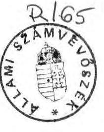
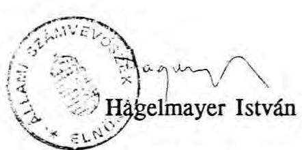
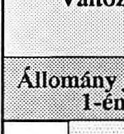
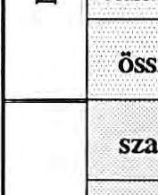

# 2. Állami Számvevőszék

## JELENTÉS

az Igazságügyi Minisztérium Büntetés-végrehajtás pénzügyi-gazdasági ellenőrzéséről

---

# Az ellenőrzést végezték:

dr. Boda Sándor számvevő
Farkas László tanácsos
dr. Gamaufné dr. Kóbor Éva számvevő
Gömöri József számvevő
Kalmár István számvevő
dr. Kardos László tanácsos
Kovácsné Soós Piroska számvevő
dr. Ótott Lajos tanácsos
Révész János számvevő
Simon Ákosné számvevő
Számely Kornél számvevő
Tréfás Antal tanácsos

## Szakértő:

dr. Vokó György
Az ellenőrzést vezette:
Fekete Imréné főcsoportfőnök-helyettes

---

# JELENTÉS

az IM büntetés-végrehajtás pénzügyi-gazdasági ellenőrzéséről

## I.

A büntetés-végrehajtás szervezete az Igazságügyi Minisztérium felügyelete alá tartozó államigazgatási szerv. Az IM büntetés-végrehajtás (a továbbiakban: Bv) az 1991. évi költségvetési törvény szerint az Igazságügyi Minisztérium fejezet egyik címét alkotja.

Alapfeladata a bíróság által kiszabott szabadságvesztéssel járó büntetés végrehajtása.

A szervezet 33 intézete közül 17 megyei intézet szolgál az előzetes letartóztatottak fogvatartására és az előállítások lebonyolítására. A jogerősen elítéltek az országos végrehajtó intézetekbe kerülnek. A szervezet része két egészségügyi (elme- és ideggyógyintézet, általános kórház) és a szigorított javító-nevelő munka végrehajtására szolgáló „félszabad" martonvásári intézet.

Az elítéltekre vonatkozó munkakényszernek megfelelően a foglalkoztatás az intézetekben, a költségvetési üzemekben, illetve az intézetek mellett működő vállalatoknál történik.

A szervezet rendelkezik központi ellátó intézetekkel és oktatási-szociális létesítményekkel.

A szervezet jóváhagyott létszáma 1990-ben 5.108 fő volt. A hivatásos állomány aránya 69 %. Az 1990. évi 132,4 millió Ft-os intézményi bevétel mellett a Bv teljes kiadási előirányzata 3,6 milliárd Ft volt.

Az ellenőrzés - az 1989. január 1-től 1991. március 31-ig terjedő időszakot átfogva - a büntetés-végrehajtás gazdálkodásának, az alaptevékenységhez biztosított állami pénzek felhasználásának törvényességére, célszerűségére és eredményességére irányult. Áttekintettük a felügyeleti tevékenységet, a büntetés-végrehajtás Országos Parancsnoksága (a továbbiakban: BVOP) irányító munkáját, valamint az intézetek és vállalatok gazdálkodását. Részletesen ellenőriztünk 9 országos végrehajtó intézetet és az azok mellett működő vállalatokat, továbbá 7 megyei intézetet.

Az ellenőrzés a Bv teljes költségvetésének mintegy 50 %-át fogta át.

# II. Következtetések, javaslatok

A büntetés-végrehajtás tevékenysége szervesen összefügg a társadalom gazdasági, politikai életével, a mindenkori büntető jogalkotással és alkalmazással. A büntetőjogi intézkedések hatékonysága nagymértékben függ a büntetés-végrehajtási tevékenység színvonalától. A jogi normarendszer fejlesztési irányainak meghatározása, a hazai büntetés-végrehajtás és az ENSZ, illetve az Európa Tanács ajánlásai közötti eltérések feltárása nem a pénzügyi-gazdasági ellenőrzés feladata. Az ezzel kapcsolatos szakértői, jogalkotói munka folyamatban van. Kívánatos, hogy a születendő új szabályozással az államháztartás terhei ne növekedjenek, s e területen is minél kisebb ráfordítással lehessen a legnagyobb eredményt elérni.

A büntetés-végrehajtás feladatai, a feladatellátás szervezeti keretei hosszú idő óta lényegében nem változtak. Az elmúlt évtizedek során a fogvatartottak ellátásának fedezetét, a szervezet működési költségeit döntő mértékben az állami költségvetés biztosította. Az utóbbi évek gazdasági nehézségei, a költségvetési támogatás reálértékének csökkenése és - paradox módon - 1990-ben a közkegyelem miatt lecsökkent létszám a profilváltási törekvések ellenére megingatta a munkáltatásra létrehozott vállalatok pénzügyi pozícióit. A bevételszerző, nyereséget hozó tevékenység mind kisebb mértékben járul hozzá a költségvetés tehermentesítéséhez. Az elítéltek munkadíjának mesterségesen nyomott szintje ellenére a vállalatok mind nagyobb számban veszteségesek, ugyanakkor az alacsony munkadíjak akadályozzák a reális mértékű tartási költségek meghatározását és ezzel a magasabb intézeti bevételek elérését. Növekvő terhet jelent az elöregedett épületállomány fenntartása, felújítása, a fogvatartottak számának prognosztizált növekedése miatti kapacitásigény kielégítése.

A jelenlegi keretek között a Bv részéről a támogatási igény növekedése várható akkor, amikor annak kielégítésével reálisan számolni nem lehet. Olyan megoldást kell találni, amely az alapfeladatok ellátásának változatlan, sőt az európai normákhoz igazodó színvonala mellett sem jelent nagyobb terhet az államháztartásnak.

Átalakulóban van a büntetés-végrehajtási munka jogállása is. A hatályos alkotmányhoz és törvényekhez igazodóan szükségessé vált a tevékenység újraszabályozása, a büntetés-végrehajtásról szóló és a büntetőeljárási törvény megalkotása. A törvényalkotás feladata az, hogy a jelenlegi jogszabályok közötti ellentmondásokat feloldva, a Bv jogállását az alkotmányhoz igazodóan rendezze.

---

Következetesen végig kell vinni a Bv demilitarizálását, beleértve az indokolatlan túlszabályozottság, a múltból örökölt BM kötődés és igazodás megszüntetését, a szervezeti egységek önálló gazdálkodásának megteremtését. A reális értékviszonyok, a tisztánlátás az ún. társszervekkel való együttműködés üzleti alapokra helyezését igényli. A hivatásos állományba tartozók körét indokolt az elítéltek őrzésével kapcsolatos munkakörökre szűkíteni.

Az eddig alkalmazott és 1991. december 31-ig érvényben lévő pénzforgalmi számviteli rend csak az előirányzatok teljesítését, a kiadásokat tartotta nyilván, az egyes feladatok, tevékenységek költségigénye nem képezte elemzés tárgyát, a vagyoni helyzetről - az 1990 végén végrehajtott vagyonértékelésig - ismeretekkel nem rendelkeztek, a közgazdasági szemlélet nem érvényesült. A kettős könyvvitel bevezetésének feltételei - az eddig megtett intézkedések ellenére - sem megnyugtatóak. Az intézetek személyi és tárgyi feltételei hiányosak, az állomány felkészültsége nem kielégítő.

A vállalati és intézeti feladatok, hatáskörök összefonódnak, a pénzforgalmi viszonyok rendezetlenek. Az eltérő feladatokból és követelményrendszerből adódó érdekellentétet tovább bonyolítja, hogy az intézet parancsnoka egyúttal a vállalat igazgatója.

A vállalatok nem vállalati módon működnek, önállóságuk korlátozott. A BVOP különböző jogcímeken jelentős összegeket von el a vállalatoktól részben beruházási kiadásokra, részben a működés támogatására. A vállalatok költségeit és eredményét olyan összegek is terhelik, amelyek nem a saját működésükkel kapcsolatosak. A jövedelmek sajátos újraelosztása révén a költségvetési és vállalati pénzek keverednek, a vállalati befizetések a BVOP munkatársai személyi ösztönzésének forrásává is válnak. A vállalatoknak a kedvezőtlen gazdasági körülményekhez való igazodása korlátozott, a döntés és felelősségi viszonyok nem tisztázottak. A munkáltatás, a gazdálkodás formáinak áttekintése és új alapokra helyezése indokolt. Szóba jöhet szociális foglalkoztatás, költségvetési üzem, vagy alapítványi vállalatok létrehozása. Az árutermelés és a szociális foglalkoztatás kettős követelményét jól szolgálná a non-profit érdekeltségű szervezetek létesítése.

A fogvatartottak teljes foglalkoztatottsága nem biztosított annak ellenére, hogy a vállalatok többsége jelentős erőfeszítéseket tett a gyártmányszerkezet korszerűsítésére, a profil módosítására, a minőségi követelmények növelésére, a termelésirányítás feltételeinek javítására.

Következetlen az állampolgári jogok korlátozásának gyakorlata, indokolatlan az elítéltek részleges kizárása a társadalombiztosítási rendszerből. Rendezést igényelnek az egészségügyi ellátás finanszírozási kérdései is.

---

Célszerű változtatni az elítéltek munkadíjára vonatkozó szabályozáson. A jelenlegi rendszerben a saját szükségletre fordítható rész aránya túlzottan magas, az elítélt tartozásai halmozódnak, a tartalékolás összege csekély. Az elítélt javára szóló értékmegőrzés érdekében módosítást igényelnek a pénzletétek kezelésére vonatkozó jogszabályok is.

Az Országos Parancsnokság felügyeleti, irányító tevékenysége is korszerűsítésre szorul. A fegyveres erőkre jellemző centralizációs törekvések és a részletkérdésekre kiterjedő szabályozási tevékenység helyett az értékviszonyoknak helyet adó elvi irányító, ellenőrző, koordinatív szervező munkának kell meghonosodnia.

Az ellenőrzés megállapításai alapján javasoljuk:
1/ A hazai jogrendszer fejlődési folyamatába illeszkedően a Bv feladatának, jogállásának törvényi szintű szabályozása szükséges. Meg kell szüntetni a szervezetre vonatkozó jogszabályok közötti ellentmondást. Az új szabályozáshoz kell igazítani a Bv szervezeti és irányítási rendszerét és meghatározni a működés anyagi szükségleteit. A korszerűsítést úgy kell végrehajtani, hogy annak hatásaként az államháztartás terhei lehetőleg ne növekedjenek.

2/ A feladatellátás hatékonysága a jelenlegi keretek között is fokozható. Új alapokra kell helyezni a költségvetési tervezést és gazdálkodást. A kettős könyvvitel bevezetése megteremti a lehetőségét az üzemgazdasági szemlélet érvényesítésének. Ennek alapján a feladatok reális költségigényét számbavéve a költségeket a felmerülés helyén kell megtervezni és elszámolni. A BVOP szervezetére önálló költségvetést kell készíteni. A túlzott centralizáció és túlszabályozottság oldása, az intézetek tényleges gazdálkodási önállóságának megteremtése indokolt.

3/ Felül kell vizsgálni a vállalati munkáltatás rendszerét. Meg kell szüntetni a vállalati és költségvetési pénzeszközök keveredését, tisztázni kell az intézet-vállalati vagyontárgyak tulajdonviszonyait.

A vállalati gazdálkodási forma fenntartása esetén olyan jogi, gazdálkodási kereteket kell teremteni, hogy azok a gazdálkodó szervezetekre vonatkozó általános jogszabályok szerint, piaci körülmények között működjenek. Az érdekeltség csak a munkavégzéshez és a közvetlen termelésirányításhoz kapcsolódjon. A vállalati nyereség nem szolgálhat alapul a BVOP munkatársai anyagi ösztönzésének.

Amennyiben a munkáltatásra non-profit érdekeltségű költségvetési szerv keretében kerül sor, meg kell teremteni annak jogi, gazdálkodási kereteit.

---

Az Igazságügyi Minisztériumnak keresni kell annak a lehetőségét, hogy a kincstári megrendelésekkel a termelőkapacitás kihasználása és a tevékenység eredményessége hogyan lenne javítható.

4/ A hivatásos szolgálatra vonatkozó reális igény meghatározásával tovább kell folytatni a szervezet demilitarizálását. Fel kell számolni azt a gyakorlatot, amelyben az intézet, mint költségvetési intézmény vezetője egyben vállalati igazgató és az ott fegyveres szolgálatot teljesítők parancsnoka.

5/ Felül kell vizsgálni és nyilvános jogszabályban kell rögzíteni a dolgozó és nem dolgozó fogvatartottak társadalombiztosítási jogait, illetve azok korlátozását. Kötelező, vagy önkéntes nyugdíjjárulék fizetési kötelezettség mellett célszerű a táppénz- és nyugdíjjogosultság biztosítása.

6/ Meg kell változtatni az elítéltek keresetére vonatkozó szabályozást. Indokolt megteremteni az elítélt keresetére vonatkozó letiltás és az intézettel szembeni tartozás kielégítésének lehetőségét. Fel kell emelni a kötelezően letétbe helyezendő összeg értékhatárát és az elítélt javára történő értékmegőrzés érdekében meg kell változtatni a pénzletét kezelésére vonatkozó szabályokat. Az elítélt megtakarításai meghatározott összeg felett automatikusan kamatozó formában kerüljenek elhelyezésre és a kamatok más célú (alapítványi) felhasználása csak az elítélt beleegyezésével legyen lehetséges.

7/ Az ellenőrzés által feltárt és a jelentésben jelzett szabálytalanságok (vállalati-költségvetési pénzek keveredése, THA szabálytalan felhasználása, kettős könyvvitel bevezetésére biztosított pótelőirányzat céltól eltérő felhasználása, stb.) esetében a személyes felelősséget meg kell állapítani és meg kell tenni a szükséges intézkedéseket.

---

# III. Részletes megállapítások

## 1/ A büntetés-végrehajtás jogállása, működésének, gazdálkodásának szabályozása

Az 1952-től a Belügyminisztérium önálló fegyveres testületét alkotó Bv az 1963. évi 24. tvr. szerint az igazságügyminiszter felügyelete alá került.

Az igazságügyminiszternek normatív szabályozási, az intézetek (vállalatok) vonatkozásában alapítói jogköre van, emellett személyzeti, aktusfelülvizsgálati, az egyedi ügyekben döntési joga van, továbbá ő jogosult a fejlesztés irányának meghatározására.

Az igazságügyminiszter hatáskörébe tartozik a hivatásos tiszti állomány kinevezése, áthelyezése, vezénylése, nyugállományba helyezése, illetve elbocsátása, a vezetői munkakörökhöz szükséges képesítési követelmények meghatározása. Dönt az országos parancsnok és helyettesei illetményéről és anyagi elismeréséről, határoz azok lakás- és fegyelmi ügyeiben.

Jelenleg ellentmondásos helyzet van a hivatásos állomány megítélésében.

#### Abstract

A fegyveres erők és tagjainak hivatásos állományú tagjai szolgálati viszonyáról szóló 1971. évi 10. számú tvr. rendelkezései hatályban vannak és vonatkoznak a Bv intézetek hivatásos állományú tagjaira is. A honvédelemről szóló 1989. évi XLII. törvénnyel módosított 1976. évi I. tv. 17. paragrafus (1) bekezdése értelmében a Bv fegyveres testületnek számít.

A büntetőeljárásról szóló 1973. évi I. tv. módosításáról rendelkező 1989. évi XXVI. tv. nem tartalmaz rendelkezést a fegyveres testületek hivatásos tagjai által elkövetett bűncselekmények esetén különleges elbírálásra.

Az új alkotmány a Bv-t, mint fegyveres testületet nem említi.
Az 1971. évi 10. tvr. és az 1976. évi I. tv. rendelkezései nem felelnek meg az alkotmánynak. A Bv jogi értelemben nem tekinthető fegyveres testületnek, ténylegesen azonban továbbra is ekként működik.

A szervezet gazdálkodását a 4/1991. (II. 13.) PM rendelet hatálybalépéséig az állami pénzügyekről szóló 1979. évi II. tv. és végrehajtási rendeletei alapján a fegyveres testületek gazdálkodási rendjére vonatkozó 107/1981. (PK.10.) PM, illetve a 12/1990. (V.22.) BM-HM együttes utasítás szabályozta.

A szervezet önállóan gazdálkodik. A
 gazdálkodás rendjét az érvényes jogszabályok figyelembevételével az országos parancsnok határozza meg. Az IM a BV gazdálkodását tartalmilag nem felügyeli. A Minisztérium ellenőrző tevékenységét az IM Ellenőrzési Önálló Osztálya látja el, kötelezettsége kétévenkénti költségvetési ellenőrzést ír elő, amelynek utoljára 1988. őszén tett eleget.

---

Az általános szabályozás az éves költségvetési és pénzgazdálkodás megszervezésére, tervezésére és végrehajtására, illetve a költségvetés beszámolási rendjére terjed ki.

A BVOP irányító munkáját a túlszabályozottság jellemzi.

#### Abstract

A BVOP a büntetés-végrehajtási sajátosságok figyelembevételével utasításokkal, rendeletekkel az intézetek gazdálkodásának minden fázisát szabályozza. Ennek következtében döntésre alig van lehetőség.

A folyamatos működést esetenként akadályozza, hogy a jogszabályban megjelenő döntést, sokszor indokolatlanul, belső utasításban szabályozzák.

Jelenleg kb. 25-30 fontosabb utasítás, egyéb leirat van érvényben a gazdálkodásra vonatkozóan, ezeket 1989-1991. években 65 alkalommal módosították.

# 2/ A költségvetési tervezési rendszer 

A szabadságvesztés büntetés végrehajtása állami feladat, ennek megfelelően az ehhez szükséges pénzügyi eszközöket döntően az állami költségvetés biztosítja.

Az éves átlagos fogvatartott létszám (1. sz. melléklet) és a költségvetési támogatás (2. sz. melléklet) figyelembevételével egy fogvatartott ellátása a költségvetésnek 1989-ben 10.389, 1990-ben 18.737, 1991-re a tervezett adatok alapján pedig 17.900 Ft-ba kerül havonta.

A BV alapfeladatai ellátásához az ellenőrzött időszakban a feltételek biztosítottak voltak.

A Pénzügyminisztérium meghatározó szerepet tölt be a szervezet gazdálkodásában.

A PM fogadja el a BVOP költségvetésének tervét, pótkeret igényét, a végrehajtásról szóló beszámolót, engedélyezi a maradvány felhasználását.

A tervezés rendszere alulról építkező. A költségvetés alapját a bázis évre jóváhagyott kiadási előirányzat képezi. A tervezési időszak az országos szervezet sajátosságaihoz igazodóan a szokásosnál korábban kezdődik.

A BVOP minden év II. negyedévében - a központi költségvetés irányszámainak ismerete nélkül - intézkedik intézetei felé a tervjavaslat összeállításáról. A rovat-tétel bontásban, bázis szemléletben elkészített javaslatok összesítésével, a BVOP osztályai által eszközölt módosítások után, a központi beszerzésű anyagok előirányzatainak hozzáadásával készül el a szervezet terve. A támogatás és a tervezett bevétel összege a PM illetékes főosztályával folytatott alkuban véglegesedik és épül be a központi költségvetésbe.

A tervezés rendszere a feladatok változására érzéketlen, az előirányzatok bázis szemléletet tükröznek.

---

A BVOP saját szervezetére - helytelenül - önálló költségvetést nem készít, az irányító munka költségigénye és ráfordításai nem különülnek el, azok alakulása nem ellenőrizhető.

A büntetés-végrehajtási szervezet az ellenőrzött időszakban az éves költségvetés összeállításánál átlag 90%-os állami támogatást, a bevételeinél 1989-1990-ben szolíd mértékű növekedést tervezett. A PM által elfogadott tervszámok a kiadási előirányzatokat minden évben csökkentették, a költségvetési támogatás részarányát rendre 87%-ban határozták meg, a bevétel előirányzatai pedig megemelésre kerültek.

A kiadási előirányzat 1/3-ad részét képező készletbeszerzés rovaton volt a tervezéshez viszonyított legradikálisabb csökkentés. 1989-ben 26%-kal, 1990-ben 10%-kal kevesebb előirányzattal gazdálkodhattak. Szűkítette a gazdálkodási lehetőséget, hogy ezen belül a legnagyobb részarányt képező élelmezés és ruházat kötött előirányzatok voltak, amelyektől eltérni csak a jogszabályban meghatározott vezetői engedéllyel lehetett.

Jelentős mértékben csökkentették az épületek, ingatlanok karbantartására, felújítására, valamint fejlesztési kiadásokra tervezett előirányzatokat is. Ennek következtében az elhelyezési körülmények helyenként továbbra sem kielégítőek. Ez hozzájárult egyebek mellett - a hivatásos állomány körében a leszerelési és áthelyezési kérelmek, a fogvatartottaknál a rendkívüli események (ellenszegülés, zárkatorlaszolás) növekedéséhez.

A költségvetési előirányzatok 1989-1991 között 77%-kal, 2.781 millió Ft-ról 4.775,6 millió Ft-ra növekedtek, a költségvetési támogatás változatlan aránya mellett. A jóváhagyott előirányzatokat októberben rendszeresen módosították. (2. sz. melléklet)
1989. évben jóváhagyott 2.781,0 millió Ft kiadási előirányzatot növelte a diktált normamódosítások és az év közben belépő objektumok működési és fenntartási kiadásaira biztosított pótelőirányzat, a többletbevétel és az előző évi felhasználható maradvány, csökkentette viszont a PM által év közben elrendelt 40 millió Ft zárolás. A pénzügyi lehetőség (2.862,9 millió Ft) összességében 2,9%-kal volt több az eredetileg jóváhagyott előirányzatnál. A tényleges felhasználás 2.860,3 millió Ft (99,9%) volt, a 2,6 millió Ft költségvetési maradványt kötelezettségvállalással lekötötték.

Az 1990-re jóváhagyott 3.309 millió Ft kiadási előirányzat az évközi változások nyomán 10,2%-kal növekedett, 3.645,9 millió Ft-ra módosult. A tényleges felhasználás 3.594,6 millió Ft volt. (Maradvány: 51,3 millió Ft.)

A tényleges bevétel a tervezettet 1989-ben 34, 1990-ben pedig 24%-kal meghaladta.

Az intézményi költségvetések jóváhagyására a költségvetési törvény elfogadását követően általában a tárgyév elején kerül sor. Ez évben ez még nem történt meg.

---

A PM részéről a költségvetés korábban megszokott részletes jóváhagyása 1991-ben elmaradt, emiatt az intézményi költségvetések visszaigazolás előtti egyeztetése még a helyszíni vizsgálat időtartama alatt is folyt.

A bevételi előirányzat legnagyobb volumenét a büntetés-végrehajtási vállalatoknál foglalkoztatott elítéltek tartási díj térítése (működési bevétel) képezi. Az intézeteknél az ár- és díjbevétel legnagyobb része a vállalatoknak nyújtott szolgáltatásokért fizetett díjakból adódik. A költségvetési üzemek szabad kapacitásait felhasználva bevételt eredményező, vállalkozási jellegű tevékenységgel a szervezet szintén ár- és díjbevételt realizál.

A tartási díj irreálisan alacsony: 47 Ft/fő/nap. Ez a fogvatartottak norma szerint megállapított átlagos élelmezési költségét sem fedezi.

A szervezet saját bevételei alakulásában 1988-ig egyenletes növekedés volt tapasztalható.

A Testületi Hozzájárulási Alapra (THA) az 1989. évi „csúcsnak" számító 183,3 millió Ft-tal szemben 1990-ben 108,5 millió Ft-ot fizettek be. (Ez a tervhez képest is 28%-os csökkenést jelent.) A visszaesés oka az, hogy a nehezedő gazdasági feltételek miatt a vállalatoktól 1990-ben nem folyt be rezsítérítés, 1991-re ilyen címen bevételt nem is terveztek.

A bevétel alakulás tendenciája jelzi, hogy a teljes körű munkáltatás csökkenő mértékben járul hozzá a központi költségvetés tehermentesítéséhez.

Az elítéltek bérének jelenlegi színvonala nem ad lehetőséget a tartási díj és ezzel a működési bevételek növelésére. A fogvatartottak létszámának csökkenése, valamint az alacsony képzettségű, vagy szakképzetlen munkaerő iránti kereslet jelentős visszaesése miatt számottevő növekedés nem tervezhető.

# 3/ Költségvetési gazdálkodás 

## a/ Bérgazdálkodás

A szervezet létszám- és bérgazdálkodása 1990-ig a fegyveres testületekre megállapított szigorú előírások szerint folyt. A 107/1981. (PK.10.) PM sz. utasítás szerint a hivatásos állományra átlaglétszám és bérszínvonal-gazdálkodás, a polgári alkalmazottakra a bértömeg-gazdálkodás vonatkozott.

A hivatásos állomány esetében a költségvetésben előírt átlaglétszámot és átlagbérszintet be kellett tartani, de a hivatkozott utasítás hasonlóan kötött átlaglétszámot szabott meg a bértömeg-gazdálkodás körébe vont polgári alkalmazottak tekintetében is.

---

Az utóbbiaknál a PM adhatott engedélyt a tervezett létszám túllépésére.
A szervezet állandó főfoglalkozású dolgozóinak jóváhagyott létszáma az ellenőrzött időszakban gyakorlatilag nem változott (1991-re minimális emelkedés történt). (3. sz. melléklet)

A hivatásos - tiszti és tiszthelyettesi - állomány feltöltését nem sikerült elérni, a fluktuáció jelentős, az átlagos szolgálati idő pl. az őr állomány több mint felénél 5 év alatt van. A tendencia 1991. I. negyedévében sem változott.

A kiadási előirányzatok között 1989-ben 33,3, 1990-ben 35,1%-ot képvisel a béralap aránya.

A jövedelemviszonyok a szervezetnél — az utóbbi két év jelentősebb bérfejlesztése ellenére - viszonylag szerények. Az átlagbérek 1990-ben az előző évhez viszonyítva a hivatásos állománynál 23, a polgári alkalmazottaknál 18%-kal növekedtek. 1991-re 41, illetve 51%-os emelkedést terveztek. (Ebből megvalósult 32,6, illetve 37%.) (4. sz. melléklet)

Az alapbéren kívüli bérjellegű kifizetések (jutalom, anyagi ösztönzés stb.) 1990-ben az átlagbéreket 26,8 és 30,3%-kal növelték.

A tartós és átmeneti létszámhiány következtében az őr állománynál gyakori a havi munkaidőalap túllépése.

Az ügyeleti szolgálatot ellátó mintegy 2.500 fő teljesített havi átlagos szolgálati ideje a hivatalos 174 órával szemben 1989-ben 197, 1990-ben 185,7 óra volt.

Az 5 napos munkahét bevezetésével áttértek a szabadidő pénzbeni megváltására. A létszámhiány miatt a kötelező, rendszeres továbbképzésre (esetenként a lógyakorlatra) is a havi munkaidőalap felett, térítési díj ellenében kerül sor.

A pénzbeni megváltás óradíja 1991. január 1-től a korábbi 85-ről 120 Ft-ra emelkedett.

A tartós tendenciák ismeretében - a létszámfejlesztés és a szabadidő-megváltás költségeinek mérlegelésével - a létszám- és bérgazdálkodás felülvizsgálata indokolt.

Az egyéb jogviszonyban foglalkoztatottak bére a béralap mintegy 0,4%-át képezi. Ebből a legnagyobb tételt jelentő megbízási díj az ellenőrzött időszakban 3,5, illetve 3,7 millió Ft volt.

Az Országos Parancsnokság 1989-ben megbízási szerződést kötött Moldova Györggyel „a személyi állomány és az elítéltek véleményének elemzésére és

---

értékelésére" szóló kutatásra eredetileg 6 hónapra havi 30 ezer Ft összegű díjazással. (A szerződés később egyéves időtartamra meghosszabbításra került.)

A szerződés lehetőséget adott az írónak a tapasztalatok publikálására. Amellett, hogy a megbízás a szervezet számára vitatható eredményt hozott, a megbízási szerződés teljesítésének formája - miszerint az író „kutatási eredményként" könyve kéziratát adta át - nem fogadható el.

# b/ Dologi előirányzatok 

A hír- és őrzéstechnikai előirányzatok a hagyományos technikai berendezések folyamatos, tervszerű karbantartását, javítását, valamint a korszerű technikai eszközök beszerzését és telepítését finanszírozzák.

Az e célra rendelkezésre álló pénzeszköz 1990-ben az előző évihez képest mintegy 30%-kal csökkent és 1991-ben sem érte el az 1989. évi szintet.

A korszerű, videotechnikával kombinált őrzésbiztonsági jelzőrendszer telepítésére hosszabb távú tervet dolgoztak ki. A rendszer technikai bázisát a korábbi NDK eszközei jelentették. A szűkülő pénzügyi lehetőségek a terv felülvizsgálatát indokolják.

Az őrzésbiztonsági szempontból helyes korszerűsítés vitatható eleme, hogy a költséges rendszerek kiépítésére az őrszemélyzettel lényegesen jobban ellátott, nagyobb végrehajtó intézetekben került sor.

A kisebb megyei intézetek sűrűn beépített területen találhatók, más szervekkel (pl. bíróságok) közösen használt épületekben, ami a biztonságos őrzést nehezíti. Ezen intézetekben az őrállomány létszáma sem mindenütt biztosítja valamennyi szakasz állandó figyelését. A technikai rendszer telepítése ezeken a helyeken a biztonságot növelhetné és kiépítése fajlagosan kisebb költséget eredményezhet.

A hagyományos őrzésvédelmi berendezések gyártása, központi javítása a BV Híradástechnikai Üzemében folyik, elítélt munkaerő közreműködésével. Ez a gyakorlat biztonsági szempontból kifogásolható, tekintettel arra, hogy a rendszerek megismerése az elítéltek részéről a visszaélés veszélyével jár.

A gépjárművek beszerzésére és üzemeltetésére szolgáló előirányzatoknál a dollár elszámolásra való áttérés jelentős többletkiadást eredményezett.

A helyszíni vizsgálat időpontjában 380 gépjárművet üzemeltetett a szervezet, ebből mintegy 100 db-ot közvetlenül a fogvatartottak szállításával kapcsolatban.

Beszerzésre 1989-ben 32,8 millió Ft-ot, míg 1990-ben 68%-kal többet, 55,1

---

millió Ft-ot fordítottak. A személygépjárműveknél - a BM korszerűsítési programjához csatlakozva - 1991-re 20 db Ford-Escort típusú gépkocsi szállítására szerződtek, mintegy 11 millió Ft értékben. Ez a vám és ÁFA kötelezettségekkel növelve 810.397 Ft-os egységárat jelent.

A gépjárművek rendszerből történő kivonását a BVOP szabályozta.
A használt gépjárművek értékesítése 1989-ben 2.142, 1990-ben 3.352 ezer Ft árbevételt eredményezett. A személyi állomány részére közvetlen értékesítés nem volt.

A fegyverzeti és vegyivédelmi eszközök beszerzésére évente 12-14 millió Ft-ot fordítanak.

A fegyverzeti anyagok beszerzése, értékesítése és javítása a BM rendszeréhez igazodik.

A hivatásos állomány fegyvereinek alkalmazhatósága nem felel meg a követelményeknek. A rendszerben lévő AMD-géppisztoly harctéri fegyver, találati pontossága csekély, roncsoló hatása nagy. A BV intézetek többsége városban, sűrűn lakott területen fekszik és ez a tény erősen korlátozza e fegyver alkalmazhatóságát. A kézifegyverek, valamint védelmi célokra szolgáló, a BV feladataihoz jobban igazodó fegyverek tervezett beszerzését
 és rendszerbe állítását célszerű felgyorsítani.

# c/ A fogvatartottak ellátása 

A BV elhelyezési adottságai összességében kedvezőtlenek, annak ellenére, hogy a többségében a századforduló előtt épült intézetekben az utóbbi évek felújításainak eredményeként a zárkák többségét jelentős költségráfordítással sikerült korszerűsíteni.

A fogvatartottak elhelyezésére meghatározott norma 1990. évi megváltoztatása következtében az elhelyezhető létszám 25.851 főről 18.002 főre, 30,4 %-kal csökkent. (A férőhelyek 17,4 %-a az előzetes letartóztatottak elhelyezésére szolgáló befogadó intézetekben, 79,2 %-a a végrehajtó intézetekben, 3,4 %-a pedig az egészségügyi intézményekben található.)

A közkegyelmet követően életbe lépett és az európai viszonyokhoz igazodó normarendezés az akkori létszámviszonyoknak (összes fogvatartott 11.567 fő) megfelelt, de a fogvatartottak számának azóta bekövetkezett emelkedése -

---

elsősorban a befogadó intézetekben — ismételten, helyenként veszélyes mértékű túlzsúfoltságot eredményezett. (5. sz. melléklet)

Tekintve, hogy a megyei intézetek szolgálnak az előzetes letartóztatottak elhelyezésére, a zsúfoltság a bíróságok túlterhelésével és a rendőrségi fogdák szűkös kapacitásával is összefügg.

Legrosszabb helyzetbe a Miskolci BV Intézet került, ahol a 218 %-os feltöltöttségi arány mellett van olyan zárka, ahol mindössze 1,57 m² terület jut egy fogvatartottra.

A szervezet költségvetésében a fogvatartottak élelmezése, ruházati előirányzata és munkadíja 1989-ig céljelleggel elkülönítve szerepelt. (A BVOP az intézeteknek továbbra is céljelleggel biztosítja az előirányzatot.)

A fogvatartottak élelmezése ugyancsak normákkal szabályozott. A normákat és azok változását szintén a PM illetékes főosztálya hagyja jóvá.

Az élelmezés fedezetét a költségvetésben biztosított előirányzat képezi. A vállalatok étkezési hozzájárulás címén a Központi Finanszírozási Alapba munkanaponként 8 Ft-ot fizetnek be az eltartottak után. Ennek célszerű felhasználása a nyilvántartás rendszeréből nem derül ki.

Az élelmezési ráfordítás 1989-ben 319,2, 1990-ben 329,3 millió Ft volt. Ez a terv 101,85, illetve 88 %-os teljesítését jelentette. Az 1989-es túllépés a PM engedélyével végrehajtott 33 %-os normarendezés következménye volt.
1990. február 1-jei 60,50 Ft/fő/nap átlagos normát (munkavégzéstől és egészségi állapottól függő 52-83 Ft közötti szóródással) 1990. október 1-ével a BVOP saját hatáskörben megemelte. A mintegy 80 Ft/fő/nap átlagos norma 25-30 millió Ft többletköltséget jelent, aminek fedezete a korábbi módon (létszámcsökkentés, célgazdaságok termékeinek felhasználása) nem biztosított.

Saját erőből ugyancsak nem áll rendelkezésre a helyszíni vizsgálat időpontjában hatályba lépett 24/1991. (II.9.) Korm. sz. rendeletben meghatározott nyersanyagnormák, energia- és tápértéktartalom minimumának anyagi háttere.

Az étkeztetés személyi feltételei sem megnyugtatóak. A befogadó intézetekben az állománytábla 1 fő konyhavezetői beosztást tartalmaz. A 101/1981. (IK.2.) IM számú utasítás előírását, amely szerint fogvatartott felügyelet nélkül a konyhában nem dolgozhat, időnként és helyenként nem tudják betartani.

Az elítélteket az intézet látja el ruházati felszerelésekkel.
A fogvatartottak ruházati anyagainak tervezése, az ellátás szintén normák alapján történik.

---

Az 1989-es előirányzat a teljes kiadási előirányzat 1,9 %-a, 1990-ben 1,4 %-a volt.

Az elítéltek formaruházatának egy főre jutó költségei az elmúlt években alig emelkedtek. (Az 1 főre jutó költség 1980-ban 2.359,2, 1990-ben 2.461,4 Ft/fő.)

Ennek oka a BV központi ellátású üzemeiben gyártott ruhák alacsony költségszintje, valamint a használt katonai ruházat átvétele a Magyar Honvédségtől.

Az intézetekben tartott helyszíni ellenőrzés több helyen a készletek magas szintjét állapította meg. A központi ellátás körébe tartozó anyagok gazdálkodásának rendje felülvizsgálatot igényel. A rendszer, amely az elhasználódott termékek norma szerinti pótlásán alapul, nem ösztönöz a takarékos intézeti gazdálkodásra.

A fogvatartottak szakorvosi ellátással kibővített alapellátásáról jól szervezett módon az intézetekben gondoskodnak. Az intézeti lehetőségeket meghaladó szakorvosi ellátásra részben a BV Központi Kórházában, részben az állami egészségügyi intézetekben van lehetőség. A fekvő betegellátást a BV Központi Kórházában, esetenként állami kórházakban végzik.

A tényleges költségráfordítás nem mérhető. A fogvatartottak egészségügyi ellátását az OTF csak a BV keretén belül finanszírozza. Azokban az esetekben, amikor a gyógyítás állampolgári jogon az állami intézetekben történik, pénzügyi elszámolás nincs.

Az egészségügy anyagi ellátásának kiadásai a BV költségvetését ilyen formában alig terhelik. (1989-ben a kiadási előirányzat 1,26, 1990-ben 1,32 %-át használták fel erre a célra.)

Az IM BV Központi Kórháza, az Igazságügyi Megfigyelő és Elmegyógyító Intézet (IMEI), valamint a Munkaterápiás Alkoholelvonó Intézet finanszírozására OTF támogatásból 1990-ben 195,3 millió Ft-ot fordítottak.

# d/ Gazdálkodás a központi alapokkal 

A BVOP-nek két központosított alapja van, amelyek felett az országos parancsnokhelyettes rendelkezik.

A Központi Finanszírozási Alap (továbbiakban: KFA) forrása a vállalatok fejlesztési célú befizetései (1989-ben a nyereség 10 és a hozzáadott érték 1,5 %-a, 1990-ben a hozzáadott érték 3,4 %-a, 1991. évi terv szerint annak 3 %-a), valamint a vállalati jóléti (szociális) és kulturális költségek terhére az elítéltek

---

éves átlagos létszáma utáni 100 Ft/fő, továbbá a munkanaponkénti 8 Ft/fő étkezési hozzájárulás.

A KFA-ban a vállalatoktól központosított, átcsoportosított pénzek a vállalatok fejlesztési célú támogatását szolgálják (1989-ben 98,8, 1990-ben 84,2 %-át az iparvállalatok, a többit a célgazdaságok kapták). Ezt a célt az alap egyre kevésbé éri el (míg 1989-ben a támogatások 67 %-a szolgált fejlesztésre, ez az arány 1990-ben már csak 1,8 %).

A BVOP a KFA-ból a támogatás egy részét gazdálkodási nehézségek áthidalására „használati díj" ellenében nyújtja a vállalatoknak. A konkrét fejlesztési cél megjelölése nélkül likviditási gondok áthidalását szolgáló pénzkölcsönzés hitelezési tevékenységnek minősül, amire a szervezetnek nincs jogosítványa. A szabálytalan gyakorlatot meg kell szüntetni.

A Testületi Hozzájárulási Alapot (THA) — a 2/374/1986. számú határozattal - a Honvédelmi Bizottság (HB) a költségvetési célok finanszírozására hozta létre. A nem nyilvános, állampolgári jogokat is érintő bizottsági határozat nem felel meg a jogalkotásról szóló törvény alapelveinek.

A fogvatartottak nem tartoznak a társadalombiztosítással érintettek körébe, a BV intézetekben eltöltött idejük nem számít munkaviszonynak. A BV vállalatoknál és célgazdaságoknál fogvatartottak munkabére után számított TB-járulékot azonban a gazdálkodó szervezetek 1987-ig a társadalombiztosításnak befizették. A HB döntése alapján a TB-járulékot 1987-től a szervezet visszatarthatja, a vállalatok azt a céljellegű befizetések terhére számolják el. Ugyancsak e határozatban engedélyezte a HB, hogy a BVOP által meghatározott mértékű rezsiköltségeket a vállalatok termelési költségként elszámolhatják. A rezsitérités mértékét a vállalat teherbíró képességének függvényében az országos parancsnok helyettese határozza meg.

A 104/1987. IM-PM-OT utasítás meghatározta a THA felhasználását, amennyiben ezen testületi alapból engedélyezte a fogvatartottakkal kapcsolatos működési és fenntartási kiadások kiegészítését, valamint a beruházási keret növelését. Az alap kezelésével, felhasználásával kapcsolatban több szabálytalanságot állapított meg az ellenőrzés.

A HB határozat ellenére a számlát nem az MNB-nél, hanem az MHB-nál nyitották meg.

Rendeltetéstől eltérő felhasználáshoz vezetett a THA és KFA közötti „átjárás", a vállalati és a költségvetési pénzek keveredése. (Az előbbiből vállalati támogatást nyújtottak, az utóbbit költségvetési célokra fordították.) A vállalati támogatásra szolgáló KFA-ból 1987-1989 között 103,8 millió Ft-ot költségvetési célra fordítottak. A szabálytalan átjárást 1990-től megszüntették.

A BVOP 1988-ban a THA-ról, valamint a KFA-ból banki ügylet keretén belül kereskedelmi hitelt nyújtott a Hatvan és Vidéke ÁFÉSZ számára, 10-10 millió Ft

---

értékben 3-3 hónapra, majd meghatározatlan időre meghosszabbítva. Az ügylet szabálytalan volt annak ellenére, hogy az veszteséget nem okozott, a kamatfeltételek kedvezőek voltak és a hitelt az ÁFÉSZ visszafizette.

Az alapról 1988. februárban 30 millió Ft-ot helyeztek el az MHB-nál, amely azóta is folyamatosan, de tartós lekötés nélkül 3-6 hónapos meghosszabbításokkal és annak megfelelő feltételekkel kamatozik.

# e/ Beruházási tevékenység 

A beruházási előirányzatok az intézeti elhelyezési lehetőségek bővítését, korszerűsítését, valamint a személyi állomány lakásproblémáinak enyhítését szolgálják.

A beruházásokra fordított pénzeszközök felhasználásának mértéke 1986-1990 között a tervhez képest kétszeresére növekedett, ezen belül az eredeti előirányzathoz viszonyítva több mint hatszorosára nőtt a saját forrás aránya. (6. sz. melléklet) Az átadott budapesti lakások száma a tervezetthez képest 35,6 %-kal csökkent, miközben az egy lakásra jutó beruházási költség 180 %-kal volt magasabb, mint vidéken. A budapesti lakáshelyzet ennek következtében alapvetően nem változott.

A beruházási tevékenység 1989-1990-ben radikálisan visszaesett. Ez - leszámítva az 1987. évi 17 %-os maximumot - 6-8 %-os arányt képviselt a költségvetésben. A visszaesés oka alapvetően a saját pénzforrások, a beruházásra átcsoportosítható bevételek arányának jelentős csökkenése. Az 1991. évi 3,3 %-os tervezett szint - figyelemmel az elhelyezési normák változása miatti férőhely növelési igényre - várható feszültséget jelez.

Az ellenőrzött időszakban kevesebb új beruházás indult, az alaptevékenységi beruházási pénzforrások mintegy 80 %-át a korábbi években megkezdett beruházásokra fordították.

Az öt befejeződött beruházás közül nagy jelentőségű volt az elhelyezési körülményeket javító - az akkori norma szerint - 1.200 férőhelyes szállás és a raktárépület (közel 500 millió Ft bekerülési költség) átadása a Budapesti Fegyház és Börtönnél. A 29,9 millió Ft-os ráfordítással javultak a személyi állomány munkakörülményei Pálhalmán, ahol 500 adagos őri konyha-étterem átadására került sor.

A szigorított javító-nevelő munkával kapcsolatos jogszabályi változások miatt módosult a Miskolcra tervezett intézetbővítés és szállásépítés. A téves prognózison alapuló beruházás elhúzódott, a túllépés 43,5 %-os.

Az 1989-re tervezett Sopronkőhidai Fegyház és Börtön gázellátását célzó beruházást nem indították el.

---

Lassították néhány további beruházás kivitelezését. A szükségintézkedés hatásaként költségnövekedés várható. Ugyancsak pénzügyi okokból az 1990-re tervezett négy beruházásból csak három indult el.

Az alaptevékenységi beruházások pénzügyi teljesítésében 1989-ben 68,8, 1990-ben 73,1 %-ot képviselt a saját lebonyolításban megvalósult beruházások aránya.

A saját erőből megvalósult beruházások finanszírozásánál - a beruházások lebonyolítására, a pénzeszközök kezelésére vonatkozó 46/1984. (XI.6.) MT számú rendelet jelentős részének hatályon kívül helyezése miatt - szabályozatlanság tapasztalható. Az ÁFI által kezelt előirányzatok nem a beruházások teljes költségfedezetét tartalmazzák, az elítéltek munkadíja a BV költségvetésében szerepel.

# f/ A lakásgazdálkodás 

A lakásigények kielégítése saját beruházásból, lakásvásárlásból és a bérlőkijelölési jog vásárlása útján történik. (7. sz. melléklet)

A BV az ellenőrzés lezárásakor 1.780 szolgálati lakással rendelkezett. Szolgálati lakást a BV hivatásos és kinevezett polgári állományú igényjogosult tagjai kaphatnak, ha azt a szolgálati érdekek is indokolják.

A jogosultság részletes szabályainak megállapítása az 1971. évi 10. tvr. szerint az illetékes miniszter feladata. A BV szabályozás az igényjogosultság és a lakáshoz jutás feltételeiben megfelel az állami lakásügyi szabályoknak.

Az igénylők száma az ellenőrzött időszakban 494, illetve 468 fő volt.
A saját (hagyományos technológiával felépített) beruházásban megvalósított lakások nettó költségei 1.000 Ft/m²-rel kevesebbek, mint a közös beruházással építettek. (8. sz. melléklet) Ennek oka a közös beruházások kapcsolódó költségei, amelyek az adott terület fejlesztéséhez nyújtott költségvetési támogatást jelentenek. A saját beruházásban kivitelezett lakások általában jobb minőségűek, nagyobb alapterületűek.

A lakásberuházási költségvetési juttatás 1989-ben 83, 1990-ben 100 millió Ft volt. A jóváhagyott költségvetés felhasználásáról, arányairól a BV vezetői értekezlete dönt.

1989-ben 63 millió Ft került lakásberuházásra, 20 millió Ft pedig a dolgozók lakásépítésének támogatására és a bérlőkijelölési jog megvásárlására szolgáló Lakásépítési Alapra, míg ez az arány 1990-ben 75-25 millió Ft volt.

---

A szolgálati lakások gazdálkodásának jelenlegi rendszerében a lakásállomány „megőrzése" és forgatása nem lehetséges. Az újabb igények kielégítése lakásépítéssel (vásárlással) és azok értékesítésével oldható meg.

A szolgálati
 lakások értékesítését az állami tulajdonban álló házingatlanok elidegenítésének szabályozásáról szóló 32/1969. (IX.30.) Korm. sz. rendelet alapján, illetve annál szigorúbb elvek szerint folytatták.

Az elidegenítés előtt a lakás szolgálati jellegét a szabályoknak megfelelően megszüntették. Erről az országos parancsnok, különleges esetekben az igazságügyminiszter döntött.

Az értékesítést az ellenőrzött esetekben indokolta a felújítási igény, valamint az, hogy a lakások többségében már nem BV dolgozók laktak és a szolgálati jelleg fenntartása indokolatlanná vált. (Az elidegenítés adatai a 9. sz. mellékletben).

95, döntő többségben 20 évnél régebbi lakást értékesítettek pl. Tökölön, amelyek becsült felújítási költsége 60 millió Ft-ra tehető. A lakások 42%-ában már nem igényjogosultak laktak.

Az elidegenítést az értékesítési jogszabályok szerint a kezelő és a bérlő egyaránt kezdeményezheti. A vevők kezdeményezésére indult pl. a XII. Rőzse köz 11 db lakás elidegenítése.

Az értékesítéssel a BVOP a szolgálati érdek múlása miatt egyetértett és azt az igazságügyminiszter engedélyezte. Az értékesítést megelőzően a Bp. XII. kerületi IKV-nak át kellett adni a lakások kezelői jogát. Az értékesítést az IKV végezte. Többletköltséget jelentett, hogy az építéskor elítélt munkaerővel végzett kivitelezési hibák miatt a Rőzse köz 3. sz. épület tetőszerkezetét - az IKV-nak való átadás előtt az átvétel és értékesítés feltételeként - fel kellett újítani. (A tetőszerkezetre az ellenőrzött időszakban 1.199.696 Ft-ot költöttek.)

A Rőzse közi lakások ún. vezetői lakások voltak az átlagos BV szolgálati lakásoktól eltérő nagyságban és minőségben. A két épület 1980-ban és 1983-ban került átadásra 2,9, illetve 5,4 millió Ft beruházási költséggel.

A Rőzse köz 3. sz. épület építése során, illetve az átadást követően szabálytalanságok történtek. Ezek egy része műszaki jellegű (kivitelezési hibák), a másik részük a leendő bérlők építés közbeni beavatkozásaival hozhatók összefüggésbe.

Több panasz, bejelentés nyomán lefolytatott vizsgálat eredményeként fegyelmi felelősségre vonások voltak. A vizsgálat bűncselekményt nem állapított meg, az eljárást lezárták. Ezért az 1989-1990-ben szükségessé vált többletráfordítás miatt a személyes felelősségre vonás nem érvényesíthető.

Az értékesítésre esetenként a helyi tanács VB döntése miatt került sor.

---

Miskolc Városi Tanácsa VB. IX-90(30062-3)89. számú határozatával az 1988-ban épült — BV lakásokat is tartalmazó — Miskolc, Szabó L. u. 6. sz. alatti lakóépületben lévő lakásokat elidegenítésre kijelölte. A lakóépületben lévő két tetőtéri lakás bérlőkijelölési jogáról a BV kénytelen volt térítés ellenében lemondani.

A BV a lakások értékesítéséből származó bevétellel szabálytalanul a lakásépítési alapját növelte.

A 32/1969. (IX.30) Korm. sz. rendelet lehetővé tette ugyan, hogy a pénzügyminiszter és a belügyminiszter engedélyével mentesüljenek a költségvetési befizetés alól, de az engedélyt nem kérték meg.

Az állami költségvetést illető bevétel utólagos befizetéséről vagy a felmentés pótlólagos megszerzéséről gondoskodni kell.

A szolgálati lakások állománya a szolgálati jelleg megszüntetése miatt is csökkent. Az ellenőrzött időszakban 27 esetben került erre sor. (10. sz. melléklet)

#### Abstract

Az 1/1971. (II.8.) Korm. számú rendelet 39. paragrafus (2) bekezdése alapján a BV-vel munkaviszonyban nem állók elhelyezését szolgáló - túlnyomórészt tanácsi (önkormányzati) bérlakást tartalmazó épületekben lévő - szolgálati lakásoknál a bérlők kérelmére a lakások szolgálati jellegét törölni kell. Ilyen esetben a lakások felett rendelkezni jogosult a tanács végrehajtó bizottságától (önkormányzattól) megállapodás szerinti mértékben pénzbeli térítést kérhet.

Az ellenőrzött esetekben általában egyszeres használati dí ellenében került sor a szolgálati jelleg törlésére a BV-vel már munkaviszonyban nem álló, illetve nyugdíjas bérlők kérésére.

Az ellenőrzött időszakban a BV 23.438.900 Ft-ot költött szolgálati lakások vásárlására. (11. sz. melléklet)

A vásárlások túlnyomó többségét (9-ből 8 db-ot) az ún. munkaköri szolgálati lakások teszik ki. Ezek a pályázati úton meghatározott időre kinevezett vezetők lakásgondjainak megoldását szolgálják. A gyakorlat helyeselhető és szélesebb körben indokolt annak alkalmazása. A gyakorlat azonban a szabályokkal nincs összhangban. A jelenlegi előírások ugyanis nem tesznek különbséget a beosztotti és vezetői állomány lakásellátásában. A szabályozás korszerűsítése indokolt.

A saját kezelésű szolgálati lakások fenntartása a BV felújítási keretéből központilag történik.

A gyakorlatban gondot okoz, hogy a lakások a községekben (egy részük a városokban is) saját kezelésben vannak, de fenntartásukra a BV-nek elkülönült lakáskezelő- és fenntartó szervezete nincs. A lakások kezeléséért az intézetek

---

anyagi szolgálatai a felelősek. Budapesten és a nagyobb városokban a lakáskezelést a helyi ingatlankezelő vállalatok végzik.

# g/ A gazdálkodás ellenőrzése 

A BVOP Szervezeti és Működési Szabályzata (továbbiakban: SZMSZ) valamennyi szakosztály részére ellenőrzési feladatot ír elő a szakmai tevékenység területén, amelyre az illetékes osztályok tervet dolgoznak ki, és eredményükről beszámolási kötelezettségük van.

Az alárendeltségben lévő költségvetési szervek pénzügyi gazdálkodásának ellenőrzését az SZMSZ a Pénzügyi Osztály alapvető feladatai közé sorolja.
1988. május 1-i hatállyal két alosztállyal létrehozták a Pénzügyi-Gazdálkodási Ellenőrzési Osztályt, de az SZMSZ-t nem módosították. A Revizori Alosztály a költségvetési gazdálkodás, a Vállalati Ellenőrzési Alosztály a vállalatok általános és pénzgazdálkodásának ellenőrzési feladatát kapta meg. A feladatok meghatározásában más osztályokkal átfedések tapasztalhatók.

Az SZMSZ szerint a felügyeleti jellegű költségvetési ellenőrzés a Pénzügyi Osztály, a vállalati felügyeleti ellenőrzés a szakfelügyeletet ellátó Vállalatfelügyeleti és Beruházási Osztály feladata.

Az osztály munkájának felügyeletét a gazdálkodásért felelős parancsnokhelyettes látja el. A felügyeletet célszerű lenne az első számú vezetőhöz rendelni.

Nem kielégítő a belső ellenőrzés színvonala. A BVOP-n nincs függetlenített belső ellenőri státusz. Az intézmények belső ellenőrzését 12 fő végzi. A kapacitás a feladattal nincs arányban.

A belső ellenőrzések elmaradása miatt nem tárták fel időben a Nagyfai Munkaterápiás és Alkoholelvonó Intézet, az Alkoholellenes Klub gazdálkodásában a felszámolás során kimutatott hiányosságokat, s emiatt a felszámolási eljárás elhúzódott.

A rendszeresen visszatérő kifogások nyomán javaslat született az ellenőrzés személyi és tárgyi feltételeinek javítására. Az igazságügyminiszter által jóváhagyott szervezeti korszerűsítés szerint a belső ellenőri státusz létesítésére döntés született.

Mind a költségvetési, mind a vállalati ellenőrzések során rontotta azok hatékonyságát az egyoldalú információáramlás. Az érintett osztályok megkapták a

---

jelentéseket az ellenőrzésekről, míg az általuk kiadott utasításokról, intézkedésekről az Ellenőrzési Osztály nem szerzett tudomást.

# h/ Számviteli rend, a kettős könyvvitel bevezetése 

A BV fegyveres testületként 1990-ig felmentést kapott a költségvetési szervekre vonatkozó kettős könyvvitel vezetésének kötelezettség alól.

A pénzforgalmi jellegű könyvvezetés csak a pénzeszközökről és azok változásairól követel teljes körű elszámolást. Értéknyilvántartás nincs, a mennyiségben nyilvántartott vagyonrészek felhasználásának költségként való elszámolására, az eszközök forrásainak kimutatására nem került sor.

A kettős könyvvitel bevezetéséről a 12/1990. PM-HM együttes rendelet, majd a költségvetési szervek költségvetésének végrehajtásáról szóló 4/1991. (II.13.) PM rendelet intézkedik. A bevezetés határideje időközben 1991. január 1-ről december 31-re módosult.

Az áttérés előkészítésére, a feladatok ütemezésére és a szükséges szabályzatok kidolgozására a BVOP bizottságot hozott létre.

A BVOP intézkedett az áttérés feladatairól. A Pálhalmai Börtön és Fogháznál, valamint a kecskeméti BV Intézetnél 1990. augusztus 1-tól - kísérletképpen - már áttértek az új számviteli rendre.

A legszükségesebb szabályzatok (leltározási, selejtezési, pénzforgalmi, bizonylati) már elkészültek és ideiglenes jelleggel kiadásra kerültek. A leltározási szabályzat alapján határozták meg a szervezet vagyonértékét 1990. év végén.

A szükséges sajátosságok figyelembevételével elkészült a számlarend tervezete is.
Az áttérés más szemléletet és a gazdálkodás ez ideig önálló életet élő alrendszereinek integrálását, erős gazdasági szervezet kialakítását igényli. A szervezeti változás néhány, a kísérletre kijelölt intézményben már megtörtént.

A kettős könyvvitel bevezetésével együttjáró feladatokra a PM 1990-ben - a benyújtott 100-110 millió Ft-os igénnyel szemben - 30 millió Ft-ot biztosított. A BV összesen 24 millió Ft-ot csoportosított át saját költségvetéséből személyi ösztönzésre, a dologi kiadások terhére. A PM által engedélyezett pótelőirányzat felhasználási céljaként a szükséges gépek, technikai eszközök beszerzésével kapcsolatos költségek finanszírozását határozták meg. Ezzel szemben a tényleges keret 45%-át, összesen 24.498 ezer Ft-ot szabálytalanul személyi ösztönzésre, illetve jutalomra fordították.

---

A leltározási többletmunkák miatt 22,1 millió Ft-ot fizettek ki. A szervezéssel, irányítással és ellenőrzéssel, valamint a végrehajtással megbízott állomány gyakorlatlanságából eredően komoly szakmai hibák is előfordultak. Az intézeti induló leltárak, nyitó mérlegek ellenőrzése számos pontatlanságot tárt fel, így a 22.535 millió Ft bruttó, illetve 14.773,2 millió Ft nettó vagyon csak közelítő értéknek fogadható el.

A célprémiumként, jutalomként kifizetett 2,4 millió Ft-ból többségében a BVOP-on dolgozók részesültek. A BVOP 17 dolgozója 30 alkalommal (3 ovh., 5 alov., 7 főelőadó, 2 gépíró) ezen a címen 1.435 ezer Ft-ot kapott.

Az 1 főre jutó átlag 47.800 Ft olyan szóródással, hogy 18 alkalommal 50 és 120 ezer Ft közötti összeg kifizetésére került sor. Az 1 fő által felvett maximum bruttó 170 ezer Ft volt.

Előfordult, hogy egy intézeti belső ellenőr a központi célprémiumból két alkalommal, az intézet részéről biztosított keretből további egy alkalommal részesült elismerésben. (A leltározási többletfeladatot végző intézeti dolgozók túlmunkájának elismerésére szolgáló 22,1 millió Ft-ból az intézetek előre meghatározott keretet kaptak.)

Az áttéréshez szükséges számítástechnikai háttér megteremtésére 25.181 ezer Ft-ot fordítottak. 1991-re a PM-től további 60 millió Ft céljellegű keretet kaptak és a személyi feltételek megteremtésére ez évre 80 fős létszámfejlesztést hagytak jóvá.

Az intézeti adatokat ez évben beszerzésre kerülő nagyteljesítményű gépen tervezik összesíteni. A gép típusáról, a programrendszerről még nincs döntés.

# 4/ Munkáltatás rendszere 

A büntetés-végrehajtásról szóló jogszabály kötelezi a végrehajtásért felelős szervet, hogy a szabadságvesztés végrehajtása során biztosítsa az elítélt foglalkoztatását és kötelezi az elítéltet a kijelölt munkavégzésre.

A munkakényszer, a foglalkoztatás gyakorlata a nyugat-európai országokban is általános, eltérések a foglalkoztatás formájában és a díjazási rendszerben adódnak.

A fogvatartottak munkáltatásának rendszerét a 119/1983. IM sz. utasítással módosított 10/1981. (IK.2.) IM sz. utasítás határozza meg.

A foglalkoztatás két formája az intézetekben folyó ún. költségvetési munkáltatás és a vállalati munkavégzés.

---

Az elítéltek foglalkoztatására jogszabály szerint elvileg a munkajog általános szabályai vonatkoznak. Gyakorlatban, mivel az elítélt foglalkoztatása nem munkaviszony, a munkajogi szabályok nem érvényesülnek.

A munkadíj általában jelentősen alacsonyabb az azonos munkával elérhető munkabérnél. A hatályos tvr. szerint a foglalkoztatott elítélt jövedelméből tartásdíjat fizet. (Aki nem tud dolgozni, vagy nem tudják foglalkoztatni, arról az állam gondoskodik.) Ennek összege a jelenlegi térítési díjak mellett legfeljebb hozzájárulás a tartási költségekhez.

A foglalkoztatottak után 1987-ig a BV vállalatok TB-járulékot fizettek a Társadalombiztosítási Alapba. Ugyanakkor az elítéltek állampolgári jogaik korlátozásaként ki vannak zárva a társadalombiztosítási rendszerből. A táppénz hiánya elsősorban az elítéltek családjára hátrányos, a foglalkoztatási idő kiesése a nyugdíjjogosultság megszerzését és ezzel a társadalomba való visszailleszkedés lehetőségét veszélyezteti.

A rendszer következetlen, ugyanis az elítéltek az 1975. évi III. tv., illetve a 89/1990. (V.1.) MT. számú rendelet szerint a TB egyes ellátásaira jogosultak.

Az elítéltek elvben teljes foglalkoztatása 1991-re az elmúlt tíz év figyelembevételével mélypontra süllyedt. Felvevő piac hiányában ez évben a fogvatartottaknak csak 74%-át foglalkoztatják. A többieknek nem tudnak munkát biztosítani annak ellenére, hogy az állóeszköz-állomány, munkahely és szellemi kapacitás rendelkezésre áll.

# a/ Költségvetési munkáltatás 

Az elítéltek költségvetési munkáltatásának célja a saját erős beruházások, felújítások és karbantartási feladatok munkaerő
 igényének biztosítása. E kategóriába tartozik a mosodákban, a kazánházakban, a konyhákban, az ún. házi műhelyekben, valamint a központi ellátásra termelő (KET) üzemekben (központi varroda, asztalos üzem, gépjárműjavító üzem stb.) végzett tevékenység.

A költségvetési területen foglalkoztatott elítéltek szolgáltató és termelő tevékenységének piaci értékét az eddigi könyvviteli rend szerint kimutatni nem lehet.

Becsléseken alapuló adatok szerint ez az érték a vizsgált időszakban éves szinten mintegy 1,5-2 milliárd Ft volt, ami a BV költségvetésének 50-60 %-át jelenti. Tekintettel arra, hogy a bér-, anyag- és rezsiköltség a becsült érték mintegy 50 %-ára tehető, ezek a szolgáltatások és termelőtevékenységek a költségvetésnek 1 milliárd Ft megtakarítást jelentenek.

---

Költségvetési munkáltatás formájában a fogvatartottak 22-24 %-át foglalkoztatják.

A költségvetési keretek között foglalkoztatott elítéltek munkadíját a PM célkeretként hagyja jóvá. Az összeget a fejlesztés mértéke és az elítélt létszám határozza meg. (1990-ben a 1.430 Ft/fő/hó nettó átlagkeresettel számoltak.)

Az elítéltek létszámának 1990. évi csökkenése a bérüknél 10 millió Ft-os megtakarítást eredményezett. Az országos parancsnok jogkörével élve a bérmaradvány kifizetését nem tartotta indokoltnak, felhasználása az 1991. évi költségvetésben szerepel.

Miután az elítéltek bére 1990-ig kötött tétel volt, átcsoportosítása intézeti hatáskörben nem lehetséges. Ennek ellenére 1990-ben 1.086 ezer Ft összegben engedély nélküli szabálytalan átcsoportosítás történt a Nagyfai Intézetben.

A szükséges korrekció azóta megtörtént, a szolgálatvezető figyelmeztetésben részesült.

Több szabálytalanság volt a tököli Fiatalkorúak Börtöne és Fegyháza által végzett költségvetési munkáltatás keretében.

Az Intézet szerződést kötött a Tököli Épületgépészeti Ipari Szolgáltató Vállalattal az Intézet körvilágításának felújítására, amelyben mint alvállalkozó közreműködött. A kivitelezési szerződés célszerűtlen és gazdaságtalan volt, a munka nagy részét ugyanis az Intézet költségvetési munkáltatás keretében el tudta volna végezni. A BV vesztesége 271,3 ezer Ft. (A költségvetésben az intézet által elvégzett munka ellenértéke 821,3 ezer Ft, az alvállalkozónak ténylegesen kifizetett 550 ezer Ft-tal szemben.) A veszteséget növelte a műszaki ellenőr fiktív számlaigazolása és ezzel 821,3 ezer Ft kamatmentes hitelnyújtása a kivitelezőnek. Szabálytalan volt az eljárás is, mert a vállalkozási szerződést a BVOP-ra fel kellett volna terjeszteni.

Az Intézetnél keletkezett árbevétel elszámolása, felosztása ugyancsak szabályellenesen történt, személyi ösztönzésre 40 ezer Ft-tal többet fordítottak.

Az Országos Parancsnokság által feltárt szabálytalanságok megszüntetésére és az ismétlődés elkerülésére intézkedések születtek. A személyes felelősségrevonásra az igazságügyminiszternek a közkegyelmi törvény kihirdetése alkalmából kiadott parancsa miatt nem került sor. A parancs szerint fegyelmi felelősség sem volt érvényesíthető.

Az igazságügyminiszter az ellenőrzött időszakban két alkalommal - a Magyar Köztársaság kikiáltása miatt 1989-ben, a közkegyelmi törvény miatt 1990-ben - parancsban rendelkezett arról, hogy az érdemben el nem bírált fegyelemsértés tekintetében nem lehet fegyelmi eljárást indítani, illetve a már megindult eljárást meg kell szüntetni.

---

A költségvetési üzemekben lévő szabad kapacitásának kihasználása mind a fogvatartottak kezelése, mind a gazdaságosság oldaláról indokolt. Az árutermelésnél és a szolgáltatásnál nincsenek azonban elhatárolva a büntetés-végrehajtás állománya számára nyújtott kedvezményes szolgáltatások, illetve az ár- és díjbevételt eredményező vállalkozási tevékenység.

#### Abstract

A BVOP szabályozása értelmében az intézetek az egymásnak nyújtott szolgáltatásért térítést nem fizetnek, a „társszervek" (BM, IM) a közöttük létrejött megállapodás alapján térítenek. A társszervek közötti alkumechanizmus alapján meghatározott térítési díj nélkülöz mindenféle közgazdasági tartalmat. Az értéknyilvántartás hiánya és az előzőek miatt az egyes intézetek valós fenntartási és működési költsége, illetve az egy fő fogvatartott tényleges ellátási költsége nem állapítható meg.

# b/ Vállalati munkáltatás 

A munkába állításnál elsősorban a büntetés-végrehajtás szempontjai (szabadságvesztési, illetve biztonságra veszélyessége alapján milyen őrzési csoportba tartozik) és az egészségügyi alkalmasság kerül előtérbe, a gazdaságossági szempontok (szakképzettség, szakmai gyakorlat) csak ezután jönnek számításba. A foglalkoztatott létszámot a munkába állítható elítéltek számán túl a termelési program is behatárolja.

A vállalatok a fogvatartottak díjazására háromféle bérformát alkalmaznak: órabéren alapuló csoportteljesítménybér, darabbér, időbér.

A 2/1987. (X.25.) ME rendelet a vállalati dolgozók munkabérének megállapításánál kötelezően alkalmazandó alsó kategóriákat állapít meg.

A BVOP az évenkénti kötelező bérfejlesztések alkalmával előírta a vállalatok részére a rendelet 1/a. sz. mellékletében lévő bértételek 1990. december 31-ig történő elérését. Az ellenőrzött vállalatoknál ez teljesült. A fogvatartottak átlagkeresete az évente több lépcsőben végrehajtott emelések következtében 1990-ben 3.789 Ft/hó volt. Ez az előző évit 23,9 %-kal meghaladta. (12. sz. melléklet)

Ennek ellenére a fogvatartottak munkadíja meg sem közelíti a hivatalos minimálbér összegét (1990. XII. 1-től 5.800 Ft).

A fogvatartottak átlagkeresetének emelkedési üteme a szabad munkavállalók átlagkeresetének növekedését az ellenőrzött időszakban meghaladta, de keresetük így is csak 23 %-a a szabad munkavállalókénak.

---

Az átlagkeresetek tartalmazzák a munkajutalom és minőségi mozgóbér címen megvalósult kifizetéseket, a „bon" rendszerű ösztönzéseket.

1991-re 15 %-os kötelező bérfejlesztést írtak elő.
A fogvatartottak keresetét meghatározott levonások és tartalékképzési kötelezettség terheli. A kereseti viszonyok és a kereset felhasználására vonatkozó szabályozás a letiltások kielégítését irreálissá teszi, de nem ad lehetőséget a jelentősebb tartalékképzésre sem.

Elsőként a napi 47 Ft tartási költség kerül levonásra. A 12/1989. (XI.9.) IM sz. rendelet értelmében 1989. november 15-től az elítélt (büntetés-végrehajtási fokozatok szerint) nettó keresetének 80-60-40 %-át fordíthatja szükségleti cikkek vásárlására. A fennmaradó részből 250 Ft-ot mindaddig tartalékolni kell, amíg a 2.500 Ft-os kötelező letéti összeget el nem éri. A letiltások csak ezután következnek (a bruttó kereset 33, illetve 50 %-ának megfelelő összeghatárig), de erre legritkább esetben van fedezet. A tartozások halmozódnak, a fogvatartottak jelentős hányadának (70-80 %) a kötelező letéti pénze sincs meg. Szabaduláskor segélyre szorulnak, amelynek összege minimális.

Az elítéltek keresetének ésszerűbb felhasználására vonatkozó jogszabály tervezete már elkészült.

A szabadulás utáni munkába állásig eltelt időre jutó megélhetési költségek fedezetét jelentő tartalék a maihoz képest rendkívül alacsony. A tartalékolásról intézkedő 4/1988. (X.15.) IM sz. rendelet előírása, miszerint „ez az összeg nem haladhatja meg az elítélt munkába állítása esetén az első munkabérének kifizetéséig a megélhetéshez szükséges mértéket" nem ad objektív mércét a tartalékolás mértékére. Célszerűbb lenne a mindenkori minimálbér összegéhez igazodni.

A letéti pénzek számítógépes országos nyilvántartása nem megoldott. Az egyéni nyilvántartás az intézetekben van, míg a pénz nagyobb részét a BVOP központosítva külön letéti számlán kezeli.

A BVOP a szabadságvesztésből szabadultak társadalmi beilleszkedésének támogatására a letéti pénzek kamatából alapítványt létesített. (A Fővárosi Bíróság az alapítványt 1990. július 26-án nyilvántartásba vette.)

Az alapítvány létrejöttével a BVOP, illetve a kuratórium jogot szerzett az elítéltek letéti pénzének kamatával rendelkezni anélkül, hogy a pénztulajdonosok arról egyénileg nyilatkoztak (a hozamról lemondtak) volna.

A többször módosított 8/1979. (VI.30.) IM sz. rendelet szerint az elítélt jogosult az 5.000 Ft-ot meghaladó pénzét takarékbetétkönyvben elhelyezni.

---

# 5/ Az intézetek működése és gazdálkodása 

A végrehajtó intézetek szervezeti felépítésében kettősség tapasztalható. Az intézet (fogház, börtön, fegyház) önálló jogi személy, költségvetési intézményként működik, élén a parancsnok áll. Az intézetek mellett ugyancsak jogi személyiséggel bíró vállalatok működnek, a vállalati gazdálkodásra jellemző szervezettel, funkciókkal. Az intézet parancsnoka egyben a vállalat igazgatója is. Az összefonódás és a kapcsolatok rendezetlensége a két egység tevékenységének számos területén tapasztalható.

Rendezetlenek a tulajdonviszonyok, például a Pálhalmai Börtön és Fogháznál, ahol az ingatlannyilvántartás szerint minden ingatlan a Célgazdaság kezelésében van, az építmények egy részét az Intézet sajátjaként tartja nyilván, bérleti díjat nem fizet. A közművek, csatlakozó berendezések, utak részben az Intézet, részben a Célgazdaság pénzeszközeiből kerültek megvalósításra, az üzemeltetéssel, fenntartással kapcsolatos költségeket aszerint osztják meg, hogy ki volt a beruházó.

Az intézetek tevékenységének irányítására az Országos Parancsnokságon önálló felügyeleti részleg nincs. Az egyes szolgálati ágakkal a parancsnokság illetékes osztályai tartanak kapcsolatot. Az osztályok között esetenként hiányzik a koordináció és az összhang (pl. anyagi és pénzügyi osztály).

Az intézeteken belül működő szolgálati ágak irányítása kettős, egyrészt BVOP szakfelügyeleti, másrészt végrehajtó szerv szerinti. A BVOP szakfelügyeleti szervei direkt módon előírják az intézetek részére az egyes szolgálatok feladatait, szabályozzák a nyilvántartás és elszámolás rendjét.

Átfogó kép az intézetek munkájáról csak az ötéves vezetésvizsgálat alkalmával születik.

Az intézetek tevékenysége túlszabályozott. Működésük, gazdálkodásuk szinte minden területét a BVOP utasításos formában közvetlenül szabályozza, önállóságuk a költségvetés tervezésétől a végrehajtásig csak igen szűk területre korlátozódik. A szabályzatokat általában karbantartják és korszerűsítik, bár ettől eltérő gyakorlat is tapasztalható. A túlszabályozottság mellett előfordul a szabályozatlanság is.

Balassagyarmaton jelenleg 78 db írásos szabályzat van érvényben.
Szegeden az 1987. évben készített és jóváhagyott intézeti SZMSZ felülvizsgálatára és módosítására a vizsgálat időpontjáig még nem került sor.

Vácon a gazdálkodás menete, a szervezeti egységek kapcsolatrendszere, az adatszolgáltatás rendje csak részben szabályozott, így a gazdasági folyamatokra vonatkozó ügymenet nem tekinthető rendezettnek, zártnak. Hiányzik pl. a számviteli, bizonylati, leltározási, selejtezési szabályzat.

---

Az intézetek a költségvetési terv elkészítésekor még nem rendelkeznek megfelelő információkkal. A tervezést megelőzően megfelelő költségelemzés nem készül, így a tervek realitása megkérdőjelezhető. A kiadott irányelvek szerint a tervezés bázis szemléletben történik.

A kiadások tervezésénél az előző évi előirányzathoz képest 1989-1990-ben a működési kiadásoknál 1,5, a dologi kiadásoknál 0,5 %-os növekedést lehetett, 1991-ben az 1990. évi áremelkedések hatását kellett figyelembe venni.

Az intézeti tervezés nem teljes körű. Az alaptevékenységi célú beruházásokra, a központi ellátású anyagokra az intézetek csak szükségleti tervet készítenek, központilag terveznek. Az állomány illetményét és jutalmát is a BVOP tervezi (az intézetek költségvetésében csak a szabadidő megváltási pótlék és a jutalmazási keret jelenik meg előirányzatként).

Az intézeti kiadások fedezetét az ún. nettó finanszírozási rend keretében a költségvetési támogatás és a saját bevételek adják. A működési bevételi többlet teljes egészében elvonásra kerül, az ár- és díjbevétel többlete év végén kiadások finanszírozására felhasználható.

Az intézeti tervjavaslatokat a BVOP rendszeresen alacsony szinten hagyja jóvá, majd a jóváhagyott költségvetési előirányzatot októberben „menetrend szerint" módosítja. A pótkeretek általában a már meglévő túllépéseket legalizálják, illetve az eredeti tervhez közelítő összegre módosítják a költségvetést. A folyamatos üzemeltetés ilyen gyakorlat mellett csak a pótelőirányzatokkal biztosított. Előfordult, hogy az intézet többet kapott, mint kért.

Balassagyarmaton az ellenőrzött időszak mindkét évében a benyújtott pótigényt a BVOP túlteljesítette. (1989-ben 7,1 helyett 11,0; 1990-ben 7,3 helyett 12,1 millió Ft-ot hagytak jóvá.)

Az év végi maradvány egy részével az intézetek saját hatáskörben gazdálkodhatnak. A felhasználható összeget a BVOP csak a pótelőirányzatok visszaigazolásakor (év végén) közli. Addig az Intézetnek nincs tudomása arról, hogy mire számíthat és azt mire költheti.

A BV intézetek vállalkozási jellegű tevékenységére a 19/1980. (XI.27.) PM és az ezt módosító 47/1989. (XII.27.) PM rendelet lehetőséget biztosít. Ez a tevékenység az elmúlt években látványos fejlődést mutatott.

Az ár- és díjbevételek 1987-hez viszonyítva 1990-re több mint nyolcszorosára, 1989-hez viszonyítva is 28 %-kal nőttek.

Az elszámolás rendjét, az elvonások mértékét az országos parancsnokhelyettes szabályozta. Az érvényes intézkedés szerint a nettó ár- és díjbevétel 30-30 %-a

---

a termelési
 költségek intézeti, valamint központi fedezetét képezte. Az adózott nyereség 45%-a központosításra került személyi ösztönzésre.

Az így kialakított elosztási rendszerben az intézetek közvetlen anyagi érdekeltsége korlátozottan érvényesül, a költségvetési pénzek koncentrálása és újraelosztása teret ad a szubjektív elemek megjelenésének, nem ösztönöz a takarékosságra, a hatékonyság fokozására.

Központi utasításos rendszer érvényesül az intézetek mellett működő költségvetési üzemek irányításában is. Ez a gyakorlat nem szolgálja a kapacitás folyamatos kihasználását, a lekötött eszközök hatékony felhasználását.

#### Abstract

A költségvetési üzemek részére a BVOP Anyagi-Technikai Osztálya a tervévet megelőző év november-december hónapban meghatározza a központi termelési feladatokat. Ez az intézeteknél gyártási utasítás formájában jelenik meg mennyiség, méret előírásával. A termeléshez szükséges anyagot egyrészt a BVOP biztosítja, másrészt az a költségvetésen keresztül intézeti beszerzés keretében történik. A BVOP szabályozza az intézetek árképzését, számlázási, valamint nyilvántartási rendjét. Az intézetek szabad kapacitásának lekötését a BVOP külön engedélyhez köti. Az idegen munkák engedélyeztetési eljárása formális.

Az intézeti beruházások és felújítások szükségességét és a munkálatok sorrendjét a BVOP határozza meg. Ennek célszerűsége az intézeteknél esetenként megkérdőjelezhető.

A Budapesti Fegyház és Börtönben pl. az „A" objektumban a víz- és csatornahálózat felújítása, illetve a fürdők kialakítása után kezdték meg az altalaji hálózat felújítását, ennek befejezéséig a II., III. emeleti helyiségek víznyomás probléma miatt nem használhatók; a gázkazán-rekonstrukció befejeződött, de a hőközpontok, a gőz- és kondenzvezetékek még felújításra várnak.

Az intézetek pénzellátása 1989-1990-ben negyedévenként, a jóváhagyott költségvetés ütemezésének megfelelően történt. Ebben a rendszerben is volt lehetőség a támogatás előrehozására. Erre gyakorta a vállalatok késedelmes fizetése miatt került sor.

1991-től a központi költségvetési szervek havi finanszírozási rendszerben kapják a támogatást. A havi pénzellátás az intézetek többségénél nehézséget okoz, beszerzéseik, taktikai vásárlásaik során a gazdálkodás feltételeinek nehezülését érzékelik.

Megállapításaink szerint a fő gondot a költségvetés késedelmes jóváhagyása és a rossz tervezési szemlélet és gyakorlat (bázisterv, a költségvetési terv BVOP általi automatikus csökkentése, menetrend szerinti pótelőirányzat) okozza.

---

A BVOP meghatározott technikai eszközöket és anyagokat térítés nélkül igénylés alapján központi ellátás keretében biztosít. Az erre szóló anyagi-műszaki terveket az intézeteknek teljes részletezettségben kell benyújtani (egyenruházat, fogvatartottak ruházata és ágyfelszerelése, bútor- és berendezési tárgyak).

Az átfutási idő hosszú, a rendszer rugalmatlan, túlzott az e körbe tartozó anyagféleségek köre. Ugyancsak túlzott a nyilvántartás, a selejtezés titkossága, túlcentralizált a selejtezés gyakorlata.

Az elítéltek tavalyi létszámcsökkenése miatt az intézeteknél több cikkből jelentős túlkészletezettség tapasztalható (Pálhalma, Budapesti Fegyház és Börtön). Vácon a nem körültekintő készletfelmérés következménye a raktárkészlet felduzzadása. A túlzott készletek a BV költségvetését indokolatlanul terhelik. Az intézetek nem érdekeltek a központi biztosítású anyagok javításában, így rendszeres azok indokolatlan cseréje.

A döntő többségben előzetes letartóztatásba helyezett gyanúsítottak őrzésével, szállításával, előállításával foglalkozó megyei intézetek szabályozottságára, működésére, gazdálkodására vonatkozó megállapítások alapvetően megegyeznek a végrehajtó intézetekével.

Szűkösebb forráslehetőségük miatt az új havi finanszírozási rend bevezetése náluk több gondot okoz.

Az intézetek csak egy bankszámlával rendelkeznek. A különböző pénzek keverednek és ez esetenként szabálytalan megoldásokhoz vezet.

Székesfehérváron 1991. márciusában a munkabér ellátmányból dologi kiadásokat finanszíroztak, majd a munkabér fedezetét a fogvatartottak letéti számlájáról szabálytalan átcsoportosítással teremtették meg.

Veszprémben a beruházásra kapott elkülönített keret szolgál az átmeneti pénzzavarok elhárítására.

A szabálytalanságok kialakulásában közrejátszik a pénzügyi szakszolgálat nem kielégítő színvonala. A gazdálkodásért felelős terület szakemberhiánya az új számviteli rendszerre történő átállás sikerét is veszélyezteti.

Az intézetek bevételszerzési lehetősége korlátozott. A költségvetési munkáltatás keretében döntően saját szükségletre termelnek, a bérmunkából szerzett ár- és díjbevétel minimális.

# 6/ Vállalatok gazdálkodása 

A közüzemi iparvállalatnak minősülő vállalatok és célgazdaságok önálló jogi

---

személyiségük ellenére - kötöttségeik miatt - csak kvázi vállalatoknak minősíthetők.

Működésüket elvben a gazdálkodó szervezetekre vonatkozó törvények, rendeletek, utasítások határozzák meg. Ugyanakkor az igazságügyminiszter az évenkénti keretszabályozásaival, majd a BVOP ezek végrehajtási utasításaival a vállalatok önállóságát nagymértékben korlátozza. A gazdálkodás folyamatát a központi előírások szinte teljeskörűen szabályozzák, bizonyos tevékenységeket engedélyhez kötnek.

A büntetés-végrehajtási vállalatok jövedelem- és bérszabályozásának keretében előírják a szabad munkavállalók és a vállalati rendszerben foglalkoztatott fogvatartottak évi kötelező - a vállalat eredményétől független - bérfejlesztésének arányait. (Az első félévi gazdálkodási eredmény ismeretében további bérfejlesztésre is csak engedéllyel kerülhet sor.)

A büntetés-végrehajtás anyagi ösztönzési rendszerének keretében intézkednek a vállalat vezetői és szabad munkavállalói részére a vállalati eredmény terhére kifizetendő összeg mértékéről, illetve a fogvatartottak esetében a bértömeg, továbbá az adózott eredmény terhére kifizetendő prémiumokról és jutalmakról.

A vállalatnak a BVOP Vállalatfelügyeleti és Beruházási Osztályával egyeztetni kell a közép- és hosszú lejáratú hitelek felvételi kérelmét és az adózott eredmény felhasználási tervjavaslatát.

A BVOP engedélyét kell kérni a vállalat vagyonalapjának más szerv részére történő átadásához, értékpapír vásárláshoz, alapítványhoz való hozzájáruláshoz.

A 2019/1989. (VI.19.) Korm. sz. határozaton alapuló 1989-ben és 1990-ben kiadott utasítások esetenként a végrehajtásra vonatkozó országos parancsnoki intézkedések szerepét is átvették.

Az 1989-es miniszteri utasítás rendelkezik pl. az anyagi ösztönzésre előírt befizetésekről és a mérték meghatározást a parancsnok jogkörébe utalta. 1990-ben a miniszter ezt a hatáskört magának tartotta fenn, de a gyakorlatban nem alkalmazta.

A gazdálkodás eredményességét a gazdálkodó szférát ért általános hatások mellett sajátos belső feltételek is befolyásolják. A vállalati költségeket növeli az őrzés helyenként különleges feltételeinek biztosítása. A rendelkezésre álló munkaerő nagysága és összetétele adottságként kezelendő és meghatározza az adott állóeszközállomány, kapacitás gazdaságos működtetését.

Az ellenőrzött időszakban a vállalati összes létszám 4.447 fővel csökkent.

A fogvatartottak létszáma a célgazdaságoknál erőteljesebben esett vissza (40,7%), mint az iparvállalatoknál (36,9%). Az átlagos értékeken belül legkedvezőtlenebb

---

helyzetbe az Ipoly Cipógyár került a fogvatartott állomány 53,9%-os (302 fő) csökkenése miatt. A vállalatok a kialakult helyzetben a szabad munkavállalókat fizikai munkakörbe csoportosították át.

A vállalatok 1991-re is - a korábbinál kisebb arányú, 10%-os - létszámcsökkenéssel számolnak.

Az elítélt munkaerő iránti kereslet csökkenése miatt radikálisan visszaesett az addig kedvező lehetőséget nyújtó külső munkahelyen foglalkoztatottak létszáma.

A BV vállalatok mérleg szerinti eredményeinek alakulását a 13. sz. melléklet tartalmazza.

A mérleg szerinti eredmény az ellenőrzött időszakban a BV vállalatok összességét tekintve 76,9%-kal (300 millió Ft-tal) esett vissza és a prognózisok alapján 1991-re további 23,4%-os csökkenéssel számolnak.

Az 1990-ben mutatkozó 23,1%-os visszaesés egyrészt a fedezeti hányad 32,7%-ról 30,7%-ra történő romlásából (ennélfogva az eredmény 250 millió Ft-os csökkenéséből), másrészt a fel nem osztott költségek kedvezőtlen alakulásából származó 72 millió Ft-os eredménycsökkenésből adódik. A különféle bevételek és ráfordítások egyenlegéből 11 millió Ft eredménynövekedés mutatható ki, ez azonban a költségvetési támogatás különféle bevételként történő elszámolása következménye.

Növekedett a veszteséges vállalatok száma. A veszteségek okai között szerepel a termékek iránti kereslet csökkenése, a szocialista exportot sújtó exportadó, a mezőgazdasági termelés és értékesítés általános gondjai. Növekedett a közvetlen költség is. Hozzájárult a veszteséghez a kedvezőtlen pénzügyi helyzet ellenére elindított több tízmilliós beruházás az Annamajori Célgazdaságnál.

A Dunai Tömegcikkipari Vállalat veszteségét alapvetően az értékesítési volumen visszaesése okozta. A Börzsöny Vegyesipari Vállalat pozícióját a létszámcsökkenés miatti kapacitáskihasználatlanság, a megváltozott piaci helyzet befolyásolta.

A vállalatok helyzetét esetenként a BVOP intézkedései is kedvezőtlenül érintették.

A BVOP megállapodott a Fegyver- és Gázkészülék Gyárral, hogy az a Budapesti Faipari Vállalattal, az Annamajori Célgazdasággal (Baracska) és a Dunai Vegyesipari Vállalattal (Vác) fennálló 55.682 ezer Ft-os tartozása fejében - 1990. december 31-i hatállyal - átengedi a baracskai üzemcsarnok és az ehhez kapcsolódó infrastruktúrális létesítmények tulajdonjogát. A szerződést a FÉG a Célgazdasággal kötötte meg.

Az IM BVOP „kérésére" a Célgazdaság a másik két büntetés-végrehajtási vállalattal engedményezési szerződést kötött, amelyben a FÉG-gel szemben fennálló követelésüket átengedik. Az engedményezett összeg után kamatot nem kötnek ki, de a Célgazdaság az államilag deklarált inflációs értékkel növelt alaptartozást fizeti vissza,

---

legkésőbb 1992. december 31-ig. A tartozás törlesztését a gazdaság az átvett üzemcsarnok hasznosítási eredményének jelentkezése időpontjától kezdi meg a két vállalatnak. (Az ellenőrzés befejezéséig nem törlesztett.)

Az engedményezési szerződés sem a Célgazdaság, sem a BVOP részéről nem tartalmaz garanciát, nem tér ki arra az esetre, ha a teljesítés meghiúsul, az egész „ügylet" a vállalatok részéről tulajdonképpen két évre hitelnyújtás olyan körülmények között, amikor saját tartozásaik miatt késedelmi kamatot fizetnek, illetve hitel felvételére kényszerülnek.

Az 1990-ben veszteséges három vállalat (Vác, Márianosztra, Baracska) nulla, illetve az Annamajori Célgazdaság pozitív eredményt irányzott elő 1991-re. Ennek megalapozottsága az előző évi gazdálkodás és az ez évi tapasztalatok alapján kérdéses.

A vállalatok nettó árbevétele 1990-ben 10,9%-os (506,3 millió Ft) csökkenést mutat, amely csökkenésben az iparvállalatok 78,5%-ban vesznek részt. (14. sz. melléklet) Ez mintegy 5,2%-kal magasabb arány, mint a nettó árbevételből való részesedésük.

Az árbevétel csökkenésében elsősorban az értékesítési gondok jelentkeznek. Míg a mérleg szerinti eredményben a vállalatok között alacsonyabb szinten kiegyenlítődés tapasztalható, addig a nettó árbevétel tekintetében a vállalatok egymáshoz viszonyított helyzete gyakorlatilag változatlan.

A legnagyobb arányú nettó árbevétel csökkenés a Sopronkőhidai Szövőgyárban adódott (234,8 millió Ft, 29,5%). A termelés volumenének csökkenésén túl a nettó árbevételhez viszonyítva a közvetlen költségek aránya 2,5%-kal nőtt. Miután az általános költségek arányának növekedése ennél magasabb volt, az árbevétel nyereségtartalma is csökkent.

A vállalatok profilváltási, a piaci körülményekhez igazodási képességének korlátozottsága miatt ez évben is értékesítési nehézségek jelentkeznek. Emiatt a vállalatok 1991-re tervezett 4.492 millió Ft nettó árbevételének realitása megkérdőjelezhető.

A BV vállalatok pénzügyi helyzete romlik. Az összes hitelállomány az 1989. évi 131-ről 1990. év végére 254,8 millió Ft-ra emelkedett (95%). 1989-ben hat vállalat nem szorult hitelfelvételre, 1990-ben számuk négyre csökkent.

A szigorított javító, nevelő munka megszűnése miatt lecsökkent létszám következtében nehéz helyzetbe került Baracska a 77,2 millió Ft banki hitelállományával.

Szegeden a 65,9 millió Ft hitel az 1988-ban bekövetkezett tűzeset következménye. Az Alföldi Bútorgyárban 1988-ban leégett a kárpitos üzem. A keletkezett kár, az eszközök és a készletek nyilvántartási értéken való felvételével 71,4 millió Ft volt, amelyből a Hungária Biztosító 18,8 millió Ft-ot térített. A BVOP kérésére az OT 1988-ban -

---

céljelleggel - 20 millió Ft-ot biztosított az üzem helyreállítására. Ezt a keretet, a munkák tervezésének elhúzódása miatt, akkor más beruházásokra fordították. Az OT által jóváhagyott előirányzatot a Vállalat a helyszíni vizsgálat lezárását követően 1991. május 2-án kapta meg.

A vállalatok fizetési nehézségei az intézetek pénzügyi helyzetét is befolyásolják.
A vállalatok az intézeteknek minden hónapban tartási dijat és munkabért fizetnek. A vállalatok fizetésképtelensége (pl. Dunai Tömegcikkipari Vállalat) az intézeteknél likviditási zavart okoz.

A vállalatok költségét növeli és egyben az intézetek-vállalatok közötti elhatárolódás hiányát jelzi az, hogy intézeti alkalmazottakat vállalati munkavállalóként foglalkoztatnak. Az ellenőrzés időpontjában a költségvetési létszámkorlátok miatt a vállalatok állományába tartozó intézeti alkalmazottak száma 232 fő volt.

Budapest, 1991. június

Melléklet: 17 lap

---

# A fogvatartottak létszámának kategóriánkénti alakulása
 | Kategória | $\begin{aligned} & 1989 . \\ & \text { (fő) } \end{aligned}$ | $\begin{aligned} & 1990 . \\ & \text { (fő) } \end{aligned}$ | $\begin{aligned} & 1991 . \text { III. } \\ & 31 . \text { állapot } \end{aligned}$ | $\begin{aligned} & 1990 \\ & 1989 \\ & \% \end{aligned}$ |
| :--: | :--: | :--: | :--: | :--: |
| Előzetes letartóztatott és őrizetes összesen ebből:   - I. fokú ítéletig   - nem jogerős elítélt | $\begin{aligned} & 2426 \\ & 1743 \\ & 683 \end{aligned}$ | $\begin{aligned} & 2583 \\ & 2005 \\ & 578 \end{aligned}$ | $\begin{aligned} & 3812 \\ & 3071 \\ & 741 \end{aligned}$ | $\begin{aligned} & 106,5 \\ & 115,0 \\ & 84,6 \end{aligned}$ |
| Elítélt összesen ebből:   - szigorított őrizetes   - szigorított jav.nevelő   - munkára ítélt | $\begin{aligned} & 15031 \\ & 200 \\ & 512 \end{aligned}$ | $\begin{aligned} & 10754 \\ & - \\ & 185 \end{aligned}$ | $\begin{aligned} & 9593 \\ & - \\ & 78 \end{aligned}$ | $\begin{aligned} & 71,5 \\ & - \\ & 36,1 \end{aligned}$ |
| Beutalt összesen ebből:   - kényszergyógykezelés   - munkaterápiás kezelés   - elzárás | $\begin{aligned} & 1579 \\ & 204 \\ & 475 \\ & 900 \end{aligned}$ | $\begin{aligned} & 273 \\ & 174 \\ & 22 \\ & 77 \end{aligned}$ | $\begin{aligned} & 142 \\ & 56 \\ & - \\ & 86 \end{aligned}$ | $\begin{aligned} & 17,3 \\ & 85,3 \\ & 4,6 \\ & 8,6 \end{aligned}$ |
| összesen: | 19036 | 13610 | 13547 | 71,5 |

---

# A büntetésvégrehajtás költségvetési előirányzatainak tervezése és teljesítése 

|  | 1989.   érték   millió Ft | felhaszn.   ill.telj.   %-ában | 1990.   érték   millió Ft | felhaszn.   ill.telj.   %-ában | 1991.   érték   millió Ft |
| :--: | :--: | :--: | :--: | :--: | :--: |
| Költségvetési kiadás |  |  |  |  |  |
| Tervezett előirányzat | 3.294,7 | 115,2 | 3.553,5 | 98,9 | 4.880,2 |
| Jóváhagyott előirányzat | 2.781,0 | 97,2 | 3.309,0 | 92,0 | 4.775,6 |
| Évközi módosítás | 81,9 | 2,9 | 336,9 | 9,4 | - |
| ebből:   - előző évi pénzmaradv.   - OGY, Kormány, PM,   OTF hatáskörben   - többletbevételből   saját hatáskörben | 22,6 | 0,8 | 2,6 | 0,1 | - |
| - 18,5 | -0,6 | 201,9 | 5,6 | - |
| - többletbevételből   saját hatáskörben | 77,8 | 2,7 | 132,4 | 3,7 | - |
| Rendelkezésre állt | 2.862,9 | 100,1 | 3.645,9 | 101,4 | - |
| Felhasználás | 2.860,3 | 100,0 | 3.594,6 | 100,0 | - |
| Maradvány | 2,6 | 0,1 | 51,3 | 1,4 | - |
| Intézményi bevétel |  |  |  |  |  |
| Tervezett előirányzat | 300,0 | 61,2 | 325,0 | 55,4 | 479,0 |
| Jóváhagyott előirányzat | 351,0 | 71,6 | 677,5 | 115,6 | 479,0 |
| Évközi módosítás   ebből:   - előző évi pénzmaradv.   - OGY, Kormány, PM,   OTF hatáskörben | 61,1 | 12,5 | -223,7 | -38,2 | - |
| Bevételi előírás | 22,6 | 4,6 | 2,6 | 0,4 | - |
| Teljesített bevétel | 38,5 | 7,9 | -226,3 | -38,6 | - |
| Bevételi többlet (évközi   saját hatáskörű módos.) | 77,8 | 15,9 | 132,4 | 22,6 | - |
| Költségvetési támogatás |  |  |  |  |  |
| Tervezett előirányzat | 2.994,7 | 126,2 | 3.228,5 | 105,5 | 4.401,2 |
| Jóváhagyott előirányzat | 2.430,0 | 102,4 | 2.633,5 | 86,1 | 4.296,6 |
| Évközi módosítás | 57,0 | 2,4 | 426,1 | 13,9 | - |
| Teljesítés | 2.373,0 | 100,0 | 3.059,6 | 100,0 | - |

---

Az állandó főállású állomány létszámának alakulása

|  |  |  |  |  |  |  |  |  |  | Me: fő |
| :--: | :--: | :--: | :--: | :--: | :--: | :--: | :--: | :--: | :--: | :--: |
| Megnevezés: | 1989. |  |  |  | 1990. |  |  |  | 1991. március 31. |  |
|  | rendszeresített   létszám | tényleges | hiány -   többlet + | (%) | rendszeresített   létszám | tényleges | hiány -   többlet + | (%) | rendszeresített   létszám | tényleges |
| Hivatásos áll.   ebből:   tiszt   tiszthely. | 4.428 | 4.096 | -332 | (7,5) | 4.428 | 4.176 | -252 | (5,7) | 4.428 | 4.264 |
|  | 907 | 788 | -119 | (13,1) | 907 | 815 | -92 | (10,1) | 907 | 816 |
|  | 3.521 | 3.308 | -213 | (6,0) | 3.521 | 3.361 | -160 | (4,5) | 3.521 | 3.448 |
| Polgári alk.   ebből:   kinevezett: | 680 | 691 | +11 | (1,6) | 680 | 714 | +34 | (5,0) | 760 | 729 |
|  | 325 | 281 | -44 | (13,5) | 325 | 258 | -67 | (20,6) | 405 | 254 |
| Állandó főállású   állomány | 5.108 | 4.787 | -321 | (6,3) | 5.108 | 4.890 | -218 | (4,3) | 5.188 | 4.993 |

---

Az állomány béralapjának és átlagbérének alakulása

| Megnevezés | 1989. |  | 1990. |  | 1990 tény 1989 tény (%) | 1991. | 1991. márc. 31. |
| :--: | :--: | :--: | :--: | :--: | :--: | :--: | :--: |
|  | Terv | Tény kifizetés szerint | Terv | Tény kifizetés szerint |  | Terv | Tény kifizetés szerint |
| Béralap(ezer Ft) |  |  |  |  |  |  |  |
| -Hivatásos áll. ebből: | 717.265,1 | 671.004,5 | 929.545,4 | 882.573,3 | 131,5 | 1.260.800,0 | 284.997,2 |
| tiszt | 200.596,6 | 190.711,1 | 293.367,1 | 282.118,1 | 147,9 | 360.000,0 | 79.614,6 |
| tiszthely. | 516.668,5 | 480.293,4 | 636.178,3 | 600.455,2 | 125,0 | 900.800,0 | 205.382,6 |
| -Polgári alk. | 91.300,0 | 90.440,4 | 111.213,6 | 110.243,6 | 121,9 | 180.200,0 | 38.572,0 |
| Átlagbér(Ft/fő/hó) |  |  |  |  |  |  |  |
| -Hivatásos áll. ebből: | 13.582,5 | 13.651,6 | 15.490,0 | 16.801,8 | 123,0 | 23.634,0 | 22.279,3 |
| tiszt | 18.544,3 | 20.163,3 | 21.150,3 | 24.695,1 | 122,4 | 33.380,0 | 32.522,3 |
| tiszthely. | 12.304,2 | 12.099,3 | 14.031,9 | 14.887,8 | 123,0 | 21.560,0 | 19.855,2 |
| -Polgári alk. | 11.188,7 | 10.906,9 | 12.829,7 | 12.866,9 | 118,0 | 19.398,0 | 17.636,9 |

---

# Az intézetek feltöltöttsége 1991. I. negyedév 

## Befogadó intézetek

| Intézet neve |  | férőhely   (fő) | létszám   (fő) | feltöltöttség   %-a |
| :-- | :-- | :--: | :--: | :--: |
| Fővárosi BV Intézet |  | 722 | 1.025 | 142 |
| Debreceni | " | 234 | 265 | 113 |
| Egri | " | 145 | 168 | 116 |
| Esztergomi | " | 78 | 126 | 162 |
| Győri | " | 173 | 123 | 71 |
| Gyulai | " | 128 | 113 | 88 |
| Kaposvári | " | 158 | 114 | 72 |
| Kecskeméti | " | 164 | 175 | 107 |
| Miskolci | " | 186 | 405 | 218 |
| Nyíregyházi | " | 250 | 333 | 133 |
| Pécsi | " | 112 | 133 | 119 |
| Szekszárdi | " | 152 | 110 | 72 |
| Székesfehérvári | " | 142 | 221 | 156 |
| Szolnoki | " | 106 | 175 | 165 |
| Szombathelyi | " | 172 | 100 | 58 |
| Veszprémi | " | 82 | 149 | 182 |
| Zalaegerszegi | " | 127 | 56 | 44 |
| Befogadó intézetek összesen: |  | 3.131 | 3.791 | 121 |

---

Letöltő intézetek és összesen

| Intézet neve | férőhely   (fő) | létszám   (fő) | feltöltöttség   %-a  |
| --- | --- | --- | --- |
| Átmeneti Intézet Szeged | 252 | 225 | 89  |
| Bp-i Fegyház és Börtön | 1792 | 1444 | 80  |
| Fiatalkorúak Börtöne és |  |  |   |
| Fogháza | 965 | 614 | 64  |
| Kalocsai Fegyház és Börtön | 380 | 323 | 85  |
| Márianosztrai Fegyház és Börtön | 734 | 350 | 48  |
| Sátoraljaújhelyi Fegyház és |  |  |   |
| Börtön | 441 | 450 | 102  |
| Sopronkőhídai Fegyház és |  |  |   |
| Börtön | 1026 | 786 | 77  |
| Szegedi Fegyház és Börtön | 808 | 833 | 102  |
| Váci BV Intézet | 897 | 788 | 88  |
| Állampusztai Fegyház és Börtön | 1895 | 1111 | 58  |
| Baracskai Börtön és Fegyház | 1511 | 751 | 50  |
| Nagyfai Börtön és Fogház | 760 | 155 | 20  |
| Pálhalmai Börtön és Fogház | 1880 | 1274 | 68  |
| Balassagyarmati Fegyház és |  |  |   |
| Börtön | 415 |

 | 419 | 101  |
|  Martonvásári BV Intézet | 497 | 74 | 15  |
|  Letöltő intézetek összesen: | 14253 | 9597 | 67  |
|  Befogadó intézetek összesen: | 3131 | 3791 | 121  |
|  Intézetek összesen: | 17384 | 13388 | 77  |

---

Az 1986-1990. közötti időszak beruházásai

1. Alaptevékenységi beruházások

|  |  |  | Érték M Ft |
| :--: | :--: | :--: | :--: |
| Források | Előirányzat | Felhasználás | $\frac{\text { Felhasználás }}{\text { előirányzat }}$ |
| Költségvetési |  |  |  |
| juttatás | 305,0 | 482,4 | 158,2 |
| Saját forrás | 100,0 | 614,7 | 614,7 |
| Keretátvétel | - | 16,6 | - |
| Maradványból | 10,5 | 10,5 | 100,0 |
| Összesen: | 415,5 | $1.124,2$ | 270,6 |

2. Lakásberuházás

|  |  |  | Érték: M Ft |
| :--: | :--: | :--: | :--: |
| Források | Előirányzat | Felhasználás | $\frac{\text { Felhasználás }}{\text { előirányzat }}$ |
| Költségvetési juttatás | 355,0 | 396,3 | 111,6 |
| Saját forrás | 1,4 | 7,9 | 564,3 |
| Keretátvétel | - | 16,1 | - |
| Maradványból | -4,0 | -4,0 | 100,0 |
| Összesen: | 352,4 | 416,3 | 118,01 |

---

1. Beruházás összesen

|  |   |   |   |
| --- | --- | --- | --- |
|  Források | Előirányzat | Felhasználás | $\frac{\text { Érték: M Ft }}{\text { Felhasználás }}$  |
|   |  |  | előirányzat  |
|  Költségvetési juttatás | 660,0 | 878,7 | 131,1  |
|  Saját forrás | 101,4 | 622,6 | 614,0  |
|  Keretátvétel | - | 32,7 | -  |
|  Maradványból | -6,5 | 6,5 | 100,0  |
|  Összesen: | 767,9 | $1.540,5$ | 200,4  |

Tervezett és átadott lakások száma 1986-1990. között

|  Építési hely | tervezett | átadott | átadott  |
| --- | --- | --- | --- |
|   |  |  | tervezett  |
|  Budapest | 191 | 123 | 64,4  |
|  Vidék | 98 | 87 | 88,8  |
|  Összesen: | 289 | 210 | 72,7  |

A 18 intézetnél lebonyolított közel 40 alaptevékenységi beruházás teljes költsége 1.549,9 M Ft. Ebből 1986. előtt ráfordítás 70,5 M Ft (4,5%), 1990 utánra áthúzódó $355,2 \mathrm{M}$ Ft (22,9%)

---

# Átadott lakások száma és a ráfordítások

|  Helyszín | Átadott lakások (db) | Költség (M Ft) | 1 lakásra jutó költség (M Ft)  |
| --- | --- | --- | --- |
|  Budapest | 123 | 224,6 | 1,8  |
|  Vidék | 87 | 89,9 | 1,0  |
|  Együtt | 210 | 314,5 | 1,5  |

---

Az IM BV lakásállománya

| Változás |  | Megnevezés |  |  |  |  |
| :--: | :--: | :--: | :--: | :--: | :--: | :--: |
|  |  | Lakások   száma | 1-ből   saját   kezelésben | 1-ből   Bp-en | 3-ból   saját   kezelésben |  |
| Állomány január 1-én | 1989 | 2103 | 827 | 505 | 12 |  |
|  | 1990 | 2069 | 808 | 494 | 20 |  |
|  | beruházás-   ból | 1989 | 17 | 8 | 16 | 8 |
|  |  | 1990 | 48 | 30 | 29 | 14 |
|  | vásárlásból | 1989 | - | - | - | - |
|  |  | 1990 | 8 | 5 | 4 | 1 |
|  | bérlőkijelölési jog vásárlásból | 1989 | 3 | - | - | - |
|  |  | 1990 | 3 | - | 1 | - |
|  | összesen | 1989 | 20 | 8 | 16 | 8 |
|  |  | 1990 | 59 | 35 | 34 | 15 |
|  | szanálás | 1989 | 1 | - | 1 | - |
|  |  | 1990 | - | - | - | - |
|  | átadás | 1989 | - | - | - | - |
|  |  | 1990 | - | - | - | - |
|  | értékesítés,   szolg.   jelleg tőrlés | 1989 | 53 | 27 | 26 | - |
|  |  | 1990 | 119 | 119 | 10 | 10 |
|  | Összesen | 1989 | 54 | 27 | 27 | - |
|  |  | 1990 | 119 | 119 | 10 | 10 |
| Állomány decem-   ber 31-én |  | 1989 | 2069 | 808 | 494 | 20 |
|  |  | 1990 | 2009 | 724 | 518 | 25 |

---

# 8. sz. melléklet   a V-18-18/1991. számhoz 

## Az 1989-1990-ben átadott lakások jellemzői

| Megnevezés | Saját beruházásban épült lakások |  |  |  | Önkormányzattal közös beruházásban épült lakások |  |  |  |
| :--: | :--: | :--: | :--: | :--: | :--: | :--: | :--: | :--: |
|  | Mennyiség | Egy lakás átlagos alapterülete (m2) | Egy lakás átlagos bruttó nettó költsége (M Ft) |  | Mennyiség | Egy lakás átlagos alapterülete (m2) | Egy lakás átlagos bruttó nettó költsége (M Ft) |  |
| Átadott lakások |  |  |  |  |  |  |  |  |
| 1989. | 8 | 77,55 | 2,22 | 1,88 | 9 | 59,48 | 1,86 | 1,30 |
| 1990. | 30 | 85,93 | 2,50 | 1,87 | 18 | 65,40 | 2,17 | 1,49 |
| Budapesten |  |  |  |  |  |  |  |  |
| 1989. | 8 | 77,55 | 2,22 | 1,88 | 8 | 60,67 | 1,94 | 1,33 |
| 1990. | 14 | 91,52 | 2,90 | 2,41 | 15 | 64,08 | 2,19 | 1,49 |
| Vidéken |  |  |  |  |  |  |  |  |
| 1989. | - | - | - | - | 1 | 50,00 | 1,25 | 1,05 |
| 1990. | 16 | 81,04 | 2,15 | 1,40 | 3 | 69,87 | 2,01 | 1,47 |

---

# SZOLGÁLATI LAKÁSOK ELIDEGENÍTÉSE (1989-1990.) 

| Város   (község) | Értékesített   lakás | Forgalmi   érték | Nettó   bevétel |
| :-- | :--: | :--: | :--: |
| Márianosztra   (1989) | 27 db | 10.239.000 Ft | 921.510 Ft |
| Budapest,   II.Szeréna u. | $8 \mathrm{db} *$ |  |  |
| Budapest,   Rőzse köz | 11 db | 25.460.000 Ft | 2.270.000 Ft |
| Kecskemét | 1 db | 860.000 Ft | 430.000 Ft |
| Márianosztra   (1990) | 1 db | 525.000 Ft | 210.000 Ft |
| Baracska | 33 db | 44.571.832 Ft | 2.569.575 Ft |
| Szeged | 38 db | 52.420.000 Ft | 2.274.620 Ft |
| Balassagyarmat | 21 db | 22.750.000 Ft | 71.827 Ft |
| Veszprém | 3 db | 3.588.000 Ft | 82.520 Ft |
| Tököl | 95 db | 23.855.123 Ft | 2.458.297 Ft |
|  |  |  |  |
| Összesen: | 238 db | 184.268.955 Ft | 11.288.329 Ft |
|  |  |  | + havi törl. |

[^0]
[^0]:    * = Az értékesítés folyamatban (a kezelő a vételárat még nem utalta át.)

---

# Szolgálati jelleg alóli mentesítés 1989. és 1990. években 

| Város | Mennyiség (db) | Térités (Ft) |
| :-- | :--: | :--: |
| Miskolc | 2 | 102.000 |
| Szeged | 1 | 36.000 |
| Szombathely | 6 | 228.000 |
| Budapest | 18 | 536.000 |
| Összesen: | 27 | 902.000 |

---

# SZOLGÁLATI LAKÁSOK VÁSÁRLÁSA 

| Város (község) | Vételár (Ft) |
| :-- | --: |
| Szigetcsép | 4.500.000 |
| Balassagyarmat | 1.450.000 |
| Szekszárd | 2.017.700 |
| + gk. tároló | 181.200 |
| Budapest | 3.050.000 |
|  | 1.500.000 |
| Pécs | 3.000.000 |
| Budapest | 1.540.000 |
| Vác | 3.600.000 |
| Kápolnásnyék | 2.600.000 |
| Összesen: | 23.438.900 |

---

# Vállalati rendszerben foglalkoztatott fogva tartottak átlagkeresete (dolgozó létszámra vetítve)

|  Vállalat | 1989. év
Ft/fő/hó | 1990. év
Ft/fő/hó | Index \%
1990
1989 | 1991. márc.31-ig
Ft/fő/hó  |
| --- | --- | --- | --- | --- |
|  Dunai Tömegcikkipari |  |  |  |   |
|  Vállalat, Vác | 3183 | 4293 | 34,9 | 5201  |
|  Sátoraljaujhelyi |  |  |  |   |
|  Fehérnemügyár | 2903 | 3642 | 25,5 | 4977  |
|  Kalocsai Konfekcióipari |  |  |  |   |
|  Vállalat | 3034 | 3539 | 16,6 | 4491  |
|  Alföldi Bútorgyár, |  |  |  |   |
|  Szeged | 3299 | 4170 | 26,4 | 3618  |
|  Ipoly Cipőgyár, |  |  |  |   |
|  Balassagyarmat | 3007 | 3484 | 15,9 | 4109  |
|  Budapesti Faipari |  |  |  |   |
|  Vállalat | 3259 | 3970 | 21,8 | 4276  |
|  Sopronkőhidai |

  |  |  |   |
|  Szövőgyár | 3121 | 3693 | 18,3 | 3970  |
|  Dunai Vegyesipari |  |  |  |   |
|  Vállalat, Tököl | 3096 | 3835 | 23,9 | 3968  |
|  Börzsöny Vegyesipari |  |  |  |   |
|  Vállalat, |  |  |  |   |
|  Márianosztra | 3095 | 3768 | 21,7 | 3400  |
|  IM Bv. iparvállalatok összesen | 3122 | 3852 | 23,4 | 4181  |
|  Állampusztai Célgazdaság | 2813 | 3446 | 22,5 | 3215  |
|  Annamajori Célgazdaság | 2762 | 3535 | 27,9 | 3859  |
|  Pálhalmai Célgazdaság | 3108 | 3919 | 26,1 | 3919  |
|  IM Bv. célgazdaságok összesen | 2913 | 3656 | 25,5 | 3615  |
|  IM Bv. vállalatok összesen | 3057 | 3789 | 23,9 | 3999,6  |

---

# A mérleg szerinti eredmény alakulása (ezer forintban) 

| Vállalat megnevezése | 1989 | 1990 | Index   \% |
| :--: | :--: | :--: | :--: |
| Dunai Tömegcikkipari   Vállalat, Vác | 12.033 | $(11.563)$ | $-96,1$ |
| Sátoraljaujhelyi   Fehérnemügyár | 44.340 | 46.402 | 104,7 |
| Kalocsai Konfekcióipari   Vállalat | 36.690 | 13.402 | 36,5 |
| Alföldi Bútorgyár,   Szeged | 15.876 | 1.031 | 6,5 |
| Ipoly Cipőgyár,   Balassagyarmat | 15.574 | 2.636 | 16,9 |
| Budapesti Faipari   Vállalat | 47.746 | 13.448 | 28,2 |
| Sopronkőhidai   Szövőgyár | 68.423 | 7.799 | 11,4 |
| Dunai Vegyesipari   Vállalat, Tököl | 15.673 | 3.425 | 21,9 |
| Börzsöny Vegyesipari   Vállalat,   Márianosztra | 993 | $(9.710)$ | $-977,8$ |
| IM Bv. Iparvállalatok összesen | 257.348 | 66.870 | 26,0 |
| Állampusztai Célgazdaság | 40.883 | 21.244 | 52,0 |
| Annamajori Célgazdaság, Baracska | 29.560 | $(41.642)$ | $-140,9$ |
| Pálhalmai Célgazdaság | 62.140 | 43.451 | 69,9 |
| IM Bv. célgazdaságok összesen | 132.583 | 23.053 | 17,4 |
| IM Bv. vállalatok mindösszesen | 389.931 | 89.923 | 23,1 |

A zárójelben lévő értékek negatív számok. (Itt a veszteséget jelöli.)

---

A büntetésvégrehajtási vállalatok nettó árbevételének alakulása

|  |  |  | ezer Ft-ban |
| :--: | :--: | :--: | :--: |
| Vállalat megnevezése | 1989. | 1990. | Index (\%) |
| Dunai Tömegcikkipari Vállalat, Vác Sátoraljaújhelyi Fehérnemügyár Kalocsai Konfekcióipari Vállalat Alföldi Bútorgyár, Szeged Ipoly Cipőgyár, Balassagyarmat Budapesti Faipari Vállalat Sopronkőhidai Szövőgyár Dunai Vegyesipari Vállalat, Tököl Börzsöny Vegyesipari Vállalat, Márianosztra | $\begin{aligned} & 176.845 \\ & 504.203 \\ & 384.933 \\ & 700.049 \\ & 372.154 \\ & 310.551 \\ & 796.034 \\ & 119.562 \\ & 80.272 \end{aligned}$ | $\begin{aligned} & 136.392 \\ & 601.724 \\ & 286.112 \\ & 716.006 \\ & 328.837 \\ & 272.142 \\ & 561.236 \\ & 89.363 \\ & 55.407 \end{aligned}$ | $\begin{aligned} & 77,1 \\ & 119,3 \\ & 74,3 \\ & 102,3 \\ & 88,4 \\ & 87,6 \\ & 70,5 \\ & 74,7 \\ & 69,0 \end{aligned}$ |
| IM Bv. iparvállalatok összesen: | $3,444.603$ | $3,047.219$ | 88,5 |
| Allampusztai Célgazdaság Annamajori Célgazdaság Baracska Pálhalmai Célgazdaság | $\begin{aligned} & 492.714 \\ & 318.215 \\ & 408.446 \end{aligned}$ | $\begin{aligned} & 462.005 \\ & 233.332 \\ & 415.277 \end{aligned}$ | $\begin{aligned} & 93,8 \\ & 73,3 \\ & 101,7 \end{aligned}$ |
| IM Bv. célgazdaságok összesen: | $1,219.375$ | $1,110.614$ | 91,1 |
| IM Bv. vállalatok mindösszesen: | $4,663.978$ | $4,157.833$ | 89,1 |

Budapest, 1991. június

