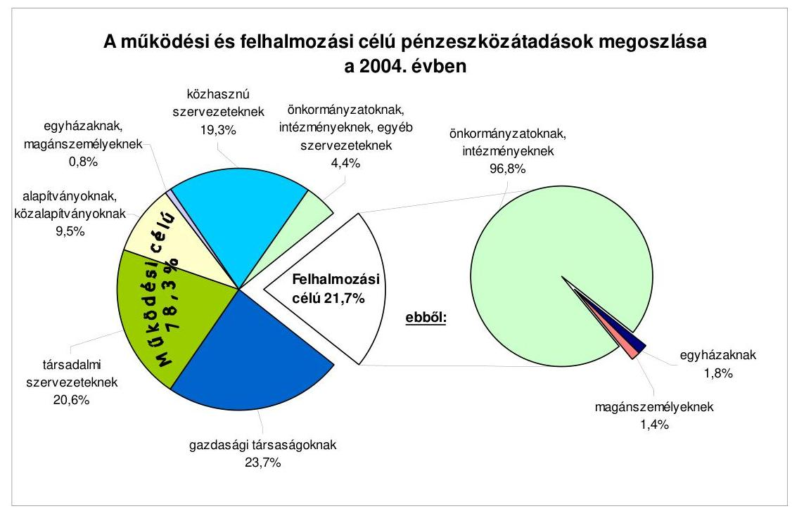
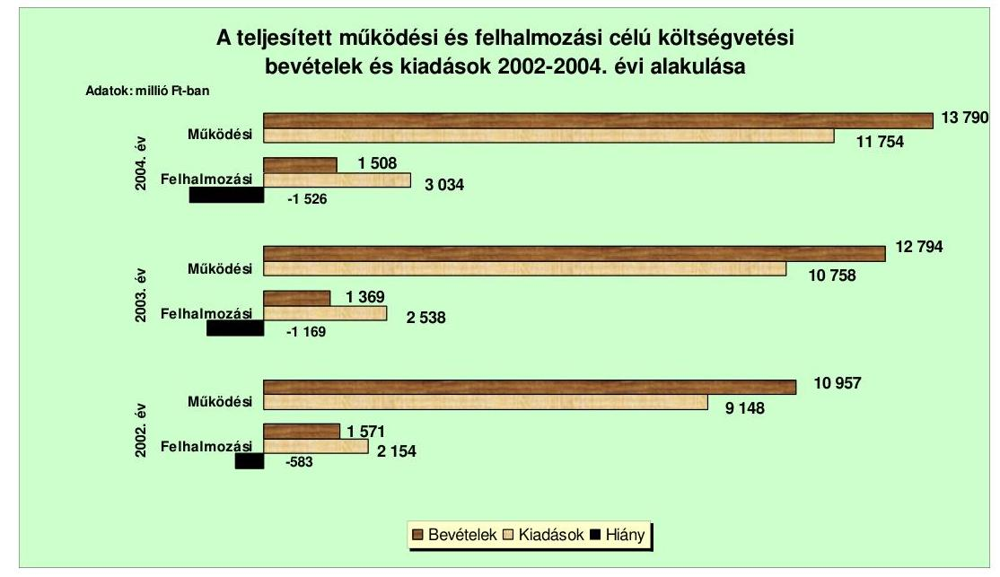
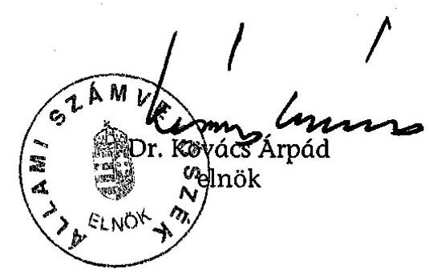
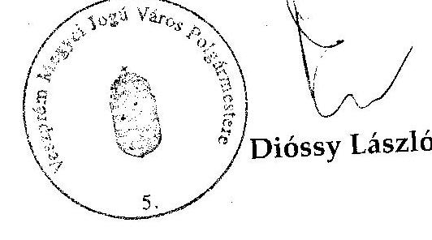

# JELENTÉS 

a Veszprém Megyei Jogú Város Önkormányzata gazdálkodási rendszerének átfogó ellenőrzéséről

---

3. Önkormányzati és Területi Ellenőrzési Igazgatóság
3.3 Átfogó Ellenőrzések Főcsoport
Iktatószám: V-1001-1/34/21/2005.
Témaszám: 749
Vizsgálat-azonosító szám: V0207
Az ellenőrzést felügyelte:
Dr. Lóránt Zoltán
főigazgató
Az ellenőrzés végrehajtásáért felelős:
Dr. Sepsey Tamás
főigazgató-helyettes
Az ellenőrzést vezette:
Csecserits Imréné
főcsoportfőnök-helyettes
Az ellenőrzést végezték:
Vasváriné dr. Rózsa Anikó
főtanácsadó
Komlósiné Bogár Éva
számvevő tanácsos
Szikszainé Király Mária
tanácsadó

# A témához kapcsolódó - az elmúlt négy évben készített - számvevőszéki jelentések: 

címe
sorszáma
Jelentés a helyi és a helyi kisebbségi önkormányzatok 0220 gazdálkodásának átfogó ellenőrzéséről
Jelentés a települési önkormányzatok szilárd hulladék- 0221 gazdálkodási feladatok ellátásának ellenőrzéséről
Jelentés a települési önkormányzatok szennyvízközmű fejlesztési és 0416 működtetési feladatai ellátásának ellenőrzéséről

---

# TARTALOMJEGYZÉK 

BEVEZETÉS ..... 5
I. ÖSSZEGZŐ MEGÁLLAPÍTÁSOK, KÖVETKEZTETÉSEK, JAVASLATOK ..... 7
II. RÉSZLETES MEGÁLLAPÍTÁSOK ..... 19

1. A költségvetés tervezésének, végrehajtásának, az Önkormányzat vagyongazdálkodásának és a zárszámadás elkészítésének szabályszerűsége ..... 19
1.1. A költségvetési rendelet jóváhagyásának, módosításának, az előirányzatok nyilvántartásának szabályszerűsége ..... 19
1.2. A gazdálkodás szabályozottsága, a bizonylati rend és fegyelem szabályszerűsége ..... 24
1.3. A pénzügyi-számviteli feladatok ellátásának informatikai támogatottsága ..... 35
1.4. Az önkormányzati vagyon nyilvántartása, számbavétele ..... 36
1.5. A vagyonnal való gazdálkodás szabályszerűsége, célszerűsége, nyilvánossága ..... 39
1.6. A céljelleggel nyújtott támogatások szabályszerűsége ..... 57
1.7. A közbeszerzési eljárások szabályszerűsége ..... 63
1.8. A zárszámadási kötelezettség teljesítésének szabályszerűsége ..... 68
1.9. A Polgármesteri hivatal helyi kisebbségi önkormányzatok gazdálkodását segítő tevékenysége ..... 71
2. Az önkormányzati feladatok és a rendelkezésre álló források összhangja ..... 73
2.1. A feladatok meghatározása és szervezeti keretei ..... 73
2.2. A költségvetés egyensúlyának helyzete ..... 77
2.3. A feladatok finanszírozása ..... 83
3. A belső irányítási, ellenőrzési rendszer működésének értékelése ..... 86
3.1. Az ellenőrzési rendszer kialakítása, működése ..... 86
3.2. A könyvvizsgálati kötelezettség teljesítése ..... 90
3.3. A korábbi számvevőszéki ellenőrzések javaslatainak hasznosulása ..... 91

---

# MELLÉKLETEK 

1. számú Az Önkormányzat gazdálkodását meghatározó adatok, mutatószámok (1 oldal)
2. számú Az önkormányzati vagyon nagyságának alakulása (1 oldal)
3. számú Az Önkormányzat 2004. évi bevételeinek és kiadásainak alakulása (1 oldal)
4. számú Egyes önkormányzati feladatok finanszírozása (1 oldal)
5. számú Helyszíni ellenőrzési jegyzőkönyv (4 oldal)
6. számú Dióssy László úr, a Veszprém Megyei Jogú Város Önkormányzata polgármesterének észrevétele (1 oldal)

---

# RÖVIDÍTÉSEK JEGYZÉKE 

| Áht. | az államháztartásról szóló 1992. évi XXXVIII. törvény |
| :--: | :--: |
| Art. | az adózás rendjéről szóló 1990. évi XCI. törvény |
| Art. | az adózás rendjéről szóló 2003. évi XCII. törvény |
| Fot. | a fogyatékos személyek jogairól és esélyegyenlőségük biztosításáról szóló 1998. évi XXVI. törvény |
| Hat. tv. | a helyi adókról szóló 1999. évi C. törvény |
| Htv. | a helyi önkormányzatok és szerveik, a köztársasági megbízottak, valamint egyes centrális alárendeltségű szervek feladat- és hatásköreiről szóló 1991. évi XX. törvény |
| Kbt. | a közbeszerzésekről szóló 1995. évi XL. törvény |
| Kbt. | a közbeszerzésekről szóló 2003. évi CXXIX. törvény |
| Ksztv. | a közhasznú szervezetekről szóló 1997. évi CLVI. törvény |
| Nek. tv. | a nemzeti és etnikai kisebbségek jogairól szóló 1993. évi LXXVII. törvény |
| Ötv. | a helyi önkormányzatokról szóló 1990. évi LXV. törvény |
| Ptk. | a Polgári Törvénykönyvről szóló 1959 évi IV. törvény |
| Számv. tv. | a számvitelről szóló 2000. évi C. törvény |
| Szoc. tv. | a szociális igazgatásról és szociális ellátásokról szóló 1993. évi III. törvény |
| Társulási tv. | a helyi önkormányzatok társulásáról és együttműködéséről szóló 1997. évi CXXXV. törvény |
| Ámr. | az államháztartás működési rendjéről szóló 217/1998. (XII. 30.) Korm. rendelet |
| Ber. | a költségvetési szervek belső ellenőrzéséről szóló 193/2003. (XI. 26.) Korm. rendelet |
| Vhr. | az államháztartás szervezetei beszámolási és könyvvezetési kötelezettségének sajátosságairól szóló 249/2000. (XII. 24.) Korm. rendelet |
| kisebbségi kormányrendelet | a kisebbségi önkormányzatok költségvetésének, gazdálkodásának, vagyonjuttatásának egyes kérdéseiről szóló 20/1995. (III. 3.) Korm. rendelet |
| ÁSZ | Állami Számvevőszék |
| Önkormányzat | Veszprém Megyei Jogú Város Önkormányzata |
| Közgyűlés | Veszprém Megyei Jogú Város Önkormányzat Közgyűlése |
| Polgármesteri hivatal | Veszprém Megyei Jogú Város Önkormányzatának Polgármesteri Hivatala |
| polgármester | Veszprém Megyei Jogú Város Önkormányzatának polgármestere |
| jegyző | Veszprém Megyei Jogú Város Önkormányzata jegyzője, címzetes főjegyző |
| SzMSz | Veszprém Megyei Jogú Város Önkormányzatának a 35/2002. (XI. 15.) számú rendelete a Veszprém Megyei Jogú Város Önkormányzata Szervezeti és Működési Szabályzata |

---

| hivatali SzMSz | Veszprém Megyei Jogú Város Önkormányzata Polgármesteri Hivatalának a Közgyűlés 3/2003 (II. 4.) számú határozatával elfogadott Szervezeti és Működési Szabályzata |
| :--: | :--: |
| vagyongazdálkodási   rendelet $_{1}$ | Veszprém Megyei Jogú Város Önkormányzatának 16/1993. (V. 26.) számú rendelete az önkormányzati vagyon hasznosításáról |
| vagyongazdálkodási   rendelet $_{2}$ | Veszprém Megyei Jogú Város Önkormányzatának 22/2005. (VI. 27.) számú rendelete az önkormányzat vagyonáról, a vagyongazdálkodás és vagyonhasznosítás szabályairól |
| KBM | Közbeszerzési Bíráló Munkacsoport |
| közbeszerzési szabályzat | a Közgyűlés 242/2004. (XI. 25.) számú határozatával jóváhagyott Veszprém Megyei Jogú Város Önkormányzatának közbeszerzési és beszerzési szabályzata, |
| közbeszerzési utasítás | 9/2003. (VIII. 15.) számú polgármesteri, jegyzői együttes utasítás a közbeszerzésekről szóló 1995. évi XL. törvény szabályai alapján, az önkormányzat által kiírt közbeszerzési eljárások rendjére. |
| ügyrend | 3/2000. (XI. 6.) számú polgármesteri-jegyzői együttes utasítás, a Polgármesteri hivatal ügyrendjéről |
| gazdasági ügyrend | Veszprém Megyei Jogú Város Önkormányzata Polgármesteri hivatalának a jegyző által 2004. január 1-jén kiadott ügyrendje |
| pénzkezelési szabályzat | Veszprém Megyei Jogú Város Önkormányzata Polgármesteri hivatalának a jegyző által 2001. január 1-jén kiadott pénz- és értékkezelési szabályzata |
| Gazdasági bizottság | Veszprém Megyei Jogú Város Önkormányzatának Gazdasági Bizottsága, 2002. október 27-e előtt Vagyongazdálkodási Bizottsága |
| Pénzügyi bizottság | Veszprém Megyei Jogú Város Önkormányzatának Pénzügyi és Költségvetési Bizottsága |
| Városfejlesztési bizottság | Veszprém Megyei Jogú Város Önkormányzatának Városfejlesztési és Környezetvédelmi Bizottsága |
| Pénzügyi iroda | Veszprém Megyei Jogú Város Önkormányzat Polgármesteri Hivatalának Pénzügyi Irodája |
| Bakonykarszt Rt. | Bakonykarszt Víz- és Csatornamű Részvénytársaság |
| Kommunális Rt. | Veszprémi Kommunális Részvénytársaság |
| Veszprém Rt. | Veszprém Városfejlesztési és Befektetési Részvénytársaság |

---

# JELENTÉS   a Veszprém Megyei Jogú Város Önkormányzata gazdálkodási rendszerének átfogó ellenőrzéséről 

## BEVEZETÉS

Az Ötv. 92. § (1) bekezdése, az Állami Számvevőszékről szóló 1989. évi XXXVIII. törvény 2. § (3) bekezdése, valamint az Áht. 120/A. § (1) bekezdése alapján az önkormányzatok gazdálkodását az ÁSZ ellenőrzi. Az ellenőrzés elvégzése az Országgyűlés illetékes bizottságai részére is átadott, országosan egységes ellenőrzési program alapján történt.

## Az ellenőrzés célja annak értékelése volt, hogy:

- az önkormányzati gazdálkodás törvényességét ${ }^{1}$, szabályszerűségét biztosították-e a tervezés, a költségvetés végrehajtása, a vagyongazdálkodás és a zárszámadás során;
- az Önkormányzat által ellátott feladatok és az azokhoz rendelkezésre álló források összhangja biztosított volt-e, különös tekintettel az egyes kiemelt feladatokra;
- a gazdálkodás szabályszerűségét biztosító kontrollok ${ }^{2}$ megfelelően segítették-e a végrehajtást.

Az ellenőrzött időszak: a 2004. év és a 2005. I. félév; az 1.5, 2.1-2.3 és a 3.3 ellenőrzési programpontok esetében a 2002-2003. évek is.

A település állandó lakosainak száma 2005. január 1-jén 58413 fő volt. A 27 képviselőből és a polgármesterből álló Közgyűlés munkáját nyolc állandó bizottság segítette. Az Önkormányzatnak a Polgármesteri hivatalon kívül a 2004. évben 11 önállóan és 30 részben önállóan gazdálkodó költségvetési intézménye volt. A 2002. évi önkormányzati választásokat követően a polgármester és a jegyző személye nem változott.

[^0]
[^0]:    ${ }^{1}$ A törvényi előírások betartásának elmulasztásakor a részletes megállapítások fejezetében egységesen a törvénysértő megjelölést alkalmazzuk, mivel az ÁSZ nem tehet különbséget a törvényi előírások között.
    ${ }^{2}$ A gazdálkodás szabályszerűségét biztosító kontroll alatt értjük a kiépített és működő belső irányítási és szabályozási rendszert, valamint a belső ellenőrzési funkciók ellátását.

---

A 2004. évben az Önkormányzat 15298 millió Ft költségvetési bevételből gazdálkodott, a 2005. évre 17125 millió Ft bevételt terveztek. A teljesített költségvetési kiadás a 2004. évben 14788 millió Ft, a könyvviteli mérlegben kimutatott önkormányzati vagyon értéke 2004. december 31-jén 59520 millió Ft volt. A 2005. január 1-jén a Polgármesteri hivatalban foglalkoztatott köztisztviselők száma 239 fő, az Önkormányzat által fenntartott költségvetési intézményekben 2438 fő látta el a különböző közszolgáltatási feladatokat.

Az Önkormányzatnál a 2002. évi önkormányzati választásokat követően öt kisebbségi önkormányzat (bolgár, cigány, lengyel, német és örmény) működött.

Az Önkormányzat 2004. évi gazdálkodását meghatározó adatokat az 1. számú melléklet mutatja be.

A jelentés megállapításainak, javaslatainak egyeztetése során a polgármester arról adott tájékoztatást, hogy az időközben megtett intézkedésekkel a javaslatok egy részét megvalósították. Ezekben az esetekben a jelentés II. Részletes megállapítások fejezetében az adott témához kapcsolt lábjegyzetben a megtett intézkedést feltüntettük és a kapcsolódó javaslatot elhagytuk.

[^0]
[^0]:    ${ }^{3}$ A 2004. évi költségvetési kiadás nem tartalmazza a hiteltörlesztést, valamint az egyéb finanszírozási jellegű kiadásokat.

---

# I. ÖSSZEGZŐ MEGÁLLAPÍTÁSOK, KÖVETKEZTETÉSEK, JAVASLATOK 

A Közgyűlés az Ötv. előírásainak megfelelve 2003. június 24-én elfogadta a 2003-2006. évekre vonatkozó gazdasági programját, melyben a ciklus feladatain túl stratégiai jellegű célokat is megfogalmaztak. A gazdasági program alkalmas volt az éves tervezőmunka megalapozására. A polgármester az Áht-ban előírt határidőket betartva terjesztette a Közgyűlés elé a 2004. és a 2005. évi költségvetési koncepciókat, azonban az Ámr. előírásaival ellentétben nem csatolta a költségvetési koncepciók előterjesztéséhez a Pénzügyi bizottság arról kialakított írásos véleményét. A Pénzügyi bizottság elnöke a Közgyűlés ülésein a napirend tárgyalásakor szóban ismertette a bizottság véleményét. A polgármester a kisebbségi önkormányzatokat a költségvetési koncepció tervezetéről tájékoztatta, arról a kisebbségi önkormányzatok írásos véleményt nem fogalmaztak meg. A 2004. és a 2005. évre vonatkozó költségvetési koncepciókat az Ámr. előírásainak megfelelően a helyben képződő bevételek és az ismert kötelezettségek figyelembe vételével állították össze, és azok tartalmazták a költségvetés készítésének további feladatait is.

A polgármester a 2004. és a 2005. évi költségvetés benyújtását megelőzően - a 2004. évben egy kivétellel - beterjesztette azokat a rendelettervezeteket, amelyek a költségvetés megalapozását biztosították. Az Áht-ban foglaltakat megsértve a 2004. és a 2005. évi költségvetési rendeletekben finanszírozási célú pénzügyi műveleteket vettek figyelembe költségvetési bevételként és kiadásként, valamint a tervezett hiányt nem mutatták be. A költségvetési rendelettervezethez nem csatolta a polgármester a Pénzügyi bizottság írásos véleményét, arról a Pénzügyi bizottság elnöke a Közgyűlésen szóban adott tájékoztatást. A költségvetés előterjesztésekor az Áht-ban előírt mérlegeket és kimutatásokat - a közvetett támogatások kivételével - bemutatták, annak ellenére, hogy azok tartalmi követelményeit az Áht. előírása ellenére rendeletben nem határozták meg. A költségvetés előterjesztésekor bemutatták továbbá tájékoztatásul a többéves kihatással járó döntések összesítését, de elmaradt annak szöveges indoklása az Áht. előírása ellenére, valamint elmaradt a
 közvetett támogatások bemutatása és annak szöveges indoklása is. A felújítási előirányzatokat célonként meghatározták, de a felhalmozási kiadások feladatonkénti bemutatása közül az Ámr. előírásai ellenére elmaradt a Polgármesteri hivatal és az intézmények eszközbeszerzéseinek részletezése. Az Ámr. előírása ellenére a költségvetési rendeletben elkülönítetten nem mutatták be a Közgyűlésnek az európai uniós támogatással megvalósuló projektek pénzügyi tervét.

A 2004. és a 2005. évi költségvetésekben szociális, oktatási, turisztikai, intervenciós, kohéziós, civil, és pályázati alap elnevezéssel kiadási előirányzatokat határoztak meg. Az alapként történő elnevezés - a környezetvédelmi alap kivételével - nem felel meg az Áht-ben meghatározott feltételeknek, a kifejezés félreérthető. A költségvetés végrehajtási szabályokat a költségvetési rendeletben, az SzMSz-ben és a vagyongazdálkodási rendeletekben szerepeltették. A Közgyűlés az Áht. alapján mindkét évben a tárgyévi utolsó ülésén az átmeneti gazdálkodásról rendeletet fogadott el, amelyben lehetővé tette a polgár-

---

mester számára, hogy az azt követően érkező központi támogatások összegével az előirányzatokat megemelje, illetve jóváhagyja az intézmények előirányzat-átcsoportosításra vonatkozó kérelmeit. A polgármesteri hatáskörben végrehajtott előirányzat-módosítások esetében elmaradt a költségvetési rendelet Közgyűlés által történő módosítása, amely ellentétes az Áht-val.

Év közben az eredeti előirányzathoz képest a bevételi előirányzatokat 6,9%-kal, a kiadási előirányzatokat 9,5%-kal növelték. Az előirányzat-módosítások nyilvántartása - a kisebbségi önkormányzatok kivételével - az Áht. előírásainak megfelelt. Az Áht. és az Ámr. előírásai ellenére három kisebbségi önkormányzatnál a bevételi és kiadási előirányzatok évközi módosítása nem történt meg.

A Polgármesteri hivatal az Ámr. előírásainak megfelelően SzMSz-szel rendelkezett. Az operatív gazdálkodással kapcsolatos hatáskörök gyakorlására vonatkozó szabályokat a gazdasági ügyrendben, a hatáskörök gyakorlására feljogosított személyeket polgármesteri, valamint jegyzői utasításokban határozták meg. A jegyző a szakmai teljesítés igazolás módját meghatározta, az igazolásra jogosult személyek kijelölése az Ámr. előírásai ellenére nem történt meg. A jegyző az érvényesítési feladatokra történő megbízásnál az iskolai végzettségre és szakmai képesítésre vonatkozó követelményeket figyelembe vette, de a számviteli csoportvezető-helyettesítését végző, az ügyrend szerint érvényesítési feladattal megbízott pénzügyi munkatárs megbízása az Ámr. előírása ellenére elmaradt. A kisebbségi önkormányzatokra vonatkozóan is hiányzott az érvényesítői feladatokat ellátó személy meghatározása, valamint írásbeli megbízása. Indokoltsága ellenére a polgármestert és a jegyzőt megillető gazdálkodási és ellenőrzési jogokat gyakorló személyek beszámoltatásának rendjét nem szabályozták, és arról a felhatalmazottak nem számoltak be.

A jegyző a 2005. év szeptemberében intézkedett az intézmények egységes számviteli rendjének kialakítása érdekében. A Polgármesteri hivatalra vonatkozóan elkészítették a számviteli politikát és a kapcsolódó szabályzatokat. A számviteli politikában a Vhr-ben előírtak ellenére nem szabályozták a beszerzett, illetve előállított immateriális jószág, tárgyi eszköz üzembehelyezése dokumentálásának szabályait. Nem tartalmazta a leltározási szabályzat a Vhr. előírásai ellenére az üzemeltetésre, kezelésre átadott eszközök leltározásának módját. A szabályozás hiánya ellenére az üzemeltetésre átadott eszközök leltározási kötelezettségét az üzemeltetésre történő átadásról szóló szerződésekben rögzítették. Az eszközök és források értékelési szabályzatában 2005. január 1-jétől előírták az egyszerűsített értékelési eljárás alkalmazását a helyi adóknál és adó módjára behajtható köztartozásoknál annak ellenére, hogy az értékvesztési kulcsok meghatározásához a Vhr. előírásának megfelelő tapasztalati adatok nem álltak rendelkezésre. A követelések besorolásának elveit szabályozták, nem határozták meg azonban a szabályzatban az elszámolt értékvesztés dokumentálásának szabályait. A pénzkezelési szabályzat indokoltsága ellenére nem tartalmazta az OTP ügyfélterminál használatának részletes szabályait, valamint az önkormányzati környezetvédelmi alap pénzeszközeinek elkülönítésére szolgáló számla, a letéti számla számát, valamint ezek és helyi adószámlák, valamint a kisebbségi önkormányzatok számlái felett rendelkezésre jogosultak megnevezését. A számlarend részletesen tartalmazta a havi és a negyedéves egyeztetési feladatokat, a havi, negyedéves, féléves, éves zárlati előírásokat és módszereket, de a feladatok elvégzésének ellenőrzési lehe-

---

tőségét nem biztosították, mert az egyeztetések dokumentálási módját a Vhr. 2005. évtől hatályos előírása ellenére nem rögzítették.

A szabályzatokban és a munkaköri leírásokban nem rögzítették az elvégzendő tevékenységet megelőző folyamat ellenőrzési feladatait, az ellenőrzési pontokat. Nem tartalmazta a dolgozók munkaköri leírása a felhatalmazások alapján gyakorolható gazdálkodási jogköröket. A Polgármesteri hivatal SzMSz mellékletét képező ellenőrzési nyomvonalát a jegyző elkészítette és 2005. május 1-jétől hatályba léptette.

A Polgármesteri hivatal számviteli politikája figyelmen kívül hagyva a Vhr. előírásait, a pénzkezelési szabályzat és a számlarend kivételével nem tartalmazta a kisebbségi önkormányzatok gazdálkodásával összefüggő sajátos feladatokat.

A főkönyvi számlákhoz analitikus nyilvántartásokat vezettek, azok főkönyvi könyveléssel való egyeztetését elvégezték. A költségvetési pénzforgalmat érintő gazdasági események bizonylatainak adatait a számviteli nyilvántartásban a Vhr-ben előírtaknak megfelelő időben rögzítették. A számviteli bizonylatokon a könyvviteli rögzítés időpontját nem tüntették fel, ezzel megsértették a Számv. tv-ben foglaltakat. A bizonylatok nem feleltek meg az Ámr-ben meghatározott alaki és tartalmi követelményeknek sem, mivel nem tartalmazták a szakmai teljesítés igazolását, a nem termékértékesítés és szolgáltatásnyújtásból származó bevételeknél elmaradt az utalványozás, ellenjegyezés és érvényesítés. Az Ámr-ben foglaltak ellenére a bizonylatok 41%-ánál elmaradt az utalványozás, és 13%-ánál az utalványozás ellenjegyzője nem teljesítette a feladatát. A bizonylatok több mint kétharmadánál az utalványrendelet az Ámr. előírása ellenére nem tartalmazta a kötelezettségvállalás nyilvántartásba vételének sorszámát. Új kötelezettségvállalás-nyilvántartási rendszert vezettek be 2005. július 1-jétől, amely alkalmas az Ámr-ben megfogalmazott követelmények teljesítésére. A számviteli csoportvezető-helyettesítő megbízás nélkül végezte érvényesítési feladatait.

A pénzkezelési szabályzatban foglaltakkal ellentétben az előlegek nyilvántartásában a 2005. évben (szeptember 30-ig) a kiadott előlegek 27%-ánál nem rögzítették az elszámolási határidőt, és a 2005. évben a felvett előlegek 4%-ával az érintettek a hónap utolsó napjáig nem számoltak el.

A bizonylatokban foglalt gazdasági események könyvviteli elszámolása során a Vhr. előírásaival ellentétesen aktív és passzív kiegyenlítő elszámolások helyett végleges költségvetési bevételként és kiadásként számolták el a költségvetési számla és a programfinanszírozási alszámlák közötti pénzmozgásokat. Emiatt a 2004. évi költségvetési beszámoló pénzforgalmi jelentésében kimutatott bevételi és kiadási adatokban 196 millió Ft halmozódás keletkezett. A terven felüli értékcsökkenés-számla helyett a Vhr. és a helyi számviteli politika előírásai ellenére a tárgyi eszközöknél is az értékvesztések elszámolására vonatkozó számlákat használták. A Vhr. előírásait figyelmen kívül hagyva a fejlesztési feladatokhoz kapcsolódó hitelek után fizetett kamatokat nem kamatkiadásként, hanem beruházási kiadásként számolták el. Az önkormányzati bérlakás-értékesítés kapcsán befolyt bevételből képzett lakásalap-számla céltól eltérő felhasználása miatti visszapótlási kötelezettséget a Vhr. rendelkezései elle-

---

nére a könyvviteli mérlegben szerepeltették, és a Számv. tv. előírásával ellentétesen peresített kötbérigényt is kimutattak a 2004. évi könyvviteli mérlegben. A Polgármesteri hivatalban a kötelezettségvállalásokról rendelkeztek nyilvántartással, de abból az Ámr. előírása ellenére nem volt megállapítható a 2004. és a 2005. évi kötelezettségvállalás, illetőleg a kötelezettségvállalással nem terhelt előirányzatok mértéke. Az 50 ezer Ft alatti - előzetes írásbeli kötelezettségvállalást nem igénylő - kötelezettségek nyilvántartásának rendszerét nem alakították ki, ezeket a teljesítéseket a kötelezettségvállalási nyilvántartásban sem rögzítették.

Önkormányzati szinten a 2004. évben túllépték a kiemelt kiadási előirányzatok közül 33%-kal az ellátottak pénzbeli juttatásait, 4%-kal a pénzeszközátadások előirányzatát. A költségvetési szervek negyede - a kiadási főösszeget betartva - a dologi-felhalmozási kiemelt előirányzatát lépte túl 1-25%-kal, megsértve az Áht. előírását. Az előirányzat-túllépések okait az intézményeknél túlfinanszírozás esetén vizsgálták, felelősségre vonás egy esetben történt, a Polgármesteri hivatalnál jelentkező előirányzat-túllépések okait nem vizsgálták, felelősségre vonás nem történt.

A Polgármesteri hivatal pénzügyi-számviteli feladatainak ellátása során az analitikus nyilvántartások mintegy felét manuális módon vezették. Ezen a területen a 2004. évben nem volt fejlesztés, a 2005. évtől EU támogatással új informatikai rendszer kiépítése kezdődött a Polgármesteri hivatalban, amely érinti a pénzügyi és számviteli feladatok ellátását is. A Közgyűlés a 2004. évben fogadta el a Polgármesteri hivatal informatikai stratégiáját. Katasztrófa-elhárítási tervvel, a programok üzemeltetési dokumentációjával nem rendelkezett a Polgármesteri hivatal, a hozzáférési jogosultsági rendszert nem szabályozták. A pénzügyi-számviteli területen dolgozók az alkalmazott programok használatához szükséges informatikai ismeretekkel rendelkeztek, azonban a munkaköri leírások az informatikai feladatok ellátását nem tartalmazták.

A Polgármesteri hivatalban az Önkormányzat vagyontárgyainak nyilvántartásáról és abban a forgalomképesség szerinti elkülönítésről gondoskodtak, azonban 2088 millió Ft üzemeltetésre átadott eszközt (víziközmű vagyont) nem tartalmaztak az üzemeltetőkkel kötött szerződések. A 2004. évi leltározáshoz készített utasítás és a leltárak nem feleltek meg a Vhr, valamint a leltározási és a leltárkészítési szabályzat előírásainak, mivel az előírt mennyiségi leltározás helyett az analitikus nyilvántartásokkal történt egyeztetéssel, szervezeti egységenként készített kimutatással támasztották alá év végén a tárgyi eszközök mérlegben szerepeltetett értékét. Nem történt meg a 2004. év végén az adott kölcsönként nyilvántartott követelések, és az egyéb hosszú lejáratú követelések minősítése, értékelése, a Vhr-ben előírtak ellenére el nem ismert kötbérkövetelésnél is elszámoltak értékvesztést.

Az Önkormányzat a vagyonnal való gazdálkodás szabályait, a rendelkezési, döntési jogköröket rendeletekben meghatározta. A Közgyűlés értékhatárhoz, vagyoncsoporthoz kötötten vagyongazdálkodási jogkört biztosított a Gazdasági, és a Pénzügyi bizottság, valamint a polgármester részére. A Városfejlesztési bizottság az ingatlanhasznosítások esetében egyetértési jogot kapott. A vagyongazdálkodási rendelet ₂ a vagyonkimutatás tartalmát a könyvviteli mérlegben szerepeltetett adatokkal összhangban határozta meg, ami nem felel

---

meg a Vhr. 2005. január 1-től hatályos előírásainak, mivel nem írták elő a vagyonkimutatás részeként az önkormányzati tulajdont képező, érték nélkül nyilvántartott eszközök, valamint a kezesség-, garanciavállalással kapcsolatos függő kötelezettségek bemutatását. Az Önkormányzat a vagyongazdálkodási rendelet ₁-ben az ingatlanvagyon hasznosításának módjaként a nyilvános pályáztatási kötelezettséget határozott meg. A vagyongazdálkodási rendelet ₂-ben a fő szabálytól eltérően az Áht-ban foglaltakat megsértve a nyilvános pályázati eljárás (versenytárgyalás) nélküli elidegenítés eseteit is rögzítették. A szabályozás nem segítette a közvagyonnal való gazdálkodás nyilvánosságát, átláthatóságát. Az Áht. előírásait megsértve nem szabályozták a követelésekről történő lemondás módját és eseteit, a vagyontárgyak tulajdonjogának ingyenes átruházási módját 2005. július 1-jétől nem szabályozták.

Az Önkormányzatnál az Áht. előírásait megsértve és a belső szabályozás ellenére 2004. december 1-ig nem tettek eleget a fejlesztési támogatások és az Áht-ban meghatározott értékhatár feletti építési, szolgáltatás-megrendelési szerződések közzétételre vonatkozó kötelezettségnek. Az adatok nyilvánosságra hozatala érdekében módosították a belső szabályozást, amelynek alapján a 2004. év december 1-jétől megkötött szerződések adatainak közzététele megtörtént.

Az önkormányzati vagyontárgyak elidegenítése során (három forgalomképes ingatlan és 11, a forgalomképtelen törzsvagyonba tartozó ingatlan kivételével) betartották a Közgyűlés által meghatározott hatásköri előírásokat, az elidegenítésekről az arra jogosultak döntöttek. Négy forgalomképes, valamint a forgalomképtelen ingatlanokat a vagyongazdálkodási rendelet ₁ előírásai ellenére forgalmi értékbecslés nélkül értékesítettek, két ingatlant pályáztatás nélkül idegenítettek el. A forgalomképtelen törzsvagyoni körbe sorolt ingatlanok esetében fennállt az elidegenítési tilalom, amelyek elidegenítésével megértették az Ötv. előírásait. A jegyző felelős azért, mert a 2002-2004. első félév közötti időszakban az útként és közterületként nyilvántartott forgalomképtelen ingatlanok elidegenítését megelőzően nem alakította ki és nem működtette a szabályozás olyan rendszerét, amely biztosította volna a Gazdasági bizottsági előterjesztések, döntések jogszabályszerűségének felelős ellenőrzését. A forgalomképes ingatlanok értékesítésre kötött szerződések és a
 nem lakás céljára szolgáló helyiségekre kötött bérleti szerződések tartalmaztak az önkormányzati vagyon értékének megőrzését biztosító garanciális elemeket. Az átmenetileg szabad pénzeszközök forgatási célú befektetéséről az SzMSz-ben rögzítettek ellenére nem a polgármester, hanem az arra hatáskörrel nem rendelkezők, a Pénzügyi Iroda vezetői döntöttek. Az Önkormányzat a pártok részére, az általuk használt irodahelyiség bérleti díjában jelentős kedvezményeket biztosított, ezzel közvetett támogatást nyújtott részükre, így nem tett eleget az Ötv. előírásainak, valamint nem biztosította az alkotmányos egyenlőséget a bérlők között. A 2002–2004. években a helyi szabályozásnak megfelelően 54,6 millió Ft-ban nyilvántartott eszköz selejtezése történt meg. A 2002–2004. években az év elején fennálló követelésállomány 1,4%-ának, 15,7 millió Ft követelésnek a törlése történt meg. Az önkormányzati vagyon ingyenes átadása öt esetben az Áht. előírásaival ellentétben nem az Önkormányzat rendeletében szabályozott esetben és módon történt.

Az Önkormányzat a 2004. évben 254 szervezet részére 648 millió Ft céljellegű működési, illetve fejlesztési célú támogatást nyújtott. Az Önkormány-

---

zatnál a támogatás jóváhagyásával, nyilvántartásával, a célszerinti felhasználás ellenőrzésével kapcsolatos egységes, átfogó jellegű szabályozás nem készült. Három támogatási részterületre készítettek egyedi szabályozást. A számadás ellenőrzésének módját, felelőseit polgármesteri-jegyzői együttes utasításban szabályozták, amely azonban nem tartalmazta az ellenőrzést végzők feladatait. A támogatási megállapodásokban a támogatás célját nem határozták meg, a támogatottak 2,3%-ánál számadási kötelezettséget nem írtak elő, megsértve ezzel az Áht. előírásait. Három esetben a polgármester alapítványoknak közgyűlési döntés nélkül nyújtott támogatást, amivel megsértette az Ötv. előírását. A számadási kötelezettségének a támogatottak közel 10%-a nem tett eleget, ennek pótlására, illetve a támogatás visszafizettetésére a Polgármesteri hivatal nem intézkedett, megsértve ezzel az Áht. előírásait. A számadások ellenőrzését végző irodavezetők a feladatok megvalósulását vizsgálták, a pénzügyi elszámolásoknak az összegszerűségét ellenőrizték, ami nem terjedt ki a benyújtott számlák formai és tartalmi vizsgálatára. A támogatások felhasználását az Áht. előírásait megsértve nem ellenőrizték. Egy alapítványnak biztosított támogatás számadásához benyújtott számlák – egy kivételével – nem igazolták a támogatott céllal való közvetlen kapcsolatot, a 100 000 Ft támogatásból a célszerinti felhasználás 6019 Ft esetében valósult meg. A Polgármesteri hivatal a számadást és a támogatás rendeltetésszerű felhasználását az Áht. előírásait megsértve nem ellenőrizte, a rendeltetési céltól eltérően felhasznált támogatás visszafizetésére nem intézkedett.

Az Önkormányzat polgármesteri-jegyzői együttes utasításban szabályozta a közbeszerzési eljárások rendjét a Kbt. ${ }_{1}$ előírása ellenére, amely rendeleti szabályozást írt elő. A Kbt. ${ }_{2}$ hatálybalépését követően a Közgyűlés által jóváhagyott közbeszerzési szabályzatban határozták meg a közbeszerzések rendjét. A 2004. évben, a Kbt. ${ }_{2}$ hatálybalépéséig 10 nemzeti értékhatárt meghaladó közbeszerzési eljárást folytattak le. A közbeszerzési eljárásoknál az ajánlatok bontása, értékelése, elbírálása, valamint a szerződéskötés során betartották a Kbt. ${ }_{1}$ előírásait. A KBM megfelelő szakértelemmel rendelkező állandó és külső szakértő tagjainak összeférhetetlenségét két közbeszerzési eljárásnál dokumentáltan nem vizsgálta az ajánlatkérő, a Kbt. ${ }_{1}$ előírása ellenére.

A költségvetéssel összehasonlítható módon elkészített zárszámadási rendelettervezetet a polgármester az előírt határidőn belül terjesztette a Közgyűlés elé. A zárszámadási rendelet előterjesztésekor az Áht. előírása ellenére nem mutatták be szöveges indoklással a többéves kihatással járó döntések számszerűsítését éves bontásban, és összesítve, valamint a közvetett támogatásokat tartalmazó kimutatásokat. Az Ámr-ben foglaltak ellenére elmulasztották az európai uniós projektek bevételeinek és kiadásainak elkülönített bemutatását, valamint nem részletezték feladatonként a felhalmozási célú kiadások közül a Polgármesteri hivatal és az intézmények eszközbeszerzéseit. Az intézményeket az Ámr. előírása ellenére éves számszaki beszámolójuk elfogadásáról és működésük elbírálásáról írásban nem értesítették. A zárszámadásban és a költségvetési beszámolóban szerepeltetett költségvetési bevételi és kiadási adatok a Vhr. előírásaival ellentétes számviteli elszámolások következtében eltértek egymástól. Az Önkormányzat pénzmaradványát az Ámr. előírásainak megfelelően hagyta jóvá a Közgyűlés, de a Vhr. előírásaival ellentétesen tárgyévi pénzmaradványként tüntették fel az előző években képzett fel nem használt pénzmaradvány összegét is. Az Önkormányzat a kisebbségi önkormányzatok zárszá-

---

madását és pénzmaradványát az Ámr. előírásai ellenére, erre vonatkozó határozatok hiányában – a számviteli nyilvántartás adatai alapján – építette be zárszámadási rendeletébe.

Az Önkormányzat az Ámr. által előírt határidőt követően kötötte meg az együttműködési megállapodásokat a kisebbségi önkormányzatokkal. A megállapodások, ellentétben az Ámr. előírásaival, a költségvetési előirányzatok módosításával és a zárszámadással kapcsolatos határidőket nem tartalmazták, a határozattervezetek előkészítését nem a jegyző feladataként határozták meg. A jegyző a kisebbségi önkormányzatok esetében nem határozta meg a szakmai teljesítés igazolásának módját, és az azt végző személyeket, így nem tett eleget az Ámr. előírásainak. A kisebbségi önkormányzatok számviteli nyilvántartásainak elkülönített vezetését biztosították. A kisebbségi önkormányzatok előirányzatainak alakulásáról és a kötelezettségvállalásokról analitikus nyilvántartást nem vezettek, amivel megsértették az Áht. és az Ámr. előírásait. A kisebbségi önkormányzatok testületi működésének feltételeit az Önkormányzat biztosította. Az örmény kisebbségi önkormányzat helyiséghasználata nem rendezett, mivel az Önkormányzat által biztosított helyiséget, – amelyet a Gazdasági bizottság döntése alapján megvásárolt a kisebbségi önkormányzat elnökének családi vállalkozása, – egy utazási irodának bérbe adták, abban – az adásvételi szerződésben foglaltak ellenére – nem biztosították az örmény kisebbségi önkormányzat működését.

Az Önkormányzat az Ötv. előírásai ellenére nem határozta meg, hogy a lakosság igényeitől és az anyagi lehetőségeitől függően mely feladatokat milyen mértékben és módon lát el. Az önkormányzati feladatok ellátását elsősorban az Önkormányzat által alapított 41 intézmény és a Polgármesteri hivatal útján biztosították. Közszolgáltatásokat nyújtott két olyan gazdasági társaság is, amelyekben az Önkormányzatnak 38, illetve 90%-os tulajdoni részesedése van. A legnagyobb volumenű feladatot a közoktatás jelentette, ezen a területen működött az összes intézmény kétharmada. A szociális, a gyermekjóléti és gyermekvédelmi szakellátások, valamint az egészségügyi alapellátás szervezeti megoldásában nem volt változás a védőnői szolgálat kivételével, amelynél 2005. június 1-jével történt átszervezés. Az Önkormányzat a 2002–2004. években egy gazdasági társaság alapításában vett részt és egy közhasznú társaságba való belépésről döntött. Az Önkormányzat az általa alapított közalapítványok számát a 2002. évhez képest kettővel csökkentette, mivel az alapító okiratokban rögzített célokat más módon kívánta megoldani.

Az Önkormányzat a 2002–2004. években költségvetését tartós forráshiánnyal tervezte. A költségvetés egyensúlyát hitel tervezésével biztosították. A tervezett hiányt mindhárom évben a felhalmozási célú bevételeknél magasabb összegű fejlesztési kiadási igény okozta. A hiányzó forrásra fedezetet a fejlesztési célú hitelek, illetve a helyi adóbevételeket is tartalmazó működési célú bevételek adtak. A működési célú költségvetési bevételek minden évben fedezetet nyújtottak a működési célú költségvetési kiadásokra. A pénzállomány alakulásáról havonta készített a jegyző likviditási tervet, azonban a fizetőképesség fenntartása érdekében év közben folyószámlahitel felvétel vált szükségessé. A likvid hitelt év végén nem fizették vissza, az utolsó banki napon történt likvid hitelfelvétellel kimerítették a 2004. évre jóváhagyott hitelkeretet. Az Önkormányzatnál a likviditás biztosításához nem volt szükség az év végén a folyó-

---

számlahitel felvételére. A hitel felvételével egyidejűleg a folyószámlán lévő szabad pénzeszközöket lekötötték.

Az Önkormányzatnál az összes költségvetési kiadáson belül a működési kiadások részaránya a vizsgált időszak éveiben 80–81%-os volt. Az adósságot keletkeztető kötelezettségvállalásoknál az Ötv-ben előírt korlátot betartották. Az Önkormányzat iparűzési-, építmény-, idegenforgalmi- és a magánszemélyek kommunális adó bevételeinek aránya a költségvetési bevételhez viszonyítva a 2004. évben 23,4% volt. Az adózók részére a helyi adókról szóló törvényben meghatározottakon túlmenően is állapítottak meg mentességeket, kedvezményeket.

A kötelező feladatok finanszírozásában az állami hozzájárulások, támogatások aránya a 2002. évhez képest a 2004. évre a bölcsődei, általános iskolai, a nappali szociális intézményi, valamint a bentlakásos szociális intézményi ellátásnál emelkedett, az óvodai, és a középiskolai ellátásoknál csökkent. Az óvodai ellátásnál nem változott az intézményi bevételek aránya a 2004. évben a 2002. évhez viszonyítva, a középiskolai oktatásnál az állami támogatás arányának csökkenése mellett az intézményi bevételek aránya is csökkent. Az önként vállalt feladatok finanszírozására az éves költségvetési kiadások átlag 5%-át fordították, amelyek ellátása nem veszélyeztette a kötelező feladatok elvégzését. A fogyatékos személyek jogairól és esélyegyenlőségéről szóló törvény végrehajtásához szükséges feladatokat felmérték, amely szerint a középületek akadálymentessé tételéhez 1791 millió Ft szükséges. Az Önkormányzat a fogyatékos személyek jogairól és esélyegyenlőségük biztosításáról szóló törvényben előírtak ellenére a középületek akadálymentessé tételét 2005. január 1-jéig a középületek egyharmadánál nem biztosította.

Az Önkormányzat az Ötv. által feladatkörébe utalt ellenőrzések végrehajtásához szükséges szervezeti kereteket kialakította, 2005. március 1-től létrehozta a Belső ellenőrzési egységet. Ezen időpontig az Áht. előírásait megsértve, illetve a Ber. előírása ellenére az intézmények pénzügyi-gazdasági és a Polgármesteri hivatal belső ellenőrzését ellátó személyek szervezeti és feladatköri függetlenségét a jegyző nem biztosította. A Belső ellenőrzési egység vezetője elkészítette a belső ellenőrzési kézikönyvet, a stratégiai, középtávú és éves ellenőrzési terveket. A 2004. évi ellenőrzési terv jóváhagyása a Ber. előírása ellenére nem a jegyző által történt, a 2005. évit a jegyző jóváhagyása után tájékoztatásul beterjesztették a Közgyűlésnek. Az ellenőrzési tervek tartalma egyik évben sem felelt meg a Ber. előírásainak, mivel nem tartalmazták az ellenőrzés tárgyát, módszereit, a Ber. által meghatározott elemzéseket. A 2004. évre tervezett ellenőrzéseket valamennyi intézménynél elvégezték, a Polgármesteri hivatal belső ellenőrzési munkatervében jóváhagyott ellenőrzési feladatokat teljesítették. A terven felül végzett pénzügyi szabályszerűségi, valamint az utóvizsgálatokhoz ellenőrzési programot, a Ber. előírása ellenére nem készítettek.

Az ellenőrzésekről készített jelentések az ellenőrzési programban foglaltaknak megfelelően, javaslatokat megfogalmazva készültek, de nem tartalmazták a Ber. által előírt valamennyi tartalmi kellékeket, így az ellenőrzést végző szerv megnevezését, a jogszabályi felhatalmazás megjelölését, a helyszíni ellenőrzés kezdetét és végét, az ellenőrzött szerv ellenőrzött időszakban hivatalban lévő vezetőinek nevét, beosztását. Ezen hiányosságokat a 2005. évi rendszerellenőrzésekről készített jelentésekben megszüntették. A 2004. évi intézményi ellenőrzés egy esetben felelősségre vonásra tett javaslatot az önkormányzati vagyon gondatlan kezelése, nyilvántartási hiányosságok miatt, a Közgyűlés az intézmény vezetőjének elbocsátásáról döntött. A Közgyűlés a jegyző előterjesztése alapján évente áttekintette az intézményeknél végzett ellenőrzések tapasztalatait, azonban az előterjesztés az Áht. és a Htv. előírása ellenére nem tartalmazta a Polgármesteri hivatal belső ellenőrzésének a tapasztalatait. A Közgyűlés az előterjesztésben foglaltakat tudomásul vette, követelményeket, elvárásokat nem fogalmazott meg.

Az Önkormányzat a törvényben előírt könyvvizsgálati kötelezettségét költségvetési minősítésű könyvvizsgálóval teljesítette. A könyvvizsgáló az éves költségvetések rendelettervezeteinek véleményezését elvégezte. A 2004. évi egyszerűsített költségvetési beszámolót korlátozás nélküli hitelesítő záradékkal látta el, auditálási eltérést nem állapított meg.

A korábbi számvevőszéki vizsgálatok az Önkormányzat gazdálkodásának átfogó, a köztisztasági, valamint a hulladékgazdálkodási, a szennyvízközmű fejlesztési és működtetési feladatok ellátásának ellenőrzésére irányultak. Az ellenőrzések javaslatainak felét teljes mértékben, ötödét részben hajtották végre, amelyek eredményeként javult a feladatellátás törvényessége és szabályozottsága. Nem valósult meg a segélyek kifizetéséhez az utalványrendelet készítése, a pénzmaradvány felhasználásának szabályozása. Az önkormányzati bérlakás értékesítés bevételeiből képzett lakásalap számláról igénybevett összeget a Vhr-ben foglaltakkal
 ellentétesen továbbra is szerepeltették az Önkormányzat könyvviteli mérlegében, nem mutatták be a zárszámadás előterjesztésekor a közvetett támogatásokról készített kimutatást, valamint a többéves kihatással járó döntéseket. Nem határozták meg az önként vállalt feladatok körét és azok ellátásának módját, valamint az üzemeltetésre átadott eszközök leltározásának részletes szabályait. Elkészítették az Önkormányzat gazdasági programját, az értékpapírokról analitikus nyilvántartást vezettek, a zárszámadáshoz kapcsolódóan készítettek vagyonkimutatást.

A helyszíni ellenőrzés megállapításainak hasznosítása mellett javasoljuk:

# a polgármesternek 

a jogszabályi előírások maradéktalan betartása érdekében

1. a költségvetési gazdálkodás jogszerű kereteinek kialakítása céljából terjessze a Közgyűlés elé - a jegyző által készített előterjesztés alapján - az Áht. 118. §-ában előírt, a 116. § 6., 9. és 10. pontja szerinti mérlegek, kimutatások tartalmának meghatározásáról szóló rendelettervezetet;
2. csatolja a Pénzügyi bizottság véleményét a költségvetési koncepció előterjesztéséhez az Ámr. 28. § (3) bekezdésének megfelelően, valamint a költségvetési rendelet tervezethez az Ámr. 29. § (9) bekezdése alapján;
3. intézkedjen annak érdekében, hogy a részben önálló intézmények is az Áht. 93. § (1) bekezdése szerinti jóváhagyott előirányzaton belül gazdálkodjanak, valamint az intézmények tartsák be az Áht. 12/A. § (1) bekezdésében foglaltakat, amely szerint

---

tárgyévi fizetési kötelezettség a jóváhagyott előirányzat mértékéig vállalható, a túlfinanszírozás nélküli előirányzat túllépések esetén is vizsgálja ki annak okait, és indokolt esetben kezdeményezzen felelősségre vonást;
4. gondoskodjon a középületek akadálymentessé tételéről, tekintettel a Fot. 29. § (6) bekezdésében előírtakra;
5. biztosítsa, hogy a $\mathrm{Kbt}_{2}$ 10. § (7) bekezdésben előírtaknak megfelelően a közbeszerzési eljárásban az Önkormányzat nevében eljáró személyek írásban nyilatkozzanak, hogy velük szemben nem áll fenn összeférhetetlenség;
6. intézkedjen, az Ötv. 78. § (1) bekezdésében előírtak érvényre juttatása érdekében arról, hogy a pártok részére megállapított helyiségek bérleti díja összhangba kerüljön az Önkormányzat által hasonló adottságú nem lakás céljára szolgáló helyiségek esetében kialakított bérleti díjjal;
a munka színvonalának javítása érdekében
7. határozza meg a kötelezettségvállalásra, utalványozásra felhatalmazottak beszámolási kötelezettségét és kérje számon annak betartását;
8. intézkedjen a pénzügyi műveletek körében az egyidejűleg alkalmazott hitelfelvétel és betételhelyezés veszteséget okozó gyakorlatának megszüntetéséről;
9. kezdeményezze a jegyző felelősségre vonását a Gazdasági bizottsági előterjesztések és döntések törvényességi ellenőrzéséhez szükséges részletes szabályozás hiányosságai, valamint ezen ellenőrzés működtetésének 2003-2004. első félévben történt elmulasztása miatt;

# a jegyzőnek 

a jogszabályi előírások maradéktalan betartása érdekében

1. intézkedjen annak érdekében, hogy a Polgármesteri hivatalban az Áht. 93. § (1) bekezdése szerinti jóváhagyott előirányzaton belül gazdálkodjanak, valamint tartsák be az Áht. 12/A. § (1) bekezdésében foglaltakat, amely szerint tárgyévi fizetési kötelezettség a jóváhagyott előirányzat mértékéig vállalható. Az előirányzatok túllépésének okát vizsgáltassa ki, indokolt esetben kezdeményezzen felelősségre vonást;
2. a költségvetési és zárszámadási rendelettervezetek előkészítésekor
a) gondoskodjon arról, hogy az Áht. 8/A. § (7) bekezdésében foglaltaknak megfelelően a költségvetési rendelettervezetben szereplő költségvetési bevételek és költségvetési kiadások között finanszírozási célú pénzügyi műveletet ne mutassanak ki;
b) intézkedjen, hogy a költségvetési és zárszámadási rendelettervezet tartalmazza az Ámr. 29. § (1) bekezdés d) pontja szerint feladatonként a Polgármesteri hivatal és az intézmények eszközbeszerzéseire fordított felhalmozási kiadásokat;

---

c) gondoskodjon az Áht. 118. §-ában előírtaknak megfelelően arról, hogy a költségvetési rendelettervezet tartalmazza a többéves kihatással járó döntések szöveges indoklását, valamint a közvetett támogatásokat szöveges indoklással, továbbá a zárszámadási rendelet tartalmazza a többéves kihatással járó döntések és közvetett támogatások kimutatásait és szöveges indoklását;
d) biztosítsa az Áht. 8/A. § (3) bekezdés b) pontjában és (4) bekezdésében foglaltak betartása érdekében a bevételek és kiadások különbözeteként a hiány bemutatását;
e) készítse el a helyi kisebbségi önkormányzatokkal kötött megállapodások alapján a költségvetési előirányzataik módosítására vonatkozó határozattervezeteket, valamint kezdeményezze, hogy a helyi kisebbségi önkormányzatok előirányzatmódosítási kötelezettségeiknek az Ámr. 53. § (7) bekezdésében foglaltaknak megfelelően tegyenek eleget, és erről az Önkormányzatot tájékoztassák;
f) kezdeményezze előterjesztés elkészítésével az Ámr. 53. § (1) bekezdésében rögzítetteknek megfelelően a polgármesteri hatáskörben - az átmeneti gazdálkodásról szóló rendeleti felhatalmazás alapján - végrehajtott előirányzat-módosításnak megfelelően a költségvetési rendeletmódosítást;
3. intézkedjen annak érdekében, hogy az intézmények az Ámr. 149. § (5) bekezdésében előírtaknak megfelelően éves számszaki beszámolóik elbírálásáról, jóváhagyásáról írásban értesítést kapjanak;
4. gondoskodjon arról, hogy a Vhr. 25. § (2) és 39. § (4) bekezdésének megfelelően a tárgyévi pénzmaradványt az előző években képzett tartalékok fel nem használt részének figyelembe vétele nélkül hagyják jóvá;
5. intézkedjen, hogy a célszerinti felhasználás hiánya miatt az Áht. 13/A. § (2) bekezdésében előírtaknak megfelelően „Az ízlés tsinosításáért Alapítvány" a 2004. évi támogatásából 94 ezer Ft-ot fizessen vissza az Önkormányzatnak;
6. készítse elő és kezdeményezze a kisebbségi önkormányzatokkal kötött együttműködési megállapodások Ámr. 29. § (11) bekezdésében foglalt határidőn belüli módosítását annak érdekében, hogy abban az Ámr. 29. § (3), (10) bekezdéseiben előírtaknak megfelelően a zárszámadással és a költségvetés évközi módosításával kapcsolatos feladatok és határidők meghatározásra kerüljenek;
7. gondoskodjon róla, hogy a kisebbségi önkormányzatok előirányzatainak alakulásáról az Áht. 103. § (1) bekezdésében előírt nyilvántartást vezessék;
8. a Nek. tv. 28. §-a alapján gondoskodjon az Örmény kisebbségi önkormányzat működési feltételeinek biztosításáról, amelynek érdekében kezdeményezze az Önkormányzatnak az Örmény Kultúráért Alapítvánnyal kötött bérleti szerződésének módosítását;
a munka színvonalának javítása érdekében
9. szabályozza az ellenjegyzési jogkörrel írásban felhatalmazott személyek beszámoltatásának rendjét és számoltassa be a felhatalmazottakat az ellenjegyzési jogkörök gyakorlásáról;

---

10. az önkormányzati vagyon nyilvántartása és számbavétele során intézkedjen az ingatlanok a főkönyvi és az analitikus nyilvántartásokban kimutatott értékadatainak felülvizsgálatáról és gondoskodjon a többszörösen nyilvántartott eszközök értékének kivezetéséről;
11. készíttesse el, - a Polgármesteri hivatal informatikai rendszerének folyamatos és zavartalan működése érdekében - a katasztrófa elhárítási tervet, továbbá a programok üzemeltetési leírását, szabályozza a programok hozzáférési jogosultsági rendszerét;
12. szerződésszegés miatt kezdeményezze az A & D Bt-vel 2001. december 18-án kötött adásvételi szerződés felbontását és az eredeti állapot visszaállítását.

---

# II. RÉSZLETES MEGÁLLAPÍTÁSOK 

## 1. A KÖLTSÉGVEtÉS TERVEZÉSÉNEK, VÉGREHAJTÁSÁNAK, AZ ÖNKORMÁNYZAT VAGYONGAZDÁLKODÁSÁNAK ÉS A ZÁRSZÁMADÁS ELKÉSZÍTÉSÉNEK SZABÁLYSZERŰSÉGE

### 1.1. A költségvetési rendelet jóváhagyásának, módosításának, az előirányzatok nyilvántartásának szabályszerűsége

A Közgyűlés a polgármester előterjesztése alapján az Ötv. 91. § (1) bekezdésében előírt kötelezettségének megfelelően a 2003. évben ${ }^{4}$ elfogadta az Önkormányzat 2003-2006. évekre szóló gazdasági programját. A program alkalmas arra, hogy alapja legyen az éves gazdálkodást képező költségvetési tervező munkának.

A gazdasági programban meghatározták a négy év alatt megvalósítandó főbb működtetési és fejlesztési célkitűzéseket. A fejlesztési irányokban a gazdasági program szerint elsőbbséget élveznek a forrásteremtő partneri együttműködéssel megvalósuló programok, amelyek a magán és közszféra érdekegyesítése által jönnek létre.

A 2004. és a 2005. évi költségvetési koncepciókat az Ámr. 28. § (1) bekezdésében foglaltakat betartva a helyben képződő bevételek és az ismert kötelezettségek alapján állították össze, figyelembe véve a központi szabályozás változásából eredő, illetve az Önkormányzat által vállalt kötelezettségeket. A koncepciókban bemutatott kiadási igények mindkét évben meghaladták ${ }^{5}$ a várhatóan rendelkezésre álló forrásokat. Az Ámr. 28. § (6) bekezdése alapján a 2004. és a 2005. évi költségvetési koncepciónak a helyi kisebbségi önkormányzatokra vonatkozó részéről a kisebbségi önkormányzatok elnökeit tájékoztatták.

A koncepció készítésekor a helyi kisebbségi önkormányzatok elnökeit a kisebbségi önkormányzatok tárgyévi várható pénzmaradványáról és a következő évi várható helyi önkormányzati támogatás mértékéről értesítették. Az állami támogatás összegét az előző évi szinten vették figyelembe az előirányzatok meghatározásakor.

[^0]
[^0]:    ${ }^{4}$ A Közgyűlés 130/2003. (VI. 24.) számú határozata az Önkormányzat gazdasági programjáról.
    ${ }^{5}$ 2004-ben 4,6 milliárd, 2005-ben 3,6 milliárd Ft volt a hiány mértéke az összesített kiadási igények alapján.

---

A polgármester a 2004. és a 2005. évre szóló költségvetési koncepciókat az Áht. 70. §-ában előírt határidőt ${ }^{6}$ betartva (2003. november 27-én, illetve 2004. november 25-én) nyújtotta be a Közgyűlésnek. A koncepciók elfogadásáról hozott közgyűlési határozatokban ${ }^{7}$ az Ámr. 28. § (4) bekezdésében foglaltaknak megfelelően rendelkeztek a költségvetés-készítéssel kapcsolatos elvárásokról.

A költségvetési koncepciók tervezetét az Önkormányzatnál működő bizottságok - köztük a Pénzügyi bizottság - megtárgyalták, azokról írásban véleményt az elfogadott bizottsági határozatokban nyilvánítottak. A költségvetési koncepció tervezetét - szükség esetén - a szakbizottságok véleményének figyelembe vételével a tárgyalások folyamatában átdolgozták. A Polgármester az Ámr. 28. § (3) bekezdésében foglaltak ellenére a Pénzügyi bizottság írásos véleményét az előterjesztéshez egyik évben sem csatolta, azt a Pénzügyi bizottság elnöke a Közgyűlésen szóban ismertette. A költségvetési koncepciók tervezetét mindkét évben véleményezte a könyvvizsgáló, aki felhívta a figyelmet a vagyonértékesítésből tervezett bevételek megalapozott számbavételére, valamint a hiány csökkentésének szükségességére. A kisebbségi önkormányzatok írásos véleményt nem készítettek a költségvetési koncepció tervezetről.

A jegyző a 2004. és a 2005. évi költségvetési rendelettervezeteket egyeztette a költségvetési szervek vezetőivel, amelynek eredményét az Ámr. 29. § (4) bekezdésében foglaltak alapján írásban is rögzítették. A polgármester a 2004. és a 2005. évi költségvetési rendelettervezet beterjesztését megelőzően a 2004. évben egy kivételével ${ }^{8}$ - előterjesztette azokat a rendelettervezeteket ${ }^{9}$, amelyek a javasolt előirányzatokat megalapozták. A polgármester az Áht. 71. § (2) bekezdésében foglaltakat megsértve nem a költségvetési rendelettervezettel egyidejűleg, hanem azt követően a 2004. április 1-jei Közgyűlésen terjesztette elő a személyes gondoskodást nyújtó ellátásokról szóló rendelettervezetet. A helytelen előterjesztési gyakorlatot a 2005. évtől kezdődően megváltoztatták.

[^0]
[^0]:    ${ }^{6}$ Az Áht. 70. §-a szerint a következő évre vonatkozó költségvetési koncepciót november 30-ig - a helyi önkormányzati képviselő-testület tagjai általános választásának évében legkésőbb december 15-ig - kell a Közgyűlésnek benyújtani.
    ${ }^{7}$ A Közgyűlés 216/2003. (XI. 27.) és 241/2004. (XI. 25.) számú határozatai.
    ${ }^{8}$ Az Önkormányzatnak a személyes gondoskodást nyújtó ellátásokról, annak igénybevételi rendjéről, a fizetendő térítési díjak megállapításáról szóló 34/2004. (IV. 1.) számú rendelete.
    ${ }^{9}$ Az Önkormányzatnak a közoktatási intézményekben fizetendő térítési díjak megállapításáról szóló 59/2003. (XII. 1.) és 78/2004. (XII. 1.) számú rendeletei, az építményadó módosításáról szóló 71/2003. (XII. 22.) és 85/2004. (XII. 20.) számú rendeletei, valamint a talajterhelési díjról szóló 68/2004. (IX. 20.) és 84/2004. (XII. 20.) számú rendeletei.

---

A 2004. és 2005. évi költségvetési rendelettervezeteket a polgármester az Áht. 71. § (1) bekezdésében előírt határidőn belül ${ }^{10}$, 2004. február 12-én illetve 2005. február 10-én terjesztette a Közgyűlés elé. A polgármester az Ámr. 29. § (9) bekezdésének előírása ellenére a Pénzügyi bizottság írásos véleményét nem csatolta az előterjesztésekhez, azt a Pénzügyi bizottság elnöke a Közgyűlés ülésein szóban ismertette. A polgármester a 2004. és a 2005. évi költségvetési rendelettervezetek előterjesztéseihez az Ötv. 92/C. § (2) bekezdése alapján elkészített könyvvizsgálói jelentést csatolta.

Az Önkormányzat a polgármester előterjesztését elfogadva alkotta meg a 5/2004. (II. 20.) számú, illetve 5/2005 (II. 21.) számú rendeletét a 2004. és
 a 2005. évi költségvetésekről. A 2004. évi költségvetési rendelet a bevételeket és kiadásokat is 15598 millió Ft-ban, a 2005. évi költségvetési rendeletben a bevételeket és a kiadásokat 17 125,2 millió Ft-ban hagyta jóvá a Közgyűlés. A 2004. évben 800 millió $\mathrm{Ft}^{11}$, 2005-ben 1000 millió Ft hitel felvételét tervezték meg a bevételek között. A 2004. évben a kiadási oldalon 647,1 millió Ft, 2005. évben 836,6 millió Ft hiteltörlesztést szerepeltettek. A költségvetési rendeletek előterjesztésekor mindkét évben az Áht. 8. § (1) és 8/A. § (7) bekezdésében foglaltakat megsértve a költségvetési bevételek és a költségvetési kiadások között mutattak ki finanszírozási célú pénzügyi műveleteket. A költségvetési rendeletben a bevételek-kiadások különbözetét jelentő hiány összegét sem mutatták be.

A polgármester előterjesztésének hiányában a Közgyűlés a 2004. és 2005. években megsértve az Áht. 118. §-ában előírt kötelezettséget nem határozta meg rendeletben a költségvetés és a zárszámadás előterjesztésekor tájékoztatásul bemutatandó az Áht. 118. §-ban meghatározott mérlegek, kimutatások tartalmi követelményeit.

Az Önkormányzat 2004. és 2005. évi költségvetési rendeletei tartalmazták a címrend meghatározását az Áht. 67. § (3) bekezdésében foglalt előírásoknak megfelelően alkalmazták a címrend szerinti felépítést. Rögzítették a költségvetésekben az Áht. 69. § (1) bekezdésében foglaltaknak megfelelően a működési és felhalmozási célú bevételeket és kiadásokat Önkormányzatra összesítve, ezen belül a személyi jellegű juttatásokat, munkaadókat terhelő járulékokat, dologi jellegű kiadásokat, az ellátottak pénzbeli juttatásait. Az Ámr. 29. § (1) bekezdés d) pontjában foglalt előírást nem tartották be, mivel a felhalmozási kiadásokból a Polgármesteri hivatal és az intézmények eszközbeszerzéseit tartalmazó - 2004. évben 77684 ezer Ft, 2005-ben 34340 ezer Ft - fejlesztéseket feladatonként nem részletezték.

Bemutatták az Önkormányzat és az intézmények bevételeit - a pénzügyminiszter elemi költségvetés összeállítására vonatkozó tájékoztatójában rögzített főbb jogcím-csoportonkénti részletezettségben, a működési-fenntartási elői-

[^0]
[^0]:    ${ }^{10}$ Az Áht. 71. § (1) bekezdés szerinti határidő a tárgyév február 15-e.
    ${ }^{11}$ A központi pénzügyi információs rendszer részére készített költségvetésben ettől eltérően 877,7 millió Ft hitelfelvételi tervadatot szerepeltettek.

---

rányzatokat önállóan és részben önállóan gazdálkodó költségvetési szervenként, azon belül kiemelt előirányzatonként, a felújítási előirányzatokat célonként, a felhalmozási kiadásokat feladatonként részletezve az Ámr. 29. § (1) bekezdés a)-d) pontjaiban foglaltaknak megfelelően. A költségvetési rendeletekbe a kisebbségi önkormányzatok költségvetéseit határozataik alapján beépítették.

Az Ámr. 29. § (1) bekezdés e)-h) pontjaiban előírtak szerint mutatták be a Polgármesteri hivatal költségvetését feladatonként, és külön tételben a céltartalékot, az éves létszámkeretet önállóan és részben önállóan gazdálkodó költségvetési szervenként, a működési és felhalmozási célú bevételi és kiadási előirányzatokat mérlegszerűen.

A 2004. és a 2005. évi költségvetési rendeletek nem tartalmazták az Ámr. 29. § (1) bekezdés k) pontjában foglaltak ellenére elkülönítetten az európai uniós támogatással tervezett projektek bevételeit és kiadásait. Az Önkormányzat európai uniós támogatás elnyerésére négy pályázatot nyújtott be, amelyekről a Közgyűlés részletes pénzügyi terv bemutatása alapján döntött.

Mindkét évben bemutatták a költségvetés előterjesztésekor az Áht. 118. § alapján az Áht. 116. § 6. pontja szerinti összevont mérleget, az Áht. 116. § 9. pontja szerinti több éves kihatással járó döntések számszerűsítését tartalmazó kimutatást évenkénti bontásban, és a tárgyévet követő két év összesített előirányzatait, annak ellenére, hogy nem határozták meg rendeletben azok tartalmi követelményeit. Az Áht. 118. §-át megsértve a több éves kihatással járó döntések számszerű bemutatásához, valamint a közvetett támogatásokról szöveges indoklást nem készítettek. Az Áht. 118. §-ában foglaltakat megsértve mindkét évben elmaradt az Áht. 116. § 10. pontja szerinti közvetett támogatások bemutatása.

A költségvetés végrehajtására vonatkozó szabályokat a költségvetési rendeletekben, az SzMSz-ben és a vagyongazdálkodási rendeletekben határozták meg:

- a Közgyűlés az Áht. 74. § (2) bekezdésében foglaltak alapján az SzMSz-ben előirányzat átcsoportosítási joggal ruházta fel a polgármestert, félévenként egymillió Ft értékhatárig a Polgármesteri hivatal szakfeladatai között.
- A költségvetési rendeletben a Közgyűlés nem rendelkezett az önállóan gazdálkodó költségvetési szervek az Ámr. 53. (4) bekezdése szerinti előirányzat módosítási lehetőségéről.
- A Közgyűlés az SzMSz-ben felhatalmazást adott a polgármesternek, hogy döntsön költségvetési rendeletben pályázati alapként elkülönített céltartalék, valamint a polgármesteri keret felhasználásáról.
- A költségvetési rendeletben az Áht. 75. § rendelkezése alapján meghatározták, hogy a tervezett hitelt milyen módon lehet fedezni.

Az Önkormányzat a 2004. és a 2005. évi költségvetésében a Polgármesteri hivatal működési előirányzatai között, az általános és céltartalék mellett további tartalékjellegű előirányzatokat is tervezett.

---

A Polgármesteri Hivatal feladatai között turisztikai, oktatási, szociális pályázati, pályázati, civil, intervenciós, választókerületi alapként tervezett, év közbeni döntés alapján felhasználható keretösszegeknél az alap elnevezés nincs összhangban az Áht-ban foglaltakkal. Az elkülönített állami pénzalapokra, mint az államháztartási rendszer egyik alrendszerének elemére az Áht. szóhasználatával röviden az „alap" kifejezést használja, amelyekre az Áht. 54. §-a meghatározza azok létrehozásának, gazdálkodásának feltételeit is. Ezeknek a feltételeknek az Önkormányzat költségvetéseiben szereplő alapok - a környezetvédelmi alap kivételével - nem feleltek meg, ezért a kifejezés félreérthető. Az államháztartás rendszerében a meghatározott feltételekhez kötött fogalmak eltérő tartalmú alkalmazása bizonytalanságot, az egyértelműség hiányát okozza. ${ }^{12}$

A költségvetési előirányzatok évközi változásait hitelt érdemlően dokumentálták. A nyilvántartás alkalmas volt az előirányzatok alakulásának folyamatos nyomon követésére, a különböző információs igények kielégítésére.

Az Önkormányzat a 2004. évi költségvetést hat alkalommal, bevételi főösszeget összesen 6,8\%-kal (1006,9 millió Ft-tal) a kiadási főösszeget összesen 9,5\%-kal (1406,9 millió Ft-tal) módosította ${ }^{13}$.

A Közgyűlés a tárgyévben bekövetkező, a tárgyévi utolsó ülést követő tárgyévre vonatkozó előirányzat-módosítások elvégzésére a tárgyévet követő évi átmeneti gazdálkodásról szóló rendeletben ${ }^{14}$ minden évben felhatalmazta a polgármestert. Az előirányzat-módosítás jogát a polgármester a központi költségvetésből kapott támogatások miatti előirányzat növekedés, valamint az intézményi előirányzat átcsoportosítási kérelmek teljesítése körében gyakorolhatta. Lehetőséget kapott a polgármester a dologi kiadási előirányzatok alacsony szintje miatt kialakuló intézményi fizetési nehézségek esetén az intézmények többletfinanszírozására is, utólagos célvizsgálat elrendelése mellett, a következő évi költségvetési támogatás terhére. Az utolsó költségvetési rendeletmódosítást követően a polgármester az eredeti előirányzat 0,8\%-ának megfelelő, (11 805 ezer Ft összegű) előirányzat-módosítást engedélyezett, amelyből központi pótelőirányzat hatása 8705 ezer Ft, többletbevételek jelentkezése 3100 ezer Ft. A polgármesteri hatáskörben végrehajtott előirányzat változásokról az Ámr. 53. § (1) bekezdésében foglaltak ellenére elmaradt a költségvetési rendelet Közgyűlés által történő módosítása.

[^0]
[^0]:    ${ }^{12}$ A közbenső egyeztetés során a polgármester és a jegyző által adott észrevétel szerint „a 2006. évi költségvetési koncepció már keret elnevezéseket tartalmaz a félreérthető alap elnevezés helyett."
    ${ }^{13}$ Az Önkormányzat 2004. évi költségvetését 42/2004. (V. 10.) számú, 63/2004. (VII. 1.) számú, 67/2004. (IX. 20.) számú, 73/2004. (XI. 2.) számú, 76/2004. (XII. 1.) számú és 87/2004. (XII. 20.) számú rendeleteiben módosította. A rendeletmódosítások számszaki adatai eltértek a költségvetési beszámolóban feltüntetett adatoktól, mivel a finanszírozási célú kiadások és bevételek módosítását a beszámolóban és a rendeletben eltérő összeggel szerepeltették.
    ${ }^{14}$ Az Önkormányzat 88/2004. (XII. 20.) számú rendelete az átmeneti gazdálkodásról.

---

A 2005. évben az első félév végéig két alkalommal ${ }^{15}$ történt költségvetési rendeletmódosítás, amelynek során az eredeti költségvetési előirányzatokhoz képest 4,1\%-kal, (703,5 millió Ft-tal) nőtt a költségvetési bevételek és kiadások összege.

A költségvetési rendelet-módosítások a költségvetéssel összehasonlítható módon történtek. Az előirányzat változásokat alátámasztó dokumentumok rendelkezésre álltak. Az Ámr. 53. § (2) bekezdésének megfelelően a központilag biztosított pótelőirányzatok negyedéven belül történő átvezetése a költségvetési rendeleteken a negyedéves mérlegjelentések leadása előtt megtörtént.

A kisebbségi önkormányzatok bevételi és kiadási előirányzatainak évközi módosítása a cigány és a német kisebbségi önkormányzatok esetében a pénzmaradvány jóváhagyását követő előirányzat-módosítás kivételével megtörtént. Az előirányzataikat határozattal módosították, amelynek megfelelően azok a költségvetési rendeletekben is átvezetésre kerültek. Három kisebbségi önkormányzatnál ${ }^{16}$ nem történt meg - határozati és rendeleti szinten sem - a költségvetési előirányzatok módosítása, megsértve ezzel az Áht. 74. § (3) bekezdésében és az Ámr. 53. § (7) bekezdésében foglaltakat.

# 1.2. A gazdálkodás szabályozottsága, a bizonylati rend és fegyelem szabályszerűsége 

A Közgyűlés 2002. novemberében fogadta el az Önkormányzat SzMSz-ét, a 2003. évben a Polgármesteri hivatal SzMSz-ét, a jegyző 2004. január hóban hagyta jóvá a Polgármesteri hivatal ügyrendjét (gazdasági ügyrend megnevezéssel). Az SzMSz-ek és a gazdasági ügyrend tartalmazta az Önkormányzat feladatainak, a Közgyűlés, a bizottságok működésének, a polgármester, az alpolgármesterek, a referensek, a tanácsnokok feladatait, hatás- és jogkörét, a Polgármesteri hivatal feladatait, szervezeti felépítését és működésének rendszerét, a szervezeti egységek vezetőinek és szervezeti egységeinek feladat- és jogkörét, valamint a dolgozók feladat-, hatás- és jogkörét. A hivatali SzMSz-t 2005. májustól módosította a Közgyűlés a jegyző közvetlen irányítása alá tartozó Belső ellenőrzési csoport önálló szervezeti egységként történő 2005. február 28-i létrehozását követően.

A kötelezettségvállalás, utalványozás, ezek ellenjegyzése és az érvényesítés rendjére vonatkozó előírásokat belső szabályzatokban ${ }^{17}$, valamint polgármesteri és jegyzői utasításokban határozták meg ${ }^{18}$.

[^0]
[^0]:    ${ }^{15}$ Az Önkormányzatnak a költségvetés módosításáról szóló 14/2005. (V. 2.) és 27/2005. (VI. 27.) számú rendeleteiben.
    ${ }^{16}$ Az örmény, bolgár és lengyel kisebbségi önkormányzatoknál.
    ${ }^{17}$ A kötelezettségvállalás, utalványozás, érvényesítés és ellenjegyzés rendjére vonatkozó általános előírásokat tartalmazott a gazdasági ügyrend, részletezettebb előírásokat a pénzkezelési szabályzat.

---

A gazdálkodási hatás- és jogköröket tartalmazó szabályozásokban:

- a polgármester értékhatártól függetlenül a kötelezettségvállalási jogkör gyakorlására költségvetési kiadási jogcímek szerint, az utalványozási jogosultságra szintén a költségvetési kiadási jogcímek alapján adott felhatalmazást. A felhatalmazások alapján az irodavezetők jogosultak az általuk vezetett iroda feladatkörét érintő kötelezettségvállalásra és utalványozásra. A polgármester egyes irodák esetében az utasításban konkrétan megjelölte a helyettesítők személyét is;
- a jegyző a kötelezettségvállalás és az utalványozás ellenjegyzésének elvégzésére értékhatár nélkül hatalmazta fel a Pénzügyi iroda vezetőjét és annak helyettesét.

A jegyző az Ámr. 135. § (3) bekezdésében előírtak alapján a gazdasági ügyrendben, valamint a pénzkezelési szabályzatban rögzítette a szakmai teljesítés igazolásának módját. A szakmai teljesítés igazolásának kötelezettségét a bevételekre nem terjesztette ki és azt a gyakorlatban sem működtették. A szakmai teljesítés igazolására jogosultak kijelölése elmaradt ${ }^{19}$. A szakmai teljesítést igazoló személyt a jegyző azoknál a beruházásoknál kijelölte, amelyeknél a szerződés tartalmazta a kapcsolattartó, a feladatellátásért felelős személyt. A gazdasági ügyrend szerint „szakmai teljesítés igazolására az adott feladat elvégzéséért felelős személyek jogosultak". Arról azonban az érvényesítők számára nem állt rendelkezésre kimutatás, hogy mely feladat elvégzésével a jegyző kit bízott meg.

Az érvényesítésre a jegyző a számviteli csoport vezetőjét bízta meg, aki rendelkezett az előírt iskolai végzettséggel és szakmai képesítéssel. A kisebbségi önkormányzatokra vonatkozóan hiányzott az érvényesítői feladatokat ellátó személy meghatározása, valamint írásbeli megbízása, ami ellentétes volt az

 Ámr. 135. § (2) bekezdésében foglaltakkal.

A jegyző a Polgármesteri hivatalra vonatkozóan elkészítette, hatályba helyezte a számviteli politikát és a kapcsolódó szabályzatokat, a számlarendet, valamint az eszközök hasznosítási és selejtezési szabályzatát. Nem történt meg az Önkormányzat intézményeire érvényes egységes számviteli rend - jegyző általi - kialakítása, megsértve ezzel a Htv. 140. § (1) bekezdés c) pontjában

[^0]
[^0]:    ${ }^{18}$ A kötelezettségvállalási és utalványozási jogkörök megosztásáról és átruházásáról szóló 7/2003. (VII. 31.) polgármesteri utasítás, amelyet a szervezeti és személyi változásokat követően a 2/2005. (IV. 28.), a 4/2005. (VII. 20.) polgármesteri utasításokkal módosítottak. Az ellenjegyzési jogkör megosztásáról és átruházásáról szóló 3/1997. (X. 1.) jegyzői utasítás.
    ${ }^{19}$ A szakmai teljesítés igazolására jogosult személyeket a jegyző 2005. november 15-én kijelölte. Az ügyrend előírásait módosította, a szakmai teljesítésigazolást kiterjesztette a bevételekre is.

---

foglaltakat ${ }^{20}$. A Polgármesteri hivatal számviteli politikáját a jegyző évente meghatározta a Vhr. 8. § (3) bekezdés előírása alapján. A számviteli politika és a kapcsolódó szabályzatok hatályát a 2005. évtől kiterjesztette a Polgármesteri hivatalhoz kapcsolódó részben önállóan gazdálkodó költségvetési szervre is ${ }^{21}$.

A 2004. évben hatályos számviteli politikában a Vhr. 8. § (8) bekezdésében rögzítetteknek megfelelően a tárgyévet követő év február 15-én jelölték meg azt az időpontot, ameddig helyesbítések végezhetők a könyvekben a tárgyévre vonatkozóan, a 2005. évben hatályos számviteli politikában az időpont meghatározása elmaradt. A számviteli politikában 2004. január 1-től rögzítették a Vhr. 8. § (5) bekezdés a)-b), g) pontjaiban foglaltak alapján a lényegesnek, nem lényegesnek tekintett elszámolási és értékelési szempontokat. Meghatározták a figyelembe veendő szempontokat a megbízható valós összkép kialakításánál, a kis értékű tárgyi eszközök, a vagyoni értékű jogok és a szellemi termékek minősítésénél, a terven felüli értékcsökkenés elszámolásánál. A jelentős összegű hiba nagyságát a mérleg főösszeg 2%-ában, maximum 100 millió Ftban rögzítették. Az értékpapírok forgóeszközzé vagy befektetett eszközzé történő besorolásának feltételeit meghatározták, és rögzítették a számviteli elszámolás szempontjából nem jelentősnek minősített árfolyamváltozás mértékét is. A számviteli politika tartalmazta a terven felüli értékcsökkenés, és az értékvesztés, valamint az értékvesztés visszaírásának szabályait. A számviteli politikában rendelkeztek a Vhr. 9. számú melléklete alapján a könyvviteli számlákhoz kapcsolódó analitikus nyilvántartások vezetéséről és rögzítették az analitikus nyilvántartások adataiból készített összesítő kimutatások, feladások elkészítésének és a könyvviteli nyilvántartásban való rögzítésének időpontját.

A számviteli politikában nem határozták meg a Vhr. 8. § (7) bekezdés előírásai ellenére a beszerzett, illetve előállított immateriális jószág, tárgyi eszköz üzembe helyezése dokumentálásának szabályait ${ }^{22}$. Az üzembe-helyezések során használandó bizonylatokat a bizonylati szabályzat tartalmazza. A Polgármesteri hivatal vállalkozási tevékenységet nem folytatott, ezért arra vonatkozó sajátosságokat a számviteli politikában nem kellett meghatározni.

Az Önkormányzat leltározási szabályzatát 2004. és 2005. januárjában módosította a jegyző. A 2004. évben hatályos leltározási és leltárkészítési szabályzat ${ }^{23}$ tartalmazta a leltározás előkészítésének, elvégzésének, kiértékelésé-

[^0]
[^0]:    ${ }^{20}$ A jegyző 2005. szeptemberében írásban intézkedett az intézmények felé, hogy saját számviteli politikájukat és értékelési szabályzatukat az Önkormányzatéval azonosan alakítsák ki a konszolidált beszámoló egységes értékelési szempontjainak biztosítása érdekében.
    ${ }^{21}$ A 2005. február 1-től hozták létre a Veszprém és Térsége Szennyvízelvezetési- és Kezelési Önkormányzati Társulást, a Polgármesteri hivatalhoz kapcsolódó részben önállóan gazdálkodó költségvetési szervként.
    ${ }^{22}$ A jegyző a számviteli politikát 2005. november 10-től módosította, amelyben rögzítették az üzembe helyezés dokumentálásának szabályait.
    ${ }^{23}$ A jegyző által kiadott 2005. január 2-től hatályos módosított leltározási és leltárkészítési szabályzat.

---

nek feladatait. Az előző évitől eltérően a 2005. évi leltározási és leltárkészítési szabályzat a Vhr. 37. § (1) bekezdésében foglaltak ellenére nem határozta meg az üzemeltetésre, kezelésre átadott eszközök leltározási feladatait. A 2004. és a 2005. évben hatályos üzemeltetési szerződésekben rögzítették, hogy évenként milyen módszerrel kell biztosítani az üzemeltetésre átadott eszközök leltározását ${ }^{24}$. Az eszközök és források évenkénti leltározási kötelezettségét írták elő, megfelelve ezzel a Vhr. 37. § (1) bekezdésében foglaltaknak. A szabályzat szerint egyeztetéssel kell leltározni az immateriális javakat, a követeléseket és kötelezettségeket, a kölcsönöket, előlegeket, vagyonkezelésben lévő értékpapírokat, az aktív- és passzív pénzügyi elszámolásokat, valamint a forrásokat. A többi eszközféleség esetében mennyiségi felvétellel kell leltározni. A kisértékű tárgyi eszközök esetében is évenkénti mennyiségi felvétellel történő leltározási kötelezettséget írtak elő.

Az eszközök és források értékelési szabályzatát 2004. és 2005. január 1-jén módosították. A 2004. és a 2005. évben hatályos szabályzatok tartalmazták az eszközök bekerülési értékébe beszámítandó kiadások tartalmát, megnevezését eszközcsoportonkénti részletezettségben, a terven felüli értékcsökkenés elszámolását, az értékvesztés és visszaírásának eszközcsoportonként részletezett szabályait. A szabályzatok rögzítették az eszközök és a források év végi értékelésének szabályait. Az értékelési szabályzatot 2005. január 1-jétől kiegészítették az egyszerűsített értékelési eljárás alkalmazásának szabályaival. A Vhr. 31/A. § (3) bekezdésében rögzített előírás szerinti (előző évekre vonatkozó) tapasztalati adatok az értékvesztési kulcsok megállapításához a 2005. évben nem álltak a Polgármesteri hivatal rendelkezésére, ennek ellenére a Vhr. 8. § (18) bekezdése előírásai alapján bevezették a követelések értékelésének egyszerűsített eljárási rendjét. Rögzítették 2005. január 1-jét követően, hogy negyedéves rendszerességgel számolják el az értékvesztést az egyszerűsített értékelési eljárás alá vont követelések (helyi adók és adók módjára behajtható köztartozások) esetében is. A követelések besorolásának elveit szabályozták, a Vhr. 8. § (18) bekezdésének előírásai ellenére azonban nem rögzítették az elszámolt értékvesztés dokumentálásának szabályait, az egyes minősítési kategóriák meghatározásának szempontjait, a minősítési kategóriákhoz rendelt százalékos mutatók meghatározásának módszerét, ezek felülvizsgálatának rendjét és felelőseit ${ }^{25}$.

A jegyző a Vhr. 8. § (4) bekezdés c) pontjában foglaltaknak megfelelően elkészített önköltségszámítás rendjére vonatkozó belső szabályzatot 2001. január 1-jén hagyta jóvá. A Polgármesteri hivatal alaptevékenységet kiegészítő, kisegítő jellegű tevékenysége keretében rendszeres jelleggel bérbeadási tevékenységet végez. A bérleti díj önköltség feletti megállapítása miatt készítették el a szabályzatot. Az önköltségszámítás rendjére vonatkozó szabályzat tartalmazta az eszköz és a szolgáltatás bekerülési értékének megállapítására vonatkozó részletes előírásokat, az önköltségszámítás során figyelembe vett adatok doku-

[^0]
[^0]:    ${ }^{24}$ A leltározási és leltárkészítési szabályzatot az üzemeltetésre, kezelésre átadott eszközök leltározási feladatainak meghatározásával 2005. októberében a jegyző kiegészítette.
    ${ }^{25}$ Az eszközök és források értékelési szabályzatát a jegyző 2005. november 10-én módosította, amelyben a hiányosságot pótolták.

---

mentálásának rendjét, az adatok főkönyvi és analitikus számlákkal való kapcsolatát, az egyeztetési kötelezettséget.

A 2001. január 1-jétől hatályos pénzkezelési szabályzatot 2005. január 1-jétől aktualizálták. A 2004. és a 2005. évben hatályos szabályzatokban meghatározták az Ámr. 103. § (6)-(7) bekezdései alapján megnyitható bankszámlákat, a pénzforgalom, a készpénzszállítás, megőrzés és tárolás szabályait, valamint az üzleti bankkártyák használatának módját. Meghatározták szabályzat a házipénztári keret összegét (150 ezer Ft), a pénztáros feladatait, a pénztárellenőrzés gyakoriságát, feladatait, a pénztáros helyettesítésének rendjét. Rögzítették az előzetes és utólagos pénztári ellenőrzés módját, feladatait. A szabályzat indokoltsága ellenére nem tartalmazta a bankszámlák és a pénztár kapcsolatrendszerét, az OTP ügyfélterminál használatának részletes szabályait, az azonosító kód alkalmazására kijelölt személyek jogosultságának feltételeit.

Az ügyfélterminál használata során előforduló esetleges szabálytalanságok és visszaélések megelőzése érdekében a kontroll szabályokat - a kulcslemezek használatával, a jelszavak kezelésével, megváltoztatásával kapcsolatos szabályokat - nem határozták meg.

A költségvetési elszámolási számla és alszámlái felett rendelkezésre jogosult személyeket a pénzkezelési szabályzatban nem teljes körűen jelölték meg, mivel a pénzkezelési szabályzat indokoltsága ellenére nem tartalmazta az Ámr. 103. § (6) bekezdés l) pontjai alapján megnyitott, az önkormányzati környezetvédelmi alap pénzeszközeinek elkülönítésére szolgáló számla és a letéti számla számát, rendeltetési célját, valamint ezek és a helyi adószámlák, továbbá a kisebbségi önkormányzatok alszámlái felett rendelkezésre jogosultak körét ${ }^{26}$. Az értékpapírok megőrzésének, kezelésének, nyilvántartásának rendjét, valamint az értékek, letétek kezelésére, nyilvántartására vonatkozó rendelkezéseket a pénzkezelési szabályzatban rögzítették. A szigorú számadás alá vont nyomtatványok kezelésének, nyilvántartásának rendjét, az előlegek elszámolásának szabályait, a kiadási pénztárbizonylaton az átvevő aláírásának kötelezettségét a szabályzat ugyancsak tartalmazza.

A 2004. évben hatályos és a 2005. január 1-jétől hatályba léptetett új selejtezési szabályzat a Vhr. 37. § (5) bekezdésében előírt kötelezettség alapján meghatározta a selejtezés részletes helyi előírásait. A felesleges vagyontárgyak hasznosításának és selejtezésének szabályzata tartalmazta a selejtezés rendjét és a döntési hatásköröket, a hasznosítás során követendő eljárási rendet, az ármegállapítás szabályait, a selejtezés bizonylati rendjét, a kiselejtezett eszközökkel, illetve a vonatkozó nyilvántartásokkal kapcsolatos feladatokat. Szabályozta a feleslegessé vált vagyontárgyak feltárásának módját, idejét és felelőseit. A szabályzat alapján a selejtezés, a feleslegessé válás minősítése és a javaslattétel a selejtezési bizottság feladata, a feleslegessé vált vagyontárgyak értékesítése előtt bekért árajánlatok elfogadása, az értékesítésről szóló döntés meghozatala a jegyző hatáskörébe tartozik.

[^0]
[^0]:    ${ }^{26}$ A pénzkezelési szabályzat 2005. november 17-én történő módosításakor kiegészítették előírásait a felsorolt hiányosságokkal.

---

A Vhr. 49. §-a alapján a számlarendet elkészítették. Tartalmazta minden alkalmazott főkönyvi számla, alszámla számát, megnevezését, valamint a Vhr. 48. § (2) bekezdése alapján a számlaosztályok tartalmára vonatkozó előírásokat, a főkönyvi számla értéke növekedésének és csökkenésének jogcímeit, a főkönyvi számlát érintő gazdasági eseményeket, valamint a főkönyvi számlák más főkönyvi számlákkal való kapcsolatát. Annak ellenére nem szabályozták a számlarendben az Ámr. 134. § (4) bekezdése ${ }^{27}$ alapján az 50 ezer Ft-ot el nem érő - előzetes írásbeli kötelezettségvállalást nem igénylő - kifizetések nyilvántartásának rendjét, hogy a gyakorlatban ezekhez a kifizetésekhez írásbeli kötelezettségvállalás nem kapcsolódott ${ }^{28}$. Az analitikus nyilvántartások főkönyvi könyveléssel való egyeztetésének módját meghatározták. A számlarend tartalmazta a havi és a negyedéves egyeztetési feladatokat, a havi, negyedéves, féléves, éves zárlati előírásokat és módszereket, de a feladatok elvégzésének ellenőrzési lehetőségét nem biztosították, mert az egyeztetések dokumentálási módját a Vhr. 2005. január 1-től hatályos 49. § (2) bekezdésében foglaltak ellenére nem rögzítették ${ }^{29}$.

A munkaköri leírásokban nem rögzítették a munkafolyamatba épített ellenőrzési, egyeztetési feladatokat. A szabályzatokban és a munkaköri leírásokban nem rögzítették a pénzügyi-számviteli feladatok teljesítésekor az elvégzendő tevékenységet megelőző folyamat ellenőrzési feladatait, az ellenőrzési pontokat, az ellenőrzéskor elvégzendő műveleteket, az eltérés megállapításának és dokumentálásának módját. Nem határozták meg azok elvégzési határidejét, valamint az eltérések dokumentálásának módját. Az érintett dolgozók munkaköri leírása nem tartalmazta a felhatalmazás alapján gyakorolható gazdálkodási és ellenőrzési feladatokat.

A kisebbségi kormányrendelet alapján a kisebbségi önkormányzatok vagyoni és számviteli nyilvántartásait a Polgármesteri hivatal nyilvántartásán belül elkülönítetten vezették. A Polgármesteri hivatal pénzkezelési szabályzata tartalmazta a kisebbségi önkormányzatok bankszámláinak megnevezését, és a számlarendje rögzítette a helyi kisebbségi önkormányzatok igazgatási tevékenysége elnevezésű szakfeladatot. A Polgármesteri hivatal számviteli politikája a pénzkezelési szabályzat, és
 a számlarend kivételével nem tartalmazta a kisebbségi önkormányzati gazdálkodással összefüggő sajá-

[^0]
[^0]:    ${ }^{27}$ A hivatkozott jogszabályhely számozása 2005. január 1-jétől 135. § (3) bekezdésére változott.
    ${ }^{28}$ 2005. november 10-től a gazdasági ügyrendet, valamint a számviteli politikát módosította a jegyző, amelyekben meghatározta az 50 ezer Ft-ot el nem érő kifizetések nyilvántartásának rendjét.
    ${ }^{29}$ A számlarendet a jegyző 2005. november 10-től kiegészítette a főkönyvi és az analitikus nyilvántartások egyeztetési módjára vonatkozó szabályokkal.
    ${ }^{30}$ A jegyző 2005. novemberében minden dolgozó munkaköri leírását módosította, amelyek kiegészítésre kerültek a munkafolyamatba épített ellenőrzési pontokkal, valamint a gazdálkodási jogkörök gyakorlására vonatkozó feladatokkal és felelősségi körrel.

---

tos feladatokat ${ }^{31}$ figyelmen kívül hagyva a Vhr. 8. § (3) bekezdésének előírását. A kisebbségi önkormányzatokat érintően a sajátos pénzkezelési szabályokat és leltározási feladatokat nem állapítottak meg.

A Polgármesteri hivatal SzMSz mellékletét képező ellenőrzési nyomvonalát az Ámr. 145/B. § (1) bekezdésében előírtaknak megfelelően a jegyző elkészítette és 2005. május 1-jétől hatályba helyezte. Az ellenőrzési nyomvonal tartalmazta a különböző pénzügyi folyamatok ellenőrzési nyomvonalát, a folyamatok szöveges leírását.

A Polgármesteri hivatalban vezették a részletező nyilvántartásokat a Vhr. 9. számú melléklete szerinti főkönyvi számlákhoz. A főkönyvi és az analitikus nyilvántartások, valamint a bizonylatok adatai közötti egyeztetési pontokat a számlarendben foglaltak szerint kialakították, az analitikus nyilvántartásba vétel sorszámát a bizonylatokon rögzítették. Az állományokban bekövetkezett változásokat a főkönyvi könyvelésben rögzítették, azokat a negyedéves mérlegjelentés tartalmazta. A 2003. és a 2004. évi könyvviteli mérleget és a pénzforgalmi kimutatást az éves beszámoló összeállítását megelőzően a Vhr. 17. számú melléklete szerinti főkönyvi kivonattal alátámasztották.

A pénzforgalmi gazdasági eseményekről az előírt számviteli bizonylatokat, valamint a negyedéves és év végi feladások összesítő bizonylatait kiállították. Az államháztartási szervezetek számára előírt alaki- és tartalmi követelményeknek a bizonylatok nem feleltek meg. A költségvetési szervek esetében a Számv. tv. 167. § (1) bekezdésében foglalt számviteli előírásokat kiegészítik a bizonylatok alaki és tartalmi kellékeit ugyancsak meghatározó, az Ámr. 134-138. §-ában rögzített szabályok. A Számv. tv. és az Ámr. előírásait több tekintetben nem tartották be az Önkormányzatnál:

- a Számv. tv. 167. § (1) bekezdése i) pontjában foglaltakat megsértve a bizonylatok nem tartalmazták a könyvviteli rögzítés időpontját.
- Az Ámr. 135. § (1) bekezdésben rögzítettekkel ellentétesen a bevételeknél, valamint a kiadások 91%-ánál nem történt meg a szakmai teljesítés igazolása, mivel elmaradt a szakmai teljesítés igazolására jogosult személyek kijelölése.
- Az Ámr. 135. § (2) bekezdése ellenére a kisebbségi önkormányzatok bizonylatait érvényesítő munkatársat a jegyző az érvényesítői feladatok ellátásával írásban nem bízta meg, így nem az érvényesítésre jogosult végezte az érvényesítést.
- A Polgármesteri hivatalban sem a pénztári, sem a banki bevételeket tartalmazó bizonylatok esetében nem volt utalványozás, szakmai teljesítésigazolás, érvényesítés, ellenjegyzés. Ennek következtében a bizonylatok 41,4%-ánál az Ámr. 136. § (2) bekezdése ellenére elmaradt az utalványozás, és az

[^0]
[^0]:    ${ }^{31}$ A kisebbségi önkormányzatokra vonatkozó sajátos feladatokkal a jegyző a számlarendet 2005. november 10-től módosította.

---

Ámr. 137. § (2) bekezdés ellenére a bizonylatok 12,5%-ánál az utalványozás ellenjegyzője nem teljesítette a feladatát. Az Ámr. 136. § (3) bekezdésével ellentétesen a pénztárból történő segélyek kifizetéséhez utalványrendeletet nem készítettek. Az utalványozást a bevételeknél annak ellenére nem végezték el, hogy az Ámr. 136. § (6) bekezdése csak a termékértékesítés és szolgáltatásnyújtás esetében teszi lehetővé az utalványozás mellőzését.

A költségvetési pénzforgalmat érintő gazdasági események bizonylatainak adatait - az idősoros könyvelés adatai szerint - a Vhr. 51. § (1) bekezdésében előírtaknak megfelelő időben, a házipénztárban a pénzmozgással egyidőben, a bankszámlák esetében a bankkivonat megérkezésekor a rögzítették a számviteli nyilvántartásban. Az egyéb gazdasági események könyvelése a tárgynegyedévet követő hónap 15. napjáig megtörtént.

Az utólagos elszámolásra kiadott előlegek bizonylatait kiállították, és nyilvántartásba vették. A pénzkezelési szabályzatban foglaltak ellenére az előlegek nyilvántartásában a 2005. évben a kiadott előlegek 27%-ánál nem rögzítették az elszámolási határidőt. ${ }^{32}$ A gépjármű üzemanyag elszámolására adott előlegeken kívüli utólagos elszámolásra kiadott összegek esetében nem történt meg az utalványozás az Ámr. 136. § (1) bekezdésében foglaltak ellenére, így nem történt meg a kifizetés elrendelése ${ }^{33}$. Az előlegek kiadásáról pénztárbizonylatot készítettek, melyen az előleg rendeltetését feltüntették, de a pénzkezelési szabályzat ellenére az elszámolási határidőt nem rögzítették. A pénzkezelési szabályzattal ellentétesen az előleggel az érintettek a hónap utolsó napján a 2005. évben a felvett előlegek 4%-ánál nem számoltak el. Az örmény kisebbségi önkormányzatnál a készpénzelőlegek elszámolása nem felelt meg a Pénzkezelési szabályzatban foglaltaknak ${ }^{34}$, mivel az előírt határidőre elszámolási kötelezettségüknek nem tettek eleget.

A Polgármesteri hivatal a működési és felhalmozási kiadásokat és bevételeket a főkönyvi könyvelésben a közgazdasági és funkcionális osztályozási mód szerint elszámolta, amelyeket a költségvetés szerkezeti rendjében meghatározottak figyelembe vételével és a belső szervezeti kódok szerint alábontott főkönyvi számlákon könyveltek. A bizonylatokban foglalt gazdasági események rögzítése során az alábbiakban felsorolt jogszabályi előírásokkal ellentétes főkönyvi elszámolások történtek a 2004. évben:

[^0]
[^0]:    ${ }^{32}$ A közbenső egyeztetés során a polgármester és a jegyző által adott észrevétel szerint 2005. november 17-től módosították a pénzkezelési szabályzatot, az utólagos elszámolásra kiadott előlegekhez igénylőlapot vezettek be, melyen megtörténik az előleg kifizethetőségének elrendelése, valamint feltüntetésre kerül az elszámolás határideje.
    ${ }^{33}$ 2005. november 17-től a pénzkezelési szabályzatot módosították, az utólagos elszámolásra kiadott előlegekhez igénylő lapot vezettek be, amelyen megtörténik az előleg kifizethetőségének elrendelése, valamint feltüntetésre kerül az elszámolás határideje.
    ${ }^{34}$ A helyi szabályozás értelmében az ellátmány összegével legkésőbb minden hónap utolsó pénztári munkanapján a házipénztárban el kell számolni.

---

- a költségvetési elszámolási számla alszámlái közötti pénzforgalmi tételek rögzítése során az aktív és passzív kiegyenlítő elszámolások helyett a Vhr. 9. számú mellékletének, a számlaosztályok tartalmára vonatkozó előírások 3. b) és g), valamint 4. g) pontjában foglaltakkal ellentétesen költségvetési végleges kiadásokat és bevételeket könyveltek. Emiatt a 2004. évi költségvetési beszámoló pénzforgalmi jelentésében kimutatott bevételi és kiadási adatokban 196 millió Ft halmozódás keletkezett.
- A tárgyi eszközöknél a terven felüli értékcsökkenést a Vhr. 30. § (12) bekezdésével ellentétesen nem a megfelelő főkönyvi számlán rögzítették, azt értékvesztésként számolták el.
- A fejlesztési feladatokhoz kapcsolódóan felvett hitelek után fizetett kamatot nem kamatkiadásként számolták el a forgalmi számlákon a Vhr. 9. számú mellékletének 9. d) pontjában foglaltakkal ellentétesen, hanem beruházási kiadásként.
- A Polgármesteri hivatal könyvviteli mérlegében a Számv. tv. 29. § (1) és 65. § (1) bekezdései, valamint Vhr. 22. § (1) és 26. § (1) bekezdésében rögzített előírásait megsértve mutatták ki rövid (58 885 ezer Ft) és hosszú (181 700 ezer Ft) lejáratú követelésként és kötelezettségként - a lakások és helyiségek bérletére, valamint az elidegenítésükre vonatkozó egyes szabályokról szóló 1993. évi LXXVIII. törvény (továbbiakban Lakástörvény) alapján - az önkormányzati bérlakások értékesítéséből befolyt bevételekből képzett önkormányzati elkülönített lakásalap számla, a Lakástörvény 62. §-ában meghatározott céloktól eltérően felhasznált összege miatti visszapótlási kötelezettséget.
- A Polgármesteri hivatalban az ingatlanokról gazdasági eseményenként nyitottak analitikus nyilvántartó lapokat, amely miatt az eszközök átértékelését követően a 2400 hrsz, a 3057/52 hrsz, és a 4273/35 helyrajzi számú ingatlanok könyv szerinti értéke duplán szerepelt mind a főkönyvi, mind az analitikus nyilvántartásban. A halmozott adatokat tartalmazó nyilvántartás miatti helytelen vagyonértéket az értékesítésekkor vették észre, és azt követően vezették ki a számviteli nyilvántartásokból.
- A Polgármesteri hivatal a Délviép Rt.-nek a 2003. évben 112,7 millió Ft összegben kiszámlázott kötbér tartozása után 40%-os, 45 millió Ft értékvesztést számolt el. A Délviép Rt. az Önkormányzat 2003. év decemberében kibocsátott számlája alapján a tartozást nem ismerte el, ennek ellenére a Polgármesteri hivatal a kötbérigény 60%-át a 2004. évi könyvviteli mérlegében a követelések között 67,7 millió Ft-ban kimutatta. A követelés mérlegben való szerepeltetésével megsértették a Számv. tv. 65. § (1) bekezdésében előírtakat, amely szerint a mérlegben a követelést az elfogadott, elismert összegben kell kimutatni. ${ }^{35}$

[^0]
[^0]:    ${ }^{35}$ A közbenső egyeztetés során a polgármester és a jegyző által adott észrevétel szerint „a Polgármesteri Hivatal számviteli nyilvántartásában a főkönyvi számlák kijelölésénél, és a számviteli bizonylatokon a nyilvántartásba vételnél megállapított helytelen gyakorlatot a helyszíni vizsgálat közben megszüntettük, s minden esetben betartjuk a Vhr. 9. számú mellékletének számlaosztályok magyarázatára vonatkozó előírásokat, valamint a Számviteli törvény 167. § (1) bekezdés i) pontjában előírtakat."

---

A Polgármesteri hivatalban a kötelezettségvállalásokról rendelkeztek nyilvántartással, de abból az Ámr. 134. § (6) ${ }^{36}$ bekezdésben foglaltak ellenére nem volt megállapítható a 2004. és a 2005. évi kötelezettségvállalások, illetőleg a rendelkezésre álló kötelezettségvállalással nem terhelt szabad előirányzatok összege. Nem rögzítették a kötelezettségvállalások nyilvántartásában a kifizetéskor az 50 ezer Ft alatti, előzetes írásbeli kötelezettségvállalást nem igénylő tételeket, amelynek hiányában a kötelezettségvállalás nyilvántartás nem biztosított megfelelő információt a döntést hozók (kötelezettségvállalók és ellenjegyzők) számára a még szabad, felhasználatlan előirányzatok mértékéről.

Az Áht. 98. § (2) bekezdését, valamint a gazdasági ügyrend előírásait is megsértették, mivel banki kiadások 6,3%-ánál nem történt meg előzetesen az írásbeli kötelezettségvállalás annak ellenére, hogy azok az 50 ezer Ft-ot meghaladták. Az 50 ezer Ft feletti kifizetést tartalmazó bizonylatok 15,2%-ához nem kapcsolódott kötelezettségvállalási dokumentum, a kötelezettségvállalási nyilvántartásba vétel annak hiányában történt meg ${ }^{37}$. A kötelezettségvállalások 7,6%-a az Ámr. 134. § (2) ${ }^{38}$ bekezdés előírása ellenére ellenjegyzés nélkül történt. ${ }^{39}$

A kiadási bizonylatok 69,5%-ánál az utalványrendelet az Ámr. 136. § (4) bekezdés h) pontjában foglalt előírással ellentétesen nem tartalmazta a kötelezettségvállalás nyilvántartásba vételének sorszámát. Az utalványrendeletek az Ámr. 136. § (4) bekezdés h) pontjában előírtaknak megfelelően a kötelezettségvállalás nyilvántartásba vételének sorszámát akkor tartalmazták, ha 50 ezer Ft feletti kifizetés történt. A kiadási bizonylatok 3,2%-ánál kötelezettségvállalások nyilvántartásba vételének időpontját megelőzte a kifizetésről szóló számlán feltüntetett teljesítési időpont. 2005. július 1-jétől a kötelezettségvállalások nyilvántartásában kedvező változás történt ${ }^{40}$. Az 50 ezer Ft

[^0]
[^0]:    ${ }^{36}$ Számozása 2005. január 1-jétől (13) bekezdésre módosult.
    ${ }^{37}$ Ámr. 2. § 67. pontja szerint a kötelezettségvállalás dokumentuma: a kinevezési okirat, a szerződés, a megállapodás, a visszaigazolt megrendelés, a jóváhagyott feladat megvalósítása érdekében kötött, szerződéssel alátámasztott és a Kincstárnak az adott évben december 20-ig bejelentett e rendelet 72. §-ában szereplő Engedélyokirat, illetve Alapokmány, a pályázati úton odaítélt támogatásról szóló döntés aláírt dokumentuma, továbbá a kormányhatározat alapján átcsoportosított előirányzat felhasználására tett és a határozat

 megjelenésétől számított 60 napon belüli intézkedés dokumentuma.
    ${ }^{38}$ Számozása (8) bekezdésre módosult 2005. január 1-től.
    ${ }^{39}$ A közbenső egyeztetés során a polgármester és a jegyző által adott észrevétel szerint „2005. november 10-én módosításra került a gazdasági ügyrend, melyben szabályozásra került (3.1.1 pont), hogy 50 ezer forint felett kötelezettségvállalás csak írásban történhet és ellenjegyzés nélküli kötelezettségvállalás esetében a kifizetés megtagadásra kerül."
    ${ }^{40}$ Az önkormányzatnál 2005. második félévétől új pénzügyi nyilvántartó rendszer bevezetését kezdték meg, melyhez olyan kötelezettségvállalás nyilvántartási program kapcsolódik, amely alkalmas a jogszabályi előírásoknak megfelelő nyilvántartás vezetésére.

---

alatti tételeket is rögzítik, valamint minden utalványrendeletre felvezetik a kötelezettségvállalás nyilvántartásba vételének sorszámát.

A kötelezettségvállalást, az utalványozást és azok ellenjegyzését az arra felhatalmazottak, illetve megbízottak írták alá a bizonylatokon. A számviteli csoportvezető helyettesítését végző pénzügyi munkatárs megbízás nélkül végezte érvényesítési feladatait. A kötelezettségvállalásokhoz és az utalványozásokhoz kapcsolódóan ellenjegyzés utasításra nem történt

A gazdálkodási jogkörök gyakorlása során a bizonylatok 0,3%-ánál (egy esetben 2004. szeptember 23-án az egyik irodavezető a saját nevére szóló utazási biztosítás kifizetését utalványozta) mulasztotta el a felhatalmazott személy az Ámr. 135. § (5) bekezdésében és az Ámr. 138. § (1)-(3) bekezdésében rögzített összeférhetetlenségi követelmények betartását. Indokoltsága ellenére a gazdálkodási és ellenőrzési jogkörök gyakorlására hatáskörrel felhatalmazottakat sem a polgármester, sem a jegyző nem számoltatta be tevékenységük gyakorlásáról, erről belső szabályzatukban sem rendelkeztek.

A gazdasági ügyrendben meghatározott kiemelt előirányzatok (személyi jellegű juttatások, munkaadókat terhelő járulékok, dologi kiadások, ellátottak pénzbeli juttatásai, valamint a speciális célú támogatások) közül önkormányzati szinten a 2004. évben túllépték az ellátottak pénzbeli juttatásaira, valamint a pénzeszközátadásokra jóváhagyott módosított előirányzatot. Az önállóan gazdálkodó költségvetési intézmények 36,4%-a lépte túl kiemelt előirányzatai valamelyikét, valamint a részben önálló költségvetési szervek szintjén is voltak előirányzat túllépések.

Önkormányzati szinten az ellátottak pénzbeli juttatásának módosított előirányzatát 3889 ezer Ft-tal, az előirányzat 32,8%-ával lépték túl. A 2004. évi zárszámadási rendeletben a pénzeszközátadások módosított előirányzatát 2406 ezer Ft-tal, az előirányzat 4,2%-ával haladták meg a teljesített kiadások. Ettől eltérően a költségvetési beszámolóban feltüntetett adatok szerint a működési, valamint fejlesztési célú pénzeszközátadások esetében (a jelentés 3. számú melléklete szerint) a módosított előirányzathoz képest a túllépés aránya 20,8%-os, amely a költségvetési elszámolási számla alszámlái közötti pénzmozgások pénzeszközátadás, illetve pénzeszközátvételként történő számviteli elszámolása miatt következett be.

Az önálló intézmények kiadási főösszegét nem lépték túl, de négy önálló intézményben a kiemelt előirányzatokat túllépték. Az Oktatási és Egészségügyi PMSzSz teljesített kiadásai a módosított dologi előirányzatát 15%-kal, az ellátottak pénzbeli juttatásait 11,5%-kal, a pénzeszközátadás előirányzatát 25,4%-kal haladták meg. A Lovassy László Gimnázium dologi kiadásai 1,4%-kal, az ellátottak pénzbeli juttatásai 2,7%-kal voltak magasabbak a módosított előirányzatnál. A Városi Művelődési Központnál a munkaadókat terhelő járulékok teljesítése 0,1%-kal, az Egyesített Szociális Intézménynél a dologi kiadások 0,6%-kal haladták meg a módosított előirányzatot.

A 2004. évben hét részben önállóan gazdálkodó intézmény lépte túl kiadási előirányzatát a dologi előirányzatok és a fejlesztési feladatok teljesítésénél. Az intézményi előirányzat túllépések együttes aránya az érintett intézmények összesített módosított előirányzatához képest 0,7%-os volt, amely intézményenként 0,2–1,2% között szóródott. A dologi kiadások kiemelt előirányzatát az érintett hét intézmény együttesen 4,1%-kal lépte túl, az intézményenkénti túllépés aránya 1,5–12% közötti volt.

---

A Polgármesteri hivatal egyes fejlesztési kiadásainak módosított előirányzatát is túllépte. Az előirányzat túllépésekkel az előirányzatok felett kötelezettségvállalási és utalványozási joggal rendelkező személyek megsértették az Áht. 93. § (1) bekezdésében foglaltakat, valamint az Áht. 12/A. § (1) bekezdésének előírását is, amely szerint tárgyévi fizetési kötelezettség a jóváhagyott kiadási előirányzatok mértékéig vállalható. Az előirányzat túllépések okait az intézmények esetében célellenőrzés lefolytatásával akkor vizsgálta a Polgármesteri hivatal ellenőrzési csoportja, ha az együtt járt az intézmény túlfinanszírozásával is. Felelősségre vonás a 2004. évben egy intézménynél történt. A Polgármesteri hivatalnál jelentkező előirányzat túllépések okait nem vizsgálták, felelősségre vonás nem történt.

A kisebbségi önkormányzatok előirányzatait év közben nem módosították. Az előirányzat-módosítások elmaradása miatt a 2004. évi költségvetési beszámolóban a kisebbségi önkormányzatoknál előirányzat nélküli bevételi és kiadási teljesítési adatok szerepeltek (bolgár, cigány, lengyel és örmény kisebbségi önkormányzatok).

# 1.3. A pénzügyi-számviteli feladatok ellátásának informatikai támogatottsága 

A Polgármesteri hivatalban a számviteli analitikus nyilvántartások közül manuálisan vezették a részesedések, a hitelek, a KAC kölcsön, az értékpapírok, a bírságok, az előlegek, a költségvetéshez és a beszámolóhoz kapcsolódó előirányzatok, a munkavállalókkal kapcsolatos követelések-kötelezettségek, a készpénzes bevételekkel kapcsolatos áfa, a Veszprém Rt-vel kapcsolatos tulajdonosi követelések-kötelezettségek, a képviselők és külső szakértők tiszteletdíjainak nyilvántartását. A főkönyvi könyvelés és a beszámoló-készítés számítógépes támogatottsága biztosított volt. A számviteli nyilvántartások programjait a központi jogszabály-változásoknak megfelelően módosították. A főkönyvi és az analitikus nyilvántartások programjai között nem volt a közvetlen adatátadást lehetővé tevő kapcsolat.

A pénzügyi-számviteli feladatok informatikai fejlesztésével kapcsolatos kiadás a 2004. évben nem volt. A Polgármesteri hivatalnál 2005. július 1-jétől kezdődően indították az EU támogatással megvalósuló informatikai rendszer bevezetését, amelynek részét képezi a pénzügyi-számviteli és gazdálkodási feladatok integrált rendszerben történő számítógépes feldolgozása is. Ennek keretében a főkönyvi könyveléshez és az analitikus nyilvántartásokhoz szükséges szoftverek kialakítására 2005. első félévében 35,9 millió Ft-ot fordított az Önkormányzat. A Polgármesteri hivatal részére 2005. I. félévében 44 számítógépet vásároltak, amelyből 10-et a Pénzügyi Irodán helyeztek el. A pénzügyi, gazdálkodási, számviteli feladatok ellátásához kapcsolódóan informatikai továbbképzésre 2005. első félévében 0,2 millió Ft-ot fordítottak.

A középtávú informatikai stratégiai tervet a Közgyűlés a 84/2004. (IV. 29.) számú határozatával hagyta jóvá. A határozatban előírtak szerint az informatikai stratégiai tervben jóváhagyott feladatok végrehajtásáról minden év december 31-ig az informatikai tanácsnoknak kell tájékoztatást adni a Közgyűlésnek, ami a 2004. évre vonatkozóan elmaradt.

---

A biztonságos munkavégzés folyamatos feltételeit biztosító katasztrófaelhárítási tervet nem készítettek. A Polgármesteri hivatal - 1994. március 15-től hatályos - adatvédelmi szabályzatában rendelkeztek a számítógépes rendszer védelmével kapcsolatos feladatokról.

A szabályzat szerint az adatbázisokról a háttérmentéseket naponta kellett biztosítani. Az adatokat havonta is mentették, év végén a dokumentumokat archiválták, DVD-re írták.

A hozzáférési jogosultságot a jelszó azonosítási rendszerrel biztosították. A felhasználói jogosultsági rendszer nem szabályozott, nem határozták meg hogy ki, milyen program használatára jogosult. A pénzügyi-számviteli területen működtetett, vásárolt 18 program közül négyhez rendelkeztek felhasználói leírással. Az alkalmazott felhasználói programokhoz üzemeltetési dokumentációval nem rendelkeztek. Ezek hiányában nem volt szabályozott a programok biztonságos és hatékony üzemeltetése. (A Polgármesteri hivatalban az informatikai biztonsági előírásokat tartalmazó szabályzat tervezet szintjén elkészült.)

A pénzügyi-számviteli területen dolgozók az alkalmazott programok használatához szükséges informatikai ismeretekkel rendelkeztek. A Pénzügyi irodán dolgozók 52%-a rendelkezett az alapfokúnál magasabb számítástechnikai képzettséggel (ECDL 7 modul vizsgával). A munkaköri leírások az informatikai feladatok ellátását nem tartalmazták.

# 1.4. Az önkormányzati vagyon nyilvántartása, számbavétele 

A Polgármesteri hivatalban a Vhr. 9. számú melléklet 1. k) pontjában foglaltaknak megfelelően a törzsvagyon (ezen belül a forgalomképtelen, illetve a korlátozottan forgalomképes), valamint az egyéb vagyon részét képező eszközök elkülönítéséről a főkönyvi számlák további bontásával és az analitikus nyilvántartásokban is gondoskodtak.

Az ingatlanok, részesedések, üzemeltetésre, kezelésre átadott eszközök, rövid- és hosszú lejáratú követelések, kötelezettségek, pénzeszközök főkönyvi számláihoz kapcsolódott analitikus nyilvántartás, amelyek értékadatai 2004. december 31-én megegyeztek a főkönyvi könyvelés értékadataival.

Az Önkormányzat tulajdonában lévő üzemeltetésre, kezelésre átadott eszközök értéke 2004. december 31-én 2352 millió Ft volt a könyvviteli mérleg szerint.

Üzemeltetésre átadott eszközként a Kittenberger Kálmán Növény és Vadaspark Kht-nak átadott földterületeket, építményeket, az Édász Rt-nek átadott kandelábereket, a Kommunális Rt. ${ }^{41}$ által kezelt lakásokat, a Bakonykarszt Rt. ${ }^{42}$-vel működtetett vízi-közműveket, a városrészek Baráti körének átadott fűnyírót, a Német Kisebbségi Önkormányzat által vásárolt és az Idősek Otthonának átadott autóbuszt, valamint a sportfeladatokhoz kapcsolódó sporteszközök értékét mutatták ki. Üzemeltetésre átadott eszközként tartottak nyilván 2088 millió Ft értékben olyan eszközöket is, amelyek átadásáról üzemeltetési szerződésben nem rendelkeztek (Bakonykarszt Rt. csapadék-csatorna, a közvilágítás részét képező Édász Rt. kandeláberek, valamint egy sporteszköz, továbbá a Veszprém, Szabadság lakótelepen a 2000. évben létesített és a beruházás befejezését követően a műszaki átadási jegyzőkönyv szerint a szolgáltatást végző gazdasági társaságnak működtetésre átadott ivóvíz ellátást szolgáló közművek). ${ }^{43}$

A Polgármesteri hivatalban a helyszíni vizsgálat időtartama alatt a számviteli nyilvántartásokat helyesbítették, az üzemeltetésre, kezelésre szerződés szerint át nem adott vagyontárgyakat a tárgyi eszközök között vették nyilvántartásba.

Az Önkormányzat beruházásában a 2002-2004. években 1332 millió Ft értékű víziközmű-fejlesztés valósult meg, melyet a Polgármesteri hivatal könyvviteli mérlegében az üzemeltetésre átadott eszközök között mutatták ki.

A Polgármesteri hivatalban a 2004. év végi leltározáshoz a Pénzügyi Iroda vezetője összeállította a leltározási ütemtervet, amelyet a jegyző hagyott jóvá. A leltározási ütemterv a leltározási és leltárkészítési szabályzatban és a Vhr. 37. § (3) bekezdésében foglaltak ellenére a tárgyi eszközök leltározását nem mennyiségi felvétellel, hanem a főkönyvi nyilvántartásnak az analitikus nyilvántartással történő egyeztetéssel írta elő. A leltározási ütemterv tartalmazta a leltározandó eszközök és a források körét főbb csoportosításban, a leltári körzeteket, a körzeti leltárvezetők feladatait, a leltárfelvétel és kiértékelés pontos, határidőn belüli elkészítését.

A Polgármesteri hivatal kezelésében lévő tárgyi eszközök esetében a leltározást a Vhr. 37. § (3) bekezdésében, illetve a leltározási és leltárkészítési szabályzatban foglaltak ellenére nem mennyiségi felvétellel végezték, hanem az analitikus nyilvántartások alapján készített szervezeti egységenként részletezett és összesített kimutatást csatolták a könyvviteli mérlegben szerepeltetett adatok alátámasztásához. ${ }^{44}$ A részesedések, a követelések, valamint a kötelezettségek év végi leltározását az analitikus nyilvántartással, a főkönyvi könyveléssel történő egyeztetéssel végezték. Az üzemeltetésre, kezelésre átadott eszközök leltározását

[^0]
[^0]:    ${ }^{41}$ A szociális jellegű bérlakásokat működtető gazdasági társaság 91,385%-ban az Önkormányzat tulajdona.

    ${ }^{42}$ Az önkormányzati vízi-közműveket működtető társaságban az Önkormányzat 38,293%-os tulajdonú részesedéssel rendelkezik.

---

${ }^{43}$ A közbenső egyeztetés során a polgármester és a jegyző által adott észrevétel szerint „az üzemeltetésre átadott eszközökre kötött üzemeltetési szerződések felülvizsgálata megkezdődött, az Önkormányzat 2005. december 12-i ülésén tárgyalja a Veszprém, Szabadság lakótelep ivóvízellátását biztosító víziközmű létesítményeinek üzemeltetési szerződését. A Gazdasági Bizottság, a Pénzügyi és Költségvetési Bizottság, valamint az Ügyrendi és Igazgatási Bizottságok támogatták az előterjesztés elfogadását."
    ${ }^{44}$ A közbenső egyeztetés során a polgármester és a jegyző által adott észrevétel szerint „a Vhr. 37. § (1) bekezdése és a leltározási szabályzat előírásainak betartása érdekében és a Vhr. 37. § (3) és (7) bekezdésében előírt módon történő leltározásra az intézkedés 2005. november 12-én megtörtént. Az Önkormányzat vagyonáról, vagyongazdálkodás és vagyonkimutatás szabályairól szóló 22/2005.(VI. 27.) Ör. rendelet módosítását és kiegészítését az Önkormányzat 2005. december 12-i Közgyűlése elé terjesztettük, a

 2 évenkénti fizikai leltározás engedélyeztetésének jóváhagyásával."

---

a Polgármesteri hivatal az üzemeltetést végző gazdálkodó szervezetek bevonásával oldotta meg. Az analitikus nyilvántartásokból összeállított, az eszközöket tételesen tartalmazó kimutatást készített a Polgármesteri hivatal, amelynek alapján végezték el az üzemeltetők a leltározást. A 2004. évben készített leltárak kiértékelése megtörtént, amelynek eredményét jegyzőkönyvben rögzítették. A leltározás során sem hiányt, sem többletet nem állapítottak meg.

A 2004. évben hatályos eszközök és források értékelési szabályzatának 5.6. pontjában foglaltak ellenére a követelések (azon belül is a helyi adókkal kapcsolatos követelések) értékvesztésének megállapítására vonatkozó javaslatot negyedévenként nem készítettek, a követelések értékelését év végén végezték el. A Polgármesteri hivatalban a helyi adókból származó követelések esetében nem alkalmazták az egyszerűsített értékelési eljárást, azok 2004. év végi értékelésénél az egyedi értékelés elvei alapján egyedi adósminősítéssel állapították meg az értékvesztés összegét.

# A Polgármesteri hivatal 2004. évi könyvviteli mérlegében 

643,4 millió Ft rövid- és hosszú lejáratú követelést mutattak ki, amely a könyvviteli mérleg főösszeg 1,2%-a. A Vhr. 31. § (2) bekezdésében előírtakat, valamint az eszközök és források értékelési szabályzatának 5.3.2. pontjában foglaltakat nem tartották be, mivel a 2004. év végi értékelési feladatok keretében nem végezték el az adott kölcsönök között nyilvántartott a dolgozóknak lakáscélra nyújtott, továbbá az első lakáshoz jutóknak nyújtott, valamint ingatlanok vásárlásához és felújításához adott 76,3 millió Ft kölcsön esetében az adósminősítést és az értékelést. Elmaradt továbbá a 86 millió Ft-ban nyilvántartott egyéb hosszú lejáratú követelések minősítése és értékelése is. ${ }^{45}$

A Polgármesteri hivatal rövid lejáratú követelésállományának 2004. év végi értékelésekor 90,2 millió Ft összegben számoltak el értékvesztést, amelyből 45 millió Ft értékvesztés elszámolása nem volt indokolt.

Az Önkormányzatnál egy gazdasági társaság kötbértartozása után számoltak el 45 millió Ft összegben értékvesztést. A kötbértartozást a gazdasági társaság nem ismerte el, amely miatt annak összegét a Vhr. 9. számú melléklet 2. c) pontjában foglaltak ellenére a követelések állományában nem volt szerepeltethető.

A 45,2 millió Ft-ban indokoltan elszámolt értékvesztésből 1,8 millió Ft volt a felszámolási és bírósági eljárás miatt kétessé vált bérleti díjkövetelésből elszámolt értékvesztés. A hátralékosoknak küldött felszólító levelek és egyeztetések eredménytelensége miatt az alábbi jogcímeken nyilvántartott követelések esetében végezték el a minősítést és értékelést.

A Veszprém Rt-nél nyilvántartott, az Önkormányzatot megillető bérleti díjkövetelésből 5,4 millió Ft követelést, a Kommunális Rt. által nyilvántartott 3,5 millió Ft

[^0]
[^0]:    ${ }^{45}$ A közbenső egyeztetés során a polgármester és jegyző által adott észrevétel szerint „az adott kölcsönként nyilvántartott követelések, valamint az egyéb hosszú lejáratú követelések minősítési szempontjainak kialakítására, azok értékelésére és szükség szerint az értékvesztés elszámolására a számviteli törvény 55. § (1) - (3) bekezdésével összhangban az eszközök és források értékelési szabályzatát 2005. november 10-én módosítottuk."

---

lakbér és vízdíj hátralék követelést, 3 millió Ft építésrendészeti bírság követelést, 1,1 millió Ft gyermekgondozási díj követelést, 1,7 millió Ft közterület-foglalási díjkövetelést, 0,3 millió Ft kamatmentes kölcsön követelést és 0,3 millió Ft bérlakás vételár címen nyilvántartott követelést számoltak el értékvesztésként. Az önkormányzati adóhivatal minősítése és értékelése alapján a helyi adótartozásból 28,1 millió Ft volt az elszámolt értékvesztés.

Az Önkormányzat a 2004. évben 10 gazdasági társaságban összesen 1642 millió Ft részesedéssel rendelkezett, ami a könyvviteli mérleg főösszeg 2,7%-a. A Polgármesteri hivatalban a Vhr. 9. számú melléklete 1. h) pontja alapján a részesedésekről olyan analitikus nyilvántartást vezettek, amelyből részesedés típusonként megállapíthatók voltak az egyedi értékeléshez szükséges adatok. Az év végi értékelési feladatok keretében elvégezték a Számv. tv. 16. § (1) bekezdése szerint a részesedések egyedi értékelését. A gazdasági társaságoknál a saját tőke és a jegyzett tőke arányának változása miatt az értékvesztés elszámolásának feltételei nem álltak fenn. Értékpapírral az Önkormányzat 2004. december 31-én nem rendelkezett.

Az elszámolt értékvesztéseket a kötbértartozás után elszámolt értékvesztés kivételével a számviteli analitikus és főkönyvi nyilvántartásokban a Vhr. 31. § (1) bekezdésében előírtaknak megfelelően rögzítették. A Polgármesteri hivatalban nem tartottak nyilván olyan korábban elszámolt értékvesztést, amely a Vhr. 32. § (2) bekezdés előírásai alapján visszaírásra kerülhetett volna. Az Önkormányzat könyvvizsgálója a követelések 2004. év végi értékelésével kapcsolatban (az el nem ismert kötbértartozás kivételével) nem tett észrevételt.

# 1.5. A vagyonnal való gazdálkodás szabályszerűsége, célszerűsége, nyilvánossága 

Az Önkormányzat a Htv. 138. § (1) bekezdés j) pontja alapján a vagyongazdálkodási rendelet ${ }_{1}$-ben, valamint a 2005. július 1-jével hatályba lépett vagyongazdálkodási rendelet ${ }_{2}$-ben szabályozta az önkormányzati vagyon hasznosításával, a vagyongazdálkodással kapcsolatos feladatokat, hatásköröket. A vagyongazdálkodási rendelet ${ }_{1,2}$ az Önkormányzat tulajdonában lévő lakások és helyiségek bérletéről, valamint elidegenítéséről szóló 35/1993. (XI. 26.) számú rendelet, továbbá a közterületek használatáról szóló 56/2003. (XII. 1.) számú rendeletei a teljes vagyoni körre kiterjedő szabályozást biztosítottak.

A vagyongazdálkodási rendelet ${ }_{1,2}$-ben az Ötv. 79. § (2) bekezdésében előírtak alapján meghatározták a forgalomképtelen és korlátozottan forgalomképes törzsvagyont, illetve az egyéb vagyoni körbe tartozó forgalomképes vagyont. Az önkormányzati vagyonról évenkénti vagyonkimutatás készítési kötelezettséget írtak elő, amelyben az összes vagyont - beleértve a követeléseket és a kötelezettségeket - szerepeltetni kell, összhangban a könyvviteli mérlegben kimutatott adatokkal. Nem írta elő a vagyongazdálkodási rendelet ${ }_{2}$ a Vhr. 2005. január 1-től hatályos 44/A. § (3) bekezdésében előírtak ellenére a vagyonkimutatás részeként a „0"-ra leírt eszközök állományának, az önkormányzati tulajdonban lévő, külön jogszabály alapján érték nélkül nyilvántartott eszközök állományának, valamint a könyvviteli mérlegben értékkel nem szereplő (kezesség-, illetve garanciavállalással kapcsolatos függő) kötelezettség állományának

---

a bemutatási követelményét ${ }^{46}$. Tartalmazta a vagyongazdálkodási rendelet ${ }_{2}$, hogy a forgalomképes vagyonnál külön-külön kell számba venni a stratégiai és az üzleti vagyoni körbe tartozó vagyont, mely megbontást a vagyongazdálkodási irányelvek keretében kell elkészíteni, illetve felülvizsgálni. A vagyongazdálkodási irányelv felülvizsgálatát évenkénti gyakorisággal határozta meg a vagyongazdálkodási rendelet ${ }_{2}$.

A vagyongazdálkodási rendelet ${ }_{1,2}$ tartalmazta, hogy a forgalomképesség szerinti besorolás megváltoztatására a Közgyűlés jogosult. A vagyongazdálkodási rendelet ${ }_{1,2}$-ben meghatározták továbbá a vagyon használatának, illetve a vagyon feletti rendelkezési, döntési jogkörök gyakorlásának szabályait. Döntési hatáskört a Közgyűlés, a Gazdasági bizottság és a vagyonkezelők (Polgármesteri hivatal, intézmények, és szerződéses kötelezettség alapján a gazdálkodó szervezetek) részére biztosítottak. A vagyonnal való gazdálkodási hatásköröket célszerűen szabályozták.

A Közgyűlés hatáskörébe tartozott a korlátozottan forgalomképes és a forgalomképes vagyontárgyak megszerzése, elidegenítése, használatba adása, megterhelése és gazdasági társaságba történő bevitele 2003. június 30-ig 15 millió Ft felett, ezt követően 50 millió Ft értékhatár felett, ezen értékhatár alatt a döntési jog a Gazdasági bizottságot illette meg.

A Városfejlesztési bizottságot 50 millió Ft alatti ingatlan hasznosítás esetén egyetértési jog gyakorlására jogosította fel a Közgyűlés.

A polgármester hatáskörébe utalta a Közgyűlés az intézmények használatában lévő ingó vagyon elidegenítésére vonatkozó döntést. Az átmenetileg szabad pénzeszközök hasznosítása az SzMSz-ben előírtak alapján átruházott hatáskörben a polgármester feladatkörébe tartozott.

Az Önkormányzatnál az értékpapírok vételének, eladásának, a pénzügyi befektetéseknek a rendjét nem szabályozták.

A vagyongazdálkodási rendelet ${ }_{1}$ az önkormányzati ingatlanok hasznosítása esetében értékhatártól függetlenül nyilvános pályáztatás alkalmazását tette kötelezővé. Ingatlan hasznosításnak határozták meg az ingatlan értékesítést, bérbe, haszonbérbe, illetve használatba adást. A vagyongazdálkodási rendelet ${ }_{1}$-ben előírták, hogy a 100 millió Ft értékhatár feletti vagyont elidegeníteni csak nyilvános versenytárgyalás útján lehet, melynek módját azonban nem határozták meg.

[^0]
[^0]:    ${ }^{46}$ A közbenső egyeztetés során a polgármester és a jegyző által adott észrevétel szerint „az Önkormányzat vagyonáról, vagyongazdálkodás és vagyonkimutatás szabályairól szóló 22/2005. (VI.27.) Ör. rendelet módosítását és kiegészítését az Önkormányzat 2005. december 12-i Közgyűlése elé terjesztettük a vagyonkimutatás tartalmának kiegészítésével, hogy az megfeleljen a Vhr. 44/A. § (3) bekezdésében előírtaknak. A Gazdasági, a Pénzügyi és Költségvetési, valamint az Ugyrendi és Igazgatási Bizottságok támogatták az előterjesztés elfogadását."

---

A vagyongazdálkodási rendelet ${ }_{1}$ 7. § (2) bekezdésében foglaltak alapján a vagyon ingyenes átadásáról és kedvezménnyel történő értékesítésről, vagy ajándékozásról 2005. június 30-ig a Közgyűlés jogosult dönteni. A vagyongazdálkodási rendelet ${ }_{1}$ 2004. május 1-jétől történt módosításában meghatározták, hogy a vagyon tulajdonjogát ingyenesen, vagy kedvezménnyel átruházni csak abban az esetben lehet, ha a megajándékozott, vagy kedvezményezett az Önkormányzattal kötött szerződés alapján, az Ötv. 8. § (1) bekezdésében meghatározott helyi közszolgáltatások körébe tartozó feladat ellátását vállalja, és a részére ingyenesen, vagy kedvezménnyel juttatott vagyon az előbbiek szerinti feladatellátást szolgálja. Ez a szabályozás csak a vagyongazdálkodási rendelet ${ }_{2}$ hatálybalépéséig volt érvényben. Az Áht. 108. § (2) bekezdésében előírtakat megsértve a vagyongazdálkodási rendeletben nem határozták meg az önkormányzati vagyon ingyenes átruházásának módját és eseteit, valamint a követelésről történő lemondás eseteit. A vagyongazdálkodási rendelet ${ }_{1}$-ben előírták, hogy "a külön törvényben meghatározott értékhatár felett az Önkormányzatot megillető követelésekről való lemondás, csökkenésről, törlésről - külön jogszabályban meghatározott követeléseket kivéve - a Pénzügyi és Költségvetési Bizottság dönt", de a követelésről való lemondás eseteit nem határozták meg.

A vagyongazdálkodási rendelet ${ }_{2}$-t a Közgyűlés 2005. október 27-i ülésén módosította. A módosítás szerint az önkormányzati vagyon ingyenes átruházásának eseteit pénzeszköz átadás formájában határozta meg, amelyről közgyűlési döntés szükséges, illetve a támogatások esetében önkormányzati rendeletben előírtak szerint lehet eljárni. A vagyongazdálkodási rendelet ${ }_{2}$ módosítása szerint az Önkormányzatnál csak behajthatatlanság címén lehet követelést törölni, amelyről a Pénzügyi bizottság dönt.

A vagyongazdálkodási rendelet ${ }_{2}$-ben rendelkeztek az önkormányzati vagyon hasznosítása során a vagyontárgy értéke meghatározásának módjáról, amely szerint az elidegenítésre, hasznosításra, megterhelésre irányuló döntést megelőzően az adott vagyontárgy forgalmi (azaz piaci) értékét meg kell határozni. Az ingatlanok hasznosítása esetén a forgalmi érték az ingatlanforgalmi értékbecslő által meghatározott érték, mely nem régebbi hat hónapnál. Ezt a vagyongazdálkodási rendelet ${ }_{1}$ nem tartalmazta, de a vagyon elidegenítéséhez szükséges forgalmi érték meghatározásához minden esetben független szakértő értékbecslését írta elő.

A vagyongazdálkodási rendelet ${ }_{2}$ fő szabályként előírta, hogy önkormányzati vagyont 20 millió Ft felett elidegeníteni csak nyilvános pályázati eljárás (versenytárgyalás) útján a legjobb ajánlatot tevő részére lehet. A vagyongazdálkodási rendelet ${ }_{2}$-szerint a 20 millió Ft forgalmi érték alatti ingatlan pályázati eljárás nélküli értékesítésére (versenyeztetés mellőzésére) a Gazdasági bizottság kapott döntési lehetőséget. Ingatlan esetén 20 millió Ft-ban, ingóság esetén egymillió Ft-ban határozták meg azt az értékhatárt, amely felett versenyeztetési eljárás során lehet hasznosítani az önkormányzati vagyont. A vagyongazdálkodási rendelet ${ }_{2}$ 18. § (1) bekezdésében, az Áht. 108. § (1) bekezdésében foglaltakat megsértve, a fő szabálytól eltérő, versenyeztetési eljárás nélküli elidegenítésre az alábbi esetekben biztosítottak lehetőséget:

- állami feladatot ellátó szerv, önkormányzati szerv, egyéb költségvetési szerv elhelyezése, ezek részére vagyontárgy bérbe, vagy használatba adása esetén;

---

- a város közigazgatási területén működő, bírósági nyilvántartásba bejegyzett non-profit
 szervezet elhelyezése, ezek részére vagyontárgy bérbe, vagy használatba adása esetén;
- az Önkormányzattól a helyi önkormányzatokról szóló 1990. évi LXV. tv. 8. § (1) bekezdésében meghatározott közszolgáltatási feladatot ellátási szerződéssel átvállaló természetes, vagy jogi személy, vagy jogi személyiség nélküli társaság elhelyezése, ezek részére vagyontárgy bérbe, vagy használatba adása esetén;
- önkormányzati ingatlan csere útján történő értékesítésekor, ha az Önkormányzat szándéka egy konkrét ingatlan megszerzése csere útján;
- ha az Önkormányzat által kötendő szerződésben a másik fél szolgáltatásának ellentételezésére az ellenszolgáltatás az Önkormányzat vagyonát képező dolog tulajdonba, vagy használatba adása.

A versenyeztetés nélküli elidegenítés, használatba adás lehetőségének biztosítása nem segítette a köztulajdonnal való gazdálkodás nyilvánosságát és átláthatóságát. ${ }^{47}$

A Polgármesteri hivatalban a támogatási és a vagyont érintő szerződések közzétételére vonatkozó előírásokat a polgármester és a jegyző együttes utasításban szabályozta ${ }^{48}$. Az utasítás szerint „a kötelezettségvállalási és utalványozási jogkörrel rendelkezőknek, illetőleg a polgármester kötelezettségvállalása esetén a Titkárság vezetőjének, a jegyző által kötött szerződéseknél a Pénzügyi Iroda vezetőjének kell az adatok közzétételéről gondoskodni".

Az Áht. 15/A. § (1) bekezdésében előírtakat megsértve, és az utasításban előírtak ellenére a Polgármesteri hivatalban nem tették közzé a 2004. évi költségvetési előirányzatokból nyújtott - 140,3 millió Ft összegű - 20 db nem normatív, céljellegű fejlesztési támogatásra vonatkozó adatokat. A Városfejlesztési, valamint a Városüzemeltetési irodák vezetői megsértették az Áht. 15/B. § (1) bekezdését, valamint nem tartották be az utasítás 3. pontjában foglaltakat, mert a 2004. évi költségvetési előirányzatokból 2004. december 1-jéig a nettó 5 millió Ft-ot elérő, vagy azt meghaladó értékű - 44 db építési beruházásra, illetve 18 db szolgáltatási megrendelésre vonatkozó szerződés Áht. 15/B. § (1) bekezdésében meghatározott adatait nem tették közzé.

[^0]
[^0]:    ${ }^{47}$ A közbenső egyeztetés során a polgármester és a jegyző által adott észrevétel szerint „az Önkormányzat vagyonáról, vagyongazdálkodás és vagyonkimutatás szabályairól szóló 22/2005. (VI. 27.) Ör. rendelet módosítását és kiegészítését az Önkormányzat 2005. december 12-i Közgyűlése elé terjesztettük az önkormányzati rendeletben szereplő 18. § b, c, d, h és i bekezdések törlésre kerülnek. A Gazdasági, a Pénzügyi és Költségvetési, valamint az Úgyrendi és Igazgatási Bizottságok támogatták az előterjesztés elfogadását.".
    ${ }^{48}$ A 10/2003. (XII. 18.) polgármesteri-jegyzői utasítás tartalmazta a támogatási és az önkormányzati vagyont érintő szerződések közzétételére vonatkozó előírásokat.

---

A polgármester és a jegyző 2004. év december 1-jétől újra szabályozták az adatok közzétételének kötelezettségét ${ }^{49}$, és a Pénzügyi Iroda vezetőjének feladatkörébe utalták a közzététellel kapcsolatos teendőket. Ezt követően az Önkormányzat pénzeszközei felhasználásával, vagyonával történő gazdálkodással összefüggő - nettó 5 millió Ft-ot elérő, vagy azt meghaladó értékű nyolc vagyonértékesítési, 10 db szolgáltatás megrendelési és 18 db adásvételi szerződés ${ }^{50}$ esetében az - Áht. 15/B. § (1) bekezdésében előírt - 2004. decemberi és a 2005. I. félévi adatok közzétételét az Áht. 15/A. § (1) bekezdésében foglaltak alapján a helyben szokásos módon ${ }^{51}$ biztosították.

Az Önkormányzat könyvviteli mérleg szerinti vagyonának értéke a 2002-2004. évek között közel ötszörösére 11920 millió Ft-ról 59519 millió Ft-ra nőtt (az önkormányzati vagyon 2002-2004. közötti alakulását a 2. sz. melléklet mutatja). A befektetett eszközök értéke 9614 millió Ft-ról 57074 millió Ft-ra változott, a tárgyi nőtt a 2002-2004. év között. A tárgyi eszközök értékét a beszerzések, beruházások eszközök számviteli nyilvántartás szerinti értéke 45658 millió Ft-tal, felújítások 4553 millió Ft-tal (10%-kal), a korábban érték nélkül nyilvántartott ingatlanok értékének megállapításai 41105 millió Ft-tal (90%-kal) növelték meg. Az önkormányzati vagyon értékét növelő beruházások és felújítások közül az alábbiak voltak a jelentősebbek.

A 2003. évben fejeződött be a szennyvíztisztító telep rekonstrukciója 1254 millió Ft-ban, a Vár utca 3-5. szám alatti közművelődési célt szolgáló ingatlan rekonstrukciója 101 millió Ft-ban, a 82-es úti csomópont építése 108 millió Ft-ban, a Szabadságpusztai lakótelepen, valamint a Sigray-Eke-Gelencsér utcákban a szennyvízcsatornázás 78 millió Ft értékben. A 2004. évben megvalósult a Simonyi Zs. Általános Iskola rekonstrukciójának I. üteme 249 millió Ft-ban, a Tüzér út építése 123 millió Ft-ban, a műfüves pálya építése 178 millió Ft-ban, a Jutasi-Pápai úti körgyűrű építése 168 millió Ft összegben. A Fogyatékosok átmeneti otthonának rekonstrukciójára, a Dózsa tér rendezésére, a Kálvária út építésére, a Kollégium fűtéskorszerűsítésére, a Vasas pálya öltözőjének kialakítására, Táncsics út építésére összesen 278 millió Ft-ot, a multifunkcionális csarnok területének megvásárlására, tervezésre 419 millió Ft-ot fordítottak.

A 2002-2004. években 160 ingatlant és kettő személygépkocsit, összesen 1375 millió Ft nettó eladási áron értékesítettek. Az ingatlanok értékesítése során (a 2397, a 2398 és a 2400 hrsz-ú ingatlanok kivételével) betartották az értékhatár szerinti hatásköri előírást, az elidegenítésekről a Közgyűlés, illetve a Gazdasági bizottság döntött. A döntésekhez készített előterjesztéseket egyetértés céljából a Városfejlesztési bizottság is megtárgyalta. Az ingatlanértékesítésekre vonatkozó ajánlati felhívásokat a megyei napilapban és a helyi újságban, valamint egy országos lapban jelentették meg. A mintavétel kapcsán kiválasztott értékesítések során az alábbi esetekben betartották a vagyongazdálkodási rendelet¹ előírásait.

A Veszprém 5542 hrsz-ú, Victor H. u. 23. sz. alatti 871 m² közös tulajdonú telekből, az Önkormányzat tulajdonát képező 98 m² telket és a 40 m² területű üzlethelyiséget értékesítésre a Gazdasági bizottság még 1996. évben a 40/1996. (II. 15.) számú határozatában jelölte ki. Ezt követően az ingatlant minden évben meghirdette elidegenítésre az értékesítés lebonyolításával megbízott Veszprém Rt., a 2002. évig eredménytelenül. Az értékbecslést évenként (utoljára 2002. április 12-én) aktualizáltatták, amelyben az ingatlanforgalmi szakértő a felépítmény árát 100 ezer Ft/m²-ben, a telek értékét 6 ezer Ft/m²-ben állapította meg. A közzétett ajánlati felhívás alapján a 2002. május 17-i beadási határidőre egyetlen pályázat érkezett, amelyben az ingatlan (telek és az üzlethelyiség) ajánlati ára megegyezett az értékbecslő által megállapított forgalmi értékkel. Az értékesítésre meghirdetett üzlethelyiség bérletére 1998. május 29-én kötöttek szerződést, ezért az ingatlan értékesítési szándékról, illetve elővásárlási jogáról a bérlőt 2002. május 24-én írásban tájékoztatták. A bérlő 2002. június 12-én bejelentette elővételi szándékát, amelynek alapján 2002. június 28-án megkötötték az adásvételi szerződést a pályázó által adott ajánlati árral egyező összegben.

A Veszprém 29/A/1. hrsz-ú, Szabadság tér 6. szám alatti 79 m² területű üzlethelyiséget és a 250 m² telket elidegenítésre a Közgyűlés a 101/2002. (IV. 30.) számú határozatban jelölte ki. Az üzlethelyiséget a Gazdasági bizottság 2003. május 22-én született döntését követően bérlővel terhelten hirdette meg eladásra az értékesítés lebonyolításával megbízott Veszprém Rt. Az elidegenítést megelőzően értékbecslés készült, a felépítmény és a telek forgalmi értékét 37 187,5 ezer Ft-ban állapította meg a szakértő. A pályázati felhívásra egy érvényes ajánlat érkezett, akivel az adásvételi szerződést (az értékbecslésben szereplő áron) kötötték meg. Az üzlethelyiséget bérlő nem élt elővásárlási jogával.

A Veszprém 26/A/10. hrsz-ú, Kossuth Lajos út 3. szám alatti társasházban lévő 31 m²-es üzlethelyiséget és a 23 m²-es telket is a Közgyűlés 101/2002. (IV. 30.) számú határozatban jelölte ki értékesítésre. A Gazdasági bizottság indulóárként a 19/2004. (I. 22.) számú határozatában 13406 ezer Ft-ot javasolt. A 2004. március 2-án végzett értékbecslés során a telek és felépítmény forgalmi értékét 12895 ezer Ft-ban állapította meg a szakértő. A meghirdetett pályázati felhívásra egy ajánlat érkezett 19131 ezer Ft összegben. Az üzlethelyiséget bérlő nem élt elővásárlási jogával, a nyertes pályázóval bérlővel terhelt adásvételi szerződést kötöttek. Az értékesített üzlethelyiség 2004. május 1-jétől érvényes bérleti szerződése szerint a bérleti díj összege 108500 Ft/hó + áfa volt, amelyből évente 1302 ezer Ft bevétele keletkezett az Önkormányzatnak. Változatlan bérleti díj mellett a vagyon bérbeadásából származó bevétel 11,8 év alatt biztosította volna az értékesítés során realizált önkormányzati bevételt.

Az alábbi ingatlanok értékesítése során nem tartották be a vagyongazdálkodási rendelet¹ pályáztatásra és értékbecslés készíttetésére vonatkozó előírásait. ${ }^{52}$

[^0]
[^0]:    ${ }^{49}$ Az 5/2004. (XII. 1.) számú polgármesteri és jegyzői együttes utasítás a közpénzek felhasználásával a köztulajdon használatának nyilvánosságával, átláthatóbbá tételével és ellenőrzésének bővítésével összefüggő szabályokról.
    ${ }^{50}$ Az adásvételi szerződések közül 17 db a tervezett multifunkcionális csarnok, egy pedig a nyugati záportározó területének megszerzésére irányult.
    ${ }^{51}$ A 10/2003. (XII. 18.) polgármesteri-jegyzői együttes utasítás 2. pontja szerint a helyben szokásos módon történt kihirdetésnek a Közigazgatási és Úgyfélszolgálati Iroda hirdető tábláján 30 napi időtartamra való kifüggesztés minősül.

---

lamint egy országos lapban jelentették meg. A mintavétel kapcsán kiválasztott értékesítések során az alábbi esetekben betartották a vagyongazdálkodási rendelet¹ előírásait.

A Veszprém 5542 hrsz-ú, Victor H. u. 23. sz. alatti 871 m² közös tulajdonú telekből, az Önkormányzat tulajdonát képező 98 m² telket és a 40 m² területű üzlethelyiséget értékesítésre a Gazdasági bizottság még 1996. évben a 40/1996. (II. 15.) számú határozatában jelölte ki. Ezt követően az ingatlant minden évben meghirdette elidegenítésre az értékesítés lebonyolításával megbízott Veszprém Rt., a 2002. évig eredménytelenül. Az értékbecslést évenként (utoljára 2002. április 12-én) aktualizáltatták, amelyben az ingatlanforgalmi szakértő a felépítmény árát 100 ezer Ft/m²-ben, a telek értékét 6 ezer Ft/m²-ben állapította meg. A közzétett ajánlati felhívás alapján a 2002. május 17-i beadási határidőre egyetlen pályázat érkezett, amelyben az ingatlan (telek és az üzlethelyiség) ajánlati ára megegyezett az értékbecslő által megállapított forgalmi értékkel. Az értékesítésre meghirdetett üzlethelyiség bérletére 1998. május 29-én kötöttek szerződést, ezért az ingatlan értékesítési szándékról, illetve elővásárlási jogáról a bérlőt 2002. május 24-én írásban tájékoztatták. A bérlő 2002. június 12-én bejelentette elővételi szándékát, amelynek alapján 2002. június 28-án megkötötték az adásvételi szerződést a pályázó által adott ajánlati árral egyező összegben.

A Veszprém 29/A/1. hrsz-ú, Szabadság tér 6. szám alatti 79 m² területű üzlethelyiséget és a 250 m² telket elidegenítésre a Közgyűlés a 101/2002. (IV. 30.) számú határozatban jelölte ki. Az üzlethelyiséget a Gazdasági bizottság 2003. május 22-én született döntését követően bérlővel terhelten hirdette meg eladásra az értékesítés lebonyolításával megbízott Veszprém Rt. Az elidegenítést megelőzően értékbecslés készült, a felépítmény és a telek forgalmi értékét 37 187,5 ezer Ft-ban állapította meg a szakértő. A pályázati felhívásra egy érvényes ajánlat érkezett, akivel az adásvételi szerződést (az értékbecslésben szereplő áron) kötötték meg. Az üzlethelyiséget bérlő nem élt elővásárlási jogával.

A Veszprém 26/A/10. hrsz-ú, Kossuth Lajos út 3. szám alatti társasházban lévő 31 m²-es üzlethelyiséget és a 23 m²-es telket is a Közgyűlés 101/2002. (IV. 30.) számú határozatban jelölte ki értékesítésre. A Gazdasági bizottság indulóárként a 19/2004. (I. 22.) számú határozatában 13406 ezer Ft-ot javasolt. A 2004. március 2-án végzett értékbecslés során a telek és felépítmény forgalmi értékét 12895 ezer Ft-ban állapította meg a szakértő. A meghirdetett pályázati felhívásra egy ajánlat érkezett 19131 ezer Ft összegben. Az üzlethelyiséget bérlő nem élt elővásárlási jogával, a nyertes pályázóval bérlővel terhelt adásvételi szerződést kötöttek. Az értékesített üzlethelyiség 2004. május 1-jétől érvényes bérleti szerződése szerint a bérleti díj összege 108500 Ft/hó + áfa volt, amelyből évente 1302 ezer Ft bevétele keletkezett az Önkormányzatnak. Változatlan bérleti díj mellett a vagyon bérbeadásából származó bevétel 11,8 év alatt biztosította volna az értékesítés során realizált önkormányzati bevételt.

Az alábbi ingatlanok értékesítése során nem tartották be a vagyongazdálkodási rendelet¹ pályáztatásra és értékbecslés készíttetésére vonatkozó előírásait. ${ }^{52}$

[^0]
[^0]:    ${ }^{52}$ A közbenső egyeztetés során a polgármester és a jegyző által adott észrevétel szerint „az 5/2005. (XII. 8.) jegyzői utasításban leírt szabályok betartatásával biztosított lesz, hogy a vagyon hasznosítása során az alkalmazott eljárás megfeleljen az Önkormányzat vagyongazdálkodási rendeletében előírtaknak."

---

A Veszprém 3021/9 hrsz. alatti, az Aradi Vértanúk útja melletti, 5453 m² beépítetlen területet a Gazdasági bizottság a 306/2001. (XII. 13.) számú határozatában jelölte ki elidegenítésre. Az ingatlant a vagyongazdálkodási rendelet 8. § (6) bekezdésében előírtakkal ellentétesen pályáztatás nélkül értékesítették a III. sz. Garázsszövetkezet részére. Az ingatlan forgalmi értékének meghatározásához - ellentétben a vagyongazdálkodási rendelet 7. § (4) bekezdésével - értékbecslést nem készítettek, elidegenítési árként a Gazdasági bizottság 1500 Ft/m² értéket határozott meg. Az adásvételi szerződést 2002. június 21-én a Gazdasági bizottság által megállapított összegben kötötték meg, azzal a feltétellel, hogy az ingatlanon a rendezési tervnek megfelelően csak garázsok építhetők. Garanciális elemként szerepeltették a szerződésben a pénzügyi teljesítés függvényében a vevő tulajdonjogának bejegyeztetését a földhivatalban.

A Veszprém Óváros tér 1. szám alatti (hrsz. 54/A/1) belvárosi társasházban 56 m² telek és 169 m²-es pincehelyiség megvételét kezdeményezte az Önkormányzatnál egy vállalkozás 2002. augusztus hónapban. A helyiség elidegenítésére a vagyongazdálkodási rendelet 8. § (6) bekezdésében előírtak ellenére pályázatot nem írtak ki. Az ingatlan forgalmi értékeként 10 ezer Ft/m²-ot határozott meg az értékbecslő, amellyel egyezően állapította meg a Gazdasági bizottság a helyiség eladási árát a 232/2002. (IX. 5.) számú határozatában. Az értékbecslést végző szakértő a telekárat 5600 Ft/m²-ben határozta meg, miközben a 2002. évben a belvárosi telekingatlanok értékesítése során 35000 Ft/m² árat alkalmaztak. A Gazdasági bizottság 2002. október 3-i ülésén felülvizsgálta a telek értékbecslésben szereplő értékét és az árat 35000 Ft/m²-re módosította. Az ingatlan adásvételi szerződését 4,1 millió Ft összegben 2002. november 8-án kötötték meg, amelyben felépítmény eladási ára 10 ezer Ft/m², a hozzátartozó 56 m² telek esetében 35000 Ft/m²-volt az eladási ár. Az ingatlan tulajdonjogi bejegyzését a vételár megfizetéséhez kötötték.

A Veszprém 016 és 0444 hrsz. alatti
 29 ha és $3864 \mathrm{~m}^{2}$ földterület értékesítéséről (a déli bevásárló központ megépítéséhez) 1999-ben döntött a Közgyűlés, ekkor a terület induló eladási árát $900 \mathrm{Ft} / \mathrm{m}^{2}$-ben határozta meg. Ezt az árat a Közgyűlés a 227/2001. (XI. 23.) számú határozatában megerősítette. A vagyongazdálkodási rendelet 7. § (4) bekezdésében előírtakat nem tartották be, a Veszprém Rt. a földterületet elidegenítésre úgy hirdette meg, hogy azt megelőzően forgalmi értékbecslést az értékesítéshez nem készítettek. A 2002. évi pályázati felhívásra beérkezett pályázatok közül két vállalkozás közös (Európa Ingatlanbefektetési Alap néven $1200 \mathrm{Ft} / \mathrm{m}^{2}$ árat tartalmazó) 25 ha és $9411 \mathrm{~m}^{2}$ földterület eladására vonatkozó ajánlatát fogadta el az 57/2002. (VII. 28.) számú határozatával a Közgyűlés. Az Önkormányzat megbízásából a Veszprém Rt. az adásvételi szerződést 2002. október 7-én kötötte meg a Közgyűlés által jóváhagyott összegben. A vevő a vételár teljes összegét 2002. október 8-án utalta át az Önkormányzat részére.

A Veszprém 2397 ($1075 \mathrm{~m}^{2}$), a 2398 hrsz. alatti ($1185 \mathrm{~m}^{2}$), valamint a 2400 és a 2401 hrsz-ú beépítetlen területek hasznosítási lehetőségeinek feltárásával a Veszprém Rt-t a 194/2003. (VII. 24.) számú határozatban bízta meg a Gazdasági bizottság. A határozatban foglaltak szerint a tárgyalások eredményéről a Közgyűlést, valamint a Városfejlesztési és a Gazdasági bizottságot is tájékoztatni kell, és ezt követően határozza meg a Gazdasági bizottság az értékesítés feltételeit. A tervezett feladatok felelőseként a Gazdasági bizottság elnökét jelölték ki, a feladat elvégzésének teljesítési határidejét 2003. szeptember 30-án határozták meg. A Gazdasági bizottság az SzMSz-ben átruházott hatáskörét nem gyakorolta, nem döntött a hasznosításra kijelölt ingatlanok elidegenítéséről. Ennek ellenére a Veszprém Rt. a 2397 és a 2398 hrsz alatti ingatlanok együttes elidegenítését (Kopácsi utca - volt Csomay strand egy része - címen) 2003. októberében (a Napi Gazdaságban 16-án, a Veszprémi 7 Napban és a Veszprémi Naplóban 17-én)

---

meghirdette, amelyekben a pályázat benyújtási határidejét 2003. november 7-én jelölte meg. A pályázati felhívásra egy vállalkozás nyújtott be mindkét ingatlanra (érvényesnek minősített) ajánlatot. Az ajánlattevő, Kazamata Bau Kft-vel 2003. december 16-án annak ellenére megkötötték (az ingatlanokra külön-külön 37625 ezer Ft, illetve 41475 ezer Ft összegben) az adásvételi szerződést, hogy az értékesítést az arra illetékes Gazdasági bizottság nem hagyta jóvá. Az ingatlanok eladási árának meghatározásához - ellentétben a vagyongazdálkodási rendelet 7. § (4) bekezdésében előírtakkal - forgalmi értékbecslést nem készítettek. A telek ingatlanok négyzetméterenkénti vételára 35000 Ft volt. Az adásvételi szerződésekben garanciális elemként a vevő beépítési kötelezettségét, ennek elmulasztása esetén (legkésőbb 2007. május 31-ig) az Önkormányzat visszavásárlási jogát szerepeltették. Az ingatlanok eladását megelőzően 2003. június és szeptember hónapokban a területrendezés (szemét-és törmelékszállítás) költségét 2,8 millió Ft összegben az Önkormányzat finanszírozta, valamint a volt Csomay strand zöldterületi munkáira (kaszálás, hulladékgyűjtés, medertisztítás, fakivágás, kő támfalerősítés) további 9,5 millió Ft-ot fizetett ki. A költségek érintették a 2397, a 2398 és a 2400 hrsz-ú ingatlanokat, amelyeket korrekciós tényezőként az eladási árakban nem érvényesítettek.

A 2397 és a 2398 hrsz ingatlanok értékesítésére kiírt pályázatban szerepelt, hogy a tulajdonos (azaz az Önkormányzat) ezen telkek mellett a 2400 hrsz-ú területen további értékesítésre teremt lehetőséget a város szabályozási tervének módosítását követően. A 2397, 2398, valamint a 2401 hrsz-ú ingatlanok az Önkormányzatnak a város általános rendezési tervéről szóló 13/1993. (IV. 30.) számú rendelete alapján intézményi szabályozás alá tartoztak, ami azt jelentette, hogy ezen területekre a vonatkozó jogszabályi előírás ${ }^{53}$ szerint az alapfokúnál magasabb szintű intézmények építményei helyezhetők el. A vevő a 2397 és a 2398 hrsz-ú ingatlanok vételére kötött szerződésekben (7.1.1. pontjaiban) kötelezettséget vállalt arra, hogy az általános rendezési terv alapján a pályázati kiírásban foglaltakkal összhangban a telkeken, valamint majd a 2400-as hrsz-ú ingatlanból megvásárolt telken (a három telek összevonása után egyesített ingatlanon) vendéglátó létesítményeket épít. Kötelezettséget vállalt továbbá a szerződések 7.1.2. pontjaiban a 2400 hrsz-ú Önkormányzat tulajdonát képező területrész folyamatos gondozására, fenntartására, hasznosítására, illetőleg részt vesz a 2004. I. félévben tervezett és lezáruló (közpark építésre vonatkozó) tervpályázat kiírásában, finanszírozásában. A tulajdonban maradt ingatlanon az Önkormányzat közpark kialakítását tervezte. A 2003. december 16-án aláírt szerződésekkel (a 7.2.1. pontokban rögzítettek szerint) a tulajdonos Önkormányzat döntése nélkül történt kötelezettségvállalás a 2400 hrsz-ú ingatlan hasznosítható területéből való értékesítésre.

A 2400. hrsz. ingatlanból való értékesítésre pályázatot nem írtak ki, az elidegenítés előtt - a vagyongazdálkodási rendelet 7. § (4) bekezdésében előírtak ellenére - értékbecslést sem készítettek. A Veszprém Rt. a Gazdasági bizottság 2004. áprilisi ülésére terjesztette be a 2400 hrsz. alatti területből a Kazamata Bau Kft. által vásárolni tervezett telekhányad elidegenítését. Az előterjesztésben a Veszprém Rt. a már értékesített (2397 és 2398 hrsz) terület mellett húzódó ingatlanrész (kb. $1543 \mathrm{~m}^{2}$ rézsű) eladási áraként a szintkülönbség miatt

[^0]
[^0]:    ${ }^{53}$ Az Országos Építési Szabályzatról szóló 2/1986. (II. 27.) ÉVM rendelet 32. § (1) bekezdésében előírtak szerint az intézményterület elsősorban az alapfokúnál magasabb szintű (igazgatási és társadalmi, egészségügyi és szociális, művelődési és nevelési-oktatási, testnevelési és sportolási, tudományos és nem üzemi jellegű kutatási, tervezési, kereskedelmi ellátó és szolgáltató stb.) intézmények építményeinek elhelyezésére szolgál.

---

alacsonyabb összeget ($5000 \mathrm{Ft} / \mathrm{m}^{2}$-t), az építési telekrész (kb. $1290 \mathrm{~m}^{2}$) áraként ($20000 \mathrm{Ft} / \mathrm{m}^{2}$-t), továbbá $370 \mathrm{~m}^{2}$-nyi területre térítésmentes átadást javasolt a támfal megépítéséért cserébe. A Gazdasági bizottság a 202/2004. (V. 24.) számú határozatában az árat 8000, illetve $22000 \mathrm{Ft} / \mathrm{m}^{2}$-ben javasolta. A vevő által beépítésre tervezett telek kialakítása (1 ha $1443 \mathrm{~m}^{2}$ területtel) a 2400 hrsz-ú, valamint (1 ha $5069 \mathrm{~m}^{2}$ területtel) a 2401 hrsz-ú ingatlant is érintette, és a Mérföld Kft. által elvégzett telekmegosztás szerint a 2003. évben vásárlás útján megszerzett $2260 \mathrm{~m}^{2}$ területhez a két ingatlanból további $3494 \mathrm{~m}^{2}$ területet tervezett megvásárolni. A Közgyűlés a 177/2004. (VII. 8.) számú határozatban jelölte ki a $3494 \mathrm{~m}^{2}$ ingatlant elidegenítésre a Kazamata Bau Kft. részére és az eladási árat 43604 ezer Ft + áfa összegben állapította meg, amely $12500 \mathrm{Ft} / \mathrm{m}^{2}$ átlag árnak felelt meg és 1900 Ft-tal volt alacsonyabb a Gazdasági bizottság által javasolt árnál. A Közgyűlés határozott arról is, hogy a vevő által vállalt költségeket (a közpark tervpályázati díját, a parkrehabilitáció tervezésének díját, illetékeket, valamint az önkormányzati területen tervezett teljes közpark - 2005. június 30-ig történő - kiépítésének a költségét), az eladási árban kompenzációként figyelembe lehet venni. Ezeket a költségeket részletesen nem mutatták ki a határozatban és azt sem tartalmazta, hogy mikor, milyen módon kell azokról elszámolni. Továbbá a parkot építő Kazamata Bau Kft. (és jogutódja) feladataként határozta meg a zöldterület hosszú távú fenntartását, gondozását. A parképítés költségének megállapításáig a Veszprém Rt-t előszerződés kötésével bízta meg a Közgyűlés. Ezzel szemben a Veszprém Rt. 2004. december 8-án telekkialakítással vegyes adás-vételi szerződést kötött a Kazamata Bau Kft-vel. Az adásvételi szerződés alapján a Kazamata Bau Kft. a tulajdonjogát 2004. december 10-én a veszprémi Földhivatalban bejegyeztette. A telekmegosztás és a megkötött szerződések szerint a Kazamata Bau Kft. tulajdonát $5754 \mathrm{~m}^{2}$ képezi, az Önkormányzat tulajdonában 2 ha $3018 \mathrm{~m}^{2}$ ingatlan maradt, ezzel szemben a földhivatali bejegyzés szerint a 2397/1 hrsz. alatt a Kazamata Bau Kft. tulajdonrésze $5761 \mathrm{~m}^{2}$, az Önkormányzaté a 2397/2 hrsz alatt 2 ha és $3002 \mathrm{~m}^{2}$. (Az eladással érintett 2400 hrsz alatti ingatlan területe 1 ha $1443 \mathrm{~m}^{2}$, a 2401 hrsz alatti ingatlan területe 1 ha $5069 \mathrm{~m}^{2}$ volt, amelyekből a szerződés szerint $3494 \mathrm{~m}^{2}$-t értékesítettek. Az Önkormányzat tulajdonában maradt terület a földhivatali bejegyzés szerint $16 \mathrm{~m}^{2}$-rel kevesebb, a Kazamata Bau Kft. területe $7 \mathrm{~m}^{2}$-rel több.) Az eltérések tisztázása és rendezése nem történt meg az Önkormányzatnál. Az adásvételi szerződésben a parképítés határidejeként rögzített (2006. június 30-i) időpont is eltér a Közgyűlés által 2005. június 30-án meghatározott időponttól. A szerződésben az önkormányzati közpark építésének költségét is meghatározták 43604 ezer Ft összegben, ami megegyezik a (a 2400 hrsz-ú és a 2401 hrsz-ú ingatlanokból) a Kazamata Bau Kft. által az Önkormányzattól vásárolt $3494 \mathrm{~m}^{2}$ telek áfa nélküli vételárával. A szerződés 6. pontjában rögzítették, hogy az önkormányzati tulajdonú közpark (2397/2 hrsz alatti ingatlan) hosszú távú működtetésére vonatkozó az Önkormányzat és a Kazamata Bau Kft. közötti megállapodás a szerződés 5. számú melléklete. Ilyen megállapodással az Önkormányzat nem rendelkezett. A szerződés garanciát a közpark hosszú távú működtetésének vonatkozásában nem tartalmazott arra az esetre, ha a Kazamata Bau Kft. jogutód nélkül szűnik meg.

A 2002-2004. években az Önkormányzat a földhivatali ingatlan nyilvántartásban és a vagyongazdálkodási rendelet mellékletét képező ingatlankataszteri kimutatásban az Ötv. 79. § (2) bekezdésének a) pontja alapján a forgalomképtelen törzsvagyoni körbe - út, kerékpárút, árok és közterület megnevezéssel - besorolt 11 ingatlanból területrészt idegenített el.

A vagyongazdálkodási rendelet 2. § (4) bekezdése szerint a vagyonnak a törzsvagyonba illetve a törzsvagyonon kívüli egyéb vagyonba történő besorolásáról a

---

Közgyűlés dönt. A vagyongazdálkodási rendelet 3. § (1) bekezdése szerint a forgalomképtelennek minősített törzsvagyon nem idegeníthető el, nem terhelhető meg, alapítványba és vállalkozásba sem vihető, a 3. § (2) bekezdése szerint a forgalomképtelen vagyontárgyak felsorolását a vagyongazdálkodási rendelet 1. számú melléklete tartalmazza.

A forgalomképtelen törzsvagyonba tartozó ingatlanok esetében nem történt meg az átminősítés, ezért azokkal kapcsolatosan fennállt az elidegenítési tilalom, értékesítésükkel az Önkormányzat megsértette az Ötv. 79. § (2) bekezdés a) pontjában előírtakat. A Gazdasági bizottság a vagyongazdálkodási rendelet 7. § (4) bekezdésében előírtak ellenére a forgalomképtelen ingatlanokat forgalmi értékbecslés nélkül, az általa meghatározott áron történő elidegenítésről döntött. A forgalomképtelen törzsvagyonból a 2002. évben négy, a 2003. évben hat, a 2004. évben egy alkalommal történt elidegenítés.

A 2002. évben elidegenített, a forgalomképtelen törzsvagyonba tartozó ingatlanok közül három esetben a Gazdasági bizottság döntött, egy esetben bizottsági döntés nélkül a polgármester kötött adásvételi szerződést.

A 3270/4 hrsz. alatti - földhivatali ingatlan-nyilvántartásban mint közterület nyilvántartott $11374 \mathrm{~m}^{2}$ - ingatlanból magánszemélynek $27 \mathrm{~m}^{2}$ értékesítésére 2002. március 28-án 76 ezer Ft összegben kötött adásvételi szerződést 2004. január 28-án módosították. Az adásvételi szerződés módosítása nem érintette az ingatlanrész eladási árát, azt a saját hatáskörben végrehajtott telekhatár rendezés tette szükségessé. Az eredeti szerződés alapján a Veszprémi Körzeti Földhivatal elutasította a tulajdonjog bejegyzési kérelmet, mert a telekhatár-rendezési vázrajzot a tulajdonosként érintett Polgármesteri hivatal záradékolta.

Az 5290/188 hrsz. alatti - a földhivatalban árok megnevezéssel nyilvántartott $1969 \mathrm{~m}^{2}$ - ingatlanból egy betéti társaságnak 888 ezer Ft ellenében $148 \mathrm{~m}^{2}$-t értékesítettek.
 2002. március 21-én.

Az 5057 hrsz. alatti - $3231 \mathrm{~m}^{2}$, a földhivatali nyilvántartásban közterület megjelölésű - ingatlanból csereszerződés alapján az Önkormányzat átadott $69 \mathrm{~m}^{2}$-t, az átvevő gazdasági társaság pedig a tulajdonát képező 5012/20 hrsz alatti ingatlanból szintén $69 \mathrm{~m}^{2}$-t átadott az Önkormányzatnak. Az ingatlanok eladási árát egységesen 2000 ezer Ft-ban határozták meg.

A Nemzeti Autópálya Rt-vel, mint vagyonkezelővel kötött szerződésben a 6607/1 és a 6607/3 hrsz. alatti a földhivatali nyilvántartásban közút megnevezésű 766 $\mathrm{m}^{2}$ ingatlanból a 8. számú főút fejlesztéséhez 94 ezer Ft összegben $62 \mathrm{~m}^{2}$-t értékesített a Magyar Állam részére a polgármester, amelyekre vonatkozóan 2002. május 3-án kötöttek adásvételi szerződést.

A forgalomképtelen vagyoni körből a 2003. évben négy elidegenítést a Gazdasági bizottság engedélyezett, kettő esetben bizottsági döntés nélkül a polgármester kötött adásvételi szerződést.

A 2003. évben a Veszprém Megyei Közútkezelő Közhasznú Társasággal, mint vagyonkezelővel kötött szerződésben - a 2578/10 hrsz. alatt a földhivatalban út megnevezésű $3604 \mathrm{~m}^{2}$ - ingatlanból $87 \mathrm{~m}^{2}$-t értékesített a Magyar Állam részére a polgármester 100 Ft összegben a 82-es főúton körforgalom létesítéséhez.

---

A 2817/10 hrsz. alatt a földhivatalban kerékpárút néven bejegyzett $1002 \mathrm{~m}^{2}$ - ingatlanból 100 Ft összegben a Veszprém Megyei Közútkezelő Közhasznú Társasággal, mint vagyonkezelővel kötött szerződésben $119 \mathrm{~m}^{2}$-t adott el a Magyar Állam részére a polgármester körforgalom kialakításához.

A 4295 hrsz. alatt a földhivatali nyilvántartásban közterületként bejegyzett 9401 $\mathrm{m}^{2}$ ingatlanból 856 ezer Ft ellenében $107 \mathrm{~m}^{2}$-t adtak el egy gazdasági társaságnak a 2003. június 25-én kötött szerződés szerint.

Az 1911/3 hrsz. alatt a földhivatali nyilvántartásban közterület megnevezésű ingatlanból magánszemély részére 2003. október 21-én kötött csereszerződés alapján $254 \mathrm{~m}^{2}$-t adtak el, illetve a vevő tulajdonát képező 1911/2 hrsz-ú ingatlanból $254 \mathrm{~m}^{2}$ az Önkormányzat részére került átadásra. Az átadott és átvett ingatlanok eladási árát egyező összegben, 622 ezer Ft-ban határozta meg.

Az 5290/32 hrsz-ú a földhivatali nyilvántartásban közterület megnevezésű $978 \mathrm{~m}^{2}$ ingatlanból magánszemélyek részére 1036 ezer Ft ellenében $185 \mathrm{~m}^{2}$-t értékesítettek, amelyre az adásvételi szerződést 2003. december 12-én kötötték meg.

A 4027, a 4037, valamint a 4020/1 hrsz-ú (közterület, illetve út bejegyzéssel a földhivatali nyilvántartásban) összesen $3649 \mathrm{~m}^{2}$ területű ingatlanból telekhatár rendezés miatt $799 \mathrm{~m}^{2}$-t adtak el egy társasház részére 3116 ezer Ft összegben, amelyre 2003. december 18-án kötöttek szerződést.

A 2004. évben egy esetben döntött a Gazdasági bizottság forgalomképtelen vagyonból történő elidegenítésről.

A 2151 hrsz. alatt a földhivatali nyilvántartás szerint $540 \mathrm{~m}^{2}$ közterületből 468 $\mathrm{~m}^{2}$ a 2004. október 1-jén kötött telekalakítással vegyes csereszerződés alapján került átadásra egy gazdasági társaságnak. A $468 \mathrm{~m}^{2}$ ingatlan ellentételezéseként a vevő a tulajdonát képező 2152 hrsz alatti ingatlanból $331 \mathrm{~m}^{2}$ területet adott át az Önkormányzatnak. Az eltérő területű ingatlanok értékét a Gazdasági bizottság a vagyongazdálkodási rendelet, 7. § (4) bekezdésében előírtak ellenére forgalmi értékbecslés nélkül azonos összegben, 497 ezer Ft-ban állapította meg.

A felsorolt 11 ügylet a 16/1993. (V. 26.) Ör. rendelete 1. sz. melléklete szerinti forgalomképtelen vagyoni kör kategóriába sorolt volt.

Az ingatlanok közül közterület besorolása a földhivatali ingatlan nyilvántartás szerint a 4027 és a 2151 hrsz-ú ingatlanoknak, a 5290/188 hrsz-ú ingatlan pedig beépítetlen terület és árok művelési ágú a földhivatali ingatlan nyilvántartás szerint.

A bizottsági döntés nélküli elidegenítések esetében nem történt meg az ellenjegyzés, a polgármester nem tartotta be a vagyongazdálkodási rendelet döntési hatáskörre vonatkozó előírását, valamint ezen elidegenítéseknél az ellenjegyzés nélküli kötelezettségvállalással a polgármester nem tartotta be az Ámr. 134. § (2) bekezdésében foglaltakat, elmaradt annak ellenőrzése, hogy a kötelezettségvállalás nem sérti-e a gazdálkodásra vonatkozó szabályokat.

A Ptk. 173. § (1) és (2) bekezdései valamint 200. § (2) bekezdése alapján az Ötv. 79. § (2) bekezdés a) pontjában meghatározott forgalomképtelen ingatlanok elidegenítése semmis. A jegyző felelős azért, mert a 2002-2004. első félév közötti időszakban az útként és közterületként nyilvántartott forgalomképtelen ingat-

---

lanok elidegenítését megelőzően nem alakította ki és nem működtette a szabályozás olyan rendszerét, amely biztosította volna a Gazdasági bizottsági előterjesztések, döntések jogszabályszerűségének felelős ellenőrzését.

A hivatali SzMSz és a bizottságok ügyrendjei tartalmazzák a jegyző Ötv. 36. § (3) bekezdésében foglalt jelzési kötelezettségének teljesítéséhez szükséges feltételeket. A hivatali SzMSz IV. fejezet 11.3. pontja alapján a Polgármesteri hivatal feladata a bizottságok működésével összefüggő feladatok elvégzése, a 12.5. pontban foglaltak szerint a Jegyzői Iroda feladata törvényességi szempontból a bizottságok elé kerülő előterjesztések ellenőrzése, ugyanezen pontban foglaltak szerint a Jegyzői Iroda nyilvántartást vezet a bizottsági döntésekről. A Gazdasági bizottság elfogadott ügyrendje szerint a Városüzemeltetési Iroda szakreferense gondoskodik a bizottsági ülésekről készített jegyzőkönyv Jegyzői Irodához történő eljuttatásáról a mindenkor érvényes jegyzői utasításban meghatározott időpontig. A hivatali SzMSz és a Gazdasági bizottság ügyrendjének fenti előírásai biztosítják a törvényességi ellenőrzés elvégzésének szervezeti egységre vonatkozóan meghatározott rendszerét, azonban elmaradt a szervezeti egységen belül a feladat személyre szóló meghatározása. A jegyző felelős a szabályozásokban kialakított törvényességi ellenőrzési rendszer működtetéséért.

# A jegyző a közbenső egyeztetés során tájékoztatást adott arról, hogy a következő intézkedéseket tette a bizottsági előterjesztések törvényességi 

ellenőrzésének megvalósítására:
„...2004. júliusától az ingatlan értékesítés tárgyában meghozott testületi döntések az ingatlanok forgalomképesség szerinti minősítését figyelembe véve születtek. A fenti időszakot követően nem fordult elő az a gyakorlat, hogy az Önkormányzat a vagyonkatasztere szerint forgalomképtelennek minősített ingatlan területet értékesített.

A folyamatot segítette az új, 2005. július 1-től hatályos 22/2005. (VI. 27.) Ör. sz. rendelet is, amelynek 3. és 4. §-ai taxatív felsorolást tartalmaznak a minősítés szempontjáról.

A 2006. évi vagyonpolitikai irányelvek tárgyában meghozott döntések között az Önkormányzat Közgyűlése 285/2005. (X. 27.) Kh. számú határozatával döntött a forgalomképes - üzleti-vagyon kategóriába sorolt vagyontárgyak vizsgálatáról...

Veszprém Megyei Jogú Város Önkormányzatának Közgyűlése a 287/2005. (X. 27.) Kh. számú határozatával döntött a számítógépes ingatlanvagyon-kataszteri rendszer továbbfejlesztéséről, hogy az megfelelő technikai hátteret nyújtson a hatékony vagyongazdálkodás megvalósításához.

A vagyonkataszter nyilvántartásainak felülvizsgálata a számvevőszéki ellenőrzéssel párhuzamosan megkezdődött. Az önkormányzati vagyont képező ingatlanok és más jogok felmérése és nyilvántartásba vétele - a földhivatali új DAT rendszerre is tekintettel - folyamatban van.

Az önkormányzati vagyonnal történő gazdálkodás jogszerűségének biztosítása érdekében a tulajdonosi jogosítványok gyakorlásának előkészítésére és a döntések végrehajtására vonatkozóan 5/2005. (XII. 8.) számú jegyzői utasítást adtam ki. A fenti szabályozásba beépített ellenőrzési rendszer működtetése a törvényességi ellenőrzés feltételrendszerét megteremti...

Az 5/2005. (XII. 8.) jegyzői utasítást megküldtem az Önkormányzat Gazdasági Bizottság Elnökének és a Veszprém Városfejlesztési és Befektetési Rt. Igazgatósága Elnökének is.

---

A jegyzői utasítását megelőzően intézkedést tettem a hivatalban a jogtanácsosi tevékenység szabályozása terén. Dr. Rácz Sándor jogtanácsos 2005. október 17-én kelt munkaköri leírásában előírtam, hogy részt vesz az Önkormányzat Gazdasági Bizottságának ülésein, véleményezi a Bizottság elé kerülő előterjesztéseket és jogi segítséget nyújt a Bizottságnak az Önkormányzat Szervezeti és Működési Szabályzatában meghatározott feladatainak ellátásához és hatásköreinek gyakorlásához...

A vizsgálat időszakában az önkormányzati tulajdonjog gyakorlásával összefüggő egyes feladatokat az Önkormányzat a Polgármesteri Hivatal és a Városfejlesztési és Befektetési Rt. útján látta el.

Veszprém Megyei Jogú Város Önkormányzata, Veszprém Megyei Jogú Város Polgármesteri Hivatala és Városfejlesztési és Befektetési Rt. 2001. február 13-án megállapodást kötött az önkormányzati vagyonnak a társaság által történő működtetését, hasznosítását illetően. Kezdeményeztem a fenti megállapodás felülvizsgálatát, különös tekintettel a vagyonhasznosítás törvényességére és szabályszerűségére.

A törvényességi kontrollok beépítése érdekében az Önkormányzat Közgyűlése korábban, a 75/2003. (XII. 22.) Ör. 1. §-ával módosította - 2004. január 1. napjával - az Önkormányzat SZMSZ 11. §-a (1) és (2) bekezdését, miszerint a rendelet tervezet és a határozati javaslat benyújtására a polgármester, az alpolgármesterek, a képviselő, az önkormányzat bizottsága, a jegyző, az aljegyző, a Polgármesteri Hivatal irodai vagy hivatali szintű szervezeti egységének vezetője a Szervezeti és Működési Szabályzat szerint érintett bizottság véleményével jogosult.

Az Önkormányzat SZMSZ-e 11.§-ának (3) bekezdése szerint a beszámoló és tájékoztató előterjesztésére az érintett szerv (gazdasági társaság, költségvetési szerv, közhasznú társaság, közalapítvány, stb.) vezetője a Szervezeti és Működési Szabályzat szerint érintett bizottság véleményével jogosult.

Önkormányzat SzMSz módosításáról szóló 75/2003. (XII. 22.) Kr. rendelet és a korábbi SzMSz szövegrészletét a 6. számú melléklet tartalmazza.
Korábbi szabályozás szerint a gazdasági társaságok rendeleti javaslatot és határozati javaslatot is benyújthattak az Önkormányzat Közgyűlése elé. E vonatkozásban a gazdasági társaságok rendeleti és határozati javaslatainak polgármesteren, az alpolgármestereken vagy az önkormányzat bizottságain keresztül történő beterjesztése törvényesség tekintetében egy újabb ellenőrzési pontot jelentett...

Az Ötv. 79. § (1) bekezdése alapján: „Törzsvagyonnak az az önkormányzati tulajdon nyilvánítható, amely közvetlenül kötelező önkormányzati feladat- és hatásköri ellátását vagy hatalom gyakorlását szolgálja.
Az Ötv. 8. § (4) bekezdése az önkormányzatok kötelező feladatait az alábbiak szerint határozza meg: a települési önkormányzat köteles gondoskodni az egészséges ivóvíz ellátásról, az óvodai nevelésről, az általános iskolai oktatásról és nevelésről, az egészségügyi és szociális alapellátásról, a közvilágításról, a helyi közutak és köztemető fenntartásáról, köteles biztosítani a nemzeti és az etnikai kisebbségek jogainak érvényesítését. Az Ötv. 79. § (2) bekezdés a) pontja a forgalomképtelen vagyoni kört az alábbiak szerint határozza meg:
"forgalomképtelen a helyi közutak és műtárgyaik, a terek, parkok - a 68/D §-ban foglalt kivétellel - és minden más ingatlan és dolog, amelyet vagy a helyi önkormányzat forgalomképtelennek nyilvánít.
1997. évi LXXXVIII. törvény 2. § 13. pontja szerint

Közterület: közhasználatra szóló minden olyan állami vagy önkormányzati tulajdonban álló földterület, amelyet a rendeltetésének megfelelően bárki használhat, és az ingatlannyilvántartás ekként tart nyilván. Egyéb ingatlanoknak a közhasználat céljára átadott területrészére - az erről szóló külön szerződésben foglaltak keretei között - a közterületre vonatkozó rendelkezéseket kell alkalmazni. Közterület rendeltetése különösen: a közleke-

---

dés biztosítása (utak, terek), a pihenő és emlékhelyek kialakítása (parkok, köztéri szobrok stb.), a közművek elhelyezése. Az Ötv. taxatíve felsorolja azt a vagyoni kört, mely forgalomképtelen vagyonnak minősül - a fenti jogszabály „közterület" megnevezésű vagyonról nem rendelkeznek.

Az 1997. évi LXXVIII. törvény 2. § 13. pontjában meghatározott fogalom egyértelműen a közhasználatra szolgáló földterületet nevesíti közterületnek, mely területet bárki használhat. Amennyiben az ingatlan-nyilvántartásban adott ingatlan a „közterület" művelési ág megnevezést kapja, az automatikusan nem jelenti az ingatlan forgalomképtelen voltát.

A felsorolt 11 ügylet a 16/1993. (V. 26.) Ör. rendelet 1. sz. melléklete szerinti forgalomképtelen vagyoni kör kategóriában sorolt volt.

Az ingatlanok közül közterület besorolású a földhivatali ingatlan nyilvántartás szerint a 4027 és a 2151 hrsz-ú ingatlan, a 5290/188 hrsz-ú ingatlan pedig beépítetlen terület és árok művelési ágú a földhivatali ingatlan nyilvántartás szerint...

A felsorolt 11 ügylet közül 9 ügylet összhangban van a vonatkozó szabályozási tervekkel, a szabályozás a következő övezeti besorolásokat határozza meg:

1. Veszprém 5290/188 hrsz:

A 13/1993.(IV.30.) Kr. számú rendelet szerint az ingatlan lakóterületi (L II-CS/4,5) építési övezetben van, mely elsősorban lakóépületek elhelyezésére
 szolgál. Lakóterületen a telekalakítási szabályoknak megfelelően kell az építési telkeket kialakítani, amely lehet új lakótelek, telek kiegészítés, valamint telekhatár rendezés.
2. Veszprém 6607/1; 6607/3 hrsz:

A 13/1993.(IV.30.) Kr. számú rendelet M 1:4000 léptékű szabályozási terve szerint a terület távlatban kétszintű csomópont területének fenntartott hely, mely elsősorban közlekedési célokra szolgál.
3. Veszprém 5057 hrsz:

A 13/1993.(IV.30.) Kr. számú rendelet szerint az 5020 hrsz-ú ingatlan intézményi (I) övezeti besorolásban van, amelyen többek között kereskedelmi ellátó és szolgáltató funkciójú létesítmény helyezhető el. Az Országos Építésügyi Szabályzat 78. §-a szerint az építmény rendeltetésszerű használatához szükséges, de legalább a jogszabályban előírt számú gépkocsi parkoló helyet kell elhelyezni az építési telken. A cserével érintett $69 \mathrm{~m}^{2}$ területen a fenti funkció valósult meg.
4. Veszprém 2578/10:

41/1997.(X.31.) Kr. számú rendelet szerint az ingatlan övezeti besorolása közlekedési terület, mely közúti forgalom biztosításához, körforgalmi csomópont kialakítás céljára igénybe vehető.
5. Veszprém 5290/32 hrsz:

A 13/1993.(IV.30.) Kr. számú rendelet szerint az ingatlan lakóterületi (L II-CS/4,5) építési övezetben van, mely elsősorban lakóépületek elhelyezésére szolgál. Lakóterületen a telekalakítási szabályoknak megfelelően kell az építési telkeket kialakítani, amely lehet új lakótelek, telek kiegészítés, valamint telekhatár rendezés.
6. Veszprém 4037 hrsz:

A 40/2002.(XII.17.) Kr. számú rendelet Veszprém város Budapest út - Nap utca közötti terület a Helyi Építési Szabályzatáról és szabályozási tervéről szóló többször módosított 46/1996.(XI.01.) Kr.sz. rendelet kiegészítéséről, valamint a 233/2002.(XII.17.) Kh. számú határozat alapján az ingatlan a településszerkezeti tervben jelölt szabályozási határok szerint településközpont vegyes (TV) terület, valamint közlekedési és közműterületként szerepel.

---

7. Veszprém 1911/3 hrsz:

A 16/1999.(IV.30.) Kr. sz. rendelet a Veszprém Város Általános Rendezési Tervéről szóló többször módosított 13/1993.(IV.30.) Kr.sz. rendelet módosításáról és kiegészítéséről, valamint a 84/1999.(IV.30.) Kh. sz. határozat alapján módosult terület felhasználás szerint az ingatlan a Belső körút tervezett forgalmi szakaszához szükséges terület része.
8. Veszprém 2817/10 hrsz:
41/1997.(X.31.) Kr. számú rendelet szerint az ingatlan övezeti besorolása közlekedési terület, mely közúti forgalom biztosításához, körforgalmi csomópont kialakítás céljára igénybe vehető.
9. Veszprém 2151 hrsz:

A 61/2003.(XII.22.) Kr.sz. rendelet az ingatlant gazdasági terület, egyéb ipari (Gip) övezetbe sorolta, amely a telekalakítás során a szomszédos iparterülethez kiegészítéseként került csatolásra.

Az ingatlanok közül a 4027 és a 2151 hrsz-ú közterület besorolású ingatlanoknak, valamint a 5290/188 hrsz-ú beépítetlen terület és árok művelési ágú ingatlanoknak nem volt indokolt a forgalomképtelen vagyoni körben történő besorolása. A fenti tényre alapozva javítást kezdeményezek a kataszterben, mivel a felsorolt két ingatlant a nyilvántartás csupán az ingatlan „közterület" megnevezése alapján sorolta be a nyilvántartásba és az Önkormányzat Közgyűlése ez alapján állapította meg az ingatlanok minősítését.

A ingatlanok közül a 6607/1, 6607/3, 2817/10, 2578/10 hrsz-ú ingatlanokat közérdekű célra - 8. számú főút fejlesztéséhez és kerékpárút - állami tulajdonba (a Nemzeti Autópálya Rt. megbízásából eljáró Veszprém Megyei Közútkezelő Közhasznú Társaságnak, valamint a Kincstári Vagyoni Igazgatóság megbízásából eljáró Veszprém Megyei Közútkezelő Közhasznú Társaságnak) a szabályozási tervben meghatározott célra adta át az Önkormányzat. Az állami tulajdonba történő adás jelképes térítési díj mellett a kisajátításról szóló 1976. évi 24. tvr. alapján történt.

A 5070 és az 5012/20 hrsz-ú 69-69 m²-es ingatlan csere vonatkozásában 0 szaldós ügylet történt, mind terület, mind érték vonatkozásában. A földhivatali ingatlan nyilvántartásban is - és az elkészített telekhatár rendezési vázrajzon is - a 5057 hrsz-ú ingatlan területe változás előtt és után is $3231 \mathrm{~m}^{2}$ volt.

A földhivatali ingatlan nyilvántartásban a tulajdonjog változások telekhatár rendezés és adásvétel jogcímen kerültek átvezetésre a fenti ingatlanoknál. Az ügyletek nem érintettek nagyobb területeket, kizárólag terület kiegészítések történtek, elsősorban közérdekű célra és az Önkormányzat vagyonában vagyonvesztést nem okoztak...

Az Önkormányzat rendeletben nem határozta meg a nem lakás céljára szolgáló helyiségek bérleti díját, hanem a tulajdonában lévő lakások és helyiségek bérletéről, valamint elidegenítéséről szóló 35/1993. (XI. 26.) számú rendelete 41. §-a alapján a helyiségbér mértékében a bérbeadó és a bérlő, illetve a pályázat útján nyertes bérlő és a bérbeadó szabadon állapodtak meg. A Közgyűlés 236/2003. (XI. 27.) számú határozatában az üzlethelyiségek bérleti díjának minimum összegét határozták meg. A határozatban foglaltak szerint a bérleti szerződések módosítását megelőző pályáztatás során kell alkalmazni a városban három területi kategóriára, valamint a garázsokra megállapított minimum díjakat.

Az Önkormányzatnak az ingatlanok bérbeadásából és egyéb (közterület használat és parkolás) díjakból a 2002. évben 155,7 millió Ft, a 2003. évben 158,8 millió Ft, a 2004. évben 202,9 millió Ft bevétele származott. A bérbe-

---

adásból származó bevétel 2004. évi emelkedésének oka, hogy a szennyvíztisztító telep II. ütem rekonstrukciójának befejezését követően az Önkormányzat szerződésben módosította a szennyvíztisztító telep és a csatornahálózat bérleti díjat, amelynek alapján 79 millió Ft-ot számlázott. Ezt figyelmen kívül hagyva a bérbeadásból keletkezett bevétel a 2004. évben 123,9 millió Ft volt, az előző évhez képest 22%-kal -34,9 millió Ft-tal - csökkent. A csökkenést döntően a bérleti díjból származó bevételek visszaesése okozta, mivel a nem lakás céljára szolgáló helyiségek (az üzletek) közül 15 db-ot értékesítettek. Az Önkormányzatnak a nem lakás céljára szolgáló helyiségek elidegenítéséből a 2002. évben 166,1 millió Ft, a 2003. évben 297,7 millió Ft, a 2004. évben 158,3 millió Ft bevétele keletkezett. A Veszprém Rt. által kezelt nem lakás céljára szolgáló helyiségek bérbeadásából a 2002. évben 110,1 millió Ft, a 2003. évben 102,9 millió Ft, a 2004. évben 85,4 millió Ft bevételt realizáltak. A Veszprém Rt. a bérleti szerződésekben az Önkormányzat érdekeit védő garanciális elemeket, a késedelmes fizetés esetén késedelmi kamatfizetési kötelezettséget, a bérlő feladataként a folyamatos működéshez szükséges karbantartási munkák elvégzését a bérleményben, valamint a bérleti szerződés megszüntetésének feltételeit szerepeltette.

A 2002-2004. évek között az évközben átmenetileg szabad pénzeszközök befektetése céljából a 2003. évben 13 alkalommal, a 2004. évben 26 alkalommal történt kincstárjegy vétele és eladása a számlavezető pénzintézeten keresztül. Az állampapír-adásvételek során realizált hozamok a 2003. és a 2004. években átlagosan 0,14 százalékponttal meghaladták az Államadósság Kezelő Központ Rt. által jegyzett referenciahozamokat. Az értékpapír adásvételi szerződésekben az Önkormányzat által történő állampapír vásárlások feltételeinek rögzítésével egyidejűleg kikötötték ugyanazon állampapírok későbbi időpontban történő eladásának feltételeit, így azok árfolyamát és értéknapját is. Az értékpapírok vételére vonatkozó szerződések megkötésére az SzMSz szerint a polgármester volt jogosult, ezzel szemben azokat a Pénzügyi iroda vezetője, vagy a helyettese kötötte meg. Ezzel megsértették az Ötv. 9. § (3) bekezdésében rögzített, az átruházott hatáskör további átruházását tiltó rendelkezést. ${ }^{54}$

Az Önkormányzat a gázközmű vagyon tv. ${ }_{1}^{55}$ alapján 2001. szeptember 24-én 62300 ezer Ft névértékű, a gázközmű vagyon tv. ${ }_{2}^{56}$ alapján 2003. március 25-én 96790 ezer Ft névértékű államkötvény juttatásban részesült. A 62300 ezer Ft névértékű, 6230 db államkötvényt 2002. július 26-án ajánlotta fel az Önkormányzat visszavásárlási eljárás keretében az Államadósság Kezelő Központ Rt.

[^0]
[^0]:    ${ }^{54}$ A közbenső egyeztetés során a polgármester és a jegyző által adott észrevétel szerint az átmenetileg szabad pénzeszközök lekötésére, forgatási célú befektetéseire vonatkozó szerződések megkötésével kapcsolatos helytelen gyakorlatot a helyszíni vizsgálat idején megszüntették, az Ötv. 9. § (3) bekezdésében és az Önkormányzat SZMSZ-ében előírtak szerint jártak el.
    ${ }^{55}$ A gázközmű-vagyonnal összefüggő önkormányzati igények rendezéséről szóló 2001. évi LVI. törvény (gázközmű vagyon tv. ${ }_{1}$ ).
    ${ }^{56}$ Az 1993. augusztus 4-e és 1995. december 31-e között önkormányzati hozzájárulásból létesített gázközmű-vagyonnal kapcsolatos önkormányzati igények rendezéséről szóló 2002. évi LXIII. tv. (gázközmű vagyon tv. ${ }_{2}$ ).

---

részére. Az Rt. a felajánlott államkötvényből 2002. augusztus 6-án 5165 db-t vásárolt meg 103,1952% visszavásárlási bruttó árfolyamon, amelyből a felhalmozott kamat 4,1952% volt. A megmaradt 1065 db államkötvény eladásához a Pénzügyi iroda 2002. augusztus 27-én pénzintézetektől kért be ajánlatot. Az államkötvényeket a négy pénzintézet közül a legjobb ajánlatot adó részére értékesítették 97,34%-os átlagos bruttó árfolyamon. A 2001. évben kapott államkötvények értékesítéséből az Önkormányzatnak a 2002. évben kamattal együtt 63458 ezer Ft bevétele keletkezett, amit nem értékpapír vásárlására, hanem önkormányzati feladatok ellátásához használt fel. A 2003. évben kapott 96790 ezer Ft névértékű államkötvényt 2003. július 25-én ajánlották fel értékesítésre Államadósság Kezelő Központ Rt-nek. Az Rt. 104,7354%-os visszavásárlási bruttó árfolyamon 2003. augusztus 6-án a 9679 db államkötvényből 3044 db-ot vásárolt meg az Önkormányzattól. Az értékesítésből befolyt bevétel 31754 ezer Ft volt. A további 6635 db államkötvényre 2003. augusztus 18-án hat pénzintézettől kért be ajánlatot a Pénzügyi iroda. A benyújtott ajánlatok közül a legkedvezőbb árat a számlavezető pénzintézet ajánlotta 102,2804%-os bruttó árfolyammal. A pénzintézetnek történt értékesítésből 67 863,1 ezer Ft bevétel származott. Az államkötvények értékesítéséből realizált átlagos hozam a 2003. évben 2,92% volt.

A 2002-2004. években 54,6 millió Ft-ban nyilvántartott eszköz selejtezése történt a Polgármesteri hivatalban. A selejtezett eszközök értéke a 2004. évben volt a legmagasabb, ebben az évben a 11,2 millió Ft-on nyilvántartott Fecskeház tervdokumentációját, valamint a 8,2 millió Ft értékű játszótér selejtezését a selejtezési szabályzatban foglaltaknak megfelelően a selejtezési bizottság hagyta jóvá.

Az Önkormányzat a 2002-2004. években ingatlan (irodahelyiség) kedvezményes bérbeadásával részesített támogatásban pártokat. Három pártnak a vizsgált időszak minden évében adott bérbe összesen $148,1 \mathrm{~m}^{2}$ alapterületű irodahelyiséget ${ }^{57}$. A bérleti szerződésekben 1995. év óta a megállapított bérleti díjak nem változtak.

A pártok által fizetett bérleti díj az Önkormányzat által a város adott övezetében alkalmazott bérleti díjnak 6%-a, 5,6%-a, illetve 2%-a volt. Az Önkormányzatnál a vagyonnal való gazdálkodás - a vagyonhasznosítása során nyújtott kedvezmények és támogatások esetében is - az önkormányzati feladatellátással kapcsolatos célokhoz kell igazodnia. A pártok részére kedvezményesen nyújtott ingatlan használattal megsértették az Ötv. 78. § (1) bekezdésében foglaltakat, mivel az Önkormányzat vagyonának az önkormányzati célok megvalósulását kell szolgálni. A bérleti díj-kedvezményen keresztül a pártok részére nyújtott közvetett támogatás nem szolgálta az önkormányzati feladatellátással kapcsolatos célokat. Rendeltetését figyelembe véve a pártok támogatása nem tartozik a helyi közügyek körébe. A pártok és más - e kedvezményben nem részesülő - helyiségbérlők közötti megkülönböztetésnek elfogadható indoka nincs. Az Alkotmány 70/A. §-ában szereplő, a jogegyenlőség alkotmányos elvét megfogalmazó követelménybe, illetve az Ötv. 1. § (2) bekezdésében meghatározott helyi közügyekre vonatkozó előírásba ütközik az

[^0]
[^0]:    ${ }^{57}$ A Független Kisgazdapárt városi szervezetének és a Magyar Vidék Országos 56-os Szövetsége részére a 2002. évben biztosítottak kedvezményes bérleti díj ellenében 1-1 irodahelyiséget.

---

Önkormányzat részéről a pártoknak adott támogatás. Ezt támasztja alá az Alkotmánybíróság határozata ${ }^{58}$, mely szerint e szervezetek és más e kedvezményben nem részesülő helyiségbérlők közötti megkülönböztetésnek alkotmányosan megkülönböztető indoka nincs.
 A bérelt irodahelyiségekre jutó és kiszámlázott üzemeltetési költségeket a pártok az Önkormányzatnak megtérítették.

A 2002-2004. években 12, illetve hat-hat jogcímen összesen 15,7 millió Ft-ban nyilvántartott követelést töröltek. Az Önkormányzatot megillető követelésről nem mondtak le. A kisösszegű követelések törlését a 2004. évben átruházott hatáskörben ${ }^{59}$ a polgármester engedélyezte. A szabályozás nem minden követelés esetében tette lehetővé a polgármester eljárását. A gondozási díjak elévülés miatti törlése a jegyző feladata ${ }^{60}$, és ezzel ellentétes az SzMSz szerinti szabályozás. A kisösszegű követelések között csak elévült gondozási díj hátralékokat mutattak ki, amelyek törlésére a jegyző jogosult. A helyi adó hátralékok közül a 2002-2004. években méltányosság, valamint behajthatatlanság címén nem történt követelés elengedése, törlése. Az Önkormányzatnál a követelések közül törölt tartozások az adott év január 1-jén fennálló követelésállománynak a 2002. évben az 1,8%-át, a 2003. évben a 2,6%-át, a 2004. évben 0,3%-át tették ki.

A vagyon térítésmentes átadása az Áht. 108. § (2) előírásait megsértve, önkormányzati rendeletben nem szabályozott esetekben és hatáskörrel nem rendelkezők által történt a következő átadásoknál:

- a Gazdasági bizottság a 38/2002. (II. 21.), valamint a 166/2001. (VI. 27.) számú határozattal döntött a Veszprém, Bolgár M. utcai, valamint a Veszprém, Baláca utcai közvilágítás Édász Rt. részére történő ingyenes vagyonátadásáról annak ellenére, hogy a vagyongazdálkodási rendelet 17. § (2) bekezdése az ingyenes vagyonátadás engedélyezését közgyűlési hatáskörben írta elő, továbbá ezen vagyontárgy térítésmentes átadásának esetét nem tartalmazta;
- a 2002. évben két db fűnyíró térítésmentes átadása történt társasházaknak, közterület gondozása céljából, amelyek ingyenes átadását a vagyongazdálkodási rendelet 17. § (3) bekezdése ${ }^{61}$ nem tette lehetővé;

[^0]
[^0]:    ${ }^{58}$ A helyiségbérlők megkülönböztetésének kérdésköréhez kapcsolódik az Alkotmánybíróság 47/2002. (X. 11.) számú határozata.
    ${ }^{59}$ A Közgyűlés a polgármesterre ruházta át a mindenkori költségvetésről szóló törvényben meghatározott kisösszegű értékhatárig az Önkormányzatot megillető követelés törlését, amelyet az SzMsz-ben rögzítettek.
    ${ }^{60}$ A gyámhatóságokról, valamint a gyermekvédelmi és gyámügyi eljárásról szóló 149/1997 (IX. 10) Korm. rend. 118. § (3) bekezdése alapján.
    ${ }^{61}$ A vagyon tulajdonjogát ingyenesen, vagy kedvezménnyel átruházni csak abban az esetben lehet, ha a megajándékozott, vagy kedvezményezett az önkormányzattal kötött szerződés alapján a helyi önkormányzatokról szóló 1990. évi LXV. tv. 8. § (1) bekezdésében meghatározott helyi közszolgáltatások körébe tartozó feladat ellátását vállalja, és a részére ingyenesen, vagy kedvezménnyel juttatott vagyon az előbbiek szerinti feladatellátást szolgálja.

---

- a Közgyűlés a 173/2002. (VI. 21.) számú határozatával a Veszprém, Óváros tér rendezésének keretében felújított közvilágítási rendszert adta át térítésmentesen az Édász Rt-nek, annak ellenére, hogy ezen vagyontárgy térítésmentes átadásának esetét nem tartalmazta a vagyongazdálkodási rendelet 17. § (3) bekezdése;
- az Önkormányzat a 2003. évben a Veszprém, Csatárhegyen idegen földtulajdonon pihenőhelyet alakított ki 625 ezer Ft értékben, amely térítésmentesen került átadásra a HM Recreatív Kht. részére. A vagyontárgy térítésmentes átadásának esetét nem tartalmazta a vagyongazdálkodási rendelet 17. § (3) bekezdése, az ingyenes vagyonátadásról a Sportiroda vezetője döntött, ellentétben a vagyongazdálkodási rendelet 17. § (2) bekezdésében előírtakkal, mely szerint az ingyenes vagyonátadásra hatáskörrel a Közgyűlés rendelkezett;
- sportolóknak ingyenesen juttatott digitális fényképezőgépet a Sportiroda vezetője a 2003. és a 2004. évben, valamint a 2004. évben 2 db kerékpárt, annak ellenére, hogy ezek átadásához a vagyongazdálkodási rendelet 17. § (2) bekezdése alapján nem rendelkezett hatáskörrel.

# 1.6. A céljelleggel nyújtott támogatások szabályszerűsége 

Az Önkormányzat a 2004. évi költségvetésében működési célú pénzeszközátadásra 390,6 millió Ft, fejlesztési célú pénzeszközátadásra 36,7 millió Ft eredeti előirányzatot tervezett. A 2004. évi költségvetési beszámolóban a költségvetési kiadások 5,2%-át kitevő, összesen 784,8 millió Ft pénzeszközátadásról adtak számot. A működési célú pénzeszközátadások 99,2%-át (560,4 millió Ft), a fejlesztési célúak 99%-át (217,6 millió Ft) a Polgármesteri hivatal teljesítette. A további működési célú pénzeszközátadást két intézmény, a felhalmozási célú átadást egy intézmény teljesítette. A működési és felhalmozási célú pénzeszközátadásból a céljelleggel nyújtott támogatások összege 647,8 millió Ft (507,5 millió Ft működési és 140,3 millió Ft fejlesztési célú) ${ }^{62}$ volt.

Céljellegű - nem szociális célú - támogatásokat az Önkormányzat a 2004. évben az alábbi jogcímeken és összegekben biztosított ${ }^{63}$:

[^0]
[^0]:    ${ }^{62}$ Az Önkormányzat a 2004. évi költségvetési beszámolóban a Vadaspark Kht-nak átadott 43,4 millió Ft fejlesztési célú támogatást tévesen a működési célú támogatások között mutatta ki, így a vizsgálat is ennek megfelelően a működési célú támogatásoknál vette figyelembe. A műfüves pályaépítésre kimutatott 79,5 millió Ft felhalmozási célú támogatás a főkönyvi számlák közötti átvezetés volt, téves könyvelés miatt szerepelt a felhalmozási célú átadott pénzeszközök között.
    ${ }^{63}$ Az adatok - a 2004. évi költségvetési beszámoló 80. űrlapján elszámolt működési és felhalmozási célú pénzeszközátadások (784,8 millió Ft) közül - nem tartalmazzák a műfüves pályaépítésre tévesen fejlesztési célú pénzeszközátadásként könyvelt 79,5 millió Ft-ot, továbbá a Megyei Önkormányzattal közös fenntartású intézmények működéséhez biztosított 43,4 millió Ft-ot, a kisebbségi önkormányzatoknak átadott 6,8 millió Ft önkormányzati és központi költségvetési támogatást, valamint a szenvedélybetegek nappali ellátásának biztosításához (kötelező önkormányzati feladat) az AlkoholDrogsegély Ambulancia részére átadott 7,3 millió Ft-ot.

---

Adatok: millió Ft-ban

| Megnevezés | 2004. év |
| :--: | :--: |
| Működési célú pénzeszközátadások | 507,5 |
| Ebből: |  |
| - gazdasági társaságoknak | 153,8 |
| - közhasznú szervezeteknek | 125,0 |
| - társadalmi szervezeteknek | 133,4 |
| - alapítványoknak, közalapítványoknak | 61,6 |
| - egyházaknak, magánszemélyeknek | 5,5 |
| - önkormányzatoknak, intézményeknek, egyéb szervezeteknek | 28,2 |
| Felhalmozási célú pénzeszközátadások | 140,3 |
| Ebből: |  |
| - egyházaknak, magánszemélyeknek | 4,5 |
| - önkormányzatoknak, intézményeknek | 135,8 |
| Összesen: | 647,8 |

A működési és felhalmozási célú pénzeszköz-átadások összetételét a 2004. évben a következő ábra szemlélteti:

A támogatások 78,3%-át működési, 21,7%-át felhalmozási célra fordította a 253 támogatott szervezet, magánszemély a 2004. évben. Működési célú támogatást 232, felhalmozási célút 21 szervezet kapott. Az Önkormányzat a város négy kiemelt sportegyesületét (FOTEX KC, VEDAC, VFC, VLC 2001 Kft.) több évre szóló megállapodás alapján támogatta. A kiemelt sportegyesületeken kívül további 29 egyesületet, sportrendezvényeket, sportlétesítmény üzemeltetőt támogattak. Az Önkormányzat a 2004. évben a céljellegű működési célú támogatások 28,6%-át fordította sporttámogatásra.

---

A választókerületi képviselők javaslatára - a céltartalékként tervezett választókerületi alap terhére - a helyi szabályozásnak megfelelően, a polgármester kötelezettségvállalása és az illetékes szakmai iroda utalványozása mellett 29 szervezetnek 1,8 millió Ft összegben nyújtottak céljellegű támogatást.

A 2004. évben kifizetett céljellegű, nem szociális támogatások 88,4%-áról a Közgyűlés, 10,6%-áról a bizottságok, 1,0%-ról a polgármester döntött. Az alapítványi, közalapítványi támogatásokról három esetben nem a Közgyűlés, hanem a polgármester döntött, ezzel megsértették az Ötv. 10. § (1) bekezdés d) pontjában előírtakat, amely a Közgyűlés át nem ruházható hatásköreként rögzíti a közösségi célú alapítványi forrás átadását. ${ }^{64}$ Az Önkormányzat költségvetési szervei társadalmi szervezeteket nem támogattak.

A céljellegű támogatások jóváhagyásának, folyósításának, felhasználásának önkormányzati szinten egységes szabályozása nem történt meg, csak egyes támogatási részterületeket szabályoztak. ${ }^{65}$ A számadási kötelezettség előírását, annak ellenőrzési kötelezettségét polgármesteri-jegyzői együttes utasításban ${ }^{66}$ határozták meg.

Az Önkormányzat a város sporttámogatási rendszerét rendeletben ${ }^{67}$ szabályozta, amelyben azonban a támogatásról a számadást és annak ellenőrzési módját, felelőseit nem határozták meg.

A civil szervezetek és közösségek támogatásának feltételeit a civil koncepcióban ${ }^{68}$ szabályozták. Ebben előírták a támogatottak szakmai és pénzügyi elszámolási kötelezettségét, de annak módját és formáját, a számadás ellenőrzéséért felelősöket nem határozták meg.
${ }^{64}$ A közbenső egyeztetés során a polgármester és a jegyző által adott észrevétel szerint „az Ötv. 10.§ (1) bekezdés d) pontjában előírtaknak megfelelően a közösségi célú alapítványi forrás átadására vonatkozó döntést a vizsgálatot követően minden esetben a Közgyűlés határozta meg."
${ }^{65}$ A közbenső egyeztetés során a polgármester és a jegyző által adott észrevétel szerint a céljellegű támogatásokkal kapcsolatban az Áht. 13/A. § (2) bekezdésében előírtak betartása érdekében kiadták a 6/2005. (X. 20.) számú polgármesteri és jegyzői együttes utasítást a közpénzek felhasználásával, a köztulajdon használatának nyilvánosságával, átláthatóbbá tételével és ellenőrzésének bővítésével összefüggő szabályokról. Az utasítás 2005. október 20-ától hatályos, tartalmazza a jóváhagyással, nyilvántartással kapcsolatos szabályozási elveket.
${ }^{66}$ 10/2003. (XII. 18.) polgármesteri-jegyzői együttes utasítás, illetve az 5/2004. (XII. 1.) számú polgármesteri-jegyzői együttes utasítás a közpénzek felhasználásával, a köztulajdon használatának nyilvánosságával, átláthatóbbá tételével és ellenőrzésének bővítésével összefüggő szabályokról.
${ }^{67}$ Az Önkormányzat többször módosított 31/1993. (X. 29.) számú rendelete Veszprém Megyei Jogú Város Sporttámogatási rendszeréről.
${ }^{68}$ A Közgyűlés 47/2003. (III. 25.) számú határozata Veszprém Megyei Jogú Város Önkormányzatának Civil koncepciójáról.

---

A Közgyűlés a Választókerületi Alap felhasználását határozati formában ${ }^{69}$ szabályozta, amelyben lehetőséget biztosítottak a civil szervezetek támogatására is. A szabályozás értelmében a támogatás felhasználásáról megállapodást kell kötni a támogatottal, a felhasználást követően pénzügyi elszámolást kell készíteni. Nem szabályozták, hogy a megállapodást milyen tartalommal kell megkötni, milyen formában, és mikor kell az elszámolást benyújtani, annak ellenőrzése kinek a feladata.

Az Önkormányzatnál nem alakították ki a céljellegű támogatások nyilvántartásának olyan egységes rendszerét, amelyből megállapítható, hogy a támogatottak mikor, milyen döntés alapján, milyen célra, milyen forrásból, mennyi támogatásban részesültek, eleget tettek-e számadási kötelezettségüknek. Az ÁSZ ellenőrzés kérésére utólag - az ellenőrzés ideje alatt - tételes kigyűjtéssel készült a 2004. és 2005. I. félévi támogatásokról kimutatás ${ }^{70}$.

A Polgármesteri hivatal a támogatottakkal megállapodást kötött, amelyben a támogatás célját konkrétan nem, hanem csak általánosságban fogalmazták meg (pl. működési kiadások támogatása, egy rendezvény költségeihez való hozzájárulás), ami a célszerinti felhasználás ellenőrizhetőségét nehezítette ${ }^{71}$. A megállapodásokban a számadások benyújtásának határidejét és helyét (a képviselői keretből nyújtott támogatások kivételével) meghatározták. A számadás módjaként a számla másolatok benyújtását, illetve a támogatás céljától függően szakmai beszámoló készítését írták elő. A képviselői keret terhére nyújtott támogatások esetében a számadás módját nem határozták meg.

A számadási kötelezettséget a támogatottak 2,3%-ánál nem írták elő, ezzel megsértették az Áht. 13/A. § (2) bekezdés előírásait ${ }^{72}$. Továbbá megsértették a Ksztv. 14. § (2) bekezdésében foglalt előírást is, mivel a HM Honvéd Kulturális Szolgáltató Kht. veszprémi intézményének adott 1,6 millió Ft támogatásról nem szerződést, hanem megállapodást kötöttek, és nem határozták meg a támogatással való elszámolás feltételeit és módját.
${ }^{69}$ A Közgyűlés 24/2002. (III. 1.) számú határozata a Választókerületi Alap felhasználásáról.
${ }^{70}$ A 2005. október
 20-án hatályba lépett, a közpénzek felhasználásával, a köztulajdon használatának nyilvánosságával, átláthatóbbá tételével és ellenőrzésének bővítésével összefüggő szabályokról szóló, 6/2005. (X. 20.) számú polgármesteri-jegyzői együttes utasítás 1. számú melléklete tartalmazza az együttes utasítás 20. pontjában előírt, kötelezően vezetendő analitikus nyilvántartás mintáját. A közbenső egyeztetés során a polgármester és a jegyző által adott észrevétel szerint a vizsgálat részére az Önkormányzat által céljelleggel, nem szociális ellátásként nyújtott 2005. első félévi támogatásokról készített kimutatást 2005. VII-XI. hónapokban tovább vezették, és ezt tekintik a támogatások egységes nyilvántartásának.
${ }^{71}$ Az Ász helyszíni ellenőrzését követően kötött támogatási megállapodásokban, a támogatás felhasználásának konkrét célját rögzítették.
${ }^{72}$ A 6/2005. (X. 20.) számú Polgármesteri-jegyzői együttes utasítás 13-15. pontjai értelmében a támogatási megállapodásokban a számadási kötelezettséget minden esetben elő kell írni.

---

A 2004. évben támogatott 253 szervezet 9,4\%-a (24 szervezet) nem számolt el a kapott támogatás felhasználásáról. A Polgármesteri hivatal a támogatás összegének visszafizetésére nem intézkedett és nem függesztette fel a támogatások további folyósítását, a számadási kötelezettséget nem teljesítők közül kilenc szervezetet 2005-ben is céljellegű támogatásban részesítettek, ezzel megsértették az Áht. 13/A. § (2) bekezdésében előírtakat ${ }^{73}$.

A számadási kötelezettséget a támogatottak 90,6\%-a teljesítette, azonban 16,9\%-uk csak az előírt határidőt követően. A támogatottak éves szakmai tevékenységükről szóló beszámolót, valamint a működéssel, fejlesztéssel összefüggő kiadások számlamásolatait nyújtották be, amelyeket az ágazati feladatokat ellátó irodák elfogadtak a számadási kötelezettség teljesítéseként. A számadások ellenőrzését végző irodavezetők a feladatok megvalósulását vizsgálták és a pénzügyi elszámolásoknak csak az összegszerűségét ellenőrizték, ami nem terjedt a benyújtott számlák formai és tartalmi vizsgálatára.

A számadásokkal kapcsolatban megállapított hiányosságok:

- a számadásként benyújtott számlák szerint a támogatott célra fordított kiadás összege kevesebb volt, mint a támogatás (Ex Symposion Alapítvány, Thai-Boksz Sportegyesület, Csalán Környezet- és Természetvédő Egyesület, Veszprémi Ünnepi Játékok Kht.);
- a támogatás felhasználását igazoló számlák (vagy egy részük) korábbi teljesítésről szóltak, mint a támogatási megállapodás aláírásának, illetve a támogatás utalásának időpontja (Veszprémi Nők Kerekasztala, Ex Symposion Alapítvány, Szent László Plébánia, Pedagógusok Szakszervezete, Cserhát Nyugdíjas Klub, Életet az éveknek Nyugdíjasklub, Mozgássérültek Alapítványa);
- a támogatás összegével megegyező összegű számlát állított ki a támogatott az Önkormányzatnak (Pannon Lapok, Nagy János emléktábla elkészítése, Kádárné H. Veronika, Medigor Bt, Mestermű Galéria), a számla alapján ismételt kifizetés nem történt, azonban elmaradt a támogatás számviteli elszámolásának áru, szolgáltatás megrendelésre történő módosítása;
- 2003. évi kifizetésről szóló számlákat nyújtottak be a 2004. évben adott támogatás elszámolásához (BM Nyugdíjas Klub);
- nem a támogatott magánszemély nevére, hanem közeli hozzátartozója vállalkozásának nevére szólt a támogatás felhasználását igazoló számla (Bakony Balaton Kalendárium támogatása);

[^0]
[^0]:    ${ }^{73}$ A közbenső egyeztetés során a polgármester és a jegyző által adott észrevétel szerint a közpénzek felhasználásával, a köztulajdon használatának nyilvánosságával, átláthatóbbá tételével és ellenőrzésének bővítésével összefüggő szabályokról szóló 6/2005. (X. 20.) számú polgármesteri és jegyzői együttes utasítás 18-19. pontjai tartalmazzák a nem rendeltetés szerinti felhasználás, illetve a számadási kötelezettség elmulasztása esetére a visszafizetési kötelezettséggel kapcsolatos előírást, valamint a számadási kötelezettséget nem teljesítő szervezetek újabb támogatásból való kizárására vonatkozó előírást.

---

- a több alkalommal nyújtott támogatásról támogatásonként külön-külön számoltak el, a felhasználást azonban ugyanazon számla benyújtásával igazolták (Örmény Kultúráért Alapítvány);
- a rendeltetésszerű felhasználás igazolásaként benyújtott számláról hiányzott a kibocsátó megnevezése, adatai (Veszprémi Nők Kerekasztala 0488115 számú számla);
- a számadásként benyújtott számlák nem a támogatott nevére szóltak (Az ízlés tsinosításáért Alapítvány, Cholnoky Mozgásművészeti Stúdió);
- a számadások beérkezésének időpontját a Polgármesteri hivatal nem dokumentálta (választókerületi képviselői javaslat alapján adott támogatások, FOTEX támogatása).

A számadások Polgármesteri hivatali ellenőrzésével kapcsolatos hiányosságok:

- a számadások formai és tartalmi ellenőrzésének elvégzését nem dokumentálták (képviselői javaslat alapján biztosított támogatások, kulturális célú támogatások, sportcélú támogatások);
- a civil alapból nyújtott támogatásokról kimutatást készítettek, amelyben feltüntették a támogatottak nevét és a támogatás (nem az elszámolás) összegét, a kimutatásból azonban nem állapítható meg, hogy a formai és tartalmi ellenőrzés ténylegesen megtörtént-e.

A számadások önkormányzati ellenőrzése során ezen hiányosságok ellenére céltól eltérő jogsértő felhasználást nem állapítottak meg. A támogatás felhasználását a helyszínen (a támogatott szervezeteknél) dokumentáltan nem ellenőrizték. A számadások és a cél szerinti felhasználás ellenőrzésének elmulasztásával, illetve a hiányos ellenőrzéssel, valamint a rendeltetési céltól eltérő felhasználás esetén a támogatás visszafizettetésének elmulasztásával megsértették az Áht. 13/A. § (2) bekezdésében előírtakat ${ }^{74}$.

A vizsgálat során az ÁSZ tv. 21. § (3) bekezdésében foglalt felhatalmazás alapján Az ízlés tsinosításáért Alapítvány (továbbiakban: Alapítvány) részére a 2004. évben egy alkalommal, a Civil Nap előirányzatának terhére biztosított 100 ezer Ft támogatás célszerinti felhasználását és számadását ellenőriztük. Az Alapítvány támogatása a társadalmi kapcsolatok tanácsnoka által vezetett ad

[^0]
[^0]:    ${ }^{74}$ A közbenső egyeztetés során a polgármester és a jegyző által adott észrevétel szerint a Belső Ellenőrzési Egység is - 2005. évi és 2006. évi ellenőrzési tervében rögzített ellenőrzésként - ellenőrzi a számadási kötelezettség teljesítését és helyszíni vizsgálatokkal a felhasználások jogszerűségét. A 6/2005. (X. 20.) számú polgármesteri és jegyzői együttes utasításban rögzítettek betartatásával az Önkormányzat 2005. évi ellenőrzési tervében a pénzügyi és szabályszerűségi ellenőrzések között, a céljelleggel nyújtott támogatások felhasználásának ellenőrzése - az 5/2004. (XII. 30.) polgármesteri és jegyzői együttes utasítás alapján - folyamatban van. A Közgyűlés által jóváhagyott 2006. évi ellenőrzési tervben 13. sorszám alatt található - a céljelleggel nyújtott támogatások felhasználásának ellenőrzése - tárgyú ellenőrzés. Az érintett köztisztviselők és a Belső Ellenőrzési egység által végzett ellenőrzésekkel biztosított a számadások formai és tartalmi, a támogatások cél szerinti felhasználásának az ellenőrzése.

---

hoc bizottság döntése alapján, a Közgyűlés jóváhagyása nélkül történt, megsértve ezzel az Ötv. 10. § (1) bekezdés d) pontjában előírtakat. A támogatott szervezet egy kiállítás megszervezéséhez kapta a támogatást a polgármesterrel kötött megállapodás szerint, amelyben számadási kötelezettséget írtak elő számlamásolatok mellékelésével. Az Alapítvány a kapott támogatást nyilvántartásában bevételként rögzítette, a támogatás összegét a kiállítást szervező egyéni vállalkozónak továbbutalta. A kiállítást megrendezték, ezt meghívókkal, a megnyitásról készült újságcikkekkel, a kiállításról készített fotókkal dokumentálták. A támogatott szervezet számadási kötelezettségének a megállapodásban megjelölt határidőt egy nappal túllépve tett eleget. A számadásában az Alapítvány nem jelezte, hogy a támogatás összegét a kiállítás szervezőjének továbbutalta. A számadáshoz mellékelt számlamásolatok a kiállítást szervező egyéni vállalkozó nevére szóltak. A számadáshoz benyújtott számlák egy kivételével nem igazolták a kiállítás megszervezéséhez való közvetlen kapcsolatot (a támogatás jóváhagyásának időpontját megelőző teljesítésekről szóltak, továbbá, a kiállítás megnyitását, valamint bezárását követő olyan eszközök vásárlását igazolták, amelyek nem kapcsolódtak közvetlenül a kiállítás megszervezéséhez). Az eredeti bizonylatok szerint a 100000 Ft támogatásból a célszerinti felhasználás 6019 Ft esetében valósult meg. A Polgármesteri hivatal a számadást és a támogatás rendeltetésszerinti felhasználását az Áht. 13. § (2) bekezdésében foglaltakat megsértve nem ellenőrizte, a rendeltetési céltól eltérően felhasznált támogatás visszafizetésére nem intézkedett. Az Ízlés tsinosításáért Alapítványnál végzett helyszíni ellenőrzés részletes megállapításait a jelentés 6. sz. melléklete tartalmazza.

# 1.7. A közbeszerzési eljárások szabályszerűsége 

Az Önkormányzat a Kbt., 96. § (2) bekezdésében kapott felhatalmazás ellenére a közbeszerzési eljárások rendjét nem rendeletben, hanem polgármesteri-jegyzői közbeszerzési utasításban ${ }^{75}$ szabályozta. A közbeszerzési utasítás a közbeszerzési kiírással és elbírálással kapcsolatos feladatokat, az eljáró személyekre vonatkozó - a Kbt.-ben nem szabályozott - rendelkezéseket tartalmazott. Az Önkormányzat az önállóan és részben önállóan gazdálkodó intézményeit a Kbt. önálló jogalanyainak tekintette. Az intézmények - az általuk készített éves statisztikai összegzés alapján - a 2004. évben közbeszerzési eljárást nem folytattak le.

A közbeszerzési utasítás szerint a KBM hatáskörébe tartozott az ajánlati felhívás jóváhagyása, az ajánlatok értékelése, javaslattétel a közbeszerzési eljárás nyertesére vonatkozóan.

A KBM-nek két állandó tagja (a közbeszerzési tanácsnok és a Városfejlesztési Iroda vezetője), valamint esetenként a polgármester által írásban felkért három külső szakértő tagja volt. Működésének feltételeit ügyrendben szabályozták. A KBM állandó és külső szakértő tagjainak a Kbt. 31. § (2) bekezdés szerinti összeférhetetlenségéről bejelentési kötelezettséget írtak elő.

[^0]
[^0]:    ${ }^{75}$ 9/2003. (VIII. 15.) polgármesteri-jegyzői együttes utasítás az 1995. évi XL. tv. közbeszerzésekről szóló szabályainak alkalmazásával az Önkormányzat által kiírt közbeszerzési eljárások rendjére.

---

A közbeszerzési utasítás 7. § (4) bekezdése értelmében a közbeszerzési eljárást lezáró személyi döntés meghozatalára a Kbt. 31. § (3) bekezdésében foglaltaknak megfelelve, a polgármester volt jogosult. A Polgármesteri hivatal figyelmen kívül hagyta az Utasítás 11. § (1) bekezdésben foglaltakat, amelynek alapján a 2004. évi költségvetés elfogadását követően a polgármester és a KBM előterjesztése alapján a Közgyűlésnek közbeszerzési naptárt kell elfogadnia a tárgyévben közbeszerzéssel megvalósítandó beruházásokról. A közbeszerzési naptár helyett Éves Közbeszerzési Tervet készített a Polgármesteri hivatal, amelyet azonban nem terjesztettek be a Közgyűlésnek. Az Éves Közbeszerzési Terv alapján készítendő előzetes tájékoztató Közbeszerzési Értesítőben történő közzététele elmaradt, így nem tettek eleget a közbeszerzési utasítás 11. § (1) bekezdésében foglaltaknak.

A Kbt. 26. § (1) bekezdése alapján megalkotott közbeszerzési szabályzat ${ }^{76}$ rendelkezései 2004. december 1-jén léptek hatályba. A Kbt.₂ hatálybalépése (2004. május 1.) és a helyi közbeszerzési szabályzat jóváhagyása közötti időben 10 nemzeti értékhatárt meghaladó beszerzésre folytatott közbeszerzési eljárást az Önkormányzat. A közbeszerzési szabályzatban meghatározták a közbeszerzési eljárások előkészítésének, lefolytatásának, belső ellenőrzésének felelősségi rendjét, az ajánlatkérő nevében eljáró személyeket, illetve szervezetet, a felelősségi köröket, a közbeszerzési eljárások dokumentálásának rendjét, a döntésekért felelős személyeket, testületet.

A Polgármesteri hivatal a Kbt. 61. § (9) bekezdésében előírt éves összegzést a 2004. évi közbeszerzéseiről elkészítette és azt határidőben megküldte a Közbeszerzések Tanácsa Elnökének. Ebben kilenc, a Kbt.₁ szabályai szerint lefolytatott eljárásról adtak számot, annak ellenére, hogy a 2004. évben a Kbt.₂ hatálybalépését megelőzően 10 közbeszerzési eljárást folytattak le. Az éves összegzésben nem szerepeltették a 2004. január 3-án közzétett ajánlati felhívás alapján lefolytatott, hirdetmény közzétételével induló tárgyalásos közbeszerzési eljárást (Veszprém Kulturális, Turisztikai, Szórakoztató és Szabadidőközpont megvalósíthatósági tanulmány).

A Polgármesteri hivatal a 2004. évben 23 nemzeti értékhatárt meghaladó beszerzésre folytatott le közbeszerzési eljárást, ebből 10-et (45,5\%) a Kbt.₂ hatálybalépését megelőzően. A lefolytatott közbeszerzési eljárások alapján az Önkormányzat 3105,6 millió Ft beszerzésre vállalt kötelezettséget. Az Önkormányzat a becsült érték számításánál a Kbt. 1 5. § előírásait betartotta. A 2004. évben a Polgármesteri hivatalban a Kbt.₁ 7-9. §-aiban rögzített értelmező rendelkezések szerint a különböző közbeszerzési értékhatárt meghaladó beszerzések megfelelő típusba sorolása (építés, szolgáltatás megrendelés, illetve árubeszerzés) megtörtént, és valamennyi értékhatár feletti beszerzés estében lefolytatták a közbeszerzési eljárást.

A Polgármesteri hivatal 2004. évi költségvetésében tervezett feladatok körében három közbeszerzési eljárásra terjedt
 ki az ellenőrzés. Mindhárom eljárást a

[^0]
[^0]:    ${ }^{76}$ A Közgyűlés 242/2004. (XI. 25.) számú határozatával jóváhagyott, Veszprém Megyei Jogú Város Önkormányzata közbeszerzési és beszerzési szabályzata.

---

Kbt. ${ }_{1}$ szabályai szerint kellett lefolytatni, amelyek közül egy nyílt és kettő hirdetmény közzététele nélküli tárgyalásos eljárás volt:

- a Polgármesteri hivatal a $24000 \mathrm{~m}^{3} /$ nap kapacitású szennyvíztisztító telep korszerűsítése és bővítése III/3. ütemére 2003. szeptember 3-án előminősítéses, nyílt közbeszerzési eljárást indított. A közbeszerzési eljárás nyertesével a 2003. december 15-én megkötött vállalkozási szerződést a kivitelező kezdeményezésére (gazdasági helyzete miatt a szerződésben vállalt kötelezettségeit nem tudta teljesíteni) 2004. február 16-án közös megegyezéssel felbontották. A Közép-dunántúli Környezetvédelmi Felügyelőség határozatában a szennyvíztisztító telep változatlan formában történő működését 2004. december 31-ig engedélyezte, továbbá a Közlekedési és Vízügyi Minisztérium, a beruházás támogatója a támogatási szerződésben a kivitelezés tervezett befejezési időpontját szintén 2004. decemberében állapította meg.

A nyílt közbeszerzési eljárás lefolytatásához a Kbt. ${ }_{1}$-ben előírt határidők már nem voltak tarthatók, így a polgármester 2004. március 12-én a szennyvíztisztító telep III/3. ütemére hirdetmény közzététele nélküli tárgyalásos közbeszerzési eljárás megindítására hozott döntést. Az ajánlatkérő által előre nem látható okból rendkívüli sürgősség esete állt elő, ami nem az ajánlatkérő mulasztásából adódott, ezért a közbeszerzési eljárás megindítása megfelelt a Kbt. ${ }_{1} 70 . \S$ (1) c) pontjában előírt feltételeknek.
Az ajánlati felhívást a KBM jóváhagyta, amelyet 2004. március 17-én a Kbt. ${ }_{1}$ 71. § (2) bekezdése alapján megküldtek a Közbeszerzési Döntőbizottság Elnökének. Az ajánlati felhívás tartalma megfelelt a Kbt. ${ }_{1} 71 . \S$ (4), illetve 71/B. § (1) bekezdésében foglaltaknak. A Közbeszerzési Döntőbizottság Elnöke 2004. április 15-én kelt levelében tájékoztatta az Önkormányzatot, hogy a Kbt. ${ }_{1} 79 . \S$ (5) bekezdése alapján a közbeszerzési eljárás szabályainak vélelmezett megsértése miatt hivatalból jogorvoslati eljárást kezdeményez. A rendelkezésükre bocsátott iratokból a Kbt. ${ }_{1} 70 . \S$ (1) bekezdés c) pontja által előírt feltételek fennállása a hirdetmény közzététele nélküli tárgyalásos eljárás lefolytatásához nem voltak megállapíthatóak. A Közbeszerzési Döntőbizottság 5250/2004. számú határozatával az eljárást megszüntette, megállapította, hogy az ajánlatkérő jogsértést nem követett el, a választott közbeszerzési eljárásfajta feltételei fennálltak.
A Polgármesteri hivatal ajánlattételre a 2003. évi előminősítéses nyílt eljárás ajánlattevőit kérte fel. Az ajánlattevőknek közvetlenül megküldött ajánlati felhívás tartalma megfelelt a Kbt. ${ }_{1} 71 . \S$ (4), illetve 71/B. § (1) bekezdésében foglaltaknak. A 16 napos ajánlattételi határidőben - 2004. április 30-ig - a felkért kilenc vállalkozás közül öt nyújtotta be ajánlatát. Az ajánlatok bontása során érvényesültek a Kbt. ${ }_{1} 51 . \S$ - 54. §-ainak előírásai, az ajánlatok bontásáról készült jegyzőkönyv tartalmazta a pályázók nevét, székhelyét és a vállalási árat. A 2004. május 7-i tárgyaláson elhangzottakról jegyzőkönyv nem készült, a pályázók által megtett végső megajánlásokat és a jelenléti ívet rögzítette írásban a tárgyalást levezető KBM. A tárgyaláson a KBM állandó (két fő) és felkért szakértői (négy fő), valamint a Polgármesteri hivatal tárgyban illetékes két köztisztviselője vett részt. A KBM megfelelő szakértelemmel rendelkező állandó és szakértő tagjai az összeférhetetlenségi nyilatkozatot aláírták.

---

A KBM javaslatával egyezően, a polgármester - az ajánlati felhívásban foglaltaknak megfelelően - a legalacsonyabb összegű árajánlatot tevő pályázót jelölte meg nyertesként. Az eljárás eredményének kihirdetése és közzététele a Kbt., 61. §-a szerint történt. A nyertes ajánlattevővel a bruttó 698,6 millió Ft összegű vállalkozási szerződést 2004. május 7-én, a tárgyalás és eredményhirdetés napján, a felhívás és az ajánlat tartalmának megfelelően kötötték meg. A vállalkozási szerződést három alkalommal módosították, ami a műszaki tartalmat és a vállalkozási díjat nem érintette. A módosításoknak a Kbt., 73. §-ában előírt feltételei fennálltak, a módosítások az ajánlati felhívásban, illetve az ajánlatban foglaltakat nem érintették (a pénzügyi ütemtervet, illetve a 7%-os kötelező tartalék felhasználásának és a műszaki átadás-átvételi eljárásnak a szerződésben rögzített megfogalmazását pontosították). A beruházás műszaki átadás-átvétele az eredeti szerződésben meghatározott 2005. június 30-i határidő előtt, 2005. június 20-án megtörtént.

- a Veszprémi Középiskolai Kollégium energetikai rekonstrukcióját 48,6 millió Ft tervezett kiadási előirányzattal tartalmazta az Önkormányzat 2004. évi költségvetése. A felújítás közbeszerzési eljárásának indításáról 2004. február 9-én döntött a polgármester. A Kbt., 26. §-ában előírtaknak megfelelő, nyílt közbeszerzési eljárás ajánlati felhívásának tervezetét a KBM 4/2004. (II. 12.) számú határozatával hagyta jóvá. A KBM megfelelő szakértelemmel rendelkező külső és belső szakértőinek kijelölése írásban megtörtént, összeférhetetlenségüket dokumentáltan nem vizsgálta az ajánlatkérő, megsértve ezzel a Kbt., 31. § (2) bekezdésében előírtakat. Az ajánlati felhívás közzététele a hiánypótlást követően 1857/2004. számon a Közbeszerzési Értesítőben megtörtént. Az ajánlati felhívásra nyolc ajánlat érkezett, az ajánlatok bontása megfelelt a Kbt., 51-54. §-aiban foglaltaknak. Megbízási szerződés alapján a beérkezett ajánlatok formai és tartalmi felülvizsgálatát, értékelését, és a döntés-előkészítő anyag elkészítését a VESZPRÉMBER Rt. végezte. Az ajánlatok közül a felülvizsgálat során a Kbt., 52. § (2) bekezdés d) pontja alapján ötöt érvénytelennek minősítettek, mivel nem feleltek meg az ajánlati felhívásban foglaltaknak. A három érvényes ajánlat értékelése az ajánlati felhívásban megadott szempontoknak megfelelően történt. A KBM 34/2004. (V. 10.) számú határozatával - a VESZPRÉMBER Rt. által készített döntés-előkészítő anyagban foglaltakkal egyetértve - az összességében legelőnyösebb ajánlat alapján tett javaslatot a polgármesternek a közbeszerzési eljárás nyertesére. A polgármester a közbeszerzési eljárás nyertesét a KBM javaslatával egyetértve határozta meg.

A közbeszerzési eljárás eredményhirdetése és annak közzététele a Kbt., 61. §-ában foglaltaknak megfelelően történt. Az eredményhirdetésen az ajánlattevők nem jelentek meg, őket az eljárás eredményéről a Kbt., 61. § (1) bekezdésében előírtaknak megfelelően, az írásbeli összegzés megküldésével tájékoztatták. A vállalkozási szerződést a nyertes ajánlattevővel 2004. május 19-én kötötték meg az ajánlati felhívásban, illetve az ajánlati dokumentációban foglaltaknak megfelelő tartalommal. A vállalkozási szerződést nem módosították, a műszaki átadás-átvétel 2004. május 19-én megtörtént (befejezési határidő a szerződés szerint 2004. június 30-a volt).

- A Simonyi Zs. Általános Iskola rekonstrukciójának tervezett kiadása 426,0 millió Ft, amelyhez az Önkormányzat címzett támogatásban részesült.

---

Az Önkormányzat 2004. évi költségvetésében a két ütemben megvalósítani tervezett rekonstrukció kiadásaira 231,6 millió Ft előirányzat szerepelt. Az Önkormányzat a beruházás lebonyolítási munkáinak elvégzésére a VESZPRÉMBER Rt-nek adott megbízást.

A 2003. évben lefolytatott közbeszerzési eljárás alapján, a 2004. évben végzett kivitelezési munkák közben a tervben szereplő belső villamos hálózat, a szellőzési rendszer és a kapcsolódó építési munkák kiegészítése vált szükségessé, amely kiegészítő munkák előre nem voltak láthatóak. A szellőzési rendszer és a villamos hálózat egységes rendszert képezett, így a kiegészítő építési munkákat sem műszakilag, sem gazdaságilag nem lehetett elválasztani a korábban kötött szerződéstől. A kiegészítő beruházási munkák értéke nem haladta meg a korábbi közbeszerzés értékének 50%-át. A folyamatban lévő kivitelezési munkák miatt a rendkívüli sürgősség esete állt fenn, amely nem az ajánlatkérő mulasztásából adódott, így a Kbt., 70. § (1) bekezdés c) pontjában előírt feltételek fennálltak. Az Önkormányzat megfelelően járt el, amikor a Kbt., 70. § (2) bekezdés a), b) pontjában előírtak alapján az eredeti szerződésben nem szereplő kiegészítő építési munkák miatt a korábbi nyertes ajánlattevővel hirdetmény közzététele nélküli tárgyalásos közbeszerzési eljárást folytatott le. Erről a közbeszerzési eljárást lebonyolító 2004. április 29-én tájékoztatta a Közbeszerzési Döntőbizottság Elnökét.
Az ajánlati felhívás tervezetét a KBM 29/2004. (IV. 29.) számú határozatával hagyta jóvá. Ajánlattételre a korábbi nyertes ajánlattevőt kérték fel, az ajánlat bontása megfelelt a Kbt., 51-54. §-aiban előírtaknak. A tárgyalásos közbeszerzési eljárásban az Önkormányzatot képviselő, megfelelő szakértelemmel rendelkező közreműködőket a polgármester kijelölte, összeférhetetlenségük vizsgálata azonban a Kbt., 31. § (2) bekezdésében előírtakat megsértve dokumentáltan nem történt meg. A tárgyalásos eljárás lebonyolítása során betartották a Kbt., 71/B. § előírásait. A KBM 36/2004. (V. 25.) számú határozatában javasolta a polgármesternek az ajánlattevő elfogadását. A polgármester a KBM javaslatával egyetértve hozta meg döntését a közbeszerzési eljárás nyertesére vonatkozóan. Az eljárás eredményhirdetése és közzététele megfelelt a Kbt., 61. §-ában előírtaknak, az eljárás eredményéről szóló tájékoztatót 4936/2004. szám alatt a Közbeszerzési Értesítőben közzétették. A vállalkozási szerződést 2004. június 4-én, a tárgyaláson kialkudott áron, az ajánlati felhívásban, illetve az ajánlati dokumentációban foglaltaknak megfelelő tartalommal kötötték meg. A vállalkozási szerződést nem módosították. A rekonstrukció műszaki átadás-átvétele a szerződésben meghatározott határidő előtt, 2004. augusztus 24-én megtörtént.

A Közbeszerzések Tanácsa Közbeszerzési Döntőbizottsága az Önkormányzatot érintő elmarasztaló döntést a 2004. évben nem hozott.

---

# 1.8. A zárszámadási kötelezettség teljesítésének szabályszerűsége 

Az Önkormányzat a 2004. évi gazdálkodásáról szóló zárszámadási rendelettervezetét a polgármester 2005. április 21-én, határidőn belül ${ }^{77}$ terjesztette elő, azt a Közgyűlés 2005. április 28-i ülésén jóváhagyta. Az Önkormányzat a zárszámadás elfogadásáról a 13/2005. (V. 2.) számú rendeletével döntött. A zárszámadásról szóló rendelettervezetet és az egyszerűsített éves beszámolót a könyvvizsgáló az Ötv. 92/A. § (1) bekezdés és 92/C. § (2) bekezdésben előírtak alapján felülvizsgálta, amelyről a 2005. április 12-én kelt jelentésben adott számot. A könyvvizsgáló a zárszámadást elfogadásra javasolta. A könyvvizsgálói jelentést a polgármester a zárszámadásról szóló rendelettervezettel együtt a Közgyűlés elé terjesztette.

A 2004. évi zárszámadási rendeletet a költségvetéssel azonos szerkezetben és tartalommal készítette el a jegyző. A zárszámadás az Áht. 18. §-ában foglaltakkal ellentétesen nem az elfogadott költségvetéssel összehasonlítható módon készült, mivel a költségvetési bevételek és kiadások között az aktív és passzív pénzügyi elszámolásokat is jóváhagyták.

A zárszámadási rendelet tartalmazta a működési és felhalmozási célú bevételeket és kiadásokat, ezen belül önálló és részben önálló költségvetési szervenként, valamint a kisebbségi önkormányzatonként a személyi jellegű kiadásokat, a munkaadókat terhelő járulékokat, a dologi jellegű kiadásokat, az ellátottak pénzbeli juttatásait, a pénzeszközátadásokat, valamint az egyéb pénzbeli támogatások előirányzatait, a költségvetési létszámkeretet elkülönítetten és összesítve együttesen. Bemutatták a rendeletben a Polgármesteri hivatal kiadásait feladatonként, az Önkormányzat valamint az önálló és részben önálló költségvetési szervek bevételeit forrásonkénti bontásban.

A 2004. évi zárszámadási rendelettervezetben az Ámr. 29. § (1) bekezdés k) pontjában előírtak ellenére nem történt meg az elkülönített bemutatása az európai uniós támogatással megvalósuló projektek bevételeinek és kiadásainak ${ }^{78}$. A zárszámadási rendelettervezetben sem mutatták be felhalmozások teljes körében a feladatonkénti előirányzatokat és a kapcsolódó teljesítési adatokat az Ámr. 29. § (1) bekezdése d) pontjában foglaltak ellenére, mivel elmaradt a Polgármesteri hivatal és az intézmények eszközbeszerzéseinek feladatonkénti részletezése.

A zárszámadások előterjesztésekor a Közgyűlés részére tájékoztatásul bemutatták az Áht. 118. §-ában foglaltak alapján az Önkormányzat összes bevételét és kiadását, finanszírozását és pénzeszközeinek változását, a hitelállományt, az Áht. 116. § 6. és 8. pontja szerinti összevont mérleget és a
 vagyonkimutatást. Az Áht. 118. §-ában foglaltaknak nem tettek eleget a 2004. évi zárszámadás

[^0]
[^0]:    ${ }^{77}$ Az Áht. 82. §-a alapján a költségvetési évet követő négy hónapon belül kell a Közgyűlés elé terjeszteni a zárszámadási rendelettervezetet.
    ${ }^{78}$ A 2005. évi III. negyedéves beszámolóban a Polgármesteri hivatal bemutatta az európai uniós projektek bevételeinek és kiadásainak alakulását.

---

előterjesztésekor, mivel nem mutatták be a 116. § 9. pontjában előírt, a többéves kihatással járó döntések számszerűsítését évenkénti bontásban, és összesítve szöveges indoklással, valamint az Áht. 116. § 10. pontjában előírt közvetett támogatást tartalmazó kimutatást szöveges indoklással.

A helyi adókról szóló önkormányzati rendeletekben biztosított kedvezmények miatti közvetett támogatások összege 2003-ban 134,7 millió Ft, 2004-ben 85,7 millió Ft volt.

A zárszámadási rendelettervezet összeállítása előtt a Polgármesteri hivatal - a Közgyűlés hatáskörében eljárva - az Ámr. 149. § (3) bekezdésében foglaltak ${ }^{79}$ alapján felülvizsgálta az intézmények költségvetési beszámolóit. Az intézményeket az éves számszaki beszámolóik elfogadásáról és működésük elbírálásáról az Ámr. 149. § (5) bekezdésében foglaltakkal ellentétben írásban nem értesítették.

A zárszámadási rendeletben szereplő eredeti és módosított előirányzatok fő és részösszegei megegyeztek a költségvetési rendelet eredeti és módosított adataival. A 2004. évi zárszámadás és a központi információs rendszer keretében elkészített költségvetési beszámoló tartalmi összhangját, számszaki adatainak egyezőségét azonban nem biztosították az alábbiak miatt:

- A zárszámadási rendeletben 15207 millió Ft költségvetési végleges kiadást hagyott jóvá a Közgyűlés, a költségvetési beszámolóban ezzel szemben 14788 millió Ft végleges költségvetési kiadást tüntettek fel. A két adat közötti eltérést több hiba együttes hatása okozta. A zárszámadásban feltüntetett költségvetési kiadást a Vhr. 39. § (3) bekezdésével ellentétesen a következő évet érintő az aktív pénzügyi elszámolások egyenlegével együttes összegben hagyták jóvá. A költségvetési beszámolóban finanszírozási célú kiadásként 172 millió Ft-ot mutattak ki a zárszámadási rendeletben költségvetési kiadásként szerepeltetett, finanszírozási célú kiadásnak minősülő 647 millió Ft-tal szemben.
- Az Önkormányzat költségvetési elszámolási számlája és a programfinanszírozási alszámlák közötti pénzmozgások könyvviteli elszámolása során a Vhr. 26. § (11) bekezdésében foglaltakkal ellentétesen kiegyenlítő tételek helyett költségvetési kiadást, illetve bevételt számoltak el, amely a Polgármesteri hivatal költségvetési beszámolójában halmozódást okozott (196 millió Ft összegben) mind a bevételek, mind a kiadások tekintetében. Ezeket a halmozódásokat a zárszámadási rendeletben már nem szerepeltették.
- A zárszámadási rendeletben 16390 millió Ft költségvetési bevételt hagyott jóvá a Közgyűlés annak ellenére, hogy a költségvetési beszámolóban 15298 millió Ft költségvetési bevételt mutattak ki intézményfinanszírozás

[^0]
[^0]:    ${ }^{79}$ Az Ámr. 149. § (3) bekezdésében foglaltak szerint értékelni kell az alaptevékenységekbe tartozó szakmai feladatok teljesítését, a pénzügyi teljesítés és a feladatmegvalósítás összhangját, az eredeti, a módosított terv és tényadatok eltérését, a számszaki beszámoló belső, valamint a felügyeleti szerv által meghatározott adatszolgáltatással való összhangját.

---

nélkül (a halmozódások kiszűrése után). A zárszámadási rendeletben a Vhr. 39. § (3) bekezdésével ellentétesen a következő költségvetési évet érintő bevételekkel, a passzív pénzügyi elszámolások egyenlegével együtt hagyták jóvá a költségvetési bevételeket.

- A zárszámadási rendeletben a finanszírozási célú bevételnek minősülő hitelfelvételeket is költségvetési bevételként szerepeltették. Hitelfelvételként a zárszámadási rendeletben helyesen 1272 millió Ft-ot mutattak ki, miközben a költségvetési beszámolóban finanszírozási célú bevételként 846 millió Ft-ot szerepeltettek. A bevételek funkcionális osztályozás szerinti könyvviteli elszámolásakor nem tartották be a Vhr. 9. számú mellékletében a számlaosztályok tartalmára vonatkozó előírások 14. f) pontjában foglaltakat, mivel nem használták a finanszírozási célú műveletek elszámolására szolgáló szakfeladatot, valamint az év közben bekövetkező változásokat a főkönyvi számlán nem rögzítették ${ }^{80}$.
- A kisebbségi önkormányzatok zárszámadását és a gazdálkodásuk előző évi pénzmaradványát a kisebbségi önkormányzatok határozata nélkül építették be a zárszámadási rendeletbe, így nem tettek eleget az Ámr. 36. § (5) bekezdésében előírtaknak.

A Közgyűlés a költségvetési szervek pénzmaradványát a zárszámadási rendeletben az Ámr. 66. § (4) bekezdésében előírtak alapján jóváhagyta 1318,9 millió Ft összegben. A Közgyűlés által jóváhagyott összegben szerepelt az előző években képzett, de fel nem használt pénzmaradvány összege is 184,4 millió Ft-tal, melyet a Vhr. 25. § (2) és 39. § (4) bekezdésével ellentétesen a zárszámadási rendeletben a Közgyűlés 2004. évi pénzmaradványként hagyott jóvá. Az intézmények 2004. évi pénzmaradványát 383,8 millió Ft-tal, míg a Polgármesteri hivatal pénzmaradványát 935,1 millió Ft-tal (amelyben 184,4 millió Ft előző évek fel nem használt maradványa volt) fogadták el. A pénzmaradvány jóváhagyásával egyidejűleg annak felosztásáról, felhasználásáról is döntött a Közgyűlés, amelynek hatására az intézmények és a Polgármesteri hivatal költségvetését módosították. A költségvetés módosítás során részben önálló intézményenkénti bontásban hagyta jóvá a Közgyűlés a pénzmaradvány felhasználást. A zárszámadási rendeletben kimutatták az Önkormányzat költségvetési pénzmaradványából a kötelezettségvállalással terhelt és a szabad pénzmaradványt is.

Az összevont költségvetési beszámolóban feltüntetett bevételek és kiadások módosított előirányzatai és teljesítési adatainak összehasonlításával megállapítható volt ${ }^{81}$, hogy a 2004. évben az Önkormányzatnak és költségvetési szerve-

[^0]
[^0]:    ${ }^{80}$ A helytelen számviteli elszámolás azért történt, mert a beszámoló elkészítéséhez kiadott pénzügyminiszteri tájékoztatót a Pénzügyi iroda úgy értelmezte, hogy a forgalmi számlán csak az év eleji, valamint az év végi állomány közötti különbözetet lehet elszámolni.
    ${ }^{81}$ Az Ámr. 65. § (1) bekezdése szerint a pénzmaradvány a költségvetési szerv alaptevékenységének teljesítésével és a kapacitások más, nem vállalkozás jellegű hasznosításával összefüggő bevételek és kiadások, a kincstári körbe tartozó költségvetési szerveknél - ideértve a fejezeti kezelésű előirányzatokat is - előirányzat-maradvány a módosított kiadási és bevételi előirányzatok és azok teljesítése különbözeteként képződik.

---

inek 1580,5 millió Ft kiadási megtakarítása és 440,4 millió Ft bevételi elmaradása keletkezett. Ez alapján az Önkormányzatnak és költségvetési szerveinek a 2004. évben 1140,1 millió Ft összegű tárgyévi pénzmaradványa keletkezett az egyszerűsített éves beszámoló részét képező egyszerűsített pénzmaradvány kimutatásban szereplő, auditált 1134,5 millió Ft-tal szemben, ami 5,8 millió Ft-os pozitív eltérést jelent. Az eltérés a Polgármesteri hivatal 2004. évi jóváhagyott pénzmaradványát érinti.

A főkönyvi könyvelésben elszámolt módosított kiadási és bevételi előirányzatok, valamint teljesítések figyelembe vételével a Polgármesteri hivatalnak a 2004. évben 1266,4 millió Ft kiadási megtakarítása, valamint 509,9 millió Ft bevételi elmaradása keletkezett. A tárgyévi kiadási megtakarítás és bevételi elmaradás egyenlegeként a Polgármesteri hivatal 2004. évi pénzmaradványa 756,5 millió Ft volt, amellyel szemben a költségvetési beszámoló pénzmaradványkimutatásában 750,7 millió Ft-ot szerepeltettek.

Az intézmények pénzmaradványát a zárszámadási rendelet beterjesztését megelőzően, az Ámr. 149. § (3) bekezdésében meghatározott határidőt betartva ${ }^{82}$ a Polgármesteri hivatal felülvizsgálta. Az Önkormányzat költségvetési szervei a 2004. évben vállalkozási tevékenységet nem folytattak, így eredmény-kimutatást nem készítettek.

# 1.9. A Polgármesteri hivatal helyi kisebbségi önkormányzatok gazdálkodását segítő tevékenysége 

A városban a 2002. évi önkormányzati képviselő választások óta öt helyi kisebbségi önkormányzat működik (bolgár, cigány, lengyel, német és örmény). Az SzMSz, valamint a hivatali SzMSz is tartalmazta a Nek tv. 28. §-a előírásainak megfelelően, hogy a települési önkormányzat milyen módon segíti a kisebbségi önkormányzatok munkáját. A kisebbségi önkormányzatok a Közgyűlésnél az Ötv. 102/B. (4) bekezdése által lehetővé tett, a Nek. tv. 27. § (1) bekezdésében rögzített önkormányzati rendeletalkotást nem kezdeményeztek, ezért a feladataik törvényes végrehajtásához szükséges keretek szabályozását a megállapodások tartalmazzák.

Az Önkormányzat valamennyi helyi kisebbségi önkormányzattal megkötötte az Áht. 66. §, 68. § (3) bekezdésében, valamint az Ámr. 29. § (10) bekezdésében előírt együttműködési megállapodást, amelyet a Közgyűlés ${ }^{83}$ elfogadott. A megállapodásokat az Ámr. 29. § (11) bekezdésében előírtak ellenére a január 15-i határidőt követően, 2003. szeptemberében kötötték meg. Az együttműködési megállapodás tervezeteket a helyi kisebbségi önkormányzatok testületei - a bolgár és az örmény kivételével - elfogadták.

[^0]
[^0]:    ${ }^{82}$ A jogszabályi előírás alapján a felügyeleti szervnek a költségvetési szervei beszámolóját - a tárgyévet követő év április 30-ig - kell felülvizsgálnia.
    ${ }^{83}$ Az együttműködési megállapodások elfogadása a 165/2003. (IX. 11.) számú határozattal történt.

---

A bolgár kisebbségi önkormányzat csak a mindkét részről történő aláírást és a Közgyűlés általi jóváhagyást követően, 2003. novemberében ${ }^{84}$ hagyta jóvá az együttműködési megállapodást, annak tervezetét nem tárgyalta meg. Az örmény kisebbségi önkormányzat az együttműködési megállapodásnak sem a tervezetét, sem a mindkét részről aláírt változatát nem tárgyalta meg.

Az Ámr. 29. § (10) bekezdés előírása ellenére a megállapodásokban nem határozták meg a zárszámadási határozatok meghozatalának határidejét, a költségvetési előirányzatok módosításának rendjét. A megállapodások sem a jegyző által elkészítendő költségvetési, előirányzat-módosítási, zárszámadási határozat-tervezetek kisebbségi önkormányzatok részére történő átadásának, sem a jóváhagyott határozatok Polgármesteri hivatal részére történő átadásának időpontját nem tartalmazták. Az előirányzat-módosítási és zárszámadási határozattervezetek előkészítésének felelősét az Ámr. 29. § (3) bekezdésében előírtak ellenére, amely azt a jegyző feladataként határozza meg, a megállapodás nem nevesíti. A megállapodásokban csak a költségvetési határozatok elkészítésének és elfogadásának rendjét szabályozták, határidők megjelölése nélkül. A megállapodások nem voltak alkalmasak arra, hogy az Önkormányzat és a helyi kisebbségi önkormányzatok együttműködése a költségvetés tervezése, az operatív gazdálkodás és a zárszámadás területén a központi és a helyi előírásoknak megfelelő legyen.

A megállapodások szerint a költségvetés végrehajtása során kötelezettségvállalásra a kisebbségi önkormányzat elnöke, utalványozásra szintén a kisebbségi önkormányzat elnöke vagy az általa felhatalmazott kisebbségi önkormányzati képviselő jogosult, azonban a felhatalmazott képviselőt a megállapodásban nem határozták meg. A kötelezettségvállalás és az utalványozás ellenjegyzésére a jegyző a Pénzügyi iroda vezetőjét hatalmazta fel, az érvényesítési feladat ellátásával a Pénzügyi iroda munkatársát bízta meg. A jegyző nem határozta meg a szakmai teljesítés igazolásának módját és belső szabályzatban nem jelölte ki a teljesítés igazolását végző személyeket, annak ellenére, hogy ezt az Ámr. 135. § (3) bekezdése előírja. ${ }^{85}$

A Polgármesteri hivatal a Nek. tv. 28. §-ának rendelkezése alapján biztosította a kisebbségi önkormányzatok testületi működésének feltételeit, ellátta az ezzel kapcsolatos - az Ámr. 57. § (6) bekezdésében nevesített - feladatokat (helyiséghasználat, postai, kézbesítési, sokszorosítási feladatok). Az örmény kisebbségi önkormányzat helyiséghasználata nem rendezett.

Az Önkormányzat a 2001. évben a belvárosban egy $11 \mathrm{~m}^{2}$-es helyiséget biztosított az örmény kisebbségi önkormányzat működéséhez. A kisebbségi önkormányzat elnökének kezdeményezésére a Gazdasági bizottság a 179/2001. (VIII. 23) és a 238/2001.(X. 18) számú határozataiban ezen ingatlan A\&D Bt.
${ }^{84}$ Az együttműködési megállapodás jóváhagyása a 8/2003. (XI. 26.) számú határozattal történt.
${ }^{85}$ A közbenső egyeztetés során a polgármester és a jegyző által adott észrevétel szerint „a kisebbségi önkormányzatok esetében a szakmai teljesítésre jogosult személyek kijelölése megtörtént (2005. november 17-én), összhangban a Polgármesteri Hivatal esetében alkalmazott gyakorlattal."

---
 2001. december 18-án megkötötte az adásvételi szerződést az értékbecslésben megállapított forgalmi érték 33,3%-áért (a vállalkozás a kisebbségi önkormányzat elnöke családjának vállalkozása, amelynek képviseletében az adásvételi szerződést a kisebbségi önkormányzat elnökének felesége írta alá). Az Önkormányzat az adásvételi szerződésben feltételként kikötötte, hogy a szerződés aláírását követő öt évig a vállalkozás üzleti céllal a helyiséget nem használhatja, abban az Örmény kisebbségi önkormányzat működését kötelezően biztosítja. Szerződésszegés esetén az Önkormányzatot visszavásárlási jog illeti meg. A vállalkozás nem tartotta be a szerződésben foglaltakat, a helyiséget a 2004. évben egy utazási irodának bérbe adta, amelyhez az Önkormányzat hozzájárulását nem kérte. Az Örmény Kultúráért Alapítványnak - amelynek az elnöke a kisebbségi önkormányzat elnöke - a működéséhez az Önkormányzat pályázat útján, iroda céljára helyiséget biztosított, ahová a 2003. december 31-én aláírt bérleti szerződés alapján csak a bérbeadó előzetes írásbeli hozzájárulásával fogadhat be más személyt. Ennek a hozzájárulásnak a hiányában működik jelenleg az örmény kisebbségi önkormányzat az Örmény Kultúráért Alapítvány által bérelt helyiségben. Az Önkormányzat sem az adásvételi, sem a bérleti szerződésben foglaltak megszegése miatt nem kezdeményezett szerződésbontást a vizsgálat időpontjáig.

A kisebbségi önkormányzatok vagyoni és számviteli nyilvántartásait a Polgármesteri hivatal nyilvántartásain belül, kisebbségi önkormányzatonként elkülönítetten vezették. A kisebbségi önkormányzatok bevételeit és kiadásait külön szakfeladaton a 20/1995. (III. 3.) Korm. rendelet 15. §, valamint az Ámr. 57. § (5) bekezdésének előírása szerint számolták el. A Polgármesteri hivatalban kisebbségi önkormányzatonként elkülönítetten vezették a tárgyi eszközök analitikus nyilvántartását, a kisebbségi önkormányzatok pénzforgalmának bonyolítására a költségvetési elszámolási számlához kapcsolódó alszámlákat nyitottak. A kisebbségi önkormányzatok készpénz ellátása az Önkormányzat házipénztárából, a kisebbségi önkormányzatok részére nyitott alszámlák terhére történt.

A jóváhagyott költségvetési előirányzatok alakulását elkülönítetten nem tartották nyilván, így megsértették az Áht. 103. § (1) bekezdésében előírtakat. Az Ámr. 134. § (13) bekezdés előírása ellenére a kötelezettségvállalások nyilvántartását nem vezették.

# 2. AZ ÖNKORMÁNYZATI FELADATOK ÉS A RENDELKEZÉSRE ÁLLÓ FORRÁSOK ÖSSZHANGJA 

### 2.1. A feladatok meghatározása és szervezeti keretei

Az Önkormányzat az Ötv. 8. § (2) bekezdésében előírtakat megsértve nem határozta meg, hogy a lakosság igényeitől és anyagi lehetőségeitől függően mely feladatokat, milyen mértékben és módon lát el ${ }^{86}$. A kötelező és önként vállalt feladatait intézményeivel, valamint az általa alapított, vagy a résztulajdonában álló gazdasági társaságok, továbbá a megyei önkormányzattal közösen működtetett intézmények, és szolgáltatásokat nyújtó egyéb vállalkozások útján látta el.

[^0]
[^0]:    ${ }^{86}$ A Közgyűlés a 2005. október 27-i ülésén módosította az Önkormányzat SzMSz-ét, amelyben meghatározták a kötelező és az önként vállalt feladatokat.

---

Az Önkormányzat intézményeinek száma 2002-2005. I. félév között nem változott, a 11 önálló és a 30 részben önállóan gazdálkodó intézménynek meghatározó szerepe volt az önkormányzati feladatok ellátásában. A nevelési, az alapfokú oktatási, valamint az egészségügyi és szociális alapellátás területén egy önállóan gazdálkodó költségvetési szervet működtetett, amely a nevelési, az oktatási és a szociális valamint az egészségügyi alapellátást végző intézmények pénzügyi- és gazdasági feladatainak ellátását végezte.

Az Önkormányzat a közoktatási feladatellátás területén működtette a legtöbb intézményt. A 2005. évben működő intézmények közül 26 részben önállóan gazdálkodó - az összes intézmény 63,4%-a - látott el közoktatási feladatot. (A tagóvodák száma 2005. szeptember 1-jétől eggyel csökkent, az alacsony gyermeklétszám miatt a Csillag Úti Körzeti Óvodához tartozó Sün Balázs tagóvoda bezárásáról döntött a Közgyűlés a 243/2004. (XI. 25.) számú határozatában.). A nevelési és alapfokú oktatási feladatok ellátása érdekében hat részben önállóan gazdálkodó óvodát, 12 részben önállóan gazdálkodó általános iskolát tartottak fenn. A középfokú oktatási feladatokat öt önálló és három részben önállóan gazdálkodó intézményben biztosították.

A közművelődési feladatokat egy önállóan és két részben önállóan gazdálkodó intézmény látta el. A két utóbbi intézmény - a Művészetek Háza és a Tourinform Iroda - tevékenységi körében alapvetően önként vállalt feladatokat határozták meg.

Az Önkormányzat a szociális alap és szakosított ellátást, valamint a gyermekjóléti szolgáltatást egy önállóan és négy részben önállóan gazdálkodó intézmény működtetésével biztosította. A gyermekjóléti és családsegítő szolgáltatás feladataira egy részben önálló intézményt hoztak létre. Az alapellátási feladatok közül a szociális étkeztetést, a házi segítségnyújtást, az időskorúak nappali és szakosított otthoni, valamint a fogyatékosok nappali ellátását az Egyesített Szociális Intézmény keretében biztosították. A városban a hajléktalan-ellátást, valamint a családok átmeneti elhelyezését külön szervezeti egységben, de egy intézményben biztosította az Önkormányzat. A szenvedélybetegek nappali ellátására az Önkormányzat ellátási szerződést kötött az Alkohol-, Drogsegély Ambulancia Egyesülettel, aminek értelmében az Egyesület 20 fő szenvedélybeteg gondozását biztosítja.

A bölcsődei ellátást az Egyesített Bölcsőde részben önállóan gazdálkodó intézményhez tartozó öt bölcsődében biztosították. Az egészségügyi szolgáltatások közül az alapellátást biztosítja az Önkormányzat, amelynek keretében 25 felnőtt, 15 gyermek háziorvosi, 11 fogorvosi körzetben végeznek vállalkozó orvosok szolgáltatást, három körzet fogorvosa dolgozik közalkalmazotti munkaviszonyban, önkormányzati rendelőben. Az ifjúsági fogászati körzetek száma három, amelyből egy körzetben a fogorvos közalkalmazott, a gyermekfogászati vállalkozást vállalkozó orvos végzi. A háziorvosi ügyeletet a részben önállóan gazdálkodó Egészségügyi Alapellátási Intézmény működteti, önkormányzati rendelőben a körzeti ellátási kötelezettséggel dolgozó vállalkozó háziorvosok kötelező részvétele mellett. Hasonló módon működik a városban a fogorvosi

---

ügyelet is. A városban 2005. május 31-ig 30 területi védőnői körzet működött, amelyek ellátták az oktatási intézményekben is a védőnői feladatokat. A védőnői szolgálatot 2005. június 1-jével átszervezték, jelenleg 17 területi védőnői körzet és 13 intézményi körzet működik közalkalmazottként dolgozó védőnőkkel.

A városüzemeltetési feladatokat a Polgármesteri hivatal Városüzemeltetési Irodáján kívül két gazdasági társaság végzi, amelyekben az Önkormányzatnak 38, illetve 90% tulajdonosi részesedése van. Az ivóvíz, a szennyvízelvezetés- és tisztítás, a köztisztaság, a közterület fenntartás, az ingatlankezelés szervezeti keretei a vizsgált években nem változtak. A hő-és melegvíz szolgáltatást az Önkormányzat többségi tulajdonában álló gazdasági társaság biztosította. A részben önállóan gazdálkodó intézményként működő Közterület Felügyeletet 2003. március 1-jével integrálták a Polgármesteri hivatal Városüzemeltetési Irodájához. Az Önkormányzatnak 90%-os tulajdoni részesedése van a Veszprém Rt-ben. Ez a társaság végzi az Önkormányzat önként vállalt feladatai körébe tartozó ingatlan vagyonának hasznosítását.

Az Önkormányzat a 2002-2004. évek között három új társulást hozott létre:

- a Közgyűlés a 45/2002. (III. 28.) számú határozatával döntött arról, hogy az Észak-balatoni Nagytérség regionális szilárdhulladék lerakó ISPA támogatással történő megvalósításához létrehozott konzorciumba belép, amelynek 161 önkormányzat volt a tagja. A tervezett beruházás célja a környezetvédelmi és műszaki előírásoknak megfelelő szilárd hulladékkezelő rendszer létesítése és működtetése volt. A lerakó tervezett helyszíne az elmúlt években többször változott. A végleges helyszínről 2005. augusztusában született döntés, melynek alapján tervezik az ISPA pályázat módosítását.
- a Közgyűlés a 103/2004. (V. 27.) számú határozatával döntött a Veszprém és térsége szennyvízelvezetési és kezelési projektben való részvételről. A projekt megvalósítására az Önkormányzat a megyében hat önkormányzattal együttműködve a Társulási tv. 2. §-a alapján társulást hozott létre, és közös pályázatot nyújtottak be az EU Kohéziós Alap támogatásra. A társulás a gesztor Önkormányzat Polgármesteri hivatalának részben önállóan gazdálkodó költségvetési szerve. A társult önkormányzatok a vízbázis védelme érdekében a szennyvízelvezetés és tisztítás megoldására kötöttek megállapodást;
- a Közgyűlés a 180/2004. (VII. 8.) számú határozatával döntött a Veszprémi Kistérség Területfejlesztési Társulásba történő belépésről. A kistérségi társulás tanácsa 2005. március 23-i ülésén kedvezőbb pályázati lehetőségek miatt kezdeményezte a többcélú kistérségi társulássá való átalakulást. A 2005. április 28-tól működő, többcélú kistérségi társulásban a veszprémi Statisztikai Kistérség húsz települési önkormányzata vesz részt. A társulás feladatai között a közoktatási feladatokat (óvodai nevelés, általános iskolai oktatás), a közoktatási szakszolgálati feladatokat (nevelési tanácsadás, logopédia), a gyermekjóléti szolgáltatási feladatellátást, az egészségügyi alapellátás keretébe tartozó közös központi ügyelet biztosítását, a belső ellenőrzés összehangolását, illetve közös szervezését, valamint a területfejlesztési feladatok közös ellátását határozták meg.

---

Az Önkormányzat a 2002-2004. évek között a veszprémi ünnepi játékok megszervezése és lebonyolítása céljából egy gazdasági társaság alapításában vett részt.

A Közgyűlés a 101/2003. (VII. 24.) számú határozatával döntött az Önkormányzat Ünnepi játékok Kft-be történő belépéséről és 1 millió Ft-tal az alapító tőkéhez való hozzájárulásról. Az alapítók a társaság fő tevékenységeként a művészeti kiegészítő tevékenységet határozták meg. A Kft. a tevékenységét ténylegesen a 2004. évben kezdte meg, a gazdálkodási évet veszteséggel zárta.

Az Önkormányzat a 2002-2004. években egy közhasznú társaságba való belépését is kezdeményezte. A Kht. céljaként az irányított betegellátási modellkísérletben való részvételt határozta meg.

A Közgyűlés a 38/2003. (II. 25.) számú határozatával döntött a MEDICINA 51 Kht-ban való részvételről és 3240 ezer Ft hozzájárulásról a társaság törzstőkéjéhez. A Kht. működésének célja, az irányított betegellátás nem valósult meg. Az Önkormányzat kilépési szándéka is meghiúsult, mivel a Kht. többi alapító tagja nem élt az elővásárlási jogával.

Az Önkormányzat a gazdasági társaság alapítása, illetve a közhasznú társasághoz való csatlakozása során betartotta az Ötv. 80. § (3) bekezdésében foglaltakat, amely szerint az önkormányzat csak olyan vállalkozásban vehet részt, amelyben felelőssége nem haladja meg vagyoni hozzájárulásának mértékét.

Az Önkormányzat a 2002. évben 10 olyan közalapítvánnyal rendelkezett, amelyek alapításáról a Közgyűlés döntött. A közalapítványokat az Önkormányzat a szociálisan rászorultak, a kultúra, a közművelődés, a közlekedésfejlesztés, valamint az ifjúság és a sport támogatása céljából hozta létre. A közalapítványok száma a 2003. évben kettővel csökkent:

- a Közgyűlés a 2003. évben döntött az általa alapított Veszprémi Nyugdíjasokért Alapítvány megszüntetéséről, mivel az alapító okiratban megjelölt célokat az Önkormányzat más módon, más eszközök igénybevételével oldja meg. Az Önkormányzati Civil Alapból nyugdíjasklubok működését támogatják, a Szociális Közalapítvány célját kiegészítették a hátrányos helyzetű nyugdíjasok és nyugdíjas önszerveződések támogatásával;
- a Dózsavárosi Polgárőrség Veszprém Támogatási és Önsegélyező Alapítvány megszüntetéséről azért döntött a Közgyűlés, mivel a Polgárőrség a továbbiakban a munkáját egyesületi formában végzi.

Az Önkormányzat egy intézménye saját forrása terhére hozott létre közalapítványt „Családokért és Gyermekekért" néven, amelyhez a Közgyűlés a 168/2003. (IX. 11.) számú határozatban adta meg hozzájárulását.

Az Önkormányzat a 2002-2004. években sem tulajdonba, sem fenntartási céllal nem adott át és nem vett át feladatot, intézményt a Veszprém Megyei Önkormányzattól. A Veszprém Megyei Önkormányzat egy intézményt az Önkormányzattal közös fenntartásban működtetett, valamint hat megyei, két városi intézmény és egy Kht. működési kiadásaihoz a két önkormányzat közösen járult hozzá. Az Önkormányzat a 2002-2004. években hozzájárult a Megyei Kórház fejlesztési kiadásainak finanszírozásához is.

---

# 2.2. A költségvetés egyensúlyának helyzete 

Az Önkormányzat a 2002-2004. években költségvetését forráshiánnyal tervezte, amelynek fedezetére hitelfelvétellel számolt. A 2002. évre tervezett hiány összege 853 millió Ft a hitelfelvétel nélküli bevétel 8,2%-a, a 2003. évi 771 millió Ft, amely 5,7%-ot, a 2004. évi pedig 878 millió Ft volt, ami 6%-ot tett ki. A 2002-2004. években
 tervezett hitelek nemcsak konkrét feladatok megvalósítását szolgálták, hanem azok 75%-a, 84%-a, illetve 80%-a a korábbi években felvett, és a tárgyévben esedékes hitelek és kölcsön törlesztését fedezték. A tervezett működési célú költségvetési bevételek minden évben fedezetet nyújtottak a működési célú költségvetési kiadásokra.

A 2002-2004. években a működési célú kiadásokhoz úgy volt elegendő a tervezett működési célú bevétel, hogy 2002. évben 2481 millió Ft, a 2003. évben 2914 millió Ft helyi adóbevétel teljes összegét, a 2004. évi 3461 millió Ft-ból 3196 millió Ft-ot működési bevételként vették figyelembe az Önkormányzatnál. A teljesített működési célú kiadás a 2002-2003-2004. években a tényleges működési célú bevételek 83,5%-84%-85,2%-át tette ki, azaz növekvő tendenciát mutatott.

A felhalmozási kiadások tervezett forráshiánya a 2002. évben 373 millió Ft, a 2003. évben 475 millió Ft, a 2004. évben 679 millió Ft volt. A hiányzó forrás egy részét fejlesztési hitelfelvételével biztosították, illetve a 2003. évtől folyószámla hitelként szerepeltetett működési célú bevételek nyújtottak arra fedezetet. A felhalmozási kiadások tényleges forráshiánya 2002. évben 583 millió Ft, amely 56%-kal volt magasabb a tervezettnél, a 2003. évben 1169 millió Ft, a tervezettet mintegy 150%-kal haladta meg.

A 2004. évi felhalmozási kiadás forráshiánya 1526 millió Ft, amely 125%-kal volt több a tervezettnél. A 2004. évi költségvetés teljesítése során a költségvetési hiány 510 millió Ft-ban realizálódott, amely a teljesített költségvetési kiadások 3,4%-a volt. A 2004. évi felhalmozási forráshiányt mérsékelte, hogy a működési célú bevételek 2036 millió Ft-tal meghaladták a működési célú kiadásokat. A fejlesztési kiadások a 2004. évben a 2002. évhez képest 41%-kal, a 2003. évhez viszonyítva 20%-kal növekedtek.

A költségvetés egyensúlyát felhalmozási célú és (a működtetést biztosító) folyószámla hitellel, önkormányzati vagyon értékesítésével, valamint pályázatok segítségével külső források igénybevételével biztosították.

A ténylegesen teljesített működési és felhalmozási célú bevételek és kiadások alakulását - az Önkormányzat 2002-2004. évekre vonatkozó költségvetési beszámolója alapján - a következő táblázat szemlélteti ${ }^{87}$ :

[^0]
[^0]:    ${ }^{87}$ A táblázat nem tartalmazza a hitelek és az egyéb finanszírozási (függő, átfutó, kiegyenlítő) műveletek bevételeit és kiadásait.

---

Adatok: millió Ft-ban

| Megnevezés | 2002. év   tény | 2003. év   tény | 2004. év   tény |
| :-- | :--: | :--: | :--: |
| Működési bevételek | 10957 | 12794 | 13790 |
| Felhalmozási bevételek | 1571 | 1369 | 1508 |
| Összes költségvetési bevétel | 12528 | 14163 | 15298 |
| Működési bevétel az összes költs-   ségvetési bevétel %-ában | 87,5 | 90,3 | 90,1 |
| Felhalmozási bevétel az összes   költségvetési bevétel %-ában | 12,5 | 9,7 | 9,9 |
| Működési kiadások | 9148 | 10758 | 11754 |
| Felhalmozási kiadások | 2154 | 2538 | 3034 |
| Összes költségvetési kiadás | 11302 | 13296 | 14788 |
| Működési kiadás az összes költs-   ségvetési kiadás %-ában | 80,9 | 80,9 | 79,5 |
| Felhalmozási kiadás az összes   költségvetési kiadás %-ban | 19,1 | 19,1 | 20,5 |

Az Önkormányzat költségvetési beszámolói szerint a 2002-2004. években a teljesített költségvetési bevételek fedezték a teljesített költségvetési kiadásokat. A működési célú bevételek összege az előző évhez viszonyítva a 2003. évben 16,8%-kal, a 2004. évben 7,8%-kal növekedett, az összes költségvetési bevételen belüli részarányuk a legmagasabb (90,3%) a 2003. évben volt. Az összes költségvetési kiadáson belül a működési célú kiadások részaránya a 2002. és a 2003. évben egyaránt 80,9%, a 2004. évben 79,5% volt. A működési célú bevételek a 2002-2004. években - a helyi adók működési célú bevételként történő figyelembevétele mellett - a működési kiadások fedezetét biztosították.

A felhalmozási jellegű bevételek összege az előző évhez viszonyítva a 2003. évben 12,9%-kal csökkent, a 2004. évben 10,2%-kal növekedett, ezen belül a felhalmozási és tőke jellegű bevételek a 2003. évben 59,7%, a 2004. évben mindössze 44,2%-os részarányt képviseltek. A felhalmozási célú bevételek (annak ellenére, hogy a 2002-2004. években 1375 millió Ft volt a vagyonértékesítésből származó bevétel), a vizsgált években nem nyújtottak fedezetet a felhalmozási célú kiadások finanszírozására, azok 72,9%-ára, 53,9%-ára, és 49,7%-ára biztosítottak fedezetet, a hiányzó forrást a működési célú bevételek átcsoportosításából és a felhalmozási célú hitelekből biztosították. A felhalmozási célú kiadások részaránya az összes kiadáson belül 2002-2004. között az intézményi felújítási és beruházási célú kiadások, valamint a felhalmozási célú pénzeszközátadások növekedése miatt nőtt 1,4 százalékponttal, a 2004. évben 20,5% volt.

---

A működési és felhalmozási célú bevételek és kiadások alakulását az alábbi diagram szemlélteti:

A költségvetési bevételek között - 87,5%, 91,5%, 90,1%-kal - a működési célú bevétel meghatározó arányt képviselt. Az Önkormányzatnál a helyi adókból származó bevételeket teljes egészében a működési célú bevételek között vették figyelembe.

Az Önkormányzat összes költségvetési kiadása a 2002. és a 2004. évek között 30,8%-kal emelkedett. Az évek óta fennálló forráshiány csökkentésére, a költségvetési egyensúly javítására a 2002-2004. években megtett intézkedések (óvoda bezárás) nem jártak számottevő eredménnyel. Az Önkormányzatnál figyelemmel kísérték a támogatások igénylésére vonatkozó felhívásokat a tervezett fejlesztésekhez a pályázati úton biztosítható forrásfedezet elérése érdekében.

Az átvett pénzeszközök aránya a költségvetési bevételen belül a 2002. évben 13,1%, a 2003. évben 6,7%, a 2004. évben 7,7% volt. Az Önkormányzat a fejlesztési feladatainak megvalósításához a 2002-2004. években pályázott, amelynek eredményeként 2068 millió Ft támogatásban részesült. A felhalmozási célú támogatások 99,7%-a államháztartáson belülről, 0,3%-a államháztartáson kívülről származott. A fejlesztési célok között meghatározó volt az 1254 millió Ft-ban megvalósult szennyvíztisztító telep II. üteme, amelynek 77%-ához, 965 millió Ft összegben részesült (központi pénzeszközök, KAC és VICE) támogatásban az Önkormányzat. A feladatra kapott 659,5 millió Ft KAC támogatásból 359,7 millió Ft volt a kamat nélkül visszatérítendő kölcsön támogatás, amelyből az Önkormányzat ténylegesen csak 337,1 millió Ft visszatérítendő KAC támogatást vett igénybe. A Simonyi Zsigmond Általános Iskola 431 millió Ft-ban tervezett rekonstrukciójához 79,6%-os arányban (343 millió Ft) részesült címzett támogatásban az önkormányzat. A feladatok között szerepelt még céltámogatás igénybevételével szennyvízcsatorna hálózat építéséhez, CÉDE támogatással tornaterem építése, óvodában gázkazánok cseréje, valamint egyéb központi pénzeszközökből nyújtott támogatásból kerékpárút építé-

---

se, önkormányzati ingatlan (Vár út 3-5.) felújítása, Okmányiroda bővítése. A 2004. évtől kezdődően a szennyvíztisztító telep rekonstrukciójának III. üteme, a műfüves pálya építése, és az informatikai rendszerek fejlesztése valósult meg. A felhalmozási célra átvett pénzeszközök közül a pályázattal elnyert támogatások a pályázati célhoz kapcsolódó kiadásoknak 57,4%-át finanszírozták. Az Önkormányzat a bevételeinek növelése érdekében a pályázatok személyi, szakmai és szervezeti feltételeit biztosította. A Polgármesteri hivatalban nem hoztak létre külön szervezeti egységet a pályázati kiírások figyelésére és a pályázatok elkészítésére, ezeket a feladatokat a szakmai irodákban kijelölt munkatársak látták el. Esetenként, (az EU alapokból tervezett támogatásokra vonatkozó pályázatok elkészítésére) külső szakértőt bíztak meg.

Az Önkormányzat által tervezett feladatok folyamatos ellátása, a biztonságos gazdálkodás alátámasztása érdekében a pénzállomány várható alakulásáról az Önkormányzat intézményei és a Polgármesteri hivatal havonta készítettek likviditási tervet, amelynek felülvizsgálatáról, aktualizálásáról az Ámr. 139. §-ban előírtak, valamint a helyi költségvetési rendeletben foglaltak alapján a jegyző gondoskodott. Az intézmények finanszírozása „kiskincstári" formában, likviditási terv alapján, napi pénzellátással történt.

A folyamatos fizetőképesség fenntartásához likvidhitel felvételére volt szükség, ennek érdekében a számlavezető pénzintézettel kötött szerződés szerint a 2002. évben és a 2003. évben évenként 450 millió Ft, a 2004. év május 25-étől évi 600 millió Ft folyószámlahitel keretet engedélyezett a Közgyűlés. ${ }^{88}$ Az átmeneti fizetési nehézségek megoldására a likvid hitelkeretet a 2004. évben időszakosan 86 napon keresztül vették igénybe, a felvett folyószámlahitel legkisebb és legnagyobb összege 1-578 millió Ft volt. A folyószámlahitelt a 2004. év végén nem fizették vissza, az év utolsó napjaiban történt (december 30-án 578 millió Ft, december 31-én 21 millió Ft) likvid hitelfelvétellel kimerítették az egész évre jóváhagyott hitelkeretet. A folyószámla hitelkeretre kötött szerződés szerint a pénzintézet az igénybevett likvidhitel után 9,97% kamatot számított fel. A likvid hitel felvétele (folyósítása) csak az év végén volt indokolatlan és szükségtelen. Továbbá a likvid hitel felvétele az önkormányzati folyószámla hitelkeret szerződés 3.) pontjában foglaltakkal is ellentétes volt, mivel a pénzintézet a likvid hitelkereten belül akkor és olyan mértékben folyósít kölcsönt, amikor arra a fizetési megbízások teljesítéséhez szükség van. Az Önkormányzatnak az év utolsó napjaiban esedékes számlái kifizetéséhez nem volt szükség hitel felvételére. Nem volt indokolt a 2004. december 31-én fennálló 599 millió Ft hitelállomány, a folyószámlahitel felvételét az Önkormányzat fizetőképessége (a pozitív számlaegyenleg miatt) nem tette szükségessé. A költségvetési bankszámlák egyenlege 2004. december 31-én 1385 millió Ft volt. A likvidhitel felvételével egyidejűleg a számlavezető pénzintézetnél 2004. december 30-án 4,5%-os kamatra 1051 millió Ft-ot kötöttek le. A 2004. december 30-án és 31-én történt indokolatlan hitelfelvétel miatt az Önkormányzatnak 5,47% (0,36 millió Ft) kamatvesztesége keletkezett.

[^0]
[^0]:    ${ }^{88}$ A Közgyűlés a 8/2002. (I. 25.), 7/2003. (II. 4.) számú, 29/2004. (II. 19.) számú határozatokkal döntött.

---

Az éves átlagos napi hitelállomány a 2002. évben 85 millió Ft, a 2003. évben 19,8 millió Ft, a 2004. évben 57,4 millió Ft volt. A likvid hitelek igénybevétele szorosan kapcsolódott a helyi adóbevételek teljesüléséhez, minden évben meghatározóan február közepétől március közepéig, illetve júniustól-szeptember közepéig, majd december hónapban, illetőleg az év utolsó napján történtek. A likvid hitel után a 2002. évben 7,9 millió Ft, a 2003. évben 1,8 millió Ft, 2004. évben 6,7 millió Ft kamatot fizetett az Önkormányzat.

Az Önkormányzat a 2003. évtől az átmenetileg szabad pénzeszközeiből - a betétlekötéseken túlmenően - egy, két hetes, illetve egy hónapra szóló értékpapírokat (döntően kincstárjegyeket) vásárolt, amelyekben a lekötött összeg 50 és 700 millió Ft között változott. Az értékpapírok eladásából származó hozam a 2003. évben 18,6 millió Ft, a 2004. évben 23,6 millió Ft volt, az előző évhez képest 26,9%-kal nőtt.

A 2002-2004. év közötti időszakban a Közgyűlés határozattal döntött felhalmozási célú hitel felvételéről ${ }^{89}$. A döntést megelőzően az adósságot keletkeztető kötelezettségvállalás felső határát - az Ötv. 88. § (2)-(4) bekezdéseiben foglalt előírások figyelembevételével - bemutatták. A Pénzügyi bizottság a 2002-2004. években a felvételt megelőzően vizsgálta a hitel igénybevételének indokoltságát, valamint - Ötv. 92. § (3) bekezdés c) pontjában foglalt előírás alapján - a gazdasági megalapozottságát. A Közgyűlés a 2002-2004. években négy alkalommal vállalt az Ötv. 88. § (2) bekezdése szerinti adósságot keletkeztető kötelezettséget ${ }^{90}$. A két helyi sportegyesület hitelfelvételéhez az
 évente biztosított céljellegű támogatás mértékéig nyújtott készfizető kezességet az Önkormányzat. A kezességvállalások a 2006. évben járnak le. Az Önkormányzat a 2002-2004. években kötvényt nem bocsátott ki, lízingszerződést nem kötött.

Az Önkormányzatnál a hitelfelvételi korlát a 2002-2004. években 1544,7 millió Ft, 2096,8 millió Ft, 2491,3 millió Ft volt. A beruházásokhoz felvett hitelek és járulékaiból adódó hosszú távú fizetési kötelezettség a költségvetési gazdálkodást a 2002. évben 248,3 millió Ft-tal, a 2003. évben 242,6 millió Ft-tal, a 2004. évben 378,1 millió Ft-tal terhelte. A felvett fejlesztési célú hitelek és járulékai, valamint a kölcsön adott évi üteme nem lépte túl az Ötv. 88. § (2)-(4) bekezdésében foglalt adósságot keletkeztető kötelezettségvállalások felső korlátját. Az Ötv. 88. § (3) bekezdésében előírt számítás szerinti felső határhoz viszonyítva a hitel és járulékaival kapcsolatos visszafizetési kötelezettség aránya a 2002. évben 16%, a 2003. évben 11,6%, a 2004. évben 13,8% volt. A 2002-2004. évet terhelő adósságot keletkeztető kötelezettségvállalások az Önkormányzat működőképességét nem veszélyeztették. A tervezett fejlesztési feladatok megvalósí-

[^0]
[^0]:    ${ }^{89}$ A 2002. évben 403 millió Ft, a 2003. évben 654 millió Ft, a 2004. évben 600 millió Ft felhalmozási hitel felvételéről döntött az Önkormányzat.
    ${ }^{90}$ A Közgyűlés a Fotex Kézilabda Club részére 20,2 millió Ft hitel összegéig vállalt a 2002. évben készfizető kezességet, a Veszprém-Dózsaváros Víziközmű társulat 14,2 millió Ft összegű hitel felvételéhez, valamint a Veszprém Labdarúgó Club részére 10 millió Ft összegű hitel és járulékai erejéig a 2003. évben vállalt készfizető kezességet. A Fotex Kézilabda Klub részéről a 2003. évben felvett hitel és járulékai visszafizetésére a 2004. évben 25 millió Ft-ban vállalt készfizető kezességet.

---

tásához az Önkormányzat a 2002. évben 296,3 millió Ft, a 2003. évben 688,4 millió Ft, a 2004. évben 672,7 millió Ft felhalmozási célú hitelt vett fel. A többéves hitelszerződésekben foglaltak alapján a felvett hitelek törlesztése egy év türelmi idő letelte után kezdődött. A vizsgált időszakban vállalt adósságot keletkeztető kötelezettségvállalások visszafizetése több választási ciklust érintően - a legkésőbbi a Multifunkcionális csarnok területének vásárlásához felvett 395 millió Ft-os hitel visszafizetése a 2024. évben - zárul le. Az önkormányzati lakásalapból a 2002. évet megelőzően igénybevett kölcsön visszapótlására a 2002. évben 36,9 millió Ft-ot, a 2003. évben 14,6 millió Ft-ot, a 2004. évben 99,8 millió Ft-ot fordítottak.

Az Önkormányzatnál a 2002-2004. években négy adónem volt hatályban: helyi iparűzési adó, építményadó, magánszemélyek kommunális adója, valamint az idegenforgalmi adó. A helyi adók fizetési feltételeit a jogszabályi változások, valamint a lakosság teherbíró képességének figyelembevételével évente felülvizsgálták és állapították meg a mértékek, a kedvezmények és mentességek körét. Az Önkormányzat 2002. december 18-án - a magánszemélyek kommunális adójának kivételével - új helyi adórendeleteket ${ }^{91}$ alkotott, amelyekkel hatályon kívül helyezték az addig érvényben lévő rendeleteket. Az új adórendeletek megalkotását a jogszabályi változások, az előző helyi adórendeletek egységes szerkezetbe foglalása, továbbá az indokolta, hogy csak a helyi szabályok kerüljenek azokban meghatározásra.

A vagyoni típusú adók közül az építményadó egyik évben sem érte el a törvényi maximumot, ami a vizsgált időszak minden évében 900 Ft/m² volt. A garázsok után a 2002-2004. években egységesen 150 Ft/m², az egyéb építmények esetében 650 Ft/m² (a törvényi mérték 72,2%-a) volt az adó mértéke.

A kommunális jellegű adók közül a magánszemélyek kommunális adójának mértékét a lakás alapterületének nagyságától függően három kategóriában határozták meg, a legalacsonyabb adó 5000 Ft/év, a legmagasabb 12000 Ft/év volt. A tartózkodási idő utáni idegenforgalmi adó és az iparűzési adó mértéke a vizsgált években egyező volt a törvényi maximummal.

Az Önkormányzat a Hat. tv-ben meghatározottakon túl is nyújtott mentességeket, kedvezményeket:

- az építményadó alól a súlyosan mozgáskorlátozott személy szállítását szolgáló gépjármű tárolására használt gépjárműtároló után, a szerzői jogdíjas tevékenységre szolgáló műterem esetében, valamint a védetté nyilvánított épület felújításának befejezésétől számított öt évig nyújtottak mentességet.
- A magánszemélyek kommunális adójának megfizetése alól szociális alapon nyújtottak mentességet, továbbá 50%-os adókedvezményben részesültek a komfort nélküli lakástulajdonosok és a 70 év feletti egyedül élő magánszemélyek.

[^0]
[^0]:    ${ }^{91}$ Az Önkormányzat 47/2002. (XII. 18.) számú rendelete az iparűzési adóról, 48/2002. (XII. 18.) számú rendelete az építményadóról, 49/2002. (XII. 18.) számú rendelete az idegenforgalmi adóról.

---

- Iparűzési adóból (50%-os kedvezmény illette meg 5 évig maximum 2007. december 31-ig) azokat a vállalkozásokat, amelyek a városban 1 milliárd Ft-ot meghaladó termelő beruházásokat létesítettek, valamint azokat is, akik a város illetékességi területén új munkahelyet létesítettek, amiért munkahelyenként évi 100 ezer Ft, maximum az iparűzési adó 50%-áig terjedő adókedvezményekben részesülhettek. Azon egészségügyi vállalkozásokat, amelyek az Önkormányzattal területi ellátásra vonatkozó szerződést kötöttek, szintén 50%-os adókedvezmény illette meg.

A helyi adóbevételek aránya a saját bevételeken belül a 2002. évi 33,8%-ról 2003. évre 37%-ra nőtt, a 2004. évben 36,8%-ra csökkent, az összes költségvetési bevételhez viszonyítva a 2002. évi 21,9%-ról, a 2004. évre 23,4%-ra, 1,5 százalékponttal nőtt.

# 2.3. A feladatok finanszírozása 

Az Önkormányzat által ellátott, naturális mutatókkal mérhető feladatok közül a bölcsődei ellátás, az óvodai nevelés, az általános és középfokú iskolai oktatás, a nappali, valamint a bentlakásos szociális intézményi ellátás fajlagos működési kiadásainak és ezek forrásainak alakulását értékelte az ellenőrzés, a 2002-2004. években. A források és kiadások alakulását befolyásolták a központi bérintézkedések a közalkalmazottak bérének és pótlékainak 2002. évi növelése. A személyi juttatások és járulékai a 2004. évre a 2002. évhez viszonyítva a nevelési és oktatási ágazatban 32,8%-kal, a szociális ágazatban 40,2%-kal emelkedtek, a dolgozói létszám a nevelési, oktatási ágazatban 1,1%-kal (három fővel) nőtt. Az ellátás alapjául szolgáló mutatószámok alakulását a jelentés 4. számú melléklete tartalmazza.

A bölcsődei ellátást szolgáló férőhelyek száma 362, a 2002-2004. években nem változott. A kapacitáskihasználtság a 2002. évhez viszonyítva 10,4%-kal javult, a 2004. évben 70,4% volt. Az egy ellátottra jutó működési kiadás a 2002. évi 1136771 Ft/főről a 2004. évre 1444522 Ft/főre, 27,1%-kal emelkedett, az összes működési kiadás 40,3%-os és az ellátottak számának 10,4%-os növekedése hatására. A kiadások növekedését a személyi juttatások és a munkaadókat terhelő járulékok 39,4%-os és a dologi kiadások 32,9%-os emelkedése befolyásolta. A bölcsődei ellátás kiadásait az önkormányzati források 66,8%-ban, 68,0%-ban, 69,8%-ban fedezték. Az állami hozzájárulás összege a 2002. évihez képest a 2004. évben 46,3%-kal növekedett. Az intézményi saját bevételek 24,2%-kal csökkentek, amelynek hatására a kiadások forrásösszetételében részarányuk 4 százalékponttal volt alacsonyabb.

Az óvodai ellátás férőhelyeinek száma a 2002-2004. évek között 25-tel csökkent az intézményi belső átcsoportosítások következtében. A kapacitás kihasználtság folyamatosan csökkent, 91,7%, 87,3%, 83,6% volt, amit az óvodai ellátottak számának csökkenése okozott. Az egy neveltre jutó kiadás a 2002. évi 284505 Ft/főről a 2004. évre 406813 Ft/főre, 43,0%-kal nőtt. A kiadások növekedését személyi juttatások és a munkaadói járulékok 25,0%-os, és a dologi kiadások 31,3%-os emelkedése, valamint az ellátotti létszám 10,0%-os csökkenése okozta. Az óvodai ellátás kiadásait - 40,4%, 46,5%, 47,5%-os arányban - az önkormányzati támogatás finanszírozta a 2002-2004. években. Az önkormányzati támogatás arányának 7,1 százalékpontos növekedése mellett az ál-

---

lami hozzájárulások és a támogatások aránya 7,1%-kal csökkent, az intézményi bevételek aránya nem változott 2004. évben a 2002. évhez viszonyítva.

Az általános iskolai oktatásban a tanulócsoportok száma 30-cal csökkent a 2002-2004. évben. Az egy tanulóra jutó kiadás a 2002. évi 205031 Ft/főről a 2004. évre 296826 Ft/főre változott, a növekedést a tanulólétszám 9,7%-os csökkenése és a működési kiadások 30,8%-os emelkedése okozta. A kiadások növekedését a személyi juttatások és a munkaadókat terhelő járulékok 30,7%-os, valamint a dologi kiadások 30,1%-os emelkedése befolyásolta. Az állami hozzájárulások 21,3%-kal emelkedtek, ennek következtében a 2002. évi 78,9%-kal szemben, a kiadásokat 2004. évben 85,9%-ban finanszírozták. Az állami hozzájárulások növekedése miatt a 2004. évre a kiadások finanszírozásában az önkormányzati támogatás, valamint az intézményi bevételek részaránya csökkent, 7,2%, illetve 6,9% volt.

A középfokú oktatásban a tanulók és a tanulócsoportok száma csökkent. Az egy középfokú oktatottra jutó kiadás a 2002. évi 289415 Ft/főről a 2004. évre 426622 Ft/főre, 47,4%-kal nőtt. A működési kiadások növekedését a személyi juttatások és a munkaadókat terhelő járulékok 37,0%-os, valamint a dologi kiadások 43,7%-os emelkedése okozta. A személyi juttatások és a munkaadói járulékok növekedése 2,4%-os dolgozói létszám csökkenés mellett valósult meg. A középfokú oktatás működési kiadásainak forrásai között a 2002. évben 61,0%, a 2004. évben 60,1% volt az állami támogatás, az önkormányzati támogatás részaránya 15,9%, illetve 18,3% volt. Az intézményi saját bevételek a 2002. évben 23,1%-kal, a 2004. évben 21,6%-kal járultak hozzá a középfokú intézmények működésének finanszírozásához.

A nappali szociális intézményi ellátását a 2002-2004. években 360 férőhelyen biztosította az Önkormányzat. Az intézményi férőhelyek kihasználtsága 2003. évben 2002. évhez viszonyítva 9,7%-kal csökkent, a 2004. évben az előző évhez képest 13,5%-kal nőtt. A működtetésre fordított kiadások 33,3%-kal, az ellátottak száma 2,6%-kal emelkedett, ennek következtében az egy ellátottra jutó kiadás 30,0%-kal volt magasabb a 2004. évben, a 2002. évhez viszonyítva. Az egy ellátottra jutó kiadás a 2002. évben 342317 Ft/fő, a 2004. évben 444859 Ft/fő volt. A kiadások finanszírozásában emelkedett az önkormányzati támogatás aránya 34,4%-ról 44,0%-ra, az állami támogatás aránya a 2002. évi 47,3%-ról a 2004. évre 39,8%-ra csökkent. Az intézményi saját bevételek aránya is csökkent, a 2002. évben 18,3%, a 2004. évben 16,2% volt.

A bentlakásos szociális intézményi ellátás férőhelyeinek számát az Önkormányzat a 2002. évi 245-ről a 2004. évre 276-ra emelte, amit az ellátás iránti igény növekedése indokolt. Az ellátottak számának emelkedése következtében nőtt a kapacitáskihasználtság 94,7%-ról 97,5%-ra. Az egy ellátottra jutó kiadás a 2002. évi 938375 Ft/főről, a 2004. évre 1248104 Ft/főre, 33,0%-kal emelkedett. A kiadások forrásában az állami hozzájárulás részaránya 2002-2004. között alig változott, 0,5 százalékponttal emelkedett, az önkormányzati támogatás 10,7%-ról 20,2%-ra nőtt, az intézményi saját bevételek részaránya 37,2%-ról 27,2%-ra csökkent.

Az Önkormányzat kötelező feladatai mellett önként vállalt feladatokat is ellátott. Az önként vállalt feladatok megvalósítására az éves költségvetési

---

kiadások 5,4%, 5,3% és 5,2%-át fordították, amelynek összege a 2002. évi 613 millió Ft-ról a 2003. évben 705 millió Ft-ra, majd a 2004.
 évben 772 millió Ft-ra emelkedett. Az Önkormányzat önként vállalt feladatként biztosította a Városi TV, a Veszprémi 7 Nap címen a városi lap, a lakossági vízdíj és az iparosított technológiával épült lakóépületek felújításának támogatását, a 2004. évtől mezőőr szolgálat működtetését. A verseny- és egyéb sporttámogatásra a 2002. évben 92 millió Ft-ot, a 2004. évben 144 millió Ft-ot fordított, amelyek az önként vállalt feladatokra fordított kiadás 15,0-18,7%-át jelentették. Az Önkormányzat a Veszprém Megyei Önkormányzattal közösen tart fenn egy bábszínházat, továbbá hozzájárult hat megyei intézmény működtetéséhez, valamint a Megyei Kórház egészségügyi gép-műszer beszerzéseihez. A Veszprém Megyei Önkormányzat két városi intézményt és a Vadaspark Kht. működtetését támogatta. A két önkormányzat közötti megállapodás alapján az Önkormányzat a 2002. évben 67 millió Ft, a 2004. évben 81 millió Ft pénzeszközt adott át a Veszprém Megyei Önkormányzatnak. Az önként vállalt feladatokra fordított kiadások a 2002-2004. években nem veszélyeztették az önkormányzat kötelező feladatainak ellátását.

Az Önkormányzat 2004. december 15-én tájékoztatta a Veszprém Megyei Közigazgatási Hivatalt, hogy a 95 önkormányzati középület közül 32 akadálymentes, a fennmaradó 63 épület akadálymentesítésének költségét 1791 millió Ft-ra becsülték. Az Önkormányzat költségvetésében akadálymentesítésre a 2002. évben 7,1 millió Ft-ot, a 2003. évben 13 millió Ft-ot, a 2004. évben 31 millió Ft-ot tervezett, a teljesítés 3,2 millió Ft, 8 millió Ft, illetve 20 millió Ft volt. A tervezett (módosított) előirányzattól való elmaradást az okozta, hogy a 2002-2004. években részlegesen valósult meg a városi gyalogátkelőhelyek zökkenőmentesítése, a jelzőlámpák hangjelzésre történő átalakítása. Az Önkormányzatnál a 2002. évben orvosi rendelők felújítása keretében megvalósult az akadálymentesítés is, amelynek költségeit külön nem mutatták be. Az Önkormányzat a 2004. évben a „Phare 2003. Közintézmények akadálymentesítése" program keretében pályázott négy intézmény közlekedésének akadálymentesítésére, amelyek közül két intézmény közös pályázatát bírálták el kedvezően. A 31,5 millió Ft-ban tervezett beruházás finanszírozásához 24 millió Ft Phare támogatást nyertek el. A beruházás a tervezett határidőre (2005. augusztus hónapban) befejeződött. Az Önkormányzat a 2005. évi költségvetésében akadálymentesítésre 98,2 millió Ft-ot tervezett. A tervezett feladatok közül 2005. szeptember 1-ig a két intézmény akadálymentesítését valósították meg.

Az Önkormányzat a Fot. tv. 29. § (6) bekezdésében foglaltakat megsértette, mivel a törvény kihirdetésekor már meglévő középületek akadálymentessé tételét az épületek közel kétharmadánál (61 épületnél) 2005. január 1-ig nem végezte el.

---

# 3. A BELSŐ IRÁNYÍTÁSI, ELLENŐRZÉSI RENDSZER MŰKÖDÉSÉNEK ÉRTÉKELÉSE 

### 3.1. Az ellenőrzési rendszer kialakítása, működése

Az Önkormányzat kialakította az Ötv. 92. § (2) bekezdésében előírt ${ }^{92}$, feladatkörébe utalt ellenőrzések végrehajtásához szükséges szervezeti kereteket.

A Htv. 140. § (1) bekezdés e) pontja alapján az Önkormányzat által alapított és fenntartott költségvetési szervek pénzügyi-gazdasági ellenőrzését a jegyző a Polgármesteri hivatal Pénzügyi Irodájának Költségvetési és Ellenőrzési csoportján keresztül látta el 2005. március 1-jéig, a Belső ellenőrzési egység létrehozásáig. Ezen időpontig, az Áht. 121/A. § (4) bekezdésében előírtakat megsértve, a jegyző az ellenőrzés szervezeti függetlenségét nem biztosította, továbbá, mivel az Ellenőrzési csoport szükség szerint feladatot vállalt a Polgármesteri hivatal más tevékenységéből is, ezért feladatköri függetlenségét sem biztosította.

A Polgármesteri hivatal belső ellenőrzését 2005. március 1-jéig a Jegyzői Irodához rendelt belső ellenőr végezte, 2004. február 1-ig osztott - gazdasági tanácsadó, belső ellenőr - munkakörben. A belső ellenőr 2005. március 1-ig az Áht. 121/A. § (3) bekezdésében foglaltakat megsértve nem a jegyzőnek közvetlenül alárendelten látta el feladatait. A jegyző megsértette az Áht. 121/A. § (4) bekezdésében előírtakat és nem tett eleget a Ber. 6. § (3) bekezdésében foglaltaknak, mivel a belső ellenőrzési tevékenység más tevékenységektől való feladatköri elkülönítését a belső ellenőr tekintetében nem biztosította.

A belső ellenőr feladatát képezte a 2004. február 1-jétől hatályos munkaköri leírása értelmében az értékpapírok forgatásában és az önkormányzati vagyonkezeléssel kapcsolatos ügyekben való részvétel, az EU jogharmonizációs feladatokkal összefüggő helyi jogszabály módosításokban való közreműködés. A belső ellenőr 2005. március 1-jétől hatályos munkaköri leírása ezen feladatok ellátását már nem tartalmazta.

A Közgyűlés a Belső ellenőrzési egység létrehozása miatti szervezeti változást 2005. április 28-tól hagyta jóvá a hivatali SzMSz módosításával ${ }^{93}$. A 2005. február 28-i jegyzői utasítás ${ }^{94}$ a Belső ellenőrzési egység létrehozását 2005. március 1-től hagyta jóvá, tényleges megalakulása ettől az időponttól számítható. A Belső ellenőrzési egység működését, feladatait, kötelezettségeit a hivatali SzMSz 1. számú mellékletében szabályozták.

[^0]
[^0]:    ${ }^{92}$ Az Ötv. 92. § (2) bekezdés szerint a saját intézmények ellenőrzését a helyi önkormányzat látja el. A helyi önkormányzat gondoskodik gazdálkodásának belső ellenőrzéséről jogszabályban meghatározott képesítésű ellenőr útján.
    ${ }^{93}$ A Közgyűlés 159/2005. (IV. 28.) számú határozata.
    ${ }^{94}$ 1/2005. (II. 28.) Jegyzői utasítás a Polgármesteri hivatal irodai szintű szervezeti egységeinek belső tagozódásáról és a Belső Ellenőrzési Egység létrehozásáról.

---

A Belső ellenőrzési egységet az Áht. 121/A. § (3) bekezdésében előírtaknak megfelelően a jegyzőhöz rendelték, a működtetéséhez szükséges források biztosításáról a Ber. 4. § (1) bekezdésében előírtaknak megfelelően gondoskodtak. A foglalkoztatott négy fő ellenőr képzettsége és képesítése, valamint szakmai gyakorlata megfelelt a Ber. 11. § (1) bekezdésében előírt követelményeknek.

A Belső ellenőrzési egység vezetője a Ber. 5. § (1) bekezdésében foglaltak alapján elkészítette, és a jegyző jóváhagyta a Polgármesteri hivatal belső ellenőrzési kézikönyvét, amely 2004. július 15-től hatályos. A kézikönyv a PM módszertani kiadványa alapján készült, a Ber. 5. § (2) bekezdésében foglalt tartalomnak megfelelően. A hatályba lépésekor a korábbi ellenőrzési szabályzat ${ }^{95}$ hatályon kívül helyezéséről azonban nem gondoskodtak.

A Ber. 19. § és 20. §-aiban előírt stratégiai (2005-2009. évekre szóló), illetve középtávú (három éves) tervet a Belső ellenőrzési egység vezetője elkészítette, jegyző általi jóváhagyásuk 2005. április 25-én megtörtént. A 2004. évi ellenőrzési tervet a polgármester előterjesztésében a Közgyűlés hagyta jóvá ${ }^{96}$, ellentétben a Ber. 18. §-ában előírtakkal, amely a költségvetési szerv vezetőjének (jegyző) a jóváhagyását írja elő. A 2005. évi ellenőrzési tervet a jegyző 2005. január 31-én jóváhagyta, majd tudomásul vétel céljából beterjesztette a Közgyűlésnek. A 2004. és 2005. évi ellenőrzési tervek tartalma nem felelt meg a Ber. 21. § (3) bekezdés előírásainak, mivel nem tartalmazták a Ber. 21. § (3) bekezdés a) pontjában meghatározott elemzéseket ${ }^{97}$, a)-b) pontban előírtak ellenére az ellenőrzés tárgyát és az f) pontban foglaltak ellenére nem rögzítették az ellenőrzések módszereit.

A Belső ellenőrzési egység az intézményi rendszerellenőrzésekhez elemzéseket készített, a Polgármesteri hivatal ellenőrzési tervének elkészítéséhez a tisztségviselőktől írásban javaslatot kért, és a kapott javaslatok beépültek a 2005. évi ellenőrzési tervbe.

A 2004. évi ellenőrzési terv öt önálló és három részben önálló gazdálkodási jogkörrel rendelkező intézmény átfogó rendszerellenőrzését és 15 intézmény utóellenőrzését tartalmazta. A tervezett ellenőrzéseket elvégezték, és ezen túlmenően - az ellenőrzési terv módosítása nélkül - 15 intézménynél pénzügyi és három intézménynél szabályszerűségi ellenőrzést végeztek. A pénzügyi ellenőrzések célja az intézmények által kért költségvetési többlettámogatás indokoltságának megállapítása volt.

[^0]
[^0]:    ${ }^{95}$ Az Önkormányzat ellenőrzési szabályzata, amelyet a Közgyűlés 16/1998. (II. 13.) számú határozatával hagyott jóvá.
    ${ }^{96}$ A Közgyűlés 30/2004. (III. 19.) számú határozata.
    ${ }^{97}$ Az Önkormányzat 2006. évi ellenőrzési terve - amelyet a Közgyűlés 288/2005. (X. 28.) számú határozatával jóváhagyott - tartalmazta a tervet megalapozó elemzéseket.

---

Az Önkormányzat intézményeinél a Közgyűlés határozata ${ }^{98}$ alapján 2004. szeptember 1-től összesen hét fővel belső ellenőrzés működik. Az intézmények belső ellenőrzési tervét az érintett költségvetési szervek vezetői hagyták jóvá.

A Polgármesteri hivatal - jegyző által jóváhagyott - 2004. évi belső ellenőrzési munkaterve nyolc vizsgálatot tartalmazott, amelyek megvalósultak. A Polgármesteri hivatal belső ellenőrzése keretében a közüzemi szolgáltatók díj megállapítási javaslatainak vizsgálatát, az EU jogharmonizáció keretében az ármegállapítással kapcsolatos helyi rendeletek felülvizsgálatát, az önkormányzati pályázatok eredményességének, a szentkirályszabadjai repülőtér önkormányzati tulajdonba vételi lehetőségének, a belső ellenőrzési feladatellátás kistérségi társulás keretében történő ellátási lehetőségének vizsgálatát tervezték és végezték el.

A 2005. évi ellenőrzési tervben öt önállóan gazdálkodó önkormányzati fenntartású intézmény rendszerellenőrzését, a Megyei Önkormányzattal közös fenntartású Kabóca Bábszínház ellenőrzését, öt intézmény utóvizsgálatát, valamint 80 ellenőri nappal az önkormányzati fenntartású intézmények pót-előirányzati kérelmeik évközi felülvizsgálatát, továbbá a céljelleggel nyújtott támogatások felhasználásának ellenőrzését tervezték. Az ellenőrzési terv tartalmazta még a gazdálkodás szabályozottságának, a 2004. évi beszámolónak és a 2005. évi bevételi és kiadási előirányzatok tervezésének a vizsgálatát. A 2005. első félévében a tervezett ellenőrzések időarányosan megvalósultak.

Az ellenőrzések végrehajtása során a Ber. 25. § (5) bekezdésében meghatározott követelményeket betartották, az ellenőrzések összehangoltan, egyeztetett időpont szerint történtek. A Ber. 26. § (1) bekezdésben foglaltak ellenére a vizsgálati eljárások és módszerek megválasztásánál kockázatelemzést nem alkalmaztak. Az ellenőrzést megbízólevél birtokában végezték. Az ellenőrzési programot a tervezett rendszer és belső ellenőrzési feladatokhoz elkészítették. A terven felül végzett pénzügyi szabályszerűségi, valamint az utóvizsgálathoz a Ber. 23. §-ban foglaltak ellenére ellenőrzési programot nem készítettek ${ }^{99}$.

A 2004. évben az önkormányzati fenntartású intézmények rendszerellenőrzéséről készült jelentések az ellenőrzési programban foglaltaknak megfelelően, összehasonlítható, áttekinthető szerkezetben készültek, tartalmaztak javaslatokat, értékelték az előző vizsgálat megállapításai alapján tett intézkedéseket. Az ellenőrzésekről készült jelentéseket a jegyző részére átadták.

Az intézményi rendszerellenőrzésekről készült jelentéseknél a Ber. 27. § (2) bekezdésben előírtak ellenére hiányzott az ellenőrzést végző szerv, illetve szervezeti egység megnevezése, az ellenőrzés elvégzésére vonatkozó jogszabályi felhatalmazás megjelölése, a helyszíni ellenőrzés kezdetének és végének feltüntetése, valamint az ellenőrzött időszakban hivatalban lévő vezetők (költségvetési szerv

[^0]
[^0]:    ${ }^{98}$ A Közgyűlés 137/2004. (VI. 24.) számú határozata.
    ${ }^{99}$ A közbenső egyeztetés során a polgármester és a jegyző által adott észrevétel szerint „2005. évben minden ellenőrzéshez ellenőrzési programot készítettünk. Az ellenőrzési programokat november hónapban átadtuk az Állami Számvevőszéknek."

---

vezetője, gazdasági vezető) neve, beosztása. Ezen hiányosságokat a 2005. évi rendszerellenőrzésekről készített jelentések már nem tartalmazták. A pénzügyi, szabályszerűségi ellenőrzések jelentéseiből a fentieken túlmenően a Ber. 27. § (2) bekezdés d), e) és h) pontjában foglaltak ellenére hiányzott az ellenőrzés tárgya, az ellenőrzött időszak valamint az alkalmazott ellenőrzési módszerek és eljárások megjelölése ${ }^{100}$.

Az ellenőrzött szervezetek vezetői a jelentésben foglalt megállapítások megismerését a záradék aláírásával igazolták, az átvett vizsgálati jelentések megállapításaival kapcsolatosan észrevételt nem tettek. A rendszerellenőrzés keretében vizsgált intézmények intézkedési tervet készítettek a megállapított hiányosságok kijavítása érdekében, amelyeket a Pénzügyi Iroda vezetője felülvizsgált. Az intézmények az intézkedési tervben foglaltak végrehajtásáról jelentést készítettek.

Az ellenőrzéseknél feltárt hibák kijavításáról a következő rendszerellenőrzés keretén belül győződtek meg. Kivételt a Városi Temetőgondnokság képezett, ahol még a tárgyévben
 utóvizsgálatot tartottak, amelynek megállapítása szerint a hiányosságok maradéktalan felszámolása nem történt meg, ezért az ellenőrzés lezárása nem történt meg, a 2005. évre ismételt utóvizsgálatot terveztek. A 2004. évben elvégzett 16 utóellenőrzés egy intézmény esetében tapasztalta, hogy a feltárt hiányosságok maradéktalan felszámolása nem történt meg, ennél az intézménynél szintén utóvizsgálatot terveztek a 2005. évre.

A 2004. évi ellenőrzés során egy intézmény vezetőjének felelősségre vonására tettek javaslatot az önkormányzati vagyon gondatlan kezelése, nyilvántartási hiányosságok miatt (a jelentés 12 pontban sorolja fel mindazon hiányosságokat, amelyek megalapozták a személyi felelősséget). A fegyelmi eljárás lefolytatása során az intézmény vezetőjének elbocsátásáról döntött a Közgyűlés ${ }^{101}$. Az intézményvezető az elbocsátása miatt a Munkaügyi Bírósághoz fordult, az eljárás még nem zárult le.

A Polgármesteri hivatalban a 2004. évben készült belső ellenőri jelentések csak a helyszíni ellenőrzés kezdetének és végének az időpontját, az ellenőrzési programnak megfelelő megállapításokat, a jelentés készítésének dátumát, és az ellenőr aláírását tartalmazták. A Ber. 27. § (2) bekezdésében foglaltak ellenére nem tartalmazta az ellenőri jelentés az ellenőrzést végző és az ellenőrzött szervezeti egység megnevezését, az ellenőrzésre vonatkozó jogszabályi felhatalmazást, az ellenőrzés tárgyát, az ellenőrzött időszak megjelölését, az ellenőrzés célját, feladatát, az alkalmazott ellenőrzési módszert és eljárást. A 2004. évben készített belső ellenőrzési jelentések negatív megállapításokat, javaslatokat nem tartalmaztak. A belső ellenőrzési jelentések megállapításaival kapcsolatban intézkedési terv nem készült.

[^0]
[^0]:    ${ }^{100}$ A közbenső egyeztetés során a polgármester és a jegyző által adott észrevétel szerint a 2005. évben az ellenőrzésekről készített jelentések tartalmazzák a Ber. 27. §-ában előírt valamennyi tartalmi kelléket.
    ${ }^{101}$ A Közgyűlés 61/2004. (III. 25.) számú határozata.

---

A Közgyűlés évente áttekintette az intézményeknél végzett ellenőrzések tapasztalatait. A jegyző tájékoztatta a Közgyűlést az előző évi intézményi ellenőrzések tapasztalatairól ${ }^{102}$, azonban a Polgármesteri hivatal belső ellenőrzésének tapasztalatait ${ }^{103}$ az Áht. 97. § (2) bekezdésében és a Htv. 138. § (1) bekezdés g) pontjában foglaltakat megsértve az előterjesztés nem tartalmazta. Az előterjesztésben foglaltakat a képviselők tudomásul vették, követelményeket, elvárásokat, feladatokat nem fogalmaztak meg.

# 3.2. A könyvvizsgálati kötelezettség teljesítése 

Az Önkormányzat az Ötv. 92/A. § (1) bekezdésében foglaltaknak eleget téve a folyamatos könyvvizsgálat ellátására könyvvizsgálót bízott meg.

Az Önkormányzatnál 1995. óta ugyanaz a könyvvizsgáló gazdasági társaság látja el a könyvvizsgálói feladatokat. A Közgyűlés a könyvvizsgáló kiválasztására 1995. évben pályázatot írt ki, amelynek alapján határozott időre - 2001. december 31-ig - kötöttek szerződést,- a pontosítását és kiegészítését követően - 2003. december 31-éig, majd ezt követően 2004. május 31-éig meghosszabbítottak.

A Közgyűlés döntése alapján 2004. évben új pályázatot írtak ki, amelyre hét ajánlat érkezett. A pályázók közül ismételten a korábban is a feladatot ellátó gazdasági társaságot bízta meg a Közgyűlés. A megbízási szerződést 2004. június 1-jétől 2007. május 31-ig terjedő időszakra írták alá, a 2005. évben a szolgáltatási díj vonatkozásában módosították.

A könyvvizsgáló megbízásánál az Ötv. 92/B. §-ban előírt szakmai és összeférhetetlenségi követelményeket figyelembe vették. A gazdasági társaság által kijelölt könyvvizsgáló a Magyar Könyvvizsgálói Kamara regisztrált költségvetési minősítésű tagja. A vállalkozás által kijelölt, a könyvvizsgálatért felelős személy összeférhetetlenségi nyilatkozata a megbízási szerződés mellékletét képezte. A megbízási szerződésben a könyvvizsgáló feladatait nem részletezték, a vonatkozó törvény előírásaira hivatkoztak.

A könyvvizsgáló az Ötv. 92/C. § (4) bekezdés alapján véleményezte az éves költségvetési rendelettervezeteket. Elkészítette a jelentést a Polgármesteri hivatal és az intézmények adatait összevontan tartalmazó 2004. évi egyszerűsített éves beszámoló (mérleg, pénzforgalmi jelentés, pénzmaradvány kimutatás) felülvizsgálatairól. A könyvvizsgáló az Önkormányzat 2004. évi egyszerűsített beszámolóját korlátozás nélküli hitelesítő záradékkal látta el, az auditálás során eltérést nem állapított meg, intézkedést igénylő javaslatot, ajánlást nem tett. Éves jelentését a Közgyűlés a zárszámadással együtt megtárgyalta.

[^0]
[^0]:    ${ }^{102}$ A Közgyűlés 2005. április 28-i ülésére készült előterjesztés, VMJV Önkormányzata 2004. évi összefoglaló ellenőrzési jelentése címmel, melynek jóváhagyása a 158/2005. (IV. 28.) számú határozattal történt.
    ${ }^{103}$ A közbenső egyeztetés során a polgármester és a jegyző által adott észrevétel szerint a 2005. évre vonatkozóan és a további években is a Htv. 138. § (1) bekezdés g) pontjában, illetve az Áht. 97. § (2) bekezdésben előírtaknak megfelelően a Közgyűlés valamennyi elvégzett ellenőrzés tapasztalatairól tájékoztatják.

---

# 3.3. A korábbi számvevőszéki ellenőrzések javaslatainak hasznosulása 

Az Állami Számvevőszék az Önkormányzat gazdálkodását a 2001. évben ellenőrizte átfogó jelleggel és azt követően két témában tartott még vizsgálatot. A gazdálkodás 2001. évi átfogó ellenőrzése alapján 17 javaslatot tartalmazott a jelentés.

A javaslatok közül hét megvalósult, kettő részben valósult meg, nyolc megvalósítása elmaradt.

Megvalósult javaslatok:

- a gazdasági programot elkészítették és jóváhagyták;
- az önkormányzati biztos kirendelésével kapcsolatos szabályokat a költségvetési rendeletekbe beépítették;
- az értékpapírokról a jogszabályi előírásoknak megfelelő analitikus nyilvántartást vezettek;
- a 2005. július 1-jétől hatályos vagyongazdálkodási rendeletben rögzítették a vagyontárgy forgalmi értékének meghatározási kötelezettségét;
- a zárszámadás előterjesztésekor tájékoztatás céljából bemutatták a vagyonkimutatást, az Önkormányzat hitelállományának alakulását tartalmazó mellékletet, valamint a kisebbségi önkormányzatok mérlegeit;
- a selejtezések végrehajtása, amelyek a helyi szabályzatban előírtaknak megfelelően történtek, a szabályzatot 2005. január 1-jei hatállyal módosították;
- az intézményi belső ellenőrzések ellátására 2004. szeptember 1-jétől hét fős ellenőrzési csoportot hoztak létre.

Részben valósult meg:

- a Polgármesteri hivatalban a tárgyi eszközök leltározása nem leltárfelvétellel történt, ezt az analitikus nyilvántartásokkal történt egyeztetéssel végezték el, ami ellentétes a Vhr. és a helyi szabályzat előírásával. Az eszközök azonosítása érdekében leltári számot alkalmaztak, amelyeket az analitikus nyilvántartólapokon is szerepeltettek;
- az Önkormányzatnál a 2002-2004. években intézményi átszervezések - egy tagóvoda bezárásáról szóló döntés kivételével - nem történtek, a működési költségek alakulását az éves költségvetések összeállításánál kísérték figyelemmel.

Nem valósultak meg:

- a pénztárból kifizetett segélyekhez utalványrendeletet nem készítettek, érvényesítésük elmaradt;
- a pénzmaradvány felhasználására vonatkozó szabályokat a költségvetési rendeletekben nem szabályozták;
- az önkormányzati bérlakás értékesítésből származó bevételekből képzett lakásalap számláról igénybevett összeget változatlanul, a Vhr. előírásaival ellentétesen szerepeltették az Önkormányzat mérlegében követelésként és kötelezettségként;

---

- a Polgármesteri hivatal leltározási szabályzata nem tartalmazta a jogszabályi előírások ellenére a nyilvántartások alapján elkészített kimutatás tartalmi elemeit;
- a kisebbségi önkormányzatok költségvetési koncepcióról alkotott írásos véleményt nem készítettek;
- a zárszámadáshoz nem mellékelték a közvetett támogatásokról szóló kimutatást, valamint a többéves kihatással járó döntések számszerűsítését évenkénti bontásban, összesítve szöveges indoklással;
- A zárszámadási rendelethez csatolták a kisebbségi önkormányzatok beszámolóit, amelyekről a kisebbségi önkormányzatok határozattal nem döntöttek;
- az önként vállalt feladatok körének és ellátásuk módjának meghatározása.

A 2001. évben végzett ÁSZ ellenőrzés a köztisztasági, valamint a hulladékgazdálkodási feladatok ellátására irányult és hat javaslatot fogalmazott meg.

A javaslatok alapján megvalósult:

- az Önkormányzat SzMSz-ében kötelező önkormányzati feladatként határozták meg a köztisztasági és a településtisztasági feladatok ellátását;
- a köztisztaság elvégzésére kötött szerződések mellékletében rögzítették az elvégzendő feladatok mennyiségi adatait, változás esetén gondoskodtak az adatok aktualizálásáról;
- a köztisztasági feladatok elvégzését rendszeresen - kéthetenként - ellenőrizték, amelyet jegyzőkönyvben is rögzítettek;
- a városban jelentősen bővült a szelektív gyűjtőszigetek száma a 2001. évről a 2004. évre 42,8 %-kal nőtt;
- a közszolgáltatási díjak megállapításánál figyelembe vették a hulladékgazdálkodásról szóló 2000. évi XLIII. törvény, valamint a 242/2000. (XII. 29.) sz. Korm. rendelet előírásait.

Részben valósult meg:

- a közterületek felmérése megtörtént, amelyeket az ingatlankataszteri és a számviteli nyilvántartások tartalmaztak, de a két nyilvántartás értékadatainak egyezőségét nem biztosították;

A települési önkormányzatok szennyvízközmű fejlesztési és működtetési feladatai ellátásának tapasztalatairól készült 2003. évi számvevői jelentés kilenc javaslatot tartalmazott.

A javaslatok alapján megvalósult:

- az Önkormányzat a Bakonykarszt Rt. igazgatóságba delegált képviselőjén keresztül kezdeményezte az Rt, mint szolgáltatást végző társaság adatszolgáltatásának felülvizsgálatát;
- a szolgáltatást végző részvénytársaság KSH felé történt adatszolgáltatása az Önkormányzattól kapott információ alapján felülvizsgálatra került, a szolgáltató a vezetett nyilvántartások aktualizálásáról gondoskodott;

---

- a megvalósított szennyvízközmű létesítményének esetében az üzembe helyezési okmányok a nyilvántartásba vételhez szükséges azonosító adatokat tartalmazták;
- a Polgármesteri hivatal számviteli nyilvántartásában a szennyvízszolgáltatást végző gazdasági társaságnak átadott eszközöket az üzemeltetésre átadott eszközök között tartják nyilván;
- a szennyvízcsatorna-szolgáltatás díjának megállapításához készített előterjesztés szerint a díjat a tényleges költségek figyelembevételével határozták meg.

Részben valósult meg:

- a vízi-közmű létesítmények üzemeltetésére kötött szerződéseket módosították, de a felülvizsgálat során azokban nem minden közművet nevesítettek;
- a szennyvízkezelés és tisztítás szakfeladaton továbbra is együttesen számolják el a szennyvízkezelési és csapadékcsatornaszolgáltatással kapcsolatos kiadásokat és bevételeket, de az azonosításhoz szükséges adatok rendelkezésre állnak;
- a központi forrásokból igénybevett támogatások helyi szabályozása nem történt meg.

Nem valósult meg:

- az Önkormányzat leltározási szabályzatában az üzemeltetésre átadott eszközök leltározásának részletes szabályainak meghatározása.

Az Önkormányzatnál az előző négy évben végzett számvevőszéki ellenőrzések szabályszerűségi és célszerűségi javaslatainak felét teljes mértékben, ötödét részben hajtották végre, amelyek eredményeként javult a feladatellátás törvényessége, szabályszerűsége.

Az ÁSZ ellenőrzésekről készített jelentéseket a Közgyűlés megtárgyalta, a megállapított hiányosságok kijavítására intézkedési tervet fogadott el.

Budapest, 2006. január " 46 "

Melléklet: $\quad 6 \mathrm{db} \quad 9$ lap

---

Veszprém Megyei Jogú Város Önkormányzata

# Az Önkormányzat gazdálkodását meghatározó adatok, mutatószámok 

| Megnevezés | 2004. év |
| :--: | :--: |
| A település állandó lakosainak száma (fő) 2005. év január 1-jén | 58413 |
| A Közgyűlés tagjainak a száma (fő) | 27 |
| A Közgyűlés munkáját segítő állandó bizottságok száma (db) | 8 |
| A Polgármesteri hivatalban foglalkoztatott köztisztviselők száma (fő) | 246 |
| Az összes vagyon értéke, a 2004. december 31-i számviteli mérleg szerint (millió Ft) | 59520 |
| Az adósságállomány értéke 2004. december 31-én (millió Ft) | 2767 |
| Az egy lakosra jutó adósságállomány ( Ft ) | 47370 |
| Az összes költségvetési bevétel (millió Ft) | 15298 |
| Ebből: saját bevétel (millió Ft), melyből | 9725 |
| helyi adóbevétel (millió Ft) | 3576 |
| Az egy lakosra jutó összes költségvetési bevétel (Ft) | 261894 |
| Az egy lakosra jutó saját bevétel (Ft) | 166487 |
| Az egy lakosra jutó helyi adóbevétel (Ft) | 61219 |
| Saját bevétel/Összes költségvetési bevétel (\%) | 63,6 |
| Helyi adó bevétel/Összes költségvetési bevétel (\%) | 23,4 |
| Az összes teljesített költségvetési kiadás (millió Ft) | 14788 |
| Ebből: felhalmozási célú kiadás (millió Ft) | 3034 |
| Az összes költségvetési kiadásból a felhalmozási kiadás részaránya (\%) | 20,5 |
| Az egy lakosra jutó költségvetési kiadás (Ft) | 252153 |
| Az egy lakosra jutó felhalmozási kiadás (Ft) | 50930 |
| Az Önkormányzat által fenntartott költségvetési intézmények száma (db) | 41 |
| Ebből: részben önállóan gazdálkodó (db) | 30 |
| Az Önkormányzat által fenntartott költségvetési intézményekben foglalkoztatott közalkalmazottak száma (fő) | 2580 |

---

# Az önkormányzati vagyon nagyságának alakulása

|  Mérlegsor
megnevezése

 | 2002.év
(ezer Ft) | 2003. év
(ezer Ft) | 2004. év
(ezer Ft) | Változás %-a |  |   |
| --- | --- | --- | --- | --- | --- | --- |
|   |  |  |  | 2003/2002. | 2004/2003. | 2004/2002.  |
|  Immateriális javak | 63348 | 105908 | 125122 | 167,20 | 118,10 | 197,50  |
|  Tárgyi eszközök | 7134472 | 50779423 | 52792665 | 711,70 | 104,00 | 740,00  |
|  ebből: ingatlanok | 5277958 | 47628021 | 50517165 | 902,40 | 106,10 | 957,10  |
|  beruházások | 1261407 | 2506288 | 1585133 | 198,70 | 63,20 | 125,70  |
|  Befektetett pénzügyi eszközök | 2057402 | 1964519 | 1803791 | 95,50 | 91,80 | 87,70  |
|  Üzemeltetésre átadott eszközök | 358662 | 956135 | 2352065 | 266,60 | 246,00 | 655,80  |
|  Befektetett eszközök összesen | 9613884 | 53805985 | 57073643 | 559,70 | 106,10 | 593,70  |
|  Forgóeszközök összesen | 2306591 | 2609844 | 2445874 | 113,10 | 93,70 | 106,00  |
|  ebből: követelések | 343650 | 463259 | 491042 | 134,80 | 106,00 | 142,90  |
|  pénzeszközök | 1503769 | 1563308 | 1401517 | 104,00 | 89,70 | 93,20  |
|  Eszközök összesen | 11920475 | 56415829 | 59519517 | 473,30 | 105,50 | 499,30  |
|  Saját tőke összesen | 7440782 | 51441554 | 54286529 | 691,30 | 105,50 | 729,60  |
|  Tartalék összesen | 1367891 | 1530772 | 1318933 | 111,90 | 86,20 | 96,40  |
|  Kötelezettségek összesen | 3111802 | 3443503 | 3914055 | 110,70 | 113,70 | 125,80  |
|  ebből: rövid lejáratú kötelezettségek | 1445127 | 1461696 | 1722356 | 101,10 | 117,80 | 119,20  |
|  hosszú lejáratú kötelezettségek | 1145566 | 1436950 | 1629233 | 125,40 | 113,40 | 142,20  |
|  Források összesen: | 11920475 | 56415829 | 59519517 | 473,30 | 105,50 | 499,30  |

Forrás: Államháztartási Hivatal Költségvetési Nyilvántartási és Adatfeldolgozási Főosztály éves költségvetési beszámoló "01" számú űrlap adatai

---

Veszprém Megyei Jogú Város Önkormányzata
Az Önkormányzat 2004. évi bevételeinek és kiadásainak alakulása

| Mérlegsor megnevezése | Eredeti | Módosított | Teljesítés |
| :--: | :--: | :--: | :--: |
|  | előirányzat |  |  |
| Bevételek |  |  |  |
| Intézményi működési bevételek | 927501 | 1151241 | 1018267 |
| Kamatbevételek | 40053 | 45257 | 93023 |
| Gépjárműadó | 304700 | 304700 | 356927 |
| Helyi adók és kapcsolódó pótlékok, bírságok | 3461000 | 3473575 | 3576302 |
| Illetékek | 410000 | 410000 | 446119 |
| Személyi jövedelemadó | 2226553 | 2213715 | 2213715 |
| Egyéb átengedett adók, adójellegű bevételek |  |  |  |
| Önkorm. megillető bírságok és egyéb sajátos bevételek | 57000 | 57000 | 87192 |
| Működési célra átvett pénzeszközök | 315204 | 308797 | 340706 |
| Költségvetési kiegészítések, visszatérülések | - |  |  |
| Felhalmozási és tőkejellegű bevételek ebből: | 946335 | 980866 | 665832 |
| Tárgyi eszköz, immateriális javak értékesítése | 691620 | 702664 | 315093 |
| Önkorm. lakások, egyéb helyiségek ért., cseréje | - |  | 7980 |
| Részesedések értékesítése |  |  |  |
| Felhalmozási célra átvett pénzeszközök | 1115802 | 1025772 | 842872 |
| Kölcsönök visszatérülése | 10192 | 10192 | 84169 |
| Kölcsönök igénybevétele |  |  |  |
| Saját bevételek összesen | 9814340 | 9981115 | 9725124 |
| Önkormányzat költségvetési támogatása | 3934114 | 4226848 | 4226839 |
| Előző évi pénzmaradvány igénybevétele | 971877 | 1530772 | 1346338 |
| Hitelek bevételei | 877700 | 835228 | 829409 |
| Értékpapírok bevételei |  |  |  |
| Egyéb finanszírozás bevételei |  |  | 16338 |
| BEVÉTELEK MINDÖSSZESEN | 15598031 | 16573963 | 16144048 |
| Kiadások |  |  |  |
| Személyi juttatások | 5772341 | 6081843 | 5851731 |
| Munkaadókat terhelő járulékok | 1926063 | 1994904 | 1899974 |
| Dologi kiadások | 2493563 | 3282846 | 2987302 |
| Egyéb folyó kiadások | 178951 | 216456 | 213133 |
| Ellátottak pénzbeli juttatása | 8600 | 11859 | 15748 |
| Működési célú pénzeszköz átadás | 390563 | 502448 | 565026 |
| Társadalom- és szociálpolitikai juttatások | 245005 | 254084 | 220221 |
| Tervezett maradvány, eredmény, tartalék | 1224537 | 345023 |  |
| Felújítás | 339210 | 393934 | 274819 |
| Intézményi beruházási kiadások | 2271463 | 3074357 | 2479247 |
| Részesedések vásárlása |  | 500 | 500 |
| Felhalmozási célú pénzeszköz átadások | 36650 | 147096 | 219757 |
| Kölcsönök nyújtása | 4000 | 4000 | 1140 |
| Kölcsönök törlesztése | 59950 | 59950 | 59950 |
| Hitelek törlesztése | 647135 | 204663 | 204663 |
| Értékpapírok kiadásai |  |  |  |
| Egyéb finanszírozás kiadásai |  |  | 32369 |
| KIADÁSOK MINDÖSSZESEN | 15598031 | 16573963 | 14960842 |

Forrás: Magyar Államkincstár Fejlesztési Igazgatóság éves költségvetési beszámoló "80" számú űrlap adatai

---

# Egyes önkormányzati feladatok finanszírozása

|  Megnevezés | 2002. év | 2003. év | 2004. év | A finanszírozási források megoszlásának változása (+/- százalékpont) |   |
| --- | --- | --- | --- | --- | --- |
|   |  |  |  | $\begin{gathered} 2003-2002 . \ \text { év } \end{gathered}$ | $\begin{gathered} 2004-2003 . \ \text { év } \end{gathered}$  |
|  Bölcsődei ellátás:
Kapacitás kihasználtsága (\%) | 63,8 | 64,4 | 70,4 |  |   |
|  Egy ellátottra jutó kiadás (Ft/fő) | 1136771 | 1385086 | 1444522 |  |   |
|  Egy ellátottra jutó kiadás változása (előző év $=100 \%$ ) | 0,0 | 21,8 | 4,3 |  |   |
|  A kiadások forrásának megoszlása (\%) |  |  |  |  |   |
|  - állami hozzájárulás, támogatás | 24,6 | 26,1 | 25,6 | 1,5 | -0,5  |
|  - önkormányzati támogatás | 66,8 | 68,0 | 69,8 | 1,2 | 1,8  |
|  - intézményi saját bevétel | 8,6 | 5,9 | 4,6 | -2,7 | -1,3  |
|  Óvodai nevelés:
Kapacitás kihasználtsága (\%) | 91,7 | 87,3 | 83,6 |  |   |
|  Egy ellátottra jutó kiadás (Ft/fő) | 284504 | 383817 | 406813 |  |   |
|  Egy ellátottra jutó kiadás változása (előző év $=100 \%$ ) | - | 34,9 | 6,0 |  |   |
|  A kiadások forrásának megoszlása (\%) |  |  |  |  |   |
|  - állami hozzájárulás, támogatás | 55,3 | 48,0 | 48,2 | -7,3 | 0,2  |
|  - önkormányzati támogatás | 40,4 | 46,5 | 47,5 | 6,1 | 1,0  |
|  - intézményi saját bevétel | 4,3 | 5,5 | 4,3 | 1,2 | -1,2  |
|  Általános Iskolai oktatás:
Egy csoportra jutó tanulók száma (fő) | 22,8 | 23,3 | 23,5 |  |   |
|  Egy ellátottra jutó kiadás (Ft/fő) | 205031 | 272772 | 296826 |  |   |
|  Egy ellátottra jutó kiadás változása (előző év $=100 \%$ ) | 0,0 | 33,8 | 8,8 |  |   |
|  A kiadások forrásának megoszlása (\%) |  |  |  |  |   |
|  - állami hozzájárulás, támogatás | 78,9 | 72,7 | 85,9 | -6,2 | 13,2  |
|  - önkormányzati támogatás | 9,7 | 22,0 | 7,2 | 12,3 | -14,8  |
|  - intézményi saját bevétel |  | 5,3 | 6,9 | #ÉRTÉK! | 1,6  |
|  Középiskolai oktatás:
Egy csoportra jutó tanulók száma (fő) | 32,8 | 32,6 | 31,8 |  |   |
|  Egy ellátottra jutó kiadás (Ft/fő) | 289415 | 384145 | 426622 |  |   |
|  Egy ellátottra jutó kiadás változása (előző év $=100 \%$ ) | 0,0 | 32,7 | 11,1 |  |   |
|  A kiadások forrásának megoszlása (\%) |  |  |  |  |   |
|  - állami hozzájárulás, támogatás | 61,0 | 60,0 | 60,1 | -1,0 | 0,1  |
|  - önkormányzati támogatás | 15,9 | 19,4 | 18,3 | 3,5 | -1,1  |
|  - intézményi saját bevétel | 23,1 | 20,6 | 21,6 | -2,5 | 1,0  |
|  Nappali szociális intézményi ellátás:
Kapacitás kihasználtsága (\%) | 86,7 | 78,3 | 88,9 |  |   |
|  Egy ellátottra jutó kiadás (Ft/fő) | 342317 | 428525 | 444859 |  |   |
|  Egy ellátottra jutó kiadás változása (előző év $=100 \%$ ) | 0,0 | 25,2 | 3,8 |  |   |
|  A kiadások forrásának megoszlása (\%) |  |  |  |  |   |
|  - állami hozzájárulás, támogatás | 47,3 | 41,1 | 39,8 | -6,2 | -1,3  |
|  - önkormányzati támogatás | 34,4 | 43,0 | 44,0 | 8,6 | 1,0  |
|  - intézményi saját bevétel | 18,3 | 15,9 | 16,2 | -2,4 | 0,3  |
|  Bentlakásos szociális intézményi ellátás:
Kapacitás kihasználtsága (\%) | 94,7 | 92,0 | 97,5 |  |   |
|  Egy ellátottra jutó kiadás (Ft/fő) | 938375 | 1183978 | 1248104 |  |   |
|  Egy ellátottra jutó kiadás változása (előző év $=100 \%$ ) |  |

 26,2 | 5,4 |  |   |
|  A kiadások forrásának megoszlása (\%) |  |  |  |  |   |
|  - állami hozzájárulás, támogatás | 52,1 | 51,3 | 52,6 | $-0,8$ | 1,3  |
|  - önkormányzati támogatás | 10,7 | 6,1 | 20,2 | $-4,6$ | 14,1  |
|  - intézményi saját bevétel | 37,2 | 42,6 | 27,2 | 5,4 | $-15,4$  |

---

# Helyszíni ellenőrzési jegyzőkönyv 

Készült: az Eötvös Károly Veszprém Megyei Könyvtár (8200 Veszprém, Komakút tér 3. szám) hivatalos helyiségében, 2005. szeptember 13-án.

## Jelen vannak:

Dr.Vasváriné dr. Rózsa Anikó számvevő-tanácsos, az Állami Számvevőszék Önkormányzati és Területi Ellenőrzési Igazgatóság Veszprém megyei Ellenőrzési Irodája részéről;
dr. Praznovszky Mihály „Az ízlés tsinosításáért" Alapítvány elnöke;

Hegyeshalmi László, „Az ízlés tsinosításáért" Alapítvány alapító tagja, a Mestermű Galéria tulajdonosa.

Tárgy: „Az ízlés tsinosításáért" Alapítvány (8200 Veszprém, Kossuth utca 17. szám) részére a 2004. évben Veszprém Megyei Jogú Város Önkormányzata által céljelleggel nyújtott támogatás felhasználásának ellenőrzése az Állami Számvevőszékről szóló 1989. évi XXXVIII. törvény 21. § (3) bekezdésében foglalt felhatalmazás alapján.

A Veszprém Megyei Bíróság „Az ízlés tsinosításáért" Alapítványt (továbbiakban Alapítvány) 1992. április 11-én jegyezte be. Az Alapítványt - az alapítók kérelmére 1998. november 18-án - közhasznúsági nyilvántartásba vették. Az Alapítvány céljaként a Veszprémi Mestermű Galéria szellemi-művészi arculatának kialakítását, fejlesztését határozták meg.

- Az Alapítvány a Veszprém Megyei Jogú Város Önkormányzatának (továbbiakban Önkormányzat) pályázati felhívása alapján 2004. március 8-án pályázatot nyújtott be a Civil Alapból történő „program" támogatásra. A támogatást két kiállítás megrendezéséhez kérték (a 2004. április 3-28. között a Holokauszt 60. évfordulójára, és a 2004. május 1-30. között megrendezendő „Az Európai Iskola Mesterei" kiállításra) az Önkormányzattól. A két kiállítás tervezett költsége 660 ezer Ft volt, amelyből 60 ezer Ft-ot tiszteletdíjakra, 440 ezer Ft-ot dologi költségekre (katalógus, meghívó nyomda és fotó költségei, posztamensek, keretek, világítási eszközök, feliratok költségei) és 160 ezer Ft-ot egyéb költségekre (szállítás, posta és reklám költségek) terveztek. A kiállítások megrendezéséhez 200 ezer Ft önrész felajánlása mellett 100 ezer Ft önkormányzati támogatást igényeltek. Az Alapítvány pályázata nem volt eredményes, a társadalmi kapcsolatok tanácsnoka (a pályázatokat bíráló ad hoc bizottság elnöke, amely bizottság javaslatot tett a Közgyűlésnek a támo-

---

gatás összegére) 2004. március 31-én írásban tájékoztatta az Alapítvány elnökét, hogy forrás hiányában a pályázatot nem tudták támogatni.

- A társadalmi kapcsolatok tanácsnoka által vezetett ad hoc bizottság 2004. március 22-i ülésén tárgyalta a Civil nap rendezvényeit és ezen az ülésen döntött az Alapítvány 100 ezer Ft-os támogatásáról a Gizella napi rendezvénysorozat keretében megrendezendő, az „Európai Mesteriskola"¹ kiállítás szervezéséhez. Ehhez az Alapítvány támogatási kérelmet, újabb pályázatot nem nyújtott be. Az ad hoc bizottság a korábbi pályázat alapján - amelyben két kiállítás megrendezéséhez igényeltek önkormányzati támogatást - hozta meg döntését az egyik kiállítás támogatására. Az Alapítvány támogatásáról szóló döntést a Közgyűlésnek jóváhagyás végett nem terjesztették be. Az ad hoc bizottság döntése alapján az Önkormányzat polgármestere, mint kötelezettségvállaló (a Pénzügyi Iroda vezetőjének ellenjegyzése mellett) 2004. április 22-én megállapodást írt alá az Alapítvány elnökével, amelynek értelmében a Civil nap költségvetési előirányzat terhére 100000 Ft támogatásban részesítette az Alapítványt az „Európai Mesteriskola" című program megrendezéséhez. A megállapodás a támogatás célját nem részletezte. A megállapodásban az Alapítvány vállalta, hogy a támogatás felhasználásáról elszámolást készít számlamásolatok mellékelésével, határidejeként a rendezvény utáni 30. napot határozták meg. A számadást az Önkormányzat ifjúsági és civil referense részére kellett megküldeni.
- Az Alapítvány 54345 Ft nyitó pénzkészlettel kezdte a 2004. évet. Bevétele a 2004. évben a 100000 Ft-os önkormányzati támogatásból - amelyet 2004. május 10-én írtak jóvá a számláján -, illetve az adózó magánszemélyek által a személyi jövedelemadóból felajánlott 1%-ból (17648 Ft) és kamatbevételből származott. Az Alapítványnak a 2004. évben összesen 117862 Ft bevétele és 135893 Ft kiadása volt, a 2004. évet 36314 Ft bankszámla egyenleggel zárta.
- Az Alapítvány 2004. május 26-án tartott kuratóriumi ülésén a 1/2004. számú határozattal döntött a kuratórium, hogy Hegyeshalmi Lászlónak a 100000 Ft önkormányzati támogatást vissza nem térítendő támogatásként átadják „Az Európai Iskola Mesterei" kiállítás megszervezéséhez. A határozat szerint a támogatás cél szerinti felhasználását az Alapítvány kuratóriuma ellenőrizheti, de számadási kötelezettséget nem írtak elő. A kuratóriumi döntés időpontjában a támogatott kiállítás már bezárt, a támogatást 2004. június 16-án utalták el a kiállítás szervezőjének.
- A kiállítást a Mestermű Galériában 2004. május 1-25-e között, a Gizella Napok rendezvénysorozat keretében rendezték meg, „Az Európai Iskola Mesterei" címmel, amelyet meghívók, újságcikkek, fotók is bizonyítanak. A kiállítást a Mestermű Galéria rendezte, együttműködve a szentendrei Erdész Galériával. A kiállításon az Európai Iskola mestereinek műveiből, huszonhárom

[^0]
[^0]:    ${ }^{1}$ A pályázatban az Alapítvány „Az Európai Iskola Mesterei" megnevezésű kiállítás megszervezéséhez igényelt az Önkormányzattól támogatást. A támogatási megállapodásban az „Európai Mesteriskola" megnevezést használták. A megrendezett kiállítás címe „Az Európai Iskola Mesterei" volt.

---

alkotó, közel ötven munkáját mutatták be. A megnyitón bevezetőt és köszöntőt az Önkormányzat polgármestere és a Veszprém Megyei Közgyűlés Elnöke mondott.

- Az Alapítvány a számadási kötelezettségének a kiállítás bezárását követő 31. napon, a megállapodásban megjelölt határidőt egy nappal túllépve tett eleget. A kiállítással kapcsolatos szakmai tájékoztatón kívül a számadáshoz kilenc darab számlát csatoltak 100018 Ft összegben. A számadásban nem jelezték, hogy a támogatás összegét továbbutalták a kiállítást szervező egyéni vállalkozó számlájára. A számadáshoz az egyéni vállalkozó nevére szóló (négy számla a Mestermű Galéria és öt számla az egyéni vállalkozó nevére szólt) számlákat csatoltak az alábbiak szerint:

| Számla   száma | Számla   kelte   (2004) | Teljesítés   időpont-   ja (2004) | Szolgáltatás meg-   nevezése | Számlá-   zott brut-   tó összeg   (Ft) | Vevő |
| :-- | :-- | :-- | :-- | :-- | :-- |
| 005477 | 03.05. | 03.05. | Borítéknyomás | 3500 | Hegyeshalmi   László |
| 345/2004. | 03.24. | 03.23. | Meghívó + betétlap | 6494 | Mestermű Galé-   ria |
| 503181 | 04.03. | 04.03. | Műsor | 16000 | Mestermű Galé-   ria |
| 551/2004 | 04.27. | 04.23. | Meghívó | 6019 | Mestermű Galé-   ria |
| 04/002636 | 04.29. | 04.29. | Ecset, festék, ra-   gasztó | 1660 | Hegyeshalmi   László |
| K 390/04-2 | 05.10. | 05.10. | Fenyő fűrészáru   (deszka) | 20475 | Hegyeshalmi   László |
| K 386/04-2 | 05.10. | 05.10. | Fenyő faáru (ge-   renda, padló) | 13020 | Hegyeshalmi   László |
| ZTM   00559/04 | 05.21. | 05.21. | Képkeretezés | 19450 | Mestermű Galé-   ria |
| ZD 820384 | 05.29. | 05.29. | Alapozó festék | 13400 | Hegyeshalmi   László |

- A számadáshoz benyújtott számlák - az 551/2004. számú számla kivételével, amely a kiállítás meghívójának 6019 Ft-os nyomda költségét tartalmazta - nem igazolták a kiállítás megszervezéséhez való közvetlen kapcsolatot. A támogatás jóváírásának időpontját megelőző teljesítési időpont miatt három számla 25.994 Ft összegű felhasználása az Önkormányzat által nem támogatott, 2004. április 3-án megnyitott kiállításhoz kapcsolódott. Az ecset, festék és ragasztó vásárlása, valamint a kiállítás megnyitását követően vásárolt fenyő fa-és fűrészáru és képkeretezés számlái nem hozhatók közvetlen kapcsolatba a kiállítás megszervezésével. Egy számlát - 13400 Ft összegben (alapozó festékvásárlás) - a kiállítás bezárását követő időpontban, 2004. má-

---

jus 29-én állítottak ki, a kiállítást bezárását követően történt beszerzés nem kapcsolódott közvetlenül a kiállítás megszervezéséhez. A 2005. évben az Alapítvány önkormányzati támogatásban nem részesült.

- Az eredeti bizonylatok alapján elvégzett ellenőrzés alapján megállapítható, hogy az Önkormányzat által biztosított 100000 Ft támogatásból a célszerinti felhasználás csak 6019 Ft esetében valósult meg.

A jegyzőkönyvben foglaltakkal a jelenlévők egyetértenek, melyet aláírásukkal igazolnak.

Vasváriné dr. Rózsa Anikó számvevő-tanácsos

Kmf.
dr. Praznovszky Mihály az Alapítvány elnöke

Hegyeshalmi László
a Mestermű Galéria tulajdonosa

---

# Veszprém Megyei Jogú Város   POLGÁRMESTERE 

Szám: 18. 482/2/2005.

Tárgy: Válasz a V 0207 vizsgálat azonosítószámú ellenőrzési jelentésre

## Állami Számvevőszék

Dr. Kovács Árpád Elnök Úr részére

## Budapest

## Tisztelt Elnök Úr!

Veszprém Megyei Jogú Város Önkormányzata gazdálkodási rendszerének átfogó ellenőrzéséről készült V-1001-1/34/19/2005. iktatószámú számvevői jelentést megkaptam.
Önkormányzati és Területi Ellenőrzési Igazgatóság 3.3 Átfogó Ellenőrzések Főcsoporthoz 2005. december 9-én eljuttatott - az ÁSZ által el nem fogadott - a polgármesternek tett javaslatok 14. pontjára tett észrevételünket, tekintettel az ellenőrzési jelentésben megfogalmazottakra és a Főcsoportfőnök-helyettes Asszony által megküldött V-1001-1/34/13/2005. iktatószámú levél szerinti tájékoztatásra visszavonom.
A számvevői jelentés megállapításaira, javaslataira nem kívánok egyéb észrevételt tenni.

Az Önkormányzat vezetése nevében a hatékony és jogszerű gazdálkodáshoz az ellenőrzés által nyújtott segítségét megköszönve, tisztelettel:

Veszprém, 2005. december 27.

