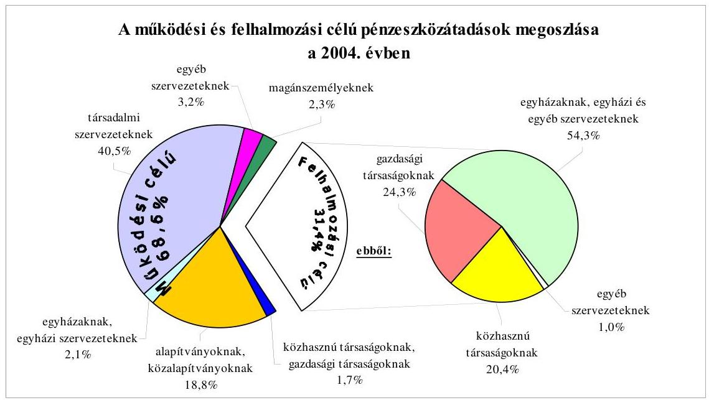
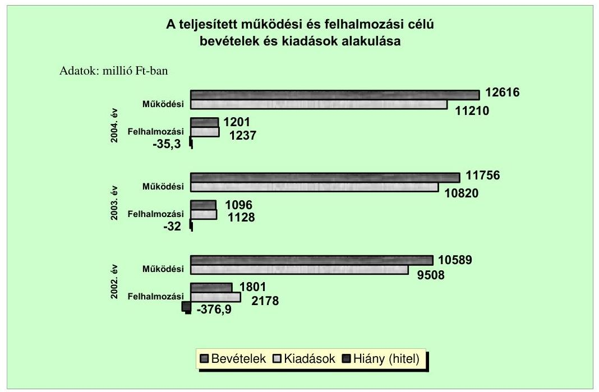
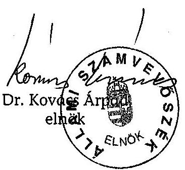
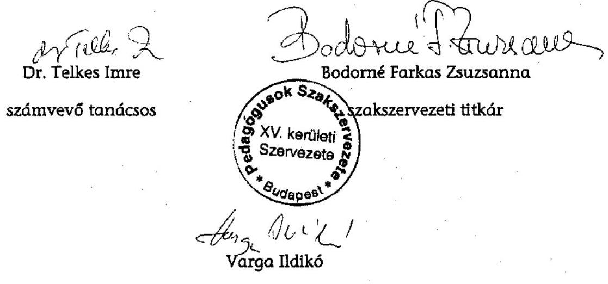
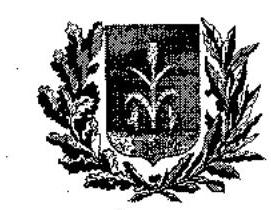
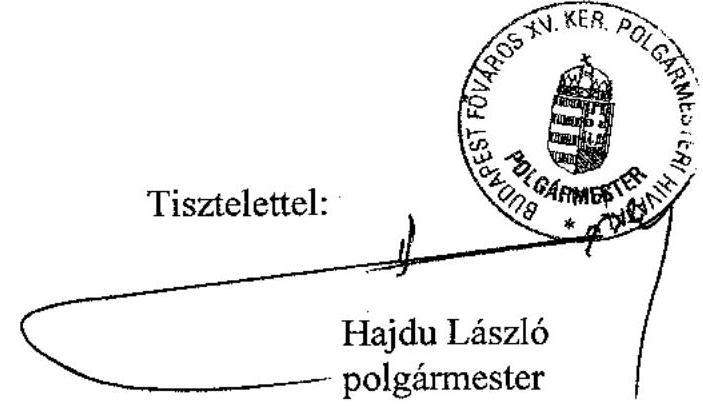

# JELENTÉS 

a Budapest Főváros XV. kerület Rákospalota, Pestújhely, Újpalota Önkormányzata gazdálkodási rendszerének átfogó ellenőrzéséről

---

3. Önkormányzati és Területi Ellenőrzési Igazgatóság
3.3. Átfogó Ellenőrzések Főcsoport
Iktatószám: V-1001-1/24/16/2005.
Témaszám: 749
Vizsgálat-azonosító szám: V0212
Az ellenőrzést felügyelte:
Dr. Lóránt Zoltán
főigazgató
Az ellenőrzés végrehajtásáért felelős:
Dr. Sepsey Tamás
főigazgató-helyettes
Az ellenőrzést vezette:
Csecserits Imréné
főcsoportfőnök-helyettes
Az ellenőrzést végezték:
Kozma Gábor
számvevő
Schósz Attiláné
számvevő
Dr. Telkes Imre
számvevő tanácsos

A témához kapcsolódó - elmúlt négy évben - készített számvevőszéki jelentések:
címe
sorszáma
Jelentés a települési önkormányzatok adóztatási tevékenységének ..... 0121
vizsgálatáról
Jelentés a helyi és a helyi kisebbségi önkormányzatok ..... 0220
gazdálkodásának átfogó ellenőrzéséről
Jelentés a 2002. évi országgyűlési, valamint a helyi és kisebbségi ..... 0325
önkormányzati képviselő választások lebonyolítására felhasznált
pénzeszközök ellenőrzéséről
Jelentés a középfokú oktatás feltételei alakulásának ellenőrzéséről ..... 0445

---

# TARTALOMJEGYZÉK 

BEVEZETÉS ..... 5
I. ÖSSZEGZŐ MEGÁLLAPÍTÁSOK, KÖVETKEZTETÉSEK, JAVASLATOK ..... 7
II. RÉSZLETES MEGÁLLAPÍTÁSOK ..... 17

1. A költségvetés tervezésének, végrehajtásának, az Önkormányzat vagyongazdálkodásának és a zárszámadás elkészítésének szabályszerűsége ..... 17
1.1. A költségvetési rendelet jóváhagyásának, módosításának, az előirányzatok nyilvántartásának és betartásának szabályszerűsége ..... 17
1.2. A gazdálkodás szabályozottsága, a bizonylati rend és fegyelem szabályszerűsége ..... 22
1.3. A pénzügyi-számviteli feladatok ellátásának informatikai támogatottsága ..... 28
1.4. Az önkormányzati vagyon nyilvántartása, számbavétele ..... 29
1.5. A vagyonnal való gazdálkodás szabályszerűsége, célszerűsége, nyilvánossága ..... 32
1.6. A céljelleggel nyújtott támogatások szabályszerűsége ..... 39
1.7. A közbeszerzési eljárások szabályszerűsége ..... 42
1.8. A zárszámadási kötelezettség teljesítésének szabályszerűsége ..... 44
1.9. A Polgármesteri hivatal helyi kisebbségi önkormányzatok gazdálkodását segítő tevékenysége ..... 46
2. Az önkormányzati feladatok és a rendelkezésre álló források összhangja ..... 47
2.1. A feladatok meghatározása és szervezeti keretei ..... 47
2.2. A költségvetés egyensúlyának helyzete ..... 51
2.3. A feladatok finanszírozása ..... 55
3. A belső irányítási, ellenőrzési rendszer működésének értékelése ..... 57
3.1. Az ellenőrzési rendszer kialakítása, működése ..... 57
3.2. A könyvvizsgálati kötelezettség teljesítése ..... 59
3.3. A korábbi számvevőszéki ellenőrzések javaslatainak hasznosulása ..... 60

---

# MELLÉKLETEK 

1. számú Az Önkormányzat gazdálkodását meghatározó adatok, mutatószámok (1 oldal)
2. számú Az önkormányzati vagyon nagyságának alakulása (1 oldal)
3. számú Az Önkormányzat 2004. évi bevételeinek és kiadásainak alakulása (1 oldal)
4. számú Az egyes önkormányzati feladatok finanszírozása (1 oldal)
5. számú Helyszíni ellenőrzési jegyzőkönyv (3 oldal)
6. számú Hajdu László úr, a Budapest Főváros XV. kerület Önkormányzata polgármesterének észrevétele (1 oldal)

---

# RÖVIDÍTÉSEK JEGYZÉKE 

| Áht. | az államháztartásról szóló 1992. évi XXXVIII. törvény |
| :--: | :--: |
| Fot. | a fogyatékos személyek jogairól és esélyegyenlőségük biztosításáról szóló 1998. évi XXVI. törvény |
| Hatv. | a helyi adókról szóló 1990. évi C. törvény |
| Kbt. $_{1}$ | a közbeszerzésekről szóló 1995. évi XL. törvény |
| Kbt. 2 | a közbeszerzésekről szóló 2003. évi CXXIX. törvény |
| Ltv. | a lakások és helyiségek bérletére, valamint az elidegenítésükre vonatkozó egyes szabályokról szóló 1993. évi LXXVIII. törvény |
| Nek. tv. | a nemzeti és etnikai kisebbségek jogairól szóló 1993. évi LXXVII. törvény |
| Ötv. | a helyi önkormányzatokról szóló 1990. évi LXV. törvény |
| Számv. tv. | a számvitelről szóló 2000. évi C. törvény |
| Ámr. | az államháztartás működési rendjéről szóló 217/1998. (XII. 30.) Korm. rendelet |
| Ber. | a költségvetési szervek belső ellenőrzéséről szóló 193/2003. (IX. 26.) számú Korm. rendelet |
| Vhr. | az államháztartás szervezetei beszámolási és könyvvezetési kötelezettségének sajátosságairól szóló 249/2000. (XII. 24.) számú Korm. rendelet |
| 20/1995. (III. 3.) Korm. rendelet | a kisebbségi önkormányzatok költségvetésének, gazdálkodásának, vagyonjuttatásának egyes kérdéseiről szóló 20/1995. (III. 3.) Korm. rendelet |
| ÁSZ | Állami Számvevőszék |
| Önkormányzat | Budapest Főváros XV. kerület Rákospalota, Pestújhely, Újpalota Önkormányzata |
| Képviselő-testület | Budapest Főváros XV. kerület Rákospalota, Pestújhely, Újpalota Önkormányzatának Képviselő-testülete |
| Pénzügyi bizottság | Budapest Főváros XV. kerület Rákospalota, Pestújhely, Újpalota Önkormányzatának Pénzügyi és Gazdasági Bizottsága |
| polgármester | Budapest Főváros XV. kerület Rákospalota, Pestújhely, Újpalota Önkormányzatának Polgármestere |
| jegyző | Budapest Főváros XV. kerület Rákospalota, Pestújhely, Újpalota Önkormányzatának Jegyzője |
| MOS bizottság | Budapest Főváros XV. kerület Rákospalota, Pestújhely, Újpalota Önkormányzatának Múvelődési, Oktatási és Sport Bizottsága |
| TVKB | Budapest Főváros XV. kerület Rákospalota, Pestújhely, Újpalota Önkormányzatának Tulajdonosi, Vagyonkezelési és Közbeszerzési Bizottsága (a 2002. évi önkormányzati választásokat megelőzően a bizottság neve Tulajdonosi, Vagyonkezelési és Vállalkozási Bizottsága volt) |
| Polgármesteri hivatal | Budapest Főváros XV. kerület Rákospalota, Pestújhely, Újpalota Önkormányzatának Polgármesteri Hivatala |

---

Pénzügyi osztály Budapest Főváros XV. kerület Rákospalota, Pestújhely, Újpalota Önkormányzata Polgármesteri Hivatalának Pénzügyi Osztálya
Ellenőrzési iroda Budapest Főváros XV. kerület Rákospalota, Pestújhely, Újpalota Önkormányzata Polgármesteri Hivatalának Belső Ellenőrzési Irodája
SzMSz

Polgármesteri hivatal SzMSz-e

2004. évi költségvetési rendelet

2005. évi költségvetési rendelet

2004. évi zárszámadási rendelet
bérbeadási rendelet
vagyongazdálkodási rendelet
gazdálkodási jogkörök szabályzata

Csapi 15 Kft.
Municipal Rt.
Palota Holding Rt.
Répszolg Kht.

Budapest Főváros XV. kerület Rákospalota, Pestújhely, Újpalota Önkormányzatának 13/2005. (V. 4.) számú rendelete a 7/2004. (II. 27.) számú költségvetési rendelet végrehajtásáról
Budapest Főváros XV. kerület Rákospalota, Pestújhely, Újpalota Önkormányzatának a 2004. évi költségvetéséről szóló 7/2004. (II. 27.) számú rendelete
Budapest Főváros XV. kerület Rákospalota, Pestújhely, Újpalota Önkormányzatának a 2005. évi költségvetéséről szóló 5/2005. (II. 28.) számú rendelete
Budapest Főváros XV. kerület Rákospalota, Pestújhely, Újpalota Önkormányzatának 13/2005. (V. 4.) számú rendelete a 7/2004. (II. 27.) számú költségvetési rendelet végrehajtásáról
Budapest Főváros XV. kerület Rákospalota, Pestújhely, Újpalota Önkormányzatának 26/2003. (VI. 30.) számú rendelete a lakások és nem lakás céljára szolgáló helyiségek bérbeadásának feltételeiről
Budapest Főváros XV. kerület Rákospalota, Pestújhely, Újpalota Önkormányzatának 17/2004. (IV. 1.) számú rendelete az Önkormányzat tulajdonában lévő lakások és nem lakás céljára szolgáló helyiségek elidegenítésének szabályairól
Budapest Főváros XV. kerület Rákospalota, Pestújhely, Újpalota Önkormányzatának 5/2000. (II. 29.) számú rendelete az Önkormányzat vagyonáról és a tulajdonosi jogok gyakorlásáról
Budapest Főváros XV. kerület Rákospalota, Pestújhely, Újpalota Önkormányzatának Polgármestere és Jegyzője által 1997. május 15-én kiadott szabályzat a kötelezettségvállalás, ellenjegyzés, utalványozás és érvényesítés rendjéről
Csapi 15 Vásárcsarnok és Piacfenntartó Korlátolt Felelősségű Társaság
Municipal Önkormányzati Kárpótlási Befektető Részvénytársaság
Palota Holding Ingatlan és Vagyonkezelő Részvénytársaság
RÉPSZOLG Környezetgazdálkodási és Foglalkoztatási Közhasznú Társaság

---

# JELENTÉS 

## a Budapest Főváros XV. kerület Rákospalota, Pestújhely, Újpalota Önkormányzata gazdálkodási rendszerének átfogó ellenőrzéséről

## BEVEZETÉS

Az Ötv. 92. § (1) bekezdése, az ÁSZ-ról szóló 1989. évi XXXVIII. törvény 2. § (3) bekezdése, valamint az Áht. 120/A. § (1) bekezdése alapján az önkormányzatok gazdálkodását az ÁSZ ellenőrzi. Az ellenőrzés elvégzése az Országgyűlés illetékes bizottságai részére is átadott országosan egységes ellenőrzési program alapján történt.

## Az ellenőrzés célja annak értékelése volt, hogy:

- az önkormányzati gazdálkodás törvényességét, szabályszerűségét biztosították-e a tervezés, a költségvetés végrehajtása, a vagyongazdálkodás és a zárszámadás során;
- az Önkormányzat által ellátott feladatok és az azokhoz rendelkezésre álló források összhangja biztosított volt-e, különös tekintettel az egyes kiemelt feladatokra;
- a gazdálkodás szabályszerűségét biztosító belső kontrollok  lehetővé tették-e a szabálytalanságok, hiányosságok, gazdaságtalan megoldások feltárását, megelőzését.

Az ellenőrzött időszak: a 2004. év, valamint a 2005. I-III. negyedév, az 1.5, 2.1-2.3 és a 3.3 programpontok tekintetében a 2002-2003. évek is.

Budapest főváros XV. kerületét Rákospalota, Pestújhely és Újpalota városrészek alkotják. A kerület lakosainak száma 2005. január 1-jén 83235 fő volt.

Az Önkormányzat 29 tagú Képviselő-testületének munkáját hét állandó bizottság segítette. A polgármester személye az 1996. évtől, a jegyző személye az 1998. évtől nem változott.

[^0]
[^0]:    ${ }^{1}$ A törvényi előírások betartásának elmulasztásakor a részletes megállapítások fejezetben egységesen a törvénysértés megjelölést alkalmazzuk, mivel az ÁSZ nem tehet különbséget a törvényi előírások között.
    ${ }^{2}$ A gazdálkodás szabályszerűségét biztosító kontroll alatt értjük a kiépített és működő belső irányítási és szabályozási rendszert, valamint a belső ellenőrzési funkciók ellátását.

---

Az Önkormányzat feladatainak végrehajtása érdekében 19 költségvetési szervet működtet, mindegyik önállóan gazdálkodik. A feladatok ellátásában részt vesz az Önkormányzat két gazdasági társasága, egy közhasznú társasága, négy közalapítványa és megállapodás alapján két alapítvány. A feladatok ellátására az Önkormányzat költségvetési szerveinél a 2004. év végén foglalkoztatott közalkalmazottak száma 2094 fő, a köztisztviselők száma 291 fő volt. Az Önkormányzat a 2004. évben 13841 millió Ft bevételt ért el és 12510 millió Ft kiadást teljesített, a 2004. év végén 88433 millió Ft értékű könyvviteli mérleg szerinti vagyonnal rendelkezett. A 2005. évi költségvetési rendeletben az Önkormányzat 13622 millió Ft bevételt, valamint 14242 millió Ft kiadást tervezett. Az Önkormányzat gazdálkodását meghatározó adatokat, mutatószámokat az 1-3. számú mellékletek tartalmazzák.

A kerületben a 2002. évi önkormányzati képviselő választásokig nyolc, a 2002. évi önkormányzati képviselő választásokat követően tíz a megválasztott kisebbségi önkormányzatok száma, melyek közül egy (a lengyel) a 2004. évben és kettő (a lengyel és a román) a 2005. évben már nem működött.

[^0]
[^0]:    ${ }^{3}$ Bolgár, cigány, görög, horvát, német, örmény, román, szerb kisebbségi önkormányzat.
    ${ }^{4}$ Bolgár, cigány, görög, horvát, lengyel, német, örmény, román, szerb, szlovák kisebbségi önkormányzat.

---

# I. ÖSSZEGZŐ MEGÁLLAPÍTÁSOK, KÖVETKEZTETÉSEK, JAVASLATOK 

Az Önkormányzat rendelkezett a 2002-2006. évekre vonatkozó gazdálkodási célkitűzéseket meghatározó gazdasági programmal. A 2004. és a 2005. évi költségvetési koncepciókat az Ámr-ben foglaltaknak megfelelően a helyben képződő bevételek és az ismert kötelezettségek, továbbá a gazdasági program figyelembevételével állították össze, valamint rendelkeztek benne a költségvetés készítés további munkálatairól.

A polgármester az Ámr. előírásait betartva, a bizottságok által megtárgyalt, a Pénzügyi bizottság által véleményezett, valamint a könyvvizsgáló írásos véleményét tartalmazó 2004. és 2005. évi költségvetési rendelettervezeteket az Áht-ban meghatározott határidőn belül nyújtotta be a Képviselő-testületnek. A költségvetési rendelettervezetek az Áht-ban előírt tartalommal készültek, az előkészítés során az Ámr-ben meghatározott, a költségvetés szerkezetére vonatkozó előírásokat figyelembe vették. A Képviselő-testület tájékoztatása céljából a költségvetési rendelettervezetek előterjesztései a 2004. és a 2005. években tartalmazták az Önkormányzat Áht. szerinti összes bevételét, összes kiadását, finanszírozását és pénzeszközének változását tartalmazó mérlegeket és ezen belül elkülönítetten a helyi kisebbségi önkormányzatok mérlegeit. A költségvetési rendeletek előterjesztésekor azonban az Áht. előírásai ellenére nem mutatták be a több éves kihatással járó döntéseket, valamint a közvetett támogatásokat, szöveges indoklással. A 2004. évi költségvetési rendeletben - az Áht-ban foglaltakat megsértve - a költségvetési bevételek és kiadások különbségeként a költségvetés hiányát nem mutatták be. A 2005. évi költségvetési rendelet a költségvetési hiányt és a fedezetéül tervezett finanszírozási célú pénzügyi műveleteket az Áht-ban foglaltaknak megfelelően tartalmazta. A 2004. és a 2005. évi költségvetési rendeletekben a Képviselő-testület meghatározta a költségvetés végrehajtási szabályait, a munkabérhitel felvételével kapcsolatos hatáskörnek a Polgármesteri hivatalra történt átruházásával azonban megsértették az Ötv-ben foglalt előírásokat.

A Képviselő-testület a 2004. évi költségvetési rendeletben jóváhagyott előirányzatokat 9%-kal, a 2005. évi költségvetési rendeletet az I-III. negyedévben pedig 8%-kal módosította. A 2004. évi költségvetési rendelet módosításait az Ámr. előírásainak és a költségvetési rendelet végrehajtási szabályainak betartásával végezték el. A Képviselő-testület a költségvetési rendelet
 2004. évi utolsó módosításáról az Ámr-ben előírt határidőn belül döntött.

A Pénzügyi osztály szervezeti felépítését és feladatait az Ámr. előírása alapján a Polgármesteri hivatal SzMSz-ében rögzítették. A Polgármesteri hivatalban a polgármester és a jegyző a gazdálkodási jogkörök szabályzatában rögzítette az operatív gazdálkodással és a munkafolyamatba épített ellenőrzéssel összefüggő jogkörök gyakorlásának rendjét.

---

A jegyző eleget tett az intézmények számviteli rendjének kialakítására vonatkozó kötelezettségének. A Polgármesteri hivatal számviteli politikájában meghatározták, hogy a számviteli elszámolás és értékelés szempontjából mit tekintenek lényegesnek, nem lényegesnek, jelentős és nem jelentős összegnek. Rögzítették, mi tekintendő figyelembe veendő szempontnak a kisértékű tárgyi eszközök, a vagyoni értékű jogok és a szellemi termékek minősítésénél, továbbá a terven felüli értékcsökkenés elszámolása tekintetében. Az eszközök és források leltározási és leltárkészítési szabályzata tartalmazta a leltározás előkészítésével, megszervezésével és végrehajtásával kapcsolatos feladatokat. A pénzkezelési szabályzatban rögzítették a pénztáros feladatait, a helyettesítések rendjét, az előlegek igénybevételének, nyilvántartásának, elszámolásának részletes szabályait. A számlarend tartalmazta a Számv. tv. előírásának megfelelően az alkalmazásra kijelölt főkönyvi számlák értékváltozásainak jogcímeit. Előírták az analitikus nyilvántartások vezetésének kötelezettségét, meghatározták azok formáját és tartalmát. A számlarend tartalmazta a kisebbségi önkormányzati gazdálkodással összefüggő feladatokat. A különböző szabályzatok előírásai a Polgármesteri hivatal SzMSz-ével, az ügyrenddel és egymással összhangban voltak.

A pénzügyi-számviteli területen dolgozók rendelkeztek a munkaköri feladataikat meghatározó munkaköri leírással, melyekben a szabályzatok előírásai alapján rögzítették a munkafolyamatba épített ellenőrzési feladatokat. A jegyző elkészítette a Polgármesteri hivatal ellenőrzési nyomvonalát a tervezési, pénzügyi lebonyolítási és ellenőrzési folyamatokról, azonban az Ámr. előírása ellenére az nem képezte a Polgármesteri hivatal SzMSz-ének mellékletét. A kötelezettségvállalásokról az analitikus nyilvántartást - a szociális jellegű juttatások kivételével - szakfeladatonként, kiemelt előirányzatonként, ezen belül főkönyvi számlánként vezették.

A gazdasági eseményeket magukba foglaló bizonylatok egyharmada része a Számv. tv. előírását megsértve nem felelt meg az előírt alaki-tartalmi követelményeknek, mert a pénztári bizonylatoknál és a banki bizonylatok 28%-ánál az Ámr. előírása ellenére nem tüntették fel az utalványrendeleten a kötelezettségvállalás nyilvántartásba vételének sorszámát, továbbá a bizonylatok 5%-ánál elmaradt a szakmai teljesítés igazolása, mely esetekben az Ámr-ben foglalt előírás ellenére nem végezték el a kiadások teljesítésének és a bevételek beszedésének elrendelése előtt az ellenőrzéssel kapcsolatos feladatokat. A kiadási bizonylatok 12%-ánál elmaradt a kötelezettségvállalás ellenjegyzése, az ellenjegyzésre jogosult nem tett eleget az Ámr-ben előírt ellenőrzési feladatának. Az utalványozás ellenjegyzője az utalványrendeleteket aláírásával ellátta, azonban nem tett eleget az Ámr-ben előírt ellenőrzési feladatainak azokban az esetekben, ahol hiányzott a kötelezettségvállalás nyilvántartásba vételének sorszáma, a szakmai teljesítés igazolása, vagy az érvényesítés. Az érvényesítő nem tett eleget az - Ámr-ben foglalt - munkafolyamatba épített ellenőrzési feladatainak, mert annak ellenére érvényesítette a kiadási bizonylatokat, hogy hiányzott a kötelezettségvállalás nyilvántartásba vételi sorszámának feltüntetése, a szakmai teljesítés igazolása, valamint a kötelezettségvállalás ellenjegyzése. A 2004. évi zárszámadási rendelet szerint önkormányzati szinten a költségvetési rendelet módosított előirányzatait a teljesítési adatok nem haladták meg és a költségvetési szervek kiemelt előirányzataikon belül gazdálkodtak.

---

A Polgármesteri hivatalban - az előirányzat nyilvántartás kivételével - az analitikus nyilvántartásokat számítógépes programok segítségével vezették. A főkönyvi könyvelés és a számítógépes analitikus nyilvántartások közötti adatforgalmat megszervezték, azonban a rendszerek integrációja még nem történt meg. A Polgármesteri hivatal nem rendelkezett informatikai stratégiával, illetve a rendkívüli események bekövetkezésekor teendő intézkedéseket meghatározó katasztrófa elhárítási tervvel. A számítógépekhez és a programokhoz való illetéktelen hozzáférés kizárásához a jogosultsági rendszert kialakították. A Pénzügyi osztályon a pénzügyi-számviteli programokat alkalmazók a számítógépes feladat ellátásához szükséges alapfokú informatikai képzettséggel rendelkeztek, munkaköri leírásaik tartalmazták a számítástechnikai rendszer használatát és az elvégzendő feladatokat. Az informatikai szabályzatok, az üzemeltetési dokumentációk együttesen tartalmazták a biztonságos, a feladatellátást segítő üzemeltetés feltételeit.

Az önkormányzati vagyont forgalomképesség szerint elkülönítetten tartották nyilván, ezzel eleget tettek a Vhr-ben foglalt előírásoknak. Az analitikus nyilvántartások és a kapcsolódó főkönyvi számlák értékadatai 2004. december 31-én számszerűen megegyeztek. A jegyző a 2004. évre vonatkozó leltározáshoz a leltározási és leltárkészítési szabályzat előírása ellenére - a tárgyi eszközök kivételével - leltározási utasítást nem adott ki. Az ingatlanok év végi állományát a Vhr., valamint a leltározási és leltárkészítési szabályzatban foglalt előírás ellenére, továbbá az üzemeltetésre, kezelésre átadott eszközök év végi állományát a Vhr-ben foglalt előírás ellenére egyeztetéssel állapították meg. Az adósok, vevők és egyéb követelések év végi értékelését elvégezték. A részesedések év végi értékeléséhez szükséges információk egy gazdasági társaságban lévő üzletrész esetében nem álltak rendelkezésre, ezért ezen részvények év végi értékelését a Számv. tv. előírása ellenére nem végezték el.

A vagyonnal való rendelkezési, döntési jogköröket a vagyongazdálkodási rendeletben értékhatár megjelölésével szabályozták, azonban nem rendelkeztek a három évet meg nem haladó és 20 millió Ft értékhatár feletti, valamint a három évet meghaladó és a 20 millió Ft értékhatár alatti forgalomképtelen törzsvagyon tulajdonjogot nem érintő hasznosítása esetén a döntési jogkörök gyakorlóiról. Meghatározták az ingyenes vagyonátadás eseteit és módját. A 2003. évben három esetben nem tartották be a vagyongazdálkodási rendelet előírását, mivel képviselő-testületi határozat nélkül olyan esetekben is adtak át ingyenesen vagyont, melyet a vagyongazdálkodási rendelet nem nevesített.

Az Önkormányzat a vagyongazdálkodási rendeletében egyedi vagyon esetén egymillió Ft-ban, együttes vagyontömeg esetén ötmillió Ft összeget meghaladóan jelölte meg azt az értékhatárt, mely felett az elidegenítés és hasznosítás pályáztatás útján történik, azonban az Áht. előírását megsértve lehetővé tette a versenyeztetési eljárás lefolytatásától való eltérést. A versenyeztetés nélküli vagyon elidegenítés és hasznosítás lehetőségének biztosításával a szabályozás nem segítette a közvagyonnal való gazdálkodás nyilvánosságát, átláthatóságát. A vagyongazdálkodási rendelet szerint kétszeri sikertelen versenytárgyalás megtartása esetén a tulajdonosi jogok gyakorlója egyszerűsített eljárás keretében értékesítheti a vagyontárgyat, azonban nem határozták meg, hogy az egyszerűsített eljárást hogyan kell lefolytatni. Az elidegenítéssel és a bérbeadással kapcsolatos döntések során a hatásköri szabályokat betartották, a vagyonérté-

---

kesítéseknél a Palota-Holding Rt. által készített piaci forgalmi értékbecsléseket figyelembe vették. Az Önkormányzat a 2002-2004. évek között az Ltv. előírását megsértve nem adta át a Budapest Főváros Önkormányzatának az önkormányzati lakások elidegenítéséből származó bevételeknek a kapcsolódó költségek levonása utáni 50%-át, 118 millió Ft-ot.

Az Önkormányzat az év közben szabad pénzeszközeiből diszkont kincstárjegyet és államkötvényt vásárolt, a pénzügyi befektetések során a 2002-2004. években összesen 255 millió Ft hozamot ért el. Az értékpapírok vásárlásakor nem kérték az értékpapír forgalom KELER Rt-nél megnyitott, az Önkormányzat nevére szóló együttes rendelkezésű értékpapír alszámlán történő vezetését, mellyel a pénzügyi befektetés kockázata mérsékelhető, biztonsága növelhető. Az Önkormányzat a céljellegű fejlesztési támogatások és a nettó 5 millió Ft értékhatár feletti szerződések közzétételét az Áht. előírását megsértve nem biztosította. A törvénysértő helyzetet 2005. október 5. után megszüntették, szabályozták a közzététel rendszerét és 2004. január 1-ig visszamenőleg pótolták a mulasztást.

Az Önkormányzat 11 párt részére kedvezményesen, egy párt részére díjmentesen biztosított helyiséget, ezzel közvetve támogatást adott részükre a nem közfeladat ellátásához, nem tett eleget az Ötv. előírásainak, valamint nem biztosította az alkotmányos jogegyenlőséget a bérlők között. A Képviselő-testület 2004. április 1-i hatállyal a korábbi kedvezményes és ingyenes helyiségbérleti díjakat megszüntetve, módosította a pártok helyiségbérletével kapcsolatos előírásokat a bérbeadási rendeletében. A bérbeadási rendeletben szereplő új feltételekkel a bérleti szerződés módosítása a polgármester elhúzódó intézkedése és a feladattal megbízott gazdasági társaság nem teljesítése miatt elmaradt.

Az Önkormányzat a 2004. évben gazdasági társaságoknak, közhasznú társaságoknak, alapítványoknak, közalapítványoknak, egyházaknak, társadalmi szervezeteknek, egyesületeknek és magányszemélyeknek összesen 130,6 millió Ft céljellegű támogatást adott. A támogatásokra vonatkozó döntéseknél a bizottságok és a polgármester megsértették az Ötv. előírását, mivel alapítványok részére nyújtott támogatásról döntöttek, annak ellenére, hogy az alapítványok támogatása a Képviselő-testület kizárólagos hatáskörébe tartozik.

A Képviselő-testület által támogatásban részesített 36 szervezet az előírt tartalommal és határidőben számadást készített. A bizottságok 136 szervezetnek nyújtottak támogatást, amelyek 10%-a nem készített számadást. A polgármesteri keretből 43 szervezet részesült támogatásban, azonban részükre nem írták elő a számadási kötelezettséget, ezzel megsértették az Áht. előírását. A számadás előírása ellenére a számadást elmulasztó szervezetek esetében az Áht-ban foglaltakat megsértve nem intézkedtek a támogatás 2004. évben történő felfüggesztéséről, valamint visszafizettetéséről. A számadást elmulasztó szervezetek a 2005. évben nem részesültek újabb támogatásban. A számadások tartalmi és formai ellenőrzését elvégezték, az Áht. előírását megsértve a támogatások rendeltetés szerinti felhasználását nem ellenőrizték.

A közbeszerzési eljárásokat a Kbt. ${ }_{1}$-ben foglaltaknak megfelelően, az értékhatár feletti beszerzések esetében lebonyolították. A szakmai véleményező bizottság az ajánlati felhívás kiírásának és a Kbt. ${ }_{1}$ előírásának megfelelően értékelte az ajánlatokat. A közbeszerzési eljárásokat lezáró határozatok bizottsági

---

hatáskörben történt meghozatala nem felelt meg a Kbt. ${ }_{1}$ előírásának. A lefolytatott közbeszerzési eljárásokkal szemben jogorvoslati eljárás a Közbeszerzések Tanácsa Közbeszerzési Döntőbizottságnál nem indult. Az Önkormányzat a 2004. évben megkezdett közbeszerzéseiről a Kbt. 2 által előírt határidőben megküldte a Közbeszerzések Tanácsa részére az éves összegzéseket.

A polgármester a 2004. évi zárszámadási rendelettervezetet a 2004. évi költségvetési rendelettel összehasonlítható módon az Áht-ban előírt határidőn belül terjesztette a Képviselő-testület elé. A zárszámadási rendelettervezet tartalma és szerkezete megfelelt az Áht. és az Ámr. előírásainak. A 2004. évi zárszámadási rendelet előterjesztésekor a Képviselő-testület tájékoztatása céljából bemutatták az Áht. előírása alapján az Önkormányzat összes bevételét és kiadását, finanszírozását és pénzeszközének változását, ezen belül elkülönítetten a helyi kisebbségi önkormányzatok mérlegeit, továbbá a vagyonkimutatást, a többéves kihatással járó döntések számszerűsített hatását és ennek szöveges indoklását, illetve a közvetett támogatásokat szöveges indoklással együtt. A Polgármesteri hivatal zárszámadási rendeletben kimutatott és jóváhagyott pénzmaradványa megállapításánál a Vhr. szerint jártak el. A Pénzügyi osztály az intézmények 2004. évi költségvetési beszámolóit az Ámr-ben előírt határidőn belül felülvizsgálta és az intézményeket az éves beszámolóik elfogadásáról és működésének elbírálásáról, jóváhagyásáról az Ámr-ben előírtaknak megfelelően értesítette.

Az Önkormányzat az Áht-ban előírt együttműködési megállapodásokat a kisebbségi önkormányzatokkal megkötötte. Az együttműködési megállapodások tartalmuk alapján alkalmasak voltak arra, hogy a központi és a helyi előírásoknak megfelelő legyen az Önkormányzat és a kisebbségi önkormányzatok működése a költségvetési tervezés, az operatív gazdálkodás és a zárszámadás területén. Az gazdálkodás ellenőrzésével kapcsolatos jogköröket az Ámr. előírásainak megfelelően szabályozták. Az Ámr. előírása ellenére elmaradt a kisebbségi önkormányzatok kötelezettségvállalásairól az analitikus nyilvántartás vezetése. A Polgármesteri hivatal az Ámr. előírását betartva elkülönítetten vezette a kisebbségi önkormányzatok vagyoni és számviteli nyilvántartásait. A Polgármesteri hivatal a Nek. tv. alapján biztosította a helyi kisebbségi önkormányzatok működésével kapcsolatos feltételeket, feladatokat.

Az Önkormányzat rendeletekben, a szakmai koncepciókban és az SzMSz függelékében határozta meg a kötelezően előírt és az önként vállalt feladatait, az Ötv. előírása ellenére azonban nem határozta meg, mely feladatokat, milyen mértékben és módon lát el. Az Önkormányzat feladatai ellátását
 saját fenntartású intézményeivel oldotta meg, emellett közhasznú társasága és gazdasági társaságai, közalapítványai, valamint más önkormányzatok és alapítványok megállapodás alapján részt vettek a feladatellátásban. Az intézményi kapacitások jobb kihasználása érdekében az Önkormányzat együttműködött a feladatellátásban érdekelt kerületi önkormányzatokkal. A szomszédos Csömör Nagyközség Önkormányzatával mezei őrszolgálatot, a Budapest Főváros IV. kerület Újpest Önkormányzatával gyermekek átmeneti otthona ellátását társulás útján biztosította. Az Önkormányzatnál a centralizált intézménystruktúra a 2002. évre kialakult, a 2002-2004. években - más kerületi önkormányzatokkal és a Református Egyházközösséggel kötött együttműködési megállapodásokban foglalt feladatok kivételével - nem változott. Az Önkormányzat négy közalapítványa közül három működésével segítette az önkormányzati feladatok ellátását, egy azonban 2001. január 1. óta tényleges tevékenységet nem végzett.

A teljesített költségvetési bevételek a 2002. és a 2004. évek közötti időszakban meghaladták a teljesített költségvetési kiadásokat a tervezettől eltérően, tényleges hiány a 2002-2004. évek költségvetéseinek végrehajtása során nem jött létre. A 2002. és a 2004. évek közötti időszakban az Önkormányzat működési célú bevételeinek és kiadásainak egyensúlya biztosított volt. A teljesített felhalmozási célú bevételek a teljesített felhalmozási célú kiadásokra nem nyújtottak fedezetet. A felhalmozási kiadások felhalmozási bevételeken felüli részét a működési célú bevételek átcsoportosításával finanszírozták, valamint a felhalmozási feladatok finanszírozásához az Önkormányzat a 2002-2004. évek között külső forrásokat vett igénybe. Az átvett források az érintett felhalmozási és felújítási feladatok megvalósítását több mint kétharmad arányban finanszírozták. Az Önkormányzat pályázati tevékenysége elősegítette a gazdasági programban és az éves költségvetésekben megfogalmazott célkitűzések megvalósítását.

A jegyző elkészítette a likviditási tervet és az Ámr. előírásának megfelelően gondoskodott annak évközi aktualizálásáról. A 2002. és a 2004. évek közötti időszakban működési hitelt a költségvetés végrehajtásának finanszírozására nem vettek igénybe. Az Önkormányzat által bevezetett építmény- és telekadó bevételek szerepe az összes bevételen belül fokozatosan növekedett a 2002-2004. közötti időszakban, aránya a saját bevételeihez viszonyítva 10-12% közötti volt. Az adózók részére a Hatv-ben rögzítetteken túlmenően adómentességeket és adókedvezményeket biztosítottak.

A naturális mutatókkal mérhető feladatok (bölcsődei ellátás, óvodai nevelés, általános iskolai és középiskolai oktatás, nappali szociális és bentlakásos szociális intézményi ellátás) egy főre jutó kiadásai a 2002. évről a 2004. évre 21-29%-kal emelkedtek. A kiadások 2003. évi növekedését a közalkalmazottak bérének 2002. évi emelése eredményezte. A kiadások több mint kétharmada a személyi juttatásokhoz és járulékaihoz kapcsolódott. A kapacitáskihasználtság a bölcsődei ellátásban, a középfokú oktatásban és a bentlakásos szociális intézményi ellátásban javult, amely kedvezően hatott a fajlagos kiadások alakulására is. A kiadások finanszírozásában a 2004. évben az Önkormányzat részesedése képviselt meghatározó súlyt a bölcsődei ellátásban (59%), az óvodai nevelésben (55%), a nappali szociális intézményi ellátásban (60%) és a bentlakásos szociális intézményi ellátásban (53%) volt. Az állami hozzájárulás és támogatás részesedése nagyobb súlyt az általános iskolai (50%) és a középiskolai oktatásban (69%) jelentett. Az intézményi saját bevétel aránya csak a bentlakásos szociális intézményi ellátásban jelentett a 2004. évben 10% feletti arányt (17%-ot). Az Önkormányzat kötelező feladatai mellett önként vállalt feladatokat (járóbeteg szakellátás, szociális foglalkoztató, középfokú oktatás, Palota-busz-járat működtetése) is ellátott, amelyek nem veszélyeztették kötelező feladatait. A Polgármesteri hivatal kimutatása szerint a 67 önkormányzati középületből 10 akadálymentesítése megoldott, a további épületek akadálymentesítésének költségét 429 millió Ft-ra becsülték. Az Önkormányzat a Fot-ban előírt 2005. január 1-i határidőre 57 közintézményénél akadálymentes megközelítést nem biztosította.

Az Önkormányzat kialakította a feladatkörébe utalt belső ellenőrzési feladatok végrehajtásához szükséges szervezeti kereteket. A Polgármesteri hivatalon belül a háromfős Ellenőrzési iroda közvetlenül a jegyzőnek alárendelve végzi a Polgármesteri hivatal és az intézmények ellenőrzését. Az elkészített belső ellenőrzési kézikönyv tartalma a Ber-ben foglaltaknak megfelelt. A 2004. évben és a 2005. I. félévében az intézményeknél 17 ellenőrzést végeztek. A Polgármesteri hivatal gazdálkodásának belső ellenőrzése során vizsgálták a pénzmaradvány megállapítását, a költségvetés tervezését, továbbá a tárgyi eszközök leltározásának végrehajtását. Az ellenőrzésekről készült jelentések megfeleltek a Ber-ben előírt követelményeknek. Az ellenőrök az ellenőrzési programnak megfelelő megállapításokat tettek, következtetéseiket és javaslataikat alátámasztották. A jegyző a 2004. évi intézményi és hivatali ellenőrzések tapasztalatairól a Képviselő-testület részére - a 2004. évi önkormányzati költségvetés végrehajtásával kapcsolatos beszámolóval egyidejűleg - tájékoztató előterjesztést készített, amelyet a Képviselő-testület tagjai a 2004. évi költségvetés végrehajtásával kapcsolatos beszámolóval egyidejűleg megkaptak.

Az Önkormányzat az Ötv. előírásai alapján könyvvizsgálatra volt kötelezett. A könyvvizsgáló kiválasztásánál és megbízásánál a szakmai követelményekre, és az összeférhetetlenségre vonatkozó - Ötv. szerinti - előírásokat betartották. A könyvvizsgáló a Polgármesteri hivatal és az önkormányzati intézmények adatait összevontan tartalmazó 2004. évi egyszerűsített tartalmú éves beszámolót korlátozás nélküli hitelesítő záradékkal látta el, a 2004. évi könyvviteli mérleg adataira, illetve a 2004. évi pénzmaradvány összegére vonatkozóan auditálási eltérést nem állapított meg.

Az ÁSZ a 2001-2003. évek között négy alkalommal folytatott vizsgálatot az Önkormányzatnál. A gazdálkodás átfogó ellenőrzéséről készített jelentésben megfogalmazott javaslatok négyötöde valósult meg. A javaslatok alapján módosították a gazdálkodási, számviteli szabályzatokat, nyilvántartásokat, kiegészítették a munkaköri leírásokat. A korábbi ÁSZ javaslat alapján a Képviselőtestület döntött a pártok közvetett támogatásának a megszüntetéséről, a bérlemények díjának piaci alapon történő meghatározásáról, azonban ennek végrehajtásaként a szerződés módosítása nem történt meg, továbbá a leltározási szabályzat előírásaitól eltérően az ingatlanok és az üzemeltetésre, kezelésre átadott eszközök esetében továbbra sem dokumentálták a könyvviteli mérleg év végi adatainak alátámasztását. Nem hasznosult a lakásértékesítési bevételek jogszabályban meghatározott részének Budapest Főváros Önkormányzatának történő befizetésére vonatkozó javaslat. A 2002. évi helyi és kisebbségi önkormányzati képviselő választások lebonyolítására felhasznált pénzeszközök ellenőrzése során tett javaslatok alapján gondoskodtak az előirányzatok megfelelő időben történő jóváhagyásáról és kidolgozták a kiadások szavazókörönkénti elszámolási rendjét. A középfokú oktatás feltételeinek alakulásáról készített számvevői jelentés javaslatai alapján a középfokú oktatás feltételeit elsősorban az idegen nyelvi és számítástechnikai oktatás területén javították.

A helyszíni ellenőrzés megállapításainak hasznosítása mellett javasoljuk:

# a polgármesternek 

a jogszabályi előírások maradéktalan betartása érdekében

1. kezdeményezze a vagyongazdálkodási rendelet módosítását annak érdekében, hogy a nyilvános versenyeztetési kötelezettség alóli kivételeket csak az Áht. 108. § (1) bekezdésében szereplő esetekben biztosítson az Önkormányzat;
2. gondoskodjon a polgármesteri keretből juttatott céljellegű támogatások esetében a számadási kötelezettség előírásáról az Áht. 13/A. § (2) bekezdésének betartása érdekében, továbbá kezdeményezze, hogy az alapítványoknak nyújtott támogatások odaítéléséről az Ötv. 10. § (1) bekezdésének d) pontja alapján a Képviselő-testület döntsön, valamint az előírás ellenére számadást nem teljesítő szervezetek felé intézkedjen a támogatás felfüggesztéséről és visszafizettetéséről;
3. intézkedjen az Ötv. 78. § (1) bekezdésében foglaltak érvényre juttatása érdekében arról, hogy a pártok részére megállapított helyiségbérleti díj összhangba kerüljön az Önkormányzat által hasonló adottságú helyiségek esetében kialakított piaci alapú bérleti díjjal;
4. kezdeményezze, hogy a Képviselő-testület az Ötv. 8. § (2) bekezdésében előírtaknak megfelelően határozza meg az Önkormányzat kötelező és önként vállalt feladatai ellátásának módját és mértékét;
5. kezdeményezze a Képviselő-testületnél az Ámr. 145. § (2) bekezdésében foglalt előírás betartása érdekében az ellenőrzési nyomvonalnak a Polgármesteri hivatal SzMSz-ének mellékleteként történő jóváhagyását;
6. gondoskodjon a középületek akadálymentesítéséről, tekintettel arra, hogy a Fot. 29. § (6) bekezdésében foglalt határidő lejárt;
a munka színvonalának javítása érdekében
7. terjessze a számvevőszéki jelentést a Képviselő-testület elé és a feltárt hiányosságok megszüntetése érdekében készíttessen intézkedési tervet a határidők és a felelősök megjelölésével;
8. kezdeményezze a vagyongazdálkodási rendelet kiegészítését az egyszerűsített ingatlanértékesítési eljárás szabályainak meghatározásával;
9. kezdeményezze az értékpapír befektetési szolgáltató szervezetekkel kötött értékpapír vásárlási szerződéseknél a pénzügyi befektetések biztonságának növelése és a kockázat csökkentése érdekében az értékpapír-forgalomnak a KELER Rt-nél megnyitott, az Önkormányzat nevére szóló, együttes rendelkezésű értékpapír alszámlán történő vezetését;
10. intézkedjen, hogy a vagyongazdálkodási rendelet szabályozása kiegészüljön a forgalomképtelen törzsvagyon három évet meg nem haladó és 20 millió Ft értékhatár feletti, valamint a három évet meghaladó és a 20 millió Ft értékhatár alatti hasznosítása esetén a döntésre jogosultak megnevezésével;

# a jegyzőnek 

a jogszabályi előírások maradéktalan betartása érdekében
1. a költségvetési rendelettervezet előkészítésekor
a) kezdeményezze előterjesztés előkészítésével a költségvetési rendelet végrehajtási szabályainak módosítását annak érdekében, hogy a munkabérhitel felvételével kapcsolatos hatáskör megfeleljen az Ötv. 9. § (3) bekezdésében foglalt előírásoknak;
b) gondoskodjon az Áht. 118. §-ában előírtaknak megfelelően a költségvetési rendelet előterjesztésekor a több éves kihatással járó döntések számszerűsítéséről készített kimutatásnak és szöveges indoklásának, valamint a közvetett támogatásokról készített kimutatásnak és annak szöveges indoklásának a bemutatásáról;
2. gondoskodjon a költségvetési gazdálkodás szabályozottsága, a gazdálkodási és a kapcsolódó ellenőrzési jogkörök gyakorlása szabályszerűségének biztosítása érdekében az Ámr. 134. § (13) bekezdésében foglalt előírás alapján a helyi kisebbségi önkormányzatok kötelezettségvállalásaihoz kapcsolódó analitikus nyilvántartás vezetéséről;
3. a szabályszerű költségvetési és operatív gazdálkodás érdekében
a) intézkedjen az Ámr. 135. § (1) bekezdésében előírtak betartása érdekében arról, hogy a kiadások teljesítésének és a bevételek beszedésének elrendelése előtt az okmányok alapján ellenőrizzék, szakmailag igazolják azok jogosultságát, összegszerűségét, a szerződés, a megrendelés, a megállapodás teljesítését, valamint az érvényesítő tegyen eleget a munkafolyamatba épített ellenőrzési feladatainak, a szakmai teljesítés igazolása alapján ellenőrizze az összegszerűséget, a fedezet meglétét és a bizonylatok előírt alaki követelményeinek betartását;
b) gondoskodjon arról, hogy az Ámr. 134. § (8) és (9) bekezdéseinek megfelelően a kötelezettségvállalás ellenjegyzése során az ellenjegyző tegyen eleget a munkafolyamatba épített ellenőrzési feladatainak, ellenőrizze a kiadási előirányzat által biztosított fedezet meglétét, a kötelezettségvállalás jogszerűségét;
c) gondoskodjon arról, hogy az utalványozás ellenjegyzése az Ámr. 137. (3) bekezdésében foglalt előírások alapján megtörténjen, az ellenjegyzésre felhatalmazott győződjön meg arról, hogy a szakmai teljesítés igazolása és az érvényesítés megtörtént-e, a kötelezettségvállalás nyilvántartásba vételi sorszámát feltüntették-e;
d) gondoskodjon az Áht. 13/A. § (2) bekezdésében foglaltak alapján a céljelleggel juttatott támogatások felhasználásának az ellenőrzéséről;

4. a szabályszerű vagyongazdálkodás érdekében
a) gondoskodjon a Vhr. 37. § (3) bekezdésében, valamint a leltározási és leltárkészítési szabályzat szabályzatban foglaltak betartása érdekében arról, hogy az ingatlanokat és az üzemeltetésre, kezelésre átadott eszközöket mennyiségi felvétellel leltározzák, továbbá a leltározási és leltárkészítési szabályzat 3.1. pontjának előírása alapján a leltározáshoz adjon ki leltározási utasítást;
b) gondoskodjon a Számv. tv. 16. § (1) bekezdésében foglalt előírás alapján arról, hogy a tulajdoni részesedések év végi értékelését végezzék el;
c) gondoskodjon arról, hogy az önkormányzati vagyon térítésmentes vagy kedvezményes átadására csak a vagyongazdálkodási rendelet 11. § (1) bekezdésében nevesített esetekben és a Képviselő-testület döntése alapján kerüljön sor;
5. gondoskodjon az Ltv. 63. § (1) bekezdésében foglaltaknak megfelelően az önkormányzati lakások elidegenítéséből származó bevétel Ltv. 62. § (5) bekezdése alapján számított összegnek a Budapest Főváros Önkormányzata részére történő átadásáról;
a munka színvonalának javítása érdekében
6. gondoskodjon az informatikai stratégia, illetve a rendkívüli események bekövetkezésekor teendő intézkedéseket meghatározó katasztrófa elhárítási terv elkészítéséről;
7. intézkedjen az Önkormányzat Kerületfejlesztési Közalapítványa tevékenységének felülvizsgálatáról.

# II. RÉSZLETES MEGÁLLAPÍTÁSOK 

## 1. A
 KÖLTSÉGVETÉS TERVEZÉSÉNEK, VÉGREHAJTÁSÁNAK, AZ ÖNKORMÁNYZAT VAGYONGAZDÁLKODÁSÁNAK ÉS A ZÁRSZÁMADÁS ELKÉSZÍTÉSÉNEK SZABÁLYSZERŰSÉGE

### 1.1. A költségvetési rendelet jóváhagyásának, módosításának, az előirányzatok nyilvántartásának és betartásának szabályszerűsége

Az Önkormányzat rendelkezett az Ötv. 91. § (1) bekezdésben előírt, több évre vonatkozó gazdasági programmal.

A Képviselő-testület határozatával ${ }^{5}$ jóváhagyott ciklusprogram tartalmát tekintve megfelelt az Önkormányzat gazdasági programjának. A 2002-2006. évekre vonatkozóan meghatározták az önkormányzati gazdálkodás célkitűzéseit, a költségvetési tervezés, a helyi adózás feladatait, az Önkormányzat működésének személyi, informatikai feltételeit és a szükséges fejlesztéseket. A feladatellátást, a közszolgáltatások fejlesztésével kapcsolatos feladatokat ágazatonként határozták meg, a településfejlesztési politika feladatait a lakáspolitika, a városrész központok és a külső városrészek megújítása tekintetében rögzítették.

A 2004. és a 2005. évi költségvetési koncepciót az Ámr. 28. § (1) bekezdésében foglaltaknak megfelelően a helyben képződő bevételek és az ismert kötelezettségek, valamint a gazdasági program figyelembevételével állították össze.

A polgármester a 2004. és a 2005. évi költségvetési koncepciót az Áht. 70. §-ában előírt határidőn ${ }^{6}$ belül - 2003. november 21-én és 2004. november 20-án - nyújtotta be a Képviselő-testület részére. A költségvetési koncepciók összeállítása előtt a helyi kisebbségi önkormányzatokra vonatkozó részekről a helyi kisebbségi önkormányzatok elnökeit az Ámr. 28. § (6) bekezdésben előírtaknak megfelelően tájékoztatták. A költségvetési koncepciókhoz a polgármester csatolta az Ámr. 28. § (3) bekezdésében előírtak alapján a bizottsá-

[^0]
[^0]:    ${ }^{5}$ A Képviselő-testület 512/2002. (XI. 13.) számú határozata.
    ${ }^{6}$ Az Áht. 70. § előírása szerint a költségvetési koncepciót november 30-ig, a Képviselőtestület tagjai általános választásának évében december 15-ig kell benyújtani a Képviselő-testületnek.

---

gok - a koncepció egészére vonatkozóan a Pénzügyi bizottság - és a helyi kisebbségi önkormányzatok véleményét ${ }^{7}$.

A Képviselő-testület a 2004. és a 2005. évi költségvetési koncepciókról határozatokban döntött ${ }^{8}$, melyekben az Ámr. 28. § (4) bekezdésének előírása alapján rendelkezett a költségvetés készítés további munkálatairól.

Az Önkormányzat a 2004. évre és a 2005. évre vonatkozóan nem határozta meg rendeletben az Önkormányzat költségvetésének és zárszámadásának előterjesztésekor a Képviselő-testület részére tájékoztatásul bemutatandó - az Áht. 116. § 6., 9., 10. pontja szerinti - mérlegek, kimutatások tartalmi követelményeit, ezzel megsértette az Áht. 118. §-ában foglaltakat. A helyszíni vizsgálat ideje alatt az Önkormányzat a 20/2005. (X. 5.) számú rendeletében meghatározta ezen mérlegek és kimutatások tartalmi követelményeit az Áht. 118. §-ának megfelelően.

A 2004. és a 2005. évi költségvetési rendelettervezeteknek a költségvetési szervek vezetőivel lefolytatott egyeztetését az Ámr. 29. § (4) bekezdésének megfelelően a jegyző írásban rögzítette.

A polgármester az Ámr. 29. § (9) bekezdésének előírásait betartva, a bizottságok által megtárgyalt, a Pénzügyi bizottság által véleményezett, valamint a könyvvizsgáló írásos véleményét tartalmazó 2004. és a 2005. évi költségvetési rendelettervezetet az Áht. 71. § (1) bekezdésében meghatározott határidőn belül ${ }^{9}$, 2004. február 14-én, illetve 2005. február 15-én nyújtotta be a Képviselő-testületnek. A polgármester a költségvetési rendelettervezetekkel együtt, illetve azt megelőzően - az Áht. 71. § (2) bekezdésében előírtaknak megfelelően - a Képviselő-testület elé terjesztette azokat a rendelettervezeteket ${ }^{10}$,

[^0]
[^0]:    ${ }^{7}$ Az Önkormányzat bizottságai a költségvetési koncepcióról kialakított véleményüket határozatokban rögzítették. A Pénzügyi bizottság a koncepció egészére vonatkozó véleményét a 264/2003. (XI. 20.) számú és a 274/2004. (XI. 18.) számú határozatában rögzítette.
    ${ }^{8}$ A Képviselő-testület 502/2003. (XI. 26.) számú és 470/2004. (XI. 24.) számú határozataiban.
    ${ }^{9}$ Az Áht. 71. § (1) bekezdésében előírt határidő a tárgyév február 15-e.
    ${ }^{10}$ Az építmény- és telekadót a 2004. évre vonatkozóan nem módosították, a 2005. évre vonatkozóan az Önkormányzat 43/2004. (XI. 26.) számú rendelet módosításával az építményadó inflációnak megfelelő emeléséről döntöttek. A közterület-használati díjat a 2004. évre vonatkozóan nem változtatták meg, a 2005. évre vonatkozóan az Önkormányzat 41/2004. (XI. 29.) számú rendeletében annak módosításáról döntöttek. A szociális segélyezésről, a különféle segélyek és támogatások összegéről és mértékéről a 2004. évre vonatkozóan az Önkormányzat 1/2004. (I. 30.) számú rendeletében, a 2005. évre vonatkozóan az Önkormányzat 1/2005. (I. 31.) számú rendeletében döntöttek. A nem lakás célú helyiségek bérleti díjának alapdíját az Önkormányzat 26/2003. (VI. 30.) számú rendeletének 48. § (6) bekezdése alapján az éves költségvetési rendelet módosíthatta, ezért az erre vonatkozó előterjesztéseket a 2004. és 2005. évi költségvetési rendelettervezetek előterjesztései tartalmazták.

---

amelyek a tervezett előirányzatokat megalapozták. A 2004. és 2005. évi költségvetési rendelettervezetekben bemutatták az Áht. 71. § (3) bekezdésének előírásával összhangban a költségvetési évet követő két év várható előirányzatait.

Az Önkormányzat a 2004. évi költségvetést a 7/2004. (II. 27.) számú rendelettel, 13 223,6 millió Ft bevételi és kiadási főösszeggel, a 2005. évi költségvetést az 5/2005. (II. 28.) számú rendelettel, 13 621,6 millió Ft - a finanszírozási műveletek nélküli - bevételi főösszeggel és 14 241,6 millió Ft kiadási főösszeggel fogadta el. A finanszírozási célú pénzügyi műveletek értéke nélkül a 2004. és a 2005. évi költségvetési rendeletekben a tervezett költségvetési bevételek nem fedezték a tervezett költségvetési kiadásokat.

A forgatási célú értékpapírok értékesítéséből származó, 400 millió Ft finanszírozási célú bevételt a tervezett költségvetési bevételek között mutatták ki, emiatt a 2004. évi költségvetési rendelet elfogadásakor megsértették az Áht. 8/A. § (7) bekezdésének azon előírását, amely szerint nem lehet a költségvetésben az Áht. 8/A. § (3) bekezdés a) pontjában foglalt finanszírozási célú pénzügyi műveletet a költségvetési hiányt módosító költségvetési bevételként elszámolni. A 2004. évi költségvetési rendelet - az Áht. 8. § (1) bekezdésében foglaltakat megsértve - a költségvetési bevételek és kiadások különbségeként a költségvetési hiány összegét nem tartalmazta.

A 2005. évi költségvetési rendeletben az előző évi költségvetéstől eltérően a hiány fedezetéül tervezett finanszírozási célú pénzügyi műveleteket nem vették figyelembe a költségvetési hiányt módosító költségvetési bevételként, ezzel eleget tettek az Áht. 8/A. § (7) bekezdésében foglaltaknak. A 2005. évi költségvetési rendelet - az Áht. 8. § (1) bekezdésében foglaltaknak megfelelően - a költségvetési bevételek és kiadások különbségeként a költségvetési hiány összegét tartalmazta.

A 2005. évben 500 millió Ft éven belüli lejáratú értékpapír értékesítéséből származó, illetve 120 millió Ft felhalmozási célú hitel felvételéből származó finanszírozási műveletet terveztek a költségvetési hiány fedezeteként a költségvetési rendeletben.

A 2004. és a 2005. évi költségvetési rendeletekben az Áht. 67. § (3) bekezdésében előírtaknak megfelelően a Képviselő-testület meghatározta a címrendet. A polgármester a költségvetési rendelettervezetek benyújtásakor bemutatta a többéves elkötelezettséggel járó kiadási tételek későbbi évekre vonatkozó kihatásait és ezen belül a tárgyévet követő két év várható előirányzatait az Áht. 71. § (3) bekezdésének megfelelően.

A 2004. és a 2005. évi költségvetési rendeletek az Áht. 69. § (1) bekezdésében előírtakra figyelemmel tartalmazták a működési és felhalmozási célú bevételeket és kiadásokat, ezen belül - az Önkormányzatra összesítetten és költségvetési szervenként elkülönítetten - a személyi jellegű kiadásokat, a munkaadókat terhelő járulékokat, a dologi jellegű kiadásokat, az ellátottak pénzbeli juttatásait, a támogatási céllal átadott pénzeszközöket, a költségvetési létszámkeretet, illetve a kijelölt felhalmozási célú előirányzatokat. Az Önkormányzat bevételeit forrásonként - az Ámr. 29. § (1) bekezdés a) pontjában előírtaknak megfelelően - főbb jogcím-csoportonkénti részletezettséggel mutatták be. A működési, fenntartási előirányzatokat önállóan gazdálkodó költségvetési

---

szervenként, intézményen belül kiemelt előirányzatonként részletezték az Ámr. 29. § (1) bekezdés b) pontjának megfelelően. Az Önkormányzat felújítási előirányzatait célonként, a felhalmozási kiadásokat feladatonként mutatták be az Ámr. 29. § (1) bekezdése c) és d) pontjának megfelelően. A Polgármesteri hivatal költségvetését feladatonként tervezték meg, ezen belül elkülönítették az általános tartalékot, a működési célú és a felhalmozási célú tartalékokat az Ámr. 29. § (1) bekezdés e) pontjának megfelelően. Tájékoztató jelleggel bemutatták a működési és felhalmozási célú bevételi és kiadási előirányzatokat mérlegszerűen, egymástól elkülönítetten, de - finanszírozási műveleteket is figyelembe véve - együttesen egyensúlyban az Ámr. 29. § (1) bekezdés h) pontjának megfelelően. Az Ámr. 29. § (1) bekezdésének i) pontjában előírtak alapján a 2004. és a 2005. évi költségvetési rendelet elkülönítetten tartalmazta a helyi kisebbségi önkormányzatok költségvetését. Az év várható bevételi és kiadási előirányzatairól előirányzat felhasználási ütemtervet készítettek az Ámr. 29. § (1) bekezdés j) pontjának megfelelően.

A 2004. és a 2005. évi költségvetési rendeletben a Képviselő-testület meghatározta a költségvetés végrehajtási szabályait:

- az önkormányzati szintű előirányzatok évközi módosításával, átcsoportosításával kapcsolatos átcsoportosítás jogát magánál tartotta;
- az önállóan gazdálkodó költségvetési szervek vezetőinek előirányzat módosítási jogkörét az Ámr. 53. § (4) bekezdése alapján meghatározta, a 2004. és 2005. évi költségvetési rendeletek szerint a költségvetési szervek vezetői a költségvetésük bevételi és kiadási főösszegét érintő módosításokat, valamint a kiemelt előirányzatok közötti átcsoportosításokat a Képviselő-testület tájékoztatásával hajthattak végre;
- a tartalékkal való rendelkezés jogát az általános tartalék, valamint a likviditási céltartalék esetében magánál tartotta;
- a céltartalék jellegű bizottsági keretek ${ }^{11}$ esetében élt az Áht. 74. § (2) bekezdésében biztosított átruházási lehetőséggel, a bizottsági keretek felosztásához kapcsolódó bizottsági döntések alapján az előirányzat módosítások végrehajtására a polgármestert hatalmazta fel;
- a pályázati céltartalék ${ }^{12}$ felett 2 millió Ft-ig a polgármester saját hatáskörben, 2 millió Ft-tól 10 millió Ft összeghatárig a polgármester a Pénzügyi bi-

[^0]
[^0]:    ${ }^{11}$ A Képviselő-testület felhatalmazása alapján a Kerületfejlesztési, Városüzemeltetési és Környezetvédelmi Bizottság dönthet az intézmények felújítási, karbantartási, biztonságtechnikai, vagyonbiztosítási és energia pályázati kerete felosztásáról, továbbá a MOS bizottság az oktatási intézmények és sportszervezetek pályázati keretei, illetve a tanulmányi ösztöndíjakra, a tanulmányi támogatásra létrehozott pályázati keretei felosztásáról. A Pénzügyi bizottság dönthet a közbeszerzési pályázatok összegén belül a részfeladatok előirányzatai közötti átcsoportosításról az illetékes szakbizottság javaslatának figyelembevételével.
    ${ }^{12}$ Az Önkormányzat pályázati tevékenységéhez szükséges önrész biztosítására létrehozott céltartalék.

---

zottság véleményének kikérésével dönthetett, a 10 millió Ft feletti döntést a Képviselő-testület saját hatáskörben tartotta meg;

- a költségvetési hiány finanszírozásával összefüggő hitelműveleti hatásköröket - a munkabérhitel kivételével - a Képviselő-testület magánál tartotta, a munkabérhitel felvételével kapcsolatos hatáskört az Ötv. 9. § (3) bekezdésében foglalt hatáskör-átruházási előírásokat megsértve a Polgármesteri hivatalra ruházta;
- a költségvetési többlet - az Áht. 8/A. § (2) bekezdésében meghatározott - finanszírozási célú pénzügyi műveletek útján történő hasznosítására vonatkozó hatáskört a polgármesterre ruházta, a polgármester az Áht. 8/A. § (3) bekezdése alapján a szabad pénzeszközöket éven belüli lejáratú betétként helyezhette el, továbbá államilag garantált értékpapírokba fektethette.

Az intézményi többletbevételek - a költségvetési szerv hatáskörében felhasználható - körének és mértékének az Áht. 93. § (4) bekezdésében biztosított szabályozási lehetőségével nem éltek. Az Önkormányzat vállalkozási tevékenységet nem folytatott, ezért a vállalkozási tartalék felhasználásának
 szabályairól nem kellett rendelkeznie.

A Képviselő-testület tájékoztatása céljából a költségvetési rendelettervezetek előterjesztései a 2004. és a 2005. években - az Áht. 118. §-ban foglaltaknak megfelelően - tartalmazták az összevont mérlegeket az Önkormányzatra, ezen belül elkülönítetten a helyi kisebbségi önkormányzatokra. A költségvetési rendeletek előterjesztéseikor az Áht. 118. §-ában előírtakat megsértve nem mutatták be a Képviselő-testület tájékoztatása céljából a kimutatást a több éves kihatással járó döntések számszerúsítéséről és annak szöveges indoklását, valamint a kimutatást a közvetett támogatásokról és annak szöveges indoklását.

A Képviselő-testület a 2004. évi költségvetési rendeletében jóváhagyott előirányzatokat négy alkalommal, összesen 1158,8 millió Ft-tal módosította ${ }^{13}$. A főösszeget érintő módosítások az eredeti előirányzat 8,7\%-át tették ki. A helyi kisebbségi önkormányzatok határozatai alapján a 2004. évi előirányzataik módosításait a jegyző előkészítésében a polgármester terjesztette a Képviselő-testület elé. A helyi kisebbségi önkormányzatok 2004. évi költségvetési előirányzataikat ugyancsak négy alkalommal, összesen 9,7 millió Ft-tal módosították. A főösszegeket érintő módosítások az eredeti előirányzatok 150,4\%-át tették ki. A 2004. évi költségvetési rendelet módosításait az eredeti előirányzatokkal összehasonlíthatóan, az előirányzatokban bekövetkezett változást, illetve a jóváhagyott, módosított előirányzatokat bemutatva készítették el.

A polgármester az év közben - az Országgyűléstől, a Kormánytól, az egyes költségvetési fejezetektől - kapott pótelőirányzatokról az Ámr. 53. § (2) bekezdésben foglaltak szerint tájékoztatta a Képviselő-testületet, azokkal a költségvetési rendeletet módosították. Az előirányzat-változtatásokat hitelt érdemlően dokumentálták, az analitikus nyilvántartások és főkönyvi számlák vezetésével, il-

[^0]
[^0]:    ${ }^{13}$ Az Önkormányzat 23/2004. (V. 28.) számú, 31/2004. (X. 7.) számú, 47/2004. (XII. 23.) számú és 4/2005. (II. 28.) számú rendeleteivel.

---

letve azok negyedéves gyakoriságú egyeztetésével nyilvántartották a Polgármesteri hivatal és az önállóan gazdálkodó intézmények előirányzatainak évközi változásait. A Képviselő-testület a költségvetési rendelet 2004. évi utolsó módosításáról az Ámr. 53. § (6) bekezdésében előírt határidőn belül ${ }^{14}$ döntött. A Képviselő-testület az Önkormányzat 2005. évi költségvetési rendeletben jóváhagyott eredeti előirányzatokat a 2005. I-III. negyedévben két alkalommal, összesen 1189,1 millió Ft-tal módosította. ${ }^{15}$ A főösszeget érintő módosítások az eredeti előirányzatot összesen 8,4\%-kal növelték. A helyi kisebbségi önkormányzatok 2005. évi költségvetéseiket a 2005. I-III. negyedévben ugyancsak két alkalommal módosították, összesen 5,9 millió Ft-tal, ennek során az eredeti előirányzatokat 92,1\%-kal növelték. A helyi kisebbségi önkormányzatok módosított előirányzatai határozataik alapján épültek be az Önkormányzat módosított költségvetési rendeleteibe.

# 1.2. A gazdálkodás szabályozottsága, a bizonylati rend és fegyelem szabályszerűsége 

A Polgármesteri hivatal SzMSz-e az Ámr. 10. § (4) bekezdésének előírása alapján tartalmazta az alapító okirat keltét, számát, a szervezeti felépítést, a működés rendszerét és a szervezeti egységek megnevezését. A Pénzügyi osztály - gazdasági szervezet - szervezeti felépítését és feladatait az Ámr. 17. § (4) bekezdésének előírása alapján a Polgármesteri hivatal SzMSz-ében rögzítették. A Pénzügyi osztály ügyrendjében ${ }^{16}$ szabályozták az osztály és szervezeti egységei - csoportok - által ellátandó feladatokat, a vezetők és más dolgozók feladatkörét. Az ügyrend az Ámr. 17. § (5) bekezdésében foglalt előírás ellenére a 2004. évben nem tartalmazta a vezetők és más dolgozók hatás- és jogkörét, mely hiányosságot a 2005. május 23-án kiadott ügyrendben pótoltak.

A Polgármesteri hivatal vonatkozásában a kötelezettségvállalás, utalványozás, ellenjegyzés, érvényesítés rendjét a polgármester és a jegyző a gazdálkodási jogkörök szabályzatában rögzítette:

- a polgármester kötelezettségvállalásra felhatalmazta távolléte, illetve akadályoztatása esetére az alpolgármestereket, valamint a jegyzőt a Polgármesteri hivatal költségvetésén belül a személyi juttatások, a dologi kiadások előirányzatai esetében;

[^0]
[^0]:    ${ }^{14}$ A költségvetési beszámoló felügyeleti szervhez történő megküldésének külön jogszabályban meghatározott határidejéig, amely a Vhr. 10. § (1) bekezdése alapján február 28-a. Az utolsó rendeletmódosítást a polgármester 2005. február 15-én terjesztette elő, amelyet a Képviselő-testület a február 23-i ülésén tárgyalt meg.
    ${ }^{15}$ A 2005. évi költségvetési rendeletet az Önkormányzat 19/2005. (VII. 4.) számú és a 24/2005. (X. 5.) számú rendeletével módosította.
    ${ }^{16}$ A Pénzügyi osztály ügyrendjét az osztályvezető készítette és azt 2000. június 7-én adta ki.

---

- a polgármester az utalványozási jogkör gyakorlására az alpolgármestereket, a jegyzőt és - a saját feladatkörükbe tartozó előirányzatok tekintetében összeghatár nélkül - a szervezeti egységek vezetőit hatalmazta fel;
- a kötelezettségvállalások ellenjegyzésére a jegyző a jegyzői referenst és a Pénzügyi osztály vezetőjét hatalmazta fel;
- a jegyző a Pénzügyi osztály vezetője részére adott felhatalmazást az utalványozás ellenjegyzésére;
- a szakmai teljesítés igazolására a jegyző a szervezeti egységek vezetőit jelölte ki, azonban az Ámr. 135. § (3) bekezdésében foglalt előírás ellenére nem szabályozta a bevételek és a kiadások szakmai teljesítés igazolásának a módját. A 2/2005. (IV. 20.) számú utasítással kiadott gazdálkodási jogkörök szabályzatában a jegyző ezen hiányosságot pótolta.
- az érvényesítőket a jegyző írásban bízta meg és ennek során betartotta az Ámr. 135. § (2) bekezdésében foglalt - iskolai végzettségre és pénzügyiszámviteli képesítésre vonatkozó - előírást.

A gazdálkodási jogkörök szabályzatában éltek az Ámr. 134. § (4) bekezdésében ${ }^{17}$ biztosított lehetőséggel, miszerint nem szükséges előzetes, írásbeli kötelezettségvállalás az 50 ezer Ft-ot el nem érő kifizetések esetében, továbbá rögzítették annak rendjét és nyilvántartási formáját. A gazdálkodási és ellenőrzési jogkörök gyakorlásáról a felhatalmazottakat a vezetői értekezletek keretében beszámoltatták, melyekről feljegyzéseket készítettek.

A gazdálkodási és ellenőrzési jogkörrel történő felhatalmazásoknál az összeférhetetlenségi követelmények érvényesülését biztosították.

A jegyző eleget tett a Htv. 140. § (1) bekezdés c) pontjában előírt - az intézmények számviteli rendjének kialakítására vonatkozó - kötelezettségének.

A jegyző a 11/2001. (IX. 18.) számú utasításban előírta az önállóan gazdálkodó költségvetési szervek részére a számlarend, továbbá a számviteli politika - és az annak részét képező szabályzatok - készítését, melyhez egységes irányelveket adott ki, meghatározva a tartalmi követelményeket.

A 2004. évben hatályos és a 2005. május 20-án kiadott számviteli politikában meghatározták, hogy a számviteli elszámolás és értékelés szempontjából mit tekintenek lényegesnek, nem lényegesnek. A 2004. évben hatályos számviteli politikában a jelentős összegű eltérés mértékét a Vhr. 5. § 7. pontjával ellentétesen 10 millió Ft feletti összegben határozták meg. A 2005. május 20-án kiadott számviteli politikában a jelentős összegű eltérést a korábbi összeget csökkentve 100 ezer Ft-ban határozták meg. Rögzítették, mi tekintendő figyelembe veendő szempontnak a kis értékű tárgyi eszközök, a vagyoni értékű jogok és a szellemi termékek minősítésénél, továbbá a terven felüli értékcsökkenés elszámolása tekintetében. A Vhr. 8. § (8) bekezdésének megfelelően kijelölték a mér-

[^0]
[^0]:    ${ }^{17}$ 2005. január 1-től a (4) bekezdés számozása (3) bekezdésre módosult.

---

legkészítés időpontját, azt az időpontot, ameddig az értékelési feladatokat el lehet végezni, illetve amíg a költségvetési évre vonatkozóan a könyvekben helyesbítések végezhetők. Rögzítették, hogy nem kívánnak élni a - Számv. tv. 57. § (3) bekezdésében, valamint a Vhr. 32/A. § (5) bekezdésében biztosított piaci értékelés lehetőségével.

Az eszközök és források leltározási és leltárkészítési szabályzata ${ }^{18}$ tartalmazta a leltározás előkészítésével, megszervezésével és végrehajtásával kapcsolatos feladatokat. Meghatározták a leltározás és a könyvvitel adatainak egyeztetési feladatait, a leltár során alkalmazandó nyomtatványok körét és azok kezelésével kapcsolatos szabályokat. Rögzítették a leltárkülönbözetek rendezésének módját és a leltárellenőr feladatait. Nem rendelkeztek az üzemeltetésre, kezelésre átadott eszközök leltározásához kapcsolódó sajátos szabályokról, mely hiányosságot a polgármester és a jegyző által 2005. szeptember 28-án, 4/2005. számon kiadott együttes utasításban pótoltak. Mennyiségi felvétellel végrehajtott leltározást írtak elő évenkénti gyakorisággal az ingatlanok, a gépek, berendezések és felszerelések, a járművek, a beruházások, felújítások, részesedések és értékpapírok esetében. Egyeztetéssel történő leltározást írtak elő a követelések és a források esetében. A Vhr. 37. § (3) bekezdésében foglalt előírással szemben mennyiségi felvétellel történő leltározást írtak elő - egyeztetés helyett - az immateriális javakra, valamint egyeztetéssel történő leltározást írtak elő - mennyiségi felvétel helyett - az üzemeltetésre, kezelésre átadott eszközökre, mely szabályozási hibákat 2005. szeptember 28-án megszüntették.

Az eszközök és források értékelésének szabályait 2005. május 20-ig a számlarend tartalmazta, melyben azonban nem szabályozták az értékvesztés és az értékvesztés visszaírásának rendjét az értékpapírok esetében. A 2005. május 20-tól hatályos eszközök és források értékelésének szabályzatában rögzítették az eszközök bekerülési értékébe beszámítandó kifizetések, kiadások tartalmát, megnevezését, eszközcsoportonkénti részletezettségben. Eszközcsoportonként szabályozták az értékvesztés és az értékvesztés visszaírásának rendjét. A terven felüli értékcsökkenés elszámolásának rendjét a számviteli politika tartalmazta.

A Polgármesteri hivatal saját kivitelezésben nem végzett beruházást, nem állított elő terméket, nem értékesített és nem nyújtott szolgáltatást, ezért önköltségszámítási szabályzatot nem volt köteles készíteni.

A 2004. évben hatályos és a 2005. május 20-án kiadott pénzkezelési szabályzat tartalmazta a készpénzfelvétel, a pénztári átadás-átvétel szabályait, rögzítették a pénztáros feladatait, a helyettesítések rendjét, az előlegek igénybevételének, nyilvántartásának, elszámolásának részletes szabályait. A pénztárellenőr feladatai között - 2005. szeptember 28-ig - nem szerepelt az előlegekkel való elszámolás vizsgálata. A napi záró pénzkészlet maximális értéke 1,5 millió Ft volt, mely a napi - átlagos 800 ezer Ft összegű - pénzforgalom

[^0]
[^0]:    ${ }^{18}$ A jegyző 2002. november 1-i hatállyal adta ki az eszközök és források leltározási és leltárkészítési szabályzatát.

---

tekintetében indokolatlanul magas, vagyonvédelmi szempontból célszerűtlen volt. A 2005. szeptember 28-án kiadott 4/2005. számú polgármesteri-jegyzői együttes utasításban 1 millió Ft-ra csökkentették a napi záró pénzkészlet maximális értékét. A házipénztáron kívüli pénzkezelés szabályait a jegyző a 3/2001. (IV. 2.) számú utasításban szabályozta.

A Vhr. 37. § (5) bekezdésében foglalt felhatalmazás alapján elkészített felesleges vagyontárgyak hasznosításának, selejtezésének szabályzatában ${ }^{19}$ a selejtezés esetében a döntéshozatalra jogosult - a selejtezési bizottság javaslata alapján - a jegyző. Hasznosítási formaként az értékesítést és a térítésmentes átadást jelölték meg. Szabályozták a selejtezés bizonylati rendjét, a kiselejtezett eszközökkel, illetve a vonatkozó nyilvántartásokkal kapcsolatos feladatokat.

A 2004. évben hatályos és a 2005. május 20-án kiadott számlarend tartalmazta a Számv. tv. 161. § (2) bekezdés a)-d) pontjaiban foglalt előírásoknak megfelelően az alkalmazásra kijelölt főkönyvi számlák számjelét, megnevezését, tartalmát, értékváltozásainak jogcímeit, továbbá a bizonylati rendet. Rögzítették a főkönyvi számlákat érintő gazdasági eseményeket, azoknak más számlákkal való kapcsolatait. Meghatározták az Ámr. 103. § (6) bekezdése alapján megnyitható bankszámlák körét, rendeltetését. Előírták az analitikus nyilvántartások vezetésének kötelezettségét és a bizonylati szabályzatban rögzítették azok formáját és tartalmát. Szabályozták - a Vhr. 2005. január 1-től hatályos 49. § (2) bekezdése alapján - az analitikus nyilvántartás főkönyvi könyveléssel való egyeztetésének módját, gyakoriságát és annak dokumentálását. A számlarendben a Vhr. 49. § (4) bekezdésének előírása ellenére - 2005. szeptember 28-ig - nem határozták meg az analitikus nyilvántartások adataiból készült összesítő bizonylatok (feladások) elkészítésének határidejét.

A számlarend tartalmazta a kisebbségi önkormányzati gazdálkodással összefüggő feladatokat. A kisebbségi önkormányzatok számviteli nyilvántartásai elkülönített
 vezetésének előírásaival eleget tettek a 20/1995. (III. 3.) Korm. rendelet 15. §-ában foglaltaknak. A jegyző 2005. május 20-tól a 12/2005. számú utasításban - a számlarend kiegészítéseként - rögzítette a kisebbségi önkormányzatok alszámla vezetését, pénzforgalmának könyvelését, az analitikus nyilvántartások vezetését, egyeztetését a főkönyvi könyveléssel, az értékcsökkenés elszámolását, a leltározást, a selejtezést, a kötelezettségvállalás nyilvántartásának vezetését, továbbá az elkülönített pénztárra vonatkozó szabályokat.

Az operatív gazdálkodás és a számviteli politika különböző területeinek rendjét meghatározó szabályzatok elkészítése során a helyi sajátosságokat - a Polgármesteri hivatal szervezeti felépítését, a kisebbségi önkormányzatok gazdálkodási feladatait - figyelembe vették. A különböző szabályzatok előírásai a Polgármesteri hivatal SzMSz-ével, az ügyrenddel és egymással összhangban voltak.

[^0]
[^0]:    ${ }^{19}$ A szabályzatot a polgármester és a jegyző a 6/2002. (IX. 1.) számú utasítással adta ki.

---

A pénzügyi-számviteli területen dolgozók rendelkeztek a munkaköri feladataikat meghatározó munkaköri leírással, melyekben a szabályzatok előírásai alapján rögzítették a munkafolyamatba épített egyeztetési, ellenőrzési kötelezettséget, az ellenőrzési feladatokat, a helyettesítések rendjét, a dolgozók hatáskörét és felelősségét. Eltérés esetén nem írták elő a jelzési kötelezettséget és dokumentálási módját, melyet a 2005. szeptember 22-én kiadott munkaköri leírásokban pótoltak.

A jegyző az Ámr. 145/B. § (1) bekezdésében foglalt előírás alapján 2005. április 21-én elkészítette a Polgármesteri hivatal ellenőrzési nyomvonalát a tervezési, pénzügyi lebonyolítási és ellenőrzési folyamatokról. Az Ámr. 145/B. § (2) bekezdésében foglalt előírás ellenére az ellenőrzési nyomvonal nem képezte a Polgármesteri hivatal SzMSz-ének mellékletét.

A főkönyvi számlákhoz kapcsolódó analitikus nyilvántartások vezetésével biztosították az időközi mérlegjelentések és a beszámoló megfelelő alátámasztását. Az analitikus nyilvántartások - az üzemeltetésre, kezelésre átadott eszközök nyilvántartása kivételével - megfeleltek a Vhr. 9. számú mellékletében az analitikus nyilvántartásokra vonatkozó előírásoknak. A Polgármesteri hivatal a Vhr. 20. § (1) bekezdésében foglalt előírás ellenére üzemeltetésre, kezelésre átadott eszközként tartott nyilván ${ }^{20}$ olyan épületeket - óvoda, iskola, lakás -, melyre bérleti szerződést kötött egy alapítvánnyal.

A főkönyvi és az analitikus nyilvántartások, valamint a bizonylatok adatai közötti egyeztetési pontokat a számlarendben foglaltak szerint kialakították. A gazdasági eseményeket rögzítő főkönyvi könyvelésből azonosítható az összesítő bizonylat és visszakereshető az analitikus nyilvántartási tétel. A főkönyvi és az analitikus nyilvántartások egyeztetése negyedévente megtörtént. A mérlegjelentéshez készített összesítő bizonylatokon (feladásokon) az analitikus nyilvántartó és a főkönyvi könyvelő az egyeztetés és az egyezőség tényét dátummal ellátott kézjeggyel igazolta. Az éves beszámoló összeállítását megelőzően a könyvviteli mérleget és a pénzforgalmi kimutatást a Vhr. 17. számú melléklete szerinti főkönyvi kivonattal alátámasztották. A negyedéves mérlegjelentéseket a főkönyvi kivonat állományi számláiból állították össze. A könyvviteli nyilvántartásokban elszámolt gazdasági műveletekről, eseményekről a Számv. tv. 165. § (1)-(2) bekezdéseiben előírt bizonylatokat kiállították.

A költségvetési pénzforgalmat érintő gazdasági események bizonylatainak adatait a bankszámlák esetén a pénzintézeti értesítés megérkezésekor, készpénzforgalom esetében a pénzmozgással egyidejűleg rögzítették a könyvviteli nyilvántartásban a Vhr. 51. § (1) bekezdés a) pontjának előírása alapján. Az egyéb gazdasági eseményeket - az analitikus nyilvántartásokból készített összesítő bizonylatok (feladások) alapján - a Vhr. 51. § (1) bekezdés b) pontjában foglalt előírás szerint a tárgynegyedévet követő hónap 15. napjáig rögzítették a könyvvitelben. A teljesített bevételek és kiadások elszámolása a főköny-

[^0]
[^0]:    ${ }^{20}$ Az üzemeltetésre, kezelésre átadott eszközök analitikus és főkönyvi nyilvántartásaiból a fenti ingatlanokat 2005. szeptember 28-án kivezették és átvezették az ingatlanok analitikus és főkönyvi nyilvántartásába.

---

vi számlákon a Vhr. 9. számú mellékletének a számlaosztályok tartalmára vonatkozó előírásai szerint, a költségvetés szerkezeti rendjének megfelelően történt.

A kötelezettségvállalásokról az analitikus nyilvántartást - a szociális jellegű juttatások kivételével - szakfeladatonként, kiemelt előirányzatonként, ezen belül főkönyvi számlánként vezették. A szociális jellegű juttatások nyilvántartása alapján készült összesítő kimutatásokat negyedévente - egy összegben - vezették fel a kötelezettségvállalás-nyilvántartásába, melyből ezáltal megállapítható - az Ámr. 134. § (6) bekezdésében ${ }^{21}$ foglalt előírásnak megfelelően - az évenkénti kötelezettségvállalás összege.

A Polgármesteri hivatalban a gazdálkodási és ellenőrzési jogkörök gyakorlása során a pénztári és a bankszámla pénzmozgások bizonylatain, illetve az utalványrendeleteken a kötelezettségvállalást, a kötelezettségvállalás ellenjegyzését, a szakmai teljesítés igazolását, az érvényesítést és az utalványozást, az utalványozás ellenjegyzését az arra jogosultak, illetve felhatalmazottak látták el.

A Számv. tv. 167. § (1) bekezdését megsértve, a gazdasági eseményeket magukba foglaló bizonylatok 33,2%-a nem felelt meg az előírt alaki-tartalmi követelményeknek annak következtében, hogy

- nem tüntették fel az utalványrendeleteken a kötelezettségvállalás nyilvántartásba vételének sorszámát a pénztári bizonylatoknál, továbbá a banki bizonylatok 28,2%-ánál a szociális jellegű juttatások tekintetében az Ámr. 136. § (4) bekezdés h) pontjának előírása ellenére. A jegyző és a polgármester együttes utasításban intézkedett 2005. szeptember 1-jén, melyben előírta, hogy az utalványrendeleteken fel kell tüntetni a kötelezettségvállalás nyilvántartásba vételének sorszámát;
- a munkafolyamatba épített ellenőrzési feladatok közül elmaradt a szakmai teljesítés igazolása a bizonylatok 5,4%-ánál, mely esetekben az Ámr. 135. § (1) bekezdésében foglalt előírás ellenére nem végezték el a szakmai teljesítés igazolására kijelöltek a kiadások teljesítésének és a bevételek beszedésének elrendelése előtt az ellenőrzési feladatokat. Azokban az esetekben, ahol a szakmai teljesítést igazolók a munka elvégzésének, a szolgáltatás teljesítésének, az áru leszállításának igazolását írásban rögzítették a bizonylatokon, azt az Ámr. 135. § (3) bekezdésében előírt szabályozás hiányában végezték el;
- a kiadási bizonylatok 11,8%-ánál ${ }^{22}$ elmaradt a kötelezettségvállalás ellenjegyzése, az ellenjegyző nem tett eleget az Ámr. 134. § (2) és (7) bekezdé-

[^0]
[^0]:    ${ }^{21}$ 2005. január 1-től a (6) bekezdés számozása (13) bekezdésre módosult.
    ${ }^{22}$ A kötelezettségvállalás ellenjegyzése rendszeresen a jegyző által tett kötelezettségvállalások - megbízási szerződések, tanfolyamok, továbbképzések - esetében maradt el.

---

sében ${ }^{23}$ előírt ellenőrzési feladatának, nem ellenőrizte a kiadási előirányzat által biztosított fedezet meglétét, a kötelezettségvállalás jogszerűségét.

Az utalványozó az Ámr. 136. § (3) bekezdésében foglaltak alapján külön írásbeli rendelkezéssel utalványozott. Az utalványozás ellenjegyzője az utalványrendeleteket aláírásával ellátta, azonban nem tett eleget az Ámr. 137. § (3) bekezdésében előírt ellenőrzési feladatainak azokban az esetekben, ahol hiányzott a kötelezettségvállalás nyilvántartásba vételi sorszámának feltüntetése, a szakmai teljesítés igazolása vagy az érvényesítés.

A gazdasági események bizonylatain az érvényesítő a gazdasági események szakfeladati besorolását és a főkönyvi számlák kijelölését a bizonylatok 2,6%-ánál nem végezte el, továbbá nem tett eleget az - Ámr. 135. § (1) bekezdésében foglalt - munkafolyamatba épített ellenőrzési feladatainak, mert annak ellenére érvényesítette a kiadási bizonylatokat, hogy hiányzott a kötelezettségvállalás-nyilvántartásba vételi sorszámának feltüntetése, a szakmai teljesítés igazolása, valamint a kötelezettségvállalás ellenjegyzése.

A gazdálkodási jogkörök gyakorlása során az Ámr. 135. § (5) bekezdésében és a 138. § (1)-(3) bekezdéseiben rögzített összeférhetetlenségi követelményeket betartották. Kötelezettségvállalás ellenjegyzése és utalványozás ellenjegyzése utasításra nem történt.

A házipénztárban a pénztáros a pénztárjelentést naponta zárta. A házipénztári keret maximális összegét nem lépték túl. Az elszámolásra kiadott előlegekről a pénztáros - a pénzkezelési szabályzatban meghatározott tartalommal - analitikus nyilvántartást vezetett. A házipénztárból kifizetett előlegekkel a dolgozók 39,7%-a a pénzkezelési szabályzatban előírt határidőn túl számolt el $^{24}$. A pénztárellenőr a bevételi- és a kiadási pénztárbizonylatokat, a pénztár átadás-átvételi jegyzőkönyveket, továbbá a napi pénztárjelentések ellenőrzésének elvégzését aláírásával igazolta.

A 2004. évi zárszámadási rendelet szerint önkormányzati szinten a költségvetési rendelet módosított előirányzatait a teljesítési adatok nem haladták meg. A költségvetési szervek éves költségvetésükön, ezen belül kiemelt előirányzataikon belül gazdálkodtak.

# 1.3. A pénzügyi-számviteli feladatok ellátásának informatikai támogatottsága 

A Polgármesteri hivatalban - az előirányzat nyilvántartás kivételével - az analitikus nyilvántartásokat számítógépes programok segítségével vezették. A főkönyvi könyvelés és a beszámoló készítés számítógépes feldolgozás-

[^0]
[^0]:    ${ }^{23}$ 2005. január 1-től a (2) és (7) bekezdések számozása (8) és (9) bekezdésre módosult.
    ${ }^{24}$ Az elszámolás átlag tíz napos késéssel történt. A 2005. szeptember 28-án, 4/2005. számon kiadott polgármesteri-jegyzői közös utasításban a pénztárellenőr feladatai között előírták az előlegekkel való határidőn belüli elszámolás vizsgálatát.

---

sal történt. A főkönyvi könyvelés és a számítógépes analitikus nyilvántartások közötti adatforgalmat megszervezték, azonban a rendszerek integrációja nem történt meg.

Az analitikus nyilvántartások vezetésére önálló - egymással össze nem kapcsolt számítógépes programokat használtak. A kötelezettségvállalások, illetve a szerződések nyilvántartására a 2003. évben egységes pénzügyi számítástechnikai rendszer moduljait vásárolták meg, amelyeket szintén elkülönítetten működtettek. A főkönyvi könyvelést, a negyedéves pénzforgalmi- és mérlegjelentéseket, valamint a beszámolók készítését folyamatosan frissített programokkal biztosították. A főkönyvi könyvelésre és a beszámoló készítésére használt programok egységes rendszerben működtek és támogatták a Magyar Államkincstár részére történő tájékoztatók, beszámolók, valamint a Képviselő-testület részére a beszámolók összeállítását. A banki átutalások lebonyolítására és nyilvántartására a számlavezető pénzintézet által átadott szoftvert alkalmazták.

A Pénzügyi osztály számítógép állományának fejlesztésére 1,4 millió Ft-ot fordítottak a 2004. évben. A Pénzügyi osztályon 21 számítógépes munkaállomást alakítottak ki. A pénzügyi-számviteli feladatokkal megbízott dolgozók számítástechnikai továbbképzését folyamatosan biztosították.

A Polgármesteri hivatal nem rendelkezett informatikai stratégiával, valamint a rendkívüli események bekövetkezésekor teendő intézkedéseket meghatározó katasztrófa elhárítási tervvel.

A számítógépekhez és a programokhoz való illetéktelen hozzáférés kizárásához a jogosultsági rendszert a rendszergazda működtette. A pénzügyi és számviteli rendszerek működését biztosító szervereken a mentéseket az előírásoknak ${ }^{25}$ megfelelő gyakorisággal végezték. A Polgármesteri hivatalban rendelkeztek a gazdálkodási és számviteli feladatokhoz használt szoftverek üzemeltetési dokumentációjával és felhasználói leírásával, ezek együttesen a biztonságos és a feladatellátást segítő üzemeltetés feltételeit tartalmazták.

A Pénzügyi osztályon a pénzügyi-számviteli programokat alkalmazók a számítógépes feladat ellátásához szükséges alapfokú informatikai képzettséggel rendelkeztek, az alkalmazott programok használatához szükséges tanfolyamokon részt vettek. A Pénzügyi osztály dolgozóinak munkaköri leírásai tartalmazták a kapcsolódó számítástechnikai rendszer használatát és az elvégzendő feladatokat.

# 1.4. Az önkormányzati vagyon nyilvántartása, számbavétele 

A Polgármesteri hivatalban az önkormányzati vagyont forgalomképesség szerint elkülönítetten tartották nyilván a részletező analitikus nyilvántartásban, ezzel eleget tettek a Vhr. 9. számú melléklet 1. k) pontjában foglalt előírásnak. A nyilvántartásban az egyéb vagyonon belül megkülönböztettek stra-

[^0]
[^0]:    ${ }^{25}$ A polgármester és a jegyző 4/2003. (XI. 28.) számú együttes utasítása az Informatikai szabályzatról, továbbá a jegyző 18/2005. (VII. 20.) számú utasítása a Pénzügyi osztályon használt számítógépes programok kezelésének szabályairól.

---

tégiai ${ }^{26}$ és egyéb forgalomképes vagyont. Az Önkormányzat által üzemeltetésre, kezelésre átadott ingatlanvagyont forgalomképesség szerinti bontásban is kimutatták. Az ingatlanok, részesedések, forgatási célú hitelviszonyt megtestesítő értékpapírok, üzemeltetésre, kezelésre átadott eszközök, rövid- és hosszúlejáratú követelések, kötelezettségek és pénzeszközök főkönyvi számláihoz analitikus nyilvántartás kapcsolódott, a 2004. december 31-i állapot szerint értékadataik számszerúen megegyeztek. A 2004. évben a Polgármesteri hivatal könyvviteli mérlege szerint tartós hitelviszonyt megtestesítő értékpapírral nem rendelkeztek.

A Polgármesteri hivatal 2004. évi könyvviteli mérlegében 10275,4 millió Ft értékben mutattak ki üzemeltetésre, kezelésre átadott eszközt, melyből

 a ténylegesen ${ }^{27}$ üzemeltetésre, kezelésre átadott vagyon megoszlása üzemeltetőként és az üzemeltetett vagyon típusa szerint a következő volt: Répszolg Kht-nál (telkek, utak, járdák, közterületek) 145,5 millió Ft; Palota Holding Rt-nél (lakások, nem lakás céljára szolgáló helyiségek) 9 658,3 millió Ft; Szociális és Rehabilitációs Alapítványnál (hajléktalan szálló) 67,2 millió Ft; Csapi 15 Kft-nél (gépek, berendezések, felszerelések, piac) 258,2 millió Ft.

Az Önkormányzat az 1998. és a 2004. évek között 902,1 millió Ft víziközmű (szennyvízcsatorna hálózat) fejlesztést valósított meg, melyből a 2004. évi könyvviteli mérlegben beruházásként 193,9 millió Ft-ot, építményként bruttó 708,2 millió Ft-ot mutattak ki. A beruházáshoz 49,6 millió Ft céltámogatást, 71,7 millió Ft céljellegű decentralizált támogatást és a Budapest Fővárosi Önkormányzattól 310,1 millió Ft céltámogatást kaptak ${ }^{28}$.

A jegyző a 2004. évre vonatkozó leltározáshoz a leltározási és leltárkészítési szabályzat 3.1. pontjában előírtak ellenére - a tárgyi eszközök kivételével - leltározási utasítást nem hagyott jóvá. A tárgyi eszközök leltározásához kiadott leltározási utasításban a jegyző kijelölte a leltározási körzeteket, a leltárfelelősöket és a leltár ellenőröket. Az ingatlanoknál a Vhr. 37. § (3) bekezdésében, továbbá a leltározási és leltárkészítési szabályzatban foglalt előírás ellenére, az üzemeltetésre, kezelésre átadott eszközöknél a Vhr. 37. § (3) bekezdésében foglalt előírás ellenére - mennyiségi leltárfelvétel helyett - egyeztetést végeztek.

[^0]
[^0]:    ${ }^{26}$ A vagyongazdálkodási rendelet szerint: „stratégiai forgalomképes vagyonnak minősül az a vagyon, amely az Önkormányzat számára a közszolgáltatás ellátása, kerület, várospolitikai és hosszabb távú céljaira figyelemmel üzletpolitikai okból nélkülözhetetlen, kiemelkedő jelentőségű és hasznosítása csak erre tekintettel történhet".
    ${ }^{27}$ A Polgármesteri hivatal üzemeltetésre, kezelésre átadott vagyonként mutatott ki 146,2 millió Ft értékben - olyan ingatlanokat, melyre egy alapítvánnyal bérleti szerződést kötött.
    ${ }^{28}$ A Képviselő-testület a 2004. június 30-i ülésén határozatot hozott arról, hogy a megépült szennyvízcsatorna hálózatot térítés nélkül a Budapest Fővárosi Önkormányzat tulajdonába adja. A 2004. július 30-án megkötött megállapodásban rögzítették, hogy Budapest főváros területén a Budapest Fővárosi Önkormányzat biztosítja az egységes csatorna szolgáltatást. A szennyvízcsatorna hálózat átvételéről a Fővárosi Közgyűlés az 1961/2005. (VIII. 31.) és az 1962/2005. (VIII. 31.) számú határozataiban döntött.

---

Az ingatlanok esetében az analitikus nyilvántartás és a főkönyvi könyvelés egyeztetéséről és egyezőségéről jegyzőkönyvet készítettek. A Polgármesteri hivatal a követeléseknél, a részesedéseknél, a forgatási célú hitelviszonyt megtestesítő értékpapíroknál és a kötelezettségeknél az év végi állományt az analitikus nyilvántartással és a főkönyvi könyveléssel történő egyeztetéssel állapította meg. A forgatási célú hitelviszonyt megtestesítő értékpapírokhoz a pénzintézet letéti igazolása rendelkezésre állt. Mennyiségi felvétellel leltározták - az ingatlanok kivételével - a tárgyi eszközöket, valamint a házipénztárban lévő pénzkészletet. A leltár kiértékelése során 80 ezer Ft összegű hiányt ${ }^{29}$ állapítottak meg, melynek számviteli rendezése megtörtént.

A követelések és a részesedések 2004. évi értékeléséhez szükséges információk a Municipal Rt-ben lévő üzletrész kivételével - rendelkezésre álltak. Az adósok, vevők és egyéb követelések év végi értékelését elvégezték. Az adókövetelések közül 235 ezer Ft-ot, a vevőkövetelések közül 59 ezer Ft-ot - a Vhr. 5. § 3. a) és c) pontjai alapján - fedezethiány, az adós felkutatásának eredménytelensége, valamint a végrehajtási költségek és a várhatóan behajtható összeg aránytalansága miatt behajthatatlan követelésnek minősítettek és leírták. A kiküldött egyenlegközlő levelek alapján 50 ezer Ft el nem ismert követelést a Vhr. 9. számú melléklet 2. c) pontja alapján a 0. számlaosztályba ${ }^{30}$ átvezették. A követeléseket egyéb esetekben behajthatónak minősítették, értékvesztés elszámolása nem volt indokolt.

Az Önkormányzat 2004. évi könyvviteli mérlegében kimutatott részesedések értéke 67,6 millió Ft volt. A nyilvántartott tulajdoni részesedések értékelését - a Municipal Rt. kivételével - elvégezték. A 2004. évben a saját tőke és a jegyzett tőke arányának változása miatt 2,3 millió Ft értékvesztést számoltak el, mely a Számv. tv. 54. § (2) bekezdésének alapján indokolt volt.

Az Eravis Szálloda és Vendéglátó Rt-ben lévő tulajdoni részesedés esetében 2314 ezer Ft, a Mosonmagyaróvári Fémszerelvény Rt-ben lévő tulajdoni részesedés esetében 23 ezer Ft értékvesztést számoltak el.

A Municipal Rt. a Pénzügyi osztály vezetőjének - 2005. január 28-i - megkeresésére nem küldte meg az értékelés elvégzéséhez szükséges adatokat, ezért ezen részvényeket - a Számv. tv. 16. § (1) bekezdésének az egyedi értékelés számviteli alapelvére vonatkozó előírását megsértve - egyedileg nem értékelték.

A követeléseknél és a részesedéseknél a 2002-2003. években értékvesztést nem számoltak el, a Számv. tv. 54. § (3) bekezdésére figyelemmel értékvesztés visszaírására nem volt szükség.

[^0]
[^0]:    ${ }^{29}$ A hiány érték nélkül nyilvántartott kisértékű tárgyi eszközökből és egy 80 ezer Ft értéken nyilvántartott festményből keletkezett.
    ${ }^{30}$ A Vhr. 9. számú mellékletének 15. pontja alapján a „0" számlaosztályban azokat a követeléseket kell nyilvántartani, mely a mérleg fordulónapján még függő, jövőbeni követelést képez. A Vhr. 5. §-a alapján a behajthatatlan követelés leírása nem minősül az Áht. 108. § (2) bekezdése szerint követelés elengedésnek.

---

# 1.5. A vagyonnal való gazdálkodás szabályszerűsége, célszerűsége, nyilvánossága 

Az Önkormányzat a Htv. 138. § (1) bekezdés j) pontjában előírt kötelezettségét teljesítve megalkotta vagyongazdálkodási rendeletét, amely az Önkormányzat vagyonáról, a tulajdonosi jogok gyakorlásáról szólt. A vagyongazdálkodási rendelet, a bérbeadási rendelet, valamint az elidegenítési rendelet hatálya kiterjedt a korlátozottan forgalomképes törzsvagyonra, valamint a törzsvagyonon kívüli egyéb vagyonra. A vagyongazdálkodási rendelet nem tartalmazta a forgalomképtelen törzsvagyon három évet meg nem haladó és 20 millió Ft értékhatár feletti, valamint a három évet meghaladó és a 20 millió Ft értékhatár alatti hasznosítása esetén a döntési jogköröket. Az Önkormányzat vagyongazdálkodási rendeletében nevesítette összes vagyonát, meghatározták a törzsvagyon forgalomképtelen és korlátozottan forgalomképes, valamint a törzsvagyon körébe nem tartozó egyéb vagyon elemeit. Az Önkormányzat vagyongazdálkodási rendeletében az Ötv. 79. § (2) bekezdés b) pontjában foglaltakkal összhangban rendelkezett a vagyon forgalomképesség szerinti besorolás megváltoztatásának módjáról, azt a Képviselő-testület saját hatáskörében tartotta.

A vagyonnal való rendelkezési jog szabályozása kiterjedt az értékesítésre, a bérbeadásra, az ingyenes (térítésmentes) átadásra, az értékpapírok vételére, eladására, a pénzügyi befektetésekre és a követelésekről való lemondásokra.

A rendelkezési, döntési hatásköröket a vagyongazdálkodási rendeletben - a forgalomképtelen törzsvagyon kivételével - célszerűen alakították ki.

## A döntési jogkör

1. a Képviselő-testület hatáskörébe tartozott:

- a forgalomképtelen törzsvagyon három évet meghaladó hasznosítása esetén és 20 millió Ft értékhatár felett;
- a térítésmentes vagy kedvezményes átadásra vonatkozóan;
- a forgalomképes és a korlátozottan forgalomképes vagyonra vonatkozó döntések tekintetében a 20 millió Ft értéket meghaladó értékhatár felett;
- a vagyon zálogjoggal való megterhelése esetében;

2. a TVKB hatáskörébe tartozott:

- a forgalomképtelen törzsvagyon három évet nem meghaladó hasznosítása esetén 20 millió Ft értékhatárig;
- a forgalomképes és a korlátozottan forgalomképes vagyonra vonatkozó döntések tekintetében 20 millió Ft értékhatárig.

Az Önkormányzat a vagyongazdálkodási rendelet 11. §-ában az Áht. 108. § (2) bekezdésének előírása alapján szabályozta az ingyenes vagyonátadás eseteit és módját az alábbiak szerint:

- közérdekű kötelezettségvállalás céljára;

---

- közalapítvány javára alapítványrendelés és alapítványi hozzájárulás jogcímén;
- más önkormányzat részére a feladat- és hatáskör átadása esetében
a Képviselő-testület határozatával lehet.
A követelésekről való lemondás módját és eseteit meghatározták. Az önkormányzati követelések törlésére kerülhet sor, amennyiben a vagyonkezelő szervezetek a követelés behajtására valamennyi jogi eszközt kimerítettek.

A követelésekről való lemondáskor a döntésre jogosultak:

- 100 ezer Ft egyedi értékhatárig a követelés tartalma szerint illetékes szakmai bizottság javaslata alapján a polgármester;
- 100 ezer Ft és 1 millió Ft közötti egyedi értékhatár esetében az illetékes szakmai bizottság javaslata alapján a Pénzügyi bizottság;
- 1 millió Ft egyedi értékhatár felett a Képviselő-testület.

A vagyongazdálkodási rendelet 12. § (3) bekezdésének előírása szerint fő szabályként a vagyon elidegenítése, illetve hasznosítása pályázat útján történik. Az értékhatárt egyedi vagyon esetén 1 millió Ft, együttes vagyontömeg esetében 5 millió Ft értéket meghaladóan jelölték meg. A vagyongazdálkodási rendelet 13. §-a tárgyalja a versenytárgyalás és árverés szabályait. A 13. § (8) bekezdése szerint „Kétszeri sikertelen versenytárgyalás megtartása esetén a tulajdonosi jogok gyakorlója egyszerűsített eljárás keretében a vagyontárgyat értékesítheti." Az egyszerűsített eljárás lefolytatásának szabályait a vagyongazdálkodási rendeletben nem határozták meg.

Az Önkormányzat megsértette az Áht. 108. § (1) bekezdésében foglalt előírást, mivel a vagyongazdálkodási rendeletben lehetővé tett kivételekkel eltérhetett a kötelező versenytárgyalástól. A vagyongazdálkodási rendelet 13. § (10) bekezdésében felsorolt esetekben térhetett el a kötelező versenytárgyalástól. Ezek az esetek a következők: „vagyontárgynak önkormányzati alapítású vállalkozásba vitele, állami feladatot ellátó állami szervek elhelyezése, a Képviselő-testület által biztosított opció, versenytárgyalás kétszeri eredménytelensége, az Önkormányzat számára különösen előnyös értékesítés esetén". Az eltérést lehetővé tevő szabályozás nem segítette a közvagyonnal való gazdálkodás nyilvánosságát, átláthatóságát. A vagyongazdálkodási rendelet 8. § (2) bekezdésének előírása szerint vagyontárgy értékesítésére, illetve egyéb módon történő hasznosítására és megterhelésére irányuló döntést megelőzően az adott vagyontárgy értékét ingatlanvagyon esetén három hónapnál nem régebbi forgalmi értékbecslés alapján kell meghatározni. Ez a követelmény a gyakorlatban érvényesült. Az értékbecsléseket az Önkormányzat saját gazdasági társasága, a Palota-Holding Rt. készítette.

Az Önkormányzat megsértette az Áht. 15/A. és 15/B. §-ainak előírását, mivel az általa nyújtott céljellegű fejlesztési támogatásokat, illetve a nettó 5 millió Ft értékhatár feletti árubeszerzéssel, szolgáltatásvásárlással, beruházással és vagyongazdálkodással összefüggően megkötött szerződéseket 2004. január 1. után honlapján, illetve a helyben szokásos módon nem tette közzé. A helyszíni

---

ellenőrzés ideje alatt - 2005. október 5-én - a jogszabálysértést megszüntették és 2004. január 1-ig visszamenőleg a közzétételt megvalósították, továbbá szabályozták a közzététel rendszerét.

Az Önkormányzatnál a 2002-2004. években volt vagyonértékesítés, bérbeadás, térítésmentes átadás, selejtezés és követelésekről való lemondás. Apportálás nem történt. Az Önkormányzatnak az ingatlanok értékesítéséből és bérbeadásából a 2002. évben 682,9 millió Ft, a 2003. évben 814,2 millió Ft és a 2004. évben 666,6 millió Ft bevétele keletkezett, ebből a bérbeadás aránya 68,3%, 55,6% és 73,7%-ot képezett.

Az Önkormányzatnál a 2002. évben 3,4 millió Ft, a 2003. évben 7,6 millió Ft és a 2004. évben 12,6 millió Ft ingyenes vagyonátadás volt. A 2003. évi ingyenes vagyonátadás során három esetben nem tartották be a vagyongazdálkodási rendelet 11. § azon előírását, amely szerint az csak „közérdekű kötelezettségvállalás céljára, alapítvány rendelés és alapítványi hozzájárulás jogcímén, valamint más önkormányzat részére történő feladat- és hatáskör átadása" esetén lehetséges. A 2003. évben három esetben ingyenes vagyonjuttatás olyan külső körbe (magánszemély, egyház) történt, amelyet a vagyongazdálkodási rendelet nem nevesített. A jegyző a helyi adók tekintetében az adózás rendjéről szóló 2003. évi XCII. törvény 134. § (1) és (3) bekezdéseiben kapott felhatalmazás alapján a 2002. évben 0,2 millió Ft, a 2003. évben 0,1 millió Ft és
 a 2004. évben 0,5 millió Ft helyi adó és mulasztási bírság méltányosság alapján történő elengedéséről rendelkezett. A követelés elengedés a 2004. évi könyvviteli mérlegben kimutatott összes követelés értékének az 1%-a (0,01-0,05%) alatt volt. Az Önkormányzatnál a 2002-2004. években a felesleges vagyontárgyak feltárását követően nulláig leírt és gazdaságosan fel nem újítható bútorokat és számítástechnikai eszközöket - a selejtezési szabályzatban foglalt előírásoknak megfelelően - selejteztek, a nyilvántartásokból való kivezetésükről gondoskodtak.

Az Önkormányzat az Ltv. 63. § (1) bekezdésében foglaltakat megsértve nem fizette be ${ }^{31}$ az önkormányzati lakások elidegenítéséből származó bevételeinek az Ltv. 62.§ (5) bekezdése alapján számított részét Budapest Főváros Önkormányzata részére.

A 2002-2004. évek közötti időszakban a lakások elidegenítéséből az Ltv. 62. § (5) bekezdése alapján az elidegenítéshez közvetlenül kapcsolódó költségek levonása után a Budapest Fővárosi Önkormányzat részére befizetendő összeg 117,8 millió Ft volt.

A Képviselő-testület 333/2001. (IX. 26.) számú határozata alapján a 86839 helyrajzi számú $5182 \mathrm{~m}^{2}$ nagyságú telekingatlant pályázat útján kívánta értékesíteni.

A kijelölt ingatlant a vagyongazdálkodási rendelet 12. § (3) bekezdésében foglalt előírás alapján 2001. október 10-én meghirdették. A versenytárgyalást 2001. november 8-ára tűzték ki. A versenytárgyaláson egy pályázó jelent meg, aki kérte,

[^0]
[^0]:    ${ }^{31}$ Az ÁSZ korábbi megállapítása és javaslata ellenére.

---

hogy közöljék az ingatlannak a képviselő-testületi döntés alapján megállapított négyzetméterenkénti árát, mert annak ismeretében tesz ajánlatot. A versenytárgyalás levezetője az ingatlan induló árát a Képviselő-testület döntése alapján 18 ezer $\mathrm{Ft} / \mathrm{m}^{2}$-ben jelölte meg, amely a piaci forgalmi értékbecslésen alapult. A pályázó ezen az áron nem vásárolta meg az ingatlant. Ezek után a versenytárgyalást lezárták és eredménytelennek nyilvánították.

A Képviselő-testület a 462/2001. (XI. 28.) számú határozatában úgy döntött, hogy az ingatlant ismételten versenytárgyaláson, pályázati úton értékesítik. A 2002. február 12-ére kitűzött versenytárgyalás eredménytelenül zárult, mivel az egyetlen pályázó közölte, hogy a Képviselő-testület által megállapított 19,5 ezer $\mathrm{Ft} / \mathrm{m}^{2}$ induló áron az ingatlant nem vásárolja meg.

A Képviselő-testület 96/2002. (II. 27.) számú határozata alapján a 86839 helyrajzi számú ingatlant megosztották hat önálló telekingatlanra, amelyeket 19,5 ezer $\mathrm{Ft} / \mathrm{m}^{2}$ átlagáron nyilvános pályázati értékesítésre ismét meghirdettek. A 2002. május 14-én közjegyző jelenlétében lefolytatott nyilvános versenytárgyaláson tíz pályázó vett részt. Mind a hat ingatlanra ugyanaz a pályázó tette a legmagasabb árajánlatot, így őt hirdették ki a versenytárgyalás nyertesének. A szerződések megkötése előtt a nyertes az ingatlanok megvételétől visszalépett, tudomásul vette a 100 ezer Ft-ot jelentő „bánatpénz" elvesztését. Az Önkormányzat ezek után felajánlotta megvételre az ingatlanokat a pályázat második helyezettjének az általa megajánlott vételi áron. A második helyezett jogi képviselője közölte, hogy nem kívánnak élni a vételi lehetőséggel.

Az ismételten meghiúsult pályázati eljárás után, a hat ingatlan közül háromra vételi ajánlat érkezett. A 86839/1 és a 86839/2 helyrajzi számú $1702 \mathrm{~m}^{2}$ összterületű ingatlanokat 2003. szeptember 10-én egy gazdasági társaság vásárolta meg együttesen 36,1 millió Ft-ért, amely $21235 \mathrm{Ft} / \mathrm{m}^{2}$ árnak felelt meg. A két ingatlan eladáskori könyv szerinti együttes nettó értéke 35,4 millió Ft volt. A 86839/3 helyrajzi számú $1219 \mathrm{~m}^{2}$ területű ingatlant egy magánszemély vásárolta meg 25,2 millió Ft-ért, amely $20699 \mathrm{Ft} / \mathrm{m}^{2}$ árnak felelt meg, az ingatlan eladáskori könyv szerinti nettó értéke 25,2 millió Ft volt. Az ingatlanok eladási ára összhangban volt az értékbecslésben megállapított piaci forgalmi értékkel.

Az ingatlan értékesítés során az Önkormányzat betartotta a döntéshozatali hatásköri szabályokat. Az ingatlanokat a vagyongazdálkodási rendelet 12. § (3) bekezdésének előírása értelmében pályázat útján piaci forgalmi értékbecslés alapján kívánták értékesíteni. Két meghiúsult versenytárgyalás után a vagyongazdálkodási rendelet 13. § (8) bekezdésének előírását alkalmazták és az ingatlanokat egyszerűsített eljárás keretében értékesítették ${ }^{32}$. A 20,0 millió Ft feletti értékhatárra tekintettel a vagyongazdálkodási rendelet 16. § (3) bekezdésének előírását betartva a döntést a Képviselő-testület hozta. A szerződéseket a polgármester által kiadott tulajdonosi nyilatkozat alapján az Önkormányzat vagyonkezelő szervezete, a Palota Holding Rt. kötötte. A szerződésekben szerepeltek az Önkormányzat érdekeit védő garanciális elemek (a vevő a teljes vételárat a szerződés aláírását követő 15 napon belül köteles kifizetni, ezt követően léphet birtokba, a vételár késedelmes teljesítése esetén 9%-os késedelmi kamat

[^0]
[^0]:    ${ }^{32}$ Az egyszerűsített eljárás a gyakorlatban azt jelentette, hogy az első olyan ajánlattevőnek eladták az ingatlant, aki a piaci forgalmi értéket vételárként elfogadta.

---

illeti az Önkormányzatot, háromhavi késedelem esetén az Önkormányzat jogosult elállni a jogügylettől).

Az Önkormányzat ingatlankezelő szervezete megállapította, hogy a Budapest XV. kerület Pestújhely u. 28/a. szám alatti 82235 helyrajzi számú $351 \mathrm{~m}^{2}$ területű, háromszobás $105 \mathrm{~m}^{2}$ alapterületű házas ingatlan bérlője nem tartotta karban az ingatlant. Az Önkormányzat felajánlott számára a kerületben egy másik bérlakást, amelyet a bérlő elfogadott.

A megüresedett ingatlant a TVKB 427/2003. (X. 21.) számú határozata alapján az értékbecslésben meghatározott 7,7 millió Ft áron licites értékesítésre kijelölték. Az értékesítés kiírása két évig elhúzódott, az ingatlan bérlőjének elhelyezése, valamint a szomszéd által illegálisan használt terület visszakerítése miatt. A kiírás elhúzódása miatt az értékbecslést felülvizsgálták és az új forgalmi értéket 11,5 millió Ft-ban állapították meg, amelyet a versenytárgyalás kiinduló áraként határozták meg. A nyilvános versenytárgyalást a meghirdetett időben, 2005. március 3-án megtartották, a 82235 helyrajzi számú ingatlanra egyetlen pályázó jelentkezett. A versenytárgyalás levezetője megállapította, hogy a pályázó eleget tett a meghirdetett feltételeknek, az ingatlan induló árának 10%-át befizette a Polgármesteri hivatal költségvetési elszámolási számlájára. A pályázó bejelentette, hogy az induló 11,5 millió Ft árat tartja és az ingatlant megvásárolja. Az ingatlan eladáskori könyv szerinti nettó értéke 9,1 millió Ft volt.

Az értékesítési eljárás során a vagyongazdálkodási rendelet előírásait betartották. Az értékesítést a TVKB a 427/2003. (X. 21.) számú határozatában rendelte el, figyelembe véve a vagyongazdálkodási rendelet 12. § (3) bekezdésében az értékhatárra vonatkozó előírást. A nyertes pályázóval a 11,5 millió Ft eladási áron a Palota Holding Rt. - a polgármester tulajdonosi nyilatkozata alapján az adásvételi szerződést 2005. április 13-án megkötötte.

A Képviselő-testület 107/2005. (III. 30.) számú határozatában úgy döntött, hogy a Budapest főváros XV. kerület Zsókavár u. 24-26. szám alatti nem lakás céljára szolgáló helyiség emeleti szintjén lévő $690 \mathrm{~m}^{2}$ alapterületű 911158/97/A/75 helyrajzi számú ingatlanát a Fővárosi Szabó Ervin Könyvtárnak bérleti díj fizetése nélkül használatba adja határozatlan időre könyvtári alapszolgáltatás tevékenység végzésére.

A Képviselő-testület döntése során tekintettel volt a bérbeadási rendelet 47. § (3) bekezdésének d) pontjára, amely alapján a könyvtári alapszolgáltatás kiemelt jellegére tekintettel a polgármester javaslatára a TVKB felmentést adott a hasznosítás pályázat nélküli megvalósításáról. A bérbeadási rendelet 48. § (7) bekezdésének b) pontja alapján élt a Képviselő-testület azzal a lehetőséggel, hogy kifejezetten közhasznú tevékenységet végző szervezeteknek helyiségek kedvezményesen, illetve díjmentesen bérbe adhatók. A helyiség bérleti szerződésében az Önkormányzat érdekeit védő garanciális elemek szerepeltek (a végzett tevékenység kizárólag könyvtári alapszolgáltatás lehet, a közüzemi díjakat a bérlő a szolgáltató által kiállított számla alapján fizetni köteles, késedelmes teljesítés esetén a bérbeadó jogosult késedelmi kamatot felszámítani).

A TVKB a helyiség bérlőjének kérelme alapján 187/2002. (V. 9.) számú határozatával elidegenítésre kijelölte a Budapest XV. kerület Kossuth utca 5. szám alatti 89867/A/1 helyrajzi számú nem lakás céljára szolgáló 592 $\mathrm{m}^{2}$ alapterületű helyiséget.

---

A Palota-Holding Rt. - az Önkormányzat vagyonkezelő szervezete - elkészítette az ingatlan forgalmi értékbecslését, melyet a bérlő vételárként ${ }^{33}$ elfogadott, ennek alapján elindították a társasház alapító okiratának elkészítését, mivel az épületben több albetétes ingatlan volt. Az eladáshoz hozzájáruló tulajdonosi nyilatkozatot a polgármester 2002. július 15-én kiadta. A Képviselő-testület 449/2002. (IX. 25.) számú határozata alapján 2002. szeptember 30-án jogfenntartással megkötötték az adásvételi szerződést. A vevő részletfizetés engedélyezéséért kérelemmel fordult a Polgármesteri hivatalhoz. A Képviselő-testület a vevő kérelme alapján 97,4 millió Ft bruttó eladási ár megfizetésének 42,2%-ára, 41,0 millió Ft-ra két évre szóló kamatmentes részletfizetési kedvezményt biztosított. A vételár 57,8%-át a vevő a szerződés aláírásakor kifizette. Az ingatlan eladáskori könyv szerinti nettó értéke 21,2 millió Ft volt.

Az ingatlanértékesítés során az Önkormányzat betartotta a vagyongazdálkodási rendelet 16. § (1) b) bekezdésében foglalt értékhatár szerinti döntéshozatali szabályt. Az ingatlan forgalmi értéke alapján az értékesítésről a döntést a Képviselő-testület hozta meg. Az ingatlan a TVKB javaslata alapján szerepelt az értékesítésre kijelöltek listáján. A tulajdonos döntése alapján a szerződés megkötésének feltétele volt, hogy a helyiségre vonatkozóan ne álljon fenn bérleti díjtartozás és a vevőnek ne legyen köztartozása. Az Önkormányzat a tulajdonjogát a vételár teljes kifizetéséig fenntartotta. A vevő a teljes vételárat az adásvételi szerződésben vállalt határidőig - 2004. június 30-ig - kiegyenlítette, a Polgármesteri hivatal Jogi osztálya ezt követően kiadta a földhivatali tulajdonjog bejegyzéséhez szükséges nyilatkozatot.

A TVKB az 58/2005. (II. 21.) számú határozatában a bérbeadási rendelet 47. § (3) bekezdésének d) pontja alapján - mivel egy vállalkozónak a korábbi bérleti jogviszonyának kiváltása történt - felmentést adott a pályázati kiírás alól és hozzájárult ahhoz, hogy a Budapest fővárosi XV. kerület Martinovics u. 20. szám alatti 80377/B-5 helyrajzi számú $85 \mathrm{~m}^{2}$ alapterületű helyiséget öt év határozott időtartamra bérbe adják részére $59500 \mathrm{Ft}+$ áfa/hó bérleti díjért és a közüzemi díjak megfizetéséért.

A vállalkozó korábban a Csapi 15 Kft. által a Sztárai Mihály téri piacon az Önkormányzat tulajdonában lévő helyiséget bérelte. A piac megszüntetésével a vállalkozó új bérleményt igényelt, melyet az Önkormányzat máshol, a rendelkezésére álló üres helyiségek bérbeadásával kívánta megoldani. A TVKB döntése nyomán, a polgármester által kiadott bérbeadói nyilatkozat alapján a PalotaHolding Rt. az Önkormányzat nevében megkötötte a helyiségbérleti szerződést. A jogügylet során az Önkormányzat betartotta a bérbeadói rendelet 7. § (1) bekezdésének előírását, mely szerint a bérbeadást közérdeknek (bádogos mesteri szolgáltatás) minősítették, a Sztárai Mihály téri piacon megszüntetett vállalkozói bérlemény elhelyezésének céljából. A döntést az arra jogosult TVKB hozta meg. A bérleti díj megállapítása során tekintettel voltak a bérlemény kiemelt III. kategóriájára és a végzett közérdekű tevékenységre. A helyiségbérleti szerződésben az Önkormányzat érdekeit védő garanciális elemek szerepeltek. A bérlő a bérleményt kizárólag a szerződésben megjelölt tevékenység végzésére használhatja, az első háromhavi bérleti díj befizetése a szerződés aláírásakor esedékes, a közüzemi

[^0]
[^0]:    ${ }^{33}$ Az eladási árból 7,8 millió Ft a telekár, amely áfát nem tartalmazott, a felépítmény ára 71,7 millió Ft + 17,9 millió Ft áfa, ennek alapján a bruttó eladási ár 97,4 millió Ft-ot tett ki.

---

díjak és a bérleti díj fizetésének elmulasztása a bérleti szerződés felmondását vonja maga után.

Az Önkormányzatnak a vizsgált időszakban tartós hitelviszonyt
 megtestesítő értékpapírja nem volt. Az átmenetileg szabad pénzeszközök lekötésére, valamint az éven belüli lejáratú államilag garantált értékpapírba történő befektetésre a Képviselő-testület felhatalmazta az éves költségvetési rendeletekben a polgármestert. Ennek konkrét szabályait a 3/2003. (VI. 25.) számú polgármesteri utasításban határozták meg.

Az Önkormányzatnak a 2002-2004. évek alatt diszkont kincstárjegyek és államkötvények vásárlásából, a szabad pénzeszközök éven belüli forgatásával bevételei keletkeztek.

A 2002. évben kilenc alkalommal vásároltak állampapírokat. A pénzügyi befektetések értéke 200-1000 millió Ft között változott. A legrövidebb lekötési idő két nap, a leghosszabb 168 nap volt. A lekötött eszközök hozama 135,3 millió Ft-ot tett ki. A hozam 7,41%-9,40% között alakult, amely átlagosan 0,01 százalékponttal haladta meg a referencia hozamokat. A 2003. évben hét esetben fektették be a szabad pénzeszközöket állampapírokba 300-700 millió Ft összegben, melynek hozama 47,9 millió Ft-ot eredményezett. A lekötött időtartam 31-134 nap között változott. A hozam 6,32%-11,91% között alakult, mely átlagosan 0,14 százalékponttal meghaladta a referencia hozamokat. A 2004. évben öt alkalommal vásároltak értékpapírokat 300-600 millió Ft összegben, 67-170 napos lekötési időtartammal. A pénzügyi befektetések 72 millió Ft hozamot értek el. A hozam 8,72%-12,06% között alakult, mely átlagosan 0,28 százalékponttal meghaladta a referencia hozamokat.

A 2002-2004. évben az Önkormányzat éven belüli értékpapír vásárlásai és eladásai szabályszerűen és célszerűen történtek. A pénzügyi befektetések eredményesek voltak, mivel a realizált hozam a 2002-2004. évek alatt átlagosan 0,09 százalékponttal fölötte volt az Államadósság Kezelő Központ Rt. által jegyzett, a befektetések időtartamára vonatkozó állampapírok referencia hozamainak. A befektetési döntéseket minden alkalommal legalább három ajánlat bekérésével támasztották alá. Az ajánlatokat a nettó hozamok, illetve a kockázat minimalizálás figyelembevételével értékelték. Az értékpapírok vásárlásakor nem kérték az értékpapír forgalom KELER Rt-nél megnyitott, az Önkormányzat nevére szóló együttes rendelkezésű értékpapír alszámlán ${ }^{34}$, történő vezetését, elmulasztották a pénzügyi befektetés kockázatának mérsékléséhez/biztonságának növeléséhez szükséges erre vonatkozó rendelkezés szerződésben történő rögzítését.

Az Önkormányzat 12 pártszervezetnek 2004. április 1-ig a bérbeadási rendelet övezeti besorolási díjtételéhez képest kedvezményesen, 1-10 Ft/m²/hó bérleti díjért biztosított működésükhöz helyiségeket. Az Alkotmánybíróság 47/2002. (X. 11.) számú határozata szerint a pártszervezetek részére nyújtott kedvezményes helyiségbérlet indokolatlan megkülönböztetést eredményezett. Az Önkormányzat vagyonával való gazdálkodásával - a vagyon hasznosítása során

[^0]
[^0]:    ${ }^{34}$ Az együttes rendelkezésű alszámla kizárja annak lehetőségét, hogy a befektetési szolgáltató az Önkormányzat tudta és hozzájárulása nélkül a befektetéssel rendelkezzen.

---

nyújtott kedvezmények és támogatások tekintetében is - az önkormányzati feladatellátással kapcsolatos célokhoz kell kapcsolódnia. A pártok támogatása nem tartozik a helyi közügyek körébe, a díjkedvezményen keresztül számukra nyújtott közvetett támogatás az önkormányzati feladatellátással kapcsolatos célokat nem szolgálta. Ezért a pártok és más - e kedvezményben nem részesülő - helyiségbérlők közötti megkülönböztetésnek elfogadható indoka nincs. Az Alkotmány 70/A. §-ában szereplő - a jogegyenlőség általános elvét megfogalmazó - alkotmányos követelményt, illetve az Ötv. 1. § (2) bekezdésében meghatározott helyi közügyekre, valamint az Ötv. 78. § (1) bekezdésében az önkormányzati célok megvalósítására vonatkozó előírásokat megsértette az Önkormányzat a pártok közvetett anyagi támogatásával.

Az Önkormányzat a 8/2004. (II. 26.) számú rendeletével bérbeadási rendeletének 47. § (4) bekezdését 2004. április 1-i hatállyal módosította. Eszerint: „A politikai pártok által fizetendő bérleti díj mértéke a bérbeadási rendelet által megállapított tarifa alapján a tényleges használatra jutó óradíj." A rendeletmódosítás végrehajtása a helyszíni vizsgálat lezártáig, 2005. október 11-ig nem valósult meg.

A polgármester 2005. február hónapban a kerületben működő pártszervezetek elnökeivel helyiséghasználat új feltételeiről megállapodást írt alá, amelynek a melléklete tartalmazta az Önkormányzat 26/2003. (VI. 30.) számú rendelete szerint alkalmazandó óradíakat. A Képviselő-testület a 70/2005. (III. 23.) számú határozatával a megállapodást jóváhagyta és felkérte a polgármestert, hogy intézkedjen az Önkormányzat vagyonkezelő szervezete felé a helyiséghasználati szerződések megkötéséről. Ennek határidejét a Képviselő-testület 2005. március 9-én állapította meg. Az Önkormányzat vagyonkezelő szervezete, a Palota Holding Rt. a feladat végrehajtására vonatkozó értesítést a Polgármesteri hivatal titkárságától dokumentáltan csak 2005. július 26-án kapta meg. A pártokkal az új helyiséghasználatra vonatkozó szerződéseket a Palota Holding Rt. a helyszíni vizsgálat lezárultáig nem kötötte meg, így a jogsértő helyzet továbbra is fennállt.

# 1.6. A céljelleggel nyújtott támogatások szabályszerűsége 

Az Önkormányzat 2004. évi költségvetési rendelete az Áht. 69. § (1) bekezdése előírásának megfelelően a speciális célú támogatásokat a működési és felhalmozási célú pénzeszközátadások részletezésében tartalmazta. Ezen kívül a pályázat útján felosztandó támogatásokat a költségvetési céltartalékon szerepeltették.

A céljelleggel - nem szociális ellátásként - nyújtott önkormányzati támogatásokat a 2004. évben a következő jogcímeken és összegekben ${ }^{35}$ biztosították.

[^0]
[^0]:    ${ }^{35}$ A táblázat nem tartalmazza az átadott pénzeszközök között a szociális jellegű juttatásokat, valamint a kisebbségi önkormányzatoknak adott támogatásokat. A felhalmozási támogatások között nem szerepel a lakosságnak igénylés alapján továbbadott közműfejlesztési hozzájárulás, a kényszerbérlők kártalanítása, valamint az ifjú házasoknak adott lakáshoz jutási támogatás.

---

| Megnevezés | millió Ft |
| :-- | --: |
| Működési célú pénzeszközátadások | $\mathbf{89,5}$ |
| - közhasznú társaságoknak, gazdasági társaságoknak | 2,2 |
| - alapítványoknak, közalapítványoknak | 24,5 |
| - egyházaknak, egyházi szervezeteknek | 2,7 |
| - társadalmi szervezeteknek | 52,9 |
| - egyéb szervezeteknek | 4,2 |
| - magánszemélyeknek | 3,0 |
| Felhalmozási célú pénzeszközátadások | $\mathbf{41,1}$ |
| - közhasznú társaságoknak | 8,4 |
| - gazdasági társaságoknak | 10,0 |
| - egyházaknak | 22,3 |
| - egyéb szervezeteknek | 0,4 |
| Mindösszesen | $\mathbf{130,6}$ |

A céljellegű támogatásokról szóló döntéseket a 2004. évben a támogatási összeg 79,1%-a esetében a Képviselő-testület, 18,8%-ában az éves költségvetési rendeletben és az önkormányzati rendeletekben ${ }^{36}$ hatáskörrel felhatalmazott bizottságok ${ }^{37}$ és 2,1%-a esetében a polgármester hozta. A támogatási döntéseket az Áht. 69. §-ában és az éves költségvetési rendeletekben jóváhagyott céloknak megfelelően hozták.

A 2004. évben a bizottságok 20 alapítványt összesen 2,2 millió Ft összegben, míg a polgármester 22 alapítványt összesen 1,3 millió Ft-tal támogatott, melynek során megsértették az Ötv. 10. § (1) bekezdés d) pontjában előírtakat, amely szerint alapítvány és alapítványi forrás átadása és átvétele a Képviselőtestület kizárólagos hatáskörébe tartozik, nem ruházható át. Az Önkormányzat költségvetési szervei nem támogattak társadalmi szervezeteket. Az Önkormányzat a speciális célú támogatások felhasználásakor betartotta az Áht. 12/A. § (1) és az Áht. 93. § (1) bekezdésének megfelelően az éves költségvetésben meghatározott előirányzatokat.

A közhasznú szervezetekről szóló 1997. évi CLVI. törvény 14. § (2) bekezdését megsértve az Önkormányzat a közhasznú szervezetek közül 45%-kal nem kötött szerződést. A megkötött szerződések esetében az elszámolás határidejét és feltételeit meghatározták, annak módját azonban nem. A 2005. évben a közhasznú szervezetekkel támogatási szerződést kötöttek, melyben előírták a támogatással való elszámolás feltételeit és módját.

[^0]
[^0]:    ${ }^{36}$ Az Önkormányzat 9/2004. (II. 26.) számú rendelete a kerületi tanulmányi ösztöndíjról, a 12/2004. (III. 12.) számú rendelete a civil szervezetek önkormányzati támogatásáról és a 25/2004. (VI. 1.) számú rendelete az egyházak, felekezetek és vallási közösségek önkormányzati támogatásáról.
    ${ }^{37}$ A MOS bizottság és a Szociálpolitikai és Egészségügyi bizottság.

---

Az Önkormányzat által nyújtott támogatások 68,6%-a működési, 31,4%-a felhalmozási célokat szolgált, a támogatások célszerinti és szervezeti típusonkénti megoszlását a következő ábra szemlélteti:

Az összes pénzeszköz átadáson (céljelleggel nyújtott támogatás) belül a működési célúak részesedése 68,6%, míg a felhalmozási célúaké 31,4% volt. Az összes pénzeszközátadásból a legnagyobb arányt 40,5%-kal a társadalmi szervezetek képviselték. Magas részesedésüket nagy számosságuk (71 szervezet) és a kerület sportéletében elfoglalt kiemelkedő helyük eredményezte. Az alapítványok és közalapítványok működésének támogatása 18,8%-os részesedést jelentett, egy részük megállapodások alapján részt vett az önkormányzati feladatellátásban is. A felhalmozási célú pénzeszközátadásokon belül az egyházak 54,3%-kal részesedtek, a támogatást épületek felújítására, állagmegóvásra fordították. Az Önkormányzat feladatellátásában résztvevő gazdasági társaságát és közhasznú társaságát is támogatta, részesedésük 24,3%-ot, illetve 20,4%-ot ért el.

A Képviselő-testület hatáskörében támogatott 36 szervezet részére az Áht. 13/A. § (2) bekezdésében foglaltak alapján előírták a számadási kötelezettséget, ez alapján a támogatottak az előírt tartalommal és határidőben elszámoltak a kapott támogatással. A bizottságok jogkörében, pályázatok útján összesen 136 szervezet részesült támogatásban, ebből harminchat szervezettel kötöttek megállapodást, melyben előírták a támogatás célját, összegét, folyósításának ütemezését, valamint rögzítették a felhasználásról való számadási kötelezettség teljesítésének módját, formáját és határidejét. A bizottságok által támogatott további száz szervezet részére a Polgármesteri hivatal értesítő levélben írt elő számadási kötelezettséget. A bizottságok jogkörében támogatottak 90%-a készített számadást, azonban a támogatottak 10%-a nem nyújtott be számadást. A polgármesteri keretből céljelleggel - nem szociális jellegű - támogatásban egyedi kérelmek alapján összesen 43 szervezet és személy részesült. A polgármester az Áht. 13/A. § (2) bekezdésének előírását

---

megsértve a támogatottak részére nem írt elő számadási kötelezettséget, ezért a támogatottak a felhasználásról számadást nem készítettek.

A számadási kötelezettséget nem teljesítő támogatottak esetében megsértve az Áht. 13/A. § (2) bekezdésében foglalt előírást a támogatás felfüggesztését a 2004. évben nem érvényesítették és a számadást elmulasztó támogatottakkal szemben nem intézkedtek a visszafizetési kötelezettség teljesítéséről. A számadást elmulasztó szervezetek a 2005. évben támogatásban nem részesültek.

A számadások felülvizsgálatát a Polgármesteri hivatal Pénzügyi osztályán, a Szociális és Egészségügyi Osztályán, valamint Oktatási, Művelődési, Ifjúsági és Sport Osztályán hitelesített számlamásolatok tartalmi és formai ellenőrzésével elvégezték, céltól eltérő és jogsértő felhasználást nem állapítottak meg. A támogatások rendeltetés szerinti felhasználását az Áht. 13/A. § (2) bekezdésében foglaltakat megsértve nem ellenőrizték.

A polgármester a Pedagógusok Szakszervezete Budapest Főváros XV. kerületi szervezete részére saját keretéből a 2004. évben kérelem alapján összesen 213 ezer Ft támogatást nyújtott. A támogatottnál a felhasználás jogszerűségét a helyszínen ellenőriztük. A bemutatott dokumentumok alapján megállapítottuk, hogy a Pénzügyi osztály úgy utalta a támogatást, hogy nem írtak elő a támogatott részére számadási kötelezettséget. A számadási kötelezettség előírásának elmulasztásával a polgármester megsértette az Áht. 13/A. § (2) bekezdésében foglalt előírást. A helyszíni ellenőrzés során meggyőződtünk arról, hogy a támogatás felhasználása a kérelemben megjelölt célokra történt. A helyszíni ellenőrzésről készült jegyzőkönyvet a jelentés 5. számú melléklete tartalmazza.

# 1.7. A közbeszerzési eljárások szabályszerűsége 

Az Önkormányzat a Kbt. 96. § (2) bekezdésének felhatalmazása alapján megalkotta közbeszerzési rendeletét, melyet 2004. május 1-től hatályon kívül helyezett ${ }^{38}$.

A közbeszerzési rendelet 1. §-a szerint a rendelet alanyi hatálya kiterjedt az Önkormányzat közbeszerzéseire is, mellyel megsértették a Kbt. 96. § (2) bekezdésében foglaltakat, amely arra hatalmazta fel az Önkormányzatot, hogy az általa alapított önkormányzati költségvetési szervek
 ${ }^{39}$ vonatkozásában szabályozzák a közbeszerzési eljárás egyes kérdéseit. A Képviselő-testület a közbeszerzési rendelet 11. §-ában a Kbt. ${ }_{1}$ 31. § (3) bekezdésének ${ }^{40}$ előírásait megsértve a közbeszerzési el-

[^0]
[^0]:    ${ }^{38}$ Az Önkormányzat a közbeszerzési rendeletet a 21/2004. (IV. 30.) számú rendeletével helyezte hatályon kívül, majd a polgármester 2004. május 1-i hatállyal közbeszerzési szabályzatot adott ki.
    ${ }^{39}$ A Kbt. ${ }_{1}$ 10. § b) pontja meghatározta az önkormányzati költségvetési szerveket, miszerint a helyi önkormányzatok nem tartoznak ide.
    ${ }^{40}$ Az ajánlatkérő az ajánlatok elbírálására háromtagú bizottságot hoz létre, amely szakvélemény készítésével segíti az ajánlatkérő nevében a közbeszerzési eljárást lezáró határozatot meghozó személy döntését.

---

járást lezáró határozat meghozatalának jogát - az Önkormányzat közbeszerzései esetében - a TVKB hatáskörébe utalta.

A közbeszerzési rendeletben a Kbt. ${ }_{1}$ 31. § (3) bekezdésének előírása alapján rendelkeztek a szakmai véleményező bizottság létrehozásáról. A 2004. évi közbeszerzésekről - a közbeszerzési rendelet 4. §-ában foglalt előírás ellenére - előzetes összesített tájékoztatót nem készítettek.

Az Önkormányzat a 2004. évben megkezdett közbeszerzéseiről a Kbt. 2 által előírt határidőben ${ }^{41}$ megküldte a Közbeszerzések Tanácsa részére az éves összegzéseket, melyek hat közbeszerzési eljárást tartalmaztak, összértékük 245 millió Ft volt. A Kbt. ${ }_{1}$ hatálya alá tartozó három közbeszerzési eljárás esetén nyílt eljárást alkalmaztak közcsatorna építésére, szilárd burkolatú út építésére és a Pestújhelyi Közösségi Ház részleges felújítására. A Kbt. ${ }_{2}$ előírásainak megfelelően egyszerű közbeszerzési eljárást folytattak le a közparkok, közterületek zöldfelületeinek fenntartására és utcai fasorok rekonstrukciójára, az oktatási intézmények nyílászáróinak cseréjére, valamint az óvodákban tornaszobák kialakítására. A becsült érték számításakor a Kbt. 5. §-ának előírásai alapján egybe számították mindazon szolgáltatások értékét, amelyek beszerzésére egy költségvetési évben kerül sor, beszerzésére egy ajánlattevővel lehetne szerződést kötni, továbbá rendeltetése azonos, vagy hasonló, illetve felhasználásuk egymással összefügg. A közbeszerzési eljárás fajtájának kiválasztása megfelelt a Kbt. ${ }_{1}$ 7-9. §-aiban előírtaknak. A közbeszerzési eljárást a Kbt. ${ }_{1}$ 2. §-ában foglaltaknak megfelelően az értékhatár feletti beszerzések esetében lebonyolították.

A közbeszerzési eljárások szabályszerűségének ellenőrzését a közcsatorna építésére és a Pestújhelyi Közösségi Ház részleges felújítására a 2004. évben - a Kbt. ${ }_{2}$ hatálybalépését megelőzően - kiírt közbeszerzések lebonyolításának vizsgálatával végeztük el.

Az eljárás fajta kiválasztása a Kbt. ${ }_{1}$ 26. § előírásainak figyelembevételével történt, az ajánlati felhívásban meghatározták az ajánlattételi határidőt, az elbírálás szempontjait és időpontját. A közbeszerzési eljárásban résztvevők rendelkeztek - a Kbt. ${ }_{1}$ 31. § (1) bekezdésében előírtaknak megfelelően - szakértelemmel, valamint esetükben az adott nyilatkozatok szerint biztosították a Kbt. ${ }_{1}$ 31. § (2) bekezdése szerinti összeférhetetlenséget.

A közcsatorna építésére, valamint a Pestújhelyi Közösségi Ház részleges felújítására vonatkozó ajánlatokat tartalmazó zárt iratokat a Kbt. ${ }_{1}$ 51. § (1) bekezdésének előírása alapján az ajánlattételi határidő időpontjában bontották fel és jegyzőkönyvben rögzítették a Kbt. ${ }_{1}$ 51. § (2) bekezdésében foglalt előírás alapján az ajánlattevők nevét, székhelyét, a kért ellenszolgáltatást és a vállalt teljesítési határidőt. A szakmai véleményező bizottság az ajánlati felhívásnak megfelelően - a legalacsonyabb összegű ellenszolgáltatás alapján - bírálta el

[^0]
[^0]:    ${ }^{41}$ A 2004. évben a Kbt. ${ }_{2}$ hatályba lépését megelőzően megkezdett közbeszerzésekről készített éves összegzést 2005. március 31-ig, a Kbt. ${ }_{2}$ hatályba lépését követően megkezdett közbeszerzésekről készített éves összegzéseket 2005. május 31-ig kellett a Közbeszerzések Tanácsának megküldeni. Az éves összegzések 7022/2005. számon a Közbeszerzési Értesítő 52. számában, valamint 9027/2005. számon a 85. számában jelentek meg.

---

és értékelte az ajánlatokat. A szakmai előkészítő bizottság a véleményét, javaslatát jegyzőkönyvben rögzítette.

A közcsatorna építésre kiírt közbeszerzési eljárásra tíz ajánlat érkezett. A TVKB - a szakmai előkészítő bizottság véleménye és javaslata figyelembevételével - a 230/2004. (V. 19.) számú határozatában a közbeszerzési eljárást eredményesnek nyilvánította és a 231-244/2004. (V. 19.) számú határozataiban döntött a közbeszerzési eljárás nyerteseiről. A Pestújhelyi Közösségi Ház részleges felújítására kiírt közbeszerzési eljárásra kettő ajánlat érkezett. A TVKB a 282/2004. (VI. 17.) számú határozatában az egyik ajánlatot érvénytelennek nyilvánította, mivel nem felelt meg az ajánlati felhívásban meghatározott feltételeknek ${ }^{42}$. Az eljárás nyerteséről a TVKB a 283/2004. (VI. 17.) számú határozatában döntött.

Az eljárásokat lezáró határozatok TVKB általi meghozatalával az Önkormányzat megsértette a Kbt. ${ }_{1}$ 31. § (3) bekezdésében foglalt azon előírást, amely szerint a közbeszerzési eljárást lezáró határozatot személynek kell meghoznia ${ }^{43}$. Az írásbeli összegzést a Kbt. ${ }_{1}$ 61. § (1) bekezdésének előírása alapján megküldték az ajánlattevőknek. Az eljárás eredményéről szóló tájékoztatót a Közbeszerzési Értesítőben közzétették. A szerződéseket a Kbt. ${ }_{1}$ 62. § előírásai szerint a felhívás, a dokumentáció és az ajánlat tartalmának megfelelően kötötték meg. A Pestújhelyi Közösségi Ház felújítása esetén a szerződésben vállaltak teljesítése határidőben megtörtént. A közcsatorna építés közben a feltárt közművek miatt tervet módosítottak és az eredeti teljesítési határidőt meghosszabbították, mely határidőn belül a kivitelező a beruházást megvalósította.

A lefolytatott közbeszerzési eljárásokkal szemben jogorvoslati eljárás a Közbeszerzések Tanácsa Közbeszerzési Döntőbizottságnál nem volt.

# 1.8. A zárszámadási kötelezettség teljesítésének szabályszerűsége 

A polgármester a 2004. évi zárszámadási rendelettervezetet - a könyvvizsgálói záradékkal ellátott egyszerűsített költségvetési beszámolóval együtt az Áht. 82. §-ában előírt határidőn ${ }^{44}$ belül, 2005. április 22-én terjesztette a Képviselő-testület elé. Az Önkormányzat a 13/2005. (V. 4.) számú rendeletével elfogadta a 2004. évi zárszámadást és az egyszerűsített költségvetési beszámolót.

A 2004. évi zárszámadásról szóló rendelettervezet a 2004. évi költségvetési rendelettel megegyező szerkezetben, azzal - az Áht. 18. § előírásának megfelelően - összehasonlítható módon készült el.

[^0]
[^0]:    ${ }^{42}$ Az ajánlattevő árbevétele nem érte el a nettó 250 millió Ft-ot, továbbá az építési, felújítási szolgáltatásainak ellenértéke a jelen közbeszerzési eljárás ellenértékének 75%-át.
    ${ }^{43}$ A Kbt. 2 8. § (3) bekezdése szerint a közbeszerzési eljárást lezáró döntést testület is hozhatja.
    ${ }^{44}$ A zárszámadási rendelettervezet Képviselő-testület elé terjesztésének határideje az Áht. 82. §-a szerint a költségvetési évet követő négy hónapon belüli időpont.

---

A 2004. évi zárszámadási rendelet az Áht. 69. § (1) bekezdésében előírtaknak megfelelően tartalmazta az Önkormányzat működési és felhalmozási célú bevételeit és kiadásait az Önkormányzatra összesítve és költségvetési szerveire elkülönítetten. Az Önkormányzat bevételeit forrásonként - az Ámr. 29. § (1) bekezdés a) pontjában előírtaknak megfelelően - főbb jogcím-csoportonkénti részletezettséggel mutatták be. A működési, fenntartási előirányzatokat és azok teljesítését önállóan gazdálkodó költségvetési szervenként, intézményen belül kiemelt előirányzatonként részletezték az Ámr. 29. § (1) bekezdés b) pontjának megfelelően. Az Önkormányzat felújítási előirányzatait és azok teljesítését célonként, a felhalmozási kiadások előirányzatait és azok teljesítését feladatonként mutatták be az Ámr. 29. § (1) bekezdése c) és d) pontjának megfelelően. A Polgármesteri hivatal költségvetését feladatonként részletezték. Tájékoztató jelleggel bemutatták a működési és felhalmozási célú bevételi és kiadási előirányzatokat és azok teljesítését mérlegszerűen, egymástól elkülönítetten, de - finanszírozási műveleteket is figyelembe véve - együttesen egyensúlyban az Ámr. 29. § (1) bekezdés h) pontjának megfelelően. Az Ámr. 29. § (1) bekezdésének i) pontjában előírtak alapján a 2004. és a 2005. évi költségvetési rendelet elkülönítetten tartalmazta a helyi kisebbségi önkormányzatok költségvetési beszámolóját.

A 2004. évi zárszámadási rendelet előterjesztésekor a Képviselő-testület tájékoztatása céljából bemutatták az Áht. 118. §-ának előírása alapján az Önkormányzat összevont mérlegeit, ezen belül elkülönítetten a helyi kisebbségi önkormányzatok mérlegeit a tényleges adatok alapján, a vagyonkimutatást, a többéves kihatással járó döntések számszerűsített hatását és annak szöveges indoklását, illetve a közvetett támogatásokat (adóelengedéseket, adókedvezményeket) a szöveges indoklással együtt.

A 2004. évi zárszámadás előterjesztésében a közvetett támogatásként kimutatott összeg 365,1 millió Ft volt.

A helyi kisebbségi önkormányzatok határozatai alapján zárszámadásukat a 2004. évben a jegyző előkészítésében a polgármester terjesztette a Képviselőtestület elé.

A Polgármesteri hivatal - zárszámadási rendeletben kimutatott és jóváhagyott - pénzmaradványa megállapításánál a Vhr. 38-39. §-ai szerint jártak el, a pénzmaradvány összegét helyesen állapították meg. A Képviselőtestület a 2004. évi zárszámadási rendeletben jóváhagyta a Polgármesteri hivatal és az önállóan gazdálkodó intézmények felülvizsgált pénzmaradványát ${ }^{45}$ az Ámr. 66. § (4) bekezdésének megfelelően költségvetési szervenkénti részletezettségben.

A Pénzügyi osztály az intézmények 2004. évi költségvetési beszámolóit az Ámr. 149. § (3) bekezdésében előírt határidőn belül felülvizsgálta. Az intézményeket az éves beszámolóik elfogadásáról és működésének elbírálásáról, jóváhagyásáról az Ámr. 149. § (5) bekezdésében előírtaknak megfelelően értesítették. A Vhr. 10. § (1) és (5) bekezdéseiben előírt határidőben elkészített és

[^0]
[^0]:    ${ }^{45}$ Az Önkormányzat 2004. évi módosított pénzmaradványa 1115,1 millió Ft.

---

az államháztartás információs rendszere keretében továbbított költségvetési szervenkénti beszámolók, illetve a 2004. évi zárszámadási rendelet számszaki adatainak összhangját a felülvizsgálatok elvégzésével, illetve a Polgármesteri hivatal által kezelt előirányzatok tekintetében a nyilvántartások egyeztetésével biztosították. Az Önkormányzat vállalkozási tevékenységet nem folytatott, így költségvetési szerveinek eredménykimutatást nem kellett készíteniük.

# 1.9. A Polgármesteri hivatal helyi kisebbségi önkormányzatok gazdálkodását segítő tevékenysége 

Budapest főváros XV. kerületében a 2002. évi önkormányzati képviselő választások során 10 helyi kisebbségi önkormányzat alakult. Egy, a lengyel a 2004. és a 2005. évben nem működött, képviselő-testületi üléseket nem tartott, költségvetést és beszámolót sem készített, a 2005. évben a Román Kisebbségi Önkormányzat sem működött. A Polgármesteri hivatal a nem működő kisebbségi önkormányzatok vagyonának az Önkormányzat tulajdonába történő átvételét kezdeményezte. Az Önkormányzat a Nek. tv. 28. §-ában foglaltakat teljesítve, SzMSz-ében rögzítette a helyi kisebbségi önkormányzatok működésének segítésének szabályait. A helyi kisebbségi önkormányzatok nem kezdeményezték az Ötv. 102/B. § (4) bekezdése által lehetővé tett rendeleti szabályozást.

Az Önkormányzat a helyi kisebbségi önkormányzatokkal az Áht. 68. § (3) bekezdésében előírtaknak megfelelően és az Ámr. 29. § (11) bekezdésében meghatározott határidőig ${ }^{46}$ megkötötte az együttműködési megállapodásokat. Az együttműködési megállapodásokat az Önkormányzat és a kisebbségi önkormányzatok képviselő-testületei megtárgyalták és jóváhagyó határozatokkal elfogadták. Az Áht. 66. §-ában foglaltak szerint az együttműködési megállapodásokban rögzítették, hogy a kisebbségi önkormányzatok gazdálkodásának végrehajtó szerve a Polgármesteri hivatal. A kisebbségi önkormányzatok az Ámr. 29. § (3) bekezdésében biztosított lehetőséggel élve, a jegyzőt az előirányzat módosítási és zárszámadási határozattervezeteknek a megállapodás szerinti elkészítésére kérték fel, míg a költségvetési határozattervezeteket a megállapodás szerint a kisebbségi önkormányzatok elnökei készítik el, egyeztetve a Pénzügyi osztály vezetőjével.

Az együttműködési megállapodások az Áht. 68. § (3) és az Ámr. 29. § (10) bekezdése előírásain alapultak, mivel tartalmazták a költségvetési határozatok benyújtási határidejét, a költségvetési előirányzat módosítások rendjét, a
 zárszámadási határozatok benyújtási rendjét, továbbá az előbbiekről való kisebbségi önkormányzati határozatok Önkormányzat részére történő átadásának határidejét. Az együttműködési megállapodásokban a kötelezettségvállalás és az utalványozás ellenjegyzésével nem a jegyzőt bízták meg, hanem úgy rendelkeztek, hogy az ellenjegyző személyét a kisebbségi önkormányzatok határozat útján saját képviselőik közül jelölik ki és erről értesítik a Pénzügyi osztályt, amely megtörtént. Az Áht. 74/A. § (3) bekezdésében foglalt közeli hozzátartozói

[^0]
[^0]:    ${ }^{46}$ Az Ámr. 29. § (11) bekezdésében foglaltak alapján az önkormányzatok az együttműködési megállapodást január 15-ig kötik meg és azt minden évben ezen időpontig módosíthatják.

---

viszonyra vonatkozó összeférhetetlenség a kötelezettségvállaló és az ellenjegyző, illetve az utalványozó és az ellenjegyző között nem állt fenn. Az együttműködési megállapodások tartalmuk alapján alkalmasak voltak arra, hogy a központi és a helyi előírásoknak megfelelők legyenek az Önkormányzat és a kisebbségi önkormányzatok működése a költségvetési tervezés, az operatív gazdálkodás és a zárszámadás területén. A gazdálkodást végrehajtó Polgármesteri hivatal belső szabályzataiban ${ }^{47}$ az Ámr. 135. § (3) bekezdése előírásának alapján 2005. április 20-tól a szakmai teljesítés igazolásának módjáról a jegyző rendelkezett és az együttműködési megállapodások alapján a szakmai teljesítés igazolására a kisebbségi önkormányzatok elnökei voltak jogosultak. A jegyző írásban adott megbízást a kisebbségi önkormányzatok gazdálkodásához kapcsolódóan az érvényesítés elvégzésére az Ámr. 135. § (2) bekezdésében foglalt - iskolai végzettségre és pénzügyi-számviteli képesítésre vonatkozó - előírást betartva a Pénzügyi osztály ügyintézője részére.

A Polgármesteri hivatal a Nek. tv. 28. §-a alapján biztosította a helyi kisebbségi önkormányzatok testületi működésének feltételeit és ellátta az ezzel kapcsolatos teendőket, különösen a kisebbségi önkormányzati testület működésének rendjéhez igazodó helyiséghasználatot, a postai, kézbesítési, gépelési, sokszorosítási feladatokat, ideértve az ezzel járó költségek viselését is.

A 20/1995. (III. 3.) Korm. rendelet 15. § (1) bekezdésének előírását betartva a Polgármesteri hivatal elkülönítetten vezette a kisebbségi önkormányzatok vagyoni és számviteli nyilvántartásait, köztük a kis értékű tárgyi eszközök nyilvántartását és kisebbségi önkormányzatonként külön-külön szakfeladaton számolták el a bevételeket és a kiadásokat, valamint elkülönítetten tartották nyilván a jóváhagyott költségvetési előirányzatokat. Az Ámr. 134. § (6) bekezdésében ${ }^{48}$ foglalt előírás ellenére a kötelezettségvállalásokról analitikus nyilvántartást nem vezettek.

# 2. AZ ÖNKORMÁNYZATI FELADATOK ÉS A RENDELKEZÉSRE ÁLLÓ FORRÁSOK ÖSSZHANGJA 

### 2.1. A feladatok meghatározása és szervezeti keretei

Az Önkormányzat önkormányzati rendeletekben, szakmai koncepciókban, az SzMSz függelékében határozta meg a kötelezően előírt és az önként vállalt helyi közügyek ellátásával kapcsolatos feladatait, az Ötv. 8. § (2) bekezdésében foglaltakat megsértve azonban nem határozták meg a feladatok ellátásának módját és mértékét. Az Önkormányzat az Ötv-ben ${ }^{49}$ és ágazati törvényekben előírt kötelező és önként vállalt feladatai ellátását az általa alapított költségvetési szervek útján, valamint gazdasági társaságokkal, közhasznú szervezetekkel, közalapítványokkal és egyéb szervezetekkel kötött ellátási szerződésekkel biztosította.

Az Önkormányzat feladatainak ellátásában meghatározó szerepe volt az általa alapított 18 önálló gazdálkodási jogkörrel rendelkező költségvetési intézménynek. Az intézmény struktúra összevonásokkal, a részben önállóan gazdálkodó jogkörrel rendelkező költségvetési intézmények beolvasztásával a 2002. évre kialakult. Az intézmény koncentrációt az oktatás-, a művelődés- és az egészségügy, valamint a szociális ellátás terén végezték el. Az intézményi szerkezet az Önkormányzatnál a 2002-2004. években nem változott.

Az Önkormányzat a szociális alap- és szakosított ellátást intézményeivel biztosította. Az ágazat integrált intézménye az Egyesített Szociális Intézmény az alapfeladatai mellett a szakosított ellátások közül átmeneti elhelyezést nyújtó bentlakásos gondozóházat működtetett. A családsegítő szolgálaton belül ellátta a tartós munkanélküliekkel kapcsolatos elhelyezkedést elősegítő feladatokat. Az Önkormányzat 2004. június 1-jén határozatlan időre szóló ellátási szerződést kötött Budapest Főváros XX. kerület Önkormányzatával. Az ellátási szerződésben Budapest Főváros XX. kerület Önkormányzata díjtérítés ellenében vállalta, hogy saját intézményében biztosítja Budapest Főváros XV. kerületében bejelentett lakóhellyel rendelkező gyermekek helyettes szülői ellátását. A szerződésben az Önkormányzat vállalta, hogy a gyermekek ellátása után járó állami normatívát a mindenkori egy napra számított összeg 50%-ával kiegészíti. Az Önkormányzat napközi otthon jelleggel Fejlesztő Gondozó Központ intézményt működtetett az értelmi fogyatékos, a súlyos és halmozottan sérült fiatalok, gyermekek részére. A Fejlesztő Gondozó Központ intézményében az Önkormányzat szabad kapacitással rendelkezett sérült fogyatékos gyermekek napközi otthoni ellátására. A 2005. évben kötött megállapodások alapján az Önkormányzat vállalta térítés ellenében Budapest főváros IV., X., XIX. kerületéből, valamint Dunakeszi városból gyermek ellátását. A Polgármesteri hivatal a hajléktalanok és rászorultak támogatása érdekében a szociális étkeztetésen belül speciális étkezdét üzemeltetett és a hajléktalanok ellátását nappali melegedő működtetésével segítette. A családok és a hajléktalanok átmeneti otthoni elhelyezését a 2000. évtől az Önkormányzat a Szociális és Rehabilitációs Alapítvánnyal kötött ellátási szerződés keretében oldotta meg. Az Önkormányzat 2004. október 19-én együttműködési megállapodást kötött a Rákospalotai Evangélikus Egyházközösséggel. Az Egyházközösség vállalta, hogy a 2004. évben épült szociális otthona befejezéséhez 8 millió Ft egyszeri fejlesztési hozzájárulás ellenében négy férőhelyet biztosít az Önkormányzat részére. A beruházás a 2005. évben megvalósult, az Egyházközösség az Önkormányzat által kijelölt négy személlyel gondozási szerződést kötött.

A bölcsődei ellátást az Önkormányzat önállóan gazdálkodó intézménye az Egyesített Bölcsődék hét telephellyel biztosította. Az egészségügyi alap- és szakellátást az Önkormányzat az általa alapított Egészségügyi Intézmény keretében oldotta meg. Az intézmény az alapellátáson túl a járóbeteg szakellátásról is gondoskodott. A Budapest Fővárosi Önkormányzattal közös tulajdonban lévő Észak-Pesti Kórház és Rendelőintézetet a Budapest Főváros Önkormányzata működtette és részt vett ezáltal a kerület lakosainak járóbeteg ellátásában. A kerület felnőtt lakosainak fekvőbeteg ellátását az újpesti Károlyi Sándor Kórház és a gyermekekét a Madarász utcai kórház biztosította.

---

Az Önkormányzat gondoskodott a felnőtt és a gyermek háziorvosi és fogorvosi ellátásról. A háziorvosi felnőtt 40 körzet 92%-a, a gyermekorvosi 15 körzet 93%-a vállalkozó orvosokkal ellátott. A felnőtt 16 fogorvosi körzet 94%-a vállalkozói, míg a hat gyermek fogorvosi körzetben a hat orvos közalkalmazottként foglalkoztatott. A védőnői szolgálat a háziorvosi körzethez tartozó 21 védőnővel és a nyolc főállású iskola-egészségügyi védőnővel az Egészségügyi Intézmény keretén belül működött. Az Önkormányzat önként vállalt feladatként, önállóan gazdálkodó intézményként működtette a Szociális Foglalkoztatót.

Az oktatási és nevelési feladatok megoldására az Önkormányzat a kerületben 2005. év III. negyedévében 12 óvodát 21 telephellyel működtetett, az általános iskolai oktatás 10 egységben 11 telephellyel valósult meg. Négy intézményben folytattak középiskolai oktatást. Az óvodák, általános iskolák és középiskolák a 10 integráltan kialakított Nevelési Oktatási Központok mint önállóan gazdálkodó költségvetési intézmények telephelyeiként, egységeiként működtek. A Dózsa György Gimnázium és az alapfokú művészeti oktatást végző Hubay Jenő oktatási intézmény önállóan gazdálkodó és tiszta profilú volt. Az oktatást közvetlenül segítő tevékenységek, mint a pedagógiai szakszolgálat, a nevelési tanácsadó az integrált intézményekhez kapcsoltak. A Meixner Alapítványi Iskola és Alapfokú Művészetoktatási Intézmény az Önkormányzattal kötött közoktatási megállapodás keretében látta el a kerületi dyslexiás, dysgophiás és dyscalculiás tanulókat.

Az Önkormányzat a sporttal kapcsolatos feladatainak ellátását az általa alapított Ifjúsági és Sportközponttal, mint önállóan gazdálkodó költségvetési intézményével látta el. Az intézmény szervezeti egysége az Ifjúsági és Sportszálló, ezen kívül sporttelepek, gyermektáborok, központi műhely, tanuszoda és üdülő tartoznak az intézményhez telephelyekként. A közművelődési feladatok ellátását az Önkormányzat négy telephelyen a Csokonai Művelődési Központ, mint önállóan gazdálkodó intézményén keresztül oldotta meg.

A kommunális feladatok közül az ivóvíz szolgáltatást, a szennyvíztisztítást és -elvezetést, valamint a szemétszállítást a Budapest Fővárosi Önkormányzat gazdasági társaságai biztosították a kerület lakossága számára.

A saját kezelésben lévő helyi közutak fenntartásáról, a közterületek tisztántartásáról az Önkormányzat az általa alapított szervezet - a Répszolg Kht. megbízásával gondoskodott. A kerületben működő piacok és vásárcsarnok üzemeltetését az Önkormányzat saját tulajdonú Csapi 15 Kft-je biztosította. Az Önkormányzat az ingatlanok, a lakás- és nem lakás céljára szolgáló helyiségek üzemeltetésével, kezelésével a 100%-ban saját tulajdonú Palota-Holding Rt-t bízta meg.

Az Önkormányzat a XV. kerület közrendje és közbiztonsága megtartása érdekében létrehozta a Közrend- és Vagyonvédelmi Közalapítványát, amelyet rendszeres támogatásban részesített. A természetes és az épített környezet védelmét elősegítette az Önkormányzat Környezetvédelmi Közalapítványa. Az Önkormányzat Kerületfejlesztési Közalapítványát a 2000. évtől kiemelkedően közhasznú szervezetté minősítették, 2001. január 1. óta azonban a Kerületfejlesztési Közalapítvány tényleges tevékenységet nem végzett, számláján pénz-

---

forgalom 2001. év óta nem volt. A 2001. január 1-i bankszámla nyitó egyenlege 1743512 Ft volt, amely 2004. december 31-én 1759534 Ft-ot ért el. A minimális változás (16022 Ft növekedés) az éves kamatok növelő és a jutalék csökkentő hatásából keletkezett. Az Önkormányzat 1,7 millió Ft értékű vagyona közalapítványán keresztül az elmúlt négy év alatt kihasználatlan volt, nem szolgálta az önkormányzati feladatellátást, a kerület fejlesztését.

Az Észak-Pesti Kórház Közalapítványt az Önkormányzat Képviselőtestülete és Budapest Főváros Közgyűlése 1992. március 19-én együttesen létesítette. A Közalapítvány 2 millió Ft értékű törzsvagyonát a két önkormányzat 50-50%-ban képezte és az irányításban is ilyen arányban vettek részt. A közalapítvány deklarált célja a Budapest főváros XV. kerületi, valamint az észak-pesti régió gyógyító-megelőző ellátását szolgáló Észak-Pesti Kórház rekonstrukcióhoz és a további fejlesztéshez, működéshez szükséges források megteremtésének elősegítése, a működő kórház gazdálkodásának felügyelete és ellenőrzése. A volt szovjet katonai kórházat a két önkormányzat az 1992. évben kapta 50-50%-ban tulajdonba. Jelenleg az Észak-Pesti Kórházat a Budapest Főváros Önkormányzata működteti, szolgáltatásaival részt vesz az Önkormányzat területén bejelentett lakóhellyel rendelkező lakosok szakorvosi ellátásában.

Az Önkormányzat a 2000. évben társulási megállapodást hozott létre mezei őrszolgálat létesítésére a területileg határos Csömör Nagyközség Önkormányzatának Képviselő-testületével. A társulás célja a szomszédos határterületeken a mezei őrszolgálat közös végzése volt. A megállapodás szerint a működési fenntartási költségeket területarányos megosztással a két önkormányzat közösen viselte. Az elszámolás negyedévente történt, a feladatellátást évente külön kiértékelték. A társulás a tapasztalatok szerint mindkét önkormányzat megelégedésével működött a 2002-2005. években.

Az Önkormányzat 2003. július 16-án öt évre szóló társulási megállapodást kötött Budapest Főváros IV. kerület Újpest Önkormányzatával. A megállapodásban a Budapest Főváros IV. kerület Újpest Önkormányzata, mint intézményfenntartó vállalta, hogy az általa fenntartott „Aranyhíd" elnevezésű gyermekek átmeneti otthona intézményben díjfizetési kötelezettséggel nyolc férőhelyet állandó jelleggel biztosít az Önkormányzat területén bejelentett lakóhellyel rendelkező gyermekek részére. A társulás működött, az átmeneti otthon vezetője évenként egy alkalommal tájékoztatást adott az Önkormányzat részére az ellátással és együttműködéssel kapcsolatos tapasztalatokról.

A 2002-2005. évek alatt a
 költségvetési szervek, a non-profit szervezetek, a társas vállalkozások közszolgáltatásban betöltött szerepe nem változott. A háziorvosi és fogorvosi szolgálatban 92-94%-ra emelkedett a vállalkozó orvosok aránya. A hiányzó kapacitások (gyermekek átmeneti otthona, helyettes szülői ellátás) biztosítása és a szabad férőhelyek (sérült, fogyatékos gyermekek napközi ellátása) jobb kihasználása érdekében az Önkormányzat ellátási szerződéseket kötött több Budapest főváros kerületi önkormányzattal és az egyház is szerepet vállalt az idősek szociális otthoni ellátásában.

Az Önkormányzat nem vállalt át feladatot a Budapest Fővárosi Önkormányzattól és nem is adott át részére feladatot a vizsgált időszakban. A Képviselő-

---

testület a 2002-2004. években szervezeti változásokkal nem foglalkozott, mivel azokra nem került sor. A polgármester által kötött ellátási szerződések, megállapodások a Képviselő-testület jóváhagyó határozatai alapján történtek.

# 2.2. A költségvetés egyensúlyának helyzete 

Az Önkormányzat a 2002-2004. évi költségvetéseiben változó mértékű hiányt tervezett, amelynek mértéke a költségvetés főösszegéhez viszonyítva a 2002. évben 1,6%, a 2003. évben 6,5%, a 2004. évben 3% volt ${ }^{50}$. A 2005. évi költségvetésben a tervezett hiány mértéke 5,1%-ra növekedett. A teljesített költségvetési bevételek a 2002. és a 2004. évek közötti időszakban meghaladták a teljesített költségvetési kiadásokat, tényleges hiány a 2002-2004. évek költségvetéseinek teljesítése során nem jött létre.

A költségvetési bevételeknek a tervezettnél kedvezőbb alakulása miatt (a 2002. évben a tervezett költségvetési bevételek 116,4%-ra, a 2003. évben 112,1%-ra, a 2004. évben 107,7%-ra teljesültek) a hiány finanszírozására tervezett értékpapír állományt az Önkormányzat nem értékesítette a költségvetések végrehajtása során. A költségvetési bevételek és kiadások egyensúlyának biztosításában szerepet játszott, hogy a felhalmozási célú kiadások aránya a 2002. évi 18,6%-ról a felére, a 2003. évben 9,4%-ra, a 2004. évben 9,9%-ra mérséklődött. A felhalmozási kiadásokat fejlesztési hitelek, illetve a tervezett értékpapír értékesítések igénybevétele nélkül, a vagyonértékesítési bevételekből, a felhalmozási célra átvett pénzeszközökből és a működési célú bevételek átcsoportosításával finanszírozták.

A működési célú bevételeket a tervezettnél magasabb arányban teljesítették a 2002. évben, a teljesített működési célú bevételek aránya a teljesített költségvetési bevételekhez viszonyítva 85,5% volt (a tervezett arány 82,2% volt). A 2003. évben nem érték el a működési célú bevételek tervezett arányát (a teljesítés aránya 91,5%, a tervezett arány 94,2% volt), a 2004. évben a tervezett arányhoz közeli értéket tettek ki a működési célú bevételek (a teljesítés aránya 91,3%, a tervezett arány 91% volt).

A működési célú bevételek arányának a 2002. évi növekedésében az intézményi működési, a helyi adó és a gépjárműadó bevételek kedvező alakulása játszott szerepet. A helyi adóbevételek között az iparűzési adóbevételek a fővárosi forrásmegosztás keretében kerültek az Önkormányzathoz. Az eredeti előirányzathoz viszonyítva az intézményi működési bevételek 120%-ra, a helyi adóbevételek 109,4%-ra, a gépjárműadó bevételek 106,4%-ra teljesültek. A működési bevételek kedvező alakulása mellett a felhalmozási bevételek a tervezetthez képest kisebb összegben teljesültek (a felhalmozási és tőkejellegű bevételek teljesítése 80,2%, a felhalmozási célra átvett pénzeszközök teljesítése 86,4% volt). Ezek együttes hatásaként a 2002. évben a teljesített működési bevételek aránya 3,3 százalékponttal növekedett a teljesített költségvetési bevételeken belül.

A 2003. évben a teljesített működési bevételek aránya csökkent a teljesített költségvetési bevételekhez viszonyítva. Ennek oka a felhalmozási bevételeknek az

[^0]
[^0]:    ${ }^{50}$ A 2002-2004. évek közötti időszakban tervezett költségvetési hiány finanszírozását az Önkormányzat nem külső források bevonásával, hanem értékpapír értékesítésekkel saját forrásból - tervezte végrehajtani.

---

eredeti előirányzathoz viszonyított jelentős növekedése volt (a felhalmozási és tőkejellegű bevételeket 125,3%-ra, a felhalmozási célra átvett pénzeszközök eredeti előirányzatát több mint kétszeresére, 223,9%-ra teljesítették).

A 2004. évben a költségvetési bevételek működési célú és felhalmozási célú aránya a tervezettek szerint teljesült.

A tervezett működési célú kiadások aránya a tervezett költségvetési kiadásokhoz viszonyítva a 2002. évben 80,8%, a 2003. évben 89,1%, a 2004. évben 87,3% volt. A működési célú kiadások a tervezettnél 0,6-2,8 százalékponttal magasabb arányban teljesültek.

A költségvetési kiadásokon belül a működési célú kiadások arányának növekedésében mindhárom évben a dologi kiadások, illetve az egyéb folyó kiadások eredeti előirányzathoz viszonyított teljesítése játszott szerepet. A dologi kiadások az eredeti előirányzathoz viszonyítva a 2002. évben 110,7%-ra, a 2003. évben 105,1%-ra, a 2004. évben 109,8%-ra teljesültek.

A ténylegesen teljesített működési és felhalmozási célú bevételek és kiadások alakulását az Önkormányzat 2002-2004. évekre vonatkozó költségvetési beszámolója alapján mutatja be a következő táblázat:

Adatok: millió Ft-ban

| Megnevezés ${ }^{51}$ | 2002. év   tény | 2003. év   tény | 2004. év   tény |
| :-- | :--: | :--: | :--: |
| Működési bevételek | 10589,0 | 11756,1 | 12615,5 |
| Felhalmozási bevételek | 1801,2 | 1096,0 | 1201,2 |
| Összes költségvetési bevétel | $\mathbf{1 2 3 9 0 , 2}$ | $\mathbf{1 2 8 5 2 , 1}$ | $\mathbf{1 3 8 1 6 , 7}$ |
| Működési bevétel az összes költségvetési   bevétel %-ában | 85,5 | 91,5 | 91,3 |
| Felhalmozási bevétel az összes költségvetési   bevétel %-ában | 14,5 | 8,5 | 8,7 |
| Működési kiadások | 9507,7 | 10820,4 | 11209,6 |
| Felhalmozási kiadások | 2178,1 | 1128,0 | 1236,5 |
| Összes költségvetési kiadás | $\mathbf{1 1 6 8 5 , 8}$ | $\mathbf{1 1 9 4 8 , 4}$ | $\mathbf{1 2 4 4 6 , 1}$ |
| Működési kiadás az összes költségvetési   kiadás %-ában | 81,4 | 90,6 | 90,1 |
| Felhalmozási kiadás az összes költségvetési   kiadás %-ában | 18,6 | 9,4 | 9,9 |

A teljesített működési célú bevételek a 2002. és a 2004. évek közötti időszakban meghaladták a teljesített működési célú kiadásokat (a 2002. évben 111,4%, a 2003. évben 108,6%, a 2004. évben 112,5% fedezetet biztosítottak). A 2002. és a 2004. évek közötti időszakban az Önkormányzat működési

[^0]
[^0]:    ${ }^{51}$ A bevételek és kiadások értékadata nem tartalmazza a finanszírozási célú pénzügyi műveletek - hitelek, értékpapírok, egyéb finanszírozás - adatait.

---

bevételeinek és kiadásainak egyensúlya biztosított volt, nem volt működési forráshiánya.

A teljesített felhalmozási célú bevételek a 2002. évben a teljesített felhalmozási célú kiadások 82,7%-ára, a 2003. évben 97,2%-ára, a 2004. évben 97,2%-ára nyújtottak fedezetet. A felhalmozási kiadások fennmaradó részét a működési célú bevételek átcsoportosításával finanszírozták.

A működési és felhalmozási célú bevételek és kiadások alakulását szemlélteti a következő diagram:

Feladatellátása finanszírozására az Önkormányzat a 2002-2004. évek között külső forrásokat vett igénybe. A felhalmozási és felújítási célokra átvett pénzeszközök összege a 2002. évben 632,8 millió Ft, a 2003. évben 254,5 millió Ft, a 2004. évben 221 millió Ft volt.

Az államháztartáson belülről a Budapest Fővárosi Önkormányzat Stratégiai Alapjából, illetve a központi költségvetésből vettek igénybe felhalmozási és felújítási támogatásokat, amelyeket út-, csatorna- és parképítésre, valamint a zöldterületek fejlesztésére fordítottak. Az államháztartáson kívülről a Fővárosi Gázművektől fűtéskorszerűsítésre vettek át pénzeszközöket. Az államháztartáson kívülről igénybe vett pályázati forrás az összes igénybe vett 2002. évi felhalmozási célú támogatás 10,5%-át, a 2003. évi 33,2%-át, a 2004. évi 24,3%-át tette ki. Az átvett források az érintett felhalmozási és felújítási feladatok megvalósítását 67,6% és 90% közötti arányban finanszírozták.

A Fővárosi Stratégiai Alapból parképítésre, útépítésre nyertek el támogatásokat, amelyek a pályázat kiírási feltételeinek megfelelően a teljes beruházási költségvetést 90%-os arányban finanszírozták. A csatornaépítésre igénybe vett támogatások (központi költségvetésből és fővárosi céltámogatásból) 67,6%-os arányban finanszírozták a beruházási kiadásokat.

---

Az Önkormányzat a pályázatok személyi, szakmai és szervezeti feltételeit a Polgármesteri hivatalban két fő pályázati referens munkakör létrehozásával biztosította. Az Önkormányzat pályázati tevékenysége elősegítette a gazdasági programban és az éves költségvetésekben megfogalmazott célkitűzések megvalósítását. A felhalmozási célú pályázati döntéseknél a központi és önkormányzati szabályozásban foglalt hatásköri előírásokat betartották.

A jegyző elkészítette a likviditási tervet és gondoskodott annak évközi aktualizálásáról az Ámr. 139. § (1) bekezdés előírásának megfelelően a 2002. és a 2004. évek közötti időszakban.

Az éves likviditási terv elkészítésekor figyelembe vették, hogy a helyi adókból származó bevételek márciusban és szeptemberben érkeznek az Önkormányzathoz.

A 2002. és a 2004. évek közötti időszakban működési célú hitelt a költségvetés végrehajtásának finanszírozására nem vettek igénybe. Az átmenetileg szabad pénzeszközök lekötéséből származó bevétel összege 50,3%-kal növekedett a 2003. évről a 2004. évre vonatkozóan.

Az Önkormányzat nem hozott döntést a 2002-2004. években az Ötv. 88. § (2) bekezdés szerinti adósságot keletkeztető kötelezettségvállalásról.

Az Önkormányzat az 1995. évben vagyoni típusú adókat vezetett be (építményadó és telekadó). A főváros illetékességi területén - a Hatv. 1. § (2)-(3) bekezdése, illetve a 7. § d) pontja alapján - az iparűzési, illetve az idegenforgalmi adót a Budapest Fővárosi Önkormányzat vezette be. A Képviselő-testület a Hatv. szerint valamennyi adónem indokoltságát, célszerűségét értékelte azok bevezetésekor.

Az építmény- és telekadó bevételek szerepe az összes bevételen belül az adóbehajtási tevékenység eredményessége miatt fokozatosan növekedett a 2002-2004. közötti időszakban. Az Önkormányzat költségvetési bevételeinek 5%-a származott az építményadó és a telekadó bevételekből a 2002. évben, ez az arány a 2003. évben 6,1%-ra, a 2004. évben 8%-ra változott. Az Önkormányzat építmény- és telekadó bevételeinek aránya saját bevételeihez viszonyítva a 2002. évben 9,9%, a 2003. évben 10,6%, a 2004. évben 11,6% volt. A bevezetett vagyoni típusú adók mértéke a törvényben rögzített adó mértékek felső határához képest a 2004. évben 100%-os (az építményadó esetében 900 Ft/m²/év, a telekadó esetében 200 Ft/m²/év). Az adózók részére a Hatv-ben rögzítetteken túlmenően adómentességeket és adókedvezményeket biztosítottak.

Mentességet biztosítottak a telekadó megfizetése alól:

- a vállalkozási tevékenységet nem folytató magánszemély tulajdonában álló, illetve egyéni vállalkozó tulajdonában álló, nem üzleti célt szolgáló telekre;
- a nem vállalkozás keretei között működtetett testnevelés és tömegsport céljára szolgáló telekre;
- az újonnan bejegyzett telekre a bejegyzés évében, a közútról közvetlenül meg nem közelíthető teleknek az építmény megközelítését szolgáló részére.

---

Mentességet biztosítottak az építményadó megfizetése alól valamennyi lakás céljára szolgáló helyiségre, illetve a magánszemély tulajdonában álló gépkocsi tárolóra 16 m²-ig.

Az építményadó megfizetésére kötelezett, vállalkozási tevékenységet nem folytató magánszemélyeket 67%-os adókedvezményben részesítették.

# 2.3. A feladatok finanszírozása 

Az Önkormányzatnál a fajlagos kiadások vizsgálata, a bölcsődei ellátás, az óvodai nevelés, az általános iskolai oktatás, a középiskolai oktatás, a nappali szociális intézményi ellátás és a bentlakásos szociális intézményi ellátás tevékenységek 2002-2004. évek közötti költségvetési gazdálkodás működésre vonatkozó adatainak felhasználásával történt. A működési kiadások jelentős hányada, 71-75%-a a személyi juttatásokhoz és járulékaihoz kapcsolódott. A kiadások növekedésében meghatározó szerepe volt a végrehajtott
 közalkalmazotti béremelésnek, ezen belül az alapilletmények növelésének, az illetménypótlék-változásoknak, valamint a kapcsolódó járulékok emelkedésének. Összességében a 2004. évi kiadásokat mérsékelte, hogy a közalkalmazottak 13. havi illetményének kifizetése áthúzódott a 2005. évre. Az egyes naturális mutatókkal mérhető feladatok kiadásainak alakulását a jelentés 4. számú melléklete részletezi.

A bölcsődei ellátásnál az egy ellátottra a 2002. évben 1141412 Ft/fő kiadás jutott, mely a 2004. évre 1131100 Ft/fő mutató alapján 0,9%-os csökkenést eredményezett. Ez az összes működési kiadás szintén maradásának és az ellátotti létszám 17%-os, valamint a kapacitáskihasználtság 13,9%-os növekedésének együttes hatását mutatta. Az Önkormányzat a kiadások finanszírozásából a meghatározó részt fokozatosan csökkenő (a 2002. évben 69%, a 2003. évben 63,9% és a 2004. évben 58,6%) arányban viselte. Az állami hozzájárulás részaránya 20,1%-ról 32,9%-ra emelkedett, az intézményi saját bevételek aránya 10,9%-ról 8,5%-ra csökkent a 2002. évről a 2004. évre.

Az óvodai nevelésnél az egy ellátottra jutó kiadás összege a 2004. évben 445985 Ft/fő volt, amely 1,3%-kal alacsonyabb a 2002. évi 345798 Ft/fő fajlagos mutatónál. A fajlagos kiadás csökkenését az összes működési kiadás minimális, 0,1%-os növekedése és a neveltek számának 3,3%-os csökkenése együttesen okozta. Az engedélyezett férőhelyszám négyyel bővült, a gyermeklétszám 71-gyel csökkent, ennek következtében a kapacitáskihasználtság a 2002. évi 86%-ról a 2004. évre 83%-ra csökkent. Az Önkormányzat a kiadások finanszírozását csökkenő arányban (a 2002. évben 59,4%, a 2003. évben 57,7%, a 2004. évben 55,3%) fedezte. Az állami hozzájárulás aránya 38,9%-ról 43,3%-ra emelkedett, míg az intézmények saját bevétele 1,7%-ról 1,4%-ra változott a 2002. és a 2004. évek alatt.

Az általános iskolai oktatásban az egy tanulóra jutó kiadás 2004. évi összege 407534 Ft/fő volt, 26,4%-kal magasabb a 2002. évi 322421 Ft/fő fajlagos értéknél. A fajlagos kiadás emelkedéséhez az összes működési kiadás 19%-os növekedése, valamint a tanulólétszám 5,9%-os csökkenése járult hozzá. A kiadások finanszírozásából a 2004. évben már a központi költségvetés viselte, a legnagyobb részarányt a 2002. évi 43%-ról a 2004. évre 49,5%-ra, 6,5 százalékponttal emelkedett. A tanulólétszám csökkenésével arányosan változtatták a tanulócsoportok számát, melynek következtében az egy tanulócsoportra jutó tanulók száma a 2002. évi 21,2 főről a 2004. évre 20,5 főre csökkent. A kapacitáskihasználtság 0,7%-kal romlott.

A középiskolai oktatásban az egy tanulóra jutó kiadás 2004. évi összege 370919 Ft/fő volt, 28%-kal magasabb a 2002. évi 289755 Ft/fő értéknél. A fajlagos kiadások emelkedéséhez az összes működési kiadás (ezen belül elsősorban a béremelések és járulékok) 38,2%-os és a tanulólétszám 8%-os növekedése járult hozzá. A kiadások finanszírozásában a központi költségvetés részaránya a 2002. évben 57%, a 2004. évben 68,5% volt. Az önkormányzati finanszírozás részaránya folyamatosan csökkent 35%-ról 29%-ra. Az intézményi saját bevételek részaránya 8%-ról 2,5%-ra csökkent. A tanulólétszám növekedésével összefüggésben a tanulócsoportok száma eggyel növekedett. A kapacitáskihasználtsági mutató (egy tanulócsoportra jutó gyermekek száma) javult, 4,1 százalékponttal emelkedett.

A nappali szociális intézményi ellátás működési kiadása 84,9%-kal nőtt, mivel az ellátottak száma 18 fővel csökkent a 2002. évtől a 2004. évre. Ezek együttes hatásaként a fajlagos kiadások a 2002. évi 369601 Ft/főről 727561 Ft/főre, 96,9%-kal emelkedtek a 2004. évre. A feladat finanszírozásában növekvő részarány mellett meghatározó szerepe volt az önkormányzati támogatásnak, a 2002. évben 52,4%-át, a 2004. évben 59,8%-át fedezte a működési kiadásoknak. A központi költségvetés részesedése 38,7%-ról 32,8%-ra csökkent, míg az intézményi saját bevételek aránya 8,9%-ról 7,4%-ra csökkent a 2002-2004. évek alatt. Az ellátás iránt csökkent az igény, a kapacitáskihasználtság a három év alatt 85,5%-ról 80,3%-ra csökkent.

A bentlakásos szociális intézményi ellátásban az egy ellátottra jutó kiadások a 2002. évi 1211077 Ft/főről a 2004. évre 21,1%-kal 1466750 Ft/főre emelkedtek. Az értelmi fogyatékosokat ápoló gondozó központban a 2002. évben 12 férőhelyen 13 ápoltat láttak el, a 2004. évre a kapacitáskihasználtság 100%-ot ért el. A 2003. évtől a Budapest Főváros IV. kerületi Önkormányzat négy, a 2004. évtől nyolc férőhelyet biztosított az Önkormányzat illetékességi területén lakóhellyel rendelkező gyermekek átmeneti otthoni elhelyezésére. Ennek kiadásait ezen bentlakásos szociális intézményi ellátás szakfeladaton számolták el. A kiadások finanszírozását az önkormányzati támogatás növekvő arányban - a 2002. évben 30,7%-ban, a 2004. évben 53,2%-ban - fedezte. A központi költségvetési hozzájárulás 44,5%-ról 30,1%-ra és a saját bevételek aránya 24,8%-ról 16,7%-ra csökkent a 2002. évtől a 2004. évre.

Az Önkormányzat önként vállalt feladatainak egy részét saját intézményekkel (gimnázium, szakközépiskola, járóbeteg-ellátás, szociális foglalkoztató, ifjúsági és sportközpont, pedagógiai központ, nevelési tanácsadó), más részét pénzeszköz-átadás útján (feladat-ellátási megállapodás) és támogatás formájában (társadalmi szervezetek, civil szervezetek, egyházak) oldotta meg. Az Önkormányzat biztosította a lapkiadást, a kábeltelevízió működtetését és a Palotabusz működtetését. Az önként vállalt feladatok költségvetési kiadáson belüli részaránya a 2002. évi 15,8%-ról a 2004. évre 17,7%-ra, 1,9 százalékponttal emelkedett és volumenében elérte a 2222,9 millió Ft-ot. Az önként vállalt fela-

datok nem veszélyeztették a költségvetés pénzügyi egyensúlyát és az Önkormányzat kötelező feladatainak teljesítését.

Az Önkormányzat a 2001. évben a középületek akadálymentessé tétele érdekében 11 intézmény „műszaki és költségtervét” készíttette el, ezen kiadásokat 70 millió Ft-ra becsülték. A Polgármesteri hivatal által 2004. június 30-án készített kimutatás szerint 67 önkormányzati középületből 10 akadálymentesítése biztosított, az 57 épület akadálymentesítésének költségét 429 millió Ft-ban határozták meg.

A középületek akadálymentesítésére a 2002. évben a költségvetésben tervezett 16,5 millió Ft-ból 14,8 millió Ft-ot használtak fel, a 2003. évben 20 millió Ft kiadási előirányzatot terveztek, melyből 18,5 millió teljesült. A 2004. évi költségvetésben 24 millió Ft előirányzat szerepelt, melyből 18,4 millió Ft értékű feladat valósult meg. Az Önkormányzat a 2002-2004. években 10 intézménynél biztosította a bejárat akadálymentesítését, három középületnél a vizesblokkot alakította át, egy intézménynél felvonót létesített. A 2005. évi költségvetésben akadálymentesítésre 5,5 millió Ft előirányzat szerepelt. Az Önkormányzat a 2005. I. félévében 3,9 millió Ft-ot fordított akadálymentesítésre, ebből valósult meg egy óvoda bejáratának átalakítása. Az Önkormányzat a Fot. 29. § (6) bekezdésében előírtakat megsértve, 2005. január 1-i határidőre 57 közintézménye akadálymentes megközelítését nem biztosította.

# 3. A BELSŐ IRÁNYÍTÁSI, ELLENŐRZÉSI RENDSZER MŰKÖDÉSÉNEK ÉRTÉKELÉSE 

### 3.1. Az ellenőrzési rendszer kialakítása, működése

Az Önkormányzat az Ötv. 92. § (2)${ }^{52}$ bekezdésében előírtakkal összhangban Ellenőrzési irodát hozott létre, mellyel az SzMSz-ben kialakította a feladatkörébe utalt belső ellenőrzési feladatok végrehajtásához szükséges szervezeti kereteket. Az Ellenőrzési iroda feladataként határozták meg az önkormányzati intézmények ellenőrzését és a Polgármesteri hivatal gazdálkodásának belső ellenőrzését.

A Polgármesteri hivatal SzMSz-ének előírása szerint a Polgármesteri hivatalon belül az Ellenőrzési iroda közvetlenül a jegyzőnek alárendelve végzi tevékenységét az Áht. 121/A. § (3) bekezdésében foglalt előírásnak megfelelően. A belső ellenőrök feladatköri függetlensége az éves ellenőrzési terv összeállításakor, az ellenőrzési módszer kiválasztásakor, a jelentés elkészítésekor és az ajánlások kidolgozásakor érvényesült. A belső ellenőröket más irányítási, végre-

[^0]
[^0]:    ${ }^{52}$ Az Ötv. 92. § (2) bekezdése 2005. augusztus 31-ig előírta: „A saját intézmények ellenőrzését a helyi önkormányzat látja el. A helyi önkormányzat gondoskodik gazdálkodásának belső ellenőrzéséről jogszabályban meghatározott képesítésű ellenőr útján.” Az Ötv. 92. § (3) bekezdése 2005. augusztus 31-től előírja: „A helyi önkormányzat belső pénzügyi ellenőrzését ... belső ellenőrzés útján biztosítja.” Az Ötv. 92. § (5) bekezdése 2005. augusztus 31-től előírja: „A helyi önkormányzat belső ellenőrzése keretében gondoskodni kell a felügyelt költségvetési szervek ellenőrzéséről is.”

hajtási tevékenység ellátásába nem vonták be. A belső ellenőrök az ellenőrzés megállapításairól készült jelentéseket megküldték a polgármesternek és a jegyzőnek.

A jegyző a Ber. 4. § (1) bekezdésében foglalt előírásnak megfelelően az Ellenőrzési iroda működtetéséhez szükséges forrásokat biztosította. A Polgármesteri hivatal SzMSz-ében a Ber. 4. § (2) bekezdés előírásának megfelelően rögzítették a belső ellenőrzési kötelezettséget, az Ellenőrzési iroda jogállását és feladatait. Az Ellenőrzési iroda létszáma a 2004. évben és a 2005. I. félévben három fő volt. A létszámkeretet - a Ber. 4. § (6) bekezdésének előírását figyelembe véve - kapacitás-felmérés alapján az elvégzendő feladatokhoz mérten határozták meg. A foglalkoztatott belső ellenőrök iskolai végzettsége, szakmai képesítése megfelelt a Ber. 11. § (1) bekezdésében foglalt követelményeknek. Az Ellenőrzési iroda vezetője részére a Ber. 11. § (2) bekezdése alapján a jegyző halasztást adott az iskolai végzettség megszerzése érdekében.

Az Ellenőrzési iroda vezetője által elkészített belső ellenőrzési kézikönyvet a Ber. 5. § (1) bekezdésében foglalt előírás alapján a jegyző 2004. október 30-án jóváhagyta${ }^{53}$. A belső ellenőrzési kézikönyv tartalmazta a Ber. 5. § (2) bekezdésében foglaltakat.

A 2005-2010. évekre vonatkozó stratégiai tervet, a 2005-2008. évekre szóló középtávú tervet${ }^{54}$ és a 2004., illetve a 2005. évre vonatkozó éves ellenőrzési terveket a jegyző hagyta jóvá a Ber. 18. §-ában foglalt előírásnak megfelelően. A 2004. és a 2005. évre szóló ellenőrzési terv tartalma megfelelt a Ber. 21. § (3) bekezdésében foglalt előírásoknak.

Az ellenőrzési terv kockázatelemzésen alapult. A vizsgált kockázati tényezők a jogszabályi környezet, a szervezet feladatstruktúrája, nagyságrendje, munkatársak tapasztalata, informatikai támogatottság és az éves ellenőrzés óta eltelt idő volt. A kockázati tényezők súlyozása alapján döntöttek az ellenőrzés gyakoriságáról.

Az ellenőrzési program a Ber. 23. § (4) bekezdésének, a megbízólevél a Ber. 24. § (2) bekezdésében előírtaknak megfelelően készült a 2004. évi és a 2005. I. félévi ellenőrzésekhez. Az ellenőrzések ütemezése és végrehajtása megfelelt a Ber. 25. §-ában foglalt követelményeknek. A 2004. évben tervezett 13 ellenőrzés, továbbá a 2005. I. félévben tervezett kilenc ellenőrzés az ütemezésnek megfelelően megvalósult, továbbá a 2004. évben elvégeztek kettő munkaterven kívüli ellenőrzést.

A lefolytatott ellenőrzésekből a 2004. évben a hét átfogó ellenőrzés az intézményeket érintette. Témavizsgálat keretében ellenőrizték az intézményeknél az

[^0]
[^0]:    ${ }^{53}$ Az Ellenőrzési iroda vezetője - figyelemmel az Ötv. 92. §-ának 2005. augusztus 31-től hatályos, továbbá a Ber. 2005. szeptember 15-től hatályos módosítására - 2005. szeptember 15-én módosította a belső ellenőrzési kézikönyvet, melyet a jegyző jóváhagyott.
    ${ }^{54}$ A Ber. 20. §-a - mely a középtávú terv készítésére vonatkozott - 2005. augusztus 15-én hatályát vesztette.

áfa-visszaigénylését, az analitikus nyilvántartási rendszer működését, a könyvviteli mérlegadatok alátámasztását. Célvizsgálat keretében ellenőrizték egy intézménynél a beszámolót és a működőképességet. A 2005. I. félévében két intézménynél utóellenőrzés keretében vizsgálták a 2004. évben végzett ellenőrzés megállapításaira tett intézkedések realizálását. Témaellenőrzést tartottak az intézményeknél a feladatellátás szabályosságára, célszerűségére, hatékonyságára, a folyamatba épített és a vezetői ellenőrzés működésére. A pénzmaradványt és a pénzkezelést célvizsgálat keretében ellenőrizték. Az ellenőrzés által feltárt
 gyakori, vagy ismétlődő hibákat, hiányosságokat értekezleteken ismertették az intézmények gazdasági vezetőivel.

Az Ellenőrzési iroda a 2004. évben a Polgármesteri hivatal gazdálkodásának belső ellenőrzése során vizsgálta a pénzmaradvány megállapítását, a költségvetés tervezését, továbbá a tárgyi eszközök leltározásának végrehajtását. Az ellenőrzések során feltárt hibákat, hiányosságokat felszámolták. A 2005. I. félévben vizsgálták a folyamatba épített és vezetői ellenőrzés érvényesülését, továbbá a pénzmaradvány megállapítását.

Az ellenőrzésekről készült jelentések a Ber. 27. §-ában előírt követelmények figyelembevételével készültek. Az ellenőrök az ellenőrzési programnak megfelelő megállapításokat tettek, következtetéseiket és javaslataikat alátámasztották. Az ellenőrzöttek a jelentésben foglalt megállapításokra a 2004. évben észrevételt nem tettek, a Ber. 29. § (1) bekezdésének előírása alapján intézkedési tervet készítettek. A 2005. I. félévben az ellenőrzöttek két esetben tettek észrevételt a jelentésben foglalt megállapításokra, melyet követően - a belső ellenőrzési kézikönyv előírása alapján - egyeztető tárgyalást tartottak a megállapítások és következtetések elemzése, valamint a javaslatok egyeztetése céljából. Az Ellenőrzési kézikönyvben előírták, hogy az ellenőrzöttek a gazdálkodásukban feltárt hiányosságok megszüntetése érdekében - a 2005. évtől - az intézkedési tervben foglalt utolsó határidőt követő öt munkanapon belül kötelesek beszámolni a megtett intézkedésekről. Az Önkormányzatnál a 2004. évi és a 2005. I. félévi belső ellenőrzési hiányosságok megállapítása alapján büntető-, szabálysértési-, kártérítési-, illetve fegyelmi eljárás megindítására okot adó cselekményt, mulasztást vagy hiányosságot nem tártak fel.

Az Ellenőrzési iroda vezetője a 2004. évről szóló ellenőrzési jelentés összeállításával eleget tett a Ber. 12. § h) pontjában előírt kötelezettségének. A jegyző a 2004. évi intézményi és hivatali ellenőrzések tapasztalatairól a Képviselőtestület részére tájékoztató előterjesztést készített, melyet a Képviselő-testület tagjai a 2004. évi önkormányzati költségvetés végrehajtásával kapcsolatos beszámolóval egyidejűleg megkaptak. A Képviselő-testület a tájékoztatás elfogadásáról döntést nem hozott, ellenőrzéssel kapcsolatos követelményeket, elvárásokat nem fogalmazott meg.

# 3.2. A könyvvizsgálati kötelezettség teljesítése 

Az Önkormányzat az Ötv. 92/A. § (1) bekezdése alapján könyvvizsgálatra volt kötelezett, amelynek pályázat útján kiválasztott könyvvizsgáló megbízásával eleget tettek.

---

A könyvvizsgáló kiválasztásánál és megbízásánál a szakmai követelményekre, és az összeférhetetlenségre vonatkozó - Ötv. 92/B. §-a szerinti - előírásokat betartották.

Az Önkormányzatnál érvényesült az Ötv. 92/B. § (1) bekezdése szerinti előírás, a könyvvizsgálattal, az egyszerűsített költségvetési beszámoló felülvizsgálatával megbízott könyvvizsgáló szerepel a Magyar Könyvvizsgálói Kamara által vezetett könyvvizsgálói névjegyzékben, továbbá rendelkezik az előírt „költségvetési" minősítéssel. A könyvvizsgáló megbízási szerződésében az Ötv. 92/B. § (3) bekezdésében foglalt előírásnak megfelelően megnevezték a könyvvizsgálatot ellátó természetes személyt. A Képviselő-testület a könyvvizsgáló kiválasztásánál vizsgálta az összeférhetetlenséget, betartotta az Ötv. 92/B. § (2) bekezdésében előírtakat.

A könyvvizsgáló a Polgármesteri hivatal és az önkormányzati intézmények adatait összevontan tartalmazó 2004. évi egyszerűsített tartalmú éves beszámolót korlátozás nélküli hitelesítő záradékkal látta el, a 2004. évi mérleg adataira, illetve a 2004. évi pénzmaradvány összegére vonatkozóan auditálási eltérést nem állapított meg. A könyvvizsgáló a 2004. évi éves költségvetési beszámoló felülvizsgálatáról írásos jelentésben tájékoztatta az Önkormányzatot.

# 3.3. A korábbi számvevőszéki ellenőrzések javaslatainak hasznosulása 

Az ÁSZ a 2001-2003. években négy alkalommal folytatott vizsgálatot az Önkormányzatnál.

Az ÁSZ a 2001. évben a gazdálkodás átfogó ellenőrzését végezte el. A jelentés 12 szabályszerűségi és hat célszerűségi javaslatot tartalmazott. Az ellenőrzés során tett javaslatok megvalósulása érdekében részletes intézkedési tervet készítettek, amit a Képviselő-testület megtárgyalt. A 2001-2004. évek közötti időszakban az intézkedési terv végrehajtásának alakulását a polgármester két alkalommal vizsgáltatta felül.

Az ÁSZ jelentésben megfogalmazott javaslatok 83%-a megvalósult:

- a költségvetés és zárszámadás szerkezetére vonatkozó előírásokat betartották;
- korszerűsítették az Önkormányzat számviteli politikáját és pótolták az eszközök és források értékelési szabályzatát;
- elkészítették a teljes körű ingatlankatasztert és biztosították annak összhangját a vagyonkimutatással és a számviteli nyilvántartásokkal;
- az ÁSZ vizsgálatát követően az Önkormányzat 27/2001. (XII. 3.) számú rendeletében szabályozták a közbeszerzés egyes kérdéseit, a Kbt. 2 felhatalmazása alapján a Képviselő-testület 2004. április 28-án megalkotta az új közbeszerzési szabályzatot;

---

- a kötelezettségvállalás, érvényesítés, utalványozás és ellenjegyzés szabályait felülvizsgálták, a módosítás 2005. május 1-jén lépett hatályba;
- a Polgármesteri hivatal átdolgozott, a szervezeti egységek főbb feladataival kiegészített SzMSz-ét a Képviselő-testület az 54/2004. (II. 25.) számú határozatával fogadták el;
- biztosították a kisebbségi önkormányzatok pénzforgalmának elkülönített kezelését;
- felülvizsgálták a munkaköri leírásokat és rögzítették a folyamatba épített ellenőrzésre vonatkozó feladatokat;
- dokumentálták a Pénzügyi bizottság által elvégzett ellenőrzéseket;
- betartották a szerződéskötés rendjére vonatkozó jegyzői utasítást és kialakították a szerződések nyilvántartását;
- egységesítették az Önkormányzat gazdasági társaságaival kapcsolatos tulajdonosi jogok gyakorlását;
- az Önkormányzat által egyéb jogi személyek vállalataként, a költségvetési üzem jogutódjaként létrehozott gazdálkodó szervezetet a 2003. évben Kht-vá alakították;
- az önként vállalt feladatok nagyságrendjét a pénzügyi lehetőségeikhez igazították, az önként vállalt feladatok arányáról a Képviselő-testületet tájékoztatták;
- az ellenőrzések szervezését kockázatelemzés alapján végezték el és gondoskodtak az intézmények gazdálkodásának átfogó ellenőrzéséről;
- felülvizsgálták a Reax Kft-vel kapcsolatos pénzügyi elszámolási és vagyont érintő megállapításokat, intézkedtek a tartozás behajtására, a Polgármesteri hivatalon belül a szerződések nyilvántartásának rendjét szigorították.

Részben valósultak meg az alábbi javaslatok:

- a befektetett pénzügyi eszközök értékelését rendszeresen elvégezték, azonban a könyvviteli mérleg adatainak alátámasztását a leltározási szabályzat előírásaitól eltérően az ingatlanok és az üzemeltetésre, kezelésre átadott eszközök esetében továbbra sem dokumentálták;
- a pártok közvetett támogatásának a bérlemények díjának piaci alapon történő meghatározásáról döntött a Képviselő-testület, azonban ennek végrehajtására még nem került sor.

Nem hasznosult az alábbi javaslat:

- nem intézkedtek a lakásértékesítési bevételekből az Ltv. 62. § (5) bekezdése alapján számított összegnek a Budapest Főváros Önkormányzat részére történő befizetéséről.

---

Az ÁSZ a 2001. évben az adóztatási tevékenység keretében vizsgált fővárosi forrásmegosztás tapasztalatait ellenőrizte, a számvevői jelentés javaslatokat nem tartalmazott.

Az ÁSZ a 2002. évi helyi és kisebbségi önkormányzati képviselő választások lebonyolítására felhasznált pénzeszközöket ellenőrizte a 2003. évben, a számvevői jelentés egy törvényességi és egy célszerűségi javaslatot tartalmazott, melyet megvalósítottak:

- gondoskodtak a kiadások teljesítését megalapozó előirányzatok megfelelő időbeni jóváhagyásáról;
- kidolgozták az intézményekben működő szavazókörök fenntartási-működési költségeinek elszámolási módszerét.

Az ÁSZ a 2004. évben a középfokú oktatás feltételeinek alakulását ellenőrizte, a számvevői jelentés hét célszerűségi javaslatot tartalmazott, melyet megvalósítottak:

- kialakították a középfokú oktatási intézmények működésének egységes értékelését;
- a pedagógiai programok felülvizsgálata során kiemelt figyelmet fordítottak az idegen nyelvi és számítástechnikai oktatásra;
- a középfokú oktatási intézmények vezetői beszámolójának tartalmát irányelvekben határozták meg;
- az idegen nyelvi és informatikai képzéshez szükséges többlet órakereteket biztosították;
- a középfokú oktatási intézmények vezetőit a költségvetési tervezés folyamatába következetesen bevonták;
- a középfokú oktatási intézmények vezetői beszámolóiban kiemelt figyelmet fordítottak az idegen nyelvi és számítástechnikai oktatásra;
- fokozott figyelemmel kísérték az emeltszintű érettségi vizsgákra történő felkészítést.

Budapest, 2006. február " / "

Melléklet: $\quad 6 \mathrm{db} \quad 8 \mathrm{lap}$

---

Budapest Főváros XV. kerület Rákospalota, Pestújhely, Újpalota Önkormányzata

# Az Önkormányzat gazdálkodását meghatározó adatok, mutatószámok 

| Megnevezés | 2004. év |
| :--: | :--: |
| A kerület állandó lakosainak száma (fő) 2005. január 1-jén | 83235 |
| A Képviselő-testület tagjainak a száma (fő) | 29 |
| A Képviselő-testület munkáját segítő állandó bizottságok száma (db) | 7 |
| A Polgármesteri hivatalban foglalkoztatott köztisztviselők száma (fő) | 291 |
| Az összes vagyon értéke, a 2004. december 31-i számviteli mérleg szerint (millió Ft) | 88433 |
| Az adósságállomány értéke 2004. december 31-én (millió Ft) | 0 |
| Az egy lakosra jutó adósságállomány ( Ft ) | 0 |
| Az összes költségvetési bevétel (millió Ft) | 13817 |
| Ebből: saját bevétel (millió Ft), melyből | 9539 |
| helyi adóbevétel (millió Ft) | 4233 |
| Az egy lakosra jutó összes költségvetési bevétel (Ft) | 166288 |
| Az egy lakosra jutó saját bevétel (Ft) | 114603 |
| Az egy lakosra jutó helyi adóbevétel (Ft) | 50856 |
| Saját bevétel/Összes költségvetési bevétel (\%) | 69,04 |
| Helyi adó bevétel/Összes költségvetési bevétel (\%) | 30,58 |
| Az összes teljesített költségvetési kiadás (millió Ft) | 12446 |
| Ebből: felhalmozási célú kiadás (millió Ft) | 1236 |
| Az összes költségvetési kiadásból a felhalmozási kiadás részaránya (\%) | 9,93 |
| Az egy lakosra jutó költségvetési kiadás (Ft) | 150297 |
| Az egy lakosra jutó felhalmozási kiadás (Ft) | 14850 |
| Az Önkormányzat által fenntartott költségvetési intézmények száma (db) | 18 |
| Ebből: részben önállóan gazdálkodó (db) | 0 |
| Az Önkormányzat által fenntartott költségvetési intézményekben foglalkoztatott közalkalmazottak száma (fő) | 2094 |

---

Budapest Főváros XV. kerület Rákospalota, Pestújhely, Újpalota Önkormányzata

# Az önkormányzati vagyon nagyságának alakulása

|  Mérlegsor
megnevezése | 2002.év
(ezer Ft) | 2003. év
(ezer Ft) | 2004. év
(ezer Ft) | Változás %-a |  |   |
| --- | --- | --- | --- | --- | --- | --- |
|   |  |  |  | 2003/2002. | 2004/2003. | 2004/2002.  |
|  Immateriális javak | 17851 | 32234 | 54009 | 180,6 | 167,6 | 302,6  |
|  Tárgyi eszközök | 17720562 | 74321791 | 74828383 | 419,4 | 100,7 | 422,3  |
|  ebből: ingatlanok | 16852488 | 73339438 | 73733311 | 435,2 | 100,5 | 437,5  |
|  beruházások | 487972 | 431599 | 521688 | 88,4 | 120,9 | 106,9  |
|  Befektetett pénzügyi eszközök | 383270 | 354147 | 393100 | 92,4 | 111,0 | 102,6  |
|  Üzemeltetésre átadott eszközök | 8394223 | 7843235 | 10275477 | 93,4 | 131,0 | 122,4  |
|  Befektetett eszközök összesen | 26515906 | 82551407 | 85550969 | 311,3 | 103,6 | 322,6  |
|  Forgóeszközök összesen | 2471129 | 2595510 | 2882302 | 105,0 | 111,0 | 116,6  |
|  ebből: követelések | 893929 | 876363 | 935811 | 98,0 | 106,8 | 104,7  |
|  pénzeszközök | 513743 | 958390 | 1112574 | 186,6 | 116,1 | 216,6  |
|  Eszközök összesen | 28987035 | 85146917 | 88433271 | 293,7 | 103,9 | 305,1  |
|  Saját tőke összesen | 28102429 | 83737928 | 86863563 | 298,0 | 103,7 | 309,1  |
|  Tartalék összesen | 423902 | 989008 | 1083386 | 233,3 | 109,5 | 255,6  |
|  Kötelezettségek összesen | 460704 | 419981 | 486322 | 91,2 | 115,8 | 105,6  |
|  ebből: rövid lejáratú kötelezettségek | 122574 | 92724 | 138205 | 75,6 | 149,0 | 112,8  |
|  hosszú lejáratú kötelezettségek | 2694 | 3779 | 1155 | 140,3 | 30,6 | 42,9  |
|  Források összesen: | 28987035 | 85146917 | 88433271 |

 293,7 | 103,9 | 305,1  |

Forrás: Magyar Államkincstár Fejlesztési Igazgatóság éves költségvetési beszámoló "01" számú űrlap adatai

---

Budapest Főváros XV. kerület Rákospalota, Pestújhely, Újpalota Önkormányzata

# Az Önkormányzat 2004. évi bevételeinek és kiadásainak alakulása 

|  |  | Adatok: ezer Ft-ban |  |
| :--: | :--: | :--: | :--: |
| Mérlegsor megnevezése | Eredeti | Módosított | Teljesítés |
|  | előirányzat |  |  |
| Bevételek |  |  |  |
| Intézményi működési bevételek | 880981 | 974549 | 934400 |
| Kamatbevételek | 24070 | 49040 | 63184 |
| Gépjárműadó | 300000 | 422000 | 422634 |
| Helyi adók és kapcsolódó pótlékok, bírságok | 4466375 | 4232340 | 4233137 |
| Illetékek | 0 | 0 | 0 |
| Személyi jövedelemadó | 1409275 | 1410525 | 1410525 |
| Egyéb átengedett adók, adójellegű bevételek | 0 | 0 | 0 |
| Önkorm. megillető bírságok és egyéb sajátos bevételek | 462100 | 508183 | 446377 |
| Működési célra átvett pénzeszközök | 696488 | 1118124 | 1111560 |
| Költségvetési kiegészítések, visszatérülések | 0 | 0 | 197250 |
| Felhalmozási és tőkejellegű bevételek | 538800 | 417631 | 403473 |
| ebből: |  |  |  |
| Tárgyi eszköz, immateriális javak értékesítése | 301200 | 211076 | 174437 |
| Önkorm. lakások, egyéb helyiségek ért., cseréje | 202600 | 145200 | 165811 |
| Részesedések értékesítése | 0 | 0 | 0 |
| Felhalmozási célra átvett pénzeszközök | 185961 | 289157 | 221047 |
| Kölcsönök visszatérülése | 103500 | 104380 | 95561 |
| Kölcsönök igénybevétele | 0 | 0 | 0 |
| Saját bevételek összesen | 9067550 | 9525929 | 9539148 |
| Önkormányzat költségvetési támogatása | 3458025 | 3175372 | 3101293 |
| Előző évi pénzmaradvány igénybevétele | 298024 | 1181145 | 1176293 |
| Hitelek bevételei | 0 | 0 | 0 |
| Értékpapírok bevételei | 400000 | 500000 | 0 |
| Egyéb finanszírozás bevételei | 0 | 0 | 23975 |
| BEVÉTELEK MINDÖSSZESEN | 13223599 | 14382446 | 13840709 |
| Kiadások |  |  |  |
| Személyi juttatások | 4906845 | 4972249 | 4841803 |
| Munkaadókat terhelő járulékok | 1633059 | 1629586 | 1600464 |
| Dologi kiadások | 3088394 | 3638121 | 3390423 |
| Egyéb folyó kiadások | 61572 | 246645 | 240684 |
| Ellátottak pénzbeli juttatása | 33560 | 80414 | 80535 |
| Működési célú pénzeszköz átadás | 122789 | 124429 | 113191 |
| Társadalom- és szociálpolitikai juttatások | 1145942 | 828341 | 815213 |
| Tervezett maradvány, eredmény, tartalék | 1090056 | 893072 | 0 |
| Felújítás | 234023 | 549474 | 492802 |
| Intézményi beruházási kiadások | 716265 | 1085110 | 687550 |
| Részesedések vásárlása | 0 | 0 | 0 |
| Felhalmozási célú pénzeszköz átadások | 41782 | 80254 | 56146 |
| Kölcsönök nyújtása | 149312 | 154751 | 127247 |
| Kölcsönök törlesztése | 0 | 0 | 0 |
| Hitelek törlesztése | 0 | 0 | 0 |
| Értékpapírok kiadásai | 0 | 100000 | 100005 |
| Egyéb finanszírozás kiadásai | 0 | 0 | -36322 |
| KIADÁSOK MINDÖSSZESEN | 13223599 | 14382446 | 12509741 |

---

Budapest Főváros XV. kerület Rákospalota, Pestújhely, Újpalota Önkormányzata

# Egyes önkormányzati feladatok finanszírozása 

| Megnevezés | 2002. év | 2003. év | 2004. év | A finanszírozási források megoszlásának változása (+/- százalékpont) |  |
| :--: | :--: | :--: | :--: | :--: | :--: |
|  |  |  |  | $\begin{gathered} 2003-2002 . \\ \text { év } \end{gathered}$ | $\begin{gathered} 2004-2003 . \\ \text { év } \end{gathered}$ |
| Bölcsődei ellátás: Kapacitás kihasználtsága (\%) | 68,5 | 70,1 | 82,4 |  |  |
| Egy ellátottra jutó kiadás (Ft/fő) | 1141412 | 1329061 | 1131100 |  |  |
| Egy ellátottra jutó kiadás változása (előző év $=100 \%$ ) | 100,0 | 116,4 | 85,1 |  |  |
| A kiadások forrásának megoszlása (\%) |  |  |  |  |  |
| - állami hozzájárulás, támogatás | 20,1 | 27,3 | 32,9 | 7,2 | 5,6 |
| - önkormányzati támogatás | 69,0 | 63,9 | 58,6 | -5,1 | -5,3 |
| - intézményi saját bevétel | 10,9 | 8,8 | 8,5 | -2,1 | -0,3 |
| Övodai nevelés:   Kapacitás kihasználtsága (\%) | 86,0 | 82,0 | 83,0 |  |  |
| Egy neveltre jutó kiadás (Ft/fő) | 345798 | 451691 | 445985 |  |  |
| Egy neveltre jutó kiadás változása (előző év $=100 \%$ ) | 100,0 | 130,6 | 98,7 |  |  |
| A kiadások forrásának megoszlása (\%) |  |  |  |  |  |
| - állami hozzájárulás, támogatás | 38,9 | 41,0 | 43,3 | 2,1 | 2,3 |
| - önkormányzati támogatás | 59,4 | 57,7 | 55,3 | -1,7 | -2,4 |
| - intézményi saját bevétel | 1,7 | 1,3 | 1,4 | -0,4 | 0,1 |
| Általános Iskolai oktatás:   Egy csoportra jutó tanulók száma (fő) | 21,2 | 20,7 | 20,5 |  |  |
| Egy oktatottra jutó kiadás (Ft/fő) | 322421 | 396565 | 407534 |  |  |
| Egy oktatottra jutó kiadás változása (előző év $=100 \%$ ) | 100,0 | 123,0 | 102,0 |  |  |
| A kiadások forrásának megoszlása (\%) |  |  |  |  |  |
| - állami hozzájárulás, támogatás | 43,0 | 49,0 | 49,5 | 6,0 | 0,5 |
| - önkormányzati támogatás | 52,6 | 47,4 | 46,4 | -5,2 | -1,0 |
| - intézményi saját bevétel | 4,4 | 3,6 | 4,1 | -0,8 | 0,5 |
| Középiskolai oktatás:   Egy csoportra jutó tanulók száma (fő) | 38,1 | 39,2 | 39,6 |  |  |
| Egy oktatott jutó kiadás (Ft/fő) | 289755 | 327103 | 370919 |  |  |
| Egy oktatottra jutó kiadás változása (előző év $=100 \%$ ) | 100,0 | 112,9 | 113,4 |  |  |
| A kiadások forrásának megoszlása (\%) |  |  |  |  |  |
| - állami hozzájárulás, támogatás | 57,0 | 74,5 | 68,5 | 17,5 | -6,0 |
| - önkormányzati támogatás | 35,0 | 22,0 | 29,0 | -13,0 | 7,0 |
| - intézményi saját bevétel | 8,0 | 3,5 | 2,5 | -4,5 | -1,0 |
| Nappali szociális intézményi ellátás: Kapacitás kihasználtsága (\%) | 85,5 | 85,5 | 80,3 |  |  |
| Egy ellátottra jutó kiadás (Ft/fő) | 369601 | 559200 | 727561 |  |  |
| Egy ellátottra jutó kiadás változása (előző év $=100 \%$ ) | 100,0 | 151,3 | 130,1 |  |  |
| A kiadások forrásának megoszlása (\%) |  |  |  |  |  |
| - állami hozzájárulás, támogatás | 38,7 | 40,9 | 32,8 | 2,2 | -8,1 |
| - önkormányzati támogatás | 52,4 | 52,6 | 59,8 | 0,2 | 7,2 |
| - intézményi saját bevétel | 8,9 | 6,5 | 7,4 | -2,4 | 0,9 |
| Bentlakásos szociális intézményi ellátás: Kapacitás kihasználtsága (\%) | 108,3 | 100,0 | 100,0 |  |  |
| Egy ellátottra jutó kiadás (Ft/fő) | 1211077 | 1406813 | 1466750 |  |  |
| Egy ellátottra jutó kiadás változása (előző év $=100 \%$ ) | 100,0 | 116,2 | 104,2 |  |  |
| A kiadások forrásának megoszlása (\%) |  |  |  |  |  |
| - állami hozzájárulás, támogatás | 44,5 | 38,7 | 30,1 | -5,8 | -8,6 |
| - önkormányzati támogatás | 30,7 | 40,3 | 53,2 | 9,6 | 12,9 |
| - intézményi saját bevétel | 24,8 | 21,0 | 16,7 | -3,8 | -4,3 |

---

# HELYSZÍNI ELLENŐRZÉSI JEGYZŐKÖNYV 

Készült: a Pedagógusok Szakszervezete Budapest XV. kerületi Szervezete Budapest XV. Kerület Zsókavár u. 15. szám alatti helyiségében, 2005. október 4-én.

Jelen vannak: Dr. Telkes Imre számvevő tanácsos: az Állami Számvevőszék Önkormányzat és Területi Ellenőrzési Igazgatósága részéről,

Bodorné Farkas Zsuzsanna titkár: a Pedagógusok Szakszervezete Budapest XV. kerületi Szervezete részéről, mint támogatott

Varga Ildikó pénzügyi előadó: a Polgármesteri Hivatal Pénzügyi Osztály részéről, mint támogató.

Tárgy: Budapest Főváros XV. kerület Rákospalota, Pestújhely, Újpalota Önkormányzat (továbbiakban: Önkormányzat) által céljelleggel juttatott 2004. évi támogatás felhasználásának ellenőrzése, az Állami Számvevőszékről szóló 1989. évi XXXVIII. törvény 2. §. (5) bekezdésében kapott felhatalmazás alapján.

## Megállapítások:

1. A Pedagógusok Szakszervezete Budapest Főváros XV. kerületi szervezetének (továbbiakban: Szakszervezet) titkára a 2004. évben három alkalommal, támogatási kérelemmel fordult az Önkormányzat polgármesteréhez.

- 2004. május 24-én 70 ezer Ft összegű támogatást kért a nyugdíjas pedagógusok pedagógusnapi autóbusz kirándulásához;
- 2004. május 28-án 63 ezer Ft összegű támogatást kért. A támogatásból két szakszervezeti tisztségviselő munkáját kívánták a 2004. évi tanévzáráshoz kapcsolódóan elismerni;
- 2004. november 17-én a nyugdíjas pedagógusok karácsonyi megajándékozásához kért 80 ezer Ft-ot.

2. A polgármester a kérelmek alapján úgy intézkedett a Pénzügyi Osztály felé, hogy a kért támogatás kifizetését engedélyezi a támogatási kerete terhére.

---

3. A támogatási összeget a Pénzügyi Osztály három alkalommal utalta a szakszervezet 11715007-20500179 számlájára.

- 2004. június 11-én

70 ezer Ft-ot

- 2004. június 14-én

63 ezer Ft-ot

- 2004. december 01-én

80 ezer Ft-ot
4. A Polgármesteri Hivatal az Áht. 13/A § (2) bekezdésében foglalt előírás ellenére a támogatás utalásakor nem írt elő számadási kötelezettséget.

5. A szakszervezet - mivel nem írtak elő részére számadási kötelezettséget - nem számolt el az Önkormányzat felé a kapott támogatással.
6. A helyszíni szemle során megállapítottuk, hogy a Szakszervezet a kapott támogatást bevételei között elkülönítetten kezelte.
7. A Szakszervezet a 2004. évben 2311,3 ezer Ft-tal gazdálkodott. Bevételei: a központi tagdíjrészeseésből 2031,7 ezer Ft, nyugdíjasok tagdíjából 65,1 ezer Ft, az Önkormányzat támogatásából 213 ezer Ft és a bankszámlán elhelyezett bevételének kamataiból 1,5 ezer Ft keletkezett. Kiadásaikból 150 ezer Ft-ot szociális, 946,1 ezer Ft-ot kulturális,

 225,6 ezer Ft-ot szervezési és ügyviteli feladatokra, 989,6 ezer Ft-ot személyi juttatásokra és járulékaira használtak fel.
8. Az első részletben utalt 70000 Ft támogatást a Szakszervezet a támogatási célnak megfelelően a 2004. május 5-i pedagógus kirándulás személyszállítására fordította, amelyet H0398996 sorszámú 48070 Ft-ról szóló számla másolatával igazolt. A számlához csatolta még az esztergomi Körösy László Középiskolai Kollégium által a kiránduláson résztvevő 36 személy részére csoportos étkeztetésről kiállított számlát 25200 Ft értékben.
9. A második részletben utalt 63000 Ft támogatást a támogatási célnak megfelelően két pedagógusnak a 2004. évi tanévzáráshoz kapcsolódó jutalmazására használt fel 2004. június 8-án. A jutalmak bruttó kiadásai 46287 Ft-ot (27750 Ft + 18537 Ft) tettek ki. A nettó 15000 Ft és 10000 Ft jutalom mellett a pedagógusokat virággal is megajándékozták, illetve az ünnepség alkalmából a pedagógusok megvendégelésére (sütemény, üdítő) 8973 Ft-ot fordítottak. Az elszámoláshoz csatolták a jutalom számfejtésének részletes kimutatását és a két pedagógusnak az összeg átvételét igazoló elismervényeit, az ajándékként átadott virágokról 1813753 sorszámú 3340 Ft és 1813755 sorszámú 4400 Ft értékű készpénzfizetési számlát. A pedagógusnapi megvendégelésre fordított 0171535 sorszámú élelmiszer- és italszámla 48670 Ft-ról szólt, melyből 8973 Ft-ot számoltak el az önkormányzati támogatás terhére.
10. A harmadik részletben utalt 80000 Ft támogatásból a támogatási célnak megfelelően karácsonyra a nyugdíjas pedagógusok részére 2005. december 7-én ajándékutalványokat vásároltak. Az elszámoláshoz a 150000 Ft értékű 181483 sorszámú készpénzfizetési számlát mellékelték. A kiadásból 80000 Ft-ot az önkormányzati támogatás terhére számoltak el. A karácsonykor megajándékozott

---

nyugdíjas pedagógusok a 2000 Ft értékű ajándékutalványt 2004. december 17-én, névre szóló átvételi elismervényen dokumentáltan átvették.
11. A helyszíni vizsgálat során meggyőződtünk arról, hogy a kapott támogatást a céloknak megfelelően használták fel. A támogatott mindhárom esetben a cél szerinti felhasználást eredeti számlákkal igazolta.
12. A Szakszervezet titkára a Polgármesteri Hivatal Pénzügyi osztályának jelen lévő képviselője kérésére 2005. október 4-én a kapott támogatás jogszerű felhasználását igazoló és hitelesített számlamásolatokat a Polgármesteri hivatal részére megküldte.

A jegyzőkönyvben foglaltak a megjelentek által elmondottakat tartalmazza, melyet aláírásukkal igazolnak.

Budapest, 2005. október 4.

pénzügyi előadó

---

# Budapest Főváros XV. Kerület Önkormányzata 1153 Budapest, Bocskai u. 1-3. 1601 Bp., Pf. 46. 

## Fogadónap:

Minden hónap első csütörtök: $13^{30}-17^{15}$
Telefon: 307 - 6479
Fax: 307 - 7360
Ikt.sz.: 200-1/2006.
Ügyintéző: dr. Spilák Antal

## Állami Számvevőszék Dr. Kovács Árpád elnök

## Tisztelt Elnök Úr!

Köszönettel megkaptam a Budapest Főváros XV. kerület Rákospalota, Pestújhely, Újpalota önkormányzata gazdálkodási rendszerének átfogó ellenőrzéséről szóló jelentést.
A jelentés megállapításával egyetértek, azokat tényszerűnek és korrektnek tartom. Ugyanúgy a munkánk törvényességi, szabályszerűségi és célszerűségi szempont szerinti javítása érdekében tett javaslatukkal is egyetértek.

## Tisztelt Elnök Úr!

Mint azt az előző levelemben is megfogalmaztam, nagyon hasznosnak tartom az elvégzett vizsgálatot és annak hasznosítására vonatkozóan konkrét elképzeléseink vannak. A jövő havi II. 22-i képviselő-testületi ülésen előterjesztés formájában adok számot a vizsgálat tapasztalatairól.
Egy intézkedési tervben - határidő, felelős megjelölésével - rögzítjük a javaslatok végrehajtásának konkrét tennivalóit és feladatait, amit az ellenőrzést végző Önkormányzati és Területi Ellenőrzési Igazgatóságnak is megküldünk.

Budapest, 2006. január 3.

