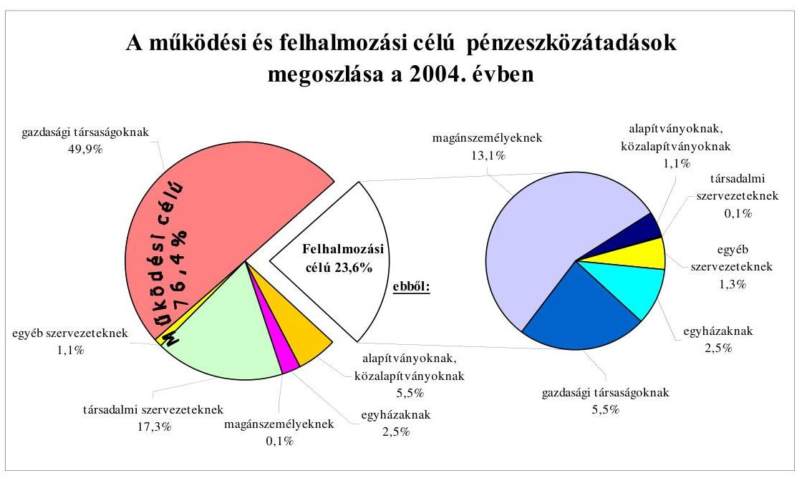
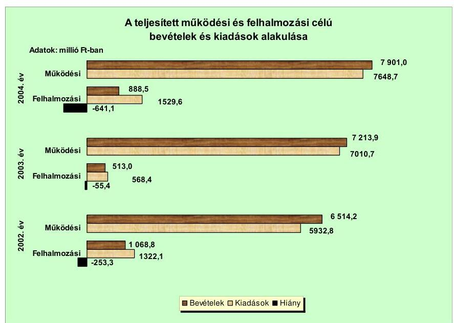
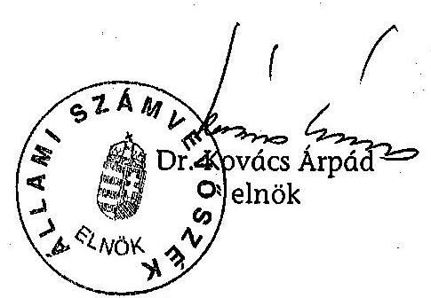
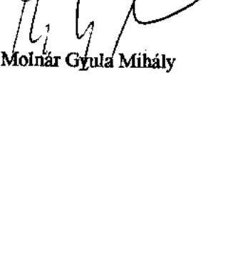
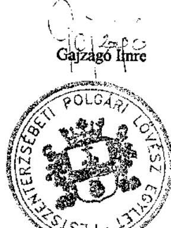
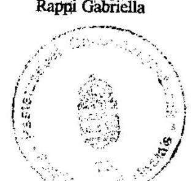
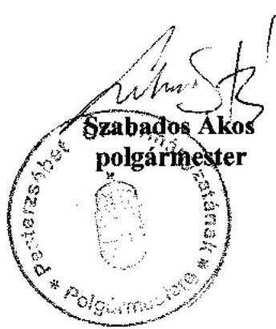

# JELENTÉS 

a Budapest Főváros XX. kerület Pesterzsébet Önkormányzata gazdálkodási rendszerének átfogó ellenőrzéséről

---

3. Önkormányzati és Területi Ellenőrzési Igazgatóság
3.3. Átfogó Ellenőrzések Főcsoport
Iktatószám: V-1001-1/25/17/2005.
Témaszám: 749
Vizsgálat-azonosító szám: V0213
Az ellenőrzést felügyelte:
Dr. Lóránt Zoltán
főigazgató
Az ellenőrzés végrehajtásáért felelős:
Dr. Sepsey Tamás
főigazgató-helyettes
Az ellenőrzést vezette:
Csecserits Imréné
főcsoportfőnök-helyettes
Az ellenőrzést végezték:
Marosi Gyöngyi
tanácsadó
Molnár Gyula Mihály
számvevő főtanácsos
Vojcsekné Szabó Ágnes
számvevő tanácsos

A témához kapcsolódó - elmúlt három évben - készített számvevőszéki jelentések:
címe
sorszáma
Jelentés a helyi és a helyi kisebbségi önkormányzatok 0220 gazdálkodásának átfogó ellenőrzéséről
Jelentés a helyi önkormányzatok közművelődési és könyvtári 0521 feladatellátásáról és finanszírozásáról

---

# TARTALOMJEGYZÉK 

BEVEZETÉS ..... 7
I. ÖSSZEGZŐ MEGÁLLAPÍTÁSOK, KÖVETKEZTETÉSEK, JAVASLATOK ..... 9
II. RÉSZLETES MEGÁLLAPÍTÁSOK ..... 20

1. A költségvetés tervezésének, végrehajtásának, az Önkormányzat vagyongazdálkodásának és a zárszámadás elkészítésének szabályszerűsége ..... 20
1.1. A költségvetési rendelet jóváhagyásának, módosításának, az előirányzatok nyilvántartásának szabályszerűsége ..... 20
1.2. A gazdálkodás szabályozottsága, a bizonylati rend és fegyelem szabályszerűsége ..... 25
1.3. A pénzügyi-számviteli feladatok ellátásának informatikai támogatottsága ..... 33
1.4. Az önkormányzati vagyon nyilvántartása, számbavétele ..... 34
1.5. A vagyonnal való gazdálkodás szabályszerűsége, célszerűsége, nyilvánossága ..... 36
1.6. A céljelleggel nyújtott támogatások szabályszerűsége ..... 43
1.7. A közbeszerzési eljárások szabályszerűsége ..... 47
1.8. A zárszámadási kötelezettség teljesítésének szabályszerűsége ..... 49
1.9. A Polgármesteri hivatal helyi kisebbségi önkormányzatok gazdálkodását segítő tevékenysége ..... 51
2. Az önkormányzati feladatok és a rendelkezésre álló források összhangja ..... 52
2.1. A feladatok meghatározása és szervezeti keretei ..... 52
2.2. A költségvetés egyensúlyának helyzete ..... 56
2.3. A feladatok finanszírozása ..... 63
3. A belső irányítási, ellenőrzési rendszer működésének értékelése ..... 65
3.1. Az ellenőrzési rendszer kialakítása, működése ..... 65
3.2. A könyvvizsgálati kötelezettség teljesítése ..... 68
3.3. A korábbi számvevőszéki ellenőrzések javaslatainak hasznosulása ..... 69

---

# MELLÉKLETEK 

1. számú Az Önkormányzat gazdálkodását meghatározó adatok, mutatószámok (1 oldal)
2. számú Az önkormányzati vagyon nagyságának alakulása (1 oldal)
3. számú Az Önkormányzat 2004. évi bevételeinek és kiadásainak alakulása (1 oldal)
4. számú Az egyes önkormányzati feladatok finanszírozása (1 oldal)
5. számú Helyszíni ellenőrzési jegyzőkönyv (2 oldal)
6. számú Szabados Ákos úr, a Budapest Főváros XX. kerület Pesterzsébet Önkormányzata polgármesterének észrevétele (1 oldal)

---

# RÖVIDÍTÉSEK JEGYZÉKE 

| Áht. | az államháztartásról szóló 1992. évi XXXVIII. törvény |
| :--: | :--: |
| Fot. | a fogyatékos személyek jogairól és esélyegyenlőségük biztosításáról szóló 1998. évi XXVI. törvény |
| Hatv. | a helyi adókról szóló 1990 . évi C. törvény |
| Htv. | a helyi önkormányzatok és szerveik, a köztársasági megbízottak, valamint egyes centrális alárendeltségú szervek feladat- és hatásköreiről szóló 1991. évi XX. törvény |
| Kbt. $_{1}$ | a közbeszerzésekről szóló 1995. évi XL. törvény |
| Kbt. 2 | a közbeszerzésekről szóló 2003. évi CXXIX. törvény |
| Ksztv. | A közhasznú szervezetekről szóló 1997. évi CLVI. törvény |
| Ltv. | A lakások és helyiségek bérletére, valamint az elidegenítésükre vonatkozó egyes szabályokról szóló 1993. évi LXXVIII. törvény |
| Nek. tv. | a nemzeti és etnikai kisebbségek jogairól szóló 1993. évi LXXVII. törvény |
| Ötv | a helyi önkormányzatokról szóló 1990. évi LXV. törvény |
| Számv. tv. | a számvitelről szóló 2000. évi C. törvény |
| Szoc. tv. | a szociális igazgatásról és szociális ellátásokról szóló 1993.   évi III. tv. |
| Ámr. | az államháztartás múködési rendjéről szóló 217/1998. (XII. 30.) Korm. rendelet |
| Ber. | a költségvetési szervek belső ellenőrzéséről szóló 193/2003. (IX. 26.) számú Korm. rendelet |
| Vhr | az államháztartás szervezetei beszámolási és könyvvezetési kötelezettségének sajátosságairól szóló 249/2000. (XII. 24.) számú Korm. rendelet |
| 20/1995. (III. 3.) Korm.   rendelet | a kisebbségi önkormányzatok költségvetésének, gazdálkodásának, vagyonjuttatásának egyes kérdéseiről szóló 20/1995. (III. 3.) Korm. rendelet |
| ÁSZ | Állami Számvevőszék |
| Kincstár | Magyar Államkincstár |
| Közbeszerzési Döntőbizottság | Közbeszerzések Tanácsa Közbeszerzési Döntőbizottsága |
| OEP | Országos Egészségbiztosítási Pénztár |
| Önkormányzat | Budapest Főváros XX. kerület Pesterzsébet Önkormányzata |
| Képviselő-testület | Budapest Főváros XX. kerület Pesterzsébet Önkormányzatának Képviselő-testülete |
| Költségvetési bizottság | Budapest Főváros XX. kerület Pesterzsébet Önkormányzatának Költségvetési Bizottsága |
| Oktatási bizottság | Budapest Főváros XX. kerület Pesterzsébet Önkormányzatának Oktatási, Kulturális és Közmúvelődési Bizottsága |
| Pénzügyi bizottság | Budapest Főváros XX. kerület Pesterzsébet Önkormányzatának Pénzügyi Bizottsága |

---

| Sportbizottság | Budapest Főváros XX. kerület Pesterzsébet Önkormányzatának Sportbizottsága |
| :--: | :--: |
| polgármester | Budapest Főváros XX. kerület Pesterzsébet Önkormányzatának Polgármestere |
| jegyző | Budapest Főváros XX. kerület Pesterzsébet Önkormányzatának jegyzője |
| Polgármesteri hivatal | Budapest Főváros XX. kerület Pesterzsébet Önkormányzatának Polgármesteri Hivatala |
| Ellenőrzési osztály | Budapest Főváros XX. kerület Pesterzsébet Önkormányzatának Ellenőrzési Osztálya |
| Oktatási osztály | Budapest Főváros XX. kerület Pesterzsébet Önkormányzatának Oktatási, Kulturális és Sportosztálya |
| Pénzügyi és adó osztály | Budapest Főváros XX. kerület Pesterzsébet Önkormányzatának Pénzügyi és Adó Osztálya |
| Vagyongazdálkodási osztály | Budapest Főváros XX. kerület Pesterzsébet Önkormányzatának Vagyongazdálkodási Osztálya |
| Adócsoport | Adócsoportja |
| Pénzügyi csoport | Budapest Főváros XX. kerület Pesterzsébet Önkormányzatának Pénzügyi és Adó Osztálya Pénzügyi Csoportja |
| Számviteli csoport | Budapest Főváros XX. kerület Pesterzsébet Önkormányzatának Pénzügyi és Adó Osztálya Számviteli csoportja |
| Közbeszerzési iroda | Budapest Főváros XX. kerület Pesterzsébet Önkormányzatának Közbeszerzési Irodája |
| Ügyfélszolgálati iroda | Budapest Főváros XX. kerület Pesterzsébet Önkormányzatának Ügyfélszolgálati és Okmány Irodája |
| SzMSz | Budapest Főváros XX. kerület Pesterzsébet Önkormányzat Polgármesteri Hivatalának Szervezeti és Müködési Szabályzata |
| ügyrend | Budapest Főváros XX. kerület Pesterzsébet Önkormányzata Polgármesteri Hivatalának Ügyrendje |
| gazdasági szervezet ügyrendje | Budapest Főváros XX. kerület Pesterzsébet Önkormányzata Polgármesteri Hivatala Pénzügyi és Adó Osztályának Ügyrendje |
| 2004. évi zárszámadási rendelet | Budapest Főváros XX. kerület Pesterzsébet Önkormányzatának 10/2005. (V. 9.) számú rendelete az 5/2004. (II. 23.) számú költségvetési rendelet végrehajtásáról szóló beszámoló elfogadásáról |
| 2005. évi költségvetési rendelet | Budapest Főváros XX. kerület Pesterzsébet Önkormányzatának a 2005. évi költségvetéséről szóló 4/2005. (II. 21.) számú rendelete |
| beszerzési rendelet | Budapest Főváros XX. kerület Pesterzsébet Önkormányzatának a közbeszerzési értékhatár alatti beszerzések egyszerűsített eljárási rendjéről szóló 21/2001. (VI. 14.) számú rendelete |
| bérbeadási rendelet ${ }_{1}$ | Budapest Főváros XX. kerület Pesterzsébet Önkormányzatának az Önkormányzat tulajdonában álló lakások és nem lakás céljára szolgáló helyiségek bérbeadásának feltételeiről szóló 33/1999. (IX. 23.) számú rendelete |

---

bérbeadási rendelet ${ }_{2}$
elidegenítési rendelet ${ }_{1}$
elidegenítési rendelet ${ }_{2}$
elidegenítési rendelet ${ }_{3}$
elidegenítési rendelet ${ }_{4}$
építményadó rendelet
közbeszerzési rendelet
telekadó rendelet
vagyongazdálkodási rendelet ${ }_{1}$
vagyongazdálkodási rendelet ${ }_{2}$
egzközök és források értékelésének szabályzata
gazdálkodási és ellenőrzési jogkörökkel kapcsolatos eljárás rendjéről szóló szabályzat

Budapest Főváros XX. kerület Pesterzsébet Önkormányzatának az Önkormányzat tulajdonában álló lakások és nem lakás céljára szolgáló helyiségek bérbeadásának feltételeiről szóló 42/2004. (VI. 30.) számú rendelete
Budapest Főváros XX. kerület Pesterzsébet Önkormányzatának az Önkormányzat tulajdonában lévő lakások elidegenítésének feltételeiről szóló 9/2002. (III. 20.) számú rendelete
Budapest Főváros XX. kerület Pesterzsébet Önkormányzatának az Önkormányzat tulajdonában lévő nem lakás célú helyiségek elidegenítésének feltételeiről szóló 5/2002. (II. 12.) számú rendelete

Budapest Főváros XX. kerület Pesterzsébet Önkormányzatának az Önkormányzat tulajdonában lévő lakások elidegenítésének feltételeiről szóló 20/2004. (IV. 6.) számú rendelete
Budapest Főváros XX. kerület Pesterzsébet Önkormányzatának az Önkormányzat tulajdonában lévő nem lakás célú helyiségek elidegenítésének feltételeiről szóló 19/2004. (IV. 6.) számú rendelete
Budapest Főváros XX. kerület Pesterzsébet Önkormányzatának a helyi építményadóról szóló 13/2003. (V. 16.) számú rendelete
Budapest Főváros XX. kerület Pesterzsébet Önkormányzatának a közbeszerzési eljárás kiírásával és elbírálásával összefüggő szabályokról szóló 19/2000. (X. 3.) számú rendelete
Budapest Főváros XX. kerület Pesterzsébet Önkormányzatának a helyi telekadóról szóló 14/2003. (V. 16.) számú rendelete
Budapest Főváros XX. kerület Pesterzsébet Önkormányzatának az Önkormányzat vagyonáról, a vagyontárgyak feletti tulajdonosi jogok gyakorlásáról szóló 30/1995. (VI. 15.) számú rendelete
Budapest Főváros XX. kerület Pesterzsébet Önkormányzatának az Önkormányzat tulajdonában álló vagyonnal való rendelkezés szabályairól szóló 32/2004. (VI. 9.) számú rendelete
Budapest Főváros Pesterzsébet XX. kerület Önkormányzata Polgármesteri hivatala Ügyrendje 13. számú mellékletét, illetve SzMSz-e V/2/9. számú mellékletét képező, az eszközök és források értékelési szabályzata
Budapest Főváros XX. kerület Pesterzsébet Önkormányzata Polgármesteri hivatala Ügyrendje 6. számú mellékletét, illetve SzMSz-e V/2/2. számú mellékletét képező, a kötelezettségvállalás, az ellenjegyzés, az utalványozás, valamint a számlák igazolásának rendjéről szóló szabályzata

---

| leltározási szabályzat | Budapest Főváros XX. kerület Pesterzsébet Önkormányzata Polgármesteri hivatala Ügyrendje 8. számú mellékletét, illetve SzMSz-e V5/2/4 számú mellékletét képező, az eszközök és források leltározási és leltárkészítési szabályzata |
| :--: | :--: |
| pénzkezelési szabályzat | Budapest Főváros XX. kerület Pesterzsébet Önkormányzata Polgármesteri hivatala Ügyrendje 7. számú mellékletét, illetve SzMSz-e V/2/3 számú mellékletét képező pénz-és értékkezelési szabályzat |
| selejtezési szabályzat | Budapest Főváros XX. kerület Pesterzsébet Önkormányzata Polgármesteri hivatala Ügyrendje 9. számú mellékletét, illetve SzMSz-e V/2/5 számú mellékletét képező, a felesleges vagyontárgyak hasznosításának, selejtezésének szabályzata |
| versenyeztetési szabály-   zat | Budapest Főváros Pesterzsébet XX. kerület Önkormányzatának az Önkormányzat tulajdonában álló vagyonnal való rendelkezés szabályairól szóló 32/2004. (VI. 9.) számú rendelet végrehajtásáról kiadott 56/2004. (IX. 24.) számú rendelete |
| CSILI Művelődési Központ | Budapest Főváros XX. kerület Pesterzsébet Önkormányzatának CSILI Múvelődési Központja |
| Szociális Foglalkoztató | Budapest Főváros XX. kerület Pesterzsébet Önkormányzatának Szociális Foglalkoztatója |
| Pesterzsébeti Sportszer-   vező-és szolgáltató In-   tézmény | Budapest Főváros XX. kerület Pesterzsébet Önkormányzatának Pesterzsébeti Sportszervező-és szolgáltató Intézménye |
| Pesterzsébeti Múzeum | Budapest Főváros XX. kerület Pesterzsébet Önkormányzatának Pesterzsébeti Múzeuma |
| Gimnázium | Budapest Főváros XX. kerület Pesterzsébet Önkormányzatának Passuth László Gimnáziuma |
| PEPI | Budapest Főváros XX. kerület Pesterzsébet Önkormányzatának Pesterzsébeti Pedagógiai Intézete |
| Városüzemeltetési Rt. | Pesterzsébeti Városüzemeltetési Részvénytársaság |
| ESMTK LE Kft. | ESMTK Labdarugó Egylet Sportszolgáltató Kft. |
| Integrit-XX. Kft. | Integrit-XX. Városüzemeltetési, Szervező, Fejlesztő és Szolgáltató Korlátolt Felelősségű Társaság |
| TV-20 Kft. | TV-20 Korlátolt Felelősségú Társaság |

---

# JELENTÉS 

## a Budapest Főváros XX. kerület Pesterzsébet Önkormányzata gazdálkodási rendszerének átfogó ellenőrzéséről

## BEVEZETÉS

Az Ötv. 92. § (1) bekezdése, az Állami Számvevőszékről szóló 1989. évi XXXVIII. törvény 2. § (3) bekezdése, valamint az Áht. 120/A. § (1) bekezdése alapján az önkormányzatok gazdálkodását az Állami Számvevőszék ellenőrzi. Az ellenőrzés elvégzése az Országgyűlés illetékes bizottságai részére is átadott, országosan egységes ellenőrzési program alapján történt.

## Az ellenőrzés célja annak értékelése volt, hogy:

- az önkormányzati gazdálkodás törvényességét ${ }^{1}$, szabályszerűségét biztosított-ták-e a tervezés, a költségvetés végrehajtása, a vagyongazdálkodás és a zárszámadás során;
- az Önkormányzat által ellátott feladatok és az azokhoz rendelkezésre álló források összhangja biztosított volt-e, különös tekintettel az egyes kiemelt feladatokra;
- a gazdálkodás szabályszerűségét biztosító belső kontrollok ${ }^{2}$ lehetővé tették-e a szabálytalanságok, hiányosságok, gazdaságtalan megoldások feltárását, megelőzését;

Az ellenőrzött időszak: a 2004. év, valamint 2005. I. félév, az 1.5., 2.1-2.3. és 3.3. programpontok tekintetében a 2002-2003. évek is.

Budapest főváros XX. kerületét hat városrész ${ }^{3}$ alkotja. A kerület lakosainak száma 2005. január 1-jén 64769 fő volt.

[^0]
[^0]:    ${ }^{1}$ A törvényi előírások betartásának elmulasztásakor a részletes megállapítások fejezetben egységesen a törvénysértés megjelölést alkalmazzuk, mivel az ÁSZ nem tehet különbséget a törvényi előírások között.
    ${ }^{2}$ A gazdálkodás szabályszerűségét biztosító kontroll alatt értjük a kiépített és működő belső irányítási és szabályozási rendszert, valamint a belső ellenőrzési funkciók ellátását.
    ${ }^{3}$ Gubacs, Gubacsipuszta, Kossuthfalva, Pacsirtatelep, Erzsébetfalva és Szabótelep.

---

Az Önkormányzat 28 tagú Képviselő-testületének munkáját 11 állandó bizottság segítette. A polgármester személye az 1998. évtől, a jegyző személye az 1990. évtől nem változott.

Az Önkormányzat feladatainak végrehajtása érdekében 32 költségvetési szervet múködtet, amelyekből hat önállóan gazdálkodik. A feladatok ellátásában részt vesz négy közalapítvány, továbbá kettő gazdasági társaság. A feladatok ellátására az Önkormányzat költségvetési szerveinél a 2004. év végén foglalkoztatott közalkalmazottak száma 1577 fő, a köztisztviselők száma 212 fő volt. Az Önkormányzat a 2004. évben 8790 millió Ft bevételt ért el és 9178 millió Ft kiadást teljesített, a 2005. évben 9516 millió Ft kiadást tervezett, a 2004. év végén 20899,3 millió Ft értékű könyvviteli mérleg szerinti vagyonnal rendelkezett. Az Önkormányzat gazdálkodását meghatározó adatokat, mutatószámokat az 1-3. számú mellékletek tartalmazzák.

A kerületben a 2002. évi önkormányzati képviselő választásokig három ${ }^{4}$, azt követően hét ${ }^{5}$ a megválasztott és múködő kisebbségi önkormányzatok száma.

A jelentés megállapításainak, javaslatainak egyeztetése során a polgármester arról adott tájékoztatást, hogy az időközben megtett intézkedésekkel a javaslatok egy részét megvalósították. Ezekben az esetekben a jelentés II. Részletes megállapítások fejezetében az adott témához kapcsolt lábjegyzetben a megtett intézkedést feltüntettük és a kapcsolódó javaslatot elhagytuk.

[^0]
[^0]:    ${ }^{4}$ Cigány, német, román kisebbségi önkormányzat.
    ${ }^{5}$ Bolgár, cigány, horvát, német, örmény, román, ruszin kisebbségi önkormányzat.

---

# I. ÖSSZEGZŐ MEGÁLLAPÍTÁSOK, KÖVETKEZTETÉSEK, JAVASLATOK 

Az Önkormányzat a 2002-2006. évekre szólóan az Ötv-ben előírtak alapján meghatározta négyéves gazdasági programját, fejlesztési célkitűzéseit. A polgármester a 2004. és a 2005. évi költségvetési koncepciókat határidőben terjesztette a Képviselő-testület elé, amelyekhez mellékelte a kisebbségi önkormányzatok koncepcióról alkotott véleményét, azonban az Ámr-ben előírtaktól eltérően a Pénzügyi bizottság határozatban rögzített véleményét nem csatolta az előterjesztéshez.

A polgármester az Áht. előírása ellenére nem a költségvetési rendelettervezetek benyújtásakor terjesztette elő azokat a rendelettervezeteket, amelyek a bevételi, kiadási költségvetési előirányzatokat meghatározzák, hanem csak a költségvetés jóváhagyását követő két-három hónap múlva. Emiatt azok hatását évközben előirányzat módosításként vették figyelembe. A polgármester a költségvetési rendelettervezeteket határidőn belül, a könyvvizsgáló véleményének csatolásával terjesztette elő, amelyhez a 2004. évben még nem, a 2005. évben már csatolta a Pénzügyi bizottság véleményét is. A költségvetési rendeletek tartalma és szerkezete nem felelt meg az Áht-ban és az Ámr-ben foglalt előírásoknak, mivel elmaradt a múködési és fenntartási kiadási előirányzatok meghatározása költségvetési szervenként, valamint nem tartalmazták a Polgármesteri hivatal bevételi és kiadási főösszegét, a kiemelt kiadási előirányzatok közül a személyi és dologi jellegű kiadásoknak az ellátottak pénzbeli juttatásainak kiemelt előirányzatonként összesített adatát és bevételeit főbb jogcímcsoportonkénti részletezettségben, továbbá költségvetését feladatonként.

A költségvetési rendeletekben meghatározták a költségvetés és a zárszámadás előterjesztésekor az Áht. előírása alapján tájékoztató jelleggel a Képviselőtestület részére bemutatandó mérlegek, kimutatások tartalmi követelményeit. A 2005. évi költségvetési rendeletben azonban a vagyonkimutatás tartalmi követelményeinek meghatározásánál figyelmen kívül hagyva a Vhr. 2005. január 1-től hatályos szabályozását, nem írták elő a vagyon forgalomképesség szerinti csoportokban történő bemutatását, a 0-ra leírt, de használatban lévő, illetve használaton kívüli eszközök állományának a bemutatását, valamint a könyvviteli mérlegben értékkel nem szereplő kötelezettségek szerepeltetését. A költségvetési rendeletekben meghatározottak szerint mindkét évben a költségvetési rendelettervezet előterjesztésekor tájékoztatásul bemutatták az Áhtban előírt mérlegeket, kimutatásokat, azonban a közvetett támogatásokat nem a költségvetési rendeletekben meghatározott jogcímenként, hanem egy összegben, összevontan mutatták be. A 2004. és a 2005. évi költségvetési rendeletekben a tervezett költségvetési bevételek nem fedezték a költségvetési kiadásokat, azok különbségeként a hiány összegét bemutatták. A hiányt hitelből tervezték finanszírozni. A 2004. és a 2005. évi költségvetési rendeletekben az Önkormányzat meghatározta a költségvetés végrehajtásának szabályait.

A 2004. évi költségvetési előirányzatok főösszege 9,9\%-kal emelkedett a módosítások következtében. A költségvetési előirányzatok módosítására előter-

---

jesztett rendelettervezetek a költségvetéssel összehasonlítható módon tartalmazták a módosítási javaslatokat és az előirányzat-változtatásokat hitelt érdemlően, dokumentumokkal alátámasztották. A 2004. és 2005. évi költségvetési rendelet módosításai az Ámr-ben foglaltaknak megfeleltek.

A Polgármesteri hivatal szervezeti felépítését, múködésének rendjét 2005. június 1-ig ügyrendben, azt követően SzMSz-ben határozták meg, amelyben azonban az Ámr. előírása ellenére nem rögzítették a Polgármesteri hivatal alapító okiratának keltét, számát. A Pénzügyi és adó osztály, mint gazdasági szervezet feladatait az ügyrendben meghatározták, azonban az Ámr. előírása ellenére elmaradt az osztályvezető munkáltatói jogkörén kívül a vezetők és más dolgozók feladat-, hatás- és jogkörének a meghatározása.

Az operatív gazdálkodással és a munkafolyamatba épített ellenőrzéssel összefüggő hatásköröket és feladatokat szabályozták. A gazdálkodási és ellenőrzési jogkörrel történő felhatalmazásoknál, megbízásoknál, kijelöléseknél az Ámr-ben előírt követelményeket betartották. A felhatalmazottakat a jogkör gyakorlásáról a tárgyhónapot követő hónapban beszámoltatták.

A jegyző a Htv. előírásait figyelembe véve kialakította a költségvetési szervek egységes számviteli rendjét. A Polgármesteri hivatal rendelkezett számviteli politikával és az ehhez kapcsolódó szabályzatokkal, de a számviteli politikában a Vhr-ben foglaltak ellenére a kisebbségi önkormányzatok gazdálkodásával összefüggő sajátos feladatokat, valamint az Ámr. előírása ellenére a kisebbségi önkormányzatok kötelezettségvállalásához kapcsolódó nyilvántartások elkülönített vezetését nem írták elő. A leltározási szabályzat tartalmazta a leltározás előkészítésével, megszervezésével és végrehajtásával kapcsolatos feladatokat, amelynek során az ingatlanok esetében 10 évenkénti, a gépek, berendezések, felszerelések és járművek esetében kétévenkénti mennyiségi leltározási feladatot határoztak meg. Az előírást a 2005.évben a Vhr-ben foglaltakkal összhangba hozva módosították. A pénzkezelési szabályzatban a házipénztár keretösszegét 1,5 millió Ft-ban határozták meg, amely az átlagos napi pénzforgalom figyelembevételével indokolatlanul magas, vagyonvédelmi szempontból célszerűtlen.

A számlarendben előírták az analitikus nyilvántartások formáját és tartalmát, azok vezetésének módját. A Vhr. előírása ellenére nem szabályozták a főkönyvi számlák és az analitikus nyilvántartások kapcsolatát, egyeztetése dokumentálásának módját, az analitikus nyilvántartások adataiból készült összesítő bizonylatok elkészítésének határidejét. A hiányosságot a számlarend 2005. szeptember havi módosításakor megszüntették.

A Polgármesteri hivatalban a követelések és a kötelezettségek esetében a főkönyvi és az analitikus nyilvántartások egyeztetését a számlarendben előírtak ellenére 2004. és 2005. I. negyedévében nem végezték el. A gazdasági eseményeket közgazdasági és funkcionális osztályozás szerint rögzítették a számvitelben, azonban három esetben az érvényesítés során a Vhr-ben előírtaktól eltérően jelölték ki a könyvviteli elszámolásra utaló főkönyvi számla számát, ezáltal a könyvelésben összesen 14,3 millió Ft értékű szolgáltatás megrendelést támogatásként mutattak ki. A rendszeres és a nem rendszeres személyi juttatások, valamint a munkaadókat terhelő járulékok, a szociálpolitikai juttatások és a

---

segélyek kiadási előirányzatait terhelő kötelezettségvállalásokról, azok folyamatos figyelemmel kisérése és éves összegzés megállapításához az Ámr-ben előírtak ellenére nyilvántartást nem vezettek. A gazdasági eseményeket rögzítő bizonylatok 28\%-ánál megsértették a Számv. tv. és az Ámr. által a számviteli bizonylatokra vonatkozóan előírt alaki és tartalmi követelményeket, mivel a külföldi számlákra nem vezették fel a könyvelés megtörténte előtt magyarul is a bizonylat hitelességéhez feltétlenül szükséges adatokat, a pénztári és pénzintézeti pénzmozgásokkal összefüggő utalványrendeleteken nem tüntették fel a kötelezettségvállalás nyilvántartásba vételi sorszámát, a pénzintézeti bevételekkel összefüggő utalványrendeleteken a kedvezményezett bankszámla számát. A gazdasági eseményeket rögzítő bizonylatok 15\%-ánál elmaradt a szakmai teljesítés igazolása, illetve azt hatáskörrel nem rendelkező végezte. Az Ámr-ben foglaltak ellenére a pénztár és pénzintézeti pénzmozgások bizonylatainak 10\%ánál hiányzott a kötelezettségvállalás ellenjegyzése, nem végezték el ezeknél a bizonylatoknál a kiadási előirányzat által biztosított fedezet meglétének, a kötelezettségvállalás jogszerűségének az ellenőrzését. A követelések és a kötelezettségek analitikus nyilvántartásaiból készített összesítő bizonylatok adatait a Vhr-ben előírt negyedéves gyakoriságtól eltérve a 2004. és 2005. évben az első negyedévben nem, csak a félévi zárlati feladatok keretében rögzítették a könyvekben, így nem biztosították, hogy a számviteli nyilvántartásban naprakész információ álljon rendelkezésre.

A szakmai teljesítésigazolás elmulasztása eseteiben az Ámr. előírása ellenére nem ellenőrizték a bevételek beszedésének és a kiadások teljesítésének elrendelése előtt azok jogosultságát. Az érvényesítő nem tett eleget az Ámr-ben foglalt, munkafolyamatba épített ellenőrzési feladatainak, mert annak ellenére érvényesítette a gazdasági eseményeket magukba foglaló bizonylatokat, hogy hiányzott a szakmai teljesítés igazolása, a kötelezettségvállalás ellenjegyzése, a kötelezettségvállalás nyilvántartásba vételi sorszámának, a kedvezményezett bankszámlájának, külföldi számlákon magyarul is a bizonylat hitelességéhez feltétlenül szükséges adatoknak a feltüntetése, nem ellenőrizte a fedezet meglétét. Az utalványozás ellenjegyzője az Ámr-ben foglaltak ellenére a szakmai teljesítés elmaradása, a fedezet meglétének hiánya ellenére ellenjegyezte az utalványrendeleteket. A pénzkezelési szabályzatban előírtakkal szemben a pénztári záró pénzösszeg átlagosan $18 \%$-kal meghaladta a házipénztári záró pénzkészlet összegét. Önkormányzati szinten és az intézményeknél a 2004. évi költségvetési előirányzatokat betartották, ugyanakkor a Polgármesteri hivatalnál megsértették az Áht. előírásait, mert a 2004. évi költségvetési rendeletben az Áht-ban meghatározottaknál részletezettebben jóváhagyott kiadási előirányzatokat 42 tételnél túllépték. A túllépés okait nem vizsgálták, felelősségre vonás nem történt.

A Polgármesteri hivatal több évre vonatkozó informatikai stratégiával rendelkezett. A Polgármesteri hivatalban a folyamatos és biztonságos számítástechnikai munkavégzéshez szükséges katasztrófa elhárítási terv nem készült. Az adatok hozzáférésének és mentésének szabályairól, a számítástechnikai eszközök üzemeltetésének és védelmének követelményeiről, a vírusvédelemről, a betekintési jogosultság rendjéről rendelkeztek. A Pénzügyi és adó osztályon a pénzügyi-számviteli feladatokat ellátó munkatársak rendelkeztek az általuk alkalmazott programok használatához szükséges ismeretekkel, munkaköri leírásuk tartalmazta a program használatát és a végzett feladatok leírását.

---

A Polgármesteri hivatalban az önkormányzati vagyont a Vhr-ben foglalt előírásnak megfelelően forgalomképesség szerint elkülönítetten tartották nyilván. Az ingatlanok és az üzemeltetésre, kezelésre átadott eszközök mennyiségi felvétellel, a részesedések egyeztetéssel történő 2004. évi leltározását a Vhr. előírásai ellenére nem végezték el. A követelések, részesedések és értékpapírok év végi értékeléséhez szükséges információk rendelkezésre álltak. A részesedések analitikus és főkönyvi nyilvántartása a Vhr. előírásával szemben tartalmazott olyan üzletrészt, amely társaságban az Önkormányzatnak tulajdoni részesedése a cégnyilvántartás szerint nem volt, mivel a társaság megszűnésekor az ezzel kapcsolatos állománycsökkenést tévesen értékvesztésként számolták el. Az önkormányzati tulajdonú vállalkozásoknál és a részvényeknél a rendelkezésre álló információk alapján értékvesztés elszámolás nem történt és nem is volt szükséges. Az értékpapírként nyilvántartott kárpótlási jegyek vonatkozásában, a tartósan adott kölcsönök és a követelések esetében elszámolt értékvesztések visszaírása indokolt volt és megfelelt a Számv. tv. előírásainak. Az elszámolt értékvesítéseket és visszaírásokat a részesedések kivételével a Vhr-ben foglalt előírásoknak megfelelően rögzítették az analitikus és a főkönyvi nyilvántartásokban.

A vagyonnal való rendelkezési, döntési hatásköröket a vagyongazdálkodási rendeletben szabályozták. Az Áht. előírását betartva rögzítették azt az értékhatárt, amely felett vagyont értékesíteni, a vagyonkezelés jogát, a vagyon használatát, illetve hasznosítás jogát átengedni csak nyilvános versenytárgyalás útján, a legjobb ajánlattevő részére lehet. A vagyongazdálkodási rendeletben az Áht. előírását megsértve lehetővé tették a versenyeztetési eljárás mellőzését. A szabályozás nem segítette a közvagyonnal való gazdálkodás nyilvánosságát, átláthatóságát. A vagyongazdálkodási rendeletben szabályozták az ingyenes és kedvezményes vagyonátadás eseteit és módját, valamint a követelésről való lemondás eseteit és módját. A szerződések közzétételével kapcsolatos Áht-ban foglalt kötelezettségnek eleget tettek. A telekalakítás után pályáztatás nélkül, az értékbecslésben megállapított forgalmi értéken értékesített ingatlan esetében betartották a helyi szabályozás előírásait, azonban a nyilvános pályáztatás mellőzésével megsértették az Áht. előírásait. A pályázat kiírásával és a licitálásos versenytárgyalás lefolytatásával hasznosított ingatlan esetében az előző használati díj közel két és félszeresét érték el. A sportlétesítmény gazdasági társaság részére történt ingyenes használatba adása során nem tartották be a vagyongazdálkodási rendelet ingyenes használatba adás esetére vonatkozó előírását, mert az nem tartalmazta a gazdasági társaságnak történő átadás lehetőségét. A vagyongazdálkodási döntések során a hatásköri szabályokat betartották, a megkötött szerződésekben az Önkormányzat érdekeit védő garanciális elemeket érvényre juttatták. Az Önkormányzat a 2002-2004. évek között az Ltv. előírásai ellenére nem adta át a Budapest Főváros Önkormányzatának az önkormányzati lakások elidegenítéséből származó bevételeknek a kapcsolódó költségek levonása utáni 50\%-át, 297 millió Ft-ot.

Az Önkormányzat öt párt részére kedvezményesen biztosított helyiséget, ezzel közvetve támogatást adott részükre a nem közfeladat ellátásához, így nem tett eleget az Ötv. előírásainak, valamint nem biztosította az alkotmányos jogegyenlőséget a bérlők között. A Képviselő-testület a polgármester 2002. évben előterjesztett - piaci bérleti díj bevezetésére irányuló - javaslatát elutasította. A

---

Képviselő-testület a 2005. évben - egyéves, 2006. április 21-i felmondási határidővel - felmondta a pártszervezetekkel kötött bérleti szerződéseket.

Az Önkormányzat a 2004. évben 171,4 millió Ft céljellegú támogatást nyújtott gazdasági társaságoknak, társadalmi szervezeteknek, alapítványoknak, közalapítványoknak, egyházaknak, egyéb szervezeteknek, magánszemélyeknek. A céljellegú támogatások döntési jogosultságát a 2004. évben az Ötv. előírásait megsértve szabályozták, mivel ennek alapján az alapítványoknak nyújtott támogatások 55\%-áról bizottság, illetve a polgármester döntött, annak ellenére, hogy az alapítványok támogatása a Képviselő-testület kizárólagos hatáskörébe tartozik. A 2005. évben a jogsértő szabályozást megszüntették. A 2004. évben céljelleggel nyújtott támogatásoknál az Áht. előírását megsértve három esetben elmaradt a számadási kötelezettség előírása. A közhasznú szervezetekkel kötött szerződésekben meghatározták a támogatással való elszámolás feltételeit és módját, betartva a Ksztv. előírásait. A támogatások 32\%-ánál nem az előírt hitelesített számlamásolatokkal számoltak el a támogatottak. A 2004. évben egy támogatott nem nyújtotta be az előírt számadást, az Áhtban foglaltakat megsértve nem intézkedtek a támogatás visszafizettetéséről. A számadások tartalmi és formai ellenőrzését elvégezték, azonban a 2004. évben négy támogatottnál ellenőrizték a helyszínen a támogatások rendeltetésnek megfelelő felhasználását, a többi támogatásnál az Áht. előírásait megsértve a támogatások rendeltetésszerú felhasználásának ellenőrzését elmulasztották.

Az Önkormányzat a 2004. évben négy közbeszerzési eljárást folytatott le, melyek összértéke 588,8 millió Ft volt. A közbeszerzési eljárások során minden alkalommal nyílt eljárást választottak. A közbeszerzési eljárást az értékhatár feletti beszerzések esetében lebonyolították. Az ajánlatok felbontása és elbírálása során a Kbt.,-ben foglalt szabályokat érvényesítették. A közbeszerzési eljárások eredményéről a polgármester döntött a szakmai bíráló bizottságok javaslata alapján a Kbt., előírásainak megfelelően. A szerződéseket a Kbt., előírásainak megfelelően a felhívás, a dokumentáció és az ajánlat tartalma alapján kötötték meg. A megkötött szerződéseket nem módosították, a határidőket betartották. A Közbeszerzési Döntőbizottság a 2004. évben lefolytatott közbeszerzési eljárásokkal kapcsolatban nem marasztalta el az Önkormányzatot.

A polgármester a 2004. évi zárszámadási rendelettervezetet az Áht-ban előírt határidőn belül terjesztette a Képviselő-testület elé. A 2004. évi zárszámadási rendelettervezet a költségvetési rendelethez hasonlóan nem tartalmazta a bevételeket főbb jogcímcsoportok szerint, a múködési, fenntartási kiadásokat költségvetési szervenként, a Polgármesteri hivatal bevételi és kiadási főösszegét, a kiemelt kiadási előirányzatainak a teljesítését, a munkaadókat terhelő járulékok és a speciális célú támogatások kivételével, valamint a Polgármesteri hivatal bevételeit és kiadásait feladatonként. Az Áht. előírása ellenére elmaradt a múködési és a felhalmozási célú bevételi és kiadási előirányzatok teljesülésének mérlegszerű egymástól elkülönített, de együttesen egyensúlyban lévő állapotban történő bemutatása. A zárszámadás előterjesztésekor a Képviselő-testület részére bemutatták az Áht-ban előírtak alapján az Önkormányzat és a helyi kisebbségi önkormányzatok összevont mérlegeit, az Önkormányzat vagyonkimutatását, a közvetett támogatásokat tartalmazó kimutatást szöveges indoklással, viszont az Áht. előírása ellenére nem mutatták be szöveges indoklással együtt a

---

többéves kihatással járó döntéseket számszerűsítve, évenkénti bontásban és összesítve.

A 2004. évi zárszámadási rendeletben jóváhagyta a Képviselő-testület a költségvetési szervek és a Polgármesteri hivatal 2004. évi pénzmaradványát az Ámr. és a Vhr-ben foglalt előírásoknak megfelelően. A Polgármesteri hivatal 2004. év végén elszámolt pénzmaradványának összegét a Vhr. előírása alapján a számviteli nyilvántartásban kimutatott 2003. évi pénzmaradvány elszámolatlan összegével a Vhr-ben foglaltaktól eltérően korrigálták annak ellenére, hogy a Képviselő-testület az intézmények 2003. évi alulfinanszírozása miatt nyilvántartott elszámolatlan pénzmaradvány fedezetét a Polgármesteri hivatal 2004. évi költségvetési előirányzataiban biztosította.

A Polgármesteri hivatal az intézmények 2004. évi beszámolóit az Ámr-ben előírt határidőig felülvizsgálta. Az éves költségvetési beszámolók elfogadásáról, a múködésük elbírásáról, jóváhagyásáról, valamint a felhasználásra jóváhagyott pénzmaradványról az Ámr. előírásainak megfelelően írásban értesítették az intézményeket. A 2004. évre vonatkozóan az államháztartás információs rendszere keretében továbbított költségvetési szervenkénti éves költségvetési beszámolók összevont adatai, illetve a 2004. évi zárszámadási rendelet számszaki adatai közötti összhangot nem biztosították, az eltéréseket a Képviselő-testület részére nem mutatták be.

Az Önkormányzat az Áht-ban előírt együttmúködési megállapodást az Ámrben előírt határidő után kötötte meg a kisebbségi önkormányzatokkal. Az Ámr-ben foglaltak ellenére a megállapodásokban nem határozták meg a költségvetési és a zárszámadási határozattervezeteknek a kisebbségi önkormányzati testülethez történő beterjesztésének, valamint a zárszámadásról hozott határozatok Polgármesteri hivatalhoz való továbbításának határidejét. Az együttműködési megállapodásban a helyi kisebbségi önkormányzatok a kötelezettségvállalás ellenjegyzésével nem a jegyzőt bízták meg, hanem - az Áht-ban biztosított lehetőséggel élve - saját testületük tagjaiból határozat útján jelölték ki az ellenjegyzésre jogosult személyt. Az Ámr. előírásának megfelelően a jegyző meghatározta a szakmai teljesítés igazolásának módját és a kötelezettségvállalásra jogosultakat jelölte ki a feladat ellátására, azonban ezt az együttmúködési megállapodásokban nem rögzítették. A Polgármesteri hivatalban kisebbségi önkormányzatonként elkülönítetten vezették a vagyoni és a számviteli nyilvántartásokat, a jóváhagyott költségvetési előirányzatokat, valamint kötelezettségvállalások Ámr. előírásainak megfelelő analitikus nyilvántartásait. A kisebbségi önkormányzatok kiadásairól a nyilvántartásokat külön-külön szakfeladati bontásban vezették, azonban a bevételeknél nem biztosították a szakfeladatonkénti elkülönítést a 20/1995. (III. 3.) Korm. rendeletben foglaltak ellenére.

A Képviselő-testület nem határozta meg az Ötv. előírásai ellenére a kötelezö és önként vállalt feladatai ellátásának mértékét és módját. Az Önkormányzat az Ötv-ben előírt kötelező és önként vállalt feladatait az általa alapított költségvetési szervekkel, valamint gazdasági társaságokkal, közalapítványokkal és egyéb szervezetekkel kötött ellátási, vállalkozási szerződésekkel oldotta meg. Az Önkormányzat megsértve a Szoc. tv. előírásait nem biztosította a szociális alapszolgáltatások közül a közösségi ellátásokat, a támogató szol-

---

gáltatást, az utcai szociális munkát, a jelzőrendszeres házi segítségnyújtást, valamint az időskorúak nappali ellátásának kivételével a nappali ellátási feladatokat, a szakosított szociális ellátások közül a fogyatékos személyek gondozóházának, pszichiátriai betegek átmeneti otthonának és a szenvedélybetegek átmeneti otthonának a múködtetését. A Képviselő-testület határozatban döntött a feladatok ellátását biztosító feltételek 2007. évig történő kialakításáról. A Képviselő-testület a gyermeklétszámhoz igazodva, a feladatellátás hatékonyabb szervezeti megoldásai érdekében 2003. szeptember 1-jén megszüntette a gimnáziumi oktatást és két tagóvodáját. 2004. január 1-jén módosította a Pesterzsébeti Múzeum gazdálkodási jogkörét, részben önállóan gazdálkodó költségvetési intézménnyé minősítette, 2004. január 1-től megszüntette a testneveléssel és a sportfeladatok ellátásával kapcsolatos tevékenységet ellátó részben önállóan gazdálkodó intézményét a feladatainak az Önkormányzat intézményhálózatán belüli átcsoportosítása mellett, valamint döntött a vagyongaz-dálkodási- és kezelési feladatok egy szervezeti egységbe történő összevonása érdekében két gazdasági társasága beolvadással történő egyesüléséről. A Képvise-lő-testület a 2005. évben közalapítványt hozott létre a közbiztonság javításának, a bűnmegelőzési munkában való részvétel támogatásának, elismerésének elősegítése érdekében.

Az Önkormányzatnál a 2002-2005. években tervszinten a költségvetési bevételek nem fedezték a költségvetési kiadásokat, a hiányzó forrást hitel felvételével tervezte biztosítani a Képviselő-testület. A tervezettől eltérően a 2002-2003. években a teljesített költségvetési bevételek fedezték a teljesített költségvetési kiadásokat, a költségvetés egyensúlya biztosított volt. A 2004. évben nem biztosították a bevételek és a kiadások egyensúlyát, a tényleges költségvetési bevételek nem fedezték a költségvetési kiadásokat. A 2003-2004. években meghatározott fejlesztési kiadásaihoz - útépítési beruházáshoz, irodahelyiségek és irattár vásárlásához, továbbá keretjelleggel fejlesztési feladatok finanszírozásához - vett fel hosszú lejáratú hiteleket az Önkormányzat. A teljesített kiadási főöszszeghez képest a hitelfelvételből származó forrás aránya $0,7 \%$, illetve $4,5 \%$ volt. Az adósságot keletkeztető kötelezettségvállalásoknál az Ötv-ben előírt felső határt betartották. Az Önkormányzat a feladatellátás finanszírozásához rendelkezésre álló forrásait a 2002-2004. évek között külső, ezek között pályázati úton elnyert forrásokkal növelte. A pályázati források bevonásával megvalósított felhalmozási kiadások közül legjelentősebbek csatorna-beruházásokkal és az útépítésekkel kapcsolatosak. A Polgármesteri hivatal a 2003. és a 2004. évi gazdálkodás során likvid hitelt vett fel a múködéshez, amelyet sem a 2003. évben sem pedig a 2004. évben nem fizették vissza, annak visszafizetése a 2005. évi gazdálkodás terheit növelte. A 2002-2004. évek közötti időszakban az építményadóból és a telekadóból származó bevétel szerepe az összes költségvetési bevételen belül növekedett, a költségvetési bevétel 4,2\%-át, 5\%-át, illetve 4,7\%át tette ki, mértéke az alkalmazható mérték maximuma volt. A Hatv-ben meghatározottakon túlmenően is megállapítottak adókedvezményeket, mentességeket.

A naturális mutatókkal mérhető kötelező feladatok közül a fajlagos kiadások a bázisévhez viszonyítva a 2003. évben mintegy egyharmadával emelkedtek - a neveltek és az ellátottak számának, a kapacitáskihasználtságnak a csökkenése miatt - a bölcsődei ellátásban, a középiskolai oktatásban és a bentlakásos szociális intézményi ellátásban. Az általános iskolai oktatásban a ka-

---

pacitás-kihasználtsági mutató nem változott, ugyanakkor a személyi és dologi kiadások folyamatos növekedése miatt az egy általános iskolai tanulóra jutó fajlagos kiadás a 2002. évről a 2003. évre 30\%-kal, a 2003. évről a 2004. évre 10\%-kal emelkedett. A kiadások finanszírozásában a központi költségvetési hozzájárulás, támogatás részaránya a 2002. és 2004. év viszonylatában csökkent az óvodai nevelésben, az általános iskolai oktatásban, a nappali- és a bentlakásos szociális intézményi ellátásban, nőtt a bölcsődei ellátásban és a középiskolai oktatásban. Az önként vállalt feladatok megvalósítására a 20022004. években az éves költségvetési kiadások közel azonos részarányát - 12-13\%-át - fordították, összegük folyamatosan emelkedett. Az Önkormányzat önként vállalt feladatainak ellátása a 2002-2004. években nem veszélyeztette a kötelező feladatok megvalósítását. Az Önkormányzat 2004. december 31-ig középületeinek 13\%-ánál gondoskodott azok akadálymentessé tételéről. A Fot. előírásai ellenére, az akadálymentessé tételre meghatározott 2005. január 1-i határidőre 56 középület akadálymentes megközelítésének lehetőségét nem biztosították.

Az Önkormányzat az Ötv-ben előírt könyvvizsgálati kötelezettségét könyvvizsgáló társaság megbízásával teljesítette. A könyvvizsgáló a Polgármesteri hivatal és az intézmények adatait összevontan tartalmazó 2004. évi egyszerűsített költségvetési beszámolót hitelesítő záradékkal látta el, auditálási eltérést nem állapított meg.

Az Önkormányzatnál a belső ellenőrzési feladatok végrehajtásához szükséges szervezeti kereteket kialakították, megfelelve az Áht-ban előírt követelményeknek. A belső ellenőrök funkcionális, szervezeti és feladatköri függetlensége az Áht-ban foglaltaknak megfelelően érvényesült. A kialakított szervezeti rendben a belső ellenőrök, illetve az Ellenőrzési osztály közvetlenül a jegyző irányítása alá tartoztak, ellenőrzési feladataik során érvényesült a függetlenségük, tevékenységük elkülönült az irányítási és végrehajtási tevékenységtől, az ellenőrzési program elkészítése és végrehajtása során önállóan jártak el. A Berben előírtak alapján elkészítették és a 2004. évben a jegyző jóváhagyta az ellenőrzési kézikönyvet. A belső ellenőrzés a 2004. évi ellenőrzésekhez stratégiai, illetve éves ellenőrzési tervvel rendelkezett. Az ellenőrzések végrehajtása és dokumentálása megfelelt a Ber-ben előírtaknak, illetve az ellenőrzési kézikönyvben foglalt követelményeknek. A jegyző éves ellenőrzési jelentésben tájékoztatta a Képviselő-testületet az intézményeknél és a Polgármesteri hivatalnál lefolytatott 2004. évi ellenőrzések tapasztalatairól.

A korábbi ÁSZ ellenőrzések során feltárt hiányosságok megszüntetésére tett javaslatok közel háromnegyed részét hasznosították, a többi javaslat megvalósítása érdekében intézkedések történtek. Az Önkormányzat hasznosította a költségvetés és a zárszámadás szerkezetére, az ingatlankataszter és a tárgyi eszköz nyilvántartás adatai egyezőségének biztosítására, a mérlegtételek értékelésére, a vagyongazdálkodás szervezeti rendszerének áttekintésére és hatékonyabb ellátása feltételeinek megteremtésére, a pártokkal a helyiségek kedvezményes bérbeadására kötött bérleti szerződések megszüntetésére vonatkozó javaslatokat.

---

A helyszíni ellenőrzés megállapításainak hasznosítása mellett javasoljuk:

# a polgármesternek 

a jogszabályi előírások maradéktalan betartása érdekében

1. a költségvetési rendelettervezet benyújtásakor terjessze elő az Áht. 71. § (2) bekezdésében foglaltak alapján azokat a rendelettervezeteket is, amelyek a tervezett költségvetési előirányzatokat megalapozzák;
2. gondoskodjon az Áht. 118. §-ában előírtak betartása érdekében arról, hogy
a) a költségvetési rendelettervezet előterjesztésekor a közvetett támogatások bemutatása a költségvetési rendeletben meghatározott tartalmi előírásoknak megfeleljen;
b) a zárszámadáskor mutassák be a többéves kihatással járó döntéseket, szöveges indoklással együtt;
3. biztosítsa a vagyongazdálkodási rendelet 11. § (2) bekezdés a)-f) pontjaiban foglalt használatba adási esetekre vonatkozó előírás betartását;
4. biztosítsa, hogy a céljelleggel nyújtott támogatások esetében a számadási kötelezettség előírása megtörténjen, illetve kezdeményezze a számadási kötelezettséget nem teljesítő támogatottnál a támogatás visszafizetését az Áht. 13/A. § (2) bekezdésében előírtaknak megfelelően;
5. gondoskodjon a középületek akadálymentessé tételéről, tekintettel arra, hogy a Fot. 29. § (6) bekezdésében foglalt 2005.január 1-i határidő lejárt;
a munka színvonalának növelése érdekében
6. terjessze a számvevőszéki jelentést a Képviselő-testület elé és a feltárt hiányosságok megszüntetése érdekében készíttessen intézkedési tervet a határidők és a felelősök megjelölésével;

## a jegyzönek

a jogszabályi előírások maradéktalan betartása érdekében

1. biztosítsa, hogy a költségvetési és a zárszámadási rendelettervezetben bemutatásra kerüljön
a) az intézmények és a Polgármesteri hivatal bevételei az Ámr. 29. § (1) bekezdés a) pontjának alapján jogcím-csoportonkénti részletezettségben;
b) a múködési, fenntartási kiadási előirányzatok összege költségvetési szervenként, az Ámr. 29. § (1) bekezdés b) pontjában előírtak szerint;
c) a Polgármesteri hivatal bevételeinek és kiadásainak fő összege az Áht. 69. § (1) bekezdése alapján, valamint a kiemelt kiadási előirányzatok közül a személyi

---

és dologi jellegű kiadásoknak, az ellátottak pénzbeli juttatásainak kiemelt előirányzatonkénti összesített adata;
d) a Polgármesteri hivatal költségvetése feladatonként az Ámr. 29. § (1) bekezdés e) pontjában foglaltaknak megfelelően;
2. kezdeményezze a Vhr. 44/A. § (2) és (3) bekezdésében foglaltak alapján a költségvetési és a zárszámadási rendelettervezet előterjesztésekor tájékoztatásul bemutatandó vagyonkimutatás tartalmi követelményeinek kiegészítését annak érdekében, hogy az tartalmazza a vagyon forgalomképesség szerinti csoportokban történő bemutatását, az „0"-ra leírt, de használatban lévő, illetve használaton kívüli eszközök állományának az Önkormányzat tulajdonában lévő érték nélkül nyilvántartott eszközök állományának, valamint a könyvviteli mérlegben értékkel nem szereplő kötelezettségeknek a bemutatását;
3. a költségvetési gazdálkodás szabályozottsága, a gazdálkodási és a kapcsolódó ellenőrzési jogkörök gyakorlása szabályszerűségének biztosítása érdekében:
a) gondoskodjon arról, hogy a Polgármesteri hivatal számviteli politikája a Vhr. 8. § (3) bekezdése alapján tartalmazza a kisebbségi önkormányzatok gazdálkodásával kapcsolatos sajátos számviteli feladatokat, írja elő az 20/1995. (III. 3.) Korm. rendelet 15. § (1) bekezdésében foglaltak alapján a kisebbségi önkormányzatok bevételeinek elkülönített nyilvántartását;
b) gondoskodjon a Vhr. 51. § (1) bekezdés b) pontjában foglaltak betartása érdekében arról, hogy a követelések és a kötelezettségek analitikus nyilvántartásaiból készített összesítő bizonylatoknak az adatait a gazdasági esemény megtörténte után, legkésőbb a tárgynegyedévet követő hónap 15. napjáig rögzítsék a könyvekben;
c) biztosítsa, hogy a számlarendben előírtaknak megfelelően negyedévente végezzék el a főkönyvi és az analitikus nyilvántartások egyeztetését;
d) gondoskodjon arról, hogy a rendszeres és nem rendszeres személyi juttatások, valamint a munkaadókat terhelő járulékok, a szociális kiadások előirányzatait terhelő kötelezettségvállalásokról olyan folyamatos és naprakész nyilvántartást vezessenek, amelyből az Ámr. 134. § (13) bekezdése előírásának megfelelően megállapítható az évenkénti kötelezettségvállalás összege, valamint gondoskodjon az Ámr. 136. § (4) bekezdés d) pontjában foglalt előírás betartása érdekében az utalványrendeleteken a kedvezményezett bankszámla számának, továbbá a h) pontjában foglalt előírás betartása érdekében a kötelezettségvállalás nyilvántartásba vételi sorszámának a feltüntetéséről, illetve biztosítsa, hogy a Számv. tv. 166. § (4) bekezdésében foglaltaknak megfelelően a külföldi szolgáltatás vásárlásával kapcsolatos számlákon magyarul is tüntessék fel a bizonylat hitelességéhez feltétlenül szükséges adatokat;
e) intézkedjen az Ámr. 135. § (1) bekezdésében előírtak betartása érdekében arról, hogy a kiadások teljesítésének és a bevételek beszedésének elrendelése előtt okmányok alapján a jegyző által a szakmai teljesítés igazolására írásban kijelölt személy ellenőrizze, szakmailag igazolja azok jogosultságát;

---

f) biztosítsa a folyamatba épített ellenőrzési feladatok közül a kötelezettségvállalások ellenjegyzését, amelynek során győződjenek meg az Ámr. 134. § (9) bekezdésében foglaltak alapján arról, hogy a kötelezettségvállalás tárgyával összefüggő kiadási előirányzat biztosítja-e a fedezetet, a kötelezettségvállalás nem sérti-e a gazdálkodásra vonatkozó szabályokat;
g) gondoskodjon arról, hogy az érvényesítők tegyenek eleget az Ámr. 135. § (1) bekezdésében foglalt, a munkafolyamatba épített ellenőrzési feladataiknak, amelynek során győződjenek meg arról, hogy megtörtént-e a szakmai teljesítés igazolása, a kötelezettségvállalás ellenjegyzése, a kötelezettségvállalás tárgyával összefüggő kiadási előirányzat biztosítja-e a fedezetet; valamint az utalványozás ellenjegyzői az Ámr. 137. § (3) bekezdésében foglalt a munkafolyamatba épített ellenőrzési feladataik során ellenőrizzék, hogy megtörtént-e a szakmai teljesítés igazolása, illetve a kiadási előirányzat biztosítja-e a fedezetet;
4. intézkedjen annak érdekében, hogy a Polgármesteri hivatal az Áht. 93. § (1) bekezdésében foglaltaknak megfelelően a jóváhagyott előirányzatokon belül gazdálkodjon, valamint az Áht. 12/A. § (1) bekezdésében foglaltakat betartva tárgyévi fizetési kötelezettséget a jóváhagyott előirányzat mértékéig vállaljon;
5. biztosítsa a Vhr. 37. § (3) bekezdésében foglaltak előírás betartása érdekében az ingatlanok, üzemeltetésre, kezelésre átadott eszközök leltározását mennyiségi felvétellel, valamint a részesedések egyeztetéssel történő leltározását;
6. gondoskodjon az Ltv. 63. § (1) bekezdésében foglaltaknak megfelelően az önkormányzati lakások elidegenítéséből származó bevételből az Ltv. 62. § (5) bekezdése alapján levonható ténylegesen felmerült költségek figyelembe vételével számított összegnek a Budapest Főváros Önkormányzata részére történő átadásáról;
7. biztosítsa, hogy a Vhr. 9. számú melléklete 3. e) pontjának előírásai alapján szolgáltatás megrendelést ne mutassanak ki támogatásként;
8. biztosítsa a céljellegú támogatások rendeltetésszerú felhasználásának ellenőrzését az Áht. 13/A. § (2) bekezdésében foglaltak betartása érdekében;
9. gondoskodjon a zárszámadási rendelettervezet előkészítése során az Áht. 18. §-ban foglalt összehasonlíthatósági követelmény betartása érdekében a múködési és a felhalmozási célú bevételi és kiadási előirányzatok teljesülésének mérlegszerű, egymástól elkülönített, de együttesen egyensúlyban lévő állapotban történő bemutatásáról;
10. gondoskodjon a Polgármesteri hivatal pénzmaradványának az elszámolása során a Vhr. 9. számú melléklete 4. b) pontjában foglaltak betartásáról;
a munka színvonalának javítása érdekében
11. biztosítsa a zárszámadási rendelettervezet elkészítése során az éves beszámolók és a rendelettervezetben bemutatott adatok között összhangot, készítsen tájékoztatót a Képviselő-testület számára az esetleges eltérésekről;
12. intézkedjen a Polgármesteri hivatal számítástechnikai rendszerének biztonságos múködése érdekében szükséges informatikai katasztrófa elhárítási terv elkészítéséről;

---

# II. RÉSZLETES MEGÁLLAPÍTÁSOK 

## 1. A KÖLTSÉGVETÉS TERVEZÉSÉNEK, VÉGREHAJTÁSÁNAK, AZ ÖNKORMÁNYZAT VAGYONGAZDÁLKODÁSÁNAK ÉS A ZÁRSZÁMADÁS ELKÉSZÍTÉSÉNEK SZABÁLYSZERŰSÉGE

### 1.1. A költségvetési rendelet jóváhagyásának, módosításának, az előirányzatok nyilvántartásának szabályszerűsége

A Képviselő-testület a 100/2003. (IV. 24.) számú határozatával elfogadta a 2003-2006. évekre vonatkozóan a gazdasági programját.

A gazdasági program tartalmazta a városfejlesztés kiemelt céljait, a vagyongazdálkodás és az intézményhálózat minőségi fejlesztésének céljait, az Önkormányzat szociálpolitikájának, támogatási rendszerének fejlesztési törekvéseit, a Polgármesteri hivatal jövőbeni múködésének feltételeit.

Az Önkormányzatnál a 2004. és a 2005. évi költségvetési koncepciót az Ámr. 28. § (1) bekezdésében foglaltaknak megfelelően a helyben képződő bevételek és az ismert kötelezettségek figyelembe vételével állították össze. A kiadások meghatározásánál számba vették a jogszabályok és a központi előírások változásából eredő, illetve az Önkormányzat által vállalt kötelezettségeket.

A polgármester a 2004. és a 2005. évi költségvetési koncepciókhoz csatolta a kisebbségi önkormányzatok koncepcióról alkotott véleményét, azonban nem csatolta azokhoz az Ámr. 28. § (3) bekezdésében előírtak ellenére a Pénzügyi bizottság koncepciókról alkotott véleményét. ${ }^{6}$

A Pénzügyi bizottság mindkét évben megtárgyalta a költségvetési koncepciót, véleményét határozatban rögzítette ${ }^{7}$.

A polgármester a 2004. évre, illetve a 2005. évre szóló költségvetési koncepciót az Áht. 70. §-ában előírt határidőn belül ${ }^{8}$ - 2003. október 22-én, illetve 2004. november 12-én - nyújtotta be a Képviselő-testület részére. A határoza-

[^0]
[^0]:    ${ }^{6}$ A közbenső egyeztetés során polgármester és a jegyző által adott észrevétel szerint a Pénzügyi bizottságnak a 2006. évi költségvetési koncepcióról alkotott véleményét a koncepció tervezet képviselő-testületi tárgyalását megelőzően megküldte a képviselők részére, egyidejűleg intézkedett, hogy a jövőben a Pénzügyi bizottság költségvetési koncepcióról alkotott véleményét a képviselők a képviselő-testületi tárgyalást megelőzően kapják meg.
    ${ }^{7}$ A Pénzügyi bizottság 99/2003. (X. 30.), illetve a 119/2004. (XI. 23.) számú határozata.
    ${ }^{8}$ Az Áht. 70. §-a szerinti határidő a költségvetési koncepció benyújtására november 30-a, kivéve a helyi önkormányzati választások éve, amikor a határidő december 15-e.

---

tokban az Ámr. 28. § (4) bekezdésében előírtakra figyelemmel a Képviselőtestület meghatározta a költségvetés-készítés további munkálatait. Az Ámr. 28. § (6) bekezdésében előírtaknak megfelelően a koncepcióról és azon belül a kisebbségi önkormányzatokra vonatkozó részéről a kisebbségi önkormányzatok elnökeit tájékoztatták.

Az Önkormányzat az Áht. 118. §-ában előírt és a költségvetés előterjesztésekor, illetőleg a zárszámadáskor a Képviselő-testület részére tájékoztatásul bemutatandó mérlegek, kimutatások tartalmi követelményeit évente meghatározta a költségvetési rendeletben. A 2005. évi költségvetési rendeletben a vagyonkimutatás tartalmi követelményeinek meghatározásánál figyelmen kívül hagyták a Vhr. 2005. január l-től hatályos 44/A. § (2) és (3) bekezdésében foglaltakat, mivel nem írták elő a vagyon forgalomképesség szerinti csoportokban történő bemutatását, a 0-ra leírt, de használatban levő, illetve használaton kívüli eszközök állományának, az Önkormányzat tulajdonában lévő érték nélkül nyilvántartott eszközök állományának bemutatását, valamint a könyvviteli mérlegben értékkel nem szereplő kötelezettségek szerepeltetését.

A 2004. évi költségvetési rendelettervezetet a 2004. január 30-án, a 2005. évit a 2005. január 31-én nyújtotta be a polgármester a Képviselőtestület részére, az Áht. 71. § (1) bekezdésében meghatározott határidőn belül ${ }^{9}$. Az Ámr. 29. § (9) bekezdésében előírtakat betartva a 2004. évi, illetve a 2005. évi költségvetési rendelettervezet előterjesztéséhez a polgármester csatolta a könyvvizsgáló véleményét a költségvetési rendelettervezetről. A Pénzügyi bizottság véleményét ${ }^{10}$ a polgármester a 2004. évi költségvetési rendelet előterjesztéséhez nem, de a 2005. évi költségvetési rendelet előterjesztéséhez már csatolta, eleget téve az Ámr. 29. § (9) bekezdésében foglaltaknak. A kisebbségi önkormányzatok költségvetési határozatát az Ámr. 32. §-ában előírtaknak megfelelően, változatlan formában tartalmazta a 2004. évi, illetőleg a 2005. évi költségvetési rendelettervezet.

A polgármester az Áht. 71. § (2) bekezdésében előírtakat megsértve nem a 2004 évi költségvetési rendelettervezet benyújtásakor, hanem a költségvetés jóváhagyása után kettő-öt hónappal terjesztette elő azokat a rendelettervezeteket,

[^0]
[^0]:    ${ }^{9}$ Az Áht. 71. § (1) bekezdése szerinti határidő a tárgyév február 15-e.
    ${ }^{10}$ A Pénzügyi bizottság 2004. évi költségvetési rendelettervezethez javasolt módosításait a 13/2004. (II. 5.) számú, véleményét a 14/2004. (II. 5.) számú határozatai, a 2005. évi költségvetési rendelettervezettel kapcsolatos véleményét a 22/2005. (II. 3.) számú határozata tartalmazta.

---

amelyek a költségvetési bevételi, kiadási előirányzatokat befolyásolták ${ }^{11}$, így azok hatása az évközi előirányzat módosításoknál jelentkezett. A 2005. évi költségvetési rendelettervezet benyújtásakor sem terjesztették elő a javasolt előirányzatokhoz kapcsolódó rendelettervezeteket. A Képviselő-testület számára bemutatták az Áht. 71. § (2) és (3) bekezdése szerint a többéves elkötelezettséggel járó kiadási tételek későbbi évekre vonatkozó kihatásait, illetve a költségvetési évet követő két év várható előirányzatait. Az Ámr. 29. § (4) bekezdésében előírtakkal összhangban a 2004. és a 2005. évi költségvetési rendelettervezeteket a jegyzö egyeztette az Önkormányzati intézmények vezetőivel, az egyeztetést írásban rögzítette.

A Képviselő-testület a 2004. évi, illetve a 2005. évi költségvetési rendeletben az Áht. 67. § (3) bekezdésében előírtaknak eleget téve meghatározta a költségvetés címrendjét.

A 2004. évi, illetve a 2005. évi költségvetési rendeletekben szerepeltették az önkormányzati intézmények kiadásait az Áht. 69. (1) bekezdése és az Ámr. 29.§ (1) bekezdése szerinti kiemelt előirányzatonként részletezve, valamint a felújítási előirányzatokat célonként és a felhalmozási kiadásokat feladatonként, a speciális célú támogatásokat, az általános tartalékot és a céltartalékokat, az éves létszámkeretet önkormányzati szinten és önkormányzati költségvetési szervenként, elkülönítetten a hét helyi kisebbségi önkormányzat költségvetését. A Polgármesteri hivatal kiadásain belül kiemelt előirányzatként meghatározták a munkaadókat terhelő járulékokat is. A költségvetési rendeletekben rögzítették a többéves kihatással járó feladatok előirányzatait éves bontásban, a múködési és a felhalmozási célú bevételi és kiadási előirányzatokat mérlegszerűen, egymástól elkülönítetten, de - a finanszírozási pénzügyi műveleteket is figyelembe véve - együttesen egyensúlyban lévő állapotban, valamint az év várható bevételi és kiadási előirányzatainak teljesüléséről az előirányzatfelhasználási ütemtervet.

Az Áht 69. § (1) bekezdésében foglaltakat megsértve nem mutatták be a Polgármesteri hivatal bevételének és kiadásainak főösszegét, valamint a kiemelt kiadási előirányzatok közül a személyi, és dologi jellegű kiadásoknak az ellátottak pénzbeli juttatásainak kiemelt előirányzatonként összesített adatát, illetve az Ámr. 29. § (1) bekezdés a) pontjában foglaltak ellenére a Polgármesteri hivatal bevételeit főbb jogcím-csoportonkénti részletezettségben.

Az Ámr. 29. § (1) bekezdés b) és e) pontjaiban előírtak ellenére a működési, fenntartási kiadási előirányzatok összegét költségvetési szervenként, valamint a

[^0]
[^0]:    ${ }^{11}$ Az Önkormányzatnak az önkormányzati lakások lakbéréről és az önkormányzati lakbértámogatásról szóló 25/2004. (IV. 29.) számú rendelete, az Önkormányzat tulajdonában álló lakások és nem lakás céljára szolgáló helyiségek bérbeadásának feltételeiről szóló 42/2004. (VI. 30.) számú rendelete; az első lakáshoz jutás, a lakásépítés, lakásvásárlás helyi önkormányzati támogatásáról szóló 26/2004. (IV. 29.) számú rendelete; a pénzben és természetben nyújtható szociális és gyermekvédelmi ellátásokról szóló 44/2004. (VII. 29.) számú rendelete, a fűtéskorszerűsítés önkormányzati támogatásáról szóló 4/2004. (II. 17.) számú rendelete, a közterületek használatáról és használatának rendjéről szóló 47/2004. (VII. 29.) számú rendelete.

---

Polgármesteri hivatal költségvetését feladatonként nem tartalmazták a költségvetési rendeletek.

A 2004. és a 2005. évi költségvetési rendeletekben az Áht. 73. § (1) bekezdése, illetve az Ámr. 29. § (1) bekezdés e) pontjának 2. alpontja alapján elkülönítetten bemutatott céltartalékok közül hét, illetve hat keret jellegú előirányzatot alap elnevezéssel határoztak meg ${ }^{12}$. A megtévesztő elnevezést a 2005. év folyamán megszüntették.

A 2004. évi, illetve a 2005. évi költségvetési rendeletekben a Képviselő-testület a bevétel főösszegét 8158,5 millió Ft-ban, illetve 8519,3 millió Ft-ban, a kiadás főösszegét 9148,5 millió Ft-ban, illetve 9515,7 millió Ft-ban, a hiány összegét 990 millió Ft-ban, illetve 996,4 millió Ft-ban határozta meg. A költségvetések végrehajtásához a hiányzó forrást hitelböl tervezték biztosítani ${ }^{13}$. A költségvetési rendeletekben költségvetési bevételként finanszírozási célú pénzügyi múveletet - az Áht. 8/A. § (7) bekezdésében előírtakat betartva - nem mutattak ki.

A költségvetési rendeletek tartalmazták a költségvetés végrehajtási szabályait:

- a polgármester számára mindkét évben a beruházási és felújítási feladatok során egy közbeszerzési eljárás keretében kiírt, azonos szakmai feladatokra jóváhagyott költségvetési előirányzatok összesített összegén belül az egyes feladatok előirányzatai közötti átcsoportosítást;
- a 2004. és a 2005. évi költségvetési rendeletekben az Ámr. 53. § (4) bekezdése alapján meghatározták, hogy az önállóan gazdálkodó költségvetési szervek a saját hatáskörú előirányzat-módosításokat milyen időközönként kötelesek jelezni a polgármester felé;
- mindkét évben előírták, hogy az év közben realizálódó nem céljellegú önkormányzati többletbevételt elsősorban általános tartalék képzésére, illetve emelésére kell fordítani és rögzítette, hogy e többletbevétel terhére kiadási kötelezettséget csak a Képviselő-testület vállalhat, ugyanakkor a 2005. évben az intézmények is kötelezettséget vállalhattak a nem céljelleggel realizált többletbevételük terhére, ezért a szabályozás a 2005. évben ellentmondásos;
- meghatározta az általános és céltartalék, köztük az alap elnevezésű előirányzatok feletti rendelkezés jogosultjait;
- a költségvetési hiány finanszírozásával összefüggő hitelmúveleti hatáskört a Képviselő-testület megtartotta.

[^0]
[^0]:    ${ }^{12}$ A 2004. évi költségvetési rendeletben: Kerületi lakóépületek állagmegóvási pályázati alapja, Sportalap, Közbiztonsági Alap, Ingatlanfejlesztési Alap, Városképvédelmi Alap, Fűtéskorszerűsítési Támogatási Alap. A 2005. évi költségvetési rendeletben az előző évi költségvetési rendeletben bemutatott alapok közül az Ingatlanfejlesztési Alap már nem szerepelt.
    ${ }^{13}$ A 2004. és a 2005. évi költségvetési rendelet 1. § (4) bekezdése szerint.

---

A Képviselő-testület részére az Áht. 118. §-ában előírt mérlegeket és kimutatásokat a 2004. és a 2005. évi költségvetési rendeletek előterjesztésekor bemutatták. Mindkét év költségvetési rendelete tartalmazta az Áht. 116. § 6. pontja szerinti összevont mérlegeket Önkormányzatra és elkülönítetten a helyi kisebbségi önkormányzatokra, az Áht. 116. § 9. pontja szerint a többéves kihatással járó várható döntések számszerúsítését évenkénti bontásban, valamint az Áht. 116. § 10. pontja szerinti közvetett támogatásokat, ez utóbbiaknak az Áht. 118. §-ában előírt szöveges indoklását is bemutatták. A közvetett támogatásokat bemutató melléklet tartalma eltért a Képviselő-testület által meghatározott részletezéstől, mert nem jogcímenként tartalmazta az adókedvezményeket, adómentességeket és az adóelengedéseket, méltányosságokat, hanem egy öszszegben összevontan.

Az Önkormányzat a 2004. évi költségvetési rendeletét öt alkalommal ${ }^{14}$ módosította. A jóváhagyott előirányzatok főösszege a módosítások következtében 900,7 millió Ft-tal, 9,9\%-kal emelkedett.

Az évközi módosítások a hiányt és annak finanszírozására tervezett hitel összegét, a központi költségvetési támogatást, a múködési célra átvett pénzeszközök és az önkormányzati helyiségek értékesítési bevételét növelték. A tervezett kiadási előirányzat-változásokat a dologi kiadások, a személyi juttatások és járulékai, valamint az intézményi beruházási kiadások előirányzat növelése okozták.

A költségvetési előirányzatok módosítására előterjesztett rendelettervezetek a költségvetéssel összehasonlítható módon tartalmazták a módosítási javaslatokat, a költségvetés módosításáról szóló rendeletekben az aktuális módosítást megelőző módosított előirányzatokat és a változásokat szerepeltették. Az elői-rányzat-változtatásokat hitelt érdemlő dokumentumokkal alátámasztották.

A 2004. évi költségvetési rendeletben az intézmények nem kaptak felhatalmazást saját hatáskörű előirányzat-változtatásra. A költségvetési rendeletmódosítások előterjesztésében azonban szerepeltették az intézményi többletbevételek terhére történt intézményi hatáskörű átcsoportosításokat, amelyeket a Képviselő-testület elfogadott.

A 2004. és a 2005. évi költségvetési rendelet módosításai az Ámr. 53. §-ban foglaltaknak megfeleltek.

A 2005. I. félévben az Önkormányzat a 2005. évi költségvetést egy alkalommal módosította ${ }^{15}$, a kiadási előirányzatot $3,8 \%$-kal, a bevételi előirányzatot $4,4 \%$ kal növelte, a hiány összegét $1 \%$-kal csökkentette.

[^0]
[^0]:    ${ }^{14}$ Az Önkormányzat 31/2004. (VI. 9.), 49/2004. (VII. 29.), 58/2004. (X. 20.), 60/2004. (XII. 15.) és az 5/2005. (III. 10.) számú rendeletei. A rendeletmódosítások közül a 49/2004. (VII. 29.) számú módosítás a költségvetés végrehajtásának szabályai közül pontosította a polgármester közbeszerzési eljárásokhoz kapcsolódó előirányzatátcsoportosítási jogát. A 2004. évi költségvetési rendelet utolsó módosításáról az Önkormányzat a 2004. február 24-i Képviselő-testületi ülésen döntött.
    ${ }^{15}$ Az Önkormányzat 11/2005. (VI. 7.) számú rendelete a 2005. évi költségvetésről szóló 4/2005. (II. 21.) rendeletének módosításáról.

---

A kisebbségi önkormányzatok költségvetést módosító határozatait az Ámr. 53. § (8) bekezdésében előírtaknak megfelelően átvezették a költségvetési rendelet módosításai során.

# 1.2. A gazdálkodás szabályozottsága, a bizonylati rend és fegyelem szabályszerúsége 

A Polgármesteri hivatal szervezeti felépítését és múködésének rendjét 2005. június 1-ig ügyrendben, azt követően SzMSz-ben hagyta jóvá átruházott hatáskörben ${ }^{16}$ a polgármester. Az ügyrend, valamint az SzMSz nem tartalmazta az Ámr. 10. § (4) bekezdés a) pontjában foglaltak ellenére a Polgármesteri hivatal alapító okiratának keltét, számát. ${ }^{17}$

A Pénzügyi és adó osztály, mint gazdasági szervezet az Ámr. 17. § (5) bekezdésében előírt ügyrenddel 2005. július 1-től rendelkezett. Ezt megelőzően a gazdasági szervezet feladatait a Polgármesteri hivatal ügyrendje 6. számú függelékeként feladatjegyzékben rögzítették. A gazdasági szervezet feladatjegyzéke, valamint ügyrendje az Ámr. 17. § (1) bekezdésében foglaltaknak megfelelően tartalmazta a Pénzügyi és adó osztály által ellátandó feladatokat, a pénzügyi-gazdasági feladatok ellátásáért felelős osztályvezető munkáltatói jogkörét, az Ámr. 17. § (5) bekezdésében előírtak ellenére elmaradt az osztályvezető helyettesek, a csoportvezetők és más dolgozók vonatkozásában a feladat-, hatás- és jogkörök meghatározása, az osztályvezető feladatainak és a munkáltatói jogkörén kívül a hatás- és jogkörének az előírása. ${ }^{18}$

A Polgármesteri hivatalban az operatív gazdálkodással és a munkafolyamatba épített ellenőrzéssel összefüggő feladat- és hatásköröket az ügyrend, valamint az SzMSz mellékleteként kiadott, a gazdálkodási és ellenőrzési jogkörökkel kapcsolatos eljárás rendjéről szóló szabályzatban, továbbá az annak végrehajtására szolgáló polgármesteri, jegyzői együttes utasításban szabályozták:

- a polgármester kötelezettségvállalásra hatalmazta fel munkáltatói jogkörgyakorlás esetén értékhatár nélkül a jegyzőt, valamint annak távolléte esetén az aljegyzőt, a polgári védelem költségvetési előirányzata mértékéig a polgári védelem parancsnokát. A Közbeszerzési iroda vezetőjét, valamint tá-

[^0]
[^0]:    ${ }^{16}$ Az Önkormányzatnak a Szervezeti és Működési Szabályzatáról szóló 45/2004. (VII. 29.) számú rendelete 6. számú mellékletének 37. pontja alapján a polgármester dönt az SzMSz jóváhagyásáról.
    ${ }^{17}$ A közbenső egyeztetés során a polgármester és a jegyző által adott észrevétel szerint megtörtént az SzMSz kiegészítése
    ${ }^{18}$ A közbenső egyeztetés során a polgármester és a jegyző által adott észrevétel szerint megtörtént az ügyrend kiegészítése.

---

vollétében a helyettesét, nettó 1,5 millió $\mathrm{Ft}^{19}$ értékhatárig - kivéve a magánszemélyekkel kötött megbízási szerződéseket, ebben az esetben 50 ezer Ft-ig adott felhatalmazást a kötelezettségvállalásra - az osztályvezetőket (kivéve a Pénzügyi-és adó osztály vezetőjét), valamint távollétük esetén helyetteseiket, a főépítészt és peres ügyekben a jogtanácsost, nettó 1,5 millió Ft értékhatár felett a polgármester távollétében az alpolgármestereket. A gazdálkodási és ellenőrzési jogkörökkel kapcsolatos eljárás rendjéről szóló szabályzatban az Ámr. 134. § (4) bekezdésében ${ }^{20}$ foglaltak alapján rendelkeztek, hogy nem szükséges előzetes írásbeli kötelezettségvállalás a nettó 40 ezer Ft-ot el nem érő kifizetések esetén ${ }^{21}$ és előírták a kötelezettségvállalási jogkörrel felhatalmazottaknak a kötelezettségvállalás előirányzatonkénti nyilvántartását, valamint a Pénzügyi és adó osztály részére történő adatszolgáltatási kötelezettséget a tárgyhónapot követő hónap 15-ig;

- a polgármester utalványozásra hatalmazta fel értékhatár nélkül az alpolgármestereket, munkáltatói jogkörgyakorlás esetén a jegyzőt és az aljegyzőt, 2 millió Ft értékhatárig a Pénzügyi és adó osztály vezetőjét és helyetteseit, 1,5 millió $\mathrm{Ft}^{22}$ értékhatárig a Pénzügyi és Adócsoportok vezetőit, az Egészségügyi, Szociális és Gyermekvédelmi Osztály vezetőjét és helyetteseit, 2004. november 15 -től a Számviteli csoport vezetőjét;
- a jegyző a kötelezettségvállalás ellenjegyzésére hatalmazta fel a jegyző és az aljegyző kötelezettségvállalása, esetén értékhatár nélkül a Pénzügyi és adó osztály vezetőjét, valamint annak távollétében az osztályvezető helyetteseket, az osztályvezetők, illetve helyetteseik, a polgári védelem parancsnokának, a jogtanácsosnak, a Közbeszerzési iroda vezetőjének és a főépítésznek a kötelezettségvállalása esetén 1,5 millió Ft-ig ${ }^{23}$ a Pénzügyi és adó osztály vezetőjét, valamint annak távollétében az osztályvezető helyetteseket, a polgármester, valamint az alpolgármesterek kötelezettségvállalása esetén távollétében az aljegyzőt;
- a jegyző az utalványozás ellenjegyzésére felhatalmazást adott értékhatár nélkül az aljegyzőnek, 2 millió Ft értékhatárig a Pénzügyi és adó osztály vezetőjének és helyetteseinek, a Pénzügyi csoportvezetőnek, 1 millió $\mathrm{Ft}^{24}$ érték-

[^0]
[^0]:    ${ }^{19}$ A 2004. év november 15 -től a kötelezettségvállalás mértéke a mindenkori egyszerú közbeszerzési szolgáltatási értékhatárra (2004. január 1-től 2005. december 31-ig 2 millió Ft) módosult.
    ${ }^{20}$ 2005. január 1-től a (4) bekezdés számozása (3) bekezdésre módosult.
    ${ }^{21}$ Az Ámr. 2005. január 1-től hatályos 134. § (3) bekezdése szerint nem szükséges előzetes írásbeli kötelezettségvállalás a gazdasági eseményenként 50000 Ft-ot el nem érő kifizetések esetében. Ennek rendjét és nyilvántartási formáját belső szabályzatban kell rögzíteni.
    ${ }^{22}$ 2004. év november 15 -től az utalványozható összeg 2 millió Ft-ra változott.
    ${ }^{23}$ 2004. november 15 -től a kötelezettségvállalás mértéke a mindenkori egyszerú közbeszerzési szolgáltatási értékhatárra (2004. január 1-től 2005. december 31-ig 2 millió Ft) módosult.
    ${ }^{24}$ 2004. november 15 -től az értékhatárt 2 millió Ft-ra módosították.

---

határig a Pénzügyi-és adó osztály főelőadójának, 2004. november 15-től 2 millió Ft értékhatárig a Számviteli csoport vezetőjének. Az ellenjegyzési jogkört a felhatalmazottak értékhatár nélkül gyakorolhatták a Polgármesteri hivatal dolgozói illetményének és az intézmény-finanszírozásnak az utalványozása esetében.

A jegyző írásban adott megbízást az érvényesítési feladatok ellátására az Ámr. 135. § (2) bekezdésében előírt iskolai végzettségű és pénzügyi-számviteli képesítésű dolgozóknak.

A szakmai teljesítés igazolásának módjáról és az azt végző személyek kijelöléséről a jegyző belső szabályzatban rendelkezett.

A gazdálkodási- és ellenőrzési jogkörök felhatalmazottainak kijelölésénél a szabályozásban érvényesültek az Ámr. 135. § (5) és 138. § (1)-(3) bekezdésében foglaltak szerinti összeférhetetlenségi követelmények.

A gazdálkodási- és ellenőrzési jogkörökkel kapcsolatos eljárás rendjéről szóló polgármesteri, jegyzői együttes utasításban 2004. november 15-től havi beszámolási kötelezettséget írtak elő írásban a felhatalmazottak által ellátott kötelezettségvállalásokról, valamint azok ellenjegyzéséről a polgármester, valamint a jegyző részére. A kötelezettségvállalás és ellenjegyzése jogkörének gyakorlásáról a felhatalmazottak a tárgyhónapot követő hónap 10-ig írásban beszámoltak.

A költségvetési szervek egységes számviteli rendjét a jegyző a Htv. 140. § (1) bekezdés c) pontja figyelembevételével kialakította.

A számviteli politikában előírták a mérlegkészítés időpontját, szabályozták, hogy a számviteli elszámolás és értékelés szempontjából mit tekintenek lényegesnek, továbbá jelentős, illetve nem jelentős összegnek. Meghatározták a figyelembe veendő szempontokat a megbízható és valós összkép kialakítását befolyásoló lényeges információk tekintetében, a kis értékű tárgyi eszközök, vagyoni értékű jogok és szellemi termékek minősítésénél, a terven felüli értékcsökkenés elszámolásánál. Rögzítették, hogy nem élnek a - Számv. tv. 57. § (3) bekezdés, valamint a Vhr. 32/A. § (5) bekezdésében biztosított - piaci értékelés lehetőségével.

A Polgármesteri hivatal ügyrendjének, illetve SzMSz-ének mellékleteiként készítették el az eszközök és források leltározási és leltárkészítési szabályzatát, az eszközök és források értékelésének szabályzatát és a pénzkezelési szabályzatot.

A leltározási szabályzat tartalmazta a leltározás módjára, fordulónapjára, bizonylataira, a leltározás és a könyvvitel adatai egyeztetésének módjára, a leltár adatainak feldolgozására, a leltárkülönbözet megállapítására és rendezésére, az ellenőrzésre vonatkozó előírásokat. A Vhr. - 2004. január 1-től hatályban

---

lévő - 37. § (1) és (3) bekezdéseiben foglaltakkal ellentétesen ${ }^{25}$ tízévenként írtak elő mennyiségi felvétellel történő leltározást az ingatlanok, kétévenként pedig a gépek, berendezések, felszerelések és a járművek esetében. A jegyző 2005. szeptember 20-tól a szabályzat módosításával évenkénti mennyiségi leltározási kötelezettséget írt elő az ingatlanokra, a gépekre, berendezésekre és a felszerelésekre, valamint a járművekre, rendelkezett az üzemeltetésre, kezelésre átadott eszközök leltározásához kapcsolódó sajátos szabályokról.

Az eszközök és források értékelésének szabályzata tartalmazta az eszközök bekerülési és előállítási értékébe beszámítandó kifizetések, ráfordítások tartalmát, a terven felüli értékcsökkenés elszámolásának, az értékvesztés és az értékvesztés visszaírásának eszközcsoportonkénti előírását. A számviteli politikában szabályozták a Vhr. 8. § (5) bekezdés g) pontja alapján, hogy mit tekintenek az értékelés szempontjából, a terven felüli értékcsökkenés elszámolása tekintetében a piaci érték és a könyv szerinti érték közötti különbözet jelentős öszszegének, amivel a 2005. szeptember 30-i módosítás során kiegészítették az eszközök és források értékelési szabályzatát.

A Polgármesteri hivatal saját kivitelezésben beruházást, saját felhasználás céljából termék előállítást, rendszeres termékértékesítést és szolgáltatásnyújtást nem végzett, ezért önköltség-számítási szabályzattal nem rendelkezett.

A pénzkezelési szabályzatban rögzítették a megnyitható bankszámlák körét, rendeltetését és az azok feletti rendelkezésre jogosultak megnevezését, a bankszámlák és a pénztár kapcsolatrendszerét, a készpénz felvételének rendjét, a pénztáros feladatait, a pénztáros helyettesítésének rendjét, a pénztár átadá-sának-átvételének szabályait, a pénztárellenőrzéssel kapcsolatos teendőket, azok naponkénti gyakoriságát, a pénzkezelő hely (Ügyfélszolgálati iroda) múködésének szabályait, a szigorú számadás alá vont nyomtatványok, nyilvántartások kezelésével, elszámolásával kapcsolatos teendőket. Biztosították a pénztáros helyetteseinek és a pénztárellenőröknek a kijelölését. A pénzkezelési-, valamint a reprezentációról szóló szabályzat tartalmazta az előlegek, az utólagos elszámolásra átadott összegek nyilvántartásának, elszámolásának rendjét. A házipénztári záró pénzkészlet összegét 1,5 millió Ft-ban határozták meg, amely az átlagos napi pénzforgalom figyelembevételével ( 715,8 ezer Ft) indokolatlanul magas, vagyonvédelmi szempontból célszerűtlen. ${ }^{26} \mathrm{Az}$ ügyfélterminál használatának rendjét 2005. szeptember 20-tól szabályozták.

[^0]
[^0]:    ${ }^{25}$ A Vhr. 2004. január 1-től hatályos 37. § (3) bekezdése értelmében az eszközök - kivéve az immateriális javakat, a követeléseket - leltározását mennyiségi felvétellel, a csak értékben kimutatott eszközök és források leltározását egyeztetéssel kell végrehajtani. A Vhr. 37. § (7) bekezdése 2005. január 1-től a 2004. évi beszámoló vonatkozásában is lehetőséget biztosított arra, hogy amennyiben a tulajdon védelme megfelelően biztosított és ellenőrzött, valamint az államháztartás szervezete az eszközökről és azok állományában bekövetkezett változásokról folyamatosan részletező nyilvántartást vezet mennyiségben és értékben, akkor a 37. § (1) bekezdés szerinti leltározást elegendő kétévenként végrehajtani az önkormányzati rendelet szabályozása alapján.
    ${ }^{26}$ A közbenső egyeztetés során a polgármester és a jegyző által adott észrevétel szerint a pénztár napi záró készletének összegét a jegyző 2005. december 1-i hatállyal 1,2 millió Ft-ra csökkentette.

---

A Polgármesteri hivatalban a Vhr. 37. § (5) bekezdésének megfelelően elkészítették a selejtezési szabályzatot. A selejtezési szabályzatban meghatározták a feleslegessé válás ismérveit, a minősítési jogköröket, a hasznosítás során követendő eljárási rendet, a selejtezés bizonylatait, a selejtezéssel kapcsolatos nyilvántartásokkal és számviteli elszámolással kapcsolatos feladatokat. A jegyző kapott jogkört a hasznosítási eljárás során az ármegállapításra, a selejtezési bizottság javaslata alapján a selejtezésről való döntésre. A megsemmisítésre a polgármester írásbeli rendelkezése alapján kerülhetett sor.

A Polgármesteri hivatal számlarendje a Számv. tv. 161. § (2) bekezdésében előírtaknak megfelelően tartalmazta az alkalmazásra kijelölt számlák számjelét és megnevezését, tartalmát, a főkönyvi számlát érintő gazdasági események szerinti értékváltozások jogcímeit, más számlákkal való kapcsolatát, a bizonylati rendet, nem tartalmazta a főkönyvi számlák és az analitikus nyilvántartások kapcsolatát, megsértve ezzel a Számv. tv. 161. § (2) bekezdés c) pontjának előírását. Előírták az analitikus nyilvántartások vezetésének kötelezettségét, azonban a Vhr. 49. § (2) bekezdésében foglaltak ellenére nem rögzítették az analitikus nyilvántartások formáját, tartalmát, azok vezetésének módját, a kapcsolódó főkönyvi nyilvántartásokkal való egyeztetést és a 2005. január 1-től hatályos előírás ellenére annak dokumentálását. Nem határozták meg a számlarendben a Vhr. 49. § (4) bekezdése előírása ellenére az analitikus nyilvántartások adataiból készült összesítő bizonylatok elkészítésének határidejét. A számlarend 2005. szeptember 23-i módosításakor a hiányosságokat a szabályozásban pótolták.

A Polgármesteri hivatal számviteli politikájában a kisebbségi önkormányzati gazdálkodással összefüggő sajátos feladatok meghatározása - a Vhr. 8. § (3) bekezdésében foglalt előírások ellenére - elmaradt. Nem írták elő a kisebbségi önkormányzatok számviteli nyilvántartásának, a kötelezettségvállaláshoz kapcsolódó analitikus nyilvántartásoknak az elkülönített vezetését. A kisebbségi önkormányzati gazdálkodás sajátos feladatait a leltározási-, valamint a pénzkezelési szabályzat, a gazdasági szervezet ügyrendje és a munkaköri leírások tartalmazták.

A gazdálkodási szabályzatok előírásai egymással, valamint a gazdasági szervezet ügyrendjével, a munkaköri leírások folyamatba épített belső ellenőrzésre, egyeztetésre vonatkozó előírásaival összhangban voltak. A pénzügyiszámviteli területen dolgozók rendelkeztek a munkaköri feladataikat meghatározó munkaköri leírással, amelyben előírták a főkönyvi-analitikus nyilvántartások egyeztetési pontjait, egyértelműen rögzítették az ellenőrzés feladatait, a helyettesítés rendjét, a dolgozók hatáskörét és felelősségét. A munkaköri leírások tartalmazták a gazdálkodási jogkörök gyakorlásának, a folyamatba épített ellenőrzésnek a feladatait. Eltérés esetén előírták a jelzési kötelezettséget. Az operatív gazdálkodás, illetve a számvitel különböző területeinek rendjét meghatározó szabályzatok megalkotása során a helyi sajátosságokat a kisebbségi önkormányzatok vonatkozásában nem vették figyelembe.

A jegyző az Ámr. 145/B. § (1) bekezdése alapján elkészítette a Polgármesteri hivatal ellenőrzési nyomvonalát, amely az SzMSz mellékletét képezte.

A Polgármesteri hivatalban a Vhr. 9. számú melléklete szerinti főkönyvi számlák további tagolását és a számlákhoz kapcsolódó analitikus nyilvántartások

---

vezetését biztosították. A számvitel logikailag zárt rendszerét, a főkönyvi könyvelés, az analitikus nyilvántartások és a bizonylatok adatai közötti egyeztetési pontokat a gyakorlatban kialakították. A gazdasági eseményeket rögzítő főkönyvi könyvelésből azonosítható az összesítő bizonylat és visszakereshető az analitikus nyilvántartási tétel. A követelések és a kötelezettségek esetében a főkönyvi és analitikus nyilvántartások egyeztetését a 2004. év I. negyedévben és a 2005. év I. negyedévben nem végezték el. A Vhr. 50. §-ában foglaltakat betartva a könyvviteli zárlat keretében a beszámoló összeállítását megelőzően elkészítették a könyvviteli mérleg és a pénzforgalmi kimutatás bizonylati alátámasztásaként a Vhr. 17. számú melléklete szerinti fókönyvi kivonatot.

A Polgármesteri hivatalban a Számv. tv. 165. § (1) bekezdésében foglaltaknak megfelelően a könyvviteli nyilvántartásokban elszámolt gazdasági eseményekről kiállították a számviteli bizonylatokat. A gazdasági eseményeket magukba foglaló bizonylatok 36,5\%-a nem felelt meg a Számv. tv. 166. § (4) és 167. § (1)-(2) bekezdésében előírt alaki és tartalmi követelményeknek, mivel a külföldi szolgáltatás vásárlásával kapcsolatos számlákon nem tüntették fel a könyvelés megtörténte előtt magyarul is a bizonylat hitelességéhez szükséges adatokat, a pénztári és pénzintézeti pénzmozgásokkal összefüggő utalványrendeleteken az Ámr. 136. § (4) bekezdés h) pontjának előírása ellenére a kötelezettségvállalás nyilvántartásba vételi sorszámát, a pénzintézeti bevételekkel összefüggő utalványrendeleteken az Ámr. 136. § (4) bekezdés d) pontjának előírása ellenére a kedvezményezett bankszámla számát.

A könyvviteli elszámolásokban a készpénzforgalom gazdasági eseményeit a pénzmozgással egyidejűleg, a bankszámlát érintő gazdasági eseményeket a pénzintézeti értesítés (bankszámla kivonat) megérkezésekor, késedelem nélkül rögzítették a könyvekben a Vhr. 51. § (1) bekezdés a) pontjában foglaltaknak megfelelően. A követelések és a kötelezettségek analitikus nyilvántartásaiból készített összesítő bizonylatoknak az adatait a Vhr. 51. § (1) bekezdés b) pontjában ${ }^{27}$ előírtak ellenére a 2004. év I. negyedévében és a 2005. év I. negyedévében nem, hanem 2004., illetve 2005. június 30 -án, a félévi zárlati feladatok keretében rögzítették a könyvekben, nem biztosították, hogy a számviteli nyilvántartásban az előírt naprakész információ rendelkezésre álljon. A Polgármesteri hivatal bevételi és kiadási előirányzatait, valamint az ezek teljesítésével összefüggő gazdasági eseményeket közgazdasági- és funkcionális osztályozás szerint rögzítették a főkönyvi könyvelésben, azonban az érvényesítő a könyvviteli elszámolásra utaló főkönyvi számla szám megjelölése során figyelmen kívül hagyta a Vhr. 9. számú melléklet 3. e) pontjában foglaltakat és összesen 14,3 millió Ft értékű szolgáltatásvásárlás támogatásként történő könyvelését írta elő.

A Képviselő-testület a 2004. évi költségvetésében 3,3 millió Ft-ot hagyott jóvá az S.O.S. Krízis Alapítvány támogatására. Az ellátási szerződésben meghatározták

[^0]
[^0]:    ${ }^{27}$ Az egyéb gazdasági múveletek, események bizonylatainak adatait, illetve a folyamatosan vezetett analitikus nyilvántartásokból készített összesítő bizonylat adatait a gazdasági műveletek, események megtörténte után legkésőbb a tárgynegyedévet követő hónap 15. napjáig kell a könyvekben rögzíteni.

---

az ellátandó feladatot, a rászorult családok átmeneti otthonban történő elhelyezésének biztosítását. Az S.O.S. Krízis Alapítvány a 2004. évben 2,4 millió Ft-ról állított ki számlát, amelyből 1 millió Ft-ot támogatásként könyveltek. A számla ellenében történt pénzügyi teljesítés nem pénzeszköz átadás tartalmú gazdasági esemény, hanem szolgáltatásvásárlás volt, ezért ennek támogatásként való elszámolása nem felelt meg a Vhr. 9. számú melléklet 3. e) pontjában foglalt - a számlaosztály tartalmára vonatkozó - előírásnak.

Az Önkormányzat a 2004. évi költségvetésben 15 millió Ft-ot hagyott jóvá a 100\%-ban tulajdonában lévő TV-20 Kft. támogatására, amelyből részére 7,5 millió Ft-ot utaltak át 2004. év első félévében, a számadási kötelezettség előirása azonban elmaradt. A TV-20 Kft-vel 2004. június 15 -én vállalkozási szerződést kötöttek, amely tartalmazta az alapító okiratában rögzített, a 2004. év első félévi tevékenységével megegyező feladatait. A TV-20 Kft. a 2004. év második félévben 7,5 millió Ft-ról állított ki számlát tevékenysége ellenértékeként, amelyet tartalmának megfelelően szolgáltatásvásárlásként könyveltek. Tekintettel arra, hogy a TV-20 Kft. részére a 2004. év első félévében átutalt céljellegú pénzeszköz átadás tartalmánál fogva szolgáltatásvásárlást jelentett, annak támogatásként való elszámolása nem felelt meg a Vhr. 9. számú melléklet 3. e) pontjában foglalt - a számlaosztály tartalmára vonatkozó - előírásnak.

A 2004. évi költségvetés az Integrit-XX. Kft. részére a térinformatikai rendszer kialakítására, fejlesztésére, az adatbázis kezelési feladatainak ellátására céljellegú támogatásként 5,8 millió Ft módosított kiadási előirányzatot biztosított, amely feladatok ellátásának kötelezettségét megállapodásban rögzítették Az Integrit-XX Kft. a feladat ellátásáról számlát állított ki. A hivatkozott összeg támogatásként való elszámolása nem felet meg a Vhr. 9. számú melléklet 3. e) pontjában foglalt - a számlaosztály tartalmára vonatkozó - előírásnak.

A Polgármesteri hivatalban a rendszeres és a nem rendszeres személyi juttatások, valamint a munkaadókat terhelő járulékok, a szociálpolitikai juttatások és a segélyek 2004. évi és 2005. I. félévi kötelezettségvállalásainak összegéről kötelezettségvállalási nyilvántartást nem vezettek, nem tartották be az Ámr. 134. § (6) ${ }^{28}$ bekezdésének előirását. Ezért nyilvántartás nem segítette a kötelezettségvállalásra jogosultat döntésének meghozatalában, az Áht. 12/A. § (1) bekezdésében előírt, a tárgyévre vállalható fizetési kötelezettségekre vonatkozó rendelkezés betartásában.

A Polgármesteri hivatalban a pénztári és a pénzintézeti pénzmozgások bizonylatain, az utalványrendeleteken az arra jogosultak, illetve felhatalmazottak végezték a kötelezettségvállalást és ellenjegyzését, az utalványozás ellenjegyzését és az utalványozást, valamint az érvényesítést. A gazdálkodási jogkörök gyakorlása során az Ámr. 135. § (5) bekezdésében és a 138. § (1)-(3) bekezdésében rögzített összeférhetetlenségi követelményeket betartották. Kötelezettségvállalás és utalvány ellenjegyzése utasításra nem történt.

A gazdasági eseményeket rögzítő bizonylatok 11,8\%-ánál elmaradt a szakmai teljesítés igazolása, illetve azt hatáskörrel nem rendelkező személy végezte, utóbbi esetben nem tartották be a gazdálkodási és ellenőrzési jogkörökkel kapcsolatos helyi eljárás rendjét. A szakmai teljesítés igazolásának

[^0]
[^0]:    ${ }^{28}$ 2005. január 1-től a (6) bekezdés számozása (13) bekezdésre módosult.

---

elmulasztásakor - az Ámr. 135. § (1) bekezdésében foglalt előírás ellenére nem ellenőrizték a bevételek beszedésének és a kiadások teljesítésének elrendelése előtt azok jogosultságát. A kötelezettségvállalás ellenjegyzése a pénztári és pénzintézeti pénzmozgások bizonylatainak 6,8\%-ánál hiányzott, ezért nem tettek eleget az Ámr. 134. § (7) bekezdésében ${ }^{29}$ előírtaknak, nem végezték el ezeknél a bizonylatoknál a kiadási előirányzat által biztosított fedezet meglétének, a kötelezettségvállalás jogszerűségének az ellenőrzését.

A pénzforgalmat érintő gazdasági események bizonylatain az érvényesítő a gazdasági események szakfeladati besorolását és a főkönyvi számlák kijelölését elvégezte, azonban nem tett eleget - az Ámr. 135. § (1) bekezdésében ${ }^{30}$ foglalt - a munkafolyamatba épített ellenőrzési feladatainak, mert annak ellenére érvényesítette a gazdasági eseményeket magukba foglaló bizonylatokat, hogy hiányzott a szakmai teljesítés igazolása, a kötelezettségvállalás ellenjegyzése, a kötelezettségvállalás nyilvántartásba vételi sorszámának, a pénzintézeti bevételekkel összefüggő utalványrendeleteken a kedvezményezett bankszámla számának a feltüntetése, a külföldi szolgáltatás vásárlási számlákon nem rögzítették a könyvelés megtörténte előtt magyarul is a bizonylat hitelességéhez feltétlenül szükséges adatokat. A 2004. évben 8,6 millió Ft értékben utaltak át támogatást előirányzatban biztosított fedezet nélkül (a 2004. évi költségvetési rendelet elfogadása előtt) két gazdasági- és egy társadalmi szervezet ${ }^{31}$ részére. Az érvényesítő ezekben az esetekben nem tett eleget az Ámr. 135. § (1) bekezdésében előírt feladatának, mivel nem észrevételezte az előirányzatban biztosított fedezet meglétének hiányát. Az utalványozás ellenjegyzöje nem tett eleget - az Ámr. 137. § (3) bekezdésében foglalt - a munkafolyamatba épített ellenőrzési feladatainak, mert annak ellenére ellenjegyzett utalványrendeleteket, hogy hiányzott a szakmai teljesítés igazolása, nem győződött meg arról, hogy a kiadási előirányzat biztosítja-e a fedezetet.

A pénztáros a pénztárzárást - a pénzkezelési szabályzat előírásának megfelelően - naponta elvégezte. A pénztárellenőr naponta ellenőrizte a bevételi és kiadási pénztárbizonylatokat, a pénztárjelentést. A pénztárzárások során a záró pénzösszeg átlagosan $264128,3 \mathrm{Ft}-\mathrm{tal}(17,6 \%-\mathrm{kal})$ haladta meg a pénzkezelési szabályzatban meghatározott házipénztári záró pénzkészlet összegét. ${ }^{32}$

Önkormányzati szinten és az intézményeknél - a 2004. évi zárszámadási rendeletben, valamint a beszámolóban bemutatott adatok alapján - a költségvetés módosított kiadási főösszegén belül gazdálkodtak, nem lépték túl az Áht.
${ }^{29}$ 2005. január 1-től a (7) bekezdés számozása (9) bekezdésre módosult.
${ }^{30}$ A szakmai teljesítésigazolás alapján az érvényesítőnek ellenőriznie kell az összegszerűséget, a fedezet meglétét és azt, hogy az előírt alaki követelményeket betartották-e.
${ }^{31}$ Az ESMTK LE Kft. részére 2004. január 10-én és február 9-én 2,3 millió Ft, az ESMTK LE Kft. részére január 9-én és február 6-án 2,5 millió Ft, valamint január 10-én a TV-20 Kft. részére 3,8 millió Ft támogatást utaltak át.
${ }^{32}$ A közbenső egyeztetés során a polgármester és a jegyző által adott észrevétel szerint a jegyző írásban utasította a Pénzügyi és adó osztály vezetőjét a házipénztári záró pénzkészlet összegének betartására.

---

69. § (1) bekezdésében meghatározott kiadási előirányzataikat. A Polgármesteri hivatalban az Áht. 69. § (1) bekezdésében meghatározott kiadási előirányzatokon belül gazdálkodtak a 2004. évben. A Polgármesteri hivatalban megsértették az Áht. 93. § (1) bekezdésében, valamint az Áht. 12/A. § (1) bekezdésében foglaltakat, mivel a 2004. évi költségvetési rendelet 4. számú mellékletében az Áht. 69. § (1) bekezdésében meghatározott kiadási előirányzatokon túlmenő részletezettséggel jóváhagyott kiadási előirányzatokat 42 tételnél (2-300\%-kal) túllépték, illetve fizetési kötelezettséget a jóváhagyott kiadási előirányzaton felül is vállaltak. A 2004. évi költségvetési rendeletben jóváhagyott előirányzatok túllépésének okait nem vizsgálták, felelősségre vonás nem történt.

# 1.3. A pénzügyi-számviteli feladatok ellátásának informatikai támogatottsága 

A Polgármesteri hivatal informatikai rendszere biztosította az önkormányzati feladatok informatikai eszközök segítségével történő ellátásnak technikai feltételeit. A fókönyvi könyvelést teljes mértékben számítógépes programok felhasználásával végezték. A kapcsolódó analitikus nyilvántartások közül manuálisan vezették a hitelek, az értékpapírok, a részesedések, az utólagos elszámolásra kiadott pénzeszközök, az illetményelőlegek, az állományon kívüliek részére történő kifizetések, a munkáltatói kölcsönök, a helyi és fűtéskorszerűsítési támogatás, az állam által megelőlegezett gyermektartásdíj, a központi költségvetésből visszaigényelt támogatások és a munkatársak részére fizetett étkezési hozzájárulás és utazási költségtérítés analitikus nyilvántartását. A fókönyvi és az analitikus nyilvántartások programjai egymáshoz nem illeszkedtek, az egyedi programok között az adatok átadás-átvételének lehetőségét nem alakították ki.

A Polgármesteri hivatalban a 2004. évben és a 2005. I. félévében összesen 22,5 millió Ft értékben hajtottak végre informatikai fejlesztéseket. A számítástechnikai célú fejlesztésekből (gép- és szoftver beszerzések) a Polgármesteri hivatal gazdálkodását végző pénzügyi-számviteli szakterület $\mathbf{0 , 1 \%}$-os arányban részesedett, egy likviditási tervkészítő programot kapott.

A Képviselő-testület 166/2004. (V. 20.) számú határozatával elfogadta az Önkormányzat 2004-2007. évekre szóló informatikai koncepcióját a 270/2004. (VII. 15.) számú határozatában négy évre szóló „Informatikai stratégiai dokumentum" elfogadásáról döntött.

A Polgármesteri hivatalban a folyamatos és biztonságos számítástechnikai munkavégzéshez szükséges katasztrófa elhárítási terv nem készült. A számítástechnikai eszközök és programok biztonságos üzemeltetésének feltételeiről Számítástechnikai Üzemeltetési Szabályzatban rendelkeztek, amely a Polgármesteri hivatal SzMSz-ének melléklete. Ebben meghatározták az adatok hozzáférésének és mentésének szabályait, a számítástechnikai eszközök üzemeltetésének és vagyonvédelmének követelményeit, a vírusvédelmet, a betekintési jogosultság rendjét. A Polgármesteri hivatal szervergépein tárolt adatok biztonságos mentésének feladatait - a Számítástechnikai Üzemeltetési Szabályzat rendelkezései alapján - a Számítástechnikai csoport naponta mágnessza-

---

lagra elvégezte. A Polgármesteri hivatalban múködő programok hozzáférési jogosultjainak nyilvántartását szervezeti egységenként részletezve 2005. október 1-jén elkészítette a Számítástechnikai csoport. A Polgármesteri hivatalban rendelkezésre álltak a számítógépes hálózati operációs rendszerek üzemeltetési leírásai, a gazdálkodási és számviteli feladatok ellátásához használt programok üzemeltetési dokumentációi és felhasználói leírásai. Az Önkormányzat informatikával kapcsolatos szabályozása biztosította a feladatellátást segítő üzemeltetés feltételeit.

A Pénzügyi és adó osztályon a pénzügy-számviteli feladatokat ellátó munkatársak 17,4\%-ának volt alapfokú informatikai képzettsége (23 dolgozóból egy fő alapfokú tanfolyami képzettséget szerzett, három fő ECDL vizsgát tett), a programokat használók rendelkeztek a szükséges alkalmazói ismeretekkel. A Pénzügyi és adó osztály dolgozóinak munkaköri leírásai a felhasználók esetében tartalmazták a program használatát és az általuk végzett feladatok leírását.

# 1.4. Az önkormányzati vagyon nyilvántartása, számbavétele 

A Polgármesteri hivatalban az önkormányzati vagyont forgalomképesség szerint elkülönítetten tartották nyilván, ezzel eleget tettek a Vhr. 9. számú melléklet 1. k) pontjában foglalt előírásnak. A nyilvántartásban a törzsvagyont forgalomképtelennek és korlátozottan forgalomképesnek, a törzsvagyonon kívüli egyéb vagyont korlátozottan forgalomképesnek és forgalomképesnek sorolták be. A vagyon nyilvántartási feladatokat az ingatlanok, részesedések, értékpapírok, üzemeltetésre, kezelésre átadott eszközök, rövid- és hosszú lejáratú követelések, rövid lejáratú kötelezettségek és a pénzeszközök esetében analitikus nyilvántartások vezetésével oldották meg. Az analitikus nyilvántartások és a kapcsolódó főkönyvi számlák értékadatai - az ingatlanok és a részesedések kivételével ${ }^{33}$ - megegyeztek egymással. A Vhr. 20. § (1) bekezdésének megfelelően tartották nyilván az üzemeltetésre, kezelésre átadott eszközöket, melyet értéke 1,2 millió Ft volt az Önkormányzat 2004. évi könyvviteli mérlegében. Más önkormányzattal közös tulajdonban lévő üzemeltetésre, kezelésre átadott eszközzel nem rendelkeztek.

## A 2004. december 31-ei fordulónappal az ingatlanok, üzemeltetésre, kezelésre átadott eszközök mennyiségi felvétellel történő leltározását a Vhr. 37. § (1) bekezdésében foglalt előírás ellenére nem végezték el.

A 2004. évi leltározási munkákhoz a jegyző a leltározási szabályzatban foglaltaknak megfelelően kiadta a leltározási ütemtervet és utasítást. Ennek alapján a használatban lévő gépekről, berendezésekről, tárgyi eszközökről a Polgármesteri hivatalban a leltárfelvétel megtörtént, azonban a leltárak kiértékelését nem végezték el.

Az értékpapírok és a rövid és hosszúlejáratú követelések, kötelezettségek esetében az év végi állományt a főkönyvi és az analitikus nyilvántartás egyeztetésével állapították meg, a részesedések esetében a Vhr. 37. § (3) bekezdésben fog-

[^0]
[^0]:    ${ }^{33}$ A helyszíni vizsgálat idején az eltéréseket rendezték, az egyezőséget biztosították.

---

laltak ellenére nem történt meg az egyeztetés. A követelések, részesedések és értékpapírok év végi értékeléséhez szükséges információk rendelkezésre álltak. A vevő követelésekből adódó hátralékkal rendelkezők tartozás egyenlegét egyenlegközlő levelekben egyeztették, amelyek alapján az értékelést elvégezték. Az adóhátralék összege az adó zárási összesítő adataival, valamint az adósokról vezetett analitikus nyilvántartás adataival meg egyezett. Egyéb követelésként a jogutód nélkül megszűnt önkormányzati tulajdonú vállalkozások által folyósított munkáltatói támogatásokat, valamint a lakás és nem lakás célú önkormányzati ingatlanok bérbeadásával kapcsolatos önkormányzati követelést tartották nyilván 7,3 millió Ft értékben. Az értékelés során a vevőkkel és az adósokkal kapcsolatos éven túli kisösszegű követeléseknél az értékvesztést a Vhr. 31. § (3) bekezdésében foglaltak alapján a nyilvántartott követelések értékének 50\%-ában határozták meg. A várható megtérülésre vonatkozó százalékos mutató kialakítását a követelés-beszedés eredményeinek az előző évek tapasztalati adatai alapján alakították ki a Vhr. 31/A. § (3) bekezdésében előírtaknak megfelelően. Az adósokkal és a vevőkkel szembeni kis összegű követelésekre 2004. december 31-én 67 millió Ft összegű értékvesztést számoltak el, mely indokolt volt.

Az Önkormányzat 2004. évi könyvviteli mérlegében kimutatott részesedések értéke 72,9 millió Ft volt. Az Integrit-XX Kft. és a TV-20 Kft. esetében a 2003. és a 2004. évi mérlegbeszámolók az év végi értékeléshez a Polgármesteri hivatal rendelkezésére álltak. Az értékvesztés elszámolásának szükségességét vizsgálták, a Számv. tv. 54. § (1)-(2) bekezdéseiben foglalt előírások alapján értékvesztés elszámolása nem volt indokolt. Az Önkormányzat a 2003. évben egy tulajdonában lévő kft. jogutód nélküli megszüntetéséről döntött. Az üzletrész 6780 ezer Ft-os nyilvántartási értékét állománycsökkenés helyett tévesen értékvesztésként számolták el a 2004. év végi értékelés keretében, mely nem felelt meg a Vhr. 31. § (1) bekezdésében foglalt előírásnak ${ }^{34}$. A részvények főkönyvi és analitikus nyilvántartásának adatai 2004. december 31-én 400 ezer Ft-tal eltértek egymástól, mivel egy a 2003. évben értékesített és az analitikus nyilvántartásból kivezetett gazdasági társasági részesedés esetében a 2004. év végén az előző évben elszámolt 400 ezer Ft összegű értékvesztés visszaírását végezték el a tulajdoni részesedést jelentő befektetések értékvesztése és annak visszaírása főkönyvi számlán ${ }^{35}$. Az Önkormányzat részére a letétkezelők a 2004. év végi értékelési feladatok elvégzéséhez közölték az Önkormányzat tulajdonában lévő részvények piaci értékét, ennek alapján nem volt indokolt értékvesztés elszámolása.

Az Önkormányzat a 2003. december 31-ei könyvviteli mérlegében értékpapírként 74 ezer Ft összegű kárpótlási jegy szerepelt, a letétkezelő a 2004. december 31-ei állapotnak megfelelő piaci értékre vonatkozó tájékoztatá-

[^0]
[^0]:    ${ }^{34}$ A tévesen elszámolt értékvesztés elszámolást 2005. október hónapban a főkönyvi könyvelésben rendezték.
    ${ }^{35}$ A tévesen elszámolt értékvesztés visszaírást 2005. október hónapban a főkönyvi könyvelésben rendezték, ezzel a részesedések analitikus nyilvántartásával való egyezőséget biztosították.

---

sa alapján 110 ezer Ft indokolt értékvesztés visszaírást számoltak el a Számv. tv. 54. § (6) bekezdésében előírtak alapján.

A Polgármesteri hivatalban a 2004. évi értékelési feladatok keretében vizsgálták a 2003. év végéig elszámolt értékvesztések visszaírásának szükségességét és a tartósan adott kölcsönöknél a törlesztések miatt 3786 ezer Ft, az adósokkal, illetve vevőkkel szembeni követeléseknél befizetések miatt 14184 ezer Ft értékvesztés visszaírást számoltak el, mely indokolt volt és megfelelt a Számv. tv. 55. § (3) bekezdésében foglaltaknak.

# 1.5. A vagyonnal való gazdálkodás szabályszerűsége, célszerúsége, nyilvánossága 

Az Önkormányzat a Htv. 138. § (1) bekezdés j) pontjában előírt kötelezettségét teljesítve megalkotta vagyongazdálkodási rendeletét, amely az Önkormányzat vagyonáról, a vagyontárgyak feletti tulajdonosi jogok gyakorlásáról szólt. A vagyongazdálkodási rendelet ${ }_{1,2}$, a bérbeadási rendelet ${ }_{1,2}$ valamint az elidegenítési rendelet ${ }_{1,2}$ hatálya kiterjedt a teljes vagyoni körre. A vagyont a vagyongazdálkodási rendeletben ${ }_{1,2}$, felosztották törzsvagyonra és a törzsvagyon körébe nem tartozókra. A vagyongazdálkodási rendelet ${ }_{1,2}$ meghatározta a törzsvagyon forgalomképtelen és korlátozottan forgalomképes, valamint a törzsvagyon körébe nem tartozó forgalomképes vagyon elemeit. A szabályozásban nem éltek az Ötv. 79. § (2) bekezdésében biztosított lehetőséggel, nem rendelkeztek a forgalomképesség szerinti besorolás megváltoztatásának módjáról.

A vagyonnal való rendelkezési jog kiterjedt az elidegenítésre, az apportálásra, a bérbeadásra, a használat jogának átengedésére, az ingyenes átadásra, az értékpapírok vételére, eladására és a pénzügyi befektetésekre. A rendelkezési, döntési hatásköröket célszerúen alakították ki.

## A döntési jogkör

1. a Képviselő-testület hatáskörébe tartozott:

- a forgalomképtelen törzsvagyon tulajdonjogot nem érintő hasznosítása;
- a korlátozottan forgalomképes vagyontárgy szerzése, elidegenítése, bérleti vagy használati jogának átengedése és gazdasági társaságba való bevitele 3 millió Ft értékhatár felett;
- a helyi közművek üzemeltetésére, hasznosítására vonatkozó koncessziós pályázat kiírása és elbírálása;
- korlátozottan forgalomképes ingatlan, ingatlanrész öt évet meghaladó időtartamú használatba adása;
- az önkormányzati vagyon tulajdon-, illetve használati jogának térítésmentes vagy kedvezményes átruházása;
- a forgalomképes vagyonra vonatkozó döntések (ingatlan, ingó vagyonszerzés, elidegenítés, hasznosítás, megterhelés) meghozatala az 5 millió Ft-ot, valamint az Ingatlanfejlesztési Alapnál az 50 millió Ft-ot elérő és azt meghaladó értékhatár felett;

---

- értékhatártól függetlenül a használat jogának más önkormányzat, vagy állami szerv részére történő átadása, illetve e szervektől történő átvételét szolgáló megállapodás jóváhagyása;

2. a Gazdasági bizottság hatáskörébe tartozott:

- a korlátozottan forgalomképes vagyontárgy szerzése, elidegenítése, bérleti vagy használati jogának átengedése és gazdasági társaságba való bevitele 3 millió Ft értékhatárig;
- korlátozottan forgalomképes ingatlan, ingatlanrész kettő-öt év közötti időtartamú használatba adása;
- a forgalomképes vagyonra vonatkozó döntések (ingatlan, ingó vagyonszerzés, elidegenítés, hasznosítás, megterhelés) 5 millió Ft értékhatárig;

3. a Pénzügyi bizottság hatáskörébe tartozott értékhatártól függetlenül az értékpapírok elidegenítése, vásárlása, cseréje, konvertálása;
4. az Ingatlanfejlesztési Alapot Kezelő Bizottság hatáskörébe tartozott az alapból az 50 millió Ft alatti kifizetésről való döntés érő alapfelhasználás tulajdonosi jogának gyakorlása;
5. a polgármester hatáskörébe tartozott a Képviselő-testület megbízásával a forgalomképtelen vagyon hasznosítása során a megállapodások, szerződések megkötése. A rendelkezési jog gyakorlása a bérleti szerződésekre, a használati jogra, az ingatlanok tulajdonjogának korlátozása miatti ellenszolgáltatásra vonatkozó, illetve a reklámjog biztosítására irányuló és a telekrendezési eljárás végrehajtását biztosító megállapodások megkötése;
6. az önkormányzati intézmények vezetői hatáskörébe tartozott:

- az intézmény múködéséhez kapcsolódóan ingóvagyon és vagyoni értékű jog megszerzése, elidegenítése és egyéb módon történő hasznosítása 1 millió Ft értékhatárig;
- ingatlan, ingatlanrész használatba adása a két évet meg nem haladó időtartamra.

Az Önkormányzat a vagyongazdálkodási rendelet ${ }_{2}$ 11. §-ában az Áht. 108. § (2) bekezdésének előírása alapján szabályozta az ingyenes vagyonátadás eseteit és módját az alábbiak szerint:

- ajándékozás, vagy egyéb meghatározott céllal más önkormányzat részére történő átadás;
- kötelezettségvállalás közérdekű célra, közalapítvány javára és közösségi célú alapítványi hozzájárulás jogcímen;
- rendvédelmi szervek javára;
- az egyházak és társadalmi szervezet részére.

Ingyenes és kedvezményes vagyonátadás módjaként kizárólag írásos előterjesztésen alapuló, minősített többségü képviselő-testületi határozathozatalt írt elő a vagyongazdálkodási rendelet ${ }_{2} 11 . \S$ (2) bekezdése.

---

A követelésekről való lemondás eseteit a vagyongazdálkodási rendelet ${ }_{2} 13$. § (1) bekezdésében, az alábbiak szerint határozták meg:

- csődegyezségi megállapodás esetében;
- bírói egyezség keretében;
- felszámolási eljárás során, ha a felszámoló által írásban kiadott nyilatkozat alapján a követelés nem térül meg;
- ha a követelés bizonyítottan csak veszteséggel, vagy aránytalanul nagy költség ráfordítással érvényesíthető;
- a kötelezett bizonyítottan nem lelhető fel.

A követelésről lemondani az Önkormányzatnak a behajthatatlan követelések leírásáról szóló 23/2004. (V. 6.) számú rendelete 4. §-ában felsoroltak alapján:

- 0,3 millió Ft egyedi értékhatárig a polgármester, illetve az önkormányzati intézmény vezetője;
- 0,3-1 millió Ft értékhatárok között a Pénzügyi bizottság;
- 1 millió Ft egyedi értékhatárt meghaladó esetekben, valamint az egy éven belül keletkezett követelések tekintetében értékhatártól függetlenül a Képvi-selő-testület a jogosult.

A vagyongazdálkodási rendelet ${ }_{2}$-ben az Áht. 108. § (1) bekezdésének előírása alapján vagyon elidegenítése esetén 1 millió Ft-ban, használatba-, vagy bérbeadásnál nettó 0,6 millió Ft-ban határozták meg azt az értékhatárt, amely felett vagyont elidegeníteni, hasznosítani versenytárgyalás útján, a legjobb ajánlatot tevő részére lehet ${ }^{36}$. A vagyongazdálkodási rendelet ${ }_{2} 14 . \S$ (1) bekezdésében kimondta, hogy a meghatározott értékhatárt meghaladó vagyonhasznosítás esetén „fő szabályként versenyeztetési eljárást kell alkalmazni."

A vagyongazdálkodási rendeletben ${ }_{2}$ 14. § (2) bekezdésében előírtak alapján nincs szükség versenyeztetésre:

- a vagyongazdálkodási rendelet hatálya alá tartozó bérleti szerződés meghoszszabbításakor;
- az egy évet meg nem haladó bérbeadásnál és haszonbérletnél;
- a vagyontárgynak az Önkormányzat által alapított vállalkozásba vitelénél;
- állami feladatot ellátó állami szervek elhelyezése esetén;
- a versenytárgyalás kétszeri eredménytelensége után;

[^0]
[^0]:    ${ }^{36}$ A Magyar Köztársaság 2005. évi költségvetéséről szóló 2004. évi CXXXV. törvény 7. § (1) bekezdése 2005. január 1-től 20 millió Ft-ban határozta meg azt az értékhatárt, amely felett versenytárgyalás alkalmazása kötelező.

---

- ha az ajánlattevő ajánlatának elfogadása az ingatlan tulajdoni, használati viszonyainak rendezését szolgálja (közös tulajdon megszüntetése);
- ha az ajánlattevőt a dologgal kapcsolatos egyéb jogosultság illeti meg (elővá-sárlási-, vételi-, használati jog);
- amennyiben a szabályozási terv közterületből telket alakít ki és az más tulajdonos ingatlanához kerül hozzájegyzésre.

A lehetővé tett kivételekkel a Képviselő-testület megsértette az Áht. 108. § (1) bekezdésében foglalt jogszabályi előírást, mivel erre az nem adott lehetőséget ${ }^{37}$.

Az Önkormányzat az általa nyújtott céljellegű fejlesztési támogatásokat, illetve az 5 millió Ft feletti nettó értékű árubeszerzéssel, szolgáltatásvásárlással, beruházással és vagyongazdálkodással összefüggően megkötött szerződéseket az Áht. 15/A. és 15/B. § elöírásainak megfelelően 2004. január 1-je után honlapján közzétette.

Az Önkormányzatnál a 2002-2004. években volt vagyonértékesítés, bérbeadás, apportálás, követelésekről való lemondás és selejtezés. Térítésmentes vagyonátadás a Budapest Fővárosi Önkormányzat részére, ingyenes használatba adás a sportcélú ingatlanok esetében az ESMTK LE Kft.-nek történt. Az Önkormányzatnak vagyonértékesítésből és bérbeadásából a 2002. évben 143 millió Ft, a 2003. évben 306,3 millió Ft és a 2004. évben 180,3 millió Ft bevétele keletkezett, ebből a bérbeadás aránya 30,1, 14,8 és 27,6\%-ot tett ki. Az Önkormányzatnál a 2002-2004. években a nulláig leírt és gazdaságosan fel nem újítható immateriális javakat, ingatlant, számítástechnikai, híradástechnikai eszközöket és berendezéseket, felszereléseket a selejtezési szabályzatban foglalt előírásoknak megfelelően selejteztek, a számviteli nyilvántartásokból való kivezetésükről gondoskodtak. Az adócsoport egyedi határozatban a helyi adó rendeletekben foglaltak alapján méltányosságból a 2002. évben 3,1 millió Ft, a 2003. évben 12,4 millió Ft és a 2004. évben 14,6 millió Ft helyi adó elengedéséről döntött, melyet a zárszámadási rendeletben a Képviselő-testület részére bemutattak, amely azt jóváhagyólag tudomásul vette.

Az Önkormányzat az Ltv. 63. § (1) bekezdésében foglaltakat megsértve nem fizette be ${ }^{38}$ az önkormányzati lakások elidegenítéséből származó bevételeinek az Ltv. 62. § (5) bekezdése alapján számított részét Budapest Főváros Önkormányzata részére.

A 2004. december 31-ig tartó időszakban az Önkormányzatnak a lakások elidegenítéséből az Ltv. 62. § (5) bekezdése alapján az elidegenítéshez közvetlenül kapcsolódó költségek levonása után a Budapest Főváros Önkormányzata részére befizetendő összeg 297,3 millió Ft volt.

[^0]
[^0]:    ${ }^{37}$ A közbenső egyeztetés során a polgármester és a jegyző által adott észrevétel szerint a polgármester intézkedett annak érdekében, hogy a vagyongazdálkodási rendelet módosítás tervezete elkészüljön annak érdekében, hogy azt a Képviselő-testület 2006. január 26-i ülésére előterjeszthesse.
    ${ }^{38}$ Az ÁSZ korábbi megállapítása és javaslata ellenére.

---

A Képviselő-testület 341/2003. (XII. 11.) számú határozata alapján a Budapest XX. kerület Vörösmarty út 3-5. szám alatti ingatlanok területrendezés utáni önkormányzati tulajdonú ingatlanrészét a vagyongazdálkodási rendelet ${ }_{1} 12 . \S$ (4) bekezdésében foglalt kiemelt kerületi érdekre való hivatkozással, egyedi elbírálás alapján versenyeztetés nélkül értékesítették.

A polgármester a 2003. november 17-ei előterjesztésében javasolta a Képviselőtestületnek a telekrendezések után kialakítandó 171190/10 helyrajzi számú, $3879 \mathrm{~m}^{2}$ területú ingatlan önkormányzati tulajdonban levő $1512 \mathrm{~m}^{2}$ nagyságú részének értékesítését az ingatlan többi részét birtokló befektetési társaságnak. Az ingatlanrész piaci értékét - a megbízott mérnöki iroda 2003. november 4-én készített, hat hónapig érvényes értékbecslésében - 60 millió Ft összegben állapította meg a vagyongazdálkodási rendelet ${ }_{1}$ elöírásainak megfelelően. Az ingatlanon a befektetési társaság által létesítendő felépítményből a Polgármesteri hivatal bővítéséhez iroda és irattár helyiségek vásárlását is javasolta a polgármester és egyben kérte a vagyongazdálkodási rendelet ${ }_{1} 12 . \S$ (1) bekezdése szerinti versenyeztetési eljárástól való eltekintést a kiemelt kerületi érdekre való hivatkozással. A Képviselő-testület az előterjesztés alapján a 341/2003. (XII. 11.) számú határozatában döntött a telekalakítás lefolytatásának engedélyezéséről, a versenyeztetési eljárástól való eltekintéstől, a telekalakítás miatt időközben $1708 \mathrm{~m}^{2}$-re növekedett ingatlanrész 60 millió Ft összegben történő értékesítéséről, valamint a létesülő épületen belül $1000 \mathrm{~m}^{2}$ iroda és $300 \mathrm{~m}^{2}$ irattár céljára szolgáló épületrész megvásárlásáról 220 millió Ft értékben. A szerződések megkötését a megépülő lakások és garázsok együttes értékesítéséhez kötötték. A 2004. április 29-én megkötött szerződésben $1316 \mathrm{~m}^{2}$ földterületet értékesített az Önkormányzat az értékbecslésben meghatározott 60 millió Ft-os áron, a megvalósult telekrendezésről hozott közigazgatási határozatot és a kialakult állapotot rögzítő térrajzot a szerződéshez csatolták. A terület birtokbaadását követően a befektetési társaság vállalta, hogy az építési engedély jogerőre emelkedésétől (2004. június 26-a) számított 18. hónap utolsó napjáig megépíti a tervezett felépítményeket. A szerződésben szerepeltek az Önkormányzat érdekeit védő garanciális elemek (a tulajdon-jog-fenntartásnak az ingatlan nyilvántartásba való bejegyzése a beépítési kötelezettség biztosítására, valamint a tulajdonjogok visszaállításának kikötése a szerződésben foglalt teljesítés elmaradásának esetére). Az iroda és irattár helyiségek adásvételi szerződésében az időközben elkészült engedélyezési terveknek megfelelően 1000-1005 m ${ }^{2}$ iroda és $300 \mathrm{~m}^{2}$ irattár adásvételét rögzítették bruttó 220 millió Ft-os áron, az építési jogszabályi előírásoknak és az engedélyezési terveknek megfelelő kivitelezési tervekben foglalt, valamint a műszaki leírásban szereplő tartalomnak megfelelően. A polgármester előterjesztésére a Képviselő-testület a 43/2005. (I. 28.) határozatában hozzájárult a „Telekalakítással vegyes adásvételi szerzödés" módosításához, aminek alapján mintegy $10 \mathrm{~m}^{2}$ irattári helyiség vásárlásáról döntöttek 2 millió Ft-os áron. A szerződést 2005. március 18-án módosították, az eredeti szerződés többi pontja változatlan maradt. A befektetési vállalkozás a szerződésben foglalt határidő előtt a felépítményt elkészítette, a Polgármesteri hivatal a megvásárolt helyiségeket 2005. november hónapban használatba vette.

Az ingatlanértékesítés és vásárlás során az Önkormányzat betartotta a döntéshozatali szabályokat. Az ingatlant az Áht. 108. § (1) bekezdésének előírásait megsértve, de a vagyongazdálkodási rendelet ${ }_{1}$ előírásainak megfelelően nyilvános pályázat mellózésével értékesítették, amely nem segítette a vagyongazdálkodás átláthatóságát, nyilvánosságát. Az értékesített ingatlan vételárának a használatbavételi engedély megadását követő, beszámítással történő kiegyenlítése az Önkormányzat számára mintegy 6,5 millió Ft kamatbevétel kiesést jelentett, (a 60 millió Ft-nak 18 hónapos időtartamra átlagos jegy-

---

banki alapkamattal számított várható kamata). Ezt ellensúlyozta az értékesített ingatlanrész csökkentett területének változatlan áron történt eladása, ami 7,8 millió Ft-os többletbevételt jelentett (az értékbecslés alapján az $1512 \mathrm{~m}^{2}$-es terület vonatkozásában megállapított 60 millió Ft-os eladási árat nem csökkentették a ténylegesen eladott $1316 \mathrm{~m}^{2}$-nek megfelelő 52,2 millió Ft-os összegre).

Az Önkormányzat az elidegenítési rendelet 2 1. számú mellékletében meghatározta, hogy a nem lakás céljára szolgáló helyiségek közül melyeket kívánja értékesíteni. Ezt figyelembe véve döntött a Gazdasági bizottság a 145/2002. (9. 9) számú határozatában a Budapest, XX. kerület Gólya u. 14. szám alatti, 171 568/0/A/6. helyrajzi számú $91 \mathrm{~m}^{2}$ alapterületű helyiség elidegenítéséről.

Az ingatlan eladási árát a hat hónapnál nem régebbi értékbecslésben meghatározott piaci árban, azaz 4,2 millió Ft+áfa összegben állapították meg. A bérlő élve elővásárlási jogával a megállapított vételáron megvásárolta az ingatlant. A vevő a vételárat részletekben kívánta megfizetni, melyet az eladó elfogadott és az elidegenítési rendelet ${ }_{2}$ előírásainak megfelelően a 2002. december 2-án kötött szerződésben rögzítették, hogy a vételár felét a vevő a szerződés aláírásával egy időben, a fennmaradó részt háromévi részletben fizeti meg, a hátralékra a mindenkori jegybanki alapkamat megfizetését kötötték ki. A szerződésben az Önkormányzat érdekeit védő garanciális elemek szerepeltek, rögzítették, hogy a fizetési feltételek nem teljesítése a szerződés felbontását eredményezi, amely esetben az ingatlan tulajdonjoga visszaszáll az Önkormányzatra és a vevő a megfizetett öszszeget visszakapja kamatok nélkül. A vevő hozzájárult a vételárhátralék és kamatai megfizetésének biztosítására, az Önkormányzat javára jelzálogjog, illetve elidegenítési és terhelési tilalom bejegyzésére, melyet a polgármester 2002. december 2-ai levelében kért a Fővárosi Kerületek Földhivatalától. Az Önkormányzat a vételár teljes megfizetéséig kikötötte a vagyonbiztosítási szerződés megkötését és fenntartását, melyet a vevő elfogadott és teljesített. A vevő a szerződés aláírásakor a vételár felét, 2003. augusztus 6-án az összeg másik felét kiegyenlítette, ezért a Pénzügyi és adó osztály vezetője írásban kérte a jelzálogjog és az annak biztosítására bejegyzett elidegenítési és terhelési tilalom törlését.

Az értékesítés során az elidegenítési rendelet ${ }_{2}$ elöírásait betartották, mivel az eladásra vonatkozó döntést a 4. §-ban előírtaknak megfelelően a Gazdasági bizottság hozta meg, amely 5 millió Ft+áfa egyedi értékhatárig volt erre jogosult. Az értékesítés során biztosították a bérlő elővásárlási jogát, amely indokolta a pályáztatás nélküli értékesítést. Betartották az eladási ár hat hónapnál nem régebbi értékbecslésen alapuló megállapítására, valamint a részletfizetésre és a kamat felszámításra vonatkozó előírásokat is.

A Budapest XX. kerület, Kapitánypusztán elhelyezkedő, a 182659 helyrajzi számon nyilvántartott 1 ha és $9942 \mathrm{~m}^{2}$ területú ingatlan hasznosítása a Képviselő-testület 217/2004. (VI. 17.) számú határozata alapján - a feltételek meghatározásával, a Vagyongazdálkodási iroda által 2004. júliusaugusztusában történő pályázat kiírása és licitálásos versenytárgyalás lefolytatása után - történt.

Az ingatlan hasznosítását a 2004. augusztus 31-én lejáró használatba adási szerződést követően a polgármester előterjesztésében licitálásos versenytárgyalás pályázati kiírásával javasolta biztosítani. Az induló ár mértékét 9545 ezer Ft+áfa/év összegben kérte jóváhagyni. A Képviselő-testület az előterjesztésben foglaltakat változtatás nélkül jóváhagyta. A részletes pályázati feltételek között egyebek mellett előírták a pályázók 1 millió Ft összegű bánatpénz fizetési kötelezettségét, mi-

---

nimálisan a kiírásban szereplő hasznosítási díj megfizetését, az építmények állagának megőrzését, a hasznosításra átadott eszközök tulajdonvédelmét, valamint a „Tájékoztató a hasznosítási szerződés megkötésének feltételeiről" szóló anyagban foglalt egyéb feltételek elfogadásáról szóló nyilatkozat pályázatban való megadását. Meghatározták a pályázat benyújtásának módját, határidejét, a versenytárgyalás időpontját és helyét, valamint a pályázatok bontásának, értékelésének módját, az eredményhirdetés szempontjait, a bánatpénz beszámításának és viszszafizetésének rendjét, határidejét, illetve a szerződéskötés legkésőbbi időpontját. A kitűzött határidőig négy pályázat érkezett. A licitálás győztese nettó 19,5 millió Ft-os évi használati díjat ajánlott és így jogosulttá vált az Önkormányzattal a használatba adási szerződés megkötésére, melyre 2004. augusztus 16-án, a megszabott határidőn belül került sor.

Az eljárás során betartották a vagyongazdálkodási rendelet ${ }_{2}$ pályáztatási és döntéshozatali szabályait. A használati díjat a licitálásos versenytárgyalás lefolytatásával a győztes ajánlatnak megfelelő összegben állapították meg, amely kétszerese volt az induló licitárnak és 134,9\%-kal meghaladta a 2004. augusztus 31-ig érvényes használati díjat. A szerződésben az Önkormányzat érdekeit védő garanciális elemeket (a háromhavi használati díjnak megfelelő összegű bankgarancia bemutatása és csatolása, a szerződésszegés, a nem vagy késedelmes fizetés következményei) érvényre juttatták.

A Kormány a 2308/2004. (XII. 8.) számú határozatával ingyenesen az Önkormányzat tulajdonába adta a Budapest, XX. kerület, Zodony u. 2. szám alatti 170187/30 helyrajzi számon nyilvántartott sportpálya megnevezésű 3 ha 2683 $\mathrm{m}^{2}$ területű ingatlant. Az átvett sportpálya üzemeltetésére, hasznosítására készült előterjesztés alapján a Képviselő-testület a 153/2005. (IV. 21.) számú határozatában döntött a létesítmény 2006. április 30-ig történő ingyenes használatba adásáról.

A sportpálya Önkormányzatnak történő átadásáról hozott döntést követően az ESMTK LE Kft. ügyvezető igazgatója megkereste az Önkormányzatot és kérte a sporttelep üzemeltetési, hasznosítási jogának szerződés keretében történő átadását, illetve vállalta az ingatlan további sportcélú hasznosítását. A Képviselőtestület határozatában - az előterjesztésben foglaltaknak megfelelően - jóváhagyta az ingatlan határozott idejű, ingyenes használatba adását, a sportlétesítmény hasznosításának harmadik személy részére való átengedését. A polgármestert felhatalmazták a szerződés aláírására, illetve felkérték a sportlétesítmények kezelésével, üzemeltetésével kapcsolatos előterjesztés 2005. november 30-ig történő elkészítésére. A szerződést 2005. június 8-án kötötték meg.

A sportlétesítmény ingyenes használatba adásáról az arra jogosult Képviselőtestület döntött a vagyongazdálkodási rendelet ${ }_{2}$ 11. § (2) bekezdése előírásának megfelelően, azonban a döntés és az azt megalapozó előterjesztés ellentétes a vagyongazdálkodási rendelet ${ }_{2}$ 11. § (2) bekezdés a)-f) pontjaiban elöírtakkal, mivel azok nem teszik lehetővé az önkormányzati vagyon használati jogának ingyenes átadását gazdasági társaság részére. A szerződésben az Önkormányzat érdekeit védő garanciális elemek (a kölcsönadó azonnali felmondási joga arra az esetre, ha a kölcsönvevő rendeltetés ellenesen használja a létesítményt, ha az Önkormányzatnak szüksége van a sporttelepre, a kölcsönvevő kártérítési kötelezettsége a szerződés rendelkezéseivel ellentétes használatból eredő károkat illetően) szerepeltek.

---

Az Önkormányzat öt pártszervezetnek a bérbeadási rendelet ${ }_{2}$ övezeti besorolásában szereplő bérleti díjakhoz viszonyítva kedvezményesen, 16 és $40 \mathrm{Ft} /$ hó/m² közötti mértékű bérleti díjért biztosított a múködésükhöz helyiségeket. E szervezetek és más - e kedvezményben nem részesülő - helyiségbérlők közötti megkülönböztetésnek elfogadható indoka nincs. Az Alkotmánybíróság 47/2002. (X. 11.) számú határozat indokolásának III. fejezete is ezt támasztja alá. Az Önkormányzat vagyonával való gazdálkodásának - a vagyon hasznosítása során nyújtott kedvezmények és támogatások tekintetében is - az önkormányzati feladatellátással kapcsolatos célokhoz kell kapcsolódnia. A pártok támogatása nem tartozik a helyi közügyek körébe, a díjkedvezményen keresztül számukra nyújtott közvetett támogatás az önkormányzati feladatellátással kapcsolatos célokat az Ötv. 78. § (1) bekezdésében foglaltak megsértve nem szolgálta. Az Alkotmány 70/A. §-ában szereplő - a jogegyenlőség általános elvét megfogalmazó - alkotmányos követelményt, illetve az Ötv. 1. § (2) bekezdésében meghatározott helyi közügyekre vonatkozó elöírást megsértette az Önkormányzat a pártok közvetett anyagi támogatásával. Az ÁSZ korábbi jelentésében foglalt javaslata ${ }^{39}$, valamint a Budapest Főváros Közigazgatási Hivatala törvényességi észrevétele alapján a Képviselőtestület a polgármester előterjesztésére a 2002. évben kettő alkalommal foglalkozott a jogszabályellenes helyzet megszüntetésének lehetőségével. A polgármester piaci bérleti díj bevezetésére irányuló javaslatát a 16/2002. (I. 30.) számú határozatával elutasította a Képviselő-testület és fenntartotta, illetve megerősítette a bérbeadási díjról szóló 154/2000. (V. 17.) számú határozatát. A Budapest Főváros Közigazgatási Hivatala törvényességi észrevételével kapcsolatos 165/2002. (VI. 9.) számú határozatban a Képviselő-testület nem fogadta el a pártok által használt helyiségek bérleti díjának normatív határozattal történt megállapítására vonatkozó részét, azonban hatályon kívül helyezte a bérleti díj megállapításával kapcsolatos korábbi határozatait. A Képviselő-testület a pártokkal kötött bérleti szerződéseket a 148/2005. (IV. 21.) számú határozatában egy év felmondási idő biztosításával, 2006. április 21-i határidővel felmondta.

Az Önkormányzat tulajdonában lévő értékpapírok állományában ( 9 db 10000 Ft, 18 db 5000 Ft és 4 db 1000 Ft címlet értékű kárpótlási jegy) 2002. január 1-je és 2005. szeptember 30-a között nem következett be változás.

# 1.6. A céljelleggel nyújtott támogatások szabályszerűsége 

Az Önkormányzat 2004. évi költségvetési rendelete az Áht. 69. § (1) bekezdésében foglaltaknak megfelelően tartalmazta a speciális célú támogatásként elkülönített összegeket, melyeket a következő jogcímeken és összegben biztosítottak:

[^0]
[^0]:    ${ }^{39}$ Az ÁSZ a 2002. évi 0220. számú jelentésében az Önkormányzat gazdálkodásának átfogó ellenőrzésekor javasolta a polgármesternek, hogy „szüntesse meg azt a gyakorlatot, mely szerint megsértve a pártok múködéséről és gazdálkodásáról szóló 1989. évi XXXIII. törvény 4. § (1) bekezdésében leírtakat, a helyiségek kedvezményes bérbeadásával közvetett támogatásban részesítik a pártokat.".

---

| Megnevezés | millió Ft |
| :-- | --: |
| Müködési célú pénzeszközátadások | $\mathbf{1 3 0 , 9}$ |
| - közhasznú társaságoknak, gazdasági társaságoknak | 85,6 |
| - alapítványoknak, közalapítványoknak | 9,5 |
| - egyházaknak, egyházi szervezeteknek | 4,2 |
| - társadalmi szervezeteknek | 29,6 |
| - egyéb szervezeteknek, magánszemélyeknek | 2,0 |
| Felhalmozási célú pénzeszközátadások | $\mathbf{4 0 , 5}$ |
| - gazdasági társaságoknak | 9,5 |
| - társadalmi szervezeteknek | 0,1 |
| - alapítványoknak | 1,9 |
| - egyházaknak | 4,2 |
| - egyéb szervezeteknek, magánszemélyeknek | 24,8 |
| Mindösszesen | $\mathbf{1 7 1 , 4}$ |

Az Önkormányzat által nyújtott támogatások 76,4\%-a müködési, 23,6\%-a felhalmozási célokat szolgált, a támogatások célszerinti és szervezeti típusonkénti megoszlását a következő ábra szemlélteti:

A 2004. évben a speciális célú támogatások odaítélésére döntési jogosultsággal rendelkezett a Képviselő-testület, a bizottságok és a polgármester. A Képviselőtestület a 2004. évi költségvetési rendelet 17. § (9) bekezdés 46.) pontjában átruházott hatáskört biztosított a polgármester részére alapítványok támogatására megsértve az Ötv. 10. § (1) bekezdés d) pontjában foglalt hatáskör átruházás tilalmára vonatkozó előírást. A 2005. évi költségvetési rendeletben foglaltak szerint ez a Képviselő-testület kizárólagos hatásköre.

---

A 2004. évben az Önkormányzat múködési célra 18, felhalmozási célra hat alapítványnak, közalapítványnak nyújtott támogatást. Az alapítványi támogatási döntések 54,8\%-át az Ötv. 10. § (1) bekezdés d) pontját megsértve nem a Képviselő-testület hozta meg, hanem azok 48,3\%-ában a bizottság, $6,5 \%$-ában a polgármester döntött. A támogatások $84,5 \%$-ánál a hatáskörrel rendelkező hozott döntést. Az intézmények társadalmi szervezetet nem támogattak.

A speciális célú támogatások teljesítésénél összesen 1 millió Ft-tal túllépték a 2004. évi költségvetési rendeletben meghatározott előirányzatokat megsértve az Áht. 93. § (1) bekezdése, valamint a 12/A. § (1) bekezdése előírásait.

Előirányzat nélkül történt kifizetés az otthonteremtési támogatásnál ( 0,7 millió Ft), a Csipet Csapat Családi Napközi Alapítványnak átadott pénzeszközöknél ( 0,2 millió Ft), a Városképvédelmi Alapból történt kifizetések ( 0,1 millió Ft) esetében.

A céljelleggel nyújtott támogatások 1,3\%-nál az Áht. 13/A. § (2) bekezdésében foglaltakat megsértve nem írtak elő számadási kötelezettséget.

A megállapodásoknál a számadási kötelezettség módjaként a célszerinti felhasználást igazoló bizonylatok hitelesített másolatának benyújtását határozták meg. A Képviselő-testület a 2004. év novemberében határozatot hozott ${ }^{40}$ új megállapodási forma 2004. december 1-től történő alkalmazásáról, ennek során előírták a célszerinti felhasználást igazoló számlák és egyéb igazolások hitelesített másolatának, elszámolás összesítő lapjának, valamint rövid szakmai beszámolónak a bemutatását.

A közhasznú szervezetekkel a Ksztv. 14. § (2) bekezdésének megfelelően szerződésben meghatározták a támogatással való elszámolás feltételeit és módját.

A megállapodásban előírt határidő után nyújtották be a számadást a támogatások 16,4 \%-ánál. Egy támogatott nem számolt el a múködési célra kapott pénzeszközökről.

A Szenátor Polgárőr Egyesület a 2004. évben két esetben részesült támogatásban (összesen 0,2 millió Ft értékben), elszámolásait az előírt 2004. december 15-i határidőig nem teljesítette. Határidő módosítást kért, amelynek idejét a polgármester 2005. március 30. napjával engedélyezte. A társadalmi szervezet elszámolása a módosított határidőre sem érkezett meg.

A polgármester az Áht. 13/A. § (2) bekezdésében foglaltakat megsértve nem kezdeményezte a támogatás visszafizetését.

Az Önkormányzat 100\%-os tulajdonú kft-inek az átadott pénzeszközök felhasználására vonatkozó számadásait az éves üzleti tevékenységről szóló beszámolókkal egyidejúleg fogadta el a Képviselő-testület.

[^0]
[^0]:    ${ }^{40}$ A Képviselő-testület 368/2004. (XI. 4.) számú határozata.

---

A támogatások 31,8\%-ánál a megállapodásokban előírt módtól eltérően számoltak el a támogatottak, mivel számadásként a bizonylatok nem hitelesített másolatát nyújtották be.

A Pénzügyi és adó osztály költségvetési ügyintézőjének munkaköri leírása tartalmazta a számadás ellenőrzési feladatát, a visszajelzési határidőt, a helyszíni ellenőrzés eseti kötelezettségét. A számadás ellenőrzésének módját nem határozták meg. ${ }^{41}$

A céljelleggel nyújtott támogatások számadásaként benyújtott számlamásolatok tartalmi és formai ellenőrzését elvégezték, a számadások elfogadását az esetek 63,6\%-ánál a támogatottaknak kiküldött, az elfogadásról szóló értesítő levél igazolta. A 2004. évben négy támogatottnál ellenőrizték a helyszínen a céljelleggel nyújtott támogatások felhasználását. Az ellenőrzési jelentésekben megállapították, hogy a támogatottak elszámolási kötelezettségüknek eleget tettek, valamint céltól eltérő felhasználás nem történt. A többi támogatottnál az Áht. 13/A. § (2) bekezdésében foglaltakat megsértve a támogatás rendeltetésszerú felhasználását nem ellenőrizték. A belföldi társadalmi szervezet felé, az ÁSZ által ellenőrzött szervezet felé, valamint két, a 2003. évben támogatásban részesült társadalmi szervezet felé a Polgármesteri hivatal nem intézkedett a támogatás visszafizettetésére, a további támogatás felfüggesztésére az Áht. 13/A. § (2) bekezdése előírásait megsértve.

Az Önkormányzat ellenőrzése során az ÁSZ helyszíni vizsgálat keretében ellenőrizte a Pestszenterzsébeti Polgári Lövészegylet részére nyújtott „müködési támogatás" és a „Pesterzsébet 80 éves évfordulójára rendezendő verseny" céllal. A 2,3 millió Ft összegű támogatás felhasználását és elszámolását az Állami Számvevőszékről szóló 1989. XXXVIII. törvény 21. § (3) bekezdésében foglalt felhatalmazás alapján. (A helyszíni ellenőrzési jegyzőkönyvet a jelentés 5. számú melléklete tartalmazza). Az ellenőrzött társadalmi szervezetnél 0,2 millió Ft céltól eltérő felhasználás történt. A Pestszenterzsébeti Polgári Lövészegylet a Képvise-lő-testület és a Sportbizottság döntései alapján részesült támogatásban, amelyekre vonatkozóan megállapodásokban meghatározták a támogatások céljait, a számadási kötelezettség határidejét, módját, rögzítették a céltól eltérő felhasználás következményeit. A támogatott a számadást késedelmesen, a két támogatási jogcím elkülönítése nélkül nyújtotta be. A számadás a megállapodásokban foglaltak ellenére nem tartalmazta a támogatás felhasználásáról szóló rövid szakmai beszámolót, valamint a célszerinti felhasználást igazoló bizonylatok hitelesített másolatait. A számadást a Pénzügyi és adó osztály a hiányosságok ellenére elfogadta és erről a támogatottat értesítette. A helyszíni vizsgálat során megállapítottuk, hogy a támogatott célra történt a felhasználás és az elszámolás a „müködési támogatások" 2 millió Ft esetében, azonban a „Pesterzsébet 80 éves évfordulójára rendezendő verseny" lebonyolításához nyújtott 0,3 millió Ft támogatás felhasználását a kifizetési bizonylatok 0,1 millió Ft értékben támasztották alá. A támogatott a verseny rendezés céljára kapott 0,3 millió Ft támogatásból 0,2 millió Ft-ot múködési támogatásként használt

[^0]
[^0]:    ${ }^{41}$ A közbenső egyeztetés során a polgármesteri és jegyző által adott észrevétel szerint az átadott pénzeszközökkel kapcsolatos számadások ellenőrzési módját a költségvetési ügyintéző munkaköri leírásában részletesen meghatározták.

---

fel és számolt el, melyet a finanszírozó nem kifogásolt. A támogatott a „Pesterzsébet 80 éves évfordulójára rendezendő verseny" lebonyolításához nyújtott 0,3 millió Ft támogatás összegéből a 0,2 millió Ft átcsoportosítását nem kezdeményezte. Az Önkormányzat a céltól eltérő felhasználás ellenére az Áht. 13/A. § (2) bekezdésében foglaltak megsértve nem kezdeményezte a fel nem használt támogatás visszafizetését.

# 1.7. A közbeszerzési eljárások szabályszerűsége 

Az Önkormányzat a Kbt. ${ }_{1}$ 96. § (2) bekezdése a) pontjának felhatalmazása alapján megalkotta a közbeszerzési rendeletét, a közbeszerzési eljárások helyi szabályairól, miután az évenként előforduló közbeszerzések száma és értéke ezt indokolta. A Kbt. ${ }_{1}$ 96. § (2) bekezdése b) pontjának felhatalmazása alapján összhangban a Kbt. ${ }_{1} 24 . \S$ (4) bekezdésének előírásával a közbeszerzési értékhatár alatti árubeszerzések, építési beruházások és szolgáltatások megrendelését a beszerzési rendeletben szabályozták. A közbeszerzési és a beszerzési rendeletet 2004. május 1-től hatályon kívül helyezték ${ }^{42}$. A Kbt. ${ }_{2}$ hatályba lépése után, 2004. szeptember 1-től a polgármester beszerzési szabályzatot adott ki.

A Képviselő-testület a közbeszerzési rendelet 6. § (2) bekezdése és a Kbt. ${ }_{1} 31 . \S$ (3) bekezdésének ${ }^{43}$ előírásait betartva a közbeszerzési eljárást lezáró határozat meghozatalának jogát az ajánlatkérő -polgármester, illetve intézmény vezetőhatáskörébe utalta. A Képviselő-testület, a Környezetvédelmi-, a Városfejlesztési és a Gazdasági bizottság és a polgármester kijelölte a Kbt. ${ }_{1} 31 . \S$ (3) bekezdésének előírása alapján a döntést előkészítő öttagú szakmai bíráló bizottság tagjait. A közbeszerzési rendeletben meghatározták a közbeszerzési eljárás előkészítésének, lefolytatásának, belső ellenőrzésének felelősségi rendjét, az eljárásba bevont személyek, illetőleg szervezetek felelősségi körét, a dokumentálási rendet.

Az Önkormányzat a 2004. évben megkezdett közbeszerzéseiről a Kbt. ${ }_{1,2}$ által előírt határidőben ${ }^{44}$ és tartalommal megküldte a Közbeszerzések Tanácsa részére az éves összegzéseket. A 2004. évi éves összegzések négy közbeszerzési eljárást tartalmaztak, amelyek összértéke 588,8 millió Ft volt. A közbeszerzési eljárások során minden alkalommal nyílt eljárást alkalmaztak.

[^0]
[^0]:    ${ }^{42}$ Az Önkormányzat a közbeszerzési és a beszerzési rendeletet a 22/2004. (IV. 29.) számú rendeletével hatályon kívül helyezte.
    ${ }^{43}$ Az ajánlatkérő az ajánlatok elbírálására legalább háromtagú bizottságot hoz létre, amely szakvélemény készítésével segíti az ajánlatkérő nevében a közbeszerzési eljárást lezáró határozatot meghozó személy döntését.
    ${ }^{44}$ A 2004. évben a Kbt. ${ }_{2}$ hatályba lépését megelőzően megkezdett közbeszerzésekről készített éves összegzést 2005. március 31-ig, a Kbt. ${ }_{2}$ hatályba lépését követően megkezdett közbeszerzésekről készített éves összegzéseket 2005. május 31-ig kellett a Közbeszerzések Tanácsának megküldeni.

---

A becsült érték számításakor a Kbt., 5. §-ának előírásai szerint egybe számították mindazon szolgáltatások értékét, amelyek beszerzésére egy költségvetési évben kerül sor, beszerzésére egy ajánlattevővel lehetne szerződést kötni, továbbá rendeltetése azonos, vagy hasonló, illetve felhasználásuk egymással öszszefügg. Az egyes beszerzéseknél a közbeszerzési eljárás fajtájának kiválasztása a Kbt., 7-9. §-ok előírásainak megfelelően történt.

A 2004. évben a Kbt. ${ }_{1}$ 2. §-ában foglaltaknak megfelelően az értékhatár feletti beszerzések esetében a közbeszerzési eljárást lebonyolították. A közbeszerzési eljárások szabályszerűségének ellenőrzését az útkarbantartási munkákra és a Csili Múvelődési Központ rekonstrukciós munkáira a 2004. évben - a Kbt. ${ }_{2}$ hatálybalépését megelőzően - kiírt közbeszerzések lebonyolításának vizsgálatával végeztük el.

A közbeszerzési eljárásoknál az eljárási fajta kiválasztása a Kbt. ${ }_{1} 26$. § előírásainak figyelembevételével szabályosan történt. A közbeszerzési eljárásokban résztvevők (öttagú bíráló bizottságok, illetve a polgármester és a jegyző által kijelölt és felkért személyek) rendelkeztek - a Kbt. ${ }_{1} 31 . \S$ (1) bekezdése szerint - megfelelő szakértelemmel, valamint a Kbt. ${ }_{1} 31 . \S$ (2) bekezdésében foglaltak alapján vizsgálták az összeférhetetlenségüket, melyről a titoktartásra vonatkozó szabályok betartására vonatkozó kötelezettség tudomásulvételével együtt nyilatkozatot adtak az érintettek.

Az ajánlatokat tartalmazó zárt iratokat a Kbt. ${ }_{1} 51 . \S$ (1) bekezdésének előírása alapján az ajánlattételi határidő lejártának időpontjában bontották fel és arról a Kbt. ${ }_{1} 54$. § előírásának megfelelő tartalmú jegyzőkönyvet készítettek. A szakmai bíráló bizottságok az ajánlati felhívás kiírásának és a Kbt. ${ }_{1}$ 55-60. §-ai előírásainak megfelelően bírálták el és értékelték az ajánlatokat. A szakmai bíráló bizottságok tagjai a benyújtott és érvényes ajánlatok értékelése után szakmai véleményüket egységes bizottsági szakvéleményben alakították ki a Kbt. ${ }_{1} 31 . \S$ (3) bekezdésében foglalt előírásának, valamint a közbeszerzési rendelet 5. és 6. §-aiban foglaltaknak megfelelően, amelyet jegyzőkönyvben rögzítettek. A polgármester a bizottság véleménye alapján döntött a közbeszerzési eljárások nyerteseiről. A közbeszerzési eljárások eredményének kihirdetése és közzététele a Kbt. ${ }_{1} 61 . \S$-a figyelembevételével történt.

Az útkarbantartási munkákra kiírt közbeszerzési felhívásra öt ajánlat érkezett, melyek közül két ajánlatot érvénytelennek nyilvánítottak az ajánlat adására kiírt feltételek (beadott ajánlat oldalainak sorszámozása, előírt cég íratok becsatolásának elmulasztása) teljesítésének hiánya miatt. A Csili Művelődési Központ rekonstrukciós munkáira kiírt közbeszerzési felhívásra három ajánlat érkezett, melyeket bíráló bizottság érvényesnek minősített. A bíráló bizottságok az értékeléseket követően meghatározták az ajánlatok sorrendjét és megállapították a közbeszerzési eljárások eredményességét.

Az eljárásokat lezáró határozatok polgármester általi meghozatalával betartották a Kbt. ${ }_{1} 31 . \S$ (3) bekezdésében foglalt azon előírást, amely szerint a közbeszerzési eljárást lezáró határozatot személynek kell meghoznia.

A szerződéseket a Kbt. ${ }_{1} 62 . \S$ (1) bekezdésben foglaltak alapján a felhívás, a dokumentáció és az ajánlat tartalmának megfelelően kötötték meg. A szerződéseket nem módosították, a bennük foglalt teljesítési határidőket a

---

vállalkozók betartották, a kikötött kötbér felszámítására és egyéb szankció alkalmazására nem volt szükség.

A Közbeszerzési Döntőbizottság a 2004. évben megkezdett és lefolytatott közbeszerzési eljárásokkal kapcsolatban beadvány, panasz alapján nem marasztalta el az Önkormányzatot.

# 1.8. A zárszámadási kötelezettség teljesítésének szabályszerűsége 

A polgármester a Pénzügyi bizottság ${ }^{45}$ által véleményezett 2004. évi zárszámadási rendelettervezetet és a könyvvizsgálói hitelesítő záradékkal ellátott egyszerűsített éves költségvetési beszámolót az Áht. 82. §-ában előírt határidőn belül ${ }^{46}$, 2005. április 7 -én terjesztette a Képviselő-testület elé.

A polgármester által előterjesztett zárszámadási rendelettervezet a költségvetési rendelethez hasonlóan nem tartalmazta:

- az Ámr. 29. § (1) bekezdés a) pontjában előírtak ellenére az Önkormányzat és a költségvetési szervek bevételeit főbb jogcímcsoportok szerinti bontásban;
- az Áht. 69. § (1) bekezdésében foglaltakat megsértve a Polgármesteri hivatal bevételi és kiadási főösszegét, kiemelt kiadási előirányzatok teljesítését, a munkaadókat terhelő járulékok és a speciális célú támogatások kivételével;
- az Ámr. 29. § (1) bekezdése b) pontjában foglaltak ellenére a működési, fenntartási kiadások összegét költségvetési szervenként;
- az Ámr. 29. § (1) bekezdés e) pontjában foglaltak ellenére a Polgármesteri hivatal bevételeit és kiadásait feladatonként.

A 2004. évi költségvetési rendelettől eltérően a zárszámadási rendeletben az Áht. 18. §-ában az összehasonlíthatóságra vonatkozó előírást megsértve nem mutatták be a múködési és a felhalmozási célú bevételi és kiadási előirányzatok teljesülését mérlegszerűen, egymástól elkülönítetten, de - a finanszírozási pénzügyi műveleteket is figyelembe véve - együttesen egyensúlyban lévő állapotban.

A zárszámadási előterjesztésben a Képviselő-testület számára bemutatták az Áht. 118. §-ának eleget téve az Önkormányzat bevételeit és kiadásait, finanszírozását és pénzeszközeinek változását, továbbá az Áht. 116. § 6. pontja szerint az Önkormányzat és a kisebbségi önkormányzatok összevont mérlegeit, az Áht. 116. § 8. pontjában előírt vagyonkimutatást és az Áht. 116. § 10. pontjában előírtak szerint a közvetett támogatásokat szöveges indoklással. Az Áht. 118. §ában előírtakat megsértve a Képviselő-testület részére tájékoztatásul nem mutatták be az Áht. 116. § 9. pontja szerint a többéves kihatással járó dön-

[^0]
[^0]:    ${ }^{45}$ A Pénzügyi bizottság 50/2005. (IV. 14.) határozata szerint.
    ${ }^{46}$ A zárszámadási rendelettervezet Képviselő-testület elé terjesztésének határideje az Áht. 82. §-a szerint a költségvetési évet követő 4 hónapon belüli időpont.

---

téseket számszerűsítve, évenkénti bontásban és összesítve, valamint annak az Áht. 118. §-ában előírt szöveges indoklását.

A 2004. évi zárszámadási rendeletben a Képviselő-testület jóváhagyta a költségvetési szervek - ennek keretében a Polgármesteri hivatal pénzmaradványát, eleget téve az Ámr. 66. § (4) bekezdésében előírtaknak. Az Önkormányzat az intézményektől önkormányzati rendeletben megjelöltek alapján intézményi pénzmaradványt nem vont el. A Polgármesteri hivatal 2004. évi negatív összegű pénzmaradvány elszámolását a Vhr. 38-39. §ában foglaltaknak megfelelően állapították meg. Az elszámolás szerinti 116,9 millió Ft negatív összegű pénzmaradványt az intézmények 2004. évi alul- illetve túlfinanszírozása okozta. A Képviselő-testület a 2005. évi költségvetési előirányzatok terhére biztosította az intézmények részére az előző évi önkormányzati támogatások egyenlegének (alul, illetve túlfinanszírozás egyenlegének) összegét. A Polgármesteri hivatal 2004. évi pénzmaradvány elszámolását ezzel az összeggel módosította.

A 2004. évi pénzmaradvány elszámolásakor - amely alapját képezi a pénzmaradvány jóváhagyásának - a Vhr. 38-39. §-ának és foglaltak szerint jártak el. A Polgármesteri hivatal 2004. év végén elszámolt és jóváhagyásra javasolt pénzmaradványának összegét a Vhr. 39. § (4) bekezdésében foglaltak alapján a számviteli nyilvántartásban kimutatott 2003. évi pénzmaradvány elszámolatlan összegével a Vhr. 9. számú melléklet 4. b) pontjában foglaltaktól eltérően korrigálták annak ellenére, hogy a Képviselő-testület az intézmények 2003. évi alulfinanszírozása miatt nyilvántartott elszámolatlan pénzmaradvány fedezetét a Polgármesteri hivatal 2004. évi költségvetési előirányzataiban biztosította.

Az önkormányzati intézmények és a Polgármesteri hivatal vállalkozási tevékenységet nem folytattak.

A Polgármesteri hivatal Pénzügyi és adó osztálya az intézmények 2004. évi költségvetési beszámolóit az Ámr. 149. § (3) bekezdésében előírt határidőn belül felülvizsgálta. Az éves költségvetési beszámolóik elfogadásáról, múködésük elbírálásáról, jóváhagyásáról az Ámr. 149. § (5) bekezdésében előírtaknak megfelelően írásban értesítették az intézményeket, az értesítésben közölték az intézményi felhasználásra jóváhagyott pénzmaradvány összegét is.

A 2004. évre vonatkozóan a Vhr. 10. § (1) és (5) bekezdése szerinti határidőben elkészített és az államháztartás információs rendszere keretében továbbított költségvetési szervenkénti éves költségvetési beszámolók összevont adata, illetve a 2004. évi zárszámadási rendelet számszaki adatai közötti összhangot nem biztosították. A zárszámadási rendelet és az éves költségvetési beszámolók közötti eltéréseket nem mutatták be a Képviselő-testület számára. Az eltérések közül a bevételi főösszeg részben a 2003. évben vissza nem fizetett likvid hitel összegének a 2004. évi zárszámadási rendeletben bevételként történő ismételt bemutatásához, részben a 2003. évi pénzmaradvány helytelen számviteli nyilvántartásához kapcsolódik.

---

# 1.9. A Polgármesteri hivatal helyi kisebbségi önkormányzatok gazdálkodását segítő tevékenysége 

A Budapest főváros XX. kerületben a 2004. évben hét helyi kisebbségi önkormányzat múködött. Az Önkormányzat a Nek. tv. 28. §-ában foglaltakat teljesítve az SzMSz-ében rögzítette a helyi kisebbségi önkormányzatok múködése segítésének szabályait.

Az Önkormányzat a helyi kisebbségi önkormányzatokkal az Áht. 68. § (3) bekezdésében előírtaknak megfelelően megkötötte az együttmúködési megállapodásokat, azonban nem tartották be az Ámr. 29. § (11) bekezdésében meghatározott határidőt ${ }^{47}$, mivel az előírt január 15-ei időpontot követően, egységesen 2003. május 22-én kötötték meg a 2002. évi önkormányzati képviselő választásokat követően megalakult négy, illetve módosították a már korábban is múködő három kisebbségi önkormányzattal az együttműködési megállapodásokat. Az együttműködési megállapodásokat az Önkormányzat és a kisebbségi önkormányzatok képviselő-testületei is megtárgyalták, azt jóváhagyó határozatokkal elfogadták. Az Áht. 66. §-ában foglaltak szerint az együttműködési megállapodásokban rögzítették, hogy a kisebbségi önkormányzatok gazdálkodásának pénzügyi és számviteli végrehajtásával kapcsolatos feladatokat a Polgármesteri hivatal látja el. A kisebbségi önkormányzatok nem éltek az Ámr. 29. § (3) bekezdésében biztosított lehetőséggel, nem kérték fel a jegyzőt a költségvetési, az előirányzat-módosítási és a zárszámadási határozattervezetek elkészítésére. Az együttműködési megállapodásokban előírták a helyi kisebbségi önkormányzatokkal kapcsolatos egyeztetési, adatszolgáltatási és kapcsolattartási feladatokat, illetve kijelölték a Polgármesteri hivatal részéről eljáró személyeket, szervezeteket.

Az együttműködési megállapodások az Ámr. 29. § (10) bekezdés előírása ellenére nem tartalmazták a költségvetési és a zárszámadási határozatok kisebbségi önkormányzati testülethez való benyújtási határidejét, valamint a zárszámadásra vonatkozó kisebbségi önkormányzati határozat Polgármesteri hivatalnak történő megküldési időpontját. Előírták a költségvetés készítés és a költségvetési előirányzat módosítások rendjét, az erről szóló kisebbségi önkormányzati határozatok Önkormányzat részére történő átadásának határidejét.

Az együttműködési megállapodásokban a kötelezettségvállalás ellenjegyzésével nem a jegyzőt bízták meg, az Áht. 74/A. § (3) bekezdésében biztosított lehetőség alapján úgy rendelkeztek, hogy az ellenjegyző személyét a kisebbségi önkormányzatok határozat útján saját képviselőik közül jelölik ki és erről értesítik a Pénzügyi és adó osztályt. A kötelezettség ellenjegyzésére jogosult személyek kijelöléséről hozott határozatokat a megállapodásban előírtaknak megfelelően a kisebbségi önkormányzatok a Pénzügyi és adó osztálynak megküldték. Az utalványozások ellenjegyzésére a megállapodásban foglaltak szerint a jegyző, illetve az általa felhatalmazott személy volt jogosult. A gazdálkodási jogkörök szabályzatában a helyi kisebbségi önkormányzatok gazdálkodásának tekintetében az Ámr. 135. § (3) bekezdésében foglaltaknak meg-

[^0]
[^0]:    ${ }^{47}$ Az említett Önkormányzatok az együttműködési megállapodást január 15-ig kötik meg és azt minden évben ezen időpontig módosíthatják.

---

felelően a jegyző rendelkezett a szakmai teljesítés igazolás módjáról és a kötelezettségvállalásra jogosultakat jelölte ki annak elvégzésére, ezt azonban nem tartalmazták az együttmúködési megállapodások. ${ }^{48}$ A jegyző az Ámr. 135. § (2) bekezdése előírását betartva megfelelő iskolai végzettséggel és pénzügyiszámviteli képesítéssel rendelkező munkatársát írásban megbízta az érvényesítési feladatok elvégzésével. Az együttmúködés kialakított gyakorlat mellett a megállapodások a tartalmi hibák ellenére biztosították annak lehetőségét, hogy a központi és a helyi előírásoknak megfelelő legyen az Önkormányzat és a kisebbségi önkormányzatok együttmúködése, a költségvetési tervezés, az operatív gazdálkodás és a zárszámadás területén.

A Polgármesteri hivatal a Nek. tv. 28. §-a alapján biztosította a helyi kisebbségi önkormányzatok testületi múködésének feltételeit és ellátta az ezzel kapcsolatos teendőket, különösen a kisebbségi önkormányzati testület múködésének rendjéhez igazodó helyiséghasználat biztosítását, a postai kézbesítési, gépelési, sokszorosítási feladatokat, ideértve az ezzel járó költségek viselését is.

A 20/1995. (III. 3.) Korm. rendelet 15. § (1) és az Ámr. 57. § (5) bekezdésének előírásait betartva - a bevételek kivételével - a Polgármesteri hivatal elkülönítetten vezette a kisebbségi önkormányzatok vagyoni és számviteli nyilvántartásait, köztük a kis értékű tárgyi eszközök nyilvántartását is. Kisebbségi önkormányzatonként külön-külön szakfeladatonkénti alábontásban számolták el a kiadásokat, valamint elkülönítetten tartották nyilván a jóváhagyott költségvetési előirányzatokat. A bevételek esetében a 20/1995. (III. 3.) Korm. rendelet 15. § (1) bekezdésében foglaltak ellenére nem biztosították a kisebbségi önkormányzatonkénti elkülönítést. Az Ámr. 134. § (6) ${ }^{49}$ bekezdésében foglalt előírásoknak megfelelően a kötelezettségvállalásokról analitikus nyilvántartást vezettek.

# 2. AZ ÖNKORMÁNYZATI FELADATOK ÉS A RENDELKEZÉSRE ÁLLÓ FORRÁSOK ÖSSZHANGJA 

### 2.1. A feladatok meghatározása és szervezeti keretei

A Képviselő-testület nem határozta meg a kötelező és önként vállalt feladatai ellátásának mértékét és módját, ezzel megsértette az Ötv. 8. § (2) bekezdését. ${ }^{50}$ Az Önkormányzat a kötelező és önként vállalt feladatainak ellátását az általa

[^0]
[^0]:    ${ }^{48}$ A közbenső egyeztetés során a polgármester és a jegyző által adott észrevétel szerint megtörtént a kisebbségi önkormányzatokkal kötött megállapodások módosításának a határidők és a szakmai teljesítés igazolás vonatkozásában történő kezdeményezése. A módosítások aláírása folyamatban van.
    ${ }^{49}$ 2005. január 1-től a (6) bekezdés számozása (13) bekezdésre módosult.
    ${ }^{50}$ A közbenső egyeztetés során a polgármester és a jegyző által adott észrevétel szerint a polgármester intézkedett, hogy a jegyző készíttesse el a kötelező és az önként vállalt feladatok mértékének és módjának az SzMSz módosítás tervezetében történő rögzítését oly módon, hogy azt a Képviselő-testület 2006. január 26-i ülésére jóváhagyásra előterjeszthesse.

---

alapított költségvetési szervekkel, valamint gazdasági társaságokkal, közalapítványokkal és egyéb szervezetekkel kötött ellátási és vállalkozási szerződésekkel biztosította. A feladatok ellátásában a 2002. évben meghatározó szerepe volt a hét önállóan és 27 részben önállóan gazdálkodó költségvetési szervnek.

Az Önkormányzat a szociális alap- és szakosított ellátást, valamint a gyermekjóléti szolgáltatást két önállóan és egy részben önállóan gazdálkodó intézmény keretei között látta el. A szociális alapszolgáltatások közül gondoskodott a szociális étkeztetésről, a házi segítségnyújtásról, a családsegítésről, az időskorúak nappali ellátásáról. Szakosított szociális ellátásként működtette a Szoc. tv. 80. § (3) bekezdés szerinti átmeneti elhelyezést nyújtó intézmények közül az időskorúak gondozóházát. A Szoc. tv. 2005. január 1-től hatályos 86. § (4) bekezdésében ${ }^{51}$ foglaltakat megsértve az Önkormányzat nem biztosította a szociális alapszolgáltatások közül a Szoc tv. 65/A. §-ában foglaltak szerinti családsegítő szolgáltatás és a Szoc. tv. 65/C. §-a szerinti támogató szolgáltatást 2003. január 1-től, a Szoc. tv. 65/E. § szerinti utcai szociális munkát 2003. január 15-től, kivéve a hajléktalan személyeket, a Szoc. tv. 65. §-a szerinti jelzőrendszeres házi segítségnyújtást, valamint az időskorúak nappali ellátásának kivételével a Szoc. tv. 65/F. §-ában előírt nappali ellátási feladatokat (pszichiátriai betegek, illetve szenvedélybetegek, fogyatékos, illetve autista személyek nappali ellátását) 2005. január 1-től. A szakosított szociális ellátások közül nem biztosították a Szoc. tv. 80. § (3) bekezdés b)-d) pontjaiban előírt fogyatékos személyek gondozóházának, pszichiátriai betegek átmeneti otthonának és a szenvedélybetegek átmeneti otthonának a működtetését 2005. január 1-től. A Képviselő-testület a 184/2005. (V. 19.) számú határozatában elfogadta a szolgáltatástervezési koncepcióját, amelyben döntött a Szoc. tv. 65/F. §-ában szereplő, még nem megoldott szolgáltatások ellátási feltételeinek 2007. évig történő kialakításáról. A gyermekvédelmi szolgálat feladatait és a gyermekek napközbeni ellátását az Önkormányzat intézményeiben végezték, valamint az Önkormányzat támogatási szerződést kötött egy alapítvánnyal a bölcsődés korú gyermekek részére további családi napközi ellátás biztosítása érdekében. Önkormányzat egy általa alapított alapítvánnyal kötött ellátási szerződés útján biztosította a rászorult családok átmeneti otthonban történő elhelyezését, a hajléktalanok nappali melegedőjét.

Az Önkormányzat a megváltozott munkaképességű munkanélküliek foglalkoztatását, a közhasznú és közcélú munkavégzés szervezését és bonyolítását, valamint a parkosítást, a zöldterületek gondozását, a közterületek tisztítását, a települési szilárd hulladék összegyűjtését és elszállítását, a hó- és síkosságmentesítést intézményével biztosította. Az Önkormányzat által az 1991. évben alapított Pesterzsébet Gondoskodás Közalapítvány alapítási céljával összhangban támogatta a kerületi civil szervezetek oktatási-nevelési, gyermek- és családvédelmi, valamint az idősek gondozására irányuló tevékenységét.

Az egészségügyi alap- és szakosított ellátást az Önkormányzat költségvetési intézménye valamint vállalkozásokkal kötött szerződések útján biztosította. A háziorvosi szolgálatot két közalkalmazott orvos, valamint megbízási szerző-

[^0]
[^0]:    ${ }^{51}$ 2005. január 1. előtt az Önkormányzat szociális feladatait a 86.§ a) és b) pontjai írták elő.

---

déssel, vállalkozó háziorvosok látták el. A felnőtt fogászati alapellátást vállalkozó háziorvosokkal, a gyermek és ifjúsági fogászati alapellátást közalkalmazott orvosokkal oldották meg. Közalkalmazott orvosokkal és védőnőkkel biztosították az iskola egészségügyi és a foglalkozás egészségügyi, valamint a védőnői szolgálatot. A felnőtt lakosok sürgősségi ellátását, valamint az ügyeleti szolgálatot vállalkozó orvosok végezték. A gyermekügyeleti szolgálatot - megbízási szerződés alapján - területi ellátási kötelezettség mellett egy, az önkormányzati körön kívüli költségvetési szervvel biztosították.

Az Önkormányzat a nevelési és alapfokú oktatási feladatok ellátása érdekében a 2002. évben 11 részben önállóan gazdálkodó óvodát, nyolc részben önállóan gazdálkodó általános iskolát tartott fenn. A középfokú oktatást részben önállóan gazdálkodó intézményként egy gimnázium, egy önállóan és egy részben önállóan gazdálkodó általános és szakiskola látta el. A művészetek (képzőművészetek, zene) alapfokú oktatását egy részben önállóan gazdálkodó intézménnyel biztosította. Az oktatási intézmények tevékenységét az Önkormányzat intézményeiként múködő nevelési tanácsadó, pedagógiai intézet és központi tanműhely segítették. Az Önkormányzat a 2003/2004-es oktatási évtől egy alapítvánnyal kötött közoktatási megállapodás alapján biztosította a kerületben élő magatartási zavarral és/vagy részképesség problémával küzdő tanköteles gyerekek általános iskolai oktatását, tanulmányi felzárkóztatását az első négy évfolyamon.

A közmúvelődési feladatok ellátásáról két költségvetési intézménye segítségével gondoskodott az Önkormányzat. A kerületben múködő könyvtárakat, alkotó művészeket, az Önkormányzat intézményei és a civil szervezetek által szervezett kulturális rendezvényeket az 1999. évben alapított Pesterzsébet Művelődéséért Közalapítvány alapítási céljának megfelelően támogatta. A sport feladatok ellátásáról a Pesterzsébeti Sportszervező és szolgáltató Intézmény2004. január 1-ig gondoskodott, majd megszüntetését követően a sportrendezvények szervezésének feladatait a PEPI vette át.

A kommunális feladatok közül az ivóvíz szolgáltatást, a szennyvíztisztítást és a szemétszállítást a Fővárosi Önkormányzat gazdasági társaságai útján biztosították. A saját kezelésben lévő helyi közutak karbantartását, az út- és járdaépítést, az önkormányzati intézmények épületeinek karbantartását, felújítását, a beruházási feladatokat, a lakás- és nem lakás céljára szolgáló helyiségek felújítását az Önkormányzat vállalkozók bevonásával látta el. Az Önkormányzat a lakás és nem lakás céljára szolgáló helyiségek üzemeltetési, karbantartási, bérbeadási és elidegenítési feladatainak ellátásáról, a társasházakban a tulajdonosi képviselet biztosításáról, a piacok múködtetéséről 2004. január 5-ig két ${ }^{52}$, azt követően egy gazdasági társasága közremúködésével gondoskodott. A TV-20 Kft. ${ }^{53}$ látta el a kerületi lakosok tájékoztatását

[^0]
[^0]:    ${ }^{52}$ Az Integrit-XX. Kft. és a Városüzemeltetési Rt. az Önkormányzat 100\%-os tulajdonú gazdasági társaságai, az utóbbi gazdasági társaság 2004. évben beolvadt a jogutód Integrit-XX. Kft-be.
    ${ }^{53}$ Az Önkormányzat a 2003. évben szerzett 100\%-os tulajdoni részesedést a TV-20 Kftben.

---

az Önkormányzat rendezvényeiről, közvetítést adott a Képviselő-testület üléseiről.

A Képviselő-testület a 126/2003. (IV. 24.) számú határozatában döntött a Városüzemeltetési Rt. és az Integrit-XX. Kft. beolvadással történő egyesüléséről és arról, hogy azt követően az új szervezet kft. formájában működjön. A képviselő-testületi előterjesztésben nem indokolták, hogy a javasolt szervezeti változás milyen konkrét szakmai és gazdasági előnyökkel jár, utalás történt azonban arra - szakértői anyagokra való hivatkozással -, hogy a két gazdasági társasággal ellátott vagyongazdálkodási- és kezelési feladatok egy szervezeti egységbe történő összevonásával a hatékonyabb feladatellátás feltételeit teremtik meg szervezeti oldalról. A jogutód Integrit-XX. Kft. 2004. január 5-én alakult meg.

Az Önkormányzat a 2001. évben hozta létre a kerület környezeti állapota javításának elősegítésére, a környezetvédelmi beruházások, fejlesztések támogatására a Pesterzsébet Környezetvédelméért Közalapítványt, amely alapítási céljának megfelelően támogatást nyújtott környezetvédelmi beruházásokhoz, a kerületben történő közlekedési zajszint mérésére zajszintmérő műszert vásárolt.

A 2002-2004. években az Önkormányzat az alábbi, a középiskolai oktatás, a közművelődési és sportfeladatok ellátásának intézményhálózatát érintő változásokról döntött az oktatott létszámhoz igazodva, a feladatellátás gazdaságosabb szervezeti megoldásának biztosítása érdekében:

- a Képviselő-testület - a gimnáziumi oktatás korábbi döntés alapján a 2002/2003-as tanévben történt, kimenő rendszerú befejezésével - a 230/2003. (VII. 17.) számú határozatban döntött a gimnázium 2003. szeptember 1-gyel történő, jogutód nélküli megszüntetéséről. A gimnáziumi oktatás megszüntetése a 2003. és a 2004. év összehasonlításában 17 millió Ft megtakarítást eredményezett az Önkormányzat számára;
- a Képviselő-testület a 328/2003. (XII. 11.) számú határozatában 2003. december 31-i hatállyal megszüntette a részben önállóan gazdálkodó Sportszervező és Szolgáltató Intézményt, és a testneveléssel és sportfeladatokkal kapcsolatos feladatait 2004. január 1-től a PEPI feladat- és hatáskörébe utalta. A képviselő-testületi előterjesztés nem tartalmazta a döntés szakmai és gazdasági szempontok szerinti indoklását, az előterjesztésben javaslatot tettek azonban a feladat ellátásához szükséges létszám négy fővel történő csökkentésére, amelyet a Képviselő-testület elfogadott;
- a Képviselő-testület 2003. április 24-i ülésén megtárgyalta az Oktatási osztály előterjesztését az intézményhálózati struktúra vizsgálatának tapasztalatairól, valamint javaslatait a feladatok más szervezeti formában történő ellátásáról. A Képviselő-testület a 105/2003. (IV. 24.) számú határozatában döntött a Pesterzsébeti Múzeum gazdálkodási jogkörének módosításáról, az intézményt 2004. január 1-től részben önállóan gazdálkodó költségvetési intézménnyé minősítette, gazdasági tevékenységének elszámolásával a CSILI Művelődési Központot bízta meg. A döntést gazdasági szempontokkal indokolták, az előterjesztésben az intézkedés eredményeként éves szinten 1,8 millió Ft bér és járulék megtakarítással számoltak;
- a Képviselő-testület a 105/2003. (IV. 24.) számú határozatában döntött két tagóvodájának megszüntetéséről, az engedélyezett férőhelyek szá-

---

mának 5,8\%-kal, 126 fővel történő csökkentéséről. Az intézkedést hatékonysági szempontokkal indokolták. A képviselő-testületi előterjesztésben rámutattak arra, hogy - a gyermeklétszám fokozatos csökkenése miatt - a megszüntetésre javasolt tagóvodákban a kapacitás-kihasználtsági mutató a 2002. évben 58\%, illetve $61 \%$ volt. Az intézkedések eredményeként éves szinten 36,1 millió Ft megtakarítással számoltak. A megszüntetést követő évben tényleges elért megtakarításról számítás, tájékoztató nem készült.

A kerület közbiztonságát javító önkormányzati, lakossági és vállalkozói kezdeményezések támogatása, koordinálása, a közbiztonság javításában, a bűnmegelőzési munkában való részvétel társadalmi elismerésének segítése érdekében a Képviselő-testület a 37/2005. (I. 27.) számon határozatában döntött a Pesterzsébet Közbiztonságáért Közalapítvány létrehozásáról.

Az Önkormányzat a 2002-2004. években társulásnak nem volt tagja.

# 2.2. A költségvetés egyensúlyának helyzete 

Az Önkormányzatnál a 2002-2005. évek költségvetéseit a várható bevételek és az ellátandó feladatok forrásigénye alapján alakították ki. Az éves költségvetési rendeletek szerint a költségvetési bevételek egyik évben sem fedezték a költségvetési kiadásokat. Az évenkénti költségvetésekben sem a működési célú költségvetési bevételek, sem pedig a felhalmozási célú költségvetési bevételek nem nyújtottak fedezetet a működési illetve a felhalmozási célú költségvetési kiadásokra. A tervezett múködési célú költségvetési kiadásokat 89,5-97,3\%-ban - fokozatosan növekvő arányban -, a tervezett felhalmozási célú költségvetési kiadásokat évente változó - 43,0 és $98,3 \%$ közötti arányban - fedezték a tervezett múködési, illetve felhalmozási célú költségvetési bevételek. A hiányzó forrást hitel felvételével tervezte biztosítani a Képviselő-testület. A 2002-2005. években a tervezett hiány összege a tervezett költségvetési kiadási főösszeg 13,1\%-át, $7,2 \%$-át, $10,8 \%$-át, illetve $10,5 \%$-át tette ki.

Az Önkormányzatnál a 2002-2005. évi költségvetésekben tervezett múködési célú költségvetési bevételek részaránya az összes költségvetési bevételhez képest $92,2 \%, 93,3 \%, 85,5 \%, 89,2 \%$-ot tett ki, míg a múködési célú költségvetési kiadások részaránya az összes költségvetési kiadáshoz viszonyítva $84,3 \%, 93,7 \%$, $79,4 \%$, illetve $82,1 \%$-volt.

A tervezettől eltérően a 2002-2003. években a teljesített költségvetési bevételek és kiadások alapján nem volt forráshiánya az Önkormányzatnak, a költségvetési bevételek fedezték a költségvetési kiadásokat. A 2004. évben hitelfelvétel segítségével a teljesített költségvetési kiadások összege meghaladta a teljesített költségvetési bevételeket.

---

A költségvetési szervek 2002-2004. évekre vonatkozó költségvetési beszámolóinak összesített adatai alapján a teljesített múködési és felhalmozási célú költségvetési bevételek ${ }^{54}$ és kiadások ${ }^{55}$ adatait mutatja be a következő táblázat:

Adatok: millió Ft-ban

| Megnevezés | 2002. év   tény | 2003. év   tény | 2004. év   tény |
| :-- | :--: | :--: | :--: |
| Múködési bevételek | 6514,2 | 7213,9 | 7901,0 |
| Felhalmozási bevételek | 1068,8 | 513,0 | 888,5 |
| Összes költségvetési bevétel | $\mathbf{7 5 8 3 , 0}$ | $\mathbf{7 7 2 6 , 9}$ | $\mathbf{8 7 8 9 , 5}$ |
| Múködési bevétel az összes bevétel \%-ában | 85,9 | 93,4 | 89,9 |
| Felhalmozási bevétel az összes bevétel \%-ában | 14,1 | 6,6 | 10,1 |
| Múködési kiadások | 5932,8 | 7010,7 | 7648,7 |
| Felhalmozási kiadások* | 1322,1 | 568,4 | 1529,6 |
| Összes költségvetési kiadás | $\mathbf{7 2 5 4 , 9}$ | $\mathbf{7 5 7 9 , 1}$ | $\mathbf{9 1 7 8 , 3}$ |
| Múködési kiadás az összes kiadás \%-ában | 81,8 | 92,5 | 83,3 |
| Felhalmozási kiadás az összes kiadás \%-ában | 18,2 | 7,5 | 16,7 |

A 2004. évben a 2002. évhez viszonyítva az összes költségvetési bevétel 15,9\%kal emelkedett, ezen belül a múködési bevételek 21,3\%-kal növekedtek, míg a felhalmozási bevételek 16,9\%-kal csökkentek. Az összes költségvetési bevétel növekedése 1206,5 millió Ft-nak felelt meg, amelyből az Önkormányzat központi költségvetési támogatása 962,7 millió Ft-tal (részaránya 20,4\%-ról 28,6\%-ra) nőtt, a saját bevételek 920,2 millió Ft-tal emelkedtek és jelentősen lecsökkent - 855,8 millió Ft-ról 179,4 millió Ft-ra - az igénybe vett előző évi pénzmaradvány.

A 2002. évhez viszonyítva a 2004. évben az összes költségvetési kiadás 26,5\%kal, ezen belül a múködési célú kiadások 28,9\%-kal, a felhalmozási célú kiadások 15,7\%-kal növekedtek. A múködési célú kiadások növekedésének aránya 7,7 százalékponttal haladta meg a múködési célú bevételek növekedésének ütemét. A felhalmozási célú bevételek és kiadások közötti változás ellentétes előjelű, a bevételek növekedése 1,2 százalékponttal haladta meg a kiadások növekedésének ütemét. A ténylegesen elért müködési célú bevételek mind a három évben fedezték a múködési célú kiadásokat. A felhalmozási célú kiadásokat egyik évben sem fedezték a felhalmozási célú bevételek. A felhalmozási célú kiadások hiányát a 2002. és a 2003. évben a múködési célú bevételek átcsoportosításával fedezték, a 2004. évben azonban a

[^0]
[^0]:    ${ }^{54}$ A bevételek összege nem tartalmazza a finanszírozási célú pénzügyi műveletek - a hitelek és az egyéb finanszírozási célú pénzügyi műveletekből származó bevételek adatait, továbbá a Polgármesteri hivatalban pénzmaradvány igénybevételeként helytelenül kimutatott 109,8 millió Ft-ot.
    ${ }^{55}$ A kiadások összege tartalmazza az adott évben esedékes hiteltörlesztés összegét, nem tartalmazza az egyéb finanszírozási célú pénzügyi műveletekkel kapcsolatos kiadások összegét.

---

múködési célú bevételekből átcsoportosított összeg a felhalmozási célú kiadások hiányzó forrásának csak 39,4\%-át fedezte.

A múködési célú kiadások közül a személyi jellegű juttatások és a járulékok 2002. évi 61,1\%-os aránya a 2004. évre 0,1 százalékponttal csökkent, de összegében 1039,4 millió Ft-tal ( $28,6 \%$-kal) nőtt. A dologi jellegú és egyéb kiadások a 2002. évi $31,0 \%$-os aránya a 2004 . évre 1,6 százalékponttal ( 572,5 millió Fttal) nőtt.

Az Önkormányzat a 2003-2004. években hiteleket vett fel fejlesztési kiadásaihoz 51,9 millió Ft, illetve 413,3 millió Ft összegben. A teljesített összes költségvetési kiadáshoz viszonyítva a hitelfelvételből származó forrás aránya $\mathbf{0 , 7 \%}$, illetve $\mathbf{4 , 5 \%}$ volt. A Képviselő-testület a 2003. évben útépítéshez, a 2004. évben az előző évi útépítési beruházás mellett a Polgármesteri hivatal bővítésének céljából történő irodahelyiségek vásárlásához, valamint a költségvetésben meghatározott egyes beruházási és felújítási feladatok megvalósításához(járda felújításhoz, térfigyelő rendszer kiépítéséhez, intézményi felújításokhoz, lakás vásárlás finanszírozásához, játszótér építéshez) vette igénybe a hitelt.

A költségvetési bevételen belül a ténylegesen elért múködési bevételek részaránya a tervezettnél alacsonyabb, $\mathbf{8 5 , 9 \% , 9 3 , 4 \%}$, illetve $\mathbf{8 9 , 9 \%}$ volt. A felhalmozási bevételek a 2003. évben a 2002. évhez viszonyítva 52,0\%-kal csökkentek, míg a 2004. évben a megelőző évhez képest 73,1\%-kal növekedtek. A változások indoka egyrészt a felhalmozási célra felhasznált előző évi pénzmaradvány összegének csökkenése a 2002. évről a 2003. évre, illetve a 2004. évben két feladatra kapott központi költségvetési támogatás.

A felhalmozási célra igénybevett pénzmaradvány a 2002. évben 568,1 millió Ft volt, míg a 2003. évben 32,3 millió Ft és a 2004. évben 14,0 millió Ft volt, illetve a központi költségvetésből felhalmozási feladatokhoz a 2002. évben 13,8 millió Ft-ot, a 2003. évben 31,6 millió Ft-ot és a 2004. évben 608,1 millió Ft-ot kaptak.

A múködési és felhalmozási célú bevételek és kiadások és azok különbségének 2002-2004. évek közötti alakulását szemlélteti a következő diagram:

---

Az Önkormányzat a 2002-2004. években az éves költségvetések készítése során a kiadások tervezésénél takarékossági szempontokat vett figyelembe, számos feladat kiadását céltartalékként tervezték, illetve a Képviselő-testület a 2003. évben Önkormányzati intézmények gazdálkodásának átszervezéséről döntött (gimnáziumot, tagóvodákat szüntetett meg, önállóan gazdálkodó intézményt részben önállóvá sorolt át, intézményeket vont össze,). Mindhárom évben a tervezettől elmaradt a céltartalékban tervezett feladatok megvalósítása (a 2002. évben 129,8 millió Ft, a 2003. évben 278,0 millió Ft, a 2004. évben 247,8 millió Ft céltartalék előirányzatot nem vettek igénybe).

Az Önkormányzat a feladatellátás finanszírozásához rendelkezésre álló forrásait - a vagyonértékesítésből származó és egyéb saját bevételek növelésén túl -a 2002-2004. évek között pályázati úton elnyert forrásokkal is növelte. Múködési célra az OEP-től származó bevételek nélkül a 2002. évben 255,6 millió Ft-ot, a 2003. évben 208 millió Ft-ot, a 2004. évben 171,5 millió Ft-ot vettek át. Felhalmozási célra a 2002. évben 325,5 millió Ft, a 2003. évben 123,5 millió Ft, a 2004. évben 75,5 millió Ft forrást vettek át. Az átvett pénzeszközök az összes költségvetési bevételnek a 7,7\%-át, 4,3\%-át, illetve 2,8\%-át jelentették. Az átvett forrásokon belül a felhalmozási célú külső forrás aránya fokozatosan csökkent, $46,4 \%$-ot, $25,0 \%$-ot, illetve $18,8 \%$-ot tett ki. A felhalmozási célú bevételeken belül az átvett pénzeszközökböl származó forrás aránya is csökkenő tendenciát mutatott, $\mathbf{3 0 , 5 \% - o t ,} \mathbf{2 4 , 1 \% - o t ,}$ illetve $\mathbf{8 , 5 \% - o t}$ tett ki. A felhalmozási célú, pályázati úton elnyert pénzeszközök felhasználásával a 2002. évben 290,9 millió Ft, a 2003. évben 157,1 millió Ft, a 2004. évben 45 millió Ft értékű felújítást, illetve beruházást valósítottak meg.

A pályázati források bevonásával megvalósított felhalmozási célú kiadások közül a legjelentősebbek - az Önkormányzat hosszú távú kerületfejlesztési célkitűzéseivel összhangban - a csatorna-beruházásokhoz és útépítésekhez átvett pénzeszközök. A három év alatt felhalmozási célra pályázati rendszerben elnyert források között meghatározóak voltak a Budapest Főváros Önkormányzatától elnyert támogatási összegek.

Az Önkormányzat a bevételek növelése érdekében a pályázati munka személyi, szakmai és szervezeti feltételeit kialakította, fejlesztette. A pályázati kiírások figyelemmel kíséréséről gondoskodtak. A pályázatokkal kapcsolatos teendőket a szakmai osztályokon belül egy-egy dolgozó részfeladataként határozták meg. Az Önkormányzat pályázati tevékenysége elősegítette a gazdasági programban és a költségvetési koncepciókban megfogalmazott célkitűzések megvalósítását. A pályázatok benyújtásához kapcsolódó döntések meghozatalakor, a külső források igénybevételekor, a központi és a helyi szabályozás szerinti hatásköri előírásokat betartották. A pályázatok benyújtásának feltételeit a Képviselő-testület az éves költségvetési rendeletekben határozta meg, a pályázatok előkészítésével, jóváhagyásával, benyújtásával és nyilvántartásával kapcsolatos eljárási rendet a polgármester és a jegyző 2/2003. számú együttes utasítása tartalmazta.

A 2004. évi költségvetési rendelet tartalmazta az év várható bevételi és kiadási előirányzatainak teljesüléséről az előirányzat-felhasználási ütemtervet, amelyet a költségvetési rendeletek módosításakor folyamatosan átdolgoztak és aktualizáltak. A jegyző a költségvetési folyamatok alakulásának évközi ütemezéséhez, megfigyeléséhez a 2004. évben az Ámr. 139. §-ában előírtaktól eltérően a

---

pénzállomány alakulásáról likviditási tervet nem készített. Az elői-rányzat-felhasználási ütemtervet rendszeresen aktualizálták, amelyben reálisan vették számításba a havonta várható bevételeket és kiadásokat, illetve azt, hogy a helyi adókból származó bevételek döntő része a fizetési határidőhöz igazodóan március és szeptember hónapban várható. A hiányosságot a 2005. évben megszüntették, a jegyző eleget téve az Ámr. 139. § (1) bekezdésében foglaltaknak elkészítette - számítógépes program alkalmazásával - a pénzállomány várható alakulását bemutató likviditási tervet. Az Önkormányzatnál múködtetett kincstári típusú finanszírozással koncentrált volt a pénzkezelés.

Az Önkormányzat gazdálkodása során a 2002. évben a pénzügyi egyensúly biztosított volt, a 2003. évtől azonban folyamatos likviditási gondok jelentkeztek. Az év közbeni likviditási gondok megoldása érdekében a 2003. évtől kezdve folyószámlahitelt (beleértve a munkabér hitelt is) vettek igénybe. A 2003. év végén a folyószámlahitelből 12,0 millió Ft-ot, a 2004. év végén a tárgyévben igénybe vett folyószámlahitelből 41,2 millió Ft-ot nem fizettek vissza, ezzel a 2005. évi gazdálkodást 53,3 millió Ft likvid hitel visszafizetésének a kötelezettsége terhelte.

A folyószámla hitelkeret összege a 2003. évi 300 millió Ft-ról a 2005. évre 550 millió Ft-ra nőtt. A folyószámla hitelszerződésekről és a hitelkeret nagyságáról a Képviselő-testület határozatokkal döntött. A 2004. évben összesen 131 napon vettek fel folyószámlahitelt a kiadások finanszírozására, melynek minimális összege 25 ezer Ft, maximális összege pedig 150,3 millió Ft volt. A 2004. évben összesen 231 napon volt folyószámla hitele (munkabérhitel nélkül) a Polgármesteri hivatalnak, amelynek a napi átlagos összege 258,9 millió Ft volt. A 2004. évben 11 alkalommal vettek igénybe munkabér hitelt, amelynek összege 127,9 millió Ft és 159,4 millió Ft között változott. A munkabérhitel összegét év végéig visszafizették.

A Polgármesteri hivatalnak az év közben szabad pénzeszközök lekötéséből a 2002. évben 23,8 millió Ft kamatbevétele volt. A 2003. és a 2004. évben a folyószámla szerződés alapján a költségvetési elszámolási számlán naponta 10,0 millió Ft záró pénzösszeget biztosítottak, melyből származóan a 2003. évben 3,9 millió Ft, illetve a 2004. évben 6,2 millió Ft kamatbevételt értek el.

A képviselő-testület a 2003. évi költségvetésben tervezett Budapest XX. kerület, Vizisport utca szilárd burkolattal való kiépítése érdekében hitel felvételéről döntött. A feladatra 90,8 millió hitel felvételéről kötöttek szerződést, amelyet a 2004. évben 86,5 millió Ft-ra módosítottak a ténylegesen igénybe vett hitel öszszegének megfelelően. A 2004. évi költségvetésben - a gazdasági program alapján - a Polgármesteri hivatal helyiség hiánya miatt irodahelyiségek vásárlását tervezték. A Képviselő-testület a 2003. évben hozott döntése alapján egy építés alatt álló ingatlanban történő vásárlással oldották meg a feladatot, amelyhez

---

a forrást a telek eladásából és hitelből biztosították. A hitelszerződés ${ }^{56}$ alapján, a 160 millió Ft-os hitelből a 2004. évben 80 millió Ft-ot vettek igénybe és a szerződésnek megfelelően a hitel törlesztését a 2004. évben megkezdték. A 2004. évben a költségvetésben tervezett beruházási és felújítási feladatok megoldása érdekében a Képviselő-testület 965 millió Ft hitelkeret létrehozásáról döntött ${ }^{57}$,, amelyet a hitelt nyújtó pénzintézet 2006. június 30-ig tart az Önkormányzat rendelkezésére. A Képviselő-testület határozata szerint a hitel konkrét feladatokra történő igénybevételéről a Pénzügyi bizottság dönthet átruházott hatáskörben. A Pénzügyi bizottság a 129/2004. (XI. 25.) számú határozatában 16 feladatra összesen 309,6 millió Ft hitel igénybevételét engedélyezte.

A Pénzügyi bizottság a hitelek felvételével kapcsolatos döntései során vizsgálta a hitel felvételének indokait, a gazdasági megalapozottságot pedig a keret jellegű hitelfelvétel során vizsgálta ${ }^{58}$, ezzel az Önkormányzatnál betartották az Ötv. 92. § (3) bekezdése c) pontjában előírtakat. A hitelfelvétellel kapcsolatos előterjesztések nem tartalmazták az adósságot keletkeztető kötelezettségvállalás felső határának az Ötv. 88. § (2) bekezdése szerinti bemutatását, mert a tervezett tárgyévi kötelezettségvállalások összege jelentősen alatta maradt a 2004. évi költségvetési adatok alapján meghatározott hitelfelvételi korlát - 2004. évben 2269,1 millió Ft - összegének. Az Önkormányzat működőképességét és fizetőképességét 2004. évi adósságot keletkeztető kötelezettségvállalások nem veszélyeztették. A Pénzügyi bizottság azonban javasolta a keret jellegű hitel felvételével kapcsolatos döntésében, hogy a Képviselő-testület vizsgálja felül a beruházási terveket, különös tekintettel a későbbi múködési kiadásokra.

Az Önkormányzat a fejlesztési célú hitelfelvételeken túl pénzügyi kihatással járó garanciavállalásokat tett a 2004. évben.

A Jégcsarnok létesítésével és üzemeltetésével kapcsolatos együttműködési szerződésben bevételi garanciavállalást tettek ${ }^{59}$, amelynek érvényesítésekor az Önkormányzat „jelképes" üzletrészt vásárol és a bevétel-kiegészítést tagi kölcsönnel finanszírozza.

A 2004. évben kötvényt nem bocsátottak ki, líingszerződést nem kötöttek, kezességvállalási nyilatkozatot nem tettek. Az Önkormányzat 2004. december 31én fennálló, a 2008-2014. közötti években lejáró hitelállománya 430,4 millió Ft volt. Az adósságot keletkeztető kötelezettségvállalások nem veszélyeztették az

[^0]
[^0]:    ${ }^{56}$ Az Önkormányzat 213/2004. (VI. 17.) számú rendeletében jóváhagyottak alapján megkötött hitelszerződésben a beruházás bruttó bekerülési költségét 160 millió Ft-ban jelöltek meg annak ellenére, hogy az adásvételi szerződés szerint a helyiségeket bruttó 220 millió Ft értékben vásárolta meg az Önkormányzat.
    ${ }^{57}$ A Képviselő-testület 292/2004. (IX. 9.) számú határozatában.
    ${ }^{58}$ A Pénzügyi bizottság a hitelek tervezett felvételével kapcsolatos véleményét a 68/2003. (VII. 10.), a 65/2004. (VI. 10.) és a 99/2004. (IX. 2.) számú határozataiban fogalmazta meg.
    ${ }^{59}$ A Képviselő-testület 370/2004. (XI. 4.) számú határozata szerint.

---

Önkormányzat fizetőképességét a kötelezettségvállalás évében és a futamidő további éveiben.

Az Önkormányzat az 1993. és 1994. években vagyoni típusú adókat vezetett be (telekadó és építményadó). A Képviselő-testület a gazdasági programjában a saját bevételek vonatkozásában nem fogalmazott meg az adó növelésére vonatkozó célkitűzéseket, mivel a helyi adók mértéke elérte a gazdasági program 2003. évi elfogadásakor a törvény szerinti maximális mértéket, (az építményadó esetében $900 \mathrm{Ft} / \mathrm{m}^{2} /$ év a 2003 . évtől, a telekadó esetében $200 \mathrm{Ft} / \mathrm{m}^{2} /$ év az 1998. évtől). Budapest főváros területén - a Hatv. 1. § (2), (3) bekezdése, illetve a 7. § d) pontja alapján - az iparűzési, illetve az idegenforgalmi adót a Budapest Főváros Önkormányzata vezette be, amely bevételből a forrásmegosztás keretében juttat vissza forrást a kerületi önkormányzatoknak.

A 2002-2004. évek közötti időszakban az összes költségvetési bevételen belül a helyi adóbevételek aránya az iparűzési adóval, pótlékokkal, bírságokkal együtt a 2002. évi 30,7\%-ról a 2004. évre 34,9\%-ra emelkedett, összege 780,0 millió Fttal nőtt.

Az építményadó és a telekadó bevételekből a 2002. évben az összes költségvetési bevétel $4,2 \%-a$, a 2003. évben $5 \%$-a, a 2004. évben $4,7 \%$-a származott, saját bevétel viszonylatában ez az arány $6,1 \%, 7,2 \%$ és $6,8 \%$ volt.

Az Önkormányzat az adóalanyok részére - a Hatv-ben rögzítetteken túlmenően - az építményadó és a telekadó rendeletekben további mentességeket biztosított.

Az építményadó esetében:

- 2004. december 31-ig mentes volt a kezdő egyéni vállalkozó vállalkozói tevékenységével összefüggő építménye a vállalkozás megkezdését követő év utolsó napjáig;
- 2007. december 31-ig mentes a lakásszövetkezet, a társasház, üdülő, társasüdülő, amennyiben építményét, épületrészét saját gazdasági tevékenysége céljából használja, nem adja bérbe; ugyancsak mentesek a társasházak és a lakásszövetkezetek közös használatú helyiségei (kapualj, lépcsőház, folyosó, stb.), kivéve a bérbeadással hasznosított építmény, épületrész; mentes továbbá valamennyi magánszemély tulajdonos, haszonélvező, illetve közeli hozzátartozója által lakott olyan lakás, ahol a magánszemély tartós bentlakásra rendezkedett be, ténylegesen ott lakik és egyben az a bejelentett lakóhelyének címe is; mentes az eredeti rendeltetésének megfelelően használt gépkocsi tároló; a sport céljára használt és hasznosított építmény.

A telekadó esetében:

- mentes az építménnyel beépített építési telek a telek nagyságától függetlenül; valamint a magánszemély lakóházépítésre alkalmas telektulajdona vagy tulajdoni hányada, ha azt jogerős építési engedély alapján beépítik;.
- 2007. december 31-ig mentes a kulturális intézmény és művelődési szervezet telekingatlana és a közüzemi, kommunális szolgáltatást végző intézmények építményeihez tartozó telkek.

---

# 2.3. A feladatok finanszírozása 

Az Önkormányzat egyes feladatai - bölcsődei ellátás, óvodai nevelés, általános és középiskolai oktatás, a nappali, valamint a bentlakásos szociális intézményi ellátás - fajlagos kiadásai alakulását a 4. számú melléklet mutatja.

A források és kiadások alakulását döntően befolyásolták a központi bérintézkedések, a minimálbér-változások, valamint a közalkalmazottak bérének 2002. évi rendezése, amelynek hatása a 2003. évben jelentkezett. A 2002. és a 2004. év összehasonlításában a személyi juttatások és járulékai 33,5\%-kal emelkedtek az oktatási, $41,4 \%$-ban a szociális ágazatban. A dologi kiadások növekedése 19,8\%-os volt az oktatási és 17,7\%-os a szociális ágazatban. A feladatonkénti fajlagos kiadásokat emellett a kapacitáskihasználtság változása befolyásolta.

A bölcsődék engedélyezett férőhelyeinek száma a 2002. évről a 2003. évre 20 fővel nőtt, míg a bölcsődei ellátásban részt vett gyermekek száma a 2002. évről a 2003. évre nem változott, a 2003. évről a 2004. évre 14 fővel emelkedett. A kapacitás-kihasználtsági mutató a 2002. évi 79,0\%-ról a 2003. évre 4,7 százalékponttal csökkent és a 2004. évben sem érte el a bázisév szintjét, mivel az ellátottak számának 5,6\%-os emelkedése mellett, az engedélyezett férőhelyszám $6,3 \%$-kal nőtt. A személyi és a dologi kiadások folyamatos növekedése, valamint a kapacitáskihasználtság 2003. évről a 2004. évre történt 4,2 százalékpontos emelkedése miatt a bölcsődei nevelésben részt vett gyermekekre jutó fajlagos kiadás a 2002. évi 926743 Ft/főről a 2003. évre 24,9\%-kal nőtt, míg a 2003. évről a 2004. évre 1,0\%-kal csökkent, 1146122 Ft/fő volt. A kiadások finanszírozásához a legnagyobb arányban (65-63,9-62,6\%-ban) az Önkormányzat járult hozzá. Az állami hozzájárulás részaránya folyamatosan emelkedett, a 2002. évi 29,3\%-ról a 2004. évben 32,4\%-ra nőtt, az intézményi saját bevétel részaránya a 2002. és a 2004. év összehasonlításában érdemben nem változott.

Az óvodák engedélyezett férőhelyeinek száma a 2002-2004. években 126 fővel csökkent két tagóvoda megszüntetése miatt, míg az óvodai nevelésben részt vett gyermekek száma 3,0\%-kal esett vissza. Az intézmények kapacitáskihasználtsága együttesen és átlagosan 2,8 százalékponttal nőtt. A személyi és a dologi kiadások folyamatos növekedése miatt - a kapacitáskihasználtság kedvező hatása ellenére - az egy neveltre jutó fajlagos kiadás a 2002. évi 345188 Ft/főről a 2003. évre 31,7\%-kal, a 2003. évről a 2004. évre 4,0\%-kal, 473372 Ft/főre emelkedett. A kiadások finanszírozásához a 2003. évtől a legnagyobb arányban (45,1-51,4-51,7\% volt) az önkormányzati támogatás járult hozzá, a központi költségvetés a 2002. évhez viszonyítva csökkenő részarányban (47,6-41,6-41,3\% volt) nyújtott hozzájárulást. Az intézményi saját bevétel aránya $7 \%-7,3 \%$ között mozgott.

Az általános iskolák tanulócsoportjainak száma a 2002-2004. években 3,9\%kal , az általános iskolai oktatásban részt vett gyermekek száma 4,1\%-kal csökkent. A kapacitás-kihasználtsági mutató a 2002. és a 2004. évek összehasonlításban nem változott, 21 fő/tanulócsoport volt. A személyi és a dologi kiadások folyamatos növekedése miatt az egy általános iskolai tanulóra jutó fajlagos kiadás a 2002. évi 253715 Ft/főről a 2003. évre 29,6\%-kal, a 2003. évről a 2004. évre 9,9\%-kal 361380 Ft/főre emelkedett. A kiadások finanszírozásában az állami hozzájárulás, támogatás részaránya fokozatosan csökkent (a

---

66,5-61,0-58,8\% volt), míg az önkormányzati támogatásé (23,1-28,4-30,3\% volt) fokozatosan nőtt. Az intézményi saját bevétel részaránya 10,4\%-10,9\% között mozgott.

A középiskolai tanulócsoportok száma - a gimnáziumi oktatás 2002/2003-as tanévben történt befejezése miatti csökkenés ellenére - a 2002-2004. években egy tanulócsoporttal bővült a gyors- és gépíró szakma képzésének 2002/2003as tanévtől kezdődő, felmenő rendszerú bevezetésével. A középiskolai oktatásban résztvevő tanulók száma 3,4\%-kal csökkent. A kapacitás-kihasználtsági mutató a 2002. évi 38 fő/tanulócsoportról a 2004. évre 35 fő/tanulócsoportra csökkent. Az egy középiskolai tanulóra jutó kiadás a 2002. évi 211803 Ft/főről a 2003. évre 34,6\%-kal nőtt, a gimnáziumi oktatás megszüntetésével összefüggő megtakarítás eredményeként a 2003. évről a 2004. évre $4,7 \%$-kal, $271835 \mathrm{Ft} /$ főre csökkent. A kiadások finanszírozásában a meghatározó részt növekvő arányban a központi költségvetés biztosította, részaránya 80,8-86,4-93,6\% volt. Az intézményi saját bevétel 11,9\%-ról 5,8\%-ra csökkent. Az önkormányzati finanszírozás részaránya folyamatosan mérséklődött, 7,3\%ról $0,6 \%$-ra, a gimnáziumi oktatás kimenő rendszerú megszúnésével összefüggésben.

A nappali szociális intézményi ellátás férőhelyeinek száma a 2002-2004. években nem változott, 105 fő volt. Az ellátottak száma a 2002. évről a 2003. évre 6,3\%-kal nőtt, a 2003. évről a 2004. évre 4,5\%-kal csökkent. A kapacitáskihasználtságnak a bázisévhez viszonyított növekedése ellenére a személyi és a dologi kiadások folyamatos emelkedése miatt az egy ellátottra jutó fajlagos kiadás a 2002. évi 386619 Ft/főről a 2003. évre 23,4\%-kal, a 2003. évről a 2004. évre 18,2\%-kal 563586 Ft/főre emelkedett. A kiadások finanszírozását fokozatosan növekvő részarányban (46,5-52,4-58,8\%-ban) az önkormányzati támogatás biztosította. Az állami hozzájárulás a 2002.-2004. év között 10 százalékponttal, az intézményi saját bevétel részaránya 2,3 százalékponttal csökkent.

A bentlakásos szociális intézményi ellátás engedélyezett férőhelyeinek száma a 2002-2004. években nem változott, 35 fő volt. Az ellátottak száma a 2002. évről a 2003. évre 8,6\%-kal csökkent, a 2003. évről a 2004. évre 12,5\%kal nőtt. A személyi és a dologi kiadások folyamatos növekedése mellett, valamint a kapacitáskihasználtság 8,6 százalékponttal történt visszaesése miatt az egy ellátottra jutó 1588343 Ft/fő kiadás a 2002. évről a 2003. évre 36,6\%-kal nőtt. A kapacitáskihasználtság 11,5 százalékponttal történt növekedésének kedvező hatásaként az egy ellátottra jutó fajlagos kiadás a 2003. évről a 2004. évre $4 \%$-kal 2081944 Ft/főre csökkent. A kiadások finanszírozásában a meghatározó részt a bázisévhez viszonyítva növekvő arányban az önkormányzati támogatás fedezte, részaránya a 2002-2004. év között 48,4-53,8-52,3\% volt. Az állami hozzájárulás és az intézményi saját bevétel csökkenő részaránnyal vettek részt a finanszírozásban. Az állami hozzájárulás részaránya a 2002. évről a 2004. évre 0,9 százalékponttal, az intézményi saját bevétel 3 százalékponttal csökkent.

Az Önkormányzat a kötelező feladatai mellett önként vállalt feladatokat is ellátott. Az önként vállalt feladatok megvalósítására a 2002-2004. években az éves költségvetési kiadások 12,1\%-át, 12,9\%-át és 12,2\%-át fordították. Öszszegük folyamatosan emelkedett, a 2002. évi 880 millió Ft-ról 974,3 millió Ftra, majd 1119,3 millió Ft-ra.

---

Az Önkormányzat az önként vállalt feladatai múködési kiadásainak finanszírozására a 2002-2004. évi költségvetési kiadásainak 9,3\%-át, 11,2\%-át, 10,6\%-át fordította, ezen feladatok kiadásai a 2003. évben $24,8 \%$-kal, a 2004. évben pedig 15,5\%-kal haladták meg az előző évit. Az önként vállalt feladatok múködési kiadásainak $57 \%$-át, $59,7 \%$-át, $53,4 \%$-át nem kötelező oktatási, kulturális feladatok ellátására, $23 \%$-át, $20,7 \%$-át, $24 \%$-át a Szociális Foglalkoztató fenntartására fordították.

Az Önkormányzat önként vállalt feladataihoz kapcsolódó felhalmozási kiadásokra a 2002-2004. évi költségvetési kiadásainak 2,8\%-át, 1,7\%-át, 1,6\%-át fordította. A 2002. és a 2004. évek összehasonlításában közel 30\%-kal fordítottak kevesebbet felhalmozási célra (a 2004. évben 143,1 millió Ft) a csatornahálózat fejlesztési program 2002. évi befejezése miatt.

Az önként vállalt feladatok ellátása a 2002-2004. években nem veszélyeztette a kötelező feladatok megvalósítását.

Az Önkormányzat a középületek akadálymentessé tétele érdekében teljes körű műszaki felmérést és költségbecslést készíttetett a 2004. évben. A munkák elvégzésének összköltségét 246 millió Ft-ban prognosztizálták. A 2002. évi költségvetés 3 millió Ft, a 2004. évi 15,3 millió Ft, a 2004. évi 1,5 millió Ft, a 2005. évi 4 millió Ft előirányzatot tartalmazott a középületek akadálymentesítése feladatának megvalósítására, amellyel szemben a 2002. évben a tervezett kiadási előirányzatból nem teljesítettek, a 2003. évben 15,2 millió Ft-ot fordítottak az Egészségügyi, Szociális és Gyermekvédelmi Osztályon az akadálymentes közlekedés biztosítására, a 2004. évben 2,3 millió Ft-ot fordítottak az intézmények akadálymentesítési feladatai felmérésére, a PEPI bejáratának akadálymentesítésére. A 2005. év a tervezett kiadási előirányzatból az első félévben nem történt felhasználás. Az Önkormányzat - a 2004. december 31-i állapot szerint - 64 középületének 12,5\%-át, nyolc épületet tett akadálymentessé, amelyek közül hat épület esetében a beruházás, felújítás részét képezte az akadálymentesítés, ennek kiadásai a 2002. évben 4,5 millió Ft, a 2003. évben 3,8 millió Ft, a 2004. évben 3,5 millió Ft, a 2005. évben 6,5 millió Ft volt. Az Önkormányzat a Fot. 29. § (6) bekezdésében előírtakat megsértve, az akadálymentessé tételre meghatározott 2005. január 1-i határidőre 56 középülete akadálymentes megközelítését nem biztosította.

# 3. A BELSŐ IRÁNYÍTÁSI, ELLENŐRZÉSI RENDSZER MŰKÖDÉSÉNEK ÉRTÉKELÉSE 

### 3.1. Az ellenőrzési rendszer kialakítása, múködése

Az Önkormányzat az Ötv. 92. § (2) bekezdésében előírtaknak megfelelően kialakította az ellenőrzési feladatok végrehajtásához szükséges szervezeti kereteket. A jegyző gondoskodott a Htv. 140. § (1) bekezdés e) pontjában a költségvetési szervek gazdálkodásával kapcsolatban előírt ellenőrzési feladatok ellátásáról.

---

A Polgármesteri hivatalnál a belső ellenőrzési feladatokat egy önálló osztály ${ }^{60}$ keretében három főfoglalkozású és egy részfoglalkozású álláshely kialakításával szervezték meg és látták el. A részfoglalkozású álláshelyet 2005. évben főfoglalkozású munkakörré alakították át.

A belső ellenőröket önálló szervezeti egységben közvetlenül a jegyző vezetése alá tartoznak, ezáltal biztosították az Áht. 121/A. § (4) bekezdésében a belső ellenőrzésre előírt szervezeti függetlenséget. A belső ellenőrök ellenőrzési feladataikat közvetlenül a jegyző́nek alárendelve végezték, az éves ellenőrzési terv összeállításakor, az ellenőrzési módszer kiválasztásakor, az ellenőrzési jelentés elkészítésekor, az ajánlások kidolgozásakor önállóan jártak el. Az ellenőrzést végzők ellenőrzési megállapításaikról jelentés megküldésével tájékoztatták a jegyzőt.

A Ber. 4. § (2) bekezdésében foglaltakkal összhangban ügyrend, illetve a Polgármesteri hivatal SzMSz-e tartalmazta a belső ellenőrzési kötelezettséget, az ellenőrzést végző személyek, illetve az Ellenőrzési osztály jogállását, feladatait.

Az Ellenőrzési osztály feladatjegyzéke tartalmazott jogi képviseleti feladatkört, amelyet ténylegesen egyik belső ellenőr sem látott el, azt munkaköri leírásuk sem tartalmazta. A feladatjegyzékben meghatározott jogi képviseleti feladatokat a jegyző közvetlen irányítása alá tartozó jogi képviselő látta el. Az Ellenőrzési osztály feladatjegyzékét az ellenőrzés ideje alatt módosította a jegyző, törölve belőle a jogi képviseleti feladatokat, ezáltal a szabályozás szintjén is maradéktalanul biztosított a belső ellenőrök Áht. 121/A. § (4) bekezdésében előírt feladatköri függetlensége.

A foglalkoztatott belső ellenőrök létszámát - figyelemmel a Ber. 4. § (6) bekezdésében előírtakra - kapacitás-felmérés alapján az ellátandó feladatok arányában határozták meg.

A Polgármesteri hivatalban rendelkeztek belső ellenőrzési kézikönyvvel, amelyet a Ber. 5. § (1) bekezdésében előírtak alapján a jegyző a Ber. 37. § (2) bekezdésében meghatározott határidőn belül ${ }^{61}$ hatályba léptetett ${ }^{62}$. A belső ellenőrzési kézikönyv megfelelt a Ber. 5. § (2) bekezdésében előírt tartalmi követelményeknek. A foglalkoztatott belső ellenőrök - egy fő kivételével, aki felmentést kapott az előírt iskola végzettség megszerzése alól - a Ber. 11. §-ában a belső ellenőrre vonatkozóan meghatározott iskolai végzettséggel és szakmai képesítéssel, valamint szakmai gyakorlattal rendelkeztek. A 2004. évben elvégzett belső ellenőrzések megalapozása, végrehajtása és dokumentá-

[^0]
[^0]:    ${ }^{60}$ Az Ellenőrzési osztályon belül alakította ki a jegyző a törvényességi (hatósági) ellenőrzési munkakört is, feladatköre és személye elkülönül a gazdálkodás belső ellenőrzésétől.
    ${ }^{61}$ A Ber. 37. § (2) bekezdése szerint a belső ellenőrzési kézikönyv elkészítési határidejét a pénzügyminiszter által közzétett kézikönyv minta közzétételétől számított - ami 2004. május 20 -a volt - 60 napon belül határozta meg.
    ${ }^{62}$ A belső ellenőrzési kézikönyvben előírtak 2004. július 20-tól hatályosak, azt megelőzően az Önkormányzat 25/1999. (VI. 30.) számú rendelete szabályozta a belső ellenőrzést.

---

lása megfelelt a belső ellenőrzési szabályzás követelményeinek. A Ber. 18. §ában előírtakat betartották ${ }^{63}$, az ellenőrzési tevékenységgel kapcsolatban a Ber. 19-21. §-aiban meghatározott tartalommal stratégiai (2004-2010-ig), illetve középtávú (2004-2006-ig), valamint éves ellenőrzési tervet készítettek. A stratégiai, a középtávú és a 2004., illetve a 2005. évi belső ellenőrzési tervet a Ber. 18. §-ában előírtakkal összhangban a jegyző hagyta jóvá ${ }^{64}$.

A 2004. és a 2005. évi belső ellenőrzési terv tartalmazta az ellenőrzések célját, a szükséges ellenőrzési kapacitás meghatározását, az ellenőrzések típusát és módszereit, az ellenőrzött szerv, illetve szervezeti egységek megnevezését.

A 2004. évben - betartva a Ber. 23-24. §-aiban foglaltakat - az ellenőrzési feladat végrehajtásához ellenőrzési programot készítettek, a belső ellenőrzés elvégzéséhez a jegyző megbízólevéllel látta el a belső ellenőröket. A 2004. évi ellenőrzési feladatok végrehajtásakor figyelembe vették a Ber. 25. § és 26. §-aiban meghatározott szabályokat, az ellenőrzéseket összehangoltan és a terv szerint ütemezésnek megfelelően végezték, az elvégzett ellenőrzésekről készített jelentések tartalma megfelelt a Ber. 27. §-ában előírtaknak.

Az ellenőrzési jelentések tartalmazták:

- az ellenőrzött szerv, illetve szervezeti egység megnevezését, az ellenőrzésre vonatkozó jogszabályi felhatalmazás megjelölését, a helyszíni ellenőrzés idejének kezdetét és végét, az ellenőrzés célját és feladatait, az alkalmazott ellenőrzési módszereket és eljárásokat;
- az ellenőrzési megállapításokat az ellenőrzési programnak megfelelően, a következtetéseket és javaslatokat, az ellenőrzött időszakban alkalmazásban lévő vezetők - az ellenőrzött költségvetési szerv vezetőjének és gazdasági vezetőjének - nevét és beosztását.

A Ber. 28-29. §-aiban előírtaknak megfelelően az ellenőrzési jelentéseket a belső ellenőrök egyeztették az ellenőrzött szerv vezetőjével, a jelentések megállapításaira az ellenőrzöttek által tett észrevételeket és intézkedési terveket a realizáló tárgyaláson vitatták meg. Ezeken a megbeszéléseken részt vett a polgármester, vagy az alpolgármester, a jegyző, illetve az aljegyző, valamint az érintett szakmai osztály vezetője is az ellenőrzést végzőkön és az ellenőrzött szervezet vezetőjén és gazdasági (pénzügyi) vezetőjén kívül. A megbeszélésekről emlékeztető készült.

A 2004. évben az Ellenőrzési osztály vezetője és a jegyző a Ber. 31. § (1) bekezdésében előírt éves ellenőrzési jelentést elkészítették ${ }^{65}$, amely a módosítások után kilenc ellenőrzési feladatot tartalmazott. Az intézményeknél öt,

[^0]
[^0]:    ${ }^{63}$ A Stratégiai ellenőrzési terv 2004. február 2-án, a Középtávú ellenőrzési terv 2004. február 13-án, a 2004. évi ellenőrzési terv 2004. február 20-án, a 2005. évi ellenőrzési terv 2005. február 21-én kelt.
    ${ }^{64}$ A Polgármester egyetértett a tervben foglaltakkal, amit aláírásával igazolt.
    ${ }^{65}$ A Ber. 31. § (1) bekezdésének 2005. szeptember 14-i hatályos rendelkezése szerinti 2005. március 15-i határidőn belül és átadták a felügyeleti szervet képviselő Polgármesternek.

---

a Polgármesteri hivatalnál négy ellenőrzést terveztek, melyből egy intézményi ellenőrzés elmaradt a többit elvégezték. Az intézményeknél a gazdálkodás feladatellátásának szabályszerűségét, a hatékony és eredményes múködést, valamint a pénzkezelés szabályozottságát, a bevételek körét, nyilvántartását, a kifizetett megbízási díakat ellenőrizték. A Polgármesteri hivatalnál a 2004. évi Európai parlamenti választások lebonyolításának pénzügyi elszámolását, a múködésre, fejlesztésre jóváhagyott pénzeszközök átadásának szabályszerű felhasználását és egyes szolgáltatások beszerzésére alkalmazott eljárások jogszerűségét vizsgálták. Az éves ellenőrzési jelentés tartalma megfelelt a Ber. 31. § (3) bekezdésében előírtaknak, tartalmazták a belső ellenőrzés által végzett tevékenység bemutatását, a belső ellenőrzés által tett megállapítások és javaslatok hasznosítását.

A belső ellenőrök a 2004. évi ellenőrzéseik során egy esetben tártak fel fegyelmi eljárás megindítására okot adó cselekményt. A jegyző az ellenőrzés által feltárt esetet kivizsgálva ${ }^{66}$ írásbeli figyelmeztetésben részesítette az érintett dolgozót. Büntető-, szabálysértési, vagy kártéritési eljárás megindítására okot adó cselekményt, mulasztást, vagy hiányosságok nem állapítottak meg az ellenőrzések során.

Az ellenőrök az ellenőrzöttektől írásbeli tájékoztatást kértek és kaptak az intézkedési tervekben meghatározott feladatok teljesítéséről. A hiányosságok felszámolását a következő ellenőrzés során vizsgálták az érintett szervezetnél. A Polgármesteri hivatal gazdálkodásának ellenőrzése vonatkozásában a jegyző intézkedett a hiányosságok megszüntetése, a további mulasztások elkerülése érdekében.

A Képviselő-testület, betartva a Htv. 138. § (1) bekezdés g) pontjában előírtakat, a Polgármesteri hivatalban és az Önkormányzati intézményekben végzett 2004. évi ellenőrzések tapasztalatairól az Áht. 97. § (2) bekezdésében előírtak alapján a jegyző előkészítésében összeállított jelentést - a 2004. évi zárszámadást tárgyaló képviselő-testületi ülésen - áttekintette, további követelményeket, elvárásokat nem határozott meg a belső ellenőrzés számára.

# 3.2. A könyvvizsgálati kötelezettség teljesítése 

Az Önkormányzat az Ötv. 92/A. § (1) bekezdésében előírt könyvvizsgálati kötelezettségét könyvvizsgáló társaság határozatlan időre történő megbízásával teljesítette. A könyvvizsgáló kiválasztása és megbízása során betartották az Ötv. 92/B. §-a szerinti, a szakmai követelményekre és öszszeférhetetlenségre vonatkozó előirásokat.

A könyvvizsgálati munka elvégzésére kijelölt természetes személy a 2000. évben változott, de mindkét könyvvizsgáló megfelelt az Ötv. 92/B. § (1) bekezdésében előírtaknak, szerepelt a Magyar Könyvvizsgálói Kamara által vezetett könyvvizsgálói névjegyzékben, továbbá rendelkezett az előírt „költségvetési" minősítéssel.

[^0]
[^0]:    ${ }^{66}$ Megállapította, hogy nem valósult meg olyan mulasztás, amely a fegyelmi vétség elkövetését megalapozná.

---

A feladatot a 2000. évtől ellátó természetes személy is nyilatkozott arról, hogy személyével szemben kizáró ok és összeférhetetlenség nem áll fenn.

A könyvvizsgáló a Polgármesteri hivatal és az önkormányzati intézmények adatait összevontan tartalmazó 2004. éves egyszerűsített költségvetési beszámolót hitelesítő záradékkal látta el, auditálási eltérést nem állapított meg, az egyszerűsített mérleg főösszegét 20899,3 millió Ft-tal, az egyszerűsített pénzforgalmi jelentést 9256,1 millió Ft bevételi és 9178,3 millió Ft kiadási teljesítési adattal, az egyszerűsített pénzmaradvány kimutatást 56 millió Ft módosított pénzmaradvánnyal auditálta. A bevétel teljesítési adata eltér a 3. számú melléklet alapján számított 9353,9 millió Ft-os teljesített bevétel értéktől, mert a könyvvizsgáló korrekciót hajtott végre az előző évi pénzmaradvány elszámolást érintő 109,8 millió Ft, illetve 12 millió Ft likvid hitel vonatkozásában, melyet auditálási eltérésként nem tüntetett fel.

A könyvvizsgáló véleményezte az éves költségvetések készítésével kapcsolatos előterjesztéseket, költségvetési rendelettervezeteket, véleményét könyvvizsgálói véleményben rögzítette.

# 3.3. A korábbi számvevőszéki ellenőrzések javaslatainak hasznosulása 

Az ÁSZ a 2001-2004. évek között két alkalommal ellenőrizte az Önkormányzat gazdálkodását, a 2001. évben átfogó jelleggel, a 2004. évben a közművelődési és könyvtári feladatok ellátásának és finanszírozásának ellenőrzése témában.

A gazdálkodás átfogó ellenőrzéséről készített jelentés öt szabályszerűségi és három célszerúségi javaslatot tartalmazott.

Az Önkormányzatnál a javaslatok 75\%-át hasznosították, intézkedtek a hiányosságok megszüntetésére:

- a Képviselő-testület 126/2003. (IV. 24.) számú határozatában döntött két 100\%-os tulajdonú gazdasági társasága (Városüzemeltetési Rt., Integrit-XX. Kft.) beolvadással történő egyesüléséről, a vagyongazdálkodási és -kezelési feladatok ellátásának ezáltal egy szervezeti egységben történő összevonásáról. A jogutód gazdasági társaság 2004. év január 5-én alakult meg, megteremtve a hatékonyabb feladatellátás szervezeti feltételeit;
- biztosították az ÁSZ vizsgálat során jelzett ingatlanok esetében az ingatlankataszter és a számviteli nyilvántartásban a tárgyi eszközök nyilvántartás adatainak egyezőségét;
- a Városfejlesztési és Fenntartási Osztály az Önkormányzat épületei műszaki állapotának tervszerű szinten tartása, javítása érdekében beruházási, felújítási tervet készített a 2003-2007. évekre vonatkozóan, az éves költségvetésekben a beruházási és felújítási kiadási előirányzatok az ötéves beruházási, felújítási program figyelembevételével kerültek kidolgozásra;
- a 2004. évi költségvetés és zárszámadás szerkezetének kialakításával biztosították az Ámr. 29. § (1) bekezdés c) pontjában és az Áht. 69. § (2) bekezdésében foglaltak betartását, azok tartalmazták a felújítási előirányzatokat célonként, valamint a helyi kisebbségi önkormányzatok előirányzatait az Áht. 69. § (1) bekezdésében előírt szerkezetben;

---

- elvégezték az eszközök és források egyedi értékelését;
- a Képviselő-testület 2004. április 21-én felmondta, egy év felmondási idő biztosítása mellett az öt pártszervezettel kötött bérleti szerződést - amely a bérbeadási rendeletben ${ }_{2}$ meghatározott díjtételektől eltérő, alacsonyabb bérleti díjat tartalmazott.

A javaslatok közül részben valósultak meg a következők:

- az önkormányzati lakóépületek elidegenítéséből származó bevételek 50\%ának a Budapest Főváros Önkormányzatának az elkülönített számlájára történő befizetése az Ltv. 63. § (1) bekezdésében foglaltak ellenére elmaradt, öszszegét a kötelezettségek között kimutatták;
- az Önkormányzati intézmények a költségvetés módosított kiadási főösszegén belül gazdálkodtak, azonban a Polgármesteri hivatalban megsértették az Áht. 93. § (1) bekezdésében, valamint az Áht. 12/A. § (1) bekezdésében foglaltakat, mivel a 2004. évi költségvetési rendelet 4. számú mellékletében jóváhagyott kiadási előirányzatokat 42 tételnél túllépték.

Az ÁSZ a 2004. évben ellenőrizte az Önkormányzat, valamint a CSILI Művelődési Központ közmúvelődési és könyvtári feladatainak ellátását, finanszírozását, amelynek során három célszerúségi javaslatot tett. Hasznosulásuk érdekében az Oktatási osztály a 2006. évi költségvetési koncepció összeállítása során kezdeményezte a CSILI Múvelődési Központ önkormányzati támogatásának a 2005. és 2006. év összehasonlításában 10\%-kal történő megemelését, szakértő igénybevételének biztosítását szakmai tevékenységének átvilágításához. Tekintettel arra, hogy az Önkormányzat a 2006. évben kiemelt kulturális rendezvény szervezését nem tervezi, az Oktatási osztály annak pénzügyi finanszírozására javaslatot a 2006. évi koncepció összeállítása során nem tett.

Budapest, 2006. február " 1 "

Melléklet: $\quad 6 \mathrm{db} \quad 7$ lap

---

Budapest Főváros XX. kerület Pesterzsébet Önkormányzata

# Az Önkormányzat gazdálkodását meghatározó adatok, mutatószámok 

| Megnevezés | 2004. év |
| :--: | :--: |
| A település állandó lakosainak száma (fő) 2005. év január 1-jén | 64769 |
| A Képviselő-testület tagjainak a száma (fő) | 28 |
| A Képviselő-testület munkáját segítő állandó bizottságok száma (db) | 11 |
| A Polgármesteri hivatalban foglalkoztatott köztisztviselők száma (fő) | 212 |
| Az összes vagyon értéke, a 2004. december 31-i számviteli mérleg szerint (millió Ft) | 20899 |
| Az adósságállomány értéke 2004. december 31-én (millió Ft) | 430 |
| Az egy lakosra jutó adósságállomány ( Ft$)$ | 6613 |
| Az összes költségvetési bevétel (millió Ft) | 8790 |
| Ebből: saját bevétel (millió Ft), melyből | 5944 |
| helyi adóbevétel (millió Ft) | 3108 |
| Az egy lakosra jutó összes költségvetési bevétel (Ft) | 135042 |
| Az egy lakosra jutó saját bevétel (Ft) | 91324 |
| Az egy lakosra jutó helyi adóbevétel (Ft) | 47751 |
| Saját bevétel/Összes költségvetési bevétel (\%) | 67,6 |
| Helyi adó bevétel/Összes költségvetési bevétel (\%) | 35 |
| Az összes teljesített költségvetési kiadás (millió Ft) | 9178 |
| Ebből: felhalmozási célú kiadás (millió Ft) | 1393 |
| Az összes költségvetési kiadásból a felhalmozási kiadás részaránya (\%) | 15,2 |
| Az egy lakosra jutó költségvetési kiadás (Ft) | 141016 |
| Az egy lakosra jutó felhalmozási kiadás (Ft) | 21407 |
| Az Önkormányzat által fenntartott költségvetési intézmények száma (db) | 32 |
| Ebből: részben önállóan gazdálkodó (db) | 26 |
| Az Önkormányzat által fenntartott költségvetési intézményekben foglalkoztatott közalkalmazottak száma (fő) | 1577 |

---

# Az önkormányzati vagyon nagyságának alakulása

|  Mérlegsor
megnevezése | 2002.év
(ezer Ft) | 2003. év
(ezer Ft) | 2004. év
(ezer Ft) | Változás \%-a |  |   |
| --- | --- | --- | --- | --- | --- | --- |
|   |  |  |  | 2003/2002. | 2004/2003. | 2004/2002.  |
|  Immateriális javak | 13786 | 9527 | 25929 | 69,1 | 272,2 | 188,1  |
|  Tárgyi eszközök | 17315143 | 18423795 | 19902309 | 106,4 | 108,0 | 114,9  |
|  ebből: ingatlanok | 16709014 | 17902536 | 19060653 | 107,1 | 106,5 | 114,1  |
|  beruházások | 427949 | 287447 | 519154 | 67,2 | 180,6 | 121,3  |
|  Befektetett pénzügyi eszközök | 179721 | 269374 | 153444 | 149,9 | 57,0 | 85,4  |
|  Üzemeltetésre átadott eszközök | 5657 | 4706 | 1214 | 83,2 | 25,8 | 21,5  |
|  Befektetett eszközök összesen | 17514307 | 18707402 | 20082896 | 106,8 | 107,4 | 114,7  |
|  Forgóeszközök összesen | 1142997 | 866294 | 816413 | 75,8 | 94,2 | 71,4  |
|  ebből: követelések | 660168 | 574210 | 542375 | 87,0 | 94,5 | 82,2  |
|  pénzeszközök | 274480 | 68606 | 63622 | 25,0 | 92,7 | 23,2  |
|  Eszközök összesen | 18657304 | 19573696 | 20899309 | 104,9 | 106,8 | 112,0  |
|  Saját tőke összesen | 17804864 | 18850157 | 19810124 | 105,9 | 105,1 | 111,3  |
|  Tartalék összesen | 260146 | 103731 | 9915 | 39,9 | 9,6 | 3,8  |
|  Kötelezettségek összesen | 592294 | 619808 | 1099100 | 104,6 | 177,3 | 185,6  |
|  ebből: rövid lejáratú kötelezettségek | 372658 | 382020 | 437608 | 102,5 | 114,6 | 117,4  |
|  hosszú lejáratú kötelezettségek | - | 51897 | 378833 | - | 730,0 | -  |
|  Források összesen: | 18657304 | 19573696 | 20899309 | 104,9 | 106,8 | 112,0  |

Forrás: Magyar Államkincstár Fejlesztési Igazgatóság éves költségvetési beszámoló "01" számú űrlap adatai

---

Budapest Főváros XX. kerület Pesterzsébet Önkormányzata

# Az Önkormányzat 2004. évi bevételeinek és kiadásainak alakulása

|  |  | Adatok: ezer Ft-ban |  |
| :--: | :--: | :--: | :--: |
| Mérlegsor megnevezése | Eredeti | Módosított | Teljesítés |
|  | előirányzat |  |  |
| Bevételek |  |  |  |
| Intézményi müködési bevételek | 564360 | 636863 | 596795 |
| Kamatbevételek | 3000 | 4902 | 12954 |
| Gépjármüadó | 210000 | 211752 | 256943 |
| Helyi adók és kapcsolódó pótlékok, bírságok | 3035822 | 3038020 | 3067077 |
| Illetékek | 0 | 0 | 0 |
| Személyi jövedelemadó | 1103191 | 1106032 | 1106032 |
| Egyéb átengedett adók, adójellegủ bevételek | 0 | 0 | 0 |
| Önkorm. megillető bírságok és egyéb sajátos bevételek | 264130 | 264130 | 346097 |
| Müködési célra átvett pénzeszközök | 183514 | 317601 | 326253 |
| Költségvetési kiegészitések, visszatérülések | 0 | 0 | 128266 |
| Felhalmozási és tőkejellegủ bevételek | 342500 | 343202 | 130714 |
| ebböl: |  |  |  |
| Tárgyi eszköz, immateriális javak értékesítése | 0 | 702 | 64402 |
| Önkorm. lakások, egyéb helyiségek ért., cseréje | 190000 | 340000 | 66136 |
| Részesedések értékesítése | 0 | 0 | 0 |
| Felhalmozási célra átvett pénzeszközök | 103178 | 137299 | 75460 |
| Kölcsönök visszatérülése | 39000 | 39000 | 49817 |
| Kölcsönök igénybevétele | 0 | 0 | 0 |
| Saját bevételek összesen | 5848695 | 6098801 | 6096408 |
| Önkormányzat költségvetési támogatása | 2309769 | 2513653 | 2513653 |
| Előző évi pénzmaradvány igénybevétele | 0 | 197557 | 289282 |
| Hitelek bevételei | 990000 | 1239188 | 454585 |
| Értékpapírok bevételei | 0 | 0 | 0 |
| Egyéb finanszírozás bevételei | 0 | 0 | 100329 |
| BEVÉTELEK MINDÖSSZESEN | 9148464 | 10049199 | 9454257 |
| Kiadások |  |  |  |
| Személyi juttatások | 3339939 | 3604694 | 3511150 |
| Munkaadókat terhelő járulékok | 1108427 | 1189870 | 1156556 |
| Dologi kiadások | 1889906 | 2321596 | 2237960 |
| Egyéb folyó kiadások | 64538 | 199317 | 217075 |
| Ellátottak pénzbeli juttatása | 4967 | 9165 | 6677 |
| Müködési célú pénzeszköz átadás | 156033 | 174327 | 166567 |
| Társadalom- és szociálpolitikai juttatások | 236900 | 377064 | 364365 |
| Tervezett maradvány, eredmény, tartalék | 760528 | 247825 | 0 |
| Felújítás | 243273 | 301140 | 204796 |
| Intézményi beruházási kiadások | 1261341 | 1499799 | 1188531 |
| Részesedések vásárlása | 0 | 0 | 0 |
| Felhalmozási célú pénzeszköz átadások | 26900 | 48886 | 44763 |
| Kölcsönök nyújtása | 25712 | 45516 | 45052 |
| Kölcsönök törlesztése | 0 | 0 | 0 |
| Hitelek törlesztése | 30000 | 30000 | 34800 |
| Értékpapírok kiadásai | 0 | 0 | 0 |
| Egyéb finanszírozás kiadásai | 0 | 0 | $-11894$ |
| KIADÁSOK MINDÖSSZESEN | 9148464 | 10049199 | 9166398 |

Forrás: Magyar Államkincstár Fejlesztési Igazgatóság éves költségvetési beszámoló "80" számú űrlap adatai

---

# Egyes önkormányzati feladatok finanszírozása 

| Megnevezés | 2002. év | 2003. év | 2004. év | A finanszírozási források megoszlásának változása (+/- százalékpont) |  |
| :--: | :--: | :--: | :--: | :--: | :--: |
|  |  |  |  | 2003-2002. év | $\begin{gathered} 2004-2003 . \\ \text { év } \end{gathered}$ |
| Bölcsődei ellátás: Kapacitás kihasználtsága (\%) | 79 | 74 | 79 |  |  |
| Egy ellátottra jutó kiadás (Ft/fő) | 926743 | 1157566 | 1146122 |  |  |
| Egy ellátottra jutó kiadás változása (előző év $=100 \%$ ) |  | 124,9 | 99,0 |  |  |
| A kiadások forrásának megoszlása (\%) |  |  |  |  |  |
| - állami hozzájárulás, támogatás | 29,3 | 31,7 | 32,4 | 2,4 | 0,7 |
| - önkormányzati támogatás | 65,0 | 63,9 | 62,6 | - 1,1 | - 1,3 |
| - intézményi saját bevétel | 5,7 | 4,4 | 5,0 | - 1,3 | 0,6 |
| Övodai nevelés:   Kapacitás kihasználtsága (\%) | 90 | 94 | 93 |  |  |
| Egy neveltre jutó kiadás (Ft/fő) | 345188 | 454775 | 473332 |  |  |
| Egy neveltre jutó kiadás változása (előző év $=100 \%$ ) |  | 131,7 | 104,0 |  |  |
| A kiadások forrásának megoszlása (\%) |  |  |  |  |  |
| - állami hozzájárulás, támogatás | 47,6 | 41,6 | 41,3 | - 6,0 | - 0,3 |
| - önkormányzati támogatás | 45,1 | 51,4 | 51,7 | 6,3 | 0,3 |
| - intézményi saját bevétel | 7,3 | 7,0 | 7,0 | - 0,3 | - |
| Általános Iskolai oktatás:   Egy csoportra jutó tanulók száma (fő) | 21 | 21 | 21 |  |  |
| Egy oktatottra jutó kiadás (Ft/fő) | 253715 | 328871 | 361380 |  |  |
| Egy oktatottra jutó kiadás változása (előző év $=100 \%$ ) |  | 129,6 | 109,9 |  |  |
| A kiadások forrásának megoszlása (\%) |  |  |  |  |  |
| - állami hozzájárulás, támogatás | 66,5 | 61,0 | 58,8 | - 5,5 | - 2,2 |
| - önkormányzati támogatás | 23,1 | 28,4 | 30,3 | 5,3 | 1,9 |
| - intézményi saját bevétel | 10,4 | 10,6 | 10,9 | 0,2 | 0,3 |
| Középiskolai oktatás:   Egy csoportra jutó tanulók száma (fő) | 38 | 35 | 35 |  |  |
| Egy oktatott jutó kiadás (Ft/fő) | 211803 | 285123 | 271835 |  |  |
| Egy oktatottra jutó kiadás változása (előző év $=100 \%$ ) |  | 134,6 | 95,3 |  |  |
| A kiadások forrásának megoszlása (\%) |  |  |  |  |  |
| - állami hozzájárulás, támogatás | 80,8 | 86,4 | 93,6 | 5,6 | 7,2 |
| - önkormányzati támogatás | 7,3 | 4,7 | 0,6 | - 2,6 | - 4,1 |
| - intézményi saját bevétel | 11,9 | 8,9 | 5,8 | - 3,0 | - 3,1 |
| Nappali szociális intézményi ellátás: Kapacitás kihasználtsága (\%) | 120 | 128 | 122 |  |  |
| Egy ellátottra jutó kiadás (Ft/fő) | 386619 | 476970 | 563586 |  |  |
| Egy ellátottra jutó kiadás változása (előző év $=100 \%$ ) |  | 123,4 | 118,2 |  |  |
| A kiadások forrásának megoszlása (\%) |  |  |  |  |  |
| - állami hozzájárulás, támogatás | 42,0 | 37,6 | 32,0 | - 4,4 | - 5,6 |
| - önkormányzati támogatás | 46,5 | 52,4 | 58,8 | 5,9 | 6,4 |
| - intézményi saját bevétel | 11,5 | 10,0 | 9,2 | - 1,5 | - 0,8 |
| Bentlakásos szociális intézményi ellátás: Kapacitás kihasználtsága (\%) | 100 | 91 | 103 |  |  |
| Egy ellátottra jutó kiadás (Ft/fő) | 1588343 | 2169594 | 2081944 |  |  |
| Egy ellátottra jutó kiadás változása (előző év $=100 \%$ ) |  | 136,6 | 96,0 |  |  |
| A kiadások forrásának megoszlása (\%) |  |  |  |  |  |
| - állami hozzájárulás, támogatás | 36,6 | 33,8 | 35,7 | - 2,8 | 1,9 |
| - önkormányzati támogatás | 48,4 | 53,8 | 52,3 | 5,4 | - 1,5 |
| - intézményi saját bevétel | 15,0 | 12,4 | 12,0 | - 2,6 | - 0,4 |

---

# Helyszini ellenőrzési jegyzőkönyv 

| Készült: | Budapest, XX. kerület Pöltenberg u.13. szám alatt a Pestszenterzsébeti Polgári Lövészegylet irodájában. |
| :--: | :--: |
| Jelen vannak: | Molnár Gyula Mihály számvevő tanácsos, az Állami Számvevőszék 3. Önkormányzati és Területi Ellenőrzési Igazgatóság részéről, |
|  | Rappi Gabriella osztályvezető helyettes, XX. kerület Önkormányzata Polgármesteri Hivatal Pénzügyi és Adó Osztály részéről, |
|  | Gajzágó Imre elnök, a Pestszenterzsébeti Polgári Lövészegylet részéről. |
| Tárgy: | a Pestszenterzsébeti Polgári Lövészegylet részére a 2004. évben nyújtott 2,3 millió Ft önkormányzati támogatás felhasználásának ellenőrzése az államháztartásról szóló 1992. évi XXXVIII. törvény 13/A. § előirása szerint |

## Megállapítások:

1. A Pestszenterzsébeti Polgári Lövészegylet (továbbiakban: támogatott) részére a XX. kerület Önkormányzata (továbbiakban: Önkormányzat) a 2004. évben összesen 2,3 millió Ft céljelleggel nyújtott támogatást adott. A 2003. évi költségvetési rendelet módosításában 0,2 millió Ft müködési támogatásról, a 2004. évi költségvetési rendeletben 1,2 millió Ft müködési támogatásról és 0,3 millió Ft-ról „Pesterzsébet 80 éves évfordulójára rendezendő verseny" jogcímen, míg a rendelet módosításában 2 millió Ft müködési támogatás nyújtásáról döntött Önkormányzat. Az Önkormányzat Sportbizottsága két határozatot hozott (19/2004. (IV. 13.) és 51/2004. (IX. 28.) számú határozatok) 0,3 illetve 0,1 millió Ft Sportalapból való támogatás nyújtásáról.
2. A támogatási döntésekben meghatározott összegekkel egyező értékben kötötték meg az írásbeli megállapodásokat a támogatottal. A megállapodásokban meghatározták a támogatás felhasználásának célját, az átutalás határidejét, az elszámolás határidejét, módját, a céltól eltérő felhasználás következményét, a Pénzügyi és Adó Osztály felálvizsgálati kötelezettségét Az elszámolás módjaként a 2004. december 1. előtt kötött megállapodásokban a bizonylatok hitelesített másolatának benyújtását határozták meg, míg a 2004. december 1. után kötött megállapodásnál - mivel a Képviselő-testület határozatot hozott (368/2004. (XI. 04.) számú határozat) új megállapodás forma 2004. december 1-től való alkalmazásáról - elszámolási módként a bizonylatok hitelesített másolatán túl, elszámolásösszesítő lap és rövid szakmai beszámoló benyújtását is előirták.
3. A támogatások átutalása a megállapodásokban rögzített összegekkel egyező értékben történt.
4. A Pénzügyi és Adó Osztály - a 2004. december 21-én kelt levelében - felszólította a támogatottat elszámolási kötelezettségének teljesítésére a 2004. évi döntések alapján nyújtott támogatásokról, mivel azt a megállapodásokban rögzített 2004. december 15. határidőig nem teljesítette. A 2004. június 30-i elszámolási határidőt tartalmazó megállapodásban foglaltak betartására nem szólították fel a támogatottat. Egy megállapodásban 2005. január 15-ét jelölték meg elszámolási határidőként. A támogatott elszámolási kötelezettségének a teljes támogatási összegre vonatkozóan 2005. január 6-án tett eleget.
5. A támogatott elszámolását a feladat elvégzéséről a megállapodásoktól eltérő módon a bizonylatoknak nem hitelesített másolataival teljesítette, azonban a mellékelt elszámolás-összesítő lapokon feltüntette az egyes bizonylatok azonosító adatait. A 2004. december 20-án kelt megállapodásban előírt 0,2 millió Ft összegủ támogatás felhasználásáról szóló rövid szakmai beszámoló benyújtása elmaradt.

---

A támogatott elszámolását a támogatási összegekre együttesen nyújtotta be 2,7 millió Ft értékben, a megállapodásokban foglaltak ellenére. Az egyes jogcímeken kapott céljelleggel nyújtott támogatások felhasználásáról az elszámolás nem jogcímenként történt. A Pénzügyi és Adó Osztály a megállapodásokban rögzített 30 napos határidőn túl, 2005. április 15.-én értesítette a támogatottat a benyújtott elszámolás elfogadásáról.
6. A helyszíni ellenőrzés során megállapítottuk, hogy a támogatott az átutalt támogatásokat számviteli rendszerében bevételként, - külön főkönyvi számlán 2,3 millió Ft összegben- mutatta ki.
7. A támogatások felhasználásának elszámolására benyújtott bizonylatok másolatai az eredeti bizonylatokkal egyezőek voltak. A támogatott számviteli nyilvántartásai a kettős könyvvitel rendszerében készültek, az alapdokumentumokon és a fökönyvi könyvelésben azonban nem biztosították a céljelleggel kapott támogatások elkülönített nyilvántartását. A bizonylatokon nem tüntették fel, hogy mely önkormányzati támogatás terhére számolták el a kiadásokat. A „Pesterzsébet 80 éves évfordulójára rendezendő verseny" jogcímre kapott támogatás 0,3 millió Ft összegéről a támogatott 0,1 millió Ft-tal tudott számlákkal elszámolni, a fennmaradó 0,2 millió Ft támogatás felhasználása nem a célra, hanem müködési támogatás jogcímre történt.
8. A támogatott egyéb támogatóktól is részesült támogatásban, az egyéb támogatások elszámolása alapján megállapítható volt, hogy nem történt meg az alapbizonylatok többszörös elszámolásra való számbavétele. A támogatottnál az Önkormányzat 2005. október 27-ig helyszíni ellenőrzést nem végzett.

A jelenlévők a jegyzőkönyvben rögzített megállapításokat egyeztették, egyetértésüket aláírásukkal igazolták.

Budapest, 2005. október 27.

Molnár Gyula Mihály

Rappi Gabriella

---

# PESTERZSÉBET   ÖNKORMÁNYZATÁNAK POLGÁRMESTERE   1201 Budapest, Kossuth Lajos tér 1.   www.pesterzsebet.hu 

Szám: PM-159/2006.

Állami Számvevőszék
Dr. Kovács Árpád úr, elnök

Budapest

## Tisztelt Elnők Úr!

Budapest Főváros XX. kerület Pesterzsébet Önkormányzata gazdálkodási rendszerének átfogó ellenőrzéséről szóló jelentést megkaptam, az abban foglaltakkal kapcsolatban észrevételt nem kívánok tenni.

Az Állami Számvevőszék gazdálkodási tevékenységünk javítását szolgáló megállapításait, javaslatait ez úton is köszönöm.

Budapest, 2006. január 9.

Tisztelettel:
