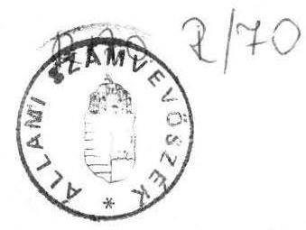
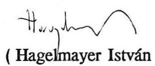

# 21lami 

## JELENTÉS

a színházi bemutatók pályázati úton történő támogatásának ellenőrzéséről

---

A vizsgálatot vezette és az összefoglaló jelentést összeállította Rácz Lajosné főtanácsos.

A vizsgálat szervezésében közreműködött Gordos László számvevő.

A vizsgálatot végezték:

Bács-Kiskun megye:

Tréfás Antal számvevő tanácsos

Borsod-Abaúj-Zemplén megye:

Győrffi Dezső számvevő tanácsos

Csongrád megye:

Csiszárné dr. Kosik Mária számvevő
dr. Ótott Lajos számvevő tanácsos

Győr-Moson-Sopron megye:

Kalmár István számvevő

Jász-Nagykun-Szolnok megye:
dr. Csapó Anna számvevő

Fővárosi Régió:

Gordos László számvevő
dr. Molnár Klára számvevő

---

# Jelentés 

a színházi bemutatók pályázati úton történő támogatásának ellenőrzéséről

A Magyar Köztársaság 1990. évi állami költségvetéséről szóló 1989. évi L. törvény intézkedik a tanácsok 1990. évi állami támogatásáról.

A törvény a célhoz kötött támogatások között a színházi nézőszám alapján előirányozható tanácsi támogatások kiegészítéseként 300 millió forintot irányzott elő a színházi bemutatók támogatására, amely a Művelődési Minisztérium pályázati feltételei szerint használható fel.

Az Állami Számvevőszék munkatervi feladatai alapján törvényességi, célszerüségi és eredményességi szempontok szerint ellenőrizte a 300 millió forint központi támogatás felhasználását.

Vizsgálatunk fő célja annak megállapítása volt, hogy milyen feltételekkel történt meg a pályázat kiírása, mely szempontok játszottak döntő szerepet a pénzeszközök végleges odaítélésében, a céltámogatások milyen módon egészítették ki a normatív állami támogatást, továbbá érvényesült-e a színházak gazdálkodásában a célszerüség, eredményesség és hatékonyság.

A vizsgálatot - a Belügyminisztériumon, a Művelődési és Közoktatási Minisztériumon és a Pénzügyminisztériumon kívül - 5 megyében és a fővárosban végeztük el.
Ennek keretében sor került a Győri Kisfaludy Színház és a Győri Balett, a Kecskeméti Katona József Színház, a Miskolci Nemzeti Színház, a Szegedi Nemzeti Színház, a Szegedi Szabadtéri Játékok Igazgatósága, a Szolnoki Szigligeti Színház, a fővárosban a Katona József, a Madách és a Thália Színház, továbbá a Független Színpad, valamint az érintett önkormányzatok - témával összefüggő - ellenőrzésére.

---

# I. 

## Összefoglaló megállapítások a vizsgálat tapasztalatairól

Az Országgyűlés az 1990. évi költségvetési törvényben a tanácsok 111,2 milliárd forintos állami támogatásán belül 300 millió forintot hagyott jóvá azzal, hogy azt a színházak pályázat útján, a színházi bemutatók támogatására vegyék igénybe, kiegészítve ezzel a színházi nézőszám alapján előirányozható tanácsi támogatást.

A törvény közvetlenül az akkori Múvelődési Minisztériumnak határozott meg feladatokat, mivel nevesítette szerepkörét a pályázati feltételek megfogalmazásában és kiírásában.

A Művelődési Minisztérium - a törvényi előírásokkal ellentétesen - nem írt ki pályázatot a színházi bemutatók támogatására, hanem a színházak igénybejelentését alapul véve, elosztotta a 300 millió forintot a színházak között.

A tárca a Minisztertanács 3.167/1990.(IV.26.) számu határozata alapján a minisztérium felügyelete alá tartozó színházakat is támogatta 24 millió forinttal, melyet a Pénzügyminisztérium a tanácsi központosított előirányzatokból átcsoportosított a művelődési fejezet költségvetésébe.
A minisztertanácsi határozat ellentétes volt a törvényi előírásokkal, hiszen a törvény egyértelműen tanácsi pénzeszközként kezelte a 300 millió forintot.

A minisztertanácsi döntés az 1990. évi állami költségvetés veszélypontjairól, a mérlegpozíció védelméről készített pénzügyminisztériumi előterjesztésben megfogalmazott állásfoglalás alapján született. Az előterjesztésből egyértelműen kitűnik, hogy az 1990. évi költségvetési törvényben a tanácsok állami támogatásának központosított előirányzatai között céltámogatásként elkülönített 300 millió Ft-ból a Múvelődési Minisztérium a központi színházaknak is támogatást kívánt nyújtani, míg a Belügyminisztérium vitatta az átcsoportosítás - így a tárcaszínházak támogatásának - lehetőségét e keretből. A Pénzügyminisztérium álláspontja szerint ilyen megkötés nincs.

---

A törvényi előírás tehát két ponton is csorbát szenvedett. Egyrészt nem a színházi bemutatók támogatását szolgálta, másrészt a tanácsi támogatásként célzott pénzeszközök egy része átáramlott a művelődési fejezet költségvetésébe. A támogatás felosztását az 1. sz. melléklet tartalmazza.

Vizsgálati tapasztalataink azt is jelezték, hogy az 1990. január 1-től életbe lépett, döntően normatívákra épülő tanácsi szabályozáson belül a színházak egész támogatási rendszere nem a legmegfelelőbb finanszírozási modell.

A színházi nézőszám alapján kialakított normatív állami támogatás - figyelembe véve egyes színházak müködésképtelenség határát súroló funkcionálását is -, nagyon sok bizonytalansági elemet hordoz magában nemcsak éven belül, hanem évek közötti kihatásban is.
Az 1990. évi intézményi költségvetésekben tervezett állami támogatás a színházak egy részénél nem érte el az 1989. évi állami támogatás szintjét, és több megye nem is tudta kiegészíteni azt saját pénzeszközeiből.

A megyék többsége a 300 millió forintot központi céltartaléknak tekintette és számított arra a színház állami támogatásának meghatározásánál. Ez a hozzáállás is arra ösztönözte a művelődési tárcát, hogy a célhoz kötött támogatást pótlólagos állami támogatásként kezelje és arányosan bontsa le a színházak müködési költségvetésének kiegészítésére.

Bemutatókat valamennyi vizsgált színházban tartottak ugyan, de a támogatás módszere nem teremtett kapcsolatot a rendelkezésre bocsátott pénzeszközök és a bemutatók színre állítása között. Csak a Szegedi Szabadtéri Játékok, illetve közvetve az ún. Színházi Alapon keresztül - a budapesti színházak esetében érvényesült többé-kevésbé az az elv, hogy a támogatás kifejezetten a bemutatókat szolgálja. (A vizsgált színházak bemutatóinak számát a 2. sz. melléklet tartalmazza.)

Sajátosságként kezelhető a fővárosban 1988 óta működő Színházi Alap, mely azonban nem egyértelmű feltételekkel támogatta a pályázatokat, a pénzeszközök fehasználásának ellenrőzésére pedig nem került eddig sor. Így az alap müködése egyrészt formálisnak tekinthető, másrészt a központi céltámogatás egybeolvadt az alap pénzeszközeivel, így címzett felhasználása ellenőrizhetetlenné vált.

---

A vidéki színházak informális úton értesültek a 300 millió forint várható szétosztásáról és ennek alapján - általában az 1990. évi költségvetési hiányukat kimutatva igényelték a támogatási összeget, amelyet az e célra létesített kuratórium, kis eltérésekkel, lényegében oda is itélt.

A tárca nem vizsgálta a számítások indokoltságát és megalapozottságát. A helyszíni vizsgálat tapasztalatai alapján a megkapott támogatás egybeolvadt a müködési költségvetéssel, felhasználását nem lehetett nyomon követni. A benyújtott igények többsége nem volt részletes számításokkal alátámasztva, többnyire becslésen alapult.

A vizsgált színházak elmúlt 3 évi főbb mutatóinak és gazdálkodási adatainak áttekintése a színházi nézőszám erőteljes csökkenését, a saját bevételek stagnálását, az átlaghelyárak emelését mutatta a költségvetési támogatás két-háromszoros növekedése és a támogatási igény emelkedése mellett. Ez a színházak müködtetésének és gazdálkodásának újragondolását teszi szükségessé. Az érvényben lévő finanszírozási rendszer a tapasztalatok alapján nem váltotta be a hozzáfúzött reményeket, negatív hatásai erőteljesek.

A színházak belső gazdálkodásának korszerűsítése, szigorúbb költségszemléletre való helyezése, egy megfelelő információs rendszer kidolgozása mellett pontosan meg kellene határozni az állam és az önkormányzatok feladatvállalásának részarányát, megadni ennek törvényi és egyéb garanciáit.

Mindez a finanszírozási rendszer új alapokra való helyezését követeli meg.

# Ajánlások: 

A színházi bemutatók pályázati úton történő támogatásának ellenrőzési tapasztalatai alapján a törvényes rend helyreállítása és a finanszírozási rendszer továbbfejlesztése érdekében a következő ajánlásokat fogalmazzuk meg a Parlament és a kormányzati szervek számára.
1./ A Pénzügyminiszter intézkedjen, hogy az 1989. évi L. törvény 300 millió Ft tanácsi központosított előirányzatból a törvénnyel ellentétesen felhasznált 24 millió Ft összeg viszszapótlásra kerüljön, s erről az Országgyűlést tájékoztassa.

---

2./ A pénzügyminiszter állapítsa meg a támogatás törvénnyel ellentétes felhasználására lehetőséget adó döntéselőkészítésben résztvevők személyes felelősségét.
3./ A színházak finanszírozásában, illetve a pályázatok kiírásában közreműködő kormányzati szervek

- a tervezés előkészítő szakaszában hangolják össze a támogatni kívánt célokat és a pénzügyi lehetőségeket;
- dolgozzanak ki vegyes finanszírozási rendszert, amely az állam feladatvállalásának pontos és garantált részarányán, az önkormányzatok és a színházak érdekeinek egyeztetésén és teherbíró képességén, a térségi sajátosságok figyelembevételén nyugszik;
- pályázatok kiírása esetén egyértelműen határozzák meg a pályázati feltételeket, a saját források arányát és a számonkérés módját.

# II. 

## RÉSZLETES MEGÁLLAPÍTÁSOK

## A/ A központi szerveknél végzett ellenőrzés tapasztalatai

A tanácsok 1990. évi pénzügyi előirányzatai között az 1989. évi L. törvény 20. paragrafus (2) B./ pontja 300 millió forint célhoz kötött állami támogatást hagyott jóvá a színházi bemutatók támogatására, azzal, hogy annak igénybevételére a Művelődési Minisztérium határozzon meg pályázati feltételeket.
A törvény indoklási része is a tanácsok normatív állami támogatásának tételei között sorolja fel az összeget, annyiban részletezve az előbbieket, hogy ez a pénzeszköz a színházi nézőszám alapján előirányozható tanácsi támogatás kiegészítését szolgálja és pályázat útján használható fel.

Ebből következően a céltámogatás törvény által garantáltan tanácsi pénzeszköz és szakmapolitikai célokat szolgál.

---

A vizsgálat alkalmával nem lehetett egyértelmúen nyomon követni, hogy az érintett tárcák - a Belügyminisztérium, a Múvelődési Minisztérium és a Pénzügyminisztérium - az 1990. évi költségvetési törvény előkészítése során milyen szerepet jászottak abban, hogy a 300 millió forint végülis célhoz kötött felhasználási javaslatként került a Parlament elé döntésre, amit az ilyenformán a törvényben jóvá is hagyott. (Ennek a körülménynek a felvetése abból a megközelítésből fontos, hogy 1-2 hónappal a törvény jóváhagyása után más szempontok szerint ítélték meg a felhasználhatóságot.)

A Művelődési Minisztérium Színházmúvészeti Osztálya egy 1989. december 7-i belsó feljegyzésben foglalkozott a színházak 1990. évi állami támogatásának az új tanácsi szabályozási rendszerben vélelmezhető gondjaival.

Bár a költségvetés végleges koordinátái még nem alakultak ki, a rendelkezésre álló és a számított adatok alapján az 1990. évi normatív támogatás összege 1.012 millió, a „bemutatónkénti" céltámogatás 300 millió forint volt, amely az 1989-es támogatási szintnek felelt meg. A számítások alapján az egy nézőre vetített támogatás 1989-ben 345,6 Ft volt, míg ez 1990-re az előző évi tervezett nézőszám alapján már csak 285 Ft.
A normatív számítások alapján a fővárosnál 116 millió többlet, a vidéki tanácsi színházaknál pedig 331 millió hiány jelentkezett.

Ennek alapján már ekkor felmerült, hogy a 300 millió Ft céltámogatást esetlegesen kapják meg a vidékiek, ez esetben a hiány 31 millióra csökkenthető. Felmerült továbbá az is, hogy szabad-e egyáltalán - akár rövid távon - számolni a normatív finanszírozási módszerrel, mivel annak gyenge pontjai már a számítások alapján kiütköztek. Az egy nézőre jutó támogatást fix elemnek tekintve ugyanis, a várható nézőszám módosításával változik a normatív támogatás összege, a tényleges nézőszám alapján való elszámolás során pedig jelentős eltérések adódhatnak.

A felvetett aggályok azonban nem kerültek megjelenítésre és érvényesítésre, mivel az 1989. december 21-én elfogadott költségvetési törvény az egy színházi nézőre jutó 230 Ft normatív támogatással és a 300 millió forint pályázati úton való felhasználásával számolt.

---

A művelődési tárca 1990. január 29-én - a megyei művelődési szakigazgatási feladatokat ellátó osztályok részére - körtelexet adott ki, amelyben arról kért tájékoztatást, hogy a tanácsok az 1989. évi támogatási szintet figyelembe véve, milyen mértékben egészítették ki a színházak normatív állami támogatását.

A Művelődési Minisztérium Terv- és Közgazdasági Főosztályának az államtitkár részére 1990. február 6-án adott feljegyzéséből kitűnik, hogy a tanácsok többsége még nem hagyta ugyan jóvá a költségvetést, de az információk alapján 5 megye (Békés, Borsod-Abaúj- Zemplén, Jász-Nagy-kun-Szolnok, Somogy és Zala) összesen 87 millió forint összegben jelezte a hiányt, amellyel nem tudja az 1989-es évi szintre hozni a színházi költségvetést. További megyék jelezték azt is, hogy nem tudnak fedezetet nyújtani a $16 \%$-os bérautomatizmusra és dologi automatizmusra. Jelezték továbbá, hogy igényt tartanak a színházak 300 millió forintos központi céltartalékából való részesedésre.
A Győr-Moson-Sopron megyei Tanács szerint a bemutatónkénti támogatás további diszkriminációt jelentene a tanácsi költségvetésre, ezért javasolta a központi állami támogatás tanácsi kiegészítésekkel arányos lebontását.
A Fővárosi Tanács az 1989. évi támogatási szintből indult ki és ehhez mérten biztosította a kiegészítéseket.

A Színházművészeti Osztálynak az államtitkár részére készült 1990. február 13-i feljegyzése szerint a Színházmúvészeti Szövetség 1990. január 22-én megtárgyalta a színházak finanszírozását.

A szakmai szervezet nem támogatta a 300 millió forint támogatás pályázat útján való elosztását, mivel nem értett egyet az ún. kultúrpolitikai elvekkel, szakmailag kifogásolta azt és nem tartotta lehetségesnek egy szakmai zsúri összeállítását.

Ennek alapján a Színházmúvészeti Osztály javasolta az 1989. évi költségvetési támogatási szintet el nem érő színházi támogatások kiegészítését kb. 100 millió forint összegben. A további 200 millió forintot pedig - elsősorban - a vidéki színházak müködőképességének megőrzésére kellene fordítani, mivel ez utóbbi összeg kb. $20 \%$-os növekedést jelentene a 89 -es szinthez képest. A javaslat további pontjai értelmében - az előbbieket figyelembevéve - a pályázat kiírása értelmetlen

---

lenne. A céltámogatás elosztását pedig a tanácsi színházak igazgatóiból összehívott bizottságra kellene bízni.

A javaslat - apróbb változtatásoktól eltekintve - véglegessé vált, melynek alapján - a színházaktól beérkezett támogatási igényeket figyelembe véve - kialakították az ajánlást a központi támogatás elosztására összehívott ún. kuratórium részére. Ennek alapján a vidéki színházak 226 millió forint támogatást kaptak volna, amely 12,5 millió Ft-tal volt kisebb az általuk benyújtott igénynél, a fôvárosi színházak 50 millió, a tárcaszínházak pedig 24 millió forinttal részesedtek volna.

Ezzel a javaslattal két körülményt hagytak figyelmen kívül:
— a törvényi előírással ellentétesen járnak el, amennyiben nem írnak ki pályázatot,

- a 300 millió forintból nem részesíthetik támogatásban a tárcaszínházakat, mivel az központosított tanácsi céltámogatás.

A Belügyminisztérium és a Pénzügyminisztérium ebben az időszakban egybehangzóan jelezte a tárca részére, hogy nem tartja kivitelezhetőnek a céltámogatás fejezetszintủ átcsoportosítását, illetve a tárcaszínházak bérfejlesztésének központi támogatásból való megoldását.

A színházak és a tanácsok szakembereiből összehívott ún. kuratórium 1990. március 26-án döntött a céltámogatás elosztásáról. Ezen a fórumon is felmerült, hogy a központi színházak támogatása a törvénnyel ellentétes.

A kuratórium nem támogatta a 24 millió forint átadását. A javaslathoz képest 1-1 millió forinttal megemelték a vidéki színházak és 11 millióval a fővárosi tanácsi színházak támogatási összegét.
Igy a vidéki színházak összesen 239 millió forintot ( $80 \%$ ) kaptak volna, a fôváros pedig 61 millió forintot.

A Pénzügyminisztérium 1990. április hónapban előterjesztést készített az 1990. évi állami költségvetés veszélypontjairól, a mérlegpozíció védelméről.

---

Az előterjesztés felvetette, hogy a 300 millió forintos tanácsi központosított céltámogatásból a mũvelődési tárca a központi színházakat is támogatni kívánja.

A Belügyminisztérium továbbra is vitatta ennek lehetőségét. Az előterjesztésben foglaltak alapján azonban „A Pénzügyminisztérium álláspontja szerint ilyen megkötés nincs, a pályázatból nem zárhatók ki a minisztériumi felügyeletű színházak sem." A pénzügyminisztériumi álláspont tehát időközben megváltozott.

Ennek alapján a Minisztertanács 3167/1990.(IV.26.) számu határozata 11. pontja szerint „A színházak bemutató előadásokra kiírt pályázata alapján az előirányzatból a mũvelődési minisztériumi fenntartású színházakat is részesíteni kell."

Álláspontunk szerint a Művelődési Minisztérium javaslatára kialakított pénzügyminisztériumi vélemény alapján hozott minisztertanácsi határozat ellentétes a törvényi előirással. A határozat egyben jogsértő is, mivel alacsonyabb rendű jogszabállyal módosítottak törvényszintü előírást. A 24 millió forint központi színházakat támogató felhasználására csak a Parlament döntése alapján kerülhetett volna sor.

A minisztertanácsi határozat alapján a pénzügyi tárca 1990. május 25 -i intézkedésével a művelődési fejezet rendelkezésére bocsátotta a 24 millió forintot. Ebből a Nemzeti Színház 12 millió, a Népszínház 8 millió, a Rock Színház pedig 4 millió forint támogatásban részesült.

A vidéki színházak 226 millió, a fővárosi színházak pedig 50 millió forint támogatást kaptak.

A tárca a benyújtott támogatási igények alaposságát, dokumentáltságát nem vizsgálta, a felhasználásra, elszámolásra, ellenőrzésre vonatkozóan semmilyen kikötést nem tett.

A céltámogatás pótlólagos állami támogatásként jelent meg és a müködési költségvetés kiegészítését szolgálta.

Ennek ellentmondó az a megfogalmazás, mely szerint a támogatásról rendelkező BM és az összeget továbbutaló tanácsok átirataikban céltámo-

---

gatás kifejezést használnak és némely tanács ki is kötötte az ilyen irányú hasznosulást. Ebből eredően nem lehet tiszta képet kapni sem a támogatási szándékról, sem a felhasználási kötelezettségről. Az 1990. évi költségvetési beszámoló adata pedig a 276 millió forint céltámogatásról valótlan, mivel az nem célhoz kötötten nyert felhasználást.

Vizsgálati tapasztalataink alapján felvetődik, hogy helyes-e ilyen mértékű költségvetési forráshiány esetén az egységes feltételekkel kiírt pályáztatás, mivel az intézmények különböző adottságokkal rendelkeznek, így nem is indulhatnának azonos vagy hasonló eséllyel a pályázatok elnyeréséért. Az egyenlőtlen adottságok mellett magát a pályázati rendszert - mint módszert -, alkalmatlannak tartjuk a finanszírozásra. Esetenként a működésképtelenség határát súroló intézményi kondiciókkal csak a pénzeszközök bármilyen áron való megszerzése lehet a cél.

A Művelődési Minisztérium időben felismerte ezt a helyzetet, azonban ezt nem érvényesítette és következetesen nem vitte végig a törvénye lőkészítő, törvényalkotó munkában sem. Ebből eredően - a szakmai szempontjai alapján - a törvénnyel ellentétesen járt el, amelyet azonban a Pénzügyminisztérium állásfoglalása tett lehetővé.

A jövőre nézve kívánatos lenne, ha a szakmai szempontok érvényesítése következetesen történne, helyes döntésre ösztönözve ezzel a törvényalkotókat is.

# B/ A helyszíni ellenőrzések tapasztalatai 

1./ A megyei (fővárosi), helyi önkormányzatoknál (tanácsoknál)

A színházi nézőszám alapján előirányozható normatív tanácsi támogatás - mint azt az előbbiekben jeleztük - néhány megyében kritikus helyzetet idézett elő, még az 1989. évi költségvetési szint sem volt biztosítva. Ezen túlmenően merült fel a 16 \%-os bérautomatizmus fedezetének szükségessége, az áremelkedések részbeni ellensúlyozásának igénye, továbbá új produkciók létrehozásához az 1989. évi költségvetési szint legalább 20-25 \%-kal való emelése, bár álláspontunk szerint ez az előző - inflációs - tartalommal azonos.

---

A vizsgált körben a Miskolci Nemzeti Színház és a Szolnoki Szigligeti Színház helyzete volt a legkritikusabb.

A Miskolci Színház az 1989. évi tényhez és az 1990. évi tervezett szükséglethez mintegy 10 millió forinttal tervezte alul költségeit a költségvetési egyensúly biztosítása érdekében.

Az 1988. és 1989. évi költségvetési terv a nagyszínházi bemutatókra 450 eFt /bemutató, a kamaraszínház esetében 200 eFt/bemutató anyagjellegủ költségtervet tartalmazott. Ezzel szemben 1990-ben a terv 300 eFt/bemutató, illetve $150 \mathrm{eFt} /$ bemutató költséget irányzott elő, holott az egy-egy nagyszínházi bemutató tényleges anyagjellegủ költsége már 1989-ben is elérte, vagy meghaladta a 600 ezer forintot.

A Szolnoki Szigligeti Színháznak évközben kezdődött el a teljes rekonstrukciója, így a tervezett 145 ezer nézővel szemben csak 86.700 fizető néző látogatta az előadásokat. A 33 millió forint helyett mindössze 19,9 millió forint állami támogatás igénybevételére jogosult a fenntartó önkormányzat.
Bár a megyei tanács 5 millió forinttal kiegészítette a normatív támogatást, a saját bevételekkel együtt a képződő bevétel mindössze kb. 43 millió forint volt. Ez csupán a színház 38 millió forintos béralapjára és ennek 5 millió forintos TB járulékára nyújtott fedezetet. Mivel a nézőszám csökkent, a normatív állami támogatásból 13,4 millió kötelező maradványt kell képeznie. Igy 1991-ben is a müködésképtelenség fenyegeti, annak ellenére, hogy az elmúlt évben a tanács további 10 millió forint támogatást biztosított részére.

A két példa alapján is nyilvánvaló a tanácsok azon törekvése, hogy a 300 millió forintos céltámogatásból elosztáson nyugvó, pótlólagos állami támogatáshoz jussanak.

A Győr-Moson-Sopron Megyei Tanács például 15 millió forintot tartott vissza a színház éves költségvetéséből és csak a nyár folyamán, a céltámogatás ismeretében bocsátotta rendelkezésére azt.

Miután a pályázat kiírására nem került sor, a tanácsok nem játszhattak szerepet annak előkészítésében és elbírálásában.

---

A megyei szakigazgatási szervek 1990. január hónapban a támogatási igények felmérésében müködtek közre, de az igények összeállításában ugyancsak nem volt szerepük. Néhány megyei tanácsi szakember - a színházi szakemberek mellett részt vett azonban az ún. kuratórium munkájában, de ez lényegében a benyújtott igények jóváhagyására korlátozódott. A továbbiakban a tanácsok a pénzeszközök továbbutalásában müködtek közre, de annak hasznosulását nem vizsgálták.

A Fővárosi Tanács képviselője ugyancsak részt vett a kuratórium munkájában. Ezen a fórumon - a fôvárosi színházi szakemberekkel egyetemben - kifejezésre juttatta azt a véleményét, mely szerint méltánytalan, hogy a fôváros 12 tanácsi színháza mindössze a 300 millió forint egyhatodát kapja. Ez az összeg mintegy harmada annak, amely a fôvárosi tanácsi színházakat számarányuk alapján megillette volna.

Fővárosi sajátosság a Színházi Alap müködtetése. A Fővárosi Tanács VB Művelődési és Sport Főosztálya 1987-ben hozta létre az Alapot 15 millió forinttal, amely 1990-ben már 44 millió forintra emelkedett. Az Alap az új utakon járó színházi vállalkozások, kísérleti, stúdió- és az alternatív színházak múvészi elképzeléseinek megvalósítását szolgálja.

Az alapszerüen kezelt pénzösszeg optimális felhasználása céljából minden év első felében pályázatot írnak ki a következö évadi előadások és vállalkozások támogatására. A pályázat nyitott, arra nemcsak a tanácsi színházak jelentkezhetnek. A pályázati kiírás szerint a pályázóknak be kell mutatniuk a tervezett bemutató szövegkönyvét, a múvészeti elképzeléseket és a számított költségek alátámasztására szolgáló dokumentumokat.

A támogatások odaítéléséről a Főosztály Művészeti Osztálya mellett müködő 9 tagú Színházi Kuratórium dönt, a tagok színházi társulathoz nem tartozó színházi szakemberek, színművészek, színikritikusok.

A pályázati kiírás alapvetően a színházi bemutatók, alkotások támogatására vonatkozik, emellett azonban a klasszikus művek újrafordítását, a vendégjátékokat, a színvonalas produkciók utaztatását és a nemzetközi előadások budapesti fogadását is a támogatások körébe vonták.

---

Értelmezhetetlen a támogatás ún. kölcsönalapként való meg határozása, mivel a Főosztály vizsgálatunk időpontjáig nem ellenőrizte a megítélt támogatások pályázatban foglaltak szerinti megvalósulását, így az attól eltérő felhasználást nem is szankcionálhatta, mint annak kilátásba helyezése az odaítélésről szóló levelekben szerepel.

A 300 millió forintból kapott 50 millió forint támogatást a Színházi Alapba helyezték, így 1990-ben 94 millió forint állt rendelkezésre.

Összesen 78 db pályázatot nyújtottak be, ebből 21 volt a tanácsi társulatok által benyújtott pályázatok száma. A pályázók 178 millió forint támogatást igényeltek, ezzel szemben a rendelkezésre álló 94 millió forint került megítélésre, amelyből 61 pályázatot támogattak. A tanácsi színházak 63,5 millió forintot nyertek el, ebből 36,7 millió forintot közvetlenül produkciókra kaptak.

A fővárosban tehát - annak ellenére, hogy a Művelődési Minisztérium nem írt ki pályázatot - részben megvalósult a célhoz kötött támogatás törvényben meghatározott felosztása és felhasználása.

Miután azonban az összeg egybeolvadt az Alapban lévő összeggel, továbbá nem tanácsi színházak is pályázatot nyertek, a konkrét céltámogatás és annak hasznosulása már nem követhető nyomon.

Ebből következően az Alap múködése részben formális, mert nagyobbrészt az állami támogatás kiegészítéseként funkcionál.

# 2./ A vizsgálatba bevont fővárosi színházak 

Az általunk ellenőrzött Katona József, Madách, Thália Színházak és a Független Színpad összesen 66 millió forintot pályáztak meg, amellyel szemben 35,5 millió forintot nyertek el. Ebből 7 millió forint ( $19,7 \%$ ) szolgálta a produkciók támogatását.
A produkciókra benyújtott pályázatok többnyire összevontan - díszlet, jelmez, bútor, kellék stb. bontásban - tartalmazzák a bemutató várható ráfordításait. Ettől részletesebb számítási anyagot nem tudtak rendelkezésünkre bocsátani.

---

A Katona József Színház készítette a legrészletesebb számítási anyagot. A pályázatban a kialakítás alatt lévő studioiszínháza 1991. évi múködési költségeire igényelt 12,5 millió forint támogatást. Bár a pályázati kiírás nem tartalmaz ilyen célokat, a Kuratórium 8,2 millió forintot odaítélt. Tapasztalatunk alapján azonban a színház még nem eszközölt felhasználást, hanem az Országos Kereskedelmi és Hitelbank Rt-nél tartós betétben helyezte el az összeget.

Megfelelő számonkérés hiányában tehát az alapszerủ kezelés és a különféle célok támogatása formális. A pályázathoz saját forrás igénybevételét sem írják elő, így ez a módszer is jórészt pénzszerzési alkalomnak tekinthető a színházak részéről.

A fơvárosi színházak - a vidéki színházakkal ellentétben - az 1988. évi fizető nézőszám alapján tervszinten jobb pozícióba kerültek, a Fővárosi Tanács pedig az 1989-es szinten túl biztosította számukra a $16 \%$-os bérautomatizmus és a TB járulék fedezetét, továbbá részben ellensúlyozta az energiaáremelkedés miatti költségnövekedést is.

# 3./ A vidéki színházak 

A vidéki színházak informális csatornákon értesültek a 300 millió forintos céltámogatási összeg várható szétosztásáról.
Ebből kiindulva nyújtották be kérelmeiket közvetlenül a Művelődési Minisztériumhoz, amelyben többnyire az 1990. évi költségvetési hiányukat mutatták ki és indokolták.

A Szegedi Nemzeti Színház pl. az 1986-ban beindult balett-tagozata miatt eredendően hiányos költségvetésére, valamint az inflációra hivatkozott. Erre alapozva kért 23 millió forintos támogatást a következők szerint. A dologi költségek $50 \%$-os inflációja miatt 17 millió, a bérautomatizmusra 7,1 millió, ennek TB vonzatára pedig 3,0 millió forintot. A 27 millió forintos igényből 4 millió forintot saját bevételi többletből és takarékossági intézkedésből kívánt fedezni. Új bemutató megvalósítása nem került szóba a támogatási kérelemben. A 23 millió forint támogatást a színház megkapta.

---

Hasonló módon indokolta 19,5 millió forintos kérelmét a Győri Kisfaludy Színház és a Balett is, de nem tért el ettől a Kecskeméti Katona József Színház sem, amely 10 millió forintot kért és 12 millió forintot kapott.

Kivételt képezett a Szegedi Szabadtéri Játékok Igazgatósága, amely ugyan hasonló módon, a 1990. évre tervezett költségvetési hiányból indult ki, ez azonban a tervezett két új bemutató miatt alakult ki.

A Hunyadi László bemutatása 2,1 millió forintba került, ebből 598 ezer forint volt a készletbeszerzés, 132 ezer forint az anyagjellegủ kiadás, 756 ezer a művészek, 662 ezer forint pedig a zenekar honoráriuma. A Szuzai menyegző költsége 877 ezer forint volt, amelyet hasonló részletezettséggel tudtak analitikus nyilvántartásaikkal bemutatni és alátámasztani.
A színház egyébként nemcsak a kapott céltámogatásról, hanem valamennyi megvalósult bemutatójáról rendelkezik a produkciókhoz kapcsolódó költségek és bevételek számszerű felosztásával.

A vizsgált körben tehát a benyújtott támogatási igények és a megkapott támogatások - ez előbbi kivételével - még formálisan sem nevezhetők pályázati úton nyújtott céltámogatásnak, a működési költségvetés kiegészítését szolgálták, felolvadtak abban. Miután elszámolási kötelezettség nem volt, a színházak saját belátásuk alapján használták fel azt. A céltámogatás felhasználásának célszerűsége, eredményessége nem kérhető számon, hasznosulása abban nyilvánul meg, hogy egyes színházakat megmentett a teljes müködésképtelenségtől.

# 4./ A színházak müködésének áttekintése 

A normatív állami támogatás feszültségpontjait a korábbiakban már jeleztük. Ennek illusztrálására - mint számszerűségében meghatározót -, a fővárosi példát mutatjuk be.

Az 1990. évi normatív támogatás összegét az 1988. évi tényleges fizető nézőszám alapán kellett meghatározni. A Fővárosi Tanács kimutatását alapul véve 2.505.027 fő után 576.167 ezer forint - színházi célú kötelezettség nélküli - normatív állami támogatás járt. A Művelődési és Sport Főosztály által kiadott éves statisztika 2.318.261 fizető nézőszámot

---

közöl, amely 186.766 fővel kevesebb a minisztérium részére megadott nézőszámnál. Ennek alapján a főváros 1990-ben 42,9 millió jogtalan támogatáshoz jutott. A számszerú eltérés okát nem tudták bemutatni.

Tapasztalataink alapján - a finanszírozási problémákon és az általánosságban jellemző költségvetési forráshiányon túl - alapvető problémát jelent az, hogy nem került kialakításra olyan információs, és mutatószám rendszer, amely - akár szakmai, akár gazdasági szempontból - lehetővé tenné tevékenységük célszerüségének, hatékonyságának, eredményességének egységes elvek alapján való megítélését.

Az utóbbi években a költségvetési támogatás két- háromszorosára növekedett, míg a jegybevétel a kiadások alig néhány százalékát fedezte annak ellenére, hogy a helyárak általában jelentősen növekedtek, a fizető nézőszám jelentős csökkenése mellett.

A Szegedi Nemzeti Színház fizető nézőszáma az 1988. évi 144 ezerről 1990-re 136 ezerre csökkent, $5 \%$-kal nőtt az előadások száma, $38 \%$-kal pedig az átlaghelyárak emelkedtek.
A költségvetési támogatás közel kétszeresére növekedett. Az egy nézőre jutó bevétel 1988-ban 469 Ft volt, 1990-ben 906 Ft. Ezen belül 56 és 413, illetve 63 és 843 Ft volt a jegybevétel és a támogatás összege. Igy az 1988. évi $88 \%$-os költségvetési támogatási arány 1990 -re $93 \%$-ra nőtt, volumenében viszont több, mint kétszeresére emelkedett.

Miskolcon - ugyanezt az időintervallumot tekintve - az egy előadásra jutó költségvetési támogatás 140.690 Ft-ról 396.576 Ft-ra, közel háromszorosára emelkedett.
A színház 1990. évi ráfordításaiból $75 \%$ volt az állandó költségek és 25 \% a változó költségek aránya.
Hasonló volt az arány a többi színház esetében is. Ebből következik, hogy a támogatási igény és a kiadások közötti korrelációt elsősorban nem a változó, hanem az állandó költségek változása jelenti.

A vizsgálati tapasztalatok csak megerősítették, hogy a színházak erőteljesen támogatásigényes kultúrális intézmények. A gazdálkodásukban fellelhető hiányosságok ellenére törekedtek a feladatok kedvező megoldására.

---

Az új finanszírozási rendszer „circulus vitiosus"-a mellett a legfőbb feszültségforrás abból adódott, hogy nem került meghatározásra a feladatmegosztás mértéke az állam és az önkormányzatok között.
A jelenlegi szabályozási rendszer nem teszi kötelező feladattá a színház müködését sem az állam, sem az önkormányzat számára. Így valóban kétségessé válhat egyes színházak müködése.

Budapest, 1991. május

---

Az 1990. évi állami költségvetésben színházi bemutatók támogatására elöirányzott összeg felosztása
Színházak Támogatás
(millió Ft)
1. VIDÉKI SZÍNHÁZAK
Békéscsaba ..... 11
Debrecen ..... 16
Eger ..... 14
Győr (két színház) ..... 20
Kaposvár ..... 18
Kecskemét ..... 12
Miskolc ..... 18
Nyíregyháza ..... 11
Pécs ..... 17
Szeged ..... 23
Szolnok ..... 24
Veszprém ..... 12
Zalaegerszeg ..... 24
Tizennégy vidéki színház összesen: ..... 220
2. SZABADTÉRI SZINPADOK, BEMUTATÓSZINPADOK
Szeged ..... 3
Gyula ..... 3
Két szabadtéri-, bemutató színpad össz: ..... 6
3. TIZENKÉT FÖVÁROSI TANÁCSI SZINHÁZ összesen: ..... 50
4. TÁRCASZINHÁZAK
Nemzeti Színház ..... 12
Népszínház ..... 8
Rock Színház ..... 4
Három tárcaszínház összesen: ..... 24
Színházak mindösszesen: ..... 300

---

A helyszínen vizsgált színházak 1990. évi bemutatóinak száma

| Sor-   szám | Színház megnevezése | A bemutatók száma |
| :-- | :-- | :-- |

1. Kisfaludy Színház, Győr 8
2. Győri Balett 2
3. Kecskeméti Katona J. Színház 12
4. Miskolci Nemzeti Színház 11
5. Szegedi Nemzeti Színház 14
6. Szegedi Szabadtéri Ját. Igazg. 10
7. Szigligeti Színház, Szolnok 9

Vidéki színházak együtt :
66
8. Thália Színház, Budapest 10
9. Madách Színház, Budapest 9
10. Katona József Színház, Budapest 10

Fővárosi tanácsi színházak együtt :
29

Az ellenrőzött tíz tanácsi színház összesen :
95

---

A színházak alaptevékenységét jellemző néhány mutató Kisfaludy Színház, Győr

| Megnevezés | Mértéke   egység | 1988. | 1989. | 1990. |
| :--: | :--: | :--: | :--: | :--: |
| 1/ Előadások száma | db | 314 | 280 | 307 |
| 2/ Fizető nézők száma | fó | 170.626 | 158.862 | 167.137 |
| 3/ Jegybevétel | eFt | 9.495 | 10.486 | 13.983 |
| 4/ Költségvetési tám. | eFt | 46.103 | 71.285 | 93.806 |
| 5/ Egy előadásra jutó -jegybevétel -költségvet.tám. | $\overline{\text { Ft }}$ | 30.153 | 37.450 | 45.547 |
|  | Ft | 146.825 | 254.589 | 305.557 |
| 6/ Egy nézőre jutó -jegybevétel -költségvet. tám. | $\overline{\text { Ft }}$ | 56 | 66 | 84 |
|  | Ft | 270 | 449 | 561 |
| 7/ Átlaghelyár -Nagyszínház | — | - | - | - |
|  | Ft | 57 | 59 | 81 |
| -Kamaraszínház | Ft | 53 | 55 | 67 |
| -Studió | Ft | 35 | 25 | 38 |
| -Táj | Ft | 78 | 83 | 86 |
| 8/ Előadásonkénti eladható jegyek |  |  |  |  |
| száma | - | - | - | - |
| -Nagyszínház | db | 685 | 685 | 682 |
| -Kamaraszínház | db | 493 | 493 | 493 |
| 9/ Egy előadásra jutó átlagos fizetőnéző-szám | - | - | - | - |
| - Nagyszínház | fő | 602 | 619 | 579 |
| - Kamaraszínház | fő | 406 | 425 | 448 |
| - Stúdió | fő | 37 | 91 | 52 |

---

A színházak alaptevékenységét jellemző néhány mutató Nemzeti Színház, Miskolc

| Megnevezés | Mértékegység | 1988. | 1989. | 1990. |
| :--: | :--: | :--: | :--: | :--: |
| 1/ Előadások száma | db | 298 | 248 | 231 |
| 2/ Fizető nézők száma | fó | 119.736 | 122.449 | 95.429 |
| 3/ Jegybevétel | eFt | 4.683 | 5.826 | 5.433 |
| 4/ Költségvetési tám. | eFt | 41.900 | 57.899 | 91.609 |
| 5/ Egy előadásra jutó -jegybevétel -költségvet. tám. | $\begin{aligned} & \text { - } \\ & \text { Ft } \\ & \text { Ft } \end{aligned}$ | $\begin{gathered} 15.715 \\ 140.604 \end{gathered}$ | $\begin{gathered} 23.493 \\ 233.464 \end{gathered}$ | $\begin{gathered} 23.519 \\ 396.576 \end{gathered}$ |
| 6/ Egy nézőre jutó -jegybevétel -költségvet.tám. | $\begin{aligned} & \text { - } \\ & \text { Ft } \\ & \text { Ft } \end{aligned}$ | $\begin{gathered} 39 \\ 350 \end{gathered}$ | $\begin{gathered} 48 \\ 473 \end{gathered}$ | $\begin{gathered} 57 \\ 960 \end{gathered}$ |
| 7/ Átlaghelyár (eszmei) -Nagyszínház | Ft | 40 | 51 | 62 |
| -Kamaraszínház | Ft | 43 | 59 | 66 |
| -Báb Játékszín | Ft | 40 | 60 | 81 |
| -Táj | Ft | - | - | - |
| 8/ Előadásonkénti eladható jegyek száma | - | - | - | - |
| -Nagyszínház | db | 741 | 741 | 741 |
| -Kamaraszínház | db | 144 | 163 | 163 |
| 9/ Egy előadásra jutó átlagos fizetőnéző-szám | - | - | - | - |
| - Nagyszínház | fó | 546 | 586 | 609 |
| - Kamaraszínház | fó | 125 | 69 | 118 |

---

A színházak alaptevékenységét jellemző néhány mutató Nemzeti Színház, Szeged

| Megnevezés | Mértékegység | 1988. | 1989. | 1990. |
| :--: | :--: | :--: | :--: | :--: |
| 1/ Előadások száma | db | 319 | 313 | 335 |
| 2/ Fizető nézők száma | fó | 143.614 | 128.264 | 135.983 |
| 3/ Jegybevétel | eFt | 8.025 | 8.241 | 8.602 |
| 4/ Költségvetési tám. | eFt | 59.330 | 80.159 | 114.645 |
| 5/ Egy előadásra jutó -jegybevétel -költségvet. tám. | $\begin{aligned} & \text { - } \\ & \text { Ft } \\ & \text { Ft } \end{aligned}$ | $\begin{gathered} \text { - } \\ 25.157 \\ 185.987 \end{gathered}$ | $\begin{gathered} \text { - } \\ 26.329 \\ 256.099 \end{gathered}$ | $\begin{gathered} \text { - } \\ 25.678 \\ 342.224 \end{gathered}$ |
| 6/ Egy nézőre jutó -jegybevétel -költségvet. tám. | $\begin{aligned} & \text { - } \\ & \text { Ft } \\ & \text { Ft } \end{aligned}$ | $\begin{gathered} \text { - } \\ 56 \\ 413 \end{gathered}$ | $\begin{gathered} \text { - } \\ 64 \\ 625 \end{gathered}$ | $\begin{gathered} \text { - } \\ 63 \\ 843 \end{gathered}$ |
| 7/ Átlaghelyár -Nagyszínház -Kamaraszínház -Báb -Táj | $\begin{aligned} & \text { - } \\ & \text { Ft } \\ & \text { Ft } \end{aligned}$ | $\begin{gathered} \text { - } \\ 60 \\ 34 \end{gathered}$ | $\begin{gathered} \text { - } \\ 60 \\ 34 \end{gathered}$ | $\begin{gathered} \text { - } \\ 74 \\ 52 \end{gathered}$ |
| 8/ Előadásonkénti eladható jegyek száma -Nagyszínház -Kamaraszínház | — | - | - | - |
| -Nagyszínház -Kamaraszínház | db   db | $\begin{gathered} 693 \\ 362 \end{gathered}$ | $\begin{gathered} 693 \\ 362 \end{gathered}$ | $\begin{gathered} 693 \\ 362 \end{gathered}$ |
| 9/ Egy előadásra jutó átlagos fizetőnéző-szám - Nagyszínház | — | - | - | - |
| - Kamaraszínház | fő | 607 | 545 | 589 |
| - Kamaraszínház | fő | 319 | 275 | 276 |

---

A színházak alaptevékenységét jellemző néhány mutató Szabadtéri Játékok Igazgatósága, Szeged

| Megnevezés | Mértékegység | 1988. | 1989. | 1990. |
| :--: | :--: | :--: | :--: | :--: |
| 1/ Előadások száma | db | 29 | 22 | 21 |
| 2/ Fizető nézők száma | fó | 88.863 | 61.672 | 75.805 |
| 3/ Jegybevétel | eFt | 11.467 | 10.163 | 13.966 |
| 4/ Költségvetési tám. | eFt | 19.795 | 21.116 | 21.470 |
| 5/ Egy előadásra jutó -jegybevétel -költségvet. tám. | $\begin{aligned} & \text { Ft } \\ & \text { Ft } \end{aligned}$ | $\begin{aligned} & 395.414 \\ & 682.586 \end{aligned}$ | $\begin{aligned} & 461.955 \\ & 959.818 \end{aligned}$ | $\begin{aligned} & 665.048 \\ & 1.022 .381 \end{aligned}$ |
| 6/ Egy nézőre jutó -jegybevétel -költségvet. tám | $\begin{aligned} & \text { Ft } \\ & \text { Ft } \end{aligned}$ | $\begin{aligned} & 132 \\ & 228 \end{aligned}$ | $\begin{aligned} & 165 \\ & 342 \end{aligned}$ | $\begin{aligned} & 184 \\ & 283 \end{aligned}$ |
| 7/ Átlaghelyár | - | — | — | - |
|  |  | normál | 117 |  |
| -Nagyszínház | Ft | emelt | 140 | 162 |
| -Kamaraszínház | Ft |  | 93 | 140 |
| -Báb | Ft |  | 105 | 115 |
| -Táj (Dóm templom) | Ft |  |  |  |
| 8/ Előadásonkénti eladható jegyek száma | — | — | — | — |
| -Nagyszínház | db | 6.201 | 6.201 | 6.201 |
| -Kamaraszínház | db | 1.538 | 1.538 | 1.538 |
| -Tanácsháza | db | 400 | 400 | 400 |
| 9/ Egy előadásra jutó átlagos fizetőnéző-szám | — | — | — | — |
| - Nagyszínház | fó | 4.610 | 3.802 | 4.894 |
| - Kamaraszínház | fó | 1.117 | 859 | 465 |
| - Tanácsháza udvar | fó | 403 | 169 | 248 |
| - Dóm templom | fó |  |  | 506 |

---

A színházak alaptevékenységét jellemző néhány mutató Szigligeti Színház, Szolnok

| Megnevezés | Mértékegység | 1988. | 1989. | 1990. |
| :--: | :--: | :--: | :--: | :--: |
| 1/ Előadások száma | db | 319 | 270 | 250 |
| 2. Fizető nézők száma | fó | 145.329 | 110.196 | 86.700 |
| 3/ Jegybevétel | eFt | 6.867 | 7.390 | 4.330 |
| 4/ Költségvetési tám. | eFt | 43.614 | 57.286 | 62.383 |
| 5/ Egy előadásra jutó   -jegybevétel   -költségvet. tám. | $\begin{gathered} \text { - } \\ \text { Ft } \\ \text { Ft } \end{gathered}$ | $\begin{gathered} \text { - } \\ 21.527 \\ 136.721 \end{gathered}$ | $\begin{gathered} 26.583 \\ 206.065 \end{gathered}$ | $\begin{gathered} 17.320 \\ 249.532 \end{gathered}$ |
| 6/ Egy nézőre jutó   -jegybevétel   -költségvet. tám. | $\begin{gathered} \text { Ft } \\ \text { Ft } \end{gathered}$ | $\begin{gathered} 47 \\ 300 \end{gathered}$ | $\begin{gathered} 67 \\ 520 \end{gathered}$ | $\begin{gathered} 50 \\ 720 \end{gathered}$ |
| 7/ Átlaghelyár | - | - | - | - |
| 8/ Előadásonkénti eladható jegyek száma | - | - | - | - |
| -Nagyszínház | db | 563 | 563 | 563 |
| -Kamaraszínház | db | 82 | 82 | 82 |
| 9/ Egy előadásra jutó átlagos fizetőnéző-szám | - | - | - | - |
| -Nagyszínház | fó | 512 | 497 | 473 |
| -Kamaraszínház | fó | 103 | 97 | 63 |

---

# A színházak alaptevékenységét jellemző néhány mutató Katona József Színház, Kecskemét 

| Megnevezés | Mértéke   egység | 1988. | 1989. | 1990. |
| :-- | :--: | --: | --: | --: |
| 1/ Előadások száma | db | 431 | 376 | 404 |
| 2/ Fizető nézők száma | fő | 132.858 | 118.870 | 110.185 |
| 3/ Jegybevétel | eFt | 8.726 | 7.872 | 7.807 |
| 4/ Költségvetési tám. | eFt | 34.312 | 46.772 | 70.136 |
| 5/ Egy előadásra jutó   -jegybevétel   -költségvet.tám. | - | - | - | - |
|  | Ft | 20.246 | 20.936 | 19.324 |
|  | Ft | 76.910 | 124.396 | 173.604 |
| 6/ Egy nézőre jutó   -jegybevétel   -költségvet. tám. | - | - | - | - |
|  | Ft | 66 | 66 | 71 |
|  | Ft | 258 | 393 | 637 |
| 7/ Átlaghelyár | - | - | - | - |
| -Nagyszínház | Ft | 67 | 76 | 78 |
| -Kamaraszínház | Ft | 63 | 68 | 39 |
| -Báb | Ft | 15 | 16 | 16 |
| -Táj | Ft | 96 | 95 | 96 |
| 8/ Előadásonkénti   eladható jegyek   száma | - | - | - | - |
| -Nagyszínház | db | 590 | 590 | 590 |
| -Kamaraszínház | db | 126 | 126 | 126 |
| 9/ Egy előadásra jutó   átlagos fizetőnéző-szám | - | - | - | - |
| - Nagyszínház | fő | 466 | 450 | 410 |
| - Kamaraszínház | fő | 82 | 75 | 41 |

---

A színházak alaptevékenységét jellemző néhány mutató Fővárosi, önkormányzati felügyeletű színházak (Tizenkét színház)

| Megnevezés | Mértékegység | 1988. | 1989. | 1990. |
| :--: | :--: | :--: | :--: | :--: |
| 1/ Előadások száma | db | 5.519 | 5.035 | 4.893 |
| 2/ Látogatók száma | fó | 2.409.724 | 2.141 .421 | 1.958 .790 |
| 3/ Fizető nézők száma | fő | 2.318.261 | 2.041 .385 | 1.857 .464 |
| 4/ Jegybevétel | eFt | 188.528 | 192.065 | 186.903 |
| 5/ Költségvetési tám. | eFt | 324.751 | $656.116^{\text {x/ }}$ | $751.462^{\text {x/ }}$ |
| 6/ Egy előadásra jutó -jegybevétel -költségvet. tám. | Ft | 34.160 | 38.146 | 38.198 |
|  | Ft | 58.842 | 130.311 | 153.579 |
| 7/ Egy nézőre jutó -jegybevétel -költségvet. tám. | Ft | 78 | 90 | 95 |
|  | Ft | 135 | 306 | 384 |
| 8/ Egy előadásra jutó átlagos nézőszám | fó | 437 | 425 | 400 |
| 9/ Egy előadásra jutó átl. fizető nézőszám | fó | 420 | 405 | 380 |

x/ Arany János Színház rekonstrukcióval együtt