2914. szám

# Állami Számvevőszék

## JELENTÉS

a Magyar Köztársaság 1990. évi költségvetése végrehajtásának ellenőrzéséről
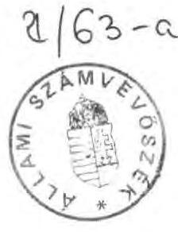

---

# Bevezető 

A költségvetés végrehajtásáról szóló jelentés, a zárszámadás képet ad a Kormány egész évi gazdálkodásáról. A költségvetés végrehajtásáról szóló törvény megalkotásával az Országgyűlés jóváhagyja a Kormány éves gazdálkodását, s utólag emeli jogerőre a Kormány költségvetési törvénytől eltérő intézkedéseit. Az éves gazdálkodás elfogadásakor azt is mérlegelni kell, hogy a Kormánynak volt-e felhatalmazása a költségvetéstől való eltérésre, s nem lépte-e túl felhatalmazása kereteit.

Az Állami Számvevőszék a zárszámadás ellenőrzését törvényi kötelezettsége alapján végezte, amely előírja, hogy ellenőrizni kell az államháztartás gazdálkodását, ennek keretében a költségvetési felhasználások törvényességét, szükségességét és célszerűségét.

A törvényességi ellenőrzési kötelezettség annak vizsgálatára is kiterjed, hogy az Országgyűlés felhatalmazása nélkül a költségvetés egyetlen kiadási tételét se lépjék túl és ne kerüljön sor átcsoportosításra. Az államháztartás jelenlegi rendszerében ennek ellenőrzése, számonkérése csak bizonyos engedménnyel teljesíthető. A költségvetési átcsoportosítások, a kiadások túllépésének ellenőrzése és minősítése csak addig terjedhet, amíg erre a költségvetés szerkezete, részletezettsége, valamint a hatályos jogszabályok alapot szolgáltatnak.

A költségvetési felhasználások és a zárszámadás ellenőrzését megalapozó törvények és jogszabályok 1990. évben hatályos rendelkezései az Országgyűlésnek sok vonatkozásban csak formális jogokat, ezzel szemben a végrehajtó Kormánynak szinte teljes átcsoportosítási és felhasználási felhatalmazást biztosítanak. (1. sz. függelék)

A szabályozás tág kereteit mutatja az is, hogy a költségvetési kiadások több mint 50 %-át kitevő közkiadásoknál — a központi és tanácsi/önkormányzati intézményeknél és az elkülönített állami alapoknál — a finanszírozható célok nem kellően részletezettek és pontosak, számos átfedést tartalmaznak, s túlliberalizáltak a gazdálkodási szabályok is. Ez korlátozza a költségvetés végrehajtásának érdemi ellenőrizhetőségét.

---

# Megállapítások 

## A gazdálkodás törvényessége, szabályossága

## I. A zárszámadás adatainak valódisága

## 1. A zárszámadás szerkezete

Az 1990. évi állami költségvetés a bevételeket és a kiadásokat főbb jogcímek szerint csoportosítva tartalmazza. Fejezeti részletezést csupán a költségvetési szervek támogatására és költségvetéssel szembeni befizetéseikre tartalmaz. A tanácsok/önkormányzatok támogatása megyénként került jóváhagyásra.

A benyújtott zárszámadás a jóváhagyott költségvetés szerkezetének megfelel. A törvényjavaslatban szereplő összegek a törvényjavaslathoz mellékelt költségvetési mérleg és kiegészítő táblázatok adataival számszakilag egyeznek.
2. A költségvetés végrehajtásáról készült jelentés adatainak valódisága
2.1. Ellenőrzésünk megállapította, hogy a költségvetési mérleg adatai - az MNB évvégi zárlati műveleteit és a PM által végzett szükséges, általunk tételesen ellenőrzött rendezéseket figyelembe véve - számszakilag egészében és részleteiben is megegyeznek az állami költségvetés MNB-nél vezetett számláinak 1990. évi bevételi és kiadási főösszegeivel.

Az 1990. évi költségvetés teljesítését módosító utólagos pénzügyi elszámolásra - pótkezelésre - 1991. évben nem került sor. A mérlegbe beállított bevételek főösszege - 640.897 millió forint —, valamint a kiadási főösszeg - 642.266 millió forint - megegyeznek a banki pénzforgalmi adatokkal.
2.2. Az év utolsó napjaiban befizetett jelentős összegű (37,5 milliárd Ft) adók- és adóelőlegek terhére teljesített egyes kifizetések esedékességét, indokoltságát és törvényességét a szabályozottság hiánya miatt nem lehet megkérdőjelezni.

---

A kötelezettségek pénzügyi teljesítésének időpontjai egyértelműen nem szabályozottak, ezért az év végi pénzügyi helyzettől függően az átutalások előrehozhatóak, vagy halaszthatók. Ezzel a tárgyévi pénzforgalmi teljesítés összege, tehát a költségvetési hiány mértéke is befolyásolható. [1.2.]*

Az 1990. évi kifizetések jogossága, szabályszerűsége a következő tételek esetében kifogásolható:

Felhalmozási kiadásoknál:

- Az Állami Fejlesztési Intézet (ÁFI) által bonyolított felhalmozási kiadásokból 933 millió forint felhasználatlan maradt, amelyet a pótkezelés elmaradása miatt 1990. évben tényleges teljesítésként számoltak el. [4.1.]
- A magánerős lakásépítések támogatására december 28-29-én 6,2 milliárd forintot utaltak át az OTP-nek. Az átutalással eltértek a korábbi gyakorlattól, amikor is a tényleges szükséglet felmérése és a különbözet átutalása a költségvetési év lezárása után történt meg. Az előrehozott kifizetéssel 1990-ben az 1989. év lezárását jelentő IV. negyedév, és a teljes 1990. évi szükséglet átutalására és elszámolására is sor került.

A kifizetéssel a költségvetési előirányzat túllépése 7192 millió forint volt. A zárszámadás 2537/1. sz. mellékletének 50. oldalán lévő táblázatból nem állapítható meg, hogy a túllépést mennyiben okozta az előrehozott kifizetés, illetve a normatív jellegű támogatás tervezetten felüli igénybevétele. [4.2.]

Egyéb kiadásoknál:

- A kötelező gépjármű felelősség és az exporthitel biztosítás december havi tényleges veszteségének megtérítésén túl 1,4 milliárd forintot folyósított az állami költségvetés. A megalapozatlannak bizonyult igénybejelentések következtében az állami vállalati és a hatósági kárrendezés valós IV. negyedévi szükségletét 54 millió forinttal túlfinanszírozta a költségvetés. [1.2.]

[^0]
[^0]:    * A szögletes zárójelben lévő számok hivatkozások a 2914. jelentés 1. számú melléklete megfelelő pontjaira.

---

Az elkülönített állami alapok támogatásánál:

- A Foglalkoztatási Alap dokumentált igénylése nélkül folyósított 1,5 milliárd forint, a Felszámolási Alapnál pedig 0,7 milliárd forint megalapozatlan támogatás okozott túlfinanszírozást. [9.1.]
2.3. Az állami nagyberuházások elszámolását a bonyolítást végző ÁFI-nál vizsgáltuk.

Az ÁFI nyilvántartása pontos és áttekinthető. Az MNB-től 1990. évben igénybe vett refinanszírozási hitel nagysága a nyilvántartással, az MNB kamatterhelése az ÁFI által könyvelt és átutalt kamatösszeggel megegyezik.

Az ÁFI és a PM között a kamatkiegészítésre vonatkozó elszámolás - amely az MNB által nyújtott refinanszírozási hitel tényleges kamata és a vállalatok által korábban felvett alapjuttatás járadékának különbsége - csak részben szabályozott.

Kifogásoljuk, hogy az 1990-évben igénybe vett állami alapjuttatással összefüggő refinanszírozási hitelek folyósítását még mindig nem támasztja alá az ÁFI és az MNB közötti hitelszerződés.
2.4. Az adószámlák vezetését törvényességi szempontból vizsgáltuk. Az állami költségvetés bevételeinek 95 %-át, kiadásainak 17 %-át a vállalkozások és a magánszemélyek által, az adózás rendjébe tartozó kötelezettségek, illetve igényelhető juttatások alkotják. Ezek nyilvántartását, behajtását az APEH végzi.

A kialakított számítógépes adóalanyonkénti nyilvántartási rendszer alkalmas az adók és adózók nyilvántartására, az adókötelezettség, illetve támogatási jogosultságok kimutatására. [1.3.]
2.5. A költségvetési fejezetek többsége különféle okok miatt átmenetileg olyan pénzeszközöket is kezel, amelyek kívül esnek a költségvetési elszámolásokon. Ezeket úgynevezett letéti számlákon tartják nyilván.

A letéti számlákra vonatkozó ellenőrzéseink elsősorban arra irányultak, hogy a számlák pénzforgalmában nem szerepelnek-e a költségvetést érintő pénzmozgások is.

---

A letéti számlák megnyitása, a számlákon végezhető pénzforgalmi műveletek nem kellően szabályozottak. Így nyílott lehetőség arra, hogy egyes, a költségvetési körbe tartozó bevételek és kiadások elszámolását a letéti számlákra tereljék. (Ezt a gyakorlatot az Állami Számvevőszék 1989. évi mérlegvalódiságot vizsgáló ellenőrzése kifogásolta.)

A Pénzügyminisztérium által kezelt, a Népgazdasági Elszámolások költségvetési fejezet letéti számláján 1990. év elejére 10 milliárd forint halmozódott fel. Kormányhatározat alapján az ebből évek óta nem mozgó részt - 7,7 milliárd forintot - átvezettek a költségvetés forgóalapjába.

A törvényjavaslat 20. §-a a letéti számláról korábban folyósított, és tartósan kihelyezett tételek 4337 millió forint kiadásának végleges, a költségvetési tételek jellegének megfelelő elszámolását javasolja. Kormányhatározat alapján került elszámolásra a Társadalombiztosítási Alap részére 1989. évben kiutalt 2 milliárd forint forgóalapjuttatás, az "Egyéb kiadások" között. A rendezés további részéről azonban Kormányhatározat nem született. A rendezéshez szükséges "kiadás túlteljesítés" engedélyezése a pénzügyminiszter hatáskörében történt.

A szabályozottságot elősegítő szándékot elismerve kifogásoljuk ezen eljárás lebonyolítását, zárszámadásbeli dokumentálását. [1.4.]

Az ellenőrzés megállapította, hogy a letéti számlák kezelése a korábbi évekhez képest szabályszerűbb volt, de továbbra is találkoztunk a rendeltetéstől eltérő használattal.

Kifogásoljuk, hogy a Kormányhatározat alapján csak a Népgazdasági Elszámolások költségvetési fejezethez tartozó letéti számla felülvizsgálatára került sor, bár a költségvetési eszközökkel való szabályos gazdálkodás, a fejezetek és a PM-hez tartozó többi letéti és letéti jellegű számla áttekintését is indokolta volna.
2.6. A zárszámadásban szereplő adatok számszaki megbízhatóságát reprezentatív módon ellenőriztük.

A vizsgált központi intézményeknél az év végi beszámolók és a tényleges bevételeket, felhasználásokat tükröző főkönyvi kivonatok adatai megegyeztek. A fejezeti összesítéseket megelőzően a fejezetek a felügyeletük alá tartozó

---

intézmények beszámolóit, főkönyvi kivonatait számszakilag és fő összefüggéseiben felülvizsgálták. Ennek ellenére gyakran hibás adatok kerültek az összesítést végző Pénzügyi és Számítástechnikai Intézethez. Az ellenőrzés a beszámolók valódiságának megsértését is megállapította. [6.7. és 6.8.]

A tanácsok/önkormányzatok mérlegbeszámolóiban a legtöbb pontatlanságot a vagyonmérleg tartalmazta. [1.5.]
2.7. A Társadalombiztosítási Alap beszámolóját a költségvetési kapcsolatok szempontjából egyeztettük a zárszámadással és az intézményi, önkormányzati adatok összesített adataival is. A gyógyító-megelőző ellátásra fordított, a Társadalombiztosítási Alap által finanszírozott támogatások összege a Kormány és a Társadalombiztosítási Alap által készített beszámolóban nagyságrendjében megegyezik.

Az érintett központi és a tanácsi/önkormányzati beszámolókban kimutatott, összesített adatokhoz viszonyítva már jelentős - közel 4,9 milliárd forintos - az eltérés. Az eltérés megyénként különböző mértékű. Nagyobb részét a támogatás folyósításának évek közötti áthúzódása, valamint a nem kellően zárt elszámolási rendszere okozza. [5.1.]
(A megyénkénti különbséget az 1. számú melléklet 3. sz. függelékében mutatjuk be.)
2.8. A központi költségvetési szervek fejezetenként, az önkormányzatok megyénként kimutatott támogatása megegyezik az intézményi, önkormányzati beszámolók összesített adataival.

Az önkormányzatok megyénként összesített adatai azonban nem azonosíthatók be a 2537/1. sz. melléklet 84-85. oldalán szereplő adatokkal, melyek egymással sincsenek összhangban. A feltüntetett kiadások 5,1 milliárd forinttal meghaladják a bevételeket.

A különbség alapvetően a bevételek nem teljes körű bemutatása miatt jelentkezik. A bevételek nem tartalmazzák a korábbi pénzmaradványokból igénybe vett, a tárgyévi kiadások fedezetéül szolgáló összegeket, valamint eltérést okoz a már említett, TB-től átvett pénzeszközök különbözősége is.

---

2.9. A zárszámadás szöveges indoklása és a részletes számítások tartalmi és számszerű megfelelését is vizsgáltuk.

A szöveges indoklásban szereplő, és a folyamatokat alátámasztó táblázatok adatait számos helyen nem lehet összevetni, mert az adatok különböző tartalmúak. A pénzforgalmi teljesítést tartalmazó adatok a részletező, eredményszemléletű táblázatokban csak összevontan szerepelnek. Ezért az indoklásban közölt számszaki eredmények helyességét nem minden esetben lehet ellenőrizni, így a megállapítások, következtetések valódiságát sem.
3. Az 1990. évi költségvetési hiány, az államadósság hitelessége
3.1. Az 1990. évi költségvetési hiány 1.369 millió forint, amely a tervezett hiány 13,8 %-a.

A hiány a bevételek 7 %-os, a kiadások 5,5 %-os túlteljesítésének együttes hatására mérséklődött.
3.2. Az 1990. évi költségvetési törvény az 1990. évi hiány fedezésére hosszú lejáratú hitel felvételére, valamint államkötvény kibocsátására hatalmazta fel a Kormányt, amelynek igénybevételére a hiány mértéke miatt nem került sor.

A törvényjavaslat 23. §-a alapján a tényleges hiányt a forgalomban lévő kincstárjegyek 1990. évi növekménye fedezi.
3.3. Az állami költségvetés forint leértékelések nélküli adósságállománya az 1989. évi 798,5 milliárd forintról 852,4 milliárd forintra növekedett. Ezen belül a külföldi államadósság a felvett EGK kormányhitelek miatt 24,5 milliárd forinttal, a belföldi pedig 762,2 milliárd forintról 791,6 milliárd forintra 29,4 milliárd forinttal bővült.

A belföldi államadósság állományának ellenőrzését, hitelesítését az Állami Számvevőszék várhatóan ez év végére fejezi be.

Az 1991. évi költségvetési törvény veszi számba a korábbi évek alatt felhalmozódott belföldi államadósságot. A visszafizetési terminusok szerint a hosszú lejáratú kölcsönök törlesztése miatt 1996. évtől a költségvetés adósság-

---

szolgálati terhei ugrásszerűen - hétszeresére - növekednek. A törlesztő részletek mértékei, a törlesztések forrásai az államadósság kezelésének újragondolását igénylik. [10.2.]

# II. Az 1990. évi költségvetési törvény végrehajtása 

1. A
 Kormány 1990. évi gazdálkodása

A zárszámadás szerkezete, a számszaki és szöveges indoklások alapján a Kormány éves gazdálkodásának folyamata nem követhető nyomon.

A hagyományokra, a szinte teljes végrehajtási felhatalmazásra támaszkodva a beszámoló jelentés csupán "elszámolás", amely nem alkalmas arra, hogy annak alapján a többletbevételek felhasználását, az átcsoportosításokat, a végrehajtási felhatalmazások teljesítését minősíteni lehessen.
2. Az 1990. évi költségvetés eredeti előirányzatait módosító intézkedések
2.1. Az Országgyűlés a költségvetési törvény előirányzatainak összegét év közben nem módosította.
2.2. A törvényjavaslat 22. §-a alapján az Országgyűlés a Kormány és a pénzügyminiszter felhatalmazás alapján kifejtett előirányzat-átcsoportosítási tevékenységét tudomásul veszi.

A javaslat elfogadásához a zárszámadás nem tartalmaz tételes, e célt szolgáló indoklást. A költségvetési mérleg a módosított előirányzatokat nem tünteti fel. Így a módosítások összege és fedezete nem állapítható meg, tehát az sem, hogy az engedélyezés többletbevétel, vagy átcsoportosítás terhére történt.
2.3. A hatályos jogszabályok alapján a Kormánynak többletbevétel, illetve egy-egy előirányzatban mutatkozó megtakarítás terhére szinte valamennyi kiadási tétel módosítására felhatalmazása volt. (1. sz. függelék)
2.4. Előbbi alól csak a "Magyar Államvasutak 4.000 millió forint, a pártok 700 millió forint, a társadalmi szervek 544 millió forint, a Szanálási Alap 2.500 millió forint, a Felszámolási Alap 3.000 millió forint, a Lakás Alap 42.300 millió forint összegű támogatása kivétel, amelyek előirányzat-növeléséhez az Országgyűlés előzetes felhatalmazását kellett kérni.

A Kormány az előzetes felhatalmazás megkérését két tétel esetében elmulasztotta.

A törvényjavaslat 15. §-a a tételesen felsorolt támogatások közül a Lakás Alap támogatására a 44.500 millió forint, a 18. §-a pedig a pártok támogatására a 778 millió forint utólagos jóváhagyását javasolja.
(A túllépések alapja az 1990. évi XLIII. sz. törvény, amely a kamatadó hatályon kívül helyezéséről intézkedett, illetve a 14/1990. (II. 14.) sz. Országgyűlési határozat, amely a képviselőjelöltek támogatására 100 millió forintot engedélyezett.)
2.5. Az ellenőrzés megállapította, hogy az év elején a Minisztertanács három, ezt követően a Kormány hét határozata intézkedett a költségvetés eredeti előirányzataitól eltérő teljesítésről anélkül, hogy az előirányzatok tényleges módosítására sor került volna.

A Kormányhatározatokat értékelve megállapítottuk, hogy azok több esetben nem tartalmazták az engedélyezett előirányzat pontos összegét, az érintett bevételi, vagy kiadási jogcímet, a kedvezményezett fejezet vagy intézmény egyértelmű megnevezését, s a legtöbb esetben az előirányzat-módosítás fedezetét sem.
(Itt jegyezzük meg, hogy korábbi kérésünk ellenére a pénzügyi vonatkozású, költségvetést érintő kormányhatározatokat az Állami Számvevőszék automatikusan nem kapja meg. Az előirányzatok módosítását tartalmazó kormányhatározatokat a Pénzügyminisztérium bocsátotta rendelkezésünkre.)
2.6. A pénzügyminiszter - a Kormány felhatalmazása alapján - a nem automatikus jellegű, címzett tételeknél az állami költségvetés kiadási előirányzatai együttes éves összegének 1%-a erejéig - 1990. évben ez 6,2 milliárd forint volt - engedélyezhette egyes költségvetési kiadási előirányzatok túllépését.

A zárszámadásból - a Kormány költségvetést módosító intézkedéseinek összefoglalása hiányában - egyértelműen nem állapítható meg, hogy a pénzügyminiszter az 1%-os túllépésre vonatkozó engedélyezési hatáskörét milyen mértékben lépte túl. A jogszabály szövegezése miatt az sem egyértel-

mú, hogy ez a jogkör előirányzat-módosításra, vagy csak a túllépés engedélyezésére szorítkozhat.

Az egyes tételek teljesített kiadásait elemezve e hatáskör mindenképpen túllépésre került. A felhatalmazás mértékét meghaladó túllépés minősítésénél figyelembe kell venni, hogy azok engedélyezése részben érvényes kormányhatározatokon alapult. A hatáskör túllépése az alábbi előirányzatok túlteljesítése alapján állapítható meg:

- Kormányhatározat nélkül, korábban a letéti számlákról
kihelyezett összegek elszámolása. (Ebből 745 millió
forint állami értékpapír-vásárlás fedezete.) [1.4.] 2.337 millió Ft
- Államadósság soronkívüli törlesztése. [10.1.] 1.281 millió Ft
- Elkülönített alapok támogatásának túllépése. [9.1.] 1.300 millió Ft
- Biztosítási veszteség megtérítésének túllépése. 4.870 millió Ft
- Magánerős lakásépítés támogatására

1990. december 28-29-én fizetett összeg. [4.2.] 6.200 millió Ft

Összesen:
15.988 millió Ft
3. A tanácsok/önkormányzatok 1990. évi támogatásának utólagos módosítása.

A törvényjavaslat 14. §-ában a hivatkozott 3. számú melléklet az önkormányzatok állami támogatására olyan összeg jóváhagyását javasolja, amely két fő jogcím miatt különbözik az 1990. évi költségvetésben jóváhagyotthoz képest.

A különbség egyrészt az év közben végrehajtott előirányzat-módosítás, másrészt az önkormányzatok által a Belügyminisztériumnak benyújtott normatív támogatások elszámolása eredményeként kiszámított összegből tevődik össze.
(A tanácsok/önkormányzatok támogatása év közben a Kormány intézkedése nyomán 2.131 millió forinttal növekedett, s felosztásra került a költségvetésben központosítottan tervezett 8.501 millió forint is. A normatív támogatás elszámolásával kapcsolatos támogatás változás részleteivel jelentésünk 2. számú melléklete foglalkozik.)

A 21. §. alapján - amely az önkormányzatok által benyújtott elszámolások összesített adatait tartalmazza - az 1990. évre jóváhagyott támogatás összege 1851,5 millió forinttal csökken. A zárszámadásban ennek alátámasztására a 2537/1. sz. füzet 86. oldalán a táblázat csak mutatószámonként összesített adatokat tartalmaz.

A törvényjavaslatban szereplő, az önkormányzatok 1990. évi támogatásának módosítására vonatkozó eljárás a hatályos törvényeknek nem felel meg.
3.1. A helyi tanácsok 1990. évi állami támogatását - ebben a most módosításra kerülő, egyes mutatószámokhoz kapcsolódó állami támogatást is - még a megyei tanácsok hagyták jóvá.

Az időközben hatályba lépett önkormányzati törvény alapján megváltozott a tanácsok jogutódaként működő önkormányzatok jogállása és jogi személyisége. Megszünt a felügyeleti és a támogatás jóváhagyási jogkört gyakorló megyei tanács is. A helyi önkormányzatok támogatásának megállapítása, módosítása az Országgyűlés hatáskörébe került. Ezért az 1990. évi állami támogatások utólagos módosítására - mivel az egyes önkormányzatoknál befizetési kötelezettséget, másoknál pótlólagos támogatást jelent - csak az Országgyűlés illetékes.

Az elszámolás alapján szükséges elvonások, támogatás-kiegészítések összegéről a zárszámadás még megyesoros tájékoztatót sem tartalmaz, pedig az önkormányzatok jogállása indokolta volna az önkormányzatonkénti felsorolást.

A törvényjavaslat 14. és 21. §-ában foglaltak elfogadása esetén az önkormányzatok 1990. évi támogatásának módosítását - annak elvonását, illetve a juttatást - az Országgyűlés "hallgatólagosan" veszi tudomásul, miközben a tényleges döntést a Belügyminisztérium hozta.
3.2. Az ellenőrzés megállapította, hogy a normatív támogatások pontos tervezéséhez és elszámolásához az 1990. évi költségvetési törvény vonatkozó szakaszai nem nyújtottak kellő alapot. Az elszámolás lebonyolításához a BM-PM 1990. év júniusában még a tanácsok számára - jogszabálynak nem minősülő "Tájékoztató"-t adott ki.

A jogalkotási törvény alapján jogszabályt kell alkotni "ha a társadalmi-gazdasági viszonyok változása, az állampolgári jogok és kötelezettségek rendezése, az érdekösszeütközések feloldása azt szükségessé teszi."

Egyrészt az érintett szervezetek — tanácsok-önkormányzatok — jogállásának változása, másrészt a pontatlan költségvetési törvény azt indokolta volna, hogy az elszámolás módosuló feltételeit az Országgyűlés döntése alapozza meg.

Az önkormányzatok megalakulásával összefüggő átmeneti szabályokról szóló törvény e kérdésre csak annyiban tért ki, amennyiben a normatív állami támogatások elszámolási kötelezettségét a volt társközségek önkormányzatára terhelte.
3.3. A zárszámadás adatai szerint a normatív támogatás mutatószámaihoz rendelhető elvonás 2.295,6 millió forint, a pótlólagos támogatás-szükséglet pedig 444 millió forint, amelyek egyenlege a törvényjavaslat 21. §-ában szereplő 1.851,5 millió forint.

Az Állami Számvevőszék az 1990. évi költségvetési törvényben foglalt kötelezettsége alapján ellenőrizte az önkormányzatok elszámolásait. A rendelkezésre álló jogforrások alapján - ugyanazzal, amellyel az önkormányzatok is rendelkeztek az elszámoláshoz - további eltéréseket állapított meg. Az ellenőrzés alapján
— az állami költségvetésből az önkormányzatokat még megillető támogatás +209 millió Ft
— az önkormányzatok többlet finanszírozása miatt az állami költségvetést megillető összeg - 608 millió Ft,
— nettó eltérés (visszafizetendő) - 399 millió Ft.

Eltéréseket 572 önkormányzat elszámolásánál, 11 normatíva esetében tapasztaltunk. (A beszámolót benyújtó mintegy 1600 önkormányzat 36%-ánál.) Az ellenőrzés által megállapított befizetési kötelezettség 22%-kal nagyobb, mint az önkormányzatok által kimutatott összegek. Ezek önmagában is jelzik a rendszer szabályozásának hibáit.

Az ellenőrzés által feltárt ellentmondások, a szabályozottság hiánya miatt — amelyek összetevőit jelentésünk 2. számú mellékletében részletezzük - az elszámolási kötelezettség módszerének újragondolását, országgyűlési döntéssel történő szabályozását tartjuk indokoltnak. [8.1.]

# 4. Támogatási rendszerek módosulása 

Az 1990. évi költségvetési törvénnyel, illetve annak jóváhagyását követően két, decentralizált alap támogatását érintő szabályozás-módosítás történt.
4.1. A korábbi bel- és külpiaci "Intervenciós Alap" támogatására a költségvetés 4250 millió forintot tartalmazott.

A 3233/90. sz. Kormányhatározat az Intervenciós Alap támogatását 1000 millió forinttal csökkentette és 1000 millió forint befizetési kötelezettséget írt elő a központi tartalékkészletek leépítéséből.

A beszámoló jelentés a megszüntetett "Külpiaci Intervenciós Alap" áthúzódó elszámolásaként 1840 millió forint teljesített támogatást tartalmaz az Intervenciós Alapnál azzal, hogy az új támogatások a mezőgazdasági és élelmiszeripari exporttámogatásnál kerültek elszámolásra. Ennek előirányzata a tervezett 17,7 milliárd forint helyett 23,2 milliárd forintra teljesült. Az indoklás szerint a túlteljesítés részbeni magyarázata az, hogy a korábban kétcsatornás támogatás évközben összevonásra került (a 2537. számú jelentés 23. oldal).

A támogatások elszámolására vonatkozó, a 2537/1. sz. füzet 41. oldalán található táblázat az indoklásokat nem támasztja alá, s nem tükrözi a Kormány intézkedésének hatását sem. [2.4.]
4.2. A Foglalkoztatáspolitikai Alap támogatására a költségvetés 8 milliárd forint előirányzatot tartalmaz, amelyből 5 milliárd forint foglalkoztatáspolitikai célokat, 3 milliárd forint pedig megváltozott munkaképességű dolgozók foglalkoztatásának ösztönzését szolgálja. (Az elszámolást a 2537. sz. jelentés 74. oldala tartalmazza.)

A költségvetési törvény indoklása szerint "a foglalkoztatáspolitika egységes kezelése indokolttá teszi azt, hogy a megváltozott munkaképességű dolgozók utáni támogatást jövő évtől az Alap finanszírozza."

Ellenőrzésünk megállapította és az indoklás is azt bizonyítja, hogy az Alap egységes kezelése 1990. évben nem valósult meg.

Az Alap elszámolása az indoklás alapján nem egyértelmű. A beszámolóban található adatok alapján az állapítható meg, hogy az Alap 1990. évi támogatása a tervezett 8.000 millió forinttal szemben 11.647 millió forint volt. [9.1.2.]

# 5. A költségvetési tartalék felhasználása 

A törvényjavaslat 19. §-a kéri a tervezett 3,1 milliárd forint költségvetési tartalék felhasználásának Parlament által történő tudomásulvételét.

A javaslathoz a felhasználást tételesen bemutató indoklás nem készült. Az 1990. évi szabályozás szerint erre vonatkozóan a Kormánynak nincs is kötelezettsége, de a gazdálkodás megítéléséhez a tételes elszámolás készítése indokolt lett volna.

## 6. Az állami költségvetés 1990. évi hitelfelvételei

6.1. 1990. évben a parlament két alkalommal foglalkozott az állami költségvetés hitelfelvételi kérelmével. Ezek azonban nem az 1990. évi állami költségvetési feladatokhoz, hanem az 1989. évi költségvetési hiány finanszírozásához kapcsolódtak. [10.1.2.]
6.2. A Magyar Köztársaság 1990. évi állami költségvetéséről szóló törvény 25. §-a felhatalmazta az MNB elnökét, hogy a törvényben meghatározott feltételek mellett likviditási hitelt nyújtson az állami költségvetésnek. [10.2.1.]

A törvénytervezet 24. §-a tartalmazza a hitelfelvétel összegének utólagos jóváhagyását.

Az Országgyűlés által engedélyezett hitelfelvételek és a költségvetési törvény alapján felvett likviditási hitel szerződéseit az Állami Számvevőszék elnöke ellenjegyezte.

Megjegyezzük, hogy a Pénzügyminisztérium likviditási problémák áthidalására a letéti számlákon kezelt pénzeszközöket többször is igénybe vette. Ez a likviditási hitel kamatterhétől mentesítette ugyan a költségvetést, de a letéti számlák kezelésének szabályaival ellenkezik.

# A közpénzek felhasználásának célszerűsége, eredményessége 

## 1. Bevételek

A vállalati mérlegbeszámolók adatainak elemzésével az adórendszer hatásait tekintettük át.

A vállalkozások adóbefizetéseit és adókedvezményeit értékelve megállapítottuk, hogy a nyereségtömeg nagy részénél még mindig nem érvényesül kellően az adótörvény normatív szabályozó hatása. [2.1.1. és 2.1.2.]

Az egyes vállalkozásokat érintő adószintek erőteljes differenciálódása arra utal, hogy a szélsőségek megszüntetésével lehet megteremteni a
 további adócsökkentés feltételeit.

## 2. A közkiadások felhasználásának célszerűsége, hatékonysága

2.1. A közkiadások eredményességének ellenőrzésénél sorozatosan abba a korlátba ütközünk, hogy az ellátandó feladatok nincsenek pontosan meghatározva, a finanszírozható célok és a pénzügyi eszközök tematikusan nincsenek egymáshoz rendelve.

A felesleges pénzköltés nehezen érhető tetten, az ellenőrzés nem támaszkodhat biztos alapokra, s a pazarlás miatti felelősségre vonásra sincs mód.

A közpénzek hatékony felhasználását célirányos törvényi szabályozásnak kell megalapoznia. Az ellenőrzési megállapítások, tapasztalatok rendezett összegyűjtésével a törvényalkotási, törvényelőkészítési munkát is segíteni kívántuk.
2.1.1. A költségvetési gazdálkodás változatlan állami feladatvállalás és kiadási struktúra esetén egyre nyilvánvalóbban ellehetetlenül. A rendelkezésre álló költségvetési keretek - a változatlan feladatkörhöz - nem biztosítanak elegendő forrásokat. Ez a pénzeszközök szétaprózásán keresztül a feladatok nem kielégítő ellátását eredményezi, a költségvetéssel szemben pedig újabb igények jelentkezését váltja ki. Ezért gátolja - ha nem teszi lehetetlenné - a költségvetési kiadások lefaragására irányuló törekvéseket és magában hordozza a pazarlást is. [6.4. és 6.5.]

---

2.1.2. A feladatokra épülő, alulról induló költségvetési tervezés hiányában a nagyfokú gazdálkodási szabadság mellett a költségvetési felhasználások nyomonkövetésére csak nagyon korlátozottak a lehetőségek.

Részletes és alapos tervezés hiányában nem határozhatók meg a konkrét feladatok ellátásához tartozó költségigények, s ennek következtében az esetleges feladatváltozás költségvonzata sem.

Több esetben tapasztaltuk, hogy nem biztosítottak a tervezést megalapozó költséggazdálkodás számviteli feltételei sem. [6.3. és 6.5.]
2.1.3. Az intézményi gazdálkodásban nincs érzékelhető törekvés a valós és mérhető költségkímélő eljárások kimunkálására. Az intézmények előbb fordulnak pótelőirányzat igénylésével a költségvetéshez, vagy forrásteremtő vállalkozásokhoz, mint a saját tevékenységükben rejlő tartalékok céltudatos feltárásához. [6.5.]
2.1.4. A feladatok ellátásához szükséges létszám meghatározása feltételezi a feladatokra épülő részletes tervezést. A feladatcsökkenések az eddigiekben ritkán jártak együtt a béralap csökkenésével, így napjainkra a bértömeg gazdálkodás alapján erőteljesen differenciált bérszínvonal alakult ki.

A saját hatáskörben végrehajtott létszámleépítés - amely több esetben feladatcsökkenésből eredt - egy-egy szervezet esetében függetlenül a munka minőségétől jelentős mértékű bérfejlesztési lehetőséget is biztosított. [6.2.1. és 6.2.2.]

A szervezeti változások nem a feladatok és a pénzügyi lehetőségek összhangjának figyelembevételével történtek. [6.1.1. és 6.1.2.]
2.1.5. A céljelleggel elkülönített költségvetési pénzeszközök felhasználásánál általánosan tapasztalható, hogy a feladat pénzügyi lebonyolítása során a felelős ágazati minisztériumok a pénzügyi eszközök ésszerű és gazdaságos felhasználására nem fordítottak kellő figyelmet. [7.]
2.1.6. A hatáskörök pontatlan kialakítása az eredeti szakmai céltól eltérő támogatás felhasználáshoz vezet. A törvényi környezet szükséges és várható változására több területen úgy reagálnak, hogy az érvényben lévő hatályos rendelkezéseket sem tartják be. Ez tapasztalható például az elkülönített alapok felhasználásánál, ahol az utóbbi évben rendszeressé vált az alapok pénzes-

---

közeinek rendeltetési funkciótól eltérő felhasználása, a különböző források és kiadások költségvetésen kívülre terelése. [9.2.]
2.1.7. Az elkülönített állami alapokból, költségvetésből visszatérítési kötelezettséggel kihelyezett támogatások nyilvántartását, behajtását nagyvonalúan kezelik, ezért az állami költségvetés jelentős bevételektől esik el. [9.3.]

A közpénzek célszerű és hatékony felhasználását a szabályozás előzőekben megfogalmazott hiányosságai, ellentmondásai akadályozzák. Az ezekből fakadó, a kitűzött feladat ellátása érdekében sokszor nem is indokolható pénzköltés csak akkor akadályozható meg, ha a szabályozásból eredő ellentmondások, "kiskapuk" felismerésre és a törvényhozás erejével felszámolásra kerülnek.

# 3. A finanszírozási rendszerek átalakítása, módosítása 

Különös figyelmet érdemel, hogy az utóbbi időben alapvető ellátási rendszereket érintő szabályozási mechanizmusok kellő előkészítés, modellezés és összehangolás nélkül, kidolgozatlan eljárási szabályokkal kerülnek bevezetésre.

Az előkészítetlen szabályozó módosítások működési mechanizmusának objektív felmérése, értékelése is elmarad. Így az időközi - sokszor "tűzoltó jellegű" - módosítások is megalapozatlanok.

Az 1990. évi beszámoló jelentés a tanácsok/önkormányzatok forrásszabályozásának komplex értékelésével adós maradt. Hasonlóan nem olvashatunk értékelést az egészségügyi intézmények finanszírozási forrásainak változása miatt jelentkező hatásköri problémákról sem.

---

# Javaslatok 

A jelentésünkben szereplő megállapítások, feltárt hiányosságok egy része az 1991. évi költségvetési törvény előírásaival rendeződött. A rövidesen parlamenti vitára kerülő Államháztartási Törvény hivatott arra, hogy az államháztartás szabályozott rendjét kialakítsa. Ezért javaslataink összeállításánál arra törekedtünk, hogy egyrészt felhívjuk a figyelmet a zárszámadási törvényjavaslat hatályos törvényekkel való ellentmondására, másrészt elősegítsük az államháztartást szabályozó alaptörvény vitáját is.

## I. Az 1990. évi állami költségvetés végrehajtásáról szóló törvényjavaslat elfogadásához

1. a.) Javasoljuk, hogy az önkormányzatok 1990. évi normatív támogatása elszámolásának új feltételeiről - figyelembe véve az összegyűlt, méltányosságot igénylő tapasztalatokat - az Országgyűlés döntsön. A döntést követő két hónapon belül a Belügyminisztérium bonyolítsa le az elszámolást, az Állami Számvevőszék által már elvégzett ellenőrzések figyelembevételével.

Az elszámolás feltételei között rendezni indokolt a pénzügyi lebonyolítás befizetés, visszafizetés - módját, határidejét is.
b). Az önkormányzatok elszámolására vonatkozó országgyűlési döntés tartalmának kialakításához felhívjuk a figyelmet arra, hogy az 1990. évre vonatkozó pénzügyi szabályozás a normativák egy részénél nem tisztázott több olyan kérdést, amelynek pénzügyi konzekvenciái indokolatlan hátrányt teremtenek egyes önkormányzatoknál.

Tekintettel az 1989. évi L. tv., a BM-PM "Tájékoztató" és az induló év szabályozatlanságára, a méltányos elbírálás érdekében az Országgyűlés figyelmébe ajánljuk egyes mutatószámok tartalmának bővebb értelmezését. (Ezek részletezését jelentésünk 2. számú melléklete tartalmazza.)

---

c.) Az önkormányzatok elszámolásának eredményeként az elvonásokról és a pótlólagos támogatásokról önkormányzatonkénti kimutatás készüljön.
2. A Foglalkoztatási Alap 1990. évi forrásairól és felhasználásáról pontos és részletes beszámoló készüljön, tekintettel a foglalkoztatáspolitikai eszközrendszerben betöltött szerepére.
3. A mezőgazdasági és élelmiszeripari exporttámogatás, valamint az Intervenciós Alap(ok) előirányzatairól, azok módosításáról és felhasználásáról készüljön áttekinthető elszámolás.
II. Az államháztartási törvény megalkotásáig, illetve annak végrehajtási rendeleteként az alábbi kérdések részletes szabályozása indokolt:

1. A pótkezelésre vonatkozó egyértelmű szabályok, a kötelezettségek pénzügyi teljesítésére vonatkozó időpontok meghatározását az Államháztartási Törvényben kell rendezni. A törvény megalkotásának elhúzódása esetén olyan ideiglenes szabályozást célszerű kialakítani, amely az 1991. év lezárásakor már alkalmazható.
2. A letéti számlák megnyitásának szabályozása, a számlákon végezhető pénzforgalmi műveletek pontos meghatározása.
3. A visszafizetési kötelezettséggel terhelt támogatások nyilvántartására, behajtására készüljön egyértelmű szabályozás.
4. Javasoljuk, hogy mielőbb készüljön el a költségvetés és a beszámoló mérlegrendszerének tervezete. Ezzel párhuzamosan olyan beszámolási rendszer kialakítása indokolt, amely alapján a Kormány gazdálkodása, a végrehajtási felhatalmazások teljesítései nyomonkövethetők.
5. A gyógyító-megelőző ellátások Társadalombiztosítási Alapból folyósított támogatása elszámolásához készüljön zárt, a támogatások egyezőségét garantáló elszámolási rend. Tisztázni szükséges a támogatások felhasználásánál az önkormányzatok hatáskörét, felelősségét is.

---

# III. A belföldi államadósság további rendezéséhez 

1. Javasoljuk, hogy a belföldi államadósság hosszú távú menedzselésére a Kormány készítsen programot, a számbavehető fedezet részletes kidolgozásával.
2. Az állami alapjuttatással összefüggő refinanszírozási hitelek jövőbeni folyósítása, fizetési és kamatfeltételeinek meghatározása az ÁFI és az MNB között megkötött szerződés alapján történjék.
IV. A közpénzek célszerű és hatékony felhasználása érdekében az Államháztartási Törvényben és más vonatkozó jogszabályokban az alábbiak figyelembevétele elengedhetetlen:
3. Az állami feladatvállalás teljes rendszerének, a költségvetés és a társadalombiztosítás kiadási struktúrájának pénzügyi lehetőségekhez igazodó felülvizsgálata.
4. A feladatokra épülő, alulról induló részletes költségvetési tervezési tematika kidolgozása.
5. A feladatok ellátásához szükséges létszám, bérkategóriák meghatározása, ezzel együtt a bérgazdálkodás új alapokra helyezése.
6. A szervezeti változásokkal együttjáró feladat, hatáskör és felelősség, valamint a költségvonzatok pontos dokumentálásának előírása.
7. A meghatározott célokra elkülönített költségvetési pénzeszközök felhasználásának pénzügyi lebonyolítására vonatkozó rendelkezések megalkotása, a felhasználásban együttműködő szervezetek munkamegosztásának, hatáskörének, felelősségének egyértelmű meghatározása.

Az Állami Számvevőszék ellenőrzéseken alapuló megállapításait és javaslatait a törvényjavaslat elfogadásánál megfontolásra ajánljuk.

Budapest, 1991. július
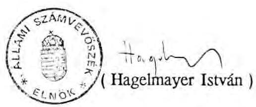

---

# 1. sz. függelék 

az A-83-9/1991. sz. Jelentéshez

## Az Állami pénzügyekről szóló 1979. évi pénzügyi törvénynek az államháztartás vitelére vonatkozó 1990. évben hatályos rendelkezései

Az államháztartás vitelére 1990-ben az Állami pénzügyekről szóló 1979. évi II. törvény és annak végrehajtási rendelete vonatkozott. Az időközi módosításokkal és kiegészítésekkel 1990-ben a hatályos, az állami költségvetés módosításával, felhasználásával kapcsolatos hatáskörök és eljárási szabályok a következők voltak:

1. Az Országgyűlés az állami költségvetésről szóló törvényben határozza meg a bevételi többlet felhasználására vonatkozó intézkedéseket, valamint a hiány rendezésének módját.
2. A Minisztertanács gondoskodik az állami költségvetés végrehajtásáról. (A végrehajtási rendelet szerint az éves állami költségvetés végrehajtásáról a pénzügyminiszter gondoskodik, s a Minisztertanács irányelveket ad az állami költségvetés összefoglaló központi előirányzatainak felhasználására, illetve az ezekkel kapcsolatos eljárási kérdésekre.)
3. "A Minisztertanács gondoskodik arról, hogy az állami költségvetésről szóló törvény végrehajtása során a költségvetési bevételek és kiadások összhangban legyenek egymással; e feladata körében rendszeresen ellenőrzi az állami költségvetés bevételeinek és kiadásainak alakulását, intézkedik a költségvetési hiány fedezéséről és a költségvetési többlet kezelésének módjáról."
4. "Az állami költségvetésről szóló törvényben meghatározott előirányzatok módosítása tekintetében — ha a törvény nem rendelkezik másként — a következők szerint kell eljárni:
a.) az olyan bevételi és kiadási előirányzatoktól, amelyeknek alakulását a vállalati gazdálkodás keretében elsősorban a közvetett szabályozás határozza meg, illetőleg a pénzbeli társadalmi juttatások keretében az érintettek számának és összetételének a változása befolyásol, módosítás nélkül is el lehet térni;

---

ha azonban a gazdasági folyamatok valóságos alakulása, vagy más előre nem látható okok a bevételek és kiadások jóváhagyott egyenlegét nagymértékben módosítják, a Minisztertanács - a pénzbeli juttatások kivételével - intézkedhet a befizetési kötelezettségek és a támogatások mértékének a módosításáról.
b.) a költségvetés többi, címzett előirányzatától való eltérést a Minisztertanács engedélyezheti elsősorban egy-egy előirányzatban mutatkozó megtakarításból, többletbevételből, vagy az állami költségvetés tartalékának a terhére."

Ezen keretek között a Minisztertanács felhatalmazza a pénzügyminisztert, hogy az állami költségvetés kiadási előirányzatai együttes éves összegének 1%-a erejéig engedélyezze egyes költségvetési kiadási előirányzatok túllépését, vagy a költségvetés terhére bankhitelek biztosítékaként kezességet vállaljon. Az ezen éves keretben esetenként engedélyezhető legmagasabb összeget a Minisztertanács a gazdálkodás követelményeinek megfelelően határozatilag rögzítheti.
5. A módosításokról és azok hatásáról, a Minisztertanács az állami költségvetés végrehajtásáról szóló törvényjavaslat előterjesztésekor beszámol az Országgyűlésnek.

---

# 2. sz. függelék 

az A-83-9/1991. sz. Jelentéshez

## Az állami költségvetés 1990. évi zárszámadásához adott jelentésünket a következő, 1990. évi gazdálkodásra irányuló ellenőrzésekre alapoztuk

1. A költségvetési mérleg valódisága, a törvényesség és a szabályszerűség vizsgálatához:
a/ Az állami költségvetés összesített adatait a Pénzügyminisztériumnál és a Magyar Nemzeti Banknál, a refinanszírozási hitelekkel kapcsolatos elszámolásokat az Állami Fejlesztési Intézetnél, a Lakás Alap elszámolásait a Lakás Alap Kezelő Szervezetnél, az adószámlák vezetését, belső szabályozottságát az Adó- és Pénzügyi Ellenőrzési Hivatalnál helyszíni ellenőrzéssel tekintettük át.
b/ A fejezetek éves költségvetési beszámolói számszaki megbízhatóságát a Művelődési és Közoktatási Minisztériumnál, a Közlekedési, Hírközlési és Vízügyi Minisztériumnál és a Magyar Tudományos Akadémiánál, valamint ezek - reprezentatív módon kiválasztott — intézményeinél vizsgáltuk.
c/ A mérlegadatok valódiságának alátámasztásául számítógépes módszerrel vizsgáltuk a vállalkozások 1990. évi mérlegeinek, a központi költségvetési szervek és a tanácsok/önkormányzatok beszámolóinak összesített adatait.
2. A Társadalombiztosítási Alap kiadásainak közel 20%-át kitevő gyógyító-megelőző ellátás ellenőrzéséhez helyszíni vizsgálatot végeztünk az Országos Társadalombiztosítási Főigazgatóságnál. Tájékozódás céljából különféle megbeszélésekre és információkérésekre került sor a Népjóléti Minisztériumban és a Pénzügyminisztériumban.
3. A költségvetési szervek támogatásának felhasználását, annak szükségességét, célszerűségét 1990-ben a következő fejezeteknél vizsgáltuk:

- Magyar Távirati Iroda
- Magyar Televízió
- Földművelésügyi Minisztérium
- Külügyminisztérium
- Munkaügyi Minisztérium

---

- Központi Statisztikai Hivatal
-

 Állami Vagyonügynökség

Az egyes fejezeteknél az általuk kezelt elkülönített alapokat is ellenőriztük.
A felsorolt önálló költségvetési fejezetet alkotó központi költségvetési szervek, valamint a Légiforgalmi- és Repülőtéri Igazgatóság összesen több mint 14,9 milliárd Ft költségvetési támogatásban részesültek. Ez a központi költségvetési szerveknek nyújtott támogatásnak mintegy 8%-át teszi ki.
4. Az Állami Számvevőszék 1991. elején helyszíni vizsgálatot folytatott az ÁVÜ különböző szervezeti egységeinél. Ezen túlmenően hasznosítottuk a konkrét vállalati átalakulások és értékesítések vizsgálataiból nyert tapasztalatokat is. Így például: Özdi Kohászati Üzemek, Idegenforgalmi Propaganda Vállalat, Borsodi Iparcikk Kereskedelmi Vállalat, Ganz Danubius Vállalat, Medicor, Compack Vállalat, Gerbeaud-ház átalakulásai.
5. Az Állami Számvevőszék a pártok gazdálkodásának törvényességét 1990-ben 17 pártnál, illetve politikai szervezetnél ellenőrizte.
6. Az Országgyűlés a költségvetési törvényben az 1990. évre 450 millió Ft-ot biztosított valamennyi választás költségeinek fedezeteként.

A felhasználás ellenőrzése során vizsgálatot végeztünk a központi szervek esetében a Belügyminisztériumnál, a Pénzügyminisztériumnál, a Külügyminisztériumnál és az Állami Népességnyilvántartó Hivatalnál. A választásoknál szükségszerűen felvetődött, elvégzett, de a költségvetésben nem tervezett kapcsolódó feladatok végrehajtásának költségeiről tájékozódást folytattunk a Magyar Rádiónál, a Magyar Televíziónál, a Munkaügyi Minisztériumnál, a Magyar Távközlési Vállalatnál és az Országos Rendőrfőkapitányságnál.

A központi szervek vizsgálatával egyidejűleg elvégeztük a témával kapcsolatban a területi és helyi tanácsok ellenőrzését az ország valamennyi megyéjében és városában. A 20 területi egység vizsgálata mellett 167 helyi tanács, 18 - a választásokban közreműködő - költségvetési intézmény esetében helyszíni ellenőrzést, további 16 szervezetnél tájékozódást folytattunk.
7. A tanácsok/önkormányzatok 1990. évi forrásszabályozása alapján a szabályozó rendszer egyes elemeinek helyszínen végzett, 1990. évre vonatkozó vizsgálatai az

---

állami költségvetésből kiáramló támogatást (111 milliárd Ft-ot) teljeskörűen felölelte, s emellett kiterjedt a Társadalombiztosítási Alapból az önkormányzati intézményeknek juttatott (45 milliárd Ft) egészségügyi feladatok megvalósítását szolgáló összegek ellenőrzésére is. Ezen túl ellenőriztük a távfűtéshez kapcsolódó fogyasztói árkiegészítés hasznosulását is.

Az 1990. évi különböző célú támogatások felhasználására vonatkozóan 14 témát vizsgáltunk, ezzel összefüggésben 781 önkormányzatnál, 218 vállalatnál, illetve 206 egyéb vizsgálati helyen folytattunk helyszíni ellenőrzést.

Észrevételeinket minden esetben egyeztettük a vizsgált szervekkel. Megállapításainkról helyszíni jegyzőkönyvek felvételével, illetve az összefoglaló jelentésünk megküldésével tájékoztattuk az érintett vizsgálati területeket.

Vizsgálatainkkal - melyek törvényességi, szabályszerűségi, eredményességi és célszerűségi jellegűek voltak - az alakuló önkormányzatoknak is segítséget kívánunk nyújtani pénzügyi helyzetük megismerésükhöz, gazdasági feltételeik feltérképezéséhez.

Budapest, 1991. július

---

# Mellékletek 

1. számú melléklet: Részletes megállapítások az 1990. évi költségvetés végrehajtásáról készített jelentéshez
2. számú melléklet: Beszámoló az önkormányzatoknak/tanácsoknak 1990. évre nyújtott normatív állami támogatás elszámolásának ellenőrzéséről

---

# Állami Számvevőszék 

## Célhok

2932. szám.

JAVASLAT

Az Országgyűlés ..../1991. (....) OGY határozata

a Magyar Köztársaság 1990. évi költségvetése
végrehajtásának ellenőrzéséről

1. Az Országgyűlés az Állami Számvevőszéknek a Magyar Köztársaság 1990. évi költségvetése végrehajtásának ellenőrzéséről szóló Jelentését elfogadja.
2. Az Országgyűlés felkéri a Kormányt, hogy a Jelentésben foglalt javaslatok, ajánlások, illetőleg az országgyűlési vitában elhangzottak alapján a vonatkozó intézkedéseket tegye meg és azokról a határozat kihirdetését követő 90 napon belül az Állami Számvevőszékkel egyeztetett jelentését terjessze az Országgyűlés elé.

## INDOKOLÁS

Az 1989. évi XXXVIII. törvényben foglalt kötelezettsége alapján az Állami Számvevőszék ellenőrizte a Kormány által az 1990. évi költségvetés végrehajtásáról készített (2537. számú) Jelentést. Az ellenőrzés több olyan hiányosságot állapított meg, amelyek felszámolására a Kormány, illetőleg az előterjesztést benyújtó pénzügyminiszter intézkedései válnak szükségessé. Ezt a célt szolgálják az Állami Számvevőszék által beterjesztett javaslatok.

Budapest, 1991. július
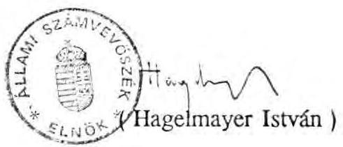

---

A 2914. számú Jelentés

1. sz. melléklete

# Állami Számvevőszék 

## RÉSZLETES MEGÁLLAPÍTÁSOK

az 1990. évi költségvetés végrehajtásáról készített jelentéshez
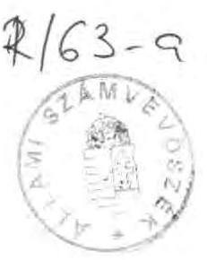

---

# Tartalomjegyzék 

1. A költségvetési mérleg valódisága ..... 1
1.1. Az állami költségvetés nyilvántartási rendszere ..... 1
1.2. A költségvetés egyes év végi pénzműveletei ..... 1
1.3. Adószámlák ..... 2
1.4. Letéti számlák ..... 3
1.5. Az önkormányzatok beszámolói ..... 4
2. A gazdálkodó szervezetek költségvetési kapcsolatai ..... 5
2.1. Adó és adójellegű bevételek ..... 5
2.2. Pénzintézetek befizetései ..... 8
2.3. Az állami tulajdon utáni részesedés ..... 9
2.4. Mezőgazdasági, élelmiszeripari exporttámogatás ..... 11
2.5. Szocialista államközi elszámolások ..... 13
3. Fogyasztáshoz kapcsolódó pénzügyi hidak ..... 15
3.1. A fogyasztói árkiegészítés ..... 15
4. Felhalmozási kiadások ..... 17
4.1. Állami nagyberuházások pénzügyi lebonyolítása ..... 17
4.2. Magánerős lakásépítés támogatása ..... 18
4.3. Állami értékpapír vásárlás ..... 18
5. Társadalombiztosítási Alap költségvetési kapcsolatai ..... 19
5.1. A gyógyító-megelőző ellátásokra fordított pénzeszközök ..... 19
6. Központi költségvetési szervek költségvetési kapcsolatai ..... 20
6.1. Szervezeti felépítés, és szervezeti átalakítások ..... 21
6.2. Létszám és bérgazdálkodás ..... 23
6.3. Intézményi bevételek tervezése ..... 25
6.4. A feladatok és előirányzatok összhangja ..... 26
6.5. A pótelőirányzatok igénylésének megalapozottsága ..... 26
6.6. A költségvetési szervek pénzellátása ..... 27
6.7. A költségvetésen kívül kezelt pénzeszközök ..... 27
6.8. A kincstári vagyon ..... 28
7. Az Országgyűlési képviselőválasztások, önkormányzati választások, népszavazás költségei ..... 30
7.1. Országgyűlési képviselő választások ..... 31
7.2. A július 29-ei népszavazás ..... 31
7.3. Önkormányzati képviselő és polgármester választások ..... 32
8. Tanácsok/helyi önkormányzatok gazdálkodása ..... 32
8.1. A normatív állami támogatás igénybevételének ellenőrzése, elszámolása ..... 33

---

8.2. Az 1990. évi szabályozási "átmenet" rendezését szolgáló kiegészítő állami támogatás felhasználása ..... 35
8.3. Célhoz kötött kiegészítő támogatások hasznosulása ..... 35
8.4. Központosított előirányzatból finanszírozott tevékenységek ..... 37
8.5. A Társadalombiztosítási Alapból támogatott egészségügyi feladatok finanszírozása ..... 39
8.6. A nagyvárosi tömegközlekedés támogatása ..... 40
9. Elkülönített állami pénzalapok ..... 41
9.1. 1990. évi előirányzatok és teljesítésük ..... 41
9.2. Az Alapok gazdálkodásának jellemzői ..... 43
9.3. Az Alapok működésének szabályozása ..... 44
9.4. Lakás Alap ..... 45
10. Adósságszolgálat, kamattérítés ..... 45
10.1. 1990. évi adósságszolgálati kötelezettségek és kamattérítések ..... 45
10.2. Belföldi államadósság ..... 47
10.3. Az 1989. évi költségvetési hiány finanszírozása ..... 50
11. Az állami költségvetés 1990. évi hiánya ..... 51
12. Egyéb bevételek és kiadások ..... 51
13. Az állami vagyon ..... 52
13.1. Az állami vagyon nyilvántartása ..... 52
13.2. Az állami vagyonnal rendelkező vállalkozások ..... 53
13.3. A Vagyonügynökség 1990. évi tevékenysége ..... 58
Függelékek:
1. sz. függelék: Az elkülönített állami pénzalapok zárszámadásáról készült szöveges indoklásban és számítási anyagban kifogásolt hiányosságok és eltérések
2. sz. függelék: Az önkormányzatok 1990. évtől bevezetett pénzügyi szabályozó rendszerének működése
3. sz. függelék: Gyógyító-megelőző ellátások finanszírozására szolgáló támogatások különbsége

---

Jelentésünk második részében a Kormány által benyújtott Jelentés részletes indoklásának szerkezetét lehetőség szerint követve beszámolunk a zárszámadás részletesebb számszaki és tartalmi ellenőrzéséről, a folyamatokat más oldalról bemutató elemzéseinkről, valamint helyszíni ellenőrzéseink 1990. évi zárszámadáshoz kapcsolható megállapításairól.

Elemzéseink tartalmának összeállításánál arra törekedtünk, hogy adalékot szolgáltassunk az adórendszerek módosításának előkészítéséhez, a törvényelőkészítők által javasolt megoldások megítéléséhez.

Az ellenőrzési tapasztalatokat úgy gyűjtöttük csokorba, hogy egyben segítséget nyújtanak az Államháztartási törvény vitájához, megalkotásához.

# 1. A költségvetés végrehajtásáról készült jelentés adatainak valódisága 

Az 1990. évi állami költségvetés teljesítését bemutató mérleg még a hagyományos szerkezetben készült. Az adatok valódisága az MNB évvégi bankszámla kivonatai és a PM nyilvántartásai alapján ellenőrizhetők voltak.

### 1.1. Az állami költségvetés nyilvántartási rendszere

Az állami költségvetés bankszámlarendszerének és nyilvántartási (számviteli) rendszerének szabályozottsága az elmúlt év óta csak részben javult. Időközben elkészült - bár hiányosan - a számlák tartalmi leírása, valamint a költségvetési mérleg összeállításának számítógépes metodikája. Ellenőrzésünk - részletes, jogszabályi előírásokban megfogalmazott követelmények hiányában - így csak a bankszámlák hiányosan meglévő tartalmi leírásaira és a mérlegadatok összeállítására vonatkozó ismertetőkre támaszkodhatott.

### 1.2. A költségvetés egyes év végi pénzműveletei

Az állami költségvetés pénzforgalmi- és eredményszemléletű teljesítése közötti különbség ellenőrzése a jelenlegi elszámolási rendben nem oldható meg, mert a kiadási tételek mindegyikére nincs meghatározva, hogy pénzforgalmi teljesítésként milyen időszak elszámolása történhet meg.

Ez az állami költségvetés finanszírozási gyakorlata miatt vet fel problémákat. Ezek szerint csak egyes kifizetések ütemezettek az engedélyezett előirányzatok alapján. Vannak olyan kifizetések, amelyek előleg jellegűek, utólagos elszámolási kötelezettséggel. (pl. ÁFI finanszírozása). Másokat utólagosan, valamely bonyolító szervezet elszámolása alapján finanszíroznak (pl. magánerős lakásépítés támogatása).

---

Az 1990. év utolsó napjaiban teljesített vitatható kifizetések a következők voltak:

- A magánerős lakásépítéshez kapcsolódó szociálpolitikai kedvezmények és költségvetési kamatkiegészítés IV. n. évi fedezetére a PM 1990. december 28-29-én az OTP részére átutalt összeggel (6,9 milliárd Ft) az 1990. évi költségvetést öt negyedév támogatásával terhelte, mivel az 1989. év hasonló időszakában keletkezett tartozás is 1990-ben került kiegyenlítésre.
- A kötelező gépjármű felelősség- és az exporthitel biztosítások december havi veszteségeinek megtérítése címén a Hungária Biztosítónak írásos igénylésére átutalt 2,6 milliárd Ft-ból csak 1,2 milliárd Ft szolgálta az utolsó havi kárkifizetéseket.
- Az Állami Biztosító bejelentett és teljesített 187 millió Ft-os IV.n.évi költségvetési juttatási igénye 54 millió Ft-tal haladta meg az állami vállalati és hatósági kárrendezések valós szükségleteit.
- A Foglalkoztatási Alap december 11-én bejelentett, év végéig kalkulált 1,2 milliárd Ft támogatási szükségletének kielégítésén felül a PM - külön írásos igénylés nélkül - még 1,5 milliárd Ft-ot utalt át az alap számlájára.
- A Felszámolási Alap 3 milliárd Ft-os előirányzatával szemben december 29-én 1 milliárd Ft-ot utalt át a minisztérium. A tényleges igénybevétel csak 300 millió Ft volt, így 700 millió Ft-os túlfinanszírozás valósult meg.

# 1.3. Adószámlák 

Az állami költségvetés bevételeinek és kiadásainak jelentős része az adózás rendjébe tartozó kötelezettségekből és az igényelhető juttatásokból tevődik össze. Az APEH hatáskörébe tartozó adókra 1990-ben különböző szintű jogszabályok vonatkoztak: törvény, kormányrendelet, miniszteri rendelet. A számlanyitás eljárása a vizsgált időszakban jogszabályban nem volt rendezett, kialakult gyakorlat alapján történt.

Az 1991. évi költségvetésről szóló 1990. évi CIV. törvény a számlaszámok közzétételét kötelezővé tette. A számlaszámok jegyzéke naprakész. A számlavezetés teljes eljárását - befizetéstől a folyószámla készítéséig - a számítógépes feldolgozásban résztvevő szervezetek között, valamint azokon belül programrendszerek határozzák meg.

---

A Pénzügyi Számítástechnikai Intézet által az Adóelszámolási Iroda részére működtetett számítógépes központi adatfeldolgozáshoz a bemenő (input) adatokat három intézmény szolgáltatja: az MNB, az OTP és a Magyar Posta. E kapcsolatrendszerből adódóan az MNB és az APEH számlavezetése elvileg egyező.

Az adóhátralékról készített statisztikák nehezen értelmezhetők, nem egyértelmű a tartalmuk. Nem állapítható meg az adóhátralék nagysága, mivel adóévenként nem nyitnak új folyószámlát. Az adóhátralékok kimutatásával és behajtásával kapcsolatos problémák az adóalanyok egy részének valós fizetésképtelenségére, a jogszabályi előírásokra és a rendkívül alacsony adómorálra vezethetők vissza.

# 1.4. Letéti számlák 

A fejezetek és kivételesen az intézmények is - különféle okok miatt - átmenetileg olyan pénzeszközöket kezelnek, amelyek kívül esnek a költségvetési elszámolásokon. A letéti számlák ellenőrzése arra irányult, hogy a számlák pénzforgalmában nem szerepelnek-e költségvetést érintő pénzmozgások. Tapasztalatunk szerint a letéti számlák kezelése a korábbi évekhez képest általában szabályszerűbb volt, de találkoztunk rendeltetéstől eltérő használattal is.

A gazdálkodási szabályok szerint a költségvetésen kívül kezelt pénzeszközöket a rendeltetésszerű feladatok bevételeinek és kiadásainak pénzügyi lebonyolítására szolgáló költségvetési elszámolási számláktól elkülönített ún. letéti számlákon kell tartani.

A Pénzügyminisztérium az év során három, illetve - az év második felében nyitott új számlával együtt - négy letéti számlán, valamint jellegében hasonló központi takarékossági számlán az előző évinél
 lényegesen kisebb pénzforgalmat bonyolított le.

Ilyen letéti számlája az ún. 80. Népgazdasági Elszámolások fejezetnek is volt 1990-ben. (E fejezet az állami költségvetés központi és tanácsi fejezetekre nem bontott összefoglaló előirányzatait, a felhalmozási kiadásokat, a nemzetközi pénzügyi kapcsolatokat, az adósságszolgálatot, az egyéb bevételeket, illetőleg kiadásokat tartalmazta.)

A Népgazdasági Elszámolások költségvetési fejezethez tartozó letéti számlákról korábban folyósított és tartósan kihelyezett tételekből a törvényjavaslat 20. paragrafusa 4.337 millió Ft kiadás végleges, a költségvetési tételek jellegének megfelelő elszámolását javasolja.

E rendezésről - a Társadalombiztosítási Alapnak nyújtott 2 milliárd Ft forgóalap juttatás kivételével - kormányhatározat nem született. A rendezéshez szükséges "kiadás túlteljesítés" engedélyezése a pénzügyminiszter hatáskörében történt. A zárszámadásban az eljárás dokumentálása nem teljeskörű.

A kiadások fedezeteként a letéti számláról történt - technikai jellegű - befizetéssel a költségvetés "Egyéb bevételeit" növelték meg (2537/1.füzet 37.old.)

Az eljárás - bár a rendezést szolgálta - mégis kifogásolható, mert az indoklás a mellékelt táblázatok alapján nem kielégítő, ugyanis nem állapítható meg, hogy

- a letéti számla 1.100 millió Ft év végi egyenlege nem tartalmaz-e további, rendezést igénylő tételeket,
- az egyéb bevételeknél elszámolt összeg valóban megegyezik-e a kiadások teljesítéséhez szükséges 4.337 millió Ft-tal.

A teljesített 4.337 millió Ft kiadás mérlegsorokhoz igazodó, tételes kimutatása - amely a törvényerőre emelést megalapozza - a mellékletek között nem szerepel.

# 1.5. Az önkormányzatok beszámolói 

Az önkormányzatok 1990. évi beszámoló rendszerének fő elemei közül a legtöbb pontatlanságot a vagyonmérleg tartalmazta. A leggyakoribb hiányosság az volt, hogy a mérlegben nem, vagy helytelenül mutatták ki a földterületeket, a vállalkozásokba bevitt és az ajándékként kapott eszközöket, a részvényeket, és a hitelállományt. A kisebb önkormányzatoknál előfordult az álló- és fogyóeszközök értékének nem megfelelő szerepeltetése is, amihez az is hozzájárult, hogy a különböző nyilvántartások év végi kötelező egyeztetését helyenként elmulasztották. Emiatt a mérlegvalódiság elve nem kellően érvényesült.

Viszonylag kisebb számban, de előfordult pontatlanság is a pénzforgalmi és költségadatokban, továbbá a pénzmaradványok mértékének megállapításában.

A beszámolókat az önkormányzatok és intézményeik a központilag kiadott formanyomtatványokon állították össze. Felhívjuk a figyelmet arra, hogy a nyomtatványgarnitúra a költségvetési szervektől számos olyan adatot, információt igényelt,

melyeket a felügyeleti és a központi szervek sem hasznosítottak. Mivel az önkormányzati testületek számára általában idegen a költségszemlélet, a beszámolónak az üzemgazdasági adatait nem hasznosítják. Ehelyett a döntéseikhez olyan információkat igényelnek, melyekből kiderül, hogy egy-egy feladat ellátásához mennyi pénzre van szükség és ebből mennyit vállal magára az állami költségvetés és mennyivel kell azt az önkormányzati forrásból kiegészíteni.

# 2. A gazdálkodó szervezetek költségvetési kapcsolatai 

### 2.1. Adó és adójellegű bevételek

A nyereségadóból származó bevételekre 1990-ben is számottevő hatással voltak az adózással kapcsolatos kedvezmények. A pénzintézetek nélküli vállalkozási körben, a mérlegbeszámolók adatai szerint 270 milliárd forint nyereség realizálódott. Az általános szabályok szerint elszámolandó nyereségadó 110,2 milliárd Ft volt, azonban az igénybe vett adókedvezmények miatt eredményszemléletben ténylegesen csupán 84,3 milliárd Ft befizetési kötelezettség keletkezett.

A költségvetésben a különböző bevételi és kiadási előirányzatok pénzforgalmi szemléletnek megfelelően szerepelnek. Ez azt jelenti, hogy december 31-ei pénzügyi teljesítésnek megfelelően jelennek meg a befizetési, illetve kiadási jogcímek, függetlenül attól, hogy azok ténylegesen melyik évben keletkeztek. Például a nyereségadó befizetés előlegeként a vállalkozó a mérlegbeszámolóban kimutatott nyereség összegének 90%-át köteles havi ütemezésben a tárgyév december 31-éig befizetni. A 10% a költségvetés következő évi bevételeit növeli. A vállalkozások az előleget azonban az előző évi tényleges nyereségadó alapján fizetik. Így az adott időszakban többet, vagy kevesebbet fizetnek be, mint amennyit kellene. Ha ezt decemberben nem korrigálják, akkor a következő évben a túlfizetést visszaigényelhetik, a hátralékot pedig befizetik. Elemzésünk a naptári év szerinti eredményeket tükröző, úgynevezett eredményszemléletű vállalkozási nyereségadó alapján készült.

A vállalkozások 1990-ben az eredetileg tervezett 16,2 milliárd forinttal szemben 25,9 milliárd Ft adókedvezményt vettek igénybe. A 9,7 milliárd Ft-os túllépés annak ellenére következett be, hogy évközben - a költségvetés helyzetét javító intézkedési csomagtervben - az adókedvezmények igénybevételének feltételeit szigorították.

# 2.1.1. Adókedvezmények 

Az adókedvezmények túlzott mértékét és kiterjedtségét jól jellemzi, hogy a nyereséges vállalkozások több mint fele (8870) adókedvezményben részesült.

Számos kedvezmény vetítési alapja nem a nyereségadó. Ezek szinte korlátlan összegű és nehezen prognosztizálható kedvezményt biztosíthatnak a vállalkozások számára. 1990-ben az alábbi, ilyennek tekinthető jogcímeken összesen 11,3 milliárd Ft kedvezményt számoltak el:

- hitel és kölcsön kamatok,
- állami kölcsön,
- kutatási, műszaki fejlesztési tevékenység,
- lakosság részére végzett egyes fogyasztási szolgáltatási tevékenység után,
- népművészeti és hagyományos háziipari termékek előállítása után,
- gazdaságilag elmaradott és a központi strukturapolitikai döntésekkel érintett térségeknél,
- egyes mezőgazdasági beruházások után,
- állóeszközök értékesítése után,
- a korábbi évek adókedvezményei.

Megállapításunkat igazolja, hogy ezeknél a jogcímeknél a legerőteljesebb az előirányzat túlteljesítése.

- Az elmaradott térségekben megvalósított beruházások után járó adókedvezmény (beruházási költség 30%-a) előirányzata 520 millió forint volt. 835 gazdálkodó ténylegesen 4.095 millió Ft-ot vett igénybe.
- Az egyes központi struktura- és társadalompolitikai döntésekhez kapcsolódó adókedvezmények, kamattérítések előirányzata 2.388 millió Ft volt. Ténylegesen, ennél 26%-kal többet, 3.018 millió Ft-ot vett igénybe a 770 gazdálkodó egység.
- A korábbi évekből származó adóvisszatérítések is jelentős többleteket mutatnak. Az előirányzott 1.178 millió Ft-tal szemben 2.360 millió Ft igénybevétele történt meg. Az érintett vállalkozások száma 936 volt.

Az adókedvezmények felülvizsgálatánál elsősorban ezeket a jogcímeket célszerű megszüntetni és más - a nyereségtől szorosabban függő - technikai megoldásokat kialakítani.

Az adókedvezmények közül az egyik legjelentősebb tervtől való eltérés a gazdasági társaságok adókedvezményénél jelentkezett. A gazdasági társaságok az előirányzott 1.050 millió Ft-tal szemben 5.170 millió Ft-ot vettek igénybe (pénzintézetekkel együtt 5.583 millió Ft-ot.) Az 1990. évi adatok is azt bizonyítják, hogy a gazdasági társaságoknál a külföldi tőke részesedése javult az előző évhez képest, de a vállalkozások többségénél még mindig szerénynek mondható.

A kis összegű külföldi befektetések utáni adókedvezmény továbbra is aránytalan előnyöket biztosít. Az adókedvezmények igénybevételének feltételrendszerét 1991. évre jelentősen szigorították (csak az a vállalkozás kap kedvezményt, ahol az alapítói vagyon 50 millió Ft feletti és ebben legalább 30%-os a külföldi részesedés). Ez a szigorítás azt eredményezhetné, hogy 1991-ben az 5,5 milliárd Ft kedvezményből mintegy 2,5 milliárd Ft megtakarítható lenne. Az átmeneti rendelkezések azonban a korábbi kedvezmények hatályát 1995-ig, illetve az igénybevételtől számított 10 évig változatlanul hagyják. Emiatt e jogcímnél a közeli években nem számíthatunk az adókedvezmény számottevő mérséklődésére.

# 2.1.2. A vállalkozások adóterhelése 

A nyereségadó kedvezmények igen sok vállalkozót érintettek. Ez azt jelentette, hogy a vállalkozások adóterhelése erőteljesen differenciálódott attól függően, hogy a nyereségadó törvény milyen mértékű adókedvezményt biztosított számukra.

A nyereségadó kedvezményben részesülő vállalkozásoknál az átlagos közvetlen nyereségadó terhelés 30%-os, míg a kedvezményben nem részesülők körében 38,3 %-os volt. Ha az adókedvezményeket a nyereség tömegéhez viszonyítjuk, akkor az adókedvezmények nagymértékű kiterjedtsége még inkább látható, ugyanis a 270 milliárd Ft nyereségből 230 milliárd Ft-nál valamilyen adókedvezmény érvényesült.

Ez azt jelenti, hogy a realizálódó nyereségtömeg nagy részénél nem érvényesül az adótörvény normatív előírása.

Az adókedvezményben nem részesülő gazdálkodók az összes nyereséget kimutató egység 47%-át teszik ki, ugyanakkor a nyereségnek csak 14,8%-át realizálták.

A kedvezményekből adódóan a nyereség adóterhelése vállalkozásonként jelentős differenciálódást mutat. A grafikon a gazdálkodók és a nyereség megoszlását, arányát mutatja az adóterhelés arányában.

# A vállalkozások és a nyereség megoszlása az adóterhelés alapján az 1990. évben 

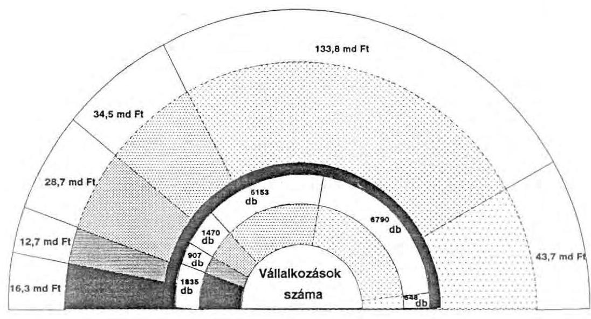

Adószint mértéke

| Nem fizet |  | 20-30 % |
| :--: | :--: | :--: |
| 0-10 % |  | 30-40 % |
| 10-20 % |  | 40 % felett |

Figyelemre méltó, hogy a vállalkozások több mint 10%-a (1835) egyáltalán nem fizet adót. (Számuk az előző évhez képest megkétszereződött.) A nagyvállalatok - amelyek a gazdaságban kimutatott nyereség 16%-át realizálták - továbbra is a normatívhoz közelálló kulccsal adóztak.

### 2.2. Pénzintézetek befizetései

A pénzintézetek 1990-ben közel 34%-kal nagyobb nyereséget értek el, mint egy évvel korábban, s az előirányzottnak több mint kétszeresét - 48,6 milliárd Ft-ot fizettek be az állami költségvetésbe. A több mint 300 pénzintézet közül hatnál (MNB, OTP, Magyar Külkereskedelmi Bank Rt, Budapest Hitel- és Fejlesztési Bank Rt.,

Országos Kereskedelmi és Hitelbank Rt, valamint a Magyar Hitelbank Rt.) az elszámolt nyereségadó külön-külön is meghaladta az 1 milliárd Ft-ot, s együttes összegük az összes pénzintézetnél elszámolt nyereségadónak a 88,6%-át tették ki. Az előirányzotthoz viszonyítva a túlteljesítés olyan mértékű, hogy az előidéző tényezőket részletesebben is vizsgáltuk. Ezek a következők:

- Az 1990. évi állami költségvetésről szóló törvény az adóbefizetés előirányzatát a nyereség 12-13 %-os növekedésére alapozta. A tényleges növekedés 34%-os volt. Ebben szerepet játszott az, hogy a bankok az év során nagyobb mennyiségű hitelt nyújtottak a gazdálkodó szférának. A gazdálkodó szféra hitelállománya az év végén 102,7 milliárd Ft-tal volt nagyobb a január 1-jeihez képest, s ez nagyobb kamatbevételt biztosított a bankoknak.
- 1989. évre a pénzintézetek befizetési kötelezettsége 9,3 milliárd Ft-tal volt nagyobb, mint a befizetett előleg. Ezzel szemben 1990-ben a befizetett előleg (36,7 milliárd Ft) jobban megközelítette - csupán 1,6 milliárd Ft-tal volt több az 1990. évi tényleges befizetési kötelezettséget.
- A pénzintézetek mérlegében kimutatott, az adó alapjául szolgáló nyereség pénzügyileg nem realizálódott, mivel egy része valójában "behajthatatlan követelés" volt.
- Az állami részvények utáni osztalék is túlteljesült, az előirányzott 2,2 milliárd Ft-tal szemben 2,6 milliárd Ft volt.

Az összefüggések teljesebb áttekintése érdekében megjegyezzük, hogy a bankok a számottevően megnövekedett nyereségükből 1990. évre lényegesen nagyobb osztalékot is fizethettek volna, mint az előző évben. A bankok közgyűlésein azonban az állam képviselője a mérsékelt osztalék fizetésére szavazott. Ezzel a bankoknál megteremtődött annak a lehetősége, hogy tartalékot képezzenek a behajthatatlan követeléseik egy részének "leírás"-ára, mentesítve ezáltal az állami költségvetést.

# 2.3. Az állami tulajdon utáni részesedés 

Az állami kiadások fedezetéhez szükséges bevételek, valamint a gazdasági társaságokkal arányos teherviselés érdekében a vállalkozások 1990-ben az állami vagyon után részesedést fizettek. Ennek előlegeként a költségvetés 1990-ben 27,1 milliárd forint bevételhez jutott, ami 19,9 %-kal haladta meg a tervezettet. (Az Indoklás szövege téves, amely szerint a teljesítés "másfélszerese a tervezettnek".)

A 4,5 milliárd forintnyi emelkedés oka részben az, hogy év közben törvénymódosítással (1990. évi L. tv.) az állami vagyon utáni részesedés mértékét 18%-ról 25%-ra emelték. Másrészt az OTP - átalakulásának elhúzódása miatt - osztalék helyett állami vagyon utáni részesedést fizetett. E két tényezőnek együttesen nagyobb mértékű emelkedést kellett volna eredményezni. A költségvetési előirányzatok kialakításánál és a módosításnál azonban túlbecsülték a várhatóan nyereséges állami vagyonarányt.

Az állami vagyonnal rendelkező 3507 vállalkozás közül részesedést csupán 1718 vállalkozás teljesített. A részesedés döntő hányada (18 milliárd Ft)
 az államigazgatási felügyelet alá tartozó 444 vállalattól származik.

A 928 önigazgatású vállalat (VT, közgyűlés) állami részesedés címén 7,9 milliárd Ft-ot fizetett be. A különböző állami vagyonnal rendelkező nyereséges egyéb vállalkozások száma 346, amelyek azonban az állami vagyon arányában mindössze 176 millió Ft állami részesedést teljesítettek.

Az adózott eredményre vetített állami részesedés a három fő gazdálkodási formában a következőképpen alakult:
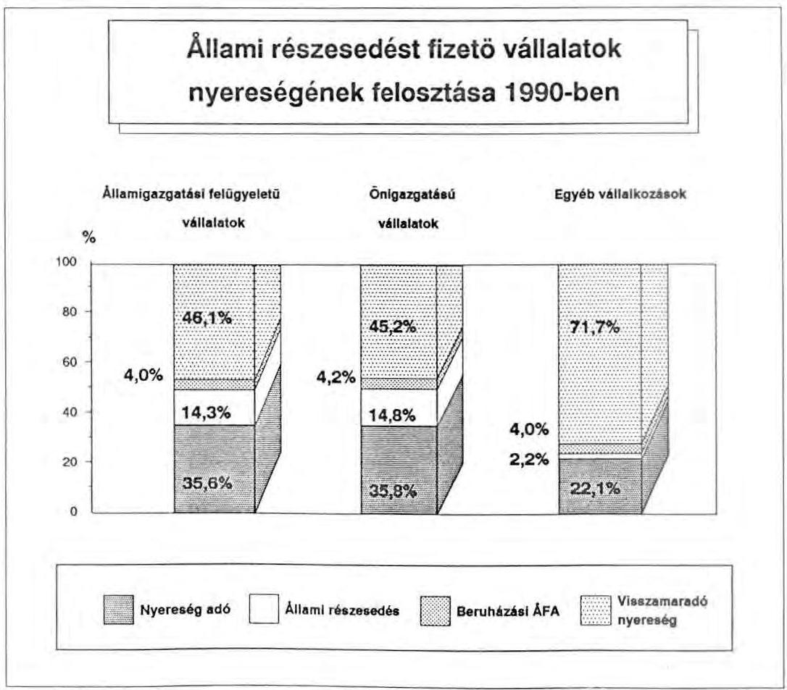

---

Az állami vállalatok a jogszabályban előirányzott normatív mértékhez közelálló állami részesedést teljesítettek, az eltérést a kedvezmények okozták. A gazdasági társaságok viszont minimális részesedést fizettek. Ebből két következtetés adódik:

- A vállalati átalakulások, privatizálások felgyorsulása esetén az állami részesedés drasztikus csökkenésére lehet számítani. Ezért különösen fontos annak a 95 államigazgatási felügyelet alá tartozó iparvállalatnak a folyamatos megfigyelése, az esetleges átalakulások nyomonkövetése, amelyek az összes állami tulajdon utáni részesedés közel 50%-át teljesítették (12 milliárd Ft).
- Az állami vállalatokra a szabályozás az átlagosnál lényegesen nagyobb terheket ró, ami kétségtelenül ösztönzőleg hat a vállalati átalakulások felgyorsítására.

Az állami részesedés befizetéseit a vállalati mérlegek alapján számítógéppel ellenőriztük. A számítások azt jelezték, hogy a vállalkozások egy jelentős csoportja - 668 vállalat - az állami vagyonrész után nem fizetett állami részesedést.

A költségvetés elmaradt bevételének becsült összege mintegy 100 millió Ft.
Erre felhívtuk az APEH figyelmét azzal, hogy a soron következő pénzügyi reviziók során a megküldött információkat hasznosítsák és indokolt esetben utólag is érvényesítsék a befizetési kötelezettség teljesítését.

# 2.4. Mezőgazdasági, élelmiszeripari exporttámogatás 

A mezőgazdasági és élelmiszeripari export támogatás 23,2 milliárd Ft-os összege 1990-ben teljes egészében a konvertibilis export tevékenységet szolgálta.

A 2537. sz. füzet 23. oldalán található indoklás szerint: "ez tartalmazza a korábban Külpiaci Intervenciós Alaptól nyújtott támogatásokat is."

Az Intervenciós Alap felhasználását a 71. oldalon ismertetik. Ezek szerint a korábbi évekről áthúzódó támogatásra 1.840 millió Ft-ot fizettek.

A 2537/1. sz. füzet 41. és a 89. oldalán lévő táblázatok szerint az 1.840 millió Ft a 23.208 millió Ft támogatáson kívül került kifizetésre. A táblázatok és az indoklások így nincsenek összhangban.

---

A támogatási konstrukció részben a magas hazai ráfordítási költségek és a világpiaci ár alakulásával, a konvertibilis export árbevétel növelésével, másrészt a mezőgazdasági és élelmiszeripari termékek világpiaci versenyképességének biztosításával függ össze. A konvertibilis export támogatása 1990-ben is termékcsoportonként differenciált kulcsok alkalmazásával történt, a határparitásos árbevétel 0-35%-ában.

A legnagyobb összegű és arányú (90,8%-os) támogatást az élelmiszeripar (kiemelkedően a húsipar) és a mezőgazdaság kapta. A támogatási kulcsok az év során - részben a Ft leértékeléssel összefüggésben - többször is módosultak, csökkentek. (Pl. a marhahúsnál 20%, a baromfinál 15% és a tejtermékeknél 20% volt a csökkenés.)

Végső soron a konvertibilis export támogatását szolgálta a Kereskedelempolitikai Alap - vállalati mérlegbeszámolókban közölt - (4,3 milliárd Ft-os) összege is. A jelentés 2537. számú füzetének 70. oldalán a vállalkozási szférának átutalt támogatás összege 5.012 millió forint.

Az 1990. évi nemzetgazdasági mérlegbeszámolók összesített adatai között az e címen megjelenő összeg 4.318 millió forint, közel 700 millió forinttal alacsonyabb. A különbséget feltehetőleg a pénzforgalmi és az eredményszemléletű elszámolás okozza.

Az Alapból részben pályázat útján bizonyos vállalt exportnövekmény után, másrészt pedig kollektív exportösztönzési célból a piacrajutást megkönnyítő un. trade promotion jellegű tevékenységekre kaptak támogatást a gazdálkodó szervezetek.

A vállalati mérlegadatokat elemezve megállapítható, hogy romlott a konvertibilis export vállalati szinten számított eredményessége. Ez megmutatkozik mind az export fedezet összege, mind pedig a konvertibilis árbevételhez viszonyított aránya csökkenésében.

Különösen nagy mértékű a fedezet csökkenése az élelmiszeriparban. (A fedezet a támogatással növelt árbevétel és az önköltség különbsége.) Erőteljes konvertibilis export érdekeltségre utal ugyanakkor, hogy a fedezet csökkenése ellenére a konvertibilis árbevétel fedezethányada változatlanul kedvezőbb volt, a rubel és a belföldi értékesítéseknél.

---

Az alábbi grafikon a mezőgazdasági-, élelmiszeripari exporttámogatással növelt árbevételben a fedezet alakulását, valamint a relációnkénti értékesítést szemlélteti.

# A mezőgazdasági és élelmiszeripari fedezet alakulása és az értékesítési forgalom megoszlása 1989-1990 évben 

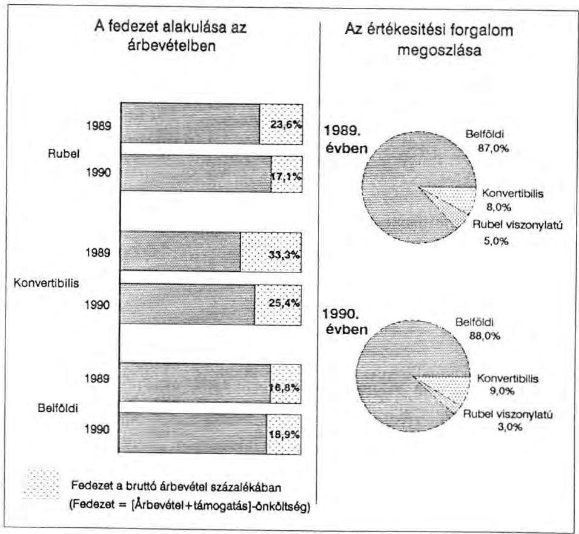

### 2.5. Szocialista államközi elszámolások

A világpiacitól eltérő rubel árak a rubel elszámolású külkereskedelmi forgalomban egy kiterjedt hídrendszer alkalmazását tették szükségessé. Ennek a rubelexport támogatás mellett további lényeges elemei voltak a rubelexport utáni adó, valamint a rubel import különleges helyzetéből fakadó adó. Az alkalmazott hidak mértékeit az áreltérések mellett a forgalom szerkezetének alakulása is befolyásolta. A támogatási, illetve befizetési kötelezettség csak az államközi megállapodás szerint tételesen kontingentált szállításokra vonatkozott.

---

2.5.1. A rubel viszonylatú külkereskedelmi forgalom költségvetési hatását az alábbi táblázat mutatja be eredményszemléletben

|   | 1989.
milliárd forint | 1990. tény  |
| --- | --- | --- |
|  Rbl export bruttó támogatása | 41,3 | 37,1  |
|  Rbl export utáni adó | 22,5 | 11,7  |
|  Rbl export nettó támogatása | 18,8 | 25,4  |
|  Rbl import adó (KÜTEFA) | 44,9 | 65,9  |
|  a támogatások egyenlegeként | 26,1 | 40,5  |

Említésre méltó, hogy az export, valamint az import befizetések együttes hatásaként a költségvetés bevétele 1990-ben a bruttó exporttámogatások több mint kétszerese volt.

# 2.5.2. A szocialista exportra termelő vállalatok helyzete

A gazdálkodó szervezetek a volt szocialista export összes értékesítésen belüli arányától függően - a dollár elszámolásra való áttérés, a szocialista piac összeomlása következtében - igen eltérő gazdasági helyzetbe kerülnek.

A szocialista exportot bonyolító vállalkozások (1288) közül 191-nél a rubel relációban értékesített termékek aránya az összes értékesítésen belül meghaladja a 40%-ot. Ez azt is jelenti, hogy ezeknél a vállalkozásoknál a szocialista export drasztikus csökkenése komoly gazdasági zavarokat okozhat, amelyet saját erőből megszüntetni nagy valószínűséggel nem tudnak. Ezen vállalati csoporton belül különösen súlyosnak tűnik annak a 112 iparvállalatnak a helyzete, ahol a szocialista export részaránya átlagosan 62%, míg a konvertibilis elszámolásúé csak 11%. A szocialista piac elvesztését ezek az egységek a rendelkezésre álló igen rövid idő alatt ellensúlyozni nem képesek. Ebben a vállalati körben 22 ezer dolgozót foglalkoztattak.

A szocialista exportot bonyolító vállalkozások többségénél (85%-ánál) viszont az értékesítési struktúra azt jelzi, hogy saját forrásból is képesek a reláció kiesését, csökkenését más piacok bővítésével bizonyos mértékig ellensúlyozni.

---

# 3. Fogyasztáshoz kapcsolódó pénzügyi hidak 

### 3.1. A fogyasztói árkiegészítés

E támogatás alapvetően életszinvonalpolitikai rendeltetésű, a reáljövedelmek bizonyos mértékű védelmét szolgálja. Célja, hogy a hazai fogyasztói árakban és díjakban nem érvényesíthető magas termelési költségeket kompenzálja.

### 3.1.1. Távhőszolgáltatás fogyasztói árkiegészítése

A fogyasztói árkiegészítések több mint egynegyedét - 1990-ben 9,2 milliárd Ft-ot - lakossági szolgáltatásaik után a távhőszolgáltatásban érdekelt gazdálkodó szervezetek (távhőszolgáltató, városgazdálkodási, ingatlankezelő vállalatok, költségvetési üzemek) realizálták.

Az ÁSZ tíz távhőszolgáltató szervezetnél ellenőrizte a mintegy 5,6 milliárd Ft támogatás hasznosulását.

A távhőszolgáltatáshoz nyújtott fogyasztói árkiegészítést a termelői ár és a lakosságtól származó bevétel figyelembevétele alapján vehetik igénybe az érdekelt szervezetek. A rendkívül eltérő feltételek miatt (lakosságszám, vásárolt, illetve termelt hőenergia aránya, stb.) a termelői ár nagyon különböző. Emiatt a fogyasztói árkiegészítések és a lakossági díj együttes összege csak globálisan fedezte a termelői árakat. Számos vállalatnál meghaladta azt, míg másoknál alatta maradt.

A vizsgálat megállapította, hogy a gazdasági érdekviszonyok ellentmondásai miatt a fogyasztói árkiegészítés felhasználása ésszerűtlen, az elosztás kialakított mechanizmusa nélkülözi a hatékonysági, gazdaságossági szempontok figyelembevételét. A termelői ár és az árkiegészítés közti kapcsolat a termelői ár növelésében tette érdekeltté a vizsgált szervezeteket, ugyanis a fogyasztói árkiegészítés a jóváhagyott termelői ártól függ.

Ezért a szervezetek legfőbb törekvése, hogy a szabályozás "puha" költségkorlátai miatt a termelői árakban minden lehetséges költséget érvényesítsenek. E magatartást tolerálták a termelői árak jóváhagyásával az árhatósági és felügyeleti funkciót betöltő tanácsok is.

A fajlagos termelői árak jóváhagyását nem előzte meg költségelemzés, s a fogyasztói árkiegészítés igénybevételét illetően a vállalatoknak semmiféle elszámolási kötele-

---

zettsége nem volt. A távhőszolgáltatás kényszerjellege miatt választási lehetőség nincs, így az emelkedő termelői árak terheit végső soron a lakosság viseli.

Vizsgálatunk a termelői árak képzésénél mintegy 30-40%-os mértékű felesleges, megtakarítható költségelemeket tárt fel. Feltétlenül figyelemre méltó, hogy a távfűtő szervezeteknél a nyereség növekedése 1990-ben meghaladta mind az árbevétel, mind pedig az önköltség emelkedését, ami jórészt a fogyasztói árkiegészítések növekedésének következménye.

Az árbevétel, valamint a fogyasztói árkiegészítés arányában számított nyereség növekedése is arra utal, hogy a fogyasztói árkiegészítés növekvő mértékben nyereséggé vált, amelyet a következő grafikonok szemléltetnek.

# A vizsgált távhőszolgáltató vállalatok gazdálkodási jellemzői 

1988-1990 között
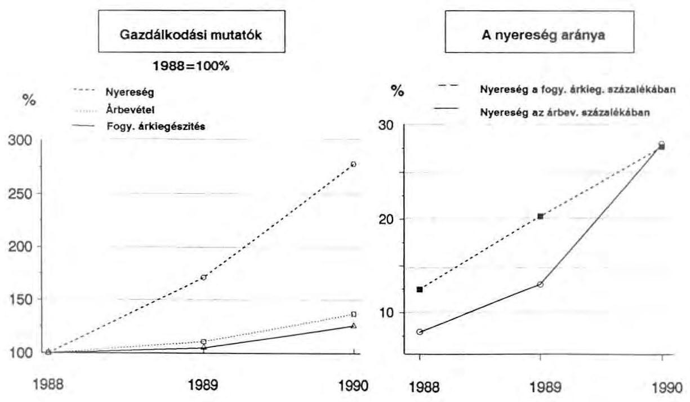

---

A Számvevőszék vizsgálata megállapította, hogy a termelői ár a gazdálkodásban rejlő tartalékok mozgósításával több vállalatnál csökkenthető. Ennek alapján nem indokolt, hogy a fogyasztói árkiegészítés megszüntetésének terhe az 1991. fütési idény kezdetétől teljes egészében a lakosságot sújtsa.

Néhány távhőszolgáltató vállalatnál a lakossági fűtés szolgáltatásból származó bevétel eltérése a termelői ártól 1990-ben
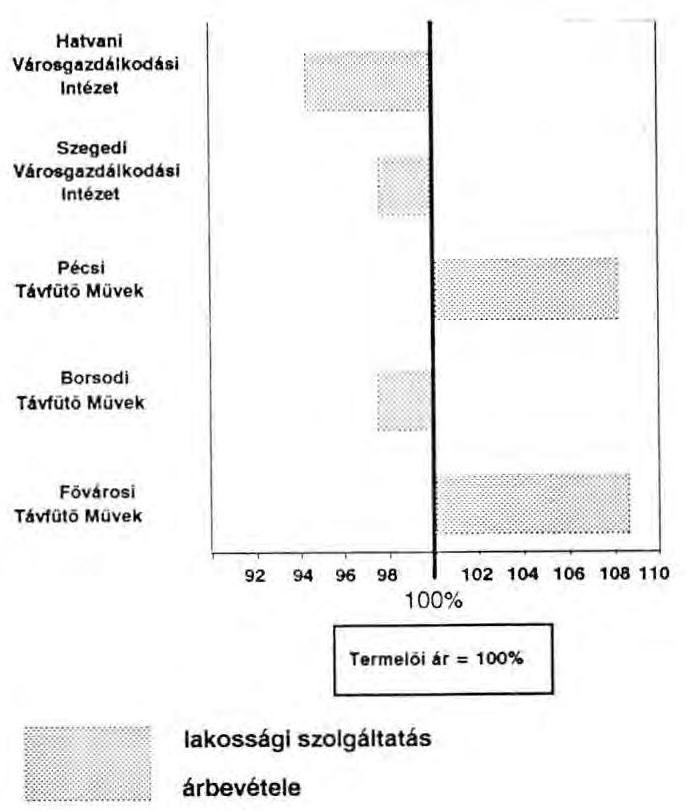

# 4. Felhalmozási kiadások 

A tervezett előirányzatok jelentősen - 6,9 milliárd Ft-tal - túlteljesültek, amely az egyes jogcímek eltérő mértékű teljesítésének eredményeként alakult ki. A központi beruházásokra fordított összeg például 1,4 milliárd Ft-tal elmaradt, a magánerős lakásépítés támogatására folyósított összeg pedig 7,2 milliárd Ft-tal meghaladta a tervezettet.

### 4.1. Az állami nagyberuházások pénzügyi lebonyolítása

Az 1990. évben elszámolt felhalmozási kiadások 933 millió Ft-tal meghaladták a tényleges szükségletet, mert az Állami Fejlesztési Intézet a fel nem használt

---

ellátmány visszautalását csak a pótkezelési időszak február 15-ei lejárta után, 1991. február 20-án teljesítette.

# 4.2. Magánerős lakásépítés támogatása

Az előirányzott 18,5 milliárd Ft-tal szemben a teljesítés 25,7 milliárd forint volt.

A 7,2 milliárd Ft-os többlet jelentős része - 3,1 milliárd Ft - a pénzforgalmi áthúzódások egyenlegéből adódik. Amíg 1990. évre 3,2 milliárd Ft kifizetése húzódott át, addig 1991-re csak 0,1 milliárd Ft. A nagy különbség oka, hogy míg korábban az éves támogatások tényleges felmérése és rendezése a költségvetési év lezárását követően történt meg, 1990-ben már december utolsó napjaiban elszámoltak a pénzintézettel. Megjegyezzük, hogy az 1989-ről 1990-re a pénzforgalmi áthúzódás összegét az 1989. évi zárszámadásban 4,2 milliárd Ft-ban, az 1990. évi zárszámadási törvényjavaslat Indoklásában pedig 3,2 milliárd Ft-ban rögzítették.

### 4.3. Állami értékpapír vásárlás

A törvény 12. és 20. paragrafusa javasolja törvényerőre emelni a kereskedelmi bankoktól történő részvényvásárlást. Az indoklásban hivatkozott 3169/1990. sz. minisztertanácsi határozatban foglaltak azonban nem egyeznek meg a 12. paragrafusban felsorolt tételekkel.

|  Pénzintézetek | 3169/1990.
sz.MT.ha-
tározatban
rögzített
millió forintban | A törvényjavaslatban szereplő | Eltérés  |
| --- | --- | --- | --- |
|  Postabank és Tak.-pénztár RT | 305 | 805 | +500  |
|  Magyar Külkeresk.-i Bank RT | 405 | 450 | +45  |
|  Innofinance Ált.Innov.Pénzint.RT | - | 200 | +200  |
|   | 710 | 1455 | +745  |

A többszörösen is hivatkozott minisztertanácsi
 határozattól való lényeges eltérésre a törvényjavaslat és indoklása nem ad magyarázatot. Az 1989. évi, a költségvetési beszámoló valódiságát vizsgáló ellenőrzésünk megállapította, hogy a Népgazdasági Elszámolások fejezet letéti számlájáról a különbözetként jelentkező 745 millió Ft

---

értékpapír vásárlás már 1989-ben megtörtént. A költségvetésben való "végleges" elszámolás a rendezést szolgálja, megteremti az értékpapírok nyilvántartásba vételének feltételét.

# 5. Társadalombiztosítási Alap költségvetési kapcsolatai 

Az Országgyűlés 1989. december 18-i döntése alapján a családi pótlék és a gyógyító-megelőző egészségügyi ellátás működési költségeit fedező pénzeszközök kicserélődtek. Ennek megfelelően a gyógyító-megelőző egészségügyi ellátás működési költségeit 1990. január 1-jétől a társadalombiztosítás, a családi pótlékot pedig 1990. április 1-jétől az állami költségvetés finanszírozza. 1990-ben a forráscserét követően a társadalombiztosítás az egészségügyi feladatok működési költségeire és a családi pótlékra együttesen $(67,7+14,7) 82,4$ milliárd forintot, míg a költségvetés a 9 havi családi pótlék finanszírozására 49,5 milliárd forintot fordított.

A Pénzügyminisztérium és az Országos Társadalombiztosítási Főigazgatóság nem rögzítette a feladatcseréből következő elszámolás szabályait, így az OTF családi pótlék folyósítása címén többet fizetett ki, mint amennyit az 1990. évi költségvetés tartalmazott. Ez a tétel a társadalombiztosítás mérlegében a költségvetéssel szembeni követelésként szerepel.

Az egészségügyi ellátó rendszer átalakításának, a gyógyító-megelőző ellátások biztosítási alapokra helyezésének technikai feltételeit a forráscsere teremtette meg. Az érdemi változáshoz szükséges jogszabályi keretek, a teljesítményfinanszírozás módszerei azonban 1990-ben még nem alakultak ki.

Az 1990. évi törvényi szabályozás szerint az egészségügyi feladatok finanszírozása megoszlott az állami költségvetés és a társadalombiztosítás között. A szabályok szerint az üzemeltetést és működtetést a társadalombiztosítás, a beruházást és fejlesztést pedig az állami költségvetés finanszírozta.

### 5.1. A gyógyító-megelőző ellátásokra fordított pénzeszközök

A TB Alap 360,8 milliárd forintot kitevő kiadásaiból az Állami Számvevőszék a kiadások $19 \%$-át jelentő gyógyító-megelőző ellátásokra fordított pénzeszközök felhasználását ellenőrizte.

---

A vizsgálat megállapította, hogy a társadalombiztosítási finanszírozásra történő áttérés az intézmények gazdálkodásában nem okozott fennakadást, de jelentős többletadminisztrációval járt együtt.

Nem megfelelően kiépített az információs kapcsolat az irányító, finanszírozó szervek és az egészségügyi intézmények között. A pénzmozgás figyelemmel követését megnehezítette, hogy az OTF a támogatások egy részét, a fejezeteket, tanácsokat megkerülve közvetlenül az egészségügyi intézményeknek utalta át, illetve beruházási szállítókat finanszírozott.

Az egészségügyi intézményeknél számos ellentmondás forrása a működési, beruházási, felújítási kiadások finanszírozási okokból történő megosztása a társadalombiztosítás és az állami önkormányzati források között. Az intézményi gazdálkodási szabályok szerint ugyanis e tételek felhasználását az intézmények saját hatáskörükben átcsoportosíthatják. A kiadott számviteli szabályozás az elkülönített kezelést nem biztosítja, s nem megnyugtató a gyógyító-megelőző ellátás intézményi pénzmaradványának kimutatása sem. A pénzügyi információs rendszer módosítása keretében biztosítani kell, hogy a többcsatornás finanszírozás mellett egységes pénzmaradvány elszámolás készüljön, s az a valós pénzmaradványt mutassa. Feltehetően ezen elszámolási anomáliák okozzák, hogy az intézményi és a TB alap beszámolók adatai a támogatás összege tekintetében eltérnek egymástól.

Annak ellenére, hogy a beruházások, fejlesztések megvalósítása állami feladat, a társadalombiztosítás jelentős összegeket fordított 1990-ben nagyértékű gép- és műszerberuházásokra, állóeszköz beszerzésekre. Vizsgálatunk megállapította, hogy e támogatások odaítélésénél a társadalombiztosítás sem törvényi felhatalmazással, sem pedig az illetékes egészségügyi szakmai fórumok hozzájárulásával nem rendelkezett.

A forráscserével a finanszírozás és az intézményi gazdálkodás rendszerében tartalmi változás nem következett be. Az egészségügyi feladatok társadalombiztosítási finanszírozásával az intézmények feladatellátása részben függetlenedett a helyi önkormányzatok egyre szűkülő pénzügyi lehetőségeitől.
6. Központi költségvetési szervek költségvetési kapcsolatai

Az állami költségvetés mérlegében a központi költségvetési szervek által felhasznált 188.508 millió forint költségvetési támogatás az összes kiadás közel $30 \%$-át tette ki.

---

Az e körbe tartozó jelentős költségvetési súlyt képviselő fejezeteknél az Állami Számvevőszék évenkénti átfogó, a szervezetre és a működésre egyaránt kiterjedő, pénzügyi-gazdasági vizsgálatokat végez.

Zárszámadási jelentésünkben elsősorban azokat az általánosítható megállapításokat emeltük ki, amelyek az állami költségvetési folyamatokra, a támogatások nagyságára kimutathatóan kedvezőtlenül hatottak.

# 6.1. Szervezeti felépítés és szervezeti átalakítások 

6.1.1. Vizsgálataink azt bizonyítják, hogy a működést alapvetően meghatározza a szervezeti struktúra, valamint a szervezet és a feladatok összhangja. Az államigazgatási munkamegosztás módosítása, átalakítása az 1989-90-es években a legtöbb minisztérium szervezeti felépítését, tagoltságát módosította.

Az 1990-ben vizsgált fejezetek mindegyikénél tapasztaltuk azokat a szervezeti változtatásra tett, illetve szándékolt törekvéseket, amelyeket a társadalmi-gazdasági változások is kikényszerítettek. E szervezeti változások csupán az első "elmozdulásnak" tekinthetők. Hiányosságuk, hogy a szervezetek átalakítása az ellátandó feladatok pontos megfogalmazása, a szervezet átvilágítása és költségtervezés nélkül folyt. Több helyen néhány részintézkedést követően, különböző belső és külső okok miatt a szervezeti változás megtorpant. A fejezetek a célok és feladatok egyértelmű megfogalmazását a törvényektől várják.
6.1.2. Indokolatlan intézményi tagoltságot, valamint a szervezeti átalakulás megtorpanását több intézménynél is tapasztaltuk.

A Magyar Televízió két önálló - MTV Gazdálkodó Szervezet (3593 fő) és MTV Kereskedelmi Főigazgatóság (171 fő) -, de feladataiban szorosan összetartozó intézménnyel működik. A két intézmény kapcsolatát célszerűtlen tevékenységmegosztás, valótlan költségviszonyok, és nem kellően tisztázott feladat-, hatáskör- és felelősségmegosztás jellemzi.

Közismert, hogy 1990. II. félévében kísérlet történt a Televízió szervezetének, működésének átalakítására. Az átszervezés valódi piaci hatásokat érvényesítő szándékkal célozta meg a belső és külső problémák tömegének felszámolását egy olyan szervezetben, amelyre a szervezetlenség, szabályozatlanság, gazdasági-pénzügyi fegyelmezetlenség volt jellemző.

A szervezeti átalakulás előkészületi szakaszának számos hibája - nagyvonalú intézkedési terv, szükséges és vitatott anyagi kondíciók, tisztázatlan belső, külső kapcsolatrendszer - csak tetézte a gondokat. A szakmai igények, elgondolások és a költségvetés lehetőségei

---

ellenkező irányba mozogtak. Így az MTV döntései a reális anyagi lehetőségek figyelembevétele nélkül születtek.

A Magyar Távirati Iroda fejezetszintű gazdálkodása is két költségvetési intézmény - MTI Gazdálkodó Szervezet és MTI Intézmény - keretében folyik, amelyek elkülönítése lényegében fiktiv. A működést elavult ügyrendek szabályozzák.

A Központi Statisztikai Hivatalnál megállapítottuk, hogy a korábbi ágazati és funkcionális feladatok kombinációján alapuló szervezetet a gazdaság-, társadalomstatisztikai és működtetési feladatokra épülő szervezeti struktúra váltotta fel. Az egyes blokkokon belül azonban párhuzamosságok alakultak ki.

A létszám általános felülvizsgálatára nem került sor. Az átszervezés a szervezet átvilágítása nélkül történt. A főosztályok száma is változatlan maradt. A Hivatalon belül változatlanul fennmaradtak az önálló költségvetési intézményként működő egységek, feleslegesen életben tartva zavaró érdekkonfliktusokat.

Az átszervezés kellő megalapozottságának hiánya a kialakulóban lévő szervezeteknél változatlanul több hiányosság forrása. Továbbra is tapasztalhatók párhuzamosságok, átfedések, ezekből fakadó többletkiadások.
6.1.3. Számos, korábbi feladatmegosztásból és szervezeti struktúrából fakadó érdekellentét ma is zavarja a hatékony működést. Az átszervezések indokolatlanul bonyolult és költséges szervezeti struktúrákat nem érintettek. Az önálló intézményként, vagy háttérintézményként működő gazdasági hivatalok, gazdasági műszaki ellátó szolgálatok (GaMESZ) elkülönített gazdálkodása feleslegesen bonyolítja a működést. Ezen intézmények elkülönítése a minisztériumi apparátusoktól a létszám és a költségvetési előirányzatok látszólagos csökkentése érdekében történt. A feladatok és azok finanszírozása ugyanakkor a gyakorlatban egymással szorosan összefüggő folyamatot képeznek. Tevékenységük szinte mindenütt, az indokoltnál lényegesen magasabb létszám miatt igen költséges, s esetenkénti szereptévesztésük felesleges érdekkonfliktusokat okoz.

A Központi Statisztikai Hivatal gazdasági feladatait az önálló intézményként működtetett GaMESZ látja el. Összefogott érdemi gazdálkodást a Hivatal e szervezetnek engedte át. Erre utalnak a következők: a pénzmozgást a döntéshozó Hivatal részéről nem figyelik, mivel az utalványozási jog gyakorlásában nem vesznek részt. A Hivatal költségvetésének elkészítése is a GaMESZ feladatát képezi, és csak ez a szervezet rendelkezik pénzügyi-számviteli jogszabályokban előírt szabályzatokkal.

A Földművelésügyi Minisztérium és a Gazdasági Hivatal vonatkozásában a többszöri tevékenység-átcsoportosítást követően is a feladat megosztásában sok az átfedés.

---

6.1.4. Az Állami Számvevőszék a Légiforgalmi- és Repülőtéri Igazgatóságnál (LRI) olyan átvilágítási értékű célvizsgálatot folytatott, amely megalapozta az intézmény szervezeti átalakítását, a gazdaságos működés feltételeinek kialakítását. Az Intézmény vezetése a Közlekedési, Hírközlési és Vízügyi Minisztériummal egyeztetett intézkedési tervben dolgozta ki konkrét feladatait.

A célvizsgálat az LRI mintegy 605 millió forint működési- fenntartási, továbbá jelentős beruházási támogatásának kiváltási lehetőségeit tárta fel. Megállapítottuk, hogy az LRI támogatások nélküli eredményes működése egy átfogó szervezési és gazdálkodási, valamint takarékossági lépéseket felölelő intézkedés sorozat keretében megteremthető oly módon, hogy 1993-ra működése támogatást nem igényel.

Az LRI vállalattá szervezésével, a bevételek növelésével, a szervezet átalakításával, létszámcsökkentéssel, a beruházások takarékos befejezésével, valamint a működést korszerűsítését akadályozó jogszabályok és nemzetközi szerződések felülvizsgálatával a célkitűzés megvalósítható.
6.1.5. Gazdaságossági, profiltisztítási megfontolásból az intézményi kört és feladatot érintő változásokat hajtott végre a Földművelésügyi Minisztérium. Az intézményrendszert érintő változtatások azonban nem voltak kellően megalapozottak, ezért újbóli módosítás vált szükségessé.

A fejezet részben elvégezte a hatósági és szolgáltatási feladatok szétválasztását, veszteséges intézményeket vállalattá sorolt át. Két, korábban vállalattá minősített szervezetet gazdálkodási nehézségeik miatt intézményi körbe minősített vissza. Az intézményi hálózatban összevonásokat hajtottak végre, amely mammutintézmények létrejöttét eredményezte.

# 6.2. Létszám- és bérgazdálkodás 

6.2.1. A létszámgazdálkodásban a szervezeti változások hatása alig jelentkezik, mivel összességében számottevő létszám csökkentésére nem került sor. Egy-egy fejezetnél azonban kedvező eredmények is tapasztalhatók.

A vizsgált központi szervek döntő részének a jóváhagyott létszámban jelentős tartalékai vannak. A létszám csökkentésére irányuló törekvéseket döntően a korlátozott bérfejlesztési lehetőségek növelésének szándéka motiválta.

A Földművelésügyi Minisztérium létszáma az 1988. évi 732 főről 1989. évre 538 főre csökkent, de a jelenlegi létszámban is jelentős tartalékok vannak. A létszámcsökkentésből származó bérmegtakarítás is közrejátszott abban, hogy 1988-1990. években a bérek közel $70 \%$-kal emelkedtek.

---

A Központi Statisztikai Hivatal átlaglétszáma fejezeti szinten az 1989. évi 3.250 főről 1990. évben 2.721 főre csökkent a költségvetési források szűkülésével összefüggésben. A Hivatal intézményeinek költségei között a bér- és személyi jellegű költségek aránya a közterhekkel együtt 70-80 %. Ez az arány a megyei igazgatóságoknál eléri a 90 %-ot. Az átlagbérek növekedése 1988-1990. években 57,7 % volt, amelynek forrása a többszöri átszervezés során végrehajtott létszámcsökkentésből, illetve spontán leépülésből képződött bérmegtakarítás.

A Magyar Televízió fejezeti létszáma az 1988. évi 3.624 főről 1990. évre 3.733 főre növekedett az ellentétes irányú törekvésekkel szemben.

A Magyar Távirati Iroda a feladatait 1988-ban 1.356 fő, 1989-ben 1.455 fő, 1990-ben pedig 1.418 fő átlagos létszámmal oldotta meg. Laza létszámgazdálkodásra utal, hogy fél évig az ECODATA Kft. létszám- és bérköltsége is a fejezet költségvetését terhelte. Létszámellátottsága az ország méreteihez képest akkor is túlzottnak tekinthető, ha helyzeténél fogva információs tranzit szerepet tölt be.

Az államigazgatás átszervezése keretében 1990. május 23-ai hatállyal létrehozott Munkaügyi Minisztérium tervezett induló átlaglétszáma 228 fő, módosított létszámelőirányzata 162 fő volt. Az átlaglétszám ténylegesen 127 főben realizálódott 1990. évben. Ennek egyik oka, hogy a tervezett létszámfeltöltés csak lassan haladt. A létszámfeltöltéssel összhangban alakult a béralap előirányzott felhasználása is. Az eredeti előirányzat 41,5 millió Ft, a módosított előirányzat ennek több mint kétszerese 85,2 millió Ft volt. A tényleges felhasználás viszont (51,6 millió Ft) csak $26,7 \%$-kal haladta meg az eredeti előirányzatot.
6.2.2. Az 1990. évi szabályozás a bérgazdálkodás terén is igen széles mozgásteret biztosított a költségvetési szervek számára. Az intézmények
 megfelelő fedezet birtokában, saját hatáskörben dönthettek béralap-előirányzatuk felemeléséről.

A Számvevőszék az intézményi beszámolók adataiból megállapította, hogy a jogszabályi lehetőségekkel élve a maradványérdekeltségű központi szerveknél saját hatáskörben az eredeti béralap-előirányzatot 3,3 milliárd forinttal (11%-kal) növelték. (Összehasonlításul megjegyezzük, hogy a tanácsi felügyelet alá tartozó maradványérdekeltségű szerveknél a saját hatáskörű bérelőirányzat módosítás csak 2,5 milliárd Ft volt, amely 4%-os növekedést eredményezett.)

A központi költségvetési szervek béralapfelhasználásának alakulásáról, az intézményi hatáskörben módosított béralap növelésről a zárszámadás nem tartalmaz értékelést.

A Magyar Televízió fejezeti szintű béralap felhasználása 1988-1990. években 501,1 millió Ft-ról 1.100 millió Ft-ra - közel 220%-kal - nőtt. A bér, és bérjellegű kiadások társadalombiztosítási járulékkal együtt számított értéke 1990. évre elérte a 2,2 milliárd Ft-ot, ami a működési kiadások 1/3-a. A nagyarányú növekedés az önkéntes túlmunka

---

4-szeres és az átdolgozásra kifizetett összegek 11-szeres emelkedésének, valamint az 1990. évi pénzügyi egyensúlyra is kiható, megalapozatlan előző évi bérfejlesztés következménye.

A Magyar Távirati Iroda fejezet évi béralap előirányzata az 1988. évi 232,4 millió Ft-ról 1990-re 340 millió Ft-ra (46%) nőtt. E növekmény fedezete 19,9 millió Ft összegben támogatásból, a többi ár- és díjbevételből származott.

# 6.3. Intézményi bevételek tervezése 

A fejezeteknél folytatott vizsgálataink is megerősítik a zárszámadási jelentés azon megállapítását, amely szerint a központi költségvetési szervek a saját bevételeket nem veszik reálisan számba, azokat rendszeresen alátervezik.

A saját bevételek alátervezése a gazdálkodás mozgásterét növelő érdekeltséggel is összefügg. A költségvetési gazdálkodás előírásai ugyanis lehetővé teszik, hogy a nem tervezett bevételi többlet alapján a költségvetési előirányzatok, köztük a béralap is, felemelhető. Másfelől az előirányzat módosítási lehetőséggel összhangban áll az a tervezési gyakorlat, hogy a központi forrásokból - pl. pályázat útján nyújtott támogatás - nem tervezhető.

A bevételek realitásoktól eltérő tervezése azért is gondot okoz, mert ezzel együtt a kiadások tervezése sem tükrözi a várható reális ráfordításokat.

A Központi Statisztikai Hivatal fejezetnél a bevételi tervszámok - amelyek az összes kiadás 8-9%-át fedezik - 1988. és 1989-ben kétszeresükre, 1990-ben pedig háromszorosukra teljesültek.

A Magyar Televízió az 1,1 milliárd Ft összegre tervezett 1990. évi fejezeti szintű ár- és díjbevétele 2,5 milliárd Ft-ra teljesült.

A Közlekedési, Hírközlési és Vízügyi Minisztériumnál a bevételi előirányzat közel 100%-os túlteljesítéséből a maradványérdekeltségű intézmények összes többletbevétele meghaladta a 2 milliárd Ft-ot, az eredményérdekeltségű szerveknél pedig 5,6 milliárd Ft volt.

A Művelődési és Közoktatási Minisztérium intézményeinél a saját hatáskörben végrehajtott 11,4 milliárd Ft-os előirányzat módosításából 1,4 milliárd Ft saját bevételi többletből, 8,5 milliárd Ft pedig átvett pénzeszközökből származott.

Az ár- és díjbevételek alátervezése egyben alapot teremthet költségvetési pótelőirányzatok indokoltnak tűnő megszerzésére. Vizsgálataink több esetben rámutatnak

---

arra, hogy ilyen törekvés az intézmények és a fejezetek részéről egyaránt tapasztalható.

Ez a törekvés markánsan jelent meg a Külügyminisztérium fejezetnél. A fejezet az egyes intézmények költségvetési előirányzatát a valóságos igénytől eltérően állapította meg. A minisztérium előirányzatát az igény alatt, a külképviseleteké pedig afelett tervezte. Ennek megfelelően a tényleges minisztériumi kiadások egy részét átterelték a külképviseletekre, az ott jelentkező többletfelhasználást viszont támogatás igényként fogalmazták meg az állami költségvetés felé. A teljes képhez hozzátartozik, hogy a Külképviseletek Intézmény 1990. évi előirányzata 3,6 milliárd forint volt, a fejezet előirányzatának 90%-a.

# 6.4. A feladatok és az előirányzatok összhangja 

A tervezési munkafolyamatban nyilvánvalóvá válnak a költségvetési lehetőségek és a felmerülő igények közötti ellentmondások. Az igények lefaragása azonban nem célirányosan, nem a feladatok átértékelésével, differenciáltan történik, hanem a pénzügyi keretek általános szűkítésével. Ez a költségvetési tervezést formálissá teszi. Az is megállapítható, hogy a szervezeti korszerűsítések általában nem az államilag ellátandó feladatok és a szükséges pénzforrások összhangjának megteremtésére irányultak. Az intézmények a költségvetési támogatások reálértékének jelentős csökkenése ellenére a szakmai feladatok és a pénzügyi tervek összhangját nem teremtették meg, általában a feladatok bővítését erőltetik.

Például a Magyar Televíziónál a műsoridő meghosszabbítására - melyre állami szinten elgondolás nem volt - fedezet nélkül hoztak rendszeresen döntéseket.

### 6.5. A pótelőirányzatok igénylésének megalapozottsága

A tervezés hiányosságai a pótelőirányzatok nagyságára, megalapozottságára is kihatással vannak, amit vizsgálati tapasztalataink is alátámasztanak.

A Külügyminisztérium - a vízumdíjak csökkenése miatt - 1,4 milliárd forint többlettámogatásban részesült, ugyanakkor működési bevételeit 360 millió forinttal túlteljesítette.

A minisztérium fejezeti szintű előirányzata évről-évre jelentős tartalékokat tartalmazott. Erre utal az is, hogy a fejezet jóváhagyott pénzmaradványa a vizsgált időszakban jelentősen emelkedett (pl. 1989-ben 785 millió Ft volt).

---

Az 1990. évi népszámlálás célfeladatra a Központi Statisztikai Hivatal 729,5 millió forint támogatást vett igénybe. Vizsgálatunk megállapította, hogy 200 millió forint indokolatlanul került igénybevételre, mert a népszámlálásra vonatkozó támogatásigényt nem a feladatok tényleges költségigénye szerint állapították meg. Az igények jogcím és számszaki szempontból egyaránt megalapozatlanok, hibásak voltak. Kifogásoltuk, hogy a népszámlálásra évenként nyújtott egyszeri támogatások az intézményi báziselőirányzatba részben beépültek, azaz a népszámlálás támogatási többletéből a Pénzügyminisztérium a fejezetnél hagyott előirányzatot azzal a céllal, hogy a finanszírozási hiányok megoldását segítse.

A Magyar Televízió 1990-ben - elszámolási kötelezettség mellett - 500 millió forint likviditási pótelőirányzatot kapott évről-évre növekvő adósságállománya ellensúlyozására és a működőképesség biztosítására. A kapott összeget a céloktól eltérően használták fel: beruházásra, nagyjavításra, költségvetési befizetésre. Az adósságállomány 1990. XII. 31-én ugyanakkor 144,2 millió forint volt. A Pénzügyminisztériumnak a tételes elszámolást vizsgálatunk idejéig nem adták át.

# 6.6. A költségvetési szervek pénzellátása 

A központi költségvetési szervek támogatását 1990-ben még negyedéves ütemezéssel folyósították. A saját bevételek és a pénzmaradványok növekedése, valamint a támogatások negyedéves folyósításának rendszere tette lehetővé, hogy a költségvetési szervek átmenetileg szabad pénzeszközeiket betétekbe, kincstárjegyekbe fektessék.

Az intézmények eltérő pénzügyi kondícióit jelzi, hogy amíg egy részüknél a működéshez likviditási hitelekre volt szükség, addig másoknál a jelentős pénztartalékok, szabad pénzeszközök befektetésekre, vállalkozásokra, tőkekihelyezésekre is módot adtak.

Az állami pénzeszközök kihelyezéssel történő gyarapítása az intézmények részéről ugyan célszerű megoldás, de az állami költségvetés finanszírozását tekintve költséges. Az 1991. évben már módosított finanszírozási gyakorlat továbbfejlesztése több százmillió Ft nettó kamatmegtakarítást jelenthet a költségvetésnek.

### 6.7. A költségvetésen kívül kezelt pénzeszközök

A letéti számlákon kezelhető pénzeszközök szabályozatlansága lehetőséget ad a költségvetésen kívüli gazdálkodásra is. Előfordul, hogy az átvett pénzeszközökkel, a központi, valamint saját elkülönített alapok pénzforrásaival és ezek többletbevételeivel a költségvetésen kívül gazdálkodást folytattak. Ennek következménye, hogy a nem egészen szabályos pénzműveletek eredményeképpen a költségvetési mérleg adatai is hiányosak.

---

A Földművelésügyi Minisztériumnál a költségvetési mérleg nem tartalmazza az 1981. óta kísérletként működő ún. Központi Fejlesztési Alapot, amely az eredményérdekeltségű intézmények adózott nyereségének 30%-ának befizetéséből képződött. A számlán kezelt pénzeszközöket a fejezet költségvetési gazdálkodásának részeként nem mutatták ki, azok összegét az éves mérlegadatok nem tartalmazták. Az Alap egyharmada az államháztartási kört elhagyva a vállalatok beruházásaihoz és egyéb célokhoz (idegenforgalom fejlesztés, alapítvány) járult hozzá.

Nem szerepelnek a mérlegben a KMÜFA pénzforrások kamatai sem, amelyeket egy ún. kamatszámlán az Agrobanknál gyűjtött az F.M. A kamatok a KMÜFA jelentős részének - az előírt MNB számlán történő kezelése helyett - az alapcéloktól eltérően különböző bankoknál történt lekötéséből származtak.

# 6.8. A kincstári vagyon 

6.8.1. A kincstári vagyon határozza meg a központi költségvetési szervek működésének tárgyi feltételeit. Ezért különösen fontos e vagyon nyilvántartása, a változások nyomonkövetése. Vizsgálataink során több fejezetnél megállapítottuk, hogy elsősorban a belső szabályozatlanság, a hiányos nyilvántartások miatt a vagyonvédelem követelményei nem érvényesülnek.

A Magyar Televízió esetében például a számviteli rendszer nem biztosítja a vagyon pontos nyilvántartását. Ez az oka, hogy 450 millió forint értékű ingatlan nem szerepel a mérlegben.

A Munkaügyi Minisztérium kezelésében lévő Foglalkoztatási Alap terhére végrehajtott számítógépes fejlesztés keretében 200 millió Ft értékű eszközt nem aktiváltak, így az nem került a vagyoni nyilvántartásba sem.

A Központi Statisztikai Hivatal és az Állami Népességnyilvántartó Hivatal vagyonmérlegéből hiányoztak a különböző vállalkozásokba kihelyezett több millió Ft értékű vagyoni hozzájárulások.
6.8.2. A központi költségvetési szervek gazdálkodási döntései révén a kincstári vagyon csökkenő tendenciájú. Ennek konkrét megnyilvánulása a vállalati körbe történő átsorolás, a forráshiányból adódó feladatleépítés és a privatizáció. A kincstári vagyon csökkenéséhez vezet még a fedezetet figyelmen kívül hagyó gazdasági döntések következtében fellépő eladósodás is.

A Földművelésügyi Minisztériumnál például a szolgálati lakások száma 1988-1990. évek között 1568 db-ról 1242 db-ra csökkent. Az eladott lakások becsült értéke 200 millió Ft, eladási ára 95 millió Ft volt.

---

A KSH 13,4 millió Ft nettó értéken nyilvántartott számítástechnikai eszközt 7,6 millió Ft-ért értékesített a Számítástechnikai Ügyvitelszervező Vállalatnak (SZÜV).

Az Állami Népességnyilvántartó Hivatal 1990. év végi nettó adósságállománya 47 millió Ft volt, amely nagy valószínűséggel csak állami vagyonvesztéssel rendezhető.
6.8.3. A kincstári vagyon csökkenését csak részben ellensúlyozó fejlesztések azonban még mindig magukon viselik az elmúlt évtizedek beruházásaira jellemző negatívumokat. A költségek tudatos alulbecslése elkerülhetetlenné teszi az előirányzatok túllépését. A megvalósulás elhúzódása a feladatellátás hátráltatásán kívül sokszor finanszírozási gondokat is okoz. A körültekintő tervezés gyakori hiánya, a nagyvonalú megoldások alkalmazása magában hordozza, hogy a takarékossági szempontok kellően nem érvényesülhetnek. Az épületek használói gyakran a célszerűség, ésszerűség és az előrelátás hiánya miatt átalakításokra kényszerülnek.

A Magyar Televízió Bojtár utcai stúdióközpontjának beruházási előirányzatát az OT elnöke 1985-ben 426 millió Ft-ban határozta meg. A beruházást nem kormányszintű döntéssel indították. A fejlesztés 1991-ben fejeződik be. A tényleges beruházási költség megközelíti az 1,6 milliárd Ft-ot, amelyhez az alábbi forrásokat vették igénybe:

- 877 millió Ft hitel, az OT és a PM garanciája mellett,
- a következő évek költségvetési támogatása terhére 752 millió Ft. (Ez azt jelenti, hogy a parlament előzetes jóváhagyása nélkül ezt az összeget már elköltötték az 1991-1996. évek állami költségvetéséből.)
A gépek, berendezések beszerzésére a Televízió 1990-ben további 192 millió Ft-ot költött. Az MTV-nél a befejezetlen beruházások állománya 1990-ben meghaladta az 1 milliárd Ft-ot.

A Magyar Távirati Irodánál 1986-tól 1990. I. félévig 971 millió Ft összegű beruházás pénzügyi teljesítése történt meg, 85%-ban központi beruházási juttatás terhére.

Az egyik jelentős beruházás a Gödöllői Rádióvevő Központ volt, amelyre a Politikai Bizottság 1980-ban hozott határozatot. A 4 szintes építmény 4 ezer négyzetméter alapterületű, és 157,7 millió Ft-ba került. Kihasználtsága 50%-os. A Rádióvevő Központot gazdaságosabb lenne a régi bővítésével elhelyezni, az új épületet pedig eladni.

Az MTI-nél megvalósuló legnagyobb beruházás az ÁTB által 1985-ben jóváhagyott székház rekonstrukció volt. A beruházás előterjesztésben szereplő eredeti költségelőirányzata 256,6 millió Ft volt, ami a többszöri módosítások és árváltozások hatására a vizsgálat időpontjában 564,3 millió Ft-ra növekedett (97,6%-a központi beruházási juttatás). A létesítmény várható éves üzemeltetési költsége 18-20 millió Ft-ra becsülhető.

A Központi Statisztikai Hivatal irányításával valósult meg az 1986-1990. években, az elektronikai fejlesztési programon (EGP) belül a számítástechnika államigazgatási alkalmazásának fejlesztésére készült ágazatközi részprogram,
 2,6-3 milliárd Ft előirányzattal. A KSH a költségvetési keretek kezeléséből adódó lehetőségeket kihasználva az ország legjelentősebb információfeldolgozó hálózatát hozta létre.

Megalapozott és kellően összehangolt számítógépes fejlesztési koncepció hiányát jelzik a KSH célszerűtlen gépi beruházásai:
A népszámlálási munkák lökésszerűen emelkedő terhelését levezetni hivatott IBM géprendszert üzembehelyezése után alig egy évvel - a PHARE program keretében indokoltnak látják lecserélni.
Az ÁNH-nál az igazgatásrendészeti célokat szolgáló, új SIEMENS rendszer mellett 1990-91-ben központi forrásból, egy merőben más (IBM AS-400) rendszer is beállításra került.

A Földművelődésügyi Minisztériumnál az elmúlt időszakban a legnagyobb K+F ráfordítás a gőclöllői Mezőgazdasági Biotechnológiai Kutató Központ (MBK) létrehozása volt. Az eredetileg jóváhagyott költség 419 millió Ft, az eddigi tényleges ráfordítás 1,5 milliárd Ft, melynek forrását döntően a Központi Műszaki Fejlesztési Alap képezi. A bázis létrehozása a TPB 30115/1985. sz. és az ÁTB 5039/1985. sz. (IX. 26.) határozatával, 1986-ban kezdődött. A bázis üzembehelyezését, versenyképességének biztosítása érdekében 1987. évre tervezték. Ezzel szemben az épület átadására 1989. novemberében került sor, melyet közel egy évig nem tudtak rendeltetésszerűen használni, mivel a gép-műszer megrendelésekre döntően az épületberuházás befejezése után került sor.

A beruházás költségnövekedésében szerepet játszottak a döntően nyugati relációjú építési- és műszerköltségeket is befolyásoló többszöri forintleértékelés, a hazai árak növekedése, a 221,1 millió Ft nagyságrendű ÁFA mellett a naturális mutatók emelkedése, továbbá a túlzott műszer-gép és ingatlan igény is. Az Intézet alapterülete az eredeti tervek szerinti bruttó 6000 négyzetméter helyett 8200 négyzetméter lett.

A beruházás részeként 56 db lakást is felépítettek, melyek költsége 140 millió Ft volt. A lakásberuházás azonban nem szerepelt sem az ÁTB döntést megelőző tárca előterjesztésben, sem az eredeti alapokmányban.
7. Az Országgyűlési képviselőválasztások, önkormányzati választások, népszavazás költségei

A költségvetési törvényben foglalt egész évre szóló 450 millió Ft-os választási keretet, valamint a Minisztertanács által jóváhagyott 100 millió Ft-os pótkeretet az országgyűlési választásokra felhasználták.

Az Országgyűlés a BM részére, az 1990. évi önkormányzati választás előkészítésére és lebonyolítására pótelőirányzatként, utólagos elszámolási kötelezettség mellett 560 millió Ft-ot hagyott jóvá.

Az 1990. július 29-ei - a köztársasági elnök közvetlen választására vonatkozó népszavazás pénzügyi fedezetének biztosítására az Országgyűlés soron kívül pótelőirányzatként, céljelleggel és utólagos elszámolási kötelezettséggel 400 millió Ft-ot bocsátott a Belügyminisztérium rendelkezésére. Ez az összeg kiegészült Király Zoltán képviselő által felajánlott 21 ezer forinttal.

Az Országgyűlés határozatai alapján az ÁSZ mindhárom esetben vizsgálta a felhasználás indokoltságát és célszerűségét.

Az ellenőrzés főbb megállapításai a következők voltak:

# 7.1. Országgyűlési képviselő választások 

Az országgyűlési képviselőválasztások során az egész évre szóló - költségvetési törvényben meghatározott - választási keretet túllépték. Továbbá felhasználásra került a Minisztertanács által jóváhagyott 100 millió Ft-os pótkeret is. Megjegyezzük, hogy a pártok és a független képviselőjelöltek választási támogatására az Országgyűlés külön határozata alapján 100 millió Ft keret összeget biztosított, amely a pártok gazdálkodásánál jelentkezik. A választás közvetlen és közvetett költségei mindösszesen megközelítették a 800 millió forintot. Közvetlenül a költségvetést érintő költség 544,7 millió forint volt. Az egyéb, részben szintén költségvetési forrásokból finanszírozott, közvetett költségként jelentkező tételek együttes összege 249,7 millió forint.

A többletköltségeket elsősorban a megfelelő szervezés, koordináció, a folyamatok komplex kezelésének hiánya okozta. Pl: nem készült a választás valamennyi mozzanatát átfogó, részletes rendszerterv; a költségek nem megfelelő tervezéséből adódóan a felhasználás az előirányzathoz képest mind a dologi, mind a személyi költségeknél jelentős szóródást mutatott; a pénzeszközök nem megfelelő időben álltak rendelkezésre.(PM-BM-területi tanácsok, egyéb felhasználók stb.) A választásoknak nem volt felelős gazdasági, pénzügyi menedzsere. Az ellenőrzött szervekre jellemző volt, hogy a pénzügyi fedezethez igazították elszámolásaikat, így sok esetben nem a tényleges szükségletek költségei jelentek meg.

### 7.2. A július 29-ei népszavazás

Az országgyűlési képviselői választásokat a július 29-ei népszavazás követte a köztársasági elnök megválasztásának módjáról. A népszavazás előkészítésére, a jogi, személyi, dologi, technikai feltételek megfelelő szinten való biztosítására igen kevés idő állt rendelkezésre. Ennek ellenére a feladat végrehajtásával megbízott belügyminisztériumi apparátus - az Állami Népességnyilvántartó Hivatal és a területi, helyi tanácsok megfelelő irányításával - zökkenőmentesen oldotta meg a népszavazás lebonyolítását. A rendelkezésre álló 400,021 millió forintból 303,977 millió forint (76 %) került felhasználásra. (A maradvány összegeket az 1990. szeptember 30-ai önkormányzati választásnál használták fel.) Az eltérésre alapvetően a költségvetési előirányzat túlméretezettsége ad magyarázatot. Majdnem minden jogcímnél maradvány keletkezett, mivel a tanácsok és a központi szervek is a szükségletet meghaladó összegeket kaptak.

# 7.3. Önkormányzati képviselő és polgármester választások 

Az önkormányzati képviselő és polgármester választásoknál az utólagos elszámolás 611,4 millió forint felhasználást állapított meg, ami 51,4 millió forinttal nagyobb, mint a határozatban rögzített előirányzat. A túllépést alapvetően az okozta, hogy valamennyi városi jogú településen (140 város, 22 budapesti kerület) második fordulót kellett tartani.

A pénzfelhasználás törvényességi szempontból szabályszerű volt. A túllépést csökkenteni lehetett volna, ha pl. a nyomtatványokat kevésbé biztosítják túl; elmarad az önkormányzati és választási törvény többszöri, több helyen történt propaganda célú terjesztése stb.

Az ÁSZ vizsgálat tapasztalatai alapján megállapítható, hogy az önkormányzati választások lebonyolítására alkalmazott normatív finanszírozási rendszer alkalmazott formája nem biztosította megfelelő területi bontásban a feladatok ellátásához szükséges fedezetet. Egyes területeken indokolatlan forrásfelhalmozást idézett elő, másutt az alapvető feladatellátásra is kevés volt.

## 8. Tanácsok/helyi önkormányzatok gazdálkodása

A költségvetési törvény a tanácsok forrásszabályozási rendjét teljesen új alapokra helyezte. A korábbi - a kiadásokhoz igazodó támogatási - rend helyett bevezette az állami támogatás normatív elosztási rendjét, s a személyi jövedelemadó településenkénti befizetésekhez igazodó elosztását. A forrásszabályozás részben továbbra is épített a megyei tanácsok elosztó funkciójára, mert a tanácsi támogatás 16 %-át kitevő, az átmenet rendezését szolgáló 18,3 milliárd Ft tanácsok közötti felosztását a megyei tanácsokra bízta. Ezzel összhangban a költségvetési törvény a tanácsok támogatását, a tervezett személyi jövedelemadót és annak kiegészítését megyei összesítésben tartalmazza.

A tanácsoknál/önkormányzatoknál az 1990. évi költségvetési törvénnyel bevezetett forrásszabályozási rend gyakorlati "megmérettetése" történt meg az év során. E megmérettetés eredményét, a forrásszabályozás kialakításánál kitűzött célok megvalósulását, a bevezetett rendszer működési mechanizmusának értékelését a zárszámadás nem tartalmazza.

A településenkénti (tanácsonkénti) - és nem makroszintű adatokon alapuló - elemzés, értékelés a rendszer továbbfejlesztéséhez, de az 1991. évi módosítások hatásának értékeléséhez és a támogatások elszámolásához is nélkülözhetetlen. (Az ellenőrzéseink kapcsán szerzett tapasztalatokról a 2.sz. mellékletben számolunk be.)

# 8.1. A normatív állami támogatás igénybevételének ellenőrzése, elszámolása 

Az 1989. évi költségvetési törvény kötelezi az Állami Számvevőszéket a - 80,1 milliárd Ft - normatív állami támogatás igénybevételének alapjául szolgáló mutatók és a támogatás összegének ellenőrzésére.

Ellenőrzésünk megállapította, hogy az 1990-ben bevezetett új pénzügyi rendszer több ponton szabályozatlan, kidolgozatlan, feltételeiben tisztázatlan volt.

Az előkészítés hiányosságait a normatív támogatások tervezésében és elszámolásában a nagymennyiségű hiba is bizonyította.

Mind az elszámolás, mind az ellenőrzés során a legtöbb probléma a nem megfelelő jogi szabályozásból fakadt, mivel nem történt meg a rendszer alapvető működési feltételeinek, fogalomrendszerének tisztázása. A költségvetési törvény normatív állami támogatás igénybevételére vonatkozó szakasza önmagában nem alkalmas arra, hogy annak alapján az önkormányzatok megbízhatóan tervezzék támogatási igényüket, illetve elszámoljanak azzal, s az ellenőrzéshez sem biztosított kellő alapot.

A költségvetési törvény kötelezi a pénzügyminisztert arra, hogy gondoskodjon a törvény végrehajtásáról. Ez a felhatalmazás - figyelembe véve a jogalkotásról szóló törvényt is - rendelet kiadását indokolta volna. Ehelyett - az év közepén - a BM-PM még a tanácsok számára "Tájékoztatót" adott ki, ami nem minősül jogszabálynak. A "Tájékoztató" a költségvetési törvényhez képest néhány mutatószám tartalmát módosította, szűkítette, de továbbra is tartalmazott ellentmondásokat. A vizsgálatunk megkezdésekor az ellenőrzés lefolytatásához kiadott PM-BM állásfoglalásokat az önkormányzatok nem ismerhették meg.

A költségvetési törvény hiányosságai és az elmaradt végrehajtási rendelet sok bizonytalanságot idézett elő, mert az önkormányzatok összességében több állami támogatást terveztek és vettek igénybe annál, mint amennyi az év közben módosult "Tájékoztató"-ban megjelent feltételek alapján megillette őket. Számszaki elszámolásaikban az önkormányzatok 1,8 milliárd Ft visszafizetési kötelezettséget mutattak ki az állami költségvetés javára.

Ellenőrzésünk további 399 millió Ft befizetési kötelezettséget állapított meg, a 209 millió Ft önkormányzatokat megillető támogatás és a 608 millió Ft állami költségvetést megillető visszafizetési kötelezettség egyenlegeként.

A normatív állami támogatások 1990. évi elszámolásánál feltárt hiányosságok, törvényi ellentmondások miatt az elszámolási kötelezettségnek a törvényjavaslat 14. és 21. paragrafusa szerinti rendezését nem javasoljuk az Országgyűlésnek elfogadni.

A normatív támogatások tervezésének, elszámolásának alapvető problémája - ami a rendszer előkészítetlenségével függ össze, - hogy a pénzügyi szabályozás olyan mutatószámrendszerre és nyilvántartásra épül, aminek eddig alig volt jelentősége. Az új szabályozás előkészítésekor, de a bevezetéssel egyidejűleg sem történt meg a mutatószámok felülvizsgálata, rendszerszemléletű kialakítása (fogalmi tisztázás, nyilvántartás, vezetési kötelezettség).

A hivatalos információt szolgáltató költségvetési és beszámoló garnitúrák mutatószám űrlapjai nem alkalmasak arra, hogy a normatíva tervezését és elszámolását - az adatok valódiságát - igazolják.

Mindez azzal járt, hogy az önkormányzatok, illetve az intézmények többsége - néhány mutatószám kivételével - nem rendelkezett megbízható mutatószám-nyilvántartással.

A szabályozás kétségtelen fogyatékosságai mellett az is tény, hogy a tanácsok/önkormányzatok és intézményeik a tervezésnél, és az elszámolásnál igen gyakran - elsősorban a térségi normatívák esetén - felületesen, fegyelmezetlenül jártak el. A tanácsok nem ellenőrizték az intézményektől bekért adatokat, az intézmények nem intézkedtek a nyilvántartások naprakész vezetéséről, nem fektettek kellő súlyt az információk tartalmára, megbízhatóságára.

Az önkormányzatok nem készültek fel az új pénzügyi szabályozással együttjáró szükséghelyzetre, vagyis arra, hogy törekedjenek az intézményeik kihasználtságának növelésére, illetve korszerűsítsék intézmény-szerkezetüket. A szükséghelyzet évközi felismerése sem vonta maga után mindig a szükséges intézkedések megtételét.

# 8.2. Az 1990. évi szabályozási "átmenet" rendezését szolgáló kiegészítő állami támogatás felhasználása 

A forrásszabályozás azoknál a tanácsoknál, ahol a normatív elosztás pénzügyi feszültségeket teremtett, kiegészítő támogatást biztosított.

Erre a célra az állami költségvetés 18,3 milliárd Ft "átmeneti" pénzeszközt különített el. Az előirányzatok azt a célt szolgálták, hogy a tanácsi működési előirányzatokban meglévő fedezethiányt kompenzálják. Ezen túlmenően lehetőséget adtak arra is, hogy a folyamatban lévő rekonstrukciókhoz, beruházásokhoz forrásokat biztosítsanak.

Az előirányzat jelentős része a megyei tanácsoknál került felhasználásra, mivel a korábbi forrásszabályozási metodika szerint a beruházások finanszirozására kialakított "céltámogatási" és "fejkvóta" rendszerű támogatáshoz a megyéknél már nem állt rendelkezésre elég fedezet. Így a megkezdett beruházások folytatása, illetve befejezése veszélybe került. (Beruházásokra fordították az "átmeneti" előirányzatok 50 %-át).

### 8.3. Célhoz kötött kiegészítő támogatások hasznosulása

Az 1990. évi tanácsi állami támogatáson belül a következő három jogcímen kötött, kiegészítő támogatás került elhatárolásra, 4,8 milliárd Ft előirányzattal.
8.3.1. Színházi bemutatók támogatására az Országgyűlés 300 millió forintot hagyott jóvá azzal, hogy azt a színházak pályázat útján, a színházi bemutatók támogatására vehetik igénybe, kiegészítve a színházi nézőszám alapján járó normatív támogatást.

Vizsgálatunk megállapította, hogy a Művelődési Minisztérium nem írt ki pályázatot. Ehelyett pótlólagos állami
 támogatásként osztotta el a céltámogatást.

A minisztérium a színházi és tanácsi szakemberek véleménye figyelembevételével osztotta el az előirányzatot. A céltámogatás összegéből - kormányhatározat alapján - 24 millió forinttal a központi színházakat is támogatta a Minisztérium. Az átcsoportosítás ellentétes az 1990. évi költségvetési törvényben foglaltakkal, amelyben a támogatást a tanácsok állami támogatása között hagyták jóvá, a normatív állami támogatás kiegészítésére.

---

Ellenőrzésünk arra is rámutatott, hogy a kialakított normatív támogatás a színházak esetében nem a legmegfelelőbb finanszírozási forma. A nézőszám csökkenése ugyanis a támogatás csökkenését vonja maga után, amely egy végtelen körforgást alakíthat ki. A tanácsok többsége nem tudta az 1989. évi költségvetési szintre kiegészíteni a színházak költségvetését, így több intézmény is forráshiányosan indult. Ezért a pályázat kiírása valóban ésszerűtlen lett volna, mivel a működőképesség fenntartását kellett valamilyen szintig biztosítani, kiegészíteni. A művelődési tárca - a színházak által benyújtott igény alapján - végülis ezt tette. A pályázati rendszer működésképtelenségét már a törvényelőkészítés szakaszában is ismerték, ennek ellenére a törvény véglegesítésénél mégsem vették figyelembe.

# 8.3.2. Az elmaradt lakóházjavításra biztosított címzett támogatás hasznosítása 

Erre a célra az 1990. évi állami támogatás 3,7 milliárd Ft-ot tartalmazott, amely csupán 42%-a az 1989. évinek (a csökkenés 4,9 milliárd Ft). Ebből a támogatási összegből újabb felújításokat már nem kezdtek el, csak a megkezdett munkák befejezésére szorítkoztak. Az ingatlanállomány állagának további romlását azonban nem sikerült megakadályozni.

#### Abstract

A lakóházfenntartás természetes pénzügyi forrásai 1990-ben - a lakbér és a nem lakás bérlemények bérleti díjai - központi intézkedések hatására ugyan jelentősen bővültek, növekedésük azonban nem tudta ellensúlyozni az állami támogatás csökkenését. Az ingatlanfenntartás összes forrása nominálisan is elmaradt az 1989. évitől, a valós forrásszükülés - az inflációt figyelembe véve - ennél nagyobb. A támogatások folyamatos csökkenésével évről évre nőtt a felújítások terhére, karbantartásra, hibaelhárításra fordított összeg aránya.

Az ingatlankezelés részére nyújtott állami támogatás célja hosszabb idő óta az elmaradt felújítások pénzügyi fedezetének megteremtése volt. A felújítások fedezetének költségvetési pénzeszközökből történő pótlása azonban csak akkor indult meg, mikor a többször meghosszabbított, ciklusidőn túli elmaradt felújítások nagyságrendje már kritikussá vált. A legsúlyosabb helyzet a fővárosban alakult ki, ahol 30 évnél hosszabb idő óta nem újították fel az állami bérlakásállomány egynegyedét tartalmazó épületegyütteseket.

A tapasztalatainkat összegezve megállapítottuk, hogy az ingatlankezelő vállalatok a lakóház javításra biztosított költségvetési támogatást nem a támogatás céljának megfelelően és nem kellő hatékonysággal használták fel. Ez részben arra is visszavezethető, hogy az ingatlankezelő vállalatok dolgozóinak anyagi érdekeltsége nem a lakásállomány állapotának javításához, az erre fordítható források minél hatékonyabb felhasználásához kötődött, hanem a felügyelő tanácsi szervek által előírt különféle mutatók teljesítéséhez.

---

8.3.3. A települési szolgáltató vállalatoknak juttatott támogatás szerepe a lakossági ellátásban

Az 1990. évi tanácsi támogatás a fürdők, szemét ártalmatlanítás és szállítás, hamvasztásos temetés támogatására célhoz kötötten 789 millió Ft-ot tartalmazott.

A vállalatok részére a többnyire tanácstestületek által megítélt állami támogatással sikerült a vállalatok veszteségét csökkenteni, vagy egyes esetekben a vállalatokat nyereségessé tenni. Ennek révén az áremeléseket mérsékelték, a szolgáltatások korábbi színvonalát fenntartották. A támogatás viszont nem késztette a vállalatokat takarékos költséggazdálkodásra.

# 8.4. Központosított előirányzatból finanszírozott tevékenységek 

Az évközben jelentkező feladatok fedezetére 8,3 milliárd Ft elkülönítetten szerepelt a tanácsok támogatásában.

Az Állami Számvevőszék a központosított előirányzatok közül három jogcímen juttatott támogatás felhasználását ellenőrizte: 230 millió Ft a szociálpolitikai-, 220 millió Ft a Dél-Alföld ivóvízellátása-, 6.400 millió Ft a bérpolitikai intézkedések támogatását.

### 8.4.1. A pályázati úton nyújtott szociálpolitikai támogatások ellenőrzésének tapasztalatai

A törvényi előírás azoknak a tanácsi pályázatoknak a támogatását célozta, amelyek a többszektorú szociálpolitika kiépítésére, a modellértékű megoldások támogatására, a családsegítő és mentálhigiénés szolgáltatásokra, valamint a szociális szakemberképzésre törekedtek.

A pályázati feltételek a szakmai feladatok tekintetében általánosak, a pénzügyi kritériumok szempontjából pedig hiányosak voltak. A tanácsok koordináló, véleményező szerepkörének kiiktatása parttalanná tette a pályáztatást és megalapozatlan pályázatok tömegét indította el. A helyszíni ellenőrzések alátámasztották, hogy a pályázók többsége csupán pénzszerzési lehetőségnek tekintette a pályázatot.

A 230 millió Ft költségvetési forrással szemben 4,2 milliárd Ft igényt jeleztek a benyújtott pályázatok.

---

A tömegesen beérkezett pályázat tárcaszinten kezelhetetlenné vált, szubjektív alapokra helyezte az elbírálást, így megalapozatlan döntések sorozata jött létre. Többek között számos fedezetlen beruházás indult be, amely később működési feszültségeket okoz az egyes önkormányzatoknál, illetve intézményeknél. A támogatási szerződések megkötése jogszerűtlen és szabályszerűtlen volt.

Az érintett tárcák - a Belügyminisztérium, a Pénzügyminisztérium valamint a Szociális és Egészségügyi (majd Népjóléti) Minisztérium - a tervezés időszakában nem osztották meg e témában egymás között a feladat- és hatásköröket. Ez a pályázatok elbírálása és finanszírozása időszakában bonyodalmakat okozott, hátráltatta a végrehajtást.

A pályázatok elbírálásának elhúzódása sok problémát okozott. A 300 kedvezően elbírált pályázatnak több mint a felét ellenőriztük, ezeknek kétharmada a tervezett időponthoz képest később valósult meg, s mintegy 130 millió Ft forráshiányt is valószínűsítettünk.

Tapasztalataink szerint pályázatot csak olyan feltételekkel célszerű kiírni, amelyek alapján a szükséges pénzeszközök reálisan prognosztizálhatók. A csupán a rendelkezésre álló pénzeszközök alapján "rostált" pályázatok nem megfelelő elosztási rendszerek, inkább pazarlóak, mint igazságosak.

# 8.4.2. Települések ivóvízellátása 

A központosított előirányzatok között a dél-alföldi települések vízellátására az állami költségvetés 220 millió Ft támogatást biztosított. A tanácsok saját forrásaikból a támogatást kiegészítették, így 293 millió Ft-ot fordítottak e feladatra.

Az eddigi fejlesztések ellenére - mivel újabb és újabb települések váltak közegészségügyileg veszélyeztetetté - 1990. év végén még mindig 442 település 265 ezer lakosa nitrátos vízű településen, 30 település 206 ezer lakosa pedig arzénes vízű településen élt.
8.4.3.A bérpolitikai intézkedésekre és a bérfejlesztésekre szolgáló előirányzatok elosztásának és felhasználásának vizsgálata

Az állami költségvetés 1990-ben 6,4 milliárd Ft-ot biztosított bérpolitikai intézkedésre, illetve bérfejlesztésekre.

---

Egy 1988. évi MT. határozat rendelkezett arról, hogy a költségvetésből gazdálkodó szervek bérnövekedése igazodjon a vállalati szférában dolgozókéhoz. Ennek érdekében 3-4 éves időtartamra vonatkozó központi béremelésről, illetve bérnövekedési mechanizmusról döntöttek.

A határozatban foglalt célkitűzés az állam pozitív feladatvállalását tükrözte, azonban már induláskor látható volt, hogy az elhatározás teljesítésének feltételei aligha biztosíthatók.

A többéves program tervszerű végrehajtását megalapozatlanná tette, hogy a Minisztertanács döntését nem előzte meg széles körű bér- és munkaügyi információkat tartalmazó felmérés. Ezért ennek teljes fedezetigényét sem lehetett meghatározni. Megállapítottuk, hogy az eddig alkalmazott központi bérpolitikai intézkedések csupán tüneti kezelésnek tekinthetők, az évtizedek óta rosszul kialakított/kialakult/ kereseti aránytalanságokat ezzel csak korrigálni, de megszüntetni nem lehetett.

Az előirányzatokat évenként - a mindenkori gazdasági feltételek, ezen belül a költségvetési kondíció függvényében - határozták meg. A részletes felmérés hiánya a biztosított előirányzatok szétosztásánál is gondokat okozott.

A jóváhagyott 6,4 milliárd Ft helyett 6,7 milliárd Ft került szétosztásra, mivel a Parlament elé terjesztett előirányzatok pontatlanok voltak. A többletet a megyei, helyi tanácsok finanszírozták.

A jóváhagyott előirányzathoz képest a pedagógusok és az egyéb oktatási dolgozók bérfejlesztésére 21 millió Ft-tal, a nagyközségi, községi tanácsi dolgozók bérfejlesztésére pedig 53 millió Ft-tal kevesebbet fordítottak. Az egészségügyi és a szociális ágazatban a törvényben jóváhagyott előirányzaton felül 348 millió Ft került szétosztásra.

A bérpolitikai intézkedések fedezetére biztosított előirányzatok szükséglettől elmaradó összegén túl, a felosztás módszere is befolyásolta a felhasznált előirányzatok hasznosulását. A pénzeszközök felosztásánál az érintett tárcák által kiadott ajánlások a személyenkénti differenciálás eszközét intézményi szintre helyezték. Az alkalmazott elosztási módszer és az intézményi szintű döntési mechanizmus együttesen nemhogy mérsékelték volna, hanem inkább növelték a bérekben, keresetekben addig is meglévő különbségeket.

# 8.5. A Társadalombiztosítási Alapból támogatott egészségügyi feladatok finanszírozása 

A gyógyító-megelőző ellátások TB Alapból történő finanszírozása a tanácsi/önkormányzati egészségügyi intézményeknél azt jelenti, hogy a támogatásuk 85-95%-át nem a felügyeleti jogkört gyakorló önkormányzatoktól, hanem a TB Alaptól kapják. A jelenlegi szabályozás nem rendelkezik pontosan az önkormányzatok szerepéről az egészségügyi feladatok irányításában, koordinálásában.

---

Az elmúlt évben az egyes területeket érintő összehangolt, átgondolt szabályozás hiányában a forráscseréből fakadóan átfedések, elszámolási problémák, egyéb tisztázatlan kérdések merültek fel. Ezeket részletesen az 5. számú pontban tárgyaltuk.

# 8.6. Nagyvárosi tömegközlekedés támogatása 

A nagyvárosi tömegközlekedés támogatása 1990-ben két csatornán történt. Az önkormányzatok biztosították az állóeszközpark fenntartását szolgáló támogatást, rendszerint "utaskilométer" arányában. A kialakított 1990. évi forrásszabályozási elveknek megfelelően az önkormányzati támogatást a személyi jövedelemadó bevételükből fedezték. Továbbra is az állami költségvetés folyósította a kedvezményes bérletek utáni árkiegészítést.

Önkormányzati támogatást általában a vonalas járatokkal rendelkező közlekedési vállalatok kaptak (Budapest, Miskolc, Szeged, Debrecen). A támogatás a vállalati bevételnek egyharmadát adta.

Az árkiegészítés valamennyi tömegközlekedést folytató vállalatot megilleti. Az e címen adott összeg a vállalati bevételek közel egyharmadát tette ki.

E támogatási forma a vizsgálatban feltárt hiányosságaival együtt is eredményesen működött. Előnye, hogy szektorsemleges, az eladott bérletekhez kötődik, az államnak a tömegközlekedésben vállalt szerepét objektív módon jeleníti meg.

A közlekedés színvonalának megőrzése érdekében a tömegközlekedés támogatási rendszerének a fenntartása - a vizsgálat tapasztalatai szerint - továbbra is indokolt. A tömegközlekedés önfinanszírozó képességének javítása azonban reálisan elérhető cél és egyben követelmény is.

Vizsgálatunk rávilágított arra, hogy a tömegközlekedés területén is szükséges a többszektorúság kiépítése és a verseny élénkítése.

A közlekedési vállalatok eszközállománya műszakilag elavult, a működtetés teljes költségeinek az utazó közönségre történő áthárítása a jelenlegi ár-, bér-, és jövedelmi viszonyok mellett nem valósítható meg. Szükség lenne az eszközpark megújítását szolgáló központi támogatásra, valamint kedvezményes kamatozású hitelkonstrukció kialakítására.

A tömegközlekedési vállalatok szervezeti formája az elmúlt évtizedekben alakultak ki. Budapesten olyan nagyméretű vállalati szervezet jött létre, amelynek az irányítása csak jelentős költségráfordítással valósítható meg.

---

# 9. Elkülönített állami pénzalapok 

Változatlanul érvényes az 1989. évi zárszámadás véleményezése kapcsán tett megállapításunk, amely szerint az elkülönített állami pénzalapok "rendeltetésszerű felhasználása" a jelenlegi számviteli, pénzügyi elszámolás, adatnyilvántartás keretei között megbízhatóan nem értékelhető.

A pénzforrások mozgási irányait és a felhasználások átfedéseit tekintve egészében megkérdőjelezhető több elkülönített alap működtetésének szükségessége.

A költségvetési gazdálkodás szigorítását célzó törekvések sikere - az elkülönített állami pénzalapok alig követhető pénzmozgásai következtében - mindaddig kétséges, amíg a pénzalapok költségvetéssel összehangolt rendszerének átfogó felülvizsgálata, korszerűsítése nem történik meg.

### 9.1. Az 1990. évi előirányzatok és teljesítésük

9.1.1.Az elkülönített állami pénzalapok támogatása 1990-ben is meghaladta az előirányzott összeget. Az 1,3 milliárd Ft-os támogatás növekmény - az évközi intézkedések eredményeként - a 4,9 milliárd Ft összegű csökkenés és 6,2 milliárd Ft összegű növekedés egyenlegéből adódik. A kormányintézkedések bemutatása a zárszámadás szöveges indoklási részében nem teljeskörű. Ezért az 1. sz. függelékben mutatjuk be azoknak az alapoknak a támogatását, ahol változás volt az eredeti előirányzathoz képest.
9.1.2. Kiugróan magas volt a Foglalkoztatási Alap támogatási előirányzatának túllépése (3,6 milliárd Ft), amelynek indokoltságát az Alappal kapcsolatos évközi két kormányhatározatban (3167/MT, 3350/korm.) foglaltak sem támasztják alá.

A Foglalkoztatási Alap 8 milliárd Ft-os költségvetési támogatás előirányzata tartalmazza a
 klasszikus foglalkoztatási célokat szolgáló 5 milliárd Ft, valamint a csökkentett munkaképességű dolgozók foglalkoztatására előirányzott 3 milliárd Ft összeget. Az Alap 8 milliárd Ft-os támogatási előirányzatával szemben a zárszámadás számítási anyaga szerint 11,6 milliárd Ft támogatás folyósítására került sor. Az 5 milliárd Ft helyett 7,8 milliárd Ft, a 3 milliárd Ft helyett 2,9 milliárd Ft került felhasználásra. Az Alap összes kiadása 10,7 milliárd Ft volt.

Az ÁSZ az állami költségvetés zárszámadásának ellenőrzése során megállapította, hogy a PM a Foglalkoztatási Alap számlájára 1990. december 12-én az alapkezelő

---

MÜM levele alapján 1,2 milliárd Ft-ot utalt át az év végéig várható kiadások fedezetére. December 29-én - számításokkal alátámasztott, írásos igény nélkül - további 1,5 milliárd Ft átutalására került sor, hivatkozva a munkanélküli segélyeknél és az újrakezdési kölcsönök kamatainak várható többletkiadására. Az Alap záróállománya a túlfinanszírozás következtében 1,8 milliárd Ft-ra nőtt. (Megjegyezzük, az Alap nyitóállományában 556 millió Ft-tal alacsonyabb összeg szerepel, mint az 1989. évi zárszámadásban bemutatott záróállomány.)

A zárszámadás számítási anyagában a Foglalkoztatási Alap támogatása 11,6 milliárd Ft-ra teljesült. Az éves költségvetési támogatás előirányzatának (8 milliárd Ft) 3,6 milliárd Ft-os túllépéséből mindössze 500 millió Ft többlettámogatásról intézkedett a 3167/1990. MT határozat. A 3350/1990. kormányhatározatban viszont az előirányzat összegét nem módosították, abban a munkanélküli segélyek szükséglet szerinti finanszírozásáról intézkedtek. Megítélésünk szerint az előirányzat jelentős túllépését ez utóbbi határozat alapján nehéz indokolni, ugyanis a Foglalkoztatási Alap évi összes kiadásából a munkanélküli segélyek és azok közterhei mindössze 25%-ot (2,6 milliárd Ft-ot) tettek ki.
9.1.3. A Felszámolási Alap zárszámadásban jelzett 1990. évi 1 milliárd Ft támogatása messze elmarad az előirányzott 3 milliárd Ft-tól. Vizsgálatunk megállapította, hogy az Alapon évközben mindössze 25 millió Ft-os forrásigény jelentkezett. A Pénzügyminisztérium december 29-én az Alap számlájára 1 milliárd Ft-ot utalt át, amelyből az aznap kifizetett összeg csak 300 millió Ft volt. Ílymódon az Alap 700 millió Ft-os túlfinanszírozása valósult meg.
9.1.4. Általános tapasztalat, hogy az egyes elkülönített alapok forrásaira, gazdálkodására vonatkozó adatok szinte minden egyes adatforrás esetében eltérnek egymástól. Sajnálatos, hogy a zárszámadás szöveges indoklásában és a mellékelt számítási anyagban ugyanígy számos tartalmi és számszaki eltérés állapítható meg. (1.sz. függelék)

A szöveges beszámolóban nem szerepelnek, - említésre sem kerülnek - a különböző kutatási alapok, közöttük az OTKA. A Központi Műszaki Fejlesztési Alappal összefüggésben csupán utalás történik (85.o.) az Alap kezelőjének az 1988. XI. törvény 10. paragrafus /3/ bekezdésében megfogalmazott beszámolási kötelezettségére, mely szerint "az Alap felhasználásáról az Országgyűlést évente tájékoztatni kell". Ezen jelentős forrásokat koncentráló alapok éves előirányzatai és teljesítési adatai a számítási anyagban szerepelnek.

---

# 9.2. Az alapok gazdálkodásának jellemzői 

Az ÁSZ a központi fejezeteknél (az alapok kezelőinél) végzett átfogó, és az egyes alapokat érintő célvizsgálatainak tapasztalatai azt mutatták, hogy a kormányszintű intézkedéseken kívül az alapok kezelői további átcsoportosításokat eszközöltek. A különböző alapok forrásainak, felhasználási lehetőségeinek kialakítása, felhasználása nélkülözi a különböző célú pénzeszközök megfelelő összehangolását. Mindezek hatására az elkülönített alapok tényleges felhasználása egyre inkább elveszíti eredeti "különlegesen fontos célokat" szolgáló jellegét.

A központi alapok pénzeszközeinek alig követhető mozgásaira, a nehezen áttekinthető átcsoportosításokra szolgált bizonyítékokkal a Földművelésügyi Minisztérium K+F pénzeszközeinek vizsgálata.

A Minisztérium Központi Műszaki Fejlesztési Alapját (KMÜFA) például 1990-ben a költségvetési törvény alapján - a Felsőoktatásfejlesztési Alapba és az OTKA-ba történt átcsoportosítás 203 millió Ft-tal csökkentette. Ugyanakkor a tárca tudományos-kutatási alapja (TKA) évente átlag 250 millió Ft-ot kapott a KMÜFA-ból, de bevételeiben rendszeresen megjelentek az OTKA-ból idecsoportosított összegek is. (Átlag 60 millió Ft/év.)

A felsőoktatási intézmények költségvetésének kiegészítésében a működési előirányzatokat is pótolva az említett alapok mindegyike részt vett.

Az alapokba koncentrált, több forrásból származó "közpénzek" alig követhető utakat bejárva töltenek be új, éppen "aktuális" funkciókat.

Például a fertődi Eszterházy Kastély vállalkozásba vitelének előkészítése keretében az egyes épületrészek kiürítésére és a közel 40 ha terület megvételére eddig fordított 230 millió Ft-ból 200 millió Ft - kerülő úton - a KMÜFÁ-ból származott.

Az alapok pénzeszközei működési, beruházási, fejlesztési célokat éppúgy szolgálnak, mint a pénzgyarapítást (banki letétek, részvények, rövid lejáratú hitelezés). Ezek hozadéka esetenként az államháztartáson kívüli gazdálkodás eszközeit gyarapítja. A költségvetést megkerülve új vállalkozásokban vesznek részt, alapítványok eszközeit egészítik ki. A tőkekihelyezések időnként további póttámogatási igényeket teremtenek. A tervezésben, a finanszírozásban figyelmen kívül hagyott jelentős tartalékok, a tényleges és elszámolt felhasználás eltérései mind az alapok működését kísérő anomáliák.

Az FM KMÜFA kihelyezés 1989-ben meghaladta a 440 millió, 1990-ben 200 millió Ft-ot. Továbbá 10 különböző Agrobank számlán, illetve betétben 518,9 millió Ft, illetve 163,8 millió Ft záróegyenleg volt. A TKA ideiglenes kihelyezéseivel együtt a K+F maradványai több mint 462 millió Ft-ot tettek ki.

---

A tőkekihelyezések következtében a KMÜFÁ-nál 1990. májusában keletkezett likviditási problémák miatt alaphiánnyal számoltak és a programos kutatási szerződés állomány 50 millió Ft-os csökkentését, az új pénzügyi kötelezettségvállalások leállítását tervezték, de erre nem került sor. Végül is az elkötelezettségekre hivatkozva 1991-re a tárca 829 millió Ft-os KMÜFA igénye legalább 20%-os többletet takar.

# 9.3. Az alapok működésének szabályozása 

Az alapok szabályozására jellemző a szabályozási szintek sokrétűsége, gyakran ellentmondásossága, azok gyakori módosítása. A kezelésükre vonatkozó belső szabályzatok általában hiányosak. A forrásképzés és a felhasználás a jelenlegi nyilvántartási, beszámolási rend alapján megalapozatlan, nem követhető.

A Szakképzési Alap elmúlt évi célvizsgálatát követően az ÁSZ a Munkaügyi Minisztérium vizsgálata kapcsán ismét áttekintette az Alap gazdálkodását. Megállapította, hogy a hozzájárulási rendszer megbízható, pontos, adóalanyonkénti befizetési kötelezettségének határidős teljesítésére, a felhasználás vállalati mérlegbeszámolókhoz csatolt információs bázisának kiépítésére még mindig nem történt konkrét intézkedés.

Az egyes alapok működésére megfogalmazott célrendszer számos párhuzamosságot, átfedést tartalmaz az alapot kezelő fejezet feladataival és más támogatási célokkal. Néhány alap működési céljai ma már elavultak.

A Földművelésügyi Minisztérium kezelésében lévő Földvédelmi Alap a bekövetkezett és várható társadalmi-gazdasági változások következtében korszerűtlenné vált. A döntően mennyiségi szemléleten alapuló szántóterület növelés igénye ma már nem aktuális, az Alap céljai nem ösztönöznek kisebb és gyengébb minőségű földek beruházási célú igénybevételére. Szabályozása ellentmondásos, megegyezés tárgyává teszi a földjáradék fizetésének módját, indokolatlan kompenzálási lehetőséget biztosítva a csere-rekultivációval leróható járadékra.

A Halászatfejlesztési, valamint a Vadgazdálkodási Alapok szerepe - egyébként is kicsi, évi 4-6 millió Ft-os alapok - az alacsony összegű befizetések miatt is egyre csökken. A Vadgazdálkodási Alap forrásainak döntő részét képező vadászati jog értékesítéséből származó befizetések az önkormányzati törvény szerint az önkormányzatok bevételei lettek, ezzel az Alap legfőbb forrása megszűnt.

A visszatérítési kötelezettséggel kihelyezett források kezelésénél tapasztalható nagyvonalúságot jelzi azok hiányos nyilvántartása, a behajtás elmulasztása, a tartozások elengedése.

Az FM vizsgálat tapasztalatai igazolják, hogy a behajtások elmulasztása mellett a kötelezettségeket nem ritkán módosították, elengedték - pl. a vállalat költségvetési intézménybe történő beolvasztásánál - vagy leírták (Debreceni Állattenyésztési Vállalat

---

10,3 millió Ft tartozása), vagy a követelésről "elfeledkeztek", illetve a még vissza sem folyt összegek terhére újabb támogatást nyújtottak (Szerencsi Édesipari Vállalat 8,4 millió Ft). A felszámolt, vagy ilyen eljárás alatt álló támogatottakról, illetve a velük szemben fennálló követelésekről a Minisztériumnak nincsenek információi. Vizsgálatunk során közel 1 milliárd Ft nagyságrendben tártunk fel - a költségvetés és az elkülönített alapok pénzeszközeiből visszatérítési kötelezettséggel nyújtott - támogatások behajtásának elmulasztását.

Az elkülönített alapok felhasználásának minősítése a célszerűség szempontjából alig megoldható feladat. Az alapokat kezelő fejezetek részéről az esetek többségében elmaradt a pénzforrások hasznosulásának elemzése, az eredmények értékelése, ellenőrzése.

# 9.4. Lakás Alap 

Külön kell szólnunk a sajátos konstrukciót képező Lakás Alapról, amely vizsgálatunk megállapítása szerint 1990-ben rendeltetésszerűen működött. Bevételei és kiadásai jelentősen elmaradtak a tervezettől. A bevételek csökkenését alapvetően a régi, kedvezményes lakáshitelek után felszámított hiteladónak az Alkotmánybíróság által történő hatályon kívül helyezése okozta. Ez összességében 6 milliárd Ft bevételkiesést jelentett. A kiadásokban elért megtakarítások ellenére a bevételek alacsonyabb szintje miatt a támogatás 2,2 milliárd Ft-tal haladta meg az előirányzatot. A zárszámadásban szereplő hivatkozás az 1990. évi XLIII. törvényre (lakáscélú állami kölcsönök utáni 1990. évi adófizetés) nem indokolja a jelzett támogatás emelését, mivel e törvényben az Alapra vonatkozó kitétel nem szerepel.

Korábbi vizsgálatunk során is felvetettük, hogy a hitelszámlák kezeléséért az OTP-nek és a takarékszövetkezeteknek kifizetett költségtérítés mértéke (2,3 milliárd Ft) figyelemmel a számlaállomány jelentős csökkenésére és az inflációs rátára - felülvizsgálatra szorul. Ennek ellenére eddig nem történt intézkedés.

## 10. Adósságszolgálat, kamattérítés

### 10.1. Az 1990. évi adósságszolgálati kötelezettségek és kamattérítések

Az állami költségvetés e jogcímeken az előirányzottnál 8 milliárd Ft-tal többet, összesen 70,7 milliárd Ft-ot használt fel. Ennek 85%-a (több mint 60 milliárd Ft) a különféle kamatfizetési kötelezettség. A 8 milliárd Ft-os túlteljesítés a 10,4 milliárd Ft többletkiadás és 2,4 milliárd Ft-os megtakarítás egyenlegeként keletkezett.

---

10.1.1. A hosszú és a közép lejáratú hiteltörlesztés összege 1,3 milliárd Ft-tal (21,1%-kal) nagyobb, mint az előirányzat volt. A túlteljesítés az 1968. évi vállalati forgóalap juttatási hitel törlesztéséből következett, melynek alapja az 1989. évi XVIII. számú törvény 22. paragrafusának /1/ bekezdése, amely szerint e tartozások az államadósság részévé váltak. A költségvetésben e címen előirányzat nem szerepelt, a terven felüli törlesztésre kormányhatározat nem született. A folyósítás 1990. XII. 29-én történt, a teljesítés alapjául szolgáló kölcsönszerződésről az ÁSZ-nak nincs tudomása.

A nem tervezett hiteltörlesztés megítéléséhez az alábbiak figyelembevételét tartjuk szükségesnek:

Az 1989. évi XVIII. számú törvény alapján az Országgyűlés felhatalmazta a Minisztertanácsot, hogy az állami költségvetés adósságaként átvállalja a gazdálkodó szervezetek egy részének az új gazdaságirányítási rendszer 1968. évi bevezetésekor, a forgóalap rendezéssel kapcsolatban folyósított 23,8 milliárd Ft jegybanki hitel összegét.

E hitelek felvételekor évente készültek szerződések, de azokat később kormányzati döntéssel hatálytalanították. Így ez a tartozás 1990. végéig lejárat nélküli és kamatmentes volt. Az 1991. évi költségvetési törvényben foglaltak szerint 1990. I. félévben erre az adósságra ugyan elkészült az új szerződés-tervezet, megkötésére azonban ezideig nem került sor.
10.1.2. Az állami költségvetés 1990-ben a tervezettnél 1,7 milliárd Ft-tal több kamatot fizetett az MNB-nek. A többlet fizetésének alapja a likviditási hitel felvételéhez törvényben adott felhatalmazás, valamint az 1990. évi LII. törvény rendelkezése volt. Ez utóbbi szerint az 1989. évi költségvetési hiány finanszírozására az előirányzottnál 20 milliárd Ft-tal nagyobb jegybanki hitelt kellett felvenni.
10.1.3. A 3.169/1990. MT sz. határozat alapján a költségvetésnek jelentős, 1,5 milliárd Ft nem tervezett fizetési kötelezettsége keletkezett az 1990. előtti években a költségvetés letéti számlájáról megelőlegezett kiadások rendezése következtében.
10.1.4. Az állami alapjuttatás refinanszírozási hiteleinek kamata címén kifizetett összeg 3,5 milliárd Ft-tal nagyobb volt, mint az előirányzott. A növekmény jelentős része a kamat évközi változásának következménye. (A költségvetési törvény megalkotásakor az eltérés 14%, majd
 többszöri emelkedés után, év végén 19,5 % volt.)

---

A kamatlábak emelkedése következtében az 1990-ben felszámított kamat a tervezett 19,3 milliárd Ft helyett 23,3 milliárd Ft volt, míg a befolyt járadék az előirányzott 7,5 milliárd Ft helyett 8,7 milliárd Ft-ra teljesült.

A befolyt járadékból a szénbányák által teljesített 405 millió Ft-ot az 5015/1988. TGB számú határozat szerint az ÁFI külön számlán kezelte. 739 millió Ft járadék szanálás alatt álló egyes vállalatok hiteleinek forrását képező állami kölcsön törlesztését szolgálta. Ennek figyelembevételével a költségvetés 1990. évet érintő kamatkiegészítése 15,7 milliárd Ft volt. Ezt csökkentette a Jamburgi Alap kamatmaradványa (524 millió Ft) és növelte az ÁFI részére átutalt jutalék és kezelési költség (76 millió Ft). Ezek eredményeként a költségvetés ÁFI-nak folyosított kamatkiegészítése 15,3 milliárd Ft volt.
10.1.5. A kereskedelmi bankok lakásépítési kamatának kiegészítésére az előirányzotthoz képest 2,4 milliárd Ft-tal (122,9%-kal) nagyobb összeget fordítottak. Következik ez a forgóeszköz hitel igénybevétel növekedéséből (pl. árak növekedése), illetve az ezzel járó kamatkötelezettségekből.

Az államadóssági kötvények és kincstárjegyek kamatainak előirányzotthoz képest elmaradó teljesítése az értékpapírok iránti alacsony keresletre vezethető vissza.

# 10.2. Belföldi államadósság 

A belföldi államadósság 1990. év végi összetevőiről, valamint kezelési szabályairól az 1991. évi állami költségvetési törvény rendelkezik. Az állami költségvetés belföldi adósságállományának tételes vizsgálatát az Állami Számvevőszék megkezdte, s várhatóan év végére fejezi be. A már rendelkezésünkre álló dokumentumok alapján a következőkre hívjuk fel a figyelmet:

1. A korábban felvett hitelek törlesztése a következő években igen egyenetlenül alakul. A rendelkezésre álló dokumentumok adatait (melyek közül néhány még pontosítást igényel) figyelembe véve, összehasonlítást végeztünk az 1991-2005. közötti évek törlesztő részleteinek alakulására vonatkozóan. Az 1991-95. és 1996-2005. évek adatait összehasonlítva a következő grafikon jól érzékelteti, hogy a törlesztő részletek mértékei és az arányok a belföldi államadósság menedzselésének átgondolását teszik szükségessé.

---

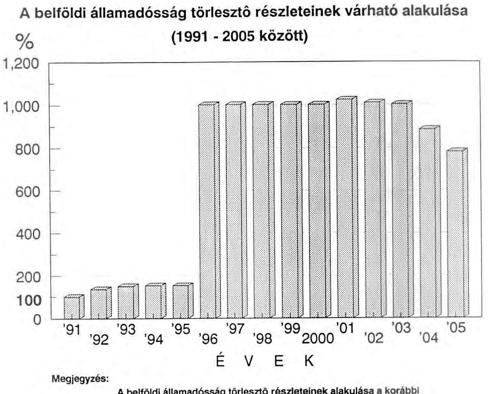
2. Ugyancsak gondot jelenthet, hogy az államadósság menedzseléséhez elengedhetetlenül szükséges fedezeti mérleg eddig nem készült. Gyakran elhangzik, hogy az államadósság fedezete az állami vagyon privatizálható része. Olyan vagyonmérleg, amelyből megállapítható lenne az állami vagyon privatizálható részének nagysága, összetétele, s a privatizáció üteme, illetve annak eredményeként az évenként tervezhető bevételek alakulása nem áll rendelkezésünkre. A privatizációból származó bevételek keletkezésének üteme és az államadósság törlesztésének üteme között nagy eltérés mutatkozhat. Amennyiben a következő 3-4 évben nagyobb ütemű privatizáció megy végbe, úgy a felvett hitelek törlesztésének "átütemezése" is felvetődhet.
3. Az 1991. évi költségvetési törvény szerint a privatizációból származó bevételeket elsősorban az államadósság törlesztésére kell fordítani. Tisztázatlan és szabályozatlan ennek számos vonatkozása. Például: 1. Ki, mikor és hogyan dönti el, hogy a privatizációból származó bevételből mennyit fordítsunk az államadósság

---

törlesztésére és mennyit a "másodsorban" feladatokra? 2. A többféle kölcsön közül tételesen melyek törlesztésére fordítható a privatizációból származó bevétel? 3. Mi történjen az államadósság azon részével, amelyre a privatizációból származó, s az államadósság csökkentésére fordítható összeg esetleg nem nyújt fedezetet?

A fentiekben jelzett problémák, azok más vonatkozású összefüggései (pl. a külföldi kölcsönök törlesztésével kapcsolatos kérdések, az infláció, a forint konvertibilissé válása) miatt gazdaságpolitikai döntést igényelnek.

# 10.2.1. Az állami költségvetés likviditása 

Az állami költségvetés bevételeinek és kiadásainak összege naponként változó előjelű és mértékű egyenleget mutatott. (A 2537. sz. füzetben található indoklás 8. oldalán leírtak is jól érzékeltetik a múlt év decemberi - szokásosnál nagyobb - pénzmozgásokat.) Éppen ezért az állami költségvetés folyamatos fizetőképességének fenntartása érdekében szükséges, hogy az állami költségvetésnek forgóalapja, illetve hitelfelvételi lehetősége legyen.

A Magyar Köztársaság 1990. évi állami költségvetéséről szóló 1989. évi L. törvény 25. paragrafusában felhatalmazta az MNB elnökét, hogy a törvényben meghatározott feltételek mellett likviditási hitelt nyújtson az állami költségvetésnek. A Kormány a törvény-tervezet 24. paragrafusában kéri tényleges hitelfelvételek tudomásulvételét. Rövidlejáratú hitel felvételére 1990. júliusában került sor, s ez közel 90 millió Ft kamatfizetési kötelezettséggel járt.
10.2.2. Az 1990. évi, de az 1991. évi I. félévi tapasztalatok alapján is indokoltnak tartjuk, hogy a jövőben az állami költségvetés indoklásában a tárgyévi költségvetés finanszírozását tartalmazó pénzügyi terv is szerepeljen. A pénzügyi terv támasztja alá, hogy a költségvetési törvényben a bevételek és kiadások közötti időbeni eltérések áthidalására kell-e hitelfelvételi lehetőséget teremteni, vagy elégséges a forgóalap. A bevételek, illetve a kiadások esedékességének időpontját felmérve, törvénytől függő, jogszabályokban rögzített kötelezettségek időpontjának átütemezése (pl. az adóelőleg befizetés napja, a normatív támogatások kiutalása) is indokolt lehet.

Tudatos finanszírozási technikák alkalmazásával az állami költségvetés jelentős összegű nettó kamatnyereséghez juthat, illetve hiány esetén csökkenthető a kamatveszteség.

---

Az állami költségvetés évközi bevételeinek és kiadásainak, valamint ezek különbségének alakulását 1990-ben - a hó végi göngyölített adatokat alapul véve - az alábbi grafikon érzékelteti:

# Az állami költségvetés bevételi és kiadási 

## összegének

## alakulása

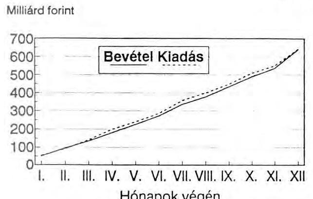

Millárd forint
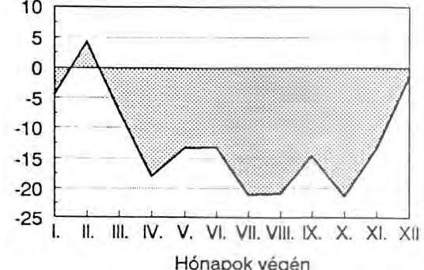

Hónapok végén

## 1990. évben

10.3. Az 1989. évi költségvetési hiány finanszírozása

A Parlament 1990-ben két alkalommal foglalkozott az állami költségvetés hitelfelvételi kérelmével. Ezek azonban nem az 1990. évi állami költségvetési feladatokhoz kapcsolódtak, hanem az 1989. évi költségvetési hiány finanszírozását szolgálták.

- A pénzügyminiszter 1990. elején az állami költségvetés 1989. évi hiányának fedezetére 33 milliárd Ft rövid lejáratú hitel felvételéhez kérte a Parlament támogatását. Az Állami Számvevőszék elnöke a Parlament által engedélyezett hitel felvételéhez kapcsolódó kölcsönszerződést ellenjegyezte.
- 1990. júliusában a Parlament az 1989. évi állami költségvetés végrehajtásáról szóló jelentés elfogadásakor 54 milliárd Ft összegű hosszú lejáratú hitel felvételét engedélyezte. (Ebből 33 milliárd Ft az év elején engedélyezett rövid lejáratú

---

hitel visszafizetését szolgálta.) A pénzügyminiszter és az MNB elnöke közötti megállapodást az Állami Számvevőszék elnöke ellenjegyezte.

# 11. Az állami költségvetés 1990. évi hiánya 

11.1. A beterjesztett törvényjavaslat 1.369 millió Ft költségvetési hiányt javasol jóváhagyni. A pénzforgalmi szemléletben kimutatott költségvetési hiány összege 13,8 %-a a Magyar Köztársaság 1990. évi állami költségvetésről szóló 1989. évi L.sz. törvényben jóváhagyott 9.915 millió Ft hiány összegének.
11.2. Az 1989. évi L. sz. törvényben az Országgyűlés felhatalmazta a Minisztertanácsot, hogy a hiány megállapított (tervezett) fedezésére évközben hosszú lejáratú hitelt vehessen fel, valamint államkötvényt és rövid lejáratú kamatozó és diszkont kincstárjegyet bocsásson ki. A költségvetési hiány mértéke évközben és most sem indokolja hosszú lejáratú hitel felvételét. Államkötvény kibocsátására sem került sor. A kincstárjegyek állományának növekedése is mérsékeltebb (1,6 milliárd Ft) volt az Országgyűlés által jóváhagyottnál. Az állami költségvetés 1990. évi 1369 millió Ft-ot kitevő hiányának finanszírozásához a kincstárjegyek tervezettnél mérsékeltebb növekménye fedezetet nyújtott.

## 12. Egyéb bevételek és kiadások

Az egyéb kiadások között szerepel a pártok támogatása, amelynek törvényes, szabályszerű felhasználását az Állami Számvevőszék folyamatosan ellenőrzi.

A pártok támogatására fordított összeg 778 millió forint volt a tervezett 700 millióval szemben. Az 1989. L. sz. törvény 23. paragrafus /2/ bekezdése a növelés esetére előírta az Országgyűlés előzetes felhatalmazásának feltételét. A növekedésre az Országgyűlés a 14/1990. (II.14.) határozata adott alapot, amely 100 millió Ft keretösszeget engedélyezett a választásokhoz, a pártok és a független képviselőjelöltek költségvetési támogatására.

Az ÁSZ 1990. év folyamán 17 párt gazdálkodását ellenőrizte. Amely ellenőrzések tapasztalatai az alábbiakban foglalhatók össze:

- A vizsgált pártok 1990. évi gazdálkodásában több hiba, hiányosság merült fel, amelynek csak részben okozója, hogy a pártok viszonylag későn állították fel gazdasági apparátusaikat, illetve nem megfelelő szakértelemmel vezették pénzügyi nyilvántartásaikat. A működésüket és gazdálkodásukat szabályozó törvény sem

---

egyértelmű, amelyet még az is felerősít, hogy a gazdálkodásra általában vonatkozó pénzügyi és számviteli szabályok nem alkalmazhatók maradéktalanul a pártok gazdálkodására.

- A párttörvénynek a pártok gazdálkodására vonatkozó előírása a lehető legváltozatosabb felfogások érvényesítésére ad lehetőséget. Ezért kifogást csak azokra a gazdasági eseményekre tehetett a vizsgálat, amelyek egyértelműen nem voltak összhangban a törvényi előírással.
- Az Állami Számvevőszék az 1990. évi vizsgálati tapasztalatok alapján - mind a pártok gazdálkodási tevékenységének és a gazdasági események dokumentálásának egyértelmű, félreérthetetlen szabályozása, mind pedig az ellenőrzési feladatok pontos körülhatárolása érdekében - szükségesnek tartja a párttörvény és a kapcsolódó jogszabályok felülvizsgálatát és szükség szerinti módosítását.

13. Az állami vagyon

# 13.1. Az állami vagyon nyilvántartása 

Az állami vagyonnal való gazdálkodás ellenőrzése az Állami Számvevőszék törvénybe foglalt feladatai közé tartozik.

Az állami vagyonnal összefüggő központi feladatok elvégzését, a piac építésének felgyorsítását nagymértékben segítené, ha az ország rendelkezne egy teljeskörű állami vagyonmérleggel. Az információs rendszer ismert hiányosságai miatt (pl. föld, ingatlan értéke a nyilvántartásban sokszor nem szerepel, a piaci és könyvszerinti értékek eltérnek, stb.) hiteles vagyonmérleget jelenleg nem lehet készíteni.

A gazdaság különböző szereplőinél meglévő állami vagyon könyv szerinti értékének felmérése, összegyűjtése kiinduló alapja lehet a vagyonmérleg összeállításának. Természetesen ezt a mérleget a piac értékítéletének megfelelő vagyonértékelések módosítják, korrigálják.

A jelenlegi információs rendszerben szereplő állami vagyon értékét a vállalkozások mérlegbeszámolói és az államigazgatási szervek beszámoló jelentései alapján mutatjuk be.

A kincstári vagyonnak minősülő, a költségvetési szerveknél jelentkező vagyon bruttó értékét tüntettük fel, amely az ingatlanok, gépek beszerzéskori értékét mutatja.

---

A költségvetési szférában 1968-ban volt az utolsó állóeszköz-átértékelés, ezért a vagyon jelentős része irreálisan alacsony értéken szerepel. Ellenőrzéseink azt is megállapították, hogy a költségvetési szerveknél előfordul, hogy az átvett, újonnan beszerzett állóeszközök nyilvántartásba vétele nem történik meg.

1990. dec. 31.-én
(milliárd Ft-ban)

1. Állami vagyon a vállalatoknál

- alapítói vagyon 1.153
- állami vállalatoknál a felhalmozott és egyéb vagyon együtt 746
Állami vagyon a vállalati szférában 1.899

2. Költségvetési szerveknél a nyilvántartott érték:

- az ingatlanok 174
- gépek, berendezések, felszerelések 57
- járművek 6
- egyéb 2

Központi költségvetési szervek összesen: 239
Összesen (1+2): 2.138

# 13.2. Az állami vagyonnal rendelkező vállalkozások 

A tulajdonviszonyok dinamikus változása miatt indokolt, hogy a kincstári vagyon mielőbbi felmérése megkezdődjön. A továbbiakban a vállalkozások állami vagyonrészének elemzésével a privatizációs folyamatok irányításához szükséges néhány összefüggésre hívjuk fel a figyelmet.

### 13.2.1. A vagyon gazdálkodási formák szerinti alakulása

A magyar gazdaságban 1990. december 31.-én a vállalkozások 2917 milliárd forint könyvszerinti értékű saját vagyonnal rendelkeztek. Ezen belül az egyes gazdálkodási formába tartozó egységek vagyoni helyzetét, az állami vagyon elhelyezkedését a következő táblázat szemlélteti./*

---

|  Gazdálkodási | Vállalkozások | Saját | Saját vagyonból alapítói állami  |
| --- | --- | --- | --- |
|  forma | száma | vagyon |   |
|   | db. | milliárd forint |   |
|  1) Vállalat | 2144 | 1899 | 1153  |
|  2) Gazdasági társaság | 19461 | 596 | 8  |
|  3) Szövetkezet | 5254 | 412 | 22  |
|  4) Jogi személy nélk.GT. | 779 | 10 | -  |
|  ÖSSZESEN: | 27638 | 2917 | 1183  |

*/ Megjegyzés: A táblázat a mérlegbeszámolót benyújtó

 vállalkozások adatait tartalmazza. A tröszt egy egységként szerepel.

A nemzetgazdaságban lévő vagyon igen erőteljesen a vállalati formában koncentrálódott. 2144 vállalat működteti az összes vagyon 65%-át, míg a többi társasági és szövetkezeti formába tartozó 25494 egységnél a vagyon 35%-a mutatható ki.

A vállalkozások mérlegbeszámolói alapján az 1.183 milliárd forint értékű állami vagyon 3507 vállalkozásnál mutatható ki, amelyeknél a vállalati saját vagyon értéke 2.138 milliárd forint.

Az állami vagyon döntő része a vállalati formában gazdálkodóknál található. Ez azt jelenti, hogy ebben a körben a teljes 1.899 milliárd forint saját alapítói és felhalmozott vagyon képezheti a privatizáció alapját.

A szövetkezeteknél a kimutatott 22 milliárd forint értékű állami vagyon arányában részesedhet az állam az átalakulás, illetve privatizáció során.

A gazdasági társaságokban az állami vagyon mindössze 8 milliárd forint. Ennek értékelésénél azonban figyelembe kell venni, hogy az állami vállalatok átalakulásával létrejött társaságokban az állami vagyon jelentős része részvényvagyonná vált. A jelenlegi információs rendszerből, a mérlegbeszámolókból nem állapítható meg a részvényvagyonon belül az állami részvény mértéke, ezt csak a vállalati belső információk tartalmazzák. Ezt igazolja az is, hogy az Állami Vagyonügy-

---

nökségnél - a gazdasági társaságoknál működő - 71 milliárd forint értékű állami részvényt és üzletrészt tartanak nyilván.

# 13.2.2. Az állami vagyonrészek eloszlása a vállalkozásoknál 

A privatizációs folyamatok szempontjából a vállalatoknál (államigazgatási felügyelet alatt álló és önkormányzati) lévő állami vagyon koncentrációját vizsgáltuk meg, amelyet az alábbi grafikon szemléltet.

## Az állami vagyon megoszlása a vállalkozásokban

1990. december 31-én
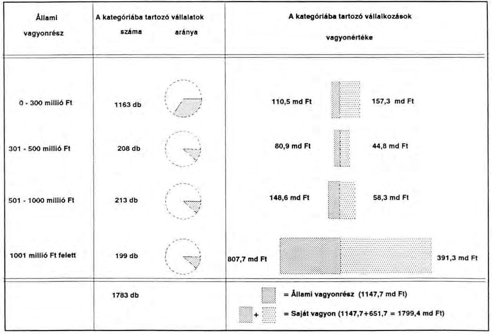
(A grafikon nem tartalmazza a leány- és közös vállalatok adatait!)
A privatizálás szempontjából szóba jöhető vállalatok száma 1783, a kimutatott saját vagyon összege 1799,4 milliárd forint. Ezek a vállalatok 1698 ezer főt foglalkoztatnak, az összes foglalkoztatottnak több mint 50%-át.

---

A vagyoni koncentráció erősségét jól jelzi, hogy mindössze 199 vállalatnál található az összes vagyon 67%-a, ugyanakkor a vállalatok többsége (1163) a vagyon 15%-ával rendelkezik.

A privatizációs politika kialakításához a vállalatok vagyon szerinti struktúrájából a következő összefüggéseket célszerű figyelembe venni.

- A 300 millió forint alatti állami vagyonnal rendelkező egységnél alkalmazni lehetne a spontán piaci privatizálást. Ezáltal a versenyszféra gyorsabb kialakulása következne be anélkül, hogy jelentősebb állami vagyont kockáztatni kellene.
- A 300 millió forint feletti állami vagyonnal rendelkező vállalati körből (620 egység) már kezelhető módon lehetne kiválogatni azokat, amelyek privatizálása, átalakulása mindkét cél elérését - az állami vagyon részarányának csökkentését, a piaci verseny kialakulását - felgyorsítaná.

A koncentráció mértéke természetesen nemzetgazdasági áganként igen eltérő. Az iparban a vállalatok mindössze 14%-a (111) rendelkezik a vagyon 76%-ával. Hasonló koncentráció figyelhető meg a közlekedés-hírközlésben is, ahol 9 vállalatnál van a vagyon 91%-a. A mezőgazdaságban és az építőiparban lényegesen kisebb a koncentráció mértéke. A kereskedelemben is hasonlóak tapasztalhatók, bár itt található néhány (9) nagyvállalat is.

Összességében megállapítható, hogy a torz vagyonstruktúra következtében csak egy körültekintő privatizációs politika végrehajtása gyorsíthatja meg az állami vagyon leépülését, a monopolhelyzeteket megtörő piacgazdálkodás feltételeinek kialakítását.

# 13.2.3. A vagyonmozgások nyomon követése a jelenlegi információs rendszerben 

A spontán, illetve piaci privatizáció, az átalakulások körvonalazására, jellemzésére különböző vállalati csoportokat vizsgáltunk meg. Így

- összehasonlítottuk az 1990. évben megszűnt és újonnan alakult vállalkozások vagyoni struktúráját,
- kiemeltük a mérlegbeszámolók adatai alapján azokat a vállalatokat, amelyek mérlegeiben átalakulás után visszamaradó üzletrészeket jeleztek.

---

Az új vállalkozásoknál is jellemző maradt a nagyvállalatok (1 milliárd Ft feletti) túlsúlya, bár az új vállalkozások már csak a vagyon mintegy felével rendelkeznek. Ez azt jelenti, hogy az államigazgatási felügyelet alá tartozó nagyvállalatokból az átalakulás során hasonló nagyságú vagyonnal rendelkező részvénytársaság, gazdasági társaság jött létre.

A vagyoni koncentráció kismértékű csökkenése arra utal, hogy a piac építése csak lassan halad, továbbra is jellemző maradt a monopolhelyzetben lévő nagyvállalkozások - részvénytársaságok - túlsúlya.

Az állami vagyonban bekövetkezett mozgásokat abból a szempontból is vizsgáltuk, hogy az átalakult vállalatok adatainak figyelemmel kísérését a jelenlegi információs rendszer mennyiben biztosítja.

A jelenlegi pénzügyi információs rendszer tájékoztató jelleggel tartalmazza az átalakult vállalatok gazdálkodóknál visszamaradó üzletrészeit. Ezt az információt felhasználva kiválasztottuk azt a vállalati csoportot, amely átalakult és ilyen adatot közölt.

A tájékoztató jellegű adatok szerint 60 vállalkozás alakult át, az összes saját vagyon összege 41 milliárd forint és a társaságoknál maradt üzletrész 25 milliárd Ft. Ugyanakkor az 1990. december 31-i állapotnak megfelelően az Állami Vagyonügynökségnél 37 vállalkozást, 71 milliárd forint állami részvénnyel tartanak nyilván.

Az Állami Vagyonügynökségnél nyilvántartott átalakult vállalkozások csak részben egyeznek meg az információs rendszerből származó csoporttal. Az eltérések okainak megállapítása érdekében az érintett vállalkozások listáját az ÁVÜ-nek megküldjük azzal, hogy a kivizsgálás eredményéről tájékoztassák az Állami Számvevőszéket.

# 13.3. A Vagyonügynökség 1990. évi tevékenysége 

Helyszíni vizsgálat alapján megállapítottuk, hogy az 1990. december 31-ei állapotot tükröző mérleg szerint az ÁVÜ-höz tartozó vagyon 71 milliárd Ft. Ez az 1.899 milliárd Ft állami vagyonnak kb. 4%-a.

1990. végéig az Állami Vagyonügynökség közreműködésével 9 átalakult vállalkozás cégbejegyzése történt meg. Az átalakított gazdálkodó szervezeteknél az alaptőkén belül 8%-ot tesz ki a külföldiek részaránya, amely 7 társaságnál jelenik meg.

---

A vállalkozások vagyoni helyzetében, egyéb jellemző mutatóiban bekövetkezett 1990. évi változásokat a következő grafikon szemlélteti.

# Az 1990-ben átalakult vállalkozások jellemző mutatói 

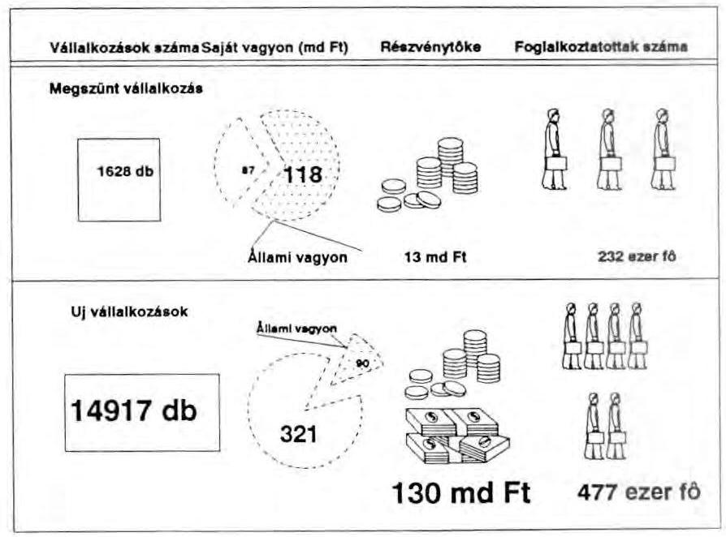

Az állami vagyon védelme szempontjából figyelemre méltó, hogy az új vállalkozásoknál már 28 milliárd forinttal kevesebb állami vagyont mutattak ki. Ez azt jelzi, hogy a megszűnési és az átalakulási folyamatok során az állami vagyon más formában - például részvénytőkeként - jelenik meg az új vállalkozásnál. A jelenlegi információs rendszerben azonban ez az állami vagyonrész már nem követhető. Szükségesnek látszik a pénzügyi beszámoló rendszerbe beépíteni mindazokat az adatokat, amelyek az állami vagyonról, az átalakulási folyamatokról pontos, ellenőrizhető információkat adnak.
13.2.4. Az átalakuló, állami vagyonnal rendelkező vállalkozások néhány jellemzője

A megszűnt és az új vállalkozások csoportjában gazdálkodási formák szerint a vállalkozások méret szerinti struktúrája igen eltérően alakult.

---

Jelentősebb, 40% feletti részesedéssel 4 társaságban van jelen külföldi partner. Az ÁVÜ tulajdoni részaránya az átalakított társaságokban 40-93% között szóródik.

Az ÁVÜ tartja nyilván a kereskedelmi bankokban és biztosító társaságokban lévő állami részvényeket is. Az ÁVÜ vezetői e részvénytársaságok közgyűlésein tulajdonosként lépnek fel. A részvények után fizetett osztalék a költségvetés folyó bevételeit gyarapította (2,2 milliárd Ft), miközben - az 1987. január 1-jétől létrehozott kereskedelmi bankok és átszervezett biztosító intézetek megfelelő mértékű alaptőkéjének biztosításához felvett hitelek miatt - 1991-ben körülbelül 5,8 milliárd Ft az államadósság.

Az ÁVÜ 1990-ben a privatizációból származó bevételei közül 511,4 millió Ft-ot utalt át az MNB-nek az 1968. évi új gazdasági mechanizmus kapcsán a vállalatok forgóalap ellátására felvett hitel soron kívüli törlesztésére.

Az ÁVÜ tevékenysége az állami vagyon gondozásában 1990-ben még nem bontakozott ki markánsan, hiszen április 1-jével kezdte meg tevékenységét. A működését befolyásoló törvényi keretek az év során többször változtak, menet közben derültek ki bizonyos joghézagok, így működésének eredményessége elmaradt a várakozástól. A privatizációs programok iránti érdeklődés is kisebb a vártnál, mert a jogszabályi feltételrendszer még mindig nem teremt vonzó környezetet a vállalkozói tőkének.

Budapest, 1991. július
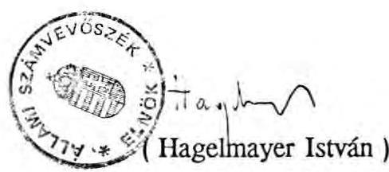

---

# 1. sz. függelék 

az A-83-9/1991. sz. jelentés

1. sz. mellékletéhez

## Az elkülönített állami pénzalapok a zárszámadási Jelentés 2537. számú füzetének indoklási részében és a 2537/1. sz. füzet számítási anyagában kifogásolt hiányosságai és eltérései

1. Az elkülönített állami pénzalapok támogatásának módosítása részben kormányhatározatok alapján, részben anélkül, a többletkiadások finanszírozásával történt. Ezt szemlélteti a következő táblázat:
(Millió Ft-ban)

|  | előirányzat | Támogatás   teljesítés |  | Korm.hat. alapján |
| :-- | --: | --: | --: | :--: |
| Idegenforg.A. | 1100 | 1182 | + | - |
| Kerpol.A. | 4180 | 3686 | - | 3233/90. |
| Közp.Ifj.A. | 80 | 80 |  | - |
| Intervenciós A. | 4250 | 1840 | -2410 | 3233/90./\* |
| Szanálási A. | 2500 | 2500 |  | - |
| Foglalkozt.A. | 8000 | 11647 | +3647 | 3167/90./\*\* |
|  |  |  |  | 3350/90./\*\* |
| Letelepedési A. | 500 | 750 | +250 | 3350/90. |
| Lakás Alap | 42300 | 44500 | +2200 | - |
| Felsz.A. | 3000 | 1025 | -1975 | - |
| Összesen: | 65910 | 67210 | +1300 | - |

\*Az Intervenciós Alapról a 3233/1990. kormányhatározatban 1 milliárd Ft támogatáscsökkentés.
\*\* A Foglalkoztatási Alap támogatásának 500 millió Ft-os emelését tartalmazza a 3167/90./MT határozat. A 3350/90./kormányhatározat konkrét összeg megjelölése nélkül intézkedett a munkanélküli segély címén keletkező többletkiadások havonta történő utalványozásáról a Foglalkoztatási Alap javára.

---

2. A költségvetés és az elkülönített alapok pénzeszközei között a kormányhatározatok alapján további átcsoportosítások történtek.

- 3379/1990. sz. kormányhatározat: a Földvédelmi Alap pénzeszközeiből 107 millió Ft került átcsoportosításra a földhivatalok működőképességének megőrzése céljából,
- 3233/1990. sz. kormányhatározat: a Központi Műszaki Fejlesztési Alap július-november hónapokban befolyó összegéből 2 milliárd Ft került befizetésre a költségvetésbe,
- 3233/1990. sz. kormányhatározat: az Intervenciós Alap pénzeszközeiből 1 milliárd Ft költségvetési befizetés.

3. Az előirányzatok teljesítéséről készült táblázatban szereplő nyitóállomány több alapnál eltér az 1989. évi zárszámadásban jóváhagyott záróállománytól:

- Sportfejlesztési Alap: - 182 millió Ft
- Felsőoktatás Fejlesztési Alap: + 1 millió Ft
- MT TPB Kutatási Alap: + 1 millió Ft
- Központi Műszaki Fejlesztési Alap: + 2.241 millió Ft/\*
- Foglalkoztatási Alap: - 556 millió Ft
\*/ A 3233/90. sz. kormányhatározattal előírt és teljesített 2 milliárd Ft KMÜFA befizetési kötelezettséget a nyitóállomány módosításával rendezték.

4. A számítási anyagban, az előirányzatról készített táblázat 8 kutatási alapot, a teljesítési táblázat a KSH Kutatási Alappal együtt 9 kutatási alapot tartalmaz.
5. Az 1990. évi költségvetési törvény rendelkezett több elkülönített állami pénzalap megszüntetéséről, illetve azok pénzügyi forrásainak az illetékes tárcák költségvetésébe történő beépítéséről. Ezek közé tartozott a Közművelődési Alap is. Ennek ellenére az Alap a zárszámadás számítási anyagában változatlanul szerepel.
6. Az Intervenciós Alapról készült szöveges értékelés önmagában, és a számítási anyaggal összevetve is pontatlan, nehezen áttekinthető. Az Alap támogatását és

---

gazdálkodását módosító kormányhatározatot figyelembe véve sem követhetők pontosan a változások.
7. A Szanálási Alapon a számítási anyag szerint rendelkezésre álló 3.315 millió Ft-ból az Alap éves felhasználása 3.121 millió Ft volt. A szöveges értékelésben részletezett kiadások összege 2.145 millió Ft, a különbség 976 millió Ft felhasználásról nincs szöveges indoklás.
8. A Letelepedési Alap 1990. évi támogatási előirányzata (500 millió Ft) évközi kormányhatározat alapján 750 millió Ft-ra nőtt. Ez az összeg szerepel a számítási

 anyagban.

A szöveges indoklás és a számítási anyag közötti eltérések:

|  | szöveges   indoklásban   millió | számítási   anyagban   forintban | különbség |
| :-- | :--: | :--: | :--: |
| Bevételek | 887,5 | 924,0 | 36,5 |
| Kiadások | 846,6 | 1068,0 | 203,4 |

9. A Lakás Alap támogatása az eredeti előirányzathoz képest 2,2 milliárd Ft-tal nőtt, mivel bevételei az előirányzat alatt teljesültek. A zárszámadásban hivatkozott 1990. évi XLIII. törvény a lakáscélú állami kölcsönök utáni 1990. évi adófizetéssel foglalkozik és nem tartalmaz döntést a Lakás Alap támogatásának felemeléséről.

A szöveges indoklásban részletezett kiadások helyes összege 60,1 milliárd Ft, 300 millió Ft-tal több, mint a közölt összeg (59,8 milliárd Ft). A számítási anyagban 60,2 milliárd Ft kiadás szerepel. A tényleges kiadások alapján pontosítás szükséges.

---

# 2. sz. függelék 

az A-83-9/1991. sz. jelentés

1. sz. mellékletéhez

## Az önkormányzatok 1990. évtől bevezetett pénzügyi szabályozó rendszerének működése.

A tanácsi szabályozás az 1990-es év elejéig alapvetően kiadásorientált rendszer volt. Ez azt jelentette, hogy az állami költségvetés egycsatornás támogatása alapvetően hiánypótló szerepet töltött be. A tanácsokat illető személyi jövedelemadó összege független volt a települések állampolgárainak befizetésétől. A tanácsok között a támogatás elosztásában nem volt objektív mérce, nélkülözte a normativitást. A kiadások nagyságát minden szinten a tervalku határozta meg.

A költségvetési reform keretében az önkormányzati gazdálkodás valós feltételeinek megteremtése érdekében 1990-évtől egy új pénzügyi szabályozás néhány eleme került bevezetésre. (A teljes rendszer átfogóan kívánta átalakítani a tervezés és szabályozás, gazdálkodás folyamatát.)

A szabályozó rendszer hatálybalépését követően megvizsgáltuk - 8 megyei és a fővárosi tanácsnál - a szabályozás bevezetésének tapasztalatait.

Az új rendszer alapvető célkitűzése az volt, hogy a források határozzák meg a kiadásokat, vagyis bevétel-orientált legyen. A bevezetett első szakasz arra vállalkozott, hogy megteremtse a tervezés és elosztás objektivitását.

A bevezetés időpontja tapasztalataink szerint több szempontból vitatható volt. (Pl. megelőzte az önkormányzati, államháztartási, önkormányzati tulajdonra vonatkozó törvényeket, valamint a helyhatósági választásokat is.) Az új pénzügyi rendszer teljesen új - több önkormányzatnál jelentősen eltérő - pénzügyi helyzetet teremtett, ezzel bizonyos értelemben meghatározva az alakuló önkormányzatok helyzetét.

---

A kialakított gazdálkodási modell új forrásstruktúrát igényelt. Ennek egyik eleme továbbra is - az állami költségvetésből és a Társadalombiztosítási Alapból biztosított - támogatás maradt (156 milliárd Ft), ami az összes bevételnek - 281 milliárd Ft - több mint felét jelentette.

A források másik eleme, - csaknem fele - az úgynevezett saját bevételek - személyi jövedelemadó, lakossági adó és illeték, működési ár-, és díjbevétel - gyűjtőfogalomba tartoznak. Ennek mintegy 60%-át - 74,5 milliárd Ft-ot - a személyi jövedelemadó jelentette.

Az új modell alapvetően e két forráselem - az állami támogatás és a személyi jövedelemadó - normatív elosztásával hozott minőségi változást. Míg a személyi jövedelemadó 100%-os átengedése az önkormányzatok/tanácsok pénzügyi helyzetét igen jelentősen differenciálta és átrendezte, addig az állami támogatás volt hivatott az azonos feltételeket megteremteni.

Vizsgálataink szerint ez a kétcsatornás forrásszabályozás kiszolgáltatta az egyes településeket a személyi jövedelemadó szélsőségeinek. Azoknál a településeknél, amelyeknél a személyi jövedelemadó egy állandó lakosra jutó összege átlag alatti mértékben teljesült, ott a működőképesség fenntartásához a forrás jelentős állami kiegészítéséről kellett gondoskodni. Azok a települések viszont, amelyeknél az egy állandó lakosra jutó személyi jövedelemadó az átlagot lényegesen meghaladta, relatívan sokkal kedvezőbb helyzetbe kerültek.

Az állami költségvetésből a tanácsoknak juttatott támogatás 72%-át normatív módon osztották el. A felosztásnál azt a célt tűzték ki, hogy az alapvető humánellátáshoz minden tanácsnak egyenlő feltételei legyenek, amit törvény garantál. Ennek érdekében normatívákat alakítottak ki az általános és a térségi feladatokhoz kapcsolódóan.

A normatívák mértékének meghatározásánál azonban nem egy egzakt - a tényleges költségeket tükröző - modellt alkalmaztak, hanem az 1990. évre tervezett előirányzatok és a meglévő feladatmutatók hányadosaként számították a normatívákat. Ezért a normatívák az elmúlt évtizedek alacsony hatékonyságú költségstruktúrájára épülnek, magukba foglalva az alkumechanizmus, a bázisszemlélet, valamint az ellátási különbségek torzításait.

Az előkészítés hiányosságaként értékelhető, hogy nem történt meg az önkormányzatok területén az állami feladatvállalás elhatárolása, nem került sor - bevezetésével egyidőben - az információs rendszer felülvizsgálatára, ezen belül a mutatószámok tartalmának meghatározására.

---

Az állami támogatás normatív módon történő elosztásán túl a priorizált társadalmi célokhoz kapcsolódóan céltámogatásokat határoztak meg, továbbá az év közben jelentkező központi intézkedések ellentételezésére támogatást biztosítottak. (A céltámogatások elosztásának, felhasználásának ellenőrzési tapasztalatait jelentésünk 2914/1. mellékletének 8. fejezete tartalmazza.)

Az új rendszer kezdeti bizonytalanságát csak egy "átmeneti" forrás beépítésével lehetett kiegyensúlyozni, amit szintén az állami támogatásból fedeztek.

A központosított előirányzatok ugyanúgy, mint az átmenetet biztosító előirányzatok rontották a bevételorientált forrásszabályozás hatását, mert az új pénzügyi szabályozásba rendszeridegen elemként épültek be.

---

### 3. számú függelék

az A-83-9/1991. sz. Jelentés 1.sz. mellékletéhez

#### GYÓGYÍTÓ - MEGELŐZŐ ELLÁTÁSOK FINANSZIROZÁSÁRA SZOLGÁLÓ TÁMOGATÁSOK KÜLÖNBSÉGE

Ezer forint

|  TANÁCS / ÖNKORMÁNYZAT | TANÁCSOK (ÖNKORMÁNYZATOK) BESZÁMOLÓI |  |  |  |  |  |  |  |  |  |  |  |  |  |  |  |  |  |  |  |  |  |  |  |  |  |  |  |   |
| --- | --- | --- | --- | --- | --- | --- | --- | --- | --- | --- | --- | --- | --- | --- | --- | --- | --- | --- | --- | --- | --- | --- | --- | --- | --- | --- | --- | --- | --- |
|   | Eredeti | Módosított | Teljesítés | Előirányzat | Teljesítés | Előirányzat | Teljesítés |  |  |  |  |  |  |  |  |  |  |  |  |  |  |  |  |  |  |  |  |   |
|  Budapest | 11387695 | 12007924 | 12001549 | 10369000 | 12007926 | 10848794 | 12007924 |  |  |  |  |  |  |  |  |  |  |  |  |  |  |  |  |  |  |  |  |   |
|  Baranya megye | 1613673 | 1913643 | 1913094 | 1609000 | 1907365 | 1669313 | 1907365 |  |  |  |  |  |  |  |  |  |  |  |  |  |  |  |  |  |  |  |  |   |
|  Bács-Kiskun megye | 2249646 | 2641499 | 2638037 | 2251000 | 2645238 | 2335378 | 2645238 |  |  |  |  |  |  |  |  |  |  |  |  |  |  |  |  |  |  |  |  |   |
|  Békés megye | 1605283 | 1908542 | 1908272 | 1517000 | 1796560 | 1590257 | 1796561 |  |  |  |  |  |  |  |  |  |  |  |  |  |  |  |  |  |  |  |  |   |
|  Borsod-Abaúj-Zemplén | 3426000 | 3979484 | 3978411 | 3426000 | 3978411 | 3554423 | 3978411 |  |  |  |  |  |  |  |  |  |  |  |  |  |  |  |  |  |  |  |  |   |
|  Csongrád megye | 1514317 | 1787501 | 1787501 | 1487000 | 1781500 | 1542740 | 1781500 |  |  |  |  |  |  |  |  |  |  |  |  |  |  |  |  |  |  |  |  |   |
|  Fejér megye | 2908762 | 3441074 | 3441074 | 1527000 | 1815182 | 1598556 | 1815182 |  |  |  |  |  |  |  |  |  |  |  |  |  |  |  |  |  |  |  |  |   |
|  Győr-Sopron megye | 1926383 | 2239187 | 2200258 | 1859000 | 2239128 | 1980662 | 2239129 |  |  |  |  |  |  |  |  |  |  |  |  |  |  |  |  |  |  |  |  |   |
|  Hajdú-Bihar megye | 1694869 | 2022441 | 2022441 | 1628000 | 2026441 | 1785549 | 2026441 |  |  |  |  |  |  |  |  |  |  |  |  |  |  |  |  |  |  |  |  |   |
|  Heves megye | 1383824 | 1590500 | 1597004 | 1335000 | 1613284 | 1434011 | 1613285 |  |  |  |  |  |  |  |  |  |  |  |  |  |  |  |  |  |  |  |  |   |
|  Komárom megye | 2620253 | 3101966 | 3094259 | 1325000 | 1582631 | 1374667 | 1582631 |  |  |  |  |  |  |  |  |  |  |  |  |  |  |  |  |  |  |  |  |   |
|  Nőgrád megye | 1019899 | 1202304 | 1202304 | 1019000 | 1202304 | 1064978 | 1202304 |  |

 |  |  |  |  |  |  |  |  |  |  |  |  |  |  |  |  |  |  |   |
|  Pest megye | 2838150 | 3386345 | 3379900 | 2810000 | 3388954 | 2917407 | 3388954 |  |  |  |  |  |  |  |  |  |  |  |  |  |  |  |  |  |  |  |  |   |
|  Somogy megye | 1728496 | 2039019 | 2032441 | 1694000 | 1995240 | 1757499 | 1995241 |  |  |  |  |  |  |  |  |  |  |  |  |  |  |  |  |  |  |  |  |   |
|  Szabolcs-Szatmár-Bereg | 4061709 | 4495319 | 4373609 | 2107000 | 2429440 | 2185980 | 2429440 |  |  |  |  |  |  |  |  |  |  |  |  |  |  |  |  |  |  |  |  |   |
|  Jász-Nagykun-Szolnok | 1738380 | 2107927 | 2090264 | 1616000 | 1959823 | 1704587 | 1959694 |  |  |  |  |  |  |  |  |  |  |  |  |  |  |  |  |  |  |  |  |   |
|  Tolna megye | 1125000 | 1310142 | 1310142 | 1125000 | 1310142 | 1167170 | 1310142 |  |  |  |  |  |  |  |  |  |  |  |  |  |  |  |  |  |  |  |  |   |
|  Vas megye | 1280400 | 1494549 | 1494549 | 1236000 | 1494549 | 1328395 | 1494549 |  |  |  |  |  |  |  |  |  |  |  |  |  |  |  |  |  |  |  |  |   |
|  Veszprém megye | 1699962 | 1937036 | 1938020 | 1528000 | 1859249 | 1647228 | 1859249 |  |  |  |  |  |  |  |  |  |  |  |  |  |  |  |  |  |  |  |  |   |
|  Zala megye | 1318000 | 1523433 | 1523433 | 1268000 | 1553586 | 1367406 | 1553586 |  |  |  |  |  |  |  |  |  |  |  |  |  |  |  |  |  |  |  |  |   |
|  Tanács összesen: | 49140701 | 56129835 | 55926562 | 42736000 | 50586953 | 44855000 | 50586826 |  |  |  |  |  |  |  |  |  |  |  |  |  |  |  |  |  |  |  |  |   |
|  KÖZPONT |  |  |  |  |  |  |  |  |  |  |  |  |  |  |  |  |  |  |  |  |  |  |  |  |  |  |  |   |
|  |   |   |   |   |   |   |   |   |   |   |   |   |   |   |   |   |   |   |   |   |   |   |   |   |   |   |   |   |
|  Képjóléti Minisztérium | 11058000 | 12737420 | 12737420 | 11058000 | 13179695 | nincs adat |  |  |  |  |  |  |  |  |  |  |  |  |  |  |  |  |  |  |  |  |  |   |
|  Közl. Hírközl. Épít.M. | 1328565 | 1463648 | 1463648 | 1329000 | 1463648 |  |  |  |  |  |  |  |  |  |  |  |  |  |  |  |  |  |  |  |  |  |  |   |
|  Belügyminisztérium | 609000 |  | 572750 | 609000 | 636542 |  |  |  |  |  |  |  |  |  |  |  |  |  |  |  |  |  |  |  |  |  |  |   |
|  Honvédelmi Minisztérium | 1573500 |  | 1691874 | 1573500 | 1698433 |  |  |  |  |  |  |  |  |  |  |  |  |  |  |  |  |  |  |  |  |  |  |   |
|  Igazságügyi Minisztérium | 219500 |  | 195352 | 219500 | 195353 |  |  |  |  |  |  |  |  |  |  |  |  |  |  |  |  |  |  |  |  |  |  |   |
|  OTF Alapítványok támogatása |  |  |  |  | 3305 |  |  |  |  |  |  |  |  |  |  |  |  |  |  |  |  |  |  |  |  |  |  |   |
|  Központ összesen: | 14788565 | 14201068 | 16661044 | 14789000 | 17176976 | 14789000 | 17173671 |  |  |  |  |  |  |  |  |  |  |  |  |  |  |  |  |  |  |  |  |   |
|  TANÁCS-KÖZP.ÖSSZESEN: | 63929266 | 70330903 | 72587606 | 57525000 | 67763929 | 59644000 | 67760497 |  |  |  |  |  |  |  |  |  |  |  |  |  |  |  |  |  |  |  |  |   |

---

# A 2914. számú Jelentés   2. sz. melléklete 

## Állami Számvevőszék

## BESZÁMOLÓ

az önkormányzatoknak/tanácsoknak 1990. évre nyújtott normatív állami támogatás elszámolásának ellenőrzéséről
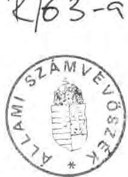

---

A tanácsok pénzügyi szabályozása 1990. évtől alapvetően megváltozott. A költségvetési reformfolyamat egyik elemeként, az önkormányzatok megalakulását megelőzően, a több évtizedes kiadásszemléletű tervezést forrásorientált szabályozórendszer váltotta fel.

Az önkormányzatok/tanácsok állami támogatása nagyobbrészt mutatószámok alapján normatív módon került elosztásra. A Magyar Köztársaság 1990. évi költségvetéséről szóló 1989. évi L. tv. 20. §. (3) bekezdése úgy intézkedik, hogy "a normatív támogatások igénybevételének alapjául szolgáló mutatókat és a támogatás összegét az Állami Számvevőszék ellenőrzi."

Vizsgálatunk célja az volt, hogy megállapítsuk
— megfelelően szabályozott volt-e a normatív állami támogatás rendszere,
— tervezéskor és elszámoláskor rendelkeztek-e az önkormányzatok és az intézmények megbízható bizonylatokkal alátámasztott mutatószám-nyilvántartásokkal,
— az önkormányzatok jogosan vették-e igénybe az állami támogatást.

---

# Megállapítások 

## I.

## Az önkormányzati támogatás elszámolásának feltételrendszere

1. Az új pénzügyi szabályozás bevezetésének kettős célja volt:

- A kiadásorientált tervezést a forrásorientált tervezés váltsa fel annak érdekében, hogy ezzel megteremtsék a tanácsi gazdálkodás addigiaknál biztonságosabb pénzügyi alapját;
- A normatív állami támogatás rendszerével a korábbinál igazságosabb elosztás működjön.

A célok megvalósítása érdekében a tanácsokat/önkormányzatokat megillető 111 milliárd Ft állami támogatásból 80,1 milliárd Ft-ot normatívák alapján osztottak el. A népességszám által meghatározott általános normatívákhoz 32,1 milliárd Ft, a ténylegesen ellátott feladatokkal összefüggő térségi normatívákhoz 48 milliárd Ft kapcsolódott.

A tizenkét féle normatíva alapján számított állami támogatást a feladatellátásban érintett megyei, illetve helyi tanácsok/önkormányzatok havi ütemezésben közvetlenül kapták meg. A szabályozás alaptétele szerint a normatívák alapján számított támogatást felhasználási kötöttség nélkül használhatták fel a tanácsok/önkormányzatok.

A Magyar Köztársaság 1990. évi állami költségvetéséről szóló 1989. évi L. tv. (továbbiakban: költségvetési törvény) 20. §. (3) bekezdése úgy rendelkezik, hogy "az állami támogatás rendelkezésre bocsátása tervezett mutatók alapján történik, a tényleges mutatók alapján a tárgyév lezárását követően a tanácsok az állami költségvetéssel elszámolnak".

Társközségek esetében az elszámolási kötelezettség - az önkormányzatok megalakulásával összefüggő átmeneti törvény alapján - a volt székhely-községek önkormányzatait terheli.

---

2. Az új szabályozásra való átállás feltételei több ponton tisztázatlanok voltak. Viszonylag rövid idő állt rendelkezésre a rendszer modellezésére, erre is elsősorban makroszinten került sor. A megyei tanácsokat igen későn, csak 1989. utolsó negyedévében vonták be az operatív tervezésbe. Tapasztalataink szerint az év végi "gyors munka" csak a főbb összefüggések kimunkálására adott alkalmat. Még megyei szinten sem volt lehetőség arra, hogy az új rendszert teljeskörűen áttekintsék, s nem volt ismert a rendszer operatív működésének
 teljes feltételrendszere.

A megyei tanácsok maguk is látták ezt az ellentmondást, ezért többségük ellene volt az 1990. évi bevezetésnek.

A Minisztertanács 2015/1989. (HT.6.) MT sz. határozata intézkedett a költségvetési reform koncepciójáról. A határozat 8. pontja szerint a tanácsi gazdálkodás szabályait úgy kellett kialakítani, hogy az új finanszirozási rendszer egyes elemeit (a normatívákat) 1990. január 1-től már működtetni lehessen.

A támogatás normatív elosztási rendszerének előkészítetlensége miatt a bevezetés valóban korai volt, amelyet az elszámolás ellenőrzésekor tapasztalt hiányos szabályozás is alátámasztott. Ellenőrzésünk arra is rámutatott, hogy a tanácsok/önkormányzatok pénzügyi információs rendszere felülvizsgálatának elmaradása következtében számos esetben az önkormányzati beszámolók megbízhatósága is kétségbe vonható.
3. Az Állami Számvevőszék törvényből eredő ellenőrzési kötelezettségének alapvetően törvényességi, szabályszerűségi szempontok szerint kívánt eleget tenni.

Ennek megfelelően alakítottuk ki ellenőrzési módszerünket is. Célunk az volt, hogy segítsük a jogszabályon alapuló szabályszerű és korrekt elszámolást, feltárjuk az önkormányzatok jogos támogatási igényeit, illetve rámutassunk az állami költségvetésből jogtalanul igénybe vett támogatásokra. Ellenőrzésünket azon jogi feltételekre alapoztuk, melyekkel az önkormányzatok is rendelkeztek a támogatás elszámolásához, illetve ahogyan a Belügyminisztérium és a Pénzügyminisztérium előkészítette az év végi elszámolást.

Az 1990. év végén mintegy 1600 önkormányzatnak (volt tanácsnak) kellett beszámolót készíteni. (Ebből 19 megyei, 1 fővárosi, 166 városi és 22 fővárosi kerületi önkormányzat.) Valamennyi beszámolót készítő önkormányzattól "tanusítvány" - az ellenőrzés megállapításait alátámasztó okmány - formájában kiegészítő információt kértünk az általa igénybe vett állami támogatás jogosságának bizonyítására. A tanusítványt azok a felelős vezetők írták alá, akik az önkormányzati beszámolók valódiságáért is felelősséget vállaltak. Ezek átvizsgálása után jelöltük ki a helyszíni vizsgálat során felkeresett önkormányzatokat. Így a 19 megyei

---

önkormányzatot, a Fővárosi Főpolgármesteri Hivatalt, 125 városi és 67 nagyközségi, községi önkormányzatot. A helyszíni ellenőrzést alapvetően azoknál az önkormányzatoknál tartottuk indokoltnak - elsősorban a megyei és városi önkormányzatoknál - ahol az állami támogatás a térségi feladatokhoz kapcsolódó normativákkal is összefüggésben volt. Ellenőrzésünket megalapozottabbá tette az önkormányzatok segítő közreműködése, mivel kérésünknek valamennyi önkormányzat időben eleget tett.

# II. 

## Az ellenőrzés során tapasztalt eltérések

1. Az elszámolás feltételeit sem a költségvetési törvény, sem az annak végrehajtására felhatalmazott pénzügyminiszter nem szabályozta. (Költségvetési törvény 26. §. (1) bekezdés.)

A költségvetési törvénynek, vagy a törvény végrehajtási rendeletének kellett volna szabályoznia az önkormányzatok elszámoltatásával kapcsolatos jogokat, kötelezettségeket, illetve felelősséget. Ezen belül célszerű lett volna részletesen meghatározni az elszámolás módját, határidejét, visszafizetés esetén annak forrását, határidejét, címzettjét, illetve azt is, hogy az önkormányzatot megillető, elmaradt támogatást mikor, honnan, milyen feltétellel lehet igényelni. Rögzíteni kellett volna, hogy a tervezéskor észlelt hibákat időben meddig, milyen feltétellel lehet korrigálni, s az év végi elszámolásnál mi indokolhatja és milyen mértékű lehet az elfogadható tervezési hiba. Intézkedést igényelt volna az is, hogy a jogtalanul igénybe vett támogatásnak milyen következményei vannak.

Sem jogi, sem közgazdasági szempontból nem tekinthető elfogadhatónak az a BM-PM tájékoztatóban lévő megoldás, mely szerint:
"Ha az év közben folyósított állami támogatás nem éri el a tényleges adatok alapján igénybe vehető összeget, a különbözetet a tanácsok kiegészítésként megkapják, ellenkező esetben a költségvetésbe visszafizetik."

A Belügyminisztérium - a BM-PM "Tájékoztató" alapján - 1991. február elején elszámolásra szólította fel az önkormányzatokat március 4-i határidő megjelölésével. Az elszámoltatást a Területi Államháztartási és Költségvetési Elszámoló Szolgálatokon (továbbiakban: TÁKISZ) keresztül hajtották végre. Előfordult, hogy az adatok konkrét

---

tartalmi felülvizsgálatát, helyesbítését telefon- vagy írásbeli megkeresés alapján a Belügyminisztérium végezte el.

A TÁKISZ-ok munkája az összesítésre, illetve a számszaki korrekcióra terjedt ki, érdemi módosítást csak az önkormányzatok beleegyezésével végeztek.

Az önkormányzatok elszámolása és a Számvevőszék vizsgálata időben egybeesett, ezért nem volt lehetőség arra, hogy elfogadott, lezárt, összesített elszámolásokat ellenőrizzünk. A Belügyminisztérium összesítése két hónap alatt, április végéig nem készült el. Így gyakorlatilag párhuzamosan folyt az önkormányzatok elszámolásának tárca által történő összesítése és a Számvevőszék törvény által előírt ellenőrzése. Nem egy esetben a TÁKISZ-okhoz és az Állami Számvevőszékhez megküldött adatok eltértek egymástól, amelyek tisztázására a helyszíni ellenőrzés alkalmával került sor. (A két időpont közötti elszámolás különbségét a 2. sz. függelék 5. oszlopa tartalmazza.)

Ez a gyakorlat a későbbiekben nem fogadható el, lehetetlenné teszi a korrekt elszámolást.
2. A költségvetési törvény pontatlanságai miatt az önkormányzatok összességében lényegesen több állami támogatást terveztek és vettek igénybe annál, mint amennyit a tervező szervek előzetesen számítottak, illetve az év közben módosuló, pontosított feltételek alapján végül is megillette őket. Az év közben megjelent "Tájékoztatóban" foglalt feltételek alapján számszaki elszámolásaik egyenlege szerint 1.798 millió forint visszafizetési kötelezettséget mutattak ki az állami költségvetés javára. Ez az összeg újabb pontosítások után - a Belügyminisztérium végleges, 1991. május 13-i összesítése alapján - 1.852 millió Ft-ra módosult.

Az Állami Számvevőszék az önkormányzatok elszámolásának ellenőrzésekor további eltéréseket állapított meg:
— az állami költségvetésből az önkormányzatokat még megillető támogatás +209 millió Ft,

- az önkormányzatok többlet finanszírozása miatt az állami költségvetést megillető összeg - 608 millió Ft,
— nettó eltérés (visszafizetendő) - 399 millió Ft.

---

Az eltéréseket 11 normatívánál 572 önkormányzat elszámolásánál tapasztaltuk, a beszámolót benyújtó mintegy 1600 önkormányzat közel 36%-ánál. A rendelkezésre álló "jogforrás" alapján az ellenőrzés által megállapított befizetési kötelezettség 22%-kal nagyobb az önkormányzatok által kimutatott befizetési kötelezettségnél, ami önmagában is jelzi a rendszer szabályozatlanságát.

Az önkormányzatok egy része számol a visszafizetési kötelezettséggel, más részük viszont elsősorban szűkös anyagi forrásaik, kötelezettséggel terhelt pénzmaradványuk miatt nem látja biztosítva a visszafizetés fedezetét. A jogos igénnyel fellépő önkormányzatok mielőbb hozzá szeretnének jutni a támogatáshoz.

További problémát jelent, hogy az önkormányzatok nem tudják, milyen határidővel kell az esetleges visszafizetést teljesíteniük.
3. Vizsgálatunk felhívta a figyelmet az 1990. évi szabályozás egy sajátos - átmeneti - problémájára is.

Az új pénzügyi rendszerre való átállás bizonytalanságát érezve a törvényelőkészítők "biztonsági szelepként" kiegészítő mechanizmust alkalmaztak. A 80 milliárd Ft nagyságrendű normatív állami támogatás mellett a költségvetési törvény összesen 18,3 milliárd forint "átmeneti" pénzeszközt biztosított, amelynek az elosztását a megyei tanácsokra bízta. (20. §. /2/ bekezdés C. pont). Ezzel a megyei tanácsokra hárult mindazon feladat megoldása, amit a központi szabályozás normatív módon nem tudott kezelni.

Az alapvető cél az önkormányzatok működőképességének megőrzése volt. A megyék ezt az összeget a tanácsok saját bevételei és a normatív támogatások együttes összegének figyelembevételével osztották el. Amennyiben ez a két bevételi forrás nem fedezte a kiadásokat, úgy azt az átmeneti pénzeszközökből kiegészítették.

Emiatt az elszámolás után visszás helyzet alakul ki. Nem tudatosan, de "jól járt" az a tanács/önkormányzat, amelyik "alátervezte" a saját bevételeit és a normatív támogatást, mert a hiányzó forrásokat utólagos elszámolási kötelezettség nélkül megkapta a megyei tanácstól. Az a tanács/önkormányzat viszont, amelyik a rendelkezésére álló információk alapján "túltervezett", az nem, vagy kevesebbet kapott az átmenetet segítő pénzeszközökből, s az elszámolásnál mégis visszafizetési kötelezettség terheli.

---

4. Az állami költségvetéssel szembeni elszámolási kötelezettség felveti az "ingyenhitel" kérdését is. A visszafizetésre váró összeg ugyanis - havi 1/12 rész finanszírozási ütem mellett - folyamatosan gyűlt az önkormányzatok bankszámláján, s 1991. januártól az elszámolás lezárultáig ez az összeg egy tételben az önkormányzatok rendelkezésére állt. Ennek használatáért kamatot, használati díjat nem kell fizetni.

Az új pénzügyi szabályozás induló évére való tekintettel, visszamenőlegesen nem tartjuk indokoltnak "a használati díj" előírását, azonban a későbbiek során ezt a kérdést szintén törvénnyel indokolt rendezni.

# III. 

## Az önkormányzatok elszámolását nehezítő tényezők

1. Az önkormányzatok elszámolásának - és az ellenőrzésnek is - a legnagyobb gondot a nem megfelelő jogi szabályozás okozta.

A költségvetési törvény normatív állami támogatásra vonatkozó szakasza önmagában nem alkalmas a támogatási igény korrekt megtervezésére, illetve elszámolására. Ennek alapján egyes önkormányzatok jogtalan előnyhöz jutnak, míg mások jogtalan hátrányt szenvednek.

A törvény szövege több helyen pontatlan. Egyértelműen nem állapítható meg, hogy mi a tartalma az egyes normatíváknak. Szó szerinti értelmezés esetén ugyanazon feladatellátás után többszörösen is elszámolható a támogatás. A törvény nem foglalkozik a mutatószámok fogalmi meghatározásával, a megfigyelés időpontjával, illetve időtartamával. Néhány mutatószám esetében az sem állapítható meg, hogy melyik önkormányzatot illeti meg a támogatás.

A költségvetési törvény 26. §. (1) bekezdése úgy rendelkezett, hogy a törvény a kihirdetés napján lép hatályba, végrehajtásáról a Minisztertanács a pénzügyminiszter útján gondoskodik.

A jogalkotásról szóló 1987. évi XI. tv. 15. §.-a szerint "A felhatalmazás jogosultja a jogi szabályozásra másnak további felhatalmazást nem adhat." Ezért a költségvetési törvény által a végrehajtásra adott felhatalmazásban meg kellett volna határozni azt is, hogy a pénzügyminiszter végrehajtási rendelete mire terjedjen ki, azaz pl. a tervezés folyamatára, alapvető dokumentumaira, a normatívák és a

---

mutatószámok értelmezésére, megfigyelési időpontjára, illetve időtartamára, feladatváltozás esetén a korrekció lehetőségeire, az elszámolás, a visszatérítés, illetve a költségvetéssel szemben támasztott igény rendezésének módjára, az önkormányzatok egymás közötti elszámolásának kötelezettségére.

A jogalkotásról és a költségvetésről szóló törvények alapján egyértelműen megállapítható, hogy a pénzügyminiszternek rendeletet kellett volna kiadnia.
2. A végrehajtási rendelet pótlására kiadott BM-PM "Tájékoztató" szövegét az ágazati szakmai tárcákkal egyeztették, azonban az nemcsak formájában, de tartalmában sem felel meg a jogszabályi követelményeknek.

A tájékoztató a jogalkotásról szóló törvény értelmében nem jogszabály, csupán az állami irányítás egyéb jogi eszköze. Így azok a témakörök, melyeket kizárólag a törvény, illetve annak végrehajtási rendelete szabályozhatott volna, jogszabálynak nem minősülő jogi iránymutatás formájában kerültek rendezésre.

Ugyancsak a jogalkotási törvény értelmében további problémát jelent, hogy "alacsonyabb szintű jogszabály nem lehet ellentétes a magasabb szintű jogszabállyal". A "Tájékoztató" megkísérelte a törvényi hézagok, félreérthető megfogalmazások pontosítását. Ennek ellenére továbbra is ellentmondásokat tartalmaz, több támogatási jogcím tartalmát szűkítette.

Vizsgálatunk megkezdésekor tapasztaltuk, hogy a költségvetési törvény vonatkozó szakasza és a "Tájékoztató" együtt sem képesek a nyitott kérdéseket teljeskörűen és egyértelműen szabályozni. A továbbra is tisztázatlan kérdések miatt megkerestük a törvényelőkészítő, tervezést végző tárcákat. A Belügyminisztérium és a Pénzügyminisztérium a felvetett kérdésekre két állásfoglalást adott ki (84.274/1991. és 84.277/1991. sz. alatt), aminek tartalma néhány esetben további módosítást jelentett. Hiányoljuk, hogy ezekről az állásfoglalásokról az önkormányzatok nem értesültek, holott a több mint két hónapig elhúzódó összesítés időszakában erre mód lett volna.

Megjegyezzük, hogy a szabályozásban meglévő hiányosságokra, az év végi elszámoláskor várható problémákra már a rendszer bevezetését követően - 1990. II. negyedévében - az e témakörre vonatkozó vizsgálati tapasztalataink megküldésével segítséget kívántunk nyújtani a törvényelőkészítő tárcáknak.
1990. augusztusában a Belügyminisztérium már végzett egy próbaelszámoltatást, melynek rá kellett volna mutatnia az év végi elszámolásnál várható szabályozatlanságból adódó problémákra. A normatívákkal, mutatószámokkal kapcsolatos értelmezési, nyilvántartási problémák rendezésére azonban ezt követően sem került sor.

---

# IV. 

## Az elszámolás alapját képező mutatószám nyilvántartás

1. A normatív támogatási rendszer alapvető problémája az, hogy a források elosztásához alkalmazott mutatószámoknak korábban
 alig volt jelentősége, pénzügyi vonzata pedig egyáltalán nem volt.

Az új szabályozó rendszer bevezetésével egyidőben nem történt meg a mutatószámok fogalmi meghatározása, nyilvántartásuk rendszerszemléletű kötelező érvényű előírása. Ennek tudható be, hogy a normatívák többségénél sem a tervezés, sem az elszámolás időszakában nem állt rendelkezésre megbízható mutatószámrendszer.

A normatív rendszer előkészítésénél a jelzett intézkedések elmaradtak, ezért a tervezés számítási alapjául a költségvetési szakfeladatok mutatószámai szolgáltak, amelyek a költségvetési- és beszámoló rendszer részét képezik. A normatív támogatás elszámolásához kialakított mutatók többsége viszont a szakmai statisztikai kimutatásokból nyerhető. Ennek következménye, hogy nincs összhang a pénzügyi információs rendszer keretében alkalmazott mutatószámok és a normatív támogatás elszámolásának alapját képező mutatók között.

Tapasztalataink szerint csak a szociális otthonok, csecsemőotthonok és az egészségügyi gyermekotthonok mutatószám-nyilvántartása volt alkalmas a normatív állami támogatás megnyugtató, s pontos elszámolására, ellenőrzésére. Ugyanakkor a gyermek- és ifjúságvédelemre vonatkozó mutatószám, a "gondozási nap" mutató nem képezi sem a pénzügyi információs rendszer, sem a szakmai statisztika részét.

A költségvetés és a beszámoló űrlap-garnitúrák mutatószámokra vonatkozó adatai az elszámolásra alkalmatlanok. A gazdálkodásról, illetve annak valódiságáról számot adó vezetők felelősségét is garantálná, ha az igénybe vett állami támogatás alapját képező, intézmények által szolgáltatott mutatószámok a hivatalos pénzügyi információs rendszer részét képeznék.
2. A tanácsok 1990. évi költségvetésének elkészítésével összefüggő tervező, szervező, koordináló feladatokat még a megyei tanácsok végezték. A normatív állami támogatás tervezéséhez a mutatószámokat általában a megyei tanácsok szakosztályai szolgáltatták a különféle ágazati statisztikákból. A tervező munkának ez a szakasza - melyet a rövid idő korlátozott - jórészt a helyi tanácsok és intézmények részvétele nélkül, a

---

megyei tanácsok közreműködésével történt. Tekintettel arra, hogy a megyék nem rendelkeztek a tervezéshez szükséges megalapozott nyilvántartásokkal, illetve a tanácsoktól, intézményektől bekért adatokat nem ellenőrizték, a támogatás alapjául szolgáló mutatószámokat pontatlanul állapítottak meg, számottevően alá-, illetve túltervezték.

A helyi tanácsoknál a tervezés gyakorlatilag 1989. év végén, illetve 1990. év elején kezdődött meg azzal, hogy a megyei tanácsok közölték az 1990. évre igénybe vehető normatív állami támogatás összegét, illetve a támogatás alapjául szolgáló mutatószámokat. A helyi tanácsoknál/önkormányzatoknál ekkor korrekcióra már nem volt lehetőség.

A tervezés folyamatába az intézmények általában nem kapcsolódtak be. Az ebből eredő visszásságokat az elszámolás, illetve az ellenőrzés bizonyította. A térségi normatívák mutatószámait, alapadatait az intézményi adatokra kellett építeni, ennek ellenére e témakörben még ma sem tisztázódott az intézmények felelőssége. Az önkormányzatok jogos állami támogatásának bizonyítékául az intézményeknek kellene pontos mutatószám-nyilvántartással, illetve ezek alapdokumentumaival rendelkeznie.

# V. 

## Az elszámolás ellenőrzési tapasztalatai normatívánként

Az időközben hatályba lépett önkormányzati törvény alapján önkormányzatonként normatívánként részletezésben kellett elszámolni az igénybevehető normatív állami támogatással. Az elszámolás végeredménye az állami költségvetéssel szemben fennálló "követelések" és "tartozások" egyenlege.

Az új rendszer sajátossága, hogy nemcsak az állami költségvetéssel számolnak el az önkormányzatok, hanem közös feladatellátás esetén egymás között is. (Pl. állami gondozásban részesülő gyermekek diákotthoni ellátása esetén.)

Az egyes normatívák elszámolásának megyénkénti bruttó adatait a 3. sz. függelékben mutatjuk be, az ellenőrzés kapcsán szerzett helyszíni tapasztalatokat pedig az alábbiakban foglaljuk össze.

---

1. Általános normatívák alapján történő támogatás elszámolásának ellenőrzése

A tanácsok/önkormányzatok az állandó népesség után vették igénybe az "általános támogatás" és a "külterületi támogatás" normatívák alapján számított összegeit. Ezentúl valamennyi település után egységesen 2 millió Ft illette meg a tanácsokat, a "települések általános támogatása" normatíva alapján.

Mindhárom normatíva esetében jellemző volt, hogy a költségvetési törvénnyel ellentétben a terv- és a tényadatok nem kerültek egybevetésre. A Belügyminisztérium által közreadott információs bázis alapján, a tájékoztatóban megjelent időpont figyelembevételével történt az elszámoltatás.
"A települések általános támogatása" normatívánál a BM-PM "Tájékoztató" a költségvetési törvényhez képest az önálló közigazgatási státusszal rendelkező településekre szűkíti a jogosultság körét.

A "külterületi támogatás" normatíva tervezése és elszámolása nem a költségvetési törvényben megadott létszámadatok figyelembevételével történt, hanem egy belügyminisztériumi leirat alapján.

Az általános normatívák közé tartozik az "üdülőhelyi támogatás" is, ennek ellenőrzése során csak kisebb hiányosságokat tapasztaltunk.

A négy normatíva elszámolását és ellenőrzését követően összesen 41,5 millió Ft visszafizetési kötelezettségük keletkezett az önkormányzatoknak. (3. sz. függelék 1.-12. oszlopai.)
2. Térségi normatívák alapján történő támogatás elszámolásának ellenőrzése
a.) A "gyermek- és ifjúságvédelem" normatíva elszámolása, illetve ellenőrzése okozta a legtöbb problémát. A költségvetési törvény nem határozza meg pontosan, hogy kire, melyik korosztályra vonatkozik a normatíva (csak a tájékoztató pontosít, miszerint a gyámhatósági határozattal érintett kiskorúakról van szó). Közös feladat végrehajtás esetén — állami gondoskodásban részesülő gyermekek más önkormányzathoz tartozó középiskolai, vagy diákotthoni ellátásakor - nem volt tisztázott melyik önkormányzatnak jár a támogatás.

---

Sajátos problémaként vetődött fel a csecsemőotthonokban elhelyezett, jogilag nem állami gondoskodásban részesülő kiskorúak figyelembevétele. Ők - mint egészségügyi beutaltak - családi ellátás hiányában ugyancsak intézeti ellátásra szorulnak. A normatíva ezekre az ellátottakra nem vonatkozik, ezért utánuk nem illeti meg állami támogatás az intézményt fenntartó önkormányzatot.

Gondot okozott az is, hogy az elszámolás alapjául szolgáló mutatót (gondozási nap) eddig nem tartották nyilván az intézmények. Ennek ellenére a rendszer bevezetését követően nem került sor a mutató tartalmának tisztázására, a szükséges nyilvántartások kialakítására, bevezetésére. Így az igénybevétel jogosságát tanúsító nyilvántartással a vizsgált intézmények többsége nem rendelkezett. Ennél a normatívánál tapasztalt tervezési, elszámolási hibamennyiség lényegesen több volt annál, mint amennyi egy új rendszer tervezésének elfogadható velejárója.

A normatíva elszámolását és ellenőrzését követően az önkormányzatoknak nettó 81,8 millió Ft támogatási igényük keletkezett az állami költségvetésből. (A 3. sz. függelék 13.-16. oszlopai.)

Jelentősebb támogatás-növekedést előidéző tényezők: az állami gondoskodásban részesülők figyelembevételére csak ezzel a normatívával van lehetőség. A duplikáció megszüntetését követően az ellátottak e mutatónál kerültek elismerésre. A csecsemőotthonban, nevelőszülőknél lévő állami gondoskodásban részesülők figyelembevétele is növekedést okozott. Csökkenést okozott az intézmények alacsony kihasználtsága, az állami intézetben neveltek, a 18 éven felüliek figyelembevétele, illetve az "ellátottak" helyett a "gondozási nap" mutatószám alkalmazása.
b.) A "szociális intézeti" és a "szakosított szociális intézeti ellátás" normatívák elszámolásának ellenőrzésekor viszonylag kevés eltérést állapítottunk meg. Néhány tervezési hibát tapasztaltunk a téves intézeti besorolás (szociális és szakosított intézet között), a belépő beruházások üzembehelyezési időpontjának, illetve várható kihasználásának túlzott becslése miatt. A szükséges nyilvántartásokat azonban rendben találtuk, elszámolásra alkalmasak voltak. A mutatószám fogalmának értelmezése (gondozási nap) azonban itt is problémákat okozott.

A normatíva elszámolását és ellenőrzését követően nettó 411,1 millió Ft visszafizetési kötelezettségük keletkezett az önkormányzatoknak. (3. sz. függelék 17.-24. oszlopai.)

---

(Jelentősebb támogatáscsökkenést előidéző tényezők voltak: helytelen intézményi besorolás, új beruházások tervezettnél későbbi üzembehelyezése, alacsonyabb kapacitáskihasználtság, előírt mutató helyett "élelmezési nap" alkalmazása.)
c.) A "fiatalkorúak egészségügyi gyermekotthona és gyógypedagógiai intézeti ellátása" normatíva értelmezésében a költségvetési törvényhez képest a "Tájékoztató" szűkítést, egyben pontosítást jelentett. Eszerint csak a kiskorúak számbavételére van mód, illetve azokra a fogyatékosokat nevelő általános iskolában elhelyezettekre, akik diákotthoni ellátásban is részesülnek.

Az elszámolásnál számottevő hibamennyiséget okozott az, hogy helytelenül vették figyelembe az állami gondoskodásban részesülőket, mivel az utánuk járó támogatás nem az intézményt fenntartó önkormányzatot illeti meg, hanem a Gyermek- és Ifjúságvédő Intézetet (GYIVI-t) fenntartó megyei önkormányzatot. Az elszámolás alapjául szolgáló mutatók értelmezése itt is problémákat vetett fel.

Ennél a normatívánál keletkezett az elszámolást és ellenőrzést követően a legnagyobb visszafizetési kötelezettség: nettó 1203,2 millió Ft. (3. sz. függelék 25.-32. oszlopai.)
(Jelentősebb támogatáscsökkenést előidéző okok voltak: 18 éven felüliek-, állami gondoskodásban részesülők figyelembevétele, diákotthoni ellátás nélküli normatíva-elszámolás, átlaglétszám helyett férőhely alapján történő számbavétel.)
d.) A "középfokú oktatás" normatívánál a költségvetési törvény és a tájékoztató között szintén eltérést tapasztaltunk. Ez utóbbi csak a nappali tagozatra ismerte el az elszámolás lehetőségét. Tervezési hibaként állapítottuk meg a demográfiai hullámmal és a belépő beruházásokkal összefüggésben a várható tanuló-létszám túl-, illetve alulbecslését. Mindemellett a mutatószám-nyilvántartások ellenőrzése, pontos számbavétele is igen sok hiányosságot tárt fel.

A normatíva elszámolását és ellenőrzését követően az önkormányzatoknak nettó 97,2 millió Ft támogatási igénye keletkezett az állami költségvetéssel szemben. (3. sz. függelék 33.-36. oszlopai.)
(Jelentősebb támogatásnövekedést előidéző tényezők voltak: a demográfiai hullám pontatlan létszámbecslése, a mutatószám elszámolási időpontjának a tájékoztatótól eltérő alkalmazása, csökkenést okozott az esti-, levelező hallgatók figyelembevétele.)

---

e.) A "diákotthoni ellátás" normatíva tartalma csak a tájékoztató megjelenése után vált egyértelművé. Ebből derült ki, hogy az itt elhelyezett tanulók után melyik önkormányzatot illeti meg a támogatás. Vizsgálatunk során kitűnt az is, hogy mind a tervezésnél, mind az elszámolásnál igen tágan értelmezték az "elhelyezettek" körét. Az ellenőrzésnél gondot okozott az elszámolásnál figyelembe vehető mutatószámok bizonyítékául szolgáló nyilvántartások pontatlansága is.

A normatíva elszámolását és ellenőrzését követően az önkormányzatoknak nettó 511,8 millió Ft állami költségvetést megillető visszafizetési kötelezettsége keletkezett. (3. sz. függelék 37.-40. számú oszlopai.)
(Jelentősebb támogatáscsökkenést előidéző tényezők voltak: az állami gondoskodásban részesülők, a nem tanácsi intézményekben lévő ellátottak után a normatívák elszámolása, illetőleg a tényleges kapacitáskihasználtság.)
f.) A "színházak" normatívánál a "Tájékoztató" szintén a "fizető nézőre" korlátozta a jogosultak körét. Az elszámolást a jogi szabályozatlanságból eredő félreértések jellemezték, ezek jórésze a magyar színházak külföldi vendégjátékára, illetve a tájelőadásokra vonatkozott. A színházak nyilvántartásai sem alkalmasak a pontos elszámolásra, elsősorban hiányos adattartalmuk miatt.

Két színház működésénél - a szekszárdi Német Színháznál és a Komárom-Esztergom megyei Játékszínnél - sajátos helyzetet tapasztaltunk, amit a normatív rendszer nem tudott figyelembe venni. Amennyiben ezekre a színházakra is alkalmazzuk az általános szabályokat, az további működésüket lehetetlenné teszi.

A Német Színház több mint 12.000 nézőnek adott anyanyelvi műsort, ebből azonban csak 905 volt a fizető néző, így a színházra tervezett mutatók alapján az igénybe vett normatív támogatásának csak mintegy 10%-ára jogosult.
A Játékszín a vizsgált évben, mint egyesülés működött, egyik alapító tagja a megyei tanács/önkormányzat volt. A vállalkozási forma miatt a színház után nem illette meg normatív támogatás az önkormányzatot, ugyanis nem a tanács költségvetésében szereplő intézmény volt.

A normatíva elszámolása és az ellenőrzés után az önkormányzatoknak nettó 168,4 millió Ft visszafizetési kötelezettsége keletkezett. (3. sz. függelék 41.-44. oszlopai.)

---

(Jelentősebb támogatáscsökkenést előidéző okok voltak: a külföldi előadások-, a befogadó színházak tájelőadások utáni-, a vállalkozási formában működő színházak fizető nézőszámainak figyelembevétele.)
g.) A területi tanácsokat megillető támogatás ellenőrzésénél eltérést nem tapasztaltunk.

# Összefoglalva 

1. Az önkormányzatok elszámoltatásának feltételeit - figyelembe véve az összegyűlt, méltányosságot indokló tapasztalatokat - Országgyűlési döntéssel szükséges megteremteni. A határozat hatályba lépését követő két hónapon belül a Belügyminisztérium bonyolítsa le az elszámolást, az Állami Számvevőszék által már elvégzett ellenőrzések figyelembevételével.

Rendezni indokolt a pénzügyi lebonyolítás - befizetés, visszafizetés - módját, határidejét is.
2. Az önkormányzatok elszámolására vonatkozó Országgyűlési döntés tartalmának kialakításához felhívjuk a figyelmet arra, hogy az 1990. évre vonatkozó pénzügyi szabályozás a normatívák egy részénél nem tisztázott több olyan kérdést, amelynek pénzügyi konzekvenciái indokolatlan hátrányt
 teremtenek egyes önkormányzatoknál.

Tekintettel az 1989. évi L. tv., a BM-PM "Tájékoztató" és az induló év szabályozatlanságára, a méltányos elbírálás érdekében az Országgyűlés figyelmébe ajánljuk egyes mutatószámok tartalmának bővebb értelmezését.

A mutatószámok bővítésére az alábbiak a javaslataink:
-A méltányossági javaslatok pozitív elbírálása számottevően csökkentené a visszafizetési kötelezettséget, illetve az érintett önkormányzatok hozzájuthatnának az őket a költségvetési törvény értelmében jogosan megillető állami támogatásokhoz.
-a "gyermek- és ifjúságvédelem" normatívánál javasoljuk elismerni az állami gondoskodásból jogilag kikerült - szociális intézeti ellátásra nem szoruló - 18. életévet betöltött gondozottakat, legfeljebb 24. életévükig, mivel önálló életkezdésre való alkalmasságuk még korlátozott (elhelyezkedési-, lakhatási gondok, illetve továbbtanulás miatt). Ezért továbbra is gondoskodásra szorulnak, velük szemben a GYIVI-nek jogszabályokban meghatározott kötelezettségeik is vannak.

---

- Az "egészségügyi gyermekotthon" normatívájánál ugyancsak indokoltnak tartjuk, hogy a 18. évet betöltött, állami gondoskodásból kikerült gondozottak után is kapja meg az intézményt fenntartó önkormányzat a gyermek- és ifjúságvédelem normatíváját.
- A csecsemőotthonokba beutalt, nem állami gondozott ún. "egészségügyi ellátottak" után indokoltnak tartjuk a "gyermek- és ifjúságvédelem" normatíva elismerését, csecsemőotthoni normatíva hiányában. Az itt elhelyezett gondozottak ellátását az államnak kell vállalnia, hasonlóan az állami gondoskodásban részesülőkhöz.
- A "középfokú oktatás" normatívánál indokoltnak tartjuk valamennyi érintett intézménynél az esti és a levelező hallgatók 13 eFt/tanuló normatívával való elismerését.
- A "színházak" normatívánál
= célszerű lenne a tájelőadást a befogadó intézménynél csökkentett normatívával elismerni, kompromisszumos megoldásként 50%-os, vagy 25%-os normatívával (115,- Ft, vagy 58,- Ft fizető nézőnként),
= ajánljuk a 2914/2. sz. melléklet V. fejezet 2. f. pontjában szereplő szekszárdi Német Színház, illetve a Komárom-Esztergom megyei Játékszín egyedi elbírálását, a 230,- Ft összegű normatíva figyelembevételével. A támogatás megvonása ugyanis esetükben a felszámolást jelentené.

3. Az önkormányzatok állami támogatásának 1991. évi normatív elosztási rendszere hasonló problémákkal terhes, mint az 1990. évi.

A problémák elkerülésére szükségesnek tartjuk, hogy az Országgyűlés hívja fel a Kormányt az 1990. évi CIV. törvény végrehajtási rendeletének kiadására. Ebben legalább az alábbiakat indokolt szabályozni:
a.) A csecsemőotthonokba beutalt ún. "egészségügyi ellátottak" - nem állami gondozottak - után indokoltnak tartjuk a "gyermek- és ifjúságvédelem" normatíva - csecsemőotthoni normatíva hiányában - elismerését. Ugyanis az itt lévő gondozottak ellátását - az állami gondoskodásban részesülőkhöz hasonlóan - az államnak kell vállalnia.
b.) a normatívák pontos tartalmi meghatározását,

---

b.) a normatívák pontos tartalmi meghatározását,
c.) a mutatószámok fogalmát, a megfigyelés időpontját, a kötelező nyilvántartások rendszerét,
d.) közös feladatellátás esetén az önkormányzatok közötti elszámolási kötelezettségét,
e.) az elszámolás rendszerszemléletű kialakítását. (Mikor kell elszámolni, hogyan, ki jogosult az elszámoltatásra. Milyen felelősség, illetve kötelezettség terheli az állami költségvetésből jogtalanul igénybe vett pénzeszközök miatt az önkormányzatot, illetve milyen feltétellel igényelheti az önkormányzat az elszámolás után még járó állami támogatást),
f.) Az elszámoltatáshoz szükséges normatívákkal kapcsolatos információk költségvetési, illetve beszámoló nyomtatvány garnitúrába való beépítését.

Budapest, 1991. július
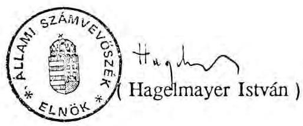

---

1. számú függelék az A-83-9/1991.sz. Jelentés 2.sz.mellékletéhez

# AZ ÖNKORMÁNYZATOK NORMATÍV TÁMOGATÁSÁNAK ALAKULÁSA 1990. ÉVBEN

Ezer forint | Megnevezés|Mutatószám|Normatív támogatás|Eltérés abszolut összegben|Az ellenőrzés által megállapított eltérés| |---|---|---|---|---|---|---|---| |Normatív állami támogatások|Terv|Tény|Elírványzat|Teljesítés|Mutatószám|Ezer forint|+|-|Nettó eltérés| |a./ Közvetlenül a helyi önkormányzatoknak| | | | | | | | | | | Településenként 2 millió forint|3089|3091|6178000|6182000|2|4000|6000|-6000| |Egy állandó lakosra 1170 forint|10566707|10566707|12363048|12363048|0|0|0|0| |Egy 3-13 éves állandó lakosra további 4180 forint|1650965|1650965|6901034|6901034|0|0|0|0| |Egy 60 éven felüli állandó lakosra további 3230 Ft|1979304|1979304|6393152|6393152|0|0|0|0| |Egy külterületi lakosra további 800 forint|366188|362242|300000|289794|-3946|1625|1625|1625| |Gyógy- és üdülőhelyi díj minden beszedett Ft-jához 2 Ft|387684|370879|775368|741758|-16805|-33610|364|2|362| |Összesen|32910602|32870786|-39816|1989|6002|-4013| |b./ Közvetlenül a feladatot ellátó önkormányzatnak| | | | | | | | | | | | |Gyermek és ifjúságvédelem egy ellátottjára 198 ezer Ft|26832|27776|5312736|5499648|944|186912|68904|211266|-142362| |Szociális intézmények egy ellátottjára 115 ezer Ft|27101|22629|3116615|2602358|-4472|-514257|29325|53843|-24518| |Szakosított szoc. intézm. egy ellátottjára 127 ezer Ft|13898|14735|1765046|1871421|837|106375|50165|28829|21336| |Egészségügyi gyermekotthonok és a gyógypedagógiai intézetek egy ellátottjára 140 ezer forint|16898|8915|2365720|1248100|-7983|-1117620|29120|114660|-85540| |Középfokú oktatásban résztvevő egy tanulóra 39 ezer Ft|483736|487500|18865704|19012500|3764|146796|19617|81939|-62322| |Diákotthonban és externátusban elhelyez. egy tanulóra 44 eFt|94480|83151|4157120|3658644|-11329|-498476|9284|63184|-53900| |Egy színházi nézőre 230 forint|4455073|3927084|1024667|903229|-527989|-121438|801|48539|-47738| |Összesen|36607608|34795900|-1811708|207216|602260|-395044| |c./ Egy állandó lakosra a megyei és fővárosi önkorm-nak 1000 Ft|10566707|10566707|10566707|0|0| |Kerekítés miatti korrekció|0|11| |Normatív állami támogatások összesen|80084917|78233404|-1851524|209205|608262|-399057|

---

2. számú függelék az A-83-9/1991. sz Jelentés 2.sz. mellékletéhez

ÖSSZESÍTÉS

A NORMATÍVÁK ELSZÁMOLÁSÁNAK ÉS ELLENŐRZÉSÉNEK ADATAIRÓL

|   | A Belügyminisztérium összesítése alapján |  |  |  |   |
| --- | --- | --- | --- | --- | --- |
|   | Elszámolás a költségvetéssel |  |  |  | Az 1991.  |
|  Megye megnevezése | + | - | Nettó * | Különbség * | május 15-i állapot *  |
|  1. | 2. | 3. | 4. | 5. | 6.  |
|  Budapest | 508310 | -630682 | -122372 | 69 | -122303  |
|  Baranya megye | 222729 | -113083 | 109646 | -41092 | 68554  |
|  Bács-Kiskun megye | 10216 | -123000 | -112784 | -7547 | -120331  |
|  Békés megye | 26848 | -251202 | -224354 | -6 | -224360  |
|  Borsod-Abaúj-Zemplén m. | 62156 | -211716 | -149560 | -210 | -149770  |
|  Csongrád megye | 12443 | -191533 | -179090 | -9003 | -188093  |
|  Fejér megye | 2864 | -224779 | -221915 | 2 | -221913  |
|  Győr-Moson-Sopron megye | 3836 | -118789 | -114953 | 0 | -114953  |
|  Hajdú-Bihar megye | 3844 | -159768 | -155924 | 1 | -155923  |
|  Heves megye | 112808 | -183099 | -70291 | 331 | -69961  |
|  Jász-Nagykun-Szolnok m. | 0 | -56254 | -56254 | 1362 | -54892  |
|  Komárom-Esztergom megye | 63446 | -132700 | -69254 | -2 | -69256  |
|  Nógrád megye | 14390 | -26575 | -12185 | -1 | -12186  |
|  Pest megye | 468 | -128058 | -127590 | 2314 | -125276  |
|  Somogy megye | 72087 | -152362 | -80275 | -17 | -80292  |
|  Szabolcs-Szatmár-Bereg m. | 55819 | -117320 | -61501 | 3864 | -57637  |
|  Tolna megye | 25362 | -66737 | -41375 | -1 | -41376  |
|  Vas megye | 29201 | -88784 | -59583 | -3 | -59586  |
|  Veszprém megye | 66120 | -86236 | -20116 | 4 | -20112  |
|  Zala megye | 38462 | -66636 | -28174 | -3672 | -31846  |
|  ÖSSZESEN | 1331409 | -3129313 | -1797904 | -53609 | -1851513  |

|  Ezer forint |  |  |  |  |   |
| --- | --- | --- | --- | --- | --- |
|  A Számvevőszék ellenőrzése |  |  |  |  |   |
|  által feltárt különbség |  |  |  |  |   |
|  + | - | Nettó |  |  |   |
|  7. | 8. | 9. |  |  |   |
|  20088 | -15128 | 4960 |  |  |   |
|  3242 | -113010 | -109768 |  |  |   |
|  5842 | -11853 | -6011 |  |  |   |
|  4983 | -17676 | -12693 |  |  |   |
|  7884 | -38432 | -30548 |  |  |   |
|  1934 | -23277 | -21343 |  |  |   |
|  7838 | -15849 | -8011 |  |  |   |
|  9144 | -15168 | -6024 |  |  |   |
|  2610 | -29506 | -26896 |  |  |   |
|  1500 | -10032 | -8532 |  |  |   |
|  1627 | -17296 | -15669 |  |  |   |
|  20831 | -46561 | -25730 |  |  |   |
|  594 | -6086 | -5492 |  |  |   |
|  3584 | -17655 | -14071 |  |  |   |
|  23770 | -81926 | -58156 |  |  |   |
|  32940 | -31195 | 1745 |  |  |   |
|  13339 | -19603 | -6264 |  |  |   |
|  24821 | -38604 | -13783 |  |  |   |
|  20193 | -49552 | -29359 |  |  |   |
|  2441 | -9853 | -7412 |  |  |   |
|  209205 | -608262 | -399057 |  |  |   |

- A Számvevőszék vizsgálata 1991. áprilisában lezárult. Ekkor a Belügyminisztérium összesítése alapján 1.797.904 eft volt a nettó befizetési kötelezettség. Ez az 1991. május 13-i állapot szerint 1.851.513 eft-ra módosult. Ez az összeg szerepel a Kormány beszámolójában. A két elszámolási időpont közötti különbség szerepel az 5. oszlopban.

---

1. sz. függelék 1. oldal az A-83-9/1991.sz. Jelentés 2.sz.mellékletéhez

# A NORMATÍVÁK ELSZÁMOLÁSÁNAK ÉS ELLENŐRZÉSÉNEK ADATAI

Ezer forint

|   | Települések általános támogatása normatíva |  |  |  | Külterületi normatíva |  |  |  | Üdülőhely támogatás |  |  |   |
| --- | --- | --- | --- | --- | --- | --- | --- | --- | --- | --- | --- | --- |
|   | Önkormányzat elszámolása | Számvevőszék megállapítása |  | Önkormányzat elszámolása | Számvevőszék megállapítása |  | Önkormányzat elszámolása | Számvevőszék megállapítása |  | Önkormányzat elszámolása | Számvevőszék megállapítása |   |
|  Megye megnevezése | + | - | + | - | + | - | + | - | + | - | + | -  |
|   | 1. | 2. | 3. | 4. |

 5. | 6. | 7. | 8. | 9. | 10. | 11. | 12.  |
|  Budapest |  |  |  |  |  | $-1235$ |  |  | 438 |  |  |   |
|  Baranya megye |  |  |  |  |  | $-276$ |  |  | 5019 |  | 200 |   |
|  Bács-Kiskun megye |  |  |  |  |  | $-441$ |  |  | 854 |  |  |   |
|  Békés megye |  |  |  |  |  | $-5542$ |  |  |  | $-674$ |  |   |
|  Borsod-Abaúj-Zemplén m. |  |  |  |  |  | $-39$ | 39 |  | 3816 |  |  |   |
|  Csongrád megye |  |  |  |  |  | $-1120$ |  |  | 1648 |  |  |   |
|  Fejér megye |  |  |  |  | 172 |  |  |  | 376 |  |  |   |
|  Győr-Moson-Sopron megye |  |  |  |  |  | $-451$ |  |  |  | $-320$ | 34 |   |
|  Hajdú-Bihar megye |  |  |  |  |  | $-560$ |  |  | 3230 |  | 130 |   |
|  Heves megye |  |  |  |  |  |  |  |  | 9212 |  |  |   |
|  Jász-Nagykun-Szolnok m. |  |  |  |  |  |  |  |  |  | $-208$ |  |   |
|  Komárom-Esztergom megye |  |  |  |  | 286 |  |  |  |  | $-2198$ |  |   |
|  Nögrád megye | 2000 |  |  |  |  | $-24$ |  |  | 78 |  |  |   |
|  Pest megye |  |  |  |  |  | $-868$ |  |  |  | $-5064$ |  |   |
|  Somogy megye |  |  |  |  |  |  |  |  |  | $-39160$ |  |   |
|  Szabolcs-Szatmár-Bereg m. | 2000 |  |  |  |  | $-1585$ | 1585 |  | 4772 |  |  |   |
|  Tolna megye |  |  |  |  | 305 |  |  |  | 698 |  |  |   |
|  Vas megye |  |  |  |  | 302 |  | 1 |  | 508 |  |  |   |
|  Veszprém megye |  |  |  |  |  | $-811$ |  |  | 10840 | $-27474$ |  |   |
|  Zala megye | 4000 |  |  |  | $-4000$ |  |  |  |  |  |  |   |
|  ÖSSZESEN | 8000 | 0 | 0 | $-6000$ | 1065 | $-12952$ | 1625 | 0 | 41489 | $-75098$ | 364 | $-2$  |

---

### 3. sz. függelék 2. oldal

### az A-83-9/1991. sz. Jelentés 2.sz. mellékletéhez

### A NORMATIVÁK ELSZÁMOLÁSÁNAK ÉS ELLENŐRZÉSÉNEK ADATAI

|  |   |   |   |   |   |   |   |   |   |   |   |
| --- | --- | --- | --- | --- | --- | --- | --- | --- | --- | --- | --- |
|   |  |  |  |  |  |  |  |  |  | Ezer forint |   |
|   |  |  |  |  |  |  |  |  |  | SZAKOSÍTOTT SZOC. INTÉZETI ELLÁTÁS NORMATIVA |   |
|   |  |  |  |  |  |  |  |  |  |  | SZAKOSÍTOTT SZOC. INTÉZETI ELLÁTÁS NORMATIVA  |
|   | Önkormányz. elszámolása Számvevőszék megállapít Önkormányz. elszámolása Számvevőszék megállapít Önkormányz. elszámolása Számvevőszék megállapít |  |  |  |  |  |  |  |  |  |   |
|  Megye megnevezése | + | - | + | - | + | - | + | - | + | - | +  |
|   | 13. | 14. | 15. | 16. | 17. | 18. | 19. | 20. | 21. | 22. | 23.  |
|  Budapest |  | -2376 | 4950 | -15048 |  | -270825 |  |  | 135890 |  |   |
|  Baranya megye | 193842 |  |  | -52866 |  | -920 |  | -4600 |  | -4699 |   |
|  Bács-Kiskun megye |  | -23364 | 4752 |  |  | -34155 | 115 |  | 1016 |  |   |
|  Békés megye |  | -44550 |  | -3960 |  | -72795 | 230 |  | 21717 |  | 127  |
|  Borsod-Abaúj-Zemplén m. | 26532 |  | 4554 | -17622 | 920 |  |  | -3105 |  | -27940 | 127  |
|  Csongrád megye |  | -41778 | 1386 | -9900 |  | -29670 | 460 |  | 10795 |  |   |
|  Fejér megye |  | -3564 | 4950 |  | 2300 |  |  | -115 |  | -889 | 254  |
|  Győr-Moson-Sopron megye | 594 |  | 594 | -6138 |  | -1610 | 575 |  |  | -17526 | 3429  |
|  Hajdú-Bihar megye |  | -61776 | 990 | -13464 |  | -18860 | 230 |  |  | -2845 |   |
|  Heves megye | 65736 |  |  | -792 |  | -37030 |  | -115 | 33909 |  | 1270  |
|  Jász-Nagykun-Szolnok m. |  | -17028 |  | -792 |  | -6670 | 230 | -115 |  | -254 |   |
|  Komárom-Esztergom megye | 60786 |  | 2376 | -6732 |  | -18745 | 345 | -11385 |  | -14732 | 12573  |
|  Nógrád megye | 6930 |  | 594 |  |  | -2300 |  |  |  | -127 |   |
|  Pest megye |  | -198 | 396 | -1386 |  | -11155 | 575 | -4140 |  | -8001 |   |
|  Somogy megye | 44550 |  | 10890 | -57222 | 22080 |  | 12880 | -690 |  | -25019 |   |
|  Szabolcs-Szatmár-Bereg m. |  | -29700 | 25740 | -15444 |  | -11155 | 460 | -575 | 7239 |  | -254  |
|  Tolna megye | 18216 |  | 396 |  | 6095 |  | 230 | -11270 |  | -20066 | 12573  |
|  Vas megye | 27126 |  | 4356 | -4356 |  | -8050 |  | -17135 |  | -1270 | 19177  |
|  Veszprém megye | 9900 |  | 594 | -1386 |  | -2622 | 12995 | -23 |  | -4445 |   |
|  Zala megye |  | -5742 | 1386 | -4158 |  | -19090 |  | -575 | 23622 |  | 635  |
|  ÖSSZESEN | 454212 | -230076 | 68904 | -211266 | 31395 | -545652 | 29325 | -53843 | 234188 | -127813 | 50165  |

---

### 3. sz. függelék 3. oldal

### az A-83-9/1991.sz. Jelentés 2.sz. mellékletéhez

### A NORMATIVÁK ELSZÁMOLÁSÁNAK ÉS ELLENŐRZÉSÉNEK ADATAI

|   |  |  |  |  |  |  |  |  |  |  |  | Ezer forint  |
| --- | --- | --- | --- | --- | --- | --- | --- | --- | --- | --- | --- | --- |
|   |  |  |  |  |  |  |  |  |  |  |  | Fiatalkorúak EU. Gyermekotthona normativa  |
|   |  |  |  |  |  |  |  |  |  |  |  | Fiatalkorúak Gyógred. Intézeti ellátása norm.  |
|   |  |  |  |  |  |  |  |  |  |  |  |

 |  |  |  |  |  |  |  | Közérintézményi oktatás normativa  |
|   |  |  |  |  |  |  |  |  |  |  |  | Önkormányzati elszámolása számvevőszék megállapít  |
|   |  |  |  |  |  |  |  |  |  |  |  | Megye megnevezése  |
|  1 | 25. | 26. | 27. | 28. | 29. | 30. | 31. | 32. | 33. | 34. | 35. | 36.  |
|  Budapest |  | -221060 | 14140 |  |  |  |  |  | 371982 |  |  |   |
|  Baranya megye |  | -26880 |  |  |  | -64120 |  | -44800 | 23868 |  | 3042 | -2067  |
|  Bács-Kiskun megye |  | -39340 |  |  |  |  |  |  | 8346 |  | 975 | -9321  |
|  Békés megye |  | -8120 |  |  |  | -56280 | 4060 |  |  | -34905 | 390 | -1833  |
|  Borsod-Abaúj-Zemplén m. |  | -19320 | 140 | -2800 |  | -55860 |  | -9380 | 30888 |  | 780 | -2340  |
|  Csongrád megye |  | -46200 |  |  |  |  |  |  |  | -37206 |  | -10257  |
|  Fejér megye |  | -7000 |  |  |  | -31500 | 840 |  |  | -144690 | 1794 | -1677  |
|  Győr-Moson-Sopron megye |  | -5180 |  |  |  | -34440 | 3360 |  |  | -45006 | 624 | -390  |
|  Hajdú-Bihar megye |  | -44520 | 1260 |  |  |  |  | -8400 |  | -4719 |  | -1131  |
|  Heves megye |  | -9240 |  | -140 |  | -72380 |  |  |  | -43329 |  | -6123  |
|  Jász-Nagykun-Szolnok m. |  | -2380 |  |  |  | -1120 | 840 |  |  | -7410 | 117 | -7449  |
|  Komárom-Esztergom megye |  | -980 | 1120 | -560 |  | -68040 |  | -560 |  | -1209 | 4329 | -9516  |
|  Nógrád megye |  | -3360 |  | -1120 |  | -11480 |  |  | 5382 |  |  | -2262  |
|  Pest megye |  | -75600 | 2100 |  |  |  |  |  | 468 |  | 117 | -12129  |
|  Somogy megye |  | -8400 |  |  |  | -37240 |  | -7980 |  | -10335 |  |   |
|  Szabolcs-Szatmár-Bereg m. |  | -15260 |  |  |  | -53620 |  |  | 41808 |  | 390 | -7410  |
|  Tolna megye |  | -8400 |  | -140 |  | -21140 | 140 |  |  | -8463 |  | -3393  |
|  Vas megye |  | -4480 |  | -10780 |  | -39060 |  | -140 |  | -15288 | 1287 | -3432  |
|  Veszprém megye |  | -5600 |  |  |  | -12460 | 700 | -26740 | 53508 |  | 5772 | -1209  |
|  Zala megye |  | -7560 | 420 | -1120 |  |  |  |  |  | -24141 |  |   |
|  ÖSSZESEN | 0 | -558880 | 19180 | -16660 | 0 | -558740 | 9940 | -98000 | 536250 | -376701 | 19617 | -81939  |

---

1. sz. függelék 4. oldal az A-83-9/1991.sz. Jelentés 2.sz.mellékletéhez

# A NORMATIVÁK ELSZÁMOLÁSÁNAK ÉS ELLENŐRZÉSÉNEK ADATAI

Ezer forint

|   | DIÁKOTTHONI ELLÁTÁS NORMATIVA |  |  |  | SZÍNHÁZAK |  | NORMATIVA |   |
| --- | --- | --- | --- | --- | --- | --- | --- | --- |
|   | Önkormányzati elszámolása | Számvevőszék megállapít |  |  | Önkormányzati elszámolása | Számvevőszék megállapít |  |   |
|  Megye megnevezése | $+$ | - | $+$ | - | $+$ | - | $+$ | -  |
|   | 37. | 38. | 39. | 40. | 41. | 42. | 43. | 44.  |
|  Budapest |  | $-25872$ | 924 |  |  | $-109314$ | 74 | $-80$  |
|  Baranya megye |  | $-13420$ |  | $-4884$ |  | $-2768$ |  | $-3793$  |
|  Bács-Kiskun megye |  | $-24816$ |  | $-1848$ |  | $-884$ |  | $-684$  |
|  Békés megye |  | $-28336$ | 176 | $-10560$ | 5131 |  |  | $-1323$  |
|  Borsod-Abaúj-Zemplén m. |  | $-106744$ | 2244 | $-440$ |  | $-1813$ |  | $-1094$  |
|  Csongrád megye |  | $-27500$ | 88 | $-616$ |  | $-8059$ |  | $-2504$  |
|  Fejér megye |  | $-37136$ |  | $-6292$ | 16 |  |  | $-7765$  |
|  Győr-Moson-Sopron megye |  | $-14256$ | 528 | $-1144$ | 3242 |  |  | $-7496$  |
|  Hajdú-Bihar megye |  | $-26488$ |  | $-4048$ | 614 |  |  | $-2463$  |
|  Heves megye |  | $-21120$ | 132 | $-2860$ | 3951 |  | 98 |   |
|  Jász-Nagykun-Szolnok m. |  | $-7788$ | 440 | $-8800$ |  | $-13396$ |  | $-13$  |
|  Komárom-Esztergom megye |  | $-26796$ | 88 | $-5544$ | 2374 |  |  | $-12264$  |
|  Nógrád megye |  | $-9284$ |  | $-704$ |  |  |  |   |
|  Pest megye |  | $-25344$ | 396 |  |  | $-1828$ |  |   |
|  Somogy megye |  | $-32208$ |  | $-1716$ | 5457 |  |  | $-348$  |
|  Szabolcs-Szatmár-Bereg m. |  | $-2772$ | 4136 | $-5324$ |  | $-3228$ | 629 | $-2188$  |
|  Tolna megye |  | $-8668$ |  | $-2200$ | 48 |  |  | $-2600$  |
|  Vas megye |  | $-20636$ |  | $-1496$ | 1265 |  |  | $-1265$  |
|  Veszprém megye |  | $-32824$ | 132 | $-4708$ | 2712 |  |  | $-2659$  |
|  Zala megye |  | $-5940$ |  |  |  | $-4163$ |  |   |
|  ÖSSZESEN | 0 | $-497948$ | 9284 | $-63184$ | 24810 | $-145453$ | 801 | $-48539$  |

