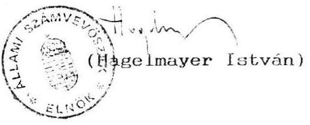

# 2933 szám 

## Allami S̊zámbrböséé

## ÉSZREVÉTELEK

az Államháztartási törvényjavaslathoz

---

# Az Allami Számvevõszék véleménye   a Kormány által 2672. számon benyújtott Allamháztartási törvényjavaslatról 

Az Allami Számvevõszék az államháztartásról szóló törvényjavaslathoz elkészítette - elsősorban a gyakorlati ellenôrzés kereteinek kialakítása szempontjából - szakmai véleményét. A törvénytervezet korábbi, nyers változatait közvetlen munkaközi kapcsolat során véleményeztük, felhiva az alkotók figyelmét bizonyos lényeges hiányosságokra, ellentmondásokra. Sajnálattal tapasztaltuk, hogy az Országgyüléshez benyujtott véglegesitésre szánt törvényjavaslat igen keveset hordoz magában azokból a megállapításokból, amelyek alapján - álláspontunk szerint - az államháztartás az egyébként jól megfogalmazott elvek szerint biztonságosan, zökkenőmentesen müködhetne.

Fentiek alapján, jogszabályi kötelezés hiányában is vállalkoztunk arra, hogy a törvénytervezethez ismételten összefoglaljuk észrevételeinket, mivel a jobbitás szándékával szükségesnek tartjuk ismertetni szakmai álláspontunkat.

Az Allami Számvevõszék messzemenően egyetért azzal, hogy mielőbb meg kell alkotni az államháztartásra vonatkozó törvényt és a kapcsolódó szabályokat. Alapvető fontosságunak tartjuk, hogy az új törvény alapján rendszerszemléletü, takarékos, elveiben egységes és ellenőrizhető államháztartás müködjék. Ennek megfelelően észrevételeinket a törvénytervezet fejezeteihez igazodva, általánosan megfogalmazott álláspontként adjuk közre, összhangban a zárszámadáshoz adott véleményünkkel.

A 2672/1.sz alatt benyujtott tájékoztató nagyon jól elemzi azokat az elvi problémákat és tárja fel azokat a hiányosságokat, amelyek kiküszöbölésével jólmüködő államháztartás hozható létre. Ugyanakkor ezen elvek megvalósulását, illetve az erre való törekvést már nem találjuk meg a konkrét törvényi szövegezésnél.

Számvevõszéki szempontból alapvető fontosságu, hogy az ellenőrizhetőséget, mint alapelvet olymódon kell az államháztartási törvényben szabályozni és megvalósítani, hogy egyidejüleg az állami ellenőrzés rendszere komplex módon áttekintésre kerüljön. Ezzel a lépéssel ugyanis folyamatában lenne végigkísérhetó az államháztartási müveletek minden mozzanata. (Egyébként az alapelvek közül az ellenőrizhetőség, mint alapelv - kimaradt.)

---

A kapcsolódó szabályozások - pl.: az új számvevőszéki törvény és más, az állami ellenőrzésre is kiható szabályok pl.: a jegybankról szóló törvény, stb. - hiánya jelenleg neheziti egyes témák egzakt módon történő értelmezését, azonban a szabályozásnak általunk helyesnek tartott irányát itt is jelezni fogjuk. Ilyen pl.: az ellenjegyzés, a költségvetés véleményezése, illetve az ellenőrzési rendszer témája.

A törvénytervezet a költségvetési szervek gazdálkodására nem irja elő azokat a kritériumokat, amelyek alapján érvényesithető lenne az eredményességre, célszerüségre, hatékonyságra vonatkozó ellenőrzési követelmény.

Szükségesnek tartjuk a központi költségvetési szervek és az alapok kötöttebb gazdálkodását megkülönböztetni az önkormányzatok nagyobb gazdálkodási szabadságától, összhangban az 1990. évi LXV.tv. előirásaival és szellemével.

A törvény előterjesztésével egyidejüleg nem áll rendelkezésre olyan ütemterv, amely a kapcsolódó jogszabályokat, azok tartalmát és szintjét, az előterjesztésért felelős minisztereket, valamint a kidolgozás határidejét rögziti. Az ütemezésnél figyelembe kell venni azokat a kapcsolódási pontokat, amelyek részben meghatározzák az egyes alrendszerek tartalmát.

# I. 

Fejezetenkénti észrevételeink a következők:
Az I. fejezethez nincs észrevételünk.
A II. fejezethez:
A törvényjavaslathoz füzött 2672/1. számu tájékoztatóban foglaltakkal egyetértve megerősítjük az állami feladatok szabályozásának, illetve ujraszabályozásának szükségességét. Ezt a követelményt a törvényjavaslat a leírt indoklás szerint nem vállalja fel. Az államháztartás kiadásai, az állami költségvetés elkötelezettsége és a végrehajtás célszerüsége csak ennek alapján ellenőrizhető, illetve minősithető.

## A III. fejezethez:

A törvényjavaslatban rögzített elvek és szabályok nem támasztják alá a költségvetési gazdálkodás Kormány által is elfogadott és célzott szigoritásának törekvését.

A hatásköri és eljárási szabályok nem szabnak gátat a jelenleg is tapasztalható "igények szerinti" költekezésnek. Az ellenőrzési tapasztalatok jelzik, hogy az "előirányzat felhasználási hatáskör" intézménye, a saját bevételek alultervezése komolytalanná teszik a tervezést. A saját és

---

többnyire nem tervezett bevételek, a visszaigényelt AFA, az elfekvö pénzek utáni kamatbevételek, a különböző alapokból, egyéb szervezetektől származó pénzátvételek stb. indokolatlanul és nem tervezett módon megnövelik az intézmények mozgási szabadságát. (1990-ben a maradványérdekeltségü központi szervek nem tervezett többletbevétele meghaladta a támogatás $40 \%$-át.) Megalapozott tervezés hiányában az alapfeladatok tényleges költségigénye, a költségek indokoltsága nem ellenörizhető és értékelhető.

Az átmeneti gazdálkodásra vonatkozó előirások egyrészről ellentmondásosak, másrészről a Kormány gazdálkodási lehetöségeit az "exlex" időszakban indokolatlanul kibővitik. A 44. par. szerint a Kormány ugyan köteles törvényjavaslatot benyujtani az átmeneti gazdálkodásról, az Országgyülés azonban nem vállal elkötelezettséget a törvényalkotásra ("törvényt alkothat" - 34. par.). Törvény hiányában a Kormány gyakorlatilag szabad kezet kap a gazdálkodásra (45. par.)

Az állami költségvetés általános tartaléka nemcsak az elöre nem látható kiadások, hanem az elmaradt bevételek fedezetét is képezi. A felhasználásra vonatkozó előirások (38. par.) nem tartalmaznak biztositékot a bevételek elmaradása esetén követendő eljárásra.

Az átcsoportositás szabályozása (39. par.) pontositást igényel. A fejezeten belüli címek közötti átcsoportositás joga jelenleg a fejezetek irányitásáért felelősöket illeti meg. Ezen - kivéve "az állami hozzájárulás az önkormányzatok költségvetéséhez" BM fejezetben szereplő cím előirányzatát, melyre nézve az 1990.évi LXV. törvényben ( és nem a jelen törvényjavaslatban említett költségvetési törvényben) az átcsoportositás jogát az Országgyülés magának tartotta fenn - nem célszerü változtatni.

Az Állami Számvevőszék ellenjegyzési kötelezettségét célszerü azokra az esetekre korlátozni, amikor az átcsoportositás az állami költségvetés számára elkötelezettséget jelent. Hiányzik annak szabályozása, hogy az ellenjegyzés ténye vagy annak megtagadása milyen jogi következményekkel jár az érintett szervekre.

A Kormány a költségvetési törvényben meghatározott mértékben vállalhat kezességet a hitelvisszafizetésekre, illetve egyéb kötelezettségekre (42. par.). Nem tisztázott az, hogy a mindenkori éves tartalék (figyelemmel a 38. par. szerinti I. féléves $40 \%$-os felhasználási korlátra), vagy más forrás képezi e címek fedezetét. Ennek hiányában az ASZ ellenjegyzése merő formalitás.

---

# A IV. fejezethez: 

Az elkülönített állami pénzalapok költségvetését szabályozó fejezet pontositásokra és kiegészitésekre szorul.
A törvénytervezet nem tesz különbséget az elkülönített alapok alrendszerére (jelenleg 28-30 ilyen alap müködik), és az egyes alapokra vonatkozó szabályozás között. Félreérthető, hogy minden egyes paragrafus az "alap" szabályozását tartalmazza, holott - értelmezésünk szerint - az 57-es és 58. paragrafusban foglalt kötelmek az összes elkülönített állami pénzalapra, mint alrendszerre vonatkoznak.

Nincs szabályozva az alapok közötti, valamint az alapok és az egyes alrendszerek közötti pénzeszközök átcsoportositásának hatásköri és felelősségi rendje.

Különösen fontos lenne az elkülönített alapok gazdálkodási szabályainak összehangolása a központi költségvetéssel. Ugyanis az elkülönített alapok kevésbé kötött gazdálkodási rendje várhatóan - az eddigi gyakorlat folytatásaként továbbra is lehetőségeket biztosít a központi költségvetési szerveknek (az alapok kezelőinek) a szigoritott költségvetési gazdálkodás fellazítására.
Feltétlenül rögziteni kellene az alapok pénzeszközei központi költségvetésböl (költségvetésbe) történő átcsoportositásának parlamenti kontrollját.

## Az V. fejezethez:

- A helyi önkormányzatok költségvetésének az államháztartás többi alrendszerével, - ezen belül elsősorban a TB-vel való kapcsolatát nem tisztázza a tervezet. Célszerű lenne konkrétan meghatározni azokat az önkormányzati feladatokat, melyek finanszirozását a TB végzi. Rögziteni szükséges azt is, hogy melyik alrendszer feladata a müködés, fenntartás, illetve a beruházás, felujitás finanszirozása.
- Az önkormányzatok gazdálkodása alapvetően a központi költségvetésből juttatott támogatásra, a személyi jövedelemadóra és a saját bevételeire épül.

Véleményünk szerint a tervezetnek rendszerszemléletben kellene szabályozni - természetesen keretjelleggel - a központi költségvetésből biztosított:
a) normatív hozzájárulás jogcímeit a hozzákapcsolódó mutatókat az elszámolás módját, feltételeit:
b) a cél - címzett- és egyéb támogatás feltételeit, az elszámolás módját.

---

Ugyancsak szükségesnek tartanánk, ha a személyi jövedelemadó megosztásának módjáról az Aht. döntene, tekintettel arra, hogy ez a forrás a központi költségvetésnek és az önkor- mányzatoknak is a bevételeit képezi. Mértékéröl viszont az éves költségvetési törvényben célszerű dönteni.

Az a-b pontban javasolt kérdések rögzitését azért tartjuk indokoltnak, mert az önkormányzatok gazdálkodásának stabilitása, az elörelátó, megalapozott döntések érdekében ezeket a kérdéseket nem lehet rövid távon kezelni, azaz az éves költségvetésre bizni.

Ugvanakkor az éves költségvetés feladata az önkormányzatokat megillető költségvetési hozzájárulás évenkénti nagyságrendjének meghatározása, illetve a normatív hozzájárulások mértékének a cél-, címzett és egyéb támogatásokra jutó kereteknek a meghatározása.

- Az Aht. tervezet 67. paragrafusa utal arra, hogy a címrendet az éves költségvetés határozza meg. Mivel ezt a kérdést is hosszabb távra szükséges rögzíteni, ezért a költségvetés szerkezeti rendjét - ezen belül a címrendet - külön jogszabályban ( nem az éves költségvetésben) célszerű rögzíteni.
- A 75. paragrafusban jelzett témaköröket - hitelmüveletek, bevételi többlet felhasználása - ugyancsak célszerünek tartjuk, hogy az Aht. szabályozza, mivel ezek a kérdések is hosszabb távu döntéseket indokolhatnak.

A 76. és a 77. paragrafusban indokolt lenne, ha költségvetés hiányában, illetve az átmeneti gazdálkodásról szóló rendelet hiányában is a polgármesternek csak a müködés, fenntartás kiadási előirányzatainak teljesítésére adna jogosítványt,

# A VI. fejezethez: 

A társadalombiztosítás e törvényjavaslatban kidolgozatlan alrendszerként szerepel. A törvényjavaslat a társadalombiztosítás irányítását, müködését, bevételeinek és kiadásainak körét, gazdálkodását, vagyonát külön törvény szabályozási keretébe utalja, nem szól a Társadalombiztosítási Alap költségvetésének szerkezeti rendjéről, az egyenlegének rendezéséről, az alappal kapcsolatos hatásköri és eljárási szabályokról, a TB Alap és a központi költségvetés kapcsolata szabályairól, pedig az

---

elözöekben felsoroltak fontosságát a TB Alap kezelöjénél folytatott eddigi két ASZ vizsgálat egyértelmüen igazolta.

# A VII. fejezethez: 

A 87. paragrafus meghatározza a költségvetési szervek körét. Nem célszerű a költségvetési szervek gazdálkodását egységesen kezelni, mivel különbséget kell tenni a központi költségvetési szervek és az önkormányzatok gazdálkodási szabadsága, kötöttsége között. Ugyanis az 1990. LXV.tv. rendelkezései és szelleme, valamint az Aht. tervezet vonatkozó paragrafusai között ellentmondás van.

A 93. paragrafus intézkedik arról, hogy melyek azok a költségvetési előirányzatok amiket nem lehet túllépni. Ez a kötöttség - mivel a tervezet értelmezése szerint valamennyi költségvetési szervre vonatkozik - alapelve ellentétes az önkormányzatok jelenlegi gazdálkodási lehetőségeivel.

## A VIII.fejezethez:

A pénzellátási rendszer szabályozásából kimaradt a költségvetési szerveken kívüli címek (ágazati és célfeladatok) finanszirozásának előirása. Javaslatunk szerint ezt az indokolt szükséglethez kell igazítani. A bér- és társadalombiztosítási előirányzatok időarányos finanszirozásánál pedig - tekintve, hogy ezeket az intézmények a saját bevételeikböl is finanszirozzák - a támogatás arányát is figyelembe kell venni.

A pénzellátás szabályai között szükségesnek tartjuk rögziteni, hogy a TB Alap kezelöje és a központi költségvetés kezelöje az éves költségvetési törvények elfogadását követöen írásban állapodjanak meg a két pénzalap közötti pénzmozgások részletes szabályairól, amennyiben azokat törvény nem írja elő, vagy e törvényben szükséges rögzíteni a két alap közötti elszámolás részletes szabályait.

## A IX. fejezethez:

Definiálni kell a törvényben az állami vagyon fogalmát. továbbá a kincstári vagyon fogalmát, az állam vállalkozásokban résztvevő vagyonát, valamint az önkormányzati vagyon fogalmát, ezek tartalmát és körét, egymás közötti kapcsolatrendszerét, mindezen vagyonrészek kapcsolatát az államháztartással. Ezt követően célszerű meghatározni a tulajdonosi jogok gyakorlóit. Mindezek más törvényekben sem tisztázottak, ezért az államháztartási törvényben kell

---

biztosítani a tartalmi meghatározást, valamint a vagyonrendszer felépítését, az alrendszerek elhelyezkedését a hierarchiában kijelölni. Az Országgyülésnek bemutatandó mérlegek körét a TB Alap vonatkozásában is szükségesnek tartjuk bővíteni.

Mindez hozzájárulhatna ahhoz, hogy az állami költségvetés valódi értelemben "háztartásként" müködhessen. Az alapelveket elfogadva várható az állam szerepének visszaszorulása, valamint az, hogy garantált rendszereket kell kialakítani hosszutávra. Ez megmutatkozik abban, hogy a törvénytervezet alapvetően közigazgatási szemléletben rendezi a témát. Nem biztosítja azonban az alapelvekből következő polgári jogviszonyok elötérbe kerülését, a Ptk. kategóriáihoz, fogalmi rendszeréhez való illeszkedést. Példaként említhető, hogy a költségvetési szerv definíciója nincs a Ptk-ban foglalt meghatározáshoz igazítva, illetőleg hiányoznak az államháztartásnak mellérendelt szerepkörben való megjelenés esetére szóló jogszabályok ( pl.: hitelfelvétel esetén).

Szükségesnek tartjuk megjegyezni, hogy az önkormányzati vagyonnal való gazdálkodás fő kérdéseit is e fejezetben kellene rögzíteni.

# A X. fejezethez: 

Az államadósságról szóló fejezetben leirtakból hiányzik annak meghatározása, hogy az államháztartás alrendszerei által, állami garanciavállalás mellett felvett hitelek melyik alrendszer adósságát képezik.

## A XI.fejezethez:

Elő kell írni az államháztartási törvényben állami vagyonmérleg készítését is. Ehhez meg kell teremteni egységes információs rendszerét oly módon, hogy az állami vagyonban bekövetkezett változások nyomonkövethetők legyenek, az állami vagyon állagát kifejezzék, alapot adjanak az elvárható hozadék számításához.

Ezt az indokolja, hogy az államháztartás információs és mérlegrendszere jelenleg nem tartalmaz állami vagyonmérleget, ezt a tervezet sem írja elő. Jelenleg nincs egységes állami vagyonkataszter, emiatt az állami vagyon mozgása nem követhető és nincs viszonyítási alap sem.

## A XII.fejezethez nincs észrevételünk.

## A XIII.fejezethez:

Az államháztartás - törvényjavaslat szerinti - ellenőrzési feladatai a rendszerszemlélet hiányát jelzik. Tisztázatlan és hiányos az egyes alrendszerek közötti munkamegosztás,

---

kimaradt az önkormányzatoknak az intézményeikkel kapcsolatos ellenőrzési feladata.

A kormányzati ellenőrző szerv "kijelölése" (esetleges létrehozása) csak az állami ellenőrzés rendszerének áttekintése és szabályozása mellett indokolt.

Tekintve, hogy a jelenlegi és a készülő ASZ törvény szerint is a fejezetek ellenőrzése az Állami Számvevőszék feladata, indokolatlan a PM fejezet ellenőrzésére vonatkozó külön kivétel (121.par.(6) bek.).

Keverednek a pénzügyi-gazdasági ellenőrzés és a hatósági jogkörrel bíró ellenőrzés elemei (122. par.). A hatósági ellenőrzések közül - az államháztartás alrendszerei között szereplő TB-ellenőrzésre, vagy az ugyancsak költségvetési bevételt jelentő vámellenőrzésre tekintettel - indokolatlan az adóellenőrzés kizárólagos kiemelése.

# II. 

Végezetül két igen fontos témához írt észrevételünket ismertetjük:

Az Állami Számvevőszék, mint önálló költségvetési fejezet sajátos eljárási rendbe tartozik. Függetlenségének, vizsgálatai objektivitásának megőrzése érdekében az ASZ költségvetését nem a szokásos módon - a PM, illetve a Kormány utján - kell a költségvetési törvény tervezésekor a Parlamenthez juttatni, hanem közvetlenül a parlamenti bizottságon keresztül. Erről a törvény nem rendelkezik, véleményünk szerint ennek beépítése feltétlenül szükséges, a nemzetközi gyakorlatnak megfelelően.

Ugyancsak alapvető fontosságunak tartjuk jelezni, hogy összhangba hozva a készülő számvevőszéki törvénnyel is - az államháztartási törvénytervezet 29. paragrafus (1) bekezdésében foglalt - az éves költségvetési tervre vonatkozó ASz véleményezési kötelezettség elméletileg és gyakorlatilag is indokolatlan. Amennyiben ez törvényességi ellenőrzés lesz, ugy formalitás marad, másfajta ellenőrzés pedig lehetetlen. (Pl.: eredményesség, célszerüség vagy hatékonyság fogalmilag kizárt elemek abban a stádiumban.) A nemzetközi gyakorlatban sincs arra példa, hogy a számvevőszék a készülő költségvetést előzetesen véleményezné, ugyanis ez tisztán politikai súlyozást igénylő kérdéskör, az ASZ igy elveszitheti objektív ellenőrzési hatáskörét, ezzel egyidejüleg átveszi az előkészitő végrehajtó hatalmi ág felelősségét. Az már más kérdés, hogy az ASz a költségvetési törvényt teljes

---

mélységében vizsgálja a végrehajtás során és ekkor ellenőrzi azt is, hogy az illetékes állami szervek a törvény előkészítésekor milyen adatokat szolgáltattak, hogyan készítették eló a javaslatot, mely alternativakat tártak a képviselők elé stb...

A döntés a költségvetési törvénynek a meghozatalakor az Országgyülés joga, és ebbe az Állami Számvevőszéknek esetleg befolyásoló véleményével - indokolatlan beleszólnia, mivel bármely irányu véleménye ennél a speciális típusu törvény-tervezetnél azonnal politikai színezetet kap.

Az itt közreadott észrevételeink alapján kérjük a Tisztelt Országgyülést, hogy az államháztartásról szóló törvény elfogadásakor javaslatainkat is értékelve, mérlegelve hozzák meg döntéseiket, mivel meggyőződésünk, hogy megállapításaink hozzájárulhatnak egy korszerü, jol müködő államháztartási rend kialakításához.

Budapest. 1991. julius 29.
