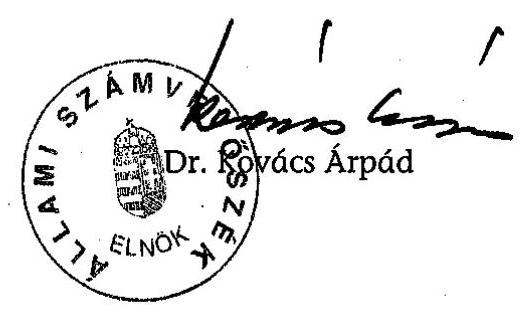
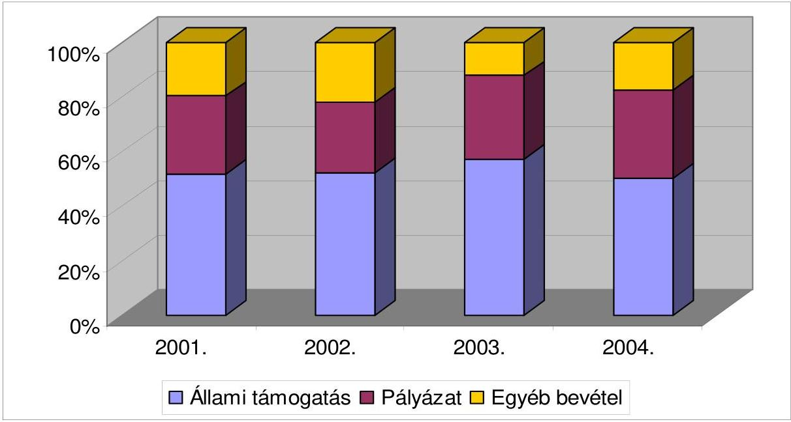
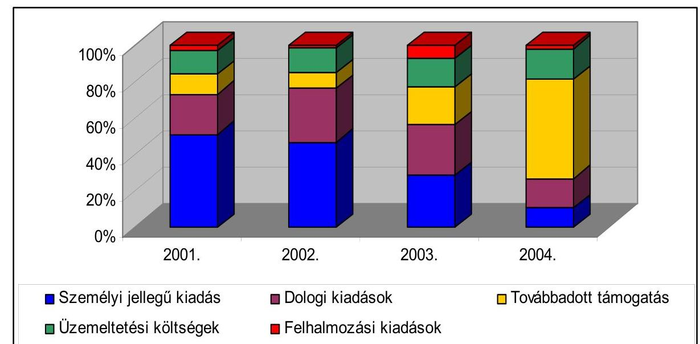

# JELENTÉS 

a Bolgár Országos
Önkormányzat 2001-2004. évi pénzügyigazdasági tevékenységének ellenőrzéséről

---

3. Önkormányzati és Területi Ellenőrzési Igazgatóság
3.1. Szabályszerűségi Ellenőrzési Főcsoport
Iktatószám: V-1007-040/2005.
Témaszám: 758
Vizsgálat-azonosító szám: V0225
Az ellenőrzést felügyelte:
Dr. Lóránt Zoltán
főigazgató
Az ellenőrzés végrehajtásáért felelős:
Dr. Elek János
általános főigazgató-helyettes
Az ellenőrzést vezette:
Horváth Balázs
főcsoportfőnök-helyettes
Az összefoglaló jelentést készítette:
Baracsi Szilvia
számvevő
Az ellenőrzést végezték:
Baracsi Szilvia Dr. Dotterweich Antal
számvevő főtanácsadó

# A témához kapcsolódó eddig készített számvevőszéki jelentések: 

címe
sorszáma
Jelentés a Bolgár Országos Önkormányzat pénzügyi-gazdasági 379 tevékenységének ellenőrzéséről
Jelentés az Országos Kisebbségi Önkormányzatok pénzügyi- 0201 gazdasági tevékenységének vizsgálatáról
Jelentés a Bolgár Országos Önkormányzat pénzügyi-gazdasági 0202 tevékenységének ellenőrzéséről

---

# TARTALOMJEGYZÉK 

BEVEZETÉS ..... 5
I. ÖSSZEGZŐ MEGÁLLAPÍTÁSOK, KÖVETKEZTETÉSEK, JAVASLATOK ..... 6
II. RÉSZLETES MEGÁLLAPÍTÁSOK ..... 9

1. A feladatellátás szervezettsége, szabályozottsága ..... 9
1.1. Az Önkormányzat szervezeti és működési rendje ..... 9
1.2. A gazdálkodási feladatok szabályozása ..... 10
1.3. A feladatellátás szervezeti háttere ..... 10
2. Az Önkormányzat gazdálkodásának jellemzői ..... 10
2.1. A gazdálkodási tevékenység feltételei ..... 10
2.2. Vagyongazdálkodás, vagyonvédelem ..... 11
2.3. A gazdálkodás számviteli szabályozása ..... 11
3. Az éves költségvetések jóváhagyása, végrehajtása ..... 12
3.1. Az éves költségvetések elkészítése, elfogadása ..... 12
3.2. A költségvetés végrehajtása, zárszámadása ..... 12
3.3. A költségvetési feladatok teljesítése ..... 13
3.3.1. A költségvetési törvényben megállapított támogatás alakulása ..... 13
3.3.2. Pályázati támogatások elszámolása, felhasználása ..... 13
3.3.3. Kiadások alakulása, összetétele ..... 14
4. Az Önkormányzat számviteli tevékenysége ..... 15
4.1. Az éves beszámolók összeállítása, jóváhagyása ..... 15
4.2. A könyvvezetési kötelezettség teljesítése ..... 15
4.3. A bizonylati rend és bizonylati fegyelem érvényesülése ..... 16
5. Az Önkormányzat ellenőrzési rendszere ..... 16
5.1. Az ellenőrzési rendszer szabályozottsága ..... 16
5.2. Az ellenőrzési rendszer működése ..... 17
MELLÉKLETEK
6. számú A BOÖ 2001-2004. évi pénzforgalmi bevételei és megoszlása
7. számú A BOÖ 2001-2004. évi pénzforgalmi kiadásai és megoszlása

---

.

---

# RÖVIDÍTÉSEK JEGYZÉKE 

| Amr. | Az államháztartás működési rendjéről szóló 217/1998.   (XII. 30.) Korm. rendelet |
| :-- | :-- |
| BOÖ | Bolgár Országos Önkormányzat |
| KVI | Kincstári Vagyoni Igazgatóság |
| MNEKK | Magyarországi Nemzeti Etnikai Kisebbségekért Közalapít-   vány |
| Nek. tv. | A nemzeti és etnikai kisebbségek jogairól szóló 1993. évi   LXXVII. törvény |
| NKÖM | Nemzeti Kulturális Örökség Minisztériuma |
| NEKH | Nemzeti és Etnikai Kisebbségi Hivatal |
| Számviteli törvény | A számvitelről szóló - többször módosított - 2000. évi C.   törvény |
| Sztv. Vhr. | A számviteli törvény szerinti egyes egyéb szervezetek be-   számoló-készítési és könyvvezetési kötelezettségének sajá-   tosságairól szóló 224/2000. (XII. 19.) Korm. rendelet |
| SZMSZ | Szervezeti és Működési Szabályzat |

---

.

---

# JELENTÉS   a Bolgár Országos Önkormányzat 2001-2004. évi pénzügyi-gazdasági tevékenységének ellenőrzéséről 

## BEVEZETÉS

A magyar bolgár közösség létszámáról 2001. évben a népszámláláskor átfogó felmérés készült. Eszerint 1358 fő bolgár nemzetiséghez tartozónak, 1299 fő bolgár anyanyelvűnek, további 1693 fő vallotta magát a bolgár kulturális értékekhez, hagyományokhoz kötődőnek. A Bolgár Országos Önkormányzat (továbbiakban BOÖ) a magyarországi bolgárok érdekeinek képviseletén túl ápolja az óhazával való kapcsolatot, a bolgár nemzeti hagyományok értékeinek közvetítését, a bolgárok anyanyelvi művelésének elősegítését.

A 2002. évi önkormányzati és kisebbségi önkormányzati választáson 30 helyi bolgár kisebbségi önkormányzat alakult, amelyből 21 a fővárosban működött. A 2003. február 21-én megtartott kisebbségi választások eredményeként Budapesten megválasztották a BOÖ 21 fős új összetételű közgyűlését.

Az Állami Számvevőszékről szóló - többször módosított - 1989. évi XXXVIII. törvény 2. § (5) bekezdése, valamint a nemzeti és etnikai kisebbségek jogairól szóló 1993. évi LXXVII. törvény 57. §-ában (továbbiakban: Nek tv) kapott felhatalmazás alapján az Állami Számvevőszék (továbbiakban: ÁSZ) feladata a különböző állami forrásokból juttatott pénzeszközök felhasználása törvényességének és célszerűségének ellenőrzése a nemzeti és etnikai kisebbségi szervezeteknél. Az ÁSZ a 2005. évi ellenőrzési tervének megfelelően vizsgálta a BOÖ 2001-2004. évi pénzügyi-gazdasági tevékenységét, ehhez kapcsolódóan a 2005. évi tervét.

Az ellenőrzés célja annak megállapítása volt, hogy az országos szervezetnél

- a központi költségvetési támogatást a Nek tv-ben meghatározott feladatokra használták-e fel, a felhasználás elszámolása során betartották-e a vonatkozó hatályos jogszabályi előírásokat;
- a gazdálkodás törvényessége, szabályszerűsége biztosított volt-e; a tervezés, az operatív gazdálkodás, a beszámolási kötelezettség és a számviteli bizonylati rend teljesítése során érvényesültek-e a jogszabályokban és a belső szabályzatokban megfogalmazott követelmények;
- a szabályszerű gazdálkodás érdekében kialakított kontrollmechanizmusok megfelelően segítették-e a feladatok végrehajtását.

A helyszíni ellenőrzés: 2005. október 14 - 2005. november 30-a között, a BOÖ székhelyén történt.

---

# I. ÖSSZEGZŐ MEGÁLLAPÍTÁSOK, KÖVETKEZTETÉSEK, JAVASLATOK 

A BOÖ törvényes működésének követelményeit a nemzeti és etnikai kisebbségi törvénnyel összhangban álló, a közgyűlés által elfogadott SZMSZ szabályozta. A jelenleg hatályos alapdokumentum legutóbb az ÁSZ megelőző ellenőrzésének javaslatára módosult.

A BOÖ céljai és feladatai ellátásához érvényesen megválasztott döntéshozó, irányító testületekkel működött. A 2003. évi választáson a közgyűlés 21 fővel, az elnökség 4 fővel alakult és három bizottságot hoztak létre. Az önkormányzat élére új elnök került, aki 3785 ezer Ft köz- és egyéb tartozással vette át a szervezet képviseletét.

A közgyűlés kizárólagos hatáskörébe utalt gazdasági döntéseket szabályszerűen - bizottsági véleménnyel megalapozottan, határozatképesen - hozták és dokumentálták, bár a testületek jellemzően az előírt munkaterv nélkül funkcionáltak.

A gazdálkodási feladatok szabályszerű végrehajtásához meghatározták az önkormányzat vagyonára vonatkozó kritériumokat, a gazdálkodási és hatásköri előírásokat, de az éves költségvetés és zárszámadás elfogadásának rendjéhez nem szabályozták a tervezési és beszámolási dokumentumok összeállításának tartalmi követelményeit. A hiányosságból eredően összevontan kezelték az alapvető feladatok forrásait és ráfordításait, amely nem biztosított részletes szakmai-pénzügyi értékelhetőséget.

Az országos kisebbségi feladatok ellátása 2003-2004 között oktatási intézménnyel és közhasznú társasággal bővült. A Bolgár Nyelvoktató Kisebbségi Iskolát önálló költségvetési intézményként 2004-ben alapították. Fenntartóként megállapodás szerint biztosították a működéshez szükséges feltételeket, határidőben teljesítették a normatív támogatás elszámolását. A Bolgár Művelődési és Kulturális Kht.-t egy egyesülettel közösen hozták létre a művelődési ház működtetésére és felújítására. A tulajdonosi, felügyeleti jogokat a jogszabályi és belső előírásoknak megfelelően gyakorolták.

A BOÖ a gazdálkodási tevékenysége körében 2003-2004. évben a korábbi ötfős átlaglétszámot egy főállásra és egy-egy megbízásos, tiszteletdíjas alkalmazásra szűkítette. A megszorító intézkedések nyomán végrehajtott leépítés olyan mértékűnek bizonyult, hogy nem tudták biztosítani a feladatok folyamatos szervezését. A könyvelést, beszámolást és költségvetési kapcsolatokat szerződéssel, könyvelő szolgáltatóval végeztették. Az ingyenes használatú, állami tulajdonú székhely állagát megóvták.

A vagyongazdálkodás - kizárólag közgyűlési hatáskörbe tartozó - szabályozása keretében elmulasztották a vagyonleltár és a törzsvagyon megállapítását, továbbá az SZMSZ részeként nem készítették el a vagyonkezelési és befektetési szabályzatot. A kiadott leltározási szabályzat előírásait is figyelmen kívül hagy-

---

ták, mivel csak az önkormányzati választásokat követő átadás-átvétel alkalmával leltároztak. A szabálytalanságok negatív hatása a vagyon áttekinthetősége, valamint a vizsgált vagyonváltozások szabályszerűsége nyomán nem volt kimutatható.

A BOÖ számviteli tevékenységét meghatározó szabályozásokat 2001. január 1-jétől léptették hatályba. A számviteli törvény rendelkezésére kialakított számviteli politika, pénzkezelési szabályzat, leltározási szabályzat - bár 2003. augusztus 15-i hatállyal megújították - részben felelt meg a számviteli törvény követelményeinek, mivel nem tükrözték a gazdálkodási sajátosságokat. A törvényben előírt eszközök és források értékelési szabályzatát csak 2003-ban állították össze. A 2004. évi kettős könyvviteli áttéréshez kidolgozták a számlarendet, összehangoltan aktualizálták a szabályzatokat. A számviteli szabályozások közgyűlési jóváhagyását határidő után, hiányosan bonyolították.

A BOÖ 2001-2004 között minden évben rendelkezett a közgyűlés által elfogadott költségvetéssel és zárszámadással. Az éves költségvetéseket a bizottságok közreműködésével bevételi és kiadási jogcímrészletezéssel tervezték, külön-külön nem irányozták elő az alapvető kisebbségi feladatok forrásigényét, így hiányzott a tervből a központi költségvetési támogatás tervszerű felhasználásának megosztása. Mindössze a kulturális programokat különítették el a 2001. és 2005. évi költségvetésben. A költségvetés végrehajtásánál - a 2003. évi gazdálkodást kivéve - biztosították a kötelezettségvállalások pénzügyi fedezetét. A 2003. évi gazdálkodás során a megválasztott új vezetőségre hárult - a tartozások kiegyenlítésével - a szervezet pénzügyi egyensúlyának visszaállítása.

# A BOÖ 2001-2004. években összesen 216901 ezer Ft-tal gazdálkodott. 

A költségvetési törvény alapján 114700 ezer Ft, a pályázatok eredményeként 64488 ezer Ft támogatást kapott a központi költségvetésből, amely együttesen az összbevétel 82,6 %-át tette ki. A törvény alapján folyósított működési célú költségvetési támogatás a 2001. évi bázishoz képest 2003-ra 56%-kal nőtt, míg 2004. évben szintentartással teljesült. A központi költségvetési támogatásból a négyéves ciklus alatt 55838 ezer Ft-tal támogatták a különféle bolgár etnikai, kisebbségi szervezeteket. A szerződéses feltétellel kapott pályázati támogatás összege 2001-hez képest 2004-re 81,5%-kal emelkedett. A vizsgált években a kapott támogatásokból célszerűen a tervezett nemzeti és etnikai kisebbségi feladatokat valósították meg. A vizsgált pályázatok elszámolása egy kivételével határidőben, szabályszerűen történt. A BOÖ az elnyert pályázati támogatásokból összesen 1236 ezer Ft-ot utalt vissza, mivel a támogatási cél hét esetben meghiúsult, egy pályázatnál a szerződésben rögzített határidőre nem számoltak el.

A BOÖ az éves beszámolókat a jogszabályokban meghatározott formában, határidőre elkészítette. A 2001-2002. évi beszámolót a képviseletre jogosult nem írta alá. A 2004. évi beszámoló nem egyezett a főkönyvi kivonattal, így nem felelt meg a valódiság számviteli alapelvének. A könyvvezetési kötelezettséget 2001-2003 között egyszeres könyvvitellel teljesítették, a kettős könyvvitelre történt áttérést a számviteli törvény előírásai betartásával hajtották végre. A könyvvezetéshez nem kapcsolódtak megfelelő analitikus nyilvántartások, a zárlati munkák végrehajtásának szabályszerűsége 2004-ben nem volt ellenő-

---

rizhető. A könyvelés alapjául szolgáló bizonylatolás számviteli törvényben meghatározott alaki és tartalmi követelményei hiányosan érvényesültek.

Az önkormányzat ellenőrzési rendszerét hiányosan szabályozták. Az SZMSZ-ben nem rendelkeztek ellenőrző testületi szervről. A pénzügyi és gazdasági bizottság hatásköri feladata nem terjedt ki a gazdálkodási, pénzügyi és számviteli tevékenység kontrolljára. A szabályozások a pénzkezelés és utalványozás területén határozták meg a folyamatba épített ellenőrzés követelményeit. A számviteli szabályozások ellenőrzésre vonatkozó előírásai korlátozottan érvényesültek a bizonylati rend és a beszámolók ellenőrzése során megállapított hibák alapján.

A helyszíni ellenőrzés megállapításainak hasznosítása mellett javasoljuk:

# az Önkormányzat Közgyűlésének 

1. Egészítsék ki az SZMSZ-t
a) az éves költségvetés, a zárszámadás és vagyonleltár összeállításának szabályozásával;
b) annak részeként készítsék el a vagyonkezelési és befektetési szabályzatot, ezen belül határozzák meg a törzsvagyon körét;
c) rendelkezzenek az önkormányzati ellenőrzés rendszeréről, a függetlenített belső ellenőrzési feladatok ellátásáról.
2. Alakítsák ki a számviteli politikában a számviteli törvény 14. § (3) bekezdésben foglaltak szerint a gazdálkodás adottságainak, körülményeinek leginkább megfelelő szabályozást és ezzel összhangban módosítsák a kapcsolódó számviteli szabályozásokat.

## az Önkormányzat elnökének

1. Intézkedjen a választott testületek SZMSZ előírásnak megfelelő működésére, az éves munkatervek összeállítására.
2. Biztosítsa a számviteli törvény 69. § előírása szerint a számviteli beszámolót alátámasztó leltár összeállítását.
3. Biztosítsa a számviteli törvény 164. § (1)-(2) bekezdése szerint a könyvviteli zárlat, valamint a számlarendben előírt analitikus nyilvántartások szabályszerű vezetését.
4. Intézkedjen a számviteli törvény 167. § (1) bekezdésében meghatározott bizonylatolási követelmények érvényesüléséről.
5. Gondoskodjon a belső szabályozásnak megfelelő vezetői és munkafolyamatba épített ellenőrzés működtetéséről.

---

# II. RÉSZLETES MEGÁLLAPÍTÁSOK 

## 1. A feladatellátás szervezettsége, szabályozottsága

### 1.1. Az
 Önkormányzat szervezeti és működési rendje

A BOÖ szervezetét, működésének szabályait a közgyűlés által elfogadott SZMSZ rögzítette. A vizsgált időszakban egymást követően három SZMSZ volt érvényben. A 2003. évben megválasztott testület új szerkezettel, tartalmilag változatlan SZMSZ-t adott ki. Az SZMSZ legutóbbi módosítása a megelőző ÁSZ ellenőrzés javaslatainak átvezetése miatt történt. A jelenleg is hatályos SZMSZ rendelkezései a Nek tv. előírásával összhangban szabályozták a BOÖ céljait és feladatait.

Az SZMSZ szerint a BOÖ választott testületi szervei a közgyűlés, az elnökség, és a bizottságok voltak.

A BOÖ feladatait és hatásköreit a 21 tagú közgyűlés látta el. A közgyűlés kizárólagos hatáskörébe tartozott az önkormányzatot érintő legfontosabb gazdálkodási kérdések eldöntése. A működés hiányossága, hogy a közgyűlés célkitűzéseit, feladatait az SZMSZ előírása ellenére 2001-2004. közötti időszakban nem rögzítették éves munkatervekben. Először a közgyűlés a BOÖ 2005. évi munkatervét fogadta el. A közgyűlés a döntések érvényességéhez a határozatképességet biztosította, a döntéseket közgyűlési határozatokba foglalták.

Az elnökség az elnökből és három elnökhelyettesből állt. Az elnök alapvető feladatkörébe tartozott az önkormányzat képviselete, a közgyűlés összehívása és levezetése, a titkárság irányítása. A testület élére 2003-ban új elnököt választottak. Az előző önkormányzati elnök jegyzőkönyvben adta át az 1998-2002 között keletkezett iratokat és a folyamatban lévő ügyek dokumentumait. Az átadás-átvételi jegyzőkönyv aláírása után a korábbi elnök újabb dokumentumokat adott át, erről kiegészítő jegyzőkönyv készült. A két dokumentum alapján az előző vezetés által felhalmozott 3785 ezer Ft összegű tartozást állapítottak meg. Az új vezetőség gazdasági intézkedései eredményeként rendezték a tartozásokat, helyreállították az önkormányzat pénzügyi stabilitását.

A BOÖ három bizottságot hozott létre a közgyűlés döntéseinek előkészítésére és végrehajtására. A Koordináló Bizottság végezte a helyi bolgár önkormányzatokkal való kapcsolattartást. A Pénzügyi és Gazdasági Bizottság feladatkörébe tartozott az önkormányzati vagyon gyarapítása, az oktatási és kulturális feladatok ellátását is külön bizottság szervezte. Az SZMSZ-ben meghatározták, hogy a bizottságok tevékenységüket munkaterv alapján végzik, évente legalább négy ülést tartanak. Az Oktatási, Kulturális és Kommunikációs Bizottság kivételével a bizottságok nem készítettek éves munkatervet, továbbá a Pénzügyi és Gazdasági Bizottság 2001-ben és 2003-ban csak egy-egy alkalommal, 2004-ben kétszer ülésezett.

---

# 1.2. A gazdálkodási feladatok szabályozása 

Az SZMSZ az önkormányzati célokat és feladatokat a Nek tv. 38. §-ában foglaltakkal összhangban tartalmazta. A szabályozás VII. fejezetében határozták meg az önkormányzat vagyonára vonatkozó kritériumokat, a gazdálkodás betartandó követelményeit, az éves költségvetés és zárszámadás elfogadási rendjét, valamint a pénzgazdálkodás limitált hatásköri szabályait.

Az SZMSZ nem határozta meg az éves költségvetés, zárszámadás és vagyonleltár összeállításának tartalmi követelményeit (pl. szerkezeti felépítés, elkészítési határidő).

A közgyűlés kizárólagos hatáskörébe tartozott a költségvetés és zárszámadás elfogadása, a törzsvagyon körének megállapítása, a tulajdonosi jogok gyakorlása, a hitel felvétele, az intézmények alapítása és fenntartása. A közgyűlés gazdálkodásra vonatkozó határozatainak végrehajtása az elnök hatáskörébe tartozott.

### 1.3. A feladatellátás szervezeti háttere

A BOÖ feladatai ellátásához egy intézményt és egy közhasznú társaságot alapított.

- A bolgár nyelvoktatásra 2004. évben alapítottak intézményt. A Bolgár Nyelvoktató Kisebbségi Iskola önálló jogi személy, amely a BOÖ által jóváhagyott éves költségvetéssel önállóan gazdálkodik. A BOÖ fenntartói kötelezettségének megállapodás szerint eleget tett, 2004. évben a tanintézmény működéséhez a normatív támogatáson felül biztosította a fedezetet. Fenntartóként határidőben elszámolt a 2004. évi négyhavi normatív támogatásról.
- 2003. évben a Magyarországi Bolgárok Egyesületével közösen létrehozták a Bolgár Művelődési Ház működtetésére és annak felújítására a Bolgár Művelődési és Kulturális Kht-t. A kisebbségi intézmény részben költségvetési támogatásból, részben pedig a BOÖ támogatásával valósította meg a feladatait. Az alapítás során betartották az SZMSZ előírásait. A közhasznú társaság feletti tulajdonosi, felügyeleti jogokat a jogszabályi és a belső előírások szerint gyakorolták.

## 2. AZ ÖNKORMÁNYZAT GAZDÁLKODÁSÁNAK JELLEMZŐI

### 2.1. A gazdálkodási tevékenység feltételei

A BOÖ gazdálkodási feladatait saját szervezetével és külső szervezetek, személyek bevonásával oldotta meg.

A 2001-2002. évben öt főfoglalkozású munkavállalót alkalmazott. A 2003-2004. évben a főfoglalkozású létszámot egy főre csökkentették, két főt megbízásos és tiszteletdíjas formában alkalmaztak. A titkársági státuszokat megszüntették. A szűkített létszámfeltételek nem biztosították a folyamatos feladatellátást.

---

A BOÖ az ellenőrzött időszakban a számviteli, az adózással, a munkaügyi és bérszámfejtéssel kapcsolatos, valamint az állami támogatás elszámolásával összefüggő feladatok ellátására egymást követően két külső számviteli szolgáltatást végző kft.-vel kötött megállapodást. A BOÖ székhelyéül szolgáló ingatlanban a KVI-vel kötött megállapodás szerint 275 m² alapterületű helyiség együttest használtak ingyenesen. Az oktatási és könyvtár funkciót is ellátó helyiségek tervszerű állagvédelméről gondoskodtak. A működés tárgyi feltételeit képező iroda-berendezések, számítástechnikai eszközök korszerű technikai feltételt biztosítottak a feladatok teljesítéséhez.

# 2.2. Vagyongazdálkodás, vagyonvédelem 

A BOÖ SZMSZ-ben rögzítette, hogy a közgyűlés kizárólagos hatáskörébe tartozik a vagyonleltár és a törzsvagyon körének megállapítása, azonban ennek a kötelezettségnek nem tettek eleget. Az SZMSZ I. fejezet 2. pontjában foglalt előírása ellenére a BOÖ nem készített vagyonkezelési és befektetési szabályzatot.

A gazdálkodási és ellenőrzési jogköröket (pl. kötelezettségvállalás, utalványozás) részben az SZMSZ-ben, részben a 2003. november 15-étől hatályban lévő utalványozási szabályzatban a vonatkozó jogszabályi rendelkezéseknek megfelelően rögzítették. A kiadott leltározási szabályzat előírásait figyelmen kívül hagyták, mivel leltározásra csak az önkormányzati választásokat követően az átadás-átvétel alkalmával került sor. A közgyűlés a tulajdonosi jogok gyakorlását és a vagyongazdálkodással összefüggő döntéseket minden esetben határozatba foglalta.

### 2.3. A gazdálkodás számviteli szabályozása

A BOÖ számviteli tevékenységét 2001. január 1-jétől 2003. augusztus 14-ig egy külső vállalkozó látta el. A számviteli törvény 14. § (3) és (5) bekezdésében előírt szabályzatok közül a számviteli politikát, pénzkezelési szabályzatot, leltározási szabályzatot elkészítették és 2001. január 1-jétől hatályba léptették. A hivatkozott törvény 14. § (5) bekezdés b) pontjában előírt eszközök és források értékelési szabályzatát nem készítették el. A hatályos szabályzatokat a BOÖ elnöke jóváhagyta. Az SZMSZ rendelkezése szerint azonban a szabályzatok jóváhagyása a közgyűlés hatáskörébe tartozott.

A könyvelőcég váltást követően 2003. augusztus 15-ével új szabályzatok készültek. Ezek a számviteli politika, házipénztár-kezelési szabályzat, leltárkészítési és leltározási szabályzat, értékelési szabályzat, számlarend voltak. 2004-ben a kettős könyvvitelre történő áttérésnél a szabályzatokat aktualizálták. A szabályzatokat - a számlarend kivételével - a BOÖ közgyűlése csak 2004. november 14-én hagyta jóvá.

A szabályzatok a számviteli törvény követelményeinek csak részben feleltek meg. A szabályzatok nem tükrözték a BOÖ szervezeti és működési sajátosságait, így nem feleltek meg a számviteli törvény 14. § (3) bekezdésében előírt követelményeknek.

---

# 3. Az ÉVES KÖLTSÉGVETÉSEK JÓVÁHAGYÁSA, VÉGREHAJTÁSA 

### 3.1. Az éves költségvetések elkészítése, elfogadása

A költségvetés elkészítésének rendjét, tartalmát belső előírás nem tartalmazta. A 2003. június 11-i időpontot követően az SZMSZ megjelölte az elkészítésért felelős szervet, az elkészítés, a tervezés menetét, azonban a bevételi és kiadási jogcímek feladatokhoz rendelt tartalmát éves munkaterv hiányában továbbra sem szabályozták. A gyakorlatban a költségvetéseket a Pénzügyi és Gazdasági Bizottság készítette, alapjául az éves kulturális, pénzügyi tervek és a könyvelő cég által végzett számítások szolgáltak.

A pénzügyi tervezésnél az alapvető feladatok feladatonkénti forrásigényét és felhasználását nem határozták meg elkülönítetten. A gyakorlatban kialakított szerkezeti rend az egyes évek közötti összehasonlítást nem biztosította, az egyes években tartalmilag csak részben voltak azonosak a jogcímek. A költségvetések a bevételeket és kiadásokat főbb jogcímek szerinti csoportosításban rögzítették, a kiadások közül a működési kiadásokat tovább részletezték. A költségvetésben nem különültek el az oktatásra, kulturális tevékenységre, kutatásra, tömegtájékoztatásra, nemzetközi kapcsolattartásra, társadalmi integrációs feladatokra fordított kiadások. A felsoroltak közül csak a kulturális programok kiadásait részletezték feladatonként a 2001. és a 2005. évi költségvetésben. A többi ellenőrzött évben a személyi és dologi kiadások jogcímeiben összevontan tervezték a kisebbségi feladatok forrásigényét. Az éves költségvetések tervezése során a központi költségvetési támogatás felhasználásának jogcímeit és a kapcsolódó összegeket nem határozták meg.

A költségvetésből származó bevételként az állami támogatást, a közalapítványi és egyéb pályázatok révén elnyerni kívánt összegeket tervezték. Anyaországi támogatással nem számoltak. Saját bevételként minden évben a Bolgár Hírlap előfizetési díját, e mellett a vagyon juttatásként kapott részvények utáni osztalékot és a részvények egy részének értékesítéséből eredő bevételt tervezték. A költségvetés összeállítása során nem számoltak az előző évi pénzmaradványnyal. A költségvetések elfogadása az SZMSZ előírásának megfelelően minden ellenőrzött évben közgyűlési határozattal történt.

### 3.2. A költségvetés végrehajtása, zárszámadása

A költségvetés végrehajtása során - a 2003-ban felhalmozott tartozások kivételével - biztosított volt a kötelezettségvállalások pénzügyi fedezete, éves szinten a bevételek az ellenőrzött években meghaladták a kiadásokat. A pénzfelhasználás során takarékos és célszerű gazdálkodásra törekedtek.

A közgyűlés csak az eredeti költségvetéseket fogadta el, évközi módosításokat nem terjesztettek be írásos formában, a közgyűlési határozatok nem utaltak arra, hogy az év közbeni változásokra tekintettel módosító határozatot hoztak volna. A költségvetés módosítása csak a 2003. évben történt meg. A NEKH-lal kötött intézményi szerződés alapján mind a bevételi, mind a kiadási oldalt 3326 ezer Ft-tal megnövelték. A zárszámadást az SZMSZ előírásának megfelelően terjesztette be az elnök a közgyűlés elé. A zárszámadást a közgyűlés minden évben határozattal fogadta el.

---

A BOÖ SZMSZ-e és egyéb belső előírása sem rögzíti az egyes zárszámadási sorok bevételi és kiadási jogcímeinek tartalmát. A 2001-2003. évek zárszámadásainak szerkezete eltér a 2004. évi zárszámadástól. Továbbá a zárszámadások nem voltak összehasonlíthatók az adott évre készített költségvetésekkel sem.

# 3.3. A költségvetési feladatok teljesítése 

A BOÖ a költségvetés végrehajtása során éves szinten megőrizte pénzügyi egyensúlyát, hosszúlejáratú kötelezettséget egyik évben sem mutattak ki, a tőkeváltozás a 2003. évi negatív összeg kivételével pozitív eredményt mutatott.

A BOÖ 2001-2004. években összesen 216901 ezer Ft-tal gazdálkodott, melyből a költségvetési törvény alapján 114700 ezer Ft, pályázat eredményeként 64488 ezer Ft támogatást a központi költségvetésből kapott, amely együttesen az összbevétel 82,6%-át tette ki (1. számú melléklet).

### 3.3.1. A költségvetési törvényben megállapított támogatás alakulása

A BOÖ évenkénti működéséhez a költségvetési törvény alapján 2001. évben 22000 ezer Ft, 2002. évben 24100 ezer Ft, 2003. évben 34300 ezer Ft, 2004. évben 34300 ezer Ft állami támogatást kapott.

A működési célú támogatás a 2001. évi bázishoz képest 2003-ra 56%-kal nőtt, 2004. évben a támogatás összege előző évi szinten maradt. A BOÖ-nél az összes bevétel valamivel több, mint felét tette ki az évenkénti működési célú központi támogatás.

### 3.3.2. Pályázati támogatások elszámolása, felhasználása

A BOÖ nemzeti és etnikai kisebbségi feladatokra pályázati úton kapott központi költségvetési támogatásai a vizsgált évekre a következők szerint alakultak:

Adatok ezer Forintban

| Sor-   sz. | Megnevezés | $\mathbf{2001.}$ | $\mathbf{2002.}$ | $\mathbf{2003.}$ | $\mathbf{2004.}$ |
| :-- | :-- | --: | --: | --: | --: |
| 1. | Közalapítványi pályázatok | 9178 | 11082 | 13132 |

 6160 |
| 2. | Egyéb pályázatok belföldi | 2970 | 950 | 880 | 2893 |
| 3. | Kisebbségi intézmény átvételé nek és fenntartásának támogatá sára pályázat |  |  | 4243 | 13000 |
| 1-3 jogcímből összes bevétel | 12148 | 12032 | 18255 | 22053 |  |

A központi költségvetésből kapott pályázati támogatás összege 2001-ről 2004-re 81,54%-kal nőtt, mivel a 2003. és 2004. évben a művelődési ház működtetésével, felújításával kapcsolatos többletköltségek finanszírozásához kapott támogatások jelentősen megnövekedtek.

---

A támogatók az ellenőrzött pályázatok esetében szerződést kötöttek az Amr-ben meghatározott tartalmi követelményekkel.

A vizsgált években a kapott támogatásokból nemzeti és etnikai kisebbségi feladatokat láttak el. Többek között nemzeti kisebbségi, anyanyelvű kulturális rendezvényeket bonyolítottak le, nemzeti kisebbségi könyvkiadást valósítottak meg, bolgár könyveket, folyóiratokat, hanghordozókat szereztek be. A nemzeti és etnikai kisebbségek kutatóműhelyi éves programját is pályázattal nyert támogatásból finanszírozták. Az elszámolási kötelezettségnek határidőben, a pályázatban előírt dokumentációs tartalommal tettek eleget.

A BOÖ az elnyert pályázatokból összesen 1236 ezer Ft támogatási összeget utalt vissza a MNEKK-nek és a NKÖM-nek. A támogatók 860 ezer Ft visszautalt pályázati összeg utáni kamat megfizetésétől eltekintettek. A BOÖ a MNEKK-nek 376 ezer Ft visszautalt támogatás után megfizette a 31 ezer Ft kamatot. A támogatás visszautalására összesen 8 esetben került sor, a támogatási cél 7 pályázat esetében nem valósult meg, egy pályázatnál a szerződésben rögzített határidőre nem számoltak el.

A vizsgált pályázatok elszámolása - egy kivétellel - határidőben, szabályszerűen, pénzügyi és szakmai beszámolóval alátámasztva történt. A pályázatokban megjelölt támogatási célok megvalósulását a szakmai beszámolók, kiadványok, könyvek, mint mellékletek tanúsították. A 2001-2004. évi támogatások rendeltetésszerű felhasználásának támogatók általi helyszíni ellenőrzéséről a BOÖ jelenlegi elnökének nyilatkozata szerint nincs tudomása.

# 3.3.3. Kiadások alakulása, összetétele 

Az ellenőrzött időszakban a BOÖ összes kiadása 212637 ezer Ft volt. Működésre 149663 ezer Ft-ot fordítottak, amely az összkiadás 70,4%-át tette ki. A működési kiadásokon belül a személyi jellegű kiadások 67668 ezer Ft (45,2%); dologi kiadások 50172 ezer Ft (33,5%); üzemeltetési költségek 31823 ezer Ft (21,3%) voltak. A továbbadott támogatás összege 55838 ezer Ft, az összkiadás 26,3%-a volt. A felhalmozási kiadások összege 7136 ezer Ft, amely 3,3%-a az összkiadásnak (2. számú melléklet).

A kiadások a 2001. évi 42736 ezer Ft-ról 2004. évre 64061 ezer Ft-ra nőttek, ez a bázishoz viszonyítva 49,9%-os növekedést jelentett. A személyi kiadások 2001. évi 21801 ezer Ft-ról 2004. évre 6829 ezer Ft-ra való csökkenését a létszám leépítése okozta.

A BOÖ 2001-2004. évek között 55838 ezer Ft támogatást adott a különféle etnikai, kisebbségi szervezetek részére (magyarországi bolgár egyházközség, kisebbségi bolgár önkormányzatok, vállalkozás, stb.). A BOÖ az ellenőrzött időszakban rendelkezésére álló összes kiadás 26,3%-át adta tovább támogatásként.

Az összes kiadásból a továbbadott támogatások aránya a 2001. évi 11%-os részarányról 2004-re 54,7%-ra emelkedett. Ezt a Kht. létrehozása és működtetése eredményezte.

---

# 4. Az ÖNKORMÁNYZAT SZÁMVITELI TEVÉKENYSÉGE 

### 4.1. Az éves beszámolók összeállítása, jóváhagyása

Az ellenőrzött időszakban a BOÖ beszámolási kötelezettségének az Sztv. Vhr. előírásai alapján kellett eleget tenni a könyvviteli szolgáltatást végző cégek igénybevételével. A beszámoló formája 2001-2003. években az egyszerűsített beszámoló egyszerűsített mérlegéből és eredmény-levezetésből, a 2004. évtől mérlegből és eredmény-kimutatásból álló egyszerűsített éves beszámoló volt. Az éves beszámolókat minden ellenőrzött évben, a számviteli törvényben meghatározott május 31-i határidőre elkészítették.

Az egyes évek beszámolóival kapcsolatosan megállapított hiányosságok:

- A leltározási kötelezettségnek egyik vizsgált évben sem tettek eleget.
- A 2001-2002. évi beszámolókat a BOÖ képviseletére jogosult személy nem írta alá.
- A 2001-2003. évi beszámolót alátámasztó analitikus nyilvántartások közül a befektetett pénzügyi eszközök analitikája nem állt rendelkezésre.
- A 2004. évről készült beszámoló nem egyezett a főkönyvi kivonattal. A mérleg főösszeg a beszámolóban 21182 ezer Ft, míg a főkönyvi kivonatból az eszközök főösszege 20715 ezer Ft-ban, a kiadások főösszege 16511 ezer Ft-ban állapítható meg. A főkönyvi kivonatban a pénzkészlet 172335 Ft, a pénztár főkönyvi számla záró egyenlege ezzel szemben 169708 Ft-ot mutatott. A 2004. évről készült beszámoló nem felelt meg a valódiság számviteli alapelvének.

### 4.2. A könyvvezetési kötelezettség teljesítése

A BOÖ számviteli nyilvántartásait az ellenőrzött időszakban egymást követően két külső vállalkozó vezette. A könyvvezetés módja 2001-2003. év között az egyszeres könyvvitel volt, 2004. évtől a kettős könyvvitel vezetésére tértek át. Az egyszeres könyvvitelről a kettős könyvvitelre áttérés szabályos volt, betartották a számviteli törvény előírásait.

A 2001-2003. évi könyvvezetésben megállapított hiányosságok:

- Nem volt fellelhető egyik ellenőrzött évben sem a befektetett pénzügyi eszközök analitikus nyilvántartása.
- Az immateriális javakról analitikus nyilvántartást nem vezettek.

A 2004. évi könyvvezetésben megállapított hibák:

- A főkönyvi számlákhoz nem kapcsolódtak megfelelő analitikus nyilvántartások, így az egyezőség nem volt ellenőrizhető.
- A rendelkezésre álló adatok alapján a zárlati munkák végrehajtásának szabályszerűsége nem volt ellenőrizhető.

---

- A számviteli politika szerint a mérlegkészítés időpontja a tárgyévet követő március 31. napja, ténylegesen a 2004. évről szóló beszámolót 2005. május 17-én írta alá a BOÖ elnöke.

# 4.3. A bizonylati rend és bizonylati fegyelem érvényesülése 

A könyvelés alapjául szolgáló ellenőrzött bizonylatok az alábbiak miatt nem feleltek meg maradéktalanul a számviteli törvény 167. § (1) bekezdésében meghatározott követelményeknek:

- A pénztárbizonylatokról hiányzott a bizonylatot kiállító szervezet megjelölése, a pénztárellenőr aláírása.
- A megbízási szerződésen 2001. évben egy, 2002. évben 14, 2003. évben 16, 2004. évben 6 esetben nem volt rögzítve a szerződés kelte és a teljesítésigazolás időpontja.
- Nem tettek eleget 2001-2003. években a számviteli törvény 167. § (1) bekezdése i) pontjában meghatározott azon követelménynek, hogy a könyvviteli nyilvántartásban történt rögzítés időpontját, igazolását az alapbizonylatoknak tartalmazniuk kell. A bizonylatokon csak „könyvelve" feliratú pecsét található meg. A gyakorlat 2004. január 1-jétől megfelelt a számviteli törvény előírásának.

Az analitikus nyilvántartások alapján az ellenőrzött időszakban az adóbevallások elkészítése, a költségvetéssel szembeni kötelezettségek elszámolása, a megkötött szerződések szerint a könyvvezetést végző vállalkozások feladata volt. A rendelkezésre bocsátott nyilvántartások, adatszolgáltatások alapján a BOÓ minden ellenőrzött évben eleget tett a törvényben előírt bejelentési, nyilvántartási, befizetési és bevallási kötelezettségeknek.

## 5. Az ÖNKORMÁNYZAT ELLENŐRZÉSI RENDSZERE

### 5.1. Az ellenőrzési rendszer szabályozottsága

Az ellenőrzött időszakban, a BOÖ hatályban volt SZMSZ-e nem rendelkezett ellenőrző testületi szervről. A Pénzügyi és Gazdasági Bizottság hatásköri feladata nem terjedt ki a gazdálkodási-pénzügyi és számviteli tevékenység kontrolljára.

A BOÖ gazdálkodásának folyamatba épített ellenőrzésére az SZMSZ, a pénzkezelési szabályzat, továbbá az utalványozási szabályzat határozott meg követelményeket.

Az SZMSZ-ek előírása szerint a könyvviteli nyilvántartási kötelezettségre, valamint a társadalombiztosítási és adóügyek intézésére könyvelő céget kell megbízni. A pénzkezelési szabályzat értelmében: a pénztáros feladata volt a pénztárban tartott készpénz előírás szerinti kezelése és megőrzése, a pénztárellenőr feladata volt a pénztári bizonylatok alaki és tartalmi ellenőrzése, a pénztárjelentések előírásszerűségének, a kimutatott pénzkészlet meglétének ellenőrzése.

---

# 5.2. Az ellenőrzési rendszer működése 

A függetlenített belső ellenőrzés szabályozás hiányában a BOÓ-nél nem funkcionált.

A folyamatba épített ellenőrzést illetően a pénzkezelési szabályzat előírása szerint: „A pénztárellenőr köteles az ellenőrzött okmányokat, számadásokat kézjegyével ellátni." Az ellenőrzött pénztárjelentéseken és alapbizonylatokon nem szerepelt a pénztárellenőr aláírása, kézjegye. Az utalványozási szabályzat rendelkezéseit betartották.

A számviteli szabályozások ellenőrzésre vonatkozó előírásai korlátozottan érvényesültek a bizonylati rend és a beszámolók ellenőrzése során megállapított hibák alapján.

Budapest, 2006. január 50.

---

# A BOÓ 2001-2004. ÉVI PÉNZFORGALMI BEVÉTELEI ÉS MEGOSZLÁSA 

## A/ Pénzforgalmi bevételek alakulása

Adatok ezer Ft-ban

| Bevétel jogcímei | $\mathbf{2 0 0 1 .}$ | $\mathbf{2 0 0 2 .}$ | $\mathbf{2 0 0 3 .}$ | $\mathbf{2 0 0 4 .}$ |
| :-- | :--: | :--: | :--: | :--: |
| Állami támogatás | 22000 | 24100 | 34300 | 34300 |
| Pályázati támogatás | 12148 | 12032 | 18255 | 22053 |
| Egyéb bevétel | 8352 | 10068 | 7346 | 11947 |
| Összesen: | $\mathbf{4 2 5 0 0}$ | $\mathbf{4 6 2 0 0}$ | $\mathbf{5 9 9 0 1}$ | $\mathbf{6 8 3 0 0}$ |
| Változás \% | -- | $\mathbf{8 , 7}$ | $\mathbf{4 0 , 9}$ | $\mathbf{6 0 , 7}$ |

B/ Bevételek pénzforgalmi forrásonkénti megoszlása

---

# A BOÖ 2001-2004. ÉVI PÉNZFORGALMI KIADÁSAI ÉS MEGOSZLÁSA 

## A/ Pénzforgalmi kiadások alakulása

Adatok ezer Ft-ban

| Kiadás jogcímei | $\mathbf{2 0 0 1 .}$ | $\mathbf{2 0 0 2 .}$ | $\mathbf{2 0 0 3 .}$ | $\mathbf{2 0 0 4 .}$ |
| :-- | :--: | :--: | :--: | :--: |
| Személyi jellegű kiadás | 21801 | 22367 | 16671 | 6829 |
| Dologi kiadás | 9533 | 14181 | 16142 | 10316 |
| Továbbadott támogatás | 4738 | 4131 | 11907 | 35062 |
| Üzemeltetési költség | 5553 | 6490 | 9080 | 10700 |
| Felhalmozási kiadás | 1111 | 749 | 4122 | 1154 |
| Összesen: | $\mathbf{4 2 7 3 6}$ | $\mathbf{4 7 9 1 8}$ | $\mathbf{5 7 9 2 2}$ | $\mathbf{6 4 0 6 1}$ |
| Változás \% | -- | $\mathbf{1 2 , 1}$ | $\mathbf{3 5 , 5}$ | $\mathbf{4 9 , 9}$ |

B/ Pénzforgalmi kiadások jogcímenkénti megoszlása

