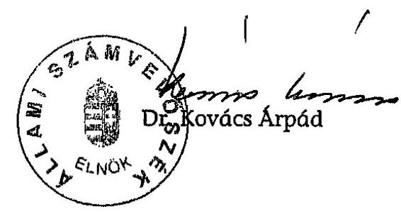
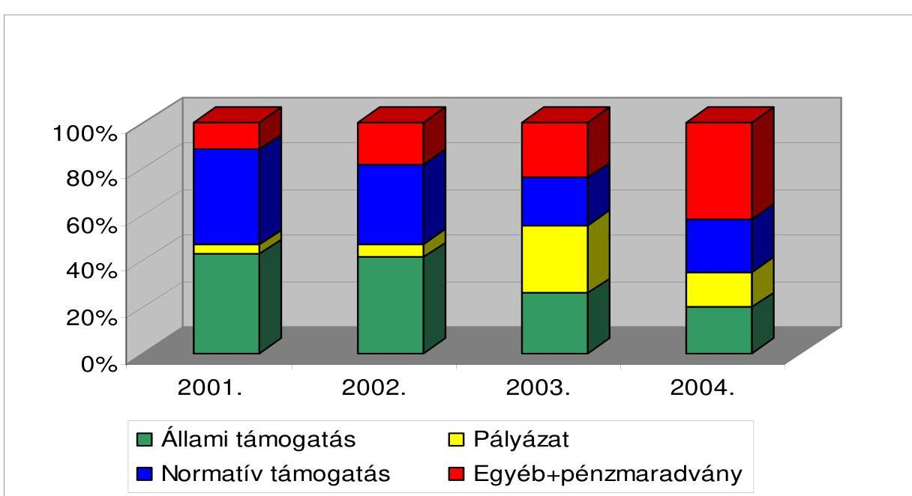
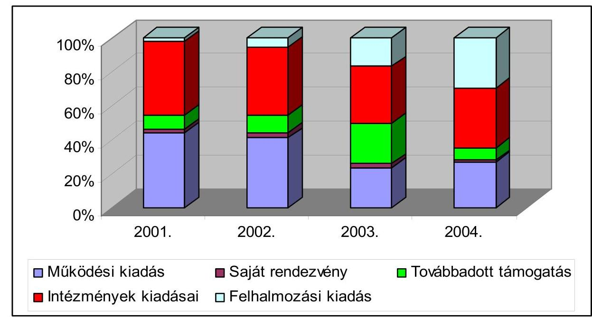

# JELENTÉS 

az Országos Horvát Önkormányzat 2001-2004. évi pénzügyi-gazdasági tevékenységének ellenőrzéséről

---

3. Önkormányzati és Területi Ellenőrzési Igazgatóság
3.1. Szabályszerűségi Ellenőrzési Főcsoport
Iktatószám: V-1008-025/2005.
Témaszám: 759
Vizsgálat-azonosító szám: V0248
Az ellenőrzést felügyelte:
Dr. Lóránt Zoltán
főigazgató
Az ellenőrzés végrehajtásáért felelős:
Dr. Elek János
általános főigazgató-helyettes
Az ellenőrzést vezette:
Horváth Balázs
főcsoportfőnök-helyettes
Az összefoglaló jelentést készítette:
Tóth István
tanácsadó
Az ellenőrzést végezték:
Tóth István Szendrey Lajos
tanácsadó számvevő

# A témához kapcsolódó eddig készített számvevőszéki jelentések: 

címe
Jelentés a Magyarországi Horvátok Országos Önkormányzata pénzügyi-gazdasági tevékenységének ellenőrzéséről
Jelentés az Országos Kisebbségi Önkormányzatok pénzügyi-gazdasági tevékenységének vizsgálatáról
Jelentés az Országos Horvát Önkormányzat pénzügyi-gazdasági tevékenységének vizsgálatáról

---

# TARTALOMJEGYZÉK 

BEVEZETÉS ..... 5
I. ÖSSZEGZŐ MEGÁLLAPÍTÁSOK, KÖVETKEZTETÉSEK, JAVASLATOK ..... 6
II. RÉSZLETES MEGÁLLAPÍTÁSOK ..... 10

1. A feladatellátás szervezettsége, szabályozottsága ..... 10
1.1. Az önkormányzat szervezeti és működési rendje ..... 10
1.2. A gazdálkodási feladatok szabályozása ..... 10
1.3. A feladatellátás szervezeti háttere ..... 11
2. Az Önkormányzat gazdálkodásának jellemzői ..... 12
2.1. A gazdálkodási tevékenység feltételei ..... 12
2.2. Vagyongazdálkodás, vagyonvédelem ..... 12
2.3. A gazdálkodás számviteli szabályozása ..... 12
3. Az éves költségvetések jóváhagyása, végrehajtása ..... 13
3.1. Az éves költségvetések elkészítése, elfogadása ..... 13
3.2. A költségvetés végrehajtása, zárszámadása ..... 13
3.3. A költségvetési feladatok teljesítése ..... 14
3.3.1. A költségvetési törvényben megállapított támogatás alakulása ..... 14
3.3.2. Pályázati támogatások elszámolása, felhasználása ..... 14
3.3.3. Kiadások alakulása, összetétele ..... 15
4. Az Önkormányzat számviteli tevékenysége ..... 15
4.1. Az éves beszámolók összeállítása, jóváhagyása ..... 15
4.2. A könyvvezetési kötelezettség teljesítése ..... 16
4.3. A bizonylati rend és a bizonylati fegyelem érvényesülése ..... 16
5. Az Önkormányzat belső ellenőrzési rendszere ..... 16

## MELLÉKLETEK

1. számú Az Önkormányzat 2001-2004. évi bevételei alakulása és megoszlása
2. számú Az Önkormányzat 2001-2004. évi kiadásai alakulása és megoszlása

---

.

---

# RÖVIDÍTÉSEK JEGYZÉKE 

| Amr. | Az államháztartás működési rendjéről szóló 217/1998. (XII. 30.) Korm. rendelet |
| :-- | :-- |
| ÁSZ | Állami Számvevőszék |
| MNEKK | Magyarországi Nemzeti Etnikai Kisebbségekért Közalapítvány |
| Nek. tv. | A nemzeti és etnikai kisebbségek jogairól szóló 1993. évi LXXVII. törvény |
| NEKH | Nemzeti és Etnikai Kisebbségi Hivatal |
| Önkormányzat | Országos Horvát Önkormányzat |
| Szja törvény | A személyi jövedelemadóról szóló - többször módosított - 1995. évi CXVII. törvény |
| SZMSZ | Szervezeti és Működési Szabályzat |
| Szt. | A számvitelről szóló - többször módosított - 2000. évi C. törvény |

---

.

---

# JELENTÉS 

## az Országos Horvát Önkormányzat 2001-2004. évi pénzügyi-gazdasági tevékenységének ellenőrzéséről

## BEVEZETÉS

A magyarországi horvát közösség létszámáról 2001. évben a népszámlálásnál átfogó felmérés készült, mely szerint 15620 fő horvát nemzetiségűnek, 14345 fő horvát anyanyelvűnek, további 4095 fő vallotta magát a horvát kulturális értékekhez, hagyományokhoz kötődőnek. A 2002. évi önkormányzati és kisebbségi önkormányzati választáson 107 helyi horvát kisebbségi önkormányzat alakult. Ebből 20 településen horvát kisebbségi települési önkormányzat működik. Az Országos Horvát Önkormányzat (továbbiakban: Önkormányzat) 2001-2004 között működési és fejlesztési feladataira 772354 ezer Ft költségvetési támogatásban részesült.

Az Állami Számvevőszékről szóló - többször módosított - 1989. évi XXXVIII. törvény 2. § (5) bekezdése, valamint a nemzeti és etnikai kisebbségek jogairól szóló 1993. évi LXXVII. törvény (továbbiakban: Nek. tv.) 57. §-ában kapott felhatalmazás alapján az Állami Számvevőszék (továbbiakban: ÁSZ) feladata a különböző állami forrásokból juttatott pénzeszközök felhasználása törvényességének és célszerűségének ellenőrzése a nemzeti és etnikai kisebbségi szerveteknél. Az ÁSZ 2005. évi ellenőrzési tervének megfelelően vizsgálta az Országos Horvát Önkormányzat (továbbiakban: Önkormányzat) 2001-2004. évi pénzügyi-gazdasági tevékenységének törvényességét, ehhez kapcsolódóan a 2005. évi költségvetés tervezését.

Az ellenőrzés célja: annak megállapítása volt, hogy

- az Önkormányzat a központi költségvetési támogatást a Nek. tv-ben meghatározott feladatokra használta-e fel, a felhasználás elszámolása során betartották-e a vonatkozó hatályos jogszabályi előírásokat;
- a gazdálkodás törvényessége, szabályszerűsége biztosított volt-e; a tervezési, gazdálkodási, beszámolási és könyvvezetési kötelezettségek előírásai érvényesültek-e;
- a szabályszerű gazdálkodás érdekében kialakított kontrollmechanizmusok megfelelően segítették-e a feladatok végrehajtását.

A helyszíni ellenőrzés: 2005. október 28-2005. december 22-e között az Önkormányzat székhelyén történt.

---

# 1. ÖSSZEGZŐ MEGÁLLAPÍTÁSOK, KÖVETKEZTETÉSEK, JAVASLATOK 

Az Önkormányzat a szervezeti és működési rendjére elfogadott, hatályos SZMSZ alapján működött. Céljai és feladatai teljesítéséhez jogszerűen megválasztotta döntéshozó, irányító szervezeteit. A közgyűlés és bizottságai, valamint az elnökség a hatásköri szabályozásnak megfelelően - hivatali szervezettel támogatva - végezte tevékenységét. A közgyűlés hivatala megfelelő személyi és tárgyi feltételeket biztosított a kisebbségi feladatok, gazdálkodási tevékenységek ellátásához. Az önkormányzati működés, ellátási, döntés-előkészítési és végrehajtási feladatait végző szervezet az elnök irányításával, önálló szabályozás alapján funkcionált.

Az országos kisebbségi feladatok eredményes ellátásához kulturális, információs és kiadói tevékenységet folytató közhasznú társaságot, valamint horvát nyelvű óvoda, iskola és diákotthon funkciójú tanintézményt működtettek. A tulajdonosi jogokat előírások szerint gyakorolták, intézményfenntartóként biztosították a folyamatos működés feltételeit. A feladatok fejlesztése céljából a szervezeti hátteret 2003-ban tudományos intézettel bővítették. Az alapítás az oktatási intézményhez hasonlóan részben önálló jogkörrel történt, bár az intézmények pénzügyi-gazdasági feladatainak ellátására kijelölt hivatal - társadalmi szervezetként - nem felelt meg az Amr. előírásának. Az ellentmondásos helyzet a Nek. tv. - ÁSZ által is javasolt - 2005. év végi módosításával elvileg rendeződött, mivel a hivatalnak országos költségvetési szervvé kell válnia.

A gazdálkodási feladatokat az önkormányzati SZMSZ hiányosan szabályozta. Meghatározta a gazdálkodás pénzügyi forrásait, az éves költségvetések és zárszámadások elfogadásának rendjét. A tervezési és beszámolási dokumentumok összeállításához, szakmai értékeléséhez azonban nem szabályozták az ellátandó konkrét feladatokat a Nek. tv-nek megfelelően. A közgyűlés át nem ruházható hatáskörébe tartozó gazdálkodási feladatokat a törvénnyel összhangban állapították meg. Ennek keretében a vagyonról általánosságban rendelkeztek, a törzsvagyon körét nem állapították meg.

A vagyongazdálkodással kapcsolatos rendelkezési, döntési jogkör szabályait betartották. A vagyon alakulására kiható intézkedésekről a közgyűlés határozattal döntött. Szabályos üzleti tranzakciók eredményeként az önkormányzat befektetett eszközeinek és értékpapírjainak együttes értéke a vizsgált időszakban közel megnégyszereződött. Stabil pénzügyi helyzetét a tőkeellátottsági mutató 96% feletti szintje is tükrözte. A vagyonvédelem érdekében a leltározásokat, kötelezettségvállalásokat szabályszerűen végezték. A nagy értékű vagyonelemekre biztosítási szerződést kötöttek. Gondoskodtak a feleslegessé vált vagyontárgyak hasznosításáról.

Az éves költségvetések és zárszámadások az országos kisebbségi feladatok forrásigényét és felhasználását összevontan tartalmazták. A feladatonkénti tervezést, szakmai értékelést a konkrét feladatok meghatározásának hiánya gá-

---

tolta. A szabályozás fogyatékossága miatt a költségvetési törvény alapján kapott működési célú támogatás megosztásáról nem rendelkeztek.

Az önkormányzat 2001-2004 között 952775 ezer Ft pénzforgalmi bevételből gazdálkodott, amelynek 81%-a költségvetési forrásokból teljesült. A költségvetési törvényben megállapított éves támogatás 2003-ig 1/3-dal nőtt, 2004-ben az előző évi szinten, 84400 ezer Ft összegben realizálódott. A pályázatok eredményeként 175882 ezer Ft támogatást nyertek el, amelyből 153457 ezer Ft-ot a NEKH folyósított kisebbségi intézményi feladatokra. A támogatások célja szerint képzési és üdülési központ kialakítására 104060 ezer Ft; ingatlan és eszközvásárlásra 40000 ezer Ft; tudományos intézet működésére 8000 ezer Ft; oktatási intézmény felújítására 1397 ezer Ft fedezetet kaptak. A közalapítványi és egyéb pályázatokból, összességében 116 programhoz sikerült kiegészítő költségvetési forráshoz jutni.

A működési és felhalmozási célú 2001-2004. évi támogatásokat a kötelezettségvállalási előírások betartásával, rendeltetésszerűen használták fel. A működési támogatás 71-92%-os hányadát a hivatal működtetésére fordították. Az Önkormányzat működési kiadásai 2001-2003 között szinten tartással teljesültek; 2004-ben közel 20%-kal nőttek a képzési és üdülési központ beindításával. A fennmaradó, összességében 72200 ezer Ft költségvetési forrásból - évente egyre növekvő számban - támogatták a horvát kisebbségi szervezeteket.

Az Önkormányzat alapítóként és fenntartóként rendelkezésre bocsátotta az intézményeket megillető normatív és működési támogatásokat, ezáltal folyamatosan biztosította a zavartalan feladatellátás feltételeit. Az intézményi támogatások dinamikus növekedésével 2003-2004. évre 30-36 000 ezer Ft-tal emelkedtek a kiadások a 2001. évihez képest. A pályázati szerződéses feltételekkel fogadott támogatásokból tervszerűen megvalósították az ütemezett beruházásokat és felújításokat. Az Önkormányzat saját forráslehetőségeit is mobilizálva a négyéves ciklus alatt 130887 ezer Ft-ot fordított felhalmozásra, amelynek 87%-a 2003-2004. évben valósult meg.

Az Önkormányzat mindenkor az előírásoknak megfelelően és határidőben eleget tett beszámolási, illetve elszámolási kötelezettségének. Ellenőrizhető dokumentálással, a rendezvénykiadásokkal összefüggésben 2908 ezer Ft összeggel visszautalta mindazokat a költségvetési támogatásokat, amelyek felhasználására a program alacsonyabb költsége, vagy meghiúsulása miatt nem került sor. A támogató szervezetek az elszámolási felülvizsgálaton túlmenően az Önkormányzatnál nem kontrollálták a költségvetési támogatások felhasználását.

Az Önkormányzat számviteli szabályozása az Szt. előírásaival összhangban számviteli politikából és a hozzárendelt értékelési, leltározási, pénzkezelési szabályzatból, valamint számlarendből állt. A 2001. január 1-jei hatállyal kiadott szabályozásokat a számviteli szolgáltató 2004-ben történt váltásánál újból hatályosították, de tartalmi változtatást kizárólag a számlarendben alkalmaztak. Az országos kisebbségi feladatok körének SZMSZ-ben való szabályozása helyett a számlarendből hagyták ki a tevékenységek költségeinek elkülönített nyilvántartására kijelölt számlaosztályt.

---

Az Önkormányzat a jogszabályi és belső előírásoknak megfelelő tartalommal, előírt határidőben állította össze egyszerűsített, éves beszámolóit, amelyet a zárszámadással egyidejűleg fogadott el a közgyűlés. A beszámolók a főkönyvi könyveléssel egyezően készültek, összeállításuk során érvényesítették a számviteli elveket. A könyvvezetést a számlarendnek megfelelően, kettős könyvvitellel teljesítették. A könyvviteli zárlatot, vagyonleltárral való alátámasztását, a főkönyvi és analitikus egyeztetéseket szabályszerűen elvégezték. A könyvelési bizonylatok kiállításánál az Szt., illetve az Szja törvény előírásai teljes körűen nem érvényesültek, de a könyvvezetésben feltárt hibák nem minősültek lényegesnek. A 2003. és 2004. IV. negyedévi adóbevallások a könyvelés helyes adataihoz képest 52, illetve 10 ezer Ft többletet mutattak, amely önellenőrzéssel rendezhető.

A belső ellenőrzés rendszerét és összehangolt működtetését, valamint a gazdasági, pénzügyi és ellenőrző bizottság feladatkörét nem szabályozták. A választott testület éves munkaterve szerint véleményezte az önkormányzat költségvetését és zárszámadását, intézményi és gazdálkodási célvizsgálatokat végzett. Tevékenységéről és tapasztalatairól rendszeresen beszámolt a közgyűlésnek. Az ellenőrzésekről készült jegyzőkönyvekben szabálytalanságot nem dokumentáltak. A vezetői és munkafolyamatba épített ellenőrzés gazdálkodási-számviteli szabályozásokban foglalt kontrolljai részeredménnyel jártak a feltárt hibák tanúsága szerint.

A helyszíni ellenőrzés megállapításainak hasznosítása mellett javasoljuk:

# az Önkormányzat Közgyűlésének: 

1. Egészítse ki az SZMSZ-t
a) a Nek. tv. 37. § (1) bekezdése alapján az országos kisebbségi önkormányzati feladatok megállapításával;
b) a belső ellenőrzés rendszerének szabályozásával, a gazdasági-pénzügyi és ellenőrzési bizottság hatás- és feladatkörének előírásával.
2. Határozza meg az éves költségvetés és zárszámadás összeállításának tartalmi követelményeit, a törzsvagyon körét.
3. Módosítsa a hivatal szervezeti és működési rendjére vonatkozó szabályozásokat, összhangban a Nek. tv. 39/B. § (5) bekezdésével a hivatal országos kisebbségi költségvetési szervként való meghatározásával.

## az Önkormányzat elnökének:

1. Határozza meg az SZMSZ módosításával összhangban a költségvetés és a zárszámadás összeállításának és jóváhagyásának rendjét, aktualizálja a számlarendet a tevékenységek szerinti támogatáselosztás és költségnyilvántartás érdekében.
2. Érvényesítse a bizonylatolás számviteli törvény 167. § (1) bekezdésében foglalt alaki és tartalmi követelményeit, az Szja törvény 25. § (2) és (3) bekezdése előírásait.

---

3. Rendeljen el önrevíziót a 2003. és 2004. évi adóbevallások és főkönyvi könyvelések eltéréseinek rendezésére.
4. Gondoskodjon a belső szabályozásnak megfelelő vezetői és munkafolyamatba épített ellenőrzés eredményes működéséről.

---

#
 II. RÉSZLETES MEGÁLLAPÍTÁSOK 

## 1. A feladatELLÁTÁS SZERVEZETTSÉGE, SZABÁLYOZOTTSÁGA

### 1.1. Az önkormányzat szervezeti és működési rendje

Az Önkormányzat Szervezeti és Működési Szabályzatában (továbbiakban: SZMSZ) a Nek tv. 35-39. §-ai alapján meghatározta szervezetét, tisztségviselőit. Megfelelően szabályozta a közgyűlés és a bizottságai működését, az elnökség és a képviselők jogait, kötelességeit. Részben kitért az Önkormányzat gazdálkodására, vagyonára, költségvetésére. Kijelölte az országos önkormányzat által működtetett intézményekkel való kapcsolattartásának módját. Az SZMSZ vizsgált időszaki módosításaival a szabályozás gazdálkodással kapcsolatos hiányosságait nem szüntették meg.

A legutóbbi önkormányzati választáson a közgyűlés létszámát 39-ről 52 főre emelték, négy állandó bizottságot választottak, továbbá kilenctagú elnökséget állítottak fel.

Az SZMSZ-ben, vagy egyéb belső szabályzatban az Önkormányzat feladatait és a feladatellátás rendszerét nem határozták meg, abból még a Nek tv-re való utalás is hiányzik. Az Önkormányzat törvényben meghatározott feladat- és hatáskörét a közgyűlés gyakorolta. A Nek tv. 37. § előírásaival összhangban határozták meg a közgyűlés hatásköréből át nem ruházható döntési jogköröket. Az Önkormányzat tevékenységét két közgyűlés között az elnök vezetésével az elnökség irányította. A testületi ülésekről az SZMSZ előírásainak megfelelően, a határozatokat magában foglaló írásos jegyzőkönyvek készültek.

### 1.2. A gazdálkodási feladatok szabályozása

Az SZMSZ meghatározta az Önkormányzat gazdálkodásának pénzügyi forrásait, valamint az éves költségvetések és zárszámadások elfogadásának rendjét. Belső előírás nem szabályozta a tervezési és beszámolási dokumentumok elkészítését. A szabályozási hiányosság összefüggött azzal, hogy a kisebbségi feladatokat nem rögzítették a Nek tv. 37. § (1) bekezdésében foglaltaknak megfelelően. Az éves költségvetésről és zárszámadásról szóló előterjesztés csak a bizottságok előzetes állásfoglalásával volt a közgyűlés elé terjeszthető. A dokumentumok elkészítéséért az elnök viselt felelősséget. A közgyűlés át nem ruházható hatáskörébe tartozott a költségvetés és a zárszámadás elfogadása; a törzsvagyon megállapítása és a vagyon elidegenítése, megterhelése; az intézmények alapítása és fenntartása; gazdasági társaság alapítása és társulás létrehozása. A közgyűlés gazdálkodásra vonatkozó határozatainak végrehajtása az elnök feladatkörébe tartozott.

A közgyűlés hivatala az SZMSZ előírása szerint - a közgyűlés által elfogadott ügyrenddel - látta el a működéssel, döntés-előkészítéssel és végrehajtással kapcsolatos feladatokat, biztosította a technikai és ügyviteli feltételeket.

---

# 1.3. A feladatellátás szervezeti háttere 

Az Önkormányzat országos kisebbségi céljai ellátásához - a vizsgált időszakban - egy közhasznú társaságot és két intézményt működtetett.

- 1999 óta közös tulajdonban működteti a Magyarországi Horvátok Szövetségével a Croatica Kulturális, Információs és Kiadói Kht-t, amely szervezői, kiadói, nyomdaipari és könyvkereskedelmi tevékenységet folytat. A közhasznú társaság feletti tulajdonosi, felügyeleti jogokat a jogszabályi és a belső előírások szerint gyakorolták.
- 2000-től funkcionál a hercegszántói Horvát Tanítási Nyelvű Óvoda, Általános Iskola és Diákotthon, amelynek feladata a horvát nyelvoktatás a közoktatásról szóló törvény 86. § (5) bekezdése alapján. Az iskola részben önálló gazdálkodó költségvetési szervként működött. Az Önkormányzat fenntartóként, megállapodás szerint biztosította a normatív támogatás elszámolását, a folyamatos működés feltételeit.
- 2003-ban alapította a Magyarországi Horvátok Tudományos Intézetét, amely részben önálló költségvetési szervként működik. Az intézet alapítása során betartották a belső előírásokat.

Az Önkormányzat az általa alapított részben önállóan gazdálkodó intézmények esetében a pénzügyi gazdasági feladatok ellátására az Önkormányzat hivatalát jelölte ki. Ez a kijelölés ellentétes volt az államháztartás működési rendjéről szóló 217/1998. (XII. 30.) Korm. rendelet (továbbiakban: Ámr.) 14. § (5) bekezdés a) pontjának előírásával, mely szerint a pénzügyi-gazdasági feladatok ellátására önállóan gazdálkodó költségvetési szervet kell kijelölni. Az Önkormányzat hivatala a kisebbségi önkormányzatok költségvetésének, gazdálkodásának, vagyonjuttatásának egyes kérdéseiről szóló 20/1995. (III. 3.) Korm. rendelet 2. § (1) bekezdésének előírása alapján a társadalmi szervezetek gazdálkodó tevékenységére vonatkozó szabályok szerint működött. Az Önkormányzat a vizsgált időszakban önállóan gazdálkodó költségvetési szervet nem tartott fenn. A törvénysértő helyzetet rendezte a Nek tv. 2005. évi módosítása. A törvény 39/B. § (5) bekezdése értelmében 2005. november 25-étől a „hivatal országos kisebbségi költségvetési szerv”. A kisebbségi önkormányzati képviselők választásáról, valamint a nemzeti és etnikai kisebbségekre vonatkozó egyes törvények módosításáról szóló 2005. évi CXIV. törvény 72. § (8) bekezdésben foglaltak szerint a központi költségvetési szervként történő gazdálkodás feltételeit 2008. január 1-ig kell kialakítani.

Az Önkormányzat az általa fenntartott intézményekkel megkötötte az Ámr. 14. § (5) bekezdés b) pontjában előírt megállapodást a felelősségvállalás és munkamegosztás rendjéről. Az intézmények költségvetését és beszámolóját az Ámr. 13. § (4) bekezdésének előírása szerint az Önkormányzat közgyűlése fogadta el. Az Önkormányzat az intézmények feletti felügyeleti jogait a vizsgált időszakban az előírásoknak megfelelően gyakorolta.

Az Önkormányzat a vizsgált években vállalkozási tevékenységének körét alapfeladatai ellátásának veszélyeztetése nélkül engedélyezte. Tényleges vállalkozási tevékenységet nem folytatott.

---

# 2. Az ÖNKORMÁNYZAT GAZDÁLKODÁSÁNAK JELLEMZŐI 

### 2.1. A gazdálkodási tevékenység feltételei

Az önkormányzati működés, döntés-előkészítés és végrehajtás operatív feladatait a közgyűlés hivatala önálló SZMSZ, ügyrend szerint végezte. Tevékenységét az elnök irányításával 2003-ig kilencfős alkalmazotti létszámmal látta el, amely nyugdíjazás folytán nyolc főre csökkent. A nyugdíjazás a gazdálkodással összefüggő számviteli, pénzügyi és munkaügyi feladatokat érintette, amelynek ellátására számviteli szolgáltatást végző társasággal kötöttek megállapodást. Az SZMSZ szabályozta a munkaköri feladatokat, az alkalmazás és megbízás a képesítési előírásoknak megfelelően történt.

Az Önkormányzat ingyenes használatú székháza közös a Fővárosi Horvát Önkormányzattal. A magyar állam tulajdonát képező ingatlan tervszerű állagvédelméről gondoskodtak. Az irodahelységek berendezését, felszereltségét folyamatosan fejlesztették.

Az Önkormányzatnál rendelkezésre álló személyi és tárgyi feltételek megfelelő hátteret biztosítanak a nemzetiségi célok folyamatos szervezéséhez, teljesítéséhez.

### 2.2. Vagyongazdálkodás, vagyonvédelem

Az Önkormányzat általánosságban határozta meg a tulajdonát képező ingatlan és ingó vagyont. Az SZMSZ előírása, illetve az ÁSZ kifogásoló megállapítása ellenére a törzsvagyon köréről közgyűlési döntés nem született. A vagyongazdálkodással kapcsolatos rendelkezési, döntési jogköröket Nek tv. 60. §-sal összhangban tartalmazta az SZMSZ, amelynek előírásait betartották. A vagyoni helyzet alakulására kiható intézkedések minden esetben közgyűlési határozatokon alapultak.

Az Önkormányzat a Nek tv. 63. § (4) bekezdése alapján tulajdonolt részvényeit forgatási célú értékpapírokra váltotta, lekötött betétbe helyezte és ingatlanvásárlásra fordította. Az üzleti tranzakciók eredményeként a befektetett eszközök és az értékpapírok együttes záró állománya a 2001. évi 90067 ezer Ft-ról, 2004. évben 354947 ezer Ft-ra nőtt. Hasonlóan stabil pénzügyi helyzetre utalt a saját tőke összes forrásra vetített tőkeellátottsági mutatójának 96,1-98,8% közötti szintje.

Az önkormányzati vagyon védelme érdekében az éves leltározásokat szabályszerűen végrehajtották és dokumentálták, a kötelezettségvállalásnál érvényesítették az összeférhetetlenségi és hatásköri korlátozásokat, gondoskodtak a feleslegessé vált vagyontárgyak hasznosításáról és selejtezéséről. Az épületekre, járművekre és berendezésekre biztosítási szerződést kötöttek.

### 2.3. A gazdálkodás számviteli szabályozása

Az Önkormányzat a számviteli törvény 14. § (3) és (5) bekezdése alapján 2001. január 1-jei hatállyal kiadta a számviteli politikáját és a hozzárendelt értékelési, leltározási, pénzkezelési szabályzatot, valamint számlarendjét. A számviteli szolgáltató 2004. évben történt váltásánál a szabályzatokat újból hatályosították. Az országos kisebbségi feladatok SZMSZ-ben való szabályozásának hiányában kihagyták a számlarendből a tevékenységek költségeinek elkülönített nyilvántartására kijelölt 7. számlaosztályt. A Nek tv-ben meghatározott szakmai feladatok pénzügyi értékelhetősége céljából analitikus költséggyűjtést nem írtak elő.

A számviteli szabályozásokat mindkét időszakban az Önkormányzat elnöke jogszerűen helyezte hatályba. A szabályozások a számviteli törvény rendelkezéseivel összhangban - a számlarendi hiányosságot kivéve - a gazdálkodási sajátosságokra figyelemmel készültek.

# 3. AZ ÉVES KÖLTSÉGVETÉSEK JÓVÁHAGYÁSA, VÉGREHAJTÁSA 

### 3.1. Az éves költségvetések elkészítése, elfogadása

Az SZMSZ és más belső előírások nem határozták meg az országos kisebbségi feladatokat. A szabályozási fogyatékosság következtében a feladatonkénti forrásigényről és felhasználási jogcímről, ezen belül a központi költségvetési támogatás működési célú megosztásáról elkülönítetten nem döntöttek.

A költségvetések a bevételeket és kiadásokat főbb jogcímek szerint csoportosították, a kiadásokon belül a működési kiadásokat tovább részletezték. A bevételek és kiadások tervezése összehasonlítható, azonos szerkezetben történt. A költségvetés elkészítéséhez minden ellenőrzött évben felhasználták az éves rendezvénytervet, amely tartalmazta az egyes évek kulturális programjait a várható ráfordítások megjelölésével. A költségvetések elfogadása 2001-2005 között az SZMSZ előírásának megfelelően - előzetes bizottsági véleményekkel kiegészítve - közgyűlési határozattal történt.

### 3.2. A költségvetés végrehajtása, zárszámadása

Az Önkormányzat kötelezettségvállalási és utalványozási rendje az elnököt általános kötelezettségvállalási jogkörrel ruházta fel, amely kiterjedt az éves költségvetésben tervezett bevételek beszedésére, a kiadások teljesítésére, valamint a költségvetésben nem szereplő feladatokra is, de utóbbi esetben tájékoztatási kötelezettséget írt elő. Az éves költségvetések végrehajtásánál folyamatosan gondoskodtak az Önkormányzat pénzügyi egyensúlyának fenntartásáról. Az Önkormányzat 2001-2004 között minden évben bevételi többlettel zárt. A 2001. évi bázishoz képest bevételei 189,7%-kal, illetve kiadásai 99,8%-kal nőttek. A változás a forrásoknál és felhasználásoknál állandó emelkedést mutatott, miközben a bevételek és kiadások jogcímszerkezetében is jelentős módosulás következett be (1-2 számú melléklet).

A zárszámadás: az egyszerűsített éves beszámolóval együtt bizottsági ajánlásra fogadta el az Önkormányzat közgyűlése. A legfőbb döntéshozó szerv által elfogadott zárszámadások a kisebbségi feladatok teljes körű részletezésének hiányában nem adtak lehetőséget a megfelelő szakmai és pénzügyi értékelésre.

---

# 3.3. A költségvetési feladatok teljesítése 

Az Önkormányzat 2001-2004 között együttes pénzforgalmi bevételei alapján 952775 ezer Ft-ból gazdálkodott, amelyből 301600 ezer Ft-ot a költségvetési törvény alapján, 175882 ezer Ft-ot pályázat eredményeként, 294872 ezer Ft-ot normatív támogatásként a központi költségvetésből kapott, amely együttesen az összbevétel 81%-át tette ki.

### 3.3.1. A költségvetési törvényben megállapított támogatás alakulása

Az éves költségvetési törvények alapján 2001. évben 63300 ezer Ft, 2002. évben 69500 ezer Ft, 2003. évben 84400 ezer Ft, 2004. évben 84400 ezer Ft összegű állami támogatást kapott.

A támogatást az Önkormányzat a hivatal működésére és a Nek tv-ben meghatározott feladatok végrehajtásának finanszírozására használta fel. Beszámolási kötelezettségét a NEKH-nek az előírásnak megfelelően, határidőben teljesítette.

### 3.3.2. Pályázati támogatások elszámolása, felhasználása

Az Önkormányzat által a központi költségvetésből a nemzeti és etnikai kisebbségi feladatokra pályázati úton elnyert támogatások a vizsgált évekre a következők szerint alakultak:

Adatok ezer Forintban

| Sor-   sz. | Megnevezés | $\mathbf{2 0 0 1 .}$ | $\mathbf{2 0 0 2 .}$ | $\mathbf{2 0 0 3 .}$ | $\mathbf{2 0 0 4 .}$ |
| :-- | :-- | --: | --: | --: | --: |
| 1. | Közalapítványi pályázatok | 4110 | 5911 | 3920 | 2480 |
| 2. | Egyéb pályázatok belföldi | 1380 | 3589 | 1035 | 0 |
| 3. | Kisebbségi intézmény átvétel-   ének és fenntartásának támoga-   tására pályázat |  |  | 91397 | 62060 |
|  | 1-3 jogcímből összes bevétel | $\mathbf{5 4 9 0}$ | $\mathbf{9 5 0 0}$ | $\mathbf{9 6 3 5 2}$ | $\mathbf{6 4 5 4 0}$ |

A számadatokból tükröződik, hogy a központi költségvetésből pályázati úton juttatott támogatás a 2003-2004 évekre a kisebbségi intézményi feladatokkal összefüggésben ugrásszerűen növekedett.

- 2003. évben 91397 ezer Ft, 2004. évben 62060 ezer Ft összegű támogatást nyert el a NEKH-tól intézmények átvételére és fejlesztésére.
 2003-ban ingatlanvásárlás és eszközbeszerzés céljára 40000 ezer Ft, a képzési és üdülési központja kialakítására 50000 ezer Ft, a hercegszántói oktatási intézmény felújításához 1397 ezer Ft támogatást kapott.
- 2004. évben tudományos intézetének működéséhez 8000 ezer Ft, a képzési és üdülési központja kialakításához 54060 ezer Ft pályázati támogatást nyert el.
- A többi támogatást 2001. évben 32 db, 2002. évben 43 db, 2003. évben 27 db, 2004. évben 14 db program megvalósítására kapták.

---

A szervezetek az Ámr. 87-89. §-aiban foglalt tartalmi követelményekkel kötött szerződés alapján folyósították a támogatásokat. A vizsgált években a kapott támogatásból az Önkormányzat nemzeti kisebbségi, anyanyelvű rendezvényeket valósított meg, horvát nyelvű kiadványokat jelentetett meg, általa fenntartott intézményeket fejlesztett, ingatlant újított fel. A pályázati támogatások célszerű elszámolása kivétel nélkül határidőben, szabályszerűen dokumentálva történt. Az elszámolásokhoz kapcsolódóan 2001. évben 323 ezer Ft-ot, 2002. évben 1858 ezer Ft-ot, 2003. évben 608 ezer Ft-ot, 2004. évben 119 ezer Ft-ot, mint felhasználatlan támogatást a támogatónak visszautalták, a tervezettnél alacsonyabb költségek, illetve a programok elmaradása miatt.

A 2001-2004. évi támogatások rendeltetésszerű felhasználását, elszámolását és az elszámolások dokumentálásának szabályszerűségét, a támogatást nyújtók a helyszínen nem ellenőrizték.

# 3.3.3. Kiadások alakulása, összetétele 

A kiadások éves összege a 2001. évi 131151 ezer Ft-ról 2004-ben 262087 ezer Ft-ra emelkedett. A kiadások összetételében lényeges változást eredményezett az intézményi feladatok 2003-2004. évi pályázati támogatása. Az ütemezett beruházásokat és felújításokat tervszerűen megvalósították.

Az Önkormányzat felhalmozási kiadásainak 2003. évi összegében a 38249 ezer Ft összegű értékpapír vásárlás volt a meghatározó. A felhalmozási kiadások mértéke a 2001. évi 1,9%-ról 29,4%-ra nőtt.

Az Önkormányzat működési kiadása a vizsgált időszakban mintegy 22%-al nőtt, de a kiadásokon belüli részaránya ennek ellenére 44,3%-ról 27,1%-ra csökkent a felhalmozási kiadások növekedése miatt.

Az Önkormányzat különféle horvát kisebbségi szervezetek részére a központi költségvetésből kapott források terhére 2001. évben 18 db szervezetnek 1068 ezer Ft, 2002. évben 23 szervezetnek 2747 ezer Ft, 2003. évben 47 szervezetnek 60421 ezer Ft, 2004. évben 55 szervezetnek 7962 ezer Ft összegű támogatást adott. A 2003. évi támogatásból 50000 ezer Ft-ot a közhasznú társaságnak adott tovább ingatlanvásárlás és eszközbeszerzés céljából.

## 4. Az ÖNKORMÁNYZAT SZÁMVITELI TEVÉKENYSÉGE

### 4.1. Az éves beszámolók összeállítása, jóváhagyása

Az Önkormányzat beszámolási kötelezettségének az Szt. szerinti egyes egyéb szervezetek beszámoló-készítési és könyvvezetési kötelezettségének sajátosságairól szóló 224/2000. (XII. 19.) számú Korm. rendelet előírásai alapján tett eleget. A beszámoló formája a 6. § (4) bekezdés ba) pontja alapján egyszerűsített éves beszámoló volt, amely a rendelet 4. számú melléklete szerinti mérlegből és az 5. számú melléklet szerinti eredmény-kimutatásból állt. Az éves beszámolókat minden ellenőrzött évben, a fenti jogszabályban meghatározott formai követelményeknek megfelelően és az előírt május 31-i határidőre készítették el. A beszámolókat a közgyűlés határozattal fogadta el. A beszámolók adatai a vizs-

---

gált években megegyeztek a főkönyvi könyvelés adataival, összeállításuk során érvényesítették a számviteli alapelveket.

# 4.2. A könyvvezetési kötelezettség teljesítése 

Az Önkormányzat könyvvezetését számviteli rendjének megfelelően kettős könyvvitellel teljesítette. Ennek szabályait hatályos számlarend rögzítette. A számlarendben meghatározták a főkönyvi számlák analitikus nyilvántartási kapcsolatát. A kettős könyvvitel vezetését a külső szolgáltatói megbízással egyidejűleg számítógépes rendszerűvé alakították át.

A könyvviteli zárlatot, az eszközök és a források leltározását, az analitikus nyilvántartások és a főkönyvi könyvelés egyeztetését szabályszerűen elvégezték.

Eseti hibaként fordult elő, hogy 2003. évben 14 ezer Ft összegű százalékos egészségügyi hozzájárulást tételesnek könyveltek; 2004. évben a dolgozóknak kifizetett 250 ezer Ft összegű ruhapénz után együttesen 171 ezer Ft befizetési kötelezettséget nem könyvelték, de az adóbevallásban az előírások szerinti összegben szerepeltették.

Az adóbevallások és az azokhoz kapcsolódó számfejtések és a főkönyvi könyvelés alapján megállapítható volt, hogy 2003. és 2004. évben az adóbevallások nem megfelelő adatot tartalmaztak. A 2003. IV. negyedévi adóbevallásban a munkaadói járulékot 66 ezer Ft-tal nagyobb, a százalékos egészségügyi hozzájárulást 14 ezer Ft-tal kisebb összegben mutatták ki az előírások betartásával számított értéknél. A 2004. IV. negyedévi adóbevallásban 10 ezer Ft-tal nagyobb összegű tételes egészségügyi hozzájárulást tüntettek fel az előírások betartásával számított, és a könyvelésben szereplő összegnél.

### 4.3. A bizonylati rend és a bizonylati fegyelem érvényesülése

A kiadások teljesítésére, banki átutalások kezdeményezésére és azok főkönyvi könyvelésére minden esetben a gazdasági eseményről kiállított alapbizonylat alapján került sor.

A könyvelés alapjául szolgáló bizonylatok nem feleltek meg az Szt. 167. § (1) bekezdésében meghatározott követelményeknek, mivel a bizonylatokról hiányzott az érintett könyvviteli számlára való hivatkozás és a könyvelés időpontja; a pénztárbizonylatok 40%-áról a pénzfelvétel igazolása; 2003-ban a kontírozás jelzése; 2004. júliusától a szállítói számlákról az érvényesítő aláírása. A kiküldetési költségek bizonylatolása nem felelt meg az Szja törvény 25. § (2) bekezdés c) pontja és (3) bekezdése, valamint az 5. számú melléklet II/7. pontja előírásának.

## 5. Az ÖNKORMÁNYZAT BELSŐ ELLENŐRZÉSI RENDSZERE

Az SZMSZ-ben a belső ellenőrzés hierarchikus rendszeréről, összehangolt jogosultságáról és működtetéséről nem rendelkeztek. A gazdasági, pénzügyi és ellenőrző bizottság megválasztását előírták, feladatkörét nem határozták meg. A testület saját működési rendjét nem állapította meg, bár az SZMSZ erről rendelkezett. A bizottság elfogadott munkaterve szerint vizsgálta a pályázat útján

---

elnyert támogatások elszámolását; a pénzkezelés és leltározás szabályszerűségét; a tanintézmény pénzügyi teljesítését; véleményezte a költségvetést és zárszámadást. Ellenőrzésének tapasztalatairól minden évben beszámolt a közgyűlésnek. A bizottsági jegyzőkönyvekben szabálytalanságot nem dokumentáltak.

A vezetői ellenőrzés a kötelezettségvállalási és utalványozási rendnek megfelelően funkcionált. A munkafolyamatba épített ellenőrzés számviteli szabályozásokban meghatározott követelményei részben teljesültek, a kontroll tevékenység eredményeként nem tárták fel a könyvvezetést, bizonylatolást és költségelszámolást érintő hibákat.

Budapest, 2006. március 1.

Melléklet: $\quad 2 \mathrm{db} \quad 2 \mathrm{lap}$

---

# AZ ÖNKORMÁNYZAT 2001-2004. ÉVI BEVÉTELEI ALAKULÁSA ÉS MEGOSZLÁSA 

## A/ Bevételek jogcímenkénti alakulása

Adatok ezer Ft-ban

| Bevétel jogcímei | $\mathbf{2 001.}$ | $\mathbf{2002.}$ | $\mathbf{2003.}$ | $\mathbf{2004.}$ |
| :-- | :--: | :--: | :--: | :--: |
| Állami támogatás | 63300 | 69500 | 84400 | 84400 |
| Pályázat | 5490 | 9500 | 96352 | 64540 |
| Normatív támogatás | 60662 | 58188 | 77664 | 98358 |
| Egyéb bevétel | 9511 | 14624 | 46174 | 110112 |
| Pénzforgalmi bevétel | $\mathbf{138963}$ | $\mathbf{151812}$ | $\mathbf{304590}$ | $\mathbf{357410}$ |
| Előző évi pénzmaradvány | 7767 | 15579 | 21222 | 67622 |
| Összesen: | $\mathbf{146730}$ | $\mathbf{167391}$ | $\mathbf{325812}$ | $\mathbf{425032}$ |
| Növekedési \%* | -- | $\mathbf{14,1}$ | $\mathbf{122,0}$ | $\mathbf{189,7}$ |

*Növekedés százaléka a 2001. évi bázishoz viszonyítva

## B/ Bevételek jogcímenkénti megoszlása

---

# AZ ÖNKORMÁNYZAT 2001-2004. ÉVI KIADÁSAI ALAKULÁSA ÉS MEGOSZLÁSA 

## A/ Kiadások jogcímenkénti alakulása

Adatok ezer Ft-ban

| Kiadás jogcímei | $\mathbf{2001.}$ | $\mathbf{2002.}$ | $\mathbf{2003.}$ | $\mathbf{2004.}$ |
| :-- | :--: | :--: | :--: | :--: |
| Működési kiadások | 58105 | 59973 | 59873 | 71085 |
| Saját rendezvények | 2143 | 4581 | 6621 | 2039 |
| Továbbadott támogatás | 11265 | 15655 | 61015 | 19111 |
| Intézmények kiadásai | 57175 | 58083 | 87248 | 92738 |
| Felhalmozási kiadás | 2463 | 7877 | 43433 | 77114 |
| Összesen: | $\mathbf{131151}$ | $\mathbf{146169}$ | $\mathbf{258190}$ | $\mathbf{262087}$ |
| Növekedési \%* | -- | $\mathbf{11,5}$ | $\mathbf{96,9}$ | $\mathbf{99,8}$ |

Növekedés százaléka a 2001. évi bázishoz viszonyítva

## B/ Kiadások jogcímenkénti megoszlása

