# JELENTÉS 

## a Területfejlesztés fejezet működésének ellenőrzéséről

---

# 2. Államháztartás Központi Szintjét Ellenőrző Igazgatóság 

2.3. Átfogó Ellenőrzési Főcsoport
V-09-055/2005-2006.
Témaszám: 768
Vizsgálat-azonosító szám: V-0233

## Az ellenőrzést felügyelte:

Bihary Zsigmond
főigazgató
Az ellenőrzés végrehajtásáért felelős:
Hegedüsné dr. Müllern Veronika
főcsoportfőnök
Az ellenőrzést vezette:
Papp Sándor
számvevő főtanácsos

## Az ellenőrzést végezték:

| Bank Lajos számvevő tanácsos, tanácsadó | Beck Miklós számvevő tanácsos | Dr. Boda Sándor számvevő tanácsos |
| :--: | :--: | :--: |
| Csényi István számvevő | Csóry Györgyné számvevő tanácsos, főtanácsadó | Fekete Gábor számvevő tanácsos |
| Gregor Andrea számvevő gyakornok | Dr. Horváth Erika számvevő | Kalmár István számvevő tanácsos |
| Kisgergely István számvevő gyakornok | Koczor László számvevő | Dr. Ligeti Miklós számvevő tanácsos, tanácsadó |
| Nagy Ákos számvevő | Nagy Attila számvevő | Patthy Júlia számvevő gyakornok |
| Sinka Zoltán számvevő | Szélpál Ferenc számvevő tanácsos | Tukacs Éva számvevő tanácsos |
| Újvári Józsefné számvevő | Vitányi István számvevő |  |

A témához kapcsolódó eddig készített számvevőszéki jelentések:

|  | Cím | Év/sorszám |
| :-- | :-- | :-- |
| Jelentés a területfejlesztési tanácsok és munkaszervezeteik rendelkezésére | 2003./0327 |  |
| álló támogatások igénylésének és felhasználásának ellenőrzéséről |  |  |
| Az ÁSZ által évente végrehajtott a központi költségvetés végrehajtását | 2002./0329 |  |
| célzó ellenőrzések | 2003./0443 |  |
|  | 2004./0540 |  |

Jelentéseink az Országgyűlés számítógépes hálózatán és az Interneten a www.asz.hu címen is olvashatók.

---

# TARTALOMJEGYZÉK 

BEVEZETÉS ..... 7
I. ÖSSZEGZŐ MEGÁLLAPÍTÁSOK, KÖVETKEZTETÉSEK, JAVASLATOK ..... 10
II. RÉSZLETES MEGÁLLAPÍTÁSOK ..... 23

1. A fejezet irányítási, felügyeleti feladatainak kialakítása, működése ..... 23
1.1. A területfejlesztés helye, szerepe a kormányzati struktúrában ..... 23
1.2. A fejezet szervezeti kialakítása ..... 29
1.3. A fejezetirányító feladatok ellátása és korlátai ..... 31
1.4. A fejezet működésének szabályozottsága ..... 33
1.5. A PHARE és az INTERREG forrásokat kezelő szervezetek működése ..... 35
1.6. A fejezet belső kontroll rendszereinek kialakítása ..... 37
1.7. A területfejlesztési feladatok informatikai háttere ..... 40
1.8. A fejezet költségvetési gazdálkodása ..... 41
2. A területfejlesztési politika érvényesülése, és a források felhasználásának szervezeti, döntési keretei ..... 45
2.1. A régiók illetékességi területének kialakítása ..... 45
2.2. A területfejlesztési politika érvényesülése ..... 46
2.3. A monitoring és értékelő rendszerek működtetése ..... 49
2.4. A területfejlesztésben résztvevő szervezetek működése ..... 51
3. A területfejlesztési célokat szolgáló források felhasználása ..... 56
3.1. A decentralizált támogatási források céljai, felhasználásuk ..... 56
3.2. Országos jelentőségű területfejlesztési programok ..... 58
3.3. A terület- és régiófejlesztési célelőirányzat központi keretének felhasználása ..... 61
3.4. A Regionális Fejlesztés Operatív Program forrásainak felhasználása ..... 62
3.5. A PHARE, PHARE CBC és INTERREG támogatások felhasználása ..... 65
3.6. Turisztikai célelőirányzat felhasználása ..... 68
3.7. A lakás és építésügyi előirányzatok felhasználása ..... 70
4. A korábbi ÁSZ vizsgálatok során tett megállapítások és javaslatok utóellenőrzése ..... 79

---

# MELLÉKLETEK 

1. számú A Területfejlesztés fejezetet felügyelő tárca nélküli miniszter levele
2. számú A regionális fejlesztésért és felzárkóztatásért felelő tárca nélküli miniszter által felügyelt szervezetek
3. számú Területfejlesztési célú források 2005-ben
4. számú Területfejlesztési-, lakásügyi-, építésügyi-, turisztikai célú források, valamint cél és címzett támogatások 2005-ben
5. számú A 2004. január 1-től hatályos KSH kistérségi rendszer
6. számú A területfejlesztés szempontjából kedvezményezett 95 kistérség
7. számú A területfejlesztés szempontjából leghátrányosabb helyzetű 48 kistérség
8. számú A területfejlesztés szempontjából hátrányosabb helyzetű 47 kistérség
9. számú A területfejlesztés szempontjából a leghátrányosabb kistérségekhez nem tartozó leghátrányosabb helyzetű 235 település
10. számú A területfejlesztés szempontjából átmenetileg kedvezményezett 15 kistérség
11. számú Támogatások megoszlása főbb célelőirányzatonként az 1999-2003. években
12. számú Egy főre jutó támogatások eloszlása megyénként az 1999-2003. években
13. számú Támogatások és népesség megoszlása a területfejlesztési kedvezményezettség szerint az 1999-2003. években (\%)
14. számú A megyék egy főre jutó GDP értékének változása (2003-as áron)
15. számú A korábbi ÁSZ vizsgálatok utóellenőrzése
16. számú 1-2. számú tanúsítványok

## FÜGGELÉK

1. számú Emlékeztető Pécsett a döntéshozói szinten megtartott fókusz-csoport megbeszélésről.
2. számú Emlékeztető Pécsett a program-végrehajtói szinten megtartott fókuszcsoport megbeszélésről
3. számú Emlékeztető Debrecenben a döntéshozói szinten megtartott fókusz-csoport megbeszélésről
4. számú Emlékeztető Debrecenben a program-végrehajtói szinten megtartott fó-kusz-csoport megbeszélésről

---

# RÖVIDÍTÉSEK JEGYZÉKE 

| ÁSZ | Állami Számvevőszék |
| :--: | :--: |
| Áht. | 1992. évi XXXVIII. törvény az államháztartásról |
| Ámr. | 217/1998. (XII. 30.) Korm. rendelet az államháztartás működési rendjéről |
| BM | Belügyminisztérium |
| EMIR | Egységes Monitoring Információs Rendszer |
| ÉMI Kht. | Építésügyi Minőségellenőrző Intézet Közhasznú Társaság |
| FVM | Földművelési és Vidékfejlesztési Minisztérium |
| GKM | Gazdasági és Közlekedési Minisztérium |
| KEHI | Kormányzati Ellenőrzési Hivatal |
| KvVM | Környezetvédelmi és Vízügyi Minisztérium |
| KFT | Kistérségi Fejlesztési Tanács |
| MÁK | Magyar Államkincstár |
| MeH | Miniszterelnöki Hivatal |
| MFT | Megyei Fejlesztési Tanács |
| MLI Kht. | Magyar Lakás-innovációs Kht. |
| MT Rt. | Magyar Turizmus Részvénytársaság |
| MTH | Magyar Turisztikai Hivatal |
| MTRFH | Magyar Terület- és Regionális Fejlesztési Hivatal (2005. szeptember 1-től, Országos Területfejlesztési Hivatal, OTH) |
| NFT | Nemzeti Fejlesztési Terv |
| NTH | Nemzeti Területfejlesztési Hivatal |
| NUTS | Nomenclature des Unités Territoriales Statistiques |
| OLÉH | Országos Lakás- és Építésügyi Hivatal |
| OTH | Országos Területfejlesztési Hivatal, 2005. szeptember 1-ig MTRFH |
| OTK | Országos Területfejlesztési Koncepció |
| OTMR | Országos Támogatási Monitoring Rendszer |
| OTT | Országos Területfejlesztési Tanács |
| PM | Pénzügyminisztérium |
| RFF TNM | Regionális Fejlesztésért és Felzárkóztatásért felelős tárca nélküli miniszter |
| RFH Rt. | Regionális Fejlesztési Holding Rt. |
| RFT | Regionális Fejlesztési Tanács |
| RFÜ | Regionális Fejlesztési Ügynökség |
| RIB | Regionális Idegenforgalmi Bizottság |
| ROP | Regionális Fejlesztés Operatív Program |
| SZMSZ | Szervezeti és Működési Szabályzat |
| TeIR | Területfejlesztési és Területrendezési Információs Rendszer |
| TFC | Területfejlesztési Célelőirányzat |
| TFI | Területi Főépítészeti Iroda |
| Tftv. | 1996. évi XXI. törvény a területfejlesztésről és a területrendezésről |

---

| TKH | Területpolitikai Kormányzati Hivatal |
| :-- | :-- |
| TRFC | Területi- és Regionális Fejlesztési Célelőirányzat |
| TÖT | Területfejlesztési Önkormányzati Társulás |
| TTFC | Térség- és Településfelzárkóztatási Célelóirányzat |
| VÁTI Kht. | VÁTI Magyar Regionális Fejlesztési és Urbanisztikai Közhasznú   Társaság |

---

# ÉRTELMEZŐ SZÓTÁR 

PHARE

PHARE CBC
INTERREG

NUTS

A területfejlesztési programok az ország hátrányos helyzetben lévő régióit, a gazdasági szerkezetátalakítás és intézményfejlesztés keretében támogatták.
A határon átnyúló együttműködés programjai, a közvetlenül európai uniós határtérségek támogatását szolgálják. Az Európai Unió négy Közösségi Kezdeményezési Programjának egyike, amely - az EU belső vagy külső határán való elhelyezkedésük miatt - hátrányos helyzetű régiókat támogat határon átnyúló projektek finanszírozásával. Magyarország összesen 8 INTERREG programban vesz részt 2004-2006 között.
Az Európai Unió területbeosztása (Nomenclature des Unités Territoriales Statistiques)

---

.

---

# JELENTÉS   a Területfejlesztés fejezet működésének ellenőrzéséről 

## BEVEZETÉS

Az Európai Unióban kialakulthoz igazodó területfejlesztés - mint a kormányzati szektor törvényi megalapozása és szervezeti kiépítése - a rendszerváltó országokban csak a kilencvenes évek közepén kezdődött meg. A területfejlesztés az EU intézmény- és forrásrendszerének, valamint ezek fejlesztésének szinte teljes területével érintkezik, ezért az intézményrendszer szervezeti, szabályozási, személyi felkészültsége kulcskérdés az ország fejlődésének és az ehhez szükséges források megteremtésének szempontjából. Ez a körülmény mind kormányzati, mind területi szinten kapacitás átcsoportosításokat indokolt.

A területfejlesztési politika elsődlegesen a területi egyenlőtlenségek mérséklésére hozta létre az eszköz- és intézményrendszerét, melynek alapelemeit a területfejlesztési tanácsok helyi szintjei, a szabályozó joganyagok, a területi tervezés, a területi információs rendszer, a pénzügyi eszközök, valamint a térségi gazdaságfejlesztési eszközök képezik.

A Területfejlesztés fejezet 2005. január 1-ével jött létre a Magyar Köztársaság 2005. évi költségvetésről szóló törvény alapján. A fejezet irányítását a regionális fejlesztésért és felzárkóztatásért felelős tárca nélküli miniszter látja el, tevékenységi köre újszerű, amelyet sajátos szervezeti keretek között gyakorol. A fel-adat- és hatásköréről a 293/2004. (X. 28.) Korm. rendelet rendelkezik, mely szerint a miniszter irányítja - többek között - a területpolitikai, a területfejlesztési, a területrendezési, a régiófejlesztési, az idegenforgalmi, továbbá az építés- és a lakásügyi állami feladatok ellátását.

A fejezet intézményrendszerének kulcsszerepe van a Nemzeti Fejlesztési Terv Regionális Fejlesztés Operatív Programjának lebonyolításában, ill. az Európai Unióból származó területfejlesztési támogatások felhasználásában. A fejezet szervezetét az önállóan gazdálkodó költségvetési szerv, az alapfeladatokat és központi igazgatási feladatokat ellátó Magyar Terület- és Regionális Fejlesztési Hivatal; illetve a részben önállóan gazdálkodó költségvetési szervek; a Magyar Turisztikai Hivatal, az Országos Lakás és Építésügyi Hivatal, a Területi Főépítészeti Irodák alkotják. Ezek a szervezetek korábban más fejezeteken belül működtek. A feladatellátásban különböző szintű és területi illetékességű szervek is szorosan részt vesznek, így az Országos Területfejlesztési Tanács, 19 megyei fejlesztési tanács, 7 regionális fejlesztési tanács, 168 kistérségi fejlesztési tanács és a területfejlesztési önkormányzati társulások.

---

A Magyar Köztársaság 2005. évi költségvetése szerint a fejezet bevételi és kiadási előirányzata 292,5 milliárd Ft. A kiadási előirányzatból 4,2 milliárd Ft az intézmények működési előirányzata, a fejezeti kezelésű előirányzatok összege 288,3 milliárd Ft, ezen belül a lakásépítések támogatása 215 milliárd Ft-ot, az INTERREG előirányzatok 2,6 milliárd Ft-ot, a PHARE támogatással megvalósuló programok előirányzata 12,6 milliárd Ft-ot tesz ki. A fejezet látja el a Regionális Operatív Program fejezetre jutó feladatait is, ennek keretében az EU forrásokkal együtt 38,1 milliárd Ft-ot, ebből a hazai társfinanszírozás összege 7,6 milliárd Ft-ot kezel.

Az ellenőrzés célja ${ }^{1}$ annak értékelése volt, hogy a 2005. évben létrehozott fejezet szervezeti, és intézményi irányítási és működési rendje megfelelő keretet biztosított-e a feladatok hatékony és eredményes ellátásához, értékeltük a fejezetbe integrált területfejlesztési programok célkitűzéseinek megvalósulását, valamint a fejezet által indított új programok kezelési mechanizmusának célszerűségét, és azt, hogy ezek megfelelő alapot biztosítanak-e a programok hatékony és eredményes végrehajtáshoz. Utóellenőrzés keretében a korábbi ÁSZ ellenőrzésekről szóló jelentésekben megfogalmazott javaslatok hasznosulását tekintettük át. Az eszközrendszeren belül a helyszíni ellenőrzés során értékeltük a megyei területfejlesztési tanácsokhoz és regionális fejlesztési tanácsokhoz decentralizált közvetlen területfejlesztési pénzügyi eszközök felhasználását. Kiemelten vizsgáltuk a támogatási források hasznosulásának megítélése szempontjából a térségek társadalmi, gazdasági helyzetének követését, a stratégiai és operatív programok tervezésének helyzetét és a hazai finanszírozású területfejlesztési projektek monitoring rendszerét, mivel ezek a forráselosztás három legfontosabb tényezői.

Az ellenőrzés céljainak megfelelően a területfejlesztési koncepciókat - a stratégiai és operatív terveket - regionális és megyei szinten teljes körűen, régiónként két-két kistérséget tekintettük át. Az Észak-Alföldi és Dél-Dunántúli Regionális Fejlesztési Ügynökségeknél teljes körűen vizsgáltuk a kistérségi programok rendelkezésre állását, minőségét. Ezen túlmenően minden régióban kiválasztottuk a két leghátrányosabb helyzetű kistérséget, ahol a támogatási források értékei a legkisebb, ill. legmagasabb értékűek voltak, így a 168 kistérségből 14 kistérséget vizsgáltunk. Az ide irányult támogatások közül kiemeltünk 56 projektet, melyek a minél több támogatási célt (jogcímet), a támogatási összegek nagyságrendjét, kedvezményezettek minél szélesebb körét reprezentálták. Két kiválasztott régióban - az Észak-Alföld régióban és a Dél-Dunántúli régióban - a döntéshozókkal és külön a végrehajtó szervezetekkel fókuszcsoport keretében megbeszélést tartottunk.

A fejezet működését átfogó jelleggel ellenőriztük, de a hangsúlyt a célszerűségi és eredményességi szempont követelményeinek teljesülésére helyeztük. A fejeze-

[^0]
[^0]:    ${ }^{1}$ Az ellenőrzést a 80. témasorszámon, 2005. március 7-ei kezdési határidővel, mint 2005-ről 2006-ra áthúzódó feladatot először a 2004. december 15-én jóváhagyott ÁSZ ellenőrzési terv tartalmazta, és ennek megfelelően szerepel a jelenlegi 2005. december 21-én jóváhagyott tervben, amely a jelentést megvitató elnöki értekezlet időpontjául 2006. január 30-át jelölte meg.

---

ti kezelésű előirányzatok hasznosulását - meghatározott körben - teljesítményellenőrzés módszerével értékeltük. A korábban (2005 előtt) más fejezetekhez tartozott fejezeti előirányzatok esetében az ellenőrzés a 2002-től kezdődő időszakra terjedt ki, míg az új előirányzatok, illetve programok esetében az előkészítés célszerűségét vizsgáltuk.

A fejezet beszámolójának megbízhatóságát a Magyar Köztársaság 2005. évi költségvetése zárszámadásának ellenőrzése keretében fogjuk értékelni.

Ellenőrzésünk során támaszkodtunk az új fejezetbe integrált intézmények és fejezeti kezelésű előirányzatok felhasználását érintő korábbi ÁSZ ellenőrzések megállapításaira.

A jelentést az Állami Számvevőszékről szóló 1989. évi XXXVIII. törvény 25. § (1) bekezdésének megfelelően észrevételezésre megküldtük a Területfejlesztés fejezetet felügyelő Dr. Kolber István tárcanélküli miniszternek, aki a jelentésben foglaltakat elfogadta, észrevételt nem tett. Levelét az 1. számú melléklet tartalmazza.

---

# I. ÖSSZEGZŐ MEGÁLLAPÍTÁSOK, KÖVETKEZTETÉSEK, JAVASLATOK 

A hazai területfejlesztés helye, szerepe a kormányzati struktúrán belül az elmúlt közel egy évtizedben sokszor és sokféleképpen változott. A területfejlesztés, a területrendezés, a településfejlesztés, a településrendezés, valamint a vidékfejlesztés egymáshoz közel álló alrendszerei azonban szervezetileg nem kapcsolódtak szorosan egymáshoz. Ezért pozitívumnak tekinthető a Területfejlesztés fejezet létrehozása, amely előre lépést jelent az egységes irányítás és felügyeleti rendszer kiépítésében, és az ágazati érdekek érvényesítésében. A területfejlesztési feladatok egy fejezetbe történő integrálásától joggal várható el, a területfejlesztést szolgáló előirányzatok koordinált felhasználása, a régiók helyzetének megerősítése, a kistérségek kialakítása, a hátrányos helyzetű régiók kiemelt támogatása és a hátrányos helyzetű térségek hatékonyabb felzárkóztatása.

Ugyanakkor az ellenőrzés több, a kedvező irányú változások hatását rontó körülményt tárt fel. A fejezet megalakításának előkészítetlensége, a működés felügyeletének jogszabályi rendezetlensége, az irányítás, és annak eszközeinek (szervezeti kialakítás, kontroll rendszer, jogi háttér) részleges, esetenként teljes hiánya, rendezetlensége, a fejezeti kezelésű előirányzatok hasznosulását mérő monitoring kiépítetlensége, a döntéseket megalapozó információs rendszerekben feltárt hiányosságok mind arra hívják fel a figyelmet, hogy az újonnan kialakított fejezet a megalakítása óta eltelt időszakban nem tudott az elvárható eredményességgel működni. A területfejlesztés helyzetéről, a területfejlesztési törvény 2004. évi módosítása következtében (a korábbi kettővel szemben) négyévenként kell beszámolnia a Kormánynak. Ebből következően az Országgyűlés csak jelentős késéssel tájékozódhat a területfejlesztési célok teljesülését alapvetően befolyásoló problémákról, ami késlelteti a szükséges intézkedések megtételét.

A fejezet létrehozását nem alapozták meg előzetes számítások, tanulmányok, és nem voltak fellelhetők az érintett előirányzatok átcsoportosításának célszerűségére utaló dokumentumok, ennek hiányában a fejezetbe integrált feladatok, előirányzatok összeszervezése és egységes irányítás kialakítása nehezen valósítható meg. ${ }^{2}$ A fejezet létrehozásánál nem voltak nyomon követhetőek az adott területek integrálásával elérni kívánt célok. Egyes feladatok (lakásügy), források (turisztikai célú támogatások, lakástámogatások) célrendszerében, sem fejezetbe integrálásuk előtt, sem azt követően, nem jelent meg a területfejlesztés, ill. a területi egyenlőtlenségek felszámolása, mint célki-

[^0]
[^0]:    ${ }^{2}$ Hasonló megállapításokat tett az Ifjúsági, Családügyi, Szociális és Esélyegyenlőségi Minisztérium fejezet működésének ellenőrzéséről szóló 2006-ban megjelent ÁSZ jelentés is.

---

tűzés. Felhasználásukkor szakágazati (vízügy, turisztika, szociális) szempontok döntöttek.

A Területfejlesztés fejezet szervezeti kialakítása, irányítása, felügyelete a hazai államigazgatási gyakorlatban példa nélküli (2. sz. melléklet). A XVII. Területfejlesztés fejezet felügyeleti szerve a Magyar Terület- és Regionális Fejlesztési Hivatal (MTRFH), vezetője az MTRFH elnöke, a fejezet irányítója a tárca nélküli miniszter. A tárca nélküli miniszter és az MTRFH (OTH) vezetője által gyakorolt irányítási, felügyeleti jogkörök az Áht. és az Ámr. 2004. évi módosításában foglaltak alapján nem határolhatók el egyértelműen. A tárca nélküli miniszter feladat- és felelősségi köre a költségvetési- és ellenőrzési tevékenységre vonatkozó szabályokkal nincs összhangban. Mindezek következtében a jelenlegi szervezeti keretek között a feladatok és a felelősségi körök összhangja, és a törvényes működés nehezen biztosítható.

A fejezeti irányítás sajátos kialakítására vezethetők vissza a szervezeti és működésbeli problémák. A fejezet működését személyi, tárgyi feltételek előzetes felmérése, biztosítása nélkül, mindössze pár hónapos felkészülés mellett kezdte meg. Az öt fejezetet (GKM, BM, PM, MEH, MTRFH) érintő átadás-átvételi megállapodások megkötésének folyamata - rendeletileg előírt határidők hiányában - indokolatlanul elhúzódott. A szervezeti kialakítás célszerűségi, gazdaságossági szempontból egyaránt kifogásolható, magas a vezetési szintek, az állami és középszintű vezetők száma ${ }^{3}$. Nem gondoskodtak a fejezetként való működéshez szükséges személyi állomány megfelelő kialakításáról. Átgondolt koncepció, egységes eljárási szabályok hiányában nem volt biztosított az intézményi viszony átláthatósága, hiányzott az egységes működés, ez az indokolatlanul hosszú, bonyolult döntéselőkészítésben, ügyintézésben mutatkozott meg, így az ügyintézési folyamatok is spontán módon szerveződtek. A feladatellátásban több ponton átfedések, párhuzamosságok jelentkeztek, esetenként nem működött az intézményközi és az intézményeken belüli koordináció, nem alakult ki a jogszabályoknak megfelelő egységes működési rend, megoldatlan a főépítészi irodák tevékenységének koordinálása. Az MTRFH-ra vonatkozó SZMSZ - a főosztályokkal bezárólag csak általános megfogalmazásban tartalmazza az egyes szervezeti egységek feladatait. A tulajdonosi-felügyeleti jogkör gyakorlását ellátó főfelelőst megkésve jelölték ki, addig a feladat az egyes hivatalok vezetőinek felelősségi körébe tartozott. A tárca nélküli miniszter hivatalának feladatait a MeH SZMSZ-e csak 2005. november 15-től rögzíti.

A szervezeti sajátosságok rányomták bélyegüket a belső kontrollrendszer működésére, mivel kialakítása teljes körűen sem fejezeti, sem intézményi szinten nem történt meg. Az MTRFH elnökének közvetlen felügyelete alatt tevékenykedő belső ellenőrzés függetlensége - a szervezet felépítéséből eredően - sajátos, ugyanis az éves ellenőrzési munkatervvel kapcsolatban kettős (tárca nélküli miniszter, elnök) jóváhagyás érvényesül, és az ellenőrzési apparátus szá-

[^0]
[^0]:    ${ }^{3}$ A három országos hivatalt 3 közigazgatási államtitkári juttatással rendelkező elnök és 7 helyettes államtitkári juttatással rendelkező elnökhelyettes vezeti. Belső számítások alapján az egységes minisztériumi szervezet létrehozása a működési kiadásokat 150-200 millió Ft-tal mérsékelné.

---

mára a tárca nélküli miniszter közvetlenül is meghatároz feladatokat. A belső ellenőrzés számára nem voltak adottak a feltételek a rendszerszemléletű feladatellátáshoz. A vezetés felelősségi körébe tartozó első szintű ellenőrzés (FEUVE) nem kellő hatékonysággal működik ${ }^{4}$. A FEUVE rendszer három új eleme közül a külső szakértők által elkészített ellenőrzési nyomvonalat vizsgálatunk idején még nem hagyták jóvá, a másik két elem - a szabálytalanságok kezelésének eljárásrendje, valamint a kockázatkezelési rendszer - hiányzott.

A fejezetirányítás hatékonyságának eszközrendszere - jogi háttér, döntéseket elősegítő monitoring, megfelelően kezelt, aktualizált, ellenőrzött adatbázis, elemző mélységű beszámolási rendszer - nem volt biztosított. A hiányosságok a fejezet létrehozása előtt is fennálltak - egy részét korábbi ÁSZ vizsgálatok is megállapították -, ezért kifogásolható, hogy ezeket nem szüntették meg.

A területfejlesztés jogi háttere tekintetében fontos előrelépés volt a koordinációt erősítő, a területfejlesztési célok megvalósítását szolgáló fejezeti kezelésű előirányzatok pályázati rendszerben történő felhasználásának, összehangolásának rendjét rögzítő kormányrendelet életbelépése (2003), ill. módosítása (2004). Hiányosság, hogy a Tftv. 2004. évi módosítása által előírt kormányrendeletek nem jelentek meg, elkészítésükre a törvény nem szabott határidőt. ${ }^{5} \mathrm{Az}$ Országos Területfejlesztési Tanács már megtárgyalta a miniszterek közötti folyamatos koordináció további erősítésének szempontjairól szóló kormányrendelet tervezetét, de kiadására nem került sor. A Nemzeti Lakásprogram felelősét jogszabály kijelölte, de elkészítési határidejét nem, a 2003-ban elkészült változatát a Kormány nem fogadta el, kidolgozása azóta sem történt meg.

A források hasznosulásának eredményességi szempontú értékelésére a vizsgált időszak egészében - fejezeti hovatartozástól függetlenül - nem helyeztek kellő hangsúlyt, nem készültek a támogatási források és az elért eredmények közti kapcsolatokat feltáró elemzések, értékelések. A beszámolók nem tartalmazták a kiindulási helyzeteket, a tervezett állapotokat, az elért eredményeket, csak naturális mutatók voltak a támogatási jogcímekről, összegekről. Nem volt átlátható a reálfolyamatok alakulása sem. ${ }^{6}$ Ennek oka, hogy nem épült ki a döntések, a pályázatok hatását nyomon követő monitoring rendszer, és a jogszabályok sem írnak elő egymásra épülő és kistérségi részletességű monitoring tevékenységet. „Az értékelések, monitoringok hiányának oka, hogy sem a kistérségek, sem a megyék, sem pedig a régiók nem rendelkeznek

[^0]
[^0]:    ${ }^{4}$ Ennek hiányát a Magyar Köztársaság 2004. évi költségvetése végrehajtásának ellenőrzéséről szóló 0540 sz. jelentése is megállapította (részletesen a 33-34. oldalon).
    ${ }^{5}$ Nem jelentek meg az állami szervek területfejlesztéssel és területrendezéssel kapcsolatos feladataira, és a miniszterek közötti folyamatos koordináció szempontjaira, a pénzeszközök koordinációjának a pályázati rendszerre is kiterjedő szabályaira, a területfejlesztés intézményeinek a fejlesztési elképzelések megvalósítására, valamint a regionális fejlesztési tanácsokkal kötendő megállapodások szabályaira vonatkozó rendeletek.
    ${ }^{6}$ Ennek hiányát a területfejlesztési tanácsok és munkaszervezeteik rendelkezésére álló támogatások igénylésének és felhasználásának ellenőrzéséről szóló jelentés (2003) is kifogásolta.(részletesen a 45. oldalon)

---

helyzetfelméréssel, ex-ante értékeléssel alátámasztott, elérni kívánt fejlesztési célokat tartalmazó, pénzügyi tervekkel valamint indikátorokkal ellátott, finanszírozásra alkalmas programokkal." Ezek kidolgozására sem a 2005. évi sem pedig a 2006. évi költségvetés nem tartalmaz forrásokat. „ ${ }^{7}$ A pályázati rendszerekben, a területfejlesztési stratégiai, illetve operatív programokban a célrendszerhez kapcsolt indikátorok egyáltalán nem, vagy nem megfelelően szerepeltek. Különösen kifogásolható, hogy az eljárások nem közeledtek az EU támogatások felhasználásának gyakorlatához, holott a ROP eljárások módszere - az output-, eredmény- és hatásmutatók alkalmazása - megfelelő alapot adhatott az EU követelményeknek megfelelő pályázati, monitoring és beszámolási rendszer kidolgozásához. Előrelépés, hogy az MTH SZMSZ-e 2005-től a területfejlesztést közvetve és közvetlenül szolgáló támogatási rendszerek és az azok segítségével megvalósuló fejlesztések területi értékeléseinek ellátását az MTH Támogatáspolitikai Főosztályának önálló feladataként jelenítette meg.

A tervezési, ill. a döntéshozatali mechanizmusba a területi egyenlőtlenségekre utaló társadalmi és gazdasági mutatókban történő változások nyomon követése nem épült be szervesen. Hiányzik egy olyan integrált információs rendszer, amely regionális, megyei és központi szinten folyamatosan követni tudja a térségek társadalmi-gazdasági, infrastrukturális és környezeti állapotát és ezáltal a támogatási igények megalapozását segítő döntések meghozatalát. Ennek hiányában, a 2003-ig terjedő időszakot értékelő területfejlesztési dokumentumok szerint, a támogatások ellenére a források összehangolásából, és a szinergikus ${ }^{8}$ hatások felerősödéséből fakadó előnyök nem voltak mérhetők, a pozitív, vagy negatív elmozdulások a gazdasági térszerkezetben, a régiók, ill. a kistérségek mutatóiban, életminőségében.

Az információs adatbázis egységes, fejezeti szintű vezetői döntéstámogató lekérdezése, ill. a támogatások adatainak összegzése nem megoldott, csak korszerűtlen módon, papíralapon biztosítható. Ennek oka, hogy a támogatások nyilvántartását minden intézmény saját informatikai rendszerével kezeli (MANNA, TeIR, OTMR, EMIR), itt a vezetői döntéstámogató, adatlekérdezési lehetőség rendszerenként megoldott, ugyanakkor a rendszerek egyáltalán nem, vagy csak részben adnak át egymásnak adatokat. A területfejlesztési adatok kezelésével, archiválásával kapcsolatban az ellenőrzési kockázatok magasak. Nem megoldott a közreműködőknél, ill. az ellenőrzési feladatokat ellátóknál az adatbázisok tartalmának és megfelelőségének ellenőrzése, az egyes adatbázisok egyeztetésének mechanizmusa. Erre vonatkozó kötelezettséget az MTRFH nem írt elő, emellett az adatközlésre kötelezett szervek akadozva és hibásan szolgáltatták az adatokat. A területfejlesztés intézményei nem tettek eleget annak a jogszabályi előírásoknak, hogy a programdokumentumokat a VÁTI Magyar Regionális Fejlesztési és Urbanisztikai Kht. Dokumentációs Központnak megküldjék. E mulasztás szankcionálása a jogszabályi rendelkezés hiánya miatt nem megoldott. A hiányosságok következtében az ellenőrzés részére nem álltak pontos adatok rendelkezésre, pl. a lakástámogatások esetében az adatszolgáltatás hiányossága, illetve a Kincstár és a banki adatszolgáltatás el-

[^0]
[^0]:    ${ }^{7}$ Az MTH 2005-ben kinevezett elnökének véleménye.
    ${ }^{8}$ Egymást erősítő

---

térése miatt. A Kincstár és a regionális fejlesztési ügynökségek helyszíni ellenőrzési tevékenysége projektenkénti pénzügyi elszámolásokra koncentrálódott, ezen túlmenően nem vizsgálták a támogatási források felhasználásának gazdaságosságát, eredményességét, hatékonyságát, és nem elemezték a fizikai teljesítési mutatók felhasználásával a kritériumok teljesülését.

A gazdálkodás felelőse az igazgatási feladatokat ellátó MTRFH. A hivatal működéséhez, gazdálkodásához kiadott szabályzatok nem voltak elégségesek a megfelelő működéshez. Az MTRFH 2004. évi költségvetése végrehajtásának ellenőrzése során az ÁSZ megállapította, hogy a szabályzatok túl általánosak, ill. hiányosak és nem teljes körűen felelnek meg a jogszabályi előírásoknak. Emellett az MTRFH által kezelt fejezeti kezelésű előirányzatok könyvelési rendszere, pénzügyi-számviteli nyilvántartások vezetésére való alkalmatlansága, valamint a teljesítési adatokról készített kimutatások eltérései miatt a maradvány értéke nem volt megítélhető, illetve ellenőrizhető. Az építésügyi célelőirányzat forrásául szolgáló építési bírság kintlévőségeinek behajtásáról nem gondoskodtak megfelelően, mert a be nem fizetett bírság 95\%-a (1,8 milliárd Ft) 90 napon túli tartozás volt. A fejezeti kezelésű előirányzatok 2005. évi tervjavaslatát, a Kormány prioritásait szem előtt tartva programonként - számítások és feladatmutatók segítségével, az áthúzódó hatások figyelembevételével, és a prioritásoknak megfelelően rangsorolva - a pályázati rendszernek megfelelően, szöveges indoklással készítették el. A TRFC központi keretének felhasználása kapcsán a jogszabályok a tárca nélküli miniszternek széles döntési lehetőséget biztosítanak, az OTT-nek csak véleményezési jogkört biztosít. A Tftv. azonban a miniszter egyedi döntési körébe tartozó keret elkülöníthetőségét nem említi, ezt az előirányzat felhasználásáról rendelkező kormányrendelet engedi meg úgy, hogy - meghatározott célokra - a miniszternek pályáztatás nélkül, egyedi döntési lehetőséget ad, de annak felső határát, vagy arányát még iránymutatásként sem határozza meg. ${ }^{9}$

A területfejlesztés és területrendezés céljának és feladatának ellátásához a Tftv. kiemelt célként jelölte ki, egy az EU regionális politikájához kapcsolódó intézményi-, jogi- és finanszírozási rendszer biztosítását. A területfejlesztéssel és területrendezéssel összefüggő tervezési, irányítási feladatok összehangolásának egyik feltétele, az átfedéstől mentes intézmény rendszer kialakítása nem teljesült következetesen, mivel kilenc turisztikai régiót alakítottak ki, annak ellenére, hogy az országot az EU területbeosztása második szintjének megfelelően hét területi ill. statisztikai régióba sorolták. A területfejlesztési szempontból kialakított régiók illetékességi területe nem egyezik meg a turisztikai régiók határaival. A régiókat saját szakmai - területfejlesztési, környezetvédelmi, turisztikai - szempontjaik szerint alakították ki; a turisztikai régióknál ugyan tekintettel voltak a területi régiós felosztásra, de területileg mégsem egyeznek meg azok illetékességi területével, sőt két olyan turisztikai régiót (Tisza-tó, Balaton) is kialakítottak, amelyekben több régió is részben érintett; a területek kialakításánál nem érvényesült az 1998-ban megjelent, az idegenforgalom területi irányításának korszerűsítéséről szóló kor-

[^0]
[^0]:    ${ }^{9}$ A miniszteri keret 2005-ben 712 millió Ft volt, ez a központi keret 18\%-a.

---

mányhatározatban foglalt célszerűségi javaslat. ${ }^{10}$ A településeken megoldandó feladatokhoz 168 kistérséget alakítottak ki. ${ }^{11}$

A területfejlesztési feladatok különböző szinteken, de egymásra épülve oszlanak meg (2. sz. melléklet). A felelős minisztert az Országos Területfejlesztési Tanács segíti, amelynek az elnöke a miniszter. A Tanács munkájában a szakmai képviselőkön a résztvevők köre igen széles, ennek következtében az egyeztetések végrehajtásának technikai ellátása komoly munkaerő kapacitást köt le ${ }^{12}$. A regionális fejlesztési tanácsoknak a területfejlesztési koncepciók és programok, valamint a területrendezési tervek egyeztetésével és elfogadásával kapcsolatos feladatok végrehajtását alátámasztó dokumentumot nem tudtak bemutatni. Az RFT-kben a minisztériumok állandó megbízottakkal vesznek részt, ugyanakkor kockázatos, hogy (a PM és a területfejlesztési miniszter képviselője kivételével) nem a minisztérium vagy a központi közigazgatás állományába tartozó köztisztviselők. Ezért a Tftv. szabályai szerint nem beszámoltathatók, és felelősségre sem vonhatók, ill. kétséges a felkészültségük a szakmai képviseletre. A Tftv. mindhárom (regionális, megyei, kistérségi) fejlesztési tanácsok részére kötelezően előírja az együttműködést, de nem határozta meg annak konkrét formáját. Az egységes szakmai irányítás elengedhetetlen előfeltétele, hogy az eltérő hierarchiai szinten lévő területi szervezeteknek ugyanabban az intézményrendszer szervezeti kereteiben működjenek. Ezért célszerűtlen az a szervezeti megosztottság, hogy a kistérségi megbízotti hálózat - amely feladatát tekintve a területfejlesztéshez szorosan kapcsolódó tevékenységet végez - nem a területfejlesztés szervezetéhez, hanem a MeH Területpolitikai Kormányzati Hivatalhoz tartozik, felügyeletét a területpolitika kormányzati koordinációjáért felelős politikai államtitkár látja el. ${ }^{13}$

A fejlesztési tanácsok feladataik ellátása érdekében munkaszervezeteket hoztak létre. Ezek jogállásában az egységesség és a célszerűség irányába ható változást jelentett a Tftv. 2004. évi módosítása, amely kötelezően előírta a tanácsok munkájának segítésére közhasznú társaságok létrehozását és rögzítette feladataikat. A tanácsok, ill. munkaszervezeteik gazdálkodása tekin-

[^0]
[^0]:    ${ }^{10}$ A kormányhatározatban foglalt javaslat szerint: „A területfejlesztésről szóló 1996. évi XXI-es törvény alapján felgyorsult a területfejlesztési régiók létrehozása, az egész ország területét lefedő idegenforgalmi régiók kialakítását is ezen területek területfejlesztési régiók határok szerint célszerű elvégezni."
    ${ }^{11}$ A területfejlesztési tanácsok és munkaszervezeteik rendelkezésére álló támogatások igénylésének és felhasználásának ellenőrzéséről szóló 2003. évi ÁSZ jelentés javaslatának megfelelően.
    ${ }^{12}$ A területi folyamatok alakulásáról szóló 2005. évi OTK jelentéstervezet szerint: „az indokolatlanul felduzzasztott tanácsban kisebbségbe kerültek a térségi szereplők, a régiók is csak formális és nem meghatározó szereplői a tanácsnak. A központi szereplők viszont alulképviseltek, a miniszterek ....csak kivételesen jelennek meg az OTT ülésein."
    ${ }^{13}$ A Területpolitikai Kormányzati Hivatal vezetőjének 2006. jan. 18. levelében kifejtett véleménye szerint nem a szervezeti megosztás a célszerűtlen, hanem a fejlesztési kompetenciák megosztása, emiatt kell a kormányzati koordinációt erősíteni. (részletesen a 28. oldalon)

---

tetében a Tftv. szerint a költségvetési szervekre vonatkozó szabályokat kell alkalmazni, ugyanakkor nem jelent meg a Tftv. által előírt beszámolási kötelezettség módját meghatározó miniszteri rendelet.

A régiók szerepe fokozatosan megerősödött, ezzel párhuzamosan a megyék szerepe, forráselosztó lehetősége egyaránt korlátozódott, a kistérségek helyzetét stabilizálta több jogszabály. Ellentmondásos ugyanakkor, hogy a kistérségi fejlesztési tanácsok és a többcélú társulások támogatásának egy része a tárca nélküli miniszterhez tartozik, a többcélú társulásokhoz nyújtott támogatást viszont a Belügyminisztérium biztosítja.

Az Országgyűlés 2001-ben a területfejlesztési támogatások és a decentralizáció elveiről, a kedvezményezett térségek besorolásának (5-10. sz. mellékletek) feltételrendszeréről hozott határozatában ${ }^{14}$ foglaltak ellenére a felzárkóztatási célok teljesítését a decentralizált, ill. a közvetlen területfejlesztési támogatási források nem tudták érdemben befolyásolni, mivel 4%-os arányuk a legkisebb volumenű támogatások közé tartozott, a más fejezetekben lévő előirányzatok nagyságrendje és aránya ennél jelentősebb volt (11. sz. melléklet). A kedvezményezett térségek esetében a besorolásukra vonatkozó előírásokhoz igazodva ${ }^{15}$ az egy főre jutó támogatási források régiónként jelentősen - 2700 és 10 700 Ft/fő - eltértek (12-13. sz. mellékletek). A leghátrányosabb helyzetű kistérségek támogatása az OGY határozatban foglaltaknak megfelelően történt, ugyanakkor az elosztásnál nem érvényesült általánosan a leghátrányosabb helyzetű kistérségek preferálása, mivel az elnyert támogatási összeg volumene függött az adott térség pályázati potenciáljától, eredményességétől. A 2002-2004. évek közötti időszakot a munkahelyteremtő beruházások, kistérségi programok megvalósítása, az infrastrukturális beruházások kiemelt arányú támogatása jellemezte. A kedvezőtlen helyzetű régiókban pályázati úton odaítélt 10,1 milliárd Ft támogatás 6670 új munkahely megteremtését, ezen kívül 11935 munkahely megőrzését segítette elő.

Az eltérő támogatások ellenére a régiók gazdasági és társadalmi helyzetében mutatkozó különbségek továbbra is jelentősek maradtak (14. sz. melléklet). A területfejlesztési hatásokat elsősorban az ágazati szakmapolitikai döntések, ill. a befektetők tevékenysége alakította. A decentralizált források régiónkénti összege alacsony volt, a célok sokrétűek voltak, ennek következtében a források elaprózódtak. Nem alakítottak ki kistérségi szinten a régión belüli rangsort, akár komplex mutató, vagy azok egyes elemeinek felhasználásával. A források alacsony volumene - egy 2005. évi OTK dokumentum szerint kedvezőtlenül befolyásolta a projektkiválasztás célszerűségét, mert a döntésho-

[^0]
[^0]:    ${ }^{14}$ A határozat átfogó elvként jelölte meg a decentralizált döntési rendszerben működő eszközök növelését, a leghátrányosabb helyzetű térségek többlettámogatására való koncentrálását, a decentralizált pénzeszközök a korábbiaknál fokozottabban segítsék a leghátrányosabb helyzetű térségek fejlesztési programjainak megvalósítását. Szempontként a régiók és a megyék fejlettségi szintjét és lakónépességét, valamint a kedvezményezett térségek lakónépességét kellet figyelembe venni. A területfejlesztési célelőirányzat 35%-át regionális, 30%-át megyei szintre kellett decentralizálni.
    ${ }^{15}$ Az 1 főre jutó támogatási források mértékének a kedvezményezett térségekben 30%-kal meg kell haladnia a nem kedvezményezett térségeknél számított értéket.

---

zóknak gyakran választaniuk kellett a húzóerővel bíró dinamikusabb térségek támogatása, ill. a stagnáló, leszakadó térségek fejlesztése, felzárkóztatása között. Két regionális tanáccsal tartott megbeszéléseken elhangzottak szerint a központi támogatási célok meghatározása, a sokcélú és bonyolult pályázati rendszer nem tette lehetővé a különböző térségi szinteken a térségi támogatási prioritások és célok erőteljesebb érvényre juttatását (1-4 sz. függelék). Nem voltak teljes körűen kidolgozottak az operatív programszintű tervek sem, ennek következtében sem a pályázóknak, sem a pályázatokat értékelőknek nem adtak pontosabb iránymutatást az adott térségben priorizált és időben ütemezett fejlesztési területekről. A források hasznosulását korlátozta, hogy a pályázati felhívások késedelmesen jelentek meg, emiatt a szerződéskötések általában 1 évet késtek a tervezetthez képest, pl. 2004-ben a nyertes pályázók 10%-ával kötöttek szerződést.

A területfejlesztési célkitűzések végrehajtásának forrásai (3-4. sz. mellékletek) a más fejezetektől történt átvételeket követően, 2005-től új programokkal, előirányzatokkal egészültek ki. Az előirányzatokhoz rendelt célok hasznosulását 2004-től erőteljesen korlátozták az államháztartás egyensúlyi kockázatainak mérséklését célzó kormányzati intézkedések, elvonások ${ }^{16}$. A szociálisan rászorult családok lakbértámogatása nem hasznosult, mert a Belügyminisztérium 2004-ben nem írt ki pályázatot, a 800 millió Ft keretet átcsoportosították. Az Állami Támogatású Bérlakás Program keretében a pályázatonkénti támogatás mértéke 2003-tól mintegy 20-30%-kal csökkent, 2004-től a program fokozatosan megszűnt, 2005-ben nem volt ilyen előirányzat. Az elvonások a PHARE, PHARE CBC és Interreg támogatások, a projektek sikeres megvalósítását is veszélyeztetik, mert a költségvetési támogatás elmaradása esetén az EU Bizottság által odaítélt támogatást nem lehet lehívni. Az MTRFH által készített tervezet szerint az Interreg esetében a hazai társfinanszírozás 45,5\%-át tervezik 2005-re elvonni, a Phare esetében pedig a teljes összeget. Kifogásolható ugyanakkor, hogy az elvonások mellett az Országos jelentőségű infrastrukturális fejlesztések támogatásából 2004-ben a regionális repülőterek 718 millió Ft forráshoz jutottak, miközben a 2015-ig érvényes, a közlekedéspolitikáról szóló OGY határozat szerint a regionális jelentőségű nemzetközi repülőterek fejlesztése nem része a 2006-ig fontosnak ítélt programoknak.

Az országos jelentőségű területfejlesztési programok több régiót érintő többcélú, több forrásból finanszírozott projektjeinek támogatásai a vizsgált 2002-2005. években eltérő költségvetési fejezetekben jelentek meg. Ez a körülmény rontja a támogatási célok, források átláthatóságát és nem teszi lehetővé a célelőirányzat hatékonyságának mérését. A programok előirányzatainak felhasználását szabályozó kormányrendelet késedelmes megjelenése, a programok előkészítetlensége, a források szétaprózódása miatt évente nagy összegű maradványok keletkeztek, pl. 2002-ben a Balatonnal kapcsolatos feladatoknál 74\%, 2004-ben az Országos jelentőségű területfejlesztési programok ese-

[^0]
[^0]:    ${ }^{16}$ Államháztartási tartalékot kellett létrehozni az intézményi előirányzatok $1 \%$-ának, illetve a fejezeti kezelésű előirányzatok támogatással fedezett kiadásai $10 \%$-ának zárolásával.

---

tében 81,5\% volt, 2005 első félévében pedig a kifizetések az előirányzat 7,5\%-át, ezen belül a Vásárhelyi terv továbbfejlesztése előirányzat esetében csak 5,6\%-át tették ki mindössze.

A Regionális Fejlesztés Operatív Program (ROP) forrásaival 2004 és 2006 között mintegy 141,8 milliárd Ft fejlesztés valósulhat meg ${ }^{17}$. A támogatott fejlesztések összhangban voltak a Regionális Akció Tervvel, azonban a tervek - a ROP Irányító Hatóság kérése ellenére - a „Turisztikai potenciál erősítése intézkedés" kivételével nem fogalmaztak meg markáns prioritásokat. A megkötött szerződésekre teljesített kifizetéseknél az elmaradás 56,8\%-os, ami - többek között - a döntési folyamat elhúzódására vezethető vissza (a késedelem a pályázatok 38,7\%-ánál meghaladta az előírt 60 napot). ${ }^{18}$ A ROP, a források régiónkénti elosztását tekintve, hozzájárult az egyes régiók kiegyensúlyozottabb területi fejlődésének eléréséhez, mert a források 81,2\%-a került a 4 fejletlen régióba, ${ }^{19}$ és 65\%-a hátrányos helyzetű kistérségek fejlesztését szolgálta. A pályázatok folyamatos, a beérkezés sorrendjében történő elbírálási rendszere a hatékony felhasználás kockázati tényezője. A támogatási feltételeknek megfelelő, de később beérkező, ezért forrás hiányában már nem támogatott pályázatok között ugyanis nagyobb pontszámúnak bírált pályázatok is voltak, mint a korábban támogatott pályázatok. A ROP támogatások céljai - a 2005. májusi adatok alapján - a lekötöttséget figyelembe véve a „Munkahely teremtési" mutató kivételével időarányosan teljesültek. Az értékelést segíti, hogy a program outputját, eredményeit és hatásait mérő indikátorokhoz kapcsolódó pénzügyi és statisztikai adatgyűjtést a ROP Irányító Hatóság biztosítja, az indikátorok a pályázati kiírásokban szerepelnek, a pályázók által használandó indikátorokat szerződésben rögzítették. Az ellenőrzést nehezítette, hogy a kedvezményezett kistérségek adatait az EMIR ${ }^{20}$-ből nem lehet lekérdezni.

Hiányosság, hogy regionális szinten nincs rálátás azokra a régiókban, és kistérségekben megvalósuló fejlesztésekre és azok összegére, amelyek a Strukturális Alap ROP-on kívüli operatív programjaiból és a Kohéziós Alapból kapnak támogatást. A régióknak a ROP esetében csak a pályázatkezelési, és szerződéskötési modulhoz van hozzáférési, rálátási jogosultságuk.

A PHARE, PHARE CBC és Interreg támogatásoktól nem elvárt a területfejlesztési koncepciókhoz való kapcsolódás, mert a fő cél a határ két oldalán fekvő területek közötti együttműködés elősegítése. Ugyanakkor az értékelésnél szempontként vették figyelembe a regionális területfejlesztési koncepcióhoz való illeszkedést. Pozitívum, hogy törekedtek a pályáztatás során megtakarított

[^0]
[^0]:    ${ }^{17} 91,7$ milliárd Ft a Strukturális Alapokból származik, ehhez kapcsolódik 29,7 milliárd Ft hazai társfinanszírozás.
    ${ }^{18}$ A késedelem a 2004. évi költségvetés végrehajtásáról szóló ÁSZ jelentés szerint jogszabálysértő.
    ${ }^{19}$ A ROP stratégia szerint 4 fejletlenebb régió kapja a támogatások $75 \%$-át
    ${ }^{20}$ A Strukturális Alapok pénzügyi és statisztikai információi kezelésének eszköze az Egységes Monitoring Információs Rendszer (EMIR) ezt használja a ROP Irányító Hatóság, és a Közreműködő Szervezet (VÁTI Kht.) is.

---

pénzeknek az adott programon belül egy másik projektre való átcsoportosítására (reallokálására).

A Turisztikai céleloőirányzat fontosságára utal, hogy a turizmus devizabevételei az elmúlt három év alatt 17\%-kal csökkentek. Pályázati úton történő felhasználását a vizsgált időszakban a területfejlesztéstől független, önálló módon végezték. Az országos, a regionális, a megyei és a kistérségi stratégiák az idegenforgalom, a turisztika fejlesztését szinte minden esetben célul tűzik ki, nem volt azonban érzékelhető az említett stratégiák érvényesülése a turisztikai pályázati rendszerben. A turisztikai fejlesztések egyértelműen területfejlesztést is jelentenek, hasznosulásuk ugyanakkor csak a vendégéjszakák alakulásában mérhető, de ez eltér a területfejlesztési célok mutatóitól (népességmegtartó képesség, munkahelyteremtés). A kistérségbe érkezett turisztikai célú támogatás és a területfejlesztési célok között nincs szignifikáns kapcsolat, az összefüggés csak közvetett. Az értékelést nehezíti, hogy a támogatott projektek egy része szinten tartás jellegű, amelyek esetében a nélküle bekövetkező veszteség elkerülése az eredmény (pl. a fontos turisztikai vonzerőt jelentő műemlékek állagmegóvásának költségeit megtérülés szempontjából nehéz elemezni).

A Lakás- és építésügyi előirányzatokból a 2005. év előtt indított programok alapvetően sikeresek voltak. A 2004-től jellemzővé vált támogatási lehetőségek, ill. az állami források szűkülése miatt egyes programok megszűntek, ill. csökkent az igénybevevők száma.

Az Állami Támogatású Bérlakás Program pályázatot először 2000-ben írták ki, általános cél a bérlakásszektor részarányának növelése volt, konkrét célokat nem fogalmaztak meg. 2005 I. félévig 9274 lakás - ennek 70\%-a 1-1,5 szobás - épült meg, ez elvileg 4\%-os bővülést jelentett az önkormányzati bérlakás állomány számában, de nincs adat az eladott, kivont, kiváltott bérlakásokról. A program 2004-től forráshiány miatt szünetel, 2005-ben már csak a 2003-ig támogatott pályázatok áthúzódó hatását finanszírozták. Kifogásolható, hogy a nem támogatott pályázatok esetében az elutasítás okait csak részben ill. forráshiányra hivatkozva indokolták.

A Lakóépületek Energiamegtakarítási Program a benyújtott pályázatok és a támogatott pályázatok számát tekintve népszerű volt, de a ténylegesen elért energia megtakarításra, a hasznosulásra nem állt rendelkezésre adat.

Az egyéb lakástámogatások előirányzatból nyújtott támogatás összege a vizsgált időszakban 2002-től közel háromszorosára nőtt (a teljesítés 2002-ben 72,3 milliárd Ft, 2004-ben 203,9 milliárd Ft). A növekedésen belül a támogatott lakáshitelek évenkénti változásáról és annak következő évekre való kihatásáról - mivel az előző években kötött szerződések hatása áthúzódik a következő évekre ${ }^{21}$ - az OLÉH csak becsült adatokat tudott bemutatni. ${ }^{22}$ Ennek követ-

[^0]
[^0]:    ${ }^{21}$ Pl. a 2004. évi kiadásban jelentkezik a 2000-2003 között kötött szerződések kamattámogatása és a 2004-ben újonnan kötöttek kamattámogatása is
    ${ }^{22}$ „A kormányrendelet alapján teljesített 2004. évi adatszolgáltatásban közölt adatok a 2003. évi zárszámadás ellenőrzés megállapításával azonosan - továbbra sem voltak alkalmasak a kincstári analitikában szereplő adatokkal való összehasonlításra. A közölt adatok egyike sem egyezett a nyilvántartásban szereplő adatokkal. Az előző évi

---

keztében hiányoznak a pontos adatok az előirányzat hasznosulásának értékeléséhez, de megállapítható, hogy a szerződések száma 2004-től jelentősen - elsősorban a jelzálog kamattámogatás feltételeinek (hitelösszeg határa) jogszabályi korlátozása és a deviza hitelek folyamatos térnyerése következtében visszaesett ${ }^{23}$, kevesebb, mint felére csökkent. A szerződések számában 2005. I. félévében növekedés nem volt tapasztalható.

A lakásépítési kedvezmény, a 2000-2005 közötti időszakban egy gyermek után 4,5 szeresére nőtt, ami nem tükröződött a megkötött szerződések számában (2003-tól évente 23000 körül alakult a szerződők száma).

A 2005. február 1-től indult „Fészekrakó" programon belül az állami kezességvállalás (az előirányzat a PM fejezetrendjébe tartozik) a fiatalok hitelképességének javítása céljából, és a fiatalok otthonteremtési támogatása (FOT, vissza nem térítendő támogatás) használt lakásvásárláshoz („félszocpol") támogatási forma egyszerre is igénybe vehető. Két kormányrendelet előírásainak eltérése miatt a 30-35 év közötti igénylők 2005 novemberéig csak az utóbbi támogatási formát vehették igénybe. ${ }^{24}$ A mindkét lehetőséggel élők számáról nincs adat, ennek következtében nem mutatható ki, hogy valójában hány embert, családot, lakásvásárlást érint a program. A program hasznosulását - az eddig eltelt rövid időszak adatai alapján - értékelni nem lehetett, az állami kezességvállalás esetében a tervezett 10-12 ezer új szerződéshez képest 2005. december 31-ig 7930 db szerződéskötés történt, ami elmarad a várakozásoktól. A fiatalok otthonteremtési támogatása esetében 21 ezer jogosulttal számoltak, de 2005. december 31-ig 13268 db szerződést kötöttek, ami szintén elmarad a tervezettől, annak ellenére, hogy 2005-ben egy kormányhatározat - mintegy megduplázva - 13 milliárd Ft-ig engedélyezte az előirányzat túlteljesítését. Az alacsony igénybevétel oka lehet a magas törlesztőrészlet, ami magas nettó jövedelmet feltételez. ${ }^{25}$ (A program kapcsán a 226 ezer érdeklődőnek mindössze 11\%-a adta be az igénylését és ebből 88%-kal kötöttek szerződést.)

A korábbi ÁSZ ellenőrzések javaslatai nem hasznosultak teljes körűen. A területfejlesztési források felhasználásával kapcsolatos eljárások nem közeledtek az EU által előírtakhoz. Az új fejezet létrehozása ellenére bővült a korábban már
számvevői jelentésben megtett javaslatra a PM nem intézkedett, a jogutód OLÉH szóbeli tájékoztatása szerint intézkedni fog."
${ }^{23}$ A 12/2001 (I.31.) Korm. rendelet 2003. évi módosításai következtében a jelzálog kamattámogatásnál a hitelösszeg határa új lakás esetén 15 millió Ft-ra, használt lakás esetén 5 millió Ft-ra csökkent. A kiegészítő kamattámogatásnál, az új lakásnál felvehető hitelösszeg mértéke 10 millió Ft-ról 15 millió Ft-ra nőtt.
${ }^{24}$ A 235/2005. (X. 25.) Korm. rendelet a fiatalok lakáskölcsönéhez kapcsolódó állami kezesség vállalásának és érvényesítésének részletes szabályairól szóló 4/2005. (I. 12.) Korm. rendelet módosítása 35 évre emelte a korhatárt.
${ }^{25} 20$ év futamidővel számolva, a havi törlesztés 7 millió Ft hitelösszegű új lakásnál 55 ezer Ft, használt lakásnál 68 ezer Ft, ez 50\%-os jövedelemkorlát esetén 110-136 ezer Ft nettó jövedelmet feltételez. 10 M Ft hitelösszegnél 78 ezer Ft, használt lakásnál 104 ezer Ft, ez 156-209 Ft nettó jövedelmet jelent. A bankok tájékoztató jellegű adatai alapján a törlesztő részletek tény adatai hasonlóak, illetve 1-5 ezer forinttal alacsonyabbak.

---

többször is kifogásolt sokcsatornás finanszírozási rendszer. Nem hasznosult a PHARE tükörprogramokban megszerzett programfinanszírozási gyakorlat és monitoring tevékenység. (Részletes megállapítások a 15. sz. mellékletben.)

A helyszíni ellenőrzés megállapításainak hasznosítása mellett javasoljuk:

# a Kormánynak 

1.  rendelje el, a hatékony és eredményes kormányzati feladat ellátás érdekében, a területfejlesztés feladatok OGY felé történő négyévenkénti beszámolási rendje, valamint - vagy a területfejlesztési feladatokra koncentrálva, vagy egy szélesebb körű államigazgatási reform keretében - az irányítási, felügyeleti jogkörök és a szervezeti keretek, ezen belül a tárca nélküli miniszter, ill. a kistérségi megbízottak más fejezethez tartozása célszerűségének felülvizsgálatát;
2. vizsgálja felül a területfejlesztési célokat nem tartalmazó feladatok és előirányzatok Területfejlesztés fejezet keretei közötti ellátásának indokoltságát, ill. intézkedjen célkitűzéseik között a területfejlesztési szempontok megjelenítéséről;
3. intézkedjen a Nemzeti Lakásprogram kidolgozásáról;
4. gondoskodjon a Területfejlesztésről és a területrendezésről szóló törvény végrehajtását részletesen szabályozó kormányrendeletek kiadásáról;

## a területfejlesztésért felelős tárca nélküli miniszternek:

1. gondoskodjon a fejezeti gazdálkodási szabályzatok teljes körűvé tételéről, a megfelelő szervezeti, informatikai, ellenőrzési és személyi háttér kialakításáról, a fejezetbe tartozó szervezetek közötti együttműködés szervezett, jogszabályoknak megfelelő kialakításáról, valamint a bevételek biztosítása érdekében gondoskodjon az építési bírságok behajtási rendszerének hatékonyabbá tételéről;
2. intézkedjen a pályázatos támogatási rendszerek EU követelményeknek megfelelő, a ROP eljárásrendjéhez igazodó kialakításáról, a támogatások felhasználását, ill. hasznosulását nyomon követő nyilvántartási, valamint monitoring rendszer kiépítéséről, a beszámolási rendszer teljesítmény szemléletűvé tételéről, az adatbázisok megbízhatóságának, egyeztetési rendszerének, biztonságos kezelésének, ellenőrzésének kialakításáról, továbbá gondoskodjon a programdokumentumok elkészítésére és megküldésére vonatkozó rendelkezések végrehajtásáról;
3. gondoskodjon a területfejlesztési mutatókat tartalmazó adatbázis létrehozásáról és meghatározott hozzáférési jogosultságok mellett a területfejlesztés különböző szintjeinek a betekintési, ill. adatlekérési lehetőségéről;
4. építse ki a támogatások hasznosulásának eredményét bemutató, a regionális társadalmi és gazdasági elmozdulások nyomon követését biztosító monitoring rendszert;
5. vizsgálja felül a Regionális Fejlesztés Operatív Program folyamatos elbírálási rendszerét a szakmailag megfelelőnek elbírált, és a régiók fejlesztési célkitűzéseivel összhangban álló projektek megvalósíthatósága érdekében;

---

6. gondoskodjon a turisztikai pályázati rendszernek a területfejlesztés egyéb pályázati rendszereivel való összehangolásáról, a kistérséget jellemző komplex fejlettségi mutatónak a bírálati szempontok közé való felvételéről;
7. kiemelten kísérje figyelemmel a fejezet által kezelt, EU forrásokból megvalósuló támogatások hazai társfinanszírozásának biztosítását.

---

# II. RÉSZLETES MEGÁLLAPÍTÁSOK 

## 1. A fejezet irányítási, felügyeleti feladatainak kialakítása, működése

### 1.1. A területfejlesztés helye, szerepe a kormányzati struktúrában

A területfejlesztési politika céljait és a területfejlesztési tevékenység működési keretét a területfejlesztésről és a területrendezésről szóló 1996. évi XXI. törvény (továbbiakban törvény) jelöli ki. A hatályos szabályozást a törvényben megfogalmazott rendelkezések végrehajtását szolgáló, illetve a területfejlesztés eszköz- és intézményrendszerének elemeit meghatározó joganyag egészíti ki.

A kapcsolódó jogszabályanyagot törvények, rendeletek (kormány- és miniszteri rendeletek), határozatok (országgyűlési és kormányhatározatok), valamint egyéb jogforrások (utasítások, irányelvek, EU Tanácsi Rendelet) alkotják.

A törvény - az 1999. évi XCII. törvény elfogadásával végrehajtott - módosításának középpontjában a regionális fejlesztési tanácsok megerősítése, a kötelezően ellátandó feladatok meghatározása, a megfelelő munkaszervezet kialakítása állt. A 2004. évi törvénymódosítás (2004. évi LXXV. törvény) megváltoztatta az országos, a regionális, illetve a megyei területfejlesztési tanácsok tagjaira, azok hatáskörére, felügyeleti rendszerére vonatkozó rendelkezéseket és megalakította a kistérségi területfejlesztési tanácsot.

A hazai területfejlesztés helye, szerepe a kormányzati struktúrán belül az elmúlt közel egy évtizedben sokszor és sokféleképpen változott. Ennek ellenére a területfejlesztés, a területrendezés, a településfejlesztés, a településrendezés, valamint a vidékfejlesztés egy tágabb rendszer egymáshoz közel álló alrendszerei, a kormányzati struktúrán belül még 2005-ig sem kapcsolódnak szervezetileg szorosan össze.

- Az 1996-98. évek között a területfejlesztés a Környezetvédelmi és Területfejlesztési Minisztériumban kapott helyet.
- Az 1998-2002. évek között a területfejlesztés a Földművelésügyi és Vidékfejlesztési Minisztériumban vidékfejlesztésként, helyettes államtitkár közvetlen irányításával működött.
- A 2002-től kialakított kormányzati struktúrában a területfejlesztésért a MEH vezető minisztere lett a felelős, ezen belül a Nemzeti Fejlesztési Terv (NFT) előkészítése politikai államtitkári feladatkörbe, a területfejlesztés hazai, belső irányítása ugyancsak politikai államtitkári feladatkörbe került.
- 2004. január 1-jén a területfejlesztés országos hatáskörű szerve, a Magyar Terület és Regionális Fejlesztési Hivatal (MTRFH) - az NFT-hez kapcsolódó

---

szervezethez hasonlóan - kikerült a MEH-ből, miközben a felügyelő politikai államtitkárok és titkárságaik továbbra is a MEH-ben maradtak.

A 2004 októberében történt miniszterelnök váltás következtében változott a kormányzati struktúra, ezzel összefüggésben az 1096/2004. (X. 7.) Korm. határozat létrehozta a regionális fejlesztésért és felzárkóztatásért felelős tárca nélküli miniszter tisztségét.

A Területfejlesztés fejezet létrehozását nem alapozták meg előzetes számítások, tanulmányok, a fejlesztési erőforrásokkal kapcsolatos kormányzati szintű feladatmegosztást komplexen áttekintő, a fejezeti költségvetést alkotó előirányzatok integrálásának célszerűségére utaló dokumentumokat nem tudtak bemutatni, és az erre vonatkozó megkeresések (MeH, PM) is sikertelenek maradtak. Az új fejezet kialakítását nem előzte meg a terület-, település- és vidékfejlesztés feladatainak egyértelmű, az egymáshoz való viszonyukat is tisztázó meghatározása. A fejezet létrehozásánál nem voltak nyomon követhetőek az érintett területek integrálásával elérni kívánt célok.

A Területfejlesztési fejezetet - a PM-től kapott információk alapján - a területfejlesztés szempontjából összetartozónak ítélt területeknek a tárca nélküli miniszter felügyelete alá rendelésével hozták létre. A legkorábbi „feljegyzés" a XVII. Területfejlesztési fejezettel kapcsolatban az MTRFH és a PM közötti, 2004. október 5-i e-mail váltás alapján benyújtott 2005. évi költségvetési tervjavaslat volt.

A tárca nélküli miniszter feladat- és hatáskörét a 293/2004. (X. 28.) Korm. rendelet a területpolitikai, területfejlesztési, területrendezési és régiófejlesztési; az idegenforgalmi (turizmussal kapcsolatos), továbbá az építésügyi és lakásügyi kormányzati feladatok ellátásában határozta meg.

A kormányrendelet értelmében a tárca nélküli minisztert tevékenységében - külön kormányrendeletekkel létrehozott és szabályozott - országos hatáskörű szervek segítik. A Magyar Terület- és Regionális Fejlesztési Hivatal (MTRFH) (2005. szeptember 1. óta Országos Területfejlesztési Hivatal), az Országos Lakás- és Építésügyi Hivatal (OLÉH), a Magyar Turisztikai Hivatal (MTH) valamint a főépítészi irodák.

A területfejlesztés és alrendszerei, feladatai és intézményei - a szervezetek és az erőforrások fejezeti szintű integrációja ellenére - továbbra is széttagoltak maradtak. A területfejlesztés felelőse a regionális fejlesztésért és felzárkóztatásért felelős tárca nélküli miniszter lett, feladatkörébe került a lakásügy, az építésügy, a turizmus, de felel az önkormányzatok cél- és címzett támogatásáért is. Ugyanakkor több, a területfejlesztéshez kapcsolódó feladatok ill. azokat ellátó szervezet más tárcák, ill. hivatalok kezelésében maradtak.

A MEH-en belül kialakított területpolitikai államtitkári tisztség és feladatkör, amelynek tartalmi viszonya a területfejlesztéshez és a vidékfejlesztéshez tisztázatlan.

A MEH vezető miniszter feladatkörét 2005-ben a Kormány (a MEH statútumában) kiegészítette a falu-, és vidékpolitikai feladatokkal, amelyek tartalmát jogszabály közelebbről nem határozta meg. A vidékpolitikával és fejlesztéssel kap-

---

csolatos feladatok politikai szintű koordinálására megalakult a Vidékpolitikai Kabinet is.

A településfejlesztés továbbra is a Belügyminisztériumban, a vidékfejlesztés pedig az Földművelésügyi és Vidékfejlesztési Minisztériumban maradt.

A Nemzeti Fejlesztési Terv végrehajtásáért felelős volt politikai államtitkár lett az európai ügyekért felelős tárca nélküli miniszter, átvéve a KÜM egyes feladatait is;

A kistérségi megbízottak menedzselésére létrehozták a Területpolitikai Kormányzati Hivatalt. A területpolitikai feladatokat a MEH politikai államtitkára koordinálja.

A sajátos, egyedi vonásokat tükröző hazai modell számára a nemzetközi tapasztalatok eltérőségüknél fogva nem szolgálhattak közvetlen mintaként.

Lengyelországban, Portugáliában, Szlovéniában a fejlesztéspolitikában ágazati minisztériumok tevékenykednek kormányzati szinten.

Csehországban a regionális politikát, a területfejlesztést Régiófejlesztési Minisztérium, az agrárpolitikát és vidékfejlesztést külön ágazati minisztérium koordinálja.

Franciaországban a fejlesztéspolitika közvetlenül a miniszterelnök irányítása alá tartozik. A miniszterelnök mellett közvetlenül tevékenykedő területfejlesztési tárcaközi bizottság munkáját a DATAR tárcaközi szakmai szerv segíti. A szervezet szorosan együttműködik a területi önkormányzatokkal és régiókkal. A területfejlesztési miniszter tevékenységét az Országos Területfejlesztési Tanács segíti, kormányszinten több minisztérium is érdekelt a fejlesztéspolitikában.

Németországban szövetségi szinten a Közlekedés, Építés- és Lakásügyi Minisztérium keretein belül foglalkoznak közlekedési, területfejlesztési ügyekkel, építés és lakáspolitikával. A területrendezés és -fejlesztés konkrétabb feladataival, az EU strukturális politikájával, illetve a tartományok területfejlesztési ügyeinek a koordinálásával a Szövetségi Területrendezési és Építésügyi Hivatal foglalkozik.

Ausztriában szövetségi szinten a Közlekedési-, Innovációs és Technológiai Minisztérium, a Mezőgazdasági, Erdőgazdasági, Környezetvédelmi és Vízügyi, valamint a Gazdasági és Munkaügyi Minisztérium között oszlanak meg a fejlesztési feladatok. Svájcban a Szövetségi Területfejlesztési Hivatal feladata a fenntartható fejlődés, a területfejlesztés, a közlekedés- és infrastruktúrafejlesztés és tervezés, az agglomeráció és vidékfejlesztés ügyeinek ellátása.

A 2004-ben végrehajtott struktúraváltás a területfejlesztést érintően a hazai államigazgatási gyakorlatban példa nélkül álló szervezeti rendszer jött létre. A létrehozott szervezet sajátossága, hogy a tárca nélküli miniszter és hivatala „kívülről", a Miniszterelnökség fejezetbe integrálódva látja el a XVII. Területfejlesztés fejezet felügyeletét. A tárca nélküli miniszter és az MTRFH vezetője által gyakorolt irányítási, felügyeleti jogkörök a 217/1998. (XII. 30.) Korm. rendeletet módosító 382/2004. (XII. 29.) Korm. ren-

---

deletben, valamint az Áht. fejezetekkel kapcsolatos kritériumrendszere ${ }^{26}$ alapján nem határolhatók el egyértelműen. Ennek következtében a vizsgálat idején meglévő szervezeti keretek között a feladatok és a felelősségi körök összhangja, a jogszerű működés nehezen biztosítható.

A tárca nélküli miniszter mint fejezetgazda és az MTRFH közötti kapcsolatban, az MTRFH, mint „kvázi" minisztériumként működik. Az MTRFH látja el a tárca nélküli miniszter irányítása, illetve felügyelete alatt álló intézményeknél az egyes funkcionális - jogi, humánpolitikai, pénzügyi-költségvetési, közbeszerzési - feladatokat.

Az MTRFH-t a Kormány a Miniszterelnöki Hivatal keretében működő Nemzeti Területfejlesztési Hivatal általános jogutódjaként 2004. január 1-i hatállyal hozta létre. A Hivatal legfontosabb feladatait a 294/2004. (X. 28.) Korm. rendelettel módosított 195/2003. (XI. 28.) Korm. rendelet határozza meg.

Az államháztartás működési rendjéről szóló 217/1998. (XII. 30.) Korm. rendeletet (Ámr.) módosító 382/2004. (XII. 29.) Korm. rendelet, a költségvetés XVII. Területfejlesztés fejezet tekintetében az MTRFH-t jelöli meg a fejezet felügyeleti szerveként, felruházva az Áht-ban meghatározott feladatokkal ${ }^{27}$.

Az Ámr. 2. § 2. pontja a fejezet felügyeletét ellátó szerv vezetőjeként a tárca nélküli minisztert, a 2. § 4. pontja a 3. pontra hivatkozással, a felügyeleti szerv vezetőjeként az MTRFH vezetőjét jelöli meg.

A tárca nélküli miniszter feladat- és hatásköre nagyságrendileg szélesebb az eddigi tárca nélküli miniszteri megbízatásokhoz képest. A tárca nélküli miniszter 22 fős (tervezett: 33 fő) hivatalának kapacitását 400 milliárd Ft-os költségvetésű, több mint tízszeresére bővült költségvetési és intézményi háttérből (11 intézmény), valamint a széles területi kapcsolatokból adódó feladatok jóval meghaladják.

A XVII. Területfejlesztési fejezet költségvetési és pénzügyi ellátási körébe került az ellenőrzött időszakban a MTH, az OLÉH, a Területi Főépítészi Irodák, valamint az e szervezetek kezelésében lévő fejezeti kezelésű előirányzatok, a Nemzeti Fejlesztési Hivataltól átvett PEA II, a SAKK, és az EU PIK feladatok, valamint az önkormányzatok címzett és céltámogatásai, illetve a helyi önkormányzatok fejlesztési és vis maior feladatainak támogatása is.

A fejezet egyéb feladatai körében a területi kapcsolatok is kiterjedtek. (2. sz. melléklet)
${ }^{26}$ Az Áht 20. § 7. bek. értelmében „a központi költségvetés és az ellátandó feladat költségvetési kapcsolatának abban a szakmai cél szerinti költségvetési fejezetben kell megjelennie, amely fejezet felügyeletét ellátó szerv vezetője ellátja a számára e törvényben és a végrehajtására kiadott rendeletben foglalt feladatokat".
${ }^{27}$ Az Áht 19. § alapján a fejezet felügyeleti szerve „a költségvetési fejezet meghatározott előirányzatainak tervezéséért, végrehajtásáért, a felhasználásról való elszámolásért, a fejezethez tartozó költségvetési szervek elkülönített állami pénzalapok, illetőleg feladatok felügyeletéért, pénzellátásáért, illetve mindezek szabályozásáért felelős szerv"

---

A tárca nélküli miniszter feladat- és hatásköréről szóló 293/2004. (X. 28.) Korm. rendeletben foglaltak szerint a miniszter közreműködik a területfejlesztési (regionális, térségi, megyei, kistérségi) tanácsok munkájában. A miniszter a belügyminiszterrel együttműködésben szakmailag irányítja a megyei (fővárosi) közigazgatási hivatalok vezetőinek a regionális fejlesztési tanácsok, a megyei területfejlesztési tanácsok, a térségi fejlesztési tanácsok, a kistérségi fejlesztési tanácsok törvényességi felügyeletét, és a területfejlesztési önkormányzati társulások törvényességi ellenőrzését.

A miniszter négy gazdasági társaságnál gyakorolja a tulajdonosi jogokat (2. sz. melléklet).

Tulajdonosi körbe tartozik a VÁTI Magyar Regionális Fejlesztési és Urbanisztikai Kht (7 területi kirendeltség, jegyzett tőke 389,3 M Ft), a Magyar Lakásinnovációs Kht (jegyzett tőke 5 M Ft), az Építésügyi Minőségellenőrző Intézet Kht (jegyzett tőke: 400 M Ft ) és a Magyar Turizmus Rt ( 17 országban 19 kirendeltség, jegyzett tőke 61 M Ft). A Regionális Fejlesztési Holding Rt és 21 leányvállalata visszakerült a MEH vezető miniszter felügyeleti körébe.

Az új fejezet a 2005. január 1-i működését mindössze két hónapos felkészülés mellett kezdte meg. Az indulást és a hatékony működés alapfeltételeinek eszközrendszerét biztosító személyi, tárgyi feltételek előzetes felmérése, biztosítása sem előzte meg. A nehézségeket fokozta, hogy az öt fejezetet (GKM, BM, PM, MEH, MTRFH) érintő átadás-átvételi megállapodások megkötését rendeletileg nem írták elő, folyamata - indokolatlanul - elhúzódott. A helyszíni vizsgálatunk idején is még az MTRFH-GKM, valamint az MTRFH-PM közötti megállapodás aláírása függőben volt.

A folyamatos létszámmegszorítások közepette működő fejezetek az egymás közötti „alku" folyamatban elsősorban a státuszok megtartásában voltak érdekeltek, ami a megállapodások elodázásához vezetett.

Az első ütemben az intézményeknél legalapvetőbb személyi, tárgyi, elhelyezési feltételeket biztosították. A tárca nélküli miniszter hivatalának a létszámát - a politikai államtitkár titkárságával együtt - a fejezetek által átadott létszámból oldották meg. A feladat- és létszám összhangját - az MTRFH-n belüli fejezeti és intézményi, valamint az MTRFH és az intézmények közötti - konkrét, egyértelmű feladat-meghatározás hiányában nem lehetett megítélni.

Az MTRFH-nál a funkcionális feladatokkal összefüggésben a létszám 64 fővel bővült, jelenleg 239 fő.

Az MRTFH szervezetei és az intézmények által összeállított - a többletfeladatokhoz kapcsolódó többletlétszám igény - a költségvetési tervezésben globálisan jelent meg, nem különültek el a fejezeti és az intézményi feladatokhoz kapcsolódóan.

A megállapodások elhúzódása következtében a fejezet működőképességéhez szükséges forrásokat a tárca nélküli miniszter számára biztosított 3\%-os átcsoportosítási lehetőség jelentette, a két ütemben történt végrehajtás összességében 1299 millió Ft működési forrást biztosított.

---

Az előirányzat átcsoportosítást két fázisban hajtották végre. 2005. március 23-án, a pénzügyminiszter által jóváhagyott 728,35 millió Ft-ot használtak fel. 2005. augusztus 5-én 570,71 millió Ft-ot hagyott jóvá a pénzügyminiszter.

A területi, ill. a regionális feladatok előkészítése, végrehajtása, nyomon követése szempontjából fontos kistérségi megbízotti hálózat és a hozzá kapcsolódó feladatok nem a területfejlesztés szervezetébe, hanem a MEH fejezeten belüli Területpolitikai Kormányzati Hivatalhoz került. A kistérségi megbízotti hálózat és a kapcsolódó előirányzatok átadása előkészítés nélkül, így szakmailag megalapozatlanul történt, ugyanis az erre vonatkozó megállapodások, dokumentumok és a fejezetek közötti átcsoportosítások indokoltságát megalapozó, alátámasztó számítások nem voltak fellelhetőek.

A MEH vezető minisztere és a RFF TNM között 2005. május 26-án aláírt dokumentum értelmében többek között a XVII. Területfejlesztési fejezet 1. cím MTRFH 2. Kistérségi megbízottak előirányzat terhére foglalkoztatott, 7 fő regionális koordinátor és 168 kistérségi megbízott álláshelyén foglalkoztatott jogutódlással 2005. január 1-jei hatállyal a X. Miniszterelnökség fejezetben nyitott 2. cím Területpolitikai Kormányzati Hivatal előirányzata terhére foglalkoztatottak állományába került. Az MTRFH a feladattal összefüggő 2005. évi teljes előirányzatot 799,8 M Ft-ot (a 2004. évi előirányzat maradvány $216,5 \mathrm{M}$ Ft) a TKH részére átadta.

Az egységes szakmai irányítás elengedhetetlen előfeltétele, hogy az eltérő hierarchiai szinten lévő területi szervezeteknek ugyanabban az intézményrendszer szervezeti kereteiben való működése. Ez a kívánatos kapcsolódás a kistérségi megbízottak és a különböző színtű regionális szervezetek esetében a jogszabályokban rögzített feladatok nyilvánvaló összefüggése ellenére nem áll fenn. Emellett a kistérségi megbízottak tevékenységét szabályozó 271/2004. (IX. 29.) Korm. rendeletben foglalt feladatok (tájékoztatás, információszolgáltatás, szervezési segítség nyújtás fejlesztési projektek kidolgozásában, pályázatok előkészítésében stb.) szorosan kapcsolódnak az MTRFH SzMSz-ben foglaltak szerint a Régióigazgatóság feladataihoz, ezen belül a területfejlesztési intézményrendszer tekintetében - kistérség, megye, térség, régió -szakmai felügyeleti, szervezési, információs teendők ellátásáról. A kistérségi tanácsok érdekképviselete is a regionális ill. a megyei szintekhez kötődik, mert képviselőik a Tftv. 16-17§-iban foglaltaknak megfelelő módon és számban tagjai a regionális és a megyei fejlesztési tanácsoknak. A kistérségi tanácsok munkájához viszont kistérségi megbízottak feladata szorosan kapcsolódik.

A Régióigazgatóság többek között gondoskodik:

- a területfejlesztési intézményrendszer tekintetében (kistérség, megye, régió) a szakmai felügyeleti, szervezési, információs teendők ellátásáról; koordinálja a fejlesztési tanácsokban a kormányzati álláspont kialakítását, ennek érdekében egyeztetést kezdeményeznek,
- gondoskodnak a kormányzati álláspont érvényesüléséről; nyilvántartást vezetnek a Területfejlesztési Tanácsok működésének dokumentumairól;
- a működési tapasztalatok alapján javaslatot tesznek a területfejlesztési, a regionális politika és intézményrendszer korszerűsítésére, előkészítik,
- véleményezik az e tárgyban készülő előterjesztéseket.

---

A kormányrendelet szerint a kistérségi megbízotti hálózat a kormányzati szervek felkérésére a Hivatal közreműködésével nyilvános adatokat gyűjt a terület- és regionális fejlesztés megalapozásához, a fejlesztési elképzelések kidolgozásához; felkérésre közreműködik a kistérségi fejlesztési tanács munkájának segítésében; rendszeresen kistérségi értekezletet hív össze, amelyen a kistérségi fejlesztési tanács elnöke is részt vesz.

A Területpolitikai Kormányzati Hivatal vezetőjének véleménye szerint: „...nem a kistérségi megbízotti hálózat szervezeti megosztottsága célszerűtlen, hanem a fejlesztési kompetenciák megosztottsága. A jelenlegi, fejlesztési kompetenciák megosztottsága miatt éppen a központi koordináció erősítése vált indokolttá. Nyilvánvaló, hogy egyrészt a fejlesztési szervezetek központi szinten történő szaporodásával, másrészt a fejlesztések decentralizálásával - különösen, ha ez egyidőben történik - a központi koordináció erősítése szükséges. Azaz a kistérségekben a társadalmi és fejlesztési folyamatokra vonatkozó kormányzati fegyelem erősödése indokolja, és szükségessé teszi, hogy a kistérségi hálózat a Miniszterelnöki Hivatal felelősségi körében működjön.

Azáltal, hogy a terület- és vidékpolitika kormányzati koordinációjáért felelős politikai államtitkár feladatköréről szóló 294/2004. (X. 28) Kormányrendelet 2. § (2) bekezdés b) pontja értelmében a politikai államtitkár koordinálja a kormányzati szervek kistérségi képviseletét, az ehhez illeszkedő képzési, támogatási és tájékoztatási tevékenységet, indokolt, hogy ez az összkormányzati feladat a kistérségi megbízotti hálózat által is támogatott legyen."

Az ÁSZ véleménye szerint - egyetértve a koordináció szükségességével - a kormányzati figyelem kiterjesztését nem kistérségi szinten, hanem kormányzati, vagyis a területfejlesztési témában érintett állami szervezetek szintjén, valamint a magasabb szintű - megyei, regionális -tanácsok szintjén kell megvalósítani, ill. erősíteni.

# 1.2. A fejezet szervezeti kialakítása 

A kormányzati struktúra átalakításával 2005. január 1-jével a Magyar Területés Regionális Fejlesztési Hivatal, a Turisztikai Hivatal, a Területi Főépítészi Irodák, valamint az Országos Lakás- és Építésügyi Hivatal, illetve a feladatkörükbe tartozó fejezeti kezelésű előirányzatok a regionális fejlesztésért és felzárkóztatásért felelős tárca nélküli miniszter felügyelete alá kerültek.

A fejezet létrehozásával a területfejlesztés irányítása a regionális fejlesztésért és felzárkóztatásért felelős tárca nélküli miniszter feladat- és hatásköréről szóló 293/2004. (X. 28.) Korm. rendelettel kialakított új, a kormányzati rendszerben addig ismeretlen, sajátos jogi megoldást jelentő szervezeti konstrukció keretei között jelent meg. Az Ámr. 2. §-a értelmében felügyeleti szervként kijelölt Magyar Terület- és Regionális Fejlesztési Hivatal (MTRFH) a Kormány irányítása és a tárca nélküli miniszter felügyelete alatt látja el feladatát.

A Kormány által, 2004. január 1-jén, a MeH Nemzeti Területfejlesztési Hivatalának (NTH) jogutódjaként létrehozott Magyar Terület- és Regionális Fejlesztési Hivatal teljes jogkörrel rendelkező, önállóan gazdálkodó költségvetési szerv, mely - területfejlesztési, területrendezési, területpolitikai és regionális fej-

---

lesztési - feladatkörét az MTRFH-ról szóló 195/2003. (XI. 28.) Korm. rendelet alapján gyakorolja.

Az MTRFH jogelődjei 2003. december 31-ig (NTH) a MeH, 2004. január 1-jétől (MTRFH) december 31-ig az európai integrációs ügyek koordinációjáért felelős tárca nélküli miniszter felügyelete alatt a Miniszterelnökség fejezet, 2005. január 1-jétől a Területfejlesztés fejezet költségvetésében szerepel.

A Magyar Turisztikai Hivatal (továbbiakban MTH) létrehozásáról rendelkező, 2005. január 1-jén hatályba lépett 296/2004. (X. 28.) Korm. rendelet értelmében a MTH a Kormány irányítása és a regionális fejlesztésért felelős tárca nélküli miniszter felügyelete alatt álló önálló jogi személyiséggel rendelkező, országos hatáskörű államigazgatási szerv, amely a gazdálkodás megszervezésének módjára tekintettel részben önállóan gazdálkodó központi költségvetési szerv.

A MTH-ról szóló jogszabálytervezethez kapcsolódó kormány-előterjesztésben a Hivatal jogállása, irányítása és felügyelete meghatározásához az OLÉH-ról szóló 135/2003. (VIII. 29.) Korm. rendelet szolgált alapul.

A 2005. január 1-jét megelőző időszakban a GKM szervezeti egységeként, a közigazgatási államtitkár irányítása alatt működő Turisztikai Hivatal, annak Turisztikai Támogatási és Szakmai Főosztálya többek között ellátta a Turisztikai Célelőirányzattal kapcsolatos kezelői, ellenjegyzési, szabályozási, pénzügyi hatékonyságvizsgálati és monitoring feladatokat, valamint az NFT turisztikai intézkedéseinek társfinanszírozási teendőit.

Az MTH mind kormányrendeletben, mind alapító okiratban rögzített feladat- és hatásköre többek között kiterjed a Turisztikai Célelőirányzattal (továbbiakban TC) kapcsolatos kezelői feladatok ellátására.

A TC felhasználásának és kezelésének részletes szabályait a 14/2002. (XI. 16.) MeHVM rendelet szabályozza.

A lakás- és építésügyi kormányzati feladatok egységes végrehajtására, a többször módosított 135/2003. (VIII. 29.) Korm. rendelettel, 2003. szeptember 1-jei hatállyal létrehozott Országos Lakás- és Építésügyi Hivatal szintén önálló jogi személyiséggel rendelkező, részben önállóan gazdálkodó központi költségvetési szerv, mely 2005. január 1-jével a belügyminiszter felügyelete és irányítása alól a regionális fejlesztésért felelős tárca nélküli miniszter felügyelete alá került. A korábban központi hivatali státusszal rendelkező OLÉH a fent említett jogszabályt módosító 361/2004. (XII. 26.) Korm. rendelet értelmében 2005. január 1-jétől országos hatáskörű szervként látja el tevékenységét.

Az OLÉH tevékenysége kiterjed a Kormány és a tárca nélküli miniszter lakás- és építésügyi feladatai végrehajtására, a lakáspolitikai döntések előkészítésére, szakmai irányítási és felügyeleti jogkör gyakorlására, a lakáshoz jutás, a lakásépítés és lakásfenntartás elősegítésére, illetve az építészeti és környezetkultúra fejlődésének előmozdítására, az akadálymentes és biztonságos épített környezet megteremtésével összefüggő feladatok megvalósítására.

A OLÉH elnöke közreműködik a Magyar Építész Kamara feletti törvényességi felügyelet és a Kamara államigazgatási eljárásai tekintetében az ágazati szakmai irányítás ellátásából adódó feladatok végrehajtásában, valamint rendszeresen

---

vizsgálja annak jogalkalmazási tevékenységét. Munkájában a lakásügyi- és az építésügyi elnökhelyettesek vesznek részt.

A Területi Főépítészi Irodák önálló jogi személyiségű, részben önálló költségvetési szervek, melyek a területi főépítészek vezetésével látják el tevékenységüket. A területi főépítészek feladatait és jogállását szabályozó 21/1992. (XII. 4.) KTM rendelet 2001. évi módosítását további aktualizálás nem követte, a területi főépítészek és a területi főépítészi irodák működési rendjéről szóló, 2004. évben hatályon kívül helyezett 4/1993. (K. É. Ért. 6.) KTM utasítás helyébe pedig új jogszabály nem lépett. A Területi Főépítész Irodák a közigazgatási államtitkár aláírásával ellátott, jóváhagyott Szervezeti és Működési Szabályzattal nem rendelkeznek.

Az Irodák által az ellenőrzés rendelkezésére bocsátott, jellemzően 2003. évben készült SzMSz-ek, valamint Közszolgálati Szabályzatok a költségvetési fejezeti rendben, illetve a felügyeleti jogkörökben 2005. évben bekövetkezett változásokhoz nem igazodnak, aktualizálásuk nem történt meg, ami a feladat- és hatáskörök elhatárolását is megnehezíti.

Az 1996. évi XXI. a területfejlesztésről és a területrendezésről szóló törvényt módosító 2004. évi LXXV.
 törvény által a területi főépítészek hatáskörébe utalt új hatósági, illetve szakhatósági feladatok ellátását biztosító végrehajtási rendelet csak 2005. évben készült el. A Kormány által a területrendezési hatósági eljárásokról elfogadott 134/2005. (VII. 14.) számú rendelet szeptember 1-jei hatállyal teremtette meg a Tftv. módosítása miatt szükségessé váló jogszabályi környezetet.

A 2004. évi LXXV. törvénnyel módosított Tftv. 19. § (2) bekezdés értelmében a területi főépítész ellátja a térségi terület-felhasználási engedélyezési eljárással összefüggő hatósági feladatokat, valamint szakhatóságként közreműködik a területrendezési tervekben szereplő külön jogszabályban meghatározott műszaki infrastruktúra hálózatok és egyedi építmények hatósági engedélyezési eljárásában.

# 1.3. A fejezetirányító feladatok ellátása és korlátai 

A 2004-ben alakított Kormány egyes feladat- és hatáskörök gyakorlásáról szóló 274/2004. (X. 7.) Korm. rendeletben az a kormányzati szándék jelent meg, hogy a tárca nélküli miniszter a feladat- és hatáskörébe került kormányzati feladatokat önálló hivatalok közreműködésével lássa el, illetve a hivatalok azonos jogi keretek között működjenek.

A működésben ugyanakkor - elsősorban a fejezetirányító tevékenységen belül az állami igazgatási, ill. költségvetési szerkezettől eltérő sajátos szervezeti modellből, és a nem kellő előkészítésből eredően - alig fél éves működés során megmutatkoztak a működés kockázatai. Az irányító tevékenységek a napi együttműködés során jellemzően spontán módon szerveződtek, átgondolt koncepció, egységes eljárási szabályok hiányában az egyes tevékenységeknél átfedések, párhuzamosságok, az intézményközi és az intézményeken belüli koordináció esetenkénti hiánya jelentkezett. A hatékony működéshez a kellő szakmai tapasztalat és gyakorlat, valamint a személyi állomány létszáma, összetétele sem volt biztosított. A szervezetek korábban más-más minisztériumban és eltérő szabályozási és működési környezetben tevékenyked-

---

tek, ami hátráltatta a hivatalok önállóvá válását, illetve az új struktúrából adódó feladatok hatékony ellátását. A tulajdonosi jogkör rendezésére csak megkésve 2005 októberében került sor.

Az MTRFH pénzügyi-gazdasági apparátusa számára az egyes hivatalok és előirányzataik eltérő eljárást kívánó feladatainak ugyanazon kapacitással történő megoldása különösen magas kockázatúnak bizonyult, a számviteli szakterületen - az ÁSZ 2004. évi zárszámadási vizsgálata által is megállapított ${ }^{28}$ - problémákkal összefüggésben.

Az MTRFH által az intézményeknél ellátott jogi és humánpolitikai feladatok megosztottsága párhuzamos munkavégzést eredményezett. Az MTH egyes jogi, az OLÉH egyes humánpolitikai témákban „rendezkedett be" önállóságra.

Az MTRFH-nál a fejezeti és az intézményi feladatok az egyes szervezeti egységeken belül összemosódnak, például a Költségvetési és a Közgazdasági Főosztályon. A pénzügyi-gazdasági terület apparátusainál a párhuzamos feladatvégzés megkérdőjelezi a szervezeti elkülönülés indokoltságát.

A tulajdonosi jogokat a tárca nélküli miniszter az alapítói határozatokon keresztül gyakorolja. Az alapítói határozat meghozatalát általában a társaságok kezdeményezik, a társaságokkal a kapcsolattartás egyirányú. A feladatok megosztottságából eredő nyilvántartásbeli problémákkal összefüggésben az alapítói határozatok teljes körűen nem voltak fellelhetőek az MTRFH Intézményfelügyeleti és Informatikai Főosztályán. A tárca nélküli miniszter 2005-ben adta ki „a miniszter által gyakorolt tulajdonosi jogokról és a miniszter által felügyelt hivatalok a jogok gyakorlásában történő közreműködéséről szóló" 7/2005. (X. 17.) TNM Utasítást.

A tulajdonosi-felügyeleti jogkör gyakorlása - főfelelősi rendszer hiányában szétaprózott: a tulajdonosi joggyakorlásból eredő feladatok megjelennek az MTRFH, az MTH és az OLÉH SZMSZ (tervezet) szerint az elnök, illetve a pénzügyi elnökhelyettes felelősségi körében is.

A főépítészi irodák tevékenységének koordinálása megoldatlan. A korábbi 3 fős Titkárság megszűnésével „kényszermegoldásként" a Közép-magyarországi Területi Főépítészi Iroda vezetője koordinál az irodák között. A funkcionális együttműködés terén kialakult gyakorlat a napi munkavégzésben jelent gondot, különösen az irodák által vállalt kötelezettségek után az MTRFH-n belül végzett utalványozással összefüggésben.

Az intézmények érdekérvényesítő képessége az önálló jogi személyiséggé válás kapcsán elviekben javult, az országos szakmai érdekképviseleti szervekkel a megállapodásokat megkötötték. A hivatalok (OLÉH, MTH) korábban a minisztériumokon belül az egyéb szakmai területekkel versenyezve tudták csak az érdekeiket érvényesíteni. Az intézményesített kapcsolatrendszerből eredő előnyök azonban még csak részlegesen jelentkeztek. A hivatalokra vonatkozó

[^0]
[^0]:    ${ }^{28}$ Az ÁSZ 2004. évi zárszámadásáról szóló jelentése szerint „Az előirányzatoknál az utalványrendeletek tartalmával kapcsolatosan jelentős nagyságú hiba merült fel (pl.: az utalványrendeleteken hiányzó vagy jogosulatlan személytől származó aláírás, a szerződésekről hiányzó jogi ellenjegyzés, teljesítményigazolás hiánya, céltól eltérő felhasználás stb.)"

---

funkcionális feladatmeghatározást és működést statútumok, illetve miniszteri utasítások rendezték.

Az egységes működés hiánya megmutatkozott az indokolatlanul hosszú, bonyolult döntés-előkészítési, ügyintézési folyamatokban is. Az irányítás-vezetés ideje, energiája az egyedi szerkezet elemi működtetésére, az atipikus problémák megoldására koncentrálódott. Az egységes működés fizikai biztosítása a főváros hét pontján elhelyezkedő hivatali egységek között ugyancsak sok idő- és forrásveszteséggel járt. A területfejlesztési feladatok „telepítésére" kialakított szervezet célszerűtlenül bonyolult, magas a vezetési szintek, az állami és középszintű vezetők száma. Mindezek következtében a kialakított szervezeti és működési rend célszerűségi, gazdaságossági szempontból egyaránt kifogásolható.

Az MTRFH SZMSZ-ét 2005. januárjától lefolytatott 15 egyeztetési kör után, májusban fogadták el.

A három országos hivatalt (MTRFH, OLÉH, MTH: 239+82+44=365 fő) 3 (közigazgatási államtitkári juttatással rendelkező) elnök és 7 (helyettes államtitkári juttatással rendelkező) elnökhelyettes vezeti. A miniszter hivatalvezetője szintén e körbe tartozik. A hivatalokban összesen 28 főosztályi egység működik, ehhez igazodik a középvezetők (főosztályvezetők, helyetteseik és osztályvezetők) magas száma is ( 73 fő).

Az MTRFH számításai alapján az egységes minisztériumi szervezet létrehozása, a működési kiadásokat - az állami és középvezetői szintek számának csökkenésével - 150-200 M Ft-tal mérsékelné, amely a további létszámcsökkentéssel a 300 M Ft-ot is elérhetné.

A hosszú egyeztetési folyamat alapján 2005. április 29-én elfogadott, az MTRFH-ra vonatkozó SZMSZ általánosság szintjén, a főosztályokkal bezárólag, nagyvonalakban tartalmazza az egyes szervezetek feladatait. A főosztályi észrevételek csak érintőlegesen vagy egyáltalán nem köszönnek vissza az SZMSZ-ben. A tárca nélküli miniszter hivatala a Miniszterelnökség fejezet részeként, a MEH tervezet szintű SZMSZ-ében jelenik meg (a MeH SZMSZ-e 2005. november 18-tól, a helyszíni ellenőrzés befejezését követően vált hatályossá).

A külső szakértő bevonásával elkészült ellenőrzési nyomvonal helyszíni vizsgálatunk idején még elfogadásra várt, nem képezte az SZMSZ mellékletét, a kockázatkezelési rendszerrel és a szabálytalanságok kezelésének eljárásrendjével együtt.

# 1.4. A fejezet működésének szabályozottsága 

Az új fejezet sajátossága, vagyis a minisztérium struktúrájának hiánya miatt MTRFH-ra háruló - elsősorban a pénzügyi-gazdasági szakterületet érintő - többletfeladatok ellátásának jogi rendezetlensége, szabályozatlansága miatt a jogszabálynak megfelelő működés nem érvényesül. A Hivatal hatásköre kiterjed az Igazgatás állami feladatokkal kapcsolatos kiadásainak pénzügyi finanszírozására, valamint az igazgatási tevékenységével összefüggő feladatok ellátására.

---

A 195/2003. (XI. 28.) Korm. rendelet 5. §. (3) bekezdése értelmében az MTRFH egyes főosztályai, munkatársai a tárca nélküli miniszter utasítása alapján, annak irányítása, illetve felügyelete alatt álló szervezetek számára gondoskodnak egyes - különösen jogi, humánpolitikai, pénzügyi-költségvetési és ellenőrzési - feladatok ellátásáról.

A fejezethez tartozó hivatalokkal való együttműködés szabályozatlansága - a fejezetirányításhoz hasonlóan - a spontán, ad hoc jellegű eljárások kialakulásához vezettek. A szakmai feladatellátás egységesítését nehezíti a kormányzati struktúra más-más területeiről a fejezethez került hivatalok eltérő szabályozottsága, illetve eljárási gyakorlata is.

Az MTRFH az új struktúrához, a megváltozott szervezeti körülményekhez igazított korábbi szabályzatok alapján látja el feladatait, azonban a fejezeten belül, a hivatalok közötti együttműködést szabályozó megállapodások hiánya miatt nem alakult ki az új fejezeti rendben való megfelelő működés.

Az MTRFH Alapító Okiratát 2003. december 10-én az európai integrációs ügyek koordinációjáért felelős tárca nélküli miniszter írta alá. A Hivatal szervezeti egységeinek részletes faladatát az SzMSz-ről szóló, 2004. január 30-án kiadott 1/2004. MTRFH Elnöki utasítás tartalmazza. Gazdasági szervezetének Ügyrendje 2004. december 1-jén lépett hatályba, mely részletesen meghatározza a szervezet feladatait, valamint a vezetők és beosztottak feladat-, hatás- és jogkörét.

Az OLÉH működését meghatározó szabályzatok nem készültek el teljes körűen, egy részüket az MTRFH szabályzatai közül ültették át az egységes fejezeti szabályozás érdekében. A Hivatal egyes funkcionális feladatainak ellátásában az MTRFH szervezeti egységei is közreműködnek, az együttműködés keretei, feltételei szintén nem szabályozottak.

A kormányzati struktúrában való elhelyezkedés többszöri megváltozása, az új fejezet kialakításának körülményei a nyolc Területi Főépítészi Iroda tevékenységére, szervezeti rendjére jelentős hatást gyakoroltak. Az Irodák funkcionális feladatait jellemzően az MTRFH szakmai főosztályai látják el, de az együttműködéshez nélkülözhetetlen szabályzatok, megállapodások még nem készültek el. A szakmai irányítást az OLÉH elnöke, valamint egyes szakmai feladatok tekintetében az MTRFH elnöke látja el, azonban az irányítási feladatok egyértelmű elhatárolása nem valósult meg.

A funkcionális és az Irodák közötti koordinációs feladatokban korábban részt vállaló Főépítészi Titkárság megszűnését követően a kapcsolattartó szerepet a Közép-Magyarországi Területi Főépítészi Iroda vezetője töltötte be, ami azonban az érdekérvényesítési folyamat során, valamint a fejezeten belüli szervek együttműködésében feszültségekhez vezethet. A fejezethez tartozó hivatalok számára sincs iránymutatás az Irodákat érintő ügyekben való illetékesség, a kapcsolattartó személy megállapítására vonatkozóan.

A Hivatal - vizsgálatunk időszakában hatályos, de átdolgozás alatt álló - Közbeszerzési Szabályzata (32/2004. (XI. 25.) MTRFH Elnöki Utasítás) a feladatok meghatározását túl általánosan, a szervezeti sajátosságok figyelmen kívül hagyásával, alapvetően a közbeszerzésekről szóló 2003. évi CXXIX. törvény előírásaira történő hivatkozások formájában tartalmazza. Az új szabályozás megalkotásának célja egy komplexebb, a szakmai területek feladatait konkrétabban és részletesebben körülíró eljárási rend kialakítása, mely megha-

---

tározza a műszaki specifikáció, a tartalmi követelmények, az egyes eljárásfajták, továbbá a jogorvoslati eljárás és a belső ellenőrzési feladatok pontosabb definiálását, rögzítését. Az átdolgozott Közbeszerzési Szabályzat vizsgálatunk lezárulását követően - az 5/2005. (IX. 29.) OTH Elnöki Utasítással - lépett hatályba.

Az SzMSz 2004. évi módosításával a Jogi Főosztály új szervezeti egységeként jött létre a Közbeszerzési Osztály.

Egy külső szakértői munka áttekintette 2005. évben - „az MTRFH fő és támogató folyamataira épülő ellenőrzési nyomvonal kialakítása" címmel - készült a szervezet egyes folyamatait jellemző főbb kockázatokat és azok ellenőrzési pontjait. A közbeszerzési eljárások előkészítéséhez és lebonyolításához kapcsolódó kockázatok között szerepel például a beszerzési igények nem teljes körű összegyűjtése, illetve a koordináció hiánya, közbeszerzési eljárás időigényének figyelmen kívül hagyása, nagy időigényű adminisztráció, határidők elmulasztása, stb.

A tárca nélküli miniszter 9/2005. (IV. 6.) TNM rendeletben szabályozta az egyes előirányzatokkal összefüggő rendelkezési, eljárási szabályokat. A rendelet alkotó célja volt, hogy amennyire lehetséges egységes eljárási szabályokat írjon elő az általa felügyelt különböző előirányzatokkal kapcsolatos rendelkezési jog gyakorlására és az előirányzatok felhasználásának figyelemmel kísérésére. A rendelet az irányadó jogszabályok figyelembevételével készült.

Az eltérő eredetű és korábban eltérő felügyeletű előirányzatok kezelésének jelenlegi szabályozásán látszik, hogy az egységes kezelésnek a feltételeit nem tudták megteremteni a rendelkezésre álló rövid idő alatt. Mind három fő szakterület (területrendezés, lakásépítés, turisztika) magával hozta korábbi működését biztosító szervezeteit, ezért tovább kellett foglalkoztatni olyan költségvetési körön kívüli szervezeteket, mint a különböző Kht-k.

A 9/2005. (IV.6.) TNM rendelet 5. § (3) pontjában megfogalmazott megengedő feltételek nem szolgálják az előirányzat teljes egészének törvényes és célszerű felhasználását. A rendelet e pontja előírja „A támogatás folyósítása azonnali hatállyal felfüggeszthető és a már kiutalt támogatás visszafizetése írható elő, ha a támogatott szervezet
 a támogatás igénylésekor lényeges körülményről, tényről valótlan vagy hamis adatot szolgáltatott, illetve a támogatást a megjelölt céltól eltérően használja vagy használta fel".

# 1.5. A PHARE és az INTERREG forrásokat kezelő szervezetek működése 

Az INTERREG együttműködés az Európai Unió négy Közösségi Kezdeményezési Programjának egyike, mely - az EU belső vagy külső határán való elhelyezkedésük miatt - hátrányos helyzetű régiókat támogat határon átnyúló projektek finanszírozásával. Magyarország összesen 8 INTERREG programban vesz részt 2004-2006 között.

---

A célzott támogatások a határok mindkét oldalán elhelyezkedő területek közös gazdasági, társadalmi és kulturális fejlesztését szolgálják, határon átnyúló infrastruktúra hálózatok és intézmények létrehozását segítik elő.

Az együttműködés három formája különböztethető meg: határ menti, transznacionális és INTERREG regionális együttműködés. Az elsőben két (bizonyos esetekben három) ország határ menti megyéi, a másodikban Európa 13 makro-térsége közül Magyarország a Közép-Európát és a Balkánt átfogó térség tagjaként vesz részt az együttműködésben. A harmadik forma az ország egész területére kiterjedően Európa teljes területéről származó partnerekkel való együttműködésre biztosít lehetőséget.

Az INTERREG Közösségi Kezdeményezések végrehajtásáért felelős Irányító Hatóság (továbbiakban IH) az MTRFH szervezeti keretei között, a 359/2004. (XII. 26.) Korm. rendelet alapján látja el a programok irányításának és végrehajtásának hatékonyságát és szabályszerűségét biztosító feladatait, melyeket az 1260/1999. sz. EK Rendelet 34 (1) cikkelye határozza meg, illetve részletes leírásukat az adott Közösségi Kezdeményezésű Program, valamint - az IH vezetője által jóváhagyott - Működési Kézikönyv tartalmazza.

Ilyen feladatok például a programban megvalósuló tevékenységek közötti koordináció biztosítása, a végrehajtásról megbízható pénzügyi és statisztikai információkat szolgáltató rendszer létrehozása, a kötelezettségvállalások és kifizetések monitoringjának programszintű biztosítása, a projektek pénzügyi végrehajtása, stb.

Az MTRFH SzMSz-ének 13-18. §-ai szintén szabályozzák az Európai Unió által finanszírozott operatív programok végrehajtásáért felelős elnökhelyettes, valamint a Regionális Fejlesztés Operatív Program és INTERREG Közösségi Kezdeményezés Irányító Hatóság (ROP IH) feladatát.

Az INTERREG programok előkészítésére, valamint a magyar intézményi háttér, közreműködő szervezetek és végső kedvezményezettek felkészítésére a 2002. és a 2003. évi Nemzeti Phare program keretében biztosítottak forrást.

A területfejlesztési, valamint a határon átnyúló együttműködést támogató PHARE programok kezelésével 1998. óta foglalkozik a VÁTI Magyar Regionális Fejlesztési és Urbanisztikai Közhasznú Társaság (továbbiakban VÁTI Kht.), mely egyúttal az INTERREG Közösségi Kezdeményezések végrehajtásában résztvevő közreműködő szervezet is. A VÁTI Kht. a PHARE programok lebonyolításában az uniós csatlakozásig Végrehajtó Szervezetként tevékenykedett, az Európai Bizottságnál elnyert EDIS (kiterjesztett, decentralizált megvalósítási rendszer) akkreditációját követően irányítási felelősséggel is rendelkező Szerződő Hatóságként látja el feladatait.

A VÁTI Kht. 100 \%-os tartós állami tulajdonban lévő, kiemelten közhasznúnak minősített szervezet, mely 2002. év óta a Miniszterelnöki Hivatal Nemzeti Területfejlesztési Hivatala háttérintézményeként működik. Közhasznú feladatai közé tartozik többek között a PHARE végrehajtói szervezeti feladatok ellátása, az INTERREG Közösségi Kezdeményezések programjainak végrehajtása, szervezési, programirányítási, valamint kifizetési és tájékoztatási feladatok ellátása, a Regionális Operatív Program végrehajtásának támogatása, területfejlesztési és terü-

---

letrendezési információs rendszer (TEIR) üzemeltetése és fejlesztése. Tevékenységét saját kézikönyv alapján végzi.

A területfejlesztési PHARE programok az ország hátrányos helyzetben lévő régióit gazdasági szerkezetátalakítás és intézményfejlesztés keretében támogatták. Az utolsó, „Integrált helyi fejlesztések ösztönzése" címmel, 2003. őszén meghirdetett területfejlesztési program célja a helyi kezdeményezésekre és széles körű partnerségre épülő integrált településfejlesztési akciók ösztönzése volt. A határon átnyúló együttműködés programjai (PHARE CBC) a közvetlenül európai uniós határtérségek támogatását szolgálják regionális fejlesztés-tervezés, műszaki infrastruktúrafejlesztés, gazdaságfejlesztés, humánerőforrás-fejlesztés, valamint környezet- és természetvédelem formájában.

Az utolsó PHARE támogatással megvalósuló programok 2006. őszén fejeződnek be, szerepüket a csatlakozás után a Nemzeti Fejlesztési Terv keretében kidolgozott Operatív Programok támogatási rendszere vette át.

# 1.6. A fejezet belső kontroll rendszereinek kialakítása 

A szabályozás és a működés hiányosságaival összefüggésben a többtényezős (folyamatba épített, vezetői, illetve független belső ellenőrzés) belső kontroll rendszer sem fejezeti, sem intézményi szinten teljes körűen nem alakult ki. A belső kontroll rendszer tényezőinek hiányában a belső ellenőrzés számára nem voltak adottak a feltételek a rendszerszemléletű feladatellátáshoz. A belső ellenőrzés által a külső ellenőrzés számára nyújtott helyzetkép csak a folyamatba épített és vezetői ellenőrzés működéséről, a szabályozások és nyilvántartások hiányosságairól tudott szólni.

A tárca nélküli miniszter feladat- és felelősségi köre a költségvetési és ellenőrzési tevékenységre vonatkozó szabályokkal nincs összhangban.

A tárca nélküli miniszter és hivatala belső szervezeti egységként a X. Miniszterelnökség fejezetben, a felügyelt három országos szervezet ugyanakkor a miniszter felelősségi körébe tartozó XVII. Területfejlesztés fejezetben található. A szervezet és a költségvetés kapcsolatát tovább árnyalja, hogy a miniszter feladatkörébe tartozó cél- és címzett támogatásokat a IX. Önkormányzatok költségvetési fejezet tartalmazza. A ROP által felhasználható EU források hazai addicionális forrásai az EU tárca nélküli miniszter által irányított előirányzatban találhatók, miközben a ROP Irányító Hatóságának vezetője - az MTRFH szervezeti egységeként közvetlenül a miniszternek tartozik felelősséggel.

A ROP végrehajtása tekintetében a belső kontroll mechanizmusok működését működési kézikönyv, és ellenőrzési nyomvonal segíti elő.

A kettős irányítás, felügyelet (tárca nélküli miniszter, elnök) alatt, az MTRFH-n belül működő belső ellenőrzés egyidejűleg lát el fejezeti és intézményi (MTRFH) ellenőrzési feladatokat.

A szervezeti sajátosságok rányomták a bélyegüket a belső ellenőrzési tevékenységre is.

A szabályozási és működésbeli hiányosságokkal összefüggésben a vezetés felelősségi körébe tartozó első szintű ellenőrzés (FEUVE) nem működött

---

hatékonyan minden vezetői szinten. A folyamatba épített előzetes és utólagos ellenőrzés működtetése keretében nem alakultak ki a szervezeten belül a rendelkezésre álló források gazdaságos, hatékony és eredményes felhasználását biztosító szabályzatok, folyamatok. Az ÁSZ 2004. évi zárszámadási vizsgálata felhívta a figyelmet: „Követeljék meg, hogy a vezetői ellenőrzés az eddiginél nagyobb hatékonysággal működjön minden vezetői szinten. Tegyenek intézkedést a munkafolyamatba épített ellenőrzés jogszabályok és belső utasítások követelményeinek való megfelelése érdekében" Ez a megállapítás, a felvetett hiányosságok vizsgálatunk tapasztalatai szerint 2005. évben is fennálltak.

Az első szintű vezetői ellenőrzés működésének hiányosságai megmutatkoztak a pénzügyi döntések dokumentumainak elkészítésében, az előzetes és utólagos pénzügyi ellenőrzés mulasztásaiban (ellenjegyzés), valamint a gazdasági események könyvelése terén (a tételek újrakönyvelése, új beszámoló készítésének kötelezettsége)

Az ÁSZ 2004. évi zárszámadási vizsgálata szerint: „Az előirányzatokból történő kifizetéseket vizsgálva megállapítható, hogy minden előirányzatnál az utalványrendeletek tartalmával kapcsolatosan jelentős nagyságú hiba merült fel (helytelen KTK és főkönyvi szám szerepeltetése, az utalványrendeleteken hiányzó vagy jogosulatlan személytől származó aláírás az utalványozó, ellenjegyző, érvényesítő, teljesítésigazoló, vagy kötelezettségvállaló helyén, a szerződésekről hiányzó jogi ellenjegyzés). Teljesítésigazolás hiánya, vagy jogosulatlan teljesítésigazolás alapján 388,5 M Ft került kifizetésre. Céltól eltérő felhasználásra 17,9 M Ft került átutalásra."
„A tapasztalt és a lényegességi határértéket meghaladó mértékű, a beszámoló megbízhatóságát befolyásoló jelentős hibák, szabálytalanságok kihatásai miatt a beszámoló nem ad a valóságnak megfelelő, megbízható és valós képet a fejezeti előirányzatokkal való gazdálkodásról."

Az Ámr. által a FEUVE rendszerbe bevezetett három új elem közül az ellenőrzési nyomvonal - külső szakértő cég megbízásával - 2005. május közepén elkészült. A dokumentumot az MTRFH vezetése vizsgálatunk idején még nem hagyta jóvá, így az - az Ámr. rendelkezéseitől eltérően - nem képezte az MTRFH SZMSZ-ének a mellékletét.

A FEUVE rendszer másik két eleme, a szabálytalanságok kezelésének eljárásrendje, valamint a kockázatkezelési rendszer vizsgálatunk idején még nem készült el.

Az Ellenőrzési Főosztály mindkét témát érintően javaslatokat fogalmazott meg, többek között kezdeményezte elnöki utasítás kiadását az egyes folyamatokban rejlő kockázati tényezők rendszeres értékelését végző munkacsoport létrehozására. Az MTRFH belső ellenőrzésének létszámát a nyomvonal kialakítása és karbantartása céljából 1 fővel bővítették.

A fejezet felügyelete alatt álló intézmények (OLÉH, MTH) belső kontroll rendszere nem alakult ki, nincs függetlenített belső ellenőr, ellenőrzési szabályzatokkal, ellenőrzési munkatervvel nem rendelkeztek.

Az OLÉH-nál 2005. október 1-jével tervezik 1 fő függetlenített belső ellenőr felvételét, a OTH-nál 2005. szeptember 1-jével külső megbízással oldják meg a feladatot.

---

A területfejlesztés fejezeten belül a belső ellenőrzés főosztályi szervezetben, az MTRFH elnökének közvetlen felügyelete alatt fejti ki tevékenységét. A belső ellenőrzés függetlensége a szervezet felépítését követve sajátos. A szervezeti sajátosságból eredően az éves ellenőrzési munkatervvel kapcsolatban kettős jóváhagyás érvényesül (tárca nélküli miniszter, elnök), az ellenőrzési apparátus a tárca nélküli minisztertől közvetlenül is kap terven felüli, „ad hoc" feladatokat.

Az Ellenőrzési Főosztály 2004. évi munkaterve a tényleges ellenőrzési vizsgálatok mellett a jogszabály által előírt ellenőrzés-szervezési feladatokból állt. A 2004-ben teljesített ellenőrzések száma a terven felül elrendeltekkel együtt 19. Ebből tervezett vizsgálatként befejeztek 8 -at, lezáratlan maradt a tárgyévben 2, elmaradt - a teljesítés feltételei vagy az indokoltság hiánya folytán - 3 vizsgálat. Terven felül 9 vizsgálatot végeztek, a következő évre 8 vizsgálat húzódott át, utóvizsgálat 1 volt. A 2005. év I. féléve során 9 ellenőrzés fejeződött be, amelyek közül 3 volt munkaterven felüli.

Az Ellenőrzési Főosztály feladatait az SZMSZ nagyvonalakban szabályozza, az osztályszintű feladatelhatárolás hiányzik. A főosztályi ügyrendet a 2004. júniusában elkészült Belső Ellenőrzési Kézikönyv tartalmazza. Az Ellenőrzési Főosztály 2004. évben elkészítette az MTRFH Ellenőrzési Stratégiáját, amelyet a 2005. évi fejezeti feladatokkal módosítottak.

A két osztályra tagozódó Ellenőrzési Főosztály létszáma vizsgálatunk idején 14 fő volt, a 2004. év végi 8 fővel szemben.

Az Ellenőrzési Főosztály szervezete titkárságra (4 fő), Belső Ellenőrzési Osztályra (5 fő), valamint EU Támogatásokat Ellenőrző Osztályra (5 fő) tagolódik.

Az ellenőrzési apparátus által végzett vizsgálatok elsősorban a fejezeti kezelésű célelőirányzatokra és azok felhasználására irányultak, a gazdálkodási tevékenységet, az intézményi előirányzatok felhasználását nem érintették ${ }^{29}$. A Belső Ellenőrzési Osztály dolgozói a financial audit módszerek alkalmazására egyelőre on-line képzés és szervezett tanfolyam keretében készülnek fel.

Az MTRFH elnöke az Ellenőrzési Főosztály 2004. évi beszámolóját értékelve, az ellenőrzési tevékenység fejlesztésére vonatkozóan javaslatokat fogalmazott meg, melyben - többek között - a 2005. évi ellenőrzési munkaterv módosítására hívta fel a figyelmet a gazdálkodási tevékenységet érintően. Vizsgálatunk idején a munkatervet még nem módosították.

A tárca nélküli miniszter a belső szabályozási dokumentumok előkészítésének helyzetéről 2005. augusztus végén - hivatkozva az Ámr. XIII/A fejezetében fog-

[^0]
[^0]:    ${ }^{29}$ Az ÁSZ 2004. évi zárszámadási vizsgálata során javasolta, hogy vizsgálják felül az ellenőrzési ütemtervet, és építsék be az éves ellenőrzési munkatervbe a Költségvetési és Közgazdasági Főosztály által végzett gazdasági feladatok (feltár, beszámoló) ellenőrzését.

---

laltakra: ellenőrzési nyomvonal elkészítése, szabálytalanságok kezelésének eljárásrendje, kockázatkezelés rendjének kialakítása - tájékoztatást kért az intézményektől. Az intézmények többségénél a fent említett szabályzatok vizsgálatunk idején még nem készültek el.

# 1.7. A területfejlesztési feladatok informatikai háttere 

A szervezeti hátteret alkotó intézmények átcsoportosítással kerültek a fejezethez, informatikai eszköztáruk adott volt, ennek következtében különböző informatikai rendszereket használnak, eltérő platformon, fejlesztésük, kialakításuk is egymástól függetlenül valósult meg. A fejezet létrehozása óta eltelt félév nem biztosított elegendő időt az informatikai rendszerek összehangolására, az intézmények mindegyike az addig kialakított informatikai rendszerét tartotta meg. Az intézmények közötti adatáramlás megvalósítása, az intézmények közötti informatikai kapcsolatok
 egyedileg megkötött együttműködési megállapodásokkal, miniszteri és kormányrendeletekkel szabályozott. Ugyanakkor a rendszerek között az együttműködés minimális, az egyes rendszerek használói általában nem ismerik a másik rendszer adattartalmát, szolgáltatásait, ezért előfordul, hogy saját rendszerükkel szemben esetleg olyan igényeket fogalmaznak meg, amelyeket a másik intézmény rendszere már jelenleg is kielégít, illetve az adott probléma megoldása a másik rendszerrel hatékonyabban valósítható meg.

A kialakított fejezeti szervezeti struktúra, a feladat- és hatáskörök nem biztosítják, hogy az informatikai szakterület a Hivatal életében a feladatok ellátásának megfelelő komplexitásban és súlyban jelenjen meg, illetve a területfejlesztési fejezet összetett feladatainak informatikai hátterét biztosítsa. Nem történt meg a szakterületek informatikai igényének meghatározása és az informatika a felső vezetői döntésekben sem érvényesült kellően.

A MTRFH hagyományos, önálló informatikai főosztályt nem alakított ki, így az informatikai terület irányítása és az informatikai rendszerek összehangolt fejlesztése nem biztosított. Kialakították viszont (6 fővel) az Intézmény-felügyeleti és Informatikai Főosztályt, ez viszont a feladatok szabályozottsága, a forráskeretek feletti rendelkezés és a kompetenciák hiánya miatt az informatikai feladatokat nem tudja ellátni.

A fejezet felügyeletét ellátó, és így a fejezeti informatikáért felelős MRTFH az egységes fejlesztést biztosító Informatikai Stratégiát nem készített, ennek hiányában a szakterületek informatikai igénye nincs meghatározva. Magas kockázatot jelent, hogy nem került megfogalmazásra fejezet egységes informatikai hátterének összehangolása, nem gondoskodott az informatikai háttér biztonságát garantáló szabályzatok elkészítéséről sem, és nem alakították ki az informatikai biztonság ellenőrzésének szabályrendszerét és szervezeti keretét. Nem készült Informatikai Biztonságpolitika, Informatikai Biztonsági Szabályzat, informatikai katasztrófa terv és Üzletmenet-folytonossági terv, az informatikai krízismenedzsmentnek nincs felelőse.

A helyszíni ellenőrzés lezárulta után az OTH-nak (MTRFH) elkészült az Informatikai Stratégiája.

---

A fejezet teljes költségvetési, pénzügyi és számviteli folyamatainak rögzítésére az MTRFH egy külső cég által szállított MANNA rendszert használt, a rendszer az ügyviteli folyamatok szempontjából kritikus rendszernek tekintendő, ezért a MANNA által kezelt adatok integritásának, megbízhatóságának, bizalmasságának és sértetlenségének biztosítása kiemelt fontosságú. A MANNA rendszer fejlesztése, adatbiztonsága és üzemeltetése magas kockázatú, mert az MTRFH ezek tekintetében teljes mértékben ki van szolgáltatva a rendszert szállító cégnek, használatára semmilyen szabályzatot, ügyrendet, eljárásrendet nem alakított ki. Szintén kockázatot jelent, hogy az MTRFH tulajdonát képező, tárolt adatok felett a rendszer szállítója teljes és kizárólagos, közvetlen hozzáféréssel rendelkezik, míg az MTRFH-nál ilyen joggal kinevezett személy, illetve rendszergazda nincs, ennek feladatát, a rendszert fejlesztő cég munkatársa látja el.

A 2005. évre vonatkozó „az MTRFH által használt informatikai rendszerek üzemeltetése és elektronikus tájékoztatási feladatok költségei" dokumentumot 2005. augusztus végén írta alá a Hivatal elnöke, ez intézményi és fejezeti kezelésű előirányzati sorokon összesen közel 432 millió forint keretet határoz meg, viszont a források csak részben biztosítottak.

A pályázati rendszert támogató egységes informatikai háttér nincs kialakítva. A támogatások nyilvántartási rendszerét az intézmények az általuk használt rendszerekkel kezelik (MANNA, TeIR, OTMR, EMIR), következésképpen a különböző informatikai rendszerek egyáltalán nem, vagy csak részben adnak át egymásnak adatokat, így a pályáztatási folyamat teljes körűen nehezen követhető, vagyis az egységes nyilvántartás naprakészsége nem megoldott. A pályáztatási rendszerben biztosított támogatások nyertes pályázati adatainak összegzése nehézkesen, korszerűtlen módon, papíralapon biztosított.

A vezetői döntéstámogató adatlekérdezési lehetőség kialakítása rendszerenként megoldott, az egységes vezetői döntéstámogató lekérdezés nem. A MANNA rendszerben a vezetői döntéseket támogató adatok, információk (VIR) hozzáférése nem biztosított.

A turisztikai célelőirányzat esetében a pályázati rendszer keretében biztosított támogatásokat a Magyar Vállalkozás Fejlesztési Kht. az általa működtetett Pályázati Információs Rendszerben (PIR) analitikusan tartja nyilván. A PIR rendszernek más informatikai nyilvántartó rendszerrel (OTMR, EMIR, MANNA) nincs kapcsolata.

Az OLÉH-hoz tartozó célelőirányzatokkal biztosított támogatásokról - a nyertes pályázókkal - a kötelezettségvállalásokat a Magyar Lakás-innovációs Kht. MS Excel táblázatokban tartja nyilván. Az MS Excel táblázatokban meglévő adatok esetében a jogosulatlan hozzáférés korlátozottan biztosítható, más informatikai rendszerek felé az adatátadási kapcsolat nehézségei miatt nem biztosított.

# 1.8. A fejezet költségvetési gazdálkodása 

A Hivatal működését a gazdálkodással kapcsolatos szabályzatokon túl egyéb MTRFH Elnöki utasítások, valamint miniszteri utasítások szabályozzák.

---

Az igazgatási tevékenységgel összefüggő feladatok ellátása keretében az MTRFH gondoskodik az intézmény használatában lévő eszközök üzemeltetéséről, felújításáról, biztosítja a Hivatal zavartalan működését, illetve annak pénzügyi, technikai feltételeit.

Az Igazgatás 2004. évi költségvetése végrehajtásának ellenőrzése során az ÁSZ megállapította, hogy a szabályzatok túl általánosak, illetve hiányosak és nem minden esetben elégítik ki a jogszabályi előírásokat. A számviteli szabályzatok a számvitelről szóló 2000. évi C. törvény, valamint az államháztartás szervezeteire vonatkozó 249/2000. (XII. 24.) Korm. rendeletben meghatározott határidőre elkészültek.

A vizsgálat hiányosságokat tárt fel a Számlarendben, a Kötelezettségvállalás, érvényesítés, utalványozás, ellenjegyzés rendjéről szóló szabályzatban, a Pénzkezelési Szabályzatban, az Értékelési Szabályzatban, a Leltározási, Leltárkészítési és Selejtezési Szabályzatban, valamint a Közbeszerzési Szabályzatban. Továbbá a Számviteli Politika helytelenül állapítja meg a vagyoni értékű jogok értékcsökkenési leírásának mértékét (${16}\%$ helyett $20\%$).

Az MTRFH által kezelt fejezeti kezelésű előirányzatokkal kapcsolatos eljárás rendjét és az ahhoz kapcsolódó hatásköröket szabályozó, évenként kiadott TNM rendeletek az Áht. 24. § (4)-(5) bekezdésében, valamint a 49. § (o) pontjában foglaltaknak megfelelő tartalommal, azonban nem - a törvényben meghatározott - határidőre készültek el.

Az Áht által előírt február 15-i határidőt követően, a 16/2004. (VIII. 21.) TNM rendelet augusztus 21-i kiadásának időpontjáig a fejezeti kezelésű előirányzatok felhasználásához érvényes rendelet nem állt rendelkezésre. A tárca nélküli miniszter felügyelete alá tartozó egyes előirányzatokkal kapcsolatos eljárás rendjének 2005. évre szóló szabályozása, a 9/2005. (IV. 6.) TNM rendelet szintén késve jelent meg.

Az MTRFH 2005. évi intézményi költségvetési tervezésének ÁSZ ellenőrzése során megállapítást nyert, hogy a Hivatal a PM által, a költségvetési előirányzatok és az irányszámok összeállításához kiadott Tervezési Köriratban meghatározott előírásoknak és irányelveknek megfelelően, a prioritások figyelembe vételével alakította ki 2005. évi tervét és a 2006-2007. évekre vonatkozó kötelezettségvállalási irányszámokat.

A Hivatal működése során felmerült kiadások fedezetére 2003. december 31-ig a MeH és a Miniszterelnökség Közbeszerzési és Gazdasági Igazgatósága biztosított forrásokat, 2004. évtől a - már önállóan gazdálkodó költségvetési szerv - működési költségvetését a két intézménytől kapott bázisadatok figyelembevételével állították össze.

Mind a fejezeti kezelésű előirányzatok, mind a szakmai kapacitás bővítésének 2005. évi tervjavaslatát a Kormány által meghatározott prioritásokat szem előtt tartva, programonként, a pályázati rendszernek megfelelően, szöveges indoklással alátámasztva készítették el.

A programokat számítások és feladatmutatók segítségével, a megkezdett feladatok következő évre áthúzódó hatásainak figyelembe vételével, a kapcsolódó jogszabályok alapján állították össze, illetve a prioritásoknak megfelelően rangsorolták.

---

A fejezeti kezelésű előirányzatok programjait - az Áht. 24. §-ában előírtak szerint - jogcímekre és jogcímcsoportokra bontották.

Az összeállított programok célkitűzéseit a jogszabályokkal és a kormányprogramokkal összehangolták.

A Területfejlesztés fejezet 2006-2008. évi intézményi, illetve fejezeti kezelésű költségvetési tervjavaslatának összeállítása az MTRFH mint a fejezet előirányzatainak tervezéséért, végrehajtásáért, a felhasználásról való elszámolásért, valamint a fejezethez tartozó költségvetési szervek felügyeletéért felelős felügyeleti szerv feladatát képezte. Az MTRFH 2005. júniusában belső tervezési felhívást állított össze, melyhez a Pénzügyminisztériumtól (PM) kapott előzetes információkat használták fel. A tervezési feladatok a belső felhívásban meghatározott szempontjainak és határidejének megfelelően az érintett szervek előzetes költségvetési tervüket 2005. június 17-ig megküldték a felügyeleti szerv részére. A PM a Tervezési Köriratot 2005. szeptember 2-án bocsátotta ki.

Az intézményektől beérkező előzetes költségvetési tervanyagok alapján a területfejlesztési források felhasználásához, valamint az intézményrendszer működtetéséhez összeállított 2006. évi költségvetési tervezet fejezeti prioritásként jelölte meg az intézményi működés fenntartását, az előző években a 2006. évi költségvetési előirányzat terhére vállalt kötelezettségek teljesítését, az Európai Uniós bevételeket magyar költségvetésből kiegészítő társfinanszírozást, valamint a gazdaság teherbíró képességének függvényében új fejlesztési célok kialakítását.

A tárca nélküli miniszter és a miniszterelnök 2005. július 14-ei, a fejezeti költségvetés kialakítása tárgyában megtartott egyeztető tárgyalása során döntés született a sarokszám nagyságrendjéről, valamint a prioritások rendjében történő változásról, egyben a prioritási szempontok korlátozásáról (a decentralizált és új fejlesztési céloknak a szűkös költségvetési keret által indokolt háttérbe szorításáról).

A fejezet szóban közölt sarokszám alapján készítette el 2006. évi költségvetési tervét, a PM hivatalos, aláírással ellátott, keretszámot tartalmazó dokumentumot nem adott át.

A fejezet a szeptember 2-án kapott PM köriratot - a rendelkezésre álló rövid határidő miatt - azonnal, értelmező, kiegészítő rendelkezések, azaz a fejezet sajátosságaihoz igazodó követelmények meghatározása nélkül továbbította a felügyelete alatt álló intézmények felé. A PM által megjelölt szeptember 6-i határidőre a Területfejlesztés fejezet elkészített költségvetési javaslatát és annak szöveges indoklását az MTRFH a PM részére megküldte.

Az építésügyi célelőirányzat forrása az építésügyi bírságról, erről az épített környezet alakításáról és védelméről szóló 1997. évi LXXVIII. törvény rendelkezik. Az előirányzatban a kintlévőség mértéke 1999-2005 szeptember között 1859,5 millió Ft, melyből az előirányzatot 743,8 millió Ft illeti meg, a fennmaradó 1115,7 millió Ft az önkormányzatoknak és a hivataloknak jelentenének forrást. A felhalmozott kintlévőség oka az évente 200-300 millió Ft be nem fizetett bírság. A kinnlevőség behajtása nem hatékony, 30 napon túli tartozás

---

52 millió Ft, a 60 napon túli tartozás 34 millió Ft, a 90 napon túli tartozás 1772 millió Ft.

Az építésügyi célelőirányzat célja, pl. az építésügyi hatósági feladatokat ellátó köztisztviselők szakmai felkészültségének, szakmai ismeretének biztosítása, az építésügyi szakmák tekintetében a szakmai továbbképzések irányítása. Az építésügyi célelőirányzat 2000-2004 között 150-200 millió Ft volt, a 2005. évi kerete 220 millió Ft. A bírság $40\%$-át, a célelőirányzat $60\%$-át az önkormányzatok, a Közigazgatási Hivatalok kapják.

Az Igazgatás 2004. évi költségvetése végrehajtásának ellenőrzése során az ÁSZ megállapította, hogy a Kötelezettségvállalás, érvényesítés, utalványozás, ellenjegyzés rendjéről szóló szabályzat nem tartalmazza többek között a kötelezettségvállalásokhoz kapcsolódó analitikus nyilvántartás vezetésének formáját, tartalmát, az éven túli kötelezettségvállalás szabályait és a beérkező számlákkal kapcsolatos feladatokat, nyilvántartásának rendszerét. Ezt támasztotta alá az MTRFH által kezelt fejezeti kezelésű előirányzatok 2004. évi beszámolójának Számvevőszéki ellenőrzése is, mely feltárta, hogy a szabályzatot nem aktualizálták, továbbá az aláírás-minták tartalmilag hiányosak.

Az ÁSZ fent említett - az MTRFH által kezelt fejezeti kezelésű előirányzatok 2004. évi beszámolójára irányuló financial audit - ellenőrzése során a könyvelési rendszer pénzügyi-számviteli nyilvántartások vezetésére való alkalmatlansága, valamint a teljesítési adatokról készített kimutatások eltérései miatt a maradvány értéke nem volt megítélhető, illetve ellenőrizhető. Az előirányzat-maradvány levezetése a 249/2000. (XII. 24.) Korm. rendelet 38-39. §-ában foglalt szabályoknak alapvetően megfelelt. Az Igazgatás költségvetésének ÁSz által végzett ellenőrzése a 2004. évi előirányzatmaradvány lekötésénél tárt fel szabálytalanságot.

A Hivatal a 2004. évi előirányzat-maradvány lekötésénél nem vette figyelembe a tárgyév december 31-ei szállító állományból 12 számla, összesen 0,9 M Ft értékű összegét.

A Magyar Köztársaság 2005. évi költségvetéséről szóló 2004. évi CXXXV. törvény 51. §-a értelmében az államháztartás egyensúlyi kockázatainak mérséklésére január hónapban államháztartási tartalékot kellett létrehozni az intézményi előirányzatok 1 %-ának, illetve a fejezeti kezelésű előirányzatok támogatással fedezett kiadásai 10 %-ának felhasználásával. Továbbá 2005. évben a 2004. évivel azonos összegű előirányzat-maradvány képződését kell elérni.

A fejezetek 2005. évi maradványképzési kötelezettségének teljesítéséről szóló 2166/2005. (VIII. 2.) Korm. határozat a maradványképzési kötelezettség eljárásrendjének meghatározásával további 3632,6 M Ft-tal megnövelt összegű maradvány képzését írta elő a Területfejlesztés fejezet számára, mely összegre folyó évi nem, csak 2006. évi kifizetésre szóló kötelezettség vállalható.

Az Igazgatás 2004. évi költségvetése végrehajtásának ellenőrzésére irányuló ÁSZ vizsgálat megállapítása szerint az MTRFH betartotta az előirányzat módosításokra, valamint azok nyilvántartására vonatkozó - Áht. 24. §-ában és az Ámr. V. fejezetében foglalt - jogszabályi előírásokat.

---

Az előirányzat módosításokat kellő dokumentáltsággal, a követelményeknek megfelelő indokoltsággal hajtották végre.

# 2. A TERÜLETFEJLESZTÉSI POLITIKA ÉRVÉNYESÜLÉSE, ÉS A FORRÁSOK FELHASZNÁLÁSÁNAK SZERVEZETI, DÖNTÉSI KERETEI 

Az Országgyűlés az 1996. évi XXI. törvény elfogadásával meghatározta a területfejlesztés és területrendezés célját és feladatát.

A törvény elfogadásakor kiemelt szempont volt, és ezt azóta is érvényesíteni törekszenek e feladatok végrehajtásában közreműködők, hogy az ország kiegyensúlyozott területi fejlődése, a térségi társadalmi-gazdasági, kulturális fejlődése biztosítva legyen egy átfogó területfejlesztési politika keretében, amely alkalmas arra, hogy az Európai Unió regionális politikájához kapcsolódó intézményi- jogi- és finanszírozási rendszert működtessen.

A területfejlesztésről és területrendezésről szóló törvényből következnek, illetve abból levezethetők azok a jogszabályok, amelyek a törvényben megfogalmazott célok elérését szolgálják és az intézményrendszer részeinek működtetését szabályozzák. A területfejlesztésről és területrendezésről szóló törvényt az 1996. évi elfogadásától fogva többször módosították. A törvény állandó része az Általános rendelkezések című fejezet, amelyben a törvény célját, hatályát és a törvényben szereplő alapfogalmak definícióját foglalták össze.

A területfejlesztéssel és területrendezéssel összefüggő tervezési, irányítási, összehangolási, nyilvántartási és ellenőrzési munkák végrehajtásának feltétele az egész országot hézag- és átfedés mentesen lefedő intézmény rendszer. Az intézmény rendszer hierarchiájában a kistérségi fejlesztési tanácsok vannak legközelebb a településeken megoldandó feladatokhoz. Az országban 168 kistérséget határoltak el. A törvény szerint a kistérségi fejlesztési tanácsok feladata a fejlesztési célok összehangolása a kistérségi területfejlesztési koncepció elfogadása, közös területfejlesztési programok kialakítása.

### 2.1. A régiók illetékességi területének kialakítása

Az Országgyűlés a 35/1998. (III. 20.) határozatával az Országos Területfejlesztési Koncepciót (továbbiakban: OTK), amelyben az ország 19 megyéjét és Budapestet hét területi és statisztikai régióba sorolta. Az OTK II. fejezetében kerültek meghatározásra az egyes régiók a hozzátartozó területekkel. Ezek a régiók az alábbiak:

Nyugat-Dunántúl (Győr-Moson-Sopron megye, Vas megye, Zala megye), Közép-Dunántúl (Veszprém megye, Fejér megye, Komárom-Esztergom megye), Dél-Dunántúl (Baranya megye, Somogy megye, Tolna megye), Közép-Magyarország (Budapest, Pest megye), Észak-Magyarország (Heves megye, Nógrád megye, Bor-sod-Abaúj-Zemplén megye), Észak-Alföld (Jász-Nagykun-Szolnok megye, Hajdú-Bihar megye; Szabolcs-Szatmár-Bereg megye), Dél-Alföld (Bács-Kiskun megye, Békés megye, Csongrád megye)

---

A hét területi statisztikai régió az Európai Unió területbeosztása (Nomenclature des Unités Territoriales Statistiques - NUTS ) második szintjének felel meg és a besorolásuk a helyszíni vizsgálat lezárultáig nem változott meg.

A területfejlesztés feladatai, forrásai, céljai környezetvédelmi célokat is szolgálnak, ehhez igazodva célszerű az a gyakorlat, miszerint a környezetvédelmi és vízügyi minisztérium struktúrájába tartozó regionális környezetvédelmi felügyelőségek tanácskozási joggal részt vesznek a régiók munkájában. Korlátozó tényező lehet ugyanakkor, hogy a regionális fejlesztési tanácsok illetékességi területe nem egyezik meg a környezetvédelmi minisztérium szervezeteinek illetékességi területével és ez a környezetvédelemhez kapcsolódó területfejlesztési célok hatékony végrehajtását korlátozhatja.

Hasonló célszerűtlenség jellemző a kilenc turisztikai régió vonatkozásában, mert ezek kialakításánál tekintettel voltak a területi régiós felosztásra, területileg mégsem egyeznek meg a statisztikai régiók illetékességi területével, sőt két olyan turisztikai régiót (Tisza-tó, Balaton) is kialakítottak, amelyekben több régió is részben érintett. A területek kialakításánál nem jelent meg - a Regionális Idegenforgalmi Bizottságokat létrehozó - az idegenforgalom területi irányításának korszerűsítéséről szóló 1007/1998. (I. 23.) Korm. határozatban foglalt célszerűségi javaslat.

A 9 turisztikai régiót a Balaton, Tisza-tó, Budapest-Közép-dunavidék; Észak-Magyarország; Észak-Alföld; Dél-Alföld; Közép-Dunántúl, Dél-Dunántúl, Nyugat-Dunántúl alkotja.

A 1007/1998. (I. 23.) Korm. határozatban foglalt javaslat szerint: „A területfejlesztésről szóló 1996. évi XXI-es törvény alapján felgyorsult a területfejlesztési régiók létrehozása, az egész ország területét lefedő idegenforgalmi régiók kialakítását is ezen területek területfejlesztési régiók határok szerint célszerű elvégezni."

# 2.2. A területfejlesztési politika érvényesülése 

Az Országgyűlés a területfejlesztésről és területrendezésről szóló törvény alapján a területfejlesztési támogatások és a decentralizáció elveiről, a kedvezményezett térségek besorolásának feltételrendszeréről 24/2001. (IV. 20.) OGY határozatot hozott.

A határozatban a területfejlesztési támogatások átfogó elvei között szerepel: „Az Országgyűlés a területfejlesztési eszközrendszer korszerűsítése érdekében szükségesnek tartja a decentralizált döntési rendszerben működő eszközök növelését, és egyidejűleg a központi döntési körben működő eszközöknek a legsúlyosabb helyzetű térségek többlettámogatására való koncentrálását; egyetért azzal, hogy a decentralizált döntési rendszerben működő pénzeszközök régiók és megyék közötti differenciált elosztása az eddigieknél fokozottabban segítse a legsúlyosabb helyzetű hátrányos térségek fejlesztési programjainak megvalósítását".

A területfejlesztési célelőirányzatok decentralizálásának elvei között a 2. pont előírja, hogy azt elsősorban a régiók és a megyék fejlettségi szintje és lakónépessége, valamint a kedvezményezett térségek lakónépessége alapján kell meghatározni. A területfejlesztési célelőirányzat 35 %-át regionális, 30 %-át megyei szintre kell decentralizálni. Az OGY határozat 1. és 2. melléklete tar-

---

talmazza képletbe foglalva a felosztás elveinek érvényesítését a régiók és a megyék esetében.

Az OGY határozat mellékleteiben szereplő adatok legnagyobb része a KSH rendszeresen gyűjtött és feldolgozott adataiból rendelkezésre áll, illetve előállítható.

A felzárkóztatási célok teljesítését, a területi folyamatok alakulását a decentralizált, közvetlen területfejlesztési támogatási források nem tudták érdemben befolyásolni, mert más fejezetek támogatási lehetőségei azok nagyságrendjéből és arányából következően sokkal jelentősebbek voltak (FVM, MeH, KvVM, BM, GM, FMM). A területfejlesztés szempontjából legfontosabb előirányzat, a TFC, TTFC 4 %-os aránnyal minden évben a legkisebb volumenű támogatások közé tartozott.

A területfejlesztés céljaira, a szakpolitika horizontális jellegénél fogva, nemcsak a területfejlesztési célúnak deklarált célelőirányzatok, hanem más ágazati kezelésben lévő források is hatással voltak. A vizsgált időszakon belül a forráselosztást mutatják a 3-4. sz. és a 11. sz. mellékletek.

A regionális felzárkóztatási célok jogszabályokban és a költségvetési források régiónkénti és megyénkénti elosztásánál is megjelentek. (A társadalmi-gazdasági és infrastrukturális szempontból elmaradott, illetve az országos átlagot jelentősen meghaladó munkanélküliséggel sújtott települések kedvezményezettségét megállapító 7/2003. (I.14.) Korm.rendelet ${ }^{30}$ (5-10. sz. mellékletek), valamint a költségvetési források jogcímenkénti és régiónként alakulása lásd a 3-4. sz. és 11-12. sz. mellékletekben).

Megyei és regionális szinten a támogatási források mértékét 2002-2005 közötti időszakban összesen 65 milliárd Ft keretösszegben határozták meg a jogszabályok. Az egy főre jutó támogatási források régiónkénti alakulása 2700 és 10 700 Ft között volt. Az eltérés kifejezi a területfejlesztési pénzeszközök elosztási elveinek kormányzati szintű összehangolási szándékát az Országos Területfejlesztési Koncepcióval. Ugyanakkor a helyszínen tapasztaltak, valamint két regionális tanáccsal tartott fókuszcsoportban elhangzottak szerint a központi támogatási célok meghatározása nem tette lehetővé a különböző térségi szinteken a térségi támogatási prioritások és célok erőteljesebb érvényre juttatását.

A megyei és regionális tanácsok egyeztették a pályázati felhívásokat és ők döntöttek a decentralizált forrásokból támogatott pályázatokról. A támogatási források elosztásának mechanizmusát és a projektkiválasztás folyamatát térségenként eltérően, de megfelelően szabályozták. A pályáztatási rendszer működtetését a fejlesztési ügynökségek látták el, a jóváhagyott eljárásrend szerint.

Ugyanakkor a tapasztalatok azt mutatták, hogy a projektkiválasztás célszerűségét kedvezőtlenül befolyásolta a közvetlen területfejlesztési célú források ala-

[^0]
[^0]:    ${ }^{30}$ Ennek rendeleti megjelenését a területfejlesztési támogatások és a decentralizáció elveiről, a kedvezményezett területek besorolásának feltételrendszeréről szóló 24/2001. (IV.20) OGY határozat írta elő.

---

csony volumene, a támogatások minél hatékonyabb felhasználása érdekében a döntéshozókat gyakran választásra késztetette a dinamikusabb térségek támogatása, illetve a stagnáló, leszakadó térségek fejlesztése, felzárkóztatása között.

A regionális, megyei pályázatokat elbíráló testületek betartották a kedvezményezett térségek besorolására vonatkozó jogszabályi kötelezettségüket, ugyanakkor nem alakítottak ki kistérségi szinten a régión belüli rangsort a komplex mutató, vagy azok egyes elemeinek felhasználásával. További hiányosság, hogy nem alakították ki regionális, megyei és központi szinten a hazai decentralizált források felhasználását jobban segítő, a támogatási igények indokoltságának pontosabb megítéléséhez, a rangsorolásához szükséges, a térségek társadalmi-gazdasági, infrastrukturális és környezeti állapotát folyamatosan követő integrált információs rendszert.

A leghátrányosabb helyzetű kistérségek támogatása a jogszabályi előírásoknak megfelelően történt. A döntéshozók figyelembe vették a 30 %-os szabályt, amely szerint az 1 főre jutó támogatási források mértékének a kedvezményezett térségekben 30 %-al meg kell haladnia a nem kedvezményezett térségeknél számított értéket. Ugyanakkor az állami források helyi elosztásánál nem érvényesült általánosan a leghátrányosabb helyzetű kistérségek preferálása, mivel az elnyert támogatási összeg volumene függött az adott térség pályázati potenciáljától, eredményességétől. A kistérségek fejlődésének output és eredmény mutatóit általában nem értékelték folyamatosan a kistérségek és a régiók. Ez a körülmény megnehezítette a vizsgált térségekben elért eredmények összesített számbavételét.

Az egy főre jutó összes támogatások területi elosztását tekintve, az ország leghátrányosabb helyzetű észak-magyarországi, észak-alföldi és dél-dunántúli térségei kapták a legtöbb állami forrást, míg a főváros mellett a legversenyképesebb közép és nyugat-dunántúli térségek részesültek a legkevesebb állami támogatásban.

Az 1998-2003-ig terjedő időszakot értékelő területfejlesztési dokumentumok szerint a támogatások ellenére a források összehangolásából, és szinergikus hatások felerősödéséből következően nem voltak mérhetők pozitív elmozdulások a gazdasági térszerkezetben, a kistérségek életminőségében. A régiók gazdasági és társadalmi helyzetében a különbségek jelentősek maradtak (12-14. sz. mellékletek). A területfejlesztési hatásokat elsősorban az ágazati szakmapolitikák, ill. a befektetők tevékenysége alakította.

A finanszírozási források nagyságrendjét érzékelteti, hogy az 1999-2002 között szétosztott 918 milliárd Ft támogatás együttesen az azonos időszak összes hazai beruházásának alig tizedét teszi ki, melyből következik, hogy az ország társadalmi-gazdasági helyzetének alakulását a legtöbb fejlesztési területen nem az állami támogatások, hanem a piaci folyamatok alakítják.(OTK 2005 február)

Nem voltak teljes körűen kidolgozottak - a hazai decentralizált támogatási forrásokkal számoló - operatív programszintű tervek. Ennek következtében sem a hazai finanszírozási forrásokra pályázóknak, sem a pályázatokat értékelőknek nem adtak pontosabb iránymutatást az adott térségben priorizált és időben ütemezett fejlesztési területekről, ennek oka, hogy a hazai területfejlesztési

---

célú támogatási források elosztása nem programfinanszírozás szerint történt, kivéve a Phare „tükörprogramokat". Ugyanakkor előfordult, hogy egyes régiók a jogszabályi lehetőséggel élve, a pályázati felhívásokban a célok között a helyi viszonyoknak megfelelően hangsúlyeltolódásokat érvényesítettek.

# 2.3. A monitoring és értékelő rendszerek működtetése 

A megvalósult projekteket Magyar Államkincstár és a Regionális Fejlesztési Ügynökségek közösen ellenőrizték, ennek eljárása szabályozott volt, a végrehajtás az előírtakkal összhangban valósult meg.

Alapvetően kifogásolható, hogy, hogy a területfejlesztés területén elmúlt tíz évben a hazai források felhasználásával kapcsolatos monitoring tevékenységek nem közeledtek EU támogatású források gyakorlatához. A területi folyamatok alakulásának átfogó országos szintű értékelésének elemzési szintje regionális illetve megyei, a jogszabályok nem írnak elő egymásra épülő és kistérségi részletességű monitoring tevékenységet.

A decentralizált forrásainak felhasználása során a szakmai monitoring tevékenység ellátását az MTRFH 2002-2004 között nem koordinálta és nem szabályozta. A célrendszerhez kapcsolt indikátorok nem, vagy nem megfelelően szerepelnek a területfejlesztési stratégiai, illetve operatív programokban és ennek következményei is éreztetik hatásukat a szakmai monitoring területén.

Az országos jelentőségű területfejlesztési támogatások felhasználásánál sem állapítottak meg az érintett fejezetek szervezetei - a Területfejlesztés, illetve a vizsgált időszak első két évében az FVM, illetve a Miniszterelnöki Hivatal - a helyszíni vizsgálat végéig olyan módszereket, mutatószámokat, amely alapján a támogatások hasznosulását az évek során értékelhették volna. Nem valósult meg a pályázatokon elnyert támogatásainak teljes (pénzügyi, számviteli, műszaki) monitoring rendszere, és a megvalósulás nyomon követése.

Nem volt biztosított a források hasznosulásának eredményességi szempontú értékelése sem, a régiók hazai támogatási forrásokkal kapcsolatos év végi értékelései, beszámolói nem tartalmazták a kiindulási helyzeteket, a tervezett állapotokat, és az elért eredményeket az EU követelményeknek megfelelően (a ROP eljárásoktól eltérően) az output, eredmény és hatásmutatók bemutatásával. Nem készültek a támogatási források és az elért eredmények közti kapcsolatokat feltáró elemzések, értékelések, ezek elkészítése a VÁTI és az Regionális Fejlesztési Tanácsok feladata volt. Ennek egyik oka, hogy nem volt biztosított a terület- és régiófejlesztési célelőirányzat felhasználásának teljes körű követésének, továbbá a területfejlesztési célokat szolgáló fejezeti kezelésű előirányzatok felhasználásának követését megalapozó jogszabályi háttér és a végrehajtást fedező finanszírozás. A másik ok, hogy az RFT-ékkel kötött finanszírozási szerződések nem térnek ki a monitoring feladatok ellátására. Ebből eredően a felhasználásról szóló beszámolók csak naturális mutatókat tartalmaztak támogatási jogcímekről, beruházások összegéről, továbbá a létrehozott munkahelyről. Ennek következtében a beszámolók alapján nem átláthatóak a reálfolyamatok alakulásai, nem mérlegelhetők az outputok esetében a gazdaságossági követelmények teljesülései.

---

A fenti hiányosságok azért is szembetűnőek, mert ezt már a területfejlesztési tanácsok és munkaszervezeteik rendelkezésére álló támogatások igénylésének és felhasználásának ellenőrzéséről szóló ÁSZ jelentés már 2003-ban kifogásolta. „A területfejlesztési források felhasználását nem kíséri folyamatos, teljesítményelvű, eredményességet és hatékonyságot mérő, területfejlesztési célok és kívánalmak értékelésére képes pályázati monitoring. Nincs kellően működő és hasznosított területi információs bázis, nem épült ki megfelelő számbavételi és ellenőrzési rendszer. Ennek következtében a területfejlesztési támogatásokkal létrejövő fejlesztések megvalósulásáról, annak társadalmi hasznosságáról csak korlátozott megbízhatóságú, koránt sem teljes információk állnak rendelkezésre."

Az MTH 2005-ben kinevezett elnöke szerint „az értékelések, monitoringok hiányának oka, hogy sem a kistérségek, sem a megyék, sem pedig a régiók nem rendelkeznek helyzetfelméréssel, ex-ante értékeléssel alátámasztott, elérni kívánt fejlesztési célokat tartalmazó, pénzügyi tervekkel valamint indikátorokkal ellátott, finanszírozásra alkalmas programokkal. Ezek kidolgozására sem a 2005. évi sem pedig a 2006. évi költségvetés nem tartalmaz forrásokat." ${ }^{31}$

A területfejlesztés helyzetéről szóló, az OGY felé történő beszámolási kötelezettséget a Tftv. két évről négy évre emelte ${ }^{32}$, de ez felülvizsgálatot igényel ${ }^{33}$, ugyanis a területfejlesztés, mint új ágazat gyakoribb rálátást igényelne, ezt támasztják alá jelentésünk megállapításai is. A 2004. évi TRFC támogatási források felhasználásának értékelése 2005 szeptemberéig nem készült el.

A területfejlesztés intézményei nem tettek eleget a jogszabályokban foglalt kötelezettségeinek a programdokumentumok VÁTI Dokumentációs Központnak történő megküldésére vonatkozóan. Szankcionálásukra jogi lehetősége nincs, ez a VÁTI dokumentációs központ szerepére, működőképességének finanszírozási feltételeire, a támogatási típusú döntéshozói folyamatokhoz kapcsolódó, valamint a pályázatok előkészítésében, a teljesítménytípusú ellenőrzések segítésében ellátandó feladataira vonatkozó rendelkezések felülvizsgálatának szükségességét veti fel.

A területfejlesztési célú adatok kezelésével, archiválásával kapcsolatban az ellenőrzési kockázatok magasak. A VÁTI nem ellenőrizte az országos értékelések során a VÁTI-ban és a Kincstárnál, továbbá az OTMR-ben kiépített területfejlesztési adatbázisok tartalmát, azok megfelelőségét az értékelések megalapozottsága szempontjából. Nem volt megoldott az egyes adat-

[^0]
[^0]:    ${ }^{31}$ A jelentés tervezet egyeztetése során az MTH elnöke által tett észrevétel
    ${ }^{32}$ A módosítás kezdeményezését a területi folyamatok alakulásáról, a területfejlesztési politika érvényesüléséről és az Országos Területfejlesztési Koncepció végrehajtásáról szóló 39/2001. (VI. 18.) OGY határozat rendelte el.
    ${ }^{33}$ A Kormány felkérte a területfejlesztésért felelős minisztert a Törvény felülvizsgálatára és módosítására, melynek során javasolta az ország területi folyamatainak alakulásáról és a területfejlesztési politika érvényesüléséről szóló parlamenti beszámolók gyakoriságának két évről négy évre történő módosítását. A Törvény ilyen jellegű módosítása 2004-ben történt meg.

---

bázisok egyeztetésének mechanizmusa, mert az MTRFH nem írta elő a MÁK-kal, és a VÁTI-val kötött szerződéseiben az adategyeztetésre vonatkozó kötelezettséget, a megfelelő gyakoriságú adatátadást és az egyezőség vizsgálatát az OTMR-ben lévő adatokkal. Az adatközlésre kötelezett szervek akadozva és hibásan szolgáltatták az adatokat, és ez megnehezítette az OTMR és a TEIR esetében a rendszerben rejlő lehetőségek kiaknázását. Nem történt meg az adatbázisokban szereplő pénzügyi és fizikai teljesítési adatok és a Megyei Fejlesztési Ügynökségektől, valamint és az Regionális Fejlesztési Ügynökségektől kapott adatok összevetése sem.

A területfejlesztést közvetve és közvetlenül szolgáló támogatási rendszerek és az azok segítségével megvalósuló fejlesztések területi értékeléseinek ellátása 2005-től Támogatáspolitikai Főosztály feladata lett. A regionális fejlesztési tanácsok alapítói okiratában is megtalálható volt a társadalmi és gazdasági helyzet követésének feladata és a projektek naprakész követésének az előírása. Ugyanakkor a területfejlesztés tervezési rendszerének megújítása hiányában - a területfejlesztési operatív tervek minőségbiztosítása nélkül - a monitoring tevékenységek a területfejlesztési decentralizált forrásokra nem terjedtek ki.

Az MTRFH Ellenőrzési Főosztálya 2004 és 2005 években ellenőrizte a területfejlesztés költségvetési fejezethez tartozó pályázatok pénzügyi folyamatait, célellenőrzés keretében a Hivatal által kezelt területfejlesztési célelőirányzatok, döntési pénzügyi lebonyolítási folyamatait, valamint a Regionális Fejlesztési Tanácsok működését. Kifogásolta a pályázati rendszer bonyolultságát, a pályázatok nyilvántartási rendszerét és a pályáztatás lebonyolítását.

A pályázati rendszer ellenőrzésével kapcsolatosan a fontosabb megállapítások a következőkben foglalhatók össze:
„A pályázati rendszer rendkívül bonyolult a sokféle cél, a területi decentralizáció és a szereplők nagy száma miatt. A rendszer működését a vonatkozó Kormány és miniszteri rendeletek, illetve az egyes közreműködő szervezetekkel kötött megbízási szerződések határozzák meg. Az MTRFH, valamint a felügyeletéért, irányításáért felelős miniszter a lebonyolításban részvevő szervezetek számára részletes együttműködést meghatározó szabályzatot a kezelésében lévő célelőirányzatok felhasználási pályázati és pénzügyi lebonyolítási, valamint ellenőrzési rendszereinek eljárás rendjére nem adott ki.

Nem áll rendelkezésre egy teljes körű és egységes szemléletű összegző kimutatás a pályázati kiírásokra beadott pályázatokról és az azokkal kapcsolatos döntési pénzügyi folyamatokról, illetve az egyes pályázatok teljes életútját végigkövető, az adott pályázattal összefüggő valamennyi dokumentum.

A pályáztatási, lebonyolítási rendszerben megbízási szerződéssel közreműködő szervezetek között együttműködés nem volt megfelelő, nem volt felelős kijelölve az adminisztrációs eljárások koordinációjának folyamatos biztosítására, a pályáztatási, lebonyolítási folyamat megszakítás nélküli napra kész követésére a teljesítések szoros figyelemmel kísérésére. Ez tette lehetővé, hogy a közreműködők egymással és az MTRFH-val szemben a saját lehetőségeik és érdekeik szerint tevékenykedhettek."

# 2.4. A területfejlesztésben résztvevő szervezetek működése 

A területfejlesztésről és a területrendezésről szóló 1996. évi XXI. törvény 9. § tartalmazza a fejezet működéséért felelős miniszter feladatait, amely szerint a mi-

---

niszter koncepciókat és javaslatokat készít az országos területfejlesztési politika megalapozására, annak célkitűzéseit érvényesíti tervezési, koordinációs, szervező és információs feladatiban; kidolgozza az országos területfejlesztési koncepciót, összehangolja az országos és a térségi területfejlesztési koncepciókat és programokat.

A miniszter tervezési, szervezési és egyeztetési feladatainak ellátásában részt vesz az Országos Területfejlesztési Tanács, amelynek az elnöke a miniszter. A Tanács részt vesz a terület fejlesztési politika kialakításában és érvényesítésében, döntés előkészítő, javaslattevő, véleményező és koordinációs feladatkörben, közreműködik az országos és térségi fejlesztési programok, a központi ágazati és a térségi elképzelések összehangolásában.

A Tanács munkájában részt vesznek szavazati joggal rendelkező tagként a regionális fejlesztési tanácsok elnökei, valamint a főpolgármester, a Kormány részéről a területfejlesztésért és területrendezésért felelős miniszter, valamint a Kormány által meghatározott további 7 miniszter, köztestületek és érdekszövetségek részéről az országos gazdasági kamarák elnökei, az Országos Érdekegyeztető Tanács munkaadói és munkavállalói oldalának egy-egy képviselője és az országos önkormányzati érdekszövetségek összesen három képviselője; tanácskozási joggal rendelkező tagként vesznek részt az országos környezetvédelmi szervezetek egy-egy képviselője, a nők és férfiak esélyegyenlőségéért küzdő országos szervezetek egy állandó képviselője; meghívottként a tevékenységüket, illetve szervezetüket érintő napirendek tárgyalásán mindazon szervezetek vezetői, amelyeket a Tanács döntése közvetlenül érint. Konzultációs joggal rendelkeznek mindazon bírósági nyilvántartásba vett országos társadalmi szervezetek, amelyek a területfejlesztést érintő kérdések megtárgyalására egyeztető fórumot hoznak létre.

A Tanács munkájában részt venni jogosultak felsorolása mutatja, hogy ésszerűtlenül széleskörű a résztvevők köre. Az egyeztetések végrehajtásának technikai feladatát az MTRFH, illetve az Országos Területfejlesztési Hivatal látja el. Az OTH-ban komoly munkaerő kapacitást köt, illetve kötött le az észrevételek feldolgozása, megválaszolása és az új koncepcióba illesztése, mindez azonban elérhető lenne rövidebb idő és kisebb anyagi és emberi erőforrás ráfordításával is, ha az OTT-ben szűkebb, elsősorban szakmai körre szűkítenék az egyeztetésekbe kötelezően bevonandók körét. A területi folyamatok alakulásáról és a terület fejlesztési politika érvényesüléséről szóló jelentés-tervezet (2005. február) 312. oldalán megfogalmazott megállapítás szerint: „Az Országos Területfejlesztési Tanács a területfejlesztés intézményrendszerének továbbra is az egyik leggyengébb láncszeme. A működés több éve után sem dönthető el, hogy státusa és összetétele folytán az OTT-nek az ágazatközi koordináció vagy a szektorok és az egyes területi szintek közötti koordináció az elsődleges feladata. Ennek oka mindenekelőtt a Tanács - az 1999. évi törvénymódosítással jelentősen megváltoztatott összetételében - keresendő. Az indokolatlanul felduzzasztott tanácsban kisebbségbe kerültek a térségi szereplők, a régiók is csak formális és nem meghatározó szereplői a tanácsnak. A központi szereplők viszont - a tényleges részvétel tükrében - alulképviseltek: a tanácsnak sem rendeltetésénél, sem hatókörénél fogva nem sikerült presztízst szereznie a miniszterek körében, így azok csak kivételesen jelennek meg az OTT ülésein. Az alapvető gond, hogy nem tisztázódott a tanács jogi státusza és gyenge a felhatalmazása is. Szükséges lenne rendezni továbbá az OTT és - a fejlesztési politikában hasonló koordináló, egyeztető fórumként működő - Fejlesztéspolitikai Koordinációs Tárcaközi Bizottság (FKTB) céljainak, feladatrendszerének és működésének viszonyát is."

---

A területfejlesztési szereplők közül az elmúlt három évben a régiók, ill. kistérségek, szerepe megerősödött, különösen a kistérségek helyzetét stabilizálta több jogszabály. Az ellentmondásos ugyanakkor, hogy a kistérségi fejlesztési tanácsok és így a többcélú társulások támogatásának egy része a tárca nélküli miniszterhez tartozik, addig a többcélú társulásokhoz nyújtott támogatást a Belügyminisztérium biztosítja. Az MTRFH a 168 kistérségi fejlesztési tanács támogatására szerződést kötött, ezekben kötelezte a kistérségi fejlesztési tanácsokat, hogy az első féléves tevékenységükről számoljanak be. A beszámolók a vizsgálat időszakában érkeztek be, ezért összegzésükre nem volt mód.

A kistérségek helyzetének javítása érdekében jogszabályokban rendelkeztek 168 kistérségről (2003), a többcélú kistérségi társulások támogatásának, mértékének, igénylésének, döntési rendszerének, folyósításának és elszámolásának részletes feltételeiről (2004), ill. megjelent a kedvezményezett térségeinek jegyzéke.
 (2004).

A területfejlesztést közvetlenül szolgáló költségvetési előirányzatok összege összesen a 2002. évi 36142 millió Ft-ról 2005-re 43073 millió Ft-ra növekedett.

Az idetartozó előirányzatok az alábbiak: Terület- és régiófejlesztési célelőirányzat, Területfejlesztési célelőirányzat (továbbiakban: TFC); Kistérségi Támogatási Alap (továbbiakban: KITA); Vállalkozási övezetek támogatási célelőirányzata (továbbiakban: VÖC); Területi kiegyenlítést szolgáló fejlesztési célú támogatás (továbbiakban: TEKI); Céljellegű decentralizált támogatás (továbbiakban: CÉDE); Helyi önkormányzatok fejlesztési és vis maior feladatainak támogatása.

A régiók szerepének erősítésével párhuzamosan a megyék szerepe, forráselosztó lehetősége egyaránt korlátozódott. Ezt jelzi, hogy az Európa Terv (2007-2013.) kidolgozásának tartalmi és szervezeti kereteiről szóló 1076/2004. (VII. 22.) Korm. határozat az ágazati és régiós célokat egy szintre helyezte, a Területfejlesztési törvény 2004. szeptember 1-i hatállyal történő módosítása az Európai Unióhoz kapcsolódó feladatokat a regionális fejlesztési tanácsoknál jelenítette meg. A források tekintetében a megyék elosztó szerepe 2005-től a Terület- és régiófejlesztési célelőirányzat (továbbiakban: TRFC) vonatkozásában megszűnt, forráslehetőségeik csökkentek.

A megyei területfejlesztési tanácsok decentralizált kerete a 2002. évi 24452 millió Ft-ról a 2005. évre 16873 millió Ft-ra csökkent, addig a regionális fejlesztési tanácsok decentralizált forrásai a 2002. évi 30496 millió Ft-ról 2005-re 40250 millió Ft-ra nőttek.

A szabályozás tekintetében fontos előrelépés volt a koordinációt erősítő, a területfejlesztési célok megvalósítását szolgáló fejezeti kezelésű előirányzatok pályázati rendszerben történő felhasználása összehangolásának rendjéről szóló 24/2003. (III. 4.) Korm. rendelet hatályba lépése, ill. 2004-ben történő módosítása. Elkészült a területfejlesztés intézményei törvényességi felügyeletének részletes szabályairól szóló 51/2005. (III. 24.) Korm. rendelet. Hiányosság a Tftv. - 2004. szeptemberi 1-i hatállyal történő módosítása - által előírt egyes kormányrendeletek kiadásának elmaradása. Elkészítésükre a törvény nem szabott határidőt, (illetve egy részük már egyeztetés alatt volt). A koordináció további erősítését szolgáló, a minisztériumok és az országos hatáskörű szervek területfejlesztéssel és területrendezéssel kapcsolatos feladatairól és a miniszterek közötti folyamatos koordináció szempontjairól szóló kormányrendelet

---

tervezetét az Országos Területfejlesztési Tanács (továbbiakban: OTT) a 2005. februári ülésén megtárgyalta, ennek elfogadására a helyszíni vizsgálat lezárultáig nem került sor.

A regionális fejlesztési tanácsok alapvető feladatait a Tftv. 17. §-a tartalmazza. Ezen kívül a területfejlesztési koncepciók és programok, valamint a területrendezési tervek egyeztetésének és elfogadásának rendjéről szóló 184/1996. (XII. 11.) Korm. rendelet ír elő feladatokat a különböző szintű területfejlesztési tanácsok részére. A vizsgálat során a Tftv. törvényben rögzített egyeztetési kötelezettség, illetve egyeztetési rendszer szabályozottságának kialakítására vonatkozó dokumentum nem állt rendelkezésre.

Az RFT-nek legjelentősebb feladata a vizsgált időszakban a különböző regionális célú előirányzatok felhasználásának lebonyolításához kötődően volt. Ennek során kerültek munkakapcsolatba az adott előirányzatot kezelő fejezettel. A tanácsoknak az előirányzatok felhasználásáról az MTRH, ill. a fejezetek felé van beszámolási kötelezettsége. Munkakapcsolatuk volt még a feladatok lebonyolításhoz, illetve ellenőrzéséhez kapcsolódóan a Magyar Államkincstárral.

A regionális fejlesztési tanácsok munkájában a minisztériumok állandó megbízottakkal vesznek részt, ugyanakkor kifogásolható, hogy ezek (a PM és a területfejlesztési miniszter képviselője kivételével) nem a minisztérium vagy a központi közigazgatás állományába tartozó köztisztviselők voltak. Kockázatos, hogy a Tftv. szabályai szerint nem beszámoltathatók, és felelősségre sem vonhatók, ill. kétséges a felkészültségük az őket megbízó minisztériumok szakmai képviseletére. Ez szükség esetén nagymértékben megnehezíti az egységes kormányzati fellépést.

A források tervezése, kezelése tekintetében is nőtt a regionális tanácsok szerepe, 2005-től kormányrendelet biztosít a regionális tanácsok részére 300 milliós keretet decentralizált területfejlesztési programok támogatására rendelkezésre álló keretének terhére, pályázati rendszeren kívül. Hiányosság, hogy az éves költségvetési tervezés kapcsán az MTRFH nem kért be külön észrevételeket a területfejlesztési tanácsoktól.

A megyei területfejlesztési tanácsok illetve a regionális tanácsok feladatait a Tftv. tartalmazza, illetve határolja el. A Tftv. mind a regionális, mind a megyei, mind a kistérségi fejlesztési tanácsoknak kötelezően előírja az együttműködést, de nem határozta meg annak konkrét formáját. Az együttműködés jogi formáját jelenti a tanácsokban a Tftv. által kötelezően előírt tagság. Ennek megfelelően a megyei fejlesztési tanácsok meghatározott körben részt vesznek a regionális tanácsok munkájában, de a hét regionális tanács közül, együttműködési megállapodást egyedül a Közép-dunántúli Regionális Fejlesztési tanács kötött, ezen kívül 2005-től az Észak-alföldi RFÜ is kötött szerződést a megyei területfejlesztési irodákkal, a pályázatokkal kapcsolatos feladatokra vonatkozóan.

A megyei területfejlesztési tanács esetében: a regionális tanács elnöke vagy alelnöke rálátással, illetve szavazati joggal bírnak a regionális ügyekben. A regionális tanács tagja a megyei jogú város képviselője, valamint az érintett többcélú kistérségi társulások, illetve kistérségi fejlesztési tanácsok megyénként egy-egy képviselője. A megyei területfejlesztési tanácsok koordinációs szerepet látnak el a

---

régió és a kistérségek között, folyamatos együttműködés és információszolgáltatás van a regionális fejlesztési ügynökségek és a tanácsok munkaszervezetei között.

A regionális tanács tagja többek közt: az érintett többcélú kistérségi társulások, illetve kistérségi fejlesztési tanácsok megyénként egy-egy képviselője.

A megyei területfejlesztési tanács tagja: a megyében működő többcélú kistérségi társulások, illetve kistérségi fejlesztési tanácsok három képviselője.

A kistérségi fejlesztési tanács tanácskozási jogú tagja a megyei területfejlesztési tanács képviselője.

Az ÁSZ Jelentése „a területfejlesztési tanácsok és munkaszervezeteik rendelkezésre álló támogatások igénylésének és felhasználásának ellenőrzéséről" (továbbiakban: ÁSZ jelentés) az alábbiakat állapította meg:
„Az említett törvénymódosítás (a Tftv. 1999. évi módosítása) úgy hozott létre egy újabb, több megyére kiterjedő regionális területfejlesztési szintet, hogy leképezte a megyei területfejlesztési tanácsok feladatait, miközben munkamegosztásuk, egymáshoz való viszonyuk, pályázati rendszereik összehangolásának rendje, az intézményesülésnek, a munkaszervezeti megoldásnak a mikéntje konkrétan nem került szabályozásra."

Az ellenőrzés álláspontja szerint, a munkamegosztásra, az egymáshoz való viszonyra, a pályázati rendszereik összehangolására vonatkozó megállapítás jelenleg is aktuális.

A fejlesztési tanácsok munkaszervezeteinek jogállásában az egységesség és a célszerűség irányába ható jelentős változások történtek. Ennek eredményeként a Tftv. - 2004. évi szeptember 1-i hatállyal történő - módosítása kötelezően előírta a regionális fejlesztési tanácsoknak a tanácsok munkájának segítésére közhasznú társaságok létrehozását és rögzítette ezen közhasznú társaságok feladatait. A megyei területfejlesztési tanácsok esetén a Tftv. módosítása úgy rendelkezett, hogy a tanácsok létrehozhatnak mind titkárságot, mind közhasznú társaságot, illetve, hogy a közhasznú társaság elláthatja a titkársági feladatokat.

Korábban a fejlesztési tanácsoknál működő munkaszervezetek gazdálkodására és beszámolási kötelezettségére a Tftv. 2004. évi módosításáig a tanácsokra vonatkozó szabályozás volt érvényben, azaz a munkaszervezeteknek a költségvetési szervekre vonatkozó gazdálkodást írt elő. Ahol munkaszervezetek feladatait közhasznú társaságok látták el, azok nem tettek eleget a törvényi kötelezettségnek, mivel nem költségvetési szervek. A Tftv. 2004. évi módosítása a munkaszervezeteket kivette az államháztartási törvény hatálya alól.

Az NFT alapján a magyar kormány és a régiók kiegyensúlyozottabb területi fejlődésének hangsúlyosabb elősegítése érdekében elkészítette a Regionális Operatív Programot (ROP). A programot az Európai Bizottság 2004. júniusában elfogadta, amely 2004-2006 között valósul meg.

A Regionális Operatív Program lebonyolításában részvevő szervezetek: az Irányító Hatóság, amely az MTRFH-án (OTH-án) belül létrehozott szervezeti egy-

---

ség, valamint a VÁTI Kht, illetve a 7 regionális fejlesztési ügynökség (továbbiakban: RFÜ) pedig mint közreműködő szervezet vesz részt. A KEHI feladat volt annak vizsgálata, hogy a közreműködő szervezetek képesek-e ellátni az EU-s pénzek fogadásához kapcsolódó feladatokat, illetve, hogy rendelkeznek-e megfelelő személyi állománnyal. Az ellenőrzés hiányosságokat tárt fel, de nem vonta kétségbe, az RFÜ-k képességét a közreműködői feladatok ellátására.

A tanácsok ill. munkaszervezeteik gazdálkodására vonatkozó előírások alapvetően a Tftv.-ből vezethetőek le, eszerint a tanácsok jogi személyek. Rögzítette azt is, hogy gazdálkodására és beszámolási kötelezettségére a költségvetési szervek gazdálkodására vonatkozó szabályokat kell alkalmazni. Nem jelent meg ugyanakkor az a - a Tftv. 2004. évi módosításában szereplő - miniszteri rendelet, amely meghatározza a miniszternek teljesítendő beszámolási kötelezettség módját.

A tanácsok a vizsgált időszak minden évében elkészítették az elemi költségvetésüket, a tervezést nehezítette, hogy az elkészítés időpontjában költségvetésüket biztosító forrásokról nem rendelkeztek teljes körű információval, azokat csak becsülni tudták.

A fejlesztési tanácsok az MTRFH-tól, illetve jogelődjétől kapott működési támogatásból, a különböző fejezeti előirányzatok lebonyolításához kapcsolódó bevételekből, a különböző minisztériumoktól kapott költségtérítésekből, a régióhoz tartozó megyéktől kapott működési hozzájárulásból, egyéb vállalkozási tevékenységekből biztosították működésüket.

# 3. A TERÜLETFEJLESZTÉSI CÉLOKAT SZOLGÁLÓ FORRÁSOK FELHASZNÁLÁSA 

### 3.1. A decentralizált támogatási források céljai, felhasználásuk

A vizsgált 2002-2005 időszakban a decentralizált támogatások különböző néven és tartalommal jelentek meg, így a Területfejlesztési Célelőirányzat, (TFC) a Térség és Településfelzárkóztatási Célelőirányzat (TTFC), és a terület és Régiófejlesztési Célelőirányzat (TRFC).

A források mihamarabbi hasznosulását, a pályázati felhívások késedelmes megjelenése korlátozta, mert ennek következtében a szerződéskötések általában 1 évet késtek a tervezetthez képest. Legkedvezőtlenebb helyzet 2004-ben volt, ekkor a nyertes pályázók 10\%-ával kötöttek szerződést.

A 2002. évben meghirdetett TFC esetében a szerződéskötések aránya 3 éven belül $40 \%, 50 \%$ és $10 \%$ volt, a 2003 évi TFC-nél ez 20\%, és $80 \%$ volt. A 2003. évi TTFC szerződéskötések alakulása $25 \%$ és $75 \%$-os arányt mutatta. A kifizetések alakulása a 2002. évi TFC esetében összességében $96 \%$-os, és évenként $16 \%, 64 \%, 15 \%$ os, $1 \%$-os arányban, a 2003. évi TFC esetében a kifizetés összességében $83 \%$-os és évenként $2 \%, 60 \%$, és $21 \%$ arányban történt. A 2003. évi TTFC támogatások kifizetése összességében $91 \%$-os, amely évenként $6 \%, 66 \%, 19 \%$ arányban valósult meg évenként. A 2004. évi TRFC kifizetések a 2005. szeptember 5- i állapot-

---

nak megfelelően összességében $36 \%$-ot tettek ki, 2004-ben $1 \%$-os és 2005-ben 35 $\%$-os arányban.

A 2002-2004 évek közötti időszakot a területfejlesztési politika felzárkóztatási céljaihoz igazodva a munkahelyteremtő beruházások, kistérségi programok megvalósítása, az infrastrukturális beruházások kiemelt arányú jellemezte. A pályázók összesen 38 milliárd Ft területfejlesztés célú támogatásban részesültek, a legtöbb támogatást a munkahelyteremtés cél kapta, megyei szinten ez 2002-ben $49 \%$-ot 2003-ban $36 \%$-ot tett ki. Regionális szinten 2002-2004 években a kistérségi fejlesztési programok részesültek a legnagyobb $35 \%$-os arányban, ezt követte a munkahelyteremtés $18 \%$-al.

A munkahelyteremtés és megőrzés regionális támogatása annak mértéke összhangban volt a területfejlesztési politika és térségi stratégiákban foglaltakkal, a támogatási súlypontok a kedvezőtlen helyzetű régiókban alakultak ki. A pályázók 2002-2004 év között 8,7 milliárd Ft támogatási forrás felhasználásával 6670 új munkahely megteremtését vállalták, ez pályázónként átlagosan 1,3 millió Ft támogatás jelentett. Tényleges adatok szerint a támogatás 11935 munkahely megőrzését segítette elő átlagosan 1,4 milliárd Ft támogatási forrás felhasználását jelentette, átlagosan 100 ezer Ft/Fő ráfordítás mellett.

A munkahely teremtési célokkal párhuzamosan, a versenyképesség növelését, a hozzáadott érték szempontok érvényesítését is a régiók kiemelt jelentőségűnek tartották.

A 2005. évben a terület- és régiófejlesztési célelőirányzaton belül működnek a decentralizált területfejlesztési és decentralizált szakmai programok.

A decentralizált területfejlesztési célelőirányzat (TRFC) 2005-ben felosztható kerete 18 milliárd Ft volt. A regionális fejlesztési tanácsok 10 támogatási jogcím alapján nyújthattak támogatást a rendelkezésükre álló keretükből, a korábbi a determinációk és a 2005. évi pályáztatás eredményeként 14,244 millió Ft-ról született jóváhagyó döntés 2005 augusztus 31-ig. A régiónkénti szerződéskötési helyzet alapján a 2005. évi pályáztatások készültségi fokán nem értékelhető a decentralizált területfejlesztési programok megvalósulásának hatékonysága. A dunántúli régiókban további pályázatok befogadására már minimális a lehetőség, mindösszesen mintegy 360 millió áll rendelkezésre, ugyanakkor az alföldi régiókban több mint 2 milliárd Ft keret áll még rendelkezésre.

A fókuszcsoportok emlékeztetői, továbbá a régiók helyszíni ellenőrzéseinek összefoglaló tapasztalatai alapján 2005. évi támogatási jogcímek központi előírása a (a terület- és régiófejlesztési célelőirányzat felhasználásának részletes szabályairól szóló 90/2004.(IV.25.) Korm. rendelet) hozzájárult a régiókban a 2002-2004. évi decentralizált területfejlesztési programok forráselosztási mechanizmusával kapcsolatban felmerült kritikák és véleménykülönbségek megerősödéséhez.

A 2005. évi decentralizált szakmai fejlesztési programok előirányzat felhasználásának elsődleges célját - a társadalmi és gazdasági életkörülményekben, gazdasági, kulturális, oktatási, képzési és infrastrukturális feltételekben megnyilvánuló - jelentős térbeli esélyegyenlőtlenségek mérséklése jelentette. A célkitűzés összhangban volt az érvényben levő Országos Terület-

---

fejlesztési Koncepcióval. A regionális fejlesztési tanácsok a 7 jogcímen nyújthattak támogatást a rendelkezésükre álló szakmai fejlesztési programokra biztosított keretükből. A 4,25 milliárd rendelkezésre álló keretből a 2005 augusztus 31-i állapot jelentés szerint a felosztható keretből 2,0 milliárd összeget kötöttek le. A decentralizált források régiónkénti összege alacsony volt, a célok sokrétűek voltak, ennek következtében a források elaprózódtak és nem voltak teljes körűen összehangoltak a régiók fejlesztési céljaival.

Például a belterületi utakra fordítható összeg az egész országban 300 millió Ft volt mindösszesen, régiónként 27 és 71 millió Ft között alakult.

Az előirányzatot az idegenforgalmi fejlesztésekhez, az autópálya-építést segítő közmunkaprogramok támogatására, a nemzeti parkok közmunkaprogramok támogatására, a köztisztviselői és pedagógusok internet hozzáférésének támogatására, a háromszoros esélyteremtés a szociális ellátórendszer fejlesztése program támogatására, a belterületi kiépítetlen közúthálózat fejlesztéséhez, a kerékpárutak fejlesztéséhez lehetett felhasználni.

A szakmai decentralizált programok a jelenlegi forrásösszetételükből eredően egy átmeneti állapotot tükröztek az ágazati célelőirányzatok - Országos Fejlesztési Koncepció, továbbá a Nemzeti Fejlesztési Terv II szerinti céljainak megfelelő - jövőbeni régiónkénti forráselosztásához képest. A kialakított modell megfelelő alapot adott arra, hogy a decentralizáció magasabb fokán a régiók a szakmai ágazati szempontok és a gazdaságossági kritériumok figyelembevételével valósítsák meg projektjeiket.

# 3.2. Országos jelentőségű területfejlesztési programok 

A területfejlesztési támogatási céljainak, forrásainak átláthatóságát rontja, hogy az egyes támogatott programokat több költségvetési forrásból támogatták, ez lehetetlenné tette a területfejlesztési célelőirányzat forrásainak hatékonyság mérését, különösen akkor, ha a többi forrás esetenként túlsúlyba került. A vizsgált időszakban 2002-2005. évek között változó költségvetési fejezetekben jelentek meg, a támogatandó célok egyes pályázati kiírásokban esetenként átfedésben voltak, egy-egy cél, pl. a balatoni fejlesztési források több költségvetési fejezetből származtak. Mindezek kérdésessé teszik a fejlesztési támogatási források fejezetek közötti szétosztásának célszerűségét, annak ellenére, hogy a megosztás az egyes fejlesztések ágazati céljait szolgálja.

A Területfejlesztés fejezet országos jelentőségű területfejlesztési programjainak forrásait az éves költségvetési törvények határozták meg. Nem kellő előkészítettségre utal, hogy a felhasználást szabályozó kormányrendelet késedelmesen jelent meg, ami láncreakciót indított el. Ennek következtében a pályázatokból megvalósítandó beruházások kiviteli szerződéseinek megkötésére késve, több esetben csak az év végén kerülhetett sor, ami lehetetlenné tette a támogatás adott évi felhasználását. Mindezek eredményeként programonként évente nagy összegű maradványok keletkeztek. Ez megakadályozta a célelőirányzat ütemezett felhasználását, és ezzel a támogatott célok hatékony elérését.

A 2004. évi támogatás felhasználását szabályozó kormányrendelet (az országos jelentőségű területfejlesztési programokra szolgáló fejezeti kezelésű előirányzatok

---

felhasználásának részletes szabályairól szóló 75/2004. (IV. 15.) Korm. rendelet) késedelmes megjelenése miatt a Balatonra - és a Szigetközre - vonatkozó pályázatokat az év közepén írta ki a BFT, illetve az MTRFH, 2005-ben a szigetközi pályázatoknál az MTRFH belső szabályozásának megváltozását követően a miniszteri döntés elhúzódott.

A Balatonnal kapcsolatos feladatok támogatására több jogszabály készült 1996 óta. A fejlesztéseket stratégia és koncepció alapozta meg, ugyanakkor a jogcímek évenkénti változásai, valamint a Balaton fejlesztésére fordított források elaprózódása nem teszi lehetővé a pénzfelhasználás hatékonyságának mérését. (A térségbe áramló támogatások közül a MEH és az MTRFH által rendelkezésre bocsátott források 2000-2003. között a fejlesztési támogatások mindössze 10\%-át jelentették.) A pályázók a támogatási szerződésében foglalt teljes támogatási összeget megkapták, az elszámolás a két fejezet között nem történt még meg a helyszíni vizsgálat végéig. A probléma kezelésére az MTRFH a Balatoni Fejlesztési Tanáccsal kötött Együttműködési Megállapodásban vállalta, hogy 2004. évtől külön állapodik meg a társfinanszírozókkal a pénzügyi lebonyolítás rendjében.

A BFT beszámolója szerint 2002-ben a vízminőség-védelmi fejlesztések, beruházások támogatására kiírt pályázat kerete 198,6 millió Ft volt, 38 db pályázatot (szennyvízcsatorna hálózat építését, mederkotrást, vízminőség védelmi kutatásokhoz kapcsolódó eszközbeszerzést támogattak). Az önkormányzati tulajdonú gyűjtő-utak fejlesztésének, építésének támogatására biztosított 113 M Ft 18 projektre átlagosan $6,3 \mathrm{M}$ Ft támogatást jelentett.

A 2002. évi, a GKM és a MEH közös finanszírozású pályázatainak a pályázatkiíró GKM igazolta és ellenőrizte a számlákat, a MEH, (illetve jelenleg az MTRFH) pedig összevont kimutatást kapott a teljesítésről, a társfinanszírozás MEH forrását érintő összegéről, és ez volt az MTRFH utalásának alapja. Az összevont kimutatás nem teszi lehetővé a MEH számlaellenőrzését, ezért a kifizetések minisztériumok közötti rendezése még nem történt meg a helyszíni vizsgálat végéig.

A Velencei-tó-Vértes Kiemelt Üdülőkörzet Területfejlesztési Koncepciójáról szóló 1117/2003. (XI. 28.) Korm. határozat tartalmazza a prioritásokat alapvető célokat és irányelveket 2002-2012. közötti évekre. A 2004. évi 78 millió Ft felhasználása a kormányhatározatban meghatározott céloknak megfelelő volt. 22 millió Ft felhasználásáról az MTRFH döntött, a Kiemelt Üdülőkörzet területfejlesztési programját készíttette el.

A 2005. évre szóló a költségvetési törvény több térséget összevontan kezel a Kiemelt térségek területfejlesztése (Velencei-tó, Tisza-tó, Dunakanyar, M 8, natúrparkok) soron. A felhasználás mindegyik térségben - a natúrparkokat kivéve - a térségi fejlesztési tanácsokkal kötött együttműködési megállapodás alapján, helyi döntések alapján történik. Natúrparkok fejlesztésére a szűkös keretek miatt a miniszter nem határozott meg forrásokat.

A Vásárhelyi Terv továbbfejlesztéséről a Kormány a 1022/2003. (III. 27.) Korm. határozatában döntött. Ez tartalmazza a Tisza-völgy árvizi biztonságának növelésére vonatkozó koncepcióterv készítés kötelezettségét, az ütemezett forrásigényt, de ennek tárcák közötti megosztását nem határozta meg. A munka előkészítéséhez 1,4 milliárd Ft forrást rendelt a KvVM fejezethez. Az I. ütem tervezete 2003-ban elkészült államigazgatási egyeztetése megtörtént, mégsem

---

vált jóváhagyott programmá annak ellenére, hogy a kormányhatározat megjelölte a felelős minisztereket. Az előzetes forrásütemezést már 2005-ben sem tartotta be, a költségvetési törvényben annak mintegy felét biztosította.

A kormányhatározat szerint nem csak árvízvédelmi, hanem a térség lakosságának életfeltételeit javító, környezet- és természetbarát, az EU követelményrendszerével összhangban levő terület- és földhasználat kialakítását elősegítő terveket, valamint kapcsolódó ágazati gazdasági és infrastrukturális fejlesztési terveket kell kidolgozni. A kormányhatározat I. ütem megvalósítására 2004-ben 8 milliárd Ft-ot, 2005-ben 15 milliárd Ft-ot, 2006-ban 15 milliárd Ft-ot és 2007-ben 12 milliárd Ft-ot tervezett. Ezzel szemben a Magyar Köztársaság 2005. évi költségvetéséről szóló 2004. évi CXXXV. törvény csak 8 milliárd Ft-ot a KvVM és 0,6 milliárd Ft-ot a Területfejlesztés fejezetében határolt el, ami elmarad a kormányhatározat szerinti 15 milliárd Ft-tól.

A támogatási keretből csak 82 millió Ft került a KvVM-hez átcsoportosításra. Területfejlesztési beruházás a helyszíni vizsgálat végéig nem történt. 2005. évben a zárolások és a maradvány összevonása után rendelkezésre álló 621,6 millió Ft-ból 34,9 millió Ft (5,6\%) került kifizetésre tanulmányok, területfejlesztési koncepció, illetve informatikai rendszer kidolgozására.

A Vásárhelyi-terv továbbfejlesztését képező Tisza-völgy árvízi biztonságának növelését, valamint az érintett térség terület- és vidékfejlesztésének programjának végrehajtása késik, annak ellenére, hogy a felelősök és a határidőket törvény ill. kormányhatározat kijelölte.

A Tisza-völgy árvízi biztonságának növelését, valamint az érintett térség területés vidékfejlesztését szolgáló program közérdekűségéről és megvalósításáról szóló 2004. évi LXVII. törvény 2007. év végéig ütemezi a megvalósítandó feladatokat, de fejlesztési összegeket nem rendelt hozzá, csak a felelős minisztériumokat, továbbá EU-s forrásokat tervezett bevonni a fejlesztésbe. A helyszíni vizsgálat befejezéséig - a Kormány nem határozta meg az elővásárlásra vonatkozó részletes rendelkezéseket, a környezetvédelmi és vízügyi miniszter és a földművelésügyi és vidékfejlesztési miniszter, csak részben állapította meg az árvízi tározók területével érintett földrészletek jegyzékét és nem határozta meg a Vásárhelyi-terv integrált terület- és vidékfejlesztés programját.

Záhonyi Vállalkozási Övezet része annak a 11 övezetnek, amelyet a vizsgálat végéig kormányrendeletek jelöltek ki. Egységes fejlesztésükről nem készült koncepció, minden egyes övezet fejlesztési céljait az azt kijelölő kormányrendelet tartalmazza. Az övezet kiemelt fejlesztését nem támasztják alá egyedi stratégiai szempontok.

A Záhonyi Vállalkozási Övezet logisztikai és raktárbázis továbbfejlesztéséről szóló 2261/2003. (X. 27.) Korm. határozatában, valamint az azt módosító 2138/2004. (VI. 8.) Korm. határozatában a Kormány engedélyezte, a Regionális Fejlesztési Holding Rt. alaptőke-emelését készpénz rendelkezésre bocsátásával, összesen 650 millió Ft összegben. A helyszíni vizsgálat végéig az alaptőke emelésére nem került sor. A többi vállalkozási övezet 8-8 M Ft támogatást kapott a TRFC központi keretéből.

Kistérségi szerkezetátalakításra nem készült egységes kormányzati stratégia. Egységesen 10-10 millió Ft-os támogatásban részesült 12 kistérség, valamint 4,5-4,5 millió Ft-os támogatásban 23 kistérség. Az egyes támogatási for-

---

mák átfedését mutatja, hogy a TRFC Központi keretéből 2005. évben 264 M Ft-ot terveztek a kistérségek szociális felzárkóztatásának támogatására, az előző évi program folytatásaként.

Országos jelentőségű infrastrukturális fejlesztések támogatásából 2004. évben az ország regionális repülőterei jutottak forráshoz az alábbiak szerint: Debrecen: 220 M Ft, Nyíregyháza: 110 M Ft, Pécs: 130 M Ft, Szeged: 158 M Ft, Taszár: 100 M Ft.

A fenti repülőterek annak ellenére kaptak támogatást, hogy a 2003-2015-ig szóló magyar közlekedéspolitikáról szóló 19/2004. (III. 26.) OGY határozat szerint a regionális jelentőségű nemzetközi repülőterek fejlesztése nem része a 2006-ig fontosnak ítélt programoknak, csak a további, a 2015-ig prioritást élvező fejlesztések része.

Szigetköz és térsége rehabilitációja, a Mosoni Duna komplex területfejlesztése 2005 előtt önálló soron szerepeltek a központi költségvetésben. A Kormánynak nincs a térségre elfogadott fejlesztési koncepciója annak ellenére, hogy ezt több kormányhatározat is előírta. A fejlesztési koncepció aktualizált változatának véglegesítése jelenleg van folyamatban, legkésőbb 2005. decemberéig a Kormány elé kerülhet. A támogatást az MTRFH - korábban a MeH pályázatos úton juttatta el a térségbe. A pályázati úton nyerhető forrás támogatta az előző években megindult szigetközi rehabilitációs munkák folytatását és a térség területfejlesztési projektjeinek megvalósítását. A 2002-2005. évben rendelkezésre álló előirányzat 1116 M Ft volt.

# 3.3. A terület- és régiófejlesztési célelőirányzat központi keretének felhasználása 

A központi keret felosztására nem volt sem hosszú távú stratégia, sem koncepció. Az éves keret felosztásáról minden évben az illetékes miniszter (földművelésügyi és vidékfejlesztési miniszter 2002-ben, MEH vezető miniszter 2003-ban, az európai integrációs ügyek koordinációjáért felelős tárca nélküli miniszter 2004-ben, a regionális fejlesztésért és felzárkóztatásért felelős tárca nélküli miniszter 2005-ben) döntött a költségvetési törvények felhatalmazása alapján. A központi keret felhasználása az évente változó kormányrendeleteknek megfelelő célokra történt.

A terület- és régiófejlesztési célelőirányzat felhasználásának részletes szabályairól szóló 90/2004. (IV. 25.) Korm. rendelet szabályozza az előirányzat központi keretéből - pályázati, illetve nem pályázati rendszerben - nyújtható támogatások célját, mértékét. A miniszter egyedi döntés alapján, kormányhatározatban rögzített feladatok, programok megvalósításához, nem pályázati rendszerben biztosíthat forrást.

A fent említett Korm. rendelet 23. §-a értelmében a miniszter a központi keretből nem pályázati rendszerben - a Római Szerződés, valamint a 85/2004. (IV. 19.) Korm. rendeletben foglaltakkal összhangban - adhat támogatást a kormányhatározatban rögzített és más kiemelt területfejlesztési és válságkezelő programok megvalósításához, a térségek társadalmi, gazdasági és foglalkoztatási válsághelyzetének megoldását segítő és gazdasági szerkezetét javító munkahelyteremtő és megtartó beruházásokhoz, a kistérségek szociális felzárkóztatási programjának

---

folytatásához, illetve más támogatási előirányzattal közös pályázati rendszer működtetéséhez.

A Tftv. - a központi keret esetében - az OTT-nek biztosítja a véleményezési jogkört, de a miniszter egyedi döntési körébe tartozó keret elkülöníthetőségét nem említi, ezt az előirányzat felhasználásáról rendelkező kormányrendelet engedi meg úgy, hogy - meghatározott célokra - a miniszternek pályáztatás nélkül, egyedi döntési lehetőséget ad, de annak felső határát, vagy arányát még iránymutatásként sem határozza meg, a végső döntést a miniszter hozhatja meg. A terület- és régiófejlesztési célelőirányzat 2005. évi központi keretének felosztásáról és felhasználásáról az OTT-hez benyújtott előterjesztésben a miniszteri egyedi döntések alapján felhasználható keret összegét illetően 712 M Ft elkülönítésére tettek javaslatot, erre 2004-ben 654 M Ft-ot biztosítottak.

# 3.4. A Regionális Fejlesztés Operatív Program forrásainak felhasználása 

A Regionális Fejlesztés Operatív Program (ROP) támogatásai összefoglalóan, a turizmus fejlesztésére, a térségek elérhetőségének javítására, a városi területek rehabilitációjára, az óvodák és iskolák fejlesztésére, képzési programokra és a foglalkoztatás elősegítésére használhatóak fel. A támogatott fejlesztéseknek régiókon belüli, helyi, kistérségi hatása kell, hogy legyen. A ROP céljait, az ágazati programokat kiegészítve, az EU területi kohéziós politikájával összhangban és a hazai területfejlesztési politika érdekeinek megfelelően kellett meghatározni.

A ROP forrása 2004 és 2006 között 91,7 milliárd Ft a Strukturális Alapokból, ehhez 29,7 Mrd Ft hazai társfinanszírozás és 19,5 Mrd Ft saját forrás kapcsolódik, azaz összesen mintegy 141,8 Mrd Ft fejlesztés valósulhat meg.

A megkötött szerződések értéke 2005. június 30-i adatok alapján 61,4 Mrd Ft (technikai segítségnyújtásból finanszírozott projektek nélkül), ennek aránya a három éves kerethez viszonyítva 54,8 %. Összesen 1,902 Mrd Ft kifizetést teljesítettek. Ebből 1,201 Mrd Ft (63,1 %) előleg, és 0,701 Mrd Ft (36,9 %) számla alapú kifizetés volt. A számla alapján történő kifizetések ütemtervhez viszonyított aránya $43,2 \%$, azaz $56,8 \%$-os az elmaradás a tervezett kifizetésekhez képest. (Adatforrás: EMIR)

A kifizetések mértékének tervezettől való elmaradása a projektek elhúzódó indítására vezethető vissza, amelynek okai főként: a döntési folyamat elhúzódása, a támogatások igénybevételéhez kapcsolódó biztosítéki rendszer jogszabályi módosításának szükségessége, az összevont 3 éves keretre jelentkező nagy számú pályázatok előre nem tervezett mértéke miatti kapacitás probléma, elhúzódtak a szerződéskötések a gyakori kiegészítési kötelezettség miatt, valamint a közbeszerzési eljárások lebonyolítása is elhúzódott.

A döntési folyamat elhúzódása jogszabálysértést okozott- amint azt, az ÁSZ-nak a 2004. évi költségvetés végrehajtásáról szóló zárszámadási jelentése is megállapította-, mivel a Strukturális Alapok és a Kohéziós Alap felhasználásának általános eljárási rendjéről szóló 14/2004. (VIII. 13.) TNM-GKM-FMM-FVM-PM együttes miniszteri rendelet 26. §-a szerint a támogatással kapcso-

---

latos döntésről a lebonyolító szervezet folyamatos elbírálás esetén a hiánytalan pályázat benyújtásától számított 60 naptári napon belül személyre szóló levélben tájékoztatja a támogatást igénylőt.

A pályázatok beérkezésétől az IH döntéséig eltelt idő (a döntéssel rendelkező pályázatok esetében) a pályázatok 31,3 %-nál 30 nap, a többi esetben (38,7 %) 60 napnál több volt. (Adatforrás: EMIR)

Az elhúzódó döntési eljárás hátterét a Strukturális Alapok Irányító Hatóságainak véleménye alapján több tényező együttes jelenléte adja, így pl. az EU-s pályázati rendszer magyar közigazgatási környezettől való idegensége, a pályázók gyakorlatlansága, jogi szabályozás kialakulatlansága, az ügyintézők létszámának csekély volta, a pályázatok nagy száma, illetve az információs rendszer elégtelensége.

Az ellenőrzött időszakban a legjelentősebb változás volt 2004. május 1-től, a csatlakozással, az Európai Uniós szakmai elvárások teljesítésének követelménye tagországként, a regionális politikának megfelelően átalakított intézményrendszer (Irányító Hatóság, Közreműködő Szervezetek, Regionális Fejlesztési Tanácsok, Regionális Fejlesztési Ügynökségek, VÁTI Kht) számára. A regionális szint megerősítése PHARE támogatással a csatlakozásra történő felkészülés során elkezdődött és 2005 folyamán, a helyszíni ellenőrzés idején is, az új Országos Területfejlesztési Koncepció kidolgozásával, a tervezési rendszer átalakításával tovább folytatódott.

A ROP a források régiónkénti elosztását tekintve, hozzájárult az egyes régiók kiegyensúlyozottabb területi fejlődésének eléréséhez, és ez által az NFT egyik specifikus céljának, valamint a hazai területfejlesztési politika elsődleges céljának teljesítéséhez is.

A ROP stratégiája szerint a 4 fejletlenebb régió (Észak-Magyarország, ÉszakAlföld, Dél-Alföld és Dél-Dunántúl) a támogatások $75 \%$-át, a 3 fejlettebb régió (Nyugat-Dunántúl, Közép-Dunántúl és Közép-Magyarország) a támogatások 25 %-át kapja. A régiós és intézkedésenkénti forrásmegosztás (un. regionális indikatív keret) ezen törekvésekkel összhangban alakult ki, és a keret tervezett felhasználása a 2005. első félévi adatok szerint teljesült. A támogatási igények 75,9 %-a a 4 fejletlenebb régióból érkezett, az IH által jóváhagyott támogatások összegének 81,2 %-a a 4 fejletlenebb régióba áramlik. E régiókból került ki a támogatásra javasolt projektek számának négyötöde. (A ROP keretében támogatásra javasolt projektek előzetes értékelése, MTRFH Irányító Hatóság megbízásából VÁTI Kht., 2005. június)

A kiegyensúlyozott területi fejlődéshez hozzájárult továbbá, hogy a ROP IH által megítélt összes támogatás 65 %-a hátrányos helyzetű kistérségek fejlesztését szolgálja.

A kedvezményezett kistérségekre vonatkozó adatok a hazai területfejlesztési célok teljesítése mérésének egyik alapvető feltétele, ugyanakkor az EMIR-ből ezeket az adatokat nem lehetett lekérdezni. (Az Európai Unió eddig csak régiónként kérte az adatokat.) A ROP Irányító Hatóság az ellenőrzés kérésére elvégezte a kedvezményezett kistérségekre vonatkozó adatok leválogatását.

---

#### Abstract

A pályázatok folyamatos, a beérkezés sorrendjében történő elbírálási rendszere a rendelkezésre álló források hatékony felhasználását befolyásolja. A folyamatos elbírálási rendszer várható előnyei (a fejlesztések mielőbbi megkezdése, az intézményrendszer leterheltségének egyenletessé tétele) mellett hátrányként jelentkezett, hogy régiónként és intézkedésenként a később beérkező és a támogatási feltételeknek megfelelő, de forrás hiányában már nem támogatható pályázatok között, szakmai értékelés alapján nagyobb pontszámúak, jobbnak ítélt pályázatok voltak, mint a korábban támogatott pályázatok.

A ROP-ból támogatott fejlesztések összhangban voltak a Regionális Akció Tervvel, illetve a tervek által meghatározott fejlesztendő területekkel, ez támogatási feltétel is volt, azonban a tervek nem fogalmaztak meg prioritásokat, a ROP Irányító Hatóság kérése ellenére (MeH Nemzeti Területfejlesztési Hivatal ROP Irányító Hatóság, Regionális Fejlesztési Tanácsok elnökeinek írt, ROP/350/2003. ikt. számú levele). Prioritások hiányában a projektek hatékony kiválasztását nem segítették elő az egyes régiók által készített Regionális Akció Tervek. Jellemzően a „Turisztikai potenciál erősítése intézkedés"-nél a régiók megneveztek konkrét fejlesztési területeket, de más intézkedések esetében ez nem volt jellemző. A regionális prioritások hiányossága megnehezítette a pályázatok értékelését, és a döntési folyamat elhúzódásához vezetett, mindez késleltette a fejlesztések megkezdését.

A támogatásra javasolt projektek kiválasztásának nehézségeihez hozzájárult, a pályázók aktivitása, a rendelkezésre álló keret 2,5-szeresét kitevő támogatási igény. Ezen belül az „Óvodai és az alapfokú oktatási-nevelési intézmények infrastruktúrájának fejlesztése" intézkedésnél 6-szoros, és „A helyi foglalkoztatási kezdeményezések támogatásánál" közel 7-szeres igény jelentkezett.

A rendelkezésre álló keret többszörösét kitevő támogatási igény, a folyamatos elbírálási rendszer és a fejlesztési prioritások markáns megfogalmazásának hiánya, valamint ezek együttes hatása legélesebben az Észak-Alföldi régióban jelent meg. Ez a régió a legfejletlenebb, a legtöbb társadalmi-gazdasági mutató alapján. Egyes demográfiai mutatói alapján (pl. gyerekek száma, öregedési index) a régióban lezajló folyamatok viszont az országos trendekkel ellentétesek, ami speciális beavatkozásokat tesz szükségessé (pl. óvodák, iskolák fenntartása, fejlesztése terén), de erre az országos szintű operatív program támogatási keretének összege rövidtávon nem biztosított megoldást.

A ROP céljai - a Program Kiegészítő Dokumentumban meghatározott mutatók és a Döntés Előkészítő Bizottság által, a 2005. május 26-ig támogatásra javasolt pályázatok adatainak összevetése alapján - a lekötöttséget figyelembe véve a „Munkahely teremtési" mutató kivételével időarányosan teljesültek

ROP támogatással valósul meg 33 turisztikai fejlesztés, 490 km út megépítése, illetve felújítása, ami a térségek elérhetőségét javítja majd, továbbá 78 oktatási intézmény (óvoda, általános iskola) felújítása, korszerűsítése. Ezen kívül a program támogatásával városi területeket rehabilitálnak és képzési, foglalkoztatási programokat valósítanak meg.

A program outputját, eredményeit és hatásait mérő indikátorokhoz kapcsolódó pénzügyi és statisztikai adatgyűjtést a ROP Irányító Hatóság biztosítja. Az indi-

---

kátorok megnevezése és felsorolása a pályázati kiírásokban szerepelnek, ezek a projektek speciális jellegének megfelelően folyamatosan fejlődtek, a pályázók által kötelezően használandó indikátorokat szerződésben véglegesítették.

A Strukturális Alapok pénzügyi és statisztikai információi kezelésének eszköze az Egységes Monitoring Információs Rendszer (EMIR) ezt használja a ROP Irányító Hatóság, és a Közreműködő Szervezet (VÁTI Kht.) is.

A ROP céljainak teljesülését a Döntés Előkészítő Bizottság által támogatásra javasolt projektek mutatói (pályázati adatok) alapján lehetett értékelni, figyelembe véve azt, hogy a projektek megvalósítása a kezdeti szakaszban tart, a helyszíni ellenőrzés idején befejezett projekt még nem volt.

Mintavételi szempont volt, hogy minden régió, azon belül minden intézkedés, és a támogatni kívánt célcsoportok valamennyi típusa szerepeljen a mintában, továbbá a támogatási rendszer különböző szakaszaiban lévő pályázatok, és az azokhoz tartozóan már megkötött szerződések egyaránt ellenőrzésre kerüljenek.

Az ellenőrzés előkészítésének határidejéig, a mintavétel időpontjáig (2005. május) összesen 1624 db pályázat érkezett be, ebből a részletes ellenőrzésre kivett minta a beérkezett pályázatok 5 %-a, azaz 81 db pályázat.

A régiókban tapasztaltak alapján megállapítható, hogy regionális szinten nincs rálátás a régiók, és kistérségeik a Strukturális Alap ROP-on kívüli operatív programjaiból és a Kohéziós Alapból kapott támogatásokból megvalósuló fejlesztésekre és összegükre. Ez hiányosság, mert a ROP területi jellegéből adódóan kiemelt figyelemmel kellene kísérni a Strukturális Alap többi operatív programjával való kapcsolódást, mert ez biztosít alapot a következő a 2007-2013 közötti időszak tervezéséhez is. A régiók munkáját az Egységes Monitoring Információs Rendszerből nyerhető részletes információkra való rálátás nagyban segítené, ennek korlátja, hogy a ROP esetében is csak a pályázatkezelési, és szerződéskötési modulhoz van hozzáférési, rálátási jogosultságuk, ez a ROP-on kívüli operatív programok esetében nem biztosított.

# 3.5. A PHARE, PHARE CBC és INTERREG támogatások felhasználása 

A Magyar Köztársaság 2005. évi költségvetéséről szóló törvény XVII. Területfejlesztés fejezetének részeként a PHARE támogatással megvalósuló területfejlesztési és CBC, valamint egyéb programok támogatására 5,914 milliárd Ft-ot az INTERREG programok támogatására 1,0306 milliárd forintot irányzott elő, amely valójában a kötelező „államháztartási tartalék" képzés miatt ${ }^{34}$ csak 5,3226 illetve 0,9276 milliárd forint. A területfejlesztés fejezet 2005. január 1-ével jött létre a Phare programok azonban már 10 éve segítik Magyarország Európai Uniós integrációját.

[^0]
[^0]:    ${ }^{34}$ A Magyar Köztársaság 2005. évi költségvetéséről szóló 2004. évi CXXXV. törvény 51. § (1) bekezdése szerint $10 \%$ kötelező „államháztartási tartalékot" is kell képezni.

---

Magyarország EU csatlakozásának évében új Phare program már nem indult, de 2006 év végéig még folyamatban van az utolsó 2002-2003. évi programok megvalósítása, amelyek sikeres befejezéséhez szükséges a hazai költségvetési támogatás.

Az EU csatlakozást követően a Strukturális Alapokból finanszírozott ún. INTERREG III. programok indítására van lehetőség, amelyek céljaikban hasonlítanak ugyan a korábbi Phare CBC programokra, de mechanizmusaik alapvetően különböznek.

|  | Phare CBC | INTERREG |
| :--: | :--: | :--: |
| Támogatott régió | EU tagországgal határos   térségek | Minden határmenti térség, va-   lamint transznacionális és   INTERREG regionális programok |
| Finanszírozás | Éves pénzügyi megállapo-   dások alapján | Egy költségvetési időszakon belül   (pl.2000-2006) többéves, külön-   álló programok eltérő szabályo-   zással |
| Előfinanszírozás | van | Programoktól függően eltérő   lehet. |

A területfejlesztéssel kapcsolatos PHARE, PHARE CBC és INTERREG programok végrehajtását a Magyar Regionális Fejlesztési és Urbanisztikai Közhasznú Társaság (VÁTI Kht.) végzi. A területfejlesztési koncepcióhoz való kapcsolat esetében nem volt szabály arra, hogy a Phare programoknak igazodniuk kell a területfejlesztés koncepciójához, de azért figyelembe vették az abban foglaltakat.

A Phare CBC programoknál az Európai Bizottság elé terjesztendő projektek rangsorát az Együttműködési Vegyesbizottságok (Joint Co-operation Committee, JCC) állították össze, amelyeknek tagjai a helyi, illetve regionális szervezetek, valamint a szaktárcák képviselői voltak. Így épülhetett meg például a Magyar-Román Phare CBC programból a Csengersimán - leghátrányosabb helyzetű kistérségben - az új határátkelőhely. A pályázatok értékelésekor gyakran hívtak meg az értékelő bizottságba területfejlesztési szakembereket, illetve a 2000. évi Magyar-Osztrák Phare CBC pályázatok értékelésekor értékelési szempont volt a regionális területfejlesztési koncepcióhoz való illeszkedés.

A Phare CB programoknál nem alapvető célkitűzés az elmaradt területek fejlesztése, hanem a határ két oldalán fekvő területek közötti együttműködés elősegítése a fő cél. Mindezeken túlmenően, az EU is érzékeny volt az elmaradott térségek fejlesztése iránt, mert a 2000. évi PHARE Területfejlesztési programok esetében három célrégiót jelölt meg: Észak-Magyarország, Észak-Alföld és Dél-Alföld. A 2004. 01. 01-étől hatályos beosztás szerinti hátrányos helyzetű, leghátrányosabb helyzetű és átmenetileg támogatott kistérségeknek nyújtott Phare támogatások a nyilvántartásokból csak kézi kigyűjtéssel gyűjthetők ki, mivel a Phare esetében nincs előírva, hogy az ilyen kistérségekbe áramló forrásokat külön figyelni kellene.

---

A PHARE projektek megvalósítása során a Váti Kht-nél törekedtek arra, hogyha az eredeti költségvetéshez képest a pályáztatás eredményeként sikerült pénzt megtakarítani, akkor azt igyekeztek az adott programon belül egy másik projektre átcsoportosítani (reallokálni). Erre a vizsgált 30 projekt közül 6 esetben volt példa. A vizsgált 30 projekt céljának megfelelően sikeresen megvalósult, illetve időarányosan teljesült, egy esetben a „Csusza csárda építése Kecskemét-Hetényegyházán" projektnél csak részben valósult meg a projekt. A helyszíni ellenőrzés során azt tapasztaltuk, hogy gyakran hiányzott a PHARE (EU) beruházást ismertető tábla, amely nem felel meg a PHARE esetében a Magyarország és az EU Bizottsága által kötött Pénzügyi Megállapodásokban foglaltaknak.

A projektek adatait az EU Bizottsága által előírt és a Phare programok esetében használatos ún. "Perseus" nyilvántartásban, az MTRFH-ban használt ún. Manna nevű nyilvántartásban, valamint saját analitikus nyilvántartásban rögzítették. A korábban használt MEMOR ${ }^{35}$ nevű nyilvántartás helyett jelenleg zajlik az EMIR Phare moduljának bevezetése a Nemzeti Fejlesztési Hivatal koordinálásával. Az új rendszerben a 2000-2003. évi Phare programok és projektek kerülnek rögzítésre. Az INTERREG III programok esetében külön erre a célra kifejlesztett nyilvántartási rendszer bevezetése a helyszíni ellenőrzés alatt folyamatban volt. Az INTERREG III Információs és Monitoring rendszert egy Phare projekt (2003/004-347-05-02) keretében fejlesztették ki, amely költségvetése 300 ezer euró volt, amely $75 \%$-át az EU vállalta. A projekt indításakor fel sem merült, hogy esetleg a magyar EMIR rendszert használják, mivel ennek a nyilvántartási rendszernek feltétlenül angol nyelvűnek kell lennie és alkalmassá kell tenni arra, hogy a többi ország hasonló rendszerével később össze tudják kapcsolni. Az INTERREG monitoring rendszer könyvelési része is kiépítés alatt van, jelenleg a teljes rendszer véglegesítése történik.

A projektek sikeres megvalósítását veszélyeztetik a különböző költségvetési időleges vagy részleges elvonások. Ez egyrészt megnyilvánul abban, hogy a Magyarország által vállalt központi költségvetési támogatás elmaradása esetén az EU Bizottság által odaítélt (általában a hazai támogatás 2-3 szorosát kitevő) támogatást sem lehet lehívni, mert a projektek csak arányosan finanszírozhatók, illetve a kifizetési határidők lejártával a nem, vagy csak részben finanszírozott projektek sikertelennek minősülnek és a teljes támogatás összegét Magyarországnak vissza kell fizetni. Hiába van tehát a költségvetésben a bevételi oldalon bevétel tervezve, ha nincs meg a hazai társfinanszírozás, akkor a bevételként kimutatott EU támogatás is elmarad.

Ilyen volt a Kormány által 2004. június 30-án elrendelt ${ }^{36}$ „maradványok zárolása", amelyet a Pénzügyminiszter augusztusban oldott fel, a 2004. november 23-án a Pénzügyminiszter által elrendelt „megtakarítási intézkedés", amely a Phare „Külső határok támogatása" programot közvetlenül érintette, a helyszíni vizsgá-

[^0]
[^0]:    ${ }^{35}$ Magyar Egységes Monitoring Rendszer 133/2001. (IX. 14.) Kormány rendelet 20-22 §. (hatályon kívül).
    ${ }^{36}$ 2176/2004. (VII. 19.) Kormány határozat

---

lat ideje alatt a költségvetési törvény ${ }^{37}$ 51. § (1) bekezdése alapján elrendelt $10 %-os kötelező „államháztartási tartalék képzés", valamint az 51. § (6) bekezdésében foglalt kötelező „előirányzat-maradvány" képzés, amelyről a végrehajtási rendelet csak 2005. augusztusban jelent meg ${ }^{38}$.

A 2005. évi elvonások miatti kockázatokat a Phare programokért felelős program engedélyező ügyvezető (PAO) idejében (2005. január 21-én) jelezte a MTRFH felé, de ott, akkor azt nem tartották kockázatosnak. A helyszíni vizsgálat végén (2005. 08. 29-én) ismertté vált - az MTRFH által készített - tervezet szerint az INTERREG esetében a hazai társfinanszírozás $45,5 \%$-át tervezik az idei évre elvonni, a Phare esetében pedig a teljes összeget. A 2005. évi kiadási előirányzat a 2004. évi előirányzat maradvánnyal, levonva a 2005. 07. 31-ig kifizetett összeget ( $15772,9-4416,8=11356,1$ millióFt) nem fedezi a maradványképzés miatt lekötött összeget ( 13025 millió Ft). Tekintettel arra, hogy a hazai társfinanszírozás nélkül EU támogatás (azaz bevétel) sincs, ez a tervezet veszélyezteti a Phare (és az INTERREG) programok végrehajtását, amelynek eredményeként a teljes EU támogatás visszafizetésének kockázata is felmerül.

# 3.6. Turisztikai céleelőirányzat felhasználása 

A turizmus támogatása fontos gazdasági érdek, erre utal, hogy turizmus devizabevételei az elmúlt három év alatt 17\%-kal csökkentek ( 3925 millió euróról 3265 millió euróra), devizakiadásai viszont 2\%-kal növekedtek ( 2252 millió euróról 2302 millió euróra). Ennek következtében a 2004. évi devizaegyenleg ( 962 millió euró) $42,5 \%$-kal alacsonyabb ( 711 millió euró) mint a 2002-ben.

Az országos területfejlesztési koncepció szerint az idegenforgalmi területfejlesztéshez kétpólusú fejlesztéspolitika szükséges:

- az idegenforgalmilag frekventált, bevezetett „kiemelt üdülőkörzetek"-ben fokozott állami szerepvállalással a minőségi turizmus komplex fejlesztése;
- a kiváló adottságokkal, idegenforgalmi vonzerővel rendelkező, de elmaradott térségek általános-, valamint idegenforgalmi infrastruktúra- és szolgáltató hálózatának gyorsított ütemű fejlesztése állami támogatással és preferenciák biztosításával.

A turisztikai tevékenység pályázati támogatása a vizsgált időszakban kizárólag turisztikai szempontok alapján a területfejlesztéstől függetlenül valósult meg, a turisztikai pályázati kiírások elsődlegesen az idegenforgalmi stratégiához igazodtak. A turisztikai tevékenység és az azt szolgáló pályáztatási és támogatási rendszer tervezésénél nem a közigazgatási, hanem a turisztikai régiós beosztást veszik figyelembe. (Ez külön tárgyalja a Balaton és a Tisza-tó körzetét.) Ezért vizsgálatunk alapvetően a közigazgatási régiók beosztása szerint történt.

[^0]
[^0]:    ${ }^{37}$ a Magyar Köztársaság 2005. évi költségvetéséről szóló 2004. évi CXXXV. törvény
    ${ }^{38}$ 2166/2005. (VIII. 2.) Kormány határozat a fejezetek 2005. évi maradványképzési kötelezettségének teljesítéséről

---

# A régiós pályázati kiírások csak részben tükrözték a különböző régiók eltéréseit, az egyes régiók specialitásait, a megyei és a kistérségi stratégiák turisztikai pályázati rendszeren keresztül nem érvényesültek és a pályázatok elbírálásánál sem jelent meg értékelési szempontként a kistérségi prioritások érvényesülése. 

Az országos, a regionális, a megyei és a kistérségi stratégiák az idegenforgalom, a turisztika fejlesztését szinte minden esetben célul tűzik ki. A turisztikai pályázati kiírások 2002-2004 között regionális szinten ennek megfeleltethetőek.

A 2002-es régiós pályázati kiírások általános témakörei: turisztikai termékfejlesztés támogatása, turisztikai rendezvények támogatása, illetve turisztikai marketingtevékenység támogatása. A 2003-as régiós pályázati kiírások során részben ugyanezeket a témaköröket hirdették meg, de ezekhez már több regionális specialitás is társult. (Megemlítendő, hogy az Észak-Alföldi, a Dél-Dunántúli és a Tisza-tavi turisztikai régió pályázati kiírásai között szerepel továbbá a „turisztikai régióban oktatás, továbbképzés", valamint a „turisztikai régió települései összképének javításának" a támogatása is.)

A Turisztikai Célelőirányzatból támogatott projektek finanszírozását az évente aktualizált megbízási szerződések alapján a MÁK ellenőrzi. A támogatott pályázatok a szerződés szerinti teljesülésén és a rendeltetésszerű használat ellenőrzésén túlmenően, a vállalt teljesítmények elérését sem a pályázatok kiírói, sem pedig azok megbízottjai nem vizsgálják.

A MÁK az ellenőrzési tapasztalatokról, ezen belül mind a folyamatba épített teljesítés-igazolást szolgáló ellenőrzésekről, mind pedig a megvalósulást követő utó- és záró-ellenőrzésekről félévenként tájékoztatást adott.

Az elfogadott turisztikai pályázatokkal kapcsolatosan megítélt támogatások összege a vizsgált időszakban 17,7 Mrd Ft. A turisztikai célprogramok támogatásai - annak ellenére, hogy a pályázatok elbírálása és a támogatások odaítélése nem a területfejlesztési stratégiáknak, hanem az önálló idegenforgalmi stratégia megvalósításának alárendelten történt, közvetve a tágabb értelemben vett területfejlesztési célok ill. a térségfejlesztési stratégiák teljesülését szolgálták. Ugyanis az idegenforgalmi célokat (pl. szállodai férőhely-kapacitás bővítését) szolgáló pályázati projektek hasznosulása az ott eltöltött vendégéjszakák alakulásában mérhető, a területfejlesztési célok mutatóitól eltér (népességmegtartó képesség, munkahelyteremtés), ebben a tekintetben a kistérségbe érkezett támogatás és a területfejlesztési célok között nincs szignifikáns kapcsolat, de az összefüggés, ha közvetetten is de összekapcsolható.

Az idegenforgalmi célrendszer szempontjából közvetett (pl. infrastrukturális, környezetvédelmi, stb.) projektek létrehozását elősegítő támogatások jellegükből adódóan segítették a területfejlesztési stratégia átfogó jellegű céljainak megvalósulását, és ezáltal közvetlenül járultak hozzá a terület, a kistérség, a megye, a régió fejlődéséhez.

Az idegenforgalmi tevékenység eredményességének az egyik naturális jellemzője az adott településen, illetőleg térségben töltött vendégéjszakák számának az alakulása. (Ennek a komplex mutató számításánál is van szerepe.) A kereskedelmi szálláshelyeken töltött vendégéjszakák száma országos viszonylatban 2,43 \%-os

---

mértékben növekedett, 2002. évben 18450 ezer éjszaka, 2004. évben pedig 18 899 ezer éjszaka volt. Az egyes régiók, illetve azokon belül az egyes kistérségek ennél árnyaltabb képet mutatnak.

A vendégéjszakák számának alakulása ugyanakkor önmagában nem alkalmas a turisztikai támogatások hatékonyságának a mérésére, mert a turisztikai fejlesztések a közvetlen hatékonyságuk nem csupán a vendégéjszakák számának alakulásával
 mérhető, mert a fejlesztési projektek egy része szinten tartás jellegű, ennek célja a veszteség elkerülése.

A helyszíni vizsgálattal érintett a Dél-Dunántúli régióban működő szervezetek, vállalkozók és vállalkozások az 545 db turisztikai pályázattal kapcsolatban 2633 millió Ft támogatáshoz jutottak. Az Észak-Alföldi régióban tevékenykedő szervezetek és vállalkozások az 532 benyújtott turisztikai pályázattal kapcsolatban 2220 millió Ft támogatást kaptak.

A részletesen áttekintett projektek megfeleltek a pályázati kiírásnak, a tartalmi és formai követelményeknek. A megkötött támogatási szerződések a benyújtott pályázati anyagokkal és az elnyert támogatásokról szóló döntésekkel összhangban voltak.

Hiányosság, hogy pályázati kiírás értékelési szempont-rendszerében nem szerepel kritériumként, ill. értékelő szempontként a kistérségek, illetve a települések területfejlesztési besorolása. A projektek egy részében csak az egyébként is kötelező (pl. vendégéjszakákra, bevételre, stb. vonatkozó) adatszolgáltatást írták elő. A megvalósított projektek közvetlenül, vagy közvetve kapcsolódtak a kistérségi stratégiákhoz.

# 3.7. A lakás és építésügyi előirányzatok felhasználása 

A Kormány a Nemzeti Lakásprogram kialakításához és az építésigazgatás átszervezéséhez szükséges szervezeti, pénzügyi és intézményi feltételek biztosításáról szóló 1139/2002. (VIII. 12.) határozatával a Nemzeti Lakásprogram (továbbiakban: NLP) kidolgozására Kormánymegbízottat nevezett ki. A határozat az NLP és az Országos Területfejlesztési Koncepcióval (továbbiakban: OTK) való összehangolásról, annak figyelembevételéről nem rendelkezik, és nem határozta meg az NLP elkészítésének határidejét sem.

A Nemzeti Lakásprogram javaslata 2003. szeptember 30-ára elkészült. A Kormány a lakásprogramot 2003. decemberében tárgyalta. A Nemzeti Lakásprogram javaslatát a Kormány nem fogadta el.

Az Országos Lakás- és Építésügyi Hivatalról szóló 135/2003. (VIII. 29.) Korm. rendelet 361/2004 (XII.26.) módosítása alapján 2005. január 1-től az OLÉH feladata a Nemzeti Lakásprogram kidolgozása, az elkészítés határidejét ismételten nem határozták meg.

A lakásépítéshez és támogatáshoz kapcsoló előirányzat kezelője a feladat ellátója az Országos Lakás és Építésügyi Hivatal (OLÉH), a végrehajtásban a Magyar Lakás-innovációs Kht (MLI Kht) is részt vesz. Az OLÉH-nak a fejezethez kerülése, ill. a róla szóló 135/2003. (VIII. 29.) Korm. rendelet módosítása során nem határoztak meg területfejlesztési feladatokat.

---

Az OLÉH és az általa kezelt előirányzatok fejezetbe integrálása nem területfejlesztési szempontok szerint történt, az OLÉH részére 2005-ben sem határoztak meg területfejlesztéshez kapcsolódó feladatokat.

A programok, jogszabályok általános lakáspolitikai célok elérését tűzték ki célul, ezáltal a Nemzeti Lakásprogram, a pályázatok kiírása, szempontrendszere, a lakástámogatási rendszer, a nyilvántartások nem a területfejlesztés igényeinek lettek kialakítva.

Az OTK-n, NLP-on és önkormányzati szinten kívül régió és kistérségi szinten a lakásügy, mint a területfejlesztés része nem jelenik meg.

A lakástámogatásokat a 2002-2005 közötti időszakban különböző támogatási formákban a Lakás- és építésügyi előirányzatokból finanszírozták. Az alábbi ábra szerint:
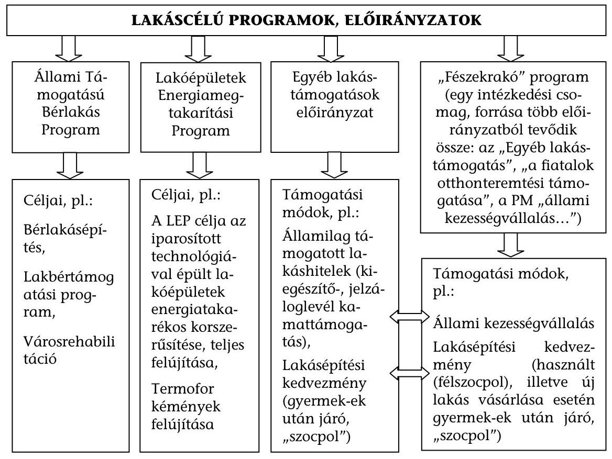

A szociálisan rászorult családok a helyi önkormányzatokon keresztül történő lakbértámogatási program még nem hasznosult, mert a Belügyminisztérium 2004-ben nem írt ki pályázatot, és a 800 M Ft előirányzatot átcsoportosították. 2005-ben a helyszíni ellenőrzés végéig 5 pályázó adta be a pályázatát, elbírálásuk folyamatban van.

A lakásépítéshez kapcsolódva az Állami Támogatású Bérlakás Program (ÁTBP) és a Lakóépületek Energiamegtakarítási Program (LEP) és keretében, évente több jogcímen írtak ki pályázatot.

---

Az Állami Támogatású Bérlakás Program 2000-2004 közötti időszakban az ÁTBP kapcsán 66228 M Ft állami támogatásról, ezen belül bérlakásépítésre - több jogcímen - 63028 M Ft-ról döntöttek 2005 I. félévig 45383 M Ft-ot folyósítottak. Az önkormányzatok számára kiírt bérlakás állomány növelését szolgáló pályázatot először 2000-ben írták ki. A pályázatok kiírása előtt, a lakáshelyzetet felmérő tanulmányok készültek ezek konkrét elérendő célokat nem fogalmaztak meg, általános célként „a bérlakásszektor részarányának növelését" jelölte meg.

A Kormány 2001 januári előterjesztésének adatai szerint 2001 január a bérlakás állomány a teljes lakásállomány 7\%-a, ebből 2\% magán, 5\% önkormányzati tulajdon 220 ezer lakás.

A kedvezményezett térségek besorolásánál használt komplex mutató részét képező „épített három szobás lakások aránya" mutatóban az állami építésű bérlakások kimutatható mértékben nem jelentkeznek, mivel szociális jellegük miatt 90 \%-ot meghaladóan kis méretű lakások épültek a program keretében. Ezáltal a program területi egyenlőtlenséget mérséklő hatása, változása nem mérhető.

A pályázati kiírásokban - 2004-et kivéve - nem határoztak meg a támogatással elérendő célokat és a tervezett felhasználható összeget, és nem érvényesültek a területi szempontok (2004-ig nem is volt cél), de a pénzáramlás alapján kimutatható, hogy a hátrányos és a leghátrányosabb kistérségekbe is jutott támogatás, így lakáskorszerűsítésre és bérlakásépítésre. A felzárkóztatás és a területfejlesztés, területi eloszlás szempontjai 2000-2004 között nem és 2005-ben sem jelent meg a pályázati útmutató elbírálási szempontjai között, és ezt jogszabály sem írta elő.

A területfejlesztés kedvezményezett térségeinek jegyzékéről szóló 64/2004. (IV. 15.) Korm. rendelet alapján meghatározott kedvezményezett kistérségekbe (95) az ÁTBP keretén belül bérlakás építésre $381 \mathrm{db}(53,6 \%)$ pályázat, 4247 (33,4\%) db lakás, $22249,6 \mathrm{M} \mathrm{Ft}(35,3 \%)$ állami támogatás jutott. A LEP esetén 19 db $(1,4 \%)$ pályázat, $579(1,1 \%)$ db lakás, $109,7 \mathrm{M} \mathrm{Ft}(1,65 \%)$ állami támogatás jutott.

A ÁTBP program alapvetően sikeres volt, minden évben túligényelték a pályázók a meglevő keretet. A 220 ezer bérlakáshoz viszonyítva az ÁTBP kapcsán 9274 lakás épült meg, ez elvileg $4 \%$-os bővülést jelent, de - nincs adat az eladott, kivont, kiváltott bérlakásokról. A nyilvánvaló érdeklődés ellenére a támogatási program 2004-től gyakorlatilag megszűnt, annak ellenére, hogy ettől az évtől jogszabály módosítással bekerült a területfejlesztési célokat szolgáló előirányzatok közé. Az állami források szűkülésére utal, hogy a támogatás jogszabályban meghatározott mértéke a vizsgált időszakban jelentősen mintegy 20-30 \%-kal csökkent, valamint az hogy az előirányzatot akkor kezelő Belügyminisztérium 2004-ben forráshiány miatt már nem írt ki pályázatot, a 2005. évben ilyen címen a költségvetési törvény nem tartalmazott előirányzatot.

Az állami támogatás aránya beruházáson belül 2002-ig 70-80 \% volt, de a lakáscélú állami támogatásokról szóló 12/2001. (I. 31.) Korm. rendelet 2003. április 17-én hatályba lépett módosítása alapján támogatás a beruházás bekerülési értékének 2003-ban 50-70 \% lehetett

---

A módosított előirányzat 2000-ben 19500 M Ft, az eredeti előirányzat 2001-ben 4000 M Ft, 2002-ben 5000 M Ft, 2003-ban 10000 M Ft, 2004-ben 7000 M Ft volt.

A pályázatokra (szociális bérlakás, költségelvű bérlakás, fecskeház, idősek otthona, nyugdíjasház) 2000-2004. év között az önkormányzatok 1263 db pályázatot nyújtottak be, ebből 711-et (56\%) elfogadtak, 522 db-ot ( $41 \%$-ot) elutasítottak. Az elutasítás okait a felterjesztésekben részben részletezték, pl. 122 pályázatot tartalmi és formai okokra hivatkozva utasítottak el. Ugyanakkor a felterjesztés nem tartalmazta a maradék 48 pályázat elutasításának okait. Ezeket a pályázatokat levélben forráshiányra vagy „a többi pályázattal történt összevetés alapján nem hasznosulna elég hatékonyan" indoklásra hivatkoztak.

Az OLÉH adatai szerint:

| Pályázat (db) |  |  |  | Lakás (db) |  |  |
| :--: | :--: | :--: | :--: | :--: | :--: | :--: |
| Év | Benyújtott | Támogatott | Támogatott/Benyújtott | Benyújtott | Támogatott | Támogatott/Benyújtott |
| 2000 | 107* | 107 | $100 \%$ | 2842 | 2842 | $100 \%$ |
| 2001 | 472 | 326 | $69 \%$ | 8113 | 5458 | $67 \%$ |
| 2002 | 382 | 146 | $38 \%$ | 6325 | 2024 | $32 \%$ |
| 2003 | 302 | 132 | $44 \%$ | 5888 | 2389 | $40 \%$ |
| Összesen | 1263 | 711 | $56 \%$ | 23168 | 12713 | $55 \%$ |

* nincs pontos adat a benyújtott pályázatok számáról

A támogatott bérlakások száma ezen időszakban (2000-2005) 12713 db ebből visszalépett 19 pályázó ( 248 lakás) és visszavontak 11 db pályázatot ( 284 lakás). A teljes bekerülési költség 89172 M Ft, ebből 63 028,8 M Ft állami támogatás. 2000-ben 2842 db, 2001-ben 5458 db, 2002-ben 2024 db, 2003-ban 2389 db lakás támogatásáról született döntés, 2004-ben már nem volt pályázat kiírás és döntés erre a célra. A befejezett pályázatok száma 560 db , a 12713 db támogatott lakásból 9274 lakás (73\%) épült meg, 45 383,2 M Ft állami támogatással, az odaítélt $63028,8 \mathrm{M}$ Ft támogatás $72 \%$-át folyósították 2005. I. félévig.

A programról évente pénzügyi beszámolók készültek, de értékelő, a hasznosulást és a tényleges eredményeket mutató értékelés, teljesítmény szemléletű beszámoló nem készült. A pályázatok hasznosulása nem nyomon követhető, ill. nem mérhető, mert nincs a pályázatok hatását indikátorokkal, mutatókkal jellemzett, kialakított monitoring rendszer, és nem teljes körűen áll rendelkezésre adat a bérlakásokba való beköltözésről. Kimutatható viszont a támogatott bérlakások és a ténylegesen megépült lakások száma, valamint a megépült lakások szobaszám szerinti megoszlása, illetve tényleges területe de a megépült lakások lakásra vagy négyzetméterre vetített árairól nem áll rendelkezésre adat. Az adatbázisban nem tükröződik a területfejlesztést segítő szemlélet (ilyen nem volt előírva) de az adatbázisból létrehozható területi, kistérségi lekérdezés is.

---

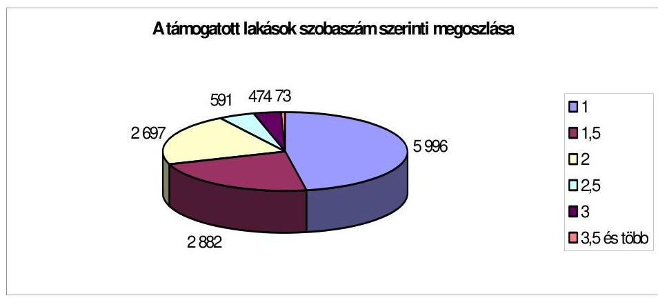

Az egyes pályázatok útját Excel formában kialakított adatbázis részletesen mind a pénzügyi, mind a szakmai paraméterek tekintetében nyomon követi. Az adatmódosítások nem nyomon követhetőek, az adatbiztonság szempontjából a szabályozás hiánya kockázatot jelent.

A Lakóépületek Energiamegtakarítási Programja (LEP) célja az iparosított technológiával épült lakóépületek energiatakarékos korszerűsítése, a termofor kémények felújítása, iparosított technológiával épült lakóépületek energiatakarékos korszerűsítés és teljes felújítása. A Gazdasági Minisztérium 2001. február 1-től írt ki pályázatot, a 2001-2005 közötti időszakban 6792 millió Ft állami támogatásról döntöttek, ebből 2005 I. félévig 2505 M Ft-ot folyósítottak. Az előirányzat kezelője 2000-2002 között a GM, 2003-2004 között a BM , majd 2005-től lett a Területfejlesztés fejezet.

A program népszerűségét mutatja, hogy 2001-2004 között a benyújtott pályázatok száma közel négyszeresére, a támogatott pályázatok száma több mint négyszeresére emelkedett. A támogatott lakások száma 2001-2002 között megduplázódott, 2002-től évről évre több mint 20\%-kal növekedett. A pályázati kiírásokban - 2004-et kivéve - nem határoztak meg a támogatással elérendő célokat és a tervezett felhasználható összeget. A ténylegesen elért hatás, az energia megtakarítás, a hasznosulás (a kitűzött cél és az elért eredmény) nem nyomon követhető, az ellenőrzés során nem állt rendelkezésre adat erre vonatkozóan.

| Pályázat (db) |  |  |  | Lakás (db) |  |  |
| :--: | :--: | :--: | :--: | :--: | :--: | :--: |
| Év | Benyújtott | Támogatott | Támogatott/Benyújtott | Benyújtott | Támogatott | Támogatott/Benyújtott |
| 2001 | 141 | 116 | $82 \%$ | 7085 | 5241 | $74 \%$ |
| 2002 | 246 | 239 | $97 \%$ | 12335 | 11549 | $94 \%$ |
| 2003 | 455 | 427 | $94 \%$ | 18114 | 16419 | $91 \%$ |
| 2004 | 512 | 495 | $97 \%$ | 20737 | 20008 | $96 \%$ |
| 2005 | 9 | - | - | 374 | - | - |
| Összesen | 1363 | 1277 | $94 \%$ | 58645 | 53217 | $91 \%$ |

A LEP pályázataira 2001-2005 I. félév között az önkormányzatok 1363 db pályázatot nyújtottak be, ebből 1277-et (94\%) elfogadtak (8 visszalépett, 416 lakást érintett), 77 db-ot (6\%-ot) utasítottak el.

---

A támogatások teljes bekerülési költsége 19 956,6 millió Ft, ennek az állami támogatási része 6788,7 millió Ft (34 %), az önkormányzat támogatási része 6602,2 millió Ft (33%), a saját erő 6565,7 millió Ft (33%). A befejezett pályázatok száma 617 db , (26 528 lakás) (49,8 \%) 2505,4 millió Ft támogatással. A kedvezményezett kistérségekbe minimális mértékű $19 \mathrm{db}(1,4 \%)$ pályázat, $579(1,1 \%) \mathrm{db}$ lakás, 109,7 millió Ft (1,65\%) állami támogatás jutott.

Az eredeti előirányzat 2001-ben 3000 M Ft, 2002-ben 2000 M Ft, 2003-ban 2000 M Ft, 2004-ben 2000 M Ft. Teljesítés 2001-ben nincs, 2002-ben 276 M Ft, 2003-ban 901 M Ft, 2004-ben 1271 M Ft. A LKFT eredeti előirányzat 2005-ben 1900 M Ft.

Az egyéb lakástámogatások előirányzat a PM-től került 2005-től a Területfejlesztés fejezethez. Célja - többek között -, a fiatalok, a szociálisan rászorulók, a családok lakáshoz jutásának támogatása, lakásépítési kedvezmény, kiegészítő kamattámogatás és jelzáloglevelek kamattámogatása útján.

Az OLÉH a támogatások folyósítására, elszámolására pénzintézetekkel kötött megbízási szerződéseket. Az előirányzat felhasználási rendjét a 4/2005 (III.29.) TNM utasítás tartalmazza.

| Kiadási előirányzat alakulása (millió Ft) |  |  |  |
| :--: | :--: | :--: | :--: |
| Év | eredeti | módosított | teljesített |
| $\mathbf{2 0 0 0}$ | $71350,0$ | $50351,6$ | 49853,0 |
| $\mathbf{2 001}$ | $58652,0$ | $57739,5$ | 60420,9 |
| $\mathbf{2 0 0 2}$ | $59446,0$ | $46791,8$ | 72334,4 |
| $\mathbf{2 0 0 3}$ | $81571,2$ | $81571,2$ | 137175,3 |
| $\mathbf{2 0 0 4}$ | $127700,0$ | $127656,0$ | 203993,1 |
| $\mathbf{2 0 0 5}$ | $215067,9$ |  |  |

A 2004. évi számvevőszéki ellenőrzés megítélése szerint az elmúlt éveket az alultervezés jellemezte. A teljesítés a 2004. évben és azt megelőző két évben több mint $50 \%$-kal meghaladta az eredeti előirányzatot.

A kamattámogatás változás hatását az OLÉH egyik támogatás esetében sem tudja százalékos, vagy összegszerű formában kimutatni. Ennek oka, a két támogatásra a kezelő pénzintézetek összesen adatokat adnak meg, de azt nem, hogy egy adott százalékos kamattámogatáshoz mekkora összegű állami támogatás tartozik. Erre vonatkozó kifogásokat az ÁSZ már korábban is megállapított. A kimutatást nehezíti, hogy mindkét támogatás esetében (a jelzáloglevél esetében 2004-től) a kamattámogatás mértékét az állampapírhozam alakulásához kötötték.

A 12/2001. (I.31.) Korm. rendeletből adódó módosítások, kamatváltozások értékelését, hatások kimutatását nehezíti, hogy a banki, kincstári adatok éves kimutatásúak, ellenben a módosítások (mind a kamat, mind pl. az összeghatárok, korhatárok) évközben történtek és egy adott időszakra vonatkoznak.

ÁSZ Zárszámadás szerint „A Kormányrendelet alapján teljesített 2004. évi adatszolgáltatásban közölt adatok - a 2003. évi zárszámadás ellenőrzés megállapításával azonosan - továbbra sem voltak alkalmasak a kincstári analitikában szereplő adatokkal való összehasonlításra. A közölt adatok egyike sem egyezett a nyilvántartásban szereplő adatokkal. A PM a közölt adatokat elemzéshez használta fel. Az előző évi számvevői jelentésben megtett javaslatra a PM nem intézkedett, a jogutód OLÉH szóbeli tájékoztatása szerint intézkedni fog."

Az előirányzat hasznosulása, a támogatással elérni kívánt cél részletes adatok hiányában nem mérhető. Nincs adat a költségvetésben évekre előre kiadásaként jelentkező támogatás összegéről, illetve az időszakonkénti megoszlásáról, az új szerződőknek és ahhoz tartozó állami kamattámogatás mértékéről, összegéről sem. Nem áll rendelkezésre adat a térségi megoszlásra, az épült lakások területi eloszlására, nem követik nyomon, hogyan hasznosulnak az egyes támogatási formák (szoc.pol, kamattámogatás). Nem követhető nyomon a támogatott hitelkonstrukciók jellemző adatainak (támogatottak köre, támogatott összeg átlagban, összesen) helyzete, alakulása sem.

A kiadás évről-évre növekedett, de ez nem tükrözi a támogatott lakáshitelek évenkénti változását, mivel az előző években kötött szerződések kihatása áthúzódik a következő évekre. Pl. a 2004. évi kiadásban jelentkezik a 2000-2003 között kötött szerződések kamattámogatása és a 2004-ben újonnan kötöttek kamattámogatása is és ez igaz minden évre. Az adott évre kötött szerződések kamattámogatásáról (a jelzáloglevél és a kiegészítő kamattámogatások esetén is) az OLÉH csak becsült adatokat bocsátott az ellenőrzés rendelkezésére.
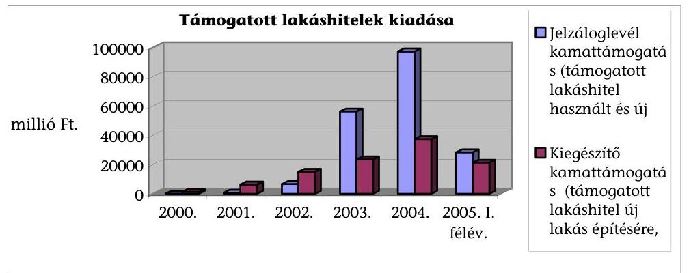

Jelzálog levél kamattámogatása 2000-ben 55 millió Ft-ról, 2004-ben 97 259,5 millió Ft-ra, a kiegészítő kamattámogatásnál 1336 millió Ft, 37 294,1 millió Ft-ra emelkedett.

Az OLÉH rendelkezésére álló adat, amely részben tükrözi a 12/2001. (I.31.) Korm. rendelet módosításainak hatását, az a szerződések számának évenkénti változása, ez 2004-re jelentősen, elsősorban a jelzálog kamattámogatás feltételeinek (pl. hitelösszeg határa) szigorodása és a deviza hitelek folyamatos térnyerése következtében - kevesebb, mint a felére - csökkent, és ez a tendencia 2005-re is jellemző. A tendencián a kiegészítő kamattámogatás növekedése - annak alacsonyabb részaránya miatt -lényegesen nem változtatott. A 2000-2005 I. félév között összesen 378421 db államilag támogatott szerződést kötöttek. Ezen belül az OLÉH a szerződéskötések számáról 2000, 2001, 2002. évekre adatot nem tudott szolgáltatni, a szerződések száma a 2003. évi 150097 db-ról 2004-re 65703 db-ra csökkent, a 2005 I. félévi adat 18412 db. A szerződés állomány összege 1682 850,2 M Ft.

---

A jelzáloglevél kamattámogatású hitelszerződések esetében 2003-ban 136733 db, 2004-ben 45936 db szerződést kötöttek. A 12/2001 (I.31.) Korm. rendelet 2003. évi módosításai következtében csökkent a hitelösszeg határa 30 millió Ft-ról 15 millió Ft-ra, majd új lakás esetén 15 millió Ft maradt, használt lakás esetén 5 millió Ft-ra csökkent.

A kiegészítő kamattámogatás esetén a megkötött szerződések a 2003. évi 13364 db-ról, a 2004. évre 19767 db-ra nőtt, ez 48\%-os növekedése a 2003. évi módosítás az új lakásnál felvehető hitelösszeg mértékét 10 millió Ft-ról 15 millió Ft-ra emelte. A 2005. I. félévében növekedés nem tapasztalható.

A „Fészekrakó" program 2005. február 1.-től indult. A programon belül az állami kezesség vállalás a fiatalok hitelképességének javításáért, és a fiatalok otthonteremtési támogatása (FOT, vissza nem térítendő támogatás) használt lakásvásárláshoz („félszocpol" gyermek(-ek) után járó lakásépítési kedvezmény) támogatási forma egyszerre is igénybe vehető. Ez nem vonatkozott 2005. november 1-ig a 30 ill. a 35 év közötti igénylőkre, mert ezek a támogatásokról rendelkező két kormányrendelet előírásai következtében csak a "félszocpol" támogatási formát vehetik igénybe.

A fiatalok lakáskölcsönéhez kapcsolódó állami kezesség vállalásának és érvényesítésének részletes szabályairól szóló 4/2005. (I.12.) Korm. rendelet 30 év, a lakás célú állami támogatásokról szóló 12/2001. (I.31.) Korm. rendelet 35 év maximum korhatárt határoz meg.

A program célja: állami kezesség vállalás a fiatalok számára az önerő csökkentése érdekében; a fiatalok otthonteremtési támogatása használt lakásra; a lakásépítési kedvezmény összegének emelése (a lakásépítési kedvezmény fent részletezve); a közalkalmazottakra, az ügyészekre, a bírákra, igazságügyi dolgozókra az állami kezességvállalás kiterjesztése; a lakbértámogatási program bevezetése.

A FOT vissza nem térítendő állami támogatás használt lakásvásárlásához a szükséges önerő növelése érdekében.

A fiatalok otthonteremtési támogatása (FOT) 2005-ben önálló előirányzatként 7 milliárd Ft-tal jelenik meg költségvetésben, de ebből a 2004. évi CXXXV tv, az államháztartási tartalék létrehozására 700 millió Ft-ot zárolt. 2005. I. félévéig a tervezett forrást lekötötték, majd a 2171/2005 (VIII.11.) Korm. határozat értelmében 13000 millió Ft-ig engedélyezték az előirányzat túlteljesítését. Az OLÉH kimutatásai szerint a 99004 érdeklődő $15,3 \%$-a beadta az igénylését és ebből $87 \%$-kal kötöttek szerződést a hitelintézetek.

A fészekrakó program eddig - a még csak rövid időszakra kiterjedő - végrehajtása nem az eredeti tervek szerint alakult, azt a tervezettnél kevesebben vették igénybe, vélhetően a magas törlesztő részlet és az ehhez szükséges nettó jövedelem elvárható szintje miatt. Az állami kezességvállalás esetében a Kormány előterjesztés 10-12 ezer új szerződéssel számolt, mintegy 3 milliárd Ft kamattámogatási igénnyel, ugyanakkor a 2005. július 31-i adatok szerint 4590 db szerződést kötöttek ez csak mintegy 50\%-os teljesítés (2005. december 31-ig 7930 db szerződéskötés történt, ami elmarad a várakozásoktól). Az OLÉH kimutatásai szerint a 126748 érdeklődő 7\%-a beadta az igénylését és ebből $90 \%$-kal kötöttek szerződést a hitelintézetek. A lakásépítési kedvezmény esetében (FOT) 21 ezer jogosult családot figyelembe véve 6,5 milliárd

---

Ft többletkiadással terveztek. A 2005. július 31-i adatok szerint 7409 db szerződést kötöttek, ez a tervezet 35,3\%-a. 2005. december 31-ig 13268 db szerződés kötés volt, ami szintén elmarad a tervezettől.

Az előterjesztés szerint „a használt lakáshoz biztosított támogatás 25-30 ezer családot érinthet".... „2005-ben 8,8 milliárd forint forrásigénnyel"

Az átlagos hitelösszegként 7 millió Ft-tal és 20 év futamidővel számoltak, új lakásnál ez havi 55 ezer Ft, használt lakásnál havi 68 ezer Ft törlesztő részletet jelent, ami 50\%-os jövedelemkorlát esetén 110-136 ezer Ft nettó jövedelmet feltételez. Ha a hitelösszeg 10 M Ft és 20 év a futamidő, a törlesztő részlet új lakásnál havi 78 ezer Ft, használt lakásnál havi 104 ezer Ft, ami 156-209 ezer Ft nettó jövedelmet jelent.

A Kormány előterjesztésben tervezett törlesztő részletekhez képest, a bankok tájékoztató jellegű adatai alapján - a fent említett hitelekre és kondíciókra - a törlesztő részletek hasonlóak, illetve 1-5 ezer forinttal alacsonyabbak.

A két támogatási forma terhére kötött szerződések külön-külön kimutathatóak, de nincs adat arról, hogy a megkötött szerződésekből hányan éltek mindkét lehetőséggel. Ezáltal nem kimutatható hány embert, családot, lakásvásárlást érint a program.

A lakásépítési kedvezmény támogatás 2000-2005 időszak alatt az egy gyermek után kapott támogatás 4,5 szeresére, a két gyermek után kétszeresére, három gyermek után 73\%-kal, négy gyermek után járó támogatás 92\%-kal nőtt. A fele összegű lakásépítési kedvezmény (félszocpol) a fenti összegek 50 \%-a és ez az 50 \%-os összeg vonatkozik a Fészekrakó program támogatásaira is. Az OLÉH - a korábbi adatszolgáltatás hiánya, illetve a MÁK és a banki adatszolgáltatás eltérése miatt - ennél a támogatási formánál sem rendelkezik pontos kimutatással a megkötött szerződések számáról és a folyósított összegről, ezen belül a 2000-2002 közötti időszakra csak becsült adatok állnak a rendelkezésére.

A 2000. évben egy gyermek után 0,2 millió Ft, 2005. febr. 1-től egy gyermek után 0,9 millió Ft teljes összegű lakásépítési kedvezmény jár. Az alábbi táblázat az évenkénti emelkedést mutatja.
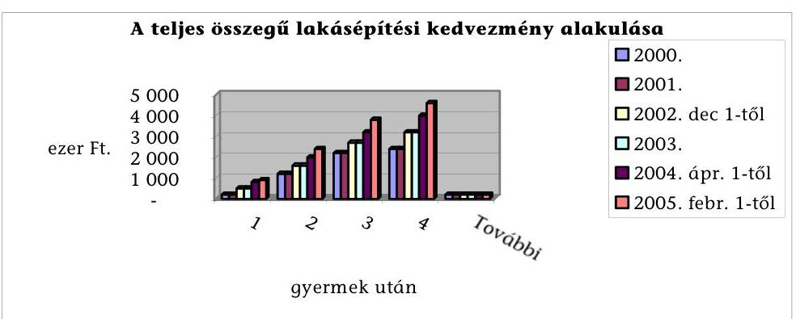

---

# 4. A KORÁBBI ÁSZ VIZSGÁLATOK SORÁN TETT MEGÁLLAPÍTÁSOK ÉS JAVASLATOK UTÓELLENŐRZÉSE 

A korábbi években az ÁSZ a költségvetési zárszámadásnak, valamint a különböző fejezetek átfogó ellenőrzése keretében vizsgálta azoknak az előirányzatoknak a felhasználását és országos hatáskörű hivatalok működését, amelyek 2005. évtől a területfejlesztésért felelős tárca nélküli miniszter felügyelete alá kerültek. A korábbi javaslatok címzettjei természetesen az aktuálisan felügyeletet gyakorló Kormány, illetve a miniszterek voltak. A javaslatokat többek között arra irányultak, hogy az előirányzatok felhasználásáért felelős intézmények alakítsanak ki megfelelő információs rendszereket, a támogatási források felosztásánál jobban érvényesüljön a hátrányos térségek támogatásának növelése és minden irányítási szinten javuljanak a szabályozások pontossága és megfelelő egymásra épülése. Nem hasznosultak teljes körűen az ÁSZ ellenőrzési javaslatok. A hazai közvetlen területfejlesztési források viszonylag alacsony volumene is hozzájárult ahhoz, hogy nem közeledtek kellő mértékben a hazai területfejlesztési források felhasználásával kapcsolatos eljárások az EU által előírtakhoz. Nem hasznosult a korábbi PHARE tükörprogramokban megszerzett programfinanszírozási gyakorlat és monitoring tevékenység. Nem épült be szervesen a hazai támogatások forrásokat elosztó döntéshozási mechanizmusba a társadalmi és gazdasági elmozdulások követése. A jelenlegi ellenőrzés keretében ezekre a kérdésekre a jelentés az ellenőrzési program szerint kitért, de összefoglaló formában a jelentés 15. számú melléklete tartalmazza.

Budapest, 2006. március "20"

| Melléklet: | 16 db | 16 lap |
| :-- | --: | --: |
| Függelék: | 4 db | 8 lap |

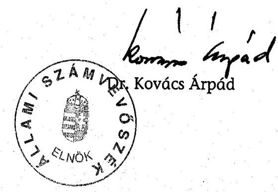

---

REGIONÁLIS FEJLESZTÉSÉRT ÉS FELZÁRKÓZTATÁSÉRT FELELŐS
TÁRCA NÉLKÜLI MINISZTER

Kovács Árpád
elnök

# Állami Számvevőszék

Budapest

Tisztelt Elnök Úr!
Kedves Árpád!
Hivatkozással a V-09-053/2005-2006 számú, a „Területfejlesztés fejezet működésének ellenőrzéséről" készített jelentésükre, ezúton jelzem, hogy az abban foglaltakkal kapcsolatban - a felügyeletem alatt álló hivatalokkal történt egyeztetés alapján - észrevételt nem teszek.

Budapest, 2006. február 22.
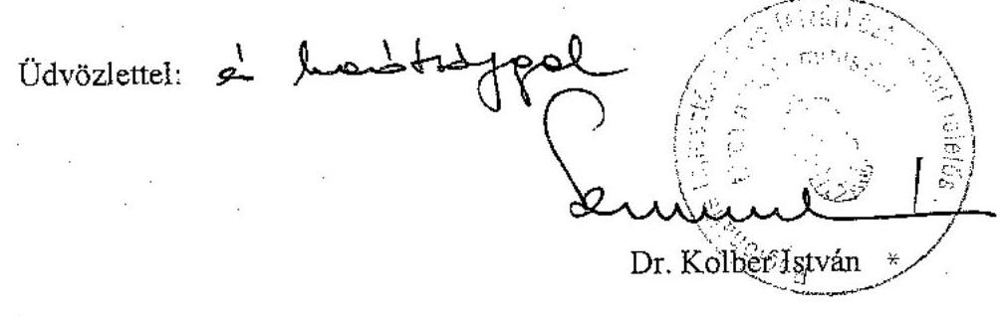

---

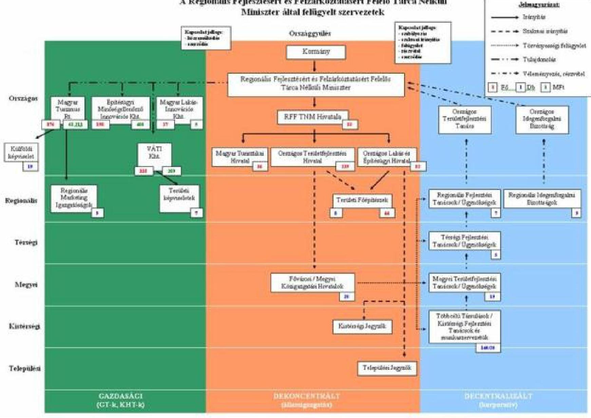

# A Regionális Fejlesztésért és Felzárkóztatásért Felelős Tárca Nélküli Miniszter által felügyelt szervezetek

| **Országos** | **Magyar Transzport** | **Earningsogos** | **Magyar Lakás** | **Irszágszé** | **Székhely** |
| --- | --- | --- | --- | --- | --- |
| Magyar Transzport | 10 | 10 | 10 | 10 | 10 |
| Transzport | 10 | 10 | 10 | 10 | 10 |
| Térség | 10 | 10 | 10 | 10 | 10 |
| Térség | 10 | 10 | 10 | 10 | 10 |
| Térség | 10 | 10 | 10 | 10 | 10 |
| Térség | 10 | 10 | 10 | 10 | 10 |
| Térség | 10 | 10 | 10 | 10 | 10 |
| Térség | 10 | 10 | 10 | 10 | 10 |
| Térség | 10 | 10 | 10 | 10 | 10 |
| Térség | 10 | 10 | 10 | 10 | 10 |
| Térség | 10 | 10 | 10 | 10 | 10 |
| Térség | 10 | 10 | 10 | 10 | 10 |
| Térség | 10 | 10 | 10 | 10 | 10 |
| Térség | 10 | 10 | 10 | 10 | 10 |
| Térség | 10 | 10 | 10 | 10 | 10 |
| Térség | 10 | 10 | 10 | 10 | 10 |
| Térség | 10 | 10 | 10 | 10 | 10 |
| Térség | 10 | 10 | 10 | 10 | 10 |
| Térség | 10 | 10 | 10 | 10 | 10 |
| Térség | 10 | 10 | 10 | 10 | 10 |
| Térség | 10 | 10 | 10 | 10 | 10 |
| Térség | 10 | 10 | 10 | 10 | 10 |
| Térség | 10 | 10 | 10 | 10 | 10 |
| Térség | 10 | 10 | 10 | 10 | 10 |
| Térség | 10 | 10 | 10 | 10 | 10 |
| Térség | 10 | 10 | 10 | 10 | 10 |
| Térség | 10 | 10 | 10 | 10 | 10 |
| Térség | 10 | 10 | 10 | 10 | 10 |
| Térség | 10 | 10 | 10 | 10 | 10 |
| Térség | 10 | 10 | 10 | 10 | 10 |
| Térség | 10 | 10 | 10 | 10 | 10 |
| Térség | 10 | 10 | 10 | 10 | 10 |
| Térség | 10 | 10 | 10 | 10 | 10 |

---

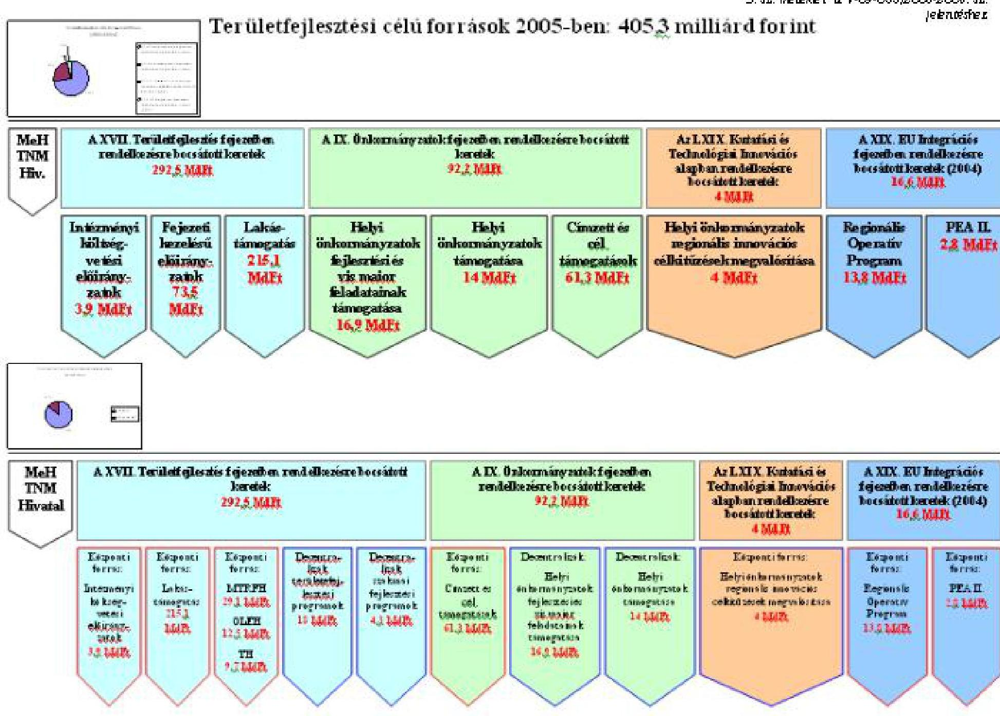

# Területfejlesztési célú források 2005-ben: 4053 milliárd forint

| MeH
TNM
Hiv. | A XVII. Területfejlesztés fejezetben rendelkezésre bocsátott keretek 292,5 MdFt. | A IX. Önkormányzatok fejezetben rendelkezésre bocsátott keretek 92,2 MdFt. | Az LXIX. Kutatási és Technológiai Innovációs alapján rendelkezésre bocsátott keretek 4 MdFt. | A XIX. EU Integrációs fejezetben rendelkezésre bocsátott keretek (2004) 16,6 MdFt. |
| --- | --- | --- | --- | --- |
| | Intézményi költségvetési előirányzatok 3,9 MdFt. | Fejezeti kezelési előirányzatok 73,5 MdFt. | Lakástámogatás 215,1 MdFt. | Helyi önkormányzatok fejlesztés és víz malor feladatainak támogatása 16,9 MdFt. |
| | | | | |
| | | | | |
| | | | | |
| | | | | |
| | | | | |
| | | | | |
| MeH
TNM
Hivatal | A XVII. Területfejlesztés fejezetben rendelkezésre bocsátott keretek 292,5 MdFt. | A IX. Önkormányzatok fejezetben rendelkezésre bocsátott keretek 92,2 MdFt. | Az LXIX. Kutatási és Technológiai Innovációs alapján rendelkezésre bocsátott keretek 4 MdFt. | A XIX. EU Integrációs fejezetben rendelkezésre bocsátott keretek (2004) 16,6 MdFt. |
| | | | | |
| | | | | |
| | | | | |
| | | | | |
| | | | | |
| | | | | |
| | | | | |
| | | | | |
| | | | | |
| | | | | |
| | | | | |
| | | | | |
| | | | | |
| | | | | |
| | | | | |
| | | | | |
| | | | | |
| | | | | |
| | | | | |
| | | | | |
| MeH
TNM
Hivatal | A XVIII. Területfejlesztés fejezetben rendelkezésre bocsátott keretek 292,5 MdFt. | A IX. Önkormányzatok fejezetben rendelkezésre bocsátott keretek 92,2 MdFt. | Az LXIX. Kutatási és Technológiai Innovációs alapján rendelkezésre bocsátott keretek 4 MdFt. | A XIX. EU Integrációs fejezetben rendelkezésre bocsátott keretek (2004) 16,6 MdFt. |
| | | | | |
| | | | | |
| | | | | |
| | | | | |
| | | | | |
| | | | | |
| | | | | |
| | | | | |
| | | | | |
| | | | | |
| | | | | |
| | | | | |
| | | | | |
| | | | | |
| | | | | |
| | | | | |
| | | | | |
| | | | | |
| | | | | |
| | | | | |
| | | | | |
| | |   |   |   |
|  |   |   |   |   |
|  |   |   |   |   |
|  |   |   |   |   |
|  |   |   |   |   |
|  |   |   |   |   |
|  |   |   |   |   |
|  |   |   |   |   |
|  |   |   |   |   |

---

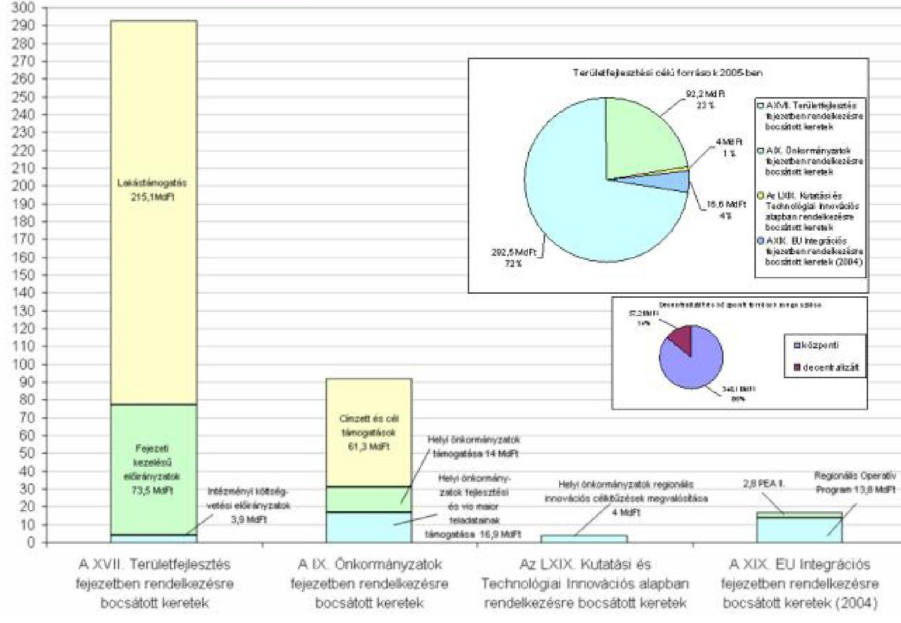

# TERÜLETFEJLESZTÉSI, LAKÁSÜGYI, ÉPÍTÉSÜGYI, TURISZTIKAI CÉLÚ FORRÁSOK, VALAMINT CÉL- ÉS CÍMZETT TÁMOGATÁSOK 2005-BEN

|  290 | 280 | 270 | 260 | 250 | 240 | 230 | 220 | 210 | 200 | 190 | 180 | 170 | 160 | 150 | 140 | 130 | 120 | 110 | 100 | 90 | 80 | 70 | 60 | 50 | 40 | 30 | 20 | 10  |
| --- | --- | --- | --- | --- | --- | --- | --- | --- | --- | --- | --- | --- | --- | --- | --- | --- | --- | --- | --- | --- | --- | --- | --- | --- | --- | --- |
|  290 | 280 | 270 | 260 | 250 | 240 | 230 | 220 | 210 | 200 | 190 | 180 | 170 | 160 | 150 | 140 | 130 | 120 | 110 | 100 | 90 | 80 | 70 | 60 | 50 | 40 | 30  |

A XVII. Területfejlesztés fejezetben rendelkezésre bocsátott keretek

A IX. Önkormányzatok fejezetben rendelkezésre bocsátott keretek

A X. Önkormányzatok fejezetben rendelkezésre bocsátott keretek

A X. Önkormányzatok fejezetben rendelkezésre bocsátott keretek

Az LXIX. Kutatási és Technológiai Innovációs alapban rendelkezésre bocsátott keretek

A XIX. EU Integrációs fejezetben rendelkezésre bocsátott keretek (2004)

A XIX. Évintézőtartamát bocsátott keretek (2004)

A X. Évintézőtartamát bocsátott keretek (2004)

A X. Évintézőtartamát bocsátott keretek (2004)

---

A 2004 január 1-től hatályos KSH kistérségi rendszer
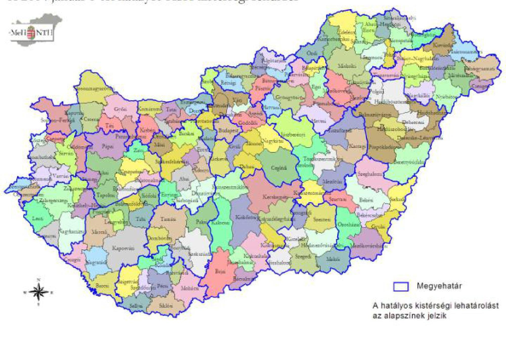

---

A területfejlesztés szempontjából kedvezményezett 95 kistérség
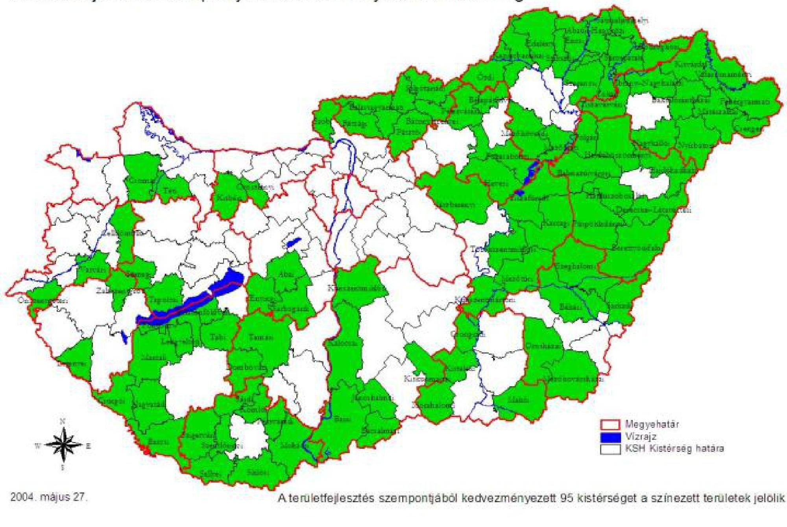

---

A területfejlesztés szempontjából leghátrányosabb helyzetű 48 kistérség
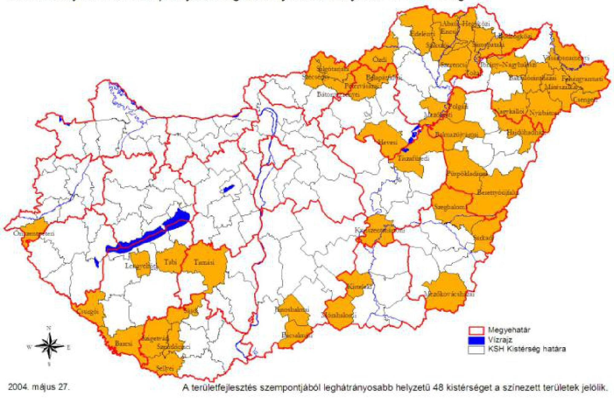

---

A területfejlesztés szempontjából hátrányosabb helyzetű 47 kistérség
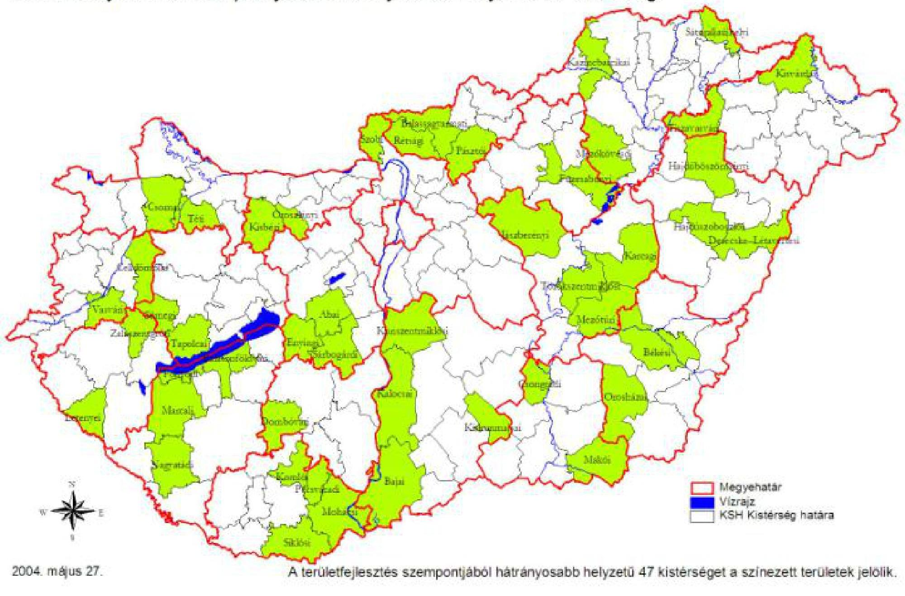

---

A területfejlesztés szempontjából a leghátrányosabb kistérségekhez nem tartozó leghátrányosabb helyzetű 235 település
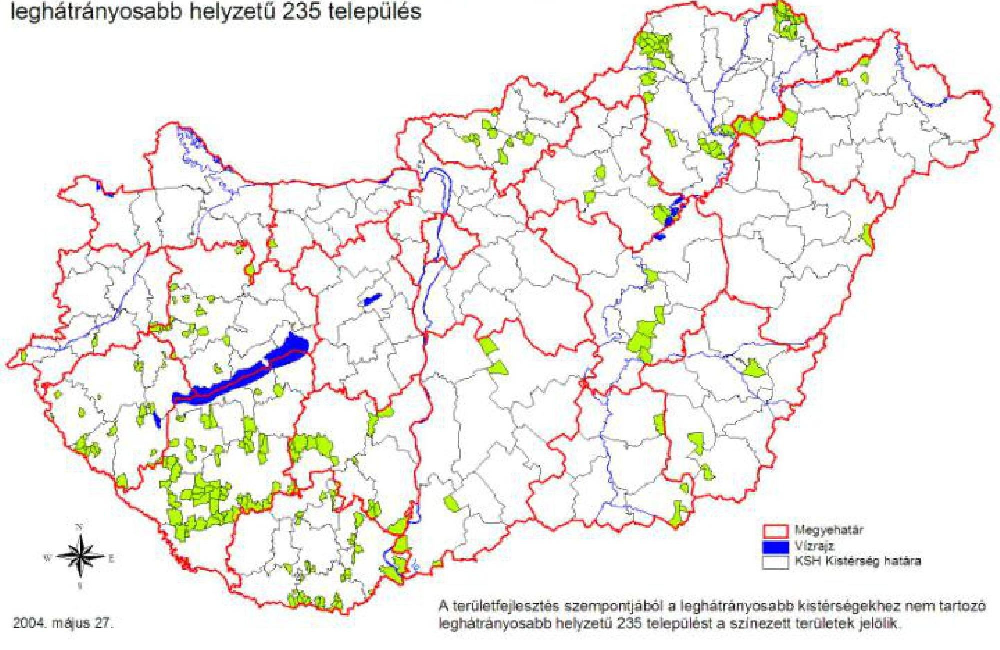

---

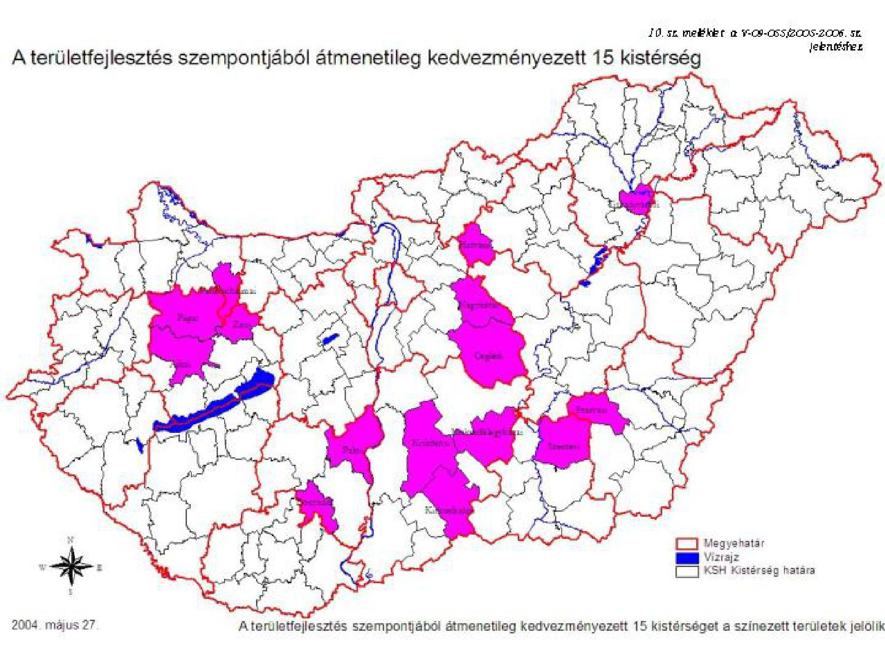

# A területfejlesztés szempontjából átmenetileg kedvezményezett 15 kistérség

## Megyehetár
## Vízrajz
## KSH Kistérség határa

2004. május 27.

---

Támogatások megoszlása főbb céleIöirányzatonként az 1999-2003. években
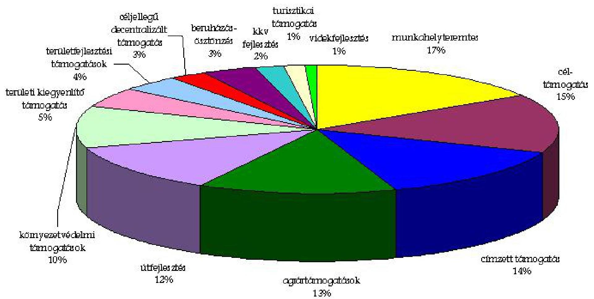

---

# Egy főre jutó támogatások eloszlása megyénként az 1999-2003. években 

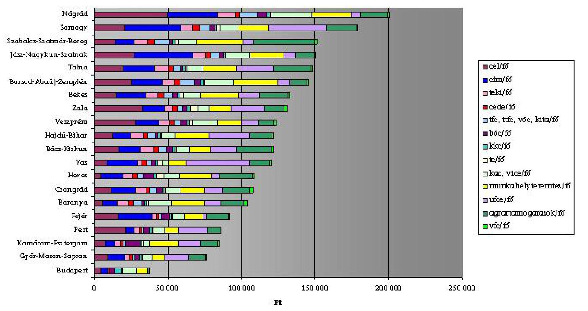

---

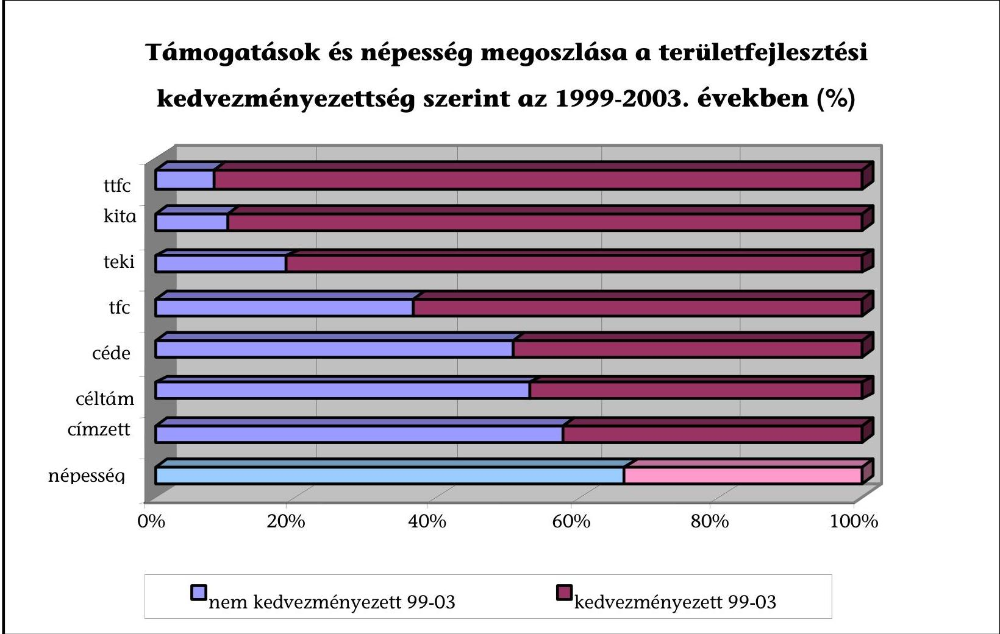

# Támogatások és népesség megoszlása a területfejlesztési kedvezményezettség szerint az 1999-2003. években (\%)

|  Támogatások és népesség | 2005 | 2006 | 2007 | 2008 | 2009 | 2010 | 2011 | 2012 | 2013 | 2014 | 2015 | 2016 | 2017 | 2018 | 2019 | 2020  |
| --- | --- | --- | --- | --- | --- | --- | --- | --- | --- | --- | --- | --- | --- | --- | --- | --- |
|  népesséq | 0% | 0% | 0% | 0% | 0% | 0% | 0% | 0% | 0% | 0% | 0% | 0% | 0% | 0% | 0% | 0%  |

---

14. sz. melléklet a V-09-051/2005-2006. sz. jelentéshez

A megyék egy főre jutó GDP értékének változása (2003-as áron)

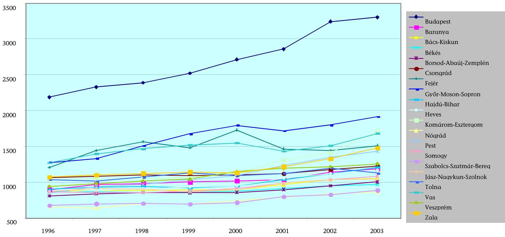

---

# A KORÁBBI ÁSZ VIZSGÁLATOK JAVASLATAI- 

NAK UTÓELLENŐRZÉSE

## Jelentés helyi önkormányzatok beruházásaihoz és rekonstrukcióihoz nyújtott 2002. évi címzett és céltámogatások igénybevételének és felhasználásának vizsgálatáról (2003. szeptember)

## a belügyminiszternek és a pénzügyminiszternek:

Vizsgálják felül a központi támogatásokkal megvalósuló önkormányzati beruházások sokcsatornás hazai támogatási rendszerét, figyelemmel az EU támogatási rendszerre. A támogatások egységesítése, összevonása - különösen a szennyvízközmű beruházásoknál - elősegítené a pénzeszközök koncentrált felhasználása révén a támogatások hatékonyságának növelését, a pénzeszközök átláthatóságának, ellenőrizhetőségének javulását.

A fejezet kialakításával a kifogásolt sokcsatornás finanszírozási rendszer tovább bővült, pl. a Vásárhelyi Terv és a decentralizált források szintén támogatnak ilyen jellegű fejlesztéseket. Részletesen a jelentés 3., illetve 3.1.,3.3. pontja tartalmazza.

## Jelentés a Magyar Köztársaság 2002. évi költségvetésének a végrehajtásáról

## a Kormánynak

1. Intézkedjen az "Állami támogatású bérlakás program" megvalósítását szolgáló letéti számla megszüntetéséről, és forgalmának a pénzforgalomban való kimutatásáról.

Az "Állami támogatású bérlakás program" megvalósítását szolgáló letéti számlát 2003-ban megszüntették.

A 2318/2003. (XII. 10.) Korm. határozat szól az Állami Támogatású Bérlakás Program letéti számlájának megszüntetéséről.

## a belügyminiszternek

32. Vizsgálja felül a támogatások hatékonyságának növelése érdekében a központi támogatások segítségével megvalósuló önkormányzati beruházások sokcsatornás hazai támogatási rendszerét, figyelemmel az EU támogatási rendszerre.

A javaslat megismétlődik az előzőekben a belügyminiszternek és a pénzügyminiszternek tett javaslatnál.
Részletesen a jelentés 3., illetve 3.1.,3.3. pontja tartalmazza.

---

# Jelentés a területfejlesztési tanácsok és munkaszervezeteik rendelkezésére álló támogatások igénylésének és felhasználásának ellenőrzéséről (2003. augusztus) 

## a regionális fejlesztési és a megyei területfejlesztési tanácsoknak

Biztosítsák a feladatellátáshoz szükséges megfelelő munkaszervezetek kialakítását. Tartsák be a számviteli rend, bizonylati fegyelem előírásait, aktualizálják belső szabályzataikat, javítsák a belső ellenőrzési rendszer működtetését. Gondoskodjanak a támogatási monitoring és ellenőrzési rendszer működtetéséről. Kapjon nagyobb teret a kistérségeknél a támogatások koncentráltabb felhasználása, fokozzák a legsúlyosabb helyzetben lévő önkormányzatok támogatását. Biztosítsanak nagyobb teret az átfogó régiós programok kidolgozásának és támogatásának.

A regionális tanácsok közül egyedül a Dél-alföldi Regionális Fejlesztési Tanács alakította ki az ÁSZ által igényelt munkaszervezetet. Az érintett területfejlesztési tanácsok a belső szabályzataikat aktualizálták. Életbelépett a 64/2004. (IV. 15.) Korm. Rendelet a területfejlesztés kedvezményezett térségeinek jegyzékéről, illetve „a kistérségek megállapításáról, lehatárolásáról és megváltoztatásának rendjéről" szóló 244/2003 (XII. 18.) Korm. Rendelet. A területfejlesztési támogatások felhasználását szabályozó jogszabályok preferálták a legsúlyosabb helyzetben lévő önkormányzatok támogatását, az MTRFH 2005-ben a kistérségi fejlesztési tanácsokat szerződés keretében differenciáltan támogatta, azonban áttörést nem sikerült elérni.
Minden régió elkészítette a saját fejlesztési tervét, de a területfejlesztési források felhasználását a vonatkozó kormányrendeletek szabták meg, így a régióknak saját regionális céljaik megjelenítésére csak részlegesen volt lehetőségük.

A vizsgálat lezárultig több előrelépés történt a jelzett problémákhoz kapcsolódóan:
Elfogadásra került a 25/2005. (II. 11.) Korm. Rendelet, a terület- és régiófejlesztési célelőirányzat felhasználásának részletes szabályairól szóló 90/2004. (IV. 25.) Korm. rendelet módosításáról, amelynek 21. § (5) pontja szerint:
(5) A regionális tanács a célelőirányzat decentralizált területfejlesztési programok támogatására rendelkezésre álló keretének terhére, legfeljebb 300 millió forintig, pályázati rendszeren kívül, a 7. § (1) bekezdésében meghatározott területi kötöttség nélkül támogatást nyújthat a regionális programjában elfogadott - a régió társadalmi-gazdasági-innovációs súlyának növekedését és a régión belüli kohézió erősítését szolgáló - beruházási projektek megvalósítására.
A vizsgálat megállapítása szerint ez volt az első alkalom, a Phare tükörprogramot kivéve, hogy valamennyi régió jogszabályban, konkrétan rögzítve, és „megkötöttség nélkül" lehetőséget kapott saját regionális programjainak részét képező projektek megvalósítására.
A Tftv. 2004. évi módosítása kimondta, hogy „Felhatalmazást kap a Kormány, hogy rendeletben állapítsa meg o) a regionális fejlesztési tanácsokkal a régió társadalmi, gazdasági fejlesztése érdekében kötendő megállapodások részletes szabályait". Ez a kormányrendelet még nem készült el a vizsgálat lezárultáig.

---

# a Kormánynak 

a területfejlesztési törvény módosítás előkészítése során a törvényjavaslatba építse be:

1. A közigazgatás átfogó reformjának tervezett alapelveihez igazodóan a területfejlesztés, annak egyes szintjei feladatának, hatáskörének átalakítását, az EU-ban alkalmazott gyakorlat magyarországi átvételéhez szükséges döntések meghozatalát, az uniós támogatások fogadása feltételeinek kialakítását.

A régiók szerepe a vizsgált időszakban tovább nőtt, a területfejlesztési tervezés legfontosabb színtere a régió lett, az 1076/2004. (VII. 22.) Korm. határozat „az Európa Terv (2007-2013.) kidolgozásának tartalmi és szervezeti kereteiről" az ágazati és régiós célokat egy szintre helyezte. A területfejlesztési törvény 2004. szeptember 1-i hatállyal történő módosítása az Európai Unióhoz kapcsolódó feladatokat a regionális fejlesztési tanácsoknál jelenítette meg. A regionális fejlesztési tanácsok ügynökségei mint közreműködő szervezetek vettek, illetve vesznek részt az uniós támogatások lebonyolításában. Az ügynökségeket több szervezet ellenőrizte, amelyek hiányosságokat tártak fel, de képességüket a közreműködői feladatok ellátására nem vonták kétségbe.
2. A feladat- és hatáskör, valamint forrásdecentralizáció egységes elvekre épülő rendszerét, ami javíthatja a források felhasználásának hatékonyságát, a forráskoordinációt, valamint a területi kiegyenlítődés feltételeit.

A koordináció erősítéshez járult hozzá, „a területfejlesztési célok megvalósítását szolgáló fejezeti kezelésű előirányzatok pályázati rendszerben történő felhasználása összehangolásának rendjéről" szóló 24/2003. (III. 4.) kormányrendelet életbelépése, annak 2004-ben történő módosítása. Az Országos Területfejlesztési Tanács (továbbiakban: OTT) a 2005. februári ülésén megtárgyalta „a minisztériumok és az országos hatáskörű szervek területfejlesztéssel és területrendezéssel kapcsolatos feladatairól és a miniszterek közötti folyamatos koordináció szempontjairól" című kormányrendelet tervezetét, amely azonban a helyszíni vizsgálat lezárultáig nem került elfogadásra.
3. A területfejlesztés intézményrendszerének átalakítása során az államháztartás részét képező szervezeti megoldások alakuljanak ki és biztosítsa a törvényességi felügyelet egységes gyakorlásának feltételeit.

Elkészült az 51/2005. (III. 24.) Korm. Rendelet, „a területfejlesztés intézményei törvényességi felügyeletének részletes szabályairól" szóló kormányrendelet, amelyet szintén a Tftv. módosítása írt elő a kormány számára.

Nem valósult meg az ajánlás, hogy a területfejlesztés intézményrendszerének átalakítása során az államháztartás részét képező szervezeti megoldások ala-

---

kuljanak ki tekintettel arra, hogy a Tftv módosítása megszüntette tanácsok munkaszervezeteinek gazdálkodásra vonatkozóan azt a törvényi előírást, mely szerint:

12 § (2) A megyei területfejlesztési tanácsok és munkaszervezeteik - működésükkel kapcsolatos - gazdálkodására a költségvetési szervek gazdálkodására vonatkozó szabályokat kell az e törvényben meghatározott sajátosságok figyelembe vételével alkalmazni.
5. A közpénzek felhasználása átláthatóságának és nyilvánosságának igényére figyelemmel a területfejlesztés átalakuló rendszerében kapjon nagyobb súlyt a támogatások felhasználásának szabályszerű, eredményes megvalósulását célzó ellenőrzés.

A közvetlen területfejlesztési forrásokra kiterjedő helyszíni MÁK és RFÜ ellenőrzési tevékenységek projektenként a pénzügyi elszámolásra koncentrálódtak. Nem vizsgálták a támogatási források felhasználásának eredményességi és hatékonysági kérdéseit kistérségi, és megyei szinten. Nem elemezték az éves értékelő jelentésekben a fizikai teljesítési (output) mutatók felhasználásával a gazdaságossági kritériumok teljesülését.
6. Az ország kevésbé fejlett térségeinek gyorsabb ütemű felzárkóztatását jobban elősegítő területfejlesztési kistérségek létrehozását, egyúttal teremtse meg annak feltételeit, hogy forrásaik a tényleges szükségleteikhez közelítően bővülhessenek.

A vizsgált időszakban a kistérségekre fordított költségvetési források folyamatosan bővültek, helyzetüket több jogszabály stabilizálta.
Részletesen a jelentés 2., illetve 2.3. pontja tartalmazza.

Budapest, 2005. december

---

1/a .sz. tanúsítvány Regionális Területfejlesztési Tanácsok működési bevételei és kiadásai

1/b .sz. tanúsítvány Megyei Területfejlesztési Tanácsok működési bevételei és kiadásai

2 .sz. tanúsítvány Az előirányzatok felhasználásának kezelése és döntési szintjei

---

# Regionális Fejlesztési Tanácsok összesen 

## REGIONÁLIS TERÜLETFEJLESZTÉSI TANÁCSOK MŰKÖDÉSI BEVÉTELEI ÉS KIADÁSAI

| BEVÉTELEK | 2002. | 2003. | 2004. | 2005. |
| :--: | :--: | :--: | :--: | :--: |
| Állami támogatások | 1029,68 | 1413,54 | 1466,68 | 1334,71 |
| Működés finanszírozására | 423,15 | 524,89 | 489,46 | 368,37 |
| Pályázat útján | 161,91 | 198,37 | 429,03 | 621,94 |
| Egyéb állami támogatás | 444,62 | 690,28 | 548,19 | 344,41 |
| Egyéb bevétel | 354,35 | 255,36 | 292,76 | 349,40 |
| ÖSSZESEN (nyitó   pénzkészlettel együtt) | 1384,03 | 1668,90 | 1759,44 | 1684,11 |

|  |  |  |  |  |
| :-- | --: | --: | --: | --: |
| KIADÁSOK | 2002. | 2003. | 2004. | 2005. |
| Személyi kiadások | 41,01 | 52,62 | 62,27 | 43,13 |
| Üzemviteli kiadások | 62,37 | 77,09 | 187,09 | 33,39 |
| Saját Kht. működ finanszírozása | 486,63 | 777,37 | 638,44 | 576,96 |
| Egyéb közreműködők finansz. | 228,75 | 193,25 | 243,25 | 374,11 |
| Egyéb kiadások* | 350,52 | 307,90 | 300,77 | 116,64 |
| ÖSSZESEN | 1169,27 | 1408,22 | 1431,82 | 1144,23 |

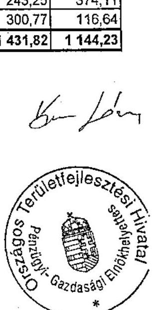

---

# Megyei Területfejlesztési Tanácsok összesen 

## MEGYEI TERÜLETFEJLESZTÉSI TANÁCSOK MŰKÖDÉSI BEVÉTELEI ÉS KIADÁSAI

|  |  |  |  | millió Ft-ban |
| :--: | :--: | :--: | :--: | :--: |
| BEVÉTELEK | 2002. | 2003. | 2004. | 2005. |
| Állami támogatások | 692,3 | 561,7 | 933,3 | 426,2 |
| Működés finanszírozására | 418,1 | 396,3 | 581,5 | 355,9 |
| Pályázat útján | 175,7 | 95,6 | 103,2 | 16,5 |
| Egyéb állami támogatás | 98,5 | 69,7 | 248,7 | 53,7 |
| Egyéb bevétel * | 890,1 | 896,2 | 865,2 | 986,9 |
| ÖSSZESEN | 1582,4 | 1457,9 | 1798,5 | 1413,1 |

* az előző évi pénzmaradvánnyal együtt
millió Ft-ban

| KIADÁSOK | 2002. | 2003. | 2004. | 2005. |
| :-- | --: | --: | --: | --: |
| Személyi kiadások | 460,7 | 384,8 | 362,4 | 260,2 |
| Üzemviteli kiadások | 374,3 | 405,5 | 316,4 | 208,7 |
| Saját Kht. működ.finanszírozása | 241,7 | 366,0 | 486,1 | 417,4 |
| Egyéb közreműködők finansz. | 73,4 | 75,7 | 65,1 | 112,7 |
| Egyéb kiadások** | 272,7 | 282,0 | 284,0 | 378,9 |
| ÖSSZESEN | 1422,8 | 1514,0 | 1514,1 | 1378,0 |

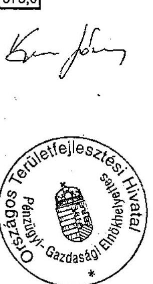

---

2 sz. tanúsítvány a V-09-055/2005-2006. sz. jelentéshez

Az előirányzatok felhasználásának kezelése és döntési szintjei

|   |  |  |  |  |  |  |  |  |  |  |  |  |  |  |  |  |  |  |  |  |  |  |  |  |  |  |  |  |  |  |  |  |  |   |
| --- | --- | --- | --- | --- | --- | --- | --- | --- | --- | --- | --- | --- | --- | --- | --- | --- | --- | --- | --- | --- | --- | --- | --- | --- | --- | --- | --- | --- | --- | --- | --- | --- | --- | --- | --- |
|  |   |   |   |   |   |   |   |   |   |   |   |   |   |   |   |   |   |   |   |   |   |   |   |   |   |   |   |   |   |   |   |   |   |   |   |
|   |  |  |  |  |  |  |  |  |  |  |  |  |  |  |  |  |  |  |  |  |  |  |  |  |  |  |  |  |  |  |  |  |  |   |
|   |  |  |  |  |  |  |  |  |  |  |  |  |  |  |  |  |  |  |  |  |  |  |  |  |  |  |  |  |  |  |  |  |  |   |
|   |  |  |  |  |  |  |  |  |  |  |  |  |  |  |  |  |  |  |  |  |  |  |  |  |  |  |  |  |  |  |  |  |  |   |
|   |  |  |  |  |  |  |  |  |  |  |  |  |  |  |  |  |  |  |  |  |  |  |  |  |  |  |  |  |  |  |  |  |  |   |
|   |  |  |  |  |  |  |  |  |  |  |  |  |  |  |  |  |  |  |  |  |  |  |  |  |  |  |  |  |  |  |  |  |  |   |
|   |  |  |  |  |  |  |  |  |  |  |  |  |  |  |  |  |  |  |  |  |  |  |  |  |  |  |  |  |  |  |  |  |  |   |
|   |  |  |  |  |  |  |  |  |  |  |  |  |  |  |  |  |  |  |  |  |  |  |  |  |  |  |  |  |  |  |  |  |  |   |
|   |  |  |  |  |  |  |  |  |  |  |  |  |  |  |  |  |  |  |  |  |  |  |  |  |  |  |  |  |  |  |  |  |  |   |
|   |  |  |  |  |  |  |  |  |  |  |  |  |  |  |  |  |  |  |  |  |  |  |  |  |  |  |  |  |  |  |  |  |  |   |
|   |  |  |  |  |  |  |  |  |  |  |  |  |  |  |  |  |  |  |  |  |  |  |  |  |  |  |  |  |  |  |  |  |  |   |
|   |  |  |  |  |  |  |  |  |  |  |  |  |  |  |  |  |  |  |  |  |  |  |  |  |  |  |  |  |  |  |  |  |  |   |
|   |  |  |  |  |  |  |  |  |  |  |  |  |  |  |  |  |  |  |  |  |  |  |  |  |  |  |  |  |  |  |  |  |  |   |
|   |  |  |  |  |  |  |  |  |  |  |  |  |  |  |  |  |  |  |  |  |  |  |  |  |  |  |  |  |  |  |  |  |  |   |
|   |  |  |  |  |  |  |  |  |  |  |  |  |  |  |  |  |  |  |  |  |  |  |  |  |  |  |  |  |  |  |  |  |  |   |
|   |  |  |  |  |  |  | 
 |  3400,0 |  |  |  |  |  |  |  |   |
| --- | --- | --- | --- | --- | --- | --- | --- | --- |
|  |   |   |   |   |   |   |   |   |
|  3400,0 |  |  |  |  |  |  |  |   |
|  |   |   |   |   |   |   |   |   |
|  3400,0 |  |  |  |  |  |  |  |   |
|  |   |   |   |   |   |   |   |   |
|  3400,0 |  |  |  |  |  |  |  |   |
|  |   |   |   |   |   |   |   |   |
|  3400,0 |  |  |  |  |  |  |  |   |
|  |   |   |   |   |   |   |   |   |
|  3400,0 |  |  |  |  |  |  |  |   |
|  |   |   |   |   |   |   |   |   |
|  3400,0 |  |  |  |  |  |  |  |   |
|  | 
 |   |   |   |   |   |   |   |
|  3400,0 |  |  |  |  |  |  |  |   |
|  |   |   |   |   |   |   |   |   |
|  3400,0 |  |  |  |  |  |  |  |   |
|  |   |   |   |   |   |   |   |   |
|  3400,0 |  |  |  |  |  |  |  |   |
|  |   |   |   |   |   |   |   |   |
|  3400,0 |  |  |  |  |  |  |  |   |
|  |   |   |   |   |   |   |   |   |
|  3400,0 |  |  |  |  |  |  |  |   |
|  |   |   |   |   |   |   |   |   |
|  3400,0 |  |  |  |  |  |  |  |   |
|  |   |   |   |   |   |   |   |   |
|  3400,0 |  |  |  |  |  |  |  |   |
|  |   |   |   |   |   |   |   |   |
|  3400,0 |  |  |  |  |  |  |  |   |
|  |   |   |   |   |   |   |   |   |
|  3400,0 |  |  |  |  |  |  |  |   |
|  |   |   |   |   |   |   |   |   |
|  3400,0 |  |  |  |  |  |  |  |   |
|  |   |   |   |   |   |   |   |   |
|  3400,0 |  |  |  |  |  |  |  |   |
|  |   |   |   |   |   |   |   |   |
|  3400,0 |  |  |  |  |  |  |  |   |
|  |   |   |   |   |   |   |   |   |
|  3400,0 |  |  |  |  |  |  |  |   |
|  |   |   |   |   |   |   |   |   |
|  3400,0 |  |  |  |  |  |  |  |   |
|  |   |   |   |   |   |   |   |   |
|  3400,0 |  |  |  |  |  |  |  |   |
|  |   |   |   |   |   |   |   |   |
|  3400,0 |  |  |  |  |  |  |  |   |
|  |   |   |   |   |   |   |   |   |
|  3400,0 |  |  |  |  |  |  |  |   |
|  |   |   |   |   |   |   |   |   |
|  3400,0 |  |  |  |  |  |  |  |   |
|  |   |   |   |   |   |   |   |   |
|  3400,0 |  |  |  |  |  |  |  |   |
|  |   |   |   |   |   |   |   |   |
|  3400,0 |  |  |  |  |  |  |  |   |
|  |   |   |   |   |   |   |   |   |
|  3400,0 |  |  |  |  |  |  |  |   |
|  |   |   |   |   |   |   |   |   |
|  3400,0 |  |  |  |  |  |  |  |   |
|  |   |   |   |   |   |   |   |   |
|  3400,0 |  |  |  |  |  |  |  |   |
|  |   |   |   |   |   |   |   |   |
|  3400,0 |  |  |  |  |  |  |  |   |
|  |   |   |   |   |   |   |   |   |
|  3400,0 |  |  |  |  |  |  |  |   |
|  |   |   |   |   |   |   |   |   |
|  3400,0 |  |  |  |  |  |  |  |   |
|  |   |   |   |   |   |   |   |   |
|  3400,0 |  |  |  |  |  |  |  |   |
|  |   |   |   |   |   |   |   |   |
|  3400,0 |  |  |  |  |  |  |  |   |
|  |   |   |   |   |   |   |   |   |
|  3400,0 |  |  |  |  |  |  |  |   |
|  |   |   |   |   |   |   |   |   |
|  3400,0 |  |  |  |  |  |  |  |   |
|  |   |   |   |   |   |   |   |   |
|  3400,0 |  |  |  |  |  |  |  |   |
|  |   |   |   |   |   |   |   |   |
|  3400,0 |  |  |  |  |  |  |  |   |
|  |   |   |   |   |   |   |   |   |
|  3400,0 |  |  |  |  |  |  |  |   |
|  |   |   |   |   |   |   |   |   |
|  3400,0 |  |  |  |  |  |  |  |   |
|  |   |   |   |   |   |   |   |   |
|  3400,0 |  |  |  |  |  |  |  |   |
|  |   |   |   |   |   |   |   |   |
|  3400,0 |  |  |  |  |  |  |  |   |
|  |   |   |   |   |   |   |   |   |
|  3400,0 |  |  |  |  |  |  |  |   |
|  |   |   |   |   |   |   |   |   |
|  3400,0 |  |  |  |  |  |
 | | |
| | | | | | | | | |
| 3400,0 | | | | | | | | |
| | | | | | | | | |
| 3400,0 | | | | | | | | |
| | | | | | | | | |
| 3400,0 | | | | | | | | |
| | | | | | | | | |
| 3400,0 | | | | | | | | |
| | | | | | | | | |
| 3400,0 | | | | | | | | |
| | | | | | | | | |
| 3400,0 | | | | | | | | |
| | | | | | | | | |
| 3400,0 | | | | | | | | |
| | | | | | | | | |
| 3400,0 | | | | | | | | |
| | | | | | | | | |
| 3400,0 | | | | | | | | |
| | | | | | | | | |
| 3400,0 | | | | | | | | |
| | | | | | | | | |
| 3400,0 | | | | | | | | |
| | | | | | | | | |
| 3400,0 | | | | | | | | |
| | | | | | | | | |
| 3400,0 | | | | | | | | |
| | | | | | | | | |
| 3400,0 | | | | | | | | |
| | | | | | | | | |
| 3400,0 | | | | | | | | |
| | | | | | | | | |
| 3400,0 | | | | | | | | |
| | | | | | | | | |
| 3400,0 | | | | | | | | |
| | | | | | | | | |
| 3400,0 | | | | | | | | |
| | | | | | | | | |
| 3400,0 | | | | | | | | |
| | | | | | | | | |
| 3400,0 | | | | | | | | |
| | | | | | | | | |
| 3400,0 | | | | | | | | |
| | | | | | | | | |
| 3400,0 | | | | | | | | |
| | | | | | | | | |
| 3400,0 | | | | | | | | |
| | | | | | | | | |
| 3400,0 | | | | | | | | |
| | | | | | | | | |
| 3400,0 | | | | | | | | |
| | | | | | | | | |
| 3400,0 | | | | | | | | |
| | | | | | | | | |
| 3400,0 | | | | | | | | |
| | | | | | | | | |
| 3400,0 | | | | | | | | |
| | | | | | | | | |
| 3400,0 | | | | | | | | |
| | | | | | | | | |
| 3400,0 | | | | | | | | |
| | | | | | | | | |
| 3400,0 | | | | | | | | |
| | | | | | | | | |
| 3400,0 | | | | | | | | |
| | | | | | | | | |
| 3400,0 |
 | | | | | | | |
| | | | | | | | | |
| 3400,0 | | | | | | | | |
| | | | | | | | | |
| 3400,0 | | | | | | | | |
| | | | | | | | | |
| 3400,0 | | | | | | | | |
| | | | | | | | | |
| 3400,0 | | | | | | | | |
| | | | | | | | | |
| 3400,0 | | | | | | | | |
| | | | | | | | | |
| 3400,0 | | | | | | | | |
| | | | | | | | | |
| 3400,0 | | | | | | | | |
| | | | | | | | | |
| 3400,0 | | | | | | | | |
| | | | | | | | | |
| 3400,0 | | | | | | | | |
| | | | | | | | | |
| 3400,0 | | | | | | | | |
| | | | | | | | | |
| 3400,0 | | | | | | | | |
| | | | | | | | | |
| 3400,0 | | | | | | | | |
| | | | | | | | | |
| 3400,0 | | | | | | | | |
| | | | | | | | | |
| 3400,0 | | | | | | | | |
| | | | | | | | | |
| 3400,0 | | | | | | | | |
| | | | | | | | | |
| 3400,0 | | | | | | | | |
 |   |   |   |   |   |   |   |   |
|  3400,0 |  |  |  |  |  |  |  |   |
|  |   |   |   |   |   |   |   |   |
|  3400,0 |  |  |  |  |  |  |  |   |
|  |   |   |   |   |   |   |   |   |
|  3400,0 |  |  |  |  |  |  |  |   |
|  |   |   |   |   |   |   |   |   |
|  3400,0 |  |  |  |  |  |  |  |   |
|  |   |   |   |   |   |   |   |   |
|  3400,0 |  |  |  |  |  |  |  |   |
|  |   |   |   |   |   |   |   |   |
|  3400,0 |  |  |  |  |  |  |  |   |
|  |   |   |   |   |   |   |   |   |
|  3400,0 |  |  |  |  |  |  |  |   |
|  |   |   |   |   |   |   |   |   |
|  3400,0 |  |  |  |  |  |  |  |   |
|  |   |   |   |   |   |   |   |   |
|  3400,0 |  |  |  |  |  |  |  |   |
|  |   |   |   |   |   |   |   |   |
|  3400,0 |  |  |  |  |  |  |  |   |
|  |   |   |   |   |   |   |   |   |
|  3400,0 |  |  |  |  |  |  |  |   |
|  |   |   |   |   |   |   |   |   |
|  3400,0 |  |  |  |  |  |  |  |   |
|  |   |   |   |   |   |   |   |   |
|  3400,0 |  |  |  |  |  |  |  |   |
|  |   |   |   |   |   |   |   |   |
|  3400,0 |  |  |  |  |  |  |  |   |
|  |   |   |   |   |   |   |   |   |
|  3400,0 |  |  |  |  |  |  |  |   |
|  |   |   |   |   |   |   |   |   |
|  3400,0 |  |  |  |  |  |  |  |   |
|  |   |   |   |   |   |   |   |   |
|  3400,0 |  |  |  |  |  |  |  |   |
|  |   |   |   |   |   |   |   |
 |   |   |
|  3400,0 |  |  |  |  |  |  |  |   |
|  |   |   |   |   |   |   |   |   |
|  3400,0 |  |  |  |  |  |  |  |   |
|  |   |   |   |   |   |   |   |   |
|  3400,0 |  |  |  |  |  |  |  |   |
|  |   |   |   |   |   |   |   |   |
|  3400,0 |  |  |  |  |  |  |  |   |
|  |   |   |   |   |   |   |   |   |
|  3400,0 |  |  |  |  |  |  |  |   |
|  |   |   |   |   |   |   |   |   |
|  3400,0 |  |  |  |  |  |  |  |   |
|  |   |   |   |   |   |   |   |   |
|  3400,0 |  |  |  |  |  |  |  |   |
|  |   |   |   |   |   |   |   |   |
|  3400,0 |  |  |  |  |  |  |  |   |
|  |   |   |   |   |   |   |   |   |
|  3400,0 |  |  |  |  |  |  |  |   |
|  |   |   |   |   |   |   |   |   |
|  3400,0 |  |  |  |  |  |  |  |   |
|  |   |   |   |   |   |   |   |   |
|  3400,0 |  |  |  |  |  |  |  |   |
|  |   |   |   |   |   |   |   |   |
|  3400,0 |  |  |  |  |  |  |  |   |
|  |   |   |   |   |   |   |   |   |
|  3400,0 |  |  |  |  |  |  |  |   |
|  |   |   |   |   |   |   |   |   |
|  3400,0 |  |  |  |  |  |  |  |   |
|  |   |   |   |   |   |   |   |   |
|  3400,0 |  |  |  |  |  |  |  |   |
|  |   |   |   |   |   |   |   |   |
|  3400,0 |  |  |  |  |  |  |  |   |
|  |   |   |   |   |   |   |   |   |
|  3400,0 |  |  |  |  |  |  |  |   |
|  |   |   |   |   |   |   |   |   |
|  3400,0 |  |  |  |  |  |  |  |   |
|  |   |   |   |   |   |   |   |   |
|  3400,0 |  |  |  |  |  |  |  |   |
|  |   |   |   |   |   |   |   |   |
|  3400,0 |  |  |  |  |  |  |  |   |
|  |   |   |   |   |   |   |   |   |
|  3400,0 |  |  |  |  |  |  |  |   |
|  |   |   |   |   |   |   |   |   |
|  3400,0 |  |  |  |  |  |  |  |   |
|  |   |   |   |   |   |   |   |   |
|  3400,0 |  |  |  |  |  |  |  |   |
|  |   |   |   |   |   |   |   |   |
|  3400,0 |  |  |  |  |  |  |  |   |
|  |   |   |   |   |   |   |   |   |
|  3400,0 |  |  |  |  |  |  |  |   |
|  |   |   |   |   |   |   |   |   |
|  3400,0 |  |  |  |  |  |  |  |   |
|  |   |   |   |   |   |   |   |   |
|  3400,0 |  |  |  |  |  |  |  |   |
|  |   |   |   |   |   |   |   |   |
|  3400,0 |  |  |  |  |  |  |  |   |
|  |   |   |   |   |   |   |   |   |
|  3400,0 |  |  |  |  |  |  |  |   |
|  |   |   |   |   |   |   |   |   |
|  3400,0 |  |  |  |  |  |  |  |   |
|  |   |   |   |   |   |   |   |   |
|  3400,0 |  |  |  |  |  |  |  |   |
|  |   |   |   |   |   |   |   |   |
|  3400,0 |  |  |  |  |  |  |  |   |
|  |   |   |   |   |   |   |   |   |
|  3400,0 |  |  |  |  |  |  |  |   |
|  |   |   |
 |   |   |   |   |   |
|  3400,0 |  |  |  |  |  |  |  |   |
|  |   |   |   |   |   |   |   |   |
|  3400,0 |  |  |  |  |  |  |  |   |
|  |   |   |   |   |   |   |   |   |
|  3400,0 |  |  |  |  |  |  |  |   |
|  |   |   |   |   |   |   |   |   |
|  3400,0 |  |  |  |  |  |  |  |   |
|  |   |   |   |   |   |   |   |   |
|  3400,0 |  |  |  |  |  |  |  |   |
|  |   |   |   |   |   |   |   |   |
|  3400,0 |  |  |  |  |  |  |  |   |
|  |   |   |   |   |   |   |   |   |
|  3400,0 |  |  |  |  |  |  |  |   |
|  |   |   |   |   |   |   |   |   |
|  3400,0 |  |  |  |  |  |  |  |   |
|  |   |   |   |   |   |   |   |   |
|  3400,0 |  |  |  |  |  |  |  |   |
|  |   |   |   |   |   |   |   |   |
|  3400,0 |  |  |  |  |  |  |  |   |
|  |   |   |   |   |   |   |   |   |
|  3400,0 |  |  |  |  |  |  |  |   |
|  |   |   |   |   |   |   |   |   |
|  3400,0 |  |  |  |  |  |  |  |   |
|  |   |   |   |   |   |   |   |   |
|  3400,0 |  |  |  |  |  |  |  |   |
|  |   |   |   |   |   |   |   |   |
|  3400,0 |  |  |  |  |  |  |  |   |
|  |   |   |   |   |   |   |   |   |
|  3400,0 |  |  |  |  |  |  |  |   |
|  |   |   |   |   |   |   |   |   |
|  3400,0 |  |  |  |  |  |  |  |   |
|  |   |   |   |   |   |   |   |   |
|  3400,0 |  |  |  |  |  |  |  |   |
|  |   |   |   |   |   |   |   |   |
|  3400,0 |  |  |  |  |  |  |  |   |
|  |   |   |   |   |   |   |   |   |
|  3400,0 |  |  |  |  |  |  |  |   |
|  |   |   |   |   |   |   |   |   |
|  3400,0 |  |  |  |  |  |  |  |   |
|  |   |   |   |   |   |   |   |   |
|  3400,0 |  |  |  |  |  |  |  |   |
|  |   |   |   |   |   |   |   |   |
|  3400,0 |  |  |  |  |  |  |  |   |
|  |   |   |   |   |   |   |   |   |
|  3400,0 |  |  |  |  |  |  |  |   |
|  |   |   |   |   |   |   |   |   |
|  3400,0 |  |  |  |  |  |  |  |   |
|  |   |   |   |   |   |   |   |   |
|  3400,0 |  |  |  |  |  |  |  |   |
|  |   |   |   |   |   |   |   |   |
|  3400,0 |  |  |  |  |  |  |  |   |
|  |   |   |   |   |   |   |   |   |
|  3400,0 |  |  |  |  |  |  |  |   |
|  |   |   |   |   |   |   |   |   |
|  3400,0 |  |  |  |  |  |  |  |   |
|  |   |   |   |   |   |   |   |   |
|  3400,0 |  |  |  |  |  |  |  |   |
|  |   |   |   |   |   |   |   |   |
|  3400,0 |  |  |  |  |  |  |  |   |
|  |   |   |   |   |   |   |   |   |
|  3400,0 |  |  |  |  |  |  |  |   |
|  |   |   |   |   |   |   |   |   |
|  3400,0 |  |  |  |  |  |  |  |   |
|  |   |   |   |   |   |   |   |   |
|  3400,0 |  |  |  |  |  |  |  |   | |
|  |   |   |   |   |   |   |   |   |
|  3400,0 |  |  |  |  |  |  |  |   |
|  |   |   |   |   |   |   |   |   |
|  3400,0 |  |  |  |  |  |  |  |   |
|  |   |   |   |   |   |   |   |   |
|  3400,0 |  |  |  |  |  |  |  |   |
|  |   |   |   |   |   |   |   |   |
|  3400,0 |  |  |  |  |  |  |  |   |
|  |   |   |   |   |   |   |   |   |
|  3400,0 |  |  |  |  |  |  |  |   |
|  |   |   |   |   |   |   |   |   |
|  3400,0 |  |  |  |  |  |  |  |   |
|  |   |   |   |   |   |   |   |   |
|  3400,0 |  |  |  |  |  |  |  |   |
|  |   |   |   |   |   |   |   |   |
|  3400,0 |  |  |  |  |  |  |  |   |
|  |   |   |   |   |   |   |   |   |
|  3400,0 |  |  |  |  |  |  |  |   |
|  |   |   |   |   |   |   |   |   |
|  3400,0 |  |  |  |  |  |  |  |   |
|  |   |   |   |   |   |   |   |   |
|  3400,0 |  |  |  |  |  |  |  |   |
|  |   |   |   |   |   |   |   |   |
|  3400,0 |  |  |  |  |  |  |  |   |
|  |   |   |   |   |   |   |   |   |
|  3400,0 |  |  |  |  |  |  |  |   |
|  |   |   |   |   |   |   |   |   |
|  3400,0 |  |  |  |  |  |  |  |   |
|  |   |   |   |   |   |   |   |   |
|  3400,0 |  |  |  |  |  |  |  |   |
|  |   |   |   |   |   |   |   |   |
|  3400,0 |  |  |  |  |  |  |  |   |
|  |   |   |   |   |   |   |   |   |
|  3400,0 |  |  |  |  |  |  |  |   |
|  |   |   |   |   |   |   |   |   |
|  3400,0 |  |  |  |  |  |  |  |   |
|  |   |   |   |   |   |   |   |   |
|  3400,0 |  |  |  |  |  |  |   |
|  |   |   |   |   |   |   |   |   |
|  3400,0 |  |  |  |  |  |  |   |
|  |   |   |   |   |   |   |   |   |
|  3400,0 |  |  |  |  |  |  |   |
|  |   |   |   |   |   |   |   |   |
|  3400,0 |  |  |  |  |  |  |   |
|  |   |   |   |   |   |   |   |   |
|  3400,0 |  |  |  |  |  |  |   |
|  |   |   |   |   |   |   |   |   |
|  3400,0 |  |  |  |  |  |  |   |
|  |   |   |   |   |   |   |   |   |
|  3400,0 |  |  |  |  |  |  |   |
|  |   |   |   |   |   |   |   |   |
|  3400,0 |  |  |  |  |  |  |   |
|  |   |   |   |   |   |   |   |   |
|  3400,0 |  |  |  |  |  |  |   |
|  |   |   |   |   |   |   |   |   |
|  3400,0 |  |  |  |  |  |  |   |
|  |   |   |   |   |   |   |   |   |
|  3400,0 |  |  |  |  |  |  |   |
|  |   |   |   |   |   |   |   |   |
|  3400,0 |  |  |  |  |  |  |   |
|  |   |   |   |   |   |   |   |   |
|  3400,0 |  |  |  |  |  |  |   |
|  |   |   |   |   |   |   |   |   |
|  3400,0 |  |  |  |  |  |  |
 |   |   |
| 3400,0 |  |  |  |  |  |  |   |
|  |   |   |   |   |   |   |   |   |
| 3400,0 |  |  |  |  |  |  |   |
|  |   |   |   |   |   |   |   |   |
| 3400,0 |  |  |  |  |  |   |
|  |   |   |   |   |   |   |   |   |
| 3400,0 |  |  |  |  |  |   |
|  |   |   |   |   |   |   |   |   |
| 3400,0 |  |  |  |  |  |   |
|  |   |   |   |   |   |   |   |   |
| 3400,0 |  |  |  |  |  |   |
|  |   |   |   |   |   |   |   |   |
| 3400,0 |  |  |  |  |  |   |
|  |   |   |   |   |   |   |   |   |
| 3400,0 |  |  |  |  |  |   |
|  |   |   |   |   |   |   |   |   |
| 3400,0 |  |  |  |  |  |   |
|  |   |   |   |   |   |   |   |   |
| 3400,0 |  |  |  |  |  |   |
|  |   |   |   |   |   |   |   |   |
| 3400,0 |  |  |  |  |  |   |
|  |   |   |   |   |   |   |   |   |
| 3400,0 |  |  |  |  |  |   |
|  |   |   |   |   |   |   |   |   |
| 3400,0 |  |  |  |  |  |   |
|  |   |   |   |   |   |   |   |   |
| 3400,0 |  |  |  |  |  |   |
|  |   |   |   |   |   |   |   |   |
| 3400,0 |  |  |  |  |  |   |
|  |   |   |   |   |   |   |   |   |
| 3400,0 |  |  |  |  |   |
|  |   |   |   |   |   |   |   |   |
| 3400,0 |  |  |  |  |  |   |
|  |   |   |   |   |   |   |   |   |
| 3400,0 |  |  |  |  |  |   |
|  |   |   |   |   |   |   |   |   |
| 3400,0 |  |  |  |  |  |   |
|  |   |   |   |   |   |   |   |   |
| 3400,0 |  |  |  |  |  |   |
|  |   |   |   |   |   |   |   |   |
| 3400,0 |  |  |  |  |   |
|  |   |   |   |   |   |   |   |   |
| 3400,0 |  |  |  |  |   |
|  |   |   |   |   |   |   |   |   |   |
| 3400,0 |  |  |  |  |   |
|  |   |   |   |   |   |   |   |   |   |
| 3400,0 |  |  |  |  |   |
|  |   |   |   |   |   |   |   |   |   |
| 3400,0 |  |  |  |  |   |
|  |   |   |   |   |   |   |   |   |   |
| 3400,0 |  |  |  |  |   |
|  |   |   |   |   |   |   |   |   |   |   |
| 3400,0 |  |  |  |  |   |
|  |   |   |   |   |   |   |   |   |   |   |   |
| 3400,0 |  |  |  |  |   |
|  |   |   |   |   |   |   |   |   |   |   |   |   |
| 3400,0 |  |  |  |  |   |
|  |   |   |   |   |   |   |   |   |   |   |   |   |   |
| 3400,0 |  |  |  |  |   |
|  |   |   |   |   |   |   |   |   |   |   |   |   |   |
|  |   |   |   |   |   |   |   |   |   |   |   |   |   |   |
|  |   |   |   |   |   |   |   |   |   |   |   |   |   |   |
|  |  |   |   |   |   |   |   |   |   |   |   |   |   |
|  |   |   |   |   |   |   |   |   |   |   |   |   |   |   |
|  |   |   |   |   |   |   |   |   |   |   |   |   |   |   |
|  |  |   |   |   |   |   |   |
 |   |   |   |   |   |   |
|---|---|---|---|---|---|
|   |   |   |   |   |   |   |   |   |   |   |   |   |   |   |   |
|   |   |   |   |   |   |   |   |   |   |   |   |   |   |   |
|   |   |   |   |   |   |   |   |   |   |   |   |   |   |   |   |
|   |   |   |   |   |   |   |   |   |   |   |   |   |   |   |
|   |   |   |   |   |   |   |   |   |   |   |   |   |   |   |   |
|   |   |   |   |   |   |   |   |   |   |   |   |   |   |   |   |
|   |   |   |   |   |   |   |   |   |   |   |   |   |   |   |   |   |
|   |   |   |   |   |   |   |   |   |   |   |   |   |   |   |   |
|   |   |   |   |   |   |   |   |   |   |   |   |   |   |   |   |
|   |   |   |   |   |   |   |   |   |   |   |   |   |   |   |   |   |
|   |   |   |   |   |   |   |   |   |   |   |   |   |   |   |   |   |
|   |   |   |   |   |   |   |   |   |   |   |   |   |   |   |   |   |
|   |   |   |   |   |   |   |   |   |   |   |   |   |   |   |   |   |   |
|   |   |   |   |   |   |   |   |   |   |   |   |   |   |   |   |   |   |
|   |   |   |   |   |   |   |   |   |   |   |   |   |   |   |   |   |
|   |   |   |   |   |   |   |   |   |   |   |   |   |   |   |   |   |   |
|   |   |   |   |   |   |   |   |   |   |   |   |   |   |   |   |   |   |   |   |
|   |   |   |   |   |   |   |   |   |   |   |   |   |   |   |   |
|   |   |   |   |   |   |   |   |   |   |   |   |   |   |   |   |   |
|   |   |   |   |   |   |   |   |   |   |   |   |   |   |   |   |   |
|   |   |   |   |   |   |   |   |   |   |   |   |   |   |   |   |
|   |   |   |   |   |   |   |   |   |   |   |   |   |   |   |   |   |
|   |   |   |   |   |   |   |   |   |   |   |   |   |   |   |   |   |   |
|   |   |   |   |   |   |   |   |   |   |   |   |   |   |   |   |   |
|   |   |   |   |   |   |   |   |   |   |   |   |   |   |   |   |   |   |   |
|   |   |   |   |   |   |   |   |   |   |   |   |   |   |   |   |   |   |   |   |
|   |   |   |   |   |   |   |   |   |   |   |   |   |   |   |   |   |
|   |   |   |   |   |   |   |   |   |   |   |   |   |   |   |   |   |   |   |
|   |   |   |   |   |   |   |   |   |   |   |   |   |   |   |   |   |
|   |   |   |   |   |   |   |   |   |   |   |   |   |   |   |   |   |   |   |   |
|   |   |   |   |   |   |   |   |   |   |   |   |   |   |   |   |   |   |   |   |   |   |   |   |   |   |   |   |   |   |   |   |
 |   |   |   |   |   |   |   |   |   |   |   |   |   |   |   |   |   |   |   |   |   |   |   |   |   |   |   |   |   |   |   |   |   |   |   |   |   |   |   |   |   |   |   |   |   |   |   |   |   |   |   |   |   |   |   |   |   |   |   |   |   |   |   |   |   |   |   |   |  

---

| Vásárhelyi Terv tevékenyszerzése | 600,0 | MTRFH, távadási bizottság | MTRFH KPF / Költségvetési Főb. | MTRFH | MTRFH. | MTRFH Kiinnél Fő. Főb. | MTRFH Kiinnél Fő. Főb. | MTRFH Kiinnél Fő. Főb.  |
| --- | --- | --- | --- | --- | --- | --- | --- | --- |
| Kismelt térségek területfejlesztése (Válmosi-sí, Tiszta-sí, Dunakanyar, M.š, néptöpszkők) | 275,8 | MTRFH, Távadási bizottság | MTRFH KPF / Költségvetési Főb. | MTRFH | MTRFH. | MTRFH Kiinnél Fő. Főb. | MTRFH Kiinnél Fő. Főb. | MTRFH Kiinnél Fő. Főb.  |
| Kismelt infrastrukturális és vállalkozási éventeik fejlesztése (espektészek, jogutónkó központok, kritikus befordási vízrendezések, reketelekészek, evadékfejlesztési fejlesztések, termelő üzemek infrastruktúra fejlesztése, ingatlanerezés) | 438,2 | MTRFH | MTRFH KPF / Költségvetési Főb. | MTRFH | MTRFH. | MTRFH Kiinnél Fő. Főb. | MTRFH Kiinnél Fő. Főb. | MTRFH Kiinnél Fő. Főb.  |
| Kismelt kizártságtól és rétegek projektelezészése, romló távadási integrációját segítő kormányzati program | 228,7 | MTRFH | MTRFH KPF / Költségvetési Főb. | MTRFH | MTRFH. | MTRFH Kiinnél Fő. Főb. | MTRFH Kiinnél Fő. Főb. | MTRFH Kiinnél Fő. Főb.  |
| Tisztács- és végtétfejlesztési elsőfizitszést |  |  |  |  |  |  |  |   |

---

| 3950,0 |  |  |  |  |  |  |  |   |
| --- | --- | --- | --- | --- | --- | --- | --- | --- |
| Központi fejlesztési feladatok |  |  |  |  |  |  |  |   |
|   |  |  |  |  |  |  |  | 3950,0  |
|  |   |   |   |   |   |   |   |   |
|  |   |   |   |   |   |   |   |   |
|  |   |   |   |   |   |   |   |   |
|  |   |   |   |   |   |   |   |   |
|  |   |   |   |   |   |   |   |   |
|  |   |   |   |   |   |   |   |   |
|  |   |   |   |   |   |   |   |   |
|  |   |   |   |   |   |   |   |   |
|  |   |   |   |   |   |   |   |   |
|  |   |   |   |   |   |   |   |   |
|  |   |   |   |   |   |   |   |   |
|  |   |   |   |   |   |   |   |   |
|  |   |   |   |   |   |   |   |   |
|  |   |   |   |   |   |   |   |   |
|  |   |   |   |   |   |   |   |   |
|  |   |   |   |   |   |   |   |   |
|  |   |   |   |   |   |   |   |   |
|  |   |   |   |   |   |   |   |   |
|  |   |   |   |   |   |   |   |   |
|  |   |   |   |   |   |   |   |   |
|  |   |   |   |   |   |   |   |   |
|  |   |   |   |   |   |   |   |   |
|  |   |   |   |   |   |   |   |   |
|  |   |   |   |   |   |   |   |   |
|  |   |   |   |   |   |   |   |   |
|  |   |   |   |   |   |   |   |   |
|  |   |   |   |   |   |   |   |   |
|  |   |   |   |   |   |   |   |   |
|  |   |   |   |   |   |   |   |   |
|  |   |   |   |   |   |   |   |   |

---

|  |   |   |   |   |   |   |   |   |
| --- | --- | --- | --- | --- | --- | --- | --- | --- |
|  |   |   |   |   |   |   |   |   |
|  |   |   |   |   |   |   |   |   |
|  |   |   |   |   |   |   |   |   |
|  |   |   |   |   |   |   |   |   |
|  |   |   |   |   |   |   |   |   |
|  |   |   |   |   |   |   |   |   |
|  |   |   |   |   |   |   |   |   |
|  |   |   |   |   |   |   |   |   |
|  |   |   |   |   |   |   |   |   |
|  |   |   |   |   | |   |   |   |
|  |   |   |   |   |   |   |   |   |
|  |   |   |   |   |   |   |   |   |
|  |   |   |   |   |   |   |   |   |
|  |   |   |   |   |   |   |   |   |
|  |   |   |   |   |   |   |   |   |
|  |   |   |   |   |   |   |   |   |
|  |   |   |   |   |   |   |   |   |
|  |   |   |   |   |   |   |   |   |
|  |   |   |   |   |   |   |   |   |
|  |   |   |   |   |   |   |   |   |
|  |   |   |   |   |   |   |   |   |
|  |   |   |   |   |   |   |   |   |
|  |   |   |   |   |   |   |   |   |
|  |   |   |   |   |   |   |   |   |
|  |   |   |   |   |   |   |   |   |
|  |   |   |   |   |   |   |   |   |
|  |   |   |   |   |   |   |   |   |
|  |   |   |   |   |   |   |   |   |
|  |   |   |   |   |   |   |   |   |
|  |   |   |   |   |   |   |   |   |
|  |   |   |   |   |   |   |   |   |

---

|  |   |   |   |   |   |   |   |   |   |   |   |   |   |   |   |   |   |   |   |   |   |   |   |   |   |   |   |   |   |   |   |   |   |   |   |   |   |   |   |   |   |   |   |   |   |   |   |   |   |   |   |   |   |   |   |   |   |   |   |   |   |   |   |   |   |   |   |   |   |   |   |   |   |   |   |   |   |   |   |   |   |   |   |   |   |   |   |   |   |   |   |   |   |   |   |   |   |   |   |   |   |

---

|  2010/11/20 12:50:00 |  |  |  |  |  |  |  |  |  |  |  |  |  |  |  |  |  |  |  |  |  |  |  |  |  |  |  |  |  |  |  |  |  |  |  |  |  |  |  |  |  |  |  |  |  |  |  |  |  |  |  |  |  |  |  |  |  |  |  |  |  |  |  |  |  |  |  |  |  |  |  |  |  |  |  |  |  |  |  |  |  |  |  |  |  |  |  |  |  |  |  |  |  |  |  |  |  |  |  |  |  |

---

|  INTERREG III. HU 02XX |  |  |  |  |  |  |  |  |  |  |  |  |  |  |  |  |  |  |  |  |  |  |  |  |  |  |  |  |  |  |  |  |  |  |  |  |  |  |  |  |  |  |  |  |  |  |  |  |  |  |  |  |  |  |  |  |  |  |  |  |  |  |  |  |  |  |  |  |  |  |  |  |  |  |  |  |  |  |  |  |  |  |  |  |  |  |  |  |  |  |  |  |  |  |  |  |  |  |  |  |  |

---

# EMLÉKEZTETŐ 

amely készült, az Állami Számvevőszéknek „A területfejlesztés fejezet működésének ellenőrzése" során, az ellenőrzési program 6.1., 6.2., 6.4., 6.5. és a 6.9. pontjához kapcsolódóan, 2005. augusztus 17-én délelőtt, Pécsett, döntéshozói szinten megtartott fókuszcsoport megbeszélésről.

Jelenlévők felsorolását a csatolt 1. számú melléklet, a témák (főbb kérdések) felsorolását a 2. számú melléklet tartalmazza.

A Magyar Terület és Regionális Fejlesztési Hivatal és a Dél-Dunántúli Regionális Fejlesztési Tanács között létrejött Finanszírozási Szerződés külön intézkedett az ellenőrzési jogosultságokról. A fentiekben hivatkozott ÁSZ ellenőrzés során, kiemelten két régióban, az Észak-alföldi és a Dél-Dunántúli régióban tartunk fókuszcsoport üléseket - a decentralizált támogatási források, és a ROP felhasználásával kapcsolatos - az ellenőrzésen tapasztaltak áttekintésére és a területfejlesztési politika megvalósításában közreműködők javaslatainak összegyűjtésére. A fókuszcsoport ülés megszervezésére az ellenőrzési témák felelősei a régióigazgatót 2005. július 29-én felkérték és a főbb kérdésköröket előzetesen e-mailen megküldték.

A TFC, TTFC, TRFC támogatási források ÁSZ helyszíni ellenőrzési tapasztalatainak összegzése a következőket mutatta:

A Tanács éves beszámolási kötelezettségének eleget tett. A beszámolók alkalmasak voltak annak követésére és értékelésére, hogy a döntéshozók milyen támogatási jogcímre mekkora összegű pályázatot fogadtak be, vagy utasítottak el. Ugyanakkor nem voltak alkalmasak annak megítélésére, hogy a jóváhagyott vagy elutasított pályázatok milyen regionális, megyei és kistérségi stratégiai cél megvalósításához járultak hozzá és azt milyen eredményességgel segítették elő. Kivételt képez ez alól a munkahelyteremtést és megőrzést szolgáló jogcím alatti pályázatok elemzése.

Az általunk feltártak szerint ez azért alakulhatott így, mert a pályázati felhívás időszakában a térség specifikus célrendszer és központilag kialakított támogatási jogcímek közötti kapcsolatokat nem határozták meg előzetesen 2005-ig. A térség specifikus stratégiai célokon belül nem határoztak meg prioritásokat, a középtávú forráskorlátokkal számoló projektszelekció hiányzott. A szakértői pontozáson keresztül a régió specifikus prioritások csak részben voltak érvényesíthetők, a jogszabályi determinációk miatt. A Finanszírozási Szerződés nem támasztott olyan követelményt a pályázati rendszer működtetőivel szemben, hogy azok több évre visszamenőleg elemezzék a döntéseik hatását a területfejlesztési politika alakulása és az elfogadott programjaik időbeli megvalósítása szempontjából. A beszámolók nem tartalmaztak output, eredmény és hatásmutatókat, így például a komplex mutató közúti elérhetőségi elemét. A monitoring feladatok országosan egységes rendszere nem épült ki a hazai decentralizált forrásokra. Nem volt elvárás és nem működtettek monitoring rendszert, mely átláthatóan és értékelhetően lehetővé tette volna a támogatási források felhasználásának követését a stratégiai céloknak való megfelelés, a gazdaságosság és hatékonyság szempontjából. Elemzések hiányában előfordulhattak olyan esetek, elsősorban a megyei fejlesztési tanácsoknál, hogy a nem kedvezményezett térségekben az egy főre jutó támogatás nagyobb volt a leghátrányosabb térségénél, vagy egyes nagyvárosok esetében a komplex mutató alapján meghatározott rangsortól eltérően a leghátrányosabb vagy hátrányos besorolású

---

térségekkel hasonlóan részesültek támogatásban. A területfejlesztési politika érvényesülésének követése, a döntések megalapozottsága szempontjából nem volt elegendő a komplex mutató, illetve egyes elemeinek 4 évenkénti újraszámítása. A kistérségek társadalmi, gazdasági helyzetét mérő adatok 1-2 éves késéssel álltak a döntéshozók rendelkezésére. Ennek kiküszöbölésére szükség lenne egy egységes állam és közigazgatási információs rendszerre.

A fókuszcsoporton résztvevő regionális fejlesztési tanács tagjai az ülésen a fókuszcsoport főbb kérdéseivel kapcsolatban, a következőkben foglaltak szerint fejtették ki álláspontjukat:

A régióban az ÁSZ által vizsgált 2002-2005-ös időszakot az „evolúciós" folyamat jellemzi, ezért nehéz egyértelmű kijelentést tenni. A törvény erejénél fogva felgyorsult a stratégiai tervezés munkája. A megyék és régiók tervezési dokumentumokkal hiánytalanul rendelkeznek. A tervezési rendszerben új elemet jelent a többcélú társulások jelentős szerepvállalása. A decentralizált források felhasználása során figyelembe vették az elkészült stratégiákat és programokat, ugyanakkor nem bizonyítható teljes körűen, hogy kizárólagosan ennek feleltek meg a támogatott projektek. Összességében a regionális fejlesztési tanácsi döntések beilleszkedtek a célrendszerbe.

A területfejlesztési politika saját kezdeményezésre történt Baranya megyei felülvizsgálata azt mutatta, hogy a leghátrányosabb térségek kapták a legtöbb támogatást. Ugyanakkor az a vélemény alakult ki, hogy a felzárkóztatási politika komplexebb és árnyaltabb alkalmazására volna szükség. A területfejlesztési politikában a felzárkóztatási célok mellett a versenyképesség fejlesztését is kiemelten és együtt kell kezelni. A régió álláspontja szerint a növekedési gócpontok és a mikro-térségek közti összefüggéseket kezelő területfejlesztési politika lesz eredményes.

Elhangzott, hogy a központi és a térségi tervezés rendszere között nem volt kielégítő a kapcsolat. Példaképp merült fel az a körülmény, hogy a termelő infrastruktúra támogatási jogcím bekerült a TRFC-be. Szükségesnek ítélték meg, a jelenleginél lényegesebben jobb egyeztetést azzal kapcsolatban, hogy mi legyen a támogatási cél központi és a különböző térségi szinteken.

A projektszelekció gyakorlati megvalósulása Baranya megyében úgy működött, hogy a közmegegyezéssel létrejött kistérségi forrásallokáció figyelembevételével a kistérségek mondták meg, melyik projekteket kívánják támogatni. Ez elsősorban az infrastruktúra projekteket érintette (TEKI, CÉDE).

A komplex mutató döntésekben történő felhasználására nem volt lehetőség. Az elérhetőségi mutató változásának követése, például a közút hálózati fejlesztések kapcsán nem a regionális fejlesztési tanácsok kompetenciájába tartozik, mivel az csak ágazati irányítással történt. Az induló belterületi utak fejlesztésével kapcsolatban ilyen jellegű követelmény nem volt. A társadalmi-gazdasági állapotváltozások követésének, ezen belül a komplex mutató alkalmazásának kérdéskörét a tanácsokkal kötött Finanszírozási Szerződésnek kell a jövőben rendeznie.

A decentralizált források felhasználásárnak hatékonyságát befolyásolja az, hogy mikor jelennek meg az ezzel kapcsolatos jogszabályok. A megjelenések függvényében 2004-ben szeptemberben hozták meg a régióban az első köri döntéseket, 2005-ben már júliusban, és 2006-ban még korábban tervezik. Ez a körülmény fontos a támogatási források felhasználóinak érdekérvényesítése szempontjából. Ezt az érdekérvényesítést valósít-

---

ja meg a területfejlesztési folyamatokkal kapcsolatban a Régiók Érdekegyeztetési Tanácsa.

A térségi képviselők szerint a decentralizált források felhasználása tekintetében a monitoring rendszernek egyes elemei működtek, amelyek inkább a pályázók belső ellenőrzésére szorítkoztak, a támogatási források felhasználásával voltak kapcsolatosak. A monitoring rendszer működtetési hiányosságai elsősorban a több évre kiterjedő elemző és értékelő rendszer működtetési feltételeinek problémáival függtek össze. Bár a régiónak van külön Monitoring Bizottsága, a forrásfelhasználások elmélyült, tudományos elemzése nem működött konzisztensen. Például lehetne értékelni a 2003 évi döntések hatását. Szükséges volna a Parlamentnek évente beszámolni a támogatási források felhasználásának eredményességéről. Megyei részről is elhangzott, hogy a monitoring szerepét erősíteni szükséges az elemző és értékelő funkciók vonatkozásában. Fókuszáljon a rendszer a prioritások és célok teljesítésének követésére.

A területfejlesztési politika érvényre juttatásának jövőbeni eszköze az NFT előkészítése keretében a tervezési hálózat kialakítása, amely legitim és működőképes hálózat lesz. Ennek során folyik a kistérségek tudásbázisának feltérképezése is. A tervezői hálózat feladatai kiterjednek megyei szinten a kistérségekben létező dokumentumok felülvizsgálatára és aktualizálására szakáganként.

Az NFT II. megalapozására projektgenerálási folyamat zajlik megyei szinten a 20052006, majd 2007-től a településeknél és kistérségeknél. A jövőben ezek lesznek azok a kulcsprojektek, amelyek alapján a decentralizált döntésekhez a prioritásokat ki tudják alakítani és fejlesztések fontossági sorrendjét meg tudják határozni. A jövőbeni stratégia vezéreltség mellett számításba kell venni azt is, hogy minden önkormányzat fel szeretne mutatni fejlesztéseket, ezért a beérkezett pályázatok összefüggésrendszere sem hagyható figyelmen kívül.

Kitekintéssel az EU-s támogatási forrásokra, 2007-től az évenkénti 50 milliárdos fejlesztési feladatok valószínűsített nagyságrendjére elhangzott, hogy sokkal nagyobb prioritás (stratégia) vezérelt magatartást fognak alkalmazni, építve az operatív programokra, tervekre. Az előbbiek elérhetősége érdekében a pályázati kiírásokat megfogalmazóknak lépést kell tartani a tervezésben lejátszódó fejlődési folyamattal.

A kistérségek vonatkozásában az a vélemény hangzott el, hogy a kistérségi stratégiák kialakítása egyfelől szakmai kérdés, másfelől a rendelkezésre álló források oldaláról megvalósíthatósági és fejlesztési rangsorkérdés. Az ellentmondások ez utóbbi területen jelentkeztek, mivel a stratégia nem mindig találkozott össze az aktuális forrásokkal. (Tolna megyében például a kistérségi stratégiák hiánytalanul elkészültek). Megyei és kistérségi szinteken egyaránt fontos volna az egységes indikátorok alkalmazása, a hasznosulás követése, visszacsatolással az életminőség fejlődésére. A pontszerű fejlesztéseken túlmutatóan priorizálni kell azokat a projekteket, amelyek hatása nagyobb vonzáskörzetekben érvényesül. Például Mohács és Boly térségi projektek.

A fókuszcsoport résztvevői aggályukat is kifejezték az indikátorok egyes területeken való alkalmazhatóságát illetően, ahol elsősorban a minőség fejlesztése a projektek célja. Ugyanakkor kifejezték azt az álláspontjukat, hogy országos szinten problémát jelent, az hogy az informatika világában a gazdasági és társadalmi folyamatok alakulásáról megfelelő időben nem áll rendelkezésre adat. Erre vonatkozóan az elvárás az, hogy az adott évet követően 6 hónapon belül legyen adat. Jelenleg annak mérése folyik, hogy

---

mekkora költségvetést generáltak a támogatási források, továbbá hány db munkahelyet generáltak.

Összefoglalásként megállapítást nyert, hogy 2007-től paradigma-váltás következik be. A fejlődés érinti a monitoring rendszer működtetését, és annak keretében a fizikai teljesítéseket, az eredményt és hatásokat mérő mutatók felvételét és alkalmazását. A területfejlesztési politika érvényre juttatása során tekintettel kell lenni arra, hogy a támogatási célok között nincs „királyi út", hanem azok között az egészséges arányok megtalálása a cél, mivel a versenyképesség növelése elősegíti a felzárkóztatást.

A ROP-ban szintén nem érvényesülhetett teljes körűen a helyi stratégia és sajátosság, mivel egy OP volt az ország egészére. A régió szerepe elsősorban a pályáztatásra, azon belül is a döntés előkészítésre szorítkozott.

A regionális ügynökségnek nincs rálátása arra, hogy a régió, és kistérségeik a Strukturális Alap ROP-on kívüli operatív programjaiból és a Kohéziós Alapból mennyi támogatást kapnak, milyen fejlesztéseket valósítanak meg.

Felmerült a ROP-pal kapcsolatban is, hogy át kell tekinteni melyek azok az intézkedések amelyeket projekt szelekcióval, vagy pályáztatással kell kiválasztani, illetve megvalósítani. A vállalkozási szféra által pályázható támogatások esetében indokoltabb lehet a pályáztatás, mint az önkormányzatoknál.
kmf.

Dr. Kékes Ferenc DDRFT elnök

Udvari János
MTRFH régióigazgató

Bank Lajos
számvevő tanácsadó

Tóthné Kiss Katalin
számvevő tanácsadó

---

# EMLÉKEZTETŐ 

amely készült, az Állami Számvevőszéknek „A területfejlesztés fejezet működésének ellenőrzése" során, az ellenőrzési program 6.1., 6.2., 6.4., 6.5. és a 6.9. pontjához kapcsolódóan, 2005. augusztus 17-én délután, Pécsett a program-végrehajtói szinten megtartott fókusz-csoport megbeszélésről.

Jelenlévők felsorolását a csatolt 1. számú melléklet, a témák (főbb kérdések) felsorolását a 2. számú melléklet tartalmazza, amelyet az ÁSZ előzetesen július 29-én megküldött a régióigazgatónak felkészülés céljából.

Az egyes témákban elhangzott főbb észrevételek és javaslatok az alábbiak voltak.
A TFC-vel kapcsolatban azt a megyei véleményt fogalmazták meg, hogy a pályáztatási rendszerek működtetése során a „stratégia vezéreltség" (elsősorban a kistérségi stratégiák esetében) nem alakulhatott ki a decentralizált források elosztásánál. Örültek annak, ha a beérkezett pályázatok a megyei stratégiához illeszkedtek. A Korm. rendeletek nem engedtek teret a térség specifikus stratégiák érvényesítésének, mivel központilag behatárolták a támogatható célokat, a fejlesztési források elosztásának módját, stb. Például 30%-al meg kellett haladni az 1 főre eső kedvezményezett térségekbe áramló támogatási forrásoknak a nem kedvezményezett térségbe áramló forrásokat. A gazdaságfejlesztést külön kellett volna kezelni, a pályázatok feltételrendszere nem volt megfelelő. Ennek egyik példája, hogy 10 új munkahely teremtés felvállalása a 200-250 fős leghátrányosabb helyzetű településekben nem megoldható. A stratégia vezéreltség korábban a Phare tükörprogramoknál érvényesült. 2007-től javasolják térségenként a különböző jogcímek kialakítását és a különböző forráselosztást működtetni a rászorultság, a térségi közszolgáltatások együttes figyelembevételével.

Felmerült, hogy egyes fejlesztési feladatoknál, például az oktatási struktúra fejlesztésénél a stratégiának figyelembe kellene vennie a jogos fejlesztési igényeket, hogy ne fordulhasson elő az, hogy gazdaságtalanul két szomszédos településen ugyanazon célú projektek támogatást nyerjenek el. További veszélyforrásokat jelent az az, hogy a támogatásban részesülő projektek hosszabb távú működtetésére nincs garancia, például sportcsarnok megépítését követően a fenntartása nem megoldott, nem tudják biztosítani a fűtést. (Tájékoztatás hangzott el arról, hogy a TFC 1997-1998-1999 évi támogatások közül több támogatást illetve a nem teljesítéssel arányos részt vissza kell vonni.) Javaslat hangzott el megyei részről arra nézve, hogy válasszák szét a vállalkozási szférának és az önkormányzatoknak nyújtott támogatási forrásokat. A fejlesztési normatív támogatást célzó pénzeszközöket nem kellene pályázati úton kezelni. Észrevétel hangzott el, amely szerint a TRFC ne szolgálja az önkormányzati alulfinanszírozás miatt felmerülő projektek megvalósítását, amelyeknek semmi közük a regionális területfejlesztési feladatokhoz, az ilyen célú pénzeszközöket csoportosítsák át a megyékhez. A kedvezményezetti besorolás önmagában nem elégséges a forrásallokáció hatékony megvalósításához, a felzárkóztatási feladatok teljesítéséhez. Volt olyan vélemény, hogy a gazdasági versenyképességgel összefüggő feladatokat kezeljék megyei szinten, a felzárkóztató jellegű fejlesztések elsősorban regionális kompetenciába tartozzanak.

---

A kistérségi programokat ugyan részben elkészítették, de csak a megyének kellett elküldeni. A kistérségi programok kapcsolatait a régió programjaival megteremtik a folyamatban lévő regionális operatív programok elkészítése során. A regionális elemzés azt mutatta, hogy egyes kistérségi stratégiák és programok továbbfejlesztése szükséges, azok minőségi problémái miatt, továbbá különös tekintettel a 2004-ben megváltozott statisztikai térségekre. A megyéknek előbbi okokból nem volt lehetőségük a pályáztatás során alapozni a döntéseket a kistérségi stratégiákra, továbbá a most is készülő kistérségi programok színvonala heterogén, és nem egységes a felépítésük.

A régióban javasoltak szerint a regionális stratégiák alapján olyan operatív programok készüljenek, amelyek elősegítik a régió és a kistérségi szintű monitoring tevékenységek ellátását, mivel azok fókuszálnak az indikátorok kialakítására is. A tervezési folyamat megújítása folyamatban van. Az RFT a régiós stratégiai tervezés módszertanát jóváhagyta, amely a szakági tervezés mellett a kistérségeket vette „górcső alá". A módszertan szerint tervezői hálózat alakulna a régióban, amelyet 3 megye és 24 kistérség együttesen fogadna el. A tervezői hálózat feladata lenne a mostani kistérségi programok elemzése, aktualizálása és közszolgáltatási fejlesztések esetén a projektmélységű tervek kialakítása. Ez utóbbiak esetében a pályáztatási mechanizmus mellőzésével is támogatás kapható. A cél, hogy ami a programban benne van az végrehajtásra is kerüljön, szülessen döntés a források hozzárendeléséről, az eredmények méréséről. A kistérségi programok integrálódjanak be a regionális programba. A pályáztatási rendszerek működtetése alapvetően stratégia vezérelt legyen, beleértve az innovációs stratégiát is, ugyanakkor a vállalkozói szférában szükséges lesz az igény, illetve pályázatvezéreltség fenntartása.

A térségek társadalmi és gazdasági helyzetének követése a KSH adatszolgáltatását tekintve még pénzbe is kerül az egyes térségeknek, a TEIR adatok vonatkozásában azok mélységével van gond. Ugyanakkor a pályáztatási rendszerek működtetése során a monitoring tevékenységek ellátására nem volt pénz. A tapasztaltak szerint eltérő vélemények alakultak ki a fókuszcsoport résztvevői között a monitoring tevékenység értelmezése vonatkozásában. Az ÁSZ a tágabb értelmezés szerint a monitoring feladatok ellátását a stratégiai tervezéstől a projektek és programok utóértékeléséig bezárólag ellenőrzi. A Regionális szinten úgy foglaltak állást a résztvevők, hogy a monitoring feladata a visszacsatolás a tervezett célkitűzések teljesülésével kapcsolatban, „mi valósult meg a tervből.", a regionális fejlesztési dokumentumokhoz viszonyítottan. Ennek viszont előfeltétele a célirányos fejlesztések megvalósítása, térség-specifikus pályáztatási rendszer működtetésével és megalapozott kiválasztási kritériumok alkalmazásával. ( Hol kell iskolát, utat felújítani, stb.) Fontosnak ítélték meg az EU-s tervezés általánossá válását a hazai decentralizált források felhasználási folyamataiban is.

A felzárkóztatási területfejlesztési politika érvényre juttatását, a TFC, TTFC és TRFC támogatások esetében a jogszabályi előírások támogatták 2002-2004 között, beleértve a 7 megyés támogatási források felhasználását is. Összességében a tervezési és pályáztatási rendszer hiányosságai, a visszacsatolást biztosító monitoring rendszer hiánya miatt a felzárkóztatási politika nem érhette el, nem érte el a kívánt és megcélzott eredményt.

A monitoring tevékenység ellátásával kapcsolatban azt a véleményt fogalmazták meg, hogy a régió és megyei végrehajtó kapacitások szakmailag megfelelnek a monitoring tevékenységek ellátási feladatainak, csak ehhez olyan tervek kellenek, amelyek végrehajthatóak és nyomonkövethetőek. A jelenlegi rendszerben ezek a feltételek még nem biztosítottak a hazai decentralizált források felhasználása során. Nem megítélhető a vizsgált közvetlen területfejlesztési decentralizált pénzeszközök hasznosulása, mivel

---

nem épült ki a hazai támogatások monitoring rendszere. Javasolták a fókuszcsoport résztvevői, hogy országosan Korm. rendelettel le kellene szabályozni - egységesen és részletesen - a TRFC- vel kapcsolatos monitoring feladatok ellátását.

Elhangzott, hogy a MÁK OTMR rendszerébe az érintettek, akik az adatszolgáltatást is végzik kapjanak jogosultságot a betekintésre, Tegyék gazdaságosabbá az adatfelvitelt, mivel azt többszörösen végrehajtják a régió , a megyék és a MÁK munkaszervezetei.

A ROP-hoz kötődően felmerült az igény, hogy legyen rálátásuk a többi operatív programra is. Az ezzel kapcsolatos kezdeményezéseik nem értek el eredményt.
$\mathrm{kmf}$.

Miszler Miklós
DDRFÜ ügyvezető igazgató

Udvari János
MTRFH régióigazgató

Bank Lajos
számvevő tanácsadó

Tóthné Kiss Katalin
számvevő tanácsadó

---

# EMLÉKEZTETŐ 

amely készült, az Állami Számvevőszéknek „A területfejlesztés fejezet működésének ellenőrzése" során, az ellenőrzési program 6.1., 6.2., 6.4., 6.5. és a 6.9. pontjához kapcsolódóan, 2005. augusztus 10-én, Debrecenben megtartott fókusz-csoport megbeszélésről.

Jelenlévők felsorolását a csatolt 1. számú melléklet, a témák (főbb kérdések) felsorolását a 2. számú melléklet tartalmazza.

A Magyar Terület és Regionális Fejlesztési Hivatal és az Észak-alföldi Regionális Fejlesztési Tanács között létrejött Finanszírozási Szerződés 14. pontja külön intézkedett az ellenőrzési jogosultságokról. A fentiekben hivatkozott ÁSZ ellenőrzés során, kiemelten két régióban, az Észak-alföldi és a Dél Dunántúli régióban tartunk fókuszcsoport üléseket a decentralizált támogatási források, és a ROP felhasználásával kapcsolatos - az ellenőrzésen tapasztaltak áttekintésére és a területfejlesztési politika megvalósításában közreműködők javaslatainak összegyűjtésére. A fókuszcsoport ülésre a főbb kérdésköröket előzetesen az ÁSZ ellenőrei megküldték.

A TFC, TTFC, TRFC ÁSZ helyszíni ellenőrzési tapasztalatainak összegzése a következőket mutatta:

A Tanács éves beszámolási kötelezettségének eleget tett. A beszámolók alkalmasak voltak annak követésére és értékelésére, hogy a döntéshozók milyen támogatási jogcímre mekkora összegű pályázatot fogadtak be, vagy utasítottak el. Ugyanakkor nem voltak alkalmasak annak megítélésére, hogy a jóváhagyott vagy elutasított pályázatok milyen regionális, megyei és kistérségi stratégiai cél megvalósításához járultak hozzá és azt milyen eredményességgel segítették elő. Kivételt képez ez alól a munkahelyteremtést és megőrzést szolgáló jogcím alatti pályázatok elemzése.

Az általunk feltártak szerint ez azért alakulhatott így, mert a pályázati felhívás időszakában a térség specifikus célrendszer és központilag kialakított támogatási jogcímek közötti kapcsolatokat nem határozták meg előzetesen 2005-ig. A térség specifikus stratégiai célokon belül nem határoztak meg prioritásokat, a középtávú forráskorlátokkal számoló projektszelekció hiányzott. A szakértői pontozáson keresztül a régió specifikus prioritások csak részben voltak érvényesíthetők, a jogszabályi determinációk miatt. A Finanszírozási Szerződés nem támasztott olyan követelményt a pályázati rendszer működtetőivel szemben, hogy azok több évre visszamenőleg elemezzék a döntéseik hatását a területfejlesztési politika alakulása és az elfogadott programjaik időbeli megvalósítása szempontjából. A beszámolók nem tartalmaztak output, eredmény és hatásmutatókat, így például a komplex mutató közúti elérhetőségi elemét. Nem működtettek monitoring rendszert, mely átláthatóan és értékelhetően lehetővé tette volna a támogatási források felhasználásának követését a stratégiai céloknak való megfelelés, a gazdaságosság és hatékonyság szempontjából. Elemzések hiányában előfordulhattak olyan esetek, elsősorban a megyei fejlesztési tanácsoknál, hogy a nem kedvezményezett térségekben az egy főre jutó támogatás nagyobb volt a leghátrányosabb térségénél, vagy egyes nagyvárosok esetében a komplex mutató alapján meghatározott rangsortól eltérően a leghátrányosabb vagy hátrányos besorolású térségekkel hasonlóan részesültek támogatásban. A területfejlesztési politika érvényesülésének követése, a döntések meg-

---

alapozottsága szempontjából nem volt elegendő a komplex mutató, illetve egyes elemeinek 4 évenkénti újraszámítása. A kistérségek társadalmi, gazdasági helyzetét mérő adatok 1-2 éves késéssel álltak a döntéshozók rendelkezésére. Ennek kiküszöbölésére szükség lenne egy egységes állam és közigazgatási információs rendszerre.

A fókuszcsoporton résztvevő regionális fejlesztési tanács tagjai az ülésen a fókuszcsoport főbb kérdéseivel kapcsolatban, a következőkben foglaltak szerint fejtették ki álláspontjukat:

Mindaddig, amíg nem a régió, a pályázati felhívás valós irányítója, és az nem a saját jóváhagyott régió specifikus programjára épül, továbbá nem rendelkezik saját forrásokkal, addig a térség specifikus területfejlesztési céloknak való megfeleltetés nehézségekbe ütközik. Szükségesnek tartanák a komplex mutatók egyes elemeinek felülvizsgálatát mivel az évenként változik- mellyel elérhető a reális napra kész térségi besorolás. A leghátrányosabb térségek ügyét másképp kell kezelni. Találni kell a kistérségnek olyan projekteket, szinergikus projekt csomagokra amelyek innovációt generálnak. Az innovációs centrumok létrehozása nem elhanyagolható feladat. A munkahelyteremtés mellett a versenyképesség fokozása alapvető fejlesztési feladat. Nem biztos, hogy az egy főre megállapított alacsony támogatás hatékony, korszerű foglalkoztatást indukál! Ki kell építeni a monitoring és értékelő rendszert. A meglévő rendszerek (főként a régióban meglévő saját fejlesztésű monitoring információs rendszer) felhasználásával és továbbfejlesztésével meg kell valósítani a kistérségek társadalmi, gazdasági helyzetének követését, továbbá az indikátorrendszer problémáját meg kell oldani a saját korábbi és a ROP-ban szerzett tapasztalatok alapján.

A felhasznált források eredményességének követése érdekében 5-6 évre kiterjedő dinamikus információs rendszer kiépítése célszerű, amely figyelembe vehető a forráselosztás során.

A régiós pályázatok esetében minden egyes megyének feladata volt, hogy a saját forrás erejéig gondoskodjon arról, hogy a kistérségek közötti differenciálás megtörténjen, eleget téve a jogszabályi előírásoknak. Regionális szinten is megerősítésre került, hogy a KSH adatok alapján a kistérségek besorolása, elszakad a valós körülményektől, 5 évvel korábbi adatok nem segíthetik az operatív döntéshozói folyamatokat. A nagyvárosok vonzáskörzetéhez tartozó településeket kedvezőtlenül érinti besorolásuk és a jelenlegi pályáztatási rendszer, amely kizárja őket bizonyos támogatási források pályázataiból. A források felhasználása szempontjából nemcsak a hatékonyságot, hanem például az „élhetőséget" kell alapul venni az értékelés során. A pályázati célokat túlságosan elaprózottan határozzák meg az ágazatok a régió szempontjából. Szeretnék, hogy legyen egy integrált területfejlesztési alap a költségvetésben egy soron egy összegben, melyben az ágazatok, az ágazati specifikumokat határoznák meg. A tavalyi év során a Kulturális Örökség Minisztériuma forrásaiból 15 millió jutott a régiónak. A szakmai decentralizált útfelújítás 2005. évi kerete 1,5 milliárd volt, de mivel 50%-os saját forrás volt szükséges, ezt a feltételt a nagyobb települések tudták csak teljesíteni megfelelő hatékonysággal.

Elhangzott, hogy a kistérségek programjainak elkészítése a 2007-2013 közötti tervezési időszakra, időben nincs összehangolva a regionális program készítésével, így az iterációs tervezés nem valósulhat meg. A stratégiai tervek, programok térségenként eltérő minőségűek, felhasználhatóságuk ezért a források elosztásakor problémákat vet fel. A területfejlesztési tervek minőségét senki nem ellenőrzi, esetenként használhatatlanok, a „fióknak" készülnek, nincs szinergiájuk. A tervezés rendszerének is tartalmaznia kellene a

---

monitoring tevékenységet. A KSH kötelező adatszolgáltatása keretében folyamatosan biztosítsa a mutatók képzéséhez szükséges adatok egy részét, mivel azok gyűjtése a közigazgatásban, területfejlesztésben nem vállalható fel. Az informatikai fejlesztések összehangolásánál ezt is figyelembe kell venni. A kedvezményezetti besorolás rendszere nem rugalmas.

A felzárkóztatási területfejlesztési politika érvényesítéséhez szükséges források korlátozottak, elaprózottak, a döntéshozók önállósága, a működőképes rendszer intézményi feltételei nem biztosítottak teljes körűen. A település, kistérség, megye és régió feladatait és kompetenciáját nem határozták meg és a működésükhöz szükséges források hozzárendelése sem stabil. A kistérségi fejlesztési tanácsok és fejlesztési munkaszervezeteik megerősítésére volna szükséges. Ugyanakkor kistérségi szinten a területfejlesztési tanácsok és többcélú társulási tanácsok tevékenységével kapcsolatos szabályozási bizonytalanságokat meg kellene szüntetni.

A ROP vonatkozásában felmerült olyan észrevétel, hogy a pályázati kiírásoknak nem volt köze a települések valós igényeihez, a pályázatok egy része esetleges, nem illeszkedik a térség specifikus stratégiához és igényekhez. Nem szolgálta az innovációt, és nem támogatott kitörési pontokat. Elhangzott továbbá, hogy a régión belül a ROP támogatási jogcíme, nem segítették elő a térség specifikus felzárkóztatási területfejlesztési célok érvényesülését a leghátrányosabb kistérségekben és településekben.

A regionális döntéshozói szinten a ROP-ról van információ, de a Strukturális Alap többi operatív programjáról nincs. Az ügyintézést lassúnak tartják, a rövid idő alatt nagy számban beérkezett pályázatok gyors elbírálást igényeltek volna, ehelyett a pályázatok döntési folyamata a szabályozáshoz képest jelentős késedelemmel valósult meg.

Előfordult a ROP egyes intézkedéseinél, így például a 2. 3. 1. intézkedés esetében, hogy az OM, mint a DEB tagja a pályázatok egy részére, utólag határozott meg értékelési szempontokat.
kmf.

Tokár István
ÉARFT elnök

Bank Lajos
számvevő tanácsadó

Kelemen István
MTRFH régióigazgató

Tóthné Kiss Katalin
számvevő tanácsadó

---

# EMLÉKEZTETŐ 

amely készült, az Állami Számvevőszéknek „A területfejlesztés fejezet működésének ellenőrzése" során, az ellenőrzési program 6.1., 6.2., 6.4., 6.5. és a 6.9. pontjához kapcsolódóan, 2005. augusztus 9-én, Debrecenben megtartott fókusz-csoport megbeszélésről.

Jelenlévők felsorolását a csatolt 1. számú melléklet, a témák (főbb kérdések) felsorolását a 2. számú
 melléklet tartalmazza.

Az egyes témákban elhangzott főbb észrevételek és javaslatok az alábbiak voltak.

1. A pályáztatás rendszerére sem a „stratégia vezéreltség", sem a „pályázat vezéreltség" nem volt a jellemző. A pályáztatással összefüggő jogi szabályozás országos szinten egységesen írta elő a támogatási területeket, a támogatási jogcímeket, így alapvetően a központi „jogszabályi vezéreltség" érvényesült. 2005 volt az első év, amikor a pályázati kiírás viszonylagos döntési szabadságot biztosított a jogcímeket illetően a régióknak. Így lehetséges a jövőben a térségi stratégiák figyelembevétele a jogcímek kialakításakor.

A jogcím kötöttségek mellett a térségi stratégiák és programok szerepét csökkentették a támogatási összegek alsó és felső határai. A leghátrányosabb kistérségek mikro-, kis és közép vállalkozói esetenként részt sem tudtak venni a pályázatokban, mivel olyan nagyságrendű fejlesztést igényeltek a pályázóktól, ahol a támogatás alsó értékhatára 20 millió forint volt.

Önmagában a közvetlen regionális területfejlesztési források nem, hanem csak a térségenként integrált támogatási források lennének alkalmasak az elfogadott térségi fejlesztési programok megvalósításának elősegítésére és a forráselosztás követésére. (Ehhez viszont feltétlenül tisztázni kell, hogy ki mit ért Térségi Programon!) Ezzel összefüggésben elhangzott, hogy a szaktárcák az érdemi decentralizáció végrehajtását késleltetik, és szaktárcánként a decentralizált források mértéke 2004-ben rendkívül alacsony volt. A fentiekre megoldást jelenthetne, ha keretszabályozás lenne, és a tartalmi kitöltés a régiók feladatát képezné, vagyis az ágazatok csak az ágazati specifikumokat, -mint például a szenny-víznél- határoznák meg, illetve kérné számon a régióktól, függetlenül az ágazati keretektől.

A ROP-ban szintén nem érvényesülhetett teljes körűen a helyi stratégia, sajátosság és régióspecifikum, mivel egy ROP volt az ország egészére, és ugyanazon intézkedések vonatkoztak valamennyi régióra!
2. Az 1076/2004. Korm. rendelet új helyzetet teremtett a tervezésben. Az Észak Alföldi Régió 2005. július 4.-i ülésén fogadta el első olvasatban a régió fejlesztési stratégiáját. Új momentum volt, hogy a koncepció, stratégia 130 szakértő munkáján alapult, minden kistérséget bevonva a széleskörű egyeztetésbe. Folyamatban van a kulcsprojektek meghatározása a különböző térségi szinteken. Az új OTK IV. fejezete a régiók által készített régió specifikus területfejlesztési koncepciót tartalmazza.

---

3. és 4. A régió és kistérségei társadalmi, gazdasági helyzetének változását folyamatosan nem követték, az erre alkalmas indikátorok, statisztikai adatok nem álltak rendelkezésre, a rendelkezésre álló kapacitással (5 fő) ennek megvalósítása teljesíthetetlen. 2005-ben, elsősorban a régió szintjén, az éves operatív programhoz kapcsolódva lettek meghatározva a támogatott prioritások.

A KSH által számított komplex mutató szerinti besorolások a statisztikai adatok elavulása miatt (például a jelenlegi jogi szabályozás szerint 2003. december 31-i adatok alapján elvégzett besorolást fogják használni 2007-ben is) nem mutatják az adott kistérség aktuális állapotát, az időközbeni átsorolásokat nem teszik lehetővé.

Az egyedi pályázatok elbírálásánál a kistérségi besoroláshoz kialakított komplex mutatót vették számításba, a jogszabályi determináció figyelembevételével, de ez nem jelentett összehangolt szinergikus térségi programfinanszírozást. Az RFÜ vezetésének elvi álláspontja az volt e kérdéskörben, hogy pályázatokat bírálnak, és nem kistérségeket kezelnek. Az előírásoknak megfelelően a leghátrányosabb besorolású kistérségekből és településekből érkező pályázatok plusz pontokban részesültek, feltételül szabták a térségi stratégiákhoz való illeszkedést. Ugyanakkor szükségesnek ítélték meg a jövőben a KSH illetve a TEIR rendszerekből érkező információszolgáltatások igénybevételét kistérségi szinten is, beleértve a komplex mutatók elemeinek évenkénti felhasználását. A komplex mutató teljes körű alkalmazhatóságával fenntartások voltak, mivel annak egyes elemei nem fejezik ki a kistérségben végbement valós társadalmi és gazdasági elmozdulásokat, illetve időközben elavultak. A régió sem szakmailag, sem technikailag nem alkalmas arra, hogy saját maga állapítsa meg a komplex mutatót és/vagy a naturális mutatót, mely alapján megállapítja a régión belüli kedvezményezett térségeit, illetve figyelemmel kísérni azok változásait.
5. A tapasztaltak szerint a forráskoordináció nem alakult ki, hanem a több csatornás forráselosztás volt jellemző. Az eltérő eljárási rendek előírása miatt a megyei és regionális források elosztása nem összehangolható, kivéve a 2005. évi decentralizált ágazati programokat.
6. A decentralizált források felhasználása során kialakult munkamegosztás szerint a monitoring tevékenység szétváltan részben az ügynökségeken részben a MÁK helyi irodáiban valósul meg. A Tanács döntéseit, a pályáztatási rendszer adatait tartja nyilván az Ügynökség (döntéstől szerződéskötésig). Az adatbázisok összekapcsolása, az azokban szereplő adatok egyezőségének folyamatos ellenőrzése nem biztosított. Az OTMR rendszerbe az RFÜ az adatszolgáltatást papíron végzi, célszerűbbnek tartanák az on-line adatbevitelt. Jelenleg a TRFC vonatkozásában negyedévente szolgáltatott adatot a MÁK, évente volt keretegyeztetés. A pénzügyi teljesítések követése, a késedelmes, vagy nem teljesítések okainak értékelése nem volt része az RFÜ Finanszírozási szerződésének, a MÁK adatszolgáltatási kötelezettségeinek, ezáltal a visszacsatolást a döntési folyamatokra, nem tudták folyamatosan megvalósítani. Az EMIR rendszer alkalmazhatóságával kapcsolatban felmerült, hogy célirányos továbbfejlesztéssel alkalmasnak tarják a kizárólagosan hazai támogatási forrásokból megvalósuló projektek megvalósításának nyomon követésére. A főbb megoldatlan problémás területek a következők: az on-line adatszolgáltatás a MÁK felé, a MÁK adatbázisához való hozzáférési jogosultság szabályozása, az adategyeztetési és értékelési feladatok gyakoriságának és tartalmának szabályozása. (Az adatok ott kerüljenek a rendszerbe, ahol keletkeznek, illetve ahol a döntés születik. Természetesen ez felveti annak a kérdését, hogy szükség van egy a teljes állam és közigazgatás területére érvényes szoftver-rendszer alkalmazására!)

---

7. Az Ügynökségeknek a pályázati rendszer működtetésére vonatkozó feladatai a szerződéskötésig illetve azzal kapcsolatos módosítások engedélyezési folyamatáig terjednek. Ebben a projektciklusban rendelkezésre állnak már olyan adatok, amelyek lehetővé tennék kistérségi, megyei és regionális szinteken az output, eredmény és hatás mutatók képzését a pályázó által vállalt adatok alapján. Minta szoftverek is állnak rendelkezésre, azonban az adatbázisok feltöltése nem kezdődött el. Az output mutatókhoz a szükséges adatok nyerhetők például a létesítményjegyzékekből, a géplistából, költségvetésekből, stb. A komplex mutató elemei közül az elérhetőségi mutató változásai közvetlenül számíthatók a TRFC-ből, ROP-ból támogatásban részesülő mindenegyes útépítési projekt megvalósításának következményeként, tehát hatásmutatók is meghatározhatók. A tapasztaltak szerint decentralizált források felhasználásával összefüggően kistérségi, megyei és regionális összesítésben nem állnak rendelkezésre output, eredmény és hatásmutatók. Ehhez viszont szükség van egy állapot rögzítésre, melyhez viszonyítva megállapítható a fejlesztések által indukált változás. Az átláthatóság, az ellenőrizhetőség és a beruházások gazdaságossági összehasonlíthatóság szempontjából fokozott az igény az ilyen jellegű mutatók képzésére. Kistérségenként ezek a mutatók szükségesek az előzetes projektszelekció megvalósításához, a kulcsprojektek rangsorolásához, az előkészítés munkák támogatásához. Tisztázandó, hogy egyáltalán a komplex mutatót ugyanezen tartalommal, vagy más tartalommal használjuk, vagy egyáltalán egy más, pl. naturális mutatókat alkalmazzunk, a kistérségi besorolásnál.

A résztvevők aggályukat fejezték ki abban a vonatkozásban, hogy 2002-2004 években az 1 fő munkahelyteremtésre fordított támogatási források összehasonlíthatók-e, mivel a pályázók általában kihasználták a felső határ által adott lehetőségeket. (A megadott felső határ ez által versenykorlátozást eredményezett.) Többen elhibázottnak tekintik azt, hogy a munkahelyteremtés és az innováció nem együtt jelenik meg a bírálati szempontok között. Elhangzott, hogy a hozzáadott érték mutató volna a legfontosabb mutató a pályázatok értékelése során. A foglalkoztatás változására mért hatásokat tekintve a munkaügyi központoké volt a fő szerep.

A végrehajtó szervezetek összegzett véleménye, hogy a területfejlesztési politika felzárkóztatási céljainak teljesítését illúzió önmagában a TRFC forrásoktól várni. A területi folyamatok alakításában érdemi hatás akkor érhető el, ha a kormány átfogó intézkedéseinek eredményeképp minden ágazati forrás mintegy $30 \%$-a decentralizálásra kerül a régiókba. A jelenlegi elaprózott támogatási források nem érik el a kívánt hatást. A 2005-ben rendelkezésre bocsátott szakmai decentralizációs források mértéke alacsony volt, például a belterületi közútra mindössze 53 millió Ft, a decentralizált pedagógusi internet támogatásra a 90 millió Ft-os keretből 14 millió Ft lett. A támogatási források hatékonyabb felhasználása érdekében (a hazai decentralizált keretek, és a ROP esetében is) javasolták a projektszelekciós folyamatok bevezetését a régiókban, illetve a folyamatos pályáztatás „csapdájának" kiküszöbölését.
8. A tervezhető projektek esetében a ROP jelenlegi „folyamatos elbírálású" pályáztatási rendszer helyett alkalmazandó projektszelekciós rendszer a jelenlegi rendszer hátrányait számos vonatkozásban kiküszöbölné. Így a pályázatértékelést, a támogatásról szóló döntést, az értékelési kritériumokat is egyértelműbbé tenné, mivel csak a jól megtervezett és a térség céljaival összhangban lévő, közbeszerzés utáni projektek kerülnének kiválasztásra és támogatásra.
9. A folyamatos elbírálási rendszer és az értékelési kritériumok, valamint esetenként az értékelési kritériumok, pályázati szempontok utólagos módosítása miatt például a ROP 2.3 Intézkedésén belül „Az óvodai és az alapfokú oktatási-nevelési intézmények infrastrukturális fejlesztése" támogatások esetében nem volt biztosított, hogy a régió legrászorultabb óvodái és iskolái kapják a támogatást.

---

Nem volt szempont az például, hogy a körzeti funkciók ellátását biztosító óvodák támogatása lenne a leghatékonyabb.

A 14/2004. (VIII. 13.) TNM-GKM-FMM-FVM-PM együttes rendelet szerinti eljárásrend ellentmondásban van a ROP eljárásrenddel.
10. A regionális ügynökségnek nincs rálátása arra, hogy a régió, és kistérségeik a Strukturális Alap ROP-on kívüli operatív programjaiból és a Kohéziós Alapból mennyi támogatást kapnak, milyen fejlesztéseket valósítanak meg. Az NFH honlapjáról tájékozódnak, de az operatív programok DEB-jében a GVOP egyes intézkedéseit kivéve nem vesznek részt, nem tagok. A jelenlegi információ ellátottságot nem tartják megfelelőnek, a DEB-ben való részvételüket kezdeményezték, de a megkeresésekre érdemi választ nem kaptak.
11. Az elkövetkező tervezési időszakban a projekt megvalósítási folyamatok időigényének átgondoltabb tervezése szükséges. Például a 2007. év megfelelő előkészítése érdekében, minimum kistérségű szintű szinergikus projekt csomagok -fejlesztési programok- 2006. évi előfinanszírozásának megoldása! A jelenlegi tervezési időszakban a kifizetéseket hátráltató tényezőnek látják azt, hogy a közbeszerzésben számos pályázónak (főként kistelepüléseknek) nincs megfelelő felkészültsége.
kmf.

Dr. Debreczeni Ferenc
ÉARFÜ igazgató

Bank Lajos
számvevő tanácsadó

Kelemen István
MTRFH régióigazgató

Tóthné Kiss Katalin
számvevő tanácsadó

Budapest 2006. március
