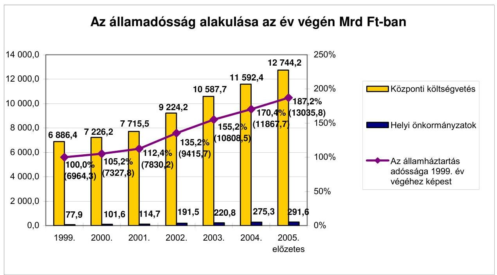
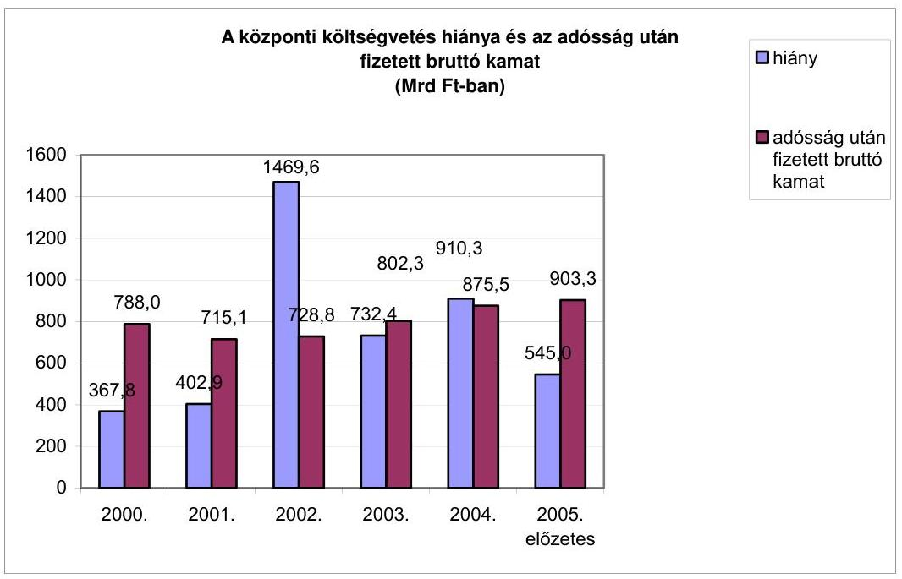
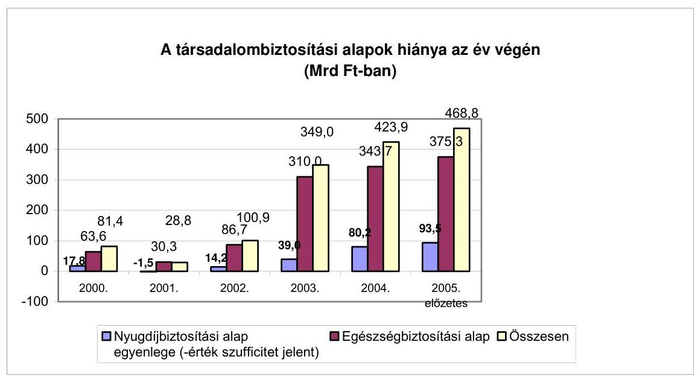
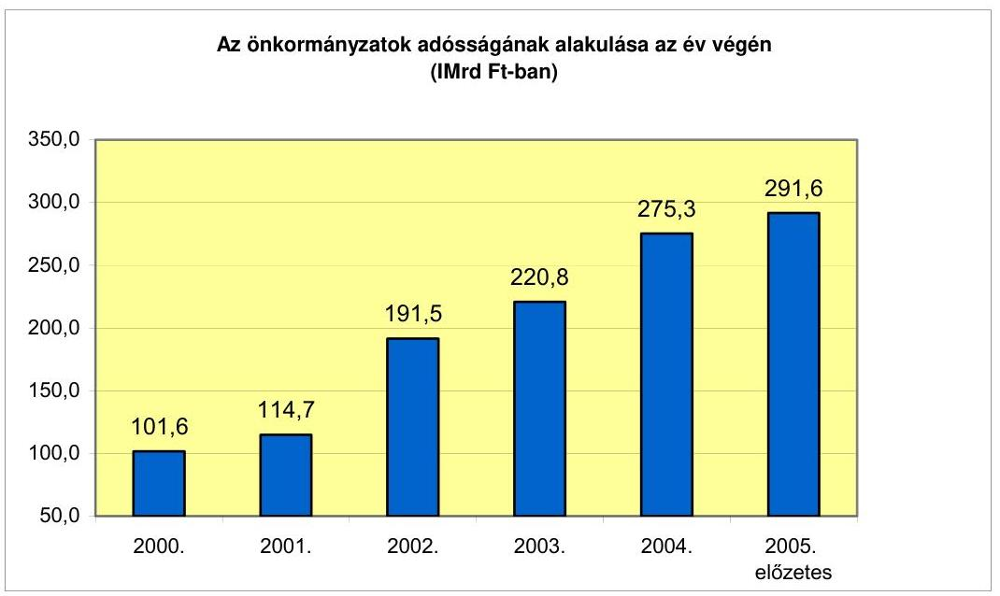
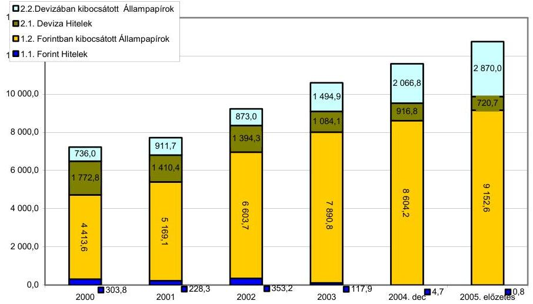
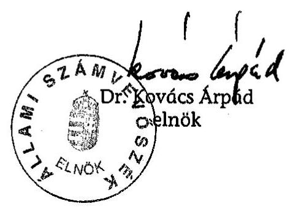
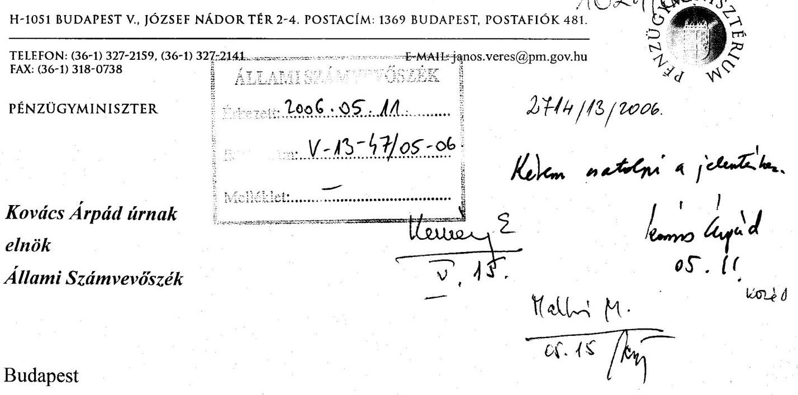
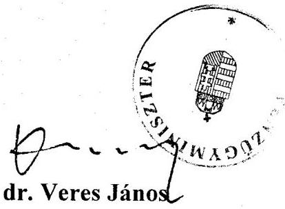

ÁLLAMI
SZÁMVEVŐSZÉK

# JELENTÉS 

az államháztartás adóssága kezelésének, alakulásának ellenőrzéséről

---

# 2. Államháztartás Központi Szintjét Ellenőrző Igazgatóság 

2.1. Teljesítmény Ellenőrzési Főcsoport
Iktatószám:V-13-46/2005-2006.
Témaszám: 775
Vizsgálat-azonosító szám: V0250

## Az ellenőrzést felügyelte:

Bihary Zsigmond
főigazgató
Az ellenőrzés végrehajtásáért felelős:
Kemény Emil
főcsoportfőnök

## Az ellenőrzést vezette:

Makkai Mária
főcsoportfőnökhelyettes
Az ellenőrzést végezték:

| Farkas László | Jenei Zoltán Béláné | Kun Eszter |
| :-- | :-- | :-- |
| főtanácsadó | számvevő gyakornok | számvevő |
| Lucza Anikó | Massányi Tibor | Németh Béláné |
| számvevő | számvevő | főtanácsadó |
| Némethné Nagy Mária | Pető Krisztina |  |
| számvevő | számvevő |  |

## A témához kapcsolódó eddig készített számvevőszéki jelentések:

## címe

Jelentés a helyi és helyi kisebbségi önkormányzatok átfogó ellenőrzéséről 0544
Jelentés az Állami Privatizációs és Vagyonkezelő Rt. 2004. évi működésének és a központi költségvetés végrehajtásához kapcsolódó tevékenységének ellenőrzéséről
Jelentés a Magyar Köztársaság 2004. évi költségvetése végrehajtásának ellenőrzéséről 0540
Jelentés a Magyar Exporthitel Biztosító Rt. működésének ellenőrzéséről
Vélemény a Magyar Köztársaság 2005. évi költségvetési javaslatáról 0449
Jelentés az Állami Privatizációs és Vagyonkezelő Rt. 2003. évi működésének és a központi költségvetés végrehajtásához kapcsolódó tevékenységének ellenőrzéséről

Jelentéseink az Országgyűlés számítógépes hálózatán és az Interneten a www.asz.hu címen is olvashatóak.

---

Jelentés a Magyar Köztársaság 2003. évi költségvetése végrehajtásának ellenőrzéséről ..... 0443
Vélemény a Magyar Köztársaság 2004. évi költségvetési javaslatáról ..... 0338 
Jelentés az Állami Privatizációs és Vagyonkezelő Rt. 2002. évi működésének és a központi költségvetés végrehajtásához kapcsolódó tevékenységének ellenőrzéséről ..... 0330
Jelentés a Magyar Köztársaság 2002. évi költségvetése végrehajtásának ellenőrzéséről
Jelentés a helyi és helyi kisebbségi önkormányzatok átfogó ellenőrzéséről ..... 0319
Vélemény a Magyar Köztársaság 2003. évi költségvetési törvényjavaslatáról ..... 0241
Jelentés az Állami Privatizációs és Vagyonkezelő Rt. 2001. évi működésének és a központi költségvetés végrehajtásához kapcsolódó tevékenységének ellenőrzéséről ..... 0233
Jelentés a Magyar Köztársaság 2001. évi költségvetése végrehajtásának ellenőrzéséről ..... 0232
Jelentés a helyi és helyi kisebbségi önkormányzatok átfogó ellenőrzéséről ..... 0220
Jelentés a társadalombiztosítás pénzügyi alapjai 2000. évi költségvetése végrehajtásának ellenőrzéséről ..... 0127
Jelentés a Magyar Köztársaság 2000. évi költségvetése végrehajtásának ellenőrzéséről ..... 0126
Jelentés az államháztartás belföldi adóssága és a központi költségvetés belföldi követelésállománya kezelésének ellenőrzéséről ..... 0118
Jelentés az Állami Privatizációs és Vagyonkezelő Rt. 2000. évi működésének és a központi költségvetés végrehajtásához kapcsolódó tevékenységének ellenőrzéséről ..... 0116
Jelentés a helyi és helyi kisebbségi önkormányzatok átfogó ellenőrzéséről ..... 0113
Vélemény a Magyar Köztársaság 2001. és 2002. évi költségvetési törvényjavaslatáról ..... 0034
Jelentés az államháztartás külföldi adóssága és a központi költségvetés külföldi követelésállománya kezelésének ellenőrzéséről ..... 0027

---

# TARTALOMJEGYZÉK 

BEVEZETÉS ..... 7
I. ÖSSZEGZŐ MEGÁLLAPÍTÁSOK, KÖVETKEZTETÉSEK, JAVASLATOK ..... 14
II. RÉSZLETES MEGÁLLAPÍTÁSOK ..... 26

1. Az államadósság szabályozottsága és kezelésének szervezeti kerete ..... 26
1.1. Az államadósság kezelésének szabályozottsága ..... 26
1.2. Az adósságkezelés szervezeti keretei ..... 27
1.3. A tulajdonosi irányítás az ÁKK Rt.-ben ..... 29
2. Az államadósság nyilvántartása és alakulása ..... 30
2.1. A nyilvántartási rendszerek ..... 30
2.2. Az államadósság alakulása ..... 31
2.3. A társadalombiztosítási és az elkülönített állami pénzalapok finanszírozási szükséglete ..... 38
2.4. Az önkormányzatok adósságának alakulása ..... 40
2.5. A maastrichti adósságmutató alakulása ..... 42
3. Az államadósság kezelése ..... 47
3.1. Az adósságkezeléssel kapcsolatos elvárások ..... 47
3.2. A finanszírozási szükséglet alakulása és annak biztosítása ..... 51
3.3. Aktív likviditáskezelés ..... 57
3.4. Az államadósság állományának szerkezete, összetétele ..... 59
4. A fizetett kamatok ..... 60
5. A követeléskezelés szabályozottsága, jogszabályi háttere ..... 62

## MELLÉKLETEK

1. sz. A Pénzügyminiszter észrevétele
2. sz. Kritériumok és teljesítménymutatók az államadósság nagyságának és ke-zelésének ellenőrzéséhez

---

.

---

# RÖVIDÍTÉSEK JEGYZÉKE 

| ÁAK Rt. | Állami Autópálya Kezelő Rt. |
| :--: | :--: |
| Áht. | Az államháztartásról szóló 1992. évi XXXVIII. tv. |
| ÁKK | Államadósság Kezelő Központ |
| ÁKK Rt. | Államadósság Kezelő Központ Részvénytársaság |
| ÁPV Rt. | Állami Privatizációs és Vagyonkezelő Rt. |
| ÁSZ | Állami Számvevőszék |
| BA Rt. | Budapest Airport Rt. |
| BKV Rt. | Budapesti Közlekedési Vállalat Rt. |
| CEB | Európai Tanács Fejlesztési Bank |
| EDP | Az Európai Unió Túlzott Hiány eljárása |
| EIB | Európai Beruházási Bank |
| EMBI | Globál Compozite AJP Morgan-Chase által számolt szuverén és kvázi szuverén kibocsátók dollárban denominált kötvényeinek kamatfelárindexe |
| EMU | Gazdasági és Monetáris Unió |
| ESA '95 | Nemzeti számlák európai rendszerének összeállításáról készített Tanácsi rendelet |
| EU | Európai Unió |
| FB | Felügyelő Bizottság |
| FITCH | Hitelminősítő |
| GDP | Éves bruttó hazai össztermék |
| GYSEV Rt. | Győr Sopron Ebenfurti Vasút Rt. |
| KESZ | Kincstári Egységes Számla |
| Kincstár | Magyar Államkincstár |
| KKV | Kis és középvállalkozás |
| KSH | Központi Statisztikai Hivatal |
| MÁK | Magyar Államkötvény |
| MÁV Rt. | Magyar Államvasutak Rt. |
| MNB | Magyar Nemzeti Bank |
| MFB Rt. | Magyar Fejlesztési Bank Rt. |
| MTI | Magyar Távirati Iroda |
| NA Rt. | Nemzeti Autópálya Rt. |
| OTC | Bankközi (nem szervezett) piac |
| PEP | Uniós csatlakozási programok |
| PM | Pénzügyminisztérium |
| Stand-by | Készenléti hitel |
| SZMSZ | Szervezeti és Működési Szabályzat |
| TB | Társadalombiztosítás |

---

.

---

# ÉRTELMEZŐ SZÓTÁR 

| aukció | olyan értékpapír forgalomba hozatali technika, amely során a kibocsátó az előzetesen meghirdetett feltételek mellett egy időpontban kéri ajánlattételre a vevőket. Az ajánlatok az ár és mennyiség alapján versenyeznek. Magyarországon az államkötvény és a diszkontkincstárjegykibocsátás általános módja az aukció |
| :--: | :--: |
| államadósság | az államháztartás valamelyik alrendszerét terhelő, hitelviszonyon alapuló fizetési kötelezettség |
| államkötvény | 1 évnél hosszabb futamidejú állampapír |
| állampapír | a magyar vagy külföldi állam által kibocsátott, hitelviszonyt megtestesítő értékpapír |
| állampapírpiaci referenciahozam | állampapírok nagy tételű, intézményi kibocsátásánál a legjobb vételi és eladási hozam átlaga |
| benchmark | viszonyítási alap, összehasonlítási érték, az ÁKK Rt.-nél alkalmazott teljesítménymutatók összefoglaló elnevezése |
| denomináció | a pénzügyi követelések, kötelezettségek devizák alapján való megoszlása (pl. forintban denominált = forintban fennálló) |
| diszkont kincstárjegy | 1 vagy 1 évnél rövidebb futamidejú, diszkontáron kibocsátott állampapír |
| duráció | hátralévő átlagos futamidő |
| elsődleges piac | az értékpapírok elsődleges forgalomba kerülésének (kibocsátásának) színtere |
| emerging market | a nemzetközi hitelminősítő intézetek által a nemzetközi tőkepiacon a befektetőknek ajánlott, felemelkedő, kiemelkedő piacokat jelenti. Minél kockázatosabb a hitelfelvevő megítélése, annál magasabb kamatfelárat fizettetnek vele |
| kamatozó kincstárjegy | 1 éves futamidejú állampapír |
| kibocsátó | az értékpapírban megtestesített kötelezettség teljesítését a maga nevében vállaló személy |
| Kincstári Egységes Számla (KESZ) | az MNB által a Kincstár részére vezetett, likvid pénzeszközök elhelyezésére és a kincstári kör pénzforgalmának lebonyolítására is szolgáló számla |
| kincstári kör finanszírozási igénye | a központi költségvetés hiánya, a TB finanszírozási szükséglete, az elkülönített alapok finanszírozási szükséglete, az MNB tartalékfeltöltésének, a privatizációs bevételek és tőkeműveletek, valamint az európai uniós mezőgazdasági támogatások előfinanszírozása és visszatérítése egyenlegének összege a nettó finanszírozási igény, amely nem tartalmazza az adósságátvállalásokat. A bruttó finanszírozási igény ezen felül magában foglalja az adósságtörlesztéseket, amelyek a rövid futamidejú adósságok éven belüli megújítása következtében a legnagyobb tételt teszik ki. A költségvetés túl-, vagy alulfinanszírozását a költségvetés KESZ-t érintő nettó forint piaci kibocsátása (mely nem tartalmazza az MNB felé történő hitel- és kötvénytörlesztéseket is) és a nettó finanszírozási igény különbsége mutatja meg. A monetáris szempontú finanszírozási mutató abban különbözik a költségvetés teljes nettó finanszírozási igénye mutatótól, hogy nem tartalmazza a jegybankkal végzett tőkeműveleteket, azaz a törlesztéseket
koncentráció egy egyszerú mutatószám, ami úgy keletkezik, hogy az egyes szereplők részesedéseit négyzetre emeljük, majd ezeket a négyzeteket összeadjuk. Könnyen belátható, hogy a HH-index minimuma az „1/a szereplők száma" (11 forgalmazó esetén $1 / 11=9,09 \%$ ), a maximuma pedig $100 \%$ (ha az egész piac egy kézben van). A HH-indexet az amerikai Igazságügyi Minisztérium használja - például a verseny - és az antitröszt-törvények betartatásakor. A gyakorlatban a $10 \%$ alatti index értéket „elfogadható koncentrációnak", a $18 \%$ felettit pedig „nagyon magasnak" tartják. A két érték közötti „szürke zónába" eső eredmények megítélése egyéb tényezőktől, pl. a megelőző időszakokhoz képest történt változás irányától, mértékétől, a résztvevők számától stb. függ
kötelező ajánlat a szempontrendszer figyelembe veszi az üzlet árazását, a tranzakció struktúráját, jutalékfeltételeit, technikai lebonyolítását. A kibocsátó meglévő hálózatát és a megcélzott befektetői körrel való kapcsolatát. A másodpiaci támogatottságot. A partner nemzetközi elismertségét, és az eddigi kibocsátásaink során szerzett tapasztalatokat
könyvépítés ajánlatok értékelése mindezen szempontokon kívül egy plusz szempontot is vizsgál, mégpedig a könyv átláthatóságát, és a kibocsátó beleszólását az allokációba. A könyv egy számítógéppel elérhető regisztrációs oldal, melyet a főszervező bank vezet és ahol a befektetők az ajánlataikat tudják regisztrálni. 2000. óta minden devizakötvénykibocsátást könyvépítéses módszer szerint bonyolított le az ÁKK Rt.
másodlagos piac a már meglévő pénzügyi eszközök piaci körülmények között, változó árfolyamon való adásvételének színtere
repóügylet olyan megállapodás, amely az értékpapír tulajdonjogának átruházásáról rendelkezik a szerződéskötéssel egyidejűleg meghatározott, jövőbeli időpontban történő visszavásárlási kötelezettség mellett, meghatározott visszavásárlási áron

---

# JELENTÉS 

## az államháztartás adóssága kezelésének, alakulásának ellenőrzéséről

## BEVEZETÉS

Az államháztartásról szóló 1992. évi XXXVIII. törvény (továbbiakban: Áht.) 110. §-a alapján az államadósság minden olyan hitelviszonyon alapuló fizetési kötelezettség, amely az államháztartás valamelyik alrendszerét terheli.

A központi költségvetés fizetőképességének fenntartásával, az adósság és a hiány finanszírozásával, nyilvántartásával kapcsolatos feladatait a pénzügyminiszter 2001. március elseje előtt az Államadósság Kezelő Központon (továbbiakban: ÁKK), majd 2001. március 1-jétől önállóan gazdálkodó társaságon, az Államadósság Kezelő Központ Rt.-n (továbbiakban: ÁKK Rt.) keresztül látta, illetve látja el. Az állampapír-kibocsátásokat, a hitelfelvételeket és törlesztéseket a pénzügyminiszter által jóváhagyott államadósság-kezelési stratégia, valamint az éves finanszírozási tervek alapján végzi az ÁKK Rt. 2003. június 30-tól az ÁKK Rt. feladatkörébe tartozik a szabad pénzeszközök kezelése.

A központi költségvetés forintban kifejezett év végi adósságának állományát az éves finanszírozási szükségleten túl a devizaárfolyam változása is befolyásolja, ami nem érinti a finanszírozási igényt. A központi költségvetés adósságát az ÁKK Rt. a magyar számviteli szabályok szerint tartja nyilván és az Állami Számvevőszék azt a 2003. évre vonatkozó adatoktól kezdődően minden évben auditálja.

Az éves finanszírozási szükségletet a lejáró adósság megújítási igénye, valamint a kincstári kör (központi költségvetés, TB alapok, elkülönített alapok) mindenkori hiánya határozza meg. Ezen túl a finanszírozási igényt módosíthatja a KESZ egyenlegének és a Magyar Nemzeti Bank (továbbiakban: MNB) kiegyenlítési tartalékának változása, az Áht.-ban nevesített megelőlegezési, illetve likviditási hitelek nyújtása, az uniós kifizetésekkel kapcsolatos megelőlegezések (EMOGA) és a privatizációs bevételek költségvetést érintő hányada.

Az Áht. előírásainak megfelelően a társadalombiztosítási
 (továbbiakban: TB) alapok és az elkülönített állami pénzalapok hiányukat a Magyar Államkincstáron (továbbiakban: Kincstár) keresztül a Kincstári Egységes Számláról (továbbiakban: KESZ) felvett megelőlegezési hitelekkel finanszírozzák. A megelőlegezési hitelből származó kötelezettségeket a mindenkori zárszámadási törvények alapján a központi költségvetés elengedi, ezért az alapok hiánya a központi költségvetést terhelő államadósságot növeli. Az alapok többlete - ami az elkülönített állami pénzalapokat 2000-2004 között jellemezte - csökkenti a finanszírozási igényt.

---

Az önkormányzatok esetében az összesített adósság kimutatására nincs kijelölt szervezet, ezért azt a Pénzügyminisztérium (továbbiakban: PM) az államháztartásra vonatkozó számviteli szabályok alapján dolgozta ki és adta át az ellenőrzés részére. Az önkormányzatok adósságukat saját nyilvántartásuk alapján önállóan kezelik.

Magyarország 2004. évi EU csatlakozását követően kötelezett az uniós statisztikai követelményeknek megfelelő államadósság bemutatására. A 12 uniós tagállam által 1992-ben aláírt Maastrichti szerződés alapján az EU tagállamok a közös valuta bevezetésére vállaltak kötelezettséget. A gazdasági és pénzügyi unióhoz csatlakozni kívánó országoknak eleget kell tenniük, többek között az inflációra, a hosszú távú kamatlábra, valamint az árfolyam-stabilitásra vonatkozó feltételeknek. További, a költségvetési politika keretében teljesítendő kritérium, hogy az ESA '95 ${ }^{1}$ Nemzeti számlák összeállításáról szóló Tanácsi rendelet (továbbiakban: ESA '95) módszertana alapján meghatározott költségvetési hiány, valamint a Túlzott hiány eljárásról szóló szabályozás (továbbiakban: EDP jelentés) szerint meghatározott, névértéken számított államadósság állománya nem haladhatja meg a GDP 60\%-át, az éves hiány pedig a GDP 3\%-át. Az így kimutatott hiányt és adósságot hívjuk maastrichti hiány- és adósságmutatónak. Az MNB írásbeli tájékoztatása szerint az EDP jelentésnek a nemzeti számlák adatain kell alapulnia, amelynek következménye, hogy a jelentés elsősorban a KSH nem pénzügyi számláira és az MNB pénzügyi számláira épül. A tájékoztató kitér arra, hogy „mivel a statisztikai államadósság nem tipikusan nemzeti számlás kategória, mérlegelés tárgyát képezte, hogy mely intézmény felelősségi körébe tartozzon összeállítása. A legközelebbi viszonyban a pénzügyi számlák állományi adataival van az adósság, ezért az MNB elvállalta ennek a mutatónak az elkészítését". Az MNB hangsúlyozta, hogy mind a konvergencia programban, mind a zárszámadási dokumentumban a kormányzati szektor tényidőszaki adósságára vonatkozóan ugyanaz az MNB által készített adat szerepel.

Az ellenőrzés során az Áht. szerint meghatározott államadósság alakulását, összetételét és kezelését vizsgáltuk. ${ }^{2}$ Ezen túl célszerűnek tartottuk bemutatni az ESA '95 számbavételi módszer szerint kimutatott adatsorokat is. A jelentésben az államadósság az Áht. szerinti államadósságot jelenti. Az uniós statisztikai módszertan szerint számított államadósságot külön jelezzük.

[^0]
[^0]:    ${ }^{1}$ Az uniós szabályok nem foglalkoznak az egyes tagállamok belső költségvetési rendszerének a költségvetés összeállításának és bemutatásának kérdésével. Azt viszont meghatározzák, hogy az Uniónak milyen módszertan szerint kell az adatokat összeállítani és azokat szolgáltatni. Az adatok összeállítása a nemzeti számlák rendszere (European System of Accounts, ESA '95 számlarendszer) alapján történik, amely nemzetközileg egyeztetett fogalmakat, meghatározásokat és elszámolási szabályokat rögzít. A tagországoknak a túlzott hiány eljárás (Excessive Deficit Procedura, EDP) szabályai szerint kell az adatszolgáltatást teljesíteni (ez a notifikációs jelentés) és az EU a közölt adatok alapján vizsgálja meg, hogy valamely ország hiánya túlzott mértékű-e, vagy sem.
    ${ }^{2}$ Az Áht. meghatározásából következően az államadósságnak nem része az állami garancia- és kezességvállalás. Az Állami Számvevőszék a mindenkori zárszámadás ellenőrzése keretében rendszeresen vizsgálja a garancia és kezességvállalásokat és azok beváltását. Az ellenőrzések azt mutatják, hogy a kezességek minimális részaránya került beváltásra, átlagosan a központi költségvetés hiányának 0,35\%-át képviselték. A kezességbeváltás a költségvetési hiányon keresztül áll kapcsolatban az államadóssággal.

---

Az államot megillető követeléseket a Kincstár tartja nyilván, és egy részét kezeli. A számviteli szabályok értelmében a követelések értéke nem számolható el, és nem mutatható ki az államadósságot ellentételező tényezőként, az államháztartás pénzügyi helyzetének megítéléséhez célszerűnek tartottuk a kötelezettségeken túl a követelések bemutatását is.

Az Állami Számvevőszék (továbbiakban: ÁSZ) a 2000-2001. években átfogóan ellenőrizte az 1997-1999 közötti külföldi és belföldi államadósság, követelésállomány kezelését. Az 1991-1997. évi adósság kezelése mellett az ÁSZ 1998-ban készült jelentésében értékelte az MNB által felvett adósság 1997. évi átvállalását is. A jelentésekben foglalt főbb megállapítások a következők voltak.

Az államháztartás bruttó adósságállománya az 1990. és 1996. évek között folyóáron több mint 3,5 szeresére, 1401,4 milliárd Ft-ról 5114,0 milliárd Ft-ra emelkedett. Az ellenőrzött hat év (1991-1996) egyben a piacgazdaságra való áttérés, a gazdasági, társadalmi, közigazgatási és pénzügyi átállás időszaka volt. Az államadósság jogi szabályozása fejlődött, több lényeges kategória vonatkozásában nem adott eligazítást az államháztartás adósságának reális számbavételéhez. A költségvetési hiányfinanszírozás adósságkezelés szervezeti kereteinek létrehozása az ÁKK kincstári szervezethez csatolásáig és kapacitásának bővítéséig (1996. év) lépéshátrányban volt a feladatokkal szemben. A központi költségvetés finanszírozásának, az adósságkezelésének normatív követelményrendszere még nem alakult ki teljes körűen. Az államadósság alakulásában a központi költségvetés adóssága volt a meghatározó tényező. Az alrendszer adósságának bővülése az 1993. és 1995. években volt kiugró, összefüggésben az adósság átvállalásokkal, illetve a forint-leértékelések hatásával. Az adósság összetételében jelentős átrendeződés ment végbe, megnőtt a belföldi adósság állomány abszolút és relatív nagysága. Az 1991. előtti, szinte kizárólagos jegybanki hitelezést 1995. második felétől a pénzpiaci finanszírozás váltotta fel. A kamatozó belföldi adósság szerkezete is ennek megfelelően átalakult, a hitelek 1990. évi 95\%-os aránya 1996 végére 20\%-ra csökkent. Az 1996 elejéig tartó periódus a finanszírozás tanuló korszakának, a szervezeti keretek és a mechanizmusok kialakulásának évei voltak. A pénzpiaci alapokra helyezett hiányfinanszírozás költségei nem éreztették korlátozó hatásukat a költségvetési hiányok mértékének alakulásában. A központi költségvetés bruttó adósságának számottevő tényezője az egyéb belföldi adósság volt (nem hiányfinanszírozásból felhalmozódott tartozás), melynek állománya 1990-1996. között közel megnégyszereződött. A növekmény nagyobb részben a piacgazdasági átmenethez, tulajdonosváltáshoz, a nemzetgazdaság egyes területeinek „válság" kezelésében vállalt állami helytálláshoz, aktuális költségvetési helyzethez kapcsolódott.

Az MNB és a költségvetés közötti 1997. évi nettó adósságcseréhez az ÁSZ az ellenjegyzést törvényességi szempontok alapján megadhatónak ítélte, tekintettel arra, hogy a megállapodások a hatályos jogrendnek megfeleltek. A devizaadósság cserével a központi költségvetés lejárat nélküli, nem kamatozó adósságának megszüntetése, a külföldi és belföldi adósságkezelési feladat egy szervezethez telepítése a monetáris és fiskális folyamatok „tisztulását" segítette. Az államháztartás többi alrendszerének adóssága együttesen és külön-külön is emelkedett. Bruttó adósságuk nagyságrendjét és arányát tekintve azonban nem jelentett számottevő tényezőt. A jelentésben az ÁSZ rögzítette, hogy az ál-

---

lamháztartás adósságának átfogó jogi szabályozása, információs rendszere teljessé és egyértelművé tétele, a nyilvántartás hiányosságainak megszüntetése, a megbízható adatszolgáltatás, a jelentős és növekvő adósságteher hatékonyabb kezelése, további átgondolt és következetes intézkedéseket igényel.

A belföldi és a külföldi államadósságról szóló ÁSZ jelentések megállapították, hogy az államháztartás információs rendszere nem tette lehetővé az államadósság államháztartási szinten egységes, megbízható számbavételét az ellenőrzött években. Az MNB éves jelentésének adatai szerint az államháztartás bruttó (bel- és külföldi) adósságállománya az 1997. és az 1999. évek között 28,0\%-kal, 5440,3 milliárd Ft-ról 6964,3 milliárd Ft-ra nőtt. Az államháztartás egyes alrendszerei adósságának konszolidálását törvény nem szabályozta és hivatalosan egyeztetett, egységesen értelmezett, alkalmazható konszolidálási módszer sem volt. A PM és az ÁKK a bruttó államadóságot mutatta ki.

A belföldi államadósság fogalomkörét jogszabály nem használta, az államadósság elkülönítése a denomináció (forint-deviza) alapján történt. Az ellenőrzött évek hiányfinanszírozási és adósságkezelési feladatát a Kincstáron belül elkülönült szervezet, az ÁKK végezte (2001. március 1-jétől ÁKK Rt.). Az állam-adóság-kezelés, elszámolás legfontosabb teendőit utasítások, szabályzatok, eljárási rendek rögzítették. A Kincstár és az ÁKK között a feladat- és felelősségmegosztást megállapodás rendezte.

Az adósságkezelési stratégiában megfogalmazott, a kedvezőbb portfoliószerkezet elérésére vonatkozó célok (pl. a forintpiaci adósság átlagos futamidejének növelése, a fix adósság arányának emelése, a devizaadósság részarányának fokozatos csökkentése) nagyobb részt teljesültek. Az államkötvények átlagos kamatozásának százalékadatai igazolták az adósságkezelési stratégiában megfogalmazott célok helyességét. A legalacsonyabb kamatszázalékok a fix kamatozású kötvényekhez tartoztak, legdrágábbnak a változó kamatozású kibocsátások bizonyultak. A központi költségvetés az ellenőrzött években hitelt nem vett fel, azonban más hiteladósok tartozásainak tőke- és kamat-visszafizetési kötelezettségeit átvállalta. A központi költségvetés állampapír (kötvény, kincstárjegy) kibocsátásai alapvetően a jóváhagyott finanszírozási tervhez igazodóan valósultak meg. A kibocsátásokra vonatkozó döntések, valamint azok végrehajtásának előkészítése az ellenőrzött időszakban szakmailag megalapozott volt. A külföldi kötvénykibocsátások és a szindikált hitelfelvétel szerződési háttere, valamint dokumentációja rendezett volt, de a szerződések az ÁKK-nál nem álltak rendelkezésre magyar nyelven. A kötvénykibocsátásokról és hitelfelvételről vezetett nyilvántartások - elsősorban az ÁKK-nál - naprakészek és megbízható információkat adtak. Az állami külföldi hitelfelvételek előkészítése - korábbi ellenőrzési tapasztalatainkhoz hasonlóan - még mindig nem volt kielégítő. Erre utalt, hogy az ellenőrzött programok között alig volt található olyan, amelynek a megvalósítása a szakmai tartalom, a kivitelezési idő és/vagy a ráfordítások nagysága tekintetében megegyezett a hitelfelvétel (hitelkihelyezés) szerződött feltételeivel. A központi költségvetéssel kapcsolatos hatásköri és eljárási szabályok szerint a hiányfinanszírozás módjának jóváhagyása országgyúlési hatáskörbe tartozott. Az Országgyűlés az ellenőrzött évek mindegyikében (1997-1999.) a finanszírozási mód rögzítése nélkül hatalmazta fel a pénzügy

---

minisztert a központi költségvetési hiány finanszírozásának feladatára. A hiányfinanszírozás összetételének meghatározása így adósságmenedzselési döntéssé vált. Az ellenőrzött években a KESZ folyamatos likviditás-biztosításának feladata mellett forrásbevonási műveleteket kellett végezni a központi költségvetés hiánya, az éves költségvetési törvényekben - az államháztartás más alrendszerei részére - biztosított KESZ megelőlegezési hitel igénybevétele, valamint az adósságszolgálati kiadások pénzügyi fedezetének megteremtése érdekében. A KESZ egyenlege időnként jelentősen ingadozott, nagyságára egyre csökkenő mértékben hatott a privatizációból realizált bevételek alakulása.

Módosult az adósságkezelés stratégiai- és elvi kérdéseinek döntési rendje: megalakult a - PM, Kincstár, ÁKK és az MNB vezetőiből álló - Kincstári Tanács (KT). A KT nem ülésezett a szabályzatban meghatározott két havonkénti gyakorisággal és a helyszíni ellenőrzés befejezéséig nem foglalt állást az ÁKK által kidolgozott államadósság kezelési stratégiáról.

Az ellenőrzés indokoltnak tartotta a pénzügyi kormányzatnak az államadósság kezelés szervezeti kereteinek megváltoztatására irányuló törekvéseit, és szorgalmaztuk az adósságkezelés eredményességének mérésére szolgáló mutatók kialakítását.

A társadalombiztosítási alrendszernél az államadósság közvetetten volt értelmezhető, mivel adósságának rendezése a központi költségvetésen keresztül történt. A TB alapok kimutatott belföldi bruttó adósságállománya 1999. december 31-én 55,7 milliárd Ft-ot tett ki. Az 1999. év végi adósságállomány a Nyugdíjbiztosítási Alap és az Egészségbiztosítási Alap között 15-85\%-ban oszlott meg. A társadalombiztosítási alapok adóssága keletkezésének oka a tartóssá vált forráshiány, a bevételi előirányzat és a kiadások tervezettől eltérő alakulása, a hiány költségvetési megtérítési módja volt.

A helyi önkormányzatok belföldi adósságállományában a meghatározó hányadot a hosszú lejáratú tartozások jelentették, amelyek beruházásokhoz, fejlesztésekhez, felújításokhoz kapcsolódtak, döntően az infrastrukturális igények gyorsított ütemű kielégítésével összefüggésben. A rövid lejáratú hitelek átmeneti forráshiány pótlására, illetve a működési bevételek megelőlegezésére
 szolgáltak. Az államháztartás önkormányzati alrendszerének külföldi adóssága 1999. végén 26,2 milliárd Ft volt.

A jelenlegi ellenőrzés ${ }^{3}$ célja annak értékelése volt, hogy

- az államháztartás adósságának kezelésének kormányzati és pénzügyminisztériumi elvárása érvényesült-e, a szervezeti, személyi, technikai feltételei törvényességi, célszerűségi és eredményességi szempontból megfelelőek-e, az egyes intézmények egymás közötti feladatmegosztása segíti-e az adósság és a követelések egységes kezelését, átláthatóságát;

[^0]
[^0]:    ${ }^{3}$ Az ellenőrzést 97. témasorszámon, 2005. augusztus 1-jei kezdési határidővel, mint 2005-ről 2006-ra áthúzódó feladatot először a 2004. december 15-én jóváhagyott ÁSZ ellenőrzési terv tartalmazta, és ennek megfelelően szerepel a jelenlegi, 2005. december 21-én jóváhagyott tervben, amely a jelentést megvitató elnöki értekezlet időpontjául 2006. február 27-ét jelölte meg.

---

- az államadósság, valamint a központi költségvetés követelésállományának alakulása és nyilvántartása, összetétele törvényes volt-e;
- az adósságkezelésben részt vállaló szervezetek szabályszerűen bonyolították le a forrásbevonásokat, illetve adósságkezelési tevékenységük megfelelt-e a tulajdonosi elvárásoknak;
- a likviditás-kezelési műveletek segítették-e a Kincstári Egységes Számla egyenlegére vonatkozó előírások betartását.

Ez a jelentés bemutatja az államadósság növekedését kiváltó közvetlen okokat, összetevőket. (TB alapok nélküli központi költségvetés hiánya, TB alapok hiánya stb.). Az adósságnövekedés eredendő tényezőit (azaz döntően a hiány kialakulásának okait) a jelentés minden területre kiterjedően, részleteiben nem tartalmazza, mivel az ÁSZ jelentéseinek szinte mindegyike kitér, illetve utal a hiány okaira. Ezek közül meghatározóak a zárszámadások ellenőrzéséről készített jelentések és a költségvetéshez adott vélemények. Évek óta visszatérően jelzi az ÁSZ a költségvetési bevételek felültervezését, a kiadások alultervezését, a költségvetés évközi többszöri módosításának negatív következményeit, a hatásvizsgálatok nélküli tervezést, az államháztartás hosszú távú egyensúlyi követelményeinek biztosítása érdekében az állami feladatok tartalma és finanszírozási mértéke meghatározásának szükségességét.

Az ÁSZ a zárszámadások ellenőrzése keretében minden évben foglalkozik az államadóssággal, adósságszolgálattal. Ezen túl az adósság széles időhorizontban történő elemzésének, változása nyomonkövetésének, a tendenciák bemutatásának érdekében meghatározott időközönként - az ellenőrzött időszak tekintetében a folyamatosságot biztosítva - átfogóan is ellenőrzi az államadósságot. Minderre figyelemmel a jelenlegi ellenőrzés a 2000-2005. I. félév közötti időszakra irányult, indokolt esetben kiterjedt a korábbi évekre és 2005 végéig figyelemmel kísérte a helyszíni ellenőrzés lezárását követő eseményeket is. A jelentés a 2005. évre vonatkozóan a rendelkezésre álló előzetes adatokat tartalmazza. ${ }^{4}$

A helyszíni ellenőrzés mellett felhasználtuk mindazokat a számvevőszéki jelentéseket, amelyek megállapításai kapcsolódtak az államadósság kezeléséhez, alakulásához, illetve a Magyar Államot megillető követelések kezeléséhez.

A helyszíni ellenőrzés lezárását követően (2005. szeptember 30.) az államadósságot 2005. évben érintő események közül kiemelkedő volt a Budapest Airport (továbbiakban: BA) használati jogának átadásából származó bevételek felhasználása. Az ÁSZ rendelkezésére bocsátott dokumentumok (átutalási megbízások, szerződések) alapján - amelyeket szabályossági szempontból vizsgáltunk - az ÁKK Rt. 402,3 milliárd Ft-ot fordított közvetlenül, névértéken az államadósság törlesztésére. A BA ügyletből származó bevétel államadósság törlesztés-

[^0]
[^0]:    ${ }^{4}$ A központi költségvetés államadóssága kezelésével kapcsolatos értékpapírok és egyéb kötelezettségek/követelések (2005. december 31-ére vonatkozó) egyeztetett leltára 2006. március közepén állhat legkorábban a számvevőszéki ellenőrzés rendelkezésére. A központi költségvetés 2005. évi adósságának megbízhatóságáról a zárszámadás ellenőrzése keretében mondunk véleményt.

---

re történő felhasználásának szabályszerűségére vonatkozó részletes megállapításokat a 2005. évi költségvetés végrehajtásának ellenőrzéséről szóló ÁSZ jelentés fogja tartalmazni.

Az ellenőrzés jogalapját az Állami Számvevőszékről szóló 1989. évi XXXVIII. tv. 1. § (2) bekezdése, a 2. § (1), (3) és (5) bekezdése, a 3. §, a 17. § (1) bekezdése, valamint az államháztartásról szóló 1992. évi XXXVIII. tv. 120/A. § (1) bekezdése képezte.

A jelentést egyeztetésre megküldtük a pénzügyminiszternek. Levelét az 1. számú melléklet tartalmazza. ${ }^{5}$

[^0]
[^0]:    ${ }^{5}$ A jelentést 2006 márciusában megküldtük a pénzügyminiszternek az ÁSZ törvény előírása szerinti egyeztetésre. A pénzügyminiszter további, szintetizáló egyeztetéseket tartott szükségesnek, amelyek - mint az leveléből kitűnik - május első hetében zárultak le. Ez alkalmat adott arra, hogy a PM által időközben összeállított 2005. évi előzetes önkormányzati adatokkal kiegészítsük jelentésünket, és így az államháztartás adósságának 2005. évi előzetes adatait is szerepeltessük a jelentésben.

---

# I. ÖSSZEGZŐ MEGÁLLAPÍTÁSOK, KÖVETKEZTETÉSEK, JAVASLATOK 

Az államadósság körébe tartozik minden olyan hitelviszonyon alapuló fizetési kötelezettség, amely az államháztartás valamelyik alrendszerét (a központi kormányzatot, a helyi önkormányzatokat, a társadalombiztosítás pénzügyi alapjait, valamint az elkülönített állami pénzalapokat) terheli. A társadalombiztosítási és az elkülönített állami pénzalapok alrendszereinek hiányát a központi költségvetés finanszírozza, ezért azok a központi költségvetés adósságának részei.

Az ÁKK Rt. adatai szerint - amelyeket a 2003. évre vonatkozó adatoktól kezdődően az ÁSZ auditált - a központi költségvetés adóssága az 1999. december 31-ei 6886,4 milliárd Ft-ról 2004. év végére 11592,4 milliárd Ft-ra, (68,3\%-kal) nőtt, az előzetes adatok alapján a 2005. év végi adósságállomány 12744,2 milliárd Ft, amely 2000. évhez viszonyítva 85,1\%-kal nőtt. ${ }^{6}$ A központi költségvetés államadósságon belüli aránya csökkent, 2000-ben 98,6\%-ot, 2004. év végén 97,7\%-ot tett ki. Ugyanakkor a vizsgált időszak elején, 2000-2001-ben a központi költségvetés adósságának éves növekedése 500 milliárd Ft alatt volt, 2002-ben a növekedés háromszorosára emelkedett (1504,7 milliárd Ft),

[^0]
[^0]:    ${ }^{6}$ A központi költségvetés államadóssága kezelésével kapcsolatos értékpapírok és egyéb kötelezettségek/követelések (2005. december 31-ére vonatkozó) egyeztetett leltára 2006. március közepén állhat legkorábban a számvevőszéki ellenőrzés rendelkezésére. A központi költségvetés 2005. évi adósságának megbízhatóságáról a zárszámadás ellenőrzése keretében mondunk véleményt.

---

2003-tól pedig évi 1000 milliárd Ft körül állandósult. A központi költségvetés hiányának 2002. évi növekedéséhez jelentős mértékben (38,1\%) az járult hozzá, hogy a Magyar Állam költségvetésen kívüli szervezetektől hitelt vállalt át, vagy részükre államkötvényt juttatott térítésmentesen. Az átvállalt hitelek döntő többsége mögött fejlesztések, beruházások (MÁV fejlesztései, autópálya beruházások stb.) álltak, amelyek a jövőbeni fejlődést szolgálták, ezért ez az adósságnövekedés nem tekinthető kedvezőtlennek. 2003-ban a Magyar Állam hitelt nem vállalt át és kötvényt sem adott át. A Magyar Állam 2004-ben 31,6 milliárd Ft, 2005-ben 180,3 milliárd Ft összegben vállalt át gazdálkodó szervezetektől hiteleket. Ez utóbbiak döntő részét a Nemzeti Autópálya Rt. hiteltartozása jelentette.

A Budapest Airport használati jogának átadásából származó bevételekből az ÁKK Rt. 402,3 milliárd Ft-ot fordított közvetlenül, névértéken az államadósság törlesztésére. Ebből 177,8 milliárd Ft a Nemzeti Autópálya Rt.-nek a kereskedelmi bankokkal szemben fennállt, 2005-ben átvállalt hiteltartozás visszafizetése volt. Ezen túl az ÁKK Rt. 32,4 milliárd Ft összegben államkötvényeket vásárolt vissza és 192,1 milliárd Ft értékben az MNB-vel szemben fennálló devizahitelt előtörlesztett. Az MNB felé történő előtörlesztésre vonatkozó pénzügyminiszteri döntésre az ÁKK Rt. által elkészített elemzés alapján került sor, amely figyelembe vette az általa kidolgozott és aktualizált előtörlesztésekre vonatkozó szempontrendszert és a pénzügyminiszter által jóváhagyott adósságkezelési stratégia teljesítménymutatóit. A PM által az ÁKK Rt. részére megküldött 2005. december 28-ai elektronikus levél az MNB-vel szemben fennálló devizaadósság piaci értéken való előtörlesztését tartalmazza. ${ }^{7}$

[^0]
[^0]:    ${ }^{7}$ A BA értékesítés és használati jog átadás előkészítésének, lebonyolításának vizsgálatát az ÁSZ az ÁPV Rt. 2005. évi tevékenységének ellenőrzése keretében végzi el. A BA ügyletből származó bevétel államadósság törlesztésre történő felhasználásának szabályszerűségére vonatkozó részletes megállapításokat a 2005. évi költségvetés végrehajtásának ellenőrzéséről szóló ÁSZ jelentés fogja tartalmazni.

---

A központi költségvetés adóssága növekedésének 63,3\%-át a költségvetés hitelátvállalások nélküli hiánya, 24,8\%-át a társadalombiztosítási alapok hiánya és 11,9\%-át egyéb tényezők okozták.

A központi költségvetés hiánya elsősorban olyan működési jellegű kiadásokhoz kapcsolódik, amelyek eredményeképpen nem várhatóak a jövőben bevételek és kiadás-megtakarítások. A hiány növekedése annak ellenére következett be, hogy 2003-tól a kiadások visszafogása érdekében a Kormány számos megszorító intézkedést hozott. Ezek azonban csak átmenetileg mérsékelték a hiány növekedését, mivel az államháztartás túlelosztást eredményező rendszere lényegében nem változott, elmaradt a finanszírozható állami feladatrendszer meghatározása, és ebből következően is hiányoznak a költségvetés tervezésénél a mérhető és ellenőrizhető teljesítmények. A központi költségvetés egyre növekvő adóssága következtében a kamat abszolút összege is rendre emelkedett. 2000-2005 között a fizetett kamat - amely része a hiánynak - a központi költségvetés adósság növekedésének 82,2\%-ának megfelelő nagyságrendű volt. Ez azt jelenti, hogy az államadósság - a kamatterheken keresztül - determinálja és beszűkíti a költségvetés mozgásterét.

A központi költségvetés adósságát befolyásolta az is, hogy a társadalombiztosítási alapok éves hiánya 2000-ről 2005-re több mint ötszörösére emelkedett. A társadalombiztosítási alapok bevételeit meghaladó kiadások finanszírozása érdekében az Áht. alapján a Kincstár likviditási célból kamatmentes megelőlegezési hitelt nyújt az alapok részére. A mindenkori zárszámadási törvények rendelkezése alapján a központi költségvetés az alapok előző évi hiányával egyező mértékű, KESZ-szel szembeni hitelt egy évvel később elengedi.

---

Az alapokon belül az egészségbiztosítási alap hiánya volt a meghatározó (83,3\%), amelynek oka az ÁSZ zárszámadási jelentései szerint a járulékkulcsok (bevételek) csökkentése, illetve a kieső források - központi költségvetésből történő - pótlásának elmaradása volt. A Kormány - az Áht. előírásai ellenére - az egyensúly tartós, átfogó helyreállítása érdekében intézkedést nem tett. ${ }^{8}$ A nyugdíjbiztosítási alap hiánya mérsékeltebb, ugyanakkor növekvő, ami a járulékkulcsok csökkentésének és a nyugdíjreform következményeként vállalt központi költségvetési megtérítés szükségesnél alacsonyabb volta miatt következett be.

Az egyéb tényezők közül a legnagyobb tételek a következők voltak. Az árfolyam változás és a KESZ likviditásának hatása minden évben jelentkezett változó előjellel, de összességében a hat év alatt az adósságot csökkentették. A privatizációs bevételek 3 évben mérsékelték az adósságot, az MNB tartalékfeltöltése és az EU Emoga támogatás megelőlegezése 3, illetve 2 évben növelte az adósságot. A hitelátvállalások és kötvényátadások 4 évben növelték az adósságot. Az egyéb tényezők közül ez utóbbiaknak volt a legmagasabb az értéke, 821,6 milliárd Ft.

[^0]
[^0]:    ${ }^{8}$ 2006. január 1-jétől létrejött a nemzeti kockázatközösség, ami az Egészségbiztosítási Alap hiányának rendezéséhez járul hozzá.

---

Az önkormányzatok adóssága növekvő tendenciájú (az államadósságnak 2000-ben 1,4\%-a, 2005. év végén 2,2\%-a volt), állománya a 2000. év végi 101,6 milliárd Ft-ról 2005. év végére 291,6 milliárd Ft-ra nőtt. Ez 187,0\%-os növekedést jelent, amely meghaladta a központi költségvetés hasonló terheinek emelkedését. Az önkormányzatok adósságán belül a fejlesztések miatti adósság a meghatározó (átlagosan 85\%). Az önkormányzatok adóssága bár nem meghatározó az államadósság növekedésében, azonban a működési célú eladósodás az önkormányzatok gazdálkodásában kedvezőtlen tendenciát jelez, mivel 2000-ben az önkormányzatok 13,9\%-a, 2004-ben 20,3\%-a kényszerült működését finanszírozó hitelek felvételére. Ez azért is figyelmet érdemel, mivel az önkormányzatok adósságának több mint 30\%-a a fővárost terhelte, amely minden évben beruházási célokat szolgált.

Az elkülönített állami pénzalapoknál 2000-2004 között - a Munkaerőpiaci Alap 2001. évi deficitje kivételével - nem volt hiány, így az államadósság növekedéséhez nem járultak hozzá.

A nyilvánosságra hozott államadósság adatok közül az EU csatlakozást követően, a maastrichti
 adósságmutatónak van kiemelt jelentősége, amelyhez egzakt követelmény kapcsolódik, kiszámításának módszertana egységes és szabályozott. Az eurózónához (EMU) csatlakozás feltétele, hogy a kormányzati szektort terhelő államadósság a GDP 60%-a, éves hiánya pedig annak 3%-a alatt legyen. A kormányzati szektor bővebb az Áht.-ban megjelölt államháztartásnál, mivel olyan állami tulajdonban álló vállalkozásokat (pl. ÁPV Rt., NA Rt. stb.), illetve olyan nonprofit szervezeteket is felölel, amelyek működése hasonlít a kormányzati szervekéhez (pl. közalapítványok, közhasznú társaságok). A mutatók számítása eredményszemléletű. Az uniós statisztikai módszerek alkalmazásával számított adósságmutató a vizsgált időszakban a megkövetelt 60%

---

alatt volt, amiben 2004-ben szerepet játszott a módszertani elvek változása is. ${ }^{9}$ Az Unió költségvetési hiányra vonatkozó 3%-os elvárása nem teljesült.

Az Áht. 2003-tól írja elő az ún. kormányzati szektort terhelő adósságmutató és az Áht. szerinti államadósság összefüggésének, kapcsolatának kimutatását, de nem nevesíti, hogy a maastrichti adósságmutató kidolgozása melyik szervezet feladata. A zárszámadási törvények általános indoklásában az Országgyűlés 2001-től tájékoztatást kap az uniós módszerek alapján számított adósságmutatókról, amelyet az MNB készít el. Az MNB ezt a feladatát 2004-től a Központi Statisztikai Hivatal (továbbiakban: KSH) a PM és az MNB között létrejött írásos együttműködési megállapodás alapján látja el, erre ezt megelőzően iránymutatás nem volt. A nyilvánosság számára nem átlátható, hogy mikor, ki és milyen adósságállományt értékel, és a többféle, különböző módszer szerint számított adósságok milyen elemeket tartalmaznak.

Az Áht. meghatározza az államadósság fogalmát és azt is rögzíti, hogy a zárszámadáskor az Országgyűlés részére azt, alrendszerekre megbontva kell bemutatni. A zárszámadás Országgyűlés részére történő benyújtásáért a Kormány felelős.

Az Országgyűlés részére bemutatott államadósság az ÁKK Rt. által nyilvántartott és kezelt központi költségvetési adósságot tartalmazza. A mindenkori zárszámadások általános indokolásának melléklete bemutatja az államháztartás alrendszereinek eszköz-forrás mérlegét, amelyeknek kötelezettség oldalán a hitelviszonyon alapuló kötelezettségek is megjelennek. A mérlegekből azonban nem állapítható meg az államadósság, mivel az Áht. meghatározásából következően nem minden mérlegszerinti kötelezettség tartozik az államadósság fogalmába (pl. év végi munkabér, adó, szállítói kötelezettség). A Kormány 1992. óta nem jelölte ki az államháztartás egészét terhelő adósság bemutatásának felelősét, módját. Nincs módszertan a számviteli adatokból származó államadósság kimutatásának rendjéről (pl. piaci vagy névérték, konszolidáció, illetve egyéb értékelési irányelvek). Ez is szerepet játszott abban, hogy az Országgyűlés egyik évben sem kapott tájékoztatást az önkormányzati alrendszer adósságáról. ${ }^{10}$

[^0]
[^0]:    ${ }^{9}$ A magánnyugdíjpénztárak nélküli, kormányzati szektort terhelő adósság 2004-ben 60,3%-os volt. A magánnyugdíjpénztárak figyelembevétele átmeneti lehetőség, 2007. év elejétől visszamenőlegesen a múltbeli adatokból is ki kell hagyni ezeket a tételeket.
    ${ }^{10}$ Az önkormányzati alrendszer egészét terhelő adósság fent jelzett problémakörével az ÁSZ sorra foglakozott. Ezek közül kiemelkedők az államadósság alakulásával kapcsolatos 0027., 0118. és 406 sz. ÁSZ jelentések, amelyek mindegyikében rögzítettük, hogy az államháztartás információs rendje nem tette lehetővé az önkormányzati alrendszer adósságának megállapítását. Az önkormányzatok költségvetési beszámolóiból nem volt megállapítható a hosszú lejáratú adósság összege. Ezért javasoltuk a beszámolási rendszer alkalmassá tételét az adósságadatok egyértelmű meghatározására és bemutatására. Ennek hatására is az önkormányzatok beszámoló rendszere folyamatosan változott, de az adósság megállapításához még mindig korrekciók szükségesek. Az ÁSZ jelentései mindezek miatt, mintegy hiánypótló szerepet töltöttek be az önkormányzati alrendszer adósságáról történő tájékoztatásban.

---

Az államháztartás Áht. szerinti adóssága alakulására vonatkozóan a mindenkori kormányzat jogszabályi kereteken belül nem élt/él elvárásokkal. A pénzügyminiszter az ÁKK Rt. útján gondoskodik a központi költségvetés adósságának nyilvántartásáról, kezeléséről. A mindenkori költségvetési törvények indokolása tartalmazta a központi költségvetés adósságának kezelésével kapcsolatos általános alapelveket, amelyek alapját képezték az ÁKK Rt. által kidolgozott és a pénzügyminiszter által évente jóváhagyott államadósság kezelési stratégiának. Az ÁKK Rt.-nek a stratégia szerint a költségvetés finanszírozási szükségletét hosszú távon kell biztosítania, minimális költséggel és elfogadható kockázatok vállalása mellett, amelynek végrehajtása során alapvetően a piaci kereslethez kell alkalmazkodnia. A stratégia hosszú távú célokat tűz ki, de ezek végrehajtása alá volt/van rendelve a rövid távú feladatoknak (évente 7-9 alkalommal történő költségvetési törvénymódosítások, privatizációs bevételek hektikus alakulása stb.), azaz a fizetőképesség fenntartásának. 2002 és 2004 között a bevonandó források értéke az eredetileg tervezetthez képest mindezek miatt megemelkedett. A többlet forrásbevonásokat elsősorban a központi költségvetés és a TB alapok hiányának tervezettnél -mind az eredeti, mind a módosítotthoz képest - magasabb mértéke váltotta ki. Ezen túl rendkívüli finanszírozási tételként jelent meg 2002-ben és 2003-ban is a jegybank kiegyenlítési tartalék feltöltési igénye, amely az MNB devizapozícióján a Ft felértékelődése miatt elszenvedett könyvszerinti veszteséget ellentételezi, 2004-ben pedig az EU-Emoga alapból finanszírozott mezőgazdasági támogatások előfinanszírozása miatt vált szükségessé. A rendkívüli forrásbevonás abban az időszakban keletkezett, amikor az állampapír piaci hozamok a tervezettnél magasabbak voltak. A többlet forintkibocsátásokat döntően külföldi megtakarítás finanszírozta. A külföldi befektetők nem tekinthetők hosszú távon stabilaknak, mivel gyorsan reagálnak a gazdaság külső megítélésére, a pénzpiaci helyzetekre (eladják az állampapírokat, illetve nem vagy csak magas felár mellett vásárolják meg az újonnan kibocsátott állampapírokat), aminek következtében megnő a forintpiaci kamatkockázat. Ezzel szemben a háztartások stabil, válságokra kevésbé érzékeny részét képezik a finanszírozásnak, azonban megtakarításaik csökkenése miatt egyre kisebb arányban vesznek részt az állampapírok vásárlásában.

A költségvetési politika elsődleges szerepe az ÁKK Rt. irányításában személyi megoldásokon keresztül is érvényesül, mivel a pénzügyminiszter irányítása mellett az igazgatóság és az FB tagjai - az ÁKK Rt. vezérigazgatója és vezérigazgatóhelyettese kivételével - kizárólag a PM képviselői. A tulajdonosi ellenőrzést biztosító FB a pénzügyminiszter kérésére, az alapító okirat előírásaival ellentétben nem foglalkozik az adósságkezelési tevékenység kontrolljával. Az ÁKK Rt. alapító okirata szerint az FB minden olyan előterjesztést köteles megvizsgálni, amely az alapító kizárólagos döntési hatáskörébe tartozó ügyet érint, így az államadósság-kezelési stratégiát, a finanszírozási tervet és a teljesítménymutatókat. Ez utóbbiakat a pénzügyminiszter 2001. február 27-én kelt levelében megfogalmazott kérésére az FB nem vizsgálta, azonban mindezt az alapító okiraton nem vezették át.

Az ÁKK Rt. tevékenységének fontosabb területeire, a stratégiai célok számszerűsítése és a teljesítmény mérése érdekében teljesítménymutatókat dolgozott ki, amelyeket a piaci kereslet változása függvényében módosított. A pénzügyminiszter által jóváhagyott mutatókat az ÁKK Rt. - a KESZ egyenlegére vonatkozó kivételével - minden évben betartotta. Ennek keretében az ÁKK Rt. biztosította,

---

hogy a devizaadósság több, mint 95%-a euróban áll fenn, a devizaadósságon belül a fix kamatozású állomány aránya a meghatározott intervallumon belül volt, a forintadósságon belül a fix kamatozású állomány aránya (66,9%) 2005. év végén megfelelt az irányadó sávnak (61-83%). Az adósság súlyozott átlagos hátralévő futamideje a 2001. évi 1,66 évről a 2005. évre 2,46 évre nőtt, a devizaadósság részaránya a portfolión belül a 2000. évi 34,7%-ról 2005-re 28,2%-ra csökkent.

Az ÁKK Rt. által a KESZ egyenlegére meghatározott teljesítménymutató az állomány minimális, 2003-tól az optimális nagyságára is kiterjedt. A KESZ optimális állományának biztosítania kell a központi költségvetés, TB és az elkülönített állami pénzalapok likviditását és biztonságos finanszírozását. A KESZ napi állományának változása jelentős ingadozást mutatott a vizsgált időszakban, ami a költségvetési bevételek és kiadások alakulásának ciklikusságából adódott és ennek ellensúlyozására nem állt elegendő információ az ÁKK Rt. rendelkezésére. Az ÁKK Rt.-nek a likviditáskezelési műveletekről olyan több napos prognózis alapján kell döntenie, amelynek pontatlansága miatt csökken az optimális döntéshozatal lehetősége. Ez annak a következménye, hogy nincs olyan jogszabályi előírás, amely a KESZ-en keresztül történő kifizetések Kincstár részére történő előrejelzését, bejelentési kötelezettségét írná elő a költségvetési szervek részére. Emiatt a Kincstár által 3-4 naponta az ÁKK Rt. részére átadott prognózisok - a prognózisok idejére eső, de előre nem ismert tranzakciók miatt - nem a napi tényhelyzetet tükrözik. Ez megnehezíti a KESZ egyenlegének napi szintű célsávba igazítását, azaz „simítását”. A nap végi KESZ állományok egyre nagyobb számban estek az ÁKK Rt. által meghatározott - egyre magasabb értékű - minimális állományi elvárás alá (2000-ben 15 nap, 2001-ben 3 nap, 2002-ben 44 nap, 2003-ban 57 nap, 2004-ben 42 nap, 2005-ben 18 nap). 2004-ben és 2005-ben a likviditáskezelés hatására az eltérések száma csökkent. A minimális állomány arra az esetre jelent tartalékot, amikor a finanszírozás végrehajtása eltér az előirányzottól. Az ingadozások fokozódása miatt a tartalékolás igénye rendre növekszik.

A pénzügyminiszter hatáskörébe tartozik a finanszírozási terv jóváhagyása, amely magába foglalja a nettó finanszírozási igényt, valamint az adósság finanszírozását. A nettó finanszírozási igényt a központi költségvetés hiányának, a TB és az elkülönített alapok finanszírozási szükségletének, az MNB tartalékfeltöltésének, a privatizációs bevételeknek és 2004-től az európai uniós mezőgazdasági támogatások nettó előfinanszírozásának egyenlege adja. Az adósságkezelési műveletek közé a hitel felvételek és törlesztések, az állampapír visszafizetések és kibocsátások, valamint a hitelátvállalások miatti kifizetések tartoznak. Az ÁKK Rt. ezek összessége és az adósságkezelési stratégiában rögzített feltételek alapján határozza meg és ütemezi a bevonandó forrásokat, kifizetéseket. A finanszírozási tervet - a pénzügyminiszter jóváhagyásával - az ÁKK Rt. 2000-2005. között éven belül többször módosította, a költségvetési előirányzatok évközi változásai és egyéb - az ÁKK Rt.-n kívül álló - tényezők (hitelátvállalások, privatizációs bevételek előre nem látható nagysága stb.) miatt. Az ÁKK Rt. a forrásbevonásokat és a törlesztéseket a KESZ-en keresztül bonyolítja, így azok nem különülnek el a költségvetés folyó műveleteitől (kiadások és bevételek). A nettó finanszírozási igény a 2000 és 2005 közötti években 449 milliárd Ft-ról 978,7 milliárd Ft-ra nőtt, a növekedés több mint 75%-át a központi költségvetés hiányának emelkedése okozta.

---

Az ÁKK Rt. a finanszírozási igény biztosításához 2000-2005 között 12 963,7 milliárd Ft értékben éven túli lejáratú forrásokat vont be, a törlesztés összege 7967,0 milliárd Ft volt, azaz hosszú lejáratú források finanszírozták az adósság 4996,7 milliárd Ft-os növekedését. A törlesztések nem eredményezték az adósság csökkenését, mivel azok teljesítéséhez új forrásbevonásra volt szükség (adósságmegújítás). Ezen túl a kincstárjegyek kibocsátása 20 135,1 milliárd Ft-al járult hozzá a finanszírozáshoz. Ez utóbbiaknál a nettó - törlesztésekkel csökkentett - érték a gyakori forgási sebesség miatt alacsonyabb, hiszen 815,9 milliárd Ft-nyi adósságnövekedés testesült meg ezekben a papírokban. Az időszak egészét tekintve hosszú lejáratú források bevonásával fedezték az adósságnövekedés 86,0%-át.

A forrásbevonásoknál, azok előkészítésénél az eljárási szabályok érvényesültek, és előkészítésük szakmailag megalapozott volt. A 2000-2005 között bevont források 9,2%-a hitelfelvételből, 90,8%-a értékpapír kibocsátásból származott. A forrásbevonások 74,5%-a forintban valósult meg. A forintban bevont források évenkénti alakulása nem volt egyenletes, ami tükrözte a stratégiai elvárásokhoz és a piaci kereslethez való alkalmazkodást. 2002-ben a Kormány döntése alapján a lejáró devizaadósságot forintban kellett megújítani, szemben a korábbiakban rögzített azon elvvel, miszerint a
 lejáró forint adósságot forintban, a lejáró devizaadósságot devizában kell megújítani. 2002. évben a finanszírozási szükséglet az előző évit 576,2 milliárd Ft-tal (35,4\%-kal) meghaladta, amelyet az ÁKK Rt. biztosítani tudott, annak révén, hogy a forint kötvény kibocsátások 56\%-át külföldi befektetők vásárolták meg. 2003. évben a forint kötvények iránti kereslet csökkent (a háztartási szektor nettó hitelfelvevővé vált, a kieső keresletet a vállalati szektor nem tudta ellensúlyozni, a külföldi befektetők érdeklődése a forint kötvénykibocsátások iránt is mérséklődött), ezért devizakötvények kibocsátásával tudta biztosítani a finanszírozást az ÁKK Rt. 2004-től a piaci kereslet és kínálat egyensúlya helyreállt, úgy, hogy a stratégiai elvek változását követően a devizában való eladósodás arányát növelték.

Az ÁKK Rt. számára a központi költségvetés adóssága, illetve a költségvetés finanszírozási igénye megoldandó technikai feladatként jelentkező tény, nincs visszahatása a kialakult helyzeteket meghatározó költségvetési politikára. Az ÁKK Rt. az Áht. előírásainak megfelelően az állami költségvetés fizetőképességének fenntartását a vizsgált időszakban biztosította. A központi költségvetés adósságának nyilvántartása az ÁKK Rt.-nél megfelelt a vonatkozó jogszabályi előírásoknak, összetétele pedig a pénzügyminiszter által jóváhagyott mindenkori adósságkezelési stratégia szerint alakult.

Az ÁKK Rt. működési költségeinek előirányzatát a mindenkori költségvetési törvények tartalmazták. A vizsgált időszakban - 2002. év kivételével - az előirányzott összegek évről évre csökkentek, miközben az ÁKK Rt. által végrehajtott adósságműveletek volumene 80-100\%-kal nőtt. Az ÁKK Rt. szervezeti működésének, irányításának, döntési rendszerének szabályozása a jogszabályokkal összhangban állt, döntési és irányítási rendszere megfelelő volt.

---

Az ország külső adósságának hitelbesorolása a vissza nem fizetés kockázatát tükrözi. Magyarország adósságának hitelminősítése 2000-2005. május 27. között javult, vagy változatlan maradt az újabb minősítés során. (Kivételt képez a FITCH minősítése, amely 2003 júliusában kiadott közleményében a hosszú lejáratú forint- és devizaadósság minősítésének (A-) kilátását stabilról negatívra változtatta). A két időpont között a kamatfelárak a hitelminősítéseknél változékonyabban alakultak. A 2000. és 2005 között összesen 4813,0 milliárd Ft kamatot fizetett ki a központi költségvetés, amely a költségvetési hiányon keresztül hozzájárult az adósság növekedéséhez. Az adósság növekedési üteme a vizsgált években magasabb volt, mint a bruttó kamatkiadások növekedési üteme. Ebben szerepet játszott a hozamok csökkenése és a kedvezőbb szerkezetű adósság portfolió (a magasabb kamatozású adósságelemek törlesztése, illetve előtörlesztése következtében) kialakítása. A hosszú lejáratú hozamok alakulásában - az ÁKK Rt. elemzése szerint - kis szerepet játszottak a hazai makrogazdasági fejlemények, illetve a monetáris politika, azok a rövidlejáratú hozamoknál éreztették hatásukat. A nemzetközi tényezők hatása a hosszú lejáratú források hozamait befolyásolta. Az ÁKK Rt. az adósságkezelés során mindezt figyelembe vette, 2003-tól a nettó kincstárjegyállomány változás (rövidlejárat) csökkenő tendenciájú volt.

Az államadóssághoz kapcsolódóan több kockázati tényező merül fel, amelyeknek jövőbeni kihatásai lehetnek.

Az államadósságnak a jelentős külső finanszírozási hányada miatt a szuverén államadósság leminősítése egy kedvezőtlen befektetői reakció kialakulásának lehetőségét hordozza magában. Az adósságállomány további növekedése, különösen ha az párosul az adósság finanszírozásánál a hozamok (kamatok) emelkedésével, a kamatkiadások abszolút összegének emelkedését, és egyben a költségvetés mozgásterének a jelenleginél is nagyobb beszűkülését okozhatja. A TB alapok hiányának finanszírozási igénye jelentősen nőtt. Ebben elsősorban az egészségbiztosítási alap a meghatározó, ami azt jelzi, hogy az egészségügy pénzügyi egyensúlyi helyzetének megteremtése kiemelten fontos feladat. A nyugdíjbiztosítási alap hiányának növekedése mérsékeltebb volt, azonban növekvő tendenciája miatt az adósságnövekedés kockázatát jelenti.

Az önkormányzatok adósságának növekedése önmagában is fontos jelzés, de kiemelendő két szerkezeti jellemzője. Egyfelől az önkormányzatok adósságállománya a saját bevételeknek egyre nagyobb hányadát teszi ki, ami a hitelfelvételi kapacitás relatív szűkülését jelzi. Másfelől a működési hitelállomány növekedése az önkormányzatok működési költségvetéseinek deficitjére utal, s ez a szektor további eladósodottságának kockázatát jelenti. Mindezek a kockázatok egyben az adósság finanszírozásának a kockázatai is, mivel előidézhetik a finanszírozás megnehezülését, csak magasabb költség melletti lebonyolítását, és ezáltal a költségvetés egyre nagyobb mértékű determinációját.

---

A Magyar Államot megillető követelések és a követelések kezelésének fogalmát az Áht. nem határozza meg ${ }^{11}$. A Kincstár által összeállított nemzetgazdasági elszámolások könyvvitel mérlege alapján az államot megillető követelésállomány a 2000. évi 1112 milliárd Ft-ról 2005. I. félév végére 1660 milliárd Ft-ra, azaz 49,3\%-kal növekedett. ${ }^{12}$ Az emelkedés elsősorban az APEH adótartozások és a TB, valamint az önkormányzatok számára nyújtott megelőlegezési hitelállomány folyamatos (összesen 494\%-os) növekedéséből származott. A Kincstár által kezelt belföldi követelésállomány a vizsgált időszakban emelkedett és 2004-ben az összes állami követelés 46,4\%-át tette ki. A Kincstár által kezelt állomány meghatározó részét (2005. június 30-án 95\%-át) a TB alapoknak és az önkormányzatoknak nyújtott megelőlegezési hitelek adják, amelyek intézkedést nem igényelnek. A Kincstár által kezelt egyéb állományon belül mind a belföldi, mind a külföldi követelések mobilizálására a Kincstár lehetőségei korlátozottak, mivel az érintett adósok egy része felszámolási eljárás alatt áll, másrészt pedig a követelés keletkezésekor nem volt gyakorlat széles körű biztosítéki rendszer alkalmazása. A vizsgált időszak alatt a külfölddel szemben fennálló állami követelések állománya 33,5\%-kal csökkent. A követelések többségének leépítése áruszállítás, illetve szolgáltatás nyújtás alapján történt.

A helyszíni ellenőrzés megállapításainak hasznosítása mellett javasoljuk:

# a Kormánynak 

1. Kezdeményezze az Áht. módosítását annak érdekében, hogy az
a) nevezze meg az uniós statisztikai módszerek szerinti hivatalos adósság adatokat publikáló szervezetet;
b) szabályozza az állami követelések, és azok kezelésének fogalmát.
2. Határozza meg és rendeletben szabályozza az államháztartás egészére - különös tekintettel az önkormányzatok összesített adósságára - vonatkozó államadósság bemutatásának felelősét.
3. Dolgozzon ki és terjesszen az Országgyűlés elé a Társadalombiztosítási Alapok mindenkori pénzügyi egyensúlyának megteremtését szolgáló javaslatot.
[^0]
[^0]:    ${ }^{11}$ A 0118. sz. ÁSZ jelentés az államháztartás belföldi adóssága és a központi költségvetés belföldi követelésállományának alakulásáról megállapította, hogy az adósságállományhoz hasonlóan törvényileg egyértelműen nem szabályozott az államháztartás alrendszereinél a követelésállomány fogalma és a kintlevőségként számbavehető tényezők köre sem.

    A Pénzügyminisztérium 2005. október 21-ei levele szerint ,,az állami követelésekkel kapcsolatosan valóban fennállnak definiciós és szabályozási hiányosságok, amelyek pótlására vonatkozó igény szakértői szinten legalábbis - felmerült és megindult erről a gondolkodás".
    ${ }^{12}$ A követelések 2005. évi előzetes adataival a PM 2006. május végén fog rendelkezni.

---

# a pénzügyminiszternek 

1. Határozza meg az államadósság kimutatásának rendjét, módszertanát (konszolidálás, számviteli adatok felhasználása, piaci vagy névérték alkalmazása stb.).
2. Intézkedjen annak érdekében, hogy a KESZ napi likviditáskezeléséhez az ÁKK Rt. részére megfelelő időben, megbízható és pontos információ álljon rendelkezésére.
3. Gondoskodjon arról, hogy az ÁKK Rt. alapító okirata összhangba kerüljön az FB megváltozott feladatkörével.

---

# II. RÉSZLETES MEGÁLLAPÍTÁSOK 

## 1. AZ ÁLLAMADÓSSÁG SZABÁLYOZOTTSÁGA ÉS KEZELÉSÉNEK SZERVEZETI KERETE

### 1.1. Az államadósság kezelésének szabályozottsága

Az Áht. 110. §-a alapján államadósság minden olyan hitelviszonyon alapuló fizetési kötelezettség, amely az államháztartás valamelyik alrendszerét terheli.

Az Áht 1. §-a szerint az államháztartást a központi kormányzat, az elkülönített állami pénzalapok, a helyi önkormányzatok és a társadalombiztosítási alapok alkotják.

A négy alrendszer közül kettő - a központi költségvetés és a helyi önkormányzatok - tart nyilván olyan kötelezettségeket, amelyek az államadósság részét képezik.

Az Áht. 111. §-a előírja, hogy az államháztartás alrendszerei az őket terhelő adósságból eredő kötelezettségek nyilvántartásáért, kezeléséért és teljesítéséért önállóan felelősek, a 112. § (1) bekezdése alapján az államadósság mértékét az alrendszerekre megbontva kell bemutatni az Országgyűlés részére. Az Áht. azonban nem tartalmazza azt, hogy milyen formában kell bemutatni az államháztartás egészét terhelő adósságot. A törvény az államadósság konszolidálásának módjáról sem rendelkezik.

A PM az államadósság tartalmára, összeállítására, konszolidálására vonatkozó módszertant nem tudott az ellenőrzés rendelkezésére bocsátani, írásbeli tájékoztatása alapján „jelenleg készül szabályozási javaslat a különböző adósságkategóriák (központi költségvetési, állam-, államháztartási-, maastrichti adósság) tartalmáról és nyilvántartásáról".

A szabályozási hiányosság következtében a mindenkori zárszámadási törvények csak a központi költségvetés bruttó adósságát mutatják be.

Az Áht. 124. § (2) bekezdése a Kormány számára előírja az Áht. 116. §-ában foglaltak, ezen belül az államadósság bemutatására vonatkozó tájékoztatók részletes szabályozását. Ilyen szabályozást a Kormány nem dolgozott ki. Az ÁSZ zárszámadási jelentéseiben már korábban is jelezte, hogy az Áht. 124. §-ában jelzett kötelezettségének a Kormány csak részben tett eleget.

A helyi önkormányzatok adósságukat önállóan tartják nyilván és kezelik. A helyi önkormányzatokról szóló 1990. évi LXV. tv. 88. § (2) bekezdése szerint az adósságot keletkeztető éves kötelezettség vállalásainak (hitelfelvételek és járulékok, kötvénykibocsátás, garancia és kezességvállalás, lízing) felső határa a korrigált saját bevétel. A felsoroltak közül az államadósság körébe a hitelfelvétel és a kötvénykibocsátás tartozik, amelyek nyilvántartására vonatkozó szabá-

---

lyokat az államháztartás szervezetei beszámolási és könyvvezetési kötelezettségének sajátosságairól szóló 249/2000. (XII. 24.) Korm. rendelet tartalmazza.

A társadalombiztosítási alrendszernél az államadósság a központi költségvetés adóssága, mivel az ellátások fedezetének KESZ-ről való finanszírozása átmeneti jellegű, és addig áll fenn, amíg az Alapok hiányát - az Országgyűlés döntése alapján - a zárszámadás keretében rendezik.

Az Áht. 48. §-a alapján a pénzügyminiszter gondoskodik a központi költségvetés adósságának nyilvántartásáról, az adósság törlesztéséről, valamint a kincstári körbe tartozók hiányának finanszírozásáról.

A pénzügyminiszter feladat- és hatáskörét 2002. június 30-ig az 50/1990. (IX. 15.) Korm. rendelet határozta meg, ezt követően a 140/2002. (VI. 28.) Korm. rendelet szabályozza. A rendeletek értelmében a pénzügyminiszter - a Kormány által a mindenkori költségvetési törvény indokolásában megfogalmazott stratégiai alapelveknek megfelelően - elkészíti és jóváhagyja az államháztartás finanszírozási politikáját, valamint jóváhagyja a finanszírozási stratégiát.

A pénzügyminiszter - az ÁSZ-ról szóló 1989. évi XXXVIII. törvény 2. §-ának megfelelő ÁSZ ellenjegyzést követően - a költségvetés javára hitelt vehet fel. Emellett a pénzügyminiszter értékpapírt bocsáthat ki, valamint felelős az állami vagyonpolitika elveinek meghatározásáért, melynek során gondoskodik a gazdaságpolitika és a költségvetéspolitika összehangolásáról, figyelemmel az államadóssággal való összefüggésekre is.

Az államadósságra vonatkozóan az EU felé való statisztikai adatszolgáltatás területén fontos szerepe van az MNB-nek. Az MNB a statisztikai értelemben vett kormányzati szektor konszolidált bruttó névértékes adósságáról szolgáltat adatot az uniós előírásoknak megfelelően. Az MNB ezt a feladatát a PM-mel és a KSH-val kötött megállapodás keretében látja el.

# 1.2. Az adósságkezelés szervezeti keretei 

Az Áht. rendelkezése alapján a központi költségvetési alrendszer adósságának nyilvántartásáért, kezeléséért 2001. március 1-jétől a pénzügyminiszter az ÁKK Rt. útján felel.
2001. március 1-jéig a pénzügyminiszter ezt a feladatot az ÁKK közreműködésével látta el, amely a Kincstár részjogkörrel rendelkező, részben önálló költségvetési szerveként működött, amit az államadósság kezelésének és finanszírozásának speciális, az állam többi feladatától jól elkülönülő jellege indokolt. Az ÁKK ellátta mind a belföldi, mind a külföldi adósságkezeléssel összefüggő feladatokat.

Döntéshozó szerve a Kincstári Tanács volt, amely a PM, a Kincstár, az MNB és az ÁKK vezetőiből állt. A Kincstári Tanács tárgyalta meg, illetőleg hagyta jóvá az ÁKK
 által készített adósságkezelési stratégiát, éves finanszírozási tervet, a havi szintre lebontott, naptári év végéig meghatározott finanszírozási tervet, a finanszírozásról készített tájékoztató anyagokat, valamint a forrásbevonás típusaira, várható időpontjára vonatkozó devizafinanszírozási tervet.

---

Az ÁKK Rt. létrehozásáról a 2001. és 2002. évi költségvetésről szóló 2000. évi CXXXIII. törvény 82. §-a rendelkezik. A PM írásbeli tájékoztatása szerint az ÁKK Rt. létrehozásának indokairól és várható hatásairól készült előterjesztésről, tanulmányról nincs tudomásuk, a vizsgálat rendelkezésére csak az ÁKK e témában készült elemzése állt.

Az elemzés többek között megállapította, hogy az államadósság kezelés célját, az államadósság alacsony kockázat mellett történő, olcsó kezelését a kormányzat akkor érheti el, ha egyértelmű döntési, felelősségi és számonkérési rendszer működik, ami elsődleges céljának az adósság hatékony kezelését tekinti. A gazdasági társasági forma biztosítja a stratégiai célmeghatározás, a végrehajtás és ellenőrzés intézményesült rendszerét.

Az ÁKK Rt. felelős a központi költségvetést terhelő államadósság nyilvántartásáért. Emellett elkészíti a központi költségvetés éves és középtávú finanszírozási tervét, kidolgozza az államadósság finanszírozási stratégiáját, szervezi az állampapír-kibocsátásokat, hitelfelvételeket, hitelátvállalásokat, illetve gondoskodik az államadósság terheinek kifizetéséről és szervezi a másodlagos állampapírpiacot. Az ÁKK Rt. likviditáskezelési feladatai bővültek 2003. június 30-tól, ettől kezdve már nem csak az államadósság, hanem az állam átmenetileg szabad pénzeszközeinek kezeléséről is gondoskodik. Ezzel összefüggésben az ÁKK Rt. repóügyleteket köthet, amely ügyletek célja pénzkölcsön felvétele vagy adása megfelelő értékpapír-fedezet mellett.

Az ÁKK Rt.-ben kialakított decentralizált döntési-irányítási rendszer megfelelő, a döntési jogkörök kellően körülhatároltak. Az ÁKK Rt. szervezeti működésének, irányításának, döntési rendszerének szabályozására létrehozott belső utasítások a jogszabályokkal összhangban állnak.

Az ÁKK Rt. működési költsége 2001 és 2004 között a központi költségvetés kiadási főösszegéhez viszonyítva minden évben csökkent, a 2001. évi 0,015%-ról 2004-re 0,012%-ra, míg 2004-ben az adósság törlesztésének összege 80%-kal, és a kibocsátások mennyisége 100%-kal volt magasabb a 2000. évi szintnél.

Az Áht. 18/G. § (2) bekezdés a) pontja szerint az államadósság-kezeléssel összefüggésben az éves költségvetési törvényben megjelölt díj mértéke „az adott évet kettővel megelőző költségvetési évre vonatkozó zárszámadási törvény szerinti bruttó adósságállomány 0,12 ezreléke". A Magyar Köztársaság 2003. évi költségvetéséről szóló 2002. évi LXII. tv. 78. §-ának (6) bekezdése megváltoztatta az Áht. 18/G. §-ának (2) bekezdés a) pontját. 2003. január 1-jétől az Áht. már nem tartalmazza a díj mértékét.

Az ÁKK Rt. működésére szánt összeg 2002-ben 5%-kal volt magasabb, mint 2001-ben (A Magyar Köztársaság 2001. és 2002. évi költségvetéséről szóló törvény határozta meg az ÁKK Rt. 2001. évre jóváhagyott bevételét, összege 826,4 millió Ft. Az ÁKK Rt. 2001. március 1-jével történő létrehozása miatt ennek időarányos része 688,7 millió Ft). A következő években - 2003-ban és 2004-ben - az ÁKK Rt.-nél a működésére szánt összeg 5,5%-kal, illetve 5,6%-kal csökkent. A működési költségeken belül a legnagyobb részarányt a személyi jellegű ráfordítások (62%, 69%, 67%, 68,6%) és az igénybe vett szolgáltatások képezték (31%, 21,7%, 22%, 21,4%).

---

Az ÁKK Rt. éves beszámolóját a független könyvvizsgáló minden évben pozitívan véleményezte, amely szerint az éves beszámoló az ÁKK Rt. év végén fennálló vagyoni, pénzügyi és jövedelmi helyzetéről megbízható és valós képet adott és az üzleti jelentés az éves beszámoló adataival összhangban volt.

# 1.3. A tulajdonosi irányítás az ÁKK Rt.-ben 

Az ÁKK Rt. alapítói jogait a pénzügyminiszter gyakorolja. Az ÁKK Rt. alapító okirata - amely összhangban áll a vonatkozó jogszabályokkal - tartalmazza az alapító kizárólagos hatáskörébe tartozó kérdéseket, továbbá az igazgatóság feladat- és hatáskörét, illetve a felügyelő bizottság (továbbiakban: FB) feladatait.

Az alapító okirat szerint az igazgatóság felel az alapító határozatainak végrehajtásáért, az FB pedig az alapító részére ellenőrzi a társaság ügyvezetését, illetve irányítja a társaság belső ellenőrzését.

Az alapító az alapító okiratban kijelölt hatásköri feladatait ellátta és döntéseit az előírt formában hozta meg. Ennek megfelelően alapítói határozat hagyta jóvá az igazgatóság és az FB ügyrendjét, a társaság üzleti terveit, éves beszámolóit, az államadósság kezelés stratégiáját, a finanszírozási tervet, a teljesítménymutatókat, illetve az igazgatósági és felügyelő bizottsági tagok kinevezését, visszahívását.

Az igazgatóság feladatai az ügyrendjében jól meghatározottak és a hatáskörébe tartozó valamennyi stratégiai kérdésben döntést hoz. A döntéseket egyszerű szótöbbséggel hozza meg, ami kizárja az egyszemélyes döntés lehetőségét.

A hét főből álló igazgatóság öt tagját a PM delegálja. Az elnöki posztot a PM mindenkori közigazgatási államtitkára tölti be. A személyi folytonosságot a PM egyik szakemberének, illetve az ÁKK Rt. vezérigazgatójának és általános vezérigazgató-helyettesének folyamatos igazgatósági tagsága jelenti. Valamennyi igazgatósági ülésről - az ügyrendnek megfelelően - évenkénti folyamatos sorszámozással jegyzőkönyv készül.

Az FB ügyrendjét és munkatervét alapítói határozat hagyta jóvá. Az FB 2002. június 13-ig 3 tagból állt, ezt követően a tagok száma 5-re növekedett. Az FB elnökét a PM delegálja. Az FB üléseit szükség szerinti gyakorisággal tartja. 2001-ben 3, 2002-ben 5, 2003-ban 6, 2004-ben 7 FB ülést tartottak.

Az FB ügyrendje alapján köteles megvizsgálni az ÁKK Rt. valamennyi lényeges - az alapító határozathozatalának tárgyát képező - üzletpolitikai jelentését, valamint minden olyan előterjesztést, amely az alapító kizárólagos hatáskörébe tartozó ügyre vonatkozik, amelynek az FB részben tett eleget.

A gyakorlatban az FB feladatkörébe a részvénytársasági formához tartozó, jogszabály szerint kötelező döntések ellenőrzése tartozik, az államadóssággal összefüggő stratégiai, finanszírozási döntések, illetve a teljesítménymutatók vizsgálata nem, annak ellenére, hogy ezek jóváhagyása az alapító kizárólagos hatáskörébe tartozik. Ennek a gyakorlatnak az alapját a pénzügyminiszter 2001. február 27-én kelt levele képezte. Ez az állásfoglalás az FB alapító okiratban

---

meghatározott feladatkörének, ellenőrzési hatáskörének nem felel meg. Ezt az ellentmondást az ÁSZ a Magyar Köztársaság 2001. évi költségvetése végrehajtásáról szóló 0232. sz. jelentésében észrevételezte ${ }^{13}$, azonban intézkedés nem történt.

Az ÁKK Rt. alapító okirata értelmében a belső ellenőrzés irányítója az FB. A belső ellenőrzést 1 fő látja el, aki az ellenőrzések végrehajtásához elegendő.

A belső ellenőr éves ellenőrzési terv alapján végzi a tevékenységét, amelyet az FB hagy jóvá, ennek megfelelően cél-, téma- és utóvizsgálatokat végez, amelyekről jelentést készít, illetve javaslatokat tesz a feltárt hiányosságok megszüntetésére. A belső ellenőr figyelemmel kíséri a külső ellenőrzések megállapításai nyomán tett intézkedéseket.

A belső ellenőr feladata kiterjed a társaság pénzügyi, gazdasági tevékenységének, hatékonyságának vizsgálatára, az adósságkezeléssel összefüggő elszámolások, munkafolyamatok ellenőrzésére.

Az ellenőrzési terv végrehajtásáról szóló beszámolót az FB minden esetben megtárgyalta és elfogadta. Éves szinten 6-8 vizsgálatot végzett az ellenőr. Az egyes ellenőrzések során tett javaslatok, megállapítások vonatkozásában az ÁKK Rt. megtette a szükséges intézkedéseket.

# 2. Az Államadósság nyilvántartása és alakulása 

### 2.1. A nyilvántartási rendszerek

Az államadósság Országgyűlés felé történő bemutatásának alapelveit az Áht. nem tartalmazza. Nincs meghatározva, hogy az adósságot milyen értéken (piaci, névérték), devizaadósság esetében milyen árfolyamon kell figyelembe venni, milyen korrekciókat kell alkalmazni. Az sem egyértelmű, hogy az államadósságnak az önkormányzati alrendszeren belüli, valamint az alrendszerek egymás közötti tartozását is tartalmaznia kell-e vagy sem.

A PM az államadósság bemutatására nem rendelkezik módszertannal, amely elkészítését az államadósság nyilvántartásáért felelős pénzügyminiszter nem követelte meg. Ezért olyan dokumentum nem állt a vizsgálat rendelkezésére, amely megnevezné a hatályos magyar számviteli szabályok szerint kimutatott

[^0]
[^0]:    ${ }^{13}$ „A pénzügyminiszter kérésének eleget téve, a felügyelő bizottság 2001-ben nem terjesztette ki ellenőrzési tevékenységét az ÁKK Rt. gazdálkodásával közvetlenül össze nem függő, a stratégiával, a finanszírozási tervvel és a teljesítménymutatókkal kapcsolatos, az igazgatóság által az alapítónak benyújtott előterjesztésekre. Tekintettel a Társaság sajátos helyzetére, amely abból fakad, hogy az Áht. által előírt, államadóssággal kapcsolatos alaptevékenységét a gazdasági társaságokról szóló 1997. évi CXLIV. törvény által szabályozott gazdálkodási keretek között látja el, a választott megoldás tartalmilag ugyan nem kifogásolható, a probléma formai rendezésére azonban mielőbb szükség van.

    Az ÁKK Rt. észrevételében jelezte, hogy az államháztartási törvény következő módosítása kapcsán előterjesztést készít a kérdés megoldására. A Társaság által megfogalmazott javaslat alkalmas a probléma rendezésére."

---

kötelezettségekből az államadósságba tartozó összetevőket és a felhasznált adatok forrását.

A központi költségvetést terhelő adósság nyilvántartására az ÁKK Rt. - számviteli törvényen alapuló - belső szabályzatai vonatkoznak, amelyeket az igazgatóság jóváhagyott. Az ÁKK Rt. az állomány értékét leltározás keretében év végén egyezteti a belső nyilvántartásokkal és a külső szervezetektől származó bizonylatokkal. A zárszámadáshoz kapcsolódóan az ÁSZ ellenőrzi a leltározást, amelynek során hibát nem tárt fel.

Az önkormányzati alrendszer esetében az adósságállomány összességének nyilvántartására, kezelésére sem az Áht., sem a helyi önkormányzatokról szóló 1990. évi LXV. törvény nem tartalmaz előírást, emiatt aggregált nyilvántartás nincs. Az önkormányzatok hitelviszonyt megtestesítő kötelezettségeikről az általuk készített éves beszámolók könyvviteli mérlegében, illetve a Kincstár részére megküldött negyedéves mérlegjelentésekben adnak tájékoztatást. A Kincstár a PM részére megküldi az adatokat. A PM „tapasztalati okok alapján" az I. negyedévi mérlegjelentés nyitó értékeinek és az éves beszámoló adatainak felhasználásával számolta ki az ellenőrzés részére az alrendszer adósságát.

A 249/2000. (XII. 24.) Korm. rendelet 2004. január 1-jétől kötelezi az önkormányzatokat, hogy kiegészítő mellékletükben mutassák be adósságállományuk évenkénti alakulását. Tényleges adatszolgáltatás csak a 2004. évre létezik.

Az államot terhelő adósság egészét átfogó adatokat az MNB számol az uniós számbavételi módszer, az ESA '95 számlarendszer alapján. Az itt alkalmazott eljárás mind a figyelembe vett szervezeti kör, mind az eredményszemlélet érvényesítése szempontjából eltér a PM által kimutatottól. Az adósságot az MNB nemzetközi statisztikai, ezen belül az államháztartásban is előírt Túlzott Hiány Eljárás keretében készített adatszolgáltatások céljából vezeti és állítja össze. Az MNB által számított államadósság nem az Áht.-ban definiált államháztartás, hanem egy annál szélesebb szervezeti kör hitelviszonyon alapuló kötelezettségeit mutatja ki.

# 2.2. Az államadósság alakulása 

A következő táblázat a két, adóssággal rendelkező államháztartási alrendszer bruttó és konszolidált bruttó adósságának alakulását mutatja be a PM által közölt adatok alapján. A PM a táblázat adatait az ÁSZ kérésére dolgozta ki, ilyen jellegű kimutatás a hivatalos dokumentumokban (pl. zárszámadási törvény, PM anyagok) nem található.

---

| Adatok: Mrd Ft-ban |  |  |  |  |  |  |
| :-- | --: | --: | --: | --: | --: | --: |
| Megnevezés | $\mathbf{2 0 0 0 .}$ | $\mathbf{2 0 0 1 .}$ | $\mathbf{2 0 0 2 .}$ | $\mathbf{2 0 0 3 .}$ | $\mathbf{2 0 0 4 .}$ | $\mathbf{2 0 0 5 .}$   előzetes |
| Központi költségvetés | 7226,2 | 7719,5 | 9224,2 | 10587,7 | 11592,4 | 12744,2 |
| Helyi önkormányzatok | 101,6 | 114,7 | 191,5 | 220,8 | 275,3 | $291,6^{14}$ |

 |
| Bruttó (nem konszolidált)   államadósság | $\mathbf{7 327,8}$ | $\mathbf{7834,2}$ | $\mathbf{9415,7}$ | $\mathbf{10808,5}$ | $\mathbf{11867,7}$ | $\mathbf{13035,8}$ |
| Államháztartáson belül birto-   kolt állampapírok | 91,5 | 118,4 | 80,0 | 60,1 | 76,2 | 61,4 |
| Bruttó konszolidált állam-   adósság | $\mathbf{7236,3}$ | $\mathbf{7715,8}$ | $\mathbf{9335,7}$ | $\mathbf{10748,4}$ | $\mathbf{11791,5}$ | $\mathbf{12974,4}$ |

Az államháztartást terhelő (nem konszolidált) adósság a 2000. év végétől 2005. év végére 77,9%-kal nőtt. Ezen belül a központi költségvetésé - amely az állomány 97-99%-a - 76,0%-kal emelkedett, ami éves szinten 13,4%-os átlagos növekedést jelent. Az önkormányzatok adóssága összesen 187,0%-kal, éves szinten átlagosan 25,6%-kal nőtt.

Az önkormányzatok államadósság részét képező kötelezettségeinek összetételéről és kialakulásuk pontos okairól aggregált adatok nem ismertek. Az államadósság túlnyomó hányadát kitevő központi költségvetési adósság összetevői, alakulását befolyásoló tényezői azonban elemezhetőek.

A következő táblázat bemutatja az államadósságot befolyásoló tényezők hatását. A negatív értékek jelzik, ha az adott tétel az adósság mérsékléséhez járult hozzá.

[^0]
[^0]:    ${ }^{14}$ A PM által rendelkezésre bocsátott előzetes adatok.

---

| Megnevezés | 2000. | 2001. | 2002. | 2003. | 2004. | 2005. |
| :--: | :--: | :--: | :--: | :--: | :--: | :--: |
| A központi költségvetést terhelő év eleji adósságállomány | 6886,4 | 7226,2 | 7719,5 | 9224,2 | 10587,7 | 11592,4 |
| KESZ likviditásán keresztül ható tényezők |  |  |  |  |  |  |
| Kincstári kör finanszírozási igénye | 450,3 | 448,5 | 1069,1 | 1059,9 | 1253,4 | 804,2 |
| - Központi költségvetés hiánya (hitelátvállalások, kötvényátadások nélkül) | $368,4^{15}$ | 413,9 | 969,3 | 733,5 | 858,4 | 364,7 |
| - TB alapok hiánya | 81,9 | 32,3 | 101,3 | 345,1 | 422,9 | 469,9 |
| - Elkülönített alapok egyenlege (negatív érték többletet jelent) | 0 | 2,3 | $-1,5$ | $-18,7$ | $-27,9$ | $-30,4$ |
| MNB tartalékfeltöltése | 0 | 0 | 250,2 | 82,9 | - | 1,1 |
| Privatizációs befizetés | $-0,9$ | 0 | 0 | $-42,0$ | $-166,5$ | - |
| EU Emoga megelőlegezés | - | - | - | - | 12,8 | 173,4 |
| KESZ-likviditásának változása | $-225,3$ | 234,0 | $-240,4$ | 8,0 | 51,6 | $-108,7$ |
| - KESZ állománynövekedése | $-107,0$ | 190,2 | $-293,2$ | 8,5 | 136,5 | $-147,4$ |
| - bérkifizetések megelőlegezésének változása (csökkenése) | n.a. | n.a. | 50,4 | $-6,4$ | $-15,5$ | $-5,2$ |
| - KESZ-t érintő adósságműveletek pénzforgalmi rendezése | n.a. | n.a. | 4,7 | $-0,1$ | $-1,0$ | - |
| - EU-tól kapott források KESZ-t érintő egyenlege | - | - | - | - | $-61,7$ | - |
| - Egyéb finanszírozandó műveletek | $-118,3$ | 43,8 | $-2,3$ | 5,9 | $-6,8$ | - |
| Pénzbevonás nyeresége | $-0,9$ | $-1,8$ | 0 | 0 | 0 | - |
| Devizabetét felhasználása | - | - | $-44,0$ | - | - | - |
| Az adósságra közvetlenül ható tényezők |  |  |  |  |  |  |
| Hitelátvállalások és kötvényátadások | 36,5 | - | 511,9 | - | 31,6 | 180,3 |
| Költségvetésen kívüli hitelátvállalások | - | - | 61,3 | - | - | - |
| Kamattőkésítés | - | 1,5 | 0,1 | 0,1 | - | - |
| Be nem váltott állomány változása | - | $-0,1$ | $-0,0$ | $-0,4$ | 0,3 | - |
| Devizaadósság árfolyamváltozása | 80,1 | $-186,8$ | $-103,5$ | 255,1 | $-178,5$ | 101,5 |
| Összes változás | 339,8 | 493,3 | 1504,7 | 1363,5 | 1004,7 | 1151,8 |
| A központi költségvetést terhelő év végi adósságállomány | 7226,2 | 7719,5 | 9224,2 | 10587,7 | 11592,4 | 12744,2   előzetes |

[^0]
[^0]:    ${ }^{15}$ Kincstári pénzforgalmi adat. A 2000. évi zárszámadási törvényben közölt adósságműveleti tábla a PM szerinti korrigált hiányt tüntette fel.

---

A táblázatban a kincstári körre feltüntetett, a Kincstár által kimutatott pénzforgalmat tükröző hiánytól eltér a zárszámadásban szereplő, a PM által kimutatott érték. A kincstári és a PM által korrigált pénzforgalmi hiány különbözetét, ún. „kincstári körön kívüli finanszírozásként" határozták meg az éves zárszámadások mellékletében, amelynek a mértéke - a kincstári kör finanszírozásához viszonyítva - 2000-2003 között folyamatosan csökkent 8,1%-ról 0,3%-ra, 2004-ben értéke újra nőtt és 1,7%-ot tett ki.

A PM szóbeli tájékoztatása alapján a kétféle hiány közötti különbözet tételes elszámolása nem zártkörű, ezért írásos levezetését sem adták át az ellenőrzés részére. Az ÁSZ már korábbi vizsgálataiban is folyamatosan jelezte, hogy az adateltérések levezetése nem teljes körű.

A zárszámadás készítése során a PM a fejezetek intézményi adatainál a költségvetési elemi beszámolók Kincstár által feldolgozott adatait, a fejezeti kezelésű előirányzatoknál a fejezetek közvetlen adatszolgáltatását, a központi kezelésű előirányzatoknál a Kincstár teljesítési adatait veszi figyelembe. A fejezeti beszámolók adatai nem egyeznek meg teljes körűen a Kincstár által nyilvántartott adatokkal.

A kincstári kör összevont hiánya alapvetően és időben állandó módon járult hozzá az adósság felhalmozásához. A kincstári kör finanszírozási igénye 2000-ben és 2004-ben meghaladta a forintban kifejezett adósság nominális növekedését. 2000-ben ennek fő oka az volt, hogy a hiányt részben a KESZ-en rendelkezésre álló pénzeszközök fedezték. A 2004. évben a kincstári kör finanszírozási igényét egyrészt csökkentette a KESZ-en keresztül 166,5 milliárd forint privatizációs bevétel, másrészt kedvező hatású volt az árfolyamok változása is.

A központi költségvetés, a társadalombiztosítási alapok és az elkülönített állami pénzalapok aggregált egyenlege a kincstári adatok szerint 2000-2001-ben közel azonos volt, azonban 2002-ben az előző évihez képest 138%-kal, ezen belül a központi költségvetésé 134%-kal nőtt.

A költségvetés pénzforgalmi hiányának növekedését a 2003. év kivételével a bevételekét meghaladó kiadásnövekedés indukálta.

A központi költségvetési kiadások 2002. évi 19,0%-os növekedésében a legnagyobb mértékben az önkormányzatok és a központi költségvetési szervek támogatása (2,5% és 7,6%, amely a közalkalmazottak béremelésének hatását is tartalmazza), a társadalombiztosításnak nyújtott közvetlen költségvetési hozzájárulások (3,6%), a rendkívüli kormányzati kiadások (3,0%, mint például két MFB leánycég részesedésének kivásárlása, az MFB Rt. veszteségeinek megtérítése), a támogatási programok (1,8%) és a TB rendszeren keresztül folyósított kiadások (1,3%) játszottak szerepet.

2003-ban a kiadások 6,2%-os növekedésén belül az önkormányzatok (2,4%) és a központi költségvetési szervek (6,2%) támogatásának emelkedése volt meghatározó.

A kiadási oldal 9,4%-os növekedését 2004-ben többek között a szakmai fejezeti kezelésű előirányzatok (2,9%), az EU befizetések megjelenése (2,1%, miközben az EU-tól származó bevételek 0,9%-kal járultak hozzá a bevételek növekedéséhez), az adósságra fizetett kamatok (1,3%), a lakástámogatások (1,2%) és a költségvetési szervek támogatása (1,0%) generálta.

---

A 2000-2004. években a központi költségvetés kiadásai (hitelátvállalásokkal, kötvényátadásokkal együtt) évente 367,8-1469,6 milliárd forinttal haladták meg a bevételeket. Az éves hiány a kiadások 9,0-25,2%-át érte el. Az éves adatokat a következő táblázat tartalmazza.

| Megnevezés | 2000. | 2001. | 2002. | 2003. | 2004. | 2005.   I. f. év |
| :--: | :--: | :--: | :--: | :--: | :--: | :--: |
| Költségvetési törvény(módosított) előirányzatok |  |  |  |  |  |  |
| Költségvetési kiadások | 3902,6 | 4508,0 | 5506,4 | 5373,6 | 6174,6 | 6582,9 |
| Költségvetési hiány | 396,2 | 480,3 | 1218,0 | 569,0 | 686,3 | 699,7 |
| Hiány a kiadások %-ban | $10,1\%$ | $10,7\%$ | $22,1\%$ | $10,6\%$ | $11,1\%$ | $10,6\%$ |
| Zárszámadási törvény alapján |  |  |  |  |  |  |
| Költségvetési kiadások | 4049,7 | 4470,9 | 5826,9 | 5670,6 | 6239,8 | - |
| Költségvetési hiány | 367,8 | 402,9 | 1469,6 | 732,4 | 910,3 | - |
| Hiány a kiadások %-ban | $9,1\%$ | $9,0\%$ | $25,2\%$ | $12,9\%$ | $14,6\%$ | - |

2001-ig a költségvetési hiány az előirányzat alatt maradt, azonban 2002-től a tényleges kiadásokhoz arányosított hiány az előirányzottat - az eredetit és a módosítottat is - folyamatosan és jelentős mértékben (2,3-3,5%-ponttal) meghaladta. Ez annak ellenére következett be, hogy az egyes években az előirányzatokat többször is módosították.

Az ÁSZ zárszámadási jelentéseiben többször megállapította és kifogásolta, hogy a költségvetési törvényeket gyakran módosítják és rendszeressé vált a folyó évi költségvetési törvények zárszámadási törvény keretében történő módosítása. Az adott évi költségvetési törvényt a költségvetéssel érintett időszakban (azaz egy év alatt) 2000-ben 7-szer, 2001-ben 9-szer, 2002-2003-ban 7-7-szer, valamint 2004-ben 6-szor módosították.

A módosításokkal kapcsolatban szembetűnő az, hogy a költségvetési év végén történő módosítások sem tükrözték a költségvetés valós helyzetét, hiszen pl. 2002-ben 2 nappal, 2003-ban 1 hónappal, 2004-ben 40 nappal az év vége előtt hatályba léptetett módosított előirányzatokhoz képest a tényleges hiány 20,7%, 28,7%, illetve 32,6%-kal volt nagyobb. A módosítások megfeleltek a jogszabályi előírásoknak, azonban felvetik az ÁSZ 2003. évi zárszámadási jelentése szerint „az éves tervező munka komplex átgondolását, a várható adatok pontosabb felmérését, ezáltal a tervszámok jobb megalapozását". A nem megalapozott, hatásvizsgálatok nélküli tervezés „magában hordozza a folyamatos módosítási kényszert".

A központi költségvetés hiányának tervtől való eltérése a finanszírozási igényt 5 év alatt (2000-2004 között) 219,9 milliárd forinttal növelte a hitelátvállalások és kötvényátadások nélkül.

2003-ban és 2004-ben a Kormány összesen 12 határozatot hozott egyes kiadások mérsékléséről, előirányzatok zárolásáról a takarékos gazdálkodás céljából.

---

A tervezettet jóval meghaladó hiány tényleges mértéke rámutat arra, hogy az alkalmazott kiadásmegtakarítási intézkedések hatásai ideiglenesek voltak, hosszabb távon nem járultak hozzá a hiány csökkentéséhez.

A központi költségvetés által átvállalt hiteleket és az adósságot közvetlenül növelő kötvényátadásokat az Áht.
 szerint a költségvetés hiányát növelő tételként kell elszámolni. Ezek a tételek közvetlenül hozzáadódnak a meglévő adóssághoz. A vizsgált időszakban a 2002. évet érintően az is előfordult, hogy egyes átvállalt hitelek csak az adósságot növelték, a hiányt nem.

Bár a pénzforgalmi kiadásokat nem növelik, a hitelátvállalásokat az adott év költségvetési hiányán belül kell elszámolni az Áht. előírása alapján. 2002-ben 61,3 milliárd forint nem jelent meg a költségvetés mérlegében. Ez az összeg olyan - a 2001. évi költségvetési törvény alapján elrendelt, 2002. év elején elszámolt átvállalásokat takar, amelyekre az Áht. előírásának alkalmazását felfüggesztették. Ez a tétel emiatt nem jelent meg sem a 2001., sem a 2002. évi hiányban.

A vizsgált időszakban a központi költségvetés 2000., 2002., 2004. évben vállalt át hiteleket költségvetésen kívüli szervezetektől, amelyek hitelvisszafizetéskor jelentettek/jelentenek terhet az államháztartásnak a kamatkiadással együtt, de a devizahitel állomány árfolyamától (az átvállalás napján jegyzett MNB középárfolyam) is függött ezen adósság aktuális egyenlege.

A hitelátvállalások összege az átvállaláskori árfolyamon számolva (az átadott államkötvényekkel együtt, ami 148,5 milliárd Ft volt) az 5 év során 641,3 milliárd Ft-ot tett ki.

2000-ben a Magyar Állam a Magyar Államvasutak Rt. (továbbiakban: MÁV Rt.) devizahiteleit vállalta át 36,5 milliárd Ft értékben. 2002. évben a költségvetés 424,6 milliárd Ft hitelt vállalt át. Ez egyrészről a Magyar Köztársaság 2000. évi költségvetésének végrehajtásáról szóló 2001. évi LXXV. tv. 22-23. §-a szerint a MÁV Rt. és a GYSEV Rt. 61,3 milliárd Ft-os hiteleit, másrészről a Magyar Köztársaság 2003. évi költségvetéséről szóló 2002. évi CXII. törvényben jóváhagyott 363,3 milliárd Ft-os forint- és devizahitel átvállalását tartalmazta. Ez utóbbiak közül a jelentősebb hitelátvállalások a következők voltak: a MÁV Rt.-től 57,3 milliárd Ft, az NA Rt.-től 190,9 milliárd Ft, az ÁAK Rt.-től 63,7 milliárd Ft, a BKV Rt.-től 36,7 milliárd Ft.

A költségvetési törvény rendelkezett az MFB részére 138,5 milliárd Ft és az ÁPV Rt. részére (az önkormányzati gázközmű igények rendezése miatti tartalékfeltöltésre) 10,1 milliárd Ft összegű forint államkötvény átadásáról.

A 2004. évben a költségvetési törvény rendelkezett a hitelátvállalásokról 31,6 milliárd Ft értékben, ebből a Rendezvény Csarnok Ingatlanfejlesztő és Kezelő Kft. 12,5 milliárd Ft-os hiteleit és a 65,1 millió euró hiteleit, valamint a Sportfolió Kht. 2,75 millió Ft hitelét vállalta át a Magyar Állam.

Az átvállalt hitelek állománya 2005. június 30-ra - 155,9 milliárd Ft-tal - 336,8 milliárd Ft-ra csökkent, amely a visszafizetések és a devizaárfolyam változások együttes hatására alakult ki. Az átvállalt hitelek és az átadott kötvények állománya 2005. I. félév végén az államadósság-állomány 3,8%-át tette ki.

---

Az átvállalt hitelek után fizetett kamatérték a 2003. évben 18,3 milliárd Ft, a 2004. évben 17,8 milliárd Ft volt.

A privatizációból és a vagyonkezelésből származó bevételek állam-adósság-csökkentési célú felhasználására a mindenkori költségvetési törvények konkrét összeget nem irányoztak elő. A privatizációs stratégia határozta meg a bevételek alakulását.

A 2002. év végén elfogadott új privatizációs és vagyonkezelési stratégia évi 150-200 milliárd forint nyilvántartási értékű vagyon értékesítését célozta meg az elkövetkező három évre, évi 100 milliárd forintos költségvetési befizetéssel. A befizetések átlagukat tekintve az eltelt két évben a terveknek megfelelően alakultak, mivel összesen 208,5 milliárd Ft-ot tettek ki.

A következő táblázat az ÁPV Rt. hozzárendelt vagyona privatizációjából és vagyonkezeléséből származó bevételek alakulását szemlélteti.

Adatok: M Ft-ban

| Megnevezés | $\mathbf{2 0 0 0 .}$ | $\mathbf{2 0 0 1 .}$ | $\mathbf{2 0 0 2 .}$ | $\mathbf{2 0 0 3 .}$ | $\mathbf{2 0 0 4 .}$ |
| :-- | --: | --: | --: | --: | --: |
| Összes bevétel | 58919 | 55613 | 20967 | 160279 | 398631 |
| - ebből privatizációs   bevétel | 20283 | 36016 | 10273 | 142497 | 113870 |
| Költségvetési/KESZ befizetés | - | - | - | 41983 | 166537 |
| Előző évi bevételekből   befizetett összeg | 925 | - | - | - | - |

A 2000. évben költségvetési bevételként jelentkező 925,1 millió forint az 1999. évi értékesítések áthúzódó elszámolásából származott.
2003. december 30-tól az ÁPV Rt. részére előírt kiadások teljesítése és a tartalékfeltöltés után maradó bevételek a 2004. évi költségvetésről szóló 2003. évi CXVI. törvény 4. §-a alapján a KESZ-en belül Infrastruktúra-fejlesztési Tőkealap számlára folynak be és a költségvetési hiányt nem csökkentik. Az államadósság mértékét azonban befolyásolják ezek a jövedelmek, hiszen a KESZ-en való jóváírással a finanszírozási igény csökken.

A számlán biztosított, privatizációból származó források felhasználása a törvényi előírások szerint korlátozott, a számlával szemben kifizetések csak a közlekedési infrastrukturális beruházások erejéig történhetnek. A Tőkealap számlára történő befizetéseket és az onnan fedezett kiadásokat a Kincstár tartja nyilván. A számla alakulásáról a Kormány beszámolásra kötelezett a zárszámadás keretében, erre 2004-ben került sor.

Az MNB-ről szóló 2001. évi LVIII. törvény 17. §-a alapján az MNB-nek a devizakövetelések és kötelezettségek értékeléséből adódó árfolyamnyereséget és veszteséget a forint árfolyam-, a deviza-értékpapírokban fennálló követelések piaci értékeléséből származó különbözetet pedig a deviza-értékpapírok kiegyenlítési tartalékába kell helyeznie a következő év március 15-ig. A kiegyenlítési tartalékok a jegybank saját tőkéjének a részei. Amennyiben a kiegyenlítési tartalékok valamelyike negatívvá válik, akkor a negatív egyenleg

---

mértékéig a központi költségvetésnek meg kell azt térítenie. Kiegyenlítési tartaléktöltésre a vizsgált időszakban 2002-ben, 2003-ban és 2005-ben került sor. 2002-ben a 250,2, 2003-ban a 82,9 milliárd forintot elérő, államadósságot növelő tartalék feltöltés, a csúszó leértékelés 2001. évi megszüntetéséhez, a forint árfolyamsávjának kiszélesítéséhez, és ezen keresztül a forint árfolyamának erősödéséhez köthető. A jegybank mérlegében szereplő devizakövetelések és értékpapírok, valamint nemesfémállomány forintban kifejezett értéke csökkent, és az emiatt elszámolt veszteségre a költségvetés nyújtott fedezetet. 2005. évben minimális mértékben (1,1 milliárd Ft) kellett a tartalékot költségvetési forrásból feltölteni.

A KESZ-en megjelenő egyes forgalmi tételek (megelőlegezések, adósságműveletek stb.) a költségvetés adott évi bevételei-kiadásai között nem mutathatóak ki, mivel azok a következő év bevételeit/kiadásait érintik.

Az MNB által elszámolt pénzbevonási nyereség 2000-ben 0,9 milliárd Ft-ot, 2001-ben pedig 1,8 milliárd Ft-ot tett ki. A pénzbevonási nyereséget mindkét esetben az MNB felé fennálló hitelek törlesztésére, kötvény visszavásárlásra fordította a Magyar Állam az ÁKK Rt.-n keresztül.

# 2.3. A társadalombiztosítási és az elkülönített állami pénzalapok finanszírozási szükséglete 

A társadalombiztosítási alrendszer a kincstári kör finanszírozási szükségletéből egyre nagyobb hányaddal (2000-ben 18,2%-kal, 2004-ben 33,7%-kal) részesedett.

A társadalombiztosítási alapok bevételeit meghaladó kiadások finanszírozása érdekében az Áht. alapján a Kincstár likviditási célból kamatmentes megelőlegezési hitelt nyújt az alapok részére. A mindenkori zárszámadási törvények rendelkezése alapján a központi költségvetés az alapok előző évi hiányával egyező mértékű, KESZ-szel szembeni hitelt egy évvel később elengedi.

A következő táblázat az alrendszer módosított költségvetési és a zárszámadási törvényekben rögzített tervezett és végleges egyenlegeit mutatja be.

| Megnevezés | 2000. | 2001. | 2002. | 2003. | 2004. |
| :-- | :--: | :--: | :--: | :--: | :--: |
| TB alapok tervezett hiánya | 42311,0 | 10062,0 | 29053,0 | 277149,9 | 327449,8 |
| TB alapok végleges hiánya | 81397,3 | 28811,1 | 100857,1 | 348967,4 | 423902,4 |
| - Nyugdíjbiztosítási alap   egyenlege (- érték szufficitet   jelent) | 17782,5 | $-1468,3$ | 14200,8 | 39008,5 | 80249,7 |
| - Egészségbiztosítási alap   hiánya | 63614,8 | 30279,4 | 86656,3 | 309958,9 | 343652,7 |

A társadalombiztosítási alapok zárszámadásban kimutatott éves hiánya 2004-re a 2000. évinek több mint ötszörösére nőtt. A tényadatok szerint az alrendszer hiánya és finanszírozási szükséglete minden évben nagyobb volt a vártnál, ami konstans alultervezettségre utal.

---

Az alapoknál kimutatott hiány jelentős mértékben függ a központi költségvetéssel való pénzügyi elszámolásoktól, azaz attól, hogy a költségvetés mekkora összeget fordít a társadalombiztosítás hiányának enyhítésére. Az alapok költségvetésén keresztülfolyó - bevételként és kiadásként is jelentkező - térítéseken túl a központi költségvetés pénzeszközátadás révén részben pótolja az alrendszer hiányzó bevételeit. Az egészségbiztosítási alap hiánya többszöröse a nyugdíjbiztosítási alap deficitjének, amit a költségvetéstől kapott kisebb összegű pénzeszköz átadás is indukált.

2003-ban az átadott pénzeszközök mértéke kevesebb, mint a felére csökkent az előző évinek. 2004-ben a költségvetési dotáció az egészségbiztosítás esetében megszűnt, a nyugdíjbiztosításnál nőtt, így az összesen 5,0%-kal kisebb pénzeszközátadás mellett a TB hiánya 21,5%-kal emelkedett.

A pénzeszközátadás hatása nélkül számított adatok rámutatnak arra, hogy 2002-ben a kiadások lényegesen elszakadtak a bevételektől a járulék mérték csökkentésével összefüggésben. Az időszak egészét tekintve a saját bevételek kiadásoktól való elmaradása 1727,3 milliárd forinttal növelte a finanszírozási igényt, melyhez az egészségbiztosító 62,0%-ban járult hozzá. Ezzel szemben a központi költségvetés finanszírozásban betöltött szerepe az egészségbiztosítás esetében kisebb, hiszen a 743,3 milliárd forint átadott pénzeszközből 33,1%-ban részesült.

Az Állami Számvevőszék zárszámadási jelentései szerint az egészségbiztosítás tartós hiányát egyrészről a járulékkulcsok csökkentése, másrészt a kieső források - központi költségvetésből történő - pótlásának elmaradása okozza. 2004-ben a keresettömeg (a járulékalapok) növekedése is elmaradt a tervezettől.

A nyugdíjbiztosításnál a bevételeket fokozó (a járulékfizetési felső határ emelése) és visszafogó (munkáltatói járulék mértékének és a magánnyugdípénztári tagok által a kötelező, TB felé fizetett járulék csökkentése) intézkedések is történtek. A központi költségvetés szerepvállalása a magánnyugdíj pénztári rendszer kialakítása következtében növekedett.

Az Áht. 86. § (9) bekezdése kimondja, hogy amennyiben az alapok bevételei tartósan nem fedezik a kiadásokat, a Kormánynak az egyensúly helyreállítást lehetővé tévő javaslatot kell tennie az Országgyűlésnek. E rendelkezés és az Egészségbiztosítási Alap pénzügyi helyzetének alakulása alapján az ÁSZ 2003. és 2004. évi zárszámadási jelentésében is sürgette a szükséges kormányzati intézkedések meghozatalát. A Kormány az egyensúly helyreállítására javaslatot nem terjesztett az Országgyűlés elé.
2006. január 1-jétől létrejött a nemzeti kockázat közösség, ami az Egészségbiztosítási Alap hiányának rendezéséhez hozzájárul.

Az elkülönített állami pénzalapok hiány esetén jogosultak a KESZ megelőlegezési hiteleire. A vizsgált időszakban még a 2001-ben deficites Munkaerőpiaci Alap sem vette igénybe a megelőlegezési hitelt likviditásának biztosítása érdekében, mivel maradványai elegendőnek bizonyultak. Mindez azt jelenti, hogy az alrendszer összességében javította, csökkentette a kincstári kör finanszírozási szükségletét.

---

# 2.4. Az önkormányzatok adósságának alakulása 

Az önkormányzati alrendszer adóssága az államadósságon belül egyre növekvő arányban részesedett, a 2000. évi 1,3%-ról 2004. év végére elérte a 2,3%-ot. Az Áht.-ban foglaltak ellenére az egyes évek zárszámadásai nem tartalmazzák az alrendszer adósságát, ami abból adódik, hogy a helyi önkormányzatok adóssága összesített nyilvántartásának felelősét, a nyilvántartás módját, a központi költségvetéstől eltérően az Áht. nem határozza meg. Az alrendszer adóssága az államháztartás működési rendjéről szóló 217/1998. (XII. 30.) Korm. rendelet alapján elkészített negyedéves mérleg-jelentések, illetve az államháztartás szervezetei beszámolási és könyvvezetési
 kötelezettségének sajátosságairól szóló 249/2000. (XII. 24.) Korm. rendelet szerint elkészített éves beszámolók egyes adatainak kigyűjtésével nyerhetők ki.

Az első negyedéves jelentéseket a helyi önkormányzatok április 20-ig kötelesek a kincstári igazgatóságok részére megküldeni, míg az éves beszámolót - önkormányzati költségvetési szervenként külön-külön - február 28-ig kötelesek átadni a Kincstár részére. A beszámolók összesített adatait a Kincstár megküldi a PM részére.

A PM az első negyedéves - alrendszerre összesített - mérleg-jelentés nyitó adatai alapján számolta ki az ellenőrzés részére az alrendszer adósságát.

A Kincstár/PM rendelkezésére álló éves beszámolók, illetve a negyedéves mérleg-jelentések szerint a következő adóssággal rendelkeznek az önkormányzatok (az önkormányzatok által birtokolt önkormányzati kötvények nélkül). Tájékoztatásul feltüntettük az MNB által, az ún. pénzügyi számlák alapján kimutatott adósságot. Az egyes forrásokból származó adatok a konszolidálás nélküli (más alrendszerek felé való tartozásokkal együttes) állományt jelzik.

Adatok: Mrd Ft-ban

| Adatforrás | $\mathbf{2 0 0 0 .}$ | $\mathbf{2 0 0 1 .}$ | $\mathbf{2 0 0 2 .}$ | $\mathbf{2 0 0 3 .}$ | $\mathbf{2 0 0 4 .}$ |
| :-- | --: | --: | --: | --: | --: |
| I. n. éves mérlegjelentés | 101,6 | 114,7 | 191,5 | 220,8 | 275,3 |
| Éves beszámoló | 102,0 | 115,1 | 191,8 | 217,6 | 272,8 |
| MNB pénzügyi számlái | 94,4 | 122,7 | 186,9 | 222,7 | 285,9 |

Az önkormányzatok éves beszámolói, illetve a negyedéves jelentésekben feltüntetett adatok eltérése 0,1-0,4%, 2003-ban 1,4% volt. A Kincstártól az ÁSZ rendelkezésére bocsátott, éves beszámolókból származó adatok az eltérés relatív mértéke alapján elemzési célokra felhasználhatóak voltak.

Az eltérések okai nem ismertek, egyeztetés nem folyt az önkormányzatokkal. Ez annak a következménye, hogy az összesített nyilvántartás elkészítésének jogszabályban kijelölt felelőse nincs.

Az önkormányzatok államadóssága az első negyedéves mérlegjelentések adatai alapján négy év alatt, 2000-ről 2004-re 170,9%-kal nőttek.

A vizsgált időszakban - 2001. kivételével - az önkormányzatok adósságának több mint 30%-ával a főváros rendelkezett, amely minden évben beruházási,

---

fejlesztési célokat finanszírozott. A másik nagy adóskört a városok jelentették, a tartósan 20% feletti aránnyal.

Az önkormányzatok éves beszámolói alapján az adósság megoszlása a következő volt:

| Megnevezés | Adatok: Mrd Ft-ban |  |  |  |  |
| :-- | :--: | :--: | :--: | :--: | :--: |
|  | $\mathbf{2 0 0 0 .}$ | $\mathbf{2 0 0 1 .}$ | $\mathbf{2 0 0 2 .}$ | $\mathbf{2 0 0 3 .}$ | $\mathbf{2 0 0 4 .}$ |
| Beruházási, fejlesztési célú állam-   adósság (hitelek és kötvénykibocsá-   tások) | 87,0 | 97,8 | 165,5 | 186,5 | 231,9 |
| Működési célú adósság | 15,0 | 17,3 | 26,3 | 31,1 | 40,9 |
| Összesen | 102,0 | 115,1 | 191,8 | 217,6 | 272,8 |

A vizsgált időszakban az önkormányzatoknál a beruházások, fejlesztések miatt keletkezett adósság 166,6%-kal, a működési kiadások finanszírozása miatt keletkezett adósság 171,8%-kal nőtt.

A működési célú adósság a vizsgált időszak egészében 14-15%-át tette ki az összes önkormányzati adósságnak. 2000-ben az önkormányzatok 13,9%-a, 2004-ben 20,3%-a kényszerült működését finanszírozó hitelek felvételére.

A 2005. évi költségvetésről szóló ÁSZ vélemény tartalmazza, hogy „a helyi önkormányzatok egyharmadának tartós a forráshiánya, és kiegészítő támogatásból biztosítják a működőképességet". Ehhez hozzájárul, hogy „az önkormányzatok 2005. évi folyó (működési) kiadásainak már több mint 66,5%-át a személyi juttatások és a munkaadókat terhelő járulékok, hozzájárulások alkotják a 2003. évi 62,6%-kal szemben". A növekedés okaként az ÁSZ megállapította, hogy „a helyi önkormányzatok egy része a nehezedő pénzügyi helyzet és a különböző ösztönző támogatások ellenére sem végezte el a feladatellátás szervezeti felülvizsgálatát".

A 2004. költségvetési évtől a számviteli szabályozás változása következtében a költségvetési szerveknek, így az önkormányzatoknak is ki kell mutatniuk a hosszú lejáratú, de működést szolgáló kötelezettségeiket. Az önkormányzati beszámolók összesített adatai alapján 2004. december 31-én 20 önkormányzat 796 millió Ft értékű, működést szolgáló, de hosszú távú hitellel rendelkezett, ami az összes hitelviszonyt megtestesítő kötelezettség 0,3%-a, azaz az önkormányzatok, bár hitelfelvételre kényszerülnek alapvető működésük biztosítása érdekében, ezt jellemzően éven belül ki tudják gazdálkodni bevételeikből.

2003-ig a beszámolóban szereplő mérlegsorok nem tartalmazták a kötelezettségvállalások (hitelfelvételek és kötvénykibocsátások) fejlesztési és a működési célú megbontását. Az államháztartás szervezetei beszámolási és könyvvezetési kötelezettségének sajátosságairól szóló 249/2000. (XII. 24.) Korm. rendelet módosítása alapján a 2004. évi beszámolóban azonban a költségvetési szervezeteknek, így az önkormányzatoknak is fel kell tüntetniük hosszú lejáratú kötelezettségeik között a működési célú tartozásaikat.

---

# 2.5. A maastrichti adósságmutató alakulása 

Az uniós statisztikai standardok szerinti kormányzati szektor bővebb az Áht.-ban megjelölt államháztartásnál, mivel olyan állami tulajdonban álló vállalkozásokat (Pl. ÁPV Rt., NA Rt. ), illetve olyan nonprofit szervezeteket is felölel, amelyek működése hasonlít a kormányzati szervekéhez (pl. közalapítványok, közhasznú társaságok). Minden évben felmerülnek a figyelembe vett szervezeti kör változásához kapcsolódó visszamenőleges korrekciók. A kormányzati szektor definiálása során is fennáll azonban annak a lehetősége, hogy közfeladatok nem kormányzati szektorba tartozó társasághoz való kiszervezésével egyes adósságelemek a számbavételen kívül kerülnek, viszont később nagy összegű veszteségtérítés vagy hitelátvállalás révén megjelennek az adósságban. Ez volt megfigyelhető például az MFB Rt. és leánycégei kapcsán, de a közlekedési vállalatokat (MÁV, GYSEV, BKV, vidéki közlekedési vállalatok) érintő hitelátvállalásoknál is, amikor több évben is egyszeri módon, nagy összegben terhelték az államháztartási, valamint a kormányzati adósságot. Így például 2005-ben a Milenniumi Városközpont beruházását sorolta át az Eurostat a kormányzati szektorba, ezért visszamenőlegesen növelte az adósságot a beruházásra felvett hitelek nagysága.

Az ESA '95 számlarendszer a költségvetési számviteli információkra épít, azonban azokat korrigálja az eredményszemlélet miatt (időbeli elhatárolás), kiegészíti a pénzforgalomban nem jelentkező műveletekkel (pl. adósságátvállalás), megtisztítja a hitel- és részvényműveletektől, illetve kiszűri a nem két fél kölcsönös megállapodásán alapuló tranzakciókat (pl. leltártöbblet, ár- és árfolyamváltozás). Az ESA '95 számbavételi rendszer az eszközöket, kötelezettségeket piaci áron értékeli.

2004 szeptemberétől a kötelező, tőkefedezeti elven működő nyugdíjpénztárak miatt (visszamenőlegesen is) módosul az államháztartási hiányra és az államadósságra számított mutató.

Az EU módszertana alapján kidolgozott mutatók eltérnek az Áht. szerint számított adósságtól, mivel eltérő szervezeti körre vonatkoznak, számbavételük eredményszemléletű, az adósságot pedig névértéken rögzítik. Az adósságmutató konszolidált módon kerül meghatározásra, azaz a kormányzati szektoron belüli tartozásokat kiszűri.

A kormányzati szektor hiányának számbavétele sem mindig egyértelmű. 2005 szeptemberében az autópálya-építés finanszírozási rendszerével kapcsolatban merült fel elszámolási probléma. Jelenleg az autópályák átvételéért az Állami Autópálya Kezelő Rt. által fizetett összegek a költségvetésben bevételként jelentkeznek, azonban az EU statisztikai hivatala, az Eurostat állásfoglalása szerint az nem számolható el hiányt csökkentő tételként, mivel az autópályák - kormányzati szektoron kívülre történő - eladása privatizációnak minősül. (A privatizációs bevételek csak a pénzeszközök növekedéseként mutathatóak ki, de nem vehetők figyelembe költségvetési bevételként az uniós statisztikai módszertan alapján.) Az eddigi gyakorlat felülbírálatával a 2004. évre kimutatott és a 2005. évre tervezett hiánymutatók is változnak.

Az államháztartás Áht. szerinti adóssága alakulására vonatkozóan a mindenkori kormányzat jogszabályban nem élt elvárásokkal.

---

A központi költségvetés esetében a pénzügyminiszter az ÁKK Rt.-vel leegyeztetett finanszírozási terv jóváhagyásával meghatározza az éves finanszírozási szükséglet mértékét és ezen keresztül az adósság tervezett alakulását. Az ebben rögzített adatok azonban nem fedik le az államháztartás egészét.

Az adósságráta pontos, időben középtávra kitekintő éves tervezésére 2001-től a csatlakozást szolgáló programokban (Pre-accession Program - PEP), illetve a 2004-től kiadott konvergencia-programokban kerül sor, melyek alapján mérhető az adósságra és a hiányra vonatkozó célok, azaz a maastrichti kritériumok teljesülése.

A programok az uniós követelményeknek megfelelően az ESA '95 szerinti számbavételi és elszámolási rendszert alkalmazzák.

Az EMU csatlakozás, azaz az euró bevezetésének feltétele a maastrichti konvergencia-kritériumok teljesítése, amelyek kiemelt két eleme az államháztartás adósságának és hiányának GDP-hez viszonyított aránya. A vizsgált időszakban az adósság a limitként meghatározott 60% alatt volt. 2004-ben ez a cél a módszertan változásának eredményeként teljesült, mivel ekkortól a magánnyugdíjpénztárakba való befizetések is a kormányzati szektor bevételeit képezik. A pénztárak nélküli, kormányzati szektort terhelő adósság 2004-ben 60,3%-os volt. A deficitmutató a vizsgált időszakban folyamatosan meghaladta az előírt 3%-os mértéket.

A magánnyugdíjpénztárak figyelembevétele átmeneti lehetőség, 2007. év elejétől visszamenőlegesen a múltbeli adatokból is ki kell hagyni ezeket a tételeket.

A középtávú, de évente kidolgozott tervekben három évre előre határozták meg a hiány és államadósság GDP-hez viszonyított arányát. A programok mindegyike a GDP arányában mérve a hároméves fejlődési pályán egy folyamatosan szűkülő hiányt és államadósságot prognosztizált. Ennek ellenére az egyes évek tényszámai mindig meghaladták a tervszámokat, azokat állandóan módosítani (növelni) kellett. Így 2001-ben hiányként a hároméves tervszakasz végére, azaz 2004-re 2,0%-ot, 2004-ben 2007-re 3,1%-ot irányoztak elő.
A következő táblázat szemlélteti az adott évben tervezett, uniós módszertan alapján számított GDP-arányos hiány- és adósságrátákat, valamint a megvalósulást tükröző adatokat. 2005-re, az unió részére készített a 2005. szeptemberi statisztikai jelentésben (notifikációban) kitűzött prognózis szerepel.

| Megnevezés | 2000. ${ }^{16}$ | 2001. | 2002. | 2003. | Adatok: a GDP %-ában |  |
| :--: | :--: | :--: | :--: | :--: | :--: | :--: |
|  |  |  |  |  | 2004. | 2005. |
| Tervezett hiány | n.a. | 4,3 | $5,5-6,0$ | 4,8 | $4,6^{17}$ | 3,8 |
| Tényleges hiány | 3,0 | 3,5 | 8,5 | 6,5 | 5,4 | - |
| Tervezett adósság | n.a. | $53-55$ | 53 | 57,5 | $59,4^{18}$ | 58,6 |
| Tényleges adósság | 55,4 | 52,2 | 55,5 | 57,4 | 57,6 | - |

[^0]
[^0]:    ${ }^{16}$ A 2004. szeptemberi notifikációs jelentés alapján (félkész adatként).
    ${ }^{17}$ A 2004 decemberében aktualizált változat szerint 4,5\%.
    ${ }^{18}$ A 2004 decemberében aktualizált változat szerint 59,9\%.

---

A kitűzött célok teljesülése számos feltételtől függ, így többek között a felhalmozott államadósságtól is, amely után fizetett kamat a költségvetés egyenlegét rontja. A kamatkiadások GDP-hez viszonyított aránya a vizsgált időszakban minden évben meghatározta a központi költségvetés hiányát. A költségvetés kamatkiadásokat nem tartalmazó elsődleges egyenlege 2000-ben és 2001-ben szufficites volt, 2002-től már az elsődleges egyenleg is deficitessé vált.

A kamategyenleg 2000-2002 között a GDP-hez viszonyítva folyamatosan mérséklődött, azaz az adóssághoz kapcsolódó kiadások forráslekötő hatása csökkent, 5,6%-ról 3,7%-ra. 2003-ban a kiadási oldalon jelentkező többletterhekre rárakódott a kamatlábak emelkedése miatti romló kamategyenleg (3,9%) is. 2004-ben a kamategyenleg a GDP 4,1%-át érte el.

A központi költségvetés elsődleges egyenlege 2000-ben és 2001-ben 2,2 és 0,2%-os
 többletet mutatott. 2002-ben az elsődleges egyenleg a tervezettet meghaladó kiadások és hiányt növelő tranzakciók következtében -5,5%-ra esett. Az elsődleges egyenleg 2003-ban - a Kormány kiadáscsökkentő intézkedései következtében - korrigálódott, de még mindig 1,6%-ot ért el és ez 2004-re is csak mérsékelten javult 1,4%-ra.

A 2001-2002. és a 2004. évi programok a hiányon belül az elsődleges egyenleg javításának legfontosabb eszközeként a kiadások GDP arányos csökkentését, azaz az államháztartás újraelosztó szerepének szűkítését jelölték meg. Az éves kormányzati programok mindig más-más területen tervezték a kiadások mérséklését, de nem nevezték meg az azok csökkentéséhez hozzájáruló eszközöket, intézkedéseket.

Az állam újraelosztó szerepének visszafogása a tényadatok tükrében nem volt következetesen véghezvitt döntés. 2004-ben 49,8%-ot tették ki a kiadások a GDP százalékában, míg 2000-ben ez az arány 48,9% volt. 2002-ben a kiadások a GDP 53,7%-át jelentették, a terveket meghaladó bevételekből is újabb kiadásokat kezdeményeztek. Ehhez a tartós kiadáscsökkenést eredményező döntések hiánya, illetve ezzel párhuzamosan a költségvetés kiadási oldalának merevsége is hozzájárult.

A maastrichti szerződés által a költségvetési hiányra előírt limit - kialakításakor - annak a célnak a teljesülését is szolgálta, miszerint a folyó kiadásokat a bevételekből kell fedezni, és hitelfelvétellel, kötvénykibocsátással járó kötelezettségeket általában csak a beruházások, vagyonnövekedés érdekében lehet vállalni. Ez olyan, jogszabályban nem rögzített irányelv, amely a több éves megtérüléssel járó kiadások, valamint a folyó működésre fordított kiadások megkülönböztetésén alapszik. A következő táblázat a hiány és a bruttó állóeszköz-felhalmozás közötti rés kiszélesedését mutatja be.

Adatok: a GDP %-ában

| Megnevezés | $\mathbf{2 0 0 0 .}$ | $\mathbf{2 0 0 1 .}$ | $\mathbf{2 0 0 2 .}$ | $\mathbf{2 0 0 3 .}$ | $\mathbf{2 0 0 4 .}$ |
| :-- | --: | --: | --: | --: | --: |
| Kormányzati szektor hiánya | 3,0 | 3,5 | 8,5 | 6,5 | 5,4 |
| Kormányzati szektor tőkejellegű   kiadásai, támogatásai | 3,2 | 3,8 | 4,9 | 3,4 | 3,5 |

ESA '95 szerint, forrás: PM

---

A tőkejellegű kiadások a vizsgált időszak elején a deficitet meghaladó mértékűek voltak, 2002-től alatta maradtak, azaz a hiányhoz a folyó kiadások miatti túlköltekezés is hozzájárult. Az eltérés mértéke 2003-tól csökken, de a folyó kiadásokra fordított, deficitet okozó kiadások még mindig a GDP 1,9%-át tették ki 2004-ben.

A gazdasági fejlődés alapjainak megteremtésével járó kiadások nem minden esetben jelentkeznek felhalmozási kiadásként, például az oktatásra, az egészségügyi prevencióra, kutatás-fejlesztésre fordított összegek esetében, ezért az éves deficit és a kormányzati szektor tőkejellegű kiadásainak összevetése csak részben igazolhatja a jövőbeli gazdasági fejlődést megteremtő intézkedéseket. Ezt alátámasztja az is, hogy a beruházási kiadások nem jelentenek minden esetben termelő-erőforrásba (ezen belül akár humán-erőforrásba) való invesztíciót (pl. épületfelújítások).

A deficithez összességében hozzájáruló kiadások jövőbeli jóléti és a gazdaság növekedését elősegítő hatásai nehezen azonosíthatóak. A támogatási programok, jóléti intézkedések, a szociális ellátó rendszerek reformjai (pl. egészségügyben, oktatásban), valamint a beruházások jövőbeli hasznosságát, eredményességét, államháztartási bevételekre, kiadásokra gyakorolt hatását mérő tanulmányok, elemzések a PM-ben nem készültek. A tervezettet lényegesen meghaladó kiadások folyamatosan a tervezettnél nagyobb deficitet eredményeznek, ami a finanszírozási szükségleten keresztül érezteti hatását az államadósságra. A zárszámadás fejezetenként, funkciónként és közgazdasági tételenként csoportosítja a bevételeket és kiadásokat, azonban az egyes adminisztratív egységekre, funkciókra és feladatokra költött összegek hasznosulásának, eredményességének az értékelését nem tartalmazza.

A 2003. évi zárszámadás ellenőrzéséről készült ÁSZ jelentés megállapította, hogy miközben a „költségvetési előirányzatok között egyre nagyobb hányadot képvisel a célfeladatok és a programfinanszirozott feladatok aránya", hiányzik a rendszeres és következetes értékelés, számonkérés. Az állami feladatok köre nem definiált, az ellátásoktól elvárt követelményekre mennyiségi-minőségi kritériumok, mérőszámok nem léteznek. E tekintetben „kivételnek tekinthető a központi beruházások és a feladatfinanszirozott előirányzatok egy része".

Az Áht. 2003. január 1-jétől érvényes módosítása szerint az államháztartás egyenlegének és adósságának összefüggéseit, kapcsolatát ki kell mutatni az Európai Unió Túlzott Hiány Eljárása (Excessive Deficit Procedure - EDP) szerint. Az eljárás keretében az ESA '95 számlarendszer alapján meghatározott adósságot névértéken kell kimutatni. Hazánk a törvényi előírásnak megfelelően - az uniós statisztikai módszerek alapján - készíti el és küldi el EDP-jelentését (notifikációt) a kormányzati szektor hiányáról és adósságáról, melyeknek GDP-hez viszonyított aránya maastrichti deficit- és adósságmutató.

A törvény 2003-tól rögzíti az EDP eljárás keretében teljesítendő adatszolgáltatási kötelezettséget, ezt 2001-től teljesíti a notifikációt összefogó KSH. 2001-től a zárszámadási törvények is bemutatják a maastrichti mutatók alakulását.

Az Áht. vagy egyéb jogszabály nem nevesíti az adatszolgáltatásért felelős, illetve a jelentések elkészítéséhez felhasznált adatokat biztosító szervezeteket. Az ezzel kapcsolatos munkamegosztásról 2004. januárban született írásban

---

együttműködési megállapodás a KSH, a PM és az MNB között. A maastrichti hiánymutató kidolgozása a KSH, illetve a már lezárt, de számlákkal még nem alátámasztott időszakra - azaz a márciusi notifikációban az előző évre közölt adatok tekintetében - a PM feladata.

Az adósságra vonatkozó mutatót az MNB állítja össze a pénzügyi eszközök (pl. készpénz, betétek, vásárolt értékpapírok, adott hitelek) és kötelezettségek (pl. hitelek, hitelviszonyt megtestesítő értékpapírok) alapján.

A következő táblázat a maastrichti hiány- és adósságmutatók alakulását szemlélteti a 2000-2004 közötti időszakban, és szerepelnek benne a 2005-re tervezett értékek is. Ez utóbbi már tartalmazza az autópálya-finanszírozás elszámolása miatti módosítást.

|  |  |  |  | Adatok: a GDP %-ában |  |  |
| :-- | --: | --: | --: | --: | --: | --: |
| Megnevezés | $\mathbf{2 0 0 0 .}$ | $\mathbf{2 0 0 1 .}$ | $\mathbf{2 0 0 2 .}$ | $\mathbf{2 0 0 3 .}$ | $\mathbf{2 0 0 4 .}$ | $\mathbf{2 0 0 5 . * * * *}$   (terv) |
| Maastrichti hiánymutató* | n.a. | $\mathbf{3 , 5}$ | $\mathbf{8 , 5}$ | $\mathbf{6 , 5}$ | $\mathbf{5 , 4}$ | $\mathbf{6 , 1}$ |
| Államháztartási pénzforgalmi defi-   cit** | 3,4 | 2,9 | 9,9 | 5,9 | 6,4 | n.a. |
| Maastrichti adósságmutató** | 55,4 | 53,4 | 56,3 | 59,6 | 60,3 | n.a. |
| - a magánnyugdijpénztárak   miatti adóssággal korrigálva*** | n.a. | $\mathbf{5 2 , 2}$ | $\mathbf{5 5 , 0}$ | $\mathbf{5 6 , 7}$ | $\mathbf{5 7 , 2}$ | várható   $\mathbf{5 7 , 7}$ |

*: Forrás: Eurostat 2005. szeptemberében publikált összesítése, 2005-re a 2005. szeptember 20-án módosított (újra megküldött) notifikáció.
**: Forrás: éves zárszámadási törvények
***: A PM adatszolgáltatása alapján
**** Forrás: a 2005 szeptemberében megküldött, javított notifikációs jelentés, amelyben csak a hiánymutató és az új módszertan szerint számolt adósságmutató szerepel

A 2005. szeptemberi notifikációs jelentés szerint a 2003-ig szóló adatok véglegesnek, a 2004. évi „félkésznek", a 2005. évi előzetes adatnak számít.

A zárszámadási törvények 2002-től levezetik az azévre és az előző évre vonatkozó hiányadatok közötti különbséget (2003-ban csak azévre közölte a zárszámadási törvény a mutatók levezetését), a későbbi években történő korrekciók miatt a törvényekben található maastrichti hiánymutatók 2004. kivételével nem egyeznek a végleges, az Eurostat által is nyilvánosságra hozott adatokkal. A törvényekben mindig a zárszámadással érintett évre, de a februárban (előzetesen) kimunkált hiánymutatók és államháztartási deficit kerül összehasonlításra. A zárszámadási törvények a szeptemberben véglegessé váló, illetve az előző éveket érintő, korrigált adatokat nem közlik.

A zárszámadási törvények 2002-től az általános indokolásukban bemutatják a központi költségvetés és a kormányzati szektor konszolidált névértékes adósságát, valamint a közöttük lévő számszaki összefüggést.

A következő táblázat bemutatja az MNB pénzügyiszámla-statisztikájában kimutatott bruttó névértékes konszolidált adósságot és annak főbb összetevőit, amit hazánk az EDP jelentések keretében küld meg az EU-nak.

---

| Adósságmutatók | Adatok: Mrd Ft-ban |  |  |  |  |  |
| :-- | --: | --: | --: | --: | --: | --: |
| Állambáztartás nem konszolidált   adóssága | $\mathbf{7 649,2}$ | $\mathbf{8 192,5}$ | $\mathbf{9 911,4}$ | $\mathbf{11 567,5}$ | $\mathbf{12 960,0}$ | $\mathbf{14 374,4}$ |
| Állambáztartás konszolidált adós-   sága | $\mathbf{7 324,4}$ | $\mathbf{7 953,3}$ | $\mathbf{9 573,8}$ | $\mathbf{10 985,0}$ | $\mathbf{12 302,4}$ | $\mathbf{13 607,4}$ |
| - központi kormányzat ÁH-on kívüli   adóssága | 7320,1 | 7830,6 | 9387,0 | 10762,2 | 12016,4 | 13302,4 |
| - helyi önkormányzatok ÁH-on kívüli   adóssága | 94,4 | 122,7 | 186,9 | 222,8 | 285,9 | 305,0 |

Forrás: MNB
Az adósság számbavételének alapja a pénzügyi számlák rendszere, ami az egyes szektorok követeléseit és kötelezettségeit tartja nyilván. Az adatok egyrészről a pénzügyi szektor (Kincstár, letétkezelők, hitelintézetek, ÁPV Rt., KKI, MNB-számlák, ÁKK Rt. a swapok esetén, pénzügyi vállalkozások stb.) jelentésén, adatszolgáltatásán, másrészt statisztikai adatgyűjtésen alapszik (önkormányzatok esetében), amit az MNB az államháztartáson belüli adósság meghatározásakor saját számításaival, becsléseivel egészít ki.

# 3. Az ÁllamAdósság KEZELÉSE 

### 3.1. Az adósságkezeléssel kapcsolatos elvárások

A mindenkori zárszámadási törvények indokolásában a Kormány meghatározza az adósságkezelés során alkalmazandó általános alapelveket.

A Kormány a mindenkori költségvetési és zárszámadási törvényjavaslat hiánnyal, államadóssággal foglalkozó előterjesztésein túlmenően nem tárgyalt olyan beszámolót, mely az államadósság alakulásával foglalkozott, annak esetleges csökkentésével összefüggő kérdéseket, lehetőségeket ismertetett volna. A Kormány által tárgyalt előterjesztések érintik az államháztartás hiányának, valamint az államadósságnak a témáját, azonban nem hosszú távú, átfogó elképzeléseket, hanem az adott időpontra jellemző helyzet leírását, illetve egy-két éves előretekintést tartalmaznak.

Az Áht., és az ÁKK Rt. azzal összhangban lévő alapító okirata szerint a pénzügyminiszter kötelezettsége az államadósság-kezelési stratégia, a központi költségvetés folyó műveleteinek egyenlegét és az adósságkezelési műveleteket (hiteltörlesztések, állampapír visszafizetések, hitelfelvételek, állampapír kibocsátások), valamint a hitelátvállalásokat stb. magába foglaló finanszírozási terv, illetve az államadósság-kezelés során érvényesítendő teljesítménymutatók jóváhagyása.

A vizsgált időszakban minden évben készült adósságkezelési stratégia. A 2001. év kivételével a stratégiát a pénzügyminiszter jóváhagyta.

A stratégia és a finanszírozási terv elkészítése során - a vizsgált szervezetek szóbeli tájékoztatása alapján - az ÁKK Rt. és a PM egyeztetést folytat annak érdekében, hogy a dokumentumok tükrözzék a Kormány elvárásait. A PM képviselői az ÁKK Rt. igazgatóságának tagjai, az információáramlás közvetlenül történik, írásbeli dokumentáltság nélkül.

---

Az adósságkezelési stratégia szerint az adósságkezelőnek a költségvetés finanszírozási szükségletét hosszú távon minimális költséggel, elfogadható kockázatok vállalása mellett, egységes
 szemléletben kell biztosítania.

Az ÁKK Rt. számára az államadósság, illetve a költségvetés éves finanszírozási igényének nagysága adottság, azt alapvetően a költségvetési politika, azaz az ÁKK Rt. hatáskörén kívüli tényezők határozzák meg. Az ÁKK Rt. az adósság kezeléséhez kapcsolódó költség/kockázat arányának optimális megválasztása által teljesíti feladatait.

A kockázati tényezők a következők:

- a finanszírozási kockázat, amely a lejáró adósság megújítását és a nettó finanszírozási igény biztosítását jelenti;
- a kamatkockázat az állampapír-hozamszintek változásából adódik;
- a költségvetés likviditási kockázata a költségvetés pénzáramlásának ingadozásait és az adósságkezelés pénzpiaci műveleteit jelenti;
- az árfolyamkockázat a forint és az euró, valamint a devizák egymáshoz viszonyított árfolyamváltozásait jelenti.

A kockázatok és költségek együttes felmérése érdekében az ÁKK Rt. tevékenységének fontosabb területeire referenciamutatókat, teljesítménymutatókat dolgozott ki, amelyeknek alakulását az igazgatóság minden negyedévben figyelemmel kísérte. A teljesítménymutató olyan szabályrendszer, amely az adósságkezelő stratégiai céljait számszerúsíti, és azok teljesülése a referencia portfolió és a tényleges portfolió összehasonlításával mérhető az ÁKK Rt.-nél.

A 2001-2004. év végéig alkalmazott három teljesítménymutató a portfolió szerkezetére egy-egy konkrét értéket határozott meg, a 2004. év végétől érvényes teljesítménymutatók pedig célsávokat írnak elő.

Az optimális költség-kockázat szint elérését 2004-től átfogó szimulációs modell alapján kialakított teljesítménymutatók szolgálják. Azt modellezték, hogy a különböző forint-deviza kibocsátási politikák különböző kamatkörnyezet és deficitpályák esetében hogyan hatnak az adósságmutatóra. Megállapították, hogy a „különböző deviza-kibocsátási arányok csak kis eltérést jelentenek a konvergencia folyamatában, azaz az adósságráta változásait elenyésző mértékben befolyásolják. A devizaszerkezetnél lényegesen nagyobb mértékben hat a többlet hiány, vagy a magasabb forint hozamszint az adósságpálya alakulására". E modell alapján határozták meg az adósság portfolió forint/deviza összetételének arányát előíró teljesítménymutatót, ezzel összhangban a többi teljesítménymutatót is.

Az ÁKK Rt. 2001-2004. évek között három teljesítménymutatót alkalmazott:

- A devizaadósság összetételénél az ÁKK Rt. célja a forint valutakosár devizaösszetételének (100% euró) követése, melytől a maximális eltérés mértéke 5% lehetett. A mutató teljesítésével a devizaadósság deviza-keresztárfolyam mozgásából adódó árfolyamveszteség minimalizálható volt.

Az ÁKK Rt. a vizsgált időszakban 2004. májusáig kizárólag euró kötvényt bocsátott ki. Az ÁKK Rt. 2004. májusát követően a piaci kereslethez és piacszerzéshez alkalmazkodva rugalmasan változtatta a kötvénykibocsátások devizanemét, majd átváltotta euróra. Mindez lehetővé tette, hogy az ÁKK Rt. a hosszú távú, biztonságos finanszírozás szempontjait figyelembevéve a kötvényt a piaci kereslet alapján abban a devizában és abban a kamatszerkezetben bocsássa ki, amelyikben alacsonyabbak a költségek.

- A devizaadósság kamat-összetétele kialakításánál az ÁKK Rt. célja az optimális fix-változó kamatozású devizaadósság meghatározása, így a devizához kapcsolódó kamatkiadás csökkentése és a tervezhetőség biztosítása volt.

A fix kamatozású devizaadósság arányát a stratégia a 2002. évig 75,4%-80,4% közötti tartományban tartotta optimálisnak. Az elért arány a 2001. évben 78%, 2002. április 23-ig 77% volt. 2002. április 23-tól az elfogadási tartomány 72,8%-77,8%-ra csökkent, amelynek megfelelően az éves tényleges átlagértékek 76,6%-ról 74,4%-ra változtak 2004-re.

- Az ÁKK Rt. a likviditási kockázat mérséklése érdekében kidolgozta a likvid eszközök minimális állományára, 2004. december 1-jétől pedig optimális állományára vonatkozó teljesítménymutatót. A KESZ-en a költségvetés rendelkezésére álló szabad likvid eszközökből minden nap olyan mértékű biztonsági tartalékot kell képezni, amely a finanszírozási terv megvalósítására nyújt fedezetet. A 2004. évtől a minimális kritérium mellett az ÁKK Rt. feladata a KESZ egyenlegének simítása, egyenletessé tétele, ami megfelel az EMU-ban kitűzött céloknak.

A 2004. év végétől a stratégia új teljesítménymutatókkal bővült, nevezetesen: a forintadósságon belül a fix kamatozású államkötvények aránya, az adósságportfolión belül a devizaadósság részaránya, valamint a forintadósság portfolióján belül a súlyozott átlagos hátralévő futamidő. (Mindezek a korábbi évek stratégiájában is szerepeltek, de nem voltak teljesítménymutatóként előírva).

2003-ig az ÁKK Rt. részére alapvető stratégiai cél volt, hogy a költségvetési hiány finanszírozása a belföldi pénz- és tőkepiacról történjen, emellett a lejáró forintadósságot forintkibocsátásból, a lejáró devizaadósságot deviza kibocsátásból fedezze. A mindenkori aktuális stratégiának megfelelően a devizaadósság aránya a 2000. évi 34,7%-ról 2001. évre 30,1%-ra, a 2002. évben 24,5%-ra, a 2003. évre 24,2%-ra csökkent, a 2004. évben 25,7% volt, majd 2005. I. félévében 28,6%-ra nőtt.

2004-től az alacsony külföldi kereslet és a hazai megtakarítások csökkenése, továbbá a növekvő forintkamatok és felár miatt költségessé vált a belföldi forintfinanszírozás. Erre tekintettel a 2004. év végétől - a korábbiaktól eltérően a devizaadósság részarányát 25-32%-os sávon belül határozták meg. Ez lehetővé teszi az aktuális piaci kereslethez való alkalmazkodás függvényében az éves finanszírozási igény deviza-összetételének változtatását. Továbbra is alapelv azonban az ÁKK Rt.-nél, hogy a lejáró devizaadósságot devizában, a forintadósságot forintban kell megújítani.

A 2002-2003. évi stratégia szerint az ÁKK Rt. a fix kamatozású forint adósság részarányának növelését tűzte ki célul. Ennek megfelelően az arány a 2001. év végi 48,9%-ról a 2003. év végére 62,6%-ra nőtt, a 2004. év végére pedig 64,1% lett, és az irányadó 61%-83% sávon belül maradt.

Az ÁKK Rt. a forintportfolión belül a fix-változó kamatozású értékpapírok arányát nem alakíthatja szabadon, azt a piaci kereslet határozza meg. Tartós és nagy összegű forrásbevonásra a fix kamatozású kötvények alkalmasak, a változó kamatozású kötvények kereslete alacsony. Az ÁKK Rt. 2002 óta nem bocsátott ki forintban változó kamatozású kötvényt.

A stratégia középpontjában álló elem volt a 2001-2004. években az adósság súlyozott átlagos hátralevő futamidejének növelése, amely elősegíti a rövid futamidőből adódó megújítási és az átárazódásból származó kamatkockázatok csökkentését. A ritkább adósságmegújítás a lebonyolítási költségeket is csökkenti. A nemzetközi átlagos futamidő 2,5-4 év között mozog. Az ÁKK Rt. ezt a mutatót 2004. decemberétől 2,5 ± 0,5 évben határozta meg. A súlyozott átlagos hátralévő futamidő a 2001. évben 1,66 év, a 2002. évben 1,95 év, a 2003. évben 2,31 év, a 2004. évben 2,46 év volt.

A stratégia célkitűzése a finanszírozás biztonságának növelése érdekében a piacbővítés, amely növeli a papírok likviditását (értékesíthetőségét). Ezáltal csökkenthető a finanszírozási kockázat.

A forint portfolió likviditása azáltal növelhető, hogy az ÁKK Rt. kevés számú, nagy volumenű Magyar Államkötvény (továbbiakban: MÁK) sorozatot bocsát ki, illetve a kis kötvénysorozatokat lejárat előtt visszavásárolja. A megkívánt sorozatnagyság kötvény esetében 250-400 milliárd Ft.

2002-ben 6 MÁK sorozatot bocsátottak ki, összesen 1544,5 milliárd Ft értékben, a legnagyobb sorozat egy 5 éves MÁK volt 375 milliárd Ft összegben. 2003-ban 7 sorozatot bocsátottak ki 2048 milliárd Ft összegben, a legnagyobb államkötvény sorozat egy 3 éves MÁK volt 455,6 milliárd Ft értékben. 2004-ben 7 államkötvény sorozatot adtak ki 1486 milliárd Ft-ért. A legnagyobb volumenű egy 10 éves MÁK-nak volt, 400 milliárd Ft összegben.

Az ÁKK Rt. forint kibocsátásának 79-86,7%-a aukciós értékesítésen keresztül bonyolódott le. Az ÁKK Rt. kihasználta az aukciós technika azon előnyét, hogy a gyorsan változó piacon a kereslet-kínálat által kialakuló árfolyamon értékesítette az állampapírokat. (Jegyzés esetén az eladási ár előre fixált, mely a gyors piaci mozgás következtében kockázatos).

Az ÁKK Rt. - pénzügyminiszter által jóváhagyott - a helyszíni vizsgálat lezárásakor hatályos adósság kezelési stratégiája az EMU csatlakozásig terjedő időszakra vonatkozik. Az EMU csatlakozással alapvetően megváltozik az adósságkezelés helyzete és mozgástere.

Az EMU csatlakozást követően az adósságkezelés jellemzője lesz az eurókibocsátás útján megvalósuló finanszírozás, a forintban fennálló adósság pedig konverzióra kerül. Az egyéb devizákban történő kibocsátások volumene alacsony lehet, és csak alkalmi kibocsátásokra kerülhet sor az aktuális piaci kereslet alapján. Az eurózónában a korábbiaknál nagyobb mértékű és likvidebb kibocsátások várhatók. A közvetlen lakossági értékesítés továbbra is fontos szerepet játszik a finanszírozásban, mivel stabil és a válságokra kevésbé érzékeny finanszírozási formát jelent. Ezért ezen értékesítési csatorna EMU csatlakozás utáni fenntartása stratégiai cél.

Az ÁKK Rt. az Európai Unió tőkepiacára való felkészülés érdekében 2003. január 1-jétől valamennyi forgalomban lévő és kibocsátásra kerülő diszkont kincstárjegy tekintetében az EMU tagországainak piacain alkalmazott hozam-árfolyam számítási módszert vezetett be.

# 3.2. A finanszírozási szükséglet alakulása és annak biztosítása 

A pénzügyminiszter kizárólagos hatáskörébe tartozik a finanszírozási terv jóváhagyása, amely magába foglalja a nettó finanszírozási igény, valamint az adósságkezelési műveletek (törlesztések, állampapír visszafizetések, hitelfelvételek, állampapír kibocsátások) finanszírozását és a hitelátvállalásokat. Ezek összesége alapján határozza meg az ÁKK Rt. az éves finanszírozási szükségletet forint és devizabontásban, valamint forrásbevonás útján gondoskodik a finanszírozási igény kielégítéséről. A finanszírozási terv elkészítésénél az ÁKK Rt. elfogadott, aktuális stratégiája volt a kiindulási pont.

A nettó finanszírozási igény tartalmazza a kincstári kör hitelátvállalások nélkül hiányát (központi költségvetés hiánya, a TB és az elkülönített alapok finanszírozási szükséglete), az MNB tartalékfeltöltését, a privatizációs bevételeket, valamint az európai uniós mezőgazdasági támogatások előfinanszírozását.

A nettó finanszírozási igény mértékét külső szervezetektől származó adatszolgáltatások szerint tervezi az ÁKK Rt. A kincstári kör tervezett éves és havi egyenlegeit 2003-tól a PM és a Kincstár szolgáltatja az ÁKK Rt. részére. A Magyar Államkincstár és az ÁKK Rt. között 2001-ben létrejött megállapodás szabályozza a nemzetgazdasági számlákon végrehajtandó pénzügyi műveletek lebonyolításának rendjét, a kölcsönös adatszolgáltatási kötelezettségeket. A kincstári körön kívüli nettó finanszírozási igényre vonatkozó adatokat (pl. MNB-vel kapcsolatos műveletek, megelőlegezések), szintén a PM, illetve a Kincstár küldi meg.

A bruttó finanszírozási igény magába foglalja az adósságtörlesztéseket is. A finanszírozási műveleteket az ÁKK Rt. a KESZ-en keresztül, azaz egy számlán bonyolítja, így nem különülnek el a nettó finanszírozási igényből, és a meglévő államadósság törlesztéséből adódó műveletek.

Az ÁKK Rt. a fennálló adóssággal kapcsolatban a törlesztések összegét az általa kezelt állományból származó információk alapján tervezi meg.

Az ÁKK Rt. a finanszírozási tervet legalább havonta vagy szükség esetén gyakrabban felülvizsgálja. A finanszírozási terv évközi módosítása a pénzügyminiszter hatáskörébe tartozik, aki azt alapítói határozatban pontosan megjelölt esetekben az ÁKK Rt. igazgatóságának jogkörébe utalta. Ezáltal a finanszírozási terv módosítása rugalmasabbá és gyorsabbá vált. 2000-2004 között a finanszírozási tervet a pénzügyminiszter minden évben 2-5 alkalommal módosította.

A finanszírozási terv módosítását elsősorban a központi költségvetés, illetve a TB alapok tervezettnél kedvezőbb (2000-2001.) vagy kedvezőtlenebb (2002-2004.) helyzete indokolta, másodsorban az MNB többlet forint kibocsátási igénye (2000-ben), valamint a pénz- és tőkepiaci folyamatok, a KESZ egyenleg tervezettől eltérő alakulása (2001.) tette szükségessé. A tervezési hiányosságok következménye, hogy a kincstári kör éves finanszírozási igénye is eltér mind az eredetileg, azaz előző év őszén kidolgozott, mind a végleges előző évi adatok alapján januárban módosított finanszírozási tervtől.

A nettó finanszírozási igény a 2000 és 2004 közötti években 449 milliárd Ft-ról 1098,7 milliárd Ft-ra, azaz 144,7%-kal nőtt. A nettó finanszírozási igény alakulásában alapvetően a kincstári körbe tartozó egyes alrendszerek egyenlegének változása tükröződött vissza. Az 5 évben felmerülő összes, azaz 4403,3 milliárd Ft nettó finanszírozási igényhez a
 központi költségvetés 3329,5 milliárd Ft-tal, azaz 75,6%-kal, a TB alapok 983,4 milliárd Ft-tal, azaz 22,3%-kal járultak hozzá, az elkülönített állami pénzalapok ugyanakkor 47,9 milliárd Ft-tal, azaz 10%-kal javították azt.

Az egyéb tételek (pl. MNB tartalékfeltöltés, privatizációs bevételek) egyenlegükben 138,3 milliárd Ft-tal, 3,1%-kal növelték a nettó finanszírozási igényt.

A kincstári kör finanszírozása a KESZ-en keresztül történik, így annak mindenkori egyenlege befolyásolja a bevonandó források mennyiségét. A bevonandó források mennyiségét a nettó finanszírozási igény, a törlesztések, valamint a KESZ állományváltozása határozza meg.

A tervezett forrásbevonásokat, a kibocsátás szerkezetét az ÁKK Rt. igazgatósága által havonta felülvizsgált finanszírozási terv tartalmazza.

A finanszírozási műveletek pontos időpontját és mennyiségét a hetente jóváhagyott likviditási tervben határozták meg.

A szindikált, illetve stand-by (készenléti) hitelfelvételek, valamint a devizakötvények előkészítése 2 hónapot vesz igénybe, a lehívható forrás mennyisége magas (szindikált hitel esetében 0,3-1,0 milliárd euró, a meglévő stand-by hitelnél 0,5 milliárd euró, a devizakötvényeknél minimum 1 milliárd euró, 0,5 milliárd GBP). Meglévő stand-by hitelszerződés esetén a hitel lehívásának időtartama 3 munkanap.

A forint államkötvények, a kincstárjegyek, a lakosság részére értékesített állampapírok bevonásához 1,5-2 hét szükséges, a bevonható forrás 20-50 milliárd Ft. A lakossági állampapírok esetében a kereslet függvénye a bevont forrás mennyisége.

A 2004-től végzett repó tevékenység során az egyszerre bevonható összeg a forint állampapírokhoz képest nagyobb, 70-150 milliárd Ft, előkészítési ideje rövid (3-4 nap). Futamideje miatt (1-7 nap) azonban csak likviditás-finanszírozási célokat szolgál.

A vizsgált időszakban a tervtől való eltérés 0,5%-13,3% között volt, amelyből 2001-2003 között többlet forrásbevonásra került sor 3,7%-13,3% mértékben (a végleges forrásbevonáshoz viszonyítva).

A legnagyobb mértékű, nem tervezett forrásbevonás 2002-ben történt, amikor 663,7 milliárd Ft-nyi plusz forrást kellett bevonni a finanszírozási szükséglet megemelkedése miatt. Abszolút értékben 2003-ban is jelentősebb, 386,1 milliárd Ft nem tervezett forrást vont be az ÁKK Rt. (2001-ben a terven felüli forrásbevonás 137,1 milliárd Ft volt). A magasabb nettó finanszírozási igény egyik oka a hiány, amely minden negyedévben magasabb volt a tervezettnél. Ebből következően az évközi kibocsátások összegét az ÁKK Rt. folyamatosan megemelte.

---

Az ÁKK Rt. által végrehajtott pénzügyi műveletek előkészítettek voltak, melyek során felhasználták a megvalósult üzletek tapasztalatait. A forrásbevonási ügyletek információkkal és kockázatelemzéssel alátámasztottak voltak. A műveletek végrehajtását igazgatósági szinten értékelték.

A következő táblázat bemutatja a vizsgált időszakban végrehajtott finanszírozási műveletek és adósságvisszafizetések éves alakulását.

Adatok: Mrd Ft-ban

| Megnevezés | 2000. | 2001. | 2002. | 2003. | 2004. | 2005.   előzetes |
| :--: | :--: | :--: | :--: | :--: | :--: | :--: |
| FINANSZÍROZÁSI MŰVELETEK |  |  |  |  |  |  |
| I. Deviza | 234,3 | 259,6 | 278,0 | 772,9 | 917,5 | 1073,6 |
| 1. hitel | 77,7 | 13,2 | 278,0 | 275,2 | 104,0 | 98,8 |
| ebből átvállalt | 36,5 | - | 203,0 | 8,0 | 16,4 | - |
| 2. kötvény | 156,6 | 246,4 | - | 497,7 | 813,5 | 974,8 |
| II. Forint | 981,3 | 1367,2 | 2349,5 | 2134,4 | 1550,9 | 1940,2 |
| 1. hitel | - | - | 221,6 | 0,1 | 15,3 | 189,6 |
| ebből átvállalt | - | - | 221,6 | 0,1 | 15,3 | 180,3 |
| 2. kötvény | 952,7 | 1141,7 | 1693,2 | 2048,0 | 1516,9 | 1647,7 |
| 3. nettó kincstárjegy kibocsátás | 28,5 | 225,5 | 434,7 | 86,3 | 18,7 | 22,2 |
| 4. Repó műveletek | - | - | - | - | - | 80,7 |
| ÖSSZES FORRÁSBEVONÁS/ÁTVÁLLALÁS | 1215,6 | 1626,8 | 2627,5 | 2907,3 | 2468,4 | 3013,7 |
| ADÓSSÁG VISSZAFIZETÉSEK |  |  |  |  |  |  |
| I. Deviza | 341,9 | 259,4 | 229,3 | 716,4 | 334,4 | 567,9 |
| 1. hitel | 284,1 | 240,1 | 229,3 | 716,3 | 207,4 | 318,3 |
| ebből MNB-felé törlesztés | 204,6 | 212,7 | 202,1 | 757,6 | 82,0 | 192,1 |
| 2. kötvény | 57,8 | 18,8 | 0,0 | 0,0 | 127,0 | 249,6 |
| II. Forint | 611,5 | 686,8 | 790,5 | 1082,6 | 950,8 | 1395,5 |
| 1. hitel | 76,4 | 75,6 | 96,8 | 235,4 | 128,5 | 193,4 |
| 2. kötvény | 535,1 | 611,2 | 693,7 | 847,2 | 822,3 | 1202,1 |
| ÖSSZES TÖRLESZTÉS | 953,4 | 946,2 | 1019,8 | 1799,0 | 1285,2 | 1963,4 |
| Árfolyam-változás hatása | +80,1 | -186,8 | -103,5 | +255,1 | -178,5 | 101,5 |
| Be nem váltott állomány hatása ${ }^{19}$ | -2,5 | - | - | - | - | - |
| ADÓSSÁG ÉVES NETTÓ VÁLTOZÁSA | 339,8 | 493,7 | 1504,3 | 1363,5 | 1004,7 | 1151,8 |

A finanszírozási igény kielégítése legnagyobb részben forintban történik, de egyre nagyobb jelentősége van a devizában történő eladósodásnak. A devizaforrások mind nominálisan, mind arányukat tekintve nőttek. 2005-ben az éves - átadásokkal együttes - bevonásnak 35,6%-a devizában történt, szemben a

[^0]
[^0]:    ${ }^{19}$ 2001-től a nettó kincstárjegy kibocsátás részeként tüntettük fel.

---

2000. évivel, amikor az arány 19,3% volt. 2000-2005 között a forintfinanszírozás az átvállalásokat is magában foglaló összes forrásbevonás 74,5%-át érte el.

A forintban bevont források évenkénti alakulása nem egyenletes, ami visszatükrözi egyrészt a stratégiai elvárások változását, másrészt a piaci kereslethez való alkalmazkodást. 2002-ben - amikor a kormányzat ezirányú döntése alapján a lejáró devizaadósság visszafizetését is forint forrásból kellett biztosítani - 48,3%-kal magasabb forint kötvény kibocsátásra került sor és 92,8%-kal nőtt a likviditás biztosításában szerepet játszó kincstárjegyek állománya az előző évhez képest. 2002-ben új devizakötvény-kibocsátás nem volt. Az összes - a közvetlen finanszírozással nem járó hitelátvállalások nélkül - bevont forrás (2203,0 milliárd Ft) 2002-ben 35,4%-kal volt nagyobb előző évhez viszonyítva.

A 2003. évi piaci sokk következménye, hogy a forint értékpapír-kibocsátás növekedési üteme csökkent. A kötvények értéke 21,0%-kal volt magasabb, a nettó kincstárjegy kibocsátás pedig több mint 80%-kal visszaesett az előző évhez viszonyítva. A finanszírozási igény (átvállalás nélkül) eközben 31,6%-kal haladta meg a 2002. évi szintet. 2004-ben tovább folytatódott a devizaforrások igénybevétele.

A bevont forrásokon belül a kincstárjegyek rövid lejáratúak és likviditásnövelő szerepet töltenek be. A minimum 1 éves lejáratú (forint és deviza) államkötvények az öt év alatt bevont források 83,6%-át adták. Ez az arány a hitelátvállalások nélküli forrásbevonáson belül 87,3% volt.

Az adósság törlesztésének összege 2004-ben 80%-kal volt magasabb, mint 2000-ben. A kibocsátási mennyiségek és hitelfelvételek viszont 2004-ben 100%-kal haladták meg a 2000. évi mennyiséget. A teljes nettó kibocsátás 2004-ben több mint négyszerese volt a 2000. évinek. Az adósság törlesztése és a nettó finanszírozási igény növekedése okozta a kibocsátási mennyiségek jelentős növekedését. Az ÁKK Rt. kibocsátási tevékenységének következtében a 2000-2004 közötti időszak minden évében biztosítva volt a kincstári kör hiányának és egyéb nettó igényeknek a finanszírozása és a lejáró államadósság fedezete.

Az ÁKK Rt. összesen 648,3 milliárd Ft adósságelemet előtörlesztett a 2000-2005. június 30-a közötti időszakban, amelyből 429,3 milliárd Ft a deviza adósságelemek előtörlesztése volt (kamatmegtakarítása 7,8 milliárd). A legmagasabb összegű előtörlesztés 2003-ban történt 502 millió euró értékben (a 2002-ben átvállalt hitelek előtörlesztése), amely 1,6 millió euró kamatmegtakarítást eredményezett.

Az ÁKK Rt. 2000-2004 között minden évben rendszeresen vásárolt vissza a piacról kötvényeket azok lejáratát megelőzően. 2000-ben 42,8 milliárd Ft, 2001-ben 122,0 milliárd Ft, 2002-ben 125,0 milliárd Ft, 2003-ban 80,7 milliárd Ft és 2004-ben 170,4 milliárd Ft értékben. Az állampapír visszavásárlások a kibocsátó oldaláról a törlesztések éven belüli egyenletes terítését és az optimális KESZ állomány kialakításának egyik eszközét jelentették.

A forint-hitelállomány a vizsgált időszakban csak a külső szervezetektől átvállalt hitelek miatt nőtt. Az átvállalt hitelek kedvezőtlen kamatozású részét elő-

---

törlesztették, amelyet kedvezőbb kamatozású kötvénykibocsátásból finanszíroztak. Az államadósság ezáltal nem csökkent, költségei azonban mérséklődtek.

A deviza-hitelek értéke - a külső szervezetektől átvállalt hiteleken túl - egy szindikált és egy stand-by hitellel, illetve a nemzetközi fejlesztési intézetektől (továbbiakban: NFI) felvett hitelekkel nőtt.

A két egyedi hitel összege 500-500 millió euró volt. A szindikált hitel felvétele egyes átvállalt devizahitelek előtörlesztését szolgálta, a stand-by hitelszerződés célja a KESZ likviditásának biztosítása volt.

Az NFI-től felvett hitelek felhasználása célhoz kötött volt. A legjelentősebb külföldi hitelezők az Európai Beruházási Bank (továbbiakban: EIB) és az Európa Tanács Fejlesztési Bankja (továbbiakban: CEB) volt.

Az EIB által jóváhagyott hitelek a 2000. évi bázishoz viszonyítva csaknem megháromszorozódtak (291%), a lehívott összegek minden évben a keret 44-55%-os tartományában mozogtak. A hitelkeretet 2004-ben 500 millió euróra emelték.

A hiteleket elsősorban közlekedésfejlesztési beruházásokhoz nyújtották (légiforgalmi és légvédelmi rendszer fejlesztéséhez, vasúti pályarekonstrukcióhoz, különböző vasút-modernizációs projektekhez, környezetvédelmi projekthez, 7 különböző főútvonal rehabilitációhoz, 6 különböző elkerülő út építéséhez és útmodernizációhoz, valamint a versenyképesség javításához, humánerőforrás és környezetvédelmi fejlesztésekhez a tiszai árvízkárok helyreállításához).

Az CEB által jóváhagyott hitelek összege a 2000. évihez képest 2004-re 454%-kal (130 millió euráról 720,4 millió euróra) emelkedett. Az igénybe vett összeg évente változó volt, 2003-2004-ben elérte a 63, illetve 55%-ot.

A hitelcélok között szerepel szociális jellegű projekthitel (roma integráció), a tiszai árvízvédelmi program, a dunai árvízkárok helyreállítása, kulturális és történelmi örökség védelme stb.

A vizsgált években a fejlesztési intézetek ellenőrizték a projektek megvalósulását és elfogadták az adatszolgáltatást.

Az előkészítésben a külföldi fejlesztési intézetek gazdaságossági, megvalósíthatósági tanulmányt készítettek. A PM a szerződéskötésekkel, kapcsolattartással és adatszolgáltatásokkal összefüggő feladatait ellátta, és a jogszabály által előírt beszámolókat elkészítette. Az ÁKK Rt. a projekt hitelekkel kapcsolatos egyeztetéseket, a tervezést, a tőke- és kamattörlesztéseket megfelelően elvégezte.

A Világbankkal 1999 óta Magyarország nem kötött új hitelszerződést, de a még érvényben lévő 5 szerződés keretében a vizsgált időszakban is voltak lehívások. Az Európai Újjáépítési és Fejlesztési Bank által nyújtott hitelek feltételei állami szinten már hosszabb ideje nem számítanak a legkedvezőbbek közé, mivel egységes áron hitelez minden tagországnak, ezért tevékenysége Magyarországon a magánszektorra koncentrálódik.

Az értékpapíron keresztüli finanszírozásból a devizában bevont források 18,9%-ot tettek ki. Devizakötvény kibocsátás évente 1-5 alkalommal fordult elő, ame-

---

lyek pontos időpontját a forrásszükséglet és a piaci kereslet szempontjai határozták meg. Kibocsátásukra elsősorban a nagyobb összegű lejáratok előtt került sor.

A vizsgált időszakban az ÁKK Rt. 7 Euró kötvényt, 2 GBP kötvényt, 1 JPY kötvényt és 2 USD kötvényt bocsátott ki. A kibocsátások száma évenként változó volt, így a 13 piaci
 értékesítésből 5 2004-ben, 3 2005-ben valósult meg. 2002-ben kibocsátás nem volt. Az összes kibocsátás értéke - kibocsátáskori árfolyamon - 1714,2 milliárd Ft volt.

Minden kibocsátást szakmai elemzés, piackutatás előzött meg. A szervezők (két körös) pályáztatása szabályszerű és szakszerű volt.

A 81,1%-os arányt képviselő forint állampapírok tervezett kibocsátása standardizált és az előzetesen nyilvánosságra hozott kibocsátási naptár révén a befektetők számára jól tervezhető.

A forint kibocsátásokat döntően külföldi megtakarítás finanszírozza. 2003-tól ezt a folyamatot erősítette az is, hogy a magyar lakosság nettó hitelfelvevő pozícióba került. A külföldi befektetők gyorsabban reagálnak a külső problémákra, válságokra és ezáltal lényegesen nagyobb ingadozásnak vannak kitéve az értékpapírpiac.
2001. májusig a szűk sávos csúszó árfolyam-leértékelést alkalmazta az MNB. Az előre bejelentett havi leértékeléseket 2001. október 1-jétől szüntették meg. A szűk sávos rendszerben a tőkebeáramlás következtében a jegybanki tartalékok folyamatosan emelkedtek, ezért az MNB kérésére az ÁKK Rt. korlátozta a deviza-kibocsátást részben a növekvő tartalék okán, részben, hogy a sterilizációs (pénztöbblet kivonása a gazdaságból) terheket megosszák egymás között. A pénzügyminiszter által jóváhagyott finanszírozási terv szerint az állam 2002-ben lejárt devizaadósságát a belföldi állampapírpiacon forintban újította meg.

Ezen túl növelte a forint-állampapírok kínálatát az a tény is, hogy a kincstári kör teljes nettó finanszírozási igénye 2002-ben (1312,6 milliárd Ft) és 2003-ban (1095,2 milliárd Ft) többszöröse volt az előző évekének (2000-ben 449 milliárd Ft, 2001-ben 447,8 milliárd Ft). Ezek következtében a nettó (törlesztésekkel csökkentett) forint államkötvény-kibocsátás is kiemelkedően magas lett (2001-ben 530,5 milliárd Ft, 2002-ben 999,5 milliárd Ft, 2003-ban 1200,8 milliárd Ft). 2002-ben a finanszírozási igényt az ÁKK Rt. biztosította annak következtében, hogy a kötvényeladások iránt megnőtt a külföldi befektetők kereslete.
2003. évben a forint állampapírok értékesíthetősége megnehezült. Ebben szerepet játszott egyrészt az, hogy a fokozódó lakossági eladósodottság miatt az év második felében a háztartási szektor nettó hitelfelvevővé vált, amelyet a vállalati szektor sem ellensúlyozott. Másrészről csökkent a külföldi befektetők kereslete - 2003-ban a forint-állampapírkibocsátás 1287,5 milliárd Ft-os növekményéből 428,8 milliárd Ft, azaz 33%-a a külföldi, 2/3-ad része a belföldi befektetőkhöz került -, szemben a 2002. évi kereslettel, amikor az 1285,6 milliárd Ft többlet-állampapír kibocsátásból 56% került külföldi tulajdonba. A keresletet a biztosítók, nyugdíjpénztárak és hitelintézetek biztosították.

---

A finanszírozás biztosítása és a külföldi kereslet növelése érdekében az ÁKK Rt. 2003. októberében bejelentette a jövőbeni forint államkötvény kibocsátás mérséklését, majd december 8-án a devizafinanszírozás bővítését és a forint finanszírozás visszafogását hirdette meg. Ezen túl az ÁKK Rt. elhalasztotta az év végére tervezett, kedvezőtlen kondíciójú hitel-előtörlesztések egy részét.

2004 elejétől stabilizálódott a piac, a kedvező makrogazdasági hírek javították a befektetői hangulatot. Így 2004-2005-ben a deviza-kibocsátás növelésével csökkent a nettó forint állampapír kibocsátás, 2004-ben csaknem a felére, mely csökkentette a belföldi értékpapírpiacra nehezedő terhet. A devizában való eladósodás növekedése megfelelő kockázatkezelési rendszer mellett történt, és a 2004. évi deviza/forint teljesítménymutató elfogadási tartományával összhangban volt.

# 3.3. Aktív likviditáskezelés 

Az Áht. 18/C. § (4) bekezdése értelmében az MNB-nél vezetett KESZ a kincstári kör szervezetei és feladatai ellátásához szükséges pénzforgalom lebonyolítását szolgálja. A kincstári körbe tartozók pénzeszközeiket kötelesek a KESZ-en elhelyezni és folyamatosan ott tartani.

A KESZ optimális állományának biztosítania kell a költségvetés likviditását és biztonságos finanszírozását. A KESZ minimális állományának arra az esetre kell tartalékot képeznie, ha a finanszírozási terv megvalósulása előre nem látott módon eltér a tervektől.

A Kincstár feladata többek között, hogy a pénzügyminiszter által előírt módon előre jelezze a kincstári kör, valamint a Kincstár által vezetett egyéb számlák kiadásai és bevételei összesített egyenlegének alakulását. Az ehhez szükséges, adósságkezeléssel összefüggő napi adatokat az ÁKK Rt. bocsátja a Kincstár rendelkezésére.

A vizsgált időszakban a KESZ napi állományának változása jelentős ingadozást mutatott, amely a tőkeműveletek, valamint a költségvetési bevételek és kiadások alakulásának sajátos ciklikusságából adódott.

A ciklikusságot és a hektikus alakulást jelzi, hogy az átlagos KESZ állomány szórása 2000-ben 24%, 2001-ben 19%, 2002-ben 38%, 2003-ban 14%, 2004-ben 39%, 2005-ben 32% volt. Emellett a nap végi KESZ állományok egyre nagyobb számban esnek az ÁKK Rt. által meghatározott minimális állományi érték alá. Így 2000-ben 15, 2001-ben 3, 2002-ben 44, 2003-ban 57 és 2004-ben 42, 2005-ben 18 napon nem felelt meg a kialakított mutatószámoknak, amelynek előírt értéke folyamatosan emelkedett.

Az ÁKK Rt.-nek nem az aktuális KESZ állomány, hanem az arra vonatkozó több napos prognózis alapján kell döntenie a likviditáskezelési műveletekről. A prognózisok pontatlanságából adódóan csökken az optimális döntéshozatal lehetősége, amely hátrányosan befolyásolja a likviditáskezelés hatékonyságát.

Ez annak a következménye, hogy nincs olyan jogszabályi előírás, amely a KESZ-en keresztül történő kifizetések Kincstár részére történő előrejelzését, bejelentési kötelezettségét írná elő a költségvetési szervek részére. Emiatt a Kincstár által

---

3-4 naponta az ÁKK Rt. részére átadott prognózisok - a prognózisok idejére eső, de előre nem ismert tranzakciók miatt - nem a napi tényhelyzetet tükrözik.

Az ÁKK Rt. az adósságműveletek nagyságára és időpontjára vonatkozóan a legnagyobb pontossággal készíti el prognózisait, azok ismeretében az adósságműveletek okozta ingadozásokat tudja a leghatékonyabban kezelni.

Az ÁKK Rt. információja szerint az EMU tagországok jelentős része az államháztartási számla állományát alacsony szinten tartja, kis mértékű az ingadozás, az államok az átmenetileg szabad készpénzállomány döntő többségét a pénzpiacon fektetik be.

Az Áht. 113/A. §-ának 2003. évi módosítása az állam átmenetileg szabad pénzeszközeinek kezelését és az azzal való gazdálkodást az ÁKK Rt. feladatává tette. A KESZ simítása és a szabad pénzeszközökkel való gazdálkodás célja, hogy a KESZ nap végi állománya az optimális szintet érje el, illetve egy meghatározott sávban mozogjon, miközben a maximum szint feletti állományt az ÁKK Rt. kihelyezze a pénzpiacra, illetve a minimum szint eléréséhez további forrásokat vonjon be a pénzpiacról. A teljes nap végi KESZ állomány célsávba igazítása érdekében az ÁKK Rt. repó (visszavásárlási megállapodás) műveleteket alkalmaz, amelyet 2004. február 5-i értéknappal kezdett meg. 2004-ben a KESZ a 256 munkanapból repó műveletekkel 111 napon (43%) volt az elfogadható sávon belül. Ez likviditáskezelés nélkül 91 napra (36%) csökkent volna. 2003-ban a KESZ állomány átlaghoz viszonyított szórása 115 milliárd Ft volt, amely 2004-ben 20%-kal, 92 milliárd Ft-ra csökkent.

A repózás hatékonyságát és így a KESZ előírt sávba igazítását nehezítette az a tény, hogy az ÁKK Rt. számos esetben nem kapott akkora összegben repóajánlatot a partnerkörtől, mint amennyit a tenderen kért, illetve többször olyan áron érkeztek be ezek, amelyeket költségmegfontolásból nem fogadott el.

Az ajánlatkérések egyharmadában a benyújtott repó-ajánlatok összege nem érte el a felajánlott, illetve kért mennyiséget, 28 esetben pedig semmit sem fogadott el az ÁKK Rt.

Az Áht. 18/D. § (1) bekezdése alapján az MNB a KESZ mindenkori egyenlege után az egy hónapos jegybanki passzív műveletre meghirdetett kamatot fizeti. Ennek hiányában a kamat mértéke a jegybanki alapkamat. A kamatokat a központi költségvetés javára kell elszámolni. A vizsgált időszakban a KESZ egyenlege után az MNB 170,7 milliárd Ft-ot fizetett a költségvetésbe.

---

# 3.4. Az államadósság állományának szerkezete, összetétele 

Központi költségvetés adóssága Mrd Ft

Az államadósságon belül a forintban fennálló állomány 65-75%-os részarányt jelentett és a 2000. december 31-i 4717,4 milliárd Ft-ról 2005. december 31-re 9153,4 milliárd Ft-ra, azaz 94,0%-kal nőtt. A forint adósságon belül a hitelek részaránya 2000-ben 6,4% volt, 2005-ben már nem fejezhető ki %-ban. Az értékpapíron keresztüli forrásbevonás aránya a 2000. december 31-i 93,6%-ról 2005. év végére 87,8%-ot ért el.

A belföldön kibocsátott állampapírok 79,1-86,7%-át az ÁKK Rt. aukción értékesíti, melynek szerepe a vizsgált időszakban (2000-2005. I. félév) tendenciájában nőtt.

Az aukciós kibocsátási mód alkalmazásával az elsődleges piac átláthatósága javult, mivel az aukciókon kialakult hozamszint és a kibocsátott mennyiség mindenki számára könnyen követhető és az ár egymással versenyző ajánlatok alapján alakul ki, azonban rendkívül kiszámíthatatlan a piaci kereslet. (Pl. a 2001. évben a minimális érdeklődés 74%, a maximális 446% volt, ugyanez a 2004. évben 106%, illetve 425% volt).

Az államadósságon belül a deviza adósság állománya változó volt, a 2000. decemberi 2508,8 milliárd Ft-ról 2005. december 31-re 3590,7 milliárd Ft-ra nőtt. 2000-ben a deviza hitelek tették ki a devizaadósság 70,7%-át, a vizsgált időszak végére arányuk 5,7%-ra csökkent, mivel a lejáró hiteleket kötvénykibocsátás révén újították meg.

A tőkepiacról szóló 2001. évi CXX. tv. alapján a befektetők adatai értékpapír titoknak minősülnek, ezért az értékpapírok tulajdonosi megoszlására vonatkozó adatok becslések. A külföldi vagy belföldi tulajdonosi szektorok tulajdonában lévő forint állampapírok koncentrációjára még becsléssel sem lehet következtetni.

---

Az MNB által kimutatott, részben becsült adatok alapján a forint állampapírokat megvásárló külföldi befektetők a 2000. év eleji állományból 16,6%-ot birtokoltak, míg 2005. március elején 29,2%-ot. 2005. második negyedévében a nemzetközi befektetők kereslete csökkent.

A 2001-től kibocsátott 6 euró kötvény kibocsátáskori vásárlói 59%-ban bankok, 26%-ban alapkezelők, valamint a maradék 15%-nak a felét biztosítók finanszírozták. A külföldi jegybankok összesen 2%-kal részesedtek ezekből a kötvényekből. Földrajzi megoszlás szerint az elsődleges befektetők közül a németek 45%-kal, a britek 8%-kal, a franciák 7%-kal, az osztrákok és belgák 6-6%-kal részesedtek.

A 2005. évi angol font kötvény 66%-át a helyi befektetők, 15%-ot skandináv, 8%-ot benelux, 6%-ot német és osztrák, illetve 3%-ot svájci befektetők jegyezték le. Az intézmény szerinti megoszlás alapján a bankszektor 37%-kal részesedett a kötvényből, a jegybankok 11%-kal, az alapkezelők 27%-kal, az ún. hedge fundok (rövid távú nyereségrealizálási céllal) 11%-kal, a biztosítók 9%-kal, valamint az egyéb vállalatok 5%-kal részesedtek a kibocsátásból.

A forint állampapírok állományán belül a vizsgált időszakban a biztosítók és pénztárak részaránya 17,4% és 23,9% közötti, a hitelintézetek és pénzpiaci alapok részesedése 22,1-23,7% volt. A lakosság felé történő értékesítés 2000-ről 2004. év végére 17,9%-ról 12,9%-ra csökkent. A pénzügyi alapok, a közvetítők és az egyéb befektetők befektetési aránya 24,4%-ról 11,9%-ra csökkent, 2000-ről 2004-re.

Az ÁKK Rt. célja a kibocsátások koncentrációjának csökkentése, ezáltal az értékpapírok likviditásának növelése. A koncentráltság mértéke elfogadható volt a vizsgált időszakban, mivel az államkötvények elsődleges piacának (az a piac ahol az értékpapírok kibocsátásakor első eladásuk történik) koncentrációja 8,04 és 11,57% között mozgott (amennyiben az elsődleges piac egy kézben van a koncentráltság 100%), 2004 első félévétől tartósan 10% felett maradt, és 2005. félévkor elérte a 11,57%-ot.

Az ÁKK Rt. a koncentráltság mérésére a nemzetközi HH indexet használja, ahol a 10% alatti érték elfogadhatónak, a 18% feletti érték nagyon magasnak minősül. Az értékpapírok koncentrációját az elsődleges forgalmazók vásárlásának szintjéig lehet követni. Ezek a forgalmazók a forint állományok 89-93%-át jegyezték le. A többit a
 lakosság vásárolta a postai és kincstári hálózaton keresztül.

# 4. A Fizetett Kamatok 

A 2000 és 2005 közötti időszakban összesen 4813,0 milliárd Ft bruttó kamatot fizetett a központi költségvetés az államadóssághoz kapcsolódóan, amelynek évenkénti alakulását a következő táblázat mutatja be.

|  |  |  |  |  |  | Érték: Mrd Ft-ban |  |
| :--: | :--: | :--: | :--: | :--: | :--: | :--: | :--: |
| 2000. | 2001. | 2002. | 2003. | 2004. | 2005.   előzetes | Összesen |  |
| 788,0 | 715,1 | 728,8 | 802,3 | 875,5 | 903,3 | 4813,0 |  |

---

Az ÁSZ a Magyar Köztársaság 2003. és 2004. évi költségvetésének ellenőrzésekor megállapította, hogy „az ÁKK Rt. és a Kincstár által rendelkezésre bocsátott dokumentációk alapján szabályosság és bizonylati alátámasztottság szempontjából - a központi költségvetés 2003. és 2004. évi mérlege az adósságszolgálat kamattérités kiadásait megbízhatóan tartalmazza".

A 2000-2004 közötti időszakban a központi költségvetés adósságának GDP-hez viszonyított bruttó kamatkiadása csökkenő tendenciát mutat. 2004-ben a bruttó kamatteher GDP-hez mért aránya 1,7\% ponttal volt alacsonyabb, mint 2000-ben. A központi költségvetés összes kiadásain belül a bruttó kamatkiadások aránya 5,5\% ponttal csökkent, miközben mind a bruttó kamatkiadás - a 2001. évet kivéve -, mind a központi költségvetés adóssága növekedett. Az átlagos forint és deviza kamatláb azonban csökkent, így a hozamok csökkenése és a kialakított kedvezőbb szerkezetű adósság portfolió (a magasabb kamatozású adósságelemek törlesztése, illetve előtörlesztése következtében) ellensúlyozni tudta a nominálisan növekvő adósságállomány hatását. A bruttó kamatkiadások növekedési üteme kisebb volt az adósság növekedési üteménél.

A devizában fennálló adósság kamatkiadásának szerkezetén belül 2000 és 2004 között a devizahitelek állománya 40%-kal, kamatterhe 34,3%-kal csökkent, a devizakötvények kamatkiadása viszont növekedett. A forintban fennálló adósság kamatkiadásainak szerkezetén belül ugyanez a tendencia érvényesült. 2004-ben a forinthitelek kamatkiadása 3,1%-kal volt alacsonyabb, mint 2000-ben.

A 2000-2004 közötti években az adósság kamatkiadásainak a költségvetési előirányzatokhoz mért alakulása változó tendenciákat tükröz. 2000-ben és 2001-ben a bruttó kamatkiadás az előirányzat alatt maradt. 2002-ben, 2003-ban és 2004-ben a bruttó kamatteher - növekvő mértékben - 2,1%-kal, 12,1%-kal és 16,3%-kal lépte túl az előirányzott összeget.

2000-2001-ben a tervezettnél kisebb terheket (a hozamok erőteljesebb csökkenését) a forint 2001-ben bekövetkezett felértékelődése, az előtörlesztések miatti állománycsökkenés, valamint költségvetési hiány kedvező alakulása következtében a tervezett hitelfelvételek elmaradása okozta. A 2002-2004. évek között a folyó kamatkiadások előirányzattól való eltéréseit a nagyobb összegű adósságállomány, a tervet meghaladó állampapír-piaci hozamok és a forint árfolyamának alakulása befolyásolták.

Az ÁKK Rt. által készített elemzések alapján egyedül a 2002. évben gyakoroltak a kamatokra statisztikailag kimutatható hatást a magyar gazdaságpolitikai, pénzügyi események. Az országspecifikus tényezők a rövid lejáratú hozamok alakulására hatottak. A nemzetközi tényezők hatása a rövid lejáratú hozamokra kisebb volt, mint a hosszú lejáratú hozamok esetében. A hosszú lejáratú hozamok alakulásában viszonylag kis szerepet játszottak a hazai makrogazdasági fejlemények, illetve a monetáris politika.

A 10 éves, hosszú lejáratú kötvények - a 2000. február 4. és 2005. július 29. közötti adatok felhasználásával számított - átlag hozama 7,6\%, amely 0,6\% ponttal alacsonyabb a lengyel hozamhoz viszonyítva. Ha a felárak alakulását vizsgáljuk, megállapítható, hogy igen szoros az együttmozgás a lengyel és a magyar

---

felárak, valamint a feltörekvő piacok kötvényeinek felárát jelző EMBI Global Spread között.

Az EMBI Global index a feltörekvő piacok szuverén, USA dollárban kibocsátott kötvényeinek az amerikai államkötvényekhez viszonyított kamatkülönbözete súlyozott átlagát tartalmazza.
2003. május végéig a hosszú lejáratú hozamok követték az euró hozamok csökkenését. Ezután a hozamok szorosan együtt mozogtak a forint árfolyamával. 2003. június 4-én a Kormány és az MNB megállapodott abban, hogy a jegybank hozzájárul a forintlebegtetési sáv 2,26%-kal gyenge irányba történő áthelyezéséhez, változatlan sávszélesség mellett. A hozamok emelkedni kezdtek és az év végére a 10 éves lejáratnál mintegy másfél százalékpontos hozamemelkedés volt tapasztalható. 2004 szeptemberétől a 10 éves hozamok csökkentek.

A 3 hónapos magyar és lengyel hozamok esetében kevésbé szoros együttmozgás tapasztalható. A 3 hónapos hozam trendje a vizsgált időszakban hullámzóan alakult. A 2000-2002 közötti időszakban csökkenő tendenciát mutatott. Az elemzők szerint a 2003-as év rendellenesnek tekinthető, mivel az addig csökkenő hozamok növekedni kezdtek (sávszél elleni spekuláció, sáveltolás, majd a forint elleni spekuláció, illetve erre adott válaszlépések). A 2004. évtől a rövid hozamok csökkenő tendenciája érvényesült.

Az ország külső adósságának hitelbesorolása a vissza nem fizetés kockázatát tükrözi. A hitelbesorolás jóval kevésbé változékony, mint a kamatfelárak. Magyarország adósságának hitelminősítése 2000-2005. május 27. között javult, vagy változatlan maradt az újabb minősítés során. (Kivételt képez a FITCH minősítése, amely 2003 júliusában kiadott közleményében a hosszú lejáratú forint- és devizaadósság minősítésének (A-) kilátását stabilról negatívra változtatta). A javulásnak köszönhető, hogy az 1999-ben kibocsátott eurókötvénynek a hasonló lejáratú irányadó német államkötvény feletti hozamfelára a 2000. első hónapjára jellemző 100 bázispont körüli szintről 2005 augusztusára 20 bázispont körüli szintre mérséklődött. A két időpont között a kamatfelárak a hitelminősítéseknél változékonyabban alakultak.

# 5. A KÖVETELÉSKEZELÉS SZABÁLYOZOTTSÁGA, JOGSZABÁLYI HÁTTERE 

Az Áht. nem határozza meg az állami követelések fogalmát, nem részletezi a belföldi követeléskezelés tartalmát.

Az Állami Számvevőszék a 2001-ben nyilvánosságra hozott 0118-as számú jelentésében megállapította, hogy az adósságállományhoz hasonlóan törvényileg egyértelműen nem szabályozott az államháztartás alrendszereinél a követelésállomány fogalma és a kintlévőségként számba vehető tényezők köre sem.

Az államháztartás szervezetei beszámolási és könyvvezetési kötelezettségének sajátosságairól szóló 249/2000. (XII. 24.) Korm. rendelet 22. § (1) bekezdése a követelések számviteli besorolását tartalmazza. Az Áht. azonban nem rögzíti, hogy az állami követelések azonosak a kormányrendelet szerint kimutatott követelésekkel.

---

A szabályozási hiányosság miatt az ellenőrzés a Kincstár által nyilvántartott állományt vette figyelembe állami követelésállományként, ezen belül a vizsgálat a Kincstár által kezelt állományra terjedt ki.

Az ÁSZ a vizsgált időszak alatt az éves zárszámadási jelentések keretében ellenőrizte a köztartozások behajtására tett intézkedéseket és megállapította, hogy 2001 és 2004 között az APEH az éves feladattervében meghatározott hátralékbehajtási feladatait teljesítette. A zárszámadási jelentések visszatérő hiányosságként rögzítik, hogy az APEH kintlévőség állománya nem tükrözte a tényleges állapotot. (Ennek oka az volt, hogy az adózók APEH felé fennálló tartozásainak év végi záró állománya a folyószámlánkénti egyenlegeket mutatta, amelyek a túlfizetésekkel csökkentett értéket jelenti.) A Kincstár tájékoztatása szerint az APEH által a részükre megküldött adatszolgáltatásban és a Kincstár éves beszámolóiban a követeléseket bruttó módon, az adózók túlfizetéseit pedig kötelezettségként mutatták ki.

A kintlévőségek összetétele a behajthatóság szempontjából a vizsgált évek alatt változóan alakult, az állomány összességében növekedett, annak ellenére, hogy az APEH erőfeszítéseket tett a hátralékállomány csökkentésére. A 2002. évi zárszámadásról szóló ÁSZ jelentés rögzítette azt a 2000. évtől kezdődött folyamatot, hogy az APEH kiemelt figyelmet fordított a kisösszegű hátralékok behajtására, annak ellenére, hogy ezen kintlévőségek beszedése rendkívül munkaigényes.

A vámhatóság (VPOP) által kezelt vám- és adótartozások behajtására tett intézkedések értékelése kapcsán az ÁSZ minden vizsgált évre megállapította, hogy az eljárás alatt álló gazdálkodók tartozásaiból igen alacsony és bizonytalan a megtérülés. 2004-ben a vámhatóság behajtási tevékenysége számottevően javult.

A Kincstár által kezelt követelésállomány az állami követeléseknek 2000-2004 között egyre nagyobb hányadát tette ki. A Kincstár által készített nemzetgazdasági elszámolások könyvviteli mérlegében szerepel mind a Kincstár, mind más szervezetek által kezelt állami követelések állománya is.

A Magyar Államot megillető követelések alakulása

| Megnevezés | 2000. | 2001. | 2002. | 2003. | 2004. | 2005.   I. félév |
| :--: | :--: | :--: | :--: | :--: | :--: | :--: |
| Összes nyilvántartott követelés bruttó értéke | 1112046 | 897546 | 983239 | 1256853 | 1405918 | 1659972 |
| ebből   a Kincstár által kezelt állomány | 170373 | 112285 | 219936 | 449282 | 561789 | 801173 |
| az adó- és vámkövetelések | 818346 | 644056 | 646714 | 691027 | 789288 | 789163 |
| Kincstár által kezelt állomány aránya az összes követelésből | 15,3% | 12,5% | 22,4% | 35,7% | 40% | 48,3% |
| Adó- és vámkövetelések aránya az összes követelésből | 72,7% | 71,7% | 65,8% | 54,8% | 55,3% | 47,5% |

A Magyar Államot megillető követelések bruttó értéke a 2000. évi 1112 milliárd Ft-ról 1660 milliárd Ft-ra, azaz 49,3%-kal emelkedett 2005. június 30-ra. Értékvesztéssel csökkentett értéke 2005. június 30-án 980 milliárd Ft volt. A nyilván-

---

tartás nem tartalmazza a társadalombiztosítási alapok, az elkülönített állami alapok és a költségvetési szervek saját követeléseit.

A Kincstárban a követelések kezelése különböző jogszabályi előírások és megbízási szerződések, valamint a Pénzügyminisztériummal érvényben lévő megállapodások alapján történik.

2001-től 2004-ig a zárszámadási és költségvetési törvények keretében az Országgyűlés összesen 23 899,1 millió Ft összegű, központi költségvetést megillető belföldi követelést engedett el, jellemzően gazdasági társaságokat érintően, de a volt adósok között szerepeltek sportszervezetek, iparkamarák is. A követeléselengedéseket a törvények nem indokolták és nem kötötték feltételekhez, azokat tényként rögzítették.

A Kincstár által kezelt belföldi követelésállomány a vizsgált időszak alatt 170,4 milliárd Ft-ról 770,1 milliárd Ft-ra növekedett. A növekedés oka a társadalombiztosítási alapoknak és az önkormányzatoknak nyújtott megelőlegezési hitelállomány 2000. évi 123,5 milliárd Ft-os értékének 2005. június 30-ra 733,8 milliárd Ft-ra való emelkedése volt. A Kincstár által kezelt állományból a megelőlegezési hitelek tényleges követeléskezelési (pl. behajtási, értékelési, monitoring) tevékenységet nem igényelnek, mivel a TB esetében azokat a költségvetés következő év végén elengedi, az önkormányzatok pedig a megelőlegezett támogatásokat rendezik.

A követelések mobilizálására a Kincstár lehetőségei korlátozottak. Az adósságrendezésre való felszólítás után kizárólag a jogszabályok, elsősorban - felhatalmazás esetén - azonnali beszedési megbízás, ezt követően a bírósági út (végelszámolás, felszámolási eljárás indítása) áll rendelkezésre. Nehezíti a követelések behajtását az, hogy a szerződések megkötésének idején (túlnyomórészt az 1980-as években, más gazdasági és jogi környezetben) nem volt kiterjedt gyakorlat a biztosítéki rendszer alkalmazása.

A Kincstárnál a belföldi követeléskezelés tevékenysége szabályozott. A Kincstár rendelkezik a központi költségvetéssel szembeni belföldi adósok figyelésére szolgáló számítógépes monitoring-rendszerrel. A Kincstár többfajta belföldi követelést kezel. Az állami kölcsönből és alapjuttatásból származó követelések a korábban - állami és vállalati beruházásokhoz - nyújtott központi forrásokhoz kapcsolódóan keletkeztek. Ezeknek a követeléseknek az állománya 2000. december 31-én 25,2 milliárd Ft-ot tett ki. 2005. június 30-ig az állomány 7,1 milliárd Ft-ra csökkent, melynek több mint 70%-a felszámolás alatt álló társaságokkal szemben fennálló követelés, így azok érvényesíthetősége bizonytalan. A felszámolásokból a Kincstár kevés követelést tud érvényesíteni.
 (pl. 2003-ban 49,7%-os, 2004-ben 97,4% volt a költségvetés vesztesége).

A Magyar Állam a különböző fejlesztési projektekhez nemzetközi pénzügyi szervezetektől és külföldi hitelintézetektől vett fel az államadósságban is közvetlenül megjelenő hiteleket, amelyeket továbbkölcsönzött a belföldi felhasználók számára. Az ezen a címen nyilvántartott követelések állománya 2000. december 31-től 2004. december 31-ig 20,5 milliárd Ft-ról 7,4 milliárd Ft-ra csökkent annak következtében, hogy az adósok törlesztési fegyelme megfelelő volt. Ezt a tevékenységet a Kincstár a Pénzügyminisztérium

---

1998. január 20-i levele alapján látja el, amely nem szolgálja a jogbiztonságot, mivel a PM jogszabályi háttér nélkül adott feladatot a Kincstár részére.

A Magyar Állam az 1993-1995. években lebonyolított bankkonszolidáció keretében egyes hitelintézetek részére alárendelt kölcsöntőkét nyújtott. A PM és a Kincstár között 2001. december 27-én határozatlan időre szóló megbízási szerződés jött létre, amelyben a PM az alárendelt kölcsöntőke kötvényekhez kapcsolódó követelések nyilvántartásával és kezelésével kapcsolatos feladatokat 2002. január 1-jétől a Kincstárra ruházta. Ezen követelésállomány értéke ettől az időponttól a vizsgált időszak végéig folyamatosan 19,6 milliárd Ft-ot tett ki. Az alárendelt kölcsöntőke nyújtásából származó követelésállomány megszűnése a kötvények lejáratakor, a 2013-2014. években esedékes.

A jogalap nélkül kifizetett családi támogatásokból (GYES, GYED, anyasági támogatás, családi pótlék) származó követelések kezelését a Kincstár jogszabályi előírás alapján 2001-ben vette át az Országos Egészségbiztosítási Pénztártól. A követelésállomány 2001. december 31-től 501 millió Ft-ról 2003. december 31-ig 603 millió Ft-ra növekedett, majd 2004. december 31-re 598 millió Ft-ra csökkent.

Az önkormányzatok részére nyújtott átmeneti megelőlegezési hitelekből eredő követelések érvényesítése érdekében a Kincstár havonta azonnali beszedési megbízást nyújt be az önkormányzat ellen. Az e címen keletkezett követelésállomány 2004. december 31-én 13 millió Ft-ot tett ki.

Az Áht. előírásai szerint a külföldi követelések nyilvántartása, dokumentálása 2004. június 30-ig az MNB feladata volt, amelyet 2004. július 1-jétől a Kincstár lát el.

A központi költségvetés külföldi követeléseivel való gazdálkodás szabályait az Áht. 108/A. §-a foglalja össze, a követelésekkel való gazdálkodásért a Kormány a felelős.

A Magyar Állam külfölddel szembeni követelései az 1992 előtt nyújtott kormányhitelekből, árucsere-forgalmi megállapodásokból, valamint állami garanciavállalás melletti céghitel nyújtásából keletkeztek.

A vizsgált időszak alatt a központi költségvetés külfölddel szemben fennálló követeléseinek állománya forintban - a törlesztések és az árfolyamváltozások eredményeképpen - a 2000. évi 46,7 milliárd Ft-ról 2004-re 37,7%-kal 29,1 milliárd Ft-ra csökkent. A 2005. június 30-i állományi érték 31,1 milliárd Ft volt.

A vizsgált időszak alatt egy alkalommal (2002-ben), az Orosz Állammal szemben fennálló követelés lebontásához kapcsolódóan került sor pályázat kiírására, amelyet a Kormány eredménytelennek nyilvánított. A Kormány egy alkalommal adott felhatalmazást - a 2200/2001. (VIII. 8.) Korm. határozat alapján - 100 millió USD összegű orosz viszonylatú követelés lebontására a Magyar Államvasutak Rt. részére úgy, hogy a MÁV Rt. ezen összegért 40 db iker motorkocsit tőkejuttatásként vehetett át.

Az Országgyűlést a zárszámadáskor - az Áht. 108/A §-a szerint - évente tájékoztatni kell a külföldi követelésekkel való gazdálkodásról. Ennek keretében be

---

kell mutatni a külföldi követelések alakulását országonként, követeléstípusonként, lejárat szerint, valamint ezeken belül külön a lejárt és kétes állományokat. A törvény nem határozza meg a lejárt és a kétes állomány fogalmát. Az általános gyakorlattal szemben a PM tájékoztatása szerint a lejárt követelést tekintik kétesnek. A zárszámadási törvényjavaslatok általános indokolásának mellékleteiben 2000-2003. évekre vonatkozóan a kormányhitelekből származó, külfölddel szembeni követelésállományt mutatták be, de a többi külföldi követelést nem. Az ÁSZ - a Magyar Exporthitel Biztosító Rt. működésének ellenőrzéséről szóló jelentésében megfogalmazott - ajánlása alapján a 2004. évi zárszámadási törvény már tartalmazza a teljesnek kimutatott külföldi követelésállományt.

A pénzügyminiszter feladat- és hatásköréről szóló 140/2002. (VI. 28.) Korm. rendelet szerint a pénzügyminiszter felelős a központi költségvetés külföldi követelései leépítése elveinek kidolgozásáért. A PM SZMSZ-e a szervezet saját feladatává teszi a központi költségvetés lejárt külföldi követelései lebontására vonatkozó általános és viszonylati elvek kialakítását, a lebontáshoz szükséges eseti kormány-előterjesztések elkészítését és a kétoldalú tárgyalások lebonyolítását. A PM felelős szervezeti egysége a vizsgált időszakban a követelések lebontására általános elveket nem dolgozott ki, de tevékenysége a jogszabályi előírásoknak megfelelt.

A pénzügyminiszter a vizsgált időszak alatt egy alkalommal - 2003 áprilisában - tájékoztatást adott a Kormány részére a külfölddel szemben fennálló kormányzati követelések leépítésének helyzetéről és a követeléslebontás általános elveiről, stratégiai kérdéseiről. A tájékoztatás azt tartalmazta, hogy a követelések többségének leépítése során az áruszállításon, szolgáltatások nyújtásán alapuló törlesztési formák kaptak (és kapnak) meghatározó szerepet. A Kormány számára készült beszámoló a jövőre vonatkozóan a követelések érvényesítési feltételeinek folyamatos romlásával számolt, figyelemmel az adósok gazdasági fejlettségi szintjére, fizetési hajlandóságára.
2000. év elején négy ország (Oroszország, Algéria, Törökország és Albánia) kivételével a fizetőképesség és -készség szempontjából a legkisebb törlesztési képességet és hajlandóságot mutató relációkban álltak fenn követelések.

A volt rubel elszámolású országoknak nyújtott kormányhitelek közül az USD-ben nyilvántartott érték 2000-ben 452,5 millió USD volt (99,9%-a lejárt követelés). 2005. június 30-án 68,0 millió USD volt a kintlévőség (81,1% lejárt állomány). A transzferábilis rubelben 2000-ben fennálló 241,2 millió Tr. Rbl állomány változatlanul fennállt 2005. június 30-án is. A követelések 100%-a lejárt, megtérülése bizonytalan.

A dollár elszámolású követelésállomány 2000-ben 92,3 millió USD, 2005. június 30-án 50,5 millió USD volt. A lejárt állomány 76,0%-ról 95,2%-ra nőtt.

A kormányhitelek visszatérülésének összege változó volt (2000-ben 24,8 milliárd Ft, 2001-ben 6,3 milliárd Ft, 2002-ben 5,4 milliárd Ft, 2003-ban 26,5 milliárd Ft, 2004-ben 14,0 milliárd Ft és 2005-ben 0,31 milliárd Ft), amelyet az adott évben elérhető megállapodások, illetve azok végrehajtási ütemezése határozott meg.

---

A 2003. évi kiemelkedő összeg oka az volt, hogy 2003. január 20-án aláírták a 2002. január 1-jei 467,1 millió USD összegű Orosz Állammal szemben fennálló követelések végleges rendezéséről szóló kormányközi megállapodás módosítását. Ennek alapján a követelések fennmaradó összegét a két ország meghatalmazott bankjai 2003-ban egyeztették és leírták az 1995-98. években keletkezett elszámolatlan tételeket, összesen 61,9 millió USD összegben. A fennmaradó követelések több mint 60%-át (245,0 millió USD) oly módon törlesztették, hogy a Kormány nevében a Kincstár a követelést egy orosz banknak értékesítette 33,5%-os áron. A további követelésrésznek a lebontása a jegyzőkönyvben rögzített projektekre áruvásárlással, illetve szolgáltatások nyújtásával fog megtörténni.

A Magyar Köztársaság 2004. évi költségvetéséről szóló 2003. évi CXVI. törvényt módosító 2004. évi C. tv. alapján az Országgyűlés 2004. december 31-i hatálylyal lemondott öt országgal (Banglades, Egyiptom, Irán, Mongólia, Vietnám) szembeni, 74,1 millió Ft összegű követeléséről, mivel a követelések rendezésével kapcsolatos erőfeszítések költségei meghaladták volna a várható megtérülés mértékét.

A vizsgált időszak alatt az állam külfölddel szemben fennálló követeléseiből engedményadásra az oroszországi, vietnámi és algériai relációkban került sor, Oroszország és Algéria esetében a Kormány, Vietnám esetében a meglévő kormányközi megállapodás végrehajtásának részeként az illetékes miniszter döntése alapján.

Budapest, 2006. május 22.

Melléklet: $\quad 2 \mathrm{db} \quad 4 \mathrm{lap}$

---

MELLÉKLETEK

---

H-1051 BUDAPEST V., JÓZSEF NÁDOR TÉR 2-4. POSTACÍM: 1369 BUDAPEST, POSTAFIÓK 481

Tisztelt Elnök Úr!

Az Állami Számvevőszék által készített jelentést a Miniszterelnöki Hivatal, a Jegybank alelnöke, a Kincstár elnöke, az Államadósság Kezelő Központ vezérigazgatója megkapta és véleményezte. A véleményeket a Pénzügyminisztérium apparátusa komoly, alapos munkával összefoglalta, és szakmai kapcsolatait felhasználva egyeztette az ÁSZ vezetőivel.
A jelentésben foglalt ajánlásokat megköszönve az egyeztetések lezárásaként a Pénzügyminisztérium további észrevételt nem tesz.

Budapest, 2006. május 8.

Üdvözlettel:

---

# Kritériumok és teljesítménymutatók az államadósság nagyságának és kezelésének ellenőrzéséhez

|  Fő kérdés: Az ÁKK Rt. által végzett adósságkezelés és a Kincstár tevékenysége megfelelően segíti a biztonságos adósságfinanszírozást, likviditáskezelést, az eredményes követeléskezelést? |  |   |
| --- | --- | --- |
|  Alkérdés | Kritérium | Adatforrás  |
|  A nyilvántartott adatok egyezősége |  |   |
|  A különféle szervezeteknél nyilvántartott, hiányra és adósságra vonatkozó adatok egyeznek-e? | Az adatoknak az átláthatóság, a megbízhatóság, valamint az egységes számbavétel érdekében egyezniük kell. | hiány (PM) = hiány (Kincstár) nem pénzügyi (Kincstár, PM) és pénzügyi (MNB) számlák egyenlege  |
|  Az államadósság nagyságának változása és az azt befolyásoló tényezők szerepe |  |   |
|  A tényleges költségvetési hiány meghaladta-e a tervezett hiányt? | Átgondolt költségvetési tervezés mellett a tervezett és tényleges hiánynak egyenlőnek kell lennie. | tényleges költségvetési hiány / tervezett költségvetési hiány  |
|  Indokoltak-e a költségvetés általi hitelátvállalások és követeléselengedések? | Az átvállalt hitelek és elengedett követelések folyamatosan rontják a költségvetés hiányát, ezért minél kisebb számú és összegű hiányt növelő műveletre kell törekedni. | átvállalt hitelek összege / átvállalt hitelek / költségvetés éves hiánya  |
|  Az ÁKK Rt. által végzett adósságkezelési tevékenység |  |   |
|  A kamat- és egyéb kiadások a tervezett szint alatt maradtak-e? | A tervezésnek megbízható, végleges bázisadatokat kell felhasználnia (hiány, megújítandó adósság, hozamgörbe), így a kiadások jelentősebb mértékben csak az adósságfinanszírozási szükséglet változása miatt módosulhatnak. | költségvetési törvényben található kamat- és egyéb kiadás előirányzatok és teljesítésük / a finanszírozási tervben szereplő célkitűzések és teljesítésük  |
|  A kamatbevételek elérték-e a tervezett szintet? | A tényleges bevételek alapvetően a változó kamatozásból adódóan módosulhatnak, a KESZ esetén törekedni kell a szabad eszközök megfelelő hasznosítására. | költségvetési törvényben található kamatbevétel előirányzatok és teljesítésük / az ÁKK Rt. által tervezett bevételek és teljesítésük  |
|  Az államadósság piaci értéke követi-e a tervezett értéket? | Az adósságkezelővel szemben támasztott alapvető elvárás az államadósság piaci értékének kiszámíthatósága. | az államadósság tervezett és tényleges piaci értéke  |

---

|  Az adósságportfolió forint-deviza szerkezete a kialakított teljesítménymutató szerint alakult? | A deviza- és a forintadósság arányának a tervezett intervallumba kell esnie, hacsak rendkívüli piaci viszonyok miatt indokolt az eltérés. Az ÁKK Rt. által kidolgozott benchmark a kamatkiadások optimális alakulását célozza. | központi költségvetés devizaadósság állománya / központi költségvetés adóssága  |
| --- | --- | --- |
|  A deviza- és forintadósság fix-változó kamatozása a teljesítménymutató szerint alakult? | A fix és változó kamatozású adósság arányának a tervezett intervallumba kell esnie, hacsak rendkívüli piaci viszonyok indokolt az eltérés. Az ÁKK Rt. által kidolgozott benchmark a kamatkiadások optimális alakulását célozza. | fix kamatozású adósság / központi költségvetés adóssága  |
|  Koncentrált-e a külföldi adósság (devizaadósság és külföldiek által megvásárolt forintkötvények)? | Minél kisebb arányt képvisel a három legnagyobb hitelező (ország, intézmény) a teljes adósságból, annál diverzifikáltabb a finanszírozási kockázat. | a három legnagyobb hitelező (kötvényvásárló) által birtokolt adósság / összes adósság  |

 adósság  |
|  A forint- és devizaadósság durációja nőtt-e? | Az átlagos hátralévő futamidő növekedése segíti a biztonságos adósságfinanszírozást. | duráció
100MrdFt feletti kibocsátások, hitelfelvételek átlagos hátralévő futamideje  |
|  Az előtörlesztések okoztak-e költségmegtakarítást, ha nem, kiküszöbölhető-e a költségek növekedése? | Cél az, hogy az előtörlesztett hitel / visszavásárolt kötvény kamata magasabb legyen, mint az azt kiváltó, újonnan felvett hitelé / kibocsátott kötvényé, figyelembe véve a kibocsátási költségeket is. | előtörlesztés miatt ki nem fizetett kamat > újonnan felvett hitel kamata az érintett időszakban + kibocsátási költségek  |
|  A KESZ egyenlegének biztonságos alakulása |  |   |
|  A KESZ-en rendelkezésre álló szabad pénzeszközök alakulásáért felelős szervezet rendelkezésére álltak-e a KESZ-egyenleg rövid távú alakulására vonatkozó információk? | A felelős szervezetnek elégséges információval kell bírnia az elkövetkező 1 hét (1 hónap) bevételeiről - kiadásairól a finanszírozási műveletek végrehajtása érdekében. | a költségvetés (PM) és a Kincstár által szolgáltatott adatok köre  |
|  A KESZ-egyenleg folyamatosan meghaladta-e a minimális szintet? | A KESZ mindenkori egyenlegének a minimális szintre kidolgozott benchmark-érték felett kell lennie. | KESZ-egyenleg > KESZ minimális szintje benchmark  |
|  A számla egyenlegének ingadozása veszélyeztette-e a likviditás fenntartását? | A váratlan nagyobb kiadások veszélyeztetik a likviditást, ezért ezekről előzetes információval kell bírnia a felelős szervezetnek. | KESZ-egyenleg napi ingadozása  |
|  A számla szabad egyenlegének kihelyezése eredményezte-e a bevételek növekedését? | Nagyobb bevétel esetén a felesleg lekötésével bevétel érhető el, így ezekről is előzetesen értesülnie kell a kezelő szervezetnek. | KESZ-egyenleg lekötésével elért bevétel / szabad KESZ egyenleg (napi értékek)  |

---

|  Követelések kezelése a Kincstárnál |  |   |
| --- | --- | --- |
|  Csökken-e a behajthatatlan, rossz, kétes követelések aránya? | A hatékony követelés-kezelés és a gyors behajtás elősegíti a kedvezőtlen minősítésű, esetleg behajthatatlan követelések arányának csökkenését. | behajthatatlan/rossz/kétes követelések bruttó értéke / összes követelés bruttó értéke  |
|  Hatékony-e a követelések behajtása? | A cél az, hogy a behajtások összege minél nagyobb arányban fedezze a követeléseket és a költségeket. | megtérülés / (követelés nyilvántartási értéke + kezelési költségek)  |

