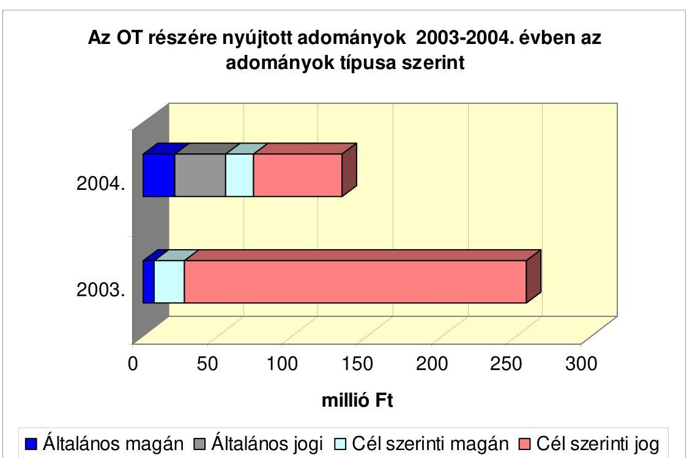
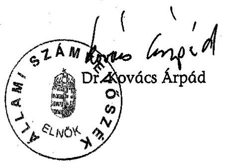
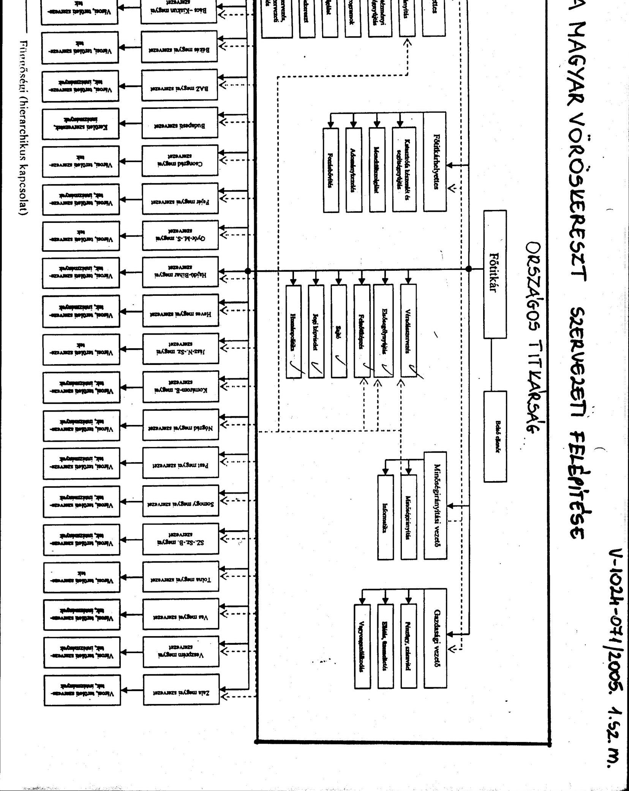
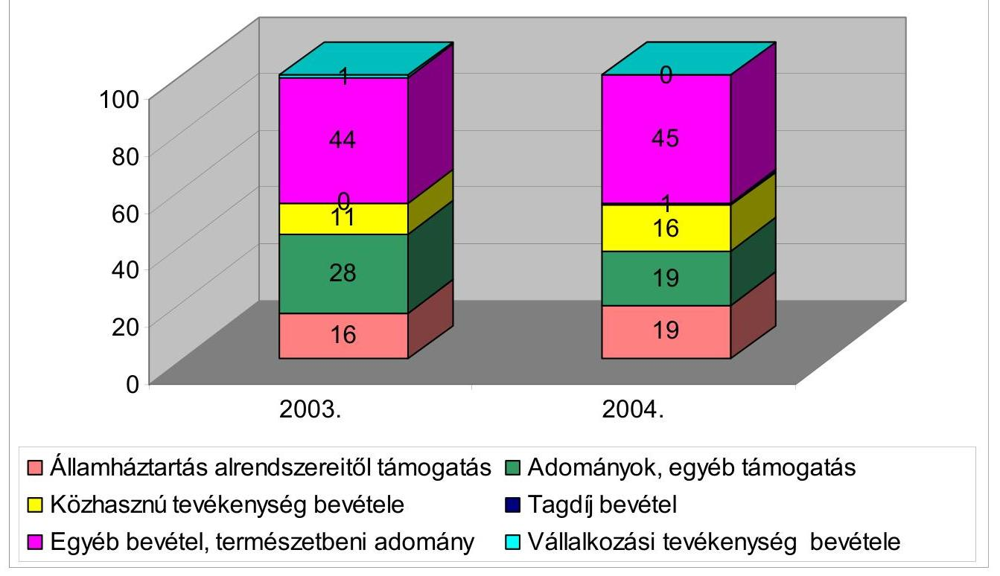
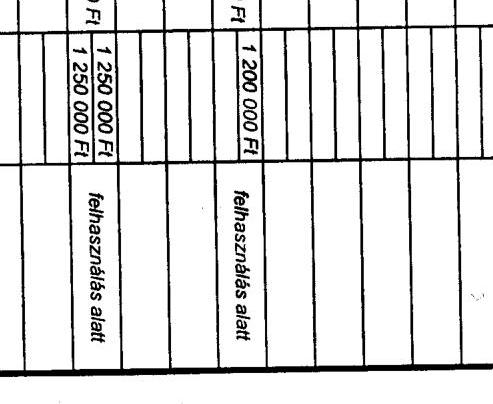
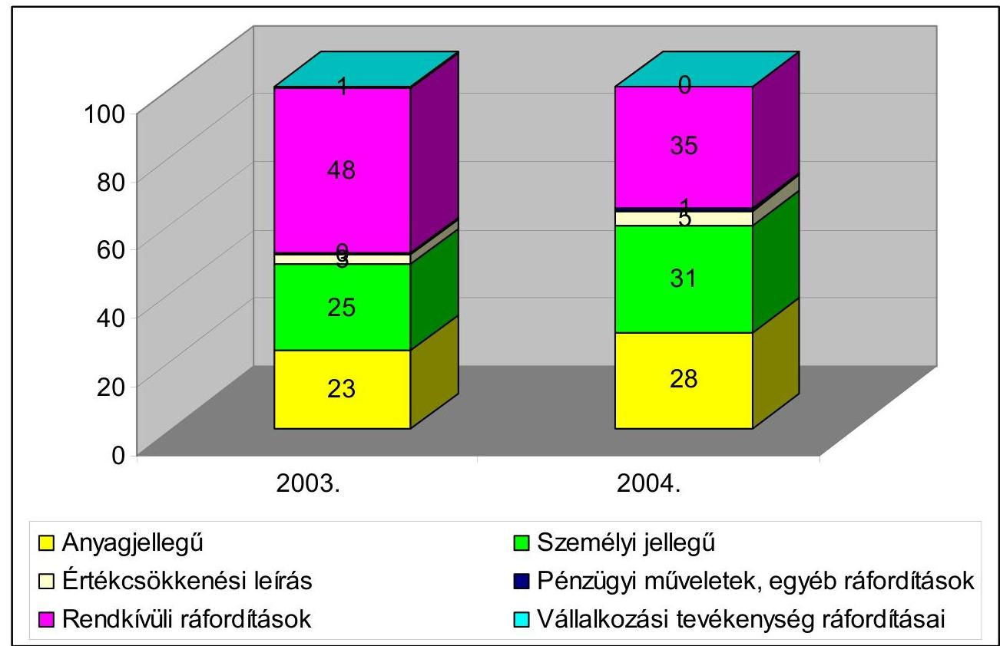
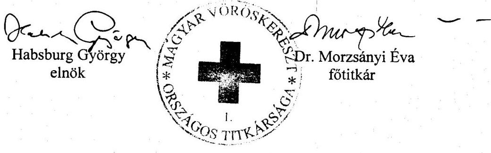
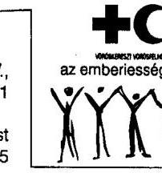
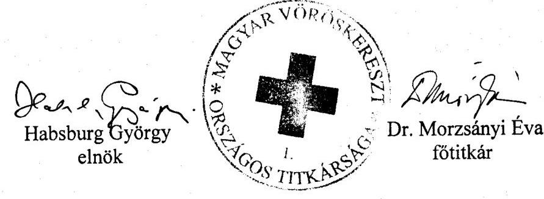

# JELENTÉS 

a Magyar Vöröskereszt 2003-2004. évi gazdálkodásához nyújtott költségvetési támogatások és pénzadományok Országos Titkárságnál való célszerű felhasználásának ellenőrzéséről

---

3. Önkormányzati és Területi Ellenőrzési Igazgatóság
3.1. Szabályszerűségi Ellenőrzési Főcsoport
Iktatószám: V-1024-071/2005.
Témaszám: 792
Vizsgálat-azonosító szám: V0253
Az ellenőrzést felügyelte:
Dr. Lóránt Zoltán
főigazgató
Az ellenőrzés végrehajtásáért felelős:
Dr. Elek János
általános főigazgató-helyettes
Az ellenőrzést vezette:
Horváth Balázs
főcsoportfőnök-helyettes
Az összefoglaló jelentést készítette:
Szakmányné Bilik Mária
számvevő
Az ellenőrzést végezték:
Szakmányné Bilik Mária Dr. Faragóné Tóth Dr. Méri Sándorné
számvevő
Mária
tánácsos
A témához kapcsolódó eddig készített számvevőszéki jelentések:
címe
sorszáma
Jelentés a Magyar Vöröskereszt pénzügyi-gazdasági ellenőrzéséről

---

# TARTALOMJEGYZÉK 

BEVEZETÉS ..... 5
I. ÖSSZEGZŐ MEGÁLLAPÍTÁSOK, KÖVETKEZTETÉSEK, JAVASLATOK ..... 7
II. RÉSZLETES MEGÁLLAPÍTÁSOK ..... 14

1. A Vöröskereszt és az Országos Titkárság működésének jellemzői ..... 14
1.1. A Vöröskereszt működési feladatai, önálló szervezetei ..... 14
1.2. A Vöröskereszt szakmai és gazdasági irányítása ..... 14
1.3. Az Országos Titkárság működési feladatai és feltételei ..... 15
1.4. A belső ellenőrzés rendszere, szabályozottsága, működése ..... 16
2. A beszámolási és gazdálkodási feladatok végrehajtása ..... 18
2.1. A számviteli és gazdálkodási feladatok szabályozása ..... 18
2.2. Az éves költségvetések összeállítása, jóváhagyása ..... 20
2.2.1. A költségvetés készítés rendje ..... 20
2.2.2. A költségvetési törvényben nevesített támogatás elosztásának elvei ..... 20
2.3. A számviteli nyilvántartások rendszere és szabályossága ..... 21
2.4. Az éves beszámolók és a beszámolási kötelezettség teljesítése ..... 23
2.5. Az Országos Titkárság gazdálkodásának értékelése ..... 24
2.5.1. A bevételek és a kapott támogatások ..... 24
2.5.2. A költségek alakulása, összetétele ..... 25
2.6. A pénzügyi helyzet és likviditás alakulása ..... 25
3. A költségvetési támogatások felhasználása, elszámolása ..... 26
3.1. A kötelezettségvállalás, ellenjegyzés, utalványozás rendje ..... 26
3.2. A költségvetési befizetési kötelezettségek teljesítése ..... 27
3.3. A költségvetési támogatás-elszámolás szabályszerűsége ..... 27
3.3.1. Nevesített költségvetési támogatás felhasználása, elszámolása ..... 28
3.3.2. Fejezeti egyéb és pályázati úton juttatott támogatások felhasználása, elszámolása ..... 29
4. A pénzadományok kezelésének rendszere ..... 30
4.1. Az adománykezelési szabályzat követelményei ..... 30
4.2. Az Országos Titkárság pénzbeli adománykezelési tevékenysége ..... 31

---

# MELLÉKLETEK 

1. számú A Magyar Vöröskereszt szervezeti felépítése
2. számú A Vöröskereszt által igényelt és részére juttatott nevesített költségvetési támogatás 2002-2005. évek között
3. számú Kimutatás a Vöröskereszt OT közhasznú egyszerűsített éves beszámolójának eredmény-kimutatásában szereplő és az ellenőrzés által feltárt eltérésekkel korrigált bevételekről és ráfordításokról
4. számú A Vöröskereszt OT bevételei és megoszlása 2003-2004. években
5. számú A Magyar Vöröskereszt megyei, budapesti szervezetei részére a Nemzeti Civil Alapprogramból juttatott támogatások
6. számú A Vöröskereszt OT ráfordításai, költségei és megoszlásuk 2003-2004. években
7. számú A Vöröskereszt és az OT likviditási mutatói 2003-2004. években
8. számú A Vöröskereszt OT részére 2002-2004. évben nyújtott költségvetési támogatások, pályázatok felhasználására, elszámolására vonatkozó ellenőrzési megállapítások
9. számú A Vöröskereszt OT részére nyújtott adományok a befogadás formája, valamint az adomány típusa szerint
10. számú A 2003. és 2004. évben meghatározott programra kapott adományok és felhasználásuk az OT-nál

---

# RÖVIDÍTÉSEK JEGYZÉKE 

| Art. | Az adózás rendjéről szóló - többször módosított - 1990. évi XCI. törvény |
| :-- | :-- |
| Áht. | Az államháztartásról szóló - többször módosított - 1992. évi XXXVIII. törvény |
| ÁSZ | Állami Számvevőszék |
| BM | Belügyminisztérium |
| ESZCSM | Egészségügyi, Szociális és Családügyi Minisztérium |
| GYISM | Gyermek-, Ifjúsági és Sport Minisztérium |
| Kh. törvény | A közhasznú szervezetekről szóló - többször módosított - 1997. évi CLVI. törvény |
| MV törvény | A Magyar Vöröskeresztről szóló 1994. évi XXXVII. törvénnyel módosított 1993. évi XL. törvény |
| NKÖM | Nemzeti Kulturális Örökség Minisztérium |
| OEB | Országos Ellenőrző Bizottság |
| OT | Országos Titkárság |
| OV | Országos Vezetőség |
| Szja törvény | A személyi jövedelemadóról szóló - többször módosított - 1995. évi CXVII. törvény |
| SZMSZ | Szervezeti és Működési Szabályzat |
| Szt. | A számvitelről szóló - többször módosított - 2000. évi C. törvény |
| Tao. tv | A társasági adóról és az osztalékadóról szóló - többször módosított - 1996. évi LXXXI. törvény |
| Vhr. | A számviteli törvény szerinti egyes egyéb szervezetek beszámoló-készítési és könyvvezetési kötelezettségének sajátosságairól szóló 224/2000. (XII. 19.) Korm. rendelet |
| Vöröskereszt | Magyar Vöröskereszt |

---

.

---

# JELENTÉS 

## a Magyar Vöröskereszt 2003-2004. évi gazdálkodásához nyújtott költségvetési támogatások és pénzadományok Országos Titkárságnál való célszerű felhasználásának ellenőrzéséről

## BEVEZETÉS

A Magyar Vöröskereszt a Nemzetközi Vöröskereszt és Vörösfélhold Mozgalomhoz csatlakozó, a Nemzetközi Vöröskereszt alapelvei és elismerési feltételei alapján működő, nemzeti humanitárius társadalmi szervezet. Alaptevékenységének körét és működésének garanciális szabályait a Magyar Vöröskeresztről szóló 1994. évi XXXVII. törvénnyel módosított, 1993. évi XL. törvény (továbbiakban: MV törvény) határozza meg. A 125 éves szervezet hatályos alapszabálya szerinti fő célkitűzései: Az élet és egészség védelme, az emberi személyiség tiszteletben tartása; az emberi szenvedés, a szociális gondok enyhítése; a betegség megelőzése; a fegyveres konfliktusok, katasztrófák áldozatainak megsegítése; a Genfi Egyezményből adódó feladatokban való közreműködés; a nemzetközi humanitárius jog, a Vöröskereszt alapelveinek terjesztése; a társadalmi szolidaritásra nevelés.

A Magyar Vöröskereszt (továbbiakban: Vöröskereszt) 4800 körüli helyi szervezettel, mintegy 275 ezer taggal, 42 ezer önkéntessel, több mint 800 fő alkalmazottal látja el az MV törvényben meghatározott, alaptevékenysége körében ellátandó hét, valamint alapszabályban rögzített - törvényben foglaltakon túli tíz feladatát. A törvényben meghatározott alapfeladatai ellátásához az éves költségvetési törvényekben az Egészségügyi Minisztérium és jogelődjei fejezetben jóváhagyott - 2003. évben 351 200 ezer Ft, 2004. évben 225 000 ezer Ft költségvetési támogatásban részesült. Tevékenységét a 20 önállóan gazdálkodó megyei, budapesti szervezeti egységein, valamint az Országos Titkárságon (továbbiakban: OT) keresztül látja el.

Az Állami Számvevőszékről szóló - többször módosított - 1989. évi XXXVIII. törvény 2. § (5) bekezdése, valamint a közhasznú szervezetekről szóló - többször módosított - 1997. évi CLVI. törvény (továbbiakban: Kh. törvény) 21. §-a értelmében a közhasznú szervezeteknél a költségvetési támogatás felhasználásának ellenőrzését az Állami Számvevőszék (továbbiakban: ÁSZ) végzi. Az ÁSZ 2005. évi módosított ellenőrzési tervének megfelelően vizsgálta a Vöröskereszt 2003-2004. évi gazdálkodásához nyújtott központi költségvetési támogatások és pénzadományok OT-nál történt felhasználása törvényességét és célszerűségét.

Az ellenőrzés célja: annak értékelése volt, hogy a Magyar Vöröskereszt Országos Titkársága a 2003-2004. évi központi költségvetési támogatást az 1993. évi XL. törvényben meghatározott alaptevékenységi célokra használta-e fel, az alaptevékenységhez kapott központi támogatások és közérdekű pénzadományok felhasználása, elszámolása során betartották-e a közhasznú szervezetekre vonatkozó hatályos jogszabályi előírásokat.

Az ellenőrzés a 2003. és 2004. évi beszámolóval lezárt gazdálkodási időszakra terjedt ki, amelyhez kapcsolódóan a 2005. évi költségvetés tervezését és elfogadását is vizsgáltuk. A szabályszerűségi ellenőrzést a számvevőszéki ellenőrzés szakmai szabályai szerint végeztük.

A helyszíni ellenőrzésre 2005. október 14. - 2006. január 16. között, a Magyar Vöröskereszt 1055 Budapest, Arany János utca 31. szám alatti székházában került sor.

---

# I. ÖSSZEGZŐ MEGÁLLAPÍTÁSOK, KÖVETKEZTETÉSEK, JAVASLATOK 

A Vöröskereszt külön törvényben meghatározott alaptevékenységi funkcióval és garantált költségvetési támogatással töltötte be nemzeti humanitárius szerepét. Kiemelkedően közhasznú működéséhez rendelkezett - a vonatkozó törvényekkel összhangban álló - hatályos alapszabállyal, amely törvényi felhatalmazással széles körben engedélyezte az egyéb feladatok ellátását. Az alap- és egyéb feladatok köréből állapították meg a közhasznú jelleggel ellátandó tevékenységeket. A feladatok közhasznú besorolása eredményezte, hogy a költségvetési törvény által finanszírozott hét alaptevékenység elkülönített kezelése nem volt biztosított.

Az alapszabály értelmében a Vöröskereszt országos hálózattal, egy központi és 20 megyei, budapesti önálló szervezeti egységgel működött. Az OT-t - képviseleti joggal felruházva - 2004-ben alapszabály módosítással kivonták az önálló jogi személyek köréből, de az önálló szervezeti egységként kialakított SZMSZ előírásait nem aktualizálták.

A legfőbb döntéshozó szerv, a közgyűlés alapszabályszerűen működött. Az országos vezetőség rendszeres ülésezéssel irányította és ellenőrizte a Vöröskereszt tevékenységét, felelt a közgyűlési határozatok végrehajtásáért. A megyei, budapesti feladatok irányítása a kétszintűen választott közgyűlés és vezetőség hatáskörében, az országos feladatmegosztással összhangban történt. A Vöröskereszt tevékenységéért országos tisztségviselőként az elnök felelt. Az általa kinevezett főtitkár felelősséget viselt országosan a jogszabályi és belső előírások betartásáért, az OT munkájáért.

Az SZMSZ az OT feladatait a Vöröskereszt alap- és egyéb tevékenységeire figyelemmel szakmai és gazdasági irányító, koordináló, végrehajtó szerepkörben határozta meg. Összetett feladatkörében szakmai, gazdasági és hivatali funkciókat látott el, hiányos működési feltételek mellett. A belső irányítás és végrehajtás rendjének szabályozása hiányában a gazdasági döntések, intézkedések végrehajtását utólag ellenőrizhető módon nem dokumentálták. A szakmai területen részben valósult meg a minőségirányítási rendszer kiépítése, a gazdálkodás területén az integrált vezetői, pénzügyi és számviteli információs rendszer nem működött. A hiányos szervezeti és szabályozási rend miatt a gazdálkodás szabályszerűségét az egyszemélyi felelősséggel felruházott főtitkár nem tudta biztosítani. A megyei és budapesti, illetve a keretükbe tartozó területi és helyi szervezetek gazdálkodásáról nem rendelkezett az irányításhoz szükséges információkkal. A gazdálkodási feladatokhoz a személyi és tárgyi feltételek elégtelennek bizonyultak. A gazdasági vezető a be nem töltött főkönyvelői munkakör feladatait is ellátta. A munkaerő foglalkoztatást alacsony bérek, magas fluktuáció, a munkaköri leírások hiánya, illetve elavultsága jellemezte. A testületi határozatok, szakmai és gazdasági intézkedések végrehajtását nehezítette, hogy az ügyrendben meghatározott adminisztratív iroda a vizsgált időszakban nem funkcionált.

---

A Vöröskereszt nem megfelelően szabályozta belső ellenőrzési rendszerét. Alapszabálya országos, megyei, budapesti és területi ellenőrző bizottságok működését - egymástól elkülönült beszámolási kötelezettséggel - írta elő. Az alapszabály nem rendelkezett arról, hogy az alsóbb szintű ellenőrzési tapasztalatokról jelentés, jegyzőkönyv formájában az országos vezető testületek információt kapjanak. A különböző szintű ellenőrzési tapasztalatok átadásának hiánya miatt elmaradtak a szabálytalanságok megszüntetését szolgáló döntések, intézkedések. Az OEB ügyrend és éves munkaterv alapján működött. Ellenőrzési feladatát az alapszabályban meghatározottaknál szűkebb körben látta el. Évente végzett egy-egy ellenőrzése alapján javasolta külső erőforrások bevonásával a minőségirányítási rendszer továbbfejlesztését; továbbá a bevételek növelését, a költségek ésszerű csökkentését. Az OV döntése hiányában a javaslatok korlátozott mértékben érvényesültek.

A Vöröskereszt gazdálkodásának teljes körű ellenőrzésére 2003. második felétől egy belső ellenőrt foglalkoztattak. Irányítását az SZMSZ a gazdálkodás végrehajtásáért felelős főtitkárhoz rendelte, így nem érvényesült a funkcionális függetlensége. Összeférhetetlennek minősült továbbá, hogy megbízták egyes gazdálkodási szabályzatok elkészítésével is. Kizárólag a megyei szervezetek gazdálkodásának szabályszerűségét vizsgálta, a feltárt pénzügyi szabálytalanságok miatt két megyei szervezetnél kezdeményezett felelősségrevonást. Az SZMSZ-ben meghatározott feladatkörében nem vizsgálta az OT gazdálkodását, éves beszámolóját, a pénzügyi-számviteli fegyelem betartását. Ellenőrzési tevékenységét elavult szabályozás szerint végezte. Az OT-nál a vezetői és munkafolyamatba épített ellenőrzés - szabályozási hiányosságokból eredően - alacsony hatásfokkal működött. Az összeférhetetlenségi követelményeknek nem felelt meg, hogy a pénzügyi csoportvezető utalványozási és pénztárellenőri feladatokat is ellátott.

A Vöröskereszt az Szt. által előírt számviteli szabályozásait 2004. január 1-jei hatállyal megújította. Az országos érvényű szabályzatok önállóan gazdálkodó szervezetek részére történő kiadását nem dokumentálták. A számviteli politika és hozzárendelt értékelési, pénzkezelési szabályzat hiányosan rendelkezett a közhasznú gazdálkodási
 sajátosságokról. A számlarend nem biztosította a közhasznúsági jelentés követelményének megfelelő adattartalmat. Mindezek nyomán nem érvényesült az éves közhasznú jelentések tartalmi azonossága.

A Vöröskereszt nem rendelkezett az előírt gazdálkodási szabályozásokkal. Alapszabályának rendelkezéseire nem dolgozták ki az egységes gazdálkodási szabályzatot, nem alakították ki az érdekeltségi rendszert, továbbá a Kh. törvény által előírt befektetési szabályzattal sem rendelkeztek. Az alapszabály a főtitkár feladatkörébe utalta a szabályzatok elkészítését és OV elé terjesztését.

A Vöröskereszt éves költségvetését a hatáskörileg illetékes OV hagyta jóvá. A tervek összeállításának szerkezeti és tartalmi követelményeit, jóváhagyásának határidejét nem szabályozták. A pénzforgalmi bevételeket és kiadásokat bázisszemlélettel, az alap- és egyéb tevékenységeket összevonva - az éves feladatok rangsorolása nélkül - tervezték. Az önállóan gazdálkodó szervek által összeállított tervek közül először 2005-ben támasztotta alá a tervezést szöveges indokolás.

---

A költségvetési törvények 2003-2005 között évente csökkenő központi támogatási előirányzatot tartalmaztak a Vöröskeresztnek. A működési támogatás központosított keretéről, illetve a fennmaradt rész OT és megyei megosztásának arányáról az OV döntött. A megyei keret önállóan gazdálkodó szervezeteknek való elosztása szakmai prioritások meghatározása nélkül, népességarányosan történt. Ez az elosztási módszer nem állt összhangban azzal, hogy a Vöröskereszt nevesített költségvetési támogatása az MV törvényben meghatározott alaptevékenységi célokat szolgálta.

A Vöröskereszt egységes kettős könyvviteli programmal, de önálló szervezetenként külön-külön vezette számviteli nyilvántartását. Az OT főkönyvi könyvelését szolgáltatási szerződéssel, könyvelő iroda végezte. A könyvvezetésben sérült az Szt. teljességre, valódiságra, következetességre és bruttó elszámolásra vonatkozó elve. A szabálytalanságok következtében a költségvetési támogatást mindkét évben pontatlanul közölték; amely 2004-ben lényeges mértékű, 5,7%-os eltérést mutatott. A hibák az analitikus nyilvántartás hiányos szabályozásával és vezetésével egyaránt összefüggtek. További eredményeként nem érvényesültek az Szt. bizonylati elve és fegyelme, valamint a bizonylatok alaki és tartalmi előírásai.

A Vöröskereszt közhasznúsági jelentés összeállításával teljesítette beszámolási kötelezettségét. Ennek keretében az egyszerűsített éves beszámolót az Szt. előírását megsértve főkönyvi kivonat nem támasztotta alá. A közgyűlés mindkét évi beszámolóját - előzetes bizottsági ajánlással - szabályszerűen elfogadta. A honlapján közhasznúsági jelentéseit nyilvánossá tette, de a jogszabályban előírt határidőt nem tartotta be. A Kh. törvényben előírt forrásrészletezésben az államháztartás alrendszereitől kapott támogatást nem a valósággal egyezően közölték, a támogatások felhasználásával kapcsolatban támogatónként nem jelölték a támogatási célt és összegét. A cél szerinti juttatásokat a nyilvántartások nem támasztották alá. A vezető tisztségviselők juttatásai között nem mutatták be az alelnökök és a főtitkár juttatásait. A 2004. évi eredmény-kimutatás az előző évi adat átmásolása miatt a szervezet által nyújtott támogatásokat jelentős összegű hibával tartalmazta. Mindezek miatt a nyilvánossá tett éves közhasznúsági jelentések nem feleltek meg az Szt-ben meghatározott teljesség, valódiság és következetesség elvének. Hiányzott a beszámolókon annak feltüntetése is, hogy a „közzétett adatok könyvvizsgálattal nincsenek alátámasztva”. A Vöröskereszt nem választott könyvvizsgálót annak ellenére, hogy a könyvvizsgálati kötelezettség jogszabályi kritériumai, a vállalkozási bevételek értékhatár feletti nagyságrendjével teljesültek.

A Vöröskereszt fizetőképességének megőrzése érdekében 2003-ban OV határozat rendelkezett a gazdálkodási adatszolgáltatási rendszer kiépítésére, amely az OT feladatkörében nem valósult meg. Hiányában folyamatos fizetési nehézségek jelentkeztek, amelyek enyhítésére az OT 500 ezer Ft és 14000 ezer Ft közötti folyószámlahitelt vett igénybe. A megállapodásban a központi költségvetési támogatást jelölte meg a hitel fedezeteként, figyelmen kívül hagyva a Kh. törvény tiltó rendelkezését. Az OT gazdálkodásának bevételei a 2003. évhez képest 2004-re 26%-kal csökkentek a pénzadományok részarányának 9 százalékpontos mérséklődésével. A 2003. évi ráfordításainak 48,3%-át tették ki a működési és felhalmozási célra véglegesen - magánszemélyek, nemzetközi szervezetek részére - átadott támogatások, amelyek összege 2004-re kevesebb, mint felére csökkent.

---

A Vöröskereszt az alapfeladatok ellátására és működési feltételek biztosítására 2003-ban 351200 ezer Ft, 2004-ben 225000 ezer Ft, 2005-ben 193500 ezer Ft nevesített költségvetési támogatásban részesült, szabályos támogatási szerződés alapján. A 2002-2004. évi támogatási összegek a vizsgált évek között áthúzódással teljesültek. Az OT a költségvetési támogatások felhasználása során nem tartotta be a kötelezettségvállalásra, ellenjegyzésre vonatkozó belső előírásokat. A kötelezettségvállalás jellemzően pénzügyi ellenjegyzés nélkül történt, előfordult jelentős összegű kifizetés írásos kötelezettségvállalás nélkül. A teljesítésigazolás dokumentálása vállalkozási, megbízási szerződések esetében hiányos volt. A támogatási bevételek kivételével az utalványozás szabályszerű volt. A központi költségvetési támogatások juttatása egyik feltételeként előírt költségvetési befizetési kötelezettségeket - egyszeri késedelem kivételével - rendszeresen teljesítette.

Szerződéses kötelezettségei közül az OT-én keresztül a Vöröskereszt az elszámolási határidőt, esetleges maradvány visszautalását, a cél szerinti felhasználást a 2002. évi nevesített támogatás felhasználása kivételével - teljesítette. A támogató tárgyi eszközbeszerzés értékhatárára vonatkozó kikötését figyelmen kívül hagyva 4027 ezer Ft összegben vásárolt értékhatár feletti eszközöket. Az eredeti bizonylatokon előírt szerződésszám rögzítését 2003-ban jellemzően nem teljesítették, 2004-ben az előírást betartották. A 2004. évi elszámolásban ugyanaz a négy számla 628 ezer Ft összegben kétszer szerepelt, valamint két számlát 629 ezer Ft értékben további két támogatási szerződés pénzügyi elszámolásához is csatolt az OT. Így a szabálytalan elszámolással összefüggésben a támogatásból 1257 ezer Ft felhasználás bizonylattal nem volt igazolt. A vizsgált évek fejezeti egyéb és pályázati úton juttatott 11 támogatás közül nyolc felhasználása szabályszerűen történt. A BM-mel menekültek ellátására kötött három szerződés támogatási összegének rendeltetésszerű felhasználására eredeti bizonylattal - szerződéses kötelezettség ellenére - nem rendelkeztek. Ennek hiányában az ellenőrzés 2003. évben 3389 ezer Ft, 2004-ben 1671 ezer Ft támogatás felhasználását nem tudta igazoltnak elfogadni. A megállapított szerződésszegések miatt az államháztartásról szóló törvény előírása szerint visszafizetési kötelezettség terheli a Vöröskeresztet. A közpénzek és azok felhasználásának - 2004. évtől jogszabályi kötelezettségen alapuló - elkülönített nyilvántartását szabályozási hiányosságból eredően nem teljesítették. A nevesített költségvetési támogatás forrásoldali elkülönítését a könyvelési program kódrendszerével biztosították, a cél szerinti felhasználás kimutatása azonban nem volt megoldott.

Országos érvényű adománykezelési szabályozást az OV jóváhagyása nélkül, az önálló szervezetek kiegészítési jogosultságának biztosításával alkalmazták. A természetbeni adományok gyűjtésének és felhasználásának, elosztásának zárt rendszerét biztosította a belső előírás. A szabályzat a nyilvánosság biztosítása érdekében a természetbeni adomány-felhasználás elszámolási kötelezettségét előírta a fogadó szervezet részére. Ennek szabályszerűségét a belső előírások ellenére az OT adománykezelő szervezete nem ellenőrizte. A szabályozás nem rendelkezett az adománygyűjtésre elkülönített számlák forgalmának rendjéről. A pénzadományok elkülönített nyilvántartását rögzítő, a felhasználás szerinti nyilvántartást nem szabályozó belső előírás a folyamat zártságát,

---

továbbá az alapszabályban rögzített nyilvánosság elvét nem biztosította. Az adománygyűjtési akciók - alapszabály szerint az OV hatáskörébe utalt - jóváhagyását és értékelését; az elkülönített számlákon gyűjtött adományok kamatainak felhasználási szabályait; a célba juttatás költséghányadát; az átadás országosan egységes dokumentálását a szabályzat nem írta elő.

Az OV a vizsgált időszakban egy alkalommal kapott - több év hazai árvízi segélyakciójáról - összefoglaló tájékoztatást. Szabályozás szerint történt a közérdekű kötelezettségvállalások nyilvántartása, az igazolások kiadása, illetve az adatszolgáltatás. A 2003. évben befolyt pénzadományok döntő hányadát a meghatározott célra gyűjtött, azon belül is a jogi személyek adományai jelentették, 2004-ben az általános és cél szerinti adományok arányai kiegyenlítődtek. Annak következtében, hogy a természeti katasztrófák kevésbé sújtották hazánkat és a szomszédos országokat, a pénzadományok összege mintegy felére csökkent. A cél szerinti adományok felhasználásának eljárási és elszámolási hiányosságai miatt 2003-ban 3594 ezer Ft összegű pénzadományt a céltól eltérően használtak fel. 2004-ben 8960 ezer Ft összegű ajándéktárgy rászorulók részére történő átadásának dokumentációjával - az ajándékozás lebonyolításával megbízott kft. elszámolási kötelezettsége teljesítésének hiánya miatt - az Országos Titkárság nem rendelkezett. Az általános célú befizetések segélyezésre történt felhasználása a szabályzat előírásai szerint valósult meg, a működésre történő felhasználás döntéséről dokumentáció nem készült. A vizsgált időszakban, egy magánszemély hagyatékából kiemelkedő összegű, cél megjelölése nélküli adományt kapott a Vöröskereszt. Az OV-t az adomány összegéről, annak felhasználásáról az OT szabályozás hiányában nem tájékoztatta. A szabályozás szükséges lett volna az OV irányító, ellenőrző funkciójának betöltéséhez. A házipénztári adomány befizetések, valamint a perselyes gyűjtések a belső előírások szerint történtek. A könyvvezetésben feltárt hiányosságok az adománygyűjtés és felhasználás területén is jellemzőek voltak. A délkelet-ázsiai szökőár áldozatainak megsegítésére érkezett pénzadományok, valamint azok felhasználásának elkülönített nyilvántartását 2005. évtől biztosították.

A helyszíni ellenőrzés megállapításainak hasznosítása mellett javasoljuk:

# a Vöröskereszt országos közgyűlésének: 

1. Módosítsa az alapszabályt
a) az ellenőrző bizottságok tevékenységének egymásra épülő működési, beszámolási kötelezettségének szabályozásával;
b) a belső ellenőr tevékenységének OV szabályozási, irányítási és beszámoltatási jogkörébe rendelésével.
2. Válasszon független könyvvizsgálót a vállalkozási tevékenység értékhatár feletti teljesítésére figyelemmel a 224/2000. (XII. 19.) Korm. rendelet 19. § (1) bekezdés előírása értelmében.
3. Döntsön az SZMSZ módosításáról:

---

a) a törvényi, továbbá az alapszabály szerinti alap- és egyéb feladatok elkülönítéséről;
b) az OT alapszabályban rögzített jogállása, valamint az SZMSZ összhangjának megteremtése érdekében.

# a Vöröskereszt elnökének 

Vizsgálja meg a feltárt hiányosságok, szabálytalanságok, mulasztások miatti felelősség kérdését és arról tájékoztassa az országos közgyűlést.

## a Vöröskereszt főtitkárának:

1. Gondoskodjon az OT részére az SZMSZ-ben előírt operatív végrehajtó, koordináló és ellenőrző funkciók érvényesülése érdekében a belső irányítás és végrehajtás rendjének szabályozásáról.
2. Intézkedjen az OV döntéseinek határozatba foglalásáról, nyilvántartásáról és az érintettekhez való dokumentált eljuttatásáról.
3. Biztosítsa az OT gazdasági szervezete szabályozási, irányítási és ellenőrző funkciójának ellátásához szükséges személyi és tárgyi feltételeket, továbbá a Vöröskereszt egészére kiterjedő integrált, pénzügyi, számviteli információs rendszer működtetésével, főkönyvi kivonattal támasza alá az egyszerűsített éves beszámolót az Szt. 164. § (2) bekezdésében foglaltak szerint.
4. Gondoskodjon az OT dolgozói munkaköri leírásainak elkészítéséről, aktualizálásáról annak érdekében, hogy a feladatellátás teljes vertikumának lefedése a jogszabályi és belső előírásoknak megfelelően biztosított legyen.
5. Gondoskodjon az OT-nál a vezetői és munkafolyamatba épített ellenőrzés érvényesülése érdekében a kötelezettségvállalás, a pénzügyi ellenjegyzés szabályainak betartásáról, továbbá határozza meg a teljesítésigazolás és az utalványozás rendjét.
6. Határozza meg a Vöröskeresztről szóló törvénnyel és az alapszabállyal összhangban az alap- és egyéb tevékenységek finanszírozásának tervezési szabályait, a nevesített támogatás alapfeladatok közötti megosztásának elveit, figyelemmel a közpénzek elszámolási követelményére.
7. Szabályozza a költségvetési támogatások és felhasználásuk elkülönített, részletező nyilvántartását a 224/2000. (XII. 19.) Korm. rendelet 17. § (8) bekezdés előírása, a közpénzek nyilvántartási szabályaira figyelemmel.
8. Intézkedjen a nevesített költségvetési támogatásból 4027 ezer Ft támogatási céltól eltérő felhasználás miatti, továbbá 1257 ezer Ft kétszer elszámolt összeg jogosulatlan igénybevétele miatti, valamint 5060 ezer Ft bizonylattal alá nem támasztott felhasználás összegének visszafizetéséről az Áht. 13/A. § (2) bekezdés előírása szerint.
9. Módosítsa a folyószámla hitelszerződést a Kh. törvény 16. § (2) bekezdés b) pontjában foglaltakkal összhangban.

---

10. Vizsgálja felül és módosítsa számviteli politikáját, a számlarendet, valamint az eszközök és források értékelési szabályzatát az Szt., a Vhr., továbbá a Kh. törvénnyel való összhang megteremtése érdekében a nyilvántartási, a könyvvezetési és beszámoló készítési sajátosságainak érvényesítéséhez.
11. Készítse el és terjessze az OV elé jóváhagyásra az alapszabály 21. cikkelyében
 előírt egységes gazdálkodási, valamint az SZMSZ 11. § (21) bekezdésében rögzített érdekeltségi szabályzatot, továbbá a Kh. törvény 17. § előírására figyelemmel a befektetési szabályzatot.
12. Szerezzen érvényt az Szt. 165. § (1) bekezdésben foglalt bizonylati elv és fegyelemnek, továbbá a 167. § (1) bekezdés c), h) és i) pontjaiban szabályozott, a bizonylatok alaki és tartalmi követelményeinek.
13. Tartassa be a könyvvezetés és beszámoló-készítés során az Szt. 15. § (2)-(3), (5), továbbá a (9) bekezdés szerinti teljesség, valódiság, következetesség, valamint a bruttó elszámolás számviteli elveket.
14. Vizsgálja felül az adománykezelési szabályzatot, majd módosítását terjessze az OV elé jóváhagyásra az alábbi szempontok érvényesítésével:
a) tegye kötelezővé a pénzadomány felhasználás nyomon követése és a nyilvánosság biztosítása érdekében a pénzadomány felhasználásának nyilvántartását;
b) szabályozza, hogy az adományok célba juttatása érdekében felmerült költségekre mekkora hányad használható fel az adományból;
c) rendelkezzen a pénzadományok kamatainak felhasználási szabályairól;
d) határozza meg a pénzsegélyek azonos tartalmú átadási dokumentációját, a segélyezettek részére az elszámolási kötelezettséget;
e) írja elő az általános célú adománnyal kapcsolatban az önálló szervezetek tájékoztatási kötelezettségét az OV felé, illetve határozza meg azt az értéket, amelytől a felhasználásról történt döntés az OV hatáskörében tartozik.
15. Gondoskodjon a 2004. évi jótékonysági bállal összefüggő 8960 ezer Ft értékű ajándéktárgyak elszámolási kötelezettségének teljesítéséről, szükség esetén az el nem számolt összeg visszafizettetéséről.

---

# II. RÉSZLETES MEGÁLLAPÍTÁSOK 

## 1. A VÖRÖSKERESZT ÉS AZ ORSZÁGOS TITKÁRSÁG MŰKÖDÉSÉNEK JELLEMZŐI

### 1.1. A Vöröskereszt működési feladatai, önálló szervezetei

A Vöröskereszt feladatrendszere összetett törvényi szabályozáson alapult. Az MV törvény rögzítette az alaptevékenység körében ellátandó feladatokat, amelyhez garanciális feltételként rendelte, hogy „az alaptevékenységéhez tartozó feladatai teljesítéséhez költségvetési támogatásban részesül külön jogszabályban meghatározottak szerint”. A hivatkozott törvény 2. § (2) bekezdés felhatalmazásával élve a szervezet hatályos alapszabálya lényegesen szélesebb alapokra helyezte feladatkörét. A Kh. törvény alapján 1998-tól megszerzett kiemelkedően közhasznú minősítésére figyelemmel meghatározta az általa végzett közhasznú tevékenységeket, de nem gondoskodott az alap- és egyéb feladatok folyamatos elkülönítéséről. A feladatok más-más kritériumok szerinti csoportosítása mellett a sajátos gazdálkodási, finanszírozási rend követelményei nem érvényesültek.

A 2000. december 1-jétől hatályos alapszabály szerint a Vöröskereszt OT és 20 megyei, budapesti szervezeti egysége jogi személyként működött. A szakmai és gazdasági függetlenséggel rendelkező szervezeti körből a 2004. június 17-i közgyűlés alapszabály-módosítással kivonta az OT-t, képviseleti jogot biztosítva számára. Egyidejűleg a budapesti és megyei szervezetek jogi személyiségét kiegészítették azzal, hogy „rendelkeznek önálló ügyintéző és képviseleti szervvel és a működésükhöz szükséges vagyonnal”. Az alapszabály utóbbi pontosítása az egyesülési jogról szóló 1989. évi II. törvény 2. § (4) bekezdésében foglalt összhangot eredményezte.

### 1.2. A Vöröskereszt szakmai és gazdasági irányítása

A Vöröskereszt szervezeti egységeinek önállóságához igazodó országos és megyei szintű irányítási rendszer funkcionált. Az alapszabálynak megfelelően megválasztotta döntéshozó és vezető testületét. Az országos közgyűlés döntött a vöröskeresztes munka főbb irányairól és gazdasági feltételeinek meghatározásáról, a közhasznúsági jelentés és az éves beszámoló elfogadásáról, az alapszabály és az SZMSZ jóváhagyásáról, illetve módosításáról. Az évente összehívott két közgyűlés között a 31 tagú Országos Vezetőség (továbbiakban: OV) rendszeres ülésezéssel irányította és ellenőrizte a Vöröskereszt tevékenységét, amelynek a főtitkár hivatalból tagja volt. Az OV feladatkörében felelősséget viselt a közgyűlési határozatok végrehajtásáért, meghatározta a szakmai feladatokat és országos programokat; a gazdálkodáshoz kapcsolódóan jóváhagyta az éves költségvetést; közreműködött az alapszabályban meghatározott szervezeti felépítés személyi-tárgyi és gazdasági feltételeinek biztosításában; értékelte a meghatározott feladatok végrehajtását és költségfelhasználását. A megyei, budapesti feladatok irányítása a kétszintűen választott közgyűlés és vezetőség hatáskörében, az országos feladatmegosztással szinkronban történt.

---

A Vöröskereszt tevékenységéért - országos tisztségviselőként - az elnök viselt felelősséget, akinek személye a 2004. decemberi tisztújító közgyűlés döntésével változott. Az ügyvezetőként funkcionáló főtitkár felelt a jogszabályi és belső előírások betartásáért, az OT munkájáért. A Vöröskereszt képviselőiként mindkét vezetőt a Fővárosi Bíróságon bejegyezték.

# 1.3. Az Országos Titkárság működési feladatai és feltételei 

Az országos szervezet 2004 közepétől a Vöröskeresztet, mint jogi személyt képviselte. A Vöröskereszt alapszabálya az OT jogállásához nem határozta meg feladat- és hatáskörét. A közgyűlési határozaton alapuló jogi státuszmódosítást formálisan kezelték, mivel az OT önálló szervezeti egységként kialakított SZMSZ előírásait elmulasztották aktualizálni.

Az OT a Vöröskereszt elnöke által kinevezett főtitkár irányításával, szabályozott szervezeti keretek között működött (1. számú melléklet). Funkcionális feladatait a Vöröskereszt alap- és egyéb tevékenysége alapján, valamint szakmai és gazdasági irányító, koordináló, végrehajtó szerepkörben határozták meg, amelynek nem alakultak ki a szervezeti, hatáskör-gyakorlási feltételei.

Az OT szakmai feladatkörében ellátott alap- és egyéb tevékenységeket szabályszerűen nem különítették el az elsősegélynyújtás, a katasztrófa elhárítás és a keresőszolgálat terén. Felügyeleti jogkörben a központi és megyei feladatok ügyrendi összehangolásáról részben gondoskodtak. Az OT ügyrendje nem tartalmazott részletes előírást az irányítási, koordinációs és ellenőrzési követelményekre, a differenciált hatásköri jogosultságokra. A belső irányítás és végrehajtás rendjének szabályozása hiányában a gazdasági döntések, intézkedések végrehajtását utólag ellenőrizhető módon nem dokumentálták. A húsz önálló szervezeti egység közül mindössze hatan rendelkeztek a kötelezően előírt ügyrenddel. A minőségirányítási rendszer kiépítése négy főtevékenységre korlátozódott, a gazdálkodás minőségirányítási rendszerbe történő integrálása nem valósult meg. Az integrált vezetői, pénzügyi és számviteli információs rendszer kiépítéséről nem döntöttek.

Az OT gazdasági szervezetére alapozott gazdálkodási feladatokhoz a személyi és tárgyi feltételek elégtelennek bizonyultak. A gazdasági vezetőnek a feladatkörébe utalt gazdálkodás-szabályozási, irányítási követelmények teljesítéséhez - a kinevezés időpontjában hatályos SZMSZ képesítési előírása ellenére - nem volt felsőfokú végzettsége. Munkaköri leírással több más alkalmazotthoz hasonlóan nem rendelkezett. A mérlegképes könyvelői képesítéssel a főkönyvelői feladatok ellátására korlátozódott a tevékenysége, mivel a pénzügyi-számviteli terület irányítására kijelölt státusz betöltéséről évek óta nem gondoskodtak. A munkaköri leírásokat nem aktualizálták, a bennük foglalt feladatok nem fedték le a jogszabályi és belső előírások betartásához szükséges tevékenységek egészét. A gazdasági szervezet ellátandó tevékenységéhez különböző kapacitású, eltérő típusú, jellemzően elavult számítástechnikai háttérrel rendelkezett. Az alkalmazott programok országos hálózati rendszerben történő működtetését, valamint a pénzforgalom teljes körű figyelemmel kísérését nem biztosították.

---

Az OT ügyrendjében szabályozott adminisztratív iroda a vizsgált időszakban nem funkcionált. Hiányával összefüggött, hogy az alapszabály 21. cikkelyében foglaltaknak megfelelően az országos közgyűlési és vezetőségi határozatokat nem tartották nyilván, az érintettekkel írásban nem közölték. A gazdálkodással kapcsolatos szabályzatokat, körleveleket, utasításokat nem iktatták, az országosan elérhető intraneten nem tették közzé, továbbá az érdekelteknek való átadását igazolni nem tudták.

Az OT több évtizedes munkaviszonnyal rendelkező dolgozói 120 ezer Ft/hó vagy ennél alacsonyabb bruttó bérrel rendelkeztek. A sokrétű, folyamatos feladatellátását nehezítette a magas fluktuáció, 2003-2004 viszonylatában tíz fővel csökkent a belépők száma, miközben a kilépők száma közel megduplázódott.

Az OT hiányos működési feltételrendszerében az önálló szervezeti egységek szakmai és gazdálkodási felügyelete, irányítása eltérő színvonalon valósult meg. A nem megfelelő személyi és tárgyi feltételek, továbbá a hiányos szervezeti és szabályozási rend miatt a gazdálkodás szabályszerűségét az egyszemélyi felelősséggel felruházott főtitkár nem tudta biztosítani, mivel a megyei és budapesti, illetve a keretükbe tartozó területi és helyi szervezetek gazdálkodásáról nem rendelkezett az irányításhoz szükséges információkkal. Az SZMSZ a főtitkár hatáskörébe utalt alaptevékenységi feladatok mellett irányítási jogkörébe rendelte a főtitkárhelyettesek által vezetett feladatokat, valamint a minőségirányítás és gazdasági vezetés összetett tevékenységét. Felelősséget viselt a megyei, budapesti szervezetek, ezen belül a területi és helyi szervezetek szabályszerű működéséért.

# 1.4. A belső ellenőrzés rendszere, szabályozottsága, működése 

A Vöröskereszt ellenőrzési rendszerének jogszabályi feltételeit a Kh. törvény 1011. §, valamint a Vhr. 19. § könyvvizsgálati kötelezettségre vonatkozó előírásai határozták meg. Az ellenőrzési rendszer belső szabályait az alapszabály, az SZMSZ, továbbá a belső ellenőrzési szabályzat rögzítette. Utóbbi 1995-től hatályos előírásait a belső ellenőrzés szakmai követelményeinek és módszereinek változásával összhangban nem korszerűsítették.

A Vöröskereszt alapszabálya a Kh. törvény 10. § (1) bekezdés előírásainak megfelelően szabályozta az ellenőrző bizottságok felállítását. A működésük rendjét a társadalmi szervezetek működési elveihez igazították. Az ellenőrző bizottságok - egymástól elkülönülve - választóiknak, a területi, megyei, budapesti, illetve az országos közgyűlésnek tartoztak beszámolni. Az alapszabály nem rendelkezett arról, hogy az országos vezető testületek, a területi és megyei, budapesti ellenőrző bizottságok ellenőrzési tapasztalatairól jelentés, vagy jegyzőkönyv formájában információt kapjanak. A különböző szintű ellenőrzési tapasztalatok átadásának hiánya a vezető testületeket akadályozta abban, hogy megfelelő időben intézkedjenek a szabálytalanságok megszüntetésére.

Az alapszabálynak megfelelően választott Országos Ellenőrző Bizottság (továbbiakban: OEB) ügyrendjét megállapította, munkáját éves munkaterv alapján végezte. A közgyűlésnek 2004-ben beszámolt a négy év alatt végzett

---

munkájáról. Az OEB ellenőrzési feladatát az alapszabályban meghatározottaknál szűkebb körben látta el, évente egy-egy ellenőrzést végzett.

- 2003-ban ellenőrizte a minőségirányítási rendszer bevezetésére fordított kiadásokat és elszámolásokat. Javasolta külső források bevonásával a rendszer továbbfejlesztését, költségtakarékossági intézkedések foganatosítását.
- 2004-ben az OT 2003. évi gazdálkodásának átfogó ellenőrzése során megállapította, hogy a költségtakarékosságra vonatkozó intézkedések részben teljesültek. Javasolta a bevételek növelését és a költségek további ésszerű csökkentését a gazdálkodás minden területén.

Az OEB nem végzett ellenőrzést a megyei szervezeteknél, a megyei ellenőrző bizottságokkal nem tartott kapcsolatot. A Vöröskereszt szabályszerű gazdálkodását megalapozó belső szabályozások teljes körűségét és jogszabályi megfelelését az ellenőrzött időszakban nem vizsgálta. A Vöröskereszt éves közhasznú jelentései összeállításának szabályszerűségét, megalapozottságát és azok megbízhatóságát - a költségvetési tervekhez hasonlóan - formálisan vizsgálta. Így a szabályozási, számviteli hibákat nem tárta fel. A szervezet működésére és a gazdálkodás hatékonyságának növelésére vonatkozó OEB javaslatok - az országos vezetőség döntése hiányában - korlátozottan érvényesültek.

A Vöröskereszt a 2003-2004. évben hivatalosan közzétett közhasznú jelentését a Vhr. 19. § (1) bekezdés előírása ellenére független könyvvizsgálóval nem vizsgáltatta felül. Az egyszerűsített éves beszámolóban közzétett adatok szerint, a vállalkozásból származó bevétel mindkét beszámoló évben, mind az azt megelőző két évben meghaladta az 50000 ezer Ft-ot, ezért a könyvvizsgálat kötelező volt. A Vöröskereszt szervezeti egységei közül hat megyei szervezet tett eleget a könyvvizsgálati kötelezettségnek.

A Vöröskeresztnél a szervezet egészére egy belső ellenőrt foglalkoztattak, aki az OT állományában a gazdálkodás végrehajtásáért felelős főtitkár alá tartozott, ezért nem érvényesült a belső ellenőrzés funkcionális függetlensége. Az álláshely 2003 elején fél évig betöltetlen volt. Az SZMSZ szerint a gazdasági vezető feladataként rögzített gazdálkodási szabályzatok egy részének elkészítésével is megbízták, amely felülvizsgálata - többek között - feladata lett volna.

A belső ellenőr a megyei szervezetek gazdálkodásának szabályszerűségét vizsgálta. A vizsgálati programok kitértek a megye gazdálkodási rendszerére, az intézmények és a szociális boltok működésére, a gazdálkodás sajátosságaira, a likviditás, a pénztár, a pénzforgalom és bizonylati rend, a banki aláírás és utalványozás, az adománykezelés ellenőrzésére és elszámolási szabályainak betartására. A belső ellenőr a feltárt pénzügyi szabálytalanságok miatt felelősségre vonást és személycserét két megyei szervezetnél kezdeményezett, illetve általános szabályozási hiányosság esetén főtitkári utasítások kiadására tett
 javaslatot, amelyre 2004. és 2005. évben sor került. Az ellenőrzött időszakban nem vizsgálta az OT gazdálkodását, az éves beszámolóját, a pénzkezelés szabályosságát, a számviteli és bizonylati fegyelem betartását, így az SZMSZ-ben foglalt belső ellenőri feladatokat részben teljesítette.

---

A kötelezettségvállalás rendjét az SZMSZ 27. §-a teljes körűen, az utalványozás rendjét a pénzkezelési szabályzat korlátozottan csak a készpénzforgalomra határozta meg. A teljesítésigazolás és elektronikus banki utalás rendjét belső előírások nem rögzítették. A vezetői és a munkafolyamatba épített ellenőrzés alacsony hatásfokkal működött. A belső szabályozásban rögzített összeférhetetlenségi követelménynek nem felelt meg az a gyakorlat, hogy a pénzügyi csoportvezető pénztárellenőri és utalványozási feladatokat is ellátott. A munkafolyamatba épített ellenőrzés nem tárta fel a házipénztári analitikák és bizonylatok szabályozástól eltérő vezetését, továbbá a záró pénzkészletek túllépését.

# 2. A BESZÁMOLÁSI ÉS GAZDÁLKODÁSI FELADATOK VÉGREHAJTÁSA 

### 2.1. A számviteli és gazdálkodási feladatok szabályozása

A Vöröskereszt 2001. január 1-jétől hatályos számviteli politikával és számlarenddel rendelkezett. Az értékelési szabályokat a számviteli politikán belül szabályozta. Az Szt. 14. § (5) bekezdésében foglalt pénzkezelési, leltározási és selejtezési szabályzatokat a törvény változásainak megfelelően nem aktualizálta, az 1997. évben főtitkári utasítással kiadott szabályozásokat tartotta hatályban 2003-ban is. 2004. január 1-jétől új számviteli politikát, számlarendet, értékelési, leltározási és selejtezési, valamint pénzkezelési szabályzatot, továbbá bizonylati rendet készített. A szabályzatok országos érvényűek voltak, azonban az önálló gazdálkodó szerveknek történő kiadását nem dokumentálták.

A számviteli politika rögzítette a könyvelés módját, az évközi és év végi zárlatok időpontját, a zárlati feladatokat. A Vöröskereszt meghatározta, hogy mit tekint jelentős összegű és lényeges hibának. A 2003. évben hatályos számviteli politikában nem rögzítette a számviteli elveket, amelyeket a 2004. évtől hatályos szabályozás már tartalmazott. Meghatározta az értékcsökkenés elszámolásához alkalmazott leírási kulcsokat. Az elszámolás időpontját és könyvekben történő rögzítését év végi időpontban határozta meg, amely nem felelt meg az Szt. 165. § (3) bekezdés b) pont előírásának.

A számviteli politika és az ehhez kapcsolódó szabályzatok részben feleltek meg az Szt. 14. § (3) bekezdés előírásának, mivel hiányosan tartalmazták a Vöröskereszt gazdálkodásának sajátosságait.

Többek között nem határozta meg:

- a Kh. törvény 18. § nyilvántartási szabályainak tartalmi elemeit; a számviteli szabályzatokban a közvetett és közvetlen költségek elkülönítését, tartalmát; az adományok és a támogatások fogalmát; a cél szerinti juttatások címén elszámolható költségek elkülönítését;
- az alapszabály 30. cikkelyében rögzített működési költségek kritériumait.

A számlarend a főkönyvi számlaszámokat, elnevezéseket, továbbá számlaösszefüggéseket tartalmazta. A főkönyvi számlák és a szabályozásban előírt analitikák egyeztetési kötelezettségét negyedévenkénti időpontokban rögzítette. A számlarend nem biztosította a közhasznúsági jelentés követelményének megfelelő adattartalmat, így hiányzott:

---

- az államháztartás alrendszereitől kapott támogatások és felhasználásuk a Vhr. 2004. évtől hatályos 17. § (8) bekezdés előírása szerint elkülönített, részletező nyilvántartási rendjének meghatározása;
- a támogatások és adományok elkülönített főkönyvi számlákon történő könyvelésének szabályozása;
- a cél szerinti pénzadományok gyűjtésének és felhasználásának analitikus nyilvántartási követelménye;
- a 6-7. számlaosztály vezetésének előírása, illetve a tevékenységek költségeinek elszámolására alkalmazott kódok tartalmi azonosságának biztosítása.

Az eszközök és források értékelési szabályzatát az Szt. előírásai szerint állították össze. A szabályozás nem tért ki a gyűjtésből származó használt természetbeni adományok értékelésének előírásaira.

Az előző szabályozások hiányosságai miatt - az önálló szervezetek könyvviteli elszámolásaiból - a Vöröskereszt egészére készített közhasznú jelentés tartalmi azonossága nem volt biztosított.

A leltározási szabályzat kiterjedt a beszámolóban szereplő valamennyi mérlegtételre, tartalmazta a leltározás szabályait, módját, bizonylatait és felelőseit. A pénzkezelési szabályzat a készpénzkezelés feladatait, ellenőrzési pontjait, a napi záró pénzkészlet felső határát, továbbá a pénztáros teljes anyagi felelősségét meghatározta. A bankszámlanyitás kötelező eseteiről, a bankszámlák és az egyes bankszámlák közötti forgalom szabályairól nem rendelkezett. A Vöröskereszt nem szabályozta, mely bankszámlákon, milyen kiadások és bevételek teljesülhetnek. A szervezetek részére szabad bankválasztást biztosított. A szabályozás nem tért ki az elektronikus banki utalás rendjére.

A Vöröskereszt a számviteli törvényben előírt szabályozásokon kívül a közhasznú gazdálkodásának sajátosságait tükröző szabályzatokkal - az adománykezelési szabályzatot kivéve - nem rendelkezett.

- Az alapszabály 21. cikkelyében rögzítettek ellenére nem gondoskodott az egységes gazdálkodási szabályzat összeállításáról. Ennek hiányában nem határozta meg a vállalkozási tevékenységeket, a szociális árusítás elszámolási rendjét, a külföldi kiküldetés rendjét, a napidíj és költségtérítés mértékét; a költségvetés készítés szabályait, valamint a tisztségviselők tiszteletdíját és költségtérítését.
- Az SZMSZ 11. § (21) bekezdése szerinti érdekeltségi rendszerét nem szabályozta.
- A Kh. törvény 17. §-a szerinti befektetési szabályzatát nem alakította ki annak ellenére, hogy az OT ideiglenesen szabad pénzeszközeit az ellenőrzött időszakban értékpapírba fektette.

A szabályozások elkészítése és az országos vezetőség elé terjesztése a Vöröskereszt főtitkárának feladat- és hatáskörébe tartozott az alapszabály 23. cikkelye szerint.

---

# 2.2. Az éves költségvetések összeállítása, jóváhagyása 

### 2.2.1. A költségvetés készítés rendje

A tervezés szabályainak kidolgozása az Ügyrend 6. §-a szerint a gazdasági vezető feladata volt. A költségvetés készítés rendjét - a költségvetési támogatás elosztási elve kivételével - nem szabályozták, így nem állapították meg szerkezetét és tartalmát, jóváhagyási időpontját. A tervezés több lépcsőben történt. A gazdasági vezető a költségvetés készítés iránymutatásait körlevelekben adta közre. A költségvetés készítés folyamatában a megyei vezetőkkel a tervezeteket többször egyeztette, melynek eredményéről dokumentáció nem készült. Az egyeztetés során szükségesnek tartott javítások, átvezetések végrehajtása nem volt nyomon követhető, ellenőrizhető.

A bevételek, ráfordítások (kiadások) tervezése bázisszemlélettel, bevételi és kiadási jogcímeit tekintve nem a Kh. törvény 18. §, valamint az alapszabályban meghatározott sajátosságok figyelembevételével történt. A szabályozás hiányosságaiból fakadóan az alap- és egyéb tevékenységi funkciókat összevontan, a feladatok rangsorolása nélkül tervezték. Az önálló szervezetek a személyi kiadásaikat létszám jóváhagyása nélkül tervezték. A megyei szervezetek a tervezéshez szöveges indokolást először 2005. évben csatoltak. A költségvetést - az OEB véleményezését követően - az alapszabály előírásának megfelelően az OV fogadta el.

### 2.2.2. A költségvetési törvényben nevesített támogatás elosztásának elvei

A vizsgált években a költségvetési törvényben Vöröskereszt részére jóváhagyott működési támogatások a fejezethez előzetesen benyújtott igényeknek 23%; 29%; illetve 18%-át tették ki (2. számú melléklet). A csökkenő támogatásokban kifejeződtek az államháztartás kiadásainak csökkentési törekvései, továbbá a háború áldozatainak segítése, menekültek ellátása feladatainak szűkülése. A Vöröskereszt felhasználási célként alap- és közhasznúsági feladatainak ellátását jelölte meg annak ellenére, hogy az MV törvény 3. § előírása a törvényben rögzített hét alapfeladat ellátásához biztosította a költségvetési támogatást. Szakmai számítások hiányában az igények megalapozottsága nem volt biztosított.

Az OT és a megyei szervezetek közötti központi költségvetési támogatás megosztásának elvét a 8/1997. számú főtitkári utasítás szabályozta. A szabályozás rendelkezett egyrészt egy központosított keretről és felhasználási céljáról, másrészt a központosított keret levonása után fennmaradt támogatás OT és megyei szervezetek közötti megosztásának arányáról. A szabályozás nem terjedt ki a támogatás alaptevékenységek közötti megosztásának elveire és módszereire, az egyes tevékenységekhez kapcsolódó feladatmutatók meghatározására. A központosított keretet az utasítás szerint a Vöröskereszt egészét érintő közös kiadások fedezetére hozták létre. Nemzetközi kötelezettségek teljesítésére, választott testületek működési költségeire, beruházási, felújítási ráfordításokra, üdülő üzemeltetés költségeire, valamint tartalékképzésre, katasztrófák esetén segélyalap céljára rendelte elkülöníteni a szabályozás.

A Vöröskereszt költségvetésében tervezett központosított keret összege 2003-ban 50000 ezer Ft, 2004-2005. évben 40-40 000 ezer Ft volt. Az OV hatásköri jogával élve 2005. évben a központosított kereten felül 50000 ezer Ft likviditási, fejlesztési alapot hozott létre, kiadási jogcímeit azonban nem határozta meg a költségvetésben.

A központosított keret levonása után fennmaradt részt 2003-ban a megyei szervezetek és OT között 70-30%, 2004-ben 60-40% arányban osztották fel az OV döntése alapján. A 2005. évben a megyei, budapesti szervezetek automatikus továbbosztással a költségvetési támogatásból nem részesültek, későbbi döntés alapján pályázatot nyújthattak be az 50000 ezer Ft-os alapra.

A működési célú támogatás önálló szervezetek közötti elosztása szakmai prioritások, elvek, valamint a megyei szervezetek szakmai feladatainak sajátosságai figyelembe vétele nélkül, népességarányosan történt. Ez a módszer nem állt összhangban azzal, hogy a Vöröskereszt a nevesített költségvetési támogatást az MV törvényben meghatározott alapfeladataira kapta. Nem határozták meg, hogy a költségvetési támogatást az alapfeladatok mely kiadásaira, milyen összegben lehet tervezni és felhasználni, valamint az előirányzatok teljesítésének nyilvántartását nem írták elő.

# 2.3. A számviteli nyilvántartások rendszere és szabályossága 

A Vöröskereszt a kettős könyvelés rendszerében - mindkét évben - országosan egységes programmal könyvelt. Az alapszabálynak megfelelően a Vöröskereszt önálló szervezetei külön-külön teljesítették számviteli nyilvántartási kötelezettségeiket. Az OT főkönyvi könyvelését az ellenőrzött években, szolgáltatási szerződés alapján ugyanaz a külső könyvelőiroda végezte.

A könyvelési szolgáltató részére átadott bizonylatok - az utalványlap tartalmi elemei ellenére - nem tartalmazták azokat az információkat, amely alapján a gazdasági események cél szerinti elkülönítése biztosítható lett volna. Szabályozási hiányosság miatt a gyakorlatban nem különültek el az adományok és támogatások összegei. Az OT a közvetett költségeket a közhasznú és egyéb vállalkozási tevékenységek között belső szabályozás ellenére nem osztotta fel.

A könyvvezetésben az OT megsértette az Szt. 165-167. § szerinti bizonylati elv és fegyelem, valamint a bizonylatok alaki és tartalmi követelményeire vonatkozó előírásokat. Általános érvényű hiányosságok:

- a könyvviteli nyilvántartásokban több, jelentős összegű tétel rögzítése bizonylat hiányában történt (165. § (1) bekezdés);
- a könyvvezetés nem volt naprakész, a főkönyvi számlákon megjelent könyvelési dátum több hónappal eltért a teljesítés időpontjához képest (165. § (3) bekezdés a) pontja);

---

- a bevételek utalványozása elmaradt, a pénztári tételek 10%-át nem ellenőrizték (167. § (1) bekezdés c) pontja);
- a bizonylatokon, illetve utalványlapokon - a készlet- és bérfeladások kivételével - nem rögzítették a könyvelés módjára, az érintett főkönyvi számlákra, tevékenységi kódokra való hivatkozást (167. § (1) bekezdés h) pontja);
- a bizonylatokon nem szerepelt a könyvviteli nyilvántartásokban történt rögzítés időpontja, igazolása (167. § (1) bekezdés i) pontja).

A folyószámla-hitel összegét az OT a könyvekben nem rögzítette, ezért sérült a könyvvezetés során a Szt. 15. § (2) bekezdésében előírt teljesség elve. Két megyével szembeni követelés és kötelezettség összegét 2003. évben nettó módon könyvelték, így nem érvényesült az Szt. 15. § (9) bekezdésben foglalt bruttó elszámolás elve.

A könyvvezetésben 2003-2004. évben, az OT beszámolóját is érintő, alábbi hibás könyvelési tételeket tárt fel az ellenőrzés, amellyel összefüggésben sérült az Szt. 15. § (2)-(3) és (5) bekezdés szerinti teljesség, valódiság, következetesség számviteli alapelve (3. számú melléklet).

- 2003. évben a 180 ezer Ft önkormányzati támogatásból 80 ezer Ft-ot téves befizetés miatt más szervezetnek továbbutaltak. A könyvelésben bevételként kimutatott és beszámolóban megjelentetett összeg ennek ellenére a 180 ezer Ft volt. Az eredmény-kimutatás helyi önkormányzattól kapott támogatás során 80 ezer Ft-tal magasabb összeget mutattak ki a valós értéknél.
- A 2003. évi mérlegben 655 ezer Ft-tal alacsonyabb értékben mutatták ki a forgóeszközök között az értékpapírok összegét. Az újra befektetett értékpapír
 ügylet a könyvelésben nem szerepelt, az előírt egyeztetést nem végezték el.
- Az osztrák és cseh Vöröskereszt részére átutalt 2000-2000 ezer Ft támogatást nem a véglegesen átadott pénzeszközök ráfordításai között mutatta ki, hanem a jogi személyek céltámogatásai bevételt csökkentették. Ennek hatására a 2003. évi eredmény-kimutatásban közölt bevételek 4000 ezer Ft-tal, a ráfordítás összegei is ugyanezzel az összeggel alacsonyabbak voltak a ténylegesnél.
- A GYISM által a parlamenti gyermeknap megvalósításához nyújtott 3000 ezer Ft támogatást a 2003. évi beszámolóban a nyilvántartás hibájából a központi költségvetési támogatás sor helyett az egyéb működésre kapott támogatások között jelentették meg.
- A költségvetési támogatás összegéből 2004. évben 10000 ezer Ft-ot a jogi személyek céltámogatásai számlán könyveltek, ezért az eredmény-kimutatás költségvetési támogatás során közzétett adat 10000 ezer Ft-tal alacsonyabb volt a valós összegnél. Ugyanakkor összege hibásan tartalmazott 2997 ezer Ft elhatárolt adományt. A két téves könyvelés egyenlegeként 7003 ezer Ft-tal, azaz 5,7%-kal alacsonyabb értéket közöltek a költségvetési támogatás soron a valós összegnél.

---

- A továbbadási céllal kapott támogatást 2004. évben - a Vhr. 16. § (6) bekezdés előírásával ellentétesen - kötelezettségként, és nem egyéb bevételként, illetve ráfordításként mutatták ki.

A főkönyvi számlákhoz kapcsolódó analitikus nyilvántartások vezetése hiányos, egyes esetekben a szabályozástól eltérő volt. Értékpapír analitikát a szabályozástól eltérően az OT nem vezetett. A könyvelés során alkalmazott kódrendszer a költségvetési támogatás forrásoldali elkülönítését biztosította, ugyanakkor a szerződésben meghatározott cél szerinti felhasználás kimutatását nem tette lehetővé. A készpénzforgalom nyilvántartását nem naponta, hanem három, illetve ötnaponta zárták. A 2003. évben tíz, 2004-ben három alkalommal 50-80%-kal túllépték a napi 200 ezer Ft-os, illetve 400 ezer Ft-os záró pénzkészletet. Az OT mindkét évben eleget tett leltározási kötelezettségének. A megállapított leltáreltéréseket a könyvekben rögzítették.

# 2.4. Az éves beszámolók és a beszámolási kötelezettség teljesítése 

A Vöröskereszt a Vhr. alapján közhasznú egyszerűsített éves beszámolót készített, amelyhez az önálló szervezeti egységek és az OT külön-külön állította össze közhasznúsági jelentését. Az éves beszámoló a beszámolósorok összesítésével készült, a Vöröskereszt beszámolóját főkönyvi kivonat nem támasztotta alá, ezzel megsértette az Szt. 164. § (2) bekezdés előírását. Az SZMSZ szerint a gazdasági vezető hatáskörébe tartozott a Vöröskereszt beszámolási kötelezettségének egyeztetéssel történő teljesítése. Az egyeztetés ellenére, a 2003. évben megyék részére kiutalt állami támogatás főkönyvi számla egyenlege nem volt azonos a beszámolóban megjelentetett költségvetési támogatással (2. számú melléklet).

A Vöröskereszt elkészített és jóváhagyott közhasznúsági jelentése a Kh. törvény 19. § (3) bekezdése szerinti részletezésben készült el. A Kh. törvény 19. § (2) bekezdés előírásának megfelelően a közgyűlés mindkét évben - a 2004. évit késedelmesen 2005. június 15-én - megtárgyalta és elfogadta a közhasznúsági jelentést. A vizsgált évek beszámolóit a Vöröskereszt a Vhr. 20. § (4) bekezdés előírásától eltérően - 2004. június 30-án, illetve 2005. június 28-án - határidőn túl, honlapján hozta nyilvánosságra.

A Kh. törvény 19. § (3) bekezdés b), illetve e) pontjában előírt költségvetési támogatás felhasználás, valamint a költségvetési szervektől kapott támogatás közzétett adatai az OT-ra vonatkozóan tartalmazták az egyéb jogi és magánszemélyek, valamint a külföldi szervezetek támogatásait és adományait is. Így 2003-ban kétszer, 2004-ben 2,3-szer magasabb összeget mutatott ki az OT a tényleges államháztartás alrendszereitől kapott támogatás értékénél. A támogatások felhasználását egy összegben közölte a támogatók, a támogatási cél és összeg megjelölése nélkül.

Az OT a cél szerinti juttatások összegét számviteli nyilvántartással nem tudta alátámasztani. Az ellenőrzés részére átadott, utólag lekérdezett adatok nem egyeztek a nyilvánosságra hozott adatokkal. A közhasznúsági jelentés a vezető tisztségviselők juttatásai között kizárólag az elnök tiszteletdíját tar-

---

talmazta. A Kh. törvény 26. § m) pontjában meghatározott személyi körhöz képest hiányzott az alelnökök és a főtitkár éves juttatásainak bemutatása.

Az OT a 2004. évi eredmény-kimutatás tájékoztató adatai között, a szervezet által nyújtott támogatások soron - az előző évi adat átmásolása miatt - tévesen 156967 ezer Ft-ot szerepeltetett, a ténylegesen nyújtott 29471 ezer Ft támogatás helyett.

A Vöröskereszt a Vhr. 7. § (4) bekezdése szerint elkészített egyszerűsített éves beszámolók felülvizsgálatára - kötelezően előírt - bejegyzett könyvvizsgálót az üzleti év fordulónapja előtt nem választott. Ezzel megsértette a Vhr. 19. § (1) bekezdés rendelkezéseit. A vizsgált évek beszámolóinak nyilvánosságra hozatalánál nem a Vhr. 20. § (5) bekezdés szerint járt el, mivel a beszámoló minden mellékletén nem tüntette fel: "Közzétett adatok könyvvizsgálattal nincsenek alátámasztva". A honlapján közzétett közhasznúsági jelentésekről hiányzott továbbá a közgyűlés határozata, valamint a főtitkár aláírása.

A beszámoló összeállítása során mindkét évben sérült az Szt. 15. § (2)-(3) és (5) bekezdés szerinti teljesség, valódiság és következetesség elve. Az ellenőrzés által az OT beszámolójában feltárt hibák, a Vöröskereszt közhasznú egyszerűsített éves beszámolójának nyilvánosságra hozott adatainak valódiságát is befolyásolták.

A Vöröskereszt 2004. évi közhasznúsági jelentésében egyes megyei szervezetek bevételei között megjelent a Nemzeti Civil Alapprogram támogatása. A Vöröskereszt évente, költségvetési törvényben nevesített költségvetési támogatásban részesült. A Magyar Államkincstár tájékoztatása szerint a Nemzeti Civil Alapprogram a szakmai támogatáson túlmenően 2004. évben a Vöröskereszt 5 megyei szervezetének 10283 ezer Ft, 2005. évben pedig 7 megyei szervezetének 14700 ezer Ft összegben nyújtott működési támogatást (5. számú melléklet). A Nemzeti Civil Alapprogramról szóló 2003. évi L. törvény 3. § (3) bekezdés előírása szerint: „Nem jogosult az alapprogram működési támogatására az a civil szervezet, amely a tárgyévben a költségvetési törvény alapján közvetlenül nevesítve részesül működési támogatásban az állami költségvetésből".

A törvényi kitétel érvényesülését az ÁSZ jóváhagyott ellenőrzési terve szerint a „Nemzeti Civil Alapprogramból civil szervezeteknek juttatott költségvetési támogatás" ellenőrzése keretében 2006. I. félévben vizsgálja.

# 2.5. Az Országos Titkárság gazdálkodásának értékelése 

### 2.5.1. A bevételek és a kapott támogatások

Az OT bevételei alapvetően az adományok változásával összefüggésben csökkentek 26%-kal 2003-ról 2004-re. Összegszerűen a 2004. évben 684521 ezer Ft-ot realizáltak (4. számú melléklet). A 2003. évi hazai árvíz miatt a pénzadományok a bevételek 28%-át tették ki, a 2004. évre 19%-ra csökkent az arányuk. Az egyéb bevételek között kimutatott pénzügyi műveletek eredményei, valamint a természetbeni adományok súlya jellemzően nem változott. A közhasznú tevékenység bevételi aránya 11%-ról 16%-ra nőtt a kiszámlázott költség hozzájárulások eredményeként. A tagdíj bevételek, továbbá a vállalkozási tevékenység bevételei évente 1-1%-ot jelentettek az összes bevételben. Az államháztartás alrendszereitől kapott támogatások összegszerűen 13%-kal csökkentek, ugyanakkor a bevételek összetételében 16%-ról 19%-ra növekedett a szerepük.

Az államháztartás alrendszereitől 2003. évben kapott 151225 ezer Ft támogatásból a nevesített költségvetési támogatás 140360 ezer Ft-ot tett ki, 4000 ezer Ft-ot parlamenti gyermeknap szervezésére minisztériumoktól kapott, önkormányzattól 100 ezer Ft, pályázatból szakmai feladatai megvalósítására 6765 ezer Ft-ot nyert el (3-4. számú melléklet).

A bevételek 19%-át kitevő államháztartás alrendszereitől 2004. évben kapott támogatás 130799 ezer Ft volt. Ebből 120000 ezer Ft-ot jelentett a nevesített költségvetési támogatás, 3000 ezer Ft menekültek ellátására kapott támogatás, valamint 7799 ezer Ft pályázati úton elnyert összeg (3-4. számú melléklet).

# 2.5.2. A költségek alakulása, összetétele 

Az OT 2003. évben 912323 ezer Ft, a következő évben 607773 ezer Ft összes ráfordítást számolt el, a bevételeknek 99%, illetve 89%-át (6. számú melléklet). Szabályozás hiányában a költségeket - a vállalkozási tevékenység kivételével - a közhasznú tevékenység érdekében felmerült ráfordításként számolták el. A szervezet közvetett működési költségeit nem különítették el.
2003. évben a költségek 48,3%-át a rendkívüli ráfordítások között elszámolt, véglegesen átadott működési és felhalmozási célú támogatások, valamint természetbeni adományok ráfordításai jelentették. Az anyagjellegű ráfordítások 23,0%-ot, a személyi jellegű ráfordítások 25,1%-ot, a fennmaradó 3,5%-ot a tárgyi eszközök után elszámolt értékcsökkenés, az egyéb, továbbá a vállalkozási tevékenység ráfordításai tették ki.
2004. évben a véglegesen átadott támogatások ráfordításai közel 59,0%-os csökkenése miatt a költségarányok eltolódtak az anyagjellegű és személyi jellegű ráfordítások javára.

A személyi jellegű ráfordítás 2003-ban 228943 ezer Ft, 2004-ben 189533 ezer Ft volt. A 2003. évi 97921 ezer Ft bérköltség 97%-át munkaszerződéssel foglalkoztatottak részére, 3%-át megbízási díj címén számoltak el. A bérköltséghez közelítő mértékű, egyéb személyi jellegű kifizetés 94313 ezer Ft volt, melynek több mint 70%-át az alaptevékenységgel összefüggő szociális segélyezés (árvízi segélyezés), valamint a menekültek ellátása jelentette.

### 2.6. A pénzügyi helyzet és likviditás alakulása

A Vöröskeresztnél 2003 közepéig havi rendszerességgel készítettek pénzforgalmi jelentést. Az OT és a megyék az általuk kezelt bankszámlák havi egyenlegéről a lekötött betétekről és azok lejáratáról, a deviza egyenlegről és a pénztár egyenlegről folyamatos tájékoztatást adtak. Nem tartalmazta a korábbi pénzügyi jelentési rendszer a rövid lejáratú kötelezettségeket, a be nem fizetett köztartozá-

---

sokat, a szállítói tartozásokat, a folyószámla hitelfelvételt, emiatt a likviditásfigyelés nem volt teljes körű.

Az OV 2003. II. félévben, határozatban megbízta az OT-t, hogy alakítson ki egy olyan adatszolgáltatási kötelezettségen nyugvó informatikai rendszert, amely a Vöröskereszt aktuális anyagi helyzetéről, gazdálkodásáról és működéséről tájékoztatást biztosít. A pénzügyi információs rendszer kiépítése az ellenőrzés időpontjáig - a szükséges fedezet hiányában - nem valósult meg, az intranet hálózat teljes kiépítése és feltöltése jelenleg folyik. Az OEB az adatszolgáltatást úgy javasolta kialakítani, hogy annak adatai a könyvelésből automatikusan lekérdezhetők legyenek.

Az ellenőrzött két évben a Vöröskereszt - az összevont beszámoló adatai alapján - rövidtávú likviditási mutatója 86 százalékponttal romlott (7. számú melléklet). Az OT pénzügyi és likviditási helyzete a Vöröskereszt egészénél kedvezőtlenebbül alakult, 122 százalékponttal csökkent. Az OT követelései egyik évben sem nyújtottak fedezetet rövid távú kötelezettségeire. Folyamatos fizetési nehézségek jellemezték az OT gazdálkodását, a likviditásfigyelő rendszer ellenére nem a bevételeknek megfelelő ütemben történtek a kifizetések. A pénzügyi zavarok enyhítése érdekében az OT mindkét évben folyószámlahitelt vett igénybe. A hitelszerződésben a Kh. törvény 16. § (2) bekezdés b) pontját megsértve, fedezetként a költségvetésből nevesítetten kapott állami támogatást jelölték meg. A folyószámla hitelkeret igénybevételére a negatív egyenleg miatt 2003-ban 13 alkalommal, 2004-ben 111 alkalommal került sor 500 ezer Ft és 14000 ezer Ft közötti összegekben. Az OT a rendelkezésre álló - 20000 ezer Ft hitelkeretet 2003-ban maximálisan 35,1%, 2004-ben 79,9%-os mértékben használta ki.

# 3. A KÖLTSÉGVETÉSI TÁMOGATÁSOK FELHASZNÁLÁSA, ELSZÁMOLÁSA 

### 3.1. A kötelezettségvállalás, ellenjegyzés, utalványozás rendje

Az SZMSZ 27. § előírása szabályozta a pénzügyi kötelezettségvállalások rendjét. Értékhatár nélkül általános szabályként rögzítette, ha fizetési kötelezettség keletkezik, illetve a Vöröskereszt bevételre tesz szert, két személy - egy szakmai és egy pénzügyi vezető - együttes aláírása szükséges.

A központi költségvetési szervektől kapott támogatások szerződései aláírása során 2003-2004. években a szerződések 90%-ánál nem tartotta be a Vöröskereszt a kötelezettségvállalásra vonatkozó előírást. Egy személyben - ellenjegyzés nélkül -
 vállalt kötelezettséget 15 esetben a főtitkár, két esetben a főtitkárhelyettes.

A támogatás felhasználására vonatkozó kötelezettségvállalások, több szerződés esetében eltértek a szabályozástól. 2003-ban a parlamenti gyermeknap lebonyolítását jogi személyek adományain (7000 ezer Ft) kívül a GYISM 3000 ezer Ft-tal, a NKÖM 1000 ezer Ft-tal támogatta. A gyermeknap szervezését és lebonyolítását három vállalkozás végezte - belső szabályozás ellenére - írásos megbízás, kötelezettségvállalás nélkül. Részükre 11000 ezer Ft-ot fizettek ki készpénzes számlák ellenében. A kifizetéshez szükséges teljesítést a főtitkár iga-

---

zolta, az utalványozó a gazdasági vezető volt. A szabálytalan kötelezettségvállalás miatt a szerződéses feltételek teljesülésének, a kifizetés jogszerűségének utólagos kontrollját az OT vezetői nem biztosították. A teljesítésigazolás dokumentálása a megbízási, illetve vállalkozási szerződések esetében jellemzően elmaradt. Pl. könyvelési vállalkozói, ügyvédi számlák, minőségirányítási rendszer bevezetésével megbízott két társaság számlái. Az utalványozás - a bevételek kivételével - általában megtörtént. Felhatalmazás hiányában a számlapénz forgalom utalványozását a pénztári kifizetésre felhatalmazott személyek végezték.

# 3.2. A költségvetési befizetési kötelezettségek teljesítése 

Az OT végezte a Vöröskereszt önálló szervezetei részére a munkabérek, megbízási díjak és egyéb személyi jellegű kifizetések számfejtését. A számfejtés során gondoskodtak a munkaadókat és munkavállalókat terhelő adók és járulékok megállapításáról, nyilvántartásáról. A napidíj kifizetéskor az Szja törvényben szabályozott adómentes mértéken felüli rész után a személyi jövedelemadót az OT levonta. A levont adókat és járulékokat az önálló szervezetek fizették be az adóhatóság részére. Az OT 2003. évi november havi, 3513 ezer Ft összegű egészségbiztosítási- és nyugdíjárulék, valamint társadalombiztosítási járulékfizetési kötelezettséget az Art. 2. számú melléklet 5. A) a), továbbá 5. B) a) pontja előírását megsértve, kéthavi késedelemmel teljesítette. Ehhez kapcsolódóan a késedelmi pótlékot megfizette.

A költségvetést megillető befizetések szabályszerű teljesítését a vizsgált évekre vonatkozóan az adó- és társadalombiztosítási hatóság az OT-nál nem ellenőrizte.

### 3.3. A költségvetési támogatás-elszámolás szabályszerűsége

A Vöröskereszt a Kh. törvény 14. § (2) bekezdés előírása szerint írásbeli szerződések alapján részesült az ESZCSM költségvetéséből nevesítetten, pályázat útján és egyéb költségvetési támogatásban. A támogatási szerződésben meghatározták a támogatással való elszámolás feltételeit és módját, ennek keretében a támogatás célját, a feladat megvalósításának időtartamát, analitikus nyilvántartási kötelezettséget, az elszámolás határidejét, formáját és tartalmát, továbbá a szerződésszegés eseteit és jogkövetkezményeit. A nevesített költségvetési támogatás rendeltetésszerű felhasználásáról a Vhr. 17. § (8) bekezdésében rögzített részletező nyilvántartás hiányában az OT a könyvelési programban biztosított kódolást alkalmazta az elkülönítésre. Az eljárás lehetővé tette a támogatás elszámolásához kért összesítő kitöltését, azonban a támogatás célonkénti felhasználásának kimutatását nem biztosította. A költségvetés elfogadásakor az OT nem döntött a támogatás céljainak megfelelő feladatok támogatásból történő finanszírozásának előirányzatairól, az ellenőrzés a bizonylatok tartalmának tételes megismerését követően alakította ki véleményét a támogatás rendeltetésszerű felhasználásról. A pályázati és egyéb támogatások felhasználásának elkülönítését kódolással sem oldották meg. Mindkét év szerződéses feltételeit - az OT - az analitikus nyilvántartás vezetésének hiánya miatt szegte meg. Az évek között áthúzódó maradványokat szabályszerűen, a passzív időbeli elhatárolások között mutatta

---

ki. A fel nem használt maradványokat visszautalta, az elszámolás határidejét betartotta. A támogatók helyszíni ellenőrzést nem végeztek.

# 3.3.1. Nevesített költségvetési támogatás felhasználása, elszámolása 

Az egyes költségvetési években az ESZCSM és a Vöröskereszt között létrejött támogatási szerződés összegei 2002-2004 között áthúzódással teljesültek (2. számú melléklet). Tekintettel arra, hogy a 2002. évi támogatás elszámolási határideje 2003. január 31. volt, az ellenőrzés a 2002. évi támogatás felhasználás elszámolására is kiterjedt.

A 2002. évi támogatási szerződés támogatási összegét 240000 ezer Ft-ról 310000 ezer Ft-ra módosították a felek. A támogatást általános működési költségekre; szakmai programok szervezésére, alaptevékenységhez szükséges műszerek karbantartására, javítására, beszerzésére biztosította a támogató. A minisztérium a szerződésben kikötötte, hogy a beszerzett tárgyi eszközök értéke nem haladhatja meg az 50 ezer Ft egyedi értéket.

A Vöröskereszt határidőben, önálló szervezetenkénti bontásban teljesítette a támogatás elszámolását. A támogatás felhasználása az alaptevékenységhez szükséges 50 ezer Ft egyedi értéket meghaladó tárgyi eszközök beszerzésére vonatkozó korlát kivételével megfelelt a támogatási célnak. A működési célú költségvetési támogatásból - a megyei szervezetek 3702 ezer Ft, az OT 325 ezer Ft -, mindösszesen 4027 ezer Ft összegű, értékhatár feletti tárgyi eszköz beszerzés valósult meg (8. számú melléklet). Az ESZCSM a támogatás felhasználásáról készített szakmai beszámolót és másolati bizonylatokkal alátámasztott pénzügyi elszámolást a támogatási céltól történő eltérés ellenére elfogadta.

A 2003-2005. évi támogatás szerződései az MV törvényben meghatározott alapfeladatok ellátására biztosították a támogatást. A 2004-2005. évi szerződés ezen túl a működési feltételek biztosításához, a kiemelt koordinációs feladatok, valamint a megyei és fővárosi szervezetek által végzett feladatokhoz való hozzájárulást is megnevezte. Az ESZCSM szerződéses kötelezettségként írta elő, az előző pontban rögzítetteken túl a támogatás összegének felhasználása során keletkezett valamennyi eredeti számlán a szerződés számának feltüntetését.

Az ESZCSM részére benyújtott elszámolás a Vöröskereszt szintjén 2003. évben 291200 ezer Ft, 2004. évben 215000 ezer Ft - a szerződéssel azonos - támogatási összeg felhasználásáról szólt. Ebből az OT működési céljaira 80360 ezer Ft, illetve 110000 ezer Ft támogatást fordítottak. A támogatást az ellenőrzött években: nemzetközi tagdíjak fizetésére, országos vezetőség és választott tisztségviselők költségeire, személyi jellegű kifizetésekre, székház fenntartási és üzemeltetési költségeire, szolgáltatások igénybevételére, szociális és menekültügyi feladatok ellátására, valamint a működést elősegítő eszközök beszerzésére fordították. A cél szerinti felhasználás megvalósult mindkét évben. A nevesített központi támogatás az OT közhasznú bevételeinek 2003-ban 15,3%-át, 2004-ben 18,0%-át tette ki, a közhasznú tevékenység ráfordításainak 15,4%, illetve 20,2%-át fedezte.

---

A Vöröskereszt vagyona a költségvetési támogatás felhasználásával 2003-ban 16989 ezer Ft-tal, 2004. évben 9620 ezer Ft-tal nőtt, amelyből a célszerű felhasználás eredményeként az OT vagyona 4577 ezer Ft-tal, illetve 2312 ezer Ft-tal emelkedett. A támogatásokból megvalósult beruházások és felújítások beszerzési értéke nem érte el a hatályos közbeszerzési törvényben meghatározott értékhatárt.

A szerződés számát 2003. évben az eredeti bizonylatok 96%-án nem rögzítették; 2004. évben a felhasználás elszámolásával egy időben teljesítették. Ez utóbbinál az ESZCSM részére küldött I. és II. féléves elszámolásban is szerepelt ugyanaz a négy számla, 628 ezer Ft összegben, valamint két számlát további két támogatási szerződés felhasználásáról készült pénzügyi beszámolóhoz már csatolt az OT, 629 ezer Ft értékben. A szabálytalan elszámolással összefüggésben a 2004. évi támogatásból 1257 ezer Ft felhasználás bizonylattal nem volt igazolt (8. számú melléklet).

# 3.3.2. Fejezeti egyéb és pályázati úton juttatott támogatások felhasználása, elszámolása 

Az OT szakmai feladatainak ellátásához, saját forrásai kiegészítésére az ellenőrzött években központi költségvetési szervek támogatásaira pályázott illetve támogatásban részesült (3. számú melléklet). 2003-ban 6765 ezer Ft pályázat útján kapott támogatást használt fel közhasznú feladataira, a következő évre áthúzódó pályázati összeg 4208 ezer Ft volt. Két minisztériumtól összesen 4000 ezer Ft támogatást kapott a parlamenti gyermeknap megrendezésére. A pályázati úton elnyert, továbbá az egyéb támogatások felhasználása - nyolc szerződésből kettő kivételével - összhangban volt a pályázatban és szerződésben meghatározott célokkal.

Az OT a BM „Biztonságos Magyarországért" pályázatán elnyert 5000 ezer Ft-ból 3349 ezer Ft összegű szállás-, tisztasági felszerelés és adminisztrációs költség rendeltetésszerű elszámolását a szerződésben előírt bizonylati elszámolási kötelezettséggel nem tudta igazolni. Hasonló okok miatt nem volt megállapítható a támogatási cél szerinti felhasználás a BM „Együtt a belüggyel" 1500 ezer Ft összegű támogatásból elszámolt 40 ezer Ft adminisztrációs és szállítási költség. Az OT nyilatkozata szerint a fent felsorolt kiadásokat - összesen 3389 ezer Ft-ot - a támogatónak küldött pénzügyi elszámolásban sem támasztotta alá bizonylatokkal, az elszámolást a Bevándorlási Hivatallal kötött megállapodásban szereplő normák alapján végezte. Mindkét pályázati támogatást - az elszámolásuk szerint - a Segítő Otthonban elhelyezett menekültek ellátására használták fel.

2004-ben az előző évről áthúzódó maradványokból és folyó évben elnyert pályázati pénzekből összesen 7799 ezer Ft támogatást használt fel a családi életre nevelés, menekültek ellátása és ifjú vöröskeresztesek program szervezésére. Fejezeti egyéb támogatásként szintén menekültek ellátására 2999 ezer Ft-ot fordított. Az OT a 2800 ezer Ft összegű, „Az illegális migrációkezelésnek támogatására" kötött szerződés pénzügyi elszámolását 1129 ezer Ft értékben támasztotta alá bizonylatokkal. A pénzügyi elszámolás az előző évivel egyezően, normák alapján kiszámított 1404 ezer Ft szállásköltséget, 175 ezer Ft tisztasági

---

felszerelést, valamint 92 ezer Ft adminisztrációs költséget tartalmazott. A külön megállapodásban előírt szállás-, tisztasági stb. normák, valamint a menekültek ellátási napjai alapján elszámolt összegeket a BM nem kifogásolta. Ez azonban nem jelentette azt, hogy a rendeltetésszerű felhasználás eredeti bizonylatokkal történő alátámasztását nem kellett biztosítani, ugyanis mindhárom szerződés előírta ezt a kötelezettséget. Ennek hiányában az ellenőrzés 2003. évben 3389 ezer Ft, 2004. évben 1671 ezer Ft támogatás felhasználását nem tudta igazoltnak elfogadni. A Vöröskeresztet az Áht. 13/A. § (2) bekezdés előírása szerint a megállapított szerződésszegések miatt visszafizetési kötelezettség terheli.

# 4. A PÉNZADOMÁNYOK KEZELÉSÉNEK RENDSZERE 

### 4.1. Az adománykezelési szabályzat követelményei

A Vöröskereszt hatályos, országos érvényű adománykezelési szabályzattal rendelkezett. A megyei, budapesti szervezetek vezetői jogosultak voltak a helyi sajátosságok figyelembevételével a szabályzatot kiegészíteni. A 2003. október 27-én kiadott adománykezelési szabályzatot az OV nem tárgyalta. Az OT az önállóan gazdálkodó szervezetek részére történő kiadást nem dokumentálta, az iktatott iratok között és az intranet hálózaton nem volt megtalálható. Az adománykezelési szabályzatot a Vöröskereszt nem hozta nyilvánosságra, így az adományozók tájékoztatása, valamint az alapszabály 6. cikkelye szerinti nyilvánosság nem volt biztosított.

Az adománykezelési szabályzat zárt rendszerben határozta meg a természetbeni adományokkal kapcsolatos teendőket. Az adomány gyűjtésétől, fogadásától kezdődően a nyilvántartáson keresztül az adományok elosztásáig előírta a feladatokat. A szabályzat a nyilvánosság biztosítása érdekében a természetbeni adomány-felhasználás elszámolási kötelezettségét előírta a fogadó szervezetre vonatkozóan. Szabályozta az elszámolás dokumentumait is. A szabályozás az adományok felhasználására vonatkozó ellenőrzést, az OT adománykezelési munkatársak hatáskörébe utalta, azonban ez a gyakorlatban nem érvényesült. Az OT 2003-ban 1000 ezer Ft adományból 53424 db pólót, 6229 db melegítőt, továbbá 680 pár sportcipőt osztott szét a megyei szervezetek között. A megyei szervezetek részéről történő átadás dokumentálását az ellenőrzés kérésére két megye és a Segítő Otthon vonatkozásában megkérték. Egy megyei szervezet, valamint a Segítő Otthon nem rendelkezett a szabályozás ellenére 2250 db, illetve 627 db póló átadási bizonylataival.

A pénzadományok gyűjtésével kapcsolatban sem az adománykezelési szabályzat, sem a pénzkezelési szabályzat nem rendelkezett az adománygyűjtésre elkülönített állandó, illetve katasztrófa esetén elkülönített bankszámlák forgalmának szabályairól. Az adománykezelési szabályzatban előírt analitikus nyilvántartás, amely a program megnevezését és a felhasználás dátumát rendelte rögzíteni, nem felelt meg a számviteli egyeztetési követelményeknek. A cél szerinti és általános adományok felhasználási célnak megfelelő részletező nyilvántartásának szabályozási hiányossága miatt az alapszabályban rögzített nyilvánosság alapelve sérült. A folyamat zártsága,
 a felhasználás nyomon követése nem volt biztosított.

---

Az adománykezelési szabályzat nem rendelkezett az elkülönített számlákon gyűjtött adományok kamatainak felhasználásáról, az adományok célba juttatása érdekében felhasználható költséghányadról. Nem írta elő a pénzadományok segély formában történő átadásának dokumentálását, elszámolási kötelezettségét. A szabályozás hiányában eseti gazdasági döntések, intézkedések történtek.

Az alapszabály 21. cikkelye az OV feladat- és hatáskörébe utalta az országos akciók, programok jóváhagyását, a végrehajtás értékelését. A szabályzat nem rendelkezett az adományakciók OV általi jóváhagyás, illetve részére történő beszámolási kötelezettségről. Az ellenőrzött években az OV egy alkalommal 2003. februárjában kapott tájékoztatást az 1998-2002. évek közötti árvizekkel kapcsolatos adomány felhasználásokról.

# 4.2. Az Országos Titkárság pénzbeli adománykezelési tevékenysége 

A Vöröskereszt OT tevékenységét 2003-ban magánszemélyek, jogi személyek és külföldi szervezetek - a főkönyvi nyilvántartás szerint - 256 432 ezer Ft pénzadománnyal, illetve támogatással segítették. A cél szerinti adományok jelentették az adományok 97%-át, amelynek döntő hányada jogi személyektől származott. Az általános adományokon belül a magánszemélyek befizetései voltak a jellemzők. Az adományozók a bankszámlára történő fizetést részesítették előnyben. 2004-ben az előző évi adományokhoz viszonyítva 48%-kal kevesebb érkezett az OT számláira. Kiegyenlítődött az általános és cél szerinti befizetés aránya, 42%, illetve 58%-ot tettek ki. A magánszemélyek általános adományai az összes adományból 16%-ban részesedtek egy magánszemély hagyaték átadása következtében (9. számú melléklet).

---

A jogi személyek cél szerinti adományai az ellenőrzött években nem a valós képet mutatták az adományok nagyságáról. Szabályozási hiányosság miatt nem különítették el az adományozó levéllel adományként, valamint támogatási szerződéssel valamely szakmai program megvalósítására központi költségvetési szervtől kapott támogatásokat.

Az elkülönített adománykezelő számlák forgalmából sem volt megállapítható az egyes programokra beérkezett adományok nagysága, mert az adott számlára történő befizetések különböző célokat szolgáltak, illetve azonos célú befizetés több alszámlára is érkezett. A főkönyvi könyvelésben alkalmazott kódolással legyűjtött, a támogatások kiszűrésével készült cél szerinti adomány kimutatások nem biztosították az adománykezelő szervezet nyilvántartásával történő egyeztetés lehetőségét. A könyvelésben, a kódokhoz rendelt név és tartalmi azonosság nem állt fenn az analitikus nyilvántartásban alkalmazott megnevezéssel.

A cél szerinti adományok közül a legjelentősebb akciókhoz kapcsolódó adományok gyűjtését, továbbá a felhasználás szabályszerűségét és nyomon követhetőségét vizsgálta az ellenőrzés. Az ellenőrzés alapjául, a könyvelésből kigyűjtött, a támogatások kiszűrése utáni adatok szolgáltak. Ezek a következők voltak: mindkét évben a jótékonysági Katalin bálhoz kapcsolódó adománykezelés, 2003-ban a dunai árvíz károsultjainak, valamint 2004-ben az iráni földrengés áldozatainak megsegítése (10. számú melléklet). Mindkét évre általános érvényű megállapítás, hogy a segélyprogramokról, akciókról az OV nem döntött, azok végrehajtását az alapszabály előírása alapján nem értékelte.

A jótékonysági Katalin bál szervezésére, illetve az adományozás lebonyolítására mindkét évben együttműködési megállapodást kötött az OT egy-egy kft-vel. A belső szabályozástól eltérően: a kötelezettségvállalásokat a főtitkár egy személyben írta alá; a rászorultak felkutatását, az adományok eljuttatását a kft-re bízta; 2003-ban az adományok koordinálását az adománykezelő szervezet feladatköréből kivonta. A megállapodás az adományok átadásának adománykezelési szabályzat szerinti dokumentálását nem írta elő.

A 2003. évben 78 000 ezer Ft adomány érkezett az OT számlájára, amelyet 55 000 ezer Ft értékű játékról, valamint a bál 23 000 ezer Ft megrendezési díjáról kiállított számla kifizetésére fordította. A kiszámlázott 55 000 ezer Ft értékű játék, valamint az átadás-átvételi jegyzékek tartalmi egyezőségét a számla kifizetése előtt az OT nem ellenőrizte. A belső előírások ellenére a vásárolt ajándékok, játékok a készletnyilvántartásban nem mutatkoztak ki. Az átadás-átvételi listákon a játékok megnevezése és mennyisége szerepelt, a dokumentumok értéket nem tartalmaztak.

A jótékonysági célra felhasználható összeg 2004. évben 11 160 ezer Ft volt. A írásos megállapodás alapján elszámolási kötelezettséggel a kft. részére átutalt 11 160 ezer Ft összeg előlegnek minősült, melyről a megbízott számla nem állt ki. Az OT a könyvelésben végleges pénzeszköz átadásként, a ráfordítások között mutatta ki. A könyvvezetés során sérült az Szt. 15. § (3) és (5) bekezdésben rögzített, valódiság és következetesség számviteli alapelv. Az elszámolást 2200 ezer Ft értékben játékokról szóló számla, valamint ezek átadási dokumentációjával részben teljesítette a kft. Ezen túl négy darab, összesen 8960 ezer Ft

---

összegben számlát nyújtott be ruházati termékekről, könyvekről, írószerekről, valamint számítástechnikai eszközökről. A számlákból a termékek fajtája, mennyisége, ára nem volt megállapítható. A számlák az OT szállítói nyilvántartásában nem szerepeltek. A 8960 ezer Ft adomány-felhasználás nyomon követésének zárt rendszerét az OT nem biztosította. A helyszíni ellenőrzés során a főtitkár felszólította az adományok átadásának dokumentálására a kft. ügyvezetőjét.

A dunai árvíz károsultjainak megsegítésére 2003. évben 77 768 ezer Ft adomány érkezett. Kilenc megyei, budapesti szervezet részére 63 768 ezer Ft-ot utalt át az OT elszámolási kötelezettség mellett. A pénz-segély formában átadott adományok dokumentálását, elszámolási kötelezettségét a megyék - egységes szabályozás hiányában - eltérően valósították meg. Borsod-Abaúj-Zemplén megyében 8 fő segélyezett, 395 ezer Ft, Tolna megyében 8 fő 165 ezer Ft értékben az előírás ellenére nem igazolta kiadásait számlával. A helyszíni ellenőrzés jelzéseire az OT kezdeményezte az elszámolások pótlását. A dunai árvíz adományainak maradványa a nyilvántartás szerint 13 878 ezer Ft volt. Az OT 2003. évben 3594 ezer Ft cél szerinti felhasználását nem biztosította, a meghatározott célra gyűjtött adomány felhasználása nem volt szabályszerű az OV döntése nélkül.

Az iráni földrengés áldozatainak megsegítésére a Vöröskereszt nevében az OT dokumentált döntés, bizonylat nélkül 2004. évben 2000 ezer Ft segélyt utalt át a Nemzetközi Vöröskereszt számlájára, ezzel sérült az Szt. 165. § (1)-(2) bekezdés bizonylati elv és fegyelemre vonatkozó előírása.

Az általános célú befizetések egy részének felhasználása az adománykezelési szabályzat előírásai szerint történt. Segélyezés, beteg emberek támogatása kérelem alapján - egyedi elbírálás mellett - történt. A Vöröskereszt munkatársa feljegyzést készített a szakmai vezető részére, aki a javaslatot felterjesztette jóváhagyásra a főtitkárhoz.

Az általános célú befizetések további részének - a működésre felhasznált adományok - szabályzat szerinti döntéséről dokumentáció nem készült. 2004. évben egy örökhagyó végrendelkezése szerint minden ingó és ingatlan vagyonának általános és teljes örökösévé a Magyar Vöröskeresztet jelölte meg. A hagyatékból származó bevétel 25 676 ezer Ft volt. Az örökhagyó nem jelölte meg az adomány célját. A gazdasági vezető levélben kérte a főtitkár hozzájárulását, hogy a hagyatékból 89 000 EUR forintszámlára történő átvezetéséhez járuljon hozzá, a 2004. évi tervben jelentkező bevételi hiányok csökkentésére. A főtitkár hozzájárult az átvezetéshez. Az adománykezelési szabályzat előírása szerint az adománykezelés és az illetékes szakmai vezetők javaslata, valamint az adománykezelésért felelős főtitkárhelyettes egyetértése mellett a főtitkár dönt a felhasználásról. Az egyetértést és a döntést nem dokumentálták. Konvertálás után 22 427 ezer Ft került az OT számlájára. Az OT 2004. évben az adomány teljes összegét nem használta fel működésre, a maradványt - 3583 ezer Ft-ot - 2004. december 31-én szabályszerűen átvezetette a passzív időbeli elhatárolások közé. A szabályzat nem rendelkezett arról, hogy mely esetekben, pl. hagyaték átadás, milyen összeghatárnál kell az OV-t tájékoztatni, esetleg a döntést hatáskörébe utalni. A 2004. évi közhasznúsági jelentés készítésekor a hagyaték teljes

---

összege ismert volt, a beszámoló szöveges elemzésében nem jelent meg a kiemelt összegű adomány.

A házipénztárba történő adomány befizetéseknél betartották a vonatkozó szabályzatok előírásait. A pénztáros a befizetésekről nyilvántartást vezetett, azt átadta a bizonylatok másolataival együtt az adománykezelésnek, az adományok analitikus nyilvántartása és a szükséges adóigazolások kiállítása érdekében. Az adományozási célnak megfelelően rögzítették a könyvekben.

A perselyes gyűjtés rendjének szabályozása megfelelt a számviteli előírásoknak, továbbá zárt láncot biztosított a perselyek kihelyezésétől a felbontásig. A vizsgált években évente két-két alkalommal jegyzőkönyveztek összesen 108 darab perselybontást az OT-nál. A jegyzőkönyvek tanúsága szerint a perselybontás a belső előírásnak megfelelően történt.

Két perselybontást követően a nyilvántartási szabályokat nem tartották be:

- a szabályozástól eltérően, kéthavi késedelemmel vette a pénztáros nyilvántartásba az adományt;
- a magánszemélyektől, fotókiállításon gyűjtött adományt 111 ezer Ft értékben, jogi személyek céltámogatásai között mutatták ki.

A devizában érkező adományokat a számviteli politikában szabályozott átlagárfolyamon vették nyilvántartásba. A devizákról vezetett analitikus nyilvántartásból az átlagárfolyam megállapítható volt.

Az MV törvényben kapott felhatalmazás, valamint az Szja törvény 1. számú melléklet 3. 3. pontja, továbbá a Tao. tv. 7. § (7) bekezdése alapján jogosult a Vöröskereszt a részére felajánlott közérdekű kötelezettségvállalások elfogadására és külön hatósági jóváhagyás nélküli visszaigazolására. Az adománykezelési szabályzat rendelkezett az adományok elfogadását igazoló közérdekű kötelezettségvállalási nyilatkozat kiállításának rendjéről, a feladat- és hatáskörökről.

Az igazolások kiállítása a szabályozásnak megfelelően történt. A 2003. évben nyolc vállalkozás összesen 5372 ezer Ft, 2004. évben 22 vállalkozás 8355 ezer Ft szolgáltatásadományt nyújtott, ezekről az igazolást kiállították. A könyvelésben szabályozás hiányában nem mutatták ki. Az adóhatóság részére az Art. előírása szerinti határidőben az Szja törvényben szabályozott adókedvezményre jogosító igazolásokat megküldték. Az OT adatszolgáltatásait az adóhatóság a vizsgált években nem ellenőrizte.

A pénzadományok nyilvántartása, a beérkezéstől a cél szerinti felhasználásig nem volt biztosított. Ezt a szervezeti egységek közötti koordináció hiánya, valamint a szabályozás, illetve az OT kialakított nyilvántartási rendszerének hiányosságai okozták. A pénzadomány felhasználás részletező nyilvántartásainak tartalmát, egyeztetési pontjait és feladatait, országos érvényű szabályzatban nem szabályozták. A jelenlegi főkönyvi és analitikus nyilvántartási rendszerben a megbízhatóság, áttekinthetőség, ellenőrizhetőség nem biztosított.

---

2005. évben a dél-kelet ázsiai szökőár áldozatainak megsegítésére érkezett pénzadományok vonatkozásában a gazdasági szervezet az adománybevételekről, a felhasználásról, valamint az ebből lekötött betétek kamatairól naprakész analitikus nyilvántartást vezetett.

A 2004. évben befizetett adományok összege, 4220 ezer Ft a passzív időbeli elhatárolások között került kimutatásra. 2005. november 30-án a szökőárral kapcsolatos adományok összege 687 012 ezer Ft, az elért kamatok nagysága 31 095 ezer Ft, a felhasználás összege 143 509 ezer Ft volt. A főtitkár 2005. február 25-i intézkedésében a lekötött betéteket működési bevételként kérte kezelni, majd szeptember 5-én rendelkezett a szökőár áldozatainak megsegítésére érkezett befizetések kamatainak visszavezetéséről.

Rendelkezett arról is, hogy a további lekötések esetén elért kamatbevétel minden esetben azon a számlán kerüljön elhelyezésre, amelyről a betétlekötés történt.

Budapest, 2006. március 31.

---

# A MAGYAR VÖRÖSKERESZT SZERVEZETI FELÉPÍTÉSE 

---

# A Vöröskereszt által igényelt és részére juttatott nevesített költségvetési támogatás 2002-2005. évek között 

I.

| Évek | Igényelt költségvetési támogatás | ESZCSM fejezeti költségvetésben nevesített támogatás | Szerződés szerinti összeg |
| :--: | :--: | :--: | :--: |
| 2002. | Nincs adat | 240 000 | 310 000 |
| 2003. | 1 290 000 | 361 200 | 291 200 |
| 2004. | 747 710 | 215 000 | 215 000 |
| 2005. | 1 067 395 | 215 000 | 193 500 |

* Költségvetési törvényben előírt 10%-os tartalékképzés miatt

## A Vöröskereszt, ezen belül az OT részére juttatott, nevesített költségvetési támogatás jellemző adatai:

II.

| Évek | Teljesített támogatás |  | Felhasznált, elszámolt támogatás |  | Főkönyvi

 számlákon kimutatott támogatás* |  | Közhasznúsági beszámolóban megjelentetett költségvetési támogatás |  |
| :--: | :--: | :--: | :--: | :--: | :--: | :--: | :--: | :--: |
|  | Vöröskereszt | Ebből:   OT | Vöröskereszt | Ebből:   OT | Vöröskereszt | Ebből:   OT | Vöröskereszt | Ebből:   OT |
| 2002. | 240000 | 93000 | 310000 | 163000 | 240000 | 93000 | 240000 | 93000 |
| 2003. | 351200 | 140360 | 291200 | 80360 | 348407 | 140360 | 351200 | 140360 |
| 2004. | 225000 | 120000 | 215000 | 110000 | 215000 | 110000 | 215000 | 110000 |
| $\begin{aligned} & \text { 2002- } \\ & \text { 2004. } \\ & \text { évek ö: } \end{aligned}$ | 816200 | 353360 | 816200 | 353360 | 803407 | 343360 | 806200 | 343360 |

*96794. Állami támogatás és 478. Állami támogatás megyéknek főkönyvi számlákon

---

# Kimutatás

a Vöröskereszt OT közhasznú egyszerűsített éves beszámolójának eredménykimutatásában szereplő és az ellenőrzés által feltárt eltérésekkel korrigált bevételekről és ráfordításokról

|  Ssz. | Tétel megnevezése | 2003. év |  |  | 2004. év |  |   |
| --- | --- | --- | --- | --- | --- | --- | --- |
|   |  | Közölt adat | Feltárt eltérés | Korrigált adat | Közölt adat | Feltárt eltérés | Korrigált adat  |
|  1. | A. Összes közhasznú tevékenység bevétele (2-8 sor) | 912546 | 3920 | 916466 | 683274 |  | 683274  |
|  2. | 1. Közhasznú célra, működésre kapott támogatás | 397972 | 3920 | 401892 | 256249 |  | 256249  |
|  3. | a) alapítótól |  |  | 0 |  |  | 0  |
|  4. | b) központi költségvetésből | 141360 | 3000 | 144360 | 115997 | 7003 | 123000  |
|  5. | c) helyi önkormányzattól | 180 | -80 | 100 |  |  | 0  |
|  6. | d) társadalombiztosítótól |  |  | 0 |  |  | 0  |
|   | e) egyéb, ebből SZJA 1% 6858; 9777 | 256432 | 1000 | 257432 | 140252 | -7003 | 133249  |
|  7. | 2. Pályázati úton elnyert támogatás | 6765 |  | 6765 | 7799 |  | 7799  |
|  8. | 3. Közhasznú tevékenységből származó bevétel | 102711 |  | 102711 | 108158 |  | 108158  |
|  9. | 4. Tagdíjból származó bevétel | 3976 |  | 3976 | 4417 |  | 4417  |
|  10. | 5. Egyéb bevétel | 401122 |  | 401122 | 306651 |  | 306651  |
|  11. | B. Vállalkozási tevékenység bevétele | 5567 |  | 5567 | 1247 |  | 1247  |
|  12. | C. Összes bevétel ( A + B ) | 918113 | 3920 | 922033 | 684521 |  | 684521  |
|  13. | D. Közhasznú tevékenység ráfordításai | 904520 | 4000 | 908520 | 607632 |  | 607632  |
|  14. | 1. Anyagjellegű ráfordítások | 210016 |  | 210016 | 170279 |  | 170279  |
|  15. | 2. Személyi jellegű ráfordítások | 228943 |  | 228943 | 189533 |  | 189533  |
|  16. | 3. Értékcsökkenési leírás | 25687 |  | 25687 | 28100 |  | 28100  |
|  17. | 4. Egyéb ráfordítások | 2970 |  | 2970 | 4604 |  | 4604  |
|  18. | 5. Pénzügyi műveletek ráfordításai | 209 |  | 209 | 713 |  | 713  |
|  19. | 6. Rendkívüli ráfordítások | 436515 | 4000 | 440515 | 214403 |  | 214403  |
|  20. | E. Vállalkozási tevékenység ráfordításai | 3803 |  | 3803 | 141 |  | 141  |
|  21. | 1. Anyagjellegű ráfordítások | 3803 |  | 3803 | 141 |  | 141  |
|  22. | 2. Személyi jellegű ráfordítások |  |  | 0 |  |  | 0  |
|  23. | 3. Értékcsökkenési leírás |  |  | 0 |  |  | 0  |
|  24. | 4. Egyéb ráfordítások |  |  | 0 |  |  | 0  |
|  25. | 5. Pénzügyi műveletek ráfordításai |  |  | 0 |  |  | 0  |
|  26. | 6. Rendkívüli ráfordítások |  |  | 0 |  |  | 0  |
|  27. | F. Összes ráfordítás (D+E) | 908323 | 4000 | 912323 | 607773 |  | 607773  |
|  28. | G. Adózás előtti eredmény (B-E) | 1764 |  | 1764 | 1106 |  | 1106  |
|  29. | H. Adófizetési kötelezettség |  |  | 0 |  |  | 0  |
|  30. | I. Tárgyévi vállalkozási eredmény (G-H sorok) | 1764 |  | 1764 | 1106 |  | 1106  |
|  31. | J. Tárgyévi közhasznú eredmény (A-D sorok) | 8026 | -80 | 7946 | 75642 |  | 75642  |

---

# A Vöröskereszt OT bevételei és megoszlása 2003-2004. években

|  Bevételek | 2003. év |  | 2004. év |   |
| --- | --- | --- | --- | --- |
|   | ezer Ft | Megoszlás | ezer Ft | Megoszlás  |
|  Államháztartás alrendszereitől támogatás | 151225 | 16% | 130799 | 19%  |
|  Adományok, egyéb támogatás | 257432 | 28% | 133249 | 19%  |
|  Közhasznú tevékenység bevétele | 102711 | 11% | 108158 | 16%  |
|  Tagdíj bevétel | 3976 | 0% | 4417 | 1%  |
|  Egyéb bevétel, természetbeni adomány | 401122 | 44% | 306651 | 45%  |
|  Összes közhasznú tevékenység bevétele | 916466 | 99% | 683274 | 100%  |
|  Vállalkozási tevékenység bevétele | 5567 | 1% | 1247 | 0%  |
|  Összes bevétel | 922033 | 100% | 684521 | 100%  |

Bevételek megoszlása %-ban

---

1-1024-071/2005. 5.520/mu melléklet

A Magyar Vöröskereszt megyei, fővárosi szervezetei részére a Nemzeti Civil Alapprogramtól juttatott támogatások

|  Szervezet | működési |  |  | szakmai |  |  | működési |  |  | szakmai |  |   |
| --- | --- | --- | --- | --- | --- | --- | --- | --- | --- | --- | --- | --- |
|   | összeg | állapot |  | kollégium | összeg | állapot | összeg | ütemezés (0) | állapot | kollégium | összeg | ütemezés (0)  |
|  Budapest Megyei Szervezet
1081 Budapest, Arany János u. 31 |  |  |  |  |  |  | 6 500 000 Ft | 3 630 000 Ft |  |  |  |   |
|  Baranya Megyei Szervezet
1621 Pécs, Széchenyi tér 18. | 2 000 000 Ft |  |  |  |  |  | 2 870 000 Ft |  |  |  |  |   |
|  Bács-Kiskun Megyei Szervezet
6000 Kecskemét, Katona József tér 8. |  |  |  |  |  |  |  |  |  |  |  |   |
|  Békés Megyei Szervezet
0800 Békéscsaba, Dózsa u. 15. |  |  |  |  |  |  |  |  |  |  |  |   |
|  Borsod-Abaúj-Zemplén Megyei Szervezet
1630 Miskolc, Sarló u.19. | 2 310 000 Ft |  |  |  |  |  |  |  |  |  |  |   |
|  Csongrád Megyei Szervezet
6720 Szeged, Bartók Béla u. 5/6. |  |  |  |  |  |  |  |  |  |  |  |   |
|  Győr-Moson-Sopron Megyei Szervezet
9834 Győr, Benczúr Gábor u. 61-63. |  |  |  |  |  |  |  |  |  |  |  |   |
|  Hajdú-Bihar Megyei Szervezet
4025 Debrecen, Simonffy u. 44. |  |  |  |  |  |  |  |  |  |  |  |   |
|  Heves Megyei Szervezet
3300 Eger, Köpika Gy. u. 9. |  |  |  |  |  |  |  |  |  |  |  |   |
|  Jász-Nagykun-Szolnok Megyei Szervezet
6000 Szolnok, Mári út 38. |  |  |  |  |  |  | 700 000 Ft | 350 000 Ft |  |  |  |   |
|  Komárom-Esztergom Megyei Szervezet
2800 Tatabánya, V. Posta u. 5. |  |  |  |  |  |  |  | 350 000 Ft |  |  |  |   |
|  Nógrád Megyei Szervezet
3100 Salgótarján, Jász u. 2. |  |  |  |  |  |  |  |  |  |  |  |   |

 |  |   |
|  Pest Megyei Szervezet
2120 Dunakeszi, Verneriy u. 12. |  |  |  |  |  |  |  |  |  |  |  |   |
|  Somogy Megyei Szervezet
1400 Kaposvár, Szent Imre u. 8. | 2 000 000 Ft |  |  |  |  |  | 3 000 000 Ft |  |  |  |  |   |
|  Szabolcs-Szatmár-Bereg Megyei Szervezet
4400 Nyíregyháza, Matom u. 3. | 1 500 000 Ft |  |  |  |  |  | 3 300 000 Ft |  |  |  |  |   |
|  Tolna Megyei Szervezet
7100 Szekszárd, Dózsa Gy. u. 1. | 2 473 000 Ft |  |  |  |  |  | 1 500 000 Ft |  |  |  |  |   |
|  Vas Megyei Szervezet
6700 Szombathely, Domonkos u. 8. |  |  |  |  |  |  |  |  |  |  |  |   |
|  Veszprém Megyei Szervezet
8000 Veszprém, Szigethy J. u. 10. |  |  |  |  |  |  |  |  |  |  |  |   |
|  Zala Megyei Szervezet
6900 Zalaegerszeg, Dics tér 7. |  |  |  |  |  |  |  |  |  |  |  |   |

Az adatok a Magyar Államkincstár nyilvántartási adatával megegyeznek.

14 740 000

Budapest, 2006. február 2.

---

# A Vöröskereszt OT ráfordításai, költségei és megoszlásuk 2003-2004. években 

| Ráfordítások, költségek | 2003. év |  | 2004. év |  |
| :-- | --: | --: | --: | --: |
|  | ezer Ft | Megoszlás | ezer Ft | Megoszlás |
| Anyagjellegű | 210016 | $23,0 \%$ | 170279 | $28,0 \%$ |
| Személyi jellegű | 228943 | $25,1 \%$ | 189533 | $31,2 \%$ |
| Értékcsökkenési leírás | 25867 | $2,8 \%$ | 28100 | $4,6 \%$ |
| Pénzügyi műveletek és egyéb ráfordítások | 3179 | $0,3 \%$ | 5317 | $0,9 \%$ |
| Rendkívüli ráfordítások | 440515 | $48,3 \%$ | 214403 | $35,3 \%$ |
| Közhasznú tevékenység ráfordításai összesen | 908520 | $99,6 \%$ | 607632 | $100,0 \%$ |
| Vállakozási tevékenység ráfordításai | 3803 | $0,4 \%$ | 141 | $0,0 \%$ |
| Összes ráfordítás | 912323 | $100,0 \%$ | 607773 | $100,0 \%$ |

Ráfordítások, költségek megoszlása %-ban

---

# A Vöröskereszt és az OT likvidítási mutatói 2003-2004. években

|  Megnevezés | Mértékegység | Magyar Vöröskereszt |  |  | Országos Titkárság |  |   |
| --- | --- | --- | --- | --- | --- | --- | --- |
|   |  | 2003. | 2004. | Eltérés %-pont | 2003. | 2004. | Eltérés %-pont  |
|  Pénzeszközök és értékpapírok értéke | ezer Ft | 756000 | 695300 | 0 | 130206 | 88345 | 0  |
|  Rövid lejáratú kötelezettségek | ezer Ft | 175500 | 202000 | 0 | 54752 | 76208 | 0  |
|  Rövid távú likvidítási mutató | % | 430 | 344 | -86 | 238 | 116 | -122  |

---

|  Év | Támogatást nyújtó megnevezése | Támogatás fajtája, darabszám | Támogatási szerződés szerinti összeg ezer Ft | Támogatási ill. pályázati cél, korlátok | Támogatási ill. pályázati cél megvalósulása | Szerződéses kötelezettség teljesítése | Maradvány összege, sorsa  |
| --- | --- | --- | --- | --- | --- | --- | --- |
|  2002 | ESzCsM | Nevesített 1 | 310000 | Alapfeladatokra, működési költs., szakmai felad.,rehab.és prevenciós pr.,50 eFt alatti tárgyi eszk.beszerzésre, szakmai konf.,rendezvények | értékhatár feletti tárgyi eszközt szereztek be a megyék 3702 ezer Ft, az OT 325 ezer Ft értékben | Elkülönített nyilvántartást nem vezettek, felhasználási és elszámolási határidőt betartották, 4027 ezer Ft jogosulatlan igénybevétel | Nem keletkezett  |
|  2003 | ESzCsM | Nevesített 1 | 291200 | Alaptevékenység támogatása | Megvalósult | Elkülönített nyilvántartást nem vezettek, a bizonylatok 94 %-án nem rögzítették a szerződésszámot,felhasználási és elszámolási határidőt betartották | Nem keletkezett  |
|  2003 | ESzCsM, GylSM, OTH, NKÖM | 6 | 7700 | Kortársképzés, továbbképzés, népegészségügyi program megvalósítás, életmód program, gyermeknap szervezés | Mind megvalósult | 6 pályázatnál elkülönített nyilvántartást nem vezettek;2 pályázatnál 629 ezer Ft-ot a 2004. évi nevesített támogatási szerződésben is elszámolt; 6 pályázattal határidőben elszámolt. | 5 pályázatnál nem keletkezett, 1 pályázatnál 239799 Ft-ot visszautaltak  |
|  2003 | BM | 1 | 1500 | Tankönyv beszerzése, kábeltv hálózat kiép.,háztart. gép, számítógép beszerzése | Részben megvalósult | Elkülönített nyilvántartást nem vezetett, pénzügyi -szakmai beszámolást késve teljesítette, 40000 Ft admin. költségről bizonylattal nem rendelkezett | 2003-ban felhasznált 328 eFt, 2004re átvitt/passzív időbeli elhat./ 1172 ezer Ft  |
|  2003 | BM | 1 | 5000 | "Biztonságos Magyarországért" menekültek ellátása | Részben megvalósult | Elkülönített nyilvántartást nem vezetett, pénzügyi -szakmai beszámolást határidőben teljesítette, 2797600 Ft szállásköltség, 384 670 Ft tisztasági felszerelés, 166948 Ft admin. költségről bizonylattal nem rendelkezett | 2003-ban felhasznált 3504 eFt, 2004re átvitt/passzív időbeli elhat./ 1496 ezer Ft  |
|  2004 | ESzCsM | Nevesített 1 | 215000 | Alaptev. tám., működési feltét. bizt.,központi és koordinációs felad.,megyei és fővárosi szervezetek tev.-hez | Megvalósult | Elkülönített nyilvántartást nem vezetett, kétszer elszámolt 628248 Ft-ot, másik két szerződéshez is elszámolt 629100 Ft összeget, összes jogosulatlan összeg: 1257348 Ft, az elszámolási határidőt betartotta | Nem keletkezett  |
|  2004 | BM | 1 | 2800 | Illegális migráció kezelésének támogatása | Részben megvalósult | A pénzügyi -szakmai beszámolást határidőn túl teljesítette, 1671100 Ft költségről bizonylattal nem rendelkezett | Nem keletkezett  |
|  2004 | BM | 2 | 3800 | Illegális migráció kezelésének támogatása, menekültek ellátása | Megvalósult | 2 pályázatnál a pénzügyi -szakmai elszámolást határidőben teljesítette | 1 pályázatnál 927935 Ft maradványt visszautaltak, 1 pályázatnál nem keletkezett maradvány  |

---

# A Vöröskereszt OT részére nyújtott adományok a befogadás formája, valamint az adomány típusa szerint: 

2003. évben

Adatok ezer Ft-ban

| Befogadás formái | Általános adomány |  |  | Cél szerinti adomány |  |  | Mindösszesen |
| :--: | :--: | :--: | :--: | :--: | :--: | :--: | :--: |
|  | Magán | Jogi | Összesen | Magán | Jogi | Összesen |  |
| Bankszámlán   -forintban   -devizában | $\begin{array}{r} 7403 \\ 0 \end{array}$ | $\begin{array}{r} 72 \\ 0 \end{array}$ | $\begin{array}{r} 7475 \\ 0 \end{array}$ | $\begin{array}{r} 19630 \\ 0 \end{array}$ | $\begin{array}{r} 224669 \\ 4493 \end{array}$ | $\begin{array}{r} 244299 \\ 4493 \end{array}$ | $\begin{array}{r} 251774 \\ 4493 \end{array}$ |
| Pénztárban   - forintban   - valutában | $\begin{array}{r} 68 \\ 0 \end{array}$ | $\begin{array}{r} 0 \\ 0 \end{array}$ | $\begin{array}{r} 68 \\ 0 \end{array}$ | $\begin{array}{r} 97 \\ 0 \end{array}$ | $\begin{array}{r} 0 \\ 0 \end{array}$ | $\begin{array}{r} 97 \\ 0 \end{array}$ | $\begin{array}{r} 165 \\ 0 \end{array}$ |
| Összesen: | 7471 | 72 | 7543 | 19727 | 229162 | 248889 | 256432 |
| Megoszlás %-ban | 3 | 0 | 3 | 8 | 89 | 97 | $100 \%$ |

2004. évben

Adatok ezer Ft-ban

| Befogadás formái | Általános adomány |  |  | Cél szerinti adomány |  |  | Mindösszesen |
| :--: | :--: | :--: | :--: | :--: | :--: | :--: | :--: |
|  | Magán | Jogi | Összesen | Magán | Jogi | Összesen |  |
| Bankszámlán   -forintban   -devizában | $\begin{array}{r} 0 \\ 21093^{*} \end{array}$ | $\begin{array}{r} 34359 \\ 0 \end{array}$ | $\begin{array}{r} 34359 \\ 21093 \end{array}$ | $\begin{array}{r} 18125 \\ 0 \end{array}$ | $\begin{array}{r} 57239 \\ 2074 \end{array}$ | $\begin{array}{r} 75364 \\ 2074 \end{array}$ | $\begin{array}{r} 109723 \\ 23167 \end{array}$ |
| Pénztárban   - forintban   - valutában | $\begin{array}{r} 0 \\ 0 \end{array}$ | $\begin{array}{r} 0 \\ 0 \end{array}$ | $\begin{array}{r} 0 \\ 0 \end{array}$ | $\begin{array}{r} 78 \\ 0 \end{array}$ | $\begin{array}{r} 281 \\ 0 \end{array}$ | $\begin{array}{r} 359 \\ 0 \end{array}$ | $\begin{array}{r} 359 \\ 0 \end{array}$ |
| Összesen: | 21093 | 34359 | 55452 | 18203 | 59594 | 77797 | 133249 |
| Megoszlás %-ban | 16 | 26 | 42 | 14 | 45 | 58 | $100 \%$ |

[^0]
[^0]:    * A 25676 ezer Ft hagyatékból származó adománybevétel 3583 ezer Ft maradvánnyal csökkentett értéke

---

# A 2003. és 2004. évben meghatározott programra kapott adományok és felhasználásuk az OT-nál

|  PROGRAM, CÉL | 2003.év |  |  | 2004. év |  |   |
| --- | --- | --- | --- | --- | --- | --- |
|   | Adomány | Felhasználás | Eltérés | Adomány | Felhasználás | Eltérés  |
|  Keresőszolgálat | 31109 | 5748 | 25361 | 6425 | 6425 | 0  |
|  Dunai vízkár | 77767797 | 63889432 | 13878365 | 10346239 | 10346239 | 0  |
|  Iraki háború | 59000 | 78842 | -19842 | 7000 | 7000 | 0  |
|  Iráni földrengés | 610500 | 0 | 610500 | 623400 | 2197563 | -1574163  |
|  Gyermekek tábora, program | 110721 | 12902 | 97819 | 65700 | 65700 | 0  |
|  Segélyezés | 142200 | 669687 | -527487 | 444692 | 191846 | 252846  |
|  Katalin bál | 78000000 | 78000000 | 0 | 11160000 | 11160000 | 0  |
|  Gyorssegély Alap

 | 1000000 | 987295 | 12705 |  |  |   |
|  Készenléti szolgálat | 626000 | 731232 | $-105232$ |  |  |   |
|  Határon túli vízkár | 637267 | 956781 | $-319514$ |  |  |   |
|  Speciális mentőcsapat | 452639 | 953027 | $-500388$ |  |  |   |
|  Hajléktalan intézmények | 1470029 | 759327 | 710702 |  |  |   |
|  Gyermeknap | 11000000 | 11000000 | 0 |  |  |   |
|  Szökőár |  |  |  | 4220251 |  | 4220251  |
|  Vizimentők |  |  |  | 3000 | 249509 | $-246509$  |
|  Vajdasági magyarok |  |  |  | 300000 | 608545 | $-308545$  |
|  Szociális |  |  |  | 286500 | 98391 | 188109  |
|  Egyéb | 3788988 |  | 3788988 | 27738569 |  | 27738569  |
|  Összesen: | 175696250 | 158044273 | 17651977 | 55201776 | 14505854 | 40695922  |

---

# MEGYAR VÖRÖSKERESZT HUNGARIAN RED CROSS

## ELNÖK PRESIDENT

**Dr. Kovács Árpád**

**elnök**

Állami Számvevőszék

Tisztelt Elnök Úr!

Köszönettel megkaptuk a Magyar Vöröskereszt 2003-2004. évi gazdálkodásához nyújtott költségvetési támogatások és pénzadományok Országos Titkárságnál való célszerű felhasználásának ellenőrzéséről szóló jelentést, melyre tett észrevételeinket mellékelten megküldjük.

Budapest, 2006. március 14.

Üdvözlettel:

H - 1365 Budapest V., Arany J. u. 31. Pf.: 121

ACCOUNT: Budapest

MKB Rt. 10300002-20329725-70073285

Tel.: (+36 1) 374 1300, (+36 1) 374 1306
Fax: (+36 1) 374 1393
E-mail: mvk@hrc.hu
www.voroskereszt.hu

---

# ÉSZREVÉTELEK 

az Állami Számvevőszéknek a Magyar Vöröskereszt 2003-2004. évi gazdálkodásához nyújtott költségvetési támogatások és pénzadományok Országos Titkárságnál való célszerű felhasználásának ellenőrzéséről szóló számvevői jelentéséhez.

A megállapításaikat és javaslataikat az alábbiak kivételével elfogadjuk, és a szükséges intézkedéseket haladéktalanul megtesszük.

1/ Az Egészségügyi, Szociális és Családügyi Minisztériummal kötött 2002. évi támogatási szerződés felhasználási jogcímei között nem szerepel olyan meghatározás, amely teljes körűen megtiltaná, hogy 50 ezer Ft egyedi értéket meghaladó tárgyi eszközöket a Magyar Vöröskereszt a támogatási összegből megvásároljon. Az 50 ezer Ft-os értékhatár az alaptevékenységhez szükséges műszerek beszerzése kapcsán van szabályozva, azonban ilyen tárgyi eszközt a Magyar Vöröskereszt a 2002. évben nem szerzett be. A szerződés tehát nem tesz említést a más típusú (nem műszer) tárgyi eszközök beszerzésének korlátozásáról. E tárgykörben kérdésünkre a Minisztériumtól kapott állásfoglalás is erre hivatkozik, amely a mi álláspontunkat erősíti meg. Ez alapján tehát a 2002. évi nevesített költségvetési támogatás teljes összegét a támogatási célra használtuk fel, attól nem tértünk el, ezért álláspontunk szerint nem kell visszafizetnünk a 4.027.000,- Ft-ot.

2/ A 2003. és 2004. évben kapott költségvetési támogatás felhasználásának elszámolásakor hibát követtünk el, mivel két, egymást követő időszaki elszámolásnál négy számlát mindkétszer elszámoltunk. Két másik számlát pedig a vizsgált időszakra vonatkozó költségvetési támogatás beszámolóján kívül két korábbi támogatási szerződés felhasználásáról készült pénzügyi beszámolóhoz is csatoltunk. Az elszámolás szabálytalanul történt, hiszen a beszámolók készítői nem mindenre kiterjedő figyelemmel jártak el, és ebből következően a számvevők az ellenőrzéskor nem kapták meg a teljes támogatási összeg felhasználását igazoló bizonylatokat. Véleményünk szerint azonban ez még nem jelenti azt, hogy a támogatást jogtalanul vettük volna igénybe, hiszen ezt a támogató Minisztérium sem a támogatási időszakban, sem a beszámolók átadásakor, sem azóta nem vetette fel.

A Magyar Vöröskereszt Országos Titkársága működési költségvetésének csak egy részét fedezi az állami támogatás, amely tényből következik, hogy más forrásból is van jelentős bevételünk, mely alapján több a működési kiadás, mint a költségvetésből származó bevétel, így tehát - mivel a működés mindig biztosított volt - sokkal több a költség számláinkon szereplő összeg, mint az állami támogatás. Ebből egyértelműen következik, hogy nem szándékosan, hanem figyelmetlenségből követték el a költségvetési beszámolót készítők azt a hibát, hogy néhány számlát kétszer számoltak el, így ezen adminisztrációs hiba miatt nem tartjuk jogosnak a jelentésben szereplő 1.257.348,- Ft összeg visszafizetési kötelezettségét.

3/ A Belügyminisztériumtól a menekültek ellátására elnyert pályázatok elszámolásával kapcsolatban a következőkről szeretnénk tájékoztatni.

A Magyar Vöröskereszt mint támogatott, a menekültek ellátására kiírt pályázati programok megvalósítására a Belügyminisztériummal mint támogatóval 2003-ban és 2004-ben több támogatási szerződést is kötött. A Magyar Vöröskereszt a szerződésekben meghatározott támogatási összegeket kizárólag a pályázatokban rögzített célokra használta fel. A szerződésekben előírt pénzügyi beszámolókhoz az elnyert összegek felhasználására vonatkozó bizonylati alátámasztás megtörtént, azonban nem teljes körűen. A Belügyminisztérium azonban valamennyi beszámolót elfogadta, és nem szólított fel

---

hiánypótlásra sem, így ismételt benyújtási kötelezettségünk nem volt. Mindezek azt jelentik, hogy nem álltak fenn a támogatási szerződésben rögzített visszafizetés feltételei. Megjegyezzük, hogy a támogató nem gyakorolta a támogatási szerződésben rögzített egyoldalú elállási jogát sem, amelyre jogilag csak a pályázati célok teljesítéséig, a tevékenységek elvégzéséig lett volna lehetősége.

Elfogadjuk azonban, hogy a nem teljes körű bizonylati alátámasztás miatt a támogatási összegek rendeltetésszerű, cél szerinti felhasználásának ellenőrzése nem volt lehetséges a számvevők számára. Álláspontunk szerint azonban ez nem jelenti azt, hogy ezen összegek tekintetében automatikus visszafizetési kötelezettségünk keletkezne.

Indokaink a következők:
A Magyar Vöröskereszt a pályázati kiírásokban előírt feltételeknek megfelelően biztosította a menekültek ellátásához szükséges személyi és tárgyi feltételeket, mely tényt a Belügyminisztérium a helyszíni ellenőrzéskor és a számvevők a vizsgálat során sem vonták kétségbe.

A számvevőszéki vizsgálatról készült jelentés áttanulmányozása után az új gazdasági vezető és az új főkönyvelő az irattárból és a számítógépes adatbázisból kikereste a pályázati célok teljesítéséhez kapcsolódó költségtételeket, és ellenőrizte az alapbizonylatok meglétét. A keresés azt eredményezte, hogy - bár az általunk kiadott OT/1219/2005. és az OT/1233/2005. számú nyilatkozatok nem ezt támasztják alá - a hiányzó alapbizonylatok mind papíralapon, mind gépi kartonokon rendelkezésre álltak. Ezeknek a pályázathoz való csatolása, illetve a vizsgálati ellenőrzésre való előkeresése számomra érthetetlen okból nem történt meg.

Tisztelettel kérjük Önöket, hogy egyrészt az elszámolásokat a szerződés teljesítéseként elfogadni szíveskedjenek a fenti hiányzó összegek tekintetében, másrészt a számvevőszéki vizsgálat során az általunk kiadott OT/1219/2005. és az OT/1233/2005. számú nyilatkozatok e tárgyra vonatkozó részeitől a fentiek értelmében eltekinteni szíveskedjenek.

A 2003. évi „Biztonságos Magyarországért" pályázaton elnyert 5.000.000,- Ft-ból 3.349.218,Ft, a szintén 2003. évi „Együtt a belüggyel" pályázaton elnyert 1.500.000,- Ft-ból 40.000,- Ft, valamint a BM 2004. évi „Az illegális migrációkezelésnek támogatására" című pályázaton elnyert 2.800.000,- Ft-ból 1.671.100,- Ft szerződésszerű felhasználását igazoló, a számvevőszéki vizsgálaton be nem mutatott eredeti alapbizonylatok a Magyar Vöröskereszt Országos Titkárságán megtalálhatók és leellenőrizhetők.

Összegezve a fentieket, mivel a támogatásokat minden esetben jogszerűen és rendeltetésszerűen használtuk fel, ezért - tekintettel az Áht. 13/A. § (2) bekezdésére is -a Magyar Vöröskereszt Országos Titkárságát véleményünk szerint visszafizetési kötelezettség nem terheli.

Budapest, 2006. március 14.
Üdvözlettel:

---

# Habsburg György úr   elnök 

Magyar Vöröskereszt
Budapest

## Tisztelt Elnök Úr!

Az Állami Számvevőszék a 2005. évi ellenőrzési terve alapján befejezte a Magyar Vöröskereszt 2003-2004. évi gazdálkodásához nyújtott költségvetési támogatások és pénzadományok Országos Titkárságnál való célszerű felhasználásának ellenőrzését. Az ellenőrzés tapasztalatait összefoglaló jelentést tájékoztatás és hasznosítás céljából mellékelten megküldöm.

Kérem, hogy az Állami Számvevőszékről szóló 1989. évi XXXVIII. tv. 25. § (1) bekezdése értelmében a javaslatokra tett intézkedésekről - a kézhezvételtől számított 30 napon belül - írásban szíveskedjék tájékoztatni.

Egyidejűleg a jelentés tervezetre küldött - 8 napon belüli - észrevételeket megköszönöm és arra az alábbiakat összegzem:

1. Az Egészségügyi, Szociális és Családügyi Minisztériummal megkötött 2002. évi támogatási szerződéssel kapcsolatos megállapításainkat a szakminisztérium visszaigazolta (a támogatásból értékhatár feletti tárgyi beszerzés nem valósulhatott meg). A 2004. évi nevesített költségvetési támogatásból 1027 ezer Ft összegű felhasználás kétszeri elszámolások miatt bizonylatokkal nem volt igazolt.
2. A Belügyminisztérium által kiírt pályázatokon (Biztonságos Magyarországért, Együtt a belüggyel, Illegális migrációkezelés) elnyert támogatásokra kötött szerződések egyöntetűen előírták a rendeltetésszerű felhasználás eredeti bizonylatokkal való igazolásának kötelezettségét (a pénzügyi elszámolást nem lehetett normák figyelembevételével teljesíteni).

Mindezekre figyelemmel a jelentésben foglalt megállapításokat és javaslatokat az ellenőrzési bizonyítékok alapján fenntartottuk.

Végül őszintén remélem, hogy a számvevőszéki ellenőrzés a törvényes gazdálkodás feltételeinek megteremtését elősegíti.

Budapest, 2006. március 31.
Tisztelettel:
Dr. Kovács Árpád

