# JELENTÉS 

## a Wesselényi Miklós Sport Közalapítvány gazdálkodásának ellenőrzéséről

---

3. Önkormányzati és Területi Ellenőrzési Igazgatóság
3.1. Szabályszerűségi Ellenőrzések Főcsoport
Iktatószám: V-1025-46/2005.
Témaszám: 793
Vizsgálat-azonosító szám: V0245
Az ellenőrzést felügyelte:
Dr. Lóránt Zoltán
főigazgató
Az ellenőrzés végrehajtásáért felelős:
Dr. Elek János
főigazgató-helyettes
Az ellenőrzést vezette:
Solymár Ágnes
számvevő főtanácsos
Az összefoglaló jelentést készítette:
Sas Imréné
számvevő tanácsadó
Az ellenőrzésben részt vettek:
Dr. Méri Sándorné
számvevő
Dr. Nagy-Korsa Márta
számvevő tanácsos
Pásztor Katalin
számvevő tanácsos
Sas Imréné
számvevő tanácsadó
Szappanos Júlia
számvevő tanácsos

---

Az ÁSZ által a témában eddig készített jelentések: címe ..... sorszáma
Jelentés a Nemzeti Gyermek és Ifjúsági Alapítvány pénzügyi- ..... 80gazdasági ellenőrzéséről (1992)
Jelentés a Magyar Vállalkozásfejlesztési Alapítvány részére PHARE ..... 220forrásból juttatott pénzügyi támogatások felhasználásának vizsgálatáról (1994)
Jelentés a fejezetek és intézményeik által az alapítványoknak ..... 306
juttatott állami pénzek és vagyon felhasználásának, működtetésének ellenőrzéséről (1996)
Jelentés a Magyar Alkotóművészeti Közalapítvány ..... 347
gazdálkodásának ellenőrzéséről (1997)
Jelentés a Gandhi Közalapítvány pénzügyi-gazdasági ..... 351
ellenőrzéséről (1997)
Jelentés a Magyarországi Cigányokért Közalapítvány pénzügyi- ..... 372
gazdasági ellenőrzéséről (1997)
Jelentés a Magyarországi Nemzeti és Etnikai Kisebbségekért ..... 373
Közalapítvány pénzügyi-gazdasági ellenőrzéséről (1997)
Jelentés a médiatörvény végrehajtásának pénzügyi-gazdasági ..... 396
ellenőrzéséről (1997)
Jelentés a Magyar Rádió Közalapítvány és - kapcsolódó ..... 9806
ellenőrzésként - a Magyar Rádió Részvénytársaság gazdálkodásának ellenőrzéséről
Jelentés a Magyar Televízió Közalapítvány és kapcsolódó ellenőrzés ..... 9812
keretében a Magyar Televízió Rt. működésének és gazdálkodásának ellenőrzéséről
Jelentés a Nemzetközi Pető András Közalapítvány és - kapcsolódó ..... 9822
ellenőrzésként - a Mozgássérültek Pető András Nevelőképző és Nevelőintézet pénzügyi-gazdasági ellenőrzéséről
Jelentés a Magyar Nemzeti Üdülési Alapítványnak juttatott állami ..... 9906
eszközök felhasználásának és működtetésének pénzügyi-gazdasági ellenőrzéséről
Jelentés a sportcélú közalapítványok működésének pénzügyi- ..... 9907
gazdasági ellenőrzéséről
Jelentés a Fogyatékos Gyermekek, Tanulók Felzárkóztatásáért ..... 9915
Országos Közalapítvány működésének pénzügyi-gazdasági ellenőrzéséről
Jelentés a Nemzeti Gyermek és Ifjúsági Közalapítvány ..... 0002
működésének pénzügyi-gazdasági ellenőrzéséről
Jelentés a Közoktatási Modernizációs Közalapítvány működésének ..... 0011

---

ellenőrzéséről
Jelentés a Magyar Nemzeti Üdülési Alapítvány ..... 0101
vagyongazdálkodásának ellenőrzéséről
Jelentés az Országos Foglalkoztatási Közalapítvány ..... 0117
gazdálkodásának ellenőrzéséről
Jelentés az Új Kézfogás Közalapítvány gazdálkodásának ..... 0136
ellenőrzéséről
Jelentés a közalapítványoknak és az alapítványoknak az 1998- ..... 0228
2001. évek között juttatott nem normatív központi költségvetési támogatás felhasználásának ellenőrzéséről
Jelentés a Magyar Mozgókép Közalapítvány gazdálkodásának ..... 0304
ellenőrzéséről
Jelentés a Magyar Alkotóművészeti Közalapítvány ..... 0323
gazdálkodásának ellenőrzéséről
Jelentés az EU Kommunikációs Közalapítvány gazdálkodásának ..... 0351
ellenőrzéséről
Jelentés a Magyarországi Zsidó Örökség Közalapítvány ..... 0402
gazdálkodásának ellenőrzéséről
Jelentés a Magyarországi Cigányokért Közalapítvány ..... 0427
gazdálkodásának ellenőrzéséről
Jelentés a Magyarországi Nemzeti és Etnikai Kisebbségekért ..... 0437
Közalapítvány gazdálkodásának ellenőrzéséről
Jelentés az Illyés Közalapítvány gazdálkodásának ellenőrzéséről ..... 0466
Jelentés a Határon Túli Magyar Oktatásért Apáczai Közalapítvány ..... 0510
gazdálkodásának ellenőrzéséről
Jelentés a Nemzeti Kollégiumi Közalapítvány gazdálkodásának ..... 0513
ellenőrzéséről
Jelentés a Természet- és Társadalombarát Fejlődésért ..... 0533
Közalapítvány gazdálkodásának ellenőrzéséről

---

# TARTALOMJEGYZÉK 

BEVEZETÉS ..... 9
I. ÖSSZEGZŐ MEGÁLLAPÍTÁSOK, KÖVETKEZTETÉSEK, JAVASLATOK ..... 12
II. RÉSZLETES MEGÁLLAPÍTÁSOK ..... 19

1. Az SKA működésének jogi és szervezeti feltételei ..... 19
1.1. Az alapító okirat ..... 19
1.2. Az SZMSZ és a gazdálkodási szabályzatok ..... 21
1.3. A képviseleti jog és a bankszámla feletti rendelkezés ..... 23
1.4. A kuratórium működése ..... 24
1.5. A felügyelő bizottság működése ..... 25
2. A könyvvezetés és a gazdálkodás ..... 25
2.1. Az éves pénzügyi tervek ..... 25
2.2. A beszámolási kötelezettség teljesítése ..... 26
2.3. Az eszközök és források összetétele ..... 27
2.4. A közalapítvány bevételei ..... 27
2.5. A működési költségek alakulása ..... 29
3. A közalapítvány cél szerinti működése ..... 31
3.1. A támogatások rendszere ..... 31
3.2. Sportösztöndíj és eredményességi támogatás ..... 32
3.2.1. Gerevich sportösztöndíj ..... 32
3.2.2. VB-EB eredményességi támogatás ..... 34
3.3. Pályázati úton nyújtott támogatások ..... 35
3.3.1. A támogatások lebonyolítása ..... 35
3.3.2. A támogatások felhasználása ..... 38
3.4. Pályázat kiírása nélkül adott támogatások ..... 40
3.4.1. Céltámogatások ..... 42
3.4.2. Normatív támogatások ..... 44
3.4.3. Címzett támogatások ..... 45
3.5. A Csanádi iskola fenntartása ..... 46
3.5.1. Az iskola átadás-átvétele ..... 46
3.5.2. A fenntartói feladatok teljesítése ..... 46

---

# MELLÉKLETEK 

1. számú A Wesselényi Miklós Sport Közalapítvány 2003. évi eredmény kimutatása
2. számú A Wesselényi Miklós Sport Közalapítvány 2003. évi eredmény kimutatása
3. számú A Wesselényi Miklós Sport Közalapítvány eszközei és forrásai
4. számú A Wesselényi Miklós Sport Közalapítvány bevételei és működési költségei
5. számú A Wesselényi Miklós Sport Közalapítvány célszerinti kifizetései
6. számú Emlékeztető az Epsylon Média Bt. helyszíni ellenőrzéséről
7. számú Emlékeztető a Zöldpont Egyesület helyszíni ellenőrzéséről
8. számú Diagramok
9. számú Kuratóriumi elnök észrevétele
10. számú Kuratóriumi elnök észrevételére adott válasz

---

# RÖVIDÍTÉSEK JEGYZÉKE 

| Áht. | az államháztartásról szóló 1992. évi XXXVIII. törvény |
| :--: | :--: |
| ÁSZ törvény | az Állami Számvevőszékről szóló 1989. évi XXXVIII. törvény |
| BM | Belügyminisztérium |
| Csanádi iskola | Csanádi Árpád Általános Iskola és Gimnázium |
| FB | Felügyelő Bizottság |
| FONESZ | Fogyatékosok Nemzeti Sportszövetsége |
| Gerevich ösztöndíj | Gerevich Aladár tanulmányi ösztöndíj és sportösztöndíj |
| GYISM | Gyermek-, Ifjúsági és Sport Minisztérium |
| játékadó-hányad | A sorsolásos játékok játékadójának 12\%-a |
| Kh. tv. | a közhasznú szervezetekről szóló 1997. évi CLVI. törvény |
| Kincstár | Magyar Államkincstár |
| MEH | Miniszterelnöki Hivatal |
| MPB | Magyar Paralimpiai Bizottság |
| NUPI | Nemzeti Utánpótlás-nevelési Intézet |
| MOB | Magyar Olimpiai Bizottság |
| NSH | Nemzeti Sporthivatal |
| NSSZ | Nemzeti Sportszövetség |
| NSZSZ | Nemzeti Szabadidősport Szövetség |
| Ptk. | a Polgári Törvénykönyvről szóló 1959. évi IV. törvény |
| régi sporttörvény | a sportról szóló 2000. évi CXLV. törvény |
| régi Szt. | a számvitelről szóló 1991. évi XVIII. törvény |
| SKA | Wesselényi Miklós Sport Közalapítvány |
| SOSZ | Sportegyesületek Országos Szövetsége |
| SZMSZ | Szervezeti és Működési Szabályzat |
| új sporttörvény | a sportról szóló 2004. évi I. törvény |
| új Szt. | a számvitelről szóló 2000. évi C. törvény |
| üvegzseb törvény | a közpénzek felhasználásával, a köztulajdon használatának nyilvánosságával, átláthatóbbá tételével és ellenőrzésének bővítésével összefüggő egyes törvények módosításáról szóló 2003. évi XXIV. törvény |
| VB-EB támogatás | Világ-, illetve Európa-bajnokságokon 1-3. helyezést elért versenyzők és az azok felkészítését segítő sportszakemberek támogatása |

---

.

---

# ÉRTELMEZŐ SZÓTÁR 

Az alapítvány bevételei

Az alapítvány költségei (kiadásai)

Az alapítvány kezelő
szervének költségei (kiadásai)

Befektetési tevékenység

Cél szerinti tevékenység

Gerevich Aladár-
sportösztöndíj

Induló vagyon

A vállalkozási tevékenység bevétele, valamint az alapítványi célú tevékenység bevételei (minden olyan bevétel, amely nem a vállalkozási tevékenységhez kapcsolódó befizetés, ideértve a céltámogatást is) [115/1992. (VII. 23.) Korm. rendelet 3. § (1) bekezdésének a)-b) pontja].
A vállalkozási tevékenység közvetlen költségei, az alapítványi célú tevékenység közvetlen költségei, az alapítvány kezelő szervének költségei (kiadásai) és az egyéb közvetett költségek (kiadások) [115/1992. (VII. 23.) Korm. rendelet 3. § (2) bekezdésének a)-b)-c) pontja].

Az alapítvány kezelő szervének üzemeltetési, fenntartási költségei (az alapító okiratok ezeket a költségeket tekintik a kuratórium és a munkaszervezet működési költségeinek).
A közhasznú szervezet saját eszközeiből történő értékpapír, társasági tagsági jogviszonyból eredő vagyonértékű jog, ingatlan és más egyéb hosszú távú befektetést szolgáló vagyontárgy szerzésére irányuló tevékenység (Kh. tv. 26. § k) pontja].

Minden olyan tevékenység, amely az alapító okiratban megjelölt célkitűzés elérését közvetlenül szolgálja [Kh. tv. 26. § b) pontja].

Az olimpián és a speciális világjátékokon kiemelkedő sporteredmény elérése érdekében az olimpiai és a speciális világjáték-válogatott kerettag sportolók, továbbá az azok felkészítésében közreműködő sportszakemberek részére legfeljebb négy évre - Gerevich Aladár-sportösztöndíj adható. A sportösztöndíj a nemzeti válogatott kerettag sportoló tanulmányainak elősegítésére is biztosítható (a sportról szóló 2004. évi I. törvény 58. § (1) bekezdése)
A közalapítvány javára a célja megvalósításához az alapító okiratban meghatározott vagyon [Ptk. 74/A. § (1) bekezdése, 74/B. § (1) bekezdése]. A közalapítvány rendelkezésére legalább olyan mértékű vagyont kell bocsátani, amely a működése megkezdéséhez feltétlenül szükséges [Ptk. 74/B. § (4) bekezdése]. A közalapítványi vagyon pontos megjelölése nélkül a közalapítvány nem jöhet létre [BH2001. 303].

---

Kiemelkedően közhasznú közalapítvány

Közalapítvány

Közfeladat

Közhasznú egyszerüsített éves beszámoló

Közhasznú tevékenység

Közhasznúsági jelentés

Pályázat

Támogatás
VB-EB eredményességi támogatás

A kiemelkedően közhasznú közalapítványnak a közhasznú közalapítványokra előírt követelmények teljesítésén túl közhasznú tevékenysége során olyan közfeladatot kell ellátnia, amelyről törvény vagy törvény felhatalmazása alapján más jogszabály rendelkezése szerint, valamely állami szervnek vagy a helyi önkormányzatnak kell gondoskodnia, az alapító okirata szerinti tevékenységének és gazdálkodásának legfontosabb adatait a helyi vagy országos sajtó útján is nyilvánosságra hozza, továbbá a közhasznú tevékenységet maga látja el [Kh. tv. 5. § és a BH2001. 451 alapján].
A közalapítvány olyan alapítvány, amelyet az Országgyülés, a Kormány, valamint a helyi önkormányzat vagy kisebbségi önkormányzat képviselő-testülete közfeladat ellátásának folyamatos biztosítása céljából hoz létre [Ptk. 74/G. § (1) bekezdése].
Közfeladat az, az állami vagy helyi önkormányzati, kisebbségi önkormányzati feladat, amelynek ellátásáról jogszabály alapján - az államnak vagy az önkormányzatnak kell gondoskodnia [Ptk. 74/G. § (2) bekezdése].
A közhasznú nyilvántartásba vett közalapítványoknál mérlegből, közhasznú eredmény-kimutatásból és tájékoztató adatokból áll [224/2000. (XII. 19.) Korm. rendelet 6. § (8) bekezdése, illetve 4. és 6 . számú melléklete].

A társadalom és az egyén közös érdekeinek kielégítésére irányuló, a közhasznú közalapítvány alapító okiratában szereplő cél szerinti tevékenység a törvényben meghatározott körben [Kh. tv. 26. § c) pontja].
Tartalmazza a számviteli beszámolót; a költségvetési támogatás felhasználását; a vagyon felhasználásával kapcsolatos kimutatást; a cél szerinti juttatások kimutatását; a központi költségvetési szervtől, az elkülönített állami pénzalaptól, a helyi önkormányzattól, a kisebbségi települési önkormányzattól, a települési önkormányzatok társulásától és mindezek szerveitől kapott támogatás mértékét; a közhasznú szervezet vezető tisztségviselőinek nyújtott juttatások értékét, illetve összegét; a közhasznú tevékenységről szóló rövid tartalmi beszámolót [Kh. tv. 19. § (3) bekezdése].

Az a nyilvános vagy előre meghatározott körben közzétett felhívás, amely a pályázók összevetésére alkalmas feltételeket és a pályázattal elnyerhető cél szerinti juttatást, a pályázat értékelésének lényeges feltételeit (beleértve a benyújtási és értékelési határidőket, valamint a pályázat elbírálására hivatottak körét) megjelöli [Kh. tv. 26. § i) pontja].
Pénzbeli és nem pénzbeli juttatás [Kh. tv. 26. § j) pontja].
Világ-, illetve Európa-bajnokságokon 1-3. helyezést elért versenyzők és az azok felkészítését segítő sportszakembe-

---

Vezető tisztségviselő a közalapítványoknál
rek támogatása {az állami sportcélú támogatások felhasználásának szabályairól szóló 1/2005. (III. 11.) MeHVM rendelet 28. § (1) bekezdése}.
A közalapítvány kuratóriumának és felügyelő bizottságának elnöke és tagja, a közalapítvánnyal munkaviszonyban vagy munkavégzésre irányuló egyéb jogviszonyban álló, az alapító okirat szerint egyszemélyi felelős vezető feladatot ellátó személy [Kh. tv. 26. § m) pontja].

---

.

---

# JELENTÉS 

## a Wesselényi Miklós Sport Közalapítvány gazdálkodásának ellenőrzéséről

## BEVEZETÉS

Közalapítványt csak az Országgyülés, a Kormány, valamint a helyi önkormányzat vagy kisebbségi önkormányzat képviselő-testülete hozhat létre állami közfeladat ellátásának folyamatos biztosítása céljából, de a közalapítvány létrehozása nem érinti az államnak, illetve az önkormányzatnak a feladat ellátására vonatkozó kötelezettségét. A közalapítványok megalakítására és működésére a Ptk. az alapítványok szabályozásán belül külön feltételeket és követelményeket határoz meg az alapítók körét, az ellátandó közfeladatokat, valamint a működés és gazdálkodás feltételeit illetően. A közalapítványok a nyilvánosság előtt tevékenykednek, ezért alapító okiratukat, gazdálkodásuk legfontosabb adatait nyilvánosságra kell hozni. A közpénzek törvényes, felelős és közhasznú felhasználását
 elősegítendő, a Ptk. és a közhasznú szervezetekről szóló 1997. évi CLVI. törvény részletesen meghatározza a közalapítványok vagyonkezelő szervezete (kuratóriuma) működésének, képviseletének, a tisztségviselők felelősségének és összeférhetetlenségének szabályait. A közalapítványok ellenőrzésére az alapítványoknál szigorúbb követelmények vonatkoznak, így az alapítóknak már az alapítással létre kell hozni a kuratórium ellenőrzésére jogosult ellenőrző szervet (ellenőrző vagy felügyelő bizottságot). Az Országgyűlés és a Kormány által alapított közalapítványoknál az Állami Számvevőszék nemcsak az állami támogatás felhasználását, hanem a gazdálkodás törvényességét és célszerűségét is jogosult ellenőrizni.
2005. év végén - a média közalapítványokkal együtt - az Országgyűlés és a Kormány által alapított közalapítványok száma 49 volt, ebből a sport állami támogatási rendszerén belül két közalapítvány (a Wesselényi Miklós Sportközalapítvány és a Mező Ferenc Sportközalapítvány) működött.

A Magyar Köztársaság állampolgárait megilleti a lehető legmagasabb szintű testi és lelki egészséghez való alkotmányos jog. A testkultúra az egyetemes kultúra része, az egészségvédelem fontos eszköze, a szabadidő eltöltésének társadalmilag is hasznos módja. A testnevelés és a sport jelentős szerepet tölt be az ifjúság erkölcsi-fizikai nevelésében, a személyiség formálásában. Az Európai Sport Charta megfogalmazása szerint „sport minden olyan fizikai tevékenység, amely esetenként vagy szervezett formában a fizikai és szellemi erőnlét fejlesztését szolgálja, társadalmi kapcsolatok teremtése vagy különböző szintű versenyeken elérendő eredmények céljából". A sportolás tehát fontos szerepet játszik a fizikai és mentális egészség megőrzésében, az egészségtudatos magatartás kialakításában. Az Országgyűlés az állam sporttal kapcsolatos alapvető felada-

---

tait, támogatási rendszerét, ezen belül a sportközalapítványok feladatát a sportról szóló törvényekben határozta meg.

A Magyar Köztársaság Kormánya a Wesselényi Miklós Sport Közalapítványt (SKA) a Gerevich Aladár Nemzeti Sport Közalapítvány és a Wesselényi Miklós Nemzeti Ifjúsági és Szabadidősport az Egészséges Életmódért Közalapítvány egyesítésével hozta létre, a Fővárosi Bíróság 2000. július 6-án kiemelkedően közhasznú szervezetként nyilvántartásba vette.

Az SKA a régi sporttörvénnyel összhangban támogatta a gyermek és ifjúsági sportot, az utánpótlás nevelést, a fogyatékosok sportját, az egészséges életmód, a szabadidősport és a mindennapos testedzés feltételeinek megteremtését és fejlesztését, elősegítette a sportiskolák fejlődését, az olimpiai mozgalmat és a versenysportot, támogatta és működtette a Gerevich Aladár tanulmányi ösztöndíj rendszert, és a fogyatékos sportolók sportösztöndíj rendszerét. A 2004. márciusától hatályos új sporttörvény alapján a közalapítvány folyósítja a Gerevich Aladár sportösztöndíjat, hozzájárul a sporttehetségekkel foglalkozó speciális közoktatási intézmények működéséhez és fejlesztéséhez, a szabadidősport állami támogatása keretében - pályázati rendszer útján - támogatást nyújthat sportegyesületeknek, valamint iskolai sportköröknek. Az alapító okirat ezeken túlmenően a Csanádi Árpád Általános Iskola és Gimnázium fenntartását és működtetését is feladatául jelölte meg.

A közalapítvány a jogelőd közalapítványok számára juttatott és az egyesítéssel jogutódként átvett 125 millió Ft induló vagyont (ebből 62,5 millió Ft volt a törzsvagyon), továbbá a 2002-2005. években 6,4 milliárd Ft támogatást kapott a költségvetésből.

Az SKA 2002-ben - a közalapítványoknak és az alapítványoknak az 1998-2001. évek között juttatott nem normatív központi költségvetési támogatás felhasználásának ellenőrzése keretében beszámoltatott 193 (köz)alapítvány egyikeként - adatlapok kitöltésével számolt el a 2001. évben kapott központi költségvetési támogatás felhasználásáról. Az ellenőrzés az SKA működésére és célszerinti tevékenységére vonatkozóan szabálytalanságot nem tárt fel.

Az Állami Számvevőszék az ÁSZ törvény 2. § (5) és (9) bekezdései alapján ellenőrzi a közalapítványoknál az állami költségvetésből nyújtott támogatás felhasználását, továbbá a Ptk. 74/G. § (8) bekezdése alapján a gazdálkodás törvényességét és célszerűségét.

Jelen ellenőrzés célja volt törvényességi és szabályszerűségi szempontból értékelni, hogy:

- a közalapítvány alapító okirata és belső szabályzatai megteremtették-e a törzsvagyon feletti induló vagyon és hozadéka, valamint a központi költségvetési támogatás felhasználásának törvényes kereteit;
- a kuratórium biztosította-e a közalapítvány könyvvezetésének és éves beszámolóinak törvényességét;
- a közalapítvány az induló vagyon törzsvagyonon felüli részét és hozadékát, valamint a kapott állami támogatást az alapító okiratban meghatározott

---

céljainak megvalósítása érdekében törvényesen és szabályosan használta-e fel.

Az ÁSZ törvény 21. § (3) bekezdése alapján, kapcsolódó ellenőrzés keretében ellenőriztük az Epsylon Média Szolgáltató Betéti Társaság és a Zöldpont Egyesület közalapítványi támogatásának szabályosságát.

Az SKA által adott támogatások szabályosságának, az alapító okiratban megfogalmazott célok szerinti felhasználásának és elszámoltatásának ellenőrzését mintavétellel végeztük. A Gerevich sportösztöndíjra vonatkozóan a mintába az ellenőrzött évekből évenként hat-hat sportszövetséget (amely lefedte az összes sportszövetséget), azon belül véletlenszerűen egy sportolót, és egy sportszakembert választottunk. A pályázati úton adott támogatásokra vonatkozóan a 2002-2004. években támogatott 10641 db pályázat 1%-a, összesen 107 pályázatot ellenőriztünk. (A 2005. évi támogatásokról a kuratórium a helyszíni ellenőrzés befejezését követően döntött.) Az ellenőrzött pályázatok egyharmadát a nagy összegű (négymillió forint), kétharmad részét a véletlenszerűen kiválasztott támogatások alkották. A mintába választott pályázatokra a kuratórium összesen 177,8 millió Ft támogatási összeget ítélt oda, amely az összes odaítélt összeg (2877,7 millió Ft) 6,1%-át tette ki. A pályázaton kívül adott támogatásokra vonatkozóan az időszakban benyújtott 172 kérelem 19%-a, összesen 33 támogatott szervezet került a mintába.

A közalapítvány gazdálkodásának ellenőrzése a 2002. évtől a 2005. év végéig tartó időszakra terjedt ki.

---

# I. ÖSSZEGZŐ MEGÁLLAPÍTÁSOK, KÖVETKEZTETÉSEK, JAVASLATOK 

A Wesselényi Miklós Sport Közalapítvány (SKA) kuratóriuma az ellenőrzött időszakban, az alapító okirat és a hatályos sporttörvény előírásaival összhangban, támogatta a gyermek és ifjúsági sportot, az utánpótlás nevelést, a fogyatékosok sportját, a szabadidősport, a mindennapos testedzés feltételeinek megteremtését és fejlesztését, elősegítette a sportiskolák fejlődését, támogatta az olimpiai mozgalmat és a versenysportot, működtette a Gerevich sportösztöndíj rendszert, és a 2004. évtől kezdődően ellátta a Csanádi iskolával kapcsolatos fenntartói feladatokat.

Az SKA az ellenőrzött négy évben összesen 6,8 milliárd Ft bevétellel rendelkezett. A bevételek 94%-a a központi költségvetésből, 3%-a az átmenetileg szabad pénzeszközök lekötésével realizált kamatbevételből származott, 3%-át az egyéb bevétel és adomány tette ki. A központi költségvetési támogatás 60%-át a régi sporttörvény alapján a közalapítványt megillető - a sorsolásos játékok játékadójának 12%-ából 2002-2003-ban keletkezett bevétel tette ki. Az ellenőrzött időszakban megváltozott a közalapítvány állami finanszírozása azáltal, hogy az Országgyűlés az új sporttörvény elfogadásával arról döntött, hogy a játékadó hányad nem az SKA-t illeti, azt a BM fejezetben az NSH költségvetési címen kell megtervezni. Ennek hatására 2004. évtől a közalapítvány állami támogatása az előző évek átlagos támogatásának a felére csökkent, a támogatást folyósító költségvetési szervezetek (GYISM, NSH) az SKA célszerinti feladataira külön szerződésekkel biztosítottak támogatást. A játékadó hányad megvonása következtében 2004-től egyrészt a közalapítvány támogatásain belül a szabadidősportra fordított támogatás erőteljesen, a korábbi időszak átlagos támogatásának mintegy 20%-ára, az egy pályázatra eső támogatás pedig felére csökkent (300 ezer Ft-ról 150 ezer Ft-ra), másrészt az SKA túllépte a működési költségeknek az éves központi költségvetési támogatás öt százalékában meghatározott felső határát. A közalapítvány a törvényi előírásoknak megfelelően - a normatív támogatás kivételével - írásbeli szerződés alapján részesült költségvetési támogatásban, a kapott támogatások felhasználásáról a szerződésben foglaltaknak megfelelően elszámolt.

A kuratórium az ellenőrzött időszak bevételei és az azt megelőző évek maradványa terhére 6,8 milliárd Ft támogatásról döntött. A kuratórium az ellenőrzött időszakban hatályos sporttörvényekben, és az azokkal összhangban lévő alapító okiratban meghatározott sportszakmai célok megvalósítása érdekében az alapító okirat szerinti valamennyi feladatot támogatta, a kapott állami támogatást az alapító okiratban meghatározott céljainak megvalósítása érdekében használta fel. A kuratórium támogatási koncepcióját meghatározta a közalapítvány finanszírozási rendszerének változása, ezen belül a játékadó hányad megvonása. A 2002-2003. években a játékadó hányad bevételek mértékének függvényében a kuratórium határozta meg az alapító okirat szerinti közfeladatok támogatásának arányát és mértékét. A támogatások kétharmad részét a szabadidősport támogatására fordította. A kuratórium a 2004. évtől a

---

támogatást nyújtó szervezetek által (GYISM, NSH) támogatási szerződésekben meghatározott feladatokat támogatta.

A kuratórium a támogatások 46%-át a szabadidősport és a mindennapos testedzés feltételeinek megteremtésére és fejlesztésére, a sportiskolák fejlődésére, az utánpótlás-nevelésre pályázati úton nyújtotta. Az SKA - eltérően az alapító okirat előírásától - pályáztatási szabályzattal nem rendelkezett, a pályáztatási tevékenységre vonatkozó szabályokat az SZMSZ, a pályázati felhívások, a pályázatok bírálati szempontjairól elfogadott egyedi kuratóriumi határozatok és a támogatottak részére készített évenkénti elszámolási útmutatók együttesen tartalmazták. A pályázatok kiírásáról a kuratórium döntött, és gondoskodott azok nyilvános meghirdetéséről. A kiírások megfeleltek a hatályos sporttörvényeknek.

Az SKA-hoz 12822 érvényes pályázat érkezett be, amelyből a kuratórium 12200 pályázatot ítélt támogathatónak 3,1 milliárd Ft támogatási összeggel. Az odaítélt támogatás a pályázatokban igényelt összegnek átlagosan 39%-át tette ki. A támogatásokról - kurátorokból álló bíráló csoportok javaslatai alapján - az alapító okirat előírásának megfelelően a kuratórium döntött. A támogatások 60%-át sportrendezvényekre, 20%-át sportszervezetek működési költségeire, 20%-át egyéb célokra (sportfelszerelések, utánpótlás nevelés, sportkiadványok) nyújtotta. A támogatások célja megfelelt az alapító okiratban és a pályázati kiírásban megfogalmazott céloknak. A nyertes pályázókkal a képviseletre jogosult kuratóriumi elnök szerződést kötött, amely tartalmazta a támogatási összeget, a támogatás felhasználásának időszakát, az elszámolható költségek körét, a pénzügyi elszámolás módját és határidejét, az elszámoláshoz csatolandó dokumentumok körét, a szerződésszegés eseteit és azok szankcióit. A kuratórium nem vizsgálta a támogatottak adólevonási jogosultságát, így azoknak is bruttó összegben nyújtotta a támogatást, akik jogosultak voltak az előzetesen felszámított áfa visszaigénylésére. Három támogatott nem felelt meg a sporttörvény szerinti sportvállalkozásnak, mivel a társasági forma alapján két betéti társaság, egy közkereseti társaság - nem minősültek sportvállalkozásnak. Bár a támogatások felhasználásáról a támogatottak 2%-a egyáltalán nem, 11%-a pedig csak határidőn túl számolt el, a kuratórium nem élt a támogatási szerződésben előírt szankciókkal.

A támogatások 31%-át az olimpiai és a speciális világjáték-válogatott kerettag sportolók és a felkészítésükben közreműködő sportszakemberek részére megítélt Gerevich sportösztöndíj tette ki. A kuratórium a tanulmányi ösztöndíj-, majd 2004-től a Gerevich sportösztöndíj rendszer működtetését részletes feltételeit tartalmazó belső szabályzatot - a hatályos alapító okiratok előírásától eltérően nem készített. A kuratórium a tanulmányi ösztöndíj rendszer működtetését nem választotta el a sportösztöndíjaktól, így a kétféle ösztöndíjra a gyakorlatban azonos eljárási rendet alkalmazott. Az új sporttörvény egységesítette a tanulmányi és sportösztöndíjat. A sportolóknak és a sportszakembereknek folyósított ösztöndíjak minden esetben sportegyesületi és szakszövetségi javaslatokra épültek. A támogatásokról a kuratórium döntött, a döntéseket megalapozó előterjesztéseket 2004 szeptemberéig az alkuratórium, azt követően az ösztöndíj

---

előkészítő bizottság készítette el.
A kuratórium által odaítélt támogatások 9%-a a Világ-, illetve Európa bajnokságon elért eredmények után a versenyzők és felkészítésüket segítő sportszakemberek részére nyújtott eredményességi támogatás volt, a támogatás felhasználásának, elosztásának szabályait a sportról szóló törvényekben kapott felhatalmazás alapján a sportot felügyelő miniszter évenként miniszteri rendeletben szabályozta. Ennek megfelelően eredményességi támogatás kizárólag a sportági versenynaptárban meghatározott Világ-, illetve Európa bajnokságon 1-3. helyezést elért sportolók és az azok felkészülését segítő
 sportszakemberek részére volt megállapítható. A közalapítvány együttműködési megállapodás (2002-2004. években GYISM, 2005. évben az NSH) alapján nyújtotta az eredményességi támogatást, a megállapodásokban előírt folyósítási és elszámolási kötelezettségének eleget tett.

A kuratórium a támogatások 8%-át pályázat kiírása nélkül nyújtotta, döntő részben (73%) a sportszövetségek és sportegyesületek működési költségeihez történő hozzájárulásra, 23%-ban a sporttevékenység, 4%-ban a szabadidősporttal kapcsolatos televízió műsorok támogatására. Bár a 2004. szeptemberéig hatályos alapító okirat biztosította a pályázaton kívüli támogatás lehetőségét, de a 2003. június 9-étől hatályos üvegzseb törvény értelmében az évi egy millió forintot meghaladó támogatások esetében pályázatot kellett volna kiírni, ha a támogatás nem a régi sporttörvény szerinti normatív támogatás, illetve sportösztöndíj. A pályázaton kívüli támogatások 70,8%-ának (0,4 milliárd Ft) megítélése az üvegzseb törvény hatályba lépése után történt. A pályázati kiírás nélkül adott támogatások esetében a támogatottak esélyegyenlősége sérült.

A kuratórium - az alapító okirat előírásától eltérően - nem dolgozta ki a pályázaton kívüli támogatások szabályait. A pályázaton kívüli támogatásokról minden esetben a kuratórium határozott, a megítélt támogatások összhangban voltak a közalapítvány alapító okiratában megfogalmazott célokkal. A kuratórium a támogatások felhasználási szabályait, kötelezettségeit minden esetben támogatási szerződésben rögzítette. A pályázaton kívüli támogatások 52%-a cél-, 28%-a normatív, 20%-a pedig címzett támogatás volt. A céltámogatások közel egynegyede esetében a kuratórium - ellentétben a hatályos sporttörvény vonatkozó rendelkezésével - annak ellenére támogatási szerződést kötött, hogy az előző támogatás felhasználási időszaka még nem zárult le, két esetben a támogatott jogi személyisége nem felelt meg a sporttörvény előírásának, mivel azok sem sportegyesületnek, sem sportvállalkozásnak nem minősültek. A normatív támogatások felhasználásáról a támogatott szervezetek - egy kivételével - a szerződésben kikötött határidőben elszámoltak. A kuratórium a Csanádi iskola fenntartási feladatának átvételét megelőzően az iskola működésére nyújtott címzett támogatást, amellyel az iskola elszámolt.

Az alapító az alapító okirat 2004. szeptemberi módosításakor kibővítette a közalapítvány feladatait a Csanádi iskola fenntartói feladatainak ellátásával, amelyre a kuratórium az ellenőrzött időszakban odaítélt támogatások összegének 6%-át fordította. A kuratórium - a pedagógiai feladatok ellátásához szükséges közoktatási szakember alkalmazási kötelezettség kivételével - eleget tett fenntartói feladatainak (elfogadta az iskola pedagógiai programját, minőségirányítási programját, házirendjét, meghatározta és elfogadta az intézmény

költségvetését). Az iskola működéséhez szükséges forrást az állami költségvetésből igényelt és kapott normatív támogatás 42%-ban és a fenntartói hozzájárulás 58%-ban biztosította.

A közalapítvány által adott támogatások alapító okiratban megfogalmazott céloknak megfelelő felhasználására vonatkozóan két szervezetnél végeztünk kapcsolódó helyszíni ellenőrzést. Mindkét szervezet a közalapítványtól kapott támogatást a támogatási szerződésben előírt feladatra használta fel. A támogatottak a támogatás teljes összegével elszámoltak, a támogatási szerződésben előírt elkülönített bankszámla vezetési kötelezettségüknek eleget tettek, a támogatásból megvalósított feladat ellátásának költségeit analitikus nyilvántartással könyvvezetésükben elkülönítették, azok eredeti alapbizonylatain feltüntették, hogy a közalapítvány támogatása terhére fizették ki.

A közalapítvány működésének legfontosabb szabályait a Kormány által jóváhagyott alapító okirat tartalmazta. A kuratórium személyi összetétele megfelelt a törvényes előírásoknak, mivel a Kormány - mint alapító - a kuratóriumban sem közvetlenül, sem közvetve a vagyon felhasználására vonatkozóan meghatározó befolyást nem szerzett és nem is gyakorolt. Az ellenőrzött években hatályos alapító okiratok az SKA működésének szabályait a vonatkozó törvényi előírásokkal összhangban tartalmazták. A Kormány az ellenőrzött időszakban az alapító okiratot három alkalommal módosította, azonban - a Kormány feladat megjelölése ellenére - a 2004. szeptemberétől hatályos alapító okirat Magyar Közlönyben történő közzétételéről a gyermek-, ifjúsági és sportminiszter és a MEH-et vezető miniszter nem gondoskodott. A Kormány, mint alapító az SKA alapító okiratát nem módosította a törvényben előírtak szerint az évi egy millió Ft-ot meghaladó cél szerinti juttatások pályáztatási kötelezettség előírásával.

A kuratórium, mint testület működése törvényes volt, mivel döntéseit minden esetben az alapító okiratban és az SZMSZ-ben előírt módon, határozatképes ülésen hozta meg. A határozatokról vezetett nyilvántartást azonban - eltérően az SZMSZ vonatkozó előírásával - nem a kuratórium elnöke, hanem a közalapítványi iroda vezetője hitelesítette, a kuratóriumi ülésekről pedig 2005. évtől jegyzőkönyvet nem készítettek, annak ellenére, hogy azt az alapító okirat előírta. A közalapítvány képviseletének, a bank- és értékpapírszámla feletti rendelkezésnek az alapító okiratban és az SZMSZ-ben megvalósuló szabályozása megfelelt a törvényi előírásoknak. A gyakorlatban az elektronikus átutalások esetében a kettős banki aláírás nem érvényesült, mivel azok belső bizonylatát csak a kuratórium elnöke írta alá, a banki aláírásra jogosult másik személy (elnökhelyettes, kuratóriumi tag) egyetlen esetben sem. A banki átutalások tekintetében visszaélést nem tapasztaltunk. A kuratórium az alapító okirat szerinti éves pénzügyi tervet nem, csak működési költségtervet készített. A bevételek között csak az éves költségvetési támogatást tervezte, és nem vette figyelembe a pénzeszközök lekötéséből származó kamatbevételt, valamint az egyéb bevételeket, kiadásként pedig csak a közalapítványi iroda és a kuratórium működési költségét tervezte meg, a célszerinti tevékenység kiadásait nem.

A Ptk. és az alapító okirat előírásával összhangban a közalapítványnál FB

működött. Az FB minden évben a közalapítvány működéséről és gazdálkodásáról jelentésben tájékoztatta az alapítót. Az FB éves munkaterv alapján, az alapító okiratban és saját ügyrendjében meghatározott gyakorisággal ülésezett, üléseiről jegyzőkönyvet készített, meghívottként részt vett a kuratórium ülésein, véleményezte az SKA éves beszámolóit, közhasznú jelentéseit, ellenőrizte a belső szabályzatok meglétét. Az FB 2003-ban javasolta a vezetői és a munkafolyamatba épített ellenőrzés rendjének szabályozását az SZMSZ-ben, amely a helyszíni ellenőrzés befejezéséig nem valósult meg.

Az SKA az ellenőrzött időszakban - a befektetési szabályzat kivételével - rendelkezett a hatályos törvényekben előírt, a kuratórium által elfogadott gazdálkodási szabályzatokkal, befektetési szabályzatát azonban csak 2002. év végén készítette el. A pénzkezelési szabályzat csak a házipénztár kezelésére és a pénztári kifizetések utalványozási rendjére vonatkozó előírásokat tartalmazta, a bankszámla forgalomra, az elektronikus átutalások lebonyolítására, és a bankkártya használatára vonatkozó szabályokat nem rögzítette. A kuratórium a támogatásokon kívüli banki átutalások utalványozási szabályait nem határozta meg. A házipénztárból kifizetés csak az irodavezető által utalványozott alapbizonylatok alapján történt, a 2002-2003. években azonban dokumentált pénztárzárás évközben nem, csak év végén készült, pénztárjelentést pedig csak 2003. áprilisától vezettek, 2004. februárjától a helyszíni ellenőrzés befejezéséig, eltérően a szabályzattól, a pénzmozgásról nem állítottak ki bevételi és kiadási pénztárbizonylatot.

A sporttörvények és az azokkal összhangban lévő alapító okiratok a működési költségek felső határát az éves központi költségvetési támogatás 5%-ában határozták meg, nem pedig a működési költségek mértékét elsősorban befolyásoló alapítványi célú kiadások arányában. Az SKA az ellenőrzött években átlagosan a központi költségvetési támogatás 4,9%-át (0,3 milliárd Ft) fordította működésre, a 2002-2003-as években betartotta, 2004-2005-ben azonban túllépte a működési költségek alapító okiratban előírt mértékét, amelyet saját bevételeiből finanszírozott. Az ellenőrzött időszakban elszámolt működési költség a célszerinti feladatok ellátása érdekében nyújtott támogatások (hatezer fő részére sportösztöndíj, tizenkétezer szervezet támogatása) alapján indokolt volt. Az alapító okirat szerint a kurátorok és az FB tagok tiszteletdíjban nem részesülhettek (az ellenőrzött időszakban nem is részesültek), de jogosultak voltak a közalapítványnál végzett tevékenységük alapján indokolt költségeik megtérítésére. Az alapító azonban nem határozta meg az elszámolható költségek körét és 2005-től azok felső határát sem. A kuratórium a saját tagjai és az FB tagjai számára a közalapítványnál végzett tevékenységük alapján indokolt költségek körét, 2005-től a mértékét is - az alapító felhatalmazása nélkül - külön szabályzatban határozta meg. A kurátorok és FB tagok által elszámolt költségek megfeleltek a szabályzat előírásának.

Az SKA az ellenőrzött időszak minden évére elkészítette a kettős könyvvitel szerinti könyvvezetéssel alátámasztott közhasznú egyszerűsített éves beszámolóit és az éves közhasznú jelentéseket, azokat az FB véleményezte, a könyvvizsgáló az éves beszámolókat hitelesítő záradékkal látta el. Az éves beszámolókat leltárral, főkönyvi kivonattal, főkönyvi számlákkal és analitikus nyilvántartásokkal támasztották alá, az éves beszámolók elkészítése során érvényesítették a számviteli alapelveket. Mind a magánszemélyeknek, mind a szervezeteknek

nyújtott támogatások számviteli elszámolását az SKA a vonatkozó jogszabályoknak megfelelően végezte. A közhasznú egyszerűsített éves beszámolók eredmény-kimutatásának tagolása nem felelt meg a vonatkozó jogszabály előírásának, mivel a bevételeket nem az előírt szerkezetben (alapító, központi költségvetés, helyi önkormányzat, egyéb forrás) tartalmazta. A közalapítvány az éves beszámolókat - a Ptk. és az alapító okirat előírásának megfelelően - minden évben országos sajtó útján közzétette, a közalapítvány működéséről és gazdálkodásáról az alapítónak beszámolt.

A helyszíni ellenőrzés megállapításainak hasznosítása mellett javasoljuk:

# a Kormánynak 

1. Kezdeményezze a sportról szóló 2004. évi I. törvény 48. § (2) bekezdés utolsó mondatának módosítását a tekintetben, hogy a közalapítvány működési költségeit a tárgyévben teljesített alapítványi célú kiadások arányában határozza meg és a közalapítvány központi költségvetési finanszírozás rendszerének megváltozására tekintettel, vizsgálja felül annak mértékét.
2. Tekintse át a közalapítvány alapító okiratát és annak módosítása keretében
a) teremtse meg az Áht. 104/A. § (2) bekezdésének 2003. június 9-étől hatályos előírásával való összhangot, amely szerint a közalapítvány köteles pályázatot kiírni, ha az általa nyújtott cél szerinti juttatás az évi egymillió forintot meghaladja, kivéve, ha törvény vagy kormányrendelet a közalapítvány közfeladatára tekintettel más eljárási rendet állapít meg;
b) hatalmazza fel az alapító képviseletében eljáró belügyminisztert a kuratóriumi és az FB tagok költségtérítési szabályzatának, és mindenkori módosításának jóváhagyására.

## a Wesselényi Miklós Sport Közalapítvány kuratóriumának

1. Vizsgálja felül a belső szabályzatokat a következők figyelembevételével:
a) szabályozza a vezetői, és a munkafolyamatba épített ellenőrzés rendjét;
b) egészítse ki a pénzkezelési szabályzatot a bankkártya használatra, továbbá a bankszámlaforgalom lebonyolításával kapcsolatos részletes feladatokra, ezen belül az elektronikus átutalások rendjére vonatkozóan;
c) szabályozza teljes körűen a banki kifizetések utalványozásának rendjét.
2. Gondoskodjék a pénzkezelési szabályzat házipénztár kezelésére vonatkozó előírásainak maradéktalan betartatásáról.
3. Érvényesítse a bankszámla feletti rendelkezés során az alapító okirat szerinti kettős

banki aláírás gyakorlását.
4. Gondoskodjék a kuratóriumi ülések jegyzőkönyveinek alapító okiratban rögzített előírásoknak megfelelő vezetéséről, és a kuratóriumi határozatok SZMSZ szerinti hitelesítéséről.
5. Készítsen az alapító okirat szerinti éves pénzügyi tervet, amely teljes körűen tartalmazza a várható bevételeket és kiadásokat.
6. Gondoskodjék a közhasznú éves beszámolóknak a számviteli törvény szerinti egyes egyéb szervezetek beszámolókészítési és könyvvezetési kötelezettségének sajátosságairól szóló 224/2000 (XII. 19.) Korm. rendelet által előírt szerkezetben történő elkészítéséről.
7. Vizsgálja felül a támogatások odaítélésének, folyósításának és elszámoltatásának szabályait és gyakorlatát a következők figyelembevételével:
a) határozza meg a sportról szóló 2004. évi I. törvény 58. § (2) bekezdése és az alapító okirat előírásával összhangban belső szabályzatban a Gerevich Aladár sportösztöndíj adományozás részletes feltételeit;
b) készítsen a pályáztatás és elszámoltatás teljes folyamatára kiterjedő pályáztatási szabályzatot;
c) határozza meg a pályázaton kívüli (egymillió forint alatti) támogatások nyújtásának feltételeit, eljárási rendjét;
d) következetesen érvényesítse az elszámolást nem, vagy késve teljesítő támogatottakkal szemben a támogatási szerződésben meghatározott szankciókat;
e) vizsgálja meg a támogatott szervezetek adólevonási
 jogosultságát, és ne nyújtson támogatást a visszaigényelhető áfa összegére;
f) tartsa be a sportról szóló 2004. évi I. törvény 57. § (1) bekezdése c) pontjában foglaltakat, amely szerint csak annak a részére nyújthat támogatást, aki a korábban kapott támogatással megfelelő módon elszámolt;
g) kizárólag a hatályos sporttörvény rendelkezésének és a pályázati felhívásnak megfelelő szervezetek részére nyújtson támogatást.

---

# II. RÉSZLETES MEGÁLLAPÍTÁSOK 

## 1. Az SKA MÜKÖDÉSÉNEK JOGI ÉS SZERVEZETI FELTÉTELEI

### 1.1. Az alapító okirat

A Kormány a közalapítványt a 2204/1999. (VIII. 6.) Korm. határozattal, a Gerevich Aladár Nemzeti Sport Közalapítvány és a Wesselényi Miklós Nemzeti Ifjúsági és Szabadidősport az Egészséges Életmódért Közalapítvány egyesítésével hozta létre, a Fővárosi Bíróság a 11. Pk. 60.176/2000/1 számú végzésével, kiemelkedően közhasznú szervezetként vette nyilvántartásba.

Az ellenőrzött időszakban hatályos alapító okiratok a közalapítvány közfeladatait a régi és az új sporttörvénnyel összhangban határozták meg.

Az SKA által ellátott közfeladatok - a régi sporttörvénynek megfelelően - 2004. szeptemberig az alábbiak voltak:

- a gyermek és ifjúsági sport, valamint az utánpótlás nevelés támogatása;
- a fogyatékosok sportjának támogatása;
- az egészséges életmód és szabadidősport feltételeinek megteremtésének és fejlesztésének elősegítése;
- az utánpótlás nevelés műhelyeiként működő sportiskolák fejlődésének elősegítése, működésük támogatása;
- az olimpiai mozgalom és a versenysport támogatása;
- a Gerevich Aladár tanulmányi ösztöndíjrendszer működtetése;
- a MOB, illetve a FONESZ által megállapított sportösztöndíj folyósítása.

Az új sporttörvény alapján módosított alapító okirat szerint az SKA:

- folyósítja a Gerevich Aladár sportösztöndíjat;
- hozzájárul a sporttehetségekkel foglalkozó speciális közoktatási intézmények működéséhez és fejlesztéséhez;
- a szabadidősport állami támogatása keretében - pályázati rendszer útján - támogatást nyújthat sportegyesületeknek, iskolai sportköröknek;
- közoktatási intézményfenntartó feladatokat lát el, ennek keretében fenntartja és működteti a Csanádi Árpád Általános Iskola és Gimnáziumot;
- ellát minden olyan feladatot, amelyet jogszabály előír.

Az 1086/2001. (VIII. 2.) Korm. határozattal elfogadott alapító okirat 2003. júliusig volt hatályban, amelyben az alapító az alapító képviselőjeként a gyermekifjúsági és sportminisztert, a közalapítvány képviselőjeként a kuratórium elnökét és alelnökét jelölte ki.

---

Az alapító az ellenőrzött időszakban az alapító okiratot három alkalommal módosította.

2003-ban a Kormány az 1044/2003. (V. 23.) Korm. határozattal módosította az alapító okiratot, a módosítás a Gerevich Aladár tanulmányi ösztöndíj adómentes folyósítása érdekében szükséges szerződéskötési kötelezettség megszüntetésére irányult.

2004-ben a Kormány az 1060/2004. (VI. 12.) Korm. határozattal módosította az alapító okiratot, a módosítást az új sporttörvény írta elő. A módosított alapító okirat - jogviták miatt - 2004. szeptemberben lépett hatályba. Az alapító továbbra is a gyermek-, ifjúsági és sportminisztert jelölte meg az alapító képviselőjének. A Kormány a sporttal kapcsolatos állami feladatok ellátására 2004. októberben létrehozta az NSH-t, amelyet 2005. szeptemberétől a belügyminiszter felügyelete alá rendelt.

2005-ben a Kormány az 1106/2005. (XI. 8.) Korm. határozattal módosította az alapító okiratot, amelyben az alapító képviselőjeként a belügyminisztert jelölte ki. A módosítás bírósági bejegyzése a helyszíni ellenőrzés lezárásáig még nem történt meg.

Az alapító képviselői az alapító okiratok közzétételére vonatkozó kötelezettségüknek a Ptk. 74/G. § (6) bekezdésében foglaltak alapján - egy kivétellel - eleget tettek. Az 1060/2004. (VI. 12.) Korm. határozattal módosított és 2004. szeptemberétől hatályos alapító okiratot a helyszíni ellenőrzés befejezéséig - a Ptk. előírásától eltérően - nem tették közzé, így az nyilvánosan nem volt hozzáférhető. A kormányhatározatban a Kormány a közzétételért felelősként a gyermek-, ifjúsági és sportminisztert, és a MEH-et vezető minisztert jelölte meg.

A Ptk. 74/G. § (6) bekezdése alapján a közalapítvány alapító okiratát hivatalos lapban közzé kell tenni.

A 2003. júliusig hatályos alapító okiratot a Magyar Közlöny 2002. évi 39., a 2004. szeptemberig hatályosat a 2003. évi 96. számában tették közzé.

Az ellenőrzött években hatályos alapító okiratok a közalapítvány működésének alapvető szabályairól a Ptk. 74/G. § előírásainak megfelelően rendelkeztek.

A közalapítvány alapító okiratai teljes körűen tartalmazták a Kh. tv.-ben megfogalmazott, a közhasznú működésre vonatkozó előírásokat.

Az alapító okiratok tartalmazták a Kh. tv. 4-5. §-aiban rögzített, a közhasznú jogállás megszerzésének feltételeit. A 7. §-sal összhangban meghatározták a kuratóriumi ülések rendjét, gyakoriságát, a kuratórium határozatképességét. A 8. § (1) bekezdés szerint rögzítették a kuratóriumi és az FB tagok összeférhetetlenségére vonatkozó előírásokat. A 14. §-ának megfelelően tartalmazták, hogy a közalapítvány a gazdálkodása során elért eredményét nem oszthatja fel, és az államháztartás alrendszerétől - a normatív támogatás kivételével - csak írásbeli szerződés alapján részesülhet támogatásban. Az SKA beszámolási szabályait a Kh. tv. 19. §-ának megfelelően írták elő.

A 2004. szeptembertől hatályos alapító okirat VII. fejezet 2) pontja nem felelt meg az Áht. vonatkozó előírásának, mivel megengedte a kuratóriumnak, hogy a kötelező pályáztatástól eltérjen, és az általa előre meghatározott esetekben és

---

rögzített elvek figyelembevételével egyedi támogatásokat odaítéljen pályázat kiírása nélkül.

Az Áht. 104/A. § (2) bekezdése értelmében a közalapítvány köteles pályázatot kiírni, ha az általa nyújtott cél szerinti juttatás az évi egymillió forintot meghaladja, kivéve, ha törvény vagy kormányrendelet a közalapítvány közfeladatára tekintettel más eljárási rendet állapít meg.

Az alapító az alapító okiratban úgy rendelkezett (rendelkezhetett is), hogy az SKA köteles pénzforgalmi számláját a Magyar Állam Kincstárban vezetni, és szabad pénzeszközeit a MÁK-nál lekötni, a közalapítvány az ellenőrzött időszakban ezen előírásoknak eleget tett. Az alapító okiratban a vonatkozó jogszabályra való hivatkozás azonban nem volt megfelelő, mivel az már nem volt hatályban.

Az Áht. 18/C. § (6) bekezdés d) pontját 2004. február 20-ától hatályon kívül helyezték, így az nem írja elő a Kormány által alapított közalapítványoknak a pénzforgalmi számla kötelező vezetését a MÁK-nál. A 18/C. § (7) bekezdése 2005. január 1-jétől módosult, így a közalapítványok számára nem kötelező az átmenetileg szabad pénzeszközeiknek kizárólag a Kincstár hálózatában értékesített állampapírok vásárlásával való lekötése.

# 1.2. Az SZMSZ és a gazdálkodási szabályzatok 

Az ellenőrzött időszakban az SKA rendelkezett az alapító okiratban előírt szervezeti és működési szabályzattal, valamint az Szt. által meghatározott gazdálkodási szabályzatokkal.

Az Szt. 14. § (3)-(5) bekezdései szerint el kellett készíteni a számviteli politikát, és a számviteli politikán belül az eszközök és a források leltárkészítési és leltározási-, az eszközök és a források értékelési-, és a pénzkezelési szabályzatokat, valamint 161. §-a szerint a számlarendet.

A kuratórium a 2000-ben elfogadott SZMSZ-t 2004. októberben módosította. Az SZMSZ összhangban volt a hatályos alapító okirat előírásaival.

Az SZMSZ az alapító okirattal összhangban tartalmazta a közalapítvány szervezeti felépítését és működési szabályait, ennek keretében a kuratórium, (alkuratórium, munkabizottságok), a közalapítványi iroda, az FB, valamint a könyvvizsgáló feladatait és jogkörét.

Az alapító okiratnál szigorúbb előírást tartalmazott az irodavezető önálló, a működési pénzeszközök feletti rendelkezési jogára vonatkozóan. A közalapítványi iroda vezetője a kötelezettségvállalások során az SZMSZ szigorúbb szabályai szerint járt el.

Az alapító okirat szerint az egymillió forint értékhatár feletti szerződéskötésekhez a kuratórium elnökének előzetes hozzájárulása szükséges. Az SZMSZ alapján az irodavezető ötszázezer forint alatti szerződést önállóan, az ötszázezer és egymillió forint közötti szerződést a kuratóriumi elnök, az egymillió forint feletti szerződést a kuratórium előzetes jóváhagyásával köthet meg.

---

A kuratórium jóváhagyta a közalapítvány gazdálkodási szabályzatait, és azok módosításait.

A számviteli politikát és számlarendet 2001-ben, módosítását 2005. májusban, a leltározási és értékelési szabályzatot 2001-ben, módosítását 2004. decemberben, a pénzkezelési szabályzatot 2001-ben, módosítását 2005. februárban fogadta el a kuratórium.

A számviteli politika meghatározta, hogy az SKA mit tekint a számviteli elszámolás és az értékelés szempontjából lényeges és jelentős összegű hibának, tartalmazta a mérlegkészítés időpontját, a beszámoló közzétételének módját, a könyvvizsgálati kötelezettséget, rögzítette az amortizáció elszámolását, az időbeli elhatárolások rendjét.

A szabályzat a beszámoló választott formáját tévesen határozta meg, mivel közhasznú egyszerűsített éves beszámoló helyett közhasznú egyszerűsített beszámoló elkészítését írta elő. Az ellenőrzött években a közalapítvány helyesen közhasznú egyszerűsített éves beszámolókat készített.

A számlarend rögzítette az alkalmazásra kijelölt számlákat, a számlák tartalmát, a főkönyvi számlák és az analitikus nyilvántartások kapcsolatát.

A leltározási és értékelési szabályzat megfelelt az Szt. előírásainak.
A pénzkezelési szabályzat csak a házipénztár kezelésére vonatkozó előírásokat és az utalványozási rendet tartalmazta, a bankszámla forgalomra, az elektronikus átutalások lebonyolítására, és a bankkártya használatára vonatkozó szabályokat nem rögzítette.

Az ellenőrzött időszakban pénztári kifizetés csak az irodavezető által utalványozott alapbizonylatok alapján történt, év végén a pénztár számla egyenlegét leltárral egyeztették, az év végi záró pénzkészlet a főkönyvi kivonatban és a mérlegben egyezően szerepelt. A pénztárosi teendők ellátásával azonban 2002-2004. február között a könyvelőt bízták meg, akinek a munkakörével ez összeférhetetlen volt. A 2002-2003. években dokumentált pénztárzárás évközben nem, csak év végén készült, pénztárjelentést csak 2003. áprilistól kezdődően vezettek. 2004. februártól a helyszíni ellenőrzés befejezéséig a pénzmozgásról nem állítottak ki bevételi és kiadási pénztárbizonylatot, havi pénztárzárást készítettek, de címletenkénti kimutatást nem.

A pénzkezelési szabályzat a pénztárzárásra vonatkozóan 2005. februárig napi, illetve heti, azt követően havi zárást írt elő, előírta továbbá pénztárzáráskor a készpénz mennyiségének ellenőrzését a pénztáros és a pénztárellenőr által, valamint a napi pénzmozgásról bevételi és kiadási pénztárbizonylat kiállítását.

A Kh. tv. 17. §-a befektetési szabályzat elkészítését írta elő, ezzel szemben a kuratórium a szabályzatot - a közalapítvány nyilvántartásba vételéhez képest több mint két éves késéssel - 2002. év végén fogadta el, majd 2004. decemberben módosította azt. A szabályzat megfelelt a Kh. tv. 26. § k) pontjában foglaltaknak.

---

A szabályzat a tartós befektetések mellett az átmenetileg szabad pénzeszközök kizárólag államilag garantált, egy évnél rövidebb futamidejű értékpapírba való elhelyezését írta elő.

# 1.3. A képviseleti jog és a bankszámla feletti rendelkezés 

A közalapítvány képviseletére, és a bank- és értékpapírszámla feletti rendelkezésre vonatkozó szabályozás megfelelt a Ptk. 74/C. § (1) és (4) bekezdéseinek. Az alapító okirat értelmében a közalapítvány képviseletére a kuratórium elnöke, távollétében, vagy akadályoztatása esetén a kuratórium elnökhelyettese önállóan, külön-külön voltak jogosultak. A közalapítványi iroda vezetője részére az alapító okirat és az SZMSZ részleges képviseleti jogot biztosított az iroda működésével összefüggő kötelezettségvállalások, és szerződések aláírására. A képviseleti jog gyakorlása megfelelt az alapító okirat és SZMSZ előírásainak.

Az ellenőrzött időszakban a közalapítvány által kötött támogatási szerződéseket a kuratórium elnöke, a működéssel összefüggő szerződések 45%-át a kuratórium elnöke, 55%-át az irodavezető írták alá.

Az ellenőrzött időszakban a banki aláírási joggal felruházott személyek köre megfelelt az alapító okirat rendelkezéseinek.

A közalapítvány bankszámlája felett aláírási joggal 2004. októberig a kuratórium elnöke és alelnöke rendelkezett, 2004. októberben a kuratórium elnökét, alelnökét és egy kurátort jelentettek be banki aláíróként. A közalapítvány bankszámlája felett mindkét esetben két aláírásra jogosult együttesen rendelkezhetett.

A közalapítvány csatlakozott a csoportos átutalási rendszerhez és az átutalásokat elektronikusan bonyolította. A MÁK az elektronikus aláíráshoz a megszemélyesítő eszközt a bejelentett személyek részére átadta. A gyakorlatban az elektronikus átutalások belső bizonylatát csak a kuratórium elnöke írta alá, a banki aláírásra jogosult másik személy
 (elnökhelyettes, kuratóriumi tag) egyetlen esetben sem, így a kettős banki aláírás nem érvényesült. A banki átutalások belső bizonylatait négy alkalommal a közalapítványi iroda vezetője írta alá, aki nem volt jogosult a bankszámla felett rendelkezni. A banki átutalások tekintetében visszaélést nem tapasztaltunk.

Az irodavezető hitelesített 0,7 millió Ft ösztöndíj (2002. november 19.), 1,7 millió Ft munkabér (2002. december 13.), 0,3 millió Ft költségtérítés, ügyvédi munkadíj (2002. december 9.), 0,5 millió Ft költségtérítés (2002. december 16.) kifizetéseket.

A kuratórium nem szabályozta teljes körűen az utalványozás rendjét, mivel a támogatásokon kívüli banki átutalások utalványozási szabályait nem határozta meg. Az ellenőrzött évek egy-egy negyedévének ellenőrzése során megállapítottuk, hogy a támogatásokat az SZMSZ előírásával összhangban a kuratórium elnöke utalványozta. A banki úton teljesített - a támogatásokon kívüli - kifizetéseket (pl. munkabér, és közterhek, adók) is a kuratórium elnöke utalványozta, bár erről a szabályzatok nem rendelkeztek.

A közalapítvány a MÁK-nál értékpapírszámlát vezetett, amely fölött - össz-

---

hangban az alapító okirattal - 2004. szeptemberig a kuratórium elnöke és alelnöke önállóan, azt követően az elnök, az alelnök és egy kuratóriumi tag közül együttesen két személy rendelkezhetett. A 2002-2005. évi értékpapír vásárlások és eladások tételes ellenőrzése során megállapítottuk, hogy az értékpapír számla feletti rendelkezés gyakorlása megfelelt az alapító okirat előírásának.

# 1.4. A kuratórium működése 

Az ellenőrzött időszakban a kuratórium létszáma kilenc fő volt, tagjait 2004. szeptemberig az ifjúsági és sportminiszter javaslatára a miniszterelnök kérte fel, azt követően - az új sporttörvényben meghatározott szervezetek javaslatára - a Kormány nevezte ki öt éves időtartamra. A közalapítványnál 2004. szeptemberig Gerevich Aladár tanulmányi ösztöndíj alkuratórium (öt fő) működött, tagjait az ifjúsági és sportminiszter javaslata alapján a miniszterelnök kérte fel.

Egy kurátor 2005. januárban lemondott a tisztségéről, és helyette a Kormány 2005. november 8-ig nem gondoskodott új tag kijelöléséről, így a kuratórium az alapító okiratban meghatározott 9 fővel szemben csak 8 fővel működött. A Kormány az alapító okirat módosításáról az 1106/2005. (XI. 8.) Korm. határozatban intézkedett, és ekkor a lemondott kuratóriumi tag helyett új tagot delegált. Az alapító okirat módosítását a Fővárosi Bíróság a helyszíni ellenőrzés befejezéséig nem jegyezte be. A kuratórium határozatképessége a kurátor lemondásától függetlenül 2005-ben is biztosított volt.

A kuratórium személyi összetétele megfelelt a törvényes előírásoknak, mivel a Kormány - mint alapító - a kuratóriumban sem közvetlenül, sem közvetve a vagyon felhasználására vonatkozóan meghatározó befolyást nem szerzett és nem is gyakorolt.

A kuratórium az ellenőrzött időszakban döntéseinél a törvényességet betartotta, az alapító okiratban előírt feladatoknak eleget tett.

A kuratórium elfogadta az SZMSZ-t, a gazdálkodási szabályzatokat, az éves működési költségterveket és közhasznú jelentéseket, döntött a pályázati kiírásokról, a támogatások odaítéléséről, ellátta a Csanádi iskola fenntartói feladatait.

A kuratórium a 2002-2005. években megtartott ötven ülésén 484 határozatot hozott, amelyeket minden esetben az alapító okiratban és az SZMSZ-ben előírt módon, határozatképes ülésen, egyszerű szótöbbséggel fogadott el. A kuratóriumi határozatok vezetésére vonatkozó, az SZMSZ-ben rögzített előírások azonban csak részben teljesültek, ugyanis 2002-2004. években a kuratórium által meghozott döntések pontos tartalmát, a döntés meghozatal módját, valamint a szavazati arányt - az SZMSZ IV/20. pontjával ellentétben - nem a felvett szószerinti jegyzőkönyvek tartalmazták, hanem a határozatokról vezetett külön nyilvántartások, azokat azonban nem a kuratórium elnöke, hanem a közalapítványi iroda vezetője hitelesítette. A 2005. évtől az alapító okirat előírásától eltérően, a kuratóriumi ülésekről jegyzőkönyvet nem készítettek, mivel a kuratórium döntése értelmében az ülésekről készített hangszalagok kerültek archiválásra. A határozatokról továbbra is elkülönített nyilvántartást vezettek, amelyet az SZMSZ előírásától eltérően a közalapítványi iroda vezetője hitelesített.

---

# 1.5. A felügyelő bizottság működése 

Az ellenőrzött időszakban a kuratórium tevékenységét az Országgyűlés Ifjúsági és Sportbizottsága által öt évre megválasztott, három főből álló felügyelő bizottság ellenőrizte. Az FB az ellenőrzött időszakban munkáját törvényes keretek között, a Kh. tv. 11. §-ában és az alapító okiratban előírtak szerint végezte.

Az FB munkájához éves munkatervet készített, az alapító okiratban és saját ügyrendjében meghatározott gyakorisággal ülésezett, üléseiről jegyzőkönyvet készített, meghívottként részt vett a kuratórium ülésein.

Az FB véleményezte az SKA éves beszámolóit, közhasznú jelentéseit, ellenőrizte a belső szabályzatok meglétét, a 2002-2003. években külső szakértőkkel ellenőriztette a közalapítvány gazdálkodását.

Az FB évente beszámolót készített a közalapítvány működéséről, gazdálkodásáról. A 2002. és 2003. évi beszámolóiban javasolta a kuratóriumnak a támogatások felhasználásának helyszíni szúrópróbaszerű ellenőrzését a támogatottaknál.

A kuratórium 2003-ban kialakította a támogatások helyszíni ellenőrzésének tervét, de annak megkezdését - indoklásuk szerint - a játékadó hányad megvonása miatti forráshiány nem tette lehetővé.

Az FB 2003-ban javasolta a kuratóriumi, a vezetői (kuratóriumi elnök, elnökhelyettes, irodavezető) és a munkafolyamatba épített ellenőrzés rendjének szabályozását az SZMSZ-ben. A kuratórium ezeket a javaslatokat még nem építette be a szabályzatba.

## 2. A KÖNYVVETÉS ÉS A GAZDÁLKODÁS

### 2.1. Az éves pénzügyi tervek

Az SKA az ellenőrzött 2002-2005. években az alapító okirat szerinti éves pénzügyi tervet nem, csak működési költségtervet készített.

Az alapító okirat V. fejezet 4. pontja előírta, hogy a közalapítvány éves pénzügyi terv szerint gazdálkodik, amely a várható bevételeket és a kiadásokat oly módon tartalmazza, hogy azok egymással egyensúlyban legyenek.

A bevételek között csak az éves költségvetési támogatást vették számba, és nem vették figyelembe a korábbi évekről áthúzódó maradványt, a pénzeszközök lekötéséből származó kamatbevételt, valamint az egyéb bevételeket. A kiadási oldalon kizárólag a közalapítványi iroda és a kuratórium működési költségét tervezték, a célszerinti tevékenység kiadásait nem határozták meg.

A működési költségek tervezése során betartották a régi és új sporttörvény, valamint az alapító okirat szerinti, az éves központi költségvetési támogatás öt százalékában meghatározott felső határt.

---

A tervezett működési költségek összege az ellenőrzött négy évben 289 millió Ft volt, amely az összes költségvetési támogatás 4,9%-át tette ki.

A 2005. évi tervben a Csanádi iskola részére jóváhagyott normatív támogatás 5%-át (6,6 millió Ft) tévesen tekintették a működési költségkeret-meghatározás alapjául, mivel a normatíva az iskolába beiratkozott tanulók száma után illeti meg az iskolát, így a fenntartó arra működési költséget nem számolhat el. Az SKA a normatív támogatást teljes összegben átutalta az iskolának (részletesen a 3.5. pontban).

# 2.2. A beszámolási kötelezettség teljesítése 

Az SKA a kettős könyvvitel rendszerében vezette nyilvántartásait, a könyvvezetést 2004-ig a munkaszervezet, azt követően külső cég végezte.

Az SKA az ellenőrzött időszak minden évében készített közhasznú egyszerűsített éves beszámolót, azokat az FB véleményezte, független könyvvizsgáló auditálta, és hitelesítő záradékkal látta el.

Az éves beszámolókat leltárral, főkönyvi kivonattal, főkönyvi számlákkal és analitikus nyilvántartásokkal támasztották alá, az éves beszámolók elkészítése során érvényesítették a számviteli alapelveket. A közhasznú egyszerűsített éves beszámolók eredmény-kimutatásának tagolása - különös tekintettel a bevételekre - nem felelt meg a számviteli törvény szerinti egyes egyéb szervezetek beszámolókészítési és könyvvezetési kötelezettségének sajátosságairól szóló 224/2000 (XII. 19.) Korm. rendelet 6. számú melléklete előírásának, mivel a bevételeket nem az alapítótól, a központi költségvetésből, a helyi önkormányzattól és egyéb forrásból származó bevételek szerinti bontásban mutatták ki.

A kormányrendelet 6. § (12) bekezdése úgy rendelkezik, hogy a közhasznú egyéb szervezet a közhasznú eredmény-kimutatás tételeit más jogszabályok előírása, valamint belső igényei szerint továbbtagolhatja. Az előírt sorok elhagyására nem ad lehetőséget abban az esetben sem, ha azon értékadat nem szerepel.

Az éves beszámolók eredmény-kimutatásaiban a bevételi sorok számszaki pontatlanságokat és szerkezetbeli eltéréseket tartalmaztak.

Pl. a 2003. évi eredmény-kimutatás (1. számú melléklet) az előző év adataiban a sorsolásos játékadó bevételek között tévesen tartalmazta a MOB adományt. A 2004. évi eredmény-kimutatás (2. számú melléklet) az előző év adataiban az összes közhasznú tevékenység bevételét (815,9 millió Ft) helyesen tartalmazta, azonban a részletező sorok összeadása ezt az összeget nem támasztotta alá. A 2004. évi eredmény-kimutatásban a Gerevich-ösztöndíj és VB-EB eredményességi támogatás az előző év adataiban külön soron, a tárgyév adataiban pedig a szétosztásra kapott támogatások soron, egyéb cél szerinti feladatokra kapott bevételekkel összevontan szerepelt, stb.

Az SKA elkészítette a Kh. tv. által előírt éves közhasznúsági jelentéseket, amelyeket a kuratórium minden évben megtárgyalt és elfogadott.

A közalapítvány az éves beszámolókat - a Ptk. és az alapító okirat előírásának megfelelően - minden évben országos sajtó útján közzétette (a Nemzeti Sportban és a Sportértesítőben).

---

A kuratórium a Ptk. 74/G. § (8) bekezdésével és az alapító okirat vonatkozó előírásával összhangban a közalapítvány működéséről és gazdálkodásáról az alapítónak évente beszámolt.

# 2.3. Az eszközök és források összetétele 

Az éves beszámolók mérleg főösszege 2002-ben 1654,7 millió Ft, 2003-ban 1934,6 millió Ft, 2004-ben 680,1 millió Ft, 2005-ben 559,7 millió Ft volt.

Az eszközök és források évenkénti alakulását az 3. számú melléklet mutatja be.
Az eszközökön belül a befektetett eszközök aránya átlagosan 9%, a forgóeszközöké 90%, az aktív időbeli elhatárolásoké 1% volt. A befektetett eszközökön belül 91%-ot az SKA tulajdonában lévő ingatlan és annak értékhelyesbítése jelentette.

A forgóeszközök 81,5%-át a rövid lejáratú értékpapírok tették ki, állományuk 2004-től csökkent. Az év végi értéknek átlagosan 80%-át tette ki a kuratórium által a tárgyévben megítélt, de csak a következő évben folyósított támogatás.

A közalapítvány az átmenetileg szabad pénzeszközöket az alapító okirat előírásának megfelelően államilag garantált diszkont kincstárjegybe fektette be. Az év végi állomány 2002-ben 1261,4 millió Ft, 2003-ban 1519 millió Ft, 2004-ben 464,6 millió Ft, 2005-ben 327,2 millió Ft volt.

A forrásokon belül a saját tőke aránya átlagosan 29%-os, a rövid lejáratú kötelezettségek és passzív időbeli elhatárolásoké 71%-os volt. A saját tőke összege 2002-ben 427,3 millió Ft, 2003-ban 488,8 millió Ft, 2004-ben 222,3 millió Ft, 2005-ben 266,3 millió Ft volt. A saját tőkén belül az induló vagyon 125 millió Ft, ebből a törzsvagyon 62,5 millió Ft-ot képviselt. A saját tőke 2004-ben azért csökkent, mivel a kuratórium az előző években felhalmozott eredmény- és tőketartalékból 332,9 millió Ft-ot cél szerinti feladatokra fordított.

A rövid lejáratú kötelezettségek és passzív időbeli elhatárolások év végi magas állománya (2002-ben 1227,2 millió Ft, 2003-ban 1445,8 millió Ft, 2004-ben 457,8 millió Ft, 2005-ben 293,4 millió Ft) a tárgyévben megítélt, de csak a következő évben folyósított támogatásokat tartalmazta. A közalapítványnak lejárt határidejű köztartozása nem volt.

### 2.4. A közalapítvány bevételei

Az SKA a 2002-2005. években összesen 6805,3 millió Ft bevételhez jutott. A bevételek 94,1%-át (6406,6 millió Ft) a központi költségvetési támogatás, 3,4%-át (228 millió Ft) a költségvetésből kapott, átmenetileg szabad pénzeszközök lekötéséből származó pénzügyi bevétel, 2,1%-át (140 millió Ft) a MOB adomány, 0,4%-át (30,7 millió Ft) az egyéb bevétel tette ki.

A bevételek évenkénti alakulását és összetételét a 4. számú melléklet, valamint az 1. számú
 diagram mutatja be.

---

A központi költségvetési támogatás $2 / 3$ részét a 2002-2003. években kapta meg az SKA, ezt követően a támogatás csökkent, ugyanis a sorsolásos játékok játékadójának $12 \%$-a csak a régi sporttörvény alapján illette meg a közalapítványt.

A költségvetési támogatás 2002-ben 1681,4 millió Ft, 2003-ban 2449,1 millió Ft, 2004-ben 1086 millió Ft, 2005-ben 1190,1 millió Ft, összesen 6406,6 millió Ft volt.

A központi költségvetési támogatás 59,9\%-át (3839,1 millió Ft) a 2002-2003. évi játékadó hányadból származó bevétel tette ki, amely forrást biztosított az SKA célszerinti feladataira és működésére. Ezen felül az ellenőrzött években a GYISM (2002-2004-ben) és az NSH (2005-ben) VB-EB eredményességi támogatásra 511,5 millió Ft-ot $(8,0 \%)$ adott. A játékadó hányad megvonását követően, a 2004. évtől a támogatást folyósító költségvetési fejezetek (2004-ben a GYISM, 2005-ben az NSH) az alapító okirat szerinti feladatokra, külön-külön szerződéssel folyósítottak támogatást. Ennek keretében a közalapítvány a Gerevich ösztöndíjra 1101 millió Ft (17,2\%), a szabadidősport pályázati támogatására 424,9 millió Ft (6,6\%), a Csanádi iskola működtetésére 437,5 millió Ft (6,8\%) támogatást kapott. Az SKA az ellenőrzött években külön támogatási szerződésekkel működésre összesen 92,6 millió Ft-ot (1,5\%) kapott.

Az SKA a 2003. év november-december hónapokra a sorsolásos játékok játékadójának $12 \%$-ából származó bevételt nem kapta meg. A játékadó hányad folyósítása rendszeresen két hónapos időbeli eltolódással történt, így a közalapítványhoz utolsó alkalommal, 2003. decemberben befolyt játékadó hányad - az APEH tájékoztatója szerint - a 2003. október hónap tényleges játékadó bevétele volt.

A régi sporttörvény 67. § (3) bekezdése alapján a sorsolásos játékok játékadójának $12 \%$-a a közalapítványt illette meg. E törvény 2004. március 12-ig hatályos volt, ugyanakkor a 2004. január 1-jétől hatályos, a 2004. évre szóló költségvetési törvény a GYISM fejezetben már nem tartalmazott az SKA részére játékadó előírányt.

Az SKA az elmaradt játékadó hányadot levélben kérte a GYISM-től. A minisztérium nem vette figyelembe az átutalás két hónapos időbeli eltolódását, és azzal érvelt, hogy a 2003. évben is 12 hónap játékadó-hányadot utalt át. Ezt követően az SKA 2004. szeptemberében pert indított a GYISM ellen az elmaradt játékadó bevétel - 507,3 millió Ft - kifizetéséért. A GYISM megszűnését követően a közalapítvány 2005 áprilisában perbe vonta a jogutódot, az NSH felügyeletét ellátó BMet. A bíróság a helyszíni ellenőrzés befejezéséig még nem hozott döntést.

A közalapítvány a Kh. tv. 14. §-ával összhangban - a normatív támogatás kivételével - írásbeli szerződés alapján részesült költségvetési támogatásban. A támogatásokat - egy kivétellel - a támogatási szerződés megkötését követően, az adott év második negyedévétől, 2003-ban az első negyedévtől kezdődően folyósították.

A közalapítvány az ellenőrzött években kapott támogatások felhasználásáról a szerződésben foglaltaknak megfelelően elszámolt.

Az SKA a játékadó bevétellel a közhasznúsági jelentés, a GYISM és az NSH támogatásokkal összesítő kimutatás, terhelési értesítő és a támogatottak listájának, a

---

MOB adománnyal a felhasználásról szóló kuratóriumi határozat, a működésre kapott támogatás felhasználásáról összesítő jegyzék, terhelési értesítő és költség számlák megküldésével számolt el.

A támogató szervezetek az elszámolásokat elfogadták. A GYISM - egy alkalommal - 2004-ben végzett ellenőrzést a közalapítványnál, az ellenőrzésről írásos dokumentum nem készült.

# 2.5. A működési költségek alakulása 

Az SKA működési költsége az ellenőrzött időszakban összesen 299,4 millió Ft, évente átlagosan 75 millió Ft volt. Az elszámolt működési költség a célszerinti feladatok ellátásához indokolt volt, tekintve, hogy 2002-2005 között az SKA mintegy hatezer fő részére folyósított sportösztöndíjat és eredményességi támogatást, továbbá 12200 szervezetet támogatott. A működésre legmagasabb költséget (89,2 millió Ft) 2003-ban számoltak el, ennek oka az volt, hogy az év során a kuratórium két pályázatot (a korábbi években egyet) írt ki, és 5321 szervezetnek nyújtott támogatást, amely $75,4 \%$-kal meghaladta az előző évben támogatottak (3034 szervezet) számát.

A működési költségek jogcímek és évek szerinti alakulását a 4. számú melléklet mutatja be.

A működési költségek felső határát az alapító okirat - összhangban a régi és új sporttörvénnyel - az éves központi költségvetési támogatás öt százalékában határozta meg. Az SKA az ellenőrzött években átlagosan a központi költségvetési támogatás $4,9 \%$-át fordította működésre, a 2002-2003-as években betartotta, 2004-2005-ben azonban túllépte a működési költségek előírt mértékét.

A központi költségvetési támogatás 2002-ben 1681,4 millió Ft, 2003-ban 2449,1 millió Ft, 2004-ben 951,7 millió Ft a Csanádi iskola normatív támogatása (42,3 millió Ft) és az előző fenntartótól kapott támogatása (92 millió Ft) nélkül, 2005-ben 1047,9 millió Ft volt a Csanádi iskola normatív támogatása (142,2 millió Ft) nélkül.

A működési költség 2002-ben 71,8 millió Ft, 2003-ban 89,2 millió Ft, 2004-ben 70,5 millió Ft, 2005-ben 67,9 millió Ft volt.

A működési költség 2002-ben a központi költségvetési támogatás 4,3\%-át, 2003-ban 3,6\%-át, 2004-ben 7,4\%-át, 2005-ben 6,5\%-át tette ki.

A 2004. évtől, a játékadó hányad megvonásával a normatív támogatáson kívüli éves költségvetési támogatás az előző évek átlagos támogatásának mintegy felére csökkent, ugyanakkor a működési költségek ilyen mértékben nem csökkentek, ezáltal a működési költségekre előírt mértéket a közalapítvány túllépte. A hiányzó forrást a korábbi években keletkezett saját bevételeiből (nevezési díj, pályázati csomagok, költségtérítések, értékpapír hozam 5\%-a) teremtette meg, így az állami támogatásból az engedélyezett 5\%-nál magasabb összeget nem használt fel.

---

Az ÁSZ által 2004-2005-ben ellenőrzött közalapítványoknál a működési költségek előírt aránya 7-10\% között volt.

Az alapító a működési költségek felső határát a Határon Túli Magyar Oktatásért Apáczai Közalapítványnál és a Nemzeti Kollégiumi Közalapítványnál az éves tervezett költségvetési kiadás 10\%-ában; a Magyarországi Cigányokért Közalapítványnál az éves költségvetés 10\%-ában; a Természet- és Társadalombarát Fejlődésért Közalapítványnál az éves összes kiadás 10\%-ában; az Illyés Közalapítványnál a tárgyévi költségvetési törvényben meghatározott támogatás $8 \%$-ában; a Magyarországi Nemzeti és Etnikai Kisebbségekért Közalapítványnál a mindenkori éves költségvetési támogatás 7\%-ában határozta meg.

A működési költségek 53,5\%-át a személyi jellegű ráfordítások, 28,3\%-át az anyagjellegű ráfordítások, $12,9 \%$-át az elszámolt értékcsökkenés, $5,3 \%$-át a vezető testületi tagok költségtérítése tette ki.

A személyi jellegű ráfordítás összesen 160 millió Ft volt, összege a 2002. évről (41 millió Ft) a 2005. évre (32,1 millió Ft) $22 \%$-kal csökkent. A közalapítvány 2002 elején kilenc, a helyszíni ellenőrzés befejezésekor hét főt foglalkoztatott.

Az alkalmazottak díjazása a köztisztviselőkre vonatkozó törvény fővárosi közigazgatási szervekre vonatkozó rendelkezései szerint történt. A munkabér az alapbér, az eseti jelleggel fizetett jutalom és a 13. havi illetmény összegét foglalta magába.

Az ellenőrzött időszakban az alapító okirat szerint a kuratórium és az FB tagjai - 2004 szeptemberéig az alkuratórium tagjai is - tiszteletdíjra nem tarthattak igényt, de jogosultak voltak a közalapítványnál végzett tevékenységük indokolt költségeinek megtérítésére.

Az indokolt költségek mértékének felső határát a kurátorok számára az alapító okirat csak 2004 szeptemberéig határozta meg, azt követően már nem. Az FB tagok költségtérítésének mértékét az ellenőrzött években hatályos alapító okiratok egyáltalán nem határozták meg.

A 2004-ig érvényben lévő alapító okirat rögzítette a kurátorok havi költségtérítésének mértékét, amely a tisztségviselők esetében legfeljebb a mindenkori minimálbér kétszerese, a tagok esetében a mindenkori minimálbérnek megfelelő összeg lehetett.

Az alapító okiratnak a költségtérítésre vonatkozó szabályozása hiányos volt a tekintetben, hogy nem határozta meg milyen költségek sorolhatók az indokolt költségek körébe. Az elszámolható költségek körét, 2005-től a mértékét is - az alapító felhatalmazása nélkül - a kuratórium külön szabályzatban határozta meg mind a kurátorok, mind pedig az FB tagok számára, a szabályzatot az ellenőrzött időszakban többször módosította. Az alapító arra sem adott (nem is adhatott) felhatalmazást, hogy a kuratórium az alapító által a kuratórium ellenőrzésére felkért FB tagoknak adható költségtérítést meghatározza.

A kuratórium az indokolt költségeket a szabályzatban a következő csoportokba sorolta: utazás, továbbképzés, oktatás, szakkönyvek, szakmai folyóiratok, hordtáska laptophoz, internet előfizetés, üzenetrögzítős telefon, felsőruházat, szemüvegkészítés, számítógéphez perifériás egységek, kiegészítő eszközök költségei.

---

A 30/2005. számú határozatban a kuratórium állapította meg a költségtérítés mértékét a kurátorok és FB tagok részére, adókkal és járulékokkal együtt havi 50000 Ft-ban.

A tisztségviselők az alapító okirat előírásának megfelelően tiszteletdíjat nem vettek fel, a kifizetett költségtérítés négy év alatt összesen 15,9 millió Ft volt, mértéke és elszámolása megfelelt a belső szabályzat előírásainak.

# 3. A KÖZALAPÍTVÁNY CÉL SZERINTI MŰKÖDÉSE 

### 3.1. A támogatások rendszere

A kuratórium a közalapítvány alapító okiratában meghatározott célokkal, és az ellenőrzött időszakban hatályos sporttörvényekkel összhangban lévő sportszakmai célok megvalósítása érdekében, az alapító okirat szerinti valamennyi feladatra kiterjedően nyújtott támogatásokat.

A kuratórium támogatta a gyermek és ifjúsági sportot, az utánpótlás nevelést, a fogyatékosok sportját, a szabadidősport, a mindennapos testedzés feltételeinek megteremtését és fejlesztését, elősegítette a sportiskolák fejlődését, támogatta az olimpiai mozgalmat és a versenysportot, működtette a Gerevich sportösztöndíj rendszert, és a 2004. évtől kezdődően ellátta a Csanádi iskolával kapcsolatos fenntartói feladatokat.

A kuratórium támogatási koncepciója az ellenőrzött években eltérő volt abból adódóan, hogy a játékadó hányad megvonása miatt 2004-től megváltozott a közalapítvány finanszírozása.

A 2002-2003. években a játékadó hányad bevételek mértékének függvényében a kuratórium határozott az alapító okirat szerinti közfeladatok támogatásának mértékéről és arányáról a régi sporttörvény és az állami sportcélú támogatások felhasználásának szabályairól szóló évenkénti miniszteri rendeletek előírásaival összhangban. Ennek keretében

- a kuratórium - a Gerevich Aladár tanulmányi ösztöndíj alkuratórium javaslata alapján - döntött az éves sportösztöndíj keretekről;
- a rendelkezésre álló pénzeszközöknek mintegy kétharmad részét a szabadidősport pályázati úton történő támogatására fordította;
- kiemelten kezelte a sportiskolák, az utánpótlás-nevelés, a diáksport, a fogyatékos sportolók támogatását.

A 2004-2005. években a támogatást nyújtó szervezet határozta meg az alapító okirat szerinti közfeladatok támogatásának mértékét. A kuratórium azokat az alapító okirat szerinti feladatokat és olyan mértékben támogatta, ahogyan és amilyen mértékben azokra 2004-ben a GYISM, 2005-ben pedig az NSH támogatást biztosított.

---

Az új sporttörvény alapján módosított alapító okiratban változott a szabadidősport pályázati úton történő támogatására vonatkozó előírás, ugyanis a korábbi alapító okirat a szabadidősport támogatását ellátandó feladatként nevesítette, a hatályos alapító okirat pedig csak a támogatás lehetőségét rögzíti. A játékadó hányad megvonását követően a szabadidősport pályázati úton történő támogatásának mértéke 2005-re az előző évek 1,2 milliárd forintos átlagos támogatásának az egyötödére csökkent (3. számú diagram). Ugyanis a szabadidősport támogatására 2004-ben a GYISM 228 millió Ft-ot adott (a kuratórium 180 millió Ft-tal kiegészítette az előző évek maradványából), 2005-ben pedig az NSH 240 millió Ft-ot biztosított (ebből 2005 végéig 200,9 millió Ft-ot utalt át).

A kuratórium az ellenőrzött 2002-2005. években összesen 6839 millió Ft támogatást ítélt meg, a legtöbb támogatást 2003-ban, a legkevesebbet 2005-ben.

A kuratórium 2002-ben 1557,2 millió Ft-ot, 2003-ban 2643,5 millió Ft-ot, 2004-ben 1558,6 millió Ft-ot, 2005-ben 1079,7 millió Ft támogatást nyújtott.

A támogatások 45,6\%-át (3117,7 millió Ft) pályázati úton nyújtotta
 a kuratórium a szabadidősport feltételeinek megteremtése és fejlesztése céljából.

A támogatások 31,2%-át (2134,8 millió Ft) tette ki az olimpiai és a speciális világjáték-válogatott kerettag sportolók és felkészítésükben közreműködő sportszakemberek részére négy év alatt megítélt Gerevich sportösztöndíj.

Az összes támogatás 8,7%-át (595,6 millió Ft) képezte a Világ-, illetve Európa-bajnokságokon elért eredmények alapján a versenyzők és felkészítésüket segítő sportszakemberek részére folyósított eredményességi támogatás.

A kuratórium a támogatások 8,1%-át (553,4 millió Ft) pályázatok kiírása nélkül, egyedi kérelmekre nyújtotta az állami sportvezetés kérésére, valamint saját kezdeményezésre.

A Csanádi iskola fenntartására a támogatások 6,4%-át (437,5 millió Ft) fordította a kuratórium, ebből 253 millió Ft fenntartói hozzájárulást, és 184,5 millió Ft normatív támogatást.

A közalapítvány könyvvezetése alapján a 2002-2005. évek alatt összesen 7163,5 millió Ft támogatást fizettek ki, amely tartalmazta a 2002. évet megelőző években megítélt, de az ellenőrzött időszakban kifizetett támogatást is.

A kuratórium 2002-ben 1321,2 millió Ft, 2003-ban 2218,2 millió Ft, 2004-ben 2338,9 millió Ft, 2005-ben 1285,2 millió Ft támogatást fizetett ki.

Az SKA által nyújtott támogatásokat az 5. számú melléklet, a támogatások megoszlását a 2. számú diagram mutatja be.

# 3.2. Sportösztöndíj és eredményességi támogatás 

### 3.2.1. Gerevich sportösztöndíj

A közalapítvány a Gerevich sportösztöndíjat az olimpián és a speciális világjátékokon kiemelkedő sporteredmény elérése érdekében az olimpiai és a speciális

---

világjáték-válogatott kerettag sportolók (köztük a tanulmányokat folytatók is), továbbá azok felkészítésében közreműködő sportszakemberek részére, legfeljebb négy évre nyújtotta.

A Gerevich sportösztöndíjra vonatkozóan a régi és az új sporttörvény eltérően rendelkezett mind az ösztöndíj tartalmát, mind pedig az ösztöndíjrendszer működtetését illetően.

A régi sporttörvény a tanulmányokat folytató sportolók számára Gerevich tanulmányi ösztöndíjat, a tanulmányokat nem folytató, a sportteljesítménye alapján, az olimpián vagy a speciális világjátékokon kiemelkedő sporteredmény elérésére esélyes sportolók és a felkészítésükben közreműködő sportszakemberek részére sportösztöndíjat biztosított. A tanulmányi ösztöndíj rendszer működtetését az SKA feladatává tette, feltételeit az SKA kuratóriumának kellett meghatároznia. A sportösztöndíj odaítélése feltételeinek megállapítása - a szakszövetségek javaslata alapján - a MOB és a FONESZ feladata volt, a folyósítás pedig a közalapítványé.

Az új sporttörvény egységesítette a tanulmányi és a sportösztöndíjat. Az ösztöndíj mértékének, adományozása feltételeinek megállapítását az SKA kuratóriuma, folyósítását pedig az SKA hatáskörébe utalta. Az ösztöndíjra javaslattevőként az olimpiai sportágakban a MOB-ot, a paralimpiai sportágak esetében az MPB-t, a többi speciális világjátékon szereplő sportágak esetében a FONESZ-t jelölte meg.

Az SKA alapító okiratai a hatályos sporttörvénynek megfelelően tartalmazták a tanulmányi és a sportösztöndíjjal kapcsolatos rendelkezéseket. Az ellenőrzött években hatályos alapító okiratok előírták a kuratóriumnak a tanulmányi ösztöndíj rendszer működtetésének részletes feltételeinek belső szabályzatban történő kidolgozását. A kuratórium szabályzatot nem készített, de 2001-ben jóváhagyta az ösztöndíjkeretek, ösztöndíjak meghatározásának rendjét. A kuratórium a tanulmányi ösztöndíj rendszer működtetését nem választotta el a sportösztöndíjaktól és a kétféle ösztöndíjra a gyakorlatban azonos eljárási rendet alkalmazott.

A MOB és a Gerevich Aladár ösztöndíj alkuratórium a tanulmányi és a sportösztöndíj feltételeit azonosan állapította meg, amelyet minden ellenőrzött évben eljuttattak a sportszövetségek részére javaslataik megtétele érdekében.

Az alapító a 2004. szeptembertől hatályos alapító okiratban a kuratórium kizárólagos hatáskörébe rendelte a sportról szóló 2004. évi I. törvény 58. § (2) bekezdése alapján a Gerevich Aladár sportösztöndíj adományozás részletes feltételeinek meghatározását a közalapítvány SZMSZ-ében, amelyet a helyszíni ellenőrzés befejezésekor hatályos SZMSZ nem tartalmazott.

A Gerevich sportösztöndíj odaítéléséről az ellenőrzött 2002-2005. években a kuratórium döntött, a döntések előterjesztéseit 2004. szeptember 20-ig a Gerevich Aladár ösztöndíj alkuratórium, azt követően a kurátorokból álló ösztöndíj előkészítő bizottság készítette el.

---

A kuratórium Gerevich sportösztöndíjra az ellenőrzött négy évben összesen 2134,8 millió Ft-ot ítélt meg mintegy 3500 fő részére, amely évente átlagosan 875 sportolót és sportszakembert érintett, az egy főre jutó sportösztöndíj értéke havonta átlagosan 50828 Ft volt. A támogatás összege 2004-ben, az olimpia évében volt a legmagasabb.

Az ellenőrzött években nyújtott Gerevich sportösztöndíj 41,9%-át (893,8 millió Ft) a játékadó hányad bevételből, 51,6%-át (1101 millió Ft) a 2004-2005. években kapott költségvetési támogatásból, 6,5%-át (140 millió Ft) pedig a MOB adományából biztosította a kuratórium.

A sportolóknak és a sportszakembereknek folyósított ösztöndíjak - a sporttörvény előírásának megfelelően - minden esetben sportegyesületi és szakszövetségi javaslatokra épültek.

A közalapítvány a Gerevich sportösztöndíj számviteli elszámolását minden évben a 224/2000. (XII. 19.) Korm. rendelet 16. § (5) és (6) bekezdésének előírása szerint végezte el, annak megfelelően az ösztöndíjra kapott támogatást bevételként, a kifizetést ráfordításként mutatta ki a könyveiben.

# 3.2.2. VB-EB eredményességi támogatás 

Az ellenőrzött években hatályos sporttörvények felhatalmazása alapján a sportot felügyelő miniszter évenként miniszteri rendeletben szabályozta a sportcélú állami támogatások felhasználásának, elosztásának részletes szabályait, így az eredményességi támogatásét is. Eredményességi támogatás kizárólag a sportági versenynaptárban meghatározott Világ-, illetve Európa-bajnokságon 1-3. helyezést elért sportolók és az azok felkészülését segítő sportszakemberek részére volt megállapítható.

A közalapítvány az ellenőrzött években a VB-EB eredményességi támogatás folyósítását látta el. A GYISM 2004-ig évenként, 2005-ben pedig az NSH a támogatás folyósítására együttműködési megállapodást kötött a közalapítvánnyal, a megállapodások tartalmazták a támogatandó sportolók és sportszakemberek listáját. Az együttműködési megállapodásokban előírt folyósítási és elszámolási kötelezettségének a közalapítvány eleget tett.

Az SKA 2002-2005 között 2536 fő részére 595,6 millió Ft VB-EB eredményességi támogatást folyósított. Az egy főre jutó támogatás átlagosan 234858 forint volt. A kifizetett támogatás 2004-ben, az olimpia évében volt a legmagasabb. A kuratórium - a korábbi időszak játékadó-bevétel maradványából - a GYISM-től kapott támogatást 2004-ben 84 millió Ft-tal kiegészítette.

A közalapítvány - a vonatkozó előírásokkal összhangban - könyvvezetésében a VB-EB eredményességi támogatásra kapott pénzeszközöket bevételként, a kifizetést ráfordításként számolta el.

---

# 3.3. Pályázati úton nyújtott támogatások 

### 3.3.1. A támogatások lebonyolítása

A kuratórium a 2002-2005. években az alapító okiratban megfogalmazott közalapítványi célokkal összhangban, a gyermek, az ifjúsági- és szabadidősportban - benne a fogyatékosok sportjában - folytatott sporttevékenységeket, e tevékenységek feltételeinek megteremtését és fejlesztését, az utánpótlás-nevelés feltételeinek javítását pályázati úton nyújtott támogatásokkal valósította meg.

Az ellenőrzött időszakban - az alapító okirat előírásától eltérően - a közalapítvány pályáztatási szabályzattal nem rendelkezett, a kuratórium a támogatási folyamat teljes körű szabályozására kiterjedő eljárási rendet nem alakított ki. A pályáztatási szabályokat az SZMSZ, a pályázati felhívások, a pályázatok bírálati szempontjairól elfogadott egyedi kuratóriumi határozatok és a támogatottak részére elkészített évenkénti elszámolási útmutatók együttesen tartalmazták.

A kuratórium nem rendelkezett a támogatási folyamathoz kapcsolódó feladat- és hatáskörökről, így például a támogatási szerződések módosításának szabályairól (a módosításra jogosultak köre, a módosítás terjedelme és mértéke), az elszámolást nem, vagy határidőn túl teljesítő támogatottakkal kapcsolatos intézkedésekről.

A kuratórium az ellenőrzött időszakban minden esetben döntött a pályázatok kiírásáról, és gondoskodott azok nyilvános meghirdetéséről. A közalapítvány összhangban az alapító okirattal és a vonatkozó törvényi előírással - a pályázati felhívásokat minden esetben megjelentette országos napilapban, valamint azokat az Ifjúsági és Sport Értesítőben és az internetes honlapján is közzétette. A közalapítvány a támogatott szervezetek tételes listáját évenkénti kiadványban megjelentette. A kiadványt megküldte a sporttal, az egészséges életmóddal, az ifjúsággal kapcsolatos feladatok ellátását irányító felsőszintű állami vezetők, a vezető politikusok, az OGY Ifjúsági és Sport Bizottsága, a Nemzeti Sporttanács, a MOB, a nemzeti és országos sportági szövetségek és szakszövetségek részére, továbbá bárki megtekinthette azokat a közalapítvány székhelyén.

A Kh. tv. 14. § (3) bekezdése szerint az igénybe vehető támogatási lehetőségeket, azok mértékét és feltételeit a sajtó útján nyilvánosságra kellett hozni. A közhasznú szervezet által nyújtott cél szerinti juttatások bárki által megismerhetők.

A pályázati felhívásokat évenként írta ki a kuratórium konkrét pályázati csoportok és pályázható kategóriák meghatározásával, a 2003. évben az éves felhíváson túl - az előző évi maradvány terhére - rendkívüli pályázatot is meghirdetett.

A pályázati felhívások tartalmazták a pályázat tartalmi és formai követelményeit, a pályázható költségek körét, a pályázat benyújtásának határidejét, a támogatás felhasználási időszakát és folyósításának feltételeit, a csatolandó dokumentumok körét. A 2002-2003. években a sportegyesületek, a sportszövetségek, a

---

sportvállalkozások, a 2004. évtől a sportegyesületek, a diák sportegyesületek, az iskolai sportkörök pályázhattak.

A pályázók a 2002-2005. években pályázhattak sportrendezvények, országos szabadidős sportesemények, infrastruktúra fenntartása, működési költségek, sportkiadványok, 2004-ig utánpótlás-nevelés támogatására. 2002-ben az előzőeken túl úszásoktatásra, szakmai továbbképzésekre és konferenciákra, az új sportegyesületek megalakulásuk és működésük megkezdéséhez kaphattak támogatást. A 2003. évi rendkívüli pályázati kiírás célja pedig főként a nők, a családok, a kistérségek sporttevékenységének támogatása volt.

A kuratórium a pályázati támogatásoknál előírta a sporttörvény szerinti feltételek meglétét, és azokat számon kérte a pályázóktól, úgymint annak igazolását, hogy a támogatottnak volt-e lejárt határidejű köztartozása, rendeltetésszerűen gazdálkodott-e, megfelelő módon elszámolt-e a korábban kapott támogatással. Támogatást csak bejegyzett, működő szervezetek kaphattak.

A támogatások odaítéléséről - kurátorokból álló bíráló csoportok javaslatai alapján - az alapító okirat előírásának megfelelően a kuratórium döntött.

A pályázatokat minimum három kurátorból álló csoport értékelte, és a kuratórium által meghatározott keretszámok figyelembevételével előzetes támogatási listát készített, ezt követően a kuratórium döntött a tényleges támogatásokról.

A pályázati kiírásnak megfelelően a közalapítványi iroda a pályázat eredményéről a nyertes és elutasított pályázókat egyaránt értesítette, az érvénytelen pályázatok esetén megjelölte az elutasítás okát.

A támogatások odaítéléséről hozott kuratóriumi határozatok - a H-94/2002. és a H-11/2003. kivételével - tartalmazták a nyertes pályázók számát és az elnyert támogatás összegét, így a kuratórium által elfogadott támogatási listák és a támogatásról hozott kuratórium határozatok - a jelzett két kivétellel - a támogatottak számát és a támogatás összegét illetően egyértelműen beazonosíthatóak voltak. Két esetben csak a határozatok melléklete tartalmazta a támogatottakat és a támogatások összegét, a határozat szövege nem.

A nyertes pályázókkal a kuratórium elnöke szerződést kötött. A támogatási szerződések tartalmazták a támogatási összeget, a támogatás felhasználásának időszakát, az elszámolható költségek körét, a pénzügyi elszámolás módját és határidejét, az elszámoláshoz csatolandó dokumentumok körét, a szerződésszegés eseteit és azok szankcióit. A kuratórium 2004-ben a nyertes pályázókkal megkötött szerződésekben nem érvényesítette a támogató (GYISM) által - a pályázati céltól eltérő felhasználásra - előírt szankciót.

A GYISM előírta, hogy a támogatási szerződésben rögzíteni kell, hogy amennyiben a pályázó nem a pályázati célnak megfelelően használja fel a támogatást, annak visszafizetésénél a jegybanki alapkamat kétszeresével növelt összegét kell érvényesíteni. (Az SKA a Ptk. szerinti kamatot írta elő.)

A támogatottak elszámoltatását a közalapítványi iroda végezte a támogatások felhasználásáról készített pénzügyi elszámolások ellenőrzésével. A számítógépes pályázat-nyilvántartás adatai alapján az ellenőrzött időszakban támogatottak 1,6%-a a helyszíni ellenőrzés befejezéséig a szerződés szerinti pénzügyi elszámolási kötelezettségének nem tett eleget, nem számolt el a kapott támo-

---

gatással. Az elszámolási kötelezettséget nem teljesített pályázók részére a közalapítványi iroda időszakonként (félévenként, évenként) felszólító levelet küldött, amelyben első alkalommal határidő megjelölésével felszólította a
 támogatottat az elszámolás megküldésére, második alkalommal újbóli határidő megjelölése mellett kilátásba helyezte jogi eszközök igénybevételét, erre az ellenőrzött időszakban megítélt támogatásoknál nem került sor.

A közalapítványi iroda felszólítása ellenére a 2002. évi pályázati kiírás alapján támogatott pályázók 1%-a (32 szervezet), a 2003. évi felhívás alapján támogatottak 1,7%-a (88 szervezet), a 2004-ben támogatottak 2%-a (50 szervezet) nem számolt el a kapott támogatás felhasználásával.

A 2002-2005. években kiírt pályázati felhívásokra összesen 13200 pályázat érkezett, amelynek 97%-a, 12822 érvényes, 3%-a érvénytelen volt.

Az érvénytelen pályázatok 31%-ban az előírt dokumentumok hiánya, 23%-ban a korábbi támogatások hiányos elszámolása, 21%-ban határidőn túli benyújtás, 25%-ban egyéb okok miatt (pl. a pályázó jogi személyisége nem felelt meg a kiírásnak, a pályázó az előírtnál több kategóriába pályázott) volt érvénytelen.

Az érvényes pályázatok száma 2002-ben 3146 db volt, 2003-ban érkezett a legtöbb pályázat, összesen 5558 db, 2004. évben 2510 db, 2005-ben 1608 db volt.

A támogatott pályázatok száma a 2002-2005. években 12200 volt (az érvényes pályázatok 95%-a) 3117,7 millió Ft támogatási összeggel. A kuratórium a 2002-2003. években nyújtotta az ellenőrzött időszakban megítélt támogatások közel 80%-át.

2002-ben 3022 pályázatra 930,6 millió Ft, 2003-ban 5182 pályázatra 1539,1 millió Ft, 2004-ben 2438 pályázatra 408 millió Ft, 2005-ben 1558 pályázatra 240 millió Ft támogatást ítélt oda a kuratórium.

A kuratórium által odaítélt támogatás a pályázatokban igényelt (7985,6 millió Ft) összegnek átlagosan 39%-át tette ki. Ez az arány évről évre csökkent az ellenőrzött időszakban, a pályázók 2002-ben az igényelt összegnek még az 55%-át megkapták, 2004-2005-ben a pénzügyi forrás csökkenése miatt már csak 25%-át.

Az egy pályázatra adott támogatás összege átlagosan 256 ezer forint volt az ellenőrzött években, amely a 2002. évi 308 ezer forintról 2005-re 154 ezer forintra csökkent.

A kuratórium az átlagos mértéknél magasabb támogatást az országos szabadidősport események, az utánpótlás-nevelés, a sporttal kapcsolatos kiadványok, átlagos támogatást a működési költségek, a sportrendezvények pályázati kategóriákban nyújtott.

Az összes támogatás 55,5%-a a sportrendezvények, 21,1%-a az infrastruktúra, működési költségek, 7,4%-a a sportfelszerelések-sporteszközök, 5,3%-a az utánpótlás-nevelés, 4,3%-a az országos szabadidősport események, 3,6%-a a sportkiadványok, 2,8%-a egyéb pályázati kategóriák között oszlott meg.

---

Az SKA a támogatások számviteli elszámolását a számviteli törvény szerinti egyes egyéb szervezetek beszámoló-készítési és könyvvezetési kötelezettségének sajátosságairól szóló 224/2000. (XII. 19.) Korm. rendelet 16. § (5) és (6) bekezdéseinek az adott évben hatályos előírása szerint végezte, azaz a 2002-2003. években a kötelezettségek, a 2004-2005. években pedig az egyéb ráfordítások között számolta el a pályázati úton adott támogatást.

# 3.3.2. A támogatások felhasználása 

A támogatások célja minden esetben megfelelt az SKA alapító okiratában és a pályázati kiírásban megfogalmazott céloknak. A támogatottak a pályázati kiírásban előírt dokumentumokat a pályázattal együtt, vagy az SKA által megjelölt későbbi időpontban benyújtották.

Az előírt dokumentumok hiányos becsatolása esetén a kuratórium határidő megjelölése mellett lehetőséget adott azok utólagos benyújtására, a pályázók 5%-ánál volt utólagos hiánypótlás.

A 2003. évben a sportvállalkozások pályázói csoportban a támogatottak 3%-a nem felelt meg a sporttörvény szerinti sportvállalkozásnak. A tevékenységi körükben ugyan megjelölték a sporttevékenységet, de a társasági forma alapján két betéti társaság, egy közkereseti társaság - nem minősültek sportvállalkozásnak (9., 1555. és 1398. nyilvántartási számú pályázók).

A régi sporttörvény 88. § 24. pontja alapján a sportvállalkozás a gazdasági társaságokról szóló 1997. évi CXLIV. törvény szerint működő korlátolt felelősségű társaság, részvénytársaság, illetve kivételesen közös vállalat formájában működő társaság, valamint a Ptk. szerint működő közhasznú társaság, amelyek keretében sporttevékenységet folytatnak és tevékenységi körükben a sporttevékenységet megjelölték.

A kuratórium a pályázóknak részletes költségvetés elkészítését nem írta elő, hanem a pályázatban a program összköltségét, a saját forrás, más forrás és az igényelt támogatás összegét kellett meghatározni. A támogatottaknak a pályázati program teljes körű megvalósításáról nem, csak az SKA által nyújtott támogatás felhasználásáról kellett elszámolni, így a közalapítvány nem rendelkezett információval arról, hogy a támogatás milyen arányban járult hozzá a teljes pályázati program megvalósulásához, illetve arról sem, hogy teljes egészében megvalósult-e a támogatási cél.

A pályázók a pályázati programok összköltségnek átlagosan 34%-át igényelték a közalapítványtól, 32%-át a saját forrás, 34%-át pedig más forrás tette ki.

A támogatások odaítéléséről minden esetben a kuratórium döntött. A kuratórium nem vizsgálta a támogatottak adólevonási jogosultságát, arról a pályázókat nem nyilatkoztatta, így azoknak is bruttó összegben nyújtotta a támogatásokat, akik jogosultak voltak az előzetesen felszámított áfa visszaigénylésére.

Két támogatottnál végzett kapcsolódó helyszíni ellenőrzés során megállapítottuk, hogy mindkét szervezet jogosult volt az előzetesen felszámított áfa visszaigénylésére, ebből az egyik támogatott ténylegesen vissza is igényelt, a másik támogatott nem igényelt vissza áfát a közalapítványnál elszámolt számlák alapján.

---

A támogatottakkal a közalapítvány képviseletében a kuratórium elnöke támogatási szerződést kötött. A szerződés előírásának megfelelően a támogatások folyósítása egymillió forint alatt egyösszegű átutalással, azt meghaladóan részletekben, az előző részlettel való elszámolási kötelezettség teljesítése után történt.

Az SKA az ellenőrzött időszakban nyújtott támogatásoknál nem élt a támogatási szerződésben előírt szankciókkal az elszámolási kötelezettséget nem, vagy határidőn túl teljesítő támogatottakkal szemben.

A támogatási szerződés szerint a támogatást a határidőt követő öt munkanapon belül vissza kellett volna fizetni.

A támogatások felhasználásáról a helyszíni ellenőrzés november 17-i befejezéséig a támogatottak 94%-a elszámolt, négy pályázónál az elszámolás a helyszíni ellenőrzés befejezésekor még nem volt esedékes, két támogatott - a közalapítványi iroda felszólítása ellenére - nem számolt el.

Az ellenőrzött időszakban nem számolt el az 1113/2002. számú pályázó 0,1 millió Ft támogatással, az elszámolási határidő 2004. 01. 30. volt, és az 1071/2003. számú pályázó 0,1 millió Ft támogatással, az elszámolási határidő 2005. 01. 15. volt.

A támogatottak 7%-a a felhasználási időszakon belül módosított határidőben számolt el (a módosítást a közalapítványi iroda vezetője engedélyezte). A pályázók 11%-a a szerződésben előírt határidőn túl számolt el.

A támogatottak 3%-a kilenc hónappal, 1%-a öt és fél hónappal, 2%-a három hónappal lépte túl az elszámolási határidőt, 6%-ánál pedig a határidő túllépésének időtartama nem érte el az egy hónapot.

A támogatottak - összhangban a támogatási szerződés előírásával - számla másolatokkal számoltak el, amelyeken feltüntették, hogy azt a közalapítványtól kapott támogatásból fizették.

Az elszámolási útmutató szerint a közalapítvány elszámolási összesítőt kért a támogatottaktól, amelyet a támogatottak 4%-a nem készített el.

A közalapítványi iroda az elszámolások ellenőrzése kapcsán a támogatottak 22%-ánál állapított meg elszámolási hiányosságot (pl. a szerződésben meghatározott felhasználási időtartamtól, vagy költségnemtől eltérő számlákat, a támogatott hiányosan vagy nem az eredeti számlán tüntette fel az SKA terhére történt kifizetést, stb.).

A jelzett hiányosságot a támogatott szervezetek 16%-a pótolta, és rendezte elszámolását. A pályázók 6%-át a közalapítványi iroda a helyszíni ellenőrzés ideje alatt szólította fel, így elszámolásaik rendezése a helyszíni ellenőrzés 2005. november 17-i befejezésekor még nem történt meg.

Egy pályázó szervezetnél kapcsolódó helyszíni ellenőrzést végeztünk a támogatási szerződésben foglalt feltételek teljesítésére, illetve a kapott támogatás cé-

---

loknak megfelelő felhasználására vonatkozóan.
Az SKA a pályázóval 2003-ban televíziós szabadidősport magazin műsor készítésének támogatására kötött szerződést 20 millió Ft-ra, amelyet a kuratórium 2004-ben további 6 millió Ft-tal kiegészített, így a közalapítvány összesen 26 millió Ft-ot utalt át.

A pályázó eredeti pályázatához benyújtott költségvetésének nettó értéke 20,9 millió Ft volt, 26 adásra vetítve. A műsor nem az eredeti pályázatban vállalt gyakorisággal, hanem annál gyakrabban valósult meg, ezért a kuratórium a támogatott kérésére további 6 millió Ft támogatást nyújtott.

A pályázó a támogatás teljes összegével elszámolt, és a televíziós műsort rögzítő videokazettákat az SKA részére megküldte. A támogatás elkülönített felhasználásának érdekében a támogatási szerződésben előírt elkülönített bankszámla vezetési kötelezettségének eleget tett, és a műsor elkészítésének költségeit arról fizette. A támogatási szerződésben vállalt feladat teljesítéséhez kapcsolódó költségeket analitikus nyilvántartással elkülönítette, a közalapítványhoz benyújtott elszámolás megegyezett az analitikus nyilvántartással.

A támogatott jogosult volt az előzetesen felszámított áfa visszaigénylésére, e jogcímen 5 millió Ft-ot igényelt vissza, így a kapott támogatáson túl további pénzeszközhöz jutott azáltal, hogy a közalapítvány a bruttó költségekről számoltatta el.

A pályázó teljes körűen az ellenőrzés rendelkezésére bocsátotta a szerződésben meghatározott feladatra elszámolt költségek eredeti alapbizonylatait, amelyeken feltüntette, hogy azokat a közalapítvány támogatása terhére fizette ki. Az ellenőrzésről felvett emlékeztetőben (6. számú melléklet) arról nyilatkozott, hogy a támogatás terhére elszámolt összes költség a szerződésben rögzített feladattal kapcsolatban merült fel.

# 3.4. Pályázat kiírása nélkül adott támogatások 

A kuratórium pályázaton kívül, egyedi kérelmek alapján a 2002-2004. években 553,4 millió Ft összegű támogatást ítélt oda az állami sportvezetés és a MOB kérésére, a központi költségvetés sport célú előirányzatai elégtelensége miatt (2005-től csak pályázati úton adott támogatást). A pályázaton kívüli támogatások megoszlását a 4. számú diagram mutatja be.

A kifizetett támogatás 544,1 millió Ft volt, 9,3 millió Ft összegben hiúsult meg támogatás, ennek nagy része (6,2 millió Ft) 2004-ben.

A megítélt támogatások összhangban voltak a közalapítvány alapító okiratában megfogalmazott céljaival. A támogatások 72,7%-a a sportszövetségek és sportegyesületek működési költségeihez való hozzájárulás, mindössze 22,6%-a sporttevékenység, és 4,7%-a szabadidősporttal kapcsolatos televízió műsorok támogatása volt.

A 2004 szeptemberéig hatályos alapító okirat biztosította ugyan a pályázaton kívüli támogatási lehetőséget, de a 2003. június 9-étől hatályos üvegzseb törvény 13. § (2) bekezdése értelmében az évi egy millió forintot meghaladó támogatások esetében - a régi sporttörvény szerinti normatív támogatás illetve

---

sportösztöndíj kivételével - pályázatot kellett volna kiírni. A kuratórium a pályázaton kívüli támogatások 70,8%-át az üvegzseb törvény hatályba lépése után nyújtotta. A pályázati kiírás nélkül adott támogatások esetében a támogatottak esélyegyenlősége sérült.

Az üvegzseb törvény 13. § (2) bekezdése szerint a közalapítvány köteles pályázatot kiírni, ha az általa nyújtott cél szerinti juttatás az évi egymillió forintot meghaladja, kivéve, ha törvény vagy kormányrendelet a közalapítvány közfeladatára tekintettel más eljárási rendet állapít meg.

A pályázaton kívüli támogatások szabályait a kuratórium az alapító okirat előírásával ellentétesen nem dolgozta ki, az SZMSZ pedig az alapító okirat előírásainál részletesebb szabályokat nem tartalmazott.

Az alapító okirat VII. fejezet 2. pontja szerint a támogatások pályázaton kívüli elnyerésére csak a kuratórium által elfogadott szabályzatokban előzetesen meghatározott esetekben és rögzített elvek figyelembe vételével kerülhet sor. Az SZMSZ megismételte az alapító okiratban megfogalmazottakat, hogy a közalapítvány normatív, cél és címzett támogatás útján, pályázati úton és ösztöndíj megítélésével biztosítja közcéljai megvalósítását. A szabályzat nem határozta meg a normatív, a cél-, és címzett támogatás fogalmát és a támogatások feltételeit, eljárási rendjét.

A pályázaton kívüli támogatásokról minden esetben a kuratórium határozott. A kuratórium a támogatásokat a szak- és sportszövetségeknek, valamint a sportszervezeteknek - egy céltámogatás kivételével - a hatályos sporttörvény előírásaival összhangban nyújtotta. Azzal
 a szervezettel nem kötött támogatási szerződést, amelynek volt hatvan napon túli köztartozása, amely nem tudta költségvetésében alátámasztani, hogy a támogatást a kuratórium által meghatározott célra fogja felhasználni. A támogatás további feltétele volt, hogy a támogatott a korábban kapott támogatással megfelelően elszámolt. A kuratórium csak bejegyzett, működő szervezeteknek nyújtott támogatást.

A kuratórium egy alkalommal 64 szövetségnek ítélt meg céltámogatást, amelyből húsz támogatott a korábban kapott normatív támogatással még nem számolt el.

A támogatások felhasználási szabályait az alapító okirat VII. fejezete 2. pontjában előírtaknak megfelelően minden esetben támogatási szerződésben rögzítették, a szerződéseket a közalapítvány részéről az alapító okiratban meghatározott képviseletre jogosult elnök, illetve alelnök írta alá.

A szerződésben az SKA rögzítette a támogatott célt, a támogatás terhére elszámolható költségnemeket, előírta a felhasználási időszakot, az elszámolási kötelezettséget és annak határidejét, valamint a szerződésben vállalt, a támogatás felhasználására és elszámolására vonatkozó kötelezettség elmulasztása esetére az alkalmazandó szankciókat.

A támogatásokat a közalapítvány előfinanszírozással nyújtotta utólagos elszámolási kötelezettséggel. Az egymillió forintot meghaladó támogatások finanszírozása 2-3 ütemben történt, a második támogatási részlet kifizetésére az

---

első részlet elszámolásának elfogadása után került sor.
A támogatások felhasználásának elszámolásához a közalapítvány a párhuzamos támogatások elkerülése érdekében csak azokat a számlamásolatokat fogadta el, amelyek eredeti példányára felvezették a támogatottak, hogy a Wesselényi Közalapítvány támogatásának terhére számolták el. A támogatottak elszámoltatásánál a szerződésben rögzített elszámolási határidejének lejárta után, ha a támogatott határidőn belül nem számolt el, felszólító levelet küldtek. Ha a támogatott az elszámolásában a támogatási célnak meg nem felelő számlákat is benyújtott, azokat hiánypótlási felszólítással elutasították.

Az SKA a pályázaton kívül adott támogatásokat a vonatkozó kormányrendelet előírásának megfelelően a 2002-2003. években a kötelezettségek, a 2004-2005. években pedig az egyéb ráfordítások között számolta el.

A pályázaton kívüli támogatások 51,8%-a cél-, 28,1%-a normatív, 20,1%-a pedig címzett támogatás volt.

# 3.4.1. Céltámogatások 

A kuratórium hat alkalommal nyújtott összesen 286,6 millió Ft céltámogatást, amelynek 84%-át működési támogatásra ítélte meg.

A legnagyobb összegű támogatás az NSSZ tagszervezetei részére 2003-ban - a gyermek-, ifjúsági és sportminiszter kérésére - megítélt 198 millió Ft támogatás volt.

A minisztérium rendelkezésére álló anyagi források szűkösségére hivatkozva kérte a miniszter a kuratórium döntését az NSSZ tagszervezetei támogatásához.

E támogatás 83,3%-át még a megítélés évében átutalták a szövetségeknek, 32,1 millió Ft kifizetése a következő évre húzódott át, összességében 197,2 millió Ft összegű támogatást fizettek ki.

A kuratórium a támogatást jóváhagyta, és a minisztérium által megküldött lista alapján 64 szövetséggel támogatási szerződést kötött. Ebből húsz szövetség a kuratórium által ugyancsak 2003-ban megítélt, az olimpiai felkészülést segítő normatív támogatást is kapott, amelynek a felhasználási időszaka a támogatás megítélésekor még tartott. Ez ellentétes volt a régi sporttörvény 72. § (1) bekezdésének előírásával, miszerint az SKA csak akkor nyújthat újabb támogatást szakszövetség, sportszövetség vagy sportszervezet részére, ha az a korábban kapott támogatással megfelelő módon elszámolt.

A szövetségek a támogatást a támogatás céljának megfelelően, működésükre használták fel.

A kuratórium 2003-ban szövetségek és sportszervezetek egyedi kérelmei alapján 42,6 millió Ft támogatásról döntött, ennek keretében kilenc szabadidősport és nyolc versenysport szervezet kapott támogatást. A támogatottak egy sportegyesület kivételével a támogatás teljes összegével elszámoltak, az elszámolásokat a közalapítvány elfogadta.

---

A támogatottak 3%-a nem számolt el a helyszíni ellenőrzés befejezéséig a teljes támogatási összeggel, annak ellenére, hogy az elszámolás határideje 2004. február 29. volt.

TV műsorokra a kuratórium egyedi döntéssel 26 millió Ft támogatást ítélt meg két produkció részére. Mindkét támogatás kapcsolódott a közalapítvány által 2003-ban a szabadidősport műsorok támogatására kiírt pályázathoz. Egy támogatottnak a pályázat keretében megítélt támogatását egészítette ki 6 millió Ft-tal, mivel a szerződésében rögzített adásmennyiségen felül teljesített. A másik támogatott, a Zöldpont Egyesület nem pályázott, mert a műsort befogadó TV csatorna erről szóló nyilatkozatát a pályázat lezárta után tudta csak beszerezni. A kuratórium a benyújtott egyedi kérelem alapján pályázaton kívül, de a pályázati kiírásban megfogalmazott feltételekkel 20 millió Ft összegben ítélt meg támogatást. A támogatás megítélése ellentétes volt mind a sporttörvény előírásával, mind a pályázati kiírással. A sporttörvény értelmében a közalapítvány szakszövetséget, sportszövetséget, sportszervezetet (sportegyesületet, sportvállalkozást) támogathatott, a kuratórium pedig a pályázatot sportvállalkozások számára írta ki.

A támogatott társadalmi szervezetként bejegyzett egyesület volt, a bejegyzés szerint kiadó és szerkesztőség, mely tevékenységi körében sporttal kapcsolatos feladatokat lát el, de nem sportegyesület. A sporttörvény értelmező rendelkezése a sportvállalkozásokat úgy határozta meg, hogy a gazdasági társaságokról szóló 1997. évi CXLIV. törvény szerint működő korlátolt felelősségű társaság, részvénytársaság, illetve közös vállalat formában működő társaság.

A kuratórium a támogatást a 2003. évi rendkívüli pályázat feltételei alapján ítélte meg, amely szerint a pályázó szervezetnek egy éven keresztül készített kétheti rendszerességgel, alkalmanként 15-30 perc terjedelemben kellett magazinműsort készíteni.

Az egyesület a pályázati kiírás és a támogatási szerződés feltételeit részben, vagy eltérő módon teljesítette. A műsor sugárzása nem tartott 1 évig (2003. október és 2004. június között 34 adás volt), de a kétheti rendszerességnél gyakoribb volt. A szerződésben kikötött, az elszámolás részét képező kötelezettségek közül késve, ügyvédi felszólításra tett eleget az adás- és videokazetták közalapítvány részére történő átadásának, illetve nem küldte meg a műsor auditált nézettségi adatait (utóbbitól a kuratórium a támogatás lezárásakor eltekintett). A kuratórium a szerződéstől eltérő teljesítés miatt a támogatás utolsó részletéből 1,8 millió Ft kifizetését nem engedélyezte, így a ténylegesen kifizetett támogatás 18,2 millió Ft volt.

A kapcsolódó helyszíni ellenőrzés során megállapítottuk, hogy a támogatott a szerződés szerinti önálló bankszámla vezetési kötelezettségnek, és a felhasználás analitikus nyilvántartásban történő elkülönítésének eleget tett. A negyedik és ötödik részelszámoláshoz mellékelt számlák közül azonban 24 db számla (3,9 millió Ft értékben) az utolsó adást követően került kiállításra. E számlák elszámoláshoz csatolásának indoka az volt, hogy a támogatott az MTV Rt-vel kötött szerződése alapján a műsor készítését 2004. október közepéig folytatta, valamint hat esetben a műsorkészítők késedelmes számlázása volt. A felsorolt in-

---

dokokat elfogadtuk, az ellenőrzésről felvett emlékeztetőt a 7. számú melléklet tartalmazza.

# 3.4.2. Normatív támogatások 

A kuratórium két alkalommal az alkuratórium kezdeményezésére és az általa kidolgozott szempontrendszer, egy esetben pedig a MOB kérésére és az általa, valamint a SOSZ által felállított eredményességi rangsor alapján határozott összesen 155,5 millió Ft normatív támogatásról. A támogatási javaslatot a kuratórium mindhárom esetben kiegészítette a fogyatékos sportolók szervezetei részére nyújtott támogatással.

A kuratórium 2002-ben 10 millió Ft támogatást ítélt meg az NSZSZ hat tagszervezetének a taglétszám arányában, és 2,5 millió Ft-ot a FONESZ-nek, amely a támogatást hat tagszervezete között maga osztotta el. A megítélt támogatás teljes egészében kifizetésre került, és azt a támogatottak a támogatási célnak megfelelően használták fel. A támogatott szervezetek a kuratórium döntésének, és az általuk benyújtott költségvetésnek megfelelően működésre fordították, a felhasználásról a szerződésben kikötött határidőben elszámolást készítettek, az elszámolásokat a közalapítványi iroda elfogadta.

A kuratórium 2003-ban 105 millió Ft rendkívüli, eredményességen alapuló, az olimpiai, paralimpiai felkészülést segítő szövetségi támogatásról döntött. A támogatásokat a 2003. évi Gerevich ösztöndíj keret alapján, annak arányában osztották fel 21 szövetségnek és a paralimpiai bizottságnak. A támogatások felhasználása a támogatási szerződésnek megfelelően történt. A támogatást az utánpótlás nemzetközi versenyeken és kiemelkedő hazai versenyeken, valamint a fogyatékos sportolók paralimpiai kvalifikációs versenyein történő részvételére fordították. A támogatottak elszámoltak a támogatással a szerződésben kikötött határidőben, az elszámolásokat a közalapítványi iroda elfogadta.

A kuratórium 2003-ban a sportoló olimpiai kerettagok felkészülésének biztosításához 38 millió Ft sportegyesületi támogatást ítélt oda 33 szervezet részére. A támogatást a MOB kérésére és felosztási javaslata alapján, valamint a SOSZ véleményét és az olimpiai kerettagok létszámát figyelembe véve ítélte meg. A SOSZ listáján szereplő 15 legeredményesebb sportegyesület közül nyolc fővárosi egyesület kiválasztására került sor. A javaslat nem felelt meg a 2002. évi eredményesség alapján felállított egyesületi sorrendnek.

A fővárosi egyesületek közül a KSI, mint a hetedik legeredményesebb egyesület kimaradt a javaslatból, melynek okára vonatkozó indoklást sem a MOB, sem a SOSZ javaslat nem tartalmazott.

A támogatási javaslat, bár az eredményességre hivatkozik, de a támogatás összegét nem minden egyesület számára eredményességük arányában határozta meg. Pl.: a Vasasnak, mely az eredményességi listán 44,45 pontot ért el, ugyanakkora támogatást javasoltak, mint az FTC-nek, mely mindössze 22,7 ponttal szerepelt a listán.

A kuratórium a MOB és a SOSZ javaslatát nem bírálta felül, a javasolt összegben (35 millió Ft) ítélte meg a támogatást, ugyanakkor arról is határozott,

---

hogy a fogyatékos sportolókat is felkészítő egyesületeknek szintén nyújt támogatást, így a támogatási keretet további 3 millió Ft-tal megemelte.

A támogatási szerződések megkötése - egy kivétellel - a kuratórium határozatának megfelelően történt.

Egy esetben a kuratórium határozata a Csepel Egyesület 2 millió Ft-os támogatásáról szólt. A Csepel sportszervezet nem egyesületként, hanem alapítványi formában működött. A közalapítvány a sporttörvény értelmében alapítványokat nem támogathatott, ezért az alapítványon belül egyesületként működő szakosztályokkal, mint Csepeli Evezős Club, Csepeli Kajak-Kenu Egyesület, Csepeli Birkózó Club kötött szerződést a közalapítvány, és a Csepel sportszervezetnek megítélt 2 millió Ft támogatást ezek között osztották meg.

A támogatásban részesülők 3%-a a helyszíni ellenőrzés lezárásáig nem számolt el a teljes támogatási összeggel, 255 ezer Ft-ról nem tudott a támogatás céljának és a költségvetésében meghatározott költségnemeknek megfelelő számlákat benyújtani. A közalapítvány az egyesületet felszólította az elszámolásra, de a szerződésbe foglalt szankciót (a fel nem használt támogatás visszafizettetését) nem alkalmazta.

# 3.4.3. Címzett támogatások 

A kuratórium 2003-ban 111,3 millió Ft címzett támogatást nyújtott a NUPI által fenntartott Csanádi iskola részére.

A kuratórium a gyermek-, ifjúsági- és sportminiszter kérésére az iskola működését - a 2003. szeptember 1. és 2003. december 31. közötti időszakra vonatkozóan - 37,1 millió Ft-tal támogatta. A támogatással az iskola a támogatási szerződés szerint határidőben elszámolt.

A miniszter újabb kérésére - a 2004. január 1. és 2004. augusztus 31. közötti időszakra - a kuratórium további működési támogatást nyújtott az iskolának 74,2 millió Ft összegben. A támogatást az iskola a felhasználási időszak alatt nem használta fel teljes összegében, így határidő módosítást kért és kapott.

Az iskola fenntartói feladatait 2004. július 12-ével átvette a közalapítvány. Az átadás-átvétel folyamán a támogatás maradványának összegét (41,9 millió Ft) jegyzőkönyvben meghatározták és rögzítették. A NUPI a maradvány összegét 2004. augusztus 8-án a közalapítvány alszámlájaként az iskola részére megnyitott bankszámlára az időközbeni felhasználással csökkentve (40,9 millió Ft-ot) átutalta.

Az iskola a támogatás összegét működési költségeire használta fel, a felhasználásról a módosított határidőben elszámolt a közalapítvány felé. A közalapítvány az elszámolást elfogadta.

---

# 3.5. A Csanádi iskola fenntartása 

### 3.5.1. Az iskola átadás-átvétele

Az alapító a
 1060/2004. (VI. 12.) Korm. határozat 3. pontja értelmében módosította az SKA alapító okiratát. A módosított alapító okirat a közalapítvány feladatait kibővítette a Csanádi iskola fenntartói feladatainak ellátásával. A gyermek-, ifjúsági- és sportminiszter a 23/B/2004.(VI. 11.) GYISM számú utasításában - a korábbi fenntartó - a NUPI részére 2004. július 12.-ét jelölte ki az iskola fenntartói joga átadása napjának. Az intézmény jogutódlással történő átadása a miniszteri utasításban kijelölt napon megtörtént, egyúttal a gyermek-, ifjúsági- és sportminiszter az iskola költségvetési szerv jellegét megszüntette.

Az átadás-átvétel tényét jegyzőkönyvben rögzítették, így az átadásra került dokumentumokat, a lezárt illetve folyamatban lévő szerződéseket, az iskola épületének bejárása során tapasztaltakat.

A GYISM, a NUPI és az SKA által kötött megállapodás keretében elkészítették a továbbfoglalkoztatandó és a továbbfoglalkoztatást nem vállaló munkavállalók jegyzékét, az ingatlanra és az eszközökre vonatkozó számbavétel alapján az eszközök listáját, átadásra került az iskola épületének bérleti szerződése.

A GYISM a XIV. kerületi önkormányzat Polgármesteri Hivatalával 2003-ban 10 évre szóló bérleti szerződést írt alá, amely szerint a bérleti díjat a GYISM fizeti.

### 3.5.2. A fenntartói feladatok teljesítése

A kuratórium eleget tett a közoktatásról szóló 1993. évi LXXIX. törvény előírásainak, amikor elfogadta az iskola pedagógiai programját, minőségirányítási programját, házirendjét. Az iskola SZMSZ-ét a helyszíni ellenőrzés befejezésekor még nem fogadta el, mivel annak elkészítése folyamatban volt.

A kuratórium elnöke munkaszerződést kötött az intézmény vezetőjével. Az iskola igazgatójának előterjesztése alapján elfogadta az intézményben dolgozó pedagógusok és az oktatást közvetlenül segítők létszámát. Az iskola alapító okiratát a kuratórium a törvényi változásokat (normatív szabályozás változása) követően módosította. Meghatározta és elfogadta az intézmény költségvetését. A kuratórium megtárgyalta az intézmény 2004. évi éves beszámolóját és elrendelte annak könyvvizsgáló által történő ellenőrzését, amely a helyszíni ellenőrzés végéig - 2005. november 17-ig - nem fejeződött be.

A kuratórium a törvényi rendelkezésnek megfelelően határozatban engedélyezte a minimális osztálylétszámtól való eltérést úgy, hogy az elfogadott éves költségtervet nem módosította.

Az iskola igazgatója engedélyt kért kis létszámú (6 fős) általános iskolai első osztály indítására. A kuratórium az engedélyt megadta arra való tekintettel, hogy évfolyam ne maradjon ki. Az osztálylétszám a versenyszerű sportolásba bekapcsolódók számának emelkedésével a felsőbb évfolyamokban megnövekszik. A gimnáziumi osztályokba felvételt kérők között túljelentkezés volt, így helyhiány miatti elutasításra került sor.

---

A közoktatási törvény előírásától eltérően a kuratórium nem alkalmazott közoktatási szakembert az iskolával kapcsolatos pedagógiai feladatok ellátására. Eseti megbízással azonban az iskola kötelező dokumentumainak véleményezését szakértővel készíttette el, ezen kívül pedagógiai és sportszakmai együttműködési megállapodást kötött a NUPI-val, melynek keretében az intézet segítséget nyújtott a kuratóriumnak a fenntartói feladatok ellátásához.

Az iskola a kuratórium döntése alapján önállóan gazdálkodó szervezet. Az iskola működéséhez szükséges fedezetet az állami költségvetésből igényelt és kapott normatív támogatás és a fenntartói hozzájárulás biztosította. E jogcímeken a közalapítvány a 2004-2005. évekre összesen 437,5 millió Ft-ot kapott, amelyből a normatív támogatás 184,5 millió Ft, a fenntartói hozzájárulás 253 millió Ft volt.

A fenntartói hozzájárulás összegét nem a közalapítvány határozta meg, hanem a 2004. évre a NUPI előirányzatának maradványa (92 millió Ft) került átadásra, a 2005. évre pedig a költségvetési törvény biztosította az NSH előirányzatai között. A NUPI és az NSH a fenntartói hozzájárulást a közalapítványnak átutalta.

A normatív támogatást jogszabály értelmében a fenntartó kapja meg, de az intézményt illeti meg. A közalapítvány a számlájára befolyt normatív támogatást a számlán való megjelenéstől számított 10 napon belül átutalta az iskolának.

Budapest, 2006. április 3.
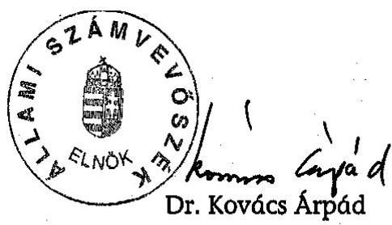

Melléklet: $\quad 10 \quad 13$ lap

---

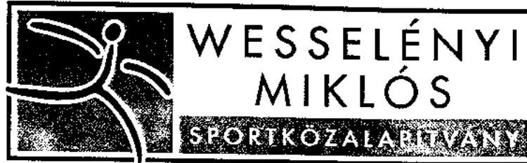

1. számú melléklet a V-1025-16/2005. számú jelentéshez

1061 Budapest, Paulay Ede utca 45. Telefon: 462-0006, 462-0007 Fax: 321-0030 1245 Bp. 5. Pf. 1014, E-mail:titkarsag@wesselenyikozalapitvany.hu

## Kettős Könyvvitelt vezető egyéb szervezetek közhasznú, egyszerűsített éves beszámolójának eredmény-kimutatása a 2003. évre

|  A tétel megnevezése | Előző év | Tárgyév  |
| --- | --- | --- |
|  A. Összes közhasznú tevékenység bevétele (1+5) | 749.410 | 815.867  |
|  1. Sorsolásos játékok játékadójának 12%-ból | 688.479 | 464.774  |
|  1/a. 2002. évi VB/EB eredményességi támogatás |  | 148.707  |
|  1/b. Működési költségre képzett összeg | 78.432 | 85.548  |
|  1/c. Gerevich-ösztöndíj és 2002. évi VB-EB eredményességi támogatás fedezete (1+1.a+1.d) | 520.047 | 663.481  |
|  1/d. MOB-adomány | 90.000 | 50.000  |
|  5. Egyéb bevétel | 60.300 | 66.838  |
|  6. Rendkívüli bevétel | 631 |   |
|  D. Közhasznú tevékenység ráfordításai | 680.276 | 754.398  |
|  Agyagjellegű ráfordítások | 21.507 | 30.087  |
|  Személyi jellegű ráfordítások | 40.995 | 49.221  |
|  Értékcsökkenési leírás | 9.325 | 9.901  |
|  Egyéb ráfordítások (Gerevich-ösztöndíj, 2001. VB-EB támogatás, stb.) | 606.395 | 664.840  |
|  Rendkívüli ráfordítások | 2.054 | 349  |
|  F. Összes ráfordítás | 680.276 | 754.398  |
|  G. Adózás előtti eredmény | 69.135 | 61.469  |
|  J. Tárgyévi közhasznú eredmény | 69.135 | 61.469  |
|  Tájékoztató adatok: |  |   |
|  Személyi jellegű ráfordítások | 40.995 | 49.221  |
|  1. Bérköltség | 28.147 | 34.005  |
|  Ebből: megbízási díjak | 1.798 | 1.146  |
|  2. Személyi jellegű egyéb kifizetések | 2.937 | 4.131  |
|  3. Bérjárulékok | 9.911 | 11.085  |
|  A szervezet által nyújtott támogatások | 1.322.817 | 2.650.600  |
|  Ebből: A 224./2000.(XII.19.) Kormány rend. 16.§ (5) bekezdése szerint kötelezettségként elszámolt és továbbutalt, illetve átadott támogatás | 785.339 | 1.555.506  |

Budapest, 2004. május 20.

Monszpart Sarolta elnök

---

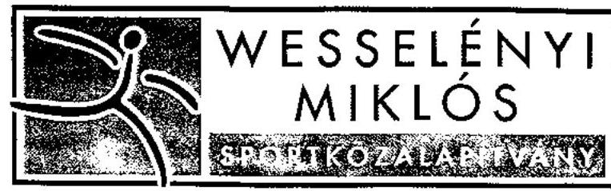
2. számú melléklet a V-1025-16/2005. számú jelentéshez

1061 Budapest, Paulay Ede utca 45, Telefon: 462-0006, 462-0007 Fax: 321-0030 1245 Bp. 5. Pf. 1014, E-mail:titkarsag@wesselenyikozalapitvany.hu

# Kettős Könyvvitelt vezető egyéb szervezetek közhasznú, egyszerűsített éves beszámolójának eredmény-kimutatása a 2004. évre 

(ezer forintban)

| A tétel megnevezése | Előző év | Tárgyév |
| :--: | :--: | :--: |
| A. Összes közhasznú tevékenység bevétele $(1+5+6+7)$ | 815.867 | 2.435.290 |
| 1. Sorsolásos játékok játékadójának 12\%-ból | 464.774 |  |
| 1/a. 2002. évi VB/EB eredményességi támogatás | 148.707 |  |
| 1/b. Működési költségre képzett összeg | 85.548 | 75.589 |
| 1/c. Gerevich-ösztöndíj és 2001. VB-EB eredményességi támogatás fedezete | 663.481 |  |
| 1/d. MOB-adomány | 50.000 |  |
| 5. Egyéb bevétel | 66.838 | 61.260 |
| 6. Egyéb átvett vagyon |  | 1.202 |
| 7. Szétosztásra kapott támogatások (ösztöndíjakra, EB-VB eredményességi kifizetésre, stb.) |  | 2.297.239 |
| D. Közhasznú tevékenység ráfordításai | 754.398 | 2.368.830 |
| Agyagjellegű ráfordítások | 30.087 | 23.027 |
| Személyi jellegű ráfordítások | 49.221 | 35.982 |
| Értékcsökkenési leírás | 9.901 | 9.753 |
| Egyéb ráfordítások (Gerevich-ösztöndíj, 2001. VB-EB támogatás, stb.) | 664.840 |  |
| Felosztott támogatások (ösztöndíjak, EB-VB eredményességi kifizetések) |  | 2.297.239 |
| Egyéb ráfordítások |  | 2.829 |
| Rendkívüli ráfordítások | 349 |  |
| F. Összes ráfordítás | 754.398 | 2.368.830 |
| G. Adózás előtti eredménye | 61.469 | 66.460 |
| J. Tárgyévi közhasznú eredmény | 61.469 | 66.460 |
| Tájékoztató adatok: |  |  |
| Személyi jellegű ráfordítások | 49.221 | 35.982 |
| 1. Bérköltség | 34.005 | 2020 |
| Ebből: megbízási díjak | 1.146 | 740 |
| 2. Személyi jellegű egyéb kifizetések | 4.131 | 2.250 |
| 3. Bérjárulékok | 11.085 | 8.712 |
| A szervezet által nyújtott támogatások | 2.650.600 | 2.297.239 |
| Ebből: A 224./2000.(XII.19.) Kormány rend. 16.§ (5) bekezdése szerint kötelezettségként elszámolt és továbbutalt, illetve átadott támogatás | 1.555.506 |  |

Budapest, 2005. május 26.
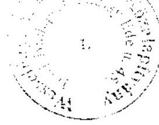
dr. Török Ferenc
elnök

---

# A WESSELÉNYI MIKLÓS SPORT KÖZALAPÍTVÁNY ESZKÖZEI ÉS FORRÁSAI

|   |  |  | Értékadatok: millió Ft-ban |  |  |   |
| --- | --- | --- | --- | --- | --- | --- |
|   | Megnevezés | 2002 | 2003 | 2004 | 2005 |   |
|  A. | Befektetett eszközök (I+II+III+IV) | 114,0 | 107,9 | 100,0 | 90,3 |   |
|  I. | Immateriális javak | 3,1 | 2,7 | 3,0 | 2,9 |   |
|  II. | Tárgyi eszközök | 85,7 | 80,0 | 71,9 | 62,3 |   |
|  III. | Befektetett pénzügyi eszközök | 0,0 | 0,0 | 0,0 | 0,0 |   |
|  IV. | Befektetett eszközök értékhelyesbítése | 25,1 | 25,1 | 25,1 | 25,1 |   |
|  B. | Forgóeszközök (I+II+III+IV) | 1531,3 | 1807,2 | 577,6 | 466,8 |   |
|  I. | Készletek | 0,0 | 0,0 | 0,0 | 0,0 |   |
|  II. | Követelések | 2,6 | 0,1 | 0,3 | 0,1 |   |
|  III. | Értékpapírok | 1261,4 | 1519,0 | 464,6 | 327,2 |   |
|  IV. | Pénzeszközök | 267,3 | 288,2 | 112,8 | 139,6 |   |
|  C. | Aktív időbeli elhatárolások | 9,4 | 19,5 | 2,4 | 2,5 |   |
|  Eszközök összesen (A+B+C) |  | 1654,7 | 1934,6 | 680,1 | 559,7 |   |
|  D. | Saját tőke (I+II+III+IV+V+VI) | 427,3 | 488,8 | 222,3 | 266,3 |   |
|  I. | Induló tőke | 125,0 | 125,0 | 125,0 | 125,0 |   |
|  II. | Tőkeváltozás | 208,1 | 277,2 | 5,7 | 72,2 |   |
|  III. | Lekötött tartalék | 0,0 | 0,0 | 0,0 | 0,0 |   |
|  IV. | Értékelési tartalék | 25,1 | 25,1 | 25,1 | 25,1 |   |
|  V. | Tárgyévi eredmény alaptevékenységből (közhasznú tevékenységből) | 69,1 | 61,5 | 66,5 | 44,0 |   |
|  VI. | Tárgyévi eredmény vállalkozási tevékenységből | 0,0 | 0,0 | 0,0 | 0,0 |   |
|  E. | Céltartalékok | 0,0 | 0,0 | 0,0 |

 | 0,0 |   |
|  F. | Kötelezettségek (I+II+III) | 1179,5 | 1349,3 | 4,7 | 6,3 |   |
|  I. | Hátrasorolt kötelezettségek | 0,0 | 0,0 | 0,0 | 0,0 |   |
|  II. | Hosszú lejáratú kötelezettségek | 0,0 | 0,0 | 0,0 | 0,0 |   |
|  III. | Rövid lejáratú kötelezettségek | 1179,3 | 1349,3 | 4,7 | 6,3 |   |
|  G. | Passzív időbeli elhatárolások | 47,9 | 96,5 | 453,1 | 287,1 |   |
|  Források összesen (D+E+F+G) |  | 1654,7 | 1934,6 | 680,1 | 559,7 |   |

Alulírott az Állami Számvevőszékről szóló 1989. évi XXXVIII. törvény 24. § c) pontja alapján aláírásommal kijelentem, hogy a feltüntetett adatok teljesek és a közalapítvány nyilvántartásaival, okmányaival mindenben egyeznek.

Budapest, 2006. január hó " $31, "$ nap P.H. képviseletre jogosult aláírása

---

# WESSELÉNYI MIKLÓS SPORT KÖZALAPÍTVÁNY BEVÉTELEI ÉS MŰKÖDÉSI KÖLTSÉGEI

|  Sor szám | Megnevezés | 2002 | 2003 | 2004 | 2005 | Összesen  |
| --- | --- | --- | --- | --- | --- | --- |
|  1. | Költségvetési támogatás | 1681,4 | 2449,1 | 1086,0 | 1190,1 | 6406,6  |
|  1.1. | Sorsolásos játékok játékadója | 1540,4 | 2298,7 |  |  | 3839,1  |
|  1.2. | VB-EB eredményességi támogatás | 139,6 | 148,9 | 206,5 | 16,5 | 511,5  |
|  1.3. | Gerevich ösztöndíj |  |  | 540,0 | 561,0 | 1101,0  |
|  1.4. | Pályázatra kapott támogatás |  |  | 130,1 | 294,8 | 424,9  |
|  1.5. | Működésre kapott támogatás | 1,4 | 1,5 | 34,1 | 55,6 | 92,6  |
|  1.6. | Csanádi iskola támogatások |  |  | 175,3 | 262,2 | 437,5  |
|  1.6.1 | Fennnartó támogatás |  |  | 41,0 | 120,0 | 161,0  |
|  1.6.2 | Állami normatív támogatás |  |  | 42,3 | 142,2 | 184,5  |
|  1.6.3 | Előző fenntartótól kapott támogatás |  |  | 92,0 |  | 92,0  |
|  2. | MOB-tól kapott adomány | 90,0 | 50,0 |  |  | 140,0  |
|  3. | Cél szerinti tevékenység egyéb bevétele | 3,7 | 9,1 | 6,8 | 5,3 | 24,9  |
|  4. | Pénzügyi műveletek bevételei | 58,5 | 65,7 | 59,8 | 44,0 | 228,0  |
|  5. | Egyéb saját bevétel | 2,4 | 1,0 | 1,6 | 0,8 | 5,8  |
|  I. | Bevételek összesen (1-5) | 1836,0 | 2574,9 | 1154,2 | 1240,2 | 6805,3  |
|  6. | Vezető testületi tagok költségtérítése | 3,2 | 5,0 | 3,1 | 4,6 | 15,9  |
|  7. | Anyagköltség-vásárolt anyagok költségei | 1,2 | 1,2 | 0,8 | 0,8 | 4,0  |
|  7.1. | fogyóanyag | 0,3 | 0,5 | 0,2 | 0,2 | 1,2  |
|  7.2. | nyomtatvány, irodaszer | 0,8 | 0,7 | 0,5 | 0,5 | 2,5  |
|  7.3. | egyéb anyagköltség | 0,1 | 0,0 | 0,1 | 0,1 | 0,3  |
|  8. | Igénybevett szolgáltatások költsége | 17,1 | 23,9 | 19,1 | 20,7 | 80,8  |
|  8.1. | közös költség | 4,6 | 4,9 | 4,9 | 6,0 | 20,4  |
|  8.2. | takarítás | 0,4 | 0,6 | 0,6 | 0,5 | 2,1  |
|  8.3. | karbantartási költség | 0,1 | 0,4 | 0,4 | 0,8 | 1,7  |
|  8.4. | vagyonvédelem | 0,1 | 0,1 | 0,1 | 0,2 | 0,3  |
|  8.5. | posta, telefon | 3,9 | 4,8 | 4,1 | 3,0 | 15,8  |
|  8.6. | bankköltség, biztosítás | 0,2 | 0,4 | 0,5 | 0,9 | 2,0  |
|  8.7. | fénymásolás, előfizetési díj, nyomda ktg. | 0,1 | 0,2 | 0,1 | 0,1 | 0,5  |
|  8.8. | eszközök bérleti díja | 1,0 | 1,2 | 0,5 | 0,2 | 2,9  |
|  8.9. | könyvelési díj |  |  | 2,1 | 1,8 | 3,9  |
|  8.10. | szoftver frissítés | 0,6 | 1,7 | 0,1 | 0,8 | 3,2  |
|  8.11. | ügyviteli szolgáltatás | 0,5 | 1,9 | 0,6 | 0,5 | 3,5  |
|  8.12. | könyvvizsgálói díj | 1,7 | 1,8 | 1,2 | 1,5 | 6,2  |
|  8.13. | ügyvédi díj | 2,4 | 3,0 | 2,0 | 2,5 | 9,9  |
|  8.14. | oktatás, továbbképzés | 0,1 | 0,4 |  | 0,1 | 0,6  |
|  8.15. | internet előfizetés | 0,2 | 0,3 | 0,3 | 0,4 | 1,2  |
|  8.16. | hirdetés | 0,5 | 0,6 | 0,6 | 0,5 | 2,2  |
|  8.17. | pályázat kiírás | 0,6 | 0,8 | 0,8 | 0,6 | 2,8  |
|  8.18. | egyéb | 0,1 | 0,8 | 0,2 | 0,3 | 1,4  |
|  9. | Anyagjellegű költség összesen (7+8) | 18,3 | 25,1 | 19,9 | 21,5 | 84,8  |
|  10. | Bérköltség | 28,5 | 34,0 | 25,3 | 23,5 | 111,3  |
|  10.1. | teljes munkaidőben foglalkoztatottak | 28,0 | 33,5 | 24,5 | 22,9 | 108,9  |
|  10.2. | megbízási díj/állományon kívüliek | 0,5 | 0,5 | 0,8 | 0,6 | 2,4  |
|  11. | Személyi jellegű egyéb kifizetések | 1,5 | 2,2 | 2,0 | 2,1 | 7,8  |
|  11.1. | útiköltség-térítés | 0,5 | 0,2 | 0,4 | 0,5 | 1,6  |
|  11.2. | étkezési költségtérítés | 0,2 | 0,4 | 0,5 | 0,7 | 1,8  |
|  11.3. | üdülési csekk |  | 1,0 |  | 0,1 | 1,1  |
|  11.4. | reprezentációs költség | 0,3 | 0,3 | 0,1 | 0,1 | 0,8  |
|  11.5. | táppénz, betegszabadság | 0,4 | 0,1 |  | 0,2 | 0,7  |
|  11.6. | egyéb | 0,1 | 0,2 | 1,0 | 0,5 | 1,8  |
|  12. | Bérjárulékok, munkaadói járulék | 11,0 | 13,0 | 10,4 | 6,5 | 40,9  |
|  13. | Személyi jellegű ráfordítások (10+11+12) | 41,0 | 49,2 | 37,7 | 32,1 | 160,0  |
|  14. | Értékcsökkenési leírás | 9,3 | 9,9 | 9,8 | 9,7 | 38,7  |
|  II. | Működési költségek összesen (6+9+13+14) | 71,8 | 89,2 | 70,5 | 67,9 | 299,4  |

Alulírott az Állami Számvevőszékről szóló 1989. évi XXXVIII. törvény 24. § 1 pontja alapján aláírásommal kijelentem, hogy a feltüntetett adatok teljesek és a közalapítvány nyilvántartásával mindenben egyeznek. Budapest, 2006. január hó ... nap.

---

5. számú melléklet a V-1025-16/2005. számú jelentéshez

# A WESSELÉNYI MIKLÓS SPORT KÖZALAPÍTVÁNY CÉL SZERINTI KIFIZETÉSEI

Évek/Támogatások

|  Évek/Támogatások | Alapító okirat szerinti célok | Érvényes pályázatok/ kérelmek száma | Igényelt összeg (millió Ft) | Támogatott ak | Odaítélt összeg (millió Ft) | Kifizetett támogatás (millió Ft) tárgyévi | Előző időszakról | Összesen  |
| --- | --- | --- | --- | --- | --- | --- | --- | --- |
|  2002. | Gerekhálás Alapító | a., b., e., IV/I.f., g. |  | 925 | 474,5 | 474,5 | 0,1 | 474,6  |
|   | VB. EB eredményességi ösztöndíj | a., e. |  | 329 | 139,6 | 131,5 | 0,2 | 131,7  |
|   | Pályázati úton adott támogatás | a., b., c., d., h. | 3146 | 1692,1 | 3022 | 930,6 | 67,0 | 636,0  |
|   | Pályázaton kívül adott támogatás | b., c. | 12 | 12,5 | 12 | 12,5 | 11,9 | 11,9  |
|  2003. | Gerekhálás Alapító | a., b., e., IV/I.f., g. |  | 950 | 514,8 | 514,8 |  | 514,8  |
|   | VB. EB eredményességi ösztöndíj | a., e. |  | 684 | 148,9 | 148,7 |  | 148,7  |
|   | Pályázati úton adott támogatás | a., b., c., d., h. | 5558 | 3732,6 | 5182 | 1539,1 | 363,8 | 850,2  |
|   | Pályázaton kívül adott támogatás | b., c., e. | 140 | 459,8 | 139 | 440,7 | 340,1 | 0,6  |
|  2004. | Gerekhálás Alapító | IV/I.a. |  | 965 | 584,5 | 584,5 |  | 584,5  |
|   | VB. EB eredményességi ösztöndíj | e. |  | 1103 | 290,6 | 252,1 | 0,7 | 252,8  |
|   | Pályázati úton adott támogatás | c. | 2510 | 1626,4 | 2438 | 408,0 |  | 1178,8  |
|   | Pályázaton kívül adott támogatás | a., c., e. (2001.) | 20 | 100,2 | 20 | 100,2 | 94,0 | 95,8  |
|   | Csanádi Iskola | b., d. |  |  |  | 175,3 | 133,0 |   |
|  2005. | Gerekhálás Alapító | IV/I.a. |  | 659 | 561,0 | 514,2 |  | 514,2  |
|   | VB. EB eredményességi ösztöndíj | e. |  | 420 | 16,5 | 63,3 |  | 63,3  |
|   | Pályázati úton

 adott támogatás | c. | 1608 | 934,5 | 1558 | 240,0 |  | 405,1  |
|   | Pályázaton kívül adott támogatás |  |  |  |  |  |  | 1,7  |
|   | Csanádi Iskola | b., d. |  |  |  | 262,2 | 262,2 | 38,7  |
|  2002- | Gerekhálás Alapító |  |  | 3499 | 2134,8 | 2088,0 | 0,1 | 2088,1  |
|   | Vb. EB eredményességi ösztöndíj |  |  | 2536 | 595,6 | 595,6 | 0,9 | 596,5  |
|   | Pályázati úton adott támogatás |  | 12822 | 7985,6 | 12200 | 3117,7 | 430,8 | 3070,1  |
|   | Pályázaton kívül adott támogatás |  | 172 | 572,5 | 171 | 553,4 | 446,0 | 98,1  |
|   | Csanádi Iskola |  |  |  |  | 437,5 | 395,2 | 38,7  |
|   | Mindösszesen: |  |  |  |  | 6839,0 | 3955,6 | 3207,9  |

Alulírott az Állami Számvevőszékről szóló 1989. évi XXXVIII. törvény 24. § c) pontja alapján aláírásommal kijelentem, hogy a feltüntetett adatok teljesek és a közalapítvány nyilvántartásaival, okmányaival mindenben egyeznek.

Budapest, 2006. január hó "51." nap

P.H.

képviseletre jogosult aláírása

---

# Emlékeztető 

Tárgya: A Wesselényi Miklós Sport Közalapítvány gazdálkodásának ellenőrzése kapcsán az „EPSYLON MÉDIA Bt" részére nyújtott 26 millió Ft összegű támogatás felhasználásának helyszíni ellenőrzése.

Időpontja: 2005. november 17.

## Helye:

Jelen lévők: EPSYLON MÉDIA Bt képviseletében: Schulek Csaba a bt. ügyvezetője
Állami Számvevőszék részéről Pásztor Katalin és Sas Imréné számvevők

Az EPSYLON MÉDIA Bt (továbbiakban támogatott) és a Wesselényi Miklós Sport Közalapítvány (továbbiakban támogató) 2003. szeptember 10-én szerződést kötöttek televíziós szabadidősport magazin műsor készítésének támogatására 20 millió Ft támogatási összegről, amelyet a támogató 2004. május 21-én további 6 millió Ft-tal kiegészített, így az átutalt támogatás összesen 26 millió Ft volt.

A támogatott eredeti pályázatához benyújtott költségvetésének nettó értéke 20,9 millió Ft volt, 26 adásra vetítve. A műsor nem az eredeti pályázatban vállalt gyakorisággal, hanem annál gyakrabban valósult meg, ezért a kuratórium a támogatott kérésére további 6 millió Ft támogatást nyújtott.

A pályázati dokumentumok szerint a támogatott a támogatás teljes összegével elszámolt, ennek keretében nyolc rész-elszámolást nyújtott be, az elszámolások alapján a felhasználás bruttó végösszege 26 millió Ft, a nettó végösszege 21 millió Ft, az Áfa összege 5 millió Ft volt.

| elszámolás | nettó érték | Áfa | bruttó érték |
| :-- | :-- | :-- | :-- |
| 1 | 3527558 | 731856 | 4259414 |
| 2 | 690000 | 169770 | 859770 |
| 3 | 1746360 | 414109 | 2160469 |
| 4 | 3444523 | 856381 | 4300904 |
| 5 | 3402155 | 837789 | 4239944 |
| 6 | 3403685 | 846921 | 4250606 |
| 7 | 3013235 | 745308 | 3758543 |
| 8 | 1757800 | 439450 | 2197250 |
| összesen | 20985316 | 5041584 | 26026900 |

---

A támogatott a televíziós műsort rögzítő videokazettákat a támogatott részére megküldte.
A szerződés szerint a támogatott a támogatás elkülönített felhasználásának érdekében köteles volt önálló bankszámlát nyitni, és a műsor elkészítésének költségeit arról fizetni.

Az önálló bankszámla vezetési kötelezettségének a támogatott eleget tett.
A támogatott teljes körűen az ellenőrzés rendelkezésére bocsátotta a szerződésben meghatározott feladatra elszámolt költségek alapbizonylatait.

Az ellenőrzött bizonylatok alapján elszámolt költség teljes egészében a szerződésben rögzített feladattal kapcsolatban fizette ki.

A szerződésben vállalt feladat teljesítéséhez kapcsolódó költségeket a támogatott a könyvvezetésében analitikus nyilvántartással elkülönítette.

A támogatott jogosult volt az előzetesen felszámított Áfa visszaigénylésére, és e jogcímen 5 millió Ft Áfa-t igényelt vissza. Az elkülönített nyilvántartás szerinti bruttó érték 26 millió Ft, a nettó érték 21 millió Ft volt.

Az ellenőrzés megállapította, hogy a támogatóhoz benyújtott elszámolás megegyezett/nem egyezett meg a támogatott által vezetett elkülönített nyilvántartással.
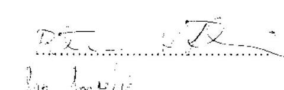
támogatott képviseletében
ÁSZ képviseletében

---

# Emlékeztető 

Tárgya: A Wesselényi Miklós Sport Közalapítvány gazdálkodásának ellenőrzése kapcsán a „Zöldpont Egyesület és Szerkesztőség" részére nyújtott 20 millió Ft összegű támogatás felhasználásának helyszíni ellenőrzése.

Időpontja: 2005. november 27.
Helye: Budapest VII. Damjanich u. 39.
Jelen lévők: Zöldpont Egyesület képviseletében: Cziráki Péter
Állami Számvevőszék részéről Pásztor Katalin és Sas Imréné számvevők

A Zöldpont Egyesület (továbbiakban támogatott) és a Wesselényi Miklós Sport Közalapítvány (továbbiakban támogató) 2003. november 5-én szerződést kötöttek televíziós szabadidősport magazin műsor készítésének támogatására 20 millió Ft támogatási összegről. A kuratórium a 111/2003 számú határozata szerint a támogatást a 2003. évi rendkívüli pályázati kiírásban meghatározott feltételekkel nyújtotta. A pályázati kiírás alapján pályázható költségek a műsorgyártás költségei voltak, de személyi kifizetés nem. A támogató a támogatott részére ténylegesen 18146091 Ft-ot utalt át.

A támogatottat a Fővárosi Bíróság Pk.62151/1992. számon vette nyilvántartásba.
Az elszámolás dokumentumai szerint a támogatott 5 rész-elszámolást nyújtott be, az elszámolások alapján a felhasználás bruttó végösszege 18,5 millió Ft volt.

| elszámolás | bruttó érték |
| :-- | :--: |
| 1 | 3112201 |
| 2 | 4405804 |
| 3 | 4524177 |
| 4 | 4527876 |
| 5 | 1937000 |
| összesen | 18507058 |

A támogatott teljes körűen az ellenőrzés rendelkezésére bocsátotta a szerződésben meghatározott feladatra elszámolt költségek alapbizonylatait.

A támogatott a televíziós műsort rögzítő videokazettákat a támogató részére a szerződés előírásától eltérően nem az adást követő öt napon belül, hanem a 2005. január 22-i keltezésű ügyvédi felszólítást követően küldte meg.

A televíziós műsort rögzítő videokazetták tanúsága szerint a műsorok 2003. október 24. és 2004. június 11. közötti időszakban kerültek adásba.

A negyedik és ötödik részelszámoláshoz mellékelt számlák közül 24 db kiállítás időpontja 2004. július 1. utáni időpont volt, a számlák értéke összesen 3889656 Ft volt, ennek okai:

---

7. számú melléklet 2. oldal a V-1025-16/2005. számú jelentéshez

- a támogatottnak az MTV Rt.-vel érvényes szerződése volt, amely alapján a munkát 2004. október közepéig folytatta,
- a műsorkészítők késedelmes számlázása miatt.

A szerződés szerint a támogatott a támogatás elkülönített felhasználásának érdekében köteles volt önálló bankszámlát nyitni, és a műsor elkészítésének költségeit arról fizetni.

Az önálló bankszámla vezetési kötelezettségének a támogatott eleget tett.
A szerződésben vállalt feladat teljesítéséhez kapcsolódó költségeket a támogatott a könyvvezetésében analitikus nyilvántartással elkülönítette.

Az ellenőrzés megállapította, hogy a támogatóhoz benyújtott elszámolás megegyezett a támogatott által vezetett elkülönített nyilvántartással.

A támogatott jogosult volt az előzetesen felszámított Áfa visszaigénylésére, de a támogatóhoz elszámolt számlák után Áfa-t nem igényelt vissza, erre vonatkozó utólagos analitikus nyilvántartását megküldi.
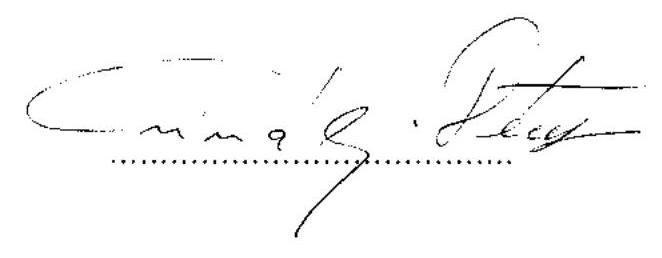
támogatott képviseletében
kmf.
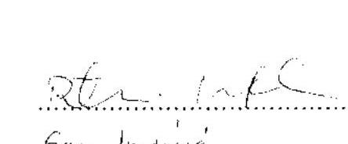
ÁSZ képviseletében

---

8. számú melléklet 1. oldal a V-1025-16/2005. számú jelentéshez
9. számú diagram
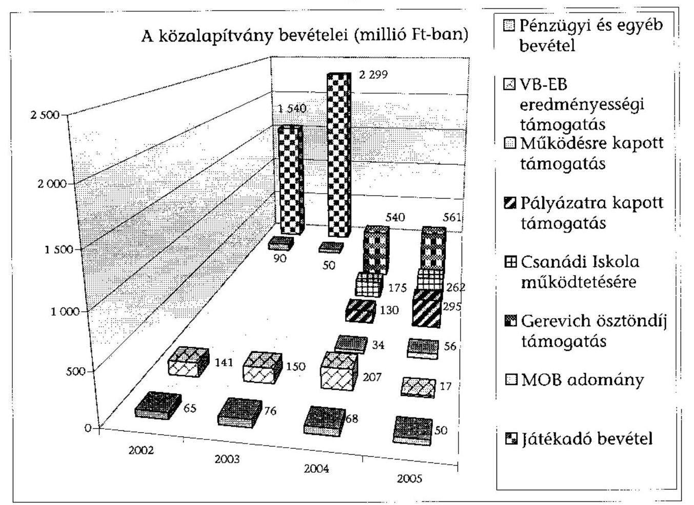
10. számú diagram
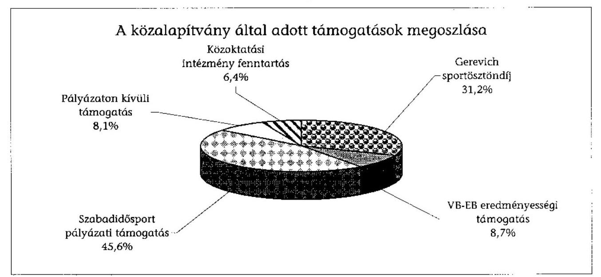

---

8. számú melléklet 2.oldal a V-1025-16/2005. számú jelentéshez
9. számú diagram

A pályázati úton adott támogatások
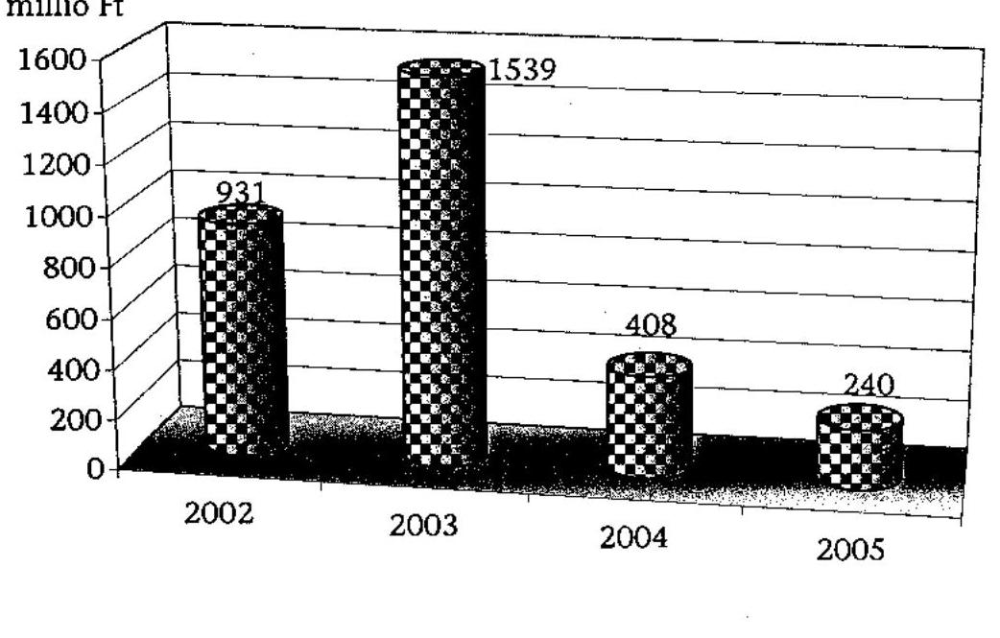
10. számú diagram

A pályázaton kívüli támogatások megoszlása
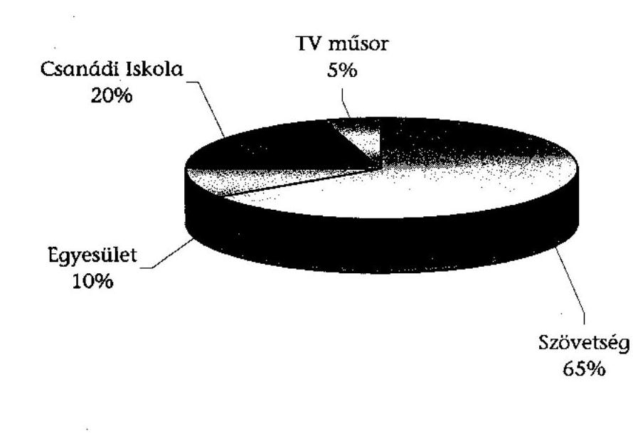

---

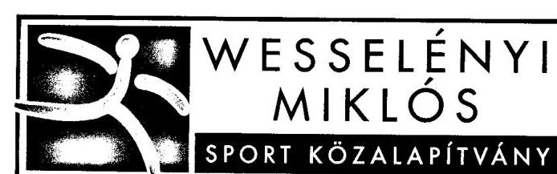
9. számú melléklet a V-1025-46/2005. számú jelentéshez

1061 Budapest, Paulay Ede utca 45. Telefon: 462-0006, 462-0007 Fax: 321-0030 1245 Bp. 5. Pf. 1014, E-mail: niszka@mail.matav.hu

Állami Számvevőszék
Dr. Kovács Árpád elnök úr részére Budapest

Tisztelt Elnök Úr!
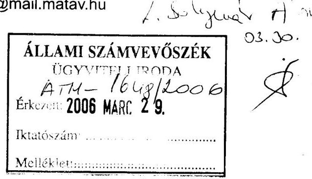

A Számvevőszéki jelentés tervezetét az Ön levelével együtt március 27-én kaptuk meg. Szíves felhívására a jelentéstervezettel kapcsolatban az alábbi észrevételt tesszük:

# 1. 14. oldal, Csanádi Iskolához szóló részhez: 

Egy rövid kiegészítést szeretnénk. A Közalapítvány mint fenntartó valóban nem foglalkoztat közoktatási szakembert, de ennek az az oka, hogy az előző fenntartóval, a Nemzeti Utánpótlás-nevelési Intézettel az átadáskor megkötött együttműködési megállapodás szerint minden szükséges alkalommal az Intézettől, de alkalmanként külső szakértőtől is kérünk és kapunk szakvéleményt. (Ahogyan ez a 47.oldalon rögzítésre került)
2. 17. oldal, javaslatok a Kormánynak, 1. pont:

Kérjük, szíveskedjenek ezt a részt kibővíteni azzal, hogy a Közalapítvány a működési költségeire fordíthassa a saját bevételeit (pl. pályázati nevezési díjak, pályázati füzetek ára, haszonbérlők költségtérítése).
Ezen rendelkezés nélkül jelenleg a nagyon takarékos működés is és az alapító okiratban megengedett vállalkozási tevékenység is lehetetlen.

Tisztelt Elnök Úr!
Köszönjük munkatársai alapos és korrekt vizsgálatát, segítő észrevételeiket, együttműködésüket.
A vizsgálat tanulságai nagyban segítik munkánkat.

Önnek és munkatársainak jó egészséget, munkájukhoz sok sikert kívánunk.

Budapest, 2006. március 29.
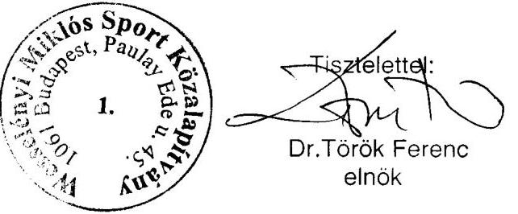

---

# Dr. Török Ferenc úr 

kuratóriumi elnök

## Wesselényi Miklós Sport Közalapítvány

Budapest

## Tisztelt Elnök Úr!

A Wesselényi Miklós Sport Közalapítvány gazdálkodásának ellenőrzéséről készült jelentés-tervezet munkapéldányának egyeztetésére írt észrevételét köszönettel megkaptam. Észrevétele a jelentés módosítását nem igényli az alábbiak miatt:

1. A közalapítvány - mint a Csanádi iskola fenntartója - nem foglalkoztatott közoktatási szakembert, amint azt Elnök úr is megerősítette észrevételében. Ennek okát - az észrevétel elismerése szerint is - a jelentés 47. oldala tartalmazza, így a jelentés további kiegészítése nem szükséges.
2. Jelentésünkben - többek között - azt javasoltuk a Kormánynak, hogy kezdeményezze a sportról szóló 2004. évi I. törvény 48. § (2) bekezdés utolsó mondatának módosítását a tekintetben, hogy a közalapítvány működési költségeit a tárgyévben teljesített alapítványi célú kiadások arányában határozza meg és a közalapítvány központi költségvetési finanszírozás rendszerének megváltozására tekintettel, vizsgálja felül annak mértékét. E javaslatunk alapján a közalapítvány összes közhasznú tevékenységének bevétele a megengedett mérték erejéig felhasználható működésre, így az észrevételben jelzettekkel való kibővítés, a megváltoztatásra javasolt szabályozás keretei között, nem szükséges.

Tájékoztatom, hogy a nyilvánosságra hozott jelentéshez - az ÁSZ tv. III. fejezet 25. § (1) bekezdésének megfelelően 8 napos határidőn belül - tett észrevétele és jelen levelem másolatát csatolom.
Budapest, 2006. április 9.

Tisztelettel:
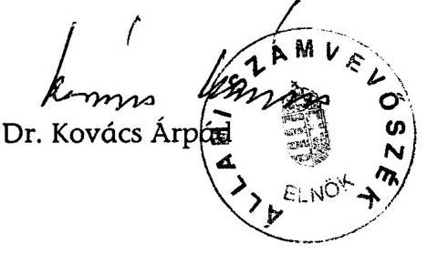

Melléklet: 1 pld. jelentés

