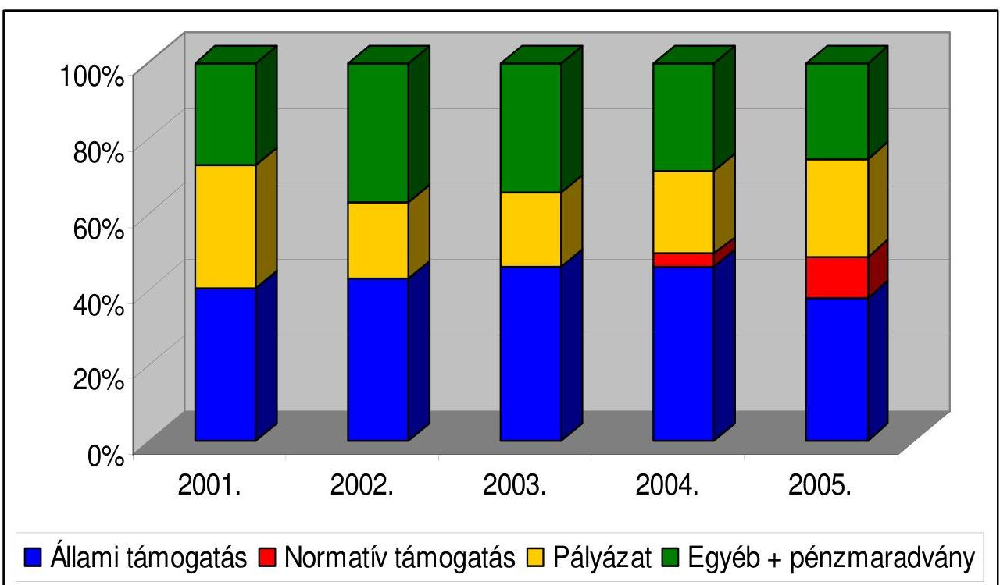
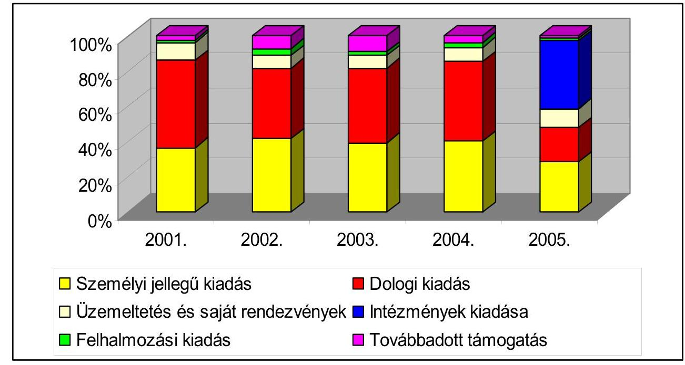
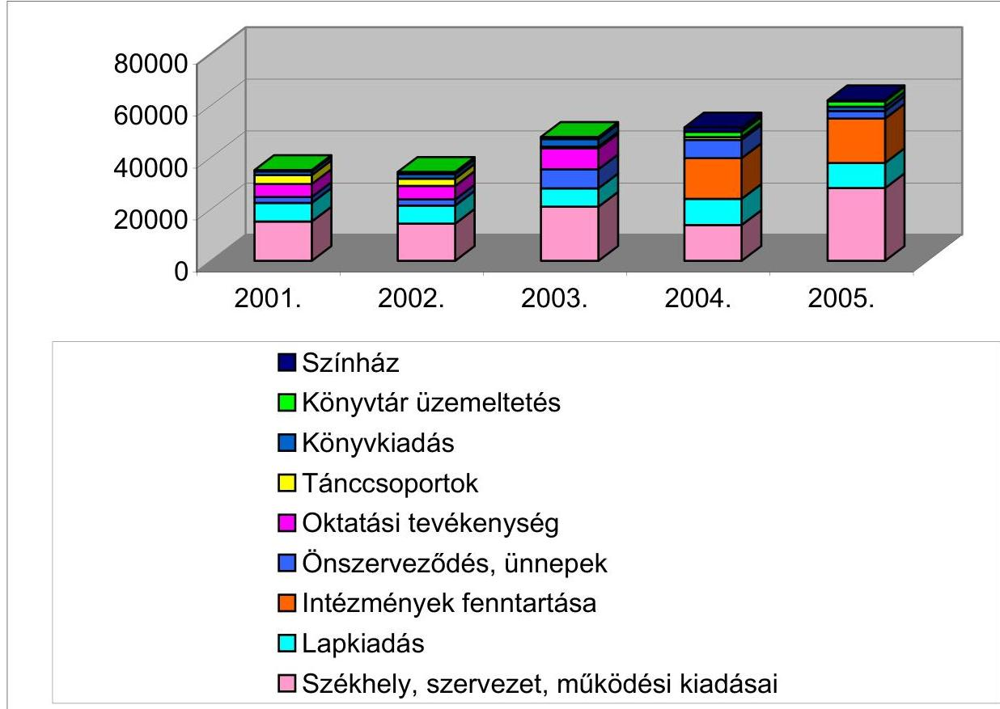

# JELENTÉS 

a Görög Országos Önkormányzat 2001-2004. évi pénzügyi-gazdasági tevékenységének ellenőrzéséről

---

3. Önkormányzati és Területi Ellenőrzési Igazgatóság
3.1. Szabályszerűségi Ellenőrzési Főcsoport
Iktatószám: V-1001-020/2006.
Témaszám: 801
Vizsgálat-azonosító szám: V0284
Az ellenőrzést felügyelte:
Dr. Lóránt Zoltán
főigazgató
Az ellenőrzés végrehajtásáért felelős:
Dr. Elek János
általános főigazgató-helyettes
Az ellenőrzést vezette:
Horváth Balázs
főcsoportfőnök-helyettes
Az összefoglaló jelentést készítette:
Szendrey Lajos
számvevő
Az ellenőrzést végezték:
Szendrey Lajos
Dr. Faragóné Tóth Mária
számvevő
tanácsos

# A témához kapcsolódó eddig készített számvevőszéki jelentések: 

címe
sorszáma
Jelentés a Görög Országos Önkormányzat pénzügyi-gazdasági 382 tevékenységének ellenőrzéséről
Jelentés az Országos Kisebbségi Önkormányzatok pénzügyi- 0201 gazdasági tevékenységének vizsgálatáról
Jelentés a Görög Országos Önkormányzat pénzügyi-gazdasági 0203 tevékenységének vizsgálatáról

---

# TARTALOMJEGYZÉK 

BEVEZETÉS ..... 5
I. ÖSSZEGZŐ MEGÁLLAPÍTÁSOK, KÖVETKEZTETÉSEK, JAVASLATOK ..... 6
II. RÉSZLETES MEGÁLLAPÍTÁSOK ..... 9

1. A feladatellátás szervezettsége, szabályozottsága ..... 9
1.1. Az Önkormányzat szervezeti és működési rendje ..... 9
1.2. A gazdálkodási feladatok szabályozása ..... 9
1.3. A feladatellátás szervezeti háttere ..... 9
2. Az Önkormányzat gazdálkodásának jellemzői ..... 10
2.1. A gazdálkodási tevékenység feltételei ..... 10
2.2. Vagyongazdálkodás, vagyonvédelem ..... 10
2.3. A gazdálkodás számviteli szabályozása ..... 11
3. Az éves költségvetések jóváhagyása, végrehajtása ..... 11
3.1. Az éves költségvetések elkészítése, elfogadása ..... 11
3.2. A költségvetés végrehajtása, zárszámadása ..... 11
3.3. A költségvetési feladatok teljesítése ..... 12
3.3.1. A költségvetési törvényben megállapított támogatás alakulása ..... 12
3.3.2. Pályázati támogatások elszámolása, felhasználása ..... 12
3.3.3. Kiadások alakulása, összetétele ..... 13
4. Az Önkormányzat számviteli tevékenysége ..... 14
4.1. Éves beszámolók összeállítása, jóváhagyása ..... 14
4.2. A könyvvezetési kötelezettség teljesítése ..... 14
4.3. A bizonylati rend és a bizonylati fegyelem érvényesülése ..... 14
5. Az Önkormányzat belső ellenőrzési rendszere ..... 15
6. Utóvizsgálat ..... 15
MELLÉKLETEK
7. számú Az Önkormányzat 2001-2005. évi bevételei alakulása és megoszlása
8. számú Az Önkormányzat 2001-2005. évi kiadásai alakulása és megoszlása
9. számú Az Önkormányzat kisebbségi feladatainak költségvetési támogatása, évenkénti változása 2001-2005 között
10. számú A központi költségvetésből nemzeti és etnikai kisebbségi feladatokra kapott pályázati támogatások részletezése 2001-2005. évekre

---

.

---

# RÖVIDÍTÉSEK JEGYZÉKE 

| Amr. | Az államháztartás működési rendjéről szóló 217/1998.   (XII. 30.) Korm. rendelet |
| :-- | :-- |
| ÁSZ | Állami Számvevőszék |
| GOÖ | Görög Országos Önkormányzat |
| MNEKK | Magyarországi Nemzeti Etnikai Kisebbségekért Közalapít-   vány |
| Nek. tv. | A nemzeti és etnikai kisebbségek jogairól szóló 1993. évi   LXXVII. törvény |
| NEKH | Nemzeti és Etnikai Kisebbségi Hivatal |
| OM | Oktatási Minisztérium |
| Szja törvény | A személyi jövedelemadóról szóló - többször módosított -   1995. évi CXVII. törvény |
| SZMSZ | Szervezeti és Működési Szabályzat |
| Szt. | A számvitelről szóló - többször módosított - 2000. évi C.   törvény |

---

.

---

# JELENTÉS 

## a Görög Országos Önkormányzat 2001-2004. évi pénzügyi-gazdasági tevékenységének ellenőrzéséről

## BEVEZETÉS

A 2001. évi népszámlálás adatai szerint a magyarországi görög közösség létszámát illetően 2509 fő görög anyanyelvűnek, 6140 fő a görög kulturális értékekhez, hagyományokhoz kötődőnek vallotta magát.

A Görög Országos Önkormányzat (továbbiakban: GOÖ) 1995-ös megalakulása óta harmadik négyéves ciklusát kezdte meg a vizsgált időszak második felében. Az új 21 fős testületet 155 elektor közül választotta meg az elektori gyűlés. Budapesten 19 kerületben, vidéken 11 településen alakult görög kisebbségi önkormányzat; a fővárosban 3 másik kerületben, vidéken 4 helységben választottak görög szószólót.

Az Állami Számvevőszékről szóló - többször módosított - 1989. évi XXXVIII. törvény 2. § (5) bekezdése, valamint a nemzeti és etnikai kisebbségek jogairól szóló 1993. évi LXXVII. törvény (továbbiakban: Nek. tv) 57. §-ában kapott felhatalmazás alapján vizsgáltuk, hogy a különböző állami forrásokból juttatott pénzeszközök felhasználása a jogszabályi előírásoknak megfelelően történt-e.

Az ellenőrzés a 2001-2004. beszámolóval lezárt gazdálkodási évekre terjedt ki, a 2005. évet, a beszámolást kivéve vizsgáltuk.

Az ellenőrzés célja: annak megállapítása volt, hogy

- a GOÖ a központi költségvetési támogatást a Nek. tv-ben meghatározott feladatokra használta-e fel, a felhasználása és elszámolása során betartották-e a vonatkozó hatályos jogszabályi előírásokat;
- a gazdálkodás törvényessége, szabályszerűsége biztosított volt-e; a tervezés, az operatív gazdálkodás, a beszámolási kötelezettség és a számviteli bizonylati rend teljesítése során érvényesültek-e a jogszabályokban és a belső szabályzatokban megfogalmazott követelmények;
- a szabályszerű gazdálkodás érdekében kialakított kontrollmechanizmusok megfelelően segítették-e a feladatok végrehajtását.

Az ellenőrzés: 2006. január 24 - 2006. március 9-e között az Önkormányzat székhelyén történt.

---

# I. ÖSSZEGZŐ MEGÁLLAPÍTÁSOK, KÖVETKEZTETÉSEK, JAVASLATOK 

A GOÖ szervezeti és működési rendjét az 1995 óta hatályos SZMSZ szabályozta, amely a nemzeti és etnikai kisebbségi törvénnyel összhangban határozta meg az önkormányzati, hatásköri feladatokat. Az önkormányzat szabályszerűen megválasztotta testületeit. A 2003. évi alakuló ülésen az országos kisebbségi feladatok irányítására új elnököt választottak. A közgyűlés az SZMSZ előírásainak megfelelően, éves munkaterv alapján gyakorolta hatáskörét, határozatait jegyzőkönyvileg dokumentálták. A testület pénzügyi-gazdasági döntései végrehajtásáért az elnök felelt. A döntések előkészítésére, a határozatok végrehajtásának szervezésére és ellenőrzésére pénzügyi ellenőrző bizottság működött. Az önkormányzati feladatok ellátását - hivatali szervezet hiányában működési, ügyrendi szabályozás nélkül végezték. A folyamatos működéshez biztosították a személyi és tárgyi feltételeket.

Az országos kisebbségi feladatok fejlesztése céljából - közgyűlési határozattal - 2003-ban alapították a Magyarországi Görögök Kutatóintézetét, 2004-ben intézményesítették az oktatási tevékenységet. A vasárnapi iskola helyett beindított 12 évfolyamos Kiegészítő Görög Nyelvoktató Iskola működését az OM engedélyezte. Az intézményalapítás részben önálló költségvetési szervként történt. A gazdálkodási feladatok ellátására kijelölt GOÖ nem felelt meg az Ámr. előírásának, mivel társadalmi szervezetnek minősült. Az ellentmondásos helyzet a Nek. tv. 2005. évi módosításának megfelelően a GOÖ hivatala létrehozásával rendeződik. A GOÖ-nek létre kell hozni az országos kisebbségi önkormányzati költségvetési szervként működő hivatalát, amely jogszerűen kijelölhető lesz a részben önálló intézmények gazdálkodási feladatainak ellátására. Az önkormányzat fenntartóként biztosította a működéshez szükséges feltételeket, de a felügyeleti jogkör gyakorlásához nem rendelkezett az intézményi működés és gazdálkodás SZMSZ által előírt szabályozásáról.

A GOÖ gazdálkodási tevékenységet meghatározó előírásai hiányosak, elavultak. Szabályozták az önkormányzati gazdálkodás pénzügyi bevételeit, az éves költségvetések és zárszámadások elfogadásának rendjét, de nem rendelkeztek a költségvetés végrehajtására, a tervezési és beszámolási dokumentumok összeállításának követelményeire. Az intézményi feladatok belépésével elmaradt a szabályozás aktualizálása. A kizárólagos hatáskörbe utalt gazdasági döntések szabályszerűen, közgyűlési határozatokon alapultak. Az SZMSZ előírása, valamint az ÁSZ javaslata ellenére az induló törzsvagyon és vagyonleltár megállapítását a közgyűlés elmulasztotta.

A GOÖ 2001-2005 között minden évben rendelkezett a közgyűlés által elfogadott költségvetéssel, zárszámadással. Az önkormányzati költségvetés összeállításának tartalmi és határidős követelményét nem határozták meg, ennek ellenére biztosították a szakmai és pénzügyi értékelést, évenkénti összehasonlítást egyaránt lehetővé tevő szerkezetet, illetve a költségvetés - 2005. évi terv kivételével - első negyedévben történt jóváhagyását. A működési célú költségvetési támogatás feladatonkénti megosztásáról a közgyűlés döntött. A bevételeket

---

és kiadásokat főbb jogcímek szerint állapították meg, ezen belül a működési kiadásokat részletezték. Az éves költségvetésekben rendszeresen tartalékot képeztek. A költségvetés végrehajtása során a feladatok forrásait, illetve felhasználását elkülönítetten kezelték. Biztosították a kötelezettségvállalások tervszerű fedezetét, a pénzügyi egyensúly folyamatos megőrzését. A zárszámadás a bevételeket és kiadásokat feladatonkénti és jogcímenkénti részletezésben tartalmazta, közgyűlési elfogadása minden évben a pénzügyi ellenőrző bizottság véleményével kiegészítve történt.

A GOÖ a vizsgált időszakban összesen 267973 ezer Ft pénzforgalmi bevételből gazdálkodott. A költségvetési törvény alapján 142500 ezer Ft, oktatási intézmény normatív támogatására 11007 ezer Ft, pályázat eredményeként 79934 ezer Ft központi költségvetési támogatást kapott, amely együttesen a pénzforgalmi bevételek 87,1%-át tette ki. A törvény alapján folyósított működési célú költségvetési támogatás a 2001. évi bázishoz képest 2003-ra 57,1%-kal nőtt, 2004. évben szintentartással teljesült, míg 2005-ben az államháztartási egyensúlyi intézkedések miatt csökkent. A költségvetési támogatások rendeltetésszerű felhasználását a pénzügyi és szakmai beszámolók, számviteli bizonylatok igazolták. Az önkormányzat - egy kivétellel - minden évben határidőre teljesítette a támogatási szerződésben megállapított elszámolási kötelezettségét.

A GOÖ összes kiadásának 93,3%-át működésre, 4,5%-át görög kisebbségi szervezetek támogatására, 2,2%-át felhalmozásra fordította. A nemzeti kisebbségi feladatokra fordított kiadások 86,5%-át a központi költségvetési források fedezték. A kiadások 40%-át az önkormányzat működési, kutatási céljaira, 17,8%-át lapkiadásra, 14,2%-át intézményműködésre használták fel. A görög kisebbségi szervezetek tevékenységét 11959 ezer Ft-tal támogatták.

A GOÖ a számviteli tevékenység szabályozásait az Szt-ben meghatározott határidőhöz képest egy évvel később helyezte hatályba. A számviteli politika a jogszabályi előírásoknak megfelelően rögzítette a könyvvezetés módját, az év végi zárlatok időpontját és feladatait, az éves beszámoló készítésének rendjét. Az előírások nem terjedtek ki a számviteli alapelvekre, a naplófőkönyv analitikus kapcsolatára. Az éves beszámolókat a jogszabályban meghatározott módon, megbízható adatokkal, határidőben elkészítették. A könyvvezetési kötelezettséget számítógépes, naplófőkönyvi egyszeres könyvvitellel teljesítették. Az éves beszámoló a naplófőkönyv és analitikus nyilvántartás adataival megegyezett. A könyvvezetés alapjául szolgáló bizonylatolási hiányosságok az éves beszámolók valódiságát lényeges szinten nem befolyásolták.

A belső ellenőrzés rendszerében a közgyűlés a pénzügyi ellenőrző bizottság tevékenységét határozattal szabályozta, éves munkatervét jóváhagyta. A testület évente ismétlődő jelleggel vizsgálta a közgyűlési határozatok végrehajtását, a pénzkezelést, az intézmények gazdálkodását, véleményezte az éves költségvetést és zárszámadást. A bizottság jegyzőkönyvezett vizsgálatai részben elősegítették az önkormányzati feladatok végrehajtását, a gazdálkodás szabályszerűségének fokozását. A vezetői ellenőrzés a kötelezettségvállalási és utalványozási rend betartására korlátozódott. A munkafolyamatba épített ellenőrzés számviteli szabályozásokban meghatározott előírásai hiányosan teljesültek. A belső kontroll-tevékenységgel nem tárták fel a szabályozási, bizonylatolási hiányosságokat, az ÁSZ által javasolt intézkedések részleges elmulasztását.

---

A helyszíni ellenőrzés megállapításainak hasznosítása mellett javasoljuk:

# az Önkormányzat közgyűlésének: 

1. Egészítse ki az SZMSZ-t
a) a hivatali szervezet felépítésének és működési rendjének meghatározásával;
b) az alapított intézmények működési és gazdálkodási rendjének szabályozásával.
2. Gondoskodjon a részben önálló intézmények szabályszerű működtetésének érdekében az államháztartás működési rendjéről szóló 217/1998. (XII. 30.) Korm. rendeletben foglaltak érvényesüléséről.
3. Határozza meg a költségvetés végrehajtásának, tervezésének és zárszámadásának követelményeit; állapítsa meg az önkormányzat törzsvagyonának körét és vagyonleltárát.
4. Módosítsa a számviteli szabályozásokat a gazdálkodási sajátosságoknak, számviteli alapelveknek megfelelően, figyelemmel az Szt. 14-16. § előírásaira.

## az Önkormányzat elnökének:

1. Intézkedjen a bizonylatolás Szt. 167. § (1) bekezdésében foglalt alaki és tartalmi követelmények, valamint a 168. § (1) bekezdésében előírt szigorú számadási kötelezettségek betartására.
2. Gondoskodjon a belső szabályozásnak megfelelő vezetői és munkafolyamatba épített ellenőrzés eredményes működéséről.

---

# II. RÉSZLETES MEGÁLLAPÍTÁSOK 

## 1. A Feladatellátás SZERVEZETTSÉGE, SZABÁLYOZOTTSÁGA

### 1.0. Az Önkormányzat szervezeti és működési rendje

A GOÖ - a Nek. tv. 35-39. §-ai alapján - a Szervezeti és Működési Szabályzatában (továbbiakban: SZMSZ) meghatározta jogállását, hatáskörét, szervezetét. Szabályozta a közgyűlés döntéshozatali tevékenységét; az elnök, alelnökök és képviselők jogait, kötelességeit. Rendelkezett az önkormányzat vagyonáról, költségvetéséről. Előírta az intézményalapítás feltételeit. Az 1995. óta hatályos szabályozás előírásai - a bizottsági működési rendjét kivéve - a vizsgált időszakban érvényben maradtak. A Nek. tv. 37. §-sal összhangban meghatározott hatásköri feladatokat a szabályszerűen választott, elfogadott munkaterv alapján funkcionáló közgyűlés gyakorolta. A közgyűlés döntései előkészítésére, határozatai végrehajtásának szervezésére és ellenőrzésére pénzügyi ellenőrző bizottság működött. Az önkormányzati választásokat követő 2003. február 21-i alakuló ülésen
 az országos kisebbségi feladatok irányítására új elnököt, alelnököket választottak.

### 2.0. A gazdálkodási feladatok szabályozása

A GOÖ gazdálkodásra vonatkozó SZMSZ előírásai 1997 óta kialakított tartalommal szabályozzák az önkormányzati gazdálkodás pénzügyi forrásait, az éves költségvetések és zárszámadások elfogadásának rendjét. Belső előírás nem volt a költségvetés végrehajtására, a tervezési és beszámolási dokumentumok összeállításának követelményeire. Az új intézményi feladatok belépésével (Magyarországi Görögök Kutatóintézete, Kiegészítő Görög Nyelvoktató Iskola) elmaradt a szabályozás aktualizálása. A közgyűlés kizárólagos hatáskörébe tartozott a költségvetés és zárszámadás elfogadása, a törzsvagyon és vagyonleltár megállapítása, az intézmények és gazdasági célú szervezetek alapítása, a tulajdonosi jogok gyakorlása. A testület pénzügyi-gazdasági döntései jegyzőkönyvezett határozatokon alapultak, amelyek végrehajtásáért az elnök felelt.

### 3.0. A feladatellátás szervezeti háttere

A GOÖ kisebbségi céljai ellátásához két intézménnyel bővítette szervezetét. Az intézmények alapításáról szabályszerűen a közgyűlés határozott.

- 2003 végén alapította a Magyarországi Görögök Kutatóintézetét, amely a testület által jóváhagyott alapító okirattal, kinevezett igazgatóval működik.
- 2004 nyarán a vasárnapi iskola helyett beindította a 12 évfolyamos Kiegészítő Görög Nyelvoktató Iskolát, amelynek működését az OM (26069-4/2004. sz.) határozatban engedélyezte.

---

Mindkét intézményt részben önállóan gazdálkodó költségvetési szervként vették törzskönyvi nyilvántartásba. A pénzügyi-gazdasági feladatok ellátására kijelölt GOÖ – mivel társadalmi szervezetnek minősült – nem felelt meg az államháztartás működési rendjéről szóló (továbbiakban: Ámr.) 217/1998. (XII. 30.) Korm. rendelet 14. § (5) bekezdés előírásának. A jogsértő helyzetet a Nek. tv. 39. §-át módosító 2005. évi CXIV. tv. 42. §-a rendezi. A Nek. tv. 39/B. § (5) bekezdése szerint: „a hivatal országos kisebbségi önkormányzati költségvetési szerv”. A törvény értelmében a GOÖ-nek létre kell hozni hivatalát, amely jogszerűen kijelölhető lesz a részben önálló intézmények gazdálkodási feladatainak végzésére. Az intézmények önálló költségvetését és beszámolóját az Ámr. 13. § (4) bekezdésben foglaltaknak megfelelően a közgyűlés fogadta el. A GOÖ fenntartóként biztosította a működéshez szükséges feltételeket, de a felügyeleti jogkör gyakorlásához nem rendelkezett az intézményi működés és gazdálkodás SZMSZ-ben előírt szabályairól.

# 2. AZ ÖNKORMÁNYZAT GAZDÁLKODÁSÁNAK JELLEMZŐI 

### 1.0. A gazdálkodási tevékenység feltételei

A GOÖ a közgyűlési határozatok előkészítését és végrehajtását, az önkormányzati gazdálkodási feladatok ellátását – hivatali szervezet hiányában – működési, ügyrendi szabályozás nélkül végezte. Az országos kisebbségi feladatokhoz a foglalkoztatott átlaglétszám a 2001. évi három főről 2005-re hat főre emelkedett a könyvtár fejlesztésével, illetve az iskola beindításával összefüggésben. Az oktatási és folyóirat szerkesztési feladatokra megbízási szerződéseket kötöttek. Az önkormányzati vezetők és képviselők tiszteletdíjáról a közgyűlés határozattal döntött. A számviteli, pénzügyi és munkaügyi feladatok ellátására könyvelő és adótanácsadó társasággal kötöttek megállapodást. A dolgozók alkalmazásánál, a szerződéskötéseknél, a személyi jellegű kifizetéseknél a vonatkozó jogszabályi előírásokat betartották. A GOÖ ingyenes használatú székháza közös a Fővárosi Görög Önkormányzattal. Az üzemeltetési és fenntartási költségek megosztásának módjáról, arányairól rendszeresen megállapodtak. Az összetett funkcióra kialakított székház berendezése korszerű, internetes számítástechnikai felszereltsége megfelelő kereteket biztosított a GOÖ zavartalan működéséhez, a nemzetiségi célok folyamatos szervezéséhez, teljesítéséhez.

### 2.0. Vagyongazdálkodás, vagyonvédelem

A GOÖ a Nek. tv 60. § (1) bekezdésében foglaltak szerint általános jelleggel határozta meg az önkormányzat tulajdonát képező ingatlan és ingó vagyont. Az SZMSZ előírása, valamint az ÁSZ javaslata ellenére a közgyűlés elmulasztotta megállapítani induló törzsvagyonát és vagyonleltárát. A tulajdonosi jogokról kizárólagos hatáskörben a közgyűlés határozott. A testület döntése szerint a 8813 ezer Ft névértékű MOL részvényt 2001-2005 között tartalék eszközként kezelték. A feladatok saját forrásból való finanszírozásával a tőkeellátottsági mutató 89-98,3% között mozgott.

---

# 3.0. A gazdálkodás számviteli szabályozása 

A GOÖ az Szt. 14. § (3) és (5) bekezdésben előírt számviteli politikáját és kapcsolódó pénzkezelési, leltározási, értékelési szabályzatát 2002. január 1-jei hatállyal léptette életbe. A kötelező számviteli szabályozásokat az Szt. 174. § (1) és 14. § (8) bekezdése alapján a törvény hatályba lépését követő 90 napon belül kellett volna kiadni. A számviteli politika a jogszabályi előírásoknak megfelelően rögzíti a könyvvezetés módját, az év végi zárlatok időpontját és feladatait, az éves beszámoló készítésének rendjét és határidejét, az amortizációs politikát. A szabályozás részben rendelkezett a gazdálkodási sajátosságokról. Nem tartalmazta a számviteli alapelveket, nem határozta meg az analitikus nyilvántartások kapcsolódását a naplófőkönyvhöz. A pénzkezelési szabályzat előírásait a házipénztár kezelésére korlátozták. A pénztárosnak nem volt munkaköri leírása, teljes anyagi felelősségéről nem nyilatkoztatták. Nem határozták meg a pénztárellenőri feladatokat, pénztárellenőrt nem jelöltek ki.

## 3. Az ÉVES KÖLTSÉGVETÉSEK JÓVÁHAGYÁSA, VÉGREHAJTÁSA

### 1.0. Az éves költségvetések elkészítése, elfogadása

Az önkormányzati költségvetés összeállításának szabályait az SZMSZ tartalmi, határidő követelmény nélkül határozta meg. Szabályozás szerint az éves költségvetéseket az elnök – előzetes bizottsági véleménnyel kiegészítve – terjesztette be közgyűlési jóváhagyásra. Az éves költségvetéseket a közgyűlés – a 2005. évi kivételével – a gazdasági időszak első negyedévében hagyta jóvá. A 2005. évi költségvetés elfogadása az utolsó negyedévig húzódott el, amely a GOÖ gazdálkodásában fennakadást nem okozott.

A költségvetés tervezésénél 2001-2005. időszakban a feladatonkénti felhasználási jogcímekről, ezen belül a költségvetési támogatás működési célú megosztásáról évenként azonos szerkezetben döntöttek. A bevételeket és kiadásokat főbb jogcímek szerint csoportosították, a kiadásokon belül a működési kiadásokat tovább részletezték. A bevételek és kiadások tervezése összehasonlítható, azonos szerkezetben történt. A bevételek tervezésénél a 2001-2002. években csak az összegszerűen ismert forrásokat, a központi költségvetésben nevesített támogatást és az előző évi pénzmaradványt vették számításba. 2003. évtől ezen kívül az oktatásra, kafeneio c. folyóiratra, és a könyvkiadásra várható bevételeket is terveztek. A kiadások tervezésénél 2001. évtől a működési költségtétel (tiszteletdíj, könyvelés, titkárság, támogatás, könyvtár, rezsiköltség, dologi kiadások rovatokra bontva), a tartalék, a kafeneio c. folyóirat, a könyvkiadás feladat jelent meg, amely 2003. évben az oktatás és 2004. évtől a kutatóintézet feladattal bővült. A kiadásokat 2001-2004. évben a működési költség kivételével költségnemenként nem részletezték. A 2005. évben a kisebbségi feladatok költségnemenként is tervezték.

### 2.0. A költségvetés végrehajtása, zárszámadása

A GOÖ a költségvetés végrehajtásánál a konkrét feladatok forrásigényét, illetve felhasználását elkülönítetten kezelte. Az azonos bevételi és kiadási jogcímek biztosították az évek közötti összehasonlítást. A költségvetésekben tartalékot

---

képeztek. A költségvetés végrehajtása során biztosított volt a kötelezettségvállalások pénzügyi fedezete. A GOÖ az ellenőrzött években – 2004 év kivételével – bevételi többlettel zárt. A bevételeknél 2001. évtől a közel 10000 ezer Ft pénzmaradvány 2004. évre 18361 ezer Ft-ra növekedett. A Magyarországi Görögök Kutatóintézete 2003. évi és a 12 évfolyamos Kiegészítő Görög Nyelvoktató Iskola 2004. évi intézményalapítása miatt a tartalék összege 2005. évre 3316 ezer Ft-ra csökkent (1-2 számú melléklet). A GOÖ a zárszámadás keretében beszámolót készített a költségvetés szerkezete szerinti feladatoknak, jogcímeknek megfelelő bontásban. A pénzmaradvány feladatonkénti bontását tartalmazó zárszámadást az SZMSZ előírásainak megfelelően a pénzügyi ellenőrző bizottság vizsgálata után terjesztette az elnök a közgyűlés elé, és közgyűlési határozattal fogadták el. A zárszámadás a bevételeket és kiadásokat feladatonkénti és jogcímenkénti részletezésben tartalmazta. A GOÖ-nél az éves költségvetések végrehajtásánál folyamatosan gondoskodtak a pénzügyi egyensúly fenntartásáról.

# 3.0. A költségvetési feladatok teljesítése 

A GOÖ 2001-2005. években – pénzmaradvány nélkül – összesen 267973 ezer Ft-tal gazdálkodott, melyből a költségvetési törvény alapján 142500 ezer Ft-ot, oktatási intézmény normatív támogatására 11007 ezer Ft-ot, pályázat eredményeként a központi költségvetésből 79934 ezer Ft-ot kapott, amely együttesen a pénzforgalmi bevétel 87,1%-át tette ki. A fennmaradó hányad egyéb jogcímeken: külföldi támogatásból, saját bevételből és a nemzetiségi feladatok megvalósításához kapott egyéb támogatásból teljesült. Az évenkénti pénzmaradvány elsődlegesen a MOL részvény osztalékából képződött.

### 1.0.0. A költségvetési törvényben megállapított támogatás alakulása

A GOÖ évenkénti működéséhez a költségvetési törvény alapján 2001. évben 21200 ezer Ft, 2002. évben 23200 ezer Ft, 2003. évben 33300 ezer Ft, 2004. évben 33300 ezer Ft, 2005. évben 31500 ezer Ft állami támogatást kapott (1. számú melléklet). A működési célú támogatás a 2001. évi bázishoz képest 2003-ra 57,1%-kal nőtt, 2004. évben a támogatás összege előző évi szinten maradt. A 2005. évi támogatás összege az államháztartási egyensúlyi intézkedések részeként csökkent. A GOÖ-nél az összes bevétel közel felét tette ki az évenkénti működési célú központi támogatás, amelynek részaránya a 2001. évi 40,6%-ról 2005. évben 38,1%-ra módosult.

### 2.0.0. Pályázati támogatások elszámolása, felhasználása

A GOÖ a nemzeti és etnikai kisebbségi feladatokra benyújtott pályázatok eredményeként 2001-2005 között 79934 ezer Ft központi költségvetési támogatást kapott. A vizsgált időszakban a pályázati úton kapott támogatások az összes bevétel 24%-át tették ki. A pályázati támogatás 28,5%-a központi költségvetési szervtől, 45,2%-a közalapítványi támogatásból és 26,3%-a kisebbségi intézmény fenntartására biztosított támogatásból származott. A támogatások az Ámr. 87-89. § követelményével kötött szerződések alapján teljesültek.

---

A pályázati támogatás összege 2001-ről 2005-re a kisebbségi feladatokkal összefüggésben 27,9%-kal nőtt (4. számú melléklet).

- Az OM az országosan kiépített iskolahálózattal nem rendelkező kisebbségek anyanyelvi népismereti oktatásának támogatására „vasárnapi iskolát” működtető országos önkormányzatoknak évenként meghirdetett pályázatán 2001-2003. évben a GOÖ 19624 ezer Ft pályázati támogatást nyert el. A vasárnapi iskola 2004-től nyelvoktató iskolává alakult, ennek a finanszírozása 2004-2005. években 11007 ezer Ft normatív támogatással teljesült (1. számú melléklet).
- A MNEKK a vizsgált időszakban összesen 34129 ezer Ft támogatást adott, ebből a kafeneio c. folyóirat megjelentetését 30074 ezer Ft-tal támogatta.
- A 2003. évben megalakult Magyarországi Görögök Kutatóintézete fenntartását a NEKH a „Kisebbségi Intézmények átvételének és fenntartásának támogatása” költségvetési keret terhére 2003-2005 évben 21000 ezer Ft-tal támogatta.

A vizsgált pályázatok elszámolása – egy kivétellel – határidőben, szabályszerűen, pénzügyi és szakmai beszámolóval alátámasztva történt. A pályázatokban megjelölt támogatási célok megvalósulását a szakmai beszámolók, kiadványok, fényképek, könyvek tanúsították. A támogatások rendeltetésszerű felhasználását a támogatók a helyszínen nem ellenőrizték.

# 3.0.0. Kiadások alakulása, összetétele 

Az ellenőrzött időszakban a GOÖ összes kiadása 93,3%-át működésre, 2,2%-át felhalmozásra fordították, 4,5%-át kisebbségi szervezeteknek továbbadták. A működési kiadásokon belül a személyi jellegű kiadások 39,1%-ot, a dologi kiadások 40%-ot, az intézményüzemeltetés és saját rendezvények kiadás 9,4%-ot, az új intézmények kiadásai 11,5%-ot tették ki. A kiadások a 2001. évi 34949 ezer Ft-ról 2005. évre 74568 ezer Ft-ra nőttek, ez a bázishoz viszonyítva több mint kétszeres növekedést jelentett (2. számú melléklet). A személyi jellegű kiadások a feladatok bővülése miatt 2001. évhez viszonyítva 2005. évre 68,5%-kal nőttek, ugyanakkor a személyi jellegű kiadásoknak az összes kiadáson belüli részaránya 2001. évi 36,3%-ról 2005-re 28,6%-ra csökkent. A változást a 2005. évben 38,4% részarányt képviselő új intézmények kiadásai okozták. A dologi kiadások részaránya a 2001. évi 50%-ról 2005. évre 19,4%-ra csökkent. A GOÖ 2001-2005. évek között 11959 ezer Ft támogatást adott tovább a különféle görög kisebbségi szervezetek részére. A támogatások
 továbbadása szabályszerűen történt. Az adott támogatásokról közgyűlésen döntöttek, támogatási szerződés készült, amely tartalmazta a támogatás célját, elszámolási határidejét. A szervezetek mindegyike teljesítette az önkormányzat felé elszámolási kötelezettségét.

A GOÖ-nél az összes kiadás 86,5%-át a központi költségvetésből kapott támogatásból nemzeti etnikai kisebbségi feladatokra fordított kiadások tették ki (3. számú melléklet). A nemzetiségi feladatokra fordított kiadások 40%-át az önkormányzat működési, kutatási és egyéb céljaira költötték. A lapkiadás 17,8%, az intézményműködés 14,2% részarányt képviselt. Az

---

„önszerveződés, ünnepek" feladat kiadásaiban szervezetalapítás, nemzeti ünnepek, és egyéb görög ünnepi rendezvények kiadásai, az „oktatási tevékenység" feladatban a vasárnapi iskola kifizetései szerepeltek. A GOÖ-nél a felhasználás jogcímét a számlákra, bizonylatokra felvezették. Az önkormányzat minden évben elszámolt a költségvetési támogatónak a támogatási szerződés szerinti időpontig.

# 4. AZ ÖNKORMÁNYZAT SZÁMVITELI TEVÉKENYSÉGE 

### 1.0. Éves beszámolók összeállítása, jóváhagyása

A GOÖ beszámolási kötelezettségének az Szt. szerinti egyes egyéb szervezetek beszámoló-készítési és könyvvezetési kötelezettségének sajátosságairól szóló 224/2000. (XII. 19.) számú Korm. rendelet előírásai alapján tett eleget. A beszámoló formája a 6. § (4) bekezdése aa) pontja alapján egyszerűsített beszámoló volt, amely a rendelet 1. sz. melléklete szerinti mérlegből és a 2. számú melléklet szerinti eredmény-kimutatásból állt. A 2001-2004. évi beszámolókat a hivatkozott jogszabályban meghatározott formai követelményeknek megfelelően, az előírt május 31-ei határidőre elkészítették. A beszámoló összeállítása során érvényesültek az Szt-ben meghatározott alapelvek, a beszámolóban szereplő adatok a rendelkezésre bocsátott dokumentumokból levezethetők voltak. A közgyűlés - a pénzügyi ellenőrző bizottság véleményét is figyelembe véve - az éves beszámolókat határozattal jóváhagyta.

### 2.0. A könyvvezetési kötelezettség teljesítése

A GOÖ könyvvezetését a számviteli rendjének megfelelően egyszeres könyvvitellel teljesítette. A könyvvezetés megfelelt a számviteli politikában és a kapcsolódó szabályzatokban foglalt előírásoknak. Az önkormányzat számviteli tevékenységét egy könyvelő és adótanácsadói Kft-vel, megbízási szerződés alapján végeztette. A szerződés szerint a társaság feladatát képezte a naplófőkönyvi könyvelés, az adózás, bérszámfejtés, állami támogatás-elszámolás, valamint a mérlegbeszámoló összeállítása. A napló főkönyv és az analitikus nyilvántartások egyezőséget mutattak. A gazdasági események könyvelése, illetve azok feltüntetése időrendben történt. A számítógépes könyvelésből az ellenőrzéshez szükséges adatok lekérdezhetőek voltak. A zárlati munkák végrehajtását, az eszközök és a források egyeztetését szabályszerűen elvégezték.

### 3.0. A bizonylati rend és a bizonylati fegyelem érvényesülése

A könyvvezetés alapjául szolgáló bizonylatolás Szt-ben meghatározott követelményeit az önkormányzatnál nem szabályozták. A bizonylati rend és okmányfegyelem nem érvényesült a pénztár kezelésével kapcsolatos folyamatokban. A pénztárjelentést nem az előírt nyomtatványon, számítógépes bizonylaton vezették. Szigorú számadású nyomtatványok nyilvántartásával nem rendelkeztek. A bizonylatokon a könyvviteli nyilvántartás időpontját nem tüntették fel. A bizonylatolási hibák következtében sérült a 167. § (1) bekezdésének c) és i) pontjaiban foglalt alaki és tartalmi követelmény, továbbá a 168. § (1) bekezdés szigorú számadási kötelezettségre vonatkozó előírása.

---

# 5. Az ÖNKORMÁNYZAT BELSŐ ELLENŐRZÉSI RENDSZERE 

A GOÖ belső ellenőrzési rendszere a pénzügyi és ellenőrző bizottság működésén, a vezetői és munkafolyamatba épített, valamint a felügyeleti ellenőrzésen keresztül valósult meg. A közgyűlés a pénzügyi ellenőrző bizottság tevékenységét határozattal szabályozta, éves munkatervét jóváhagyta. Ennek keretében évente ismétlődő jelleggel a közgyűlési határozatokban foglaltak végrehajtásának ellenőrzését tűzte ki célul, beleértve az intézmények gazdálkodásának ellenőrzését, a zárszámadás határidőre történő elkészítését. A pénzügyi ellenőrző bizottság jegyzőkönyvezett vizsgálatai részben segítették elő az országos önkormányzat feladatainak végrehajtását, a gazdálkodás szabályszerűségének fokozását. A testület hatáskörében rendszertelenül valósult meg a pénztárkezelés ellenőrzése. A vezetői ellenőrzés a kötelezettségvállalási és utalványozási rendnek megfelelően funkcionált. A munkafolyamatba épített ellenőrzés számviteli szabályozásokban meghatározott előírásai hiányosan teljesültek.

A belső ellenőrzési tevékenységgel nem tárták fel a szabályozási, bizonylatolási hiányosságokat. Az önkormányzat az általa alapított intézmények felügyeleti jellegű ellenőrzését a testületi üléseken való intézményi beszámoltatás, a közös költségvetési munkán és beszámoltatásokon keresztül, a 217/1998. (XII. 30.) Korm. rendelet 13. §-ában előírtak alkalmazásával gyakorolta.

## 6. Utóvizsgálat

Az ÁSZ 0203. számú jelentésében javasolt intézkedések hiányosan teljesültek. A GOÖ az SZMSZ-t a pénzügyi ellenőrző bizottság működési rendjével kiegészítette, de a szabályzatban előírt törzsvagyon körét nem határozta meg. Az Szt. rendelkezésére 2002. január 1-jei hatállyal pótolták a kötelező számviteli szabályzatok kiadását. A szabályzatok az Szt. előírásainak és a gazdálkodási sajátosságoknak megfelelően további kiegészítésre szorulnak. A rendszeres pénztári ellenőrzésre pénztári ellenőrt nem bíztak meg. A pénzügyi ellenőrző bizottság nem kellő rendszerességgel, alapossággal ellenőrizte a pénzkezelést.
Budapest, 2006. május 11.

Melléklet: $\quad 4 \mathrm{db} \quad 4$ lap

---

# AZ ÖNKORMÁNYZAT 2001-2005. ÉVI BEVÉTELEI ALAKULÁSA ÉS MEGOSZLÁSA 

## A/ Bevételek jogcímenkénti alakulása

Adatok ezer Ft-ban

| Bevétel jogcímei | $\mathbf{2001.}$ | $\mathbf{2002.}$ | $\mathbf{2003.}$ | $\mathbf{2004.}$ | $\mathbf{2005.}$ |
| :-- | --: | --: | --: | --: | --: |
| Állami támogatás | 21200 | 23200 | 33300 | 33300 | 31500 |
| Normatív támogatás |  |  |  | 2400 | 8607 |
| Pályázat | 16974 | 11075 | 14467 | 15699 | 21719 |
| Egyéb bevétel | 4251 | 2673 | 7706 | 2308 | 17594 |
| Pénzforgalmi bevétel | 42425 | 36948 | 55473 | 53707 | 79420 |
| Előző évi pénzmaradvány | 9753 | 17228 | 17076 | 18361 | 3316 |
| Összesen: | 52178 | 54176 | 72549 | 72068 | 82736 |
| Növekedés \%* |  | 3,8 | 39,0 | 38,1 | 58,6 |

*Növekedés százaléka a 2001. évi bázishoz viszonyítva

## B/ Bevételek jogcímenkénti megoszlása

---

# AZ ÖNKORMÁNYZAT 2001-2005. ÉVI KIADÁSAI ALAKULÁSA ÉS MEGOSZLÁSA 

## A/ Kiadások jogcímenkénti alakulása

Adatok ezer Ft-ban

| Kiadás jogcímei | $\mathbf{2001.}$ | $\mathbf{2002.}$ | $\mathbf{2003.}$ | $\mathbf{2004.}$ | $\mathbf{2005.}$ |
| :-- | --: | --: | --: | --: | --: |
| Személyi jellegű kiadás | 12676 | 15474 | 21246 | 26328 | 21362 |
| Dologi kiadás | 17475 | 14886 | 23042 | 29461 | 14441 |
| Üzemeltetés és saját rendezvények | 3448 | 2656 | 3825 | 5154 | 8068 |
| Intézmények kiadásai | 0 | 0 | 0 | 0 | 28648 |
| Felhalmozási kiadás | 590 | 1382 | 1145 | 1760 | 1029 |
| Továbbadott támogatás | 760 | 2700 | 4930 | 2549 | 1020 |
| Összesen: | 34949 | 37098 | 54188 | 65252 | 74568 |
| Növekedés \%* |  | 6,1 | 55,0 | 86,7 | 113,4 |

*Növekedés százaléka a 2001. évi bázishoz viszonyítva

## B/ Kiadások jogcímenkénti megoszlása

---

# Az Önkormányzat kisebbségi feladatainak költségvetési támogatása, évenkénti változása 2001-2005 között 

A/ A kisebbségi feladatokra fordított költségvetési támogatás és megoszlása

| Adatok ezer Ft-ban |  |  |
| :--: | :--: | :--: |
| Feladatok megnevezése | Központi költségvetési támogatás |  |
|  | Együttes összege | Megoszlás %-a |
| 1. Székhely, szervezet, működési kiadásai | 92098 | 40,0% |
| 2. Lapkiadás | 40929 | 17,8% |
| 3. Intézmények fenntartása | 32791 | 14,2% |
| 4. Önszerveződés, ünnepek | 22007 | 9,6% |
| 5. Oktatási tevékenység | 18200 | 7,9% |
| 6. Tánccsoportok | 7950 | 3,5% |
| 7. Könyvkiadás | 7694 | 3,3% |
| 8. Könyvtár üzemeltetés | 6423 | 2,8% |
| 9. Színház | 2120 | 0,9% |
| Mindösszesen: | 230212 | 100,0% |

B/ A költségvetési támogatás évenkénti, feladatonkénti alakulása

| Adatok: ezer Ft-ban |  |  |  |  |  |  |
| :--: | :--: | :--: | :--: | :--: | :--: | :--: |
| Feladatok megnevezése | 2001. | 2002. | 2003. | 2004. | 2005. |  |
| Székhely, szervezet, működési kiá | 15170 | 14321 | 20853 | 13788 | 27966 | 92098 |
| Lapkiadás | 7082 | 6986 | 7054 | 10068 | 9739 | 40929 |
| Intézmények fenntartása |  |  |  | 15691 | 17100 | 32791 |
| Önszerveződés, ünnepek | 2287 | 2347 | 7396 | 7044 | 2933 | 22007 |
| Oktatási tevékenység | 5029 | 5210 | 7961 |  |  | 18200 |
| Tánccsoportok | 3439 | 2735 | 770 | 1006 |  | 7950 |
| Könyvkiadás | 1463 | 1789 | 2860 |  | 1582 | 7694 |
| Könyvtár üzemeltetés | 479 | 887 | 873 | 2099 | 2085 | 6423 |
| Színház |  |  |  | 1703 | 417 | 2120 |
| Mindösszesen: | 34949 | 34275 | 47767 | 51399 | 61822 | 230212 |

---

# A központi költségvetésből nemzeti és etnikai kisebbségi feladatokra kapott pályázati támogatások részletezése 2001-2005. évekre 

| Adatok: ezer Ft-ban |  |  |  |  |  |  |
| :--: | :--: | :--: | :--: | :--: | :--: | :--: |
| Támogatást nyújtó megnevezése | 2001. | 2002. | 2003. | 2004. | 2005. | Mindösszesen 2001-2005 |
| Magyar Nemzeti Etnikai Kisebbségekért Közalapítvány | 6010 | 6365 | 7117 | 5799 | 8838 | 34129 |
| Nemzeti Etnikai Kisebbségi Hivatal |  |  | 1800 | 7900 | 12000 | 21700 |
| Oktatási Minisztérium | 9964 | 4110 | 5550 |  |  | 19624 |
| Habsburg-kori Kutatások   Közalapítvány |  |  |  | 2000 |  | 2000 |
| Nemzeti Kulturális Örökség Minisztériuma | 700 | 600 |  |  | 531 | 1831 |
| ISM | 300 |  |  |  |  | 300 |
| Informatikai és Hírközlési Minisztérium |  |  |  |  | 350 | 350 |
| Mindösszesen: | 16974 | 11075 | 14467 | 15699 | 21719 | 79934 |

| MUTATÓK |  |  |  |  |  |  |
| :--: | :--: | :--: | :--: | :--: | :--: | :--: |
| Növekedési index 2001=100% |  | -34,8% | -14,8% | -7,5% | 27,9% |  |
| Megoszlási index | 21,2% | 13,9% | 18,1% | 19,6% | 27,2% | 100,0% |

