# ÁLLAMI   SZÁMVEVŐSZÉK 

## JELENTÉS

az Állami Számvevőszék 2005. évi tevékenységéről

---

.

---

# TARTALOMJEGYZÉK 

1. AZ ÁSZ 2005. ÉVI FELADATAI ..... 4
1.1. Ellenőrzési feladatok, területek és súlypontok ..... 5
1.2. Egyéb számvevőszéki feladatok ..... 10
1.2.1. Ellenjegyzési, véleményezési jogkör ..... 10
1.2.2. Javaslattételi jogkör ..... 10
2. AZ ÁSZ ELLENŐRZÉSI TAPASZTALATAI ..... 11
2.1. Főbb tapasztalatok államháztartási alrendszerenként ..... 13
2.1.1. A központi költségvetés ..... 13
2.1.2. Az elkülönített állami pénzalapok ..... 20
2.1.3. A társadalombiztosítás pénzügyi alapjai ..... 23
2.1.4. A helyi önkormányzatok gazdálkodásának jellemzői ..... 27
2.2. Államháztartáson kívüli szervezetek ..... 39
2.3. Az állami vagyon ..... 40
2.4. Főbb tapasztalatok témakörönként ..... 43
2.4.1. Egészségügy ..... 43
2.4.2. Oktatás ..... 45
2.4.3. Honvédelem ..... 46
2.4.4. Uniós források felhasználása ..... 47
3. AZ ELLENŐRZÉSEK HASZNOSÍTÁSA ..... 51
3.1. A jelentések országgyűlési tárgyalása, határozatok és az országgyűlési kapcsolatok ..... 51
3.2. A számvevőszéki javaslatok érvényesülése ..... 53
3.2.1. Javaslatok az Országgyűlés szintjén ..... 54
3.2.2. Javaslatok kormányzati szinten ..... 56
3.2.3. Javaslatok a vizsgált szervezeteknél ..... 63
3.3. Kezdeményezett büntetőeljárások, közérdekű bejelentések ..... 65
3.4. A számvevőszéki tevékenység nyilvánossága ..... 68
4. AZ ELLENŐRZÉSI MUNKA MINŐSÉGÉNEK FEJLESZTÉSE ..... 71
4.1. Humánerőforrás gazdálkodás és fejlesztés ..... 71
4.2. Az ellenőrzések minőségbiztosítása ..... 77
4.3. Nemzetközi kapcsolatok ..... 78

---

5. A SZÁMVEVŐSZÉKI MUNKÁHOZ KAPCSOLÓDÓ KUTATÓ ÉS TANÁCSADÓ TEVÉKENYSÉG ..... 82
6. INTÉZMÉNYI MÜKÖDÉS ÉS GAZDÁLKODÁS ..... 85
6.1. Költségvetési gazdálkodás ..... 85
6.2. Infrastrukturális fejlesztések ..... 87
6.3. Informatikai és telekommunikációs fejlesztések ..... 88
6.4. Külföldi szakmai utak ..... 90
6.5. A folyamatba épített, előzetes és utólagos vezetői ellenőrzési rendszer (FEUVE) ..... 91
6.6. Belső ellenőrzés ..... 91
MELLÉKLETEK

1. számú A 2005. évi jelentések jellemzői ..... 1
2. számú ÁSZ-jelentések az országgyűlési bizottságok/plenáris ülések na- ..... 19 pirendjén
3. számú Az ÁSZ 2005. évi jelentéseiben a fejezetek vezetőinek megfogal- ..... 27 mazott javaslatok és az azokra adott válaszok
4. számú ÖSSZEFOGLALÓK a 2005-ben befejezett ellenőrzések tapasztala- ..... 89 tairól
5. számú 2001-2005-ben tett, még meg nem valósult jelentősebb tör- ..... 139 vénymódosításra vonatkozó ÁSZ javaslatok

---

# JELENTÉS 

## az Állami Számvevőszék 2005. évi tevékenységéről

Az Országgyűlés pénzügyi-gazdasági ellenőrző szerve, az Állami Számvevőszék (ÁSZ) évente számol be előző évi tevékenységéről a parlamenti képviselőknek. Az 1998-ban kezdődött parlamenti ciklusban vált gyakorlattá, hogy az ÁSZ éves tevékenységéről szóló jelentést nemcsak több bizottság tűzte napirendre, hanem azt a plenáris ülés is rendszeresen megtárgyalta és a viták a számvevőszéki munka rövid értékelését és a tevékenység jövőbeni fejlesztési irányait meghatározó országgyűlési határozattal zárultak.

Az ÁSZ az 1998-2002. évi parlamenti ciklus során 161 jelentéssel járult hozzá az Országgyűlés tevékenységéhez, a bizottságok 67 jelentést tárgyaltak meg. A most lezárult 2002-2005 közötti időszakban 244 jelentést készítettünk, ebből a bizottságok napirendjén 59 szerepelt. Összesen 3600 javaslatot tettünk, amelyeket 5500 helyszíni ellenőrzés lefolytatásával alapoztunk meg. A számvevőszéki megállapítások, javaslatok indítványok indokolásában, napirend előtti hozzászólásokban, interpellációkban, politikai vitanapokon is hasznosultak.

Az éves tevékenységet bemutató beszámolás lehetőséget nyújt az ellenőrzési tapasztalatok rendszerszemléletű értékelésére, a javaslatok alapján kibontakozó intézkedések és azok befolyásoló tényezőinek áttekintésére. Parlamenti ciklusváltáskor mód nyílik arra, hogy ellenőrzéseink alapján az eltelt négy évre kiterjedő, a közszféra, benne az államháztartás, s - bizonyos fokig - a nemzetgazdaság egészére hatást gyakorló folyamatokra és a mögöttük meghúzódó hát-tér-összefüggésekre is ráirányítsuk a figyelmet.

A fennállásunk óta folyamatosan bővülő ellenőrzési feladataink megbízható teljesítését segítette, hogy a gazdasági környezet változására is tekintettel több évre előre tervezzük feladatainkat, hasznosítjuk a rendelkezésre álló erőforrásokat. Ezért először 1998-ban, azt követően pedig 2002-ben a parlamenti ciklus időhorizontjához igazodó, négy évre kiterjedő stratégiát készítettünk, középtávra meghatározva munkánk rendező elveit, fő súlypontjait, cselekvési irányait.

A 2002-2006. évi stratégiánk alapvető célként határozta meg a nemzetközi standardoknak és az EU elvárásainak megfelelő módszertani fejlesztést, a zárszámadás megbízhatósági ellenőrzésének teljesebbé tételét, a helyi önkormányzatok ellenőrzésének korszerűsítését, valamint a közpénzek és a közvagyon felhasználásáról átfogó, értékelő véleményt formáló ún. tanácsadó tevékenység kibontakoztatását.

---

A folyamatosság jegyében megerősítjük ezeket a cselekvési irányokat, folyamatokat. Ezek mellett - igazodva az új kihívásokhoz - a következő négy évben alapvető törekvésünk, hogy a közszféra, az államháztartás átlátható és kiegyensúlyozott múködése szempontjából kritikus feszültségpontokra irányuló ellenőrzésekkel járuljunk hozzá az államháztartás reformléptékű megújulásához, továbbá segítsük az önkormányzati rendszernek az EU regionalitási igényeinek megfelelő átformálását is. Mindezen túl az EU-követelményeknek való megfelelés és a tagságból adódó előnyök kihasználásának segítésére, nem kevésbé a pénzügyi rendszer és a hazai gazdaságirányítás hitelességének bemutatására az ÁSZ - az új tagok legfőbb nemzeti ellenőrző szervei közül elsőként csatlakozik az uniós források felhasználásának ellenőrzéséről éves tájékoztató jelentést (trend report) készítő országokhoz.

Ezen - a 2006. április 24-i elnöki értekezleten lezárt - jelentésünk az államháztartás alrendszerei, az állami vagyon, valamint a nagy közösségi ellátórendszerek, az uniós források felhasználása és más kiemelt területek szempontjából tekinti át és összegezi a 2005. évi ellenőrzések tapasztalatait. Ismerteti ezek hasznosításának főbb jellemzőit és adatait, továbbá rávilágít arra is, hogyan szolgálja az ellenőrzési munka minőségének fejlesztése az ÁSZ kiegyensúlyozott, szervezett múködését. A jelentés képet ad a számvevőszéki tevékenységhez kapcsolódó, a tanácsadást megalapozó kutatómunkáról és szól az intézményi múködésről, valamint a gazdálkodásról is.

Az ÁSZ a zárszámadás keretében ad további, részletes tájékoztatást éves gazdálkodásáról az Országgyűlésnek. A számvevőszéki törvény előírásának megfelelően az Országgyűlés elnöke által pályázat útján megbízott független könyvvizsgáló ellenőrzi gazdálkodását.

# 1. Az ÁSZ 2005. ÉVI FeladATAI 

Az Alkotmány és a törvények messzemenően biztosítják az ÁSZ független mőködéséhez és tevékenységéhez szükséges jogi feltételeket, garanciákat.

Az ÁSZ-ra vonatkozó szabályozás lényegében három szintű, amennyiben az államszervezetben elfoglalt helyét, státuszát alapvetően az Alkotmány, ellenőrzési kötelezettségeit és jogosultságait az ÁSZ-ról szóló törvény és más törvények előírásai szabják meg, végül a szervezet vezetését, irányítását, ellenőrzési és egyéb tevékenységét, múködését és gazdálkodását az elnök által kiadott Szervezeti és Működési Szabályzat, valamint további belső szabályzatok határozzák meg.

Az ellenőrzési tevékenységre és a múködésre vonatkozó törvények száma a megalakulás óta folyamatosan növekszik, s ellenőrzési tevékenységünkre az Alkotmányon és a számvevőszéki törvényen kívül további 24 törvény határoz meg feladatokat. Az ÁSZ nemzetközi összehasonlításban is széles feladatköre, felhatalmazásai azonban nem közvetlenül és kizárólag ellenőrzési jogosultságokat és kötelezettségeket jelentenek, hanem olyan - rendszerint az ellenőrzési tapasztalatokra is támaszkodó - tevékenységeket is, amelyek a közpénzek és a

---

közvagyon hasznosítása átláthatóságának és elszámoltathatóságának elősegítése szempontjából fontosak, illetve az állam alkotmányos múködését erősítik ${ }^{1}$.

E törvényi rendelkezések egy része közvetlen meghatározottságot jelent az éves ellenőrzési kapacitásunk felhasználásában, más rendelkezések közvetett módon gyakorolnak hatást a kapacitás igénybevételére. A törvények által kötött feladatok kapacitás igényének összehangolása a szerteágazó ellenőrzési feladatokkal - figyelemmel a véges ellenőrzési kapacitásra - minden évben kihívást jelent az intézménynek.

A szervezet törvényekben rögzített ellenőrzési kötelezettségeit és jogosítványait 2005-ben 102 ellenőrzéssel teljesítette. Az elkészült jelentések jellemzőit (a jelentés tárgya, célja, költségvetési nagyságrendje, stb.) az 1. sz. melléklet tartalmazza.

# 1.1. Ellenőrzési feladatok, területek és súlypontok 

Az ÁSZ ellenőrzési kötelezettségeit éves ellenőrzési terv alapján teljesíti. Az éves - az Országgyűlés Számvevőszéki bizottsága által megtárgyalt - ellenőrzési tervet a szervezet elnöke hagyja jóvá. Az ÁSZ (elnöke) a vonatkozó törvényi előírások keretei között maga határozza meg a tervezett ellenőrzések tárgyát, célját, helyét és időszakát.

A 2005. évi ellenőrzési tervben 98 téma szerepelt, ezek közül 37 vizsgálat 2004ben már folyamatban volt, 25 vizsgálat pedig 2006. évi befejezési időponttal került megtervezésre.

Év közben további 4 új ellenőrzéssel egészült ki az eredeti terv, ezek: a Természetés Társadalombarát Fejlődésért Közalapítvány gazdálkodásának, a Magyar Vöröskereszt Országos Titkársága 2003-2004. évi közhasznú gazdálkodásának, az EU strukturális alapjaiból nyújtott támogatásokkal kapcsolatos csalások és szabálytalanságok kezelése rendszerének és gyakorlatának, valamint az út és szennyvízcsatorna beruházásokra 2002-2005. években igénybe vett közmúfejlesztési támogatás ellenőrzése.

A 2005-ben közzétett ellenőrzési jelentések száma 71 volt². Ezen túl 3 vizsgálatról nem elnöki, hanem főigazgatói aláírással készült jelentés (SAPARD 2004. évi igazoló ellenőrzése, illetve az EMOGA Garancia Részleg kifizető ügynökség feladatait ellátó szervezet 2004. és 2005. évi igazoló szervi ellenőrzése). Az ÁSZ a 2005. évre tervezett feladatait teljesítette.

[^0]
[^0]:    ${ }^{1}$ Az ÁSZ általi kezdeményezés, indítványozás, felhívás 5 törvényhelyen szerepel, ellenjegyzési feladatainkat 2 törvényhely, véleményezési feladatainkat 3 törvényhely tartalmazza, javaslattétellel, együttmúködéssel kapcsolatban 4 törvényhely ad jogosítványt szervezetünknek.
    ${ }^{2}$ Az ÁSZ az ellenőrzési jelentések mellett évente önálló jelentésben számol be tevékenységéről az Országgyűlésnek.

---

Ellenőrzési tevékenységünk 67596 közvetlen ${ }^{3}$ ellenőrzési napot igényelt, 2521 nappal többet, mint az előző évben. Létszámbővítésre két éve nem került sor. Ezt a 3,7\%-os kapacitásnövekedést a távoktatási programok beindítása és az informatikai feltételek intenzívebb kihasználása tette lehetővé. Az így képződött erőforrás növekmény főként a zárszámadási ellenőrzésnél hasznosult.

2005-ben a meghatározott gyakorisággal (évenként, kétévenként, illetve rendszeresen) teljesítendő, törvényekben előírt ellenőrzési feladatok az ÁSZ ellenőrzési kapacitásának $75 \%$-át vették igénybe.

Változatlanul kiemelt feladatot jelentenek az évenkénti végrehajtási kötelezettséggel meghatározott ellenőrzések (az állami költségvetés megalapozottságának véleményezése és zárszámadásának ellenőrzése, az önkormányzatoknak juttatott támogatások igénylésének és elszámolásának, valamint az ÁPV Rt. és az MTI Rt. múködésének ellenőrzése).

Ebben a témakörben 4 jelentés készült, közülük a legnagyobb kapacitást igénylő feladat a 2004. évi költségvetés végrehajtásának ellenőrzése volt, ami az éves ellenőrzési kapacitás $24 \%$-át kötötte le.

Kétévenkénti ellenőrzési kötelezettség végrehajtásáról 2005-ben 5 jelentés készült (3 párt és 2 pártalapítvány gazdálkodásának ellenőrzése).

A rendszeres ellenőrzési feladatok teljesítéseként 40 jelentést adtunk közre. A feladat meghatározó részét a helyi önkormányzatok gazdálkodásának átfogó ellenőrzése képezte. Az Országgyúlés 2003-ban határozott ${ }^{4}$ arról, hogy az ÁSZ választási ciklusonként minden helyi önkormányzatnál legalább egy alkalommal ellenőrzést végezzen, s ezen belül az átfogó ellenőrzéseket a jelentős nagyságrendű költségvetéssel, illetve vagyonnal rendelkező önkormányzatokra összpontosítsa. Az Országgyúlés támogatta azt is, hogy a fővárosi, fővárosi kerületi, megyei, megyei jogú városi önkormányzatok átfogó ellenőrzéséről önkormányzatonként önálló számvevőszéki jelentés kerüljön közreadásra. E feladatot az elmúlt években időarányosan teljesítettük. A 2006. évi ellenőrzési tervben szereplő 1288 helyi önkormányzat ellenőrzésével megvalósulnak a négyéves időszakra vonatkozó célkitűzések.

Az önkormányzatok gazdálkodásának ellenőrzési tapasztalatait összefoglaló jelentésen kívül 21 önálló ( 5 megyei, 7 megyei jogú városi, 1 fővárosi és 8 fővárosi kerületi önkormányzat) számvevőszéki jelentés készült.

Az ÁSZ 10 költségvetési fejezet több évre kiterjedő átfogó ellenőrzéséről készített jelentést. E jelentések között szerepelnek az alkotmányos rend szempontjából meghatározó költségvetési fejezetek is (Országgyúlés, Köztársasági Elnökség, Igazságügyi Minisztérium, Alkotmánybíróság). A rendszeres feladatok sorába tartozott még 2005-ben a Magyar Nemzeti Bank, az ORTT múködésének ellenőrzése, az Országos Szlovák Önkormányzat, a Magyarországí Németek Országos Önkormányzata pénzügyi-gazdasági tevékenységének ellenőrzése, az Európai Par-

[^0]
[^0]:    ${ }^{3}$ Közvetlen ellenőrzési nap: az ellenőrzésre fordított kapacitás, valamint az ellenőrzésre közvetlenül elszámolható jogi, minőségbiztosítási és informatikai támogatás.
    ${ }^{4}$ 35/2003. (IV. 9.) OGY határozat.

---

lament tagjai választásának és a 2004. évi országos ügydöntő népszavazás lebonyolításához felhasznált pénzeszközök elszámolásának, a Központi Nukleáris Alap, valamint a központi támogatásban nem részesült pártok ellenőrzése.
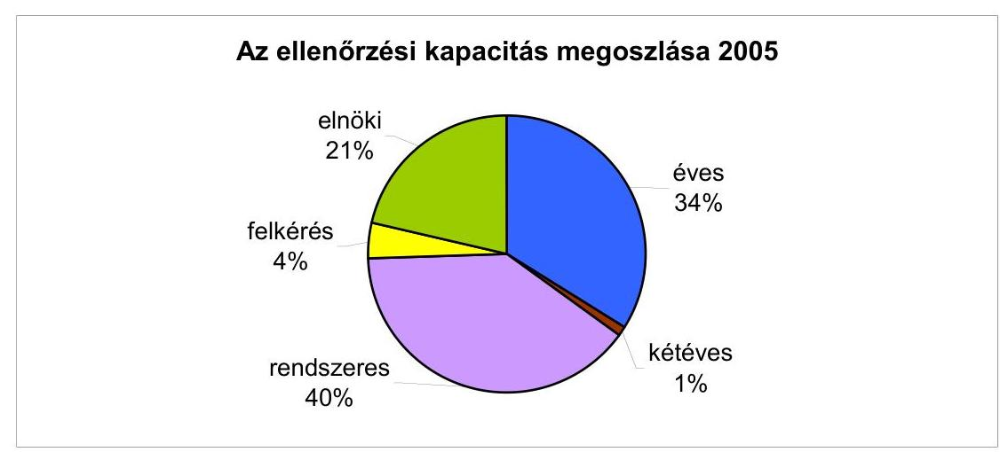

Az ÁSZ elnökének döntése alapján végzett ellenőrzésekről 21 jelentés készült. Ezek témaválasztásánál a stratégiai előírásoknak megfelelően előtérbe kerültek az államháztartáson kívüli feladatellátást, valamint a lakosság életkörülményeit befolyásoló egészségügyi, szociális, kulturális szolgáltatások helyzetét, múködési feltételeit bemutató, értékelő ellenőrzések.

Az ÁSZ vizsgálta az önkormányzatok által államháztartáson kívülre átadott pénzeszközök felhasználásával megvalósuló víziközmű beruházásokat, több állami tulajdonú pénzintézet (Eximbank Rt., Exporthitel Biztosító Rt., Magyar Követeléskezelő Rt.) múködését és két közalapítvány gazdálkodását.

Kiemelt közérdeklődésre számot tartó vizsgálatok voltak: az irányított betegellátási modellkísérlet, a családpolitikai célok teljesülését szolgáló pénzeszközök hasznosulásának, a helyi önkormányzatok közművelődési és könyvtári feladatellátásának, a helyi önkormányzati fürdők, gyógyfürdők helyzetének, valamint a köztemetők fenntartásának ellenőrzései.

A Kormány felkérése alapján 2005-ben 1 jelentés készült, így került sor a Természet- és Társadalombarát Fejlődésért Közalapítvány gazdálkodásának ellenőrzésére ${ }^{5}$.

Az ÁSZ a 2005. évi ellenőrzési kapacitását az Országgyűlés 43/2005. (V. 26.) OGY határozatában megjelöltek szerint a zárszámadás ellenőrzésére és a helyi önkormányzatok átfogó ellenőrzésére koncentrálta. Ez utóbbi az önkormányzatokkal kapcsolatos 16306 ellenőri nap kapacitás felhasználás közel $80 \%$-át jelentette.

[^0]
[^0]:    ${ }^{5}$ Az ellenőrzés főbb tapasztalatait a 4. sz. melléklet 70. sorszámú összefoglalója tartalmazza, a jelentés alapján megfogalmazott javaslatokra tett intézkedésekről a 3. sz. melléklet 35 . pontja számol be.

---

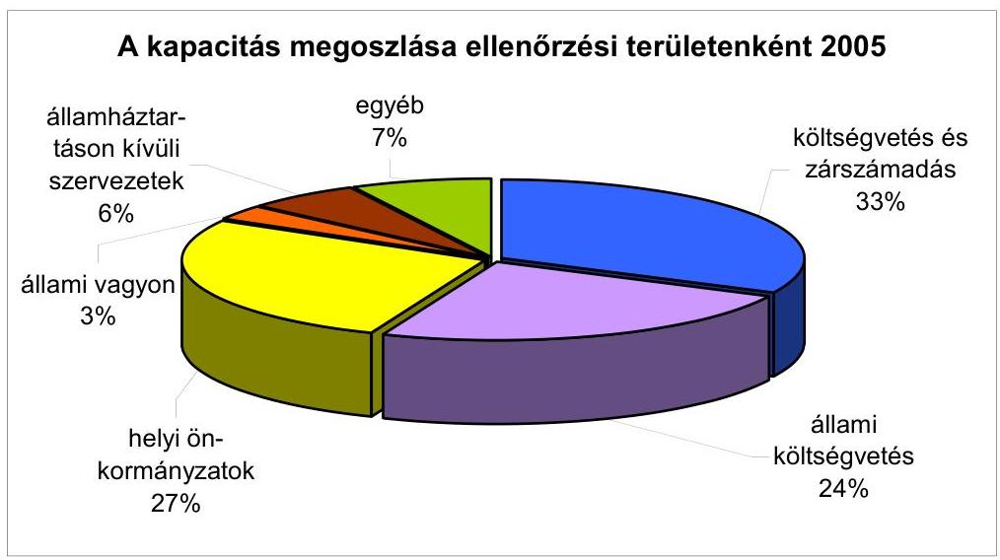

Az ÁSZ az ellenőrzéseit három fő típusba sorolja. 2005-ben - a fejezetek rendszeres ellenőrzésének ütemezéséből adódóan - kiemelkedően magas volt az ún. átfogó ellenőrzések ${ }^{6}$ aránya.

A szabályszerűségi ellenőrzések - pénzügyi szabályszerűségi (33\%) és egyéb szabályszerűségi (13\%) - jellemzően az éves, kétéves rendszerességgel végzendő feladatok (a zárszámadás, pártok gazdálkodásának ellenőrzése uniós témakörben a SAPARD és az EMOGA igazoló szervi ellenőrzések). Ezekre a vizsgálatokra együttesen az ÁSZ az átfogó vizsgálatokkal közel megegyező nagyságrendú kapacitást használt fel (44\%).

A teljesítmény-ellenőrzés módszerével végzett vizsgálatok az éves kapacitásának 10\%-át képviselték.
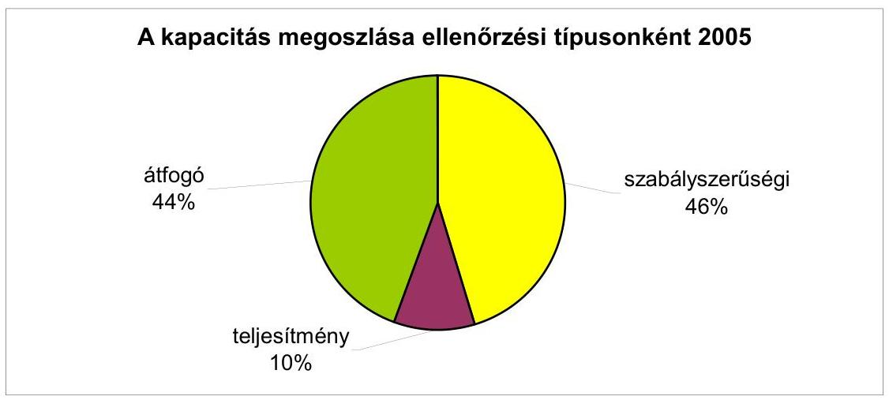

[^0]
[^0]:    ${ }^{6}$ Az átfogó ellenőrzés szervezetek múködését, projektek, tevékenységek végrehajtását szolgáló belső irányítási, szabályozási (kontroll) és ellenőrzési rendszerre irányul. Az átfogó ellenőrzés egyidejúleg - egy ellenőrzés keretében - meghatározott területekre összpontosítva érvényesíti a szabályszerűségi, valamint a teljesítmény-ellenőrzés jellemzőit.

---

A 2005. évi ellenőrzési kapacitás típusonkénti megoszlása az előző évek átlagához hasonlóan alakult. Az egyes évek közötti arány-elmozdulások az ellenőrzési feladatok változatosságából adódnak.

Az ÁSZ az elmúlt négy év alatt összesen 240 ellenőrzési jelentést ${ }^{7}$ tett közzé. Ebből 138 éves, kétéves, rendszeres kötelezettség teljesítéseként, 94 az ÁSZ elnökének döntése alapján, 8 pedig az Országgyúlés, illetve a Kormány felkérésére készült.
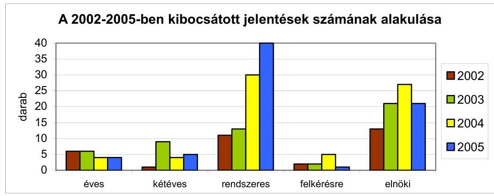

A rendszeres ellenőrzések számának növekedése a kiemelt önkormányzati körről készített ellenőrzések önálló jelentésként való közreadásával függ össze. Ezen időszak alatt 38 ilyen átfogó ellenőrzési jelentést nyújtottunk be az Országgyűlésnek. Az éves rendszerességgel végzett ellenőrzésekről készített jelentések számának csökkenése abból adódott, hogy a korábban önállóan közreadott (az önkormányzatoknak juttatott támogatások felhasználásáról szóló) jelentések beépültek a zárszámadási jelentésbe.
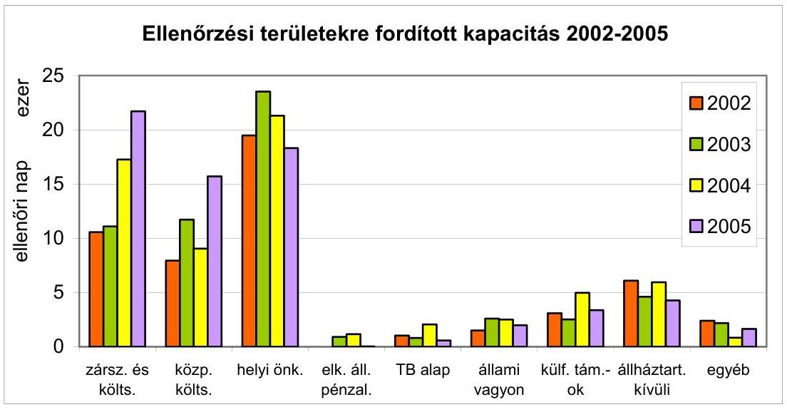

[^0]
[^0]:    ${ }^{7}$ Az ellenőrzési jelentések között az ÁSZ éves tevékenységről szóló jelentések nem szerepelnek.

---

# 1.2. Egyéb számvevőszéki feladatok 

A szervezet egyéb tevékenységi körébe számos - a szorosan vett ellenőrzési kötelezettségen és jogosítványon túlmutató - felhatalmazás, illetve feladat tartozik, melyeket az Alkotmány, a számvevőszéki törvény és egyéb törvények írnak elő.

Az ÁSZ elnöke ellenjegyzi a költségvetés hitelfelvételeire vonatkozó szerződéseket, véleményezi az államháztartás számviteli rendjének, belső pénzügyi ellenőrzési rendszere múködésének továbbfejlesztésére vonatkozó javaslatokat. Véleményezi az állami vagyonkezelő szervezet belső ellenőrzési szabályzatát, s javaslatot tesz felügyelő bizottságának elnökére, könyvvizsgálójára, továbbá a jegybank könyvvizsgálójára, az elkülönített állami pénzalapok könyvvizsgálóira, valamint elözetesen véleményezi az APEH elnökének kinevezését.

Az államháztartási törvény értelmében az állam legalább többségi befolyása alatt álló gazdálkodó szervezet esetében - ha a jegyzett tőke meghaladja a kétszáz millió Ft-ot - a felügyelő bizottság elnökének személyére is az ÁSZ tesz javaslatot, a gazdálkodó szervezet vezetőjének megkeresése alapján.

### 1.2.1. Ellenjegyzési, véleményezési jogkör

A Magyar Köztársaság nevében a pénzügyminiszter 2003 novemberében 500 millió euró összegű készenléti hitelkeretre vonatkozó szerződést írt alá az ÁSZ elnökének ellenjegyzése mellett, amely kétszeri, egy-egy évre szóló hosszabbítási opciót tartalmazott. Az Államadósság Kezelő Központ Rt. 2005-ben kezdeményezte a szerződés meghosszabbítását. A készenléti hitelkeret meghosszabbításával kapcsolatos dokumentációk - szabályszerűségre vonatkozó - áttekintése alapján az ellenjegyzés megtörtént.

A számviteli rend változásával összefüggésben biztosított véleményezési jogkörünket a számvitelről szóló törvény, az államháztartás szervezetei beszámolási és könyvvezetési kötelezettségének sajátosságairól, illetve a kincstári elszámolások beszámolási és könyvvezetési kötelezettségének sajátosságairól szóló Korm. rendeletek módosításai kapcsán gyakoroltuk.

### 1.2.2. Javaslattételi jogkör

Az ÁPV Rt. könyvvizsgálójára legutóbb 2005-ben, az MNB könyvvizsgálójára 2001-ben, az MFB Rt. könyvvizsgálójára 2004-ben, továbbá az elkülönített állami pénzalapok közül a Szülőföld Alap könyvvizsgálójára 2005-ben tett javaslatot az ÁSZ elnöke. A könyvvizsgálók pályáztatása elnöki hatáskörben történt (2002-től kezdődően összesen hét könyvvizsgálói javaslattétel volt).

Az ÁPV Rt. FB-elnökének személyére történő javaslattétel kivételével az államháztartási törvényben (Áht.) meghatározott állami gazdálkodó szervezetek FBelnöke személyére az ÁSZ főtitkára tesz javaslatot. A javaslattételre rendelkezésre álló szoros határidő miatt a jelölési javaslattételt megelőzően (évente egy) pályáztatás történik, a konkrét megkeresések érkezésekor pedig az eredményes pályázatot benyújtók köréből (névjegyzék) a Jelölési szabályzatban foglalt eljárás szerint kerül kiválasztásra az FB-elnöknek javasolt személy.

---

2003 és 2005. december 31. között a névjegyzékbe összesen 614 személy felvétele történt. Elhalálozás miatt eddig töröltünk a jegyzékből 4 főt, így a jelölésre alkalmas személyek jegyzéke a múlt év végével 610 főt tartalmaz, közülük 2005. december 31-én 107 személy töltött be - javaslatunk alapján - FB-elnöki megbízatást.

A társaságoktól 2005-ben 92 kérelem érkezett. A vonatkozó hiánypótlási felhívások teljesítése után összesen 91 kérelem volt megkeresésnek tekinthető, melyekből 2005. december 31-éig összesen 86 gazdálkodó szervezet részére tett jelölési javaslatot az ÁSZ főtitkára. A további 5 megkeresésben a jelölési javaslattétel előkészítése az év utolsó napján is folyamatban volt.

2003-tól 2005. december 31-éig összesen 168 gazdálkodó szervezettől érkezett kérelmet vizsgáltunk meg, melyek eredményeképpen - főtitkári döntés alapján - eddig összesen 150 megkeresésre ugyanennyi névjegyzékben szereplő személy jelölésére tettünk javaslatot. A beérkezett kérelmek közül 18 a vonatkozó törvényi előírás alapján nem tartozott számvevőszéki hatáskörbe.

Az ÁSZ a jelölési javaslattétel időpontjában meglévő adatok, információk birtokában tehet megalapozott személyi javaslatot. Ezért - a jelölési feladat ellátásának a nyilvánosság számára is átlátható végrehajtása érdekében - Jelölési szabályzatot alkotott, s azt, valamint a kapcsolódó névjegyzékeket a honlapján közzé teszi és folyamatosan frissíti.

# 2. Az ÁSZ ellenőrzési tapasztalatai 

A költségvetési tervezés és gazdálkodás problémái az elmúlt négy évben egyre inkább a gazdaság és a politika középpontjába kerültek. A mindenkori éves költségvetési javaslat véleményezésekor és a költségvetések végrehajtásának ellenőrzése során a fő hangsúlyt a gazdálkodás szabályosságának és a törvényesség érvényesítésének ellenőrzésére helyezzük. Célunk, hogy az Országgyúlés minél teljesebb körű információ birtokában, a tervezés és a végrehajtás lehetséges kockázatai ismeretében dönthessen a törvényjavaslatok elfogadásáról. Így rámutattunk a tervtől való eltérésekre, és ennek kapcsán a bevételi előirányzatok teljesítésének kockázataira, illetve egyes kiadási előirányzatok (pl. gyógyszertámogatás) rendszeres alultervezésére, valamint a beszámolás megbízhatóságára.

Az elmúlt években szinte rendszeressé vált egyes bevételi és kiadási előirányzatoknak - 2004-ben még magának a deficit célnak is - évközi, vagy év végi kormányzati, illetve törvényi szintű módosítása. Ez azzal járt, hogy fokozódó mértékben tapasztalhatók voltak az eredeti költségvetési előirányzatok és a teljesített előirányzatok közötti eltérések. Ez a gyakorlat nagymértékben rontja a költségvetési folyamatok és hatásaik átláthatóságát, szinte lehetetlenné téve a pénzügyi-gazdasági döntések nyomon követését, elemzését, hatásának vizsgálatát. Az elmúlt években tapasztalt tendenciák ráirányították a figyelmet a költségvetési tervezés módszertani kérdéseire is.

A költségvetési hiánynak a tervezettől való jelentős eltérését tapasztalva többször javasoltuk a Kormánynak, hogy kezdeményezze a pótköltségvetés készítési kötelezettségre vonatkozó rendelkezés módosítását, mert pótköltségvetés hiá-

---

nyában a költségvetés jelentős hányada kikerül az Országgyúlés ellenőrzési és döntési köréből. Javasoltuk, hogy javítani kell a költségvetési tervezés módszertanán, megalapozottabbá kell tenni a bevételi- és kiadási előirányzatok makrogazdasági előrejelzéseken alapuló tervezését, valamint meg kell újítani az államháztartási törvényt. Sürgettük a PPP-konstrukcióban megvalósuló beruházások szabályozási háttérének kidolgozását, az állami kötelezettségvállalások nyilvántartását, a beindított projektek költségvetésre gyakorolt hatásainak számszerú bemutatását.

Tapasztalataink rámutatnak arra, hogy a költségvetés ügye nem egyszerűen egy évente ismétlődő, kötelező technikai feladat, hanem az elfogadott dokumentum tartalma olyan alkotmányossági kérdés, amelyhez megfelelő biztonsági, felelősségi, és kötelességbeli garanciáknak kell kapcsolódnia. Ez a szemlélet szolgálja a stabilitást, ez áll összhangban az ország uniós tagságból származó követelményekkel. Meg kell felelni az EU vonatkozó előírásainak, eleget kell tenni a konvergencia követelményeknek, az egyes évi költségvetésekben olyan belső arányokat, gazdaságpolitikai elképzeléseket is tükröztetni kell, amelyek alkalmassá teszik az országot az Európai Unió hétéves költségvetési periódusához való alkalmazkodásra.

Ilyen költségvetési dokumentum csak akkor készülhet, ha közmegegyezés teremthető az állam szerepéről. Elodázhatatlan annak átgondolása, hogy milyen hangsúlyváltások szükségesek. Fontos kérdés az is, hogy a tervezésben milyen jogosultságot kell kapnia a mindenkori Kormánynak, illetve az Országgyúlésnek. Olyan garanciális követelményeket kellene érvényesíteni, amelyek az állami költségvetés előkészítését, benyújtását, az esetleges pótköltségvetés kötelezettségét a mostaninál zártabb, fiskális korlátokkal is szabályozott feltételek teljesítéséhez kötnék.

Négy év átlagában kapacitásunk egyharmadát a helyi önkormányzatok ellenőrzésére fordítottuk. Ez megalapozza - az előzőekkel összefüggésben - azon következtetésünket, hogy nem halasztható tovább az önkormányzati feladatellátás és forrásszabályozás rendszerének teljes körű újragondolása, ezen belül az állami szerepvállalás tartalmának és mértékének meghatározása sem. Szükséges a helyi önkormányzatok feladat- és hatáskörének felülvizsgálatát követően a finanszírozási és gazdálkodási rendszer átfogó továbbfejlesztése (beleértve a támogatási rendszer egészének újraalkotását), az ellentmondások feloldása az önkormányzatokra rótt kötelező és az általuk önként vállalt feladatok súlya, aránya, valamint a finanszírozási lehetőségek között.

Mindezek feltételezik és igénylik az állami kötelezettségek és feladatok kompromisszumokat is vállaló tartalmi újragondolását, teljes körű tisztázását, azt követően pedig a gyakorlati élet által követhető, megfelelő szintű szabályozását.

---

# 2.1. Főbb tapasztalatok államháztartási alrendszerenként ${ }^{8}$ 

### 2.1.1. A központi költségvetés

A központi költségvetés bruttó adósságállományának jelentős mértékű növekedése 2004-ben is folytatódott, bár az előző két évinél mérsékeltebb ütemben. Az adósságállomány GDP-hez mért 57,0\%-os aránya ugyan valamivel kisebb az előző évi értéknél, azonban lényegesen magasabb a 2001. évi, illetve a 2002. évi aránynál. Az államadósságon belül a központi költségvetés adósságállománya a meghatározó, aránya 2004 végén $97,7 \%$ volt.
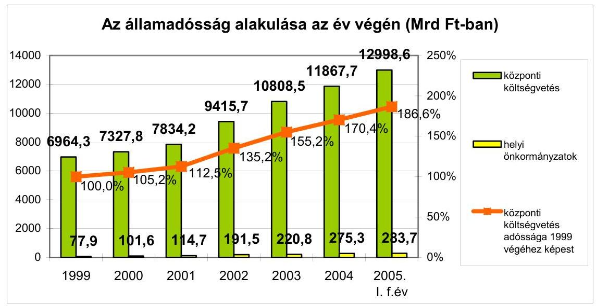

Az államháztartási hiány, amelynek döntő tényezője a központi költségvetés hiánya, a költségvetési politika központi kérdésévé vált. A bevételek növekedésének mértéke nem, illetve csak részben tudta ellensúlyozni a kiadások tervezettet meghaladó összegét, a költségvetés pénzforgalmi hiányának növekedését - a 2003. év kivételével - a bevételekét meghaladó kiadásnövekedés indukálta.

A 2005-ben végzett zárszámadási vizsgálat szerint a központi költségvetés pozíciója 2004. évben tovább romlott. Mérlegének főösszegei és hiánya - az előző évekhez hasonlóan - jelentős összegekkel eltértek mind a törvényben rögzített, mind a módosított összegektől. A hiány előirányzatot meghaladó mértékének növekedése 2002 óta folyamatos és gyorsuló ütemű, aránya a GDP-hez mérten - a 2002. évi kiugróan magas értékhez képest - csökkent ugyan, azonban mind 2003-ban, mind 2004-ben még mindig igen magas ${ }^{9}$ volt, 2002-től az egyes

[^0]
[^0]:    ${ }^{8}$ A számvevőszéki ellenőrzések megállapításai - jellegükből fakadóan - a vizsgálatok lefolytatását megelőző hosszabb-rövidebb időszakra vonatkoznak, a jelentésekben a lezárt pénzügyi évek adatai jelennek meg. Beszámolónk a 2005. évi jelentések tapasztalatain alapul, ugyanakkor a tendenciák és következtetések túlmutatnak egy-egy költségvetési éven.
    ${ }^{9}$ 2004-ben a tényleges kiadási főösszeg ( 6237,6 Mrd Ft) 63,0 Mrd Ft-tal és a hiány (904,5 Mrd Ft) 218,2 Mrd Ft-tal, míg a bevételi főösszeg (5333,0 Mrd Ft) 155,0 Mrd Ft-tal tért el az előirányzattól.

---

években a tényleges kiadásokhoz arányosított hiány az előirányzottat - az eredetit és a módosítottat is - folyamatosan és jelentős mértékben (2,3-3,5\%ponttal) meghaladta. A központi költségvetés egyre növekvő adóssága következtében a kamat összege - amely része a hiánynak - rendre emelkedett, nagyságrendje révén determinálja, beszűkíti a költségvetés mozgásterét.
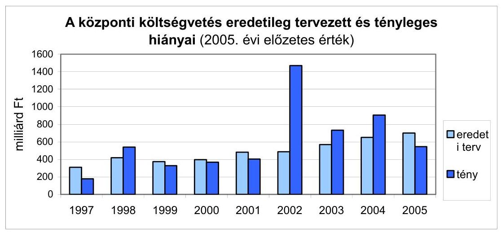

A központi költségvetési szervek és fejezeti kezelésű előirányzatok támogatásokkal való lefedettsége az egyes években hullámzó ( $77,6 \%, 78,8 \%, 75,8 \%$ ), tendenciájában csökkenő arányú volt. A központi költségvetés hiánya elsősorban olyan múködési jellegú kiadásokhoz kapcsolódott, amelyek eredményeképpen nem várhatóak a jövőben bevételek és kiadási megtakarítások. A központi költségvetés egyensúlyi helyzetét jelentősen befolyásolta a társadalombiztosítási alapok növekvő - 2002-ről 2004-re több mint négyszeresére, 423,9 Mrd Ft-ra emelkedő - negatív egyenlege is.

A költségvetési hiány növekedése annak ellenére következett be, hogy 2003-tól a kiadások visszafogása érdekében számos „megszorító" intézkedés született. A feladatok és a források összhangjának megteremtése érdekében az egyes gazdálkodási területeken különböző, „fűnyíró" elven alapuló forráselvonásra, az adott évi pozíciót javító pénzügytechnikai intézkedésekre került sor. A 2005. évi költségvetés tervezése során a korábbinál is nagyobb hangsúlyt kaptak az egyensúlyi feltételek megteremtésére, a hiány csökkentésére irányuló „korlátozó" jellegű törekvések. Ezekre is alapozva az előző évi tényleges érték közel egy negyedével kisebb a központi költségvetés 2005. évi kiadási és bevételi főösszegének 699,7 Mrd Ft hiányt mutató egyenlege.

Az egyes években a „tervezettet" folyamatosan meghaladó hiány tényleges mértéke azonban rámutat arra, hogy az alkalmazott kiadás megtakarítási intézkedések hatásai csak átmenetileg mérsékelhetik a hiány növekedését, mivel továbbra sem került sor a finanszírozható állami feladatrendszer meghatározására, az intézményrendszer érdemi felülvizsgálatára. Az euró bevezetéséhez szükséges maastrichti kritériumnak való megfelelés szempontjából is halaszthatatlan feladat az államháztartás egészének komplex reformja.

A törvényben rögzített pénzforgalmi hiány összegének jelentős túllépését 2004ben a legfontosabb adónemekből (áfa, szja, társasági adó) a tervezettől elma-

---

radó összegben realizált bevételek és egyes kiadási tételeknél az előirányzatot meghaladó, jogszerú kifizetések együttes hatása okozta. Különösen az áfabevételek előirányzathoz viszonyított hiánya rontotta a költségvetés pozícióját. A kiadások közül mindenekelőtt az adósságszolgálat, a kamattérítés jelentősen megnövekedett kiadásai, a lakástámogatások, valamint az egyedi és normatív támogatások többletkifizetései idézték elő a növekvő hiányt.
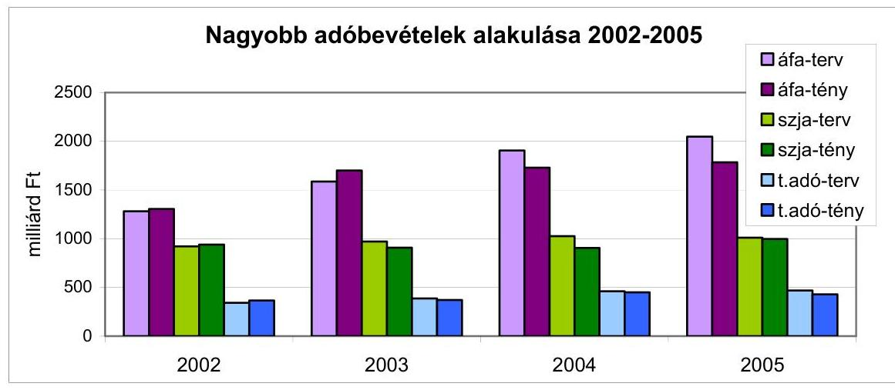

Mindez ismét megerősíti a korábbi évek költségvetési törvényjavaslatairól adott azon véleményünket, hogy a költségvetést meghatározó bevételi előirányzatok egyik része fölül, míg egyes - mindenekelőtt a módosítás nélkül túlteljesíthető kiadási előirányzatok alultervezettek ${ }^{10}$. Nem mérsékli a tervezési kockázatokat az sem, hogy a pótköltségvetés készítésére vonatkozó kötelezettség jelenlegi szabályozása ${ }^{11}$ a mindenkori kormánynak túlzott mozgásteret biztosít, s a hiány „kézbentartása" ellen hat. Ezért is szorgalmazzuk - az elmúlt három évhez hasonlóan - a vonatkozó törvényi előírások szigorítását, de eddig még eredménytelenül.

Nem voltak a központi költségvetés konszolidációjához vezető lépésnek tekinthetők a bevétel növekedést és kiadásmérséklődést, egyúttal hiánycsökkenést szolgáló - a 2004. év folyamán hozott - az előző évektől eltérő és így példa nélküli intézkedések. A többségi állami tulajdonú gazdasági társaságok osztalék-előleg-fizetési kötelezettségének előírása, az EU-s adószámmal rendelkező vállalkozások áfa-bevallásainak kiutalás előtti teljes körű ellenőrzése, az ún. 13. havi juttatás 2005-ben történő kifizetése, a maradvány képzés előírása, illetve felhasználásának korlátozása mérsékelték ugyan a 2004. évi hiányt, kedvezőtlenül befolyásolták azonban a következő évi hiány alakulását, hatásuk egyszeri, nem mutatott túl az érintett két éven.

[^0]
[^0]:    ${ }^{10}$ Vélemény a Magyar Köztársaság 2003. évi (0241), 2004. évi (0338), valamint 2005. évi költségvetési javaslatáról (0449).
    ${ }^{11}$ Az Áht. 41. § (2) bekezdése szerint „a Kormány pótköltségvetési törvényjavaslatot köteles az Országgyúlés elé terjeszteni, ha év közben a központi költségvetés, a társadalombiztosítási alapok és az elkülönített állami pénzalapok együttes egyenlegeinek a költségvetési törvényben megállapított összege a jóváhagyottól legalább ezek kiadási főösszege együttes összegének 5\%-ával tér el."

---

Az elsősorban a hiánykövetelmények teljesülését szem elôtt tartó, rövidtávú eredményeket hozó intézkedéssorozat nem erősítette a költségvetési célok megvalósítását, az állami feladatok teljesülésének minőségi követelményeit, a költségvetés érdekeltségi rendszerének múködését, és hozzájárult a költségvetési szervek tartozásállományának növekedéséhez. Ezen intézkedések és a gazdálkodási hiányosságok eredőjeként a költségvetési intézmények tartozásállományának a megelőző 3 évben tapasztalt kedvező tendenciái 2004-ben nem folytatódtak, hanem megtorpantak és az év második felében ellenkezőjére fordultak.

A központi költségvetés fejezeti szerkezetrendjében, az egyes fejezetek feladatés hatáskörében történt változások - meghatározóan - a kormányváltásokhoz kapcsolódóak.

A központi költségvetés fejezetrendje 2002-ben és 2004-ben elsősorban a kormányváltásokhoz kapcsolódóan változott, míg az egyes fejezetek közti feladat átrendezésre szinte minden évben volt példa. A fejezetek számában bekövetkezett mérsékelt - a 2002. évi 28 -ról a 2005. évi 31 -re - növekedés, a fejezetek közel felét érintő - esetenként többszöri - jelentős tartalmi átrendezést takar.

A fejezeti átfogó ellenőrzések rámutattak az összetartozó, korábban széttagolt feladatellátás egy fejezetbe integrálása, a tisztább profilú fejezetek létrehozásának eredményeire is. Az új fejezetek létrehozását, illetve az átszervezéseket azonban nem előzték meg mélyebb elemzések, a költségvetési és létszámigényeket meghatározó számítások, tanulmányok. A Kormány hiányosan és késve rendelkezett az érintett fejezetek múködési feltételeiről, az előirányzatok átcsoportosításáról. Az évközi fejezeti feladat- és szerkezet változás sem az elvégzendő ágazati, szakmai feladatok, a humánerőforrással való gazdálkodás, sem a gazdasági pénzügyi és számviteli folyamatok tekintetében nem volt kellően átgondolt. Az évközi struktúraváltások kedvezőtlen hatást gyakoroltak mind a gazdasági, mind a pénzügyi és számviteli folyamatokra, mivel a tárgyi és személyi feltételek szabályos átadás-átvétele nem minden területen, illetve felesleges többletmunkával, vagy csak késéssel valósult meg ${ }^{12}$.

A kormányzati munkamegosztás változások végrehajtása többnyire az érintett tárcákon belül sem volt kellően előkészített és megszervezett ${ }^{13}$. Az „új" minisztériumok szervezeti struktúrája a megalakítást követően is gyakran módosult ${ }^{14}$, a kapcsoló intézkedések ad hoc jellege, a nem kellő megalapozottság, olykor a személyi változások miatt is, hiányzott, illetve lassan alakul ki a feladatok és a szervezet összhangja.

[^0]
[^0]:    ${ }^{12}$ Az ellenőrzés főbb tapasztalatait a 4. sz. melléklet 1. sorszámú összefoglalója tartalmazza, a jelentés alapján megfogalmazott javaslatokra tett intézkedésekről a 3. sz. melléklet 39/a. pontja számol be.
    ${ }^{13}$ Jelentés az Ifjúsági, Családügyi, Szociális és Esélyegyenlőségi Minisztérium fejezet múködésének ellenőrzéséről (0568), Jelentés a Foglalkoztatáspolitikai és Munkaügyi Minisztérium fejezet múködésének ellenőrzéséről (0543).
    ${ }^{14}$ Az ellenőrzés főbb tapasztalatait a 4. sz. melléklet 1. sorszámú összefoglalója tartalmazza, a jelentés alapján megfogalmazott javaslatokra tett intézkedésekről a 3. sz. melléklet 77/d. pontja számol be.

---

Egyedi példaként találkoztunk a felügyelt intézményi körre vonatkozóan a feladatok és a létszám összhangjának megteremtését segítő feladat és teljesítménymutatók kidolgozásával.

Az állami feladatok és azok intézményi kereteinek hiányos felülvizsgálata, az erőforrásokkal való összhang megteremtésének elmaradása változatlanul tervezési, illetve gazdálkodási feszültségforrás. A központi intézkedésekre hozott intézményi felülvizsgálatok, leépítések a fejezetek irányítószerveinek létszámát ugyan csökkentették, ez azonban nem hozott kellő eredményt, mert ezzel párhuzamosan a háttérintézmények, a kiszervezett kht.-k és társaságok létszáma többnyire emelkedett. Több tárcánál tapasztalható volt a feladatellátás létszámkorlátozásokkal összefüggő nehézségeinek megbízások útján, többletráfordításokkal történő megoldása. A kiszervezéseket előzetes költség-haszon elemzések általában nem támasztották alá ${ }^{15}$. A 2006. évi költségvetés tervezése során ismételten kiemelt feladat volt a fejezetek intézményrendszerének felülvizsgálata, korszerűsítése. A fejezetek az előző évek gyakorlatát folytatva a költségvetés tervezésénél változatlanul nem vállaltak kezdeményező szerepet ennek végrehajtásában.

Tapasztalataink elsősorban arra hívják fel a figyelmet, hogy az államháztartási kondíciók javítására a kormányzati létszámcsökkentés megfelelő feladatelemzés és differenciálás nélküli előírása önmagában nem jelent megoldást.

A központi költségvetési szervek gazdálkodásának szabály- és feltételrendszere - a zárszámadás ellenőrzésének tükrében - az Áht. előírásainak folyamatos szigorodása ellenére romlott. Az évközi kormányzati struktúraváltás, a fejezetek közötti feladat- és előirányzat-átcsoportosítások végrehajtása, a szakmai feladatokat kellően ismerő állományi létszám - helyenkénti teljes cseréje, és ennek hatása komoly problémákat okozott a feladatok folyamatos, megfelelő szakmai szintű ellátásában.

Változatlanul gyengíti a gazdálkodási fegyelmet az előirányzat maradvány Pénzügyminisztérium általi jóváhagyásnak „hagyományosan" késedelmes gyakorlata is, miszerint azt a törvényes határidőn túl, így a 2004. évi előirány-zat-maradványt is csak 2005. december közepén hagyta jóvá ${ }^{16}$.

A zárszámadási adatok megbízhatóságát tanúsító pénzügyiszabályszerúségi ellenőrzést az ÁSZ stratégiában kijelölt körben teljesítettük. A 2004. évi központi költségvetés bevételi főösszegének 86\%-át, kiadási főösszegének mintegy $74 \%$-át auditáltuk.

[^0]
[^0]:    ${ }^{15}$ Jelentés az Oktatási Minisztérium fejezet múködésének ellenőrzéséről (0534), Jelentés az Informatikai és Hírközlési Minisztérium fejezet múködésének ellenőrzéséről (0532), Jelentés az államháztartáson kívüli szervezetek állami feladat rendszerének ellenőrzéséről (0467).
    ${ }^{16}$ A 2001. évi előirányzat-maradványt a törvényes határidőt jóval meghaladóan, 2002 novemberében, a 2002. és 2003. évi előirányzat-maradványt pedig a következő év decemberében hagyta jóvá a PM.

---

A fejezetek belső ellenőrzési egységeinél az intézményi beszámolók megbízhatósági ellenőrzése feladatának végrehajtása lassan, fejezetenként eltérő módon halad. A fejezetek részéről végzett növekvő számú pénzügyi szabályszerűségi ellenőrzés az intézmények $9 \%$-ára terjedt ki.

A feladat-végrehajtást jellemzi, hogy a költségvetés kiadási főösszegének 2002. évben az 1,9\%-át, 2004-ben 4,8\%-át érintette az általuk végzett megbízhatósági ellenőrzés. 2004. évben a kiadási főösszeg 21,2\%-ára nem terjedt ki a „financial audit". Ez azt is jelenti, hogy a fejezeti ellenőrzés területén nagy a bizonytalanság az egységes módszertani elmélet és gyakorlat alkalmazásában, valamint a külső és belső ellenőrzési tevékenység összhangja tekintetében. Mindez a felszínen kapacitáshiányra, forráshiányra való hivatkozás formájában jelenik meg.
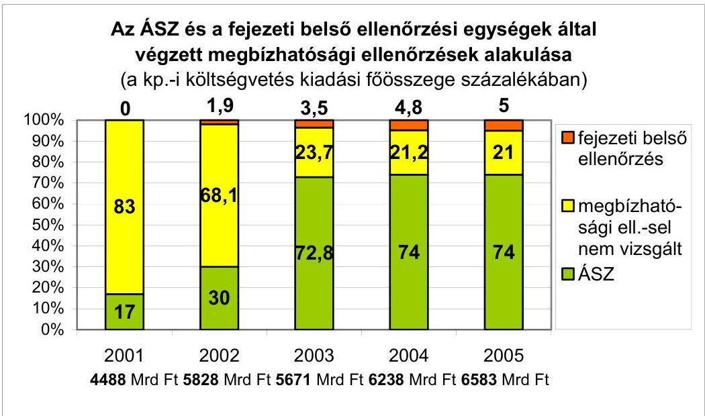

További komoly erőfeszítésekre van szükség ahhoz, hogy a Kormány 2010-re megteremtse a zárszámadás teljes körű ellenőrzésének feltételeit, az országgyúlési határozatokban, az államháztartási törvényben és a vonatkozó kormányrendeletben foglalt előírások alapján. Ebben az esetben válik lehetővé, hogy az ÁSZ szakmai nyilatkozattal tanúsítsa az Országgyűlésnek a költségvetés végrehajtásáról készített beszámoló valós és megbízható voltát.

A gazdálkodási, beszámolási fegyelem jelzett gyengülését mutatják a megbízhatósági ellenőrzések korábbi évinél kedvezőtlenebb tapasztalatai, az elutasító vélemények magas aránya ${ }^{17}$. A minősített véleménnyel zárult pénzügyi-szabályszerúségi ellenőrzések az igazgatási címek és az intézményi kör, valamint a fejezeti kezelésű előirányzatok tekintetében elsősorban a mérlegben kimutatott vagyoni helyzet valódiságával kapcsolatos lényeges problémákat, illetve az utóbbiaknál céltól eltérő felhasználásokat tártak fel.

[^0]
[^0]:    ${ }^{17}$ A fejezetek közel 100 intézményénél az ÁSZ és a fejezetek felügyeleti ellenőrző szervei által lefolytatott pénzügyi-szabályszerúségi ellenőrzések eredményeként az intézményi beszámolójelentések 8,7\%-át elutasító, 21,7\%-át korlátozó és 21,6\%-át figyelemfelhívó megjegyzéssel láttuk el. A fejezeti kezelésű előirányzatokról készült beszámolójelentések 22,2\%-a elutasító, $11,1 \%$-a korlátozó és $44,4 \%$-a figyelemfelhívó megjegyzést kapott.

---

A belső kontrollfunkciók és -eljárások szabályozottságáról, a rendszerek kiépítettségére irányuló felmérésünk, illetve a fejezeti ellenőrzés tapasztalatai szerint a minisztériumok ellenőrzési rendszerei nem múködtek megfelelő hatékonysággal. Ez főként abban nyilvánult meg, hogy az ellenőrzések során feltárt hiányosságok visszatérőek voltak, a kiküszöbölésükre teendő érdemi intézkedések több esetben elmaradtak. Az intézmények többségénél a belső kontrollrendszer múködésében magas kockázatot jelent az informatikai környezet nem megfelelő szabályozottsága és múködése. Az informatika területén meglévő hiányosságok elsősorban a biztonsági politika, az informatikai biztonsági szabályzat, és a vagyonvédelem területén tapasztalhatók. A fejezeti és intézményi belső ellenőrzés csak korlátozott mértékben járult hozzá a kontrollkockázatok mérsékléséhez.

A kormányzati struktúraváltozással nem, vagy kevésbé érintett fejezeteknél múködő kontrollmechanizmusok jellemzően javuló feltételeket teremtettek a tárcák szabályszerű gazdálkodásához, a vagyonelemek nyomon követhetőségéhez.

A fejezeti kezelésű előirányzatok körében végzett teljesítmény-ellenőrzési tapasztalatok szerint általánosítható, hogy a támogatásokat folyósító szervezeteknél a támogatási rendszerhez nem kapcsolódott egységes monitoring rendszer, nem határoztak meg teljesítmény-előírásokat, teljesítmény kritériumokat vagy eredménykategóriákat. Ezért többnyire a költségvetési támogatások hasznosulása eredményességének megítélésénél csak arra támaszkodhattunk, hogy a pályázatban kiírt cél teljesült-e vagy sem.

Hazánk uniós tagságának első évi tapasztalatait a zárszámadás ellenőrzése keretében is hangsúlyozottan vizsgáltuk. Megállapítottuk, hogy Magyarország hozzájárulása a közösségi költségvetéshez 2004-ben az Európai Unió által előírt ütemben és részletekben teljesült. Az uniós források igénybevételének változatlanul gyenge pontja az uniós követelményeknek megfelelő pályáztatás, illetve pályázás ${ }^{18}$.

A 2006. évi költségvetési tervező munka a korábbi évekbenél kedvezőtlenebb feltételek között folyt, módszereiben nem fejlődött. Az államháztartási törvényben a költségvetési tervező munka folyamatára meghatározott határidők nem érvényesültek. A Pénzügyminisztérium a tervezési köriratot szeptember hónapban adta ki, ennek következtében a fejezetek a 2006. évi tervező munkát - az előző évek gyakorlatától eltérően - mintegy másfél hónapos késéssel tudták megkezdeni.

Továbbfolytatás hiányában kísérletnek volt tekinthető a fejezeti tervezésnél kialakított, előző évben alkalmazott „versenyeztetéses, pályáztatásos" módszer. Fejezeti körben a normatív finanszírozást megalapozó teljesítménymutatók kidolgozása és az értékelő elemzésekre épülő tervezés még nem hozott sikert.

[^0]
[^0]:    ${ }^{18}$ Jelentés a Magyar Köztársaság 2004. évi költségvetése végrehajtásának ellenőrzéséről (0540).

---

Nem szolgálja az állami pénzeszközök tervezésének, felhasználásának átláthatóságát, hogy a költségvetési és a zárszámadási törvényjavaslat dokumentumának pontos tartalma, szerkezete, összeállításának metodikája nem meghatározott. Ezt évről-évre - kevés eredménnyel - jelezzük ${ }^{19}$. Az általános indokolás és annak mellékletei, a bemutatott adattartalom, az idősorok év-ről-évre változnak. Egyes adatok, kimutatások hiánya miatt nem mindig ítélhető meg az Áht. vonatkozó előírásainak teljesítése. Az egyes évek adatai nehezen összevethetők, az arányok változásának követése igen nehéz.

A megalapozott döntéshozatalt - s egyben az azt szolgálni kívánó számvevőszéki véleményalkotást - nem segítette az sem, hogy a költségvetési törvényjavaslatokban nem áttekinthetően összefoglalva, illetve nem kellő részletezettséggel jelentek meg a többéves elkötelezettségek, így az egyre nagyobb szerepet játszó, többéves elkötelezettséggel járó, folyamatban lévő vagy tervezett Public Private Partnership (PPP) beruházások - hatásai ${ }^{20}$.

A PPP-konstrukciók ellenőrzési tapasztalatai ugyanakkor megvilágították azt is, hogy az állami és a magánszektor közötti fejlesztési és szolgáltatási együttmüködés magas kockázatot hordoz magában mindaddig, amíg nem áll rendelkezésre a gazdaságossági számítások megfelelő módszertana, a projektek gazdaságos és hatékony megvalósításához nélkülözhetetlen jogszabály erejü eljárásrend, valamint a koordináló, értékelő, ellenőrző feladatok végzésében felelős szervezet ${ }^{21}$.

# 2.1.2. Az elkülönített állami pénzalapok 

Az államháztartáson belül elkülönített finanszírozással működő alapok köre 2003-tól folyamatosan bővült, s - a Wesselényi Miklós Ár- és Belvízvédelmi Kártalanítási Alappal, a Kutatási és Technológiai Innovációs Alappal, a Szülőföld Alappal, valamint a Nemzeti Kulturális Alappal együtt - 2006-ra számuk hatra emelkedett. Ez a folyamat nincs összhangban az elkülönített állami pénzalapok számát radikálisan csökkentő 1998. évi, a fejezetek ágazatirányító funkciójának erősítését célzó költségvetéspolitikai döntéssel, aminek alapján egy részüket - a törvényi célok és feladatok változatlanul hagyása mellett - fejezeti kezelésű előirányzatként integrálták a kezelésüket végző minisztérium költségvetésébe.

[^0]
[^0]:    ${ }^{19}$ Az ellenőrzés főbb tapasztalatait a 4. sz. melléklet 1. sorszámú összefoglalója tartalmazza, a jelentés alapján megfogalmazott javaslatokra tett intézkedésekről a 3. sz. melléklet 71/b. pontja számol be.
    ${ }^{20}$ A 2005. évi törvényjavaslat nem tartalmazta az Áht. 36. § (1) bekezdés c) pontja szerint a többéves elkötelezettséggel járó kiadási tételek következő két évre várható előirányzatainak teljes körű bemutatását. A 2006. évi költségvetési törvényjavaslat fő kötete tekintetében ez az előírás jellemzően nem, vagy hiányosan teljesült.
    ${ }^{21}$ Az ellenőrzés főbb tapasztalatait a 4. sz. melléklet 18. sorszámú összefoglalója tartalmazza, a jelentés alapján megfogalmazott javaslatokra tett intézkedésekről a 3. sz. melléklet 46/b. pontja számol be.

---

Az új alapok létrehozása - a tapasztalatok tükrében - nem minden esetben volt kellően átgondolt. Az alapok törvényi céljainak elérésére fékezően hat, hogy feladataikhoz az adott évben felhasználható források hozzárendelése erősen függ a központi költségvetés pozíciójától. Mindez felveti az ágazati feladatok költségvetési finanszírozási rendszere, megoldási formái tekintetében a hatékonyságelemzésen alapuló, komplex felülvizsgálat szükségességét. Az egyes alapok kezelése, pénzügyi folyamataink lebonyolítása eltérő szervezeti keretekben történik (fejezet, minisztériumi főosztály, költségvetési szerv, közhasznú társaság), s a kezelési költség meghatározása, az alapok forráselosztásának döntési mechanizmusai is különböznek.

Az elkülönített állami pénzalapok éves költségvetési beszámolóit a törvényi előírásoknak megfelelően könyvvizsgáló ellenőrzi, a vizsgálatok alapján a 2004 évben múködő mindegyik alap beszámolója hitelesítő záradékot kapott.

Az elkülönített állami pénzalapok és a társadalombiztosítási alapok könyvvizsgálata módszerében eltér az ÁSZ gyakorlatától. A számvevőszéki megbízhatósági ellenőrzések eredményeként a költségvetés végrehajtásának tartalmi kérdései is hangsúlyosan bemutatásra kerülnek. Ahhoz, hogy az ÁSZ ne csak a központi költségvetés, hanem az állami költségvetés zárszámadásának megbízhatóságát is minősítse, - mint ahogy az ÁSZ 2004. évi tevékenységéről szóló jelentésben már felvetettük - célszerű újragondolni a jelenlegi szabályozást.

Az alrendszer súlya az állami költségvetésen belül az alapok számának, illetve bevételi, kiadási főösszegeik növekedése folytán erősödött, mértékét tekintve azonban nem számottevő (2002-ben 233,8 Mrd Ft - 2,7\%; 2004-ben 304,7 Mrd Ft $-3,1 \%)$.

Az elkülönített állami pénzalapok pénzügyi helyzete változatlanul kiegyensúlyozottnak tekinthető, és az egyes években mutatkozó többletük javította az államháztartás egyensúlyi helyzetét. A Munkaerőpiaci Alap - a tervezett „0"szaldó helyett - közel 3 Mrd Ft-os hiányt mutató 2004. évi pénzforgalmi egyenlege csökkentette a korábbi évek maradványát, de nem okozott likviditási gondokat.

Az elkülönített állami pénzalapok - az előző évekhez hasonlóan - kiadásaikat a 2006. évre is a tervezett bevételeik erejéig tervezhették, nulla egyenleggel. (Kivételt képezett a Központi Nukleáris Pénzügyi Alap, ahol a hosszú távú feladatok finanszírozása céljából az Alap egyenlegét bevételi többlettel tervezték.) Az alapok költségvetési javaslatait illetően az államháztartási hiány szempontjából nem érzékeltünk kockázati tényezőket.

A költségvetés nagyságrendjét tekintve az alrendszert alkotó alapok közül változatlanul az alrendszer 80\%-át jelentő Munkaerőpiaci Alap (MPA) a meghatározó, amely a foglalkoztatás elősegítésével és a munkanélküliség kezelésével kapcsolatos állami feladatokat az országosan kiépített munkaerőpiaci szervezeten keresztül látja el. Az MPA kiadási föösszege a 2002. és a 2004. év viszonylatában 10,6\%-kal, 244,6 Mrd Ft-ra emelkedett, a 2005. évi előirányzat 278,7 Mrd Ft.

Kiemelt feladat a foglalkoztatottság, a lakosság munkaerőpiaci aktivitásának emelése, ami az alapon belül az aktív és passzív foglalkoztatáspolitikai eszkö-

---

zök arányainak alakulásában a 2004. évi zárszámadási, illetve 2006. évi tervezési adatok tükrében nem volt érzékelhető. 2005-ben a regisztrált munkanélküliek száma és aránya (főként a pályakezdők és a nyugdíj előtt állók körében) emelkedett. Ez is szerepet játszott abban, hogy az alapból finanszírozott aktív és passzív foglalkoztatáspolitikai eszközök nagyságrendje és részaránya az utóbbiak javára változott. Az alapból mind többet fordítanak közvetlenül, illetve közvetett módon az MPA-hoz kötődő, az alap feladatait lebonyolító, pénzeszközeinek elosztásában közremúködő szervezetek múködési kiadásainak finanszírozására (2004-ben 13\%-ot).

A fokozatosan átalakuló foglalkoztatáspolitika cél- és eszközrendszerével együtt az alap kiadási szerkezete is változott. A munkaerőpiaci folyamatok változásával azonban nem történt meg az ellátó, a támogató és a szolgáltató tevékenység jogszabályi hátterének rendszerszemléletű áttekintése. A változások indokolják az alap tervezési rendszerének és jogszabályi hátterének felülvizsgálatát, ideértve a Munkaerőpiaci Alapról szóló önálló törvény megalkotását is. Ennek szükségességére az ÁSZ 2004. évi tevékenységéről szóló jelentésben is felhívtuk a figyelmet.

A Központi Nukleáris Pénzügyi Alap feletti rendelkezési jog - az Országos Atomenergiai Hivatal felügyeleti szervének változásával együtt - 2003. és 2004. évek között kétszer változott. Előbb a hatósági szinten felelős feladatokat ellátók felügyeletének szétválásra tett uniós javaslatra figyelemmel, majd a kormányzati munkamegosztás átrendezéséhez kapcsolódóan. A rendelkezési jog változás az alap múködését lényegében nem befolyásolta. Az alap előirányzatai az előírások szerint teljesültek, bevételei 2004-ben 27,6 Mrd Ft-ot tettek ki, ami $60 \%$-kal haladja meg a 2002-ben realizált összeget. Az alap pénzeszközeiből azonban a lakosság bizalmának megnyerését szolgáló, települési infrastruktúrát fejlesztő támogatásokra az alap felhasználására vonatkozó jogszabályi előírások nem adtak lehetőséget.

Az alap bevételét döntően a Paksi Atomerőmú Rt. befizetései jelentik, az értékállóságot költségvetési támogatással kell biztosítani. Az alap értékállóságának támogatása nem a közép-, illetve hosszú távú tervekben foglalt ütemezés szerint alakult, összefüggésben az erre vonatkozó törvényi rendelkezés 2001-2003 közötti hatályon kívül helyezésével. Az elmaradt támogatást időarányosan a Paksi Atomerőmú Rt. 2017-ig fizeti meg. Az alap céljai az állami költségvetés tervezési folyamatában háttérbe szorultak. A beruházási kiadások előirányzat tervezetét a költségvetés tervezési folyamatában Pénzügyminisztérium - különösen 2004-től - a szükségesnél alacsonyabb összegben hagyta jóvá. A kiadások korlátozása növelte az alap pénzeszközállományát, s ezen keresztül hozzájárult az államháztartási hiány kedvezőbb megítéléséhez.

A végrehajtott fejlesztések eredményeként a radioaktív hulladékok elhelyezése rövid távon biztosított. A beruházási előirányzat korlátozása miatt ugyanakkor a végleges elhelyezést célzó beruházások megkezdése eltolódott. A késedelem várhatóan magasabb ráfordítással, illetve az átmeneti tároló indokolatlan bővítésével járhat. Az alapot kezelő kht számviteli rendje nem tette lehetővé a költségvetési törvény megfelelő előirányzataival a kiadások összevetését, így az állami feladat költségvetési szervezetek körén kívüli ellátásának gazdaságosságát értékelni nem tudtuk.

---

A lakosságot ért ár- és belvízzel kapcsolatos káresemények enyhítésére létrehozott Wesselényi Miklós Ár- és Belvízvédelmi Alap érdemi működése csak 2004-ben kezdődött meg. A tapasztalatok ugyanakkor igazolni látszanak azokat a kételyeket, amelyeket a 2003. évi zárszámadási jelentésben már felvetettünk. A várakozásokkal ellentétben nem kezdődött meg a veszélyeztetett településeken élők biztosítási elven működő részvétele a kárenyhítésben. Ennek fő okaként a fizetőképes kereslet, az öngondoskodási képesség hiánya, valamint az állami gondoskodásra számítás jelölhető meg. Jelenleg nem látunk arra esélyt, hogy az ügyfélkör nagyságrendjét érintően érdemi változás következzen be. Ezért vetettük fel az alap további fenntartása szükségességének felülvizsgálatát. A 2006. évi költségvetés szerint a Wesselényi Miklós Ár- és Belvízvédelmi Kártalanítási Alap csak formálisan tesz eleget az alapként való működés kritériumainak, az alap feladatával összefüggő kifizetésekre a saját bevétele elenyésző, a működést még töredékében sem fedezi.

A vállalkozások innovációs tevékenységének támogatására szolgáló Kutatási és Technológiai Innovációs Alap - 2004. évi bevétele 35,4 Mrd Ft - eddigi múködése a létrehozásának indokát nem támasztotta alá. Az alap célja, hogy forrásai a gazdaságban - támogatva, ösztönözve az ott folyó innovációs tevékenységeket - hasznosuljanak, nem teljesült, a támogatások többségét költségvetési intézmények kapták. A 2004. és a 2005. évi tapasztalatok ismeretében a 2006. évi előirányzatok célszerű felhasználását sem látjuk reálisnak. Az alap pénzügyi helyzete 2004-ben stabil volt. Ugyanakkor a további múködését alapvetően befolyásolják a bevételeit érintő változások, így a költségvetési támogatás mértékére vonatkozó garanciális szabály átmeneti felfüggesztése, illetve az innovációs járulék forrásául szolgáló helyi iparűzési adó várható megszűnése.

A határon túli magyarságnak a szülőföldjén különböző célok támogatására hivatott Szülőföld Alap 2005 második felében kezdte meg a múködését, így arról csak a következő években adhatunk véleményt.

# 2.1.3. A társadalombiztosítás pénzügyi alapjai 

Az államháztartás társadalombiztosítási alrendszerét alkotó Nyugdíjbiztosítási Alap és az Egészségbiztosítási Alap költségvetési beszámolóit a törvényi előírásnak megfelelően 2004-ben is könyvvizsgáló ellenőrizte. A hitelesítő záradék szerint a beszámolók megbízható, valós képet nyújtanak az alapok vagyoni, pénzügyi és jövedelmi helyzetéről.

Az államháztartás társadalombiztosítási alrendszerének összkiadása a bevételeket meghaladó ütemben és mértékben nőtt 2002 és 2004 között, s ez a tendencia tükröződik a 2005. évi tervszámokban is ${ }^{22}$. Mindkét alap pénzügyi helyzete - hasonlóan a korábbi évihez - a tervezettnél kedvezőtlenebbül alakult. Az alapok hiánya jellemzően dinamikusan, a 2002. évihez mérten több mint négyszeresére növekedett, s a GDP-hez viszonyítottan is egyre

[^0]
[^0]:    ${ }^{22}$ A társadalombiztosítás pénzügyi alapjainak kiadása 2002-ben 2.517,1 Mrd Ft, bevétele 2.416,2 Mrd Ft volt, 2004-ben ugyanezen adatok 3.150,8 Mrd Ft-ot, illetve 2726,9 Mrd Ft-ot tettek ki. A 2005. évi kiadási előirányzat 3.376,0 Mrd Ft, a bevételi előirányzat 3.043,3 Mrd Ft .

---

nagyobb arányt képvisel. Az alapokon belül az Egészségbiztosítási Alap hiánya volt a meghatározó (2002-ben 86,7Mrd Ft, 2004-ben 343,7 Mrd Ft), amelynek oka a járulékkulcsok (bevételek) csökkentése, illetve a kieső források - a központi költségvetésből történő - pótlásának elmaradása volt. A Nyugdíjbiztosítási Alap hiánya mérsékeltebb, ugyanakkor növekvő (2002-ben 14,2 Mrd Ft, 2004-ben 80,2 Mrd Ft), ami a járulékkulcsok csökkentésének és a nyugdíjreform következményeként vállalt központi költségvetési megtérítés szükségesnél alacsonyabb volta miatt következett be.

A hiány rendezéséről - az eddigi gyakorlat szerint, elengedés formájában - a zárszámadási törvény intézkedett. Az Egészségbiztosítási Alap tartós egyensúlyi problémáival kapcsolatosan évek óta felhívtuk a figyelmet arra, hogy az Áht.ben foglalt - a bevételek és kiadások egyensúlyának helyreállítását célzó - előírások alkalmazására nem került sor ${ }^{23}$.
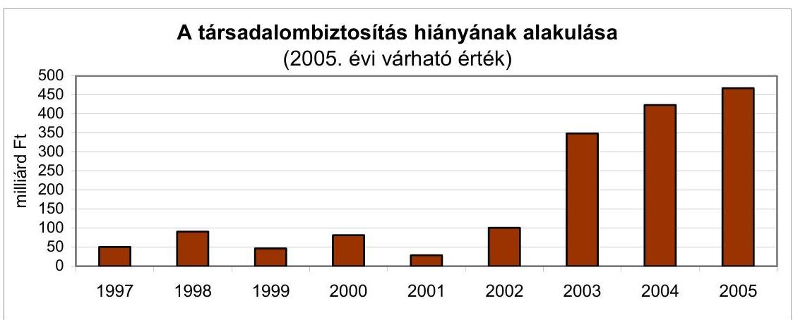

Az alapok járulék és hozzájárulás bevételeinek a tervezett szinttől való elmaradásában meghatározó volt, hogy a bruttó keresettömeg növekedés is alacsonyabb volt a vártnál. A kiadások ugyanakkor - egyes jogcímek esetében - az előirányzottat meghaladóan alakultak. A társadalombiztosítási alrendszer meghatározó kiadási előirányzatainak ismétlődő alultervezésére, a teljesítés kockázatára évek óta felhívjuk a figyelmet az éves költségvetési törvényjavaslatokról kialakított véleményünkben.

Az Egészségbiztosítási Alapból a gyógyító-megelőző egészségügyi ellátás finanszírozására 2004-ben a tervezettnél kevesebbet fordítottak. A kassza „megtakarítása" részben a márciusi kormányzati intézkedések (zárolások) részben pedig az év végi maradvány (a maradvány egészségügyi szolgáltatók közötti, teljesítményarányos) kiosztásának elmaradása miatt következett be. Az év során jelentősen növekedett a teljesítményegységek forintértéke, amiben a 2002ben végrehajtott bérintézkedések fedezetének beépítése mellett a 2004-től bevezetett teljesítmény-volumen korlát hatása is szerepet játszott.

# A gyógyszerkiadások előirányzata változatlanul nem bizonyult elegendőnek. A gyógyszertámogatás továbbra is az egészségbiztosítás 

[^0]
[^0]:    ${ }^{23}$ 2006. január 1-jétől ez az előírás már nem hatályos.

---

neuralgikus pontja. A túllépés a járóbeteg ellátás gyógyszertámogatás jogcíménél következett be. A kiadások növekedését nem annyira a lakossági gyógyszerfogyasztás mennyiségi növekedése, hanem az új, egyre drágább készítmények fogyasztása, az árak és a támogatás változása, az orvosok gyógyszerrendelési szokásainak változása egyaránt okozhatta ${ }^{24}$. A gyógyszerfogyasztás befolyásolására, a gyógyszerkiadások növekedési ütemének csökkentésére irányult állami intézkedések eredményes végrehajtásához hiányoztak az alapvető szabályozási és nyilvántartási feltételek. Az ár és támogatás megállapításában résztvevő központi szervezetek tevékenysége nem volt megfelelően koordinált. A jogszabályok nem rendelkeztek egyértelműen az ár és a hozzá kapcsolódó támogatás megállapításáról.
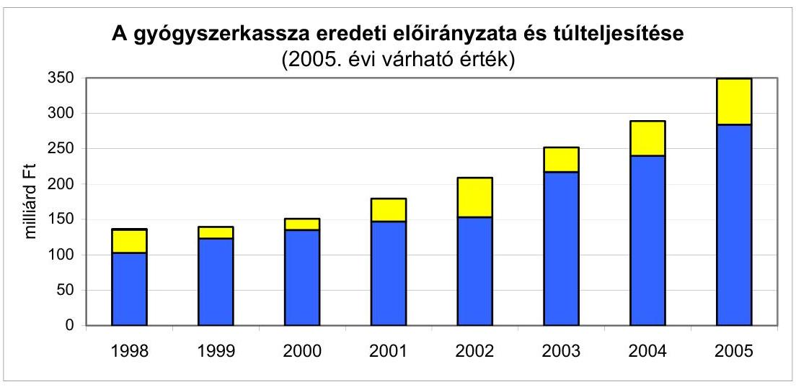

A gyógyszertámogatások növekedésének megfékezésére 2004-ben hozott intézkedések nem jártak a várt eredményekkel. A márciusi gyógyszerár befagyasztást az Alkotmánybíróság megsemmisítette. A Magyar Állam és a gyógyszergyártók/forgalmazók közötti - 2006 végéig szóló - szerződések év közepén megújított megkötésének célja a támogatási rendszer stabilizálása volt. A szerződésben foglaltak már 2004-re vonatkozóan is csak részlegesen teljesültek, ezért annak átfogó értékelését javasoltuk ${ }^{25}$. Tapasztalataink szerint kérdéses, hogy a szerződés alkalmas-e a hosszabb távon is szilárd támogatási rendszer kialakításához.

Számos kockázatot rejt az Egészségbiztosítási Alap hiánnyal tervezett 2006 évi költségvetése. A járulékbevétel túltervezett összegei és több kiadási tétel alultervezett összege miatt rosszabb pénzügyi pozíció kialakulása valószínű. A gyógyító-megelőző egészségügyi ellátás tervezett előirányzatának korlátozás nélkül felhasználható része kevesebb a 2005. évi várható teljesítés összegénél, ami önmagában véve is kockázatos. A gyógyító ellátás finanszíro-

[^0]
[^0]:    ${ }^{24}$ Jelentés a gyógyszerek támogatási és finanszírozási rendszerének, a fogyasztás helyzetének ellenőrzéséről (0448).
    ${ }^{25}$ Az ellenőrzés főbb tapasztalatait a 4. sz. melléklet 1. sorszámú összefoglalója tartalmazza, a jelentés alapján megfogalmazott javaslatokra tett intézkedésekről a 3. sz. melléklet 39/j. pontja számol be.

---

zásában a legnagyobb változást az egységes összevont szakellátási kassza kialakítása jelenti. A gyógyszertámogatások kiadási előirányzata ugyancsak bizonytalannak tekinthető, ami részben a gyártókkal történő megállapodás, illetőleg a gyógyszer-rendelési és fogyasztási gyakorlat befolyásolását célzó intézkedések függvénye. (Ez utóbbira tett eddigi kísérletek nem voltak eredményesek.) A 2005. évitől lényegesen elmaradó támogatási előirányzat teljesíthetőségét kérdésesnek tartjuk.
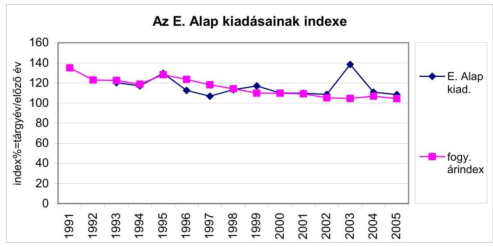

A Nyugdíjbiztosítási Alapot terhelő nyugellátások kiadásának tervezettet meghaladó növekedésében a kiegészítő nyugdíjemelések kiadási többlete, az alátervezett automatizmusok, a 13. havi nyugdíj kifizetett összege további emelkedésének, illetve a méltányossági nyugdíjemelések áthúzódó hatásai játszottak szerepet. A Nyugdíjbiztosítási Alap 2006. évre előirányzott költségvetési egyensúlya jelentős kockázatokat hordoz. A nyugdíjkiadások várható nagyságának meghatározása nem megalapozott, mivel a 2005. novemberi kiegészítő nyugdíjemelés pénzügyi hatásával egyáltalán nem számoltak, nem vették figyelembe a már elhatározott özvegyi nyugdíjemelés számszerú hatását és a nyugdíjas állomány összetétel-változásának hatását sem.
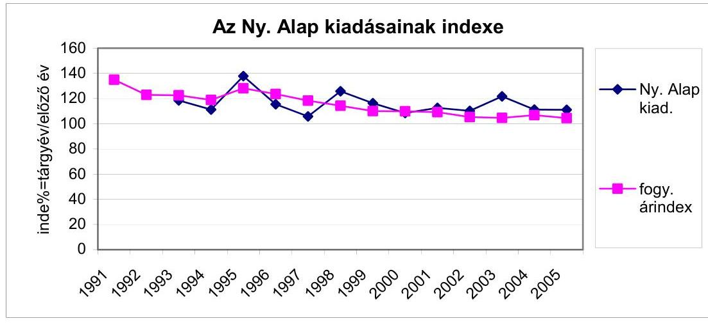

---

Az elmúlt években tapasztaltakkal jellemezhetők a 2006. évi költségvetési törvényben foglaltak, még annak figyelembevételével is, hogy a társadalombiztosítás pénzügyi alapjai esetében a központi költségvetés terhére egyensúlyjavító intézkedések megtételére került sor. Ez azt jelenti, hogy a központi költségvetés helytáll a lakosság meghatározott körének egészségügyi ellátásáért.

Mindkét alap vonatkozásában a bevételi oldalt a járulékfizetéssel összefüggésben túltervezettnek, a kiadásokat több tételnél (pl. nyugdíjkiadások, gyógyszerkiadások) alultervezettnek érzékeltük.
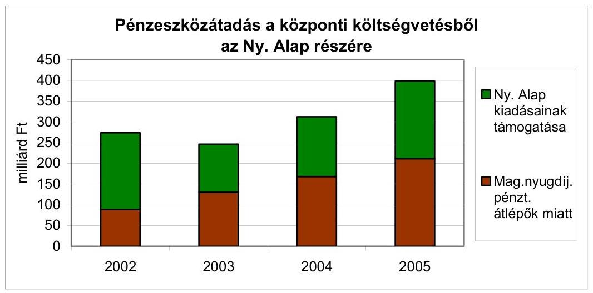

A 2006. évi költségvetésben is tükröződik, hogy az államháztartás nagy ellátó rendszereinek reformja az évek óta ismétlődő kormányzati kezdeményezések ellenére nem haladt előre.

A reform megvalósításának felgyorsítása azért is indokolt, mivel a költségvetési hiány folyamatos növekedése mellett az ezekre a rendszerekre fordított kiadások aránya gyakorlatilag változatlan, ami azt jelenti, hogy a rendszer jelenlegi struktúrában való további múködtetése egyre többe kerül.

# 2.1.4. A helyi önkormányzatok gazdálkodásának jellemzői 

Az önkormányzati kiadások tartósan magas növekedése mellett a GDP-n belüli részesedésük lényegében nem változott (2004-ben 13,6\%).

Az állami hozzájárulások és támogatások összege 2002 és 2004 között 24\%-kal nőtt (összegük 2004-ben 769 Mrd Ft). Részarányuk ennek ellenére - az önkormányzati kiadások gyorsabb növekedési üteme miatt - a GFS rendszerú kiadások között 2004-ben csökkent. (A 2005. évi költségvetési előirányzatok szerint a támogatások aránynövekedése várható).

---

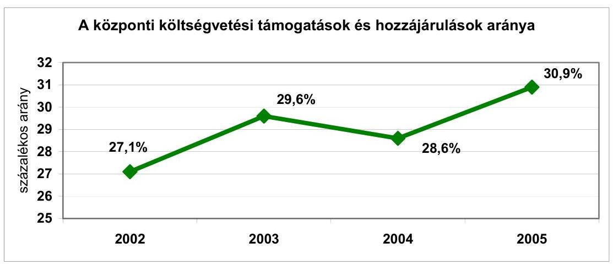

A helyi önkormányzatok számviteli nyilvántartás szerinti vagyona az elmúlt évtizedben mintegy megtízszereződött, a bruttó eszközérték 2004-ben 9618 Mrd Ft volt. A vagyonnövekedés több éve tartó folyamata 2004-ben megtorpant. Az eszközállomány 2002-2003. évi erőteljes növekedése az ingatlanvagyonkataszter felülvizsgálatának, az önkormányzati tulajdonban lévő ingatlanok állományba vételének, egyidejűleg az értékelés elvégzésének a következménye. Az érték nélkül nyilvántartott ingatlanok száma a 2001. évi 580 ezerről kevesebb, mint egytizedére, 51 ezerre csökkent.

A 3187 helyi önkormányzat és 1827 helyi kisebbségi önkormányzat 2004. évi kiadása ( 2690 Mrd Ft) 6,2\%-kal, a bevételek ( 2673,5 Mrd Ft) pedig 6,9\%-kal haladták meg az előző évit. Az önkormányzati kiadások 2004-ben 16,5 Mrd Ft-tal magasabbak a bevételeknél, a hiány mértéke így a 2002. évi 117 Mrd Ft deficitnél jobb pozíciót mutat. Az önkormányzatok romló gazdasági helyzetére utal ugyanakkor az, hogy a 2005. és a 2006. évi előirányzatok szerint a hiány várható mértéke ismét növekszik ( 31,8 Mrd Ft, illetve 34,8 Mrd Ft).

Az önkormányzati forrásszabályozási és támogatási rendszer a kisebb módosításoktól eltekintve nem változott, továbbra is erőteljes jövedelemcentralizáció, a feladat, hatáskör és felelősség vonatkozásában pedig a decentralizáció jellemzi. A forrásszabályozás fejlesztésére vonatkozó javaslatok kidolgozása, az ehhez szükséges önkormányzati feladat-és hatáskörök kormányhatározatokban elrendelt felülvizsgálata továbbra is várat magára. Mindennek ellenére kedvezően értékelhető, hogy többszöri javaslatunk nyomán - 2003-ban módosult az szja megosztása, a szabad felhasználású hányad 5\%-ról 10\%-ra nőtt. Kedvezően hatott az önkormányzati bevételekre az is, hogy a gépjárműadó teljes összege helyben maradt. Míg a 2004. évi költségvetés alapvetően az önkormányzatoknál és intézményeiknél végrehajtandó takarékossági, hatékonyságot növelő intézkedésekre helyezte a hangsúlyt, a 2005. évre vonatkozó szabályozás a feladatarányosabb finanszírozás, helyenként az adminisztráció egyszerűsítése irányában hatott. A normatív hozzájárulások rendszerében a közoktatás területén a hatékonyabb intézményhálózat kialakítását kiegészítő hozzájárulások ösztönzik. A szociális és gyermekjóléti ellátásban az általános normatívák egy részét konkrét feladatmutatókhoz kapcsolódó hozzájárulások váltották fel, elősegítve, hogy a források azokhoz az önkormányzatokhoz jussanak, amelyek az adott tevékenységet ténylegesen ellátják.

---

Kedvezőtlen jelenség, hogy a múködési kiadások a tárgyévi kiadások növekvő részét kötik le, csökkent a felhalmozásra fordított hányad. A társadalmi és szociálpolitikai juttatások aránya az egyéb kiadásokkal együtt 2002-2004 között lényegében nem változott.
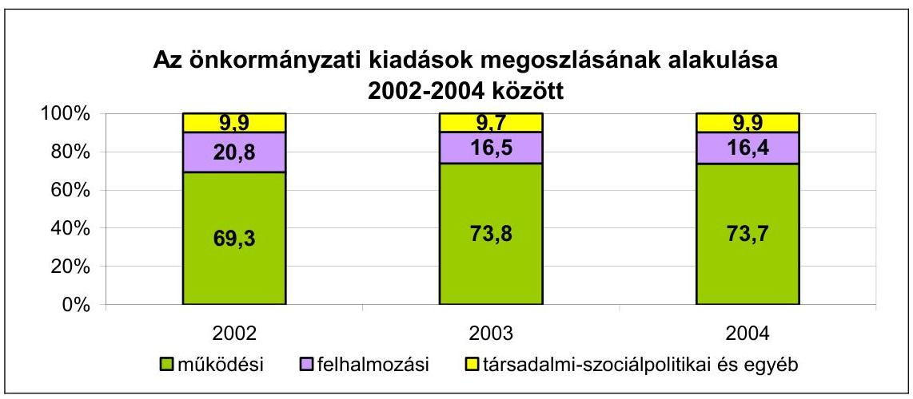

A múködési kiadásokon belül 2002-2003-ban a személyi kiadások növekedése volt meghatározó, a személyi juttatások, azon belül a közalkalmazottak 50\%os béremelésének áthúzódó hatása eredményeként. A dologi kiadások emelkedése azonban 2004-ben mind az inflációt, mind pedig a keresetnövekedést megelőzte. Ennek oka részben a múködési célú áfa kiadások, részben pedig a földgázárak emelkedése által előidézett kiadásnövekedés volt.

2004-ben a keresetek reálértékének megőrzése volt a cél, a tervezett keresetnövekedés mértéke az inflációval egyezően $6 \%$-os volt. Ehhez a központi költségvetés átlagosan 4\%-os forrást biztosított, a különbséget az önkormányzatoknak kellett „kigazdálkodniuk". Mivel a keresetek év közben nem a tervezett mértéknek megfelelően alakultak, a helyi önkormányzatok - az általuk foglalkoztatott közalkalmazottak keresetének növelése érdekében - 2,5 Mrd Ft támogatásban részesültek a 2004. évi központi költségvetés általános tartaléka terhére. A 2005-re tervezett 6\%-os béremelés fedezetét és a 13. havi illetmény „visszapótlását" az igazgatás területén a tervek szerint teljes egészében helyi intézkedésekkel kellett biztosítani. A központi költségvetés a 6\%-os közalkalmazotti béremeléshez 5,5\%-ra biztosított fedezetet.

A támogatások és azok reálértékének csökkenése miatt az önkormányzatok törekedtek a saját bevételek növelésére. A saját bevételek aránya 2002-2004 között lényegesen nem változott, $26 \%$ és $28 \%$ volt. A saját bevételeken belül meghatározó forrást jelent a helyi adó. A helyi adóbevételek 2002-2004 között 23,7\%-kal nőttek (2004. évi összegük 367,2 Mrd Ft volt), kedvező alakulásukhoz hozzájárult, hogy csökkent a mentességek, kedvezmények köre, emelkedett az adótételek felső határa, megvalósult egyes tételek, mértékek valorizációja. A vizsgált önkormányzatok 97\%-a élt a helyi adókivetés lehetőségével, leggyakrabban az iparúzési adó és a magánszemélyek kommunális adója bevezetéséről döntöttek. Az adóbevételek 84\%-át az előző évekhez hasonlóan iparúzési adóból biztosították az önkormányzatok. Ellenőrzési tapasztalataink alapján a városi önkormányzatok esetében egyes saját bevételek növelésére - igaz nem meghatározó mértékben, de - van lehetőség.

---

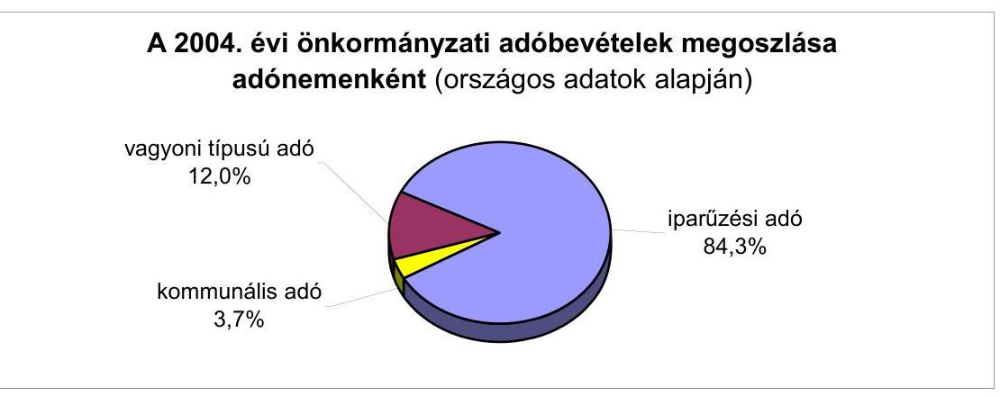

Az önkormányzatok költségvetési egyensúlyi helyzete 2004. évben nem javult, a gazdálkodást nehezítette, hogy az önkormányzatoknak is hozzá kellett járulniuk az államháztartási egyensúlyt elősegítő tartalék képzéséhez, amit 2004-ben 11 Mrd Ft-ban, 2005-ben pedig 22 Mrd Ft-ban rögzítettek. Az egyensúly kedvezőtlen alakulásában a túlzott mértékű kötelezettségvállalás, számos esetben az intézményi kapacitás alacsony kihasználtsága, a feladatellátás célszerűtlen szervezeti struktúrája, a lakosságszám és a gyermeklétszám csökkenés egyaránt szerepet játszott. Az egyensúly javítása érdekében a forráshiányos önkormányzatok növekvő arányban vezettek be takarékossági intézkedéseket, csökkentették a múködési és felhalmozási kiadásokat, mérsékelték a foglalkoztatottak számát, intézmények átszervezéséről, összevonásáról, esetenként megszüntetéséről döntöttek.

A bevételek növelése érdekében a forráshiányos önkormányzatok közel 90\%-a élt a vagyonértékesítés eszközével. Ugyanakkor az ellenőrzött önkormányzatok közel kétharmada még az elmúlt években sem vizsgálta a döntéshozatalt megelőzően az adósságot keletkeztető kötelezettség-vállalásoknak a helyi önkormányzatokról szóló törvényben (Ötv.) előírt felső korlátját.

Az önkormányzati kötelezettség állomány az áruszállításból származó és az egyéb rövid lejáratú kötelezettségek nélkül 2004-ben 305,3 Mrd Ft volt, ami az előző évekhez képest növekedést tükröz. A kötelezettség állomány magas szintje jelzi, hogy az önkormányzatok csak külső források bevonásával tudták a közszolgálati feladataikat ellátni. A kötelezettség vállalások 77\%-a hosszú lejáratú volt. Figyelemreméltó, hogy ugyanebben az évben a rövid lejáratú hitelfelvétel növekedési üteme 7\%-kal haladta meg az előző évi beruházási, fejlesztési céllal felvett hitelállományét.

Az önkormányzatok pénzügyi helyzetének rosszabbodását jelzik a likviditási mutatók, amelyek értéke 1999 és 2004 között ${ }^{26}$ folyamatosan csökkent.

[^0]
[^0]:    ${ }^{26}$ ), Likviditási gyorsráta (pénzeszközök/ rövid lejáratú kötelezettségek), likviditási II mutató (pénzeszközök + követelések+értékpapírok/rövid lejáratú kötelezettségek).

---

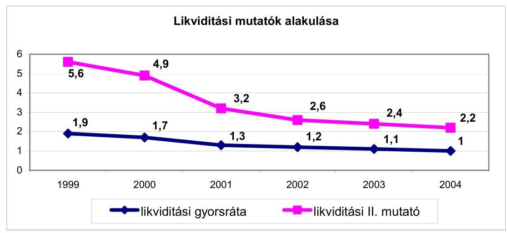

Az önhibájukon kívül hátrányos helyzetbe került (ÖNHIKI), támogatásban részesült önkormányzatok száma 2002 és 2004 között 1279-ről 1118-ra csökkent a támogatások egyidejú, de kisebb mértékű csökkenése mellett. 2002-ben az ÖNHIKI támogatások összege 16,7 Mrd Ft, 2004-ben pedig 15,8 Mrd Ft volt. Ennek együttes hatásaként az egy önkormányzatra jutó támogatás összege a 2002. évi 13 M Ft-ról 2004-ben 14,1 M Ft-ra emelkedett. (2005-ben az előzetes adatok szerint az egy önkormányzatra jutó támogatások összege 15,2 M Ft-ra nőtt).
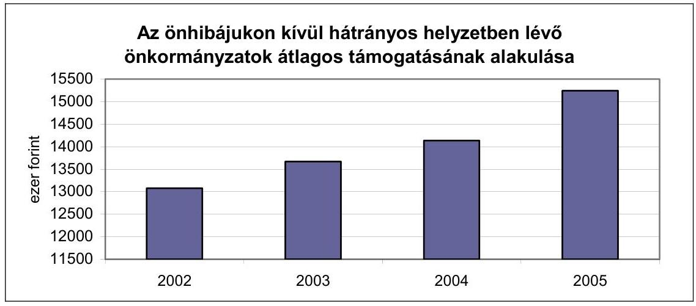

A 2004. évben az ÖNHIKI támogatásban részesült helyi önkormányzatok több mint $50 \%$-át, 574 önkormányzatot terhelt visszafizetési kötelezettség. A visszafizetendő támogatás 1147,2 M Ft volt, a felhasznált támogatás $7,3 \%-\mathrm{a}^{27}$. A viszszafizetési kötelezettség legnagyobb arányban a saját bevételek teljesítésével összefüggésben merült fel, ezt követte a normatív támogatás többletigénye, de alakulásában szerepet játszott az igénybejelentés alapjául szolgáló feltételrendszer tervezettől eltérő változása is. A visszafizetési kötelezettség előző évihez viszonyított alakulása a támogatási igénylések megalapozottabbá válását, valamint az önkormányzatok jogkövető magatartásának erősödését tükrözi.

[^0]
[^0]:    ${ }^{27}$ Jelentés a Magyar Köztársaság 2004. évi költségvetése végrehajtásának ellenőrzéséről (0540).

---

# Az önkormányzati ellenörzések általános tapasztalatai 

A 2005. évben a korábbi évekhez hasonló nagyságrendben 1031 helyi és 71 helyi kisebbségi önkormányzatnál végeztünk helyszíni ellenőrzést.

Az önkormányzatok 20\%-ánál - az előző évvel egyezően - a polgármester a törvényben rögzített határidő után terjesztette a képviselőtestület elé a költségvetési rendelet-tervezetet. Az előterjesztéshez az önkormányzatok többsége továbbra sem csatolta a pénzügyi bizottságok véleményét. Az önkormányzatok mintegy negyede elmulasztotta a múködési előirányzatok költségvetési szervenkénti részletezését, a kisebbségi önkormányzatok költségvetésének elkülönített megjelenítését, valamint a többéves kihatással járó feladatok előirányzatainak éves bontásban történő bemutatását. Az Áht. előírásait megsértve költségvetési bevételként mutatták ki a finanszírozási célú pénzügyi műveletek bevételeit, illetve kiadásait.

A költségvetési előirányzatok évközi módosításakor a vizsgált önkormányzatok több mint felénél, a korábbi évekhez hasonlóan, nem tartották be az előirányzat módosítás gyakoriságára, határidejére, nyilvántartására vonatkozó jogszabályi előírásokat. A kötelezettségvállalások összegének megállapításához szükséges analitikus nyilvántartással a polgármesteri hivatalok több mint kétharmada nem rendelkezett. Ez is szerepet játszott abban, hogy az önkormányzatok közel fele a jóváhagyott előirányzat mértékén túl vállalt kötelezettséget. Az önkormányzatok az előirányzatok szabálytalan felhasználásának okait nem vizsgálták, az előirányzat túllépések miatt - az előző évhez hasonlóan - felelősségre vonást nem kezdeményeztek.

A jogszabályban előírt költségvetési beszámoló készítési és adatszolgáltatási kötelezettségeiknek az ellenőrzött önkormányzatok többsége eleget tett. A megyei közgyűlések elnökei, illetve a polgármesterek az előírt határidőben nyújtották be a zárszámadási rendelet-tervezetet a közgyűlés, illetve a képviselő-testület részére. Az előterjesztések mintegy negyede azonban nem volt összehasonlítható a költségvetéssel, nem egyeztek a zárszámadás és a beszámoló eredeti előirányzat, illetve a zárszámadás és a módosított előirányzatok adatai. Az előterjesztések kétharmada nem tartalmazta az Áht.-ban előírt, a költségvetés és a zárszámadás előterjesztésekor tájékoztatásul bemutatandó mérlegeket, kimutatásokat.

A könyvvizsgálati kötelezettségét az arra kötelezett önkormányzatok 96\%-a teljesítette. A könyvvizsgálók az ellenőrzött önkormányzatok költségvetési beszámolóinak 6\%-át korlátozott záradékkal látták el.

A gazdálkodás szabályozottsága tekintetében kifogásolható, hogy a polgármesteri hivatalok fele nem rendelkezett Szervezeti és Múködési Szabályzattal, a feladatok ügyrendi rögzítése hiányos. Az ellenőrzött önkormányzatok között a 2004. évben jelentős mértékben nőtt a kötelezően előírt szabályzatokat elkészítő önkormányzatok száma, javult a szabályozás minősége is a korábbi évekhez viszonyítva.

---

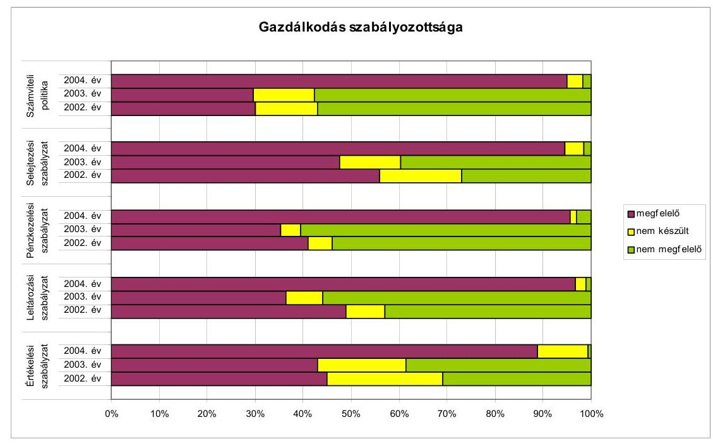

Az operatív gazdálkodással összefüggő döntési és felelősségi szinteket az önkormányzatok átlagosan több mint 40\%-a nem, vagy nem a jogszabályi előírásoknak megfelelően alakította ki. A vizsgált önkormányzatok fele nem határozta meg a közbeszerzési eljárás belső felelősségi rendjét. Nem írtak ki közbeszerzési eljárást, annak ellenére, hogy az árubeszerzésre, szolgáltatásvásárlásra fordított összeg meghaladta a költségvetési törvényben előírt értékhatárt. A Közbeszerzési Döntőbizottság az ellenőrzött, közbeszerzési eljárást lefolytató önkormányzatok közel 20\%-át elmarasztalta.

Az önkormányzati feladatellátás szervezeti formáit illetően 2002 és 2005 között továbbra is a saját alapítású intézményeknek volt meghatározó szerepe, de nőtt a bevont egyéni vállalkozások, gazdasági társaságok, közalapítványok, alapítványok és közhasznú szervezetek száma is. Mintegy 200 Mrd Ft nagyságrendben az államháztartáson kívülre került a feladat-ellátás. A kistelepülési önkormányzatok döntő többsége - gazdálkodási méreteinél, a hivatalok létszámánál fogva - nem képes megfelelni a gazdaságos és hatékony múködés követelményeinek. Az önkormányzati intézményszám országosan 22 -vel csökkent 2002-2004 között.

Az ellenőrzött önkormányzatoknál az oktatási-nevelési és szociális intézményekben az egy ellátottra, illetve neveltre, oktatottra jutó kiadások növekedtek, amelyben a központi bérintézkedések miatti személyi juttatások és azok járulékainak emelkedése volt a meghatározó.

A helyi önkormányzatok által céljelleggel - nem szociális ellátásként - vállalkozásoknak, non-profit szervezeteknek, központi költségvetési szerveknek, háztartásoknak és magánszemélyeknek nyújtott támogatások összege 2002 és 2004 között 10,4 Mrd Ft-tal nőtt, 2004. évi összege 180,5 Mrd Ft volt. Ugyanakkor a céljellegú támogatást nyújtó önkormányzatoknak csak alig több mint harmada írt elő az Áht.-nak megfelelő számadási kötelezettséget. Ezen önkormányzatok esetében a támogatott szerve-

---

zetek és magánszemélyek több mint egyharmada nem számolt el a kapott támogatással. A támogatást nyújtó önkormányzatok közel fele a döntés meghozatalakor megsértette az Ötv. előírásait is, mert az alapítványok, közalapítványok támogatásáról nem a képviselőtestület, hanem bizottság, önkormányzati tisztségviselő, de volt olyan eset is, amikor az adóbevétel feletti rendelkezési jog átengedésével az adózó döntött.

Az ellenőrzött helyi kisebbségi önkormányzatok 90\%-a rögzítette az együttmúködés szabályait a települési önkormányzatokkal, ami a korábbi évekhez viszonyítva fejlődés. A vizsgált helyi kisebbségi önkormányzatok majdnem teljes körűen testületi határozattal állapították meg a költségvetésüket és háromnegyedük az éves gazdálkodásról szóló zárszámadásukat. Továbbra is szabálytalanságok mutatkoznak azonban az operatív gazdálkodással kapcsolatos feladatok és jogosultságok (kötelezettség-vállalásokat nyilvántartása, utalványozások, ellenjegyzések) tekintetében.

Kevés előrelépés tapasztalható az önkormányzatok ellenőrzésének szabályozásában és végrehajtásában. A belső ellenőrzést ellátók funkcionális és szervezeti függetlensége a vizsgált önkormányzatok jóval több mint ötödénél nem érvényesült. Az ellenőrzések végrehajtását többnyire a polgármesteri hivatalban foglalkoztatott köztisztviselők révén biztosították. A 2003. évi jogszabályváltozások ellenére az ellenőrzési tevékenység kereteit az önkormányzatoknak kevesebb, mint egyötöde rögzítette szervezeti és múködési szabályzatban és még kevesebben voltak, akik elkészítették az ellenőrzési kézikönyvet. A munkafolyamatba épített ellenőrzés színvonala nem javult a korábbi évekhez viszonyítva.

A beruházási céllal államháztartáson kívülre történt vagyonátadást illetően súlyos hiányosságként értékeltük, hogy a vagyongazdálkodási rendeletek több mint harmada nem tartalmazta, hogy milyen esetekben és módon lehet önkormányzati vagyont térítésmentesen átadni, illetve követelésről lemondani. A vizsgált önkormányzatok közel felénél a rendeletek nem határozták meg azt az értékhatárt, amely felett csak versenytárgyalás útján lehet vagyont értékesíteni, vagy a használat, hasznosítás jogát átadni. A kötelezettség formális teljesítésére utal, hogy egyes önkormányzati rendeletekben olyan magasan határozták meg az értékhatárt, ami kizárta a gyakorlatban történt alkalmazást, illetve lehetővé tették, hogy a képviselőtestület döntésével mellőzhessék a pályáztatást.

# A központi költségvetésböl nyújtott támogatások, hozzájárulások ellenörzési tapasztalatai a zárszámadáshoz kapcsolódóan 

Az ÁSZ a központi költségvetés zárszámadása kapcsán kiemelt figyelmet fordított a helyi önkormányzatok központi költségvetésből származó bevétele -2004-ben 1225 Mrd Ft - felhasználására. Az elmúlt évek során folyamatosan szorgalmaztuk az önkormányzati támogatási rendszer normativitásának erősítését, elaprózottságának csökkentését, a hozzájárulások, támogatások igénybevételét megalapozó jogszabályi és pályázati háttér egyszerűsítését. Erre az előirányzatok elosztásáért felelős minisztériumok általában fogadókészek voltak, de a kisebb módosításokon túl jelentős előrelépés nem történt. A rendszer a folyamatos finomítás ellenére bonyolult, miközben számos elemének szabályozá-

---

sa hiányos, a jogosultság feltételeit illetően nem egyértelmű. Az önkormányzati apparátusok szakmai felkészültségének hiányosságai, a döntés-előkészítők munkájának elhúzódása a támogatások kései utalását eredményezte a pályázati úton biztosított előirányzatok negyedénél.

A forrás-finanszírozási rendszer meghatározó, de minden évben kismértékben változó tartalmú elemei a normatív állami hozzájárulások és támogatások. E támogatások igénylésénél és elszámolásánál a legtöbb hiányosság az oktatási, szociális és gyermekjóléti szolgáltatásokhoz kapcsolódóan merült fel. Jellemző hiányosság volt, hogy az önkormányzatok csak a költségvetési törvény mellékletében konkrétan meghatározott igénylési feltételeket tartották kötelezőnek, az egyéb - a költségvetési törvényben hivatkozott - törvények és rendeletek követelményeit nem, vagy kevésbé vették figyelembe. Gyakori, hogy a minisztériumi állásfoglalások, szakvélemények sincsenek összhangban az ágazati jogszabályi előírásokkal.

Az iskolai oktatás jogcímú normatív hozzájárulást több ellenőrzött önkormányzat igénybe vette a közoktatási törvény mellékletében meghatározott maximális osztálylétszám feletti tanulók után is, annak ellenére, hogy erre vonatkozó engedéllyel nem rendelkeztek. A legnagyobb arányú és összegű szabálytalan normatív hozzájárulás elszámolás 2004-ben a különleges gondozás keretében nyújtott ellátás, ezen belül a gyógypedagógiai ellátás jogcímen volt. Ezt az okozta, hogy a sajátos nevelési igényű tanulókat a vonatkozó miniszteri rendelet előírásait megsértve, szakértői és rehabilitációs bizottsági felülvizsgálat, illetve a szakértői vélemény módosítása nélkül vették fel az általános iskolai tanulmányok befejezését követően középfokú oktatási intézménybe.

A központosított támogatások között kiemelt fontosságú a kistérségi társulások támogatása. 2005 novemberéig a 168 statisztikai kistérség 5\%-ában önálló területfejlesztési társulás alakult, 93\%-ában pedig létrejöttek a többcélú kistérségi társulások. A megalakulás és a feladatellátás fejlesztésének támogatására a 2004. és a 2005. évben összesen 15,4 Mrd Ft-ot biztosított a központi költségvetés.

A központosított támogatások felhasználását illetően kedvezőtlen tapasztalat, hogy több jogcímen (pl: az EU-s, valamint a hazai fejlesztési pályázatok saját forrásainak kiegészítése, kistérségi társulások támogatása) az előirányzatot csak részben, vagy az év utolsó hónapjaiban kapták meg az önkormányzatok, ami a tárgyévi felhasználást, illetve a kötelezettségvállalást nehezítette. Az állami költségvetés folyamatosan ösztönzi az önkormányzati múködési kiadások közel felét kitevő személyi kiadások mérséklését. Ennek hatásaként 2000 és 2004 között mintegy kétezer önkormányzatnál 14427 fős létszámcsökkentés valósult meg 11,5 Mrd Ft-os költségvetési támogatással.

Az állami költségvetés zárszámadásának ellenőrzésével egyidejűleg ellenőriztük a helyi önkormányzatok beruházásaihoz és rekonstrukcióihoz nyújtott felhalmozási célú támogatások igénybevételét, felhasználását és elszámolását. Az ellenőrzések tapasztalatai szerint az önkormányzati fejlesztések támogatásában meghatározó címzett és céltámogatási rendszer hatékonyabbá vált. A támogatandó fejlesztési célok szűkítésével a 2004. évi szabá-

---

lyozásban is - a korábbi évekhez hasonlóan - kiemelt szerepet kaptak az EU környezetvédelmi követelményeihez közelítő, az elmaradást csökkentő szennyvízcsatornázás és szennyvíztisztító telepfejlesztések. A felhalmozási célú támogatások felhasználását kettős tendencia egyidejú jelenléte jellemezte. Miközben 2001-től a jogtalanul felhasznált támogatások visszafizetési kötelezettsége a megelőző évekhez képest csökkent, ugyanakkor az ellenőrzött felhalmozási célú támogatások $35 \%$-os maradványa a korábbi évekre jellemző tendenciák változatlanságára utal.

A jövedelem-differenciálódás mérséklésének elszámolását a tényleges iparűzési adóbevétel alapján első alkalommal kellett elkészíteni az önkormányzatoknak. A vizsgált körben az önkormányzatok elszámolása a lényegesség figyelembevételével megbízható volt, mindössze három önkormányzat elszámolásában haladta meg a megállapított hiba a $2 \%$-os lényegességi küszöböt.

A zárszámadási ellenőrzés megállapítása szerint a BM fejezet 23. címen a helyi önkormányzatok részére biztosított hozzájárulásokról és támogatásokról készített - a 2004. évi költségvetés végrehajtására vonatkozó - kimutatások megalapozottak voltak, a hozzájárulásokról és a támogatásokról a jogszabályi előirások betartásával döntöttek, azok önkormányzatok részére történő átutalása szabályszerű volt. A költségvetés végrehajtásáról szóló törvénytervezetben szereplő erre vonatkozó adatok megbízható és valós képet mutattak.

Az ellenőrzések megállapítása szerint a helyi önkormányzatok a központi költségvetésből kapott hozzájárulásokkal, támogatásokkal megbízhatóan számoltak el. A jogszabályoknak megfelelően történt az előző évi támogatások, hozzájárulások elszámolásával kapcsolatos eltérések rendezése is.

A múködésképtelen önkormányzatok egyéb támogatásának odaítéléséről a költségvetési törvény előírásának megfelelően minden esetben a belügyminiszter döntött. Az ellenőrzések szerint a megítélt egyéb támogatások $2 \%$-át nem támasztotta alá múködési forráshiány. Nem felelt meg az egyéb támogatás céljaként megjelölt „rendkívüli, előre nem látható események" minősítésnek a központi költségvetésből jogtalanul igénybevett támogatások visszafizetéséhez nyújtott támogatási kötelezettség. Nem ösztönzi az önkormányzatokat jogkövető magatartásra, ha az ÁSZ által jogtalannak minősített költségvetési támogatások visszafizetésére más jogcímen kapnak támogatást.

# Az önkormányzatok feladatellátására irányuló ellenőrzések 

A felhalmozási célra államháztartáson kívülre átadott pénzeszközök alapvetően az önkormányzati közmúberuházások megvalósításához kapcsolódtak. Az önkormányzatok a közcélú szennyvízcsatorna beruházásokat a víziközmű-társulatokkal közösen a lakosság és alapítványok közreműködésével valósították meg oly módon, hogy indokolatlan mértékben megnövelték a beruházási összköltséget, ezáltal megemelték a magánszemélyeket alanyi jogon megillető állami támogatások (közműfejlesztési támogatás, lakástakarékpénztár, víziközmű-társulati hitel) igénybevételének alapját, a lakosságot megillető állami támogatást pedig visszaforgatták az önkormányzati beru-

---

házások finanszírozásába. Így saját erő nélkül, az állami támogatások halmozott és jogosulatlan igénybevételével, a piaci verseny kizárásával megvalósuló beruházások miatt a Magyar Államot kár érte ${ }^{28}$.

A beruházási összköltséghez kötött állami támogatások rendszere nem hatékony. A szennyvízcsatornázások fajlagos beruházási költségeit elemezve megállapítottuk, hogy az alapítványi konstrukcióban megvalósított szennyvízberuházások fajlagos költsége mintegy másfélszerese annak, amenynyiért a vízjogi létesítési engedélyekben meghatározott létesítményeket a múszaki tartalom alapján a kivitelezést végző vállalkozások ténylegesen megvalósították. A szennyvízberuházások állami támogatásánál alkalmazott fajlagos költségek rendszere hosszú éveken át lehetővé tette, hogy a kivitelezők extraprofitot realizáljanak, ugyanakkor nem töltötte be azt a szerepet, hogy az állami támogatások szempontjából elfogadható beruházási költség maximalizálásával azok indokolatlan felhasználását megakadályozza.

E vizsgálat tapasztalatai alapján az Országgyúlés a Magyar Köztársaság 2004. évi költségvetéséről és az államháztartás három éves kereteiről szóló 2005. évi CXVIII. törvény 7. § (17) bekezdésében felkérte az ÁSZ-t vizsgálja meg az út és szennyvíz csatorna beruházásokra 2002-2005. években igénybe vett közmúfejlesztési támogatás igénylésének és felhasználásának jogszerűségét.

Az önkormányzatok által végrehajtott, az elmúlt évben ellenőrzött fejlesztések sorában szerepelt a fürdőfejlesztés programja is. Az önkormányzatok a rendszerváltást követő években, az Ötv. és a vagyonátadásokról rendelkező törvény alapján jutottak hozzá a fürdővagyonhoz. A feladat- és hatáskörök keretjellegű szabályozása miatt jelenleg sem tisztázott, hogy a fürdőszolgáltatás mennyiben közfeladat. Ennek eldöntését a jogalkotó a területileg illetékes önkormányzatra bízta. A fürdőfejlesztési program keretében megvalósult fejlesztések, rekonstrukciók eredményeként 2000-2003 között az e célra rendelt vagyon összértéke két és félszeresére - 52,4 Mrd Ft-ra - nőtt, aminek közel $60 \%$-át az üzemeltető gazdasági társaságok birtokolták. Szakmailag nem voltak megalapozottak az egészségturizmus fejlesztési programjai, stratégiai céljai. A kitűzött célok elérését szolgáló fejlesztési prioritások kijelölése nem történt meg, tisztázatlanok a turizmus és az egészségmegőrzés társadalmi szintű összefüggései, hiányzik a hatékonysági szempontokat érvényesítő szakmai koordináció és az ártárgyalások közgazdasági alapokra helyezése.

A könyvtári ellátást az önkormányzatok - saját, illetve társulásban múködtetett - nyilvános könyvtár fenntartásával vagy szolgáltatás megrendelésével biztosították. A vizsgálat szerint - település típustól függetlenül - az önkormányzatok átlagosan kiadásaik 1,4\%-át fordítják kultúrára, ami a települési önkormányzatok esetében közel 4000 Ft-ot jelent évente, lakosonként. Ennek valamivel több mint negyedét fedezi a normatív állami hozzájárulás, de az egyéb támogatásokkal együtt sem éri el a támogatottság a kiadások $40 \%$-át. Ennek ellenére az önkormányzatok kötelező feladatuknak igyekeznek eleget

[^0]
[^0]:    ${ }^{28}$ Az ellenőrzés főbb tapasztalatait a 4. sz. melléklet 47. sorszámú összefoglalója tartalmazza, a jelentés alapján megfogalmazott javaslatokra tett intézkedésekről a 3. sz. melléklet 37. pontja számol be.

---

tenni a támogatási lehetőségek és saját forrásaik igénybe vételével. A feladatellátás az önkormányzatok pénzügyi helyzetén túl nagymértékben függ a személyi feltételektől is.

Az elhunytakról való méltó gondoskodás közösségi feladat is, ezért a helyi önkormányzatoknak is részt kell vállalniuk a köztemetők fenntartásában. Az ellenőrzés csak az önkormányzati feladatellátásra terjedt ki. A temetkezésről szóló törvény a temető tulajdonosának feladatává tette, hogy a temetői létesítményeket és közműveket öt év türelmi idővel, 2004. október 1-ig meg kell építeni. A kötelezettség független a település lakosainak számától és a temető nagyságától. A beruházások megvalósításához azonban a kötelezettség előirása ellenére az önkormányzatok nem igényelhettek nevesített támogatást a központi költségvetésből.

Az önkormányzat rendeletalkotási kötelezettsége kiterjed a köztemetőben a kegyeleti közszolgáltatás igénybevételéért fizetendő díjak fajtáinak és mértékének meghatározására. A megállapított díjak a település típusától és az üzemeltetés módjától függően változnak. A fővárosban alkalmazott díjak - amelyek emelése rendszeresen az inflációt meghaladó mértékű volt - a legalacsonyabb díjú sírhelybe temetés, illetve urnaelhelyezés esetében, pl. a Debrecenben alkalmazott díjak háromszorosát tették ki. A nagyforgalmú temetőknél az ilyen arányú díjkülönbség közgazdaságilag nem indokolható, mert a temetők szolgáltatási színvonalában nincs értékelhető eltérés.
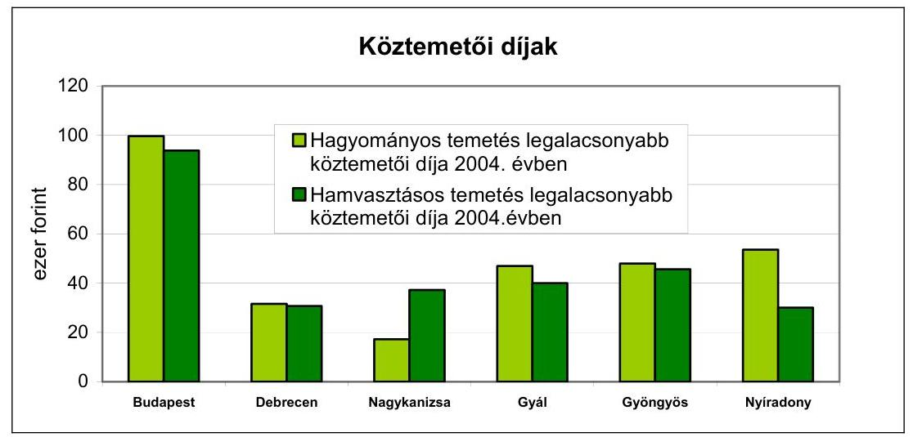

A kegyeleti közszolgáltatási szerződések nem felelnek meg a jogszabályi előírásoknak, keverednek a kegyeleti közszolgáltatás és a temetkezési szolgáltatás elemei, a szolgáltatás ellenértékének mértékét és a fizetés módját törvénysértő módon határozták meg, hiányzik az önkormányzatot megillető ellenőrzési jogosítványok szerződésbe foglalása.

---

# 2.2. Államháztartáson kívüli szervezetek 

A tárgyévben három, Kormány által alapított közalapítvány gazdálkodásának átfogó ellenőrzését végeztük el ${ }^{29}$. A közalapítványok célszerinti tevékenységét 93\%-ban a költségvetés finanszírozta, így - a korábbi évekhez hasonlóan - az ez évi ellenőrzési tapasztalataink is azt igazolják, hogy a közalapítványok által ellátott közhasznú feladatokhoz a vállalkozások és az állampolgárok adományokkal továbbra sem járulnak hozzá. A saját bevételek túlnyomó része az átmenetileg fel nem használt és pénzintézetnél lekötött állami források kamatbevételeiből származik.

Ellenőrzéseink során megállapítottuk, hogy két közalapítvány esetében is a múködés feltételeiben és finanszírozásában olyan változások következtek be, amelyek jelentősen leszűkítették a közalapítványok alapító okirataiban megfogalmazott célok megvalósításának lehetőségét, így mindkét közalapítvány ellenőrzéséről készített jelentésünkben javaslatot fogalmaztunk meg a Kormánynak, hogy mérlegelje a közalapítványok további fenntartásának szükségességét. A Kormány még a tárgyévben döntött az egyik közalapítvány megszüntetéséről és feladatainak ellátása érdekében több közalapítvánnyal együtt egy új közalapítványba való integrálásáról.

A kuratóriumok a közfeladatokra szánt pénzeszközöket az alapító okiratban meghatározott célokkal összhangban osztották szét. A kuratóriumok múködésének hiányosságaként állapítottuk meg, hogy egy közalapítvány esetében a támogatások odaítélésénél nem érvényesítették teljes körűen a döntéshozatali összeférhetetlenséget, egy közalapítványnál pedig a kuratórium átruházta a kuratórium elnökére a döntési jogát. A törvényes gazdálkodást megalapozó belső szabályzatokkal rendelkeztek a közalapítványok, azonban azok nem tükrözték az adott közalapítvány sajátosságait, valamint nem minden esetben aktualizálták a jogszabályi változásoknak megfelelően.

Jellemző szabálytalanság, hogy a kuratóriumon kívül más személyek is rendelkezhettek, és a gyakorlatban rendelkeztek is a közalapítványok vagyona felett, mivel a képviseleti jog valamint a bankszámla és értékpapírszámla feletti rendelkezési jog gyakorlása nem felelt meg a jogszabályi előírásoknak. Egy közalapítvány az alapító okiratban meghatározott múködési költség keretét túllépte, ennek ellenére a múködésben kirívó pazarlást nem tapasztaltunk. Az ellenőrzött közalapítványoknál a kuratóriumok ellenőrzésére a Kormány - mint alapító - által felkért felügyelő bizottságok egy közalapítvány kivételével ellátták feladataikat.

Eddigi ellenőrzési tapasztalataink alapján a közalapítványok saját bevételeként jelentkező kamatbevételek döntő része a közfeladatok ellátása céljából kapott költségvetési támogatások átmenetileg fel nem használt részének lekötéséből származik (a költségvetési támogatások mintegy 2-3\%-a), ezzel a közala-

[^0]
[^0]:    ${ }^{29}$ Jelentés a Nemzeti Kollégiumi Közalapítvány gazdálkodásának ellenőrzéséről (0513), Jelentés a Határon Túli Magyar Oktatásért Apáczai Közalapítvány gazdálkodásának ellenőrzéséről (0510), Jelentés a Természet- és Társadalombarát Fejlődésért Közalapítvány gazdálkodásának ellenőrzéséről (0533).

---

pítványok közvetetten további költségvetési támogatáshoz jutnak. A közpénzek hatékonyabb felhasználása érdekében a közalapítványok feladatellátásának üteméhez illeszkedő állami finanszírozás kialakítása lenne szükséges.

Ellenőrzéseink során kifogásoltuk, hogy a közalapítványok kuratóriumai a támogatottak esélyegyenlőségét sértve pályázaton kívül is nyújtanak támogatást annak ellenére, hogy a 2003. június 9 -étől hatályos „üvegzseb" törvény értelmében kötelesek pályázatot kiírni, ha célszerinti juttatásuk az évi egy millió forintot meghaladja, kivéve, ha törvény vagy kormányrendelet a közalapítvány közfeladatára tekintettel más eljárási rendet állapít meg.

# A tárgyévben megkezdtük a parlamenti pártok által létrehozott, költségvetési támogatásra jogosult alapítványok gazdálkodása tör- 

vényességének - kétévenkénti, törvény által előírt - ellenőrzését. Az ellenőrzött két pártalapítvány gazdálkodására jellemző volt, hogy a realizált bevételeit csak részben (egyharmadát, illetve felét) használta fel. A kuratóriumok által nyújtott támogatások, valamint a saját szervezeti keretek között megvalósított programok megfeleltek az alapítványok alapító okiratában megfogalmazott céljainak. A kuratóriumok múködésének hiányossága volt, hogy egyes célszerinti tevékenységekre/támogatásokra vonatkozóan nem határozott meg konkrét összeget. Az alapítványok elkészítették a gazdálkodási szabályzatokat, azonban kifogásoltuk, hogy a pénzkezelési szabályzatok nem tartalmazták a bankszámlaforgalom lebonyolításának feladatait és az elektronikus átutalások rendjét. A pártalapítványok éves beszámolóinak elkészítésekor érvényesítették a törvényi előírásokat.

A Magyarországon múködő országos kisebbségi önkormányzatok mintegy harmadánál vizsgálta az ÁSZ a négyéves időszakra kiterjedő pénzügyi-gazdasági tevékenységet. Az önkormányzatok nevesített múködési támogatását a központi költségvetés a nemzeti kisebbség létszámához viszonyítva degresszív módon biztosította. Az önkormányzatok múködésében érvényesült az önkormányzatiság elve, a gazdálkodást a vonatkozó törvényekkel összhangban szabályozták. A múködési és intézményi célú költségvetési források felhasználását szabályszerűen elszámolták, biztosították a fel nem használt támogatások költségvetésbe való visszafizetését. Az önkormányzatok a kisebbségi érdekek képviseletén túl eredményesen ápolták az óhazával való kapcsolatot, a nemzeti hagyományok értékeinek közvetítését. Az országos kisebbségi önkormányzatok múködését meghatározó nemzeti és etnikai kisebbségi törvény - ÁSZ által is javasolt - 2005. év végi módosításával az önkormányzatok hivatalának jogi helyzete rendeződött, 2008. január 1-jéig országos költségvetési szervvé kell válnia.

### 2.3. Az állami vagyon

A megváltozott privatizációs kormányzati filozófia okán, illetve a profiltisztítás és az átláthatóság érdekében más szervezet/tárca lett a kincstári vagyon, az állam vállalkozói vagyona, a Magyar Fejlesztési Bank Rt. részvényesi joggyakorlója, és a felügyeletet ellátó minisztérium. A Kormány a privatizáció újraindítását és felgyorsítását tűzte ki célul, s ez meghatározta az ÁPV Rt. 2003-2004. évi privatizációs tevékenységét. A privatizáció felgyorsult, és az új stratégiából következően - az állam vállalkozói vagyonának egységes kezelése jegyében - az

---

ÁPV Rt.-hez kerültek a korábban az ágazati minisztériumok, a Kincstári Vagyoni Igazgatóság (KVI) és a Magyar Fejlesztési Bank Rt. portfoliójába tartozó vállalkozói vagyonelemek. Megszűnt az ÁPV Rt. szerepvállalása a kormányzati beruházási programokban. A tulajdonosi jogok gyakorlója értékesítéssel, vagyonátadással a KVI, az ÁPV Rt., a Magyar Fejlesztési Bank Rt., illetve más szervezet lett. Megváltozott az exportönzésben közremúködő közvetetten állami tulajdonban lévő társaságok tulajdonosi szerkezete, a felügyeletükre kijelölt tárca.

# A kincstári vagyon 

A vagyonkataszter 2005. februári nyilvántartása szerint a kincstári vagyont törvényben kijelölt, illetve a Kincstári Vagyoni Igazgatósággal szerződéses viszonyban álló 735 vagyonkezelő működteti. A kincstári vagyonnak nincs egyértelmú tartalmi és fogalmi meghatározása, többek között ezért sem biztosított a nyilvántartásokban szereplő adatok teljeskörűsége és megbízhatósága. Az állami tulajdon nyilvántartása sem naturáliában, sem összegben nem fedi a tényleges állapotokat. Az egyes vagyonelemek beillesztése a vagyonkataszterbe nem történt meg, részben a vagyonelemek beazonosíthatósági problémái, részben a nyilvántartási rendszer fejlesztésének késedelme miatt $^{30}$. A nyilvántartás nem teszi lehetővé az állam tulajdonosi érdekeinek maradéktalan érvényesítését, nem biztosítja a kincstári vagyon teljes körű megőrzését és a vagyonkezeléssel összefüggő feladatok ellátását. A hatályos szabályozás nem ad teret a hatékony és eredményes vagyonkezelés szerződéses feltételeinek kialakítására. A KVI által kezelt kincstári vagyon hasznosítására irányelveket, a vagyonkezelés forrásainak hatékony felhasználását segítő prioritásokat a kincstári vagyonért felelős miniszter nem fogalmazott meg, ezért a KVInek sem volt ezekben az években az általa kezelt kincstári vagyonra elfogadott vagyonhasznosítási stratégiája. Egyetlen dokumentumban sem határozták meg, hogy mi tekinthető gazdaságos és eredményes hasznosításnak.

A KVI-nek az Áht.-ban megfogalmazott szerepe - amely szerint az államnak, mint tulajdonosnak a megjelenítője - erősen korlátozott. A szervezet csak részben lát el tényleges tulajdonosi funkciókat, tulajdonosi joggyakorlása látszólagos, és annak ellenére, hogy eszközeit a jogszabályok figyelembevételével alkalmazta, nem volt hatékony. A kezelt vagyonnál a gazdálkodás helyett elsősorban az elszámolói szemlélet a jellemző.

A KVI a jogszabályoknak megfelelően alakította ki a vagyonkezelés belső szabályozását és a vagyonkezelési szerződések feltételeit. A függőben lévő vagyonkezelési szerződések rendezetlensége, a szerződések módosításának, aktualizálásának elmaradása miatt jelentős értékű vagyonmozgás - vagyonváltozás nincs regisztrálva. A vagyonkezelési szerződések többségükben formális kellékek és nem célszerű eszközök a kincstári vagyon kezelésének gyakorlatában. Az állami feladat pontos, normatív meghatározásának hiánya ugyancsak korlátozza a gazdaságos és hatékony vagyongazdálkodást. Nincs meghatározva az

[^0]
[^0]:    ${ }^{30}$ Az ellenőrzés főbb tapasztalatait a 4. sz. melléklet 50. sorszámú összefoglalója tartalmazza, a jelentés alapján megfogalmazott javaslatokra tett intézkedésekről a 3. sz. melléklet 66/b. pontja számol be.

---

ellenőrzési prioritás a tulajdonosi joggyakorlás területei között, nincs szabályozva a kincstári vagyonért felelős miniszter feladat- és hatásköre a kincstári vagyon tulajdonosi ellenőrzésében.

A KVI a jól eladható ingatlanokat a 2001-2002. év folyamán értékesítette, ezért 2004. évre önfinanszírozó képessége csökkent, költség-hatékonyságot elemző tanulmányok, beszámolók nem készültek.

# Az állam vállalkozói vagyona 

A 2002-ben kidolgozott vagyonpolitikai irányelvek szerint a nemzeti szempontból stratégiai jelentőségű vállalatokra korlátozott, tiszta profilú, átlátható, üzleti alapú állami vagyonkezelés került előtérbe. A privatizáció felgyorsításának eredményeként 2004 végére 39 társasággal csökkent az ÁPV Rt. portfoliója, ugyanakkor ez nem tükröződött szervezeti és személyi feltételeinek meghatározásánál. Az ÁPV Rt. nettó költségvetési befizetővé vált. A bevételek megszerzését a költségvetési hiány és a likviditási problémák enyhítése érdekében tett intézkedések jellemezték. Az ÁPV Rt. a törvényekben és szabályzataiban megfogalmazottak alapján végezte tevékenységét, a privatizációs ügyleteknél néhány esetben azonban kifogásolható módon járt el, illetve vagyonkezelési döntései közül több vagyonvesztéssel járt (Bábolna Rt., Budapest Airport Rt., Váltó-4 Libra Rt.).

A Nemzeti Tankönyvkiadó Rt. esetében alkalmazott kétfordulós értékesítési eljárás vonatkozásában az ÁPV Rt. versenyeztetési szabályzata nem tartalmazza teljes körűen az egy- és kétfordulós pályázat eltéréseit. A MOL Rt. részvényeinek értékesítésénél nem számoltak a MOL Rt. gázüzletága várható eladásának a MOL-részvények árfolyamát befolyásoló hatásával. A Richter Rt. kötvényeinek kibocsátása esetében az ÁPV Rt. előkészítő folyamata megelőlegezte a jogszabályi változásokat.

## A hozzárendelt vagyon és a saját vagyon könyvvezetésének elkülönítésével az ÁPV Rt.-nél átláthatóbbá vált az állami vagyon értékesítése és a vagyonkezelés. A Társaság 2004. évi múködésének jogi szabályozásában bekövetkezett kisebb módosítások mellett említést érdemel, hogy a pénzügyminiszter engedélye alapján lehetősége nyílt kötvény kibocsátására és hitel felvételére is. A belső szabályzatok és utasítások általában összhangban voltak a Társaság múködésének kereteit adó jog- és egyéb szabályokkal, de összehangolási hiányosságok maradtak a sajátos számviteli gyakorlatban. A saját vagyonával nyereségesen gazdálkodott, amihez szükség volt arra, hogy a múködési költségeire a törvény által lehetővé tett előirányzott összegen felüli felhasználást a részvényesi jogok gyakorlója (pénzügyminiszter) engedélyével az állami költségvetésbe befizetendő összegből visszatarthassa.

A Magyar Fejlesztési Bank Rt.-vel szemben a 2002. évi törvénymódosítással megfogalmazódott a bankszerú, biztonságos múködés követelménye. A portfoliótisztítás 2003-ban gyakorlatilag befejeződött, ennek következményeként a Banknak vesztesége keletkezett, amely elsősorban az állami körben való értékesítéseknél mutatható ki. Az állami feladatokat ellátó társaságokat a Magyar Állam nevében a KVI vásárolta meg. A Bank 2002-ben 2 és 2003-ban 17 befektetést értékesített az ÁPV Rt.-nek, így a befektetések továbbra is állami körben

---

maradtak. Az ügyletekből származó több tízmilliárd Ft banki veszteség az államháztartás szintjén ma még nem ítélhető meg, erre csak a társaságok privatizációja után lesz lehetőség. A Bank állami finanszírozási feladatot már nem lát el, a tulajdonosi jogokat 2002-től a gazdasági és közlekedési miniszter gyakorolja, míg korábban a miniszterelnöki hivatalt vezető miniszter.

# Exportösztönzésben résztvevő állami tulajdonban lévő társaságok 

Az állam az exportot különböző formákban ösztönzi, amelynek kereteit a mindenkori költségvetési törvényben határozzák meg. A Magyar Exporthitel Biztosító Rt. és a Magyar Export-Import Bank Rt. tulajdonosi struktúrája megváltozott. Az ÁPV Rt. 2004. december 15-én értékesítette a Biztosító részvényeinek 75\%-1 szavazatot megtestesítő részvénycsomagját az MFB Rt. részére. Az Ex-port-Import Bank 2004 júniusáig 100\%-os közvetlen állami tulajdonban volt, a tulajdonosi jogokat 2000. január 18-tól az ÁPV Rt. gyakorolta. 2004 júniusától a törvénymódosítások lehetővé tették, hogy az MFB akár 100\%-os tulajdont szerezzen a Bankban.

A tulajdonosváltás indoka - a vonatkozó törvények indokolása szerint - a társaságok közötti szinergiák kihasználása volt, amelyeket azonban nem nevesítettek. A jövőbeni működésükre hatástanulmányt nem készítettek, holott a tulaj-donos-változás megvalósulásával mindkét társaságnak két tulajdonosa lett, amelyeket más-más miniszter felügyel. Nem rendezték, hogy az exportösztönzéshez kapcsolódó állami érdekeket ki és milyen formában közvetíti. Mindebből az következik, hogy az exportösztönzés oldaláról a törvénymódosítások nem voltak megalapozva. Szükséges, hogy a külgazdasági stratégián belül a Kormány határozza meg az exportösztönzéshez kapcsolódó állami érdekek közvetítésének formáját.

### 2.4. Főbb tapasztalatok témakörönként

### 2.4.1. Egészségügy

Az állami újraelosztás egyik legjelentősebb, az egész társadalmat érintő ágazatában meglévő feszültségek oldása az egészségügy reformját igényli, amelynek fő területei az egészségfejlesztés, a közegészségügy és az ellátórendszer átalakítása. Az utóbbi esetében a sürgősségi ellátás élvez elsőbbséget.

Az egészségügy területén nem történtek meg az alapvető változások. Elmaradt az egészségügyi reform. A Nemzeti Egészségfejlesztési Program előkészítése több évet késett. Az Országgyűlés 2003-ban határozott az Egészség Évtizede Johan Béla Nemzeti Programról. Az ágazati feladatok ellátásához szükséges források csak részben álltak rendelkezésre. A hosszú távú programok következetes megvalósítását akadályozta, hogy a Kormánynak nem volt elfogadott koncepciója. A fejezethez tartozó intézmények gépparkja megújítására indított hosszú távú program a forráshiány miatt lényegében egy éves időszakra szűkült. Az Egészségbiztosítási Alapnál állandósult a hiány, amelynek kialakulásában szerepet játszott a változó társadalmi, gazdasági környezet, a megalapozatlan tervezés, valamint a járuléktartozások növekedése.

---

Az 1997-2003. évek közötti időszakban a központi költségvetésből támogatott, a sugárterápiát, a radiológiát, az aneszteziológiai és intenzív ellátást érintő eszközberuházásokra fordított pénzeszközök hasznosulása vizsgálatának tapasztalatai alapján 1996-hoz képest a sugárterápiás centrumok országos szinten már elegendő kapacitással rendelkeztek a rászoruló betegek ellátásához, ezáltal javultak a gyógykezeléshez való hozzáférés feltételei is. A röntgengépekkel való ellátottság minőségi jellemzői országos szinten nem javultak, de a beruházásokkal az adott intézményekben csökkent a betegek és a kezelőszemélyzet káros sugárterhelése, javult a felvételek minősége. Az aneszteziológiai és intenzív ellátás feltételeit illetően a helyzet nem jobb, mint a beruházási program 1998. évi elindításakor.

Az állami és egyházi tulajdonban lévő kórházak, egyetemi klinikák gazdálkodásának értékelése szerint a költségvetési intézményként múködő kórházakat olyan piaci hatások érik, amelyek nem egyeztethetők össze a hagyományos költségvetési gazdálkodás szabályaival. A gazdálkodási cél nem elsősorban az előre megtervezett előirányzatok betartása, hanem a pénzügyi egyensúly folyamatos megőrzése. A tartósan kiegyensúlyozott pénzügyi helyezet biztosítását ágazat-specifikus normák hiányában a menedzsment különböző módszerekkel és eszközökkel igyekezett elérni. Az alkalmazott gazdálkodási módszerek eredményességét a kórházak általában nem értékelik, így nem minden esetben mutatható ki ezek célszerűsége és hatékonysága. Önmagukban az intézmények saját hatáskörű intézkedései a legjobb szándék mellett sem hozhatják meg a tőlük elvárt eredményeket, ha nem párosulnak az ágazatirányítás és a fenntartók hathatós közreműködésével.

A gyógyszerek támogatási és finanszírozási rendszerének, a fogyasztás helyzetének vizsgálata rámutatott arra, hogy a gyógyszerfogyasztás befolyásolására, a gyógyszerkiadások növekedési ütemének csökkentésére irányult állami intézkedések eredményes végrehajtásához hiányoztak az alapvető szabályozási és nyilvántartási feltételek. Az ár és támogatás megállapításában résztvevő központi szervezetek tevékenysége nem volt megfelelően koordinált. A jogszabályok nem rendelkeztek egyértelműen az ár és a hozzá kapcsolódó támogatás megállapításáról. A gyógyszertámogatási és -finanszírozási rendszer valamennyi területén voltak kezdeményezések, de a rendszer egészét tekintve alapvető változásra a vizsgált években nem került sor.

Az irányított betegellátási modellkísérlet célját jogszabályi szinten nem határozták meg, stratégiai megalapozását a vizsgált időszak kormányprogramjai nem tartalmazták. A modellkísérlet szakmai és pénzügyi megalapozása hiányos volt, mert nem határozták meg a bevezetésétől várt eredményeket és az azok értékeléséhez szükséges módszereket, valamint a kísérlet kiterjesztésének feltételeit. A szakminisztérium nem tartotta kézben a modellkísérlet szakmai, szakmapolitikai irányítását, a bevezetésével és kiterjesztésével kapcsolatos szervezési, irányítási jogszabály-előkészítési feladatokat szinte kizárólag az Országos Egészségbiztosítási Pénztár látta el. A modellkísérlet útjára indításának előkészítetlensége, koncepcionális rendezetlensége, a szaktárca részéről a múködése iránt tanúsított érdektelenség, az Országos Egészségbiztosítási Pénztár belső szabályainak hiánya ellenére mind az ellátás-szervezőknél, mind az Országos Egészségbiztosítási Pénztárnál olyan folyamatok indultak el, gyakorla-

---

tok alakultak ki, amelyek értékelése és hasznosítása fontos az egészségügyi ellátás egészét érintően, és felhasználhatók az egészségügy átalakítási koncepciójához.

Az önkormányzatok az egészségügyi ágazatot érintő beruházásaikhoz 1991-2004 között 184 Mrd Ft címzett támogatásban részesültek, amelyből meghatározó részt a kórház rekonstrukciók támogatása képviselt. A címzett támogatások egészségügyi ágazati szakmai prioritásai lényegében változatlanok voltak, a programok túlságosan általánosítva kerültek megfogalmazásra, a rekonstrukciókkal szemben nem határoztak meg mérhető követelményeket. A címzett támogatás felhasználásának üteme a beruházási koncepciókban, tervekben szereplő két-három évvel szemben négy-öt évben került meghatározásra, ami az áremelkedések miatt is költségnövelő hatású volt. A beruházások előkészítése és megvalósulása között eltelt időtartam elérte a hat-tíz évet, ez alatt a szakmai elképzelések és a műszaki feltételek egyaránt módosultak.

Az egészségügyet érintő fontosabb beruházásokon kívül az elmúlt években többször vizsgálta az ÁSZ az ágazat működését befolyásoló tényezőket is. Az önkormányzati tulajdonban lévő kórházak pénzügyi helyzetét, múködési feltételeit a 2000. évi átfogó ellenőrzés lezárása óta eltelt időszakban született központi intézkedések (alapdíjak emelése, 50\%-os bérfejlesztés, konszolidációs program) javították, de a feszültségeket kiváltó tényezők rendszerszemléletű, komplex felülvizsgálatára és a problémák átfogó kezelésére, illetve rendezésére nem került sor. Az egészségügyben továbbra is egyidejűleg van jelen a hiány és a pazarlás. A hiányt a leromlott épületállomány, az elavult gépműszerpark, a dolgozók jövedelmi helyzete, valamint a hotelszolgáltatások elégtelen színvonala jellemzi, míg a pazarlást a helytelen struktúra fenntartása, a betegek ellátásának a drágább fekvőbeteg-szakellátás irányába történő indokolatlan eltolódása idézi elő. A magyar egészségügyi ellátást továbbra is kórházcentrikusság jellemzi. A járó- és az aktív fekvőbeteg-szakellátás területén a teljesítmények folyamatos növekedését nem a lakossági szükségletek változása, sokkal inkább az intézményi bevételek növelésének igénye okozta. A teljesítmény-elszámolások valóságtartalmának teljes körű, folyamatos szakmai ellenőrzését a finanszírozó nem tudta megoldani, az intézmények bevételeiket a teljesítményeik mindenáron való fokozásával igyekeztek növelni.

# 2.4.2. Oktatás 

A tapasztalatok azt mutatják, hogy a felsőoktatásban megvalósult változások iránya kedvező, de a reformok megvalósulásának üteme késlekedést, s a hatékonyságra ösztönző finanszírozási változások lassú haladást tükröznek. Ellenőrzéseink az Európai Felsőoktatási Térséghez igazodó korszerű és hatékony felsőoktatási rendszer kialakítását célozzák.

A 2000-ben kialakított felsőoktatási integráció továbbvitele elsősorban az intézményen belüli szervezeti egységekben szükséges. Az integráció a vizsgált időszakban összességében és intézményenként nem hozott költségcsökkentést, nem eredményezett szinergikus hatást. A gazdaságosság és hatékonyság tartalékai alapvetően a képzési rendszerben vannak, ugyanis az integrálódott in-

---

tézmények képzési szerkezete lényegesen nem változott. Az oktatói hatékonyság mutatóinak javulása nem az integrációval, hanem a hallgatói létszám emelkedésével hozható összefüggésbe.

A költségvetési kutatóhelyeken belül 92\%-ot képviselő felsőoktatási kutatóhelyek aránya a 2000-ben végrehajtott integráció nyomán sem változott. Nem történt meg az intézményeken belül a kutatási erőforrások koncentrációja. A felsőoktatási kutatás-fejlesztés irányítási, szervezeti és támogatási rendszerét a túlzott tagoltság, a megfelelő koncentráltság hiánya és az ebből adódó nem kellő hatékonyság, valamint a hasznosulási problémák jellemzik. A felsőoktatás finanszírozásán belül, a központi költségvetésben előirányzott kutatásfejlesztési támogatás nem fejezi ki a feladat valódi jelentőségét. Az állami támogatás elnyeréséhez nem kapcsolódik teljesítményorientált követelményrendszer sem a felsőoktatási kutatóhelyeken, sem a kutató-fejlesztő intézetekben. A felsőoktatási kutató-fejlesztő helyek teljesítménye kevéssé piac- és gyakorlatorientált.

A felsőoktatásban a kialakított normatív finanszírozás rendszerét a bevezetett és alkalmazott normák kialakítása és a finanszírozás egyes elemeinek gyakori változása ellenére nem sikerült a költségvetés hatékony eszközévé tenni. A kezdeti hatékonysági célok elhalványultak, a képzés költségeinek csökkentésében, optimalizálásában az intézmények nem váltak érdekeltté. Szükséges az átfogó értékelést biztosító mutatószámrendszer kidolgozása.

A vizsgált időszakban a felsőoktatási feladatfinanszírozás kiegészítő jellegű, pótlólagos forrásként járult hozzá a felsőoktatási feladatok ellátásához, a felsőoktatási intézmények működési feltételeinek javításához. Az oktatásképzési, informatikafejlesztési és integrációs célú feladatfinanszírozási támogatások intézményenként rendkívül elaprózottak ${ }^{31}$. A felsőoktatás feladatfinanszírozási rendszere nehezen áttekinthető, egyben hiányzik az oktatás-képzés céljait szolgáló állami támogatás koncentráltsága és a teljesítmény-követelmények meghatározása.

# 2.4.3. Honvédelem 

A forrásoldali lehetőségek függvényében évek óta megoldhatatlannak tűnő kérdés a hosszabb távon finanszírozható haderő kialakítása. A 2005. évi áttekintésünk megállapította, hogy a honvédség átalakításának koncepciója a NATO-tagországgá válást követően sem lett stabil.

A haderő-átalakítás folyamatában szinte állandóan napirenden volt a honvédség létszámcsökkentése, amit a fejezet költségvetésében a múködési és fejlesztési forráslehetőségek javítási szándéka generált, különösen az átalakítás kezdeti szakaszában. A hosszú távra szóló, megalapozott koncepció hiányában a forráslehetőségek mindössze ezúton történő bővítésére vonatkozó elképzelések megalapozatlanságát szemléltették, hogy 2000-2004 között a létszámcsökken-

[^0]
[^0]:    ${ }^{31}$ Az ellenőrzés főbb tapasztalatait a 4. sz. melléklet 9. sorszámú összefoglalója tartalmazza, a jelentés alapján megfogalmazott javaslatokra tett intézkedésekről a 3. sz. melléklet 56/a. pontja számol be.

---

tések mellett folyamatosan nőttek a személyi jellegű kiadások és azok járulékai (a hivatásos állományt érintő kedvezőbb törvényi szabályozás, a reálbérfejlesztés és a külföldi szerepvállalás illetménytöbblete következtében).

Az ország nemzeti és NATO kötelezettségei, valamint a NATO katonai integráció teljesítésére alkalmas képességek kialakítása csak 2002-től kezdődően - a Katonai Integrációs Program kidolgozásával és a védelmi felülvizsgálat elrendelésével - került előtérbe. Ez a folyamat viszont 2004-ben megtört, a nemzetgazdaság teherbíró képességére és az államháztartási kiadások csökkentésére tekintettel kormányzati döntéssel a fejezet költségvetési forrásának nagymértékű (közel 30\%) csökkentése, majd a védelmi kiadások GDP arányos támogatásának megszüntetése alapjaiban megváltoztatta a haderő-átalakítás feltételrendszerét.

A haderő-átalakítási koncepciók tervezésében, illetve megvalósításában a megalapozottság és a finanszírozhatóság kockázatait nem sikerült minimalizálni. Következményeként a Szövetségnek átadott nemzeti válaszok már 2005 februárjában korrekcióra szorultak. A felülvizsgálat eredményeként meghatározott „ambíció szint" elérése érdekében a 2004-2013 közötti időszakra kidolgozott tíz éves terv elvesztette a realitását. A tárca egyes fejlesztések és feladatok módosítására, átütemezésére, tervidőszakon túlra halasztására, vagy törlésére kényszerült. Az évente növelt költségvetési előirányzatokkal együtt sem tudták megszüntetni a nemzeti, nemzetközi feladatok és a költségvetési források közötti összhang hiányát. Mindezekre tekintettel alapvető fontosságúnak tartottuk a tárcánál a tervezés megalapozásához szükséges feltételek teljes körűvé tételét és az elfogadható mértékű kockázattal bíró alternatív megoldások kidolgozását ${ }^{32}$, továbbá a Kormány gondoskodását a honvédség átalakításának, fejlesztésének finanszírozásával összefüggő kockázatok bemutatásáról, az Országgyűlés érdemi döntéséhez szükséges tájékoztatása céljából.

# 2.4.4. Uniós források felhasználása 

Az elmúlt négy évben stratégiánkban kiemelt helyet foglalt el az európai uniós támogatások felhasználásának, hasznosulásának rendszeres vizsgálata. A 2004-ről készített éves jelentésünkben önálló pontban, részletesen foglalkoztunk az uniós források felhasználásának ellenőrzési tapasztalataival. Az Országgyűlés 43/2005. (V. 26.) számú határozatának megfelelően 2006-ban áttekintjük a teljes uniós pénzfelhasználás gyakorlatát, s ennek keretében az uniós forrásokkal összefüggő pénzmozgások ellenőrzését végző hazai szervezetek szakmai munkáját, és az ellenőrzések tapasztalatait, melyet a zárszámadással egyidejűleg tájékoztató összeállításban adunk közre.

[^0]
[^0]:    ${ }^{32}$ Az ellenőrzés főbb tapasztalatait a 4. sz. melléklet 13. sorszámú összefoglalója tartalmazza, a jelentés alapján megfogalmazott javaslatokra tett intézkedésekről a 3. sz. melléklet 18/b. pontja számol be.

---

# Uniós pénzügyi alapokból folyósított nemzetközi támogatások 

Az Európai Unió Tanácsa 2000-ben indította el az ISPA programot, rövid időt adva a felkészülésre a tagjelölt országok számára. Magyarország, a többi ISPA országhoz hasonlóan, a pályázatok kidolgozásával és beadásával párhuzamosan hozta létre a lebonyolítására előírt szabályozási és intézményi rendszert. A program hazai intézményrendszerének összteljesítményét és hatékonyságát gyengítették az intézményfejlesztési koncepciókban és a kormányzati munkamegosztásban bekövetkezett változások. A projektek végrehajtásának másfél-kétéves késedelme miatt a támogatások tényleges lehívása, illetve felhasználása csúszott a tervezett ütemtervekhez képest. Nem csökkent a projektek tervezett és tényleges első kifizetései közötti késedelem időintervalluma. A lebonyolítással összefüggő uniós és hazai szabályozás változásai a projektek végrehajtását kedvezőtlenül befolyásolták. A közbeszerzés szabályozásának többszöri módosításai például a beszerzési tenderanyagok ismételt átdolgozását tették szükségessé, ezzel időbeli késedelmet okozva a beruházási projektek megvalósításában. A projektek tervezési és engedélyezési folyamatának befejezését késleltette az eltérő uniós és hazai álláspont egyeztetésének elhúzódása a környezetvédelmi hatástanulmány követelményének értelmezésében. Az intézményrendszer hatékony működésének hiányát mutatta, hogy EU Bizottság által elfogadott pályázatok végrehajtásának előkészítésében a műszaki tervezés és engedélyezés ütemtervét nem tartották be, nem gondoskodtak azonnal a projektjavaslatok teljes körű jogi, műszaki és környezetvédelmi előkészítéséről, a szükséges engedélyek beszerzéséről.

A területen tapasztalt előrelépésnek és az ellenőrzési javaslataink hasznosulásának tekinthető, hogy a Strukturális Alapok és a Kohéziós Alap pályáztatásának szabályozásában ezeket a problémaként feltárt területeket szabályozták.

A 2004. évi költségvetés végrehajtásának ellenőrzése során megállapítottuk, hogy az európai uniós támogatásokkal (az agrártámogatások kivételével) öszszefüggő kormányzati koordinációért felelős - a nemzeti fejlesztési terv kidolgozását is végző - Nemzeti Fejlesztési Hivatal (NFH) feladatai ellátásához erősen tagolt belső szervezetet alakított ki, amelynek hatékony múködéséről a rendszer szereplőinek eltérő a tapasztalata. A pozitív megállapítások mellett felmerültek kritikai észrevételek is, amelyeket az együttmúködés hiányosságaival, a kellő szakmai tapasztalatok hiányával indokoltak. Többek között ennek is tudható be a támogatások igénybevétele folyamatának hosszadalmassága.

A strukturális alapok támogatásaival megvalósuló operatív programok irányító hatóságai a pályázatokat eltérő időpontokban hirdették meg, így nem volt egységes, és több esetben elégséges a különböző operatív programok pályázói számára rendelkezésre álló idő ahhoz, hogy eséllyel számíthassanak a támogatások még tárgyévben történő igénybevételére. Irányító hatóságonként (IH) eltérő volt a pályázatok feldolgozásához (adatrögzítés, ellenőrzés, elbírálás) szükséges idő is.

A döntéssel zárult pályázatok statisztikája szerint a pályázat benyújtásától az IH döntésig átlagosan csaknem 3 hónap telt el, a döntéstől a szerződés megkötéséig további átlagosan 42 nap volt szükséges. A pályázati rendszeren való tel-

---

jes átfutási idő meghaladta az 5 hónapot, ami - figyelembe véve a meghirdetés idejét - már eleve korlátozta a támogatások tárgyévben történő tényleges lehívásának lehetőségét. Ez a gyakorlat folyamatos jogszabálysértést okozott ${ }^{31}$.

# Az operatív programok esetében a pályázók nem voltak megfelelően 

felkészülve az új források lehívására, ezért nagyon sok esetben került sor a pályázatok elutasítására tartalmi, vagy formai hiányosságok miatt. A tapasztalatlan pályázóknak történő segítségnyújtás többlet erőforrásokat igényelt, ami tovább lassította az elbírálás folyamatát. A felkészületlenségnek tudható be, hogy több előirányzat esetében is a tervezett felhasználáshoz képest kifizetés nem, vagy csupán néhány millió forint értékben történt a 2004. évben.

Az Európai Unió által a strukturális alapokból és a Kohéziós Alapból nyújtott támogatásokat tartalmazó előirányzatok a 2006. évi költségvetésben az EU Integráció és más fejezeteknél szerepelnek. Az eredeti elképzelések szerint az öszszes ilyen előirányzat a központi költségvetés EU Integráció fejezetében jelent volna meg, azonban a költségvetési törvényben azon előirányzatok, amelyek az egyes fejezetek szervezetében működő irányító hatóságok szakmai kezelésében vannak, az adott program, prioritás vagy intézkedés lebonyolításáért szakmailag felelős fejezet költségvetésében szerepelnek. A törvény ugyanakkor az ilyen előirányzatok feletti rendelkezési jogot (tervezési, előirányzatmódosítási, felhasználási, beszámolási, stb.) az európai uniós ügyekért felelős tárca nélküli miniszter hatáskörébe utalja. Az európai uniós ügyekért felelős tárca nélküli miniszter által felügyelt előirányzatok tíz fejezetnél szerepelnek. A központi költségvetés ilyen módon történő bemutatása nincs összhangban a fejezet feletti általános rendelkezési jog- és hatáskör értelmezésével, tekintettel a hatáskör általánostól eltérő meghatározására. Ez a megoldás ellentétes a kormányzat által korábban helyesnek tartott prezentációs gyakorlattal. Emellett külön szabályozást és ellenőrzést tehet szükségessé a finanszírozás és a beszámolási kötelezettség biztosítása. A többi olyan előirányzatot, amely EU-támogatást is tartalmaz (PHARE programok és átmeneti támogatás, Schengen Alap, SAPARD, a Nemzeti Vidékfejlesztés terv előirányzatai) a költségvetési törvény az egyes szakfejezeteknél sorolja fel, és az adott szakminiszter felügyelete alá tartozónak rendeli.

Az Európai Unióval a 2007-ig terjedő költségvetési időszakra megkötött pénzügyi megállapodások, illetve az azok alapján az egyes támogatásokra vonatkozó kötelezettségvállalási keretek jelentik azt a maximális finanszírozási szükségletet, amelyre a programokat meghirdető hatóságok szerződést köthetnek. A strukturális alapoknál az n+2 szabály szerint az uniós támogatások felhasználása a szerződésekkel (kötelezettségvállalással) lekötött kereten belül a 2006. év után még két évig lehetséges. Az uniós támogatások igénybevételének biztosítása elsősorban nem tervezési feladat, hatékonysága a prog-

[^0]
[^0]:    ${ }^{31}$ A strukturális alapok és a Kohéziós Alap felhasználásának általános eljárási rendjéről szóló rendelet szerint a támogatással kapcsolatos döntésről a lebonyolító szervezet a hiánytalan pályázat benyújtásától számított 60 naptári napon belül köteles személyre szóló levélben tájékoztatni a támogatást igénylőt, és a támogatás megítélése esetén megküldeni a támogatási szerződés tervezetét.

---

ramok múködtetését végző hatóságok munkáján múlik. Ezért hangsúlyozni kell, hogy az előirányzatok módosításának a törvény szerinti viszonylag rugalmas rendje - jóllehet elősegíti az uniós támogatások igénybevételét -, nem jelent garanciát arra, hogy a felhasználás meg is valósul.

A strukturális alapok előirányzatai abból a szempontból is értékelhetőek, hogy azok mennyiben tükrözik a többéves uniós támogatási keret felhasználását. A 2006. költségvetési év - az EU 2007-től kezdődő újabb hétéves költségvetési periódusa előtt - az utolsó, amelyben a többéves keret felhasználása kötelezettségvállalásokkal biztosítható. Ezt követően még két évig van lehetőség az uniós támogatások lehívására. A várhatóan fel nem használt több mint 316 Mrd Ft lehívására 2008. december 31-éig abban az esetben van lehetőség, ha a szerződéseket 2006 végéig megkötik. A NFH erre vonatkozó becslése szerint a kötelezettségvállalások ekkorra a hároméves keretet mintegy 60 Mrd Ft-tal haladják meg, tehát a támogatások lehívásának nem lesz akadálya. A számítás nagyrészt becslésen alapul, és annak teljesülése nemcsak a kiadási előirányzatok alakulásától függ, hanem a jövőbeni kötelezettségvállalások nagyságától, a programok megvalósulásának ütemétől, az elszámolhatóság (szabályszerúség) helyzetétől, és a hazai társfinanszírozási források rendelkezésre állásától.

# Megállapodások alapján végzett ellenörzések 

Az Illetékes Hatóság nevében eljáró Nemzeti Programengedélyezővel a SAPARD igazoló szervi feladatok ellátására kötött munka-megállapodás értelmében 2003-tól folyamatosan végezzük az éves igazoló szervi ellenőrzést, és szeptember 15-ig - a tárgyév első félévéről - közbenső féléves jelentést, tárgyévet követő április 15 -ig éves jelentést és ellenőrzési igazolást készítettünk, amit a Nemzeti Programengedélyező megküld az EU Bizottságnak.

A SAPARD célra biztosított keretek teljes egészében lekötésre kerültek, felhasználásuk folyamatosan történik. 2005. december 31-ig a teljes keret 70,6\%-a került felhasználásra. A pénzügyi és megfelelőségi ellenőrzések során sem az EU Bizottság, sem az EU Számvevőszéke, sem pedig a SAPARD Igazoló Szerv nem tárt fel olyan hibát illetve hiányosságot, ami 2005. év végéig pénzügyi korrekciót eredményezett volna.

Az Európai Mezôgazdasági Orientációs és Garancia Alap (EMOGA) Garancia Részlegből finanszírozott támogatások felhasználását igazoló szerv feladatainak ellátására a Mezőgazdasági és Vidékfejlesztési Minisztériummal kötöttünk megállapodást. Az ÁSZ Igazoló Osztálya - mint az EMOGA Garancia Részleg Igazoló Szerve - lefolytatta az EMOGA 2004. pénzügyi évre vonatkozó igazoló ellenőrzését, és kiadta az Igazolást és a Jelentést az EMOGA Garancia Részlegből finanszírozott programokra a kifizető ügynökségi feladatokat ellátó szervezet - a Mezőgazdasági és Vidékfejlesztési Hivatal (MVH) igazoló ellenőrzéséről.

Vizsgálatunk megállapította, hogy a „Tanulók tejtermékkel történő ellátása" jogcímre kifizetett közösségi támogatás során a Hivatal struktúrája és eljárásai nem feleltek meg maradéktalanul a megfogalmazott akkreditációs kritériumoknak, és az EU Bizottság szabályainak. Nem tudtunk meggyőződni arról, hogy a Hivatal az iskolatej mennyiségének és összegének jogosságát, a közös-

---

ségi támogatás kiszámításának pontosságát utólagosan ellenőrizte-e. Az EU Bizottság felkérte az Igazoló Szervként múködő osztályunkat, hogy ellenőrizze a „C" minősített véleményhez csatolt megállapításokra és ajánlásokra az MVH által megtett intézkedéseket, és végleges álláspontunkat tükröző új ellenőri igazolást bocsássunk ki. Az elvégzett utóellenőrzés eredményeként, a 2004. EMOGA GR pénzügyi évről kiegészítő információkat tartalmazó jelentést készítettünk és „A", „Hitelesítő Záradék" típusú Igazolást állítottunk ki.

Határidőre elkészítettük a 2005. pénzügyi év EMOGA Garancia Részlegből finanszírozott intézkedések tekintetében a kifizető ügynökségi feladatokat ellátó szervezet - MVH - igazoló szervi ellenőrzéséről szóló Jelentést, és kiállítottuk az Igazolást, amelyeket 2006. január 31-én megküldtünk az Illetékes Hatóságnak. A Jelentésében figyelemfelhívást is meg kellett fogalmaznunk, mert úgy ítéltük meg, hogy néhány kiemelt területet fokozott figyelemmel kell kezelnie az MVHnak ahhoz, hogy az EU pénzügyi érdekei ne sérülhessenek, és biztosítható legyen az EMOGA GR-ből finanszírozott támogatások EU-s és hazai szabályozásokkal összhangban történő felhasználása, az elszámolások hitelessége, pontossága és hiánytalan volta. A 2004. és 2005. EMOGA GR pénzügyi évben a kifizetések túlnyomó többségében az EU előírásainak megfelelő határidőben megtörténtek. Az EU Bizottság 2005 végéig jelentős pénzügyi korrekciót nem alkalmazott.

# 3. Az ellenőrzések hasznosítÁsa 

A számvevőszéki ellenőrzések eredménye nagymértékben függ attól, hogy a megállapítások, javaslatok, hasznosítása (realizálása) nyomán milyen jogsza-bály-módosítások valósulnak meg az Országgyúlés, a Kormány és az egyes fejezetek, önkormányzatok szintjén, továbbá az ellenőrzöttek milyen intézkedéseket kezdeményeznek. Az ÁSZ nem hatóság, nem szankcionálhat és nincs lehetősége kikényszeríteni javaslatai, ajánlásai realizálását.

### 3.1. A jelentések országgyúlési tárgyalása, határozatok és az országgyúlési kapcsolatok

Az ÁSZ 2005-ben is eleget tett a törvényekben előírt jelentéstételi kötelezettségeinek, s benyújtotta az Országgyúlésnek a költségvetési törvényjavaslatról készített véleményét, továbbá jelentését a zárszámadási törvényjavaslatról, valamint a Magyar Távirati Iroda Rt. és az Állami Privatizációs és Vagyonkezelési Rt. éves tevékenységéről szóló jelentéseit. Összesen 71 ellenőrzési jelentéssel segítettük az Országgyúlés ellenőrző, törvényhozó munkáját ${ }^{34}$.

[^0]
[^0]:    ${ }^{34}$ Az ÁSZ alkalmazkodott az Országgyűlésnél 2004 szeptemberétől bevezetett ún. elektronikus parlament rendszerhez, melyből adódóan a képviselők több elektronikus csatornán is hozzáférhetnek a jelentések teljes szövegéhez, a jelentések főbb megállapításait, következtetéseit, javaslatait összefoglaló képviselői levelekhez. A jelentéseket nyomtatott formában is eljuttatjuk az Országgyúlés vezető tisztségviselőinek, a Szám-vevőszéki-, a Gazdasági-, és a Költségvetési és pénzügyi-, valamint az érintett szakmai bizottságoknak is, azonban a példányszámok csökkentésével egyre inkább az elektronikus terjesztést helyezzük előtérbe.

---

A 2002-2005. években közzétett jelentéseink száma közel 50\%-kal haladta meg az előző parlamenti ciklusban megjelentekét. Ebben az időszakban a bizottságok 308 alkalommal vettek napirendre számvevőszéki jelentéseket, tanulmányokat.

A jelentésszám ilyen magas arányú növekedésének az oka elsősorban a jelentős összegű költségvetéssel, vagyonnal, illetve magas költségvetési kockázattal gazdálkodó önkormányzatok átfogó ellenőrzéséről készített jelentések közzététele volt, amelyeket azonban még nem tűztek napirendre a bizottságok.

A zárszámadási és költségvetési törvényjavaslatokat a 23 bizottság együtt tárgyalta az ÁSZ kapcsolódó jelentésével illetve véleményével. Ezen túl évente 914 bizottság tárgyalt számvevőszéki jelentést, tanulmányt. A legtöbb jelentést 2003-ban és 2005-ben vitatták meg, évenként 22-22 db-ot. Az éves tevékenységről szóló jelentést 3-12 bizottság tárgyalta meg. A bizottságok közül a Számvevőszéki bizottságon túl, főként a Gazdasági, az Egészségügyi, a Költségvetési és pénzügyi, a Környezetvédelmi valamint a Kulturális és sajtó bizottság támaszkodott munkájában az ÁSZ jelentéseire. Az előző ciklushoz hasonlóan a legtöbb jelentést, mintegy 30 db-ot a Gazdasági bizottság tárgyalt meg. A bizottságok az ÁSZ Fejlesztési Módszertani Intézetének (FEMI) 6 tanulmányát tűzték napirendre és 2 esetben főigazgatói aláírású jelentést is megtárgyaltak.

2005-ben 22 jelentés és 2 FEMI-tanulmány szerepelt az állandó bizottságok, illetve vegyes albizottságok napirendjén önállóan vagy kapcsolódva törvényjavaslatok, jelentések, beszámolók tárgyalásához. A minden bizottság által megtárgyalt ÁSZ irományokon felül 14 bizottság, vegyes albizottság tárgyalt más ÁSZ-jelentést, FEMI-tanulmányt is. Az éves jelentésünket 7 bizottság vitatta meg. A jelentések parlamenti tárgyalásának adatairól a 2. sz. melléklet ad tájékoztatást.

Az előző évek gyakorlatához hasonlóan az ÁPV Rt.-ről készített jelentés kivételével 2005-ben is valamennyi parlamenti benyújtásra került jelentés szerepelt a plenáris ülések napirendjén. Az ÁPV Rt. tevékenységének ellenőrzéséről készült ÁSZ-jelentés - a ciklus korábbi éveihez hasonlóan - csak bizottsági szinten került tárgyalásra ${ }^{35}$. Az MTI Rt. beszámolójának, illetve az ÁSZ ellenőrzési jelentésének tárgyalásakor elfogadott határozat indokolásában hivatkoztak az ÁSZnak a nemzeti hírügynökségről szóló törvény módosítására vonatkozó - több éven keresztül tett és megismételt - javaslatára. Az ÁSZ elnöke 2005-ben az Országgyűlés négy ülésnapján szólalt fel a tárgyalt jelentések kapcsán.

A parlamenti ciklusban az ülésnapok 70\%-án, több mint 1200 felszólalásban hivatkoztak a jelentések, tanulmányok megállapításaira, javaslataira. A hivatkozások jelentős része az önkormányzatok gazdálkodási gondjaival, az egészségügy, oktatás finanszírozásának problémáival, a pártfinanszírozás, a

[^0]
[^0]:    ${ }^{35}$ A jelentés benyújtását követően az Országgyűlés politikai vitát tartott, melynek fő témájaként a privatizációs kérdések szerepeltek és 10 felszólalás hivatkozott az ÁSZ privatizációs témában megjelent jelentéseire, illetve tanulmány-kötetére. A Mezőgazdasági bizottság 1 ülésen együtt tárgyalta az ÁPV Rt. ellenőrzéséről szóló, az 1997-2002. évekre vonatkozó 6 ÁSZ-jelentést a Kormány jelentéseivel. Ehhez a bizottság kérésére összefoglaló feldolgozást készítettünk.

---

privatizáció a köz-, és a magánszféra együttműködésében finanszírozott beruházások tapasztalataival kapcsolatos ellenőrzési megállapításokat (tanulmányokat) idézte. Napirenden kívül, valamint interpellációk, kérdések kapcsán több mint 170 hozzászólásban hivatkoztak az ÁSZ-ra a felszólalók.

Az ÁSZ és az Országgyúlés Főtitkársága, illetve a bizottságok között folyamatos volt a munkakapcsolat. Az ÁSZ elnöke az ellenőrzési terv tervezetéről döntését megelőzően minden évben kérte a vezető tisztségviselők, a bizottsági elnökök, a Számvevőszéki bizottság véleményét, javaslatait. A bizottságok egy része ülésszakonként munkatervet készített, amelyet megküldtek az ÁSZ elnökének. A kialakult gyakorlat szerint a munkatervek egyes témáihoz, a Kormány törvényalkotási programjához kapcsolható jelentésekre tematikus jegyzékekben hívta fel az ÁSZ elnöke a bizottságok figyelmét. Az előző évek gyakorlatát folytatva az ellenőrzések során tett, de még meg nem valósított törvénymódosításra vonatkozó javaslatokat az 5. sz. melléklet mutatja be.

Az ÁSZ elnöke és vezető munkatársai az országgyűlés elnökével, tisztségviselőivel, vezető munkatársaival, az országgyűlési képviselőcsoportokkal is rendszeres kapcsolatot tartottak. A parlamenti ciklus korábbi éveihez hasonlóan az ÁSZ elnöke 2005-ben is meghívást kapott a bizottsági elnökök értekezletére. Az Országgyúlés elnöke, alelnöke a Számvevőszéki bizottság több tagja rendszeresen részt vettek az ÁSZ rendezvényein.

Országgyűlési kapcsolattartásunkban meghatározó a Számvevőszéki bizottság, amely a plenáris ülés napirendjéhez kapcsolódó jelentéseken túl minden évben megtárgyalta az ÁSZ ellenőrzési tervjavaslatát, költségvetését, a Fejlesztési Módszertani Intézet több tanulmányát, és a törvényjavaslatokhoz benyújtott módosító javaslatokban, az éves jelentés elfogadásához benyújtott országgyúlési határozati javaslataiban rendszeresen támogatta az ÁSZ törekvéseit. Az ÁSZ vezetői, szakértői részt vettek a bizottság 80 ülésén és szóbeli tájékoztatóikkal is segítették a képviselők munkáját. A bizottság 2005-ben kiemelt figyelmet fordított az önkormányzatok ÖKÖTÁM rendszerben megvalósuló közműberuházásainak finanszírozásából adódó szabályozási problémák feloldásárára.

# 3.2. A számvevőszéki javaslatok érvényesülése 

Az elmúlt években végzett ellenőrzések során az ÁSZ több javaslatot tett a jogszabályok módosítására, a hibák, szabálytalanságok megelőzésére a közpénzek ellenőrizhetősége és hatékonyabb felhasználása érdekében. E javaslatok fogadtatása az ellenőrzöttek részéről kedvező. A vizsgálatok által érintett fejezetek, önkormányzatok többsége intézkedési tervében visszaigazolta az ÁSZ által tett javaslatokat.

Utóvizsgálataink és az éves jelentésünkhöz kért tájékoztatások tanúsága szerint a belső szabályozási, nyilvántartási, elszámolási rendszerekre vonatkozó, a célszerűséget, hatékonyságot javító intézkedéseket célzó, valamint a programok, intézkedési tervek készítését ajánló javaslataink jellemzően megvalósulnak, míg a jelenleg hatályos szabályozási rendszerek megváltoztatására, összehangolására irányuló javaslataink kisebb része hasznosul.

Az egyes ellenőrzési jelentésekben megfogalmazott javaslatok, illetve azok hasznosítása, megvalósítása az ÁSZ honlapján figyelemmel kísérhető.

---

# 3.2.1. Javaslatok az Országgyúlés szintjén 

Az Országgyúlés a törvényjavaslatok bizottsági, illetve plenáris tárgyalása során, a Kormány a törvényjavaslatok előkészítésénél rendszeresen figyelembe vette az elmúlt négy év folyamán az ÁSZ-jelentésekben megfogalmazott tapasztalatokat, javaslatokat.

Az éves zárszámadási és költségvetési törvényeken túl - amelyek mindegyikébe több javaslatunk is beépült - 2002-2005 között 28 törvény módosítása során hasznosultak ellenőrzési megállapításaink.

Az M3 autópálya beruházás pénzügyi folyamatának ellenőrzéséről készített jelentésünk javaslatait a Magyar Köztársaság gyorsforgalmi közúthálózatának közérdekűségéről és fejlesztéséről szóló törvényben hasznosították.

A foglalkoztatást elősegítő támogatások felhasználásának ellenőrzéséről szóló jelentésünkben foglaltak az Egységes Munkaügyi Nyilvántartás létrehozásával öszszefüggő módosításokba épültek be.

Az illetékhátralékok behajtásának elősegítése érdekében tett javaslatunk az adókról, járulékokról és egyéb költségvetési befizetésekről szóló törvények módosítása során hasznosult.

Az új közbeszerzési törvény az ÁSZ vonatkozó ellenőrzési megállapításaival, javaslataival összhangban került összeállításra. (Az ÁSZ javaslataival 2002 ősze óta vett részt az új közbeszerzési törvény koncepciójának kialakításában.)

Az Országgyűlés korábban elfogadta a felsőoktatásról szóló törvény módosítását. A törvénymódosítás munkajogi szabályozási része - javaslatunk értelmében - külön választja az egyetemi, főiskolai tanári kinevezést és a munkaviszony, közalkalmazotti jogviszony létesítését.

Az MNB törvény több bekezdése javaslatainknak megfelelően egészült ki.
Az Országgyűlés a Nemzeti Civil Alapprogramról kiadott törvénnyel ismerte el a társadalmi szervezetek és alapítványok működési feltételei állami garanciákkal való biztosításának szükségességét. Az ÁSZ korábbi javaslatai nyomán az Alapprogram - egyes célok kivételével - kizárólagosságot biztosít a közhasznú jogállást elnyert civil szervezetek támogatásának.

Az ÁSZ-jelentésekben megfogalmazott tapasztalatok, javaslatok hasznosultak továbbá a párttörvényben, a mozgóképről szóló törvényben, illetve az egyes szociális tárgyú törvények módosításánál, valamint az MTV Rt., a Duna TV Rt. és a Magyar Rádió Rt. költségvetéseiben.

A Magyar Honvédség Szárazföldi csapatai múködtetését szolgáló pénzeszközök hasznosulásának ellenőrzéséről, valamint a Magyar Honvédség közbeszerzési rendszere múködésének ellenőrzéséről készített jelentéseinknek az országvédelemhez kapcsolódó felső szintű szabályozási korrekcióra irányuló javaslata találkozott az ország-védelemmel összefüggő jogszabályi háttér napirenden levő harmonizációjával, ezáltal főbb elemei beépülhettek a Magyar Köztársaság Alkotmányának módosításáról szóló, valamint a honvédelemről és a Magyar Honvédségről alkotott törvényekbe.

---

A kutatás-fejlesztésről és a technológiai innovációról szóló törvény - a központi költségvetésből kutatás-fejlesztési célokra fordított állami pénzeszközök hasznosulásának ellenőrzéséről készített jelentésünkben tett - javaslatainknak megfelelően rögzíti a kutatás-fejlesztési és technológiai innovációs eredmények létrehozását és azok gazdasági, társadalmi hasznosítását segítő állami feladatrendszer kereteit, megállapítja a közfinanszírozású támogatások felhasználásával kapcsolatos legfontosabb jogszabályokat, megkönnyíti a költségvetési kutatóhelyen létrejött eredmények gazdasági hasznosítását.

Javaslatainkra is figyelemmel - a jogértelmezési különbségek megszüntetése érdekében - megtörtént az adózás rendjéről szóló törvény és a személyi jövedelemadóról szóló törvény egyes rendelkezéseinek összehangolása.

Kezdeményezésünkre történt meg az adózás rendjéről szóló törvény módosítása, mely a mulasztási bírság felső összegének változatlanul hagyása mellett pontosította a bírság felső határának meghatározását. A felső határ meghatározásában az adóhatóság számára egy szélesebb differenciálási lehetőség nyílik a szankció megállapítására.

Az Országos Rádió és Televízió Testület és a Műsorszolgáltatási Alap múködésének ellenőrzéséről szóló jelentésünkben tett javaslat is hasznosult, a Költségvetési és pénzügyi bizottság által benyújtott - az ORTT 2004. évi költségvetésének végrehajtásáról szóló - törvényjavaslat már az ÁSZ javaslatának megfelelően mutatta be a Músorszolgáltatási Alap felhasználását. A törvényjavaslatot az Országgyűlés elfogadta.

A kötelező egészségbiztosítás ellátásáról szóló törvény kiegészült az Irányított Betegellátási Rendszerrel.

2005-ben a Magyar Köztársaság 2004. évi költségvetése végrehajtásának ellenőrzése kapcsán tett javaslataink nagy hányada jutott érvényre a törvényalkotási munkában.

Egyes elkülönített állami pénzalapok éven túli kötelezettségvállalásainak szabályozása a 2006. évi költségvetési törvényben megtörtént. E törvény a Munkaerőpiaci Alap foglalkoztatási alaprésze és képzési alaprésze tekintetében rendezte a kérdést. A Nemzeti Kulturális Alap tekintetében a szabályozást törvénymódosítás tartalmazta, a végrehajtási rendelet kiadását 2006 első negyedévére tervezik.

A 2006. évi költségvetési törvény meghatározza az irányított betegellátási modellkísérletben részt vett ellátásszervezők IBR-be való átvezetését, illetve az IBR egyes kereteit és egyes feltételeit.

A helyi önkormányzatok fejlesztési támogatásaival kapcsolatos visszafizetési javaslat beépült a zárszámadási törvénybe.

A Területfejlesztési fejezethez tartozó Magyar Terület- és Regionális Fejlesztési Hivatal tájékoztatása szerint realizálódott a jogtalanul lekötött 4800 ezer Ft TERKI támogatási előirányzat lemondásával kapcsolatos ÁSZ javaslat.

A Magyar Köztársaság 2006. évi költségvetésének véleményezése során tett javaslatunkat figyelembe véve a normatív hozzájárulásokat, támogatásokat érintő módosításokkal összefüggésben a közoktatásról szóló, a szociális

---

igazgatásról és szociális ellátásokról szóló, valamint a gyermekek védelméről és a gyámügyi igazgatásról szóló törvények szükséges módosításai megvalósultak.

A felsőoktatási intézményhálózat integrációjának ellenőrzéséről szóló jelentésben javasoltuk az Európai Felsőoktatási Térségben való eredményes részvételünk céljából a felsőoktatási törvény módosítását, amely elősegíti az intézmények hatékonyabb múködését, a képzési szerkezet és a belső szervezeti egységek átalakíthatóságát. Úgyszintén javasoltuk a 2010-ig szóló középtávú fejlesztési terv kidolgozását, az állami fejlesztési források meghatározásával együtt.

Az Országgyűlés 2005 végén fogadta el - többéves előkészítés és komoly szakmai viták után - az új felsőoktatási törvényt. Az új törvény az Európai Gazdasági Térség felsőoktatási rendszerének részeként jelöli ki a felsőoktatás feladatait, határozza meg a felsőoktatási intézmények képzési szerkezetét és intézményi működésének kereteit.

A kormányzat középtávú fejlesztési tervként a 2005-2008. évekre, 175 Mrd Ft-os összberuházás előirányzásával, Universitas Programot fogadott el. A beindított Program kiemelt feladata a felsőoktatási intézmények infrastruktúrájának fejlesztése, valamint kollégiumi beruházások, rekonstrukciók végrehajtása - alapvetően nemcsak állami forrásokból, hanem a magánszféra beruházásában, PPP-konstrukcióban.

A Foglalkoztatáspolitikai és Munkaügyi Minisztérium fejezet múködésének ellenőrzésekor tett javaslatunk alapján a felnőttképzésről szóló törvény módosult. A törvény végrehajtásához kapcsolódó miniszteri rendelet módosítása megjelent. A felnőttképzési normatív támogatási rendszer átalakításáról kormányrendelet rendelkezett. A források felhasználását követő beszámoltatások, ellenőrzések az FMM 2006 első félévi ellenőrzési tervében szerepelnek.

Több, az Országgyűlésnek címzett vagy az Országgyűlés törvényalkotási tevékenységét érintő javaslat esetében a vonatkozó törvények, szabályzatok stb. felülvizsgálata 2005-ben elkezdődött, változás azonban csak a következő ciklusban várható (például a média törvény, a nemzeti hírügynökségről szóló törvény).

# Az Áht.-val kapcsolatos koncepcionális ajánlásaink nem realizálódtak, azok - a tájékoztatás szerint - az államháztartási reformmunkálatok keretében történnek meg. 

### 3.2.2. Javaslatok kormányzati szinten

Az ÁSZ a vizsgálatai során tett ajánlások, javaslatok hasznosításának nyomon követése érdekében a korábbi évek gyakorlatának megfelelően 2005ben is tájékoztatást kért a Kormánytól és a tárcák vezetőitől az ajánlások hasznosulásáról. A megkereséseknek az érintettek eleget tettek, s a tárcák által adott válaszok évről-évre teljesebbé válnak.

Javaslataink fogadtatása és hasznosítása - a feltárt hiányosságok megszüntetésére tett intézkedések alapján - összességében kedvezőnek ítélhető. Megjegyez-

---

zük, hogy a javaslatok megvalósításának tényéről és hatásairól teljesebb képet az esetek többségében csak célvizsgálat, utóellenőrzés keretében kaphatunk.

Válaszlevelében több tárca is jelezte, hogy ellenőrzéseink során a szakmai feladatellátásukat és gazdálkodásukat javaslatainkkal nagyban segítettük, munkánk nyomán több területen értek el a szabályszerűség, a szabályozottság és a hatékonyság tekintetében előrehaladást.

Figyelemre méltó körülmény, hogy esetenként a hasznosítás már az ellenőrzés során elkezdődött.

A javaslataink hasznosulásáról kapott tájékoztatás azért is fontos információ az ÁSZ számára, mert a számvevőszéki javaslatok figyelembevételére - a törvényesség helyreállítására irányuló jogi realizálás kezdeményezésén túl - nincs általános érvényű törvényi előírás.

Az ÁSZ annak alapján választja meg javaslatainak címzettjét, hogy az adott ajánlás megvalósítására - illetékességénél, hatáskörénél fogva - mely szervezet (vezetője) tehet érdemi lépéseket.
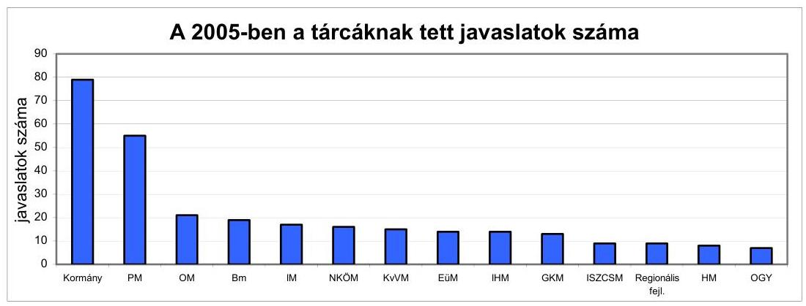

A tájékoztatók szerint az egyes tárcáknak címzett ajánlásaink közel 80\%-a megvalósult, illetve megvalósításuk folyamatban van.
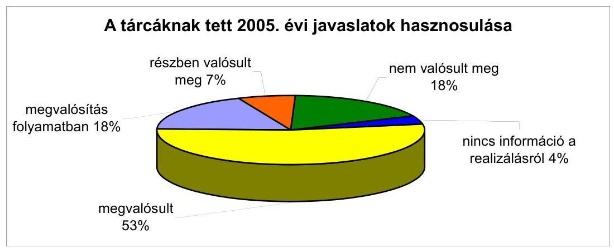

---

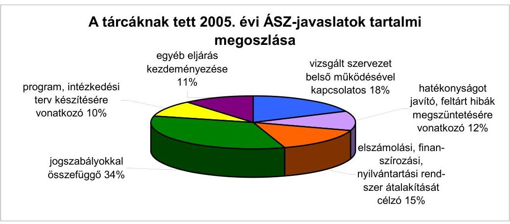

A jogi szabályozásra irányuló javaslatainkra beérkezett válaszok szerint $42 \%$-uk megvalósult, az esetek további mintegy $17 \%$-ában az intézkedések folyamatban vannak, vagy a jövőben tervezik megtenni azokat. A javaslatok 33\%-ára nemleges válasz érkezett, ezek a javaslataink jellemzően törvénymódosításokra vonatkoztak, néhány esetben a fennálló szabályozást megfelelőnek tartották. A fennmaradó $8 \%$-ra a válaszok nem tértek ki.

A javaslatok 18\%-a az ellenőrzöttek belső szabályozási rendszerének, illetve a fejezeti és a belső ellenőrzés múködésének felülvizsgálatát, továbbfejlesztését célozta, valamint a hatékonysággal és a racionalizálással kapcsolatos kezdeményezéseket tett. A beérkezett válaszok alapján e javaslatok 94\%-ával kapcsolatban konkrét intézkedések történtek, illetve az érintettek megkezdték a javaslatok hasznosításának előkészítését. A javaslatok 6\%-ában csak a jövőben tervezik azok megvalósítását.

A számviteli, nyilvántartási szabálytalanságok javítását, elszámolási, finanszírozási és nyilvántartási rendszerek korszerűsítését célzó javaslatokra beérkezett válaszok alapján azok 79\%-ával egyetértettek, a realizálás folyamatban van, vagy befejeződött. A fennmaradó esetekben a javaslatok válasz nélkül maradtak, illetve a válaszok nem adtak számot egyértelmúen a javaslat megvalósításáról.

A célszerúséget, hatékonyságot, eredményességet javító intézkedésre, illetve a feltárt hibák, hiányosságok megszüntetésére vonatkozó javaslataink $86 \%$-a talált kedvező fogadtatásra.

A javaslatok 10\%-a program, intézkedési terv készítését ajánlotta. A válaszok szerint ezek az ajánlások 100\%-ban pozitív fogadtatásra találtak, 52\% már megvalósult, $48 \%$ megvalósulása folyamatban van.

Az előzőekben már ismertetett konkrét törvényalkotáson és törvénymódosításon túlmenően a következőkben foglalható össze a Kormány tájékoztatása az ÁSZ javaslatainak hasznosításáról.

Az 1999-ben indult irányított betegellátási modellkísérletet az ÁSZ értékelése után az egészségügyi tárca és az Országos Egészségbiztosítási Pénztár szakértői csoportja is részletesen értékelte. A megállapítások az Országgyúlés Egészségügyi Bizottsága és a jövőbeni teendők meghatározása érdekében a Kormány elé kerül-

---

tek. Mindezek figyelembe vételével született meg az a döntés, melynek értelmében a modellkísérletet le kell zárni és tapasztalatait felhasználva létre kell hozni az irányított betegellátási rendszert. A kötelező egészségbiztosítás ellátásairól szóló 1997. évi LXXXIII. törvény (a továbbiakban: Ebtv.) és az egészségügyi szakellátási kötelezettségről, továbbá egyes egészségügyet érintő törvények módosításáról szóló 2001. évi XXXIV. törvényt módosító 2005. évi CLXXXII. törvény alapján az Ebtv. 38/C-38/D. §-a az Irányított Betegellátási Rendszerrel egészült ki. A törvénymódosítás felhatalmazása alapján megjelent az irányított betegellátási rendszerről szóló 331/2005. (XII.29.) Korm. rendelet, mely tartalmazza a pályázati kiírás és elbírálás részletes szabályait, a fejkvóta számítás és a keletkező bevételi többlet felhasználására vonatkozó szabályozást, valamint szabályozza az ellátásszervező megszűnésére és az IBR-ből való kilépésére vonatkozó szabályokat, annak ellenőrzését.

A Kormány az oktatási miniszter javaslatára a 2153/2005. (VI. 27.) Korm. határozattal a Nemzeti Kollégiumi Közalapítvány önállóságát megszüntette és tevékenységének folytatását - több más közalapítvánnyal együtt - a jogutódjaként létrehozott, kiemelkedően közhasznú szervezetként múködő Oktatásért Közalapítványban rendelte el.

A Magyar Export-Import Bank Rt. múködésének ellenőrzéséről szóló ÁSZ jelentés Kormánynak tett javaslataiban meghatározott legfontosabb feladatok a Magyarország középtávú külgazdasági stratégiájáról szóló 2169/2005. (VIII. 3.) Korm. határozat mellékletében kerültek összefoglalásra. A Kormány 1095/2005. (IX. 22.) számú határozatával jóváhagyta az MFB Rt. középtávú stratégiájának kiegészítését az EXIMBANK, illetve a MEHIB Rt. csoportszintú együttmúködésére. A gazdasági és közlekedési miniszter, mint az MFB Rt. feletti alapítói jogok gyakorlója a 34/2005.(IX. 30.) sz. Alapítói határozatának mellékletében részletesen meghatározta az EXIMBANK és a MEHIB Rt. tevékenységére vonatkozó legfontosabb célokat.

A Magyar Exporthitel Biztosító Rt. múködésének ellenőrzéséről szóló jelentésünkben tett javaslat hatására a 303/2005. (XII. 25.) Korm. rendelet 12. §-a és átmeneti rendelkezései tartalmazzák a MEHIB Rt. céltartalék szabályozása helyébe lépő, ún. meg nem szolgált díjak tartalékára vonatkozó új rendelkezéseket.

A természeti katasztrófák megelőzésére való felkészülés ellenőrzéséről szóló jelentésünk hatására módosult a szabadvízi tartózkodás szabályairól szóló kormányrendelet. A súlyos ipari balesetek megelőzése és az ellenük való védekezés érdekében elkészült a kockázatelemzés, valamint sor került a katasztrófavédelmi törvény és a 2/2001. (I. 17.) Korm. rendelet módosítására. A BM OKF szervezeti bázisán megalakult a Súlyos Ipari-baleset Elhárítási Védekezési Munkabizottság.

Az önkormányzatok által államháztartáson kívülre átadott pénzeszközök felhasználásával megvalósuló víziközmű beruházások finanszírozási rendszerének célszerűségéről szóló jelentésünkben foglalt javaslatok hatására a Kormány a 244/2005. (X. 31.) Korm. rendelettel módosította a lakáscélú állami támogatásokról szóló 12/2001. (I. 31.) Korm. rendeletet. A módosítás szigorította a víziközmű hitelek kamattámogatási szabályait, gátat szabva annak a gyakorlatnak, hogy a mesterségesen felduzzasztott beruházási költségekre államilag támogatott hitelt lehessen kapni.

A módosítással a kölcsön összegének meghatározása is megváltozott, így a beruházási összköltség fogalmának meghatározása szükségtelenné vált. A tőketörlesztési kötelezettség csökkentésére vonatkozó szabály beépült a kormányrendeletbe.

---

A víziközmú hitelek kamattámogatásának pénzintézetek által történő igénylését a regionális fejlesztésért és felzárkóztatásért felelős tárca nélküli miniszter és az érintett pénzintézetek között megkötött szerződés részletesen tartalmazza.

A Kormány a 249/2000. (XII. 24.) Korm. rendelet 2005. évi módosítása során figyelembe vette az ÁSZ azon javaslatát, hogy az egyedi értékelés számviteli elve előírásainál megjelenítésre kerüljön az egyszerúsített értékelési eljárás alá vont követelések csoportos értékelési lehetősége (a 319/2005. (XII. 26.) Korm. rendelet 5. §-a pontosította a számviteli szabályozást).

Az ÁSZ a tárcák vezetői által tett intézkedések végrehajtását további ellenőrzései során figyelemmel kíséri, jelentéseiben kitér ezek megvalósítására. A legfontosabb ÁSZ ajánlásokat és az ezekre adott válaszokat a 3. sz. melléklet foglalja össze.

Javaslataink hasznosításáról készített éves összefoglalón túl - ajánlásaink nyomán - a következő konkrét intézkedések valósultak meg az elmúlt négy évben. Több új vagy módosított kormányrendeletnél vették figyelembe az ÁSZ javaslatait, megállapításait, vagy azok egy részét:

A honvédelem tárgykörében az ÁSZ rendszeresen végez ellenőrzést. A négy éves ciklus éveiben megfogalmazott ajánlásaink hasznosulásaként az alábbiak emelhetők ki.

Az új Tárca Védelmi Tervező Rendszer (TVTR) életbeléptetésével, a Védelmi Tervezést Támogató Információs Rendszer (VTTIR) adatbázisainak folyamatos feltöltésével megadja a lehetőséget, hogy a honvédelmi tárca - a honvédség képességei alakításának és fenntartásának 2006-2015 közötti időszakra vonatkozó 10 éves terve (valamint az azt alátámasztó erőforrás- és költségszükségleti, illetve kiadási igénytervek) alapján - megfelelően prezentálja a védelmi költségvetésre vonatkozó javaslatait. A Magyar Köztársaság 2006. évi költségvetéséről szóló törvény megtárgyalásánál már ez a tíz éves terv képezte alapját a HM beterjesztett költségvetésének és parlamenti prezentációjának.

A képességek kialakítása és fenntartása érdekében végzett logisztikai ellátás (jellemzően közbeszerzések) ésszerúsítése, a párhuzamosságok megszüntetése, a beszerzések eredményesség szemléletű végrehajtása érdekében a honvédelmi tárca a saját belső szabályozóit - a szervezeti átalakításokat követően - folyamatosan felülvizsgálta, megújította.

A 2005. évi szervezeti korszerűsítés keretében hozták létre azt a szervezeti egységet, amelynek feladatául szabták az informatikai infrastruktúra fejlesztését megalapozó stratégia, átfogó szabályozások, illetve a biztonsági akkreditációhoz alkalmas dokumentumok kidolgozását.

2005-ben újraszabályozták a tulajdonosi és szakmai felügyelet gyakorlását és a szakmai követelménytámasztás rendjét a katonai képességek fenntartásához szükséges, de nem kifejezetten katonai feladatok ellátására létesített részvénytársaságok és közhasznú társaságok eredményes múködtetése érdekében.

Számos belső szabályozó kiadásával, a folyamatba épített előzetes és utólagos vezetői ellenőrzések hatékonyságának növelésével, a számviteli politika és a fe-

---

jezet számlarendjének aktualizálásával, a belső ellenőrzési jogosítványoknak az új szervezeti rendhez igazodó telepítésével igyekeztek kiküszöbölni, illetve a jövőben megelőzni a számvevőszéki éves minősítő vélemény kiadása alkalmával jelzett (de az elfogadást nem befolyásoló) hiányosságokat. A honvédelmi tárcánál az elfogadott szervezet-fejlesztési tervek teljesülésével érhetik el a megbízhatósági vizsgálatoknak a fejezet egészére történő kiterjesztését.

Az egészségüggyel összefüggő fontosabb ÁSZ javaslatokat illetően négy év távlatában a következők állapíthatók meg. A Kormány benyújtotta az Egészség Évtizedének Johan Béla Nemzeti Programját az Országgyúlésnek, amit az jóváhagyott. Az ágazatnál a hatékony forrásfelhasználás érvényesítését segítő monitoring rendszer kiépítése megtörtént. Továbbra sem kielégítő a fejezeti kezelésű előirányzatok felhasználásával kapcsolatos ellenőrzés, illetve annak dokumentálása. A sürgősségi ellátás fejlesztésére vonatkozó kormányzati koncepció jóváhagyása megtörtént. Az EüM vállalta, hogy megfelelő nyilvántartást készítenek a fejezeti kezelésű előirányzatok felhasználásáról. A minisztérium azt is vállalta, hogy az egészségügyi reform előkészítésével kapcsolatos szakmai dokumentumokat hasznosítja, továbbá intézkedett, hogy az intézmények készítsék el a még hiányzó szabályzatokat és szüntessék meg a munkaszerződés nélküli foglalkoztatásokat.

Az ÁSZ javasolta többek között, hogy a Kormány értékelje a társadalombiztosítási rendszer megújításának koncepciójáról, a rövidtávú feladatokról szóló 60/1991. (X. 29.) OGY határozatban foglaltak megvalósulását, valamint dolgozza ki és terjessze az Országgyúlés elé az egészségbiztosítás átalakítása hoszszú távú koncepcióját. A javaslatokat támogatták, de a javaslatok mindeddig nem valósultak meg.

Az önkormányzatok költségvetési kapcsolatainak, továbbá átfogó és egyéb ellenőrzéseinek nyomán több fontos jogszabály-módosítás történt.

Jelentősebb változás történt a települési önkormányzatok közötti jövedelemkülönbségek mérséklését célzó személyi jövedelemadó kiegészítése tekintetében. A jövedelemkülönbségek mérséklését célzó ÁSZ-javaslatok figyelembevételével a 2004. évi költségvetési törvény meghatározta az adóerő-képességgel összefüggő lemondásokból és az év végi elszámolásokból keletkező többletek önkormányzatok közötti elosztásának módját.

Többszöri javaslatunk eredményeként 2003-tól módosult az SZJA megosztása. A minden települési önkormányzatot feltétel nélkül megillető, elvileg szabad felhasználású hányad 5\%-ról 10\%-ra nőtt.

A fővárosi önkormányzat és a kerületi önkormányzatok közötti forrásmegosztás normatív módszereinek központi szabályozását évek óta több vizsgálatával öszszefüggésben javasolta az ÁSZ. A forrásmegosztás elveit, kereteit tartalmazó Ötv. módosítást követően az Országgyúlés megalkotta a forrásmegosztás normatív módszereiről szóló törvényt.

A címzett és céltámogatásokra irányuló vizsgálatokkal összefüggésben előrelépés történt az ÁFA levonási jog érvényesítésének gyakorlatában is 2002-től. A szabályozás módosítással a központi támogatás címzettje a beruházás megvalósítása időszakában nem változhat, és csak a gesztor önkormányzat nyújthatja be a teljesítést igazoló, kiegyenlítetlen, felülvizsgált számlát a pénzintézethez.

---

Az önkormányzati ellenőrzési feladatok szakmai követelményeinek központi meghatározására irányuló javaslataink figyelembevételével kiadásra került - az önkormányzati költségvetési intézményekre is kiterjedően - a költségvetési szervek belső ellenőrzéséről szóló 193/2003. (XI. 26.) Korm. rendelet.

A 2003. évi költségvetési törvény központosított jogcímként elfogadta a belső ellenőrzési társulások múködtetésének központi költségvetésből történő ösztönzésére, támogatására vonatkozó javaslatot.

A területfejlesztésről és a területrendezésről szóló törvény hatályba lépése óta a fejlesztési döntések decentralizációja tekintetében jelentős előrelépésként értékelhető, hogy javaslataink következtében a megyei területfejlesztési tanácsok mellett egyre nagyobb szerepet kapnak a regionális fejlesztési tanácsok is.

A normatív hozzájárulások rendszerében 2005-től a közoktatás területén a hatékony és gazdaságos méretű intézményhálózat kialakítását kiegészítő hozzájárulások ösztönzik. A szociális és gyermekjóléti ellátásban a lakónépesség alapján megállapított normatívák egy részét konkrét feladatmutatóhoz kapcsolódó hozzájárulások váltották fel, így e források azokhoz az önkormányzatokhoz jutnak el feladatarányosan, amelyek az adott tevékenységet ténylegesen ellátják. A 2006. évi költségvetési törvényben a 2004. évihez viszonyítva csökkent az egyes közoktatási feladatok ellátásához biztosított normatív kötött felhasználású támogatások jogcímeinek száma, a normatív állami hozzájárulásokba történő beépülésük mellett.

Az ÁSZ kezdeményezésére a 2005. évtől a költségvetési törvény határozza meg azt az összeghatárt, amely felett önkormányzati vagyont értékesíteni, a használat, a hasznosítás jogát átengedni csak nyilvános versenytárgyalás útján lehet.

Előrelépés, hogy a központosított előirányzatok igénylésének szabályait az érintett tárcák 2005-től rendeleti úton rögzítik.

Az államháztartáson kívüli önkormányzati támogatások vizsgálatával összefüggésben eredmény, hogy javaslatainkkal összhangban szigorodtak az államilag támogatott közmúhitelek kamattámogatási szabályai.

Az önkormányzati fürdők fejlesztési lehetőségeivel foglalkozó ellenőrzés javaslatai nyomán 2005-ben elkészült a Nemzeti Turizmusfejlesztési Stratégia 20062013. évekre szóló programja, amely az egészségturizmusra vonatkozó koncepció részeként tartalmazza a fürdőfejlesztések összehangolásának szándékát és a szakmai prioritások kijelölését. A turizmusról szóló törvény koncepciójának elfogadása a Kormány 2006. első félévi munkatervében szerepel. Az egészségturizmus fejlesztését a II. Nemzeti Fejlesztési Terv is tartalmazni fogja.

A címzett támogatásból finanszírozott egészségügyi beruházások ellenőrzése során tett javaslatnak megfelelően 2005-ben elkészült az Egészségügyi Fejlesztési Koncepció. A helyi önkormányzatok címzett és céltámogatási rendszeréről szóló törvény Országgyűlés előtt lévő módosítása lehetővé kívánja tenni a pályáztatási elemek erősödését és a nyilvánosság érvényesülését.

A köztemetők vizsgálatával összefüggő javaslat eredményeként a temetőkről és a temetkezésről szóló törvény 2005. évi módosítása lehetővé teszi, hogy a köztemetővel nem rendelkező önkormányzatok kegyeleti közszolgáltatási feladataikat ellátási szerződés keretében teljesíthessék.

Az önkormányzati közművelődési feladatellátást segíti a szakfelügyeletről 2005ben kiadott miniszteri rendelet.

---

Az országos kisebbségi önkormányzatok múködését meghatározó nemzeti és etnikai kisebbségi törvény - ÁSZ által is javasolt - 2005. év végi módosításával az önkormányzatok hivatalának jogi helyzete rendeződik, 2008. január 1-jéig országos költségvetési szervvé kell válnia.

A párttörvény felülvizsgálatára és a számviteli törvényhez igazítására, valamint a választási kampányfinanszírozás átláthatóságának és ellenőrizhetőségének szabályozására irányuló javaslatok hasznosulását gátolta, hogy a kétharmados törvények módosításához hiányzott a politikai konszenzus.

# 3.2.3. Javaslatok a vizsgált szervezeteknél 

A 2004. évi állami költségvetés végrehajtásának ellenőrzésekor, illetve a 2006. évi költségvetés véleményezésekor az ÁSZ valamennyi fejezet vezetője számára fogalmazott meg ajánlásokat, amelyek a múködés, a gazdálkodás, a beszámolás szabályzatainak elkészítésére, aktualizálására, a belső ellenőrzés megfelelő múködésére, a szükséges intézkedések megtételére vonatkoztak. Az ellenőrzöttek belső szabályozási rendszerére, illetve a fejezeti és a belső ellenőrzés múködésére vonatkozó megállapítások, javaslatok kapcsán a konkrét intézkedések megtörténtek.

Az Oktatási Minisztérium fejezet múködésének ellenőrzéséhez kapcsolódik, hogy 2005-ben elkezdődött az Oktatási Minisztérium felügyelete alá tartozó háttérintézmények múködésének számításokkal és elemzésekkel alátámasztott átvilágítása, amelynek eredményeként két miniszteri utasítás kiadásra került. Ezek végrehajtása, illetve a minisztérium külső tanácsadó céggel történő átvilágítása 2006. évre húzódott át, s a tervek szerint az első félévben kidolgozásra kerül az új szervezeti struktúrára vonatkozó javaslat.

A Vám- és Pénzügyőrség (VP) múködésének ellenőrzése során tett számvevőszéki javaslatok alapján a pénzügyminiszter intézkedett az értékesítendő lakások eladási árának meghatározásáról szóló PM rendelet módosításáról, valamint teljes körű felügyeleti vizsgálat lefolytatását rendelte el a VP gazdálkodásában tapasztalt törvénysértések tekintetében. A jövedéki adóbevételek realizálásának és a VP múködésének vizsgálati megállapításai és javaslatai alapján a pénzügyminiszter intézkedési terveket készített, ezek végrehajtására vonatkozóan azonban az ÁSZ utólagos ellenőrzést eddig nem végzett.

A természeti katasztrófák megelőzésére való felkészülés témakörben ellenőrzési megállapításaink, javaslataink figyelembevételével a Kormányzati Koordinációs Bizottság és a tárcák szintjén készültek intézkedési tervek. Ezek tartalmi összhangja megvalósult, azonban a fajsúlyos feladatokat elhúzódó határidővel határozták meg, így érdemi hasznosulásról még nem tudunk beszámolni.

A Kormánynak tett javaslataink között szerepelt a központosított illetményszámfejtés bevezetése, múködtetése tapasztalatainak áttekintése, és azok értékelésével a célszerű és hatékony múködtetés feltételeinek megteremtése. A központosított illetményszámfejtésről szóló kormányrendeletet módosításának előkészítő munkálatainál hasznosították az általunk többször jelzett tapasztalatokat. A programrendszert egységesítették, a feladatok ellátásának felelősségi rendszerét egyértelműen meghatározták.

---

Az ellenőrzött szervezeteknél számos intézkedés született az ISPA támogatásból megvalósított közlekedésfejlesztési programok ellenőrzése során az európai ügyekért felelős tárca nélküli miniszternek, valamint a gazdasági és közlekedési miniszternek tett javaslataink alapján.

Javaslatunkra a Kormány döntött 27 Mrd Ft értékű projekt előkészítési előirányzat létrehozásáról, amely a potenciális EU-projektek kidolgozása mellett az előkészítő dokumentációk minőségbiztosítását is fedezi. Az alap 17 közlekedési nagyprojekt előkészítéséhez 10 Mrd Ft támogatást és szakmai segítséget nyújt. A jelenlegi Kohéziós Alap projektek minőségbiztosítására, pénzügyi és műszaki felülvizsgálatára szolgáló hosszú távú szakértői bázis megteremtése és koordinált múködtetése érdekében az NFH-GKM-KvVM közös közbeszerzési pályázatot írt ki, amelyben szerződés kötésére 2005 decemberében került sor. A szerződés értelmében a szakértők 2007 közepéig rendelkezésre állnak. Fejlesztették az ISPA/Kohéziós Alapból származó támogatások felhasználásának irányítását a program és az ahhoz tartozó projektek végrehajtási ütemtervének tarthatósága érdekében.

A helyi önkormányzatok gazdálkodási rendszerének 2005. évi átfogó ellenőrzése során az ÁSZ vizsgálta a 2002-2004. években végzett különböző ellenőrzések során feltárt hiányosságok megszüntetése érdekében tett javaslatok megvalósítását. A javaslatok mintegy kétharmada a gazdálkodás szabályszerűségének biztosítására, közel egyharmada a gazdálkodás célszerűségének javítására irányult. Többségét (mintegy kétharmadát) maradéktalanul, egyharmadát részben, vagy egyáltalán nem valósították meg az önkormányzatok.
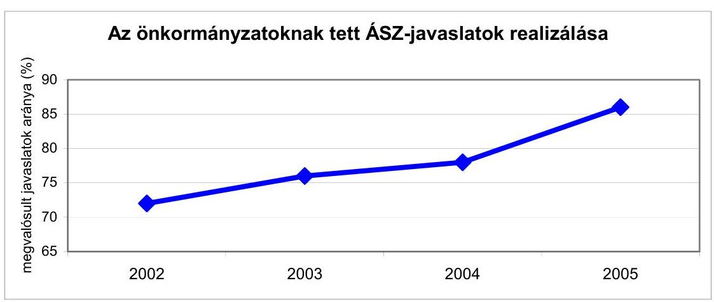

A javaslatok realizálását illetően továbbra is hiányosságok mutatkoznak a gazdálkodás szabályszerűsége tekintetében, amelyek főként a pénzügyi irányítási, ellenőrzési rendszerrel, a közbeszerzési eljárással, a helyi kisebbségi önkormányzatokkal való együttműködéssel kapcsolatosak. Az Önkormányzati képviselő-testületek több esetben is olyan döntéseket legitimáltak, amelyek nem mindenben feleltek meg az átláthatóság feltételeinek.

Kedvező, hogy a gazdálkodási rendszer átfogó ellenőrzésével érintett megyei, megyei jogú városi, Budapest fővárosi kerületi önkormányzatoknak tett ÁSZ javaslatok rövid időn belül hasznosultak. Többen már a helyszíni ellenőrzés ideje alatt intézkedtek a feltárt hiányosságok megszünte-

---

téséről, a mulasztások pótlásáról. Elfogadták a jogszabályi előírások betartásával, a gazdasági tevékenység ellátásával, a gazdálkodás átláthatóságával, célszerűségével kapcsolatos javaslatokat és intézkedési terveket készítettek azok realizálására.

# 3.3. Kezdeményezett büntetőeljárások, közérdekű bejelentések 

## Kezdeményezett büntetőeljárások

Az ÁSZ 2005-ben is eleget tett azon - a számvevőszéki törvényben és a büntetőeljárásról szóló törvényben meghatározott - kötelezettségének, melynek értelmében a nyomozó hatóság tudomására kell hoznia az ellenőrzései során feltárt bűncselekmény gyanújára vonatkozó megállapításait. Így büntetőeljárás alapja lehet minden olyan adatközlés, amely valamely bűncselekmény gyanúját a valószínűség szintjén - dokumentáltan - alátámasztja.

## A feljelentések évenkénti megoszlása

| Évek | Büntetőeljárás kezdeménye-   zéssel érintett vizsgálatok   száma | Feljelentéssel érintett személyek   száma |  |
| :--: | :--: | :--: | :--: |
|  |  | Összesen | ebből ismeretlen |
| 1993-2000 | 25 | 45 | 3 |
| 2001 | 3 | 3 | 1 |
| 2002 | 12 | 22 | - |
| 2003 | 8 | 8 | 6 |
| 2004 | 13 | 22 | 6 |
| 2005 | 5 | 7 | 2 |
| Összesen: | $\mathbf{6 6}$ | $\mathbf{1 0 7}$ | $\mathbf{1 8}$ |

Az ÁSZ megalakulása óta összesen 66, ebből 2005-ben 5 vizsgálat kapcsán kezdeményezett büntetőeljárást, mely összesen 109, 2005-ben pedig 7 bűncselekmény gyanúját jelentette. A korábbi évekhez hasonlóan 2005-ben is a leggyakrabban a számvitel rendjének megsértése gyanújával találkoztunk.

Az 1993-2005 közötti időszakban 33 esetben kezdeményeztünk büntetőeljárást a fenti bűncselekmény elkövetésének gyanúja miatt, ebből 2005-ben 2 esetben. Az ÁSZ vizsgálatai által feltárt második leggyakoribb cselekmény típus a jogosulatlan gazdasági előny megszerzése.

Összesen 21 alkalommal tártunk fel ilyen bűncselekményt, melyből 2005-ben 3 eset fordult elő. Hütlen kezelés gyanúja miatt eddig 18 -szor kezdeményeztünk büntetőeljárást, ebből 2005-ben 1 alkalommal, sikkasztás gyanúja miatt 4 ügyben tettünk feljelentést, 2005-ben 1 alkalommal.

---

# A feljelentések büncselekmények szerinti megoszlása (1993-2005) 

| Számviteli fegyelem, illetve a számvitel rendjének megsértése | 33 |
| :-- | :--: |
| Jogosulatlan gazdasági előny megszerzése | 21 |
| Hütlen kezelés | 18 |
| Hanyag kezelés | 10 |
| Csalás | 7 |
| Magánokirat-hamisitás | 7 |
| Sikkasztás | 4 |
| Hivatali visszaélés | 2 |
| Egyéb (adó-, tb.-i csalás, titoksértés, stb.) | 7 |
| Összesen: | 109 |

A helyi önkormányzatok gazdálkodásával kapcsolatosan több esetben kezdeményeztünk büntetőeljárást, mint az ÁSZ által vizsgált egyéb területeken, ugyanis az ÁSZ vizsgálatai által érintett területek nagy részén több ellenőrzésre jogosult állami szervvel is találkozhatunk, addig a helyi önkormányzatok gazdálkodásának a vizsgálata kizárólag az ÁSZ feladat- és hatáskörébe tartozik. Előfordult, hogy fiktív források mellett pályáznak, gyakoriak a számviteli hiányosságok, határidőre a felvett előleggel nem tudnak elszámolni, szabálytalan a költségtérítés gyakorlata, stb.

A tavalyi év kiemelkedő ellenőrzései közé tartozott az úgynevezett ÖKOTÁM vizsgálat, melyhez kapcsolódóan büntetőeljárás is indult. Az ÖKOTÁM rendszer az önkormányzati út és csatorna beruházások egy sajátos, több lábon álló finanszírozási módja. A jelentésünk alapján az Országgyúlés a 2004. évi zárszámadásról szóló törvényben felkérte az ÁSZ-t, hogy vizsgálja meg a központi költségvetés által 2005 végéig az önkormányzatokhoz út- és szennyvízcsatorna építés címén átutalt közmúfejlesztési támogatás igénylésének és felhasználásának jogszerűségét, különös tekintettel az ÖKOTÁM és hasonló rendszerben megvalósuló beruházásokra. A felkérés alapján az országos vizsgálat folyamatban van.

Egyre gyakoribb, hogy a más (magánszemély, hivatalos szerv) által kezdeményezett büntetőeljárásban a nyomozó hatóságok igényt tartanak az ÁSZ vizsgálati megállapításainak megismerésére. A 2005. évben 33 esetben fordult elő ilyen jellegű megkeresés. Fontos fejlemény a Btk. 2005-ös módosítása - ennek indokolása az ÁSZ ellenőrzési tapasztalatára is hivatkozik -, mely szerint a számvitel rendjének megsértése gondatlanság esetén is büntetendő, amennyiben annak eredményeképpen a gazdasági helyzet áttekintése (az ellenőrzés) meghiúsul.

A helyszíni vizsgálatokat végző számvevők munkájának segítése céljából a 2005-ben belső használatra elkészítettünk egy gyakorlati büntetőjogi segédletet, amely az eddigi tapasztalataink felhasználásával részletesen elemzi az ÁSZ ellenőrzései során gyakran előforduló bűncselekmények gyanúja megalapozásának feltételeit és célja, hogy hozzájáruljon az ÁSZ büntetőeljárás kezdeményezésével kapcsolatos gyakorlatának továbbfejlesztéséhez.

---

# Közérdekú bejelentések 

Az ÁSZ-hoz beérkező közérdekű bejelentések, javaslatok és panaszok (továbbiakban: bejelentések), valamint a hivatalos szervektől kapott megkeresések száma hosszú évek alatt 2005-ben volt a legnagyobb, 399 db (ebből 293 volt a bejelentés és 106 a megkeresés).
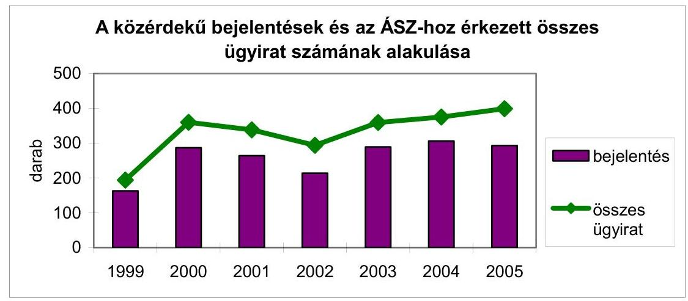

Az ÁSZ-hoz érkezett bejelentések - bár többnyire konkrét kérést fogalmaznak meg - érzékeny „visszajelzést" adnak a hazai közpénzfelhasználás gyakorlatáról, annak anomáliáiról, az adott környezet (település, térség, szakterület) hangulatát meghatározó körülményekről, egyes szabályok hatályosulásáról, emellett egyfajta bizalmat is kifejezésre juttatnak munkánkkal, vizsgálatainkkal kapcsolatban. A megkeresésekben - túlnyomórészt - az ÁSZ jelentéseit, a különböző tartalmú kérdésekhez kapcsolódó állásfoglalását kérték, illetve számvevőszéki ellenőrzés lefolytatását (indítását) kezdeményezték.

A bejelentések mintegy háromnegyedét 2005-ben is a lakosságot érintő önkormányzati intézményi szolgáltatásokkal, a mindennapi életvitelt befolyásoló igényekkel, lehetőségekkel és korlátokkal, a helyi önkormányzatok gazdálkodásával, az önkormányzati vezetők vélt, vagy valós visszaéléseivel kapcsolatos beadványok tették ki. Az elmúlt négy év viszonylatában lényegesen megnőtt az állami szervek és intézmények múködésére vonatkozó vizsgálatok iránti igény. 2002-ben egyáltalán nem, 2003-ban az esetek 4\%-ban, 2004-ben 6\%ban fordult elő ilyen jellegű ellenőrzés kérés.

Az elmúlt hat év átlagához (18\%) képest 2005-ben a bejelentéseknek mintegy 11\%-a került az ÁSZ-hoz áttétel folytán más szervektől (APEH, ügyészség, rendőrség). Kismértékben csökkent az a tendencia, hogy a hivatalos szervek a hozzájuk beérkező helyi önkormányzatok gazdálkodását és az állami, illetve központi közigazgatási szerveket érintő bejelentéseket - az ellenőrzési hatáskörök alaposabb vizsgálata nélkül - azonnal az ÁSZ-hoz továbbítják.

A bejelentést tevők - csoportonkénti - megoszlása közel változatlan. Az elmúlt hat évben érzékelhető viszont, hogy a névtelen (27\%) és a magánszemélyektől (45\%) érkező bejelentések számának lassú csökkenése mellett folyamatosan növekszik az országgyűlési és önkormányzati képviselőktől, a helyi önkormányzatok polgármestereitől, jegyzőitől (16\%) érkező, továbbá az önkor-

---

mányzati intézmény alkalmazottaitól (vezetőitől) és - zömmel valamelyik helyi önkormányzattal kapcsolatban álló - gazdasági társaság, szakszervezetek, egyesületek, alapítványok, stb. képviselőitől (12\%) érkező bejelentések számaránya. A névtelen bejelentések száma több év átlagában hasonló (80-90 közötti). Ezeket is tartalmuk szerint hasznosítjuk és juttatjuk el az illetékes szerveknek, vagy az ÁSZ ellenőrzési igazgatóságai kapják meg figyelemfelhívásként.

A bejelentések növekvő hányada (20\%) valamely ellenőrzési programhoz illeszthetően kivizsgálható. E mellett emelkedett azon bejelentések száma, amelyeket az ÁSZ vizsgálatra adott át a hatáskörrel rendelkező szervnek (valamely fejezet, önkormányzat). A megkeresettek visszajelezték intézkedésük, vizsgálatuk eredményét.

# 3.4. A számvevőszéki tevékenység nyilvánossága 

A számvevőszéki tevékenység nyilvánosságát biztosítja a jelentések és tanulmányok megismertetése, tájékoztatás az ellenőrzés nemzetközi kapcsolatainak eseményeiről, az állami-, társadalmi közélet szereplőivel, intézményeivel létrejövő együttműködésekről, -párbeszédről, a pénzügyi ellenőrzés szakmai eseményein való részvételről, továbbá a szervezet gazdálkodásának, működésének jellemzőiről ${ }^{36}$.

Kiemelt kommunikációs feladatnak tekintettük 2005-ben is az Országgyúlés ellenőrző és törvényhozó munkájának segítését. Az országgyúlési képviselőkhöz nyomtatott és elektronikus úton juttattuk el a jelentéseket és az ellenőrzési programokat. Az ÁSZ elnöke a többéves gyakorlatnak megfelelően különkülön, minden jelentésről tájékoztató levélben hívta fel a képviselők figyelmét a legfontosabb megállapításokra, javaslatokra.

A közvélemény tájékoztatására a sajtó közvetítő szerepét vettük igénybe, de legnagyobb részben az internetes honlapunk lehetőségeit használtuk ki. A jelentések és módszertani kiadványaink, sajtóanyagaink közzétételében tovább növeltük az elektronikus terjesztést.

A kommunikációs módszerek differenciált alkalmazása és a 2006-2010. évi kommunikációs feladatok megalapozása érdekében, az ÁSZ ismertségéről közvélemény kutatást végeztettünk a TÁRKI Társadalomkutatási Intézettel. A kutatás rámutatott, hogy a lakosság a rádióból, a televízióból szerzi a legtöbb információt az ÁSZ munkájáról.

A médiával való kapcsolattartás a számvevőszéki kommunikációs tevékenység egyik legfontosabb része. Jelentéseinket megküldtük a szerkesztőségeknek is. A több éves gyakorlat szerint az összefoglalókat megjelentettük a Magyar Közlöny mellékletét képező Hivatalos Értesítőben, az önkormányzatokkal

[^0]
[^0]:    ${ }^{36}$ Az elmúlt 10 év összehangolt, a külső arculati elemeket érintő fejlesztései egy hagyománytisztelő, mértéktartó megjelenést eredményeztek. Stratégiánk megvalósítása érdekében az eddigi eredményekre támaszkodva, az arculati elemek alkalmazási szabályainak rendszerbe foglalásával fejlesztjük intézményi arculatunkat.

---

kapcsolatos vizsgálatokról a valamennyi helyi önkormányzathoz eljutó Önkormányzati Tájékoztatóban és önkormányzati szaklapokban is rendszeresen adtunk információt.

A sajtó képviselőit, vezető munkatársait is meghívtuk rendezvényeinkre, továbbá elnöki „háttér-beszélgetéseket" szerveztünk számukra. Negyedévenként illetve a nagyobb közérdeklődést kiváltó jelentések nyilvánosságra hozatalánál, a szervezet múködéséhez kötődő kiemelt események alkalmával elnöki sajtótájékoztatókat tartottunk. Négy alkalommal tartottunk 2005-ben Budapesten az ellenőrzések szakmai tapasztalataival kapcsolatos főigazgatói sajtótájékoztatót. A sajtótájékoztatókon rendszeresen részt vettek az Országgyúlés szakbizottságainak munkatársai is ${ }^{37}$.

Az ország különböző, megyei- és megyei jogú városi önkormányzatainál végzett vizsgálatokról az önkormányzatokkal közösen, tizenhárom alkalommal tartottunk sajtótájékoztatót.

Az Observer Médiafigyelő, valamint a saját-, évről-évre korszerűsített média feldolgozó munkánk adatai szerint az ÁSZ-szal kapcsolatos publikációk száma éves szinten a 2002-ben regisztrált 1408 esetről 2005-re 4275 esetre növekedett ${ }^{38}$.

Kommunikációs szempontból a 2004-2005. év különbözött a korábbiaktól, mert a jelentős költségvetéssel gazdálkodó önkormányzatok átfogó ellenőrzéséről megjelent ÁSZ-jelentések száma jelentősen növekedett és ezt követte az ÁSZ-ról szóló tudósítások emelkedése is, különösen vidéken.
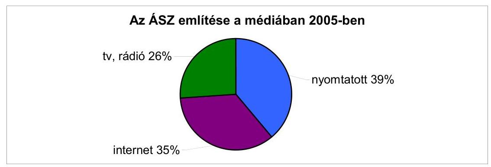

A legnépszerűbb az internetes honlapunk volt, amelynek a nyitó oldalára látogatók száma négy év alatt több mint háromszorosára emelkedett és 2005ben elérte a 104 ezret (ez 285 látogatót jelent átlagosan az év minden napján). Itt a jelentések teljes szövege, az országgyúlési képviselőknek címzett figyelemfelhívó összefoglalók, továbbá a szervezettel és a múködéssel kapcsolatos információk, közérdekú adatok érhetők el.

[^0]
[^0]:    ${ }^{37}$ A parlamenti sajtótájékoztatókat az érdeklődők az elmúlt évtől kezdődően élőben követhetik az ÁSZ honlapján, illetve azok később is visszajátszhatók.
    ${ }^{38}$ 2002-ben még nem regisztráltuk az Internet újságok közléseit és a vidéki tudósítások teljes körű megfigyelése is csak 2004-ben kezdődött.

---

A látogatók számlálásának bevezetésétől, nyolc hónap alatt közel 63000 esetben töltöttek le jelentést, több mint 2700 alkalommal nyitottak meg kísérőleveleket és 374 alkalommal angol nyelvű összefoglalókat.
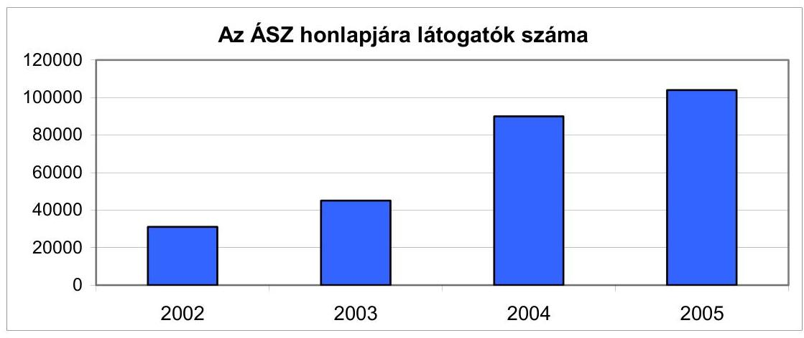

A legnagyobb hangsúlyt az internetes közönségkapcsolatok fejlesztésére helyeztük. Jelenleg három lehetőséget kínálunk a lakosság kérdéseinek, észrevételeinek elektronikus úton, internetes kapcsolaton keresztül történő fogadására. Az ÁSZ honlapján található Fórum rovaton az „ÁSZ fóruma" és az „Elnöki fogadóóra" várja a kérdéseket, észrevételeket.

A visszajelzésekre nyújt lehetőséget a 2004. februárban közzétett központi email cím (szamvevoszek@asz.hu), valamint a 2005-ben bevezetett honlap elégedettségmérő űrlap. A gyakorlat azt mutatta, hogy a lakosság szívesen él ezekkel a kommunikációs lehetőségekkel.

Az internetes fórumunkba érkező hozzászólások többségükben továbbra is az önkormányzatok gazdálkodásával voltak kapcsolatosak. A két alkalommal megtartott elnöki fogadóórára érkezett kérdések többsége szintén az önkormányzatok múködésével, illetve gazdálkodásuk ellenőrzésével volt kapcsolatban, több esetben számvevőszéki ellenőrzést is javasolva, az ellenőrzési megállapítások, javaslatok fokozottabb hasznosítását elvárva.

Fokozott figyelmet fordítunk az egyetemi, főiskolai diákoknak a pénzügyi ellenőrzéssel történő megismertetésére. Ma már öt különböző felsőoktatási intézménnyel van együttműködési megállapodás, a vezetők és munkatársak rendszeresen oktatnak ezekben a tanintézetekben, és harmadik éve fogadunk parlamenti ösztöndíjas diákokat, megismertetve velük az ÁSZ múködését.

Könyvtárunk a belső tájékoztatást és a külső érdeklődőket is szolgálva, korlátozottan nyilvános, tudományos igényű szakkönyvtár, az ÁSZ szakmai információs központja. Az információs társadalom kihívásainak megfelelően folyamatosan bővítettük a Könyvtár adatbázisait, az elektronikus szolgáltatások körét (az elektronikus dokumentumok aránya a 2002. évi 12\%-ról 2005-ben már $30 \%$-ra emelkedett).

---

# 4. Az ellentőrzési munka minősÉGÉneK FejlesZTÉse 

### 4.1. Humánerőforrás gazdálkodás és fejlesztés

## Személyi feltételek

Az ÁSZ dinamikusan változó nemzetközi, illetve hazai gazdasági-pénzügyi, szakmai és szervezeti környezetben múködik, ami a követelmények elmozdulásában, valamint a belső szervezeti és személyi mozgások, tendenciák irányában és felgyorsulásában jól érzékelhetővé vált. A személyi állomány változása, megújítása során alapvető követelményként érvényesítettük az intézmény feladatellátásának folyamatosságát, stabilitását. Szervezetünk személyi állományának fel kellett készülnie az EU-ban standard követelménynek tekintett „legjobb ellenőrzési gyakorlat" hazai feltételek szerinti adaptálására és alkalmazására.

Az elmúlt öt évben két irányban is meghatározó személyi-szervezeti elmozdulások következtek be. Egyik a feladat-struktúra átrendeződése folytán szükséges számvevői létszám-elemelkedéssel, másik a szakember-állomány életkori megoszlásának lényeges változásával függ össze. Az Országgyűlés több lépcsőben, fokozatos létszámfeltöltéssel engedélyezte az ellenőrzési kapacitások bővítését. Az ellenőrzési feladatok, vezetési-irányítási funkciók új rendjét jelentős átszervezéssel alakítottuk ki. Ezzel egy időben indult meg az 51 év átlagéletkorral rendelkező számvevői állomány fiatalítása. A célul tűzött egészségesebb élet-kor-megoszlás érdekében a létszámbővítés során, valamint a megüresedő álláshelyekre fiatalabb - részben pályakezdő - szakemberek felvételét szorgalmaztuk. Így az ellenőrök átlagéletkora jelentősen csökkent. 2005-ben az ÁSZ dolgozóinak átlagos életkora 48,3 év, amelyhez képest a számvevő vezetőké magasabb ( 53,8 év), a beosztott számvevőké viszont alacsonyabb (47,2 év).
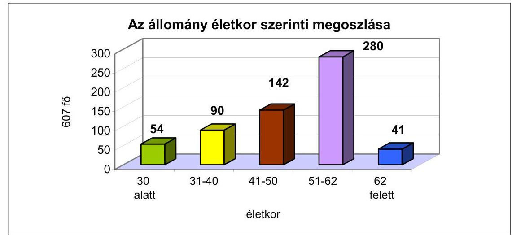

2001-től 2004-ig az ÁSZ létszáma - a feladatbővítéshez kapcsolódóan - közel $30 \%$-kal nőtt, kialakult az engedélyezett 618 fős maximális létszám (amelybe a FEMI közalkalmazotti álláshelyei is beletartoznak). Létszámnövekedés 2005ben és 2006-ban nem volt, ahogy azt jeleztük az 1.1. pontban. 2005. december

---

31-én 607 fő volt állományban, ebből heten határozott időre kinevezett, helyettesítő munkatársak. Az álláshelyeket betöltöttük. Összességében nem jelentős személyi mozgások (nyugdíjazás, minőségi személycserék) miatt csak átmeneti ideig adódtak betöltetlen álláshelyek. A kinevezett állomány stabilitására jellemző, hogy az utóbbi években a fluktuálódás (távozások, új belépések) csak a munkakörök 6-8\%-át érintette.
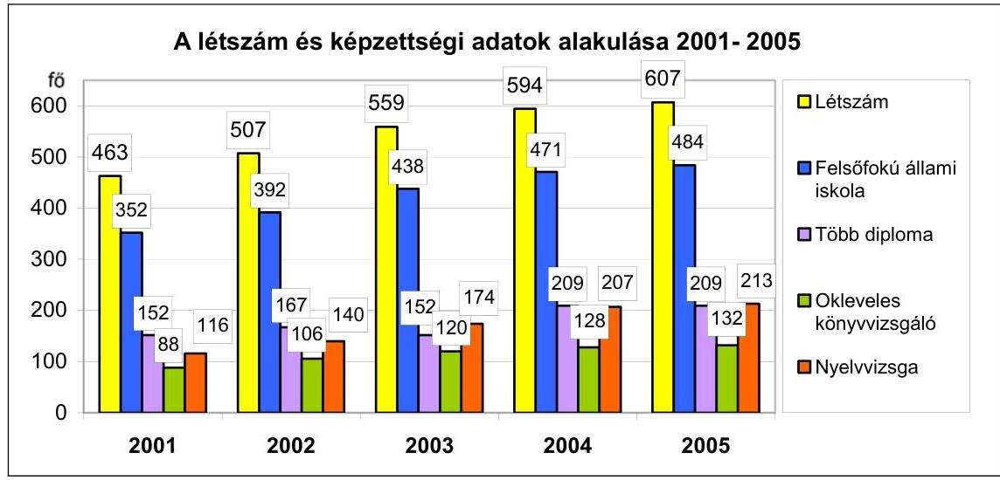

A felkészültségi adatokból külön kiemeljük, hogy számvevőink között 132 okleveles könyvvizsgáló és 125 mérlegképes könyvelő van. 209 munkatárs két diplomával rendelkezik, 30 főnek kettőnél több diplomája van. Jelenleg 202 munkatárs rendelkezik a kiemelten kezelt uniós nyelvek (angol, francia, német) legalább egyikéből állami nyelvvizsga-bizonyítvánnyal.
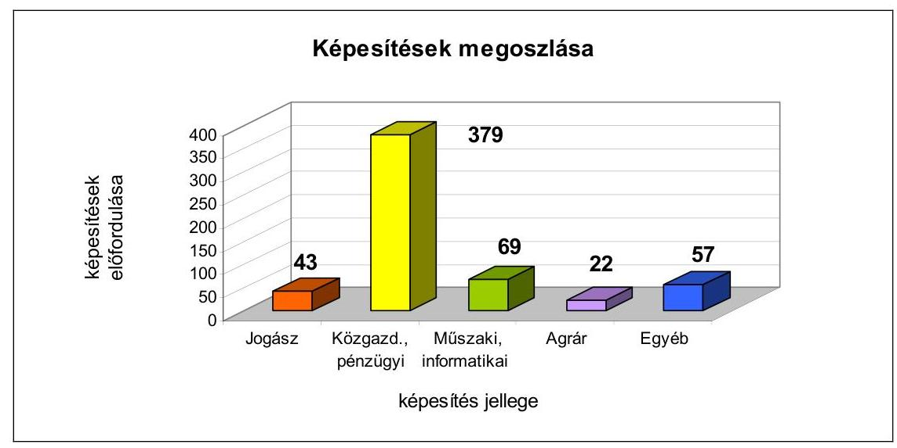

Az ÁSZ-nál - az elnökön, főtitkáron, főigazgatókon és a további vezetőkön kívül - számvevők, legalább középfokú végzettségű köztisztviselők, ügykezelők és fizikai alkalmazottak dolgoznak. A már említett létszámfejlesztés, majd fel-adat-átszervezés során a közvetlen ellenőrzési kapacitások növelésére törekedtünk, az ellenőrök számát egyes adminisztratív és fizikai munkakörök megszüntetésével is növeltük.

---

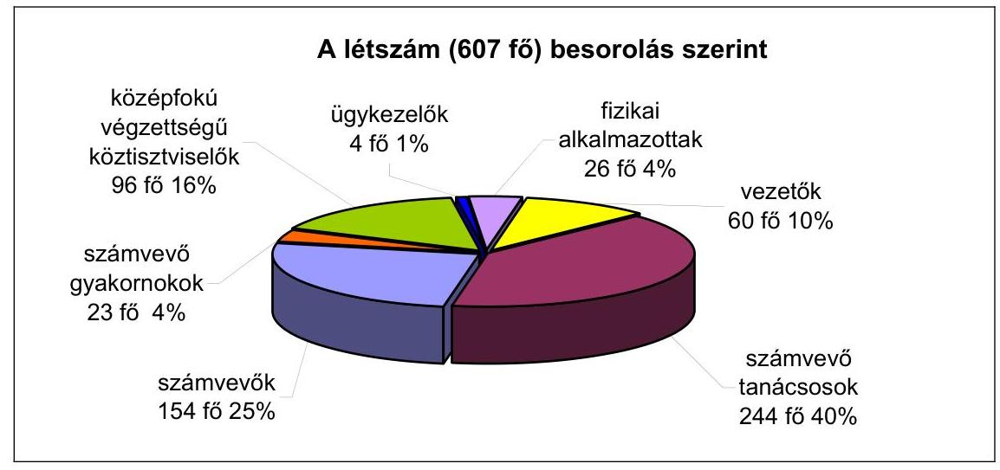

Az előmenetel a teljesítményekkel és az életkorral (szolgálati idővel) van közvetlen összefüggésben. A kellően határozott és következetes ellenőrzési tevékenység a korszerú közgazdasági, pénzügyi-számviteli ismeretek mellett megfelelő munkahelyi-vizsgálati tapasztalatokat és erkölcsi szilárdságot is feltételez, így a számvevői kar fiatalításának ésszerú korlátai vannak. A számvevő gyakornokok száma viszonylag alacsony. Részben a behatárolt számú felvételük (önállóan nem ellenőrizhetnek), részben pedig 3-4 év utáni számvevői előlépésük miatt. A napi ellenőrzési feladatokban meghatározó szerepet vivő szakem-ber-állomány többnyire középkorú, és „számvevő tanácsos" besorolásban van. A kiemelkedő egyéni teljesítményt nyújtó tanácsosoknak az ÁSZ elnöke tanácsadó vagy főtanácsadó címet adhat, számuk 2005-ben 43, illetve 66 volt.

A számvevők előmeneteli lehetőségei a 90-es évekbeli ütemhez képest beszúkültek. Ennek ellensúlyozására az intézmény differenciáltabb előmeneteli rendszert határozott meg. A középtávú generációváltás programja során nagyobb arányban bekerült fiatalabb számvevők és számvevő gyakornokok előlépési várakozási ideje megnőtt. Ebben az EU standard követelmény-szintnek megfelelő felkészülési idő kitolódása mellett az ütemes, kiszámítható előmenetelhez szükséges anyagi források korlátai is szerepet játszanak. Az egyéni teljesítmények követésének és reális értékelésének jelentősége megnőtt, belső minősítési és értékelési rendünk szabályait és gyakorlatát ennek megfelelően formáljuk.

Az ÁSZ vezetőivel és számvevőivel szemben - a társadalmi és szakmai elvárásoknak megfelelően - magas erkölcsi-etikai követelményeket érvényesítünk. A törvény szigorú összeférhetetlenségi szabályait a felvételeknél, majd folyamatosan is vizsgáljuk. A köztisztviselők vagyonnyilatkozat-tételi kötelezettsége munkatársaink többségére kiterjed, a nyilatkozatok kezelése és ellenőrzése (az ÁSZ elnökének vagyonnyilatkozata kivételével) szervezeten belül történik. 2003-ban - az INTOSAI Limai Nyilatkozatának etikai előírásai szellemében elkészítettük és közzétettük számvevőszéki magatartásszabály-gyűjteményünket, amelynek megismertetését és értelmezését felkészítési rendszerünkben folyamatosan napirenden tartjuk. Fegyelmi eljárásra szervezetünknél évek óta nem volt ok.

---

Az ellenőrzési munka - kivált a távolabbi helyszínre utazással járó ellenőrzés a számvevőktől nemcsak állandó szellemi készültséget kíván, de alkalmanként komoly idegi és fizikai igénybevételt is jelent. A hivatali feladatokat ellátók munkaidejük nagyobb részét számítógép-képernyő előtt töltik. Dolgozóink egészségi állapotának védelme érdekében a foglalkozás-egészségügyi szolgáltatásokat is folyamatosan fejlesztjük. 2005-től a fővárosi munkatársak ellátását kitűnően felszerelt szolgáltató, a SOTE II. sz. Belgyógyászati Klinika végzi, ami lehetőséget ad megyei irodák munkatársainak évenként ismétlődő, alapos egészségügyi szűrővizsgálatára is. Korszerű, szemkímélő monitorokat rendszeresítettünk, gondoskodunk a képernyő előtti munkavégzés kedvezőtlen hatásainak kontrolljáról, valamint anyagi lehetőségeink függvényében kompenzálóés védőszemüvegek biztosításáról.

# Belső továbbképzés 

A 90-es években kialakítottuk a sajátos szakmai szükségleteknek és igényeknek megfelelő belső felkészítés, illetve továbbképzés szervezeti kereteit. 2000-től új kihívásokkal néztünk szembe: számvevőinket az EU-standard szakmai követelményeinek és a „legjobb gyakorlat" megismerésére, majd a módszerek alkalmazására kellett felkészíteni. Az angol társintézménnyel (NAO) kötött twinning-megállapodás keretében az elméleti-módszertani ismeretek átvétele mellett a gyakorlatban, közös vizsgálatok tapasztalatainak elemzésével munkáltuk ki a legkorszerűbb vizsgálati szabványok, eszközök, technikák hazai adaptációs lehetőségeit. A több éves programban belső oktatásunk és képzésünk szervezésére - mivel nemcsak a számvevők, hanem más hazai ellenőrzési szakemberek ismereteit, szemléletmódját is meg kellett újítani - fokozott felelősség és munkateher hárult. A továbbképzési mechanizmus múködtetésébe szinte valamennyi ellenőrzési egység aktívan bekapcsolódott, ami az elmélet és gyakorlat, tanítás és tanulás, belső és külső képzések szoros egységét teremtette meg.
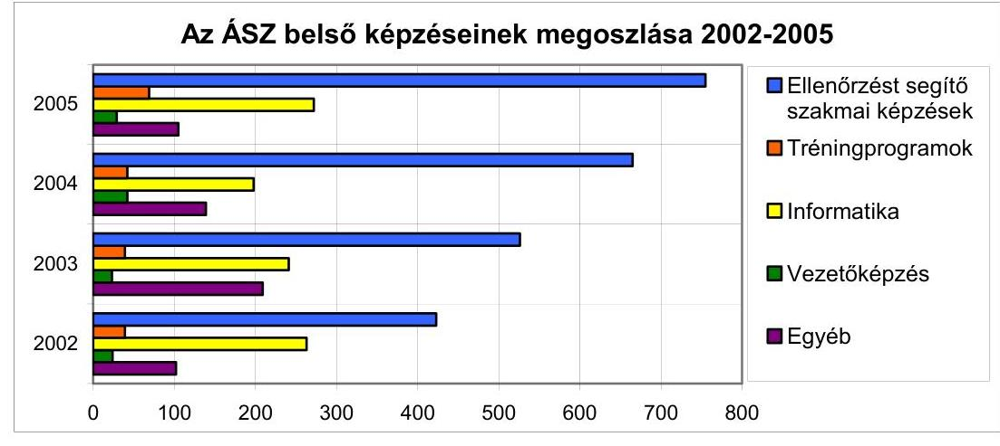

A legfőbb képzési célokat 1998-tól középtávú tervekben tűzzük ki, amelynek kialakítása során az ÁSZ ellenőrzési stratégiájában foglaltakat, az INTOSAI és az EUROSAI oktatási irányelveit, valamint a hazai közigazgatás-fejlesztés központi célkitűzéseit is figyelembe vesszük. A középtávú továbbképzési célokat éves tervekben konkretizáljuk.

---

Szakmailag a szorosabb értelemben vett belső szervezésú továbbképzések a legfontosabbak, amelyeken a napi feladatok ellátásához, illetve a vizsgálatfejlesztéshez szükséges ismeretanyagot közvetítjük, az ellenőrzéshez és jelentéskészítéshez nélkülözhetetlen készségeket fejlesztjük.
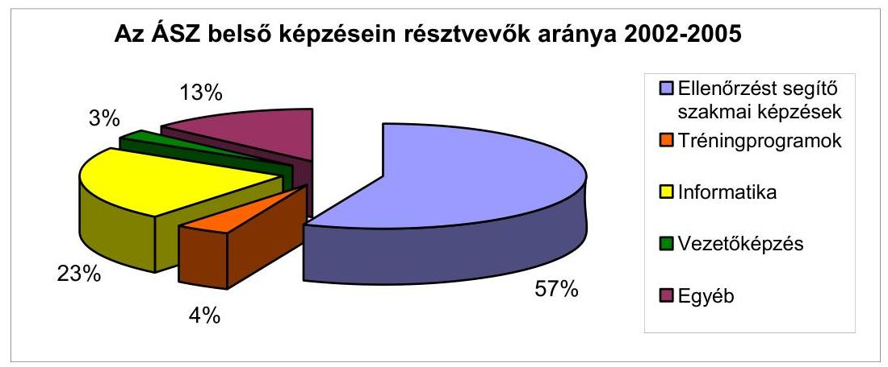

Ha az adott ismeretek a munkaköri feladatok magasabb színvonalú elvégzését szolgálják, az ÁSZ a vonatkozó jogszabályok és belső utasítások szerint tanulmányi szerződéssel, általában 50-50\%-os költségviselési arányban támogatja a tanulmányokat. 2002. és 2005. között összesen 91 munkatárssal kötöttünk tanulmányi szerződést, amelyből a múlt évben - átlagosnak tekinthető - 73 „élő" szerződésünk volt. Az új szerződések kötése, illetőleg a régebbiek kifutása középtávú időszakban lényegében kiegyenlítik egymást.
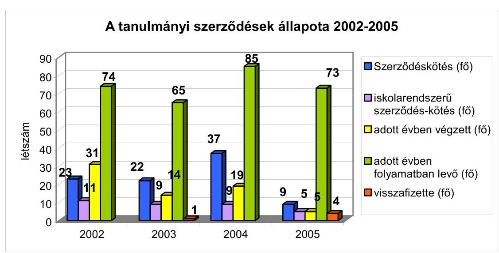

Tanulmányi szerződéssel elsősorban az ellenőrzést segítő másoddiploma megszerzését (pl. jogász-közgazdász, mérnök-közgazdász), illetve az informatikai ismeretek bővítését támogatjuk. Az ügykövető-adminisztrációs feladatkörök ismeretigényének gyors növekedése folytán indokolttá válik középfokú végzettségű munkatársak diplomaszerzése is.

---

Az EU-csatlakozás, valamint a nemzetközi szakmai munkakapcsolataink különösen fontossá tették az angol és francia nyelvnek az ismeretét, illetve az idegen nyelvi képzettség és készségek általános fejlesztését. A nyelvtanulás támogatásának alapformáját a számítógépen szinte minden munkatárs által elérhető, különböző szinteken kommunikáló szoftverek adják, emellett azonban jelentős a részvétel különböző nyelvi kurzusokon: 2002-től 2005-ig 113 főt iskoláztunk be nyelvi készségfejlesztésre.

Az ellenőrzés-szakmai, valamint idegen nyelvi ismeretek fejlesztésének leghatékonyabb módja, ha munkatársaink - meghívás vagy pályázat alapján hivatalos kiküldetésben - külföldön szereznek tapasztalatokat. A külföldi társintézményekkel kialakított együttmúködés gyakran komplex formában jelenik meg, az ösztöndíjas és más, rövidebb továbbképzések, tanulmányutak mellett közös ellenőrzések, vizsgálat-elemzések, tapasztalatcserék is beletartoznak. Az elmúlt négy évben 21 munkatársat delegáltunk a nemzetközi szakmai együttműködés különböző rendezvényeire. Visszatérően pályázati lehetőséget kapunk az Amerikai Egyesült Államok Számvevőszéke (GAO), az Európai Számvevőszék (ECA), az indiai nemzetközi ellenőrzési továbbképző központ, újabban az IDI továbbképzéseire. Annak érdekében, hogy a gyorsan bővülő két- és többoldalú nemzetközi szakmai kapcsolatokban munkatársaink minél nagyobb számban és eredményesen pályázhassanak külföldi továbbképzésekre, 2002-ben főként fiatalabb kollégák felkészítésére 22 fős célcsoportot alakítottunk. Az így számításba vett munkatársak száma 2005-ben 66 főre bővült.

Saját munkatársai továbbképzése mellett, külső oktatásként az ÁSZ 2000-től szerepet vállalt a minisztériumok és intézményeik belső ellenőreinek, illetve könyvvizsgálók és más ellenőrzési szakemberek szakmai képzésében. E továbbképzéseinkre évente egyre többen jelentkeznek. Kezdetben alapozó, majd a gyakorlati alkalmazásra is kiterjedő, összetett vizsgálati ismereteket közvetítünk az általunk kimunkált tematika és szemléltető rendszer szerint. A financial audit kurzus ma már a Magyar Közigazgatási Intézet akkreditált programjai között szerepel.
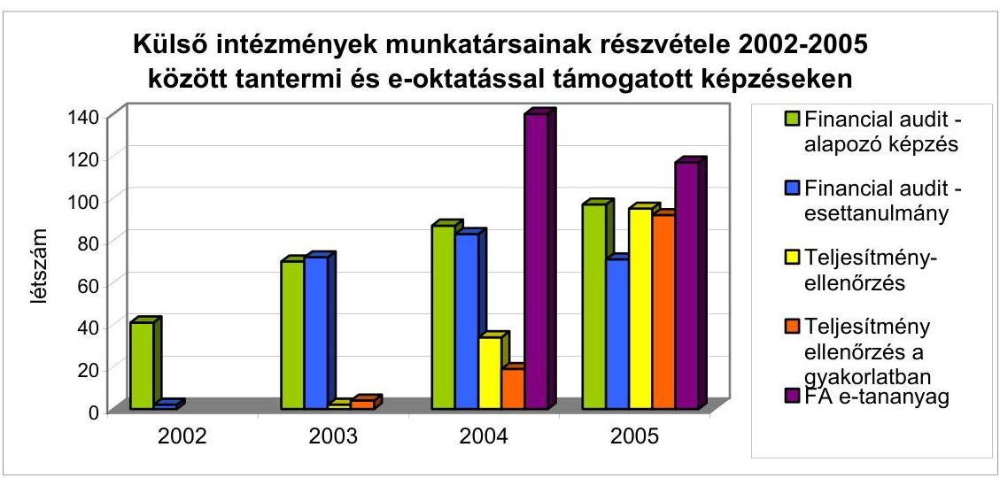

---

# Az ÁSZ oktatási-továbbképzési költségeinek alakulása 2000-2005 között 

|  | $\mathbf{2 0 0 0}$ | $\mathbf{2 0 0 1}$ | $\mathbf{2 0 0 2}$ | $\mathbf{2 0 0 3}$ | $\mathbf{2 0 0 4}$ | $\mathbf{2 0 0 5}$ |
| :-- | :--: | :--: | :--: | :--: | :--: | :--: |
| költség (millió Ft) | 11,2 | 17,6 | 24,6 | 23,9 | 29,3 | 30,4 |
| költség egy főre   (ezer Ft) | 26,1 | 38,1 | 49,0 | 43,1 | 49,7 | 50,6 |

Megjegyzés: A táblában a közvetlenül megjelenő költségek szerepelnek, a szervezési és munka-idő-ráfordítások nélkül.

A legnagyobb költség-emelkedés 2001-2002-ben mutatkozott, mivel abban az időszakban az érzékeny költségnövelő tényezők mindegyikénél lényeges változás következett be. Az ÁSZ átszervezésével megkezdődött a több éves, fokozatos létszámbővítési program, beindítottuk az EU-csatlakozáshoz szükséges szakmai felkészítést, és új fázisába lépett az informatikai-technikai felszereltség, ami feszített felkészítést kívánt meg. Szervezetünk megvált addigi velencei oktatóbázisától a nem megfelelő kihasználtsága miatt, azóta a több napos tanfolyamok ellátási és technikai költségei közvetlenül jelentkeznek. Bár ellenőrzés-szakmai belső képzéseink előadói döntően saját munkatársaink közül kerülnek ki, a bővülő programkínálattal párhuzamosan a külső előadók, tréningvezetők megbízási díjai is folyamatosan emelkednek.

Vannak azonban a költségnövekedés ütemét fékező körülmények is, amelyek következtében 2002 óta a továbbképzési költségek már nem nőttek számottevően. Kialakult az éves továbbképzési programok hatékonyan tervezhető és múködtethető struktúrája, külső partnerkapcsolataink is stabilizálódtak. A hálózati úton közvetített szoftveres képzés egyre több tantermi, tanfolyami előadást vált ki.

Elkészítettük a financial audit távoktatási anyagát, és fejlesztés alatt áll a telje-sítmény-ellenőrzés hasonló módon történő oktatásának kidolgozása. A fiatalabb ellenőr-generáció korszerű informatikai és kommunikációs ismeretekkel, uniós nyelvtudással érkezik, így e téren költségkímélő, speciális formákat részesíthetünk előnyben. Élünk továbbá mindazokkal a kedvezményes képzési lehetőségekkel, amelyekkel külföldi partnerszervezeteink, illetőleg a hazai közigazgatás fejlesztésben részt vevő intézmények támogatják munkánkat.

### 4.2. Az ellenőrzések minőségbiztosítása

Az Országgyűlés elvárásainak megfelelően az ÁSZ ellenőrzési véleményének megbízhatósága, az ellenőrzési megállapítások, következtetések és javaslatok megalapozottsága érdekében 2005-ben is hatásosan múködött a belső minőségkontroll és minőségbiztosítási rendszer. Az ellenőrzési folyamatba épített vezetői felügyelet és a meghatározott pontokon végzett szakmai felülvizsgálat folyamatos kontroll alatt tartotta a számvevők ellenőrzési tevékenységét, és a helyszíni ellenőrzések eredményeiről készített számvevői jelentéseket. Valamennyi számvevőszéki jelentés tervezete - az ellenőrzött szervezetekkel folytatott egyeztetésekkel párhuzamosan - kétszeri ellenőrzés-szakmai és jogi

---

felülvizsgálaton is átesett. Az érintetteknek történő átadást megelőzően megalapozottsági felülvizsgálat alá kerültek továbbá azok a számvevői jelentéstervezetek, amelyek személyes felelősséget vetettek fel.

A számvevőszéki jelentések elnöki aláírására csak - az ellenőrzésekért felelős igazgatóságoktól függetlenített - a Minőségbiztosítási önálló osztály eredményes felülvizsgálatát igazoló tanúsítványok birtokában, a felelősséget felvető számvevői jelentések átadására a szükségesnek ítélt korrekciók elvégzése után kerülhetett sor. Ez a fajta kétszintű minőségbiztosítás nem szokásos eljárás a számvevőszékeknél. Az állami költségvetés zárszámadásának ellenőrzése keretében elvégzett, az éves költségvetési beszámolók, elszámolások megbízhatóságát minősítő pénzügyi ellenőrzések (financial auditok), valamint a helyi önkormányzatok, a pártok, társadalmi szervezetek és alapítványok ellenőrzéseinek előkészítésére és végrehajtására irányuló utólagos minőségbiztosítási felülvizsgálat a szakmai követelmények teljesítését, a deklarált magas szintű ellenőrzési bizonyosság elérését értékelte.

A terveknek megfelelően 2006. január 1-jén hatályba lépett a számvevőszéki ellenőrzés minőségirányítási rendszerét szabályozó elnöki utasítás. A minőségirányítási rendszer összefoglalóan leírja és szabályozza az ellenőrzési tevékenység minőségét közvetlenül befolyásoló tényezőket, feltételeket. Szorosan kapcsolódik az Állami Számvevőszék szakmai szabályozási rendszeréhez (Magatartás-szabály-gyűjtemény, Ellenőrzési elvek és standardok, az Ellenőrzési kézikönyv, illetve a módszertanok), és az ezekben leírt szakmai elvek és követelmények közül kiemeli, egységes rendszerbe foglalja, és keretjelleggel szabályozza azokat az elemeket, amelyek alapvetően hozzájárulnak az ellenőrzési munka és jelentések jó minőségéhez. Ezeken túlmenően a minőségirányítási rendszer a minőséget közvetlenül befolyásoló feltételekre is kiterjed, mint a humánerőforrás gazdálkodás vagy a külső kapcsolatok. Ennek megfelelően a minőségirányítási rendszer az ellenőrzési tevékenységgel összefüggésben azokra a szempontokra, követelményekre és eljárásokra összpontosít, amelyeket feltétlenül teljesíteni kell a jó minőség folyamatos biztosítása érdekében. A szabályozás összefoglaló ismertetése - magyar és angol nyelven - az ÁSZ internetes honlapján bárki számára elérhető.

# 4.3. Nemzetközi kapcsolatok 

A nemzetközi ellenőrzési közösség szereplőivel kialakított kapcsolataink terén világos és egyértelmű célokat fogalmaztunk meg a mögöttünk álló négyéves időszakra, ezen belül 2005-re. Intézményünk képviselete a külföldi szakmai eseményeken, továbbá a hazai rendezvények előkészítése és megszervezése azt célozták, hogy az ÁSZ munkatársai ismerjék meg a széles nemzetközi körben elfogadott és alkalmazott szakmai követelményeket, gyakorlati eljárásokat, illetve a különböző fórumokon maguk is járuljanak hozzá ezek kidolgozásához, valamint - e tevékenységek révén - múködjenek közre az ÁSZ szakmai munkája, és általában a magyar ellenőrzési kultúra fejlesztésében.

Az ÁSZ két- és többoldalú nemzetközi együttműködésének középpontjában hosszú évek óta két meghatározó kapcsolatrendszer áll, nevezetesen együttmúködés a Legfőbb Ellenőrző Intézmények Nemzetközi Szervezetének (International Organisation of Supreme Audit Institutions - INTOSAI) keretei

---

között, valamint az Európai Unió tagországainak nemzeti legfőbb ellenőrző intézményei és az ECA közös munkája. Emellett, egyszersmind ezekkel szoros öszszefüggésben az elmúlt négy-öt év során számos párhuzamos ellenőrzés végrehajtásával bizonyítottuk gyakorlati együttmúködési készségünket és képességünket.

# Együttmüködés a nemzetközi szakmai szervezetekkel 

Az elmúlt évben az INTOSAI keretein belül végzett nemzetközi tevékenységünket jelentős mértékben az a tény határozta meg, hogy az Állami Számvevőszék 2004-ben a szervezet XVIII. Kongresszusának házigazdája volt, ebből adódóan az ÁSZ elnöke a következő kongresszusig (2007) a Kormányzó Tanács elnöki posztját is betölti.

Az INTOSAI Budapesten elfogadott Stratégiai Terve (2005-2010), illetve a dokumentumban foglaltak végrehajtásának megkezdése külön jelentőséget kölcsönöz nemzetközi jelenlétünknek. A több mint 50 éve fennálló szervezet múködésének megreformálása, tevékenységének a XXI. század követelményeihez történő hozzáigazítása nagy kihívást jelent valamennyi tagország számvevőszéke számára. A reformfolyamat megvalósításában - szakítva a korábbi hagyományokkal - a magyar elnökség aktív irányító szerepet tölt be. A három stratégiai célterület kialakításához (az ellenőrzési standardok továbbfejlesztése, a számvevőszékek intézményi kapacitásfejlesztése, illetve az ellenőrző szervek közötti tudásmegosztás és tapasztalatcsere új, korszerű formáinak kidolgozása) különböző elnöki állásfoglalások, javaslatok formájában, alkotó módon hozzájárultunk és erre a jövőben is törekszünk.

Az INTOSAI keretein belül a tervek realizálásának, a gyakorlati munka végrehajtásának színterei a munkacsoportok. Az ÁSZ, a korábbi évekhez hasonlóan, 2005-ben is mértéktartó módon, ugyanakkor igen eredményesen vett részt az INTOSAI több munkacsoportjának tevékenységében. Ezen belül ki kell emelni, hogy aktív szerepet vállaltunk az INTOSAI Ellenőrzési Standard Bizottság Pénzügyi Ellenőrzési Irányelvek Munkacsoportjának feladataiban, amely folytatta az INTOSAI és a Könyvvizsgálók Nemzetközi Szövetsége (IFAC) ellenőrzési irányelveinek harmonizálását. Közreműködtünk az INTOSAI Belső Kontroll Standard Bizottságának a nemzetközi szakmai közvélemény által nagy figyelemmel kísért munkájában, a belső ellenőrzési standardok folyamatos, a változó körülményekhez igazodó korszerűsítésében. Elsősorban a magyar tapasztalatokból levonható általános következtetéseket mutattuk be a Privatizációs Munkacsoport rendezvényein, illetve több fórumon elmondtuk véleményünket a korrupció elleni küzdelem lehetőségeiről, eredményeiről.

Intézményünk a világszervezet európai regionális szervezetének, az EUROSAInak is tagja. Májusban részt vettünk a szervezet VI. Kongresszusán, melynek fő témája a költségvetési bevételek tervezésének ellenőrzése volt. Ugyancsak részt vettünk az európai, valamint a közép- és dél-amerikai számvevőszékek (EUROSAI-OLACEFS) limai konferenciáján, amelynek témái egyfelől a közszféra szereplőinek pénzügyi helyzetére irányuló számvevőszéki ellenőrzés, másfelől a közösségi források felhasználásának ellenőrzési módszertana voltak.

---

Az említett rendezvényen az ÁSZ elnöke az első téma egyik felelőseként előadást tartott a köztisztviselők függetlenségét, jogszerű és részrehajlás-mentes működését szavatoló jogszabályok, valamint a vagyonnyilatkozat-tétel rendszeréről.

Az EUROSAI mindhárom munkacsoportjának tevékenységében aktívan részt vettünk. Az IT Munkacsoport keretén belül intézményünk végrehajtotta informatikai önértékelését, majd részt vettünk a munkacsoport témával kapcsolatos szemináriumán is. Az EUROSAI Képzési Bizottságának egyik legfőbb jelenlegi feladata az egységes európai képzési stratégia kialakítása. 2005-ben a Bizottság második ülését az ÁSZ szervezte.

A Környezetvédelmi Munkacsoport a bonni Kongresszus alkalmából információs füzetet készített a munkacsoport működésének hat éve alatt végzett nemzeti és nemzetközi környezetvédelmi ellenőrzésekről, amelyhez mi is segítséget nyújtottunk. A Munkacsoport szeptemberi ülése keretében bemutattuk a magyar környezetvédelmi politika stratégiai célkitűzéseit a hulladékgazdálkodás területén és azok érvényesülésével kapcsolatos ÁSZ ellenőrzések tapasztalatait. Az Ukrán Számvevőszék meghívásának eleget téve részt vettünk a munkacsoport természeti és ember okozta katasztrófák következményeit és a radioaktív hulladékkezelést ellenőrző alcsoportjának alakuló ülésén.

Az Európai Unió tagországainak nemzeti legfőbb ellenőrző intézményei, valamint az Európai Számvevőszék vezetői által létrehozott intézményes és rendszeres együttmúködési fórum, a Kapcsolattartó Bizottság (Contact Committee) célja az, hogy fórumot biztosítson az EU alapok ellenőrzésével, továbbá más, a Közösség múködéséhez kapcsolódó ügyekkel összefüggő szakmai tapasztalatcseréhez. 2005-ben a Bizottság munkájának középpontjában az EU-források felhasználásával összefüggő, tagállami és közösségi szintű belső kontrollrendszerek korszerűsítésének kérdése állt. A kapcsolódó bizottsági határozat, amelynek kidolgozásában magunk is részt vettünk, számos jövőbeli feladatot tartalmaz a témával összefüggésben.

Az Állami Számvevőszék, mint a jelzett együttműködési hálózat tagja, azt a feladatot határozta meg, hogy képviselőinek a különböző, egymástól jól elhatárolható szakmai területekkel (általános módszertani kérdések, adóellenőrzés, közbeszerzések ellenőrzése, Strukturális Alapok ellenőrzése stb.) foglalkozó munkabizottságok keretében végzett aktív, kezdeményező szerepvállalásával járuljon hozzá e tevékenység sikeréhez. Jelentős szakmai sikerként könyvelhetjük el, hogy az Ellenőrzési Kézikönyvek és Módszerek Munkacsoport a Strukturális Alapok ellenőrzési kérdéseivel foglalkozó ülését Budapesten tartotta 2005 szeptemberében.

Az EU alapokra irányuló ellenőrzéseink tudatos, a hazai és a nemzetközi szakmai partnerekkel összehangolt tervezésével és végrehajtásával megkezdtük fő célunk teljesítését, nevezetesen azt, hogy az említett ellenőrzéseink tapasztalatait összegezve megbízható és reális képet nyújtsunk az Országgyűlés, a Kormány, az EU intézményei, valamint más tagországok ellenőrző intézményei részére az EU alapok magyarországi felhasználásáról.

---

A NATO Nemzetközi Számvevő Testülete (IBAN) és az ÁSZ közötti kapcsolatok 2005-ben túlléptek a korábbi évek szintjén. Amellett, hogy tavaly is jelen voltunk a Testület éves beszámoló jelentésének brüsszeli vitáján, részt vettünk az IBAN első magyarországi, a NATO Biztonsági Beruházási Programjának végrehajtására irányuló helyszíni ellenőrzésén is.

Különböző fórumokon tovább folytattuk eredményes együttmúködésünket az OECD-vel és az Európai Unió közös szervével, a SIGMA-val, és munkánk elismerésének tekintjük, hogy az OECD pénzügyi ellenőri testületének az ÁSZ egyik munkatársa is tagja.

# Kétoldalú nemzetközi kapcsolatok 

Az elmúlt négy évben a más országok számvevőszékeivel kialakított bilaterális kapcsolatokban nagy hangsúlyt kapott az ellenőrzési gyakorlatok, módszerek, szemléletek átfogó vagy részletes megismerése és az operatív tapasztalatcsere. A bilaterális kapcsolatok elsősorban néhány nyugat-európai ország, illetve általában a közép-kelet-európai régió (visegrádi országcsoport, baltiak) számvevőszékeivel voltak intenzívek. Utóbbiak az ÁSZ-hoz hasonló fejlődési pályát jártak be, szintén részesei voltak az EU-csatlakozási folyamatnak, illetve még korábban a számvevőszéki típusú ellenőrzésre való áttérésnek.

A fenti körön túlmenően a volt szovjet, illetve balkáni térséggel (Oroszország, Ukrajna, Macedónia, stb.) alakult ki aktívabb együttmúködés. Az ÁSZ rendszeresen fogadott, illetve küldött szakértőket ezekbe az országokba a hazai ellenőrzési módszertan (elsősorban a financial audit), szemlélet és tevékenység egyegy szegmensének részletes bemutatása céljából. Az EU régebbi tagjaival („15ök") az ÁSZ-nak elsősorban nem bilaterális kapcsolatai vannak, hanem különböző EU-s fórumok keretein belül folytat szakmai egyeztetést és tapasztalatcserét az említett országok számvevőszékeivel. Kivételt képez ez alól az Egyesült Királyság nemzetközileg is kiemelkedő tekintélynek örvendő Számvevőszéke (NAO), amely 1999 óta az ÁSZ stratégiai partnerének számít. Az elmúlt években a NAO munkatársai több alkalommal nyújtottak értékes módszertani segítséget, elsősorban a köz- és a magánszféra együttmúködésének (PPP) ellenőrzési megközelítésével kapcsolatban.

Külön említést érdemelnek a lengyel kollégákkal folytatott gyakori konzultációk (szervezeti-múködési kérdések, önkormányzati ellenőrzések, számvevőszéki informatika) és a svájci partnerintézménnyel közösen kétévenként tartott szakmai szemináriumok. A sok tekintetben hasonló ellenőrzési hatáskörből adódóan az ÁSZ több alkalommal folytatott szakmai tapasztalatcserét (önkormányzati ellenőrzés, pártok, illetve a kulturális örökség ellenőrzése) az Izraeli Számvevőszékkel is.

A visegrádi országcsoport számvevőszékeinek multilaterális szakmai együttmúködése, Ausztriával és Szlovéniával kiegészítve, informális szinten önálló regionális véleményalkotó csoportot képez, amelynek tagjai rendszeresen egyeztetik egymással szakmai álláspontjukat különböző EU-s és egyéb nemzetközi ellenőrzési kérdésekben. A visegrádi együttmúködés jellemzően elnöki szintű találkozókat és konzultációs lehetőségeket jelent. Szakértői együttmúködésre egy alkalommal került sor az INTOSAI standardok érvényesítésével

---

kapcsolatban. A négy visegrádi (és a három balti) ország számvevőszékének az EU-csatlakozást megelőző fejlődéséről külön összehasonlító tanulmány készült az ÁSZ-FEMI gondozásában.

Jelentős fejlődés volt tapasztalható a párhuzamos ellenőrzések terén. A 2002-2005 közötti időszakban más országok számvevőszékeivel együttmúködve az ÁSZ összesen 5 közös, nagy nemzetközi elismerést kiváltó vizsgálati jelentést készített, és publikált.

Az említett párhuzamos ellenőrzések témái a következők voltak:

1. Mária Valéria Duna-híd beruházás (2002, Szlovákiával);
2. Zalalövő - Bajánsenye - Hodos - Muraszombat vasútvonal építése (2003, Szlovéniával);
3. Fertő-tó térségének természetvédelme (2003, Ausztriával);
4. Felső-Tisza Vidék árvízvédelmi felkészültsége (2005, Ukrajnával);
5. Szekszárdi Duna-híd és Lötschbergi Bázisalagút, összehasonlító ellenőrzés (2005, Svájccal).

Nemzetközi szinten a közös jelentéseknek az érdekeltekhez (EU-tisztviselők, külföldi számvevőszékek, nemzetközi szervezetek, stb.) történő terjesztése bevált gyakorlat alapján mindig közös kísérőlevéllel történt, és többnyire sikerült is komoly szakmai és médiavisszhangot kiváltani.

Az ÁSZ és a GAO között aktív együttmúködés alakult ki az INTOSAI különböző szerveiben folytatott közös tevékenységen keresztül, illetve egy magyarországi teljesítmény-ellenőrzési szeminárium révén.

A magyar-amerikai számvevőszéki kapcsolatok részét képezi a közszféra pénzügyi gazdálkodásának fejlesztésével foglalkozó amerikai dominanciájú nemzetközi szervezet (ICGFM - International Consortium on Governmental Financial Management) által szervezett magas szintű szakmai fórumokon való rendszeres részvételünk. 2002-től intézményünk ún. „szervezeti tagja" az ICGFM Vezető Testületének (Board of Directors). Az ÁSZ elnöke az éves konferenciákon, csúcstalálkozókon és egyéb eseményeken előadóként aktívan részt vesz a szervezet munkájában, amely elsősorban a közpénzekkel való gazdálkodás nemzetközi szintű összefüggéseire irányul.

Szakmai fejlődésünket, ezzel együtt nemzetközi elismertségünket jól jellemzi az a tény, hogy míg korábban, hosszú éveken át, az ÁSZ befogadó szervezetként, a széles nemzetközi körben elfogadott ellenőrzési gyakorlat átvételére és alkalmazására koncentrált, 2005-2006-ban, külön felkérésre, mi magunk is képesek vagyunk önállóan (Macedónia), vagy partnereinkkel együttmúködve (Tádzsikisztán) különböző ellenőrzési képzéseket vezetni.

# 5. A SZÁMVEVŐSZÉKI MUNKÁHOZ KAPCSOLÓDÓ KUTATÓ ÉS TANÁCSADÓ TEVÉKENYSÉG 

Az ÁSZ Fejlesztési és Módszertani Intézetében 2005-ben a kutatási tervnek megfelelően több összefoglaló-értékelő és háttér tanulmány készült. Az elmúlt évben jelent meg a „Kutatástól az innovációig - a K+F tevékenység helyzete, néhány hatékonysági, finanszírozási összefüggése Magyarországon" című

---

összefoglaló-értékelő tanulmány. A kötet ráirányítja a figyelmet arra, hogy a kutatás-fejlesztésben és az innovációs tevékenységben mind mennyiségileg, mind minőségileg jelentős előrelépésre, sőt áttörésre van szükség Magyarországon. Tény, hogy az elmúlt néhány évben a jogi szabályozásban, az intézményfejlesztésben, az ez irányú feltételek javításában fontos intézkedések születtek, az ezekben foglalt koncepcionális paradigmaváltást azonban a gyakorlat csak részben követte. A tanulmányt szakmai grémium vitatta meg, s önálló napirendként szerepelt az Országgyűlés Oktatási bizottságának kutatásfejlesztési kérdésekkel foglalkozó vegyes bizottsága ülésén.
„A környezettudatos gazdálkodás és fenntartható fejlődés a szabályozás és az ellenőrzés tükrében" című összefoglaló-értékelő tanulmány abból indult ki, hogy a társadalmi-gazdasági feladatok végrehajtásával párhuzamosan, azokkal együtt kell a környezetvédelem problémáit megoldani. A tanulmány kitekintést ad a környezetvédelem és a fenntartható fejlődés szabályozásának, ellenőrzésének nemzetközi és nemzeti helyzetére, különös hangsúllyal az alkotmányossági követelményekre, valamint az Unió joganyagára, továbbá ismerteti az ÁSZ környezetvédelemmel kapcsolatos ellenőrzéseit és nemzetközi tevékenységét. A tanulmányt a média képviselői sajtótájékoztatón ismerhették meg.

A háttértanulmányok közül meg kell említeni a programköltségvetés elméleti alapjairól és alkalmazásának nemzetközi tapasztalatairól írottat, amely a szakmai vélemények megismerése érdekében az ÁSZ honlapján is megjelent. A tanulmány elősegítheti az államháztartási reform szemléleti kereteinek bővítését és az ÁSZ-on belüli fejezeti költségvetési tevékenység korszerűsítését.

A közpénzügyi törvény szabályozási koncepcióját (annak tervezetét) kifejtő intézeti háttértanulmány a Számvevőszék azon törekvését hivatott szakmailag megalapozni, hogy a közszféra pénzügyeinek egységes és konzisztens szabályozása legyen, amely megfelelő kereteket biztosít a közpénzekkel történő átlátható, szabályos és hatékony, valamint felelősségteljes gazdálkodáshoz. A koncepció tervezete a hazai szabályozást és gyakorlatot elsősorban az EU pénzügyi rendeletével, a német államháztartási jog előírásaival és az angol számviteli standardokkal szembesíti.

A szakmai szolgáltatások részeként az Intézet háttérelemzéseket készített az ÁSZ 2004. évi zárszámadás ellenőrzéséhez, illetve a 2006. évi költségvetési törvényjavaslat véleményezéséhez is. A háttérelemzések idősoros költségvetési és makrogazdasági adatok alapján rámutattak a költségvetés makrogazdasági összefüggéseire és problémáira, a tervezés megalapozottságára, az államadósság és adósságszolgálati kiadások alakulására, valamint a 2006. évi költségvetés kockázataira.

A FEMI 2005. évi kutatási, fejlesztési tevékenységének eredményeként több módszertani tanulmány is született, és az Intézet közvetlenül bekapcsolódott az ÁSZ szakmai szabályozási rendszerének továbbfejlesztését szolgáló munkálatokba. Többek között módszertani tanulmány készült az EU-ban a Strukturális Alapokból finanszírozott programokra előírt értékelési rendszerről, amelynek ismerete nélkülözhetetlen a támogatások ellenőrzésénél. A tanulmány az ÁSZ teljesítmény-ellenőrzési továbbképzési programjába épült be. Az ÁSZ belső ok-

---

tatását is segítette a fenntartható fejlődéssel és a környezettudatos gazdálkodással foglalkozó tanulmány, amely hozzájárult az elmúlt évben először indított továbbképzési program kialakításához, illetve megvalósításához.

2005-ben elkészült és megjelent az Ellenőrzési szakkifejezések és magyarázatuk (szótár és glosszárium), amely a visszajelzések szerint jelentős segítséget nyújt az ellenőrzés nemzetközileg használt terminológiájának megismeréséhez, használatához.

Az Elnök Tanácsadó Testülete 2005-ben elsősorban a 2002-2006. évi számvevőszéki stratégia megvalósításának értékelésére, valamint a soron következő 2006-2010. évi parlamenti ciklusra érvényes középtávú stratégia információs és szakmai megalapozására összpontosította tevékenységét.

Megvitatta és elfogadta az előttünk álló ciklusra készülő stratégia mozgásterét befolyásoló, a nemzetgazdaság, ezen belül a közszféra és az államháztartás helyzetére és működésére ható tényeket és azok mozgató rúgóit elemző összeállításokat, valamint a stratégia egyes részterületeire vonatkozó rendező elveket és célcsoportokat körvonalazó belső anyagokat.

Emellett a testületi ülések - folytatva a kialakult gyakorlatot - sajátos szakmai műhelyként, vezetői vita-fórumként a közpénzügyi rendszer, az állam megváltozó szerepe, az államháztartás reformléptékű megújítása, az államszámvitel, valamint egy - ellenőrzéseink tanulságai szerint - újonnan megalkotandó komplex közpénzügyi törvény elvi szabályozási koncepciója témakörében folytattak gondolatcserét, támaszkodva több ízben az ÁSZ mellett múködő kutatóintézet, a FEMI tanulmányaira is.

A Pénzügyminisztérium nem tudta biztosítani a több mint félévszázados hagyományokra visszatekintő Pénzügyi Szemle folyamatos megjelenését, ezért a pénzügyminiszter egyetértésével az ÁSZ 2005. júniusban az alapítói jogot átvette, s azóta laptulajdonosként gondoskodik a koordinálásával tartalmában és küllemében megújult, a Magyar Hivatalos Közlönykiadó közreműködésével negyedévenként megjelenő közpénzügyi szakfolyóirat szerkesztéséről.

Az értékek széles skáláján esetenként eltérő felfogást képviselő kiemelkedő szakemberekből álló szerkesztőbizottság útmutatásával magyar és angol nyelven (Public Finance Quartely) megjelenő lap célja, hogy bel- és külföldön egyaránt reális, hiteles képet adjon a hazai pénzügyi rendszerről, valamint - a legfontosabb pénzügyi összefüggések tükrében - a közszféra és a nemzetgazdaság működésének főbb vonásairól, a felzárkózási törekvésekről és a kapcsolódó szakmai vitákról.

Ez megfelel az ÁSZ stratégiai céljainak, és eleget tesz a 2004. évi számvevőszéki tevékenységet értékelő 43/2005. (V. 26.) OGY határozatban foglaltaknak, melynek értelmében az Országgyűlés szükségesnek tartja, hogy az ÁSZ tanácsadó tevékenysége keretében korszerű pénzügyi szakfolyóiratot jelentessen meg.

---

# 6. INTÉZMÉNYI MŰKÖDÉS ÉS GAZDÁLKODÁS 

### 6.1. Költségvetési gazdálkodás

A fejezet gazdálkodását, a számvevőszéki törvény 2004. évi módosításának megfelelően, az Országgyűlés elnöke által pályázat útján megbízott független könyvvizsgáló ellenőrzi. A könyvvizsgálat főbb megállapításai az alábbiakban összegezhetőek:
„Az elvégzett könyvvizsgálat magába foglalta az éves költségvetési beszámoló tényszámait alátámasztó bizonylatok mintavételen alapuló vizsgálatát, emellett tartalmazta az alkalmazott számviteli alapelvek, valamint az éves költségvetési beszámoló bemutatásának értékelését.

A könyvvizsgálat során az Állami Számvevőszék éves költségvetési beszámolóját, annak részeit és tételeit, azok könyvelési és bizonylati alátámasztását az érvényes nemzeti könyvvizsgálati standardokban foglaltak szerint felülvizsgáltuk, és ennek alapján elegendő és megfelelő bizonyosságot szereztünk arról, hogy az éves költségvetési beszámolót a számviteli törvényben, illetve az államháztartás szervezetei beszámolási és könyvvezetési kötelezettségének sajátosságairól szóló 249/2000. (XII. 24.) Korm. rendeletben foglaltak, és az általános számviteli elvek szerint készítették el.

Véleményünk szerint, az éves költségvetési beszámoló az Állami Számvevőszék költségvetési fejezet vagyoni és pénzügyi helyzetéről megbízható és valós képet ad.

Az ÁSZ 2005. évi költségvetési gazdálkodásában a korábbi évekhez hasonlóan színvonalas belső szabályozottság,- szervezettség érvényesült. A múlt évben és 2006-ban (a vizsgálat idejéig) 26 db olyan belső szabályzatot korszerűsítettek, illetve újat adtak ki, amelyek az ÁSZ múködését, gazdálkodását érintették.

A könyvvizsgálat véleménye szerint az ÁSZ a FEUVE-t helyesen, mint a komplex pénzügyi-gazdasági folyamatok, tehát a gazdálkodás valamennyi részelemébe épített kontroll tevékenységek összességét értelmezte. S ennek megfelelően magas szakmai színvonalon készítette el a FEUVE alappillérét jelentő ellenőrzési nyomvonalat.

A belső ellenőrzés az ÁSZ főtitkára által jóváhagyott 2005. évi belső ellenőrzési tervet maradéktalanul teljesítette, miközben tovább folytatta az államháztartási pénzügyi ellenőrzési rendszer új típusú módszertani standardjainak kidolgozását és az ÁSZ-nál történő alkalmazását.

Az ÁSZ költségvetési gazdálkodását a külső jogszabályok és a belső szabályzatok betartása, valamint a célszerűség és a takarékosságra törekvés jellemezte.

A gazdálkodás hatékonyságának kedvező tendenciájára lehet következtetni egyes, a gazdálkodással, illetve az alapfeladattal kapcsolatos fajlagos (teljesítmény) mutatók alakulásából. Ilyenek például: az egy ellenőrzési munkanapra jutó kiadás, valamint az egy munkatársra eső dologi és folyó kiadás mutatóinak alakulása. Ide sorolható a költségvetési előirányzatok évközi módosítása arányának évről-évre történő csökkenése is, mely arra utal, hogy a költségvetési tervezés megbízhatósága is fokozatosan erősödik."

---

A számvevőszéki törvény módosítása folytán a 2005. évi költségvetés tervezésekor élhetett első ízben az ÁSZ azzal a felhatalmazással, mely szerint maga állítja össze az állami számvevőszéki fejezet költségvetésére és a költségvetés végrehajtására vonatkozó javaslatát. E javaslatot a Kormány - változtatás nélkül - a központi költségvetési, illetve a zárszámadási törvényjavaslat részeként terjeszti elő az Országgyűlésnek.

A felhatalmazásból eredő nagyobb felelősség okán szükségesnek tartottuk, hogy a fejezet 2005. évi költségvetési javaslata az eddigieknél részletesebben mutassa be az ÁSZ szakmai feladatait, külön kiemelve a törvények által determinált ellenőrzéseket és azok erőforrás igényét. Ezen túlmenően önálló programként mutattuk be mindazon múködtetési feladatokat, amelyek jól körülhatárolható csoportokba sorolhatók és meghatároztuk a végrehajtáshoz szükséges erőforrásokat.

Mindezen módszerek az első lépést jelentették a bázisalapú tervezéssel való szakítás folyamatában. Az Országgyűlés részére - a Pénzügyminisztérium útján - az előző évekénél jóval részletezettebb, átláthatóbb, többszörösen egyeztetett költségvetési tervjavaslatot készítettünk, amely tartalmazta a 2005. évi főbb feladatainkat, bemutatva azt, hogy az ÁSZ kellő körültekintéssel, takarékosan, az ország gazdasági helyzetének figyelembe vételével igyekszik törvényi kötelezettségeinek - lehetőségeihez képest - maradéktalanul eleget tenni.

Az Országgyűlés az ÁSZ 2005. évi feladatainak ellátására a költségvetési törvényben 7654,6 M Ft-ot hagyott jóvá, melynek fedezetét 7634,6 M Ft támogatás és 20,0 M Ft saját bevétel biztosította. Ez a megelőző év eredeti előirányzatához képest $4,4 \%$-os növekedést jelentett. A költségvetési forrásokkal való gazdálkodás mozgásterét ez évben is csökkentette az ÁSZ előtt álló szakmai feladatok több mint kétharmadának törvényi, illetve országgyűlési határozatok általi kötöttsége, ezzel összefüggésben a személyi juttatások és a közterhek, valamint a dologi kiadások automatizmusaiból következő determináció.

A kiadási főösszegből a személyi juttatások előirányzatai 4444,5 M Ft-ot, a munkaadókat terhelő járulékok 1399,5 M Ft-ot, a dologi kiadások 1284,1 M Ftot, az intézményi beruházási kiadások 367,6 M Ft-ot, a felújítási előirányzatok 158,9 M Ft-ot jelentettek.

A jóváhagyott előirányzatot az évközi módosítások 499,0 M Ft-tal növelték, a módosítások után 8153,6 M Ft állt rendelkezésre. A módosításokból 581,6 M Ft az előző évi előirányzat-maradvány jóváhagyásának, 11,0 M Ft az EMOGA Garancia Részleg igazolószervi és akkreditációt megelőző vizsgálati feladatok 2004. decemberről áthúzódó kiadásainak, 3,6 M Ft meghatározott feladatokhoz (a Macedón Számvevőszék munkatársai részére tartott szeminárium fordítási költségeihez, a Magyar Közigazgatási Intézettel kötött megállapodás alapján a „Financial audit" ellenőrzési módszertan elektronikus távoktatási rendszer üzemeltetéséhez, a BM-mel kötött megállapodás alapján a továbbképzések támogatásához) biztosított hozzájárulásnak, 0,8 M Ft a dolgozók részére folyósított lakásvásárlási kölcsönök törlesztésének következménye. Összességében 98,0 M Ft csökkentést jelentett a költségvetési törvényben előírtaknak megfelelően képzett 1\%-os tartalék előirányzat elvonása, valamint a felsővezetői gépjármú beszerzésére a Belügyminisztérium részére átadott összeg.

---

A felhasználás 7611,4 M Ft, amely a kiadási előirányzat 93,4\%-a volt. A személyi juttatások és a munkaadókat terhelő járulékok együttes összege a kiadások 77,5\%-át tették ki, a dologi kiadások aránya $14,8 \%$, a felhalmozási kiadásoké pedig $7,7 \%$ volt.

A kiadások teljesítésének alakulását befolyásolta a maradványképzési kötelezettség teljesítése, mely érdekében a megjelölt előirányzatokra csak 2006. évi kifizetésre szóló kötelezettség volt vállalható.

A maradvány (melynek összege 542,1 M Ft) 11\%-a a 2004. évben megkötött szerződésekben foglaltak tervezettől eltérő megvalósulásából származik, a többi (89\%) teljes egészében kötelezettségvállalással lekötött, a feladatok, a teljesítések, illetve a számlák (főként a maradványképzési kötelezettség miatt) 2006-ra való átütemezésének, áthúzódásának következménye.

Mindezek alapján megállapítható, hogy a rendelkezésre álló előirányzatok öszszességében biztosították az intézmény takarékos, de zavartalan feladatellátásához szükséges működési, üzemeltetési feltételeket.

# 6.2. Infrastrukturális fejlesztések 

A 2005. évben is kiemelt feladatot jelentett a munkafeltételek megfelelő színvonalú biztosítása, a meglévő irodaépületek állagának megőrzése, illetve javítása, valamint az eszközellátottság fejlesztése.

A 2005. év legnagyobb jelentőségű fejlesztése az Apáczai Csere János utcai székház nagytermének átépítése, audiovizuális konferencia rendszer múködtetéséhez szükséges eszközökkel való beépítése, felszerelése volt. A beruházással a nemzetközi technikai színvonalnak megfelelő, előadások, konferenciák, többnyelvű prezentációk megtartására alkalmas terem, valamint a könyvtár és a klub között kiszélesített, kiállítási tárgyak befogadására alkalmas vitrinekkel berendezett, nívós közlekedőtér került kialakításra, továbbá befejeződött a földszinti klubhelyiség rekonstrukciója is.

Az Apáczai Csere János utcai székház felvonóinak felújítására nyílt közbeszerzési eljárást folytattunk le, az ennek keretében kiválasztott kivitelezővel a szerződés 2006. januárjában került megkötésre. Az ütemterv szerint a felújítás 2006. június 30 -ára fejeződik be.

Az Apáczai Csere János utcai székház fűtés korszerűsítésének előkészítése érdekében 2005 decemberében került sor a közbeszerzési pályázaton kiválasztott tervezővel való szerződéskötésre.

A 2005. évben tovább folytatódott az irodahelyiségek tervszerű felújítása, valamint közreműködtünk a megyei önkormányzatok rekonstrukciós munkálataiban (az általunk használt terület arányában való hozzájárulás biztosítása útján).

Az ingatlanok felújítási és rekonstrukciós munkáira a tárgyévben összesen 235,2 M Ft-ot használtunk fel.

---

Az ellenőrzési tevékenység magas színvonalú támogatása érdekében 32,6 M Ftot fordítottunk fénymásoló és egyéb irodatechnikai gépek beszerzésére, valamint az elhasználódott irodabútorok cseréjére. A felújított tanácsterem berendezésére 39,7 M Ft-ot használtunk fel.

A gépjárműpark tervszerű megújítása érdekében 3 db hat évnél öregebb gépjármú került lecserélésre - egyéb más gépjármú tartozékok beszerzésével együtt - összesen 14,3 M Ft értékben.

# 6.3. Informatikai és telekommunikációs fejlesztések 

Az ÁSZ IT-tevékenységének alapvető célja, hogy informatikai és a telekommunikációs eszközökkel sokoldalúan támogassa az ÁSZ céljainak megvalósítását. Az informatikai és telekommunikációs fejlesztések 2005-ben is az ÁSZ évente aktualizált, Elnöki értekezleten jóváhagyott részletes IT-stratégiájában meghatározott projekt tervek szerint történtek.

Az ÁSZ - az elmúlt évek dinamikus fejlesztésének köszönhetően - mára, a változó kommunikációs igényeket rugalmasan követni képes, korszerű egységes hálózati telekommunikációs rendszerrel rendelkezik. Minden telephelyen múködik lokális hálózat, amelyek az ÁSZ Apáczai utcai épületében lévő számítógépközponttal bérelt vonali, vagy mikrohullámú összeköttetésben vannak. Az ÁSZ központ kapcsolódik az Elektronikus Kormányzati Gerinchálózathoz (EKG), ezen keresztül biztosított az Internet elérése. Ezzel az infrastruktúrával minden szervezeti egység számára biztosítjuk az informatikai és telekommunikációs szolgáltatásokat.
2005. évben szoftverbeszerzésre 65,7 M Ft-ot, számítástechnikai, telekommunikációs eszközök, gépek vásárlására 196,1 M Ft-ot fordítottunk, melyből a következő feladatok kerültek megvalósításra.

Az elmúlt négy évben az ÁSZ budapesti telephelyein korszerűsítettük a számítógépes hálózat aktív eszközeit, amely a felhasználók lokális számítógépei és a szerverek között lényegesen gyorsabb, hatékonyabb kommunikációt biztosítanak az egyes épületekben. A vidéki telephelyeken a felújításokhoz kapcsolódó kábelezési és egyéb telekommunikációs feladatokat végeztünk.

Az infrastruktúra másik fontos eleme az ÁSZ hardver eszközparkjának megfelelő színvonalú kialakítása és fejlesztése, a munkatársaknak a feladataik hatékony elvégzéséhez szükséges hardver eszközök - elsősorban asztali és/vagy notebook számítógépek - biztosítása. Ezen a területen is jelentős fejlesztéseket valósítottunk meg az elmúlt években. 2005-ben összesen 180 db asztali PC, valamint 111 db notebook számítógépet vásároltunk központosított közbeszerzési eljárással, amelyek az elavult gépek cseréjét szolgálták. Az eszközeink tervszerű cseréje keretében 6 db közepes teljesítményű nyomtatót telepítettünk. A megyei irodákba vásárolt multifunkcionális eszközök nyomtatási funkcióját a meglévő rendszerünkbe installáltuk. A dinamikusan növekvő számítógépes szolgáltatások megfelelő színvonalú kiszolgálása érdekében 4 db új szervergépet vásároltunk.

---

2004 szeptembere óta 20 munkahellyel rendelkező multimédiás és számítástechnikai eszközökkel felszerelt tárgyaló- és oktatóterem múködik az Apáczai u. székházban. Ennek folytatásaként 2005-ben, székházunk 120 fő befogadására alkalmas üvegtermében - a felújítás során - multifunkcionális konferen-cia-, tolmács-, és audiovizuális rendszert építettünk ki. A teremben be-széd-, valamint egyéb műsorforrásokat kihangosító rendszer, vezeték nélküli mikrofonok, kétnyelvű szinkron tolmácsrendszer, prezentációk megtartására alkalmas vetítővászon, videó és számítógépes rendszer múködik. A két terem berendezései összeköthetők egy közös konferencia megvalósításához is.

2003-ban végeztük el az ÁSZ Informatikai biztonsági szabályrendszerének felülvizsgálatát. A rendszer részeként elkészített cselekvési terv alapján az elmúlt évben külön projektet indítottunk az ÁSZ elektronikus adatai és rendszerei biztonságának növelése érdekében.

Az infrastruktúra fejlesztése mellett új felhasználói alkalmazásokat fejlesztettünk, és folyamatosan fejlesztjük a már bevezetett rendszereket is.

2005-ben az ügykövetési és iktatási rendszerünk új verziójára tértünk át, továbbfejlesztettük a SZEKRETER vizsgálat-nyilvántartó és nyomonkövető rendszerünket.

Az ÁSZ minden évben kiemelten kezeli honlapjának tartalmi és formai továbbfejlesztését. A honlapon az egyes oldalak látogatottságán túl, az egyes dokumentumok letöltését is mérő statisztikai programot fejlesztettünk, amely napi és havi bontásban folyamatos információt nyújt számunkra a jelentéseink látogatottságáról.

A honlappal párhuzamosan az ÁSZ intranet (belső információs) rendszerének folyamatos fejlesztésével az ÁSZ információinak gyors, hatékony és egyidejű elérését, a csoportmunka támogatását, valamint a biztonságos levelezőrendszer használatát valósítottuk meg telephelytől függetlenül, minden számítógépes munkaállomásról. Az információk hatékony kezelése érdekében új, tematikus adatbázisokat alakítottunk ki, amelyeket folyamatosan helyezünk el az Intranet rendszerben.

2005-ben elkészült a Vizsgálatok dokumentációs rendszerének projektterve. A projekt keretében az ÁSZ a számvevői munkavégzés dokumentálásának támogatására, a vizsgálatok során keletkezett, illetve begyűjtött dokumentumok nyilvántartására, tárolására szolgáló elektronikus rendszert kíván kifejleszteni. A fejlesztés megvalósításához az ÁSZ pályázatot nyújtott be a Nemzeti Fejlesztési Hivatalhoz EU Átmeneti Támogatásra.

2005 januárja óta működik az Elektronikus elnöki értekezlet alkalmazói rendszerünk, amelyben a vezetői értekezletek információi, a meghívók, a megtárgyalásra kerülő dokumentumok az előkészítéstől kezdődően elektronikus úton elérhetők és visszakereshetők az érintettek számára. A rendszer további szolgáltatása az értekezleten meghozott döntések tárolása, a feladatok kiadása és azok nyomon követése. A megtárgyalt napirendi pontokról készült emlékeztető az ÁSZ minden dolgozója számára elektronikusan hozzáférhető.

---

Az ÁSZ 2003-ban elektronikus oktatásszervező számítógépes keretrendszert vezetett be, amely a belső képzések menedzselése és nyilvántartása mellett szabványosan fejlesztett elektronikus tananyagok futtatására és adminisztrálására is alkalmas. 2004-ben több elektronikus tananyagot is illesztettünk a rendszerbe, így a Microsoft Office programok használatát oktató ECDL tananyagot, a Complex Jogtár kezelését oktató programot, valamint az ÁSZ által kidolgozott financial audit módszertan távoktatási tananyagot. 2005-ben megkezdtük a Teljesítmény-ellenőrzés módszertana távoktatási tananyagának fejlesztését. A felügyeleti és fejezeti ellenőrzésben dolgozó ellenőrök - előzetes regisztráció után - jelszavas belépéssel az Interneten keresztül férhetnek hozzá a financial audit tananyaghoz az Magyar Közigazgatási Intézet (MKI) honlapjáról.

Az elmúlt három évben biztosítottuk az INTOSAI XVIII. Kongresszusa és a kapcsolódó rendezvények informatikai és telekommunikációs hátterét. A kongresszus honlapja 2006. júliusig fog múködni.

2005-ben az ÁSZ könyvtári rendszerét is korszerűsítettük a HunTéka integrált könyvtári rendszer bevezetésével. Az új rendszer a könyvtári feladatok gyors menedzselésén túl központi könyvtári adatbázisok elérését is lehetővé teszi, valamint megteremtette az elektronikus könyvtári kölcsönzés alapjait.

# 6.4. Külföldi szakmai utak 

2005-ben az ÁSZ munkatársai 82 külföldi úton vettek részt, és azokon 142 kiküldött 380 napot töltött el. Két külföldi kiküldetés képzésen való részvételhez kapcsolódott, összesen 59 napban. (Az egy külföldi útra eső átlag munkanapszám a hosszú időtartamú képzések nélkül 4 nap/út.) A kiutazók száma a 2002. évi 91-ről évről-évre nőtt, de a huzamosabb, adott esetben több hónapos külföldi képzések száma visszaesett.

A külföldi utazások költségei 43,0 M Ft-ot tettek ki, mely az éves előirányzat 89\%-át jelentette. A külföldi szakmai utak kiadásai közel 60\%-kal haladják meg az előző évit. Erre jelentős hatással volt az a tény, hogy az ÁSZ elnöke tölti be 2007-ig az INTOSAI Kormányzó Tanácsának, számos nemzetközi szerepvállalást követelő elnöki tisztét (így 2005-ben 6 tengerentúli utazásra került sor az előző évi 2-vel szemben), növelve repülőjegy költségeinket. Az ÁSZ nemzetközi szerepvállalásának és elismertségének növekedése miatt egyre több nemzetközi rendezvényre kapnak vezetőink előadóként meghívást.

Az ÁSZ elnöke 2005-ben 14 alkalommal utazott hivatalosan külföldre (ebből 4en az INTOSAI Kormányzó Tanácsa elnökeként vett részt), összesen 51 nap időtartamban. Egy elnöki út átlagos költsége 481 ezer Ft, az egy napra jutó költség pedig 132 ezer Ft volt.

Az ÁSZ vezetői és munkatársai külföldi útjaikon tolmácsot nem vesznek igénybe, a különféle szakmai konferenciákra felkért előadásokért díjat nem vesznek fel, ezekben az esetekben a regisztrációs díjat, egyes alkalmakkor az utazási költségeket is a külföldi fél viseli.

---

Az utazásokról, azok hasznosítható tapasztalatairól minden esetben a belső szabályzatokban meghatározott módon úti jelentés készült. Valamennyi útijelentés mindenki számára hozzáférhetően megtalálható az ÁSZ könyvtárában.

# 6.5. A folyamatba épített, előzetes és utólagos vezetői ellenőrzési rendszer (FEUVE) 

Az ÁSZ vezetése az államháztartásról szóló 1992. évi XXXVIII. törvény 97. §ának megfelelően gondoskodott a folyamatba épített, előzetes és utólagos vezetői ellenőrzés megszervezéséről és hatékony működtetéséről. A FEUVE-t, mint a gazdálkodás valamennyi részelemébe épített kontroll tevékenységek összességét értelmezve készítette el a FEUVE alappillérét jelentő ellenőrzési nyomvonalat. A nyomvonal a következő főbb gazdálkodási folyamatok ábráit és a hozzájuk kapcsolódó szöveges leírásokat tartalmazza: előirányzat és keretgazdálkodás, kötelezettségvállalás, pénzügyi teljesítés, számvitel és költségvetési beszámolás, bérgazdálkodás és bérszámfejtés, vagyongazdálkodás és leltározás, beruházási és felújítási feladatok.

Az ÁSZ meghatározta a szabálytalanságok kezelésének eljárási rendjét, melynek keretében kidolgozta: a szabálytalanságokkal kapcsolatos fogalom meghatározásokat, intézkedéseket, a feladat- és hatásköröket, a felelősség megállapításával, a szabálytalanságok megelőzésével, és a szabálytalanságokkal kapcsolatos eljárási rendet, az eljárások nyomon követésének, az intézkedések nyilvántartásának és végül a szabálytalanságokat érintő jelentési kötelezettségek teljesítésének szabályait.

Az ellenőrzési nyomvonalat és a szabálytalanságokkal kapcsolatos eljárási rendet függelékként tartalmazza az ÁSZ Szervezeti és Működési Szabályzata, azok előírásai a napi munkában érvényesülnek.

A FEUVE előírt dokumentumai közül folyamatban van a kockázatkezelési szabályzat és a belső ellenőrzési kézikönyv elkészítése is.

A szervezeten belül a felelősségi körök jól körülhatároltak. A gazdálkodási tevékenységről a vezetői beszámoltatás rendszerén keresztül az információk rendelkezésre állnak, a folyamatok értékelése biztosított.

### 6.6. Belső ellenőrzés

Az ÁSZ belső ellenőrzési feladatait 2005-ben egy fő belső ellenőr látta el.
A belső ellenőr feladatait a vonatkozó jogszabályi előírásoknak és az ÁSZ belső utasításainak megfelelően, a főtitkárnak közvetlenül alárendelve, éves munkaterv alapján végezte. A belső ellenőrzés személyi és tárgyi feltételei az év folyamán megfelelőek voltak, a belső ellenőr tevékenységében érvényesült a funkcionális függetlenség. A beszámolási időszakban a belső ellenőr fontosabb megállapításai a következők voltak:

- Az ÁSZ gazdálkodása a vizsgált területeken a jogszabályi és belső előírásokkal összhangban, ésszerűen takarékos módon történt.

---

- Az ellenőrzések kapcsán büntető-, szabálysértési, kártérítési, illetve fegyelmi eljárás megindítására okot adó cselekmény, mulasztás vagy hiányosság gyanúja nem merült fel.
- A vizsgálatok elsősorban a belső szabályozás területén tártak fel - nem jelentős - hiányosságokat, ezek megszüntetése érdekében a belső utasítások és szabályzatok egyes részletkérdésekben pontosításra, kiegészítésre szorulnak.
- A belső ellenőr megállapításainak, javaslatainak hasznosítása az előző évhez viszonyítva tovább javult.

A belső ellenőri jelentésekben szereplő javaslatok megvalósítása a gazdasági igazgató által jóváhagyott intézkedési tervek alapján nagyobb részben megtörtént, illetve folyamatban van.

Budapest, 2006. május „d."
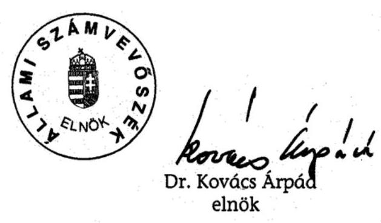

---

# Mellékletek

---

.

---

# 1. számú melléklet 

2005. évi jelentések jellemzői

---

.

---

# 2005. évi jelentések jellemzői

|  Sorszám | A jelentés tárgya, száma, az ellenőrzés típusa | Az ellenőrzés alapja | Az ellenőrzés célja | Az ellenőrzött költségvetési nagyságrend  |
| --- | --- | --- | --- | --- |
|  I. 2004-BEN MEGKEZDETT, 2005-RE ÁTHÚZÓDÓ ELLENŐRZÉSEK |  |  |  |   |
|  I. A KÖLTSÉGVETÉS VÉGREHAJTÁSÁNAK ELLENŐRZÉSÉVEL ÉS A KÖLTSÉGVETÉS ELŐIRÁNYZATAINAK VÉLEMÉNYEZÉSÉVEL KAPCSOLATOS ELLENŐRZÉSEK |  |  |  |   |
|  1. | A Magyar Köztársaság 2004. évi költségvetése végrehajtásának ellenőrzése (pénzügyi-szabályszerüségi)
0540 | törvényekben előírt évenkénti ellenőrzési kötelezettség | annak értékelése, hogy a költségvetés végrehajtásában jog- és hatáskörrel rendelkező szervek törvényekben kapott felhatalmazásuk keretei között, az előírásoknak megfelelően jártak-e el; az állami költségvetés teljesítését bemutató adatok valósághűen tükrözik-e a 2004. évi folyamatokat és az egyes pénzügyi műveletek miként befolyásolták a költségvetés pozícióját; az ÁSZ stratégiájában foglaltak szerint végzett ellenőrzések alapján a Magyar Köztársaság 2004. évi költségvetése végrehajtásáról szóló törvényjavaslat adatai megbízható és valós képet nyújtanak-e; a zárszámadási dokumentum előterjesztése megfelel-e a vonatkozó törvényi előírásoknak, adattartalma segíti-e a költségvetési év lezárásához szükséges rendelkezések meghozatalát. | a központi költségvetés tényleges kiadási föösszege:
6 237,6 Mrd Ft
bevételi föösszege:
5 333,1 Mrd Ft
hiánya: $\quad 904,5$ Mrd Ft  |
|  II. A KÖZPONTI KÖLTSÉGVETÉSSEL KAPCSOLATOS ELLENŐRZÉSEK |  |  |  |   |
|  2. | A családpolitikai célok teljesülését szolgáló egyes pénzösszegek hasznosulásának ellenőrzése (teljesítmény)
0537 | az ÁSZ elnökének döntése alapján végzett egyéb ellenőrzések | annak értékelése, hogy a fejezeti kezelésű családpolitikai előirányzatok céljai összhangban voltak-e a szakmapolitikai célokkal, az előirányzatok eredményes felhasználásához a szaktárcánál rendelkezésre álltak-e a megfelelő szervezeti, szabályozási és ellenőrzési feltételek; a vonatkozó pályázati rendszer, a pályáztatás lebonyolítása, monitorozása és ellenőrzése, valamint a pályázaton kívüli előirányzat felhasználás a gyakorlatban biztosította-e a kitűzött célok elérését; a nehéz élethelyzetben lévő családokat segítő szolgáltatások, a családdal foglalkozó írott kiadványok megjelentetése és a csoportvezető, animátor képzés pályázati programokban résztvevők sikeresen valósították-e meg a számukra előírt, illetve az általuk kitűzött célokat. | fejezeti kezelésű előirányzatok alakulása:
2000-ben: $\quad 263,5 \mathrm{M} \mathrm{Ft}$
2001-ben: $\quad 1115,3 \mathrm{M} \mathrm{Ft}$
2002-ben: $\quad 1477,2 \mathrm{M} \mathrm{Ft}$
2003-ben: $\quad 843,8 \mathrm{M} \mathrm{Ft}$
2004-ben: $\quad 243,6 \mathrm{M} \mathrm{Ft}$  |
|  3. | A „Statisztika" nemzeti programra fordított pénzeszközök hasznosulásának ellenőrzése (teljesítmény) 0547 | az ÁSZ elnökének döntése alapján végzett egyéb ellenőrzések | annak értékelése, hogy a jogszabályi környezet, az érintett fejezetek irányító, szabályozási tevékenysége, a kialakított szervezeti rendszer és a döntési mechanizmusok hatása miként érvényesült; a felhasznált források biztosították-e a program szabályszerű, célszerű és eredményes végrehajtását; a fejezeteknél végzett korábbi ÁSZ ellenőrzések megállapításait hogyan hasznosították. | A „Statisztika" Nemzeti Program végrehajtására fordított összeg:
KSH:
FVM:
összesen: $\quad 17,4$ Mrd Ft  |

---

|  Sorszám | A jelentés tárgya, száma, az ellenőrzés típusa | Az ellenőrzés alapja | Az ellenőrzés célja | Az ellenőrzött költségvetési nagyságrend  |
| --- | --- | --- | --- | --- |
|  4. | Az Alkotmánybíróság fejezet működésének ellenőrzése
(átfogó)
0501 | törvényekben előírt rendszeres ellenőrzési kötelezettség | annak értékelése, hogy a fejezet szabályozási környezete, szervezeti, irányítási és működési rendszere, létszámkerete összhangban volt-e a szakmai feladatokkal, segítette-e azok eredményes ellátását; gazdálkodásában érvényesültek-e a törvényesség és a célszerűség szempontjai; irányító és gazdálkodó tevékenységében mennyiben hasznosította az ÁSZ előző két ellenőrzésének megállapításait, javaslatait. | 2004. évi módosított kiadási előirányzat: 1344,7 M Ft
létszám: 122 fő  |
|  5. | A Nemzeti Kulturális Alapprogramra fordított pénzeszközök hasznosulásának ellenőrzése
(teljesítmény)
0552 | az ÁSZ elnökének döntése alapján végzett egyéb ellenőrzések | annak értékelése, hogy a Nemzeti Kulturális Alapprogram gazdálkodása, célszerű volt-e, pénzeszközei eredményesen járultak-e a kulturális célok megvalósításához; támogatási rendszere, a pénzeszközök hasznosítása és az Alapprogramból támogatott pályázati pénz felhasználása eredményes, hatékony volt-e, milyen értékgyarapodást eredményezett; a jogelödnél 1998-ban végzett átfogó ÁSZ ellenőrzés javaslatait hogyan hasznosították. | Az Alapprogram pénzeszközeinek felhasználása:
2002-ben: 5,6 Mrd Ft
2003-ban: 6,3 Mrd Ft
2004-ben: 9,0 Mrd Ft
2005-ben: az eredeti költségvetési kiadási előirányzat: 9,7 Mrd Ft  |
|  6. | Az Informatikai és Hírközlési Minisztérium fejezet működésének ellenőrzése
(átfogó)
0532 | törvényekben előírt rendszeres ellenőrzési kötelezettség | annak értékelése, hogy a 2002. évben létrehozott fejezet szervezeti, irányítási és működési rendje, létszáma, költségvetése biztosította-e feladatainak ellátását, a kormányzat információs társadalom kiépítéséhez és az Európai Unióhoz való csatlakozáshoz rendelt fejezeti kezelésű előirányzatok felhasználása biztosította-e az ágazati célkitűzések végrehajtását. | kiemelt előirányzatok teljesített kiadásai: 2002-ben: 32,7 Mrd Ft 2003-ben: 45,8 Mrd Ft 2004-ben: 36,7 Mrd Ft előirányzat: 2005-ben: 21,3 Mrd Ft  |
|  7. | Az Egészségügyi Minisztérium fejezet működésének ellenőrzése
(átfogó)
0522 | törvényekben előírt rendszeres ellenőrzési kötelezettség | annak értékelése, hogy a fejezet szervezeti, irányítási és működési rendszere, költségvetési előirányzatai, személyi és tárgyi feltételei összhangban voltak-e a szakmai feladatokkal, biztosították-e a azok ellátását; a felügyeleti és ágazati irányító a feladatokat a jogszabályoknak megfelelően, célszerűen látta-e el, az előirányzatoknál biztosította-e a források szabályszerű felhasználását, a célok elérését; informatikai stratégiája reálisan tükrözi-e az ágazat szakmai információs szükségleteit, az intézmények informatikai rendszereinek szabályozottsága, működtetése, fejlesztése megfelelt-e a célszerűségi szempontoknak; a korábbi számvevőszéki ellenőrzések megállapításait, ajánlásait hogyan hasznosították. | teljesített kiadások:
2002-ben: 129,0 Mrd Ft
2003-ben: 156,5 Mrd Ft
2004-ben: 157,6 Mrd Ft  |
|  8. | A felsőoktatás feladatfinanszírozási rendszere működésének ellenőrzése (teljesítmény)
0503 | az ÁSZ elnökének döntése alapján végzett egyéb ellenőrzések | annak értékelése, hogy a felsőoktatás feladatfinanszírozási rendszere, a költségvetési támogatás milyen eredményességgel járult hozzá a felsőoktatás céljainak megvalósításához, működési feltételeinek javításához, mennyiben segítette a felügyeleti irányítás; a felsőoktatási intézmények és egyéb szervezetek a támogatások felhasználásánál szabályszerűen jártak-e el, a támogatási célok eredményesen és gazdaságosan teljesültek-e, különösen az informatikai-beruházások és az intézményi belső integráció esetében; az állami támogatás elősegítette-e a szakmai feladatok teljesítését; az egyházi felsőoktatási intézményeknél végzett korábbi ÁSZ ellenőrzések realizálását hogyan hajtották végre. | feladatfinanszírozási támogatás: 2000-ben: 7644,4 M Ft 2001-ben: 4 986,9 M Ft 2000-ben: 5 387,2 M Ft 2003-ban: 5 267,7 M Ft  |

---

|  Sorszám | A jelentés tárgya, száma, az ellenőrzés típusa | Az ellenőrzés alapja | Az ellenőrzés célja | Az ellenőrzött költségvetési nagyságrend  |
| --- | --- | --- | --- | --- |
|  9. | A Magyar-Osztrák-Szlovén határmenti térség környezet- és természetvédelmének ellenőrzése (teljesítmény) 0542 | az ÁSZ elnökének döntése alapján végzett egyéb ellenőrzések | annak értékelése, hogy a regionális végrehajtó intézmények és hatóságok együttműködése biztosította-e a térség környezet- és természetvédelmét; működési és fejlesztési forrásokat célszerűen tervezték-e; a három ország együttműködése megfelelően biztosította-e a környezeti elemek állapotának nyomon következő; segítette-e a káros hatások felszámolását; a korábban végzett számvevőszéki ellenőrzések környezet- és természetvédelemmel kapcsolatos megállapításait a tárca hogyan hasznosította. | környezet- és természetvédelmi, ill. vízügyi támogatások 2000-2004-ben: kb. 7,5 Mrd Ft  |
|  10. | Az Oktatási Minisztérium fejezet működésének ellenőrzése (átfogó) 0534 | törvényekben előírt rendszeres ellenőrzési kötelezettség | annak értékelése, hogy a fejezet szervezeti, irányítási és működési rendszere, költségvetési előirányzatai a szakmai feladatokkal összhangban voltak-e; az OM célszerűen látta-e el a felügyeleti és ágazati irányító feladatait; a költségvetés végrehajtása során biztosították-e a közpénzek szabályszerű és célszerű felhasználását; a belső kontrollrendszer megalapozta-e a beszámolók megbízhatóságának ellenőrzését; segítette-e az irányítási, felügyeleti tevékenységet a pénzügyi, gazdasági információs rendszer kialakítása; a belső ellenőrzés, lehetővé tette-e a szabálytalanságok, hiányosságok feltárását; beépült-e a működés folyamatos nyomon követése és értékelése a döntéshozatali folyamatokba; hasznosították-e a korábbi számvevőszéki ellenőrzések ajánlásait. | módosított kiadási előirányzat: 2000-ben: 325,9 Mrd Ft 2001-ben: 373,6 Mrd Ft 2002-ben: 418,6 Mrd Ft 2003-ben: 486,2 Mrd Ft 2004-ben: 500,4 Mrd Ft  |
|  11. | A Vám- és Pénzügyőrség működésének ellenőrzése (átfogó) 0511 | az ÁSZ elnökének döntése alapján végzett egyéb ellenőrzések | annak értékelése, hogy a rendelkezésre álló személyi, tárgyi és pénzügyi feltételek, a szervezet felépítése és működése összhangban álltak-e a jogszabályokban előírtakkal, különös tekintettel az EU csatlakozás követelményeire; hogyan hasznosultak a korábbi ellenőrzések során tett ÁSZ javaslatok. | teljesített költségvetési előirányzat: 2002-ben: 49,2 Mrd Ft 2003-ban: 47,8 Mrd Ft 2004-ben: 33,9 Mrd Ft  |
|  12. | A Honvédelmi Minisztérium fejezet működésének ellenőrzése (átfogó) 0535 | törvényekben előírt rendszeres ellenőrzési kötelezettség | annak értékelése, hogy a fejezet irányítási, müködtetési rendje és szervezeti kialakítása összhangban volt-e a jogszabályi feladatokkal és a szövetségi feladatt vállalásokkal; költségvetési gazdálkodása biztosította-e a tárca állami (nemzeti) feladatainak, nemzetközi kötelezettségeinek teljesítését, a gazdálkodási feladatok ellátását, az erőforrások és a vagyon védelmét; pénzügyi-gazdasági információs rendszere segítette-e a vezetői irányítási, felügyeleti tevékenységeket; belső ellenőrzése lehetővé tette-e a szabálytalanságok, hiányosságok, gazdaságtalan megoldások feltárását, a működés folyamatos nyomon követése (monitoring) és értékelése beépült-e a vezetői, a felügyeleti tevékenységekbe; belső kontrollrendszerének fejlesztésében hasznosította-e a korábbi számvevőszéki ellenőrzések, ajánlásait. | kiadási előirányzat: 2000-ben: 189,6 Mrd Ft 2004-ben: 346,9 Mrd Ft 2005-ben: 288,1 Mrd Ft  |
|  13. | A társasági adó beszedésére kialakított rendszer működésének ellenőrzése (teljesítmény) 0549 | az ÁSZ elnökének döntése alapján végzett egyéb ellenőrzések | annak értékelése, hogy az Adó- és Pénzügyi Ellenőrzési Hivatal ellenőrzési rendszere biztosítja-e a társasági adó bevételek minél teljesebb körű beszedését, eredményesek-e az ellenőrzésre kiválasztás rendszere, és a jogosulatlanul igénybe vett adókedvezmények kiszűrésére és a behajtására tett intézkedései. | adóalanyok bruttó társasági adóbefizetése a költségvetésbe: 2002-ben: 473 Mrd Ft 2003-ban: 504 Mrd Ft 2004-ben: 512 Mrd Ft  |

---

|  Sorszám | A jelentés tárgya, száma, az ellenőrzés típusa | Az ellenőrzés alapja | Az ellenőrzés célja | Az ellenőrzött költségvetési nagyságrend  |
| --- | --- | --- | --- | --- |
|  III. A HELYI ÉS HELYI KISEBBSÉGI ÖNKORMÁNYZATOKKAL KAPCSOLATOS ELLENŐRZÉSEK |  |  |  |   |
|  14. | Budapest Főváros XVIII. kerület
Pestszentlőrinc-Pestszentimre Önkormányzata gazdálkodásának átfogó ellenőrzése
(átfogó)
0505 | törvényekben előírt rendszeres ellenőrzési kötelezettség | annak értékelése, hogy az önkormányzati gazdálkodás törvényességét, szabályszerűségét biztosították-e a tervezés, a költségvetés végrehajtása, a vagyongazdálkodás és a zárszámadás során; a feladatok és rendelkezésre álló források összhangja biztosított volt-e, a gazdálkodás szabályszerűségét biztosító kontrollok megfelelően segítették-e a végrehajtást. | 2003. évi költségvetés föösszege:
16,0 Mrd Ft ,
vagyona: $100,8 \mathrm{Mrd} \mathrm{Ft}$  |
|  15. | A helyi és a helyi kisebbségi önkormányzatok gazdálkodásának átfogó ellenőrzése
(átfogó)
0544 | törvényekben előírt rendszeres ellenőrzési kötelezettség | annak értékelése, hogy az önkormányzatok a gazdálkodás törvényességét, szabályszerűségét biztosították-e a tervezés, a költségvetés végrehajtása, a vagyongazdálkodás és a zárszámadás során; a feladatok és rendelkezésre álló források összhangja biztosított volt-e, a gazdálkodás szabályszerűségét biztosító kontrollok megfelelően segítették-e a végrehajtást; az önkormányzatok gazdálkodása során érvényesültek-e az Áht. és a vonatkozó kormányrendeletek előírásai. | az ellenőrzött önkormányzatok 2003. évi kiadási előirányzatai: eredeti: $\quad 0,9 \mathrm{Mrd} \mathrm{Ft}$ módosított: $1,0 \mathrm{Mrd} \mathrm{Ft}$ teljesített: $\quad 1,1 \mathrm{Mrd} \mathrm{Ft}$  |
|  16. | A köztemetők fenntartásának ellenőrzése
(teljesítmény)
0504 | az ÁSZ elnökének döntése alapján végzett egyéb ellenőrzések | annak megállapítása, hogy a temetők fenntartása során érvényesülnek-e a temetőkről és a temetkezésről szóló törvény és a végrehajtásáról szóló rendeletek előírásai, az önkormányzatok hogyan teljesítik a köztemetők fenntartására vonatkozó feladataikat; a kegyeleti követelmények megtartása mellett biztosították-e a gazdálkodás szabályszerűségét, a források hatékony és célszerű felhasználását; a temető használatáért fizetendő térítési díjak hogyan alakultak a vizsgálati időszakban településtípusonként. | a köztemető fenntartás kiadásai a vizsgált időszakban (Budapest csak 2001-2003. között)
kiadás: $\quad 5,0 \mathrm{Mrd} \mathrm{Ft}$
bevétel: $\quad 4,9 \mathrm{Mrd} \mathrm{Ft}$  |
|  17. | A helyi önkormányzati fürdők - kiemelten a gyógyfürdők - helyzete, fejlesztésének lehetőségei, hatása az idegenforgalomra és turizmusra (egyéb szabályszerűségi) 0536 | az ÁSZ elnökének döntése alapján végzett egyéb ellenőrzések | annak megállapítása, hogy a Széchenyi Terv keretében kidolgozott egészségturizmus tízéves fejlesztési programja, stratégiai céljai megalapozottak voltak-e; a pályázati rendszer kialakítása, a támogatási előirányzatok odaítélése törvényes volt-e; a támogatások felhasználása szabályszerű, célszerű, eredményes volt-e; a fürdők országos szintű szakmai irányítása és ellenőrzése, működésük információs rendszere rendezett-e. | a vizsgált önkormányzatok fürdőszolgáltatás célú vagyona:
2000-ben: 21,0 Mrd Ft
2003-ban: 52,4 Mrd Ft  |
|  18. | Győr Megyei Jogú Város Önkormányzata gazdálkodásának átfogó ellenőrzése
(átfogó)
0512 | törvényekben előírt rendszeres ellenőrzési kötelezettség | annak értékelése, hogy az önkormányzati gazdálkodás törvényességét, szabályszerűségét biztosították-e a tervezés, a költségvetés végrehajtása, a vagyongazdálkodás és a zárszámadás során; a feladatok és az azokhoz rendelkezésre álló források összhangja biztosított volt-e, a gazdálkodás szabályszerűségét biztosító kontrollok megfelelően segítették-e a végrehajtást. | költségvetési bevétel, vagyon:
2003-ban: 34,0 Mrd Ft, 113,7 Mrd Ft
2004-ben: 33,1 Mrd Ft, 130,9 Mrd Ft  |
|  19. | A helyi önkormányzatok közművelődési és könyvtári feladatellátása és finanszírozása
(teljesítmény)
0521 | az ÁSZ elnökének döntése alapján végzett egyéb ellenőrzések | annak megállapítása, hogy a szakmai irányítást ellátó szervek eleget tesznek-e a közművelődési törvényben meghatározott feladataiknak; segítették-e az önkormányzatok szakmai feladatellátását; a helyi önkormányzatok kötelező feladatai-kat miként tudják teljesíteni. A tárgyi és személyi feltételek biztosítása megfelelő-e; a feladatok ellátását mennyiben fedezik a költségvetési juttatások; a pénzügyi feltételek változása milyen hatással volt a szolgáltatásokra. | szakfeladatokon elszámolt kulturális kiadások országos alakulása:
2001-ben: 32,0 Mrd Ft
2002-ben: 37,9 Mrd Ft
2003-ban: 43,8 Mrd Ft  |

---

|  Sorszám | A jelentés tárgya, száma, az ellenőrzés típusa | Az ellenőrzés alapja | Az ellenőrzés célja | Az ellenőrzött költségvetési nagyságrend  |
| --- | --- | --- | --- | --- |
|  20. | A címzett támogatásból finanszírozott egészségügyi beruházások, rekonstrukciók ellenőrzése
(egyéb szabályszerűségi)
0523 | az ÁSZ elnökének döntése alapján végzett egyéb ellenőrzések | annak megállapítása, hogy a támogatással kapcsolatos döntések, valamint a rekonstrukciók műszaki és pénzügyi előkészítése, a szakmai megalapozottság és a szabályozás mennyiben szolgálták a lakosság egészségügyi szükségleteit, az egészségügyi ellátás korszerűsítését, átalakítását; a beruházásokat, rekonstrukciókat határidőben, megfelelő minőségben és a jóváhagyott költségkereten belül valósították-e meg; a beruházások, rekonstrukciók hatására a tervezett mértékben javultak-e az egészségügyi intézmények működési feltételei. | vizsgált önkormányzatok kiadásai:
2001-ben: 482,6 Mrd Ft
2002-ben: 548,9 Mrd Ft
2003-ban: 642,2 Mrd Ft
2004-ben: 633,1 Mrd Ft  |
|  21. | Pest megye Önkormányzata gazdálkodásának átfogó ellenőrzése
(átfogó)
0502 | törvényekben előírt rendszeres ellenőrzési kötelezettség | annak értékelése, hogy az önkormányzati gazdálkodás törvényességét, szabályszerűségét biztosították-e a tervezés, a költségvetés végrehajtása, a vagyongazdálkodás és a zárszámadás során; a feladatok és a források összhangja biztosított volt-e, különös tekintettel egyes kiemelt feladatokra; a gazdálkodás szabályszerűségét biztosító kontrollok megfelelően segítették-e a végrehajtást. | 2003. évi kiadások:
eredeti: 29,1 Mrd Ft
módosított: 32,3 Mrd Ft
teljesített: 30,3 Mrd Ft
vagyona
2003-ban: 37,3 Mrd Ft  |
|  22. | Budapest Főváros XIII. kerület Önkormányzata gazdálkodásának átfogó ellenőrzése
(átfogó)
0506 | törvényekben előírt rendszeres ellenőrzési kötelezettség | annak értékelése, hogy az önkormányzati gazdálkodás törvényességét, szabályszerűségét biztosították-e a tervezés, a költségvetés végrehajtása, a vagyongazdálkodás és a zárszámadás során; a feladatok és a források összhangja biztosított volt-e, különös tekintettel egyes kiemelt feladatokra; a gazdálkodás szabályszerűségét biztosító kontrollok megfelelően segítették-e a végrehajtást; | 2003. évi kiadások:
eredeti: 20,9 Mrd Ft
módosított: 23,1 Mrd Ft
teljesített: 21,3 Mrd Ft
vagyona 2003-ban: 52,5 Mrd Ft  |
|  IV. ELKÜLŐNÍTETT ÁLLAMI PÉNZALAPOK |  |  |  |   |
|  23. | A Központi Nukleáris Pénzügyi Alap működésének ellenőrzése
(átfogó)
0509 | törvényekben előírt rendszeres ellenőrzési kötelezettség | annak értékelése, hogy az Alap, valamint a kezelését végző szervezet irányítása, működése, szabályozottsága, ellenőrzési tevékenysége az Alap törvényes és célszerű felhasználását biztosítottna; a radioaktív hulladékok végleges elhelyezését, a kiégett üzemanyagok elhelyezését szolgáló tárolók létesítését és üzemeltetését, illetve a nukleáris létesítmények leszerelésének finanszírozását, a lakosság tájékoztatását a felhasznált pénzeszközök célszerűen szolgálták-e; a korábbi ÁSZ ellenőrzések során tett megállapítások, javaslatok megfelelően hasznosultak-e. | 2004. évi kiadások:
eredeti: 9,7 Mrd Ft
módosított: 9,7 Mrd Ft
teljesített: 9,7 Mrd Ft  |
|  V. A TÁRSADALOMBIZTOSÍTÁSI ALAPOKKAL KAPCSOLATOS ELLENŐRZÉSEK |  |  |  |   |
|  24. | Az irányított betegellátási modellkísérlet ellenőrzése
(teljesítmény)
0508 | az ÁSZ elnökének döntése alapján végzett egyéb ellenőrzések | annak értékelése, hogy az 1999 óta működtetett modellkísérlet hozott-e változásokat a hazai betegellátás rendszerében és elősegítette-e a lakosság egészségügyi ellátási színvonalának javulását; eredményezett-e kiadáscsökkenést, elszámolási rendszere megfelelően szabályozott és ellenőrzött-e; tapasztalatait figyelembe vették-e az egészségügyi reformfolyamatban. | E. Alap kiadási modell kísérletre
főösszege eső kiadás
1999-ben: 701,1 Mrd Ft 1,7 Mrd Ft
2000-ben: 797,2 Mrd Ft 3,9 Mrd Ft
2001-ben: 915,0 Mrd Ft 15,9 Mrd Ft
2002-ben: 1111,2 Mrd Ft 28,3 Mrd Ft
2003-ben: 1336,0 Mrd Ft 41,1 Mrd Ft  |

---

|  Sorszám | A jelentés tárgya, száma, az ellenőrzés típusa | Az ellenőrzés alapja | Az ellenőrzés célja | Az ellenőrzött költségvetési nagyságrend  |
| --- | --- | --- | --- | --- |
|  VI. AZ ÁLLAM VÁLLALKOZÓI ÉS KINCSTÁRI VAGYONÁVAL KAPCSOLATOS ELLENŐRZÉSEK |  |  |  |   |
|  25. | A kincstári vagyon kezelésének és müködtetésének ellenőrzése (teljesítmény) | az ÁSZ elnökének döntése alapján végzett egyéb ellenőrzések | annak értékelése, hogy a kialakított szabályozás biztosította-e, az állami feladatellátás során, a kincstári vagyon állagának és értékének megőrzését, növelését, védelmét; a létrehozott vagyonkezelői kapcsolatrendszer, a szervezeti struktúra, a szervezet belső szabályozása megvalósította-e a kincstári vagyon kezelésének optimális megoldását; az államháztartási reform keretében az 1996. január 1-től életbe léptetett jogszabályok, a szervezeti megoldások, belső szabályzatok, intézkedések, biztosították-e a kincstári vagyon teljes körű számbavételét, helyzetének folyamatos figyelemmel kísérését; célszerủek és eredményesek voltak-e a vagyonkezelési megoldások, megfelelő garanciát nyújtottak-e a kincstári vagyon megőrzésére, védelmére, értékének növelésére; megalapozottak voltak-e az intézményi működéssel, a vagyonkezeléssel kapcsolatos központi költségvetési előirányzatok; hogyan hasznosultak az ÁSZ korábbi jelentéseiben megfogalmazott javaslatok, ajánlások. | A KVI és a vagyonkezelők által együttesen kezelt kincstári vagyon mennyisége : 8 482 ezer db bruttó értéke: 3 636,5 Mrd Ft számviteli értéke: 3 664,0 Mrd Ft  |
|  26. | A Magyar Távirati Iroda Rt. 2004. évi gazdálkodásának ellenőrzése (átfogó) 0520 | törvényekben előírt évenkénti ellenőrzési kötelezettség | annak értékelése, hogy szervezeti és működési felépítése, szabályozása összhangban volt-e a feladatokkal, segítette-e azok hatékony és eredményes ellátását, belső szabályozása összhangban volt-e a hatályos jogszabályokkal; eredményesen gazdálkodott-e a rendelkezésére bocsátott vagyonnal és céltámogatásokkal; hogyan hasznosította a 2003. évi ÁSZ-jelentés megállapításait, javaslatait, ajánlásait. | költség és ráfordítás összesen: 2002-ben: 3,8 Mrd Ft 2003-ban: 4,1 Mrd Ft 2004-ben: 4,9 Mrd Ft  |
|  VII. A KÜLFŐLDI TÁMOGATÁSOKKAL KAPCSOLATOS ELLENŐRZÉSEK |  |  |  |   |
|  27. | Az ISPA támogatásból megvalósított közlekedésfejlesztési programok ellenőrzése (teljesítmény) 0530 | az ÁSZ elnökének döntése alapján végzett egyéb ellenőrzések | annak értékelése, hogy az ISPA előcsatlakozási alapból finanszírozott közlekedésfejlesztési projektek kiválasztása, előrehaladása hatékonyan és eredményesen szolgálta-e a magyar közlekedésfejlesztési célok megvalósítását, az uniós források hasznosítását, továbbá a megkezdett projektek folytatását a Kohéziós Alap feltételrendszere szerint. | kiadási költségvetési előirányzat: 2001-ben: 14,7 Mrd Ft 2002-ben: 11,4 Mrd Ft 2003-ban: 41,7 Mrd Ft 2004-ben: 33,3 Mrd Ft 2005-ben: 25,4 Mrd Ft  |
|  VIII. AZ ÁLLAMHÁZTARTÁSON KÍVÜLI SZERVEZETEKKEL KAPCSOLATOS ELLENŐRZÉSEK |  |  |  |   |
|  28. | Központi költségvetési támogatásban nem részesült pártok 2001-2004. évi gazdálkodása törvényességének ellenőrzése (pénzügyi-szabályszerüségi) 0517 | törvényekben előírt rendszeres ellenőrzési kötelezettség | annak megállapítása, hogy a pártok gazdálkodásról készített beszámolói a törvényi előírásoknak megfelelnek-e, közzétették-e; érvényesültek-e a számviteli törvény követelményei, betartották-e a gazdálkodó tevékenységre vonatkozó korlátozásokat, eleget tettek-e az egyéb jogszabályi kötelezettségeknek. | az ellenőrzött pártok beszámolóiban közzétett kiadása együttesen: 2001-ben: 4,8 Mrd Ft 2002-ben: 7,4 Mrd Ft 2003-ban: 10,0 Mrd Ft  |

---

|  Sorszám | A jelentés tárgya, száma, az ellenőrzés típusa | Az ellenőrzés alapja | Az ellenőrzés célja | Az ellenőrzött költségvetési nagyságrend  |
| --- | --- | --- | --- | --- |
|  29. | A Magyar Export-Import Bank Rt. működésének ellenőrzése (átfogó)
0514 | az **ÁSZ elnökének döntése alapján** végzett egyéb ellenőrzések | annak értékelése, hogy a Társaság működése megfelelte a törvényi előírásoknak, az állam tulajdonosi elvárásainak; célszerűen és eredményesen segítette-e az exporthoz fűződő állami érdekek érvényesülését; szabályszerűen, célszerűen és eredményesen gazdálkodott-e; hogyan hasznosultak a korábbi számvevőszéki ellenőrzés megállapításai, javaslatai. | hitelállomány: 2000.XII.31.: 72,5 Mrd Ft 2001.XII.31.: 92,0 Mrd Ft 2002.XII.31.: 128,9 Mrd Ft 2003.XII.31.: 151,4 Mrd Ft 2004.VI.30.: 173,6 Mrd Ft  |
|  30. | A Nemzeti Kollégiumi Közalapítvány gazdálkodásának ellenőrzése (egyéb szabályszerűségi)
0513 | az **ÁSZ elnökének döntése alapján** végzett egyéb ellenőrzések | annak értékelése, hogy az NKKA működése és gazdálkodása törvényes volt-e és célszerűen segítette-e feladatai megvalósítását; vagyonát, illetve a kapott állami támogatást rendeltetésszerűen használta-e fel. | költség és ráfordítás összesen: 2001-ben: 58,6 M Ft 2002-ben: 139,2 M Ft 2003-ban: 180,8 M Ft 2004.I.f.évben: 150,8 M Ft  |
|  31. | A Határon Túli Magyar Oktatásért Apáczai Közalapítvány gazdálkodásának ellenőrzése (egyéb szabályszerűségi)
0510 | az **ÁSZ elnökének döntése alapján** végzett egyéb ellenőrzések | hogy törvényességi és célszerűségi szempontból értékelje az AKA működését és gazdálkodását, gazdálkodása és könyvvezetése törvényes volt-e; vagyonát, illetve a kapott állami támogatást rendeltetésszerűen és célszerűen használta-e fel. | költségek, ráfordítások: támogatás: 2001-ben: 73,9 M Ft 2002-ben: 78,2 M Ft 2003-ban: 74,0 M Ft 2004-ben: 33,4 M Ft  |
|  32. | A Magyar Nemzeti Bank Rt. 2004. évi működésének ellenőrzése (átfogó)
0531 | törvényekben előírt rendszeres ellenőrzési kötelezettség | annak értékelése, hogy intézményi célkitűzései teljesültek-e; működése a törvényi előírásoknak, a belső szabályzatoknak megfelelő volt-e; gazdálkodásában a hatékonyság, a takarékosság és a szabályszerűség követelményei érvényesültéke-e; a működési költségek, a beruházási ráfordítások a pénzügyi terv szerint alakul-tak-e, a beszerzések, beruházások a törvényi előírásoknak és a belső szabályzatoknak megfelelően történtek-e; katasztrófatűrő rendszere megfelel-e a teljesítményellenőrzési feltételeinek. | működési költségek: 2003-ban: 12,7 M Ft 2004-ben: 13,5 M Ft  |
|  33. | A Magyar Exporthitel Biztosító Rt. működésének ellenőrzése (átfogó)
0526 | az **ÁSZ elnökének döntése alapján** végzett egyéb ellenőrzések | annak értékelése, hogy a Biztosító működése, biztosítási tevékenysége megfelelte a törvényi előírásoknak, az állam tulajdonosi elvárásainak; a kockázatok biztosítása összhangban volt-e a költségvetési törvény és a vonatkozó kormányrendelet előírásaival; szabályszerűen, célszerűen és eredményesen gazdálkodott-e. | befektetések bevételei: 2001-ben: 763,1 E Ft 2002-ben: 714,7 E Ft 2003-ben: 631,0 E Ft 2004.I.f.évben: 160,0 E Ft  |

---

|  Sorszám | A jelentés tárgya, száma, az ellenőrzés típusa | Az ellenőrzés alapja | Az ellenőrzés célja | Az ellenőrzött költségvetési nagyságrend  |
| --- | --- | --- | --- | --- |
|  X. EGYÉB ELLENŐRZÉSEK |  |  |  |   |
|  34. | A természeti katasztrófák megelőzősé re való felkészülés ellenőrzése
A Felső-Tisza-vidék árvízvédelmi felkészültségének ellenőrzése (teljesítmény) | az ÁSZ elnökének döntése alapján végzett egyéb ellenőrzések | annak értékelése, hogy a Belügyminisztérium és a Környezetvédelmi és Vízügyi Minisztérium fejezeteknél a természeti katasztrófák megelőzése és a védekezés kialakítása és müködtetése, az alkalmazott rendszabályok eredményesen szolgálták-e a természeti katasztrófák kockázatának csökkentését; megfelelően állították-e össze a megelőzés és felkészülés éves tervét, költségvetését, célszerűen történt-e a megelőzést szolgáló költségvetési források felhasználása; a Tisza-völgy árvízi biztonsági intézkedések, fejlesztések, valamint a tiszai országok együttműködése csökkentette-e a lét és vagyonbiztonság veszélyét; a korábban végzett számvevőszéki ellenőrzések katasztrófavédelemmel, illetve árvízvédelemmel kapcsolatos megállapításai és javaslatai hogyan hasznosultak. | költségvetési forrás:
2000-2003-ban: évi 20,0 M Ft
2004-ben:
8,5 M Ft  |
|   | 0518 |  |  |   |
|  II. 2005-BEN INDULÓ, 2005-BEN BEFEJEZNI TERVEZETT ELLENŐRZÉSEK |  |  |  |   |
|  I. A KÖLTSÉGVETÉS VÉGREHAJTÁSÁNAK ELLENŐRZÉSÉVEL ÉS A KÖLTSÉGVETÉS ELŐIRÁNYZATAINAK VÉLEMÉNYEZÉSÉVEL KAPCSOLATOS ELLENŐRZÉSEK |  |  |  |   |
|  35. | Vélemény a Magyar Köztársaság 2006. évi költségvetési javaslatáról (egyéb szabályozósségt)
0550 | törvényekben előírt évenkénti ellenőrzési kötelezettség | annak megállapítása, hogy a költségvetés tervezésének feltételrendszere, a költségvetési javaslat összeállítása megfelel-e a jogszabályi előírásoknak; a 2006. évi költségvetésről szóló törvényjavaslat bevételi és kiadási előirányzatainak megalapozottságát kielégítően biztosítják-e az állami feladatrendszer és a szabályozók módosításai; teljesültek-e az előirányzatok kialakítására kiadott tervezési köriratban és a tervezési tájékoztatóban foglaltak; a költségvetési törvényjavaslatban az önkormányzati forrásszabályozás és támogatási rendszer tervezett változtatásai megalapozottak-e. | kiadási főösszeg: 7 496,7 Mrd Ft
bevételi főösszeg: 5 965,7 Mrd Ft
hiány:
1 531,0 Mrd Ft  |
|  II. A KÖZPONTI KÖLTSÉGVETÉSSEL KAPCSOLATOS ELLENŐRZÉSEK |  |  |  |   |
|  36. | A Köztársasági Elnökség fejezet müködésének ellenőrzése (átfogó)
0519 | törvényekben előírt rendszeres ellenőrzési kötelezettség | annak értékelése, hogy a fejezet irányítási, működési rendje és a székhelyváltozást követő adminisztráció kialakítása összhangban volt-e a jogszabályokban meghatározott feladatokkal; gazdálkodásában érvényesültek-e a törvényességi és a célszerűségi szempontok; a fejezeti kezelésű előirányzatok felhasználása sza-bály- és célszerűen történt-e; informatikai rendszerének kialakítása, szabályozottsága és müködtetése megfelelte-e a célszerűségi szempontoknak; hogyan hasznosította a korábbi ÁSZ ellenőrzések megállapításait, javaslatait. | kiadási előirányzat:
2002-ben: 490,1 M Ft
2003-ben: 860,3 M Ft
2004-ben: 933,1 M Ft  |
|  37. | A Foglalkoztatáspolitikai és Munkaügyi Minisztérium fejezet müködésének ellenőrzése (átfogó) | törvényekben előírt rendszeres ellenőrzési kötelezettség | annak értékelése, hogy a fejezet ágazatirányítási, működési rendje, szervezeti kialakítása, létszáma összhangban volt-e a jogszabályokban meghatározott feladatokkal; gazdálkodása, forráselosztási, döntési, belső ellenőrzési rendszere megfelelte-e a tárca feladatai teljesítésének, a vagyon védelmének; informatikai stratégiája tükrözi-e szakmai információs szükségleteit, célszerű-e rendszereinek | kiadási előirányzat:
2002-ben: 55,1 Mrd Ft
2003-ban: 67,1 Mrd Ft
2004-ben: 71,6 Mrd Ft  |

---

|  Sorszám | A jelentés tárgya, száma, az ellenőrzés típusa | Az ellenőrzés alapja | Az ellenőrzés célja | Az ellenőrzött költségvetési nagyságrend  |
| --- | --- | --- | --- | --- |
|   | 0543 |  | szabályozottsága, működtetése, fejlesztése; hogyan hasznosultak-e a korábbi számvevőszéki ellenőrzések megállapításai, ajánlásai. |   |
|  38. | Az Országgyűlés fejezet működésének ellenőrzése (átfogó)
0551 | törvényekben előírt rendszeres ellenőrzési kötelezettség | annak értékelése, hogy a fejezet szervezeti, irányítási és működési rendszere, előirányzatai összhangban voltak-e a jogszabályokban meghatározott szakmai feladatokkal; a fejezet intézményeinél, illetve a képviselöcsoportoknál szabályszerűen használták-e fel a rendelkezésre álló költségvetési forrásokat; a 2002. évi ciklusváltás költségeinek fedezetére szolgáló fejezeti kezelésű előirányzat felhasználása szabályszerű volt-e; hogyan hasznosították a korábbi számvevőszéki ellenőrzések megállapításait. | teljesített kiadások kiemelt előirányzatotoként:
2001-ben: 10,2 Mrd Ft
2002-ben: 12,8 Mrd Ft
2003-ban: 14,6 Mrd Ft
2004-ben: 14,8 Mrd Ft  |
|  39. | Az Igazságügyi Minisztérium fejezet működésének ellenőrzése (átfogó)
0567 | törvényekben előírt rendszeres ellenőrzési kötelezettség | annak értékelése, hogy a fejezet irányítási, működtetési rendjét és szervezeti kialakítását a jogszabályokban meghatározott feladatokkal összhangban látta-e el; a fejezet-irányítás és felügyeleti kontroll, kockázatkezelő képessége megfelelő volt-e; a tárca feladatait, nemzetközi kötelezettségeit, gazdálkodási feladatait előírászerűen, a vagyon védelmét megfelelően látta-e el; a büntetés-végrehajtás EU harmonizációja eredményesen szolgálja-e a közösségi elvárások teljesülését, az erőforrások felhasználásának célszerűségét, a fogvatartottak elhelyezési körülményeinek javulását, a foglalkoztatási kötelezettség és a gazdaságosság összhangját; belső kontrollrendszerének fejlesztésében hogyan hasznosította a korábbi számvevőszéki ellenőrzések megállapításait, különös tekintettel a büntetésvégrehajtás és a működés hatékonysága területén. | 2005. évi támogatási előirányzata: 47,9 Mrd Ft kiadási előirányzata: 60,6 Mrd Ft  |
|  40. | A 2004. június 13-án megtartott, az EP tagjai választás és a 2004. december 5-én megtartott országos ügydöntő népszavazás lebonyolításához felhasznált pénzeszközök elszámolásának ellenőrzése (egyéb szabályszerűségi) 0560 | törvényekben előírt rendszeres ellenőrzési kötelezettség | annak megállapítása, hogy a központi szerveknél, a közigazgatási hivataloknál, valamint a megyei és a helyi önkormányzatoknál a választással kapcsolatos feladatok ellátása során a kiadások tervezése megalapozottan, a pénzeszközök felhasználása célszerűen, a jogszabályoknak megfelelően történt-e; a pénzügyi elszámolásokat határidőben, a jogszabályban meghatározott módon teljesítették-e. | EP választás kiadása: 3,4 Mrd Ft népszavazás kiadása: 2,6 Mrd Ft  |
|  41. | Az Ifjúsági, Családügyi, Szociális és Esélyegyenlőségi Minisztérium fejezet működésének ellenőrzése (átfogó)
0568 | törvényekben előírt rendszeres ellenőrzési kötelezettség | annak értékelése, hogy a létrehozott fejezet irányítási, működési rendje, szervezeti kialakítása, valamint költségvetése, személyi és tárgyi feltételei, gazdálkodása összhangban voltak-e a jogszabályokban meghatározott feladatokkal; irányítási és kontroll tevékenységei biztosították-e a feladatok ellátását; a kábítószerfogyasztás megelőzésére fordított állami támogatások, az Országos Fogyatékosügyi Program középtávú intézkedései során a szociális ellátások felhasznált pénzeszközei eredményesen és hatékonyan hasznosultak-e; a korábbi ÁSZ ellenőrzések megállapításai, javaslatai megfelelően hasznosultak-e. | 2005. évi előirányzata: kiadás: 563,3 Mrd Ft bevétel: 2,3 Mrd Ft támogatás: 63,9 Mrd Ft létszáma 2005. évre: 316 fő  |

# III. A HELYI ÉS HELYI KISEBBSÉGI ÖNKORMÁNYZATOKKAL KAPCSOLATOS ELLENŐRZÉSEK

---

|  Sorszám | A jelentés tárgya, száma, az ellenőrzés típusa | Az ellenőrzés alapja | Az ellenőrzés célja | Az ellenőrzött költségvetési nagyságrend  |
| --- | --- | --- | --- | --- |
|  42. | A Békés Megyei Önkormányzat gazdálkodási rendszerének átfogó ellenőrzése
(átfogó)
0565 | törvényekben előírt rendszeres ellenőrzési kötelezettség | annak értékelése, hogy az önkormányzati gazdálkodás törvényességét, szabályszerűségét biztosította- e a tervezés, a költségvetés végrehajtása, a vagyongazdálkodás és a zárszámadás; a feladatok és a rendelkezésre álló pénzforrások összhangja biztosított volt-e; a gazdálkodás szabályszerűségét biztosító belső kontrollok lehetővé tették-e a szabálytalanságok, hiányosságok, gazdaságtalan megoldások feltárását, megelőzését. | 2004. évi
kiadás:
bevétel:
vagyon:
2002-ben:
2003-ban:
2004-ben:  |
|  43. | A Budapest Főváros Önkormányzatánál a vagyonnal való gazdálkodás szabályszerűségének, tervszerűségének ellenőrzése
Az önkormányzati gazdálkodás átfogó ellenőrzésének III. üteme
(átfogó)
0569 | törvényekben előírt rendszeres ellenőrzési kötelezettség | annak értékelése, hogy az önkormányzati gazdálkodás törvényességét, szabályszerűségét biztosította- e a tervezés, a költségvetés végrehajtása, a vagyongazdálkodás és a zárszámadás; a feladatok és a rendelkezésre álló pénzforrások összhangja biztosított volt-e; a gazdálkodás szabályszerűségét biztosító kontrollok megfelelően segítették-e a végrehajtást. | 2004. évi
kiadás:
bevétel:
vagyon:
2002-ben: 1 865,2 Mrd Ft
2003-ban: 1 943,3 Mrd Ft
2004-ben: 1 987,8 Mrd Ft  |
|  44. | A Nógrád Megyei Önkormányzat gazdálkodási rendszerének átfogó ellenőrzése
(átfogó)
0556 | törvényekben előírt rendszeres ellenőrzési kötelezettség | annak értékelése, hogy az önkormányzati gazdálkodás törvényességét, szabályszerűségét biztosította- e a tervezés, a költségvetés végrehajtása, a vagyongazdálkodás és a zárszámadás; a feladatok és a rendelkezésre álló pénzforrások összhangja biztosított volt-e; a gazdálkodás szabályszerűségét biztosító belső kontrollok lehetővé tették-e a szabálytalanságok, hiányosságok, gazdaságtalan megoldások feltárását, megelőzését. | 2004. évi
kiadás:
bevétel:
vagyon:
2002-ben:
2003-ban:
2004-ben:  |
|  45. | A Vas Megyei Önkormányzat gazdálkodási rendszerének átfogó ellenőrzése
(átfogó)
0545 | törvényekben előírt rendszeres ellenőrzési kötelezettség | annak értékelése, hogy az önkormányzati gazdálkodás törvényességét, szabályszerűségét biztosította- e a tervezés, a költségvetés végrehajtása, a vagyongazdálkodás és a zárszámadás; a feladatok és a rendelkezésre álló pénzforrások összhangja biztosított volt-e; a gazdálkodás szabályszerűségét biztosító belső kontrollok lehetővé tették-e a szabálytalanságok, hiányosságok, gazdaságtalan megoldások feltárását, megelőzését. | 2004. évi
kiadás:
bevétel:
vagyon:
2002-ben:
2003-ban:
2004-ben:  |
|  46. | A Zala Megyei Önkormányzat gazdálkodási rendszerének átfogó ellenőrzése
(átfogó)
0546 | törvényekben előírt rendszeres ellenőrzési kötelezettség | annak értékelése, hogy az önkormányzati gazdálkodás törvényességét, szabályszerűségét biztosította- e a tervezés, a költségvetés végrehajtása, a vagyongazdálkodás és a zárszámadás; a feladatok és a rendelkezésre álló pénzforrások összhangja biztosított volt-e; a gazdálkodás szabályszerűségét biztosító kontrollok megfelelően segítették-e a végrehajtást. | 2004. évi
kiadás:
bevétel:
vagyon:
2002-ben:
2003-ban:
2004-ben:  |
|  47. | A Pécs Megyei Jogú Város Önkormányzat gazdálkodási rendszerének átfogó ellenőrzése | törvényekben előírt | annak értékelése, hogy az önkormányzati gazdálkodás törvényességét, szabályszerűségét biztosította- e a tervezés, a költségvetés végrehajtása, a vagyongazdálkodás és a zárszámadás; a feladatok és a rendelkezésre álló pénzforrások összhangja biztosított volt-e; a gazdálkodás szabályszerűségét biztosító kontrollok megfelelően segítették-e a végrehajtást. | 2004. évi  |

---

|  Sorszám | A jelentés tárgya, száma, az ellenőrzés típusa | Az ellenőrzés alapja | Az ellenőrzés célja | Az ellenőrzött költségvetési nagyságrend  |
| --- | --- | --- | --- | --- |
|   | mányzata gazdálkodási rendszerének átfogó ellenőrzése (átfogó)
0528 | rendszeres ellenőrzési kötelezettség | szerűségét biztosította- e a tervezés, a költségvetés végrehajtása, a vagyongazdálkodás és a zárszámadás; a feladatok és a rendelkezésre álló pénzforrások összhangja biztosított volt-e, a gazdálkodás szabályszerűségét biztosító belső kontrollok lehetővé tették-e a szabálytalanságok, hiányosságok, gazdaságtalan megoldások feltárását, megelőzését. | kiadás:
bevétel:
vagyon:
2002-ben:
2003-ban:
2004-ben:  |
|  48. | A Dunaújváros Megyei Jogú Város Önkormányzata gazdálkodási rendszerének átfogó ellenőrzése (átfogó)
0555 | törvényekben előírt rendszeres ellenőrzési kötelezettség | annak értékelése, hogy az önkormányzati gazdálkodás törvényességét, szabályszerűségét biztosította- e a tervezés, a költségvetés végrehajtása, a vagyongazdálkodás és a zárszámadás; a feladatok és a rendelkezésre álló pénzforrások összhangja biztosított volt-e; a gazdálkodás szabályszerűségét biztosító kontrollok megfelelően segítették-e a végrehajtást. | 2004. évi
kiadás:
bevétel:
vagyon:
2002-ben:
2003-ban:
2004-ben:  |
|  49. | A Kaposvár Megyei Jogú Város Önkormányzata gazdálkodási rendszerének átfogó ellenőrzése (átfogó)
0527 | törvényekben előírt rendszeres ellenőrzési kötelezettség | annak értékelése, hogy az önkormányzati gazdálkodás törvényességét, szabályszerűségét biztosította- e a tervezés, a költségvetés végrehajtása, a vagyongazdálkodás és a zárszámadás; a feladatok és a rendelkezésre álló pénzforrások összhangja biztosított volt-e; a gazdálkodás szabályszerűségét biztosító belső kontrollok lehetővé tették-e a szabálytalanságok, hiányosságok, gazdaságtalan megoldások feltárását, megelőzését. | 2004. évi
kiadás:
bevétel:
vagyon:
2002-ben:
2003-ban:
2004-ben:  |
|  50. | A Szolnok Megyei Jogú Város Önkormányzata gazdálkodási rendszerének átfogó ellenőrzése (átfogó)
0564 | törvényekben előírt rendszeres ellenőrzési kötelezettség | annak értékelése, hogy az önkormányzati gazdálkodás törvényességét, szabályszerűségét biztosította- e a tervezés, a költségvetés végrehajtása, a vagyongazdálkodás és a zárszámadás; a feladatok és a rendelkezésre álló pénzforrások összhangja biztosított volt-e; a gazdálkodás szabályszerűségét biztosító belső kontrollok lehetővé tették-e a szabálytalanságok, hiányosságok, gazdaságtalan megoldások feltárását, megelőzését. | 2004. évi
kiadás:
bevétel:
vagyon:
2002-ben:
2003-ban:
2004-ben:  |
|  51. | A Veszprém Megyei Jogú Város Önkormányzata gazdálkodási rendszerének átfogó ellenőrzése (átfogó)
0570 | törvényekben előírt rendszeres ellenőrzési kötelezettség | annak értékelése, hogy az önkormányzati gazdálkodás törvényességét, szabályszerűségét biztosította- e a tervezés, a költségvetés végrehajtása, a vagyongazdálkodás és a zárszámadás; a feladatok és a rendelkezésre álló pénzforrások összhangja biztosított volt-e; a gazdálkodás szabályszerűségét biztosító kontrollok megfelelően segítették-e a végrehajtást. | 2004. évi
kiadás:
bevétel:
vagyon:
2002-ben:
2003-ban:
2004-ben:  |
|  52. | Budapest Főváros III. kerület Óbuda- | törvényekben előírt | annak értékelése, hogy az önkormányzati gazdálkodás törvényességét, szabályszerűségét biztosította- e a tervezés, a költségvetés végrehajtása, a vagyongazdálkodás és a zárszámadás; a feladatok és a rendelkezésre álló pénzforrások összhangja biztosított volt-e; a gazdálkodás szabályszerűségét biztosító kontrollok megfelelően segítették-e a végrehajtást. | 2004. évi  |

---

|  Sorszám | A jelentés tárgya, száma, az ellenőrzés típusa | Az ellenőrzés alapja | Az ellenőrzés célja | Az ellenőrzött költségvetési nagyságrend  |
| --- | --- | --- | --- | --- |
|   | Békásmegyer Önkormányzata gazdálkodási rendszerének átfogó ellenőrzése
(átfogó)
0557 | rendszeres ellenőrzési kötelezettség | szerűségét biztosította- e a tervezés, a költségvetés végrehajtása, a vagyongazdálkodás és a zárszámadás; a feladatok és a rendelkezésre álló pénzforrások összhangja biztosított volt-e; a gazdálkodás szabályszerűségét biztosító belső kontrollok lehetővé tették-e a szabálytalanságok, hiányosságok, gazdaságtalan megoldások feltárását, megelőzését. | kiadás:
bevétel::
vagyon:
2002-ben:
2003-ban:
2004-ben: 108,0 Mrd Ft  |
|  53 | Budapest Főváros VIII. kerület Józsefváros Önkormányzata gazdálkodási rendszerének átfogó ellenőrzése
(átfogó)
0554 | törvényekben előírt rendszeres ellenőrzési kötelezettség | annak értékelése, hogy az önkormányzati gazdálkodás törvényességét, szabályszerűségét biztosította- e a tervezés, a költségvetés végrehajtása, a vagyongazdálkodás és a zárszámadás; a feladatok és a rendelkezésre álló pénzforrások összhangja biztosított volt-e; a gazdálkodás szabályszerűségét biztosító kontrollok megfelelően segítették-e a végrehajtást. | 2004. évi
kiadás:
bevétel:
vagyon:
2002-ben:
2003-ban:
2004-ben: 158,5 Mrd Ft
2004-ben: 158,3 Mrd Ft  |
|  54. | Budapest Főváros XI. kerület Újbuda Önkormányzata gazdálkodási rendszerének átfogó ellenőrzése
(átfogó)
0563 | törvényekben előírt rendszeres ellenőrzési kötelezettség | annak értékelése, hogy az önkormányzati gazdálkodás törvényességét, szabályszerűségét biztosította- e a tervezés, a költségvetés végrehajtása, a vagyongazdálkodás és a zárszámadás; a feladatok és a rendelkezésre álló pénzforrások összhangja biztosított volt-e; a gazdálkodás szabályszerűségét biztosító belső kontrollok lehetővé tették-e a szabálytalanságok, hiányosságok, gazdaságtalan megoldások feltárását, megelőzését. | 2004. évi
kiadás:
bevétel:
vagyon:
2002-ben:
2003-ban:
2004-ben: 54,6 Mrd Ft  |
|  55. | A Szeged Megyei Jogú Város Önkormányzata gazdálkodási rendszerének átfogó
(átfogó)
0529 | törvényekben előírt rendszeres ellenőrzési kötelezettség | annak értékelése, hogy az önkormányzati gazdálkodás törvényességét, szabályszerűségét biztosította- e a tervezés, a költségvetés végrehajtása, a vagyongazdálkodás és a zárszámadás; a feladatok és a rendelkezésre álló pénzforrások összhangja biztosított volt-e; a gazdálkodás szabályszerűségét biztosító belső kontrollok lehetővé tették-e a szabálytalanságok, hiányosságok, gazdaságtalan megoldások feltárását, megelőzését. | 2004. évi
kiadás:
bevétel:
vagyon:
2002-ben:
2003-ban:
2004-ben: 232,4 Mrd Ft
2004-ben: 240,6 Mrd Ft  |
|  56. | Budapest Főváros XV. kerület Rákospalota, Pestújhely, Újpalota Önkormányzata gazdálkodási rendszerének átfogó ellenőrzése
(átfogó)
0571 | törvényekben előírt rendszeres ellenőrzési kötelezettség | annak értékelése, hogy az önkormányzati gazdálkodás törvényességét, szabályszerűségét biztosította- e a tervezés, a költségvetés végrehajtása, a vagyongazdálkodás és a zárszámadás; a feladatok és a rendelkezésre álló pénzforrások összhangja biztosított volt-e; a gazdálkodás szabályszerűségét biztosító belső kontrollok lehetővé tették-e a szabálytalanságok, hiányosságok, gazdaságtalan megoldások feltárását, megelőzését. | 2004. évi
kiadás:
bevétel:
vagyon:
2002-ben:
2003-ban:
2004-ben: 88,4 Mrd Ft  |
|  57. | Budapest Főváros XX. kerület Pester- | törvényekben előírt | annak értékelése, hogy az önkormányzati gazdálkodás törvényességét, szabály- | 2004. évi  |

---

|  Sorszám | A jelentés tárgya, száma, az ellenőrzés típusa | Az ellenőrzés alapja | Az ellenőrzés célja | Az ellenőrzött költségvetési nagyságrend  |
| --- | --- | --- | --- | --- |
|   | zsébet Önkormányzata gazdálkodási rendszerének átfogó ellenőrzése (átfogó)
0572 | rendszeres ellenőrzési kötelezettség | szerűségét biztosította- e a tervezés, a költségvetés végrehajtása, a vagyongazdálkodás és a zárszámadás; a feladatok és a rendelkezésre álló pénzforrások összhangja biztosított volt-e; a gazdálkodás szabályszerűségét biztosító belső kontrollok lehetővé tették-e a szabálytalanságok, hiányosságok, gazdaságtalan megoldások feltárását, megelőzését. | kiadás:
bevétel:
vagyon:
2002-ben:
2003-ban:
2004-ben:  |
|  58. | Az önkormányzatok által államháztartáson kívülre átadott pénzeszközök felhasználásával megvalósuló víziközmű beruházások finanszírozási rendszerének ellenőrzése (egyéb szabályszerűségi) 0538 | az ÁSZ elnökének döntése alapján végzett egyéb ellenőrzések | annak értékelése, hogy a helyi önkormányzatok által államháztartáson kívülre átadott pénzeszközeinek felhasználása átlátható-e; szabályszerű-e a támogatások odaítélése, összhangban álltak-e a céljelleggel adott támogatások a feladatellátással; eredményes, célszerű és rendeltetésszerű volt-e a felhasználás, a létrehozott vagyon tulajdonjoga, illetve működtetése a közszféra keretein belül maradt-e a feladat megvalósítását követően; a közmúlétesítmények állami támogatási rendszere megfelelően szolgálta-e a beruházások gazdaságos és hatékony megvalósítását. | önkormányzatok kiadásai országos szinten:
2002-ben: 2 431,9 Mrd Ft
2003-ben: 2 702,0 Mrd Ft
2004-ben: 2 849,6 Mrd Ft  |
|  VI. AZ ÁLLAM VÁLLALKOZÓI ÉS KINCSTÁRI VAGYONÁVAL KAPCSOLATOS ELLENŐRZÉSEK |  |  |  |   |
|  59. | Az Állami Privatizációs és Vagyonkezelő Rt. 2004. évi működésének és a központi költségvetés végrehajtásához kapcsolódó tevékenységének ellenőrzése (átfogó)
0541 | törvényekben előírt évenkénti ellenőrzési kötelezettség | annak értékelése, hogy a Társaság szervezeti és működési rendszere biztosította-e a szakmai feladatok ellátását; gazdaságos, célszerű és eredményes volt-e a Társaság hozzárendelt vagyonának változása és portfóliók kezelése, a törvényi előírásokkal összhangban teljesültek-e a költségvetési törvényben meghatározott előirányzatok, kötelezettségek, garanciavállalások; a gazdálkodásban érvényesültek-e a szabályszerűségi, takarékossági szempontok, a működési bevételek, ráfordítások; összehangoltan működött-e a belső ellenőrzés. | hozzárendelt vagyonának 2004. évi bevétele: 398,6 Mrd Ft hozzárendelt vagyona 2004. nyitó értéke: 849,4 Mrd Ft záró értéke: 722,2 Mrd Ft saját vagyona: 2004. nyitó értéke: 11,1 Mrd Ft záró értéke: 11,3 Mrd Ft  |
|  VIII. AZ ÁLLAMHÁZTARTÁSON KÍVÜLI SZERVEZETEKKEL KAPCSOLATOS ELLENŐRZÉSEK |  |  |  |   |
|  60. | A Táncsics Mihály Alapítvány 20032004. évi gazdálkodása törvényességének ellenőrzése (pénzügyi-szabályszerűségi) 0566 | törvényekben előírt kétévenkénti ellenőrzési kötelezettség | hogy az alapítvány gazdálkodásának törvényességi ellenőrzése során értékelje, hogy alapító okirata és belső szabályzatai megteremtették-e a törzsvagyonon felüli induló vagyon és a központi költségvetési támogatás felhasználásának törvényes kereteit; a kuratórium biztosította-e a könyvvezetés és éves beszámoló törvényességét; a párt törvénynek, a pártalapítványi törvénynek, valamint az alapító okiratban megjelölt céloknak megfelelően gazdálkodott-e. | 2004. évi
kiadás:
vagyon:
2003-ban:
2004-ben:  |
|  61. | A Szabó Miklós Szabadelvű Alapítvány 2003-2004. évi gazdálkodása törvényességének ellenőrzése (pénzügyi-szabályszerűségi) 0559 | törvényekben előírt évenkénti ellenőrzési kötelezettség | hogy az alapítvány gazdálkodásának törvényességi ellenőrzése során értékelje, hogy alapító okirata és belső szabályzatai megteremtették-e a törzsvagyonon felüli induló vagyon és a központi költségvetési támogatás felhasználásának törvényes kereteit; a kuratórium biztosította-e a könyvvezetés és éves beszámoló törvényességét; a párt törvénynek, a pártalapítványi törvénynek, valamint az alapító okiratban megjelölt céloknak megfelelően gazdálkodott-e. | 2003-2004. évi költségvetési támogatás: 149,7 M Ft  |
|  62. | A Magyar Követeléskezelő Rt. működésének ellenőrzése | az ÁSZ elnökének döntése alapján végzett | annak értékelése, hogy a Társaság működése megfelelte a törvényekben előírtaknak, a tulajdonosi elvárásoknak; szabályszerűen és célszerűen gazdálkodott-e; | kiadás:
2002-ben:
1,6 Mrd Ft  |

---

|  Sorszám | A jelentés tárgya, száma, az ellenőrzés típusa | Az ellenőrzés alapja | Az ellenőrzés célja | Az ellenőrzött költségvetési nagyságrend  |
| --- | --- | --- | --- | --- |
|   | (átfogó)
0553 | egyéb ellenőrzések | üzleti tevékenysége, a követelések - ezen belül az APEH által engedményezett köztartozások - kezelése, behajtása eredményes volt-e. | $\begin{aligned} & 2003 \text {-ban: } \ & 2004 \text {-ben: } \ & 2005 . \text { I. } \end{aligned}$  |
|  63. | Az Országos Rádió és Televízió Testület és a Músorszolgáltató Alap müködésének ellenőrzése
(átfogó)
0539 | törvényekben előírt rendszeres ellenőrzési kötelezettség | annak értékelése, hogy a vonatkozó jogszabályoknak megfelelően végezték-e feladataikat, a rendelkezésükre álló pénzügyi források biztosították-e feladataik ellátását; gazdálkodásuk célszerű, eredményes és törvényes volt-e; a műsorszolgáltatás támogatásának gyakorlata megfelelit-e a médiatörvény előírásainak és a belső szabályzatoknak; az ORTT hasznosította-e az ÁSZ jelentéseinek javaslatait. | kiadás:
2000-ben:
2001-ben:
2002-ben:
2003-ban:
2004-ben:  |
|  64. | A Magyar Igazság és Élet Pártja 20032004. évi gazdálkodása törvényességének ellenőrzése
(pénzügyi-szabályszerüségi)
0548 | törvényekben előírt kétévenkénti ellenőrzési kötelezettség | annak megállapítása, hogy a párt által készített és a Magyar Közlönyben közzétett éves beszámolók a törvényi előírásoknak megfelelnek-e, a könyvvezetéssel és a valósággal megegyező adatokat tartalmaznak-e; a könyvvezetés és a gazdálkodás során betartották-e a vonatkozó jogszabályokat és belső előírásokat; a párt a müködéséhez szabályszerűen igénybe vehető forrásokat használt-e fel, nem folytatott-e a pártörvény által tiltott gazdálkodó tevékenységet, nem fogadott-e el tiltott vagyoni hozzájárulást, illetőleg adományt. | kiadás:
2003-ban:
2004-ben:  |
|  65. | A Szabad Demokraták Szövetsége Magyar Liberális Párt 2003-2004. évi gazdálkodása törvényességének ellenőrzése
(pénzügyi-szabályszerüségi)
0558 | törvényekben előírt kétévenkénti ellenőrzési kötelezettség | annak megállapítása, hogy a párt által készített és a Magyar Közlönyben közzétett éves beszámolók a törvényi előírásoknak megfelelnek-e, a könyvvezetéssel és a valósággal megegyező adatokat tartalmaznak-e; a könyvvezetés és a gazdálkodás során betartották-e a vonatkozó jogszabályokat és belső előírásokat; a párt a müködéséhez szabályszerűen igénybe vehető forrásokat használt-e fel, nem folytatott-e a pártörvény által tiltott gazdálkodó tevékenységet, nem fogadott-e el tiltott vagyoni hozzájárulást, illetőleg adományt. | kiadás:
2003-ban:
2004-ben:  |
|  66. | A Magyar Szocialista Párt 2003-2004. évi gazdálkodása törvényességének ellenőrzése
(pénzügyi-szabályszerüségi)
0561 | törvényekben előírt kétévenkénti ellenőrzési kötelezettség | annak megállapítása, hogy a párt által készített és a Magyar Közlönyben közzétett éves beszámolók a törvényi előírásoknak megfelelnek-e, a könyvvezetéssel és a valósággal megegyező adatokat tartalmaznak-e; a könyvvezetés és a gazdálkodás során betartották-e a vonatkozó jogszabályokat és belső előírásokat; a párt a müködéséhez szabályszerűen igénybe vehető forrásokat használt-e fel, nem folytatott-e a pártörvény által tiltott gazdálkodó tevékenységet, nem fogadott-e el tiltott vagyoni hozzájárulást, illetőleg adományt. | kiadás:
2003-ban:
2004-ben:  |
|  67. | Országos Szlovák Önkormányzat 2001-2004. évi pénzügyi-gazdasági tevékenységének vizsgálata
(pénzügyi-szabályszerüségi)
0524 | törvényekben előírt rendszeres ellenőrzési kötelezettség | annak megállapítása, hogy az országos kisebbségi önkormányzat müködési feltételrendszere miként változott a vizsgált időszakban; a gazdálkodás szervezettsége, szabályszerűsége mennyiben felett meg a jogszabályi követelményeknek és az önkormányzati müködés sajátosságainak; a gazdálkodás és a pénzeszközök felhasználása törvényes és szabályszerű volt-e, betartották-e a törvények és a vonatkozó kormányrendeletek előírásait. | kiadás:
2001-ben:
2002-ben:
2003-ban:
2004-ben:  |
|  68. | Magyarországi Németek Országos Önkormányzata 2001-2004. évi pénz- | törvényekben előírt rendszeres ellenőrzési | annak megállapítása, hogy az országos kisebbségi önkormányzat müködési feltételrendszere miként változott a vizsgált időszakban; a gazdálkodás szervezettsége, szabályszerűsége mennyiben felett meg a jogszabályi követelményeknek és az önkormányzati müködés sajátosságainak; a gazdálkodás és a pénzeszközök felhasználása törvényes és szabályszerű volt-e, betartották-e a törvények és a vonatkozó kormányrendeletek előírásait. | kiadás:
2001-ben: 352,3 M Ft  |

---

|  Sorszám | A jelentés tárgya, száma, az ellenőrzés típusa | Az ellenőrzés alapja | Az ellenőrzés célja | Az ellenőrzött költségvetési nagyságrend  |
| --- | --- | --- | --- | --- |
|   | ügyi-gazdasági tevékenységének ellenőrzése
(pénzügyi-szabályszerüségi)
0525 | kötelezettség | ge, szabályszerűsége mennyiben felelt meg a jogszabályi követelményeknek és az önkormányzati müködés sajátosságainak; a gazdálkodás és a pénzeszközök felhasználása törvényes és szabályszerű volt-e, betartották-e a törvények és a vonatkozó kormányrendeletek előírásait. | 2002-ben: 482,4 M Ft
2003-ban: 401,7 M Ft
2004-ben: 739,4 M Ft  |
|  69. | A 2004-2005. évi időközi országgyűlési választási kampányra a jelölő szervezetek által fordított pénzeszközök ellenőrzése
(egyéb szabályszerűségi)
0562 | törvényekben előírt rendszeres ellenőrzési kötelezettség | a Választási eljárási törvényben kapott felhatalmazás alapján, az időközi választáson jelöltet állított és ellenőrzésre kijelölt párt esetében a választásra fordított állami és más pénzeszközök felhasználásának ellenőrzése a törvényesség és az átláthatóság biztosítása érdekében, valamint a törvény megsértése esetén az előírt szankciók alkalmazásának kezdeményezése. | választásra fordított összeg szécsényi: 1,0 Mrd Ft soproni: 1,0 Mrd Ft  |
|  2004. évről áthúzódó, 2005. évi ellenőrzési tervben nem szerepel |  |  |  |   |
|  70. | A Budapest Főváros VI. kerület Terézváros Önkormányzata gazdálkodásának átfogó ellenőrzése
(átfogó)
0507 | törvényekben előírt rendszeres ellenőrzési kötelezettség | annak értékelése, hogy az önkormányzati gazdálkodás törvényességét, szabályszerűségét biztosította-e a tervezés, a költségvetés végrehajtása, a vagyongazdálkodás és a zárszámadás; a feladatok és rendelkezésre álló pénzforrások összhanga biztosított volt-e; a gazdálkodás szabályszerűségét biztosító kontrollok megfelelően segítették-e a végrehajtást; | 2004. évi
kiadás: $\quad 18,5 \mathrm{Mrd} \mathrm{Ft}$
bevétel: $\quad 18,9 \mathrm{Mrd} \mathrm{Ft}$
vagyon:
2001-ben: 7,9 Mrd Ft
2002-ben: 26,4 Mrd Ft
2003-ban: 25,5 Mrd Ft  |
|  TERVEN FELÜLI |  |  |  |   |
|  71. | A Természet- és Társadalombarát Fejlődésért Közalapítvány gazdálkodásának ellenőrzése
(egyéb szabályszerűségi)
0533 | Országgyúlési határozat és egyéb felkérés alapján végzett ellenőrzések | annak értékelése, hogy a TTFK működése és gazdálkodása hogyan segítette az alapító okiratban meghatározott célok és feladatok megvalósítását; gazdálkodásának és könyvvezetésének szabályozottsága és szabályossága biztosította-e a gazdálkodás törvényességét és célszerűségét; az állami támogatást rendeltetésszerűen és célszerűen használta-e fel; a vagyonkezelésére és vagyonhasznosítására vonatkozó kuratóriumi döntések megalapozottak és célszerűek voltak-e, kuratóriuma törvényesen és célszerűen gyakorolta-e a Heti Válasz Kiadó Kft-vel és a Netrióta Kft-vel kapcsolatos tulajdonosi jogokat; az általa alapított gazdasági társaságok részére történt pénzeszköz átadás szabályos, felhasználása célszerű-volt-e. | állami támogatás:
2001-ben: 0,5 Mrd Ft,
2002-ben: 0,8 Mrd Ft,
2003-ban: 0,3 Mrd Ft,
2004-ben: 0,5 Mrd Ft
vagyon:
0,1 Mrd Ft
0,2 Mrd Ft
0,5 Mrd Ft  |

---

.

---

# 2. számú melléklet 

ÁSZ jelentések az országgyúlési bizottságok/plenáris ülések napirendjén

---

.

---

Adatok az ÁSZ jelentések bizottsági tárgyalásairól 2002-2005 között

|  | $\mathbf{2 0 0 2}$ | $\mathbf{2 0 0 3}$ | $\mathbf{2 0 0 4}$ | $\mathbf{2 0 0 5}$ | Összesen |
| :-- | :--: | :--: | :--: | :--: | :--: |
| Összes ÁSZ jelentés | $\mathbf{4 6}$ | $\mathbf{5 7}$ | $\mathbf{6 9}$ | $\mathbf{7 2}$ | $\mathbf{2 4 4}$ |
| Bizottságok által tárgyalt   ÁSZ jelentések száma | 10 | 22 | 18 | 22 | $59^{* *}$ |
| Tárgyévben készült és tárgy-   évben megtárgyalt jelenté-   sek száma | 10 | 12 | 12 | 13 | - |
| Az ÁSZ éves jelentését tár-   gyaló bizottságok száma | 3 | 8 | 12 | 7 | - |
| Bizottságok által tárgyalt   ÁSZ-FEMI tanulmányok, fő-   igazgatói jelentések száma | 2 | 2 | 2 | 2 | - |
| Bizottsági tárgyalási   események száma* | $\mathbf{6 2}$ | $\mathbf{8 4}$ | $\mathbf{8 2}$ | $\mathbf{8 0}$ | $\mathbf{3 0 8}$ |

* Azon bizottsági napirendi pontok száma, amelyen ÁSZ jelentés vagy ÁSZ-FEMI tanulmány szerepelt.
** A bizottságok által a 4 év alatt összesen megtárgyalt jelentések számában azokat a jelentéseket, amelyeket több évben is megtárgyaltak értelemszerűen csak egyszer vettük figyelembe.

---

# ÁSZ jelentések az országgyúlési bizottságok/plenáris ülések napirendjén 2005-ben*

|  Sorszám | ÁSZ   szám | OGY   szám | A jelentés címe | Bizottság | A bizottsági tárgyalás dátuma | A plenáris tárgyalás dátuma | Megjegyzés  |
| --- | --- | --- | --- | --- | --- | --- | --- |
|  1. | 9830 | J/658 | Jelentés az Állami Privatizációs és Vagyonkezelő Rt. hozzárendelt vagyonnal kapcsolatos 1997. évi tevékenységének ellenőrzéséről | Mezőgazdasági | 06.22. |  | A bizottság az előző parlamenti ciklusban benyújtott, de plenáris ülésen nem tárgyalt 1997-2001. évekről szóló kormány és ÁSZ jelentéseket együttesen tárgyalta az általános vitára való alkalmasság ismételt megállapítására.
A bizottság kérésére az ÁSZ a jelentések megállapításait, javaslatait összefoglaló feldolgozást készített.  |
|  2. | 9926 | J/659 | Jelentés az Állami Privatizációs és Vagyonkezelő Rt. 1998. évi müködésének és a központi költségvetés végrehajtásához kapcsolódó tevékenységének ellenőrzéséről | Mezőgazdasági | 06.22. |  |   |
|  3. | 0031 | J/660 | Jelentés az Állami Privatizációs és Vagyonkezelő Részvénytársaság tevékenységének, a hozzárendelt vagyon alakulásának, privatizációjának és múködtetésének ellenőrzéséről | Mezőgazdasági | 06.22. |  |   |
|  4. | 0116 | J/661 | Jelentés az Állami Privatizációs és Vagyonkezelő Rt. 2000. évi müködésének és a központi költségvetés végrehajtásához kapcsolódó tevékenységének ellenőrzéséről | Mezőgazdasági | 06.22. |  |   |
|  5. | 0253 | J/758 | Jelentés az Állami Privatizációs és Vagyonkezelő Rt. 2001. évi müködésének és a központi költségvetés végrehajtásához kapcsolódó tevékenységének ellenőrzéséről | Mezőgazdasági | 06.22. |  |   |
|  6. | 0330. | J/4940 | Jelentés az Állami Privatizációs és Vagyonkezelő Rt. 2002. évi müködésének és a központi költségvetés végrehajtásához kapcsolódó tevékenységének ellenőrzéséről | Gazdasági | 04.06. |  | A bizottság kapcsolódó napirendként együtt tárgyalta a kormány ÁPV Rt jelentésével az ÁSZ jelentést.  |

---

|  Sorszám | ÁSZ
szám | OGY
szám | A jelentés címe | Bizottság | A bizottsági tárgyalás dátuma | A plenáris tárgyalás dátuma | Megjegyzés  |
| --- | --- | --- | --- | --- | --- | --- | --- |
|  7. | 0440 |  | Jelentés a központi költségvetésből kuta-tás-fejlesztési célokra fordított pénzeszközök hasznosulásának ellenőrzéséről | A Gazdasági bizottság Európai uniós ügyek albizottsága és az Oktatási és tudományos bizottság Tudományos technológiapolitikai vegyes albizottsága | 06.22. |  | A vegyes bizottság határozatban rögzítette az igényét, hogy amikor az ÁSZ az ipar, a mezőgazdaság, a szolgáltatási szektor szerkezetátalakítását ellenőrzi, akkor a K+F összefüggéseket is vizsgálja.  |
|  8. | 0444 | J/11021 | Jelentés az Állami Privatizációs és Vagyonkezelő Rt. 2003. évi müködésének és a központi költségvetés végrehajtásához kapcsolódó tevékenységének ellenőrzéséről | Környezetvédelmi Gazdasági Mezőgazdasági | $\begin{aligned} & 03.02 . \ & 04.06 . \ & 06.22 \end{aligned}$ |  | A bizottságok kapcsolódó napirendként a. kormány ÁPV Rt. jelentésével együtt tárgyalták az ÁSZ jelentést.  |
|  9. | 0453 |  | Jelentés a Gazdasági Versenyhivatal müködésének ellenőrzéséről | Gazdasági | 09.07. |  | A bizottság kapcsolódó napirendként a GVH J/15947 jelentésével együtt tárgyalta az ÁSZ jelentést.  |
|  10. | 0508 |  | Jelentés az irányított betegellátási modellkísérlet ellenőrzéséről | Egészségügyi | 03.23. |  | A bizottság a jelentés tárgyalásakor bizottsági határozatot fogadott el /Eü.biz. 2/2005.(03.23.) amelyben felkérte az egészségügyi minisztert, hogy az ÁSZ ajánlásai alapján nyújtson be országgyűlési határozati javaslatot az Irányított Betegellátási Modellkísérlet értékeléséről.  |
|  11. | 0515 |  | Jelentés a kincstári vagyon kezelésének és müködtetésének ellenőrzéséről | Gazdasági | 05.18. |  | A bizottság úgy döntött, hogy a kormánynak tett ÁSZ javaslatokat albizottsági szinten tovább vizsgálja, különös tekintettel az elbirtoklási határidőkre.  |

---

|  Sorszám | ÁSZ
szám | OGY
szám | A jelentés címe | Bizottság | A bizottsági tárgyalás dátuma | A plenáris tárgyalás dátuma | Megjegyzés  |
| --- | --- | --- | --- | --- | --- | --- | --- |
|  12. | 0516 | J/15678 | Jelentés az Állami Számvevőszék 2004. évi tevékenységéről | Környezetvédelmi
Számvevőszéki
Emberi jogi, kisebbségi és vallásügyi
Önkormányzati
Társadalmi
szervezetek
Gazdasági
Költségvetési és pénzügyi | 05.04 .
05.09 .
05.10 .
05. 11 .
05. 11 .
05. 11 .
05. 11 . | 05.18
05. 23 | 7 bizottság tárgyalta a jelentést, majd a plenáris ülésen 3 órás vitában, 25 felszólalásban értékelték a munkát, a Számvevőszéki bizottság által benyújtott H/16057 számú országgyűlési határozati javaslattal együtt.
A jelentést, illetve a határozati javaslatot az Országgyűlés 315 igen, 8 nem szavazattal fogadta el. (43/2005.(V.26.) OGY. hat.)  |
|  13. | 0520 | J/15697/1 | Jelentés a Magyar Távirati Iroda Rt. 2004. évi gazdálkodásának ellenőrzéséről | Kulturális és sajtó
Számvevőszéki
Költségvetési és pénzügyi | 09.07 .
09. 12 .
09. 12 . | 09.12 .
09. 19 . | A jelentést kapcsolódó napirendként az MTI elnökének beszámoló jelentésével (J/15697), illetve a Kulturális és sajtó bizottság H/17376 sz. OGY. hat. javaslatával együtt tárgyalta az Országgyűlés. A határozati javaslat indokolása tartalmazza az ÁSZ javaslatát a Nemzeti Hírügynökségről szóló tv törvénymódosítására vonatkozóan (73/2005. (IX.22.) OGY. hat.) A tv. módosítás előkészítését az albizottság megkezdte.  |
|  14. | 0522 |  | Jelentés az Egészségügyi Minisztérium fejezet müködésének ellenőrzéséről | Egészségügyi | 09.07. |  | A Bizottság együtt tárgyalta a 0522. és 0523. számú jelentéseket.  |
|  15. | 0523 |  | Jelentés a címzett támogatásokból finanszírozott egészségügyi beruházások, rekonstrukciók ellenőrzéséről | Egészségügyi | 09.07. |  |   |
|  16. | 0536 |  | Jelentés a helyi önkormányzati fürdők kiemelten a gyógyfürdők - helyzete, fejlesztésének lehetőségei, hatása az idegenforgalomra és a turizmusra | Idegenforgalmi | 10.25. |  |   |

---

|  Sorszám | ÁSZ
szám | OGY
szám | A jelentés címe | Bizottság | A bizottsági tárgyalás dátuma | A plenáris tárgyalás dátuma | Megjegyzés  |
| --- | --- | --- | --- | --- | --- | --- | --- |
|  17. | 0538 |  | Jelentés az önkormányzatok által államháztartáson kívülre átadott pénzeszközök felhasználásával megvalósuló vízi közmű beruházások finanszírozási rendszerének célszerüségéről | Számvevőszéki | 10. 10. |  | A Bizottság - a jelentés alapján - az Országgyűlés napirendjén lévő zárszámadási törvényjavaslathoz módosító indítványt nyújtott be a feltárt visszásságok rendezése és megelőzése érdekében (T/17290/38)  |
|  18. | 0539 |  | Jelentés az Országos Rádió és Televízió Testület és a Műsorszolgáltatási Alap müködésének ellenőrzéséről | Kulturális és sajtó | 09. 27. |  |   |
|  19. | 0540 | T/17290/1 | Jelentés a Magyar Köztársaság 2004. évi költségvetése végrehajtásának ellenőrzéséről | 23 bizottság | 09. 12. - 09. 19. | $\begin{aligned} & 09.20 \ & 09.27 \ & 10.10 \ & 10.11 \ & 10.24 \ & 11.07 \end{aligned}$ | A plenáris viták kapcsán 72 felszólalás hivatkozott az ÁSZ jelentésére. Az OGY elfogadta a Számvevőszéki biz. módosító javaslatához kapcsolódó Önkormányzati biz. módosító javaslatában az ÁSZ ÖKÖTÁM rendszerrel és elvonásokra tett javaslatát és az érintett önkormányzatok visszamenőleges ÁSZ ellenőrzéséről döntött.  |
|  20. | 0541 | J/17293 | Jelentés az Állami Privatizációs és Vagyonkezelő Rt. 2004. évi müködésének és a központi költségvetés végrehajtásához kapcsolódó tevékenységének ellenőrzéséről | Mezőgazdasági | 11. 30. |  | A bizottság kapcsolódó napirendként együtt tárgyalta a kormány ÁPV Rt. jelentésével az ÁSZ jelentést.  |
|  21. | 0543 |  | Jelentés a Foglalkoztatáspolitikai és Munkaügyi Minisztérium fejezet müködésének ellenőrzéséről | Foglalkoztatási és munkaügyi | 11. 21. |  | A képviselők a fejezet létszámának alakulásával, az ugyanazon célra adható, különféle támogatások átláthatatlanságával kapcsolatban - a jelentés megállapításaival megegyező tapasztalataikra utaltak.  |
|  22. | 0550 | T/17700/1 | Vélemény a Magyar Köztársaság 2006. évi költségvetési javaslatáról | 23 bizottság | 10.25.-10.26. | $\begin{aligned} & \text { I1.02. -11.04. } \ & \text { 11.15. } \ & \text { 11.26. } \ & \text { 12.06. } \end{aligned}$ | A plenáris viták kapcsán 104 felszólalás hivatkozott az ÁSZ véleményére, a megállapításokra.  |

---

|  23. |  |  | Privatizáció Magyarországon | Gazdasági Számvevőszéki | 04.06. 04.06. |  | ÁSZ-FEMI tanulmány, melyet a két bizottság együttes ülésen tárgyalt, privatizációs kormányjelentésekkel, illetve ÁSZ ÁPV Rt. jelentésekkel együtt.  |
| --- | --- | --- | --- | --- | --- | --- | --- |
|  24. |  |  | Kutatástól az innovációig - a K+F tevékenység helyzete, néhány hatékonysági, finanszírozási összefüggése Magyarországon | Oktatási és tudományos bizottság Tudo-mány- és technológiapolitikai vegyes albizottsága | 11.21. |  | ÁSZ-FEMI tanulmány, melyet a költségvetési törvényjavaslat plenáris tárgyalási időszakában 2 másik elemzéssel együtt tárgyaltak, hivatkozásul a K+F tevékenység központi anyagi támogatás növelése indoklásához.  |

---

# 3. számú melléklet 

## Az ÁSZ 2005. évi jelentéseiben a fejezetek vezetőinek megfogalmazott javaslatok és az azokra adott válaszok

---

.

---

# Az Állami Számvevőszék 2005. évi jelentéseiben a fejezetek vezetőinek megfogalmazott javaslatok és az azokra adott válaszok 

## Alkotmánybíróság elnöke

| 1. Jelentés az Alkotmánybíróság fejezet múködésének ellenőrzéséről (0501) |  |
| :--: | :--: |
| Javaslat: (a) | Kezdeményezze a fejezet belső szabályzatainak a hatályos törvényi előírásokkal való összehangolását, ennek keretében egyértelműen történjen meg az Alkotmánybíróság, mint szakmai testület, illetve az Alkotmánybíróság, mint fejezet, egyben költségvetési szerv hatás- és feladatkörének elhatárolása. |
| Válasz: | Szabályzataikat korszerüsítették, a vizsgálat során hiányolt szabályzatokat pótolták, azokat a hatályos elöírásokkal összehangolták. Külön SzMSz készitését nem tartják indokoltnak. |
| Javaslat:   (b) | Gondoskodjon a belső ellenőrzési vezetői feladatok ellátásáról, valamint a belső ellenőrzés hatékonyságának növeléséről. |
| Válasz: | A belső ellenőrzési vezetői feladatok elnöki hatáskörbe kerültek, a belső ellenőrzés hatékonyságát fokozták. |
| Javaslat:   (c) | Intézkedjen az „üvegzseb" törvényben, illetve ahhoz kapcsolódóan elrendelt, az adatszolgáltatás rendjére vonatozó szabályzat elkészítéséről és jóváhagyásáról. |
| Válasz: | A szabályzat elkészült és hatályba lépett. |

## Belügyminiszter

| 2. Jelentés a köztemetők fenntartásának ellenőrzéséről (0504) |  |
| :-- | :-- |
| Javaslat:   (a) | Kezdeményezze, hogy a helyi önkormányzatokról szóló 1990. évi LXV. törvény a köz-   temető fenntartás helyett, a kegyeleti közszolgáltatás biztosítására kötelezze az önkor-   mányzatokat, és ennek megfelelően a 8. § (1) és (4) bekezdésében a köztemető fenntar-   tás kegyeleti közszolgáltatásra változzon, valamint a 63/A. § f. pontjában a tulajdonát   képező köztemetők fenntartásáról, üzemeltetéséről helyett, a kegyeleti közszolgáltatás-   ról kerüljön, ezzel összhangban módosuljon a temetőkről és temetkezésről szóló 1999.   évi XLIII. törvény 3. § b. pontjában az önkormányzat feladata. |
| Válasz: | A tárca dolgozik a norma módosításán. |

---

| Javaslat:   (b) | Kezdeményezze a temetőkről és a temetkezésről szóló 1999. évi LXIII. törvény módosítását annak érdekében, hogy   a.) a 3. § b) pontjában a köztemető fogalom meghatározása összhangba kerüljön a 13. § (1) bekezdésével;   b.) azok a helyi önkormányzatok, amelyek tulajdonában nincs köztemető, a kegyeleti közszolgáltatási feladatokat ellátási szerződés keretében is teljesíthessék;   c.) a helyi önkormányzat tulajdonában lévő köztemető vagyon forgalomképtelen törzsvagyon legyen;   d.) a 41. § (3) bekezdése csak a köztemetőkre vonatkozzon, legyen összhangban a 40. § (1) bekezdésével. |
| :--: | :--: |
| Válasz: | A tárca vizsgálja annak lehetőségét, hogy a megfogalmazott javaslatok hogyan építhetők be az önkormányzati törvény rendelkezéseibe, és a temetőkről és a temetkezésről szóló törvény eltérő fogalomhasználatának összehangolására hogyan nyilik mód. |
| Javaslat:   (c) | Fontolja meg, hogy a temető méretétől függetlenül indokolt-e a temetői létesítmények és közművek, valamint az üzemeltetéssel összefüggő előírások teljes körű teljesítésének megkövetelése. |
| Válasz: | A tárca véleménye szerint a jogszabályi előirások azokat a minimális feltételeket határozzák meg, amelyek a temető közegészségügyi, környezetvédelmi szempontból megnyugtató müködését garantálják és biztositják a kegyeleti méltóságot. |
| Javaslat:   (d) | Kezdeményezze a temetőkről és a temetkezésről szóló 1999. évi XLIII. törvény 9. §ában előírt temetői létesítmények megvalósításához pályázati úton elérhető nevesített központi költségvetési forrás biztosítását. |
| Válasz: | A tárca a 2006. évi költségvetés tervezése során kezdeményezte a "Köztemetőkben a hiányzó temetői létesítmények és közmüvek fejlesztéseinek támogatása" céljára központositott elöirányzat elkülönitését, azonban az államháztartás jelenlegi helyzete miatt a forrás elkülönitésére csak egy későbbi időpontban nyilik mód. |
| Javaslat:   (e) | Hívja fel a fővárosi/megyei közigazgatási hivatalvezetők útján az önkormányzatok és a jegyzők figyelmét a temetőkkel kapcsolatos feladataik teljesítésére, így különösen:   a.) a kegyeleti közszolgáltatási szerződések tartalmi hiányosságainak megszüntetésére;   b.) a temető és a kegyeleti közszolgáltatás igénybevételéért fizetendő díjak megállapítására vonatkozó jogszabályi rendelkezések betartására;   c.) a kegyeleti közszolgáltatást szerződés alapján végző gazdálkodó szervezetek számviteli szabályzatának felülvizsgálatára (az üzemeltetés és a temetési szolgáltatás költségei megosztásának elfogadására);   d.) a temető üzemeltetőjének évenkénti beszámoltatására az üzemeltetéssel összefüggő bevételeiről és kiadásairól;   e.) a jegyzők ellenőrzési kötelezettségének teljesítésére. |
| Válasz: | A tárca a jelentésben megfogalmazottak, továbbá a jogszabály-változások ismertetésére egy írásbeli útmutatót készített, amely segítséget nyújt a temetőtulajdonosok és a temetőfenntartók számára munkájuk szakszerü ellátásához. |

---

# 3. Jelentés a természeti katasztrófák megelőzésére való felkészülés ellenőrzéséről (0518) 

Javaslat: Intézkedjenek a tárca szakstratégiájában megfogalmazott célkitűzések és a nemzetgaz-
(a) daság teherbíró képességének összhangba hozása érdekében az ágazati feladatellátásában mérvadó, még elviselhető kockázat meghatározásáról (különös tekintettel a hidrológiai katasztrófák megelőzése terén a várható kár mértékét is figyelembe vevő árvizi kockázatelemzés módszerének alkalmazására), továbbá a kockázatelemzés eredményeinek hasznosításáról úgy a normarendszer kialakításánál, mint a karbantartási, fejlesztési és nem utolsó sorban a kutatási prioritások meghatározásánál.

Válasz: A tárca kezdeményezte "a katasztrófavédelemmel és a vizek kártételei elleni védekezés területén tapasztalt rendezetlen kérdések feloldására" irányuló javaslat kidolgozását végző szakmai munkacsoport felállitását. A tárca inditványára módositásra került a szabadvizi tartózkodás szabályairól szóló kormányrendelet. A súlyos ipari balesetek elleni védekezéssel összefüggésben sor került a katasztrófavédelmi törvény és a 2/2001. (I.17.) Kormányrendelet módositására.

Javaslat: Vizsgálják felül a müködés szervezeti hátterének célszerüségét a katasztrófavédelem
(b) hatékonysága szempontjából, a belügyi tárcánál a KKB munkáját segítő funkció tekintetében, a vízügyi ágazatnál az árvíz védekezési, -védelmi feladatok végrehajtásánál a hatásköri megosztottságra, valamint a forráselosztás és felhasználás rendjére figyelemmel.

Válasz: A javaslat hasznosítására a KKB Intézkedési tervet készített.
Javaslat: Gondoskodjanak
(c) a.) az ágazati hatáskörű szabályozások megkezdett korszerűsítésének eredményes folytatásáról, úgy a hivatásos katasztrófavédelmi, mint a vízügyi szervek megelőzést szolgáló tevékenységének hatékonyságát növelő jogszabályi korrekciók, kiegészítések előkészítéséről, a vízügyi ágazatnál külön az aszálykárok csökkentésére irányuló katasztrófamegelőzési feladatok szabályozási hiányának megszüntetéséről;
b.) a vízkármegelőzésben, illetve -elhárításban a tárcaközi együttműködés hatékonyságát javító érdemi kapcsolatok szervezéséről, információs rendszerek összehangolt müködéséről, a nemzetközi egyezményekből adódó feladatok esetében a szakterületek egyeztetett, közös érdekképviseletet biztosító közremüködéséről;
c.) a magyar-ukrán határvizi egyezmény hosszú távú együttműködésre vonatkozó előírásainak - illetékességüknek megfelelő mértékủ - érvényesíthetőségéről, indokolt esetben az együttműködés kereteinek célirányos bővítéséről, különös tekintettel a véglegesített beregi lokalizációs tervhez kapcsolódó együttműködés szabályozására.

Válasz: A tárca az IHM támogatásával megkezdte a Központi Ügyeleti Információ Rendszer térinformatikai illesztését. Elkészült az egységes informatikai stratégia, amely tartalmazza a nemzeti fejlesztési stratégia irányelvei mellett az Országos Információs Rendszer valamennyi elemének továbbfejlesztési lehetőségét is. A vizügyi szervekkel kialakított együttmüködés és munkakapcsolat szinvonala javult, ezáltal hatékonyabbá vált fellépésük a védekezésben.

---

| 4. Jelentés az önkormányzatok által államháztartáson kívülre átadott pénzeszközök felhasználásával megvalósuló víziközmű beruházások finanszírozási rendszerének célszerűségéről (0538) |  |
| :--: | :--: |
| Javaslat:   (a) | Tegyen lépéseket a szabályozás módosítása kapcsán az önkormányzati beruházások árnövekedését okozó, indokolatlanul megjelenő bevételek megszüntetése érdekében. |
| Válasz: | A javaslat hasznosítására a tájékoztatás nem tér ki. |
| Javaslat:   (b) | Kezdeményezze a gazdasági és közlekedési miniszterrel együttműködve a helyi közutak nem közlekedési célú igénybevételéért fizetendő hatósági díjak mértékének - egységes alapján történő - szabályozását. |
| Válasz: | A javaslat kormányzati kezdeményezésre nem hajtható végre, mert ez sértené a települési önkormányzatok Alkotmányban biztositott jogait. |
| 5. Jelentés a Magyar Köztársaság 2004. évi költségvetése végrehajtásának ellenőrzéséről (0540) |  |
| Javaslat:   (a) | Kezdeményezze a pénzügyminiszterrel egyeztetve, hogy az önkormányzatok EU-s, valamint hazai fejlesztési pályázatai saját forrás kiegészítéséhez biztosított előirányzatnak ígérvény formájában a következő évekre jóváhagyott részét kötelezettségvállalással ter-   helt előirányzat-maradványnak lehessen tekinteni, és azt a ténylegesen felmerülő igény-   nek megfelelően céltámogatásként lehessen felhasználni. |
| Válasz: | A tárca véleménye szerint a javaslat a Pénzügyminisztériumot érinti. |
| Javaslat:   (b) | Biztosítsa, hogy a többcélú kistérségi társulások ösztönző támogatásának döntés-   előkészítése, jóváhagyása olyan időben történjen, hogy annak összegét a társulások tárgyévben fel tudják használni. |
| Válasz: | A többcélú társulásokat megillető, ösztönző támogatások a 2006. évi költségvetésben már a normatív támogatások között szerepelnek. |
| Javaslat:   (c) | Intézkedjen, hogy a müködésképtelen önkormányzatok egyéb támogatására vonatkozóan a belső szabályozás írja elő a döntés-előkészítő feladatok során kötelezően elvégzendő ellenőrzési, elemzési feladatok körét, módszereit, a miniszteri rendeletben előírt követelmények alkalmazásának részletes szabályait, a megállapítások, következtetések figyelembevételét a javaslat kialakítása során, a támogatási összeg meghatározásának szempontjait. |
| Válasz: | A tárca megitélése szerint a müködésképtelen önkormányzatok támogatásának célja az egyedi problémák megoldásának elösegítése, a javasolt szabályozás-fejlesztés az eljárási rend biztonságát hivatott emelni. |
| 6. Jelentés a helyi és a helyi kisebbségi önkormányzatok gazdálkodásának átfogó ellenőrzéséről (0544) |  |
| Javaslat:   (a) | Kezdeményezze az önkormányzati törvény felülvizsgálata kapcsán az önkormányzatok kötelező feladatainak egyértelmű meghatározását. |

---

| Válasz: | A tárca véleménye szerint a nem kétharmados törvények és ágazati jogszabályok módosításával hatékonyabban követhetők a társadalmi viszonyok változási, mint az Ötv. módosításával. |
| :--: | :--: |
| 7. Jelentés a 2004. június 13-án megtartott, az EP tagjai választás és a 2004. december 5-én megtartott országos ügydöntő népszavazás lebonyolításához felhasznált pénzeszközök elszámolásának ellenőrzéséről (0560) |  |
| Javaslat:   (a) | Kezdeményezze az OVI vezetőjének a 60/2004. (X. 22.) BM rendelet 1. § (1) bekezdés   b) pontja alapján a választás pénzeszközei feletti kötelezettségvállalásokkal kapcsolatos   előzetes egyetértési jogkörének és a BM KÖNYV Hivatal vezetőjének az Áht. 98. § (1)   bekezdése, illetve az Ámr. 134. § (1) bekezdése előírásain alapuló kötelezettségvállalási   jogkörének gyakorlására vonatkozóan a törvény, a kormányrendelet és a BM rendelet   közötti összhang biztosítását. |
| Válasz: | A tárca az OVI vezetőjének egyetértési jogát az Ámr. 134. § (1) bekezdésében foglaltak-   ra figyelemmel megszüntette. |
| Javaslat:   (b) | Rendelje el, hogy az OVI vezetője vizsgálja felül a Vhr. 9. számú melléklet 9. c) pontja   szerint az EP választásokhoz nem kapcsolódó, a dologi kiadások terhére elszámolt fel-   halmozási kiadásokat, egyéb felhasználásokat és jogszerűtlen felhasználás esetén intéz-   kedjen a visszafizetés iránt. |
| Válasz: | A tárca a helyszíni ellenőrzés és az elszámolások vizsgálata során jogszerűtlen felhasználást nem talált. Az ÁSZ által Érd Város Önkormányzatánál jelzett hiányosság kivizsgálása folyamatban van. |
| Javaslat:   (c) | Terjessze ki az OVI pénzügyi ellenőrzési feladatát a KüM Gazdálkodási Főosztály által   a választásokra felhasznált kiadások pénzügyi ellenőrzésére, az Áht. 13/A. § (2) bekez-   désében előírtak alapján. |
| Válasz: | Az Áht. 13/A. § (2) bekezdésében elöirtak alapján a választásokra felhasználható források átadása esetén a BM Központi Hivatal minden esetben rögzíti az átadott pénzeszközök felhasználásának ellenőrzési jogát és kötelezettségét. |
| Javaslat:   (d) | A következő választások előkészítése és végrehajtása során a munka színvonalának javítása érdekében:   a) határozza meg a felmerült és elfogadott többletköltségek HVI-k részére történő továbbutalásának határidejét;   b) a BM rendeletekben határozza meg az Áht-ban és az Ámr-ben előírtak figyelembevételével a dologi kiadások előirányzatából a személyi juttatásra történő átcsoportosítás mértékét;   c) rendelje el, hogy a HVI-k és a TVI-k vezetői részére kifizethető díjak folyósítására az elszámolás határidejéig a választásra felhasznált kiadások ellenőrzésének igazolása alapján kerülhessen sor. |
| Válasz: | A tárca a 2006. évi országgyúlési választásra történő felkészülés során a választás pénzeszközeinek felhasználását szabályozó BM rendelet tervezetbe beépítette a javaslatokat. |

---

# Egészségügyi miniszter 

| 8. Jelentés az irányított betegellátási modellkísérlet ellenőrzéséről (0508) |  |
| :--: | :--: |
| Javaslat: (a) | Határozza meg - addig is, amíg az Országgyűlés nem határoz az Irányított Betegellátási Modellkísérlet további sorsáról - az abban alkalmazandó protokollokat, a betegellátás javítását értékelő minőségi indikátorokat, illetve a kötelezően alkalmazandó prevenciós tevékenység tartalmát a népegészségügyi prioritással összhangban. |
| Válasz: | A kötelező egészségbiztositás ellátásáról szóló törvény kiegészült az Irányitott Betegellátási Rendszerrel. |
| Javaslat:   (b) | Gondoskodjon az Irányított Betegellátási Modellkísérlet egyes területein alkalmazott „legjobb gyakorlat" kötelező alkalmazásáról valamennyi Szervezőnél, és kedvező tapasztalatainak hasznosításáról vagy továbbviteléről az egészségügyi ellátás egészében. |
| Válasz: | A törvény meghatározza az ellátásszervezők feladatait, mely bár szükebb körü, mint a modellkísérletekben volt, de a korábbi feladatok közül egyesek ma már az egész ellátórendszerben kötelezőek és elterjedtek lettek. |
| Javaslat:   (c) | Kérje fel az Országos Egészségbiztosítási Pénztár főigazgatóját, hogy - addig is, amíg az Országgyűlés nem határoz az Irányított Betegellátási Modellkísérlet további sorsáról - haladéktalanul   a.) készítse el a Modellkísérlettel kapcsolatos belső szabályokat és gondoskodjon azok folyamatos karbantartásáról és betartásuk rendszeres ellenőrzéséről;   b.) biztosítsa az Irányított Betegellátási Modellkísérlettel kapcsolatos elszámolások, dokumentumok, folyamatos átláthatóságát és követhetőségét;   c.) gondoskodjon arról, hogy az Irányított Betegellátási Modellkísérlet személyi, dologi és fejlesztési kiadásait az E. Alap működési költségvetésében elkülönítetten tartsák nyilván;   d.) dolgozza ki az Irányított Betegellátási Modellkísérlet jelenlegi működéséhez szükséges szervezeti, technikai követelményeket mind az OEP, mind az ellátásszervezők részére. |
| Válasz: | A törvénymódositás felhatalmazása alapján megjelent az irányított betegellátási rendszerről szóló kormányrendelet, mely tartalmazza a pályázati kiírás és elbírálás részletes szabályait, a fejkváta számítás és a keletkező bevételi többlet felhasználására vonatkozó szabályozást, valamint szabályozza az ellátásszervező megszünésére és az IBR-ből való kilépésére vonatkozó szabályokat, annak ellenőrzését. |
| 9. Jelentés a címzett támogatásból finanszírozott egészségügyi beruházások, rekonstrukciók ellenőrzéséről (0523) |  |
| Javaslat:   (a) | Dolgozza ki a lakosság egészségügyi szükségletei és az ellátó rendszer összhangja érdekében az egészségügyi ágazat szakmai programját. |
| Válasz: | A tárca elkészítette az Egészségügyi Fejlesztési Koncepció (EFK) címü, az egészségügyi rendszerre vonatkozó 2020-ig meghatározó, fejlesztési stratégiai dokumentumot. |
| Javaslat:   (b) | Dolgozza ki az ágazat fejlesztési tervét a szükséges források és egyértelmủ prioritások meghatározásával, a progresszív ellátás elvének, valamint a regionális, térségi szemléletnek az érvényesítése érdekében. |

---

| Válasz: | A EFK meghatározza a több évre szóló egészségügyi fejlesztések elöre látó, következetes, egységes rendszerü megtervezését, végrehajtását, a progresszív ellátás elvének, valamint a regionális, térségi szemlélet összhangjának érvényesitésével. |
| :--: | :--: |
| Javaslat:   (c) | Biztosítsa a beruházási koncepció részét képező megvalósithatósági tanulmányok egységes értékelési szempontjainak és az értékelés eljárási rendjének kidolgozását, érvényesitését. |
| Válasz: | A II. Nemzeti Fejlesztési Terv elfogadását követően az abban foglalt prioritásokat alapul véve lehet megkezdeni a megvalósithatósági tanulmányok értékelési szempontjainak és az értékelési eljárás rendjének kidolgozását. |
| 10. Jelentés az Egészségügyi Minisztérium fejezet müködésének ellenőrzéséről (0522) |  |
| Javaslat:   (a) | Intézkedjen, hogy az ágazati informatikai terület felügyelete összhangban legyen a jogszabályi előírásokkal. |
| Válasz: | A tárca ágazati informatikai területének felügyelete összhangban van a jogszabályi elöírásokkal, a legutóbbi SzMSz módosítása során ezen javaslatra külön figyelmet forditottak. |
| Javaslat:   (b) | Intézkedjen, hogy a tárca felügyelete alá tartozó önálló költségvetési szervek készitsék el a még hiányzó szabályzataikat és vizsgálják felül, illetve szüntessék meg a munka-szerződés-kötés nélküli foglalkoztatást szolgáló szerződéseket, gondoskodjon az intézmények szervezeti és müködési szabályzatának jóváhagyásáról, az alapító okirataik aktualizálásáról. |
| Válasz: | Az elmúlt évben 14 intézet alapító okiratai, ill. SzMSz-ei kerültek felülvizsgálatra, szükség szerint aktualizálásra. A munkaszerződés-kötés nélküli foglalkoztatást szolgáló szerzödésekkel kapcsolatban a szükséges intézkedéseket megtették. |
| Javaslat:   (c) | Kezdeményezze a sürgősségi ellátás fejlesztésére vonatkozó kormányzati koncepció jóváhagyását, a szakmai irányelvekkel összefüggő tudományos bizonyítékok gyüjtése, rendszerezése, ellenőrzése feltételeinek kialakítását, az egészségügyi reform előkészitésével kapcsolatos, a Programiroda irattárában található szakmai dokumentumok hasznosítását. |
| Válasz: | Az egészségügyi kormányzatnak van a sürgősségi ellátás fejlesztésére vonatkozó elfogadott koncepciója. |
| Javaslat:   (d) | Intézkedjen, hogy a fejezeti kezelésű előirányzatok felhasználásáról megfelelő nyilvántartás készüljön és a korábbi ÁSZ ajánlásnak megfelelően rendszeressé váljon a felhasználással kapcsolatos ellenőrzés, intézkedjen hogy a nagy értékủ egészségügyi beavatkozások előirányzatnál keletkezett 59 M Ft összegủ megtakarítás a fejezet előirányzatmaradvány számlájára kerüljön, állapítsa meg a 2176/2004 (VII. 29.) számú Korm. határozat végrehajtásának elmulasztásával kapcsolatos személyi felelősséget. |
| Válasz: | A fejezeti kezelésü előirányzatok nyilvántartására új számítógépes nyilvántartási rendszer került beszerzésre. A felhasználáshoz kapcsolódó ellenörzési rendszer áttekintése megtörtént, az intézkedéseket a tárca megtette. Az 59 millió Ft bevétel felhasználását a tárca véleménye szerint jogszabály nem tiltotta. |

---

| 11. Jelentés a helyi önkormányzati fürdők - kiemelten a gyógyfürdők - helyzete, fejlesztésé-   nek lehetőségei, hatása az idegenforgalomra és a turizmusra (0536) |  |
| :-- | :-- |
| Javaslat:   (a) | Tekintse át az Egészségbiztosítási Alap által támogatott gyógyszolgáltatások finanszíro-   zásának rendszerét, gondoskodjék annak közgazdasági alapokra helyezéséről. |
| Válasz: | A járóbeteg és a rehabilitáció céljából társadalombiztositási támogatással igénybe ve-   hetö gyógyászati ellátások finanszírozása áttekintésre került az OEP-nél. |

# Európai ügyekért felelős tárca nélküli miniszter 

| 12. Jelentés az ISPA támogatásból megvalósitott közlekedésfejlesztési programok ellenőrzéséről (0530) |  |
| :--: | :--: |
| Javaslat:   (a) | Fejlessze tovább a jelenlegi és a 2007-2013. évekre vonatkozó programozási időszakban a Kohéziós Alapból finanszírozandó projektek tervezésének és előkészítésének szabályozásában a feladatok finanszírozását, minőségbiztosítását, valamint a külső tanácsadók tevékenységének összehangolását és ellenőrzését. |
| Válasz: | A Kormány 27 Mrd Ft. értékü projekt előkészitési elöirányzat létrehozásáról döntött, mely a potenciális EU projektek kidolgozása mellett az előkészitő dokumentációk minöségbiztositását is fedezi. |
| Javaslat:   (b) | Fejlessze tovább az ISPA/Kohéziós Alapból származó támogatások felhasználásának irányítását a program és az ahhoz tartozó projektek végrehajtási ütemtervének tarthatósága érdekében. |
| Válasz: | A Kohéziós Alap Irányitó hatóság aktívan részt vesz a projektek végrehajtásának GKM által szervezett rendszeres nyomon követésében, továbbá vezetői megbeszéléseket szervez a kedvezményezettek vezetőivel is. Az EUTNM elöterjesztésében a Kormány több jogszabály módosítást is elfogadott a projektek hatékonyabb és gyorsabb megvalósulása érdekében. |
| Javaslat:   (c) | Gondoskodjon az EMIR továbbfejlesztéséről és teljes körű beüzemeléséről, a projekt végrehajtásért felelős szervezetek adatszolgáltatási kötelezettségének megbízható teljesítése érdekében. Vizsgálja felül az EMIR rendszerben a projektek fizikai teljesítményeinek követésére alkalmazott monitoring indikátorok alkalmasságát a szakmailag érintett intézmények bevonásával. |
| Válasz: | Továbbfejlesztési szerződés alapján az EMIR továbbfejlesztési kapacitás 2006. végéig biztositott. Az EMIR rendszerben alkalmazott indikátorok értelmezhetőségének és konzisztenciájának áttekintése az Elszámolhatóság munkacsoport keretében történik, melynek tagjai az IH, KH, KSz és a Kohéziós Alap szakértői bázis képviselője. |

---

# Foglalkoztatáspolitikai és munkaügyi miniszter 

| 13. Jelentés a Foglalkoztatáspolitikai és Munkaügyi Minisztérium fejezet müködésének el-   lenőrzéséről (0543) |  |
| :--: | :--: |
| Javaslat:   (a) | Értékelje a felnőttképzési támogatások tapasztalatait, a támogatási rendszerek müködtetését, a források felhasználását nyomon követő beszámoltatások, ellenőrzések végrehajtását, és az értékelés alapján - a már kezdeményezett jogszabálymódosításokra is tekintettel - intézkedjen a feladatvégzés feltételeinek rendelkezésre állásáról. |
| Válasz: | A felnőttképzési normatív támogatási rendszer átalakításáról a 206/2005. (XI. 1.) Korm. rendelet rendelkezik, melyet első alkalommal a 2006. évben induló képzésekre benyújtott támogatásoknál kell alkalmazni. |
| Javaslat:   (b) | Határozza meg a foglalkoztatáspolitikai célok eredményes megvalósítása érdekében a regionális képző központoknak a felnőttképzési feladatok ellátásában betöltött szerepét, alakítsa ki a szakmai irányítás és a beszámoltatás rendszerét. |
| Válasz: | Kiadásra került a 23/2005. (XII. 26.) FMM rendelet, mely - többek között - a javaslatban meghatározottak végrehajtására irányul. |
| Javaslat:   (c) | Intézkedjen annak érdekében, hogy elkészüljön az ágazati szintű informatikai stratégia, gondoskodjon az informatikai biztonság koordinációjának kialakításáról, az egységes szabályozási környezet megteremtéséről, az informatikai biztonság rendszeres ellenőrzéséről. |
| Válasz: | A tárca a javaslat végrehajtása érdekében intézkedési tervet készített. |
| Javaslat:   (d) | Gondoskodjon arról, hogy a fejezetnél az intézményi beszámolók felülvizsgálatára az Áht. 121/ A § (5) bekezdésében előírtaknak megfelelően kerüljön sor. |
| Válasz: | A megbizhatósági ellenőrzések 2010-re történő teljeskörüvé tétele érdekében ütemterv került kidolgozásra. |

## Földművelésügyi és vidékfejlesztési miniszter

| 14. Jelentés a "Statisztika" Nemzeti Programra fordított pénzeszközök hasznosulásának el-   lenőrzéséről (0547) |  |
| :-- | :-- |
| Javaslat:   (a) | Alakítsa ki az agrárstatisztikának az Unión belüli kiemelt jelentőségére is tekintettel a   statisztikai feladatok ellátásának egyértelmű felelősségi rendjét. |
| Válasz: | A tárca 2006. I. féléves munkaterve szerint az Agrárgazdasági Főosztály tájékoztató   jelentést készít a minisztérium statisztikai szervezetével összefüggő koncepcionális kér-   désekről, tekintettel az Európai Unió statisztikai reformjára. |

---

| Javaslat: | KSH elnökével közösen: |
| :-- | :-- |
| (b) | Alakítson ki, illetve müködtessen a kiemelt, jogszabályokban elrendelt statisztikai fel-   adatok költségvetési előirányzatai megalapozott tervezését és célszerű felhasználását   biztosító nyilvántartási rendszert. |
| Válasz: | Az EU folyamatban lévő KAP-reformja meghatározó feltétel, az intézkedési terv végre-   hajtása során megkerülhetetlen a figyelembe vétele. |

# Gazdasági és közlekedési miniszter 

| 15. Jelentések a Magyar Export-Import Bank Rt. müködésének ellenőrzéséről (0514),(0526) |  |
| :--: | :--: |
| Javaslat: (a) | a pénzügyminiszterrel közösen:   Számoltassák be a tulajdonos MFB Rt.-t és az állam nevében a tulajdonosi jogokat gyakorló ÁPV Rt.-t a Bank igazgatóságának tett ajánlások megvalósításáról. |
| Válasz: | Az ÁSZ jelentés EXIMBANK igazgatóságának tett ajánlásai teljesitésre kerültek és erről a bank tájékoztatást adott az MFB Rt.-nek. Az elvégzett munkáról az MFB Rt-től 2006. első felében várható beszámoló. |
| 16. Jelentés az ISPA támogatásból megvalósított közlekedésfejlesztési programok ellenőrzéséről (0530) |  |
| Javaslat:   (a) | Gondoskodjon a beruházási projektek megvalósítása során végrehajtott műszaki tartalomváltozások megfelelőségének ellenőrzéséről a pénzügyi megállapodásokban foglaltak szempontjából. |
| Válasz: | Az ISPA/Kohéziós Alap (KA) beruházási projektekre külön-külön megkötött pénzügyi megállapodásokban eredetileg csak az adott projekt néhány föbb müszaki paramétere kerül meghatározásra. A müszaki tartalomváltozásokat a KA Lebonyolító Testület (LT) saját hatáskörben engedélyezheti 10.000 EUR értékhatárig. E fölötti változtatás jóváhagyásához a KA Közremüködő Szervezet (KSz) jóváhagyása is szükséges. |
| Javaslat:   (b) | Fejlessze tovább a projektek műszaki tartalomváltozásának rendjére és azok költséghatásaira vonatkozó szabályozást és felügyelje annak gyakorlati alkalmazását. |
| Válasz: | A KA KSz Müködési Kézikönyve melléklete intézkedik a projektek igénybejelentésének nyilvántartásáról. A folyamatban lévő projekteknél a KA LT-k gondoskodnak a müszaki és gazdasági tartalomváltozások nyilvántartásáról és nyomon követéséről. |
| Javaslat:   (c) | Intézkedjen a Kohéziós Alap intézményrendszerében a felügyelete alatt müködő szervezetek feladataik ellátásához szükséges létszámú és képzettségủ humánerőforrás kiépítéséről, erősítse a humánerőforrás érdekeltségi rendszerében a teljesítmény- és eredményszemlélet érvényesítését. |

---

| Válasz: | A Kohéziós Alap projekt megvalósitásának intézményrendszerében az elmúlt időszakban   az állomány létszáma nem változott, ugyanakkor a cserékkel az állomány minőségi ösz-   szetétele javult. |
| :-- | :-- |
| Javaslat:   (d) | Intézkedjen, hogy a Közremüködő Szervezet a végső kedvezményezettekkel nyilvántar-   tásait egyeztesse. |
| Válasz: | A KA KSZ pénzügyi szakterülete minden év január 31.-ig egyezteti az előző évi záró   maradvány egyenlegeket a kedvezményezettekkel. A 2005. évet érintő egyeztetés 2006.   január végén valósul meg. |
| 17. Jelentés a Magyar Követeléskezelő Rt. múködésének ellenőrzéséről (0553) |  |
| Javaslat:   (a) | Intézkedjen, hogy az MFB igazgatósága   a) vizsgálja felül a Kormány döntésének függvényében az MKK tevékenysége bővítésé-   nek lehetőségét és gondoskodjon annak gyakorlati megvalósításáról;   b) gondoskodjon az MKK igazgatósága és felügyelő bizottsága által hozott határozatok   folytonos, teljes körű számozási rendben történő nyilvántartásáról. |
| Válasz: | A tárca levélben intézkedett az MFB Rt. felé a feladatok végrehajtására. Az MKK Intéz-   kedési tervet dolgozott ki. 2006. év elejétől megvalósult a Társaság határozatai nyilván-   tartásának szigorú számozási rendje. Az MKK tevékenysége bővitésének vizsgálatára   várhatóan 2006. első felében kerül sor. |
| Javaslat:   (b) | Számoltassa be az MFB-t a Társaság igazgatóságának tett ajánlások megvalósításáról. |
| Válasz: | A beszámoltatás és a beszámoló elfogadása megtörtént. |

# Honvédelmi miniszter 

| 18. Jelentés a Honvédelmi Minisztérium fejezet múködésének ellenőrzéséről (0535) |  |
| :-- | :-- |
| Javaslat: | Gondoskodjon a honvédség képesség-fejlesztésének tervezésénél a megalapozás kocká-   zatait jelentő hiányosságok felszámolásáról (NATO szabványok, és a NATO katonai   integráció teljesítéséhez szükséges követelményrendszer teljes körű feldolgozásáról, a   hiányzó doktrínák elkészítéséről és a haderő-fejlesztési törzskönyvek pontosításáról,   mindezek alkalmazásáról és a tárca védelmi tervező rendszer érdemi működtetéséről). |
| Válasz: | Az egységesitési, katonai szabványosítási és doktrinális tevékenységről, valamint a NA-   TO egységesitési dokumentumok kezeléséről, feldolgozásáról és végrehajtásáról szóló   HM utasitás újonnan való kiadása elökészités alatt van. |

---

| Javaslat:   (b) | Terjessze a Kormány elé - az Országgyűlés érdemi döntéséhez szükséges tájékoztatás céljából - a honvédség átalakításának, fejlesztésének finanszírozásával összefüggő kockázatokat (a forrásoldal kiszámíthatóságának elvesztéséből eredő bizonytalanságok hosszabb távú tervezhetőség stabilitására gyakorolt hatását, a forráscsökkentések, megvonások következményeit a szövetségi és nemzeti feladatvállalások módosítására, halasztására), bemutatva egyidejűleg az elfogadható mértékủ kockázattal bíró alternatív megoldásokat. |
| :--: | :--: |
| Válasz: | A honvédelmi politika megvalósitáááról, a Magyar Honvédség felkészitéséről, állapotáról és fejlesztéséről benyújtásra kerülő országgyülési beszámoló előkészitése folyamatban van, tartalmazza a hosszú távon finanszirozható haderő kialakításának eredményszempontú értékelését. |
| Javaslat:   (c) | Intézkedjen a logisztikai ellátás (beszerzések) tárca szintű szabályozásának teljes körűvé tételéről, további ésszerűsítéséről (párhuzamosságok, ellentmondásos helyzetek felszámolásáról, eljárási módok választásához egyértelmủ útmutatást adó feltételek meghatározásáról stb.), a haderő-átalakítás menetében a szabályozások időben történő aktualizálásáról. |
| Válasz: | Kiadásra került a Magyar Honvédség, valamint a honvédelmi miniszter közvetlen irányítása és felügyelete alá tartozó szervezetek beszerzéseinek eljárási rendjéről szóló HM utasitás, amellyel a beszerzések szabályozása teljes körüvé vált. |
| Javaslat:   (d) | Követelje meg az informatikai infrastruktúra biztonságos működése, fejlesztése érdekében a felhasználói és üzemeltetői tevékenységet egyaránt átfogó szabályozási háttér (a szükséges részletes eljárásrendek, a különböző feladat-, felelősségi és hatáskörök) kialakítását. |
| Válasz: | A tárcánál kialakításra került a fejezeti informatikai infrastruktúra fejlesztésének feltételét képező szervezeti egység. A HM fejezet informatikai stratégiája kidolgozás alatt van. Az információbiztonság szabályozási rendjére vonatkozó elgondolás kidolgozása megtörtént. |
| Javaslat:   (e) | Gondoskodjon a számviteli feladatok szabályozásának kiegészítéséről (beszerzési, beruházási előlegek nyilvántartása, elszámolása terén), a nyilvántartások kezelésénél tapasztalt hiányosságok (vagyonnyilvántartás, leltár-, kincstári adatoktól való eltérés) megszüntetéséről. |
| Válasz: | A feltárt problémák megoldására szabályozási keretet a HM fejezet egységes számviteli politikájának aktualizálása, illetve a Magyar Honvédség, valamint a honvédelmi miniszter közvetlen irányítása és felügyelete alá tartozó szervezetek beszerzéseinek eljárási rendjéről szóló HM utasitás kiadása biztositotta. |
| Javaslat:   (f) | Vizsgáltassa felül a HM alapítású részvénytársaságok kapacitás fenntartási kötelezettségét - a honvédség fejlesztési irányának figyelembevételével - a szolgáltatások iránti tárcaigény és a kapacitás kihasználtság szempontjából. |
| Válasz: | A felülvizsgálat megtörtént. A célkitüzéseknek a részvénytársaságok alapitásuk óta eleget tettek. Gazdálkodásukat nyereségesen végzik. |

---

| Javaslat:   (g) | Gondoskodjon a HM közhasznú társaságai müködésével kapcsolatos vagyonkezelési   jogviszony rendezéséről, a számviteli hiányosságok megszüntetéséről, továbbá a müködés valós költségadatainak ismeretében és a piaci viszonyok áttekintésével nem közvetlenül katonai tevékenységek államháztartási körön kívüli ellátásának célszerűségi felülvizsgálatáról. |
| :--: | :--: |
| Válasz: | A HM közigazgatási államtitkár elrendelése alapján az alapító képviselője a Kht.-k számviteli szabályozóira, nyilvántartásaira és a használatba adási szerzödésekre vonatkozóan ellenörzést folytatott le, a jelentés elkészitése folyamatban van. A helyszini vizsgálat során feltárt hibák kijavitása megtörtént. |
| Javaslat:   (h) | Gondoskodjon a HM fejezetnél az államháztartási belső ellenőrzés személyi és tárgyi feltételeinek biztosításáról (különös figyelemmel a megbízhatósági ellenőrzésekre, és a költségvetési szervek belső ellenőrzési feladataira), a jogszabályi előírások maradéktalan végrehajtása érdekében. |
| Válasz: | Az államháztartási belső ellenőrzés személyi és tárgyi feltételei a HM központi ellenőrzési szervezeténél a HM KEHH-nél, az átruházott hatáskörü honvédelmi szerveknél, valamint a felügyelet alá tartozó honvédelmi szerveknél a haderőátalakitás folyamatában fokozatosan került biztositásra. Néhány kivételtől eltekintve a foglalkoztatott államháztartási belső ellenörök szervezeti rendben elfoglalt helye megfelelö. A tárgyi feltételek rendelkezésre állnak. A 2006. évre tervezett megbizhatósági ellenörzések maradéktalanul legalább 2 fös kapacitásbővités esetén teljesithetők. |

# Ifjúsági, családügyi, szociális és esélyegyenlőségi miniszter 

| 19. Jelentés a családpolitikai célok teljesülését szolgáló egyes pénzösszegek hasznosulásának ellenörzéséről (0537) |  |
| :--: | :--: |
| Javaslat:   (a) | Gondoskodjon a családpolitikai pályázatok és egyedi döntések szakmai megalapozottságáról, az elérni kívánt cél megvalósítása kritériumainak meghatározásáról és azok teljes körű dokumentálásáról. |
| Válasz: | A szociálpolitikai államtitkárság kidolgozta a szakmai monitoring rendszert és megteremtette a szakmai keretek pénzügyi nyilvántartásának egységes, naprakész szerkezetét. |
| Javaslat:   (b) | Szabályozza a pályázatok lebonyolításának, elbírálásának rendszerében az abban résztvevők összeférhetetlenségi szabályait, a szakmai és pénzügyi ellenőrzést, valamint a támogatások felhasználásának analitikus nyilvántartását. |
| Válasz: | A tárca a pályázatok elbírálásában résztvevők összeférhetetlenségét miniszteri rendeletbe foglalta. A támogatások nyilvántartása egységes integrált pénzügyi, informatikai rendszerben (SAP) történik. |
| Javaslat:   (c)   Válasz: | Biztosítsa a közbeszerzés szabályainak maradéktalan betartását.   A minisztériumi közbeszerzések tervezése és bonyolítása a közbeszerzési törvényben szabályozott módon történik. |

---

| Javaslat:   (d) | Biztosítsa az államigazgatási munka folyamatosságát és követhetőségét, valamint gondoskodjon a munkakör átadás-átvétel dokumentálásáról. |
| :--: | :--: |
| Válasz: | A munkaköri leírások a minisztérium szervezeti egységeiben elkészültek, a munkakörök átadás-átvételét dokumentálják. |

# Igazságügyi miniszter 

| 20. Jelentés a Központi Nukleáris Pénzügyi Alap múködésének ellenőrzéséről (0509) |  |
| :--: | :--: |
| Javaslat: (a) | Kezdeményezze az egyes vezetői döntésekért viselt vezetői felelősség és az ezekkel kapcsolatos miniszteri felügyeleti jogkör megfelelő szabályozása érdekében az atomenergiáról szóló törvény, illetve az Országos Atomenergia Hivatal feladatáról, hatásköréről és bírságolási jogköréről szóló kormányrendelet felülvizsgálatát. |
| Válasz: | Az Országos Atomenergia Hivatal a felülvizsgálatot elvégezte. A felülvizsgálat alapján a tárca álláspontja szerint az atomenergia-törvény ill. a kormányrendelet módositására a felelősségi körök pontositása érdekében nincs szükség. |
| Javaslat:   (b) | Fokozottan kísérje figyelemmel a társulásoknak és az önkormányzatoknak nyújtott támogatások Atv. rendelkezéseinek megfelelő célú felhasználását. |
| Válasz: | Az OAH irásos beszámolóiból megállapítható, hogy az OAH eleget tett a társulásoknak és önkormányzatoknak nyújtott támogatások jogszerü felhasználását biztositó szabályozó és ellenörző feladatainak. |
| Javaslat:   (c) | Kezdeményezze az Országos Atomenergia Hivatal föigazgatójánál, hogy:   a.) gyorsítsa fel a Bátaapáti térségébe tervezett kutatások lefolytatását és terjessze a Kormány elé az Országgyülés elvi hozzájárulásának megszerzéséhez szükséges dokumentumokat; |
| Válasz:   Javaslat:   (d) | Az OAH által készitett kormány-előterjesztés tárcaegyeztetése most kezdődik.   b.) kezdeményezze az RHK Kht.-nál a müködési kiadások elemzését biztosító költséghely szerinti elszámolás kialakítását, és a társulások, ill. az önkormányzatok által végzett információs tevékenység elszámolását biztosító rend kialakítását; |
| Válasz: | Az RHK Kht. kidolgozta az "Elszámolási rend az információs és ellenörző társulások, illetve önkormányzatok elszámolásához" c. dokumentumot. |
| Javaslat:   (e) | c.) alakítsa ki a társulásokhoz történő csatlakozás szakmai paraméterek szerinti szempontrendszerét; |
| Válasz: | Az RHK Kht. kidolgozta a "Szempontrendszer az információs és ellenőrző társulásokhoz történő csatlakozás szakmai paraméterei szerint" c. dokumentumot, amely felhasználható az önkormányzati társulások támogatásáról szóló kormányrendelet ez évben esedékes kidolgozásánál. |
| Javaslat:   (f) | d.) vizsgálja felül az RHK Kht. budaörsi telephelye fenntartásának indokoltságát; |

---

| Válasz: | A felülvizsgálatot az OAH elvégezte. A bérleti szerzödés lejárta után tervezik az újravizsgálást. |
| :--: | :--: |
| Javaslat: (g) | e.) intézkedjen a számviteli szabályok területén tapasztalt hiányosságok megszüntetéséről; |
| Válasz: | Az OAH aktualizálta, és hatályba léptette a KNPA Számviteli Politikájának módosítását és a KNPA számlarendjét kibövítette a bizonylati rendet tartalmazó melléklettel. |
| Javaslat:   (h) | f.) gondoskodjon az éves költségvetési javaslatokhoz készülő előterjesztésekben az információs célú támogatás Atv.-nek megfelelő pontosításáról. |
| Válasz: | A Magyar Köztársaság 2006. évi költségvetésének 9. mellékletében a korábbi "Önkormányzatok támogatása" helyett a "Társadalmi ellenőrzési és információs társulások támogatása" szerepel. |

21. Jelentés a központi költségvetési támogatásban nem részesült pártok 2001-2004. évi gazdálkodása törvényességének ellenőrzéséről (0517)
Javaslat: Vizsgálja felül a társadalmi szervezetek nyilvántartásának ügyviteli szabályairól szóló többször módosított - 6/1989. (VI. 8.) IM rendeletet annak érdekében, hogy a társadalmi szervezetek nyilvántartásából társadalmi szervezet típusonként legyen biztosított az adatok elkülönített nyilvántartása.

Válasz: A tárca a javaslatot megvizsgálta, de a szabályozás megváltoztatását - jogi és gyakorlati megfontolások miatt - nem tudja megvalósitani.

# 22. Jelentés az Igazságügyi Minisztérium fejezet müködésének ellenőrzéséről (0567) 

Javaslat: Intézkedjen:
(a) a.) a jogszabályokban előírt, továbbá az uniós elvárásokhoz kapcsolódó feladatok végrehajthatóságának reális erőforrásigénye meghatározása érdekében a fejezet létszámgazdálkodásának, különös tekintettel a megbízási szerződéssel foglalkoztatott állomány indokoltságának felülvizsgálatára, ennek keretében gondoskodjon a szolgáltató típusú, ügyfél-centrikus közigazgatás megvalósítására kiépített hálózat müködésének hatékonysági elemzéséről, illetve az elemzés tapasztalatainak hasznosításáról;
Válasz: A tárca a szerződéses alkalmazottak létszámát jelentősen lecsökkentette. A szolgáltató típusú, ügyfél-centrikus közigazgatás megteremtése érdekében, a kiépített informatikai infrastruktúra és üzemeltetői szoftver hálózat hatékonyságának és költséghatékonyságának javitása érdekében a tárca felvette intézkedési és munkatervébe a hálózati szolgáltatóval fennálló szerződések teljes felülvizsgálatát.
Javaslat: b.) az alapfeladatot támogató szervezeti egységek vezetőinek fejezeti szintű feladatszabásáról és beszámoltatásáról, hangsúlyozottan az informatikai rendszerek szabályozási és biztonsági hiányosságainak megszüntetése, valamint az IM Cégnyilvántartási és Céginformációs Szolgálat rendeltetésszerű müködtetése céljából;
Válasz: A tárca új, szigorúbb eljárási rend bevezetését javasolta a szakmai teljesités-igazolások vonatkozásában. Az informatikai biztonság audit elvégzését 2006. évben tervezi az IM. Intézkedési tervben szerepel a Céginformációs szolgálat feladataira tekintettel lévő szerkezeti átalakitások szükségessége.
Javaslat: c.) az IM BVOP és intézményei vonatkozásában a jogszerű és teljes körű pénzügyi és (c) számviteli szabályozás feltételeinek megteremtésére.

---

| Válasz: | A tárca intézkedési tervet készitett, melynek részeként a BVOP és intézményei vonatko-   zásában a jogszabályok előirásainak teljes körüen megfelelő pénzügyi és számviteli sza-   bályzatokat kell kiadni. A számviteli politikát és szabályzatokat a belső ellenőrzési szer-   vezet is vizsgálni fogja. |
| :--: | :--: |
| Javaslat:   (d) | a.) a költségvetési fejezet hatékony belső ellenőrzéséhez szükséges személyi tárgyi fel-   tételek kialakításáról, a fejezet-irányító és a középirányító funkciók összehangolt mű-   ködtetéséről, az intézményrendszer megbízhatósági ellenőrzéseinek teljes körűvé válása   érdekében a fejezetszintű lehetőségek maximális kihasználásáról; |
| Válasz: | A javaslat hasznosítása szerepel az IM vezetése által elfogadott intézkedési tervben,   azonban a megvalósíthatóság önmagában nem az Igazságügyi Minisztériumon múlik, a   személyi feltételek hiánya a megvalósitást hátráltatja. |
| Javaslat:   (e) | b.) az IM Büntetés-végrehajtást érintően az irányítás és szervezet-korszerűsítés, valamint   a gazdálkodás racionalizálási folyamatának hatékonyságát növelő feltételek biztosításá-   ról, megfelelő követelménytámasztással az érdemi döntéseihez szükséges gazdasági   számítások, elemzések elvégzéséről; |
| Válasz: | Az intézkedési terv célul tüzi ki az irányitási és szervezeti korszerűsitést, a gazdálkodási   feltételek racionalizálását, feltételei megteremtését. A cél olyan elemzés és számítások   készitése, amely a normatív finanszirozási rendszer kidolgozásának alapjául szolgálhat,   és egységes elvek szerint méri fel az intézmények müködési kiadásait. |
| Javaslat:   (f) | c.) a büntetés-végrehajtás intézményeinél a munka- és tűzbiztonsági követelmények ér-   vényesítéséről és az ehhez szükséges költségvetési feltételek megteremtéséről; |
| Válasz: | Az elektromos és villámvédelmi szabványossági felülvizsgálatokat, a tüzvédelmi bejárá-   sok alkalmával feltárt hiányosságok kezelésének rendjét a büntetés-végrehajtás orszá-   gos parancsnoka intézkedésben fogja szabályozni. |
| Javaslat:   (g) | d.) a büntetés-végrehajtási szervezet átfogó reformja keretében a működés és a beruhá-   zások tervezésének megalapozott és komplex szemléletű megvalósításáról, illetve azok   ellenőrzéséhez szükséges szervezeti és szabályozási feltételek kialakításáról; |
| Válasz: | Valamennyi beruházási tevékenység előkészitését, végrehajtását, ellenőrzését, utólagos   elemzését, a kapcsolódó dokumentációk kezelését a büntetés-végrehajtás országos pa-   rancsnoka intézkedésben szabályozza. |
| Javaslat:   (h) | e.) a megkezdett PPP konstrukciós folyamatokkal kapcsolatban a végleges összehasonlifási alapként szolgáló PSC számítások elvégzéséről, a projektek jóváhagyását követően történt, illetve indokoltnak tartott módosítások Kormány (Tárcaközi Bizottság) elé terjesztéséről, a tiszalöki projekt esetében a földingatlan tulajdonviszonyának szerződéskötést megelőző jogi rendezéséről. |
| Válasz: | A megkezdett PPP projektek utólagos PSC számításának elvégzését, továbbá a PPP projek-   tekből a Kormány részére tájékoztató jelentés készitését Intézkedési terv tartalmazza.   A tiszalöki projekt szerzödéséhez szükséges tulajdoni rendezés végbement, a feladat tel-   jesitése megtörtént. |

---

# Informatikai és hírközlési miniszter 

| 23. Jelentés az Informatikai és Hírközlési Minisztérium fejezet müködésének ellenőrzéséről (0532) |  |
| :--: | :--: |
| Javaslat:   (a) | Teljes körűen alakítsa ki a Minisztérium jogszabályokban meghatározott feladatainak személyi és szervezeti hátterét és gondoskodjon a fejezet költségvetésén belül a Központi Kiemelt Program végrehajtásához szükséges forrásokról. |
| Válasz: | A programfelelősök feladatkörének pontositása, aktualizálása megtörtént. A tárca feladatai végrehajtására összeállitotta programjainak projekttervét, és hozzá rendelte a végrehajtáshoz szükséges pénzeszközöket. |
| Javaslat:   (b) | Gondoskodjon a MITS tervezési, monitoring és értékelési rendszer teljes körű szabályozásáról, a támogatások nyomon követésére és hasznosulásának értékelésére szolgáló monitoring rendszer teljes körüvé tételéről. |
| Válasz: | A tervezési monitoring és értékelési rendszer szabályozásának elkészitése szerepel a minisztérium jogalkotási munkatervében. A MITS aktualizálása, a stratégia gördülő tervezése, a támogatási programok előkészitésére vonatkozó eljárásrend felülvizsgálata folyamatban van. |
| Javaslat:   (c) | Gondoskodjon a Minisztérium informatikai rendszerének biztonságos tárolását és müködését szolgáló eszközrendszer teljes körüvé tételéről. |
| Válasz: | A minisztérium megkezdte az informatikai rendszer biztonságos müködéséhez szükséges eszközök beszerzését. |
| Javaslat:   (d)   Válasz: | Vizsgálja felül a tulajdonosi körébe tartozó társaságok vezetőinek döntési hatásköreit.   A tárca felülvizsgálta a tulajdonosi érdekeltségi körébe tartozó társaságok SzMSz-ét. A munkaköri leírások pontositásra kerültek. |
| Javaslat:   (e) | Intézkedjen a fejezet ellenőrzési rendszerének megerősitéséről, rendelje el az ellenőrzési nyilvántartások jogszabálynak megfelelő teljes körű vezetését, annak érdekében, hogy a fejezet maradéktalanul eleget tegyen a jogszabályokban elöírt ellenőrzési kötelezettségeinek. |
| Válasz: | Az ellenőrzési nyilvántartás a jogszabályi elöírásoknak megfelelően megtörtént. |
| Javaslat:   (f)   Válasz: | Dolgoztassa ki a miniszteri egyedi támogatások áttekintését biztosító nyilvántartást.   A tárca a szerzödéseinek nyilvántartási rendszerét kiegészítette és teljes körüvé tette az egyedi támogatások tekintetében is. |
| Javaslat:   (g) | Intézkedjen a tömegszerủ pályázatok kezelésével kapcsolatos megbízási szerződéses összegek normatív kalkulációs alapjainak kidolgozásáról. |
| Válasz: | A végrehajtásra meghatározott határidő még nem telt le. |
| Javaslat:   (h) | Tárja fel az Egyetemes Elektronikus Hírközlési Támogatási Kassza működése kapcsán tapasztalt fellebbezések valós okait, szükség esetén kezdeményezze a kiváltó okok megszüntetését. |

---

| Válasz: | A felülvizsgálat a Kassza részéről megtörtént, erről a megküldött Intézkedési Tervben   beszámoltak. |
| :-- | :-- |

24. Jelentés a Magyar Köztársaság 2004. évi költségvetése végrehajtásának ellenőrzéséről (0540)
Javaslat: Intézkedjen, hogy az IT Kht. adja meg az IHM-nek az éves üzleti tervének kialakításához azon költségeinek tételes kalkulációját, melyek rendszeresen felmerülnek.

Válasz: A 2006. évi üzleti terv készítése során tételes költségkalkuláció készül költséghely, dolgozó, feladat dimenziókban.
Javaslat: (b)

Gondoskodjon az IT Kht. közreműködői státuszában ellátott és az IHM részére végzett egyéb informatikai segítő, kiegészítő tevékenységek teljesítése önálló, elkülönített elszámolásának kialakításáról.

Válasz: Az önálló, elkülönített elszámolás kialakítása megtörtént.
Javaslat: Intézkedjen, hogy az IT Kht. az IHM-mel kötött bérleti, üzemeltetési szerződésből adódó fizetési kötelezettségeit soron kívül teljesítse.

Válasz: A Kht. a közüzemi díjtartozását a fennálló bérleti szerződés alapján rendezte. Bérleti dij tartozásának rendezésére nyitva álló határidő a Kht. Részére megküldött levél alapján nem járt le.

# Kormány 

## 25. Jelentés az irányított betegellátási modellkísérlet ellenőrzéséről (0508)

Javaslat: Számoltassa be az egészségügyi minisztert - az Irányított Betegellátási Modellkísérlet (a) további sorsát illető bármely lépést megelőzően - a szakmai és pénzügyi tapasztalatok, hatások érdemi értékeléséről, a kiterjesztést megalapozó elemzésekről és az azzal kapcsolatos jogszabályi kötelezettségei teljesítéséről, és mindezek alapján készítsen elő országgyűlési határozati javaslatot a Modellkísérlet értékeléséről, különös tekintettel annak céljára, szerepére és eredményeire az egészségügyi ellátásban, valamint további sorsára.

Válasz: Az irányított betegellátási modellkísérletet az egészségügyi tárca és az Országos Egészségbiztositási Pénztár szakértői csoportja is részletesen értékelte. A megállapitások az Országgyülés Egészségügyi Bizottsága és a jövőbeni teendők meghatározása érdekében a Kormány elé kerültek. Mindezek figyelembe vételével született meg az a döntés, mely értelmében a modellkísérletet le kell zárni és tapasztalatait felhasználva létre kell hozni az irányított betegellátási rendszert. Ezek alapján az Ebtv. kiegészült az Irányitott Betegellátási Rendszerrel.

---

| 26. Jelentés a Központi Nukleáris Pénzügyi Alap müködésének ellenőrzéséről (0509) |  |
| :--: | :--: |
| Javaslat: (a) | Kísérje figyelemmel és intézkedjen a Bátaapátiba tervezett tároló kialakításának előkészületeinek felgyorsításáról és terjessze be a tároló létesítését előkészítő tevékenység megkezdéséhez előírt, az Országgyűlési elvi hozzájárulásához szükséges dokumentumokat. |
| Válasz: | Az Országgyülés 2005. november 21-én döntött a kis- és közepes aktivitású radioaktív hulladékok tárolójának létesitését előkészitő tevékenység megkezdéséhez szükséges elözetes elvi hozzájárulás megadásáról (85/2005. (XI. 23.) OGY határozat), ennek alapján a költségvetési törvény felhatalmazta a Kormányt, hogy engedélyezze a beruházási ráforditások növelését, ha az indokolttá válik. Az Országos Atomenergia Hivatal (OAH) által készitett kormány-előterjesztés közigazgatási egyeztetése most kezdődik. |
| Javaslat:   (b) | Kezdeményezze az Atv. módosítását, a tároló létesítés fogalmának pontos meghatározása érdekében. |
| Válasz: | A törvénymódosítás az OGY határozat miatt szükségtelen. |
| Javaslat:   (c) | Gondoskodjon az értékállóságot biztosító költségvetési támogatás számítási alapjának, a társulásoknak nyújtható információs támogatás számítási alapjának kormányrendeletben történő szabályozásáról. |
| Válasz: | Az OAH eljárásrendet készitett, amely részletesen szabályozza a szóban forgó támogatások és azok elszámolásának rendjét, ezt figyelembe véve az RHK Kht. kidolgozta saját elszámolási rendjét. Ezek megfelelöen rendezik a kérdést. |
| Javaslat:   (d) | Kérjen részletes beszámolót az Alapból az önkormányzatoknak juttatott támogatások felhasználása köréről; kezdeményezzen széles körű egyeztetést, az Alapot terhelő, és az érintett települések lakosság bizalmának elnyerését célzó, infrastrukturális fejlesztések támogatásának indokoltságáról, elfogadottsága esetén kezdeményezze annak törvényi rögzítését és gondoskodjon a támogatás mértékének, valamint elosztásának szabályozásáról. |
| Válasz: | Az igazságügy miniszter felkérésére készitett intézkedési tervnek megfelelően az OAH írásos beszámolókat készitett, amelyek alapján a felügyelő miniszter megállapitotta, hogy az OAH eleget tett a társulásoknak és önkormányzatoknak nyújtott támogatások jogszerü felhasználását biztositó szabályozó és ellenörző feladatainak. |
| Javaslat:   (e) | Intézkedjen a költségvetési intézmények befizetési kötelezettségére vonatkozó kormányrendeletnek az Atv. rendelkezéseihez és a nemzetközi kötelezettségekhez illeszkedő szabályozásáról. |
| Válasz: | A hatályos szabályozás az érdekelt szervek szerint megfelelő. |

---

| 27. Jelentés a Nemzeti Kollégiumi Közalapítvány gazdálkodásának ellenőrzéséről (0513) |  |
| :--: | :--: |
| Javaslat: (a) | Mérlegelje, hogy szükség van-e a közalapítvány további fenntartására, és döntésének függvényében vagy biztosítson költségvetési forrást a közalapítvány feladatainak ellátásához, vagy szerezzen érvényt az államháztartás egyensúlyi helyzetének javításához szükséges rövid és hosszabb távú intézkedésekről szóló 2050/2004. (III. 11.) Korm. határozat 6. c) pontjában az NKKA-ra vonatkozó megszüntető határozatának, figyelemmel arra, hogy a közalapítvány feladatellátása a szükséges költségvetési források hiányában ellehetetlenült. |
| Válasz: | A Kormány az oktatási miniszter javaslatára a 2153/2005. (VI. 27.) Korm. határozattal a Nemzeti Kollégiumi Közalapítvány önállóságát megszüntette és tevékenységének folytatását - több más közalapitvánnyal együtt - a jogutódjaként létrehozott, kiemelkedően közhasznú szervezetként müködő Oktatásért Közalapítványban rendelte el. |
| Javaslat:   (b) | Vizsgálja felül az államháztartási jogszabályi előírásokat, vagy a közhasznú szervezetekről szóló 1997. évi CLVI. törvény vonatkozó rendelkezéseit és teremtse meg a szabálytalan pályázatok esetében a támogatás visszavonásának lehetőségét. |
| Válasz: | Az Áht. 13/A § (2) bekezdése rendelkezik a céljelleggel juttatott költségvetési támogatás visszafizetésének kötelezettségéről a nem rendeltetésszerü vagy jogszabálysértő felhasználás esetén. |
| 28. Jelentés a Magyar Export-Import Bank Rt. müködésének ellenőrzéséről (0514) |  |
| Javaslat:   (a) | Határozza meg a külgazdasági stratégián belül a Bankkal szembeni jövőbeni elvárásokat, a Társaság szerepét az exportösztönzésben és rendeljen annak teljesítéséhez eszközrendszert. Ennek keretében vizsgálja meg az export ösztönzésben kialakult intézményi struktúra hosszabb távú fenntartásának célszerüségét. |
| Válasz: | A Kormány 1095/2005. (IX. 22.) számú határozatával jóváhagyta az MFB Rt. középtávú stratégiájának kiegészitését az EXIMBANK, illetve a MEHIB Rt. csoportszintü együttmüködésére. A gazdasági és közlekedési miniszter, Alapitói határozatának mellékletében részletesen meghatározta az EXIMBANK és a MEHIB Rt. legfontosabb célait. Módosításra került a 304/2005. (XII. 25.) Korm. rendelettel az EXIMBANK Rt. által a központi költségvetés terhére, a Kormány kész-fizető kezessége mellett vállalható nem piacképes kockázatú biztositások feltételeiről szóló 312/2001. (XII. 28.) Korm. rendelet. |
| Javaslat:   (b) | Határozza meg az exportösztönzéshez kapcsolódó állami érdekek közvetítésének formáját, tekintettel arra, hogy a Bank tulajdonosainak felügyeletét két miniszter látja el. |
| Válasz: | Az állami érdekeket a kormányszintü döntések, valamint a gazdasági és közlekedési miniszternek a pénzügyminiszterrel egyetértésben meghozott döntései megfelelően érvényesitik. |

---

| 29. Jelentés a kincstári vagyon kezelésének és múködtetésének ellenőrzéséről (0515) |  |
| :--: | :--: |
| Javaslat: (a)   Válasz: | Készítse elő az állami vagyonkezelés kereteinek átfogó szabályozását.   Az állami vagyon körét és típusait, a tulajdonosi joggyakorlás módját és szervezeti megoldását átfogóan szabályozó törvény előkészítése folyamatban van, azt 2006. év végéig tervezik megalkotni. |
| Javaslat:   (b) | Határozza meg a kincstári vagyongazdálkodásra vonatkozó vagyonpolitikai irányelveket oly módon, hogy vegye figyelembe a kincstári vagyon egyes vagyoncsoportjainak sajátosságait. |
| Válasz: | A kincstári vagyongazdálkodásra vonatkozó vagyonpolitikai irányelvek kialakítása a törvénnyel összefüggésben, a koncepcionális kérdésekben való döntést követően időszerü. |
| 30. Jelentés a központi költségvetési támogatásban nem részesült pártok 2001-2004. évi gazdálkodása törvényességének ellenőrzéséről (0517) |  |
| Javaslat:   (a) | Kezdeményezze a pártok működéséről és gazdálkodásáról szóló - többször módosított 1989. évi XXXIII. törvény következők szerinti módosítását:   a.) A korábbi pártellenőrzések alapján tett jelzésekre is figyelemmel a pártok számviteli nyilvántartási és beszámolási rendszerét érintő ellentmondások feloldását, amelyek a párttörvény, valamint a 2001. január 1. napjától hatályos számviteli törvény között továbbra is fennállnak.   b.) A párttörvény 3. § (2) bekezdésében szereplő „tevékenységével felhagy és vagyonáról nem rendelkezik" szövegrészt értelmező rendelkezéssel pontosítsa.   c.) A párttörvény 4. § (4) bekezdés és 6. § (5) bekezdését úgy változtassa meg, hogy megszűnjön a költségvetési támogatásban részesülő és nem részesülő pártok között jelenleg meglévő szankcionálási különbség. |
| Válasz: | A törvénymódosítás tervezete az előző országgyűlési ciklushoz hasonlóan ebben a ciklusban is elkészült, a kodifikációs munkába az ÁSZ is bevonásra került. A javaslat többek között pontosítja a pártbevétel és a pártvagyon fogalmát, a pártok gazdálkodásával kapcsolatos szabályokat, és megteremti az összhangot a Ptv. és a számviteli törvény között. A minősített többséget igénylő törvénytervezet normaszövegének politikai egyeztetése 2005. júliusá óta nem vezetett eredményre. |
| Javaslat:   (b) | Kezdeményezze az egyesülési jogról szóló 1989. évi II. törvény 15. § (7) bekezdésének módosítását, a változás-bejelentési kötelezettség határidejének elmulasztása esetére írjon elő szankciót. |
| Válasz: | A törvény módosítása a következő ciklusban lehetséges. |
| 31. Jelentés a természeti katasztrófák megelőzésére való felkészülés ellenőrzéséről (0518) |  |
| Javaslat:   (a) | Tűzze napirendre a katasztrófák elleni védekezés irányításának és végrehajtásának tárcák közötti koordinációjára megbízott Kormányzati Koordinációs Bizottság, valamint a komplex árvízvédelmi és területfejlesztési program végrehajtásának koordinálásával megbízottak (Vásárhelyi-Terv Tárcaközi Bizottság, illetve a 2004-től illetékes - regionális fejlesztésért és felzárkóztatásért felelős - tárca nélküli miniszter) beszámoltatását, továbbá |

---

| Válasz: | A koordinációs feladatok ellátását a Kormány a témához kapcsolódó előterjesztések és   jelentések megtárgyalásakor folyamatosan figyelemmel kíséri. |
| :-- | :-- |
| Javaslat:   (b) | Tegye meg a szükséges intézkedéseket - a hatásköri, szervezeti, működési feltételek és a   feladatellátás összhangjának mérlegelése alapján - az ágazatok közremüködésének kor-   mányzati irányítását, menedzselését igénylő állami feladatokra (katasztrófavédelem, árvíz-   védelem, területfejlesztés stb.) kiterjedő koordináció hatékonyságának növelése érdekében. |
| Válasz: | 2005. júniusában a Kormányzati Koordinációs Bizottság intézkedési tervet készített. Az   ebből származó feladatoknak a végrehajtásért felelős szervek eleget tettek. |

# 32. Jelentés a Magyar Távirati Iroda Rt. 2004. évi gazdálkodásának ellenőrzéséről (0520) 

Javaslat: Kezdeményezze a 68/2002. (X. 4.) OGY határozatban az MTI Rt. támogatásával kapcsolat-
(a) ban megfogalmazott átláthatósági követelmény érvényre juttatása érdekében szükséges jogalkotási és egyéb intézkedéseket, különös figyelemmel a közösségi jog előírásaira.

Válasz: A javaslat hasznosítására a tájékoztatás nem tér ki.
Javaslat: Kezdeményezze az Nht. 2. § (1) bekezdése h) pontjában megjelölt - a választási időszak
(b) feladataira vonatkozó - külön törvény megalkotását.

Válasz: Az elvégzett vizsgálat alapján ehhez a médiatörvény módosítására lenne szükség, amelyhez a szükséges politikai konszenzus eddig nem jött létre.
Javaslat: Fontolja meg a - következő évi költségvetési törvényjavaslatban - a TTT működési
(c) költségei támogatásának elkülönítését az MTI Rt. előirányzatától.

Válasz: A TTT müködési költségeinek és az MTI Rt. előirányzatának a költségvetési törvényben történő elkülönítése a Kormány álláspontja szerint nem indokolt.
Javaslat: Fontolja meg a költségvetési törvényben szabályozott támogatáson kívül folyósított céltámogatások Tulajdonosi Tanácsadó Testület általi véleményének igénylését.

Válasz: A céltámogatások tekintetében az érintett tárcák eljárási rendjének módosítása, vagy az Nht. kiegészitése jelenthet megoldást, a javaslatot a Kormány megfontolja.

## 33. Jelentés a címzett támogatásból finanszírozott egészségügyi beruházások, rekonstrukciók ellenőrzéséről (0523)

Javaslat: Intézkedjen egy átfogó, szektorsemleges fejlesztéspolitika érdekében az egészségügyi (a) fejlesztések jelenlegi tervezési gyakorlatának átalakítása, ennek keretében a szakmai célkitűzések megvalósításához szükséges pénzeszközök és azok forrásainak a meghatározása érdekében.

Válasz: Az Egészségügyi Minisztérium 2005. augusztusában elkészítette az Egészségügyi Fejlesztéspolitikai Koncepció (EFK) - az egészségügyi rendszerre vonatkozó 2020-ig meghatározó -, fejlesztési stratégiai dokumentumot, mely a lehető legszélesebb körü szakmai és társadalmi egyeztetés alapján készült el. A koncepció meghatározza a több évre szóló egészségügyi fejlesztések elöre látó, következetes, egységes rendszerü megtervezését és végrehajtását, a progresszív ellátás elvének, valamint a regionális, térségi szemlélet összhangjának érvényesitésével.

---

| Javaslat:   (b) | Kezdeményezze a helyi önkormányzatok címzett és céltámogatási rendszeréről szóló 1992. évi LXXXIX. törvény módosítását annak érdekében, hogy az igénybejelentésen alapuló rendszer helyett a pályáztatás elemei erősödjenek, érvényesüljenek a pályázati rendszer nyilvános értékelési szempontjai. |
| :--: | :--: |
| Válasz: | A törvény jelenleg Országgyülés előtt lévő módosítása lehetővé teszi a pályázatok átirányitását uniós forrásokból történő finanszírozásra, e körben az ÁSZ által igényelt szempontok jobban érvényesülnek. |
| Javaslat:   (c) | Határozza meg a költségvetési támogatásból megvalósuló befejezett beruházások, rekonstrukciók értékelésének követelményeit. |
| Válasz: | Az érintett szaktárcák egy része kialakította a szakmai értékelés rendszerét, az átfogó szabályozás a későbbiekben valósulhat meg. |
| 34. Jelentés a Magyar Exporthitel Biztosító Rt. müködésének ellenőrzéséről (0526) |  |
| Javaslat:   (a) | Határozza meg a külgazdasági stratégián belül a Biztosítóval szembeni jövőbeni elvárásokat, a Mehib Rt. szerepét az exportösztönzésben. Ennek keretében vizsgálja meg az exportösztönzésre kialakult intézményi struktúra hosszabb távú fenntartásának célszerűségét. |
| Válasz: | A Kormány határozattal jóváhagyta az MFB Rt. középtávú stratégiájának kiegészitését az EXIMBANK, illetve a MEHIB Rt. csoportszintü együttmüködésére. |
| Javaslat:   (b) | Határozza meg az exportösztönzéshez kapcsolódó állami érdekek közvetítésének formáját, tekintettel arra, hogy a Biztosító tulajdonosainak felügyeletét két miniszter látja el. |
| Válasz: | A gazdasági és közlekedési miniszter, mint az MFB Rt. feletti alapitói jogok gyakorlója Alapitói határozatának mellékletében részletesen meghatározta az EXIMBANK és a MEHIB Rt. tevékenységére vonatkozó legfontosabb célokat. |
| Javaslat:   (c) | Kezdeményezze az Áht. módosítását annak érdekében, hogy az Áht. is egyértelműen tartalmazza a Mehib Rt. felhatalmazását a külföldi követelések kezelésére. |
| Válasz: | Az Áht. módosítására a következő ciklusban kerülhet sor. |
| Javaslat:   (d) | Vizsgálja felül és szükség szerint módosítsa a 312/2001. (XII. 28.) Korm. rendelet cél-tartalék-képzésére vonatkozó előírásait a képzés és a felhasználás közötti ellentmondás megszüntetése érdekében. |
| Válasz: | A javaslatot a Kormány elfogadta. A 303/2005. (XII. 25.) Korm. rendelet 12. §-a és átmeneti rendelkezései tartalmazzák a MEHIB Rt. céltartalék szabályozása helyébe lépő, ún. meg nem szolgált díjak tartalékára vonatkozó új rendelkezéseket. |
| 35. Jelentés a Természet- és Társadalombarát Fejlődésért Közalapítvány gazdálkodásának ellenőrzéséről (0533) |  |
| Javaslat:   (a) | Mérlegelje, hogy szükség van-e a közalapítvány további fenntartására, figyelembe véve egyrészt azt a körülményt, hogy a célszerinti feladatok jelentős részét a közalapítvány már nem végzi, másrészt, hogy az alapító okiratban rögzített közfeladatok más szervezeti és finanszírozási formában elláthatóak-e. |

---

| Válasz: | A döntési alternatívák jogi - közgazdasági áttekintése megtörtént, a különböző szem-   pontok mérlegelése folyamatban van. |
| :-- | :-- |
| Javaslat:   (b) | Módosítsa, illetve egészítse ki az alapító okiratot a következőkkel (amennyiben a köz-   alapítvány működése az 1. pontban megjelölt döntés eredményeként továbbra is indo-   kolt):   a) vezesse át az Áht. 104/A. § (2) bekezdésének 2003. június 9-től hatályos előírását,   amely szerint a közalapítvány köteles pályázatot kiírni, ha az általa nyújtott cél szerinti   juttatás az évi egymillió forintot meghaladja, kivéve, ha törvény vagy kormányrendelet   a közalapítvány közfeladatára tekintettel más eljárási rendet állapít meg;   b) határozza meg a működési kiadások mértékét az éves kiadások arányában;   c) határozza meg a tisztségviselők tiszteletdíj kifizetésének szabályait, ennek keretében   hatalmazza fel az alapító képviseletében eljáró MEH általános politikai államtitkárát a   kuratóriumi tagok és az FB tagok tiszteletdíjának megállapítására;   d) írjon elő az FB részére az alapító felé évenkénti beszámolási kötelezettséget. |
| Válasz: | Az elözö pont szerinti döntés függvényében. |

# 36. Jelentés a Honvédelmi Minisztérium fejezet müködésének ellenőrzéséről (0535) 

Javaslat: (a)

Válasz: Az országgyülési beszámoló előkészitése folyamatban van, amely tartalmazza a hosszú távon finanszírozható haderő kialakításának eredményszempontú értékelését.
Gondoskodjon az éves költségvetési törvény megtárgyalásánál a védelmi költségvetés érdemi megvitatásához szükséges - az ország szövetségi kötelezettségeinek és nemzeti feladatainak teljesíthetőségével kapcsolatos - elemzések, következtetések, alternatívák rendelkezésre állásáról.

Válasz: Az éves költségvetési törvény megtárgyalásánál a védelmi költségvetés érdemi megvitatását támogatta, hogy a tárca 2006-2015. időszakra vonatkozó 10 éves terve képezte alapját a HM beterjesztett költségvetésének és parlamenti prezentációjának. Kidolgozásra került az ország szövetségi kötelezettségeinek és nemzeti feladatainak teljesíthetőségével kapcsolatos Magyar Honvédséget érintő elemzés.
37. Jelentés az önkormányzatok által államháztartáson kívülre átadott pénzeszközök felhasználásával megvalósuló víziközmű beruházások finanszírozási rendszerének célszerűségéről (0538)
Javaslat: Kezdeményezze, hogy az érintett tárcák egymással együttműködve, egységes elvek (a) alapján - a jelentésünkben felvetett alternatív javaslatok összehangolásával - a szükséges jogszabály módosításokra tegyenek olyan javaslatokat, amelyek megszüntetik és kizárják a feltárt kedvezőtlen folyamatokat.

Válasz: Döntés születetett a lakáscélú állami támogatásokról szóló kormányrendelet víziközmü társulatokra vonatkozó részének szabályozásáról, beterjesztésre került a lakástakarékpénztárakról szóló törvény módosítása.
Javaslat: Vizsgálja felül és módosítsa a lakáscélú állami támogatásokról szóló 12/2001. (I. 31.) (b) Korm. rendeletet, melynek keretében határozza meg:

---

|  | a) a víziközmú kamattámogatásos hitelek alapjának meghatározásához a beruházási összköltség fogalmát;   b) a víziközmú hitelek kamattámogatása igénylésének és folyósitásának konkrét feltételeit;   c) a beruházás kapcsán keletkező bevételekkel arányos állami kamattámogatott hitelrész piaci kamatozásúvá minősitésének szabályait;   d) a társulat számlájára befizetett érdekeltségi hozzájárulások kötelező felhasználását a felvett hitel töketörlesztési kötelezettségének csökkentésére;   e) a törlesztés kezdetét - az ltp. megtakaritások esetét kivéve - 54 hónapos türelmi idő helyett a beruházás próbaüzemének megkezdésével egyidejüleg. |
| :--: | :--: |
| Válasz: | A Kormány módosította a lakáscélú állami támogatásokról szóló 12/2001. Korm. rendeletet, szigoritva a víziközmü hitelek kamattámogatási szabályait, gátat szabva annak a gyakorlatnak, hogy a mesterségesen felduzzasztott beruházási költségekre államilag támogatott hitelt lehessen kapni. |
| Javaslat:   (c) | Mérlegelje, hogy az önkormányzati beruházások lakossági önrészének megelőlegezését szolgáló állami kamattámogatott hitelek igénybevételénél a hitel felvételére a beruházást megvalósító önkormányzatok legyenek jogosultak az államháztartáson kívüli gazdálkodó szervezetek (víziközmú társulatok) helyett. |
| Válasz: | Az önkormányzati közmüberuházások lakossági önrészének megelőlegezését szolgáló állami kamattámogatott hitel felvételének lehetőségét a kormány a víziközmü-társulatoknál tartotta, nem jelölte meg a hitel lehetséges felvevöi között az önkormányzatokat. |
| Javaslat:   (d) | Gondoskodjon a magánszemélyek lakás-elötakarékossági megtakarításait ösztönző állami támogatásról szóló 215/1996. (XII. 31.) Korm. rendelet felülvizsgálatáról, hogy abban kerüljön egyértelmüen elkülönitésre a magáncélú, illetve a közcélú közmüberuházások megtakaritásait ösztönző állami támogatások rendszere. |
| Válasz: | A javaslat mérlegelése, illetve végrehajtása folyamatban van. |
| Javaslat:   (e) | Kezdeményezze az Ltp. tv. módosítását, hogy egyértelműen megállapítható legyen mely szervezet feladata az LTP-knek a lakás-elötakarékosság állami támogatásának igénylésével, folyósitásával, elszámolásával és a felhasználás ellenőrzésével kapcsolatos tevékenységének az ellenőrzése. |
| Válasz: | A javaslat mérlegelése, illetve végrehajtása folyamatban van. |
| Javaslat:   (f) | Alakitsa ki a víziközmú társulati hitelek igénybevétele jogszerüségének, a víziközmü társulatok gazdálkodásának rendszeres, hatékony ellenőrzési rendszerét. |
| Válasz: | A javaslat mérlegelése, illetve végrehajtása folyamatban van. |

---

| Javaslat:   (g) | Kezdeményezze, hogy a víziközmú társulatok által felvett hitelhez biztosított állami   kamattámogatást - mivel segítségével az önkormányzati törzsvagyon körébe tartozó   vagyontárgyat hoznak létre - az Áht. önkormányzati fejlesztési célú állami támogatás-   nak minősítse, és ehhez kapcsolódóan írjon elő a beruházás befejezését követően elszá-   molási kötelezettséget. A jogszabály pontositását követően a folyamatban lévő beruhá-   zásoknál is, a hatálybalépést követően kiszámlázott bevételek esetében szerezzen ér-   vényt a bevétellel arányos állami kamattámogatott hitelrész piaci kamatozásúvá minősítééének annak érdekében, hogy a bevétellel arányosan állami támogatás ne illesse meg   az adóst. |
| :--: | :--: |
| Válasz: | A javaslat mérlegelése, illetve végrehajtása folyamatban van. |
| Javaslat:   (h) | Kezdeményezze, hogy a PSZÁF feladatkörébe épüljön be, vagy az adóhivatal ellenörzé-   sében kapjon nagyobb hangsúlyt az állami költségvetés érdekeinek védelme körében a   bankok által közvetlenül lehívható víziközmú beruházáshoz kapcsolódó állami kamat-   támogatás igénybevételére irányuló banki tevékenység vizsgálata. |
| Válasz: | A javaslat mérlegelése, illetve végrehajtása folyamatban van. |
| 38. Jelentés az Országos Rádió és Televízió Testület és a Músorszolgáltatási Alap müködésé-   nek ellenőrzéséről (0539) |  |
| Javaslat:   (a) | Készítse elő a médiatörvény átfogó módosítását, figyelemmel az ORTT és a Músorszol-   gáltatási Alap müködésének finanszírozási gyakorlatára, az Alap bevételeinek felosztá-   sánál a vetítési alapok megfelelő meghatározására, a támogatási jogcímek egyértelmú   megfogalmazására, a technológiai fejlődés belátható alakulásának költségvonzatára. |
| Válasz: | A módosítás előkészitésére az ORTT 2005-ben bizottságot hozott létre. Az elkészült kon-   cepció foglalkozik a médiafinanszírozás lehetséges új struktúrájával is. A társadalmi-   szakmai vita és a szükséges politikai egyeztetések után a normaszöveg benyújtására már   csak a következö kormányzati ciklusban kerülhet sor. |
| 39. Jelentés a Magyar Köztársaság 2004. évi költségvetése végrehajtásának ellenőrzéséről   (0540) |  |
| Javaslat:   (a) | Fontolja meg - az évközi átszervezésekből adódó jelentős elszámolási problémák el-   kerülése érdekében -, hogy a jövőben a több fejezetet érintő kormányzati struktúra-   változtatásokat az évváltásokhoz kapcsolják. |
| Válasz: | A javaslattal a Kormány elvileg egyetért, és lehetőség szerint döntéseiben ennek megfelelően jár el, ugyanakkor az új feladatok, a sürgős feladat átcsoportositások időszakonként elkerülhetetlenné teszik az évközi átszervezéseket is. |
| Javaslat:   (b) | Módosítsa az Ámr. 47. § (1) bekezdésében foglaltakat úgy, hogy a központi költség-   vetés általános tartalékának felhasználására előterjesztést csak a pénzügyminiszter   nyújthasson be a Kormánynak, a fejezet felügyeletét ellátó szerv vezetőjének kezdemé-   nyezése alapján. |
| Válasz: | Az Ámr. 47. § (1) bekezdését a Kormány nem tartotta szükségesnek módosítani. Az államigazgatási egyeztetés szabályai szerint az általános tartalékra vonatkozó igényt a fejezet felügyeletét ellátó szerv vezetőjének a pénzügyminiszterrel egyeztetni kell, a gyakorlatban ezeket az előterjesztéseket a Kormány a pénzügyminiszter előterjesztésében, vagy társelöterjesztésében tárgyalja. |

---

| Javaslat:   (c) | Fontolja meg, hogy a 249/2000. (XII. 24.) Korm. rendelet 2006. évi módosításakor az   egyedi értékelés számviteli elve előírásainál megjelenítésre kerüljön az egyszerűsített   értékelési eljárás alá vont követelések csoportos értékelési lehetősége. |
| :--: | :--: |
| Válasz: | A Kormány a hivatkozott rendelet 2005. évi módosítása során figyelembe vette az ÁSZ   javaslatát, a 319/2005. (XII. 26.) Korm. rendelet 5. §-a pontosította a számviteli szabályozást. |
| Javaslat:   (d) | Fontolja meg az IM-nél - a bevétel tartósan magas és növekvő összege miatt - az alap-   tevékenységgel összefüggő egyéb bevételek közül a mérleg közzétételi díjaknak a költs   égvetés központosított bevétellé minősítését és költségvetési támogatással való kiváltá-   sát. |
| Válasz: | Ha a terv- és tényadatok tendenciaszerü eltérést mutatnak, illetve a szóban forgó tétel   összege bizonyos szintet meghalad, az ÁSZ által javasolt konstrukció bevezetése indo-   kolttá válik. |
| Javaslat:   (e) | Számoltassa be az érintett fejezetek felügyeletét ellátó szervek vezetőit, hogy a minősí-   tett véleménnyel zárult beszámolójelentésekre vonatkozó megállapításokra megtették-e   a szükséges intézkedéseket. |
| Válasz: | A beszámoltatás a Miniszterelnöki Hivatalban kialakított rendszer keretében történik. |
| Javaslat:   (f) | Követelje meg a pénzügyminisztertől az előirányzat-maradványok jogszabályban előírt   határidőig történő jóváhagyását. |
| Válasz: | 2005. január 1-jétől módosultak az előirányzat-maradvány jóváhagyására vonatkozó   határidők. A végső jóváhagyás idöpontját azonban az évközi folyamatok alakulása is   befolyásolja. |
| Javaslat:   (g) | Fontolja meg a Wesselényi Miklós Ár- és Belvízvédelmi Kártalanítási Alap további   müködtetésének indokoltságát, tekintettel arra, hogy az eredeti célját ez idáig nem töl-   tötte be. |
| Válasz: | Az Alap müködésének figyelemmel kisérése folyamatos, a Magyar Államkincstár, mint   az Alap kezelöje rendszeres jelentéseket készít. A PM a lakossági és önkormányzati fo-   gadtatás okait feltárta. Az Alapnak az egységes katasztrófavédelmi és kártalanitási   rendszerben betöltött szerepére vonatkozóan kormányzati szintü stratégiai döntés szük-   séges. |
| Javaslat:   (h) | Vizsgálja felül a Munkaerőpiaci Alap tervezési rendszerét és a foglalkoztatáspolitika   megváltozott követelményéhez igazodóan alakítsa ki a jogszabályi hátterét. |
| Válasz: | Az Alap tervezésének szabályozása megfelelö, a további részletszabályok nem magas   szintü jogszabályba, hanem tervezési, módszertani útmutatókba valók. Fontos hangsú-   lyozni, hogy az MPA kiadásai törvényi rendelkezéseken alapulnak. Ezek között számos   olyan jogcím van, amelyek az aktuális foglalkoztatáspolitikai prioritásokat szolgálva   nem illeszthetők be a foglalkoztatáspolitika hagyományos eszköztárába, azok kiegészité-   seként müködnek. (Pl. normatív járulékkedvezmények) |
| Javaslat:   (i) | Szabályozza az államháztartási törvény 12/A. §-ában foglaltakra figyelemmel az elkülö-   nített állami pénzalapok éven túli kötelezettségvállalásának rendjét. |

---

| Válasz: | Egyes elkülönített állami pénzalapok éven túli kötelezettségvállalásainak szabályozása a 2006. évi költségvetésről szóló 2005. évi CLIII. törvényben történt meg. E törvény 86. § (1) bekezdése a Munkaerőpiaci Alap foglalkoztatási alap része, 97. §-a az MPA képzési alap része tekintetében rendezte a kérdést. A Nemzeti Kulturális Alap tekintetében a szabályozást az 1993. évi XXIII. törvény módosításáról szóló 2005. évi CL. törvény tartalmazza. |
| :--: | :--: |
| Javaslat:   (j) | Tekintse át a Magyar Állam és a gyógyszergyártók/forgalmazók között 2004 közepén kötött szerződés végrehajtását, a hosszabb távon szilárd támogatási rendszer megalapozásához, a szerződő felek, a költségvetés, illetőleg a lakosság érdekeit egyaránt szem előtt tartva. |
| Válasz: | A Kormány a szerződést felülvizsgálta, mely 2005. szeptember 20. napján módosításra került. Ezt követően az egyes gyártókkal kötött szerződések külön-külön is módosultak. A gyógyszerek támogatásba történő befogadási rendjét és követelményeit a többször módositott 1997. évi LXXXIII törvény, a végrehajtásról rendelkező 217/1997. (XII.1.) Korm. rendelet és a 32/2004. (IV.26.) ESzCsM rendelet állapitják meg. |
| Javaslat:   (k) | Határozza meg a 2006. évi költségvetés kidolgozása keretében az irányított betegellátási modellkísérlet helyét, szerepét az egészségügyi ellátórendszer átalakítása szempontjából. |
| Válasz: | A Magyar Köztársaság 2006. évi költségvetéséről szóló 2005. évi CLIII. törvény 81. §-a meghatározza az irányított betegellátási modellkísérletben részt vett ellátásszervezök IBR-be való átvezetését, illetve az IBR kereteit és egyes feltételeit. |
| Javaslat:   (l) | Fontolja meg a 2006. évi költségvetés törvényjavaslat összeállítása során a „maradvány követelmények" teljesítésének ismételt előírását, mivel a szabályozás szellemisége ellentétes a költségvetési törvényjavaslatban megfogalmazott célrendszer elérésével, továbbá kedvezőtlen hatást fejt ki a költségvetési gazdálkodás érdekeltségi rendszerére is. |
| Válasz: | A maradvány követelmény a 2006. évi költségvetési törvényben is előírásra került az államháztartás egyensúlyi helyzetére figyelemmel. |
| Javaslat:   (m) | Vizsgálja felül a fejezeteknél - az évek óta azonos szinten lévő - pénzmaradványok terhére teljesíteni kívánt feladatok megvalósulásának realitását, és döntsön az indokolatlanul maradványként kimutatott összegek végleges leírásáról. |
| Válasz: | A maradványok felhasználását az Áht. és az Ámr. szabályozza. Ha végleges feladat elmaradásról van szó, a maradvány befizetésre kerül, 2005-ben ez mintegy 30 milliárd Ftot tett ki. |
| Javaslat:   (n) | Egyszerűsítse - a cél szerinti felhasználás mellőzhető feltételei elhagyásával - a peda-gógus-továbbképzésről, pedagógus szakvizsgáról, valamint a továbbképzésben részt vevők juttatásairól és kedvezményeiről szóló 277/1997. (XII. 22.) Korm. rendeletet. Ehhez kapcsolódóan   a.) egyszerüsítse és pontosítsa a 2006. évi költségvetési törvényjavaslat elkészítése során a támogatás alapját képező pedagóguslétszám meghatározását;   b.) hozza összhangba egymással a pedagógusok és a szociális dolgozók továbbképzésének, illetve szakvizsgájának központi támogatási feltételeit. |

---

| Válasz: | A javaslatot az OM szakmailag aggályosnak tartja, a jogszabály egyszerüsitésére az érintett pedagógusok nagy számának és a tervezhetőség korlátainak figyelembevételével nem látnak lehetőséget. |
| :--: | :--: |
| 40. Jelentés az Állami Privatizációs és Vagyonkezelő Rt. 2004. évi müködésének és a központi költségvetés végrehajtásához kapcsolódó tevékenységének ellenőrzéséről (0541) |  |
| Javaslat:   (a) | Kezdeményezze a Priv. Tv. Kiegészítését azzal, hogy a nem privatizációt jelentő, de meghatározó nagyságrendủ tranzakciókról is szülessen emlékeztető (ún. előzetes emlékeztető). |
| Válasz: | A Pénzügyminiszter szerint a privatizációs törvény módosítására, vagy a Kormány hatáskörébe tartozó intézkedésre nincsen szükség, a felmerült ügyek alacsonyabb szinten vezérigazgatói utasitással, illetve RJGY határozatban - rendezhetők |
| Javaslat:   (b)   Válasz: | Szabályozza tételesen az ÁPV Rt. beszámolórendszerét.   A pénzügyminiszter nem tartja indokoltnak a kormányhatározat módosítását. |
| Javaslat:   (c) | Hívja fel a pénzügyminisztert az ÁPV Rt.-vel kapcsolatos kormány-előterjesztések készítése rendjének és folyamatának felülvizsgálatára az ellenőrzés által feltárt ellentmondások, megalapozatlanságok és szabályoktól való eltérések megszüntetése érdekében. |
| Válasz: | A privatizációs tárgyú előterjesztések előkészitési rendjére a PM szervezeti és müködési szabályzata megfelelő rendet alakitott ki, annak betartását szükséges biztositani. |
| 41. Jelentés a "Statisztika" Nemzeti Programra fordított pénzeszközök hasznosulásának ellenőrzéséről (0547) |  |
| Javaslat:   (a) | Intézkedjen a közigazgatási adatbázisok statisztikai célú felhasználásának teljes körűvé tételéhez szükséges törvények módosításának előkészítéséről. |
| Válasz: | A javaslat a statisztikai törvény módosításával, ezen belül a KSH jogosultságainak kiterjesztésével, illetve egyes ágazati jogszabályok módosításával valósitható meg. A KSHban a jogalkotás tartalmi, szakmai előkészitése elkezdődött. |
| Javaslat:   (b) | Teremtse meg a szabályozási háttér kialakításának lehetőségét arra, hogy a statisztikai célból gyüjtött egyedi, személyes adatokat közigazgatási célból ne lehessen felhasználni. |
| Válasz: | A javaslat a statisztikai törvény módosításával, ezen belül a KSH jogosultságainak kiterjesztésével, illetve egyes ágazati jogszabályok módosításával valósitható meg. A KSHban a jogalkotás tartalmi, szakmai előkészitése elkezdődött. |
| 42. Jelentések a Magyar Igazság és Élet Pártja, a Szabad Demokraták Szövetsége -Magyar Liberális Párt, a Magyar Szocialista Párt 2003-2004. évi gazdálkodása törvényességének ellenőrzéséről (0548) (0558)(0561) |  |
| Javaslat:   (a) | Kezdeményezze a párttörvény következők szerinti módosítását: a korábbi pártellenőrzések alapján tett jelzésekre is figyelemmel intézkedjen azon, a pártok számviteli nyilvántartási és beszámolási rendszerét érintő ellentmondások feloldására, amelyek a pártok működéséről és gazdálkodásáról szóló - többször módosított - 1989. évi XXXIII. törvény, valamint a 2001. január 1. napjától hatályos számviteli törvény között továbbra is fennállnak. |

---

| Válasz: | A Kormány a javaslattal egyetért, azonban a pártok müködéséről és gazdálkodásáról szóló 1989. évi XXXIII. törvény módosítása politikai konszenzus hiányában eddig nem készülhetett el. |
| :--: | :--: |
| 43. Jelentés a Magyar Köztársaság 2006. évi költségvetési javaslatáról (0550) |  |
| Javaslat:   (a) | Gondoskodjon arról, hogy a megalapozott költségvetés érdekében, az Áht. 50. § (1) bekezdésében foglaltaknak megfelelően, a pénzügyminiszter időben elkészítse és a Kormány döntését követően a részletes költségvetést elkészítők rendelkezésére bocsássa a költségvetési irányelveket. |
| Válasz: | A PM tájékoztatása szerint a javaslatnak megfelelöen megtörtént. |
| Javaslat:   (b) | Intézkedjen az Áht 36. § (1) bekezdés c) pontjában foglaltaknak megfelelően a költségvetési évet követő két év várható előirányzatainak kidolgozására. |
| Válasz: | A költségvetési évet követő két évre vonatkozó elöirányzatok a költségvetési törvény részletező köteteiben szerepelnek. |
| Javaslat:   (c) | Gondoskodjon arról, hogy az államháztartás egyensúlyi helyzetének javításához szükséges rövid és hosszabb távú intézkedésekről szóló 2050/2004. (III. 11.) Korm. határozat alapján kidolgozott és a kormányhatározat módosításáról, továbbá a közszférát érintő szervezeti átalakítások folytatásáról szóló 2044/2005. (III. 23.) Korm. határozat alapján a fejezetek felügyeleti szervei által aktualizált intézkedési tervek maradéktalanul megvalósuljanak. |
| Válasz: | A Kormány döntése alapján a tárcáknak a tételes elöírások kivételével saját hatáskörben kellett az intézkedési terveket kidolgozni, majd végrehajtani. Az intézkedési terveket központilag is figyelemmel kisérik, egyes konkrét esetekben egyeztetés történt. A tárcák beszámolói alapján az intézkedések végrehajtása folyamatos, a fentieknél aktivabb kormányzati beavatkozásra nincsen szükség. |
| Javaslat:   (d) | Kezdeményezze a köztársasági elnök, a miniszterelnök, az Országgyűlés elnöke, az Alkotmánybíróság elnöke és a Legfelsőbb Bíróság elnöke tiszteletdíjáról ás juttatásairól szóló 2000. évi XXXIX. törvény 8. § (4) bekezdésének kiegészítését és pontosítását, mivel a törvény 8. §-ának (4) bekezdése előírásától eltérően, az (1)-(3) bekezdésekben meghatározott juttatások és szolgáltatások biztosításával kapcsolatos feladathoz tartozó költségvetési előirányzat - már a 2005. évi tervezőmunkától kezdődően - a Külügyminisztérium fejezet helyett a Köztársasági Elnökség fejezet költségvetésében került megtervezésre és jóváhagyásra. |
| Válasz: | A törvény módosítása a következő ciklusban lehetséges. |
| Javaslat:   (e) | Intézkedjen, hogy a 2006. évi költségvetésben, az FVM fejezeti előirányzatai között megtervezett Top-up önállóan, egy törvényi soron jelenjen meg. |
| Válasz: | Az EU közvetlen támogatásának nemzeti kiegészitése (top-up) a 2006. évi költségvetési törvényben nem volt önálló soron megjeleníthető. Az e célra szánt forrásnak - más forrásokkal együtt - a XII/10/5/2/1 Folyó Kiadások és Jövedelemtámogatások elöirányzatában kell szerepelnie mindaddig, amig a szakmai tervezés pontossága lehetővé nem teszi az önálló soron való szerepeltetést. |

---

| Javaslat:   (f) | Gondoskodjon a költségvetési törvényjavaslatban a normatív hozzájárulásokat, támogatásokat érintő módosításokkal összefüggésben a közoktatásról szóló 1993. évi LXXIX. törvény, a szociális igazgatásról és szociális ellátásokról szóló 1993. évi III. törvény, a gyermekek védelméről és a gyámügyi igazgatásról szóló 1997. évi XXXI. törvény módosítására vonatkozó törvényjavaslatok benyújtásáról. |
| :--: | :--: |
| Válasz: | A szükséges törvénymódosítások megvalósultak. |
| Javaslat:   (g) | Kezdeményezze a költségvetési törvényjavaslat normaszöveg kiegészítését a többcélú kistérségi társulások államháztartási tartalék képzésére vonatkozó előírásokkal. |
| Válasz: | A javaslat tárgytalanná vált, mivel a normativákban államháztartási képzésre végül nem került sor. |
| Javaslat:   (h) | Kezdeményezze a költségvetési törvényjavaslat 8. számú mellékletében a hivatásos önkormányzati tűzoltóságok támogatásával kapcsolatos szabályok kiegészítését az elszámolásra, a maradványok következő évre történő átvitelére vonatkozóan. |
| Válasz: | A költségvetésben a javaslatot hasznositották, a hivatásos önkormányzati tüzoltóságok támogatásának elszámolásával kapcsolatos szabályokat a törvény tartalmazza. |
| Javaslat:   (i) | Kezdeményezze a költségvetési törvényjavaslat 8. számú melléklete II/1 pontjában szereplő „Egyes jövedelempótló támogatások" jogcímcsoportba tartozó jogcímek felsorolásának kiegészítését a rendszeres gyermekvédelmi támogatás továbbfolyósításával, mivel a kapcsolódó fedezet biztosítása az előirányzatban szerepel. |
| Válasz: | 2006. január 1-jétől a rendszeres gyermekvédelmi támogatás megszünt, a feladat már nem időszerü. |
| Javaslat:   (j) | Gondoskodjon a szociális törvény 92/D. § (2) bekezdésének, valamint a 30/1993. (II. 17.) Korm. rendelet 9/A. §-ának módosításával a továbbképzési követelményeket teljesítő dolgozók - egyhavi illetményüknek megfelelő - garantált juttatásának, a szociális továbbképzés és szakvizsga $60 \%$-kal csökkentett fajlagos támogatásával történő összehangolásáról. |
| Válasz: | A javaslat hasznosítására a tájékoztatás nem tér ki. |
| Javaslat:   (k) | Kezdeményezze a költségvetési törvényjavaslat 8. számú mellékletének V. fejezetében a többcélú kistérségi társulások normatív támogatásának a véleményben foglaltak figyelembevételével történő egyszerűsítését, áttekinthetőbbé tételét. |
| Válasz: | A rendszer bonyolultságának csökkentését a Kormány is indokoltnak tartja, a következő évek költségvetéseinek előkészitésekor kivánja érvényesiteni. |
| Javaslat:   (l) | Dolgozzon ki, az Ny. és az E. Alap müködési kiadásainak meghatározására olyan módszert, amely - az alapok kiadási föösszegének százalékában kifejezve - hosszabb távon alkalmas a nyugdíjbiztosítási és egészségbiztosítási igazgatási feladatok ellátásához szükséges (működési és fejlesztési) források biztosítására, a költségvetési szervek működésére és gazdálkodására vonatkozó előírások maradéktalan érvényesítése mellett. |
| Válasz: | Az Áht. 86/F §-a elöirja, hogy a társadalombiztositási költségvetési szervekre a központi költségvetési szervekre vonatkozó rendelkezések az irányadóak. A müködési kiadásoknak az alapok kiadási föösszege \%-ában kifejezett mértékü elöirása az Áht. hivatkozott rendelkezésének nem felelne meg. Ezért a javaslatot a Kormány jelenleg nem támogatja. |

---

| 44. Jelentés a Magyar Követeléskezelő Rt. múködésének ellenőrzéséről (0553) |  |
| :--: | :--: |
| Javaslat: (a) | Mérlegelje a Társaság állami tulajdonban tartásának célszerűségét, tekintettel a köztartozás alacsony megtérülésére és az MKK-nál végrehajtott tőkerendezésekre. |
| Válasz: | A javaslat vizsgálatára 2005. novemberében sor került. Az erről szóló szakmai anyag részletes elemzést tartalmaz. Az ügyben döntés nem született. |
| Javaslat:   (b) | Vizsgáltassa felül a PM-MFB és MKK között létrejött, a hitelkonszolidáció elszámolásával kapcsolatos megállapodást és intézkedjen annak érdekében, hogy a többletbevétel - az MKK reális költségeinek elszámolása mellett - a hitelkonszolidáció miatt keletkezett államadósságot csökkentse. |
| Válasz: | A megállapodással kapcsolatban a gazdasági és közlekedési miniszter a pénzügyminisztert felkérte a szükséges intézkedések megtételére, amelyek folyamatban vannak. |
| 45. Jelentés a 2004-2005. évi időközi országgyűlési választási kampányra a jelölő szervezetek által fordított pénzeszközök ellenőrzéséről (0562) |  |
| Javaslat:   (a) | Kezdeményezze a választási eljárásról szóló törvény módosítását - figyelemmel az Állami Számvevőszék korábbi jelentéseiben megfogalmazott javaslataira is - annak érdekében, hogy a választási kampány finanszírozása átlátható, ellenőrizhető legyen. |
| Válasz: | A törvény módosításának előkészitése során a politikai egyeztetések egyértelmüvé tették, hogy a szükséges konszenzus a pártok között nincsen meg, ezért a törvényjavaslat a szóban forgó módosítást nem tartalmazza. |
| 46. Jelentés az Igazságügyi Minisztérium fejezet müködésének ellenőrzéséről (0567) |  |
| Javaslat:   (a) | Gondoskodjon   a.) az állami feladatellátás racionalizálási törekvéseinek megvalósításáról, az érintett intézményrendszer - a racionalizálás eredményeire alapozott - működési és létszámfeltételeinek meghatározásáról, felhasználva a központi költségvetés kondíciójának javítására hozott korábbi intézkedések hasznosulásának tapasztalatait; |
| Válasz: | A javaslat a kormányzati munkában folyamatos feladatként jelenik meg, ennek érdekében a Kormány, illetve a tárcák számos intézkedést tettek. Átfogó és jelentős elörelépést a következő ciklusra tervezett ún. államreform eredményezhet. Az IM vizsgálata alapján az adott területre intézkedési terv készült, amelynek végrehajtása megkezdődött. |
| Javaslat:   (b) | b.) az állami és a magánszektor közötti fejlesztési, illetve szolgáltatási együttműködés (PPP) magyarországi eljárásrendjének, valamint a koordináló, értékelő, ellenőrző feladatok elvégzéséért felelős szervezeti háttér mielőbbi kialakításáról, ezek rendezéséig a kormányzati jóváhagyással folyamatban lévő PPP projektek beszámoltatásáról, a szükségesnek tartott operatív intézkedések meghozataláról (pl. a projekt jóváhagyását követő módosítások esetén a szerződéskötést megelőző - Kormány, illetve Tárcaközi Bizottság részére történő - előterjesztési kötelezettségről). |
| Válasz: | E tárgyban korábban is készült javaslat, az ÁSZ jelentés nyomán a hatályos szabályozás áttekintése a PPP programok eljárásrendjét illetően folytatódik. |

---

# Környezetvédelmi és vízügyi miniszter 

| 47. Jelentés a természeti katasztrófák megelőzésére való felkészülés ellenőrzéséről (0518) |  |
| :--: | :--: |
| Javaslat:   (a) | Intézkedjenek a tárca szakstratégiájában megfogalmazott célkitűzések és a nemzetgazdaság teherbíró képességének összhangba hozása érdekében az ágazati feladatellátásában mérvadó, még elviselhető kockázat meghatározásáról (különös tekintettel a hidrológiai katasztrófák megelőzése terén a várható kár mértékét is figyelembe vevő árvizi kockázatelemzés módszerének alkalmazására), továbbá a kockázatelemzés eredményeinek hasznosításáról úgy a normarendszer kialakításánál, mint a karbantartási, fejlesztési és nem utolsó sorban a kutatási prioritások meghatározásánál. |
| Válasz: | Az árvizi kockázatelemzés az EU árvizi Kockázatkezelési Cselekvési Programjához igazodva készül. A program három fö része közül a direktíva szakmai tartalma az árvizi kockázatkezelés tervezési irányelvének kidolgozása. A munka a program szerint 2006ban indul és 2009-ben fejeződik be. A tárca illetékes vizügyi szakterülete a program előkészitésében részt vett. |
| Javaslat:   (b) | Vizsgálják felül a müködés szervezeti hátterének célszerűségét a katasztrófavédelem hatékonysága szempontjából, a belügyi tárcánál a KKB munkáját segítő funkció tekintetében, a vízügyi ágazatnál az árvízvédekezési, -védelmi feladatok végrehajtásánál a hatásköri megosztottságra, valamint a forráselosztás és felhasználás rendjére figyelemmel. |
| Válasz: | Folyamatban van a víggazdálkodásról szóló törvény módosítása. E törvényi keret alapján folytatódnak az ágazati hatáskörü szabályozások korszerüsitésének megkezdett feladatai, kerülnek kidolgozásra a hiányzó szabályozások. Az előkészitői munka szakértői szinten már folyik. |
| Javaslat:   (c) | Gondoskodjanak   a.) az ágazati hatáskörű szabályozások megkezdett korszerűsítésének eredményes folytatásáról, úgy a hivatásos katasztrófavédelmi, mint a vízügyi szervek megelőzést szolgáló tevékenységének hatékonyságát növelő jogszabályi korrekciók, kiegészítések előkészítéséről, a vízügyi ágazatnál külön az aszálykárok csökkentésére irányuló katasztrófamegelőzési feladatok szabályozási hiányának megszüntetéséről; |
| Válasz: | 2005-ben az Országos Környezetvédelmi, Természetvédelmi és Vízügyi föigazgatóság és az Országos Katasztrófa-védelmi Föigazgatóság között megindult bizonyos térinformatikai adatcsere, melynek folytatásaként az azonos, illetve kompatibilis szoftver és hardver háttér megteremtése, a közvetlen adatforgalmi kapcsolatok kiépitése a továbblépés iránya. |
| Javaslat:   (d) | b.) a vízkármegelőzésben, illetve -elhárításban a tárcaközi együttműködés hatékonyságát javító érdemi kapcsolatok szervezéséről, információs rendszerek összehangolt müködéséről, a nemzetközi egyezményekből adódó feladatok esetében a szakterületek egyeztetett, közös érdekképviseletet biztosító közremüködéséről; |
| Válasz: | Kormány-előterjesztés készült a települések vízkár-veszélyeztetettségének rövid távú csökkentési lehetőségeiről, mely javaslatot tartalmaz az időjárás okozta veszélyhelyzetek során keletkező károk mérséklését segitő rendszer kiépitésére. |

---

| Javaslat:   (e) | c.) a magyar-ukrán határvízi egyezmény hosszú távú együttműködésre vonatkozó előírásainak - illetékességüknek megfelelő mértékủ - érvényesíthetőségéről, indokolt esetben az együttmüködés kereteinek célirányos bővítéséről, különös tekintettel a véglegesített beregi lokalizációs tervhez kapcsolódó együttmüködés szabályozására. |
| :--: | :--: |
| Válasz: | A határtérségben elhelyezkedő beregi ártéri öblözet új lokalizációs terve az elmúlt évben készült el. Folyamatban van a terv ukrán oldali adaptálása. Várhatóan 2006-ban történik majd annak a müszaki szabályzatnak a kidolgoztatása és elfogadása, mely egységesen határozza meg az adott helyzetben szükséges, összehangolt kár-elhárítási tevékenységeket, a kölcsönös és gyors beavatkozás módjait. |

48. Jelentés az önkormányzatok által államháztartáson kívülre átadott pénzeszközök felhasználásával megvalósuló víziközmű beruházások finanszírozási rendszerének célszerűségéről (0538)
Javaslat: Vizsgálja felül, hogy indokolt-e a víziközmű társulatok feladatkörének jelen formában (a) való fenntartása akkor is, ha a víziközmű hitelek állami kamattámogatására jogosult szervezetek az önkormányzatok lesznek.

Válasz: A vízügyi ágazat szakmai vezetése az állami kamattámogatás rendjének megváltozásától függetlenül továbbra is szükségesnek tartja a víziközmü társulatok feladatkörének jelenlegi formában való fenntartását.
Javaslat: Kezdeményezze a vízgazdálkodási társulatokról szóló kormányrendelet módosítását (b) annak érdekében, hogy a víziközmű társulatok az érdekeltségi hozzájárulásokat minden érdekelt esetében azonos nagyságban határozzák meg, valamint hogy annak összege ne térhessen el a pénzügyileg ténylegesen rendezett összegtől.

Válasz: A vízgazdálkodási törvény felülvizsgálata jelenleg folyik, melynek során a társulatokra vonatkozó szabályozás áttekintése is megtörténik, és a müködésükkel kapcsolatban felmerült problémák is rendezésre kerülnek.
49. Jelentés a magyar-osztrák-szlovén határ menti térség környezet- és természetvédelmének ellenőrzéséről (0542)
Javaslat: Gondoskodjon a környezetvédelmi, természetvédelmi és vízügyi szakterületek hatósági (a) és operatív kezelési funkcióinak szétválasztása kapcsán kialakult hatásköri átfedések és koordinálatlanságok megszüntetéséről.

Válasz: A problémák megoldásra kerültek.
Javaslat: Kezdeményezze a két szomszédos országgal kötött nemzetközi vízgazdálkodási egyezmény területi hatályának és a vízgazdálkodási szempontok aktualizálását és egységesítését.

Válasz: A Magyar-Osztrák Határvizi Bizottság meghatalmazotti ülésén a tárca megegyezett az új egyezmény elkészitéséről, mely az EU Víz Keresztirányelvnek megfelelő területi módosításokat is tartalmazni fogja. A tárca a Szlovén Köztársaság Kormányával kötött Egyezmény módosítását nem tartja indokoltnak.
Javaslat: Biztosítsa a szükséges forrásokat a védett területek természetvédelmét biztosító állami (c) kezelésbe vétel folytatásának a jogszabályokban meghatározott ütemezése érdekében.

---

| Válasz: | 2006. január 1.-től lehetőség van védett természeti területek állami tulajdonba vételére   a Nemzeti Földalappal való együttmüködéssel, csereterület konstrukcióval az életjára-dék-program keretében. Mindezek mellett sem lesz nélkülözhető a költségvetési törvényben célelőirányzatként földvásárlási keretösszeg biztositása. |
| :--: | :--: |
| Javaslat:   (d) | Gondoskodjon az éves költségvetés tervezése során, az ivóvízbázis védelmére vonatkozó kormányhatározatokban meghatározott ütemezés szerinti forrásokról. |
| Válasz: | Takarékossági okok miatt közel 20\%-kal csökkent a tárca költségvetési támogatása, ezért vízbázis-védelemre a 2006-os évi költségvetésükben nem volt lehetőség költségvetési elöirányzatot tervezni. |
| Javaslat:   (e) | Szerezzen érvényt a hulladékgazdálkodásról szóló törvény, üzemelő hulladéklerakók környezetvédelmi felülvizsgálatára vonatkozó előírásainak. |
| Válasz: | A hulladéklerakók teljes körü környezetvédelmi felülvizsgálata nem fejeződött be az előirt határidőre. A felülvizsgálatot elmulasztó ügyfeleket a felügyelőségek felszólitják a törvényben elöirt kötelezettségük végrehajtására, majd biriságszankcióval is élhetnek. |
| Javaslat:   (f) | Követelje meg a települési hulladékgazdálkodási tervek elkészitését, pénzügyi finanszírozását szükség szerint építse be támogatási rendszerébe. |
| Válasz: | A tervkészitési kötelezettség végrehajtása érdekében a tárca mintalevelet állitott össze a felügyelöségek számára, mely felhivja az önkormányzatok figyelmét a teljesitésre. A figyelemfelhívás a jövőben - az illetékes közigazgatási hivatallal együttmüködve -a felügyelöségek feladata lesz. |
| Javaslat:   (g) | Kezdeményezze a körmendi biomassza fütömủ alapanyag ellátása érdekében a környéken lévő alacsony aranykorona értékủ földeken az „energiaerdők" telepítésének gazdaságosságát célzó tanulmány készítését. |
| Válasz: | A tárca véleménye szerint a javasolt tanulmány kezdeményezése az FVM hatásköre. |

# Köztársasági Elnöki Hivatal vezetője 

| 50. Jelentés a Köztársasági Elnökség fejezet müködésének ellenőrzéséről (0519) |  |
| :--: | :--: |
| Javaslat: (a) | Biztosítsa a Hivatal honlapján az Alapító okirat elérhetőségét. |
| Válasz: | A Hivatal honlapján az Alapitó okirat 2005. december 30.-tól elérhető. |
| Javaslat: (b) | Intézkedjen a szabályozási hiányosság pótlására (ruházati költségtérítés összegének aktualizálása). |
| Válasz: | A hivatal aktualizálta a Közszolgálati Szabályzatot és a Pénz- és értékkezelési Szabályzatot. Kiadásra előkészítették az Informatikai Biztonsági Szabályzatot, a felhasználói jogosultságokat is szabályozó Informatikai Üzemeltetési Szabályzatot, a Mentési Szabályzatot és a Virusvédelmi Szabályzatot. |

---

| Javaslat:   (c) | Gondoskodjon az informatikai rendszer biztonságos müködtetéséhez szükséges szabályozások (Informatikai Biztonsági Szabályzat, Felhasználói jogosultságok, Mentések rendje) elkészítéséről és alkalmazásáról; mérlegelje a közvetlen Internet-, illetve levelezö rendszer - hozzáférés ésszerü korlátozását. |
| :--: | :--: |
| Válasz: | A 2006. évi informatikai és fejlesztési tervben szerepel a teljes informatikai rendszerre kiterjedő informatikai biztonsági audit. A levelező rendszer és Internet hozzáférés ésszerü korlátozását az informatikai audit lezárását és kiértékelését követően tervezi a Hivatal bevezetni. |
| Javaslat:   (d) | Tegye meg a szükséges intézkedéseket annak érdekében, hogy a Hivatalnak a Sándorpalota feletti vagyonkezelői jogát az ingatlan-nyilvántartásba bejegyezzék. |
| Válasz: | A Sándor-palota feletti vagyonkezelői jogát a Hivatalnak 2005. július 4.-vel bejegyezte a Fövárosi Kerületek Földhivatala. |

# KSH elnöke 

| 51. Jelentés a "Statisztika" Nemzeti Programra fordított pénzeszközök hasznosulásának ellenőrzéséről (0547) |
| :-- | :-- |
| Javaslat: a földmüvelési és vidékfejlesztési miniszterrel közösen   (a) Alakítson ki, illetve müködtessen a kiemelt, jogszabályokban elrendelt statisztikai fel-   adatok költségvetési előirányzatai megalapozott tervezését és célszerű felhasználását   biztosító nyilvántartási rendszert. |
| Válasz: A KSH 2005. évben kialakította és azóta folyamatosan fejleszti, illetve karbantartja   programtervezési rendszerét, amely feladatonként biztositja a költségvetési elöirányzat-   ok megalapozott tervezését. A 2005. szeptemberétől fokozatosan bevezetett Integrált   Gazdálkodási Rendszer ("Forrás") lehetővé teszi a nyilvántartások vezetését. |

## Külügyminiszter

52. Jelentés a 2004. június 13-án megtartott, az EP tagjai választás és a 2004. december 5-én megtartott országos ügydöntő népszavazás lebonyolításához felhasznált pénzeszközök elszámolásának ellenőrzéséről (0560)
Javaslat: Gondoskodjon a külföldi kiküldetést teljesítők költségtérítéséről kiadott 2/2001. KüM (a) utasítás felülvizsgálatáról a magasabb komfortosztályú utazásra jogosultak vonatkozásában, annak érdekében, hogy a KüM utasítás az állami vezetői juttatások jogosultsági feltételeiről szóló 131/1997. (VII. 24.) Korm. rendelet 19. § (1) bekezdése b) pontjában előírtakkal összhangban legyen.

---

| Válasz: | A tárca a külföldi kiküldetésre vonatkozó utasitását felülvizsgálta és KüM utasitás meg-   jelentetésével végrehajtotta. |
| :-- | :-- |
| Javaslat:   (b) | Biztosítsa, hogy az Ámr. 59. § (9) bekezdésében előirtaknak megfelelően, saját dolgo-   zókkal ne kössenek megbízási szerződést a dolgozó munkakörébe tartozó, munkaköri   leírása szerint számára előírható feladatokra. |
| Válasz: | A 2006. évi választások során a saját dolgozó részére a többletfeladat végzés kompenzá-   lása a törvényi elöírásoknak megfelelöen történik. |

# Miniszterelnöki Hivatalt vezető miniszter 

| 53. Jelentés a Természet- és Társadalombarát Fejlődésért Közalapítvány gazdálkodásának ellenőrzéséről (0533) |  |
| :--: | :--: |
| Javaslat: (a) | Intézkedjék, hogy a központi költségvetési támogatás felhasználására kötött szerződések rögzítsék a visszaigényelhető áfa-ra, és a támogatásból beszerzett eszközök továbbadására vonatkozó előírásokat. |
| Válasz: | A Hivatal a támogatási szerződéseket minden esetben a vonatkozó jogszabályok alapján köti, különösen vizsgálja és szükség szerint a szerződésben rögzíti az ÁFA visszaigénylésre és a támogatásból beszerzett eszközök továbbadására vonatkozó elöírásokat. A közalapítvány a 2004. és 2005. években a MeH-től már nem kapott támogatást. |

## Nemzeti kulturális örökség minisztere

| 54. Jelentés a helyi önkormányzatok közművelődési és könyvtári feladatellátásáról és finanszírozásáról (0521) |  |
| :--: | :--: |
| Javaslat: (a) | Tegyen eleget szabályozási kötelezettségének és   a.) határozza meg a kulturális törvény 78. § (5) bekezdés c) pontja végrehajthatósága érdekében a közösségi szintér, illetve a közművelődési intézmény fenntartásához szükséges szervezeti, személyi és tárgyi feltételeket, illetve - amennyiben az ennek meghatározása esetén szükséges költségvetési források nem biztosíthatók - kezdeményezze a jelzett törvényi előírás módosítását; |
| Válasz: | A tárca szakmai viták és egyeztetések elvégzésére felkérte a legjelentősebb közmüvelődési társadalmi szervezeteket, illetve a Magyar Müvelödési Intézetet. A viták, illetve a szakmai egyeztetések lezárása meglehetősen nehezen halad. A tárca a muzeális intézményekről, a nyilvános könyvtári ellátásról és a közmüvelődésről szóló CXL. törvény módosítását is elképzelhetőnek tartja. |

---

| Javaslat:   (b) | b.) szabályozza a különböző típusú könyvtárak szakmai követelményeit, valamint adja   ki a közművelődési feladatellátás biztosításához szükséges szakmai irányelveket a kultu rális törvény 69 § a) és 88 . § b) pontjai alapján; |
| :--: | :--: |
| Válasz: | A könyvtári területen a szakmai követelmények kidolgozása folyamatban van. A szakmai irányelveket indirekt formában fogalmazza meg a tárca. A közmüvelődési feladatellátás országos szakfelügyeletéről szóló NKÖM rendelet fogalmazza meg azokat a feladatokat, amelyeket a település feladatellátása érdekében javasolnak az önkormányzatoknak. |
| Javaslat:   (c) | c.) módosítsa a helyi önkormányzatok könyvtári és közművelődési érdekeltségnövelő támogatásáról szóló 4/2004. (II. 20.) NKÖM rendeletet annak érdekében, hogy az - a kialakítandó ellátási formák sajátosságait figyelembe véve - megfelelően szabályozza a támogatás igénybevételét, felhasználását és elszámolását. |
| Válasz: | A rendelet módosítása megtörtént. A támogatások elszámolásának a szabályozása a jelenlegi rendeletben megoldott, az elszámolás ellenörzésének metodikájára a tárca a Magyar Államkincstárnak javaslatot tett. Az igénybevételének, felhasználásának ellenörzése - három évre visszatekintően - a szakfelügyelet keretében megtörténik. |
| Javaslat:   (d) | A feladatellátás átláthatósága, szakmai és pénzügyi ellenőrizhetősége és elemezhetősége érdekében:   a.) intézkedjen a szakmai statisztikák folyamatos tartalmi felülvizsgálatáról, szükség szerinti módosításáról, az adatszolgáltatás módszertani segítéséről; gondoskodjon arról, hogy valamennyi közművelődési, könyvtári feladatot ellátó intézmény, szervezet adata folyamatosan figyelemmel kísérhető legyen; |
| Válasz: | A könyvtári statisztikával kapcsolatos feladatokat a tárca felügyeletével a Könyvtári Intézet látja el. Az Intézet munkabizottságot müködtet, amely folyamatosan felülvizsgálja a könyvtári statisztika tartalmát. |
| Javaslat:   (e) | b.) kezdeményezze a pénzügyminiszternél a szakfeladat rend felülvizsgálatát, hogy az valós képet nyújtson az egyes feladatok ellátásával kapcsolatos kiadásokról, azok forrásairól; |
| Válasz: | A szakfeladat rend felülvizsgálata a Pénzügyminisztériumban napirenden van, a módosítását a tárca figyelemmel kiséri és kezdeményezi a valósághoz legjobban közelítő és még megoldható feladatbontást. |
| Javaslat:   (f) | c.) teremtse meg tárca szinten a minisztériumi pályázati pénzeszközök felosztásának összehangolását, egységes, önkormányzati szintű nyilvántartását és felhasználásának figyelemmel kísérését; |
| Válasz: | A közmüvelődési és könyvtári feladatok tekintetében a pályázati pénzeszközök felhasználásának összehangolása megtörtént, a nyilvántartás szakfeladati-önkormányzati bontásban a tárca rendelkezésére áll. A nem-pályázati támogatások önkormányzati szintü nyilvántartása is biztositott. |
| Javaslat:   (g) | d.) Intézkedjen a szakmai feladatok minőségbiztosítási, minőségfejlesztési rendszerének - azok egyes elemeinek - fokozatos kidolgozásáról és bevezetéséről, annak érdekében, hogy a fenntartói szakmai ellenőrzés megvalósulhasson. |
| Válasz: | A könyvtári területen minőségfejlesztéssel foglalkozó munkacsoport müködik. A minőségi követelmények beépülnek fokozatosan a szakfelügyeletbe, amelyen keresztül megvalósul a szakmai ellenőrzés, ami az ágazati irányitás feladata. Ezeket a követelményeknek való megfelelést a fenntartó is számon tudja kérni fenntartói szakmai ellenörzés során. |

---

| 55. Jelentés a Nemzeti Kulturális Alapprogramra fordított pénzeszközök hasznosulásának ellenőrzéséről (0552) |  |
| :--: | :--: |
| Javaslat: (a) | Kezdeményezze az NKA támogatási rendszere átláthatóságának és hatékonyságának növelése érdekében a jogi szabályozás megváltoztatása útján a sajátos kulturális támogatási célok kialakítását, a miniszteri keret felhasználási céljainak és szerepének újragondolását, a pályázati lehetőségek átfedéseinek megszüntetését és a jelenlegi szakmai kollégiumi rendszer felülvizsgálatát. |
| Válasz: | 2006. január1-jén hatályba lépett a Nemzeti Kulturális Alapprogram Alappá történő átalakításáról szóló törvény. A végrehajtásáról szóló miniszteri rendelet kiadására várhatóan 2006. márciusában kerül sor, mely tartalmazni fogja a kiemelkedően támogatandó sajátos kulturális célok meghatározásának rendjét. A miniszteri keret felhasználási céljainak és szerepének meghatározása alapos elemző és értékelő munkát igényel és függ a tárca mindenkori pénzügyi helyzetétől. A szakmai kollégiumi rendszer átalakítására csak a szakmai és társadalmi szervezetek egyetértésével kerülhet sor. |
| Javaslat:   (b) | Tekintse át a kultúra finanszírozási rendszer keretei között a szektorsemlegesség és a kulturális egyenjogúság biztosítása érdekében a költségvetési szervezetek NKA támogatásának szabályozását, továbbá kezdeményezze az összeférhetetlenségi szabályok szigorítását a bizottsági és kollégiumi tagok pályázatai elbírálása során. |
| Válasz: | A támogatási szabályozás felülvizsgálata és módosítása - különösen a költségvetési intézmények támogatását illetően - csak az ágazat finanszírozási helyzetének értékelésével együtt történhet. Az intézmények alapellátása hiányos, így valóban az egyetlen forrása a tárcának, amelyből állami feladatokra támogatást nyújthat. |
| Javaslat:   (c) | Intézkedjen, hogy az NKA Bizottság elnöke a pénzeszközök jobb hasznosulása érdekében az NKA támogatások egészére vonatkozó szakmai ellenőrzési rendszert alakítson ki és törekedjen az eredményközpontú értékelési rendszer kimunkálására, valamint a döntések hatáselemzésére az NKA Igazgatóságával együttműködésben. |
| Válasz: | Az NKA Bizottságának elnöke a felelőse a szakmai ellenőrzési rendszer felülvizsgálatának és hatékonyabb ellenőrzési rendszer kialakításának. |
| Javaslat:   (d) | Gondoskodjon arról, hogy az NKA-n belül szabályozzák a miniszteri és a kollégiumi támogatások egyeztetését, a visszatérítendő és részben visszatérítendő támogatások nyújtásának szempontjait, továbbá segítsék elő a támogatott kulturális termékek, produkciók jobb megismertetését, a létrejött alkotások további hasznosítását. |
| Válasz: | A kiemelt célok, a pályázati és egyedi támogatások együttes kezelését, monitoringját lehetővé tevő informatikai feltételek megteremtése részben megvalósult. A részben vagy egészben visszatérítendő támogatások odaítélésének és felhasználási szabályainak felülvizsgálata, korszerüsítése 2006. I. negyedévére tervezett feladat. A támogatott kulturális termékek, produkciók széles körü nyilvánosságának megteremtését az NKA Bizottsága 2006-ban tervezi. |
| Javaslat:   (e) | Számoltassa be az NKA Bizottság elnökét és a szakmai kollégiumok elnökeit az ellenőrzés tapasztalatai alapján megtett intézkedéseikről. |

---

# Oktatási miniszter 

| 56. Jelentés a felsőoktatás feladatfinanszírozási rendszere múködésének ellenőrzéséről (0503) |  |
| :--: | :--: |
| Javaslat: (a) | Vizsgáltassa felül a felsőoktatási feladatfinanszírozási előirányzat jogcímeinek és részfeladatainak szükségességét, megnevezését és tartalmát, összefüggésben a felsőoktatás finanszírozási rendszere tervezett átalakításával; a szociális és normatív típusú támogatásokat építsék be a jellegüknek megfelelő előirányzatokba, továbbá a felülvizsgálat során és a költségvetés tervezésekor törekedjenek az előirányzatok és a programok, feladatok összhangjának megteremtésére, a támogatások koncentráltabb elosztására. |
| Válasz: | A normatív támogatásokon túl a felsőoktatási feladatok támogatása a 2006-os költségvetésben 10 jogcím csoportba összesitve jelenik meg. Ennél koncentráltabb megjelenitésre a felsőoktatási terület nem lát esélyt. |
| Javaslat:   (b) | Alkalmazzák szélesebb körben - a feladatok tartalmától függően - a pályáztatási rendszert az előirányzatok felosztásánál, gyorsítsák meg a szerződések előkészítését és biztosítsák a szerződések megvalósításának helyszíni ellenőrzését, s a teljesítések szakmai eredményességének értékelését; a pályáztatásnál irányozzanak elő mérhető teljesítménykategóriákat, s vizsgálják meg ezek megjelenítésének célszerűségét és lehetőségét az új felsőoktatási törvényben. |
| Válasz: | A támogatások pályázati úton történtek. A felsőoktatásról szóló törvény tartalmazza a felsőoktatás finanszírozási kérdéseit, tételesen meghatározza, hogy mely támogatások biztosíthatók normatív módon, pályázati rendszerben, illetőleg megállapodások alapján. |
| Javaslat:   (c) | Intézkedjen arról, hogy a helyszíni ellenőrzések megállapításai, javaslatai hasznosuljanak a felsőoktatási intézményekben. |
| Válasz: | A tárca a megkötött szerződések számának 5\%-os arányában határidőre elkészítette az előzetes helyszíni ellenőrzési tervben vállalt ellenőrzési feladatát, a vizsgálat mindent rendben talált. |
| 57. Jelentés a Határon Túli Magyar Oktatásért Apáczai Közalapítvány gazdálkodásának ellenőrzéséről (0510) |  |
| Javaslat:   (a) | Gondoskodjék a közalapítvány hatályos alapító okiratának a Magyar Közlönyben való nyilvánosságra hozásáról. |
| Válasz: | A MK 4/2006. számában hozták nyilvánosságra. |
| Javaslat:   (b) | Szabályozza a határon túli magyarok szakképzésének és felsőoktatásának támogatását, ennek keretében határozza meg az MPA képzési alaprészéből támogatható feladatokat, és a támogatásban részesíthetők körét. |

---

| Válasz: | A tárca 2006. I. félévében tervezi a szakképzési hozzájárulásról és a képzés fejlesztésének támogatásáról szóló törvény végrehajtásáról szóló OM rendelet módosítását, melynek keretében a határon túli magyarok szakképzése és felsőoktatása támogatásának alapvető szabályai is megalkothatóak. |
| :--: | :--: |
| Javaslat:   (c) | Biztosítsa, hogy az OM éves beszámolóinak szöveges értékelése - az államháztartás működési rendjéről szóló 217/1998. (XII. 30.) Korm. rendelet 149. § (6) bekezdésében foglaltakkal összhangban - tartalmazza, hogy a közalapítvány működése hogyan befolyásolta a szakfeladat támogatási szükségletét, a részére nyújtott támogatás hogyan hatott az általa végzett tevékenység ellátásának színvonalára. |
| Válasz: | A tárca 2004. évi beszámolójának szöveges indokolása már tartalmazta a hivatkozott megállapításokat, s azokat a következő években is tervezik beépíteni az OM éves beszámolójába. |
| 58. Jelentés a Nemzeti Kollégiumi Közalapítvány gazdálkodásának ellenőrzéséről (0513) |  |
| Javaslat:   (a) | Gondoskodjon a közalapítvány hatályos alapító okiratának a Magyar Közlönyben való nyilvánosságra hozásáról. |
| Válasz: | A Kormány a Nemzeti Kollégiumi Közalapítványt 4 másik közalapítvánnyal egyesitve, azok jogutódjaként létrehozta az Oktatásért Közalapitványt, melyet a Fővárosi Bíróság nyilvántartásba vett. |
| 59. Jelentés az Oktatási Minisztérium fejezet müködésének ellenőrzéséről (0534) |  |
| Javaslat:   (a) | Tegyen intézkedéseket az OM müködésének átvilágitására annak érdekében, hogy a tárca részére a megnövekedett és megváltozott feladatok ellátásához müködőképesebb, rugalmasabb szervezeti struktúra alakuljon ki, és a feladatok végrehajtásához szükséges személyi feltételeket munkaidőalap számításokkal, elemzésekkel határozzák meg. |
| Válasz: | 2005-ben elkezdődött a háttérintézmények átvilágitása, különös tekintettel a feladatok ellátásához igazodó szervezeti struktúrák kialakítására és a személyi feltételek meghatározására, melynek eredményeként két miniszteri utasitás is kiadásra került. A miniszteri utasitásokban foglaltak végrehajtása, illetve a minisztérium átvilágitása 2006-ra húzódik át. |
| Javaslat:   (b) | Intézkedjen a vállalkozási, megbízási, és a támogatási szerződésekben a feladatok (különös tekintettel az informatikai, az államháztartáson belüli, valamint az államháztartáson kívüli szervezetek vonatkozásában) pontos meghatározásáról és a támogatások felhasználásának számonkéréséről. |
| Válasz: | A megbizási és vállalkozási szerzödések jogi szempontból történő ellenőrzését az OM által készített és alkalmazott szerzödésminták alapján, valamint a vonatkozó jogszabályok figyelembevételével végzi a Jogi és Kodifikációs Főosztály. |
| Javaslat:   (c) | Dolgoztassa ki a minisztérium informatikai stratégiáját, biztonsági politikáját és nevezze ki az informatikai biztonsági felelősöket; vizsgáltassa felül és aktualizálja az informatikai szabályzatot. |
| Válasz: | A tárca által készített intézkedési tervben szerepel, a megvalósitás folyamatban van. |
| Javaslat:   (d) | Vizsgáltassa felül a fejezeti feladatellátásban részt vevő közhasznú társaságok finanszírozását, különös tekintettel a feladatfinanszírozás mértékét alátámasztó költségtervek készítésére, a támogatási szerződések határidőben való megkötésére. |

---

| Válasz: | A felülvizsgálat a 2005. évi közhasznú jelentés és beszámoló elfogadása, valamint a   közhasznú szerzödés alapján történő támogatás odaítélésekor történik meg. |
| :-- | :-- |
| Javaslat:   (e) | Intézkedjen a Pedagógus-továbbképzési Módszertani és Információs Kht.-val el nem   számolt 55,3 M Ft maradvány rendezésére. |
| Válasz: | A maradvány visszafizetése megtörtént. |
| Javaslat:   (f) | Korszerüsítse a minisztérium belső kontrollrendszerét és rendszerszemléletủ müködtetés-   sét; irányelvekkel segítse a felügyeletük alá tartozó intézmények belső kontrollrendsze-   rének fejlesztését. |
| Válasz: | A tárca elkészítette az OM FEUVE szabályzatát. Az intraneten müködő, továbbfejlesztett   Fejezeti nyilvántartó rendszer alkalmas különféle adatszolgáltatások és az éves beszá-   moló jelentések mellékleteinek elkészitésére is, valamint ezzel megvalósult a pénzügyis-   számviteli folyamatok informatikai támogatottsága. |
| Javaslat:   (g) | Folytassa le, illetve kezdeményezze az ellenőrzés által feltárt szabálytalanságokért és   hátrányos szerződések megkötéséért felelős személyekkel szemben a fegyelmi eljáráso-   kat. |
| Válasz: | Az érintett személyektől a munkáltató magyarázó nyilatkozatot kért igazoló és bizonyitó   dokumentumok egyidejü becsatolásával, az értékelés folyamatban van. |
| Javaslat:   (h) | Vizsgáltassa ki, hogy az OMAI által a KOPINT DATORG Rt-től megrendelt integrált   pályázatkezelő rendszer alkalmatlansága miatt a volt és a jelenlegi főigazgatót terheli- e   felelősség. |
| Válasz: | Az OMAI volt és jelenlegi föigazgatójának tájékoztatása szerint az általuk tett intézkedé-   sek eredményeként az informatika müködőképessé tette az integrált pályázatkezelő rend-   szert. Személyi felelősség nem vethető fel. |

# Az Országgyülésnek tett javaslatok 

| 60. Jelentés a Magyar Távirati Iroda Rt. 2004. évi gazdálkodásának ellenőrzéséről (0520) |  |
| :-- | :-- |
| Javaslat:   (a) | Tekintse át és módosítsa a 68/2002. (X. 4.) OGY határozatban megfogalmazott jogalko-   tási feladatnak megfelelően a nemzeti hírügynökségről szóló 1996. évi CXXVII. tör-   vényt és az MTI Rt. Alapító Okiratát a teljes körűen összehangolt szabályozás kialakítá-   sa, a közszolgálati feladatok és az azok ellátásához szükséges állami támogatás   egyértelmübb és pontosabb meghatározása, a jelenlegi tulajdonosi megoldás felülvizs-   gálata és hatékonyabbá tétele érdekében. |
| Válasz: | Létrejött a nemzeti hirügynökségről szóló törvény módosítását előkészitő albizottság, a   szabályozás összehangolása folyamatban van. |

---

| Javaslat:   (b) | Gondoskodjon az MTI Rt. müködését hosszú távon befolyásoló középtávú stratégiai   tervre vonatkozó tulajdonosi kontroll megteremtéséről. |
| :-- | :-- |
| Válasz: | A javaslat hasznosítására a tájékoztatás nem tér ki. |
| Javaslat:   (c) | Fontolja meg az MTI Rt. Alapitó okiratának módosítását annak érdekében, hogy az Rt.   támogatási igényét szakmai szempontból a TTT véleményezze a támogatások igénylé-   sének célszerüsége érdekében. |
| Válasz: | Az albizottság megbeszélést folytatott a TTT lehetséges összetételéről. |

# 61. Jelentés az Országos Rádió és Televízió Testület és a Músorszolgáltatási Alap müködésének ellenőrzéséről (0539) 

Javaslat: Kötelezze az ORTT-t, hogy a költségvetésének végrehajtásáról szóló törvény előterjesztésében a Músorszolgáltatási Alapra vonatkozóan számoljon el az egyes kötött felhasználású támogatási keretek, valamint a szabad rendelkezésű eredménytartalék alakulásáról, a médiatörvény rendelkezései betartásának átláthatósága érdekében.

Válasz: A Müsorszolgáltatási Alapra vonatkozóan a felhasználás bemutatása megtörtént.

## 62. Jelentés az Országgyúlés fejezet müködésének ellenőrzéséről (0551)

Javaslat: a fejezet felügyeletét ellátó szerv vezetőjének:
(a) felügyeleti jogkörében intézkedjen annak érdekében, hogy a Levéltár főigazgatója biztosítsa:
a) az általa vezetett gazdálkodó szervezetnél az Ámr. 17. §-ában foglaltaknak megfelelő szabályozottságot és müködést;
Válasz: A feladatok ellátásának átrendezésével megvalósult.
Javaslat: b) az intézménynél a belső kontrollok keretében feltárt szabályozási hiányosságok, illetve pontatlanságok megszüntetését;
Válasz: Az Állambiztonsági Szolgálatok Történeti Levéltára elkészitette és folyamatosan hatályba léptette a gazdálkodás föbb területeit érintő belső szabályzatait.
Javaslat: c) a pénzügyi jogkörök gyakorlására és a házipénztár müködésére vonatkozó jogszabályi (c) előírások betartását.
Válasz: Az intézmény készpénzforgalmának bonyolítására 2005. októberétől kezdve megfelelően szabályozott és kialakított házipénztárt müködtet.

## Országos Rádió és Televízió Testület

63. Jelentés az Országos Rádió és Televízió Testület és a Músorszolgáltatási Alap müködésének ellenőrzéséről (0539)
Javaslat: Gondoskodjék a 2003. évi XXIV. törvény rendelkezéseinek érvényesüléséről, a belső (a) ellenőrzés szervezeti müködési rendjének korszerűsítéséről, valamint a hivatali gépjárművek magáncélú használatának aktualizált és egységes szerkezetbe foglalt szabályozásáról.

---

| Válasz: | Az évi 5 M Ft-ot meghaladó értékű szerződések nyilvánossága folyamatosan biztositott.   A belső ellenőrzés szervezeti müködési rendjének korszerüsitésére, valamint a hivatali   gépjármüvek üzemeltetéséröl és használatáról föigazgatói utasitás készült. |
| :-- | :-- |
| Javaslat:   (b) | Vizsgálja felül a Músorszolgáltatási Alap szervezeti rendjét a párhuzamos tevékenysé-   gek kiszürése érdekében, figyelemmel az Alap médiatörvényben előírt feladataira. |
| Válasz: | A Testület átfogó felülvizsgálatot rendelt el, mely folyamatban van. |
| Javaslat:   (c)   Válasz: | Alakítsa ki a támogatás teljes folyamatának rendjét.   A kamatpolitikai szabályzat, valamint a támogatás folyamatának rendjét megállapító   szabályzatok elkészültek, a szabályzatokat a Testület elfogadta. |
| Javaslat:   (d)   Válasz: | Alkosson szabályzatot a követendő kamatpolitikáról.   A Testület határozattal foglalt állást késedelmi kamat érvényesitésével kapcsolatos ka-   matpolitikai megfontolások, ill. eljárási kérdések tárgyában. A meghozott döntéseket   tartalmazó föigazgatói utasitás kiadása folyamatban van. |

# Pénzügyminiszter 

| 64. Jelentés a Vám- és Pénzügyőrség müködésének ellenőrzéséről (0511) |  |
| :--: | :--: |
| Javaslat: (a) | Adja ki - munkáltatói jogkörében eljárva - a VP föigazgatóinak - a jogszabályokban meghatározott kötelezettségeiket figyelembe vevő - munkaköri leírásait. |
| Válasz: | A VP vezetőinek munkaköri leírásai elkészültek, átvételük az érintettek részéről megtörtént. |
| Javaslat:   (b) | Módosítsa a 10/2001. (III. 1.) PM rendeletben az értékesítendő lakások eladási árának meghatározását annak érdekében, hogy az megegyezzen a piaci árral. |
| Válasz: | A rendelet módosítása megtörtént. |
| Javaslat:   (c) | Intézkedjen vizsgálat lefolytatásáról a VP gazdálkodásában feltárt szabálytalanságok és hiányosságok (ugyanazon ügyvédi irodával azonos feladatra kötött két szerződés, formai és tartalmi szempontból nem megfelelő bizonylatok alapján történő kifizetések, alaki és tartalmi követelményeknek nem megfelelő szerződések, a Kbt. és egyéb jogszabályok előírásainak megsértése, nyilvántartások hiányosságai) okainak meghatározására és szükség esetén kezdeményezzen személyi felelősségre vonást. |
| Válasz: | A tárca intézkedési tervet adott ki, melyben teljes körü felügyeleti vizsgálatot rendelt el az intézmény müködésére vonatkozóan. A PM Ellenörzési Főosztálya és a VPOP Ellenörzési Igazgatósága a vizsgálatot közösen folytatta le. |

---

| Javaslat: | Kérje fel a Vám- és Pénzügyőrség országos parancsnokát, hogy   a.) alakítsa át a VP szervezeti struktúráját annak érdekében, hogy az újonnan kialakított   szervezeti egységek struktúrában elfoglalt helye összhangban legyen a feladataik által   meghatározott hatás- és felelősségi köreikkel, valamint a VP informatikai szervezeti   besorolása feleljen meg a 1054/2004.(VI. 3.) Korm. határozat 2. pontjában meghatáro-   zottnak; |
| :--: | :--: |
| Válasz: | Kiadásra került az országos parancsnokság, valamint 13 középfokú szerv Szolgálati   Úgyrendje. A munkaköri leírások aktualizálása 90\%-ban megvalósult. A parancsnoki   értekezletek napirendi pontjai között rendszeresen szerepel a szervezeti felépités felül-   vizsgálata. |
| Javaslat:   (e) | b.) tegyen intézkedéseket a váminformatikai rendszer hiányosságainak megszüntetésére,   az elektronikus árunyilatkozat-adás lehetőségének a megteremtésére, az eszközök nyil-   vántartási rendjének a vagyonvédelmi szempontoknak megfelelő kialakítására, valamint   egy központosított jövedéki informatikai rendszer kialakítására, figyelembe véve a köz-   ponti költségvetést megillető 2001-2002. évi jövedéki adóbevételek realizálása haté-   konyságának és eredményessége ellenőrzéséről szóló 2003. évi ÁSZ jelentésben megfo-   galmazott javaslatokat; |
| Válasz: | Elkészültek az adatátadást biztositó programmodulok. A vámregisztrációs rendszerek és   a vámáru-nyilatkozat feldolgozó rendszer elektronikus adatátviteli kapcsolata az éles   alkalmazásokon is megvalósult. |
| Javaslat:   (f) | c.) szabályozza, hogy a hatósági tevékenységen kívüli feladatok informatikai támoga-   tottságának kialakításához minden esetben vonják be az Informatikai Főosztály képviselőjét; |
| Válasz: | A javaslatnak megfelelően belső utasitás került kiadásra. |
| Javaslat:   (g) | d.) készíttessen közép- és hosszú távú stratégiát az eszközgazdálkodás főbb területeire,   valamint az informatikai fejlesztésekre, továbbá e fejlesztéseket támogató egységes pro-   jektvezetési és minőségbiztosítási módszertant; |
| Válasz: | A VP átfogó eszköz- illetve vagyongazdálkodási stratégiája összeállitásra került. Az IT   stratégia és Minőségbiztositási Terv elkészült, a Fejlesztési Szabályzat aktualizálása   folyamatos. |
| Javaslat:   (h) | e.) folyamatosan ellenőrizze a VP belső ellenőrzési rendszerének működését. |
| Válasz: | Intézkedési Terv készült a VP belső kontroll rendszerének fejlesztéséhez szükséges intéz-   kedések végrehajtására, a folyamatba épitett vezetői ellenőrzési rendszerek megerősitń-   sére, az ellenőrzési nyomvonalak, kockázatkezelési és a szabálytalanságok kezelését   biztositó szabályzatok elkészitésére, aktualizálására, valamint a kontroll rendszerek   müködtetésére. |
| Javaslat:   (i) | f.) Kísérje figyelemmel a VP országos parancsnoka számára megfogalmazott feladatok   végrehajtását és erről rendszeresen számoltassa be. |
| Válasz: | A feladatok végrehajtása megtörtént. |
| 65. Jelentés a Magyar Export-Import Bank Rt. müködésének ellenőrzéséről (0514) |  |
| Javaslat: | a gazdasági és közlekedési miniszterrel közösen |
| (a) | Számoltassák be a tulajdonos MFB Rt.-t és az állam nevében a tulajdonosi jogokat gya-   korló ÁPV Rt.-t a Bank igazgatóságának tett ajánlások megvalósításáról. |

---

| Válasz: | Az Eximbank Rt. igazgatóságának tett ajánlások teljesültek, erről a Bank tájékoztattat   az MFB R-t. Az elvégzett munkáról az MFB Rt. várhatóan 2006. első felében részletes   tájékoztatást küld a gazdasági és közlekedési, valamint a pénzügyminiszter részére. |
| :--: | :--: |
| 66. Jelentés a kincstári vagyon kezelésének és müködtetésének ellenőrzéséről (0515) |  |
| Javaslat:   (a) | Intézkedjen a feltételek megteremtésével annak érdekében, hogy a KVI a kincstári va-   gyonkezelés tulajdonosi ellenőrzésével, nyilvántartásával kapcsolatos feladatait mara-   déktalanul és hatékonyan lássa el. |
| Válasz: | A tulajdonosi ellenőrzés területén a KVI-nál személycserére, különböző belső átszerve-   zésekre került sor. A KVI új ellenőrzési szabályzatot készitett, a jelentéseket a nagyobb   horderejü, jelentősebb ellenőrzésekről megküldik a PM részére. |
| Javaslat:   (b) | Tegyen intézkedéseket a vagyonkataszter fejlesztése érdekében, kezdeményezze az egy-   séges elvek szerinti vagyonértékelés szabályainak létrehozását, beleértve a termőföld   művelési ágban nyilvántartott területek „0" értékben való nyilvántartásának megszünté-   tését. |
| Válasz: | A nyilvántartásokkal, adatállományok kezelésével, karbantartásával foglalkozó terület   informatikai támogatásának megerősitése érdekében megtörténtek a szükséges intécke-   dések. |
| Javaslat:   (c)   Válasz: | Intézkedjen a KVI Alapító Okirata és SzMSz-e módosításának jóváhagyására.   A KVI Alapitó Okirata és SzMSz-e jóváhagyásra került. |
| Javaslat:   (d) | Intézkedjen, hogy a KVI vezérigazgatója   a.) dolgozzon ki javaslatokat és intézkedési tervet a tulajdonosi ellenőrzés eredményes-   ségének javítása érdekében; |
| Válasz: | Elkészült a pénzügyminiszter által kiadott szabályzat a kincstári vagyonnal való gazdál-   kodás tulajdonosi ellenőrzéséről. A KVI vezérigazgatói utasitást adott ki a szabályzat   végrehajtási rendjéről. |
| Javaslat:   (e) | b.) készítsen módszertant a vagyonkataszter tulajdonosi ellenőrzését jelenleg is támoga-   tó és a fejlesztés során keletkező kimutatások felhasználására. Ezen keresztül kontrollál-   ja az adatok valódiságát, megbízhatóságát, valamint a vagyonkezelők mérlegbeszámoló-   ival történő egyezőséget. Egyeztesse a KVI által nyilvántartott adatokat egyéb nyilvánta   tartások adataival (cégbírósági, földhivatali, államkincstári, stb. nyilvántartások); |
| Válasz: | 2005-től már biztositott a naprakészség. 2006-tól online adatszolgáltatási rendszer ke-   rül bevezetésre. A földhivatali nyilvántartás és a vagyonkataszter adatainak országos   szintü egyeztetése megoldott. A cégbirósági adatokkal az egyeztetés egyedi lekérdezé-   sekkel szükség esetén megvalósul. |
| Javaslat:   (f) | c.) vizsgálja felül a vagyonkezelési szerződéseket, figyelemmel a vagyonkezelők és a   vagyonelemek sajátosságaira. Tegye meg a szükséges intézkedéseket a függőben lévő   vagyonkezelési szerződések megkötésére. Ingatlanra vonatkozó vagyonkezelői jog me   szerzése esetén intézkedjen, hogy azokat az Áht. 109/G. § (2) értelmében az ingatlan-   nyilvántartásba bejegyezzék; |

---

| Válasz: | A KVI-nél a vagyonkezelési szerződések megkötésének rendjéről szóló vezérigazgatói utasitás módosítása folyamatban van. Az ingyenesen használatba adott kincstári ingatlanok vagyonkezelési szerzödéseinek felülvizsgálata folyamatban van. |
| :--: | :--: |
| Javaslat:   (g) | d.) dolgozza ki a vagyonkezelők vagyongazdálkodási tevékenysége eredményességének norma rendszerét a tulajdonosi vagyonfelügyelet és a tulajdonosi ellenőrzés hatékonyságának növelése érdekében. |
| Válasz: | A KVI szervezeti egységek bevonásával megtörténne a "sziget-alkalmazások" felmérése. A vagyongazdálkodási terv- és tényadatok feldolgozása programozási szakaszban van. |
| 67. Jelentés a Magyar Exporthitel Biztosító Rt. müködésének ellenőrzéséről (0526) |  |
| Javaslat:   (a) | Gondoskodjon róla, hogy a mindenkori zárszámadási törvény tartalmazza - az átvett követelések mellett - a Mehib Rt. összes követelésének bemutatását az Áht. 108/A. § (7) bekezdésében foglalt előírásoknak megfelelően. |
| Válasz: | A javaslat hasznosítására a tájékoztatás nem tér ki. |
| Javaslat:   (b) | a gazdasági és közlekedési miniszterrel közösen   Számoltassák be a tulajdonos MFB Rt.-t és az állam nevében a tulajdonosi jogokat gyakorló ÁPV Rt.-t a Biztosító igazgatóságának tett ajánlások megvalósításáról. |
| Válasz: | Az ÁPV Rt. elnöke a 2005. július 8.-án kelt levelében tájékoztatta a pénzügyminisztert az ÁSZ javaslatok megvalósításáról. |
| 68. Jelentés az ISPA támogatásból megvalósított közlekedésfejlesztési programok ellenőrzéséről (0530) |  |
| Javaslat:   (a) | Határozza meg az ISPA/Kohéziós Alap európai uniós számviteli éves beszámoló adatszolgáltatási és jóváhagyási rendjét. |
| Válasz: | A Kohéziós Alap gyakorlati tapasztalatok alapján aktualizált szabályozásának alkalmazása a 2006. január végén induló számviteli modul müködésével valósul meg. Ezzel párhuzamosan készül egy ütemterv a beszámolással kapcsolatos szabályozás elkészitésére. |
| Javaslat:   (b) | Intézkedjen, hogy a MÁK Államháztartási Számviteli területe által készítendő negyedéves mérlegjelentésre vonatkozó 217/1998. (XII. 30.) Korm. rendelet 12/a. számú mellékletében - más mérlegtételekhez hasonlóan - az egyéb követelések és az egyéb rövid lejáratú kötelezettségek között a hazai tételektől elkülönítésre kerüljön az Európai Unióval szemben fennálló követelés- és kötelezettségállomány. |
| Válasz: | A kormányrendelet módosítása megtörtént. |
| Javaslat:   (c) | Intézkedjen a Kohéziós Alap intézményrendszerében a felügyelete alatt müködő szervezetek feladataik ellátásához szükséges létszámú és képzettségủ humánerőforrás kiépítéséről, erősítse a humánerőforrás érdekeltségi rendszerében a teljesítmény és eredményszemlélet érvényesítését. |
| Válasz: | A NAO iroda bővitésére jelenleg nincs lehetöség. Bevezetésre került a teljesitménymenedzsment rendszer, amelynek keretében sor került a munkatársak teljesitményének értékelésére. A teljesitménymutatók folyamatos figyelésével és az értékelések évenkénti felülvizsgálatával az Iroda müködésének hatékonysága és eredményessége nyomon követhető. |

---

| 69. Jelentés a helyi önkormányzati fürdők - kiemelten a gyógyfürdők - helyzete, fejlesztésének lehetőségei, hatása az idegenforgalomra és a turizmusra (0536) |  |
| :--: | :--: |
| Javaslat: (a) | Tekintse át az Egészségbiztosítási Alap által támogatott gyógyszolgáltatások finanszírozásának rendszerét, gondoskodjék annak közgazdasági alapokra helyezéséről. |
| Válasz: A javaslat hasznosítására a tájékoztatás nem tér ki. |  |
| 70. Jelentés az önkormányzatok által államháztartáson kívülre átadott pénzeszközök felhasználásával megvalósuló víziközmű beruházások finanszírozási rendszerének célszerűségéről (0538) |  |
| Javaslat:   (a) | Kezdeményezze, hogy az önkormányzati adósságszolgálat valós kimutatásának megteremtése érdekében előírásra kerüljön a létrehozott közműberuházások elszámolási kötelezettsége azok üzembe helyezését követően, függetlenül a víziközmủ társulat további működésétől annak érdekében, hogy az megjelenjen az államháztartási mérlegben az önkormányzati adósságszolgálat részeként. |
| Válasz: A tárca nem ért egyet a javaslattal, véleményük szerint nem lehet a problémát a számviteli elöirások módosításával megszüntetni. |  |
| Javaslat:   (b) | Kezdeményezze a számviteli szabályozás pontositását annak érdekében, hogy az önkormányzati vagyontárgyként kimutatott eszközök megvalósítását biztosító víziközmủ társulati hitel, illetve az ahhoz kapcsolódó követelések a próbaüzem befejezését követően az önkormányzat könyveibe akkor is bekerüljenek, ha más közfeladat megvalósítása érdekében a társulat tovább müködik, így annak megszüntetésére nem kerül sor. |
| Válasz: A tárca nem ért egyet a javaslattal, véleményük szerint nem lehet a problémát a számviteli elöirások módosításával megszüntetni. |  |
| Javaslat:   (c) | Gyorsítsa fel az önkormányzatok finanszírozási rendszerének, ezen belül a fejlesztési támogatások rendszerének az átalakítását. Ennek keretében tegye érdekeltté az önkormányzatokat a beruházások hatékonyabb megvalósításában, összköltségének csökkentésében. |
| Válasz: Haladéktalanul módosításra került a lakáscélú állami támogatásokról szóló kormányrendelet, szigorítva a víziközmü hitelek kamattámogatási szabályait, gátat szabva annak a gyakorlatnak, hogy a mesterségesen felduzzasztott beruházási költségekre államilag támogatott hitelt lehessen kapni. |  |
| Javaslat:   (d) | Kezdeményezze a 2004. évi a zárszámadási jelentésben külön is részletezett 620116 ezer Ft jogtalanul igénybe vett közmüfejlesztési támogatások visszavonását, tegyen intézkedést a későbbi jogosulatlan igénybevétel megakadályozására. |
| Válasz: A visszafizetésről a 2004-es zárszámadási törvényben történt intézkedés. |  |
| Javaslat:   (e) | Vizsgálja felül - a MÁK közremüködésével - az alapítványi konstrukcióban megvalósuló nem ellenőrzött valamennyi önkormányzati beruházáshoz kapcsolódóan az igényelt közmüfejlesztési támogatás jogszerűségét. A 2004. évben jogtalanul igényelt közmüfejlesztési támogatások összegének ismeretében az Országgyűlésnek a 2004. évi zárszámadás keretében tegyen javaslatot annak rendezésére. |

---

| Válasz: | Az Országgyülés felkérte az ÁSZ-t, hogy vizsgálja meg a központi költségvetés által 2005. év végéig az önkormányzatokhoz út- és szennyvízcsatorna-épités címén átutalt közmüfejlesztési támogatás igénylésének és felhasználásának jogszerüségét, különös tekintettel az ÖKOTÁM és hasonló rendszerben megvalósuló beruházásokra. |
| :--: | :--: |

71. Jelentés a Magyar Köztársaság 2004. évi költségvetése végrehajtásának ellenőrzéséről (0540)

Javaslat: (a)

Kezdeményezze, hogy az Országgyűlés a Magyar Köztársaság 2004. évi költségvetésének végrehajtásáról szóló törvény elfogadás során hagyja jóvá
a.) az önkormányzatok által jogtalanul igénybevett 425798 ezer Ft normatív hozzájárulás központi költségvetésbe való visszafizetését, illetve az önkormányzatoknak 14 165 ezer Ft pótlólagos kiutalását;
b.) a megyei önkormányzatok által fenntartott intézményekben ellátottak után jogtalanul elszámolt 27000 ezer Ft személyi jövedelemadó részesedés visszafizetését, illetve 1776 ezer Ft pótlólagos kifizetését;
c.) az önkormányzatok jövedelem-differenciálódás mérséklésének elszámolásában szereplő jogtalanul igénybevett 891881 ezer Ft személyi jövedelemadó részesedés visszafizetését, illetve 18911 ezer Ft pótlólagos kiutalását;
d.) az önkormányzatok jövedelem-differenciálódás mérséklés elszámolásában megállapított eltérések következményeként a beruházásuk után jogtalanul visszaigényelt 2172 ezer Ft személyi jövedelemadó visszafizetését, illetve a még jogszerủen járó 221544 ezer Ft kiutalását;
e.) a helyszíni vizsgálat által feltárt, az éves költségvetési beszámolókban helytelenül elszámolt kötött felhasználású támogatások - központosított előirányzatok és egyéb kötött felhasználású támogatások jogcímen 202581 ezer Ft visszafizetendő; normatív, kötött felhasználású támogatások jogcímen 177463 ezer Ft visszafizetendő és 7065 ezer Ft kiutalandó; előző évi kötelezettségvállalással terhelt normatív, kötött felhasználású támogatás jogcímen 21314 ezer Ft visszafizetendő; előző évi kötelezettségvállalással terhelt központosított előirányzatok és egyéb kötött felhasználású támogatások jogcímen 21504 ezer Ft visszafizetendő támogatás - pénzügyi rendezését;
f.) a közmüfejlesztési társulásokra kiterjesztett vizsgálat keretében feltárt jogtalan igénybevétel miatti 84254 ezer Ft, valamint az államháztartáson kívülre nyújtott támogatásokra vonatkozó ellenőrzés alapján lakossági közmüfejlesztési hozzájárulás címen 625 633 ezer Ft visszafizetendő támogatás pénzügyi rendezését;
g.) a Szabolcs-Szatmár-Bereg Megyei Önkormányzat által jogtalanul igénybevett 1689 ezer Ft színháztámogatás visszafizetését;
h.) a Borsod-Abaúj-Zemplén Megyei Önkormányzat által jogtalanul igénybe vett 15112 ezer Ft TERKI támogatás visszafizetését;

Válasz: A javaslat végrehajtása megtörtént, az önkormányzatok részére a pótlólagos állami támogatás, illetve hozzájárulás átutalására, vagy jogtalan igénybevétel miatti visszafizetésére a 2004. évi költségvetés végrehajtásáról szóló törvényben intézkedés született.
Javaslat: Tekintse át és szabályozza a zárszámadási törvényjavaslat szerkezetét, tartalmát, kezdeményezze, hogy a Kormány határozza meg az Áht. 124. § (2) bekezdés b) pontjában foglaltak alapján az Áht. 116. §-ában előírt, a költségvetés és a zárszámadás előterjesztésekor kötelezően bemutatandó mérlegeket, kimutatásokat.

---

| Válasz: | A zárszámadási törvényjavaslat szerkezetének, a költségvetés és a zárszámadás előterjesztésekor kötelezően bemutatandó mérlegek tartalmi követelményeinek áttekintése az államháztartási reformmunkálatok keretében történik meg. |
| :--: | :--: |
| Javaslat:   (c) | Gondoskodjon arról, hogy tiltó rendelkezés vonatkozzon az állami kezesség (garancia) mellett folyósított hitelösszeg óvadéki biztosítékként való felhasználására, továbbá az e hitelekhez kapcsolódó óvadéki szerződések az állami kezesség érvényesítéséhez szükséges dokumentumok körébe tartozzanak, illetve nemleges esetben a hitel-intézetnek nyilatkozattételi kötelezettségét képezzék. |
| Válasz: | Folyamatban van az állam által vállalt kezesség előkészitésének és a kezesség beváltásának eljárási rendjéről szóló kormányrendelet módosítása. |
| Javaslat:   (d) | Követelje meg a Kincstártól és a VP-től, hogy tegyenek intézkedéseket az informatikai biztonsági rendszer ITB ajánlásai szerinti kialakítására. Ennek megfelelően teljes körűen alakítsák ki a szervezet informatikai biztonsági politikáját, valamint átfogó müködésfolytonossági és katasztrófatervét. |
| Válasz: | A VPOP a javaslatban megfogalmazottak megvalósitása érdekében Biztonsági Projektet hozott létre. Párhuzamosan zajlik a VP átfogó müködésfolytonossági és katasztrófa tervezési módszertanának kialakítása. |
| Javaslat:   (e) | Intézkedjen, hogy a Kincstár elnöke   a.) intézkedjen a „a kormányhitelekből származó állami követelések kezelésének eljárási rendjéről" szóló 49/2003. sz. Elnöki Utasítás módosításáról az MNB-től átvett feladatokkal összefüggésben; |
| Válasz: | A Kormányhitelekből származó állami követelések kezelésének eljárási rendjéről szóló MÁK Elnöki Utasitás egyebek mellett az MNB-től átvett feladatokkal összefüggésben is módosult. |
| Javaslat:   (f)   Válasz: | b.) gondoskodjon a megfelelő és hatékonyan müködő ellenőrzési (kontroll) pontok kiépítéséről a belföldi követelések kezelésének folyamatában;   Az ellenörzés során feltárt hiányosságok jellege és nagyságrendje nem indokolta a belföldi követelések kezelése folyamatának átalakitását, újabb ellenörzési pontok kiépitését a munkavégzés folyamatában. |
| Javaslat:   (g) | Intézkedjen, hogy a Vám- és Pénzügyőrség országos parancsnoka   a.) vizsgáltassa felül a VPOP 1980. évi Ügyviteli és Müködési Szabályzatát a korszerűsítés és a megváltozott körülményekhez való alkalmazkodás érdekében; |
| Válasz: | A VPOP-nél elöirásra került az ügyviteli és müködési szabályzat teljes körü felülvizsgálata, szükség szerint annak módosítása, korszerüsitése, vagy egy új kidolgozása. A felülvizsgálat megkezdödött. |
| Javaslat:   (h) | b.) intézkedjen a Jövedéki Igazgatóság felé, hogy a kiutalás előtti és kiutalás utáni ellenőrzések számának csökkenő tendenciája - a szabályszerűség biztosítása érdekében - az elkövetkező években ne folytatódjon tovább; |
| Válasz: | A mezőgazdasági jövedéki adó visszaigénylések feldolgozását támogató informatikai rendszer egy új, a kockázatelemzést hatékonyabbá tevő modul beépitésével került fejlesztésre. A modul alkalmazásával az adóbevallások rögzitésekor a rendszer automatikusan jelez amennyiben az adó-visszaigénylő kockázati szintje az átlagostól eltérő, ezáltal az ellenörzésre kiválasztás hatékonyabbá vált. |

---

| Javaslat:   (i) | Intézkedjen az Európai Unióval való pénzügyi elszámolások részletesebb és teljesebb körű bemutatásáról. |
| :--: | :--: |
| Válasz: | A zárszámadási javaslatban a költségvetésen kívüli uniós források bemutatására a tájékoztatás céljával kerül sor, azok nem kötelezően a törvényjavaslathoz kapcsolódó indokolások. |
| Javaslat:   (j) | Kezdeményezzen jogszabály-módosítást az APEH-nál nyilvántartott járulék és hozzájárulás kintlévőségekkel kapcsolatos egységes adatszolgáltatási kötelezettség előírására. |
| Válasz: | A tárca elvégezte a jogszabályi módosításokat, az egységes adatszolgáltatási kötelezettség elöirása megtörtént. |

72. Jelentés az Állami Privatizációs és Vagyonkezelő Rt. 2004. évi müködésének és a központi költségvetés végrehajtásához kapcsolódó tevékenységének ellenőrzéséről (0541)
Javaslat: (a)

Vilasz: A tárca felkérte az ÁPV Rt. Felügyelő Bizottságát, hogy a Bábolna Rt. kapcsán folyó vizsgálatot egészítse ki az ÁSZ által felvetett kérdésekre kitekintéssel. A többi társaság esetében a tárca intézkedést nem tartott indokoltnak.
Javaslat: (b)

Válasz: A tárca felkérte az ÁPV Rt.-t, hogy tegyen javaslatot szabályzatának szükséges kiegészítésére. Az ÁPV részéről a feladat végrehajtása folyamatban van.

# 73. Jelentés a helyi és a helyi kisebbségi önkormányzatok gazdálkodásának átfogó ellenőrzéséről (0544) 

Javaslat: Kezdeményezze:
(a) a) az önkormányzati belső ellenőrzési feladatok ellátására, elvégzésére, irányítására vonatkozó jogszabályi előírások - a feladatellátására vonatkozóan a Ktv. 1. § (8) bekezdésének és a Ber. 2. § m) pontjában foglaltaknak összhangba hozatalát annak érdekekében, hogy egyértelmű legyen ki jogosult az önkormányzat gazdálkodásának belső ellenőrzésére;
Válasz: Az önkormányzati hivatalban dolgozó belső ellenőrök foglalkoztatására vonatkozó jogszabályok összhangba hozatala és egyértelmüségének biztositása érdekében nem történt előrelépés, a 2006. évben keresik ennek lehetőségét.
Javaslat: b) az Ámr. módosítását annak érdekében, hogy a helyi önkormányzatok gazdálkodásában érvényesítési feladatot az Ámr. 135. § (2) bekezdésében meghatározott szakmai képesítéssel rendelkező alkalmazott végezhessen azon községi és a nagyközségi önkormányzat felügyelete alatt működő polgármesteri hivatalokban és körjegyzőségeken, amelyekhez önállóan, illetve részben önállóan gazdálkodó költségvetési szervek kapcsolódnak;
Válasz: A kivételek javasolt szükítése megtörtént.

---

| Javaslat:   (c) | c) az Áht. kiegészítését annak érdekében, hogy meghatározásra kerüljön az önkormányzatokra vonatkozóan a hiány megállapításának módja; |
| :--: | :--: |
| Válasz: | A javaslat realizálása nem történt meg, azt a költségvetési gazdálkodás szabályozását, információs rendszerét érintő, nagyobb horderejű Áht. módositás során tervezi a Pénzügyminisztérium. |
| Javaslat:   (d) | d) az önkormányzatok által céljelleggel nyújtott támogatások ellenőrzési szabályainak meghatározását. |
| Válasz: | A javaslat hasznosítása nem történt meg, annak irányadó módszertanát a Pénzügyminisztérium 2006. I. félévben tervezi megjelentetni az önkormányzati belső ellenőrzési kézikönyv-mintában. |
| 74. Jelentés a társasági adó beszedésére kialakított rendszer müködésének ellenőrzéséről (0549) |  |
| Javaslat:   (a) | Készíttessen értékelést arra vonatkozóan, hogy az igénybe vett adókedvezmények milyen mértékben járultak hozzá a kitűzött gazdaságpolitikai célok eléréséhez. |
| Válasz: | A 2006. évben a PM Jövedelemadók Főosztálya feladataként előirásra került az igénybevett adókedvezmények értékelése, különös tekintettel arra, hogy azok mennyiben járultak hozzá gazdaságpolitikai célok megvalósitásához. |
| Javaslat:   (b) | Írja elő az Adó- és Pénzügyi Ellenőrzési Hivatal elnöke számára, hogy   a) egészítse ki belső szabályzatát annak érdekében, hogy a bevallás benyújtása elmulasztásának szankcionálásakor az igazgatóságok egységes eljárásrendet kövessenek; |
| Válasz: | Az Elnöki Értekezlet döntéseinek figyelembe vételével az Adójogi Főosztály fogja elkésziteni az új szabályozást. |
| Javaslat:   (c) | b) alakítsa át informatikai-nyilvántartási rendszerét annak érdekében, hogy a főbb ellenőrzési típusokkal feltárt adókülönbözetek adónemenként kimutathatók legyenek;   c) fejlessze tovább az ellenőrzésre kiválasztás informatikai rendszerét annak érdekében, hogy a más adónemekkel kapcsolatos adatállományaiból nyerhető információk alapján kockázati paraméterek legyenek képezhetők; |
| Válasz: | Az APEH igazgatóságai által végzett ellenörzések és egyéb vizsgálatok feldolgozásáról szóló utasitás megújitásra került, továbbá megalakult az Ellenörzés Korszerüsítése Projekt, mely az ÁSZ ajánlásait is figyelembe véve végzi tevékenységét. |
| Javaslat:   (d) | d) tegyen intézkedést, hogy az informatikai rendszer alkalmas legyen az azonnali és automatikus visszarendezésre, ha a fizetési könnyítésben részesített adóalany a részletfizetési kötelezettségének időben nem tesz eleget. |
| Válasz: | A program kialakítására várhatóan 2006-ban kerül sor. |
| Javaslat:   (e) | Kísérje figyelemmel az APEH elnöke számára megfogalmazott feladatok végrehajtását és erről rendszeresen számoltassa be. |
| Válasz: | A pénzügyminiszter részére az APEH elnöke havonta rendszeres irásos tájékoztatást ad. |

---

# Regionális fejlesztésért és felzárkóztatásért felelős tárca nélküli miniszter 

| 75. Jelentés az önkormányzatok által államháztartáson kívülre átadott pénzeszközök felhasználásával megvalósuló víziközmű beruházások finanszírozási rendszerének célszerűségéről (0538) |  |
| :--: | :--: |
| Javaslat: (a) | Kezdeményezze a Kormánynál a jogszabályok módosítását annak érdekében, hogy a lakáscélú állami támogatásokról szóló kormányrendelet víziközmű kamattámogatásra vonatkozó szabályai összhangba kerüljenek a vízgazdálkodási társulatokról szóló kormányrendeletben meghatározott céllal, miszerint állami kamattámogatott hitelt csak az érdekeltségi hozzájárulások megelőlegezésére lehet felvenni. |
| Válasz: | A lakáscélú állami támogatásokról szóló Korm. rendelet módosítása során a Hivatal által átdolgozott megfelelő bekezdéseket elfogadták. |
| Javaslat:   (b) | Kezdeményezzen jogszabály módosítást annak érdekében, hogy az önkormányzati beruházások megvalósítását segítő állami támogatások meghatározásának alapja ne a beruházási összköltség legyen, hanem normatív módon, a megvalósításra kerülő közvagyon vagy a település népességi, illetve infrastrukturális mutatóihoz kapcsolódóan határozzák meg a fejlesztési támogatások mértékét. |
| Válasz: | Véleményük szerint nem határozható meg olyan normativa, igy beruházási normativa sem, amely a jelenlegi beruházási összköltséghez való viszonyitási alapnál költségtakarékosabb és igazságosabb lenne. |
| 76. Jelentés a helyi önkormányzati fürdők - kiemelten a gyógyfürdők - helyzete, fejlesztésének lehetőségei, hatása az idegenforgalomra és a turizmusra (0536) |  |
| Javaslat:   (a) | Kezdeményezze a turizmus hazai jelentőségét, koordinált fejlesztésének lehetőségét megalapozó átfogó szabályozás kidolgozását. |
| Válasz: | Elkészült a turizmusról szóló törvény szakmai koncepciója. A turizmusról szóló törvénytervezet elfogadása a Kormány I. félévi munkatervében szerepel. |
| Javaslat:   (b) | Vizsgálja felül az egészségturizmus tízéves fejlesztési programját, ennek keretében jelöljék ki a turisztikai desztinációk részét képező fürdőszolgáltatás környezeti tényezőkkel összehangolt szakmai fejlesztési irányait. |
| Válasz: | Az egészségturizmus fejlesztési programja a Nemzeti Turizmusfejlesztési Sratégia alapján készül, a feladat végrehajtását a Magyar Turizmus Rt. koordinálja. A program megalapozásához az elmúlt évben elkészült a hazai termálvízkészlet balneológiai célú felhasználását elemző hidrológiai kutatás. |
| Javaslat:   (c) | Vizsgálja felül, és az állami források tehermentesítésének szándékával, a köz- és magánszféra együttműködési formáinak keresésével és a pénzügyminiszterrel egyetértésben alakítsa át az egészségturizmus fejlesztésének finanszírozási rendszerét. |

---

| Válasz: | A II. Nemzeti Fejlesztési Tervben a szakmai stratégiának megfelelő hangsúllyal szerepel   majd az egészségturizmus fejlesztése. Készül a geotermál komplex program, melynek   részeként az egészségturizmus fejlesztési alprogram kidolgozása az MTH feladata. Az   alprogram az Egészségügyi Minisztériummal egyeztetve az egészségügyi és turisztikai   szempontú fejlesztéseket fogja elősegiteni. |
| :-- | :-- |
| Javaslat:   (d) | Kezdeményezze a fürdőágazati létesítmények üzemeltetési és gazdálkodási adatbázisának kialakítását és működtetését. |
| Válasz: | A KSH álláspontja szerint 2006-ban nincs lehetőség az új adatgyüjtés beinditására. |
| Javaslat:   (e) | Kísérje figyelemmel a töltő-űrítő rendszerủ medencék vízforgató berendezéssel való ellátásának és forráskoordinációjának helyzetét és kezdeményezze a szükséges központi források biztosítását. |
| Válasz: | A támogatásra 2005. és 2006. évben a megyei területfejlesztési tanácsok hirdettek pályázatot, 2007.-től a tervek szerint az NFT II. egészségturisztikai alprogramja támogatást nyújt a turisztikai szempontból jelentős közfürdők vizforgató berendezéseinek létesitéséhez, modernizációjához. |

# A fejezetek, fejezeti jogosultságú költségvetési szervek felügyeletét ellátó szervek vezetői 

| 77. Jelentés a Magyar Köztársaság 2004. évi költségvetése végrehajtásának ellenőrzéséről (0540) |  |
| :--: | :--: |
| Javaslat:   (a) | Tegyék meg a szükséges intézkedéseket az ÁSZ ellenőrzésének megállapításai alapján, különös tekintettel a minősített véleménnyel ellátott beszámoló jelentésekre, annak érdekében, hogy a hibák, szabálytalanságok ne ismétlődjenek meg. |
| BM: | A javaslatok hasznosítása a felső és középirányítói munkavégzés szerves részét képezi. |
| EüM: | A követelések adatszolgáltatási és nyilvántartási rendjének meghatározása, beépítése a belső szabályzatokba megtörtént. |
| FMM: | A tárca a szükséges intézkedéseket megtette. |
| FVM: | A tárca intézkedési tervet készített és a szükséges intézkedéseket megtette. |
| GKM: | Az ÁSZ javaslatainak hasznosítására intézkedési terv készült. |
| HM: | A fejezetnél minősített vélemény nem fordult elő. A költségvetési gazdálkodásban jelentkező hiányosságok megszüntetését szolgáló intézkedések megtörténtek. |
| ICSSZEM: | A 2/2005 (III. 4.) ICSSZEM rendelet végrehajtására miniszteri utasítás készült, melynek ismertetése és gyakorlati alkalmazása a minisztériumban megtörtént. |

---

| IHM: | A kifogásolt Szabályzatok intézményi sajátosságoknak megfelelő módosítása folyamatban van, a kért felülvizsgálat megtörtént, az Ellenőrzési fóosztály 2006-ban tervezi a fejezeti kezelésű előirányzat felhasználásának ellenőrzését. |
| :--: | :--: |
| KüM: | A megállapításokhoz intézkedési tervet készítettek, melyben foglalt feladatok határidőre történő végrehajtását ellenőrzik. |
| KvVM: | A számvevői javaslatok a tárca által készített intézkedési tervnek megfelelően végrehajtásra kerültek, a folyamatos érvényesitést igénylő javaslatok az alkalmazott módszertan részeivé váltak. |
| KSH: | A 2005-ben bevezetésre került az Integrált Gazdálkodási Rendszer forráskód és ügyletkód, mely évenkénti aktualizálása lehetővé teszi javasolt nyilvántartások vezetését. |
| MEH: | Ellenőrzéskor a fejezetre vonatkozó minősített vélemény nem volt. A Hivatal megkülönböztetett figyelmet fordít arra, hogy az ellenőrzések során feltárt kisebb hibák se ismétlődjenek meg. |
| NKÖM: | A feltárt eltérés elszámolása megtörtént. A központi beruházások elszámolási előirásainak felülvizsgálatát a tárca a PM-nél kezdeményezte. |
| OM: | Az OM Alapkezelő Igazgatósága a hiányosságok megszüntetésére részletes intézkedési tervet készített, melyet 2005-ben végrehajtott. A minisztérium igazgatása is készített intézkedési tervet, melyben foglalt feladatok egy kivétellel - mely folyamatban van megvalósultak. |
| $P M:$ | A PM 2004. évi beszámolójáról elfogadó véleményt adott ki az ÁSZ. |
| Javaslat:   (b) | Intézkedjenek a felügyeletük alá tartozó költségvetési szerveknél a működés (SZMSZ, ügyrend, munkaköri leírások stb.), a gazdálkodás (számviteli politika, számlarend, leltározás-, önköltség-számítás, térítésköteles szolgáltatások megosztása, kötelezettségvállalás stb.) szabályozásának aktualizálására, a beszámolás (számszaki- és szöveges beszámoló, kiegészítő melléklet stb.) szabályzatainak jogszabályok által meghatározott időben és tartalommal való elkészítésére. |
| $A B:$ | A hiányolt szabályzatokat elkészítették, hatályba léptették a Belső Ellenőrzési Kézikönyvet, aktualizálták a reprezentációs szabályok egyes mellékleteit. Ugyancsak elkészült az Alapító Okirat. |
| BM: | A javaslatok hasznosítása a felső és középirányítói munkavégzés szerves részét képezi. |
| EüM: | Több intézetnél is felülvizsgálatra, szükség szerint módosításra kerültek az Alapító Okiratok és SzMSz-ek. Ezen intézeteknél egyéb szabályzatok is felülvizsgálatra kerültek. |
| FMM: | A fejezet intézményeinél a belső szabályozás javult. A FEUVE szabályzatok a fejezethez tartozó intézmények mindegyikénél elkészültek, az informatikai szabályozottság egységesítéséről, illetve a beszámolás szabályzatainak elkészítéséről intézkedés történt. |
| FVM: | A tárca intézkedési tervet készített és a szükséges intézkedéseket megtette. |

---

| GKM: | A javaslat teljesitése megvalósult, a szabályozásokat az intézmények honlapjukon is közzé teszik, a teljesülést a tárca folyamatosan figyelemmel kíséri. |
| :--: | :--: |
| $H M:$ | A 2005. évi müködési tapasztalatok alapján szükségessé vált feladatköri és szervezeti korrekciók megtörténtek, a müködési okmányokban sor került azok lekövetésére. A számviteli politika és a mellékletét képező szabályzatok, valamint a számlarend aktualizálása megtörtént. |
| ICSSZEM: | Részletes intézkedési terv keretében eddig 20 szabályzat készült el. |
| IHM: | A tárca felügyelete alá tartozó intézményeknél az Intézkedési tervek végrehajtása folyamatos. |
| KüM: | Az ügyrend, valamint a munkaköri leírások aktualizálás folyamatosan történik, a gazdálkodás szabályozását minden költségvetési év elején ellenőrzik. A tárca gondoskodik a beszámolás szabályzatainak jogszabályok által meghatározott időben és tartalommal való elkészitéséről is. |
| KvVM: | A tárca több szabályzatot is módosított, aktualizált. |
| KSH: | A gazdálkodással kapcsolatos szabályok 2005. év során aktualizálásra kerültek. |
| MEH: | A munkaköri leírásra vonatkozó szabályok módosítása a Hivatal Közszolgálati Szabályzatában 2004. év decemberében végrehajtásra került, a munkaköri leírások aktualizálása, illetve a hiányzó munkaköri leírások pótlása a 2005. évben folyamatosan történt. |
| NKÖM: | A tárca felügyelete alá tartozó intézmények szabályzatainak megfelelőségét, aktualizálását az előkészités és jóváhagyás folyamatában, valamint a belső ellenőrzési tevékenység keretében vizsgálja és kíséri figyelemmel. |
| OM: | A tárca köriratban hívta fel az intézmények vezetőinek figyelmét a szabályozások aktualizálására, a beszámolás jogszabályok által meghatározott időben és tartalommal való elkészitésére. |
| $P M:$ | A fejezet a felügyelete alá tartozó költségvetési szervek vezetőinek felhívta a figyelmét a gazdálkodás szabályozásának aktualizálására, a beszámolás szabályzatainak jogszabályok által meghatározott időben és tartalommal való elkészitésére. A FEUVE szabályzat aktualizálása az ellenőrzések hatékonyságának növelése érdekében megtörtént. |
| Javaslat:   (c) | Gondoskodjanak arról, hogy a belső ellenőrzés - a működés, gazdálkodás és elszámolás során bekövetkezett hibák kiszűrése, a feltárt hiányosságok időben való kijavítása érdekében - a jogszabályi előírásoknak megfelelően működjön. Intézkedjenek, hogy a függetlenített belső ellenőrzés munkatervébe valamennyi gazdálkodási terület kontrolljainak ellenőrzése felvételre kerüljön és a vizsgálatok megállapításai alapján a realizálások időben, és maradéktalanul megvalósuljanak. |
| $A B$ : | Gondoskodtak a belső ellenőrzés szabályszerü müködéséről, a belső ellenőrzési munkaterv megfelelő tartalmáról, az ellenőrzés megállapításaiból fakadó feladatok maradéktalan végrehajtásáról. |
| $B M:$ | A javaslatok hasznosítása a felső és középirányitói munkavégzés szerves részét képezi. |

---

| EüM: | A belső ellenőrzés rendszere a vonatkozó jogszabályi előírásoknak megfelelően müködik, a jogszabályi változásokat a szabályozás követi. Az ellenőrzési programokban minden esetben szerepel az adott területen kialakított kontroll mechanizmus vizsgálata. |
| :--: | :--: |
| FMM: | 2005-ben a tárcánál kialakításra került az Ellenőrzési Irodán belül a Belső Ellenőrzési Osztály és az Uniós Támogatások Ellenőrzési Osztálya. Az Iroda tevékenysége során a Korm. rendeletben, illetve az egyéb vonatkozó jogszabályokban meghatározottaknak megfelelően jár el. |
| FVM: | A tárca intézkedési tervet készített és a szükséges intézkedéseket megtette. |
| GKM: | A tárca belső ellenőrzési szervezete a vonatkozó jogszabály előírásainak és a minisztérium SzMSz-ének megfelelően müködik, munkáját a 3 éves stratégiai terv és az éves munkaterv szerint végzi. |
| HM: | A megfelelő müködés érdekében HM rendelet és HM utasitás kiadása megtörtént. A honvédelmi szervek államháztartási belső ellenőrzési tervei a jogszabályi előírásokkal összhangban kockázatelemzésen és kapacitás számvetésen alapulnak. |
| ICSSZEM: | A minisztérium belső ellenőrzési rendszerének kialakítása a költségvetési szervek belső ellenőrzéséről szóló kormányrendelet alapján megtörtént. Elkészült a tárca Belső Ellenőrzési Kézikönyve a szükséges iratmintákkal, mellékletekkel. |
| IHM: | Az Ellenőrzési Főosztály a költségvetési folyamatok vezetői és folyamatba épített előzetes és utólagos ellenőrzése címü vizsgálatot tervezett a 2006. évre. |
| IM: | A fejezetnél és a felügyelete alá tartozó költségvetési szerveknél a belső ellenőrzés kialakítása a vonatkozó jogszabályoknak megfelelően megtörtént, valamennyi költségvetési szervnél foglalkoztatnak belső ellenőrt, elkészítették a belső ellenőrzés müködésének részletes rendjét meghatározó kézikönyveket. |
| KüM: | A müködés, a gazdálkodás és elszámolás során feltárt hiányosságok kijavítását munkafolyamatba épített vezetői ellenőrzés útján realizálják, minden költségvetési évben intézkedési terv készül az ellenőrzésbe vont célokról. |
| KvVM: | A tárca belső ellenőrzése a jogszabályi előírásokat szem előtt tartva funkcionál, éves ellenőrzési munkatervben, kockázatelemzéssel alátámasztottan tervezi vizsgálni a pénzügyi és gazdálkodási terület kontrolljainak meglétét, funkcióját. |
| KSH: | A feltárt hibák kijavítására intézkedési terv készült, a hibák kijavítása időben megtörtént. |
| MEH: | A Miniszterelnöki Hivatal belső ellenőrzése a jogszabályi előírásoknak megfelelően müködik. |
| NKÖM: | A tárca belső ellenőrzési szervezete a jogszabályi előírásoknak megfelelően látja el feladatait. |

---

| OM: | A tárca belső ellenőrzési szervezete munkaterv alapján előírt feladatait végrehajtva és   számos soron kívüli vizsgálatot elvégezve feladatát megfelelően teljesíti. A felügyelt   intézmények belső ellenőrzésének helyzetét áttekintették, a tapasztalt problémák és   hiányosságok mielőbbi kijavítására az intézményvezetők figyelmét felhívták. |
| :-- | :-- |
| $P M:$ | A tárcánál a belső ellenőrzés a jogszabályoknak megfelelően müködik. |
| Javaslat:   (d) | Gondoskodjanak a kormányzati struktúraváltással érintett fejezetek és fejezeti jogo-   sultságú költségvetési szervek felügyeletét ellátó szervek vezetői, a megállapodások-   ban rögzítettek végrehajtásáról. |
| $B M:$ | A javaslatok hasznosítása a felső és középirányítói munkavégzés szerves részét képezi. |
| EüM: | Kiadásra került az Országos Szakfelügyeleti Módszertani Központ és az Országos   Élelmiszerbiztonsági és Táplálkozástudományi Intézet Alapitó Okirata. |
| FVM: | A tárca intézkedési tervet készített és a szükséges intézkedéseket megtette. |
| GKM: | A fogyasztóvédelemmel összefüggő feladatkör átadásához, illetve a külgazdasági fel-   adatkör átvételéhez kapcsolódó létszám és elöirányzat átcsoportosításokat az érintett   tárcák a megállapodásokban rögzítették, végrehajtásuk megtörtént. Az idegenforgalmi   feladatok átadásáról készült megállapodásban foglaltak megvalósultak. |
| ICSSZEM: | A minisztérium a jogelőd szervezetekkel megállapodásokat írt alá, az ezekben foglal-   tak végrehajtása megtörtént, a Nemzeti Sporthivatallal történő vagyonátadás doku-   mentumai elkészültek. |
| KüM: | A tárca megállapodásokat kötött a Miniszterelnöki Hivatallal és a Gazdasági és Köz-   lekedési Minisztériummal, gondoskodtak a megállapodásban foglaltak határidőre tör-   ténő végrehajtásáról. |
| MEH: | A kormányzati struktúraváltáshoz kapcsolódó megállapodások általában maradéktal   lanul végrehajtásra kerültek, 2004-ben fejezetek közötti megállapodás nem volt. |
| NKÖM: | Az Egyházi Kapcsolatok Helyettes Államtitkársága szervezeti egység a tárca szerveze-   tébe beépült, az előirányzatok átvétele megtörtént, a kapcsolódó szabályzat-   módosításokra sor került. |
| Javaslat:   (e) | Vizsgáltassák felül a megbízásos szerződéssel foglalkoztatott külső munkatársak szer-   zödéseit és az azokban foglaltaknak megfelelően történjen a foglalkoztatás. |
| AB: | A megbizásos szerződéssel foglalkoztatott külső munkatársak szerződései felülvizsgá-   latra kerültek. |
| BM: | A javaslatok hasznosítása a felső és középirányítói munkavégzés szerves részét képezi. |
| EüM: | „A munkavégzés alapjául szolgáló szerződések minősitése során figyelembe veendő   szempontokról szóló FMM-PM együttes irányelv" alapján a tárca áttekintette a meg-   bizási szerződéseket. |
| FMM: | A felülvizsgálat és a vonatkozó belső szabályok kiegészitése, módosítása megtörtént. |
| FVM: | A tárca intézkedési tervet készített és a szükséges intézkedéseket megtette. |

---

| GKM: | A Jogi Főosztály új mintákat dolgozott ki a megbizási és vállalkozási szerződésekre, alkalmazásuk minden szervezeti egységre nézve kötelező. A már meglévő szerződések ellenőrzése folyamatban van. |
| :--: | :--: |
| $H M:$ | A fejezet felügyelete részéről folyamatos tevékenységet képez a honvédelmi szerveknél a megbizásos szerződések vizsgálata. |
| ICSSZEM: | A megbizási szerződések felülvizsgálata megtörtént, a 2006. évi szerződéseket a tárca mintegy egyharmadával csökkentette, számos szerződés időtartamát rövidítette. |
| IHM: | A Humánpolitikai fóosztály a megbizási szerződések felülvizsgálatát folyamatosan ellátja. |
| KüM: | A tárca a megbizási szerződéssel történő foglalkoztatásokat felülvizsgálta, a szükséges átalakitás és a szabályzatok módositása folyamatban van. |
| KvVM: | A javaslatok hasznosítására a tájékoztatás nem tér ki. |
| KSH: | Nem foglalkoztattak megbizási szerződéssel külsős munkatársakat. |
| MEH: | A polgári jogi szerződések teljes köre felülvizsgálatra került, azok a szerződések, amelyekben foglalkoztatás-jogi kétség merült fel, megszüntetésre, módositásra kerültek, illetve a külsős munkatársak jelentős részének feladatellátása foglalkoztatási jogviszony keretében folytatódott. |
| NKÖM: | A megbizási szerződéssel foglalkoztatott személyek szerződéseinek felülvizsgálata folyamatos. A tárca fokozott figyelmet fordít arra, hogy a foglalkoztatás a szerződésekben rögzítettek szerint történjék. |
| OM: | A megbizási szerződések felülvizsgálata megtörtént, a 2006-os foglalkoztatás már az azokban foglaltaknak megfelelően történik. |
| $P M:$ | A fejezet felhivta a felügyelete alatt álló költségvetési szervek vezetőinek figyelmét a megbizásos szerződéssel foglalkoztatott külső munkatársak szerződéseinek felülvizsgálatára. |
| Javaslat:   (f) | Törekedjenek a vezetői és folyamatba épített előzetes és utólagos ellenőrzések hatékonyságának növelésére. |
| $A B:$ | Az ellenőrzések a szabályzatoknak megfelelően történnek, hatékonyságuk javuló tendenciát mutat. |
| $B M:$ | A javaslatok hasznosítása a felső és középirányitói munkavégzés szerves részét képezi. |
| EüM: | A vezetői és folyamatba épített elözetes és utólagos ellenőrzések hatékonyságának növelése érdekében a belső szabályozás korszerüsitését, illetve az SzMSz módosítását a tárca elvégezte. |
| FMM: | A FEUVE rendszer hatékonyságának növelése érdekében kiadásra kerültek mind a minisztérium, mind az intézmények vonatkozásában a kockázatkezeléssel, szabálytalanságkezeléssel kapcsolatos szabályzatok, illetve az ellenőrzési nyomvonalak. |

---

| FVM: | A tárca intézkedési tervet készített és a szükséges intézkedéseket megtette. |
| :-- | :-- |
| GKM: | A folyamatba épített elözetes és utólagos vezetői ellenőrzésre a tárca szabályzatot léptetett hatályba. 2006-ban fejezeti szinten sor kerül a FEUVE müködésének ellenőrzésére. |
| HM: | A honvédelmi szervek FEUVE rendszere hatékonyságának növelése érdekében fejezet-szintü szabályozásra került sor HM utasítás kiadásával. |
| ICSSZEM: | A Költségvetési és Közgazdasági valamint a Gazdasági Főosztály a folyamatba épített ellenőrzés hatékonyságának növelése érdekében saját belső szabályzatcsomagot dolgozott ki a PM iránymutatásainak figyelembevételével. |
| IHM: | A tárca elkészítette a folyamatba épített elözetes és utólagos vezetői ellenőrzésre vonatkozó szabályzatot. A szabályzatban foglaltakat folyamatosan figyelemmel kísérik, gondoskodnak a rendelkezések betartásáról és érvényre juttatásáról. |
| KvVM: | A folyamatba épített elözetes és utólagos vezetői ellenőrzés hatékonyságának növelése érdekében a vezetői feladatok átértékelésre kerültek. |
| KSH: | Valamennyi munkaköri leírás felülvizsgálásra és indokolt esetben kiegészítésre került   a folyamatba épített ellenőrzés feladatával. Az SzMSz mellékleteként kiadásra került a   szabálytalanságok kezelésének eljárásrendje és az ellenőrzési nyomvonal. |
| MEH: | A munkavégzés során megkülönböztetett figyelmet fordítanak arra, hogy a legkisebb   hibák se ismétlődjenek meg. |
| NKÖM: | A folyamatba épített elözetes és utólagos vezetői ellenőrzés szabályozását a tárca a   PM útmutatói alapján kidolgozta. A tárca a szabályozásra alapítva az ellenőrzés gya-   korlatát folyamatosan fejleszti. |
| OM: | A tárca a pénzügyi és szakmai beszámolók határidőre történő benyújtását megköveteli.   A Fejezeti nyilvántartó rendszerből nyert információk alapján az elszámolások nyo-   mon követhetők. |
| PM: | Megjelent a FEUVE három új elemével kapcsolatos módszertani útmutató. Az útmuta-   tó megjelenését követően 90 nap állt a költségvetési szervek rendelkezésére, hogy a   szükséges nyomvonalakat, a szabálytalanságkezelés és a kockázatkezelésre vonatkozó   szabályzataikat kialakítsák. |

---

# 4. számú melléklet 

## ÖSSZEFOGLALÓK   a 2005-ben befejezett ellenőrzések tapasztalatairól

---

.

---

# ÖSSZEFOGLALÓK 

## a 2005-ben befejezett ellenőrzések tapasztalatairól

A 2005-ben befejezett ellenőrzéseinkről a következőkben egybegyűjtött összefoglalók az ellenőrzések célját és legfontosabb megállapításait tartalmazzák, de nem térnek ki javaslatainkra és azok megvalósítására. Jelentésünkben önálló pontban foglalkozunk javaslataink realizálásával, illetve külön mellékletben jelenítjük meg a tárcáknak tett javaslatokat és az azok alapján tett intézkedéseket.

## I. A KÖLTSÉGVETÉS VÉGREHAJTÁSÁVAL ÉS A KÖLTSÉGVETÉS ELŐIRÁNYZATAINAK VÉLEMÉNYEZÉSÉVEL KAPCSOLATOS ELLENŐRZÉSEK

## 1. A Magyar Köztársaság 2004. évi költségvetése végrehajtásának ellenőrzése

2004-ben a törvényben rögzített hiány összegének jelentős túllépését egyes bevételek elmaradása és egyes tételeknél az előirányzatot meghaladó, jogszerű kifizetések együttes hatása okozta. Különösen az áfa bevételek - előirányzathoz viszonyított - 177 Mrd Ft összegű hiánya rontotta a költségvetés pozícióját. A pénzügyminiszter - azonnali intézkedésként - 2004. október végén utasítást adott „minden európai uniós adószámmal rendelkező adóalany kiutalás előtti ellenőrzésére". Az utasítás tartalmát tekintve - nem volt összhangban az adózás rendjéről szóló törvény vonatkozó előírásaival és célját, az adóelkerülés csökkentését sem érte el.

2004 folyamán olyan intézkedések történtek, amelyek bevétel növekedést és kiadás mérséklődést, egyúttal hiánycsökkenést eredményeztek. Mérsékelték a tárgyévi hiányt, azonban a 2005. évi hiány alakulására kedvezőtlen hatást gyakoroltak. Az intézkedések és hatásuk egyszeri, nem mutatnak túl az érintett két éven és így nem is tekinthetők a központi költségvetés konszolidációjához vezető lépésnek.

A megbízhatósági ellenőrzések alapján a központi költségvetés közvetlen bevételeinek és kiadásainak a zárszámadási törvényjavaslatban kimutatott adatai teljes körűek, megbízhatóak. Ugyanakkor a fejezeti jogosítvánnyal rendelkező költségvetési címek, a fejezetek igazgatási címei és alcímei, valamint a fejezeti kezelésű előirányzatokról készült beszámolójelentések adatainak megbízhatósága a korábbiakhoz képest kedvezőtlenebb. Ez döntően a belső kontroll-rendszer kiépítésének és múködésének elégtelenségével, az évközi kormányzati struktúraváltással függ össze.

A társadalombiztosítási alapok pénzügyi helyzete kedvezőtlenebbül alakult a tervezettnél, s 48\%-kal haladta meg az eredetileg tervezett hiányt. Az Egészségbiztosítási Alap tartós egyensúlyi problémáival kapcsolatosan évek óta felhívjuk a figyelmet arra, hogy a bevételek és kiadások egyensúlyának helyreállítását célzó törvényi előírás alkalmazására mindeddig nem került sor.

A helyi önkormányzatok a központi költségvetésből kapott támogatásokkal megbízhatóan számoltak el.

A 2004. évi zárszámadás ellenőrzésének tapasztalatai túlmutatnak az adott évi problémákon, s rendszerbeni - több éve folyamatosan jelentkező - hiányosságokat jeleznek.

Az eredeti költségvetési előirányzatok és azok teljesítése közötti lényeges eltérések rámutatnak a makrogazdasági előrejelzésekre jobban támaszkodó, megalapozottabb költségvetés összeállításának szükségességére.

---

Az államháztartás hosszú távú egyensúlyi követelményeinek biztosítása megkerülhetetlenné teszi az állami feladatok tartalmának és finanszírozási mértékének meghatározását, ami az átláthatóan múködő és ellenőrizhető államháztartás alapját jelenti.

A feladatot a 2005. évi ellenőrzési terv 01. pontja tartalmazta. A jelentés nyilvánosságra hozatalának ideje 2005. szeptember hónap, sorszáma: 0540

A jelentést 25 bizottság tárgyalta meg.
A vizsgálat előkészítésétől a jelentés-tervezet elkészítéséig ráfordított ellenőri napok száma: 18329

# 2. Vélemény Magyar Köztársaság 2006. évi költségvetéséről 

A véleményalkotás - a törvényi kötelezettségnek megfelelően - kizárólag a költségvetési törvényjavaslat előirányzatai megalapozottságának, a tervkészítés szabályai betartásának, valamint a tervdokumentum jogi megfelelőségének és belső konzisztenciájának megítélésére terjed ki.

Az államháztartási törvény a költségvetési tervező munka „menetrendjére" határidőket szab meg. A 2006. évi költségvetés tervezése során ezeket nem sikerült maradéktalanul betartani. A tervezési körirat a korábbiakhoz képest kevésbé volt kidolgozott, részletezett. A kialakult gyakorlattól eltérően nem tartalmazta a költségvetési tervezés makrogazdasági feltételrendszerét. Hiányzott a konkrétabb útmutatás a 2007. és 2008. évi kiadási irányszámok kimunkálásához.

A törvényjavaslat - hasonlóan az elmúlt években tapasztaltakhoz - ezúttal sem nyújt megfelelő öszszegező áttekintést a többéves elkötelezettségekkel járó kiadásokról. A költségvetési évet megelőző gazdasági folyamatokról, valamint a 2006. évi költségvetés legfontosabb társadalmi és gazdasági hatásairól az általános indokolás a megszokottnál szűkebb információ tartalommal ad képet.

Az államháztartási törvény előírásának megfelelően mutatja be ugyanakkor a kormányzati szektor adósságának és hiányának - az EU módszertana szerinti - alakulását, valamint az erre vonatkozó uniós és a hazai módszertanok eltéréseit.

Az államháztartási hiány, valamint a bruttó államadósság 2005. évi várható és 2006. évi prognosztizált adatai egyaránt érdemben eltérnek a Kormány által 2004. decemberben aktualizált Konver-gencia-programban foglaltaktól. Erre is figyelemmel az államháztartási hiánynak, valamint a bruttó államadósságnak a 2006. évi költségvetési törvényjavaslatban foglalt nagyságát a megvalósulás realitása szempontjából az ÁSZ - véleményében - kockázatot hordozónak tartja.

A központi költségvetés vám- és adóbevételi előirányzatainak megalapozottsága az elmúlt évekéhez képest javult. A 2006. évi költségvetési javaslatban az ÁSZ megítélése szerint nincs kifejezetten magas kockázatú bevételi előirányzat. A kiadási főösszeg 40\%-os nagyságrendjében határozza meg a törvényjavaslat a módosítási kötelezettség nélkül teljesülő előirányzatokat. Ez kockázati tényező.

A Nyugdíjbiztosítási Alap, valamint az Egészségbiztosítási Alap bevételi oldalát a járulékfizetéssel összefüggésben túltervezettnek, miközben a kiadásokat több tételnél (pl. nyugdíjkiadások, gyógyszerkiadások) alultervezettnek tartja a Számvevőszék.

A forrásszabályozás legjelentősebb módosulásaként az önkormányzati közös feladatellátás meghatározó ösztönzőjévé a többcélú kistérségi társulások kiegészítő támogatásai válnak. Az önkormányzatok állami feladatai döntően a szociális ellátórendszer átalakítása és jelentős fejlesztése révén változnak. A növekvő európai uniós támogatások és hitelfelvétel révén az önkormányzati beruházások jelentős bővülésével számol a törvényjavaslat. Az államháztartás egyensúlyi helyzetének javítását célzó forrásszűkítések főként a múködési célú előirányzatokat, így a normatív hozzájárulásokat és a központosított előirányzatokat érintik. Az önkormányzatok 2006. évi javasolt támogatási előirányzata a bérfejlesztéshez szükséges forrásokat nem tartalmazza.

A feladatot a 2005. évi ellenőrzési terv 38. pontja tartalmazta. A jelentés nyilvánosságra hozatalának ideje 2005. október hónap, sorszáma: 0550

A jelentést 25 bizottság tárgyalta meg.
A vizsgálat előkészítésétől a jelentés-tervezet elkészítéséig ráfordított ellenőri napok száma: 3693

---

# II. A KÖZPONTI KÖLTSÉGVETÉSSEL KAPCSOLATOS ELLENŐRZÉSEK 

## 3. A családpolitikai célok teljesülését szolgáló egyes pénzösszegek hasznosulásának ellenőrzése

2000 és 2004 között változó nagyságrendűek voltak a költségvetési előirányzatokból családpolitikai célokra pályázattal vagy egyedileg odaítélhető keretösszegek. A támogatott szervezetek és programok nem számolhattak hosszabb távon pályázati lehetőséggel.

A pályázati rendszer előkészítése nem tartalmazta az elérendő célok megvalósításának kritériumait, továbbá a pályáztatások szakmai megalapozásának dokumentumait. Elmaradt az elnyert támogatások eredményességének, hatékonyságának figyelemmel kísérése, értékelése és a tapasztalatok gyakorlati hasznosítása. Ez alapvetően információ és adathiányra vezethető vissza. A vizsgálat több hiányosságát tárta fel a pályáztatások lebonyolításának, ami nem nyújtott garanciát a bírálatok elfogulatlanságára. A bíráló bizottságokban helyet kaptak pályázatot benyújtott szervezetek képviselői, köztük a pályázat lebonyolítását végző Nemzeti Család- és Szociálpolitikai Intézet közalkalmazottja, továbbá az Intézet igazgatója, helyettese és munkatársa, mint számlaképes egyéni vállalkozó. A bíráló bizottságok döntései nem voltak átláthatók és követhetők. Azok indokolását még akkor sem foglalták írásba, ha eltértek az előzetes szakértői véleményektől. A pályázók szakmai beszámolóinak feldolgozása is formális volt, szakmai értékelésük nem történt meg. Ettől elkülönülten ellenőriztették - a folyamatba építve - a támogatások felhasználását, elszámolását. A Minisztérium folyamatos tájékoztatást kapott a pénzügyi ellenőrzés eredményéről, a tapasztalt hiányosságokról, de intézkedései késtek, késnek.

A szabályszerűségi és szervezeti hiányosságok részben arra is visszavezethetőek, hogy 1998-2004 között a családpolitikával is foglalkozó szakminisztérium felépítése, szerkezete négyszer változott.

A feladatot a 2005. évi ellenőrzési terv 02. pontja tartalmazta. A jelentés nyilvánosságra hozatalának ideje 2005. augusztus hónap, sorszáma: 0537

A vizsgálat előkészitésétől a jelentés-tervezet elkészitéséig ráfordított ellenőri napok száma: 564

## 4. A „Statisztika" Nemzeti Programra fordított pénzeszközök hasznosulásának ellenőrzése

A Kormány és a végrehajtásért felelős szervezetek nem jelöltek meg számonkérhető, mérhető kritériumokkal megalapozott célokat. A Kormány által körvonalazott egyetlen cél az volt, hogy a statisztikai acquis átvétele ne legyen akadálya Magyarország uniós csatlakozásának. Ezért a megvalósítható célok tartalma és teljesítésének minősítése a felelősök és az EU statisztikai szervezete, a EUROSTAT szakmai együttműködése, illetve a források tekintetében a PM-mel folytatott költségvetési egyeztetések keretében formálódott. Erre is visszavezethetően, s az EU-csatlakozásból is eredően megváltozott tájékoztatási cél csak korlátozottan teljesült.
A Kormány szakmai irányító szerepe formális volt.
A programhoz kapcsolódó statisztikai feladatok megvalósítására a KSH végrehajtási mechanizmust alakított ki. Az FVM ez irányú feladataira kevesebb figyelmet fordított.
A statisztikai acquis átvételének kiadásait a kormányhatározatban biztosított források csak részben fedezték.

A statisztikai acquis átvételével Magyarország teljesítette jogharmonizációs kötelezettségeit, de a közigazgatási nyilvántartási adatok statisztikai célú felhasználásainak teljes körűvé tételére vonatkozó uniós követelményt csak részben sikerült megvalósítani.

A feladatot a 2005. évi ellenőrzési terv 03. pontja tartalmazta. A jelentés nyilvánosságra hozatalának ideje 2005. szeptember hónap, sorszáma: 0547

A vizsgálat előkészitésétől a jelentés-tervezet elkészitéséig ráfordított ellenőri napok száma: 582

---

# 5. Az Alkotmánybíróság fejezet múködésének ellenőrzése 

Az előző ÁSZ vizsgálatok óta nem került sor az Alkotmánybíróság múködése szempontjából alapvető ügyrendi törvény elfogadására. Az Alkotmánybíróság az Országgyűlés jogalkotási mulasztását áthidalva maga adta ki ügyrendjét 2001-ben.

Nem érvényesültek teljes körűen az Alkotmánybíróság székhelyére, valamint a fejezet költségvetésének speciális kialakítására, benyújtására vonatkozó törvényi előírások. Az Alkotmánybíróság Esztergom helyett Budapesten múködött. A fejezet költségvetéseinek elfogadása az államháztartás más területein jellemző alkumechanizmus alapján valósult meg.

Nem szabályozták teljes körűen az Alkotmánybíróság Hivatala felépítését, az egyes szervezeti egységek feladat-, jog- és hatáskörét. Az „üvegzseb" törvénycsomaghoz kapcsolódóan nem készült el az adatszolgáltatás szabályozása. Ugyanakkor az állampolgári adatkéréseknek eleget tettek. A korábban hiányzó gazdálkodási szabályzatokat 2001-től elkészítették, s - szükség szerint - aktualizálták.

A fejezet rendelkezésére álló források az Alkotmánybíróság közjogi szerepének megfelelően biztosították a feladatellátás és a zavartalan gazdálkodás feltételeit. Likviditási feszültség nem volt.

Az alkotmánybírókat megillető juttatásokat (illetmények, napidíjak, hivatali lakással és személyes használatú gépjárművel való ellátás) előírásszerűen biztosították.

A fejezet beruházási, illetve felújítási előirányzatai fedezték az Alkotmánybíróság épületének fűtéskorszerűsítését, emellett lehetővé tették az informatikai eszközök és szoftverek beszerzését, az irodák bútorzatának cseréjét. A személygépkocsik beszerzése indokolt volt. A gépkocsi-állománnyal racionálisan gazdálkodtak.

A feladatot a 2005. évi ellenőrzési terv 04. pontja tartalmazta. A jelentés nyilvánosságra hozatalának ideje 2005. február hónap, sorszáma: 0501

A vizsgálat előkészitésétől a jelentés-tervezet elkészitéséig ráforditott ellenőri napok száma: 378

## 6. A Nemzeti Kulturális Alapprogramra fordított pénzeszközök hasznosulásának ellenőrzése

Az NKA 1999. január 1-jétől - a korábban elkülönített állami pénzalap, a Nemzeti Kulturális Alap jogutódaként - fejezeti kezelésű előirányzatként látja el törvényben meghatározott feladatait. Az Alapprogram feladatellátásának, támogatási rendszerének és pénzfelhasználásának 1999-2004 közötti időszakában az NKA évenkénti kiadásai az NKÖM fejezet kiadásain belül 5-12\%-os arányt képviseltek.

Az Alapprogram a törvényben előírt kulturális projekt- és produkciótámogatási célok szerint végezte tevékenységét. Az ellenőrzött időszakban a támogatások 43\%-a művészeti alkotások létrehozását, 57\%-a kulturális értékek megőrzését és fejlesztését szolgálta. A szakmai kollégiumok pályázati kiírásai igazodtak a törvényi és a bizottsági stratégiai célokhoz, de szakterületükre stratégiai jellegű támogatási célkitűzéseket nem határoztak meg. A pályázati feltételek egy része - a kiírás időpontja, a pályázati feltételek pontatlan megfogalmazása - nem kellően segítette a célok megvalósítását. A szakmai kollégiumok pályáztatási céljainak összehangoltsága nem volt teljes körű.

Az NKA kulturális esélyegyenlőségi alapelvével ellentétesen a minisztériumi felügyelet alá tartozó költségvetési intézmények kiemelten részesülhettek a miniszteri keretből, emellett a szakmai kollégiumoktól is kaphattak támogatást.

Az NKA pénzeszközeinek hasznosítása alapvetően eredményes volt. A támogatások 85-90\%-át fordították sikeres produkciókra, projektekre. A lebonyolítás biztosította a célok megvalósítását, viszont az elbírálásnál és az értékelésnél nem alakítottak ki, nem vettek figyelembe teljesítménykövetelményeket. A rendszer nem elég hatékony és emellett nehezen átlátható. Múködésében, a támogatások elaprózódásában visszatükröződnek a kulturális élet finanszírozásának problémái (a finanszírozási stratégia hiánya, az állami kulturális intézmények alapfeladatainak nem teljes körű finanszírozása).

---

A feladatot a 2005. évi ellenőrzési terv 05. pontja tartalmazta. A jelentés nyilvánosságra hozatalának ideje 2005. október hónap, sorszáma: 0552

A vizsgálat előkészitésétől a jelentés-tervezet elkészitéséig ráfordított ellenőri napok száma: 782

# 7. Az Informatikai és Hírközlési Minisztérium fejezet múködésének ellenőrzése 

Az IHM megalakításával 2002 közepén megteremtődtek az informatikai, a hírközlési, és a postaszabályozás egységes irányításának feltételei. Előkészítési hiányosság, hogy a feladat- és forrásátadásokra vonatkozó megállapodások elhúzódtak. A minisztérium szervezete - a hatékonyabb múködést megcélozva - folyamatosan átalakult, s további feladatot jelent a múködés szabályozottsága, valamint a kulcsfontosságú személyi háttér megteremtése.

A Nemzeti Hírközlési Hatóság múködését a határozatok ellen kezdeményezett fellebbezések alacsony aránya alapján hatékonynak ítéltük. A minisztérium a jogharmonizációs jogszabály-előkészítési, és jogszabály-alkotási kötelezettségeit teljesítette, de nem történt meg az informatikai ágazati feladatok szabályozása. A tulajdonosi feladatokat ellátó felelős szervezeti egységet csak 2004-ben jelölték ki. A társaságok közvetlen irányítóinak indokolatlanul nagy hatáskört biztosítottak. Ennek következtében 2004-ben a Millenáris Kht.-nál, kettős ügyvezetés alakult ki, indokolatlan - a vezetői státuszok és a személyi juttatások növekedését eredményező - intézkedések történtek.

A fejezet ellenőrzési rendszere nem felelt meg a változó és bővülő feladatoknak.
A végrehajtott fejlesztések, pályázatok ágazati stratégiákra támaszkodtak. Forrásuk az informatikai, távközlés-fejlesztési és frekvencia-gazdálkodási célelóirányzat volt (ennek összege 2005-re a korábbinak egyharmadára csökkent). A pályázatok előkészítettsége a megalapozó hatástanulmányok tekintetében 2003 után javult, de megalapozottságuk normativitás hiányában nem volt ellenőrizhető. Kifogásolható volt az óvodások informatikai fejlődését segítő pályázat. A szállítási ár megalapozottságát nem ellenőrizték. Az alacsonyabb összegű ajánlatot nem elfogadható indokkal zárták ki. A beszerzett eszközök egyik legfontosabb paramétere nem felelt meg a kiírásnak.

Fejlesztések, támogatások eredményeként 2004 végén (a minisztérium kimutatása alapján) az önkormányzatok $90 \%$-a rendelkezett Internet eléréssel. Több mint kétezer önkormányzat kapott támogatást alapinfrastruktúra kiépítésére és Internet elérhetőségre, és több ezer Internet elérést támogattak. Késedelmes volt ugyanakkor a kiemelt fejlesztés - a Központi Kiemelt Programok - végrehajtása. A támogatások hasznosulása megfelelő indikátorok és kontroll-módszerek hiányában nem volt egyértelműen értékelhető. A központi fejlesztésű Egységes Digitális Rádiótávközlési Rendszer előkészítésével kapcsolatos feladat 2003-ban került a MeH hatásköréből az IHM-hez. Döntésképtelenség, jogszabályváltozások, koncepcióváltás, feladatáthelyezés, stb. miatti késedelmek oda vezettek, hogy a feladat 2005-ben ismét a MeH hatáskörébe került.

A feladatot a 2005. évi ellenőrzési terv 06. pontja tartalmazta. A jelentés nyilvánosságra hozatalának ideje 2005. július hónap, sorszáma: 0532

A vizsgálat előkészitésétől a jelentés-tervezet elkészitéséig ráfordított ellenőri napok száma: 868

## 8. Az Egészségügyi Minisztérium fejezet múködésének ellenőrzése

Az egészségügyi törvény előírása alapján a Parlament 2003-ban határozott az Egészség Évtizedének Johan Béla Nemzeti Programjáról, amely a 2001-2010 közötti évekre szóló Egészséges Nemzetért Népegészségügyi Programra épült. Az egészségügyi reform előkészítésére a Kormány 2002-ben programirodát hozott létre. Az egészségügyi reform ügye 2004 őszén lekerült a napirendről.

A Programiroda két éves fennállása alatt adósságkönnyítési programot indított kórházak, klinikák pénzügyi támogatására.

A 30 támogatott egészségügyi intézmény közül 14-nél továbbra is volt lejárt tartozás, és a pénzügyi támogatáshoz kapcsolódó strukturális átalakítás (pl. az aktív ágyak átalakítása krónikussá) csak részben valósult meg.

---

Hat régióban regionális egészségügyi tanácsot hozta létre 2004-ben. Koordináló szerepet töltenek be a területi fejlesztések, kapacitások meghatározásában és 2006-tól kezelői az egészségügyi fejlesztési előirányzat regionális részének. Jogi helyzetüket a 2005. évi költségvetési törvény rendezte.

A vizsgált 2002-2004 közötti időszakban az ágazati feladatok elvégzéséhez szükséges források csak részben álltak rendelkezésre. A korlátozott pénzügyi lehetőségek ellenére a tárca erőfeszítéseket tett egyes hosszú távú programok folytatására, például a sürgősségi betegellátás fejlesztésére. A következetes megvalósítást akadályozta, hogy a Kormánynak erre vonatkozóan nem volt elfogadott koncepciója. A fejezethez tartozó intézmények gépparkja megújítására indított hosszú távú program a forráshiány miatt lényegében egy éves időszakra szűkült. A fejezeti kezelésű előirányzatok összege évről-évre csökkent, számuk többször módosult. A felhasználásról a tárca nem vezetett pontos nyilvántartást. A felügyeleti ellenőrzés továbbra sem kielégítő.

A belső kontrollrendszer múködése javult, amely az intézmények szervezete, tevékenysége szabályozottságának, a hiányzó szabályzatok elkészítésének, aktualizálásának tulajdonítható. Továbbra is magas kockázatú az intézmények informatikai tevékenysége.

A térségi feladatokat ellátó 109 kórház épületeinek műszaki állapota, a korszerű orvos-technológia iránti fejlesztési igények olyan terhet jelentenek a tulajdonos helyi önkormányzatok számára, amelyet helyi forrásból nem tudnak fedezni. Jellemző, hogy a vizsgált kórházak ingatlanjainak felújítására 1996-2004 között éves átlagban a könyvszerinti érték mindössze 0,7\%-ának megfelelő összeget fordítottak. A rendszeres karbantartás hiánya miatt a kórházi épületállomány 8,6\%-a rekonstrukcióra, $16,7 \%$-a jelentősebb felújításra szorul, $5 \%$-a műszaki állagromlásuk miatt szanálandó.

A feladatot a 2005. évi ellenőrzési terv 07. pontja tartalmazta. A jelentés nyilvánosságra hozatalának ideje 2005. június hónap, sorszáma: 0522

A jelentést a Egészségügyi bizottság tárgyalta meg.
A vizsgálat előkészítésétől a jelentés-tervezet elkészítéséig ráfordított ellenőri napok száma: 1152

# 9. A felsőoktatás feladatfinanszírozási rendszere múködésének ellenőrzése 

A felsőoktatás állami finanszírozásán belül a feladatfinanszírozás aránya nem volt jelentős (20002003 között 7,0\%-ról 2,6\%-ra csökkent). A feladatfinanszírozás az intézmények működési feltételeinek biztosításában nem játszott lényeges szerepet.

Az ellenőrzésbe vont felsőoktatási intézmények e támogatások 75-92\%-át oktatási célokra, 4-24\%-át informatikai fejlesztésre, 2-4\%-át belső integrációs célokra fordították, a költségvetési előirányzatoknak megfelelően. A feladatok végrehajtásához nem határoztak meg teljesítménykövetelményeket. A kitűzött oktatás-képzési célokat az intézmények a források szűkössége miatt csak részben valósították meg.

Az egyházi felsőoktatási intézmények utóellenőrzésének tanusága szerint a vizsgált intézmények biztosították a belső gazdálkodási és nyilvántartási rendszerükben az állami támogatás felhasználásának nyomon követhetőségét. Kialakították a szervezetek belső ellenőrzési rendjét.

A feladatot a 2005. évi ellenőrzési terv 08. pontja tartalmazta. A jelentés nyilvánosságra hozatalának ideje 2005. február hónap, sorszáma: 0503

A vizsgálat előkészítésétől a jelentés-tervezet elkészítéséig ráfordított ellenőri napok száma: 1072

## 10. A magyar-osztrák-szlovén határ menti térség környezet- és természetvédelmének ellenőrzése

A környezet- és természetvédelem területén a határon átterjedő szennyezések megelőzése, illetve csökkentése csak intenzív nemzetközi együttmúködés keretében valósulhat meg. Ennek ellenőrzése érdekében Magyarország, Ausztria és Szlovénia számvevőszékeinek elnökei megállapodtak a három ország közös határánál fekvő terület - gyakran azonos - környezeti és természetvédelmi problémáinak kezelésére irányuló vizsgálatában. Az ellenőrzés a Környezetvédelmi és Vízügyi Minisztériumra és annak nyugat-dunántúli szervezetei tevékenységére terjedt ki.

---

A települések az előírt környezetvédelmi programokat és hulladékgazdálkodási terveket - főként forráshiány miatt - nem, illetve nem teljes körűen készítették el. Az ellenőrzött szubrégióban a környezet használatból eredő környezet károsítások kisebbek az országos tapasztalatoknál, illetve az ipari gócok környékén mérhető adatoknál. A levegő tisztaság megfelelő.

Az egyes környezeti elemek közül a felszíni és a felszín alatti vizek helyzete a legkockázatosabb. A talajvizek szennyezettek. A felszíni vizeket főleg az Ausztriából a Rába folyón érkező szennyezés veszélyezteti. A visszatérő bírságolás ellenére is érkezik a folyókba szennyvíz. A csatornára kötési arány a jelentős beruházások ellenére - az ellenőrzött régióban csak 42\%. A vízbázisok fele sérülékeny földtani környezetben fekszik. Védelmüket korlátozza, hogy az erről szóló kormányhatározatokban foglalt forrásütemezéstől az éves költségvetési törvényekben előirányzott összegek rendre kisebb mértékűek.

A szilárdhulladék lerakók üzemeltetőinek csak fele végeztette el a kötelező környezetvédelmi, műszaki megfelelőségi vizsgálatot. Az önkormányzatok mintegy 2/3-a - részben a szükséges források hiánya miatt - nem készítette el a település hulladékgazdálkodási tervét. A térségben már nem üzemelő 39 hulladéklerakó közül 26-nál közepes és 9-nél nagy a környezet veszélyeztető kockázat. Várhatóan megoldást jelent a régió szlovén határszakaszát is érintő „Nyugat-Balaton és Zala-völgye térségi regionális szilárdhulladék-gazdálkodási rendszer" program, ami 70\%-ban vissza nem térítendő ISPA támogatással finanszírozható.

A védett természeti területek állami tulajdonba vételéhez szükséges költségvetési források korlátozottak. Ezért a vonatkozó törvény (országos és helyi) végrehajtása késik. Kedvező, hogy az Európai Unió számára értékes élőhely típusok és fajok védelmének természet-megőrzését biztosító „Natura 2000" hálózati területek kijelölése 2004-ben megtörtént.

Környezet- és természetvédelem céljából a régióban a megkapott számottevő támogatások ellenére forráshiány mutatkozik. Az árvíz- és belvízvédelmi létesítmények karbantartására a régió vízügyi igazgatóságának nem volt kerete. A határokon átnyúló felszíni vizek és vízbázisok védelmére Ausztriával és Szlovéniával - szerződések alapján - összehangolt együttműködés alakult ki. A teljes körű védelmet korlátozza, hogy a határmenti vízbázisok védőterülete átnyúlik az országhatáron, de ezek kijelölésének jogi formái még nem kidolgozottak. Szoros az együttmúködés a védelmi létesítmények tervezése és kivitelezése, valamint a közös célú, mindhárom ország számára kedvező, pl. szennyvízkezelést, illetve hulladékkezelést célzó beruházások végrehajtása területén is.

A feladatot a 2005. évi ellenőrzési terv 09. pontja tartalmazta. A jelentés nyilvánosságra hozatalának ideje 2005. szeptember hónap, sorszáma: 0542

A vizsgálat előkészítésétől a jelentés-tervezet elkészitéséig ráfordított ellenőri napok száma: 326

# 11. A Oktatási Minisztérium fejezet múködésének ellenőrzése 

2000. január 1-jétől a korábbi 55 felsőoktatási intézmény helyett 30 (17 egyetem és 13 főiskola) folytatta múködését. Az 1998. és 2002. évi kormányprogram céljaival a felsőoktatási intézmények átalakítása alapvetően összhangban volt.

Az egyes szakterületeken meghatározták a prioritásokat. Az Európai Felsőoktatási Térség csatlakozásához jóváhagyták a felsőoktatási reform feladatait magában foglaló Magyar Universitas Programot. A minisztériumi feladatok többsége - a jogszabályok előkészítésével, hatálybaléptetésével megvalósult vagy folyamatban volt. Egy részük elmaradását a költségvetési források, a kapacitások hiánya, a döntések nem megfelelő előkészítése idézte elő. A szakfőosztályok tevékenységében növekedtek a funkcionális feladatok (főként jogi, gazdasági jellegűek). A kiszervezésekkel a közoktatási szakmai, informatikai feladatok nagyobb része a háttérintézményekhez került. A kiszervezést előzetes költséghaszon elemzések nem támasztották alá. A jogi szabályozás nem határozta meg megfelelően az állami feladatellátás körét.

Az ÁSZ minden évben végzett financial audit típusú ellenőrzést az OM igazgatás címnél és a fejezeti kezelésű előirányzatoknál. Az elmarasztaló minősítések a belső kontrollrendszerek kiépítésének és múködésének hiányosságaira hívták fel a figyelmet.

---

A minisztérium vagyongazdálkodási koncepcióját 2003. októberben elfogadták. A fejezet intézményeire is érvényes, egységes vagyongazdálkodási koncepció azonban nem készült. Az ingatlanok bérbevételéről szóló döntések megalapozottsága nem volt teljes.

A kormányhatározatokban előírtak ellenére az ágazatnak 2004. márciusig nem volt elfogadott informatikai stratégiája. A 2004-2006. évekre minisztériumi informatikai biztonsági politikával és belső informatikai stratégiával nem rendelkeztek, informatikai biztonsági felelősöket nem neveztek ki.

Ellenőrzésünk során három területen állapítottunk meg szabálytalan kifizetéseket, utalványozást, az OM részére hátrányos szerződések megkötését, amelyek miatt a személyes felelősséget felvetettük.

A feladatot a 2005. évi ellenőrzési terv 10. pontja tartalmazta. A jelentés nyilvánosságra hozatalának ideje 2005. augusztus hónap, sorszáma: 0534

A vizsgálat előkészitésétől a jelentés-tervezet elkészitéséig ráfordított ellenőri napok száma: 1548

# 12. A Vám- és Pénzügyőrség múködésének ellenőrzése 

A Vám- és Pénzügyőrség a vizsgált időszakban az EU-csatlakozás követelményeinek megfelelően korszerűsítette szervezeti struktúráját. Az erre épülő Szervezeti és Működési Szabályzatát, a korábbi SZMSZ módosítását 2003. áprilisban benyújtotta a Pénzügyminisztériumnak. A folyamatos egyeztetések ellenére azt - a helyszíni ellenőrzés befejezéséig - a pénzügyminiszter nem hagyta jóvá.

Az új követelményekhez igazodik az egyes szakterületek létszáma és az állomány területi megoszlása. Végrehajtották a kormányhatározatban előírt létszámleépítést. A távozók közel egyharmada a számottevő szakmai tapasztalattal rendelkezők (a 40 év feletti korosztály tagjai) közül került ki.

A takarékossági intézkedések alapján szűkös erőforrásaikat elsősorban a kötelező vám- és jövedéki ellenőrzésekre összpontosították, a váratlan és célellenőrzések arányának növelésére nem volt lehetőség.

Kidolgozták gazdálkodásuk belső szabályzatait. A pénzügyi főigazgató részére a költségvetési szerv vezetőjének jogaival azonos jogköröket biztosítottak.

A Vám- és Pénzügyőrség nem rendelkezik közép-, valamint hosszútávú eszköz- és vagyongazdálkodási stratégiával. Az egyes szakfeladatokhoz, valamint a szervezeti szintek teendőihez nem határoztak meg eszköz-normativákat.

A jogszabályokban és a belső szabályzatokban foglaltakat általában betartották, a vizsgálat csak néhány elszigeteltebb esetben tárta fel ezek megsértését. A folyamatba épített, illetve a vezetői ellenőrzés a gazdálkodás körében hiányosan múködött. A belső ellenőrzés eredményességét kedvezőtlenül befolyásolta, hogy az nem terjedt ki a felsőfokú szerv gazdálkodására.

A feladatot a 2005. évi ellenőrzési terv 11. pontja tartalmazta. A jelentés nyilvánosságra hozatalának ideje 2005. április hónap, sorszáma: 0511

A vizsgálat előkészitésétől a jelentés-tervezet elkészitéséig ráfordított ellenőri napok száma: 1148

## 13. A Honvédelmi Minisztérium fejezet múködésének ellenőrzése

Az áttekintett időszakban a honvédelemről szóló törvényi szabályozás számos alkalommal módosult.

A Honvéd Vezérkar minisztériumi szervezetbe integrálásának jogi hátterét 2001-ben megteremtették. Az integrált minisztériumtól elvárt hatékonyabb múködés 2004 végéig nem alakult ki. Az átalakított minisztérium 2005 áprilisától kezdte meg az új szervezeti rend szerinti múködését. A funkcionális összevonásokkal a HM felépítése egyszerúsödött. A hivatali apparátus létszáma több mint negyedével - jellemzően a magas katonai rendfokozattal betöltendő beosztásokkal - csökkent. A jogszabályokkal összhangban álló minisztériumi SZMSZ készült.

---

Az Országgyűlés több alkalommal is élt a honvédelem irányításában hatáskörébe adott lehetőségekkel. Előírta a Magyar Honvédség felső szintű irányítási és vezetési rendszerének átalakítását. Döntéseket hozott a Magyar Honvédség hosszú távú átalakításának fő irányairól, valamint a NATO szervezetébe integrálható fegyveres erő létrehozásáról. Időszakonként (legutóbb 2004-ben) rendelkezett a honvédség létszámáról. A honvédség átalakításának koncepciója azonban a NATOtagországgá válást követően sem volt stabil. A változó elvárások és elképzelések miatt több, részletes, hosszú távú terv is készült a haderő átalakítására, fejlesztésére. Ezek egyike sem bizonyult időtállónak.

A haderő-átalakítás folyamatában szinte állandó jelleggel napirenden volt a honvédség létszámcsökkentése. A megalapozott koncepció hiányában a létszámcsökkentések nem tették lehetővé az OGY határozatokban igényként megfogalmazott strukturális átalakulást. Az elképzelések megalapozatlanságát szemlélteti, hogy 2000-2004 között a létszámcsökkentések ellenére nőttek a személyi kiadások.

A honvédelmi tárcánál közelmúltban végzett ellenőrzések és a most lezárt átfogó ellenőrzés tapasztalatai egyaránt jelezték a hosszabb távon finanszírozható haderő megvalósíthatóságának kockázatait. A szövetségi követelmények jelentős részének azonosítása, feldolgozása, alkalmazásba vétele, valamint a nemzeti doktrínák, szabványok kidolgozása elhúzódott. Ez bizonytalansági tényező a tervidőszak beszerzési, fejlesztési programjainak megvalósításában.

A NATO-kötelezettségek teljesítésére alkalmas képességek kialakítása csak 2002-től, a védelmi felülvizsgálat elrendelésével került előtérbe. A 10 éves terv finanszírozhatóságában kockázatot jelent a fejezet költségvetési forrásának 2005. évi közel 30\%-os csökkentése, valamint a védelmi kiadások GDP arányos támogatásának megszüntetése.

A feladatot a 2005. évi ellenőrzési terv 12. pontja tartalmazta. A jelentés nyilvánosságra hozatalának ideje 2005. augusztus hónap, sorszáma: 0535

A vizsgálat előkészitésétől a jelentés-tervezet elkészitéséig ráfordított ellenőri napok száma: 879

# 14. A társasági adó beszedésére kialakított rendszer múködésének ellenőrzése 

Az adóbevallások feldolgozásának rendje biztosítja az egységes elvek szerinti nyilvántartást, rögzítést és ellenőrzést. A bevallás-elmulasztás szankcionálását megelőző hatósági munka eljárásrendje az igazgatóságok között eltérő.

Az APEH kialkította ellenőrzési és végrehajtási stratégiáját. A jogszabályi kötelezettségek figyelembevételével irányelvekben fogalmazták meg az éves ellenőrzési szempontokat. Az igazgatóságok az irányelvek alapján határozták meg éves feladattervüket és ellenőrzési típusonként a teljesítendő ellenőrzöttségi szintet.

A Hivatal továbbfejlesztette az ellenőrzésre kiválasztás informatikai rendszerét és megnövelte a minden adónemre és járulékra kiterjedő átfogó ellenőrzések arányát. Az utólagos (valamennyi adónemet érintő) ellenőrzések eredményessége a vizsgált időszakban folyamatosan javult. Az egy ellenőrzéssel feltárt adókülönbözet összege 2001 és 2004 között 55\%-kal emelkedett.

A feltárt és megfizetett adókülönbözetekkel összefüggő elemzésekhez szükséges adatszolgáltatások hiányosságai megnehezítik a feladat-végrehajtás értékelését, továbbá megbízható adatok, információk szolgáltatását a felügyeleti szerv részére a gazdaság- és költségvetés-politikai döntések előkészítéséhez.

A Hivatal a vizsgált évek mindegyikében a tervezettet meghaladó mértékben hajtotta be az adókat és a járulékokat. 2004-ben az azonnali beszedési megbízások GIRO rendszeren keresztüli kibocsátásának bevezetése $38 \%$-os növekedést eredményezett. A Hivatal a végrehajtások eredményességének növelése érdekében valamennyi adónemre vonatkozó egységes kockázatkezelési rendszert alakított ki. A vizsgált időszakban közel $30 \%$-kal több adóalanynál kezdeményezett végrehajtási eljárást, a végrehajtással érintett adótartozás összege is $21 \%$-kal nőtt. Az intézkedések eredményeként 2003-ról 2004-re a társasági adó hátralékból behajtott bevételek összege $41 \%$-kal nőtt.

---

A pénzügyminiszter teljesítette a társasági adóval összefüggő jogalkotási kötelezettségeit és az EUcsatlakozással kapcsolatos jogharmonizációs feladatait. Felügyeleti jogkörében eljárva az Art.-ban meghatározottak szerint iránymutatásokat adott ki, és követelményeket határozott meg. Intézkedéseivel hozzájárult az APEH társasági adóval kapcsolatos feladatainak eredményes végrehajtásához. A PM az adókedvezmények igénybevételével, elbírálásával kapcsolatos, jogszabályban előírt feladatait teljesítette.

A feladatot a 2005. évi ellenőrzési terv 13. pontja tartalmazta. A jelentés nyilvánosságra hozatalának ideje 2005. október hónap, sorszáma: 0549

A vizsgálat előkészitésétől a jelentés-tervezet elkészitéséig ráfordított ellenőri napok száma: 701

# 15. A Köztársasági Elnökség fejezet múködésének ellenőrzése 

A fejezet egyetlen intézménye a Köztársasági Elnöki Hivatal, az elnök munkaszervezete. A Sándorpalotába költözést követően célszerűen oldották meg az önálló működtetést.

A Hivatal belső szabályozottsága a gazdálkodás területén alapvetően rendben volt. Eredményesen oldották meg az informatikai rendszerek fejlesztését.

A vizsgált időszakban rendelkezésre álló költségvetési források kiegyensúlyozott, zavartalan múködést biztosítottak. A fejezet kiadási előirányzata 2002-ről 2004-re 50\%-kal növekedett. Ezt a személyi juttatásoknak a köztisztviselői törvény módosításaival elrendelt emelkedése, a palota fenntartási, üzemeltetési költségeinek megjelenése, a Kossuth- és Széchenyi-díjban részesítettek számának és a díjakhoz járó jutalmazási összegeknek a növekedése indokolta. A személyi juttatások az összes kiadás $50 \%$-át tették ki. A Ktv. előírásainak betartásával alkalmaztak személyi fizetést, differenciált alapil-letmény-emelést, továbbá illetménykiegészítést.

Az Állami kitüntetések fejezeti kezelésű előirányzatot a vizsgált időszakban a díjazottak számának tervezési bizonytalanságai miatt minden évben kiegészítették (2002-ben az ME fejezettől csoportosították át az előirányzatot 17\%-kal növelő összeget, 2003-2004-ben pedig az általános tartalék terhére - annak az Áht.-ban meghatározott céljától eltérően - kapott a fejezet az előirányzatot 62\%-kal növelő összeget). Állami kitüntetésekre és járulékos költségeikre az összes kiadás 23,5\%-át fordították.

Az éves intézményi beszámolók a költségvetési szerv vagyoni, pénzügyi helyzetéről megbízható és valós képet adtak.

A feladatot a 2005. évi ellenőrzési terv 39. pontja tartalmazta. A jelentés nyilvánosságra hozatalának ideje 2005. május hónap, sorszáma: 0519

A vizsgálat előkészitésétől a jelentés-tervezet elkészítéséig ráfordított ellenőri napok száma: 131

## 16. A Foglalkoztatáspolitikai és Munkaügyi Minisztérium fejezet múködésének ellenőrzése

A fejezet 2002. májusi létrehozását követően a Kormány hiányosan és késve rendelkezett a minisztérium működési feltételeiről. A fejezetek közötti előirányzat-átcsoportosításról szóló kormányhatározatok csak 2002 novemberétől jelentek meg. A minisztérium szervezeti felépítése 9 alkalommal változott. Megalapozásának dokumentumait nem tudták bemutatni. A feladatok és a létszám összhangjának megteremtését segítő feladat- és teljesítménymutatókat 2004 végére alakították ki. Az ellenőrzött időszakban a foglalkoztatás intézményrendszere és eszköztára bővült. A felhasználható források összege 2004-től nőtt. A munkajogi szabályok módosításai ösztönözték az általánostól eltérő foglalkoztatási formák (részmunkaidős foglalkoztatás, távmunka végzés) alkalmazását.

A támogatási rendszer többrétűvé, tagoltabbá vált. A fejezet intézményeinél javult a szabályozottság. Az intézményrendszer stabilitása kedvező hatással volt a kontrollrendszer múködésére.

A belső ellenőrzési tevékenység hozzájárult a kontroll kockázatok csökkentéséhez. A fejezetnél 20022004 között jellemzően pénzügyi és szabályszerűségi ellenőrzéseket végeztek. Elmaradt a financial audit. Kormányhatározat alapján 2004. június 15 -ig jóvá kellett volna hagyni az informatikai stra-

---

tégiát. Ez nem történt meg. Nem fordítottak kellő figyelmet az informatikai biztonság koordinációjára és ellenőrzésére.

Nem alakult ki a regionális képző központok egységes irányítási, felügyeleti rendszere. A képző központok tevékenységét ennek ellenére - a sikeresen vizsgázók és elhelyezkedők magas aránya miatt eredményesnek értékeltük.

A költségvetés végrehajtása szabályszerű, rendezett volt. Az éves költségvetési beszámolókat is határidőre elkészítették. A zárszámadás során az ÁSZ az FMM Igazgatás és a fejezeti kezelésű előirányzatok beszámolóit financial audittal minősítette, és alapvetően megfelelőnek találta.

A feladatot a 2005. évi ellenőrzési terv 40. pontja tartalmazta. A jelentés nyilvánosságra hozatalának ideje 2005. november hónap, sorszáma: 0543

A jelentést Foglalkoztatási és munkaügyi bizottság tárgyalta meg.
A vizsgálat előkészítésétől a jelentés-tervezet elkészítéséig ráfordított ellenőri napok száma: 733

# 17. Az Országgyúlés fejezet múködésének ellenőrzése 

Az OGY Hivatala biztosította az Országgyűlés rendezett működésének feltételeit. Az EUcsatlakozással kapcsolatban célszerűen megerősítették az apparátust és bővítették, fejlesztették az informatikai rendszert, költséghatékonyságot. Megvalósították a képviselők és szakértőik munkáját segítő távmunka, valamint a papír alapú futárpostát kiváltó elektronikus adattovábbítás eFutár projekteket.

A képviselőcsoportok gazdálkodására is kiterjesztették az OGY Hivatalának belső szabályzatát. A frakciók önállóan rendelkeztek a működési és ellátási kerettel való gazdálkodás rendjéről, az egyes gazdálkodási funkciók megosztásáról (kötelezettség-vállalástól az érvényesítésig), a készpénzkezelés és az egyéb személyi juttatások szabályairól.

A vizsgált időszakban a szabályozottság és a működési keretek felhasználása - az MDF-nél tapasztalt, 2004. évi egyes korrigált kisebb hiányosságoktól eltekintve - rendezett és szabályozott volt.

Az OGY fejezethez 2003-tól sorolt, addig önálló fejezetet képező Állambiztonsági Szolgálatok Történeti Levéltáránál a gazdálkodás és a szervezet szabályozottságában akadtak hiányosságok. A folyamatba épített, utólagos és vezetői ellenőrzés rendszerének teljes körű alkalmazására csak késéssel, 2004. január 1-je helyett az év végétől került sor. A költségvetési források a vizsgált időszakban lehetővé tették a Hivatal kiegyensúlyozott múködését.

A feladatot a 2005. évi ellenőrzési terv 41. pontja tartalmazta. A jelentés nyilvánosságra hozatalának ideje 2005. október hónap, sorszáma: 0551

A vizsgálat előkészítésétől a jelentés-tervezet elkészítéséig ráfordított ellenőri napok száma: 419

## 18. Az Igazságügyi Minisztérium fejezet múködésének ellenőrzése

A tárca jól működő kontrollmechanizmusa megfelelő feltételeket teremtett a szabályszerű gazdálkodásához. A költségvetési információs rendszer biztosította a folyamatos monitoring lehetőségét a felügyeleti szerv számára.

Az IM Büntetés-végrehajtásnál a férőhelybővítésre és a börtönépítésre vonatkozó kormányzati célkitűzések teljesítése finanszírozási gondok miatt késésbe került. A fogvatartottak foglalkoztatásában meghatározó szerepet betöltő gazdasági társaságok munkáltatási kapacitásainak bővítését is hátráltatta a költségvetési támogatás beszűkülése. A normatív finanszírozást megalapozó teljesítménymutatók kidolgozása és az értékelő elemzésekre épülő tervezés még nem járt sikerrel. Az IM Büntetésvégrehajtás szervezeti racionalizálása is elhúzódott.

Az igazságügyi tárcát érintő EU-ajánlások és követelmények érvényesítési feltételeinek megteremtése terén jelentős eredmény a rászorultak állami segítségének intézményesítése a jogérvényesítésben (ügyfélszolgálat, „nép ügyvédje" jogi segítségnyújtás, Roma Antidiszkriminációs Ügyfélszolgálati Hálózat). A tárcánál három jogsegélyszolgálat múködik hasonló jogpolitikai céllal, így indokolt a szervezet racionalizálása.

---

Az IM létszámgazdálkodása is azt szemlélteti, hogy a kormányzati létszámcsökkentés mechanikus előírása megfelelő feladatelemzés és differenciálás nélkül nem jelenthet megoldást.

A börtönkörülmények uniós felzárkóztatása érdekében indított PPP (Public Private Partnership) konstrukciók magas kockázatot hordoznak, amíg nem áll rendelkezésre a gazdaságossági számítások megfelelő módszertana, a projektek gazdaságos és hatékony megvalósításához nélkülözhetetlen jogszabály erejű eljárásrend, valamint a koordináló, értékelő, ellenőrző feladatok végzéséért felelős szervezet.

A feladatot a 2005. évi ellenőrzési terv 42. pontja tartalmazta. A jelentés nyilvánosságra hozatalának ideje 2005. december hónap, sorszáma: 0567

A vizsgálat előkészitésétől a jelentés-tervezet elkészitéséig ráforditott ellenőri napok száma: 724

# 19. A 2004. június 13-án megtartott, az Európai Parlament tagjai választás és a 2004. december 5-én megtartott országos ügydöntő népszavazás lebonyolításához felhasznált pénzeszközök elszámolásának ellenőrzése 

A vizsgált szervek a központi támogatást a jogszabályi előírásoknak megfelelően átvett pénzeszközként kezelték. A megyei önkormányzatok és közigazgatási hivatalok mindegyike gondoskodott a költségvetési előirányzatok évközi módosításáról. A pénzügyi fedezet az EP választásnál és a népszavazásnál a jogszabályban előírt határidőben a választásban résztvevő szerveknél rendelkezésre állt.

A BM az EP választás lebonyolítása érdekében hat, a népszavazás végrehajtásához négy közbeszerzési eljárást folytatott le. A jogszabályi előírásokat - a tájékoztatási kötelezettség kivételével - betartották. A BM KÖNYV Hivatal megsértette a közbeszerzési törvény előírását azzal, hogy szolgáltatásvásárlást értékhatár feletti összegben közbeszerzési eljárás lefolytatása nélkül valósított meg. Ezért az ÁSZ eljárást kezdeményezett a Közbeszerzési Döntőbizottságnál. Az eljárás bírság kiszabását tartalmazó határozattal zárult.

A BM KÖNYV Hivatal vezetője a BM rendeletekben meghatározott határidőben elkészítette, illetve átadta az EP választásról és a népszavazásról készült elszámolásokat az OVI vezetőjének, aki elfogadta és továbbította azokat a belügyminiszter részére.

A vonatkozó BM rendeletben megszabott ellenőrzési kötelezettségek többségét a különböző felelősök teljesítették. A tanulságokat a következő választás alkalmával hasznosítják.

A feladatot a 2005. évi ellenőrzési terv 43. pontja tartalmazta. A jelentés nyilvánosságra hozatalának ideje 2005. december hónap, sorszáma: 0560

A vizsgálat előkészitésétől a jelentés-tervezet elkészitéséig ráfordított ellenőri napok száma: 466

## 20. Az Ifjúsági, Családügyi, Szociális és Esélyegyenlőségi Minisztérium fejezet múködésének ellenőrzése

Az ellenőrzés alapján célszerű volt a feladatellátás egy fejezetbe integrálása. Az évközi struktúraváltozás azonban nem volt kellően előkészített, amennyiben a létszámok, munkakörök, eszközök, vagyontárgyak részletezése mellett egyetlen megállapodásban sem szerepeltek a feladatátadások. A feladatok, szakmai célok megfelelően igazodtak a jogi előírásokhoz, kormányzati szempontokhoz, OGY-határozatokhoz. Nem volt egyértelmű a kormányzati feladatokhoz a források hozzárendelése. Nem rendelkeztek átfogó, minden szakterületre kiterjedő közép- és hosszú távú stratégiával.

A vezetés és a munkatársak körében is nagy volt a fluktuáció. Az ellenőrzési és a monitoring rendszer teljes körű kialakításának és a pénzügyi-számviteli szabályozásnak a hiányosságai jelentősen növelték a fejezeti gazdálkodás kockázatát.

A kábítószer megelőzéséhez kötődő fejezeti kezelésű előirányzatok 2001-2004 között növekvő, 2005ben jelenősen csökkenő összegben jelentek meg. A minisztérium a kábítószer-probléma visszaszorítása érdekében készített 2001. évi Nemzeti Stratégiában szereplő célokkal összhangban pályázatokat

---

írt ki. A pályázatok közel 60\%-ánál a megítélt támogatás összege kevesebb volt a pályázati cél megvalósításához igényelt összegnél. A pályázatok többsége a szerződésben foglalt céloknak megfelelően valósult meg. A megvalósítás költségigényére - a legtöbb esetben - nem készült kalkuláció. Ezért megalapozott utólagos értékelésekre nem kerülhetett sor. A pályázati támogatásra rendelkezésre álló keret 2003-ban az igények alig 1/3-át, 2004-ben valamivel több, mint 40\%-át fedezte.

A feladatot a 2005. évi ellenőrzési terv 44. pontja tartalmazta. A jelentés nyilvánosságra hozatalának ideje 2006. január hónap, sorszáma: 0568

A vizsgálat előkészítésétől a jelentés-tervezet elkészitéséig ráfordított ellenőri napok száma: 1229

# III. A HELYI ÉS HELYI KISEBBSÉGI ÖNKORMÁNYZATOKKAL KAPCSOLATOS ELLENŐRZÉSEK 

## 21. Budapest Főváros VI. kerület Terézváros Önkormányzata gazdálkodásának átfogó ellenőrzése

Az Önkormányzat az ágazatfejlesztési koncepciókra alapozva 2004-ben fogadta el gazdasági programját. A polgármester a költségvetési koncepciót, illetve a költségvetési rendelettervezetet határidőben terjesztette a Képviselő-testület elé. A költségvetés tartalma és szerkezete nem felelt meg teljes körűen a jogszabályokban előírtaknak. A költségvetésben az önkormányzati törvény előírását figyelmen kívül hagyva az alpolgármesterekre is átruháztak céltartalék előirányzat feletti rendelkezési jogosultságot. A költségvetési szervek a 2003. évi költségvetési kiadási és bevételi módosított előirányzatok főösszegén belül gazdálkodtak.

A gazdálkodással és ellenőrzéssel összefüggő jogköröket a polgármester és a jegyző a jogszabályi előírásoknak megfelelően határozta meg. A Polgármesteri hivatal számviteli politikáját a jegyző kialakította, és gondoskodtak a kapcsolódó szabályzatokról is.

Az Önkormányzat vagyonának nyilvántartása megfelelő. A vagyonnal való rendelkezési hatásköröket célszerűen alakították ki. Rendeletben meghatározták a nyilvános pályáztatással kapcsolatos szabályokat. A kötelező versenyeztetési eljárás értékhatára indokolatlanul magas. Nehezíti a köztulajdonnal való gazdálkodás átláthatóságát. A vagyongazdálkodási rendelet szerint a versenyeztetési eljárástól a Képviselő-testület minősített többséggel elfogadott határozatával eltekinthet, holott arra az államháztartási törvény nem ad lehetőséget. A Képviselő-testület két olyan nagy értékű ingatlan értékesítéséhez járult hozzá, amelyeknél a versenyeztetés kötelező volt, de az nem történt meg. Az Önkormányzat vagyona 2001-2003 között több, mint háromszorosára növekedett, döntően a korábban érték nélkül nyilvántartott ingatlanok értékének megállapítása folytán.

Az Önkormányzat által adott céljellegú támogatások esetében meghatározták a támogatás célját és összegét, azonban a jogszabályban előírtakkal ellentétben nem minden esetben írták elő a számadás kötelezettségét. A Polgármesteri hivatalban elvégezték a számadások ellenőrzését. Az önkormányzati törvényben foglaltakkal ellentétesen a pályázati úton közalapitványok, illetve alapítványok részére a 2004. évben juttatott támogatásról nem a Képviselő-testület döntött. A polgármester a zárszámadási rendelettervezetet határidőben terjesztette a Képviselő-testület elé. Adattartalma azonban nem volt összehasonlítható a költségvetés adataival. Nem mutatták be a vagyonkimutatást, valamint a közvetett támogatásokat és szöveges indokolásukat. Az Önkormányzat a középületek akadálymentesítésének feladatait és költségvonzatát felmérte. A törvényben meghatározott határidőre a közintézmények akadálymentes megközelíthetőségét nem tudta megoldani.

A kerületben múködő helyi kisebbségi önkormányzatokkal az Önkormányzat a törvényi előírás ellenére nem kötötte meg az együttmúködési megállapodásokat. Ezek hiányában nem rendezettek a kisebbségi önkormányzatok gazdálkodásával kapcsolatos jogkörök. Az Önkormányzat a belső ellenőrzés szervezeti kereteit az ügyrendben szabályozta.
2004. évról áthúzódó feladat, a 2005. évi ellenőrzési tervben nem szerepel. A jelentés nyilvánosságra hozatalának ideje 2005. március hónap, sorszáma: 0507
A vizsgálat előkészitésétől a jelentés-tervezet elkészitéséig ráfordított ellenőri napok száma: 213

---

# 22. Budapest Főváros XVIII. kerület Pestszentlőrinc-Pestszentimre Önkormányzata gazdálkodásának átfogó ellenőrzése 

Több évre szóló gazdasági programjukat 2003 novemberében hagyták jóvá. A polgármester a költségvetési koncepciókat, illetve rendelettervezetet határidőben, a tervezett előirányzatokat megalapozó rendelettervezetekkel együtt beterjesztette. A törvény ellenére a 2003. évi rendeletben nem határozták meg az előírt mérlegek és kimutatások tartalmi követelményeit, nem mutatták be a többéves kihatással járó döntések számszerúsítését és a közvetett támogatásokat, indokolással ellátva. A költségvetés szerkezete és tartalma megfelelt a jogszabályokban előírtaknak. Az operatív gazdálkodással kapcsolatos jogköröket polgármesteri-jegyzői együttes utasításban megfelelően szabályozták. Az utasításban foglaltakat eseti hiányosságok kivételével betartották. A számviteli politika keretében elkészítették, és hatályba léptették a szükséges szabályzatokat.

Az Önkormányzat vagyonának nyilvántartási rendszerét a jogszabályi előírásoknak megfelelően alakították ki. A vagyongazdálkodást, a vagyonnal való rendelkezési, döntési hatásköröket rendeletben szabályozták. A szabályozás azonban lehetőséget adott a versenyeztetési eljárás alóli felmentésre is, ami rontotta a gazdálkodás átláthatóságát. A nyilvánosság kizárásával értékesítettek ingatlanokat gazdasági társaságok részére, két esetben a hivatalos értékbecslésben megállapított összeg alatt.

Az Önkormányzat rendeletben szabályozta a közbeszerzési eljárások lebonyolítását, a 2003. évben nyolc közbeszerzési eljárást folytattak le. Az Önkormányzat által céljelleggel nyújtott támogatások 10\%-ánál nem írták elő a számadási kötelezettséget. A közhasznú szervezetek közel felénél a jogszabályi előírás ellenére nem kötöttek szerződést a támogatásra. A támogatással összefüggő elemzéseket részben végezték el. A zárszámadási rendelettervezetet a polgármester határidőben - a közvetett támogatások és a szöveges indoklás kivételével - az államháztartási törvényben előírt mérlegekkel, kimutatásokkal előterjesztette.

A vizsgált három évben az Önkormányzat - a vonatkozó szabályokat betartva - folyamatosan hitelt vett fel a kiadások finanszírozásához.

A fogyatékos személyek jogairól és esélyegyenlőségéről szóló törvény végrehajtására intézkedtek. A középületek akadálymentes megközelíthetőségét azonban az előírt határidőre nem alakították ki.

A helyi kisebbségi önkormányzatokat megillető jogokról önkormányzati rendeletet alkottak. A helyi kisebbségi önkormányzatok feladatvégzésének segítését, pénzgazdálkodásuk szabályozását - néhány hiányossággal - együttmúködési megállapodások tartalmazták.

Az Önkormányzat kialakította a belső ellenőrzés szervezetét. Funkcionális és szervezeti függetlenségét biztosították.

A feladatot a 2005. évi ellenőrzési terv 14. pontja tartalmazta. A jelentés nyilvánosságra hozatalának ideje 2005. február hónap, sorszáma: 0505

A vizsgálat előkészitésétől a jelentés-tervezet elkészitéséig ráfordított ellenőri napok száma: 164

## 23. A helyi és a helyi kisebbségi önkormányzatok gazdálkodásának átfogó ellenőrzése

Az ÁSZ 2004-ben 371 helyi önkormányzat és 150 helyi kisebbségi önkormányzat - elsősorban 2003. évi - gazdálkodásának átfogó ellenőrzését végezte. A helyszíni vizsgálat befejezéséig ezen túlmenően is figyelemmel kísérte a pénzügyi-gazdasági folyamatokat. Egyes gazdasági tendenciák összefüggéséhez a megelőző három év adatait is értékelte.

Az önkormányzati forrásszabályozási és támogatási rendszerben továbbra is erőteljes a jövedelemcentralizáció. A feladat, hatáskör és felelősség vonatkozásában viszont a decentralizáció jellemző. A korábban nem, vagy érték nélkül nyilvántartott ingatlanok számviteli nyilvántartásba vétele számottevően megnövelte az önkormányzatok eszközeinek nyilvántartott értékét. Az országos átlagok alapján értékelve a likviditási helyzet 1999 óta évről-évre romlott.

---

Az önkormányzatok fele elkészítette gazdasági programját. Nehézséget okozott számukra, hogy nincs a programkészítéshez módszertani ajánlás és a tartalomra, a határidőre sem teljes az eligazítás és a szabályozás. Az önkormányzatok közel felénél hiányosan rögzítették a költségvetés végrehajtásával kapcsolatos szabályokat.

A vizsgált polgármesteri hivatalok több, mint felénél nem vezettek nyilvántartást a költségvetési előirányzatokról és változásaikról. Ez szerepet játszott abban, hogy az önkormányzatok közel felénél nem a jóváhagyott előirányzat mértékéig vállaltak kötelezettséget. Az önkormányzatok a szabálytalan előirányzat-felhasználás okait általában nem vizsgálták. Az előirányzat túllépések miatt - az előző évi gyakorlathoz hasonlóan - nem kezdeményeztek felelősségre vonást.

Közel minden második ellenőrzött polgármesteri hivatal nem rendelkezett SzMSz-szel. Minden negyediknél a gazdasági szervezet feladatait nem rögzítették ügyrendben. A polgármesteri hivatalok az operatív gazdálkodással és a munkafolyamatba épített ellenőrzéssel kapcsolatos felelősségi- és hatásköröket ugyanakkor a jogszabályi előírásokkal összhangban határozták meg. A szabályozási hiányosságok is hozzájárultak ahhoz, hogy a munkafolyamatba épített ellenőrzés színvonala nem javult.

Az adósságot keletkeztető kötelezettségvállalásokat megelőzően az ellenőrzött önkormányzatok közel kétharmada az önkormányzati törvényben előírt felső korlátot nem vizsgálta.

A vagyont érintő döntések szabályait az önkormányzatok több mint egynegyede nem tartotta be. A vizsgált önkormányzatok közel fele az államháztartási törvényben foglalt előírásokat megszegve járt el a vagyonértékelés során. Gyakran lehetővé tették a pályáztatás mellőzését, amivel - megsértve az államháztartási törvényi előírásokat is - gátolták a közvagyonnal való gazdálkodás átláthatóságát is.

Az ellenőrzött önkormányzatok kétharmada a költségvetésében forráshiányt tervezett. Ez az arány a korábbiakkal összehasonlítva romló tendenciát tükröz. A forráshiány áthidalására az ellenőrzött önkormányzatok közel fele takarékossági intézkedéseket vezetett be.

A vizsgált önkormányzatok harmada a szükséges esetekben sem írt ki közbeszerzési eljárást.
A zárszámadási rendelet esetében megismétlődtek az előterjesztések szerkezetének, tartalmának a korábbi években már jelzett hiányosságai.

Az önkormányzatok a 2001-2004. években több intézmény-racionalizálási döntést hoztak. A kötelezően ellátandó feladatok végrehajtását az önként vállalt feladatok finanszírozása nem veszélyeztette.

Az egyértelmú jogi szabályozás hiánya miatt az intézmények és a polgármesteri hivatal belső ellenőrzésének felelős vezetése és irányítása eltérő volt az önkormányzatoknál.

A feladatot a 2005. évi ellenőrzési terv 15. pontja tartalmazta. A jelentés nyilvánosságra hozatalának ideje 2005. szeptember hónap, sorszáma: 0544

A vizsgálat előkészitésétől a jelentés-tervezet elkészitéséig ráfordított ellenőri napok száma: 12216

# 24. A köztemetők fenntartásának ellenőrzése 

A hatályos jogszabályok a köztemetők fenntartását és üzemeltetését is előírják a helyi önkormányzatoknak. A két feladatot együtt kegyeleti közszolgáltatásként határozzák meg. Szemben a jelenlegivel, a korábbi szabályozás szerint nem volt kötelező önkormányzati kegyeleti közszolgáltatást biztosítani, ha felekezeti temető múködött. A temetők tulajdonosainak jogaira, valamint a temető használatra vonatkozó - különböző szintű - jogszabályok nincsenek egymással összhangban. Emellett a kegyeleti közszolgáltatás, valamint a temető használat díjainak megállapítása - a vizsgálat szerint általában nem volt körültekintő, számottevőek e tekintetben a települések közötti nehezen indokolható eltérések.

Az ellenőrzés a teljes körű, egységes és aktuális szabályozás szükségességére hívja fel a figyelmet. Az ellenőrzött önkormányzatok temetőinek mintegy 95\%-a rendelkezik halotthűtővel és ravatalozóval.

---

Ezek közel fele felújításra szorul. Megoldandó a temetőkhöz vezető, valamint a sírhelytáblákat öszszekötő utak gépkocsival járható módon való kiépítése, a temetők bekerítése. Mindez a legtöbb helyen hiányzik, vagy hiányos.

A köztemetői díjakat a vizsgált időszakban az önkormányzatok fele az inflációt felülmúló mértékben emelte. A gazdasági társaságok bekapcsolása a feladatellátásba a községekben a városi átlagot meghaladó szintű díjakhoz vezetett. Ugyanakkor a köztemetői díjak az átlagosnál alacsonyabbak ott, ahol a temetőfenntartást és az üzemeltetést maga az önkormányzat látja el, vagy a feladatokat megbízási szerződés útján végezteti.

A kegyeleti közszolgáltatási szerződések gyakran nem felelnek meg a jogszabályi előírásoknak. A Fővárosi Önkormányzat annak ellenére kötött ilyen szerződést, hogy nincs a tulajdonában múködő köztemető. A további szerződésekben keverednek a kegyeleti közszolgáltatás és a temetkezési szolgáltatás elemei. A szolgáltatás ellenértékének mértékét és a megfizetésének módját törvénysértő módon határozták meg. Hiányzik az önkormányzatot megillető ellenőrzési jogosítványok szerződésbe foglalása.

A feladatot a 2005. évi ellenőrzési terv 16. pontja tartalmazta. A jelentés nyilvánosságra hozatalának ideje 2005. február hónap, sorszáma: 0504

A vizsgálat előkészítésétől a jelentés-tervezet elkészítéséig ráfordított ellenőri napok száma: 848

# 25. A helyi önkormányzati fürdők - kiemelten a gyógyfürdők - helyzetének, fejlesztésének lehetőségei, az idegenforgalomra és a turizmusra való hatásának ellenőrzése 

Magyarországon a természetes gyógytényezők gazdagsága miatt az egészségturizmus adottságai kiemelkedően jók, ezekre eddig is jelentős idegenforgalom épült.

Nincs azonban külön a turizmusról szóló törvény és hiányzik a turizmus jelentőségét és múködésének struktúráját, rendszerét megállapító szabályozás.

A gyógyfürdők fejlesztésének felgyorsítására a Széchenyi Tervben 2000-ben kidolgozott programok részeként nem tisztázták a turizmus és az egészségmegőrzés összehangolt fejlesztésének koncepcionális kérdéseit. A pályázati rendszer hatékonyságát kedvezőtlenül befolyásolta, hogy a turizmus állami irányítása hat év alatt négyszer változott.

A gyógyfürdőellátásokat nyújtó szolgáltatók és az OEP közötti megállapodások egyik neuralgikus pontja a támogatás alapjául elfogadott ár és a szolgáltatás tényleges önköltsége, valamint értékesítési ára közötti eltérés. A tényleges önköltség megállapítására nincs a fürdőágazati szakma és az OEP által egyaránt elfogadott kalkulációs- és költségszámítási séma. A nagyobb fürdőkben sem történt kísérlet arra, hogy az egyes szolgáltatások ténylegesen felmerülő költségeit meghatározzák, és az ártárgyalásokat közgazdasági alapokra helyezzék.

A fürdőszolgáltatás eredményei közvetve az idegenforgalomban, az egészségügyi ellátásban, az életminőség és rekreálódási szokások, a település gazdasági-társadalmi viszonyainak változásában jelentkeznek. Nincs azonban a hatékonyság megítélését, az összehasonlítást és a fejlesztési irányok kijelölését segítő adatbázis és mutatórendszer.

Az ellenőrzött önkormányzatok közel háromnegyede különböző megoldásokkal gazdasági társasági keretek közötti múködtetést tartotta célszerűnek, a többi a szerződéses kapcsolatokra alapozott megoldást választotta. Az ellenőrzést megelőző 2-3 év fejlesztéseinek eredményeként jöttek létre olyan fürdő, strand és szabadidő komplexumok, amelyek tulajdonosi szempontból már függetlenek az adott közigazgatási terület önkormányzatától. Keresik az olyan fejlesztési és üzemeltetési megoldásokat, amelyekkel a feladat költségvetést kímélő módon ellátható.

A feladatot a 2005. évi ellenőrzési terv 17. pontja tartalmazta. A jelentés nyilvánosságra hozatalának ideje 2005. augusztus hónap, sorszáma: 0536

A jelentést Idegenforgalmi bizottság tárgyalta meg.
A vizsgálat előkészítésétől a jelentés-tervezet elkészítéséig ráfordított ellenőri napok száma: 1279

---

# 26. Győr Megyei Jogú Város Önkormányzata gazdálkodásának átfogó ellenőrzése 

A Közgyűlés az önkormányzati törvény előírásainak megfelelve a 2003. évben meghatározta Várospolitikai és Gazdasági Programját. A polgármester az államháztartási törvényben előírt határidőket betartva terjesztette a Közgyűlés elé a 2003. és a 2004. évi költségvetési koncepciókat, valamint költségvetési rendelettervezeteket. Azokat azonban az államháztartási törvényben foglaltak ellenére a hiány bemutatása nélkül hagyta jóvá a Közgyűlés. Az éves költségvetésekben a jogszabályban előírtak ellenére az általános és céltartalék mellett a Polgármesteri hivatal előirányzatai között további tartalékösszegeket is képeztek. Az évközi módosításoknál, továbbá az előírt határidő utáni költségvetési rendeletmódosítással eltértek a jogszabályban előírtaktól.

A számviteli elszámolásokhoz kapcsolódó szabályzataik hiányosak voltak. A szakmai teljesítés igazolása a bizonylatok $71 \%$-ánál nem történt meg. Az utalványok $84 \%$-ánál az ellenjegyzést a jogszerű felhatalmazással nem rendelkező irodavezető helyettes végezte. Az önkormányzati vagyon nyilvántartását biztosították. Az ingatlanok és az üzemeltetésre átadott eszközök 2003. évi könyvviteli mérlegben szereplő értékét annak ellenére összesítő kimutatással támasztották alá, hogy az ilyen módon történő leltározáshoz nem rendelkeztek a jogszabályban előírt feltételekkel.

Az Önkormányzat vagyonával kapcsolatos gazdálkodási hatásköröket a vagyongazdálkodási rendeletben célszerűen szabályozták. A versenyeztetési eljárás mellőzésének szabályozásban foglalt lehetősége folytán nem biztosították a köztulajdonnal való gazdálkodás átláthatóságát. A külső szervek részére nyújtott, célhoz kötött támogatások felhasználásának számadási kötelezettségét előírták, de a támogatás felhasználását - a feladat-ellátási megállapodáson alapulók kivételével - az államháztartási törvényben foglaltak ellenére nem ellenőrizték. A közbeszerzések rendjét szabályozták, azonban a beszerzések koordinálását nem biztosították. A költségvetéssel összehasonlítható módon, a jogszabályi előírásnak megfelelő részletezésben összeállított zárszámadási rendelettervezetet a polgármester az előírt határidőn belül terjesztette a Közgyűlés elé. A rendeletben azonban nem mutatták be a többéves kihatással járó döntések számszerúsítését és a közvetett támogatásokat, azok szöveges indoklásával. A kisebbségi önkormányzatok múködéséhez önálló elhelyezést, támogatást biztosítottak.

Gazdálkodásuk pénzügyi egyensúlyát az elmúlt három évben biztosították. Hosszú lejáratú hitelt nem vettek igénybe. Az intézmények és a Polgármesteri hivatal belső ellenőrzési feladatait szabályozták. Az ellenőrzés funkcionális függetlenségét a 2004. évtől nem biztosították, amennyiben a belső ellenőröket az ellenőrzési tevékenységen kívül más munkával is megbízták.

A feladatot a 2005. évi ellenőrzési terv 18. pontja tartalmazta. A jelentés nyilvánosságra hozatalának ideje 2005. április hónap, sorszáma: 0512

A vizsgálat előkészitésétől a jelentés-tervezet elkészitéséig ráfordított ellenőri napok száma: 154

## 27. A helyi önkormányzatok közmúvelődési és könyvtári feladatellátásának és finanszírozásának ellenőrzése

A kulturális törvény nem fogalmazza meg a minimálisan teljesítendő feladatokat, feltételeket, szakmai követelményeket sem. Nem teljesült a miniszter szabályozási feladata, a közművelődési feladatellátás személyi, tárgyi feltételeinek meghatározása. A vizsgált területre nem készült átfogó koncepció. Az ágazatban nem múködik a minőségbiztosítás és minőségfejlesztés. Követelményeiknek kidolgozása sem történt meg.

A könyvtári ellátást az önkormányzatok - saját, illetve társulásban múködtetett - nyilvános könyvtár fenntartásával, a szolgáltatás megrendelésével biztosították. Könyvtári állományukat gyarapították. Az olvasók kevesebb könyvet kölcsönöznek. Elsősorban a városokban jelentősen megnőtt az az Internet használat, az audiovizuális eszközök és dokumentumok iránti igény. A könyvtárak egyre szélesebb körben látnak el közművelődési feladatokat is.

Közművelődési feladatuk ellátására az önkormányzatoknak intézményt, illetve közösségi színteret kell fenntartaniak. Ennek - különböző színvonalon - valamennyi ellenőrzött eleget tett. A művelődési házak, közösségi színterek rendezvényein kistelepüléseken 2,5-szeresére nőtt, a városokban 50\%kal emelkedett a résztvevők száma a vizsgált időszakban.

---

A közművelődési, könyvtári tevékenység a 90-es évtizedben visszaesett, de az utóbbi időben ez a tendencia megfordult és az intézmények száma, valamint a tevékenység egyéb adatai lassan emelkednek.

Az ellenőrzött önkormányzatok átlagosan éves kiadásaik 1,4\%-át fordították a kulturális feladatok ellátására. A település nagyságától, az önkormányzat egyéb feladatainak összetételétől, illetve a végrehajtott beruházások nagyságrendjétől függően ez 0,3-13,3\% között szóródott. Az önkormányzatok könyvtári és közművelődési feladatellátásának finanszírozása elsősorban saját forrásból történik. A külső források közül a legjelentősebb a normatív állami hozzájárulás, ami átlagosan a feladat múködési kiadásainak $40 \%$-át fedezte. A pályázati úton juttatott támogatások elsősorban a kistelepülések költségvetésében emelték meg a kulturális kiadások arányát.

A nagyobb településekkel ellentétben az 1000 fő lélekszám alatti települések $70 \%$-ánál továbbra sem tudnak megfelelő végzettségű szakembereket alkalmazni a közművelődési és a könyvtári feladatok ellátására.

A szakmai feladatok ellátásával kapcsolatos helyi ellenőrzés nem szabályozott, az önkormányzatok nem ellenőriztetik intézményeik szakmai feladatellátását.

A feladatot a 2005. évi ellenőrzési terv 19. pontja tartalmazta. A jelentés nyilvánosságra hozatalának ideje 2005. június hónap, sorszáma: 0521

A vizsgálat előkészitésétől a jelentés-tervezet elkészitéséig ráfordított ellenőri napok száma: 1023

# 28. A címzett támogatásból finanszírozott egészségügyi beruházások, rekonstrukciók ellenőrzése 

Az egészségügy az állami újraelosztás egyik legjelentősebb, az egész társadalmat érintő ágazata. Az Országgyűlés az egészségügyi törvény 1997. évi jóváhagyásakor hangsúlyozta, hogy e témakörben szükség van az átfogó, egyes területeken alapvető változtatásokat eredményező, összehangolt lépésekre.

Az egészségügyi ágazat címzett támogatása a vizsgált időszakban reálértékben azonban csökkenő irányzatú.

A címzett támogatások egészségügyi ágazati szakmai prioritásai az eltelt kilenc év alatt lényegében nem változtak, túlságosan általánosítva kerültek megfogalmazásra, emiatt nem tudtak kellően orientálni. A rekonstrukciók mérhető követelményeit nem határozták meg.

A beruházások előkészítése és megvalósulása között eltelt időtartam elérte a hat-tíz évet. Ez alatt a szakmai elképzelések és a műszaki feltételek is módosultak.

A 19 befejezett rekonstrukció eredményeként az egészségügyi ellátás helyi feltételei javultak. A sürgősségi betegellátás kialakítását 7 kórházban sikerült megvalósítani, 11 kórházban az elavult, korszerűtlen mútok helyett, új mútőblokk került megépítésre. Mindössze a vizsgált befejezett fejlesztések egytizedénél nem mutatkozott semmilyen műszaki, minőségi stb. probléma. A megvalósult beruházások összköltsége $17 \%$-kal lett magasabb az eredeti támogatáshoz, és $8 \%$-kal a kiegészítő címzett támogatásokkal növelt tervadathoz viszonyítva.

A feladatot a 2005. évi ellenőrzési terv 20. pontja tartalmazta. A jelentés nyilvánosságra hozatalának ideje 2005. június hónap, sorszáma: 0523

A jelentést az Egészségügyi bizottság tárgyalta meg.
A vizsgálat előkészitésétől a jelentés-tervezet elkészitéséig ráfordított ellenőri napok száma: 1874

---

# 29. A Pest Megyei Önkormányzat gazdálkodásának átfogó ellenőrzése 

Az Önkormányzat 2003-2006. évekre kiterjedő gazdasági programjáról a 2003. évben döntött a Közgyűlés. Az Önkormányzat az államháztartási törvény előírásai ellenére nem határozta meg rendeletben a költségvetési és a zárszámadási rendeletek előterjesztésekor tájékoztatásul bemutatandó mérlegek, kimutatások tartalmát. A Közgyűlés részére a költségvetési, illetve a zárszámadási rendelettervezetek előterjesztésekor tájékoztatásul nem mutatták be a többéves kihatással járó döntéseket. Az előirányzat-módosítások szabályszerűek, hitelt érdemlően dokumentáltak voltak. A Hivatal és az intézmények kiemelt előirányzataikat nem lépték túl.

Az Önkormányzat szervezeti és múködési szabályzásában a jogszabályi előírásokat csak részben vették figyelembe. A Hivatal gazdasági szervezetének felépítését és feladatkörét az ügyrendben rögzítették. Nem határozták meg azonban a feladat-, hatás és jogköröket. Az operatív gazdálkodással összefüggő jogkörök szabályozását a Közgyűlés elnöke a kiadmányozás rendjéről szóló utasításban, a főjegyző a pénzkezelési szabályzatban adta ki. A Közgyűlés elnöke a jogszabályban foglaltakkal ellentétben adott felhatalmazást a főjegyzőnek, hogy rendelkezzen a kötelezettségvállaló és az utalványozó személyek kijelöléséről. A Hivatal számviteli politikáját kialakították, de abban nem határozták meg a számviteli szempontból lényeges információkat. A számviteli politika keretében hatályba léptették a kötelező szabályzatokat. A jogszabályban előírtak ellenére a szakmai teljesítés igazolása a kiadási bizonylatok $8 \%$-ánál, a kötelezettségvállalás ellenjegyzése pedig a kiadási bizonylatok $17 \%$-ánál hiányzott.

Az Önkormányzat vagyonáról és a vagyongazdálkodás szabályairól - tartalmilag célszerű - rendeletet alkotott.

A költségvetési rendeletben nevesített támogatások és bizottsági jogkörben hozott döntések a számadási kötelezettségét a támogatott szervezetek esetében előírták, az elnöki, alelnöki keretből nyújtott támogatások esetében viszont nem. A számadásokat számszakilag ellenőrizték.

A Önkormányzat gazdálkodása egyensúlyban volt, hitelt nem vettek fel. A források növelése érdekében sikeres pályázatokat nyújtottak be. Az intézmények múködését a kapacitáskihasználás növelését célzó intézkedésekkel, átszervezésekkel biztosították. Az önként vállalt feladatok ellátása nem veszélyeztette a kötelező feladatellátást.

Az ügyrend 2004. évi módosításával a Hivatalon belüli független belső ellenőr a jogszabályi előírások ellenére a Közgyűlés elnökének alárendeltségébe került. Az intézményi ellenőrzések a szabályozással összhangban valósultak meg. A Közgyűlés áttekintette az intézményi belső ellenőrzések tapasztalatait.

A feladatot a 2005. évi ellenőrzési terv 21. pontja tartalmazta. A jelentés nyilvánosságra hozatalának ideje 2005. február hónap, sorszáma: 0502

A vizsgálat előkészitésétől a jelentés-tervezet elkészitéséig ráfordított ellenőri napok száma: 159

## 30. Budapest Főváros XIII. kerület Önkormányzata gazdálkodásának átfogó ellenőrzése

Az Önkormányzat az 1999-ben és 2003-ban több évre szóló - tartalma szerint gazdasági programnak megfelelő - kerületfejlesztési koncepciót fogadott el. A polgármester a 2003. és a 2004. évi költségvetési koncepciót, illetve rendelettervezetet határidőben, a tervezett előirányzatokat megalapozó rendelettervezetekkel együtt beterjesztette. A törvényi előírástól eltérően rendeletben nem határozták meg az előírt mérlegek és kimutatások tartalmi követelményeit. A költségvetés szerkezete és tartalma sem felelt meg teljes körűen a jogszabályokban előírtaknak. A költségvetési rendelet módosításának határidőit betartották, a módosításokat hitelt érdemlően dokumentálták. A 2003. évben önkormányzati szinten a jóváhagyott előirányzatokon belül gazdálkodtak. A Polgármesteri hivatal szervezeti és múködési szabályzattal, illetve a gazdasági szervezetére vonatkozó ügyrenddel rendelkezett. Az operatív gazdálkodással és ellenőrzéssel összefüggő jogkörök gyakorlásának rendjét szabályozták. A számviteli politika keretében elkészítették az előírt szabályzatokat.

---

A vagyongazdálkodást rendeletben szabályozták. A vagyonnal való rendelkezési, döntési hatásköröket célszerűen alakították ki. A nyilvános pályázat, illetve versenyeztetés útján értékesíthető vagyon értékhatárát indokolatlanul magas összegben határozták meg. Az 500 millió Ft alatti érték esetében a versenyeztetés mellőzésének lehetővé tételével nehezítették a közvagyonnal való gazdálkodás átláthatóságát. Ez ellentétes az államháztartási törvény előírásával. Az Önkormányzat honlapján közzétette a jogszabályban előírt értékhatárt elérő támogatásokat, szerződéseket. Több esetben bár az érték indokolta - mellőzték a közbeszerzési eljárást. Az Önkormányzat a támogatott szervezetekkel támogatási szerződést kötött, de a szerződések esetenként - részkérdésekben - nem feleltek meg a jogi előírásoknak és a teljesítés ellenére sem volt kielégítő. A zárszámadási rendelettervezetet a polgármester határidőben beterjesztette, az előterjesztés tartalmazta a Képviselő-testület tájékoztatására az államháztartási törvényben előírt mérlegeket, kimutatásokat a többéves kihatással járó döntésekre vonatkozó kimutatás kivételével. Az Önkormányzat költségvetési beszámolói alapján a gazdálkodás egyensúlya biztosított volt. Az önként vállalt feladatok nem veszélyeztették az előírt kötelező feladatok ellátását.

A helyi kisebbségi önkormányzatokat megillető jogokról önkormányzati rendeletet alkotott a Képvi-selő-testület. Az együttmúködés feltételeit - néhány hiányossággal - a kisebbségi önkormányzatokkal megkötött megállapodások tartalmazták.

Az Önkormányzat kialakította a belső ellenőrzés szervezetét. A Polgármesteri irodához tartozó belső ellenőrzési csoport szervezeti besorolása azonban nem felelt meg a jogszabály előírásának.

A feladatot a 2005. évi ellenőrzési terv 22. pontja tartalmazta. A jelentés nyilvánosságra hozatalának ideje 2005. február hónap, sorszáma: 0506

A vizsgálat előkészitésétől a jelentés-tervezet elkészitéséig ráfordított ellenőri napok száma: 179

# 31. A Békés Megyei Önkormányzat gazdálkodásának átfogó ellenőrzése 

Az Önkormányzat rendelkezett a Közgyűlés által elfogadott, 2003-2006. évekre szóló gazdasági programmal. A Közgyűlés elnöke az államháztartási törvényben előírt határidőket betartva és a Pénzügyi bizottság véleményének csatolásával terjesztette a Közgyűlés elé a 2004. és a 2005. évi költségvetési koncepciókat és a költségvetési rendelettervezeteket. A költségvetési rendeletek szerkezete megfelelt a jogszabályi előírásoknak. Az Önkormányzati hivatal szervezeti felépítését, feladatait ügyrendben határozták meg. Az Illetékhivatalban, illetve a 2004. évben az Önkormányzati hivatalban a szakmai teljesítés igazolások - kijelölés hiányában - jogszabályi előírás ellenére nem történtek meg. Az Illetékhivatalban - az írásbeli megbízás elmaradása miatt - az érvényesítés ellenőrzési feladatait nem látták el. A gazdálkodási jogkörök gyakorlása során a kötelezettségvállalást, utalványozást az arra felhatalmazottak elvégezték.

A számviteli nyilvántartásokban gondoskodtak az önkormányzati vagyon, ezen belül a törzsvagyon elkülönített nyilvántartásáról. A gazdasági társaságok által működtetett ingatlanokat azonban jogszabályi előírások ellenére nem az Önkormányzat, hanem a gazdasági társaságok szerepeltették nyilvántartásaikban. A vagyongazdálkodási rendeletben meghatározott hatásköröket betartották. A nyilvános pályáztatási kötelezettségeknek eleget tettek.

Az államháztartási törvény előírásai ellenére a 2004. évben a támogatott szervezeteknek számadási kötelezettséget nem írtak elő. A cél szerinti felhasználását nem ellenőrizték. A szükséges esetekben lefolytatták a közbeszerzési eljárást. A Közgyűlés elnöke a 2004. évi zárszámadási rendelettervezetet az államháztartási törvény előírásainak megfelelő határidőben és a költségvetési rendelettel összehasonlítható módon nyújtotta be a Közgyűlésnek.

Az Önkormányzat kötelező és önként vállalt feladatait szervezeti és múködési szabályzatában, a feladatok ellátásának mértékét és módját a társadalmi-gazdasági programban és különböző ágazati koncepciókban határozta meg. Az Önkormányzat a 2002-2005. évi költségvetési rendeleteiben és a költségvetések végrehajtása során a költségvetési bevételek és költségvetési kiadások egyensúlyát biztosította. Az adósságot keletkeztető kötelezettségvállalás önkormányzati törvényben előírt felső korlátját betartották. Az Önkormányzat a 2005. évben kialakította a belső ellenőrzés szervezetét. A főjegyző az államháztartási törvényben foglaltak ellenére nem biztosította az ellenőrzési csoport függetlenségét.

---

A feladatot a 2005. évi ellenőrzési terv 45. pontja tartalmazta. A jelentés nyilvánosságra hozatalának ideje 2005. december hónap, sorszáma: 0565

A vizsgálat előkészitésétől a jelentés-tervezet elkészitéséig ráfordított ellenőri napok száma: 168

# 32. A Budapest Főváros Önkormányzatánál a vagyonnal való gazdálkodás szabályszerűségének és tervszerűségének ellenőrzése. Az önkormányzati gazdálkodás átfogó ellenőrzésének III. üteme 

A költségvetés tervezés a vagyongazdálkodási irányelvek, a hétéves fejlesztési terv, a hétéves finanszírozási prognózis és az éves költségvetési koncepció elkészítésén és folyamatos aktualizálásán alapult. A vagyongazdálkodással kapcsolatos jogköröket a jogszabályi követelmények és a célszerűség szempontjai alapján határozták meg. A vagyongazdálkodás gazdasági eseményeiről kiállították a számviteli bizonylatokat. A jogszabályi előírások ellenére elmaradt azonban a lakások bérbeadási szerződéseinél a kötelezettségvállalás ellenjegyzése, valamint a szakmai teljesítés igazolása az érték-papír-vásárlásnál, a lakásvásárlások kiadásainak teljesítése és a nullára leírt gépjárművek értékesítése esetében. Az önkormányzati vagyon számviteli nyilvántartásáról a jogszabályok és a belső szabályzatok előírásainak megfelelően gondoskodtak.

A közüzemi feladatokat ellátó gazdasági társaságokban lévő részesedések és a metróépítés céljára tartalékolt, tőzsdére bevezetett részvények esetében a 2004. év végén az értékvesztés elszámolásának szükségességét a számviteli törvény előirása ellenére nem vizsgálták.

A vagyonnal való rendelkezési, döntési hatásköröket a Közgyűlés, a Tulajdonosi bizottság és a főpolgármester között célszerűen osztották meg. A versenyeztetési rendeletben a versenytárgyalás kötelező alkalmazására vonatkozó értékhatár kijelölésénél a 2005. évben nem tartották be a jogszabályi előírást. A vagyonhasznosítást szabályozó önkormányzati rendeletekben az államháztartási törvényben foglaltakkal ellentétben rögzítettek további versenyeztetés nélküli vagyonértékesítési, hasznosítási eseteket. Ezek lehetőséget adtak a versenyeztetési eljárás mellőzésére, ami gátolta a gazdálkodás átláthatóságát. Az Önkormányzat a jogszabályban foglaltak alapján a portfolió vagyon kezelésére - a közüzemi feladatokat ellátó gazdasági társaságok és a közhasznú társaságok részesedései, valamint a metróépítés céljára tartalékolt, tőzsdére bevezetett részvények kivételével - vagyonkezelési szerződéseket kötött a 100\%-ban tulajdonában lévő vagyonkezelő gazdasági társaságával. A vagyonkezelési szerződésekben rendelkeztek a tulajdonosi jogok gyakorlásáról. A nullára leírt gépjárművek értékesítésénél nem tartották be a vagyongazdálkodási rendeletben előírt döntési hatáskört. Az önkormányzati lakások bérbeadása a lakások bérletéről szóló rendelet előírásait betartva, pályázati eljárás útján történt. A Főpolgármesteri hivatal nyilvántartásában lévő helyiségek bérbeadása során a vagyongazdálkodási és a versenyeztetési rendelet előírásait betartották. Az Önkormányzat az értékpapír befektetései során célszerűen az állam által garantált értékpapírokra kötött adásvételi szerződéseket.

A feladatot a 2005. évi ellenőrzési terv 46. pontja tartalmazta. A jelentés nyilvánosságra hozatalának ideje 2006. január hónap, sorszáma: 0569

A vizsgálat előkészitésétől a jelentés-tervezet elkészitéséig ráfordított ellenőri napok száma: 219

## 33. A Nógrád Megyei Önkormányzat gazdálkodási rendszerének átfogó ellenőrzése

A Közgyűlés ciklusprogram megnevezéssel fogadta el a 2002-2006. éves időszakra vonatkozó gazdasági programját. A költségvetési rendeletekben a kiadási előirányzatok meghatározása megfelelt a jogszabályi előírásoknak. Az Önkormányzati hivatal tevékenységét a jogszabályban előírt szervezeti és múködési szabályzatnak megfelelő ügyrend alapján végezte. Az Önkormányzati hivatal rendelkezett számviteli politikával és a kapcsolódó szabályzatokkal.

Az önkormányzati vagyon nyilvántartása rendezett volt. Az államháztartási törvény előírása ellenére 2004 júniusától nem rendelkeztek a vagyon tulajdonjoga ingyenes átruházásának eseteiről. A Közgyűlés számára lehetővé tették a vagyon értékesítés során a versenyeztetés mellőzését, ami gátolta a köztulajdonnal való gazdálkodás átláthatóságát. Nem teljesítették a nettó öt millió Ft-ot elérő

---

vagy meghaladó építési beruházásra, szolgáltatás megrendelésére, vagyonértékesítésre előírt közzétételi kötelezettséget.

A törvényi rendelkezéstől eltérően nem írtak elő számadási kötelezettséget az alapítványok részére nyújtott éves működési támogatások, valamint a kiemelt rendezvények támogatása esetében, és a támogatások felhasználását a helyszínen nem ellenőrizték. A közbeszerzési előírásokat - jellemzően - betartották. A Közgyűlés elnöke a 2004. évi zárszámadási rendelettervezetet határidőre a Közgyűlés elé terjesztette.

Az Önkormányzat gazdálkodása a 2002-2004. években egyensúlyban volt. A költségvetési bevétel fedezetet nyújtott a kiadásokra. Működési hitelt nem vettek fel. Az adósságot keletkeztető kötelezettségvállalások nem veszélyeztették az Önkormányzat fizető- és működőképességét. Az Önkormányzat a feladatkörébe utalt ellenőrzés végrehajtásának szervezeti kereteit kialakította.

A feladatot a 2005. évi ellenőrzési terv 47. pontja tartalmazta. A jelentés nyilvánosságra hozatalának ideje 2005. november hónap, sorszáma: 0556

A vizsgálat előkészitésétől a jelentés-tervezet elkészitéséig ráfordított ellenőri napok száma: 128

# 34. A Vas Megyei Önkormányzat gazdálkodási rendszerének átfogó ellenőrzése 

A 2003-2006. évi társadalmi-gazdasági program a pénzügyi-gazdasági feltételrendszerrel kapcsolatos célokat tartalmazta. A költségvetési rendeletek megfeleltek a jogszabályi előírásoknak. A főjegyző meghatározta a költségvetési szervek egységes számviteli rendjét, jóváhagyta az Önkormányzati hivatal számviteli politikáját és a kapcsolódó szabályzatokat.

Az Önkormányzat vagyontárgyainak nyilvántartásáról megfelelően gondoskodtak. A 2004. évi leltározási feladatokat teljesítették. A vagyontárgyak értékesítése, apportálása, ingyenes átadása a vagyongazdálkodási rendelet betartásával valósult meg. Az Önkormányzat vagyongazdálkodási rendeletében a versenyeztetési szabályok nem feleltek meg az államháztartási törvény előírásainak. A szabályozás gátolta a gazdálkodás átláthatóságát.

A támogatások szabályait betartották. A közbeszerzések során több esetben figyelmen kívül hagyták a törvényi előírásokat. A 2004 évi gazdálkodás zárszámadása tekintetben szabályosan jártak el.

Az év során az egyensúlyt bevételi többletek segítségével biztosították. Nem tettek eleget azonban az önkormányzati törvény kötelezettségvállalásra vonatkozó korlátozásának. A pályázatokkal elnyert támogatások a pályázati célhoz kapcsolódó felhalmozási kiadások kilenc tizedét finanszírozták. Az Önkormányzat kialakította az önkormányzati törvényben meghatározott ellenőrzési kötelezettsége teljesítéséhez szükséges szervezeti és személyi feltételeket.

A feladatot a 2005. évi ellenőrzési terv 48. pontja tartalmazta. A jelentés nyilvánosságra hozatalának ideje 2005. szeptember hónap, sorszáma: 0545

A vizsgálat előkészitésétől a jelentés-tervezet elkészitéséig ráfordított ellenőri napok száma: 157

## 35. A Zala Megyei Önkormányzat gazdálkodási rendszerének átfogó ellenőrzése

A Közgyűlés az önkormányzati törvény előírásainak megfelelve a 2003. évben elfogadta a választási időszakra vonatkozó - tartalma szerint gazdasági programnak megfelelő - ciklusprogramját. A Közgyűlés elnöke az államháztartási törvényben előírt határidőket betartva terjesztette a Közgyűlés elé a 2004. és a 2005. évi költségvetési koncepciókat, valamint költségvetési rendelettervezeteket. Az Önkormányzati hivatal az önköltségszámítási szabályzat kivételével rendelkezett a számviteli politikához kapcsolódó szabályzatokkal. A gazdálkodási jogkörök gyakorlásánál betartották az összeférhetetlenségi szabályokat. A jogszabályi előírás ellenére nem történt meg a kötelezettségvállalások ellenjegyzése a kiadások felénél. A szakmai teljesítés igazolást a bizonylatok közel háromnegyedénél nem végezték el.

---

Az Önkormányzat vagyontárgyainak nyilvántartásáról és forgalomképesség szerinti elkülönítéséről gondoskodtak. A vagyongazdálkodási rendelet a vagyonnal való rendelkezési, döntési jogköröket célszerűen határozta meg. A versenyeztetési szabályok mellőzésére lehetőséget biztosítottak a Közgyűlés számára. Ez ellentétes az államháztartási törvény rendelkezéseivel. A 2002-2005. I. negyedév közötti időszakban a vagyonértékesítés, közhasznú társaság alapítás, ingatlan bérbeadás, selejtezés a vagyongazdálkodási rendelet előírásainak figyelembevételével történt. A behajthatatlan követelések törlésénél és az illeték követelések elengedésénél a helyi és a központi előírásokat betartották.

A Közgyűlés a céljellegű támogatások rendjét szabályozta. A törvényi előírás ellenére a támogatások tizedénél nem írtak elő számadási kötelezettséget. A számadást elmulasztó szervezeteket a 2004. évben nem szólították fel annak pótlására, nem kezdeményezték a visszafizetést. A számadások ellenőrzését az államháztartási törvény előírása ellenére nem végezték el.

A közbeszerzési törvény előírásait figyelmen kívül hagyva, nem alkalmazták az egybeszámítás szabályait a 2003. évben indult egészségügyi gép-műszer beszerzéseknél.

A költségvetéssel összehasonlítható módon összeállított zárszámadási rendelettervezet előterjesztése, tartalma megfelelte a jogszabályi előírásoknak. Biztosították a pénzügyi egyensúlyt. Hitel felvételére nem volt szükség és tartalékok is képződtek. Az Önkormányzat a belső ellenőrzés szervezeti kereteit kialakította, de a szervezeti hierarchiában való elhelyezés és a feladat-meghatározás terén eltértek az államháztartási törvény előírásaitól

A feladatot a 2005. évi ellenőrzési terv 49. pontja tartalmazta. A jelentés nyilvánosságra hozatalának ideje 2005. szeptember hónap, sorszáma: 0546

A vizsgálat előkészítésétől a jelentés-tervezet elkészítéséig ráfordított ellenőri napok száma: 127

# 36. A Pécs Megyei Jogú Város Önkormányzata gazdálkodási rendszerének átfogó ellenőrzése 

Pécs Megyei Jogú Város Önkormányzata a 2003-2006. évekre rendelkezett a feladatokat hosszabb távon kijelölő gazdasági programmal. A 2004. és 2005. évre vonatkozó költségvetési koncepciókat a jogszabályi előírásoknak megfelelően állították össze és azok tartalmazták a költségvetés készítésének további feladatait is.

A 2004. és a 2005. évi költségvetési rendelettervezeteket a polgármester az előírt határidőn belül terjesztette a Közgyűlés elé. A hatáskör átruházásra vonatkozó előírását megsértve a főjegyző és az alpolgármesterek is rendelkeztek saját hatáskörben felhasználható keretösszeggel. A jogszabályi előírás ellenére a hiány összegét nem mutatták be, a költségvetési rendeletek nem tartalmazták a pénzforgalom nélküli bevételeket.

A Polgármesteri hivatal szervezetének felépítését és feladatát az ügyrendben rögzítették. A főjegyző a költségvetési szervek egységes számviteli rendjét kialakította. A Polgármesteri hivatal rendelkezett számviteli politikával és az ahhoz kapcsolódó szabályzatokkal. A szabályzatok és a munkaköri leírások folyamatba épített belső ellenőrzésre, egyeztetésre vonatkozó előírásai egymással nem voltak összhangban.

Az önkormányzati vagyon nyilvántartását a törzsvagyon, valamint az egyéb vagyon elkülönítését a főkönyvi könyvelésben biztosították. A vagyonnal való gazdálkodási jogosultságokat célszerűen szabályozták. A vagyongazdálkodási rendeletben rögzítették a versenyeztetési eljárás szabályait, azonban törvényi előírás ellenére lehetővé tették a Közgyűlés számára a versenyeztetési eljárás mellőzését.

A városban kilenc kisebbségi önkormányzat múködött, amelyekkel a gazdálkodási feladatok végrehajtása érdekében együttműködési megállapodást kötött a polgármester. A megállapodások alkalmasak voltak arra, hogy az Önkormányzat és a kisebbségi önkormányzatok együttmúködése a jogszabályi előírásoknak megfelelő legyen.

Az Önkormányzat költségvetésében a 2002-2004. években a múködési célú kiadásoknál tartós forráshiányt tervezett. A költségvetés teljesítése során azonban a múködési bevételek a múködési kiadásokat fedezték. A felhalmozási bevételek nem biztosítottak fedezetet a felhalmozási kiadásokra, azok

---

mintegy kétharmadára nyújtottak fedezetet. A hiányzó forrást a múködési bevételek és a finanszírozási bevételek biztosították. Az Önkormányzat fejlesztési célú hitelállománya a 2002-2004. években megötszöröződött.

A belső ellenőrzés szervezeti kereteit kialakították. A könyvvizsgáló az Önkormányzat 2003. és a 2004. évi költségvetési beszámolóját hitelesítő záradékkal látta el.

A feladatot a 2005. évi ellenőrzési terv 50. pontja tartalmazta. A jelentés nyilvánosságra hozatalának ideje 2005. július hónap, sorszáma: 0528

A vizsgálat előkészitésétől a jelentés-tervezet elkészitéséig ráfordított ellenőri napok száma: 160

# 37. A Dunaújváros Megyei Jogú Város Önkormányzata gazdálkodási rendszerének átfogó ellenőrzése 

A Közgyűlés az önkormányzati törvény előírásainak megfelelve a 2003. évben fogadta el az Önkormányzat gazdasági programját. Az államháztartási törvénynek nem felelt meg, hogy a 2004. és a 2005. évi költségvetési rendeletekben a költségvetési bevételek és kiadások különbözetetet jelentő hiány összegét nem mutatták be. A Polgármesteri hivatal rendelkezett számviteli politikával és a kapcsolódó szabályzatokkal, valamint számlarenddel.

Az Önkormányzat törzsvagyonának elkülönített nyilvántartását nem biztosították. A leltározás nem felelt meg a jogszabályi előírásnak. Az államháztartási törvény előírásával szemben lehetőséget adtak a versenyeztetés mellőzésére a vagyonhasznosítás során. Ezt a vagyongazdálkodási rendelet 2005. évi módosításával megszüntettek. A vagyontárgyak értékesítése, térítésmentes átadása a vagyongazdálkodási rendeletben meghatározott hatáskörök betartásával valósult meg. A vagyonhasznosítás nyilvánosságát szabályozta a Közgyűlés. Érvényesülését azonban a 2002-2004. évek között a Dunaferr Rt. részvényeinek értékesítése során nem biztosították. A versenyeztetés elkerülésével megsértették az államháztartási törvényt. A vagyongazdálkodási rendeletben foglalt lehetőséggel élve, az államháztartási törvény előírásával ellentétesen a 2002-2004. évek között nyilvános pályázat mellőzésével döntöttek földterület és önkormányzati követelés értékesítéséről. Az ingatlanok értékesítésekor esetenként a vételárat a vagyongazdálkodási rendeletben előírtaktól eltérően, nem értékbecslés alapján állapították meg.

A támogatások közel egy tizedénél nem írták elő a számadási kötelezettséget. Ezzel eltértek az államháztartási törvény előírásától. A számadások ellenőrzését elvégezték, de a felhasználás ellenőrzését elmulasztották. A közbeszerzési törvény előírásai ellenére a Polgármesteri hivatal nem folytatta le a közbeszerzési eljárást ingatlanok őrzési, védelmi és hirdetési feladatainak megrendelése esetében. A többi, közbeszerzési értékhatárt elérő beszerzés lebonyolítása során érvényesültek a közbeszerzési törvény előírásai. A költségvetéssel összehasonlítható módon összeállított zárszámadási rendelettervezetet a polgármester az előírt határidőn belül terjesztette a Közgyűlés elé. Az Önkormányzat a kisebbségi önkormányzatok múködését támogatások nyújtásával segítette. Biztosította testületi múködésükhöz az ingyenes helyiséghasználatot és az ügyintézési teendők ellátását.

Az Önkormányzat gazdálkodásának pénzügyi egyensúlya az elmúlt három évben nem volt biztosított. A költségvetési rendeletekben tervezett bevételek nem nyújtottak fedezetet a tervezett kiadásokra. A hitelek felvételénél az önkormányzati törvényben előírt felső határt betartották. A jogszabályi előírások ellenére a belső ellenőrzés funkcionális és szervezeti függetlenségét a 2004. évtől nem biztosították.

A feladatot a 2005. évi ellenőrzési terv 51. pontja tartalmazta. A jelentés nyilvánosságra hozatalának ideje 2005. november hónap, sorszáma: 0555

A vizsgálat előkészitésétől a jelentés-tervezet elkészitéséig ráfordított ellenőri napok száma: 155

## 38. A Kaposvár Megyei Jogú Város Önkormányzata gazdálkodási rendszerének átfogó ellenőrzése

Kaposvár Megyei Jogú Város Önkormányzata a 2002. évben elfogadta a választási ciklus idejére vonatkozó gazdasági programját. A polgármester az államháztartási törvényben előírt határidőket betartva terjesztette a Közgyűlés elé a 2004. évi költségvetési koncepciót, valamint költségvetési rendelettervezetet. A költségvetési rendelet módosításainál betartották a jogszabályi előírásokat.

---

A Polgármesteri hivatal a számviteli elszámolásokhoz kapcsolódó szabályzatokkal rendelkezett, azok azonban hiányosak voltak. A gazdálkodási jogkörök gyakorlása - a kiállított bizonylatokhoz kapcsolódóan - a szabályozásnak megfelelően történt. Az önkormányzati vagyon nyilvántartását biztosították. Az ingatlanok, az üzemeltetésre, kezelésre átadott eszközök leltározását a jogszabályi előírásoknak megfelelően mennyiségi felvétellel, a részesedések, a rövid és hosszú lejáratú követelések, kötelezettségek leltározását egyeztetéssel végezték.

Az önkormányzat vagyonával kapcsolatos gazdálkodási hatásköröket megosztották a Közgyűlés, a Vagyongazdálkodási és turisztikai bizottság, a polgármester és az intézmények között. A versenyeztetési eljárás mellőzésének szabályozásban foglalt lehetősége azonban megnehezítette a köztulajdonnal való gazdálkodás átláthatóságát. Az Önkormányzat külső szervek részére a 2004. évben félmilliárd Ft, célhoz kötött támogatást nyújtott. A közhasznú szervezet részére a 2004. évben szerződésben nem határozták meg a támogatással való elszámolás feltételeit és módját. A számadásra vonatkozó pótlólagos felhívás nyolc esetben eredménytelen maradt. Ezeknél a jogszabály előírásával ellentétben nem kezdeményezték a támogatás visszafizetését.

A közbeszerzés rendjét szabályozták. A közbeszerzési eljárások során a jogszabályi előírásokat betartották. A költségvetéssel összehasonlítható módon a jogszabályi előírásnak megfelelő részletezésben összeállított zárszámadási rendelettervezetet a polgármester az előírt határidőn belül terjesztette a Közgyűlés elé. A településen a 2004. évben négy kisebbségi önkormányzat működött, ezekkel együttműködési megállapodásokat kötöttek.

Az Önkormányzat gazdálkodásában költségvetési egyensúlyhiány a 2002-2003. években a felhalmozási bevételeknél és kiadásoknál keletkezett. A 2004. évi költségvetés - a teljesítési adatok alapján - egyensúlyban volt. A Közgyűlés adósságot keletkeztető kötelezettségvállalásról döntött, felhalmozási célú hitelt vett fel, kezesség- és garanciavállalást tett. Az adósságot keletkeztető kötelezettségvállalások nem veszélyeztették a működőképességet. Az Önkormányzat ellenőrzési rendszerét kialakították.

A feladatot a 2005. évi ellenőrzési terv 52. pontja tartalmazta. A jelentés nyilvánosságra hozatalának ideje 2005. július hónap, sorszáma: 0527

A vizsgálat előkészitésétől a jelentés-tervezet elkészitéséig ráfordított ellenőri napok száma: 124

# 39. A Szolnok Megyei Jogú Város Önkormányzata gazdálkodási rendszerének átfogó ellenőrzése 

Az Önkormányzat rendelkezett gazdasági programmal. A polgármester az államháztartási törvényben előírt határidőket betartva terjesztette a Közgyűlés elé a 2004. és a 2005. évi költségvetési koncepciókat és a költségvetési rendelettervezeteket. A jegyző kialakította a Polgármesteri hivatal és az intézmények helyi sajátosságoknak megfelelő számviteli rendjét. A munkafolyamatba épített ellenőrzési kötelezettségének a kötelezettségvállalás ellenjegyzője, a szakmai teljesítést igazoló, az érvényesítő és az utalvány ellenjegyzője eleget tett.

Az önkormányzati vagyon nyilvántartásáról, ezen belül a törzsvagyon elkülönítéséről gondoskodtak. A 2004. évi leltározási feladatokat az előírások szerint végezték. A számviteli törvényben foglaltakat érvényesítették. A vagyongazdálkodási rendelet az államháztartási törvény előírásával szemben lehetőséget adott a nyilvánosságot nélkülöző, versenyeztetés mellőzésével való értékesítésre. Ez nehezítette a köztulajdonnal való gazdálkodás átláthatóságát. Az Önkormányzat vagyonhasznosítási döntései a költségvetésben megfogalmazott programcélokkal összhangban voltak. Betartották a vagyongazdálkodási rendeletben rögzített hatásköri szabályokat.

Az alapítványok, közalapítványok támogatásairól az önkormányzati törvény előírása ellenére nem minden esetben a Közgyűlés döntött. A számadási kötelezettség teljesítését figyelemmel kísérték. A közbeszerzési eljárások az előírásoknak megfelelőek voltak. A polgármester a 2004. évi zárszámadási rendelettervezetet az államháztartási törvényben előírt határidőn belül terjesztette a Közgyűlés elé. Az azonban nem tartalmazta az államháztartási törvény által előírt valamennyi kiemelt előirányzat teljesítését. A városban múködő két kisebbségi önkormányzattal megkötötték az együttmúködési megállapodást.

---

Az önkormányzati törvény előírásai ellenére nem rögzítették kötelező és önként vállalt feladatainak körét és mértékét. A 2003. évben a múködési célú bevételeknél és kiadásoknál keletkezett egyensúlyhiány. 2002-ben és a 2004-ben a bevételek fedezték a kiadásokat. Az Önkormányzat a likviditási gondok kezelésére növekvő összegű folyószámlahitelt vett igénybe. Az adósságot keletkeztető kötelezettségvállalásoknál az önkormányzati törvényben rögzített felső korlátot betartották.

A feladatot a 2005. évi ellenőrzési terv 53. pontja tartalmazta. A jelentés nyilvánosságra hozatalának ideje 2005. december hónap, sorszáma: 0564

A vizsgálat előkészitésétől a jelentés-tervezet elkészitéséig ráfordított ellenőri napok száma: 168

# 40. A Veszprém Megyei Jogú Város Önkormányzata gazdálkodási rendszerének átfogó ellenőrzése 

A Közgyűlés 2003. évben elfogadta a 2003-2006. évek gazdasági programját. A 2004. és a 2005. évi költségvetési koncepciókat és költségvetési rendelettervezeteket az határidőre, az előírásoknak megfelelő tartalommal terjesztették a Közgyűlés elé. Elkészült a Polgármesteri hivatal számviteli politikája és az ehhez kapcsolódó szabályzatok, valamint a számviteli rend. A számviteli bizonylatok nem feleltek meg a jogszabályi követelményeknek.

A vagyontárgyak nyilvántartásáról és abban a forgalomképesség szerinti elkülönítésről gondoskodtak. A 2004. évi leltározás nem felelt meg a jogszabályok előírásainak. A vagyongazdálkodási rendeletben az államháztartási törvényben foglaltakkal szemben a nyilvános pályázati eljárás (versenytárgyalás) nélküli elidegenítést lehetővé tették. Ez korlátozta a gazdálkodás átláthatóságát. Több ingatlant a vagyongazdálkodási rendelet és némely esetben az önkormányzati törvény előírásainak megszegésével értékesítették. A jogszabálysértés jelzéséhez szükséges ellenőrzési rendszer kiépítésének és múködtetésének elmulasztásáért a jegyző felelősségét állapítottuk meg. A jegyző magyarázatában tájékoztatást adott a hasonló mulasztások elkerülése érdekében tett intézkedéseiről. Az Önkormányzat a 2004. évi céljellegú támogatásaival kapcsolatos ellenőrzéseket a törvény előírása ellenére nem végezte el. A közbeszerzési eljárások törvényi előírásait betartották.

A költségvetéssel összehasonlítható módon elkészített zárszámadási rendelettervezetet a polgármester az előírt határidőn belül terjesztette a Közgyűlés elé. A kisebbségi önkormányzatokkal a jogszabályban előírt határidőt követően kötötték meg az együttműködési megállapodásokat. Azok néhány jogszabályi előírást megszegtek. Az Önkormányzat a 2002-2004. években költségvetését tartós forráshiánnyal tervezte. Az egyensúlyt hitelfelvétellel biztosította.

A feladatot a 2005. évi ellenőrzési terv 54. pontja tartalmazta. A jelentés nyilvánosságra hozatalának ideje 2006. január hónap, sorszáma: 0570

A vizsgálat előkészitésétől a jelentés-tervezet elkészitéséig ráfordított ellenőri napok száma: 175

## 41. Budapest Főváros III. kerület Óbuda-Békásmegyer Önkormányzata gazdálkodási rendszerének átfogó ellenőrzése

Az Önkormányzat a középtávú kerületfejlesztési koncepció elfogadásával a 2005. évben tett eleget a gazdasági program meghatározási kötelezettségének. A polgármester az államháztartási törvényben előírt határidőket betartva terjesztette a Képviselő-testület elé a 2004. és a 2005. évi költségvetési koncepciókat, valamint a költségvetési rendelettervezeteket. Azok a jogszabályi előírásoknak megfeleltek. Mindkét évben bemutatták az államháztartási törvényben előírt összevont mérlegeket az Önkormányzatra és elkülönítetten a helyi kisebbségi önkormányzatokra. A költségvetési rendelettervezetek nem tartalmazták az államháztartási törvényben előírt kimutatásokat a többéves kihatással járó döntések számszerűsítéséről, valamint a közvetett támogatásokról. A jegyző eleget tett az intézmények számviteli rendjének kialakítására vonatkozó jogszabályi kötelezettségének. A főkönyvi számlákhoz kapcsolódó analitikus nyilvántartások megfeleltek a jogszabályi előírásoknak. A 2004. évi zárszámadási rendeletben önkormányzati szinten a költségvetési rendelet módosított előirányzatait a teljesítési adatok nem haladták meg.

A Polgármesteri hivatalban az önkormányzati vagyont a jogszabályi előírásnak megfelelően tartották nyilván. A 2004. évi leltározást az előírásoknak megfelelően elvégezték. A vagyonnal való ren-

---

delkezési hatásköröket a vagyongazdálkodási rendeletben értékhatár megjelölésével szabályozták. Az Önkormányzat az államháztartási törvény előírása ellenére lehetővé tette a versenyeztetési eljárás mellőzését. A vagyongazdálkodási döntések során a hatásköri szabályokat betartották. A külső szervek részére nyújtott célhoz kötött támogatások többségében betartották az előírásokat. A számadások ellenőrzését elvégezték. A közbeszerzési eljárások során a törvényi előírásokat betartották.

A 2004. évi zárszámadási rendelettervezetet a polgármester az államháztartási törvényben előírt határidőn belül terjesztette a Képviselő-testület elé. A Képviselő-testület a zárszámadási rendeletben jóváhagyta a Polgármesteri hivatal és az önállóan gazdálkodó intézmények felülvizsgált költségvetési pénzmaradványát, azonban a jogszabályi előírás ellenére a rendelettel egy időben nem hagyta jóvá az önkormányzati költségvetési szerveket megillető, illetve az elvonandó pénzmaradvány összegét. Biztosították, hogy az előírásoknak megfelelő legyen az Önkormányzat és a kisebbségi önkormányzatok múködése a költségvetési tervezés, az operatív gazdálkodás és a zárszámadás területén. Az Önkormányzat költségvetési bevételei a 2002. és a 2003. években fedezték a költségvetési kiadásokat. 2004-ben a tervezett felhalmozási bevételek elmaradása miatt költségvetési hiány jött létre, amit hitel igénybevételével ellensúlyoztak. Az ellenőrzési csoport nem a költségvetési szerv vezetőjének közvetlenül alárendelve végzi tevékenységét, ami ellentétes az államháztartási törvénnyel.

A feladatot a 2005. évi ellenőrzési terv 55. pontja tartalmazta. A jelentés nyilvánosságra hozatalának ideje 2005. november hónap, sorszáma: 0557

A vizsgálat előkészítésétől a jelentés-tervezet elkészítéséig ráfordított ellenőri napok száma: 136

# 42. Budapest Főváros VIII. kerület Józsefváros Önkormányzata gazdálkodási rendszerének átfogó ellenőrzése 

Az Önkormányzat tíz évre szóló kerületfejlesztési koncepcióval, emellett a 2002-2006. évekre négyéves programmal rendelkezik. Az Önkormányzati hivatal tevékenységét a jogszabályban előírt szervezeti és múködési szabályzatnak megfelelő ügyrend alapján végezte. Rendelkezett számviteli politikával és az ehhez kapcsolódó szabályzatokkal is.

A vagyon nyilvántartásáról előírás szerint gondoskodtak. A leltározás végrehajtása a jogszabályban előírtaktól eltért. A vagyongazdálkodási rendeletben rögzítették versenyeztetés nélküli elidegenítés eseteit is. Ez az államháztartási törvény rendelkezésével szemben lehetőséget adott a versenyeztetési eljárás mellőzésére, ami gátolta a köztulajdonnal való gazdálkodás átláthatóságát. A vagyongazdálkodás előírásait betartották. Az ingatlanértékesítések, valamint a bérbeadások során érvényesültek a vagyongazdálkodási rendelet előírásai. Az Önkormányzat a kerületben múködő pártok részére egységes, kedvezményes bérleti dí ellenében biztosított helyiségeket. A pártokat a kedvezményen keresztül közvetett anyagi támogatásban részesítették. Ezáltal eltértek az önkormányzati törvény előírásaitól és nem biztosították a bérlők között az alkotmányos egyenlőséget.

A támogatott szervezetek, illetve magánszemélyek számára az államháztartási törvény előírása szerinti számadási kötelezettséget előírták a részükre céljelleggel nyújtott összegek rendeltetésszerú felhasználásáról. A célnak megfelelő felhasználást - a társasházak felújítását kivéve - nem ellenőrizték. A közbeszerzési eljárások a törvény és az önkormányzati szabályzat előírásainak megfeleltek. A polgármester a 2004. évi zárszámadási rendelettervezetet a törvényi határidőn belül terjesztette a Képviselő-testület elé. A 2004. évi zárszámadási rendeletben azonban nem biztosították a költségvetési rendelettel való összehasonlíthatóságot. Az Önkormányzat gondoskodott a kisebbségi önkormányzatok testületi múködésének tárgyi feltételeiről.

A 2002-2004. években a költségvetés egyensúlya biztosított volt. Az adósságot keletkeztető kötelezettségvállalásoknál az önkormányzati törvényben előírt felső határt betartották. Az Önkormányzatnál a belső ellenőrzési feladatok végrehajtásához szükséges szervezeti kereteket kialakították. A belső ellenőrök funkcionális, szervezeti és feladatköri függetlensége az államháztartási törvényben foglaltaknak megfelelően érvényesült.

A feladatot a 2005. évi ellenőrzési terv 56. pontja tartalmazta. A jelentés nyilvánosságra hozatalának ideje 2005. november hónap, sorszáma: 0554

A vizsgálat előkészítésétől a jelentés-tervezet elkészítéséig ráfordított ellenőri napok száma: 146

---

# 43. Budapest Főváros XI. kerület Újbuda Önkormányzata gazdálkodási rendszerének átfogó ellenőrzése 

Az Önkormányzat az ágazati feladatok célkitűzéseit koncepciókban rögzítette. Gazdasági programmal azonban nem rendelkezett. A polgármester az államháztartási törvényben előírt határidőket betartva terjesztette a Képviselő-testület elé a 2004. és a 2005. évi költségvetési koncepciókat és a költségvetési rendelettervezeteket. A Pénzügyi bizottság véleményét azonban a jogszabályi előírás ellenére az előterjesztésekhez nem csatolta. A Képviselő-testület tájékoztatása céljából a költségvetés és a zárszámadás előterjesztésekor mindkét évben bemutatták az államháztartási törvényben előírt mérlegeket és kimutatásokat. A költségvetési rendeletekben rögzítették a költségvetés végrehajtási szabályait. A jegyző elkészítette a Polgármesteri hivatal számviteli politikáját és a kapcsolódó szabályzatokat. Az operatív gazdálkodási jogköröket és az azokhoz kapcsolódó ellenőrzési feladatokat az arra jogosultak látták el. A kötelezettségvállalás ellenjegyzése és a szakmai teljesítés igazolása a jogszabályi előírások ellenére a kiadások mintegy ötödénél elmaradt.

Az önkormányzati vagyont a jogszabályi előírásoknak megfelelően tartották nyilván. A 2004. évi leltározást az ingatlanok kivételével szabályszerűen végezték. A követelések értékvesztésének elszámolása az értékelési szabályzatban foglaltakkal összhangban megtörtént. A vagyongazdálkodási rendeletben az államháztartási törvény előirása ellenére lehetővé tették a versenyeztetési eljárás mellőzését. A közbeszerzési eljárások rendjét szabályozták. Az eljárások lefolytatása során azonban több esetben nem tartották be a jogszabályi előírásokat.

A polgármester az államháztartási törvényben meghatározott határidőn belül terjesztette elő a költségvetéssel összehasonlítható zárszámadási rendelettervezetet. Az intézményi beszámolókat az előírt határidőn belül felülvizsgálták. A kisebbségi önkormányzatok vagyoni és számviteli elszámolásait szabályszerűen vezették és biztosították múködésük feltételeit. A 2002-2004. évek közötti időszakban a gazdálkodás egyensúlya biztosított volt.

A feladatot a 2005. évi ellenőrzési terv 57. pontja tartalmazta. A jelentés nyilvánosságra hozatalának ideje 2005. december hónap, sorszáma: 0563

A vizsgálat előkészitésétől a jelentés-tervezet elkészitéséig ráforditott ellenőri napok száma: 174

## 44. A Szeged Megyei Jogú Város Önkormányzata gazdálkodási rendszerének átfogó ellenőrzése

Szeged Megyei Jogú Város Önkormányzata rendelkezett 2003-2006. évre gazdasági programmal. A 2004. évi költségvetési koncepciót a jogszabályi előírásnak megfelelően állították össze. A polgármester a költségvetési rendelettervezetet az államháztartási törvényben előírt határidőben a Közgyűlés elé terjesztette. A 2004. és 2005. évi költségvetési rendeletekben a finanszírozási célú pénzügyi műveleteket költségvetési előirányzatként fogadták el, emiatt az államháztartási törvény előírásával szemben a tervezett hiány teljes összegét nem mutatták be. A költségvetési rendeletben az egyéni képviselők részére történt keret-meghatározás nem felelt meg az önkormányzati törvény hatáskör átruházásra vonatkozó előírásának. A Polgármesteri hivatal rendelkezett számviteli politikával és az ehhez kapcsolódó szabályzatokkal. A jegyző azonban nem határozta meg a szakmai teljesítések igazolásának módját, nem jelölte ki az azt végző személyeket.

Az Önkormányzat az értékpapírjaira vonatkozó tulajdonosi jogokat is átruházta a portfoliókezelést végző gazdasági társaságokra. Az átadott vagyonelemek felett teljes jogkörrel rendelkeztek a portfoliókezelők. Ezzel az Önkormányzat nem tett eleget az önkormányzati törvényben foglalt hatásköri előírásoknak, valamint az államháztartási törvényben előírt felelős gazdálkodás követelményének. A vagyongazdálkodással kapcsolatos döntések során a vagyongazdálkodási rendeletben foglalt hatásköri előírásokat betartották, az értékesített ingatlanok értékét forgalmi értékbecslés alapján határozták meg. A vagyongazdálkodási rendeletben a fő szabálytól eltérő versenyeztetés nélküli elidegenítés eseteit is rögzítették. Ezáltal az Önkormányzat az államháztartási törvényben előírtakkal ellentétesen lehetőséget biztosított a versenyeztetési eljárás mellőzésére. Ez sértette a közvagyonnal való gazdálkodás nyilvánosságát. Az Önkormányzat a pártok részére, a pártok helyiség bérleti díjában jelentős kedvezményeket biztosított. Ezzel közvetett támogatást nyújtott részükre, így nem tett eleget az önkormányzati törvény előírásainak, valamint nem biztosította az alkotmányos egyenlőséget a bérlők között.

---

A céljelleggel - nem szociális ellátásként - nyújtott támogatások rendszerét az éves költségvetési rendeletekben szabályozták. Az alapítványok, közalapítványok támogatásának egy huszad részénél az önkormányzati törvényben foglaltakkal ellentétesen egyéni képviselők döntöttek. A közhasznú szervezetek részére biztosított múködési célú pénzeszközök átadásáról és az elszámolás módjáról, határidejéről a jogszabályi előírásnak megfelelően támogatási szerződésekben állapodtak meg. A támogatások felhasználásának ellenőrzését nem biztosították. Az államháztartási törvény előírásától eltérően a támogatás visszafizetése érdekében a számadási kötelezettséget nem teljesítők, vagy késve teljesítők felé nem intézkedtek. A közbeszerzési eljárásoknál a közbeszerzési törvény előírásait betartották. A zárszámadásról szóló rendelettervezet a költségvetési rendelettel összehasonlítható módon készült.

Az Önkormányzat az önkormányzati törvény előírásával ellentétesen nem határozta meg a kötelező és önként vállalt feladatait, és azt, hogy a lakosság igényeitől és az anyagi lehetőségeitől függően mely feladatokat milyen mértékben és módon lát el. Az Önkormányzat a 2002-2004. évi költségvetési rendeleteiben forráshiányt, illetve a hiány fedezetére hitelfelvételt tervezett. A ténylegesen létrejött bevételi többlet és kiadás megtakarítás következtében azonban múködési forráshiány nem volt. Az Önkormányzat az önkormányzati törvény által a feladatkörébe utalt belső ellenőrzés szervezeti kereteit kialakította, belső ellenőrzési osztályt hozott létre.

A feladatot a 2005. évi ellenőrzési terv 58. pontja tartalmazta. A jelentés nyilvánosságra hozatalának ideje 2005. július hónap, sorszáma: 0529

A vizsgálat előkészítésétől a jelentés-tervezet elkészítéséig ráfordított ellenőri napok száma: 182

# 45. Budapest Főváros XV. kerület Rákospalota, Pestújhely, Újpalota Önkormányzata gazdálkodási rendszerének átfogó ellenőrzése 

Az Önkormányzat rendelkezett a 2002-2006. évekre gazdasági programmal. A polgármester a jogszabályi előírásokat betartva nyújtotta be a 2004. és 2005. évi költségvetési rendelettervezeteket a Képviselő-testületnek. Az államháztartási törvény előírásai ellenére nem mutatta be a több éves kihatással járó döntéseket, valamint a közvetett támogatásokat, szöveges indoklással.

A Polgármesteri hivatal szervezeti felépítését és múködését megfelelően szabályozták A jegyző elkészítette a Polgármesteri hivatal számviteli politikáját és a kapcsolódó szabályzatokat. Eleget tett a számviteli rend kialakítására vonatkozó kötelezettségének. A gazdasági eseményeket magukba foglaló bizonylatok egyharmad része a számviteli törvény előírása ellenére nem felelt meg a követelményeknek. 2004. évben a költségvetési szervek kiemelt előirányzataikon belül gazdálkodtak. A Polgármesteri hivatal nem rendelkezett informatikai stratégiával és katasztrófa elhárítási tervvel.

Az önkormányzati vagyont a jogszabályi előírásoknak megfelelően tartották nyilván. A 2004. évi leltározás során eltértek a jogszabályban foglalt előírásoktól. Az adósok, vevők és egyéb követelések év végi értékelését elvégezték. A vagyongazdálkodással kapcsolatos feladatokat és döntési hatásköröket rendeletben szabályozták. A 2003. évben három olyan esetben is átadtak ingyenesen vagyont, amelyet a vagyongazdálkodási rendelet nem nevesített. Az Önkormányzat az államháztartási törvény előírásától eltérően lehetővé tette a versenyeztetési eljárás lefolytatásától való eltérést. Ez gátolta a közvagyonnal való gazdálkodás átláthatóságát. Az Önkormányzat a 2002-2004. évek között a lakástörvény előírása ellenére nem adta át a Budapest Főváros Önkormányzatának az önkormányzati lakások elidegenítéséből származó bevételeknek a kapcsolódó költségek levonása utáni 50\%-át.

Az Önkormányzat a 2004. évben összesen 131 millió Ft céljellegú támogatást adott különböző szervezetek, illetve magánszemélyek részére. A bizottságok és a polgármester az önkormányzati törvény előírása ellenére alapítványok részére nyújtottak céljellegú támogatást. A polgármesteri keretből részesülőknek nem írták elő a számadási kötelezettséget az államháztartási törvény rendelkezésével szemben. A számadást elmulasztó többi szervezet esetében az államháztartási törvényben foglaltak ellenére nem intézkedtek a támogatás visszafizettetéséről. A számadást elmulasztó szervezetek a 2005. évben nem részesültek újabb támogatásban. A számadások ellenőrzését elvégezték. A támogatások rendeltetés szerinti felhasználását azonban az államháztartási törvény előírása ellenére nem ellenőrizték.

---

A közbeszerzési eljárásokat a törvénynek megfelelően lebonyolították.
A polgármester a 2004. évi zárszámadási rendelettervezetet a költségvetési rendelettel összehasonlítható módon, az államháztartási törvényben előírt határidőn belül terjesztette a Képviselő-testület elé. A rendelettervezet megfelelt a jogszabályi előírásoknak. A pénzmaradvány megállapításánál a jogszabályok szerint jártak el.

A polgármester a kisebbségi önkormányzatokkal megkötötte az államháztartási törvényben előírt együttműködési megállapodásokat. Azok megfeleltek rendeltetésüknek.

Az Önkormányzat rendeletekben, a szakmai koncepciókban és a szervezeti és múködési szabályzatban határozta meg a kötelezően előírt és az önként vállalt feladatait. Az önkormányzati törvény előírása ellenére azonban nem határozta meg, mely feladatokat, milyen mértékben és módon lát el.

Az Önkormányzat kialakította belső ellenőrzési szervezetét.
A feladatot a 2005. évi ellenőrzési terv 59. pontja tartalmazta. A jelentés nyilvánosságra hozatalának ideje 2006. február hónap, sorszáma: 0571

A vizsgálat előkészitésétől a jelentés-tervezet elkészitéséig ráfordított ellenőri napok száma: 141

# 46. Budapest Főváros XX. kerület Pesterzsébet Önkormányzata gazdálkodási rendszerének átfogó ellenőrzése 

Az Önkormányzat az önkormányzati törvényben foglaltak alapján a 2003. évben meghatározta gazdasági programját és fejlesztési célkitűzéseit. A polgármester az államháztartási törvényben előírt határidőket betartva terjesztette a Képviselő-testület elé a 2004. és a 2005. évi költségvetési koncepciókat és költségvetési rendelettervezeteket. A Pénzügyi bizottság véleményét azonban a jogszabályi előírás ellenére nem csatolta az előterjesztésekhez. Mindkét évben bemutatták az államháztartási törvényben előírt mérlegeket és kimutatásokat. A költségvetési rendeletekben rögzítették a költségvetés végrehajtási szabályait. A jegyző kialakította a költségvetési szervek egységes számviteli rendjét, elkészítette a Polgármesteri hivatal számviteli politikáját és az ehhez kapcsolódó szabályzatokat.

Az önkormányzati vagyont a jogszabályi rendelkezéseknek megfelelően tartották nyilván. A 2004. évi leltározást a Polgármesteri hivatalban az ingatlanok, az üzemeltetésre, kezelésre átadott eszközök és a részesedések kivételével elvégezték. A részesedések és a követelések év végi értékelése keretében az értékvesztések elszámolása és visszaírása az értékelési szabályzatban foglaltakkal összhangban megtörtént. A vagyongazdálkodással kapcsolatos feladatokat és döntési hatásköröket az Önkormányzat rendeletben szabályozta. Az államháztartási törvény előírása ellenére lehetőséget biztosítottak a versenyeztetési eljárás mellőzésére. A bizottsági és a polgármesteri döntéssel alapítványoknak nyújtott támogatás nem felelt meg az önkormányzati törvény hatásköri előírásának. A számadások ellenőrzését elvégezték. A közbeszerzési eljárások rendjét az Önkormányzatnál szabályozták és eleget tettek a közbeszerzési törvény előírásainak.

A polgármester az államháztartási törvényben meghatározott határidőn belül terjesztette elő a zárszámadási rendelettervezetet. Tartalma csak részben felelt meg a jogszabályi előírásoknak. Az önkormányzati szintű költségvetési pénzmaradványt a jogszabályi előírásoknak megfelelően határozták meg. A kerületben működő hét kisebbségi önkormányzat múködésének feltételeit a Polgármesteri hivatal biztosította. Az Önkormányzat és a kisebbségi önkormányzatok közötti megállapodások azonban csak részben biztosították annak lehetőségét, hogy az önkormányzatok együttműködése a jogszabályi előírásoknak megfelelő legyen. A 2002-2003. években a gazdálkodás egyensúlya biztosított volt. A 2004. évben a teljesített költségvetési bevételek nem fedezték a költségvetési kiadásokat. Ezért hosszú lejáratú hitel felvételére került sor. Az Önkormányzat kialakította a feladatkörébe utalt belső ellenőrzési feladatok végrehajtásához szükséges szervezeti kereteket.

A feladatot a 2005. évi ellenőrzési terv 60. pontja tartalmazta. A jelentés nyilvánosságra hozatalának ideje 2006. február hónap, sorszáma: 0572

A vizsgálat előkészitésétől a jelentés-tervezet elkészitéséig ráfordított ellenőri napok száma: 147

---

# 47. Az önkormányzatok által államháztartáson kívülre átadott pénzeszközök felhasználásával megvalósuló víziközmú beruházások finanszírozási rendszere célszerúségének ellenőrzése 

2002-2004. években országosan az önkormányzati költségvetési kiadásoknak évente 6-7\%-át (mintegy 160-180 milliárd Ft-ot) érték el a pénzeszközátadások. Ezek közel háromnegyed részét az államháztartáson kívülre juttatott támogatások jelentették. A felhalmozási célra átadott pénzeszközökön belül megduplázódott a non-profit szervezeteknek, s emellett közel 25\%-kal növekedett a háztartásoknak adott támogatások aránya. A pénzügyi adatok alakulását elsősorban önkormányzati víziközmű beruházásokhoz kapcsolódó bevételek és kiadások befolyásolták. A beruházó önkormányzatok közvetlenül vagy alapítványok útján a víziközmű társulatokba fizetendő lakossági érdekeltségi hozzájárulások (közmúfejlesztési hozzájárulás) megfizetéséhez támogatást nyújtottak a magánszemélyeknek a társulatokon keresztül. A lakosság így megnövelt pénzeszközeit a társulatok lakossági lakás-takarékpénztári betétben helyezték el állami támogatás megszerzése céljából. Közben az alapítványtól kapott támogatás után közmúfejlesztési támogatást is igénybe vettek.

Indokolatlanul magas bevételekhez jutottak az önkormányzatok a víziközmú beruházást végző fővállalkozók ingatlanuk, közterületük bérbeadásáért, közutak használatáért, valamint szervezési díj címén. A bevétel ténylegesen nem is jelent meg az önkormányzatok számláján. Arról ugyanis már korábban közcélú adomány címén a magánszemélyeket támogató alapítvány javára lemondtak. Így azt a fővállalkozó engedményezés alapján közvetlenül az alapítványnak utalta. A kifizetett díjakat pedig, mint költségeket beépítették a fővállalkozói díjba. A fővállalkozói számlák kiegyenlítésének mintegy kétharmadát állami kamattámogatott hitel felvételével fedezték. A vizsgált önkormányzatoknál ennek hatására a beruházási összköltség indokolatlanul megnőtt. A kiszámlázott bevételek a kivitelezési költség 32-66\%-át is elérték. Az önkormányzatoknál realizálódó bevétel nem állt arányban a fővállalkozó által igénybevett szolgáltatással. A bevételek aránytalanul magas öszszegének rendszerbe kerülése miatt 5 év alatt a vizsgált körben mintegy 5 milliárd Ft állami támogatás indokolatlan igénybe vétele várható.

A 21 vizsgált önkormányzat közül 17 a beruházások megvalósítása érdekében azonos beruházásfinanszírozást alkalmazott. Az ún. ÖKOTÁM 2000 rendszer minimálisra (2,5-5\%-ra) csökkentette a lakossági forrásbevonást. Az önkormányzatok a beruházás megvalósításához saját erő biztosításával szinte egyáltalán nem járultak hozzá, sőt saját érdekeltségi egységeik után sem fizették meg a közmúfejlesztési hozzájárulást. A beruházás forrásai a minimális lakossági hozzájáruláson túl szinte kizárólag állami pénzeszközök voltak. A finanszírozásban még részt vevő alapítvány bevételeinek ugyanis mintegy $80 \%$-a részben a magánszemélyek közmúfejlesztési támogatásának, részben a fővállalkozó által fizetett önkormányzati bevételeknek közcélú adományként történő felajánlásából származott.

A víziközmú beruházásokhoz biztosított állami kamattámogatású hiteleknél a jogszabály megengedi, hogy a hiteltörlesztést csak 54 hónapos türelmi időt követően kelljen megkezdeni. Ezzel lehetővé válik, hogy a havonta folyamatosan érkező befizetéseket a társulatok betétként elhelyezzék. A társulatoknál keletkező betéti kamat majdnem teljes egészében fedezte a fizetendő hitelkamatot. A jogszabályi előírás változatlan formában való fenntartása az államháztartási kiadások hatékony és célszerű felhasználásával ellentétes. Lehetővé teszi azonban, hogy a lakás-takarékpénztári megtakarítások után járó 30\%-os állami támogatással ösztönözze a közmúberuházásokba történő lakossági forrásbevonást, mivel arra költségvetési forrásból közmúfejlesztési támogatás 2001. január 1-jétől csak szociális rászorultságtól függően biztosított. A megállapított érdekeltségi hozzájárulások fizetendő összege nem volt azonos. Akik lakás-takarékpénztári szerződéssel fizetik meg az érdekeltségi hozzájárulást, azoknak ugyan nagyobb érdekeltségi hozzájárulást állapítottak meg, de saját pénzeikből mégis kevesebbet kellett fizetniük.

A beruházás finanszírozási rendszer bármelyik elemének zavara pénzügyi-finanszírozási problémákat keletkeztethet, mert kiesik a hitel tőkekötelezettségének megfizetése érdekében kötött, a hitel mindenkori adósára engedményezett lakás-takarékpénztári befizetések részbeni fedezete. Az önkormányzati beruházások finanszírozásának egyik forrását jelentő közmúfejlesztési támogatás 2004. évi felhasználásánál a 21 önkormányzatot érintően 620 millió forint jogtalan igénybevételét állapítottuk meg. A támogatások elvonása az önkormányzatoknál a beruházások leállítását, a hitelszerződések felmondását, az önkormányzati kezességgel vállalt kötelezettségek megjelenését, s akár az önkormányzati csődök bekövetkezését is maga után vonhatja. A jogtalanul igénybe vett támogatá-

---

sok elvonásának további pénzügyi kockázatait az Országgyűlésnek a zárszámadási törvény elfogadásakor indokolt mérlegelnie.

Az állam hosszú távú kötelezettségeit kedvezőtlenül érinti, hogy ezeknél a beruházásoknál olyan pénzeszközökre vesznek igénybe a magánszemélyek nevében állami támogatást, amelyek forrása vállalkozásoktól, önkormányzatoktól, alapítványoktól, vagy végső soron a központi költségvetésből származik.

A helyszíni vizsgálatok megállapításai alapján a halmozottan elkövetett jogsértések és szabálytalanságok miatt a helyi önkormányzatoknál 9 polgármester, 8 jegyző felelősségét állapítottuk meg. A magánszemélyeket érintő állami támogatások önkormányzati, illetve egyéb gazdálkodó szervezetek pénzeszközeire történő felvételének megakadályozása érdekében a Kormánynak, valamint a jogalkotásban érintett minisztériumok vezetőinek az állami támogatások jogosulatlan kiáramlásának további elkerülése érdekében a jogszabályok módosítására javaslatokat tettünk.

A feladatot a 2005. évi ellenőrzési terv 61. pontja tartalmazta. A jelentés nyilvánosságra hozatalának ideje 2005. augusztus hónap, sorszáma: 0538

A jelentést Számvevőszéki bizottság tárgyalta meg.
A vizsgálat előkészítésétől a jelentés-tervezet elkészítéséig ráfordított ellenőri napok száma: 637

# IV. ELKÜLÖNÍTETT ÁLLAMI PÉNZALAPOK 

## 48. A Központi Nukleáris Pénzügyi Alap múködésének ellenőrzése

A Központi Nukleáris Pénzügyi Alap forrásai és kiadásai nem a közép-, illetve hosszú távú tervekben foglalt ütemezés szerint alakultak. Az okok sokrétűek. Az Alap értékállóságát biztosító költségvetési támogatást előíró törvényi rendelkezés 2001-ben megszűnt és csak 2003-ban lépett ismét hatályba. A kieső összeget a Paksi Atomerőmű Rt. 2017-ig időarányosan fizeti meg. Nem tisztázott az értékállóság számítási alapja.

A radioaktív hulladékok végleges elhelyezésre szolgáló beruházás késik, megkezdését - a beruházási előirányzat korlátozása miatt - át kellett ütemezni.

A működő, valamint a tervezett tárolók környezetében élő lakosság rendszeres tájékoztatására több önkormányzat és társulás kapott az Alapból támogatást. Azt a lakosság bizalmának elnyerése érdekében döntően olyan infrastrukturális fejlesztésekhez használták fel, amelyek támogathatóságáról a hatályos jogszabályok nem rendelkeztek.

A sugár-, környezet-, vagyonvédelmi és biztonsági állapot a vizsgált időszakban, az ellenőrzés szabályozottsága, a kialakított őrzés-védelem, valamint a jogszabályokban kijelölt közegészségügyi és környezetvédelmi szervezetek ellenőrzése, és felügyeleti feladatok ellátása a nemzetközi ellenőrzések révén biztosított volt. A sugárvédelmi vizsgálatok és a környezetellenőrzési eredmények szerint a tárolók környékén a sugárterhelési adatok a megengedett értékek alatt maradtak. A kiégett fútőelemek és a radioaktív hulladékok kezelése terén Magyarország megfelelt a nemzetközi elvárásoknak.

A feladatot a 2005. évi ellenőrzési terv 23. pontja tartalmazta. A jelentés nyilvánosságra hozatalának ideje 2005. március hónap, sorszáma: 0509

A vizsgálat előkészítésétől a jelentés-tervezet elkészítéséig ráfordított ellenőri napok száma: 336

---

# V. A TÁRSADALOMBIZTOSÍTÁSI ALAPOKKAL KAPCSOLATOS ELLENŐRZÉSEK 

## 49. Az irányított betegellátási modellkísérlet ellenőrzése

A vizsgált időszakban a kormányprogramok nem terjedtek ki a modellkísérletre. Jogszabályi körülírására az éves költségvetési törvényekben és az ún. finanszírozási kormányrendeletben került sor. Utóbbi csak a legszükségesebb feltételeket és követelményeket tartalmazta. Előrelépést hozott a kiegyenlítő kassza megteremtése (2003) és az ellátást szervezők feladatainak meghatározása (2004).

Az ellenőrzés szerint a modellkísérlet szakmai és pénzügyi megalapozása egyaránt hiányos volt. Nem határozták meg a kísérlettől várt eredményeket, az értékelés módszereit, s a kiterjesztés feltételeit sem. Nem tették egyértelművé, hogy az ellátottak mekkora létszám-nagyságáig tekinthető kísérletinek a konstrukció. A szakminisztérium és jogelődei a szakmapolitikai irányítást nem tartották kézben. A konstrukció céljának világossá tételét, a múködés tartalmi értékelését és a kísérlet jövőbeni sorsának tisztázását a vizsgált időszakban nem végezték el. A modellkísérlettel kapcsolatos szervezési, irányítási, jogszabály-előkészítési és más feladatokat szinte kizárólag az Országos Egészségbiztosítási Pénztár látta el.

A múködési költségeket azonban sem náluk, sem a szervezőknél nem tartják nyilván. A szervezési és prevenciós díj többletkiadásként jelentkezik. A költséghatékonyság növelését célzó szervezői intézkedések hatása nem mérhető. Ezért nem mutatható ki, hogy a kísérlet előremutató elemei, így a protokollok használata, a prevenció folytatása, a definitív ellátásra törekvés milyen mértékben járultak hozzá egyes szervezőknél a megtakarításokhoz. A modellkísérlet az Egészségbiztosítási Alap szintjén nem eredményez kiadás csökkenést.

A kísérlet útjára indításának rendezetlensége és más - említett - hiányosságok ellenére a szervezőknél és az OEP-nél az egészségügyi ellátás korszerűsítéséhez hasznosítható, figyelemreméltó, újszerű megoldások alkalmazására került sor. Ezek elsősorban a „betegüt" racionális tervezése, a párhuzamos és indokolatlan ellátások kiszűrése, a protokollok kialakítása és alkalmazásuk ellenőrzése körében jutnak kifejezésre. Előremutató eredmény az is, hogy - az érdekeltségi rendszerükön keresztül előmozdították a háziorvosok részvételét a szürési-gondozási tevékenységben.

A feladatot a 2005. évi ellenőrzési terv 24. pontja tartalmazta. A jelentés nyilvánosságra hozatalának ideje 2005. március hónap, sorszáma: 0508

A jelentést Egészségügyi bizottság tárgyalta meg.
A vizsgálat előkészítésétől a jelentés-tervezet elkészítéséig ráfordított ellenőri napok száma: 645

## VI. AZ ÁLLAM VÁLLALKOZÓI ÉS KINCSTÁRI VAGYONÁVAL KAPCSOLATOS ELLENŐRZÉSEK

## 50. A kincstári vagyon kezelésének és múködtetésének ellenőrzése

A kincstári vagyonnak nincs egyértelmű tartalmi és fogalmi meghatározása. A nyilvántartások adatainak teljes körűsége és megbízhatósága nem biztosított. A kincstári vagyon teljesítményelvű kezelését támogató feltételek hiányoznak. A hatályos szabályozás nem ad teret a hatékony és eredményes vagyonkezelés szerződéses feltételeinek kialakítására. Nincs elfogadott átfogó állami, valamint egységes kincstári vagyongazdálkodási koncepció. A kincstári vagyonra irányuló egymástól elkülönült, nem koordinált ellenőrzések hatásfoka alacsony.

1999-2004-ben a KVI-nek nem volt vagyonhasznosítási stratégiája. A tulajdonosi joggyakorlás eszközeit a jogszabályok figyelembevételével alkalmazták a vizsgált időszakban, azonban a koordináció nem volt hatékony. A PM és a KVI közötti együttműködés 2004. év második felétől javult. A 2005. évi költségvetési törvény, valamint az Áht. 2005. január 1-jétől hatályba lépett módosításai megteremtették az érdemi változás lehetőségét a kincstári vagyon hasznosítása és ellenőrzése terén.

---

A vagyonkataszter 2005. februári nyilvántartása szerint a kincstári vagyont a törvényben kijelölt, illetve a KVI-vel szerződéses viszonyban álló 735 vagyonkezelő múködteti.

A KVI az Áht.-ban megfogalmazott szerepe szerint az államnak, mint tulajdonosnak a megjelenítője. A KVI a jogszabályoknak megfelelően alakította ki a vagyonkezelés belső szabályozását és a vagyonkezelési szerződések feltételeit. A függőben lévő vagyonkezelési szerződések rendezetlensége miatt azonban jelentős értékű vagyonmozgás - vagyonváltozás - nincs regisztrálva. Az állami feladatok normatív meghatározásának hiánya miatt a hatályos szabályozás nem alkalmas a hatékony, eredményes vagyongazdálkodás támogatására.

A KVI saját forrásainak szűkössége miatt 1999-2004 között a kezelt vagyon kiadásainak finanszírozásához címzett támogatásban részesült és az államháztartáson belülről és kívülről további felhalmozási célú pénzekhez is jutott. A műemlékingatlanok felújításhoz és karbantartáshoz 2004. évre sem állt rendelkezésére elegendő forrás. A KVI a jól eladható ingatlanokat a 2001-2002. év folyamán értékesítette, ezért 2004. évre önfinanszírozó képessége csökkent. Nem határozták meg, hogy mi tekinthető gazdaságos és eredményes hasznosításnak. A kezelt vagyonnal kapcsolatos döntésekhez a KVI-nél költség-hatékonyságot elemző tanulmányok, beszámolók nem készültek.

A feladatot a 2005. évi ellenőrzési terv 25. pontja tartalmazta. A jelentés nyilvánosságra hozatalának ideje 2005. április hónap, sorszáma: 0515

A jelentést Gazdasági bizottság tárgyalta meg.
A vizsgálat előkészítésétől a jelentés-tervezet elkészítéséig ráfordított ellenőri napok száma: 1160

# 51. A Magyar Távirati Iroda Rt. 2004. évi gazdálkodásának ellenőrzése 

Az ÁSZ ismételten arra a következtetésre jutott, hogy az MTI Rt. müködtetésének sajátos tulajdonosi megoldása célszerűtlen. A nemzeti hírügynökségre vonatkozó különböző jogszabályok nincsenek összhangban egymással, valamint az EU-tagságból adódó követelményekkel. A problémák az 1997ben bekövetkezett részvénytársasággá alakulás óta fennállnak, megismétlődnek. Ezeknek, valamint a szabályozás hiányosságainak kiküszöbölésére az MTI Rt. vezetői nem tették meg a szükséges kezdeményezéseket, intézkedéseket.

Az ellenőrzés által feltárt hiányosságok arra is visszavezethetőek, hogy a struktúraváltással kapcsolatos állami támogatást konkrét feladatok, feltételek meghatározása nélkül, mindenféle szerződést mellőzve folyósították az MTI Rt.-nek.

A társaság 2004 nyarán léptette életbe a 2004-2007. évi stratégiai tervét. Azt azonban a tulajdonosi jogokat gyakorló Országgyűlés, vagy annak megbízottja előzetesen nem véleményezte (erre nincs is jogszabályi kötelezettség megállapítva).

Az ellenőrzést megelőző három évben a társaság nem tudta teljesíteni az üzleti terveiben előirányzott mérleg szerinti eredményt. Ebben az időszakban vesztesége megközelítette a 400 millió Ft-ot. Megfelelő terv és teljesítmény-követelmények hiányában a költségvetési céltámogatás célját a 2004. évi csoportos létszámleépítéssel nem tudták maradéktalanul valóra váltani.

A társaság saját vagyona $80 \%$-át kitevő ingatlanvagyonnal rendelkezik. A középtávú ingatlangazdálkodási terve a hozzá rendelt forrásigények biztosításának hiányában nem tölti be funkcióját.

A feladatot a 2005. évi ellenőrzési terv 26. pontja tartalmazta. A jelentés nyilvánosságra hozatalának ideje 2005. május hónap, sorszáma: 0520

A jelentést Kulturális és sajtó, Számvevőszéki, Költségvetési és pénzügyi bizottságok tárgyalták meg.
A vizsgálat előkészítésétől a jelentés-tervezet elkészítéséig ráfordított ellenőri napok száma: 250

---

# 52. A Állami Privatizációs és Vagyonkezelő Rt. 2004. évi múködésének ellenőrzése 

A privatizáció felgyorsításának eredményeként 2004 végére 39 társasággal csökkent az ÁPV Rt. portfóliója. A Társaság a bevételi tervét a megtervezettől eltérő összetételben teljesítette.

Az ÁPV Rt. 2004-ben a korábban kialakult elvek és követelmények szerint látta el a hozzárendelt vagyonnal kapcsolatos tevékenységét. A belső szabályzatok és utasítások általában összhangban álltak a Társaság múködésének kereteit adó jog- és egyéb szabályokkal. Összehangolási hiányosságok voltak a sajátos számviteli gyakorlatban.

Esetenként kifogásolhatóan járt el a Társaság (pl. a Tankönyvkiadó értékesítése, a MOL Rt. részvények eladása, a Richter Rt. kötvények kibocsátása). Arra is van példa, hogy a vagyonkezelési döntések vagyonvesztéssel jártak (Bábolna Rt., Budapest Airport Rt., Váltó-4 Libra Rt.).

A bevételek megszerzését a költségvetési hiány és a likviditási problémák enyhítése érdekében tett intézkedések jellemezték.

Saját vagyonával az ÁPV Rt. nyereségesen gazdálkodott. Ehhez szükség volt arra, hogy a múködési költségeire a törvény által lehetővé tett előirányzott összegen felüli felhasználást a Részvényesi Jogok Gyakorlója engedélyével az állami költségvetésbe befizetendő összegből visszatarthassa.

A feladatot a 2005. évi ellenőrzési terv 62. pontja tartalmazta. A jelentés nyilvánosságra hozatalának ideje 2005. szeptember hónap, sorszáma: 0541

A jelentést Mezőgazdasági bizottság tárgyalta meg.
A vizsgálat előkészitésétől a jelentés-tervezet elkészitéséig ráfordított ellenőri napok száma: 797

## VII. A KÜLFÖLDI TÁMOGATÁSOKKAL KAPCSOLATOS ELLENŐRZÉSEK

## 53. Az ISPA támogatásból megvalósított közlekedésfejlesztési programok ellenőrzése

Magyarország az ISPA programban a közlekedési infrastruktúra fejlesztése területén 11 - 6 beruházási és 5 technikai segítségnyújtási - közlekedésfejlesztési (vasút, közút) projektet fogadtatott el az Európai Bizottsággal.

Az EU Bizottság rövid időt adott a felkészülésre. Magyarország más országokhoz hasonlóan, a pályázatok kidolgozásával és beadásával párhuzamosan hozta létre az előírt szabályozási és intézményi rendszert. Az intézményrendszer teljesítményét gyengítették a koncepciók és a kormányzati munkamegosztás változásai. A 2004. december 31-i állapot szerint a teljesített kifizetések az eredetileg tervezett értékek negyedét érték el.

Valamennyi projekt végrehajtását kedvezőtlenül befolyásolták a lebonyolítással összefüggő uniós és hazai szabályozás változásai, pl. a közbeszerzés szabályozásának többszöri módosítása. A beruházási projektek késedelmei veszélyeztették a pénzügyi megállapodások határidős teljesítését. A kivitelezési feladatokból az átlagosan rendelkezésre álló öt évből, a megvalósítási szakasz utolsó két évére ütemezték át az összes elvégzendő feladat $70 \%$-át a vasúti, és $90 \%$-át a közúti projektek esetében. Az átütemezések növelték a megvalósíthatóság kockázatát és a feladatok humán kapacitás igényét. Az adatszolgáltatás módja miatt a múszaki tartalom változásai és költségkihatásai az ellenőrzés alatt nem voltak követhetők, illetve átláthatók.

A tervezés eredetileg nem számolt a projektek átütemezésével és az ez alatt bekövetkező építőipari áremelkedésekkel. A lebonyolítás csúszásából fakadó költségtúllépések rontották a beruházások tervezett gazdaságosságát és a hazai költségvetést terhelik, mivel az EU nem ad több támogatást a pénzügyi megállapodásokban aláírt összegeknél. A folyamatok nyomon követését az is akadályozta, hogy az előírások ellenére nem fejezték be a nyilvántartási feladatokat is ellátó Egységes Monitoring Információs Rendszer (EMIR) beüzemelését.

---

A feladatot a 2005. évi ellenőrzési terv 27. pontja tartalmazta. A jelentés nyilvánosságra hozatalának ideje 2005. július hónap, sorszáma: 0530

A vizsgálat előkészitésétől a jelentés-tervezet elkészitéséig ráfordított ellenőri napok száma: 678

# VIII. AZ ÁLLAMHÁZTARTÁSON KÍVÜLI SZERVEZETEKKEL KAPCSOLATOS ELLENŐRZÉSEK 

## 54. A központi költségvetési támogatásban nem részesült pártok 2001-2004. évi gazdálkodása törvényességének ellenőrzése

Magyarországon az elmúlt másfél évtizedben 238 pártot jegyeztek be a bíróságok, közülük 2004-ig 128 megszűnt. A bírósági nyilvántartás szerint működőnek tekinthető 110 pártból mindössze 7 részesült rendszeres költségvetési támogatásban. Ezek ellenőrzését az ÁSZ kétéves rendszerességgel végzi.

A központi költségvetési támogatásban nem részesült pártok többségénél az ÁSZ ellenőrzése kényszerűen meghiúsult (pl. megszűnés miatt, törvényes működés hiányában, a párt nyilvántartási címén nem volt elérhető). Az ÁSZ 19 állami támogatásban nem részesült pártot tudott ellenőrizni. Gazdálkodási tevékenységük jellemzően nem felelt meg a törvényességi kritériumoknak.

A párttörvényben előírt éves beszámolási, közzétételi kötelezettséget a vizsgált pártok kétharmada rendszeresen elmulasztotta. Ennek következtében a számviteli adatok szerint 2001-2003 között nyilvánosságra nem hozott bevételek aránya $25 \%$-ról $80 \%$-ra, a kiadásoknál $26 \%$-ról $86 \%$-ra emelkedett.

A vizsgált pártok a közvélemény megbízható tájékoztatásáról, valamint a beszámoló és könyvvezetés összehangolásáról nem gondoskodtak. A Magyar Közlönyben megjelentetett 2001-2003. évi beszámolók háromnegyede lényeges hibák miatt nem felelt meg a teljesség és valódiság elvének. A rendelkezések betartásának alacsony szintje a számviteli szabályozás, a könyvvezetés és bizonylatolás, s a belső ellenőrzés hiányosságaiból fakadt.

Az ellenőrzött 19 párt közül 16 nem alakította ki a számviteli politikáját, nem határozta meg az értékelési, leltározási, pénzkezelési szabályokat, ezzel megsértették a számviteli törvény előírásait. A gazdasági eseményeket a vizsgált pártok többsége naplófőkönyvben könyvelte. A könyvvezetés részeként 13 párt nem vezette az előírt analitikát, a leltározási szabályzattal nem rendelkező 17 pártnál elmaradt a kötelező leltározás. A bizonylati elv és bizonylati fegyelem előírásai atalványozási, pénzforgalmi hiányosságok miatt 5 pártnál nem érvényesültek.

Nem szabályozták átfogóan 19 pártnál a gazdálkodás belső ellenőrzési rendszerét. Ellenőrző/Számvizsgáló Bizottság létrehozásáról 17 párt rendelkezett, pedig a megválasztott ellenőrző testületek közül pedig 14 nem múködött. A vezetői és munkafolyamatba épített ellenőrzés mindössze 4 pártnál funkcionált.

A vizsgált pártok az ellenőrzött időszakban vállalatot nem alapítottak, részvényt és egyéb értékpapírt nem vásároltak, a párttörvényben korlátozott gazdasági társaságban részesedést nem szereztek. A szabályozás fogyatékosságából is fakadt, hogy 24 központi költségvetési támogatásban nem részesült pártnál gazdálkodási tevékenység hiányában az ellenőrzés meghiúsult.

A pártok nyilvántartására vonatkozó követelmények a társadalmi szervezetek nyilvántartásának ügyviteli rendszerében nem megfelelően szabályozottak. A társadalmi szervezetek nyilvános országos névjegyzéke a pártok teljes körű felméréséhez nem szolgáltatott megbízható adatot. A pártokról nyilvántartott adatok pontatlanságát a változások aktualizálásának hiánya mellett a politikai tevékenység besorolás nem megfelelő alkalmazása okozta.

A feladatot a 2005. évi ellenőrzési terv 31. pontja tartalmazta. A jelentés nyilvánosságra hozatalának ideje 2005. április hónap, sorszáma: 0517

A vizsgálat előkészitésétől a jelentés-tervezet elkészitéséig ráfordított ellenőri napok száma: 385

---

# 55. A Magyar Export-Import Bank Rt. múködésének ellenőrzése 

A Bank a költségvetési törvényben behatárolt kihelyezhető forrásainak felső határát megközelítve helyezett ki hiteleket, miközben a garancianyújtásoknál a költségvetési törvényben meghatározott limitnek csak a felét használta ki. Az EU-s csatlakozás után csak a 2 éven túli futamidejú hitelek támogathatók. A Bank forrás kihasználtsága - a meglévő 2 éven belüli futamidejú hitelek kifutásával - fokozatosan csökken.

A Bank 2000-2003 közötti- az export megjelölt célországai kivételével - az állami célkitűzéseket teljesítette. A Bank jogosult az ügyleteket a kereskedelmi banknál, illetve az ügyfélnél ellenőrizni. Az ellenőrzések során azonban nem vizsgálta az érvényes külkereskedelmi szerződés megvalósulását termék és célország tekintetében. Csak az export értékbeli teljesítésére fordított megkülönböztetett figyelmet.

2001 és 2004 között változatlan szervezeti felállásban működött. A szervezet irányítása, a feladat és hatáskörök elkülönítése megfelelő volt.

A Bank bevételeiből fedezte ráfordításait. Működési költségeit alacsony szinten tartotta. Saját tőkéje mintegy 55\%-kal nőtt a 2000-2004. I. félév közötti időszakban. Ebben az is közrejátszott, hogy az állam 2001-től nem vont el osztalékot.

A Bank a 2004-2006. évekre szóló stratégiáját úgy készítette el, hogy ahhoz a Kormány már nem fogalmazott meg gazdaságpolitikai elvárásokat, nem jelölte meg a Bank múködésének jövőbeni irányait, s ezzel tudomásul vette az EU és az OECD előírások miatti állomány leépülést.

2004 júniusától a törvénymódosítások lehetővé tették, hogy az MFB 100\%-os tulajdont szerezzen a Bankban. A tulajdonosváltás a 2004. júliusi kormányhatározat szerint összekapcsolódik a Bábolna Rt. MFB felé fennálló tartozásának kiváltásával és privatizálhatósága feltételeinek megteremtésével. Ez nem kapcsolódik a Bank tevékenységéhez. A Bank jövőbeni múködésére nem készítettek hatástanulmányt. Nem rendezték, hogy az export ösztönzéshez kapcsolódó állami érdekeket ki és milyen formában közvetíti a Bank felé. Az exportösztönzés oldaláról a törvénymódosítások nem voltak megalapozva, és nem kapcsolódtak a Bank törvény szerinti feladataihoz.

A feladatot a 2005. évi ellenőrzési terv 32. pontja tartalmazta. A jelentés nyilvánosságra hozatalának ideje 2005. április hónap, sorszáma: 0514

A vizsgálat előkészitésétől a jelentés-tervezet elkészitéséig ráfordított ellenőri napok száma: 505

## 56. A Nemzeti Kollégiumi Közalapítvány (NKKA) gazdálkodásának ellenőrzése

A Kormány 2004-ben az NKKA megszüntetéséről, és fejezeti kezelésű előirányzattá való átalakításról határozott. Az OM részben jogszabályi feltételek hiányára, részben forráshiányra hivatkozva a megadott határidőre nem alakította át fejezeti kezelésű előirányzattá a közalapítványt. A 2005. évre az Országgyűlés a költségvetési törvényben a közalapítvány nevére címzett támogatást nem hagyott jóvá. Az OM fejezetében kollégiumfejlesztési célú fejezeti kezelésű előirányzat sem szerepel. Így költségvetési források hiányában a közfeladat további ellátása ellehetetlenült, bár a közfeladat ellátása iránti igény továbbra is fennáll.

A közalapítvány az ellenőrzött időszakban az MPA szakképzési, képzési és fejlesztési alaprészéből részesült támogatásban. A felhasznált bevételek háromnegyede mértékéig olyan forrást kapott a szakképzési alaprészből, melynek törvény szerinti rendeltetése a kollégiumi fejlesztési célok megvalósítását nem tette volna lehetővé. A kollégiumok ugyanis nem minősülnek szakképző intézménynek.

A kuratórium a pályázati jogi előírások érvényre juttatásáról gondoskodott, szabályosan járt el. A pályázatok elszámolási hiányosságainak pótlását kezdeményezték, hiánypótlás elmaradása esetén a kuratórium a pályázati szabályzat szerinti szankciókat nem alkalmazta.

Az NKKA az MPA szakképzési alaprészéből kapott támogatást több mint 90\%-ban cél szerinti tevékenységre fordította.

---

Az NKKA az ellenőrzött években betartotta a működési költségeknek az alapító okiratban meghatározott mértékét. Az ellenőrzött időszak minden évére elkészítette az éves beszámolót és a közhasznúsági jelentést. Gazdálkodásának legfontosabb adatait nyilvánosságra hozta.

A feladatot a 2005. évi ellenőrzési terv 33. pontja tartalmazta. A jelentés nyilvánosságra hozatalának ideje 2005. április hónap, sorszáma: 0513

A vizsgálat előkészitésétől a jelentés-tervezet elkészitéséig ráfordított ellenőri napok száma: 199

# 57. A Határon Túli Magyar Oktatásért Apáczai Közalapítvány (AKA) gazdálkodásának ellenőrzése 

A kuratórium a támogatásokat elsősorban koncentráltan a határon túli magyar nyelvű felsőoktatási és szakképzési intézményrendszer bővítésére és az anyanyelvi oktatás fejlesztésére, valamint ösztöndíj támogatásra fordította. Az alapító okiratban nevesített feladatok közül a szakképzési és felsőoktatási tananyagok, oktatási segédanyagok kiadására nem nyújtott támogatást.

A kuratórium kizárólag pályázati úton ítélte oda a nyújtott támogatásokat. Az eljárások szabályosak voltak. Az AKA-hoz benyújtott közel 1300 pályázat több mint felére tudtak támogatást adni, az igényelt összeg 30\%-át elérő mértékben. A 2001-2004. években a kuratórium által meghirdetett pályázati programok közel kétharmada nem felelt meg a szakképzési és fejlesztési céloknak. Ehhez hozzájárult, hogy a szakképzési hozzájárulásról szóló jogszabályok nem határozták meg a határon túli magyarok szakképzése és felsőoktatása esetében a támogatható feladatok és a támogatásban részesíthetők körét.

Az AKA betartotta a múködési költségeknek az alapító okiratban meghatározott mértékét. Az ellenőrzött időszak minden évére elkészítette az éves beszámolót és a közhasznúsági jelentést. Gazdálkodásának legfontosabb adatait nyilvánosságra hozta.

A feladatot a 2005. évi ellenőrzési terv 34. pontja tartalmazta. A jelentés nyilvánosságra hozatalának ideje 2005. március hónap, sorszáma: 0510

A vizsgálat előkészitésétől a jelentés-tervezet elkészitéséig ráfordított ellenőri napok száma: 279

## 58. A Magyar Nemzeti Bank 2004. évi múködésének ellenőrzése

Hazánk EU-tagságával az MNB tagja lett a Központi Bankok Európai Rendszerének és ezzel egyidejúleg tulajdonosi részesedést szerzett az Európai Központi Bankban. Az MNB az uniós elvárásoknak megfelelően alakította bankszámla-vezetési politikáját, kibővítette szabályozási rendszerét és eleget tett adatszolgáltatási kötelezettségének.

A jogharmonizációs követelményekre figyelemmel az Országgyűlés három alkalommal módosította 2004-ben az MNB-törvényt. A törvénymódosítások egyebek mellett rögzítették a jegyzett tőkét, növelték a monetáris tanács lehetséges tagjainak számát, módosították az ÁSZ ellenőrzési hatáskörét és szabályozták az MNB elnökének rendeletalkotási jogkörét.

Az MNB igazgatósága 2004-ben a törvényeknek megfelelően, szabályszerűen működött, az alapszabályban és az ügyrendjében foglaltaknak megfelelően végezte operatív irányító és döntéshozó tevékenységét.

Az MNB igazgatósága a hatékonyabb feladatellátás érdekében - alapvetően döntés-előkészítési feladatokkal felruházott - hét szakmai bizottságot múködtet. Az ÁSZ a bizottságok feladat- és hatáskörét szabályozó ügyrendek pontosítását, a jogszabállyal és a Szervezeti és Múködési Szabályzattal való összehangolását javasolta.

A felügyelő bizottság a munkatervében szereplő feladatait teljesítette. Az MNB-törvény 2003. évi módosítása rendezte a felügyelő bizottság és az igazgatóság ellenőrzési kompetenciáját, ezáltal 2004-ben a hatásköri kérdések már nem nehezítették a testületek együttmúködését.

---

2004-ben az MNB javította a teljesítményértékelési rendszerének hatékonyságát. A belső ellenőrzés függetlenségének megerősítése érdekében pontosította a folyamatba épített és a vezetői ellenőrzéssel kapcsolatos szabályzatait.

A múködési költségek három éve tartó csökkenő tendenciája megállt és 2004-ben reálértéken számítva megegyezett az előző évivel. A kétharmados arányt képviselő személyi költségek elszámolása, az MNB elnökének, alelnökeinek, a monetáris tanács és a felügyelő bizottság tagjainak díjazása, a jogszabályoknak és a belső utasításoknak megfelelő volt. Az MNB 2004. évi záró létszáma 938 fő volt.

Az MNB 2004. évi mérleg szerinti eredménye 42,8 Mrd Ft veszteség volt, amelyre a 81,8 Mrd Ft-os eredménytartalék fedezetet nyújtott, így a központi költségvetésnek térítési kötelezettsége nem keletkezett. A banküzemi bevételek és ráfordítások egyenlege 13,5 Mrd Ft veszteség volt, amely 1,3 Mrd Ft-tal haladta meg az előző évit.

A logisztikai központ beruházás megvalósítása, a közbeszerzési eljárások időigénye miatt 2006. június helyett 2007 októberéig tolódik ki. Az informatikai rendszer biztonságának fokozását szolgálta a 2004-ben üzembe helyezett katasztrófatűrő adattároló rendszer és tartalékközpont. E beruházásokat a tervezett költségelőirányzaton belül, határidőre, a belső szabályzatok betartásával, a tervdokumentációknak megfelelően valósították meg.

Az MNB gazdasági társaságainak gazdálkodása 2004-ben is eredményes volt, a 2005-ben várható osztalék 1,7 Mrd Ft. Az MNB tulajdonosi stratégiáját megváltoztatta és - az euró bevezetésének eltolódásával összhangban - a Pénzjegynyomda Rt.-t a forint periódus lezárásáig tulajdonában tartja.

A feladatot a 2005. évi ellenőrzési terv 35. pontja tartalmazta. A jelentés nyilvánosságra hozatalának ideje 2005. július hónap, sorszáma: 0531

A vizsgálat előkészitésétől a jelentés-tervezet elkészitéséig ráfordított ellenőri napok száma: 802

# 59. Az Magyar Exporthitel Biztosító Rt. múködésének ellenőrzése 

A Biztosító szervezete, irányítása koordinált, a vezetők és a beosztott dolgozók aránya megfelelő. A Biztosító tevékenységét a jogszabályok lefedik. A nem-piacképes biztosítások feltételeit tartalmazó kormányrendelet céltartalék képzésre vonatkozó előírásai azonban ellentmondásosak. A Biztosító tevékenysége a 2004. évben az export 5,4\%-át fedte le.

A Biztosító belföldi hitelbiztosítási tevékenysége korlátozásainak feloldásával a belföldi hitelbiztosítás jelentősége megnőtt, és 2004-ben a teljes biztosítási forgalmon belül 61\%-ot ért el aránya. Ezáltal a Biztosító exportot elősegítő biztosítási forgalma csökkent.

1998-2003 között a Biztosító stratégiája a Kormány által háromévente meghatározott gazdaságpolitikai elvárásokra épült. A 2001-2003. évekre szóló kormányzati elvárások teljesítését sem a Kormány, sem a tulajdonosi joggyakorló ÁPV Rt. nem értékelte. Ez azt jelenti, hogy a Kormány tudomásul vette - a törvényben alapküldetésként meghatározott exportösztönző feladat teljesítése mellett a belföldi biztosítások súlyának növelését. A Biztosító 2004-től érvényes stratégiájához a Kormány nem fogalmazott meg elvárásokat.

A kormányzati elvárások szerint a Biztosító múködése nem lehet veszteséges. A Biztosító eredménye ennek megfelel, a 2000-2004. években a gazdálkodását változó mértékű nyereséggel zárta. Az adózás előtti eredményen belül az üzleti tevékenység folyamatosan veszteséges volt és ezt a tőke, valamint a tartalékok befektetéséből származó eredmény egyenlítette ki. A Biztosító az üzleti tevékenység méretéhez, bevételtermelő képességéhez viszonyítva magas igazgatási költséghányaddal dolgozik. A keresetszabályozásra vonatkozó tulajdonosi döntéseket végrehajtották, a jövedelem növekedése az engedélyezett mértéken belül maradt.
2004. december 15-én az ÁPV Rt. értékesítette az MFB Rt. részére a Biztosító részvényeinek 75\%-1 szavazatot megtestesítő részvénycsomagját. A 2004. júliusi kormányhatározat szerint a Biztosító részvényeinek adásvétele összekapcsolódik a Bábolna Rt. privatizációjával. Ez azonban nem illeszkedik a Biztosító tevékenységéhez. A kormányhatározat előterjesztésében nincs indokolás arra, hogy miért vonták be a Biztosítót a tranzakcióba és az hogyan segítheti elő az exportösztönzési célok telje-

---

sítését. A tulajdonosváltást követően a Biztosító fölött a tulajdonosi jogokat két társaság gyakorolja, amelyek más-más miniszter felügyelete alá tartoznak.

A feladatot a 2005. évi ellenőrzési terv 36. pontja tartalmazta. A jelentés nyilvánosságra hozatalának ideje 2005. július hónap, sorszáma: 0526

A vizsgálat előkészitésétől a jelentés-tervezet elkészitéséig ráforditott ellenőri napok száma: 541

# 60. A Táncsics Mihály Alapítvány 2003-2004. évi gazdálkodása törvényességének ellenőrzése 

Az alapítvány éves költségvetési támogatásának mértéke 2003-ban és 2004-ben is megfelelt a párttörvény által meghatározott alap-, és mandátumarányos kiegészítő támogatás együttes értékének. A központi költségvetési támogatáson kívül csak az átmenetileg szabad pénzeszközei lekötéséből származott bevétele.

Az ellenőrzés rámutatott az alapító okirat kisebb hiányosságára, valamint arra, mivel kell kiegészíteniük számviteli politikájukat és pénzkezelési szabályzatukat.

Az alapítvány a vonatkozó szabályoknak megfelelően készítette el az ellenőrzött időszak mindkét évére független könyvvizsgálóval auditáltatott éves beszámolóit.

A kuratórium -az alapítvány döntéshozó és kezelő szerve - legfontosabb feladatait megfelelően látta el. Az indulás kezdeti nehézségeire vezethető vissza, hogy nem hozott határozatot az éves munkatervről, és az alapítvány pénzügyi, gazdálkodási tervéről, valamint az alapítványi titkárság működéséhez szükséges számítástechnikai eszközök beszerzéséről. Az arculattervezésre és a honlap elkészítésére vonatkozó határozat sem felelt meg az alapító okiratnak, mivel konkrét összeget nem tartalmazott. A képviseleti jog, valamint a bankszámla feletti rendelkezés alapító okiratbeli szabályozása megfelelt a törvényi előírásoknak, gyakorlása pedig az alapító okiratnak. A kifizetéseket minden esetben a kuratórium által jóváhagyott utalványozásra jogosult személyek engedélyezték.

A kuratórium az ellenőrzött időszakban realizált alapítványi bevételek kevesebb, mint egyharmadát használta fel céljai megvalósítására és múködésre. Az alapítványi célokat egyrészt más szervezetek részére továbbadott támogatások útján, másrészt saját szervezeti keretei között valósította meg. A támogatottakkal megkötött szerződésekben nem határozták meg az elszámolás konkrét határidejét, a pénzügyi elszámoláshoz csatolandó dokumentumok körét, a támogatás cél szerinti felhasználását igazoló dokumentumok megküldését, nem rendelkeztek a fel nem használt támogatási összegről, nem írtak elő szankciót.

A feladatot a 2005. évi ellenőrzési terv 63. pontja tartalmazta. A jelentés nyilvánosságra hozatalának ideje 2005. december hónap, sorszáma: 0566

A vizsgálat előkészitésétől a jelentés-tervezet elkészitéséig ráfordított ellenőri napok száma: 149

## 61. A Szabó Miklós Tudományos, Ismeretterjesztő, Kutatási és Oktatási Szabadelvü Alapítvány (SZMA) 2003-2004. évi gazdálkodása törvényességének ellenőrzése

A Szabad Demokraták Szövetsége (SZDSZ) által létrehozott alapítvány éves költségvetési támogatása 2003-ban és 2004-ben is megfelelt a párttörvény által meghatározott alap-, és mandátumarányos kiegészítő támogatás együttes mértékének. Ebben az időszakban az alapítvány részére adományt sem természetbeni, sem pénzbeli hozzájárulásként nem ajánlottak fel, vállalkozási tevékenységet nem folytatott. Az alapító okirat lényegében megfelel a törvényi előírásoknak, de nem írta elő a kuratóriumi határozathoz szükséges szavazatarányt, így nem határozta meg az érvényes minden döntés feltételét.

Az alapítvány rendelkezett a számviteli törvény által előírt gazdálkodási szabályzatokkal, azok azonban néhány helyen eltértek az előírásoktól. Így például a számviteli politika a költségvetésből kapott és az alapítvány által továbbadott támogatások számviteli elszámolásának alapítványi sajátosságát nem a vonatkozó jogszabályi előírásoknak megfelelően tartalmazta, de a gyakorlatban az

---

alapítvány könyvvezetése során a támogatásokat a hatályos jogszabályi előírások figyelembe vételével tartották nyilván.

Az alapítvány elkészítette a kettős könyvvitel szerinti egyszerűsített éves beszámolóját, amelyeket leltárral, főkönyvi kivonattal, főkönyvi számlákkal és analitikus nyilvántartásokkal támasztott alá. Az éves beszámoló elkészítése során érvényesítette a pártalapítványi törvény előírásait és a számviteli alapelveket. Az éves beszámoló tartalma kielégítette a valódiság követelményét. A számviteli nyilvántartások alkalmasak voltak a központi költségvetésből és egyéb forrásból kapott támogatásoknak a pártalapítványi törvényben és az alapító okiratban megjelölt jogcímek szerinti kimutatására.

A kuratórium - mint az alapítvány döntéshozó és kezelő szerve - határozatait minden esetben határozatképes ülésen hozta meg, üléseiről minden alkalommal jegyzőkönyvet készített, de ezeket - az alapító okirat előírásától eltérően - az ülések levezető elnöke nem írta alá. A célszerinti támogatásaira vonatkozó határozatai - az egyedi kérelmekről való döntések kivételével - nem feleltek meg az alapító okiratnak, mivel azok nem tartalmazták a támogatások összegét. A képviseleti jog, valamint a bankszámla és értékpapírszámla feletti rendelkezés alapító okiratbeli szabályozása megfelelit a törvényi előírásoknak. A képviseleti jogot az alapító okirat előírásainak megfelelően gyakorolták.

A kuratórium az ellenőrzött időszakban realizált alapítványi bevételek kevesebb, mint felét használta fel: $86 \%$-át céljai megvalósítására, $14 \%$-át működésre fordította. Az alapítványi célokat egyrészt az alapítvány saját szervezeti keretei között, másrészt más szervezetek részére továbbadott támogatások útján valósította meg.

A feladatot a 2005. évi ellenőrzési terv 64. pontja tartalmazta. A jelentés nyilvánosságra hozatalának ideje 2005. december hónap, sorszáma: 0559

A vizsgálat előkészítésétől a jelentés-tervezet elkészitéséig ráfordított ellenőri napok száma: 155

# 62. A Magyar Követeléskezelő Rt. múködésének ellenőrzése 

Az MKK Rt. a Magyar Fejlesztési Bank Rt. 100\%-os tulajdonában, közvetett módon 100\%-os állami tulajdonban lévő pénzügyi vállalkozás. A társaság csak formailag tartozott a bankcsoporthoz. Tevékenységeik nem kapcsolódtak egymáshoz.

Jogszabályi változások, valamint konkrét bírósági határozatok hatására az utóbbi években romlottak a társaság követelésmegtérülési esélyei. A mérlegfőösszeg növekedése is elmaradt a tervezettől. Az üzleti tevékenység kiszélesítését sem sikerült megvalósítani. Elsősorban ezek okozták, hogy az MKK Rt. 2002 és 2004 között vesztett vagyonából. Üzleti portfoliójának értéke is évről-évre csökkent. A társaság jegyzett tőkéjét az MFB Rt. 2002 és 2004 között többször, számottevően emelte. A tőkeemelést a bevételek elmaradása és a likviditási feszültségek indokolták. 2004. december 31-én a saját tőke a jegyzett tőke kétharmada alá csökkent. A törvényi szabályozás folytán ilyen körülmények között szükségessé vált tőkerendezést 2005-ben az MFB Rt. a jegyzett tőke leszállításával valósította meg.

A társaság követeléskezelési gyakorlata jogszerú és megfelel a belső szabályzatoknak is. A tevékenységi kör szűkülése folytán a társaság munkavállalói (záró)létszáma a 2002. évi közel 60 fơről 2004. évre mintegy egyharmadával csökkent.

A feladatot a 2005. évi ellenőrzési terv 65. pontja tartalmazta. A jelentés nyilvánosságra hozatalának ideje 2005. november hónap, sorszáma: 0553

A vizsgálat előkészitésétől a jelentés-tervezet elkészitéséig ráfordított ellenőri napok száma: 320

## 63. Az Országos Rádió és Televízió Testület (ORTT) és a Músorszolgáltatási Alap múködésének átfogó ellenőrzése

Az ORTT és az Alap a médiatörvényben meghatározott feladatait ellentmondásos jogszabályi környezetben végezte. A feladataik ellátása során főként pénzügyi területen a médiatörvényt több ízben megsértették. Szervezeti és múködési rendjük szabályozottsága a közpénzek felelős kezelése szempontjából nem megfelelő. A Testület a műsorszolgáltatás támogatását szabályzatba foglalt normák helyett egyedi határozatokkal irányította. Ez rontotta a pályázatok elbírálásának átláthatóságát.

---

Az ORTT költségvetéséről szóló önálló törvények 2001 óta figyelmen kívül hagyták a kétharmados médiatörvény előírásait, ami gyakorlatilag lehetővé tette, hogy a Testület a médiatörvény által meghatározottnál nagyobb költségvetéssel gazdálkodjon. A feladatok és források összhangját az ORTT úgy teremtette meg, hogy a saját feladatkörébe tartozó feladatok ellátásához igénybe vette az Alap szervezetét, illetve múködési költségvetését.

Az ORTT az Alap kezelőjeként éves szinten milliárdos nagyságrendű támogatási célú közpénzzel gazdálkodik. A műsorszolgáltatás támogatásának folyamata nem teljes körűen szabályozott. A Testületnek nincs támogatási stratégiája. A 2000. és a 2005. évet kivéve az Alapnál nem voltak a Testület által jóváhagyott éves pályáztatási tervek sem. A nyilvános pályázatok szabályzata nem készült el. A pályáztatási folyamatban a Testület saját határozatait sem minden esetben tartotta be.

Az Alap a bevételek elszámolását, a támogatási keretek képzését és felhasználását a Testület határozatainak megfelelően végezte. Az Alapnál a támogatások kifizetése, elszámolása a Testület határozatainak megfelelően történt.

Mindkét szervezetnél kifogásolható a hivatali személygépkocsik korlátlan magáncélú használata, az ezzel kapcsolatos költségek teljes körű átvállalása és egyes szakértői munkák intézése, elszámolása. A gazdasági események elszámolása és nyilvántartása mindkét szervezetnél megfelelő volt. Az Alap költségvetése, illetve a végrehajtásáról készített elszámolás azonban nem alkalmas a pénzügyi folyamatok követésére és annak megítélésére, hogyan teljesülnek a médiatörvény támogatásra vonatkozó előírásai.

A feladatot a 2005. évi ellenőrzési terv 66. pontja tartalmazta. A jelentés nyilvánosságra hozatalának ideje 2005. szeptember hónap, sorszáma: 0539

A jelentést Kulturális és sajtó bizottság tárgyalta meg.
A vizsgálat előkészitésétől a jelentés-tervezet elkészitéséig ráfordított ellenőri napok száma: 290

# 64. A Magyar Igazság és Élet Pártja 2003-2004. évi gazdálkodása törvényességének ellenőrzése 

A Párt 2003. és 2004. évi pénzügyi beszámolóját a párttörvényben meghatározott formában és határidőben közzétette a Magyar Közlönyben. A helyi alapszervezetek határidő mulasztása miatt korrigálandó 2003. évi beszámolót önellenőrzéssel megalapozottan - egy évvel később - ismételten megjelentették.

A Párt gazdálkodásáról nyilvánosságra hozott éves pénzügyi beszámolók nem mutattak teljes körű, megbízható képet. A teljesség és a valódiság számviteli alapelve sérült, mivel a 2003. évben a szervezetek ötöde, a 2004. évben fele nem számolt el bevételeivel és kiadásaival, s a nem pénzbeli vagyoni hozzájárulások értékét sem tartalmazták a beszámolók.

A Párt számviteli szabályozása a számviteli törvénnyel összhangban, a gazdálkodási sajátosságokra figyelemmel határozta meg a beszámolás és könyvvezetés rendjét. A beszámolót alátámasztó könyvvezetést külső szolgáltatói szerződéssel, kettős könyvviteli program alkalmazásával végezték. A Pártnál 2004-ben leszűkítették a könyvelő szolgáltató tevékenységét a főkönyv és analitikája vezetésére. A zárlati munkálatokat nem a belső szabályzatokban előírt határidőre végezték el. 2003-ban a helyi szervezetek mintegy harmadának évközi és év végi könyvelési feladásai határidőn túl, vagy egyáltalán nem realizálódtak. A 2004. évi könyvelési bizonylatok átadása az éves gazdálkodási időszakot követően, a negyedéves elszámolásra vonatkozó belső előírás megsértésével, hiányosan valósult meg. A könyvelési feladást és leltári alátámasztását a pártszervezetek közel fele nem teljesítette. A főkönyvi számlákhoz kapcsolódó analitikus nyilvántartások tartalma, időszaki zárása az időszaki pénztárjelentések kivételével megfelelt a számviteli előírásoknak.

A 2003. évi leltározást valamennyi szervezet végrehajtotta. A 2004. évi leltározási bizonylatokat - a beszámoló készítés időpontjáig kiküldött többszöri felszólítás ellenére - a szervezetek közel fele nem küldte meg. A leltári egyeztetéseket dokumentáltan elvégezték.

A Párt gazdálkodási rendje szabályozta a kötelezettségvállalás, ellenjegyzés és utalványozás előírásait. A bizonylati szabályzatba foglalt bizonylati elv és fegyelem esetenként, 2004-ben sérült.

---

A Párt 2003-2004. évi tevékenységét - a könyvviteli nyilvántartások vizsgált adatai szerint - jogszerú forrásokból fedezte. A Párt az éves pénzügyi beszámolókban nem szerepeltetett nem pénzbeli vagyoni hozzájárulásra is szert tett, amellyel kapcsolatban a párttörvény előírja a kötelező értékelést. A helyi önkormányzatoktól térítésmentes vagy jelképes bérleti díjjal igénybe vett ingatlanhasználattal összefüggésben a Párt nem állapította meg a nem pénzbeli vagyoni hozzájárulás értékét, 2004-ben hasonlóan elmulasztotta a rendezvényszervezést közvetítő gazdasági társaság térítésmentes szolgáltatásának értékelését.

A Párt feladatainak teljesítéséhez saját tulajdonú személygépkocsit üzemeltetett és magántulajdonú személygépkocsik hivatalos célú használatát engedélyezte. Utóbbi költségtérítését - rendeletben szabályozott - normatív mértékkel folyósították.

A Párt 2003-ban nem teljesítette az adózás rendjéről szóló törvényben előírt adatszolgáltatást.
A Párt belső ellenőrzési rendszerét alapdokumentumok szabályozták. Nem érvényesült azonban a belső ellenőrzés összehangolt, folyamatos múködése, gyengült a hibák feltárásának, megszüntetésének hatásfoka.

A feladatot a 2005. évi ellenőrzési terv 67. pontja tartalmazta. A jelentés nyilvánosságra hozatalának ideje 2005. október hónap, sorszáma: 0548

A vizsgálat előkészitésétől a jelentés-tervezet elkészitéséig ráfordított ellenőri napok száma: 146

# 65. A Szabad Demokraták Szövetsége - Magyar Liberális Párt 20032004. évi gazdálkodása törvényességének ellenőrzése 

A Párt 2003. és 2004. évi pénzügyi beszámolóit a párttörvényben meghatározott formában és határidőben közzétette. A Magyar Közlönyben és az internetes honlapon megjelent beszámolók összeállítása során sérült a számviteli törvény teljességre, valódiságra és következetességre vonatkozó elve.

Mindkét évben elmulasztották az önkormányzati ingatlanok kedvezményes használatával, valamint az ingyenes eszközhasználattal összefüggésben kapott nem pénzbeli vagyoni hozzájárulások értékelését és a beszámolóban való szerepeltetését.

Az ellenőrzéssel feltárt - de nem lényeges - beszámolási hibák részben a 2001. január 1-jétől hatályos számviteli szabályozás hiányosságaiból fakadtak. Az amortizációs politika keretében nem rendelkeztek a terv szerinti értékcsökkenés számviteli törvényben rögzített sajátos elszámolási szabályairól. A pénzkezelési szabályzat nem terjedt ki a banki átutaláshoz használt kódok kezelésére, a hozzáférés jogosultjainak és felelősségének meghatározására. Az értékelési szabályzat nem tartalmazta a részletes értékelési eljárásokat.

A központi könyvvezetést külső szolgáltatói szerződéssel, kettős könyvviteli program alkalmazásával végezték. A 2003. január 1-jétől hatályos számlarendi változásokat a könyvelési programban átvezették. A számlakijelölés gyakorlatában érvényesítették a törvényi és belső szabályozási előírásokat. A szabályozási hiányosságok miatt a főkönyvben nem könyveltek nem pénzbeli vagyoni hozzájárulásokat, nem számoltak el terv szerinti értékcsökkenést.

A főkönyvi számlákhoz rendelt analitikus nyilvántartásokat kisebb hiányosságokkal vezették, a leltározást szabályszerűen végezték. A bizonylati rend és okmányfegyelem követelményeit a számviteli szabályzatokban meghatározták, ennek megfelelően betartották az utalványozás és kötelezettségvállalás rendelkezéseit, összeférhetetlenségi korlátozásait.

A Párt 2003-2004. évi tevékenységét a könyvviteli nyilvántartások adatai szerint jogszerú forrásokból fedezte. Jelentős bevételt szerzett tagdíjak, egyéb hozzájárulások és adományok címén; továbbá a tulajdonát képező eszközök értékesítéséből és bérbeadásából, szabad pénzeszközei kamatozásából, rendezvényszervezési és propaganda tevékenységből, költség- és kártérítésből. A tulajdonában maradt egyszemélyes kft.-vel pénzügyileg rendezett szolgáltatási kapcsolatban állt. A helyi önkormányzatoktól ingyenesen vagy jelképes bérleti díjjal igénybevett ingatlanhasználattal összefüggésben a párttörvény előírásai ellenére nem állapították meg a nem pénzbeli vagyoni hozzájárulások értékét.

---

A külföldi kiküldetéseket szabályzat szerint térítették. A magántulajdonú gépjárművek hivatali célú használatának költség elszámolási gyakorlata nem felelt meg az Szja-törvény előírásainak.

A Párt munkáltatói és kifizetői jogkörében határidőben teljesítette adózási, társadalombiztosítási kötelezettségeit. Az adók és járulékok bevallását és befizetését szabályszerűen teljesítették.

A belső ellenőrzés rendszerét a hatályos alapdokumentumokban szabályozták. A számvizsgáló bizottság az ügyrendben előírt éves munkaterv alapján múködött. A vezetői és munkafolyamatba épített ellenőrzés az utalványozás és pénztárellenőrzés területén eredményesen funkcionált.

A feladatot a 2005. évi ellenőrzési terv 68. pontja tartalmazta. A jelentés nyilvánosságra hozatalának ideje 2005. november hónap, sorszáma: 0558

A vizsgálat előkészitésétől a jelentés-tervezet elkészitéséig ráforditott ellenőri napok száma: 144

# 66. A Magyar Szocialista Párt 2003-2004. évi gazdálkodása törvényességének ellenőrzése 

A Párt az előző év gazdálkodásáról készített beszámolóit mindkét vizsgált évben, a párttörvényben meghatározott formában és határidőben jelentette meg a Magyar Közlönyben és internetes honlapján. A nyilvánosságra hozott éves beszámolók a szabályozásnak megfelelően, megbízható módon tartalmazták a Párt gazdálkodási adatait.

A Párt beszámolási és könyvvezetési szabályozásának rendszere 2001. január 1-jétől hatályos számviteli szabályozásokon alapult. A Párt a gazdálkodási változásokra figyelemmel aktualizálta számlarendjét. Az értékelési szabályzatot nem egészítették ki az önkormányzatoktól kedvezményesen bérelt ingatlanok párttörvény által meghatározott kötelező értékelésével.

A könyvelési feladatokat szervezett módon, szakmai kontrollal az Országos Központ főkönyvelősége megfelelően, szabályszerűen végezte. A főkönyvi számlákhoz rendelt részletező nyilvántartások vezetése megfelelt a törvényi és a belső előírásoknak. A leltározást szabályosan végezték. A Párt betartotta a bizonylati elv és bizonylati fegyelem számviteli törvényben rögzített szabályait.

A Párt 2003-2004. évi gazdálkodásához megállapított állami támogatáson felül jelentős bevételt szerzett tagdíjak és egyéb hozzájárulások, adományok címén, továbbá saját tulajdonú vagyontárgyak értékesítéséből és hasznosításából, költség- és kártérítésből, kamatbevételből és árfolyamnyereségből, propaganda tevékenységből. A könyvviteli nyilvántartásai szerint betartotta a párttörvényben előírt gazdálkodási tilalmakat és forrászerzési korlátokat. Kizárólag engedélyezett gazdálkodó tevékenységeket folytatott. A Pártnak a tulajdonában álló egyszemélyes kft.-k nyereségéből nem származott bevétele.

A személyi jellegű kifizetéseket a belső szabályzatok előírásainak és a jogszabályi követelményeknek megfelelően folyósították. A külföldi kiküldetéseknél a ténylegesen felmerült utazási költségeket térítették meg. A személygépjárművek hivatali célú használatát az Szja-törvény előírásainak megfelelően kitöltött útnyilvántartások alapján számolták el.

A Párt az adó- és társadalombiztosítási bevallási és befizetési kötelezettségeit határidőre teljesítette.
A Párt belső ellenőrzésének rendszerét megfelelően szabályozták. Az ellenőrzések nyomán az illetékesek megtették a szükséges intézkedéseket. A hibák kijavításáról a visszacsatolás esetenként hiányzott a kontrollfolyamatból.

A feladatot a 2005. évi ellenőrzési terv 69. pontja tartalmazta. A jelentés nyilvánosságra hozatalának ideje 2005. december hónap, sorszáma: 0561

A vizsgálat előkészitésétől a jelentés-tervezet elkészitéséig ráfordított ellenőri napok száma: 175

---

# 67. Az Országos Szlovák Önkormányzat 2001-2004. évi pénzügyigazdasági tevékenységének ellenőrzése 

Az Önkormányzat SZMSZ-ének hiányossága, hogy nem rögzítette az éves költségvetés, a zárszámadás és a vagyonleltár megállapításának előírásait, valamint a közgyűlés hatásköréből átruházott feladatok hatásköri jegyzékét.

Az Önkormányzat intézményeinek múködtetése esetenként jogszabályba ütközött. Nem hagyták jóvá az intézmények SZMSZ-eit.

Az Önkormányzat számviteli politikája és számlarendje a beszámoló-készítéshez és a könyvvezetéshez nem nyújtott eligazítást. A vagyongazdálkodás és a vagyonvédelem rendezett. Az Önkormányzat könyvvezetési kötelezettségének eleget tett. A bizonylatolás terén azonban a számviteli törvény némely követelményei sérültek.

Nem szabályozták az éves költségvetések összeállításának és módosításának rendjét, de a végrehajtás során takarékos és célszerű gazdálkodást folytattak. Biztosított volt a kötelezettségvállalások pénzügyi fedezete. A zárszámadásokat minden évben előírásszerűen közgyűlési határozattal fogadták el, ezek adatai azonban a számviteli nyilvántartásokból nem voltak levezethetők. A feltárt eltérések lényeges mértéke következtében a zárszámadások nem minősültek megbízhatónak.

A pályázati és egyéb támogatások esetében az Önkormányzat a támogatási szerződésekben foglalt felhasználási, nyilvántartási, dokumentálási és elszámolási követelményeket betartotta.

Az Önkormányzat ellenőrzési rendszerét megfelelően szabályozta. Csak a pénztárellenőrzés nem felelt meg az előírásoknak. Az Önkormányzat az alapított, átvett intézmények ellenőrzéséről is megfelelően gondoskodott.

A feladatot a 2005. évi ellenőrzési terv 70. pontja tartalmazta. A jelentés nyilvánosságra hozatalának ideje 2005. június hónap, sorszáma: 0524

A vizsgálat előkészitésétől a jelentés-tervezet elkészitéséig ráfordított ellenőri napok száma: 117

## 68. A Magyarországi Németek Országos Önkormányzata 2001-2004. évi pénzügyi-gazdasági tevékenységének ellenőrzése

Az MNOÖ szervezett, szabályozott múködési kereteket biztosított az önkormányzati feladatok ellátásához. Választott, döntéshozó, irányító testületei szabályszerűen múködtek. Az Alapszabályban a nemzeti és etnikai kisebbségi törvénnyel összhangban szabályozták a közgyűlési, bizottsági, elnökségi, szövetségi hatásköröket, funkciókat. Az MNOÖ feladatai teljesítéséhez, gazdálkodási tevékenységéhez rendelkezett a szükséges személyi és tárgyi feltételekkel.

A vagyongazdálkodás alapelveit, rendelkezési és döntési jogköreit a vonatkozó törvényi rendelkezésekkel összhangban szabályozták. A tulajdonosi jogokat a közgyűlés kizárólagos hatáskörrel gyakorolta. Az önkormányzat mérleg szerinti vagyonértéke a vizsgált időszak alatt 30\%-ot meghaladó mértékben nőtt. A vagyonvédelem érvényesülését szolgálták az éves leltározás szabályzatnak megfelelő végrehajtása, könyvvizsgálati ellenőrzése, valamint a kárbiztosítási szerződések kötése.

Az MNOÖ a vizsgált időszakban rendelkezett a közgyűlés által elfogadott éves költségvetéssel. Az Alapszabálynak megfelelő volt a költségvetések előterjesztése, amelyek összehasonlítható szerkezetben készültek. A költségvetés végrehajtása során a gazdálkodásban érvényesült a célszerűség és takarékosság. Gondoskodtak a pénzügyi egyensúly megőrzéséről. A központi költségvetésből kapott pályázati támogatásokat célszerűen hasznosították és az elszámolás is szabályszerű volt.

A gazdálkodás számviteli szabályzatait a számviteli törvény rendelkezéseihez képest több vonatkozásban is hiányosan aktualizálták. Az MNOÖ 2001-2004. évi egyszerűsített éves beszámolói a számviteli törvény és vonatkozó végrehajtási rendelete szerint készültek. A könyvvizsgáló az éves beszámolókra minden alkalommal, hitelesítő záradékot adott. A bizonylati rend és bizonylati fegyelem követelményei érvényesültek.

Az Önkormányzat ellenőrzési rendszere jól segítette a gazdálkodás eredményességét, jogszerűségét.

---

A feladatot a 2005. évi ellenőrzési terv 71. pontja tartalmazta. A jelentés nyilvánosságra hozatalának ideje 2005. július hónap, sorszáma: 0525
A vizsgálat előkészitésétől a jelentés-tervezet elkészitéséig ráfordított ellenőri napok száma: 159

# 69. A 2004-2005. évi időközi országgyűlési választási kampányra a jelölő szervezetek által fordított pénzeszközök ellenőrzése 

A választási eljárásról szóló törvény az ÁSZ számára az országgyűlési képviselethez jutott jelölő szervezetek helyszíni ellenőrzését írja elő. A FIDESZ-Magyar Polgári Szövetség mindkét időközi választáson a Kereszténydemokrata Néppárttal állított jelöltet és megállapodásuk alapján a kampány szervezése, annak finanszírozása és a Magyar Közlönyben történő kampánybeszámoló közzététele a FIDESZ-Magyar Polgári Szövetség feladata volt. Ezért helyszíni ellenőrzést csak ennél a pártnál végeztünk.

A Párt beszámolási kötelezettségét a törvényben előírt módon és határidőben teljesítette. A rendelkezésre bocsátott nyilvántartások, dokumentumok alapján nem lépte túl a szankció nélkül felhasználható 1 millió Ft keretet. Szabályzatának megfelelően végezte a speciális nyilvántartási és gazdálkodási teendőket.

A Párt a kampánykiadások fedezeteként elszámolt bevételeket a számviteli nyilvántartásokban nem elkülönítetten kezelte. A kiadások egyeztethetők voltak a számviteli nyilvántartásokkal. A nyilvántartott kampányköltségeket bizonylatokkal támasztották alá, ezek megfeleltek a számviteli törvényben meghatározott alaki és tartalmi követelményeknek. A nyilvántartások szerint a választásra fordított összeg forrásai esetében betartották a pártok múködéséről szóló törvényben rögzített korlátozó előírásokat.

A jelentés ismételten javasolja a Kormánynak, hogy kezdeményezze a választási eljárásról szóló törvény módosítását - figyelemmel az ÁSZ korábbi jelentéseiben megfogalmazott javaslataira is - annak érdekében, hogy a választási kampány finanszírozása átlátható, ellenőrizhető legyen.

A feladatot a 2005. évi ellenőrzési terv 73. pontja tartalmazta. A jelentés nyilvánosságra hozatalának ideje 2005. december hónap, sorszáma: 0562

A vizsgálat előkészítésétől a jelentés-tervezet elkészítéséig ráfordított ellenőri napok száma: 9

## 70. A Természet- és Társadalombarát Fejlődésért Közalapítvány (TTFK) 2001-2004. év közötti gazdálkodásának ellenőrzése

A kuratórium a közalapítványi célok megvalósítása érdekében ellátandó feladatait részben saját szervezeti keretein belül, részben az általa létrehozott két egyszemélyes kft.-jén, valamint alapítványán keresztül valósította meg. A kuratórium nem követelte meg az ügyvezetéstől a jogi előírás szerint kötelező belső gazdálkodási szabályzatok elkészítését és betartását. A támogatásokat pályázatok kiírása nélkül, egyedi kérelmek alapján nyújtották. A támogatási lehetőséget nem hozták nyilvánosságra. A támogatások célja megfelelt az alapító okiratban meghatározott közalapítványi céloknak.

A közalapítvány által működtetett Heti Válasz című hetilap veszteségessé vált. A kuratórium a Heti Válasz és a közalapítvány on-line megjelenítésére, valamint internetes portál kialakítására hozta létre a Netrióta Informatikai Kft.-t. A TTFK on-line megjelenítése nem valósult meg.

A TTFK részéről nem volt indokolt létrehozni a Szellemi Környezetvédelemért Alapítványt, mivel annak célja és megvalósításának eszközei megegyeztek magának a közalapítványnak a cél- és eszközrendszerével.

A TTFK az ellenőrzött időszak minden évére elkészítette az éves beszámolót és közhasznúsági jelentést. Gazdálkodásának legfontosabb adatait - a 2002. év kivételével - nyilvánosságra hozta.

A közalapítvány működésének ellenőrzése során olyan törvénytelenséget nem állapítottunk meg, amely indokolná megszüntetését. A TTFK működési feltételeiben és finanszírozásában azonban

---

olyan változások következtek be az ellenőrzött időszak alatt, amelyek leszűkítették a közalapítvány alapító okiratában megfogalmazott céljai megvalósításának lehetőségét.

Terven felüli, a feladat a 2005. évi ellenőrzési tervben nem szerepel. A jelentés nyilvánosságra hozatalának ideje 2005. július hónap, sorszáma: 0533
A vizsgálat előkészítésétől a jelentés-tervezet elkészitéséig ráfordított ellenőri napok száma: 278

# IX. EGYÉB ELLENŐRZÉSEK 

## 71. A természeti katasztrófák megelőzésére való felkészülés ellenőrzése

A katasztrófavédelem törvényi szabályozása jelentős előrelépés, mind az EU jogharmonizációs folyamatot, mind a hazai katasztrófavédelem szervezeti rendezését tekintve.

A katasztrófavédelem Kormányzati Koordinációs Bizottsága (KKB) a védekezés feladatait eredményesen ellátta, de a védekezés felkészülési és megelőzési feladatait nem tudta teljes körűen teljesíteni. A Nemzeti Katasztrófavédelmi Stratégia többszöri próbálkozás ellenére nem készült el. Az országos katasztrófavédelmi információs rendszer kialakításának alapkövetelményeit sem sikerült tisztázni.

A hidrológiai jellegű katasztrófák elleni védekezésben érintett országos hatáskörű szervek között - bár együttműködési megállapodásokkal rendelkeztek - nem alakult ki érdemi együttműködés. Koordinálni kell a Vásárhelyi-terv továbbfejlesztését a Tisza-térség komplex programjával. A védekezés helyi szintű döntéshozatalaiban kockázati tényező a közigazgatási vezetők, polgármesterek esetenként hiányos felkészültsége, ami az ilyen irányú jogszabályi kötelezettség előírásainak hiányára is visszavezethető.

A vízügyi ágazat létszámcsökkentése a védekezés műszaki irányítását, valamint a speciális védelmi osztagok tevékenységét tekintve a biztonságot veszélyeztető tényezővé vált. A megelőzést a karbantartási feladatok ellátásának alulfinanszírozottsága is kedvezőtlenül befolyásolta. A Tisza-völgyi árvízvédelmi beruházások a települések biztonságát növelték, de a védművek harmada nem felel meg a mértékadó árvízszint követelményének.

A feladatot a 2005. évi ellenőrzési terv 37. pontja tartalmazta. A jelentés nyilvánosságra hozatalának ideje 2005. május hónap, sorszáma: 0518

A vizsgálat előkészitésétől a jelentés-tervezet elkészitéséig ráfordított ellenőri napok száma: 823

---

.

---

# 5. számú melléklet 

2001-2005-ben tett, még meg nem valósult jelentősebb törvénymódosításra vonatkozó ÁSZ javaslatok

---

.

---

# 2001-2005-ben tett, még meg nem valósult jelentősebb törvénymódosításra vonatkozó ÁSZ javaslatok 

## A)

Javaslatok, melyek az ÁSZ korábbi jelentései alapján bekerültek a „Kimutatás az Országgyülés által meghatározott feladatokról és határidőkröl" c. kiadványba, de megvalósításuk még nem történt meg

## Jelentés az erdőgazdálkodás ellenőrzéséről (0030)

A Kormány kezdeményezzen törvénymódosítást annak érdekében, hogy állami pénzeszközökből kincstári tulajdonon megvalósuló beruházások kincstári vagyont eredményezzenek, ne válhassanak társasági tulajdonná. Intézkedjen az erdővagyont érintő állami támogatások jelenlegi számviteli elszámolásának megváltoztatására, megszüntetve az erdőtelepítések jelenlegi számviteli elszámolása gyakorlatából adódó tulajdonjogi problémákat.

## Jelentés a társadalombiztosítás pénzügyi alapjai 2000. évi költségvetése végrehajtásának ellenőrzéséről (0127)

A Kormány tekintse át a társadalombiztosítás pénzügyi alapjai költségvetésének tartalmi kérdéseit, ezzel összefüggésben az Áht. és az A.T. szabályozásának kapcsolatát.

## Jelentések a Pártok gazdálkodása törvényességének ellenőrzéseiről

A Kormány kezdeményezze a korábbi pártvizsgálatok alapján tett jelzésekre is figyelemmel azon, a pártok számviteli nyilvántartási és beszámolási rendszerét érintő ellentmondások feloldását, amelyek a pártok múködéséről és gazdálkodásáról szóló - többször módosított - 1989. évi XXXIII. törvény, valamint a 2001. január 1. napjától hatályos új Számviteli törvény között továbbra is fennállnak.

## Jelentés a települési önkormányzatok adóztatási tevékenységének vizsgálatáról (0121)

A belügyminiszter és a pénzügyminiszter kezdeményezzék az önkormányzati törvény felülvizsgálata keretében a feladat- és hatáskör, valamint a finanszírozási rendszer átfogó felülvizsgálatát, a kötelező feladatok ellátásában a finanszírozási kötelezettségek és garanciák egyértelmúbb, számonkérhető meghatározását.

---

# B)   Javaslatok az ÁSZ 2003. évi ellenőrzései alapján 

## Jelentés a Gazdasági és Közlekedési Minisztérium fejezet múködésének ellenőrzéséről (0350)

A Kormány kezdeményezze az Áht módosítását úgy, hogy az állami feladatokat ellátó társaságok esetében is az e feladatok megvalósításához biztosított állami támogatások pénzforgalmának lebonyolítása a Magyar államkincstáron keresztül történjen, és intézkedjen a kockázatok minimalizálása érdekében a többségében állami tulajdonú gazdasági társaságok szabályzatában a pénzügyi szolgáltatások igénybevétele rendjének rögzítéséről;

A Kormány kezdeményezze az Áht. módosítását annak érdekében, hogy a kincstári körbe tartozó társaságok vagyonkezeléséről az Országgyűlés a Kormánytól évente tájékoztatást kapjon.

## Vélemény a Magyar Köztársaság 2004. évi költségvetéséről (0338)

A Kormány kezdeményezze az államháztartási törvény felülvizsgálatát és teljes megújítását annak érdekében, hogy a törvény a költségvetési gazdálkodás alapszabályait időtállóan rögzítse a megváltozott környezeti feltételek figyelembevétele mellett. Ennek keretében:

- tekintse át a költségvetés tervezésének és a zárszámadás készítésének ütemezését és kezdeményezze annak módosítását, hogy a tervezés és a beszámolás reálisan végrehajtható és ellenőrizhető munkafolyamat legyen;
- teremtse meg annak feltételeit, hogy a pótköltségvetés készítésének szabályai az Áht. 41. § (1) bekezdésében foglaltak szerint érvényesüljenek.

## Jelentés a Magyar Köztársaság 2002. évi költségvetése végrehajtásának ellenőrzéséről (0329)

A Kormány tűzze napirendre a foglalkoztatási törvény és a rehabilitációval kapcsolatos jogi szabályozás komplex felülvizsgálatát, szükség szerinti módosítását, az összhang megteremtését, az EU elvárásainak érvényesítését. Ezzel öszszefüggésben tekintse át a Munkaerőpiaci Alap teljes múködési rendszerét.

## Jelentés a megyei területfejlesztési tanácsok és munkaszervezeteik rendelkezésére álló támogatások igénylésének és felhasználásának ellenőrzéséről (0327)

A Kormány a területfejlesztési törvény módosításakor vegye figyelembe:

- A területfejlesztés intézményrendszerének átalakítása során az államháztartás részét képező szervezeti megoldások alakuljanak ki.
- A közpénzek felhasználása átláthatóságának és nyilvánosságának igényére figyelemmel a területfejlesztés átalakuló rendszerében kapjon nagyobb súlyt a támogatások felhasználásának szabályszerű, eredményes megvalósulását célzó ellenőrzés.

---

# A 2002. évi országgyúlési választásra fordított pénzeszközök elszámolásának ellenőrzése a jelölő szervezeteknél és a független jelölteknél (0307) 

A Kormány kezdeményezze a választási eljárásról szóló törvény kiegészítését figyelemmel az Állami Számvevőszék korábbi jelentéseiben megfogalmazott javaslataira is - annak érdekében, hogy a választási kampány finanszírozása átlátható legyen.

## Jelentés a Magyar Televízió Közalapítvány és az MTV Rt. müködésének ellenőrzéséről (0315)

Az Országgyúlés fontolja meg - a közalapítvány és az Rt. alapítása óta eltelt időszak rendkívül kedvezőtlen működési, gazdálkodási tapasztalataira figyelemmel - a közszolgálati média átfogó újraszabályozását;

## Jelentés a helyi önkormányzatoknak bérlakás építésre és korszerúsítésre juttatott pénzügyi támogatások ellenőrzéséről (0349)

A belügyminiszter tegyen javaslatot a lakások és helyiségek bérletére, valamint az elidegenítésükre vonatkozó egyes szabályokról szóló 1993. évi LXXVIII. törvény 62. § (1) bekezdésének a lakásértékesítési bevételek elkülönített számlán tartására vonatkozó előírásának módosítására, ami - az önkormányzat pénzügyi helyzetének függvényében - lehetővé teszi visszapótlási kötelezettséggel az átmeneti más irányú felhasználást, egyben szankcionálja is ennek elmulasztását.

## Jelentés a Magyar Köztársaság 2002. évi költségvetése végrehajtásának ellenőrzéséről (0329)

A belügyminiszter kezdeményezze a helyi önkormányzatokról szóló 1990. évi LXV. törvény 88. § (7) bekezdésének módosítását, amely alapján a folyamatosan megújított (éven belül visszafizetett és újra felvett) hitelek ne tartozzanak a hivatkozott bekezdésben meghatározott likvid hitelek körébe, ezáltal a 88. § (2) és (3) bekezdésében foglalt korlátozás (hitelfelvételi korlát) vonatkozzon a folyamatosan megújított hitelállományokra is.

## C)   Javaslatok az ÁSZ 2004. évi ellenőrzései alapján

## Jelentés a helyi önkormányzatok társulásainak ellenőrzéséről (0407)

A belügyminiszter kezdeményezze:

- az Ötv. 39. § (3) bekezdésének módosításával a körjegyzőséghez csatlakozás és az abból való kiválás feltételeinek az alapítással, illetve megszűnéssel kapcsolatos követelményekkel összhangban levő meghatározását.

---

# Jelentés a helyi és a helyi kisebbségi önkormányzatok gazdálkodásának átfogó ellenőrzéséről (0436) 

A belügyminiszter kezdeményezze:

- az önkormányzati törvény felülvizsgálata kapcsán az önkormányzatok kötelező feladatainak egyértelmű meghatározását

## D)

Javaslatok az ÁSZ 2005. évi ellenőrzései alapján

## Jelentés a Központi Nukleáris Pénzügyi Alap múködésének ellenőrzéséről (0509)

A Kormány kezdeményezze az Atv. módosítását, a tároló létesítés fogalmának pontos meghatározása érdekében.

## Jelentés a Magyar Távirati Iroda Rt. 2004. évi gazdálkodásának ellenőrzéséről (0520)

Az Országgyűlés tekintse át és módosítsa a 68/2002. (X. 4.) OGY határozatban megfogalmazott jogalkotási feladatnak megfelelően a nemzeti hírügynökségről szóló 1996. évi CXXVII. törvényt és az MTI Rt. Alapító Okiratát a teljes körűen összehangolt szabályozás kialakítása, a közszolgálati feladatok és az azok ellátásához szükséges állami támogatás egyértelműbb és pontosabb meghatározása, a jelenlegi tulajdonosi megoldás felülvizsgálata és hatékonyabbá tétele érdekében.

A Kormány kezdeményezze a 68/2002. (X. 4.) OGY határozatban az MTI Rt. támogatásával kapcsolatban megfogalmazott átláthatósági követelmény érvényre juttatása érdekében szükséges jogalkotási és egyéb intézkedéseket, különös figyelemmel a közösségi jog előírásaira; valamint kezdeményezze az Nht. 2. § (1) bekezdése h) pontjában megjelölt - a választási időszak feladataira vonatkozó - külön törvény megalkotását.

## Jelentés a Magyar Exporthitel Biztosító Rt. múködésének ellenőrzéséről (0526)

A Kormány kezdeményezze az Áht. módosítását annak érdekében, hogy az Áht. is egyértelműen tartalmazza a Mehib Rt. felhatalmazását a külföldi követelések kezelésére.

A pénzügyminiszter gondoskodjon róla, hogy a mindenkori zárszámadási törvény tartalmazza - az átvett követelések mellett - a Mehib Rt. összes követelésének bemutatását az Áht. 108/A. § (7) bekezdésében foglalt előírásoknak megfelelően.

---

# Jelentés az Országos Rádió és Televízió Testület és a Músorszolgáltatási Alap múködésének ellenőrzéséről (0539) 

A Kormány készítse elő a médiatörvény átfogó módosítását, figyelemmel az ORTT és a Músorszolgáltatási Alap múködésének finanszírozási gyakorlatára, az Alap bevételeinek felosztásánál a vetítési alapok megfelelő meghatározására, a támogatási jogcímek egyértelmú megfogalmazására, a technológiai fejlődés belátható alakulásának költségvonzatára.

## Jelentés a Magyar Köztársaság 2004. évi költségvetése végrehajtásának ellenőrzéséről (0540)

A Kormány módosítsa az Ámr. 47. § (1) bekezdésében foglaltakat úgy, hogy a központi költségvetés általános tartalékának felhasználására előterjesztést csak a pénzügyminiszter nyújthasson be a Kormánynak, a fejezet felügyeletét ellátó szerv vezetőjének kezdeményezése alapján.

## Jelentés az Állami Privatizációs és Vagyonkezelő Rt. 2004. évi müködésének és a központi költségvetés végrehajtásához kapcsolódó tevékenységének ellenőrzéséről (0541)

A Kormány kezdeményezze a Priv. tv. kiegészítését azzal, hogy a nem privatizációt jelentő, de meghatározó nagyságrendű tranzakciókról is szülessen emlékeztető (ún. előzetes emlékeztető).