# ÁLLAMI   SZÁMVEVŐSZÉK 

## JELENTÉS

az egészségügyi szakellátások privatizációjának ellenőrzéséről

---

# 2. Államháztartás Központi Szintjét Ellenőrző Igazgatóság 

2.1 Teljesítmény Ellenőrzési Főcsoport

Iktatószám: V-10-342/2005-2006.
Témaszám: 771
Vizsgálat-azonosító szám: V0235

## Az ellenőrzést felügyelte:

Bihary Zsigmond
főigazgató
Az ellenőrzés végrehajtásáért felelős:
Kemény Emil
főcsoportfőnök
Az ellenőrzést vezette:
Dr. Beregi Anna
osztályvezető főtanácsos
Az ellenőrzést végezték:

| Kriston-Vizi János számvevő tanácsos | Zachár Péterné számvevő tanácsos | Federics Adrienn számvevő |
| :--: | :--: | :--: |
| Farkas Ildikó számvevő | Dr. Székely Edit számvevő | Verő Tünde számvevő |
| Alexovics Ágota számvevő tanácsos | Baloghné Dakó Eszter számvevő tanácsos | Benkéné dr. Lavner Klára számvevő tanácsos |
| Nagy László számvevő tanácsos | Pappné dr. Szamosi Éva számvevő tanácsos | Pálfi András számvevő tanácsos |
| Dr. Szikszai Bertalan számvevő tanácsos | Hegyes Mária számvevő |  |

---

# TARTALOMJEGYZÉK 

BEVEZETÉS ..... 9
I. ÖSSZEGZŐ MEGÁLLAPÍTÁSOK, KÖVETKEZTETÉSEK, JAVASLATOK ..... 13
II. RÉSZLETES MEGÁLLAPÍTÁSOK ..... 22

1. Az egészségpolitika irányító szerepe a magánvállalkozások, a magántőke bevonásában ..... 22
1.1. A magánszolgáltatók, a magántőke bevonásának megfogalmazása a kormányprogramokban ..... 22
1.2. A magánvállalkozások, a magántőke bevonása a gyakorlatban ..... 24
1.2.1. A kapacitás-befogadás gyakorlata ..... 24
1.2.2. Az Egészségügyi Fejlesztési Hitelprogram ..... 25
1.3. A magánvállalkozások, a magántőke bevonásának jogi környezete ..... 27
2. Az egészségügyi szakellátásokban a magánvállalkozások, a magántőke bevonásának folyamata, hatása az intézmények fejlesztésére, a betegellátás minőségére ..... 29
2.1. A magánvállalkozások, a tőkebevonás folyamata a szakellátásokban ..... 29
2.1.1. Az alvállalkozások ..... 29
2.1.2. A közhasznú társasággá alakult, illetve működtetésbe adott intézmények ..... 31
2.1.3. Az orvosi közreműködői szerződések ..... 32
2.2. A magánvállalkozások, a magántőke bevonásának hatása a betegellátás minőségére ..... 34
2.2.1. A szerződésben kikötött minőségi garanciák és azok ellenőrzése ..... 34
2.2.2. Az ingatlan vagyont érintő beruházás, felújítás hatása ..... 35
2.2.3. A műszerezettség és a műszerpark korszerűsége ..... 37
2.2.4. Az ellátás szervezettsége ..... 38
2.2.5. A minőség biztosítása ..... 38
3. Az egészségügyi szakellátást biztosító vagyon, illetve vagyoni jogok hasznosulása ..... 40
3.1. Az alvállalkozók ..... 40
3.2. Az átalakult intézmények ..... 43
3.2.1. Az önkormányzati tulajdonban maradt átalakult intézmények ..... 43
3.2.2. A tőkebevonás céljából átalakult intézmények ..... 44
3.3. A működtetésbe adott intézmények ..... 45
3.3.1. Működtetésbe adott járóbeteg-intézmények ..... 45
3.3.2. Működtetésbe adott fekvőbeteg-intézmények ..... 46

---

3.4. A munkavállalók továbbfoglalkoztatása ..... 49
4. A korábbi számvevőszéki ajánlások hasznosulása ..... 49
MELLÉKLETEK
1/a.-1/b. sz. melléklet: Észrevételek
2/a. sz. melléklet: Mátrix az előkészítés szakaszában kérdőívvel felkeresett, hely-színre kiválasztott intézmények
2/b. sz. melléklet: Mátrix az előkészítés szakaszában kérdőívvel felkeresett, hely-színre ki nem választott intézmények
3. sz. melléklet: Helyszíni vizsgálatba vont intézmények jegyzéke
4. sz. melléklet: Helyszíni vizsgálatba nem vont, kérdőívvel és tanúsítvánnyal felkeresett intézmények jegyzéke
5. sz. melléklet: Táblázatok jegyzéke
6. sz. melléklet: Ábrák jegyzéke
FÜGGELÉKEK

1. sz. függelék: A Kiskunhalasi Semmelweis Kórház Kht. működtetésbe adása
2. sz. függelék: A Siklósi Kórház Kht. második működtetésbe adása

---

# RÖVIDÍTÉSEK JEGYZÉKE 

| Áht. | Az államháztartásról szóló 1992. évi XXXVIII. törvény |
| :--: | :--: |
| ÁNTSZ | Állami Népegészségügyi és Tisztiorvosi Szolgálat |
| ÁSZ | Állami Számvevőszék |
| DEOEC | Debreceni Egyetem Orvos- és Egészségtudományi Centrum |
| Dombóvári Kórház Kht. | Dombóvári Szent Lukács Egészségügyi Szolgáltató Kht. |
| Ebtv. | A kötelező egészségbiztosítás ellátásairól szóló 1997. évi LXXXIII. törvény |
| EÖE | Egészségbiztosítási Önkormányzat Elnöksége |
| ESWL | Extracorporal Shock Wawe Lithotripsy: extracorporalis lökéshullámos kőzúzás |
| EüM | Egészségügyi Minisztérium |
| Eütv. | Az egészségügyről szóló 1997. évi CLIV. törvény |
| Hitelprogram | Egészségügyi Fejlesztési Hitelprogram |
| Intézményi törvény | 2001. évi CVII. törvény az egészségügyi közszolgáltatások nyújtásáról, valamint az orvosi tevékenység végzésének formáiról |
| Kht. | Közhasznú társaság |
| Kórháztörvény | 2003. évi XLIII. törvény az egészségügyi szolgáltatókról és az egészségügyi közszolgáltatások szervezéséről |
| MEP | Megyei (fővárosi) Egészségbiztosítási Pénztár |
| NM | Népjóléti Minisztérium |
| OEP | Országos Egészségbiztosítási Pénztár |
| ÖTEI | Önkormányzati Területi Ellenőrzési Igazgatóság |
| SBO | Sürgősségi Betegellátó Osztály |
| VIP | Very Important Person |
| WHO | World Health Organisation, az ENSZ Egészségügyi Világszervezete |

---

# ÉRTELMEZŐ SZÓTÁR 

Aktív fekvőbeteg-ellátás: A fekvőbeteg-ellátó intézményben történő gyógyító, megelőző, rehabilitáló tevékenység, amelyben az ápolási idő előre tervezhető, többnyire rövid időtartamú. Az ellátásban az orvos-szakmai tevékenység a meghatározó, az ellátás célja az egészségi állapot mielőbbi helyreállítása. A besorolásban nem játszik szerepet, hogy az ellátás akut vagy krónikus betegség miatt következik-e be.
Átalakulás: $\quad$ Egészségügyi közszolgáltatást nyújtó intézmények gazdasági vagy közhasznú társasággá alakulása. Az egészségügyi közszolgáltatásért felelős fenntartó a közfeladat ellátásának úgy tesz eleget, hogy meglévő intézményét átalakítja és a feladat ellátását társasági formában szervezi meg.
CT vizsgálat: Computer Tomograph vizsgálat, azaz kiválasztott szelet síkja mentén több irányból mért röntgensugár gyengítésével a jellemző értékekből számítógép segítségével nyert diagnosztikai célú képalkotási eljárás.
Diagnosztikai vizsgálat: A betegségek felismerését, megállapítását, az egészségi állapot megismerését célzó vizsgálat.
Egészségügyi dolgozó: Az egészségügyi tevékenységben közreműködő orvos, fogorvos, gyógyszerész, egyéb felsőfokú egészségügyi szakképesítéssel rendelkező személy, egészségügyi szakképesítéssel rendelkező személy, továbbá egészségügyi szakképesítéssel nem rendelkező személy.
Egészségügyi ellátás: A beteg adott egészségi állapotához kapcsolódó egészségügyi tevékenységek összessége.
Egészségügyi intézmény: Az egészségügyi szolgáltatók közül a rendelőintézeti járóbeteg-szakellátást vagy fekvőbeteg-szakellátást nyújtó szolgáltatók, továbbá az Országos Mentőszolgálat, a vérellátó szolgálat állami szervezetei, valamint az egészségügyi hatóság intézetei, amennyiben egészségügyi szolgáltatást is nyújtanak.
Egészségügyi közszolgáltatásért felelős szerv: Az egészségügyi alapellátásért felelős települési önkormányzat, továbbá az egészségügyi szakellátásért felelős helyi önkormányzat, illetőleg központi államigazgatási szerv.
Egészségügyi szolgáltató: $\quad$ Külön jogszabály alapján egészségügyi szolgáltatás nyújtására jogosult természetes vagy jogi személy vagy jogi személyiség nélküli szervezet.
Egészségügyi tevékenység: Az egészségügyi szolgáltatás részét képező minden olyan tevékenység, amelynek végzéséhez szakképesítés szükséges.
Egynapos beavatkozás: Az a fekvőbeteg-ellátási eset, amikor a beteget a felvétel napján, de legkésőbb 24 órán belül hazabocsátják.

---

Fekvő beteg:

Fekvőbeteg-szakellátás:

Finanszírozási szerződés:

Fix díj:

For-profit:
Funkcionális privatizáció az egészségügyben:

Haemodinamikai beavatkozás:

Használhatósági fok:

Homogén betegségcsoportok (HBCS):

Járóbeteg-szakellátás:

Járóbeteg-szakellátás kapacitása:

Kapacitásbefogadás:

Képalkotó berendezések:

Konszolidációs hitel:

Minden kórházban egészségügyi szolgáltatásban részesített beteg, aki az adott intézményben az érvényes intézkedéseknek megfelelően meghatározott időnél (24 óránál) hosszabb ideig folyamatosan tartózkodott, függetlenül attól, hogy ez alatt hány osztályon ápolták.
A betegnek területi illetékesség szerinti, fekvőbeteggyógyintézeti keretek között végzett egészségügyi ellátása. Ennek igénybevétele a beteg folyamatos ellátását végző orvos, a kezelőorvos vagy az arra feljogosított más személy beutalása, valamint a beteg jelentkezése alapján történik. A finanszírozás módja szerint lehet aktív és krónikus fekvőbeteg-ellátás.
Az egészségügyi szolgáltatásra a finanszírozó és a szolgáltató között létrejött szerződés.
Jogszabályban meghatározott összegű havi díjazás, a szolgáltatás bizonyos részének ellentételezésére.
Profit érdekeltségű
Az egészségügyi tevékenység folytatásához szükséges eszközök - általában minimális vagy igen méltányos mértékű - bérlési rendszerén alapuló egészségügyi ellátás.
A szív- és érrendszer véráramlási rendellenességeinek diagnosztizálására, gyógyítására alkalmazott orvosi eljárás.
A tárgyi eszközök nettó értékének aránya a bruttó érték %-ában.
A fekvőbeteg-ellátás finanszírozásában használt betegosztályozási rendszer. Közel azonos, átlagos gyógyítási költségigényű betegségek orvosi szempontból is elfogadható csoportjai.
A beteg folyamatos ellátását, gondozását végző orvos beutalása vagy a beteg jelentkezése alapján, szakorvos által végzett egyszeri, illetve alkalomszerű egészségügyi ellátás, továbbá fekvőbeteg-ellátást nem igénylő krónikus betegség esetén a folyamatos szakorvosi gondozás.
A járóbeteg-szakellátást nyújtó helyeken (rendelésen) lekötött heti szakrendelési óraszám (heti szakorvosi és nem szakorvosi órák száma).
Az a folyamat, amely során az egészségügyi szolgáltató fenntartójának Országos Egészségbiztosítási Pénztárhoz benyújtott pályázata alapján az általa nyújtott szolgáltatás egészségbiztosítás által finanszírozottá válik.
Olyan diagnosztikai berendezések, melyek képi formátumban jelenítik meg a vizsgált testtájat, szervet, mely kép alapján az orvostudomány jelenlegi szintjén diagnózis állítható fel, illetve más eljárások alapján feltételezett diagnózis helyessége támasztható alá, vagy zárható ki.
Az OEP által - évente megújított feltételek, több évre szóló megállapodás alapján - nyújtott hitel, illetve támogatás a

---

gazdaságilag ellehetetlenült kórházak működőképességének - pályázat útján történő fenntartása céljából.
Közreműködői szerződés (az Alkotmánybíróság által megsemmisített 2003. évi XLIII. törvény szerint):

Krónikus ellátás:

Labordiagnosztika:

Magánszolgáltató:

Megfelelőség-tanúsítás:

Minimumfeltételek:

Minőségügyi rendszer:

MRI vizsgálat:

Működtetésbe adás:

Az a szerződés, amelyet az egészségügyi szolgáltató a működési engedélyében meghatározott és az egészségbiztosítás szervei által finanszírozási szerződésben lekötött, vagy költségvetési támogatásból fedezett egészségügyi szolgáltatásán belül meghatározott egészségügyi szakma vagy egészségügyi szakmán belüli egyes szolgáltatások ellátására más egészségügyi szolgáltatóval köt.
A finanszírozás módja szerint krónikus ellátásnak minősül az, amelynek célja az egészségi állapot stabilizálása, fenntartása, illetve helyreállítása. Az ellátás időtartama, illetve befejezése általában nem tervezhető, és jellemzően hosszú időtartamú, emiatt napi finanszírozási díjtétel az alapja.
Laboratóriumi módszerekkel végzett elemző, analizáló tevékenység.
Az a nem önkormányzati vagy állami tulajdonú egészségügyi szolgáltató, aki közvetlen OEP finanszírozással rendelkezik.
Megfelelőség-tanúsítás az egészségügyi szolgáltató minőségügyi rendszerének, valamint ezáltal a szolgáltató által nyújtott ellátások minőségének felülvizsgálata és elismerése. Az egészségügyi szolgáltatók a megfelelőségtanúsítást az általuk önkéntesen teljesített, az ellátás színvonalát emelő és szakmai tartalmát bővítő szolgáltatás minősége megfelelőségének elismerése érdekében kezdeményezhetik.
Azon szakmai testületek véleménye alapján összeállított, jogszabályban rögzített feltételek és követelmények összessége, amelyek az egészségügyi szolgáltatás teljesítése során a betegek, az ellátást nyújtó személyzet és a környezet biztonsága szempontjából elengedhetetlenek.
Az egészségügyi szolgáltatások minőségét és minőségfejlesztését az egészségügyi szolgáltató minőségbiztosítási, minőségfejlesztési és ellenőrzési rendszere (a továbbiakban: belső minőségügyi rendszer), valamint a szakmai felügyeletet gyakorló szervezet minőségbiztosítási, minőségfejlesztési és ellenőrzési rendszere, továbbá a megfelelőség-tanúsítás (a továbbiakban: külső minőségi rendszer) biztosítja.
Magnetorezonanciás képalkotás, azaz mágneses tér által előidézett, együttmozgáson alapuló diagnosztikai célú képalkotó eljárás.
Az önkormányzat az egészségügyi közszolgáltatás teljesítésére valamely egészségügyi szolgáltatóval feladat átvállalási szerződést köt. Az OEP a feladatátadási szerződésen átvevőként szereplő szolgáltatóval közvetlen szerződést

---

Norma szerinti kapacitás:

Radiológia:

Súlyszám érték:

Szakmai protokoll:

Szakorvosi rendelőintézet:

Teljesítménydij:

Területi ellátási kötelezettség a szakellátásban:

Többletkapacitás:
köt. (A vizsgálat működtetésbe adásnak az egész intézmények és a művese ellátás feladatátadását tekintette.)
A helyi önkormányzatok egészségügyi szakellátási kötelezettsége, ami 2001. január 1. napján fennállt (akkori mértékének és összetételének megfelelően), illetve ami azt követően kapacitás-lekötési és átcsoportosítási megállapodások során változott.
A sugárzás gyógyítási és diagnosztikai célokra történő felhasználásának tudománya. (Egészségügyi intézményeknél e szakterületet ellátó osztály megnevezése.)
Aktív fekvőbeteg finanszírozási fogalom. Különböző HBCS-k, vagyis egy adott HBCS eset költségigényességét fejezi ki az országos átlag eset költségéhez viszonyítva. Az egyes HBCS esetek súlyszámai összegezhetők (súlyszám összeg). Megszorozva az aktuális, országosan egységes súlyszám díjjal adódik a OEP díjazás összege. (Az egyes, lezajlott HBCS esetek valós, intézményi költségei ettől, természetszerűen, különböző mértékben eltérnek.)
A helyi gyakorlatot leíró, az aktuálisan végzett, meghatározott egészségügyi ellátás, kezelés, beavatkozás, a beteg menedzsment elvégzéséhez szükséges események és tevékenységek rendszerezett listája, a szakmai irányelvek és módszertani levelek ajánlásainak figyelembevételével.
Ahol legalább belgyógyászati, sebészeti, szülészet-nőgyógyászati szakorvosi egészségügyi szolgáltatás (rendelés) és a rendelési idő alatt szakorvos által vezetett radiológiai, klinikai laboratórium és elektrokardiográfiai (EKG) egészségügyi szolgáltatás (rendelés) működik.
Az egészségügyi ellátásért az OEP által fizetendő kihirdetett díj, vagy az adott hónapban jelentett teljesítménynek és a szakfeladatra rendelkezésre álló havi előirányzatnak a hányadosa szerinti díj.
Amennyiben az egészségügyi szolgáltató az egészségügyi közszolgáltatásért felelős szervnek (önkormányzatnak, állami szervnek) a 2001. évi XXXIV. törvényben meghatározott szakellátási kötelezettség körébe tartozó egészségügyi szakellátást végzi, akkor

 e szakellátások tekintetében területi ellátási kötelezettséggel rendelkezik.
Az egészségügyi szolgáltatás tekintetében olyan már meglévő ellátás kapacitásának bővítése, új eljárás, vagy a szolgáltatónál új eljárás, vagy a szolgáltatónál befogadásra javasolt új eszköz, illetve a jelentős többletteljesítményt indukáló, vagy a progresszivitás magasabb szintjét jelentő eszközcsere, amely az adott egészségügyi szolgáltatás magasabb összegű elszámolását, teljesítménynövekedést vagy a pályázat benyújtásának évében el nem számolható teljesítés elszámolását teszi lehetővé, ideértve a tételes elszámolás alá eső egyszer használatos eszközöket is.

---

UH diagnosztika: A hallható hangnál nagyobb frekvenciájú, mechanikus rezgéseket érzékelni képes és azt kiértékelhető képi jellé alakító diagnosztikai eljárás.
WHO (járó beteg) pontérték:

A World Health Organisation, az Egészségügyi Világszervezet irányelvei alapján kidolgozott pontrendszer a szakorvosi járóbeteg-ellátás orvosi beavatkozás értékelésén alapuló teljesítményeinek mérésére.

---

# JELENTÉS   az egészségügyi szakellátások privatizációjának ellenőrzéséről 

## BEVEZETÉS

Az egészségügyben a 90-es évek óta folyamatosan nő a magánvállalkozások száma, szerepe és - ebből következően - részesedése az Országos Egészségbiztosítási Pénztár (a továbbiakban: OEP) gyógyító-megelőző kasszáiból. Jelentős a magánvállalkozások szerepe és részesedése a háziorvosi ellátás, a fogászat, a művesekezelések, a laboratóriumi és a CT/MR diagnosztika, az otthoni szakápolás területén. 1996-tól megkezdődött a fekvő- és járóbeteg-szakellátásban a költségvetési intézmények közhasznú társasággá alakulása, és működtetésbe adása magánszolgáltatóknak. Az ezredfordulótól gyakorlattá vált az orvosi közreműködői szerződésekben a vállalkozások - vagy kisebb mértékben - egyéni vállalkozók foglalkoztatása.

A magánvállalkozások és a magántőke beáramlásának folyamatát a közvélemény, a szakma többnyire privatizációnak nevezi, holott a szó klasszikus értelmezésében privatizációról ${ }^{1}$ az egészségügyben nincs szó, mivel a folyamatban nem jellemző az állami/önkormányzati vagyon értékesítése. „Legáltalánosabb értelemben a privatizáció a közösségi szektor hatókörének csökkenését, pontosabban a magánszektor hatókörébe kerülését jelenti. A folyamat közgazdasági értelmezése szerint az állam (önkormányzat, társadalombiztosítás vagy más szerv) valamely intézményét nyereségorientált, profitja (hosszú távú) maximalizálásában érdekelt befektetőnek adja el, illetve ilyen intézmény létrehozását kezdeményezi. Az egészségügyi rendszerekben mindamellett, hogy a piaci mechanizmusok és az állami beavatkozás formáinak különféle variációi lehetnek jelen, a magánosítás lehetősége jelentősen különbözik a versenyszféráétól. Az állami kötelezettségvállalás ugyanis bizonyos formában továbbra is fennmarad, sőt az átalakítások működés közben történnek, s a társadalom egészét közvetlenül érintő változások jelentős politikai kockázattal járnak. Bár a piaci elemek kínálta versenyhelyzet az egészségügyi ellátórendszer és ezáltal a lakosság előnyére is válhat, ebben a versenyben még inkább szükség van a szakmai kontroll melletti szabályozásra, valamiféle központi felügyeletre és irányításra éppen a folyamatosság, a megfelelő működés biztosítása és a társadalom kettészakadásának megakadályozása érdekében. "2

[^0]
[^0]:    ${ }^{1}$ Az állam tulajdonában lévő vállalkozói vagyon értékesítéséről szóló 1995. évi XXXIX. törvény indokolása szerint „A privatizáció az állami és önkormányzati vagyon magántulajdonosok részére való értékesítése".
    ${ }^{2}$ Privatizáció Magyarországon, Állami Számvevőszék Módszertani Füzetek, II. kötet 255-256. oldal

---

Mindezekre figyelemmel tehát az egészségügyi szakellátás területén nem valóságos privatizációról, hanem a magánszolgáltatók megjelenéséről, azoknak az egészségügyi szakellátásba való bevonásáról van szó.

A 2005. évben a gyógyító-megelőző ellátások előirányzatából (679,3 Mrd Ft) finanszírozott szolgáltatások átlagosan 20%-át (136,6 Mrd Ft) magánszolgáltatók nyújtották. Az egyes ellátási formák között jelentős különbségek vannak. A háziorvosi ellátás 85%-át ( 53,5 Mrd Ft), a fogászati szolgáltatás 91%-át (16,7 Mrd Ft), a betegszállítás 47%-át ( $2,9 \mathrm{MrdFt}$ ), a művesekezelések 98,7%-át (15,1 Mrd Ft), a CT-MRI diagnosztika 28,2%-át (3,3 Mrd Ft), az otthoni szakápolási szolgáltatások 93%-át ( $2,9 \mathrm{MrdFt}$ ) magánszolgáltatók teljesítették. Részesedésük a járóbeteg-szakellátásban 14,3% (15,5 Mrd Ft), a fekvőbetegellátásban $4,6 \%^{3}(18,6 \mathrm{MrdFt})$.
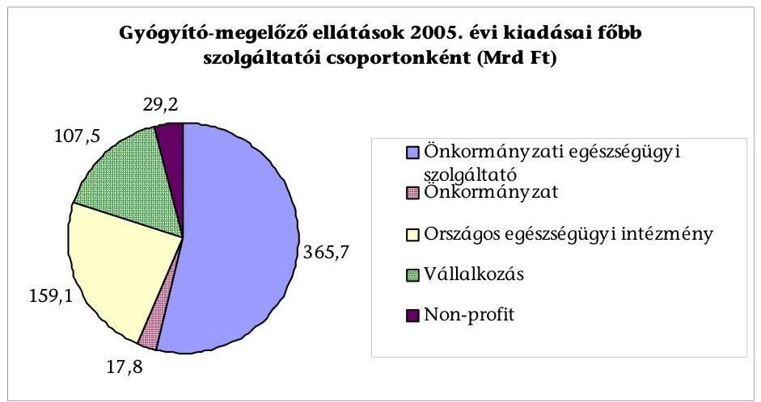

Az 1990-es évek közepétől az egészségügyi intézmények növekvő adósságállománya már jelezte, hogy a gyógyító-megelőző ellátást nyújtó ellátórendszernek a működőképessége fenntartásához mind a működés, mind a fejlesztések terén többletforrásokra van szüksége. Az 1994 után hivatalban volt kormányok egyaránt szerepet szántak a forrásbevonásban a magánszférának és kísérletet tettek az ehhez szükséges jogi háttér ${ }^{4}$ megteremtésére.

Az ÁSZ a társadalombiztosítás pénzügyi alapjai 1998. évi költségvetése végrehajtásáról készült jelentésében már foglalkozott a magánvállalkozások megjelenésével az egészségügyben, de önálló ellenőrzés keretében még nem vizsgálta a kérdést. A jelen vizsgálatot az tette időszerűvé, hogy a folyamatot hiányos szabályozás, állandó bizonytalanság jellemzi, miközben a szakellátások vállalkozásba, működtetésbe adása folyamatosan nő.

Az ellenőrzés célja annak értékelése volt, hogy

[^0]
[^0]:    ${ }^{3}$ OEP finanszírozási adatai alapján.
    ${ }^{4}$ 2001. évi CVII. törvény az egészségügyi közszolgáltatások nyújtásáról, valamint az orvosi tevékenység végzésének formáiról, illetve a 2003. évi XLIII. törvény az egészségügyi szolgáltatókról és az egészségügyi közszolgáltatások szervezéséről.

---

- az egészségügyi szakellátások privatizációjának kialakult gyakorlata mennyiben illeszkedik az egészségpolitikai célkitűzésekhez;
- az egészségügyi szakellátás területén eddig megindult, illetve lezárult folyamatok hatására javult-e a betegellátás, és megfelelően hasznosult-e az állami, illetve önkormányzati vagyon.

Az ellenőrzés a folyamat sikerét, eredményességét a betegellátás javulásában, az egészségügyi intézmények fejlesztésében, az ellátórendszer hatékonyabb működésében jelölte meg, és az ellátás minőségét biztosító követelmények érvényesülésén, a minőség biztosításának alkalmazásán, az ellátás szervezettségének javulásán, az új eljárások elterjesztésén, az ingatlan és gép-műszer beruházások megvalósulásán keresztül értékelte.

Az ellenőrzés alapvetően az 1993-2005 közötti időszakra irányult, de az egyeztetési folyamat lezárásáig figyelemmel kísértük a változásokat.

Az ellenőrzést teljesítmény-ellenőrzési módszerrel hajtottuk végre, amelynek során támaszkodtunk az Egyesült Királyság Számvevőszékének hasonló témakörű vizsgálati tapasztalataira, módszereire.

Az ellenőrzésbe - a szakmai közvéleményre is tekintettel - a művese ellátást, a képalkotó és laboratóriumi diagnosztikai műszerfejlesztést, valamint a járó- és fekvőbeteg-ellátást vontuk be.

A vizsgált időszakban az egészségügyi intézmények egyes szakfeladataikat magánszolgáltatók bevonásával vagy úgy látták el, hogy a finanszírozás az egészségügyi intézményen keresztül történt, vagy úgy, hogy a magánszolgáltató közvetlenül az OEP-pel kötött szerződést. A szerződéseket a már hivatkozott törvények ${ }^{5}$ eltérő elnevezéssel szabályozták, a jelenleg hatályos szabályozás ${ }^{6}$ közreműködői szolgáltatásként definiálja. A jelentésben a szakfeladat ellátására igénybe vett magánszolgáltatói közreműködést alvállalkozásként nevesítjük. A szakfeladat működtetésbe adását - az átláthatóság érdekében - az alvállalkozások között szerepeltetjük, megkülönböztetve a járó- és fekvőbetegintézmények működtetésbe adásától.

Orvosi közreműködői szerződésnek a Jelentésben azokat a szerződéseket nevezzük, amelyek alapján az egészségügyi intézménnyel szerződő társaság tagja a feladatot személyes közreműködéssel látja el. A közreműködői szerződéseket a Jelentésben külön tárgyaljuk, mert számuk növekedése fontos tendenciára hív-

[^0]
[^0]:    ${ }^{5}$ Az egészségügyi közszolgáltatások nyújtásáról, valamint az orvosi tevékenység végzésének formáiról szóló 2001. évi CVII. törvény alvállalkozói, az egészségügyi szolgáltatókról és az egészségügyi közszolgáltatások szervezéséről szóló 2003. évi XLIII. törvény közreműködői szerződésként rögzítette a közreműködési szolgáltatások végzését. A két egymást váltó fogalom tartalmában, feltételeiben azonos volt.
    ${ }^{6}$ Az egészségügyi szolgáltatás gyakorlásának általános feltételeiről, valamint a működési engedélyezési eljárásról szóló 96/2003. (VII. 15.) Korm. rendelet.

---

ja fel a figyelmet, de az a magánvállalkozások, a tőkebevonás folyamatának értékelését nem befolyásolja.

Az ellenőrzött területeken egyes magánszolgáltatók több mint egy évtizede, míg mások néhány hónapja működnek. Az eredményességet a hosszabb ideje működő alvállalkozásoknál, az átalakult, illetve a működtetésbe adott intézményeknél a szerződésekben foglaltak megvalósításán keresztül, a rövid ideje működő intézményeknél a szerződések tartalma alapján vizsgáltuk.

Az ellenőrzés tőkebevonásnak azt tekintette, ha a közszolgáltatást (is) befogadó ingatlan-beruházáshoz a forrást a befektető biztosította, vagy a hitelt a befektető a maga kockázatára vette fel.

Jó gyakorlatnak azt értékeltük, ahol az alvállalkozásba vagy működtetésbe adott szakfeladatnál/szakellátásnál a befektető és a tulajdonos érdekei egyaránt érvényesültek. A szakmai programot a szolgáltató és/vagy a szolgáltató és a befektető közösen határozta meg és ellenőrizte. A betegellátás minőségi követelményei biztosítását szerződésileg kikötötték. A befektető beruházásait saját költségére végezte. A hosszú időtartamú szerződések lejártakor az ellátás biztonságos folytatásához az ingatlan, illetve gép-műszer park a kor színvonalán biztosított.

A helyszíni vizsgálatra kijelölt intézményeket a 2/a-b. sz. mellékletben foglalt mátrix alapján választottuk ki, szempontként figyelembe véve a működési formát, továbbá azt, hogy történt-e vagyon- vagy feladatátadás, rendelkeznek-e alvállalkozói, orvosi közreműködői szerződésekkel.

Helyszíni ellenőrzést 49 intézménynél végeztünk, kérdőívvel és tanúsítványok bekérésével pedig további 24 szervezetet kerestünk meg (3. és 4. sz. melléklet). A helyszíni vizsgálatba vont egészségügyi intézmények csoportosítását az 1. sz. ábra mutatja be.

A helyszíni vizsgálat során a járóbeteg-szakellátást végző egészségügyi szolgáltatónál a reuma szakrendelésen kérdőívvel betegelégedettségi felmérést végeztünk.

Az ellenőrzés végrehajtására az Állami Számvevőszékről szóló 1989. évi XXXVIII. törvény 2. §-ának (3), (5)-(6) és (9) bekezdéseiben, valamint 21. §-ának (3) bekezdésében foglaltak adnak jogszabályi alapot.

A jelentés-tervezetet az egészségügyi miniszter úrnak és a belügyminiszter asszonynak egyeztetésre megküldtük. Az észrevételeket az 1. sz. melléklet tartalmazza.

---

# I. ÖSSZEGZŐ MEGÁLLAPÍTÁSOK, KÖVETKEZTETÉSEK, JAVASLATOK 

Az Alkotmány rendelkezése szerint a Kormány határozza meg az egészségügyi ellátás állami rendszerét, és gondoskodik az ellátás anyagi fedezetéről. Az egészségügyről szóló törvény az állam felelősségévé teszi az egészségügyi ellátórendszer megfelelő mennyiségű, minőségű, eloszlású, összetételű és hatékonyságú működése általános feltételeinek megteremtését. A vizsgált időszak kormányprogramjai a magánvállalkozások és a tőke bevonását tartották az egyik megfelelő eszköznek a költséghatékonyabb ellátórendszer kialakításához. A kormányprogramok és az azokra épülő intézkedési tervek, cselekvési programok azonban nem határozták meg a magánszolgáltatók bevonásának célját, szerepét, a szektorsemlegesség tartalmát, szakmai és területi megoszlását, ezzel összefüggésben az ellátó rendszer struktúra-átalakítását. Mindezek következtében a 90-es évek elején megindult spontán folyamat az egészségügyi szakellátásban ma is így zajlik ${ }^{7}$.

A 2001-ben, illetve 2003-ban megszületett törvények ${ }^{8}$ szabályozták a folyamatot, de a 2001. évi törvényt a 2003. évi helyezte hatályon kívül, a 2003. évit pedig az Alkotmánybíróság semmisítette meg. A hatályon kívül helyezett, illetve megsemmisített törvények fontos garanciális elemeket tartalmaztak, mint például az ellátást biztosító vagyon megőrzése, a szerződések kötelező tartalma, az egészségügyi célvagyon fogalmának bevezetése vagy a vagyoni biztosíték kikötése, de nem tartalmazták az államnak a folyamattal kapcsolatos stratégiai döntéseit és elvárásait. Az egészségügy átalakításában a magánszolgáltatók, illetve a magántőke bevonása, mint eszköz alkalmazása csak átfogó koncepció alapján lehetséges, pontos szerepének megjelölésével, a célzott támogatások meghatározásával. A hivatkozott törvényi garanciák hiánya - figyelemmel a folyamatos egészségügyi ellátás társadalmi fontosságára, az egészségügyi közpénzek volumenére és az ellátórendszer bonyolultságára - megmutatkozik a folyamat gyakorlatában.

Kormányciklusokon átívelő egészségpolitikai célként fogalmazódott meg az egészségügyi ellátórendszer struktúrája átalakításának, illetve költséghatékonnyá tételének igénye, a túlzott, olykor párhuzamos kapacitások leépí-

[^0]
[^0]:    ${ }^{7}$ Az ÁSZ az irányított betegellátási modellkísérlet ellenőrzésénél már tapasztalta a reformlépésnek tekinthető módszer elindítását és működését, stratégiai cél meghatározása és szakmai megalapozás nélkül. A szakellátások privatizációját is az egészségügy átalakítása eszközének tekintette az egészségpolitika. Mindkét terület felvet olyan kérdéseket - például kapacitásnövekedés -, ami az egészségpolitika célkitűzéseivel ellentétes. Mindebből az következik, hogy a vizsgált időszak valamennyi kormányprogramjában szükségesnek ítélt egészségügyi reform, koncepció

 és stratégia nélkül nem lehetséges, amit a - részben vagy egészben szabályozott - reformlépések és azok működési tapasztalatai nem pótolnak.
    ${ }^{8}$ A kórháztörvényt az intézményi törvény, ez utóbbi törvényt pedig az Alkotmánybíróság semmisítette meg, közjogi érvénytelenség miatt.

---

tésével, a járó- és fekvőbeteg-ellátás arányának megváltoztatásával, a teljesítményelvű finanszírozásban részesülő intézmények indokolatlan teljesítménynövelésének a visszaszorításával. A spontán folyamat - a betegellátás javulásában megmutatkozó pozitív hatása mellett - az egészségpolitikai célkitűzések ellen is hat. Következménye az alacsony hatékonyságú intézményi struktúra fennmaradása (pl. kis kórházak működtetésbe adása), a teljesítmények felpörgetése (pl. diagnosztikai ellátások), a kapacitásokban a területi egyenlőtlenségek kialakulása (pl. műveseállomások területi eloszlása) ${ }^{9}$. (1. sz. táblázat az OEP adatszolgáltatása a művese ellátottság területi megoszlásáról 2004. decemberi állapot szerint.)

Az egészségpolitika célkitűzéseit figyelembe vevő kapacitás-befogadás alkalmas a spontán folyamat jelzett negatív hatásainak ellensúlyozására, fékezésére, de azt a gyakorlatban nem biztosította.

A vonatkozó törvény ${ }^{10}$ 2001 előtt az OEP-nek a normatíván belüli kapacitásokra közvetlen szerződéskötési kötelezettséget írt elő, a normatíván felüli kapacitások befogadása a szakminiszter jogköre volt. 2001. január 1-jével az akkori kapacitás-lekötési szerződéses mennyiség befagyasztása után a szolgáltatók saját, már meglévő kapacitásaikra, továbbá többletkapacitásokra pályázhattak. A többletigényeket az e célra elkülönített célelőirányzatból vagy a befogadás előtti év végéig felszabaduló forrásból kellett kielégíteni. Tekintve, hogy a vizsgált időszakban az OEP két alkalommal hirdetett meg szakmai pályázatot (egynapos beavatkozások, hospice ellátások), a befogadások döntően a szolgáltató kezdeményezésére, ajánlattételére történtek.
2006. január 1-jétől a törvény módosítása ${ }^{11}$ lehetővé teszi, hogy az OEP - a törvényben meghatározott feltételek szerint - a befagyasztott kapacitásokon túl továbbiakra pályázatot írjon ki. Rendelkezik arról is, hogy a kapacitáslekötés megszűnik, ha normatíván belül lekötött kapacitásra egy év alatt alapos indok nélkül nem jön létre finanszírozási szerződés és a megszűnés az ellátás biztonságát nem veszélyezteti. A rendelkezések lehetőséget adnak arra, hogy a kapacitás-lekötési, -befogadási eljárásban a szakmapolitikai célok érvényesüljenek. A rendelkezések azonban a 2001. január 1-jével rögzített kapacitásokhoz társuló strukturális ellentmondások feloldására önmagukban nem elégségesek.

1990 óta az egészségügy területén az első kezdeményezés a munkavállalói tulajdonszerzésre, illetve a már funkcionáló kis- és középvállalkozások technológiai fejlesztése támogatására az Egészségügyi Fejlesztési Hitelprogram (Hitel-

[^0]
[^0]:    ${ }^{9}$ Az 1000 lakosra jutó éves teljesíthető kezelésszám az országos átlaghoz viszonyítva a megyékben és Budapesten 42,04 és 141,03% között szór.
    ${ }^{10}$ Az egészségügyi ellátási kötelezettségről és a területi finanszírozási normatívákról szóló 1996. évi LXIII. törvény; az egészségügyi szakellátási kötelezettségről, továbbá egyes egészségügyet érintő törvények módosításáról rendelkező 2001. évi XXXIV. törvény.
    ${ }^{11}$ A kötelező egészségbiztosítás ellátásairól szóló 1997. évi LXXXIII. törvény és az egészségügyi szakellátási kötelezettségről, továbbá egyes egészségügyet érintő törvények módosításáról szóló 2001. évi XXXIV. törvény módosításáról rendelkező 2005. évi CLXXXII. törvény 16. § (1) bek., 17. §.

---

program) volt. A Hitelprogram szakmai, területi ellátási elvárásokat nem tartalmazott. A munkavállalói tulajdonszerzésre elkülönített 25 Mrd Ft-ból felhasználás nem történt.

A technológiai korszerűsítésre elkülönített 15 Mrd Ft-os keret terhére másfél év alatt 2,6 Mrd Ft-ot vett igénybe 92 vállalkozás, átlagosan 10 éves futamidővel. A pályázat elérendő szakmai célokat nem határozott meg, így a jelentős részben (66%) ingatlan vásárlásra, bővítésre, fejlesztésre pályázatot nyertek szerepe az egészségügyi ellátásban nem értékelhető. A már működő vállalkozásoknál a hitel visszafizetésének egyik forrása a mindenkori, OEP-től származó bevétel.

Az Egészségügyi Fejlesztési Hitelprogram tapasztalata, hogy a munkavállalói tulajdonszerzés nem valósult meg; az állami támogatások (kamatkedvezmény és OEP-től származó bevétel) a magánszolgáltatók fizetőképes keresletet kielégítő magánellátásainak létrehozását is elősegítik; az OEP finanszírozás fedezetet nyújt nemcsak a működtetésre, hanem a fejlesztésre is.

A kormányprogramok alapján a magánszolgáltatók, a magántőke bevonásának célja, hogy a magánszféra bekapcsolódásával pluszforrásokhoz jusson a közfinanszírozott egészségügy, verseny alakuljon ki a több szektorú, de szektorsemlegesen finanszírozott szolgáltatók között, szabályozott piaci körülmények mellett. A vizsgált időszakban az egészségpolitika e célok elérésében nem volt irányítója, orientálója a magánszolgáltatók, a magántőke bevonásának. Következményeként a folyamat döntően a magánszolgáltatók akaratából, elképzelései szerint alakult ${ }^{12}$.

# A magánszolgáltatók, a magántőke bevonása az egészségügyi szakellátásba akkor sikeres, ha az a betegellátás javulását eredményezi. 

A vizsgált alvállalkozói, működtetési szerződések pontos, számszerűsíthető, az ellátás minőségére vonatkozó követelményeket elvétve tartalmaznak. Az általános elvárás a megfelelő vagy a minimumfeltételeket teljesítő ellátás biztosítása, és/vagy az ÁNTSZ működési engedélyek megléte. Néhány szerződés ugyan előírta a minőségi mutatók kidolgozását, de azok vagy nem készültek el (Semmelweis Kórház Kht.), vagy nem a meghatározott kritériumokat ellenőrizték (Dr. Batthyány Strattmann László Kórház Kft.). A működtetők önkormányzat előtti beszámoltatása nem rendszeres, nem terjed ki a szerződésben foglaltak tételes vizsgálatára. Jó ellenőrzési gyakorlatot folytat a Budaörsi Önkormányzat. A szakmai ellenőrzés követendő példáját a Debreceni Egyetem Orvos- és Egészségtudományi Centrumnál (DEOEC) tapasztaltuk. A minőségi követelmények pontos meghatározása és ellenőrzése azért fontos, mert az ellátás tartós romlása általánosan használt szerződésbontási feltétel. Szerződésbontás az ellátás minőségének romlása miatt a vizsgált időszakban nem fordult elő.

[^0]
[^0]:    ${ }^{12}$ Az Egészségügyi Minisztérium közigazgatási államtitkárának 2006. március 29-i keltezésű levele szerint, bár hiányzik a központi vezérlés, de e nélkül is kezdenek kirajzolódni megfelelő megoldások, amelyek elterjedése azonban nyilvánvalóan hosszabb folyamatot igényel.

---

A helyszíni vizsgálatba vont átalakult járó- és fekvőbeteg-intézmények több mint fele nem alakított ki belső minőségügyi rendszert, amellyel megsértették a vonatkozó törvényi rendelkezésben ${ }^{13}$ foglaltakat. A minőségügyi rendszert üzemeltető 8 szolgáltató mindegyikét független cég auditálta, 2 szolgáltató tanúsítása a helyszíni vizsgálat alatt zajlott.

A minőségügyi rendszer egyik eleme a betegelégedettség mérése. A tapasztalatok hasznosítása az átalakult, illetve működtetésbe adott intézményeknél rendszeres. ${ }^{14}$ A helyszíni vizsgálatba vont járóbeteg-szakellátó intézmények reuma szakrendelésén végzett ÁSZ betegelégedettségi felmérés 1273 feldolgozott kérdőíve alapján a betegek megítélése szerint a különböző tulajdonformájú szolgáltatók szakmai működésében - egy kivételével - kirívó különbség nincs.

Az adatok tanúsága szerint a magánszolgáltatók szignifikánsan nagyobb mértékben törekedtek a járóbeteg-szakellátásban az ellátás szervezettségének javítására. A járóbeteg-szakrendelőkben a várakozási idő rövidülését szolgálja az időpontkérési lehetőség bevezetése. A szolgáltatott adatok szerint az előjegyzéssel elérhető szakrendelések száma és aránya minden szolgáltató csoportban évről évre növekedett. A vizsgált mintában a működtetésbe adott szakrendelők esetén az arány 2000-2004 között 39,7%-ról 66,2%-ra nőtt. 2004-ben a vizsgált közhasznú társaságoknál 58,7%, a költségvetési intézményeknél 37,7%, az újonnan alakult járóbeteg-szakrendelések esetén 80,9% az előjegyzéssel igénybe vehető szakrendelések száma.

Az ingatlan és gép-műszer beruházás, felújítás a helyszíni vizsgálatba vontaknál minden esetben pozitív hatást gyakorolt a betegellátásra.

A helyszínen minőségi szempontból vizsgált alvállalkozói szerződésekből 54% tartalmazott ingatlanberuházást, ennek 43%-a új ingatlan építésére vonatkozott, a többi építészeti átalakításra. Mindezek a korszerű és nagyobb kapacitást eredményező fejlesztéshez szükséges műszaki feltételek megteremtését szolgálták. A minőségi szempontból vizsgált alvállalkozói szerződések 92%-a tartalmazott műszerberuházást. A műszerberuházás igényes szakmákban fontos kritérium, hogy az intézmény a közbeszerzési eljárás kiírásakor pontosan definiálja műszerfejlesztési igényét, és a továbbiakban gondoskodjon a szolgáltatás mindenoldalú ellenőrzéséről. Jó gyakorlatot folytat a DEOEC, mert a műszerbeszerzésekhez részletes igényt fogalmazott meg, a szolgáltatást pedig folyamatosan, szervezett formában ellenőrizte.

Az önkormányzati tulajdonú átalakult intézményeknél a beruházási forrásokat az önkormányzat fedezi. A közfeladat közhasznú társasági formá-

[^0]
[^0]:    ${ }^{13}$ Az egészségügyről szóló 1997. évi CLIV. törvény 121. §.
    ${ }^{14}$ A Dombóvári Kórház a dolgozók elégedettségéről is vizsgálatot végez, és azt hasznosítja. A Flór Ferenc Kórház az alvállalkozásba adott szakfeladatok működésének értékelését tesztelte a fekvő beteg osztályokon, a szerződések megújítása előtt. A tapasztalatok felhasználásáról nincs információ.
    Példaértékű Budaörs Város Önkormányzatának kezdeményezésére a „fogyasztói" elégedettség vizsgálata 2003-ban, ahol a közszolgáltatások minőségére vonatkozó felmérésből kiderült, hogy a lakosság az egészségügyi ellátással a legelégedettebb.

---

ban történő ellátásának egyik célja, hogy a jövőbeni gazdaságos működés eredményeként keletkező nyereséget visszaforgassák az egészségügyi ellátás, elsősorban a műszerezettség korszerűsítésére.

A közfinanszírozott működtetésbe adott járó- és fekvőbetegintézményeknél megvalósult ingatlan-beruházások minőségjavító hatását a már régebb óta működő járóbeteg-szakrendeléseknél vizsgáltuk. Két szolgáltató megvásárolta a betegellátást szolgáló épületet, és azt teljes körűen felújította, egy harmadik az egynapos sebészeti ellátás feltételeit teremtette meg, javítva ezzel az ellátás körülményeit. A 4 fekvőbeteg-intézménynél a működtetésbe adás óta eltelt rövid idő miatt a szerződési feltételeket vizsgáltuk. Ingatlanberuházásra 2 működtetésbe adási szerződés tartalmazott megkötést (Kiskunhalasi Semmelweis Kórház Kht., Várpalota Kórház Kht.), megvalósult ingatlanberuházásra is 2 esetben (Dr. Batthyány Strattmann L. Kórház Kft., Kiskunhalasi Semmelweis Kórház Kht.) került sor.

A közfinanszírozott járó- és fekvőbeteg-intézmények működtetésbe adásának általános indoka a biztonságos ellátáshoz, a forrásigényes fejlesztésekhez szükséges tőke bevonása, ezzel szemben a vizsgált szolgáltatók közül erre 44%-ban volt példa. A hitelek visszafizetésének forrása - teljesen vagy részben - az OEP-től származó bevétel.

A magánvállalkozások, a tőke bevonása pozitívan hat a betegellátásra az annak minőségét biztosító követelmények érvényesülésével, a minőség biztosításának alkalmazásával, az ingatlan és gép-műszer beruházások megvalósulásával, illetve folyamatos karbantartásával, fejlesztésével. A szolgáltatások alvállalkozásba vagy működtetésbe adásának azonban negatív hatásai is vannak.

Az OEP finanszírozást meghaladó vállalkozói díjak közvetetten negatív hatást gyakorolnak a betegellátásra, mert azokat az intézmény a többi ellátásra fordítható OEP finanszírozás terhére tudja kifizetni. Az OEP finanszírozást meghaladó díjazás jellemzően a laboratóriumi ellátásban fordult elő. A vállalkozó a fekvőbeteg-ellátásban elvégzett laborvizsgálatokra az intézménynek kifizetett összegnél magasabb, a járóbeteg-ellátásban fizetett díjra szerződik, ezen túlmenően előfordul a teljesített - a finanszírozás alapját képező - pont alatti és feletti teljesítmény eltérő díjazása, valamint a teljesítmény szerinti díjazás mellett átalánydíj kikötése is ${ }^{15}$, ami adott esetben többszörös túlfizetést jelent az intézmény számára.

A művese-kezeléseknél az 1998. évi kassza zárás után a kezelések számának ugrásszerű növekedése mellett az egy kezelésre jutó OEP finanszírozás az 1994. évi szint alatti. Mindezek ellenére a magánszolgáltatók új kezelőhelyeket létesítenek, elmondásuk szerint az „előre menekülésben" érdekeltek.

A teljesítmények „felpörgetése" is a közvetett negatív hatások közé tartozik. A laboratóriumi vizsgálatok száma - egy kivételével - valamennyi tanúsítvány-

[^0]
[^0]:    ${ }^{15}$ A helyszíni vizsgálat során az említett szerződési kikötéseket egy, illetve három esetben tapasztaltuk.

---

nyal megkeresett fekvőbeteg-intézménynél növekedett, ami a működtetésbe adott laboratóriumi szolgáltatásoknál még magasabb. A laboratóriumi vizsgálatok számának növekedése önálló szakmai vizsgálatot igényel.
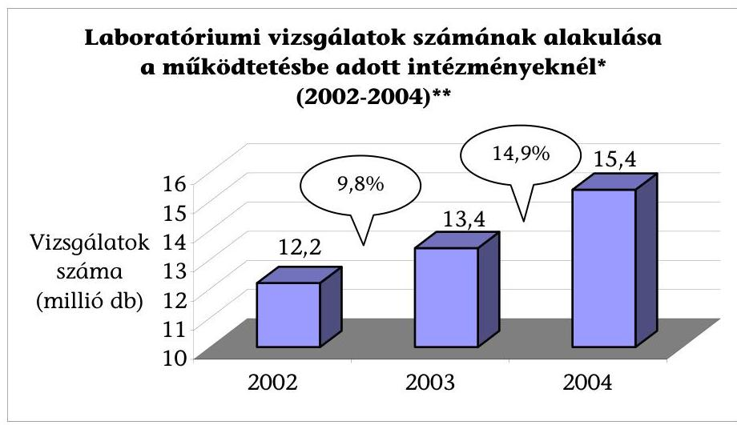

* 5 intézmény adata, amelyekből 1 esetben a laboratóriumi vizsgálatok száma csökkent
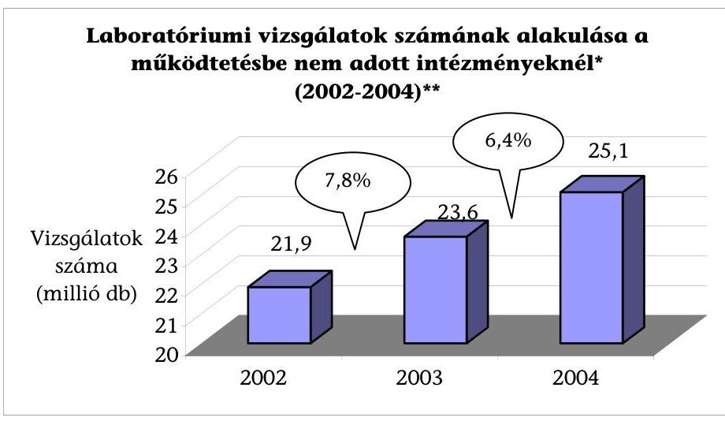
*17 intézmény adata
** A helyszíni vizsgálat lezárásakor (2005. december 2.) rendelkezésre álló 2005. évi adatok a bemutatott tendenciát tükrözik.

A költségvetési keretek túllépését megakadályozni szándékozó központi intézkedések (kassza zárás, finanszírozás „lebegtetése", volumen korlátos finanszírozás, kapacitások „befagyasztása")
 biztosíthatják a költségvetési előirányzatnak megfelelő teljesítést, de tervezhetetlen a magánszolgáltatók számára, akik befektetéseik megtérüléséhez a teljesítmények növelésében, új kezelőhelyek létesítésében, további működtetési vagy alvállalkozói szerződések megkötésében és a normatíván felüli kapacitások befogadásában érdekeltek.

A közreműködői szerződések, amelyek a 2000-es évek elején váltak általános gyakorlattá, szinte a teljes szakmai palettát felölelik. Megkötésük elsődleges indoka a szakorvosok (egészségügyi szakdolgozók) hiánya, a magasabb szintű, hatékonyabb és gazdaságosabb feladatellátás, a bérkiadás megtakarítása,

---

egyes tevékenységeknél a teljesítmény növelésének, az előjegyzési idő csökkentésének ösztönzése volt, továbbá motiválta az ügyeleti, készenléti szolgálat biztosításában az orvosok munkavégzésére vonatkozó foglalkoztatási időkorlát is.

A Kjt. ${ }^{16}$ tiltja, hogy a munkáltató a vele közalkalmazotti jogviszonyban álló közalkalmazottal munkaköri feladatai ellátására munkavégzésre irányuló további jogviszonyt létesítsen. Az egészségügyi tevékenység végzésének egyes kérdéseiről rendelkező törvény ${ }^{17}$ pedig előírja, hogy az egy naptári napra eső egészségügyi tevékenységek időtartama a 12 órát akkor sem haladhatja meg, ha az egészségügyi dolgozó több egészségügyi szolgáltatóval áll munkavégzésre irányuló jogviszonyban vagy alkalmazottként és vállalkozóként is tevékenykedik. A vizsgált fekvőbeteg-ellátó intézmények ( $26,3 \%$-ban tételesen dokumentálható módon) saját közalkalmazottaik gazdasági társaságaival kötöttek közreműködői szerződést, ugyanazt az orvost közalkalmazottként és társas vállalkozás tagjaként is foglalkoztatták. A kialakult gyakorlat - az érintett közalkalmazottak vonatkozásában - a Kjt. idézett szabályának, az ügyeleti készenléti szolgálat ellátására kötött szerződések a foglalkoztatási időkorlátra vonatkozó rendelkezés megkerülését szolgálják. A szakemberek időkorlát nélküli foglalkoztatása saját egészségüket és a betegellátás biztonságát is veszélyezteti.

A Fővárosi Önkormányzat Bajcsy-Zsilinszky Kórházában folytatott orvosi műszak-szervezés jó gyakorlat. A Kórház nem folytat jogsértő gyakorlatot sem az orvosok munkában töltött ideje, sem a kifizetett bér tekintetében, és betartja a munkaidő-korlátot is.

# Az egészségügyi szakellátást biztosító vagyon, illetve vagyoni jogok 

hasznosulását meghatározta az alvállalkozói, vagy működtetési szerződések tartalma.

Az egyes szakfeladatok alvállalkozásba, működtetésbe adásának egyik oka a terület szakmai fejlesztése, a másik a gyors technikai fejlődés követésének elmaradása a tulajdonosi és intézményi forráshiány következtében. Az intézményi átalakulásoknál az önkormányzatokat a gazdaságos működés, az önkormányzati költségvetés védelme, és a működtetésbe adás útján a későbbi tőkebevonás motiválta.

Az egyes szakfeladatok működtetésbe adásánál mind az előkészítésben, mind a pályáztatásban az önkormányzatok és az intézmények nagyobb gondossággal járnak el, mint az alvállalkozói szerződéseknél. Indoka ennek, hogy a működtetésbe adásnál az elvégzett beruházások nagyságrendje hosszú távú szerződést igényel, illetve az újonnan beszerzett gép-műszerek folyamatos rendelkezésre állását az esetleges szerződésbontást követően is biztosítani kell.

## A pályáztatást meghatározza a magánszolgáltatói kezdeményezés,

így jellemző, hogy egy pályázó nyújtott be érvényes pályázatot. Az is előfordult,

[^0]
[^0]:    ${ }^{16}$ A közalkalmazottak jogállásáról szóló 1992. évi XXXIII. törvény 42. §.
    ${ }^{17}$ Az egészségügyi tevékenység végzésének egyes kérdéseiről szóló 2003. évi LXXXIV. törvény 13. §.

---

hogy fekvőbeteg-ellátó intézmény pályáztatás nélkül került gazdasági társaság tulajdonába. ${ }^{18}$

A tőkebevonást mind a kormányprogramok, mind az önkormányzatok olyan eszköznek tekintik, amelyek pótolják, kiegészítik az egészségügy fejlesztéséhez szükséges - de állami, önkormányzati költségvetésben rendelkezésre nem álló forrásokat. A befektetői oldalon viszont tőkebevonásnak tekintik nemcsak az általuk felvett hitelt, köztük a kedvezményes állami hitelt is, hanem a pályázaton nyert összegeket és a működtetésbe vett és/vagy tulajdonolt fekvőbetegintézmény által felvett hitelt vagy a neki nyújtott kölcsönt is. A működtetésbe adott intézmény által felvett hitel vagy kölcsön visszafizetése, amelynek forrása az OEP-től származó bevétel, - az egyébként alulfinanszírozottnak ítélt egészségügyben - önmagában is aggályokat vet fel, és nem zárja ki a befektetői oldalon a többszörös megtérülés lehetőségét. A kérdéskör egyértelmű rendezését indokolttá teszi a tőkebefektetéssel párhuzamosan jelentkező ún. piacvásárlás ténye vagy szándéka is, figyelemmel új monopol helyzetek kialakulásának lehetőségére is. A Kiskunhalasi Semmelweis Kórház Kht. esetében a tőkebevonás - részben vagy egészben - a Kórház Kht. hitelfelvételéből és nem a befektető magántőkéjéből valósul meg. (A Semmelweis Kórház Kht. működtetésbe adási folyamatát részletesen az 1. sz. függelék mutatja be.)

Tekintettel arra, hogy az egészségügyi ellátást biztosító önkormányzati vagyon nemcsak az ellátás biztonságát szolgálja, hanem fejlesztések, átalakulások forrása is lehet, a járó- és fekvőbeteg-ellátás működtetésbe adásának jelenlegi gyakorlata aggályokat vet fel. Megtartására nem jelent garanciát az, hogy az ingatlan vagyon az önkormányzat tulajdonában marad, mert - megfelelő szerződési feltételek hiányában - szerződésbontáskor vagy a szerződés lejártakor a beruházások, fejlesztések értékének megtérítési kötelezettsége azt kérdésessé teszi. Az ingatlan vagyon elajándékozása pedig - más, egészségügyi ellátás biztosítására szolgáló ingatlan hiányában - veszélyezteti a kötelező, vagy önként vállalt egészségügyi ellátás biztosítását. A Siklósi Kórház Kht. működtetésbe adásakor az Önkormányzat az egészségügyi feladatai biztosítását szolgáló vagyonát ingyenesen a vállalkozói tulajdonba került Kórház Kht.-ra ruházta át, valamint tudomásul vette, hogy tíz év eltelte után az egészségügyi funkciót a vállalkozó megváltoztathatja, amihez nem szükséges az Önkormányzat hozzájárulása. (A Siklósi Kórház Kht. működtetésbe adási folyamatát részletesen a 2. sz. függelék mutatja be.)

Az átalakult, illetve működtetésbe adott intézményeknél, valamint magán egészségügyi szolgáltatóknál gyakorlat, hogy fejlesztést, beruházását részben vagy egészben az OEP-től származó bevétel terhére valósítanak meg ${ }^{19}$. A költségvetési egészségügyi intézmények ugyanakkor a „piaci viszonyok" miatt kénytelenek az OEP finanszírozást meghaladó vállalkozási díjak kifizetésére,

[^0]
[^0]:    ${ }^{18}$ A Körmendi Önkormányzat képviselő-testülete Dr. Batthyány Strattmann L. Kórház Kft. működtetésbe adását rögzítő a szerződés megkötése előtt 1 nappal módosította vagyonrendeletét azért, hogy a működtetésébe adást pályáztatás nélkül végezhessék el.
    ${ }^{19}$ A MaMMa Egészségügyi Rt. tájékoztatása szerint valamennyi beruházását, fejlesztését saját erőből végezte, nem az OEP-től származó bevétel terhére.

---

mert önmaguk és a tulajdonos önkormányzatok sem képesek lépést tartani az orvostechnikai fejlődéssel. Egyre nagyobb a költségvetési intézmények „versenyhátránya", hiszen hitelfelvételére önállóan nem jogosultak, a fejlesztési forráshiányok miatt az OEP finanszírozást meghaladó szerződési feltételek elfogadására kényszerülnek. Mindez a szektorsemlegesség - finanszírozáson túli - fogalmának újragondolását igényli.

Az önkormányzati tulajdonú közhasznú társasággá alakult intézményeknél a pályáztatás nem merül fel. Az ellátást szolgáló ingatlan az önkormányzat tulajdonában marad, az eszközöket általában a szolgáltatást végző használatába/tulajdonába kerülnek, de előfordul, hogy azok is önkormányzati tulajdonban maradnak (Dél-Budai Egészségügyi Szolgáltató Kht., VESZ Debrecen Kht.). Rendszeres fenntartói támogatásban részesülnek, fejlesztéseiket, beruházásaikat pályázati pénzekből, saját forrásból és tulajdonosi hozzájárulásból fedezik.

A helyszíni ellenőrzés megállapításainak hasznosítása mellett javasoljuk:

# a Kormánynak: 

1. Dolgozzon ki átfogó egészségpolitikai koncepciót, amelynek keretében határozza meg a magántőke, a magánvállalkozások lehetséges szerepét, szakmai területeit, az állami támogatások alapelveit, és mindezekre figyelemmel szabályozza az egészségügyi szakellátások működésének rendszerét.
2. Kezdeményezze - az egészségpolitikai koncepcióval összefüggésben - a korlátozott forgalomképességű ingatlanvagyonnal való rendelkezés törvényi újraszabályozását annak érdekében, hogy az ellátási kötelezettség fennállásáig az ellátást szolgáló ingatlan ne legyen elidegeníthető, elajándékozható.

---

# II. RÉSZLETES MEGÁLLAPÍTÁSOK 

## 1. AZ EGÉSZSÉGPOLITIKA IRÁNYÍTÓ SZEREPE A MAGÁNVÁLLALKOZÁSOK, A MAGÁNTŐKE BEVONÁSÁBAN

Az 1990-2006. évek közötti kormányprogramok, illetve az arra alapozott egészségügyi intézkedési, cselekvési tervek különböző részletezettséggel foglalkoztak az egészségügyi a magánvállalkozások, a magántőke bevonásának kérdésével. Céljának, szerepének meghatározása, összefüggése az egészségügyi ellátórendszer reformjával - nem történt meg. Mindeközben spontán folyamatként növekedett a magánszektor térnyerése az egészségügyi szakellátásban, továbbá megkezdődött a járó- és fekvőbeteg-ellátásban a költségvetési egészségügyi intézmények átalakulása közhasznú és gazdasági társasággá, majd egy részük működtetésbe adása anélkül, hogy az ellátó rendszer egészének átalakítására átfogó koncepció alapján - tényleges lépések történtek volna.

### 1.1. A magánszolgáltatók, a magántőke bevonásának megfogalmazása a kormányprogramokban

Az 1990-1994. évi kormányprogram mellékleteként csatolt egészségpolitikai javaslatok leszögezik, hogy „A gazdasági rendszerváltozással, a létrejövő önkormányzatokkal megteremtődnek a feltételek az egészségügyi tulajdon rendszer monolit és hierarchikus jellegének megszüntetéséhez. Az ellátó rendszer szerkezeti átalakulásának a tulajdonformák sokféleségére kell épülnie." 1991-ben az egészségügyi rendszer megújítására készült cselekvési program ${ }^{20}$ megerősíti, hogy a piaci elven működő egészségügy kialakításának feltétele a különféle tulajdonformák megléte. A programban megfogalmazottak szerint az egészségügyben elválasztandó a tulajdon és a működtetési jog fogalma. Az egészségügyi ellátás állami feladat, amely jogát az állam tartósan átruházhatja alkalmas személyre vagy közösségre.

Az 1994-1998. évek kormányprogramja a többszektorú szolgáltatási szféra kialakítása érdekében jogi és pénzügyi eszközökkel kívánta ösztönözni a különböző tulajdoni formákat az alapellátásban és a járóbeteg-szakellátásban, valamint a kórházak infrastrukturális és diagnosztikai részlegein. A Kormány 1107/1994. (XI. 23.) sz. határozata ösztönözni kívánta az önkormányzati és állami kórházak közhasznú társasággá, alapítványi tulajdonná alakítását, továbbá a különböző tulajdoni formák megjelenését elsősorban a kórházon kívüli egészségügyi ellátásban tartotta kívánatosnak, de a kórházak infrastrukturális és diagnosztikai részlegein is megvalósíthatónak ítélte. A fekvőbeteg-ellátás területén is csökkenthető az állami tulajdon aránya és szerepe. Az önkormány-

[^0]
[^0]:    ${ }^{20}$ Cselekvési program egészségügyi rendszerünk megújítására, Népjóléti Minisztérium 1991. július, Orvosi Hetilap melléklete.

---

zati és állami kórházakban a non-profit működési mód, a közhasznú társaságok, az alapítványok preferálásával kell segíteni az új formák elterjedését.

Az 1998-2002. évi kormányprogram a magántulajdon szerepének megerősödését valódi és funkcionális privatizáció formájában határozta meg az alapés járóbeteg-ellátásban. Álláspontja szerint a fekvőbeteg-ellátást szolgáló intézmények meghatározó része önkormányzati tulajdonban marad, de egyre nagyobb szerepet kapnak a non-profit alapon működő szervezetek. Az ellátó rendszert nyitottá kívánták tenni a befektetni hajlandó magántőke előtt. Az elképzelések szerint a biztosítótól kapott finanszírozás - hatékony működést feltételezve - fedezetet nyújt a működési költségeken túl a karbantartási és pótlási szükségletekre is.

A 2002-2006. évek kormányprogramja az önkormányzati tulajdon fenntartása mellett anyagilag is támogatni kívánta az intézmények közhasznú társasággá, gazdasági társasággá alakulását, és a magánvállalkozások, a magántőke bevonásának elősegítése érdekében a befektetőkre vonatkozó ágazati megkötések feloldását tervezte. Különböző technikák, például a Munkavállalói Résztulajdonosi Program felélesztését támogatta. Az adó- és pénzügyi szabályok módosításával, az egészségügyi intézmények gazdálkodásának formaváltásával, a menedzsment nagyobb autonómiája révén lehetőséget kívánt teremteni arra, hogy az orvosok, magánbefektetők és egészségpénztárak is részt vehessenek a szolgáltatások nyújtásában, az infrastruktúra korszerűsítésében.

A kormányváltást követően 2004-2006. évek kormányprogramja a tulajdoni formákra vonatkozóan mindössze annyit fogalmazott meg, hogy kedvezményekkel kívánja segíteni az egészségügyben a közcélú magánbefektetőket, valamint az egészségügyben dolgozók tulajdonossá válását, amihez az egészségügyi finanszírozás kiszámíthatóvá, tervezhetővé, értékállóvá tételére van szükség. Deklarálta, hogy az egészségügy átalakítása kormányzati ciklusokon átívelő feladat.

Az egészségügyi miniszter 2005 februárjában előterjesztést készített a Kormány részére az egészségügyi ellátó rendszer lehetséges tulajdoni és működtetési viszonyairól. Az előterjesztés az egészségügy szerkezetátalakítási folyamatában fontosnak ítélte az alap-értékek megőrzését, így például a mindenki számára elérhető, térítésmentes, közfinanszírozott, a közép-európai uniós átlagnál nem rosszabb ellátás megőrzését. Megállapította, hogy a tulajdoni és működési formák megőrzése vagy megváltoztatása csupán eszköz az átalakításhoz. A tulajdoni és működési formák tipizálására törvény megalkotása szükséges. Az előterjesztés megállapította, hogy a törvény szakmai előkészítése mellett az egészségügyre vonatkozó
 középtávú kormánykoncepció kidolgozása elsődleges feladat. Az előterjesztést a Kormány nem tárgyalta.

A kormányprogramok eltérő mértékben, de valamennyi ellátási formánál az állam szerepvállalásának csökkentését tartották szükségesnek. A meglévő intézményrendszer általános tulajdonátadása nem volt cél, a funkcionális privatizációt preferálták. A változástól a költségvetési gazdálkodás rugalmatlanságának oldását, a befektetők megjelenését várták.

---

# 1.2. A magánvállalkozások, a magántőke bevonása a gyakorlatban 

Az Eütv. ${ }^{21}$ szerint az állam felelőssége az egészségügyi ellátórendszer megfelelő mennyiségű, minőségű, eloszlású, összetételű és hatékonyságú működése általános feltételeinek megteremtése, működtetésének biztosítása. E felelősség körében az állam feladata az egészségügyi ellátórendszer, az egészségügyi ellátási kötelezettség és felelősség meghatározása. A magánvállalkozások, a magántőke bevonása nem mentesíti az államot az egészségügyi ellátórendszer megtervezésével, finanszírozásával kapcsolatos stratégiai és gyakorlati döntések meghozatalától. Az államnak a folyamatot befolyásolnia, orientálnia kell az egészségpolitikai, szakmapolitikai célrendszer meghatározásával, a kitűzött célokkal összhangban pedig - ha szükséges - a tőkebevonást kedvezményekkel vagy más módon ösztönöznie kell.

### 1.2.1. A kapacitás-befogadás gyakorlata

A „spontán" folyamat egyik következménye a nem hatékony intézményi struktúra fennmaradása, a teljesítmények felfutása, a területi egyenlőtlenségek újratermelődése, vagy kialakulása. A folyamat ezen negatív hatásai korlátozhatók a társadalombiztosítási finanszírozásba befogadási eljárással, ha az biztosítja a meghirdetett egészségpolitikai célokkal az összhang megteremtését.

A kapacitások bővítéséről, befogadásáról 1992-1996 között az Egészségbiztosítási Önkormányzat Elnöksége hozott határozatot az OEP szakértői előkészítése, a szakminisztérium rangsorolása alapján. A kapacitás szabályozás szükségességére, a kapacitások direkt csökkentésére az 1995. évi költségvetési tervezéskor került sor a költségvetési hiányok mérséklése érdekében. Az intézkedés elsődlegesen a fekvőbeteg-kapacitásokat érintette.

A kapacitás lekötés törvényi szabályozása az 1996. évi LXIII. ${ }^{22}$ törvénnyel valósult meg, amely az ellátó rendszer korszerűsítését tűzte ki célul. A törvény értelmében a normatíván belüli lekötött kapacitásokra az OEP a szolgáltatókkal közvetlenül köthetett szerződést, a tárcát irányító miniszternek pedig jogában állt az ellátási normatívák feletti kapacitások befogadása ${ }^{23}$, ezzel a mindenkori miniszter élt is.

Az 1996. évi LXIII. törvényt a 2001. évi XXXIV. törvény ${ }^{24}$ hatályon kívül helyezte. A kapacitásokat és azok szakmai összetételét kialakultnak tekintette

[^0]
[^0]:    ${ }^{21}$ Az egészségügyről szóló 1997. évi CLIV. törvény 141. § (2) bekezdés a.) pontja.
    ${ }^{22}$ Az egészségügyi ellátási kötelezettségről és a területi finanszírozási normatívákról szóló 1996. évi LXIII. törvény.
    ${ }^{23}$ A zárszámadások alkalmával ezek meglétét az ÁSZ rendben találta, így a jelen ellenőrzés ismételten azokat nem vizsgálta.
    ${ }^{24}$ Az egészségügyi szakellátási kötelezettségről, továbbá egyes egészségügyet érintő törvények módosításáról szóló 2001. évi XXXIV. tv.

---

és azt a 2001. január 1-jén érvényes kapacitás-lekötési szerződéses mennyiség szintjén befagyasztotta. A törvény értelmében az e fölötti befogadásokat az egészségügyi miniszter a pénzügyminiszter egyetértésével engedélyezi. A törvény felhatalmazta a Kormányt, hogy a kapacitás módosítások részletes szakmai szabályait, eljárási rendjét, átcsoportosítását és az új szolgáltatók befogadásának szabályait rendeletben írja elő. Az 50/2002. (III. 26.) Korm. rendelet ${ }^{25}$ szakmai követelményeket határozott meg a norma feletti igények elbírálásához és kikötötte, hogy a többletigények forrása az e célra elkülönített célelőirányzat lehet, vagy a befogadás előtti év végéig felszabaduló forrás.

Az OEP kapacitás-befogadási, - lekötési eljárásban - a jogszabályok keretei között - szakértői, döntés-előkészítő szerepet játszott, önállósággal nem rendelkezett a folyamatban, finanszírozó nem válogathatott az alkalmas pályázók között a jogszabály szempontrendszere szerint. A befogadás a szolgáltató kezdeményezésére, ajánlattételére ad lehetőséget és nem erősíti az OEP biztosítói szerepkörét, kezdeményezési lehetőségét a struktúra módosításában, a szükséges fejlesztések meghatározásában. A vizsgált időszakban az OEP két alkalommal írt ki pályázatot a hospice és az egynapos ellátásra.
2006. január 1-jétől ${ }^{26}$ lehetővé vált, hogy az OEP - az egészségügyi miniszter és a pénzügyminiszter egyetértő engedélyével, az egészségügyi miniszter által meghatározott és az Egészségügyi Minisztérium hivatalos lapjában közzétett szakmai prioritások figyelembevételével - kapacitások befogadására pályázatot írjon ki, a jogszabályok korlátai között.

# 1.2.2. Az Egészségügyi Fejlesztési Hitelprogram 

Az egészségügy területén az Egészségügyi Fejlesztési Hitelprogram (Hitelprogram) a munkavállalói tulajdonszerzést, illetve a már funkcionáló kis- és középvállalkozások technológiai fejlesztését célozta meg. A Hitelprogram megvalósításáról (2003. október) készült előterjesztés előzetes becslésekre hivatkozva, a közalkalmazotti státuszból kikerülők tulajdonszerzésének támogatására 25 Mrd Ft-os keretösszeget, míg a technológiai megújulás ösztönzésére 15 Mrd Ft-os kedvezményes kamatozású beruházási hitelkeretet biztosított. ${ }^{27}$

[^0]
[^0]:    ${ }^{25}$ Az egészségügyi szakellátási kapacitásmódosítások szakmai feltételeiről, eljárási rendjének és az új szolgáltatók befogadásának szabályairól szóló 50/2002. (III. 26.) Korm. rendelet.
    ${ }^{26}$ A kötelező egészségbiztosítás ellátásairól szóló 1997. évi LXXXIII. törvény és az egészségügyi szakellátási kötelezettségről, továbbá egyes egészségügyet érintő törvények módosításáról rendelkező 2001. évi XXXIV. törvény módosításáról rendelkező 2005. évi CLXXXII. törvény 16. § (1) bek.
    ${ }^{27}$ 2271/2003. (X. 31.) Korm. határozat az Egészségügyi Fejlesztési Hitelprogram kidolgozásának és meghirdetésének kormányzati feladatairól és a 2130/2004. (VI. 7.) Korm. határozat az Egészségügyi Fejlesztési Hitelprogram és a vissza nem térítendő bankgarancia díjtámogatás kidolgozásának és meghirdetésének kormányzati feladatairól szóló 2271/2003. (X. 31.) Korm. határozat módosításáról.

---

A munkavállalói tulajdonszerzésre elkülönített 25 Mrd Ft-ból hitelfelvétel nem volt. A Kormány 1095/2005. (IX. 22.) határozata - az EüM javaslata alapján - a keretet a Sikeres Magyarországért Hitelprogramba az önkormányzatokhoz csoportosította át, önálló hitelcélként olyan egészségügyi szolgáltatások fejlesztését jelölve meg, mint mentőállomások fejlesztése, a kistérségi járóbeteg-ellátást szolgáló létesítmények, eszközök, berendezések felújításának, fejlesztésének elősegítése 20 éves futamidőre, 3 év türelmi idővel. A hitelfelvételre az önkormányzatok jogosultak, és a magánosítás elősegítése már nem cél a felhasználásban.

A technológiai korszerűsítésre elkülönített 15 Mrd Ft-os keret terhére 2004-2005. június 30. napjáig 2,6 Mrd Ft-ot vett igénybe 92 vállalkozás, átlagosan 10 éves futamidővel. A tételesen átnézett hitelfolyósítási dokumentációk szerint a hitelek támogatás tartalma jellemzően 10\%, visszafizetésük átlagosan 2 év türelmi idő után kezdődik.

| A Hitelprogram technológiai fejlesztésre nyújtott hiteleinek adatai |  |  |  |  |  |  |  |
| :--: | :--: | :--: | :--: | :--: | :--: | :--: | :--: |
| Év | Vállal-   kozások   száma | Ingatlan   (vétel,   felújítás)   (Mrd Ft) | Gép-   műszer   beszerzés   (Mrd Ft) | Egyéb   (Mrd Ft) | Összes be-   ruházás   (Mrd Ft) | Hitel   összege   (Mrd Ft) | Hitel   aránya   (\%) |
| 2004 | 55 | 1,33 | 1,16 | 0,22 | 2,72 | 1,46 | $69,54 \% *$ |
| 2005.   06. 30. | 37 | 0,62 | 0,65 | 0,22 | 1,49 | 1,14 | $74,96 \% * *$ |

* A saját erő 0,34 és $25 \%$ közötti
** A saját erő 25 és $84 \%$ közötti
A technológiai hitellel elérendő szakmai célt a Kormány nem határozta meg, így jelentős részben (66\%) a pályázatok ingatlan vásárlásra, bővítésre, fejlesztésre, orvosi rendelő, kezelő kialakításra, egy részében felszerelésére is nyertek kedvezményes hitelt. A 61 pályázatból 18 fogászati területet érint. A pályázók egy része a hitel visszafizetésének forrásaként az OEP-től származó bevételt jelölte meg, ami azzal összefüggésben értékelhető, hogy a létrejövő új szolgáltatók is törekszenek kapacitásaikat az OEP finanszírozásba befogadtatni.

A technológiai hitelből a vizsgálati mintába kiválasztott szolgáltatók közül a MaMMa Egészségügyi Rt. ${ }^{28}$, a HUNIKO Kereskedelmi és Egészségügyi Szolgáltató Kft., a NEURO CT Pécsi Diagnosztikai Kft., az EUROP-MED Orvosi Szolgáltató Kft. és a HT Medical Center Egészségügyi Kereskedelmi és Szolgáltató Kft. részesült. A szolgáltatók az OEP finanszírozáson túl egyéb bevételeik terhére is vállalták a hiteltörlesztést az ellátás korszerűsítése érdekében.

[^0]
[^0]:    ${ }^{28}$ A MaMMa Rt. 2006. január 19-én felmondta a korábban megkötött hitelszerződést. Az indoklás szerint a zártkörű részvénytársaság részvényesei kisbefektetők, illetve munkavállalók, akiket a bank által megküldött Tulajdonosi Nyilatkozatban foglaltak személyes következményeivel nem kívánta terhelni az Rt. ügyvezetése.

---

Az Egészségügyi Fejlesztési Hitelprogram azt mutatja, hogy

- a munkavállalói tulajdonszerzés nem valósult meg;
- az állami támogatások (kamatkedvezmény és OEP-től származó bevétel) a magánszolgáltatók fizetőképes keresletet kielégítő magánellátásainak létrehozását is elősegíti;
- az OEP finanszírozás fedezetet nyújt nemcsak a működtetésre, hanem a fejlesztésre is.

# 1.3. A magánvállalkozások, a magántőke bevonásának jogi környezete 

A vizsgált időszakban a magánszektor működésének keretfeltételei adottak voltak. A magán egészségügyi szolgáltatók működéséről 1989-ben született az első átfogó szabályozás. Az egészségügyi és szociális vállalkozásokról szóló 113/1989. (XI. 15.) MT rendelet lehetővé tette, hogy bármely természetes és jogi személy egészségügyi szolgáltató tevékenységet folytasson, amennyiben rendelkezik a szükséges személyi és tárgyi feltételekkel, illetve az ezek alapján kiadott működési engedéllyel. Az Ötv., ${ }^{29}$ és az Áht., ${ }^{30}$ pedig az intézményfenntartók részére a közfeladatok többféle szervezeti formában történő ellátását tette lehetővé.

1995 decemberében készítette el a szaktárca az egészségügy korszerűsítésének programját, amely szólt a tulajdonformák változásának szükségességéről, amelytől a költségvetési gazdálkodás rugalmatlanságának oldását, a fejlesztések érdekében befektetők megjelenését várták.

1997-ben a Kormány határozatában ${ }^{31}$ a népjóléti miniszter feladatává tette az egészségügyi intézmények tulajdoni és működtetési formáinak - a non-profit törvény elveivel összhangban történő átalakítási koncepciójának - kidolgozását, ideértve a szabadfoglalkozású orvosi működés kérdéseit is. A miniszteri feladat nem teljesült.

Az 1998-2002. évi Kormányprogramnak megfelelően indult el az ún. „kórháztörvény" ${ }^{32}$ előkészítése a magánvállalkozások, a magántőke bevonása szabályozásának megalapozása érdekében.

A tárcán belül létrehozott munkabizottság tevékenységéhez a Magyar Közigazgatási Intézet 1999-ben Az egészségügyi közszolgáltatások biztosítása és szervezése címen elkészített szabályozási koncepciója szolgált alapul. A koncepció olyan lé-

[^0]
[^0]:    ${ }^{29}$ A helyi önkormányzatokról szóló 1990. évi LXV. törvény.
    ${ }^{30}$ Az államháztartásról szóló 1992. évi XXXVIII. tv.
    ${ }^{31}$ 2023/1997. (I. 30.) Korm. határozat az egészségügy átalakításának 1997. évi feladat- és ütemtervéről, 1. d) pont.
    ${ }^{32}$ Az egészségügyi közszolgáltatások nyújtásáról, valamint az orvosi tevékenység végzésének formáiról szóló 2001. évi CVII. törvény.

---

nyeges fogalmakat tisztázott, mint a feladat-ellátási, feladatátvállalási szerződések kötelező tartalmi elemei, az ellátás színvonalának mérésére szolgáló mutatók meghatározásának követelménye, a szerződéses biztosítékok megkövetelése, a felmondás szabályai, a magánkézbe adás kereteinek meghatározásánál a kötelező feladatellátás tartalma. Az állami, önkormányzati vagyon társasági vagyonná történő átalakítása kapcsán a koncepció szükségesnek ítélte a közbeszerzési törvény hatályának kiterjesztését és az előzetes vagyonfelmérést.

A kórháztörvény megalkotásával az ellátó rendszer továbbfejlesztése érdekében olyan struktúra kidolgozását kívánták bevezetni, amely átlátható viszonyokat teremt az intézmények átalakításában.

A 2001. évi kórháztörvény a közszolgáltatásokról gondoskodást, az egészségügyi célvagyon fogalmát, a szolgáltatók szerkezeti, szervezeti, követelmény rendszerét és az orvosi
 működés jogi környezetét szabályozta. Az integrált egyetemi formában működő orvostudományi egyetemeknek is lehetőséget kínált az önálló klinikák egy szervezetkénti leválasztására. Meghatározta továbbá, hogy a közszolgáltatásról gondoskodó szervek milyen módon, milyen formában láthatják el feladataikat. Garanciákat fogalmazott meg arra, ha az önkormányzat, illetve minisztérium a feladatot nem saját költségvetési intézménye, hanem más szolgáltató útján biztosíthatja. Sajátossága volt a törvénynek, hogy a szerződött szolgáltató számára lehetőséget biztosított további alvállalkozási szerződések megkötésére, teljes szakfeladat ellátására, előnyben részesítve az adott szolgáltatást nyújtó dolgozókat. Az egészségügyi célvagyon fogalmának bevezetése további garanciát biztosított arra, hogy tulajdonosváltás esetén a vagyont továbbra is csak egészségügyi célra lehessen használni.

A kórháztörvény általános hatálybalépési időpontja 2002. március 1., hatályon kívül helyezésének dátuma 2003. július 1.

Az új Kormány 2003-ban a kórháztörvény felülvizsgálatát és új törvény megalkotását tartotta szükségesnek.

A 2003. évi XLIII. törvény az egészségügyi szolgáltatókról és az egészségügyi közszolgáltatások szervezéséről, az ún. intézményi törvény, a szabályozás egyszerűsítésére törekedett. Célja az egészségügyi rendszer korszerűsítéséhez szükséges struktúrák megteremtése, a betegellátás minőségi fejlesztéséhez új fejlesztési források befogadására alkalmas szervezeti formák és működési rend létrehozása volt. A közszolgáltatások megszervezésével kapcsolatban a korábbi szabályozástól eltérően nem engedték szétválasztani a szakorvosi rendelőintézeti és a kórházi szolgáltatásokat, és eltörölték a szakmai befektetőkre vonatkozó korlátozást.

A törvény külön részekben szabályozta a közszolgáltatók működését és az egészségügyi szolgáltatás nyújtásában való közreműködést. Garanciákat tartalmazott a működésre, ezek szakmai szervezeti, valamint az ellátás folyamatosságát és biztonságát garantáló, illetve vagyoni biztosítékok voltak. Új eleme volt a törvénynek, hogy a közszolgáltatásért felelős szervnek kötelezettségévé tette a fejlesztést szolgáló szakmai programok elkészítését. A közfeladat ellátását biztosító közvagyon védelmét szolgálta a tulajdoni részesedés tőkeemeléssel való megszerzése, illetve a célvagyon fogalma. A szerződés megkötésére vonatkozó szándékot nyilvános pályáztatáshoz kötötték. A törvény rögzítette a bírá-

---

lat szempontrendszerét és a szerződéskötést előzetesen véleményező szervezeteket is. A törvény elfogadását követően a 63/2003. (XII. 15.) AB határozat megállapította, hogy az intézményi törvény közjogi érvénytelenség miatt alkotmányellenes, ezért megsemmisítette.

Az általános szabályok szerint végbement folyamatokban sem az átalakulásban, sem a működtetőt kiválasztásban, sem a szerződéskötések területén nem alakult ki egységes gyakorlat.

# 2. AZ EGÉSZSÉGÜGYI SZAKELLÁTÁSOKBAN A MAGÁNVÁLLALKOZÁSOK, A MAGÁNTŐKE BEVONÁSÁNAK FOLYAMATA, HATÁSA AZ INTÉZMÉNYEK FEJLESZTÉSÉRE, A BETEGELLÁTÁS MINŐSÉGÉRE 

### 2.1. A magánvállalkozások, a tőkebevonás folyamata a szakellátásokban

### 2.1.1. Az alvállalkozások

A magánszolgáltatók elsőként azokban a beruházás-igényes szakmákban jelentek meg, ahol fejlesztési források hiányában a kapacitások messze elmaradtak a szükségletektől (művese ellátás), vagy a gyors technikai fejlődéssel a közintézmények nem tudtak lépést tartani [képalkotó diagnosztika (CT, MRI), laboratóriumi diagnosztika]. A vállalkozások megjelenését az említett területeken - az előkészítés és a helyszíni interjúk alapján - a biztos bevétel (OEP finanszírozás), valamint az ún. piacvásárlás motiválta.

A művese ellátás területén 1990-ig nyúlik vissza a magánszolgáltatók megjelenése, amikor a RoliCare (ma EuroCare) Rt. átvállalta ${ }^{33}$ a Tétényi úti Kórház művese ellátását. 1994-ben kezdődött a művese szolgáltatók közvetlen OEP finanszírozása. Napjainkban a kezelőhelyek 89%-a van magánkézben, melyből a három nagy szolgáltató a FRESENIUS Kft., a GAMBRO Kft. és az EuroCare Kft. a kapacitások 85%-át adják, amit a következő ábra szemléltet:

[^0]
[^0]:    ${ }^{33}$ A kórház építési területet bérlet címen engedett át a RoliCare Rt.-nek, aki saját tőkéjével azon dialízisközpontot építtetett.

---

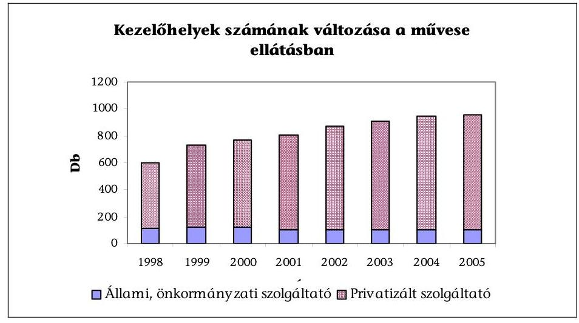

Az állami kezelőhelyek száma 1998-2005 között 115-ről 104-re csökkent, ezzel szemben a privát szolgáltatóknál 483-ról 855-re növekedett. (A művese kassza legfontosabb adatait a 2. sz. táblázat tartalmazza.)

A magánszolgáltatók kezdeményezte folyamat teremtette meg a közel országos lefedettségű, művesekezelést Magyarországon. A dializált betegek száma évente 6-8%-kal nő, akiknek biztonságos ellátása a magánszolgáltatók beruházásai nélkül napjainkban nem lenne biztosítható. (A 2000-2005. közötti betegszámról a 2. sz. ábra ad tájékoztatást.) A magánszolgáltatók befektetéseinek megtérülésére adatok nem állnak rendelkezésre. A forrásokat az OEP-től származó bevétel biztosította. A tényleges kiadások az indulás éveiben (1994-1996 között) 2,5 Mrd Ft-ról 5,4 Mrd Ft-ra (216%) nőttek. A magánszolgáltatók beruházásra fordított kiadásait az OEP-től származó bevétel arányában a 3. sz. táblázat szemlélteti.

A képalkotó diagnosztikai ellátásban a CT, MRI készüléket működtetők körében 1994-től vannak jelen a vállalkozások. (A CT, MRI ellátás legfontosabb adatait a 4. sz. táblázat tartalmazza.) A közvetlen OEP szerződéssel rendelkező magánszolgáltatók száma az összes szolgáltató 20%-a, részesedésük a gyógyító-megelőző kasszából az összes kifizetésből 1998-ban 40%, 2004-ben 26% volt. A - tulajdoni formától függetlenül üzemeltetett - CT berendezések száma 1998-2005 között 46-ról 73-ra az MRI készülékeké pedig 14-ről 27-re növekedett.

A laboratóriumi diagnosztikában 1998-ban jelent meg a magánszolgáltatás. A labor kasszára befolyással bíró szolgáltató a Prodia Rt.

A Prodia Rt. 1998-2004 között a tulajdonos önkormányzatok testületi döntéseivel átadott kapacitásokra szerződött 14 közvetlen OEP finanszírozású telephely esetében, és további 40 egészségügyi intézménnyel áll szerződéses kapcsolatban. Bevételeit a következő ábra szemlélteti:

---

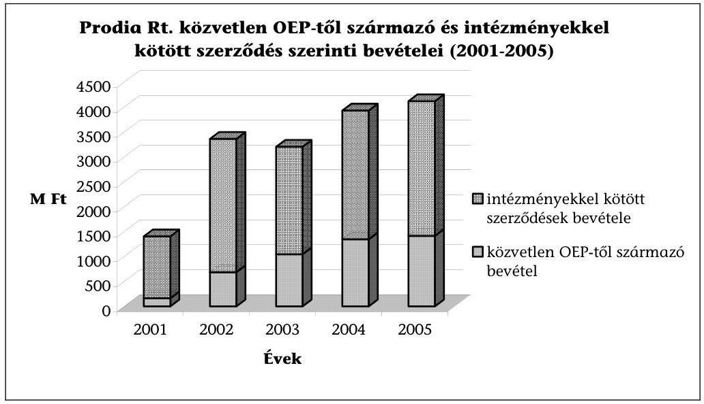

Közvetlen OEP finanszírozású bevétele 167 M Ft-ról 1,3 Mrd Ft-ra nőtt 2001 és 2004 között. (A 2002-2004 évek kumulált OEP-től származó bevétele 2,9 Mrd Ft.) A közvetett szerződésekből származó bevételek 2002-2004 között 7,5 Mrd Ft volt, e két forrás 4,8%-át 491,6 M Ft-ot (5. sz. táblázat) fordított beruházásra. A Prodia Rt. részesedését a laborkasszából a 6. sz. táblázat mutatja. Az OEP véleménye szerint a bevétel növekedése magyarázható az átvállalt feladatok növekedésével. A tanúsítvánnyal megkeresett fekvőbeteg-intézmények adatai ezt nem igazolják. A 17 működtetésbe nem adott laborszolgáltatás esetén a vizsgálatok száma 2002-2003 között 7,8%-kal, 2003-2004 között 6,4%-kal nőtt, míg az 5 működtetésbe adott szolgáltatásnál ez az adat 9,8 illetve 14,9% úgy, hogy egy intézménynél csökkent a vizsgálatok száma.

A laboratóriumi diagnosztikai eljárás alvállalkozásba, működtetésbe adását is a forrás- és a szakember hiány indokolta.

# 2.1.2. A közhasznú társasággá alakult, illetve működtetésbe adott intézmények 

Az intézményi átalakulási, illetve működtetésbe adási folyamat 1996-ban indult el (Dombóvári Szent Lukács Egészségügyi Kht.). A helyszíni vizsgálatba vont intézmények közül 7 kórház és 10 járóbeteg-szakrendelő működött társasági formában.

A kormányprogramokban is ajánlott közhasznú társasági forma jellemzői különösen, hogy hitelügyletek alanya lehet; mentesül a közbeszerzési eljárási kötelezettség és a Kjt. szabályai alól; csak az ellátási felelősséggel bíró önkormányzattal kötött magánjogi szerződések alapján és feltételei szerint tartozik felelősséggel az egészségügyi ellátás biztosításáért.

A közhasznú társasági forma azonban tőkebevonásra nem alkalmas, hiszen nyereség- és vagyonszerzési cél nélküli szervezet ${ }^{34}$. A befektető ezért a

[^0]
[^0]:    ${ }^{34}$ A Polgári törvénykönyvről szóló 1959. év IV. törvény 57. §.

---

kht. működtetésének eredményét - jogszerűen - osztalék formájában nem veheti fel, ha erre nincs módja, akkor más megoldást alkalmaz, ahogy erre az előkészítés és a helyszíni vizsgálat interjúi, valamint a fókuszcsoporti megbeszélésen elhangzottak utalnak. A módszer nem szolgálja a gazdálkodás átláthatóságát.

A kht.-vá alakítás indoka a vizsgált intézményeknél a gazdaságos működés, az önkormányzati költségvetés védelme, a működtetésbe adás, illetve a későbbi tőkebevonás ${ }^{35}$. Az önkormányzati tulajdonban maradt kht.-k a tulajdonosi szemlélet megerősödését, önálló hitelfelvételi és pályázati lehetőséget, a munkaerő gazdálkodás rugalmasságát emelték ki a közhasznú vagy gazdasági társasági forma előnyeként.

A kórházak és a járóbeteg-szakrendelések átalakítása, illetve működtetésbe adása között a szakmai célokban különbség mutatkozik. Míg a kórházak esetén az intézmény megtartása mellett a szakmai cél általában az azonos vagy a minimum feltételeknek megfelelő működés biztosítása, addig a szakrendelőknél a magasabb színvonalú, szélesebb ellátási paletta megvalósítása. Mindkét esetben jellemző, hogy a működtetésbe adás a gazdasági társaság kezdeményezésére történt.

# 2.1.3. Az orvosi közreműködői szerződések 

A orvosi közreműködői szerződések keretében a vállalt feladatok elvégzése a megbízott orvosok személyes közreműködésével történik. A közreműködői szerződések elterjedtsége és hatása a betegellátásra fontos területe a magánvállalkozások részvételének az egészségügyi ellátásban, de a vizsgált folyamat értékelését nem befolyásolta.

Az orvosi közreműködői szerződések az ezredforduló után általános gyakorlattá váltak, mind a fekvő-, mind a járóbeteg-ellátásban, szakorvosi, szakasszisztensi feladatok végzésére, egyes speciális eszközök üzemeltetésére, ügyeleti és készenléti szolgálat ellátására. A szerződések szinte a teljes szakmai palettát felölelték, megkötésük elsődleges indoka a szakorvosok (egészségügyi szakdolgozók) hiánya, a magasabb szintű, hatékonyabb és gazdaságosabb feladatellátás, a bérkiadás megtakarítása, egyes tevékenységeknél a teljesítmény növelésének, az előjegyzési idő csökkentésének ösztönzése volt. Motiválta az ügyeleti, készenléti szolgálat biztosításában az orvosok munkavégzésére vonatkozó foglalkoztatási időkorlát is.

A szerződéseket gazdasági társaságok és egyéni vállalkozók kötötték a szolgáltatóval. A szerződő gazdasági társaságok közreműködői között saját foglalkoztatottak és az intézménnyel közalkalmazotti jogviszonyban nem álló orvosok is szerepelnek. A mintába kiválasztott fekvő-, járóbeteg-, illetve ügyeleti ellátást végző intézmények mindegyike alkalmazta a közreműködői szerződéseket.

[^0]
[^0]:    ${ }^{35}$ A Siklósi Kórház Kht. az üzletrész átruházási megállapodásban vállalta, hogy „legalább tíz évig legalább változatlan színvonalú szolgáltatás nyújtása mellett" üzemelteti a Kht.-t., tíz év múlva a funkciót az MEGA-LOGISTIC Rt. megváltoztathatja. A társasági szerződés szerint a kórházi funkció megváltoztatásához nem kell az Önkormányzat hozzájárulása.

---

A fekvőbeteg-ellátó intézmények közalkalmazottaik gazdasági társaságaival kötöttek közreműködői szerződést, azaz ugyanazt az orvost közalkalmazottként és társas vállalkozás tagjaként is foglalkoztatták ${ }^{36}$. A közreműködői szerződéseket az adott céggel kötötték, így sok esetben az orvosok nevesítve nem voltak. A kialakult gyakorlat megkerüli a Kjt. azon rendelkezését, miszerint a munkáltató a vele közalkalmazotti jogviszonyban álló közalkalmazottal munkaköri feladatai ellátására munkavégzésre irányuló további jogviszonyt nem létesíthet, illetve más törvényi rendelkezést sért ${ }^{37}$.

A szerződések időtartama különböző, határozott és határozatlan időre, illetve „visszavonásig" szóltak. A megállapodások részét képezték a szakmai felelősségbiztosítások és az ÁNTSZ által kiadott működési engedélyek.

# A közreműködői szerződések az alkalmazotti foglalkoztatásnál ke-

vésbé kötöttek, a két fél szabad megállapodásának eredménye, így az alku során a „piaci" kereslet-kínálati viszonyok dominálnak. A szerződésekben megállapított díjak kialakítására nincs egységes gyakorlat. A teljesített munka ellenértékét intézményenként, szakmánként különböző számítások alapján határozták meg, és óradíjként, havidíjként, alkalmanként és teljesítménydíjként fizették ki.

A kifizetett közreműködői díjak, a visszaigazolt OEP finanszírozási díj 20-80%-a között mozogtak. Az orvosokkal kötött szerződésekben fix összegű, teljesítmény szerinti díjazás is, illetve a kettő kombinációja is szerepelt. A díjazás módja és mértéke a helyi szokásos díjazások és piaci viszonyok ismeretében létrejött kölcsönös megállapodás függvénye. Az OEP finanszírozásnál magasabb díjat hiányszakmák esetén és speciális klinikai munkák elvégzésére állapítottak meg.

Az ügyeleti, készenléti szolgálat ellátására kötött szerződések alapvetően az orvosok jogszabályban meghatározott foglalkoztatási időkorlátjának (egy naptári napon 12 óra) megkerülését szolgálják. A kötelező nyilatkoztatás ${ }^{38}$ elmarad, vagy nem ellenőrzik, vagy nem jár következménnyel.

A saját közalkalmazottal ügyeleti, készenléti ellátásokra kötött szerződések számítási alapja a közalkalmazotti tényleges alapilletmény egy órára jutó összegének, vagy a közalkalmazotti ügyeleti átalánydíjnak a megfelelő százaléka. Az így kiszámított közreműködői díjba a munkáltatót terhelő
 járulékok összegét is beszámították.

[^0]
[^0]:    ${ }^{36}$ Például a Kenézy Gyula Kórház-Rendelőintézet a közalkalmazottak 86,5\%-át szerződéssel is foglalkoztatta.
    ${ }^{37}$ A közalkalmazottak jogállásáról szóló 1992. évi XXXIII. törvény 42. §; Az egészségügyi tevékenység végzésének egyes kérdéseiről szóló 2003. évi LXXXIV. törvény 13. §.
    ${ }^{38}$ Az egészségügyi tevékenység végzésének egyes kérdéseiről szóló 2003. évi LXXXIV. törvény 5. §ának (6) bekezdése szerint: „A több, illetve több fajta jogviszony keretében egészségügyi tevékenységet végző egészségügyi dolgozó az egyes jogviszonyai szerinti egészségügyi szolgáltatónál nyilatkozatban tanúsítja, hogy az egészségügyi tevékenysége az (5) bekezdés szerinti korlátot nem haladja meg."

---

A teljesítményarányos díjat tartalmazó közreműködői szerződéseknél az elszámolások utólagosan történtek a visszaigazolt havi teljesítmények szerint, a vállalkozói számla benyújtása ellenében. A díjak felülvizsgálatára rendszerint évente vagy az OEP finanszírozás változása miatt került sor.

Az ügyeleti és készenléti ellátásra kötött közreműködői szerződések kiváltására folytat jó gyakorlatot a Fővárosi Önkormányzat Bajcsy-Zsilinszky Kórháza, ahol a szokásos munkaidő és ügyeleti ellátás helyett a fekvőbeteg-ellátásban az orvosokat műszakban foglalkoztatja a Kórház. A váltást osztályonként gazdaságossági számítások előzték meg, amelyet a 9. sz. táblázat mutat be. A kórházi szintű többletlétszám és többletbér alternatívák elemzését a 10. sz. táblázat, a betegellátás kialakult rendjét a 11. sz. táblázat mutatja be. Az orvosi műszak általános bevezetése lépcsőzetesen 2004. július és 2005. május között történt. A Kórházban bevezetett orvosi műszak-szervezést az interjúk során megkérdezett szolgáltatók saját intézményükben - az orvosok ellenállására hivatkozva - nem tartják követhetőnek. Az orvosi műszak-szervezéssel a Kórház betartja a jogszabályban meghatározott munkaidő-korlátot is. A humánpolitikai osztály rendszeresen figyeli az egyéni munkaidő keretek betartását.

# 2.2. A magánvállalkozások, a magántőke bevonásának hatása a betegellátás minőségére 

A magánvállalkozások, a magántőke bevonásának a betegellátás minőségére gyakorolt közvetlen és közvetett hatását a szerződésekben kikötött minőségi garanciákon, az ingatlan és műszerberuházás teljesülésén, továbbá a járóbetegszakrendeléseknél az ellátás szervezettségén, valamint az ÁSZ kérdőíves betegelégedettségi felmérése alapján értékeltük.

### 2.2.1. A szerződésben kikötött minőségi garanciák és azok ellenőrzése

A helyszínen vizsgált intézmények alvállalkozói szerződéseiben nem voltak az ellátás jellegéhez igazodó minőségi indikátorok az alvállalkozó tevékenységének monitorozására, és annak nem teljesítése nem volt szerződésbontási kritérium.

Az intézmények változó mértékben éltek a minőségi követelmények meghatározásával a közbeszerzési eljárás kiírása során, az alvállalkozó kiválasztásánál, és a szerződéses kritériumok között. A szerződésekben alkalmazott minőségi kritériumok voltak: a szakmai vezető kiválasztása, az adatszolgáltatás minősége és tartalma, a folyamatos szakmai felügyelet kikötése a kórház számára; minőségi kifogás esetén a szerződésfelbontás rendkívüli formája, térítési díjmentesség, kötbér és kártérítési felelősség kikötése. A helyszínen vizsgált egyetemeknél az alvállalkozó kötelezettséget vállalt az oktatási és tudományos tevékenységbe való bekapcsolódásra egy esetben (DEOEC).

Azok a szerződések, amelyek kitértek az alvállalkozó minőségbiztosítására kétféle megoldást alkalmaztak: vagy kikötötték, hogy az alvállalkozónak be kell kapcsolódnia a kórház minőségügyi rendszerébe, vagy önálló minőségbiztosítási rendszer kiépítését írták elő a számukra.

---

A művese ellátásnál az OEP-pel kötött szerződések tartalmaznak az ellátás minőségével kapcsolatos elvárást, amelynek értelmében a szolgáltató vállalja, hogy a szolgáltatást a Magyar Nephrológiai Társaság által kiadott „A dialízis kezelésének útmutatója" szerint végzi, valamint a szolgáltató protokollja is a szerződés részét képezi. A szerződések közvetett minőségi garanciákat is tartalmaznak, ilyenek például a szoros együttműködés a kórházi fekvőbeteg-ellátást nyújtó osztállyal (3-ból 3 szerződés esetében), szakmailag mindkét fél által elfogadott szakmai vezető alkalmazása (3-ból 2 szerződés esetében), és a művese ellátóknál a kórház által végzett szakmai értékelések, ellenőrzések (3-ból 1 szerződés esetében).

A vizsgált többségi önkormányzati tulajdonban lévő kht.-k esetén a felek között a szerződéskötéskor az ellátás minőségének monitorozását lehetővé tevő minőségi mutatót nem rögzítettek a közhasznúsági szerződésekben.

A Budai Gyerekkórház szerződésében vannak mutatószámok, amelyek az intézmény teljesítményét jellemzik, ezek azonban mennyiségi mutatók, nem alkalmasak az ellátás minőségének jellemzésére.

A járó- és fekvőbeteg-ellátások működtetésbe adása során az önkormányzatok általánosan fogalmaztak meg a minőségre vonatkozó garanciális elemeket a szerződésekben: a szolgáltatási struktúra változtatásának egyeztetése a tulajdonos és a működtető között, a működtető beszámolási kötelezettsége, minőségromlás (például betegpanaszok) esetén kikötött önkormányzati jogosultságok, a minőség rendszeres ellenőrzése, az ellátás minőségét mérő mutatórendszer kidolgozása. Az ellátás minőségére vonatkozó olyan indikátorokat, amelyek alapján a minőség számszerűsíthetően mérhető lett volna, nem dolgoztak ki és a szerződések - egy kivétellel - nem is tartalmaznak ilyet. A minőségromlás pontos megfogalmazását a szerződések nem tartalmazzák, annak ellenére sem, hogy a romlás bekövetkezése az önkormányzatnak azonnali hatályú felmondási jogosultságot biztosít.

A minőségi garanciák szerződéses rögzítése nem volt gyakorlat sem az alvállalkozásba adásoknál, sem a kht.-vá alakult intézményeknél, sem a működtetésbe adások során. Az ellátás minőségi követelményeinek meghatározása, azok rendszeres monitorozása nemcsak a betegellátás, hanem a szerződő felek hosszú távú biztonságát is szolgálja.

# 2.2.2. Az ingatlan vagyont érintő beruházás, felújítás hatása 

Alvállalkozók ingatlanberuházást ott valósítottak meg, ahol a vállalt szolgáltatás végzéséhez ingatlan építésére, átalakítására, fejlesztésére volt szükség. A helyszínen vizsgált intézményeknél 7 ilyen típusú szerződést ellenőriztünk, amelyek közül új ingatlan építésére 3, építészeti átalakításra 4 szerződés vonatkozott. Az ingatlanok átalakítását célzó szerződések rendelkeztek a megrendelő által jóváhagyott kiviteli tervről, a tervezés, telepítés, felszerelés, kialakítás költségeinek megosztásáról, amelynek terhét döntően az alvállalkozó viselte, valamint rendelkeztek a folyamatos karbantartási kötelezettségről és a tulajdonjogról is.

---

A DEOEC szerződései rendelkeztek az újonnan felépülő ingatlanok paramétereiről, a tulajdonjog rendezéséről, az elidegenítési és terhelési tilalom bejegyzéséről. Az új ingatlanok építésére vonatkozó szerződéseket a DEOEC és a Pécsi Orvostudományi és Egészségtudományi Centrum (OEC) kötötte.

Az OEC a művese állomás 25 éves üzemeltetési szerződését azzal a feltétellel kötötte meg, hogy a vállalkozó 54 ágyas belgyógyászati szárny felépítését vállalja. A DEOEC területén a haemodinamikai laboratórium bővítéséhez öt szinten $1100 \mathrm{~m}^{2}$ nettó hasznos alapterület, valamint a képalkotó diagnosztikai szolgáltatáshoz $1200 \mathrm{~m}^{2}$ alapterületű épület felépítésére szerződött.

A DEOEC álláspontja szerint a feladatok ellátásába a magántőke bevonására elsődlegesen azért volt szükség, mert a korszerű és nagyobb kapacitást eredményező fejlesztések műszaki feltételeinek megteremtéséhez jelentős ingatlanberuházásokra is szükség volt. A három ingatlanberuházásnál a szolgáltatók rövid idő alatt több mint 1 Mrd Ft értékű építési és átalakítási munkát végeztek el.

Az alvállalkozói szerződésekkel megvalósuló ingatlanberuházások, bővítések, átalakítások közvetlenül a betegellátást szolgálják. A DEOEC szerződései a térítéses betegek fogadásának rendjét is tartalmazzák azzal, hogy az nem akadályozhatja a közfinanszírozott gyógyító munkát.

Az önkormányzat többségi vagy 100%-os tulajdonában lévő átalakult intézmények nem tulajdonosai az általuk használt ingatlan vagyonnak. Az önkormányzatok bérbe vagy ingyenes használatba adják az ingatlanokat. Az önkormányzatok az átalakult intézmények ingatlanberuházásait és felújításait is támogatják közvetlenül vagy pályázatok önrészének biztosításával.

A működtetésbe adott intézményeknél, ahol a cél a tőkebevonás, a vonatkozó szerződés 3 működtető vagy beruházó ${ }^{39}$ számára tartalmazott beruházási kötelezettséget, további 3 szerződés ${ }^{40}$ az ingatlan állagmegóvásának a kötelezettségét írta elő, pontos beruházási kötelezettség nélkül. Megvalósult ingatlanberuházások $6^{41}$ szolgáltatónál találhatók.

Tőkebevonásként értékeltük, ha a közszolgáltatásoknak (is) otthont biztosító ingatlanberuházáshoz a forrást a befektető magán tőkéjéből biztosítja, vagy a hitelt a saját kockázatára veszi fel. 9 vizsgált szolgáltató beruházásából e követelményeknek 4 felelt meg (Generál Medicina Kft., Europ-Med Kft., Dr. Batthyány Strattmann László Kórház Kft., MEDI-HOME Bt.)

Az ingatlanberuházások közvetlenül vagy közvetve járulnak hozzá a betegellátás színvonalának emeléséhez. Közvetlenül, amikor az ellátás megindításához, bővítéséhez szükséges elhelyezési körülményeket teremtik meg, például művese állomások létrehozásakor vagy az egynapos ellátások bevezetésekor. Közvetve pedig akkor, amikor a meglévő ingatlanok biztonságos üzemeltetéséhez (fűtés-

[^0]
[^0]:    ${ }^{39}$ Generál Medicina Kft., Medicomplex Kft., HospInvest Rt.
    ${ }^{40}$ Europ-Med Kft., dr. Batthyány Strattmann László Kórház Kft., Siklósi Kórház Kht.
    ${ }^{41}$ Generál Medicina Kft., Europ-Med Kft., dr. Batthyány Strattmann László Kórház Kft., Semmelweis Kórház Kht., MEDI-HOME Bt., Siklósi Kórház Kht.

---

korszerűsítés, felvonók cseréje), a kultúrált elhelyezéshez biztosítják a feltételeket (mellékhelyiségek, várók kialakítása), illetve a beruházások bevételnövelő hatásúak (VIP kórterem).

# 2.2.3. A műszerezettség és a műszerpark korszerűsége 

A vizsgált esetekben az alvállalkozásba adás indoka, hogy az intézmény a szolgáltatás megvásárlásával „váltotta ki" a szakmai munkája végzéséhez, fejlesztéséhez szükséges gép-műszer beruházásokat. Az alvállalkozók tevékenysége pótolja a tulajdonos, fenntartó forráshiányát, vagy gazdaságosabbá teszi az ellátást az intézmény számára.

Az önkormányzati tulajdonú átalakult intézmények gép-műszer beszerzéseikhez - a költségvetési intézménnyel szemben - hitelt vehetnek fel, tulajdonosi hozzájárulás mellett. A helyszíni vizsgálat tapasztalata szerint az intézmények a minimum feltételeknek megfelelnek ugyan, de a gépek, műszerek használhatósági foka átlagosan 40%.

A Vasútegészségügyi Szolgáltató Kht.-nál - az időközbeni fejlesztés mellett is - a műszerpark átlag életkora 3 évről 8 évre nőtt, a Nyírbátori Humán Centrum Kft.-nél az önkormányzat tulajdonában lévő orvosi műszerpark átlagos életkora 17 év.

A működtetésbe adásoknál az önkormányzatok ingyenes használatba adják az intézmény meglévő műszerparkját. Két kivételtől eltekintve az új műszerek beszerzése és a pótlása a működtető feladata, akik a minimumfeltételeket meghaladó gép-műszer beruházást is végeznek. Szerződésben rögzített tételes műszerfejlesztést a Kiskunhalasi Semmelweis Kórház Kht. szerződése tartalmaz. A Kht. beszámolója szerint a vállalt időarányos műszerberuházást elvégezték, az időközben szükségessé vált módosításokkal.

Önkormányzati és egyéb tulajdonban lévő társaságok adatai

| Név | Működtetés idő-   tartama | Működtetés alatt   beszerzett gépe-   műszer (M Ft) | Ebből orvosi   gép-műszer   (M Ft) |
| :-- | :--: | :--: | :--: |
| Europ-Med Kft. | $2001-2005 . \mathrm{I}$. félév | 227,0 | 150,0 |
| MEDI-HOME Bt. | $1998-2005 . \mathrm{I}$. félév | 66,5 | 25,0 |
| Humán-Centrum Kft. | $1997-2004$ | 21,0 | 17,0 |
| Dombóvári Sz. L. Kht. | $2002-2004$ | 197,0 | 186,0 |
| Semmelweis Kórház Kht. | 2004 | 183,2 | 183,2 |

A gép-műszer beszerzések közvetlen hatással voltak a betegellátásra, annak minőségét egyértelműen javították. Valamennyi vizsgált formánál gondot fordítanak a gép-műszer állomány fejlesztésére, de ennek nagyságrendje és így hatása eltérő.

---

# 2.2.4. Az ellátás szervezettsége 

Az ellátás szervezettségének változását a tanúsítványi adatok alapján értékeltük a járóbeteg-szakrendelések esetén, az adatok megbízhatóságának érdekében csak a helyszínen vizsgált intézményeknél.

A rendelőkben a várakozási idő rövidülését szolgálja az időpontkérési lehetőség bevezetése. A szolgáltatott adatok alapján az előjegyzéssel elérhető szakrendelések száma és aránya minden szolgáltatói csoportban nőtt. A vizsgált mintában a működtetésbe adott szakrendelők esetén ez az arány 2000-2004 között 39,7%-ról 66,2%-ra változott. 2004-ben a vizsgált Kht.-k esetén 58,7% a költségvetési intézmények esetén 37,7% míg az újonnan alakult járóbeteg-rendelések esetén 80,9% az előjegyzéssel elérhető szakrendelések aránya az összes szakrendelésben belül. (Az adatokat a 7/c. táblázat tartalmazza.)

Az időbeli elérhetőség alakulását a 18 óra után is igénybe vehető
 szakrendelések aránya alapján ítélte meg a vizsgálat. A szolgáltatott adatok tanulsága szerint a működtetésbe adott szakrendelők esetén 2000-től 2004-ig ez az arány $\mathbf{5 \%}$-ról $\mathbf{30 \%}$-ra növekedett. Az önkormányzati tulajdonú szakrendelők esetén az arány nem változott. A helyszíni interjúk tapasztalata, hogy a vidéki településeken az intézmények megítélése szerint nincs igény a 18 óra után működő szakrendelésekre. (Az adatokat a 7/b. táblázat tartalmazza.)

A 100 betegből történő kórházi továbutalásokról szolgáltatott adatok 0,3-20 fő között szórnak, és nem mutatnak összefüggést az intézményi formával. (Az adatok összesítését a 7/a. táblázat tartalmazza.)

A helyszíni vizsgálat során felkeresett intézetek adatgyűjtése nem kíséri figyelemmel a területi ellátási kötelezettségükbe tartozó, illetve azon kívüli betegek arányát. A területen kívüli betegek arányának növekedését a szervezettség és a minőség javulásának mutatójaként értékeltük. A megkeresett járóbeteg-ellátást végző 20 intézményből 9 szolgáltatott adatot, amiből 8 az átalakult intézmények száma. A helyszínen vizsgált járóbeteg-szakrendelőkben ellátottak átlagos területi és területen kívüli létszámát a 8. sz. táblázat mutatja.

### 2.2.5. A minőség biztosítása

Az egészségügyről szóló törvény ${ }^{42}$ az egészségügyi szolgáltatók számára minőségügyi rendszer üzemeltetését teszi kötelezővé, a rendszer külső auditálását azonban nem írja elő jogszabály.

A helyszíni vizsgálatba vont 17 átalakult, illetve működtetésbe adott járó- és fekvőbeteg-intézmény közül 9 nem alakított ki minőségügyi rendszert, amellyel megsértették az Eütv.-t. A minőségügyi rendszert üzemeltető 8 szolgáltató mindegyike független minőségbiztosító céggel auditáltatta rendszerét, ebből 2 szolgáltató külső tanúsítása a helyszíni vizsgálat időszakában zajlott.

[^0]
[^0]:    ${ }^{42}$ Az egészségügyről szóló 1997. évi CLIV. törvény 121. §.

---

A működő minőségügyi rendszerek eleme, hogy a betegelégedettséget (fogyasztói elégedettséget) folyamatosan monitorozzák. A vizsgálat arra keresett választ, hogy az intézmények a betegelégedettség tapasztalatait felhasználják-e szolgáltatásaik fejlesztésénél. Azt tapasztaltuk, hogy a 17 átalakult, illetve működtetésbe adott intézményből az a 8, amelyik rendelkezik minőségügyi rendszerrel, rendszeresen végez betegelégedettségi vizsgálatot és az erre alapozott intézkedési terv alapján hasznosítja az eredményeket. A minőségügyi rendszerrel nem rendelkezők közül 5 intézmény is végez betegelégedettségi vizsgálatot.

A dolgozók elégedettségének vizsgálata felszínre hozott olyan objektív és szubjektív munkahelyi problémákat, amelyek közvetve hatást gyakorolnak a betegellátás minőségére.

A Dombóvári Kórház Kht. 2003 szeptemberében dolgozói elégedettségi vizsgálatot végzett. 200 db kérdőívet küldtek ki a dolgozóknak, a beérkezett kérdőívek száma 66 db volt. A válaszadó dolgozók $\mathbf{90\%}$-a a munkahelyi körülményekkel (öltöző, tisztálkodási lehetőség, munkaruha) elégedetlen volt. A munkahelyi légkör a válaszadók $\mathbf{90\%}$-ánál elfogadható minősítést kapott. Az osztályokon a munkakapcsolatot a válaszadók 50-50%-a jónak, illetve közepesnek ítélte meg. A vizsgált kapcsolati rendszer orvos-orvos, orvos-ápoló, ápoló-ápoló volt. A munkaidő beosztást a válaszadók $\mathbf{90\%}$-a megfelelőnek tartotta. A Kht. a dolgozók által súlyosan kifogásolt munkahelyi körülményeket a címzett támogatásból megvalósuló teljes rekonstrukcióval tudja megoldani. A rekonstrukció első szakaszának megvalósulása után 2006. évben tervezi a Kht. a dolgozói elégedettségi vizsgálat megismétlését, összehasonlítva a felújított és régi szárnyban dolgozók válaszait.

Budaörs Város Önkormányzatának 2003 évben kezdeményezett „fogyasztói" elégedettségi vizsgálata, amelynek során a lakosság körében felmérést végzett a közszolgáltatások színvonalára vonatkozóan és amelyből kiderült, hogy a lakosság az egészségügyi ellátással a legelégedettebb a városban.

Az ellenőrzés során az ÁSZ által kidolgozott kérdőívvel önálló betegelégedettségi vizsgálatot végeztünk 20 járóbeteg-rendelőintézet reumatológiai szakrendelésén. A felmérés célja az volt, hogy választ kapjunk arra, hogy a betegek elégedettsége függ-e az intézmény tulajdonformájától. A kiválasztott szakrendelés - az általános tapasztalatok szerint - nagy betegforgalmat bonyolít. Az intézmények között volt költségvetési intézmény, működtetésbe adott intézmény és magán beruházásból létrejött intézmény is. Szakrendelésenként 100-100 kérdőívet helyeztünk el, a kitöltött kérdőívek száma 22 és 85 között változott. A visszaérkezett 1273 kérdőív feldolgozása a következőket mutatta.

A válaszadók 70%-a úgy tudta, hogy területileg az általa felkeresett intézménybe tartozik. Az arány a Vasútegészségügyi Kht. rendelőiben $\mathbf{48\%}$ volt, amely nem rendelkezik területi ellátási kötelezettséggel. A Meditres Kft. normatíván felüli kapacitás-befogadással jött létre, területi ellátási kötelezettség nélkül. A válaszadóik $\mathbf{63\%}$-a gondolta úgy, hogy területileg a Kft. az illetékes szakrendelő.

Az ellátás szervezettségével az összes válaszadó $\mathbf{91\%}$-a - az intézmény típusától függetlenül - elégedett volt. Az egyes rendelők esetén a betegek szervezettséggel való elégedettsége 80% (Meditres Kft.) és 100% (Human Centrum Kft., EuropMed Kft.) között változott.

---

A rendelőben történő várakozás az összes válaszadó $\mathbf{61\%}$-a számára fél óra, vagy annál kevesebb idő volt. Egy órát $\mathbf{22\%}$, több mint egy órát $\mathbf{16\%}$ várakozott.

A váróteremmel 88-100% elégedett volt, kivétel a Móra-Vitál Kht., ahol csak 54 %. A rendelők felszereltségét és tisztaságát - a Móra-Vitál Kht. kivételével - 99-100%-ban kielégítőnek ítélték. A mellékhelyiségek tisztaságával és felszereltségével, a Dél-Budai Eü. Szolgálat Kht. kivételével (57%), 71 és 100% között voltak elégedettek a válaszadók.

Az orvosok munkájával 93 és $\mathbf{100\%}$, az orvosi tájékoztatással - a Vasútegészségügyi Kht. (70%) kivételével - 97 és $\mathbf{100\%}$, az asszisztensek munkájával - a Móra-Vitál Kht. (54%) kivételével - 86 és $\mathbf{100\%}$ között voltak elégedettek a válaszadók.

A működtetésbe adott intézményekben a válaszadók 25-63%-a nem tudta, hogy az intézményt magánszolgáltató működteti, 9-25%-a pedig úgy, hogy nem. Ugyanezen intézményekben a válaszadók 88-100%-a kiválónak vagy jónak ítélte a rendelő működését. A Kht.-ként működő, önkormányzati vagy állami tulajdonban lévő rendelőkben a válaszadók 10-24%-a gondolja, hogy az intézményt magánszolgáltató működteti. Ugyanezekben az intézményekben a válaszadók 55-97%-a kiválónak vagy jónak értékelte a rendelőt. A vizsgált két költségvetési intézményben 6-8% gondolta, hogy az intézményt magánszolgáltató működtette. A jó vagy kiváló minősítést 88-93% adott az intézmény működésére.

Az 1273 betegelégedettségi kérdőív feldolgozása alapján a betegek megítélése szerint a különböző tulajdonformájú szolgáltatók szakmai működésében - egy kivételével - kirívó különbség nincs. (3., 4. sz. ábra)

# 3. AZ EGÉSZSÉGÜGYI SZAKELLÁTÁST BIZTOSÍTÓ VAGYON, ILLETVE VAGYONI JOGOK HASZNOSULÁSA 

### 3.1. Az alvállalkozók

A 17 helyszínen vizsgált 47 alvállalkozói szerződés formailag, tartalmilag sokszínű, szakmánkénti megoszlását a 12. sz. táblázat szemlélteti.

A vizsgálatba vont intézményeknél a képalkotó diagnosztikai tevékenységek (CT, MRI, röntgen, ultrahang, mammográfia, csontdenzitometria) alvállalkozásba adása $\mathbf{32\%}$-ban (44 vizsgált szerződésből 14) fordult elő. Az alvállalkozói szerződés megkötését a számottevő beruházási forrás-szükséglet hiánya, az üzemeltetés biztonsága és a beszerzett nagy értékű műszer majdani cseréje, valamint a szakemberek hiánya indokolta.

A megkötött szerződések közötti különbségeket a szerződés tárgya határozza meg. Más és más a szerződések tartalma a művese-ellátás, a képalkotó diagnosztika és a laboratóriumi szolgáltatások esetén. A művese-ellátás és a képalkotó diagnosztika területén a kezelő helyiség kialakítása, bővítése, felújítása a magánszolgáltató költségén történik, a laboratóri-

---

umi ellátásnál a bérlet vagy ingyenes használat az általános. Az egyes szakfeladatok működtetésbe adásánál mind az előkészítésben, mind a pályáztatásban az önkormányzatok és az intézmények nagyobb gondossággal járnak el, mint az alvállalkozásokra kötött szerződéseknél. Indoka ennek, hogy a működtetésbe adásnál az elvégzett beruházások nagyságrendje hosszú távú szerződést igényel, illetve az újonnan beszerzett gép-műszerek folyamatos rendelkezésre állását az esetleges szerződésbontást követően is biztosítani kell.

A DEOEC szerződései jó gyakorlatnak minősülnek, mert hosszú távú szerződésénél (25 év) a rendes felmondás lehetőségét kizárja, a rendkívüli felmondás okait pedig mindkét félnél pontosan nevesíti.

A forráshiány és a szakmai profilbővítés együttesen indokolta az egynapos beavatkozásként végezhető kőzúzásra (ún. ESWL-vesekő, -ureterkő, -epekő kezelés) kötött alvállalkozói szerződéseket. A vizsgált 17 intézmény közül hét alvállalkozó bevonásával látja el ezen feladatait.

A kórszövettan és a boncolás kivételével a többi alvállalkozói tevékenység jellemzően drága eszközöket igényel. E területen az alvállalkozói szerződéseket a szakorvosok hiánya indokolta.

Az alvállalkozó kiválasztásában jelentőséggel bír, hogy az együttműködés kialakítását a magánszolgáltató kezdeményezte. A szolgáltatásokra meghirdetett pályázatokra - a tárgyalásos vagy meghívásos esetek kivételével - egy pályázó nyújtott be érvényes pályázatot. Versenyhelyzet tehát nem alakulhatott ki a potenciális alvállalkozói körben, így nem érvényesülhettek annak kedvező hatásai sem.

Az alvállalkozói szerződésekben a tevékenységek díjait az OEP díjak mértékére hivatkozva rögzítik a mintába kiválasztott intézmények.

Az OEP finanszírozásnál alacsonyabb díjazás egyik általános oka a megbízó oldalán felmerülő költségelemek vagy a közvetett költségeinek beszámítása, másik a szolgáltatás szűkebb tartalma. A díjazás lehet fix összegű, vagy az OEP díjazás meghatározott százaléka.

Az OEP finanszírozást meghaladó díjazás jellemzően a laboratóriumi ellátásban fordult elő.

A laborvizsgálatok költségeinek megtérítése a fekvőbeteg-ellátásban a HBCS-ből, a járóbeteg-ellátásban pont/forint értékével finanszírozódott. 2002-től a finanszírozási rendelet ${ }^{43}$ alapján a járóbeteg-szakellátás finanszírozásának keretein belül kialakították a laborkasszát. A teljesítmény egység forintértékét a költségvetésben rendelkezésre álló havi keret és az országos teljesítmények hányadosának függvényében határozták meg. 2002-ben a változtatás eredményeként egy labor pont átlaga $\mathbf{0,86 Ft}$, míg a járóbeteg-ellátásé $\mathbf{0,98 Ft}$ volt. A labor pont átlagos forintértéke 2003-ban 0,8047, 2004-ben 0,7774 Ft volt. 2005-ben az augusztusi lebegte-

[^0]
[^0]:    ${ }^{43}$ Az egészségügyi szolgáltatások Egészségbiztosítási Alapból történő finanszírozásának részletes szabályairól szóló 43/1999. (III. 3.) Korm. rendelet.

---

tett érték 0,7227 Ft. Az éves beszámolók adatai szerint a járóbeteg-finanszírozás pontértéke magasabb a labor pontértéknél.

A laboratóriumi diagnosztikai eljárásokra kötött szerződésekben a fekvőbetegellátásra is a magasabb járóbeteg-díjra szerződik az alvállalkozó, ezen túlmenően előfordul meghatározott pont alatti és feletti teljesítmény eltérő díjazása.

A Prodia Rt. a fekvőbeteg-ellátásban a laborvizsgálatokat az OEP járóbeteg vizsgálatok pontszáma alapján vállalja és nem a laborkassza „lebegtetett" pontértéke szerint (ami a járó beteg kassza pont-forintértéke alatti). A Pest megyei Flór Ferenc Kórház-Rendelőintézetnél havi 6,5 millió pont teljesítményig $\mathbf{1,51 Ft}$-ot számol fel az alvállalkozó. A felek 3 havonta összesítést készítenek, és ha a teljesítmény meghaladja a 19,5 millió pontot, az e feletti teljesítményre vonatkozó vállalkozói díj az OEP által a tárgyhónapban a járóbeteg-ellátásra fizetett Ft/ponttal egyező.

A teljesítmény díjazáson túl átalánydíj fizetése is megjelent. Indoka például a 24 órás rendelkezésre állás, az ügyeleti szolgálat napi 24 órában való biztosítására, az ügyeletet is ellátó fekvőbeteg-intézményeknél jelentkező plusz létszám fenntartására, az ügyeleti munkához kapcsolódó készülékek 24 órás üzemeltetésének költségeire, a sürgősségi mintafeldolgozásra, a fekvő betegek laboratóriumi ellátásához tartozó minimum feltételek biztosítására, a kórházi ellátási kötelezettséghez rendelt vizsgálati paletta fenntartására.

Átalánydíj kikötésére például a Halas-Labor Kft. és a Kiskunhalasi Semmelweis Kórház Kht. (5,54 M Ft/hó), a Prodia Rt. és a Pest Megyei Flór Ferenc Kórházrendelőintézettel ($\mathbf{6 M Ft}$/hó) kötött szerződésben került sor. Ez utóbbi esetben szerződésmódosítással, bár az alapszerződésben a Prodia Rt. az állásidő nélküli folyamatos üzemeltetés biztosítását vállalta külön díjazás nélkül. 2002-ben a Flór Ferenc Kórházat a konszolidációs program keretében teljes körűen átvilágították, és megállapították, hogy a gazdasági nehézségek egyik oka, hogy „magasak a betegekhez kapcsolódó közvetlen költségek és szolgáltatások díjai". Szerződésileg ezután megszüntették az átalánydíjat és a limit korlátokat.

Az alvállalkozók a megrendelők biztosította épületrészekben végzik tevékenységüket. Így az infrastruktúra, a közműellátás rendelkezésükre áll.
 A számos elemet tartalmazó „üzemviteli csomag" költségeinek korrekt és teljes körű továbbterhelése elsősorban a megrendelő intézmény érdeke és feladata.

A szerződések épület-, ingatlanvagyont, nagy értékű tárgyi eszközt nem adtak az alvállalkozók tulajdonába, a bérlet vagy az ingyenes használat a jellemző. Egy esetben földhasználati jogot biztosítottak az épületberuházást megvalósító egészségügyi alvállalkozó számára (Olympus Kft.).

A megbízó kórházak, a tevékenység átruházásán kívül eszközöket, műszereket is adtak át az alvállalkozóknak, amelyek hozzájárultak az ellátás folyamatosságának biztosításához. A használt eszközöknek, műszereknek a további kezelése, karbantartása, cseréje, illetve pótlása a megbízottra hárul. A szerződések lejárata, megszűnése esetére az eszközellátás folyamatosságát többféle módon rögzítették a megállapodásokban: tételes visszaszolgáltatás, elővásárlási jog biztosítása a megbízónak.

---

Az alvállalkozásba adás okaként szerepel, hogy az ellátás színvonalának megtartása, illetve emelése érdekében szükséges beruházásokat alvállalkozók pénzeszközeinek bevonása biztosította ott, ahol a beruházások finanszírozásához hiányoztak a központi, a tulajdonosi és az intézményi források. A fejlesztések többfélék és egyediek voltak: a megbízó részére, illetve a saját alvállalkozás részére, szinten tartásra, illetve mennyiségi, minőségi bővítésre egyaránt szolgáltak; gép-, műszerbeszerzések mellett építések, szerelések is előfordultak. A beruházások összegei általában a szolgáltatások díjaiban térültek (térülnek) meg az alvállalkozók számára.

# 3.2. Az átalakult intézmények 

A közhasznú társaságok megalakulását alapvetően két indok motiválta. Az egyik az önkormányzati tulajdon megtartása mellett a gazdálkodási előnyök kihasználása volt ${ }^{44}$, a másik a tőkebevonás céljából történő átalakulás ${ }^{45}$.

### 3.2.1. Az önkormányzati tulajdonban maradt átalakult intézmények

Az egészségügyi intézmények gazdasági helyzete, forráshiánya miatt az önkormányzatok 10 esetben a költségvetési intézményeket közhasznú társasággá alakították a hatékonyabb működés érdekében, amitől a tulajdonosi szemlélet megerősödését, önálló hitelfelvételi és pályázati lehetőséget, a munkaerő gazdálkodás rugalmasságát várták. A vizsgált 10 intézményből 7 esetében a kht. többségi önkormányzati tulajdonban maradt.

VESZ Egészségügyi Kht. (Debrecen): a költségvetési intézmény átalakítását, átalakulását megelőzte egy tanulmány elkészítése, amely megállapította, hogy a fejlesztésekhez szükséges külső tőke bevonását a költségvetési intézményi forma nem teszi lehetővé. Az Önkormányzat arra a döntésre jutott, hogy a költségvetési intézményi forma helyett a VESZ által ellátott feladatokat a jövőben két társaság végezze: a közhasznú társaság az egészségügyi ellátási feladatokat, és egy kft. az egészségügyi ellátásnak helyszínt biztosító nagyszámú ingatlan vagyonkezelésével, üzemeltetésével kapcsolatos teendőket. A közhasznú társaság keretében az egészségügyi ellátás, mint kiemelten közhasznú tevékenység és az ezt kiegészítő vállalkozási tevékenység a korábbinál kedvezőbb adó és egyéb jogszabályi környezetben végezhető. A vagyonkezelői feladatokra létrehozott gazdasági társaság a fejlesztési tervek megvalósításához tulajdonosi döntés alapján hitelt vehet fel. A megalakítandó kht. szakmai fejlesztési tervét is meghatározták, a szükséges ráfordítások megjelölésével.

## Az önkormányzati tulajdonú közhasznú társaságok rendszeres fenntartói működési támogatásban (Gyógyír XI. Kht., VESZ Debrecen Kht., Dél-Budai Eü. Szolgálat Kht.) részesülnek. Fejlesztéseiket, beruházásaikat pályázati pénzekből, saját forrásból és tulajdonosi hozzájárulásból fedezik. Két nagy összegű beruházás valósult meg a vizsgált intézményeknél.

[^0]
[^0]:    ${ }^{44}$ Gyógyír XI. Kht., Dél-budai Egészségügyi Szolgálat Kht., Móra-Vitál Kht., VESZ Egészségügyi Kht.
    ${ }^{45}$ Schöpf-Merci Ágost Kórház, Budai Gyermekkórház, Dombóvári Szent Lukács Egészségügyi Kht., Siklós Kórház Kht. és a Semmelweis Kórház Kht.

---

A Dombóvári Szent Lukács Eü. Kht. egyik hotelszárnyának teljes felújítására az önkormányzat 1241 M Ft összegű címzett támogatást és a Kht. rehabilitációs centrum kialakítására 656 M Ft nyert pályázaton. A Gyógyír XI. Kht. esetében a tulajdonos önkormányzat a rendelő épületének teljes felújítását elvégeztette 965 M Ft értékben.

A Móra-Vitál Kht. pályázaton elnyert támogatásához szükséges (állami költségvetési és uniós forrás), önrészét a tulajdonos önkormányzat a Kht. forrásaival közösen biztosította.

A közhasznú társasággá alakult intézményeknél az ingatlanok önkormányzati, illetve a Vasútegészségügyi Kht.-nál a MÁV Rt. tulajdonában maradtak. Az ellátást szolgáló eszközök általában a szolgáltatást végző használatába/tulajdonába kerülnek, de előfordul, hogy azok is önkormányzati tulajdonban maradtak (Dél-Budai Eü. Szolg. Kht., VESZ Debrecen Kht.).

# 3.2.2. A tőkebevonás céljából átalakult intézmények 

A tőkebevonás céljával alakult közhasznú társaságnál két esetben a működtetésbe adás rövid időtartamig élt ${ }^{46}$, két másik esetben pedig a közhasznú társasági forma önmagában nem jelentett biztosítékot a tőkebevonás megvalósítására. Két fővárosi kórház ${ }^{47}$ kht.-vá alakítása azzal a céllal történt, hogy tőkeerős működtetőnek értékesítsék a törzstőke 49%-át. A két fővárosi kórház esetében a tulajdonos a tárgyi eszközöket felértékeltette, és azokat apportálta ${ }^{48}$ a közhasznú társaságokba. Az amortizáció következtében e két intézménynél folyamatos a tőkevesztés.

A Fővárosi Önkormányzat 2004. júniusában tanulmányt készíttetett a Schöpf-Merei Ágost Kórház és Anyavédelmi Központ helyzetéről, a tőkebevonás lehetséges módozatairól. A tanulmány szerzői szerint csak a for-profit gazdálkodási forma (javaslatuk szerint részvénytársaság) alkalmas a megfelelő befektetési környezet biztosítására. A non-profit formát (kht.) befektetői szempontból értelmezhetetlennek ítélték. A Képviselő-testület a szakértői javaslat ellenére a kht. forma mellett döntött, továbbá a működtetésre kiírt pályázat sem volt sikeres, mert nem tartalmazott a vállalkozó számára a befektetésre vonatkozó kellő biztosítékot, és alapot hitel felvételéhez.

A kht.-vá alakult intézmények közül kettőnél többségi tulajdonos váltás következett be, és profit orientált vállalkozó szerzett többségi tulajdont a non-profit szervezetben (Siklósi Kórház Kht., Kiskunhalasi Semmelweis Kórház Kht.).

[^0]
[^0]:    ${ }^{46}$ Dombóvári Szent Lukács Egészségügyi Szolgáltató Kht. és a Siklósi Kórház Kht. első működtetésbe adása.
    ${ }^{47}$ Schöpf-Merei Ágost Kórház és Anyavédelmi Központ, Budai Gyermekkórház.
    ${ }^{48}$ A Budai Gyermekkórház és Rendelőintézetnél az apportálási folyamat még nem zárult le, az Alapító Okirat módosítása még nem történt meg.

---

# 3.3. A működtetésbe adott intézmények 

Az átalakult intézmények működtetésbe adása a magántőke bevonását szolgálja. A helyszíni vizsgálatban 4 működtetésbe adott fekvőbeteg-intézményt ${ }^{49}$ és 5 járóbeteg-intézményt ${ }^{50}$ ellenőriztünk.

Az egészségügyi intézmények működtetésbe adásánál a működtető cég pénzügyi mutatóinak vizsgálatát jogszabály nem írja elő. A pályázatok elbírálásánál az önkormányzatok nem vizsgálták a pályázók tőkeerejét, hitelképességét. A működtetést elnyerő cégek 3 és 50 M Ft közötti alaptőkével rendelkeztek. Az átvett intézményekre jellemző, hogy a működtetésbe adást megelőzően súlyos pénzügyi gondokkal küzdöttek, az önkormányzatok működési támogatására szorultak ${ }^{51}$, adósságot halmoztak fel.

### 3.3.1. Működtetésbe adott járóbeteg-intézmények

A járóbeteg-szakellátást végző intézmények működtetésbe adását a várpalotai Önkormányzat komplex gazdasági vizsgálata előzte meg. A többi esetben a döntés megalapozását dokumentum nem támasztotta alá. Pályáztatás két esetben volt.

A Humán Centrum Szakorvosi Kft. működését alapvetően befolyásolja, hogy az ingatlan és ingó vagyon az önkormányzat tulajdonában van, aki a műszerek karbantartásához, működőképességének fenntartásához járul hozzá rendszeresen. A többi működtető önkormányzati támogatást nem kapott, kivéve a Generál Medicina Kft.-nek nyújtott egyszeri 2,7 M Ft-ot.

A szerződések a szerződésbontás feltételeit változó részletezettséggel tartalmazzák.

Az Europ-Med Kft. szerződésbontáskor köteles biztosítani - térítésmentesen - az önkormányzat számára a megfelelő színvonalú ingatlant és orvosi műszerparkot. A MEDI-HOME Bt. számára a szerződés felbontása esetére garanciák nincsenek, nem biztosított a fejlesztésekkel kapcsolatos befektetéseinek a megtérülése.

A Siklósi Kórház Kht. első működtetésbe adásakor az Irgalmasrend csak a fekvő-beteg-ellátás átvételét vállalta, ezért az Önkormányzat a járóbeteg-szakellátásait átadta a MEDI-HOME Bt.-nek, területi ellátási kötelezettséggel 1998. január 1-jei hatállyal. A MEDI-HOME Bt. az 1998-2004. évek között összesen 152 M Ft értékében hajtott végre beruházásokat, amelyből 72% volt a saját erő. A Bt. megvette az Önkormányzattól a volt gyermekkórház épületét és a szakellátást saját ingatlanjaiban végzi. 2004-ben az Önkormányzat a Kórház Kht.-ban lévő többségi üzletrészét eladta a MEGA-LOGISTIC Rt.-nek, akivel szerződést kötött a járó- és fek-

[^0]
[^0]:    ${ }^{49}$ Dr. Batthyány Strattmann László Kórház Kht. (Körmendi Kórház), Siklósi Kórház Kht., Kiskunhalasi Semmelweis Kórház Kht. (Semmelweis Kórház), Várpalota Városi Kórház (Várpalotai Kórház).
    ${ }^{50}$ Di-Tra Humánegészségügyi Szolgáltató és Kereskedelmi Kft., Humán Centrum Szakorvosi Kft. (Humán Centrum), Generál Medicina Egészségügyi Szolgáltató Kft. (Generál Medicina), MEDIHOME Bt., Europ-Med Orvosi Szolgáltató Kft. (Europ-Med Kft.)
    ${ }^{51}$ A Siklósi Kórház Kht. 62,2 M Ft összegű állami konszolidációban részesült 2003-2004-ben.

---

vőbeteg-ellátás feladatának átadásáról úgy, hogy az tartalmazta a MEDI-HOME Bt.-vel elláttatott heti 110 járó beteg szakorvosi óraszámot is. Az Önkormányzat a szerződés megkötésekor figyelmen kívül hagyta azt a tényt, hogy a Bt.-vel kötött szerződés felmondásának peres eljárása ${ }^{52}$ még nem zárult le.

A Várpalotai Önkormányzat a szerződés felbontása esetére biztosította, hogy a területi ellátási kötelezettség reá automatikusan visszaszáll. Kockázatot jelent azonban, hogy nem rendelkezik a feladat ellátásához szükséges vagyontárgyakkal.

A járóbeteg-szakellátás működtetésbe adása sikeres a betegellátás színvonalának javulásában. A szerződéses kapcsolatok azonban nem biztosítják a felek biztonságát egyrészt a feladat újbóli ellátása, másrészt a befektetések megtérülése tekintetében.

Jó gyakorlatot az Europ-Med Kft. és a Budaörsi Önkormányzat alakított ki azzal, hogy a működtetésbe adásból származó hatékonyság-növekedést és annak hasznát mindkét fél élvezi ${ }^{53}$.

# 3.3.2. Működtetésbe adott fekvőbeteg-intézmények 

Körmend Város Önkormányzata 2000. január 1-jétől átvállalt ellátási felelősséggel önálló intézményként működtette a Körmendi Kórházat, amely folyamatosan pénzügyi nehézségekkel küzdött, ezért a Képviselő testület 2004. augusztus 1-jével - a Kórház előzetes átvilágíttatása után - működtetésbe adta a HospInvest Rt.-nek. A szerződés megkötése előtt 1 nappal módosította az Önkormányzat vagyonrendeletét azért, hogy a Kórház működtetésbe adását pályáztatás nélkül végezhessék el. A magánszolgáltató ajánlata, valamint a vele folytatott tárgyalások nem dokumentáltak. A Befektető tőkeerejét és hitelképességét nem vizsgálták. Az ellenőrzés számára átadott Megszüntető Okirat másolata 7. pontja szerint: „A kórház-rendelőintézet által használt ingatlanok és ingó vagyontárgyak továbbra is Körmend Város Önkormányzata tulajdonában maradnak, a Dr. Batthyány Strattmann László Kórház Kft. részére használati jog biztosított." Az ingatlanok az önkormányzat tulajdonában maradtak, a Befektető használati jogot kapott úgy, hogy a költségvetési intézményt megszüntető okirat azt a Kórház részére biztosította. A Beruházási szerződés nem határozta meg pontosan a befektető által elvégzendő beruházási és felújítási munkálatokat. A Befektető 1 év alatt 40 M Ft -ot fordított beruházásokra, amelyek a gazdálkodás racionalizálását, a hatékonyság növe-

[^0]
[^0]:    ${ }^{52}$ A MEDI-HOME Bt.-vel folytatott sikertelen egyeztetések - az 1997-ben aláírt szerződés megszüntetésére - után az Önkormányzat 2004. szeptember 30-án a szerződést 2005. január 1-jei hatállyal felmondta. A MEDI-HOME Bt. a felmondást nem fogadta el és 2004. december 28-án keresettel élt az első fokú bíróságnál a szerződés érvénytelenségének megállapítására. A helyszíni vizsgálat időszakában nem zárult le a peres eljárás. A MEP az Önkormányzat 2005. évre vonatkozó lekötött kapacitásmódosítási kérelmét határozatával elutasította, így a járóbeteg-szakellátást a 2005. évben a MEDIHOME Bt. látta el.
    ${ }^{53}$ A szolgáltató nyereséggel tudja működtetni az Egészségügyi Központot, hiteleket tud felvállalni az intézmény fejlesztésére. Az önkormányzat számára számszerűsíthető pénzügyi előnyök származnak a szerződésből.

---

lését szolgálták (fűtési
 rendszer korszerűsítése, a kórházi gyógyszertár felújítása, térítési díj ellenében igénybe vehető kórtermek kialakítása). A szerződéseket (beruházási, befektetési, szolgáltatási) határozatlan időre kötötték. Felmondás esetén az Önkormányzat könyv szerinti értéken vásárolhatja meg a működtetésbe adás után beszerzett ingó vagyontárgyakat, valamint az ingatlanon végzett értéknövelő beruházásokat. Súlyos szerződésszegése miatti felmondásnál az ingatlanon végzett beruházásokat a megszűnéskori forgalmi értéken kell megfizetni, valamint kötbér címén a megelőző naptári évre jutó árbevétel 10%-át köteles megfizetni a Szolgáltatónak. Az Önkormányzat is felmondhatja a szerződést a Befektető súlyos szerződésszegése esetén, de annak tartalma nem részletezett, valamint ez esetben a Befektetőt, illetve a Szolgáltatót szankció nem terheli. A szerződések tehát az Önkormányzatra több feltételt és szankciót tartalmaznak, mint a Befektetőre, illetve a Szolgáltatóra, mert az Önkormányzat nem fogalmazta meg elvárásait a pályázóval szemben.

Várpalota Város Képviselő-testülete 2004 novemberében úgy határozott, hogy közbeszerzési eljárás lefolytatásával átadja az egészségügyi szolgáltató tevékenységet olyan Befektetőnek, aki vállalja 60 napon belül a Kórház lejárt tartozásainak megfizetését, és a működtetéshez szükséges beruházások teljesítését. A nyílt közbeszerzési eljárás szempontrendszere összhangban volt az Önkormányzat kitűzött céljaival. A pályázó hitelképességét és tőkeerejét nem vizsgálták. A pályázatot az egyetlen pályázó a Palotahosp Kft. ${ }^{54}$ nyerte meg. Az Önkormányzat ingyenes használatot biztosított ingatlanán, a Palotahosp Kft. részére - előzetes vagyonértékelés nélkül. Az Önkormányzat a Medicomplex Kft. javára földhasználati jogot ${ }^{55}$ alapított 99 évre, amelyért a használatba vevő havi $30 \mathrm{Ft} / \mathrm{m}^{2}+$ ÁFA bérleti díjat fizet az Önkormányzatnak. A bérleti díj kalkulációt sem előzte meg ingatlan-értékbecslés. Az Önkormányzat vállalta, hogy a tulajdonában maradó ingatlanokon a rendeltetésszerű használathoz szükséges felújításokat elvégzi. A rendes felmondási idő 6 hónap, az Önkormányzat azonnali hatályú felmondásának esetei pontosan rögzítettek. A szerződés megszűnésekor az Önkormányzat rendelkezik a feladat ellátásához szükséges ingatlanokkal. Az Önkormányzat a tulajdonában lévő és tulajdonba átadható eszközeit a Palotahosp Kft. szintén térítésmentesen használhatja, emellett a szerződés lehetőséget kínál arra, hogy azok a működtetés megkezdésétől számított 90 napon belül, könyv szerinti értéken, a működtető tulajdonába kerüljenek. A befektető a helyszíni vizsgálat lezárultáig nem jelentette be vételi szándékát az Önkormányzati tulajdonú eszközökre. ${ }^{56}$

[^0]
[^0]:    ${ }^{54}$ A Palotahosp Kft. annak a Medicomplex Fejlesztő Tanácsadó és Szolgáltató Kft.-nek a közvetlen irányítása alá tartozik, aki a működtetésbe adási folyamatot - a „kórházhoz kapcsolódó egészségügyi és szociális intézményi beruházásra vonatkozó koncepció"-jával - elindította.
    ${ }^{55}$ Az ingatlanon tervezett beruházás összege 2,5 Mrd Ft, amelyből a tulajdonos 475 M Ft önrészt biztosít.
    ${ }^{56}$ A helyszíni vizsgálat lezárultát követően, 2005. december 30-án, a felek módosították a feladatátvállalási szerződést oly módon, hogy a feladat visszaadásakor a Palotahosp Kft. a gép-műszer eszközöket 75711 E Ft könyv szerinti értéken + annak évenkénti, a KSH által kiadott, hivatalos átlagos inflációs ráta szerinti mértékkel emelt összegben, az Önkormányzat részére ingyenes tulajdonba átadja.

---

A két városi önkormányzat célja - kórházuk megőrzése - megvalósult. A Körmendi Kórház - egy éve alatt - megteremtette a gazdálkodás egyensúlyát, amelyhez önkormányzati támogatást nem járult. Várpalotán még nem áll rendelkezésre egy éves működési tapasztalat, de a régi Kórház melletti földterületen 2,5 Mrd Ft-os beruházással a működtető krónikus ellátó intézményt épít, amelyben elhelyezést nyer a kórházi tevékenység is. A megvalósuló beruházás jelenti a tőkebevonást. A két 100 ágyas kórház működésének megtartása ugyanakkor konzerválja az egészségügy strukturális problémáit. Mindkét intézmény 40-50 km-es körzetében nagykórházak találhatók.

Kiskunhalas Város Önkormányzata 2004-ben nyílt pályázatot hirdetett a Semmelweis Kórház Kht. üzletrészének eladására, három év alatt 1,5 Mrd Ft tőkebevonásra, ingatlan és ingók fejlesztésére és felújítására. A Képviselő-testület 229/2004. (VII. 1.) számú határozatában a versenytárgyalási felhívás nyertesének a HospInvest Kft. és a Halas-Med Kht. által a Konzorcium nevében benyújtott pályázatot hirdette ki. A pályázati kiírásban feltételként megfogalmazott vagyonnal ( $1,7 \mathrm{Mrd}$ Ft) és egészségügyi szolgáltatásból származó árbevétellel (legalább 7 Mrd Ft ) a Konzorcium másik négy tagja rendelkezett. Az üzletrészt a pályázók a pályázati tájékoztatóban legkisebb vételárként megjelölt 57 M Ft-ért ${ }^{57}$ vették meg. A Befektető a beruházási és vagyonhasznosítási szerződésben 2004-2010. között közel 1,8 Mrd Ft épületrekonstrukcióra és 750 M Ft értékű orvosi műszer és berendezés beruházására vállalt kötelezettséget. Az adásvételi szerződés aláírásával a vevők közvetett tulajdonába került 5 gazdasági társaságnak ${ }^{58}$ a Kórház Kht. tulajdonában álló üzletrésze is. A HospInvest Rt. és a Halas-Med Kht. között létrejött szétválási szerződés szerint a Kórház Kht.-ból kivált a HalasInvest Kht., ${ }^{59}$ amelynek jogai és kötelezettségei közé került - többek között - a kórház ingatlan, az orvosi rendelő és a kunfehértói üdülő ingatlan használati joga és az ezekhez kapcsolódó bérleti szerződések, valamint a beruházási és vagyonhasználati szerződésből eredő minden jog és kötelezettség, valamint megszerezte a Kórház Kht. és az Önkormányzat 100%-os tulajdonrészét 4 gazdasági társaságban ${ }^{60}$. A kialakult gyakorlat szerint a Kórház Kht. által felvett hitelek biztosítják a tagoknak és a Befektető egyszemélyes társaságának (HalasInvest Kht.) nyújtott kölcsönökkel a beruházásokhoz a tőkebevonást, illetve a Kórház Kht. készfizető kezességét igénybe veszik gép-műszer vásárláshoz. A Kórház Kht. ugyanakkor az újonnan beszerzett eszközök használatáért bérleti díjat fizet a HalasInvest Kht.-nak.

A Kiskunhalasi Semmelweis Kórház Kht. működtetésbe adása aggályos, mert a tőkebevonás nem a Befektető magántőkéjéből, hanem - részben vagy egészben - a Kórház Kht. hitelfelvételéből valósul meg, továbbá az Ön-

[^0]
[^0]:    ${ }^{57}$ A vételárnak megfelelő összegre az Önkormányzat kötelezettséget vállalt - és azt teljesítette - felnőtt- és gyermekügyelet és sürgősségi ellátás kialakítására.
    ${ }^{58}$ Halas-Műtő Kft., Halas-Modosa Kft., Halas-Dent Kft., Halas-Labor Kft., Kórház Élelmezési Kft.
    ${ }^{59}$ A HalasInvest Kht. 100%-os tulajdonosa a HospInvest Rt.
    ${ }^{60}$ Halas-Modosa Kft., Halas-Dent Kft., Halas-Labor Kft., Kórház Élelmezési Kft.

---

kormányzat nem kellő gondossággal járt el a Kórház Kht. üzletrészének eladásakor.

Siklós Város Önkormányzata 2004-ben pályázatot írt ki az Önkormányzatnak a Siklósi Kórház Kht.-ban lévő 94%-os üzletrészének 75%-ára. A pályázók sorrendjét ad hoc bizottság határozta meg, amely ülésről jegyzőkönyv nem készült. Nem dokumentált, hogy milyen szempontok alapján alakította ki a bizottság a pályázók közötti sorrendet. A pályázatot a MEGA-LOGISTIC Rt. nyerte meg. Az üzletrész átruházására kötött szerződés dátuma: 2004. november 15. A Képviselő-testület döntött arról, hogy a 65 M Ft nyilvántartási értékű ingatlanokat és az ott található eszközöket, berendezéseket a Siklósi Kórház Kht.-nak adományozza. Az adományozás időpontja: 2004. december 17. Az átadott ingatlan forgalmi értéke 253 M Ft volt. A szerződés aláírása előtt a Képviselő-testület módosította vagyonrendeletét, és a Kórház Kht. épületét a forgalomképes vagyon körébe sorolta, amely sorsáról a Képviselő-testület jogosult dönteni. A MEGA-LOGISTIC Rt. az üzletrész átruházási szerződésben vállalta, hogy legalább tíz évig változatlan színvonalú szolgáltatás nyújtása mellett üzemelteti a Kórház Kht.-t. A Kórház Kht. pedig az adományozási szerződésben vállalta, hogy tíz évig eredeti funkciójának megfelelően üzemelteti az ingatlant. A Kórház Kht. a fennálló 172 M Ft tartós kötelezettségét a MEGA-LOGISTIC Rt. 70 M Ft-ra kötött folyószámla hitelkeret létrehozásával, egy a Kórház Kht. és a MEGA-LOGISTIC Rt. közötti 100 M Ft értékű kölcsönszerződéssel, és 35 M Ft összegű támogatás kifizetésével oldotta meg. Ennek ellenére sem szűntek meg a Kórház Kht. pénzügyi problémái. 2004-ben 5,4 M Ft eredményt ért el.

A Siklósi Kórház Kht. működtetésbe adása azért aggályos, mert az Önkormányzat az egészségügyi feladatai biztosítását szolgáló vagyonát ingyenesen a vállalkozói tulajdonba került Kórház Kht.-re ruházta át, valamint tudomásul vette, hogy tíz év eltelte után az egészségügyi funkciót a vállalkozó megváltoztathatja, amihez nem szükséges az Önkormányzat hozzájárulása.
(Kiskunhalasi Semmelweis Kórház Kht. és a Siklósi Kórház Kht. működtetésbe adását részletesen az 1. és 2. sz. függelék mutatja be.)

# 3.4. A munkavállalók továbbfoglalkoztatása 

A vizsgált folyamat kísérő jelensége a munkaerő továbbfoglalkoztatásának vagy elbocsátásának problematikája. A közalkalmazottak átvétele és továbbfoglalkoztatása a vizsgált szerződésekben biztosított volt. A vállalkozó/működtető legalább 1 évre vagy megkötés nélkül vállalja a dolgozók foglalkoztatását, biztosítva a korábbi közalkalmazotti idő beszámítását, valamint a Kjt.-ben a bérezésre, szabadságra, végkielégítésre és egyéb juttatásokra vonatkozó rendelkezések teljes vagy részleges alkalmazását. Egy esetben a működtető nem a Kjt. szabályait, hanem a teljesítmény alapú bérezést vállalt az átvett dolgozóknál.

## 4. A KORÁBBI SZÁMVEVŐSZÉKI AJÁNLÁSOK HASZNOSULÁSA

A Társadalombiztosítási Alapok 1998. évi költségvetése végrehajtásának ellenőrzéséről szóló jelentés külön fejezetben tárgyalta az egészségügyben folyó tu-

---

lajdoni formaváltás bemutatásának. Öt kórház 34 szerződését ellenőrizte a vizsgálat, és megállapításokat tett például az ellátási felelősséggel, az orvos szakmai követelményekkel, a finanszírozástól eltérő szolgáltatási ellenértékkel, a kapacitás lekötéssel, tulajdonjoggal, eszközhasználattal kapcsolatban. A megállapítások alapján az ÁSZ javasolta az egészségügyi miniszternek, hogy vizsgáltassa meg az egészségügy területén a magánosítás folyamatát, és határozza meg a jogi háttér, a finanszírozási szabályokkal való összhang, az ellenőrzés feltételeinek megteremtéséhez szükséges tennivalókat.

A javaslatra intézkedési terv nem készült, de a minisztériumi törvényelőkészítő munkálatok a jogi háttér megteremtésére irányultak. A folyamatnak a finanszírozási szabályokkal való összhangját és az ellenőrzés feltételeinek megteremtéséhez szükséges tennivalókat azonban nem határozták meg.

Budapest, 2006. május 26.

| Melléklet: | 6 db | 19 lap |
| :-- | :-- | :-- |
| Függelék: | 2 db | 9 lap |

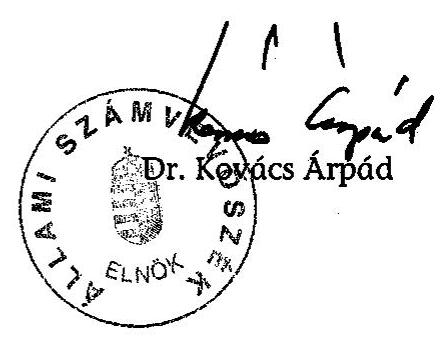

---

# MELLÉKLETEK

---

# EGÉSZSÉGÜGYI MINISZTÉRIUM MINISZTER 

Iktatószám: 5439-14/2006-0005EMF
Előadó: König Éva
Hivatkozási szám: V-10-338/2005-2006.
Telefonszám: 301-7973

## Dr. Kovács Árpád úrnak

elnök

Állami Számvevőszék

## Budapest

## Tisztelt Elnök Úr!

Az Állami Számvevőszék egészségügyi szakellátások privatizációjának ellenőrzéséről készített és véleményezésre megküldött jelentését köszönettel megkaptam, az abban rögzített megállapításokat és javaslatokat hasznosítani fogjuk.

Budapest, 2006. május „ ${ }^{1}$ „,
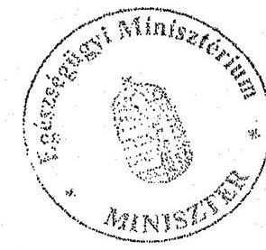

Tisztelettel:
Dr. Rácz Jenő

---

Iktatószám: 19-305/2-2/2006.

# Dr. Kovács Árpád úrnak 

elnök
Állami Számvevőszék

## Budapest

## Tisztelt Elnök Úr!

Az egészségügyi szakellátások privatizációjának ellenőrzéséről szóló jelentést és mellékleteit áttekintettük, a BM Központi Kórház számára hasznosítható felvetéseket, javaslatokat felhasználjuk.

Tekintettel arra, hogy a Kórházat a jelentésben leírtak közvetlenül nem érintik, észrevételt nem teszünk.
Tájékoztatom Elnök Urat, hogy a fentiekből eredően intézkedési terv készítését nem tartom szükségesnek.

Budapest, 2006. május 12.
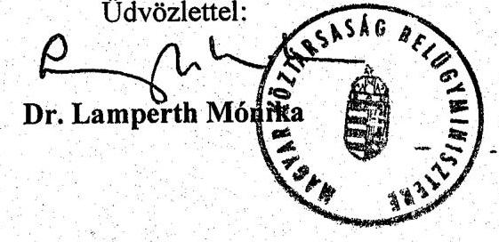

---

|  S.
sz. | Intézmény | Település | Megye | ÖTEI részvétele | Működési forma | Szerződött összeg OEP finanszírozás felett | Vagyon-
átadás
történt | Feladat-
átadással
jött létre | Alvállalkozói szerződéssel rendelkezik | $\begin{gathered} \text { Orvosi } \ \text { közreműködői } \ \text { szerződéssel } \ \text { rendelkezik } \end{gathered}$  |
| --- | --- | --- | --- | --- | --- | --- | --- | --- | --- | --- |
|

  1. | Semmelweis Kórház Kht. | Kiskunhalas | Bács-Kiskun | x | Kht. | - | - | x | x | x  |
|  2. | Bács-Kiskun Megyei Önk. Kórháza | Kecskemét | Bács-Kiskun | x | költségvetési | x |  |  | x | x  |
|  3. | Meditres Kft. | Kecskemét | Bács-Kiskun | - | Kft. | - | - | - | - | x  |
|  4. | Siklósi Kórház | Siklós | Baranya | - | Kht. | - | x | x | x | x  |
|  5. | Medi-Home Bt. | Siklós | Baranya | x | Bt. | hiányzik | - | x | hiányzik | hiányzik  |
|  6. | Pécsi Tudományegyetem | Pécs | Baranya | x | költségvetési | - |  |  | x | x  |
|  7. | BAZ Megyei Kórház és Egyetemi Oktató Kórház | Miskolc | Borsod-Abaúj-Zemplén | x | költségvetési | x |  |  | x | x  |
|  8. | Di-Tra Humán Eü-i és Ker. Kft. | Miskolc | Borsod-Abaúj-Zemplén | x | Kft. | - | x | x | - | x  |
|  9. | Erzsébet Kórház-Rendelőintézet | Hódmezővásárhely | Csongrád | x | költségvetési | x |  |  | x | x  |
|  10. | Móra-Vitál Térségi Egészségmegőrző és Szociális Kht. | Mórahalom | Csongrád | x | Kht. | hiányzik | x | x | - | x  |
|  11. | Debreceni Tudományegyetem | Debrecen | Hajdú-Bihar | x | költségvetési | x |  |  | x | x  |
|  12. | Kenézy Kórház | Debrecen | Hajdú-Bihar | x | költségvetési | x |  |  | x | x  |
|  13. | Városi Egészségügyi Szolgáltató Kht. | Debrecen | Hajdú-Bihar | x | Kht. | x | x | x | x | x  |
|  14. | Vasútegészségügyi Szolgáltató Kht. | Budapest |  |  | Kht. |  |  |  |  |   |
|  15. | Bajcsy-Zsilinszky Kórház | Budapest | - | - | költségvetési | - |  |  | x | x  |
|  16. | Schöpf-Merei Ágost Kórház és R.int.* | Budapest | - | - | költségvetési | hiányzik |  |  | - | x  |
|  17. | Szent István Kórház | Budapest | - | - | költségvetési | - |  |  | x | x  |
|  18. | Szent János Kórház | Budapest | - | - | költségvetési | - |  |  | x | x  |
|  19. | Budai Gyermekkórház*** | Budapest | - | - | költségvetési | - |  |  | x | x  |
|  20. | Dél-Budai Egészségügyi Szolg. Kht. | Budapest | - | - | Kht. | hiányzik | x | x | - | x  |
|  21. | XV. Ker. Ök. Eü. Intézménye | Budapest | - | - | költségvetési | x |  |  | - | x  |
|  22. | Gyógyír XI. Kht. | Budapest | - | - | Kht. | - | - | x | x | x  |
|  23. | Pest Megyei Flór Ferenc Kórház-R.int. | Kistarcsa | Pest | - | költségvetési | x |  |  | x | x  |
|  24. | Toldy Ferenc Kórház | Cegléd | Pest | x | költségvetési | - |  |  | x | x  |
|  25. | Europ-Med Kft. | Budaörs | Pest | - | Kft. | - | x | - | - | x  |
|  26. | Szigetszentmiklósi Szakorvosi R.int. | Szigetszentmiklós | Pest | x | költségvetési | - |  |  | - | x  |
|  27. | Humán Centrum Szakorvosi Kft. | Nyírbátor | Szabolcs-Szatmár-Bereg | x | Kft. | hiányzik | x | x | - | x  |
|  28. | Szt. Lukács Kórház | Dombóvár | Tolna | x | Kht. | - | - | x | x | x  |
|  29. | Városi Kórház- Rendelőintézet** | Várpalota | Veszprém | - | költségvetési | - |  |  | x | x  |
|  30. | Generál Medicina Eü.Szolg. Kft. | Várpalota | Veszprém | - | Kft. | x | - | x | - | x  |
|  31. | Dr. Batthyány-Strattmann László Kórház, Egészségügyi Szolgáltató Kft. | Körmend | Vas | - | Kft. | - | - | x | x | x  |

- 2005. július 1-től Kht. ** - 2005. szeptember 1-től Kft. *** - 2005. október 1-től Kht.

---

# Mátrix az előkészítés szakaszában kérdőívvel felkeresett, helyszínre ki nem választott intézmények

|  S.sz. | Intézmény | Település | Megye | ÖTEI részvétele | Müködési forma | Szerződött összeg OEP finanszírozás felett | Vagyonát adás történt | Feladatát adással jött létre | Alvállalkozói szerződéssel rendelkezik | Orvosi közremüködői szerződéssel rendelkezik  |
| --- | --- | --- | --- | --- | --- | --- | --- | --- | --- | --- |
|  1. | Szigetvár Városi Kórház-
B.intézet | Szigetvár | Baranya | x | költségvetési | - |  |  | x | x  |
|  2. | Diósgyőri Kórház | Diósgyőr | BAZ | x | költségvetési | - |  |  | x | x  |
|  3. | Sárospataki Rendelő | Sárospatak | BAZ | x | költségvetési | - | - | - | - | x  |
|  4. | PPS Med Kft. | Miskolc | BAZ | x | Kft. | - | - | - | - | x  |
|  5. | Fejér M. Önk. Szt. György Kórháza | Székesfehérvár | Fejér | - | költségvetési | - |  |  | - | x  |
|  6. | Püspökladányi Eü.
Intézmények | Püspökladány | Hajdú-
Bihar | x | költségvetési | hiányzik |  |  | - | x  |
|  7. | Városi Egészségügyi Szolg. | Balmazújváros | Hajdú-
Bihar | x | költségvetési | - |  |  | x | x  |
|  8. | Kelen Kórház Bp. Kft. | Budapest | - | x | Kft. | hiányzik | - | - | - | x  |
|  9. | HT Medical Center Kft. | Budapest | - | - | NEM VÁLASZOLT |  |  |  |  |   |
|  10. | Egészségügyi Szolgálat | Budapest, Csepel | - | - | költségvetési | hiányzik |  |  | - | x  |
|  11. | Men for Care Kft. | Százhalombatta | Pest | x | Kft. | hiányzik | x | x | - | x  |
|  12. | Gálfi Béla Gyógyító és Rehab.
Kht. | Pomáz | Pest | x | Kht. | - | - | - | - | x  |
|  13. | Szakorvosi Rendelőintézet | Pilisvörösvár | Pest | - | költségvetési | - |  |  | x | x  |
|  14. | Egészségügyi Kht., Fonyód | Fonyód | Somogy | - | Kht. | - | - | x | - | x  |
|  15. | SzSzB Megyei Ök. Jósa András Kórház | Nyíregyháza | Szabolcs-
Szatmár-
Bereg | - | költségvetési | - |  |  | x | x  |
|  16. | MÁV Kórház és Központi Rendelőint. | Budapest | - | - | költségvetési | hiányzik |  |  | x | x  |
|  17. | Vis Medica Egészségügyi Kft. | Mezőkovácsháza | Békés | - | Kft. | - | x | x | x | x  |
|  18. | SZTE ÁOK Szent Györgyi Albert Orvos- és Gyógyszerésztud. Centrum | Szeged | Csongrád | - | költségvetési | x |  |  | x | x  |

---

# HELYSZÍNI VIZSGÁLATBA VONT INTÉZMÉNYEK JEGYZÉKE 

1. Egészségügyi Minisztérium
2. Gazdasági és Közlekedési Minisztérium
3. Országos Egészségbiztosítási Pénztár
4. Pest Megyei Flór Ferenc Kórház-Rendelőintézet
5. Budapest Főváros Önkormányzata
6. Fővárosi Önkormányzat Szent János Kórház és Rendelőintézet
7. Fővárosi Önkormányzat Budai Gyermekkórház és Rendelőintézet
8. Fővárosi Önkormányzat Bajcsy-Zsilinszky Kórház és Rendelőintézet
9. Fővárosi Önkormányzat Szent István Kórház és Rendelőintézet
10. Fővárosi Önkormányzat Schöpf-Merei Ágost Kórház és Anyavédelmi Központ
11. Debrecen Megyei Jogú Város Önkormányzata
12. Hajdú-Bihar Megyei Önkormányzat Kenézy Gyula Kórház-Rendelőintézet
13. Bács-Kiskun Megyei Önkormányzat
14. Bács-Kiskun Megyei Önkormányzat Kórháza, Kecskemét
15. Hódmezővásárhely Megyei Jogú Város Önkormányzat Erzsébet Kórház-Rendelőintézet
16. Cegléd Város Önkormányzata
17. Városi Önkormányzat Toldy Ferenc Kórház-Rendelőintézet
18. Vasútegészségügyi Szolgáltató Kht.
19. Siklós Város Önkormányzata
20. Siklósi Kórház Kht.
21. Körmend Város Önkormányzata
22. Dr. Batthyány-Strattmann László Kórház Kft.
23. Dombóvár Városi Önkormányzata
24. Dombóvári Szent Lukács Egészségügyi Kht.
25. Kiskunhalas Város Önkormányzata
26. Kiskunhalasi Semmelweis Kórház Kht.
27. Borsod-Abaúj-Zemplén Megyei Önkormányzat
28. Borsod-Abaúj-Zemplén Megyei Önkormányzat Megyei Kórház és Egyetemi Oktató Kórház
29. Pécsi Tudományegyetem Orvostudományi és Egészségtudományi Centrum
30. Várpalota Város Önkormányzata
31. Városi Önkormányzat Kórház-Rendelőintézete, Várpalota
32. Szakorvosi Rendelőintézet, Szigetszentmiklós
33. Miskolc Megyei Jogú Város Önkormányzata
34. Di-Tra Humán-egészségügyi Szolgáltató és Kereskedelmi Kft.
35. Móra-Vitál Térségi Egészségmegőrző és Szociális Kht.
36. Nyírbátor Város Önkormányzata
37. Humán Centrum Szakorvosi Kft.
38. Generál Medicina Egészségügyi Szolgáltató Kft.
39. Medi-Home Bt. Járóbeteg-szakellátás
40. Budapest Főváros XI. ker. Önkormányzat

---

41. Gyógyír XI. Kht.
42. Debreceni Egyetem Orvos- és Egészségtudományi Centrum
43. VESZ Egészségügyi Szolgáltató Kht.
44. Budaörs

 Város Önkormányzata
45. Euro-Med Orvosi Szolgáltató Kft.
46. XV. Kerületi Önkormányzat
47. XV. Ker. Önkormányzat Egészségügyi Intézménye
48. Dél-budai Egészségügyi Szolgálat Kht.
49. Meditres Egészségügyi Szolgáltató Kft.

---

# HELYSZÍNI VIZSGÁLATBA NEM VONT, KÉRDŐÍVVEL ÉS TANÚSÍTVÁNNYAL FELKERESETT INTÉZMÉNYEK JEGYZÉKE 

1. Városi Önkormányzat Kórház-Rendelőintézet, Szigetvár
2. Szabolcs-Szatmár-Bereg Megyei Önkormányzat Jósa András Kórháza
3. MÁV Kórház és Központi Rendelőintézet
4. SZTE ÁOK Szent-Györgyi Albert Orvos- és Gyógyszerésztudományi Centrum
5. Fejér Megyei Szent György Kórház, Székesfehérvár
6. Egészségügyi Intézmények, Püspökladány
7. Városi Egészségügyi Szolgálat, Balmazújváros
8. Vis Medica Egészségügyi Kft.
9. Csepeli Egészségügyi Szolgálat
10. Men For Care Kft. Százhalombatta Egészségügyi Központ
11. Pilisvörösvár Városi Önkormányzat Szakorvosi Rendelőintézet
12. PPS Med Kft.
13. Hévíz Gyógyfürdő és Szent András Reuma Kórház Kht.
14. EuroCare Magyarország Egészségügyi Szolgáltató Rt.
15. RADITEC Kft.
16. Labscreen Kft.
17. MaMMa Egészségügyi Rt.
18. IMS Nemzetközi Gyógyászati Szerviz Kft.
19. Neuro CT Pécsi Diagnosztikai Központ Kft
20. Gambro Egészségügyi Szolgáltató és Kereskedelmi Kft.
21. Prodia Diagnosztikai Rt.
22. Hunikó Egészségügyi és Kereskedelmi Szolgáltató Kft.
23. Fresenius Medical Care Dialízis Center Kft.
24. Nemzetközi Egészségügyi Központ Szeged Kft.

---

# TÁBLÁZATOK JEGYZÉKE 

1. sz. táblázat

Az OEP adatszolgáltatása a művese ellátottság területi megoszlásáról 2004. decemberi állapot szerint

2. sz. táblázat

A művese kassza tájékoztató adatai (1998-2005)
3. sz. táblázat

Három nagy művese-szolgáltató fejlesztési kiadásai (önbevallás alapján)

4. sz. táblázat

CT, MR kassza adatok (1998-2005)
5. sz. táblázat

Prodia Rt. beruházási kiadásai önbevallás alapján (2002-2004)

Laborkassza tájékoztató adatai (2002-2005)
7/a. sz. táblázat

A kórházi továbbutalás aránya 100 betegre vetítve (2000-2004)

7/b. sz. táblázat

A 18 óra után is elérhető szakrendelések az összes szakrendelés százalékában (2000-2004)

7/c. sz. táblázat

Az időpontkérési lehetőség a szakrendelések számának százalékában (2000-2004)

8. sz. táblázat

A helyszínen vizsgált járóbeteg-szakrendelőkben ellátottak átlagos területi és területen kívüli létszáma

9. sz. táblázat

Orvosok ügyelete és minősített ügyelete, Fővárosi Önkormányzat Bajcsy-Zsilinszky Kórház és Rendelőintézet

10. sz. táblázat

Alternatívák elemzése a jelenlegi létszám és bérhelyzethez viszonyítva a Fővárosi Önkormányzat Bajcsy-Zsilinszky Kórház és Rendelőintézetben

11. sz. táblázat

A Fővárosi Önkormányzat Bajcsy-Zsilinszky Kórház és Rendelőintézet ügyeleti rendje a műszakosítás bevezetését követően

Alvállalkozói szerződések szakmánkénti megoszlása

---

# Az OEP adatszolgáltatása a művese ellátottság területi megoszlásáról 2004. decemberi állapot szerint

|  Megye | Telep-
helyek
száma | Kezelő-
helyek
száma | Lakosság | Lakosság/
kezelőhely | 100 ezer
lakosra jutó
kezelőhelyek
száma | 100 ezer lakosra
jutó
kezelőhelyek
száma az
országos
átlaghoz
viszonyítva | 1000
lakosra
jutó éves
teljesíthető
kezelésszám
(5,5 óra/
kezelés) | 1000 lakosra
jutó éves
teljesíthető
kezelésszám
az országos
átlaghoz
viszonyítva  |
| --- | --- | --- | --- | --- | --- | --- | --- | --- |
|  1 | Baranya megye | 4 | 52 | 404709 | 7783 | 12,85 | 137,32\% | 112,32  |
|  2 | Bács-Kiskun megye | 4 | 43 | 544116 | 12654 | 7,90 | 84,46\% | 73,19  |
|  3 | Békés megye | 2 | 29 | 396131 | 13660 | 7,32 | 78,24\% | 73,89  |
|  4 | Borsod-Abaúj-Zemplén megye | 5 | 82 | 744484 | 9079 | 11,01 | 117,71\% | 101,88  |
|  5 | Csongrád megye | 6 | 47 | 426817 | 9081 | 11,01 | 117,69\% | 88,03  |
|  6 | Fejér megye | 2 | 35 | 428409 | 12240 | 8,17 | 87,31\% | 75,74  |
|  7 | Győr-Moson-Sopron megye | 2 | 36 | 435088 | 12086 | 8,27 | 88,43\% | 68,84  |
|  8 | Hajdú-Bihar megye | 5 | 56 | 551837 | 9854 | 10,15 | 108,46\% | 80,59  |
|  9 | Heves megye | 2 | 43 | 325029 | 7559 | 13,23 | 141,39\% | 120,08  |
|  10 | Komárom-Esztergom megye | 2 | 27 | 315515 | 11686 | 8,56 | 91,46\% | 83,06  |
|  11 | Nógrád megye | 1 | 22 | 219447 | 9975 | 10,03 | 107,14\% | 90,99  |
|  12 | Pest megye | 3 | 34 | 1105412 | 32512 | 3,08 | 32,87\% | 37,03  |
|  13 | Somogy megye | 2 | 32 | 335701 | 10491 | 9,53 | 101,88\% | 66,24  |
|  14 | Szabolcs-Szatmár-Bereg megye | 3 | 61 | 586193 | 9610 | 10,41 | 111,21\% | 101,61  |
|  15 | Jász-Nagykun-Szolnok megye | 2 | 32 | 416147 | 13005 | 7,69 | 82,18\% | 75,25  |
|  16 | Tolna megye | 1 | 18 | 248998 | 13833 | 7,23 | 77,26\% | 57,41  |
|  17 | Vas megye | 1 | 30 | 267429 | 8914 | 11,22 | 119,89\% | 111,36  |
|  18 | Veszprém megye | 1 | 30 | 373705 | 12457 | 8,03 | 85,80\% | 81,97  |
|  19 | Zala megye | 3 | 40 | 297853 | 7446 | 13,43 | 143,53\% | 103,61  |
|  20 | Budapest | 16 | 200 | 1719342 | 8597 | 11,63 | 124,32\% | 124,20  |
|  Összesen: |  | 67 | 949 | 10142362 | 10687 | 9,36 | 100,00\% | 88,07  |

---

# A művese kassza tájékoztató adatai (1998-2005)

|  Megnevezés | 1998 | 1999 | 2000 | 2001 | 2002 | 2003 | 2004 | 2005  |
| --- | --- | --- | --- | --- | --- | --- | --- | --- |
|  Gyógyító megelőző kiadások (Mrd Ft) | 299,1 | 339,0 | 376,0 | 410,3 | 502,8 | 623,0 | 654,6 | 694,4  |
|  - ebből művese szolgáltatás (Mrd Ft) | 7,5 | 8,7 | 10,2 | 11,6 | 13,1 | 16,0 | 16,1 | 16,1  |
|  - ebből vállalkozói szolgáltatás (Mrd Ft) | 6,2 | 7,3 | 8,7 | 9,9 | 11,6 | 14,3 | 14,5 | 15,1  |
|  Vállalkozó arány \% | 82,7 | 83,9 | 85,3 | 85,3 | 88,5 | 89,4 | 90,0 | 93,8  |
|  - Szerződés db száma (db) | 22 | 20 | 21 | 23 | 20 | 21 | 21 | 17  |
|  - ebből vállalkozói szerződés (db) | 8 | 7 | 8 | 6 | 8 | 7 | 7 | 6  |
|  - arány \% | 36,4 | 35,0 | 38,1 | 26,1 | 40,0 | 33,3 | 33,3 | 35,3  |
|  Gépek száma (db) | 696 | 812 | 875 | 941 | 1029 | 1075 | 1129 | 1142  |
|  Kezelőhelyek száma (db) | 598 | 731 | 766 | 805 | 868 | 906 | 946 | 959  |
|  - ebből vállalkozói (db) | 483 | 612 | 645 | 700 | 768 | 802 | 842 | 855  |
|  Heti működési idő (óra) | 4725 | 5159 | 5149 | 5237 | 5664 | 5854 | 5996 | 5907  |
|  - ebből vállalkozói | 3396 | 3761 | 3992 | 4196 | 4679 | 4775 | 4917 | 4972  |
|  Összes kezelés szám (db) | 396213 | 472850 | 551259 | 624143 | 697166 | 760245 | 819334 | 879271  |

---

# Három nagy művese-szolgáltató fejlesztési kiadásai (önbevallás alapján)

|  Megnevezés |  | EuroCare Magyarország
Egészségügyi Szolgáltató Rt. | Gambro Egészségügyi Szolgáltató és Kereskedelmi Kft. | Fresenius Medical Care Dialízis Center Kft.  |
| --- | --- | --- | --- | --- |
|   |  | 1991-2004 | 1997-2004 | 1998-2004  |
|  1. | Épület építés | 5085,2 | 455,0 | 1560,0  |
|  2. | Épület vásárlás | 143,0 | 444,0 | 355,0  |
|  3. | Épület felújítás | 378,0 | 93,2 | 388,0  |
|  4. | Gép vásárlás, csere | 2500,6 | 353,7 | 525,0  |
|  5. | Kapacitás bővítés |  | 313,0 | 875,0  |
|  6. | Beruházás összesen | 8106,8 | 1658,9 | 3703,0  |
|  7. | OEP bevétel összesen (1998-2004) | 26530,0 | 9146,6 | 28794,0  |
|  8. | Beruházási kiadás aránya az OEP bevételhez viszonyítva (\%) | * | 18\% | 13\%  |

- bevételi és beruházási adat időbeli eltérése miatt nem értékelhető

---

# CT, MR kassza adatok (1998-2005)

|  Megnevezés | 1998 | 1999 | 2000 | 2001 | 2002 | 2003 | 2004 | 2005  |
| --- | --- | --- | --- | --- | --- | --- | --- | --- |
|  Gyógyító megelőző kassza tény. kiadása (Mrd Ft) | 299,1 | 339,0 | 376,0 | 410,3 | 502,8 | 623,0 | 654,6 | 694,4  |
|  - ebből CT, MR ellátás kifiz. (Mrd Ft) | 6,2 | 6,5 | 7,1 | 7,8 | 8,5 | 11,0 | 11,0 | 11,0  |
|  - ebből vállalkozásnak fizetett (Mrd Ft) | 2,6 | 2,6 | 2,8 | 2,8 | 2,8 | 3,2 | 2,7 | 3,1  |
|  arány \% | 41,9 | 40,0 | 39,4 | 35,8 | 32,9 | 29,1 | 24,5 | 28,2  |
|  - elszámolt pont CT (Mrd Ft) | 3,1 | 2,9 | 3,1 | 3,6 | 4,1 | 4,5 | 4,9 | 5,5  |
|  - elszámolt pont MR (Mrd Ft) | 2,4 | 2,7 | 3,2 | 3,9 | 4,4 | 5,2 | 5,3 | 5,6  |
|  - egy teljm. egységre jutó finansz. (Ft) | 1,6 | 1,6 | 1,6 | 1,4 | 1,3 | 1,5 | 1,3 | 1,3  |
|  Szolgáltatói szerződések száma (CT, MR) (db) | 48 | 53 | 59 | 63 | 67 | 67 | 64 | 66  |
|  - ebből vállalk. (db) | 8 | 11 | 12 | 11 | 12 | 10 | 10 | 10  |
|  arány \% | 16,6 | 20,75 | 20,34 | 17,4 | 17,9 | 14,9 | 15,6 | 15,2  |
|  Berendezések száma MR

 (db) | 14 | 15 | 19 | 19 | 23 | 26 | 26 | 27  |
|  Berendezések száma CT (db) | 46 | 56 | 60 | 64 | 69 | 72 | 73 | 73  |
|  Egy MR-re jutó lakosságszám (fő) | 737298 | 687918 | 541159 | 539715 | 444266 | 375643 | 390566 | 375703  |
|  Egy CT-re jutó lakosságszám (fő) | 224395 | 184264 | 171367 | 160228 | 148089 | 142850 | 139106 | 138958  |
|  MR vizsgálatok száma (db) | 399426 | 393676 | 544431 | 636245 | 739978 | 909718 | 663887 | 343658  |
|  1000 lakosra jutó MR vizsgálat (db) | 45 | 44 | 56 | 47 | 52 | 59 | 61 | 34  |
|  CT vizsgálatok száma (db) | 467347 | 449854 | 573751 | 482596 | 533619 | 601930 | 617174 | 617762  |
|  1000 lakosra jutó CT vizsgálat (db) | 39 | 38 | 53 | 62 | 72 | 90 | 65 | 61  |

---

# Prodia Rt. beruházási kiadásai önbevallás alapján (2002-2004)

|  S.sz. | Megnevezés | Érték  |
| --- | --- | --- |
|  1. | Épület vásárlás (M Ft) | 4,0  |
|  2. | Épület felújítás (M Ft) | 36,9  |
|  3. | Gépek, berendezések cseréje, pótlása (M Ft) | 306,3  |
|  4. | Gépek, berendezések vásárlása, kapacitásbővítése (M Ft) | 144,4  |
|  5. | Beruházás összesen (M Ft) | 491,6  |
|  6. | OEP bevétel összesen (M Ft) | 3083,1  |
|  7. | Közvetett szerződés szerinti bevétele összesen (M Ft) | 7421,4  |
|  8. | Összes bevétel (M Ft) | 10504,5  |
|  9. | Beruházási kiadás aránya az OEP bevételhez viszonyítva (\%) | 17,0  |
|  10. | Beruházási kiadás aránya az összes bevételhez viszonyítva (\%) | 4,8  |

---

# Laborkassza tájékoztató adatai (2002-2005)

|  S.sz. | Megnevezés | 2002 | 2003 | 2004 | 2005  |
| --- | --- | --- | --- | --- | --- |
|  1 | Labor kassza összes kiadása (Mrd Ft) | 13,7 | 18,2 | 20,8 | 21,0  |
|  2 | - ebből kifizetés Prodia Rt.-nek OEP közvetlen szerz. alapján (Mrd Ft) | 0,6 | 1,0 | 1,3 | 1,4  |
|  3 | - Prodia Rt. bevétele az intézetekkel kötött szerz. alapján (Mrd Ft) | 2,7 | 2,2 | 2,6 | 2,7  |
|  $2+3$ | Prodia bevétele összesen (Mrd Ft) | 3,3 | 3,2 | 3,9 | 4,1  |
|  4 | Prodia bevételeinek aránya a laborkasszához | 24,1% | 17,6% | 18,8% | 19,5%  |
|  5 | Labor pont teljesítmény országosan (pont) | 18766982787 | 20438357504 | 26012072817 | 30851121596  |
|  6 | Prodia pont teljesítmény (OEP közvetlen) (pont) | 747888296 | 1295360607 | 1737448527 | 2153052839  |
|  7 | - Prodia eset szám (OEP közvetlen) (db) | 254021 | 420757 | 565785 | 698366  |
|  8 | Labor beavatkozás szám országosan | 132546330 | 138565522 | 139420514 | 148596069  |
|  9 | - Prodia beavatkozás szám (OEP közvetlen) | 3929631 | 6333646 | 7586484 | 9316198  |

---

A kórházi továbbutalás aránya 100 betegre vetítve (2000-2004)

|  Megnevezés | 2000 | 2001 | 2002 | 2003 | 2004  |
| --- | --- | --- | --- | --- | --- |
|  Europ-Med Orvosi Szolgáltató Kft. | nem értékelhető | nem értékelhető | nem értékelhető | nem értékelhető | nem értékelhető  |
|  Generál Medicina Egészségügyi Szolgáltató Kft. | 9 | 11 | 8 | 9 | 13  |
|  Medi Home Bt. | 20 | 20 | 20 | 20 | 20  |
|  Humán Centrum Szakorvosi Kft. | nincs adat | nincs adat | nincs adat | nincs adat | nincs adat  |
|  Di-Tra Humán-egészségügyi Szolgáltató és Kereskedelmi Kft. | 6 | 6 | 6 | 6 | 6  |
|  Gyógyír XI. Kht. |  |  |  |  | 5  |
|  Vasútegészségügyi Kht. |  | 0,62 | 0,45 | 0,43 | 0,32  |
|  Dél-budai Egészségügyi Szolgálat Kht. | 2,49 | 1,19 | 1,31 | 1,27 | 1,34  |
|  VESZ Egészségügyi Szolgáltató Kht. |  |  |  |  | 12  |
|  XV. Ker. Önkormányzat Egészségügyi Intézménye | 1 | 1 | 1 | 1 | 1  |
|  Szakorvosi Rendelőintézet, Szigetszentmiklós | 1 | 1 | 1 | 1 | 1  |
|  Meditres Egészségügyi Szolgáltató Kft. | nincs adat | nincs adat | nincs adat | nincs adat | nincs adat  |
|  Móra-Vitál Térségi Egészségmegőrző és Szociális Kht. |  |  | 8 | 7 | 9  |

---

# A 18 óra után is elérhető szakrendelések az összes szakrendelés százalékában (2000-2004)

|  Megnevezés | 2000 | 2001 | 2002 | 2003 | 2004  |
| --- | --- | --- | --- | --- | --- |
|  Müködtetésbe adottak |  |  |  |  |   |
|  Europ-Med Kft. |  | 35 | 35 | 46 | 43  |
|  Generál Medicina Kft. | 25 | 33 | 33 | 33 | 33  |
|  Medi Home Bt. | 0 | 0 | 23 | 21 | 36  |
|  Humán Centrum Kft. | 0 | 0 | 0 | 0 | 0  |
|  Di-Tra Kft. | 50 | 50 | 50 | 50 | 50  |
|  Összesen | 5 | 20 | 24 | 28 | 30  |
|  Kht.-k |  |  |  |  |   |
|  Vasútegészségügyi Kht. |  | 2 | 3 | 3 | 5  |
|  Dél-budai Kht. | 44 | 42 | 42 | 42 | 45  |
|  Összesen | 44 | 7 | 8 | 8 | 10  |
|  Költségvetésiek |  |  |  |  |   |
|  XV. Ker. Önkormányzat Egészségügyi Intézménye | 100 | 100 | 90 | 90 | 90  |
|  Szakorvosi Rendelőintézet, Szigetszentmiklós | 0 | 0 | 0 | 0 | 0  |
|  Összesen | 31 | 31 | 34 | 34 | 34  |
|  Újonnan alakultak |  |  |  |  |   |
|  Meditres Eü. Szolg. Kft. | 67 | 67 | 67 | 67 | 67  |
|  Móra Vitál Kht. |  |  | 56 | 78 | 67  |
|  Összesen | 67 | 67 | 61 | 72 | 67  |

---

# Az időpontkérési lehetőség a szakrendelések számának százalékában (2000-2004) 

| Megnevezés | 2000 | 2001 | 2002 | 2003 | 2004 |
| :--: | :--: | :--: | :--: | :--: | :--: |
| Müködtetésbe adottak |  |  |  |  |  |
| Europ-Med Kft. | 0 | 23,1 | 23,08 | 26,92 | 35,71 |
| Generál Medicina Kft. | 37,5 | 41,67 | 41,67 | 41,67 | 41,67 |
| Medi Home Bt. | 22,22 | 16,67 | 38,46 | 57,14 | 100 |
| Humán Centrum Kft. | 100 | 100 | 100 | 100 | 100 |
| Di-Tra Kft. | 100 | 100 | 100 | 100 | 100 |
| Összesen | 39,7 | 47,1 | 50,7 | 55,6 | 66,2 |
| Kht.-k |  |  |  |  |  |
| Vasútegészségügyi Kht. |  | 26,92 | 32,06 | 39,71 | 58,57 |
| Dél-budai Kht. | 61,11 | 57,89 | 57,89 | 57,89 | 60 |
| Összesen | 61,11 | 30,87 | 35,33 | 41,94 | 58,75 |
| Költségvetésiek |  |  |  |  |  |
| XV. Ker. Önkormányzat Egészségügyi Intézménye | 20 | 20 | 45 | 45 | 45 |
| Szakorvosi Rendelőintézet,   Szigetszentmiklós | 14,71 | 23,53 | 30,30 | 30,30 | 33,33 |
| Összesen | 16,33 | 22,45 | 35,85 | 35,85 | 37,74 |
| Újonnan alakultak |  |  |  |  |  |
| Meditres Eü. Szolg. Kft. | 100 | 100 | 100 | 100 | 100 |
| Móra Vitál Kht. |  |  | 0 | 0 | 66,67 |
| Összesen | 100,00 | 100,00 | 50,00 | 50,00 | 80,95 |

---

A helyszínen vizsgált járóbeteg-szakrendelésekben ellátottak átlagos területi és területen kívüli létszáma (fő)

|  Sorsz. | Megnevezés | Társasági forma | 2000 |  | 2001 |  | 2002 |  | 2003 |  | 2004 |   |
| --- | --- | --- | --- | --- | --- | --- | --- | --- | --- | --- | --- | --- |
|   |  |  | ter. belül | ter. kívül | ter. belül | ter. kívül | ter. belül | ter. kívül | ter. belül | ter. kívül | ter. belül | ter. kívül  |
|  1. | Humán Centrum Szakorvosi Kft. | Kft. | nincs adat |  |  |  |  |  |  |  |  |   |
|  2. | Meditres Kft. | Kft. | nincs adat |  |  |  |  |  |

  |  |  |   |
|  3. | Europ-Med Kft. | Kft. | 108976 | 606672 | 93506 | 66199 | 92072 | 78620 | 105832 | 101813 | 104311 | 111201  |
|  4. | Di-Tra Humánegészségügyi Szolg. és Ker. Kft. | Kft. | 41496 | 100 | 45414 | 100 | 46793 | 100 | 46003 | 100 | 46621 | 100  |
|  5. | Generál Medicina Eü. Szolg. Kft. | Kft. | 76110 | 805 | 82441 | 912 | 92318 | 624 | 84959 | 873 | 89862 | 942  |
|  6. | Medi Home Bt. | Bt. | 30689 | 626 | 38082 | 777 | 65176 | 1330 | 69461 | 1418 | 76768 | 1567  |
|  7. | Dél-Budai Egészségügyi Szolg. Kht. | Kht. | 115437 | 1100 | 226398 | 1200 | 230396 | 1300 | 225614 | 1400 | 233740 | 1500  |
|  8. | Móra-Vitál Térségi Egészségmegőrző és Szociális Kht. | Kht. | nincs adat |  |  |  | 7448 | 11 | 7575 | 18 | 8432 | 32  |
|  9. | VESZ Debrecen | Kht. | nincs adat |  |  |  |  |  |  |  | 228191* | 4101*  |
|  10. | Gyógyír XI. Kht. | Kht. | nincs adat |  |  |  |  |  |  |  | 190902 | 48078  |
|  11. | Vasútegészségügyi Kht. | Kht. | nincs adat |  |  |  |  |  |  |  |  |   |
|  12. | Szakorvosi Rendelőintézet, Szigetszentmiklós | költségv. | nincs adat |  |  |  |  |  |  |  |  |   |
|  13. | XV. Ker. Önkormányzat Egészségügyi Intézménye | költségv. | 34426 | 5771 | 33564 | 6085 | 33174 | 5898 | 34702 | 6313 | 36238 | 7294  |

- 2004. 10-12. hó

---

# Orvosok ügyelete és minősített ügyelete Fővárosi Önkormányzat Bajcsy-Zsilinszky Kórház és Rendelőintézet

|  Megnevezés | Eredeti állapot |  |  | 3X8 óra |  | 2X12 óra |  | Változó idejű (hosszított) műszak |   |
| --- | --- | --- | --- | --- | --- | --- | --- | --- | --- |
|   | Teljesített óraszám (hó) | Minősített ügyelet bér + járulék (Ft/hó) | Ügyelet bér + járulék (Ft/hó) | Teljesített óraszám (hó) | Bér + járulék (Ft/hó) | Teljesített óraszám (hó) | Bér + járulék (Ft/hó) | Teljesített óraszám (hó) | Bér + járulék (Ft/hó)  |
|  1. Dolgozó | 280 | 334404 | 299261 | 168 | 262800 |  |  | 212 | 320417  |
|  2. Dolgozó | 256 | 310806 | 278800 | 168 | 238047 |  |  | 200 | 282106  |
|  3. Dolgozó | 256 | 426778 | 380545 | 176 | 353241 |  |  | 204 | 400794  |
|  4. Dolgozó | 264 | 425049 | 376809 | 170 | 320881 |  |  | 192 | 358981  |
|  5. Dolgozó | 264 | 437105 | 387840 | 168 | 312291 |  |  | 208 | 400842  |
|  6. Dolgozó | 264 | 375820 | 350328 | 192 | 319639 |  |  | 200 | 332501  |
|  7. Szükséges dolgozó | 0 | 0 | 0 | 176 | 331926 |  |  | 0 | 0  |
|  8. Szükséges dolgozó | 0 | 0 | 0 | 168 | 298724 |  |  | 0 | 0  |
|  Összesen | 1584 | 2309962 | 2073583 | 1386 | 2437549 |  |  | 1216 | 2095641  |
|  Új dolgozók további bérjellegű költségei |  |  |  |  | 84480 |  |  |  |   |

---

# Alternatívák elemzése a jelenlegi létszám és bérhelyzethez viszonyítva a Fővárosi Önkormányzat Bajcsy-Zsilinszky Kórház és Rendelőintézetben

|  Lehetséges variációk | Felmerülő többletlétszám (\%) | Felmerülő többletbér (\%)  |
| --- | --- | --- |
|  I. Műszak 2x12 óra | 17 | 5 (társszakmák összevonásával) |
|  II. Műszak 3x8 óra | 30 | 15  |
|  III. Egyenlőtlen munkaidő | Nincs további létszámszükséglet (összevonás árán) | 0  |

---

# A Fővárosi Önkormányzat Bajcsy-Zsilinszky Kórház és Rendelőintézet ügyeleti rendje a műszakosítás bevezetését követően

|  Osztály neve | Műszakosítás kezdő időpontja | I. | I/H. (hosszított) | II. (éjszakai) | Hétvége | Kiegészítés  |
| --- | --- | --- | --- | --- | --- | --- |
|  KAIBO | 2004.07.16. | $\begin{gathered} 07-15 \ \text { Működő } \ \text { műtő } \ \text { számától } \ \text { függően } \ \text { max: } 10 \text { fő } \end{gathered}$ | $\begin{gathered} 07.30-19.30 \ \text { Igény szerint 2-3 fő } \end{gathered}$ | $\begin{gathered} 19.15-07.15 \ 2 \text { fő } \end{gathered}$ | Műszakonként 2 fő |   |
|  Fül-orr-gége | 2004.07.16. | $08-16$ | $\begin{gathered} 08-20 \ 1 \text { fő } \end{gathered}$ | Műtétes, és felvételes (keletpesti régió) napokon 1 fő, a többi esetben 1 fő szakorvosi készenlét | $\begin{gathered} \text { Szo-V } \ 08-12 \ 1 \text { fő } \ \text { a többi időben } 1 \text { fő } \ \text { szakorvosi készenlét } \end{gathered}$ |   |
|  Szülészet | 2004.07.16. | $\begin{gathered} 08-16 \ \text { Max: } 7 \text { fő } \end{gathered}$ | $\begin{gathered} 08.30-20.30 \ 2 \text { fő } \end{gathered}$ | $\begin{gathered} 20.15-08.15 \ 2 \text { fő } \end{gathered}$ | Műszakonként 2 fő |   |
|  Neurológia | 2004.07.16. | $07-15$ | $\begin{gathered} 11.30-19.30 \ 1 \text { fő ebben az időben } \ \text { jár, } 15 \text { órától egyedül } \ \text { van } \end{gathered}$ | $\begin{gathered} 19.15-07.15 \ 1 \text { fő } \end{gathered}$ | Műszakonként 1 fő |   |
|  I. Belgyógyászat | 2004.08.16. | $\begin{gathered} 08-16 \ \text { Max: } 10 \text { fő } \end{gathered}$ | $\begin{gathered} 08.30-20.30 \ 1 \text { fő } \end{gathered}$ | $\begin{gathered} 20.15-08.15 \ 1 \text { fő } \end{gathered}$ | Műszakonként 1 fő | Valamennyi belgyógyászat összehangolva, Általános orvos mellett 1 fő szakorvosi készenlét  |
|  VI. Belgyógyászat + Mozgásszervi rehabilitáció | 2004.09.01. | $08-16$ | $\begin{gathered} 08.30-20.30 \ 1 \text { fő } \end{gathered}$ | $\begin{gathered} 20.15-08.15 \ 1 \text { fő } \end{gathered}$ | Műszakonként 1 fő | Az éjszakai és a hétvéti műszakokban mentőtiszt is láthat el betegfelügyeletet  |
|  Urológia | 2004.09.16. | $08-16$ | $\begin{gathered} 08.30-20.30 \ 08-20 \end{gathered}$ | $\begin{gathered} 20.15-08.15 \ \text { Műtétes és felvételes napokon } 1 \ \text { fő } \ \text { a többi napon } 1 \text { fő szakorvosi } \ \text { készenlét } \end{gathered}$ | $\begin{gathered} \text { Szo-V } \ 08-12 \ 1 \text { fő } \ \text { A többi időben } 1 \text { fő } \ \text { szakorvosi készenlét } \end{gathered}$ |   |

---

|  Osztály neve | Műszakosítás kezdő időpontja | I. | I/H. (hosszított) | II. (éjszakai) | Hétvége | Kiegészítés  |
| --- | --- | --- | --- | --- | --- | --- |
|  IV. Belgyógyászat | 2004.09.16. | $\begin{gathered} 08-16 \ \text { Átlag } \ \text { max: } 14 \text { fő } \end{gathered}$ | $\begin{gathered} 08.30-20.30 \ 1-2-3 \text { fő } \end{gathered}$ | $\begin{gathered} 20.15-08.15 \ 1-2 \text { fő } \end{gathered}$ | Műszakonként 2 fő | Valamennyi belgyógyászat összehangolva, Általános orvos mellett 1 fő szakorvosi készenlét  |
|  Szemészet | 2004.09.16. | $\begin{gathered} 08-16 \ \text { Max: } 7 \text { fő } \end{gathered}$ | $\begin{gathered} 10-20 \ 1 \text { fő ebben az időben } \ \text { jár, } 16 \text { órától egyedül } \ \text { van } \end{gathered}$ | $\begin{gathered} 20-08 \ 1 \text { fő szakorvosi készenlét } \end{gathered}$ | Szo.: 08-14 1 fő V.: 08-12 1 fő A többi időben 1 fő szakorvosi készenlét |   |
|  Sebészet | 2004.09.16. | $\begin{gathered} 08-16 \ \text { Max: } 9 \text { fő } \end{gathered}$ | $\begin{gathered} 08.30-20.30 \ \text { Akut ügyeleti ellátás } \ \text { napjain: } 3 \text { fő } \ \text { Más napokon.: } 1 \text { fő } \end{gathered}$ | $\begin{gathered} 20.15-08.15 \ \text { Akut ügyeleti ellátás napjain: } \ 3 \text { fő } \ \text { Más napokon: } 1 \text { fő } \end{gathered}$ | Szo.-V.: Akut ellátás esetén 3 fő, más esetben 1 fő műszakonként, |   |
|  Pszichiátria | 2004.10.01. | 08-16 | $\begin{gathered} 08.30-20.30 \ 1 \text { fő } \end{gathered}$ | $\begin{gathered} 20.15-08.15 \ 1 \text { fő } \end{gathered}$ | Szo-V.: 1 fő műszakonként |   |
|  Immunonephrológia | 2005.01.01. | 08-16 | $\begin{gathered} 10-22 \ 1 \text { fő } \end{gathered}$ | $\begin{gathered} 22-10 \ 1 \text { fő } \end{gathered}$ | Szo-V: 1 fő Műszakonként 10-22 22-10 |   |
|  III. Belgyógyászat + Kardiológiai rehabilitáció | 2005.05.01. | $\begin{gathered} 08-16 \ \text { Max: } 10 \text { fő } \end{gathered}$ | $\begin{gathered} 16-20 \ 1 \text { fő } \end{gathered}$ | $\begin{gathered} 20-08 \ 1 \text { fő } \end{gathered}$ | Szo-V: |   |

 1 fő
Múszakonként
08-20
20-08 | Valamennyi
belgyógyászat
összehangolva,
Általános orvos mellett 1
fő szakorvosi készenlét  |
|  RTG | 2005.01.01. | 07-13 | $\begin{gathered} 13-19 \ \text { igény szerint } \end{gathered}$ | $\begin{gathered} 19-07 \ 1 \text { fő } \end{gathered}$ | Szo-V: 1 fő
Múszakonként
07-19
19-07 |   |

---

# Alvállakozói szerződések szakmánkénti megoszlása

|  S.
sz. | Intézmény | Labor | CT | MRI | Kórszö-
vettan,
citológia | Röntgen-
UH | Endosz-
kóp
labor. | Hemodi-
namikai
labor. | Mammog-
ráfia | Közúzás | Bonco-
lás | Csont-
sűrűség
vizsgálat | Érseb-
fekvőb.
terápia | Mütétek | Fogá-
szat | IVF  |
| --- | --- | --- | --- | --- | --- | --- | --- | --- | --- | --- | --- | --- | --- | --- | --- | --- |
|  1. | Budapest, Bajcsy-Zs. Kórház | 1 |  |  | 1 |  |  | 1 |  | 1 | 1 | 1 |  |  |  |   |
|  2. | Budapest, Szt. István Kórház | 1 |  |  |  |  |  |  |  | 1 |  |  |  |  |  |   |
|  3. | Budapest, Szt. János Kórház | 1 |  |  |  |  |  |  |  |  |  |  |  |  |  |   |
|  4. | Cegléd, Toldy F. Városi Kórház |  | 1 |  | 1 |  |  |  |  | 1 |  |  | 1 |  |  |   |
|  5. | Debrecen, Kenézy Gy. M. Kórház | 1 |  |  |  |  |  |  |  |  |  |  |  |  |  |   |
|  6. | Debreceni Egyetem Orvostud. C. |  | 1 | 1 |  | 1 |  | 1 |  |  |  | 1 |  |  |  | 1  |
|  7. | Dombóvár, Szt. Lukács Kh. Kht. |  |  |  | 1 |  |  |  |  | 1 |  |  |  |  |  |   |
|  8. | Gyógyír XI. Kht., Budapest | 1 |  |  |  |  |  |  |  |  |  |  |  |  |  |   |
|  9. | Hódmezővásárhely, Erzsébet Kórház |  | 1 |  |  |  |  |  | 1 | 1 |  |  |  |  |  |   |
|  10. | Kecskemét, Megyei Kórház | 1 | 1 | 1 | 1 |  | 1 |  | 1 | 1 |  |  |  |  |  |   |
|  11. | Kistarcsa, Flór F. Megyei Kórház | 1 |  |  |  | 1 |  |  |  |  |  |  |  |  |  |   |
|  12. | Kálmánfalva, Semmelweis Kh. Kht. | 1 | 1 |  |  |  |  |  |  |  |  |  |  | 1 | 1 |   |
|  13. | Miskolc, Megyei Kh. |  |  |  |  |  |  |  |  |  |  |  |  |  |  |   |
|  14. | Pécsi Tud.egyet. Orvostud. C. |  |  |  |  |  |  |  |  | 1 |  |  |  | 1 |  | 1  |
|  15. | Siklósi Kórház Kht. |  |  |  | 1 |  |  |  |  |  |  |  |  |  |  |   |
|  16. | Várpalota, Városi Kórház | 1 |  |  |  |  |  |  |  |  |  |  |  |  |  |   |
|  17. | VESZ Eü. Kht., Debrecen |  |  |  |  |  |  |  | 1 |  |  |  |  |  |  |   |
|  Összesen |  | 9 | 5 | 2 | 5 | 2 | 1 | 2 | 3 | 7 | 1 | 2 | 1 | 2 | 1 | 2  |

---

# ÁBRÁK JEGYZÉKE 

1. sz. ábra
2. sz. ábra
3. sz. ábra
4. sz. ábra

Helyszíni vizsgálatba vont egészségügyi intézmények csoportosítása

Művesekezelésben részesültek számának változása (2000-2005)

Betegelégedettség az ÁSZ felmérése alapján Tudomása szerint a rendelő privatizált? (Működtetésbe adott intézményekben a válaszok megoszlása)

Betegelégedettség az ÁSZ felmérése alapján
A válaszadók összefoglaló értékelése a rendelőről (a válaszadók arányában)

---

# Helyszíni vizsgálatba vont egészségügyi intézmények csoportosítása 

A helyszíni vizsgálatba vont intézmények
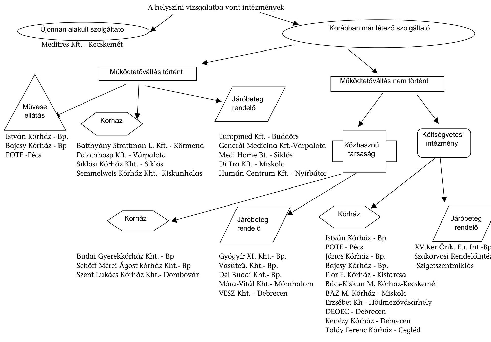

---

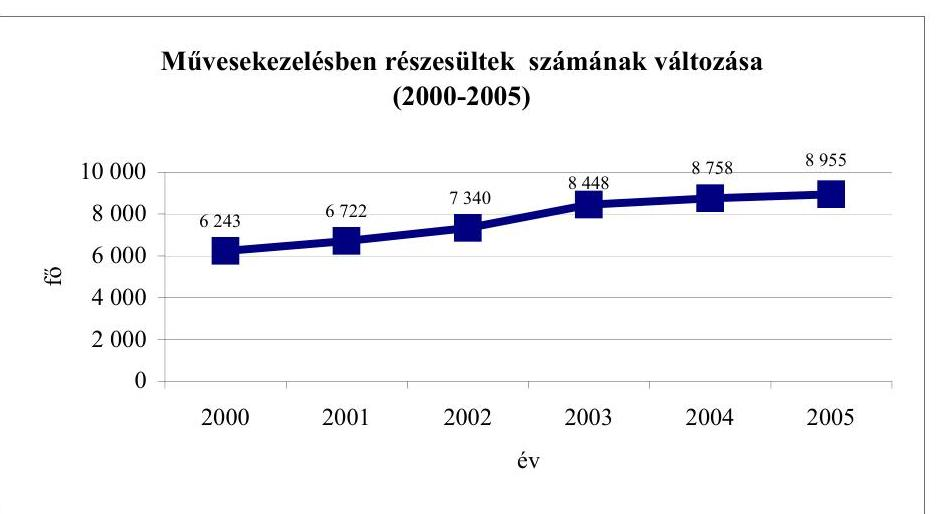

# Művesekezelésben részesültek számának változása 

$(2000-2005)$
$\square$

---

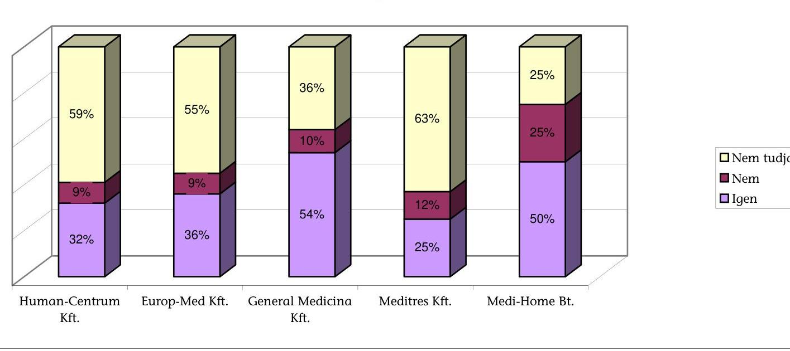

# Betegelégedettség az ÁSZ felmérése alapján

## Tudomása szerint a rendelő privatizált? (Működtetésbe adott intézményekben a válaszok megoszlása)

|  |   |   |   |   |
| --- | --- | --- | --- | --- |
|  **Igen** | **Két** | **Gérem** | **Igen** | **Két**  |
|  59% | 55% | 36% | 63% | 25%  |
|  9% | 32% | 36% | 25% | 50%  |
|  32% | 36% | 54% | 25% | 50%  |
|  **Igen** | **Két** | **Gérem** | **Igen** | **Két**  |
|  59% | 55% | 36% | 63% | 25%  |
|  9% | 32% | 36% | 25% | 50%  |
|  32% | 36% | 54% | 25% | 50%  |
|  **Igen** | **Két** | **Gérem** | **Igen** | **Két**  |
|  59% | 55% | 36% | 63% | 25%  |
|  9% | 32% | 36% | 25% | 50%  |
|  32% | 36% | 54% | 25% | 50%  |
|  **Igen** | **Két** | **Gérem** | **Igen** | **Két**  |
|  59% | 55% | 36% | 63% | 25%  |
|  9% | 32% | 36% | 25% | 50%  |
|  32% | 36% | 54% | 25% | 50%  |
|  **Igen** | **Két** | **Gérem** | **Igen** | **Két**  |
|  59% | 55% | 36% | 63% | 25%  |
|  9% | 32% | 36% | 25% | 50%  |
|  32% | 36% | 54% | 25% | 50%  |
|  **Igen** | **Két** | **Gérem** | **Igen** | **Két**  |
|  59% | 55% | 36% | 63% | 25%  |
|  9% | 32% | 36% | 25% | 50%  |
|  32% | 36% | 54% | 25% | 50%  |
|  **Igen** | **Két** | **Gérem** | **Igen** | **Két**  |
|  59% | 55% | 36% | 63% | 25%  |
|  9% | 32% | 36% | 25% | 50%  |
|  32% | 36% | 54% | 25% | 50%  |
|  **Igen** | **Két** | **Gérem** | **Igen** | **Két**  |
|  59% | 55% | 36% | 63% | 25%  |
|  9% | 32% | 36% | 25% | 50%  |
|  32% | 36% | 54% | 25% | 50%  |
|  **Igen** | **Két** | **Gérem** | **Igen** | **Két**  |
|  59% | 55% | 36% | 63% | 25%  |
|  9% | 32% | 36% | 25% | 50%  |
|  32% | 36% | 54% | 25% | 50%  |
|  **Igen** | **Két** | **Gérem** | **Igen** | **Két**  |
|  59% | 55% | 36% | 63% | 25%  |
|  9% | 32% | 36% | 25% | 50%  |
|  32% | 36% | 54% | 25% | 50%  |
|  **Igen** | **Két** | **Gérem** | **Igen** | **Két**  |
|  59% | 55% | 36% | 63% | 25%  |
|  9% | 32% | 36% | 25% | 50%  |
|  32% | 36% | 54% | 25% | 50%  |
|  **Igen** | **Két** | **Gérem** | **Igen** |

 **Két**  |
|  59% | 55% | 36% | 63% | 25%  |
|  9% | 32% | 36% | 25% | 50%  |
|  32% | 36% | 54% | 25% | 50%  |
|  **Hümező** | **Két** | **Gérem** | **Hümező** | **Két**  |
|  59% | 55% | 36% | 63% | 25%  |
|  9% | 32% | 36% | 25% | 50%  |
|  32% | 36% | 54% | 25% | 50%  |
|  **Hümező** | **Két** | **Gérem** | **Hümező** | **Két**  |
|  59% | 55% | 36% | 63% | 25%  |
|  9% | 32% | 36% | 25% | 50%  |
|  32% | 36% | 54% | 25% | 50%  |
|  **Hümező** | **Két** | **Gérem** | **Hümező** | **Két**  |
|  59% | 55% | 36% | 63% | 25%  |
|  9% | 32% | 36% | 25% | 50%  |
|  32% | 36% | 54% | 25% | 50%  |
|  **Hümező** | **Két** | **Gérem** | **Hümező** | **Két**  |
|  59% | 55% | 36% | 63% | 25%  |
|  9% | 32% | 36% | 25% | 50%  |
|  32% | 36% | 54% | 25% | 50%  |
|  **Hümező** | **Két** | **Gérem** | **Hümező** | **Két**  |
|  59% | 55% | 36% | 63% | 25%  |
|  9% | 32% | 36% | 25% | 50%  |
|  32% | 36% | 54% | 25% | 50%  |
|  **Hümező** | **Két** | **Gérem** | **Hümező** | **Két**  |
|  59% | 55% | 36% | 63% | 25%  |
|  9% | 32% | 36% | 25% | 50%  |
|  32% | 36% | 54% | 25% | 50%  |
|  **Hümező** | **Két** | **Gérem** | **Hümező** | **Két**  |
|  59% | 55% | 36% | 63% | 25%  |
|  9% | 32% | 36% | 25% | 50%  |
|  32% | 36% | 54% | 25% | 50%  |
|  **Hümező** | **Két** | **Gérem** | **Hümező** | **Két**  |
|  59% | 55% | 36% | 63% | 25%  |
|  9% | 32% | 36% | 25% | 50%  |
|  32% | 36% | 54% | 25% | 50%  |
|  **Hümező** | **Két** | **Gérem** | **Hümező** | **Két**  |
|  59% | 55% | 36% | 63% | 25%  |
|  9% | 32% | 36% | 25% | 50%  |
|  32% | 36% | 54% | 25% | 50%  |
|  **Hümező** | **Két** | **Gérem** | **Hümező** | **Két**  |
|  59% | 55% | 36% | 63% | 25%  |
|  9% | 32% | 36% | 25% | 50%  |
|  32% | 36% | 54% | 25% | 50%  |
|  **Hümező** | **Két** | **Gérem** | **Hümező** | **Két**  |
|  59% | 55% | 36% | 63% | 25%  |
|  9% | 32% | 36% | 25% | 50%  |
|  32% | 36% | 54% | 25% | 50%  |
|  **Hümező** | **Két** | **Gérem** | **Hümező** | **Két**  |
|  59% | 55% | 36% | 63% | 25%  |
|  9% | 32% | 36% | 25% | 50%  |
|  32% | 36% | 54% | 25% | 50%  |
|  **Hümező** | **Két** | **Gérem** | **Hümező** | **Két**  |
|  59% | 55% | 36% | 63% | 25%  |
|  9% | 32% | 36% | 25% | 50%  |
|  32% | 36% | 54% | 25% | 50%  |
|  **Hümező** | **Két** | **Gérem** | **Hümező** | **Két**  |
|  59% | 55% | 36% | 63% | 25%  |
|  9% | 32% | 36% | 25% | 50%  |
|  32% | 36% | 54% | 25% | 50%  |
|  **Hümező** | **Két** | **Gérem** | **Hümező** | **Két**  |
|  59% | 55% | 36% | 63% | 25%  |
|  9% | 32% | 36% | 25% | 50%  |
|  32% | 36% | 54% | 25% | 50%  |
|  **Hümező** | **Két** | **Gérem** | **Hümező** | **Két**  |
|  59% | 55% | 36% | 63% | 25%  |
|  9% | 32% | 36% | 25% | 50%  |
|  32% | 36% | 54% | 25% | 50%  |
|  **Hümező** | **Két** | **Gérem** | **Hümező** | **Két**  |
|  59% | 55% | 36% | 63% | 25%  |
|  9% | 32% | 36% | 25% | 50%  |
|  32% | 36% | 54% | 25% | 50%  |
|  **Hümező** | **Két** | **Gérem** | **Hümező** | **Két**  |
|  59% | 55% | 36% | 63% | 25%  |
|  9% | 32% | 36% | 25% | 50%  |
|  32% | 36% | 54% | 25% | 50%  |
|  **Hümező** | **Két** | **Gérem** | **Hümező** | **Két**  |
|  59% | 55% | 36% | 63% | 25%  |
|  9% | 32% | 36% | 25% | 50%  |
|  32% | 36% | 54% | 25% | 50%  |
|  **Hümező** | **Két** | **Gérem** | **Hümező** | **Két**  |
|  59% | 55% | 36% | 63% | 25%  |
|  9% | 32% | 36% | 25% | 50%  |
|  32% | 36% | 54% | 25% | 50%  |
|  **Hümező** | **Két** | **Gérem** | **Hümező** | **Két**  |
|  59% | 55% | 36% | 63% | 25%  |
|  9% | 32% | 36% | 25% | 50%  |
|  32% | 36% | 54% | 25% | 50%  |
|  **Hümező** | **Két** | **Gérem** | **Hümező** | **Két**  |
|  59% | 55% | 36% | 63% | 25%  |
|  9% | 32% | 36% | 25% | 50%  |
|  32% | 36% | 54% | 25% | 50%  |
|  **Hümező** | **Két** | **Gérem** | **Hümező** | **Két**  |
|  59% | 55% | 36% | 63% | 25%  |
|  9% | 32% | 36% | 25% | 50%  |
|  32% | 36% | 54% | 25% | 50%  |
|  **Hümező** | **Két** | **Gérem** | **Hümező** | **Két**  |
|  59% | 55% | 36% | 63% | 25%  |
|  9% | 32% | 36% | 25% | 50%  |
|  32% | 36% | 54% | 25% | 50%  |
|  **Hümező** | **Két** | **Gérem** | **Hümező** | **Két**  |
|  59% | 55% | 36% | 63% | 25%  |
|  9% | 32% | 36% | 25% | 50%  |
|  32% | 36% | 54% | 25% | 50%  |
|  **Hümező** | **Két** | **Gérem** | **Hümező** | **Két**  |
|  59% | 55% | 36% | 63% | 25%  |
|  9% | 32% | 36% | 25% | 50%  |
|  32% | 36% | 54% | 25% | 50%  |
|  **Hümező** | **Két** | **Gérem** | **Hümező** | **Két**  |
|  59% | 55% | 36% | 63% | 25%  |
|  9% | 32% | 36% | 25% | 50%  |
|  32% | 36% | 54% | 25% | 50%  |
|  **Hümező** | **Két** | **Gérem** | **Hümező** | **Két**  |
|  59% | 55% | 36% | 63% | 25%  |
|  9% | 32% | 36% | 25% | 50%  |
|  32% | 36% | 54% | 25% | 50%  |
|  **Hümező** | **Két** | **Gérem** | **Hümező** | **Két**  |
|  59% | 55% | 36% | 63% | 25%  |
|  9% | 32% | 36% | 25% | 50%  |
|  32% | 36% | 54% | 25% | 50%  |
|  **Hümező** | **Két** | **Gérem** | **Hümező** | **Két**  |
|  59% | 55% | 36% | 63% | 25%  |
|  9% | 32% | 36% | 25% | 50%  |
|  32% | 36% | 54% | 25% | 50%  |
|  **Hümező** | **Két** | **Gérem** | **Hümező** | **Két**  |
|  59% | 55% | 36% | 63% | 25%  |
|  9% | 32% | 36% | 25% | 50%  |
|  32% | 36% | 54% | 25% | 50%  |
|  **Hümező** | **Két** | **Gérem** | **Hümező** | **Két**  |
|  59% | 55% | 36% | 63% | 25%  |
|  9% | 32% | 36% | 25% | 50%  |
|  32% | 36% | 54% | 25% | 50%  |
|  **Hümező** | **Két** | **Gérem** | **Hümező** | **Két**  |
|  59% | 55% | 36% | 63% | 25%  |
|  9% | 32% | 36% | 25% | 50%  |
|  32% | 36% | 54% | 25% | 50%  |
|  **Hümező** | **Két** | **Gérem** | **Hümező** | **Két**  |
|  59% | 55% | 36% | 63% | 25%  |
|  9% | 32% | 36% | 25% | 50%  |
|  32% | 36% | 54% | 25% | 50%  |
|  **Hümező** | **Két** | **Gérem** | **Hümező** | **Két**  |
|  59% | 55% | 36% | 63% | 25%  |
|  9% | 32% | 36% | 25% | 50%  |
|  32% | 36% | 54% | 25% | 50%  |
|  **Hümező** | **Két** | **Gérem** | **Hümező** | **Két**  |
|  59% | 55% | 36% | 63% | 25%  |
|  9% | 32% | 36% | 25% | 50%  |
|  32% | 36% | 54% | 25% | 50%  |
|  **Hümező** | **Két** | **Gérem** | **Hümező** | **Két**  |
|  59% | 55% | 36% | 63% | 25%  |
|  9% | 32% | 36% | 25% | 50%  |
|  32% | 36% | 54% | 25% | 50%  |
|  **Hümező** | **Két** | **Gérem** | **Hümező** | **Két**  |
|  59% | 55% | 36% | 63% | 25%  |
|  9% | 32% | 36% | 25% | 50%  |
|  32% | 36% | 54% | 25% | 50%  |
|  **Hümező** | **Két** | **Gérem** | **Hümező** | **Két**  |
|  59% | 55% | 36% | 63% | 25%  |
|  9% | 32% | 36% | 25% | 50%  |
|  32% | 36% | 54% | 25% | 50%  |
|  **Hümező** | **Két** | **Gérem** | **Hümező** | **Két**  |
|  59% | 55% | 36% | 63% | 25%  |
|  9% | 32% | 36% | 25% | 50%  |
|  32% | 36% | 54% | 25% | 50%  |
|  **Hümező** | **Két** | **Gérem** | **Hümező** | **Két**  |
|  59% | 55% | 36% | 63% | 25%  |
|  9% | 32% | 36% | 25% | 50%  |
|  32% | 36% | 54% | 25% | 50%  |
|  **Hümező** | **Két** | **Gérem** | **Hümező** | **Két**  |
|  59% | 55% | 36% | 63% | 25%  |
|  9% | 32% | 36% | 25% | 50%  |
|  32% | 36% | 54% | 25% | 50%  |
|  **Hümező** | **Két** | **Gérem** | **Hümező** | **Két**  |
|  59% | 55% | 36% | 63% | 25%  |
|  9% | 32% | 36% | 25% | 50%  |
|  32% | 36% | 54% | 25% | 50%  |
|  **Hümező** | **Két** | **Gérem** | **Hümező** | **Két**  |
|  59% | 55% | 36% | 63% | 25%  |
|  9% | 32% | 36% | 25% | 50%  |
|  32% | 36% | 54% | 25% | 50%  |
|  **Hümező** | **Két** | **Gérem** | **Hümező** | **Két**  |
|  59% | 55% | 36% | 63% | 25%  |
|

 9% | 32% | 36% | 25% | 50%  |
|  32% | 36% | 54% | 25% | 50%  |
|  **Hümező** | **Két** | **Gérem** | **Hümező** | **Két**  |
|  59% | 55% | 36% | 63% | 25%  |
|  9% | 32% | 36% | 25% | 50%  |
|  32% | 36% | 54% | 25% | 50%  |
|  **Hümező** | **Két** | **Gérem** | **Hümező** | **Két**  |
|  59% | 55% | 36% | 63% | 25%  |
|  9% | 32% | 36% | 25% | 50%  |
|  32% | 36% | 54% | 25% | 50%  |
|  **Hümező** | **Két** | **Gérem** | **Hümező** | **Két**  |
|  59% | 55% | 36% | 63% | 25%  |
|  9% | 32% | 36% | 25% | 50%  |
|  32% | 36% | 54% | 25% | 50%  |
|  **Hümező** | **Két** | **Gérem** | **Hümező** | **Két**  |
|  59% | 55% | 36% | 63% | 25%  |
|  9% | 32% | 36% | 25% | 50%  |
|  32% | 36% | 54% | 25% | 50%  |
|  **Hümező** | **Két** | **Gérem** | **Hümező** | **Két**  |
|  59% | 55% | 36% | 63% | 25%  |
|  9% | 32% | 36% | 25% | 50%  |
|  32% | 36% | 54% | 25% | 50%  |
|  **Hümező** | **Két** | **Gérem** | **Hümező** | **Két**  |
|  59% | 55% | 36% | 63% | 25%  |
|  9% | 32% | 36% | 25% | 50%  |
|  32% | 36% | 54% | 25% | 50%  |
|  **Hümező** | **Két** | **Gérem** | **Hümező** | **Két**  |
|  59% | 55% | 36% | 63% | 25%  |
|  9% | 32% | 36% | 25% | 50%  |
|  32% | 36% | 54% | 25% | 50%  |
|  **Hümező** | **Két** | **Gérem** | **Hümező** | **Két**  |
|  59% | 55% | 36% | 63% | 25%  |
|  9% | 32% | 36% | 25% | 50%  |
|  32% | 36% | 54% | 25% | 50%  |
|  **Hümező** | **Két** | **Gérem** | **Hümező** | **Két**  |
|  59% | 55% | 36% | 63% | 25%  |
|  9% | 32% | 36% | 25% | 50%  |
|  32% | 36% | 54% | 25% | 50%  |
|  **Hümező** | **Két** | **Gérem** | **Hümező** | **Két**  |
|  59% | 55% | 36% | 63% | 25%  |
|  9% | 32% | 36% | 25% | 50%  |
|  32% | 36% | 54% | 25% | 50%  |
|  **Hümező** | **Két** | **Gérem** | **Hümező** | **Két**  |
|  59% | 55% | 36% | 63% | 25%  |
|  9% | 32% | 36% | 25% | 50%  |
|  32% | 36% | 54% | 25% | 50%  |
|  **Hümező** | **Két** | **Gérem** | **Hümező** | **Két**  |
|  59% | 55% | 36% | 63% | 25%  |
|  9% | 32% | 36% | 25% | 50%  |
|  32% | 36% | 54% | 25% | 50%  |
|  **Hümező** | **Két** | **Gérem** | **Hümező** | **Két**  |
|  59% | 55% | 36% | 63% | 25%  |
|  9% | 32% | 36% | 25% | 50%  |
|  32% | 36% | 54% | 25% | 50%  |
|  **Hümező** | **Két** | **Gérem** | **Hümező** | **Két**  |
|  59% | 55% | 36% | 63% | 25%  |
|  9% | 32% | 36% | 25% | 50%  |
|  32% | 36% | 54% | 25% | 50%  |
|  **Hümező** | **Két** | **Gérem** | **Hümező** | **Két**  |
|  59% | 55% | 36% | 63% | 25%  |
|  9% | 32% | 36% | 25% | 50%  |
|  32% | 36% | 54% | 25% | 50%  |
|  **Hümező** | **Két** | **Gérem** | **Hümező** | **Két**  |
|  59% | 55% | 36% | 63% | 25%  |
|  9% | 32% | 36% | 25% | 50%  |
|  32% | 36% | 54% | 25% | 50%  |
|  **Hümező** | **Két** | **Gérem** | **Hümező** | **Két**  |
|  59% | 55% | 36% | 63% | 25%  |
|  9% | 32% | 36% | 25% | 50%  |
|  9% | 32% | 36% | 25% | 50%  |
|  32% | 36% | 54% | 25% | 50%  |
|  **Hümező** | **Két** | **Gérem** | **Hümező** | **Két**  |
|  59% | 55% | 36% | 63% | 25%  |
|  9% | 32% | 36% | 25% | 50%  |
|  32% | 36% | 54% | 25% | 50%  |
|  **Hümező** | **Két** | **Gérem** | **Hümező** | **Két**  |
|  59% | 55% | 36% | 63% | 25%  |
|  9% | 32% | 36% | 25% | 50%  |
|  9% | 32% | 36% | 25% | 50%  |
|  9% | 32% | 36% | 25% | 50%  |
|  9% | 32% | 36% | 25% | 50%  |
|  9% | 32% | 36% | 25% | 50%  |
|  9% | 32% | 36% | 25% | 50%  |
|  9% | 32% | 36% | 25% | 50%  |
|  9% | 32% | 36% | 25% | 50%  |
|  9% | 32% | 36% | 25% | 50%  |
|  9% | 32% | 36% | 25% | 50%  |
|  9% | 32% | 36% | 25% | 50%  |
|  9% | 32% | 36% | 25% | 50%  |
|  9% | 32% | 36% | 25% | 50%  |
|  9% | 32% | 36% | 25% | 50%  |
|  9% | 32% | 36% | 25% | 50%  |
|  9% | 32% | 36% | 25% | 50%  |
|  9% | 32% | 36% | 25% | 50%  |
|  9% | 32% | 36% | 25% | 50%  |
|  9% | 32% | 36% | 25% | 50%  |
|  9% | 32% | 36% | 25% | 50%  |
|  9% | 32% |

 36% | 25% | 50%  |
|  9% | 32% | 36% | 25% | 50%  |
|  9% | 32% | 36% | 25% | 50%  |
|  9% | 32% | 36% | 25% | 50%  |
|  9% | 32% | 36% | 25% | 50%  |
|  9% | 32% | 36% | 25% | 50%  |
|  9% | 32% | 36% | 25% | 50%  |
|  9% | 32% | 36% | 25% | 50%  |
|  9% | 32% | 36% | 25% | 50%  |
|  9% | 32% | 36% | 25% | 50%  |
|  9% | 32% | 36% | 25% | 50%  |

---

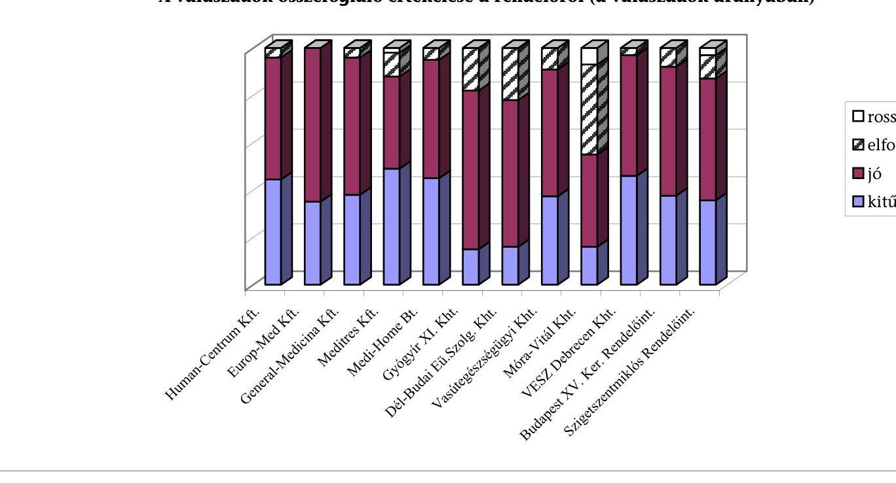

# Betegelégedettség az ÁSZ felmérése alapján

A válaszadók összefoglaló értékelése a rendelőről (a válaszadók arányában)

- rossz
- elfogadható
- jó
- kitűnő

---

# FÜGGELÉKEK

---

# A KISKUNHALASI SEMMELWEIS KÓRHÁZ KHT. MŰKÖDTETÉSBE ADÁSA 

## 1. A DÖNTÉS ELŐKÉSZÍTÉSE

A Kiskunhalasi Semmelweis Kórház járó- és fekvőbeteg-szakellátásának üzemeltetésbe adására az Önkormányzat a 2000. évben tett először kísérletet, pályázat kiírásával. A nyertes pályázó a ProDia Kft. által vezetett Konzorcium volt. A Képviselő-testület felhatalmazta a polgármestert, hogy a konzorcium által az üzemeltetésre létrehozandó Halas-Med Kht.-val a szerződést aláírja. A felek 2003 novemberében előszerződést kötöttek, de az - a működési engedély megszerzésének hiányában - nem lépett hatályba.

A 2003. évben a Semmelweis Kórház költségvetési szervet a Képviselő-testület megszüntette és egyszemélyes önkormányzati közhasznú társaságot hozott létre (Kórház Kht.). A Kórház Kht. nem felelt meg a minimum-feltételeknek. A Képviselő-testület a 2004. évben tőkebevonás szükségességéről döntött.

## 2. A PÁLYÁZTATÁS

A pályázatot három év alatt 1,5 Mrd Ft összegű tőkebevonásra, a Kórház Kht. ingyenes használatában álló, de az Önkormányzat tulajdonában lévő ingatlanok és ingók fejlesztésére, pótlására, felújítására írták ki. A részletes pályázati tájékoztatóban a Kórház Kht. üzletrész legkisebb vételárát - az értékbecslés alapján - 57 M Ft összegben határozták meg. A pályázatra csak olyan pályázó (természetes személy, gazdálkodó szervezet vagy ezek konzorciuma) nyújthatott be pályázatot, aki legalább 1,7 Mrd Ft értékű mérleg szerinti vagyonnal és legalább 7 Mrd Ft összegű egészségügyi szolgáltatásból származó 2003. évi árbevétellel rendelkezik. A nyilvános egyfordulós pályázatra egy ajánlat érkezett. A HospInvest Kft., a Halas-Med Kht., a Diatron Holding Kft., a Diagon Kft., a ProDia Rt., és a LabOrigo Kft. által 2004. május 22-én alakított Konzorcium nevében a HospInvest Kft. és a Halas-Med Kht. nyújtott be pályázatot. A pályázati kiírásban pályázati feltételként megfogalmazott vagyonnal és egészségügyi szolgáltatásból származó bevétellel a Konzorcium másik négy tagja rendelkezett.

A pályázat 2.6. pontja szerint:

- a HospInvest Kft. vállalja, hogy 2004-2007. évek folyamán jelen áron 600 M Ft + ÁFA értékben szerez be orvosi műszereket, valamint berendezéseket és bocsátja azokat a Kórház rendelkezésére;
- a HospInvest Kft. vállalja, hogy 2004-2010. évek folyamán jelen áron 1434 M Ft + ÁFA értékben épületrekonstrukciós programot hajt végre,

---

amelyből 2004-2007. évekre eső időszakban 830,8 M Ft + ÁFA értékű beruházás valósul meg;

- „... a Konzorcium a Halas-Med Kht.-n ${ }^{1}$ és a HospInvest Kft.-n keresztül közel 2,6 Mrd Ft-ot kész befektetni a Kiskunhalasi Semmelweis Kórház Kht. tulajdonjogának és működtetési jogának elnyerése esetén az egészségügyi ellátás fejlesztésére!".

A konzorciumi szerződés 10. pontja szerint a DIAGON Kft., a PRODIA Rt., a Diatron Holding Kft. és a LabOrigo Kft. azt vállalja, hogy

- közreműködik a közhasznú társaság ingyenes használatában álló ingatlan egy milliárd forintértékű felújításához, és az 500 M Ft műszer beszerzéséhez szükséges pénzügyi eszközök megszerzésében;
- a finanszírozás megszervezésében rendelkezésére bocsátja mindazon üzletviteli ismereteket, amelyek a leggazdaságosabb finanszírozási módok megválasztásához szükségesek, továbbá
- mindent megtesznek annak érdekében, hogy a finanszírozók, pénzügyi intézmények által nekik nyújtott kedvezményeket a közhasznú társaság részére is biztosítsák.

A konzorciumi szerződés és a pályázat nem volt összhangban, mert a pályázatban rögzített 2,6 Mrd Ft - a fentiekben idézett - tőkebefektetési készséget a konzorciumi szerződés nem tartalmazta. A Konzorcium a pályázat benyújtásának pusztán „formai kellékeként" szerepelt, amit az Önkormányzat nem észlelt vagy nem vett figyelembe a szerződések megkötésekor.

A Konzorciumi szerződés 11. pontjában a szerződő felek megállapodtak abban, hogy minden fél maga viseli az ajánlat benyújtásával, és nyertességük esetén a pályázat tárgyának megvalósításával kapcsolatosan felmerülő saját költségeit, és minden szerződő felet csak az a haszon illeti meg, ami a pályázat megvalósítása során saját tevékenysége folytán gazdálkodásában keletkezik.

A pályázat bontására a pályázati kiírásban foglaltaknak megfelelő időpontban, közjegyző által került sor. A pályázat bontásának tényét és körülményeit a közjegyző okiratba foglalta. A pályázatot véleményezte az Önkormányzat által erre felkért jogi szakértő, akinek főbb megállapításai:

- A Konzorcium gyakorlati pályázói a Halas-Med Kht. és a HospInvest Kft. nem rendelkezik vagyonnal és árbevétellel, megalapításuk óta érdemleges tevékenységet nem végeztek.
- A pályázat nem nyilatkozik arról, hogy ha a Halas-Med Kht. beolvad a Kórház Kht.-ba, akkor a Halas-Med Kht. és az Önkormányzat által megkötött üzletrész átruházási szerződésnek mi lesz a sorsa, hogyan kívánja megoldani

[^0]
[^0]:    ${ }^{1}$ A Halas-Med Kht.-ban a HospInvest Kft. 60\%, a LabOrigo Kft. 20\%, a DIAGON Kft. 10\%, a DIATRON Kft. $10 \%$ részesedéssel rendelkezett.

---

azt, hogy a vállalt 20 éves időszakra - ha szükséges - az időszak végén, a Kórház Kht. visszakerülhessen az Önkormányzathoz.

- A konzorciumi szerződés elnagyolt. Nem vállalnak például garanciát a vállalt befektetések biztosítására.
- A pályázati kiírással ellentétes az a megoldás, amely kettébontaná a működtetést és a vagyonkezelést.
- A pályázó szerint a Kórház Kht. használatában lévő összes vagyont a HospInvest Kft. kapná meg, amely megoldás eltér a kiírástól és „az Önkormányzat jelenlegi vagyonrendeletébe sem fér nagyon bele, hogy az átadott önkormányzati vagyont továbbadják használatra egy harmadik személynek".

# Az Önkormányzat a jogi szakértője véleményét nem vette figyelembe. 

## 3. A SZERZŐDÉSEK

A pályázati felhívásban, annak részletes tájékoztatójában és a megkötött szerződésekben foglaltak az alábbiakban tértek el:

- A részletes tájékoztató I.4. pontja szerint a három év alatt elvégzett beruházások nyilvántartásba vétele - azok üzembe helyezése után - a Kórház Kht.nál történik. Ezzel szemben a beruházási és vagyonhasználati szerződés II. 3. és III. 2. pontja szerint az ingatlanon végzett beruházásokat a Befektető tartja nyilván a használati joghoz, mint vagyoni értékű joghoz kapcsolódóan, míg a beszerzett és használatba vett új ingóságok a Befektető tulajdonába kerülnek és a Befektető tartja őket nyilván a használati joghoz kapcsolódóan.
- A részletes tájékoztató I. 4. pontja szerint a fejlesztések és felújítások megtörténtét a Befektetőnek igazolnia kell, azzal a Befektető évente elszámol az Önkormányzattal, a három évet követően a felek tételes záró egyeztetést végeznek, és jegyzőkönyvet vesznek fel. A Befektető az Önkormányzat tulajdonába tartozó ingatlant érintő bővítést, beruházást csak az Önkormányzat előzetes hozzájárulásával végezhet. Ezen előírások a beruházási és vagyonhasználati szerződésben nem kerültek rögzítésre.
- A részletes tájékoztató II. 4. pontja szerint a Befektető kötelezettséget vállal arra, hogy a Kht. felügyelő bizottságába az Önkormányzat legalább kettő tagot küldhet, ezzel szemben a beruházási és vagyongazdálkodási szerződés IV. 2. pontja szerint a vevők a Kórház Kht. társasági szerződésében az újonnan megválasztott felügyelő bizottság Önkormányzat által javasolt egy tagjának kijelölésére vállaltak kötelezettséget.
- A részletes tájékoztató III. 5. b) pontja az üzletrész átruházás garanciális feltételei között szerepeltette a visszavásárlási jog kikötését az eladó javára öt évre, mely az üzletrész adásvételi szerződésből kimaradt.

---

Meghatározták a szerződés azonnali felmondásának eseteit, így:

1. a beruházási kötelezettség nem teljesítését, ami súlyos szerződésszegésnek minősül és a szerződés azonnali felmondását eredményezi;
2. súlyos szerződésszegésnek minősül továbbá és a szerződés azonnali felmondását vonja maga után, ha a Befektető vagy a Szolgáltató a vagyont nem a jó gazda gondosságával használja és ez súlyos vagyonvesztés veszélyével járhat, vagy a vagyonnak olyan mennyiségi és értékcsökkenése következik be, amelyet a jogszabályok alkalmazása és a tulajdonossal egyeztetett intézkedések nem indokolnak.

A beruházási és vagyonhasználati szerződés IV. 3. pontjában rögzítették, hogy a Befektető folyamatosan biztosítja az Önkormányzat képviselője részére a vállalt beruházások teljesítésének ellenőrzését. Az ingóságok selejtezése és pótlása az Önkormányzattal egyeztetett eljárási rend szerint történik.

Az ellátási szerződés II. 1. pontjában rögzítették a Szolgáltató 20 évre vonatkozó ellátási kötelezettségét az Önkormányzat egészségügyi ellátási kötelezettségébe tartozó közszolgáltatások nyújtására, az ellátás megfelelő színvonalú teljesítésére a Kórház Kht. és az OEP által 2004 áprilisában érvényben lévő finanszírozási szerződésben foglalt kapacitások erejéig.

Az ellátási szerződés IV. 3.6. pontjában rögzítették, hogy a szerződés megszűnése esetén a Szolgáltató pénzügyi követeléseinek és kötelezettségeinek a készletek értékével korrigált egyenlege (hiánya) nem lehet nagyobb, mint az átadáskor a Kórház Kht.-nál ugyanazon módszerrel kimutatott hiány volt. Amennyiben a hiány mértéke ezt az összeget meghaladja, és ezt a Befektető vagy a Kórház Kht. jogutódja vagyonának növekedésével, vagy egyéb módon kellően nem indokolja, úgy a felek a különbözetet elszámolják.

# 4. A SZERZŐDÉSKÖTÉST KÖVETŐEN A TULAJDONVISZONYOK ALAKULÁSA 

A 2004. július 1-jén megkötött üzletrész adásvételi szerződés alapján a 320 E Ft névértékű üzletrész a Halas-Med Kht. részére 6082 E Ft értékben, míg a 2680 E Ft névértékű üzletrész a HospInvest Kft. (időközben Rt.-vé alakult) ${ }^{2}$ részére 50918 E Ft összegben került eladásra. A beruházási és vagyonhasználati szerződés IV. pontjában rögzítették, hogy az üzletrész adásvételi szerződés aláírásával a Kórház Kht. tulajdonában álló üzletrészek (a Halas-Műtő Kft. 110007 E Ft névértékű 64,7\%-os üzletrésze, a Halas-Mosoda Kft. 1500 E Ft névértékű 50\%-os üzletrésze, a Halas-Dent Kft. 1240 E Ft névértékű 41,3\%-os üzletrésze, a Halas-Labor Kft. 760 E Ft névértékű 25,3\%-os üzletrésze, a Kórház Élelmezési Kft. 1500 E Ft névértékű 50\%-os üzletrésze) a vevők közvetett tulajdonába kerülnek. A Kórház Kht.-ból 2004. november 10-ével kivált a HalasInvest

[^0]
[^0]:    ${ }^{2}$ A Fővárosi Bíróság, mint Cégbíróság a HospInvest Kft-t átalakulás miatt 2004. június 29-én törölte a cégnyilvántartásból. A HospInvest Egészségügyi Befektetési Részvénytársaságot 20 M Ft alaptőkével 2004. június 13-án alapították.

---

Kht. 3 M Ft jegyzett tőkével és a 10 M Ft jegyzett tőkéjű Halas-Med Kht. 2005. június 30-ával tőkeleszállítás mellett beolvadt a Kórház Kht.-ba.

A HospInvest Rt. és a Halas-Med Kht. között 2004. október 4-én létrejött szétválási szerződés szerint a Kórház Kht.-ból kivált a HalasInvest Kht., melynek fő tevékenysége gépek kölcsönzése. A kivált társaságot a szétválási szerződés 3. oldalának 3. bekezdése szerint megillető jogok és kötelezettségek az alábbiak:

- a kórház ingatlan, az orvosi rendelő és a kunfehértói üdülő ingatlan használati joga,
- az
 ingatlanokhoz kapcsolódó bérleti szerződések, az ezekből eredő jogok, követelések, kötelezettségek,
- a beruházás és vagyonhasználati szerződésből eredő minden jog és kötelezettség, kivéve a szerződés 4. számú mellékletében meghatározott egészségügyi berendezésekre vonatkozó használati jog,
- a Kórház Élelmezési Kft.-ben fennálló 1500 E Ft névértékű, a Halas-Mosoda Kft.-ben fennálló 1500 E Ft névértékű, a Halas-Dent Kft.-ben fennálló 1240 E Ft névértékű és a Halas-Labor Kft.-ben fennálló 760 E Ft névértékű üzletrész, ezen üzletrészekkel kapcsolatos jogok és kötelezettségek, az üzletrészekből eredő követelések.

A Kórház Kht.-t, mint fennmaradó társaságot megillető főbb jogok és kötelezettségek a szétválási szerződés 3. oldalán 2. bekezdése szerint az alábbiak:

- az ellátási szerződésből eredő minden jog és kötelezettség,
- a beruházási és vagyonhasználati szerződésből eredő a 4. számú mellékletben meghatározott egészségügyi berendezésekre vonatkozó használati jog,
- az Önkormányzat egészségügyi ellátási kötelezettségébe tartozó egészségügyi közszolgáltatások nyújtásával kapcsolatos minden kötelezettség,
- a szállítási, szolgáltatási szerződésekből eredő jogok és kötelezettségek, a szállítókkal szembeni tartozások,
- az OEP-el szembeni követelés, az egészségügyi szolgáltatások nyújtásához szükséges tárgyi eszközök és készletek
- a Halas-Műtő Kft.-ben fennálló 11000 E Ft névértékű üzletrész, ezen üzletrésszel kapcsolatos jogok és kötelezettségek, az üzletrészből eredő követelések.

---

# 5. A TŐKEBEVONÁS 

### 5.1. A Befektető/Szolgáltató által szerződésben vállalt ingatlan-beruházások és azok megvalósulása

A beruházási és vagyonhasználati szerződés II. 3. pontja szerint a Befektető a 2004-2010. években bruttó 1792,5 M Ft értékben vállalt kötelezettséget épületrekonstrukció végrehajtására, a szerződés mellékletét képező beruházási programban meghatározott ütemezés szerint. Rögzítették a szerződés ezen pontjában, hogy a Befektető a beruházási kötelezettségeit az érdekeltségi körébe tartozó gazdasági társaság útján (a továbbiakban egységesen Befektető) is teljesítheti.

A Befektető érdekeltségi körébe tartozó gazdasági társaságok: a Halas-Med. Kht., HalasInvest Kht., a Kórház Kht., illetve a Kórház Kht.-t 4-4%-ban tulajdonló Diagon, LabOrigo és Diatron Invest Kft. Az utóbbi három tagja volt a pályázatot benyújtó és nyertesként kihirdetett Konzorciumnak is.

A beruházási és vagyonhasználati szerződés 3. számú mellékletét képező beruházási programterv szerint a 2004. évben 12 M Ft értékben tetőfelújításra, a 2005. évben 529,5 M Ft értékben főépület felújításra, nyugdíjasház kialakítására, Sürgősségi Betegellátó Osztály és fedett mentőbeálló kialakítására, külső lift, út, járda, parkoló építésére kerül sor. A 2006. évben a Befektető 225 M Ft értékben a főépület további felújítását, valamint a gyógytorna részleg kialakítását, a 2007. évben 272 M Ft értékben a főépület további felújítását, valamint a rehabilitációs részleg kialakítását vállalta. A 2008-2009. években évente 250 M Ft értékben, a 2010. évben 200 M Ft értékben a főépület felújításának további folytatására, valamint a 2008. évben a fertőző épület 29 M Ft értékű, a 2009. évben a szociális épületek 25 M Ft értékű felújítására vállalt a Befektető kötelezettséget.

A közhasznú megállapodás 9. pontja az Önkormányzat vállalta, hogy 57 M Ft egyszeri támogatást biztosít a Kórház Kht. részére. A Kórház Kht. ennek fejében vállalta, hogy 2005. április 30-ig kialakítja a felnőtt és gyermek ügyeletet és a sürgősségi ellátást a felek által közösen elfogadott tartalommal, amelyet a megállapodás 1. sz. mellékletében rögzít ${ }^{3}$.

Az Önkormányzat Közgyűlése 229/2004. (VII. 1.) számú határozatával kötelezettséget vállalt arra - és azt teljesítette -, hogy a Kht. üzletrészének vételáraként kifizetett 57 M Ft-ot a felnőtt és gyermek ügyelet és sürgősségi ellátás kialakítására a Kórház Kht.-nak visszaadja.

### 5.2. Ingatlanberuházás a Kórház Kht.-ban

A Kórház Kht.-nál a 2003. évben ingatlanberuházás nem történt. A 2004. évben CT helyiség kialakítására került sor 0,4 M Ft összegben.

[^0]
[^0]:    ${ }^{3}$ A közhasznú megállapodás 1. sz. melléklete a helyszíni vizsgálat időpontjáig nem készült el.

---

A Képviselő-testület a 7/2005. (I. 31). számú határozatában fogadta el a Kórház Kht. beszámolóját az Önkormányzat és a Kht. között 2004. július 1-jén megkötött szerződések 2004. évi teljesüléséről, melynek alapján a 2004. évben megvalósult a rendelőintézet tetőfelújítása. A 2005. évben kialakították a gyermek-szakrendelőt és ügyeletet, a műszaki átadására 2005. szeptember 21-én került sor. Folyamatban lévő beruházás keretében elkezdődött a Kht. rekonstrukciós munkáinak 0. üteme (Sürgősségi Betegellátó Osztály ${ }^{4}$, fedett mentőbeálló építése, főbejárat kialakítása, főépületi központi öltöző kialakítása, felszíni parkoló bővítése, út- és parkolási munkák). Ezeket a beruházásokat a Beruházási és vagyonhasználati szerződés II. 3. pontja szerint a Befektető tartja nyilván a könyveiben a használati joghoz, mint vagyoni értékű joghoz kapcsolódóan. Az elvégzett beruházások a HalasInvest Kht. számviteli nyilvántartásaiban kerültek kimutatásra. A beruházásokat a Befektető érdekeltségi körébe tartozó társaságok a Kórház Kht. és a HalasInvest Kht. végezték.

A Kórház Kht. a beruházások megvalósításához a 2005. évben 500 M Ft összegű folyószámla hitelkeret és 130 M Ft összegű rövidlejáratú forgóeszköz finanszírozási kölcsönszerződést kötött egy bankkal, melynek biztosítékaként a 2005. július 7-én kötött engedményezési szerződés szerint a Kórház Kht. a bankra engedményezte az OEP-től érkező árbevételét 3600 M Ft összegben (a Kht. 2005. évi tervezett OEP-től származó bevételének 94,6%). Az engedményezés összegénél figyelmen kívül hagyták az Ebtv. 35. § (1) bekezdésében foglaltakat, mely szerint a finanszírozás keretében járó összegnek legfeljebb 10%-a engedményezhető ${ }^{5}$. Az engedményezési szerződés 9. pontja szerint a szerződés megszűnik, ha a Kórház Kht. a bank felé fennálló tartozását és annak járulékait teljes egészében megfizeti és más esedékes követelése nem áll fenn a banknak az üzletféllel szemben. A bank által 2005. október 11-én kiadott igazolás szerint a „finanszírozás a vállalat-csoporthoz tartozó egyéb társaság készfizető kezességvállalásával is teljes mértékben biztosított."

A felvett folyószámla hitelből és forgóeszköz-finanszírozási kölcsönből a Kórház Kht. a HalasInvest Kht.-nak a 2005. évben kölcsönt ${ }^{6}$ nyújtott, amelyből a HalasInvest Kht. a beruházásokat megvalósította.

[^0]
[^0]:    ${ }^{4}$ Az egyeztetési folyamatban a polgármester tájékoztatást adott arról, hogy ,, a tőkebevonás következményeként 2006. március 6-án a Kiskunhalasi Kórházban átadásra került a Sürgősségi Betegellátó Osztály, amely kialakításával kapcsolatos építészeti beruházás és műszerbeszerzés költsége közel 1 milliárd forint."
    ${ }^{5}$ A Kórház Kht. ügyvezetője vitatta a megállapítást - többek között - arra hivatkozva, hogy a szerződést módosították. A helyszíni vizsgálat alatt a hivatkozott szerződésmódosítást - a teljességi nyilatkozat ellenére - nem bocsátották az ellenőrzés rendelkezésére.
    ${ }^{6}$ Az engedményezési szerződéssel és a többszöri kölcsönnyújtással kapcsolatban a vizsgálat időpontjában ügyészségi eljárás volt folyamatban.

---

# 5.3. A Befektető/Szolgáltató által szerződésben vállalt műszerfejlesztések és azok megvalósulása 

A beruházási és vagyonhasználati szerződés III. 2. pontja szerint a Befektető a 2004-2007. években bruttó 750 M Ft értékű orvosi műszer- és berendezés beszerzésére vállalt kötelezettséget. A Befektető ezen kötelezettségét is teljesítheti az érdekeltségi körébe tartozó gazdasági társaságok útján.

A szerződés 3. számú mellékletét képező beruházási program terv alapján a 2004. évben beszerzésre került egy darab CT berendezés 130 M Ft értékben, valamint egyéb orvosi műszerek 53,2 M Ft értékben, a 2005. évben megvalósult a röntgen cseréje 120 M Ft értékben, valamint egyéb orvosi műszerek kerültek beszerzésre 98,5 M Ft értékben. A 2006. évben orvosi műszer és berendezések beszerzésére 221,3 M Ft, míg a 2007. évben 127,1 M Ft értékben kerül sor.

A már megvalósult eszközbeszerzéseket a Befektető érdekeltségi körébe tartozó közhasznú társaságok, a Kórház Kht. és a HalasInvest Kht. végezték, melyhez a HalasInvest Kht. részére a Kórház Kht. nyújtott kölcsönt.

A 2004. és a 2005. évben megvalósult műszerbeszerzéseket a HalasInvest Kht. számviteli nyilvántartásaiban rögzítették.

A 2004. évi műszerbeszerzési tervben foglalt műszerbeszerzések - az orvosok által nyilatkozatban lemondott, illetőleg az általuk kért átütemezésekkel - megvalósultak. Beszereztek egy darab CT készülék (a Kórház Kht. készfizető kezességvállalásával ${ }^{7}$ ), egy darab lézerkamera, egy darab injektor, egy darab sebészeti képerősítő, hét darab EKG készülék, egy darab videóprocesszor, egy darab hidegfényforrás, egy darab videogasztroszkóp, egy darab rektoszkóp, laparoszkópos kiegészítők és 14 darab fecskendős infúziós pumpa. A 2005. évi műszerbeszerzési tervben foglalt eszközök beszerzése a helyszíni vizsgálat időpontjában folyamatban volt. A beruházási és vagyonhasználati szerződés III. 2. pontjában foglaltak szerint a beszerzett és használatba vett új ingóságok a Befektető tulajdonába kerülnek és a Befektető tartja nyilván őket. Ezeket az eszközöket a szerződés alapján a HalasInvest Kht. könyveiben rögzítették. A HalasInvest Kht. a megvásárolt eszközöket a Kórház Kht. részére bérbe adta. A 2004. évben a gépek/műszerek 67,5%-át a Kórház Kht. készfizető kezességével vásárolták.

A HalasInvest Kht., mint bérbeadó és a Kórház Kht., mint bérlő között 2004. december 29-én kelt, majd az azt módosító 2005. május 1-jei eszközbérleti szerződés (szerződés száma: HalasInvest 01/01/2004.) szerint a 2005. január 1. és a 2009. december 31. közötti időszakban a szerződés 1. számú mellékletében szereplő orvosi eszközöket (videoprocesszor, hidegfényforrás, video-gasztroszkóp, sony monitor, 6 db 3 csatornás EKG készülék, egy darab 6 csatornás EKG készülék, egy darab CT berendezés, sebészeti képerősítő, szárazüzemű lézerkamera, kontrasztanyag injektor, retroszkóp, laparoszkópos kiegészítők) az eszközbérleti

[^0]
[^0]:    ${ }^{7}$ A Kórház Kht. ügyvezetője a készfizető kezességi szerződést 2004. december 3-án kötötte meg a bankkal.

---

szerződés módosítás 3. pontja szerint a bérlő havi $4,04 \mathrm{M} \mathrm{Ft} + 25 \%$ ÁFA átalánydíj összegért vesz bérbe a bérbeadótól.

A kialakult gyakorlat szerint a Kórház Kht. által felvett hitelek biztosítják a Befektetőnek és egyszemélyes társaságának (HalasInvest Kht.) nyújtott kölcsönökkel a beruházásokhoz a tőkebevonást, illetve a Kórház Kht. készfizető kezességét igénybe veszik gép-műszer vásárláshoz. A hitel visszafizetésének, a készfizető kezességnek, illetve a gép-műszer bérleti díjának forrása a mindenkori, a működtetést biztosító OEP-től származó bevétel. A konstrukció, mint a jogosultságok és kötelezettségek társaságok közötti elhatárolásának (lásd: 4. pont) egyik megnyilvánulása, magában rejti a Kórház Kht. gazdasági ellehetetlenülésének a lehetőségét. (A tőkebevonás modelljét a függelékhez csatolt ábrán mutatjuk be.)

A Kórház Kht. műszerparkja - a vizsgálat időpontjában - nem felelt meg a jogszabályban meghatározott ún. minimum-feltételeknek. Az Önkormányzat a Kórház Kht. eszközbeszerzését a 2003-2005. évben nem támogatta, az intézmény eszközbeszerzésére cél- és címzett támogatást nem nyert. Az Önkormányzat az intézmény pályázatait pénzeszközök átadásával nem támogatta.

# 6. A szerződés lejáratakor az Önkormányzat pozíciója 

A beruházási és vagyonhasználati szerződés V. 3.6. pontja szerint a 20 éves szerződési időtartam lejártával az Önkormányzat az ingatlanokon 1792,5 M Ftban végzett beruházásokat és a 750 M Ft értékben vásárolt eszközöket és berendezéseket a megszűnéskori könyv szerinti, az ezen túlmenően végzett beruházásokat és beszerzett eszközöket és berendezéseket forgalmi értéken vásárolja meg.

A szerződés megszűnésének okait a beruházási és vagyonhasznosítási szerződés V. 3. pontjában a határozott időtartamon belüli közös megegyezésben, az ellátási szerződés, mint bontó feltétel bekövetkezése esetére, valamint a határozott idő lejártával a szerződés meg nem hosszabbítása
 esetében határozták meg. Meghatározták az Önkormányzat, valamint a Befektető vagy Szolgáltató súlyos szerződésszegésére az azonnali felmondás eseteit. A beruházási és vagyonhasználati szerződés IV. 3.5. pontjában rögzítették, hogy a Befektető vagy a Szolgáltató súlyos szerződésszegése esetén az Önkormányzat a szerződést azonnali hatállyal felmondhatja. Ebben az esetben a használatra átadott vagyont és a pályázati felhívásban megjelölt értékű kötelező befektetéseket és annak pótlását - leltár alapján és térítésmentesen - adja vissza a Befektető.

---

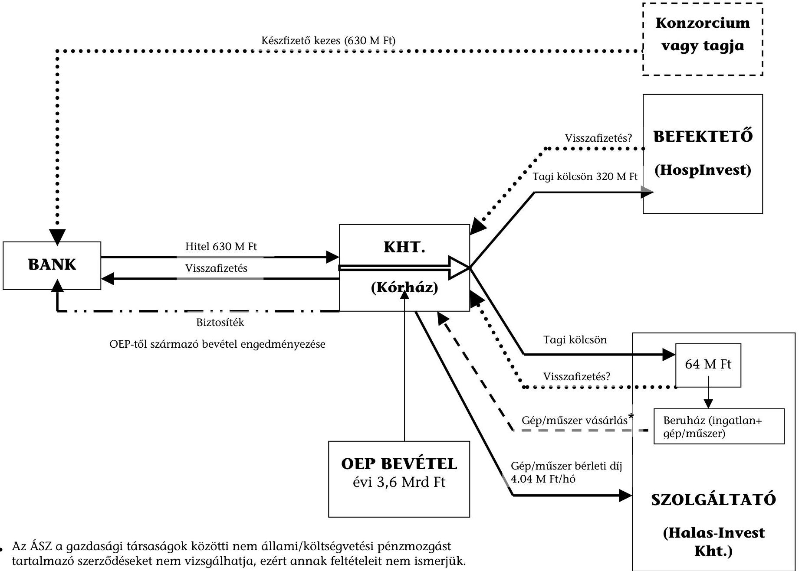

* Részben a Kórház Kht. készfizető kezességével.

---

# A SIKLÓSI KÓRHÁZ KHT. MÁSODIK MŰKÖDTETÉSBE ADÁSA 

## 1. A DÖNTÉS ELŐKÉSZÍTÉSE

A 2004. évben Siklós Város Képviselő-testülete döntött arról, hogy pályázati kiírással megvételre ajánlja a Siklósi Kórház Kht. (Kht.) 94%-os tulajdonosi üzletrészének 75%-át. Indoka volt, hogy a Kht. veszteséges, valamint a 2003-2004. évi konszolidáció - 62,2 M Ft vissza nem térítendő támogatás - nem oldotta meg hosszú távon a pénzügyi gondokat. A Képviselő-testület a magántőke bevonásától várta, hogy az új menedzsment hatékonyabban működtesse a Kht.-t, és szerepet vállaljon veszteségeinek rendezésében.

## 2. A PÁLYÁZTATÁS

A pályázati kiírást a Képviselő-testület hagyta jóvá. A pályázati kiírás az Önkormányzat előzetes jóváhagyásához kötött döntéseket, mint feltételeket, nem határozott meg és felmondási okokat sem részletezett ${ }^{1}$. A pályázatot a MEGALOGISTIC Beruházási és Üzemeltetési Rt. (Rt.) nyerte meg. A pályázat vagyoni biztosítékot nem kötött ki.

## 3. A SZERZŐDÉSEK

A 2004. év november 15-én kötött üzletrész átruházási megállapodásban ${ }^{2}$ az Önkormányzat a 12830 E Ft üzletrészét 16000 E Ft vételárért adta el a legjobb ajánlattevőnek, az Rt.-nek. Tekintettel arra, hogy a 2003. évre a Siklósi Kórház Kht. jelentős veszteséget ért el (a saját tőke 2003. december 31-én mínusz 17302 E Ft volt), valamint a 2004. évben 172374 E Ft tartós kötelezettsége állt fenn, a Képviselő-testület a Kht. működtetése érdekében a Kht. használatában lévő, a vagyonleltárban szereplő ingó vagyont leltár szerint a Kht.-nak adományozta, valamint az 1091 hrsz-ú ingatlanokat (összesen: 65383485 Ft nettó nyilvántartási érték) és az ingatlanon található 3093191 Ft nettó nyilvántartási értéken szereplő eszközöket, berendezéseket a Kht.-nak adományként átadta. Az adományként átadott ingatlan ingatlanforgalmi értéke a hivatalos értékelés alapján 253150 E Ft volt. Az ingatlan piaci értékelése alapján a Kht. értékhelyesbítést számolt el. Az ingatlan Kht.-nak adományozását az Önkormányzat azzal indokolta, hogy a Kht.-nak nem volt saját ingatlan vagyona, és

[^0]
[^0]:    ${ }^{1}$ A felek között létrejött megállapodás szerint 10 éves időtartamon belül a szerződés felmondásának jogát csak és kizárólag a másik fél hibájából előállt rendkívüli felmondási ok esetében gyakorolják.
    ${ }^{2}$ A Képviselő-testület a 2004. november 3-i ülésén, nyílt ülés keretében tájékoztatta a lakosságot a Kht. helyzetéről és arról, hogy ha nem az Önkormányzat lesz a „többségi tulajdonos, akkor a vagyont át kell adni a Kht-nak, mert különben a működése ellehetetlenül". A hozzászólt lakosok kifejtették, hogy szükség van a kórház működésére.

---

az adományozás után a Kht. hitelfelvételeinél már nem az Önkormányzatnak kell az ingatlanfedezetet biztosítania.
2004. november 15-én az Önkormányzat üzletrész átruházási megállapodást kötött 94%-os tulajdonrészének 75%-ára a MEGA-LOGISTIC Rt.-vel. A Képviselő-testület döntött arról, hogy a 65 M Ft nyilvántartási értékű ingatlanokat és az ott található eszközöket, berendezéseket a Kht.-nak adományozza. Az átadott ingatlan forgalmi értéke 253 M Ft volt. A szerződés aláírása előtt a képviselő-testület módosította vagyonrendeletét, és a kórház épületét a forgalomképes vagyon körébe sorolta, amely elidegenítéséről a Képviselő-testület jogosult dönteni. A MEGA-LOGISTIC Rt. az üzletrész átruházási szerződésben vállalta, hogy legalább tíz évig változatlan színvonalú szolgáltatás nyújtása mellett üzemelteti a Kht.-t. Az adományozási szerződésben a Kht. vállalta, hogy tíz évig eredeti funkciójának megfelelően üzemelteteti az ingatlant. Tíz év múlva a funkciót az Rt. megváltoztathatja, ugyanis a társasági szerződés alapján a funkció megszűnéséhez, a Kht. átalakulásához szükséges az Önkormányzat hozzájárulása, a funkció megváltoztatásához nem.

# 4. A TŐKEBEVONÁS 

A Kht. a többségi tulajdonos változása után a faktorálást kedvezőbb kamat konstrukciójú folyószámlahitellel váltotta ki, valamint a MEGALOGISTIC Rt.-vel 100 M Ft összegű hosszúlejáratú kamatmentes kölcsönkeretszerződést kötött. A többségi tulajdonos 35 M Ft vissza nem térítendő támogatást adott a Kht.-nak azzal, hogy a támogatás „csak a kiemelten közhasznú tevékenységek magasabb színvonalon történő eredményes ellátása érdekében használható fel".

A Kht. 2004. novemberében 172 M Ft tartós kötelezettség állománnyal (adóhatósággal, szállítókkal szembeni kötelezettségek) rendelkezett, amelynek rendezését szolgálta:

- a 70 M Ft-ra kötött folyószámla hitelkeret,
- A MEGA-LOGISTIC Rt.-től felvett 100 M Ft értékű kölcsön, amelyből 79 M Ftot a tartós kötelezettségek rendezésére használtak fel, és
- a MEGA-LOGISTIC Rt.-től a 35 M Ft összegű támogatás.

A Kht. bevételének 91%-a az OEP-től származó bevétel, a kölcsön visszafizetés elsődleges forrása is az OEP-től származó bevétel, amely a 2005. évben a működés finanszírozására sem volt elegendő. A Kht. veszteséges működés esetén a taggyűlés elrendelheti a tulajdonos pótbefizetését, mely során az Önkormányzat évente maximum 3170 E Ft pótbefizetésre kötelezhető. A szabályozás következménye, hogy a többségi tulajdonos-váltással sem szűnt meg annak a lehetősége, hogy az Önkormányzatnak támogatnia kell a Kht. működését.

---

# 5. A szerződés lejáratakor az Önkormányzat pozíciója 

A szerződés lejártakor az Önkormányzatnak sem ingatlan, sem ingó vagyona nem lesz az egészségügyi ellátás biztosítására.
