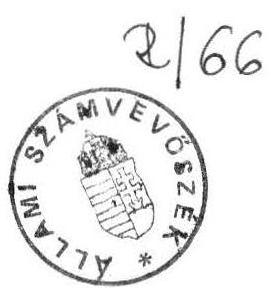
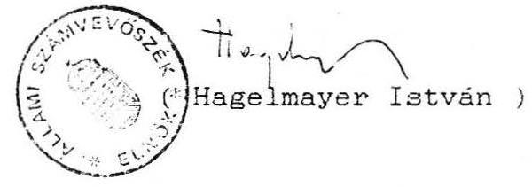
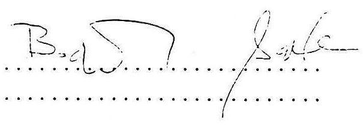

# Állami Számvevőszék

## JELENTÉS

A COMPACK RT PRIVATIZÁCIÓS FOLYAMATÁNAK ELLENŐRZÉSÉRŐL

---

A vizsgálatot végezték:

Németh Béláné számvevő
dr. Molnár Barnabás tanácsos

---

# ÁLLAMI SZÁMVEVŐSZÉK

$\mathrm{V}-127 / 5 / 1991$
Témaszám: 82.

## JELENTÉS

## a COMPACK Rt privatizációs folyamatának ellenőrzéséről

A vizsgálat célja annak megállapítása, hogy a Compack Vállalat átalakulása és a részvénytársaság állami tulajdonának hasznosítása a törvényes keretek között történt-e. Az ellenőrzést vizsgálati program alapján végeztük, melynek főbb területei:

- a vagyonhasznosítást megelőző lépések értékelése,
- a pályázati rendszer értékelése, a döntési folyamatok ellenőrzése,
- a szerződés megkötése és tartalma.

A vizsgálat előzménye: dr. Rainer Karrenberg úr, a német Tchibo GmbH elnökségének tagja az Állami Számvevőszék elnökének 1991. II. 13-án írt levelében azt kifogásolta, hogy a Compack Vállalat privatizációja során a zártkörű pályázaton résztvevő külföldi cégek közül a pályázatot elnyert cég a tenderfelhívásban közölt feltételekkel - 40%-os külföldi tulajdonhányad - ellentétesen megkapta a tőketöbbséget és ezáltal a pályázatban tett ígéreteket saját belátása szerint megváltoztathatja.

---

Az Állami Számvevőszék ebben az időszakban ellenőrizte az Állami Vagyonügynökség (továbbiakban AVU) 1990. évi tevékenységét, így a vállalat privatizációjának folyamatát is részletesebben megvizsgáltuk és egyben állásfoglalást kértünk dr. Mádl Ferenc úrtól, az AVU Igazgatótanácsának elnökétől is, amelyet mellékelünk (1. sz. melléklet).

# 1. Megállapításaink a következők:

A Compack Vállalatot az Ipari és Kereskedelmi Minisztérium jogelődje alapította és vállalati tanács irányította. Tevékenységi köre - amelyből 8,5-9,0 Mrd Ft bevétel és 800-900 MFt körüli nyeresége származott, 1600-1700 dolgozóval - alapvetően kávé, tea csomagolására terjedt ki, az évek során veszített hazai piaci pozíciójából, a külföldi versenytársak belépése miatt.

A piacvesztés megállításához, új tevékenység bevezetéséhez új márkanevekre, új termékekre volt szükség, amelyet csak tőkenövekménnyel valósíthatott meg a vállalat. Ez indokolta 1990. év folyamán azt, hogy külföldi partnercégekkel tárgyalást folytasson a vállalat átalakulásáról, tőkebővítéséről, privatizációjáról. A svájci Nestlé és a német Tchibo céggel lefolytatott érdemi tárgyalások után 1990. IX. 4-én az AVU-nak a vállalati tanács jóváhagyásával benyújtották átalakulási tervüket. Ennek alapján a Tchibo cég a Compack Vállalat 3,5 Mrd Ft-ban elismert értékéhez - a vagyonértékelést az Ernst Young Bonitas cég végezte el és 3,7 Mrd Ft-ban határozta meg - 0,5 Mrd Ft alaptőkeemelést és 0,7 Mrd Ft részvényvásárlást vállalt, exportgaranciát azonban nem vállalt.

Az AVU Igazgatótanácsa 1990. X. 24-én áttekintette a vállalat átalakulásával kapcsolatos előterjesztést, és úgy döntött, hogy a vállalat vezetése a korábban kiválasztott partnerrel, illetve az átalakulási terv benyújtását követően jelentkezett külföldi befektetőkkel további tárgyalásokat folytasson és nemzetgazdasági, illetve vállalati szempontból a legkedvezőbb megoldást válassza ki. Ennek értelmében szakmai körben zártkörű pályázat kiírására került sor.

## 2. A pályázati rendszer értékelése

a/ Piaci érték meghatározása
A pályázati feltételeket az üzletpolitikai célok megjelölését a vállalat készítette el. Alapvető szempont a cég piaci értékének meghatározása volt.

---

A hiteles vagyonmérleg és a vállalat vagyonértékelése alapján a Compack értékét 3,2-3,7 Mrd Ft között határozták meg. Ugyanakkor a tőkepiaci információk alapján a hasonló profilú kávét forgalmazó cégek piaci ára a kávéforgalom 1-1,2-szerese; ez a Compack Vállalatnál 4,4-5 Mrd Ft-nak felel meg.

Ezen alapult a pályázati kiírásban a Compack piaci értéke: amelyet 5 Mrd Ft-ban jelöltek meg.
b/ Külföldi résztulajdon

Az 1990. november 29-ei telefaxon leadott pályázati feltételek között a kritikus pont a külföldi résztulajdon kiírása volt.

A kiírás magyar szövege: maximum 40% Compack résztulajdont kívántak eladni. Legkésőbb 3 év múlva az AVU birtokában lévő többi részvény értékesítésekor, igény szerint a napi forgalmi áron lehetővé tudják tenni a többségi részesedés megszerzését. A pályázatot angol szöveggel adták ki, ott azonban a kritikus időtényező pontos fordítása "három évvel később". A fordítási hiba e lényeges kérdésben sok problémát vethet fel és etikailag is kifogásolható. A hibás gyakorlatra az AVU ellenőrzése során részletesen kitértünk és felhívtuk a figyelmet a pontos fordítás igényére.
c/ Az osztalékra vonatkozó pályázati feltételt a társaság részére történő visszaadás igényében rögzítették az időszak feltüntetésével.
d/ A pályázati feltételek további része a szakmai, technikai támogatás főbb pontjaira tér ki, mégpedig:

- tevékenységi körökre (kávé, tea, füszerek) vonatkozó támogatások,
- a pályázók export stratégiája a piac kiszélesítése érdekében,
- beruházások, fejlesztések célkitűzései és ezek időigénye,
- a védjegyek, a know-how szabadalmakra vonatkozó ismeretek átadására kértek ajánlatokat, az értékek feltüntetésével,
- és végül a Compack márkanév fenntartására az alkalmazottak foglalkoztatási szintjére is megkérték a pályázók véleményét.

---

A zártkörű pályázati feltételeket négy cég kapta meg: a Tchibo GmbH, a Nestlé, az E.D. and F. Man, a Sara LEE/DE. A pályázat benyújtásának határideje: 1990. XII. 6. 16 óra volt.

A pályázati kiírásban rögzítették az ajánlatok felbontásának idejét, és a nyertes cégről szóló döntés határidejét is.
3. A pályázati kiírás határidejéig - 1990. XII. 6. 16 óráig három cég ajánlata érkezett be, amelyet személyesen a cégek képviselői nyújtottak át. Az ajánlatok átvételéről az AVU és a Compack Vállalat képviselőinek jelenlétében hitelesített jegyzőkönyv készült. Közjegyzőt nem kértek fel, mivel erre vonatkozó szabályozással az AVU nem rendelkezik.

Az ajánlatok felbontása után rögzítették az ajánlatok oldalszámait, a kiírásnak történő megfelelés tényét, valamint azt is egybehangzóan kijelentették, hogy az ajánlatok részletes ismertetésétől eltekintenek (2. sz. melléklet).

A pályázati feltételekre mindhárom cég kitért. Kiegészítő információt - pótlólagos nyilatkozatként - a Compack Vállalat két cégtől kért:

- a Tchibo cégnek a kérdés az oltalmi jogok tisztázására irányult. Nevezetesen a cég ajánlata úgy szólt, hogy "minden közös tervhez a Tchibo az új társaság számára általában ingyenesen biztosítja és rendelkezésre bocsátja védjegyjogait, szabadalmait és licenciáit..."

A kérdés az "általában" szóra irányult, vagyis, hogy minden oltalmi jogra kiterjed-e az ingyenesség, vagy meghatározott területre?

A Tchibo válasza teljes egészében pozitív volt és közölték, hogy minden rendelkezésükre álló szabadalmat, védjegyjogot ingyenesen átadnak a Compack Vállalatnak, így a pályázati feltételeket e pontban teljesítették.

- A Sara LEE/DE cég felé a kiegészítő információ kérés az exportra vonatkozó lehetőségek megnevezésére, volumenére, valamint az ajánlatban rögzített 12 millió NLG (az alkalmazottak képzésére a know-how-ra tervezett összeg) felhasználására irányult.

---

A Sara LEE/DE cég a kiegészítő információban részletesen közölte az exportlehetőségeket, valamint azt is, hogy minden technológia transzferrel kapcsolatos immateriális vonatkozású részlet ingyen a vegyesvállalat rendelkezésére áll.

Az ajánlatok feldolgozása során a Compack vállalati tanácsa 1990. XII. 11-én döntött és a Sara LEE/DE cég ajánlatát fogadta el, ezt tartotta a legkedvezőbbnek.

Mivel a Nestlé cég jelentősen elmaradt a Compack vagyonának elismerésétől (3,7 Mrd Ft-ban rögzítették) és a pályázatban előírt további előfeltételeket több ponton nem teljesítette a Compack vállalati tanácsa a két egymáshoz közelálló ajánlat között döntött a Sara LEE/DE javára a következők alapján:

Sara LEE/DE  Tchibo GmbH ajánlata

| Compack vagyon | 4,5 Mrd Ft | 3,7 Mrd Ft |
| :-- | --: | --: |
| elismerése |  |  |
| Ebből részvény- |  |  |
| vásárlás | - | 0,7 Mrd Ft |
| Compackhoz behozott | 3,0 Mrd Ft | 1,3 Mrd Ft |
| tőke és a részesedés | 40 % | 40 % |
| %-a |  |  |
| Új alaptőke | 7,5 Mrd Ft | 5,0 Mrd Ft |

Anyagi, pénzügyi szempontból, valamint a tevékenységi kör, a termékátfedés, valamint a nyertes cég nemzetközi piaci tapasztalatai miatt a Sara LEE/DE ajánlata egyértelműen kedvezőbb volt a vállalat részére. Az ajánlatot azonos struktúrában adta meg mindkét cég, a partnerkiválasztás kérdésében a döntés a kiírási szempontok szerint történt.

A vállalati tanács döntését az Állami Vagyonügynökség Igazgatótanácsa 1990. XII. 19-én elfogadta és felhatalmazta a vállalatot a nyertes cég ajánlata alapján a végleges szerződések előkészítésére.

---

# 4. A szerződés megkötése és tartalma

Az AVU és a Sara LEE/DE (Douwe Egberts N.V., amely a belga jog szerint létrehozott és működő társaság) közötti szerződés 1991. II. 5-én jött létre. A pályázati feltételek alapján a győztes cég ajánlatait - amelyek kötelezettségvállalásként szerepelnek - a szindikátusi szerződésben megfelelően rögzítették.

A kritikus pont a külföldi tőkerészesedés megállapodásában található:

A pályázati feltétel szerint a tőkerészesedést 40%-ban határozták meg. Ezt a vállalatnak a privatizációtól való "félelme" indokolta, valamint az 1990. évi ideiglenes Vagyonpolitikai Irányelvek sem erősítették meg a külföldi tőkerészesedés dinamikus fejlesztésének igényét.

A Sara LEE/DE cég ajánlatában részletesen rögzítette, hogy a kiírásnak megfelelően

- az első lépésként befektetéssel 80 millió NLG értékben 40%-nyi alaptőke részesedést vállal,
- a második lépésként a részvények további 11%-ának megszerzését tervezte, ennek időintervallumát a szerződéskötéstől számítva 12-24 hónapban határozták meg,
- a harmadik lépésként a részvények maradékát kívánták megszerezni 2-4 év múlva.

Az AVU-nél folytatott ellenőrzésünk alapján megállapítottuk, hogy a partnerkiválasztás - 1990. XII. 19. - és a szerződéskötés - 1991. II. 5. - időszaka között az AVU a privatizációs folyamatokat felgyorsította a privatizációs bevételek növelése érdekében. Az 1991. évre előirányzott 45-50 Mrd Ft-os bevétel teljesítéséhez az AVU-nek anyagi érdekeltsége és erkölcsi felelőssége is kapcsolódik.

Az AVU a végleges szerződésben lemondott a részvények 11%-áról, amelyért a cégbejegyzést követően 1991. május 24-én 856 M Ft bevételt kapott, s így a nyertes cég 51%-os tulajdonjogot szerzett.

Kifogásolható, hogy a külföldi tulajdonhányadra vonatkozóan megkötött szerződés a pályázati kiírástól jelentősen eltér. Bár a kiírástól a megvalósult szerződés ilyen eltérése közvetlen kárt nem okozott, a hazai privatizációs gyakorlatra azonban nem vet jó fényt, ha hasonló esetek ismétlődnek. Minden törvényes módot fel kell ezért használni ennek elkerülése érdekében.

---

A tulajdoni részarány a Compack Douwe Egberts Rt-nél a következőképpen alakult:

# Megnevezés:

Tulajdonhányad:
Sara LEE/DE
51,0 %
AVU
41,5 %
Önkormányzatok
2,5 %
Dolgozók
5,0 %
összesen
100,0 %

## ÖSSZEFOGLALVA

Az ajánlatok megtételénél minden pályázó cég egyenlő feltételekkel indult, nincs ok annak feltételezésére, hogy a versenyben a Tchibo céget hátrányosan különböztették meg. Ezért nem bizonyított, hogy a Tchibo cég az 51%-os tulajdon megszerzése esetén a jelenleg győztes Sara LEE/DE cégnél jobb ajánlatot tett volna.

Az általános nemzetközi gyakorlatban nem elfogadott eljárás, hogy a partnerválasztás és a szerződéskötés időszaka között lényeges feltételrendszeri módosítást hajtson végre az eladó. Ez az eljárás valóban okot adhat a verseny tisztaságának kétségbevonására. Ezért az AVU ügyvezetését felelősség terheli: hiszen az 1990. XII. 19-ei igazgatótanácsi döntés az előterjesztésben rögzített 40%-os külföldi tulajdonhányadra vonatkozott.

## 5. Javaslatok

1. Az AVU Igazgatótanácsa vizsgálja meg a feltételrendszer lényeges módosításában az ügyvezetés felelősségét, és saját hatáskörében hozza meg a megfelelő döntéseket.
2. Az AVU ügyvezetése záros határidőn belül dolgozzon vagy dolgoztasson ki a nemzetközi gyakorlatot figyelembe vevő eljárási szabályt az ajánlati feltételek kialakítására, a versenytárgyalás lebonyolítására, a tenderbontásra, a közjegyzői hitelesítési eljárásra, az értékelésre, a szerződés megkötésére, és azt jóváhagyásra terjessze az Igazgatótanács elé.

---

3. A vizsgálat feltárta: nincs ok annak feltételezésére, hogy a Tchibo céget
 hátrányosan érintette ajánlatának megtételénél az, hogy később a szerződéses feltételek egy pontjában lényeges változás történt. Ezért a Sara LEE/DE és az AVU közötti szerződés felülbírálása, a Compack Rt. jelenlegi helyzetének változtatása nem indokolt.

Budapest, 1991. július

Melléklet: 2 db, együttesen 5 old. terjedelműek

---

Dr. MÁDL Ferenc tőrca nélküli miniszter

Budapest, 1991. április 30.

Dr. Dornbach Alajos úr az Országgyűlés alelnöke Budapest Parlament

Tisztelt Alelnök Úr!
1991. április 3-án kelt levelére válaszolva, amelyben Dr. Rainer Karrenberg úr észrevételei nyomán a COMPACK cég átalakulásával kapcsolatos aggályairól szól, a következőkről szeretném tájékoztatni.

Meggyőződtem arról, hogy pályázatuk elkészítése során mind a TSCHIBO, mind a SARA LEE/DE azonos információkra támaszkodott és a pályázatok mérlegelése is egyenlő feltételrendszer szerint történt. A két cég ajánlatának értékelése, illetőleg a SARA LEE/DE átfogóbb és előnyösebb pályázatának elfogadására, tehát "ugyanazon koordinátarendszerben" került sor. Szeretnék arra is utalni, hogy az ÁvU Igazgatótanácsának állásfoglalása csupán megerősítette a COMPACK vállalati tanácsának csaknem egyhangú előzetes döntését.

Ami a COMPACK-ban való többségi tulajdonszerzés engedélyezését illeti, tény, hogy ez nem szerepelt a pályázati feltételek között, hiszen ennek lehetősége csak a pályázatok értékelése után merült fel, azaz az ajánlatok korrekt elbírálását sem befolyásolhatta. A tőketöbbség megszerzésének jóváhagyására elsősorban a privatizáció gyorsítása érdekében került sor, s e döntésnek csak előfeltételéül szolgált a SARA LEE/DE korábban elfogadott kedvező ajánlata, ami összetett jellege folytán külföldi többség

---

esetén is garanciául szolgálhat a COMPACK cég sokoldalú fejlődésére.

Szívveles üdvözlettel:

Dr. Madl Ferenc
az Állami Vagyonügynökség
Igazgatótanácsának elnöke

Budapest, 1991. július 5.

---

# Jegyzőkönyv 

a Compack Vállalat Rt.-vé történő átalakulásához beérkezett pályázatok megbeszéléséről

Felvéve: a Compack Vállalat hivatalos helyiségében, 1990. december 6-án. 16 óra körül.
Jelen vannak:

COMPACK: | Bogó László vezérigazgató |
| :-- |
| Mátraházi Tivadarné jegyzőkönyvvezető |

Állami Vagyonügynökség:
Barta Károly
TCHIBO: Gyöngyösi László
Dr. Bán György
NESTLÉ: Kohring úr

SARA LEE: Kádas Péter

## Bogó László:

Szeretettel üdvözlök minden megjelentet ezen a nemes vetélkedőn. A négy pályázó közül csak három cég jelent meg: a NESTLÉ, a TCHIBO és a SARA LEE. Az ED and F. Man kicsúszott az időből. Négy órára hirdettük meg ezt a megbeszélést, de ők még nincsenek itt. Kizártnak tartom, hogy az ajánlatuk ezek után még beérkezzen, hiszen olyan kevés időt töltöttek a cégnél, hogy ilyen rövid idő alatt nem lehet sok információt szerezni. Mielőtt átvesszük az ajánlatokat, tisztázni kell egy dolgot. Volt, aki ragaszkodott hozzá, hogy minden ajánlat legyen nyilvánosan, más aki nem. Kérdezem Barta urat, mi az álláspontja ezzel kapcsolatban?

---

Barta Károly: Véleményem szerint felesleges mindenkinek betekintenie a másik pályázó ajánlatába. A partnerek sem tartják ezt indokoltnak.
El kell ismerni bárkinek azt a jogos igényét, hogy ne mutassuk meg a versenytársaknak az ajánlatukat. Mi a jelenlevők véleménye erről?
Egyébként igen tartalmas ajánlatokat nyújtottak be a partnerek.

Tchibo: Egyetértünk a fenti kéréssel. A magam és Gyöngyösi úr nevében is kijelenthetem ezt.

Nestlé: Szintén nem látunk semmi problémát ebben.
Sara Lee: Részünkről is rendben, de az árajánlatot tudni fú.
Barta Károly: Fogadjuk el, hogy az ajánlatok nem nyilvánosak olyan értelemben, hogy megismerhetik egymásét. A végső szerződések a Cégbíróságnál úgyis megnézhetők.

Először a Nestlé ajánlatát bontom fel. Ők voltak az elsők. 5 oldalas kiegészítés érkezett tőlük, december 4-i keltezéssel. Három angol nyelvű, három magyar nyelvű példány van. Az ajánlat megfelel a formai kiírási elvárásoknak. Az ajánlatokból 1-1 példány a Compack-nál marad, 1-1 példány pedig a Vagyonügynökségnek megy.

A TCHIBO ajánlata két oldalas, három magyar nyelvű és három német nyelvű változatban. Az ajánlat keltezése: december 3. A feltételeknek (formai feltételek) ez is megfelel.

SARA LEE ajánlata tizenkét oldalas, összesen nyolc példányban (négy angolul, négy pedig magyarul). A sárga borítékban vannak a cég prospektusai. A formai kiírásoknak ez az ajánlat is megfelel.

---

Javaslom, hogy zárjuk le az ajánlatok átvételét, vagy esetleg várjunk még az ED and F. Man-re?

TCHIBO: Várjunk még fél ötig rájuk.

Barta Károly: Az ED and F. Man-től semmi információt nem kaptunk arra vonatkozóan, hogy késni fognak. Telefonon sem jött tőlük értesítés. (Igaz, nem is találtak volna meg, mert épp költözőben vagyok.)

Bogó László: Véleményem szerint zárjuk le az ajánlatokat.

Barta Károly: Tehát, a négy versenytárs közül hárman jelentek meg. Az ED and F. Man 16.20 óráig nem jelent meg. Egyéb úton sem jelezte visszalépését.

Befejezésül, nagyon megköszönjük mindenkinek a részvételét. December 19-én történik az ajánlatok elbírálása, melynek eredményéről értesítést tudunk adni. Akár személyesen jelennek meg, akár telefonon érdeklődnek: Az új telefonszámunk a következő: 1-180-435.

TCHIBO: December 19-én eljövünk ismét Budapestre.

Barta Károly: Tehát, december 19-én 16 órakor várom a partnereket eredményhírdetésre. Természetesen, telefonon is adunk tájékoztatást. Ha mégis úgy döntenek, hogy eljönnek, a Vigadó u. 6. 1/2 emelet 61-es szobában vagyunk találhatóak. Ezzel tekintsük bezártnak a mai megbeszélést.
K.m.f.

Budapest, 1991. július 5.
