# ÁLLAMI   SZÁMVEVŐSZÉK 

## JELENTÉS

a Magyar Távirati Iroda Rt. 2005. évi gazdálkodásának ellenőrzéséről

---

2. Államháztartás Központi Szintjét Ellenőrző Igazgatóság
2.3. Átfogó Ellenőrzési Főcsoport

Iktatószám: V-23-35/2005-2006.
Témaszám: 790
Vizsgálatazonosító szám: V0240

# Az ellenőrzést felügyelte: 

Bihary Zsigmond
főigazgató
Az ellenőrzés végrehajtásáért felelős:
Hegedűsné dr. Müllern Veronika
főcsoportfőnök
Az ellenőrzést vezette:
Dr. Podonyi László
igazgatóhelyettes

Az ellenőrzést végezték:
Koós Lászlóné
számvevő tanácsos, tanácsadó

## Dr. Majoros Sándor

számvevő tanácsos, tanácsadó

## A témához kapcsolódó eddig készített számvevőszéki jelentések:

## címe

Jelentés a Magyar Távirati Iroda költségvetési fejezet és a Magyar Távirati Iroda Részvénytársaság pénzügyi-gazdasági ellenőrzéséről
Jelentés a Magyar Távirati Iroda Részvénytársaság működésének 9924
pénzügyi-gazdasági ellenőrzéséről (1998.)
Jelentés a Magyar Távirati Iroda Rt. 1999. évi gazdálkodásának el- 0029
lenőrzéséről
Jelentés a Magyar Távirati Iroda Rt. 2000. évi gazdálkodásának el- 0124
lenőrzéséről
Jelentés a Magyar Távirati Iroda Rt. 2001. évi gazdálkodásának el- 0236
lenőrzéséről
Jelentés a Magyar Távirati Iroda Rt. 2002. évi gazdálkodásának el- 0326
lenőrzéséről
Jelentés a Magyar Távirati Iroda Rt. 2003. évi gazdálkodásának el- 0425
lenőrzéséről
Jelentés a Magyar Távirati Iroda Rt. 2004. évi gazdálkodásának el- 0520
lenőrzéséről

Jelentéseink az Országgyűlés számítógépes hálózatán és az Interneten a www.asz.hu címen is olvashatók.

---

# TARTALOMJEGYZÉK 

BEVEZETÉS ..... 5
I. ÖSSZEGZŐ MEGÁLLAPÍTÁSOK, KÖVETKEZTETÉSEK, JAVASLATOK ..... 7
II. RÉSZLETES MEGÁLLAPÍTÁSOK ..... 14

1. Az MTI Rt. működésének törvényessége, szabályozottsága, a feladatok és a szervezeti rendszer összhangja ..... 14
1.1. A társaság működésének általános szabályozása ..... 17
1.2. A közfeladatok ellátását biztosító társasági szabályzatok ..... 20
1.3. Az új összetételű TTT és FB működését biztosító társasági szabályozás ..... 23
2. Az MTI Rt. gazdálkodása ..... 24
2.1. A társaság 2005. évi üzleti tervének megalapozottsága, teljesülése ..... 24
2.2. Az állami támogatások felhasználásának megalapozottsága ..... 27
3. Az MTI Rt. gépjárműállományának kihasználtsága ..... 30
4. Az ÁSZ 2005. évi ellenőrzésében megfogalmazott ajánlások, javaslatok hasznosulása ..... 32

## MELLÉKLETEK

1. sz. melléklet A jelentéstervezetre és jelentésre tett észrevételek
2. sz. melléklet ÁSZ-javaslatokkal összefüggő OGY határozatok
3. sz. melléklet Az 1999-2005. évi ÁSZ-jelentésekben foglalt javaslatok
4. sz. melléklet Tanúsítványok jegyzéke
5. sz. melléklet Ábrák, kimutatások jegyzéke

## FÜGGELÉK

A gépjárműállomány kihasználtságának teljesítmény-ellenőrzése

---

.

---

# RÖVIDÍTÉSEK JEGYZÉKE 

| ÁSZ | Állami Számvevőszék |
| :-- | :-- |
| FB | Felügyelő Bizottság |
| Gt. | A gazdasági társaságokról szóló 1997. évi CXLIV. törvény |
|  |  |
| Kbt. | A közbeszerzésekről szóló 2003. évi CXXIX. törvény |
| MTI Rt., Rt., társaság | Magyar Távirati Iroda Részvénytársaság |
| Nht. | A nemzeti hírügynökségről szóló 1996. évi CXXVII. |
|  | törvény |
| OGY | Országgyűlés |
| SZKTSZ | Szakmai Tájékoztatási Szabályzat |
| SZMSZ | Szervezeti és Működési Szabályzat |
| TTT | Tulajdonosi Tanácsadó Testület |
| PM | Pénzügyminisztérium |
| TÉR | Teljesítmény Értékelő Rendszer |

---

.

---

# JELENTÉS 

## a Magyar Távirati Iroda Rt. 2005. évi gazdálkodásának ellenőrzéséről

## BEVEZETÉS

A nemzeti hírügynökségi tevékenység ellátására az Állam nevében az Országgyűlés egyszemélyes részvénytársaságként megalapította a Magyar Távirati Iroda Részvénytársaságot. A részvénytársaság a nemzeti hírügynökségről szóló 1996. évi CXXVII. törvény (Nht.) 2. § (1) bekezdésében felsorolt közszolgálati feladatokat látja el, amelyhez állami támogatásban részesül.

A Magyar Távirati Iroda költségvetési intézményből 1997. július 15-ével alakult át egyszemélyes - 100%-ban állami tulajdonú - részvénytársasággá. Tevékenységét budapesti székhelyén kívül négy telephelyen ${ }^{1}$ és egy fióktelepen ${ }^{2}$ végzi, a tulajdonosi jogokat az Országgyűlés gyakorolja. Az Nht. 9. §-a és az MTI Rt. Alapító Okiratának 5.7. pontja szerint a részvénytársaság elnöke évente beszámol az Országgyűlésnek a részvénytársaság tevékenységéről, amelynek keretében sor kerül a mérleg és az eredménykimutatás jóváhagyására, valamint a nyereség felosztására. Az elnök beszámolóját a részvénytársaság Felügyelő Bizottságának véleményével együtt kell az Országgyűlés elé terjeszteni, amihez mellékelni kell az Állami Számvevőszék elnökének jelentését a részvénytársaság tevékenységéről.

Az MTI Rt. 2005-re 2013 M Ft értékesítési árbevétellel és 2050 M Ft - a központi költségvetésben meghatározott - a közszolgálati feladatok ellátását szolgáló támogatással számolt. Az év folyamán, a 2006. évi választásokra való felkészülés érdekében, további 100 M Ft fejlesztési támogatásra számított, amelyből 80 M Ft-ot a költségvetési tartalékból megkapott.

Az ellenőrzés célja annak értékelése volt, hogy

- összhangban volt-e a társaság feladataival az MTI Rt. szervezeti felépítése és működési rendszere, szabályozása, mennyiben segítette azok hatékony és eredményes ellátását, belső szabályozása megfelelt-e a hatályos jogszabályoknak;

[^0]
[^0]:    ${ }^{1}$ Budapest I., Fém u. 8., Budapest I., Lisznyai u. 28. (értékesítve), Budapest I., Naphegy tér 1., Budapest I., Krisztina krt. 24., Budapest VII., Károly krt. 19-21.
    ${ }^{2}$ Gödöllő, Hegy u. 1.

---

- miként gazdálkodott a társaság a rendelkezésére bocsátott vagyonnal és a központi költségvetésből a részvénytársaság közszolgálati feladatai ellátásához nyújtott működési célú és egyéb céltámogatásokkal;
- melyek voltak a tartósan veszteséges gazdálkodás okai; stratégiai és üzleti tervei a veszteség megszüntetésére irányuló célkitűzések, illetve a megvalósításukat szolgáló intézkedések megfelelőek voltak-e;
- hasznosultak-e az MTI Rt. 2004. évi tevékenységének ellenőrzéséről készült ÁSZ-jelentés megállapításai, javaslatai, ajánlásai.

Az ellenőrzés társasági szintű átfogó jellegű vizsgálat volt, amely az MTI Rt. működésének az ellenőrzési programban meghatározott tevékenységeire, területeire terjedt ki. Az MTI Rt. székházában végzett helyszíni ellenőrzés módszere a dokumentális vizsgálat és elemzés volt. A helyszíni vizsgálat hamarabb befejeződött, mint a mérlegkészítés időpontja, azonban az éves beszámoló elkészítéséig bekövetkezett változásokat az ellenőrzés figyelemmel kíséri.

A vizsgálat részét képezte az MTI Rt.-nél üzemben tartott gépjárműállomány kihasználtságának teljesítmény-ellenőrzése, amelynek célja a gépjárműállomány üzemeltetésére, használatára kialakított szabályok és a felhasznált források vizsgálata. A teljesítmény-ellenőrzés (hatékonyság, gazdaságosság) keretében azt értékeltük, hogy a gépjármű gazdálkodásban alkalmazott megoldások biztosították-e a járműállomány optimális kihasználtságát.

Az ÁSZ nyolc éve ellenőrzi az MTI Rt. gazdálkodását. Az ellenőrzés az ÁSZ törvényi kötelezettsége, amelynek a nemzeti hírügynökségről szóló törvény (Nht.) 29. §-a értelmében évente tesz eleget. A Magyar Távirati Iroda Rt. 2005. évi átfogó ellenőrzése keretében sor került a korábbi évek veszteséges gazdálkodása körülményeinek értékelésére is, amelynek jogszabályi alapját az Állami Számvevőszékről szóló 1989. évi XXXVIII. törvény 2. § (5)-(6) bekezdéseiben foglaltak képezik. A korábbi évek veszteséges gazdálkodása körülményeinek értékelésével kapcsolatos megállapításokat a tartósan veszteségesen működő állami tulajdonú gazdasági társaságok gazdálkodásának ellenőrzéséről szóló ÁSZ jelentés tartalmazza.

A jelentéstervezetet megküldtük a Miniszterelnöki Hivatal helyettes államtitkárának, az MTI Rt. Felügyelő Bizottság és a társaság elnökének, a jelentést az MTI Rt. Tulajdonosi Tanácsadó Testület elnökének. Az észrevételeket az 1. sz. melléklet tartalmazza.

---

# I. ÖSSZEGZŐ MEGÁLLAPÍTÁSOK, KÖVETKEZTETÉSEK, JAVASLATOK 

Az ÁSZ törvényi kötelezettségének eleget téve nyolc éve ellenőrzi az MTI Rt. gazdálkodását. Jelentéseinkben évente több feladat megoldását javasoltuk, mindeddig azonban eredménytelenül. Szorgalmaztuk az MTI Rt. működtetésére 1996-97-ben kialakított speciális tulajdonosi megoldás - a nemzeti hírügynökségről szóló törvény és a társaság Alapító Okirata - átfogó felülvizsgálatát, amit az irányító és ellenőrző testületek, szervezetek feladat- és hatásköri, továbbá felelősségi szabályozásának pontatlansága indokol. Hiányoltuk, hogy nincsenek meghatározva a közszolgálati tevékenységek és az ellátásukhoz szükséges állami támogatás mértéke, igénylésének eljárási rendje. Nem átlátható a közszolgálati feladatokra juttatott állami támogatás igénylése és felhasználása, ezért ennek hatékony ellenőrzése csak korlátozott módon végezhető el. A támogatások igénylésének és felhasználásának átláthatósága uniós követelmény is. Az MTI Rt. kilenc éve megalkotott Alapító Okirata több pontja sem időszerű (pl. tevékenységi körök megváltozása). A tulajdonosi struktúra, valamint a működtetési megoldás nem ösztönzi a nyereséges gazdálkodásra való törekvést, illetve a veszteséges gazdálkodásnak sincs tulajdonosi döntéssel meghozott következménye. Az Országgyűlés, mint tulajdonos - a társaság alapítója és közgyűlési jogainak gyakorlója - nincs napi kapcsolatban társaságával, nem hoz döntést sem a stratégiai, sem az éves üzleti tervekről.

A társaság először 2002-ben, majd az ezt követő években is veszteséges volt, az üzleti tervekben megfogalmazott mérleg szerinti eredményt az Rt. nem tudta teljesíteni. Az elmúlt három év vesztesége meghaladta a 460 M Ft-ot. 2005-ben a társaság +5,3 M Ft eredményt prognosztizált és 6,5 M Ft-ot teljesített.

Az utóbbi évek veszteséges gazdálkodása részben a kiélezett piaci versenyre és a külső szabályozásban meglévő hiányosságokra, részben a piacvesztésre valamint a költségek és támogatások változó arányaira vezethető vissza. A költségtételek között meghatározó személyi jellegű kiadások változása 2004-ig nem követte a bevételekben jelentkező visszaesést. A 2004. év végén végrehajtott 111 fő létszámleépítés pedig a 2005-2006. években eredményez költségcsökkenést. ${ }^{3}$

A részvénytársaság irányító szervezetének felépítése eltér az általánostól. Nincs igazgatósága, ezt a feladatot az MTI Rt. elnöke látja el. A TTT javaslattevő, véleményező, tanácsadó testület, a törvényben meghatározott esetekben döntéshozó szervként működik. A TTT tagjai nem, az FB tagjai a részvénytársaságnak okozott kárért a polgári jog szabályai szerint felelnek. A társaság és a testületek együttműködésben korábban és 2005 első félévében is nézetkülönbségek voltak hatásköri kérdések eltérő értelmezése miatt, ami a TTT-n belül, továbbá a TTT és az MTI Rt. elnöke közötti együttműködésben okozott zavarokat. 2004 máso-

[^0]
[^0]:    ${ }^{3}$ Jelentés a tartósan veszteségesen működő állami tulajdonú gazdasági társaságok gazdálkodásának ellenőrzéséről

---

dik felében, illetve 2005 első félévében a TTT a hatáskörébe tartozó több kérdésben döntésképtelen volt. Pl. nem tudtak testületi véleményt kialakítani a társaság 2005. január 24-én hatályba léptetett SZMSZ módosításáról, emiatt nem volt összhangban a TTT tényleges működése és szervezeti rendje. Nem hagyták jóvá az MTI Rt. 2005. évi díjszabását, a társaság az árkialakítást a 2004. évi alapján végezte.

A 2005-ös SZMSZ indoklása szerint a szervezet átalakításánál figyelembe veszik az MTI Rt. átvilágítását végző külső szakértők véleményét, a társaság középtávú stratégiáját, a csoportos létszámleépítés alapján megszűnő feladatokat, illetve szervezeteket, az ÁSZ által kifogásolt következetlenségeket. A megfogalmazott célok részben teljesültek, a szervezeti működés és az SZMSZ néhány ponton nem volt összhangban. Ezekben a munkakörökben a munkajogi felelősség nem állapítható meg. (pl. a munkaköri leírások elkészítéséért való felelősség, Archiválási Szabályzat).

Az MTI Rt. évek óta tervezi a szervezeti renddel összhangban a humánerőforrással való gazdálkodás új alapokra helyezését, de az átfogó felülvizsgálat és a szabályozás - egyes részfeladatok elvégzése mellett - az elmúlt években nem valósult meg. Pl. a 2005. évi ilyen irányú feladatok határidejét 2006 első félévére ütemezte át a társaság. A társaság a TTT részére készített szöveges beszámolóban bemutatta a 2005-ös szervezeti változások eredményeit, illetve indokolta a 2006. évi tervezett SZMSZ módosítások szükségességét. A szervezeti változtatás létszámigényének, személyi és tárgyi feltételeinek várható költségeit nem tervezték. Nem került sor a végrehajtott szervezeti módosítások számszerű eredményeinek kimutatására és értékelésére sem.

A 2005-ös szervezeti módosításokkal két területen a függő viszonyok változtak. A gazdasági igazgatóságon a szervezeti egységek száma csökkent, a kereskedelmi igazgatóságon a létszám nőtt. Ezen kívül az SZMSZ-ben néhány szövegszerű pontosítás is volt az ÁSZ korábbi megállapításainak alapján. Az SZMSZ egyes változatai - sem a korábbi, sem a 2005-ben érvényes - nem szabályozták a társaságnak a TTT-vel és
 az FB-vel való kapcsolattartási és együttműködési feladatait, a kapcsolattartás területeit, módját, rendszerességét, a testületek működési (személyi és tárgyi) feltételeit, a feltételek biztosításának garanciáit. A társaság és az új összetételű testületek 2005 második felében megállapodtak az együttműködésben, amit a 2006. január 1-jén kiadott SZMSZ-ben rögzítettek.

A gazdasági társaságokra kötelező gazdálkodási szabályzatokkal a társaság rendelkezett. A közfeladatok ellátásával összefüggő társasági szabályzatok egy része - a társasági tervekhez képest késve - elkészült, illetve aktualizálták azokat. Az MTI Rt. a közbeszerzés rendjét 2003 végén szabályozta, majd aktualizálta. Az 1999-ben kiadott archiválási szabályzatot a társaság 2003. december 15-ei határidőre tervezte korszerűsíteni. Az aktualizált változat végül 2005 októberében lépett hatályba, de kimaradt belőle a személyes adatok védelméről szóló rész, amely korábban a szabályzat melléklete volt.

Az állami támogatások igénylésével és felhasználásával kapcsolatos társasági szabályok megalkotását az ÁSZ évek óta szorgalmazza. Ezek közül a közszolgálati feladatokra kapott működési támogatással összefüggő szabályozás még

---

nem, az egyéb céltámogatással összefüggő társasági szabályozás azonban elkészült. Az előbbi szabályozás elkészítése azért indokolt, mert a közszolgálati feladatok pontos meghatározása nélkül nem tarthatók be a támogatások odaítélésének, felhasználásának átláthatóságára és ellenőrizhetőségére vonatkozó uniós szabályok. A szabályozás elkészítését az Rt. nem tekinti feladatának, véleménye szerint a döntést a tulajdonosi/közgyűlési jogokat gyakorló Országgyűlésnek kell meghozni. E szabályok elkészíthetősége érdekében a társaság két szakértői munkát rendelt meg.

A társaság a 2005. évi gazdálkodási tervét teljesítette.
Az MTI Rt. 2013 M Ft értékesítési árbevétellel, 2050 M Ft költségvetési támogatással, valamint 100 M Ft költségvetést terhelő céltámogatással számolt 2005. évre szóló üzleti tervében. A költségekre és ráfordításokra 3952 M Ft-ot irányoztak elő, ami 5 M Ft mérlegszerinti eredmény elérését valószínűsítette, amelyet sikerült teljesíteni. 2004 augusztus és 2005 májusa között három, különböző célokból készített tervadatot publikáltak - támogatásigénylés, stratégiai terv, 2005. évi üzleti terv - amelyekben a 2005. évre prognosztizált adatok jelentős eltéréseket tartalmaztak. A különböző céllal eltérő időben elkészített tervek között kimutatott számszerű eltérések az elhúzódó tervezési időszakra visszavezethető hibahatáron belül voltak.

A társaság 2005. évi bevételei nem nyújtottak elégséges fedezetet a tevékenység folytatásával összefüggésben felmerült költségek ellensúlyozására. Az MTI Rt. 2005-ben 2050 M Ft állami támogatás felhasználását tervezte, amelyet a 2005. évi költségvetésről szóló törvény alapján folyósítottak a számára. A társaság 2005. évben további 100 M Ft egyszeri támogatást tervezett infrastrukturális fejlesztési igényeinek a megvalósításához. A támogatási igényből 80 M Ft-ot folyósítottak, az összeg 2005. december végén érkezett meg az MTI Rt. számlájára, ezért annak felhasználása a tárgyévben már nem valósulhatott meg.

Az MTI Rt. a 2005. évi gazdálkodását befolyásoló egyéb céltámogatásban is részesült. A telefonrendszer korszerűsítésére 2004-ben megítélt 100 M Ft felhasználása a tervezett szintű távközlési szolgáltatási díjmegtakarítást eredményezte a társaság számára.

Az MTI Rt. a 2004. évi költségvetés általános céltartaléka terhére a létszámleépítéssel kapcsolatos egyszeri személyi kifizetéseire részesült támogatásban. Az egyszeri vissza nem térítendő támogatás célja a költségek csökkentése és a likviditási helyzet javítása, amelyre 2004-ben két ütemben összesen 410 M Ft-ot folyósítottak, amelyből 278 M Ft-ot használtak fel az első ütemben. Még ugyanebben az évben folyósította a Kormány a létszámleépítés második ütemének költségfedezetét is.

A létszámcsökkentési támogatás felhasználása a pénzügyminiszterrel kötött szerződés alapján történt. A kormányhatározat alapjául szolgáló törvény a második ütemben egyértelműen kizárta a támogatás felhasználásából a minőségi létszámcserét és a visszafoglalkoztatás lehetőségét, viszont nem rendelt el létszámtilalmat és nem akadályozta új feladatra új munkavállalók felvételét.

---

A létszámleépítési támogatás két gazdasági évben éreztette hatását és összesen 111 fő munkaviszonya szűnt meg. A 2003. évi mérlegbeszámoló adatai szerint a társaság bérköltsége 1330 M Ft volt, amely a személyi jellegű egyéb kifizetésekkel és bérjárulékokkal együtt összesen 2128 M Ft ráfordítást jelentett. A 2005. évi személyi jellegű ráfordításokat hasonlítva a 2003. évi ráfordításokhoz, a megtakarítás 6% volt, ezen belül a bérköltség 14%-kal csökkent. A külső vállalkozók díját is magába foglaló összes személyi jellegű ráfordítás csökkenése 7%, a 2003. évi értékhez viszonyítva. (Az összehasonlításnál 2003-as adatokat vettünk figyelembe, mert a 2004. évi adatokat torzítja a személyi jellegű ráfordításokban megjelenő, a létszámleépítéssel kapcsolatos egyszeri kifizetések - végkielégítés, szabadságmegváltás - nagysága.

A 2004-2005. évi létszámleépítés az 1998. évi létszámadatokhoz képest is jelentős változást eredményezett, amely egyaránt érintette a teljes munkaidőben és a külsős foglalkoztatottak létszámát. Az MTI Rt. teljes munkaidőben foglalkoztatott dolgozóinak 97%-a, azaz 322 fő szellemi foglalkozású. Munkaidejük egyrészt kötetlen, másrészt közvetlen teljesítmény-mutatókhoz nem kötött. A 2005. évi 11%-os bérfejlesztést a teljesítményt alapul vevő értékelési vagy kritérium rendszer alkalmazása nélkül hajtották végre. A létszámleépítéssel egy időben nem vezették be a 2004-ben egyszer már elhalasztott Teljesítmény Értékelő Rendszer (TÉR) alkalmazását és nem is módosították az aktuális szervezeti rendszernek megfelelően.

Az MTI Rt. 2005. évre tervezett költségei és ráfordításai - az egyes tervek készítése között eltelt rövid időintervallum ellenére (2004. VIII. 02. - 2005. V. 20.) - 480 M Ft eltérést mutatnak. A költségek és ráfordítások 2005. évben 4059 M Ft-ban realizálódtak, ami a középtávra előirányzotthoz képest 186 M Ft-tal (5%) magasabb, de az üzleti évre előirányzotthoz képest 112 M Ft-tal (2%) alacsonyabb.

A társaság tevékenységéből adódóan a költségek és ráfordítások között a legnagyobb hányadot a munkabérek és járulékai jelentik, ezen a címen 1057 M Ft-ot fizettek ki 2005-ben. A másik jelentős költségelem a külső vállalkozóknak fizetett díj, ebben 96 M Ft megtakarítást terveztek, de - a 2004. évi összeghez viszonyítva - nem következett be változás, 461 M Ft kifizetés történt. A terv nem teljesült.

A társaság befektetett eszközeinek nettó értéke 2906 M Ft, amely döntően a hírszolgálati berendezésekre elszámolt rendkívüli értékcsökkenés következtében 174 M Ft-tal csökkent az előző évhez képest. A forgóeszközök értéke az előző év ingatlan értékesítéséből befolyó árbevétel és az év végén juttatott állami támogatás pénzforgalmi egyenleget javító hatása következtében 77 M Ft-tal (11%) kevesebb a 2004. évi értéktől. Ezen belül a legjelentősebb változás a (110 M Ft) készpénzállomány csökkenésében következett be.

A társaság forrásainak összértéke 277 M Ft-tal volt alacsonyabb, mint a megelőző évben. Az egyes forrástételeken belül jelentősebb, 40%-os (224 M Ft) változás a rövid lejáratú kötelezettségek értékének változásában következett be, és mintegy 30%-kal (63 M Ft) csökkent az évek közötti passzív időbeli elhatárolás.

Az MTI Rt. 3029 M Ft saját tőke értékéből 2400 M Ft az ingatlan vagyon értéke, amelyen belül 413 M Ft a földterület és 1707 M Ft az épületek nyilvántartási értéke. Az ingatlanok nettó nyilvántartási értéke lényegesen alacsonyabb a felmérések szerinti forgalmi értéknél. Az ingatlanok után elszámolt értékcsökkenés 85 M Ft volt 2005-ben. Az ingatlanokkal összefüggő beruházásra és karbantartásra 55 M Ft-ot fordítottak. Az ingatlanok üzemeltetési költségei nem változtak számottevően, 12%-kal kevesebbet költöttek karbantartásra, viszont az üzemeltetési szolgáltatások értéke ugyanilyen arányban növekedett.

Az MTI Rt. ingatlanállománya meghaladja a tevékenységéhez szükséges mértéket, ezért lehetősége nyílik ingatlan bérbeadásra. A tevékenységhez nem használt ingatlanok közül a gödöllői ingatlan hasznosítása egyedi jellege és korábbi funkciója miatt nem lehetséges. A meglévő ingatlanterületből az aktuális feladatok ellátásához szükséges mértéken felüli 2600 m² területet a kereslet függvényében bérbeadással hasznosították 2005-ben. A bérbeadásból 94 M Ft bevétele származott a társaságnak, 56 M Ft fedezet tartalommal.

Az előző évhez képest nem változott az MTI Rt. részesedéseinek a száma és befektetéseinek értéke. A társaság 2005-ben 16 alkalommal folytatott le egyszerűsített közbeszerzési eljárást, és egy alkalommal tartott tárgyalásos eljárást. A társaság a mobilszolgáltatás, a számítástechnikai rendszerek, az üzemanyag és a gépjárművek beszerzéseit a központosított közbeszerzési eljárás alkalmazásával bonyolítja. Az ellenőrzött közbeszerzési eljárásokat az előírásoknak megfelelően folytatták le.
2005. év végén az Rt. 23 db gépjárművel rendelkezett, 4 db az üzemeltetés biztonsága érdekében fenntartott tartalékállomány, 12 db személyi használatban volt.

A gépjárművek átlagos futásteljesítménye meghaladja a 100 ezer km-t. A gépjárművek 2005. évi karbantartási költsége meghaladta a 10 M Ft-ot, átlagéletkoruk pedig a 6 évet, ami a magas futásteljesítménnyel együtt a szerviz költségek növekedését eredményezte. A társaság nem határozta meg azokat a minimális műszaki, illetve gazdaságossági paramétereket, ameddig a gépjárművek üzemeltethetők. Nem végeztek gazdaságossági összehasonlító számításokat arra vonatkozóan, hogy a személyi használatba adott autók üzemeltetése milyen többletköltségekkel jár a saját gépjárművek használatára vonatkozó, hatályban lévő belső szabályzat alapján érvényes költségekhez viszonyítva.

A járművek kihasználtsága változó, az átlagos érték 18600 km/év. Az egy megtett km-re jutó átlagos éves költség - amely nem tartalmazza a szállítási feladatokkal összefüggő személyi jellegű ráfordításokat - 64 Ft volt.

A 2005. évben végrehajtott három gépjármű értékesítés inkább nevezhető kényszerű értékesítésnek, mint tervszerűnek, mivel két gépjárművet a gazdaságtalan üzemeltetés miatt, egyet totálkár miatt értékesítettek.

A személyi használatra adott autók után havi 2000 km felett 3 Ft-ot kilométerenként és az üzemanyag költséget kell megtéríteni az üzemeltetőnek. 2005-ben két alkalommal haladta meg az értékhatárt a gépjármű használat, amelyet az alacsony többlet futásteljesítmény miatt nem érvényesíttettek az üzemeltetővel.

Az MTI Rt. tulajdonában álló gépjárművek külföldi használatának engedélyezése elnöki utasítással szabályozott. Az utasításban foglaltak betartását a működő kontrollok nem kényszerítették ki, mivel a külföldi, illetve magáncélú használat engedélyezése felhatalmazás nélkül történt. A magáncélú használatra előírt kilométer átalány megfizetésétől mind a belföldi, mind a külföldi utak alkalmával eltekintett a társaság.

Az ÁSZ a 2005. évi jelentésében az Országgyűlésnek, a Kormánynak, a TTT és az MTI Rt. elnökének fogalmazott meg ajánlásokat. Az Országgyűlésnek, a Kormánynak, a TTT elnökének tett ajánlások - jogalkotással és szabályozással kapcsolatos - évenként megismételt javaslatok voltak, amelyek az MTI Rt. működtetésére kialakított, speciális tulajdonosi joggyakorlás felülvizsgálatára, az állami támogatások igénylésének és felhasználásának átláthatóságára irányultak. E körbe tartozott a választási időszakra vonatkozó külön törvény megalkotására, a TTT működési költségei támogatásának elkülönítésére, illetve a középtávú és az éves tervek tulajdonosi kontrolljának megteremtésére vonatkozó javaslatunk. A javaslatok részben hasznosultak. Az MTI Rt. éves beszámolóit - a 2004. évit is - késésekkel ugyan, de a közgyűlési jogokat gyakorló Országgyűlés elfogadta. Részben volt eredményes a 68/2002. (X. 4.) OGY határozatban megfogalmazott feladat végrehajtása, az Nht. felülvizsgálata, módosításának előkészítése az Országgyűlés Kulturális és sajtó bizottsága albizottságában folyamatban van. A szükségesnek tartott módosításokra, illetve új szabályok megalkotására azonban ebben a parlamenti ciklusban nem került sor.

Az ÁSZ évenkénti ellenőrzési tapasztalatai, megállapításai, javaslatai alapján mindig készültek intézkedési tervek a társaságnál, de a feladatok egy részét általában nem hajtották végre határidőre, vagy nem teljes körűen.

Részben elvégzett, kiemelt feladatok: a közfeladatok és a társaság
 egyéb feladatainak meghatározása, a humánerőforrás gazdálkodással összefüggő átfogó szabályozás és tervezés, a munka-, a megbízási és vállalkozási szerződések tartalmi, teljesítményszempontú felülvizsgálata, módosítása vagy megszüntetése; a nem jogszerű kettős foglalkoztatás és a színlelt munkaszerződések megszüntetése; a megbízási és vállalkozási szerződések egységesítése a feladatmeghatározás, a teljesítés és számonkérés összhangja alapján; a szükséges forrásokat évekre lebontva tartalmazó középtávú ingatlangazdálkodási terv elkészítése; a Károly körúti bérlemény hasznosítása.

A helyszíni ellenőrzés megállapításainak hasznosítása mellett javasoljuk:

# az Országgyűlésnek 

1. tekintse át és módosítsa a 68/2002. (X. 4.) OGY határozatban megfogalmazott jogalkotási feladatnak megfelelően a nemzeti hírügynökségről szóló 1996. évi CXXVII. törvényt és az MTI Rt. Alapító Okiratát a teljes körűen összehangolt szabályozás kialakítása, a közszolgálati feladatok és az azok ellátásához szükséges állami támogatás egyértelműbb és pontosabb meghatározása, a jelenlegi tulajdonosi joggyakorlás felülvizsgálata és hatékonyabbá tétele érdekében;
2. gondoskodjon az MTI Rt. működését hosszú távon befolyásoló középtávú stratégiai, illetve éves tervre vonatkozó tulajdonosi kontroll megteremtéséről;

---

3. hozzon döntést az Alapító Okirat aktualizálásáról, ennek keretében fontolja meg az MTI Rt. Alapító Okiratának módosítását abból a szempontból is, hogy az Rt. támogatási igényét a TTT véleményezze.

# a Kormánynak 

1. kezdeményezze a 68/2002. (X. 4.) OGY határozatban az MTI Rt. támogatásával kapcsolatban megfogalmazott átláthatósági követelmény érvényre juttatása érdekében szükséges jogalkotási és egyéb intézkedéseket, különös figyelemmel a közösségi jog előírásaira; az Nht. 2. § (1) bekezdése h) pontjában megjelölt - a választási időszak feladataira vonatkozó - külön törvény megalkotását;
2. fontolja meg a következő évi költségvetési törvényjavaslat összeállításánál egyrészt a TTT működési költségei támogatásának elkülönítését az MTI Rt. előirányzatától, másrészt a Tulajdonosi Tanácsadó Testülettel az Rt. támogatási igényének véleményeztetését.

## a TTT-nek

kezdeményezze a tulajdonosnál a TTT-hez rendelt tulajdonosi jogosítványok egyértelmű meghatározását, az MTI Rt. Alapító Okiratának módosítását.

## az FB-nek

kísérje figyelemmel az ÁSZ jelentések megállapításai, javaslatai alapján - az utasításban - kiadott intézkedési tervek eredményes végrehajtását.

## az MTI Rt. elnökének

1. elemezze a 2005-ben kialakított szervezeti rend hatékonyságát és eredményeit; hozza összhangba az SZMSZ-t, az elnöki, alelnöki utasításokat és a munkaköri leírásokat;
2. teremtse meg az adott évre vonatkozó tervek és a tervezési folyamat közötti összhangot;
3. intézkedjen a humánerőforrás gazdálkodás elveinek, kritériumrendszerének és szabályainak megalkotásáról, a szervezeti egységekre lebontott létszámterv elkészítéséről, az évek óta szorgalmazott teljesítményellenőrzési és ösztönző rendszer bevezetéséről, felülvizsgálva a kettős foglalkoztatást, a megbízási és vállalkozási szerződések hatékonyságát;
4. gondoskodjon a hivatali gépjárműhasználat engedélyeztetési rendjének betartásáról;
5. készítse el az egységes, a szükséges forrásokat évekre lebontva tartalmazó középtávú ingatlangazdálkodási tervet; fontolja meg a nem használt ingatlanok értékesítését, intézkedjen a Károly krt.-i bérelt ingatlan hasznosítása érdekében.

---

# II. RÉSZLETES MEGÁLLAPÍTÁSOK 

## 1. Az MTI Rt. MŰKÖDÉSÉNEK TÖRVÉNYESSÉGE, SZABÁLYOZOTTSÁGA, A FELADATOK ÉS A SZERVEZETI RENDSZER ÖSSZHANGJA

Az MTI Rt. működését alapvetően meghatározó hírügynökségi törvény és a társaság Alapító Okirata 2005-ben nem változott. Az Országgyűlés Kulturális és Sajtó bizottsága létrehozta a nemzeti hírügynökségről szóló törvény módosítását előkészítő albizottságot, így elindult a felülvizsgálatra irányuló elemző, szakértői munka, amiben az MTI Rt. maga is részt vesz. A hírügynökségi törvény felülvizsgálatát az ÁSZ évek óta szorgalmazza.

Az Országgyűlés 2005-ben tudomásul vette az MTI Rt. 2004. évi tevékenységéről szóló beszámolóját, az abban foglalt mérleg és eredménykimutatást jóváhagyta, illetve hozzájárult a 2004. évi $91,8 \mathrm{M} \mathrm{Ft}$ veszteségnek a korábbi évek eredménytartalékával szembeni elszámolásához. ${ }^{4} 2005$ nyarán megváltozott a Tulajdonosi Tanácsadó Testület (TTT), a Felügyelő Bizottság (FB) összetétele, mivel a korábbi, négy éves megbízások 2005. július 16-án lejártak. ${ }^{5}$

Az ÁSZ többéves és 2005. évi ellenőrzési tapasztalatai is azt támasztják alá, hogy az MTI Rt. működtetésére 1996-97-ben kialakított speciális tulajdonosi megoldás felülvizsgálatra szorul, mert a hatályos törvényben, a társaság Alapító Okiratában az irányító és ellenőrző testületek, szervezetek feladat- és hatásköri, továbbá felelősségi szabályozása pontatlan. Nincsenek meghatározva a közszolgálati tevékenységek és az ellátásukhoz szükséges állami támogatás mértéke, igénylésének eljárási rendje. Nem átlátható azok igénylése és felhasználása, hatékony ellenőrzése pedig csak korlátozott módon végezhető el. Az Rt. működtetési rendszere nem ösztönzi a nyereséges gazdálkodásra való törekvést, illetve a veszteséges gazdálkodásnak nincs tulajdonosi döntéssel meghozott következménye. Mindez az állami költségvetés számára hátrányos.

Az Rt. tulajdonosi szerkezete, irányítási, működtetési és ellenőrzési megoldása speciális. Az MTI Rt. tulajdonosa az Országgyűlés, igazgatósága nincs, az igazgatóság feladatait az MTI Rt. elnöke látja el. A tulajdonos és a társasága között nincs napi kapcsolat. A Felügyelő Bizottság feladata kiterjed a meghatározott értékhatárok feletti szerződések megkötésének előzetes jóváhagyására. A Tulajdonosi Tanácsadó Testület javaslattevő, véleményező, tanácsadó testület, az Nht.-ben rögzített esetekben döntéshozó szervként működik.

Az Országgyűlés, az MTI Rt. alapítója, részvényesi és közgyűlési jogainak gyakorlója, 68/2002. (X. 4.) OGY határozatában - az ÁSZ javaslatai alapján - jogalkotási feladatot fogalmazott meg a hírügynökségi törvény és az MTI Rt. Ala-

[^0]
[^0]:    ${ }^{4}$ 73/2005. (IX. 22.) OGY határozat
    ${ }^{5}$ 61/2005. (VI. 28.) OGY határozat

---

pító Okirata áttekintésére, a teljes körű összehangolt szabályozás kialakítására, a közszolgálati feladatok és azok ellátásához szükséges állami támogatás egyértelműbb és pontosabb meghatározására, határidő és felelős megjelölése nélkül.

Az Országgyűlés, a TTT, az FB és az MTI Rt. elnöke között megosztott tulajdonosi irányítás és ellenőrzés törvényi szabályozásából, e szervezetek feladat- és hatásköri szabályozásának hiányosságaiból eredő gondok lényegében az Rt. megalakulása óta fennállnak.

A társaság és a testületek együttműködésében korábban, és a vizsgált év első félévében is nézetkülönbségeket okozott a hatásköri kérdések eltérő értelmezése, ami a TTT-n belül, továbbá a TTT és az MTI Rt. elnöke közötti együttműködésben okozott működési zavarokat.

A TTT a hatáskörébe tartozó több kérdésben döntésképtelen volt, mert a testület tagjai - az Nht. szerint a tagokat a politikai pártok jelölik - a gazdálkodás különböző területein meghozott vagy meg nem hozott döntéseket eltérően minősítették. Ezek azt eredményezték, hogy 2004 második felében, illetve 2005-ben nem tudtak határozatot hozni, testületi véleményt kialakítani a társaság 2005. január 24-én hatályba léptetett SZMSZ módosításáról, nem hagyták jóvá az MTI Rt. 2005. évi díjszabását, nem készült egységes testületi javaslat az Nht., illetve az MTI Rt. Alapító Okiratának módosítására készített három variációból.

A 2005 nyarán újjáalakult testület elhatározta az ÁSZ - szabályozással kapcsolatos - javaslatainak hasznosítását, mind a testület és a társaság közötti együttműködés, mind a saját ügyrendje szabályozásában. (12/2005. (VIII. 29.), 17/2005. (IX. 29.) sz. TTT határozatok.) A szabályzatok elkészültek. A testület és a társaság közötti együttműködés szabályait a 2006. január 1-jétől hatályos társasági SZMSZ tartalmazza.

Az Alapító Okirat V.5.5. pontja szerint a TTT-nek az MTI Rt. SZMSZ-ével kapcsolatban véleményezési - a TTT-re vonatkozó részekre pedig egyetértési - joga van. A véleményezési jogot, a jog gyakorlásának eljárási rendjét a TTT (saját ügyrendjében), és a társaság - megegyezés hiányában - (SZMSZ-ében) korábban és 2005-ben sem szabályozta.

A véleményezési jog gyakorlásával összefüggésben korábban is nézetkülönbség volt a TTT és a társaság között. A különbségek a vélemény kialakításához szükséges idő, a vélemények indoklásának tartalma, az egyeztetési folyamat időbeni terjedelme, valamint az SZMSZ módosításának részletessége kérdésében mutatkoztak meg. 2005. január 24-ig az SZMSZ 2003. október 31-én kiadott változata volt hatályban, aminek az érvényességét a felsorolt okokra hivatkozva a TTT vitatta. (A 2004-ben a TTT a társaság 2005-re tervezett SZMSZ módosításaival kapcsolatban 3 határozatot hozott, de testületi vélemény a társasági tervezettel kapcsolatban nem készült, az MTI Rt. elnöke testületi határozat hiányában léptette hatályba az új SZMSZ-t 2005. január 24-én. Ez az SZMSZ volt hatályban 2006. január 1-jéig.) ${ }^{6}$

[^0]
[^0]:    ${ }^{6}$ Jelentés a Magyar Távirati Iroda Rt. 2004. évi gazdálkodásának ellenőrzéséről (0520)

---

Az MTI Rt. díjszabásának jóváhagyása a TTT döntési hatáskörébe tartozik. Az Nht. [21. § (1) bek. h) pont, 2. § (3) bek.] és az Alapító Okirat sem pontosítja, hogy a díjszabás jóváhagyása az MTI Rt. mely termékeire, termékcsoportjaira vagy szolgáltatásaira - csak a közszolgálati vagy az MTI Rt. összes termékére, szolgáltatására - vonatkozik, a díjszabás milyen mélységű bemutatása szükséges a döntés meghozatalához. (A törvény a közszolgálati tevékenységet nem határozza meg pontosan.)

Az új összetételű TTT megalakulásáig a testületi hatáskörök gyakorlásának eljárási rendjét a TTT ügyrendje és az MTI Rt. SZMSZ-e az ÁSZ korábbi javaslatai ellenére sem tartalmazta. (Az elmúlt három évben azt javasoltuk a TTT-nek, hogy szabályozza a testület ügyrendjében, a döntési, a tanácsadói, a javaslattételi, a véleményezési hatáskörében végzett feladatai ellátásával kapcsolatos eljárási rendet.)

Az Nht., az MTI Rt. Alapító Okirata díjszabással kapcsolatos pontatlansága, a TTT és a társaság közötti megegyezés, szabályozás hiánya miatt a társaságnak 2002-ben, 2003-ban és 2005-ben sem volt TTT által elfogadott, érvényes díjszabása. ${ }^{7}$

Az MTI Rt. elnöke megbízási szerződésének 26. pontja alapján az elnök évente október 15-ig köteles a TTT elé terjeszteni a következő évi díjszabást, a TTT pedig november 30-áig dönt a díjszabás elfogadásáról.

A 2005-re érvényes díjszabás tervezetét az MTI Rt. elnöke nem terjesztette határidőre a TTT elé. Az MTI Rt. elnöke 19 napot késett a tervezet benyújtásával. A határidő elmulasztásával kapcsolatos kérdést - a meghívó szerint - a TTT 2004. november 4-i ülésére tűzte napirendre. Az MTI Rt. elnöke 2004. november 4-ei, a TTT elnökének írt levelében a késés okát az első féléves ártárgyalások eredményeiről készült társasági előterjesztés TTT általi megvitatásának elmaradásában jelölte meg. A TTT-35/2004. (XII. 09.) sz. határozatában az MTI Rt. díjszabási tervezetét hiányosnak minősítette és arra kérte a társaság elnökét, hogy az előterjesztést több ponton (4 főpont, 8 alpont, továbbá 7 szolgáltatás) egészítse ki. Ezt követően vita volt a határidők értelmezésében, és a 2005. évi díjszabást elfogadó határozat nem született meg.

A 2006-os díjszabást a meghívók szerint a testület a TTT október 27-ei (első vita), november 24-i (vita, határozathozatal) és december 15-i (vita, határozathozatal) ülésein tervezte tárgyalni. Az MTI Rt. a november 24-i ülést követően a díjszabási előterjesztést átdolgozta, egyszerűsítette, átláthatóbbá tette a TTT testületi észrevételei figyelembevételével. A TTT december 15-én hozott határozatot a társaság díjszabásáról. A 20/2005. (XII. 15.) számú határozat szerint az MTI Rt. Tulajdonosi Tanácsadó Testülete megtárgyalta, megvitatta és elfogadta a Magyar Távirati Iroda Rt. 2006. évi díjszabását. A felek az elnök megbízási szerződésében rögzített - díjmegállapítással összefüggő - határidőket nem vették figyelembe.

[^0]
[^0]:    ${ }^{7}$ Jelentés a Magyar Távirati Iroda Rt. 2001. évi gazdálkodásának ellenőrzéséről (0236), a Jelentés a Magyar Távirati Iroda Rt. 2002. évi gazdálkodásának ellenőrzéséről (0326), Jelentés a Magyar Távirati Iroda Rt. 2003. évi gazdálkodásának ellenőrzéséről (0425). és a Jelentés

 a Magyar Távirati Iroda Rt. 2004. évi gazdálkodásának ellenőrzéséről (0520) sz. ÁSZ jelentések.

---

Az Nht. 21. § (1) bek. g) pontja szerint a TTT feladata és jogköre az MTI Rt. alapító okirata módosításának előkészítése. Az MTI Rt. 1997. július 15-én megalkotott alapító okiratának (70/1997. (VII. 15.) OGY határozat melléklete) több pontja (pl. tevékenységi körök megváltozása, az MTI Rt. rövidített cégnevének használatával kapcsolatos társasági igény) elavult, ezért módosításának előkészítése az Nht. átfogó felülvizsgálatának és módosításának megtörténtétől függetlenül időszerű és elvégzendő feladat. Az alapító okirat módosítását indokolja az is, hogy a tőkepiacról szóló 2001. évi CXX. törvényt módosító 2005. évi LXII. törvény 156. §-a a gazdasági társaságokról szóló 1997. évi CXLIV. törvény (Gt.) 177. § (4) bekezdését 2005-ben az alábbiakkal egészítette ki:
„177. § (4) A részvénytársaság elnevezését, a működési forma megnevezésével („nyilvánosan működő részvénytársaság"; „zártkörűen működő részvénytársaság"), illetve rövidített elnevezésében „nyrt." vagy „zrt." rövidítésével a társaság cégnevében fel kell tüntetni." A cégjegyzékbe már bejegyzett, zártkörűen működő részvénytársaságoknak legkésőbb 2006. június 30-ig kell módosítani az alapító okiratukat, és a változásbejegyzési kérelmeiket benyújtani. Az Nht. 3. §-ának (2) bekezdése szerint az MTI Rt.-re az Nht.-ban foglalt eltérésekkel a Gt. szabályait kell alkalmazni.

Az Országgyűlés elnöke 2004. december 6-ai levelében a TTT, az FB és a társaság javaslatát, illetve véleményét - 60 napon belül - kérte az ÁSZ jelentésben foglalt aktuális kérdések véleményezése, a minél alaposabb és szélesebb körű tájékozódás érdekében. Az Országgyűlés elnökének felkérésére elindult a jogszabályelőkészítő munka, ennek eredményeként a TTT 2005. március 3-án úgy döntött, hogy három alternatív jogszabály-módosítási csomagot küld meg az Országgyűlés elnökének. Ezt követően 2005-ben a TTT nem végzett az Alapító Okirat módosításával összefüggő előkészítő munkát.

# 1.1. A társaság működésének általános szabályozása 

A társasági működés szabályozása az Nht.-én és az alapító okiraton kívül, az Rt. SZMSZ-ére, elnöki, alelnöki utasításokra, illetve szakmai kézikönyvekre épül. A 2005. január 24-én hatályba lépett SZMSZ előkészítése 2004-ben kezdődött meg, az eredeti elképzelések szerint ebben az évben tervezték megalkotni és hatályba léptetni. Az SZMSZ TTT-vel történő véleményeztetési folyamata azonban elhúzódott, a TTT nem hozott határozatot, sem az SZMSZ-szel összefüggő általános véleményezési, sem annak TTT-re vonatkozó egyetértési hatáskörében. Az SZMSZ-t határozat hiányában léptette hatályba a társaság elnöke, változatlan tartalommal hagyva a TTT egyetértési jogosultságával kapcsolatos részeket.

A Magyar Távirati Iroda Rt. SZMSZ-e tervezett módosításának indoklása szerint a társaság az új szervezet kialakításánál figyelembe veszi a szervezet átvilágítását végző külső szakértők véleményét, az MTI Rt. középtávú stratégiáját, a csoportos létszámleépítés alapján megszűnő feladatokat, illetve szervezeteket, az

---

ÁSZ által kifogásolt következetlenségeket. ${ }^{8}$ A megfogalmazott célok részben teljesültek. Elmaradt a humánerőforrással összefüggő átfogó felülvizsgálat, az éves létszámterv elkészítése, a szakértői anyagban foglaltakat a gazdasági alelnökhöz tartozó területen vették figyelembe.

Az MTI Rt. évek óta tervezte a humánerőforrással való gazdálkodás új alapokra helyezését, amit alapvetően a piaci körülmények változása, a csökkenő bevételekhez igazított szervezet kialakításának igénye indokolt. Ennek a szükségességére az ÁSZ több alkalommal is felhívta a társaság figyelmét. Az MTI Rt. 2003 második felétől több részfeladatot elvégzett a humánerőforrás-gazdálkodásban, de az átfogó felülvizsgálat és a szabályozás minden évben elmaradt, pl. a 2005. évi munkatervben szereplő munkaerőforrás-gazdálkodással kapcsolatos meghatározó feladatok határidejét 2006 első félévére ütemezte át a társaság.

Az MTI Rt. 2003-ban szerződést kötött egy tanácsadó céggel a társaság tevékenységének és szervezetének átvilágítására. A szakértői anyag elkészült, de hiányzott annak adaptálása az MTI Rt. szervezetire, a munkakörökre, a megmaradó munkakörökben, beosztásokban foglalkoztatni kívánt dolgozók nevesítésére, alkalmasságuk minősítésére. Elmaradt a hatékonyabb működés várható eredményeinek bemutatása, a változtatások várható hatása a költségek és ráfordítások összegének alakulására. 2004-ben és 2005-ben nem készült el a társaság humánerőforrás-gazdálkodási terve, a humánerőforrás-gazdálkodás tartalmának, szabályainak, kritériumrendszerének meghatározása, ösztönző rendszer bevezetése. A szakértői anyagban megfogalmazott javaslatokat a 2004-ben tervezett és megvalósított csoportos létszámleépítés alkalmával részben (pl. a gazdasági alelnök hatáskörében) figyelembe vette az Rt.

Az emberi erőforrás-gazdálkodásnak a középtávú (2004-2007) humánerőforrás-gazdálkodási tervét - az MTI Rt. 2004. II. félévi munkaterve szerint - 2004. VIII. 31-ig kellett volna elkészíteni. Az elkészült részterveket nem hagyták jóvá. A 2004-2007. évi stratégia intézkedési tervében meghatározott, „az MTI Rt. jövedelmezőségével arányos bérfejlesztési koncepció kialakítása", továbbá „az MTI Rt. bér- és jövedelmi rendszere általános elveinek kidolgozása, a bértáblázat elkészítése" című, eredetileg 2005. I. negyedévre tervezett feladat elvégzésének határidejét 2005. IV. negyedévre, majd a humánerőforrás-gazdálkodásban meghatározó feladatokat (létszámterv, elvek kidolgozása, teljesítményértékelési rendszer, osztott szerződések felülvizsgálata) 2006 első félévére ütemezték át.

A 2005-ös szervezeti módosítások a függő viszonyok változását, a gazdasági igazgatóság területén a szervezeti egységek számának csökkentését, a piaccal és értékesítéssel, továbbá a médiafigyeléssel kapcsolatos területeken a létszám növelését eredményezték. A 2005-ben hatályos SZMSZ-ben néhány szövegszerű pontosításra is sor került az ÁSZ korábbi megállapításai alapján.

Változtak a függő viszonyok, mert a piackutatással, értékesítéssel kapcsolatos feladatok irányítása és ellenőrzése a társaság elnökének, az adatbázisokkal kap-

[^0]
[^0]:    ${ }^{8}$ Jelentés a Magyar Távirati Iroda Rt. 2002. évi gazdálkodásának ellenőrzéséről (0326), Jelentés a Magyar Távirati Iroda Rt. 2003. évi gazdálkodásának ellenőrzéséről (0425). és a Jelentés a Magyar Távirati Iroda Rt. 2004. évi gazdálkodásának ellenőrzéséről (0520) sz. ÁSZ jelentések

---

csolatos feladatok felügyelete az elnöki iroda vezetőjének hatáskörébe kerültek. Előbbit az Rt. stratégiai céljaival, utóbbit főleg személyi jellegű problémák megoldásával indokolták. Csökkent az igazgatók száma, ugyanis a TTT Titkárság igazgatói besorolású vezetői állása nem volt betöltve, illetve megszűnt az elnöki iroda vezetőjének igazgatói címe, juttatásai azonban nem változtak. 2005 második félévében e vezetői státusz nem volt betöltve, később 2006. január 1-jén pedig megszűnt.

Az MTI Rt. rövid, szöveges értékelésben bemutatta a 2005-ös szervezeti változások eredményeit, a TTT részére készített beszámolóban, megindokolva a következő, 2006. évi SZMSZ-módosítások szükségességét. A szervezeti változtatás konkrét eredményeinek kimutatására és értékelésére - a közszolgálati és az új, piaci feladatok pontos megfogalmazása, a feladatok elvégzését biztosító szervezeti formák kijelölése, működésük összehangolása, a feladatok létszámigényének, személyi és tárgyi feltételei meghatározásának várható költségtervezése hiányában - 2005-ben nem volt mód.

A társaság munkaviszony keretében foglalkoztatott dolgozóinak létszáma - a 2004. évi 111 fős csoportos létszámleépítés után, a felmondás alatt lévők létszámának figyelembe vétele nélkül - 2005. január 1-jén és december 31-én is 332 fő volt. Ebből január 1-jén 60, december 31-én 51 főt foglalkoztattak kettős (munkavállalói és vállalkozási) jogviszonyban. A külsős (megbízási és vállalkozási szerződés) dolgozók száma január 1-jén 124, december 31-én 130 fő volt.

2005-ben a szervezeti működés és az SZMSZ néhány ponton nem volt összhangban. Az SZMSZ-ben cél volt a munkaköri leírások elkészítéséért és folyamatos karbantartásáért való felelősség egységes és következetes megjelenítése, de ez, pl. a humánerőforrás-igazgató esetében nem teljesült. Az SZMSZ-t hatályba léptető 2/2005. számú elnöki utasítás az új szervezeti rendnek megfelelő munkaköri leírások elkészítésére nem jelölt meg határidőt. 2005-ben változás volt a szakmai alelnök és a humánerőforrás-igazgató személyében, a szakmai alelnök az Elnöki Iroda korábbi vezetője lett. A függő viszony változása miatt az Archívumok és Adatbázisok dolgozóinak munkaköri leírását módosítani kellett volna, ez azonban elmaradt. A humánerőforrás-igazgatói feladatok ellátását átmenetileg belső átirányítással oldották meg. Az átirányításról szóló rendelkezés a Munka Törvénykönyvéről szóló, akkor hatályos 1992. évi XXII. törvény 83/A. § (3) bekezdésében foglalt szabályokba ütközött. A törvény szerint az átirányítás időtartama naptári évenként 44 munkanapnál nem lehet több, a vizsgált esetben az átirányítás ténylegesen 3 hónapig tartott. Az átirányított munkatársat 2006. január 1-jétől kinevezték, így - az Rt. véleménye szerint - az átirányítási szabályok megsértése miatt munkaügyi per nem várható.

2005-ben 13 elnöki, 2 általános szakmai alelnöki utasítást adtak ki. Az elnöki utasítások közül az SZMSZ-en kívül, a Szakmai Közszolgálati Tájékoztatási Szabályzat és az Archiválási Szabályzat volt meghatározó jelentőségű a társasági működés szabályozottsága - eredetileg 2004-ben tervezték kiadni - szempontjából. Az utasításokban összehangolási hiányosságok vannak. Pl. a 2005. október 6-ától hatályos Archiválási Szabályzatban megjelölt Hangtár és archívum az SZMSZ-ben szervezeti egységként nincs feltüntetve, továbbá a szabályzatból nem derül ki, hogy a három archívum közül melyiknek a vezetője felelős a Hangtár és archívum eljárási rendjének részletes kidolgozásáért. Emiatt az esetleges felelősségre vonás nem érvényesíthető.

---

# 1.2. A közfeladatok ellátását biztosító társasági szabályzatok 

Az állami támogatások (működési támogatás közszolgálati feladatokra, egyéb céltámogatás) igénylésével és felhasználásával kapcsolatos Rt. szabályzatok megalkotását az ÁSZ évek óta szorgalmazza. Az egyéb céltámogatással összefüggő szabályzat elkészült.

2004-ben alelnöki utasításban szabályozta az Rt. az egyedi jelleggel megítélt céltámogatások - célnak megfelelő - felhasználásának folyamatba épített ellenőrzését, a létszám-leépítési támogatás felhasználását, és az informatikai eszközökkel kapcsolatos gazdálkodás egyes kérdéseit.

A közszolgálati feladatokra - állami költségvetésből - kapott működési támogatás igénylésének és felhasználásának belső szabályozása nem készült el. Az igényelt támogatások összegének meghatározását nem előzte meg az Nht. 21. § (1) bekezdésében felsorolt közszolgálati feladatok nevesítése az Rt. termékeire vagy termékcsoportjaira/szolgáltatásaira, kritériumrendszerének és számítási módszerének kialakítása. A közszolgálati tevékenységek, termékek, szolgáltatások pontos meghatározása nélkül nem tarthatók be az uniós szabályok - az állami támogatás mértéke nem haladhatja meg a közszolgálati tevékenység máshonnan meg nem térülő költségeit - mivel nem biztosítható a közszolgálat tényleges bevételeinek és ráfordításainak kimutatása, így a támogatások odaítélésének, felhasználásának átláthatósága és ellenőrizhetősége sem. Pontosításra szorul az Nht. 30. § (2) bek. megfogalmazása - a társaság nyereségének, illetve eredménytartalékainak a felhasználásával kapcsolatban - ugyanis a felhasználást a közszolgálati feladatokkal összefüggésben határozza meg a törvény.

A közszolgálati tevékenység meghatározásával összefüggő belső szabályzat elkészítését az Rt. nem tekinti feladatának, a döntést (Nht., alapító okirat módosítása) a tulajdonosi/közgyűlési jogokat gyakorló Országgyűléstől várja. Az Országgyűlés Kulturális és Sajtó bizottsága elnöke szerint a törvény előkészítésében az MTI Rt.-nek kezdeményező szerepet kell vállalni.

A nemzeti hírügynökségi törvény 30. § (1) bekezdésében és az MTI Rt. alapító okiratban (10.3. pont) megfogalmazott, a közszolgálati feladatok ellátásához szükséges mértékű országgyűlési céltámogatásban való részesítés kitétel nem ad eligazítást abban a tekintetben, hogy mit kell szükséges mértéknek tekinteni. Nincs szabályozva, hogy a támogatási igényt milyen számítással kell megalapozni. A támogatás összegének megalapozottsága érdekében a közszolgálati feladatok pontos - termék vagy szolgáltatás szerinti - meghatározása, a kritériumrendszer kidolgozása, a számítás módjának a meghatározása, a támogatás felhasználásának ellenőrizhetősége, az uniós szabályok betartása a tulajdonosnak, a mindenkori kormánynak és az MTI Rt.-nek - a tervezés megalapozottsága, a termékek teljesítményeinek mérése miatt - közös érdeke. Ennek hiányában az MTI Rt. a költségvetésben megadott
 támogatást közszolgálati feladataihoz mérten minden évben elégtelennek tarthatja, ami az állami költségvetés kiadásait hátrányosan érinti.

A működési támogatással kapcsolatos külső, esetleg belső szabályozás előkészítése érdekében az MTI Rt. szakértő céget bízott meg, aminek konkrét eredménye 2005-ben két szakértői anyag elkészítése volt. Az első szakértői anyag az Rt. gyakorlatának az Európai Unióban érvényes szabályokkal való összevetésére, a má-

---

sodik a közszolgálati tevékenység máshonnan meg nem térülő költségei és az állami támogatások összehasonlítására - a 2005. első félévi gazdálkodást alapul véve - készült. Ez utóbbi leegyszerűsítve abból az Európai Uniós szabályból indult ki, hogy az állami támogatás mértéke nem haladhatja meg a közszolgálati tevékenység máshonnan meg nem térülő költségeit. Ennek érdekében meghatározták a közszolgálati és nem közszolgálati tevékenységeket, kialakították az egyes termékekre vetített költségallokációs modellt, aminek segítségével nyomon követhető az egyes termékekre jutó költségek és bevételek összehasonlítása. Az Rt. a teljes 2005. év adatainak figyelembe vételével, a szakértői anyag kiegészítését tervezi megrendelni.

A társaság működési támogatási kérelmében megfogalmazott támogatási igényének nagy részét (az igény 2200 M Ft, a teljesítés 2130 M Ft volt) a 2005. évi költségvetési törvényben is figyelembe vették. Az igény 2200 M Ft volt, a Magyar Köztársaság 2005. évi költségvetéséről szóló 2004. évi CXXXV. törvényben az MTI Rt. végül 150 M Ft-tal kevesebb, azaz 2050 M Ft állami támogatást kapott, 2000 M Ft-ot közszolgálati feladatokra, 50 M Ft-ot a határon túli magyar sajtó hírellátására. Ezért 2005 nyarán (2005. június 15-én és 16-án) a társaság pótlólagos támogatási igényt fogalmazott meg a pénzügyminiszter részére. Az első levélben az igény 80 M Ft volt, amelyet az Rt. ingatlanainak állagmegóvási és felújítási feladataival indokoltak. A második levélben az igény 100 M Ft, az indoklás ebben az esetben a 2006-os választásokra való felkészüléshez szükséges informatikai fejlesztések megvalósítása volt. A 2005. évi központi költségvetés általános tartalékának felhasználásáról szóló 2279/2005. (XII. 9.) Korm. határozat alapján az MTI Rt. 80 M Ft pótlólagos támogatást kapott „közszolgálati feladatokra". Ezt is figyelembe véve a 2005. évi támogatás összesen 2130 M Ft volt.

Az MTI Rt. Alapító Okirata 10.3. pontja alapján a támogatási javaslatot az FB és a könyvvizsgáló véleményével együtt kell az MTI Rt. elnökének megtenni. A 2005-ös támogatási igényhez még ha utólag is, de csatolták az FB és a könyvvizsgáló véleményét, amelyek az MTI Rt. igényét megalapozottnak tartották.

A részvénytársasági támogatási igény indoklása: a közszolgálati tevékenységet ellátó szervezetek működési költségei, a műszaki fejlesztések várható ráfordításai, az osztott foglalkoztatás megszüntetésének várható hatása, az archívumok történeti értéket képviselő anyagának további digitalizálása, a médiapiac bevételcsökkentő hatása, az áfa-törvény 2004. évi módosítása, a határon túli hírszolgáltatás finanszírozásának változása, a TTT működési költségeinek finanszírozása volt.

Az Állami Számvevőszék korábban, és 2005-ben is - a költségvetési törvényjavaslat elkészítésénél - javasolta a TTT működési költségeinek elhatárolását az MTI Rt. támogatásától, mert ezek a költségek (pl. a testületi tagok díjazása) a Társaság tevékenységétől függetlenül alakulnak. A költségvetési törvényjavaslat módosítása elmaradt. Nem alkották meg az Nht.-ban rögzített, a választási időszakban végzendő feladatokra vonatkozó külön törvényt, amelynek megléte legalább

---

e tekintetben a 2006. évi támogatási igény megalapozottságát biztosította volna. ${ }^{9}$

Az MTI Rt. a közbeszerzés rendjét 2003 végén szabályozta. A közbeszerzési szabályok 2004. évi változását követően, - a közbeszerzési értékhatárok 2004. január 1-jétől - a 2003. évi társasági szabályozást az Rt. 2004. május 26-án január 1-jére visszamenőleges hatállyal aktualizálta. 2005-ben az FB tárgyalta a társaság közbeszerzési szabályait és gyakorlatát, megállapította, hogy a közbeszerzés folyamata az Rt.-nél megfelelően szabályozott, ami kellő alapot biztosít a beszerzések szabályos, jogszerű lebonyolítására. (38/2005. (XII. 6.) számú FB határozat)

A személyes adatok védelméről és a közérdekű adatok nyilvánosságáról szóló, többször módosított 1992. évi LXIII. törvény előírásainak betartására vonatkozó hivatkozások a társaság különböző szabályzataiban megtalálhatók. (Pl. az archiválási szabályzatról szóló, 2005. október 6-án kiadott elnöki utasítás.)

A Szakmai Közszolgálati Tájékoztatási Szabályzatról 2005. január 24-én hatályba léptetett elnöki utasításból viszont kimaradt a személyes adatok védelmével összefüggő szabályozás, ami a korábbi szabályzatban melléklet volt.

A személyes adatok védelmével kapcsolatos átfogó szabályozás elkészítésére az MTI Rt. 2004-ben jogi szakértőt bízott meg. Az elkészített szakértői anyag 625 E Ft-ba került. A szakértői anyagot az Rt. 2004-2005-ben nem hasznosította. A szabályozás szükségességét indokolta, hogy az MTI Rt. elnöke 2003-ban jogi szakértői véleményt kért annak eldöntésére, hogy kiadhatók-e a TTT részére munkajogi dokumentációk.

A korábbi, 1999-ben kiadott archiválási szabályzatot a társaság 2003. december 15-ei határidőre tervezte korszerűsíteni, mert az archiválás technikai, technológiai megoldásai, jogszabályi és társasági szervezeti keretei az eltelt időszakban megváltoztak. A szabályzat 2004 elején elkészült, amelyet az MTI Rt. elnöke véleményezésre 2004. április 29-én megküldött a TTT elnökének. Az archiválási szabályzat véleményezése nem tartozott a TTT hatáskörébe, így határozat nem született, és emiatt az utasítás kiadása késett. Az utasítás tervezetét az MTI Rt. elnöke végül 2005. június 7-én terjesztette az ORTT elé, kérve egyetértő véleményüket. Az ORTT 2005. augusztus 31-én egyetértését adta az Rt. szabályzatához, amely október 6-án lépett hatályba.

A nemzeti hírügynökségről szóló 1996. évi CXXVII. törvény 2. § (1) j) bekezdése szerint a nemzeti hírügynökség közszolgálati feladata, hogy a tevékenysége során birtokába került kulturális értékek és történelmi jelentőségű eredeti dokumentumok tartós megőrzéséről és védelméről archívumában gondoskodik, azokat szakszerűen összegyűjti, tárolja, gondozza, és az azokhoz való hozzáférhetőséget biz-

[^0]
[^0]:    ${ }^{9}$ Lásd az Állami Számvevőszéknek az MTI Rt.-nél végzett korábbi ellenőrzése alapján tett ajánlásaiból az ÁSZ Jelentés a Magyar Távirati Iroda Rt. 2000. évi gazdálkodásának ellenőrzéséről (0124), a Jelentés a Magyar Távirati Iroda Rt. 2001. évi gazdálkodásának ellenőrzéséről (0236), a Jelentés a Magyar Távirati Iroda Rt. 2002. évi gazdálkodásának ellenőrzéséről (0326), Jelentés a Magyar Távirati Iroda Rt. 2003. évi gazdálkodásának ellenőrzéséről (0425). és a Jelentés a Magyar Távirati Iroda Rt. 2004. évi gazdálkodásának ellenőrzéséről (0520).

---

tosítja. A törvény 11. §-a előírja, hogy az archiválás szabályait és feltételeit, a hasznosítás módját a közgyűjteménynek nem minősülő dokumentumok vonatkozásában az MTI Rt. elnöke az ORTT-vel egyetértésben külön szabályzatban állapítja meg.

Az MTI Rt. termékei jogosulatlan felhasználásának megakadályozására - a korábbi Monitoring csoport (két fő) helyett az SZMSZ hatálybaléptetésével egyidejűleg létrejött - a Médiafigyelő osztálynak, kibővített tevékenységi köre van. Létszáma 4 fő munkavállaló és egy fő külsős. A Monitoring csoport munkáját az értékesítési igazgató, a Médiafigyelő osztályét a hírigazgató irányította. A 2005. január 24-től hatályos SZMSZ a szervezeti változás indoklásának első pontjában meghatározott feladatot nem tartalmazza.

A változtatás 2004. szeptember 30-ai indoklása szerint a Médiafigyelő osztály feladatai:

- az MTI által kibocsátott hírek és képek engedély nélküli felhasználásának megakadályozása, korlátozása, az engedély nélküli felhasználói kör lehetőség szerinti jogszerű csatornába történő terelése;
- folyamatosan nyomon követi és regisztrálja az MTI szolgáltatásainak előfizetői felhasználását;
- statisztikákat, napi, heti és havi elemzéseket készít, szükség esetén dokumentációt szolgáltat az MTI jogainak megsértése ügyében induló jogi eljárásokhoz;
- folyamatosan elemzi az MTI-anyagok, -képek, -grafikák és más információk hasznosulásának jellegzetességeit, a sajtópiacon történő szakmai változásokat.

Az MTI Rt. termékeinek jogosulatlan felhasználásának megakadályozására hozott intézkedést a társaság eredményesnek tartja. 2005-ben az új szervezeti egység munkájának hatására az Rt. négy internetes honlappal kötött előfizetői szerződést. A társaság adatai szerint a négy ügyféltől - éves szinten számolva több mint 10 M Ft bevételhez jutott. Az MTI Rt. eredménynek tekinti azt is, hogy az osztály munkája révén javult a szerződéses fegyelem, továbbá előkészítettek (bizonyítékok összegyűjtése, jogi szakértői anyag megrendelése) az MTI Rt. termékeit jogosulatlanul felhasználó: egy piaci szereplővel szembeni ún. próbapert. A jogi eljárás megindítására még nem került sor.

# 1.3. Az új összetételű TTT és FB működését biztosító társasági szabályozás 

A 2001-ben megválasztott TTT tisztségviselőinek (elnök, alelnök), tagjainak valamint az FB elnökének és egy tagjának négy évre szóló megbízása 2005. július 16-án lejárt. Az Országgyűlés a 61/2005. (VI. 28.) OGY határozattal a két testület tisztségviselőit és tagjait 2005. július 17-étől - az Nht. szerinti négy évre megválasztotta, ez alapján a TTT-nek jelenleg nyolc tagja van. A törvény szerint az öttagú FB-be az Országgyűlésen kívül a dolgozóknak (2 fő) és a TTT-nek (1 fő) joga van tagot választani. A dolgozói küldötteket 2005. decemberében megválasztották, a TTT-nek az év végéig, illetve 2005. március 15-ig, nem sikerült új tagot választani, a képviseletet az előző időszakban megválasztott tag látja el. Az FB tagjainak megbízási időtartama eltérő, mert különböző időpontokban volt a választás, illetve egy tag megbízása a törvényben meghatározott négy évet meghaladja. A kialakult gyakorlat az Nht. 13. § (4) bekezdésében foglaltakat nem teljesíti maradéktalanul. E szerint „A felügyelő bizottság tagjainak megbízatása négy évre szól. A felügyelő bizottság működése addig tart, amíg az új felügyelő bizottság az (1) bekezdésben foglaltak szerint megalakul." A hivatkozott jogszabályi hely nem rendelkezik arról, hogy mikor kell az új felügyelő bizottságot megalakultnak tekinteni.

A korábbi és a 2005-ben érvényes SZMSZ-ben nem szabályozták a társaságnak a TTT-vel és az FB-vel való kapcsolattartási és együttműködési feladatait, a kapcsolattartás területeit, módját, rendszerességét, a testületek működési (személyi és tárgyi) feltételeit, a feltételek biztosításának garanciáit. 2004-ben voltak ilyen irányú társasági kezdeményezések, de a TTT-vel nem sikerült az együttműködés feltételeiben megállapodni.

A szabályozás szükségességét a TTT és a társaság közötti együttműködésben kialakult zavarok miatt az ÁSZ korábbi jelentéseiben hangsúlyozta.

Az MTI Rt. jelenlegi elnöke pályázatában - 2002-ben - fontosnak tartotta a testületek és a társaság közötti együttműködés javítását. Az elnökválasztás pályázatának egyik kritériuma volt a TTT-vel való kölcsönös együttműködés szabályozása.

A társaság és az új összetételű testületek (TTT, FB) 2005 második felében megállapodtak az együttműködésben, amit a 2006. január 1-jén kiadott SZMSZ-ben rögzítettek.

# 2. Az MTI Rt. GAZDÁLKODÁSA 

### 2.1. A társaság 2005. évi üzleti tervének megalapozottsága, teljesülése

Az MTI Rt. üzleti tevékenysége a költségvetési támogatások ellenére is veszteséges 2002-től. A veszteséges gazdálkodás elsődleges oka, hogy a tevékenység árbevétele gyakorlatilag 2000-től változatlan, hozzátéve, hogy az MTI Rt. árbevételét a döntően közszolgálati feladatok ellátása erősen behatárolja. Az árbevétel stagnálása mellett az üzemi tevékenység ráfordításainak 39%-os emelkedése következett be a vizsgált időszak alatt. A személyi jellegű ráfordítások növekedési üteme meghaladta mind az értékesítési, mind a támogatásokkal növelt összes bevétel növekedését. A központi költségvetésből finanszírozott működési célú állami támogatás a 2000. évi 1322 M Ft-ról 1500 M Ft-ra változott. A központi költségvetésből egyéb címen biztosított támogatások értéke a 2000. évi 30 M Ft-ról 2004-re 741 M Ft-ra változott. A
 társaságnak a befektetett eszközök között kimutatott ingatlanállománya egy része kihasználatlan, amelyek között a közszolgálati feladatok ellátásához rendelt ingatlan is van. Ennek fenntartási

---

költsége az MTI Rt.-t terheli anélkül, hogy bevétele származna a hasznosításból. ${ }^{10}$

A társaság 2005-ben realizált mérleg szerinti eredménye az üzleti tervben megfogalmazott céloknak megfelelően teljesült.

Az MTI Rt. 2005. évi üzleti tervében 2013 M Ft értékesítési árbevétel, 2050 M Ft költségvetési támogatás, valamint 100 M Ft költségvetést terhelő céltámogatás elérését tűzte ki célul. A költségekre és ráfordításokra előirányzott 3952 M Ft felhasználása esetén az MTI Rt. 2005. évre tervezett mérleg szerinti eredménye 5 M Ft. A 2004. év gazdálkodási adataihoz viszonyítva a tervszámok csökkenő ráfordításokat, mérséklődő árbevételt és növekvő központi költségvetési támogatást tartalmaztak. A költségek közül jelentősebb megtakarítást a személyi jellegű költségekben (20%) és az anyagköltségekben (12%) terveztek. Összességében a költségek és ráfordítások tervezett értéke 15%-kal alacsonyabb, mint a 2004. évi érték.

A társaság a bázisév adataihoz képest 4%-os bevételkieséssel számolt a tervezési folyamatban. Nagyobb visszaesést az alaptevékenység területén, ezen belül a belföldi hírszolgálatban terveztek, de jelentős visszaeséssel számoltak a sajtóadatbank és a hasznosított eszközök után fizetett bérleti díjbevétel esetében is.

Az MTI Rt. a 2005-2007. évekre vonatkozó Középtávú Stratégiai Tervében 2013 M Ft értékesítési árbevételt tervezett 2150 M Ft költségvetési támogatás nyújtásával. A tervezett mérleg szerinti eredmény az éves üzleti tervvel összhangban 5 M Ft. A PM számára készített, a 2005. évi működési támogatásra vonatkozó igénybejelentés adatai szerint a 2005. évi terv - figyelembe véve az áfa arányosítás következményeit is - 12 M Ft mérleg szerinti eredménnyel számolt.

A 2005. évre tervezett üzleti terv a középtávú tervben előre jelzett árbevételi adatokat lényegesen nem módosította. Ennek megfelelően a társaság 2005. évi bevételi terve 94%-ban teljesült. Ezen belül az alaptevékenységhez kapcsolódó, jelentősebb árbevételt nyújtó szolgáltatások egy-két százalékos visszaesését az exportárbevétel és az újonnan indított szolgáltatások árbevételének növekedése ellensúlyozta.

A társaság bevételei nem nyújtanak elégséges fedezetet a tevékenység folytatásával összefüggésben felmerült költségek ellensúlyozására. A törvényi szabályozás előírja, hogy a közszolgálati feladatokkal kapcsolatban felmerült - a bevételeket meghaladó - kiadásokat a költségvetés biztosítja. 2005-ben az MTI Rt. a tervben összesen 2150 M Ft költségvetési támogatást irányzott elő és 2130 M Ft-ot kapott.

Az MTI Rt. költségeinek és ráfordításainak tervezett értékei a rendelkezésre álló dokumentumok szerint - a készítésük között eltelt rövid időintervallum ellenére (2004. VIII. 02. - 2005. V. 20.) - jelentős eltérést mutat. A különféle ter-

[^0]
[^0]:    ${ }^{10}$ Jelentés a tartósan veszteségesen működő állami tulajdonú gazdasági társaságok gazdálkodásának ellenőrzéséről

---

vekben szerepeltetett összegek közötti különbség azonban nem haladja meg a a tervezési folyamat időbeli elhúzódására visszavezethető hibahatárt.

A társaság a 2005. évi működési céltámogatáshoz készített középtávú tervében 3692 M Ft költség és ráfordítás felhasználásával számolt. A Középtávú Stratégiai Terv a költségek és ráfordítások értékét 4172 M Ft-ban határozta meg. (A különbség 480 M Ft.) A 2005. évi üzleti terv a költségek és ráfordítások értékét 3952 M Ft-ban irányozta elő, a 2005. évi tényleges érték 4059 M Ft volt, ami a középtávra előirányzott értéknél 186 M Ft-tal (5%) magasabb, de az üzleti évre előirányzottnál 112 M Ft-tal (2%) alacsonyabb.

Az egyes költségtényezőkön belül a két legnagyobb tétel a munkabér (és járulékai) valamint a külső vállalkozóknak fizetett díjak nagysága. A középtávú üzleti tervben a 2005. évre előirányzott rendszeres jövedelem értéke 1041 M Ft, 121 M Ft-tal haladja meg a 2005. évi céltámogatáshoz a PM részére beadott tervezési értéket. Mind az éves üzleti tervben szerepeltetett 1040 M Ft (13%), mind a realizált érték 1057 M Ft (15%) jelentős (120, illetve 137 M Ft) eltérést mutat a céltámogatási igényben feltüntetett értéktől.

A külső vállalkozóknak fizetett díjakban 96 M Ft megtakarítást terveztek 2005-ben, ennek ellenére a 2004. évi összeghez viszonyítva nem következett be változás. A Középtávú Stratégiai Terv és az éves üzleti terv azonosan tartalmazza a (367 M Ft) külső vállalkozóknak fizetendő díjakat, viszont a PM támogatási igényléséhez benyújtott tervben ezeket 10%-kal (404 M Ft) növelt értéken tüntették fel. A külső vállalkozóknak fizetett díjak 2005. évi értéke végül 461 M Ft-ban teljesült, ami mindkét tervezési adatot jelentősen meghaladja.

Az irodai és üzemeltetési anyagok tervezett értékei és tényleges összege a PM számára benyújtott tervben 67 M Ft, a Középtávú Stratégiai Terv és az éves üzleti tervekben 35 M Ft, míg a könyvelési adatok szerint ténylegesen felmerült költség 42 M Ft.

A közüzemi költségek a tervezett szinten realizálódtak, míg távközlési szolgáltatásért a tervezettnek megfelelő összeget fizetett a társaság. A hír- és képügynökségi díjaknál több mint 10%-os (20 M Ft) megtakarítást értek el a tervezetthez képest, viszont a 2005. évben kifizetett tényleges díj a PM számára benyújtott támogatási kérelemben szereplő összeget 12 M Ft-tal haladta meg.

A 2005. évi üzleti tervben a vevők igényeihez jobban alkalmazkodó szolgáltatások bevezetése és értékesítése érdekében indokoltnak tartották a szisztematikus marketing munka költségeinek jelentős (310%) megemelését. Az éves beszámoló adatai szerint a tényleges marketing költségek ennek ellenére a 2004. évi értéket 52%-kal haladták meg.

A társaság befektetett eszközeinek az értéke 2906 M Ft, amely döntően a hírszolgálati berendezésekre elszámolt rendkívüli értékcsökkenés következtében 174 M Ft-tal csökkent az előző évhez képest. Jelentős eltérés mutatkozik a befektetett eszközök egyes sorainak értékei között a PM részére benyújtott 2005. évi támogatási igény 2004. év végére prognosztizált értékei és a realizált értékek között.

---

A forgóeszközök értéke 77 M Ft-tal (11%) csökkent az előző évhez képest, ezen belül a legjelentősebb változás a (110 M Ft) készpénzállomány csökkenésében következett be. Ennek oka az előző év ingatlan értékesítéséből befolyó árbevétel és az év végén juttatott állami támogatás pénzforgalmi egyenleget javító hatása. A PM részére benyújtott 2005. évi támogatási igény és a könyvelt adatok jelentős eltérése is visszavezethető erre. (Az igénylésben 161 M Ft a pénzeszközök és 115 M Ft az aktív időbeli elhatárolások értéke, míg a könyvelt adatok 401 M Ft és 44 M Ft)

A Társaság forrásainak összértéke 277 M Ft-tal alacsonyabb volt, mint a megelőző évben. Az egyes forrástételeken belül jelentősebb, 40%-os (224 M Ft) változás a rövid lejáratú kötelezettségek értékének változásában következett be, de mintegy 30%-kal (63 M Ft) csökkent az évek közötti passzív időbeli elhatárolás.

# 2.2. Az állami támogatások felhasználásának megalapozottsága 

Az MTI Rt. középtávú stratégiai tervében - 2005-2007 között - a saját bevételek 6-7%-os mértékű, a működési támogatás éves 3,5-4% mértékű növekedésével számol.

Az MTI Rt. 2005-ben 2050 M Ft állami támogatás felhasználását tervezte, amelyet a 2005. évi költségvetésről szóló 2004. CXXXV. törvény alapján, amit a tervezett értéken folyósítottak a számára, majd év végén a központi költségvetés általános tartalékából további 80 M Ft-ot kapott közszolgálati feladatokra. A támogatás 2005. XII. 29-én érkezett meg az MTI Rt. számlájára, ezért annak felhasználása a tárgyévben már nem valósulhatott meg.

A 2004. évben folyósított 200 M Ft költségvetési támogatásból 100 M Ft-ot kapott a társaság a telefonrendszer korszerűsítésére. A beruházás keretei között megvalósított telefonközpont csere a támogatási igényt megelőző számítások szerint a társaság részére 20-25%-os éves költségmegtakarítást jelent. Annak ellenére, hogy a beruházás megtérülése rövid - mindössze 2-3 év -, a központ cseréjének alapvető gazdálkodási indoka a meglévő telefonközpont elavultsága volt. A telefonközpont cseréje az előzetes számítások szerint 40 M Ft reálisan elérhető éves megtakarítást eredményez a társaságnak. A 2005. évi üzleti tervben a távközlési szolgáltatások díjának 15%-os csökkenését irányozták elő, ami a 2004. évi 221 M Ft éves díjhoz képest 35 M Ft megtakarítást jelent. A 2005. évi távközlési szolgáltatási díj 190 M Ft-ban teljesült, ami az inflációt is figyelembe véve igazolja a tervezés során prognosztizált összegek helyességét.

Az Országgyűlés a 2004. évi költségvetésről és az államháztartás kereteiről szóló 2003. évi CXVI. tv. 8. § (3) szakaszában felhatalmazta a Kormányt, hogy a költségvetés általános céltartaléka terhére támogatást nyújtson az MTI Rt. létszámleépítéssel kapcsolatos egyszeri személyi kifizetéseire. A pénzügyminiszter és az MTI Rt. között 2004. április 22-én jött létre a felhasználás kereteit tartalmazó megállapodás. A Kormány a költségek csökkentésére és a likviditási helyzet javítására a létszámcsökkentés első ütemével kapcsolatos 278 M Ft egyszeri vissza nem térítendő támogatásban részesítette a társaságot a 2154/2004. (VI. 28.) Korm. határozat alapján. Még ugyanezen évben biztosította a Kor-

---

mány a létszámleépítés második ütemének költségeit is a 2331/2004. (XII. 21.) Korm. határozat alapján.

A létszámcsökkentési támogatás felhasználása során a kormányhatározatok alapjául szolgáló 2003. évi CXVI. tv. 8. § (3) alapján a pénzügyminisztériummal kötött szerződés a második ütemben egyértelműen kizárta a támogatás felhasználásából a minőségi létszámcserét és a visszafoglalkoztatás lehetőségét, viszont nem rendelt el létszámtilalmat és nem akadályozta új feladatra új munkavállalók felvételét. (Az első ütemben ezek nem voltak szabályozva.)
A személyi jellegű kifizetések 1997-2005 közötti változását kíséri figyelemmel a következő táblázat.

| Év | Bérköltség | Változás   % | Személyi jellegű   egyéb kifiz.* | Bérjárulék | Összesen | Változás   % |
| :--: | :--: | :--: | :--: | :--: | :--: | :--: |
| 1997 | 563 |  | 238 | 260 | 1061 |  |
| 1998 | 665 | 18 | 364 | 323 | 1352 | 27 |
| 1999 | 739 | 11 | 371 | 319 | 1429 | 6 |
| 2000 | 864 | 16 | 401 | 413 | 1678 | 17 |
| 2001 | 906 | 5 | 402 | 406 | 1714 | 5 |
| 2002 | 1048 | 16 | 407 | 443 | 1898 | 11 |
| 2003 | 1330 | 27 | 307 | 491 | 2128 | 13 |
| 2004 | 1456 | 9 | 407 | 572 | 2435 | 14 |
| 2005 | 1142 | -22 | 387 | 474 | 2003 | -18 |

* külső vállalkozók díja nélkül

Az MTI Rt. 2003. évi mérlegbeszámolójának adatai szerint a társaság bérköltsége 1330 M Ft, amely a személyi jellegű egyéb kifizetésekkel és bérjárulékokkal együtt 2128 M Ft volt. A 2005. évi személyi jellegű ráfordításokat hasonlítva a 2003. évi ráfordításokhoz, 7% csökkenés állapítható meg. Ezen belül a bérköltség 14%-kal csökkent. A külső vállalkozók
 díját is magába foglaló összes személyi jellegű ráfordítás értéke 7%-kal csökkent 2003. évhez és 18%-kal a létszámleépítést megelőző év adataihoz viszonyítva. (Az összehasonlításnál a 2003. évet vettük figyelembe, mert a 2004. évi adatokat torzítja a személyi jellegű ráfordítások értékében megjelenő, a létszámcsökkentés következtében a leépítéssel kapcsolatos egyszeri kifizetések - pl. végkielégítés, szabadságmegváltás - értéke.)

M Ft

| Megnevezés | 2003. év | 2004. év | 2005. év |
| :-- | :--: | :--: | :--: |
| Személyi jellegű ráfordítás | 2128 | 2436 | 2002 |
| Külső vállalkozók díja | 512 | 462 | 461 |
| Összes személyi jellegű kifizetés | 2640 | 2898 | 2463 |

---

Az MTI Rt. korábban 1998-ban kapott a létszámleépítés biztosítására állami támogatást, de a 2002-2003. évi létszámnövekedés következtében az átlagos állományi létszám már meghaladta az 1998. évi szintet. A 2004-2005. évi létszámleépítés az 1998. évi létszámadatokhoz képest is jelentős változást eredményezett, amely egyaránt érintette a teljes munkaidőben és a külsős foglalkoztatottak létszámát. A jelenlegi létszám megtartása és a humánpolitika területén még meglévő tartalékok kihasználása az MTI Rt. hosszú távú gazdálkodási érdeke.

Az MTI Rt. teljes munkaidőben foglalkoztatott dolgozóinak 97%-a, azaz 322 fő szellemi foglalkozású. Munkaidejük egyrészt kötetlen, másrészt közvetlen teljesítménymutatókhoz nem kötött. A 2005. évi 11%-os bérfejlesztést ismételten a 2002-ben kidolgozott TÉR bevezetése nélkül hajtották végre. A rendszer bevezetését 2004-ben egyszer már elhalasztották, és az aktuális szervezeti rendszernek megfelelő módosítását sem kezdeményezték.

| Megnevezés | 1998 | 1999 | 2000 | 2001 | 2002 | 2003 | 2004 | 2005 |
| :-- | --: | --: | --: | --: | --: | --: | --: | --: |
| Teljes munkaidőben foglalkoztatott | 429 | 404 | 393 | 378 | 418 | 432 | 334 | 332 |
| -fizikai foglalkozásúak | 59 | 45 | 47 | 32 | 27 | 27 | 10 | 10 |
| -szellemi foglalkozásúak | 370 | 359 | 346 | 346 | 391 | 405 | 324 | 322 |
| Külsős foglalkoztatottak | n.a. | 105 | 96 | 106 | 206 | *305* | 127 | 130 |
| Mindösszesen | 429 | 509 | 489 | 484 | 624 | 737 | 461 | 462 |

* a projektekkel együtt
Az MTI Rt. 3028 M Ft-os saját tőke értékéből 2400 M Ft az ingatlan vagyon értéke. Az ingatlanon belül 413 M Ft a földterület és 1707 M Ft az épületek nyilvántartási értéke. Az elmúlt időszak értékesítési tapasztalatai alapján az ingatlanok nettó nyilvántartási értéke lényegesen alacsonyabb a társaság felmérése szerinti forgalmi értékeknél is. Mind a földterület, mind az épületek értékén belül a társaság Naphegy téri irodaháza képviseli a legjelentősebb hányadot (80%). A fővárosi ingatlanokon kívül az MTI Rt. 6 megyei jogú városban rendelkezik iroda helyiséggel, egy jóléti ingatlannal és a gödöllői - már nem működő - rádióállomással. Az ingatlanok után elszámolt értékcsökkenés 85 M Ft volt 2005-ben. Az ingatlanokkal kapcsolatos beruházásra és karbantartásra 55 M Ft-ot fordítottak.

Az ingatlanokkal kapcsolatos üzemeltetési költségek nem változtak számottevően 2005-ben, míg karbantartásra 12%-kal kevesebbet költöttek az előző évhez képest, viszont az üzemeltetési szolgáltatások értéke ugyanilyen arányban növekedett.

Az MTI Rt. ingatlanállománya meghaladja a tevékenységéhez szükséges mértéket, ezért lehetősége nyílik ingatlan bérbeadásra. A tevékenységhez nem használt ingatlanok közül a gödöllői ingatlan hasznosítása egyedi funkciója miatt nem volt megoldható. A meglévő ingatlanterületből az aktuális feladatok ellátásához szükséges mértéken felül és a kereslet függvényében 2600 m² területet hasznosítottak bérbeadással 2005-ben. A hasznosításból származó bevétel 94 M Ft, amelyen a 35 M Ft üzemeltetési költség felhasználást követően 56 M Ft fedezet képződött.

Az előző évhez képest nem változott az MTI Rt. részesedéseinek a száma és befektetéseinek értéke, azaz 70 M Ft. A társaság három befektetése közül az MTI Kiadói Kft. évek óta nyereségesen működik. A Promo Press Kft. tevékenységét az MTI Rt. gazdasági főszerkesztőségébe integrálták, ezért tevékenységet jelenleg nem folytat. Az EPA nemzetközi hírügynökségben 2004-ben megvásárolt üzletrésze után 2005-ben 5 M Ft jutalékot írtak jóvá.

Az MTI Rt. eszközeinek beszerzése és szolgáltatásainak megrendelése a 2004. május 1-jétől hatályos, a közbeszerzésről 2003. évi CXXIX. tv. előírásai alapján történik. A közbeszerzési eljárások lefolytatásáról a 16/2003. sz. Elnöki utasítás rendelkezik, amelynek keretein belül szabályozták a közbeszerzések lebonyolításának módját. A szakszerű lebonyolítás érdekében külső szakértőt is alkalmaznak.

Az egyes beszerzéseket a törvény előírásai szerint a beszerzés típusára és értékhatárára vonatkozó, értékkategóriákba sorolták és ennek megfelelően határozták meg az alkalmazandó közbeszerzési eljárás típusát. A társaság a mobilszolgáltatás, a számítástechnikai rendszerek, az üzemanyag és a gépjárművek beszerzéseit bonyolítja le a központosított közbeszerzési eljárás alkalmazásával.

Az MTI Rt. 2005-ben 16 alkalommal folytatott egyszerűsített közbeszerzési eljárást, és egy alkalommal tartott tárgyalásos eljárást, amely érvénytelen volt.

Az MTI Rt. 2005-2006. évi papíráru és irodaszer beszerzésére 2005 júniusában hirdetett meg közbeszerzési eljárást. A közbeszerzési eljárás lebonyolítására az MTI Rt. egy kft.-vel kötött megállapodást. A pályázati felhívásra 7 pályázat érkezett, amelyből négyet érvénytelennek minősített az értékelő bizottság. A pályázat elbírálásánál figyelembe vehető szempont a legalacsonyabb vételár volt. Ennek megfelelően a három érvényes pályázatból az ÁPISZ Kereskedelmi Kft. ajánlata bizonyult a legalacsonyabbnak, és ezzel a pályázat nyertese lett. Az eljárás a megtekintett dokumentumok alapján szabályos volt.

# 3. AZ MTI RT. GÉPJÁRMŰÁLLOMÁNYÁNAK KIHASZNÁLTSÁGA 

Az MTI Rt. a pontos és aktuális hírszolgáltatás és tájékoztatás érdekében helyi tudósítói hálózatot tart fenn és gépjárműveket üzemeltet. A gépjárműpark kialakításának elsődleges célja a tény- és időszerű tömegtájékoztatás elősegítése. A tömegtájékoztatás terén végbement informatikai fejlődés ma sem mellőzheti a helyszíni tudósításokat, de a korszerű informatikai eszközök és rendszerek alkalmazása az információáramlás gyors fejlődésével és új, a mai követelményeknek megfelelő formáinak kialakulásával járt. Ennek következtében megváltozott a logisztikai osztályon belül működő szállítási csoport feladatköre, ami a létszám csökkentését és a gépjárműpark hasznosítási céljának a változását eredményezte. A szállítási csoport feladatköre megváltozott, a hírügynökségi tevékenység támogatásáról áthelyeződött a hangsúly az általános szállítási tevékenységre, az anyagbeszerzésre és a gépjárműpark üzemeltetésével kapcsolatos feladatokra. A gépjárművek fele személyi használatba adott, a fennma-

---

radó autók közül négy az üzemeltetés biztonsága érdekében fenntartott tartalékállomány.

A cégautók használatának a rendjét a 10/2003. sz. elnöki utasítás tartalmazza. Az MTI Rt. 23 db gépjárművel rendelkezett 2005. év végén, amelyből 12 db a személyi használatba adott. Az átlagos futásteljesítmény meghaladja a 100 ezer km-t, mindössze 6 db gépjármű nem érte még el a 100 ezer futott km-t. A gépjárművek 2005. évi karbantartási költsége meghaladta a 10 M Ft-ot. Az egy gépjárműre jutó karbantartási költség 7 esetben haladta meg az 500 E Ft-ot, ami az egy futott kilométerre vetített - a gépjármű típusára vonatkozó átlagos üzemelténtartási - költségeket jelentősen meghaladja. 2005-ben 4,2 M Ft-ot fizettek ki biztosítási költség címén és 1,7 M Ft volt a mosatás költsége.

A gépjárművek átlagéletkora meghaladja a 6 évet, ami a magas futásteljesítménnyel együtt a szervizelési költségeket növeli. A folyamatos üzembiztosság érdekében az öregedő gépjárműpark folyamatosan növekvő szervizigénye a költségek jelentős emelkedését vonja maga után. A társaság nem határozta meg azokat a minimális műszaki, illetve gazdaságossági paramétereket, ameddig a gépjárművek üzemeltethetők. Nem végeztek gazdaságossági összehasonlító számításokat arra vonatkozóan, hogy a személyi használatba adott autók üzemeltetése milyen többletköltségekkel jár a saját gépjárművek használatára vonatkozó, hatályban lévő belső szabályzat alapján érvényes költségekhez viszonyítva.

A gépjárművek kihasználtsága változó, az átlagos érték - 8 ezer és 42 ezer km/év szélső értékek között - 18600 km/év. Az egy megtett km-re jutó átlagos éves költség - amely nem tartalmazza a szállítási feladatokkal összefüggő személyi jellegű ráfordításokat - 64 Ft, amely meghaladja az elnöki utasítás szerint kifizethető magáncélú gépjárművek használata esetén kifizetésre kerülő egy km-re jutó költségeket.

A gépjármű parkból 7 db szolgálja a napi feladatok ellátását, míg a napi banki és postai szállításokat egy Bt. szolgáltatásainak igénybe vételével oldják meg.

A magas futásteljesítmény és azzal párhuzamosan növekvő szervizköltségek a gépjárműpark tervszerű megújítását igénylik. A 2005. évben végrehajtott három gépjármű értékesítés inkább nevezhető kényszerű értékesítésnek, mint tervszerűnek, mivel két gépjárművet a gazdaságtalan üzemeltetés miatt, egyet totálkár miatt értékesítettek. Az értékesítést megelőzően megállapításra került az autók értéke, ami kiinduló alapot adott az értékesítési ár meghatározásához. Egy gépjármű esetében az értékesítés és a becsült érték megállapítása között eltelt több hónapos eltérés alatt a gépjárművet újra kellett vizsgáztatni és több alkatrészt kicseréltek, ami a gépjármű értékéhez viszonyítottan értéknövekedést eredményezett a vevő számára anélkül, hogy ezt az értékesítési árban megjelenítették volna.

Az emelkedő átlagéletkor a karbantartási költségek növekedésével jár. A társaság kimutatása alapján a 2005. évi tervezés alkalmával a karbantartási költségek várható összege nem az átlagéletkor miatt indokolt mérték szerint került megállapításra, azaz alacsonyabb értékkel szerepelt a tervben. Ezért az éves karbantartási költségek meghaladták a tervezett értéket.

---

A 18/2003. sz. elnöki utasítás módosította a 10/2003. sz. elnöki utasítás költségelszámolásra vonatkozó VI. fejezetét, de tartalmában helybenhagyta a hivatali gépjárművek magáncélú használatára vonatkozó rendelkezéseket. A személyi használatra adott autók után havi 2000 km felett az üzemeltetőnek a 3 Ft/km és az üzemanyag költségét meg kell téríteni. 2005-ben két alkalommal haladta meg az értékhatárt a gépjármű használat, amelynek költségvonzatát az alacsony többlet futásteljesítmény miatt nem érvényesített a társaság az üzemeltetővel szemben.

A nem személyi használatba adott gépjárművek esetén a magáncélú használat elnöki engedéllyel lehetséges. Az engedélyezés és az elszámolás a menetlevelek alapján történik. A menetleveleket a „szállítási és ellátási csoport állítja ki" és a teljesítést is a csoport igazolja. A szigorú számadású nyomtatvány kiállítása és a teljesítés igazolása az elnöki utasítás megfogalmazása alapján nem köthető össze személyi felelősséggel. Az utasításban foglaltak betartását a működő kontrollok nem kényszerítették ki, mivel a külföldi, illetve magáncélú használat engedélyezése felhatalmazás nélkül történt.

A gépjárművet használóknak a használat céljától függetlenül kötelességük a gépkocsit rendeltetésszerűen a legnagyobb gondossággal használni, amivel összefüggésben az elnöki utasítás rendelkezik a gépkocsiban okozott károk Cascóra történő rendezésének a szabályairól is. Ennek megfelelően a gépkocsiban okozott kár részbeni vagy teljes megtérítésére lehet kötelezni a gépkocsit vezető dolgozót az érvényes munkaügyi szabályok szerint. A kárösszeg meghatározásánál a Casco önrészesedés összegét kell figyelembe venni. Erre vonatkozóan 2005-ben nem volt példa a társaságnál.

Az MTI Rt. tulajdonában álló gépjárművek külföldi használatának engedélyezésére az elnöki utasítás értelmében csak az elnök jogosult. Az átvizsgált
 esetekben a külföldi használatra vonatkozó engedélyt az elnök egyetlen esetben sem adott ki. Az átadott dokumentumok szerint alelnöki engedéllyel öt alkalommal használtak gépjárművet 2005-ben külföldi illetve magáncélra. A magáncélú használatra előírt kilométer-átalány megfizetésétől mind a belföldi, mind a külföldi utak alkalmával eltekintettek.

# 4. Az ÁSZ 2005. ÉVI ELLENŐRZÉSÉBEN MEGFOGALMAZOTT AJÁNLÁSOK, JAVASLATOK HASZNOSULÁSA 

Az ÁSZ a 2005. évi jelentésében az Országgyűlésnek, a Kormánynak, a TTT, és az MTI Rt. elnökének fogalmazott meg ajánlásokat. Az Országgyűlésnek, a Kormánynak, a TTT elnökének tett, elsősorban jogalkotással és szabályozással kapcsolatos ÁSZ javaslatok, amelyek 2005-ben is ismétlődő megállapításokra épültek, részben hasznosultak. Az ÁSZ gyakorlatilag az Rt. megalakulása óta minden évben megállapította, hogy az MTI Rt. működtetésére kialakított, tulajdonosi szerkezet felülvizsgálatra szorul, a szabályozási és társasági hiányosságokból eredő problémák gyakorlatilag az Rt. megalakulása óta évről évre megismétlődtek. Ugyanakkor ellenőrzéseink eredményének tekinthető, hogy az MTI Rt. éves beszámolóit - a 2004. évit is - késésekkel ugyan, de a közgyűlési jogokat gyakorló Országgyűlés elfogadta. Részben volt eredményes a 68/2002. (X. 4.) OGY határozatban megfogalmazott feladat végrehajtása - a nemzeti hírügynökségi törvény felülvizsgálata, összehangolása - a törvény módosításának előkészítése elkezdődött. A törvényi változás ebben a parlamenti ciklusban nem várható.

Az Országgyűlés elnöke 2004 decemberében a TTT, az FB és a társaság javaslatát, illetve véleményét kérte az ÁSZ jelentésben foglalt aktuális kérdések véleményezése, és a minél alaposabb és szélesebb körű tájékozódás érdekében. Az FB, a TTT, az MTI Rt. elnöke véleményét, javaslatát az Országgyűlés elnökének 2005. első negyedévében elküldte.

Az Országgyűlés főtitkára 2006. január 18-án az ÁSZ elnökét arról tájékoztatta, hogy az Országgyűlés Kulturális és Sajtó bizottsága elnöke - az Országgyűlés elnökének hozzájárulásával - négypárti egyeztetést kezdeményezett a nemzeti hírügynökségről szóló törvény jogi felülvizsgálatáról, s ezen javaslatát a frakcióvezetők is támogatták. Az egyeztetésre 2005. szeptember 20-án került sor, ahol a frakcióvezetők egyetértettek abban, hogy a törvényt és az MTI Rt. Alapító Okiratát módosítani kell, rendezni kell a hosszú ideje megoldásra váró problémás kérdéseket. Ezt követően 2005. szeptember 27-én a bizottság létrehozta a nemzeti hírügynökségről szóló törvény módosítását előkészítő albizottságát. Az albizottság 2005-ben két ülést tartott, és szakértőt bízott meg a kérdéssel összefüggő tanulmányok elkészítésére. A munkában az MTI Rt. testületei és a társaság is részt vett.

A Miniszterelnöki Hivatalt vezető miniszter a Kormánynak címzett ajánlások alapján tett kormányzati intézkedésekről az ÁSZ elnökét 2006. január 27-i levelében arról tájékoztatta, hogy a 68/2002. (X. 4.) OGY határozatban megfogalmazott átláthatósági követelmény érvényre juttatása érdekében szükséges jogalkotási és egyéb intézkedések megtételéhez - különös figyelemmel a közösségi jog előírásaira - továbbá a választási időszakra vonatkozó külön törvény megalkotásához a médiatörvény módosítására lenne szükség. Ehhez az indokolt politikai konszenzus nem jött létre.

A TTT működési költségeinek és az MTI Rt. előirányzatának a költségvetési törvényben történő elkülönítése a Kormány álláspontja szerint nem indokolt. A Kormány megfontolja ugyanakkor a céltámogatások TTT általi véleményének igénylését.

A TTT ügyrendjében szabályozta a döntési, a tanácsadói, a javaslattételi, a véleményezési hatáskörében végzett feladatai ellátásával kapcsolatos eljárási rendet, az új összetételű testület működésében zavarok nem voltak. A TTT - a három alternatív jogszabályt módosító csomag az Országgyűlés elnökének történő megküldését követően - nem kezdeményezte újra a tulajdonosnál a TTT-hez rendelt tulajdonosi jogosítványok egyértelmű meghatározását, az MTI Rt. Alapító Okiratának módosítását.

Az ÁSZ évenkénti ellenőrzési tapasztalatai, megállapításai, javaslatai alapján az MTI Rt.-nél készültek intézkedési tervek, de a feladatok egy részét nem hajtották végre határidőre, vagy nem teljes körűen.

Évek óta részben elvégzett, legfontosabb feladatok: a közfeladatok és a társaság egyéb feladatainak meghatározása, a humánerőforrás-gazdálkodással összefüggő átfogó szabályozás és tervezés, a munka-, a megbízási és vállalkozási szerződések tartalmi (a teljesítmények figyelembevételével) felülvizsgálata, majd módosítása vagy megszüntetése; a nem jogszerű kettős foglalkoztatás és a színlelt munkaszerződések megszüntetése; a megbízási és vállalkozási szerződések formai és tartalmi egységesítése a feladat-meghatározás, a teljesítés és számonkérés összhangja alapján; a Károly körúti bérlemény hasznosítása.

Az MTI Rt. elnöke részére 2005-ben az ÁSZ nyolc javaslatot fogalmazott meg, amelyből négy a korábbi évekből megismételt javaslat volt. A megismételt javaslatok nagy része a humánerőforrás-gazdálkodással, illetve annak hiányával összefüggésben fogalmazódott meg.

Az MTI Rt. elnöke 2005. július 5-én a 6/2005. számú elnöki utasításban intézkedett az Állami Számvevőszék jelentése alapján foganatosítandó intézkedésekről. Az elnök 12 feladat elvégzésére készített intézkedési tervet. Ebből 3 feladat az MTI Rt. tevékenységének és szervezeti rendjének felülvizsgálatával az SZMSZ és más utasítások, szabályzatok, a munkaköri leírások felülvizsgálatával és összehangolásával, a testületek és az MTI Rt. közötti kapcsolattartás és együttműködés rendjének szabályozásával volt kapcsolatos. Az MTI Rt. a TTT részére készített beszámolóban, szövegesen értékelte a 2005-ös szervezeti változások eredményeit és indokolta a 2006. évi SZMSZ módosítások szükségességét. Az SZMSZ és a munkaköri leírások, továbbá az SZMSZ és egyes szabályzatok között nem minden esetben sikerült az összhangot megteremteni. A társaság és a testületei közötti együttműködés szabályait a 2006. január 1-jétől hatályos SZMSZ tartalmazza.

A stratégiai tervezéshez kapcsolódó ÁSZ javaslatok hasznosítására az intézkedési terv 3 feladatot határozott meg. A 2004-2007. évekre szóló terv alapján évekre lebontott üzleti, pénzügyi és intézkedési terv - a stratégiai terv melléklete - 2006-ra elkészült, a 2007. évi nem. A stratégiai terv kiegészítését a TTT és az FB részére a megjelölt határidőn túl, 2006 első negyedévében tervezik megküldeni. Az eljárást a testületek nem kifogásolták. Az Rt.-nek nincs egységes, a szükséges forrásokat évekre lebontva tartalmazó jóváhagyott középtávú ingatlangazdálkodási terve. Az Rt. szerint forráshiány miatt késik a terv véglegesítése.

A humánerőforrás-gazdálkodással összefüggő átfogó szabályozást és tervezést, illetve az ehhez kapcsolódó részfeladatok körét az intézkedési tervben 5 pontban foglalták össze. A részfeladatok közül a megbízási és vállalkozási szerződések, illetve a kettős jogviszonyú (munkavállalói és vállalkozási) szerződések felülvizsgálatával - a feladat-meghatározás, a teljesítés és számonkérés összhangja, egységes követelmények megteremtésének igénye - kapcsolatban 2004-2005-ben elvégzett feladatok után a szerződések egy harmada felel meg a követelményeknek.

Nem volt teljes körű a megbízási és vállalkozási szerződések felülvizsgálata, döntés - a hasznosítás elsődlegessége alapján - azok szükségességéről, és az ügyvédi szerződések átalakítása óradíassá. Ugyanis az ügyvédi szerződéseknél maradt átalánydíjas is, továbbá a gazdasági alelnökhöz tartozó területeken a szerződések felülvizsgálata és módosítása megtörtént (a szerződések kb. egy harmada), a többi szervezetnél ez a munkafolyamatban van.

A kettős jogviszonyban foglalkoztatottak száma 2005. január 1-jén 59 fő, 2006. január 1-jén 51 fő volt. Az ÁSZ éveken keresztül kifogásolta e jogviszonyok indokoltságát, kereteit. A vezető állású munkavállalók kettős jogviszonyát a társaság megszüntette, a létszámleépítés lehetőségeit kihasználva az informatikai igazgatóságon 2004. december 31-én a kettős foglalkoztatás megszűnt.

Az ún. adómoratórium alapján - a színlelt szerződések megszüntetése érdekében - bizonyos feltételek fennállása esetén a színlelt szerződések fizetési kötelezettség nélküli megszüntetésének legújabb határideje 2006. június 30. Gyakorlatilag az adókról, járulékokról és egyéb költségvetési befizetésekről szóló a 2003. évi XCI. törvény különböző határidő-módosításait (az első 2004. június 30. volt) követte az Rt. gyakorlata is. Az FB először 2004. június 30-ai, majd december 31-ei határidőt szabott a teljes kör felülvizsgálatára és a színlelt szerződések megszüntetésére. 2004 decemberében az FB tudomásul vette, hogy az Rt. a határidőt 2005. február 15-ére módosította az üzemi tanács és a szakszervezet követelése miatt. Az MTI Rt. elnöke újabb határidő-módosítást engedélyezett 2005. április 30-ára. A legújabb határidő 2006. június 30.
„223. § (1) Az adóellenőrzés során a munkáltató terhére utólagos adómegállapítás keretében munkavégzés alapjául szolgáló szerződés színleltnek minősítése miatt visszamenőleg megállapított adó- és társadalombiztosítási kötelezettség - beleértve a színlelt szerződések alapján jogosulatlanul gyakorolt áfa-levonási jog - tárgyában hozott határozat nem hajtható végre, amennyiben a kötelezett a munkavégzés alapjául szolgáló színlelt szerződés helyett a munkavégzés alapjául szolgáló jogviszonyra vonatkozó foglalkoztatási jogszabályokat alkalmazza, és e szerződés alapján foglalkoztatottat a Tbj. 5. §-ának (1) bekezdése a) pontjában foglalt biztosítottként 2006. június 30-ig nyilvántartásba veszi."
A Károly körúti bérlemény hasznosítását az ÁSZ évek óta szorgalmazza. A társaság tájékoztatása szerint a hasznosításra - pl. a bérleti jog átengedése ellenérték fejében, tulajdonjog megvétele, lemondás a bérleti jogról - tárgyalások folynak. A 2005. december 31-i határidőig, illetve 2006. március 15-ig, a bérlemény-hasznosítási feladat nem volt eredményes.

Budapest, 2006. május 27.
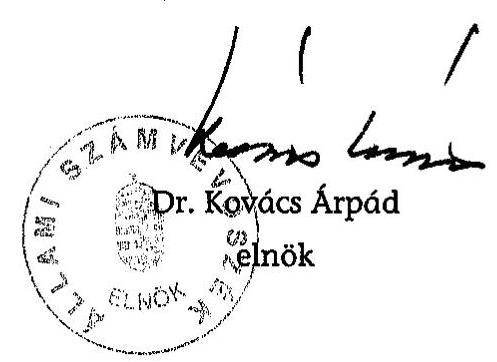

| Melléklet: | 5 db | 11 lap |
| :-- | --: | --: |
| Függelék: | 1 db | 3 lap |

---

1. sz. melléklet

V-23-35/2005-2006. sz. jelentéshez

# A jelentéstervezetre és a jelentésre tett észrevételek!

---

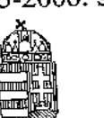

# MINISZTERELNÖKI KABINETIRODA GAZDASÁG- ÉS TÁRSADALOMPOLITIKAI TITKÁRSÁG Helyettes Államtitkár 

Ikt.szám: I-2/1131/2/2006
Hivatkozási szám: V-23-23/200-2005
Úgyintéző: dr. Tóth Judit
Tárgy: Jelentéstervezet az MTI Rt.
2005. évi gazdálkodásának ellenőrzéséről

Bihary Zsigmond úr
főigazgató
Állami Számvevőszék
Budapest

ÁLLAMI SZÁMVEVŐSZÉK
DGYVITI 1 IRODA
ATA- 239 r 2006
Érkeze: 2006 MAJ 08
Iktalószám: 1-23-30/05-06
Melléklet: 11.11.11.11.11.11.11.11.11.11.11.

## Tisztelt Főigazgató Úr!

Az ÁSZ által az MTI Rt. 2005. évi gazdálkodásával kapcsolatos vizsgálati anyagot áttekintettük, és az abban foglaltakat, mint oly sok éve, megalapozottnak és korrektnek találtuk. A Kormány - érzékelve, hogy a nemzeti hírügynökségről szóló törvény és az Rt. alapító okiratáról szóló dokumentumok egy valódi társasági szabályokat követő rendszerben nem alkalmazhatóak - egyetért az ajánlásokkal, és különösen azzal, hogy az ÁSZ ajánlása értelmében átfogó felülvizsgálatra lenne szükség az egész jogi, gazdálkodási, szervezeti konstrukciót illetően. Ehhez a magunk részéről minden előkészítő munkára készek vagyunk. A korábbiakban is tettünk erőfeszítéseket a hiányok pótlására, de egyetértünk azzal a megközelítéssel, hogy átfogó reform indokolt a jogszerűség és működőképesség érdekében.

Budapest, 2006. május „ 5 „.

Tisztelettel:
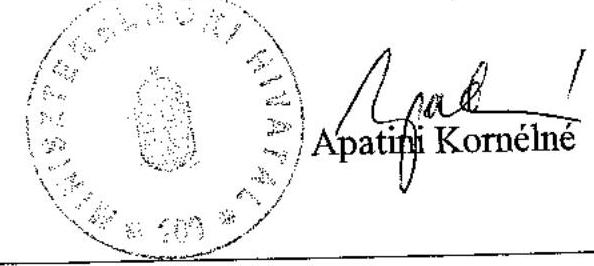

1055 Budapest, Kossuth Lajos tér 2-4. Telefon: 441-3380, 441-3383; Fax: 441-3382 www.meh.hu - Apatini.Klara@meh.hu

---

1. sz. melléklet a V-23-35/2005-2006. sz. jelentéshez

# 125 éves mti) 

Tulajdonosi
Tanácsadó Testület elnök

ATM-26642006
1106106
AFF 60t/06
$1-23-34 \quad 10 \mathrm{r}-06$
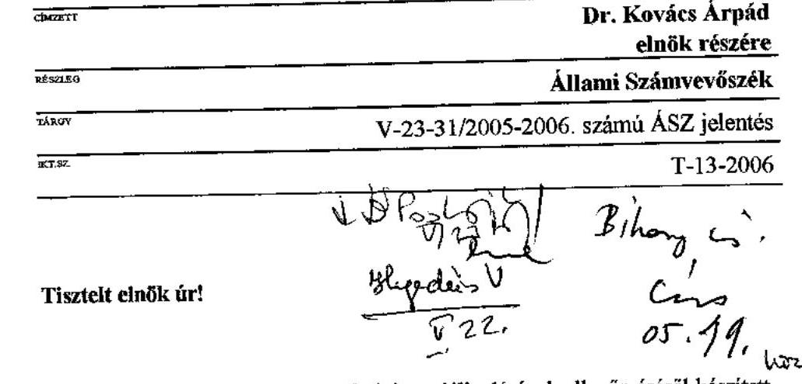

A Magyar Távirati Iroda Zrt. 2005. évi gazdálkodásának ellenőrzéséről készített V-23-312005-2006. számú számvevői jelentést köszönettel megkaptam.

A jelentéstervezet tartalmának megismerése után, az abban foglaltakhoz további észrevételt nem kívánok tenni.

Tisztelettel és szívélyes üdvözlettel,
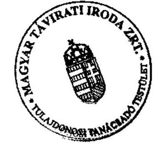

## 8 Baye

Dr. Bayer József
elnök

DATINGUATS
Bp., 2006. május 18.

---

# 125 éves mti 

## MAGYAR TÁVIRATI IRODA ZRT. - FELÜGYELŐ BIZOTTSÁG

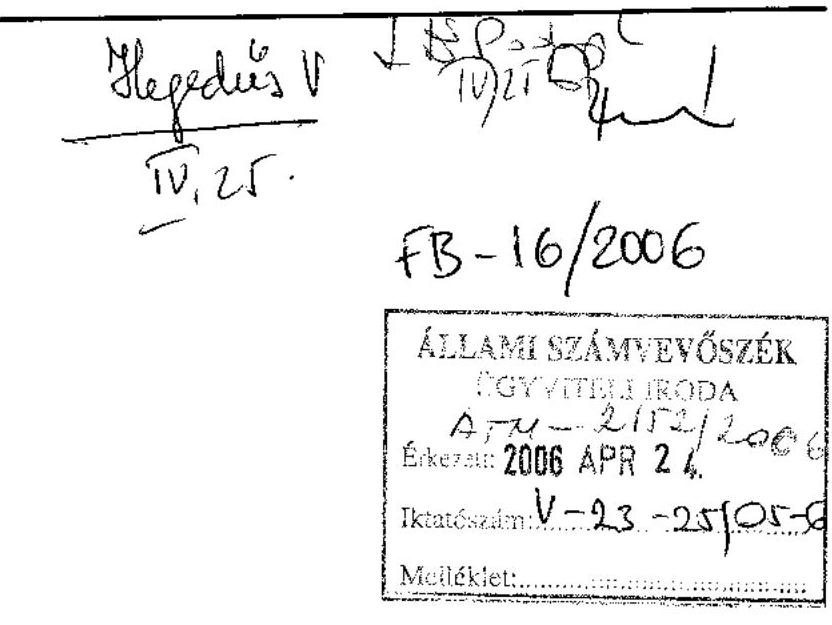

Állami Számvevőszék
Főigazgatójának
Bihary Zsigmond Úrnak

Tisztelt Bihary Úr!

Köszönettel megkaptuk a Magyar Távirati Iroda Zrt. 2005. évi gazdálkodásának ellenőrzéséről készült

V-23-23/2005-2006. számú
jelentéstervezetüket.
A Testület tagjai az előző munkaanyagokat már véleményezték. A jelentéstervezethez újabb észrevételük nincs.

Budapest, 2006. április 24.
Tisztelettel
dr. Halasi Tibor

Magyar Távirati Iroda Rt. - Felügyelő Bizottság Elnöke
1016 Budapest, Naphegy tér 8.
Tel.: 441-9036, tel./fax: 356-9538,
mobiltelefon: 06-30-211-3111, 06-30-515-4007
E-mail: fb@mti.hu

---

# 125 éves $m t i$ 

## Elnök

Magyar Távirati Iroda Zrt.

Bihary Zsigmond főigazgató Úr
részére
Állami Számvevőszék

Tárgy: Észrevételek V-23-23/2005-2006.
számú számvevői jelentésre

Tisztelt Főigazgató Úr!

Az MTI Rt. 2005. évi gazdálkodásának ellenőrzéséről készített tárgyi számú jelentéstervezetüket tisztelettel megkaptuk, az abban foglaltakra további
 észrevételt nem kívánunk tenni.

Budapest, 2006. április 24.

Tisztelettel:
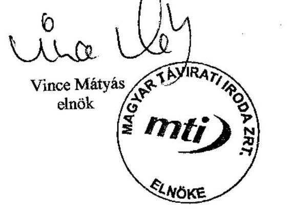

---

# ÁSZ-javaslatokkal összefüggő OGY határozatok 

7/1998. (II. 18.) OGY határozat a Magyar Távirati Iroda Rt. létrehozásáról szóló 70/1997. (VII. 15.) OGY határozat módosításáról
53/2001. (VI. 21.) OGY határozat a Magyar Távirati Iroda Rt. felügyelő bizottsága elnökének és egy tagjának megválasztásáról
54/2001. (VI. 29.) OGY határozat a Magyar Távirati Iroda Rt. Tulajdonosi Tanácsadó Testülete tisztségviselőinek és tagjainak megválasztásáról
64/2002. (X. 4.) OGY határozat a Magyar Távirati Iroda Részvénytársaság 1997. évi tevékenységéről szóló beszámolójáról
65/2002. (X. 4.) OGY határozat a Magyar Távirati Iroda Részvénytársaság 1998. évi tevékenységéről szóló jelentés elfogadásához
66/2002. (X. 4.) OGY határozat a Magyar Távirati Iroda Részvénytársaság 1999. évi tevékenységéről szóló jelentés elfogadásához
67/2002. (X. 4.) OGY határozat a Magyar Távirati Iroda Részvénytársaság 2000. évi tevékenységéről szóló beszámolójáról
68/2002. (X. 4.) OGY határozat a Magyar Távirati Iroda Részvénytársaság 2001. évi tevékenységéről szóló beszámolójáról
10/2003. (II. 19.) OGY. határozat a közszolgálati műsorszolgáltatók és a nemzeti hírügynökség európai uniós csatlakozással kapcsolatos tájékoztatási feladatainak költségvetési támogatásáról
99/2004. (X. 13.) OGY. határozat a Magyar Távirati Iroda Részvénytársaság 2002. évi tevékenységéről szóló beszámolójáról

---

100/2004. (X. 13.) OGY. határozat a Magyar Távirati Iroda Részvénytársaság 2003. évi tevékenységéről szóló beszámolójáról
61/2005. (VI. 28.) OGY. határozat a Magyar Távirati Iroda Rt. Tulajdonosi Tanácsadó Testülete tisztségviselőinek és tagjainak, valamint felügyelő bizottsága elnökének és egy tagjának megválasztásáról
73/2005. (IX. 22.) OGY határozat a Magyar Távirati Iroda Részvénytársaság 2004. évi tevékenységéről szóló beszámolójáról

---

# Előző számvevőszéki ellenőrzés javaslatai 

## 0520. Jelentés a Magyar Távirati Iroda Rt. 2004. évi gazdálkodásának ellenőrzése

A helyszíni ellenőrzés megállapításainak hasznosítása mellett javasoljuk:

## az Országgyúlésnek

1. tekintse át és módosítsa a 68/2002. (X. 4.) OGY határozatban megfogalmazott jogalkotási feladatnak megfelelően a nemzeti hírügynökségről szóló 1996. évi CXXVII. törvényt és az MTI Rt. Alapító Okiratát a teljes körűen összehangolt szabályozás kialakítása, a közszolgálati feladatok és az azok ellátásához szükséges állami támogatás egyértelműbb és pontosabb meghatározása, a jelenlegi tulajdonosi megoldás felülvizsgálata és hatékonyabbá tétele érdekében;
2. gondoskodjon az MTI Rt. működését hosszú távon befolyásoló középtávú stratégiai tervre vonatkozó tulajdonosi kontroll megteremtéséről;
3. fontolja meg az MTI Rt. Alapító okiratának módosítását annak érdekében, hogy az Rt. támogatási igényét szakmai szempontból a TTT véleményezze a támogatások igénylésének célszerűsége érdekében.

## a Kormánynak

1. kezdeményezze a 68/2002. (X. 4.) OGY határozatban az MTI Rt. támogatásával kapcsolatban megfogalmazott átláthatósági követelmény érvényre juttatása érdekében szükséges jogalkotási és egyéb intézkedéseket, különös figyelemmel a közösségi jog előírásaira;
2. kezdeményezze az Nht. 2. § (1) bekezdése h) pontjában megjelölt - a választási időszak feladataira vonatkozó - külön törvény megalkotását;
3. fontolja meg a - következő évi költségvetési törvényjavaslatban - a TTT működési költségei támogatásának elkülönítését az MTI Rt. előirányzatától;
4. fontolja meg a költségvetési törvényben szabályozott támogatáson kívül folyósított céltámogatások Tulajdonosi Tanácsadó Testület általi véleményének igénylését.

## a TTT elnökének

5. szabályozza a testület ügyrendjében a döntési, a tanácsadói, a javaslattételi, a véleményezési hatáskörében végzett feladatai ellátásával kapcsolatos eljárási rendet, szüntesse meg a testület működésében kialakult zavarokat az MTI Rt. elsődleges érdekeinek figyelembevételével;
6. kezdeményezze a tulajdonosnál a TTT-hez rendelt tulajdonosi jogosítványok egyértelmű meghatározását, az MTI Rt. alapító okiratának módosítását.

# az MTI Rt. elnökének 

7. intézkedjen, hogy az ÁSZ jelentések megállapításai, javaslatai alapján utasításban kiadott intézkedési tervek eredményes végrehajtása megtörténjen;
8. elemezze a 2005-ben kialakított szervezeti rend hatékonyságát és eredményeit; hozza összhangba az SZMSZ-t az elnöki, alelnöki utasításokat és a munkaköri leírásokat; a felülvizsgálat és elemzés keretében kezdeményezze a TTT-nél, hogy az SZMSZ részeként szabályozásra kerüljön a TTT, az FB és az MTI Rt. közötti kapcsolattartás és együttműködés rendje;
9. teremtse meg a középtávú stratégiai terv és az éves üzleti tervek közötti kapcsolatot. Egészítse ki a középtávú stratégiai tervet évekre lebontott, de középtávra megfogalmazott üzleti és pénzügyi tervvel, valamint intézkedési tervvel, amely tartalmazza a növekvő támogatási igény megállítását ellensúlyozó intézkedéseket és azok konkrét megtakarítási eredményeit, valamint meghatározza a tervhez kapcsolódó és határidőhöz kötött döntéshozó felelősséget. A kiegészített stratégiai tervről, hatályba léptetése előtt, kérje ki a TTT és az FB előzetes szakmai véleményét;
10. készítse el az egységes, a szükséges forrásokat évekre lebontva tartalmazó középtávú ingatlangazdálkodási tervet;
11. végezze el a megbízási - ezen belül a jogi szakértői - és vállalkozási szerződések hatékonyságelemzését, a hasznosítás elsődlegessége alapján döntsön azok szükségességéről, határozza meg a szerződések egységes tartalmi követelményeit és biztosítsa azokban a feladatmeghatározás, a teljesítés és a számonkérés összhangját;
12. intézkedjen a Károly krt.-i bérelt ingatlan kihasználatlan helyiségeinek hasznosítása érdekében;
13. szüntesse meg a még meglévő nem jogszerű kettős foglakoztatást; gondoskodjon a munkavállalói szerződésekben kikötött összeférhetetlenség mellőzésével kötött vállalkozói szerződések megszüntetéséről;
14. intézkedjen a humánerőforrás gazdálkodás szabályainak, kritériumrendszerének megalkotásáról, az évek óta szorgalmazott teljesítményellenőrzési és ösztönző rendszer bevezetéséről.

---

# TANÚSÍTVÁNYOK JEGYZÉKE 

1/a. sz. tanúsítvány Árbevétel és eredményterv kimutatása 2005. 12. 31.
1/b. sz. tanúsítvány Költség- és ráfordításterv kimutatása 2005. 12. 31.
2. sz. tanúsítvány A társaság vagyoni helyzetének alakulása (Eszközök)
3. sz. tanúsítvány A társaság vagyoni helyzetének alakulása (Források)
4. sz. tanúsítvány Bevételek alakulása
5. sz. tanúsítvány Költségek és ráfordítások alakulása
6. sz. tanúsítvány Eredmény alakulása
7. sz. tanúsítvány Költségvetési befizetési kötelezettségek (adók, járulékok)
8. sz. tanúsítvány Költségvetési juttatások (közvetlen és közvetett támogatások)
9. sz. tanúsítvány Az MTI Rt. létszámmegoszlása

---

Magyar Távirati Iroda Rt. Budapest

1/a. sz. tanúsítvány a V-23- 35 /2005-2006. sz. jelentéshez

|  Megnevezés | Tény
2002. | Tény
2003. | Tény
2003. | Index (%)
2003. | Tény
2004. | Tény
2004. | Index (%)
2004. tény/terv | Tény
2005.12.31. | Tény
2005.12.31. | Index (%)
2005. tény/terv  |
| --- | --- | --- | --- | --- | --- | --- | --- | --- | --- | --- |
|   |  |  |  | 4 (3/2) | 5 | 6 | 7 (6/5) | 8 | 9 | 10 (9/8)  |
|  Belföldi értékesítés nettó árbevétele | 1 998 857 | 2 131 801 | 2 040 869 | 95,73% | 1 683 912 | 1 836 034 | 109,03% | 1 767 182 | 1 732 040 | 98,01%  |
|  Export értékesítés nettó árbevétele | 118 818 | 126 200 | 102 091 | 80,90% | 70 300 | 124 811 | 177,54% | 119 500 | 125 803 | 105,27%  |
|  Egyéb bevételek | 47 287 | 20 000 | 20 720 | 103,60% | 45 000 | 7 858 | 17,46% | 59 067 | 15 144 | 25,64%  |
|  Árbevétel összesen | 2 164 962 | 2 278 001 | 2 163 680 | 94,98% | 1 799 212 | 1 968 703 | 109,42% | 1 945 749 | 1 872 987 | 96,26%  |
|  Költségvetési támogatás | 1 424 153 | 1 727 200 | 1 757 970 | 101,78% | 1 807 200 | 2 304 186 | 127,50% | 2 217 380 | 2 167 458 | 97,75%  |
|  Intézményi támogatás | 1 322 200 | 1 522 200 | 1 522 200 | 100,00% | 1 607 200 | 1 607 200 | 100,00% | 2 000 000 | 2 000 000 | 100,00%  |
|  Váltámogatások | 101 953 | 205 000 | 235 770 | 115,01% | 200 000 | 696 986 |  | 117 380 | 87 458 | 74,51%  |
|  Intézményi támogatás kiegészítése |  |  |  |  |  |  |  | 100 000 | 80 000 | 80,00%  |
|  Aktivált saját teljesítmény | 0 | 0 | 0 |  | 0 | 0 |  |  | 14 336 |   |
|  Bevételek összesen | 3 589 115 | 4 005 201 | 3 921 650 | 97,91% | 3 606 412 | 4 272 889 | 118,48% | 4 163 129 | 4 054 781 | 97,40%  |
|  Költségek és ráfordítások összesen | 3 757 908 | 4 029 696 | 4 084 716 | 101,37% | 3 817 724 | 4 547 895 | 119,13% | 4 171 871 | 4 058 829 | 97,29%  |
|  Üzleti eredmény (II-V) | -168 793 | -24 495 | -163 066 | 665,71% | -211 312 | -275 006 | 130,14% | -8 742 | -4 048 | 46,31%  |
|  Pénzügyi műveletek bevétele | 47 224 | 34 000 | 38 260 | 112,53% | 0 | 36 130 |  | 0 | 35 611 |   |
|  Pénzügyi műveletek ráfordítása | 17 664 | 9 000 | 15 330 | 170,33% | 0 | 5 074 |  | 0 | 15 324 |   |
|  Pénzügyi műveletek eredménye | 29 560 | 25 000 | 22 930 | 91,72% | 0 | 31 056 |  | 14 000 | 20 287 | 144,91%  |
|  Szokásos vállalkozói eredmény | -139 233 | 505 | -140 136 | -27750% | -211 312 | -243 950 | 115,45% | 5 258 | 16 239 | 308,8%  |
|  Rendkívüli eredmény | -3 150 | 0 | 2 181 |  | 160 066 | 152 152 |  |  | -5732 |   |
|  Mérleg szerinti eredmény | -142 383 | 505 | -137 955 | -27318% | -51 246 | -91 798 | 179,13% | 5 258 | 6 507 | 123,8%  |

Adatbont: 2005. kormolóing jelentés

Budapest, 2006. Felelős: 28.

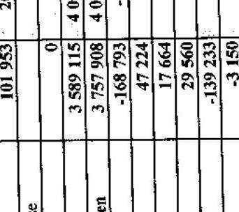

Magyar Távirati Iroda Zrt. 1016 Budapest, Napfegy táv 8. Levélcím: Budapest, Ft. 3. 142A 01K&H 10402142-21418581-00000000 Adószáma: 12965267-5410 06.

---

Magyar Távirati Iroda Rt. Budapest

Költség-és ráfordításterv kimutatása 2005.12.31.

1/b. sz. tanúsítvány a V-23-35/2005-2006. sz. jelentéshez

|  Megnevezés | Tény 2002. | Terv 2003. | Tény 2003. | Index (%) 2003. tény/terv | Terv 2004. | Tény 2004. | Index (%) 2004. tény/terv | Terv 2005.12.31. | Tény 2005.12.31. tény/terv  |
| --- | --- | --- | --- | --- | --- | --- | --- | --- | --- |
|   | 1 | 2 | 3 | 4 (3/2) | 5 | 6 | 7 (6/5) | 8 | 9 |

 |
|  IV. Anyagjellegű ráfordítások | 1 467 054 | 1 457 456 | 1 448 462 | 99,30% | 1 445 147 | 1 477 552 | 102,24% | 1 522 217 | 1 364 954  |
|  V. Személyi jellegű ráfordítások | 1 898 949 | 2 036 730 | 2 040 848 | 100,20% | 1 857 225 | 2 005 753 | 108,00% | 1 956 612 | 1 981 502  |
|  VI. Értékcsökkenés összesen | 331 278 | 307 410 | 312 377 | 101,62% | 307 751 | 301 883 | 98,09% | 361 449 | 320 026  |
|  VII. Egyéb költség és ráford. össz. | 60 597 | 25 100 | 19 388 | 77,24% | 207 601 | 233 859 | 112,65% | 331 593 | 213 779  |
|  * Céltámogatás elszámolt költségei | 0 | 203 000 | 263 641 | 129,87% |  | 528 848 |  |  | 178 569  |
|  * Kötség és ráfordítások összesen | 3 757 908 | 4 029 696 | 4 084 716 | 101,37% | 3 817 724 | 4 547 895 | 119,13% | 4 171 871 | 4 058 829  |

Adatforrás: 2005. kontrolling jelentés Budapest, 2006. február 28.

Közsítette:

Magyar Távirati Iroda Zrt. 1016 Budapest, Naphegy tér 8. Levélcím: Budapest, Pf. 5. 1426 K&H 10402142-21418581-00000000 Adószám: 12283226-2-41 06.

Készítette:

PfH

1/b. sz. tanúsítvány a V-23-35/2005-2006. sz. jelentéshez

1/b. sz. tanúsítvány a V-23-35/2005-2006. sz. jelentéshez

---

2. sz. tanúsítvány a V-23-35/2005-2006. sz. jelentéshez

|  Megnevezés | 1999. | 2000. | 2001. | 2002. | 2003. | 2004. | 2005.  |
| --- | --- | --- | --- | --- | --- | --- | --- |
|  Befektetett Eszközök | 3 033 394 | 2 996 070 | 3 084 308 | 3 067 162 | 3 136 963 | 3 080 876 | 2 906 577  |
|  ebből: Immateriális javak | 158 025 | 149 500 | 112 128 | 132 612 | 105 656 | 148 651 | 138 606  |
|  tárgyi eszközök | 2 826 295 | 2 799 967 | 2 921 726 | 2 896 471 | 2 998 015 | 2 862 112 | 2 707 058  |
|  befektetett pű. eszközök | 49 074 | 46 603 | 50 454 | 38 079 | 33 292 | 70 113 | 60 913  |
|  Forgóeszközök | 586 098 | 703 965 | 694 133 | 537 031 | 431 964 | 676 359 | 599 370  |
|  ebből: készletek | 13 310 | 20 179 | 19 110 | 20 362 | 15 651 | 11 040 | 22 386  |
|  követelések | 232 209 | 229 517 | 253 553 | 234 503 | 269 904 | 263 873 | 286 163  |
|  értékpapírok | 205 777 | 205 777 | 305 791 | 205 777 | 0 | 0 | 0  |
|  pénzeszközök | 134 802 | 248 492 | 115 679 | 76 389 | 146 409 | 401 446 | 290 822  |
|  Aktív időbeli elhatárolások | 39 873 | 29 454 | 30 064 | 105 226 | 31 461 | 44 605 | 18 417  |
|  ESZKÖZÖK ÖSSZESEN: | 3 659 365 | 3 729 489 | 3 808 505 | 3 709 419 | 3 600 388 | 3 801 840 | 3 524 364  |

A társaság vagyoni helyzetének alakulása (ESZKÖZÖK) (1999-2005)

Adatforrás: 2005. kontrolling jelentés

Budapest, 2006. február 28.

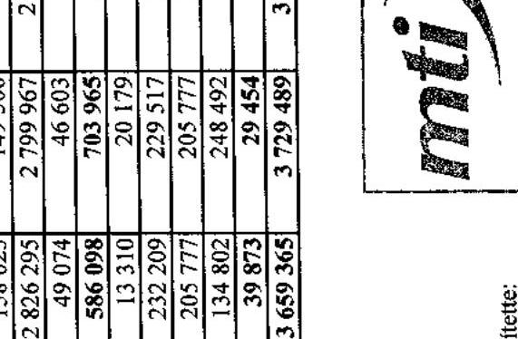

---

Magyar Távirati Iroda Zrt. Budapest

A társaság vagyoni helyzetének alakulása (FORRÁSOK) (1999-2005)

3. sz. tanúsítvány a V-23-35/2005-2006. sz. jelentéshez

|  Megnevezés | 1999. | 2000. | 2001. | 2002. | 2003. | 2004. | 2005.  |
| --- | --- | --- | --- | --- | --- | --- | --- |
|  Saját tőke | 3 159 535 | 3 255 762 | 3 395 343 | 3 252 510 | 3 114 101 | 3 022 303 | 3 028 810  |
|  ebből: jegyzett tőke | 1 750 000 | 1 750 000 | 1 750 000 | 1 750 000 | 1 750 000 | 1 750 000 | 1 750 000  |
|  tőketartalék | 892 396 | 892 396 | 892 396 | 892 396 | 892 396 | 892 396 | 892 396  |
|  eredménytartalék | 412 093 | 517 139 | 560 816 | 752 497 | 609 660 | 471 705 | 579 907  |
|  mérleg szerinti eredmény | 105 046 | 96 227 | 192 131 | -142 383 | -137 955 | -91 798 | 6 507  |
|  Céltartalék | 18 057 | 10 997 | 10 997 | 26 533 | 15 536 | 16 712 | 16 712  |
|  Kötelezettségek | 355 701 | 355 022 | 242 671 | 231 327 | 297 165 | 567 427 | 346 476  |
|  Passzív időbeli elhatárolások | 126 072 | 107 708 | 159 494 | 199 049 | 173 586 | 195 398 | 132 366  |
|  FORRÁSOK ÖSSZESEN: | 3 659 365 | 3 729 489 | 3 808 505 | 3 709 419 | 3 600 388 | 3 801 840 | 3 524 364  |

Adatforrás: 2005. kontrolling jelentés

Budapest, 2006. február 28.

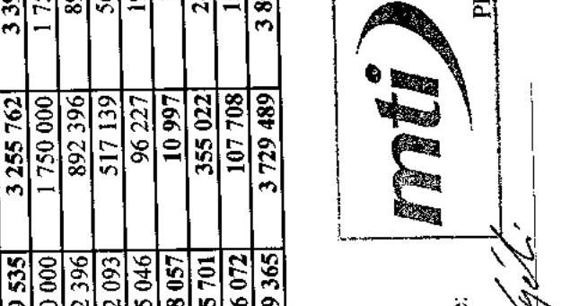

---

Magyar Távirati Iroda Zrt. Budapest

A társaság vagyoni helyzetének alakulása (FORRÁSOK) (1999-2005)

3. sz. tanúsítvány a V-23-35/2005-2006. sz. jelentéshez

|  Megnevezés | 1999. | 2000. | 2001. | 2002. | 2003. | 2004. | 2005.  |
| --- | --- | --- | --- | --- | --- | --- | --- |
|  Belföldi értékesítés nettó árbevétele | 1 364 519 | 1 772 421 | 1 912 884 | 1 998 857 | 2 040 869 | 1 836 034 | 1 732 040  |
|  Export értékesítés nettó árbevétele | 79 288 | 133 739 | 116 839 | 118 818 | 102 091 | 124 811 | 125 803  |
|  Egyéb bevételek | 1 465 091 | 1 372 091 | 1 393 833 | 1 471 440 | 1 778 690 | 2 312 044 | 2 182 602  |
|  Aktivált saját teljesítmények | 0 | 43 302 | 0 | 0 | 0 | 0 | 14 336  |
|  Pénzügyi műveletek bevételei | 96 929 | 66 507 | 75 219 | 47 224 | 58 260 | 36 130 | 35 611  |
|  Rendkívüli bevételek | 71 388 | 1 407 | 149 752 | 24 199 | 8 091 | 460 820 | 1 946  |
|  BEVÉTELEK ÖSSZESEN: | 3 077 215 | 3 389 467 | 3 648 527 | 3 660 538 | 3 968 001 | 4 769 839 | 4 092 338  |

- A számviteli törvény változása miatt a 2000. és a 2001. évi adatok változatlan szerkezetben nem hasonlíthatók össze, ezért a 2000. évit korrigáltuk.

Adatforrás: 2005. kontrolling jelentés Budapest, 2006. február 28.

Magyar Távirati Iroda Zrt. 1016 Budapest, Naphegy tér 8. Levélcím: Budapest, Pf. 3. 1436. K&H 10402142-21418581-00000000 Adószám: 12283226-2-41 06.

Készítette: Pf Felelős vezető:

---

Magyar Távirati Iroda Zrt. Budapest

Költségek és ráfordítások alakulása (1999-2005)

5. sz. tanúsítvány a V-23-35/2005-2006. sz. jelentéshez

|  |   |   |   |   |   |   |   |
| --- | --- | --- | --- | --- | --- | --- | --- |
|  Megnevezés | 1999. | 2000. | 2001. | 2002. | 2003. | 2004. | 2005.  |
|  Anyagjellegű ráfordítások | 516 293 | 1 257 370 | 1 328 488 | 1 467 084 | 1 594 208 | 1 521 194 | 1 465 578  |
|  Személyi jellegű ráfordítások | 1 429 085 | 1 677 735 | 1 714 190 | 1 898 949 | 2 128 316 | 2 436 206 | 2 011 604  |
|  Értékcsökkenési leírás | 218 376 | 282 635 | 281 188 | 331 278 | 342 804 | 356 636 | 361 144  |
|  Egyéb költségek és ráfordítások | 716 837 | 48 046 | 78 630 | 60 597 | 19 388 | 233 859 | 220 503  |
|  Pénzügyi műveletek ráfordításai | 14 852 | 15 962 | 5 313 | 17 664 | 15 330 | 5 074 | 15 324  |
|  Rendkívüli ráfordítások | 76 726 | 11 492 | 48 137 | 27 349 | 5 910 | 308 668 | 11 677  |
|  **KÖLTSÉGEK ÉS RÁFORD. ÖSSZÉSEN:** | 2 972 169 | 3 293 240 | 3 455 946 | 3 802 921 | 4 105 956 | 4 861 637 | 4 085 831  |

- A számviteli törvény változása miatt a 2000. és a 2001. évi adatok változatlan szerkezetben nem hasonlíthatók össze, ezért a 2000. évit korrigáltuk.

Adatforrás: 2005. kontrolling jelentés Budapest, 2006. február 28.

Magyar Távirati Iroda Zrt. 1016 Budapest, Naphegy tér 8. Levélcím: Budapest, Pf. 3. 1426 K&H 10402142-21418581-00000000 Adószám: 12283226-2-41 06

Készítette: Pf Felelős vezető:

---

Magyar Távirati Iroda Zrt. Budapest

Eredmény alakulása (1999-2005)

6. sz. tanúsítvány a V-23-35/2005-2006. sz. jelentéshez

|  Megnevezés | 1999. | 2000. | 2001. | 2002. | 2003. | 2004. | 2005.  |
| --- | --- | --- | --- | --- | --- | --- | --- |
|  1. Üzemlétületi/tevékenység eredménye | 28 307 | 55
 767 | 21 060 | -168 793 | -163 066 | -275 006 | -4 048  |
|  2. Pénztügyi műveletek eredménye | 82 077 | 50 545 | 69 906 | 29 560 | 22 930 | 31 056 | 20 287  |
|  3. Szokásos vállalkozási eredmény (1+2) | 110 384 | 106 312 | 90 966 | -139 233 | -140 136 | -243 950 | 16 239  |
|  4. Rendkívüli eredmény | -5 338 | -10 085 | 101 615 | -3 150 | 2 181 | 152 152 | -9 732  |
|  5. Adózás előtti eredmény (3+4) | 105 046 | 96 227 | 192 581 | -142 383 | -137 955 | -91 798 | 6 507  |

Adatforrás: 2005. kontrolling jelentés

Budapest, 2006. február 28.

Készítette: *Kajd*

PH

Felelős vezető: *Kajd*

Magyar Távirati Iroda Zrt. 1016 Budapest, Naphegy tér 8. levélcím: Budapest, Pf. 3. 1426 KAH V0402143-21418581-00000000 Adószám: 12283226-2-41

06

---

Magyar Távirati Iroda Rt.

Költségvetési befizetési kötelezettségek (adók, járulékok) (1999-2005)

7. sz. tanúsítvány a V-23-35/2005-2006. sz. jelentéshez

|  Megnevezés | 1999. | 2000. | 2001. | 2002. | 2003. | 2004. | 2005.  |
| --- | --- | --- | --- | --- | --- | --- | --- |
|  Személyi jövedelemadó | 323 868 | 340 775 | 361 924 | 401 319 | 441 679 | 505 783 | 411 558  |
|  Általános forgalmi adó | 137 392 | 172 454 | 169 999 | 171 976 | 113 490 | 260 630 | 255 728  |
|  Munkaadói járulék | 25 800 | 27 712 | 30 552 | 15 510 | 38 264 | 46 818 | 36 018  |
|  Munkavállalói járulék | 11 673 | 12 537 | 13 794 | 15 392 | 11 075 | 12 185 | 10 927  |
|  **Mindösszesen:** | 498 733 | 553 478 | 576 269 | 604 197 | 604 508 | 825 416 | 714 230  |

Adatforrás: 2005. kontrolling jelentés

Budapest, 2006. február 28.

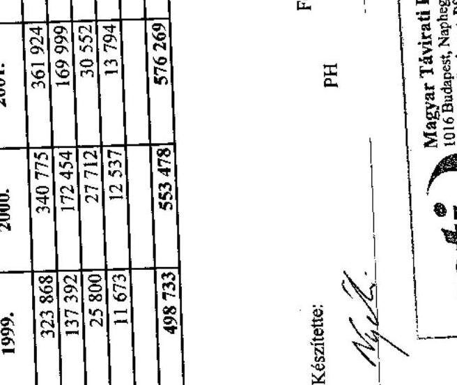

---

8. sz. tanúsítvány a V-23-35/2005-2006. sz. jelentéshez

|  Megnevezés | 2001. | 2002. | 2003. | 2004. | 2005.  |
| --- | --- | --- | --- | --- | --- |
|  Bevételt növelő támogatások (kg. költségvetés) |  |  |  |  |   |
|  Közszolgálati feladatok előtámogatása | 1 322 200 | 1 322 200 | 1 522 200 | 1 607 200 | 2 080 000  |
|  Helleim táli magyar saját hatallátása |  |  |  |  | 50 000  |
|  Működési támogatás összesen: |  | 1 322 200 | 1 522 200 | 1 607 200 | 2 130 000  |
|  Célfizetésgatás: |  |  |  |  |   |
|  Választási feladatok |  |  |  |  |   |
|  ÖSSZESEN: |  | 1 322 200 | 1 522 200 | 1 607 200 | 2 130 000  |
|  Saját tőkét növelő támogatások |  |  |  |  |   |
|  ÖSSZESEN: |  |  |  |  |   |
|  Egyéb, bevételt növelő támogatások |  |  |  |  |   |
|  Ilyes Kifizetésítvány |  | 12 264 | 10 889 | 715 | 694  |
|  Etnikumközi támogatás |  |  |  | 190 000 | 1 880  |
|  Lényegámséptési támogatás |  |  |  | 410 669 |   |
|  Európai unió közös feladatok |  |  | 87 679 | 4 629 |   |
|  SKB-BIM MTI hírt projekt* |  | 76 770 | 85 498 | 14 802 | 3 202  |
|  IHM önkormányzatok hatáskörébe tartozó |  |  |  | 9 000 |   |
|  IHM - MTI DAK projekt* |  |  |  | 47 233 | 11 456  |
|  NKÖM Ügyfélkapu Fejlesztés projekt* |  | 11 119 | 34 775 | 8 024 | 420  |
|  KÖTAGMA: |  |  |  |  | 9 201  |
|  Környezetvédelmi Minisztérium - Zöld Forrás |  |  | 10 000 |  | 3 053  |
|  Okkult Minisztérium |  |  | 1 800 | 3 174 |   |
|  EU delegáció |  |  |  | 3 755 |   |
|  MEH - EU Adatbázis |  |  |  |  | 1 462  |
|  Nemzeti Külterület Alap - "KorKépek 45-47" |  |  |  |  | 3 000  |
|  Európai unió társfinanszírozás |  |  |  |  | 7 456  |
|  ÖSSZESEN: |  | 101 952 | 235 770 | 696 986 | 37 450  |
|  MINDÖSSZESEN: |  | 1 424 153 | 1 757 970 | 1 304 186 | 2 167 450  |

- A célfizetésgatások tárgyévben elszámolt összegei nem tartalmazzák a beruházások miatt a következő évekre az amortizációval arányosan eltolt támogatási fedezetek.

Budapest, 2006. február 28.

Készítette: Magyar Távirati Iroda Zrt. H.M. Budapest, Naphegy tér 8. 1656. 10402142-21418581-00000000 Adószám: 13283226-2-41 Felelős vezető: 06.

---

Magyar Távirati Iroda Rt. Budapest

Az MTI Rt. létszámmegoszlása (2000-2005)

9. sz. tanúsítvány a V-23-35/2005-2006. sz. jelentéshez

|  Foglalkoztatottak | 2000.12.31 | 2001.12.31 | 2002.12.31 | 2003.12.31 | 2004.12.31 | 2005.12.31  |
| --- | --- | --- | --- | --- | --- | --- |
|  Munkaviszony keretében foglalkoztatott aktív munkavállalók | 411 | 415 | 444 | 433 | 326 | 321  |
|  Munkaviszony keretében foglalkoztatott nyugdíjások | 19 | 13 | 19 | 25 | 8 | 11  |
|  Összesen | 427 | 428 | 463 | 468 | 334 | 332  |
|  Határozott időben foglalkoztatott nyugdíjások | 2 | 1 | 1 | 0 | 0 | 0  |
|  Határozatlan időben foglalkoztatott nyugdíjások | 14 | 12 | 18 | 25 | 8 | 11  |
|  Mellékfoglalkozás | 3 | 3 | 3 | 2 | 1 | 1  |
|  Másodállás | 1 | 1 | 0 | 0 | 0 | 0  |
|  Munkaszerződéssel és vállalkozási szerződéssel foglalkoztatottak | 95 | 76 | 87 | 89 | 65 | 51  |
|  Kölcsönzött foglalkoztatottak |  |  |  |  |  |   |
|  Határozott | 38 | 42 | 80 | 187 | 44 | 56  |
|  Határozatlan | 58 | 67 | 126 | 118 | 82 | 75  |
|  Összesen | 96 | 106 | 206 | 305 | 126 | 130  |
|  Munkaszerződés és vállalkozási szerződéssel foglalkoztatottak bontása |  |  |  |  |  |   |
|  Megalkotási felhasználási szerződés | 2000.12.31 | 2001.12.31 | 2002.12.31 | 2003.12.31 | 2004.12.31 | 2005.12.31  |
|  Megalkotási felhasználási szerződés | 24 | 0 | 0 | 0 | 0 | 0  |
|  Megbízási szerződés | 11 | 0 | 0 | 0 | 0 | 0  |
|  Vállalkozási szerződés | 60 | 76 | 87 | 89 | 65 | 51  |
|  Összesen: | 95 | 76 | 87 | 89 | 65 | 51  |

Budapest, 2006. február 28.

Készítette:

Magyar Távirati Iroda Zrt. 1016 Budapest, Naphegy tér 8. 1016 Budapest, Naphegy tér 8. 1016 Budapest, 12283226-2-41

Magyar Távirati Iroda Zrt. 1016 Budapest, Naphegy tér 8. 1016 Budapest, Naphegy tér 8. 1016 Budapest, 12283226-2-41

PFI

---

5. sz. melléklet

V-23-35/2005-2006. sz. jelentéshez

# ÁBRÁK, KIMUTATÁSOK JEGYZÉKE 

1. Magyar Távirati Iroda Rt. 2005. évi bevételek megoszlása
2. Magyar Távirati Iroda Rt. 2005. évi költségek megoszlása
3. Bevételek, költségek és ráfordítások alakulása

---

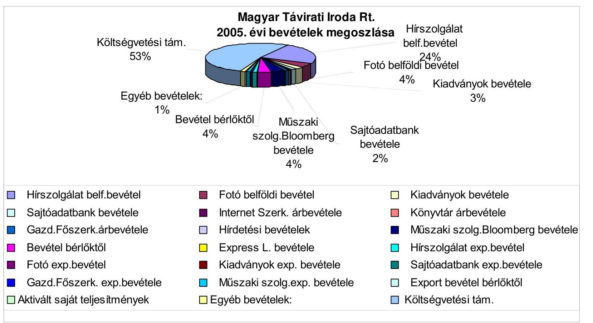

# Magyar Távirati Iroda Rt.

## 2005. évi bevételek megoszlása

- **Hírszolgálat**
  - belf.bevétel
  - 24%
  - Fotó belföldi bevétel
  - 4%
  - Kiadványok bevétele
  - 3%

- **Hírszolgálat belf.bevétel**
  - ☐ Sajtóadatbank bevétele
  - ☐ Internet Szerk. árbevétele
  - ☐ Gazd.Főszerk.árbevétele
  - ☐ Hirdetési bevételek
  - ☐ Műszaki szolg.Bloomberg bevétele
  - ☐ Bevétel bérlőktől
  - ☐ Express L. bevétele
  - ☐ Fotó exp.bevétel
  - ☐ Kiadványok exp. bevétele
  - ☐ Gazd.Főszerk. exp.bevétele
  - ☐ Műszaki szolg.exp. bevétele
  - ☐ Aktivált saját teljesítmények
  - ☐ Egyéb bevételek
  - ☐ Kiadványok bevétele
  - ☐ Könyvtár árbevétele
  - ☐ Műszaki szolg.Bloomberg bevétele
  - ☐ Hírszolgálat exp.bevétel
  - ☐ Sajtóadatbank exp.bevétele
  - ☐ Export bevétel bérlőktől
  - ☐ Költségvetési támogatás

---

# Magyar Távirati Iroda Rt. 2005. évi költségek megoszlása 

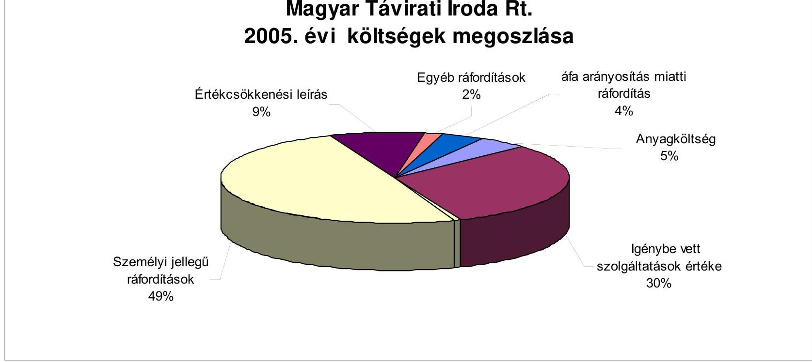

---

Bevételek, költségek és ráfordítások alakulása

| Megnevezés | Adatok E Ft 2005. év |
| :--: | :--: |
| Anyagköltség | 196 616 |
| Igénybe vett szolgáltatások értéke | 1 245 296 |
| Egyéb szolgáltatások értéke | 23 667 |
| Anyagjellegű ráfordítások | 1 465 578 |
| Személyi jellegű ráfordítások | 2 011 604 |
| Értékcsökkenési leírás | 361 144 |
| Egyéb ráfordítások | 70 714 |
| ÁFA arányosítás miatti ráfordítás | 152 993 |
| KÖLTSÉGEK ÉS RÁFORDÍTÁSOK ÖSSZESEN: | 4 062 034 |
| Hírszolgálat belf.bevétel | 961 584 |
| Fotó belföldi bevétel | 163 102 |
| Kiadványok bevétele | 110 959 |
| Sajtóadatbank bevétele | 72 071 |
| Internetes szolgáltatások árbevétele | 12 791 |
| Könyvtár árbevétele | 25 864 |
| Gazd.Főszerk.árbevétele | 43 851 |
| Hirdetési bevételek | 10 444 |
| Műszaki szolg.Bloomberg bevétele | 163 687 |
| Bevétel bérlőktől | 158 783 |

 Express L. bevétele | 10916 |
| Belföldi értékesítés árbevétele | 1734052 |
| Hírszolgálat exp.bevétel | 48717 |
| Fotó exp.bevétel | 16704 |
| Kiadványok exp. bevétele | 1203 |
| Sajtóadatbank exp.bevétele | 1014 |
| Gazd.Főszerk. exp.bevétele | 9314 |
| Műszaki szolg.exp. bevétele | 48851 |
| Export bevétel bérlőktől | 1 |
| Export értékesítés árbevétele | 125803 |
| Aktivált saját teljesítmények | 14336 |
| Egyéb bevételek: | 52602 |
| ÉRTÉKESÍTÉS ÁRBEVÉTELE ÉS BEVÉTELEK | 1926793 |
| Költségvetési támogatás | 2130000 |
| BEVÉTELEK ÖSSZESEN: | 4056793 |

---

# az MTI Rt. gépjárműállománya kihasználtságának értékelése 

## 1. A GÉPJÁRMŰPARK MŰSZAKI ÁLLAPOTA

Az MTI Rt. a pontos és aktuális hírszolgáltatás és tájékoztatás érdekében helyi tudósítói hálózatot tart fenn és gépjármű flottát üzemeltet. A gépjárműpark kialakításának elsődleges célja a tény- és időszerű tömegtájékoztatás elősegítése volt. A tömegtájékoztatás terén végbement informatikai fejlődés ma sem mellőzheti a helyszíni tudósításokat, de a korszerű informatikai eszközök és rendszerek alkalmazása az információáramlás gyors fejlődésével és új, a mai követelményeknek megfelelő formáinak kialakulásával járt. Ennek következtében megváltozott a logisztikai osztályon belül működő szállítási csoport feladatköre, ami egyrészt a létszám csökkentését és a gépjárműpark hasznosítási céljának a változását eredményezte. A szállítási csoport feladatköre megváltozott, a hírügynökségi tevékenység támogatásáról áthelyeződött a hangsúly az általános szállítási tevékenységre, az anyagbeszerzésre és a gépjárműpark üzemeltetésével kapcsolatos feladatokra. A gépjárművek fele személyi használatba adott, a fennmaradó autók közül négy az üzemeltetés biztonsága érdekében fenntartott tartalékállomány.

A cégautók használatának a rendjét a gépkocsik használati rendjéről szóló 10/2003. sz. és az azt módosító 18/2003. sz. elnöki utasítások tartalmazzák.

Az MTI Rt. 23 db gépjárművel rendelkezett 2005. év végén, amelyből 12 db a személyi használatba adott. (Melléklet a teljesítmény-ellenőrzéshez az MTI Rt. tulajdonában álló gépjárművek leltáráról) Az átlagos futásteljesítmény meghaladja a 100 ezer km-t, mindössze 6 db gépjármű nem érte még el a 100 ezer futott km-t. A gépjárművek műszaki állapotát a rendszeres karbantartással és a szerviz által előírt rendszeres karbantartásokkal naprakészen tartják nyilván.

A társaság nem határozta meg azokat a minimális műszaki, illetve gazdaságossági paramétereket, ameddig a gépjárművek üzemeltethetők. Erre vonatkozóan betartják a szakszerviz vagy a gépkocsi típusára vonatkozó műszaki feltételeket. Nem végeztek gazdaságossági összehasonlító számításokat arra vonatkozóan, hogy a személyi használatba adott autók üzemeltetése milyen többletköltségekkel jár a saját gépjárművek használatára vonatkozó, hatályban lévő belső szabályzat alapján érvényes költségekhez viszonyítva.

## 2. A GÉPJÁRMŰBESZERZÉS SZABÁLYOZOTTSÁGA

A Társaság a 10/2003. Elnöki utasítás és a közbeszerzésre vonatkozó 16/2003. Elnöki utasítások együttes értelmezésével szabályozta a gépjárműbeszerzéseket. A jelenleg hatályban lévő jogszabályok nem írnak elő külön szabályozást a gépjárművek beszerzésére vonatkozóan. Az MTI Rt. eszközeinek beszerzése és szolgáltatásainak megrendelése a 2004. május 1-jétől hatályos 2003. évi

---

CXXIX. tv. előírásai alapján történik. A közbeszerzési eljárások lefolytatásáról a 16/2003. sz. Elnöki utasítás rendelkezik, amelynek keretein belül szabályozták a közbeszerzések lebonyolításának módját. A szakszerű lebonyolítás érdekében külső szakértőt is alkalmaznak. Az egyes beszerzéseket a törvény előírásainak megfelelő értékkategóriákat alkalmazva határozták meg a közbeszerzési eljárás típusát. A társaság az üzemanyag és a gépjárművek beszerzéseit, kihasználva a központosított közbeszerzési eljárás keretében történő beszerzés előnyeit, annak alkalmazásával bonyolította.

A társaság költségei meghaladják a tevékenység folytatásával összefüggésben felmerült bevételeket. Az MTI Rt. működésére vonatkozó törvényi szabályozással összhangban a közszolgálati feladatokkal kapcsolatban felmerült - a bevételeket meghaladó - kiadásokat a költségvetés biztosítja. Az Nht. 30. § alapján, a 2. §-ban meghatározott közfeladatok ellátásához szükséges mértékű támogatás folyósítása a 2005. évi költségvetésről szóló a 2004. CXXXV. törvényben meghatározott összegben történik. A támogatási igényt a társaság menedzsmentje a TTT vagy az FB előzetes véleményezése nélkül nyújtja be a Pénzügyminisztérium részére. A támogatási összeg éves mértékét a Pénzügyminisztérium javaslata alapján az országgyűlés az éves költségvetési törvényben hagyja jóvá.

A 2005. évben végrehajtott három gépjármű értékesítés inkább kényszerű, mint tervszerű értékesítés volt, mivel két gépjárművet a magas életkor és futásteljesítmény valamint a gazdaságtalan üzemeltetés miatt, egyet totálkár miatt értékesítettek. Az értékesítést megelőzően megállapításra került az autók becsült értéke, ami kiinduló alapot adott az értékesítési ár meghatározásához. A társaság 2005-ben nem vásárolt gépjárművet.

# 3. A GÉPJÁRMŰHASZNÁLAT SZABÁLYOZOTTSÁGA 

Az MTI Rt.-nél a tevékenységgel összefüggő gépjármű használatot elnöki utasításokkal szabályozzák. A 18/2003. sz. Elnöki Utasítás módosította a gépkocsi használat rendjéről szóló 10/2003. sz. utasítás költségelszámolásra vonatkozó VI. fejezetét, de tartalmában helybenhagyta a hivatali gépjárművek magáncélú használatára vonatkozó rendelkezéseket.

Az elnöki utasítás szabályozza a cégautók üzemeltetését, biztosítását, költségelszámolását és a magántulajdonú gépjárművek hivatali célú használatát. Az utasítás a cégautók használati módja szerint három kategóriát állít fel. Ezek a személyhez rendelt gépkocsi főállású gépkocsivezetővel és anélkül, a munkakörhöz rendelt gépkocsi használat és a szervezeti egységhez rendelt gépkocsi használat főállású gépkocsivezetővel. A személyi használatra adott autók után havi 2000 km felett az üzemeltetőnek a $3 \mathrm{Ft} / \mathrm{km}$ és az üzemanyag költségét meg kell téríteni. 2005-ben két alkalommal haladta meg az értékhatárt a gépjármű használat, amelyet az indokoltságra és a 10 eFt alatti költségvonzata miatt nem érvényesíttettek.

A harmadik kategóriába sorolt, ún. nem személyi használatba adott gépjárművek esetén az utasítás megfogalmazása minden esetben feltételezi a gépjármű használattal a főállású gépkocsivezető alkalmazását. A 2004. évi létszámleépítés következtében lecsökkent létszámkeret nem teszi lehetővé a főállású gépjárművezetők alkalmazását a gépjárművekhez. Ennek értelmében az utasítás a jelenlegi gépjárműállomány esetén felülvizsgálatra szorul. A gépjárművek használatakor menetlevelet kell vezetni. A menetleveleket a „szállítási és ellátási csoport állítja ki" és a teljesítést is a csoport igazolja. Az első két csoportba tartozó gépjárművek esetén az MTI Rt. a használóval a munkaszerződés mellékletét képező megállapodást kötött, amelyben személyre szólóan határozták meg a használat pontos feltételeit.

A gépjárművet használóknak a használat céljától függetlenül kötelességük a gépkocsit rendeltetésszerűen a legnagyobb gondossággal használni, amivel összefüggésben az elnöki utasítás rendelkezik a gépkocsiban okozott károk Cascóra történő rendezésének a szabályairól is. Ennek megfelelően a gépkocsiban okozott kár részbeni vagy teljes megtérítésére lehet kötelezni a gépkocsit vezető dolgozót az érvényes munkaügyi szabályok szerint. A munkavállalóval szemben alkalmazott kárösszeg meghatározásánál a Casco önrészesedés összegét kell figyelembe venni. 2005-ben erre nem volt példa a társaságnál.

A 2004. évben bevezetett költségtakarékossági intézkedésekkel összefüggésben, valamint a jobb átláthatóság érdekében a gépjárművek üzemanyag ellátása üzemanyagkártyák igénybevételével lehetséges. A szabályozás kiterjed a gépjármű használattal összefüggő egyéb költségek - mosatás, parkolási díj, autópályadíj, stb.- elszámolási lehetőségére és módjára is.

# 4. A GÉPJÁRMŰ-ÜZEMELTETÉS GAZDASÁGOSSÁGA 

A társaság a középtávú stratégiai tervében kimunkált költség adatokra alapozva készíti el minden évben az éves üzleti tervét. Az üzleti tervet megalapozó előzetes kalkulációban meghatározzák azt az éves összeghatárt, amely a gépjárművek üzemeltetésével kapcsolatban az adott évben elszámolható. A költségvetési törvény alapján évente meghatározandó állami támogatás nem normatív jellegű, és nem tartalmaz költséghelyekre bontott előírásokat, megszorításokat a társaság számára, ezért az üzemeltetésre fordítható éves költségkeretet a racionális gazdálkodás keretein belül határozzák meg. Az éves támogatási keretet meghatározó kérelem megfelelő részletezettséggel tünteti fel a tevékenységgel kapcsolatos költségeket.

A meglévő gépjármű flotta után az MTI Rt. a számviteli törvényben és a számviteli politikájában rögzített módon számolja el az éves értékcsökkenést. A gépjárművek magas - 6 évet meghaladó - átlagéletkorából következően az MTI Rt. a képződő amortizációt nem használta fel a gépjárműállomány megújítására. Az évente képződő amortizáció felhasználása és a gépjárművek beszerzéséhez szükséges fedezet biztosítása között nincs szoros összefüggés. A meglévő gépjárművek többségében személyi használatúak, ezért lecsökkent logisztikai feladatok az üzemeltetett gépjárművek számának a csökkentését indokolja. Az elmúlt években nem vásárolt új gépjárművet az MTI Rt.

A hivatali gépjárművek magáncélú használatának költségelszámolását a 10/2003. sz. elnöki utasítás VI. fejezetében szabályozták. Ezek szerint a magánhasználat után a használót terhelő fenntartási költség mértékét a szállítási és

---

ellátási csoport teszi közzé. Az üzemanyag költségek elszámolása során mind a hivatalos és mind a magáncélra történő igénybevételre ugyanaz a szabályozás vonatkozik. A hivatali gépjárművek magáncélú használata elnöki engedéllyel lehetséges.

A második kategóriába sorolt dolgozók a munkaszerződés alapján jogosultak a magáncélú használatra is, a harmadik kategóriába sorolt cégautó használatot az elnök engedélyezheti. A harmadik kategóriába sorolt gépkocsik magáncélú használata esetén az igénybevevőt terheli az üzemanyagköltség és a fenntartási költség arányos része. A magáncélú használatot a gépkocsi menetlevelén az elnöki engedélyeztetésre való hivatkozással fel kell tüntetni. A szigorú számadású és sorszámozott nyomtatvány kiállítása és a teljesítés igazolása az elnöki utasítás megfogalmazása alapján nem köthető össze személyi felelősséggel. A rendszerbe épített belső kontroll hiányában a magáncélú használat engedélyezése és felelősségteljes ellenőrzése lehetővé teszi a szubjektív tényezők érvényesülését.

A magáncélú használatért fizetendő térítés mértékét a logisztikai főosztály a menetlevelek és a leadott elszámolás alapján állapítja meg, és erről értesíti a használót és a pénzügyi igazgatóságot. A fizetendő összeg mértéke az üzemanyag fogyasztási norma és az APEH által közzétett üzemanyagárral számolt üzemanyagköltség és $3 \mathrm{Ft} / \mathrm{km}$ általános személygépkocsi normaköltség együttes összege. A szabályozás nem rendelkezik a $3 \mathrm{Ft} / \mathrm{km}$ és a szállítási csoport által közzétett fenntartási költség együttes, vagy külön történő elszámolásáról, annak célszerűségéről.

Az MTI Rt. tulajdonában álló gépjárművek magáncélú, külföldi használatának engedélyezésére az elnöki utasítás értelmében csak az elnök jogosult. Az átvizsgált esetekben a külföldi használatra vonatkozó engedélyt az elnök egyetlen esetben sem engedélyezett. Alelnöki engedéllyel viszont öt alkalommal használtak gépjárművet 2005-ben külföldi, illetve magáncélra. A magáncélú használatra előírt kilométer átalány megfizetésétől mind a belföldi, mind a külföldi utak alkalmával eltekintettek.

Az emelkedő átlagéletkor a karbantartási költségek növekedésével járt. A társaság kimutatása alapján a 2005. évi tervezés alkalmával a karbantartási költségek várható összegét alacsonyabb értékkel tervezték, mint ami a magas átlagéletkor miatt indokolt lett volna. Ezért az éves karbantartási költségek a tervezett értéket meghaladóan realizálódtak.

A magas futásteljesítmény és azzal párhuzamosan növekvő szervizköltségek a gépjárműpark tervszerű megújítását igénylik. Egy gépjármű esetében az értékesítés és a becsült érték megállapítása között eltelt több hónapos eltérés alatt a gépjárművet újra kellett vizsgáztatni és több alkatrészt kicseréltek, ami a gépjármű értékéhez viszonyítottan értéknövekedést eredményezett a vevő számára anélkül, hogy ezt az értékesítési árban megjelenítették volna.

# 5. A GÉPJÁRMŰ-ÜZEMELTETÉS ELLENŐRZÖTTSÉGE 

A gépjárművek üzemeltetésére vonatkozó adatok naprakészen és gépjárművekre lebontott egyedi kimutatások révén állnak rendelkezésre. Az üzemeltetésre

---

vonatkozó naturális adatokat egyrészt a szállítási osztály ellenőrzi, másrészt a pénzügyi osztály ellenőrzi a szállítási tevékenységgel kapcsolatos elszámolásokat, kifizetéseket.

A nem személyi használatba adott autók, valamint a magángépjárművek hivatali célú elszámolásának alapjául szolgáló menetleveleket a szállítási osztály a szigorú számadású nyomtatványokra vonatkozó előírások betartásával állítja ki és ellenőrzi. A költségelszámolás alapjául
 szolgáló menetlevelek és dokumentáció tartalmának valódiságáért a szállítási és ellátási csoport a felelős.

A gépjárművek 2005. évi karbantartási költsége meghaladta a 10 M Ft-ot. Az egy gépjárműre jutó karbantartási költség 7 esetben haladta meg az 500 E Ft-ot, ami az egy futott kilométerre vetítve a gépjármű típusára vonatkozó átlagos üzemben tartási költségeket jelentősen meghaladja. 2005-ben 4,2 M Ft-ot fizettek ki biztosítási költség címén és 1,7 M Ft volt a mosatási költség.

A gépjárművek átlagéletkora meghaladja a 6 évet, ami a magas futásteljesítménnyel együtt a szervizelés költségeink értékét növeli. A folyamatos üzembiztosság érdekében az öregedő gépjárműpark folyamatosan növekvő szervizigénye a költségek jelentős emelkedését vonja maga után.

A gépjárművek kihasználtsága változó, az átlagos érték - 8 ezer és 42 ezer km/év szélső értékek között - 18600 km/év. Az egy megtett km-re jutó átlagos éves költség - amely nem tartalmazza a szállítási feladatokkal összefüggő személyi jellegű ráfordításokat - 64 Ft, amely mindenképpen meghaladja az elnöki utasítás szerint kifizethető magáncélú gépjárművek használata esetén kifizetésre kerülő egy km-re jutó költségeket.

A gépjárműparkból mindössze 7 db köthető a napi feladatok ellátásához, míg a napi banki és postai szállításokat a TIAKA Bt. által nyújtott szolgáltatás igénybe vételével oldják meg.

A szállítási osztály minden évben elkészíti a gépjármű üzemeltetéssel kapcsolatos jelentését, amely tartalmazza a rendkívüli események felsorolása mellett az üzemeltetéssel kapcsolatos tapasztalatokat és javaslatokat. Az üzemeltetés tapasztalatai alapján meghatározzák a következő időszak logisztikai igényeinek ellátásához szükséges várható pénzügyi tervszámokat.

---

Melléklet a teljesítmény-ellenőrzéshez az MTI Rt. tulajdonában álló gépjárművek leltáráról

|  GZZ-795 | Opel Astra G Club 1.6 | WOLOTGF48X2138556 | X16XEL02JR8338 | 1999 | 1598 | 74 | 130605  |
| --- | --- | --- | --- | --- | --- | --- | --- |
|  GZZ-977 | Opel Astra G 1.2 | WOLOTGF48X2215637 | X12XE19F90771 | 1999 | 1199 | 48 | 177929  |
|  GZZ-978 | Opel Astra G 1.2 | WOLOTGF48X2213566 | X12XE19G31667 | 1999 | 1199 | 48 | 212186  |
|  GZZ-979 | Opel Astra G 1.2 | WOLOTGF48X2214295 | X12XE19F84674 | 1999 | 1199 | 48 | 142395  |
|  GZZ-980 | Opel Astra G 1.2 | WOLOTGF48X2214184 | X12XE19F84667 | 1999 | 1199 | 48 | 133307  |
|  GZZ-982 | Opel Astra G 1.2 | WOLOTGF48X2213215 | X12XE19G29259 | 1999 | 1199 | 48 | 175674  |
|  GZZ-983 | Opel Astra G 1.2 | WOLOTGF48X2212255 | X12XE19G25578 | 1999 | 1199 | 48 | 203979  |
|  HNK-606 | Volkswagen Passat Comfortline 1.8T | WVWZZZ3BZ2P175122 | AWT064285 | 2001 | 1781 | 110 | 115000  |
|  HNK-615 | Volkswagen Passat Comfortline 1.8T | WVWZZZ3BZ2P175816 | AWT063628 | 2001 | 1781 | 110 | 62728  |
|  HNK-758 | Skoda Octavia Elegance 1.8T | TMBBL21U732683322 | AUM075358 | 2002 | 1781 | 110 | 116320  |
|  HNU-725 | Opel Astra Classic 1.6 | WOLOMFF681G057394 | X16SZR02MP0649 | 2001 | 1598 | 55 | 154221  |
|  HNU-726 | Opel Astra Classic 1.6 | WOLOMFF681G057100 | X16SZR02MP0523 | 2001 | 1598 | 55 | 117737  |
|  HNZ-439 | Suzuki Wagon R+ GLX 1.3 | TSMMMA53S00135190 | G13BB222691 | 2001 | 1298 | 56 | 133305  |
|  HSA-982 | Skoda Octavia 1.8 | TMBBL41U722559318 | AGU263783 | 2001 | 1781 | 110 | 88640  |
|  IEN-031 | Opel Astra G 1.6 | WOLOTGF4825242140 | Z16SE02NZ3768 | 2002 | 1598 | 74 | 46190  |
|  IEN-034 | Opel Astra G 1.6 | WOLOTGF4825238288 | Z16SE02NZ3564 | 2002 | 1598 | 74 | 60874  |
|  IOF-526 | Suzuki Wagon R+ GLX 1.3 | TSMMMA53S00239731 | G13BB825329 | 2003 | 1298 | 56 | 30955  |
|  IOF-535 | Suzuki Wagon R+ GLX 1.3 | TSMMMA53S00239735 | G13BB825978 | 2003 | 1298 | 56 | 37200  |
|  IPV-121 | Opel Astra G 1.6 | WOLOTGF4835234270 | Z16SE02PH1121 | 2003 | 1598 | 74 | 17275  |
|  IPV-193 | Opel Astra G 1.6 | WOLOTGF4835235365 | Z16SE02PP5762 | 2003 | 1598 | 74 | 10788  |
|  MTI-001 | Toyota Hiace 2.4 | JT121LK1200054056 | 2L4681134 | 1999 | 2446 | 66 | 186360  |

