# JELENTÉS 

a tartósan veszteségesen múködő állami tulajdonú gazdasági társaságok gazdálkodásának ellenőrzéséről

---

# 2. Államháztartás Központi Szintjét Ellenőrző Igazgatóság 

2.3. Átfogó Ellenőrzési Főcsoport

Iktatószám: V-16-168/2005-2006.
Témaszám: 782
Vizsgálat-azonosító szám: V0241

## Az ellenőrzést felügyelte:

Bihary Zsigmond
fölgazgató
Az ellenőrzés végrehajtásáért felelős:
Hegedúsné dr. Müllern Veronika
főcsoportfőnök

## Az ellenőrzést vezette:

dr. Podonyi László
igazgatóhelyettes

A számvevői jelentések feldolgozásában és a jelentés összeállításában közremüködtek:

| Bátory Béláné | Biró Endre |
| :-- | :-- |
| számvevő tanácsos | számvevő tanácsos |
| tanácsadó |  |

## Az ellenőrzést végezték:

| Bátory Béláné | Biró Endre | György Mária |
| :-- | :-- | :-- |
| számvevő tanácsos | számvevő tanácsos | számvevő |
| tanácsadó | Maklári Ferencné | dr. Majoros Sándor |
|  | számvevő tanácsos | számvevő tanácsos |
|  | főtanácsadó | tanácsadó |
| dr. Kemenczei Rezső | Rideg Margit | Uglár László |
| számvevő tanácsos | számvevő tanácsos | számvevő tanácsos |
|  | főtanácsadó | főtanácsadó |

## Vati László

számvevő tanácsos
tanácsadó

Jelentéseink az Országgyülés számítógépes hálózatán és az Interneten a www.asz.hu címen is olvashatók.

---

# A témához kapcsolódó eddig készített számvevőszéki jelentések: 

## címe

Jelentés a Földhitel- és Jelzálogbank Rt. 2000. évi tevékenységének 0213 ellenőrzéséről
Jelentés a MÁV Rt. 1999-2000. évi múködésének és gazdálkodásának ellenőrzéséről
Vélemény a Magyar Televízió Részvénytársaság 2003. évi költségvetési támogatási igényének megalapozottságáról, indokoltságáról
Jelentés a Magyar Televízió Közalapítvány és a Magyar Televízió 0315
Rt. múködésének ellenőrzéséről
Jelentés a Magyar Fejlesztési Bank Részvénytársaság múködésének 0413 és a központi költségvetés végrehajtásához kapcsolódó tevékenységének ellenőrzéséről
Jelentés a Magyar Posta Rt. gazdálkodásának ellenőrzéséről 0429
Jelentés a Magyar Távirati Iroda Rt. 2004. évi gazdálkodásának 0520 ellenőrzéséről (korábbi évek vizsgálataival együtt)
Jelentés az Állami Privatizációs és Vagyonkezelő Rt. 2004. évi múködésének és a központi költségvetés végrehajtásához kapcsolódó tevékenységének ellenőrzéséről (korábbi évek vizsgálataival együtt)

---

# TARTALOMJEGYZÉK 

BEVEZETÉS ..... 5
I. ÖSSZEGZŐ MEGÁLLAPÍTÁSOK, KÖVETKEZTETÉSEK, JAVASLATOK ..... 8
II. RÉSZLETES MEGÁLLAPÍTÁSOK ..... 15

1. Az állami vagyon múködtetésének szabályozása, a létrehozott tulajdonosi, vagyonkezelői struktúra ..... 16
1.1. A gazdasági társaságokban meglévő állami vagyon nyilvántartása, a gazdálkodás szabályozása ..... 16
1.2. Az állami tulajdonban (résztulajdonban) lévő gazdasági társaságok állami feladatellátása ..... 18
2. A legalább jelentős befolyással rendelkező állami tulajdonban lévő gazdasági társaságok veszteségforrásai ..... 20
2.1. A gazdálkodás főbb mutatószámainak alakulása ..... 20
2.1.1. Az üzemi (üzleti), illetve az adózás előtti eredmény alapján tartósan veszteséges társaságok ..... 20
2.1.2. Az adózás előtti eredmény alapján tartósan veszteséges társaságok ..... 23
2.2. A tartósan veszteséges gazdálkodás külső okai ..... 25
2.2.1. Állami feladatellátás és szociálpolitikai döntések végrehajtása ..... 25
2.2.2. Állami vagyon kezelése és ingatlanhasznosítás ..... 30
2.2.3. Közszolgálati tevékenység ..... 32
2.2.4. Szabályozásból származó veszteségek ..... 34
2.2.5. A piac szerepe ..... 38
2.2.6. Egyéb külső veszteségforrások ..... 40
2.3. A tartósan veszteséges gazdálkodás belső okai ..... 40
2.3.1. A tulajdonosi és a menedzsmentdöntésekből eredő veszteségek ..... 41
2.3.2. A fejlesztések, valamint a forgóeszköz finanszírozás hatása ..... 47
2.3.3. Létszámgazdálkodás ..... 49
3. A központi költségvetési támogatások felhasználása, eredményessége ..... 51
3.1. Az állami feladatellátással kapcsolatos különféle állami támogatások biztosítása ..... 51
3.2. A társaságok stratégiai és üzleti terveiben a veszteség megszüntetésére irányuló célkitűzések eredménye ..... 54
4. A belső és külső ellenőrzések eredménye ..... 56
4.1. A belső ellenőrzési rendszerek összhangja a kormányzati-felügyeleti és a tulajdonosi ellenőrzéssel ..... 56
4.2. Az Állami Számvevőszék korábbi ellenőrzései megállapításainak, ajánlásainak hasznosulása ..... 57

---

# MELLÉKLETEK 

1. A jelentésre, a jelentéstervezetre tett észrevételek és az arra adott válaszok
2. Kérdőívek feldolgozása
3. Kérdőívek összesített adatai 95 társaságra
4. Kérdőívek összesített adatai 50 társaságra
5. Támogatások, tulajdonosi kölcsönök és állami kezességvállalással vagy garanciával fedezett hitelállomány (2000-2004)

## FÜGGELÉK

A kiemelten vizsgált tartósan veszteségesen múködő állami tulajdonban (résztulajdonban) lévő gazdasági társaságok

---

# RÖVIDÍTÉSEK JEGYZÉKE 

| ÁAK Rt. | Állami Autópálya Kezelő Részvénytársaság |
| :--: | :--: |
| AB | Alkotmánybíróság |
| ABH | Alkotmánybíróság határozata |
| áfa | általános forgalmi adó |
| Áht. | 1992. évi XXXVIII. törvény az államháztartásról |
| Aptv. | 2003. évi CXXVIII. törvény a Magyar Köztársaság gyorsforgalmi közúthálózatának közérdeküségéről és fejlesztéséről |
| ÁKD | árkülönbözeti kiegészítő díj |
| APEH | Adó- és Pénzügyi Ellenőrzési Hivatal |
| ÁPV Rt. | Állami Privatizációs és Vagyonkezelő Részvénytársaság |
| Ártv. | 1990. évi LXXXVII. törvény az árak megállapításáról |
| ÁSZ | Állami Számvevőszék |
| BHG | Budapesti Híradástechnikai Gépgyár |
| BRFK | Budapesti Rendőr-főkapitányság |
| BYB SA | BOUYGUES BATIMENT SA |
| ÉCS | értékcsökkenés |
| EKO Kft. | EKO Nyíregyházi Konzervgyár Korlátolt Felelősségű Társaság |
| EU | Európai Unió |
| Eurostat | Európai Unió statisztikai szervezete |
| ERP | Enterprise Resource Planning |
| Élip Rt. | Bábolna Élelmiszeripari Részvénytársaság |
| FB | Felügyelő Bizottság |
| FHB | Fejlesztési és Hitelbank Rt. |
| FEUVE | Az Áht. 121. §-ában meghatározott folyamatba épített, előzetes és utólagos vezetői ellenőrzés |
| FVM | Földművelési és Városfejlesztési Minisztérium |
| FOA | Formula One Administration Ltd. |
| GKM | Gazdasági és Közlekedési Minisztérium |
| Gt. | 1997. évi CXLIV. törvény a gazdasági társaságokról |
| Gt. új | 2006. évi IV. törvény a gazdasági társaságokról |
| GYISM | Gyermek Ifjúsági és Sport Minisztérium |
| HM | Honvédelmi Minisztérium |
| Hpt. | 1996. évi CXII. törvény a hitelintézetekről és a pénzügyi vállalkozásokról |
| HTM | Hosszú Távú Megállapodások |
| IPH | Integrált postahálózat |
| ISM | Ifjúsági és Sport Minisztérium |
| Kbt. | 2003. évi CXXIX. törvény a közbeszerzésről |
| KEHI | Kormányzati Ellenőrzési Hivatal |
| KHT | Közhasznú Társaság |
| KHVM | Közlekedési Hírközlési és Vízgazdálkodási Minisztérium |
| KÖVIM | Közlekedési és Vízgazdálkodási Minisztérium |

---

| KSH | Központi Statisztikai Hivatal |
| :--: | :--: |
| KVI | Kincstári Vagyoni Igazgatóság |
| MAHART | Magyar Hajózási Részvénytársaság |
| MALÉV Rt. | Magyar Légiközlekedési Vállalat Rt. |
| MÁV Rt. | Magyar Államvasutak Részvénytársaság |
| MBF Rt. | Magyar Befektetési és Fejlesztési Részvénytársaság |
| MeH | Miniszterelnöki Hivatal |
| MEH | Magyar Energia Hivatal |
| MFB tv. | 2001. évi XX. törvény a Magyar Fejlesztési Bank Rt.-ről |
| MFB Rt. | Magyar Fejlesztési Bank Részvénytársaság |
| MLSZ Kft. | Magyar Lóversenyfogadást Szervező Korlátolt Felelősségű Társaság |
| MRTL | Magyar RTL Klub Rt. |
| MTA | Magyar Tudományos Akadémia |
| MTI Rt. | Magyar Távirati Iroda Részvénytársaság |
| MTI TTT | Magyar Távirati Iroda Tulajdonosi Tanácsadó Testület |
| MTV Rt. | Magyar Televízió Részvénytársaság |
| MVM Rt. | Magyar Villamos Művek Részvénytársaság |
| NA Rt. | Nemzeti Autópálya Részvénytársaság |
| NFA | Nemzeti Földalap |
| Nhtv. | 1996. évi CXXVII. törvény a nemzeti hírügynökségről |
| NKÖM | Nemzeti Kulturális Örökség Minisztériuma |
| NL Kft. | Nemzeti Lóverseny Korlátolt Felelősségű Társaság |
| NSZ Rt. | Nemzeti Színház Részvénytársaság |
| OGY | Országgyúlés |
| PM | Pénzügyminisztérium |
| Priv.tv. | az állam tulajdonában lévő vállalkozói vagyon értékesítéséről szóló, többször módosított 1995. évi XXXIX. törvény |
| Ptk. | 1959. évi IV. törvény a Polgári Törvénykönyvről |
| RCS | Rendezvénycsarnok Rt. |
| RJGY | Részvényesi jogok gyakorlója |
| ROE-mutató | Az adózás előtti eredmény és a saját tőke hányadosaként a saját tőke jövedelemtermelő-képességét fejezi ki |
| SAP | integrált vállalatirányítási rendszer |
| Számv. tv. | 2000. évi C. törvény a számvitelről |
| SZÖVÜR | SZÖVÜR Szövetkezeti Üzletrészhasznosító Korlátolt Felelősségű Társaság |
| TEHAG Kft. | Temperáltvizű Halszaporító és Kereskedelmi Korlátolt Felelősségű Társaság |
| UTE | Újpesti Torna Egylet |
| v. a. | végelszámolás alatt |
| VÉ Rt. | Vértesi Erőmú Rt. |
| VITUKI | Vízgazdálkodási Tudományos Kutató Intézet |
| VET | 2001. évi CX. törvény a villamos energiáról |
| Zrt. | zártkörűen múködő részvénytársaság |

---

# JELENTÉS 

## a tartósan veszteségesen múködő állami tulajdonú gazdasági társaságok gazdálkodásának ellenőrzéséről

## BEVEZETÉS

Az állami tulajdonú gazdasági társaságokról, így a veszteségesekről eddig a kormányok nem készítettek átfogó értékelést, az ÁSZ sem végzett ilyen portfólió-ellenőrzést az elmúlt időszakban. A vizsgálatot az is indokolta, hogy a tartósan veszteséges gazdasági társaságok esetében az állam nemcsak jelentős bevételi forrástól esik el, hanem múködtetésükkel esetenként további pénzügyi terhet is vállal, amelynek hatékonysága nem hagyható figyelmen kívül. E társaságok nem fizetnek társasági adót, osztalékot, tevékenységük fenntartása sokszor csak állami szerepvállalással (támogatások, juttatások, kedvezmények, kötelezettség elengedése stb.) lehetséges.

Gazdasági társaságok (rt., kft.) állami tulajdona 2004-ben
Összes állami tulajdon 861,1 Mrd Ft (504 társaság)
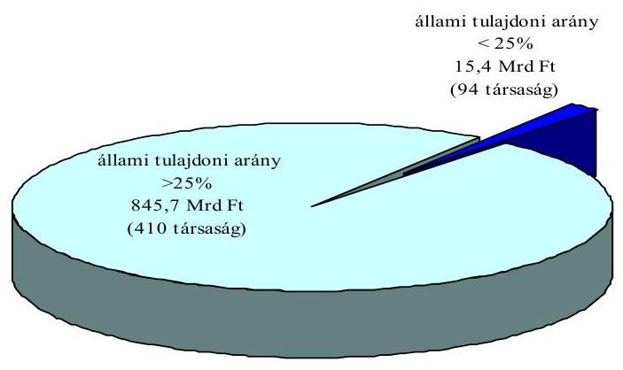

Ellenőrzésünk ${ }^{1}$ során feltártuk és értékeltük a tartósan veszteségesen gazdálkodó állami tulajdonban lévő szervezetek körét, a veszteségforrásokat, a tulajdo-

[^0]
[^0]:    ${ }^{1}$ Az ÁSZ korábban vizsgálta az állam tulajdonában lévő egyes gazdasági társaságok tevékenységét, ezek között szerepeltek tartósan veszteséges társaságok is.

---

nosi jogok gyakorlói intézkedéseinek hatékonyságát. A veszteség okainak feltárását kérdőíves módszerrel végeztük.

A jogszabályok nem definiálják a tartósan veszteséges társaság fogalmát. A számviteli törvény tartósnak tekint minden egy éven túl is jelentkező gazdálkodási eseményt. Ellenőrzésünknél a tartósan veszteségesen működő állami tulajdonú gazdasági társaságok körébe azokat a legalább jelentős ( $25 \%$ feletti) állami tulajdont is tartalmazó gazdasági társaságokat soroltuk, amelyeknek a vizsgált időszakban legalább két egymást követő vagy kettőnél több évben negatív üzemi és/vagy negatív adózás előtti eredménye volt.

Az állami tulajdont is tartalmazó 504 társaságból 410-ben az állami tulajdon aránya legalább jelentős. Vizsgálatunk arra a 97 társaságra terjedt ki, amelyek tartósan veszteségesek voltak, ebből 17 nemzetgazdasági szempontból jelentős társaságot helyszíni ellenőrzés keretében megkerestünk.

Az ellenőrzés célja annak értékelése volt, hogy:

- a tartósan veszteséges állami tulajdonú (résztulajdonú) gazdasági társaságok szabályozása, szervezeti és múködési rendszere biztosította-e a szakmai feladataik ellátását;
- melyek voltak a tartósan veszteséges gazdálkodás okai; stratégiai és üzleti terveik a veszteség megszüntetésére irányuló célkitűzések, illetve a megvalósításukat szolgáló intézkedések megfelelőek voltak-e; eredményesek voltak-e a tulajdonosi jogok gyakorlóinak a veszteségek minimalizálása érdekében hozott operatív irányító intézkedések; a veszteségek rendezésére fordított központi költségvetési támogatások felhasználása hatékony volt-e;
- a tartósan veszteséges állami tulajdonú (résztulajdonú) gazdasági társaságoknál hogyan hasznosultak az Állami Számvevőszék korábbi javaslatai és ajánlásai.

Az ellenőrzés a 2000-2005. évekre irányult, ahol szükséges volt, ott a korábbi időszak veszteséget befolyásoló okait is elemeztük és az ellenőrzés befejezéséig terjedő időszak információit is felhasználtuk megállapításainak, javaslatainak alátámasztására. Az ellenőrzés átfogó jellegű vizsgálat volt, amely a tartósan veszteséges társaságok múködésének, gazdálkodásának az ellenőrzési programban meghatározott területeire terjedt ki, de nem volt feladata a társaságok teljes körű átvilágítása.

A veszteségek rendezésére fordított központi költségvetési támogatások felhasználásának értékelését eredményességi szempontú teljesítmény-ellenőrzés módszerével végeztük, a kérdésekhez rendelt kritériumok teljesítésének elemzésével. Eredményes a központi költségvetési támogatások felhasználása, ha az ezek alapján kitűzött veszteségcsökkentést szolgáló célok megvalósultak, illetve az eredményesség további kritériuma volt, hogy a központi költségvetési támogatások felhasználása, az állami tulajdonú gazdasági társaságok múködése és vagyonkezelése biztosította-e az alapvető cél - az állami feladatellátás hatékony biztosítása, az állami vagyon állagának és értékének megőrzése, védelme, továbbá értékének növelése - teljesülését.

---

A jelentéshez csatolt mellékletek és függelék részletes megállapításokat és kiegészítő információkat tartalmaznak a társaságok együttes gazdálkodási adatairól, az állami tulajdon arányáról, a kérdőívekre adott válaszok összesítéséről és a helyszínen vizsgált társaságok tevékenységéről.

Az ellenőrzés jogszabályi alapját az Állami Számvevőszékről szóló 1989. évi XXXVIII. törvény 2. § (5)-(6), illetve a 21. § (3) bekezdéseiben, az állam tulajdonában lévő vállalkozói vagyon értékesítéséről szóló 1995. évi XXXIX. törvény (Priv. tv.) 25. § (1) bekezdésében, valamint az államháztartásról szóló 1992. évi XXXVIII. törvény (Áht.) 104. § (3) bekezdésében foglaltak képezték. Az ellenőrzés során az adótitoknak minősülő információk megismerését az adózás rendjéről szóló 2003. évi XCII. törvény 54. § (6) bekezdés d) pontja alapozta meg.

A jelentést egyeztettük a tulajdonosi felügyeletet ellátó miniszterekkel és a tulajdonosi szervezetek elnökeivel, a jelentéstervezetet a helyszínen vizsgált társaságok vezetőivel. Az észrevételeket és az arra adott válaszokat az 1. sz. melléklet tartalmazza.

---

# I. ÖSSZEGZŐ MEGÁLLAPÍTÁSOK, KÖVETKEZTETÉSEK, JAVASLATOK 

Az állami tulajdonú gazdasági társaságok múködési kereteit elsősorban a gazdasági társaságokról szóló törvény határozza meg. E törvény mellett cégjogi és más törvények is szabályozzák a tevékenységet. A társaságok általában „állami feladatot" látnak el, de az állami feladat meghatározás nem szerepel az alkotmányban és az erre épülő jogi szabályozásban. A Ptk. köztestületet szabályozó részében az indoklás említi, hogy a közfeladat általában olyan feladat, amelyet egyébként az államnak vagy a helyi önkormányzatnak kellene megvalósítania. Mindmáig nem került sor az állami tulajdon fogalmának és a hozzá kapcsolódó jogoknak, gyakorlása rendszerének egyértelmú meghatározására.

Az állami tulajdonú gazdasági társaságoknál nincs összehangolt tulajdonosi joggyakorlás, annak tartalma, mélysége, formai eszközei a számos állami tulajdonosi joggyakorló esetében más és más. Bár az Áht. 95/A. § (7)-(9) pontjai szabályozzák az állam nevében tulajdonosi jogokat gyakorló szervek döntési jogának terjedelmét és kereteit, az állami tulajdonban álló cégek alapítói, tulajdonosai ezt nem egyszer figyelmen kívül hagyják, kézi vezérléssel - nem a társaságok testületi szervei az igazgatóság és a felügyelő bizottságok útján - érvényesítik tulajdonosi irányítási és ellenőrzési funkciójukat, hanem határozatok, vezetőcserék révén. Esetenként vagyoni hátrányt is eredményező módon közvetlenül avatkoznak be a cégek életébe. Állami feladatellátást a Gt. hatálya alatt múködő társaságokkal végeztetnek el, azok konkrét meghatározása, megrendelése és ellenérték hozzárendelése nélkül, amelynek következtében az eredetileg költségvetési kiadás társasági veszteség formájában jelenik meg. A feladatmegoldásnak ez a módja azt a problémát is felveti, hogy a menedzsment hibájából eredő és az utasítás végrehajtásából következő veszteség összekeveredik, az okok szétválasztása nehéz, ami a felelősség felvetését is akadályozza. Mindez más oldalról túlzott szabadságot engedélyez a társaságoknak, ami veszélyeztetheti a közfeladat-ellátást. (Pl. a Magyar Posta diverzifikációja, Bábolna Rt. menedzsmentjének döntési szabadsága).

A vizsgált veszteséges állami tulajdonú társaságok részben költségvetési szervet váltanak ki és elsődlegesen állami feladatellátással foglalkoznak. Amellett, hogy társasági formájuk miatt a gazdasági társaságokra vonatkozó szabályozás betartása kötelező, az állami feladatellátás tekintetében csak „kvázi" társaságok, vagy - ellenkező oldalról meghatározva - „kvázi" költségvetési szervek. Az állami feladatellátás területén a társaságok direkt irányítása kikerülhetetlen, piaci szereplőként megjelenésük tekintetében viszont a társaságokat megillető szabadságot kell élvezzék, a szabályok betartása és a piachoz való rugalmas alkalmazkodás érdekében. Az állami cég, mint minden más cég, gazdasági tevékenységét a Gt. előírásainak megfelelően, üzletszerű, tartós ellenérték fejében, nyereségszerzésre irányulóan kell végezze. Ez egy olyan, az állami tulajdonú társaságoknál - néhány kivételtől eltekintve - megjelenő kettősség, amely a múködési forma (társaság, vagy költségvetési szerv) helyes megválasztásának súlyát, fontosságát támasztja alá.

---

Az állam a feladatvégrehajtás ellenértékének meghatározása helyett nem normatív alapon nyújtja a támogatásokat. Az ebből is adódó, pontosan meg nem határozható okokra visszavezethető veszteségeket, tőkevesztéseket ugyancsak a támogatások kompenzálják.

Az állami tulajdonú vagyon számbavétele nem zárt. ${ }^{2}$ A nyilvántartás sem naturáliában, sem összegben nem fedi a tényleges állapotokat, azt még a több nyilvántartás összesítésével sem lehet egzakt módon meghatározni. ${ }^{3}$

# A 25\% feletti állami tulajdonú társaságok (A társaságok száma és az állami tulajdoni hányad 2004-ben) 

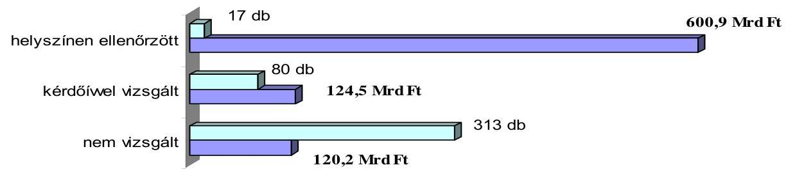

A vizsgált ${ }^{4} 97$ jelentős állami tulajdonú tartósan veszteséges társaságban az állami tulajdon könyv szerinti értéke 2000-ben 516 Mrd Ft, 2005-ben 503 Mrd Ft volt. Ez az érték a jegyzett tőkéből 96,37\%-os, illetve 99,86\%-os átlagos állami tulajdoni részarányt jelentett. A cégek saját tőkéjének részaránya az összes forráson belül (tőkeerőssége) 2004 végéig folyamatosan csökkent, annak ellenére, hogy a saját tőke könyv szerinti értéke 15,5\%-kal nőtt. Összes kötelezettségük 2001-ről 2005 végére 704 Mrd Ft-tal, ezen belül a hitelállományuk 327 Mrd Ftról 524 Mrd Ft-ra nőtt. A 197 Mrd Ft-os hitelnövekményből a beruházási és a rövid lejáratú hitelek növekménye meghatározó, 91 és 89 Mrd Ft-tal. A társaságoknál 2000-ben összesen 146589 fő, 2005-ben 120099 fő volt az átlagos statisztikai állományi létszám.

A társaságok 2000-2005-ben - hat év alatt - együttesen 6309 Mrd Ft árbevételt, 478 Mrd Ft üzemi szintű veszteséget és 290 Mrd Ft adózás előtti veszteséget értek el ${ }^{5}$ amellett, hogy - a bankok nélkül - 920,5 Mrd Ft támogatást és tőkejuttatást kaptak.

A cégek 52\%-ánál csak az üzemi (üzleti) tevékenységből keletkezett veszteség, $32 \%$-ánál az üzemi (üzleti) tevékenység mellett veszteséget termeltek a pénzügyi műveletek is.

[^0]
[^0]:    ${ }^{2}$ Jelentés a kincstári vagyon kezelésének és múködtetésének ellenőrzéséről. (2005)
    ${ }^{3}$ Jelentés a kincstári vagyon kezelésének és működtetésének ellenőrzéséről. (2005)
    ${ }^{4}$ A 97 társaság mérleg- és eredményadatainak összesítő értékelésénél a két bank (MFB, FHB) adatait - pénzügyi sajátosságai miatt - figyelmen kívül hagytuk.
    ${ }^{5}$ A kettő különbsége a pénzügyi műveletek eredményének és a rendkívüli eredménynek együttes eredményjavító hatását tükrözi.

---

# Üzemi veszteség 

(95 társaság, MFB, FHB bankok nélkül)
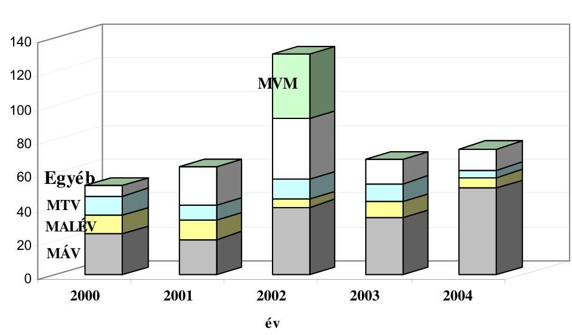

A társaságok közül 52-nek (54,7\%) volt a vizsgált időszakban legalább két egymást követő, vagy kettőnél több évben negatív az adózás előtti eredménye. A teljes vizsgálati körben leírt változások gyakorlatilag ennél a körnél következtek be, pl. a hitelállomány 197 Mrd Ft-os növekményéből 191 Mrd Ft itt keletkezett. A hiteleken belül meghatározó volt a beruházási és a rövid lejáratú hitelek növekedése.

Az állami vagy részben állami tulajdonban lévő társaságok veszteségessége részben külső okokra volt visszavezethető. Az azonos (pl. Volánok), vagy közel azonos (pl. mezőgazdasági társaságok) tevékenységet folytatók eredményessége, a társaságok gazdálkodási adataiban, illetve jogszabályi, szabályozási és piaci körülményeiben és az azt befolyásoló tényezők megléte, illetve gazdálkodásban megjelenő súlya tekintetében hasonló.

Az ellenőrzött társaságok 20\%-a, a helyszínen vizsgáltak mintegy fele nem piacra termelő, illetve szolgáltató gazdasági társaság. Állami feladatot látnak el, vagy a Kormány által meghatározott gazdaságpolitika végrehajtásával foglalkoznak. Nem felelnek meg a gazdasági társaság fogalmának sem, mert csak a formai kritériumokat teljesítik, kvázi gazdasági társaságok, veszteségeik elsődlegesen szabályozási (törvény és egyéb jogszabály), bevételeik elégtelensége, likviditási problémáik, kötelezettségeik állománya nagyobbrészt költségvetési okokra vezethető vissza, illetve a költségvetés mindenkori állapotának függvénye. Valódi gazdasági tevékenységet nem folytató társaságok közé tartozik, pl. a mezőgazdasági szövetkezeti üzletrészek felvásárlása érdekében létrehozott SZÖVÜR, amelynek alapítása óta nem volt alaptevékenységgel kapcsolatos bevétele. Az államot tulajdonosi szerepkörében jelenítik meg az állami vagyont kezelő és ingatlanhasznosító tevékenységgel foglalkozó társaságok.

---

Külön kategóriát jelentenek azok az állami tulajdonú társaságok, amelyeknél a társasági forma - több körülményt és szempontot is figyelembe véve - indokolt, mégis rendszeres állami támogatásban részesülnek, részben a rájuk vonatkozó szabályozás hiányosságai, részben közszolgálati tevékenységük és bevételeik elégtelen volta miatt. Ezek jellemzően a kulturális szolgáltatók, médiaszereplők, amelyek irányítása nem a Kormány, hanem közalapítványok hatáskörébe tartozik. Az MTI Rt. a média speciális szereplője. Közszolgálati feladatának jogszabályi meghatározása pontatlan. A közösségi szolgáltatások szükséges mértékű támogatásának meghatározása és az igénylési mechanizmusra vonatkozó szabályozás megoldatlan, pl. az MTV Rt.-nél.

A társaságok különböző csoportjai között lényeges különbség, hogy a szabályozás rájuk szabottan okozza-e a veszteségeket (pl. SZÖVÜR, MFB Rt., NA Rt., Vértesi Rt.), vagy csak szektorsemleges módon korlátok közé szorítja a tevékenységet. (MÁV, Volánok stb.)

Többszörösen jelentkező probléma, hogy társaságainak ellátandó feladatot határoz meg az állam jogszabályban, de azok ellenértékét csak részlegesen biztosítja, pl. a MÁV Rt. A hatósági ármegállapítások során jelentős veszteségeket okozó diszkriminációk érték az MVM Rt.-t, ill. leányvállalatait, míg a privatizált tulajdonban lévő piaci szereplők jelentős profitot realizáltak. A természetvédelmi és kompenzációs jogszabályok kidolgozatlansága, illetve hiánya az agrártársaságokat sújtja leginkább.

Az állami tulajdonú termelő és szolgáltató társaságoknál jellemző, hogy gazdasági helyzetük a számukra kedvezőtlen piaci helyzet miatt romlott. A nemzetgazdasági szerkezet átalakulása a termelő és szolgáltató szféra alkalmazkodását követelte meg, korábban nyereséges tevékenységek váltak veszteségessé. A közlekedési cégeknél a piaci körülmények romlása közül legjelentősebb az utasszám csökkenése volt. A versenyhelyzet erősödése az állami tulajdonú árufuvarozókra (MÁV, MAHART) kedvezőtlenül hatott. A mezőgazdasági ágazatban a baromfi piac túltermelésével magyarázható részben a Bábolna csoporthoz tartozó társaságok vesztesége. Az EU csatlakozást követő teljes piaci liberalizáció után előállt növekvő tőkeigény miatt 2004. év a baromfiipar egyik legveszteségesebb éve volt.

A veszteséges gazdálkodás kialakulása jelentős részben belső okokra vezethető vissza. A társaságok mintegy 20\%-ánál a veszteségek belső okai között a vagyonkezelési stratégia hiánya, illetve utólag hibásnak bizonyult tulajdonosi vagy menedzsmentdöntések húzódnak meg. A társaságok egyharmadánál a műszaki-technológiai színvonal korszerűtlensége miatt következett be hatékonyságromlás. A pénzügyi forrásaik szűkössége a társaságok negyedénél korlátozta költségcsökkentő, vagy létszámkiváltó beruházások megvalósítását. A menedzsmentváltás és a szervezetátalakítás az eredményesség csökkenésében a társaságok tizedénél játszott szerepet. A foglalkoztatottak létszáma és szakmai összetételének problémái, valamint a befektetésekben lévő vagyonvesztés is oka volt a veszteségek kialakulásának.

Az eredményesebb gazdálkodás megvalósítását akadályozta, hogy bár a társaságok tevékenységével kapcsolatos tulajdonosi döntéseket az állam esetenként meghozta, kormányhatározatokban rögzítette, de a végrehajtásuk vagy elma-

---

radt, vagy késedelmet szenvedett. A vizsgált időszakban a tartósan veszteséges társaságokra elsősorban a hatékony vagyonkezelői stratégia hiánya volt jellemző, pedig ennek kidolgozása a vagyonkezelői szerződések és jogszabályok alapján a társaságoknak kötelezettségük. A vagyonkezelők a veszteséges körben nem érték el a kezelt vagyon értékének megtartását, növelését, amely még a nem piaci tevékenységet, hanem közfeladat ellátást - elsődlegesen nem a tulajdonos részére profit (osztalék) biztosítását célzó tevékenységet végző - társaságok esetében is alapvető feltétel. Ennek a helyzetnek a kialakulásában azonban nem csak a társaságokat terheli a felelősség.

A hibás tulajdonosi döntések közé tartozik a társaság vezetőjének, vagy vezetőségének sikertelen kiválasztása is, amely esetenként meghatározó mértékben járult hozzá az eredményesség csökkenéséhez. A tulajdonosi szándék szerint a gazdálkodás hatékonyságának és racionalizálásának érdekében a társaságok mintegy 5\%-ánál igen gyakori vezetőváltásra, vagy szerkezeti átalakításra került sor (pl. a MALÉV Rt.-nél).

A társaságok negyedénél a veszteség kialakulásában jelentős szerepet játszott, hogy a jelenlegi vagy korábbi menedzsment a fejlesztés irányát, vagy a stratégiát érintő kérdésekben hibás döntést hozott, vagy olyan szerződést kötött, amely akkor, vagy később a társaság gazdasági érdekeivel ellentétesnek bizonyult.

Vannak olyan esetek, ahol az állam (a Kormány) szabályozási tevékenysége, az állam tulajdonosi szerepe és a társaság menedzsmentjének belső okot jelentő tevékenysége együttesen és egymástól el nem választható módon okozták a nehéz helyzetet. Pl. a Bábolna Rt., menedzsment és a tulajdonosi döntésekből származó károknál a döntések egymásra épülnek és a negatív hatást erősítik. A veszteségeket következetlen kormányzati intézkedések, az ÁPV Rt.-nek, mint a tulajdonosi jogok gyakorlójának sorozatos átgondolatlan intézkedései, valamint a menedzsment, amelynek az alapító okirat tág mozgásteret biztosított, együttesen okozták. A Bábolna Rt.-vel szemben elengedett tulajdonosi követelés miatt 17,9 Mrd Ft, a Bábolna Élelmiszeripari Kft. 2004. évi 4 hónapos múködése alatt 3,1 Mrd Ft, valamint a Bábolna Tetra Kft. értékesítése során 2,8 Mrd Ft veszteség keletkezett.

Különösen nagy mértékű vagyoni hátrány keletkezett a Váltó-4 Libra Rt.-nél, ahol a társaság jegyzett tőkéje az 1997. évi 12,55 Mrd Ft-ról 2004. évre 50 M Ftra csökkent. A társaság gazdálkodása során az elmúlt nyolc évben összesen 9,1 Mrd Ft mérleg szerinti veszteséget halmozott fel. Az ÁSZ az ügyben azért nem kezdeményezett büntetőeljárást, mert a 2002-ben elvégzett átvilágítás eredményeképpen a társaság feljelentést tett szinte a teljes korábbi múködését érintően. A helyszíni vizsgálat lezárását követően a BRFK Gazdaságvédelmi Osztálya a Btk. 319. § (1) bekezdésbe ütköző hűtlen kezelés bűntette és más bűncselekmények gyanúja miatt folytatott nyomozást - mivel a cselekmény nem bűncselekmény - megszüntette.

Előfordul, hogy a társaságok az államot a két, egymástól elválasztandó hatósági és tulajdonosi szerepében összetévesztik, ami abban mutatkozott meg, hogy a helytelen tulajdonosi döntéseket részben szabályozási hibaként értékelték.

---

Az optimális létszám kialakításával számolt a tervében a társaságok több mint fele, de a megvalósítást a létszámleépítéssel együtt járó többletköltség (illetve az azt lehetővé tévő beruházás) finanszírozásához szükséges pénzforrások elégtelensége akadályozta.

A 97 ellenőrzött társaság a 2000-2004. évi időszakban 1116 Mrd Ft tőke- és egyéb támogatást kapott. A támogatások formája tőke- vagy eredménytartalék növelése, múködési, beruházási, létszámleépítési, környezetvédelmi és egyéb egyedi - pl. fejlesztési, rekonstrukciós, szakképzési - támogatás volt. A támogatások meghatározó részét, 977 Mrd Ft-ot, a helyszínen ellenőrzött társasági körben 15 társaság kapta.

Tökeemelés, támogatás 1 185,5 Mrd Ft
2000-2005
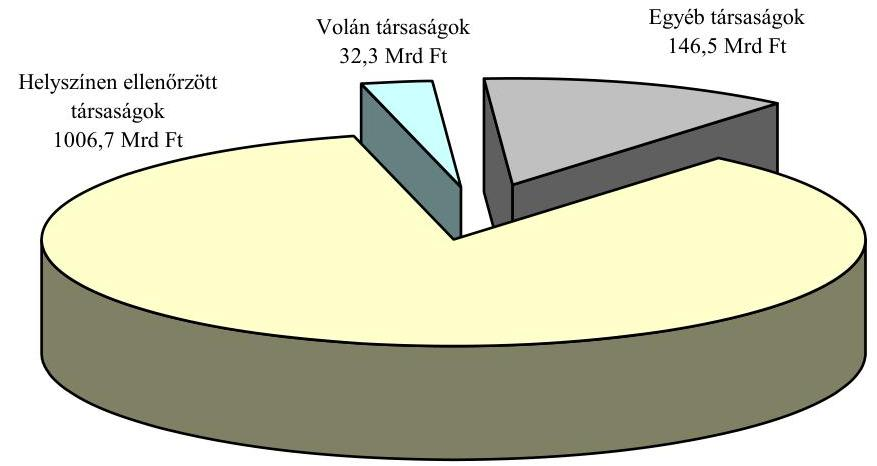

A társaságok részére biztosított támogatásokra jellemző, hogy azok mértéke alacsonyabb volt az igényelt összegeknél. Ennek alapvetően két oka volt, egyrészt nincs normatív rendszere a közfeladatellátás finanszírozásának (kivétel: árkiegészítések), másrészt a költségvetés teherbíró képessége határt szab az igények kielégítésének. A támogatások célját az esetek többségében az érvényben lévő jogszabályok, költségvetési előirányzatok, a MÁV Rt. és az NA Rt. esetében a nemzeti fejlesztési terv céljainak figyelembevételével is kormányhatározatok rögzítették. Kormányhatározatok rendelkeztek az ágazati vagy a tulajdonosi stratégiák alapján eldöntött támogatásokról is. A Malév Rt., a Nemzeti Lóverseny Kft. esetében a kormányzati szándékok ellenére ágazati, illetve nemzeti színtű stratégiai koncepciók elfogadására a vizsgált időszakban nem került sor. Csak részben tekinthetők indokoltnak a Malév Rt., az MTI Rt., és a SZÖVÜR Kft. támogatására biztosított összegek. A támogatás igényét dokumentálták. Az MTV Rt., a Rendezvénycsarnok Rt. esetében az igények csak részben tekinthetők dokumentáltnak és megalapozottnak. A támogatások felhasználásával megvalósult célokat és a társaságok múködésének eredményességét együttesen tekintve 4 társaságnál - NA Rt., Nemzeti Színház Rt., SZÖVÜR Kft., Hungaroring Sport Rt. - minősíthető eredményesnek a támogatások felhasználása. Ered-

---

ménytelenek voltak a Malév Rt. és a Nemzeti Lóverseny Kft. részére nyújtott támogatások. A Nemzeti Lóverseny Kft. megfelelő működtetését a fennállása óta folyamatosan biztosított és várhatóan meg nem térülő tulajdonosi támogatás mellett 10 éve nem sikerült rendeznie a tulajdonosoknak. 8 társaságnál részben volt eredményes a támogatás felhasználása.

A vizsgált időszakban a társaságok fele rendelkezett stratégiai tervvel, koncepcióval, illetve reorganizációs vagy megújítási programmal. A stratégia ilyen mértékű alkalmazása kedvező. Az állami közfeladatot ellátók stratégiai elveit és koncepcióit kormányhatározatok - esetenként többszöri módosítással - rögzítették. Ebbe a körbe tartozott a Nemzeti Autópálya Rt., a MÁV Rt., a Bábolna Mezőgazdasági Termelő, Fejlesztő és Kereskedelmi Rt, az MFB Rt., amelynek stratégiáját külön törvény is meghatározta. Jellemző társasági viselkedés, hogy a kormányhatározatokban rögzített feladatokat nem foglalták társasági stratégiai tervbe, így kifejezett tulajdonosi jóváhagyásra sem került sor. Kivétel volt a Bábolna Rt. és a MÁV Rt. amelyek stratégiába foglalták a reorganizáció végrehajtását. A Bábolna Rt. esetében a stratégia alapjául vett 2004. és 2005. évi kormányhatározatok ellentétes privatizációs elveket határoztak meg. A Vértesi Erőmű Rt. esetében a támogatásról szóló kormányhatározat meghozatalának elhúzódása zárta ki a stratégia elfogadását.

Az eredményes stratégiai tervezésre jó példa a Magyar Posta Rt., amelynek 2002-ben elfogadott - számszerúsített és jól ellenőrizhető - középtávú stratégiája a korábbi veszteséges gazdálkodást megállította, a társaság pénzügyi helyzetét stabilizálta, és 2003-ban már pozitív, a következő években fokozatosan növekvő eredményt ért el.

A társaságok önálló vagy a stratégiához kapcsolt és a veszteségforrások megszüntetésére irányuló intézkedési tervei sem voltak sikeresebbek a stratégiájuknál. A költségcsökkentő és takarékossági intézkedések relatív költségkímélő eredményt hoztak, átfogó felülvizsgálatuk után részintézkedések születtek.

A vizsgált társaságok általában szervezeti egységként vagy egy személlyel múködtetik a belső ellenőrzést. A felelős vállalatirányítás rendszerébe épített belső ellenőrzés általában a tőzsdei társaságok szabályozott követelményei szerint működik, az általa vizsgált társasági gazdálkodásnak és szervezetnek teljes vertikumát átfogja.

Az ÁSZ jelentésekben tett javaslatok hasznosulása egyetlen társaság esetében sem teljes körű. Az Országgyűlésnek, a Kormánynak, a szakminiszternek tett javaslatok részben teljesültek, amelynek oka, hogy a jogszabályok módosítása, új jogszabályok alkotása, a költségvetési források elosztása nem egyszemélyes döntések, ezért hosszabb időt igényelnek, vagy hiányzik az érintettek egyetértése a döntéshez. A társaságok tulajdonosának, felügyelő bizottságának, menedzsmentjének szóló javaslatokra általában rövid időn belül születtek intézkedési tervek, intézkedések, amelyeket a számvevőszék el is fogadott. Azonban a tulajdonos, az FB, a menedzsment intézkedései sem minden esetben eredményezték a problémák teljes megszűnését.

---

A helyszíni ellenőrzés megállapításainak hasznosítása mellett javasoljuk:

# a Kormánynak 

1. készítse elő az állami vagyon kezelésére vonatkozó egységes vagyontörvény tervezetét; ${ }^{6}$
2. határozza meg az állami vagyon egyes vagyoncsoportjainak (tulajdoni részesedések, ingatlanok, földterületek, vagyonértékű jogok, stb.) sajátosságaihoz igazodóan az állami vagyongazdálkodásra vonatkozó irányelveket;
3. vizsgálja felül az állami tulajdoni hányaddal rendelkező - az alapvetően állami feladatot ellátó - tartósan veszteséges társaságok müködési formáját (társaság vagy költségvetési szerv) és az eredménytől függően alakítsa át azokat;
4. szabályozza egységesen és tegye átláthatóvá az állami társaságoknál a tulajdonosi beavatkozás módját és eszközeit.

## a pénzügyminiszternek

1. intézkedjen az ÁPV Rt. Igazgatóságán keresztül annak érdekében, hogy a társaság hozzárendelt vagyonában lévő tartósan veszteséges társaságoknál - a gazdálkodási, tőkehatékonysági és pénzügyi mutatók alakulásának folyamatos elemzése, értékelése alapján - a veszteségforrásokat felszámolják;
2. biztosítsa az állami tulajdonú gazdasági társaságok költségvetési támogatásának megtervezésénél és az éves költségvetési törvényjavaslatban szerepeltetésénél az állami feladatellátás és a támogatások mértékének összhangját, a kiszámíthatóbb, tervezhetőbb és ellenőrizhetőbb gazdálkodási viszonyok megteremtése érdekében;
3. tisztázza, hogy a Bábolna Rt.-nél az ellenőrzés által feltárt 17,9 Mrd Ft vagyonvesztésért, a Bábolna Élelmiszeripari Kft. 2004. évi 4 hónapos müködése alatt felhalmozott 3,1 Mrd Ft-os veszteség kialakulásáért, valamint a Bábolna Tetra Kft. értékesítése során keletkezett 2,8 Mrd Ft veszteségért kit, milyen mértékben terhel felelősség, és ennek függvényében tegye meg a szükséges intézkedéseket.
[^0]
[^0]:    ${ }^{6}$ A javaslatot a kincstári vagyon kezelésének és müködtetésének ellenőrzéséről szóló 2005. évi ÁSZ jelentés tartalmazta, amelyet a gazdasági társaságok vonatkozásában ezen jelentés is alátámaszt.

---

# II. RÉSZLETES MEGÁLLAPÍTÁSOK 

## 1. AZ ÁLlami VAGYON MŰKÖDTETÉSÉNEK SZABÁLYOZÁSA, A LÉTREHOZOTT TULAJDONOSI, VAGYONKEZELŐI STRUKTÚRA

### 1.1. A gazdasági társaságokban meglévő állami vagyon nyilvántartása, a gazdálkodás szabályozása

Az állami tulajdonú társaságok felett a két fő vagyonkezelő szervezet, a költségvetési szerv KVI és a 100\%-ban állami tulajdonú ÁPV Rt. gyakorolja az állam tulajdonosi jogait. Ezen kívül még - az állam társasági részesedésekben meglévő vagyona tekintetében - miniszterek gyakorolnak tulajdonosi jogokat. Ez utóbbi tulajdonosi jogok azoknak a társaságoknak tekintetében, amelyekben tartós állami tulajdoni hányad megtartását írja elő a törvény - az ÁPV Rt. hozzárendelt vagyonában szereplő társaságokkal együtt - a Priv. tv. mellékletében kerültek felsorolásra.

A két nagy vagyonkezelőhöz és a miniszterekhez rendelt tulajdonosi joggyakorlás tekintetében a vagyonelemek közvetlen állami tulajdonban állnak.

A költségvetési szervek könyvvezetési és beszámolási kötelezettségével foglalkozó 249/2000. (XII. 24.) Korm. rendelet előírja a (vagyon)kezelésben álló társasági részesedés nyilvántartását. Így a 19. § (3) pontosan rögzíti az alapított társaságok és részesedések helyét. Ennek ellenére előfordulnak esetek, amelyek az bizonyítják, hogy költségvetési szervek - közöttük minisztériumok - részesedéseket a mérlegükben nem jelenítenek meg, sértve ezzel a mérlegvalódiság elvét. ${ }^{7}$ Ezek között a hiányok között a Priv. tv. mellékletében felsorolt, tartós állami tulajdoni hányaddal rendelkező és tartósnak nem minősített állami tulajdonú társasági részesedések is szerepeltek.

A vagyonnal - így az állami tulajdonú társasági részesedésekkel is - kapcsolatos, a költségvetési szerveket terhelő nyilvántartási kötelezettséget az Áht. 109/G. (1) bek. előírásai tartalmazzák.

A társaságokban meglévő vagyon hatékony többszintű ellenőrzésének lehetőségét a jogszabályok megteremtik. Így a társasági vagyon nyilvántartásának hiányosságai (az előzőekben hivatkozott ÁSZ jelentésekben kimutatott szabálytalanságok, anomáliák) a jogszabályok be nem tartásából, illetve nem megfelelő értelmezéséből fakadnak.

A vizsgálatunkhoz tartozó állami tulajdonú társaságokat (részesedéseket) tartalmazó kimutatásokat az állami tulajdonosi joggyakorlók, vagyonkezelők és az APEH által adott adatokon alapulnak. A különböző helyen található nyilvántartások, ill. adatbázisok nem egyforma rendszerben készültek és így különböző szempontok szerint összeállított adattartalmaik egymással nehezen

[^0]
[^0]:    ${ }^{7}$ Jelentés a kincstári vagyon kezelésének és múködtetésének ellenőrzéséről és jelentés államháztartáson kívüli állami feladatellátás rendszerének vizsgálatáról. (2005)

---

összevethetők, illetve összegezhetők. Az adatbázisok - illetve a nyilvántartásokra fordított költségvetési pénzeszközök - hatékonyabb felhasználását eredményezné egységes, komplementer rendszerbe foglalásuk.

Az állami tulajdon nyilvántartása sem naturáliában, sem összegben nem fedi a tényleges állapotokat, azt még a több nyilvántartás összesítésével sem lehet egzakt módon meghatározni. ${ }^{8}$ A kincstári vagyon KVI-nél kimutatott összegében a költségvetési szervek mérlegszerkezetének megfelelően szerepelnek a különféle „vagyonelemek", így a befektetések, a társasági részesedések is. A társaságok nyilvántartása a jegyzett tőke és a saját tőke értékén történik.

Az ÁPV Rt. társaságait a tulajdoni hányadra eső saját tőke értékén tartja nyilván. Vannak olyan részesedések, amelyeket az ÁPV Rt. vásárolt, ezek a 2000. január 1-jétől a vételkor érvényes piaci vételáron - és nem a saját tőke értékén - szerepelnek. Azonban a saját tőkeértéken történő nyilvántartás is különböző tartalmakat takar. Az átalakuláskor könyv szerinti értéken átalakulók ma is ezen szerepelnek a nyilvántartásban. A vagyonértékeléssel érintettek mérleg szerinti saját tőkéje, és így nyilvántartási értéke jobban közelíti a reális értéket. Így az összesítés, tekintettel arra, hogy inhomogén tartalmat takar, értékben nem mutat reális összeget.

A hozzárendelt vagyonban szereplő társaságok jelentős része (a pontos kört az ÁPV Rt. nyilvántartásából nem lehet megállapítani) nulla értéken tartja nyilván a telkeket és földterületeket. Ez azokra a társaságokra jellemző, amelyeknél a 62/1988. (XII. 24.) PM rendelet 1. mell. II./A alfejezet 5.a) pontja alapján az ingatlanok 1968 előtt érték nélkül kerültek a társaságok (jogelődök) könyveibe. Ezeknél a társaságoknál az is előfordul, hogy későbbi, értéken történt átalakulásukkor sem történt meg az ingatlanok értékelése, azaz továbbra is nulla értékkel szerepelnek (szerepeltek) a könyvekben. (Pl. MAHART, Tokaj Rt. stb.). Más társaságoknál a piaci értékelés megtörtént, ezek értékelési különbözettel nyilvántartják a valós értéket, az ÁPV Rt. rendszerében a nyilvántartási - saját tőke - értéket emelve. ${ }^{9}$

Az ÁPV Rt. kimutatásait - az előzőek okán - saját üzleti érdekeinek megfelelően befolyásolni tudja, annak irányításával, hogy egy-egy társaság értékelését mikor végezteti el. Az elvégzett vagyonértékelések lehetővé teszik az értékkülönbözetek megjelenítését a társaságok mérlegeiben és ezt követően a hozzárendelt vagyon - saját tőke tulajdoni hányadra eső értékének megjelenítését tartalmazó - nyilvántartásában. Emiatt problémákat vet fel a privatizációkat követő mindenkori maradék vagyonérték megállapítása, mert ha néhány társaságot vagyonértékelővel felértékeltettek és ezeket az új értékeket egyik évről a másikra beépítik a nyilvántartásba, akkor a vagyon látszólag sokkal kevésbé fogy, mint a valóságban. Ez a módszer elkendőzi a folyamatokat, a folyamatos értékelés helyett az egy időpontban elvégzett értékelések felelnének meg - a továbbiakban - az átlátható vagyongazdálkodás követelményének. ${ }^{10}$

[^0]
[^0]:    ${ }^{8}$ Jelentés a kincstári vagyon kezelésének és működtetésének ellenőrzéséről. (2005)
    ${ }^{9}$ Forrás: ÁPV Rt. 2004. évi és a 2005. I. félévi beszámolója.
    ${ }^{10}$ Bár az ÁSZ - többek között a fenti okok alapján is - többször kifogásolta a vagyonkezelő társaság nyilvántartási rendszerét, abban érdemi változás nem született.

---

Tekintettel arra, hogy a privatizációkat követően a hozzárendelt vagyon nyilvántartásából a kivezetések a hosszú lejáratú kötelezettségekkel szemben történnek és nem egy aktuális értékkel bíró eszközértékkel szemben, annak megállapítása is rendkívüli nehézségbe ütközik, hogy egy-egy évértékesítési tevékenysége mennyiben volt eredményes. Az ÁPV Rt. (RJGY által jóváhagyott) - előzőekben részletezett - sajátos beszámolási rendszeréből adódóan a részesedések értékesítésének eredményessége az eredménykimutatásban nem jelenik meg, így az ÁPV Rt. beszámolóihoz (5. sz. melléklet) készít egy külön kimutatást a tárgyévben értékesített részesedésekről, amely tartalmazza az értékesített részesedés nyilvántartási értékét, a szerződés szerinti árat és az e kettő viszonylatát bemutató saját tőke arányában kimutatott eladási árfolyamot, melyből a tárgyévi értékesítések eredményessége a nyilvántartási értékhez viszonyítva megállapítható. Ebből azonban még nem mutatható ki, hogy a tárgyévi privatizáció ténylegesen eredményes volt-e, az előzőekben részletezett, a nyilvántartásban megjelenő saját tőke vegyes értékszintje miatt.

# 1.2. Az állami tulajdonban (résztulajdonban) lévő gazdasági társaságok állami feladatellátása 

Az állami feladat meghatározás nem szerepel az Alkotmányban és az erre épülő jogi szabályozásban. A Ptk. köztestületet szabályozó részében az indoklás említi, hogy a közfeladat általában olyan feladat, amelyet egyébként az államnak vagy a helyi önkormányzatnak kellene megvalósítania. Az állami feladat kifejezés használata is következetlen, mivel közfeladatot nem csak állami szerv, hanem pl. helyi önkormányzat, köztestület, vagy civil, non-profit szervezet is elláthat.

Mindmáig nem került sor a tulajdon fogalma és a hozzá kapcsolódó jogok és gyakorlása rendszerének egyértelmú meghatározására. ${ }^{11}$

A tulajdonlás lényegében a vállalatirányítás testületi rendje és uralma, ezért nem a tulajdon természete, fajtája, szerkezete vagy eredete a meghatározó, hanem a vele való nyereségérdekelt vállalkozás folyamatossága és eredményessége, melyért nem a társaság tagjai, hanem a menedzsment felel. Ennek minden következményét, jelentőségét csak a 2006. VII. 1-jével hatályba lépő új társasági törvény (2006. évi IV. tv.) tartalmazza, a vele harmonizált cégjoggal, csődjoggal és számviteli szabályozással.

A társaságok igazgatósága a jelenleg hatályos Gt. 29. § (1) bekezdése értelmében a társaság szervezeti érdekeinek elsődlegessége alapján köteles tevékenységét végezni, nem a tulajdonos, az alapító, vagy a maga érdekében. Jogellenes és vétkes károkozás esetén a Ptk. 339. § (1) bekezdése szerinti kártérítési felelősséggel tartozik a társasággal szemben. Az új szabályozás ugyanakkor kiemeli a nyilvánosság elvének következetesebb és szigorúbb alkalmazásának követelményét az állami tulajdonú társaságokra, egyben fenntartja és egyértelmúben szabályozza a szavazatelsőbbségi részvényhez fúződő jogok gyakorlásának módját az állam érdekében. Az új Gt. hatályba lépésével szűkülnek a me-

[^0]
[^0]:    ${ }^{11}$ Lásd: Magyar Közlöny 2002./15/II. sz. a Ptk. új koncepciójáról.

---

nedzsment lehetőségei a továbbtársulás és a szervezet manipulálására, a vállalat felső vezetésének díjazásának kontrollja nő.

Az állami tulajdonú gazdasági társaságoknál nincs összehangolt tulajdonosi joggyakorlás. Bár az Áht. 95/A. § (7)-(9) pontjai szabályozzák az állam nevében tulajdonosi jogokat gyakorló szervek döntési jogának terjedelmét és kereteit, ennek gyakorlati kibontása, megfelelő részletezése hiányzik. Ez különösen az egyszemélyes állami tulajdonú társaságok esetében igényel figyelmet.

A vizsgált veszteséges állami tulajdonú társaságok részben költségvetési szervet váltanak ki és elsődlegesen állami feladatellátással foglalkoznak. Amellett, hogy társasági formájuk miatt a gazdasági társaságokra vonatkozó szabályozás betartása kötelező, az állami feladatellátás tekintetében csak „kvázi" társaságok, vagy - ellenkező oldalról meghatározva - „kvázi" költségvetési szervek. Az állami feladatellátás területén a társaságok direkt irányítása kikerülhetetlen, piaci szereplőként megjelenésük tekintetében viszont a társaságokat megillető szabadságot kell élvezzék a szabályok betartása és a piachoz való rugalmas alkalmazkodás érdekében. Az állami cég, mint minden más cég, gazdasági tevékenységét a Gt. előírásainak megfelelően, üzletszerű, tartós ellenérték fejében, nyereségszerzésre irányulóan kell végezze. Ez is egy olyan, az állami tulajdonú társaságoknál néhány kivételtől eltekintve megjelenő kettősség, probléma, amely a javaslatok között megfogalmazott múködési forma (társaság, vagy költségvetési szerv) helyes megválasztásának súlyát, fontosságát támasztja alá.

Az Áht. előírásait az állami tulajdonban álló cégek alapítói, tulajdonosai nem egyszer figyelmen kívül hagyják, kézi vezérléssel - nem a társaságok testületi szervei az igazgatóság és a felügyelő bizottságok útján - érvényesítik tulajdonosi irányítási és ellenőrzési funkciójukat, hanem határozatok, vezetőcserék révén. Esetenként vagyoni hátrányt is eredményező módon közvetlenül avatkoznak be a cégek életébe.

Az Áht. 95/A. §-ának (7) bekezdése alapján egyszemélyes társaságnál a vezető tisztségviselőt az alapító képviseletében eljáró személy utasíthatja, hatáskörét elvonhatja, ezáltal a vezető tisztségviselő mentesül a Gt.-ben szabályozott felelősségtől. Fentieket a MÁV Alapító Okiratán átvezették. A MÁV 2004. december 31én 95 vállalatból álló vállalatcsoport volt, amelynek múködéséhez szükséges döntések mennyisége meghaladja egy tulajdonosi képviselőnek a kapacitását akkor, ha stratégiai döntéseken felül operatív döntések is terhelik. Ilyen nagyságrendú vállalatcsoport ebben a formában hatékonyan nem múködtethető.

A belső szabályozásnak és az ennek megfelelő intézkedéseknek a hátrányos üzletpolitika megelőzésére kell a hangsúlyt helyeznie, amely veszteséget okoz, és csődhöz vezethet. Amennyiben az állami cég tartósan hátrányos üzletpolitikát folytat és ebben a tulajdonos is részes, a cég hitelezői (üzleti partnerei, károsultjai) felé - egyetemlegesen a céggel együtt - anyagi felelősséggel tartozik. Ezt a kötelezettségét az új Gt. kiemeli.

A függetlenített belső ellenőrzés alkalmazását a Gt. nem írja elő, a vállalat felső vezetése illetőleg felügyelő bizottsága igény szerint alkalmazhatja, illetve veheti igénybe. Általában a belső ellenőrzés lehetőségeit meghaladó, a vállala-

---

ti múködés valódi helyzetének feltárására, valamint a felelősségi rendszer tényleges állapotára alkalmas tények, adatok kinyerésére fejlettebb módszereket magában foglaló ún. integrált vállalatirányítási rendszereket alkalmaznak (Enterprise Resource Planning, rövidítve ERP). Ennek segítségével a társaság valamennyi részlege, egysége naprakész adatok alapján kizárólagosan a menedzsment hozzáférésének biztosításával ellenőrizhető. A társaságok gyakorlata a vállalatirányítást illetően megelőzte a törvényhozást.

# 2. A legalább jelentőS befolyással RENDELKEZŐ ÁLlami tulaJdONBAN LÉVŐ GAZDASÁGI TÁRSASÁGOK VESZTESÉGFORRÁSAI 

A 97 tartósan veszteséges társaság és tulajdonosi joggyakorló közül 84\%, ill. $73 \%$ jelezte, hogy a veszteségek okainak feltárásával foglalkozott.

### 2.1. A gazdálkodás főbb mutatószámainak alakulása

### 2.1.1. Az üzemi (üzleti), illetve az adózás előtti eredmény alapján tartósan veszteséges társaságok

Az állam többségi vagy jelentős részesedésével múködő 305 gazdasági társasága közül 97-nek a vizsgált időszakban legalább két egymást követő vagy kettőnél több évben negatív volt az üzemi (üzleti) tevékenységének eredménye vagy az adózás előtti eredménye.

A 97 társaság mérleg- és eredményadatainak összesítő értékelésénél két bank adatait - sajátosságai miatt - figyelmen kívül hagytuk. A fennmaradó 95 társaság (továbbiakban: társaságok) főbb pénzügyi-gazdasági mutatószámaik alapján - a mérlegfőösszeg, az átlagos statisztikai állományi létszám szerint - a legnagyobb társaság a MÁV Rt., amely 2000 végén a társaságok együttes mér-leg-főösszegének $43 \%$-át, átlagos statisztikai állományi létszámának $38 \%$-át a MÁV kötötte le, ugyanezen mutatók 2005 végén $31 \%$ és $37,5 \%$ voltak. A gazdálkodás üzemi (üzleti), illetve adózás előtti eredményét tekintve is kiemelkedik a csoportból a MÁV: a társaságok 2000-2005-ben - 6 év alatt - termelt 479 Mrd Ft összegű üzemi veszteségének $51 \%$-a, 290 Mrd Ft adózás előtti veszteségének $69 \%$-a a MÁV-nál keletkezett.

A 95 társaságban az állami tulajdon könyv szerinti értéke 2000-ben 516 Mrd Ft 2005-ben 503 Mrd Ft volt ${ }^{12}$. Ez az érték a jegyzett tőkéből 96,37\%-os, illetve 99,86\%-os átlagos állami tulajdoni részarányt jelentett.

2000-től 2004 végéig a társaságok mérlegeinek együttes főösszege folyamatos növekedéssel 77\%-kal - 1495 Mrd Ft-ról 2644 Mrd Ft-ra - nőtt. 2005-ben viszont az előző évhez képest 3\%-kal, 2565 Mrd Ft-ra csökkent. ${ }^{13}$ A mérlegfőösszegen belül a társaságok saját tőkéjének részaránya (a társaságok tőkeerőssége) fo-

[^0]
[^0]:    ${ }^{12}$ Ebből a MÁV Rt. jegyzett tőkéje 188 Mrd Ft, illetve 80 Mrd Ft volt.
    ${ }^{13}$ Ebből a MÁV Rt. mérlegfőösszege 2000-ben 641 Mrd Ft, 2005-ben 799 Mrd Ft volt.

---

lyamatosan csökkent, könyv szerinti értéke 2001-hez viszonyítva ${ }^{14} 2004$ végéig 15,5\%-kal nőtt, 2005-ben viszont az előző évhez képest 14,9\%-kal csökkent. A társaságok kötelezettségeinek (a hosszú és rövid lejáratúak együtt) részaránya a kötelezettségek 78,4\%-os értéknövekedése mellett - az összes forráson belül lényegesen megváltozott. A saját tőkén és a kötelezettségeken kívül az összes forrás részét képezik a céltartalékok és a passzív időbeli elhatárolások. Ezek együttes 2001. évi összege 2005 végére 2,1-szeresére nőtt, részarányuk 7-ről $10 \%$-ra változott.

A következő táblázat mutatja be a 95 gazdasági társaság forrásellátottságának alakulását:

| Megnevezés | 2001 |  | 2005 |  | Változás |  |
| :-- | :--: | :--: | :--: | :--: | :--: | :--: |
|  | Mrd Ft | $\%$ | Mrd Ft | $\%$ | Mrd Ft | $\%$ |
| Saját tőke | 718 | 41,3 | 706 | 27,5 | -12 | 98,3 |
| Ezen belül: Jegyzett tőke | 606 |  | 503 |  | -709 | 83,0 |
| Kötelezettségek | 898 | 51,7 | 1602 | 62,5 | 704 | 178,4 |
| Céltartalékok+Passzív időbeli   elhatárolások | 121 | 7,0 | 257 | 10,0 | 136 | 212,4 |
| Mérlegfőösszeg (Források) | 1737 | 100,0 | 2565 | 100,0 | 828 | 147,7 |

A társaságok összes kötelezettsége 2001-ről 2005 végére 704 Mrd Ft-tal, ezen belül a hitelállomány 197 Mrd Ft-tal - 327 Mrd Ft-ról 524 Mrd Ft-ra - nőtt. Az öszszes kötelezettség növekedését alapvetően nem a banki eladósodás növekedése idézte elő. A 197 Mrd Ft-os hitelnövekményből a beruházási hitelek 91 Mrd Fttal, az egyéb hosszú lejáratú hitelek 17 Mrd Ft-tal, a rövid lejáratúak 89 Mrd Fttal részesedtek.

A társaságok eszközellátottságát összességében a befektetett eszközök magas részaránya jellemezte. A befektetett eszközök saját tőkével való fedezettsége ${ }^{15}$ azonban folyamatosan csökkent (2001-ben 52,5\%, 2005-ben 31,9\%). 2005 végén a társaságok együttes forgóeszköz-állománya mindössze 1,1-szerese volt a 2000. évinek, alacsony részaránya tovább csökkent.

[^0]
[^0]:    ${ }^{14}$ A forrásösszetétel változását tekintve a 2001. év - amikor is az előző évi 61,5\%-ról 41,4\%-ra csökkent a saját tőke aránya az összes forráson belül - rendhagyónak minősíthető. Ennek oka, hogy a Kincstári Vagyoni Igazgatóság és a MÁV Rt. között 2001-ben létrejött vagyonkezelési szerződés alapján a 289 Mrd Ft könyv szerinti nettó értékű kincstári vagyont alapítói határozatra a MÁV Rt. saját tőkéjéből kivezette, és a hosszú lejáratú kötelezettségek között nyilvántartásba vette. Ezért a forrásösszetétel változásának bemutatásánál a 2001. és a 2005. évi adatokat hasonlítjuk össze. A saját tőkével számolt mutatóknál is a 2001. évi adatokat használjuk bázisadatként.
    ${ }^{15}$ (Saját tőke/Befektetett eszközök*100)

---

A 95 gazdasági társaság eszközellátottságának alakulását a következő táblázat mutatja be:

| Megnevezés | 2000 |  | 2005 |  | Változás |  |
| :-- | --: | --: | --: | --: | --: | --: |
|  | Mrd Ft | $\%$ | Mrd Ft | $\%$ | Mrd Ft | $\%$ |
| Befektetett eszközök | 1197 | 80,1 | 2214 | 86,3 | 1017 | 185,0 |
| Forgóeszközök | 262 | 17,5 | 291 | 11,4 | 29 | 111,1 |
| Ezen belül: Pénzeszközök | 80 |  | 82 |  | 2 | 102,5 |
| Aktív időbeli elhatárolások | 36 | 2,4 | 60 | 2,3 | 24 | 166,7 |
| Mérlegfőösszeg (Eszközök) | 1495 | 100,0 | 2565 | 100,0 | 1070 | 171,6 |

A 95 társaságnál 2000-ben összesen 146589 fő, 2005-ben 120099 fő volt az átlagos statisztikai állományi létszám. A 18,1\%-os csökkenés folyamatosan következett be. ${ }^{16}$

Az árbevétel 2000-től 2004 végéig 16,2\%-kal nőtt, 2005-ben viszont az előző évhez képest $12,8 \%$-kal csökkent, így 2005-ben a 95 társaságnak csak 1,3\%-kal több árbevétele volt, mint 2000-ben. Az üzemi veszteség 73,8\%-kal, az adózás előtti veszteség pedig $85,5 \%$-kal volt több 2005-ben, mint 2000-ben. A társaságok összesített eredményei mindkét eredménykategóriánál minden évben veszteséget jelentettek, alakulásuk egymással szinkronban növekvő tendenciát mutatott. Ebből kiemelkedik a 2002-es év, mert ebben az évben kiugróan nagy öszszegű volt mind az üzemi, mind az adózás előtti veszteség (-130 Mrd és -75 Mrd Ft).

A 95 társaság 2000-2005-ben - hat év alatt - együttesen és összesen 6309 Mrd Ft árbevételt, 478 Mrd Ft üzemi szintű veszteséget és 290 Mrd Ft adózás előtti veszteséget ért el. Ebből a MÁV Rt. hat év alatt elért árbevétele 1190 Mrd Ft, üzemi (üzleti) vesztesége 245 Mrd Ft, adózás előtti vesztesége 200 Mrd Ft volt. ${ }^{17}$ Az eredményhez tartozik, hogy kérdőíves és a helyszíni vizsgálattal ellenőrzött összesen 97 társaság a 2000-2004. évi időszakban 1116 Mrd Ft, - a bankok nélkül - a 95 társaság 920,5 Mrd Ft támogatást és tőkejuttatást kapott és ezt követően alakult ki az előzőekben bemutatott helyzet.

A társaságok 52\%-ánál csak az üzemi (üzleti) tevékenységből keletkezett veszteség, 32\%-ánál az üzemi (üzleti) tevékenység mellett veszteséget termeltek a pénzügyi műveletek is. A társaságok 17\%-a számolt el - saját megítélése szerint - jelentős összegű értékvesztést a vizsgált években.

Az üzemi (üzleti) veszteség a vizsgált 6 évben az árbevételnek átlagosan 7,6\%-a volt. Ez a minden évben negatív árbevétel-arányos jövedelmezöségi mutató tendenciáját tekintve folyamatosan romlott (2000-ben $-5,4 \%, 2005$-ben $-9,3 \%$

[^0]
[^0]:    ${ }^{16}$ A MÁV Rt. átlagos statisztikai állományi létszáma 2000-ben 55543 fő, 2005-ben 44988 fő volt, a csökkenés $19 \%$.
    ${ }^{17}$ A kettő különbsége a pénzügyi műveletek eredményének és a rendkívüli eredménynek együttes eredményjavító hatását tükrözi.

---

volt). Kiemelkedően magas volt 2002-ben -12,2\%. A saját tőke jövedelemtermelő képességét kifejező ROE-mutató ${ }^{18}$, ugyancsak minden évben negatív volt, és 2002-ben volt mélyponton: minden 100 Ft saját tőke 9,81 Ft veszteséget termelt. (2000-ben 3,54 Ft-ot, 2005-ben 8,56 Ft-ot.) A minden évben veszteséget jelentő létszámarányos jövedelmezőségi mutató ${ }^{19} 2005$-ben ( -503 E Ft/fő) több mint kétszerese volt 2000. évinek ( -222 E Ft/fő).

Az 1 fő átlagos statisztikai állományi létszámra jutó árbevétel - a termelékenységet jellemző mutató - folyamatos növekedéssel 23,7\%-kal több volt 2005-ben, mint 2000-ben.

# 2.1.2. Az adózás előtti eredmény alapján tartósan veszteséges társaságok 

A 95 társaság közül 52-nek (54,7\%) volt a vizsgált időszakban legalább két egymást követő vagy kettőnél több évben negatív az adózás előtti eredménye.

Az 52 társaságban az állam átlagos vagyoni részesedése 2000-ben 95,78\%, 2005-ben $98,33 \%$ volt.

Az 52 társaságnál a termelési erőforrások közül egyedül a munkaerőben nem volt jellemző a társaságok részarányát (54,7\%) meghaladó koncentráció, sőt 2000-ben 1,1\%-kal, 2005-ben 4,7\%-kal alatta is volt annak.

E társaságokban lekötött létszám 6,2\% ponttal jobban csökkent, mint a 95 társaságnál. A munkaerő kivételével e társaságokban számarányukat jelentősen meghaladó mértékben koncentrálódott a 95 társaságban lévő vagyon, erőforrás, eredmény, amit a következő táblázat mutat be.

Az 52 társaság részesedése ( 95 társaság adatai = 100\%)

| Megnevezés | 2000 | 2005 |
| :-- | --: | --: |
| Állami tulajdonból | 92,2 | 88,2 |
| Összes eszközből, összes forrásból (mérlegfőösszeg) | 87,5 | 93,8 |
| Jegyzett tőkéből | 93,2 | 89,5 |
| Saját tőkéből | $* 87,7$ | 86,9 |
| Kötelezettségekből | $89,1^{*}$ | 96,6 |
| Hitelekből | 94,1 | 96,8 |
| Befektetett eszközökből | 89,9 | 95,1 |
| Forgóeszközökből | 75,9 | 84,4 |
| Pénzeszközökből | 60,4 | 78,1 |
| Árbevételből | 80,2 | 87,2 |
| Üzemi (üzleti) eredményből | 101,2 | 97,8 |
| Adózás előtti eredményből | 99,5 | 104,0 |
| Átlagos statisztikai állományi létszámból | 54,1 | 50,0 |

[^0]
[^0]:    ${ }^{18}$ A ROE-mutató az adózás előtti eredmény és a saját tőke hányadosaként a saját tőke jövedelemtermelő-képességét fejezi ki.
    ${ }^{19}$ Létszámarányos jövedelmezőségi mutató az 1 fő átlagos statisztikai állományi létszámra jutó adózás előtti eredmény

---

'2001. évi adat, mert a MÁV-nál lezajlott forrásátrendezés miatt a 2000. évi adat nem alkalmas a 2005. évi adattal való összehasonlításra.

A mérlegfőösszeg - folyamatos növekedés mellett - 2005 végén 1098 Mrd Ft-tal haladta meg a 2000. évi összeget. A 95 társaság eszköz- és forrásnövekménye 2,6\%-kal kevesebb volt, mint amennyi az 52 társaságban realizálódott. A növekedés \%-os mértéke is - 83,9\% - nagyobb a 95 társaság átlagánál. A mérlegfőösszegen belül - 2001-hez viszonyítva - a társaságok saját tőkéjének részaránya (a társaságok tőkeerőssége) folyamatosan és jobban csökkent, mint a 95 társaságban. 2005-ben a 95 társaságban a saját tőke átlagos részaránya $27,5 \%$ volt, az 52 társaságban $25,5 \%$. A saját tőke könyv szerinti értéke a 2001. évihez viszonyítva ebben a csoportban is csökkent 2,6\%-kal, de ez mintegy 1\%ponttal több, mint a 95 társaság hasonló adata. A kötelezettségek (a hosszú és rövid lejáratúak együtt) részaránya - a 93,4\%-os értéknövekedés mellett - az összes forráson belül 12,1\%-ponttal nőtt (a 95 társaság esetében a növekedés 10,8\%-pont). A céltartalékok és a passzív időbeli elhatárolások együttes 2001. évi összege 2005 végére 2,4-szeresére nőtt, részaránya 3,4\%-ponttal nőtt.

Az 52 társaság hitelállományának összetétele és alakulása arról tanúskodik, hogy a 95 társaságnál leírt változások gyakorlatilag az 52 társaságnál következtek be. A 95 társaság hitelállományának 197 Mrd Ft-os növekményéből 191 Mrd Ft volt az 52 társaság hitelállományának növekménye. A hiteleken belül meghatározó volt a beruházási és a rövid lejáratú hitelek növekedése. A 191 Mrd Ft-os hitelnövekményből a beruházási hitelek 90 Mrd Ft-tal, az egyéb hosszú lejáratú hitelek 18 Mrd Ft-tal, a rövid lejáratúak 83 Mrd Ft-tal részesedtek.

Ebben a társaságcsoportban a befektetett eszközök részaránya a 95 társaság átlagát minden évben meghaladta 1-4\% ponttal. 2004-ben az előző évhez képest a forgóeszközök javára jelentős változás következett be. 82,5\%-kal növekedett állományuk, szemben a befektetett eszközök 4,8\%-os növekményével. Ennek következében a befektetett eszközök részaránya 7,7\% ponttal csökkent a forgóeszközök részarányának javára. 2005-ben viszont a forgóeszközök állománya az előző évhez képest felére csökkent, ezzel részaránya ( $10,2 \%$ ) a vizsgált időszak legkisebb, Ft-értéke a 2000. év kivételével a legkisebb értéket vette fel. A befektetett eszközök saját tőkével való fedezettsége viszont minden évben alacsonyabb volt 1-4\% ponttal a 95 társaság átlagánál (2001-ben 50,8\%, 2005ben $29,1 \%)$.

Az 52 társaság együttes árbevétele 2000-től 2005 végéig 10,2\%-kal, az üzemi (üzleti) vesztesége $68 \%$-kal, az adózás előtti vesztesége $94 \%$-kal nőtt. Az adózás előtti veszteség kivételével a mutatók kedvezőbb változást mutatnak, mint a 95 társaságé. A 95 társaság együttes árbevétele 1,3\%-kal, üzemi (üzleti) vesztesége 73,8\%-kal, adózás előtti vesztesége 85,5\%-kal nőtt ezen időszak alatt.

Az 52 társaság hat év alatt elért együttes árbevétele 5021 Mrd Ft (a 95 társaság árbevételének 79,6\%-a), üzemi (üzleti) eredménye 464 Mrd Ft veszteség (a 95 társaság veszteségének 97,1\%-a), adózás előtti eredménye 355 Mrd Ft veszteség (a 95 társaság veszteségének 122,4\%-a) volt.

---

Az üzemi (üzleti) veszteség e társaságcsoportban a vizsgált hat évben átlagosan 9,2\%-a volt az árbevételnek. Ez a minden évben negatív árbevétel-arányos jövedelmezőségi mutató minden évben kedvezőtlenebb volt, mint a 95 társaságé, és tendenciáját tekintve a vizsgált időszakban folyamatosan romlott 2000-ben $-6,9 \%, 2005$-ben $-10,5 \%$ volt. E csoportban is kiemelkedett a 2002. évi mutató a $-14,6 \%$-os nagyságával. A saját tőke jövedelemtermelő-képességét kifejező ROE-mutató minden évben negatív volt, 2003 végéig romlott. 2003-ban minden 100 Ft saját tőke -12,63 Ft veszteséget termelt (2001-ben -8,05 Ft-ot, 2005-ben -10,24 Ft-ot). A létszámarányos jövedelmezőségi mutató szerint az 1 fő átlagos statisztikai állományi létszámra jutó adózás előtti veszteség - a folyamatos növekedés eredményeképpen - 2005-ben (-1047 E Ft/fő) több mint két és félszerese volt a 2000. évinek (-408 E Ft/fő). 2000-ben 1,8-szerese, 2005-ben 2,1-szerese volt a 95 társaságból álló csoporténak.

A termelékenységet jellemző 1 fő átlagos statisztikai állományi létszámra jutó árbevétel 2005-ben 45,6\%-kal több volt, mint 2000-ben. A 95 társaság esetében ez a mutató $23,7 \%$ volt.

# 2.2. A tartósan veszteséges gazdálkodás külső okai 

Az állami vagy a részben állami tulajdonban lévő társaságok veszteségessége részben külső okokra volt visszavezethető. Az azonos vagy közel azonos tevékenységet folytatók eredményessége a társaságok gazdálkodási adataiban, illetve jogszabályi, szabályozási és piaci körülményeiben és az azt befolyásoló tényezők (pl. szabályozási okok, menedzsment hibák, tulajdonosi döntésekkel kapcsolatos problémák, piaci helyzet stb.) megléte illetve gazdálkodásban megjelenő súlya egy-két kivételtől eltekintve hasonló. A külső okok közül a leglényegesebbek az alábbiakban szerepelnek.

### 2.2.1. Állami feladatellátás és szociálpolitikai döntések végrehajtása

A vizsgált 16 társaság egy része, $43,8 \%$-a, a kérdőívvel vizsgált 95 társaság 20\%-a nem piacra termelő, illetve szolgáltató gazdasági társaság. Ezeknek a társaságoknak jellemzően nincs (vagy a támogatásokhoz képest nem meghatározó mértékű) a piacon értékesített saját tevékenységből bevételük. Állami feladatot látnak el, vagy a Kormány által meghatározott gazdaságpolitika végrehajtásával foglalkoznak. Ebben a körben részben - különböző politikai, gazdaságpolitikai megfontolásból költségvetési szervet helyettesítenek - így múködésük erős állami irányítás mellett, illetve annak a részére is nagyobb mozgásteret enged (közbeszerzés, bérgazdálkodás), mint a szoros költségvetési gazdálkodás.

Nem felelnek meg a Gt. gazdasági társaság fogalmának sem, mert csak a formai kritériumokat teljesítik, csak kvázi gazdasági társaságok, veszteségeik elsődlegesen szabályozási (törvény és egyéb jogszabály), bevételeik elégtelensége, likviditási problémáik, kötelezettségeik állománya nagyobbrészt költségvetési okokra vezethető vissza, illetve a költségvetés mindenkori állapotának függvénye.

Állami feladatellátással foglalkozó, csak formailag gazdasági társaság a beruházó Nemzeti Autópálya Rt., amely a közremúködésével befektetett közvetlen

---

állami pénzeszközök és állam által garantált hitelek összegszerűségét tekintve a legnagyobb. Feladata kormányhatározatokban rögzített utakkal kapcsolatos beruházások bonyolítása, terveztetés, engedélyek megszerzése, kivitelezői szerződések megkötése. Az Rt.-nek önálló, költségvetéstől független bevételei nincsenek, hiteleit közvetve vagy közvetlenül állami garanciával veszi fel. Állami beruházást végzett, társasági beruházásra vonatkozó szabályozás mellett. ${ }^{20} \mathrm{~A}$ társaság közbeiktatásával finanszírozott állami feladatellátás, a finanszírozási mód kivonta ezeket a ráfordításokat az államháztartási hiány elszámolási köréből, és így nemzetgazdasági szinten a valóságosnál kisebb hiány jelentkezett. ${ }^{21}$

A beruházások forrásának a központi költségvetésben kellett volna feladatfinanszírozási előirányzatként megjelenni, illetve közvetlenül az állam által felvett hitelként, az államadósságot növelve. (217/1998. (XII. 30.) Korm. rendelet). A finanszírozási megoldás a társaság megalapítása óta lehetővé tette az államadósság valóságosnál alacsonyabb szinten történő kimutatását és ugyanakkor az állami beruházásokra vonatkozó tervezési és elszámolási előírások (217/1998. (XII. 30.) Korm. rendelet előírásai) figyelmen kívül hagyását a Kormány számára.

A társaság eszközállományában szereplő utak társasági vagyonból történő kivezetése és állami tulajdonba adása megkerülhetetlen követelmény, tekintettel arra, hogy a közutak a közúti közlekedésről szóló 1988. évi I. törvény 9/B § (1) bekezdésének és a Ptk. 172. § d) pontjának rendelkezései szerint kizárólagos állami tulajdont képeznek. Így társasági eszközként történt nyilvántartásuk a Ptk. és a közúti közl. tv. előírását sértik. Az azonnali kivezetés helyett az Aptv. 3. § (5) bek. 2005. december 31-i hatályos állapotában előírt elszámolási kötelezettség - jogharmonizációs hiányosságként - a megépült autópályák társasági tulajdonát ismeri el a hivatkozott két jogszabályban rögzített kizárólagos állami tulajdonnal szemben és tulajdonképpen a korábban költségvetési eredetű pénzeszközökből megépített útszakaszok költségvetési forrásának bankhitellé konvertálását jelenti. Az időben két korábbi, előzőekben hivatkozott jogszabályhely az azonnali kivezetést és az ezzel együtt járó hitelátvállalást illetve tőkejuttatást indokolja. (A jogszabály (Aptv.) - ennek rendezése okán is - 2006. január 1-ei hatállyal módosult.)

A társaság az alkalmazott konstrukcióban a forgalomba helyezett utak állami tulajdonba adásával és a saját eszközök közül történő kivezetésével minden esetben veszteséget szenved (szenvedett) el, így tőkemegfelelése érdekében a kivezetéseket csak akkor tudja végrehajtani, ha ehhez tőkejuttatás vagy hitelátvállalás

[^0]
[^0]:    ${ }^{20}$ (A finanszírozás a 2006. év elején végrehajtott konstrukció átalakítással átkerült az ÁAK Rt.-hez.)
    ${ }^{21}$ Idézet az M7 autópálya felújítás pénzügyi folyamatának ellenőrzéséről szóló ÁSZ jelentésből: „Az alkalmazott finanszírozási konstrukció következtében - a kormányhatározatokban elöirt döntéseknek megfelelően - a teljes rekonstrukciós program társasági beruházásként valósult meg. Az államháztartás alrendszereiben nem jelentek meg az M7 autópálya rekonstrukció finanszírozási forrásai. A bank számára tőkeemelés formájában juttatott pénzeszközök kormányzati rendkívüli kiadások címen szerepeltek. Ezek mellett forrásként szolgáltak a társaságok által felvett hitelek, a bank esetében állami készfizető kezességvállalással, az NA Rt.. esetében bankgarancia vállalással. A konstrukció miatt a költségvetésben nem mutathatók ki teljes körüen az M7 autópálya rekonstrukcióra igénybe vett források konszolidált pénzügyi kihatásai."

---

formájában az államtól támogatást kap. A tőkehelyzet rendezése nélkül a garanciák beváltása és készfizető kezességek lehívása várható.
2005. év elején a Kormány célul tűzte ki a magántőke bevonását az autópálya építésekbe, piaci források igénybevételét. A programban szereplő utak finanszírozási rendje, forrásszerkezete megváltozott. A struktúraváltás lebonyolításáig a törvényben meghatározott 19 autópálya szakaszhoz tartozó szerződésekben vállalt fizetési kötelezettséget az NA Rt. - a Magyar Állam készfizető kezességvállalása mellett - a MFB Rt.-től felvett beruházási hitelből teljesíti. A törvényeknek megfelelő rendezés a tervek szerint időben kapcsolódik a közúti adminisztrációs struktúra átalakítás lezárásához, de azt a struktúra átalakítástól függetlenül is - tehát abban az esetben is, ha az NA Rt. szerepköre változatlan maradt volna - végre kellett volna hajtani.

Az MFB Rt. múködését 1997-től a hitelintézetekről és a pénzügyi vállalkozásokról szóló 1996. évi CXII. tv. szabályozta. Az 1999-ben készített stratégia alapján a Kormány 2036/2000. (II. 29.) számú határozatában kijelölte a Bank legfontosabb feladatait. ${ }^{22}$ 2001. június 15 -étől feladatait a 2001. évi XX. törvény határozta meg.

A 2001. évi XX. törvény 5. §-ban a Kormány általános készfizető kezességet vállalt - a mindenkori költségvetési törvényben meghatározott mértékig - a bank által kül- és belföldről felvett hitelek és kötvénykibocsátásokból eredő fizetési kötelezettségek teljesítéséért.

A Bank alapítása óta 1998-ban, 2000 és 2002 között volt veszteséges. Az MFB tv.-ben foglalt eredeti szabályozás szerint az MFB Rt.-nél az állami feladatellátás volt a meghatározó és másodlagos szerepe volt a bankszerű múködésnek, a Bank egyes esetekben „második költségvetésként" múködött. Az MFB Rt. stratégiájával foglalkozó 2036/2000. (II. 29.) Korm. határozat kiemelt részvételt biztosított a banknak az állami infrastrukturális beruházásokban, elsősorban a gyorsforgalmi autóút hálózat fejlesztésében és szociálpolitikai döntések végrehajtásában. A Nemzeti Autópálya Rt., az Állami Autópálya Kezelő Rt. MFB Rt. általi finanszírozása azt jelentette, hogy kivonták ezeket a ráfordításokat az államháztartási hiány elszámolási köréből, és így nemzetgazdasági szinten a valóságosnál kisebb hiány jelentkezett ${ }^{23}$.

A befektetések mellett a hitelezési tevékenység is részben az állami feladatellátáshoz kapcsolódott (pl. autópálya építés, amelynek érdekében a Bank is nyújtott és vett fel hiteleket a tőkejuttatással történt finanszírozás mellett, diákhitel, agrárhitel), amelyeknél a felvett piaci kamatozású forrásokat nem piaci kamatozás mellett helyezte ki. Az ún. stratégiai (állami, kormányzati, alapítói, "indirekt" állami elvárású) hitelezési tevékenység a 2000. évi 33\%-os részarányról 2002. év végére $90 \%$-ra emelkedett. ${ }^{24}$

[^0]
[^0]:    ${ }^{22}$ Jelentés a Magyar Fejlesztési Bank Részvénytársaság múködésének és a központi költségvetés végrehajtásához kapcsolódó tevékenységének ellenőrzéséről. (2004)
    ${ }^{23}$ NA Rt.-n, ÁAK Rt.-n, MFB Rt.-n keresztül végzett finanszírozás tekintetében (megállapította az M7 autópálya felújítás pénzügyi folyamatának ellenőrzéséről szóló ÁSZ jelentés).
    ${ }^{24}$ Jelentés a Magyar Fejlesztési Bank múködéséről és költségvetési kapcsolatairól. (2004)

---

Az MFB tv. 2003. június 15 -étől hatályos módosítása - az Európai Unió követelményéhez igazodva - megváltoztatta a Bank feladatait és az állami feladatellátás alól a bankot mentesítették. A Magyar Fejlesztési Bank Részvénytársaság 2003-ban új stratégia alapján átállt a fejlesztési banki működésre és felszámolta az addigi költségvetéspótló gyakorlatot. A kormányváltást követően a portfóliót racionalizálták.

A portfólió tisztítás leglényegesebb lépései az alábbiak voltak: ${ }^{25}$

- Átalakult az autópálya-építések finanszírozási rendszere. Autópálya építésekhez közvetlenül az NA Rt. vett fel hosszúlejáratú hiteleket, már 2001. végén is még az MFB Rt. általi tulajdonlás időszakában, az MFB Rt. nyújtotta garanciával, majd a továbbiakban, az MFB Rt. tulajdonosi szerepének visszaszorulásával, Kormány garanciával, illetve készfizető kezesség mellett.
- Az MFB alaptevékenységéhez és múködéséhez nem szükséges befektetéseit (több mint száz cég szerepelt az MFB portfóliójában) a bank az ÁPV részére Kormányhatározatok alapján átadta. (PI. a 2229/2002. (VII. 2.) Korm. hat alapján a Bábolna Rt.-t.) A Kormány a 2123/2003. (VI. 6.) számú, az MFB Rt. portfólió tisztítására vonatkozó határozatában a Magyar Fejlesztési Bank Rt. tulajdonában lévő további társasági részesedések eladásáról döntött az Állami Privatizációs és Vagyonkezelő Rt. részére. Az összesen 40,8 Mrd Ft jegyzett tőkeérték mellett a vételár 9,2 Mrd Ft volt. Az átadásokkal további veszteségektől szabadult meg a bank, amelyet ezt követően az átvevő - részben az ÁPV Rt. - viselt (a privatizációs bevételek terhére).
- Az ÁPV Rt. által a Magyar Fejlesztési Bank Rt. új középtávú stratégiájának előkészítéséhez szükséges intézkedésről szóló 2400/2002. (XII. 30.) Korm. határozat alapján az MFB Rt.-től 2002. 12. 30 -án vásárolt MFB Üzletrészhasznosító Kft. ${ }^{26}$ szerződés szerinti értéke 19999999999 Ft volt. 2003. 12. 31 -én a Kft. 2003. évi saját tőke adatai alapján az ÁPV Rt. 14874203999 Ft-tal csökkentette a kft. nyilvántartási értékét, azaz az üzletrész értékesítésével a bank a már realizált 11,8 Mrd Ft veszteség mellett 14,9 Mrd Ft további veszteségtől mentesült, a hozzárendelt vagyon pedig ugyanekkora veszteséget szenvedett el. Az ugyanennek a kormányhatározatnak az előírásai alapján a CASA Kft. ÁPV Rt. részére történt értékesítésével az MFB Rt. 16,1 Mrd veszteséget könyvelt el. Az 1 Ft-on értékesített, de nagy kötelezettségállománnyal rendelkező kft.-vel kapcsolatban ezt követően az MFB Rt. a nyújtott hitelei miatt 7,2 Mrd Ft állami kezességet váltott be. A 23 Mrd Ft veszteségű társaság felszámolását az ÁPV Rt. 2003. dec. 23 -án megindította.
- 13,43 Mrd Ft értékben MEHIB és EXIMBANK részvényeket adott az ÁPV Rt. az MFB Rt.-nek a banknak a Bábolna Rt.-vel szemben fennálló 10,3 Mrd Ft-ra értékelt 14,98 Mrd Ft követelése ${ }^{27}$ és 3,13 Mrd Ft készpénz ellenében. A vásárolt Bábolna Rt. követelésre 100\% értékvesztést számolt el

[^0]
[^0]:    ${ }^{25}$ Jelentés az ÁPV Rt. 2004. évi múködéséről. (2005)
    ${ }^{26}$ 2003. július hónaptól Szövetkezeti Üzletrészhasznosító Kft. A Kft. feladata a külső mezőgazdasági szövetkezeti üzletrészek felvásárlása és értékesítése.
    ${ }^{27}$ A bank 15 Mrd Ft hitelt folyósított a társaságnak, amelyen 4,7 Mrd Ft veszteséget számolt el. A fennmaradt összeg volt a vételár, amely mögött az MFB Rt. szerint fedezet állt.

---

az ÁPV Rt. ${ }^{28 .}$ majd ezt követően további 2,9 Mrd Ft tulajdonosi kölcsönt nyújtott a társaságnak. A 2004. évben megindított végelszámolás következtében így a hozzárendelt vagyon 17,88 Mrd Ft összegű követelésének megtérülése vált bizonytalanná. Az állami vagyonvesztés pontos összege a végelszámolás befejezésekor számszerúsíthető.

Az autópálya társaságokat és a Diákhitel központot (NA Rt., ÁAK Rt. és DHK Rt.) a Magyar Állam a Magyar Köztársaság 2003. évi költségvetéséről szóló törvénnyel módosított 2000. évi CXXXIII. tv. alapján az Rt.-től kivásárolta - államkötvénnyel teljesítve - a költségvetésből a társaságok vételáraként kifizetésre került 99,4 Mrd Ft a banknak. Ehhez hozzáadódik az egyéb befektetések és hitelek 39,1 Mrd Ft vételára (Casa, SZÖVÜR, 16 befektetési társaság, Bábolna hitel) továbbá a banknak 2000-2002 között juttatott 188,2 Mrd Ft tőkeemelés és tőketartalék, amelyből 64,8 Mrd található jelenleg a bank könyveiben saját tőke növekmény formájában (a 2002. évet 136,2 Mrd Ft veszteséggel zárta a bank). Az MFB Rt. állami kezességet 30,6 Mrd Ft értékben váltott be a vizsgált időszakban. Ezek együttesen 357,3 Mrd Ft bankon keresztül elvégzett állami feladatellátás finanszírozást jelent. ${ }^{29}$

Előzőekhez járul még - a bankon keresztül végzett állami feladatellátás költségeit nemcsak a banknál, hanem nemzetgazdasági szinten mérve - a korábbi hitelfelvételek (MFB Rt. és NA Rt.) következtében előállt adósságszolgálat átvállalása és az egyéb állami szereplők (például ÁPV Rt., MP Rt. KVI) részére átadott portfólión elszenvedett veszteség értéke. (Az átvett társaságok közül több felszámolás, illetve végelszámolás alatt áll, velük kapcsolatban az átvevők értékvesztéseket számoltak el.)

A költségvetés az autópálya finanszírozásból fakadó adósságszolgálati kötelezettségeket is átvállalta, amivel több, mint 200 Mrd Ft hitelátvállalás került a költségvetésbe. (Ez 6,9 és 5,5 Mrd Ft értékben érintette az MFB Rt.-t, az összeg fennmaradó része az NA Rt.-vel kapcsolatos hitelátvállalásból származott. Az MFB Rt. szempontjából így csak az adós személye változott meg.)

Az MFB tv.-ben előírt portfólió tisztítást a Bank 2003-ban gyakorlatilag végrehajtotta. Az ebből származó veszteségek részben a banknál, ${ }^{30}$ részben az átvevő egyéb állami szereplőknél jelentek meg (KVI, ÁPV Rt., Magyar Posta stb.), amelynek mértéke csak a privatizációt (értékesítéseket), felszámolást, vagyonér-

[^0]
[^0]:    ${ }^{28}$ Az MFB Rt. nyilatkozata szerint, amennyiben a Bábolna Rt.-vel kapcsolatban hitelezői pozíciója fennmaradt volna, úgy a fedezetekből 10,3 Mrd Ft értékben megtérült volna számára a hitel.
    ${ }^{29}$ Ehhez járul még - a bankon keresztül végzett állami feladatellátás költségeit nemcsak a banknál, hanem nemzetgazdasági szinten mérve - a korábbi hitelfelvételek (MFB Rt. és NA Rt.) következtében előállt adósságszolgálat átvállalása és az egyéb állami szereplők (például ÁPV Rt., MP Rt. KVI) részére átadott portfólión elszenvedett veszteség értéke. (Az átvett társaságok közül több felszámolás, illetve végelszámolás alatt áll, velük kapcsolatban az átvevők értékvesztéseket számoltak el.)
    ${ }^{30}$ A 2002. évi portfólió-racionalizálás miatt a Bank vesztesége 36825 M Ft volt. (Jelentés a Magyar Fejlesztési Bank Részvénytársaság müködésének és a központi költségvetés végrehajtásához kapcsolódó tevékenységének ellenőrzéséről 2004.)

---

tékeléseket követően a több vagyonkezelőnél végzett vizsgálattal összesíthető államháztartási szinten.

A szociálpolitikai döntések végrehajtására létesült a szintén MFB Rt. finanszírozású Diákhitel Központ Rt. A diákhitel rendszer működésének jogi alapját a hallgatói hitelrendszerről és a Diákhitel Központ Rt.-ről szóló 119/2001. (VI. 30.) Korm. rendelet határozza meg. Alapítói szándék szerint a társaság nonprofit elven múködtetett, de nem mentesült a gazdasági társaságokra vonatkozó adójogszabályok hatálya alól. Ez volt a 2001. és 2002. évben a veszteséges gazdálkodás oka. Az adózásával kapcsolatos jogszabályi rendelkezések, (társasági adó, iparúzési adó, céltartalék képzés) 2003. január 1-jétől megtörténtek, innovációsjárulék fizetési kötelezettség azonban 2004. január 1-jétől mégis terheli a társaságot.

Az állami feladatellátás közvetlen módon jelenik meg a tanácsadó, szervező, szellemi szolgáltatást végző társaságok körébe tartozó Pillér Pénzügyi és Számítástechnikai Kft.-nél. A Kft. 100\%-ban állami tulajdon, tulajdonosi joggyakorló az APEH. A kérdőív válaszai szerint még az állami társaságoknál megszokott korlátozott önállósággal sem rendelkezik, APEH jóváhagyás nélkül semmilyen tevékenységet nem végez. Tulajdonképpen az APEH kihelyezett részlegeként múködik. A vizsgált időszakban szinte kizárólag az alapítóval kötött szerződéseket teljesített, a szerződésben rögzített árakon. Bevételei csökkenése következtében keletkeztek veszteségei. Az XTERRUM Immobilia Ingatlanhasznosító Kft. fő tevékenysége az ombudsmanok elhelyezése volt. ${ }^{31}$

Előfordult, hogy társaság olyan feladatot kapott, amelyért a megrendelő állam térítést nem nyújtott. Pl. a MALÉV feladatai közé tartozik az állami futárposta szállítás, amelyért ellenszolgáltatást nem kapnak.

# 2.2.2. Állami vagyon kezelése és ingatlanhasznosítás 

Az államot (költségvetési szervet) tulajdonosi szerepkörében jelenítik meg az állami vagyont kezelő és ingatlanhasznosító tevékenységgel foglalkozó társaságok. Jellemzően 100\%-ban állami tulajdonban vannak. Létezésüket, bár formailag gazdasági társaságok, elsődlegesen nem a gazdasági haszonszerzés motiválja, hanem politikai, gazdaságpolitikai szempontok. A Kormány tevékenységüket, bevételeiket, kötelezettségeik elengedését, támogatásaikat stb. kormányhatározatok, törvénymódosítások előterjesztése formájában, vagy a tulajdonosi joggyakorlókon keresztül befolyásolja.

Állami feladatellátással, autópálya üzemeltetéssel, fenntartással, matrica értékesítéssel és ellenőrzéssel foglalkozik az Állami Autópálya Kezelő Rt., amely finanszírozását tekintve abban különbözik a NA Rt.-től, hogy rendelkezik saját tevékenységből származó bevételeivel, amelyek (nem társasági, hanem) állami tulajdon hasznosításából származnak. A társaság nem csak kezelője az utaknak, hanem vagyonkezelőként beszedi a kizárólagos állami tulajdonú utak használatáért - hatóságilag megállapított - díakat. Az ÁAK Rt. bevételeit a

[^0]
[^0]:    ${ }^{31}$ A veszteségeket a társaság nem indokolta, a helyzetükkel kapcsolatosan szöveges hozzáfűzni valója a kérdőívhez nem volt.

---

vizsgált időszakban költségvetési források és a matrica bevétel jelentette. Az előbbiek fokozatosan csökkentek, 2003-ban 4645 M Ft-ot, 2004-ben már csak 65 M Ft-ot kapott a társaság ilyen címen, 2005-ben pedig már semmit sem. Így szinte kizárólagos bevételi forrásként a matrica bevétel maradt, amelynek paramétereit a mindenkori diírendelet szabályozza (hatósági ár). Ennek minden változása érzékenyen érinti az ÁAK Rt. gazdálkodását, így például a 4 napos matrica bevezetése, ${ }^{32}$ illetve annak kedvezményessé tétele a nyári időszakban bevételkiesést okozott az ÁAK Rt. jelzése szerint.

Valódi gazdasági tevékenységet nem folytató társaságok közé tartozik a SZÖVÜR, amelynek alapítása óta nem volt alaptevékenységgel kapcsolatos, üzletrészek értékesítéséből származó bevétele. A múködő mezőgazdasági szövetkezetek szövetkezeti üzletrészei felvásárlásához a társaság részére az alapító MFB Rt. több lépcsőben összesen 21,4 Mrd Ft jegyzett tőkét és 10,4 Mrd Ft tőketartalékot bocsátott rendelkezésre és 30,2 Mrd Ft hitelkeretet biztosított. Így öszszességében 62 Mrd Ft forrás állt rendelkezésre a Kormány által meghatározott feladat végrehajtására. A fizetett hitelkamat, a szövetkezeti üzletrészek állam által finanszírozott felvásárlásával kapcsolatos lebonyolítási költségek kifizetése miatt és a mezőgazdasági szövetkezeti üzletrészek értékvesztése következtében évenként vesztesége keletkezett a társaságnak. A Kft. az MFB Rt. portfólió tisztítása következtében az ÁPV Rt.-hez került. 2006 elején az ÁPV Rt. által a Kft. hiteleire az MFB Rt.-nek nyújtott készfizető kezességvállalás beváltásával (a kezesség beváltása következtében az ÁPV Rt.-nek több mint 15 Mrd Ft követelése keletkezett a SZÖVÜR-rel szemben), valamint a SZÖVÜR és az ÁPV Rt. közötti vételi jogot biztosító szerződéssel a működő (végelszámolás, felszámolás alatt nem álló) mezőgazdasági szövetkezetbeli szövetkezeti üzletrészek az ÁPV Rt. hozzárendelt vagyonába kerültek.

A szövetkezetekről szóló 2006. évi X. tv. 104. § (2) értelmében az ÁPV Rt. a hozzárendelt vagyonába került szövetkezeti üzletrészek teher- és térítésmentes átadását 2006. március 31-éig felajánlja az üzletrészeket kibocsátó szövetkezet részére.

Az ÁPV Rt. a 24/2006.(I.26.) IG sz. határozatával a SZÖVÜR végelszámolásáról döntött - annak ellenére, hogy a társaság az ÁPV Rt. felé fennálló, fedezetlen kötelezettségállományával felszámolási helyzetben volt. A Kft. múködésének története példa arra nézve, hogy az állam hogyan tehet prosperálóvá egy társaságot, vagy éppen ellenkezőleg idézhet elő csődhelyzetet, teljesen függetlenül a társaság tevékenységétől. A társaság múködése, a tevékenységből származó bevételek hiánya, költségvetésből, és állami garanciás hitelekkel történt finanszírozása, illetve az ÁPV Rt. által a hozzárendelt vagyon bevételei terhére vállalt garancia mind azt bizonyítja, hogy a feladatellátás - ha egyáltalán, tekintve, hogy törvényi kötelezettség a feladatellátással kapcsolatban nem állt fenn - költségvetési szervvel lett volna indokolt.

A Postabank állam által végrehajtott konszolidációját jelentette a Váltó-4 Libra Rt. alapítása, illetve ÁPV Rt. általi átvétele. Az ÁPV Rt. a Váltó-4 Libra Rt. részvényeihez 1997. augusztusában az 1074/1997. (VII. 8.) Korm. határozat előirása alapján végrehajtott csere révén jutott. A Társaságnak az ÁPV Rt. azóta is 100\%-ban tulajdonosa. A 12,5 Mrd Ft-tal alapított társaságból 3,35 Mrd Ft tő-

[^0]
[^0]:    ${ }^{32}$ 38/2003. (VI. 12.) GKM rendelet

---

kekivonás (amely 2,45 Mrd Ft értékben ingatlan és készpénzzel valósult meg) és vizsgálati időszak alatt még le nem zárult végelszámolás hozta megtérülés kivételével a többi vagyon elveszett, a társaság jegyzett tőkéje az 1997. évi 12,55 Mrd Ft-ról 2004. évre 50 M Ft-ra csökkent. A társaság gazdálkodása során az elmúlt nyolc évben összesen 9,1 Mrd Ft mérleg szerinti veszteséget halmozott fel. A vagyonvesztés részben annak a következménye volt, hogy alapításkor kapott ingatlanjai felülértékeltek voltak, másrészt a társaság saját befektetései is veszteséget okoztak. Az ÁSZ az ügyben azért nem kezdeményezett büntető eljárást, mert a 2002-ben elvégzett átvilágítás eredményeképpen a társaság feljelentést tett szinte teljes korábbi múködését érintően. A helyszíni vizsgálat lezárását követően a BRFK Gazdaságvédelmi Osztálya a Btk. 319. § (1) bekezdésbe ütköző hűtlen kezelés bűntette és más bűncselekmények gyanúja miatt folytatott nyomozást - mivel a cselekmény nem bűncselekmény - megszüntette.

A vagyonkezelői tevékenységi körben egyedül a részben privatizált Forrás Rt. helyzete kivételes, amely szerint csak üzemi szinten veszteséges, aminek nem a közvetlen beavatkozás az előzménye. Szabályozási oka van: a számviteli törvény szerint a pénzügyi műveletek eredménye nem része az üzemi eredménynek. A Társaság alapvetően vagyonkezelési tevékenységet végez, így adózás előtti eredménye ugyan pozitív, de előzőek miatt üzemi eredménye jellemzően negatív.

Ez a társaság 2003. június 30-ig 100\%-ban állami tulajdonban volt (ÁPV Rt.), részleges privatizációjával az ÁPV Rt. tulajdoni hányad 50,2\%-ra mérséklődött, de ehhez csak 22,46 \% szavazati jog társult. Az állami tulajdoni hányad a több ütemű privatizációt követően 2004. december 31-én már 37,86\%-ra csökkent és az ehhez társuló szavazati jog 0\%! Kérdésként merül fel, hogy a több részletben történő értékesítést (amely általában diszkont árat eredményez) mi indokolta, illetve miért tartott meg az állam egy kisebbségi hányadot, szavazati jog nélkül, amelynek értékesítési lehetőségei így korlátozottakká váltak. A kérdés megválaszolásához a jelenlegi vizsgálat adatai nem elégségesek.

# 2.2.3. Közszolgálati tevékenység 

Külön kategóriát jelentenek azok az állami tulajdonú társaságok, amelyeknél a társasági forma több körülményt és szempontot is figyelembe véve indokolt, mégis rendszeres állami támogatásban részesülnek, részben a rájuk vonatkozó szabályozás, részben közszolgálati tevékenységük és bevételeik elégtelen volta miatt (MTI Rt., MTV Rt.) Ezek jellemzően a kulturális szolgáltatók, médiaszereplők.

Az MTI Rt. a média speciális szereplője. Közszolgálati feladatának jogszabályi meghatározása pontatlan, a múködtetésére kialakított egyedi tulajdonosi megoldás felülvizsgálatra szorul. Nincs meghatározva a feladatok ellátásához szükséges állami támogatás mértéke, igénylésének eljárási rendje. A rendszer nem ösztönzi kellőképpen a nyereséges gazdálkodásra való törekvést, illetve a veszteséges gazdálkodásnak sincs tulajdonosi döntéssel meghozott következménye. Az utóbbi évek veszteséges gazdálkodása részben a médiapiac válsága által előidézett kiélezett piaci versenyre és a külső szabályozásban meglévő hiányosságokra, részben a piacvesztésre, valamint a költségek és támogatások változó arányaira vezethetők vissza.

---

Az MTI Rt. összes bevétele folyamatos emelkedés mellett a vizsgált időszak alatt (2000-2004) 41\%-kal nőtt. Az árbevételen belül az értékesítés nettó árbevétele a vizsgált időszakban gyakorlatilag stagnált, az évek közötti eltérés nem számottevő. Közszolgálati feladatait a nemzeti hírügynökségről szóló törvényben rögzített országgyűlési céltámogatás finanszírozza. A Társaság az üzleti tevékenység árbevételén belül egyéb bevételként szerepelteti az éves költségvetési törvényben kimutatott állami támogatások összegét, amely a vizsgált időszakban 68\%-kal növekedett, bár a társaság a költségvetésben meghatározott támogatást közszolgálati feladataihoz mérten minden évben elégtelennek tartja.

A közösségi szolgáltatások szükséges mértékű támogatásának meghatározása és az igénylési mechanizmusra vonatkozó szabályozás megoldatlan, pl. az MTV Rt.-nél. A támogatások célját, mértékét és módját a médiatörvény, illetve az éves költségvetési törvények határozták meg. A díjak állam által történt átvállalása a bevételeket a piac helyett az államtól, illetve a költségvetéstől tette függővé. Az alapítás óta rendszeres és eseti költségvetési támogatásban részesül a Társaság. A reklámbevételek az 1998. évi 17,6 Mrd Ft-ról 2002. évre 2 Mrd Ft alá csökkentek elsősorban a médiatörvény következtében, de hozzájárult a Társaság rossz döntése is a jelentős visszaeséshez. ${ }^{33} \mathrm{Az}$ export és egyéb belföldi kereskedelem, szolgáltatási tevékenységből származó bevételek is folyamatosan csökkentek. A társasági gazdálkodási problémák mellett a társaság székházának állami tulajdonba kerülésével kialakult többoldalú, az elhelyezkedést is érintő függő helyzet nem tartalmazott és nem tartalmaz garanciákat az Alkotmány 61. §-ában és a médiatörvény 53. §-ában kinyilvánított közszolgálati műsorszolgáltatás függetlenségi elvének betartásához. ${ }^{34}$

A Kormány kultúrpolitikájának és a költségvetésnek a függvénye a Nemzeti Színház Rt. bevételeinek mértéke, amelynek jegybevételei a fenntartásához szükséges kiadások 23-29\%-át fedezik. Itt az ingadozó mértékű, nem stabil állami támogatás okoz hosszú távon nem tervezhető bevételt és teszi bizonytalanná a gazdálkodást.

Speciális helyzetű a Magyar Sport Háza Rt., amelyben az állam tulajdoni hányada a következők szerint változott az alapítás évétől 2005-ig (törzsrészvények):

- 2002. BHG Invest Kft. 99 M Ft - Sportfólió Kht. 1 M Ft
- 2004. Sportfólió Kht. 100 M Ft
- 2005. KVI 99 M Ft - Sportfólió Kht. 1 M Ft

A társaságot a Sportfólió Kht. 2004-ben kivásárolta. Korábbi tulajdonosa a BHG-Invest Ingatlanfejlesztési Korlátolt Felelősségű Társaság volt, amely 2000. november 29-étől a Komádi-2000 Ingatlanforgalmazási és Tanácsadó Rt. meghatározó befolyása alatt áll. A társaság mérlegadatai szerint megszerzése évé-

[^0]
[^0]:    ${ }^{33}$ A reklámszolgáltatás értékesítését 2000-ben egy müncheni székhelyű cég, 2001 májusstól 2002 augusztusáig egy magyar társaság végezte, kizárólagos joggal. Az ÁSZ a 2003. évi ellenőrzése során feltárta ennek hátrányos következményeit.
    ${ }^{34}$ Jelentés a Magyar Televízió Közalapítvány és az MTV Rt. müködésének ellenőrzéséről. (2003)

---

től veszteséges, mégpedig egyre fokozódó mértékben. 2004-ben kötelezettségállománya 23 M Ft-ról 2482 M Ft-ra emelkedett és ebben az évben 600 M Ft tulajdonosi kölcsönt is kapott. Tevékenységéről, a Sportfólió Kht. 2004-ben történt kivásárlásának szükségességéről, a KVI által történt átvétel és a veszteségek indokairól a kitöltött kérdőív nem nyilatkozik, így annak megállapítását jelenlegi vizsgálatunk keretei nem tették lehetővé. Tulajdonosi jogainak gyakorlója a KVI-n keresztül a pénzügyminiszter, veszteségei a KVI-n keresztül a költségvetést terhelik.

# 2.2.4. Szabályozásból származó veszteségek 

A veszteséges gazdálkodás indokaként a megkérdezett társaságok 52\%-a jelölte meg a jogszabályi vagy egyéb szabályozást, a szabályozás, mint veszteséget kiváltó ok a vizsgált termelő és szolgáltató társaságok esetében a második helyen áll (az elsőnek ebben a körben a piaci helyzet változását tekintik). A társaságok termelő, ill. szolgáltató csoportjának múködését, bevételeinek nagyságát részben a szabályozott, hatósági árak és a részben szabályozott piacból történő részesedés mértéke dönti el, költségeik hatékonyságuk és a piaci áron történő beszerzés függvénye.

Lényeges különbség a társaságok különböző csoportjai között, hogy a szabályozás rájuk szabottan okozza-e a veszteségeket (pl. SZÖVÜR, MFB Rt., NA Rt., VÉ Rt.), vagy csak szektorsemleges módon korlátok közé szorítja a tevékenységet (MÁV, Volánok stb.). Vannak olyan esetek, ahol az állam (a Kormány) szabályozási tevékenysége, az állam tulajdonosi szerepe és a társaság menedzsmentjének belső okot jelentő tevékenysége együttesen és egymástól el nem választható módon okozták a nehéz helyzetet (pl. Bábolna Rt.).

Az államot a két, egymástól elválasztandó hatósági és tulajdonosi szerepében nincs következetesen szétválasztva. Ez a társaságoknál abban mutatkozott meg, hogy a helytelen tulajdonosi döntéseket részben szabályozási hibaként értékelték. ${ }^{35}$ Például szabályozásból (számviteli) származó veszteségként értékeli az ÁAK Rt. azt, hogy az általa vagyonkezelt állami tulajdonú eszközöket felveszi a könyveibe az eszközök közé a számviteli tv. előírásai szerint és értékcsökkenést számol el. Ez a társaság esetében többnyire rendkívül magas értékű autópályákat és nagy értékű gyorsan amortizálódó elektronikai eszközöket jelent. Ezek éves értékcsökkenése olyan teher, amelyet a matrica bevételből a társaság nem tud pótolni, a Magyar Állam (tulajdonos) pedig nem biztosította a szükséges pótlást. Ez azonban nem a szabályozó, hanem a tulajdonos állam kötelezettsége.

Fordított esetet mutatott a MÁV Rt.-vel kapcsolatos korábbiakban részletezett megállapítás, amely arra mutatott rá, hogy a tulajdonos állam (minisztérium) alkalmazott jogszabályt (vont magához döntési jogosultságot) úgy, hogy az a racionális mértéket meghaladta.

[^0]
[^0]:    ${ }^{35}$ Ott tartjuk tulajdonosi döntés hibájának a kiváltó okot, ahol a szabályozás jónak tekinthető, csak annak alkalmazása nem megfelelő.

---

Bizonyos értelemben szabályozásból származó azoknak az okoknak is egy része, amelyeket az állami feladatellátás, mint veszteséget kiváltó ok címszó alá soroltunk. Pl. a NA Rt., tevékenységét ugyanis törvények (és kormányhatározatok) szabályozzák és a veszteség a törvényekben és egyéb szabályozásban előírt múködés betartása mellett, azok, illetve a szabályozáshoz társuló, azzal nem adekvát, nem elégséges mértékű finanszírozás miatt keletkezett. Ugyanez a helyzet az MFB Rt.-nél, amelynek feladatait kormányhatározatok, majd törvény határozta meg.

Van példa arra, hogy a társaságok maguk a közérdekú szabályozásban csak az ő tevékenységük elé állított korlátozásokat látják. Pl. nemzetbiztonsággal is összefüggő, közérdekű szabályozást sérelmez a MALÉV, azt, hogy a határőrség rendje és eljárásai lassítják az utasforgalmat. (Az utasok egy részének a jelenlegi jogszabályok alkalmazása mellett tranzitvízum kötelezettsége van és az EUvízum nem érvényes Magyarországra, ami - megítélésük szerint - hátrányosan érinti a társaságot.)

Szabályozási alapú a SZÖVÜR teljes múködése, amely a Kormány külső szövetkezeti üzletrészek hasznosításával kapcsolatos céljai végrehajtására jött létre. A társaságminden lépését a szabályozó állam (Kormányhatározat) írta elő és a tulajdonos állam teremtett olyan körülményeket, hogy a társaság felszámolási helyzetbe kerüljön. A SZÖVÜR költségvetési támogatásból és hitelekből vásárolta fel a külső üzletrészeket, amelyeket a SZÖVÜR és az ÁPV Rt. közötti vételi jogot biztosító szerződéssel a működő (végelszámolás, felszámolás alatt nem álló) mezőgazdasági szövetkezetbeli üzletrészek kivételével az ÁPV Rt.-nek átadott. Az intézkedéssorozat következményeként jelenleg 8,745 Mrd Ft ${ }^{36}$ fedezetlen kötelezettséggel rendelkezik és saját tevékenységből származó bevétele nem volt.

Elhatárolási problémák - nem egyértelmű, hogy tulajdonosi, vagy gazdaságpolitikai szabályozó követelmények - jelennek meg, pl. az Agrárgazdasági Vagyonkezelő Kft.-nél, ${ }^{37}$ amely az ÁPV Rt.-től az MFB Rt. által kormányhatározat előírásaira ingyenesen átvett 12 mezőgazdasági társaság értékesítésével foglalkozott. 2001-2005. években a társaság nem rendelkezett árbevétellel, így az üzemi (tervezett is!) eredmény negatív volt. A - kormányhatározat alapján halasztott fizetési konstrukcióból eredően fennálló vételár követelésből bevétel csak későbbi időpontban (években) realizálódik. A Társaság - könyvvizsgálója javaslatára - a halasztott fizetési konstrukcióra tekintettel a fennálló követelés összegére $10 \%$ értékvesztést ( 1703 M Ft ) számolt el.

A társaság szempontjából pozitív eredménye is volt szabályozásnak, az hogy szabályozással szabadul meg egy társaság a veszteséges, vagy csődközeli helyzetből. (Az intézkedések hatását nemzetgazdasági szempontból jelenleg nem vizsgáltuk.) Pl. a Kisrókus 2000 Ingatlanhasznosító Kft., amely a Millenáris park ingatlanjainak múködtetésével és bérbeadásával foglalkozik, a Millenáris Kht.-val 2000. 08. 31-én térítésmentes ingatlanhasználatot biztosító szerződést kötött a tulajdonos ÁPV Rt. elvárásainak megfelelően. A társaságnak az APEH

[^0]
[^0]:    ${ }^{36}$ 2006. január 31-i adat.
    ${ }^{37}$ Korábbi nevén MFB Proxy Kft.

---

felé fennálló jelentős mértékű tartozásait jogszabályi úton (zárszámadási törvénnyel) elengedték.

A szolgáltató közlekedési társaságok szabályozott körű állami feladatot látnak el (tevékenységi körüket jogszabályok határozzák meg, pl. MÁV Rt.) hatósági áron, a tevékenység egy részében teljesen szabad piaci körülmények között, amelyhez az erőforrásokat a piacon szerzik be. A Volánok gazdasági tevékenységét a szabályozás több oldalról is korlátok közé szorítja. Az ok elsődlegesen az árszabályozás. A miniszteri rendeletben meghatározott hatósági árak a közúti közlekedési közszolgáltatásának önköltségét nem fedezik. A 39/1999. (XII. 20.) KHVM rendeletben meghatározott hatósági árak nem teljesítik az ártörvény szerinti szabályozást, amely szerint (8. § (1)) „A legmagasabb árat" ... „úgy kell megállapítani, hogy a hatékonyan múködő vállalkozó ráfordításaira és a müködéséhez szükséges nyereségre fedezetet biztosítson, tekintettel az elvonásokra és a támogatásokra is." A tarifa megállapításakor évek óta az antiinflációs törekvések és szociálpolitikai megfontolások kerültek előtérbe. A tarifa az inflációnál kisebb mértékben emelkedett, miközben a ráfordítások azt meghaladó növekedése volt jellemző, különösen az üzemanyag, a bérköltségek, és a jármú és alkatrészeik tekintetében. A tarifaemelés mértékét meghaladó átlagkereset fejlesztési kötelezettség, illetve végrehajtott átlagbéremelés szintén szabályozásból fakad, a Kormány és a tulajdonosi joggyakorló által meghatározott, az érdekképviseletekkel kötött 2003-2005. évekre vonatkozó országos ágazati bérmegállapodás alapján keletkezett.

Az üzemi eredmény negatív előjelének az egyik oka, hogy a számvitelről szóló 2000. évi C. törvény 86. § (5) bekezdése értelmében a fejlesztési célra kapott támogatás időbelileg elhatárolt összegéből a kapcsolódó költségek ellentételezését szolgáló összeget rendkívüli bevételként kell elszámolni. A fejlesztési támogatásból vásárolt eszközök értékcsökkenése az üzemi eredmény, az ennek ellentételezésére felhasznált támogatás pedig a rendkívüli eredmény része.

Szintén több társaságot érintő probléma, hogy részükre jogszabályban ellátandó feladatot határoz meg az állam, de azok ellenértékét a jogszabály már nem biztosítja (Pl. MÁV Rt., MTV Rt.). A vizsgált időszakban hatályos, a vasútról szóló 1993. évi XCV. törvény (továbbiakban vasúti tv.) állami feladatként rögzíti a vasút által közszolgáltatásként végzett személyszállítási, valamint pályavasúti tevékenységeket a MÁV Rt. részére, ugyanakkor nem rendelkezik egyértelműen a közszolgáltatás - teljes körű - (tarifában nem érvényesíthető) állami finanszírozási kötelezettségéről. A vasút finanszírozásának konkrét mértékét és módját a vasúti tv. felhatalmazása alapján az Állam-MÁV Rt. közötti szerződés kellett volna rögzítse. Az Állam és a MÁV Rt. 1995-ben kötött szerződése 2002ben lejárt. A MÁV Rt. reformja mellett az állam és a társaság kapcsolatának új alapokra helyezése, az állami megrendelés alapján végzett szolgáltatások és azok állami ellentételezésének megrendelő-szolgáltató viszonyt tükröző meghatározása a korábban megkötött szerződés tartalmi felülvizsgálatát igényelte, de az állam és a MÁV közötti hosszú távú, EU-konform szerződéses kapcsolat megalapozását szolgáló keretszerződés későn került GKM és PM részéről aláírásra. (Az állam részéről átmeneti finanszírozási és jogszabályi megoldások alkalmazására került sor.)

---

Szintén szabályozási következményként hátrányosan érintette a MÁV Rt.-t az áfa törvény 2004. január 1-jétől hatályba lépett módosítása, amely szerint a személyszállítási közszolgáltatás beszerzéseinek áfája nem visszaigényelhető. Ez 2004-ben mintegy 7 Mrd Ft-tal rontotta a társaság üzleti eredmény pozícióját és növelte hiányát. Hatósági intézkedés a tarifaemelések MÁV által javasoltnál kisebb mértéke, az állami szociálpolitikai kedvezmények bővülése, ill. a kedvezményezési rendszer átalakításának hiánya, amely a személyszállítás beszedhető bevételeit csökkenti (pl. az ingyenes utazási kedvezmények igénybevételének bővülése, alacsonyabb életkor meghatározása alapján). A vasúti személyszállítás hatósági árstruktúrája kedvezőtlen azért is, mivel a kis utazási távolságok esetén a fajlagos árak alacsonyabbak az átlagáraknál.

Az állami közszolgáltatás bevételekkel nem fedezetett indokolt költségeinek térítése helyett a múködési veszteség finanszírozása állami garanciavállalás melletti hitelfelvételekkel történt. A hitelállomány adósságterhe szintén a mérleg szerinti veszteséget növeli.

A Magyar Villamos Művek Rt. (MVM) ellátási kötelezettségének teljesítése érdekében bilaterális szerződésekkel rendelkezik a villamos energia termelői engedélyesekkel és van megállapodása import beszerzésekre is. A társaság áramkereskedelemből származó veszteségei növekedtek 2004. január 1-jétől, a villamos energiáról szóló 2001. évi CX törvény 124. §-a és 95. §-a hatályba lépése miatt. A jogszabály módosulás következtében a nagykereskedő által értékesített és vásárolt közüzemi villamos energia kikerült a hatósági árszabályozási körből, de a korábban vásárlásra megkötött hosszú távú bilaterális szerződések érvényben maradtak, így az azokban foglalt szigorú mennyiségi, árkövetési, felmondási kötelezettségek is megmaradtak, amelyek a szabadpiaci beszerzésnél magasabb árakat eredményeznek, míg az MVM értékesítési tevékenységével kapcsolatban hasonló kedvező körülmények nem állnak fenn.

A Vértesi Erőmú Rt. adózás előtti eredménye 2001-ben és 2003-ban nyereséges, a vizsgált időszak többi évében veszteséges volt. Az MVM Rt.-vel hosszú távú kapacitás-kötési és áramvásárlási szerződéssel rendelkező - privatizált - áramtermelő társaságok lekötik a nagykereskedő által felmért éves igény mintegy $90 \%$-át. A hiányzó - körülbelül 10\% - megvásárlására a versenypiacon van lehetőség. Ezen kell versenyeznie a többszörös hátrányban lévő állami érdekeltségű Vértesi Erőmú Rt.-nek a privatizált, 8\% garantált haszonnal dolgozó erőművekkel szemben, annak ellenére, hogy áram-előállítási költsége a rangsorban a 6. helyen áll, több hosszú távú szerződéssel rendelkező drágábbat maga mögé utasítva. Az MVM Rt., mint nagykereskedő a szerződésben garantált mennyiséget hatósági áron, az e feletti mennyiséget a hatósági ár alatt vásárolta meg a Vértesi Erőmú Rt.-től. A társaság eladósodásának mértéke elérte a múködőképesség határát, a Vértesi Erőmú Rt. felélte a saját tőkéjének közel harmadát. Bevételeinek alakulása a múltból származó megterhelő örökségek és a szükséges fejlesztések - amelyek finanszírozására önerőből nem tud vállalkozni - mellett kormányzati stratégiától, illetve gazdaságpolitikától függnek, azaz attól, hogy mennyiben számítanak az ország energia ellátásában a Vértesi Erőműre és mikor, hogyan alakítják át a terhes hosszúlejáratú szerződéseket a privatizált cégekkel. A kialakult veszteségtermelő folyamatok miatt várható, hogy a Társaság elveszíti fizetőképességét, és szükségessé válik az alaptőke leszállítása is, a saját tőke a jegyzett tőke 2/3-a alá csökkenése miatt.

---

A természetvédelmi és kompenzációs jogszabályok kidolgozatlansága, illetve hiánya az agrártársaságokat sújtja leginkább. A Temperáltvizű Halszaporító és Kereskedelmi Kft. (TEHAG Kft.) az alakulástól a mai napig állami tulajdon. A cég haltermeléssel és neveléssel foglakozik és egyéb tevékenységeket is végez, mint például a halfeldolgozás, halkereskedelem, halászati oktatás, bérbeadás. A TEHAG Kft. halfeldolgozási tevékenységét érintették azok a jogszabályváltozások, szigorítások, melyek a minőségbiztosítás, az élő és feldolgozott hal forgalmazása és a környezetvédelem területén történtek.

A különösen védett természeti környezetben általában állami tulajdonú társaságok tevékenykednek. Pl. a Balatoni Halászati Rt. tevékenysége az 1075/2003. (VII. 30.) Korm. határozat, valamint az 1033/2004. (IV. 19.) Korm. határozat által determinált. A rendelkezések az őshonos halfajok visszatelepítésére, a nem őshonos halfajok (pl. busa) állományszabályzó halászati módszerekkel való visszaszorítására, a túlszaporodó állományok (pl. keszeg) csökkentésére, a fokozott őrzésvédelemre, a havaria helyzetek kezelésére, a horgászati feltételek javítására vonatkoznak. A jogszabályokkal előírt cél és feltételrendszer korlátozza az erőforrások és a termelési szerkezet optimalizálását. A tógazdasági haltermelésben a fokozott víz- és környezetvédelmi előírások, a többlet takarmány igény, a kb. 20\%-kal alacsonyabb fajlagos hozam versenyhátrányt okoz a konkurenciával szemben a társaság nyilatkozata szerint.

# 2.2.5. A piac szerepe 

A piac szerepe általában az állami tulajdonú termelő és szolgáltató társaságok szegmensében ( $81 \%$ ) lényegesen erőteljesebben jelentkezik, mint a „kvázi" társaságoknál, ahol a múködés a piacot nem is érinti. Az állami tulajdonú társaságoknak erre a szegmensére jellemző, hogy gazdasági helyzetük a kedvezőtlen piaci helyzet miatt romlott, elsődlegesen ennek következtében kerültek veszteséges helyzetbe. Az okok között első helyen áll (a társaságok 56\%ánál) a piaci környezet és feltételváltozás miatt az ezzel együtt járó piacvesztés, az árak ingadozása és a termékek iránti kereslet csökkenése.

A nemzetgazdasági szerkezet átalakulása a termelő és szolgáltató szféra alkalmazkodását követelte meg. A folyamat több tevékenység nemzetgazdaságban elfoglalt helyét, súlyarányát megváltoztatta. Ennek következtében korábban nyereséges tevékenységek váltak veszteségessé. A váltás nem mindenhol volt lehetséges, illetve időt igényel. Pl. a bauxit- és szénbányabezárások miatt az elmúlt két évben mintegy 700 ezer tonna belföldi forgalmat veszített a MÁV. A szerkezetátalakítással együtt járó megemelkedett munkanélküliség is okozott lokális kihasználtság problémákat a Volánoknál és a MÁV-nál. Exportra termelő társaságoknak gondot jelentett a vizsgált időszakban az erős forint (pl. Fertő tavi Nádgazdaság Rt.).

Negatív hatású volt a személyszállítással foglalkozó társaságoknál (MÁV, Volánok, MALÉV) az egyébként pozitív tendenciának minősülő motorizáció fejlődése. (A GKM 2000. évi előrejelzésében a várható 2010 éves szintet már 2003-2004-ben elérte az 1000 főre jutó személygépkocsik száma.) Szintén pozitívak a nemzetgazdaság és az ország polgárai számára az országos úthálózat bővítési program eredményei, amelynek következtében vasúti gerincvonalakkal párhu-

---

zamosan épülnek ki autópályák, amelyek a közúti közlekedés eljutási idejét javítják és rontják a MÁV személyszállítási piacát.

A közlekedési cégeknél a piaci körülmények romlása közül a legjelentősebb az utasszámcsökkenés. A sorkatonaság megszüntetése érezhetően csökkentette az utasok számát és a fogyasztói árkiegészítéssel bővített menetdíjbevételeket ( $90 \%$-os kedvezménnyel utaztak a sorkatonák). A közalkalmazottak számának a közszféra reformja következtében évről évre beálló csökkenése ${ }^{38}$ a MÁV-ot szintén érzékenyen érinti. A népesség öregedése növeli a 65 éven felüli korcsoport részarányát az utasok között. Ez az utascsoport belföldi forgalomban a II. osztályon díjmentesen utazhat. Emellett a „fapados" légitársaságok színrelépése csökkentette az 500 km feletti utazások esetén a vasút piaci részarányát. Ez a hatás csaknem az összes európai vasút nemzetközi teljesítményére kihat, itthon a MÁV Rt.-ét kevésbé, elsődlegesen inkább a MALÉV eredményét befolyásolja.

A versenyhelyzet erősödése az állami tulajdonú árufuvarozókra (MÁV, MAHART) kedvezőtlenül hatott az, hogy a közúti fuvarozók fuvarkapacitása 2004. május 1. óta megkétszereződött. Fuvardíjuk 100 km-nél hosszabb nemzetközi viszonylatban árutonna-kilométerenként a vasúténál 3 Ft-tal alacsonyabb, önköltségi szint alatt is ( 0,55 EUR/kamionkm) vállalnak fuvarokat, eljutási sebességük a vasúti $16-20 \mathrm{~km} / \mathrm{h}$-val szemben belföldön 42 , nemzetközi forgalomban $60 \mathrm{~km} / \mathrm{h}$. A vasúti liberalizáció, azaz bel- és külföldi magán vasúttársaságok megjelenése is a versenyt erősítve a MÁV pozícióját rontja, ennek kapcsán az árufuvarozási üzletág 2006. végéig várhatóan 600 ezer tonna belföldi (szén, autópálya építésekhez fuvarozott kő, kavics) és import (kőolaj) forgalmat veszít el.

A MAHART-nak meg kellett küzdenie a holland és német versenytársakkal, akik uniós támogatások igénybevételével modernizált hajóikkal ármeghatározóak, másrészt az al-dunai versenytársakkal, akik a tevékenység fenntartása érdekében állami támogatásban részesültek. A veszteségek elkerüléséhez milliárdos befektetésre lett volna szükség a társaság véleménye szerint.

Az üzemanyag áremelés hatása nehezen érvényesíthető a piaci árakban. A MAHART folyami áruszállítása jelentős piacvesztést szenvedett a délszláv háború miatt, valamint azért, mert a Dunai Vasmú a vasércszállítást vasútra helyezte át. A Kikötő esetében is keresletcsökkenés történt a csökkenő magyar ipari termelés következtében.

A mezőgazdasági ágazatban a gabona és baromfipiacon jelentkezett a túlkínálat. Az EU csatlakozást követő integráció, a teljes piaci liberalizáció, a fokozódó kereskedelmi és feldolgozóipari globalizáció, valamint a felgyorsult gyártás és termékfejlesztés következtében előállt növekvő tőkeigény hátrányosan érintette a baromfiipart. A Bábolna csoporthoz tartozó társaságoknál - ahol a baromfiipar meghatározó volt - okozott veszteséget a túlkínálat.

[^0]
[^0]:    ${ }^{38}$ Az évente érvényesítésre kerülő, 50\%-os vasúti kedvezmény igénybevételére jogosító utazási igazolványok számának csökkenése mutatja ezt a folyamatot.

---

A kerámia piacon már több éve túlkínálat versenyhatásának kitéve múködik a Zsolnay Porcelánmanufaktúra Rt. Nagy presztízs és piacvesztést jelentettek az országba főként Kínából, Romániából, de az Unión belülről, Lengyelországból is beözönlő olcsó import termékek. A fogyasztók igényeinek változása hatalmas technológiai haladást (jó minőségű, modern, funkcionális, könnyen pótolható edény és díszáru gyártást), ezzel együtt stratégiai szövetségek kialakulását eredményezte a termelés és a kereskedelem területén. Ezzel szemben a Zsolnay termékek értékesítési csatornái a kerámia, porcelán, üveg és fémáruval foglalkozó nagykereskedők és a Zsolnay márkabolt hálózat. Saját pénzforrás hiányában ügynöki, ill. disztribúciós szerződésekre alapozódik, meglehetősen kis hatásfokkal. Az európai és ezen belül a hazai cipőipar recessziója, elhúzódó válsága miatt a Tisza Cipő Rt., amelynek piaci részesedése 1992-ben 40-50\%-os volt, elvesztette korábbi piacainak 2/3-át.

# 2.2.6. Egyéb külső veszteségforrások 

Természeti katasztrófa, vagy más természeti körülményből fakadó eredménykiesést okozó körülmény (aszály, árvíz, belvíz) a társaságok 10\%-nál befolyásolta az eredmény alakulását. A jelentős környezetszennyezés, vagy korábbi évek gazdálkodásából visszamaradt kárelhárítási feladat miatt keletkezett többletköltség a vállalkozások 22\%-a szerint okozott eredménykiesést.

A MALÉV-nél a bevételek a 2001-2003 időszakban visszaestek. Az átmeneti visszaesés oka többek között a személyszállítási forgalomban a szeptember 11-ei terrorcselekmények miatti járatszám csökkenés volt.

### 2.3. A tartósan veszteséges gazdálkodás belső okai

A veszteséges gazdálkodás kialakulása jelentős részben belső okokra vezethető vissza. A veszteségek belső okai mögött a társaságok 28,9\%-a szerint vagyonkezelési stratégia hiánya, illetve utólag hibásnak bizonyult tulajdonosi vagy menedzsment döntések a társaságok 22\%-a (a tulajdonosok 13\%-a) szerint okozott veszteséget húzódnak meg, míg 23\%-nál alapvető tulajdonosi döntések elmaradása akadályozta a nyereséges gazdálkodás megteremtését. A társaságok $36 \%$-nál (a tulajdonosi joggyakorlók szerint $34 \%$-nál) a műszaki technológiai színvonal korszerűtlensége miatt bekövetkezett hatékonyság romlás, a magas karbantartási költségek akadályozták az eredményes gazdálkodást. A finanszírozási források szűkössége a társaságok 26,8\%-nál korlátozta költségcsökkentő, vagy létszámkiváltó beruházások megvalósítását. A menedzsmentváltás és a szervezet átalakítás az eredményesség csökkenésében a társaságok 11\%-nál játszott szerepet. A társaságok 9,3\%-a szerint a tulajdonos olyan jogos beruházási igényt utasított el, amelyet a testületek (igazgatóság/felügyelő bizottság) is támogattak. A foglalkoztatottak létszáma és szakmai összetételének hiányosságai a társaságok 15\%-nál rontották a hatékonyságot és növelték az élőmunka költségeit. A korábbi befektetésekből származó jövedelem elmaradása, a befektetésekben lévő vagyonvesztés, vagy azok ár alatti értékesítése, esetleg pénzpiaci műveletek a vállalkozások 18\%-a szerint felelős a veszteség kialakulásáért.

---

# 2.3.1. A tulajdonosi és a menedzsmentdöntésekből eredő veszteségek 

Az eredményesebb gazdálkodás megvalósítását akadályozta, hogy bár a társaságok tevékenységével kapcsolatos - a hosszú távú stratégiát érintő - tulajdonosi döntéseket az állam esetenként meghozta, azt kormányhatározatokban rögzítették, de a végrehajtásuk vagy elmaradt, vagy súlyos késedelmet szenvedett. A végrehajtás elmaradása az alapmúködést veszélyeztető bevétel kieséssel járt, vagy hatására egyes társaságok a kormányhatározatban rögzített támogatástól vagy annak egy részétől elestek. A gazdálkodás eredményességét negatív irányban befolyásolta a tevékenység szerkezetének hatékonysága és a szervezet korszerűsítése érdekében szükséges, azok átalakítását célzó tulajdonosi döntések éveken keresztül történő halogatása, vagy elmaradása.

Az ÁPV Rt. az ország egész területére kiterjedő régiófejlesztési feladatok eredményes ellátása, az Európai Unióhoz való csatlakozás folyamatával megnyíló lehetőségek jobb kihasználása és a térségfejlesztési programokra épülő forrásbevonás megerősítése érdekében hozta létre a Regionális Fejlesztési Holding Rt.t. A társaság feletti tulajdonosi jogokat a 2220/2000. (IX. 21.) Korm. határozat alapján a gazdasági miniszter és a Miniszterelnöki Hivatalt vezető miniszter együttesen gyakorolta, ezt követően a 70/2003. (V. 19.) Korm. rendelettel került az európai integrációs ügyek koordinációjáért felelős tárca nélküli miniszterhez, majd a 293/2004. (X. 28.) Korm. rendelet a regionális fejlesztésért és felzárkóztatásért felelős tárca nélküli miniszter feladatkörébe adta. A 123/2005. (VI. 29.) Korm. rendelet alapján a vagyonkezelői és alapítói, illetve a tulajdonosi jogokat, a Miniszterelnöki Hivatalt vezető miniszter gyakorolja. A stratégiai döntések többször változtak, és míg a megalakulást követő két évben komoly állami megrendelések biztosították a működéshez szükséges bevételeket, addig ezek 2003-2004. évben már jelentősen elmaradtak. Mindezek hatására a társaság nem tudta eredményesen ellátni a rábízott feladatokat.

A társaság feladatait 2003-ra a 2288/2003. (XI. 26.) Korm. határozat rögzítette, amelynek végrehajtására csak részben került sor, illetve annak csak részben tudott megfelelni. A Kormány 2206/2005 (X. 5. ) határozatával újrafogalmazta a társaság középtávú stratégiai irányelveit. A Kormány által elfogadott 2003-2009 közötti stratégiai célkitúzés szerint a társaság ellátandó fő tevékenysége kockázati tőke- és alárendelt kölcsöntőke kihelyezés. A társaság feladatául kapta a kockázati tőkekezelés alkalmazási feltételeinek - a már meglévő alapkezelők és kockázati tőkealapok bázisán - EU elvárásoknak megfelelő kialakítását.

A munkaerő-struktúra átalakítása érdekében felmerülő költségekből a költségvetés a 1001/2004. (I. 8.) Korm. határozat 6/c pontja alapján 2 Mrd Ft-ot vállalt a MÁV Rt.-nél. A 2004. évi leépítéssel összefüggő egyszeri költségek átvállalása késve és csak fele részben valósult meg. Mivel a MÁV-Állam finanszírozási szerződés későn került a GKM és a PM részéről aláírásra, a döntés elhúzódásának hatására a MÁV a kormányhatározatban megítélt összegből a tárgyévben 1 Mrd Ft-ot elveszített, bár az összeget a következő évben megkapta.

Hibás tulajdonosi döntésként értékelte, pl. a MÁV Rt., hogy tulajdonosi jogainak gyakorlója, a gazdasági és közlekedési miniszter a Vasutasok Szakszervezetének húszezer aláírással támogatott petíciójában megfogalmazott követelésére, hogy a MÁV Rt.-nél állítsák le a 2004. évre tervezett létszámcsökkentés

---

végrehajtását, a fenntartási tevékenység kihelyezését, a gazdasági társaságok privatizációját, a vasúti ingatlanok értékesítését. Az I-191/1/2004. szám alatt 2004. október 11-én kelt levelében azt az utasítást adta a társaság menedzsmentjének, hogy a tárgyalások idejére függessze fel a vasúttársaságnál azoknak a döntéseknek a végrehajtását, amelyek a petícióban megfogalmazásra kerültek. A felfüggesztés 10 napig tartott és a MÁV Rt. véleménye szerint 1 hónappal késleltette az intézkedések megvalósulását, hatása a MÁV Rt. átlagos állományi létszámára 148 fős növekedés, ehhez kapcsolódva a személyi jellegű költségek 319 M Ft-os növekedése volt. Ugyanakkor hibás menedzsmentdöntések játszottak közre abban, hogy 2000-ben az üzemi (üzleti) ráfordításból $72,8 \%(160,4 \mathrm{Mrd} \mathrm{Ft})$ közvetlen költség volt, $13,1 \%(28,8 \mathrm{Mrd} \mathrm{Ft})$ pedig igazgatási és egyéb általános költség. 2004-ben 67,6\% (193,7 Mrd Ft) volt a közvetlen költség és $22,1 \%$ ( 63,2 Mrd Ft ) az igazgatási és egyéb általános költség. Az üzemi (üzleti) ráfordítások növekményének több mint fele az igazgatási és egyéb általános költségek növekedéséből származott.

A társaságok egy részénél a korábbi évek, illetve a vizsgált időszak befektetései is felelős a veszteséges gazdálkodásért. A befektetésekből a társaságok számára jövedelem (osztalék) nem származott, vagyonvesztés miatt értékvesztések elszámolására került sor, vagy rosszul múködő befektetés eladási ára a nyilvántartási árat sem érte el. Mindezek hatására elszámolt rendkívüli ráfordítások rontották az eredményt. Az Agrárgazdasági Vagyonkezelő Kft. részére a Nagyatádi Konzervgyár üzletrész (EKO Kft.) megvásárlása okozott veszteséget.

Az EKO Kft. 100\%-os üzletrészét a fő tulajdonostól, az MFB Rt.-től 2001. évben névértéken vásárolták meg, majd annak 99,7\%-át halasztott fizetési konstrukció keretében ( 20 éves futamidő), névértéken értékesítették a kijelölt vevő részére. A vevő 2003. évben ajánlatot tett a fennálló vételár diszkontált értéken történő megváltására. Az akkori többségi tulajdonos ÁPV Rt. döntésének megfelelően a társaság az ajánlatot elfogadta, így a nyilvántartási érték és a diszkontált vételár közötti különbség rendkívüli ráfordításként jelent meg. A vevőtársaságok 2003. évben a fizetési kötelezettségüknek nem tettek eleget, az értékesített üzletrészek visszakerültek a Társaság tulajdonába, az addig megfizetett vételár előleg visszafizetése mellett. A hitelező bankkal szembeni lejárt tartozás, a jelzáloggal terhelt eszközök miatt az EKO Kft. 2003. évi saját tőkéje negatív értéket mutatott, ezért a befektetés után 2003 évben 100\% értékvesztés elszámolására került sor.

A Magyar Posta Részvénytársaság portfóliójában az eredményt a TETRA Rt., az EUROHÍVÓ Rt. mellett a további 1,6 Mrd Ft veszteséget hozó befektetés és 467 M Ft előtörlesztett lízing kötelezettség csökkentette 2001-2002-ben.

A befektetéseken keletkezett veszteséghez a Defend Security 630 M Ft, a Posta Logért 107 M Ft és a Hírép Kft. 896,2 M Ft-tal járult hozzá.

A Fertőtavi Nádgazdaság az általa alapított ALBA-DOM Kft.-ben lévő befektetésének értékét írta le veszteségként. A Felsőványi tehenészeti telep megvásárlása és a hozzátartozó elhanyagolt termőföld bérbevételével hosszútávon várhatóan kedvező befektetésnek értékeli a MARTONSEED Rt., de az állomány újratelepítése, és a termőföld termőképességének helyreállítása olyan többlet ráfordítás igényű volt, ami nem tette lehetővé a nyereség képződését.

A társasági átalakulás keretében alapított leányvállalatai közül a decentralizált privatizáció keretében három (a Tisza Mogil, Tisza Park, Tisza Joule Kft.-

---

k) üzletrész eladása veszteséget eredményezett a Tisza Cipő Rt.-nek, mivel az eladásra a nyilvántartási érték alatt került sor.

A Zsolnay Porcelángyár Rt. veszteségének oka, hogy a tulajdonos MFB Rt. 1999-ben cégalapítással (Zsolnay Porcelán Manufaktúra Rt.) leválasztotta a tevékenységet a Zsolnay Porcelángyár Rt.-től, olyan módon, hogy a régi és új cég egymás nélkül nem tud létezni. (Az egyik cég birtokában maradtak az ingatlanok és az alapanyaggyártás, a másikba került a kerámiagyártás.) Kihatása több mint 500 M Ft behajthatatlan jogos követelés, és az eredeti cél szerinti ingatlanhasznosítás elmaradása és a jelenleg üres, felújítás nélkül nem hasznosítható üzemterületek. A Zsolnay Porcelán Manufaktúra Rt. vezetőségének a korábbi tulajdonos MFB Rt. általi megválasztása már az indulás évében nem volt szerencsés. A vezetés a tevékenység magánvállalkozásba való kiszervezésére tett lépéseket, ezért a fő tulajdonos a vezérigazgatót és gazdasági igazgatót felmentette. A későbbi munkaügyi pert a társaság elvesztette és az ennek hatására keletkezett költségek veszteséget jelentettek.

A veszteséget a műszaki porcelángyártás /szigetelőgyártás/ és a hozzá tartozó ingatlanok és termelő berendezések egy magántársaság részére (2000. február 29étől 2004. október 11-éig) történő birtokba átadása okozta.

Külföldi tulajdonostárs döntése következtében alakult ki veszteség, pl. a Rendezvénycsarnok Rt.-nél, ahol a Magyar Állam, mint megrendelő és tulajdonos a vegyes vállalatban a legfontosabb beruházási döntések - szerződéses árak és műszaki tartalom meghatározása - időszakában csak 25\%-os részesedési aránnyal rendelkezett. Így itt a veszteségek közvetlen oka a vegyes vállalat létrehozásánál elkövetett, tulajdoni hányadra vonatkozó döntés volt. 2003. évben a francia tulajdonos BYB SA döntése alapján a sportaréna beruházásához szükséges hitel nagyobb részének devizában történő felvétele, 2004. évben a 660 M Ft értékű UTE jégcsarnoknak a Sportfólió KHT részére történő térítésmentes átadása játszott szerepet a veszteségek kialakulásában.

A Rendezvénycsarnok Rt. beruházásában többletráfordítással valósult meg a Budapest Sportaréna. A társaság francia többségi tulajdonosa - a BYB SA - a szavazati jogok többségével is rendelkezett, mint fővállalkozó bonyolította a beruházást, leányvállalatán keresztül ellátta a létesítmény későbbi üzemeltetését. A beruházást bonyolító társaság tulajdonosi és döntési viszonyai, az alkalmazott szerződéses konstrukció és a tételes költségvetés nélküli, fix szerződéses ár nem biztosította megfelelően a Magyar Állam érdekeinek és a takarékossági szempontoknak az érvényre juttatását.

A hibás tulajdonosi döntések közé tartozik a társaság vezetőjének/vagy vezetőségének nem megfelelő kiválasztása is, amely sok esetben meghatározó mértékben járult hozzá az eredményesség csökkenéséhez.

A Balatoni Halászati Rt. vezetése a vízi szárnyas ágazatot 2003. évben újraindította, amely - bár 2004-ben megszűnt az ágazat - 40-50 M Ft veszteséget okozott a társaságnak. A piaci viszonyok rossz felmérése következtében a gazdaságilag elhibázott döntés miatt - a termelő tófelület 50\%-kal csökkent - a keletkezett források nagyobb részét fejlesztés helyett veszteségfinanszírozásra kellett fordítani. Ennek hatására elmaradt az a technológiai és termékfejlesztés, amely a veszteség képződését középtávon mérsékelhette volna.

---

A Hortobágyi Halgazdaság Részvénytársaság - reorganizációt megelőző - korábbi vezetése hibás stratégiai döntései következtében a fejlesztések teljesen elmaradtak, az elvégzett beruházások pedig nem az árbevétel növelését, a költségek racionalizálását célozták.

A Magyar Távirati Iroda Rt. a MTI-ECO Kft. tevékenységének és létszámának teljes integrációja átgondolatlan koncepció alapján hozott döntésnek minősíthető, amellyel kapcsolatban a társaság központi támogatás mellett 100 M Ft saját forrást használt fel. ${ }^{39}$

A tulajdonosi szándék szerint a gazdálkodás hatékonyságának és racionalizálásának érdekében igen gyakori vezetőváltásra és szerkezeti átalakításra került sor a MALÉV-nél. A vezetői felmentések hatására a munkaszerződésből eredő többlet kötelezettségek jelentős terhet róttak a társaságra. Az új vezető ugyanakkor nem mindig volt képes, vagy nem állt módjában az előző által kialakított programot sikeresen végrehajtani. Az államot képviselő vagyonkezelő változása is maga után vonta a társaság vezetőségének a változását. A vezető váltások miatt a korábbi (sok esetben jó) döntések, intézkedések folytatólagossága megszakadt, vagy új elképzelésekből vezérelve fogalmazódott meg, ami költségnövekedéssel járt, de nem eredményezte hatékonyság és jövedelmezőség javulását. A vezetőváltások bértömeg túllépést okoztak a Concordia Közraktár Kereskedelmi Rt.-nél, - 2000. év óta a negyedik vezérigazgató irányítja - amelynek kompenzálásra bértömeg keretmódosítást kellett kérni a tulajdonostól.

A vizsgált időszak alatt 5 alkalommal került sor vezetőváltásra a Kisvállalko-zás-fejlesztő Pénzügyi Rt. irányításában. Háromszor változott a Regionális Fejlesztési Holding Rt. menedzsmentje a megalakulás óta. A menedzsmentváltás minden esetben komoly anyagi terhet rótt a társaságra (végkielégítések, felmentések, munkaügyi perek).

A BÁBOLNA Rt.-nél a vizsgált évek közül 2002-ben a társaság élén öt vezető váltotta egymást és kétszer is változott a tulajdonosi jogok gyakorlója. Ezek a tényezők is gyengítették a társaság stabilitását.

A társaságok 23\%-nál a veszteség kialakulásában jelentős szerepet játszott, hogy a jelenlegi vagy korábbi menedzsment a fejlesztés irányát, vagy a stratégiát érintő kérdésekben hibás döntést hozott, vagy olyan szerződést kötött, amely akkor, vagy később a társaság gazdasági érdekeivel ellentétesnek bizonyult. A tulajdonosok 13,4\%-a ért egyet azzal, hogy a vezetés stratégiát érintő hibás döntései, vagy a rossz szerződések is hozzájárultak a veszteség kialakulásához.

A diverzifikációt jelölte meg stratégiai irányként a Magyar Posta Részvénytársaság (továbbiakban MP Rt.) vezetése 2002. év közepéig. A megvalósítás folyamatában a posta alaptevékenységéhez szorosan nem kötődő tevékenységeket indítottak el. Ezzel egyidejűleg a társaság több olyan komplex fejlesztésbe kezdett, amelyhez nem volt meg a megfelelő szakmai felkészültsége és pénzügyi erőforrása, az alapszolgáltatásoktól vonta el jelentős mértékben a fejlesz-

[^0]
[^0]:    ${ }^{39}$ Jelentések a Magyar Távirati Iroda Rt. 1999. évi; 2002. évi gazdálkodásáról.

---

tési forrásokat, amely miatt csökkent a hatékonyság és elmaradt a minőségi fejlesztés. A liberalizálódó piacon a versenyképesség romlása, ezzel a piaci szerepvállalás csökkenése a gazdálkodás veszteségének lehetőségét hordozta magában. ${ }^{40}$

Jelentős beruházások esetén sem készültek megfelelően alátámasztott gazdaságossági számítások, továbbá a társaság nem rendelkezett olyan hosszú távú szerződésekkel, amelyek a beruházások hasznosítását biztosították volna, így ezek a döntések nagymértékben növelték a MP Rt. beruházási kockázatait. Az integrált vállalatirányítási rendszer (SAP) és az integrált postahálózat (IPH) fejlesztése 13000 M Ft beruházás mellett nem váltott ki élőmunkát, és nem járt termelékenység növekedéssel. A fejlesztést az üzleti folyamatok megelőző átalakítása (BPR) nélkül végezték el. Az ún. „Posta Holding" koncepció, amely utazási irodát, készenléti távközlést, elektronikus közbeszerzést, és piacteret, logisztikai és vámügyintézési céget stb. integrált volna a részvénytársaságba, felélte a befektetett mintegy 5300 M Ft tőkét. ${ }^{41}$

A társaság által rosszul meghatározott díjak is hozzájárultak a veszteségek kialakulásához. Ez a probléma a Rendezvénycsarnok Rt.-Budapest Sportarénánál, ahol a posta és a buszpályaudvar használatba adásából származó saját tevékenységének árbevétele a teljes bevételnek 2003-ban mindössze 8\%-át, 2004-ben pedig 30\%-át tette ki. Az üzemeltetésre a BYB SA magyarországi leányvállalata részvételével alapított Aréna Üzemeltető Rt.-vel 20 évre, évi 40 M Ft üzemeltetési dí ellenében kötöttek szerződést. Az üzemeltetési díj mértékének meghatározásakor azonban nem vették figyelembe, hogy a beruházott eszközök után az RCS Rt.-nél kerül elszámolásra az aktivált beruházás éves szinten közel 1 Mrd Ft összegű értékcsökkenési leírása, ezért arra az üzemeltetési díj nem biztosít fedezetet.

Az értékesítés bevétele és ezen belül a jegybevétel a magyar futam látogatottságának visszaesése miatt 2002-től csökkent Hungaroring Rt.-nél. A nézőszám alakulását a nemzetközi és hazai idegenforgalom mellett a futamok megrendezésének időpontja is befolyásolta. A verseny nézőközönsége 90\%-ban külföldi volt. A társaság tevékenységét jellemzi, hogy míg 2000-ben 78268 db jegyet adtak el 15980 Ft egy jegyre jutó támogatás mellett, addig 2005-re ezek a mutatók 26685 db jegy számra és 111186 Ft egy jegyre jutó állami támogatásra romlottak.

A menedzsment és a tulajdonosi döntésekből származó károk nem különülnek el a Bábolna Rt.-nél. Egy, a társaságnál 2002-ben készült, az 1998-2002. évek gazdálkodását értékelő belső jelentés 13 pontban sorolta fel a veszteséges gazdálkodás okait. Az érdekeltségi rendszer hiánya, az elmaradt termékfejlesztés, a rosszul kialakított értékesítési rendszer, az értékesítési stratégia hiánya - kiemelve néhányat - az utána következő évek gazdálkodására is jellemző hiányosságok maradtak.

Már 2002. decemberében ismertté vált az ÁPV Rt. Igazgatósága részére, hogy a privatizáció „csak az MFB Rt. felé fennálló kötelezettség költségvetés terhére történő beváltásával hajtható végre". A súlyos likviditási és tőkeszerkezeti problémák el-

[^0]
[^0]:    ${ }^{40}$ Jelentés a Magyar Posta gazdálkodásának ellenőrzéséről. (2004)
    ${ }^{41}$ Jelentés a Magyar Posta gazdálkodásának ellenőrzéséről. (2004)

---

lenére 2003. év végén, 2004. év elején termelésbővítést hajtottak végre, amelyhez az ÁPV Rt. a Kormány 2062/2004. (III. 18.) határozata alapján 2900 M Ft tulajdonosi kölcsönt nyújtott. A 2004. évi múködés időszakában a menedzsment döntései nem voltak összhangban a Bábolna Rt. nehéz pénzügyi helyzetével.

A menedzsment döntései: Üzletrészvásárlások, tartós befektetések (a sertéságazat értékesítésének sikertelensége ellenére 2004-ben sertéshizlaldák vásárlása, Pan-non-Best Kft. technológiai berendezések vásárlása és ingatlan értékesítés), kölcsönök nyújtása, előnytelen szállítási szerződések (OSI Gmbh., nagy áruházláncok), marketing és promóciós szerződések (áruházláncok), követelés vásárlások és nagy értékú követelések elengedése (TETRA Kft.), apportálással kapcsolatos költségek átvállalása (Eurotransit Kft.), apportált ingatlanok bérbevétele.

A Társaság kritikus állapotát felismerve, a felszámolási kockázatot mérlegelve a Kormány a 2186/2004. (VII. 22.) határozatával új reorganizációs tervet fogadott el.

A határozat szerint a reorganizáció keretein belül a veszteséges gazdálkodást és a kötelezettségek növekedését meg kell állítani, a társaság életképes egységeit és tevékenységeit a múködőképesség megtartásával új szervezeti formában kell privatizációra előkészíteni. A kormányhatározat a feladatok végrehajtásához rendelt szoros határidők mellett nem biztosított újabb forrást a Bábolna Rt. részére, annak ellenére, hogy saját tőke-jegyzett tőke aránya nem felelt meg a Gt.-ben meghatározott feltételeknek, likviditása pedig a felszámolás előtti kritikus helyzetet tükrözte.

A reorganizációs cél - a privatizáció elősegítése és a nyereségesen múködő tevékenységek leválasztása - érdekében létrehozott Bábolna Élelmiszeripari Rt. (továbbiakban Élip Rt.) a megalakítása óta folyamatosan veszteséget termel. Bizonyítja, hogy a reorganizáció nem érte el a célját és így az annak keretében indított végelszámolás indokolatlan költségeket jelentett a Társaság számára, már azért is, mert a végelszámolás elrendelésének szükségessége nem egyértelmú, mivel a meglévő vagyon a felértékelést követő értéken - a végelszámolás kezdetén meglévő azonos feltételek mellett - elégséges fedezetet biztosított volna a meglévő kötelezettségek teljesítéséhez, végelszámolási folyamat nélkül is. A kormányhatározat alapján 2005. év végén végrehajtott, a múködőképességet helyreállító döntések ellentétesek voltak a korábbi - a 2004. évben szintén kormányhatározat alapján meghozott - privatizációs elképzelésekkel.

A tevékenységet lezáró mérleg szerint a Bábolna Rt. 2004. évi árbevétel arányos üzemi vesztesége 33\%. A Társaság vezetése 2004 első 8 hónapjában 2147 M Ft értékvesztést számolt el az értékvesztéssel érintett összesen 5884 M Ft határidőn túli számlakövetelésre.

Az ÁPV Rt. a végelszámolást elhatározó döntésénél hivatkozott a 2186/2004. (VII. 22.) Korm. határozatra, amely a társaság veszteséges gazdálkodásának és kötelezettség növekedésének megállítása érdekében a reorganizációs program keretében azonnali végrehajtási határidővel rendelte el a gyorsított profiltisztítást és az eszközök értékesítését. A „Bábolna Rt. veszteséges gazdálkodása és kötelezettségnövekedése megállítása érdekében" végrehajtott gyorsított profiltisztítás nem indokolta a Bábolna Élelmiszeripari Rt. létrehozását és az azzal egy időben végrehajtott szerkezet átalakítást eredményező apportálást. Ezt a tényt erő-

---

sítette meg a 2295/2005. (XII. 23.) Korm. határozat, mely szerint a Bábolna Élelmiszeripari Rt. alapításakor megfogalmazott cél nem teljesült és nincs létjogosultsága a társaság további múködésének, ezért felhívja a pénzügyminisztert a végelszámolás megindítására.

Az ÁPV Rt. az MFB Rt.-nek a Bábolna Rt.-vel szemben fennállt követelését a 2186/2004. (VII. 22.) Korm. határozat alapján, 10300 M Ft értéken megvásárolta, a követelés mögött álló biztosítékok fedezeti értékén, a Bábolna Rt. vagyontárgyaira bejegyzett jelzálogjoggal biztosítva. A 2295/2005. (XII. 23.) Korm. határozatban a Kormány tudomásul vette hogy az ÁPV Rt. a végelszámolásban a követelését (ami, tekintettel arra, hogy a hozzárendelt vagyont érintette, állami követelés volt) hátrasoroltatta, egyben elengedte a Bábolna Rt. állammal szemben fennálló 14980 M Ft , és 2900 M Ft tartozásait.

A Bábolna Rt.-vel kapcsolatos valamennyi, az ÁPV Rt. által a Korm. határozat alapján tett intézkedés a pénzügyminiszter kontrollja alatt, a Részvényesi Jogok Gyakorlójával történt folyamatos egyeztetés mellett történt az ÁPV Rt. szerint, amely állítást a PM nem tart helytállónak. Az RJGY egyeztetése és kontrollja a kormányhatározatokból adódó feladatok végrehajtására terjedt ki. A 2186/2004. (VII. 22.) Korm. határozat alapján elfogadott „reorganizációs terv és üzleti terv feltételezései és célkitüzései egy sokkal kedvezőbb jövőképet mutató közgazdasági környezetet vettek alapul", mint a valóságos. Megállapítható, hogy a veszteségeket következetlen kormányzati intézkedések és az ÁPV Rt.-nek, mint a tulajdonosi jogok gyakorlójának sorozatos átgondolatlan intézkedései, valamint a menedzsment, amelynek az Alapító Okirat tág mozgásteret biztosított együttesen okozták.

# 2.3.2. A fejlesztések, valamint a forgóeszköz finanszírozás hatása 

A társaságok műszaki technológiai színvonalának korszerűtlensége jelentősen befolyásolta a gazdálkodás eredményességét. A felmérésben részt vett társaságok 36\%-ánál a termelő és egyéb eszközök átlagos „életkora" rendkívül magas.

Például a MÁV Rt.-nél a személyszállítás területén 29,2 év a járművek életkora, a rakodó-és átlag életkora meghaladja 10-15, esetenként a 20 évet.

A fejlesztési pénzforrások szűkössége ugyanakkor nem tette lehetővé a kellő korszerűsítést. A társaságok - a hatékonyabb és eredményesebb múködést biztosító - rekonstrukciót, vagy fejlesztési célú beruházásokat saját erőből finanszírozni nem tudták, a múködést támogatás helyett a tulajdonosok esetenként kölcsön folyósításával biztosították. A termelő berendezések műszakitechnikai avulása a gazdálkodás hatékonyságát az állagmegóvásra, karbantartásra fordított költségek emelkedése miatt kedvezőtlen irányban befolyásolta.

A társaságokra a legjelentősebb terheket a karbantartási költségek emelkedése, megfelelő állagban tartása miatt szükségessé vált javítások rótták. Az eszközök átlagosan magas élettartamából, folyamatos elhasználódásából következő javítások száma nőtt, jelentős többletköltséget okozva. A műszaki állapot romlásának a következményeként bekövetkező teljesítmény kiesés negatívan hatott az üzemvitel normális menetére, ami szintén költségek emelkedésével, vagy

---

bevétel kieséssel járt a társaságoknál. Pl. Az európai folyosóhoz tartozó tranzit vonalakon a tengelyterhelés emelését nem tudták végrehajtani a MÁV Rt.-nél a pályavasút területét érintően az 1980-as évektől elmaradt felújítások következtében. A romló pályaállapot a hálózat $37 \%$-án, a nemzetközi törzshálózati vonalak $34 \%$-án sebességkorlátozást, a távolsági közlekedésben jelentős időveszteséget okoz.

A nemzetközi átmenő vonatok esetében a közel kétszeres időveszteséget az ÖBB és FS vasutak nem tolerálják, a nemzetközi járatok törlését helyezték kilátásba. A hálózat további $8 \%$-án az ideiglenes sebességkorlátozások zavarják a menetrendszerinti forgalmat. Az avult pályákon a zavarok száma is jelentős. A hazánk éghajlatára minden évben jellemző szélsőséges hőmérsékletre ugrásszerűen megemelkednek az időjárási időszakra jellemző hibák.

A jelző- és biztosítóberendezések műszaki-technológiai színvonalának korszerűtlensége is jelentősen rontja a gazdálkodás eredményességét. A korszerűtlen berendezések távvezérlésének megoldására nincs lehetőség, így sok helyen az igen csekély forgalom miatt kihasználatlan személyzet igen nagy beruházási költséggel, új biztosítóberendezés létesítésével váltható ki. Az avult biztosítóberendezések csak igen magas többlet élőmunka ráfordítással és jelentős karbantartási költség felhasználásával voltak üzemeltethetők.

A rakodó- és emelőgépek műszaki állapota és korszerűtlensége is hatást gyakorolt a gazdálkodás eredményességére. A rakodó- és emelőgépek átlag életkora meghaladja 10-15, esetenként a 20 évet. A magas életkor miatt egyes rakodások nem végezhetők el, vagy jelentős technológiai időveszteséget okoznak, a rakodógépek energiafelhasználása sem felel meg a mai kor elvárásainak.

A nyitott kocsik üzemképes mennyisége 2004. januárban 600 db-bal volt kevesebb az előző évinél. A fuvarozási feladatokhoz szükséges kocsikat sok esetben a környező vasutak kisegítésként biztosították, vagy a MÁV hálózatára leadásként érkezett, vagy tranzitban közlekedő üres, idegen vasútintézeti kocsikat irányítottak a rakodáshoz. Az idegen kocsik felhasználása miatt a MÁV hálózaton töltött bérköteles órák száma nőtt, a kocsi bér egyenleg romlott. A vontatójármúállomány jelenlegi átlagéletkora 28-30 év körüli.

Az alacsony nyereségszint és az elhasználódott járműpark miatt alacsony amortizáció nem biztosított forrást az eszközpark megújítására a Volán társaságoknál. Ugyanakkor a központi költségvetési forrásokból biztosított rekonstrukciós támogatás, a többségi tulajdonos ÁPV Rt. által biztosított saját kerettel megnövelt pénzeszközökkel együtt sem biztosítottak elegendő forrást a járműpark megújítására. A társaságok nagy részénél a működés, vagy szolgáltatás színvonalát éppen csak megtartó szinttartáshoz rendelkezett saját erőforrásokkal. Az ÁPV Rt., mint tulajdonos kezdetben fejlesztési támogatással, tulajdonosi kölcsönnel, de a Volán társaságok esetében 2003. évtől tőkejuttatással próbált enyhíteni a gondokon, amely a mérlegszerinti és üzemi szintű tevékenység eredményét némileg javította. A társaságok nagy része a finanszírozáshoz szükséges források hitelfelvétellel történő pótlását a magas kamatterhek miatt vállalni nem tudják. Az ágazat forráshiányos múködési körülményei következtében az autóbuszpark átlagéletkora meghaladja a 10 évet. A részleges csere miatt vegyes műszaki állapotú, heterogén járműpark alakult ki, amely miatt az alkatrész beszerzési és karbantartási költségek jóval magasabbak, mint az egynemú járműparké.

---

# 2.3.3. Létszámgazdálkodás 

Az optimális létszám kialakítását a leépítéssel együtt járó többletköltség finanszírozásához szükséges pénzforrások elégtelensége akadályozza. A létszámleépítés elhúzódtak, vagy esetleg elmarad, annak ellenére, hogy az állam társaságainál a létszámleépítést támogatja. Az optimális munkaerő-összetétel kialakítását a szervezetkorszerúsítési programok végrehajtásának elmaradása, vagy elhúzódása, valamint a gyakori vezetőváltások is akadályozták. A menedzsment váltás és a szervezet-átalakítás az eredményesség csökkenésében a társaságok $11 \%$-nál játszott szerepet.

A finanszírozási források szűkössége a társaságok 26,8\%-nál korlátozta költségcsökkentő, vagy létszámkiváltó beruházások megvalósítását. Az erős munkavállalói érdekképviselet is korlátja volt a létszámcsökkenés és a munkaerőösszetétel javítását célzó intézkedéseknek. A szakszervezetek sok esetben hátráltatták, késleltették a konkrét létszámleépítési intézkedéseket, a munkavállalóbarát eszközként alkalmazott felvételi korlátozások a kor- és végzettségi összetétel javítását nem segítették elő.

A Vasutasok Szakszervezete húszezer aláírással támogatott petícióban követelte, hogy a MÁV Rt.-nél állítsák le a 2004. évre tervezett létszámcsökkentés végrehajtását.

A MALÉV Rt.-nél a létszámfelesleg kimutatható, ugyanakkor az érvényben levő Kollektív Szerződések elsődleges akadályát képezik a leépítésnek. A stewardessek ún. seniority rendszere azon rugalmas munkaerő megtartását akadályozza, amely a cég múködtetése szempontjából kisebb költséget jelentene.

A foglalkoztatottak létszáma és szakmai összetételének hiányosságai a társaságok 15\%-nál rontották a hatékonyságot és növelték meg az élőmunka költségeit. A vezetés több esetben nem ismerte a tulajdonosi stratégiát, ezért elmaradtak a létszám racionalizálást érintő intézkedések. Extrém helyzetként az is előfordult, hogy a konkrét lépések megtételét a menedzsment a tulajdonostól várta.

Az ÁAK Rt. hátrányt okozó tulajdonosi döntés elmaradásként értékelte, hogy az autópályán a fizetős kapuk elbontása után 2001-ben feleslegessé vált mintegy 130 fő alkalmazott munkaviszonya még évekig nem került megszüntetésre. Jellemző, hogy állami tulajdonú társaság fogalmazta meg ezt az indokot, amely egy ekkora volumenú magántársaságnál egyértelmúen a menedzsment hibájának lenne tulajdonítható. ${ }^{42}$

Az egyik fő veszteségforrás a túlméretezett létszám volt az MTV Rt.-nél, amelyre kettő alkalommal létszám-leépítési támogatást igényelt a társaság az Országgyűléstől. A felhasználás elszámolásánál nem tartotta be a társaság a pénzügyminiszterrel kötött megállapodást, és félrevezető adatokat közölt a létszámról. ${ }^{43}$ A leépített létszámmal indokolták a bérfelhasználás struktúrájának átalakítását, amelyben a bérpótlékok és túlóradíjak nagyarányú emelkedésével

[^0]
[^0]:    ${ }^{42}$ Nem vizsgáltuk, hogy az alapító okirat szerint a felvetett probléma megoldása kinek a kompetenciája, a tulajdonosé, vagy a menedzsmenté.
    ${ }^{43}$ Jelentés az MTV KA és az MTV Rt. múködéséről. (2003)

---

pótolták az elbocsátottakat. A pénzügyminiszterrel kötött megállapodás szerinti, az elbocsátott dolgozók visszafoglalkoztatását gátló monitoring rendszert nem múködtette a Társaság. ${ }^{44}$

A bekövetkezett menedzsmentváltás a középtávra meghatározott stratégiai célkitűzésekben is változásokat eredményezett a Magyar Távirati Iroda Rt.-nél. Az új stratégiával párhuzamosan szervezeti változásra és létszám racionalizálásra került sor, amelynek egyik eleme a minőségi létszámcsere volt. A költségtételek között meghatározó személyi jellegű kiadások változása 2004-ig nem követte a bevételekben jelentkező visszaesést. A 2004. év végén végrehajtott 111 fő létszámleépítés pedig várhatóan a 2005-2006. évektől fogja éreztetni hatását.

Az 1001/2004. (I. 8.) Korm. határozat többek között előírja, hogy a MÁV Rt.-nél a termelékenység javítása útján 2004-2006 között 20\%-os létszámcsökkenés valósuljon meg. A MÁV menedzsmentje 2000-2004 közötti időszakban is a legfőbb veszteségcsökkentési (költségtakarékossági) intézkedéseknek tartotta a nagyarányú létszámleépítést. A 2004-2006 közötti időszakra a MÁV menedzsmentje mintegy 11000 fős létszámleépítésről szóló stratégiát dolgozott ki. A létszámcsökkentés és a szervezeti racionalizálás hosszabb távon költségmegtakarítást eredményez a társaság számára.

A MÁV Rt.-nél a 2000-2004-ben vizsgált években a személyi jellegű ráfordítások részaránya $40,7 \%$-ról $45,5 \%$-ra nőtt, az anyagjellegűeké $40,1 \%$-ról $35,1 \%$ ra csökkent. (Az anyagjellegú ráfordítások 4 év alatt összesen 13,5\%-al, az infláció alatti mértékben növekedtek.) A személyi jellegú ráfordítások növekedése 2000-2004 között 45,5\%-os volt az átlagos statisztikai állományi létszám 8,5\%os csökkenése mellett. Az 1 fő átlagos statisztikai állományi létszámra jutó bérköltség és egyéb személyi jellegű ráfordítás 2004-ben 57,5\%-kal több volt, mint 2000-ben, ugyanakkor a vasutas munkavállalók átlagkeresete a nemzetgazdasági átlagkeresetnél minden évben alacsonyabb volt. A jelentős létszámleépítés ellenére a központi irányítás továbbra is túlméretezettnek tekinthető.

Az ütemezett nagyarányú létszámleépítés 2004-ben 5,6 Mrd Ft egyszeri költséggel járt. A mintegy 11000 főből 4800 fő elbocsátása beruházások, fejlesztések révén valósult volna meg, de a beruházások forráshiány miatt elmaradtak. Ennek ellenére a MÁV belső szervezéssel, tevékenység-felülvizsgálattal és -optimalizálással stb. a 3 évre tervezett 11000 fő elbocsátására vonatkozó programot 2004-2005. évben 2 év alatt megvalósította. A létszámleépítés a 3 évre tervezett 37,5 Mrd Ft egyszeri ráfordítás helyett az előzetes adatok szerint 14,6 Mrd Ft egyszeri ráfordítást igényelt.

[^0]
[^0]:    ${ }^{44}$ Jelentés az MTV KA és az MTV Rt. múködéséről. (2003)

---

# 3. A KÖZPONTI KÖLTSÉGVETÉSI TÁMOGATÁSOK FELHASZNÁLÁSA, EREDMÉNYESSÉGE 

### 3.1. Az állami feladatellátással kapcsolatos különféle állami támogatások biztosítása

A kérdőíves és a helyszíni vizsgálattal ellenőrzött összesen 97 társaság a 20002004. évi időszakban 1116 Mrd Ft tőke és egyéb támogatást kaptak. Támogatások formája tőke vagy eredménytartalék növelés, múködési, beruházási, létszámleépítési, környezetvédelmi és egyéb egyedi, pl. fejlesztési, rekonstrukciós, szakképzési támogatás volt.

A támogatások meghatározó részét, 977 Mrd Ft-ot a kiemelten ellenőrzött társasági körben 15 társaság kapta. Két társaság, a MAHART Magyar Hajózási Rt. és a Váltó 4 Libra Rt. v.a. nem részesült támogatásban.

A fennmaradó támogatási összegből az állami közfeladatot is ellátó 20 Volán társaság 22 Mrd Ft-tal részesült, a nem nevesített 60 db társaság 117 Mrd Ft-ot kapott. A kiemelt társaságok egyedi támogatási adatait az 5. sz. melléklet tartalmazza.

A társaságok - a támogatásokon felül - összesen 49,4 Mrd Ft tulajdonosi kölcsönt kaptak. Ebből 45,6 Mrd Ft-ot a helyszínen is vizsgált társaságok vettek igénybe. A tulajdonosi kölcsönök alapvetően a likviditási gondok átmeneti megoldását szolgálták, de a Nemzeti Lóverseny Kft., és a végelszámolás alatt álló Bábolna Rt. esetében a felvett 2,5 Mrd Ft, ill. 7,9 Mrd Ft meg nem térülő támogatásnak is tekinthető, mert a társaságok eredményes múködésére a jelenlegi finanszírozási és szervezeti struktúrában nem lehet számítani. A Szövetkezeti Üzletrészhasznosító Kft.-nek adott 30,2 Mrd Ft tulajdonosi kölcsön (MFB hitel) valójában támogatás, mert a társaságnak számottevő önálló bevétele nem volt és a tulajdonában levő üzletrészek egy részét - azt követően, hogy az ÁPV Rt.-vel kötött vételi jogot biztosító szerződéssel az ÁPV Rt. hozzárendelt vagyonába kerültek - a szövetkezetekről szóló 2006. évi X. törvény104. § (2) bekezdésének rendelkezése alapján az azt kibocsátó szövetkezetek részére teher és térítésmentesen felajánlották. Ennek figyelembevételével látható, hogy 30,2 Mrd Ft tulajdonosi kölcsön megtérülésére nem lehet számítani.

A társaságok fejlesztéseikhez felvett hiteleit az állam összesen 333,6 Mrd Ft értékben garantálta vagy vállalt készfizetői kezességet. Ezen hitelállomány 76,5\%-át - 255,1 Mrd Ft-ot - a kiemelten ellenőrzött társaságok vették igénybe. Az állami kezesség vagy garancia esetleges igénybevételét tekintve kockázatosnak tekinthető a Malév Rt., által felvett 32,4 Mrd Ft és a SZÖVÜR Kft. által felvett 10,0 Mrd Ft hitel, a tulajdonosi Szövetkezeti kölcsönök esetében bemutatott okokhoz hasonlóan.

A kiemelten vizsgált társaságok körében a MÁV Rt., a Magyar Távirati Iroda Rt. és a Magyar Televízió Rt. lát el állami közfeladati tevékenységet az érvényben lévő törvényi jogszabályok alapján. A többi társaság kormányszinten megfogalmazott és elrendelt gazdaságpolitikai, környezetvédelmi, kulturális és sportpolitikai feladatokat lát el. Tevékenységük állami tulajdonú társasági

---

formában történő végzése esetenként a privatizáció késedelme vagy sikertelenségének a következménye, mint a Malév Rt., a Nemzeti Lóverseny Kft. és a Bábolna Rt. esetében.

A társaságok részére biztosított támogatásokra általában jellemző, hogy azok mértéke alacsonyabb volt az igényelt összegeknél, egyrészt, mert a közfeladat ellátás támogatására nincs teljes körű normatív rendszer, másrészt a költségvetés teherbíró képessége határt szabott az igények kielégítésének.

A MÁV Rt.-nél a közszolgáltatási célú személyszállítás bevétellel nem fedezett indokolt költségeinek maradéktalan megtérítése ${ }^{45}$ nem valósult meg sem 2004-ben, sem 2005-ben. Az MTI Rt. támogatását szabályzó nemzeti hírügynökségi törvényben rögzített, a közszolgálati feladatok ellátásához szükséges mértékű országgyűlési céltámogatásban való részesítés megfogalmazás nem ad eligazítást abban a tekintetben, hogy mit kell szükséges mértéknek tekinteni. Az MTV Rt. megalapozott támogatásának alapfeltételét biztosító műsorperc alapján történő normatív finanszírozására tervezete sem készült még el. Vértesi Erőmű Rt. retrofit programja támogatás nyújtásának rendszerét csak 2005. év végén hagyták jóvá.

A támogatások célját az esetek többségében az érvényben lévő jogszabályok, költségvetési előirányzatok, a MÁV Rt. és az NA Rt. esetében a nemzeti fejlesztési terv céljainak figyelembevételével is kormányhatározatok rögzítették. Kormányhatározatok rendelkeztek az ágazati vagy a tulajdonosi stratégiák alapján tervezett támogatásokról is.

A Malév Rt., a Nemzeti Lóverseny Kft. esetében a kormányzati szándékok ellenére ágazati illetve nemzetgazdasági szintű stratégiai koncepciók elfogadására a vizsgált időszakban nem került sor.

Az ágazati légi közlekedési stratégia meghozatalának - bár 2000-től kormány szinten megfogalmazódott - igénye lekerült a napirendről. A Nemzeti Lovas Program elkészítéséről és a szükséges kormányzati intézkedésekről készített javaslat tárgyában az Országgyúlés még nem döntött.

A támogatási igényt indokolta, hogy a feladatellátáshoz szükséges források az önálló bevételekből nem, vagy csak részben voltak fedezhetők. Csak részben tekinthető indokoltnak a Malév Rt., az MTI Rt., a SZÓVÜR Kft. és az MFB Rt. támogatására biztosított összegek. A Malév Rt.-nek nyújtott tőke támogatások csak átmeneti megoldást biztosítottak a gazdálkodási hiányosságok fennállása mellett, az MTI Rt.-nél nem átlátható a támogatások igénylési rendje és felhasználása, az MFB Rt. esetenként „második költségvetésként" múködött, ${ }^{46}$ és csak 2003-ban az MFB Rt.-ről szóló törvény módosításával állt át a fejlesztési banki működésre, felszámolva az addigi költségvetéspótló gyakorlatot. ${ }^{47}$

[^0]
[^0]:    ${ }^{45}$ Az ÁSZ 2002-ben gazdasági és közlekedési miniszternek javasolta a MÁV Rt. által benyújtott, a tarifa- és kedvezményrendszer korszerűsítésére tett javaslatok ismételt áttekintését és a szükségesnek ítélt módosítások hasznosítását. A tarifa- és kedvezményrendszer tartalmi korszerűsítése terén azóta sem történt előbbre lépés.
    ${ }^{46}$ Jelentés a Magyar Fejlesztési Bank múködéséről és költségvetési kapcsolatairól. (2004)
    ${ }^{47}$ Az Állami Számvevőszék 2001-ben megállapította, hogy amennyiben a nyereséges gazdálkodás eléréséhez szükséges tőkejuttatásra nem egy elfogadott, a végrehajtást

---

A támogatás igényét nem dokumentálták minden esetben. MTV Rt. esetében az igények csak részben voltak dokumentáltak és megalapozottak, mert a médiatörvény következtében előállt bevételkiesés ellensúlyozásán túlmenő támogatási igény alátámasztásaként indokolatlanul csak a rossz tőkeellátottságra hivatkoztak, nem említve a gazdálkodás alacsony színvonalából adódó, valamint a 2003-ig fennállt részben pazarló gazdálkodás következtében beálló veszteségeket. ${ }^{48}$ A Magyar Távírati Iroda Rt. elnöke által javasolt céltámogatási igény összeállításához nincs szabályozva, hogy a javaslatot milyen számítással kell megalapozni.

A Rendezvénycsarnok Rt. támogatás részben tekinthető megfelelően dokumentáltnak és megalapozottnak. A támogatás felhasználása megfelelt a rendeltetésének és az eredeti megállapodásnak. Tekintettel azonban arra, hogy részletes beruházási költségvetés nem készült, a többletköltségek indokoltsága nem volt ellenőrizhető. ${ }^{49}$

# A támogatások felhasználásával megvalósult célokat és a társaságok múködésének eredményességét együttesen tekintve 4 társaságnál NA Rt., Nemzeti Színház Rt., SZÖVÜR Szövetkezeti Üzletrészhasznosító Kft., Hungaroring Sport Rt. - eredményes volt a támogatások felhasználása. 

Eredménytelenek voltak a Malév Rt. és a Nemzeti Lóverseny Kft. részére nyújtott támogatások. A Malév Rt. további múködtetése a jelentős mértékű támogatás, tulajdonosi kölcsön, államilag garantált hitelfelvétel, és vámkedvezmény ellenére jelentős kockázattal bír. A Nemzeti Lóverseny Kft. megfelelő működtetését a fennállása óta folyamatosan biztosított és a jelenlegi struktúrájú alaptevékenységből, illetve múködésből várhatóan meg nem térülő tulajdonosi támogatás mellett 10 éve nem sikerült rendeznie a tulajdonosoknak.

A társaságok zöménél - 8 társaság - a támogatás felhasználása csak részben tekinthető eredményesnek. A társaságoknál továbbra is fennmaradtak gazdálkodási hiányosságok, de a szűkös költségvetési források miatt korlátozott támogatás is kedvezőtlenül hat a gazdálkodás eredményére, következésképp a társaság tevékenységének minőségére. Jól példázza ezt a MÁV Rt. ahol a szükségesnél kisebb költségtérítés alapján csak a vasúti személyszállítás fenntartása
több évre szólóan is garantáló, folyamatosan ellenőrizhető program keretében kerül sor, a MALÉV Rt. részére a 2001. évben biztosított 9,2 Mrd Ft tőkeemelés csak a további veszteséges múködtetés elnyújtását eredményező, felesleges ráfordítás.
Az Állami Számvevőszék 2002-ben a Malév Rt.-nek nyújtott támogatások hatásával kapcsolatosan rögzítette, hogy a Malév Rt. átalakítási koncepciója a menedzsment változása miatt 2002-ben nem folytatódott, ezért az előző évi megállapításának megfelelően a 2001-ben nyújtott 9,2 Mrd Ft-os támogatás sem hasznosult és a veszteséget növelte.
${ }^{48}$ Jelentés a Magyar Televízió Közalapítvány és az MTV Rt. múködésének ellenőrzéséről. (2003)
${ }^{49}$ A Gyermek Ifjúsági és Sportminisztérium fejezet múködésének ellenőrzéséről készült ÁSZ jelentés is megállapította, hogy „beruházást lebonyolító társaság tulajdonosi és döntési viszonyai, az alkalmazott szerződéses konstrukció és a tételes költségvetés nélküli fix szerződéses ár nem biztosította az állami érdekek megfelelő érvényülését, a takarékossági szempontok érvényre juttatását."

---

teljesült, bár jelenlegi állapotában semmilyen szempontból nem ad okot a megelégedésre.

# 3.2. A társaságok stratégiai és üzleti terveiben a veszteség megszüntetésére irányuló célkitúzések eredménye 

Az ellenőrzésbe bevont 97 társaság és a társaság tulajdonosainak kérdőíves lekérdezése alapján a vizsgált időszakban a társaságok fele rendelkezett - esetenként több - stratégiai tervvel, koncepcióval illetve reorganizációs vagy megújítási programmal. Stratégia ilyen arányú alkalmazása kedvező, különösen annak figyelembevételével, hogy a társaságok egy részénél a veszteség a feladat végrehajtásának velejárója - államilag előírt finanszírozási tevékenység, vagyonkezelés, - ezért a veszteségek megszüntetésére stratégiai szintű tervezés nem szükséges. Ilyen társaság pld. a SZÖVÜR, a Váltó 4 Libra Rt., a Diákhitel Központ Rt., részben az NA Rt. is. A társaságok egy másik jól meghatározható körében pedig - 20 db Volán társaság - már kimerítették az eredményesebb gazdálkodás stratégiai tervezéssel elérhető lehetőségeit. Az évenkénti veszteségek okai a Nemzeti Színház Rt. esetében sem a stratégia hiányában keresendő.

Tervszerű gazdálkodásra utal az is, hogy 11 társaság, bár stratégiai terveket nem készített, a veszteségforrások kiküszöbölésére intézkedési terveket hagyott jóvá. A stratégiával rendelkező társaságok csaknem felénél a stratégiához és az üzleti tervhez kapcsolódó intézkedési terve is volt.

A stratégiák és az intézkedési tervek tartalmát és tartalmi meghatározottságát, jóváhagyásuk szintjét - tulajdonosi, igazgatósági - megvalósítását és eredményességét a helyszíni ellenőrzéssel vizsgált 17 társaságnál vizsgáltuk.

Az állami közfeladatot ellátók stratégiai elveit és koncepcióit kormányhatározatok, - esetenként többszöri módosítással - rögzítették. Ebbe a körbe tartozott a Nemzeti Autópálya Rt., MÁV Rt., a Bábolna Mezőgazdasági Termelő, Fejlesztő és Kereskedelmi Rt, az MFB Rt., amelynek stratégiáját külön törvény is meghatározta. A kormányhatározatokban rögzített feladatokat jellemzően nem foglalták társasági stratégiai tervbe, így kifejezett tulajdonosi jóváhagyásra sem került sor. Kivétel volt a Bábolna Rt., amely stratégiába foglalta a reorganizáció végrehajtását, de a stratégia alapjául vett 2004. és 2005. évi kormányhatározatok ellentétes privatizációs elveket határoztak meg. A Vértesi Erőmű Rt. esetében a támogatásról szóló kormányhatározat meghozatalának 2006-ig történt elhúzódása miatt nem fogadtak el stratégiát. A hatósági ármegállapítás feltételei között múködő MVM Rt. stratégiájával kapcsolatban megállapítható, hogy annak módosítását 2005. nyarán fogadta el a tulajdonos. Ennek teljesítése - figyelembe véve a külső feltételek kedvező alakulását is - jelentősen javítja az MVM Rt. gazdasági pozícióit a társaság véleménye szerint.

Az eredményes stratégiai tervezésre jó példa a Magyar Posta Rt., amelynek 2002-ben elfogadott - számszerűsített és jól ellenőrizhető - középtávú stratégiája a korábbi veszteséges gazdálkodást megállította, a társaság pénzügyi helyzetét stabilizálta, és 2003-ban már pozitív, a következő években fokozatosan növekvő eredményt ért el. A társaság növelte az egyetemes szolgáltatás minőségét, a posta piaci versenyképességét. Megvalósultak az EU normák szerinti postai szolgáltatások teljesítése érdekében megkezdett fejlesztések és beruházások.

---

A rossz tervezést és végrehajtást példázza a Malév Rt. és az MTV Rt. stratégiai tervezési és végrehajtási gyakorlata. A Malév Rt., és az MTV Rt. is több, esetenként egymásnak ellentmondó stratégiát készített. A gyakori vezetői váltások következtében a stratégiák véghezvitelére egyrészt nem kerülhetett sor, másrészt a tulajdonos a végrehajtásukat az MTV Rt.-nél és a Malév Rt.-nél ${ }^{50}$ 2003ig nem is kérte számon.

A társaságok önálló vagy a stratégiához kapcsolt és a veszteség források megszüntetésére irányuló intézkedési tervei sem voltak sikeresebbek a stratégiájuknál.

A Malév Rt. éves költségcsökkentő és takarékossági intézkedései rendre eredménytelenek voltak. A programok kiértékelése kimutatott ugyan relatív költségkímélő eredményeket, de a társaság veszteségeinek növekedését ezek nem állították meg.

Az MTV Rt.-nél fő veszteségforrás a túlméretezett létszám volt. A leépítésére a vizsgált időszak alatt kettő alkalommal is igényelt létszám-leépítési támogatás felhasználásának elszámolásánál nem tartotta be a társaság a pénzügyminiszterrel kötött megállapodást, és félrevezető adatokat közölt a létszámról.

A Nitrokémia Rt.-nél az átfogó intézkedések helyett részintézkedések történtek. Egyes részintézkedések a veszteségforrások csökkentése helyett növelték azokat.

Az MVM Rt. intézkedései a kereskedelmi költségek csökkentésére, beruházásainak átütemezésére, elhalasztására a múködtetéshez és a fejlesztésekhez szükséges hitelállomány és tőkestruktúra átalakítására irányultak. Az éves tervezéskor határoztak a bérköltségek visszafogásáról és a takarékos létszámgazdálkodásról. A veszteségeket döntő mértékben a társaság által az erőművektől realizált osztalék csökkentette.

A MÁV Rt. menedzsmentje a legfőbb veszteségcsökkentési (költségtakarékossági) intézkedéseknek a nagyarányú létszámleépítést tartotta, amely kedvezően hatott a munkaerő szakmai, képzettség szerinti összetételére is. A MÁV kimutatásai szerint az éves veszteségek az intézkedések nélkül jóval nagyobbak lettek volna. A tulajdonos szerint létszámcsökkentés és szervezeti racionalizálás hoszszabb távon eredményez költségmegtakarítást.

A Vértesi Erőmú Rt.-nél a múködési veszteséget belső intézkedésekkel, termelésszervezéssel, a fejlesztések visszafogásával, a költségek csökkentésével, a hitelek átütemezésével csak részben volt lehetséges ellensúlyozni.

A Rendezvénycsarnok Rt.-nél a veszteségek okait a társaság Igazgatósága és felügyelő bizottsága feltárta, de elhárítására konkrét intézkedéseket nem tudott hozni, mivel a társaság tényleges ellenőrzése a külföldi tulajdonos kezében volt.

[^0]
[^0]:    ${ }^{50}$ Az Állami Számvevőszék az ÁPV Rt. 2002. évi múködésének ellenőrzése során a korábbi ellenőrzési tapasztalatai és az ÁPV Rt. belső vizsgálatainak áttekintése alapján azt a következtetést vonta le, hogy számos átalakítási terv közül egyet sem hajtottak végre következetesen, így nem lehet pontosan megítélni, hogy melyik átalakítási terv lett volna megfelelő.

---

# 4. A Belső És KÜLSŐ ELLENŐRZÉSEK EREDMÉNYE 

### 4.1. A belső ellenőrzési rendszerek összhangja a kormányzatifelügyeleti és a tulajdonosi ellenőrzéssel

A vizsgált társaságok általában szervezeti egységként vagy egy személlyel múködtetik a belső ellenőrzést. A belső ellenőrzés hagyományos rendszere alkalmas egyedi felelősséget megalapozó rendszerbeli hiányosságok és visszaélések, hibák feltárására. A nem hagyományos, a felelős vállalatirányítás rendszerébe épített belső ellenőrzés általában a tőzsdei társaságok szabályozott követelményei szerint működik, az általa vizsgált társasági gazdálkodásnak és szervezeti rendnek teljes vertikumát átfogja.

76 társaság alkalmaz kontrollingot (78\%) a kérdőívre adott válaszok szerint.
Hat Volán társaság tulajdonosánál, illetve maguknál a társaságoknál, továbbá a Váltó-4 Libra Rt.-nél és tulajdonosánál, az ÁPV Rt.-nél történtek szabálytalanságokat feltáró intézkedések. Hasonlóan járt el az ÁPV Rt., mint tulajdonos és a társaság menedzsmentje a Magyar Posta esetében. A Bábolna Nemzeti Ménesbirtok Kft.-nél csak a tulajdonos tett feltáró intézkedést: a társaságot átvilágította és reorganizációt hajtott végre. A Fertő tavi Nádgazdaság Rt. saját vizsgálata a területhasználati tulajdoni lapok kezelésében állapított meg hanyagságot.

Külső ellenőrzések közül az APEH vizsgálatok tárták fel a legtöbb szabálytalanságot. A Volán társaságok eredményeinek korrekcióját elsősorban adóhatósági vizsgálatok alapján kellett elvégezni. Tévedtek az árbevétel, a fogyasztói árkiegészítés elszámolása és egyes számviteli előírások érvényesítése tekintetében, amely szabálytalanságok az adóhatóság részéről bírságok és késedelmi pótlékok megállapításával is jártak.

A Magyar Posta Rt. adóhatósági revízió mellett önellenőrzést is végzett és ezek jelentős mértékben módosították az adózás utáni eredményt, különösen a 2003. évben.

A Váltó-4 Libra Rt.-nél az ÁPV Rt. átvilágíttatta a társaság 1997 augusztusa és 2002 júliusa közötti tevékenységét. Az átvilágítás eredménye alapján az ÁPV Rt. 2/2003. 1. 9. számú határozatában utasította társaság igazgatóságát, hogy a tanulmányban rögzített összes körülmény alapján vagyoni károkozás alapos gyanúja miatt ismeretlen tettes ellen tegyen feljelentést. Vizsgálatunk lezárását követően értesültünk arról, hogy a BRFK Gazdaságvédelmi Osztálya a Btk. 319. § (1) bekezdésbe ütköző hűtlen kezelés bűntette és más bűncselekmények gyanúja miatt folytatott nyomozást - mivel a cselekmény nem bűncselekmény megszüntette.

Az alkalmazott átvilágítások elsősorban reorganizációt vontak maguk után, amelynek eredménye több év után mutatható ki.

---

# 4.2. Az Állami Számvevőszék korábbi ellenőrzései megállapításainak, ajánlásainak hasznosulása 

Az Állami Számvevőszék elnöki döntés alapján évente 2-3 állami tulajdonban (résztulajdonban) lévő gazdálkodó szervezetek vagyonérték-megőrző és vagyongyarapító tevékenységét ellenőrzi közvetlenül és átfogóan. A jelenleg kiemelten vizsgált 17 tartósan veszteségesen múködő állami tulajdonban (résztulajdonban) lévő gazdasági társaság közül hatnak a múködéséről, a gazdálkodásáról már készült önálló számvevőszéki jelentés (MAHART Rt., MÁV Rt., MTV Rt., MTI Rt., MFB Rt., Nemzeti Színház Rt.). A hat társaság közül az MTI Rt. múködését és gazdálkodását törvényi előírás alapján évente ellenőrzi a Számvevőszék.

Az önálló átfogó jelentésekben tett javaslatok hasznosulása egyetlen társaság esetében sem teljes körú.

Az Országgyúlésnek, a Kormánynak, a szakminiszternek tett javaslatok jellemzően részben teljesültek, amelynek oka, hogy a jogszabályok módosítása, új jogszabályok alkotása, a költségvetési források elosztása nem egyszemélyes döntések, ezért hosszabb időt igényelnek, vagy hiányzik az érintettek egyetértése a döntéshez.

A Számvevőszék minden évben megállapította például, hogy az MTI Rt. múködtetésére kialakított speciális tulajdonosi megoldás célszerűtlen, ezért a nemzeti hírügynökségről szóló törvény és a társaság alapító okirata felülvizsgálatra szorul. A 68/2002. (X. 4.) OGY határozatban megfogalmazott feladat - a nemzeti hírügynökségi törvény módosításának előkészítése - még folyamatban van. Ellenőrzéseink eredményének tekinthető, hogy 2002-től az MTI Rt. éves beszámolóit - a 2004. évit is - késésekkel ugyan, de a közgyűlési jogokat gyakorló Országgyúlés elfogadta.

A vasúti reform átfogó értékelését a Kormány 2003-ban elvégezte. Ennek eredményeképpen született meg az 1001/2004. (I. 8.) Korm. határozat a MÁV Rt. európai színvonalú vasúttá alakításáról és az EU-csatlakozáshoz szükséges vasúti reform végrehajtásáról. Az állami támogatást tekintve azonban a következetes végrehajtás nem valósult meg. A gazdasági és közlekedési miniszternek szóló javaslatok közül a tarifa- és kedvezményrendszer tartalmi korszerűsítése terén nem történt előbbre lépés.

A Nemzeti Színház építése kapcsán a Kormánynak javasolt jogszabályi felülvizsgálatok, azok egymással és az EU jogrendjével való összhangja, a fogalmak egységesítése stb. folyamatosan - az EU jogharmonizáció részeként - valósulnak meg. „A Nemzet Színésze" dí folyósításának rendezésére a Nemzeti Kulturális Örökség Minisztériuma (NKÖM) nem dolgozott ki javaslatot a Kormány részére, a díjat továbbra is a Nemzeti Színház költségvetési támogatásából finanszírozzák.

A társaságok tulajdonosának, felügyelő bizottságának, menedzsmentjének szóló javaslatokra általában rövid időn belül születtek intézkedési tervek, intézkedések, amelyeket a számvevőszék el is fogadott.

---

Egyértelműen pozitív példaként említhetők az MTV Rt., az MFB Rt. ellenőrzését követő intézkedések. A tulajdonosi jogokat gyakorló MTV Közalapítvány elnöksége felkérésére az MTV Rt. elnöke részletes feladattervet hagyott jóvá az ÁSZ jelentésében ismertetett gazdálkodási, vezetési és egyéb hiányosságok megszüntetésére. A feladatok végrehajtását számon kéri, az intézkedésekről és azok eredményéről beszámol a tulajdonosnak. Az MFB Rt. esetében a tulajdonosi jogokat gyakorló gazdasági és közlekedési miniszter alapítói határozatban intézkedett, hogy válasszák szét a két vezérigazgató feladatát és hatáskörét az SZMSZ-ben, ami meg is történt. Intézkedett, hogy a bank igazgatósága dolgozza ki az üzleti aktivitás és a működési költségek közötti összhang megteremtésének feltételeit, ami szintén megtörtént. Felkérésére az FB megtette a belső ellenőrzéssel összefüggésben szükséges lépéseket.

A tulajdonos, az FB, a menedzsment intézkedései sem minden esetben eredményezték a problémák teljes megszűnését.

A NKÓM megbízásából például a 2003. évi gazdasági beszámoló ismeretében külső cég átvilágította a Nemzeti Színház Rt.-t. A jelentés elemzi a színház gazdasági formájának célszerűségét, amelyet az ÁSZ-jelentésben foglaltak alapján összegzett. Az átvilágítás azonban nem tér ki a vezérigazgató alkalmazására vonatkozó szerződésre, a Nemzeti Színház alapító okiratára és a Nemzeti Színház múködéséhez nyújtandó állami támogatás feltételrendszerére sem.

Az MTI Rt.-ben például az intézkedési tervekben foglalt feladatok nagy részét vagy határidőn túl vagy nem teljes körűen hajtották végre. A részben el nem elvégzett legfontosabb feladatok: egyes szabályzatok, utasítások elkészítése öszszehangolása, aktualizálása; a közfeladatok és a társaság egyéb feladatainak meghatározása, a munka-, a megbízási és vállalkozási szerződések tartalmi, teljesítmény szempontú felülvizsgálata, módosítása vagy megszüntetése; a nem jogszerű kettős foglalkoztatás és a színlelt munkaszerződések megszüntetése; a megbízási és vállalkozási szerződések egységesítése a feladat-meghatározás, a teljesítés és számonkérés összhangja alapján; a Károly körúti bérlemény hasznosítása. Jelentős eredménynek tekinthető viszont, hogy az FB részére megfogalmazott ajánlások alapján a társaság belső ellenőrzése múködésében 2004ben - először - hangsúlyt kapott az ellenőri megállapítások és javaslatok hasznosításának, a hiányosságok felszámolásának, az FB-határozatok végrehajtása ellenőrzésének igénye.

A MÁV múködésének javítására tett javaslataink hatására a társaság FB-je közremúködésével több vizsgálat indult a hibák, hiányosságok teljes körű feltárása és megszüntetése, a belső szabályzatok korszerűsítése érdekében. De például a 2003-2004-ben kötött szakértői szerződések belső ellenőri vizsgálatának megállapításai arról tanúskodnak, hogy a külső tanácsadói, szakértői szerződések területén a MÁV menedzsmentjének magatartása az ÁSZ ellenőrzése óta sem változott alapvetően a belső szabályok betartását, a szerződéskötések indokoltságát, a szerződések teljesítésének igazolását, a szakértői munkák hasznosítását illetően.

A kiemelten vizsgált társaságok között három olyan társaság van, amelyet a Számvevőszék közvetlenül ugyan még nem ellenőrzött, de az ÁPV Rt. tevékeny-

---

ségének és költségvetési kapcsolatainak évenkénti ellenőrzése során veszteséges gazdálkodásukkal kapcsolatos főbb döntések és finanszírozási módok tekintetében vagy más okból észrevételeket, javaslatokat tett a tulajdonosi jogokat gyakorló ÁPV Rt.-nek. Az ÁPV Rt. ellenőrzéséről szóló 2001. és 2002. évi számvevőszéki jelentések MALÉV Rt.-vel összefüggésben tett megállapításait és észrevételeit a lábjegyzetek tartalmazzák. A Bábolna Rt.-t érintő ajánlást a 2005. augusztusi jelentésében tett az ÁSZ, aminek hasznosulása a későbbiekben lesz értékelhető. Javaslatainak részbeni hasznosulására sajátos példa a Nitrokémia Rt. környezetvédelmi támogatásának esete. A Számvevőszék közvetlenül még nem ellenőrizte a társaság gazdálkodását. Az ÁPV Rt. évenkénti tevékenységének ellenőrzése keretében a Nitrokémia Rt.-nél már 2001-ben is vizsgáltuk a környezetvédelmi támogatások felhasználását. A Számvevőszék évenként kifogásolta az előfinanszírozásként nyújtott támogatásokat. A jelentések megállapításait hasznosítva a tulajdonos ÁPV Rt. a 184/2002. (V. 2.) IG határozatával megszüntette a környezetvédelmi támogatások előfinanszírozását. ${ }^{51}$ A jelenlegi finanszírozási eljárás viszont nem biztosítja a folyamatos, tárgyéven áthúzódó mentesítési munkálatok zavartalan pénzügyi fedezetét. A környezetvédelmi támogatások következő évi kiutalásáig nem lehet kifizetni az áthúzódó munkák teljesítésének számláit. A folyamatos környezetmentesítéshez az éves tervezés és támogatáselosztás alapján történő forrásbiztosítás nem felel meg.

Budapest, 2006. május 29.
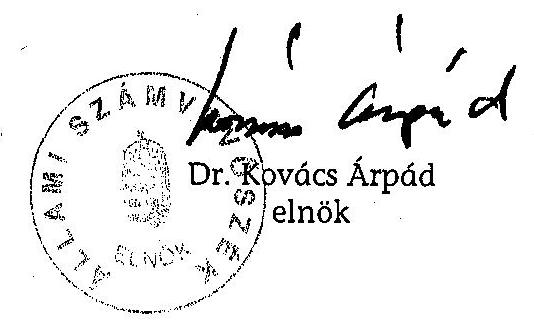

[^0]
[^0]:    ${ }^{51}$ Jelentés az Állami Privatizációs és Vagyonkezelő Rt. 2002. évi múködésének és a központi költségvetés végrehajtásához kapcsolódó tevékenységének ellenőrzéséről.

---

# Mellékletek jegyzéke 

1. sz. melléklet A jelentésre, a jelentéstervezetre tett észrevételek és az arra adott válaszok
2. sz. melléklet Kérdőívek feldolgozása
3. sz. melléklet Kérdőívek adatainak feldolgozása 95 társaságra
4. sz. melléklet Kérdőívek adatainak feldolgozása 50 társaságra
5. sz. melléklet Támogatások, tulajdonosi kölcsönök és állami kezességvállalással vagy garanciával fedezett hitelállomány (2000-2004)

---

# A jelentésre, a jelentéstervezetre tett észrevételek és az arra adott válaszok 

1/1. Nemzeti Kulturális Örökség Minisztériuma
1/2. Egészségügyi Minisztérium
1/3. Pénzügyminisztérium
1/4. Miniszterelnöki Hivatal
1/5. Földmüvelésügyi és Vidékfejlesztési Minisztérium
1/6. Honvédelmi Minisztérium
1/7. Oktatási Minisztérium
1/8. Magyar Televízió Közalapítvány Kuratórium
1/9. Igazságügyi Minisztérium
1/10. Belügyminisztérium
1/11. MTI Tulajdonosi Tanácsadó Testület
1/12. Környezetvédelmi és Vízügyi Minisztérium
1/13. Gazdasági és Közlekedési Minisztérium
1/14. Országos Foglalkoztatási Közalapítvány
1/15. Miniszterelnöki Kabinetiroda
1/16. Nemzeti Sporthivatal
1/17. Állami Privatizációs és Vagyonkezelő Rt. + válasz
1/18. Kincstári Vagyoni Igazgatóság
1/19. MTI Rt.
1/20. Mahart Rt.

---

1/21. Hungarorign Rt.
1/22. Rendezvénycsarnok Zrt.
1/23. Vértes Erőmú Zrt.
1/24. Nemzeti Lóverseny Kft.
1/25. Nemzeti Színház Rt.
1/26. Magyar Televizió Rt.
1/27. Váltó-4 Libra Fejlesztési és Beruházási Rt.
1/28. Malév Zrt.
1/29. SZÖVÜR Kft.
1/30. MÁV Rt.
1/31. Nemzeti Autópálya Zrt.
1/32. Bábolna Rt.
1/33. Magyar Villamos Múvek Rt.
1/34. Nitrokémia Rt.
1/35. Magyar Fejlesztési Bank Rt. + válasz

---

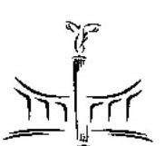
$1 / 1$. sz. melléklet
a V-16-168/2005-2006. sz. jelentéshez
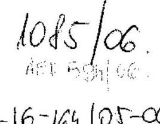

NEMZETI KULTURÁLIS ÖRÖKSÉG MINISZTÉRIUMA MINISZTER

Állami Számvevőszék Dr. Kovács Árpád elnök úr

## Budapest

Tisztelt Elnök Úr!
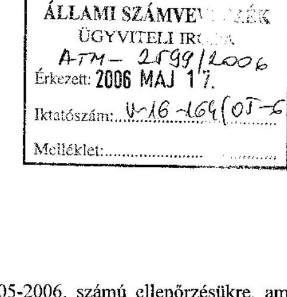

Iktatószám: 2.12/154-8/2006.

Bihany is:
$\mathrm{or} .17$.
Hivatkozva a V-16-150/2005-2006. számú ellenőrzésükre, amely a tartósan veszteségesen müködő állami tulajdonú gazdasági társaságok gazdálkodását vizsgálta, tájékoztatom, hogy a jelentésnek a felügyeletünk alá tartozó Nemzeti Színház Zrt-re vonatkozó megállapításaira észrevételt nem kívánok tenni. A jelentés alapján készített intézkedési tervről a jogszabályban foglaltaknak megfelelően tájékoztatom.

Budapest, 2006. május „H".

Ödvözlettel:
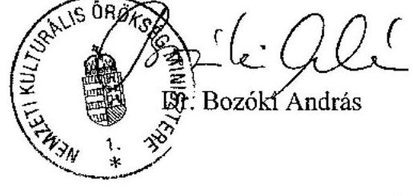

---

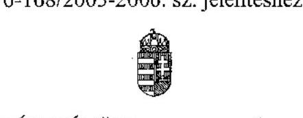

ATH-2593/2006

EGÉSZSÉGÜGYI MINISZTÉRIUM MINISZTER

$U-16-163105-06$

Iktatószám: 7266-4/2006-0006KTF

Előadó: Bertalan Imre
Tel.: 301-7916

Dr. Kovács Árpád
elnök úr részére

ÁLLAMI SZÁMVEVŐSZÉK

Budapest

Tisztelt Elnök Úr !

Hivatkozással a V-16-150/2005-2006 számú levelére, tájékoztatom, hogy a tartósan veszteségesen müködő állami tulajdonú gazdasági társaságok gazdálkodásáról készített számvevőszéki jelentésre észrevételt nem teszek.

Egyúttal jelzem, hogy az ellenőrzés megállapításai alapján illetékességi körömben intézkedést nem szükséges kiadni.

Budapest, 2006. május , 12,,

Tisztelettel:
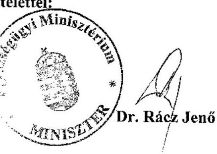

---

1/3. sz. melléklet a V-16-168/2005-2006. sz. jelentéshez

HTM-247312006.
$1025106$.
HE7-573K6. $4^{\text {min }}$
TELEFON: (36-1) 327-2159, (36-1) 327-2141
FAX: (36-1) 318-0738
PÉNZÜGYMINISZTER

Állami Számvevőszék
Dr. Kovács Árpád elnök úr
Budapest.

Tisztelt Elnök Úr!
Ikt. szám: 5946/11/2006.
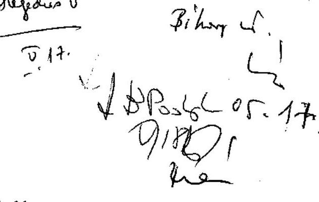

A V-16-150/2005-2006. kísérő levéllel megküldött, a tartósan veszteségesen müködő állami tulajdonú gazdasági társaságok gazdálkodásának ellenőrzéséről szóló ÁSZ jelentéshez további észrevételt nem teszek.

Budapest, 2006. május 16.

Üdvözlettel:
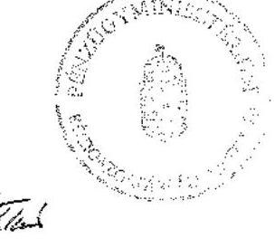

Dr. Veres János

---

1/4. sz. melléklet
a V-16-168/2005-2006, sz. jelentéshez

MiniszTERELNÖKI HIVATALT VEZETÓ MINISZTER

Dr. Kovács Árpád úr
elnök

Állami Számvevőszék
Budapest

Tisztelt Elnök Úr!

A „tartósan veszteségesen müködő állami tulajdonú gazdasági társaságok gazdálkodásának ellenőrzése" tárgyában megküldött jelentésre észrevételt nem teszek.

Budapest, 2006. május „ ${ }^{6}$,
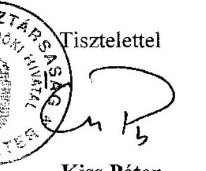

Kiss Péter

---

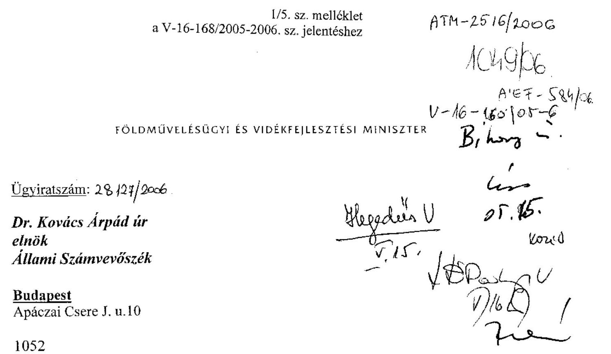

# Tisztelt Elnök Úr! 

Az Állami Számvevőszék V-16-150/2005-2006. ügyiratszámú megkeresésére válaszolva tájékoztatom, hogy a tartósan veszteségesen müködö állami tulajdonú gazdasági társaságok gazdálkodásának. illenörzéséről szóló jelentés tartalmára vonatkozóan
észrevételt nem teszek.
Az ellenőrzés alapján elrendelt intézkedésekről a későbbiekben tájékoztatni fogom.

Budapest, 2006. május „, $\boldsymbol{\sim}$ „,
Tisztelettel:
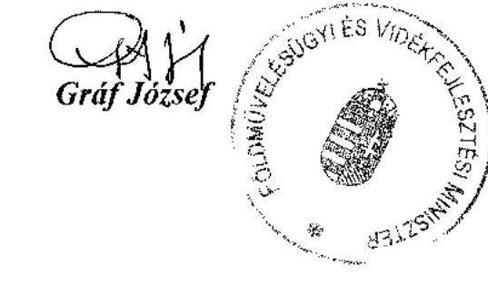

---

MAGYAR KÖZTÁRSASÁG
HONVÉDELMI MINISZTERE

Nyt. szám: 194/40/2006. HM KEHH
Hiv. szám: V-16-150/2005-2006.
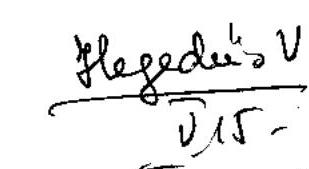

Dr. Kovács Árpád úr Állami Számvevőszék elnöke

$$
\begin{aligned}
& \text { ATM-2510/2006. } \\
& 1035 / 06 \\
& \text { MEF } 580 / 06 \\
& 0-16-150 / 05-6
\end{aligned}
$$

1. számú példány
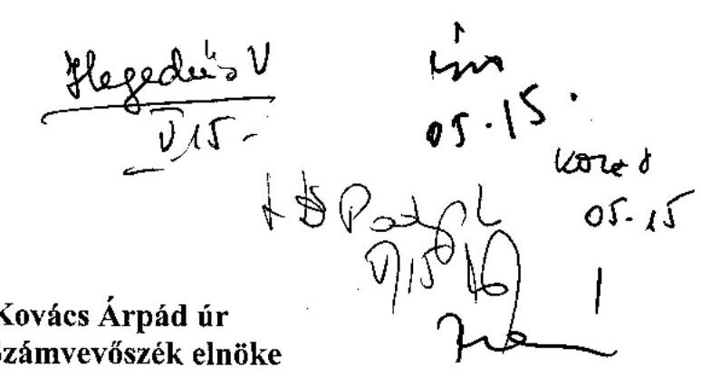

Budapest

# Tisztelt Elnök Úr! 

A tartósan veszteségesen müködő állami tulajdonú gazdasági társaságok ellenőrzéséről az Állami Számvevőszék részéről a fenti hivatkozási számon észrevételezésre megküldött jelentést áttanulmányoztuk.

A jelentésben foglaltakkal egyetértünk, ahhoz a HM tárca részéről szakmai észrevételt nem teszünk.

Budapest, 2006. május "M"- n.
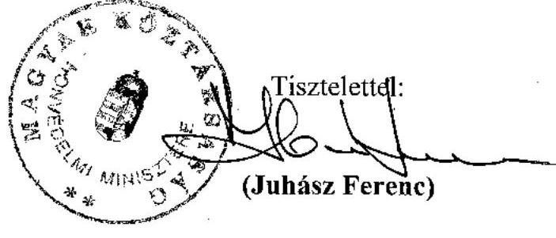

---

1/7. sz. melléklet a V-16-168/2005-2006. sz. jelentéshez
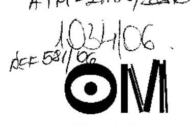

Oktatási
Minisztérium
$V-16-158 / 05-6$.

Dr. Kovács Árpád úr elnök
Állami Számvevőszék
Budapest

Tisztelt Elnök Úr!

A tanósan veszteségesen müködő állami tulajdonú gazdasági társaságok gazdálkodásának ellenőrzéséről készített ÁSZ-jelentést köszönettel megkaptam, annak tartalmához észrevételt nem teszek.

Budapest, 2006. május „ $10_{i}$,
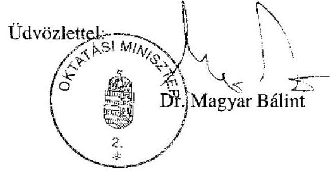

---

# MEGYAR TELEVIZIÓ KÖZALAPITVÁNY KURATORIUM 

## D1. Kovács Árpád úr

elnök

## Állami Számvevőszék

Budapest

Tisztelt Elnök Úr!
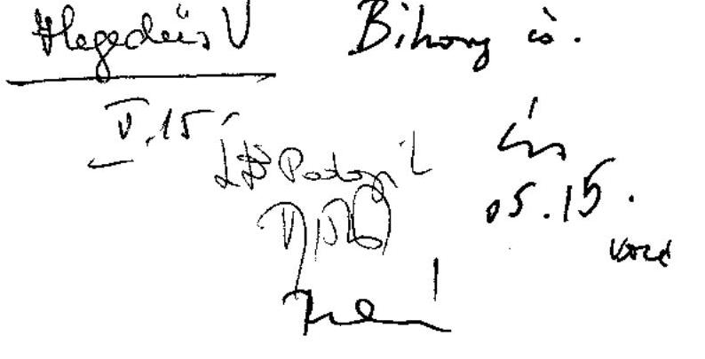

Hivatkozással a V-16-150/2005-2006. sz. levelében foglalt kérésére a mellékletként csatolt, a tartósan veszteségesen müködő állami tulajdonú gazdasági társaságok gazdálkodásának ellenőrzéséről készített, előzetesen egyeztetett jelentésüket áttekintettük.
A jelentéstervezethez korábban tett észrevételünk figyelembevételét köszönjük.
A jelentést az MTV Közalapítvány részéről további észrevétel nélkül elfogadjuk.

Budapest, 2006. május 8.

Tisztelettel
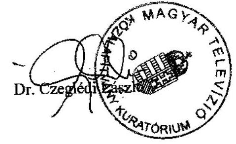

---

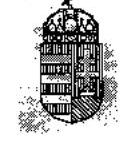

A Magyar Köztársaság Igazságügy-minisztere

IM/KGF/2006/ELL/653/4

Dr. Kovács Árpád úr
elnök

Állami Számvevőszék

Budapest

Tisztelt Elnök Úr!

A tartósan veszteségesen müködő állami tulajdonú gazdasági társaságok gazdálkodásának ellenőrzéséről készített jelentéstervezetüket köszönettel megkaptam. A jelentéstervezethez észrevételt nem teszek.

Budapest, 2006. május 10.

Tisztelettel:

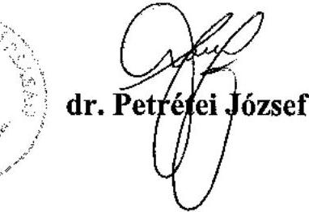

---

a V-16-168/2005-2006. sz. jelentéshez
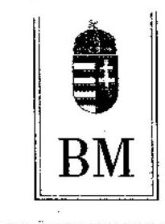

BELÜGYMINISZTER

Iktatószám: 19-307/2-2/2006.
$\mathrm{V}-16-15 \mathrm{I} 10 \mathrm{r}-6$
$1023106$.
Arf 572/06
Dilany i.
os. 11 .
hared

Dr. Kovács Árpád úrnak
elnök
Állami Számvevőszék

Budapest

Tisztelt Elnök Úr!
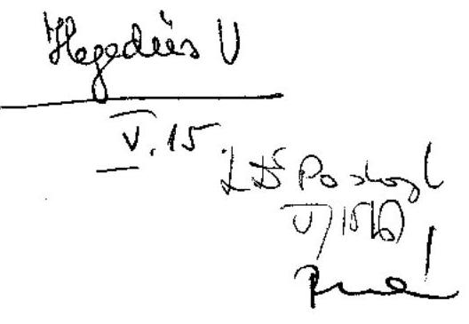

A tartósan veszteségesen müködő állami tulajdonú gazdasági társaságok gazdálkodásának ellenőrzéséről szóló jelentést és mellékleteit áttekintettük; a társaságaink számára hasznosítható felvetéseket, javaslatokat felhasználjuk.

Tekintettel arra, hogy a Belügyminisztérium gazdasági társaságait a jelentés tervezetben leírtak közvetlenül nem érintik, észrevételt nem teszünk.
Tájékoztatom Elnök Urat, hogy a fentiekből eredően intézkedési terv készítését nem tartom szükségesnek.

Budapest, 2006. május 10.
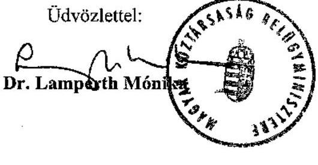

---

1/11. sz. melléklet a V-16-168/2005-2006. sz. jelentéshez

125 éves $m t i$ )

Tulajdonosi Tanácsadó Testület elnök

|  125 éves $m t i$ | Dr. Kovács Árpád elnök részére  |
| --- | --- |
|  125.125.125 | Állami Számvevőszék  |
|  125.125.125 | V-16-150/2005-2006. számú ÁSZ jelentés  |
|  125.125.125 | T-12-2006  |
|  125.125.125 | Bihany:  |
|  125.125.125 | 125.125.125  |
|  125.125.125 | 125.125.125  |

A tartósan veszteségesen müködő állami tulajdonú gazdasági társaságok hoç? gazdálkodásának ellenőrzéséről készített V-16-150/2005-2006. számú számvevői jelentést tisztelettel megkaptam.

A jelentéstervezet tartalmának megismerése után, az abban foglaltakhoz továbbí észrevételt nem kívánok tenni.

Tisztelettel és szívélyes üdvözlettel, 125.125.125

|  125.125.125 | 125.125.125  |
| --- | --- |
|  125.125.125 | 125.125.125  |
|  125.125.125 | 125.125.125  |
|  125.125.125 | 125.125.125  |
|  125.125.125 | 125.125.125  |
|  125.125.125 | 125.125.125  |
|  125.125.125 | 125.125.125  |
|  125.125.125 | 125.125.125  |
|  125.125.125 | 125.125.125  |
|  125.125.125 | 125.125.125  |
|  125.125.125 | 125.125.125  |
|  125.125.125 | 125.125.125  |
|  125.125.125 | 125.125.125  |
|  125.125.125 | 125.125.125  |
|  125.125.125 | 125.125.125  |
|  125.125.125 | 125.125.125  |
|  125.125.125 | 125.125.125  |
|  125.125.125 | 125.125.125  |
|  125.125.125 | 125.125.125  |
|  125.125.125 | 125.125.125  |
|  125.125.125 | 125.125.125  |
|  125.125.125 | 125.125.125  |
|  125.125.125 | 125.125.125  |
|  125.125.125 | 125.125.125  |
|  125.125.125 | 125.125.125  |
|  125.125.125 | 125.125.125  |
|  125.125.125 | 125.125.125  |
|  125.125.125 | 125.125.125  |
|  125.125.125 | 125.125.125  |
|  125.125.125 | 125.125.125  |
|  125.125.125 | 125.125.125  |

---

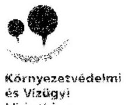

Környezetvédelmi és Vizügyi Minisztérium

MAGYAR KÖZTÁRSASÁG
KÖRNYEZETVÉDELMI ÉS VÍZÜGYI MINISZTERE

Dr. Kovács Árpád
elnök

Állami Számvevőszék

Budapest

Tisztelt Elnök Úr!

Hivatkozva a V-16-150/2005-2006. iktatószámon megküldött, „A tartósan veszteségesen müködő állami tulajdonú gazdasági társaságok gazdálkodásának ellenőrzéséről" készült Állami Számvevőszéki Jelentésre a Környezetvédelmi és Vízügyi Minisztérium részéről észrevételt nem teszek, az abban foglalt megállapításokkal egyetértek.

Budapest, 2006. május 25.

Üdvözlettel:

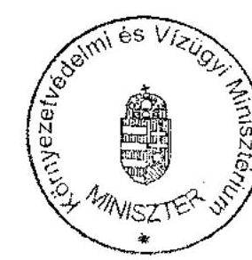

dr. Petsányi Miklós

---

1/13. sz. melléklet a V-16-168/2005-2006. sz. jelentéshez
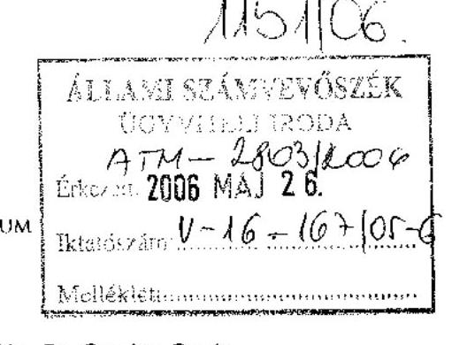

Hiv. szám: V-16-150/2005-2006.
Iktatószám: III-6/61/9/2006.
Elöadó: Dr. Gordos Gyula
374-2874

# Dr. Kovács Árpád úr részére elnök 

Állami Számvevőszék

## Budapest

## Tisztelt Elnök Úr!

Köszönettel megkaptam a tartósan veszteségesen müködő állami tulajdonú gazdasági társaságok gazdálkodásának ellenőrzéséről készített számvevőszéki jelentést. A jelentés megállapításait elfogadjuk, azokat a Gazdasági és Közlekedési Minisztérium munkájában hasznosítjuk. Mivel a jelentés a Minisztérium és a felügyelete alá tartozó vizsgált társaságok részére nem fogalmaz meg konkrét javaslatokat, intézkedési tervet nem állítottunk össze.

Budapest, 2006. május 37
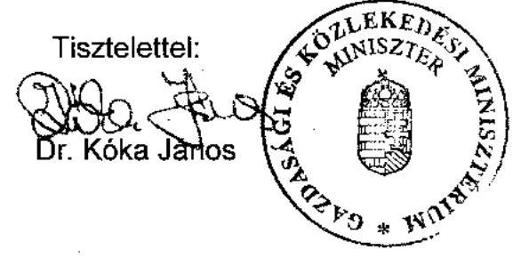

---

1/14. sz. melléklet a V-16-168/2005-2006. sz. jelentéshez

K-5816/06

Állami Számvevőszék

Dr. Kovács Árpád
Elnök úr részére

1052 Budapest
Apáczai Csere János u. 10

Tisztelt Elnök Úr!

Hivatkozással a V-16-150/2005-2006. sz. levelében foglalt kérésére a levél mellékleteként csatolt, a tartósan veszteségesen müködő állami tulajdonú gazdasági társaságok gazdálkodásának ellenőrzéséről szóló jelentésüket áttekintettük. Az ellenőrzési jelentés az Országos Foglalkoztatási Kőzalapítványra, mint tulajdonosi joggyakorlóra, valamint a jogkörébe tartozó vizsgált társaságokra vonatkozó megállapításokat nem tartalmaz, erre való tekintettel jelentésükhöz észrevételt nem teszünk, illetve az ellenőrzés alapján elrendelt intézkedésekről intézkedési terv készítése nem indokolt.

ORSZÁGOS FOGLALKOZTATÁSI KÖZALAPÍTVÁNY
1037 Budapest, Bokor u. 9-11.
Tel.: 388-1270

Molnár Gyöngyné
kuratóriumi elnök

---

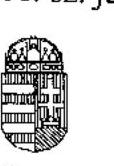

1/15. sz. melléklet
a V-16-168/2005-2006. sz. jelentéshez

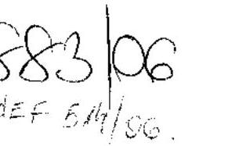

MINISZTERELNÖKI KABINETIRODA
GAZDASÁG- ÉS TÁRSADALOMPOLITIKAI TITKÁRSÁG
Helyettes Államtitkár

Dr. Bihary Zsigmond úr
föigazgató

Állami Számvevőszék

Budapest

Ikt.szám: I-2/857/3/2006
Ügyintéző: dr. Tóth Judit

ÁLLAMI SZÁMVEVŐSZÉK
COPYRIGHT 2006
ATH-41741606
Érkezd: 2006 APR 25.
Iktatósránt 1-16-139-99/05-16

Melléklet:

Tisztelt Főigazgató Úr!

Az Állami Számvevőszéknek a tartósan veszteségesen működő állami tulajdonú gazdasági
társaságok gazdálkodásának ellenőrzéséről készített jelentését áttanulmányozva
megállapítható, hogy annak módszerei és megállapításai megalapozottak, korrektek.
Jelentőségét növeli, hogy a 2000-2005. közötti időszakra kiterjedő, átfogó jellegű feltárására
korábban nem volt példa.

A Kormány számára megfogalmazott ajánlások, különösen az, hogy készüljön az állami
vagyonról - a vagyonelemek funkciója szerinti - gazdálkodási irányelv, a vagyon egységes
kezelésének magas szintű szabályozása, valamint az állami portfolióban maradó
társaságokkal kapcsolatos tulajdonosi beavatkozás egységes szabályozása - aligha
vitathatóan sürgető, ám kellő alaposságot, adatgyűjtést, egyeztetést igénylő feladat. Úgy
érezzük, ennek előfeltételeként kezelhető az állami tulajdoni hányaddal rendelkező,
alapvetően állami feladatot ellátó, tartósan veszteséges társaságok jövőbeli működtetésére
vonatkozó jogi forma megválasztása (társaság vagy költségvetési intézmény). Mindezek
hátterében ugyanakkor az állami feladatok újrafogalmazása, áttekintése húzódik meg.

Összességében a Kormánynak címzett ajánlásokat elfogadhatónak és egyben szükségesnek
is tartom a hatékony, jogállami vagyonműködtetés erősítése érdekében. A javaslatok
megvalósítás során nyilvánvalóan tekintetbe kell venni a k incstári v agyon k ezelésének és
működtetésének ellenőrzéséről szóló 2005. évi 0515. számú ÁSZ jelentés megállapításait is.

Budapest, 2006. április „ 24 „.

Tisztelettel:

Apatini Kornélné

1055 Budapest, Kossuth Lajos tér 2-4. Telefon: 441-3380, 441-3383; Fax: 441-3382
www.meh.hu • Apatini.Klara@meh.hu

---

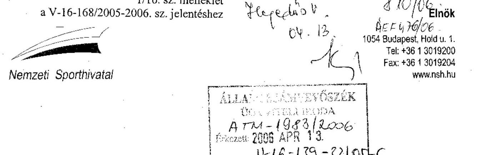

Bihary Zsigmond föigazgató úr

Állami Számvevőszék
Budapest

Tisztelt Föigazgató Úr!

A tartósan veszteséges állami tulajdonú gazdasági társaságok gazdálkodásának ellenőrzéséről szóló jelentés tervezetükhöz tett észrevételeink figyelembevételét köszönjük. A jelentés tervezetet a magunk részéről további észrevétel nélkül elfogadjuk.

Budapest, 2006. április 6.

Tisztelettel:
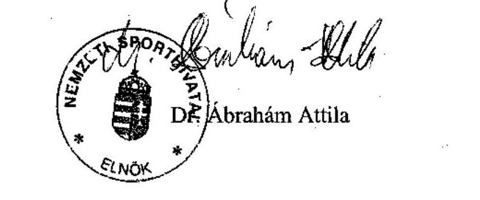

---

1/17. sz. melléklet
a V-16-168/2005-2006, sz. jelentéshez

Állami Privatizációs és Vagyonkezelő Rt.

Hungarian Privatization and State Holding Company

VEZÉRIGAZGATÓ

Bihary Zsigmond
főigazgató

Állami Számvevőszék

H-1051 Budapest
Apáczai Csere János u. 10.

Hazedlis U
7.26,

Lb Bt. 10/26/2006. 2

Budapest, 2006. április 13.

Tárgy: Észrevételek a "Tartósan veszteségesen működő állami tulajdonú
gazdasági társaságok gazdálkodásának ellenőrzéséről" készült
jelentés-tervezetre

Tisztelt Főigazgató Úr!

Az Állami Számvevőszék befejezte az ÁPV Zrt. tevékenységét is érintő, a V0241.
Témaszám: 782. alapján elrendelt ellenőrzését, és megküldte Jelentés-tervezetét,
amely "Tartósan veszteségesen működő állami tulajdonú gazdasági társaságok
gazdálkodásának ellenőrzéséről" szól.

A hosszú időtartamra visszatekintő, több kormányzati ciklust is átölelő helyszíni
ellenőrzés az ÁPV Zrt. hozzárendelt vagyoni körében több társaságot is érintett.

Bizonyosan az ellenőrzés jellegéből következően, melynek során több állami
vagyonkezelő szervezet kezelésében lévő társasági működés került áttekintésre,
egyes megállapítások kapcsán a megfogalmazások általános jellegűek, így nem
tekinthető az ÁPV Zrt. tevékenységére közvetlenül vonatkoztathatónak. Az ÁPV Zrt.
a vizsgált időszakban a Részvényesi Jogok Gyakorlójának folyamatos felügyelete
mellett, az érintett társaságok vagyonkezelése esetében is kormányzati szándékokat
hajtott végre. Ismert, hogy a végrehajtásról minden évben beszámolót készített az
Országgyűlés részére, amelyet az Állami Számvevőszék is rendre helyszíni
ellenőrzés keretében megvizsgált, és arról jelentést készített.

A jelentés kapcsán az ÁPV Zrt. vagyonkezelési tevékenységét tekintve pozitívan
értékelhető, hogy javaslatot sem az ÁPV Zrt. Igazgatósága, sem az ÁPV Zrt.
Felügyelő Bizottsága felé nem fogalmaz meg.

11-1133 BUDAPEST FOZSONYI UT 56 1111: 136 1: 237-4400 FAX: (36 1) 237-4100
11 11 1395 BUDAPEST, 11 108 1 INILRMST WWW.APVKT.UG

---

A Jelentés-tervezet tartalmát ÁPV Zrt. ügyvezetői szinten áttekintette és egyeztette a vizsgálatot végzökkel, mely egyeztetések alapján a menedzsment kialakította, és megküldte észrevételeit, mely alapján átdolgozott vizsgálati jelentéshez továbbra is szükségesnek tartjuk a Bábolna Zrt. gazdálkodásának megítélésével kapcsolatos véleményeltérések megjelenítését.

Az ÁPV Zrt. hatáskörét meghaladó kormányzati szintű döntésekre irányuló és az MFB Rt. tevékenységére vonatkozó megállapításokkal, mint az ÁPV Zrt. gazdálkodási területén kivül eső területekkel nem kivánunk foglalkozni.

Ugyanakkor fontosnak tartjuk az ÁSZ jelentés azon megállapításának kiemelését, hogy „A Bábolna Rt.-vel kapcsolatos valamennyi ÁPV Rt. által tett intézkedés, a pénzügyminiszter kontrollja alatt, a Részvényesi Jogok Gyakorlójával történt folyamatos egyeztetés mellett történt." E kiemelés azért fontos, mert rámutat arra a tényre, hogy a Bábolna Zrt.-vel kapcsolatos események a kormányzati szándékok végrehajtását jelentették az ÁPV Zrt. részéről.

A társasággal kapcsolatban a pénzügyminiszter felkérésére az ÁPV Zrt. Felügyelő Bizottsága is vizsgálatot folytatott. Az elkészített, határozattal elfogadott jelentéssel kapcsolatban az ÁPV Zrt. Igazgatósága 617/2005. (XII.15.) IG sz. határozatában egyetértett a Felügyelő Bizottság vizsgálati jelentésében tett összefoglaló megállapítással, mely szerint a Bábolna Zrt-vel kapcsolatos valamennyi ÁPV Zrt. által tett intézkedés a vonatkozó 2186/2004. (VII.22.) Korm. határozat szerint, a pénzügyminiszter kontrollja alatt, a Részvényesi Jogok Gyakorlójával történt folyamatos egyeztetés mellett történt. Helytállónak tartotta a megállapítást, mely szerint az ÁPV Zrt. Igazgatósága és vezérigazgatója több esetben adott tájékoztatást, és kért segítséget a Részvényesi Jogok Gyakorlójától. Az ÁPV Zrt. Igazgatósága szerint a Felügyelő Bizottság jelentése az ÁPV Zrt. vagyonkezelési tevékenységét illetően a közgazdasági megalapozottság, jogszerűség és szabályszerűség tekintetében ellentétes megállapításokat nem tartalmaz.

Az ÁPV Zrt. szerint a Bábolna Gyógyfürdő Kft., és az Eurotranzit Kft. készpénzért történő értékesítése a 2186/2004. (VII.22.) sz. Kormányhatározat 2/b. pontja elöirása alapján, a Bábolna Rt. va. likviditási helyzetére tekintettel történt és likviditás biztosítása szempontjából szükségszerű megoldás volt.

A végelszámolás elrendelésének szükségessége kapcsán jelezzük, hogy az ÁPV Zrt. Igazgatósága 2005. november 10-i ülésén a Bábolna Rt. "v.a." végelszámolási eljárásának első évéröl szóló végelszámolói tájékoztatót megtárgyalta. Megállapította, hogy a Bábolna Rt. végelszámolásának nem volt reális és törvényes alternatívája. Az elfogadott előterjesztésben a Bábolna Rt. „v.a." helyzete, a végelszámolás addig ismert tényei-folyamatai bemutatásra kerültek.

A Bábolna Élelmiszeripari Rt. gazdálkodása nem a végelszámolás elrendelése miatt vált veszteségessé. A Bábolna Rt. végelszámolása annak érdekében indult, hogy a veszteségtermelés megállításra kerüljön, és ezért nem fogadható el az a megállapítás, hogy a végelszámolás nem érte el a célját. A veszteséget termelő gyárak eladásra kerültek. A Bábolna Élelmiszeripari Rt. a 2186/2004 (VII. 22) sz. kormányhatározat rendelkezéseinek megfelelően a végelszámolást megelőzően

---

alakult, és a döntés az apportálással történő tőkeemelésről is a végelszámolást megelőzően született.

A jelentés kapcsán jelezzük még, hogy az 5. számú mellékletben szereplő tételek eltérnek az ÁPV Zrt. kimutatásában szereplő tételektől.

Tájékoztatom Főigazgató Urat, hogy az ÁPV Zrt. Igazgatósága, mint az ÁPV Zrt. vezető testülete, a Jelentéssel kapcsolatos kormányzati állásfoglalást figyelembe véve a szükségessé váló intézkedéseket meg fogja hozni.

Tisztelettel:
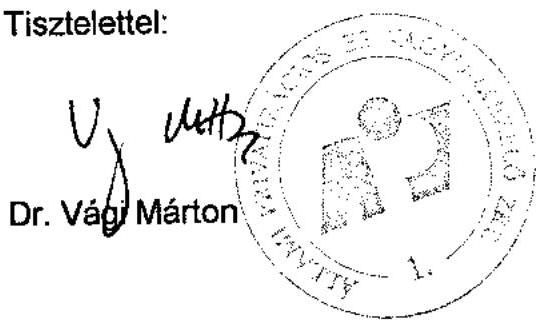

---

# Dr. Vági Márton úr 

vezérigazgató
ÁPV Zrt.

## Budapest

## Tisztelt Vezérigazgató Úr!

A tartósan veszteségesen müködő állami tulajdonú gazdasági társaságok gazdálkodásának ellenőrzéséről készített jelentéstervezetünkre a 43/13/APV/2006. számon adott észrevételeit köszönöm, azokkal kapcsolatban a következőkről tájékoztatom.

Egyetértek Vezérigazgató úrral abban, hogy ellenőrzésünk több kormányzati ciklust is átívelő módon tekintette át, az Önökkel is előzetesen egyeztetett kritériumok szerint, a tartósan veszteségesen müködő állami tulajdonú gazdasági társaságok gazdálkodását és ezen belül közel $50 \%$-ot reprezentálnak azok a társaságok, amelyek az ÁPV Zrt. portfóliójába tartoznak.

Előzőekből következően megállapításaink, javaslataink egységesen vonatkoznak a vizsgált körre. Amikor konkrét társaságot érint az ellenőrzés, akkor azt jelentésünkben jelezzük, ezért megítélésem szerint valamennyi tulajdonosi joggyakorlónak, ill. vagyonkezelőnek, így az ÁPV Zrt. igazgatóságának, és felügyelő bizottságának is adódnak teendői az ellenőrzés alapján. Nem beszélve arról, hogy a Kormánynak és a pénzügyminiszternek tett javaslatok végrehajtása is több szinten igényel intézkedéseket.

Természetesen tudomásul veszem, hogy az ÁPV Zrt. hatáskörét meghaladó kormányzati szintű döntésekkel nem kívánnak foglalkozni. Megjegyzem azonban, hogy a kormányzati szintű döntések végrehajtása a hozzárendelt vagyonba tartozó társaságok tekintetében az ÁPV Zrt. feladata, a kormányhatározatok előkészítésében pedig - a Részvényesi Jogok Gyakorlójával együtt - aktív szerepe van az ÁPV Zrt.-nek. Ugyanakkor a kormányhatározatok rövid, tömör megfogalmazásai nem adják meg a végrehajtáshoz szükséges részletes eligazítást, igényeket, azokat a nagy szakmai gyakorlattal rendelkező ÁPV Zrt.-nek kell a hatályban lévő jogszabályokkal összhangban kialakítania.

Ellenőrzésünknek nem volt és nem is lehetett célja, hogy a Felügyelő Bizottság vizsgálati jelentését minősítse. Ismereteim szerint azonban lényegesen eltérő megállapításokat a felügyelő bizottsági jelentés és a mi jelentésünk nem tartalmaz.

Észrevételének megfelelően a jelentéstervezet Bábolna Rt.-vel foglalkozó részét kiegészítjük azzal, hogy a Bábolna Gyógyfürdő Kft. és az Eurotranzit Kft. átadása az ÁPV Zrt. tulajdonába tartozó másik gazdasági társaság számára javította a Bábolna Rt. likviditási helyzetét.

---

Tiszteletben tartva az ÁPV Zrt. igazgatósága 2005. november 10 -ei megállapításait, mely szerint a Bábolna Rt. végelszámolásának nem volt reális és törvényes alternatívája, szeretném leszögezni, hogy - amint az jelentéstervezetünkből kiderül - mi nem erre a következtetésre jutottunk.

Az 5. sz. mellékletben szereplő támogatások összegét a társaságoktól bekért tanúsítványokból a program módszertanához igazodva állítottuk össze.

Végezetül köszönettel nyugtázom, hogy Vezérigazgató úr tájékoztatása szerint az ÁPV Zrt. igazgatósága a szükséges intézkedéseket meg fogja hozni.

Budapest, 2006. április 26.

Tisztelettel:
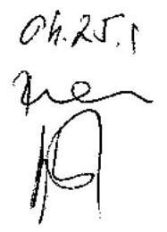

Bihary Zsigmond

---

# 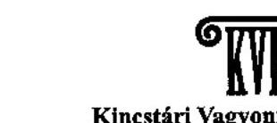 

Kincstári Vagyoni Igazgatóság
Vezérigazgató
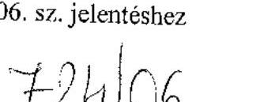

1054 Budapest, Zoltán u. 16. Telefon: (36-1) 311-7467, 331-5746 Fax: (36-1) 312-1828 Levélcím: 1392 Budapest, Pf. 282
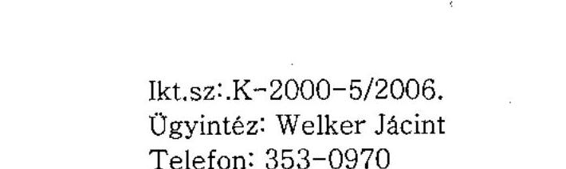

Bihary Zsigmond
főigazgató úr részére
ÁLLAMI SZÁMVEVÓSZÉK

## B UDA PEST

Apáczai Csere J. u. 10.
1052

Tisztelt Fôigazgató Úr!

Köszönöm, hogy a tartósan veszteségesen müködő állami tulajdonú gazdasági társaságok gazdálkodásának ellenőrzéséhez elkészített jelentés-tervezetben a KVI 2006. március 14 -én kelt levelében szereplő észrevételeket figyelembe vették.

Szíves tájékoztatásul közlöm, hogy a KVI-nek egyéb észrevétele nincs.

Budapest, 2006. április, 3

Üdvözlettel
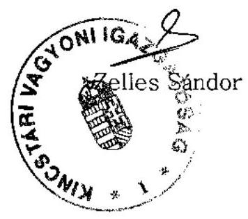

---

1/19. sz. melléklet a V-16-168/2005-2006. sz. jelentéshez
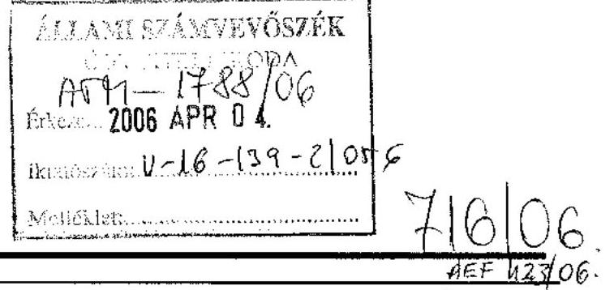

# Levél 

## 128420277

## Bíliay Zsigmond Föigazgató Úr részére

## 128523300

## Állami Számvevőszék

1051 Budapest, Apáczai Csere János u. 10.
1.88477

A tartósan veszteségesen müködő állami tulajdonú gazdasági társaságok gazdálkodásának ellenőrzéséről készült jelentéstervezet - észrevételezés
G/06/1077

Gazdasági alelnök

## Tisztelt Föigazgató Úr!

A részünkre elektronikus úton megküldött - a tartósan veszteségesen müködő állami tulajdonú gazdasági társaságok gazdálkodásának ellenőrzéséről készült - jelentéstervezetünket tisztelettel megkaptuk.

A jelentéstervezet tartalmának megismerése után, az abban foglaltakra észrevételt tenni nem kívánunk.

Kérjük fentiek szíves figyelembevételét.

Üdvözlettel:
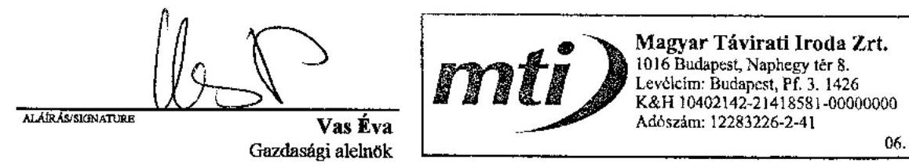

G:FJTUMGATIE
Bp., 2006. április 4.

---

Bihary Zsigmond Úr
Főigazgató
Állami Számvevőszék
1052 Budapest
Apáczai Csere János u. 10.

Tisztelt Főigazgató Úr!

Hivatkozva 2006. március 28-án kelt levelére tájékoztatom, hogy a „tartósan veszteségesen müködő állami tulajdonú gazdasági társaságok gazdálkodásának ellenőrzéséről" készített jelentéstervezetre vonatkozóan észrevételünk nincsen, az anyagban foglaltakkal teljes mértékben egyetértünk.

Tisztelettel:
Budapest, 2006. április 4.
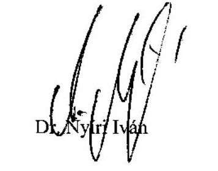

---

1/21. sz. melléklet a V-16-168/2005-2006. sz. jelentéshez

# 743106 

HSZRT-127/11/2006.

Állami Számvevőszék 1052 Budapest
Apáczai Cs. J. u. 10.
Bihary Zsigmond úr Föigazgató részére

## ÁLLAMISZÁM   DOVVITEL   ATY-1834/2006   Érkezet: 2006 APE 3.6.   Petatősvám: V-16-139-17/05-4

Mogyoród, 2006. április 3.

Tisztelt Föigazgató Úr,
A Hungaroring Sport Zrt.-vel kapcsolatos ÁSZ jelentéstervezetüket átolvastuk, az abban foglaltakkal kapcsolatosan további észrevételezést nem teszünk.

Üdvözlettel,

## Gá́l-Attila   vezérigazgató

## HUNGARORING

Sport Részvénytársaság

H. 2146 Mogyoród, M-30
telefon +3620444444
fax +3620441890
templi
evtettő
bank
Gál-Bans Bt 10793024-02496925-51100005
100032762-13
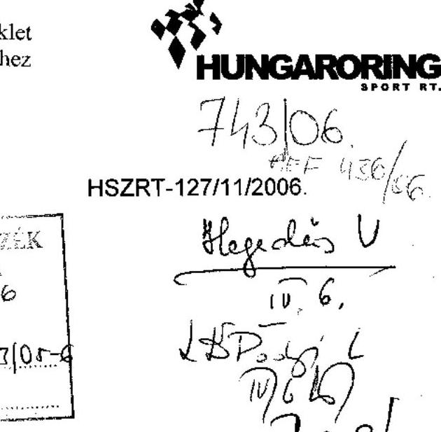

Mogyoród, 2006. április 3.

---

1/22. sz. melléklet a V-16-168/2005-2006. sz. jelentéshez
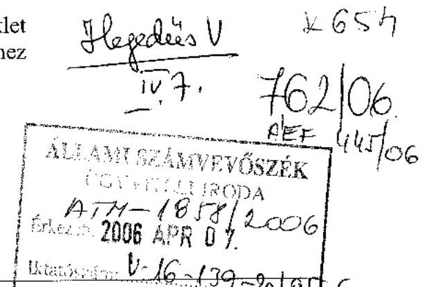

# RENDEZVÉNYCSARNOK Zrt. 

IGAZGATÓSÁG ELNÖKE
Székhely: 1065 Budapest. Bajcsy - Zsilinszky út 57.
Fővárosi Bíróság:Cg.01-10-044557
Tel: $\quad 301-07-76$
Fax: $\quad 301-07-77$
E-mail: rendezvenycsarnok@rendezvenycsarnok. hu

Állami Számvevőszék
Bihari Zsigmond föigazgató
1052 Budapest
Apáczai Csere János u. 10.

Tisztelt Főigazgató Úr!
Megkaptam a március 13-án kelt észrevételünkre reagáló válaszát, amellyel egyetértek. Köszönöm a vizsgálat során tapasztalt körültekintésüket, észrevételeinkre adott érdemi válaszaikat.

Budapest, 2006. április 4.

Tiszteltettel:
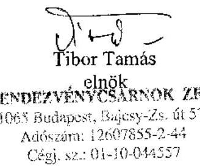

---

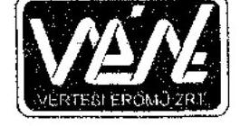

Vértesi Erőmű
Zártkörüen Müködő Részvénytársaság
Cégjegyzékszám: 11-10-001396

Vezérigazgató
Figyintézoó:

Bihary Zsigmond úr
fölgazgató
Állami Számvevőszék

Budapest

Tárgy: Véleményezés

Tisztelt Fölgazgató Úr!
Hivatkozva 2006. március 28-án kelt V-16-133/2005-2006. sz. levelükre tájékoztatom, hogy a vizsgálati anyaggal kapcsolatban észrevételt nem teszünk.

Oroszlány, 2006. április 4.

Tisztelettel:

Vértesi Erőmü ZRt.

Vak!

Vas László
vezérigazgató

---

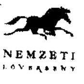

1/24. sz. melléklet a V-16-168/2005-2006. sz. jelentéshez

621/06 AEF 379/06

Ikt.sz: 1-K- 209 /2006

Állami Számvevőszék
Bihary Zsigmond úr részére
Főigazgató

Budapest

ÁTH - 1603/2006
Érkeket 1 2006. HARC 87.
167. SZAH 1-16-131/32/05-6

Tiszteít Főigazgató Úr!

Hérdelis V
26. 7/26/2006

A Nemzeti Lóverseny Kft-t érintő - tartósan veszteséges állami tulajdonú gazdasági
társaságok - ellenőrzésről készített jelentést megkaptuk, tartalmát megismertük, az abban
foglaltakra észrevételt tenni nem kívánunk.

Budapest, 2006-03-20

Tisztelettel:

Vajto Lajós Farkas Ferenc
Ügyvezető igazgató

Nemzeti Lóverseny Kft.
1101 Budapest, Albertirsai út 2-4.
Tel: (36) 1/433-0520
Fax: (36) 433-0521

---

Állami Számvevőszék
Bihary Zsigmond úr részére

Tisztelt Bihary Úr!

Megkaptam, a 2006. március 28-án küldött, a tartósan veszteséges állami tulajdonú gazdasági társaságok gazdálkodásának ellenőrzéséhez készített jelentéstervezetüket.

Ezúton kívánom tájékoztatni, hogy az anyaggal kapcsolatosan észrevételem nincs.

Budapest, 2006. április 3.

Üdvözlettel:

Jordán Tamás
főigazgató

Nemzeti Szinház Rt.
Cím 1095 Budapest, Bajor Gizi park 1.
Telefon 476-6854, 476-6800
Telefax 215-8769
E-mail gh@nemzetiszinhaz.hu
Főleksed Légifelséges a 01-10-044426. cégjegyzékszámon nyilvántartva

---

Állami Számvevőszék
Államháztartás Központi Szintjét Ellenőrző Igazgatóság

Bihary Zsigmond úr
Föigazgató részére

Budapest
Apáczai Cs. J. u. 10.
1052

Tisztelt Föigazgató Úr!
Hivatkozva Podonyi László úrral folytatott egyeztetésünkre, az ÁSZ által 2005-ben lefolytatott tartósan veszteséges társaságok müködését célzó vizsgálati jelentést elfogadom.

A további eredményes együttmüködés reményében, tisztelettel:

Budapest, 2006. április 5.

---

# 1/27. sz. melléklet 

a V-16-168/2005-2006. sz. jelentéshez

Állami Számvevőszék
Dr. Bihary Zsigmond úr föigazgató

## Budapest

Apáczai Csere János utca 10. 1052.

Tisztelt Föigazgató Úr !

## ikt.sz.: 714/11/2005

A tartósan veszteséges vállalatok ÁSZ vizsgálata keretében a Váltó-4 Libra Rt. „v.a." társaságnál folytatott vizsgálatról készített 2006. márciusi dátumú Számvevői jelentést megkaptuk és ahhoz észrevételt nem teszünk.

Budapest, 2006. április 4.

Tisztelettel:
Csunderlik Ferenc
végelszámoló

## VÁLTÓ-4 LIBRA

FEJLESZTÉSI ÉS
BERUHÁZÁSI RT.

1023 BUDAPEST,
BÉCSI ÚT 3-5.
TELEFON: 326-0085
FAX: 326-0084
e-mail, mail@vaitort.hu

---

# 1/28. sz. melléklet a V-16-168/2005-2006. sz. jelentéshez 

## 788/06

## Bihary Zsigmond

Főigazgató részére
Állami Számvevőszék

Tisztelt Bihary Úr!

Köszönettel megkaptuk a tartósan veszteségesen müködő állami tulajdonú gazdasági társaságok gazdálkodásának ellenőrzéséről az észrevételek figyelembe vételével készített jelentéstervezetünket.
Tekintettel arra, hogy a Malévra vonatkozó részek a korábbi verzióhoz képest jelentősen nem változtak, így a jelentéssel kapcsolatban észrevételt nem kívánunk tenni.

Budapest, 2006. április 5.

Üdvözlettel:

Gazdasági vezérigazgató-helyettes
Malév ZRt.

---

# SZÖVÜR 

SZÖVETKEZETI
UZGATKKSENDEZMUSTEN ATE

Bihari Zsigmond úr
föigazgató
Állami Számvevőszék

## Budapest

Apáczai Csere János u. 10. 1052

$$
\begin{aligned}
& 832106 . \\
& \text { NEF } 455 / 06 .
\end{aligned}
$$

Ikt.sz. ÜR- 555/2006

## ÁLLAMI SZÁMVEVŐSZÉK   COYVITELI IRODA   ATY- 2046/2006   Ercezen 2006 APR 19.   Iktalószám: 11-16-129-4t-05-6   Melléklet:

Tárgy: V-16-129/2005-2006. számú számvevői jelentés

## Tisztelt Föigazgató Úr!

Hivatkozással a tartósan veszteségeses müködő állami tulajdonú gazdasági társaságok gazdálkodásának ellenőrzéséhez készített, 2006. március 29-én e-mail útján, majd 2006. április 11-én postai úton eljuttatott jelentéstervezetre, csatoltan küldjük az általunk észrevételezett jelentéstervezetet (A javasolt változtatásokat a megküldött jelentéstervezetben aláhúzással jelöltük.)

A javasolt változtatások átvezetését követően a jelentéstervezetre további észrevételünk nincs, azt elfogadjuk.

Budapest, 2006. április 14.
Tisztelettel:

---

ad.582/T/2006.
(ad.1645/T/2005.)

# Bihary Zsigmond úr 

fóigazgató

## Állami Számvevőszék

## Budapest.

Apáczai Csere János utca 10.
H - 1052

## Tisztelt Föigazgató Úr!

Az Állami Számvevőszék által készített „Jelentés a tartósan veszteségesen működő állami tulajdonú gazdasági társaságok gazdálkodásának ellenőrzéséről" tárgyú vizsgálati jelentést elfogadjuk.

Budapest, 2006. április 19.
Üdvözlettel:

---

# Állami Számvevőszék 

Bihary Zsigmond úr
föigazgató
Budapest
Apáczai Cs. J. u. 10.
1052

Tisztelt Föigazgató Úr!

Köszönettel megkaptam 2006. április 12-én kelt levelét a tartósan veszteségesen müködő állami tulajdonú gazdasági társaságok gazdálkodásának ellenőrzéséről készített jelentéstervezetük módosításával kapcsolatban.
Ezúton tájékoztatom, hogy a módosítások figyelembevételével további észrevételünk nincsen.

Üdvözlettel:

elnök-vezérigazgató

---

1/32. sz. melléklet a V-16-168/2005-2006. sz. jelentéshez
a V-16-168/2005-2006. sz. jelentéshez

Állami Számvevőszék
Bihary Zeigmond
Föigazgató részére
Budapest

Tisztelt Bihary Úr!
Az Állami Számvevőszék által készített a tartósan veszteségesen múködő állami tulajdonú gazdasági társaságok gazdálkodásának ellenőrzéséről elkészített ÁSZ jelentés részemre megküldött terveztében foglaltakat tudomásul veszem, abban számszaki kifogást nem teszek.

Bábolna, 2006. április 19.

Tisztelettel:

Bábolna Ziti.
1.

Zónáné dr. Czunyi Anikó
Bábolna Zrt.
Mb. vezérigazgató

---

Bihary Zsigmond
föigazgató
Állami Számvevőszék

## Budapest

Apáczai Csere János u. 10. 1052

1/33. sz. melléklet
a V-16-168/2005-2006. sz. jelentéshez

VEZIG
Iktatószám nálunk: VEZIG 287 /2006.
Iktatószám Önöknél: -
Úgyintéző: -

Budapest, 2006.04.24.

ÁLLAMI SZ. EVŐSZÉK
ÜGYVITT 2006
$\Delta T H-227 / 2006$
Érkezett: 2006 MAJ 02
Iktatószám:..V-16-151/02-6
Melléklet:

Tárgy: Nyilatkozat ÁSZ jelentés elfogadásáról

Tisztelt Főigazgató Úr!
Hivatkozva a V-16-143/2005-2006. számú levelére, az alábbiakban nyilatkozom, hogy az Állami Számvevőszék által, a tartósán veszteségesen működő állami tulajdonú gazdasági társaságok gazdálkodásának ellenőrzéséről készített jelentés az MVM Zrt. részéről véglegesnek és elfogadottnak tekinthető.

Üdvözlettel
Mowin
Dr. Kocsis István
vezérigazgató

---

Állami Számvevőszék
Bihary Zsigmond föigazgató úr részére

# Budapest 

Apáczai Csere János u. 10.
1052

## Tisztelt Föigazgató Úr!

Köszönettel megkaptuk a V-16-133/2005-2006 iktatószámon megküldött, a 2005. évi adatokkal kiegészített jelentéstervezetet. Részünkről a tervezettel kapcsolatban nincs észrevétel.

Tisztelettel:

## NITROKÉMIA Rt.

Dr. Bakonyi Árpád
Vezérigazgató

---

a V-16-168/2005-2006. sz. jelentéshez
-MFB
$P U / 367-2 / 06$.

Bihary Zsigmond úr Föigazgató részére

Állami Számvevőszék

Budapest

Tisztelt Föigazgató Úr!

ÁLLAMI SZÁMVEVŐSZÉK ÜGYVITELI IRODA

| Erkezeit: | 2006 | 05 | 9 |
| :--: | :--: | :--: | :--: |
|  | ATU | 2427 | 195 |
| iktatószám: | 6-16-139-40 | 105 |  |
| Melléklet: |  |  |  |

A veszteséges gazdálkodású gazdasági társaságokról szóló jelentésükhöz a második körös véleményünket megküldtük és ismét megkaptuk az Önök által korrigált változatot.

Köszönettel vettük, hogy észrevételeink döntő részét figyelembe vették, két szakmai észrevételünk maradt, melyet a csatolt mellékletben részletesen kifejtünk.

Kérjük a banki észrevételek jelentés tervezeten történő átvezetését vagy lábjegyzetként történő szerepeltetését.

Amennyiben a banki észrevétellel kapcsolatosan kérdésük merül fel, továbbra is állunk szíves rendelkezésükre.

Budapest, 2006. május 8.

Tisztelettel:

Czirják Sándor
vezérigazgató

---

1. „A kivásárlás azt jelenti, hogy az állam a társasági részesedések létrejötte, illetve a tőkeemelés érdekében fenti terheket korábban (a bank közremüködésével) már vállalta az állam, ilyen értékkel nagyobb banki részesedést szerezve. Amellett, hogy a kivásárlást követően a magyar állam MFB Rt-ben megtestesült vagyona a kivásárlást megelőző mértékü maradt (készpénzt cseréltek társasági részesedésre), a társaságok érdekében kifizetett összeg így duplán került kiadásra, először a bankon keresztül (a bankban lévő állami részesedés értékét növelve, de az említett társaságok alapítása ill. tőkeemelése volt a cél), másodszor pedig a közvetlen állami tulajdonszerzés érdekében. Így a fent említett társaságok érdekében történt eredeti állami tőkejuttatás, majd az ugyanezek a társaságok közvetlen állami tulajdonba vétele érdekében történt megvásárlás közül a második a bank - megfelelő tőkeellátottsága érdekében történt, egyéb célú, nem a nevezett társaságokkal kapcsolatos tőkejuttatásának felel meg. Miután a bank a nevezett társaságokkal kapcsolatos céllal kapott forrásjuttatást az állam részéről kézenfekvö (és olcsóbb) lett volna ezek (tökeleszállítással) történő elvonása a készpénzes és likvid állampapírral teljesitett megvásárlás helyett."

A csatolt mellékletből kiderül, hogy a Bank úthálózat fenntartásra, múködtetésre 21,1 milliárd Ft tőkejuttatást kapott céljelleggel, ezért az idézett megállapítás maximum a 21,1 milliárd Ft vonatkozásában lehetne helytálló, azonban ez az összeg hozzájárult, hogy a Bank nemzetközi mércével mérve is megfelelően tőkésített, a feladatát magas színvonalon ellátni képes fejlesztési bankként tudjon múködni.

Az idézett bekezdéssel kapcsolatosan megállapíthatjuk, hogy két gazdasági eseménysort elemez és minősít, anélkül, hogy azokat összekapcsolná, miként a döntések meghozatalánál az állam ezt megtette. Az első eseménysor a társasági részesedések megszerzése, majd állami tulajdoni körön belüli értékesítése. Egyetértve a leírtakkal, az első körben a Bank tőkeemelése biztosította a társasági részesedések megszerzésének forrását. A vétel után a Bank könyveiben meg is jelentek a társasági részesedések.

Miért született döntés a társasági részesedések állami tulajdoni körön belüli értékesítéséről? Az állam úgy döntött, hogy a társasági részesedésekkel kapcsolatos vagyonkezelői feladatokat egy arra szakosodott, a tevékenységet iparszerűen végző intézmény lássa el, ne pedig egy egész más tevékenységre alapított pénzintézet járjon el vagyonkezelőként.

Ez az a pont, ahol a két gazdasági eseménysor összekapcsolódik és szorosan össze is függ. Az állam számára ellátandó pénzintézeti funkció, azaz fejlesztési banki tevékenység, feltételez egy olyan tőkeellátottságot, ami lehetővé teszi a bank számára a nemzetközi tőkepiacra való visszatérést, a külföldi hitelnyújtók számára egyértelmű jelzés, hogy az állam a bank mögött áll. A hitelintézeti törvény alapján a Banknak olyan tőkeellátottsággal kell rendelkeznie, hogy az ne korlátozza aktivitását, sikeresen hirdethesse meg programjait, prudenciális okok ne korlátozzák annak végrehajtásában.

Az események lebonyolítása után a társasági részesedések egy arra felhatalmazott állami tulajdonú vagyonkezelő szervezethez kerültek, a Bank pedig portfolió tisztítás után kellő tőkeellátottsággal kész feladatai végrehajtására.

Itt tesz a jelentés egy olyan megállapítást, amivel nem értünk egyet. Ezen rendezés nem jelenti azt, hogy a részesedések kivásárlását duplán fizette volna meg az állam. Az állami tulajdon - vagyonmérleg szempontjából - a kivásárlás után mind a részesedéseket, mind a kivásárlás összegének megfelelő eszköz (készpénz és állampapír) állományt tartalmazza, csak

---

eltérő állami tulajdonú szervezeteknél. Duplicitásról nem beszélhetünk, csak arról, hogy egyetlen döntéssel két feladatot lehetett sikeresen megoldani.

Ha elfogadjuk, hogy a fenti döntések meghozatala volt az állam célja, nem fogadható el a záró megállapítás, miszerint a tőkeleszállítás kézenfekvő és olcsóbb lett volna. Alkalmazható lett volna az első cél elérése érdekében, de nem valósult volna meg a második cél. Márpedig mindkét cél megvalósítása meg kellett, hogy történjen. Ha két lépcsőben valósul meg a két cél, az drágább lett volna, hiszen a tőkeleszállítás és a tőkeemelés adminisztartív, cégjogi költségei is terhelték volna a tranzakciót.

Kérjük, hogy a dupia kifizetésre vonatkozó, valamint a tőkeleszállítással kapcsolatos megállapításokat szíveskedjenek törölni, vagy a megállapításaiknál egyértelmüen jelölni és bemutatni a megfogalmazott különvéleményünket.
2. „Az autópálya társaságokat és a Diákhitel központot (NA Rt., ÁAK Rt. és DHK Rt.) a Magyar Állam a Magyar Köztársaság 2003. évi költségvetéséről szóló törvénnyel módositott 2000. évi CXXXIII. tv. alapján az Rt.-töl kivásárolta - államkötvénnyel teljesitve - a költségvetésböl a társaságok vételáraként kifizetésre került 99,4 Mrd Ft a banknak. Ehhez hozzádolódik az egyéb befektetések és hitelek 39,1 Mrd Ft vételára (Casa, SZOVÚR, 16 befektetési társaság, Bábolna hitel) továbbá a banknak 2000-2002 között juttatott 188,2 Mrd Ft tőkeemelés és tőketartalék, amelyböl 64,8 Mrd található jelenleg a bank könyveiben saját tőke növekmény formájában (a 2002. évet 136,2 Mrd Ft veszteséggel zárta a bank). A Bank állami kezességet 30,6 Mrd Ft értékben váltott be a vizsgált időszakban. Ezek együttesen 357,3 Mrd Ft bankon keresztül elvégzett állami feladatellátás finanszírozást jelent. Ehhez járul még a korábbi hitelfelvételek (MFB Rt. és NA Rt.) következtében elöállt adósságszolgálat átvállalása és az ÁPV Rt-nek, illetve egyéb állami szereplő részére átadott portfólión elszenvedett veszteség értéke."

Az utolsó mondat az MFB Rt-n kívül (ÁPV Rt-nél, KVI-nél és egyéb állami szervezeteknél) bekövetkező további veszteségről és állami feladatellátásról beszél, ezért kérjük azt az MFB rt-ről szóló bekezdéstől elkülönülten, az állami szerveket nevesítve megjeleníteni vagy a bekezdésből elhagyni.

---

# Érös János úr   vezérigazgató   Magyar Fejlesztési Bank 

Budapest

## Tisztelt Vezérigazgató Úr!

A tartósan veszteségesen müködő állami tulajdonú gazdasági társaságok gazdálkodásának ellenőrzéséről szóló jelentésünkre adott észrevételeit köszönöm, azokkal kapcsolatban a következőkről tájékoztatom.

A jelentés, illetve annak függeléke nem tartalmaz olyan megállapítást, ami szerint az állam duplán fizette meg a részesedések kivásárlását, így észrevételük félreértésen alapulhat. Az ellenőrzés azt minősíti célszerütlennek, hogy az állami költségvetés egyszer az MFB-t tőkejuttatásban részesítette a szóban forgó társaságok létrehozása érdekében, majd az állam államkötvények fejében kivásárolta a társaságokat. Megítélésünk szerint a költségvetés szempontjából a tőkeleszállítás lett volna a célszerübb megoldás. Abban az esetben ugyanis tisztábban elkülönült volna a gyorsforgalmi úthálózattal kapcsolatos, illetve az MFB Rt. prudens müködése érdekében folyósitott költségvetési forrás.

Megemlítem, hogy az olcsóbb megoldásra utaló jelzőt a függelékből elhagytuk.
Kérem Vezérigazgató urat, hogy a levelemben foglaltakat mérlegelni, illetve tudomásul venni szíveskedjék.

Budapest, 2006. május 18 .

Tisztelettel:

Bihary Zsigmond

---

# KÉRDŐÍVEK FELDOLGOZÁSA

A veszteséges gazdálkodás okainak feltárása alapján

|   | TÁRSASÁG NEVE | $1 a^{1}$ | $1 b^{1}$ | $2 a$ | $2 b$ | $3 a$ | $3 b$ | $4 a$ | $4 b$ | $5 a$ | $5 b$ | $6 a$ | $6 b$ | $7 a$ | $7 b$ | $8 a$ | $8 b$ | $9 a$ | $9 b$ | $10 a$ | $10 b$ | $11 a$ | $11 b$ | $12 a$ | $12 b$ | $13 a$ | $13 b$ | $14 a$ | $14 b$ |  | $15 a$ | $15 b$ | $16 a$ | $16 b$ | $17 a$ | $17 b$ | $18 a$ | $18 b$ | $19 a$ | $19 b$  |
| --- | --- | --- | --- | --- | --- | --- | --- | --- | --- | --- | --- | --- | --- | --- | --- | --- | --- | --- | --- | --- | --- | --- | --- | --- | --- | --- | --- | --- | --- | --- | --- | --- | --- | --- | --- | --- | --- | --- |
|  1 | AGRÁRGAZDASÁGI VAGYONKEZELŐ KFT | 0 | 0 | 1 | 1 | 0 | 0 | 0 | 0 | 0 | 0 | 0 | 0 | 0 | 0 | 0 | 0 | 0 | 0 | 0 | 0 | 0 | 0 | 1 | 1 | 0 | 0 | 1 | 0 | 1 | 0 | 0 | 1 | 0 | 0 | 1 | 1  |
|  2 | AGRIA VOLÁN RT | 1 | 1 | 0 | 0 | 0 | 0 | 0 | 0 | 0 | 0 | 0 | 0 | 0 | 0 | 0 | 0 | 0 | 0 | 0 | 1 | 1 | 0 | 0 | 0 | 0 | 0 | 0 | 0 | 0 | 1 | 1 | 1 | 1 | 0 | 0 | 1 | 1  |
|  3 | ALBA VOLÁN AUTÓBUSZ KÖZLEKEDÉSI RT | 1 | 1 | 0 | 0 | 0 | 0 | 0 | 0 | 0 | 0 | 0 | 0 | 0 | 0 | 0 | 0 | 0 | 0 | 0 | 0 | 0 | 0 | 0 | 0 | 0 | 0.0 | 0.0 | 0.0 | 0.0 | 1 | 1 | 0 | 0 | 0 | 0 | 1 | 1  |
|  4 | ÁLLAMI AUTÓPÁLYA KEZELŐ RT | 1 | 1 | 0 | 1 | 0 | 1 | 0 | 0 | 0 | 0 | 0 | 0 | 0 | 0 | 0 | 0 | 0 | 0 | 0 | 0 | 0 | 0 | 0 | 0 | 0 | 0.0 | 0.0 | 0.0 | 0.0 | 1 | 1 | 0 | 1 | 0 | 1 | 1 | 1  |
|  5 | BÁCS VOLÁN AUTÓBUSZKÖZLEKEDÉSI RT | 1 | 1 | 0 | 0 | 0 | 0 | 0 | 0 | 0 | 0 | 0 | 0 | 0 | 1 | 1 | 1 | 1 | 0 | 0 | 0 | 0 | 1 | 1 | 0 | 0 | 0 | 0 | 0 | 0 | 1 | 1 | 1 | 1 | 0 | 0 | 1 | 1  |
|  6 | BAKONY VOLÁN KÖZLEKEDÉSI RT | 1 | 1 | 0 | 0 | 0 | 0 | 0 | 0 | 0 | 0 | 0 | 0 | 0 | 1 | 1 | 0 | 0 | 0 | 0 | 0 | 0 | 1 | 1 | 0 | 0 | 0.0 | 0.0 | 0.0 | 0.0 | 1 | 1 | 0 | 0 | 1 | 1 | 1 | 1  |
|  7 | BALATON VOLÁN SZEMÉLYSZÁLLITÁSI RT | 1 | 1 | 0 | 0 | 0 | 0 | 0 | 0 | 0 | 0 | 0 | 0 | 0 | 1 | 1 | 0 | 0 | 0 | 0 | 0 | 0 | 0 | 0 | 0 | 0 | 0.0 | 0.0 | 0.0 | 0.0 | 1 | 1 | 0 | 0 | 0 | 0 | 1 | 1  |
|  8 | BUDAPEST FILMSTUDIÓ KFT. | 0 | 0 | 0 | 0 | 0 | 1 | 0 | 0 | 0 | 0 | 0 | 0 | 0 | 0 | 0 | 0 | 0 | 0 | 0 | 0 | 1 | 0 | 0 | 0 | 0 | 0 | 0 | 0 | 0 | 1 | 1 | 0 | 0 | 0 | 0 | 0 | 0  |
|  9 | DIALÓG FILMSTUDIÓ KFT. | 0 | 0 | 0 | 0 | 0 | 0 | 0 | 0 | 0 | 0 | 0 | 0 | 0 | 0 | 0 | 0 | 0 | 0 | 0 | 0 | 0 | 0 | 0 | 0 | 0 | 0 | 0 | 0 | 0 | 1 | 0 | 1 | 1 | 0 | 0 | 1 | 1  |
|  10 | FERTŐ-TAVI NÁDGAZDASÁGI RT | 1 | 1 | 0 | 0 | 0 | 1 | 1 | 1 | 0 | 1 | 1 | 1 | 0 | 0 | 1 | 1 | 1 | 1 | 1 | 1 | 0 | 0 | 1 | 1 | 1 | 1 | 0.0 | 0.0 | 1 | 1 | 1 | 1 | 1 | 1 | 0 | 1 | 1  |
|  11 | FHB FÖLDHITEL- ÉS JELZÁLOGBANK RT | 0 | 0 | 0 | 0 | 0 | 0 | 0 | 0 | 0 | 0 | 0 | 0 | 0 | 0 | 0 | 0 | 0 | 0 | 0 | 0 | 0 | 0 | 0 | 0 | 0 | 0 | 0 | 0 | 0 | 1 | 1 | 1 | 1 | 0 | 0 | 1 | 1  |
|  12 | FORRÁS VAGYONKEZELŐ ÉS BEFEKT. RT | 0 | 1 | 0 | 0 | 0 | 0 | 0 | 0 | 0 | 0 | 0 | 0 | 0 | 0 | 0 | 0 | 0 | 0 | 0 | 0 | 0 | 0 | 0 | 0 | 0 | 0 | 0 | 0 | 0 | 0 | 1 | 0 | 1 | 0 | 0 | 1 | 1  |
|  13 | GEMENC VOLÁN AUTOBUSZKÖZLEK. RT | 1 | 1 | 0 | 0 | 0 | 0 | 0 | 0 | 0 | 0 | 0 | 1 | 1 | 1 | 1 | 0 | 0 | 0 | 0 | 1 | 1 | 1 | 1 | 0 | 0 | 0 | 0 | 0 | 0 | 1 | 1 | 1 | 1 | 0 | 0 | 1 | 1  |
|  14 | HAJDU VOLÁN KÖZLEKEDÉSI RT | 1 | 1 | 0 | 0 | 0 | 0 | 0 | 0 | 0 | 0 | 0 | 0 | 0 | 1 | 0 | 0 | 0 | 0 | 0 | 1 | 0 | 1 | 0 | 0 | 0 | 0 | 0 | 0 | 0 | 1 | 0 | 0 | 0 | 0 | 0 | 1 | 1  |
|  15 | HATVANI VOLÁN KÖZLEKEDÉSI RT | 1 | 1 | 0 | 1 | 0 | 0 | 0 | 0 | 0 | 0 | 0 | 0 | 0 | 1 | 1 | 1 | 1 | 0 | 0 | 1 | 1 | 1 | 1 | 0 | 0 | 0.0 | 0.0 | 0.0 | 0.0 | 1 | 1 | 1 | 1 | 0 | 0 | 1 | 1  |
|  16 | HUNNIA FILMSTUDIO KFT | 0 | 0 | 0 | 0 | 0 | 0 | 0 | 1 | 0 | 1 | 0 | 1 | 0 | 0 | 0 | 1 | 0 | 0 | 0 | 0 | 0 | 1 | 0 | 0 | 0 | 0 | 0 | 0 | 0 | 0 | 1 | 0 | 0 | 0 | 0 | 0 | 0 | 0  |
|  17 | KAPOS VOLÁN AUTOBUSZKÖZLEKEDÉSI RT | 1 | 1 | 0 | 0 | 0 | 0 | 0 | 0 | 0 | 0 | 0 | 0 | 0 | 1 | 1 | 0 | 0 | 0 | 0 | 0 | 0 | 0 | 0 | 0 | 0 | 0 | 0 | 0 | 0 | 1 | 1 | 0 | 0 | 0 | 0 | 1 | 1 | 1  |
|  18 | KÍSRÓKUS 2000 INGATLANHASZNOSÍTÓ KFT |  | 1 |  | 1 |  | 1 |  | 0 |  | 1 |  | 0 |  | 0 |  | 0 |  | 0 |  | 0 |  | 1 |  | 0 |  |  |  |  | 0 |  | 1 |  | 1 |  | 1 |  | 0  |
|  19 | KÖRÖS VOLÁN AUTÓBUSZKÖZLEKEDÉSI RT. | 1 | 0 | 0 | 0 | 0 | 0 | 0 | 0 | 1 | 1 | 0 | 0 | 0 | 0 | 0 | 0 | 1 | 0 | 0 | 0 | 1 | 1 | 0 | 0 | 0 | 0 | 0 | 0 | 0 | 0 | 1 | 0 | 0 | 1 | 1 | 1 | 1 | 1  |
|  20 | MAFILM FILMGYÁRTÁSI ÉS KULT. SZOLG. RT | 1 | 1 | 0 | 0 | 0 | 0 | 0 | 0 | 0 | 0 | 0 | 0 | 0 | 0 | 0 | 0 | 1 | 1 | 0 | 0 | 1 | 1 | 0 | 0 | 0 | 0 | n.a. | n.s. | 0 | 0 | 1 | 0 | 1 | 1 | 0 | 0 | 1 | 1  |
|  21 | MAGYAR LÓVERSENYFOGADÁST-SZERV. KFT | 0 | 0 | 0 | 0 | 1 | 1 | 0 | 1 | 0 | 0 | 0 | 0 | 0 | 0 | 1 | 1 | 0 | 0 | 0 | 0 | 0 | 0 | 0 | 0 | 0 | 0 | 0 | 0 | 0 | 0 | 1 | 1 | 1 | 0 | 0 | 0 | 0 | 0  |
|  22 | MAGYAR POSTA RT | 1 | 1 | 1 | 1 | 0 | 0 | 0 | 0 | 1 | 1 | 0 | 0 | 0 | 0 | 0 | 0 | 0 | 0 | 0 | 0 | 0 | 0 | 0 | 1 | 1 | 0.0 | 0.0 | 0.0 | 1 | 1 | 1 | 1 | 1 | 1 | 1 | 1 | 1 | 1  |
|  23 | MARTONSEED MARTONV. MG KIS. GAZD. RT |  | 0 |  | 1 |  | 0 |  | 0 |  | 1 |  | 1 |  | 1 |  | 1 |  | 1 |  | 1 |  | 1 |  | 1 |  | 1 |  | 0.0 | 0.0 |  | 0 |  | 1 |  | 1 |  | 0 |   |
|  24 | MÁTRA VOLÁN AUTÓBUSZ - KÖZLEK. RT | 1 | 1 | 0 | 0 | 0 | 0 | 0 | 0 | 0 | 0 | 0 | 0 | 0 | 1 | 1 | 1 | 0 | 0 | 0 | 1 | 0 | 0 | 0 | 0 | 0 | 0.0 | 0.0 | 0.0 | 0.0 | 1 | 0 | 1 | 0 | 0 | 0 | 1 | 1 | 1  |
|  25 | MEZŐFALVAI MEZŐG. TERM. ÉS SZOLG. RT |  | 1 |  | 0 |  | 0 |  | 0 |  | 0 |  | 0 |  | 0 |  | 1 |  | 0 |  | 1 |  | 0 |  | 0 |  | 0 |  | 0.0 |  | 0.0 |  | 1 |  | 1 |  | 0 |  | 1  |
|  26 | NOGRÁD VOLÁN AUTOBUSZKÖZLEKEDÉSI RT | 1 | 1 | 0 | 0 | 0 | 0 | 0 | 0 | 0 | 1 | 1 | 0 | 0 | 1 | 1 | 1 | 1 | 1 | 1 | 1 | 1 | 1 | 1 | 0 | 0 | 0 | 0 | 0 | 0 | 1 | 1 | 0 | 1 | 1 | 1 | 1 | 1 | 1  |
|  27 | OBJEKTIV FILMSTUDIÓ KFT | 0 |  | 0 |  | 0 |  | 0 |  | 0 |  | 0 |  | 0 |  | 0 |  | 0 |  | 0 |  | 0 |  | 0 |  | 0 |  | 0 |  | 0 |  | 1 |  | 0 |  | 0 |  | 0 |   |
|  28 | PANNON VOLÁN AUTÓBUSZKÖZLEKEDÉSI RT | 0 | 0 | 0 | 0 | 0 | 0 | 0 | 0 | 0 | 0 | 0 | 0 | 0 | 1 | 1 | 1 | 1 | 0 | 0 | 1 | 0 | 1 | 0 | 0 | 0 | 0.0 | 0.0 | 0.0 | 0.0 | 1 | 1 | 0 | 1 | 0 | 0 | 1 | 1 | 1  |

---

|  29 | PANNÓNIA FILMGYÁRTÓ ÉS FORG. KFT | 0 | 0 | 0 | 1 | 0 | 0 | 0 | 0 | 0 | 0 | 0 | 0 | 0 | 1 | 1 | 0 | 0 | 0 | 0 | 0 | 0 | 0 | 0 | 0 | 0 | 0 | 0 | 0 | 1 | 1 | 1 | 1 | 0 | 0 | 1 | 1  |
| --- | --- | --- | --- | --- | --- | --- | --- | --- | --- | --- | --- | --- | --- | --- | --- | --- | --- | --- | --- | --- | --- | --- | --- | --- | --- | --- | --- | --- | --- | --- | --- | --- | --- | --- | --- | --- | --- |
|  30 | *PILLÉR PÉNZÜGYI ÉS SZÁMITÁSTECH. KFT | 0 | 0 | 0 | 0 | 0 | 0 | 0 | 0 | 0 | 0 | 0 | 0 | 0 | 0 | 0 | 0 | 0 | 0 | 0 | 0 | 0 | 0 | 0 | 0 | 0 | 0 | 0 | 0 | 0 | 0 | 0 | 0 | 0 | 0 | 0 | 0  |
|  31 | RADAR HOLDING RÉSZVÉNYTÁRSASÁG | 0 | 0 | 0 | 0 | 0 | 0 | 1 | 0 | 0 | 1 | 1 | 0 | 0 | 0 | 0 | 0 | 1 | 0 | 0 | 0 | 0 | 0 | 0 | 0 | 0 | 0 | 1 | 1 | 1 | 0 | 0 | 0 | 0 | 0 | 0  |
|  32 | REORG GAZDASÁGI ÉS PÉNZÜGYI RT | 1 | 1 | 1 | 1 | 0 | 0 | 0 | 0 | 0 | 0 | 0 | 0 | 0 | 0 | 0 | 0 | 0 | 0 | 0 | 0 | 0 | 0 | 0 | 0 | 0 | 0 | 0 | 0 | 0 | 0 | 1 | 1 | 1 | 0 | 0 | 0  |
|  33 | SOMLÓ VOLÁN KÖZLEKEDÉSI Rt. | 1 | 1 | 0 | 0 | 0 | 0 | 0 | 0 | 0 | 0 | 0 | 0 | 1 | 1 | 0 | 0 | 0 | 0 | 0 | 0 | 1 | 1 | 0 | 0 | 0 | 0 | 0 | 0 | 0 | 1 | 1 | 1 | 0 | 0 | 0 | 1  |
|  34 | SZABOLCS VOLÁN KÖZLEKEDÉSI RT. | 1 | 1 | 0 | 0 | 0 | 0 | 0 | 0 | 0 | 0 | 0 | 0 | 1 | 1 | 1 | 1 | 0 | 0 | 1 | 0 | 1 | 1 | 0 | 0 | 0 | 0 | 0 | 0 | 1 | 1 | 0 | 0 | 0 | 0 | 1 | 1  |
|  35 | TEMPERÁLTVIZÚ HALSZAP. ÉS KER. KFT. | 1 | 0 | 0 | 1 | 0 | 0 | 0 | 0 | 0 | 0 | 0 | 1 | 1 | 1 | 1 | 0 | 0 | 0 | 0 | 0 | 0 | 0 | 0 | 0 | 0 | 0 | 0 | 0 | 1 | 1 | 1 | 0 | 0 | 0 | 0 | 1  |
|  36 | TISZA CIPÓ RÉSZVÉNYTÁRSASÁG | 0 | 0 | 0 | 0 | 0 | 0 | 0 | 0 | 0 | 0 | 0 | 0 | 1 | 1 | 0 | 0 | 0 | 0 | 0 | 0 | 1 | 1 | 1 | 1 | P | P | 1 | 1 | 1 | 1 | 0 | 0 | 0 | 0 | 1 | 1  |
|  37 | TISZA VOLÁN KÖZLEKEDÉSI ÉS SZOLG. RT. | 1 | 1 | 0 | 0 | 0 | 0 | 0 | 0 | 0 | 0 | 0 | 0 | 1 | 1 | 0 | 1 | 0 | 0 | 0 | 0 | 1 | 1 | 1 | 1 | 0 | 0 | 0 | 0 | 0 | 1 | 1 | 1 | 1 | 0 | 0 | 1  |
|  38 | VASI VOLÁN KÖZLEKEDÉSI RT. | 1 | 1 | 0 | 0 | 0 | 1 | 0 | 0 | 0 | 0 | 0 | 0 | 0 | 1 | 1 | 1 | 1 | 0 | 0 | 1 | 0 | 0 | 0 | 0 | 0 | 0 | 0 | 0 | 0 | 1 | 1 | 1 | 1 | 1 | 1 | 1  |
|  39 | VÉRTES VOLÁN AUTOBUSZKÖZLEKEDÉSI RT | 1 | 1 | 0 | 0 | 0 | 0 | 0 | 0 | 0 | 0 | 0 | 0 | 1 | 1 | 0 | 1 | 0 | 0 | 0 | 0 | 0 | 0 | 0 | 0 | 0 | 0 | 0 | 0 | 1 | 1 | 0 | 0 | 1 | 1 | 1 | 1  |
|  40 | VOLÁNBUSZ KÖZLEKEDÉSI RT. | 1 | 1 | 1 | 1 | 0 | 0 | 0 | 0 | 1 | 0 | 0 | 0 | 1 | 1 | 1 | 1 | 1 | 0 | 0 | 1 | 1 | 1 | 1 | 0 | 0 | 0 | 0 | 0 | 1 | 1 | 1 | 1 | 0 | 0 | 1 | 1  |
|  41 | XTERRUM IMMOBILIA INGATLANHASZN.KFT | 0 | 0 | 0 | 0 | 0 | 0 | 0 | 0 | 0 | 0 | 0 | 0 | 0 | 0 | 0 | 0 | 0 | 0 | 0 | 0 | 0 | 0 | 0 | 0 | 0 | 0 | 0 | 0 | 0 | 0 | 0 | 0 | 0 | 0 | 0 | 0  |
|  42 | ZALA VOLÁN KÖZLEKEDÉSI RT | 1 | 0 | 0 | 0 | 0 | 0 | 0 | 0 | 0 | 0 | 0 | 0 | 0 | 1 | 0 | 0 | 0 | 0 | 0 | 1 | 0 | 1 | 0 | 1 | 1 | 0 | 0 | 0 | 1 | 1 | 1 | 1 | 0 | 0 | 0 | 1  |
|  43 | ZSOLNAY PORCELÁNGYÁR RT | 0 | 0 | 0 | 1 | 0 | 1 | 0 | 1 | 0 | 0 | 1 | 0 | 0 | 0 | 0 | 1 | 1 | 0 | 0 | 0 | 0 | 0 | 0 | 0 | 0 | 0 | 0 | 1 | 1 | 1 | 1 | 1 | 1 | 1 | 1 | 0  |
|  44 | ZSOLNAY PORCELÁNMANUFAKTURA RT | 0 | 0 | 0 | 1 | 0 | 1 | 0 | 1 | 0 | 1 | 0 | 1 | 1 | 1 | 1 | 1 | 0 | 0 | 1 | 1 | 0 | 0 | 0 | 0 | 0PR | P,R | 0 | 0 | 1 | 1 | 1 | 1 | 0 | 0 | 1 | 1  |
|  45 | BM BERUH. ÉS KÖZB. RT | 0 | 0 | 0 | 0 | 0 | 0 | 0 | 0 | 0 | 0 | 0 | 0 | 0 | 0 | 0 | 0 | 0 | 0 | 0 | 0 | 0 | 0 | 0 | 0 | 0 | 0 | 0 | 0 | 0 | 0 | 0 | 0 | 0 | 0 | 0 | 0  |
|  46 | BM HEROS JAV., GYÁRTÓ, SZOLG. ÉS KER. RT | 1 | 0 | 0 | 0 | 0 | 0 | 1 | 0 | 0 | 0 | 1 | 1 | 1 | 0 | 0 | 0 | 0 | 1 | 0 | 0 | 0 | 0 | 0 | 0 | 0 | 0 | 0 | 0 | 1 | 1 | 1 | 1 | 0 | 0 | 1 | 1  |
|  47 | BM NYOMDA KFT | 1 | 0 | 0 | 0 | 0 | 0 | 0 | 0 | 0 | 1 | 1 | 1 | 0 | 0 | 0 | 0 | 0 | 0 | 0 | 0 | 0 | 0 | 0 | 0 | 0 | 0 | 0 | 0 | 0 | 1 | 1 | 1 | 1 | 0 | 0 | 1  |
|  48 | INNOTECH MÜEGYETEMI INNOV. PARK KFT | 1 | 0 | 0 | 0 | 0 | 0 | 0 | 0 | 0 | 0 | 1 | 0 | 0 | 0 | 0 | 0 | 0 | 0 | 0 | 0 | 0 | 0 | 0 | 0 | 0 | 0 | 0 | 0 | 0 | 1 | 1 | 1 | 0 | 0 | 1 | 1  |
|  49 | CONCORDIA KÖZRAKTÁR KERESKEDELMI RT | 1 | 1 | 0 | 0 | 0 | 0 | 0 | 0 | 0 | 1 | 1 | 0 | 0 | 1 | 1 | 0 | 0 | 1 | 1 | 1 | 1 | 0 | 0 | 1 | 0 | 0 | 0 | 1 | 1 | 1 | 1 | 1 | 1 | 0 | 0 | 1  |
|  50 | EXVÁ ROBBANÁSBIZTOS BER. VIZSG. ÁLL. KFT | 1 | 1 | 0 | 0 | 0 | 0 | 0 | 0 | 0 | 0 | 0 | 0 | 0 | 0 | 0 | 0 | 0 | 0 | 0 | 0 | 0 | 0 | 0 | 0 | 0 | 0 | 0 | 0 | 0 | 0 | 0 | 0 | 0 | 0 | 0 | 0  |
|  51 | GYÓR-SOPRÓN-EBENFURTI VASÚT RT | 1 | 1 | 0 | 0 | 0 | 1 | 0 | 0 | 0 | 0 | 0 | 0 | 0 | 1 | 1 | 1 | 1 | 0 | 0 | 0 | 1 | 0 | 0 | 0 | 0 | 0 | 0 | 0 | 1 | 1 | 1 | 1 | 0 | 0 | 1 | 1  |
|  52 | KERMI MINÓSÉGELLENŐRZŐ ÉS SZOLG. KFT | 1 | 1 | 0 | 0 | 0 | 0 | 0 | 0 | 0 | 0 | 0 | 1 | 1 | 1 | 1 | 0 | 0 | 0 | 0 | 0 | 0 | 0 | 0 | 0 | 0 | 0 | 0 | 0 | 0 | 1 | 1 | 1 | 1 | 0 | 0 | 0  |
|  53 | KISVÁLLALKOZÁS-FEJLESZTŐ PÉNZÜGYI RT | 1 | 0 | 0 | 0 | 0 | 0 | 0 | 1 | 0 | 1 | 0 | 0 | 0 | 0 | 0 | 0 | 0 | 0 | 0 | 0 | 0 | 0 | 0 | 1 | 1 | 0R | 0 | 1 | 0 | 1 | 1 | 1 | 0 | 0 | 0 | 1  |
|  54 | MAGYAR ELEKTR. ELLENŐRZŐ INT. KFT. | 1 | 1 | 0 | 1 | 0 | 1 | 0 | 0 | 0 | 0 | 0 | 0 | 0 | 1 | 1 | 0 | 0 | 0 | 0 | 0 | 0 | 0 | 0 | 0 | 0 | 0 | 0 | 0 | 0 | 1 | 0 | 1 | 0 | 0 | 1 | 1  |
|  55 | MAGYAR FEJLESZTÉSI BANK | 0 | 0 | 1 | 0 | 0 | 0 | 0 | 0 | 0 | 0 | 0 | 0 | 0 | 0 | 0 | 0 | 0 | 0 | 0 | 0 | 0 | 0 | 0 | 0 | 0 | 0 | 0 | 0 | 0 | 1 | 1 | 1 | 1 | 0 | 0 | 1  |
|  56 | MAGYAR TURIZMUS RT | 0 | 0 | 0 | 0 | 0 | 0 | 0 | 0 | 0 | 0 | 0 | 0 | 0 | 0 | 0 | 0 | 0 | 0 | 0 | 0 | 0 | 0 | 0 | 0 | 0 | 0 | 0 | 0 | 0 | 0 | 1 | 1 | 0 | 0 | 0 | 0  |
|  57 | MÚSZAKI BIZT. VIZSG. ÉS TAN. INTÉZET KFT | 1 | 1 | 1 | 1 | 1 | 1 | 0 | 0 | 0 | 0 | 0 | 0 | 0 | 1 | 1 | 0 | 0 | 0 | 0 | 0 | 0 | 0 | 0 | 0 | 0 | 0 | 0 | 0 | 0 | 1 | 1 | 0 | 0 | 0 | 0 | 0  |
|  58 | KALOCSAI KONFEKC. TERMELŐ ÉS KER. KFT | 1 | 1 | 0 | 0 | 0 | 0 | 0 | 0 | 0 | 0 | 0 | 1 | 1 | 1 | 1 | 1 | 1 | 0 | 0 | 0 | 0 | 0 | 0 | 0 | 0 | 0 | 0 | 0 | 1 | 1 | 1 | 1 | 1 | 0 | 0 | 0  |
|  59 | NOSTRA VEGYESIPARI KER.I ÉS SZOLG. KFT | 1 | 1 | 0 | 1 | 0 | 0 | 0 | 0 | 0 | 0 | 0 | 1 | 1 | 1 | 1 | 1 | 1 | 0 | 0 | 0 | 0 | 0 | 0 | 0 | 0 | 0 | 0 | 0 | 1 | 1 | 1 | 1 | 1 | 0 | 0 | 1  |
|  60 | SOPRONKÖHIDAI IPARI ÉS SZOLG. KFT | 1 | 1 | 0 | 0 | 0 | 0 | 1 | 1 | 0 | 0 | 0 | 0 | 0 | 1 | 1 | 1 | 1 | 0 | 0 | 1 | 1 | 0 | 0 | 0 | 0 | 0 | 0 | 1 | 1 | 1 | 1 | 1 | 1 | 0 | 0 | 1  |
|  61 | IFJÚSÁGI ÉS SPORTKOMMUNIKÁCIÓS KFT. | 0 | 0 | 1 | 1 | 1 | 1 | 0 | 0 | 0 | 0 | 0 | 0 | 0 | 0 | 0 | 0 | 0 | 0 | 0 | 1 | 1 | 0 | 0 | 0 | 0 | 0 | 0 | 0 | 0 | 1 | 1 | 1 | 1 | 0 | 0 | 1  |
|  62 | BÁBOLNA NEMZETI MÉNESBIRTOK KFT | 0 | 0 | 0 | 0 | 0 | 0 | 0 | 0 | 0 | 0 | 0 | 0 | 0 | 1 | 0 | 0 | 0 | 0 | 0 | 0 | 0 | 0 | 0 | 0 | 0 | 0 | 0 | 0 | 0 | 1 | 1 | 1 | 1 | 0 | 0 | 1  |
|  63 | BALATONI HALÁSZATI RT | 1 | 1 | 1 | 1 | 1 | 1 | 0 | 0 | 1 | 1 | 0 | 0 | 0 | 0 | 0 | 0 | 1 | 1 | 1 | 1 | 1 | 1 | 0 | 0 | 0 | 0 | 0 | 0 | 0 | 1 | 1 | 1 | 1 | 1 | 0 | 0  |
|  64 | BAJAI ORSZ. KÖZFORG. KIKÖTÖMÜKÖDT. KFT | 0 | 0 | 0 | 0 | 0 | 0 | 0 | 0 | 0 | 0 | 0 | 0 | 0 | 1 | 1 | 1 | 1 | 0 | 0 | 1 | 1 | 0 | 0 | 0 | 0 | 0 | 0 | 0 | 0 | 1 | 1 | 0 | 1 | 0 | 0 | 0  |

---

|  65 | ERV. ESZAKMAGYARORSZ. REG. VIZMUVEK RT | 1 | 1 | 0 | 0 | 0 | 0 | 0 | 0 | 0 | 0 | 0 | 0 | 0 | 1 | 1 | 0 | 0 | 0 | 0 | 0 | 0 | 0 | 0 | 0 | 0 | 0 | 0 | 1 | 1 | 0 | 0 | 0 | 0 | 1 | 1  |
| --- | --- | --- | --- | --- | --- | --- | --- | --- | --- | --- | --- | --- | --- | --- | --- | --- | --- | --- | --- | --- | --- | --- | --- | --- | --- | --- | --- | --- | --- | --- | --- | --- | --- | --- | --- | --- |
|  66 | HORTOBÁGYI HALGAZDASÁG RT | 0 | 0 | 1 | 1 | 1 | 1 | 0 | 0 | 1 | 1 | 1 | 1 | 0 | 0 | 0 | 0 | 1 | 1 | 0 | 0 | 1 | 1 | 0 | 0 | 0 | 0 | 0 | 0 | 0 | 0 | 1 | 1 | 1 | 1 | 0 | 0  |
|  67 | SAVIEP SAJO VIZUGYI EP. KFT (GÁTÉP. KFT.) | 0 | 0 | 0 | 0 | 0 | 0 | 0 | 0 | 0 | 0 | 0 | 0 | 0 | 1 | 1 | 0 | 0 | 0 | 0 | 0 | 0 | 0 | 0 | 0 | 0 | 0 | 0 | 0 | 0 | 1 | 1 | 1 | 0 | 0 | 0 | 0  |
|  68 | TISZAMENTI VIZMÜVEK RT | 0 | 0 | 0 | 0 | 0 | 0 | 0 | 0 | 0 | 0 | 0 | 0 | 0 | 1 | 1 | 0 | 0 | 0 | 0 | 0 | 0 | 0 | 0 | 0 | 0 | 0 | 0 | 0 | 0 | 1 | 1 | 1 | 1 | 0 | 0 | 1  |
|  69 | VIZGAZDÁLKODÁSI TUD. KUTATO RT | 0 | 1 | 0 | 1 | 1 | 1 | 0 | 0 | 0 | 0 | 0 | 0 | 0 | 1 | 1 | 1 | 1 | 1 | 0 | 0 | 1 | 1 | 0 | 0 | 0 | 0 | 0 | 0 | 0 | 0 | 0 | 1 | 1 | 0 | 0 | 1  |
|  70 | VIZHASZNOSITÁSI KFT | 1 | 1 | 0 | 0 | 0 | 0 | 0 | 0 | 0 | 0 | 0 | 0 | 0 | 0 | 0 | 0 | 0 | 0 | 0 | 0 | 0 | 0 | 0 | 0 | 0 | 0 | 0 | 0 | 0 | 1 | 1 | 1 | 1 | 0 | 0 | 0  |
|  71 | VIZINSZO VIZÚGYI INF. ÉS SZOLG. KFT | 0 | 1 | 1 | 0 | 0 | 0 | 0 | 0 | 1 | 0 | 0 | 0 | 0 | 1 | 1 | 0 | 0 | 0 | 0 | 0 | 0 | 0 | 0 | 0 | 0 | 0 | 0 | 0 | 1 | 1 | 0 | 0 | 0 | 0 | 0 | 0  |
|  72 | VIZPART MÉRNŐKI GAZD. KER. ÉS SZOLG. KFT | 0 | 0 | 0 | 0 | 0 | 0 | 0 | 0 | 0 | 0 | 0 | 0 | 0 | 1 | 1 | 0 | 0 | 0 | 0 | 0 | 0 | 0 | 0 | 0 | 0 | 0 | 0 | 0 | 1 | 1 | 0 | 0 | 0 | 0 | 1 | 1  |
|  73 | ZÁHONY ÉS TÉRSÉGE FEJLESZTÉSI KFT |  | 0 |  | 1 |  | 0 |  | 0 |  | 0 |  | 0 |  | 0 |  | 0 |  | 0 |  | 0 |  | 0 |  | 1 |  | 0 |  | 1 |  | 1 |  | 0 |  | 0 |  | 1  |
|  74 | INFORMATIKAI ÉS TECHN. INNOV. PARK RT | 0 | 0 | 0 | 0 | 0 | 1 | 0 | 0 | 0 | 0 | 0 | 0 | 0 | 0 | 0 | 0 | 0 | 0 | 0 | 1 | 1 | 1 | 1 | 0 | 0 | 0 | 0 | 0 | 0 | 1 | 1 | 0 | 0 | 0 | 0 | 1  |
|  75 | REGIONÁLIS FEJL. HOLDING RT | 0 | 0 | 1 | 1 | 0 | 0 | 0 | 0 | 1 | 1 | 1 | 1 | 0 | 0 | 0 | 0 | 0 | 0 | 0 | 1 | 1 | 0 | 0 | 1 | 1 | P | P | 0 | 0 | 1 | 1 | 0 | 0 | 0 | 0 | 1  |
|  76 | MAGYAR SPORT HÁZA RT | 0 | 0 | 0 | 0 | 0 | 0 | 0 | 0 | 0 | 0 | 0 | 0 | 0 | 0 | 0 | 0 | 0 | 0 | 0 | 0 | 0 | 0 | 0 | 0 | P | P | 0 | 0 | 0 | 0 | 0 | 0 | 0 | 0 | 0 | 0  |
|  77 | SPORTLÉTESITMÉNYEK VÁLLALAT RT | 0 | 0 | 0 | 0 | 0 | 0 | 0 | 0 | 0 | 0 | 0 | 0 | 0 | 0 | 0 | 0 | 0 | 1 | 1 | 0 | 0 | 0 | 0 | 0 | 0 | Q,P | Q,P | 0 | 0 | 1 | 1 | 0 | 0 | 0 | 0 | 1  |
|  78 | MULTINOVA BEFEKTETÉSI-VÁLLALK. KFT | 0 | 0 | 0 | 0 | 0 | 0 | 1 | 1 | 1 | 1 | 0 | 0 | 0 | 0 | 0 | 0 | 1 | 1 | 0 | 0 | 0 | 0 | 0 | 0 | 1 | 1 | 0 | 0 | 1 | 1 | 1 | 1 | 0 | 0 | 0 | 0  |
|  79 | ERFO IPARI KER. ÉS SZOLG. KFT | 1 | 0 | 0 | 0 | 0 | 0 | 0 | 1 | 0 | 0 | 0 | 0 | 0 | 0 | 1 | 0 | 1 | 1 | 0 | 0 | 1 | 0 | 0 | 0 | 0 | 0 | 0 | 0 | 0 | 0 | 0 | 0 | 0 | 0 | 0 | 1  |
|  80 | AGORA IPARI KER. ÉS SZOLGÁLTATO KFT | 1 | 0 | 0 | 0 | 0 | 0 | 1 | 0 | 1 | 1 | 0 | 0 | 0 | 0 | 1 | 0 | 1 | 1 | 0 | 0 | 0 | 1 | 0 | 0 | 0 | 1 | Q,P | Q,R | 1 | 1 | 1 | 1 | 1 | 1 | 0 | 0  |
|  81 | DIÁKHITEL KÖZPONT RÉSZVÉNYTÁRSASÁG | 1 | 1 | 0 | 0 | 0 | 0 | 0 | 0 | 0 | 0 | 0 | 0 | 0 | 0 | 0 | 0 | 0 | 0 | 0 | 0 | 0 | 0 | 0 | 0 | 0 | 0 | 0 | 0 | 0 | 0 | 0 | 0 | 0 | 1 | 1 | 0  |
|  82 | MAGYAR TÁVIRATI IRODA RT. |  | 1 |  | 1 |  | 1 |  | 0 |  | 1 |  | 1 |  | 0 |  | 1 |  | 0 |  | 0 |  | 1 |  | 0 |  | 0 |  | 0 |  | 0 |  | 1 |  | 1 |  | 0  |
|  83 | BÁBOLNA MEZŐG. TERM., FEJL. ÉS KER Rt. | 1 | 0 | 0 | 0 | 0 | 0 | 0 | 1 | 1 | 1 | 1 | 1 | 1 | 1 | 0 | 1 | 0 | 1 | 0 | 1 | 1 | 1 | 1 | 1 | 1 | 1 | 0PR | Q,P | 1 | 0 | 1 | 1 | 1 | 1 | 1 | 0  |
|  84 | HUNGARORING SPORT RT. | 0 | 0 | 0 | 0 | 0 | 0 | 0 | 0 | 0 | 0 | 0 | 0 | 0 | 0 | 1 | 0 | 0 | 0 | 0 | 0 | 0 | 0 | 0 | 0 | 0 | n.a. | n.a. | 0 | 0 | 1 | 1 | 0 | 0 | 0 | 0 | 1 | 1  |
|  85 | MAHART Magyar Hajózási RT. | 0 | 0 | 0 | 0 | 0 | 1 | 0 | 0 | 1 | 0 | 0 | 0 | 0 | 0 | 1 | 1 | 1 | 0 | 0 | 0 | 0 | 0 | 0 | 0 | 1 | 1 | 0 | P | 0 | 0 | 1 | 1 | 1 | 0 | 0 | 0 | 1  |
|  86 | MÁV ZRT. | 1 | 1 | 1 | 1 | 1 | 1 |  |  |  | 1 | 0 | 1 | 1 | 1 | 1 | 1 | 1 | 0 | 1 | 1 | 1 | 1 | 1 |  | 1 | Q,P | Q,P | 1 | 1 | 1 | 1 | 1 | 1 | 0 | 0 | 1 | 1  |
|  87 | MTV RT. | 0 | 0 | 0 | 0 | 0 | 0 | 0 | 0 | 1 | 0 |  | 0 | 1 | 1 | 1 | 1 | 1 | 1 | 0 | 0 | 0 | 0 | 0 | 0 | 0 | 0 | 0 | 0PR | Q,P | 0 | 0 | 0 | 1 | 1 | 1 | 1 | 0  |
|  88 | MVM RT | 1 | 1 | 0 | 0 | 0 | 0 | 0 | 0 | 0 | 0 | 0 | 0 | 0 | 0 | 1 | 1 | 1 | 1 | 0 | 0 | 0 | 0 | 1 | 1 | 0 | 0 | 0 | 0 | 0 | 0 | 1 | 1 | 1 | 1 | 0 | 0 | 1  |
|  89 | SEMZETI AUTÓPÁLYA ZRT. | 1 | 0 | 0 | 1 | 0 | 0 | 0 | 0 | 0 | 0 | 0 | 0 | 0 | 0 | 0 | 0 | 0 | 0 | 0 | 1 | 0 | 0 | 0 | 0 | 0 | Q,P | Q,P | 0 | 0 | 0 | 0 | 0 | 0 | 0 | 0 | 1 | 1  |
|  90 | SEMZETI LÖVERSENY KFT. | 0 | 0 | 0 | 0 | 1 | 1 | 1 | 1 | 0 | 0 | 0 | 0 | 0 | 0 | 1 | 1 | 1 | 1 | 0 | 0 | 1 | 1 | 0 | 0 | 0 | 0 | Q,P | Q,P | 0 | 0 | 1 | 0 | 1 | 0 | 0 | 0 | 0  |
|  91 | SEMZETI SZÍNHÁZ RT. | 0 | 0 | 1 | 1 | 0 | 0 | 0 | 0 | 0 | 0 | 0 | 0 | 0 | 0 | 0 | 0 | 0 | 0 | 0 | 0 | 0 | 0 | 0 | 0 | 0 | 0 | 0 | 0 | 0 | 0 | 0 | 0 | 0 | 0 | 1 | 1 | 1  |
|  92 | NITROKÉMIA VEGYIPARI RT. | 0 | 0 | 0 | 1 | 0 | 1 | 0 | 0 | 0 | 1 | 0 | 0 | 0 | 0 | 1 | 1 | 1 | 1 | 0 | 0 | 0 | 0 | 0 | 1 | 0 | 0 | Q,R | Q,P | 0 | 1 | 1 | 1 | 1 | 1 | 0 | 0 | 0  |
|  93 | RENDEZVÉNYCSARNOK RT. | 0 | 0 | 1 | 1 | 0 | 0 | 0 | 0 | 1 | 1 | 0 | 0 | 0 | 0 | 0 | 0 | 0 | 0 | 0 | 0 | 0 | 0 | 0 | 0 | 0 | 0 | Q,P | Q,P | 0 | 0 | 1 | 1 | 0 | 0 | 0 | 0 | 1  |
|  94 | SZÖVETKEZETI ÜZLETRÉSZHASZNOSÍTÓ KFT. | 1 | 1 | 1 | 1 | 0 | 0 |  | 0 | 0 | 0 | 0 | 0 | 0 | 0 |  | 0 | 0 | 0 |  | 0 |  |  | 0 | 0 |  | 0 | Q,P | Q,P | 0 | 1 | 1 | 1 | 1 | 0 | 0 | 0 | 0  |
|  95 | VÁLTÓ 4 LIBRA RT. va. | 0 | 0 | 0 | 0 | 0 | 0 | 0 | 0 | 1 | 0 | 0 | 0 | 0 | 0 | 1 | 0 | 0 | 0 | 0 | 0 | 0 | 0 | 0 | 0 | 1 | 0PR | 0 | 1 | 1 | 1 | 1 | 1 | 1 | 1 | 1 | 1 | 1  |
|  96 | VÉRTESI ERŐMŰ RT. | 1 | 1 | 0 | 0 | 0 | 1 | 0 | 0 | 0 | 0 | 0 | 0 | 0 | 0 | 1 | 1 | 1 | 1 | 0 | 0 |  |  | 1 | 1 | 0 | 0 | Q,P | Q,P | 0 | 0 | 1 | 1 | 1 | 1 | 0 | 0 | 1  |
|  97 | MALÉV RT. | 1 | 1 | 0 | 0 | 0 | 0 | 0 | 0 | 1 | 1 | 0 | 0 | 1 | 1 | 1 | 1 | 1 | 1 | 1 | 1 |  |  | 0 | 0 | 0 | 0 | 0 | 0 | 1 | 1 | 1 | 1 | 1 | 1 | 0 | 0 | 1  |
|  Összesen | 47 | 50 | 14 | 27 | 8 | 23 | 5 | 9 | 13 | 21 | 8 | 10 | 8 | 13 | 48 | 52 | 33 | 34 | 7 | 9 | 28 | 25 | 19 | 20 | 12 | 16 | ### | #### | 15 | 17 | 70 | 78 | 45 | 53 | 10 | 12 | 53 | 74  |
|  Összesen % | 48 | 52 | 14 | 28 | 8 | 24 | 5 | 9 | 13 | 22 | 8 | 10 | 8 | 14 | 49 | 54 | 34 | 35 | 7 | 9 | 29 | 26 | 20 | 21 | 12 | 16 | ### | #### | 15 | 18 | 72 | 80 | 46 | 55 | 10 | 12 | 65 | 76  |

*a Tulajdonosi felügyelet által szolgáltatott információ

*b a társaság részéről szolgáltatott információ

---

# KÉRDŐÍVEK ADATAINAK FELDOLGOZÁSA

|  95 TÁRSASÁGRA* |  |  |  |  |  |   |
| --- | --- | --- | --- | --- | --- | --- |
|  MEGNEVEZÉS | 2000 | 2001 | 2002 | 2003 | 2004 | 2005  |
|  Állami tulajdoni hányad \%-ban | 96,37 | 88,36 | 85,85 | 98,26 | 97,84 | 99,86  |
|  Állami tulajdoni hányad | 515547380 | 535241149 | 618918695 | 695568850 | 634403862 | 502786245  |
|  Jegyzett tőke | 534978397 | 605781668 | 720921362 | 707868319 | 648381792 | 503487696  |
|  Saját tőke | 918825744 | 718412709 | 765507496 | 803691468 | 829628232 | 706018697  |
|  Kötelezettség | 486394020 | 898472541 | 1101753634 | 1307905625 | 1381908493 | 1601939894  |
|  Követelések | 127947145 | 171550614 | 148749307 | 243551449 | 227412614 | 145198862  |
|  Mérlegfőösszeg | 1495463566 | 1736587810 | 2098087553 | 2393673748 | 2643934529 | 2564807324  |
|  Eszközök | 1495463566 | 1736587810 | 2098087553 | 2393673748 | 2643934529 | 2564807324  |
|  befektetett eszközök | 1196973664 | 1367260010 | 1729490306 | 1922229114 | 2015649074 | 2214012085  |
|  forgó eszközök | 262286847 | 335456339 | 328111202 | 427853180 | 579662134 | 291231128  |
|  pénzeszközök | 80887859 | 96346126 | 93185227 | 94827380 | 76952895 | 81938482  |
|  Árbevétel | 960226634 | 1072406186 | 1065663215 | 1121909635 | 1115506188 | 973033598  |
|  Üzemi eredmény | $-52301648$ | $-63448373$ | $-129871662$ | $-67966333$ | $-73988993$ | $-90899636$  |
|  Adózás előtti eredmény | $-32569782$ | $-46518600$ | $-75065792$ | $-18535106$ | $-56516178$ | $-60427239$  |
|  Adózás előtti konszolidált eredmény | $-25515283$ | $-35056432$ | $-45509859$ | 10699635 | $-48211052$ | 658312  |
|  ROE mutató (\%) | $-3,54$ | $-6,48$ | $-9,81$ | $-2,31$ | $-6,81$ | $-8,56$  |
|  Átlagos statisztikai létszám (fő) | 146589 | 144414 | 141833 | 137226 | 131847 | 120099  |
|  Hitelek | 252452351 | 327136827 | 293415103 | 359342608 | 385515225 | 524228106  |
|  Beruházási hitel | 185519355 | 174317991 | 70286891 | 100538181 | 97087429 | 264655770  |
|  Egyéb hosszú. lej. hitel | 1026389 | 68627793 | 96016460 | 134219691 | 189127569 | 86442750  |
|  Rövid lejáratú hitel | 65906607 | 84191043 | 127111752 | 124584736 | 99300227 | 173129586  |

- Negatív üzemi és/vagy adózás előtti eredmény figyelembevételével összeállított adatok

---

|  FHB FÖLDHITEL- ÉS JELZÁLOGBANK RT |  |  |  |  |  |   |
| --- | --- | --- | --- | --- | --- | --- |
|  MEGNEVEZÉS | 2000 | 2001 | 2002 | 2003 | 2004 | 2005  |
|  Állami tulajdoni hányad\% | 56,10 | 56,10 | 91,46 | 53,21 | 53,21 | 53,21  |
|  Állami tulajdoni hányad | 2300100 | 2300100 | 3749860 | 3511860 | 3511860 | 3511532  |
|  Jegyzett tőke | 4100000 | 4100000 | 4100000 | 6600000 | 6600000 | 6600001  |
|  Saját tőke | 5843562 | 5245591 | 5670982 | 11546684 | 17340952 | 24676681  |
|  Kötelezettség (1*) | 12316026 | 27464764 | 105827332 | 285309079 | 377557976 | 436716660  |
|  Követelések (2*) | 181317 | 544811 | 1042110 | 3603563 | 7854844 | 4907724  |
|  Mérlegfőösszeg | 20231185 | 35219669 | 115564918 | 310173282 | 416204011 | 484333417  |
|  Eszközök | 20231185 | 35219669 | 115564918 | 310173282 | 416204011 | 484333417  |
|  ebből: befektetett eszk. (3*) | 13313635 | 31388433 | 98603817 | 281028680 | 351384173 | 431082069  |
|  forgó eszközök | 6766673 | 3608430 | 15704964 | 27647407 | 62436834 | 48653783  |
|  - pénzeszközök | 13002 | 102134 | 17057 | 21395 | 166849 | 116671  |
|  Árbevétel (4*) | 1022080 | 2517604 | 5525171 | 12687341 | 17529391 | 19684648  |
|  Üzemi eredmény (5*) | $-1534421$ | $-597621$ | 525270 | 4962003 | 8459167 | 9622958  |
|  Adózás előtti eredmény | $-1538206$ | $-597971$ | 522640 | 4955928 | 8356185 | 9574696  |
|  Adózás előtti konszolidált eredmény | $-1553093$ | $-559799$ | 488535 | 4946525 | 8378041 | 9622973  |
|  ROE mutató (\%) | $-26,32$ | $-11,40$ | 7,50 | 34,95 | 41,03 | 29,73  |
|  Átlagos statiszt. létsz. (6*) (fő) | 140,0 | 162,0 | 190,0 | 199,0 | 199,0 | 269,4  |
|  Hitelek | 2650000 | 60000 | 2000000 | 6000000 | 8989330 | 7093753  |
|  Beruházási hitel |  |  |  |  |  |   |
|  Egyéb hosszú. lej. hitel |  |  |  |  |  |   |
|  Rövid lejáratú hitel | 2650000 | 60000 | 2000000 | 6000000 | 8989330 | 7093753  |

---

|  MAGYAR |  | FEJLESZTESI BANK RT. |  |  |  |   |
| --- | --- | --- | --- | --- | --- | --- |
|  MEGNEVEZÉS | 2000 | 2001 | 2002 | 2003 | 2004 | 2005  |
|  Állami tulajdoni hányad\% | 100,00 | 100,00 | 100,00 | 100,00 | 100,00 | 100,00  |
|  Állami tulajdoni hányad | 47980000 | 7227000 | 87570000 | 87570000 | 87570000 | 87570000  |
|  Jegyzett tőke | 47980000 | 7227000 | 87570000 | 87570000 | 87570000 | 87570000  |
|  Saját tőke | 101727000 | 138520000 | 92301000 | 100151000 | 105492000 | 114914506  |
|  Kötelezettség | 104897000 | 197794000 | 368992000 | 40191900 | 48052100 | 655827485  |
|  Követelések | 104049000 | 159307000 | 31146300 | 36088600 | 420462000 | 623138554  |
|  Mérlegfőösszeg | 212439000 | 342388000 | 507788000 | 533859000 | 605785000 | 779859248  |
|  Eszközök | 212439000 | 342388000 | 507788000 | 533859000 | 605785000 | 779859248  |
|  ebből: befektetett eszközök | 70142000 | 222012000 | 389618000 | 370501000 | 324626000 | 348034898  |
|  forgó eszközök | 139503000 | 116564000 | 112242000 | 157568000 | 273490000 | 416935334  |
|  - pénzeszközök | 16431000 | 30060000 | 2581000 | 3100000 | 2046000 | 7111594  |
|  Árbevétel* | 13248000 | 15195000 | 19610000 | 38489000 | 42236000 | 38669950  |
|  Üzemi eredmény | $-3386000$ | $-15713000$ | $-138411000$ | 6391000 | 13280000 | 25295724  |
|  Adózás előtti eredmény | $-3932000$ | $-3062000$ | $-137315000$ | 8389000 | 12778000 | 25611692  |
|  Adózás előtti konszolidált eredmény | $-3133000$ | $-6508000$ | $-132910000$ | 3277000 | 11841000 | n.a.  |
|  ROE mutató (\%) |  |  |  | 0,08 | 0,12 | 22,30  |
|  Átlagos statisztikai létszám (fő) | 196,0 | 197,0 | 209,0 | 217,0 | 314,0 | 355,0  |
|  Hitelek | 63662000 | 146880000 | 330131093 | 354549686 | 386020077 | 627880550  |
|  Beruházási hitel | 50002288 | 99575830 | 219433040 | 221468590 | 277206790 | 472883829  |
|  Egyéb hosszú. lej. hitel | 11234576 | 35938240 | 103352593 | 128840213 | 108404787 | 154996721  |
|  Rövid lejáratú hitel | 2425136 | 11365930 | 7345460 | 4240883 | 408500 | 0  |

---

# KÉRDŐÍVEK ADATAINAK FELDOLGOZÁSA

|  52 TÁRSASÁGRA* |  |  |  |  |  |   |
| --- | --- | --- | --- | --- | --- | --- |
|  MEGNEVEZÉS | 2000 | 2001 | 2002 | 2003 | 2004 | 2005  |
|  Állami tulajdoni hányad \%-ban | 95,78 | 87,84 | 84,38 | 98,92 | 98,77 | 98,33  |
|  Állami tulajdoni hányad | 477310495 | 501840935 | 544972428 | 615315637 | 585363361 | 443347573  |
|  Jegyzett tőke | 498349370 | 571314250 | 645832755 | 622055266 | 592679304 | 450858157  |
|  Saját tőke | 841493343 | 629767082 | 642710993 | 634265431 | 683835456 | 613701433  |
|  Kötelezettség | 392021448 | 800334356 | 996481594 | 1157533614 | 1271220126 | 1547874175  |
|  Követelések | 106010787 | 140320676 | 124389878 | 144227894 | 196994800 | 130727300  |
|  Mérlegfőösszeg | 1308473461 | 1533525776 | 1847492255 | 2053892858 | 2367885493 | 2406794448  |
|  Eszközök | 1308473461 | 1533525776 | 1847492255 | 2053892858 | 2367885493 | 2406794448  |
|  befektetett eszközök | 1075678873 | 1238583102 | 1547228930 | 1738391176 | 1820590966 | 2106272875  |
|  forgó eszközök | 199014665 | 265214267 | 262088335 | 274736180 | 502240118 | 245734158  |
|  pénzeszközök | 48818058 | 66203517 | 66398234 | 65301708 | 52174570 | 64031998  |
|  Árbevétel | 769902500 | 861380458 | 828710602 | 869900850 | 842781296 | 848067308  |
|  Üzemi eredmény | $-52910438$ | $-58265645$ | $-120620479$ | $-68828888$ | $-74508439$ | $-88887574$  |
|  Adózás előtti eredmény | $-32401207$ | $-50714772$ | $-66574099$ | $-80121626$ | $-62404169$ | $-62859491$  |
|  Adózás előtti konszolidált | $-28420919$ | $-37555413$ | $-37476801$ | $-50518398$ | $-54330340$ | n.a.  |
|  ROE mutató (\%) | $-3.85$ | $-8.05$ | $-10.36$ | $-12.63$ | $-9.13$ | $-10.24$  |
|  Átlagos statisztikai létszám (fő) | 79341 | 77766 | 74923 | 73249 | 69734 | 60039  |
|  Hítelek | 237604618 | 316963526 | 272423065 | 345487155 | 369784638 | 507462654  |
|  Beruházási hitel | 184652050 | 172816203 | 63924403 | 93013975 | 95659926 | 262632368  |
|  Egyéb hosszú. lej. hitel | 924120 | 68246790 | 95427911 | 132902312 | 186267222 | 85540370  |
|  Rövid lejáratú hitel | 52028448 | 75900533 | 113070751 | 119570868 | 87857490 | 159289916  |

- Negatív adózás előtti eredmény figyelembevételével összeállított adatok

---

|  FHB FÖLDHITEL- ÉS JELZÁLOGBANK RT |  |  |  |  |  |   |
| --- | --- | --- | --- | --- | --- | --- |
|  MEGNEVEZÉS | 2000 | 2001 | 2002 | 2003 | 2004 | 2005  |
|  Állami tulajdoni hányad $\%$ | 56,10 | 56,10 | 91,46 | 53,21 | 53,21 | 53,21  |
|  Állami tulajdoni hányad | 2300100 | 2300100 | 3749860 | 3511860 | 3511860 | 3511532  |
|  Jegyzett tőke | 4100000 | 4100000 | 4100000 | 6600000 | 6600000 | 6600001  |
|  Saját tőke | 5843562 | 5245591 | 5670982 | 11546684 | 17340952 | 24676681  |
|  Kötelezettség (1*) | 12316026 | 27464764 | 105827332 | 285309079 | 377557976 | 436716660  |
|  Követelések (2*) | 181317 | 544811 | 1042110 | 3603563 | 7854844 | 4907724  |
|  Mérlegfőösszeg | 20231185 | 35219669 | 115564918 | 310173282 | 416204011 | 484333417  |
|  Eszközök | 20231185 | 35219669 | 115564918 | 310173282 | 416204011 | 484333417  |
|  ebből: befektetett eszk. (3*) | 13313635 | 31388433 | 98603817 | 281028680 | 351384173 | 431082069  |
|  forgó eszközök | 6766673 | 3608430 | 15704964 | 27647407 | 62436834 | 48653783  |
|  - pénzeszközök | 13002 | 102134 | 17057 | 21395 | 166849 | 116671  |
|  Árbevétel (4*) | 1022080 | 2517604 | 5525171 | 12687341 | 17529391 | 19684648  |
|  Üzemi eredmény (5*) | $-1534421$ | $-597621$ | 525270 | 4962003 | 8459167 | 9622958  |
|  Adózás előtti eredmény | $-1538206$ | $-597971$ | 522640 | 4955928 | 8356185 | 9574696  |
|  Adózás előtti konszolidált eredmény | $-1553093$ | $-559799$ | 488535 | 4946525 | 8378041 | 9622973  |
|  ROE mutató (\%) | $-26,32$ | $-11,40$ | 7,50 | 34,95 | 41,03 | 29,73  |
|  Átlagos statiszt. létsz. (6*) (fő) | 140,0 | 162,0 | 190,0 | 199,0 | 199,0 | 269,4  |
|  Hitelek | 2650000 | 60000 | 2000000 | 6000000 | 8989330 | 7093753  |
|  Beruházási hitel |  |  |  |  |  |   |
|  Egyéb hosszú. lej. hitel |  |  |  |  |  |   |
|  Rövid lejáratú hitel | 2650000 | 60000 | 2000000 | 6000000 | 8989330 | 7093753  |

---

|   | MAGYAR | FEJLESZTÉSI BANK RT. |  |  |  |   |
| --- | --- | --- | --- | --- | --- | --- |
|  MEGNEVEZÉS | 2000 | 2001 | 2002 | 2003 | 2004 | 2005  |
|  Állami tulajdoni hányad\% | 100,00 | 100,00 | 100,00 | 100,00 | 100,00 | 100,00  |
|  Állami tulajdoni hányad | 47980000 | 7227000 | 87570000 | 87570000 | 87570000 | 87570000  |
|  Jegyzett tőke | 47980000 | 7227000 | 87570000 | 87570000 | 87570000 | 87570000  |
|  Saját tőke | 101727000 | 138520000 | 92301000 | 100151000 | 105492000 | 114914506  |
|  Kötelezettség | 104897000 | 197794000 | 368992000 | 40191900 | 48052100 | 655827485  |
|  Követelések | 104049000 | 159307000 | 31146300 | 36088600 | 420462000 | 623138554  |
|  Mérlegfőösszeg | 212439000 | 342388000 | 507788000 | 533859000 | 605785000 | 779859248  |
|  Eszközök | 212439000 | 342388000 | 507788000 | 533859000 | 605785000 | 779859248  |
|  ebből: befektetett eszközök | 70142000 | 222012000 | 389618000 | 370501000 | 324626000 | 348034898  |
|  forgó eszközök | 139503000 | 116564000 | 112242000 | 157568000 | 273490000 | 416935334  |
|  - pénzeszközök | 16431000 | 30060000 | 2581000 | 3100000 | 2046000 | 7111594  |
|  Árbevétel* | 13248000 | 15195000 | 19610000 | 38489000 | 42236000 | 38669950  |
|  Üzemi eredmény | $-3386000$ | $-15713000$ | $-138411000$ | 6391000 | 13280000 | 25295724  |
|  Adózás előtti eredmény | $-3932000$ | $-3062000$ | $-137315000$ | 8389000 | 12778000 | 25611692  |
|  Adózás előtti konszolidált eredmény | $-3133000$ | $-6508000$ | $-132910000$ | 3277000 | 11841000 | n.a.  |
|  ROE mutató (\%) |  |  |  | 0,08 | 0,12 | 22,30  |
|  Átlagos statisztikai létszám (fő) | 196,0 | 197,0 | 209,0 | 217,0 | 314,0 | 355,0  |
|  Hitelek | 63662000 | 146880000 | 330131093 | 354549686 | 386020077 | 627880550  |
|  Beruházási hitel | 50002288 | 99575830 | 219433040 | 221468590 | 277206790 | 472883829  |
|  Egyéb hosszú. lej. hitel | 11234576 | 35938240 | 103352593 | 128840213 | 108404787 | 154996721  |
|  Rövid lejáratú hitel | 2425136 | 11365930 | 7345460 | 4240883 | 408500 | 0  |

---

# Táblázat 

## Támogatások, tulajdonosi kölcsönök és állami kezességvállalással vagy garanciával fedezett hitelállomány (2000-2004)

| Társaság neve | Tökejutatás, támogatás |  | Tulajdonosi kölcsön | Állami garancia, kezesség* |
| :--: | :--: | :--: | :--: | :--: |
|  | tökeemelések | támogatások |  |  |
| Társaságok összesen | 448,5 | 667,7 | 49,4 | 333,6 |
| Kiemelt társaságok | 351,6 | 625,2 | 45,6 | 255,1 |
| ebből |  |  |  |  |
| Nemzeti Autópálya Rt. | 80,9 | 0,4 |  | 69,9 |
| MÁV Rt. | 13,2 | 529,2 |  | 110,0 |
| MALÉV Rt. | 16,2 |  | 4,0 | 32,4 |
| MVM RT |  | 32,0 |  | 10,0 |
| Vértesi Erőmú Rt. |  |  |  | 9,5 |
| Nitrokémia Rt. |  | 9,1 | 1,0 |  |
| MTI Rt. |  | 8,2 |  |  |
| MTV RT. | 6,0 | 23,5 |  |  |
| Nemzeti Színház Rt. | 13,0 | 5,5 |  |  |
| Nemzeti Lóverseny Kft. |  |  | 2,5 |  |
| Hungaroring Sport Rt. |  | 10,4 |  |  |
| Rendezvénycsarnok Rt. | 2,5 | 0,7 |  |  |
| Szövetkezeti Üzletrészhasznosító Kft. | 31,8 |  | 30,2 | 10,0 |
| MFB Rt. | 188,0 |  |  |  |
| BÁBOLNA Rt., v.a. |  | 6,5 | 7,9 | 13,3 |
| Váltó 4 Libra Rt., va. | nem részesült támogatásban |  |  |  |
| Mahart Rt. |  |  |  |  |

---

Függelék
V-16-168/2005-2006. sz. jelentéshez

# A kiemelten vizsgált tartósan veszteségesen múködő állami tulajdonban (résztulajdonban) lévő gazdasági társaságok 

| Sorszám | Társaság neve | Vagyonkezelő szervezet | Oldalszám |
| :--: | :--: | :--: | :--: |
| 1. | Bábolna Rt. va. | ÁPV Rt. | 2 |
| 2. | Magyar Villamosmúvek Rt. | ÁPV Rt. | 7 |
| 3. | MAHART Rt. | ÁPV Rt. | 10 |
| 4. | MALÉV Rt. | ÁPV Rt. | 12 |
| 5. | Nemzeti Lóverseny Kft. | ÁPV Rt. | 16 |
| 6. | Nitrokémia Vegyipari Rt. | ÁPV Rt. | 18 |
| 7. | SZÖVÜR Szövetkezeti   Üzletrészhasznosító Kft. | ÁPV Rt. | 20 |
| 8. | Vértesi Erőmú Rt. | ÁPV Rt. | 23 |
| 9. | Váltó-4 Libra Rt. va. | ÁPV Rt. | 25 |
| 10. | Magyar Fejlesztési Bank Rt. | GKM | 27 |
| 11. | MÁV Rt. | GKM | 32 |
| 12. | Nemzeti Autópálya Rt. | GKM | 36 |
| 13. | MTV Rt. | MTV közalapítvány | 40 |
| 14. | Nemzeti Színház Rt. | Nemzeti Kulturális Örökség Minisztérium | 42 |
| 15. | Hungaroring Rt. | Nemzeti Sporthivatal | 44 |
| 16. | Rendezvénycsarnok Rt. | Nemzeti Sporthivatal | 47 |
| 17. | Magyar Távirati Iroda Rt. | Országgyülés (MTI TTT) | 50 |

---

# Bábolna Rt. 

A Bábolna Rt. a 90-es évek meghatározó mezőgazdasági társasága 2001. január 1-jétől nem tartozik a tartósan állami tulajdonban múködő társaságok körébe. Az értékesítését előkészítő kormányzati intézkedések többször és többféleképpen megfogalmazásra kerültek a társaság a 2040/2001. (II. 28.) Korm. határozat alapján 2001-től vált privatizálhatóvá.

Saját tőkéje folyamatosan emelkedve 1998-ban érte el a 17778 M Ft értéket, amely ezt követően csökkent. A társaság üzemi szinten 1998-ig eredményes, 1999-től viszont változó mértékben veszteséges. Mind üzemi szinten, mind adózott eredmény szintjén a 2001. és a 2002. év kiugróan veszteséges volt, aminek következtében a társaság 2000-2003 közötti időszakban elvesztette saját tőkéjét és kötelezettség állománya 2003. év végére elérte, majd meghaladta a 30000 M Ft-ot. A veszteséges gazdálkodás 2004. évben tovább folytatódott, aminek következtében a gazdálkodás 8 hónapja alatt 9095 M Ft üzemi szintű veszteség képződött és a kötelezettség állomány augusztusi értéke meghaladta a 39000 M Ft-ot. A végelszámolás egy éve alatt mérleg szerinti vesztesége 11686 M Ft volt.

A társaság nettó éves árbevétele a vizsgált időszak alatt 40000 M Ft érték körül alakult, ami - az infláció hatását is figyelembe véve - részben a termelés csökkenés következménye, részben az ágazatban bekövetkezett kedvezőtlen külpiaci tendenciák árleszorító hatása. A végelszámolás miatt a 2004. I-VIII. hónapokban a társaság üzemi szintű árbevétele 30244 M Ft volt. Az üzemi tevékenységből származó 50000 M Ft körüli ráfordításai minden évben meghaladták az egyéb bevételekkel növelt üzemi tevékenységből származó bevételeit. A társaság ezért 2000. január 1-je és 2004. augusztus 31-e között üzemi tevékenység szinten 28188 M Ft veszteséget halmozott fel. A 2004. szeptember 1-jén megindított végelszámolás első évében a társaságnak további 6402 M Ft üzemi szintű vesztesége keletkezett, és saját tőkéje a keletkezett veszteség miatt további 11 686 M Ft-tal csökkent.

A társaság eszközeinek értéke a 2000. évi 40921 M Ft-ról a végelszámolás első évének végére 19227 M Ft-ra, saját tőkéje 16865 M Ft-ról -14 172 M Ft-ra csökkent. A vagyonértékelés és a folyamatos vagyonértékesítés sem tudta a tevékenységből származó veszteséget és vagyonvesztést ellensúlyozni. A Bábolna Rt. tőkeszerkezete a 2003. május 30 -ai évi rendes közgyűlés óta a törvényi követelményeknek (Gt. 243. §) nem felelt meg.

A súlyos likviditási és tőkeszerkezeti problémák ellenére 2003. év végén, 2004. év elején termelésbővítést hajtottak végre, amelyhez az ÁPV Rt. a 2062/2004 (III. 18.) Korm. határozat alapján 2900 M Ft tulajdonosi kölcsönt nyújtott. A 2004. évi múködés időszakában a társaság vezető testületeinek döntései nem voltak összhangban a Bábolna Rt. nehéz pénzügyi helyzetével.

A társaság kritikus állapotát felismerve, a felszámolási kockázatot mérlegelve a Kormány a 2186/2004. (VII. 22.) határozatával új reorganizációs tervet fogadott el. A határozat szerint a reorganizáció keretein belül a veszteséges gazdál-

---

kodást és a kötelezettségek növekedését meg kell állítani, a társaság életképes egységeit és tevékenységeit a működőképesség megtartásával új szervezeti formában kell privatizációra előkészíteni. A kormányhatározat a feladatok végrehajtásához rendelt szoros határidők mellett nem biztosított újabb forrást a Bábolna Rt. részére, figyelembe véve azt is, hogy tőkeszerkezete nem felelt meg a törvényi feltételeknek, likviditása pedig a felszámolás előtti kritikus helyzetet tükrözte.

A reorganizációs program célja, hogy a társaság életképes egységei új szervezeti formában továbbra is működőképesek legyenek, másrészt a társaság eszközeinek privatizációjára - az állam tulajdonosi kontrollja mellett - a lehető legkedvezőbb feltételek mellett kerüljön sor. A működőképes tevékenységek fenntartása, mint az elsődleges reorganizációs cél, nem azonos az eredményorientált gazdálkodással, ezt a reorganizációban és a végelszámolásban szereplő leánycégek veszteséges gazdálkodása bizonyítja. A külső forrás biztosítása nélkül előállt gazdasági helyzet miatt 2004. július 30-án a Bábolna Rt. Igazgatósága javasolta az ÁPV Rt. felé a végelszámolás megindítását. Az ÁPV Rt. Igazgatósága 471/2004. (VIII. 26.) határozatában adta ki a mandátumot a Bábolna Rt. 2004. augusztus 27 -ei közgyűlésére a végelszámolást elrendelő határozat meghozatalához és a társaság jogutód nélküli megszüntetéséhez.

A végelszámolás elrendelésének szükségessége nem egyértelmű, mivel a meglévő vagyon a felértékelést követően - a végelszámolás kezdetén meglévő azonos feltételek mellett - elégséges fedezetet biztosított volna a meglévő kötelezettségek teljesítéséhez, végelszámolási folyamat nélkül is.

A tevékenység lezáró mérlegből megállapítható, hogy a társaság 39996 M Ft vagyonnal rendelkezik azt követően, hogy az apportált eszközök számviteli értéke a vagyonértékelés következtében 8338 M Ft-tal növekedett. A társaság vagyona 39745 M Ft kötelezettséggel volt terhelt. A várható kötelezettségekre képzett céltartalék figyelembe vételével a társaság saját vagyona -2489 M Ft volt a végelszámolás kezdetén.

A reorganizációs terv végrehajtása és a végelszámolás folytatása csak az ÁPV Rt. tulajdonában álló végelszámoló társaság közvetett és közvetlen, a végelszámolás esetén rendhagyó likviditási helyzetet javító pénzügyi tranzakcióival valósítható meg. A kormányhatározat alapján 2005. év végén végrehajtott, a működőképességet helyreállító döntések ellentétesek a korábbi - a 2004. évben szintén kormányhatározat alapján meghozott - privatizációs tervekkel. A Bábolna Rt. végelszámolásának költségei, a végelszámolás likviditásának megőrzése kapcsán felmerült költségek, valamint az Élip Rt. végelszámolásával kapcsolatban felmerülő költségek indok nélkül csökkentették a Bábolna Rt. és a Bábolna Rt. va. vagyonát.

A végelszámolás megindításának időpontjában, 2004. augusztus 31-én nem rendelkezett az ÁPV Rt. az MFB Rt.-től átvállalt mintegy 18 milliárdnyi követelés hátrasorolásához szükséges jogszabályi háttérrel. A 2295/2005 (XII. 23.) sz. határozatban a Kormány pótolta a hiányt és tudomásul vette a hátrasorolás tényét, egyben elengedte a Bábolna Rt. állammal szemben fennálló 14980 M Ft és 2900 M Ft tartozásait.

---

A Bábolna Rt. veszteséges gazdálkodásának megszüntetésére irányuló (harmadik) reorganizációs program részeként a Bábolna Rt. 2004. július 2-án 30 M Ft jegyzett tőke befizetésével megalapította a Bábolna Élelmiszeripari Rt.-t.

Az Élip Rt. 2004. augusztus 4-ei közgyűlésén a tagok a jegyzett tőke 16816 M Ftra történő emeléséről döntöttek, amelyből 530 M Ft készpénz, a többi apport. Az apportált üzletrészeket az apportálást megelőzően könyvvizsgálóval értékeltették. Az üzleti értékelés eredményeképpen a társaságok együttes könyvszerinti értéke 8338 M Ft-tal növekedve 13678 M Ft-ra változott. A Bábolna Élelmiszeripari Rt. 2004. évi (szeptember-december) müködésének eredménye a tervezett 1199 M Ft helyett -3089 M Ft lett.

A veszteséges tevékenységek leválasztását - és értékesítését - már a 2001-ben elfogadott reorganizációs tervben is elhatározták, ennek ellenére a 2004. évi reorganizációs program keretében sem sikerült határidőre megvalósítani. A Bábolna Rt.-vel kapcsolatos valamennyi, az ÁPV Rt. által tett intézkedés, a pénzügyminiszter kontrollja alatt, a Részvényesi Jogok Gyakorlójával történt folyamatos egyeztetés mellett történt az ÁPV Rt. szerint, amellyel a PM nem ért egyet. Az RJGY egyeztetése és kontrollja a kormányhatározatokból adódó feladatok végrehajtására terjedt ki.

A lecsökkent árbevételhez képest célszerűtlen a marketing költségek aránytalan növekedése és az utólag adott kedvezmények mértéke. Az indoklás szerint a költségnövekedés nem tervezett, de szerződéses kötelezettségből adódott.

A marketing költségek és utólag adott engedmények alakulása (M Ft)

|  | 2000 | 2001 | 2002 | 2003 | 2004. I-VIII. |
| :-- | --: | --: | --: | --: | --: |
| Marketing ktg. | 394 | 596 | 538 | 864 | 1226 |
| Engedmény |  |  |  | 242 | 465 |
| Összesen | 394 | 596 | 538 | 1106 | 1691 |
| Nettó árbevétel | 39026 | 43504 | 37131 | 40291 | 27866 |

A Bábolna Rt. részvénytársasággá alakulásakor a tevékenységének ellátásához szükséges 22363 ha termőföld tulajdonnal rendelkezett. A termőföldet a Bábolna Rt. mérlegében beszerzési áron ( $3176 \mathrm{Ft} / \mathrm{AK}$ ) tartották nyilván, amely lényegesen alacsonyabb az akkori piaci árnál. A társaság három ütemben (2000. február 22-én, 2001. május 31-én és 2001. szeptember 21-én) értékesítette a tulajdonában álló termőföldet a Magyar Állam részére, majd az adásvételt követő naptól 2012-ig terjedő időszakra haszonbérbe vette a területet. Az értékesítésről az utólagosan meghozott 2285/2000. (XI. 29.) Korm. határozat rendelkezett.

A Bábolna Rt. vezetése elmulasztotta a földhaszonbérleti jogok földhivatali bejelentési kötelezettségét. A fenti problémáról mind a társaság menedzsmentje, mind az ÁPV Rt. tudomással rendelkezett és érdemi intézkedést csak a végelszámoló kezdeményezett. A 2295/2005 (XII. 23.) Korm. határozat rendelkezik a Bábolna Rt. földhaszonbérleti jogának rendezéséről, de végleges megoldást a Bábolna Rt. részére ez nem eredményezett.

---

A Bábolna Rt. a 90-es évek elején kezdett üzletpolitikai megfontolásból külföldi vállalkozásokat létrehozni kereskedelmi és közvetítői feladatok ellátása céljából. A külföldi alapítású vegyes tulajdonú társaságok nem érték el céljukat, a Bábolna Rt.-nek eredményt nem termeltek, osztalék nem képződött, gyakorlatilag 2001-re felélték vagyonukat.

A Bábolna Rt. 2/2001. (09. 21.) Kgy. Határozata döntött a Tetra Kft. 100\% üzletrészének 960 M Ft értéken történő értékesítéséről.

Az 504 M Ft-os vételárból a Vevő a szerződés aláírásával egyidejűleg 10 M Ft készpénzt fizetett meg. Az Eladó 234 M Ft vételár megfizetésére 60 napos fizetési határidőt biztosított, amelyet olyképpen módosítottak, hogy értékkülönbözet és követelés elengedés címén Vevő fizetési kötelezettsége 103 M Ft-ra változott. A vételár részét képezte a Tetra Kft. harmadik személyekkel szemben fennálló 297 M Ft értékű, le nem járt követelésének a Vevő részére történő értékesítése, amely követelést a Bábolna Rt., mint Eladó 260 M Ft vételáron az üzletrész értékesítés vételárába beszámított. A követelésből 111 M Ft nem folyt be, amelyre a Bábolna Rt. 100\% céltartalékot képzett. Az értékesítéssel egy időben a Bábolna Rt. akkori vezérigazgatója 1381 M Ft Tetra Kft.-vel szembeni követelésről mondott le. A Tetra Kft.-nek a Bábolna Takarmányipari Kft.-vel szemben fennálló 405 M Ft követelését a Bábolna Rt. átvállalta, majd elengedte. A Tetra Kft. 963 M Ft vagyonának értékesítése a Bábolna Rt. számára 262 M Ft bevétel elérése mellett 2819 M Ft veszteséget jelentett.

A 2004. évben történt azon értékesítések (Bábolna Gyógyfürdő Kft., Eurotranzit Kft.), amelyek vevője az ÁPV Rt. érdekeltségébe tartozó társaság, nem minősülnek magánosításnak, mivel az ÁPV Rt.-től elkerült vagyonelemek állami tulajdonban álló társaságokhoz kerültek, így közvetve továbbra is állami tulajdonban maradtak. Amennyiben e társaságok a 2186/2004. (VII. 22.) Korm. határozat értelmében veszteségesek, úgy az ÁPV Rt. tulajdonába tartozó kft. részére történő átadás a veszteséges gazdálkodást nem oldja meg, ezáltal nem felel meg a végrehajtás a kormányhatározatban foglalt célnak. Amennyiben a társaságok nyereségesen üzemelnek, úgy a profiltisztítás megvalósult, de a nettó könyvszerinti értéken történő átadás nem minősül értékesítésnek és a Bábolna Rt. va. likviditási helyzetére tekintettel - az azonnali likviditási problémák elhárításán túl - az átadás célszerűtlen megoldás volt.

A Bábolna Rt. irányítása az ellenőrzött időszakban döntően kormányhatározatokkal történt. A kormánydöntéseken alapuló 1998-ban, 2001-ben és 2004. évben elfogadott, egymástól független reorganizációs tervek, valamint privatizációs koncepciók és stratégiák nem, vagy csak részben valósultak meg. Annak ellenére, hogy az éves üzleti, valamint a stratégiai terveket a mindenkori menedzsment készítette el, az abban szereplő - gyakorlatilag 1999-től folyamatos - veszteség okozójaként mindenkor a romló piaci körülményeket nevezték meg, a felelősséget pedig a tulajdonos ÁPV Rt. döntéseire, illetve a kormányhatározatokra való hivatkozással hárították el.

Az egyes kormányhatározatok csak főbb vonalaiban határozták meg a Bábolna Rt. tevékenységét, a kormányhatározatok végrehajtásához viszont az Alapító Okirat és a vezető testületek ügyrendje tág mozgásteret biztosított a menedzsment számára. Az évek alatt bekövetkezett teljes vagyonvesztést a helytelenül meghozott szakmai és politikai döntések, valamint a gazdálkodástól független külső tényezők is előidézték. A kormány 2005. évi határozatában egy-

---

részt elengedte a Bábolna Rt. részére nyújtott 14980 M Ft és 2900 M Ft tulajdonosi kölcsönöket, másrészt megváltoztatva a korábbi - szintén kormányhatározaton alapuló - reorganizációs elképzeléseket a Bábolna Rt. további múködése mellett döntött.

A szakmai hozzáértés és a stratégiai, valamint reorganizációs tervek megalapozottságának hiánya egyaránt előidézte, hogy a Bábolna Rt. menedzsmentje az éves üzleti terveket az ellenőrzött időszak egyetlen évében sem tudta teljesíteni.

---

# Magyar Villamosmúvek Rt. 

Az elkészített középtávú stratégia (2005-2008) peremfeltételeinek rendszeres felülvizsgálata szükséges a múködési környezet jelentős bizonytalansága, változékonysága miatt. Ezt az ÁPV Rt. által előírt gördülő tervezési rendszer szerint az MVM Rt. folyamatosan végrehajtja. Elmaradt azonban a kitűzött célok finanszírozhatóságának vizsgálata. Az MVM Rt. érvényben lévő stratégiai tervét a társaság 2005. július 29 -ei rendkívüli közgyűlése fogadta el. A középtávú terv megalapozására hatástanulmányok nem készültek, a megfogalmazott múködési feltételek is jelentős mértékben változtak. A fő célkitűzések nem teljesültek. A középtávú stratégiában az MVM csoport 2005. évi adózás előtti eredménye 7,4 Mrd Ft. A stratégiai tervben meghatározott évekre előirányzott jövedelmezőségi elvárások, üzemi eredmények, adózás előtti eredmények és az ezeknek megfelelő évek üzleti tervei, valamint végrehajtásuk között nincs kapcsolat. A középtávú stratégiának a bekövetkező új piaci feltételekre alapozott, az éves tényadatokra épülő átdolgozása szükséges.

A vizsgált időszakban (2000-2005. években) az üzemi eredmények - a 2004. évet kivéve - veszteséget mutatnak, mert a felmerült költségekre a megállapított hatósági árak nem nyújtottak fedezetet. A pénzügyi műveletek bevételei, melyben a társaság befektetései után realizált osztalék, kamatok, és árfolyamnyereségek szerepelnek, jelentősen ellensúlyozták a múködés költségei által generált veszteségeket. Az MVM Rt. a múködési veszteségeket hitelekből pótolta, felélte korábban felhalmozott tartalékait, fizetőképességét viszont biztosította. A veszteséges gazdálkodás következtében nem állt rendelkezésre elegendő saját erő. A hosszú lejáratú hitelekből 10 Mrd Ft felvétele állami garanciavállalás mellett történt, amelyből 8,5 Mrd Ft korábbi hitelt refinanszírozott.

A beruházások visszafogása miatt a beruházási hitelek csökkenő tendenciát mutattak. A likviditás biztosításához a külső források igénybevétele viszont növekvő tendenciájú volt. Az MVM Rt. által birtokolt tartós részesedés állományértékesítésekre az időszak során nem került sor. A rövid lejáratú tartalék (értékpapír, pénzeszköz) állomány a 2000. év végi 30 Mrd Ft-ról 2004. év végére 3,8 Mrd Ft-ra csökkent, 2005. év végére 2,5 Mrd Ft várható. Az MVM Rt. vezetése 2003. évben úgy döntött, hogy az átviteli tevékenység hálózati eszközeit valós értéken jeleníti meg a könyveiben.

Ennek az értékhelyesbítésnek eredményhatása nem volt, azonban jelentős, 54,4 Mrd Ft érték jelent meg a saját tőke részeként az értékelési tartalék soron. A számviteli törvény előírásai szerint az értékhelyesbítést 2004. évben is végre kellett hajtani. Az értékelési tartalék soron ekkor 161,2 Mrd Ft került kimutatásra. Az értékhelyesbítések növelték a saját tőkét, javították a tőkeszerkezetet és a hoszszúlejáratú hitelek banki értékeléséhez sorolt pénzügyi mutatókat. A saját tőke értéke az ÁSZ által vizsgált időszak alatt (az értékhelyesbítés hatását kiszűrve) 2002. évben 30,8 Mrd Ft-tal csökkent, a következő években stagnált.

Az ÁSZ által időszak múködési környezete azt mutatta, hogy a hazai energiaipar magánkézben lévő erőművei - a számukra kedvező áralkalmazás miatt fejlődtek, az MVM Rt. veszteségei folyamatosan növekedtek. A villamos energia

---

ipar egészét tekintve a vizsgált időszak teljes adózott eredménye 334 Mrd Ft. Ebből az áramszolgáltatók 50,3\%-ban, a nem állami erőművek 46,9\%-ban részesedtek. Az MVM Rt. eredménye pedig $-1,1 \%$. A villamos energia szektor hosszú távú megállapodással rendelkező társaságai a szerződésben rögzített módon hozzájutnak a $8 \%$-os tőkearányos nyereséghez. A társaság veszteségei alapvetően törvényi, rendeleti, hatósági szabályozásból eredően az áramkereskedelemből származtak, melyekhez piacvesztés, a szükséges fejlesztések tőkehiányból adódó elmaradása és lassítása társult. Ezeket az MVM Rt. megfelelő állami támogatások, tulajdonosi intézkedések nélkül, saját erőforrásaival ellensúlyozni nem tudta.

Az árszabályozás negatív hatásainak kompenzálására 2001-ben 32,0 Mrd Ft tulajdonosi támogatást kapott az MVM Rt. A támogatás nyújtása nem érinti az 1994. évi I. törvénnyel kihirdetett Európai Megállapodás 62. Cikk l. (iii) pontjában foglalt versenyjogi szabályokat. A tulajdonosi támogatás célja a szabályozás okozta kereskedelmi veszteség ellensúlyozása volt. Az MVM Rt. 2001. évi üzleti terve 47,0 Mrd Ft tulajdonosi támogatással számolt úgy, hogy ennek terhére 10,0 Mrd Ft ÁKD követelés kivezetése megtörténhet. A támogatás realizált 32,0 Mrd Ft-os összege nem tette lehetővé az ÁKD követelés kivezetését, az adózás előtti eredmény 9,5 Mrd Ft-ra alakult. Az ÁPV Rt. úgy ítélte meg a helyzetet, hogy a képződött eredményből 4,99 Mrd Ft osztalékra igényt tarthat. Az osztalék megfizetésének több fizetési határidő kitűzése utáni végső időpontja azonban 2003. december 31-e lett. A halasztás indokai a 2002. évben a szabályozás okozta kereskedelmi veszteségek, a 2003. évben pedig a jelentkező likviditási problémák voltak. Ez mutatja az MVM Rt. szabályozások által előidézett változó piaci helyzetét. Az egyszeri támogatás a társaság gazdálkodásának problémáit hosszú távra nem oldhatta meg. Ezt a további évek eredményei alátámasztják.

Az ÁSZ által vizsgált időszakban a Kormány az energia árak alakítása során az iparág megfelelő működőképességének biztosításán túl fontos szempontnak tartotta a magyar gazdaság és a lakosság teherbíró képességét, az inflációs várakozások teljesítését, valamint a villamos energia ár változásának a versenyképességre gyakorolt hatását. Jelentős kormányzati intézkedés volt az erőművi árak (az MVM Rt. vásárlási árai) hatósági jellegének 2003. december 31.-vel történő megszüntetése és a MEH (Magyar Energia Hivatal) javaslatára 2005. február 1-jei árváltoztatásnál olyan módosítás végrehajtása, amellyel az MVM Rt. csoportba tartozó közüzemi nagykereskedő és szállító eredmény pozíciója javult. Az MVM Rt. támogatására leginkább a veszteségesre alakuló években lett volna szükség. Ilyen volt a 2001. év, ez a tulajdonosi támogatással nyereséges év lett. A társaság 2002. évben 50 Mrd Ft rendkívüli juttatás biztosítását kezdeményezte a tulajdonos felé, melyből az ÁKD rendezése után 40 Mrd Ft fedezte volna a hatósági árképzés során elszenvedett áérés veszteségét. A társaságnak 2002.-ben 38,8 Mrd Ft-os vesztesége volt. A 2003. évi szabályozók eredményjavító hatásúak, hatályba lépett 2003. január 1-jén a 2001. CX. tv. A kereskedelmi veszteségek csökkentek, az adózás előtti eredmény -1,2 Mrd Ft volt. A társaság 2004. évi üzemi eredménye nyereséget mutat, melyet osztalék bevételei tovább javítottak. A kialakult adózás előtti eredményből, 9,7 Mrd Ftból az ÁPV Rt. osztalékot is vont el. A társaság 2005-ben az áramkereskedelem veszteségessége ellenére nyereséges.

---

A fogyasztói árampiac megnyitása a 2001. évi CX. törvény 46. § (8) bekezdésében meghatározottan 2007. július 1-jén teljes körűvé válik. A felkészüléshez olyan program szükséges, amelyik az MVM Rt. áramkereskedelmének optimalizálására irányul a hosszú távú megállapodásokba foglalt kötöttségek fokozatos, tervszerű, finanszírozható oldásával. Megoldandó a tőkeszerkezet javítása, a szervezeti átalakításból levezethető működési költségcsökkentés mellett a ráfordítások további mérsékléséhez, a belső teljesítmények mérésére alkalmas mutatók célvizsgálatok alapján történő kidolgozása.

---

# MAHART Magyar Hajózási Rt. 

A MAHART a magyar hajózás egyetlen komplex profillal rendelkező vállalata volt. A MAHART összetett tevékenységi köre a nyugat európai hajózási társaságokhoz hasonlítva egyedülálló, a nemzetközi gyakorlatban a MAHART tevékenységi struktúrája nem tekinthető tipikusnak. A MAHART komplex tevékenységi struktúrája 1964-ben mesterségesen öt tevékenységet végző (folyam, tenger, Balaton, kikötő, hajójavító) önálló társaság összevonásával jött létre. A MAHART üzletágai múködésükben többségében - a 2003. évi átalakulást követően is - függetlenek egymástól, az egyes üzletágak eltérő piacokon, más földrajzi környezet, eltérő versenykörnyezetben múködnek. A MAHART tevékenységi struktúrájában csak csírájában volt jelen a szállítmányozási tevékenység. A szállítmányozás szervező, piacszerző tevékenysége nélkül a MAHART tevékenységei egyre inkább a közlekedési, közlekedés-logisztikai alágazaton belüli „bérmunka" végzésre korlátozódott.

A MAHART és ezen belül leginkább a folyami áruszállítás piaca igen költségérzékeny (az üzemanyag áremelés hatása is nehezen érvényesíthető). Az üzletág árbevétele 1998-ban még a MAHART alaptevékenységből származó árbevételének $81 \%$-át 2002-ben már csak mintegy $70 \%$-át tette ki, az e tevékenységből származó árbevétel az elmúlt öt évben folyamatosan csökkent Az üzemi tevékenység eredménye folyamatosan veszteséget mutat. Az üzletág piacvesztése, folyamatos vagyonfelélése az üzletág mielőbbi privatizációját indokolta. ${ }^{1}$

A MAHART decentralizációs programot dolgozott ki. Ennek a koncepciónak az eredményeként alakult meg 1993 közepén a MAHART Seatrade Kft., amelynek fő tevékenységi köre a szállítmányozás és a tengeri hajók bérbeadása volt. 1994 év elején alakult meg a MAHART PassNave Kft., majd a következő évben a szegedi hajójavító részlegből jött létre a MAHART Tiszaschiff Kft. (felszámolását követően a MAHART Tiszayacht Kft.). Az anyavállalat tevékenységi köre a folyami áruszállítási, a kikötői, hajójavítási és vagyonkezelési tevékenységre szűkült. Üzemi tevékenysége viszont továbbra is veszteséges maradt.
2004. évi beszámolási időszakban a konszolidálásban szereplő cégek közül eredményesen csak a MAHART PassNave Kft. múködött. A társaságcsoport gazdálkodásának konszolidált eredménye továbbra is veszteséges. A veszteség alapvetően a folyami áruszállítási tevékenységből, illetve az ahhoz csatlakozó kiegészítő tevékenységből származott. Az ágazat éves szinten 5-600 M Ft veszteséget termelt. A nullszaldós eredményhez milliárdos befektetésre lett volna szükség a társaság vezetése szerint. A MAHART nem tudott komplex szállítmányozási, logisztikai szolgáltatást nyújtani alapvetően kikötőtől kikötőig szállító fuvarvállaló maradt

A MAHART 2005-ös tevékenysége középpontjában a még megmaradt vagyonelemek értékesítése, illetve a nem múködő cégek bezárása, továbbá a feladatok

[^0]
[^0]:    ${ }^{1}$ A Magyar Hajózási Részvénytársaság 1994-1996. évi gazdálkodásáról, a privatizáció folyamatáról a magyar hajózásban betöltött szerepéről szóló ÁSZ jelentés ajánlásai is a privatizáció előkészítését szorgalmazták.

---

csökkenése után a munkaerő racionalizálása állt. 2005. évben értékesítésre került a társaság két jelentősebb üzletrésze a PassNave Kft., és a Tiszayacht Kft.

A társaság 2005. évben nyereségesen múködött, 277 M Ft adózás előtti nyereséggel zárta a gazdálkodási évet.

A MAHART fő tevékenységét a 2003 októberéig három saját szervezetén belül múködő üzletágán (folyami áruszállítás, kikötő üzemeltetés, hajóépítés és javítás) és 6 társaságán keresztül látta el. A tulajdonos (ÁPV Rt.) a 2220/2003 (IX. 12.) sz. Korm határozat figyelembevételével 2003. október 1-jétől a MAHART szerkezetét átalakította. A társaság Folyami Árufuvarozási Üzletágát a már létező MAHART Duna-Cargo Kft.-be szervezte, 2003. november 1-jétől a kikötői üzletág kiválásával hozták létre a jogutód MAHART-Szabadkikötő Rt.-t, illetve az alaptevékenységhez nem kapcsolódó ingatlanokra alapították meg - a szintén jogutód - M-Ingatlan Rt.-t. Az átalakulás következtében a társaság mérete és tevékenysége jelentősen megváltozott jegyzett tőkéje 3,7 Mrd Ft-ról 900 M Ftra csökkent. Az átalakult Magyar Hajózási Rt. tevékenysége a vagyonelemeinek és üzletrészeinek kezelésére, a privatizáció előkészítésére, valamint a két tengeri hajó üzemeltetésére összpontosult. A társaság létszáma az áthelyezések következtében 2003-ban a maximális 594 fơről 24 főre, 2004-re 19 főre csökkent. 2005-ben a társaság átlagosan 8 fő alkalmazottal végezte a tevékenységét.

A folyami áruszállító tevékenységet végző MAHART Duna-Cargo Kft. értékesítése 2004 őszén lezárult, új tulajdonosa a DDSG Cargo GmbH lett.

2005 évben tovább folytatódott a társaságcsoport decentralizált privatizációja. A MAHART PassNave Kft. 51\%-os üzletrészét a MASPED Trade Kft. vásárolta meg. A MAHART Tiszayaht Kft. 71,4\%-os üzletrészének értékesítése lezárult, új tulajdonosa az O.D.B. Folyamszabályozási Kft. lett. 2005 szeptemberében több forduló után 2,5 Mrd Ft értékben adták el az M-Ingatlan Rt.-t és folyamatban van a MAHART-Szabadkikötő Rt.-ből kivált Budapesti Szabadkikötő Logisztikai Rt. privatizációja. Az elmúlt években végrehajtott privatizációs koncepció eredményeként 7,9 Mrd Ft volt a társaságok és az ingatlanok értékesítéséből befolyó árbevétel.

Az ÁPV Rt. Igazgatóságának határozata - a MAHART Rt. átalakítására, illetve decentralizált privatizációjának előkészítésére adott felhatalmazás, - amely a társaság ügyvezetésének a társaság tartósan veszteséges gazdálkodásának megszüntetésére hozott elérte a célját. Az elmúlt évek gazdasági eseményei alapján megállapítható, hogy a koncepció helyes volt és az új menedzsment közremúködésével a gazdálkodás eredménye is javult.

---

# MALÉV Rt. 

A MALÉV 1992-ben alakult gazdasági társasággá. Az állami tulajdoni hányad jelenleg 99,95\%, a tulajdonosi jogok gyakorlója az ÁPV Rt. A fennmaradó tulajdoni részt kis részvényesek birtokolják. Az állami tulajdon fenntartásának szükségességét a privatizációs törvény módosítása 2003. januárjától törölte. A társaság magánosítására több sikertelen kísérlet történt. A legutóbbi meghirdetett pályázat 2005-ben is eredménytelenül zárult.

Az éves bevételek és ráfordítások alakulása egyenetlen volt. A 2000. évhez viszonyítva a bevételek a 2001-2003. időszakban - többek között a szeptember 11-ei terrorcselekmények miatti - visszaestek, majd ismét emelkedtek. A bevételek mértékét 89-78\%-ban az üzemi tevékenység bevételei - személy- és árúszállítási, valamint a kapcsolódó kiegészítő tevékenységek, szolgáltatások - határozták meg. Az áruszállítás részesedése alacsony, mindössze 6-3\%. A társaság ráfordításainak nagyságrendjét az anyag- és a személyi-jellegú költségek határozták meg. Az anyagjellegú ráfordítások a gép visszaadások és a kedvezőbb lízing feltételek következtében csökkenő, míg a személyi jellegű ráfordítások növekvő tendenciát mutattattak.

A 2000. évi bevétel 123,3 Mrd Ft volt, a 2005. évi bevétel 149,5 Mrd Ft. A 2000. évi ráfordítás 132,6 Mrd Ft, a 2005. évi ráfordítás 151,2 Mrd Ft.

A pénzügyi műveletek valamint a rendkívüli bevételek és ráfordítások szokásos tételei (pl. árfolyam -veszteség, -nyereség) megközelítőleg kiegyensúlyozták egymást. Bevétel növekedést a vagyonértékesítések és a vámkedvezmények eredményeztek.

A pénzügyi bevételt 2001-ben 5,2 Mrd Ft-tal a Malév-Pannónia Kft. üzletrész, 2004-ben 0,6 Mrd Ft-tal a Hyatt irodaház eladása növelte. A rendkívüli bevételeket 2000-ben a vámilleték megfizetése alóli felmentés 1,1 Mrd Ft-tal, 2005-ben az üzemanyag üzletág értékesítése 7 Mrd Ft-tal növelte.

Az üzleti és a stratégia tervek összhangban voltak de az előirányzott üzemi és mérleg szerinti eredmények egyik évben sem teljesültek.

A társaság likviditása és eladósodottsága folyamatosan romlott. A likviditási mutató 2000-2005 között 57,83\%-ról 104,79\%-ra változott, az összes kötelezettség/összes forrás adatokból számolt eladósodottsági mutató 2004-re elérte a 95,15\%-ot. A kötelezettségállomány 2005-ben várhatóan 65,5 Mrd Ft, ami jelentős kockázati tényező, figyelembe véve a 3,5 Mrd Ft jegyzett tőke szintet, a magas üzemi veszteséget és az értékesíthető vagyon hiányát.

A társaság gazdálkodása a vizsgált időszakban folyamatosan veszteséges volt. Az átalakulást követő években az üzemi eredmény 2000-ig 0,8 Mrd Ft és 3,9 Mrd Ft veszteség között mozgott. 2000. évtől kezdődően az üzemi veszteségek nagyságrendileg megnövekedtek, 2001-ben meghaladták a 11 Mrd Ft-t. A 2002. évi átmeneti javulás nem volt tartós, a 2005-ben a várható üzemi veszteség 8,9 Mrd Ft. A mérlegszerinti veszteség mértékét a vagyonértékesítések ese-

---

tenként javították, de meg nem szüntették. 2003-ban az árfolyamveszteség a mérleg szerinti eredményt, a magas üzemi veszteség miatt, minden korábbit meghaladó mértékűre, -13,5 Mrd Ft-ra növelte. A 2005. évre várható mérlegszerinti veszteség $-1,2 \mathrm{Mrd} \mathrm{Ft}$, ami az üzemanyag üzletág értékesítése miatt kedvezőbb a várható $8,9 \mathrm{Mrd}$ Ft üzemi veszteségnél, de meghaladja a tervezett $-0,538$ Mrd Ft-ot.

A veszteséges gazdálkodás okai, mint az alapvető strukturális hiányosságok és a versenykörnyezetnek nem megfelelő működési hatékonyság változatlanul és folyamatosan fennálltak. Hiányzott az optimális összetételű repülőgép flotta, hálózat, menetrend és járatszám. Az éves szinten 4-5 Mrd Ft veszteséget termelő hosszú távú járatokat (New York, Torontó relációk) nem szüntették meg. Az informatikai rendszer elavult és a létszámfelesleg nem csökkent.

Az átlagos statisztikai létszám 2001-2005 években 2776 és 2738 fő között mozgott miközben a végrehajtott létszámleépítések kapcsán 2,6 Mrd Ft végkielégítés került kifizetésre. A társaság menedzsmentjeinek nem sikerült kölcsönösen elfogadható módon rendeznie az érvényben levő Kollektív Szerződés azon megkötéseit, amelyek hátráltatják az ésszerű létszámleépítést és a hajózó személyzet, a pilóták rugalmas, a cég múködtetése szempontjából kisebb költséget jelentő, de az európai normákat is kielégítő munkarendben való alkalmazását. A tevékenységek kiszervezése sem járt az eredményesebb gazdálkodás elérésével.

A társaság vezetése és a tulajdonosa is hozott olyan döntést, ami hozzájárult a társaság veszteséges gazdálkodásához. A jelenlegi menedzsment értékelése szerint a megvásárolt Bombardier CRJ típusú gépek nem üzemeltethetők gazdaságosan és a szükségesnél nagyobb számban lízingelt Boeing NG gép kihasználatlan többletkapacitása a veszteség forrása.

2003-ban a flotta megújításának valamint a regionális hálózat kiépítésének megkezdése az erőforrások megléte nélkül történt. A hitelekkel fedezett fejlesztés hitelkamatai többletterheket okoztak. A társaság a 2268/2001. (IX. 26.) Korm. határozatra hivatkozva döntött a repülőgépek beszerzéséről és további gépek lízingjéről. A kormányhatározat kilátásba helyezte ugyan a Malév tőkehelyzetének rendezését, de a 9,2 Mrd Ft tőkejuttatás nagyságrendileg kevesebb volt a társaság által igényelt 21,8 Mrd Ft tőketámogatásnál.

Külső okok is közrejátszottak a veszteségek kialakulásában, például az üzemanyagárak növekedése vagy a piaci kereslet erős ingadozása a nemzetközi terrorizmus, majd a konkurens "fapados" légitársaságok megjelenése miatt.

A központi költségvetési támogatások a társaság múködőképességének fenntartását, a csődhelyzet elkerülését szolgálták. A társaságnak jogszabályban rögzített állami feladat ellátási tevékenysége nincs. A társaság tevékenységét azonban a nemzeti szabályozás mellett nemzetközi rendelkezések is érintik. ${ }^{2}$ A társaság a gazdálkodás vesztesége miatt 2001-ben 9,2 Mrd, 2003-ban 7 Mrd Ft tőkejuttatást kapott. A bérelt, lízingelt és behozott repülőgépekre biztosított vám-

[^0]
[^0]:    ${ }^{2}$ A nemzetközi polgári repülést szabályzó államközi légügyi egyezmények alapján a társaság „kijelölt légiközlekedési vállalat", amely státusz azt feltételezi, hogy a vállalat tulajdonának túlnyomó többsége és tényleges ellenőrzése állami tulajdonban vagy a Magyar Állam állampolgárainak kezében van.

---

kedvezmény összege összesen 24,2 Mrd Ft volt. A társaság hitelfelvételeihez az állam által vállalt és érvényben lévő részben készfizetői és visszafizetési garancia mértéke összesen 32,4 Mrd Ft. A társaság 2001-ben 3 Mrd Ft, 2002-ben 1 Mrd Ft rövidlejáratú tulajdonosi kölcsönt kapott a likviditás biztosítása érdekében. Az ÁPV Rt. 2003-ban komfort levelek kibocsátásával támogatta a társaság banki hitelfelvételeit. A Kormány - miután a 2000. évi szándék ellenére az ágazati légiközlekedési stratégia meghozataláról lemondott - a tulajdonos ÁPV Rt. előterjesztése alapján hozta meg határozatait a támogatásokról.

Az állami támogatások nem eredményezték az eredményes gazdálkodás megvalósítását csak a társaság fenntartását biztosították, továbbra is veszteséges múködés mellett. Mivel a Kormány a Malév Rt. tőkehelyzetének megoldását a részleges privatizációban látta, arról a koncepcionális kérdésről, hogy milyen méretű "nemzeti légitársaságot" kíván fenntartani nem döntött. A privatizáció elhúzódása támogatások visszafogottabb, az igényeltnél kevesebb támogatás nyújtását eredményezte. ${ }^{3}$ A támogatások nyújtását 2004-ben kötötték első alkalommal megalapozott és ellenőrizhető feltételekhez.

Az 5 Mrd Ft alaptőkével megalapított társaság alultőkésített volt. A Kormány a Malév Rt. tőkehelyzetének megoldását a részleges privatizációban látta. Az 1992. évi társasággá alakuláskor az ALITALIA közremúködésével végrehajtott privatizáció nem járt eredménnyel és a külföldi részesedés kényszerű visszavásárlása veszteséget is okozott. ${ }^{4}$ 2000. év végén a társaság jegyzett tőkéje 7,7 Mrd Ft volt, ami a veszteséges gazdálkodása következtében kétszeri tőkejuttatás ellenére 2004. év végére 3,4 Mrd Ft-ra csökkent. A társaság 2000-2005-ben összesen 29,9 Mrd Ft mérlegszerinti veszteséget termelt.

A társaságból kiszervezett tevékenységeket végző 8 db 100\%-os tulajdonú leányvállalat eredményét tartalmazó konszolidált mérleg még kedvezőtlenebb, az öszszesített üzemi veszteség 2001-2004 között 38 Mrd Ft volt.

A 2000-től 2005-ig terjedő időszakban egymást követően 4 különböző, egymástól eltérő koncepciójú stratégiai terv volt érvényben, 5 megválasztott Igazgatósági elnöke és 4 vezérigazgatója volt a társaságnak. ${ }^{5}$ A stratégiák végrehajtása

[^0]
[^0]:    ${ }^{3}$ Az Állami Számvevőszék 2001-ben megállapította, hogy amennyiben a nyereséges gazdálkodás eléréséhez szükséges tőkejuttatásra egy elfogadott, a végrehajtást több évre szólóan is garantáló, folyamatosan ellenőrizhető program keretében kerül sor, a MALÉV Rt. részére a 2001. évben biztosított 9,2 Mrd Ft tőkeemelés csak a további veszteséges múködtetés elnyújtását eredményező, felesleges ráfordítás.
    ${ }^{4}$ Az Állami Számvevőszék 2002-ben jelentésében hivatkozott az ÁPV Rt. Felügyelő Bizottságának megállapítására, amely szerint a pénzügyi befektetés közbeiktatásával bonyolított részvénykivásárlás 10,2 M USD többletköltséget és árfolyam veszteséget is okozott.
    ${ }^{5}$ Az Állami Számvevőszék 2002-ben a Malév Rt.-nek nyújtott támogatások hatásával kapcsolatosan rögzítette, hogy a Malév Rt. átalakítási koncepciója a menedzsment változása miatt 2002-ben nem folytatódott, ezért az előző évi megállapításának megfelelően a 2001-ben nyújtott 9,2 Mrd Ft-os támogatás sem hasznosult és a veszteséget növelte.

---

nem értékelhető, mert 1,5 évnél hosszabb időre nem voltak érvényben. ${ }^{6}$ A stratégiák részét is képező éves költségcsökkentő és takarékossági programok rendre eredménytelenek voltak.

A társaság belső ellenőrzésének múködését a Szervezeti és Múködési Szabályzat rögzítette. Az ellenőrzés rendszere és szervezése a tulajdonosi ellenőrzés rendszerével összhangban múködött. Szakmai irányítását az FB végezte. Az FB az éves tervek, üzleti beszámolók, a stratégia programok és intézkedési tervek véleményezése mellett, folyamatosan vizsgálta a társaság gazdálkodásának és irányításának meghatározó területeit. 2003-ban az ÁPV Rt. Felügyelő Bizottsága is ellenőrizte a gazdálkodás eredményességét meghatározó mértékben érintő ügyeket. Ennek során a pénzügyminiszter közvetlenül is tájékozódhatott a Malév gazdálkodásáról. Az ÁPV Rt. és a Malév Rt. Felügyelő Bizottsága és Igazgatósága a vizsgálatokat büntetőjogi és egyéb személyi felelősségre vonás kezdeményezése nélkül zárta le.

Az Állami Számvevőszék a Malév Rt.-t önállóan nem ellenőrizte. Az ÁPV Rt. ellenőrzése során a társaság veszteséges gazdálkodásával kapcsolatos főbb döntéseket és finanszírozási módokat tekintette át. Megállapításait és észrevételeit az ÁPV Rt. ellenőrzéséről szóló számvevőszéki Jelentések tartalmazzák.

[^0]
[^0]:    ${ }^{6}$ Az Állami Számvevőszék 2002-ben a korábbi ellenőrzési tapasztalatai és az ÁPV Rt. belső vizsgálatainak áttekintése alapján azt a következtetést vonta le, hogy számos átalakítási terv közül egyet sem hajtottak végre következetesen, így nem lehet pontosan megítélni, hogy melyik átalakítási terv lett volna megfelelő.

---

# Nemzeti Lóverseny Kft. 

A társaság fő tevékenysége a magyarországi galopp- és ügetőversenyek szervezése és lebonyolítása, valamint a társaság vagyonába tartozó ingatlanvagyon fenntartása és hasznosítása. A társaság vagyonelemei közé tartoznak a Kincsem parki és az alagi ingatlanok, valamint a rajtuk található felépítmények.
2004. évi beszámolási időszakban a mérleg szerinti eredmény a korábbi éveknél (-580-670 M Ft) kedvezőbb, de továbbra is tetemes veszteséget mutat (-546 M Ft). A veszteség fő oka az adott üzemméret mellett a Magyar Lóversenyfogadást Szervező Kft. által realizált alacsony fogadási forgalom. A múködési költségek jelentős emelkedését elsősorban a Kincsem Parkba történt költözés okozta.

A társaság 2004. év végi saját tőke állománya 1314 M Ft , a múködtetett forgó-eszköz-állomány 840 M Ft , a befektetett eszközök értéke 5121 M Ft volt. A társaság befektetett eszközeinek állománya az egy évvel korábbi értékhez képest jelentősen 1,1 Mrd Ft-tal nőtt, míg a forgóeszközök állománya pedig közel azonos mértékben csökkent. A cég pénzeszközei a rövidlejáratú kötelezettségek 3,8\%-át fedezték, ebből adódóan a társaság rendkívül kedvezőtlen likviditási helyzetben volt. A saját tőke 2004-ben közel a mérleg szerinti veszteséggel ( 542 M Ft-tal) csökkent és így alacsonyabbá vált, mint a társaság jegyzett tőkéje. Ennek következtében rendezni kell a társaság tőkehelyzetét.

A 2005. év gazdálkodásának újabb eredményeként a társaság saját tőkéje 11742 M Ft-ra emelkedett, a forgóeszközök állománya 693 M Ft , míg a befektetett eszközök értéke 15954 M Ft értékben alakult. A társaság pénzeszközei rövid lejáratú kötelezettségeinek csupán 0,2\%-át fedezik, így a likviditási helyzete továbbra is rendkívül rossz. 2005. év végére a saját tőke a jegyzett tőke szintje alá csökkent, ami sürgős tulajdonosi intézkedést igényel. Az üzleti év múködési veszteségeinek finanszírozása érdekében a társaság értékesítette a DunakesziAlagon található ingatlanainak egy részét.

Az ÁPV Rt. 2004. évben 570 M Ft tulajdonosi kölcsönnel biztosította a társaság folyamatos múködését. A társaság tulajdonosi kölcsön állománya a 1999-2004. év közötti időszakban elérte a 4193 M Ft-ot. A kölcsönök erejéig a Társaság ingatlanai jelzáloggal terheltek. A társaság 2005-ös üzleti éve ismételten csak tulajdonosi kölcsönnel volt finanszírozható, ennek mértéke az ÁPV Rt. Igazgatóságának döntése alapján 300 M Ft volt. A társaság finanszírozásához jelzálogfedezettel biztosított tulajdonosi kölcsönök nagysága a vizsgálat lezárásáig elérte a $4,5 \mathrm{Mrd}$ Ft-ot.

A Magyar Lóversenyfogadást Szervező Kft. (MLSZ Kft.) 1993. február 15-én a korábbi Lóversenyfogadást Szervező Közös Vállalt átalakulásával jött létre jelenleg az ÁPV Rt. 100\%-os tulajdonában van. A társaság lóversenyfogadás szervezési tevékenységet folytat kizárólagos jelleggel. A társaság jegyzett tőkéje 2005. évben 100 M Ft , munkavállalóinak száma 2000-2004. években 21-24 fő között ingadozott. Az MLSZ Kft. kizárólagos joggal szervezi az NL Kft. által rendezett ügető és galopp versenyek fogadásait. A társaság saját eszközvagyonnal nem rendelkezik, a múködéséhez szükséges berendezéseket az NL Kft.-től, míg

---

az irodákat a helyi önkormányzatoktól bérli. Fogadásszervezési engedélye 2006. december 31-éig érvényes. A társaság gazdálkodása 2002-től folyamatosan veszteséges.

A fogadási bevételek az MLSZ Kft.-ben képződnek totalizató́ri rendszerú fogadásszervezéssel, amelynek 69,4\%-a képezi a fogadók nyereményalapját és a fennmaradó rész, nyújtana fedezetet a struktúra finanszírozására. A kialakított szerkezeti, szervezeti forma és ebből fakadó bevételek nem fedezik a lóversenyek lebonyolításának, tenyésztés, futtatás ráfordításait, így a struktúra fenntartási költségeit. A költségracionalizálások ellenére az elmúlt években jelentős veszteségeket halmozott fel az NL Kft. A jelenlegi lóversenystruktúra fenntartásához az ÁPV Rt.-nek évente mintegy 600 M Ft-tal járul hozzá, melynek összege 2005. végéig elérte a $4,5 \mathrm{Mrd}$ Ft-ot.

A hazai lóversenyzés- és fogadásszervezés helyzetének rendezéséről a Kormány 1997-ben majd 1999-ben a 2279/1999 (XI. 5.) Korm. határozatával döntött, amelyben ismételten elrendelte a lóversenyfogadás-szervezés koncesszióba adására vonatkozó pályázat kiírását és a koncesszióba adásig a lóverseny szervezésével, valamint a fogadással foglalkozó társaságok múködési veszteségeinek tulajdonos általi finanszírozását. A koncesszió 1999-ben a Kincsem Parki beruházás megvalósításánál kialakult jogi helyzet miatt nem valósult meg. A tulajdonos ÁPV Rt. finanszírozza a társaságok évenként keletkező működési veszteségét.

Az ÁPV Rt. Igazgatósága 2001-ben és 2003-ban is foglalkozott a lóversenyzés helyzetével, 2004-ben (137/2004. (III. 11.) IG sz. határozatával) döntött a lóverseny társaságok jövőbeli múködésével és privatizációjával kapcsolatos koncepció kialakításáról. Az értékesítési koncepció elfogadására ismételten kormánydöntés szükséges. A kormány előterjesztés tervezetét az ÁPV Rt. Igazgatósága 295/2005. (V. 26.) IG sz. határozatával elfogadta. A kormány előterjesztés javaslatot fogalmaz meg a lóversenyágazat magánosításának koncepciójára, amely a Nemzeti Lóverseny Kft. privatizációját, majd ezt követően a fogadásszervezési tevékenység (lóversenyfogadás és bukmékeri rendszerú fogadás) koncesszióba adását tartalmazza oly módon, hogy az NL Kft. üzletrésze és a koncessziós jog azonos többségi tulajdonosi körrel rendelkező társaságokhoz kerüljön. A javaslat ismételten tartalmazza, hogy a magánosítás befejezéséig szükséges biztosítani a hazai lóversenyzés fenntartását, azaz a Nemzeti Lóverseny Kft. múködési veszteségeinek - szükség szerint tulajdonosi kölcsönön keresztüli - finanszírozását.

---

# Nitrokémia Vegyipari Részvénytársaság Rt. 

A Nitrokémia Vegyipari Részvénytársaság jogelődjét 1921-ben a Magyar Kereskedelmi Bank, a Leszámítoló és Pénzváltó Bank és a Hangya Szövetkezet hozta létre Magyar Lőporgyártó Rt. néven. A II. világháborút követően 1993-ig állami vállalatként múködött, majd az alapító Állami Vagyonkezelő Részvénytársaság 100\%-ban lévő állami tulajdonú részvénytársasággá alakította át. A tulajdonosi jogokat az Állami Privatizációs és Vagyonkezelő Részvénytársaság gyakorolja.

A Társaság 1997 elején kidolgozta az 1997-2000. évekre vonatkozó Strukturális Alkalmazkodási Tervét, amelynek célja a fizetőképes piaccal rendelkező részek elkülönítése és feltőkésítése, a területén lévő környezeti károkkal kapcsolatos feladatok leválasztása, és azok állami felelősségvállalás mellett történő felszámolása.

A folyamatosan növekvő likviditási problémák, a felhalmozódott környezeti károk, a térségben jelentkező foglalkoztatási gondok megoldására a Kormány a 2236/1997. (VII. 29.) számú határozatával jóváhagyta a Társaság reorganizációs programját.

A tulajdonos ÁPV Rt. 1998-ban utasította a Társaság Igazgatóságát, hogy új hároméves középtávú stratégiai tervet dolgozzon ki, amely tartalmazza a privatizációs elképzeléseket is. A kidolgozott Középtávú Stratégiai Terv 1999-2002 közötti időszakra szólt, amelynek lényege a privatizációra történő felkészítés és a környezetvédelmi program kidolgozása volt.

Az éves üzleti tervekben szereplő tervezett árbevételt az öt év alatt egyetlen évben sem sikerült elérni. A Társaság tevékenységi árbevétele évről évre csökkent, kivéve a 2000. évet, amikor az exportbevételének 21,6\%-os növekedése következtében 4,1\%-os értékesítési nettó árbevétel többletet ért el.

A Társaság likviditását úgy tudta megőrizni, hogy a felvett rövid és hosszú lejáratú hiteleit a lejárat előtt újabb visszafizetési határidő megállapításával módosították. A privatizációs folyamat kezdetén a Társaság tőkeszerkezetének vizsgálata alapján nyilvánvaló volt, hogy a felvett kölcsönöket és hiteleket saját erejéből a Társaság soha nem tudja visszafizetni. A felvett hosszú lejáratú hitel évenkénti kamata az öt év alatt meghaladta az 500 M Ft -ot.

A termelő tevékenység árbevételének csökkenésével nem állt arányban az évenkénti ráfordítások csökkenése. A Társaság 2000-2005 közötti években 3962 M Ft üzemi tevékenységből származó veszteséget halmozott fel. Az egyik legjelentősebb veszteségforrás volt a 1000 M Ft értékű reorganizációs hitel 2005-ig jelentkező kamatai. További jelentős könyv szerinti veszteségforrás volt a leállított gyártástechnológiák tárgyi eszközeinek selejtezése, (pl. klóralkáli üzem) a nyilvántartási érték alatti vagyonértékesítés (pl. uszoda, lőporgyártás technológia).

---

A környezeti kármentesítés I. ütemében megvalósult szennyvíztelepi rekonstrukciós beruházás előkészítése során úgy terveztek, hogy a vegyipari szennyvízkibocsátás az 1999. évi terhelési szinten marad. Ezzel szemben a kibocsátás $50 \%$-ra esett vissza amellett, hogy a szennyezőanyag tartalom nem arányosan csökkent. Ennek következtében a beruházás soha nem térül meg, így a szennyvíztelep csak tovább növeli a veszteségeket.

A Társaság a piaci termelő tevékenységén kívül állami feladatot nem látott el a vizsgált időszakban.

A Társaság területén lévő eszközeinek kárfelelősség alól való mentesítése a 2236/1997. (VII. 29.) Korm. határozat alapján állami felelősségbe tartozik, megoldása kizárólag állami felügyelet mellett történhet. Ennek megfelelően a korábbi állami múködésből eredő környezetvédelmi feladatainak végrehajtását külső pénzügyi forrásból, az ÁPV Rt., mint tulajdonos által biztosított költségvetési támogatásból fedezi. A támogatásokat a tulajdonos előfinanszírozásként, annak ellenére évenként előre kiutalta a Társaság részére, hogy az előző évekből visszamaradt támogatások jelentős mértékben felhalmozódtak. A lekötött számlán keletkezett kamatbevétel évenkénti összege 80-100 M Ft-tal jogosulatlanul növelte a Társaság pénzügyi tevékenységének eredményét azáltal, hogy azt nem forgatták vissza a környezetvédelmi feladatokra.

Az 1997. évi reorganizációs terv alapján indokolt volt a támogatások kiutalása, mivel azok hiánya azonnali csődhelyzetet idézett volna elő. A reorganizációra kapott vissza nem térítendő támogatások célja alapjában nem valósult meg. Mivel a támogatások tovább életben tartották a Társaság veszteséges tevékenységeit, ezáltal az egyes években az üzleti tervtől lényegesen nagyobb veszteségek képződtek, így a kitűzött cél, a veszteséges tevékenységek megszüntetése gyakorlatilag csak 2004-ben valósult meg.

A kialakított tulajdonosi stratégia megvalósulása helyett részintézkedések történtek. De egyes részintézkedések is éveket vettek igénybe, ezzel tovább mélyítve a válsághelyzetet.

A tulajdonosi ellenőrzés gyakorlatilag nem múködött, mivel a Társaság Igazgatósága és Felügyelő Bizottsága által jóváhagyott (2002-ig), némely esetben tévesnek bizonyult beruházási intézkedést és a veszteséges termelés fenntartásának koncepcióját, valamint a Társaság számára hátrányos szerződéskötést egy olasz céggel nem akadályozta meg.

---

# SZÖVÜR Szövetkezeti Üzletrészhasznosító Kft. 

A 1049/2001. (V. 18.) Korm. határozat, 1071/2001. (VII. 10.) Korm. határozat alapján kiadott 18/2001. (VII. 10.) Alapítói Határozat szerint a mezőgazdasági szövetkezeti üzletrészek 1992. évi névértéken történő megvásárlásának lebonyolítására a Magyar Fejlesztési Bank Rt. létrehozta az MFB Üzletrészhasznosító Kft.-t (az ÁPV Rt. átvételt követően Szövetkezeti Üzletrészhasznosító Kft., majd SZÖVÜR Szövetkezeti Üzletrészhasznosító Kft., a továbbiakban „SZÖVÜR" Kft., vagy társaság).

A társaságot a MFB Rt. az 1071/2001. (VII. 10.) Korm. határozatban meghatározottak szerint 3 M Ft törzstőkével alapította 2001. július 25 -én, majd több lépcsőben összesen 21,4 Mrd Ft jegyzett tőkét és 10,4 Mrd Ft tőketartalékot bocsátott a társaság rendelkezésére, továbbá 30,2 Mrd Ft hitelkeretet biztosított (amelyből a lehívott hitel állománya 24,5 Mrd Ft). Így összességében 62 Mrd Ft forrás állt a Kormány által meghatározott feladat, a múködő szövetkezetek külső szövetkezeti üzletrészeinek, majd a nyugdíjas üzletrészeinek és végül a végelszámolás-, felszámolás alatt álló szövetkezetek üzletrészeinek felvásárlásához a társaság rendelkezésére. A felvásárolt és kifizetett szövetkezeti üzletrészek beszerzési ára összesen 64,3 Mrd Ft értékű volt 2005. szeptember 30-ai állapot szerint.

A SZÖVÜR által 2004-ben és 2005-ben elvégeztetett jogi átvilágítás eredménye azt mutatta, hogy a FVM Földmúvelésügyi Hivatalok olyan szövetkezeti üzletrészeket is felvásároltak és az ellenértéket a SZÖVÜR-ön keresztül költségvetési eredetű (a közvetlen költségvetési forrás mértéke 12,7 Mrd Ft volt), illetve állami garanciával biztosított pénzekkel szemben el is számolták, amelyek nem tartoztak a kormányhatározatok hatálya alá, így nem kerülhettek volna felvásárlásra. Ezeknek az üzletrészeknek a felvásárlási ára - az összes 64,3 Mrd Ft felvásárlás 2,49\%-a - 1,6 Mrd Ft volt. A felvásárlásra alkalmazott konstrukció miatt az üzletrész felvásárlások során történt szabálytalanságok - amelyekkel kapcsolatban a társaság ügyvezető igazgatója a Felügyelő Bizottságot és a társaság tulajdonosait tájékoztatta - a SZÖVÜR-ön, mint szervezeten nem számonkérhetők.

A SZÖVÜR által megvásárolt üzletrészek a múködő szövetkezetek tekintetében 691 szövetkezetet, a csőd, va., fa. tekintetében 350 szövetkezetet, összesen 1041 szövetkezetet érintettek. A társaságnak 2005 végén 615 múködő, és 145 végelszámolás-, illetve felszámolás alatt álló szövetkezetben volt üzletrésze.

Az ÁPV Rt. a Magyar Fejlesztési Bank Rt. új középtávú stratégiájának előkészítéséhez szükséges intézkedésről szóló 2400/2002. (XII. 30.) Korm. határozat alapján 2002. december 30 -án megvásárolta az MFB Rt.-től a Szövetkezeti

---

Üzletrészhasznosító Kft.-t ${ }^{7}$, amelynek szerződés szerinti értéke 19999999999 Ft volt.
2003. december 31-én a Kft. 2003. évi saját tőke adatai alapján az ÁPV Rt. 14874203999 Ft-tal értékvesztés elszámolásával csökkentette a Kft. nyilvántartási értékét, azaz az üzletrész megvásárlásával kapcsolatban a hozzárendelt vagyon 14,9 Mrd Ft veszteséget szenvedett el.

A SZÖVÜR-nek alapítása óta nem volt alaptevékenységgel kapcsolatos bevétele. Az idegen források után fizetett hitelkamat, az adás-vétel lebonyolítási költségek kifizetése miatt és az üzletrészek értékvesztése következtében, évenként vesztesége keletkezett a társaságnak. 2004. évben és az előző években (2001., 2002., 2003.) keletkezett veszteségek rendezése céljából a tőkeszerkezet Gt. előírásainak megfeleltetése érdekében a jegyzett tőkét a tulajdonosok 20403 M Fttal leszállították, így a társaság jegyzett tőkéje 2004. október 25-től 1000 M Ft.
2004. október 27-én a SZÖVÜR a 17,394 Mrd Ft jegyzett tőkéjű Agrárgazdasági Vagyonkezelő Kft.-ben (korábban MFB Proxy Kft.) tulajdonosi döntés alapján 3340000 Ft névértékű üzletrészt vásárolt 3434000 Ft vételáron. Az Agrárgazdasági Vagyonkezelő Kft. az ÁPV Rt. többségi tulajdonában áll. A vételt követően a SZÖVÜR az Agrárgazdasági Vagyonkezelő Kft. részére (a 32/2004. (X. 21.) taggyűlésen kívüli tulajdonosi határozat alapján) 1,5 Mrd Ft - tagi - kölcsönt nyújtott. A kölcsön folyósítását megelőzően az ÁPV Rt. „Komfortlevelé"ben kijelentette, hogy „támogatja az Adóst abban, hogy képes legyen a kölcsönszerződésből eredő kötelezettségét teljes mértékben, határidőben teljesíteni."

A SZÖVÜR a 2004. év zárásakor, a kölcsönfolyósítást is követően, még 2,78 Mrd Ft szabad pénzeszközzel rendelkezett, de a 2004. évi üzleti jelentésben már jelezték, hogy a szabad pénzeszköz 2005. évben teljes egészében felhasználásra kerül az MFB Rt.-től származó „A" és „B" hitel kamatfizetési kötelezettségre. A társaság működési költségeinek finanszírozására továbbá a 2005. október 15éig esedékes kölcsön törlesztési kötelezettségét a társaság csak abban az esetben tudja teljesíteni, ha az Agrárgazdasági Vagyonkezelő Kft. részére - tulajdonosi döntés alapján - folyósított 1,5 Mrd Ft kölcsön visszafizetésre kerül.

Az Agrárgazdasági Vagyonkezelő Kft. határidőre, illetve 2005. november 16-áig nem fizette vissza a tagi kölcsönt (és kamatát). A vissza nem fizetett 1,5 Mrd Ft kölcsön miatt az október 15-én esedékes hiteltörlesztési kötelezettségének a SZÖVÜR már csak részben tudott eleget tenni. Az ügyvezető igazgató a Gt. 152. § (2) bekezdésében foglalt kötelezettségére tekintettel 2005. évben többször kezdeményezte a SZÖVÜR taggyűlésének intézkedését először amiatt, hogy a saját tőke veszteség folytán a törzstőke felére csökkent, majd amiatt, hogy a társaság az MFB Rt.-vel szemben fennálló kölcsön esedékes törlesztési kötelezettségének nem tudott eleget tenni és vagyona a tartozásokat nem fedezi.

A társaság a neki juttatott tőkét a vonatkozó kormányhatározatokban meghatározott feladatok teljesítésére elköltötte. Az MFB Rt. nem csak tőkepótlással,

[^0]
[^0]:    ${ }^{7}$ A társaság neve akkor még MFB Üzletrész-hasznosító Kft. volt, amely a tulajdonosváltást követően, 2003. július hónaptól változott meg.

---

hanem hitelekkel is finanszírozta tevékenységét, amit a társaság bevételek híján törleszteni nem tud.

A Kormány a 2233/2005. (X. 26.) határozatában intézkedett arról, hogy a pénzügyminiszter, mint az ÁPV Rt. tulajdonosi jogainak gyakorlója engedélyezze, hogy az ÁPV Rt. a SZÖVÜR Kft. MFB Rt. felé fennálló - állami garanciával nem fedezett - 14,5 Mrd Ft hiteltartozásának és járulékainak visszafizetésére készfizető kezességet vállaljon; ez alapján az MFB Rt. és az ÁPV Rt. között 2005. november 15 -én kezességvállalási megállapodás jött létre.

A társaság eddigi története bizonyítja, hogy nem folytatott valódi gazdálkodást. Múködése, a tevékenységből származó bevételek hiánya, „kézi vezérlése", költségvetésből, és állami garanciás hitelekkel történt finanszírozása, illetve az ÁPV Rt. által a hozzárendelt vagyon bevételei terhére vállalt garancia mind azt bizonyítja, hogy a feladatellátás - bár törvényi kötelezettség a feladatellátással kapcsolatban nem állt fenn - költségvetési szervvel lett volna indokolt.

Az előzőekben már hivatkozott 2233/2005. (X. 26.) Korm. határozat 2005. november 15-i határidővel írta elő a pénzügyminiszternek, hogy készítsen előterjesztést a Kormány számára az állami tulajdonban lévő szövetkezeti üzletrészek hasznosítására. 2005. november 11-én a Kormány (a MEH minisztere) a mezőgazdasági szövetkezeti üzletrészek további sorsának rendezésére törvényjavaslatot nyújtott be, amelyet a Parlament sürgősséggel tárgyalt és el is fogadott. A szövetkezetekről szóló 2006. évi X. tv.-ként kihirdetésre is került 2006. január 4én.

A törvény 104. § (2) bekezdése arra az esetre rendelkezik, ha a szövetkezeti üzletrészek az ÁPV Rt. hozzárendelt vagyonába kerülnek ez esetben ezeket az üzletrészeket az ÁPV Rt. térítés- és tehermentesen adja a kibocsátó szövetkezetek tulajdonába 2006. március 31 -éig. Ennek feltétele az, hogy a szövetkezet ne álljon csőd, felszámolási vagy végelszámolási eljárás alatt és a térítésmentes átadásra tett felajánlást elfogadja.

Az ÁPV Rt. és a SZÖVÜR Kft. 2006. január 12-én vételi jogot biztosító szerződést kötött. E szerződés szerint a 2005. november 15-én kötött kezességvállalási megállapodás alapján az ÁPV Rt. által a SZÖVÜR tartozásainak megfizetéséért az MFB Rt. felé vállalt készfizető kezesség beváltását (vagyis Pénzügyminisztérium, valamint az ÁPV Rt., mint kezes MFB Rt. felé történő teljesítését) követően az üzletrészek tulajdonjoga átszáll az ÁPV Rt-re. A kezesség beváltása megtörtént. Az intézkedéssorozat következményeként jelenleg 8,745 Mrd Ft (2006. január 31-i adat) fedezetlen kötelezettséggel rendelkezik a SZÖVÜR Kft. Ilyen módon kerültek a múködő szövetkezetek részére térítésmentes átadásra felajánlandó üzletrészek az ÁPV Rt. hozzárendelt vagyonába.

Vizsgálatunk lezártát követően az ÁPV Rt. 24/2006.(I. 26.) IG határozatával döntött a SZÖVÜR végleszámolásáról. Tekintettel a Kft. fedezetlen kötelezettségeire, felszámolás megindítása lett volna indokolt. A döntést érdemben már nem vizsgáltuk.

---

# Vértesi Erőmú Rt. 

A Vértesi Erőmú Rt. a szabályozásoktól függően, váltakozó eredménnyel tejesített a vizsgált években. A kedvezőtlen hatásokat a tulajdonos sem ellensúlyozta. A támogatásra irányuló folyamatok azonban csak akkor indultak, amikor a levegő védelmével kapcsolatos környezetvédelmi jogszabály, a 21/2001. (II. 14.) Kormányrendelet 2002. január 1-jétől hatályba lépett. Intézkedést a 1028./2002. (III. 26.) sz. Korm. határozat tartalmaz, amely a retrofit programot hagyja jóvá, a finanszírozást pedig 10,3 Mrd Ft-os hosszúlejáratú hitel kormánygaranciával történő biztosításával teszi lehetővé. Elmaradt azonban ugyanezen kormányhatározatban megjelölt, a fejlesztéshez kapcsolódó támogatás.

2006-ban ennek az államigazgatási egyeztetése történik, a feltétel rendszert az EU Tanács 1407/2002/EK (2002. VII. 23.) rendelete határozta meg, az Európai Bizottság pedig a támogatási igényt a közös piaccal összeegyeztethetőnek minősítette és 2005. június 23-án N 92/2005. számon elfogadta.

Az ÁSZ által vizsgált időszakban (2000-2005 években) a múködési környezet jelentős bizonytalansága, változékonysága miatt szükséges volt a középtávú stratégia többszöri átdolgozása. A 2006-ban érvényben lévő Középtávú Stratégiát a 9/2005. (IV. 08.) sz. Közgyűlési határozattal fogadták el a tulajdonosok. A stratégia alátámasztására készített megvalósíthatósági tanulmány szerint 2014-re támogatás nélküli, veszteségmentes múködés érhető el. A feltétel a bányatámogatási rendszer bevezetése és a beruházásokat terhelő hitelek kiváltására szükséges saját erő biztosítása.

A Vértesi Erőmú Rt. az adózás előtti eredménye szerint 2001-ben és 2003-ban nyereséges, a vizsgált időszak többi évében veszteséges volt. Az üzemi eredmény ugyanezt a változást mutatja. A termelés tendenciája csökkenő miközben az üzemi költség stagnál. Az üzemi bevétel változásai határozzák meg az üzemi eredmény alakulását. A társaság adósságállománya 2001. év végéig csökkent, amely a visszafogott (az amortizációt el nem érő) fejlesztéspolitika következménye. A hitelállomány 2002. évtől emelkedik. Ez a retrofit program finanszírozásához kapcsolódik.

Az 1028/2002. (III. 26.) Korm. határozat olyan konstrukciót fogadott el, hogy a 2002. évi áron számított 20,8 Mrd Ft beruházási költségnek a felét sem fedezi a kormánygaranciával biztosított 10,3 Mrd Ft hosszú lejáratú hitel. A villamos energia árában a költségek és ráfordítások csak részben térülnek meg ezért 2003. évtől a rövidlejáratú hitelállomány is ugrásszerűen növekedett. A szerkezet átalakítással együtt járó kötelezettségek teljesítése - a támogatási rendszer bevezetésének hiányán túl - döntően járult hozzá a hitelállomány növekedéséhez. Az időszak veszteségeit a vagyon- és befektetés értékesítésekkel mérsékelték.

A társaság hosszú távú szerződése 2004. január 1-jén lejárt. A 2001. évi CX. törvény (VET) rendelkezései miatt újabb hosszú távú szerződés az MVM Rt.-vel már nem volt köthető. A 2000-2005 időszak szabályozásai azt eredményezték, hogy a hazai energiaipar magánkézben lévő erőművei - a számukra kedvezőbb áralkalmazás miatt - megfelelően fejlődnek, ezen időszak alatt a Vértesi

---

Erőmű Rt. veszteségei növekedtek. A veszteségek alapvetően tv.-i, rendeleti, hatósági szabályozásból eredőek, melyhez a hosszú távú szerződés megszűnése miatti piacvesztés, a versenyképességhez szükséges fejlesztések tőkehiányból adódó elmaradása, lassítása társult.

A Vértesi Erőmú Rt. a 2005. évben a kamatterhek nélkül 16,97 Ft/kWh üzletági teljes költségen állított elő villamos energiát. Ezzel az MVM Rt. áramtermelő üzletfeleinek sorában a Budapesti Erőmú Rt. Kispest után a 6. helyen szerepelt, a 2006. évi tervezett 18,06 Ft/kWh üzletági teljes költség alapján pedig ugyanezen a helyen lehetne.

Ezzel szemben a Vértesi Erőmú Rt versenypiaci értékesítésének átlagra 2005-ben 8,36 Ft/kWh, a 2006. évi tervezetében pedig 9,655 Ft/kWh. Az MVM Rt.-vel hosszú távú kapacitás-kötési és áramvásárlási szerződéssel rendelkező áramtermelő társaságok lekötik a nagykereskedő által felmért éves igény mintegy $90 \%$-át. A többlet - körülbelül $10 \%$ - megvásárolására a piacon van lehetősége.

A retrofit program, a folyó termelés finanszírozása, a likviditás fenntartása miatt egyre növekszik a hitel-igény, a törlesztésnek viszont nincs meg az eredmény oldali fedezete. Ezt a múködési veszteséget belső intézkedésekkel, termelésszervezéssel, a fejlesztések visszafogásával, a költségek csökkentésével, a hitelek átütemezésével ellensúlyozni csak részben volt lehetséges. A Vértesi Erőmú Rt. változó, az ÁSZ által vizsgált időszak végére azonban erőteljesen romló gazdálkodási helyzetét megfelelően kezelő állami, tulajdonosi intézkedés nem történt. Az eladósodás mértéke elérte a működőképesség határát. A Vértesi Erőmú Rt. felélte a saját tőkéjének közel harmadát. A folyamat a bányatámogatási rendszer megvalósulása, és sajáttőke növelő tulajdonosi intézkedés nélkül nem megállítható.

A 2005. november 18-i rendkívüli közgyűlés döntött a Bánhidai Erőmú saját egyszemélyes társaságba történő apportálásáról, amelyhez kapcsolódó rendkívüli eredmény következtében az alaptőke csökkentés elkerülhetővé vált. A kialakult veszteségtermelő folyamatok miatt azonban várható, hogy a társaság elveszíti fizetőképességét, valamint szükségessé válik az alaptőke leszállítása, mivel a saját tőke a jegyzett tőke 2/3-a alá csökken.

---

# A Váltó-4 Libra Rt. 

A Váltó-4 Libra Részvénytársaságot a Postabank Invest Részvénytársaság 1997. július 24-én alapította, az ÁPV Rt.-vel történő a Postabank szanálási program a Postabank és Takarékpénztár Részvénytársaság helyzetének rendezéséről szóló 1040/1997. (IV. 29.) és 1074/1997. (VII. 8.) Korm. határozatok) - részeként lebonyolított részvénycsere előkészítéseként 12550 M Ft készpénzben teljesített jegyzett tőkével. A társaság a vagyonértékelők által értékelt ingatlanokat, ingóságokat és berendezéseket a készpénzbetét felhasználásával, a Postabank Invest Rt. által meghatározott értéken és feltételekkel vásárolta 12100 M Ft-ért, 1997-ben. A társaság vagyonát ez a vásárolt 27 ingatlan képezte. ${ }^{8}$ Az ÁPV Rt. a Váltó-4 Libra Rt. részvényeihez 1997. augusztusában a kormányhatározat előírásai alapján végrehajtott csere révén jutott. A társaságnak az ÁPV Rt. azóta is $100 \%$-ban tulajdonosa.

A Váltó-4 Libra Rt. saját tőkéje 1998-ban a Mátraholding Rt. vagyonértékelése alapján értékvesztés elszámolásával 8200 M Ft-ra csökkent. Ennek alapján az ÁPV Rt. 152/2000. (VIII. 17.) számú Alapítói Határozatában a Váltó-4 Libra Rt. jegyzett tőkéjének 12550 M Ft-ról 7500 M Ft-ra történő leszállításáról döntött.

Az ingatlanokkal kapcsolatban elszámolt értékvesztések között kiemelkedő a Hortobágy- Epona ingatlanja ${ }^{9}$, amelyen 1,39 Mrd Ft, valamint a Somlói u.-i ingatlan, amelyen 0,87 Mrd Ft az elszámolt értékvesztés.

A Váltó-4 Libra Rt. 7500 M Ft névértékű, a jegyzett tőke 100\%-át megtestesítő részvénycsomagja értékesítéséről az ÁPV Rt. első alkalommal 454/2001. (X. 25.), második alkalommal 545/2001. (XII. 20.) IG sz. határozatával döntött. A pályázatokra ajánlat nem érkezett, az értékesítési kísérletek sikertelenek maradtak.

A társaság létrehozásakor az alapító által megfogalmazott cél a megvásárolt ingatlanok értékesítése volt. Később eladási céllal vásároltak ingatlanokat, majd a feladat bővült az ingatlanvagyon kezelésével, hasznosításával és ingatlanfejlesztéssel. Új tevékenységként foglalkoztak 2000-től vendéglátásra is alkalmas ingatlanokkal (Székelyudvarhely, Siófok, Balatonlelle, Hortobágy, új tengerparti szálloda Romániában). A későbbiekben ezek a befektetések nem bizonyultak rentábilisnak.

A befektetett eszközök között szereplő részesedés a Hotel Tarnava 2000 Rt. (Küküllő), 92,2\%-os (összesen 3424 ezer USD-ért vásárolt) székelyudvarhelyi szálloda 1,002 Mrd Ft értékű részvénycsomagja, amelyre 2002. évben a Váltó-4

[^0]
[^0]:    ${ }^{8}$ A Váltó-4 Libra Rt. Igazgatóságának a társaság 2003. évi tevékenységéről szóló jelentésében megfogalmazottak szerint „A vagyonértékek kialakulásában nyilvánvalóan szerepet játszott az a követelés összeg is, amelynek fejében az ingatlanok Banki tulajdonba kerültek."
    ${ }^{9}$ A hortobágyi ingatlanok ügyeivel részletesen foglalkozott az ÁPV Rt. 2004. évi gazdálkodásáról szóló ÁSZ jelentés.

---

Libra Rt. 602,2 M Ft értékvesztést számolt el. A befektetést többszöri próbálkozás után sem sikerült eladni. 2005. novemberében a végelszámoló a befektetést ismét meghirdette, amelyre egyetlen ajánlat, ismét a társtulajdonos ajánlata érkezett be, 980 ezer $€$ értékben. Az ajánlatot 2005. december 15-én az ÁPV Rt. elfogadta.
2002. augusztusában egy ügyvédi irodát kértek fel az 1997. augusztus 14-étől 2002. július 31-ig terjedő időszak teljes körű pénzügyi - számviteli - jogi átvilágításával. Az átvilágítás 2002. októberére fejeződött be és eredményeképpen a társaság feljelentést tett szinte a társaság teljes korábbi múködését érintően a korábbi vezetés ellen.

A jegyzett tőkét 2003. december 11-én 7500 M Ft-ról 300 M Ft-ra szállították le, amely összegből 3000 M Ft tőkekivonás, a többi veszteségrendezés. A tőkekivonás eszközelvonással és 652,51 M Ft készpénz befizetéssel valósult meg.

Az eszköz 2347,49 M Ft értékben a Budapest, I. Somlói úti ingatlan volt, amelyet állami feladatellátás céljából az ÁPV Rt. a KVI-nek átadott.

Az ÁPV Rt. 195/2004. (IX. 16.) sz. alapítói határozatával ismételten csökkentette a Váltó-4 Libra Rt. jegyzett tőkéjét, ezúttal 300 M Ft-ról 50 M Ft-ra. A tőkeleszállítással együtt 350 M Ft tőkekivonásról is döntött az ÁPV Rt. A tőkekivonás részben a jegyzett tőke, részben a tőketartalék terhére valósult meg.

Az ÁPV Rt. Igazgatósága 2005-ben a Váltó-4 Libra Rt. Rt. végelszámolásáról döntött. A társaság múködéséből fakadó veszteségeket a hozzárendelt vagyon állta.

A Váltó-4 Libra Rt. gazdálkodása minden tevékenység tekintetében veszteségeket mutatott. Így az előzőekben említett módon veszteségek származtak a Postabanktól származó ingatlanokon, a gazdasági társaságban megtestesülő vagyonelemeken (Pl. Hortobágy, Küküllő), az építési beruházásokon (kivéve a Megyeri úti lakópark), illetve ingatlanfejlesztéseken és az eladási célzattal megvásárolt ingatlanportfolión is. Az előzőeken elszenvedett veszteségeket részletesen tartalmazza az ÁPV Rt 2004. évi múködéséről szóló ÁSZ jelentés.

A Váltó-4 Libra Rt. jegyzett tőkéje 1997. évi 12,55 Mrd Ft-ról 2004. évre 50 M Ftra csökkent. A társaság gazdálkodása során az elmúlt nyolc évben összesen 9,1 Mrd Ft mérleg szerinti veszteséget halmozott fel. Az ÁSZ az ügyben azért nem kezdeményezett büntető eljárást, mert a 2002-ben elvégzett átvilágítás eredményeképpen a társaság feljelentést tett szinte a teljes korábbi múködését érintően. A helyszíni vizsgálat lezárását követően a BRFK Gazdaságvédelmi Osztálya a Btk. 319. § (1) bekezdésbe ütköző hűtlen kezelés bűntette és más bűncselekmények gyanúja miatt folytatott nyomozást - mivel a cselekmény nem bűncselekmény - megszüntette.

---

# Magyar Fejlesztési Bank Rt. 

A vizsgálat a bank tekintetében dokumentációs vizsgálat, megállapításai az MFB Rt. múködéséről szóló 2002. évi ÁSZ jelentés, az M7 autópálya pénzügyi folyamatainak ellenőrzéséről szóló ÁSZ jelentés, a vizsgált időszak ÁPV Rt. múködésével kapcsolatos ÁSZ jelentések megállapításain, valamint a hivatkozott jelentések kapcsán begyűjtött MFB Rt.-vel kapcsolatos dokumentáció ismételt vizsgálatán alapulnak.

A MFB Rt. múködését 1997-től a hitelintézetekről és a pénzügyi vállalkozásokról szóló 1996. évi CXII. tv. szabályozta. Az 1999-ben készített stratégia alapján a Kormány 2036/2000. (II. 29.) számú határozatában kijelölte a Bank legfontosabb feladatait. ${ }^{10}$ 2001. június 15 -étől a 2001. évi XX. törvény (továbbiakban: MFB tv.) részletesen tárgyalja az MFB Rt. jogállását, feladatait, tevékenységi körét, múködését és szervezeteit. Az 5. §-ban a Kormány általános készfizető kezességet vállalt - a mindenkori költségvetési törvényben meghatározott mértékig - a bank által kül- és belföldről felvett hitelek és kötvénykibocsátásokból eredő fizetési kötelezettségek teljesítéséért.

A Bank alapítása óta 1998-ban, 2000 és 2002 között volt veszteséges. A veszteség mérlegfőösszeghez viszonyított aránya 1998-ban 18\%, 2000-ben 1,1\%, 2001-ben 1,0\% és 2002-ben 27\% volt. A 2003., 2004. és 2005. évi eredmény pozitív. Az MFB 2001-es auditált beszámolója pozitív eredményt mutatott. Ez azonban a szabályozás változása nyomán felszabadított céltartalékok következménye volt.
2002. májusa előtt, az MFB tv.-ben foglalt eredeti szabályozás szerint az MFB Rt.-nél az állami feladatellátás volt a meghatározó és másodlagos szerepe volt a bankszerű múködésnek, a Bank egyes esetekben „második költségvetésként" múködött. A 2002. évi veszteség 62,8\%-a a közvetlen és közvetett kormányzati szándékok végrehajtásának következménye volt. ${ }^{11}$ A Bank 2002. évi portfoliója tükrözte a vele szemben megfogalmazott elvárásokat, amelyek kormány- és alapítói határozatokban jelentek meg.

Ez azt jelentette, hogy a Bank az állami tulajdonú társaságoknak, kormányhatározatok és alapítói határozatok alapján, a hiteleket nem kellő fedezet mellett, kedvezőbb kondíciókkal, saját erő nélkül nyújtotta, és olyan befektetéseket eszközölt, amelyek megtérülésével nem számolt. ${ }^{12}$

[^0]
[^0]:    ${ }^{10}$ Jelentés a Magyar Fejlesztési Bank Részvénytársaság múködésének és a központi költségvetés végrehajtásához kapcsolódó tevékenységének ellenőrzéséről (2004.)
    ${ }^{11}$ Jelentés a Magyar Fejlesztési Bank Részvénytársaság múködésének és a központi költségvetés végrehajtásához kapcsolódó tevékenységének ellenőrzéséről (2004.)
    ${ }^{12}$ Jelentés a Magyar Fejlesztési Bank Részvénytársaság múködésének és a központi költségvetés végrehajtásához kapcsolódó tevékenységének ellenőrzéséről (2004.)

---

Az MFB Rt. legnagyobb feladatát az országos közúthálózat fejlesztése jelentette, amelyben szerepét kormányhatározatok nevesítették. A finanszírozásban központi szerepet betöltő MFB Rt. vagy maga vette fel a gyorsforgalmi úthálózat kormányprogramban megjelenített és egyéb fejlesztésekhez szükséges hiteleket, vagy az NA Rt. hitelfelvételeit garantálta. Minden esetben azonban a hitelfelvételek mögött a MFB Rt-ről szóló 2001. évi XX. törvény alapján állami garancia állt. Ugyanakkor az MFB Rt. forrásokhoz juttatása is több ágon történt, játszottak benne szerepet költségvetést „kímélő" megoldások, mint a Szerencsejáték Rt. alárendelt kölcsön kötvényjegyzése, vagy pl. privatizációs bevételek és privatizációra szánt portfolió átirányítása. Volt rá példa, hogy a közvetlen költségvetési pénzeszközöket először az ÁPV Rt. kapta meg, majd onnan került az MFB Rt.-hez. A bank finanszírozásának és az általa végzett finanszírozásnak (állami feladatellátásnak) a módja is egy „második költségvetés" múködésére utal. ${ }^{13}$ Ez a körülmény volt a vizsgált időszakban a legnagyobb - a 2002. évi 136,1 Mrd Ft-os - veszteség elsődleges oka.

Az MFB tv. hatályba lépése (2001. VI. 15.) után a múködés kormányhatározatok útján történő irányítása volt jellemző. 2001-ben és a 2002. évi vezetőváltásig több, mint 20, a vezetőváltás után - elsősorban 2002-ben - több mint 15, a Bankot közvetve, vagy közvetlenül szabályozó kormányhatározat született.

A Nemzeti Autópálya Rt., Állami Autópálya Kezelő Rt. MFB Rt. általi finanszírozása azt jelentette, hogy kivonták ezeket a ráfordításokat az államháztartási hiány elszámolási köréből, és így nemzetgazdasági szinten a valóságosnál kisebb hiány jelentkezett.

A 2117/1999. (V. 29.) Korm. határozat szerint a gyorsforgalmi úthálózat (autópályák, autóutak) fejlesztési programjának teljesítéséhez szükséges hitelfelvételek pénzügyi koordinációját az MFB Rt. végezte. Előírta azt is, hogy az MFB Rt. a Nemzeti Autópálya Rt. uralkodó tagjaként biztosítsa a tízéves program keretén belül felvett hitelek adósságszolgálatát.

A 2036/2000. (II. 29.) Korm. határozat rögzítette, hogy a tulajdonosi jogok gyakorlója biztosítja, hogy a gyorsforgalmi úthálózat tízéves fejlesztési programjában meghatározott évi 27 Mrd Ft összegű tőkeemelés forrása minden évben az MFB Rt. rendelkezésére álljon.

A Magyar Köztársaság 2001. és 2002. évi költségvetéséről szóló 2000. évi CXXXIII. törvény meghatározta a költségvetésből származó, 2001. évre 35,2 Mrd, 2002-re 36 Mrd Ft. felhasználási célját, („Magyar Fejlesztési Bank Rt. tőkejuttatása autópálya-építés céljára"). A Kormány a 2045/2001 (III. 14.) határozatával az összegből 23,6 Mrd Ft-ot átcsoportosított és egyéb célokra fordította, illetve részben a 217/1998. (XII. 30.) Korm rendelet 47. § (2) előírásainak figyelmen kívül hagyásával célmeghatározás nélkül juttatta az MFB Rt.-nek az

[^0]
[^0]:    ${ }^{13}$ Az MFB tv. hatályba lépése (2001. VI. 15.) után a múködés kormányhatározatok útján történő irányítása volt jellemző. 2001-ben és a 2002. évi vezetőváltásig több, mint 20, a vezetőváltás után - elsősorban 2002-ben - több mint 15, a Bankot közvetve, vagy közvetlenül szabályozó kormányhatározat született.

---

eredetileg gyorsforgalmi útépítési célokat szolgáló költségvetési támogatást. A 2002. évi 36 Mrd Ft nem került átcsoportosításra.

Az MFB Rt. 2001. 10. 04-ig 54 Mrd Ft-ot adott tőkeágon az NA Rt.-nek, a 19/2000. (VII. 6.) alapítói határozatban foglalt kötelezettségvállalásnak megfelelően, amely szerint évi 27 Mrd Ft tőkeemelés forrása minden évben rendelkezésre fog állni.

2002-ben a bank

- február hóban 36 Mrd Ft-os állami tőkeemelésben részesült.
- december 30-i értéknappal a Magyar Köztársaság 2003. évi költségvetéséről szóló 2002. évi LXII. tv.-nyel módosított 2000. évi CXXXIII. tv. 1. sz. melléklet alapján 60 Mrd Ft juttatással ( 15 Mrd Ft készpénz és 45 Mrd Ft állampapír formájában) konszolidálták, amely összeget a Bank teljes egészében eredménytartalékként könyvelt el.
- Az autópálya társaságokat (NA Rt. és ÁAK Rt.) és a Diákhitel Rt.-t a Magyar Állam a Magyar Köztársaság 2003. évi költségvetéséről szóló 2002. évi LXII. tv.-nyel módosított 2000. évi CXXXIII. tv. alapján az MFB Rt.-től kivásárolta. A költségvetésből - államkötvénnyel teljesítve - a társaságok vételáraként kifizetésre került 99,4 Mrd Ft az MFB Rt.-nek.

A kivásárlás azt jelenti, hogy az állam a társasági részesedések létrejötte, illetve tőkeemelése érdekében fenti terheket korábban (a bank közremúködésével) már vállalta, ilyen értékkel nagyobb banki részesedést szerezve. A kivásárlást követően a magyar állam MFB Rt.-ben megtestesült vagyona a kivásárlást megelőző mértékű maradt (készpénzt cseréltek társasági részesedésre). Először a bankon keresztül (a bankban lévő állami részesedés értékét növelve, de az említett társaságok alapítása ill. tőkejuttatása céljából), másodszor pedig a közvetlen állami tulajdonszerzés érdekében. Így az eredetileg a fent említett társaságok érdekében történt állami tőkejuttatás, majd az ugyanezek a társaságok közvetlen állami tulajdonba vétele érdekében történt megvásárlás közül a második a bank - megfelelő tőkeellátottsága érdekében történt, egyéb célú, nem a nevezett társaságokkal kapcsolatos - tőkejuttatásának felel meg. Miután a bank a nevezett társaságokkal kapcsolatos céllal kapott forrásjuttatást, az állam részéről célszerűbb lett volna ezek (tőkeleszállítással történő) elvonása a készpénzes és likvid állampapírral teljesített megvásárlás helyett.

Az MFB Rt.-nél a 2000-2002. években a - tőkejuttatások ellenére - keletkezett 143,5 Mrd Ft vagyonvesztést követően 2003-2005. években 20,1 Mrd Ft saját tőke növekmény keletkezett és a bank 17 Mrd Ft osztalékot, valamint 9 Mrd Ft társasági és bankadót is fizetett.

A Bank a 2001-ben és 2002. I. negyedévében a kormányzati feladatokhoz kapcsolódó eszközök után kevesebb értékvesztést számolt el, mint amennyit a bankszerű működés indokolt volna. A veszteség így közvetlenül az értékvesztés elszámolás és a céltartalékképzés gyakorlata miatt jelent meg, ami korábban a valóságosnál jobb viszonyok (magasabb portfólió érték) kimutatását jelentette. Az MFB tv. módosítását követően, a 2002. II. negyedévi értékvesztés elszámo-

---

lásnál és céltartalék képzésnél a hatályos prudenciális előírásoknak megfelelően értékelték a befektetéseket és hiteleket.

A befektetések mellett a hitelezési tevékenység is részben az állami feladatellátáshoz kapcsolódott (pl. autópálya építés, diákhitel, agrárhitel), amelyeknél a felvett piaci kamatozású forrásokat nem piaci kamatozás mellett helyezte ki. Az ún. stratégiai (állami, kormányzati, alapítói, „indirekt" állami elvárású) hitelezési tevékenység a 2000. évi $33 \%$-os részarányról 2002. év végére $90 \%$-ra emelkedett. ${ }^{14}$

2002-ben a Bank saját üzleti tevékenysége sem volt eredményes. A befektetésekből osztalék nem származott, a portfólióban végrehajtott tőkeemelések veszteséget finanszíroztak. ${ }^{15}$ 2002. II. félévétől sem szorult vissza a tulajdonosi beavatkozás, de a hitelezési és garanciavállalási ügyletekkel kapcsolatos döntések a hitelfedezeti előírásoknak megfeleltek, azonban továbbra is tapasztalható volt egyedi kamat- és díjmegállapítás.

Az MFB tv. hatálybalépését követően több ízben módosult. A módosítások - különösen a 2003. június 15 -étől hatályos második - az Európai Unió követelményéhez igazodva alapvetően megváltoztatták a Bank feladatait és az állami feladatellátás alól a bankot mentesítették. A törvény módosításai a Bank forrásszerzési tevékenységét nem érintették.

A tiszta banki profil tényleges eredményei legkorábban a 2004. üzleti év lezárását követően váltak értékelhetővé. Az MFB Rt. mérlege szerint 2003-ban - a szükséges tartalékok megképzése után - 8 Mrd Ft-ot meghaladó adózás előtti nyereséggel zárta az évet. 2003 során mintegy 100 Mrd Ft új hitelkihelyezésre került sor. A Bank 2003-ban megszerezte a nemzetközi hitelminősítést is (Moody's A1), amelyet 2004-ben és 2005-ben is megtartott. A 2004. üzleti év eredménye után 6 Mrd Ft, a 2005. év után 11 Mrd Ft-ot fizet be a költségvetésbe.

Az MFB Rt.-ről szóló 2001. évi XX. törvény 2003. VI. 15-én hatályba lépett módosítása törölte a $8 / \mathrm{A} \S$-t, amely megtiltotta a banknak a nem banküzemi tevékenységet folytató társaságokban való részvételt. A módosítás a Hpt. 83. §ának (2) bekezdésében foglalt rendelkezéssel szemben (mely szerint a hitelintézet a vállalkozás jegyzett tőkéjének legfeljebb $51 \%$-át szerezheti meg) kisebbségi (legfeljebb 49\%) részesedés megszerzését teszi lehetővé. Így, bár a társaságokban való részvétel a Hpt. előírásai mellett alig jelentene nagyobb tőkebefektetést - összesen 2\% a különbség - a befektetés kockázata nagyon megnövekszik, - tekintettel a Gt. szabályaira, amelyek egyszerű többséghez kötnek a társaság életében fontos döntéseket (Gt. 237. § (1) és 233. § d)-h), j)-k), n). Az irányításról való lemondás miatt az - esetleges veszteségekben való szinte egyenértékű rész-

[^0]
[^0]:    ${ }^{14}$ Jelentés a Magyar Fejlesztési Bank múködéséről és költségvetési kapcsolatairól. (2004)
    ${ }^{15}$ Jelentés a Magyar Fejlesztési Bank múködéséről és költségvetési kapcsolatairól. (2004)

---

vétel felvállalásával - a fejlesztési célú tőkejuttatás értékállósága biztosításának esélyei csökkennek.

A módosításhoz adott indoklás szerint: „A közvetlen tőkefinanszírozás, természetesen megfelelő szabályok, feltételek mellett semmivel sem kockázatosabb az ezzel foglalkozó szakosított hitelintézetek számára, mint pl. egy 10-15 éves lejáratú hitel nyújtása. Ugyanakkor a fejleszteni szándékozó vállalkozás számára lényegesen jobb feltételeket teremt, növeli profitabilitását és stabilitását, ha a fejlesztésre felhasználható pénz egy részét nem kell kamattal növelten visszatörlesztenie."

Az indoklás a bank részéről történő társasági tulajdonlást indokolja, annak mértékét azonban nem is tárgyalja. A módosítást követően az MFB Rt. ismét nem banküzemi tevékenységet folytató befektetéseket szerzett. A 2018/2003. (II. 12.) Korm. határozat előírja, hogy a befektetés révén megszerzett társasági tulajdont a befektetést követő tizenkét éven belül értékesíteni kell. A tevékenység eredményét a társasági részesedések értékesítését követően lehet megállapítani. ${ }^{16}$

Az MFB Rt. nyilatkozata szerint a fentiekben tárgyalt 49\%-os tulajdoni hányadú társasági részesedés szerzés EU szabályoknak és a hasonló tevékenységet folytató társaságok nemzetközi gyakorlatának is megfelelő fejlesztési tőkefinanszírozás és nagy körültekintéssel, pénzügyi, jogi és adó átvilágítást követően kerül a társaságoknál alkalmazásra. Nem kockázati tőkefinanszírozás, hanem kis- és középvállalkozások racionális fejlesztési terveit ösztönzi, a gazdálkodók pozícióit, versenyképességét erősíti. Cél az, hogy a vállalkozások a majdani tőkekivonást követően is életképesek maradjanak.

[^0]
[^0]:    ${ }^{16}$ Idézet a Magyar Fejlesztési Bank működéséről és költségvetési kapcsolatairól szóló 2004. évi 0413 sz. ÁSZ jelentésből: „A tőkefinanszírozási tevékenység legnagyobb kockázata a megtérülés, amely - tekintettel a céltársaságok körére - alapvetően a kiszálláskor (általában 5 év) lehetséges."

---

# Magyar Államvasutak Rt. 

A Magyar Államvasutak Zártkörúen múködő Részvénytársaság (továbbiakban: MÁV Rt., MÁV Rt., MÁV) 100\%-ban a Magyar Állam tulajdona. A tulajdonosi (részvényesi, alapítói) jogokat a Magyar Állam nevében kezdetben a KHVM, majd a jogutód minisztériumok miniszterei gyakorolták. A társaság tevékenységében a vasúti személyszállítási közszolgáltatás és a pályavasút fenntartása állami feladat ellátásának minősül. Részvénytársasággá alakulásakor - 1993. július 1-jén - a társaság jegyzett tőkéje 188,0 Mrd Ft, saját tőkéje 403,2 Mrd Ft, 2004 végén jegyzett tőkéje 201,2 Mrd Ft, saját tőkéje 119,4 Mrd Ft volt. 2004 végére a társaság saját tőkéje a jegyzett tőke kétharmada alá csökkent.

2000-2005. években a társaságnak nem volt alapító által formálisan - alapítói határozattal - elfogadott stratégiai terve. Ezekre az évekre hatóan három olyan kormányhatározat született, amely részben vagy egészben a társaság stratégiai reformjáról szólt és végrehajtandó feladatokat tartalmazott az alapítón keresztül a MÁV számára. Közülük a MÁV Rt. európai színvonalú vasúttá alakításáról és az EU-csatlakozáshoz szükséges vasúti reform végrehajtásáról szóló 1001/2004. (I. 8.) Korm. határozatot tekintette aktuális stratégiai tervének a társaság. E kormányhatározat elfogadta a MÁV Rt. átalakításának koncepcióját, amelytől többek között a vállalati veszteségek és az állami költségvetési terhek csökkenését is várta a Kormány. Egyben leszögezte, hogy a reformkoncepció megvalósítását - benne a MÁV Rt. átalakításának ütemét - a vállalati hatékonyság időbeli, mértékbeli javulásának és az állami költségvetés teherbíró képességének kell alárendelni. A határozat többek között előírja, hogy 20042006 között a közszolgáltatási célú személyszállítás költségtérítését teljessé kell tenni, a pályavasút költségtérítésének kiteljesítését több lépcsőben kell megvalósítani. Az uniós követelményeknek megfelelő költségtérítési rendszert az állam és a MÁV Rt. közötti szerződés keretében kell kialakítani és szabályozni.

A Magyar Állam és a MÁV Rt. közötti szerződés a közszolgáltatásnak minősülő belföldi vasúti személyszállítás 2004-2008. évi ellátásáról 2004-ben elkészült, de azt a pénzügyminiszter nem írta alá, tehát nem lépett hatályba. A közszolgáltatási célú személyszállítás bevétellel nem fedezett indokolt költségeinek maradéktalan megtérítése nem valósult meg sem 2004-ben, sem 2005-ben. A MÁV múködésének korszerűsítése, múködésének vesztesége továbbra is a társaság saját eszközeit, vagyonát terhelte.

2000-2004-ben a MÁV Rt. éves bevételeinek (a 2002. rendkívüli évtől eltekintve) átlagosan $95,7 \%$-át az üzemi (üzleti) tevékenység bevételei adták. 2004. évi árbevételének 56,8\%-a (119,2 Mrd Ft) személyszállításból, 38,5\%-a (80,7 Mrd Ft) áruszállításból származott. A fenti időszakban az éves összes ráfordításának átlagosan $96 \%$-a volt az üzemi (üzleti) tevékenység ráfordítása. Az utóbbin belül a személyi jellegú ráfordítások részaránya a fenti években $40,7 \%$-ról $45,5 \%$-ra nőtt, az anyagjellegúeké $40,1 \%$-ról $35,1 \%$-ra csökkent.

---

2004-ben a személyszállítás teljesítménye (utaskm) 8,5\%-kal, az áruszállításé (árutonnakm) 6,8\%-kal volt nagyobb a 2000-ben elért teljesítményekhez képest.

A MÁV átlagos statisztikai állományi létszáma 2004-ben 8,5\%-kal volt kevesebb, mint 2000-ben. A vasutasok bérszínvonalának nemzetgazdasági átlaghoz történő felzárkóztatása következtében viszont a személyi jellegű ráfordítások jelentősen növekedtek. 2004-ben a MÁV Rt. összes személyi jellegű ráfordítása (a bérjárulékokkal együtt) 45,5\%-kal volt magasabb, mint 2000-ben. Az 1 fő átlagos statisztikai állományi létszámra jutó bérköltség és egyéb személyi jellegű ráfordítás 2004-ben 66,7\%-kal több volt, mint 2000-ben. Ugyanezen időszak alatt az anyagjellegű ráfordítások 13,5\%-kal, az 1 fő átlagos statisztikai létszámra jutó árbevétel $28,1 \%$-kal növekedett.

Más szempontból nézve 2000-ben az üzemi (üzleti) ráfordításból 72,8\% (160,4 Mrd Ft) közvetlen költség volt, 13,1\% (28,8 Mrd Ft) pedig igazgatási és egyéb általános költség. 2004-ben 67,6\% (193,7 Mrd Ft) volt a közvetlen költség és 22,1\% (63,2 Mrd Ft) az igazgatási és egyéb általános költség. Az üzemi (üzleti) ráfordítások növekményének több mint fele az igazgatási és egyéb általános költségek növekedéséből származott.

A társaság mérleg szerinti eredménye 2000-2004-ben egy év kivételével veszteség volt. Az öt év együttes mérleg szerinti eredménye 120,8 Mrd Ft veszteség. Ez alapvetően az üzemi (üzleti) tevékenység veszteségéből adódott, amely emelkedő tendenciát mutat. A 2004. évi 51,0 Mrd Ft üzleti veszteség több mint kétszerese volt a 2000. évinek (211,2 \%-a). A 2005-re tervezett üzleti veszteség 69,4 Mrd Ft, mérleg szerinti veszteség $80,7 \mathrm{Mrd}$ Ft.

A veszteség keletkezésének összetevői sokfélék, hatásukban egymást erősítik. Például: A belföldi vasúti személyszállításban a hatósági tarifaemelések rendre elmaradtak a MÁV által javasolt mértéktől. A vasúti közlekedéssel kapcsolatos állami szociálpolitikai kedvezmények körének bővülése és a kedvezményrendszer átalakításának elmaradása ugyancsak mérséklően hatott a bevételekre. A jelentősen növekvő személyi ráfordítások mellett a MÁV elavult eszközparkkal dolgozott. Az elavult eszközpark üzemeltetése költségesebb, mint a korszerűé. Forráshiány miatt elmaradó beruházások következménye, hogy szaporodtak az üzemzavarok, a lassújelek száma és hossza növekedett. A járműpark állapota leromlott, emiatt az igények és a lehetőségek között egyre növekszik a távolság. Mindez rontja a társaság versenyképességét a közúti közlekedéssel szemben, piacvesztéshez vezet. 2004-2005-ben az áfa-törvény módosítása is növelte a MÁV veszteségeit azáltal, hogy a termelési támogatás miatt a személyszállítási közszolgáltatás beszerzései áfájának arányosítással megállapított része nem igényelhető vissza. A múködési veszteségek finanszírozására állami kezességvállalással felvett hitelek kamatterhe szintén a veszteséget növelték.

A veszteséges gazdálkodás tartós fennmaradásáért elsősorban a tulajdonos Magyar Állam felelős, mert 2000-2005-ben sem vállalta fel, hogy az általa megrendelt vasúti személyszállítási közszolgáltatás bevétellel nem fedezett indokolt költségeit teljes egészében megtéríti. Ehelyett adósságátvállalásokkal, hosszú lejáratú hitelekhez adott kezességvállalásokkal, beruházási támogatással „segítette" a MÁV-ot a múködés fenntartásában. Az állam a költségvetés

---

teherbíró-képességére való hivatkozással egyidejúleg ezen időszak alatt sem végezte el saját feladatait a veszteségek csökkentése érdekében. Nem vizsgálta felül például a vasúti személyszállítási közszolgáltatás tartalmát, a tarifarendszert, a kedvezmények rendszerét az indokoltság, a célszerűség, a méltányosság stb. szempontjából. Az állam a tulajdonában lévő vasútipálya-hálózat múködtetésével és fejlesztésével kapcsolatos hasonló finanszírozási problémákat sem oldotta meg.

A MÁV Rt.-n keresztül 2000-2004-ben - öt év alatt - összesen 666,2 Mrd Ft költségvetési támogatást és 30,6 Mrd Ft EU-forrást kapott a magyar vasúti közlekedés. Ezen felül 2004 végén a MÁV Rt. 110,0 Mrd Ft hosszú lejáratú hitele mögött állt állami kezességvállalás. A kapott támogatás valamennyi támogatási formában kevesebb volt annál, mint amennyit a MÁV a vasútüzem elfogadható színvonalú, hosszú távú fenntartásához szükségesnek tart. A közszolgáltatásnak minősülő belföldi vasúti személyszállítással kapcsolatos költségek, veszteség kimutatásának, dokumentálásának szabályait a gazdasági és közlekedési miniszter és a MÁV Rt. Igazgatóságának elnöke által 2004. októberben aláírt a Magyar Állam és a MÁV Rt. közötti - szerződésben rögzítették. A szerződés alapján kiszámítható, ellenőrizhető a szükséges költségtérítés nagysága. Az így kiszámított költségtérítési igényt a MÁV Rt. véleménye szerint nem a megalapozatlansága miatt nem fogadta el a pénzügyminiszter 2004-2005-ben, hanem azért, mert nem tudta garantálni, hogy a költségvetésben lesz rá fedezet. A PM észrevétele a kérdésben azt rögzíti, hogy kiszámított költségtérítési igény nem volt, valamint a pénzügyminiszter azért nem írta alá a szerződést, mert a MÁV még az aláírást megelőzően - a még alá nem írt szerződésben foglaltak ellenére - közzétette következő évi menetrendjét.

A szükségesnél kevesebb támogatással is fennmaradt ugyan Magyarországon a vasúti közlekedés, de 2005. végi állapotában semmilyen szempontból nem kielégítő a működése. A jogszabályokban, a nemzeti fejlesztési tervben, az ágazati stratégiákban megfogalmazott elvek, valamint a környezetvédelmi közvélemény elvárásai mindenképpen érdemibb odafigyelést indokoltak volna a vasútra a tulajdonos részéről, mint amilyet ténylegesen kapott 2000-2004-ben.

A 2000-2005. évekre ható három kormányhatározat következtében a MÁV múködése sokat változott. 2000. január 1. és 2005. október 30. között folyamatosan voltak szervezeti változások a MÁV munkaszervezetének, irányítási modelljének korszerűsítése céljából. A tulajdonosnak véleménye szerint a MÁV-nál „a szervezeti változások gyakorisága és mélysége az elméleti optimumot messze meghaladta." A MÁV menedzsmentje 2000-2004 közötti időszakban is a legfőbb veszteségcsökkentési (költségtakarékossági) intézkedéseknek tartotta a létszámleépítést, amelyet az 1001/2004. (I. 8.) határozatában a Kormány is elfogadott. A 3 évre ütemezett 11000 fős létszámleépítésből 4800 fő elbocsátása beruházások, fejlesztések révén valósult volna meg, de a beruházások forráshiány miatt elmaradtak. Ennek ellenére a MÁV belső szervezéssel, tevékenységfelülvizsgálattal és -optimalizálással stb. a 3 évre tervezett létszámleépítési programot 2 év alatt megvalósította. A MÁV kimutatásai szerint az éves veszteségek jóval nagyobbak lennének, ha a változtatások (létszámleépítés, irányítá-si-működési modell alapvető megváltoztatása) nem történtek volna meg.

---

A társaság rövid lejáratú kötelezettségeinek (folyószámlahitelek, szállítók, egyéb tartozások) év végi állományát a likvid forgóeszközök (követelések, értékpapírok, pénzeszközök) év végi állománya 2000-2004-ben egyetlen évben sem fedezte, a társaság múködését a rövidlejáratú kötelezettségek is finanszírozták. Állami garanciavállalás mellett hosszú lejáratú forgóeszközhiteleket is vett fel a társaság.

Mivel az éves mérleg szerinti veszteségek 2002. évet kivéve meghaladták az elszámolt értékcsökkenési leírás összegét is, a beruházásokra csak 2002-ben képződött saját forrása a MÁV-nak. A beruházások finanszírozása nagyobb részben állami kezességvállalással, eszközfedezettel vagy saját kockázatra felvett hitelekből, kisebb részben pedig költségvetési támogatásból, tőkeemelésből, illetve EU-forrásokból történt. A MÁV-nak 2000 végén 64,1 Mrd Ft (ebből 29 M Ft forgóeszközhitel), 2004 végén 123,9 Mrd Ft (ebből 77,5 Mrd Ft forgóeszközhitel) hosszú lejáratú hitele volt úgy, hogy 2002-ben az állam az állami kezességvállalású hitelekből 121 Mrd Ft-ot - benne 38 Mrd Ft forgóeszközpótló hitelt - a járulékos terheivel együtt átvállalt. A hosszú lejáratú hitelekből 2004 végén 110 Mrd Ft volt az állami kezességvállalással felvett hitel.

A tulajdonosi jogokat gyakorló miniszter az ellenőrző tevékenységét a MÁV Rt. Felügyelő Bizottságán keresztül gyakorolta. A MÁV Rt.-nél 2003 novemberétől két belső ellenőrzési szervezet múködik az elnök-vezérigazgató irányításával: a Belső Ellenőrzési Igazgatóság és az EU Projekt Ellenőrzési Osztály. Az ellenőrzési terveiket az elnök-vezérigazgató hagyja jóvá, függelmi kapcsolat nincs közöttük. Az EU Projekt Ellenőrzési Osztály a GKM Belső Ellenőrzési Főosztályának szakmai irányítása alatt végzi feladatát, külön megállapodás alapján.

A MÁV Rt. 1999-2000. évi múködésének és gazdálkodásának ellenőrzéséről 2002. júniusban közreadott számvevőszéki jelentésben a Kormánynak, a gazdasági és közlekedési miniszternek szóló javaslatok részben megvalósultak: A vasúti reform átfogó értékelését a Kormány 2003-ban elvégezte. Ennek eredményeképpen született meg az 1001/2004 (I. 8.) Korm. határozat a MÁV Rt. európai színvonalú vasúttá alakításáról és az EU-csatlakozáshoz szükséges vasúti reform végrehajtásáról. Az állami támogatást tekintve azonban a következetes végrehajtás nem valósult meg. A miniszternek szóló javaslatok közül a tarifaés kedvezményrendszer tartalmi korszerűsítése terén előbbre lépés nem történt. A MÁV múködésének javítására tett javaslataink hatására viszont az FB közremúködésével több vizsgálat indult a hibák, hiányosságok teljes körű feltárása és megszüntetése, a belső szabályzatok korszerúsítése érdekében. Figyelemre méltó a 2003-2004-ben kötött szakértői szerződések belső ellenőri vizsgálata. A ellenőrzés megállapításai arról tanúskodnak, hogy a külső tanácsadói, szakértői szerződések területén a MÁV Rt. menedzsmentjének magatartása az ÁSZ ellenőrzése óta sem változott alapvetően a belső szabályok betartását, a szerződéskötések indokoltságát, a szerződések teljesítésének igazolását, a szakértői munkák hasznosítását illetően.

---

# Nemzeti Autópálya Rt. 

Az NA Rt. alapítása többségi MFB Rt. i és kisebbségi állami (egy aranyrészvény, KöViM) tulajdonlás mellett történt, 1999. szeptember 13-án. A 2117/1999. (V. 26.) Korm. határozat szerint a Nemzeti Autópálya Rt. volt felelős a gyorsforgalmi úthálózat építéséért, feladata kormányhatározatokban rögzített utakkal kapcsolatos beruházások bonyolítása, terveztetés, engedélyek megszerzése, kivitelezői szerződések megkötése.
2002. december 30.-ától a Magyar Köztársaság 2003. évi költségvetéséről szóló 2002. évi LXII. tv.-nyel módosított 2000. évi CXXXIII. tv. 1. sz. melléklet alapján az autópálya fejlesztéssel foglalkozó társaságokat (NA Rt. és ÁAK Rt.) a Magyar Állam az MFB Rt.-től kivásárolta. A költségvetésből az autópályákért az MFB Rt.-nek - államkötvénnyel teljesítve - kifizetésre került (81+16,8) 97,8 Mrd Ft. A kivásárlás következtében az NA Rt. egyszemélyes állami tulajdonú részvénytársasággá alakult, a részvényesi jogokat a GKM gyakorolja.

A 2117/1999. (V. 26.) Korm. határozatot követően a gyorsforgalmi úthálózat (autópályák, autóutak) fejlesztési programjának teljesítéséhez szükséges hitelfelvételek pénzügyi koordinációját az MFB Rt. végezte.

A kormányhatározat szerint 2000-2001. évek közötti előirányzatokat a költségvetésben úgy kellett meghatározni, hogy azok a feladatok teljesítését forrás oldalról megalapozzák és a fejlesztési források az EU-támogatás társfinanszírozási lehetőségét biztosítsák.

Az autópálya beruházások az NA Rt. társasági beruházásaként valósultak meg és a NA Rt. tőkepótlása mellett vezették ki azokat a társasági tulajdonból és adták állami tulajdonba. Tekintettel arra, hogy az NA Rt. és a finanszírozó MFB Rt. saját forrásokkal az állami feladat végrehajtásához nem rendelkezett, a bank külső forrásbevonással kompenzálta a kivezetésekkel keletkező veszteségeket, illetve teremtett forrást az újabb építésekhez.

Az MFB Rt. 2001. végéig 54 Mrd Ft-ot adott tőkeágon az NA Rt.-nek. Az NA Rt. 2001. december 11-én magyar bankkorzorciumtól vett fel 180 Mrd Ft hosszúlejáratú hitelt 15 év lejáratra.

A felállított szervezeti struktúrában az államháztartási körön kívülre került az állami feladatellátáshoz kötött tevékenységek finanszírozása. A forrásként felhasznált MFB Rt. és NA Rt. által felvett hitelek az államháztartás mérlegében nem szerepeltek. Mint erre a körülményre az M7 autópálya felújítás pénzügyi folyamatának ellenőrzéséről szóló 2003. novemberi ÁSZ jelentés is már felhívta a figyelmet, a finanszírozási mód kivonta ezeket a ráfordításokat az államház-

---

tartási hiány elszámolási köréből, és így nemzetgazdasági szinten a valóságosnál kisebb hiány jelentkezett. ${ }^{17}$

A Magyar Köztársaság 2003. évi költségvetéséről szóló 2002. évi LXII. törvény a gyorsforgalmi úthálózat program megvalósítására 79400 M Ft -ot tartalmazott a GKM fejezet alatt, feladatfinanszírozás alá vont előirányzatként. Ezen kívül a 1217/2002. (XII. 29.) Korm. hat. alapján 36,8+33,1=69,9 Mrd készfizető kezességet vállalt a Kormány az NA Rt. javára, amely összeg a társaság 2002. év végén fennálló hitelállománya volt.
2002. december 6-án az MFB Rt. az NA Rt.-nek 2006. március 31-i végső lejárattal hitelt nyújtott 43 Mrd Ft értékben. A hitelt az Állami Adósságkezelő Központ 2002. decemberében a 2003. évi költségvetési tv. előírásainak megfelelően - részben - átvállalta.

A költségvetés az autópálya-finanszírozásokból fakadó adósságszolgálati kötelezettségeket is átvállalta, amivel több, mint 200 Mrd Ft olyan hitelátvállalás került a költségvetésbe, mely a korábbi gyakorlat szerint csak az MFB konszolidált mérlegében jelent volna meg. A rendezést követően lehetőség nyílt az európai uniós normáknak megfelelő - költségvetésen belüli - elszámolásra, de ugyan más konstrukcióban - a finanszírozás a későbbiekben is a költségvetésen kívülre került.

2003-ban az NA Rt. összesen 67,1 Mrd Ft-ot kapott tőketartalék és támogatás formájában és a gyorsforgalmú úthálózat program terhére. A 2004. évi rendelkezésre álló valamennyi forrás, a költségvetési (GKM Fejezet) és az ISPA összege 180,9 Mrd Ft volt. 2003-ban és 2004-ben a hitelállomány változatlanul 69,9 Mrd Ft volt.
2005. év elején a Kormány célul tűzte ki a magántőke bevonását, piaci források igénybe vételét. A célkitűzést a Magyar Köztársaság gyorsforgalmi közúthálózatának közérdekűségéről és fejlesztéséről szóló 2005. évi LXV., a 2005. évi XII. és a 2005. évi CLX. törvényekkel módosított 2003. évi CXXVIII. törvény (továbbiakban: Aptv.) is rögzíti. (Az így épülő utak a „Program utak" elnevezést kapták.) Az Aptv. 3. §, (4) és (5) bekezdése, az állami autópálya-építés és üzemeltetés finanszírozásáról szóló 1012/2005. (II. 19.), 1064/2005. (VI. 23.) Korm. határozatok értelmében a törvény 3. sz. mellékletében, majd 2006. január 1-ét követően a 317/2005. (XII. 25.) Korm. rendeletben szereplő utak finanszírozási rendje, forrásszerkezete megváltozott. A projekteket az Állami Autópálya Kezelő Rt. magántőke bevonásával finanszírozza és a struktúraváltás

[^0]
[^0]:    ${ }^{17}$ Idézet az M7 autópálya felújítás pénzügyi folyamatának ellenőrzéséről szóló jelentésből: „Az alkalmazott finanszírozási konstrukció következtében - a kormányhatározatokban elöirt döntéseknek megfelelően - a teljes rekonstrukciós program társasági beruházásként valósult meg. Az államháztartás alrendszereiben nem jelentek meg az M7 autópálya rekonstrukció finanszírozási forrásai. A bank számára tőkeemelés formájában juttatott pénzeszközök kormányzati rendkívüli kiadások címen szerepeltek. Ezek mellett forrásként szolgáltak a társaságok által felvett hitelek, a bank esetében állami készfizető kezességvállalással, az NA Rt. esetében bankgarancia vállalással. A konstrukció miatt a költségvetésben nem mutathatók ki teljes körüen az M7 autópálya rekonstrukcióra igénybe vett források konszolidált pénzügyi kihatásai."

---

eredményeként az Autópálya rendelkezésre állási dí előirányzatból fogják finanszírozni a 2006. évi költségvetési törvény szerint.

A struktúraváltás lebonyolításáig a törvényben meghatározott 19 autópálya szakaszhoz tartozó szerződésekben vállalt fizetési kötelezettséget az NA Rt. - a Magyar Állam készfizető kezességvállalása mellett - a MFB Rt.-től és kereskedelmi bankoktól felvett beruházási hitelből teljesíti.

Az Eurostattal (uniós statisztikai szervezet) egyeztetések folynak arról, hogy épülő autópálya-szakaszok közül melyek költsége kerülhet a költségvetésen kívülre. Ezeknek a szakaszoknak a pontos meghatározása így vizsgálatunk alatt még nem állt rendelkezésre.

A Magyar Köztársaság gyorsforgalmi közúthálózatának közérdekűségéről és fejlesztéséről szóló 2003. évi CXXVIII. tv. (továbbiakban: Aptv.) 3. § (5) bek. 2005. december 31-i hatályos állapotában rögzített, új finanszírozási konstrukció előírásai alapján a finanszírozói, beruházói és építtetői szerepkörök szétválasztásával az NA Rt.-nek meg kellett téríteni a Magyar Államnak azokat a pénzeszközöket, amelyeket a központi költségvetésből az Aptv 3. számú mellékletében felsorolt utak megépítésére kapott. A kötelezettség teljesítésére 125 Mrd Ft összegű, éven belüli lejáratú hitelt vett fel az NA Rt. A Kormány az autópálya építés és üzemeltetés finanszírozásával összefüggő további feladatokról szóló 1064/2005. (VI. 23.) határozatában további elszámolási kötelezettséget is írt elő az NA Rt.-nek, további 5 új útszakasszal kapcsolatban. A kötelezettség finanszírozására az NA Rt. állami készfizető kezesség biztosítéka mellett további 52,8 Mrd Ft összegű, éven belüli lejáratú hitelt vett fel.

Az NA Rt. hiteleiből a 2005. III. n. évi mérleg szerint 37,6 Mrd Ft hosszú lejáratú és 241,9 Mrd Ft rövid lejáratú, azaz összesen 279,5 Mrd Ft kötelezettséget tartott nyilván. 2005-ben az NA Rt. összesen 188,9 Mrd Ft értékű hosszúlejáratú hitelszerződést kötött a vizsgált időszakban. A hitelekből 2005. december közepén átvállalásra került 177,8 Mrd Ft a költségvetés végrehajtásáról szóló 2005. évi CXVIII. törvénynek megfelelően. A rendelkezésre állt összes forrás a saját tőkével és az uniós forrásokkal együtt várhatóan 391,6 Mrd Ft lesz 2005. végéig.

A 2005. III. n. évi időszaki mérleg szerint 356 Mrd Ft értékű forgalomba helyezett út szerepel a Rt. eszközállományában (a megépült autópályák társasági tulajdona ellentétben áll az alábbiakban hivatkozott két jogszabályban rögzített kizárólagos állami tulajdonnal szemben). A már megépült utak tekintetében a kivezetés és az azonnali hitelátvállalás helyett előírt elszámolási kötelezettséget a társaság kizárólag hitelfelvétellel tudta teljesíteni. A társaság az alkalmazott konstrukcióban a forgalomba helyezett utak állami tulajdonba adásával és a saját eszközök közül történő kivezetésével minden esetben veszteséget szenved (szenvedett) el, így tőkemegfelelése érdekében a kivezetéseket csak akkor tudja végrehajtani, ha ehhez tőkejuttatás vagy hitelátvállalás formájában az államtól támogatást kap. Az azonnali kivezetés helyett az Aptv. 3. § (5) bek. 2005. december 31-ei hatályos állapotában előírt elszámolási kötelezettség tulajdonképpen a korábban költségvetési eredetű pénzeszközökből megépített útszakaszok költségvetési forrásának bankhitellé konvertálását jelenti. Az időben két korábbi, alábbiakban hivatkozott jogszabályhely az azonnali kivezetést és az ezzel együtt járó hitelátvállalást illetve tőkejuttatást indokolja. (A jogszabály (Aptv.) - ennek rendezése okán is - 2006. január 1-jei hatállyal módosult.)

---

A társaság eszközállományában szereplő utak társasági vagyonból történő kivezetése és - ellenérték fejében - állami tulajdonba adása megkerülhetetlen követelmény, tekintettel arra, hogy a közutak a Ptk. és a közúti közlekedésről szóló a közúti közlekedésről szóló 1988. évi I. törvény 9/B § (1) bekezdésének és a Ptk. 172. § d) pontjának rendelkezései szerint kizárólagos állami tulajdont képeznek. Így társasági eszközként történt nyilvántartásuk a hivatkozott jogszabályok előírását sértik, amely állapot nem tartható fenn.

A törvényeknek megfelelő rendezés a tervek szerint időben kapcsolódik a közúti adminisztrációs struktúra átalakítás lezárásához, de azt a struktúra átalakítástól függetlenül is, - tehát abban az esetben is, ha az NA Rt. szerepköre változatlan maradt volna - végre kellett volna hajtani.

A jelenlegi vizsgálat idején - még nem teljesen lezárt - finanszírozási konstrukcióváltás remélhetően rendezi a fentiekben részletezett tulajdonjogi, elszámolási és nyilvántartási gondokat.

---

# MAGYAR TELEVÍZIÓ Rt. 

A Magyar Televízió Részvénytársaság az 1996. évi I. törvény (médiatörvény) 54. §-a alapján a Magyar Televízió költségvetési szerv állami tulajdonban lévő vagyonából alakult. A törvény alapján az állami vagyont a 18/1996. (III. 8.) OGY határozattal a Magyar Televízió Közalapítvány kapta, így a Magyar Televízió az állam tulajdonából a közalapítvány tulajdonába került, és részvénytársasági formában múködik tovább. A részvénytársaság ügyvezetését a kuratórium által választott elnök látja el, megbízási jogviszony alapján. Igazgatóság nem múködik a Társaságnál. Eddig egyetlen elnök sem töltötte ki a megválasztásának időtartamát.

A Társaság alapításakor a saját tőkéje 18,96 Mrd Ft volt, amelyből a jegyzett tőke értéke 16,1 Mrd Ft. Az alapítás óta rendszeres és eseti költségvetési támogatásban részesül a Társaság. A Társaság saját tőkéje a minden évben veszteséges üzemi tevékenység következtében 2004. évre -9,147 Mrd Ft-ra csökkent.

A reklámbevételek az 1998. évi 17,6 Mrd Ft-ról 2002. évre 2 Mrd Ft alá csökkentek elsősorban a médiatörvény 16. §-a következtében, de hozzájárult a Társaság rossz döntése is a jelentős visszaeséshez. Az export és egyéb belföldi kereskedelem, szolgáltatási tevékenységből származó bevételek folyamatosan csökkentek. A kihasználatlan gyártókapacitások bérbeadásából származó bevételek is csökkentek. A Társaság saját bevételei és a támogatások a rendkívüli támogatásokkal együtt sem voltak elegendőek a folyó költségeinek finanszírozására. Saját vagyonát teljes mértékben felélte. A csődhelyzet elkerülése érdekében a központi költségvetésből különböző címeken rendkívüli támogatást kapott a Társaság.

#### Abstract

A Társaság éves költségtervének összeállítása az egyes elnökök által meghatározott takarékos gazdálkodás címszó alatt készült. Ennek ellenére a gazdálkodásban a költségterv túllépése figyelhető meg a 2000-2003. években. A 2003. évi kuratóriumi elnökség változása kapcsán megváltozott a Társaság tervezési és gazdálkodási gyakorlatának számonkérése. Ennek köszönhetően a 2004. évi üzleti terv az éves költségvetési támogatással, és az egyéb forrásokból származó bevételekkel összhangban készült.

A rossz gazdálkodási eredmény következtében a Társaság teljes tőkevesztése következett be. A 2004. évi elnökváltást követően az előző évi mérleg szerinti veszteségnek csak a 38\%-át produkálta a Társaság. A köztartozások megismétlődő elengedése és a létszámleépítésre adott ismételt támogatások nem ösztönöztek egyetlen elnököt sem a takarékos gazdálkodásra. 2003-ig a tulajdonos az intézkedéseivel maga is hozzájárult ahhoz, hogy csak többlettámogatással lehessen megoldani a napi likviditási gondokat.

Minden elnök kidolgozta a gazdálkodási stratégiáját. Az évenkénti támogatási igényt egyrészt a médiatörvény okozta bevételkiesés ellensúlyozására, másrészt egyes költségtípusok ellensúlyozására kapta a Társaság.

---

A médiatörvény alapján járó évenkénti támogatási igényen kívüli juttatások alátámasztására minden elnök bemutatta a tulajdonosnak a gazdálkodás kényszerű veszteségeinek minimalizálására vonatkozó intézkedési csomagot, de azok megvalósítására nem volt idejük.

Az egyik fő veszteségforrás a túlméretezett létszám volt, amelyre kettő alkalommal létszám-leépítési támogatást igényelt a Társaság az Országgyűléstől (2000-re a 2139/2000. (VI. 22.) és a 2208/2000. IX. 13.) Korm. határozatokkal 518,2 M Ft-ot, 2001-re vonatkozóan a 2131/2001. (VI. 1.) és a 2364/2001. (XII. 10.) Korm. határozatokkal pedig 924,2 M Ft-ot kapott 2000. évi CXXXIII. tv. 5. § (2) bekezdése alapján. A felhasználás elszámolásánál nem tartotta be a Társaság a pénzügyminiszterrel kötött megállapodást, és nem valós adatokat közölt a létszámról. Az MTV Rt. múködésének 10. évében igen kritikus helyzetben van, mert gazdálkodásának törvényi minimumát folyamatosan nem képes teljesíteni.

A Társaságnál 2003-ig felhalmozott évenkénti veszteségek kigazdálkodására és az eredményes gazdálkodás feltételeinek megteremtésére számos intézkedés történt.

A Társaság vezetésével a tulajdonos megpróbálta kidolgoztatni a kibontakozási koncepciókat, de azok megvalósítását 2003-ig nem kérte számon egyetlen elnöktől sem.

Az ellenőrzést az MTV Kuratóriuma felett az „Országgyűlés", mint az MTV KA alapítója gyakorolja. Feladatának eleget téve több esetben részletesen elemezte a Kuratórium és a Társaság helyzetét. Az évenkénti költségvetési törvény meghatározta a támogatások címeit és mértékét.

Az ÁSZ 2003. évi ellenőrzése során feltárt hiányosságok megszüntetése érdekében több javaslatot fogalmazott meg az Országgyűlés számára a felügyeleti ellenőrzés színvonalának javítása, valamint a törvényi szabályozás aktualizálása érdekében. A közszolgálati média átfogó újraszabályozását az Országgyűlés még nem alkotta meg.

A tulajdonosi ellenőrzés 2003-ig nem tett eleget a felügyeleti ellenőrzés által előírt hatékony gazdálkodásra ösztönző tevékenységének.

A 2003-ban a Kuratórium elnökségében bekövetkezett személyi változások után új tulajdonosi ellenőrzési stratégia bevezetésével ösztönzik a Társaság vezetőjét, hogy a bevételekkel összhangban legyenek a kiadások, ezáltal elkerülve a tartósan veszteséges gazdálkodást.

Az MTV Rt. elnöke részletesen kidolgoztatta a 2003. évi ÁSZ ellenőrzésben feltárt gazdálkodási, vezetési és egyéb hiányosságok megszüntetésére a feladattervet, és annak végrehajtását számon kéri. A tett intézkedésekről és annak eredményéről beszámol a tulajdonosnak.

---

# Nemzeti Színház Rt. 

A Nemzeti Színház Részvénytársaságot (továbbiakban NSZ Rt.) a Nemzeti Kulturális Örökség Minisztériuma alapította 2000. augusztus 1-jei hatállyal. A társaság jegyzett tőkéje az alapítás óta 200 M Ft-ról 13200 M Ft-ra emelkedett.

A 2002. évi üzleti- és pénzforgalmi terv a Nemzeti Színház építésének befejezését és színházként való múködés feltételeinek a megteremtését túzte ki célul.

Ebben az évben négy vezérigazgató váltásra került sor.
A beruházás a tervezett időpontra elkészült, az előadások 2002. március 15ével megkezdődtek. A befejezetlen beruházás aktiválására december 31-éig nem került sor a PM és NKÖM között történt egyezség hiányában, ezért a 2002. évről készített független könyvvizsgálói jelentés záradéka korlátozott véleményt tartalmazott.

A beruházás műszaki átadás-átvétele 2002-ben megtörtént, 2002. márciustól használatbavételi engedéllyel rendelkezett. Az aktiválás elhúzódásának oka a beruházási értékek egyeztetésére és a mérlegkészítés időpontjáig történő átadására nem került sor.

A társaság bevételei a vizsgált 2000-2005 közötti időszakban jelentősen ingadozott. A bevételének kétharmad része költségvetési támogatásból származott és egyharmad részét a jegyértékesítésből és a bérleti díjakból származó bevétel tette ki.

A vizsgált időszakban bevétele meghaladta a 2 Mrd Ft-ot, melynek több mint kétharmadát (77-71 és 76\%-át) a NKÖM által folyósított központi költségvetési támogatás tette ki. A 2004. évi 877 M Ft bevételből 23 M Ft költségvetési támogatás volt ( $2,6 \%$ ), a többit tőkeemelés formájában biztosította a NKÖM.

A társaság kötelezettségei a követeléseit a vizsgált időszak minden évében meghaladták, ez egyben likviditásának fenntartását is megnehezítette.

A Nemzeti Színháznál 2001-2002-ben a művészeti tevékenység előkészítése során felmerült üzleti tevékenységhez kötődő anyagjellegű ráfordítások 36,7\%kal, a személyi ráfordítások 60,6\%-kal növekedtek meg. A 2002-2005. év közötti időszakban nagyságuk közel azonos 2,3 Mrd Ft és 2,7 Mrd Ft közé esett.

A személyi jellegű ráfordítások növekedésének oka a foglalkoztatottak létszámának 3 fơről 43-főre történő bővülése volt.

A "Nemzet Színésze" díjra fordított összeg a személyi jellegű kifizetések között évről évre az inflációval arányosan emelkedett.

A díjból 12 fő részesül, havi összege a személyenkénti 2000 évi nettó havi 500 E forintról 2003-ra 630 ezer forintra emelkedett. A költségvetésből 2000-ben 32 M Ft-ot, 2001-ben 109 M Ft-ot, 2002-ben 141 M Ft-ot, 2003-ban 145 M Ft-ot használtak fel a Nemzet Színésze díj kifizetésére.

---

A költségek közel egyharmadát ( $27 \%-31 \%-31 \%$ ) - annak következtében, hogy a színház épülete társasági tulajdon - az értékcsökkenési leírás tette ki, amely az üzemi tevékenység eredményromlását eredményezte.

A társaság vagyona 2004-ben 15858 M Ft volt, amiből az ingatlan 11371 M Ft és a hozzá tartozó értékcsökkenés 82 M Ft ; a műszaki berendezések, jármúvek értéke 3127 M Ft , a hozzá tartozó értékcsökkenés 430 M Ft ; egyéb berendezések értéke 1013 M Ft , a kapcsolódó értékcsökkenés 246 M Ft .

A színház a vizsgálat időszakban 2256 M Ft veszteséget realizált mivel bevételei - 2002-t kivéve - nem fedezték a költségeket.

A veszteség okai:

- A veszteség a színház alaptevékenységéből adódik.
- Az előadások számát a havi 4-5 nap esti főpróba és a színészek kapacitása korlátozza, mivel más színházakban is játszanak.
- A jegyértékesítésből származó bevételeit nem tudja emelni, sőt az induláskori bevezető árak csökkentésére kényszerültek.
- Az elszámolt értékcsökkenés az összes költség 31\%-át teszi ki, amelyre a bevételből nincs meg a fedezet.
- Az épület jellege és a kiemelkedő színpadi technika - amely jelenleg 90\%-os szinten van - megőrzése érdekében, karbantartása, állagmegóvása szükségszerűen magas költségekkel jár, csökkentésre így nincs lehetőség.

A NKÖM az alapításkori induló tőkét 2004. év végére 13,2 Mrd Ft-ra emelte, ezen túlmenően 2001-től évente eltérő összeggel költségvetési támogatásban részesítette, amelyből 12150 M Ft készpénz, 1050 M Ft a nem pénzbeli hozzájárulásként szolgáltatott ingatlan értéke volt. A vizsgált időszakban a NKÖM a múködést központi költségvetési forrásból támogatta 2001 és 2004 között 4056 M Ft-tal és 2005-ben várhatóan 1800 M Ft-tal.

Az NSZ Rt által igényelt támogatások felhasználási célja megfelelt az Alapító Okiratban és Szervezeti Múködési Szabályzatban foglaltaknak.

A színház a NKÖM fejezeti kezelésű előirányzatai terhére a beruházási kiadásokhoz 200-2001. évben 1990 M Ft, az építés befejezéséhez 2002-ben 10000 M Ft támogatásban részesült. A beruházási támogatás célja a tulajdonos által megfogalmazottak szerint teljesült.

---

# Hungaroring Sport Rt. 

A Hungaroring Sport Rt. 1991. december 18-án a Forma 1 Autóverseny Szervező és Rendező Közkereseti Társaságból átalakulással jött létre.

A társaság jegyzett tőkéje 2005 év végén 1286 M Ft, tőketartaléka 2569 M Ft, saját tőke 7390 M Ft volt. A részvények 72,17\%-át a Magyar Állam (GYSIM és ÁPV Rt.), 19,17\%-át a meghatározó kisebbségi tulajdonos, az OSTERMANN Forma 1 Kft., a fent maradó hányadot kisrészvényesek birtokolják.

A vegyes tulajdonú társaság irányító és ellenőrző testületeiben 3-2 fő a Magyar Államot, 2-1 fő pedig az Ostermann Kft.-t képviseli.

A vizsgált időszakban keletkezett veszteség meghaladta a jegyzett tőke összegét, de tőkeemelésre nem került sor. A saját tőke - jegyzett tőke - arányát a befektetett eszközök folyamatos felértékelésével biztosították.

A befektetett eszközök 8863 M Ft értékéből 58,6\% 5197 M Ft az értékelési tartalék.
A Forma 1 Magyar Nagydíj megrendezéséhez 12507 M Ft támogatás került felhasználásra a vizsgált időszak alatt. A támogatás $83 \%$-a 10404 M Ft a költségvetésből 17\%-a egyéb forrásból származott.

A Magyar Köztársaság Kormánya a támogatást, a 1101/2001. (IX. 1.) határozata alapján - az éves költségvetési törvényben meghatározottak szerint - a GYISM/NSH fejezeti kezelésű előirányzata terhére, a rendező jogdíj kifizetéséhez nyújtotta.

A vizsgált időszakban a felhasznált 12507 M Ft támogatás mellett 1747 M Ft veszteség, 2003-ban 243 M Ft nyereség volt az eredmény.

A 2002. évi 1388 M Ft mérlegszerinti veszteség a verseny megrendezéséhez nyújtott 2520 M Ft költségvetési támogatás tőketartalékként történő elszámolásával indokolható. A költség fedezetére nyújtott támogatást a GYISM 1/2001. (XII. 18. ) rendelet előírásainak megfelelően tőketartalékként számolták el. A rendelet eltért a számvitelről szóló többször módosított 2000. évi C. törvény 77. § (3) bekezdés előírásaitól, amely az elszámolás helyét az egyéb bevételek között nevesíti.

A társaság a versenyek megrendezésével és lebonyolításával kapcsolatos szerződést a licenc tulajdonosával, a Formula One Administration Ltd-vel (FOA) 1999. november 29-én - a sportminiszter Magyar Köztársaság nevében tett, visszavonhatatlan kötelezettségvállalása mellett - kötötte meg.

A szerződés meglehetősen egyoldalú módon tartalmazza azon kötelezettségeket, amelyről a társaság nem dönthet, de elmulasztása a verseny rendezésének a veszélyeztetése mellett, pénzügyi szankciókkal is járhat.

A vizsgált időszak a FOA-val kötött szerződés alapján két periódusra osztható. A 2000-2001 között a licenc tulajdonosa a rendezői és televíziós közvetítés jogdíját a világpiaci árak alatt, 2002-2006 közötti évekre már a világpiaci árak fi-

---

gyelembevételével határozta meg. A vizsgált időszakban a jegybevétel 31,7\%kal nőtt, ugyanakkor az eladott jegyre jutó költség és támogatás e feletti mértékben emelkedett.

A magyar futam megrendezésének jövedelmezőségét a jegyértékesítés bevételének - a látogatottság csökkenésével együtt járó - a mérséklődése, a rendezéssel összefüggő állandó költségek növekedése befolyásolták.

A társaság bevételét a jegybevétel, a televíziós közvetítés jogának továbbértékesítéséből és a pálya egyéb célú hasznosításából származó bevételek alkotják, amelyet a rendezés költségeinek fedezetére nyújtott költségvetési és egyéb támogatások egészítettek ki. A Magyar Nagydíj látogatottsága a 2001. évi csúcsot követően folyamatosan csökkent.

A Forma 1 Magyar Nagydíj 2002-2006. évekre meghatározott rendezői jogdíja évente 10\%-os mértékben emelkedő, 10285000 USD volt. A 2005 évi jogdíj a 2000. évinek több mint kétszeresére (217,1\%) emelkedett. A televíziós közvetítés joghasználatáért a FOA részére 2000-2005 között együttesen kifizetett összeg 1653 M Ft volt, a díjtétel a vizsgált időszak végére 60,7\%-kal emelkedett.

A televíziós társaságoktól származó 1568 M Ft bevétel nem fedezte a televíziós közvetítésért a FOA részére kifizetett 1652 M Ft jogdíjat. A televíziós közvetítéssel kapcsolatos joghasználati szerződést 2000-2001. évekre a Magyar Televízióval, 2002-2006-ig pedig pályázat alapján a Magyar RTL-lel kötötték meg. A közvetítés jogárért az MRTL által fizetett használati díj 2002-től sem fedezte a társaság által a FOA részére fizetett megnövelt jogdíjakat.

A jegyeladásból származó bevétel nem fedezte a rendezés költségeit (figyelembe véve a jogdíjakat is), a Forma 1 Magyar Nagydíj megrendezése folyamatos támogatásra szorult.

A szerződéses kötelezettségen alapuló költségek alakulására a társaságnak érdemi ráhatása nincs, ezért a gazdálkodás eredményessége csak a bevételek fokozásán keresztül javítható.

A magyar futam megrendezéséhez kapcsolódó jogdíjakat a társaság teljes egészében kigazdálkodni nem tudta - a verseny rendezését ugyanakkor a többségi tulajdonos Magyar Állam kivételével az érdekelt tulajdonos nem támogatta.

A saját jogú jegyértékesítést ez ideig nem sikerült megszervezni, a jelenlegi konstrukció ugyanakkor nem biztosítja a társaság nyereséges múködését.

A Magyar Nagydíj megrendezésének eredménye makrogazdasági szinten jelenik meg, melyet egy tanácsadó cég által a FORMA 1 magyar nagydíjról készült hatástanulmány támaszt alá, amelynek elkészítését a tulajdonos jóváhagyásával az Rt. rendelt meg.

Az 1985-ben létrehozott versenypálya mai követelményeknek megfelelő korszerűsítésére, biztonságosabbá tételére és bővítésére jelentős beruházási forrásokat fordítottak. A magyar futam lebonyolítása több alkalommal is kiváltotta a nemzetközi közvélemény elismerését. A Mogyoród határában 126 hektár területen fekvő pálya - a vizsgált időszakban - 22 ha terület megvásárlásával növekedett. A ver-

---

senypályát a Forma 1 megrendezésére alakították ki, de egyéb motoros események megrendezésére is alkalmas.

A magyar futam rendezését 2006-ig érvényes szerződés rögzíti. A Hungaroring Sport Rt. és a Forma 1 licenc tulajdonosa között a magyar futam 2007-2011 között történő megrendezésére már létrejött a megállapodás, amelynek részletes feltételeiről még nem született meg a kormányzati szintű döntés.

---

# Rendezvénycsarnok Rt. 

A társaságot 2001. február 1-jén 20 M Ft pénzbeli hozzájárulással, a francia BOUYGUES BATIMENT SA (a továbbiakban: BYB SA) és az Ifjúsági és Sport Minisztérium (a továbbiakban: ISM) - a leégett Budapest Sportcsarnok helyén megvalósuló multifunkcionális sportcsarnok, a Budapest Sportaréna beruházásának lebonyolítása céljára - alapította.

A tulajdonosi struktúrát 2003-ig a vegyes tulajdon határozta meg. A legfőbb tulajdonos francia BYB SA rendelkezett a szavazatok teljessége felett, emellett a beruházás kivitelezésében a fővállalkozó szerepét is betöltötte. Ezen időszak alatt a menedzsment által hozott döntéseknél a Magyar Állam érdeke és a takarékossági szempontok nem kaptak kellő figyelmet. A tulajdonosi döntések kedvezőtlen hatása - elsősorban a beruházással összefüggő többletköltségekben nyilvánult meg - a társaság vizsgált időszaki tevékenységét végigkísérték.

Az „A" sorozatú törzsrészvények 75\%-a BYB SA, 25\%-a pedig az ISM tulajdonát képezték. A „B" sorozatú szavazatelsőbbséget biztosító 1 db részvény tulajdonosa szintén a BYB SA volt, míg az $1 \mathrm{db}{ }^{\prime \prime} \mathrm{C}^{\prime \prime}$ sorozatú elővásárlási jogot biztosító részvény felett pedig az ISM rendelkezett. Az ISM 2001. október 9-én 1 db részvény kivételével 1000 Ft-ért megvásárolta a BYB SA tulajdonában lévő törzsrészvényeket, a szavazatelsőbbséget biztosító részvény továbbra is a francia BYB SA birtokában maradt. A Magyar Állam nevében a GYISIM csak 2003. augusztus 8-át követően a BYB SA birtokában lévő 1 db törzs és 1 db szavazatelsőbbséget biztosító részvény kivásárlásával vált a társaságban kizárólagos tulajdonossá.

A sportaréna beruházásra felvett 32208 M Ft projekt hitel több mint felét devizában (euróban) vették fel. A hitel visszafizetéséért a Magyar Állam vállalta a bankok felé a készfizető kezességet. A rendelkezésre álló teljes forrás az Aréna Üzemeltető Rt. egyszeri üzemeltetési díj befizetésével, valamint a Volán Rt és a Magyar Posta Rt. 552 M Ft egyszeri bérleti díj fizetésével együtt 34675 M Ft -ot tett ki. A rendelkezésre álló forrásból 32208 M Ft-ot a sportaréna beruházásra, 666 M Ft-ot az UTE jégcsarnok megvalósítására fordítottak.

A hitel törlesztésének fedezete 2003-ban a GYISIM által végrehajtott alaptőke emelésből állt rendelkezésre.

Az eredeti szerződés értelmében a hitelt 24 egyenlő részletben, évente kétszeri törlesztéssel, 12 év alatt kellett volna visszafizetni, forrását pedig a RCS Rt.-ben végrehajtott folyamatos tőkeemelésen keresztül kellett volna biztosítani. A tőkeemelések fedezetét a 2343/2000. (XII. 29.) Korm. határozat rendelkezése szerint be kellett volna tervezni a mindenkori éves költségvetésbe.

A hitel 2003 évben esedékes törlesztése miatt a társaságnál súlyos finanszírozási problémák támadtak. Ennek megoldására a költségvetés általános tartaléka terhére 2221/2003. (IX. 19.) Korm. határozat alapján 2304 M Ft költségvetési juttatást kaptak, amelyből 1152 M Ft-ot a jegyzett tőkeemelésre, 1152 M Ft-ot a tőketartalék növelésére fordítottak. A 2347/2003. (XII. 29.) Korm. határozat alapján további 2093 M Ft költségvetési juttatásban részesültek. A költségvetési juttatás teljes összegéből 3655 M Ft-ot a beruházási hitel tőke, illetve 741 M Ft-ot a kamat

---

törlesztésére fordítottak. A hiteltartozás 2003-ban esedékes első és második törlesztő részletét az RCS Rt. 2003-ban rendezte.

A 2004. I. félévi törlesztő részletet a 2004. évi tőkeemelés elmaradás miatt állami támogatás biztosította. A támogatás megfelelt az elveknek, a rendeltetésének, az eredeti megállapodásnak, hozzájárult a célok megvalósításához, mivel a Budapest Sportaréna beruházásához felvett hitel visszafizetésére használták fel.

Az Országgyűlés már 2002-ben döntést hozott a sportcsarnok megvalósítása miatt fennálló adósságállomány Állami Adósságkezelő Központ által történő átvállalásáról. Ennek feltétele a társaság kizárólagos állami tulajdonba kerülése volt, a megvalósítás 2003 augusztusáig váratott magára. A GYISIM kizárólagos tulajdonába kerülését követően a társaságnál a sportaréna üzemeltetésével kapcsolatban eredményes döntések születtek, emellett sor került a hitel és kamattartozás átvállalására is.

A beruházási hitelből 2003. év folyamán összesen 2698 M Ft tőketörlesztésre és 1087 M Ft kamatfizetésre került sor. Az Állami Adósságkezelő Központ a 2004. január 1-jén fennálló 29,7 Mrd Ft tőke és a kapcsolódó kamattartozást vállalta át, a 2004. június 15 -étől esedékes törlesztés és kamatfizetés már nem a társaságot terhelte.

A társaság a 2003. évet 2208 M Ft, a 2004. évet 702 M Ft mérlegszerinti veszteséggel zárta, melynek okát az aréna beruházás lebonyolításával kapcsolatban meghozott, az állami érdeket és a takarékossági szempontokat mellőző tulajdonosi döntésekben adódott. Mivel a Magyar Állam - mint megrendelő és tulajdonos is egyben - a vegyes vállalatban a legfontosabb beruházási döntések meghozatalának időszakában 25\% tulajdoni részesedéssel rendelkezett, a szavazatelsőbbségi jogot biztosító részvény tulajdonosa is a francia fél volt.

A veszteség kialakulásának további okai közül a sportaréna hasznosításával összefüggő, saját bevételt jelentő üzemeltetési díj alacsony szinten történő meghatározását, a beruházással kapcsolatban felmerült jelentős többletköltségeket, a hitel magas kamatköltségét, a devizahitel igénybevétele miatt keletkezett árfolyamveszteséget, a magas amortizációs költségeket, valamint a párhuzamosan épült UTE jégcsarnok térítésmentes átadása miatt a bekerülési költség ráfordításként történő elszámolását kell kiemelni:

- A társaság saját tevékenységéből - a Budapest Sportaréna, posta és a buszpályaudvar használatba adásából - származó bevétel a közvetlen költségek és az amortizáció együttes összegének csak igen alacsony hányadát fedezte, 2004-ben a felmerült költségek 5,3\%-át érte el. A társaság bevétele jelentős részben a beruházási hitel kamatának fizetéséhez nyújtott állami támogatásból származott.
- A 2003-ban átadásra került csarnok üzemeltetésére a BYB SA magyarországi leányvállalatával az Aréna Üzemeltető Rt.-vel 20 évre kötött üzemeltetési szerződésben meghatározott 40 M Ft üzemeltetési díj nem biztosított fedezetet a beruházott eszközök után az RCS Rt.-nél elszámolásra került amortizációra.
- A 2003 évi realizált és nem realizált árfolyam veszteség a korábbi tulajdonos döntésének következménye volt. A beruházás teljes bekerülési költségének 70\%-a belföldön merült fel, de a társaság a hitel 55,1\%-át euróban vette fel.

---

A beruházáshoz felvett deviza és forint hitel arányának és összegének megválasztása miatt jelentős átértékelési és árfolyam differencia keletkezett, amely a beruházási költségek emelkedésével járt, az árfolyam különbözetek ráfordításként történő elszámolása jelentős veszteség kialakulásához vezetett.

- A 2003. évi kamattörlesztés összege a társaság veszteségeként jelent meg.
- A 2004. évi veszteséget a társaság saját beruházásában megvalósított UTE jégcsarnok 666 M Ft értékben aktivált eszközeinek a Sportfólió Kht. részére történő térítésmentes átadása okozta, mivel a térítésmentes átadást ráfordításként kellett elszámolni. Az UTE jégcsarnok ingyenes átadására az ÁFA fizetés elkerülése végett, az ÁFA törvény 7. § (3) bekezdése alapján került sor.
- Az aréna beruházással létrehozott sportvagyon amortizációs költsége évente közel 1 Mrd Ft-ot tesz ki, amelynek fedezetét - a használat 60 éves időtartamát figyelembe véve - az üzemeltetés bevételéből kellene biztosítani.

A veszteség külső okai között a tulajdonos és egyben fővállalkozó nyilvántartásai és elszámolásai szerepelnek, amely miatt a beruházás többletköltségeként tanácsadás, műszaki ellenőrzés, ügyviteli és ügyvédi szolgáltatás címén - felmerült pótköltségek is hozzájárultak a veszteség kialakulásához.

A veszteség tényezők között az NSH részére évente (20+2) meghatározott rendezvénynap térítésmentes biztosítása is szerepet játszott, melynek többletköltségére a szükséges fedezet a mindenkori üzemeltetőnek kell megteremteni.

A határidőcsúszással és jelentős többletráfordítással megvalósult beruházás lebonyolítása során a menedzsment által hozott döntéseknél a Magyar Állam érdeke és a takarékossági szempontok nem kaptak kellő figyelmet, az új menedzsment a veszteségek csökkentésére belső intézkedéseket hozott. Az Aréna Üzemeltetési Rt múködésének átvilágítását követően egyértelmúvé vált, hogy az üzemeltető a rentábilis múködtetésre nem alkalmas. Ezért az Aréna Üzemeltető Rt.-vel kötött előnytelen szerződés 2005. II. félévében felmondásra került. Ezt követően a vagyonkezeléssel, ellenőrzéssel és felügyelettel kapcsolatos feladatok mellett a társaság a csarnok üzemeletetéssel kapcsolatos feladatokat is ellátja és pályáztatás útján keresett hosszú távra olyan üzemeltetőt, amely a gazdaságos jövedelmező múködés feltételei mellett, az amortizáció fedezetére alapbefizetés teljesítését is vállalni tudja.

A pályázati felhívásban ezért 500 M Ft egyszeri bérleti díj megfizetését, állagmegórásra 2000 M Ft-ot és évente legalább 70 rendezvénynap megtartását határozták meg. A pályázat kiértékelése megtörtént, eredményeként a csarnok üzemeltetési pályázatát a TRIGRÁNIT Rt. nyerte meg.

Az Ifjúsági és Sport Minisztérium, a KVI, valamint a Rendezvénycsarnok Rt. között 2001-ben létre jött a földhasználattal kapcsolatos szerződés, melynek keretében a KVI hozzájárult ahhoz, hogy az ingatlan nyilvántartásba a 32 Mrd Ft bruttó értékű sportcsarnok tulajdonjoga a földhasználó Rendezvénycsarnok Rt. tulajdonaként kerüljön bejegyzésre.

---

# Magyar Távirati Iroda Rt. 

Az ÁSZ nyolc éve ellenőrzi az MTI Rt. gazdálkodását. Az ellenőrzés törvényi kötelezettségünk, amelynek a nemzeti hírügynökségről szóló törvény (Nht.) előírásai szerint évente teszünk eleget. Többéves ellenőrzési tapasztalataink, megállapításaink azt támasztják alá, hogy az MTI Rt. múködtetésére kialakított speciális tulajdonosi megoldás felülvizsgálatra szorul, az irányító és ellenőrző testületek, szervezetek feladat- és hatásköri, továbbá felelősségi szabályozása pontatlan. Nincsenek meghatározva a közszolgálati feladatok és az ellátásukhoz szükséges állami támogatás mértéke, igénylésének eljárási rendje, nem átlátható azok igénylése és felhasználása, ellenőrzése pedig csak korlátozott módon végezhető el. A rendszer nem ösztönzi a nyereséges gazdálkodásra való törekvést, illetve a veszteséges gazdálkodásnak sincs tulajdonosi döntéssel meghozott következménye.

A nemzeti hírügynökségi törvényben és az MTI Rt. alapító okiratában rögzített, a közszolgálati feladatok ellátásához szükséges mértékű országgyűlési céltámogatásban való részesítés megfogalmazásban nem egyértelmű, hogy mit kell szükséges mértéknek tekinteni. A támogatás összegének megalapozottsága érdekében a közszolgálati feladatok pontos - termék vagy szolgáltatás szerinti meghatározása, a kritériumrendszer kidolgozása, a számítás módjának a meghatározása, a támogatás felhasználásának ellenőrizhetősége a tulajdonosnak, a mindenkori kormánynak és az MTI Rt.-nek közös érdeke kellene, hogy legyen. Ennek hiányában az MTI Rt. a költségvetésben meghatározott támogatást közszolgálati feladataihoz mérten minden évben elégtelennek tartja, állami támogatási igénye évről évre nő. (Meg kell jegyezni, hogy a támogatás folyósításának és felhasználásának átláthatósága uniós követelmény is.)

Nem alkották meg a választási időszakban végzett feladatok finanszírozásával kapcsolatos külön törvényt. Felülvizsgálatra szorul a különlegesnek tekintett szellemi termékek (a tömegkommunikációs szervezetek archívumai) szakmai és számviteli szempontok szerinti készletértékelési rendjének szabályozása.

Az MTI Rt.-t a korábbi költségvetési intézményből az Országgyűlés alapította 1997. július 15-én. A társaság archívumainak értékét az Rt. alapításakor 1000-1000-1000 Ft-ban állapította meg a 70/1997. (VII. 15.) OGY határozat. Az MTI Rt. Számlarendje szerint az immateriális javak azok a nem anyagi természetű eszközök, amelyek forgalomképesek, vagyoni értéket és jogokat testesítenek meg. Ebbe a körbe tartoznak, és a szellemi termékek között kerülnek kimutatásra az archívumok - amelybe a mikrofilmtár, a fotó archívum és a sajtóadatbank tartozik.

Az 1998. évi ÁSZ-jelentés szerint az Rt. nyitómérlegének elkészítésekor a műszaki szakértői vagyonértékelés az Rt archívumainak értékét (Sajtóadatbank 1700 M Ft, szakkönyvtár 500 M Ft, Fotóarchívum 750 M Ft, azaz) összesen 2950 M Ft-ban állapította meg, amelyek a vagyonértékelő/könyvvizsgáló javaslata szerint 1000 Ft eszmei értéken kerültek a nyitómérlegben felvételre. A pénzügyminiszternek tett javaslatában az ÁSZ indítványozta a hatályos Szt. 37. § (4) bekezdésének módosítását annak érdekében, hogy a különlegesnek tekintett tárgyi eszközök és szelle-

---

mi termékek után ne kelljen értékcsökkenést elszámolni. Emiatt az Országgyúlésnek javasolta a tömegkommunikációs szervezetek archívumainak szakmai és számviteli szempontok szerinti készletértékelési rendjének szabályozását. Az eltelt időszakban érdemi változás nem történt.

Az MTI Rt.-t az OGY alapította, 100\%-ban állami tulajdon, a tulajdonosi jogok gyakorlása, a társaság közszolgálati tevékenysége (állami feladata) az Nht. alapján áll fenn. A közszolgálati feladat jogszabályi meghatározásakor nem rendeltek vagyonelemeket a feladat elvégzéséhez. A társaság megalakításakor meglévő költségvetési intézményi vagyon került az Rt. tulajdonába.

Az MTI Rt. közvetlen tulajdonosa az Országgyúlés. A tulajdonos és a társasága közötti napi kapcsolattartás nincs. A részvénytársaság irányító szervezetének felépítése is eltér az általánostól. Nincs igazgatósága, ezt a feladatot az MTI Rt. elnöke látja el. A TTT javaslattevő, véleményező, tanácsadó testület, a törvényben meghatározott esetekben döntéshozó szervként működik. Az elnöki hatalom korlátozása érdekében a FB-nek is sajátos feladata van, a meghatározott értékhatárok feletti szerződések megkötésének előzetes jóváhagyása. A TTT tagjai nem, az FB tagjai a részvénytársaságnak okozott kárért a polgári jog szabályai szerint felelnek.

Nem megfelelő az Országgyűlés, a TTT, az FB és az MTI Rt. elnöke között megosztott tulajdonosi irányítás és ellenőrzés törvényi szabályozása, e szervezetek, testületek feladat- és hatásköri szabályozása. A nemzeti hírügynökségi törvény és a Társaság alapító okirata, a testületek ügyrendje, a Szervezeti és Múködési Szabályzat sem rendelkezett a tulajdonosi jogok gyakorlóinak egymás és a Társaság közötti, a működés során alkalmazandó eljárási rendről. Mindez a részvénytársaság múködésének összhangját rontja. Az ÁSZ ellenőrzési tapasztalatai szerint az összhang hiánya az Rt. díjmegállapítása, szervezeti rendje véleményezése, az elnök munkájának értékelése kérdésében mutatkozott meg. Mindez a TTT múködésének jelenlegi, a társasági törvénytől idegen szabályozására is visszavezethető.

A társaság összes bevétele folyamatos emelkedés mellett a vizsgált időszak alatt (2000-2004) 41\%-kal nőtt. Az árbevételen belül az értékesítés nettó árbevétele a vizsgált időszakban gyakorlatilag stagnált, az évek közötti eltérés nem számottevő. A társaság az üzleti tevékenység árbevételén belül egyéb bevételként szerepelteti az éves költségvetési törvényben kimutatott állami támogatások öszszegét, amely a vizsgált időszakban $68 \%$-kal növekedett. A költségvetésből juttatott támogatások együttes éves összege a vizsgált időszakban az üzemi tevékenység bevételeinek 50\%-a körül alakult. A teljes tevékenységen belül az állami feladat ellátási tevékenység a vizsgált időszakban minden évben meghaladta a $80 \%$-ot.

A társaság összes ráfordításainak értéke 48\%-kal emelkedett 2000. és 2004. között. Az üzemi tevékenység ráfordításainak 39\%-kosemelkedésén belül az anyagjellegú ráfordítások növekedése $21 \%$, a személyi jellegű ráfordítások növekedése $45 \%$ volt. A személyi jellegű ráfordítások növekedési üteme meghaladta mind az értékesítési, mind a támogatásokkal növelt összes bevétel növekedését.

A társaság mentesült a társasági adófizetés alól, ezért mérlegszerinti eredménye az adózás előtti eredménnyel megegyező. A vizsgált időszak első két évében az

---

árbevételhez hasonlítottan 5\% alatti pozitív eredményt mutattak ki, amelyet 2002-től veszteséges évek követtek. Befektetett és forgóeszközeinek értéke és aránya alapján a társaság gazdálkodása kiegyensúlyozott és stabil.

Az utóbbi évek veszteséges gazdálkodása részben a médiapiac válságára, a kiélezett piaci versenyre és a külső szabályozásban meglévő hiányosságokra, részben a piacvesztésre valamint a költségek és támogatások változó arányaira vezethető vissza.

Az MTI Rt. tervezési gyakorlatáról az éves ellenőrzések tapasztalata alapján megállapítható, hogy reálisan mérték fel és csoportosították át a rendelkezésre álló eszközeiket és forrásaikat. Az állami feladat ellátásához szükséges eszközök biztosítása a tervezés folyamatában minden évben bizonytalanságot eredményez az Nht. szabályozása alapján. A speciális tulajdonosi szerkezet következtében a stratégiai és éves üzleti tervekről a tulajdonos nem hoz döntést. Az éves üzleti terveket a középtávú stratégiai terv alapján határozzák meg. A beruházási és fejlesztési igények forrása elsődlegesen az értékcsökkenés. A gyorsan változó informatikai igények kielégítése, a rendelkezésre álló eszközök szükségszerű éven belüli átcsoportosítását eredményezi.

A vizsgált időszak alatt bekövetkezett menedzsmentváltás a középtávra meghatározott stratégiai célkitűzésekben is változásokat eredményezett. A stratégiai váltással egy időben átrendeződés volt tapasztalható a szélesebb, a modern információ technológiát igénybe vevő szolgáltatás irányába. Az új stratégiával párhuzamosan szervezeti változásra és létszám racionalizálásra került sor, amelynek egyik eleme a minőségi létszámcsere volt. A megváltoztatott stratégia célja a hatékonyság növelés mellett a létszámgazdálkodásban rejlő tartalékok kiaknázása. A költségtételek között meghatározó személyi jellegű kiadások változása 2004-ig nem követte a bevételekben jelentkező visszaesést. A 2004. év végén végrehajtott 111 fő létszámleépítés pedig a 2005-2006. években eredményez költségcsökkenést. A társaság irányítását 2002. decemberétől a Miniszterelnök javaslatára a Köztársasági Elnök által kinevezett elnök látja el az Nht. előírása szerint.

Az MTI Rt. üzleti tevékenysége a költségvetési támogatások ellenére is veszteséges 2002-től. A veszteséges gazdálkodás elsődleges oka, hogy a tevékenység árbevétele gyakorlatilag 2000-től változatlan, hozzátéve, hogy az MTI Rt. árbevételét a döntően közszolgálati feladatok ellátása erősen behatárolja. Az árbevétel stagnálása mellett az üzemi tevékenység ráfordításainak 39\%-os emelkedése következett be a vizsgált időszak alatt.

A központi költségvetésből finanszírozott múködési célú állami támogatás a 2000. évi 1322 M Ft-ról 1500 M Ft-ra változott. A központi költségvetésből egyéb címen biztosított támogatások értéke a 2000. évi 30 M Ft-ról 2004-re 741 M Ft-ra változott. A társaságnak a befektetett eszközök között kimutatott ingatlanállománya egy része kihasználatlan, amelyek között a közszolgálati feladatok ellátásához rendelt ingatlan is van. Ennek fenntartási költsége az MTI Rt.-t terheli anélkül, hogy bevétele származna a hasznosításból. Követelései és kötelezettségei a vizsgált időszak alatt kiegyensúlyozott arányban állnak egymással. A társaság tőkeszerkezete stabil, a veszteséges gazdálkodás abszolút értékben csekély negatív hatása nem okozott változást.

---

A 2004-ben bevezetett stratégiai változás a gazdálkodás területén is költségracionalizálási intézkedésekkel járt.

A társaság közfeladatok ellátásával kapcsolatos múködéséhez az éves költségvetési törvényben biztosított, nem normatív jellegű támogatási összeget folyósít az állam. Az egyéb címen folyósított, költségvetést érintő támogatások dokumentáltsága megfelelő, a támogatott célok a Társaság múködése szempontjából fontos, elsősorban informatikai jellegűek. Az elsősorban a közszolgálati szolgáltatások területén végrehajtott, költségvetési források felhasználásával megvalósított fejlesztések önmagukban nem hoznak jelentős többletbevételt a társaságnak, illetve nem javítják számottevően a társaság eredményességét, de esetleges elmaradásuk a versenyképesség területén jelentene lemaradást.

A társaság tulajdonosa közvetlenül nem avatkozik bele a gazdálkodás éves szintű tervezésébe, azon belül a kitűzött fejlesztési célok meghatározásába. A társaság törvényben meghatározott módon, az Országgyúlés által megválasztott Tulajdonosi Tanácsadó Testület felügyelete mellett múködik. Az elmúlt időszakban végrehajtott változások gazdálkodásra gyakorolt hatása elhúzódó, de a 2005. évi mérleg előzetes adatai alapján már 5 M Ft nyereség várható.

Az ÁSZ a korábbi években, gyakorlatilag az Rt megalakulása óta minden évben megállapította, hogy az MTI Rt. múködtetésére kialakított, speciális tulajdonosi megoldás célszerűtlen, a szabályozási és társasági hiányosságokból eredő problémák gyakorlatilag az Rt. megalakulása óta évről évre megismétlődtek. Korábbi ellenőrzéseink eredményének tekintjük azt, hogy az MTI Rt. éves beszámolóit - a 2004. évit is - késésekkel ugyan, de a közgyűlési jogokat gyakorló Országgyűlés elfogadta. A 68/2002. (X. 4.) OGY határozatban megfogalmazott feladat végrehajtása - a nemzeti hírügynökségi törvény felülvizsgálata, összehangolása - a törvény módosításának előkészítése az Országgyűlés Kulturális és sajtó bizottsága albizottságában 2005 végén megkezdődött.

Az FB részére megfogalmazott ajánlásaink alapján a társaság belső ellenőrzése működésében először 2004-ben hangsúlyt kapott az ellenőri megállapítások és javaslatok hasznosítása, a hiányosságok felszámolása, az FB határozatok végrehajtása utóellenőrzése.

Az ÁSZ évenkénti ellenőrzési tapasztalatai, megállapításai, javaslatai alapján formailag ugyan mindig készültek intézkedési tervek, de a feladatok nagy részét általában nem hajtották végre határidőre, vagy nem teljes körűen. Évek óta tervezett, de el nem végzett fontosabb feladatok egyes szabályzatok, utasítások elkészítése, összehangolása, aktualizálása. A közfeladatok és a társaság egyéb feladatainak meghatározása, a munka-, a megbízási- és vállalkozási szerződések tartalmi, teljesítményszempontú felülvizsgálata, módosítása, vagy megszüntetése, a nem jogszerú kettős foglalkoztatás és a színlelt munkaszerződések megszüntetése, a megbízási és vállalkozási szerződések egységesítése a feladat-meghatározás, a teljesítés és számonkérés összhangja alapján; a Károly körúti bérlemény hasznosítása.