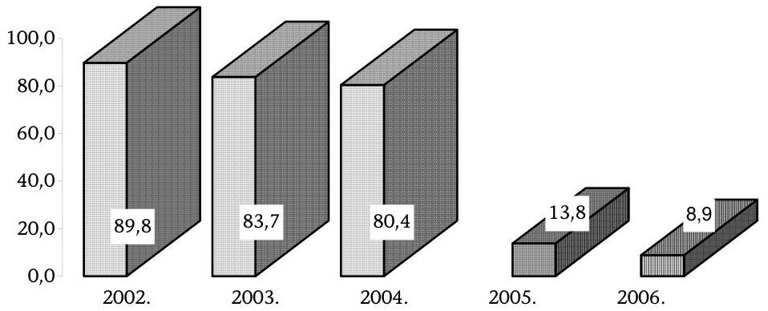
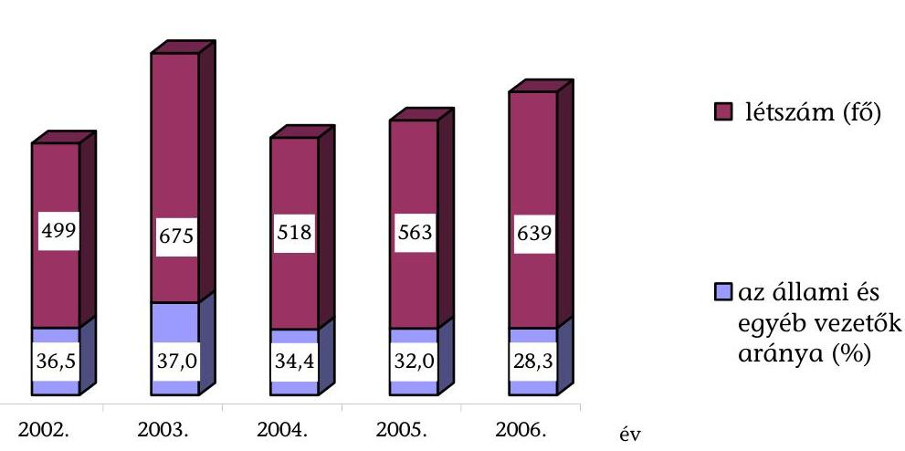
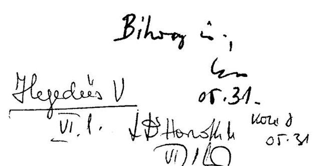
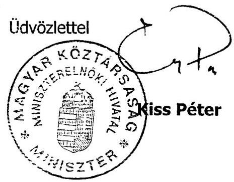
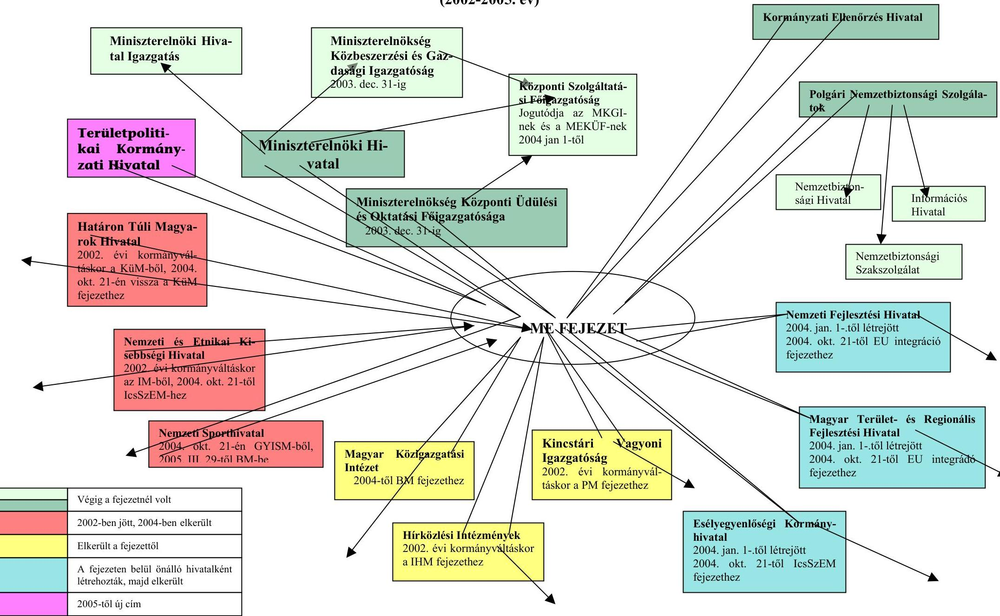
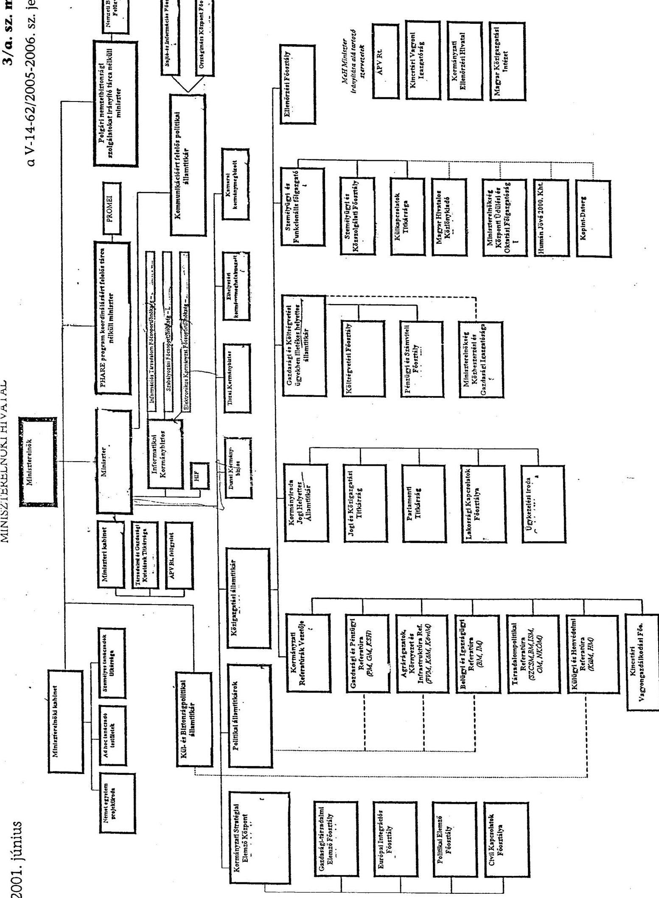
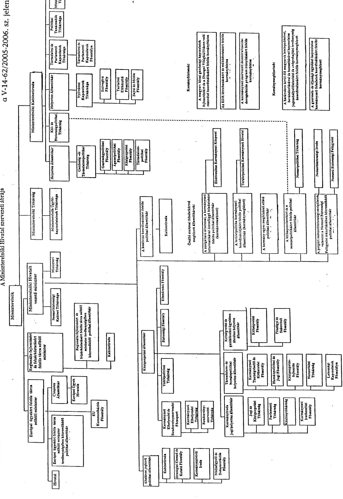
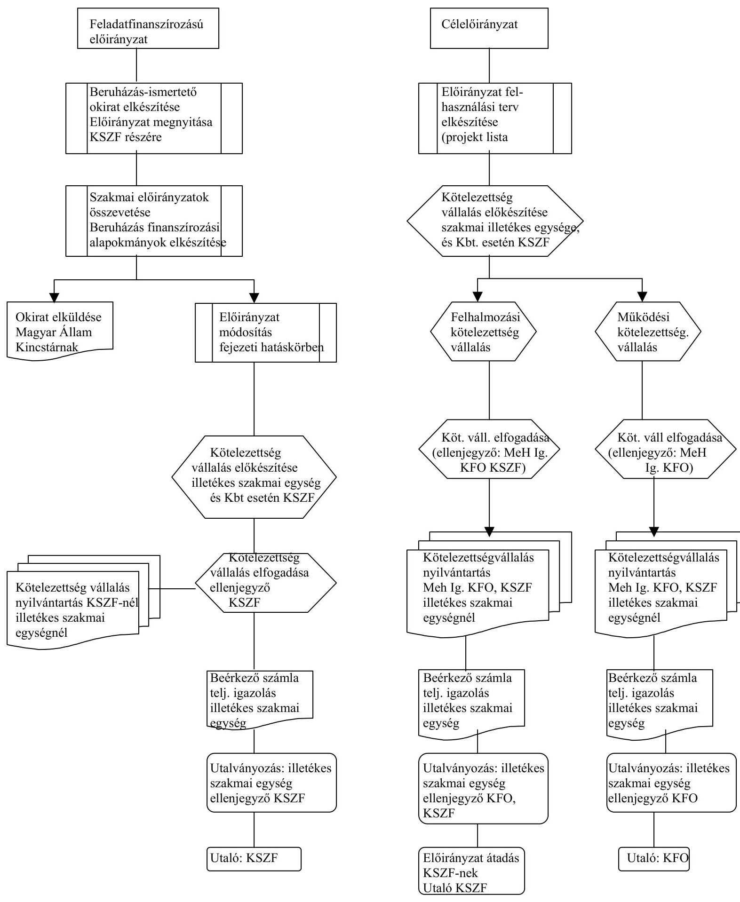

# ÁLLAMI   SZÁMVEVŐSZÉK 

## JELENTÉS

a Miniszterelnökség fejezet múködésének ellenőrzéséről

---

# 2. Államháztartás Központi Szintjét Ellenőrző Igazgatóság 

2.3. Átfogó Ellenőrzési Főcsoport

Iktatószám: V-14-62/2005-2006.
Témaszám: 778 .
Vizsgálat-azonosító szám: V0228

## Az ellenőrzést felügyelte:

Bihary Zsigmond
föigazgató
Az ellenőrzés végrehajtásáért felelős:
Hegedüsné dr. Müllern Veronika
főcsoportfőnök
Az ellenőrzést vezette:
dr. Horváth Margit
osztályvezető főtanácsos
Az ellenőrzést végezték:

| dr. Bartos László Pál számvevő | Borsos Ferenc számvevő tanácsos, tanácsadó | dr. Burján Margit számvevő tanácsos, főtanácsadó |
| :--: | :--: | :--: |
| Dede Katalin számvevő tanácsos | Ferencz Katalin számvevő | Hajdúné Sipos Erika számvevő |
| Kocsis Ferencné számvevő | Krüzselyi Attila számvevő | Méhes Áron számvevő gyakornok |
| Dr. Morvay András számvevő tanácsos | Szilas István számvevő tanácsos | Kertész Ákos külső szakértő |

---

# A témához kapcsolódó eddig készített számvevőszéki jelentések: 

címe
sorszáma
Jelentés a Miniszterelnökség fejezet működésének ellenőrzéséről ..... 0216
(2002)
Jelentés Miniszterelnökség fejezet működésének pénzügyi- ..... 9820
gazdasági ellenőrzéséről (1998)
Jelentés Miniszterelnökség fejezet működésének pénzügyi- ..... 9232
gazdasági ellenőrzéséről (1992)
Jelentés a Magyar Köztársaság 2002. költségvetése végrehajtásá- ..... 0329
nak ellenőrzéséről
Vélemény a Magyar Köztársaság 2001. és 2002. évi költségvetési ..... 0034
törvényjavaslatáról
Jelentés a Magyar Köztársaság 2003. költségvetése végrehajtásá- ..... 0443
nak ellenőrzéséről
Vélemény a Magyar Köztársaság 2003. évi költségvetési törvényja- ..... 0241
vaslatáról
Jelentés a Magyar Köztársaság 2004. költségvetése végrehajtásá- ..... 0540
nak ellenőrzéséről
Vélemény a Magyar Köztársaság 2004. évi költségvetési javaslatá- ..... 0338
ról
Vélemény a Magyar Köztársaság 2005. évi költségvetési javaslatá- ..... 0449
ról
Vélemény a Magyar Köztársaság 2006. évi költségvetési javaslatá- ..... 0550
ról
Jelentés az államháztartáson kívüli állami feladatellátás rendszer- ..... 0467
rének ellenőrzéséről
Jelentés a magyarországi nemzeti és etnikai kisebbségek támogatá- ..... 0468
si rendszerének ellenőrzéséről
Jelentés a Magyarországi Zsidó Örökség Közalapítvány gazdálko- ..... 0402
dásának ellenőrzéséről
Jelentés az EU Kommunikációs Közalapítvány gazdálkodásának ..... 0351
ellenőrzéséről
Jelentés az Illyés Közalapítvány gazdálkodásának ellenőrzéséről ..... 0466
Jelentés a Magyarországi Cigányokért Közalapítvány gazdálkodá- ..... 0427
sának ellenőrzéséről
Jelentés a Magyarországi Nemzeti és Etnikai Kisebbségekért Köz- ..... 0437
alapítvány gazdálkodásának ellenőrzéséről
Jelentés a Természet- és Társadalombarát Fejlődésért Közalapít- ..... 0533
vány gazdálkodásának ellenőrzéséről
Jelentés a Határon Túli Magyar Oktatásért Apáczai Közalapítvány ..... 0510
gazdálkodásának ellenőrzéséről

---

# TARTALOMJEGYZÉK 

BEVEZETÉS ..... 5
I. ÖSSZEGZŐ MEGÁLLAPÍTÁSOK, KÖVETKEZTETÉSEK, JAVASLATOK ..... 8
II. RÉSZLETES MEGÁLLAPÍTÁSOK ..... 15

1. A fejezetnél és intézményeinél a kontrollrendszer kialakításának determinációi, célszerűsége ..... 15
1.1. A kormányzati struktúraváltozások szerepe a fejezet és intézményei feladatellátásában ..... 15
1.2. A Miniszterelnöki Hivatal feladatellátása, kockázati tényezői ..... 21
1.3. A belső kontrollok múködtetése a Miniszterelnöki Hivatalt vezető miniszter felügyelete alá tartozó intézményeknél ..... 25
2. A költségvetési forrásokkal való gazdálkodás kontrollkörnyezete ..... 28
2.1. A fejezet feladatai és a költségvetési források összhangja ..... 28
2.2. A létszám- és illetménygazdálkodás kontroll kockázatai ..... 35
2.3. A Központi Szolgáltatási Főigazgatóság egyes kiemelt feladatai ellátásának feltételrendszere ..... 42
3. Az informatika irányítása, felügyelete ..... 46
3.1. Az informatika irányítási, felügyeleti rendszere, az informatikai háttér kockázati elemei ..... 46
3.2. Az informatikai beszerzések, fejlesztések, üzemeltetések pénzügyi feltételei ..... 52
3.3. Az Elektronikus Kormányzati Gerinchálózat és a Kormányzati Portál kiépítése és üzemeltetése ..... 53
4. Az ÁSZ előző vizsgálatainak javaslatai alapján megtett intézkedések ..... 63
4.1. Az ÁSZ előző átfogó ellenőrzéseiben megfogalmazott javaslatainak hasznosulása ..... 63
4.2. A fejezet költségvetésének tervezésével és a költségvetés végrehajtásával kapcsolatos ellenőrzések javaslatainak hasznosulása ..... 65
4.3. Az államháztartáson kívüli állami feladatellátás rendszere vizsgálatának utóellenőrzése ..... 66

---

# MELLÉKLETEK 

1. számú A MeHVM észrevétele
2. számú A fejezet intézményrendszerének alakulása
3/a-b. számú A Miniszterelnöki Hivatal 2001. és 2005. évi szervezeti tagolódása
3. számú A költségvetési előirányzatok összesítő adatai (1., 2/a-b., 3. sz. tábla)
4. számú A fejezeti kezelésű előirányzatok pénzügyi, gazdálkodási rendszerének folyamata
5. számú A fejezeti kezelésű előirányzatok a kötelezettségvállalási jogkörök szerint

## FÜGGELÉKEK

1. számú A Kormányzati Ellenőrzési Hivatal múködésének ellenőrzése

---

# RÖVIDÍTÉSEK JEGYZÉKE 

| Áht. | 1992. évi XXXVIII. törvény az államháztartásról |
| :--: | :--: |
| Ámr. | 217/1998. (XII. 30.) Korm. rendelet az államháztartás működési rendjéről |
| ÁSZ | Állami Számvevőszék |
| Ber. | 193/2003. (XI. 26.) Korm. rendelet a költségvetési szervek belső ellenőrzéséről |
| BM | Belügyminisztérium |
| DNS | Domain Name Service |
| EDI | Elektronikus adatcsere szolgáltatás |
| EDR | egységes digitális rádió távközlő rendszer |
| EKG | Elektronikus Kormányzati Gerinchálózat |
| EKH | Esélyegyenlőségi Kormányhivatal |
| EKK | Elektronikuskormányzat-központ |
| EKKÖ | ERASMUS Európai Közigazgatási Képzési Ösztöndíj |
| EKP | Elektronikus Kormányzat Program |
| EKR | Elektronikus Közbeszerzési Rendszer |
| EKSz | Elektronikus Közbeszerzési Szolgáltató |
| ePreLEX | Elektronikus jogszabály-előkészítés |
| EUKK | Európai Kommunikációs Közalapítvány |
| EüH | Európai Ügyek Hivatala |
| FEUVE | folyamatba épített, előzetes és utólagos vezetői ellenőrzés |
| FVM | Földművelésügyi és Vidékfejlesztési Minisztérium |
| GKM | Gazdasági és Közlekedési Minisztérium |
| Hivatal | Miniszterelnöki Hivatal |
| HTMH | Határon Túli Magyarok Hivatala |
| IBSZ | Informatikai Biztonsági Szabályzat |
| IHM | Informatikai és Hírközlési Minisztérium |
| IMI | Intézményi Munkaügyi Információs Rendszer |
| ITF | KSZF Informatikai és Telekommunikációs Főosztálya |
| Kbt. | 2003. évi CXXIX. törvény a közbeszerzésekről |
| K-D Rt. | KOPINT-DATORG Konjunktúra-, Piackutató és Számítástechnikai Rt. |
| KEHI | Kormányzati Ellenőrzési Hivatal |
| Ket. | 2004. évi CXL. törvény a közigazgatási hatósági eljárás és szolgáltatás általános szabályairól |
| Kht. | közhasznú társaság |
| KIETB | Kormányzati Informatikai Egyeztető Tárcaközi Bizottság |
| KITKH | Kormányzati Informatikai és Társadalmi Kapcsolatok Hivatala |
| KIR2 | Kormányzati Iratnyilvántartó Rendszer 2. verzió |
| KMB | Központi Monitoring Bizottság |
| KSH | Központi Statisztikai Hivatal |

---

| KSZF | Központi Szolgáltatási Főigazgatóság |
| :--: | :--: |
| Ktv. | 1992. évi XXIII. törvény a köztisztviselők jogállásáról |
| KÜK | Kormányzati Ügyféltájékoztató Központ |
| KüM | Külügyminisztérium |
| KVI | Kincstári Vagyoni Igazgatóság |
| Kincstár | Magyar Államkincstár |
| ME | Miniszterelnökség fejezet |
| MeH | Miniszterelnöki Hivatal |
| MeHIg. | Miniszterelnöki Hivatal Igazgatás |
| MeHVM | MeH-et vezető miniszter |
| MeKüF | Miniszterelnökség Központi Üdülési és Oktatási Főigazga-   tósága |
| MITS | Magyar Információs Társadalom Stratégia |
| MKGI | Miniszterelnökség Közbeszerzési és Gazdasági Igazgatósá-   ga |
| MTRFH | Magyar Terület és Regionális Fejlesztési Hivatal |
| NBB | Országgyúlés Nemzetbiztonsági Bizottsága |
| NEKH | Nemzeti és Etnikai Kisebbségi Hivatal |
| NFH | Nemzeti Fejlesztési Hivatal |
| NFT | Nemzeti Fejlesztési Terv |
| NKÖM | Nemzeti Kulturális Örökség Minisztériuma |
| NSH | Nemzeti Sporthivatal |
| PHARE | Pologne-Hongrie Aid a la Reconstruction Économique (az   EU 1989-ben létrehozott előcsatlakozási programja) |
| PIED | Projekt Indítást Előkészítő Dokumentum |
| PM | Pénzügyminisztérium |
| Ptk. | 1959. évi IV. törvény a Polgári Törvénykönyvről |
| RFF TNM | regionális fejlesztésért és felzárkóztatásért felelős tárca   nélküli miniszter |
| SZMSZ | szervezeti és múködési szabályzat |
| TKH | Területpolitikai Kormányzati Hivatal |
| TNM | tárca nélküli miniszter |
| VPN | Virtuális Magánhálózat |
| VoIP | adatkommunikációs vonalon kialakított hangszolgáltatá-   sok |

---

# JELENTÉS 

## a Miniszterelnökség fejezet múködésének ellenőrzéséről

## BEVEZETÉS

A Miniszterelnökség (ME) költségvetési fejezet tartalmazza a miniszterelnök munkaszervezetének, a Miniszterelnöki Hivatalnak (MeH, Hivatal) a múködését szolgáló, továbbá a kormányzati feladatok ellátásában közremúködő egyes szervezetek, így a Kormány számára belső ellenőrzést végző Kormányzati Ellenőrzési Hivatal (KEHI) költségvetését, valamint a fejezethez sorolt intézmények feladatköréhez kapcsolódó, illetve egyéb fejezeti kezelésű előirányzatokat.

A Hivatal a miniszterelnök és a Kormány döntéseinek, valamint a kormányprogram célkitűzéseinek megfelelően hivatott gondoskodni a kormányzati tevékenység stratégiai kidolgozásáról, irányításáról, az összhang biztosításáról a program elfogadásától a végrehajtásig. Egyúttal ellátja a Kormány testületi múködésével kapcsolatos feladatokat.

A KEHI külön kormányrendelet alapján végzi a Kormány számára a központi költségvetési szervek és alapok gazdálkodásának, az államháztartás alrendszereiből, továbbá az európai uniós forrásokból származó támogatásoknak a rendszer- és teljesítményellenőrzését.

A fejezet feladat- és intézményrendszere 2002-2005. között többször módosult, 2004-ig növekedett a feladatok, intézmények száma, 2005-re viszont jelentősen csökkent (2. sz. melléklet). A kormányzati struktúra változtatása kapcsán egyes címek [Magyar Közigazgatási Intézet, a Kincstári Vagyoni Igazgatóság (KVI), a Hírközlési Intézmények] más fejezetekhez kerültek, másokat ehhez a fejezethez [Határon Túli Magyarok Hivatala (HTMH), a Nemzeti és Etnikai Kisebbségi Hivatal (NEKH), Nemzeti Sporthivatal (NSH)] soroltak.

A fejezeten belül új intézményeket hoztak létre 2004-ben [Esélyegyenlőségi Kormányhivatal (EKH), Nemzeti Fejlesztési Hivatal (NFH), Magyar Terület- és Regionális Fejlesztési Hivatal (MTRFH)].

A fejezethez több fejezeti jogosítvánnyal felhatalmazott cím/intézmény is tartozott, ezeknél a felügyeleti jogosítványokat nem a MeH-et vezető miniszter (MeHVM) gyakorolta. A KEHI-nél a felügyeleti joggyakorló az elnök, az NSHnál a hivatalt vezető címzetes államtitkár volt. A Polgári Nemzetbiztonsági Szolgálatok címet tárca nélküli miniszter felügyelte a 2002. évi kormányváltásig, azt követően a MeH ezzel megbízott politikai államtitkára közremúködésével történt a feladat ellátása. Az NFH, az MTRFH és az EKH felügyelete tárca nélküli miniszterekhez tartozott 2004-ben.

---

A MeHVM felügyelete alá 2002-ben öt intézményt/címet és a feladataikhoz kapcsolódó fejezeti kezelésű előirányzatokat sorolták, 2005-ben már csak a MeH cím és az önálló költségvetési intézményként múködő Területpolitikai Kormányzati Hivatal (TKH), továbbá a fejezeti kezelésű előirányzatok tartoztak a felügyelete alá.

A MeHVM felügyeleti körén belül módosítást jelentett, hogy 2003. december 31-ével a Miniszterelnökség Központi Üdülési és Oktatási Főigazgatósága (MEKÜF) beolvadt a Miniszterelnökség Közbeszerzési és Gazdasági Igazgatóságába (MKGI), a kibővített feladatkörú intézmény elnevezése Központi Szolgáltatási Főigazgatóság (KSZF) lett.

A fejezetet irányító miniszter felügyelete alá rendelt címek kiadási előirányzata 2002-ben 118,2 Mrd Ft, a támogatási előirányzat 104 Mrd Ft volt, 2005. évre ${ }^{1}$ a csökkenés jelentős volt, a kiadási előirányzat ebben az évben 21,8 Mrd Ft-ot, a támogatási előirányzat 20,4 Mrd Ft-ot tett ki. A miniszter felügyelete alá tartozó címek tervezett létszáma 2002-re 2252 fő, 2005-re már csak 876 fő volt.

A KEHI 2002. évi 842,3 M Ft kiadási előirányzata 2005-re 1485,3 M Ft-ra, az engedélyezett létszám 124 fơről 166 főre emelkedett, összhangban az Európai Uniós támogatások miatti feladatbővüléssel.

Az Állami Számvevőszék (ÁSZ) előzőleg 1992-ben, 1998-ban és 2002-ben végzett átfogó ellenőrzést a fejezetnél. Ezen túlmenően minden évben véleményezte a fejezet költségvetési tervezését, ellenőrizte a MeH cím intézményeinek, fejezeti kezelésű előirányzatainak, valamint a fejezeti jogosítványokkal rendelkező intézményeknek a zárszámadását a financial audit típusú vizsgálat módszerével. Egyes témavizsgálatok ${ }^{2}$ is érintették a fejezet tevékenységét.

Az ellenőrzés célja annak értékelése volt, hogy az ME fejezetnél és annak felügyeleti szervénél

- a kormányzati struktúra változtatásával összefüggő, a feladatokat és az intézményrendszert érintő változásokhoz célszerűen módosították-e a fejezet irányítási és felügyeleti rendszerét; a kialakított kontroll környezet megfelel-

[^0]
[^0]:    ${ }^{1}$ A 2005. évi előirányzatok még nem tartalmazták a 2005-től a fejezethez sorolt TKH előirányzatait. 2006-ra a Magyar Köztársaság 2006. évi költségvetéséről szóló 2005. évi CLIII. törvény 21,1 Mrd Ft kiadási, 19,4 Mrd Ft támogatási előirányzatot biztosított.
    ${ }^{2} 0467$ Az államháztartáson kívüli állami feladatellátás rendszerének ellenőrzése; 0468 A magyarországi nemzeti és etnikai kisebbségek támogatási rendszerének ellenőrzése, 0402 Jelentés a Magyarországi Zsidó Örökség Közalapítvány gazdálkodásának ellenőrzéséről, 0351 Jelentés az EU Kommunikációs Közalapítvány gazdálkodásának ellenőrzéséről, 0466 Jelentés az Illyés Közalapítvány gazdálkodásának ellenőrzéséről, 0427 Jelentés a Magyarországi Cigányokért Közalapítvány gazdálkodásának ellenőrzéséről, 0437 Jelentés a Magyarországi Nemzeti és Etnikai Kisebbségekért Közalapítvány gazdálkodásának ellenőrzéséről, 0533 Jelentés a Természet- és Társadalombarát Fejlődésért Közalapítvány gazdálkodásának ellenőrzéséről, 0510 Jelentés a Határon Túli Magyar Oktatásért Apáczai Közalapítvány gazdálkodásának ellenőrzéséről.

---

lően segítette-e a szakmai feladatok ellátását; az ellenőrzési funkciók érvé-nyesültek-e, annak szervezeti és személyi feltételei lehetővé tették-e a szabálytalanságok, a múködés folyamatos nyomon követését;

- a költségvetési előirányzatok összhangban voltak-e a szakmai feladatokkal, biztosították-e azok hatékony ellátását;
- a fejezeti kezelésű előirányzatok tervezése során érvényesítettek-e a fejezet feladatellátásával összhangban álló prioritásokat, az előirányzatok felhasználása célszerűen történt-e, az előirányzatok felhasználásának beszámoltatási rendszere biztosította-e a teljes körű szakmai és pénzügyi elszámoltatást;
- megfelelően hasznosították-e a korábbi ÁSZ ellenőrzések megállapításait, javaslatait.

Jelen ellenőrzés végrehajtásának jogszabályi alapját az Állami Számvevőszékről szóló 1989. évi XXXVIII. törvény 2. § (3), (5) bekezdéseiben, valamint a 17. § (5) bekezdésében foglaltak képezték.

Az átfogó ellenőrzés az ME fejezet belső kontroll (szabályozási, irányítási, ellenőrzési) rendszerére irányult, annak értékelésére, hogy a kontroll mechanizmusok megfelelő biztosítékot adtak-e a feladatok előírásszerű, gazdaságos és eredményes ellátásához, a költségvetési források védelméhez, a megbízható infor-máció-szolgáltatási, valamint beszámolási kötelezettségek teljesítéséhez. A helyszíni ellenőrzés a MeH két alcímére (Igazgatás, KSZF) és a fejezeten belül külön címet, intézményt képező TKH-ra, valamint a fejezeti jogosítvánnyal felhatalmazott KEHI-re, továbbá 12 fejezeti kezelésű előirányzatra terjedt ki (4. sz. melléklet 2/a-b. tábla).

Vizsgálatunk keretében rendszerszemléletben tekintettük át az ME fejezet fel-adat-, cím- és intézményrendszerének alakulását, a fejezet felügyeletét ellátó szerv fő funkcióit, annak sajátosságait és változásait a kontrollhiányosságok, kockázatok feltárása érdekében. Teljesítmény-ellenőrzés módszerével értékeltük az Elektronikus Kormányzati Gerinchálózat (EKG) rendszerei kiépítésének és üzemeltetésének eredményességét, hatékonyságát.

Az átfogó ellenőrzés a fejezeti irányítás 2002-2005. közötti időszakát fogta át, ezen belül hangsúlyozottan az utolsó két év feladatellátására irányult.

A jelentést egyeztettük a Miniszterelnöki Hivatalt vezető miniszterrel. Levelének másolatát az 1. számú melléklet tartalmazza.

---

# I. ÖSSZEGZŐ MEGÁLLAPÍTÁSOK, KÖVETKEZTETÉSEK, JAVASLATOK 

A vizsgált időszakban a fejezet működésére jellemző volt a feladatok, intézmények, előirányzatok átrendezésének gyakorisága, amelyek nagyrészt a két kormányváltáshoz (2002., 2004.) kapcsolódtak. A fejezeti jogosítvánnyal felhatalmazott szervek száma is emelkedett újabb szervezetek (EKH, NFH, MTRFH) létrehozásával, illetve a fejezethez csatolásával (NSH), ezzel tovább bonyolították a fejezet irányítási-felügyeleti rendszerét.

2005-re jelentős profiltisztítást hajtottak végre, különösen a MeHVM felügyelete alá tartozó területen (csak a MeH múködését biztosító alcímek maradtak és egy külön intézmény). Az átrendezések keretében egyes feladatok, intézmények visszakerültek oda, ahol 2002. elején voltak (az Egyházügyi-államtitkárság a Nemzeti Kulturális Örökség Minisztériumhoz (NKÖM), a HTMH a Külügyminisztériumhoz), más feladatokra (területfejlesztés és európai integráció) a költségvetésben új fejezeteket hoztak létre. A rövid időszakonként bekövetkező kormányzati koncepcióváltások miatt többször változott a fejezet felügyelete alá tartozó fejezeti kezelésű előirányzatok rendszere is.

A kormányzati struktúrát érintő gyakori átrendezések kockázatait csökkentette, hogy a MeH az átadás-átvételekről általában kellő időben megkötötte a megállapodásokat az érintett intézményekkel.

A felügyeleti és fejezeti rendben bekövetkezett változásokat egyes esetekben (NSH, NFH) jelentős késedelemmel, illetve egyáltalán nem vezették át a vonatkozó jogszabályokon. A területfejlesztési feladatok, intézmények átrendezésének szakmai-gazdasági megalapozására a döntés-előkészítő kormányelőterjesztések, jogszabálytervezetek megfelelő indoklást nem vagy csak formálisan tartalmaztak.

A változások a fejezet alapintézményét, a miniszterelnök munkaszervezeteként múködő MeH-et is érintették. A Hivatalnál évente többször módosult a feladatés szervezeti rend. A MeH szervezeti és irányítási rendszere a többi minisztériuméhoz (politikai, közigazgatási államtitkár, helyettes államtitkárok) képest eleve összetettebb, mivel a keretei között múködnek más fejezetek, szervezetek felügyeletét ellátó tárca nélküli miniszterek; továbbá meghatározott feladatok ellátására - a Kormány tagjai és az államtitkárok jogállásáról szóló törvénynek ${ }^{3}$ a politikai és igazgatási funkciók következetes elválasztását megtörő előírásai szerint - politikai és címzetes államtitkárok, kormánybiztosok és kormánymegbízottak. A (helyettes)államtitkári és ezen besorolású vezetők számában lényegi különbség a vizsgált időszakban nem mutatkozott (18-22 közötti volt), ugyanakkor növekedett a bevont kormánybiztosok és megbízottak szá-

[^0]
[^0]:    ${ }^{3}$ A Kormány tagjai és az államtitkárok jogállásáról és felelősségéről szóló 1997. évi LXXIX. törvény 2002. VII. 23-ától hatályos módosítása szerint.

---

ma. A feladatuknak jogszabályban vagy kormányhatározatban történő meghatározása - esetenkénti kivételekkel - nem volt kellően részletes a kinevezés indokoltságának, célszerűségének megítéléséhez.

A MeH Szervezeti és Múködési Szabályzata (SZMSZ) (a 2004. évi kormányváltást követő) elhúzódó módosításának következményeként az érintett szervezetek ügyrendjét sem adták ki, munkaköri leírások is hiányoztak (Miniszterelnöki Titkárság). A TKH főosztályai annak megalakulása után egy évvel sem rendelkeztek ügyrenddel.

A kockázatokat ellensúlyozta a MeH szervezeti-gazdasági-személyügyi múködtetését biztosító, a közigazgatási államtitkár irányítása alá tartozó szervezetek stabilitása, a gazdálkodás szabályszerűsége és a belső ellenőrzés tapasztalatainak megfelelő hasznosítása. Az intézményeknél a belső ellenőrzés nemcsak a szűkebben vett költségvetési gazdálkodási tevékenység egyes területeinek vizsgálatára, hanem a múködésre is kiterjedt, hozzájárult a célszerűbb múködés kialakításához.

A fejezet intézményeinek feladatrendjében, intézményi szerkezetében végrehajtott változások kihatottak a kiadási előirányzatok alakulására is. A MeHVM felügyelete alá tartozó előirányzatok esetében a vizsgált időszakban mintegy $80 \%$-os volt a csökkenés ( $118,2 \mathrm{Mrd}$ Ft-ról 21,8 Mrd Ft-ra). A feladatok ellátásában, gazdálkodásában jelentős szerepe volt a fejezeti kezelésú előirányzatoknak (4. sz. melléklet). A fejezeti kezelésű előirányzatok teljesítése a vizsgált időszakban ugyan jelentősen módosult ( 90 Mrd Ft-ról 14 Mrd Ft-ra) ${ }^{4}$, az összes kiadási előirányzaton belüli aránya azonban nem változott lényegesen, $75-80 \%$-os volt.

A MeHVM felügyelete alatt álló fejezeti kezelésú előirányzatok alakulása 2002-2006-ban (Mrd Ft)

A tárca nélküli miniszterek, politikai államtitkárok, kormánybiztosok felügyelete alá tartozó fejezeti kezelésű előirányzatok összege, aránya minden évben jelentős volt, 2005-ben megközelítette a $75 \%$-ot, a vizsgált időszakban összesen

[^0]
[^0]:    ${ }^{4}$ A grafikon 2002-2005. évi adatai teljesítésre, a 2006. évi adata eredeti előirányzatra vonatkozott.

---

mintegy 170 Mrd Ft felett rendelkeztek. Az előirányzatok 80\%-át (216 Mrd Ft) a területfejlesztéssel összefüggő célokra fordították. A fejezeti kezelésű előirányzatok egy kisebb része a kormányzati ciklusoktól függetlenül a MeH mindenkori alapfeladataihoz kapcsolódott (ünnepi rendezvények, ország-kép kialakítás, kormányzati kommunikáció), ezért mindvégig szerepeltek a támogatási célok között.

A tervezés megalapozottságára, kidolgozására, szakmai tartalmára kihatottak a fejezet feladat- és intézményrendszerének gyakori változásai. Részletes szakmai elképzeléseket, elérendő célokat, hatásokat legtöbb esetben nem határoztak meg a tervezett kiadások összegének indokolására.

A fejezet intézményeinél a központilag elrendelt takarékossági intézkedéseket végrehajtották. A MeH-nél ennek keretében vonták össze az MKGI-t és a MeKÚF-öt egyetlen szervezetbe. Az EU Kommunikációs Közalapítványnak az ÁSZ javaslatával összhangban történő megszüntetése (2004-ben) jelentős, mintegy 2 Mrd Ft-os megtakarítással járt.

A fejezet intézményi szerkezetének egyszerúsödése ellenére 13\%-kal növekedett a MeH létszáma (a tényleges állományi létszám 2002-ben 499, 2005-ben 563 fő volt), a személyi juttatások megkétszereződtek. Az állami vezetők és az állami vezetői illetményre, juttatásokra jogosultak aránya lényegesen nem változott (2002-ban 28, 2005-ben 26 fő). A MeH-nél rendszeresen túllépték a politikai tanácsadók számára vonatkozóan a Ktv-ben meghatározott mértéket ${ }^{5}$, a politikai (fő)tanácsadók száma a vizsgált időszakban kétszeresére nőtt, továbbá rendszeresen alkalmaztak a jogszabályi előírásoknak nem megfelelő foglalkoztatási formákat, köztisztviselői feladatokat láttak el nem köztisztviselői státuszban alkalmazottakkal.

Kedvező változást jelentett, hogy 2005-ben a közigazgatási államtitkár utasítására elvégezték a szellemi tevékenység végzésére irányuló szerződések teljes körű felülvizsgálatát, annak következményként megkezdték a feltárt hibák kijavítását, elkészítették és kiadták az egységes jogalkalmazási gyakorlatot biztosító belső szabályozást.

A MeH-nél az állami és egyéb vezetők (beleértve a vezetői besorolásúakat is) aránya végig jelentős, $30 \%$ feletti volt. Széles körben alkalmazták a különböző címadományozásokat, ezzel is bővítették a bérezési és a teljesítmény-elismerési lehetőségeket.

A fejezet intézményeinél a központi létszámcsökkentési előírásokat végrehajtották. A külsős foglalkoztatás mértéke a vizsgált időszakban emelkedett, a ténylegesen foglalkoztatottak körében közel 10\%-kal. A megbízási díjakon kívül jelentős volt a szellemi tevékenység végzésére történt kifizetés is (tolmácsolás, fordítás, tanácsadás, tanulmányírás).
${ }^{5}$ A Ktv. 11/A. §. (4) bekezdés előírása szerint a miniszteri főtanácsadói és tanácsadói, valamint a politikai főtanácsadói és tanácsadói munkakörök száma nem haladhatja meg a közigazgatási szervnél foglalkoztatott köztisztviselők létszámának 5\%-át.

---

A KSZF egyik alapfeladatának, a központosított közbeszerzésnek a célja az volt, hogy hatékonyabbá tegye a költségvetési szervek beszerzéseit. A rendszer összességében megfelelt az elvárásoknak. Ebben fontos szerepe volt annak, hogy a MeHVM meghatározta az országosan kiemelt termékekre vonatkozó állami normatívákat. Továbbra sem valósult meg azonban az Elektronikus Közbeszerzési Rendszer (EKR), holott a bevezetés eredeti időpontja 2002. január 31e volt. A fő akadályt az üzemeltetési források hiánya jelentette.

A KSZF másik alapfeladatának, a központi közigazgatás integrált üdültetési rendszerének kialakításánál a legsúlyosabb és jelenleg sem megoldott probléma volt, hogy az üdülők átadása forráshiányosan történt. Az integrált üdültetési rendszerben rendelkezésre álló összkapacitás 2002-2005. között gyakorlatilag nem változott. A központi szervek eltérő mértékben vették igénybe az üdültetési és a kapcsolódó szolgáltatásokat. Az üdültetés bevételei és ráfordításai 2,5 Mrd Ft körül mozogtak. A költségvetési támogatás aránya gyakorlatilag nem változott, közel 60\%-os volt. A közbeszerzésekre vonatkozó tapasztalatok alapján az intézmények érdekeltség hiányában továbbra sem a Kht. által nyújtott bővített szolgáltatásokat veszik igénybe.

A fejezetnél az intézményeket illetően informatikai szakmai irányító, felügyeleti tevékenységet nem láttak el, az intézményekre vonatkozó informatikai stratégiával nem rendelkeztek, de annak elemei megjelentek munkaanyagokban, egyes, rendszerfejlesztést is tartalmazó projektekben. Takarékossági szempontok is közrejátszottak abban, hogy nem került sor az informatika fejezeti felügyeletét (beleértve az informatikai stratégiával kapcsolatos tevékenységet) kizárólagos felelősséggel ellátó informatikai helyettes államtitkárság létrehozására.

Az informatikai terület biztonságos múködtetése kockázatot hordozó elemeit a helyszíni vizsgálatunk tapasztalatai alapján jelentős mértékben mérsékelték, azonban a szabályozás területén továbbra is voltak hiányosságok. A legfontosabb informatikai szabályzatokkal nem rendelkeztek, ugyanakkor a biztonsá-

---

gos múködtetéssel kapcsolatos szabályozásokat ${ }^{6}$ a helyszíni ellenőrzés idejére elkészítették és kiadták.

Az informatikai feladatok struktúrájában központi szerepet játszó kormányzati informatikai feladatok koordinálása és az elektronikus kormányzat kialakítása a MEH szervezeti egységeként működő Elektronikuskormányzat-központ (EKK) feladat- és hatáskörébe tartozott. Az E-kormányzat stratégiai célkitűzései megfeleltek az EU elvárásainak. A vizsgált időszakban az erre létrehozott projektszervezetek közreműködésével fontos programok valósultak meg, többek között kiépítették az Elektronikus Kormányzati Gerinchálózat (EKG) országos hálózati alapinfrastruktúráját, a Kormányzati Portált, a Kormányzati Úgyféltájékoztató Központot (KÜK), továbbá megkezdték az Elektronikus jogszabályelőkészítés (ePreLEX) kialakítását.

Az EKG megteremtette a központi költségvetési szervek közötti korszerű kommunikáció biztosításának feltételeit. Az EKG kialakítása és múködtetése a MeH-en belül kiemelt feladat volt. Az EKG alapinfrastruktúrája az előírásoknak megfelelően került kialakításra, a rendszert ezzel megbízott, a MeH tulajdonában álló gazdasági társaság üzemeltette. Az üzemeltetési díj mértékét részletes, a teljesítmény- és értékarányosság megítéléséhez szükséges költségkalkuláció egyik évben sem támasztotta alá. Az EKK a beszerzés előkészítése során sem készített érdemi hatástanulmányokat és nem végzett átfogó elemzéseket, így a kialakított konstrukció állami költségvetésre gyakorolt pénzügyi-gazdasági kihatását nem határozták meg.

Az EKG múködtetésével kapcsolatban az EKK által 2005. áprilisában megkötött „Szolgáltatási szerződés" hiányossága, hogy nem tartalmaz kitételeket, garanciákat a szerződéses időszak végén a Magyar Állam tulajdonába kerülő eszközátadás módjára. Nem biztosítja annak lehetőségét, hogy az eszközök teljes körére vonatkozóan az üzemeltetést más (kormányzati vagy piaci) szolgáltató akadálytalanul átvehesse, továbbá nem tartalmazzák a szerződések a szolgáltatási díjak rendszeres (évenkénti) felülvizsgálatát. A szerződés az adat- és hangkommunikáció területén 10\%-os költségcsökkentési vállalást tartalmaz a Szolgáltató részéről. A szerződésben ugyanakkor nem rögzítették a minimum 10\%-os költségcsökkenés teljesülése ellenőrzésének módját és módszerét (számítási modellek, monitoring), a nem teljesítés szankcióját.

Átfogó ellenőrzésünk kiterjedt - az ÁSZ korábbi gyakorlatának megfelelően - a fejezeti jogosítványokkal felhatalmazott KEHI múködésének ellenőrzésére (1. sz. függelék) is. A Hivatal feladat- és hatásköre, a múködés jogszabályi környezete a vizsgált időszak minden évében változott, feladatköre jelentősen bővült az uniós támogatások felhasználásának vizsgálatával.

A Hivatalnál a feladatstruktúra változásával összhangban célszerűen átalakították a szervezeti és múködési rendet, az irányítási, döntési mechanizmusokat.

[^0]
[^0]:    ${ }^{6}$ A Biztonsági Szabályzatot a helyszíni ellenőrzés ideje alatt kiadták, a Katasztrófa-terv előkészületben volt, az üzemeltetési rendszert a tervezéstől a kivitelezéséig teljes körűen dokumentálták, folyamatosan karbantartották, illetve havi rendszerességgel mentették.

---

Az ellenőrzések száma, egyúttal az uniós támogatásokkal kapcsolatos ellenőrzések aránya a vizsgált időszakban mintegy kétszeresére emelkedett.

A KEHI a szakmai feladatellátásához, a múködéséhez, a gazdálkodásához az előírt, a sajátosságainak megfelelő és aktualizált belső szabályzatokkal rendelkezett. Ellenőrzési tevékenysége teljes körű folyamatszabályozáson alapult és folyamatos minőségbiztosítás mellett történt.

A költségvetési törvényekben a Hivatal részére biztosított előirányzatok a feladatokkal összhangban növekedtek, kiegyensúlyozott gazdálkodást tettek lehetővé.

Utóellenőrzés keretében áttekintettük az 1998-2001. közötti időszakra vonatkozó átfogó ellenőrzésünk javaslatai hasznosulását, valamint az éves költségvetések és zárszámadások, az államháztartáson kívüli állami feladatellátás fejezetre vonatkozó megállapításainak érvényesülését.

A korábbi átfogó ellenőrzésünk, valamint az éves költségvetések végrehatásáról szóló jelentések javaslatai egyes szabályozási és múködésbeli hiányosságok felszámolására irányultak. A fejezetnél a jelen ellenőrzésünk során is tapasztaltunk a szervezetre, múködésre vonatkozóan szabályozási pontatlanságokat, hiányosságokat. Ugyanakkor a költségvetési előirányzatok tervezése és felhasználása szakszerűbb és megalapozottabb lett, a feladatrendszer egyszerűsödésével párhuzamosan. A 2005. évi pályázatok kiírását pontosították, az elszámolásokat szigorították, hatékonyabbá tették az ellenőrzést.

Az átfogó ellenőrzés keretében javasoltuk, hogy a kormányzati informatikában az adatbiztonsági követelményekre, az adatvagyon-gazdálkodásban az összkormányzati érdekekre nagyobb hangsúlyt fektessenek. Ezen belül - az információvédelem jelentőségének számottevő növekedésével összhangban indokoltnak tartottuk - a kötelező erejú szabályozás ${ }^{7}$ lehetőségének biztosítását. Ez nem történt meg. Az EKK a hatályos jogszabályi környezetben továbbra is ajánlásként tudja meghatározni ezen a területen az általános és alapvető követelményeket.

Az átfogó ellenőrzésünk során az integrált üdültetési rendszerrel kapcsolatban javasoltuk a feladatok-források összhangjának biztosítását, valamint a rendszer hatékonyabb múködtetéséhez szükséges, egységes adatbázisok létrehozását. Tapasztalataink szerint a forráshiányosan átvett üdülők esetében később sem került sor a szükséges források biztosítására, mindez az üdültetés színvonalát, a fejlesztési lehetőségeket kedvezőtlenül befolyásolta, viszont a megfelelő adatbázis kialakításáról intézkedtek.

[^0]
[^0]:    ${ }^{7}$ Hasonló tartalmú javaslatokat az ÁSZ visszatérően megfogalmazott a Kormány részére: „Gondoskodjon a közigazgatás információvédelmének érvényesítése érdekében a közigazgatásban alkalmazott informatikai rendszerek biztonsági követelményeinek szabályozásáról. "(a BM fejezet múködésének ellenőrzéséről szóló 0215 számú Jelentés); „Alakítsa ki az informatikai rendszerek biztonságos alkalmazásához szükséges jogi szabályozást, részletesen meghatározva az intézmények által szabályozandó területeket." (a belső kontroll mechanizmusok ellenőrzéséről szóló 0115 sz . Jelentés).

---

A helyszíni ellenőrzés megállapításainak hasznosítása mellett javasoljuk:

# a Kormánynak 

1. Gondoskodjon az ME fejezet, illetve annak intézményei feladatellátását és szervezetét érintő kormány szintű döntéseknek a változások hatásait rendszerszemléletben értékelő, megalapozottabb előkészítéséről.
2. Intézkedjen az EKR működtetéséhez szükséges üzemeltetési források biztosításáról.

## a MeH-et vezető miniszternek

1. Gondoskodjon a fejezeti informatikai stratégiai döntésekért felelős vezető kijelöléséről és az informatikai stratégia elkészítéséről.
2. Intézkedjen az EKG múködésével kapcsolatban:
a) a Szolgáltatóval kötött szerződések kiegészítéséről a kapcsolódó garanciális elemekkel és szankciókkal együtt:

- a stratégiailag fontos emelt szintű szolgáltatások átadása és átvétele feltételeinek a szerződés megszűnésekor történő teljesíthetősége, a szolgáltatási díjak évi rendszeres érdemi felülvizsgálata, a 10\%-os költségcsökkentés mérésére és értékelésére alkalmas monitoring rendszer kialakítása és alkalmazása érdekében;
b) a szabályozási környezet felülvizsgálatáról, a katasztrófa terv és a belső biztonsági ellenőrzési rendszer kialakításáról.

---

# II. RÉSZLETES MEGÁLLAPÍTÁSOK 

## 1. A fejezetnél és intézményeinél a KONTROLLRENDSZER KIALAKÍTÁSÁNAK DETERMINÁCIÓI, CÉLSZERŰSÉGE

### 1.1. A kormányzati struktúraváltozások szerepe a fejezet és intézményei feladatellátásában

A fejezet feladat-, és címrendje 2002-től 2005-ig - az 1998-tól 2002-ig tartó időszakhoz hasonlóan - jelentősen változott, legnagyobb mértékben a 2002. májusi, illetve a 2004. októberi kormányváltásokat követően (2. sz. melléklet). A fejezet felügyeletét ellátó MeH , valamint a múködéséhez egyes gazdálkodási tevékenységek ellátását biztosító háttérintézménye állandó volt, a feladatuk és szervezeti rendjük azonban többször módosult. A rövid időszakonként bekövetkező kormányzati koncepcióváltások miatt többször változott a fejezet felügyelete alá tartozó fejezeti kezelésű előirányzatok köre is.

A MeH-ről szóló 148/2002. (VII. 1.) Korm. rendeletet a vizsgált időszak alatt közel 20 alkalommal módosították. Évente több alkalommal határoztak meg újabb feladatokat, szüntettek meg meglévőket, szervezték át azokat más tárcákhoz.

A kormányzati munka átszervezése következtében 2002-ben új feladatként jelent meg a Nemzeti Fejlesztési Terv (NFT) kidolgozása és megvalósítása, a területpolitikai, területfejlesztési és területrendezési ágazati feladatok ellátása, az idegenforgalmi tevékenység ágazati irányítása, a nemzeti és etnikai kisebbségek ügyei, a közpénzek felhasználása feletti ellenőrzés, az egyházakkal való kapcsolattartás. Ugyanakkor más minisztériumok vették át a kincstári vagyonkezelést és a pénzintézetek felügyeletét, valamint az informatikai feladatok egy részét.

A vizsgált időszakban a fejezet költségvetésében két olyan fejezeti jogosítványokkal rendelkező cím volt, amelyek felett a szakmai felügyeletet a Kormány nevében a MeHVM gyakorolta a KEHI-nél közvetlenül, illetve közvetve a feladat ellátására kinevezett politikai államtitkár ${ }^{8}$ közreműködésével a Polgári Nemzetbiztonsági Szolgálatoknál. Átmenetileg volt a fejezetnél több, olyan fejezeti jogosítványokkal felhatalmazott, önállóan gazdálkodó, teljes jogkörrel rendelkező központi költségvetési szerv is, amelyek esetében a szakmai felügyeletet tárca nélküli miniszterek, kormányhivatali elnökök gyakorolták.

Az ME fejezetben volt az esélyegyenlőségi tárca nélküli miniszter (TNM) által irányított EKH 2004. I. 1-je és 2004. X. 7-e között ${ }^{9}$, az Európai Uniós (EU) integrációs

[^0]
[^0]:    ${ }^{8}$ A felügyeletet 2002. VII. 1-je előtt tárca nélküli miniszter látta el.
    ${ }^{9}$ A Kormány megalakulásával összefüggésben egyes feladat- és hatáskörök gyakorlásáról szóló 274/2004. (X. 7.) Korm. rendelet alapján. Az EKH-ról szóló 222/2003. (XII. 12.)

---

ügyekért felelős TNM irányítása alatt működő NFH ${ }^{10}$ 2004-ben, az NSH 2004. X. 28 -ától ${ }^{11}$ 2005. III. 29-éig ${ }^{12}$.

A fejezet felügyeletét ellátó szerv, a $\mathbf{M e H}^{13}$ alapvető feladata nem változott, a Hivatal a miniszterelnök munkaszervezete ${ }^{14}$, amely a miniszterelnök és a Kormány döntéseinek, a kormányprogram céljainak megfelelően biztosítja a kormányzati tevékenység stratégiai megalapozását, irányítását és összhangjának megteremtését. Ezen kívül közvetlenül is ellát egyes, összkormányzatinak minősített feladatokat. A MeH keretei között szakmai önállósággal múködnek a TNM-k, a kormánybiztosok és -megbízottak hivatali szervezetei (2/a-b. sz. mellékletek). A MeH feladatköre csökkent a 92/2003. (VII. 1.) Korm. rendelet alapján, a Turisztikai célelőirányzat a Gazdasági és Közlekedési Minisztériumhoz (GKM) került.

A 148/2002. (VII. 1.) Korm. rendelet 8. és 10. §-ai alapján az összkormányzati feladatok közé tartozott például az Országgyúlés, az Alkotmánybíróság, a miniszterelnök és a Kormány döntéseiben megjelölt feladatok nyomon követése, közremúködés az ÁSZ vizsgálataival kapcsolatban adódó kormányzati feladatok meghatározásában és végrehajtásuk figyelemmel kísérésében. Az utóbbiak követésére csak 2004. júniusban alakítottak ki megfelelő rendszert. A rendszerben 2004. VI. 10-étől az év végéig 16, 2005-ben az év elejétől XI. 30 -áig pedig mindössze 60 ÁSZ jelentést regisztráltak, holott csak 2005-ben ennél közel 25\%-kal több jelentést tett közzé az ÁSZ.

A vizsgált időszak meghatározó prioritásai voltak a kormányzati informatikai és az EU csatlakozás tárcát érintő feladatai az azokhoz kapcsolódó támogatásokkal együtt.

A Kormány által alapított közalapítványokat, közhasznú társaságokat, továbbá alapítványokat (pl. a Politikatörténeti Alapítványt 50 M Ft-tal, Európai Öszszehasonlító Kisebbségkutatások Közalapítványt 60 M Ft-tal) minden évben támogatott a MeH . A feladatok ellátásában gazdasági társaságok is rendszeresen közreműködtek, a tulajdonosi jog átadására egyes esetekben jelentős késedelemmel került sor.

Korm. rendeletet a változást követően 3 héttel később helyezték hatályon kívül és szabályozták újra.
${ }^{10}$ Az államháztartás működési rendjéről szóló 217/1998. (XII. 30.) Korm. rendelet (Ámr.) 2. § 2. pontja alapján.
${ }^{11}$ A NSH-ról szóló 297/2004. (X. 28.) Korm. rendelet előírásai szerint.
${ }^{12}$ Az ezen időponttól hatályos, a NSH felügyeletének változásával összefüggésben szükséges törvénymódosításokról szóló 2005. évi XIII. törvény alapján.
${ }^{13}$ Alapításáról a 2/1990. (VII. 5.) Korm. rendelet határozott.
${ }^{14}$ A MeH sajátossága, hogy a Magyar Köztársaság minisztériumainak felsorolásáról szóló 2002. évi XI. törvényben nem szerepel a minisztériumok között.

---

2002-ben egy Rt., két Kft. (Tabax Holding Rt, Záhony és Térsége Fejlesztési Kft. és a MOL-GÁZ Kft.) részvényeinek, üzletrészeinek átadása a tulajdonosi jog változáshoz képest közel 1 év múlva történt meg.

A 2002. évi kormányváltás után az informatikai feladatok nagy része az újonnan létrehozott Informatikai és Hírközlési Minisztériumhoz (IHM) került, de a kormányzati informatikával kapcsolatos tennivalók továbbra is a MeH-nél maradtak.

A MeH feladatai között 1998. óta szerepel a kormányzati informatika fejlesztésében való részvétel. Az államigazgatás informatikai koordinációjának továbbfejlesztéséről szóló 1066/1999. (VI.11.) Korm. határozat a MeHVM feladatává tette a kormányzati informatikai rendszerek fejlesztését, múködtetését, a kormányzati szintű adatgazdálkodást, valamint az ezt támogató nyilvántartási rendszerek kialakítását.

A 2002. évi kormányváltás után a fejezethez sorolt területfejlesztési és európai integrációs feladatokkal kapcsolatos előirányzatoknál 2003-ban újabb átrendeződés volt tapasztalható.

A 70/2003. (V. 19.) Korm. rendelet alapján 2003. V. 19-étől az NFT-vel és az európai uniós támogatások koordinálásával, illetve a területfejlesztéssel és területrendezéssel kapcsolatos feladatok a MeH-en belül - az NFH és az MTRFH megalakításával összefüggésben - az európai integrációs ügyek koordinációjáért felelős TNM feladat- és hatáskörébe kerültek.

A 107/2003. (VII. 18.) Korm. rendelet alapján 2003. VII. 21-étől a társadalmi és civil kapcsolatok fejlesztésével, a roma népesség társadalmi integrációjával összefüggő feladatok - az EKH létrehozásával - az esélyegyenlőségi tárca nélküli miniszter felügyelete alá kerültek.

Egyes feladatok/intézmények és fejezeti kezelésű előirányzatok a vizsgált időszakban - a 2004-es kormányváltással összefüggésben - más fejezetbe (minisztériumba) kerültek, esetenként vissza ugyanabba, ahol 2002 elején voltak.

Az egyházügyi államtitkárság 27 hónap múlva visszakerült a NKÖM-höz, a HTMH pedig 28 hónap múlva a KüM-höz.

A Turisztikai Hivatal 2003-ban - pontosan egy évvel később - került vissza a GKM fejezetbe, majd újabb 1,5 évvel később létrejött a Turisztikai Államtitkárság a MeH-ben, a regionális fejlesztésért és felzárkóztatásért felelős (RFF TNM) felügyelete alatt álló Magyar Turisztikai Hivatal pedig a Területfejlesztés fejezetbe épült be.

A NEKH, valamint a 2004. I. 1-jével létrehozott EKH 2004. októberben az akkor megalakult ICSSzEM fejezethez került. A megszűnt Gyermek, Ifjúsági és Sportminisztériumból ugyanekkor a ME fejezetbe helyezték az NSH-t, intézményhálózatával és nagyszámú fejezeti kezelésű előirányzataival együtt, majd alig 5 hónap elteltével a Belügyminisztérium (BM) fejezethez csoportosították át ${ }^{15}$.

[^0]
[^0]:    ${ }^{15}$ Sajátosan érvényesült a Magyar Közigazgatási Intézetnél a MeHVM szakmai felügyeleti joga a közigazgatás-fejlesztési kutatási tevékenységre vonatkozóan. Maga az in-

---

A fejezeti kezelésú előirányzatok száma 2004-ben 55-tel, az eredeti előirányzat 47 Mrd Ft-tal csökkent. A kormányfőváltást követő struktúraváltás miatt a 2005. évi eredeti előirányzat 33 Mrd Ft-tal volt alacsonyabb az előző évinél, az előirányzatok száma 40 -el csökkent.

Az intézmények, szervezeti egységek fejezetek közötti átrendezése az általuk szakmailag felügyelt fejezeti kezelésű előirányzatok átadását-átvételét is magában foglalta.

Átadásra 2002-ben 2 előirányzat 39,6 Mrd Ft, átvételre 58 előirányzat 87,8 Mrd Ft értékben került. A fejezeti kezelésű előirányzatok 108,5 Mrd Ft-os eredeti kiadási előirányzata 48,2 Mrd Ft-tal növekedett. (A módosított fejezeti kezelésű előirányzatok további 23,4 Mrd Ft-os növekedését új előirányzatok - például a Kormány által alapított közalapítványok és közhasznú társaságok támogatása - létrehozása okozta ${ }^{16}$.) Átvételre kerültek a területfejlesztéssel kapcsolatos (16 előirányzat), a határon túli magyarokat érintő feladatokhoz kötődő (10), a magyarországi nemzeti és etnikai kisebbségekre vonatkozó (20), az egyházak múködésével összefüggő (12) fejezeti kezelésű előirányzatok.

A kormányzati struktúrát érintő gyakori átrendezésekkel összefüggésben a MeH az átadás-átvételekről az intézkedést követően általában kellő időben megkötötte a megállapodásokat az érintett fejezetekkel/intézményekkel, minden releváns kérdésre kiterjedően.

A 2002. évi kormányváltáskor közel 60 fejezeti kezelésű előirányzat átvételekor az átadó fejezetekkel kötött megállapodások rögzítették az előirányzatok megnevezését, az átadásra kerülő dokumentációk körét. Rendelkeztek arról, hogy az előirányzatok átcsoportosításáig a MeH-en belül melyik felelős államtitkár dönt a felhasználásról. A feladatellátás zavartalanságát biztosítva - megállapodás alapján - az átadó szervezet látta el a felhasználással kapcsolatos feladatokat. A célelőirányzatok fejezetek közötti tényeges átvétele-átadása (kincstári adatállomány) 2002. XII. 13-án történt.

Előfordult azonban, hogy a megállapodás késedelmesen került aláírásra (TKH) létrehozásával kapcsolatban a megalakulást követő ötödik hónapban), vagy nem rendelkezett teljes körűen valamennyi kérdésről (az Európai Ügyek Hivatala (EüH) elhelyezésének költségei).

Az európai ügyekért felelős TNM - a hatékony múködtetés szempontjából célszerű - igénye az volt, hogy az EüH ugyanabban a KVI-tulajdonú ingatlanban nyerjen elhelyezést, ahol korábban az általa felügyelt szervezetek/intézmények voltak. Ugyanakkor az elhelyezésre, a költségekre vonatkozó szerződést nem írták alá az érdekelt felek, így az EüH az utóbbi egy évben bérleti díjat nem fizetett.

A miniszterelnöki döntéssel ellentétesen csak a KüM adta át az EüH részére a meghatározott létszámot ( 60 fó), a GKM-től csak 2006. I. 1-jével kerül az EüH ál-
tézmény 2004-ben átkerült a BM fejezetbe, de vezető szerve, az Intézményi Irányító Tanács munkájában a BM és a MeH képviselői azonos jogokkal vesznek részt.
${ }^{16}$ A mozgások nagyságrendjét érzékelteti, hogy a PM adatai szerint a 2002-es kormányváltás kapcsán történt változások 13 - miniszter által felügyelt - fejezetet érintettek, mintegy 600 Mrd Ft kiadási előirányzat összegben.

---

lományába - a korábbi 5 helyett - 4 fő, ráadásul nem az eredetileg kijelölt, megfelelő szakmai ismeretekkel, gyakorlattal rendelkező személyek. Az EüH a GKM eljárása miatt kialakult létszámhelyzettel indokolta, hogy a Magyarország szempontjából különösen fontos Kereskedelmi és Mezőgazdasági Főosztály csak 2 fős létszámmal tudott múködni. (Egyéb jogviszonyban több személyt is foglalkoztattak ezen a területen.)

A felügyeleti- és fejezeti rendben bekövetkezett változásokat egyes esetekben jelentős késedelemmel, illetve egyáltalán nem vezette át a kodifikációért felelős terület a jogszabályokon. A vonatkozó jogszabályok többféle értelmezést megengedő, adott esetben egymásnak is ellentmondó megfogalmazásai miatt az EüH és a KüM között voltak hatásköri viták.

A Nemzeti Sporthivatalról szóló 297/2004. (X. 28.) Korm. rendeletet csak 6 hónappal később módosították (171/2005. (IX. 1.) Korm. rendelet).

Az NFH az FVM-től történt 2002. évi átvételét követően 14 hónap múlva a ME fejezeten belül fejezeti jogosítványokkal rendelkező önálló intézmény/cím lett, majd újabb 10 hónap múlva a Területfejlesztés fejezetbe került. A változásnak megfelelő̉ jogszabály módosítás ebben az esetben sem történt meg, a hatályos kormányrendelet szerint az NFH az ME fejezetben szerepel.

Az Európai Ügyek Hivataláról szóló 356/2004. (XII. 23.) Korm. rendelet többféle értelmezést megengedő, adott esetben egymásnak is ellentmondó megfogalmazásai miatt az EüH és a KüM között voltak hatásköri viták, elsődlegesen a koordinációs felelősségre (például a bővítési kérdésekben) vagy a Brüsszeli Állandó Képviselet egyes beosztásait illető kijelölési és egyetértési jog gyakorlására vonatkozóan.

Egyes feladat/intézmény-átrendezések szakmai-gazdasági megalapozására a döntés-előkészítő kormány-előterjesztések, jogszabály-tervezetek egyáltalán nem, vagy csak formailag tartalmaztak ${ }^{17}$ indokolást, így nem csökkentették a gyakori feladatátrendezések, szervezeti változtatások kockázatát. Az ÁSZ jelentéseiben visszatérően megfogalmazta a kormányzati struktúrát érintő döntésekkel kapcsolatban a változások hatásainak rendszerszemléletben történő értékelése szükségességét, ezáltal a megalapozottabb előkészítést. ${ }^{18}$

Racionálisan nem támasztották alá, milyen előnyökkel, hatékonyságnöveléssel jár a feladatok/intézmények 1/2-2 évenként egyik minisztériumtól a másikhoz

[^0]
[^0]:    ${ }^{17}$ Jellemző e tekintetben, hogy a 2005. évi költségvetési törvényjavaslat tárgyalásakor benyújtott képviselői indítvány alapján történt a KüM-ből a MeH-be az uniós kommunikációval foglalkozó főosztály ( 10 fő és 491 M Ft ) átvétele, „a kormányzati munka és feladat racionalizálása céljából az Európai Unióhoz történő csatlakozás kapcsán felmerülő kommunikációs tevékenység hangsúlyeltolódása miatt".
    ${ }^{18}$ Az ÁSZ hasonló javaslatot tett a Magyar Köztársaság 2004. évi költségvetésének végrehajtásáról szóló 0540 sz. Jelentésében, valamint az ICSSZEM fejezet múködésének ellenőrzéséről szóló 0568 sz. Jelentésében.

---

telepítése, különösen akkor, ha később ugyanahhoz a fejezethez helyezik viszsza.

A kiforrott, előkészített, megalapozott kormányzati döntések hiánya, a fejezetet nagymértékben érintő gyakori, fejezetek közötti feladat- és intézmény átcsoportosítások, illetve a fejezeten belüli hasonló mozgások kockázatokat növelő hatása jól érzékelhető volt a területfejlesztésre vonatkozóan. A kormányzati struktúrán belül a területfejlesztés, a területrendezés, a településfejlesztés, a településrendezés, valamint a vidékfejlesztés összefüggő alrendszerei indokolatlanul széttöredezettek voltak ${ }^{19}$.

A területfejlesztés, területrendezés és településrendezés a MeH-ben, míg a településfejlesztés továbbra is a BM-ben, a vidékfejlesztés pedig az FVM-ben maradt, az ME fejezeten belül megalakult a TKH.

A 2005. évi költségvetési törvény ${ }^{20}$ létrehozta a XVII. Területfejlesztés fejezetet, de a fejezet felügyeletét ellátó RFF TNM, illetve a tevékenységét közvetlenül támogató hivatala továbbra is a MeH-nél múködött.

Az új szervezeti rend kialakításánál a döntéseket nem előzte meg a terület-, te-lepülés- és vidékfejlesztés feladatainak egyértelmű, az egymáshoz való viszonyukat is tisztázó meghatározása, nem voltak nyomon követhetőek az érintett területek integrálásával elérni kívánt célok. Az újonnan kialakított intézményrendszer a 2005. I. 1-jei múködését mindössze pár hónapos felkészülés mellett, a személyi és tárgyi feltételek előzetes felmérése és biztosítása nélkül kezdte meg.

A vizsgált időszakban végrehajtott egyes szervezeti változásokra vonatkozó döntések következetlenségét, esetlegességét mutatja, hogy a TKH önálló költségvetési szervként, míg az ugyancsak jól körülhatárolt feladatkört (kormányzati informatika) ellátó EKK a MeH-ben belüli szervezeti egységként múködött a külön intézményként való múködésnek - megfelelő tagoltsággal.

A szervezetek létrehozására, átadására, átszervezésére irányuló döntések végrehajtására nem volt szabályozott eljárási rend, a gazdálkodásért felelős szervezetek véleményét sem kérték ki arra vonatkozóan, hogy technikailag - tekintettel a gazdálkodásra vonatkozó egyes jogszabályokra (például közbeszerzés) is - milyen időpontra valósítható meg a múködés gazdasági feltételeinek biztosítása.

A TKH-hoz az MTRFH-tól átkerült szakmai feladatokat ellátó munkatársak létszáma ( 9 fő) nem volt elegendő az átadott feladatok ellátásához, ezen kívül a hivatal múködését biztosító személyi állomány teljesen hiányzott. Az MTRFH a múködési előirányzatából létszámarányosan adott át előirányzatokat, felhalmozási előirányzatok nélkül, ezért a TKH 2005. évi múködésének költségvetési feltételei - különösen az első félévben - nem voltak biztosítottak.

[^0]
[^0]:    ${ }^{19}$ A kérdéssel részletesen foglalkozik az ÁSZ 0603 sz. a Területfejlesztés fejezet múködésének ellenőrzéséről szóló jelentése (2006. március).
    ${ }^{20}$ A Magyar Köztársaság 2005. évi költségvetéséről szóló 2004. évi CXXXV. törvény.

---

# 1.2. A Miniszterelnöki Hivatal feladatellátása, kockázati tényezői 

A MeH összetett szervezeti-irányítási rendje (3/a-b. melléklet), a heterogén feladatrendszer, különösen ezek gyakori változásai kockázatokat hordoztak a szervezet múködtetésére vonatkozóan. Ezen a területen a naprakész szabályozás jelentős kockázatcsökkentő tényező.

A 2002-ben MeHVM utasítással kiadott SZMSZ módosítása több alkalommal (6), 2004. után jellemzően csak késve történt meg.

A 2004. októberi kormányváltást követő változások teljes körű átvezetése az SZMSZ-ben csak a 2005. XI. 18-ától hatályos módosítással (9/2005. MeHVM utasítás) történt meg. Az SZMSZ-ben jelentős változásokkal érintett szervezetekre (így a Miniszterelnöki Titkárság, az Általános jogkörű politikai államtitkár irányítása alá tartozó szervezeti egységek) vonatkozó szabályozás több mint egy évig nem felelt meg a szervezetek múködésének.

Az informatika helyét, szervezetét, felelőseit a 2000-ben, majd 2002-ben kiadott MeHVM utasítások a hatályos és vonatkozó jogszabályokkal összhangban határozták meg. A 2003-ban bekövetkezett módosításokat azonban az SZMSZ-ben mintegy fél évvel később vezették át.

A helyszíni ellenőrzés lezárásakor hatályos SZMSZ helytelenül a MeH szervezeti keretei között önálló feladatkörrel múködő szervezeti egységek közé sorolja a TKH-t, pedig az 2005. I. 1-jétől önálló költségvetési intézmény ${ }^{21}$ volt.

Az egyik, fejlesztési feladatokkal foglalkozó Rt. feletti tulajdonosi jogokat az SZMSZ-ben célszerűtlenül a Kormány egyes megbízásait ellátó politikai államtitkárhoz sorolták, mivel nem volt kapcsolódása a TNM-mel, illetve az MTRHval.

A RFF TNM felügyelete alatt álló MTRFH ${ }^{22}$ a vonatkozó 195/2003. (XI. 28.) Korm. rendelet 5. § (1) bekezdés g) pontja szerint előkészíti a Regionális Fejlesztési Holding Rt. tekintetében fennálló tulajdonosi jogok gyakorlásával kapcsolatos dokumentumokat.

A MeH múködéséhez szükséges gazdasági, múszaki és elhelyezési feltételek biztosításával, a vagyonkezeléssel és vagyongazdálkodással kapcsolatos feladatokat a MeH cím alcímeként 2004-ig az MKGI, 2004-től mint jogutód, a KSZF ${ }^{23}$

[^0]
[^0]:    ${ }^{21}$ A területpolitika kormányzati koordinációjáért felelős politikai államtitkár feladat- és hatásköréről, valamint a TKH létrehozásáról szóló 294/2004. (X. 28.) Korm. rendelet 4. § (1)-(2) bekezdései szerint a TKH a ME költségvetési fejezeten belül múködő, önálló jogi személyiséggel rendelkező hivatali szervezet, önállóan gazdálkodó, teljes jogkörű költségvetési szerv.
    ${ }^{22}$ Neve 2005. IX. 1-jétől Országos Területfejlesztési Hivatalra változott.
    ${ }^{23}$ 1997. I. 1-jétől múködik a 179/1996. (XII. 6.) Korm. rendelet alapján az MKGI, a KSZF-et a 272/2003. (XII. 24.) Korm. rendelet hozta létre.

---

végzi. Ellátja továbbá a fejezet intézményei részére a közbeszerzési, továbbá központosított közbeszerzési feladatokat ${ }^{24}$, beleértve a statisztikai adatszolgáltatást is, valamint 2004. I. 1-je óta múködteti az integrált üdültetési rendszert.

A közbeszerzéseket az ME fejezet intézményei részére lebonyolító szervezeti egység (főosztály) a Közbeszerzési Igazgatóságon belüli elhelyezése racionális megoldás, egyben lehetővé teszi a központosított közbeszerzési tevékenység során a fejezeti szintű, gyakorlati múködtetés tapasztalatainak, közvetlen visszacsatolással történő hasznosítását.

A KSZF az informatika kivételével széles körben nyújtott megállapodás nélkül szolgáltatást a fejezet intézményei - elsősorban a MeH - számára. A teljes körű megállapodás hiányából fakadó probléma áthidalásához hozzájárult a régóta kialakult gyakorlat és a MeH egyes szabályzatai hatályának a KSZF-re való kiterjesztése.

A vizsgált időszakban a KSZF részére, a nyújtott szolgáltatások ellentételezésére 1351,2 M Ft előirányzat-átcsoportosítás történt, melyből a felhalmozási célú előirányzat 1251,2 M Ft volt. A Miniszterelnöki Hivatal Igazgatás (MeHIg.) részére működési előirányzat átcsoportosítás a személyi juttatásokhoz kapcsolódott, a vizsgált időszakban összesen 91,1 M Ft összegben.

A MeH további sajátossága, hogy a MeHVM szakmai irányítása nem terjed ki a Hivatal keretei között múködő valamennyi szervezetre. Nem teljesül a Kormány tagjai és államtitkárok jogállásáról és felelősségéről szóló 1997. évi LXXIX. törvénynek a közigazgatási államtitkár vezető szerepére, továbbá az egységes hivatali szervezetre ${ }^{25}$ vonatkozó előírása.

A MeH SZMSZ 7. § (1) bekezdése szerint a közigazgatási államtitkár a MeH szakmai munkájának irányítója a TNM-k, valamint a kormánybiztosok és a kormánymegbízottak által irányított szervezeti egységek kivételével.

Nincs megjelölve az SZMSZ-ben olyan hivatali fórum, amelynek valamennyi, a MeH-ben önálló hatáskörrel múködő szervezet vezetője állandó résztvevője lenne.

A MeH-ről szóló 148/2002. (VII. 1.) Korm. rendelet a MeHVM feladat- és hatáskörén túl rendelkezik a Hivatalról is, így kezeli a MeHVM és a MeH szervezeti keretei között múködő személyek/szervezetek feladatai között meglévő eltéréseket. A jogszabály felsorolja a Hivatal meghatározott szakmai feladatot ellátó címzetes államtitkárait és titkárságaikat, valamint a TNMket és hivatalaikat/titkárságukat (2. § (3) bekezdés d)-e) pontjai), feladatukat azonban nem részletezi.
${ }^{24}$ A 125/1996. (VII. 24.) Korm. rendelet.
${ }^{25}$ A törvény 25. § (1) bekezdése szerint „A közigazgatási államtitkár - a Honvédelmi Minisztériumra vonatkozó külön törvényben megállapított eltérések kivételével - a miniszter irányítása alatt, a jogszabályoknak és a szakmai követelményeknek megfelelően vezeti a minisztérium hivatali szervezetét." Ehhez még figyelembe kell venni a 31/A. § (3) bekezdés előírását: „A közigazgatási államtitkárnak a 25. § (1) bekezdése szerinti, a hivatali szervezet vezetésével kapcsolatos jogköre nem terjed ki a címzetes államtitkár által ellátott feladatokra."

---

A RFF TNM feladatait a 293/2004. (X. 28.) Korm. rendelet, az európai ügyekért felelős TNM feladatait pedig a 334/2004. (XII. 15.) Korm. rendelet ${ }^{26}$ határozta meg. A területek vezetői miniszterként jogszabály kiadási joggal rendelkeznek és az uniós szervezetekben biztosítják a megkívánt miniszteri szintű képviseletet.

A Hivatal szervezeti keretei között más állami vezetők irányításával múködő egyes szervezetek szakmai munkáját a miniszterelnök, illetve TNM irányítja. (A TNM-k részére - más miniszterekhez hasonlóan - a jogszabályokon és a Kormány döntésein kívül a miniszterelnök közvetlenül is adhat feladatokat.)

Az SZMSZ szerint a miniszterelnök közvetlen irányítása alatt áll a Miniszterelnöki Titkárság. A címzetes államtitkár által vezetett Miniszterelnöki Kabinetiroda feladatait a miniszterelnök, illetve a MeHVM határozza meg.

A 2002-es kormányváltást követően megszűnt referatúrák feladatait - szűkebb jogkörrel, részlegesen - látja el a Miniszterelnöki Kabinetirodában található Gaz-daság- és Társadalompolitikai Titkárság 4 szakmai főosztálya.

A felügyelet szempontjából a MeH-hez kapcsolódó, a költésvetésben külön fejezetet képező Európai Integráció, illetve a Területfejlesztés fejezetek esetében a szabályozások nem következetesek a fejezet felügyeletét ellátó szerv tekintetében. A TNM-ek felügyelő szervi feladatai nem jelennek meg a MeH SZMSZ-ében, azokról a TNM-ek sem rendelkeztek saját hatáskörben.

Az Ámr. 2. §. 2. pont szerint a fejezet felügyeletét ellátó szerv vezetője az illetékes TNM. A MeH SZMSZ-ében a TNM hivatalainak feladatai között viszont nem szerepelnek a fejezet felügyeletét ellátó szerv feladatai, és ezek nem jelennek meg a TNM felügyelete alá rendelt intézményeknél sem. (A TNM-k sem rendelkeztek a felügyeletre vonatkozóan például miniszteri rendelet kiadásával.)

A felügyeleti-irányítási szintek növekedéséhez vezetett, hogy tárca nélküli miniszterek irányítják az egyes szervezetek (EüH, TKH) felügyeletét ellátó politikai és címzetes államtitkárok munkáját.

A MeH további sajátossága, hogy az állami vezetői között meghatározott feladat ellátására kinevezett politikai államtitkárok és címzetes államtitkárok is múködnek.

Az 1997. évi LXXIX. törvény a politikai államtitkárt a politikai vezetők között nevesíti, de a 18. § (2) bekezdés szerint meghatározott feladat elvégzésére is kinevezhető. (Ez a szabályozás a minisztériumon belüli politikai és igazgatási funkciók szétválasztása szempontjából nem volt következetes). A címzetes államtitkár ${ }^{27}$ pedig a vonatkozó 31/A. §. alapján - valamely miniszter irányításával - gyakorlatilag közigazgatási államtitkárként múködik az irányítása alatt álló szervezeti egységek tekintetében.

[^0]
[^0]:    ${ }^{26}$ Ezt megelőzően az EU integrációs ügyek koordinációjáért felelős TNM feladat- és hatásköréről szóló 70/2003. (V. 19), illetve a 274/2004. (X. 7.) Korm. rendeletek.
    ${ }^{27}$ A törvény 2002. VII. 23-ától hatályos módosítása szerint.

---

A politikai és címzetes államtitkárokéhoz hasonló szakmai önállósággal rendelkeznek a Hivatal keretei között múködő kormánybiztosok és kormánymegbízottak ${ }^{28}$; akik esetenként államtitkári juttatásokban is részesülnek, számuk 2005. XII. 31-én 7 fő volt (közülük kettő egyben politikai államtitkári kinevezéssel is rendelkezett).

A kormánybiztosok jog- és hatáskörére vonatkozóan a Ktv. utalásszerű előírásként rögzíti (73. § (4) bekezdés), hogy a törvény alkalmazása szempontjából a kormánybiztos államtitkárnak minősül.

A Kormány a 1064/2004. (VI. 28.) határozatával a kormányzati szervezeti de-centralizációs-deregulációs program irányítására kormánybiztost nevezett ki. A határozat szerint a kinevezés nem létesített közszolgálati jogviszonyt. A kormánybiztos feladata ellátásáért illetményt, megbízási- vagy tiszteletdíjat nem kapott, egyebekben államtitkári juttatások illették meg. A megbízatás 2004. VII. 1-jétől 2005. XII. 31-éig szólt. A kormánybiztos koncepciót tartalmazó tanulmányt készített, melynek felhasználásáról a Kormány dönt.

A két, egyben politikai államtitkár kinevezéssel is rendelkező kormánymegbízotton kívül a MeH-ben 2005. XII. 31-én kormánybiztosok és kormánymegbízottak működtek az egységes digitális rádió távközlő rendszer (EDR) létrehozására és működtetésére; a kormányzati szervezeti decentralizációs-deregulációs program irányítására; a magyar-kínai gazdasági kapcsolatok fejlesztésére; a határokon kívül élő magyarokkal kapcsolatos egyes feladatok koordinálására; a gyermekés ifjúsági ügyekkel kapcsolatos kormányzati feladatok koordinálására; az egységes közszolgálati szabályozás kidolgozására és végrehajtására.

A kormánymegbízottak jog- és hatásköre meghatározását jogszabályi előírás nem köti meg. Többféle megoldást alkalmaztak, általában nem voltak állományban, tevékenységükért (általában) nem kaptak díjazást, gyakran országgyűlési képviselőt kértek fel a feladatra. Egyes esetekben a politikai államtitkár egyben külön kormányhatározattal kinevezett kormánymegbízottként államtitkári ellátásban részesült.

A Kormány a 1102/2003. (X. 16.) határozatával a magyar-kínai gazdasági kapcsolatok fejlesztésére és az ezzel kapcsolatos feladatok ellátására kormánymegbízottat nevezett ki. A határozat sem a megbízatás időtartalmáról, sem a kormánymegbízott jogállásáról nem rendelkezett. A MeH 2003. X. 1-jétől megbízási szerződéssel foglalkoztatta a kormánymegbízottat.

A MeH-hez kinevezett politikai államtitkárok a miniszterelnök által meghatározott feladatokkal működtek. Feladatkörük a vizsgált időszakban többször változott. A MeHVM által átruházott hatáskörben bizonyos társaságok, illtetve közalapítványok tekintetében egyes politikai államtitkárok gyakorolták a tulajdonosi/alapítói jogokat.

A MeH keretein belül 2005. XII. 31-én kilenc politikai államtitkár múködött.
A 2002-es kormányváltást követően a MeH-ben létrejött Közpénzügyi Államtitkárság a 2004. XI. 17-ei megállapodás alapján megszűnt, mivel a korrupcióelle-

[^0]
[^0]:    ${ }^{28}$ Esetenként kormánymeghatalmazott a megnevezése.

---

nes cselekvési program és a fizetésképtelenségi törvény kidolgozásával kapcsolatos feladatokat a MeH átadta az Igazságügyi Minisztériumnak.

A kormánybiztosok és kormánymegbízottak feladatait külön jogszabályok vagy kormányhatározatok rögzítették. A két, egyben politikai államtitkár kinevezésű kormánybiztosra vonatkozó jogszabályok kivételével ezek nem voltak eléggé részletesek a kinevezés indokoltsága, célszerűsége megítélhetősége szempontjából. (Ugyanez érvényes az SZMSZ-ben található meghatározásokra.) Ugyanakkor a részletes feladat- és hatásköri meghatározások esetén is előfordultak indokolatlan párhuzamosságok.

A MeHVM a 148/2002. (VII. 1.) Korm. rendelet 3. § l) pontja alapján koordinálja a minisztériumok és más kormányzati szervek falu- és vidékpolitikáját. A közigazgatási államtitkár közvetlen irányításával múködő Vidékpolitikai Titkárság közreműködik a miniszter falu- és vidékpolitikát koordináló feladatainak ellátásában. A MeH-ben múködő terület- és vidékpolitika kormányzati koordinációjáért felelős politikai államtitkár (kormánymegbízott) koordinálja a Kormány vidékpolitikai kormányzati tevékenységét.

A szakmai feladatok irányítási rendszerének sajátossága megjelenik a szervezeti rend kialakításában. A MeH vezetésének más minisztériumokéhoz képest szűkebbek a lehetőségei a szervezeti rend kialakítása terén. A szakmai feladatok ellátására szolgáló konkrét szervezeti megoldást általában a miniszterelnök és/vagy a Kormány döntései közvetlenül meghatározzák.

Az egyes szervezeti egységekre vonatkozó állománytáblákat ugyan a közigazgatási államtitkár adja ki, ez adott esetben azonban egy korábban és magasabb szinten meghozott döntés leképezése.

Az államtitkárok/helyettes államtitkárok/helyettes államtitkári besorolású vezetők ${ }^{29}$ által vezetett szervezetek száma 2002-2005-ben 18-22 között változott. Ugyanakkor az SZMSZ-ben is megjelenített szervezeti egységek száma ennél jelentősebb ingadozást mutatott: 2003. I. 1-jén 21 államtitkár(i besorolású vezetők) által vezetett szervezeteken belül 101 szervezeti egység volt, 2005. I. 1-jén 18 államtitkárhoz 88 szervezeti egység tartozott. Ezek között egyes politikai államtitkárok, illetve kormánybiztosok/kormánymegbízottak 1-3 fős titkársága szerepelt. A szervezeti egységek között 1 fős osztályok is voltak, melyek a szervezeti rend célszerűtlen töredezettségére utalnak.

# 1.3. A belső kontrollok múködtetése a Miniszterelnöki Hivatalt vezető miniszter felügyelete alá tartozó intézményeknél 

2005-ben a fejezetnél az MeHVM felügyelete alá két önálló cím tartozott, a két alcímből (MeHIg. és a KSZF) álló MeH cím és a TKH.

[^0]
[^0]:    ${ }^{29}$ Hivatalos megnevezésük: nem állami vezetőket megillető állami vezetői juttatásokban részesülő vezetők.

---

Az intézmények ügyrendi szabályozottsága nem teljes körűen felelt meg az előírtaknak, az ügyrendek késve vagy egyáltalán nem készültek el.

A MeH SZMSZ-ének a 2004. évi kormányváltást követő elhúzódó teljes körű módosításának következménye volt, hogy az érintett szervezetek ügyrendje sem került kiadásra, naprakész munkaköri leírások is hiányoztak (például a Miniszterelnöki Titkárság esetében). A 2004. októberi kormányváltást követően kinevezett 35 (fő)osztályvezető és főosztályvezető-helyettes közül 2005. XI. 1jéig csak 14 fő rendelkezett (aktualizált) munkaköri leírással ${ }^{30}$. (Az ezt követő hónapban ezeket pótolták.)

A SZMSZ szerint a szervezeti egységeknek 2005. XII. 18 -áig kellett elkészíteniük ügyrendjüket, amelynek teljes körűen a határidőig nem tettek eleget.

Az EKK megalakulásakor az ügyrendje határidőben elkészült, illetve hatályba lépett, mindemellett a 148/2002. (VII. 1.) Korm. rendelet 2003. VII. 21-étől hatályos szervezeti- és feladatváltozásai (a MeH SZMSZ-ében átvezetett módosításokat követően) 2004. IV. 9-én - az 1/2004 kormánymegbízotti utasítással - jelentek meg az EKK belső szabályozásában.

A TKH főosztályai 2005. XII. 31-én nem rendelkeztek ügyrenddel.
A kockázati tényezőket mérsékelte a MeH szervezeti-gazdasági-személyügyi működtetését biztosító, a közigazgatási államtitkár irányítása alá tartozó szervezetek szervezeti/személyi stabilitása, a gazdálkodás szabályszerúsége és a belső ellenőrzés múködése.

A gazdálkodási tevékenység a fejezet két intézményénél (MeH, KSZF) alapvetően szabályozott volt, ugyanakkor a TKH-nál nem rendelkeztek adatvédelmi, adatkezelési, közbeszerzési szabályzattal.

A fejezeti kezelésű előirányzatokkal kapcsolatos eljárási rendről és a hatáskörökről a fejezet a vizsgált években az államháztartásról szóló 1992. évi XXXVIII. törvény (Áht.) 49. § o) pontjának előírásainak megfelelő szabályzatot ${ }^{31}$ készített.

Az utasításokban foglaltakkal a pénzügyminiszter egyetértett. (Az év közben átkerült előirányzatoknál a kötelezettségvállalók részére - a MeHVM, illetve közigazgatási államtitkár által - egyedi meghatalmazások kerültek kiadásra.)

A vizsgált időszakban az ellenőrzésre vonatkozóan a korábbiakhoz képest új szemléletű, a költségvetési szerv vezetőjének felelősségét hangsúlyozó szabályozás került kiadásra.

[^0]
[^0]:    ${ }^{30}$ A Ktv. 31. § (1) bekezdés szerint a vezetői megbízással a munkaköri leírást is át kell adni.
    ${ }^{31}$ 2002-2005. években a MEH közigazgatási államtitkára, illetve a MEHVM által kiadott utasítások rendelkeztek a fejezeti kezelésű előirányzatok eljárási rendjéről.

---

Az Áht. 121-121/A. §-aiban foglalt előírásokat tovább részletező, a költségvetési szervek belső ellenőrzéséről szóló 193/2003. (XI. 26.) Korm. rendeletnek (Ber.) megfelelő kézikönyvet a MeH és a KSZF ellenőrzési vezetői elkészítették, a TKHnál viszont hiányzott.

A helyszíni ellenőrzés befejezésekor a folyamatba épített, előzetes és utólagos vezetői ellenőrzés (FEUVE), illetve annak az Áht.-ben nevesített elemei (a szabálytalanságok kezelésének eljárásrendje, az ellenőrzési nyomvonal, a kockázatelemzés) belső egyeztetés alatt álló tervezetként léteztek, bár a kiadásukra vonatkozó határidő 2005. IV. 30-a volt. A FEUVE rendszerének kialakítására és múködtetésére vonatkozó jogszabályoknak megfelelően a tervezet kiterjedt a szervezet teljes múködésére, a feladatellátás egészére.

A MeH-nél Ellenőrzési Főosztály, a KSZF-nél függetlenített belső ellenőr működött. A belső ellenőrzés függetlensége az előírásoknak megfelelően biztosított volt. A TKH-nál viszont nem volt függetlenített belső ellenőrzés.

A MeH Ellenőrzési Főosztálya létszáma 2002-2005. között 6 fơről 5-re csökkent.
Az ellenőrzések tervezése, végrehajtása a visszacsatolás kivételével a jogszabályokban ${ }^{32}$ meghatározottak szerint történt, az ellenőrzést végzők rendelkeznek az előírt képzettséggel.

A belső ellenőrzés az intézményeknél nemcsak a szűkebben vett költségvetési gazdálkodási tevékenység egyes területeinek vizsgálatára, hanem a szélesebb múködésre (SZMSZ és a munkaköri leírások naprakészsége, a szabályzatok aktualizálása) is kiterjedt. Az ellenőrzések általában hozzájárultak a célszerűbb működés kialakításához.

A MeH-ben elvégezték a HTMH és a NEKH 2003. évi költségvetési beszámolójának megbízhatósági ellenőrzését. (Az előbbi korlátozottan megbízható záradékot kapott.)

Az ellenőrzési jegyzőkönyvet az intézmények vezetői minden esetben elfogadták, de az ellenőrzött szerv részéről tett intézkedési tervről - a szabályozással ellentétes gyakorlatként - az ellenőrző szerv részére csak esetleges volt a visszacsatolás. A MeH szervezeti- múködési rendjéből fakadóan az ellenőrzési vezető - mint ezt többször is jelezte az éves tevékenységről szóló beszámolóiban - nem rendelkezett megfelelő információkkal a MeH múködéséről, illetve az előirányzatok tervezett felhasználásáról. Ez megnehezítette, hogy az ellenőrzési terv összeállításnál a leginkább kockázatos területekre összpontosíthassanak.

A éves ellenőrzési tevékenységről a belső ellenőrzési vezető beszámolt az intézmény vezetőjének. A MeH Ellenőrzési Főosztálya - a jogszabályi előírásoknak megfelelően - 2005. IV. 6-án elküldte a Pénzügyminisztérium (PM) részére az ME fejezet belső ellenőrzési rendszerének 2004. évi múködéséről szóló összefoglaló ellenőrzési jelentést.

[^0]
[^0]:    ${ }^{32}$ A Ber., illetve azt megelőzően a központi, a társadalombiztosítási és a köztestületi költségvetési szervek kormányzati, felügyeleti, valamint belső költségvetési ellenőrzéséről szóló 15/1999. (II. 5.) Korm. rendelet.

---

# 2. A KÖLTSÉGVETÉSI FORRÁSOKKAL VALÓ GAZDÁLKODÁS KONTROLLKÖRNVEZETE 

### 2.1. A fejezet feladatai és a költségvetési források összhangja

A fejezet feladatrendjében, intézményi szerkezetében megfigyelhető változások az 1-7. címekhez tartozó előirányzatok alakulásán (4. sz. melléklet 1. sz. tábla) is mérhetőek. A módosított kiadási előirányzatok 2002-2005. között évről évre jelentősen csökkentek.

#### Abstract

A MeHVM felügyelete alá tartozó összes előirányzat esetében az előző évihez képest évente $11 \%, 47 \%$, illetve $69 \%$, összesen $86 \%$ volt a csökkenés ( $215,2 \mathrm{Mrd}$ Ftról 31,1 Mrd Ft-ra). A KSZF, illetve 2004-ig az MKGI és a MeKÜF előirányzatait együttesen számítva $23 \%, 29 \%$ és $9 \%$ volt az éves csökkenések mértéke, összesen 50\% (19,4 Mrd Ft-ról 9,6 Mrd Ft-ra). A MeHIg. annyiban mutat bizonyos eltérést, hogy itt 2003-ban az előző évhez képest $38 \%$-os volt az előirányzat növekedése. (Ennek oka, hogy egyes, később önállóvá váló szervezetek ebben az évben még közvetlenül a MeH keretei között múködtek.) A következő években azonban csökkenni kezdenek az előirányzatok $22 \%$, illetve $23 \%$, az időszak egészét tekintve $8 \%$-kal.

A TKH 2005. évi kiadási előirányzata $883,8 \mathrm{M}$ Ft volt, ami teljes egészében költségvetési támogatás.

A KSZF-nél a költségvetési támogatás aránya nem érte el az összes bevétel felét (kivételt 2002-ben, amikor elérte az összes bevétel kétharmadát) tette ki. Egyes bevételeinél, így az általa lebonyolított közbeszerzési cselekmények után felszámított központosított közbeszerzési díjak és a gépjármújjavító múhely külső szolgáltatásaiból származó bevételek esetében - a tapasztalatok alapján - magasabb előirányzatokat is tervezhetett volna, de a vizsgált időszakot megelőzően is jelentkező probléma (gépjármújjavító műhely szabad kapacitásainak tartós lekötését biztosító szerződéses rendelésállomány hiánya), illetve a költségvetési gazdálkodás (tervezés) gyakorlata nem tette ebben érdekeltté az intézményt. ${ }^{33}$

A közbeszerzési díjakból származó bevétel 2002-től 1-1,1 Mrd Ft között változott, ami - 2002 után - az összes bevétel mintegy 9\%-át biztosította. A gépjármújavítás bevétele $0,1 \mathrm{Mrd} \mathrm{Ft}^{34}$ körül volt.

A központosított közbeszerzési rendszerről, valamint a központi beszerző szervezet feladat- és hatásköréről szóló 168/2004. (V. 25.) Korm. rendelet 12. § -a szerint „a

[^0]
[^0]:    ${ }^{33}$ A KSZF-nél a bevételek alultervezettségét már az ÁSz 2002. évi átfogó ellenőrzése is megállapította.
    ${ }^{34}$ A bevételek további összetevői közül például 2004-ben az előző évi maradvány az összes bevétel mintegy $15 \%$-át tette ki (a költségvetési támogatás egyharmadát). A pénzügyi befektetésekből származó bevételek (osztalékok, részesedések értékesítése) 6\%ot jelentettek, az államháztartáson belüli pénzeszköz átvételek további 12\% (a többi eszközértékesítés, továbbszámlázott szolgáltatások, bérleti- és áfa-bevételekből, visszatérülésekből származott).

---

központosított közbeszerzési dij mértéke a központosított közbeszerzések keretében megvalósitott közbeszerzések áfa nélkül számított értékének legfeljebb 2\%-a." Így a KSZF ezen belül a körülményektől függően az adott ügyletben maga határozza meg a mértéket. Ezért a 2004-ben lebonyolított központosított közbeszerzések értéke a 2002. évi 29\%-át tette ki, de a közbeszerzési díj összege csak 9\%-kal lett kevesebb.

A fejezet feladatainak ellátásában, a fejezet gazdálkodásában a fejezeti kezelésű előirányzatoknak jelentős szerepe volt. A fejezet feladatait meghatározó jogszabályokhoz igazodóan a fejezeti kezelésű előirányzatok összege a vizsgált időszakban ugyan jelentősen módosult ( 90 Mrd Ft-ról - 14 Mrd Ft-ra csökkent), az összes kiadási előirányzaton belüli aránya azonban nem változott lényegesen, $75-80 \%$-os volt. (4. sz. melléklet 1. sz. tábla)

A változó minisztériumi feladatrendszerrel összefüggésben a MeHVM felügyelete alá tartozó fejezeti kezelésű előirányzatok összege 2002-2003-ban volt magas, majd évről-évre csökkenő tendencia volt tapasztalható, az előirányzatok összege 2005-re a 2002. évinek egy tizedét sem érte el.

A módosított kiadási előirányzat 2002-ben 180,1 Mrd Ft, 2003-ban 158,0 Mrd, 2004-ban 81,5 Mrd Ft, 2005-ben 14,1 Mrd Ft volt.

A csökkenés oka a fejezeti kezelésű előirányzatok számának "profiltisztítás" jellegű csökkentése, valamint az előirányzatok kiadásainak átláthatósága iránti igény érvényesítése volt.

A fejezeti kezelésű előirányzatok egy - kisebb - része a kormányzati ciklusoktól lényegében függetlenül a fejezet mindenkori alapfeladataihoz kapcsolódott, (ünnepi rendezvények, országkép kialakítás, kormányzati kommunikáció, kormányzati informatika). Ezek a feladatok némileg változó tartalommal, elnevezéssel a vizsgált időszakban a fejezet alapfeladatai közé tartoztak, mindvégig szerepeltek a támogatási célok között.

A fejezeti kezelésű előirányzatokból 15 a vizsgált időszakban végig (illetve megszüntetéséig) a fejezet felügyelete alá tartozott. Az EU-hoz kapcsolódó képzést, kommunikációt 5, a lakossági tájékoztatást, ünnepi rendezvények támogatását 3, egyéb feladatok teljesítését 3 előirányzatból finanszíroztak, összesen 25 Mrd Ft összegben.

Az előirányzatok feletti legfontosabb rendelkezési jogkör a kötelezettségvállalás három felelősségi körbe tartozott: a tárca nélküli miniszterekhez, politikai államtitkárokhoz, kormánybiztosokhoz, a közigazgatási államtitkárhoz és apparátusa és a fejezet intézményeinek vezetöihez tartozott.

A vizsgált időszakban minden évben a tárca nélküli miniszterek, politikai államtitkárok, kormánybiztosok felügyelete alá tartozó előirányzatok száma, összege volt a meghatározó, legmagasabb a fejezeti kezelésű előirányzatokon belül. A fejezet által kezelt előirányzatok számának, összegének csökkenésével mérséklődött az általuk felügyelt előirányzatok összege, aránya azonban a 2004. évi átmeneti csökkenés után 2005-ben megközelítette a 75\%ot, a vizsgált időszakban összesen mintegy 170 Mrd Ft felett rendelkeztek.

---

Az összes fejezeti kezelésű előirányzatnak 2002-ben 68,2\%-át (61,1 Mrd Ft), 2003-ban 71,2\%-át (59,8 Mrd Ft), 2004-ben 54,1\%-át (40,8 Mrd Ft) 2005-ben $74,6 \%$-át $(8,1 \mathrm{Mrd} \mathrm{Ft})$ tárca nélküli miniszter, politikai államtitkár, illetve kormánybiztos felügyelte (6. sz. melléklet).

A Területfejlesztésért és területrendezésért felelős politikai államtitkár 2002-ben 25,7 Mrd Ft, 2003-ban 18,1 Mrd Ft felett rendelkezett. Az előirányzatok felügyeleti jogköre 2004-től átkerült az önálló fejezeti jogosítvánnyal rendelkező NFH-hoz, illetve az MTRFH-hoz.

Az Egyházügyi Államtitkárság felügyelete alá 2002-ben 20,5 Mrd Ft, 2003-ban 25,9 Mrd Ft, 2004-ben 27,2 Mrd Ft tartozott. A feladat 2005-től már elkerült az ME fejezettől.

A MeH közigazgatási államtitkára, illetve az apparátusa által felügyelt, gyakorlatilag a MeH alapfeladataihoz tartozó feladatok ellátását biztosító fejezeti kezelésű előirányzatok aránya 2002-től 2004-ig 4-6,5\% között változott, 2005-ben a feladatstruktúra-változás miatt 25\%-ra emelkedett. Összege 2003-ban volt a legmagasabb, 5,3 Mrd Ft, 2002-ben 3,6 Mrd Ft, 2004-ben 2,9 Mrd Ft, 2005-ben 2,7 Mrd Ft volt.

A költségvetési és gazdálkodási ügyekben illetékes helyettes államtitkár 2002ben 3,3 Mrd Ft, 2003-ban 4,0 Mrd Ft, 2004-ben 1,5 Mrd Ft, 2005-ben 0,2 Mrd Ft felett rendelkezett.

A MeHVM felügyelete alá tartozó intézmények vezetői 2002-ről 2004-re emelkedő összegű előirányzat felett rendelkeztek (24,8 Mrd Ft-ról 33,2 Mrd Ftra), amely az összes fejezeti kezelésű előirányzat 28-41\%-át tette ki.

Az NTH elnöke és általános elnökhelyettese 2002-től 2004-ig 24,4-5,718,2 Mrd Ft felett rendelkezett, az előirányzat 2005-től a Területfejlesztés fejezethez került. Az NFT és EU Támogatások Hivatala elnökének kötelezettségvállalási jogköre a 2003. évi 12,5 Mrd Ft-ról, 2004-re 14,9 Mrd Ft-ra emelkedett, az előirányzatok 2005-től az EU integráció fejezethez kerültek.

Az előirányzatok 80\%-át, 216 Mrd Ft-ot a területfejlesztéssel összefüggő célokra fordították. Államháztartáson kívüli szervezetek, kisebbségek támogatására 32,8 Mrd Ft-ot, az NFT-re 12,7 Mrd Ft-ot, a kormányzati informatika fejlesztésére 15,3 Mrd Ft-ot fizettek ki.

A fejezeten belüli átcsoportosítások összege - a fejezet feladatainak, a hozzá sorolt intézmények, előirányzatok számának, összegének változásával összhangban -2002-ről 2003-ra 5,5 Mrd Ft-ról 5,8 Mrd Ft-ra emelkedett, majd 2004-ben csökkent (3 Mrd Ft-ra) összesen 14,3 Mrd Ft volt. Meghatározó volt mindhárom évben a HTMH-hoz (összesen 9,6 Mrd Ft), a KSZF-hez (összesen 1,7 Mrd Ft) a MeHlg-hoz (öszszesen 2,1 Mrd Ft) történt átcsoportosítás.

Önkormányzatok, vállalkozások, non-profit szervezetek részére - évről évre csökkenő összegben, összesen mintegy 170 Mrd Ft-ot adtak át 2002-2004. között, a non-profit szervezetek támogatása végig prioritást élvezett.

Az önkormányzatok, továbbá a vállalkozások részére átadott összeg erőteljesen csökkent (6,1 Mrd Ft-ról 1,8 Mrd Ft-ra, illetve 34,7 Mrd Ft-ról 0,9 Mrd Ft-ra) a nonprofit szervezetek részesedése alig változott (30,1 Mrd Ft-ról 29,1 Mrd Ft-ra)

---

A tervezés megalapozottsága, kidolgozása, szakmai tartalma a vizsgált időszakban összességében folyamatosan javult.

A 2002. évi kormányváltás után átvett előirányzatok szakmai tartalmára, a felhasználásokra vonatkozóan kevés információval rendelkezett a fejezetnél a gazdálkodási területért felelős intézet, ezért az előirányzatok 2003. évi tervezéséhez érdemben alig tudtak hozzájárulni, azt alapvetően más szervezeti egységek végezték.

A tervezés megalapozottsága ellenében hatott, hogy a kormányzati (központi) takarékossági intézkedések miatt egyes feladatok forrásainak biztosítását - növekvő mértékben - évközbeni előirányzat-módosítással biztosította a központi költségvetés.

Az Ünnepi rendezvények fejezeti kezelésű előirányzatnál a 2005. évi összes támogatási igény a 2004. évi 1,1 Mrd Ft-tal szemben 1,9 Mrd Ft volt. A támogatási célokhoz nem készítettek költségelemzést, nem ellenőrizték az igényelt forrás és a megvalósítás kapcsolatát. A költségvetési törvény 1,1 Mrd Ft előirányzatot hagyott jóvá, a módosított kiadási előirányzat év végén 1,6 Mrd Ft volt.

2003-ban a regionális és kistérségi rendszer kialakítása és múködtetése előirányzatra kért többletigényt, valamint az EDR-re felmerült új igényt a benyújtott törvényjavaslatban nem szerepeltették, holott azokat a felügyeleti szerv vezetése elfogadta.

A 2005. évi terv az „Európa Napok" rendezvénysorozatra 20 M Ft támogatást igényelt, önkormányzati pályázatokra az általános tartalékból biztosítottak 240 M Ft-ot. Egyre több korábban nem támogatott cél, pl. kulturális és sport rendezvények, nyári táborok, hagyományőrző találkozók, civil szervezetek támogatása szerepelt a nem tervezett, részben az általános tartalékból átcsoportosított kiadások között.

A 2005. évi támogatási igény minden ünnepi rendezvénynél 20-70\%-kal meghaladta az előző évit. Új igényként jelentkezett pl. az önkormányzati ünnepi rendezvények támogatása ( 400 M Ft), települési évfordulók (társ/község alapítási évfordulók ( 20 M Ft), köztisztviselők napja, továbbá kihelyezett kormányülések (30, illetve 20 M Ft$)$ kiadása.

A felügyeleti szerv a körirat tervezési előírásai szerint prioritásokat határozott meg, 2004-től a sorrend szerint az egyházi múködésre, oktatásra, beruházásra és fejlesztésre vonatkozó feladatok után a határon túli magyarsággal kapcsolatos feladatok támogatása került. További programként tervezték a kormányzati informatikai rendszerek múködtetését, a MeHIg. által tervezett intézményi feladatokat, a közigazgatás korszerűsítését.

A fejezet felügyeleti szervénél a gazdálkodási szervezet az előirányzatokat kezelő szakmai szervezetek részére az irányszámok összeállításához minden évben adott ki tervezési módszertani iránymutatást, amelyben kiemelte a legfontosabbnak tartott tervezési előírásokat, irányelveket.

Az Egyházak támogatására az összes eredeti előirányzat 29,3\%-át, határon túli magyarok támogatására 10,2\%-át, informatikára 9,5\%-át tervezték. (Nem szerepelt a prioritások között, de kiemelkedően magas volt területfejlesztésre (25\%), valamint a kommunikációra ( $7,5 \%$ ) tervezett előirányzatok összege, aránya.)

---

Az előirányzatokat kezelő szakmai szervezetek áttekintették a korábban megkezdett, áthúzódó feladatok hatásait, felülvizsgálták az előirányzatok körét. Azoknál a feladatoknál, ahol jelentős maradvány képződött, az előirányzatok kialakításánál figyelembe vették a maradvány összegét is (2004-ben pl. az Egyházi beruházásoknál).

Az új előirányzatként megjelenő feladatokhoz a felügyeleti szerv kért számításokat. A tervezés során átadott indoklások részletezettsége változó volt, jellemzően rövid szöveggel és a tervezett összeg megjelölésével támasztották alá a szakmai szervezetek az igényeket. Részletes szakmai elképzeléseket, elérendő célokat, hatásokat azonban legtöbb esetben nem határoztak meg a tervezett kiadások összegének indokolására.

A 2005. évi tervezés keretében három előirányzatot összevontak, és az „Állami vezetőkkel kapcsolatos és egyéb humán feladatok támogatása" néven tervezték a korábban önálló előirányzaton elszámolt közigazgatási ösztöndíj, EU és egyéb továbbképzés, valamint állami vezetők egészségügyi ellátások kiadásait.

A fejezet tulajdonosi érdekeltségébe tartozó államháztartáson kívüli szervezetek múködését az Ámr. 149. § (6) bekezdésében foglaltaknak megfelelően (2004 első felében) értékelték, annak alapján került sor az előirányzatok tervezésére, amelynek alapján több előirányzat között hajtottak végre átrendezést.

A 2004. évi tervezés során korábban megítélt támogatások jogosultságát is felülvizsgálták.

A Veresegyház és Térsége Fejlesztéséért Kiemelten Közhasznú Társaságot 2002-2003-ban 540 M Ft-tal támogatták. A program továbbfejlesztésére, az eredmények elterjesztésére a 2274/2003. (X.31.) Korm. határozat közalapítvány létrehozását írta elő. A 2004. évi költségvetési törvény 104,5 M Ft előirányzatot tervezett a támogatásra. A közalapítvány nem jött létre, a támogatást nem utalták át.

A fejezeti kezelésű előirányzatok kialakítását megelőzően a tárcánál nem készült - az átvett feladatok esetében természetszerűleg nem is készülhetett - előzetesen közgazdasági szemléletú hatástanulmány.

A fejezetek, intézmények részére átadott előirányzatokat, támogatásokat a felhasználásukról szóló szabályzatok szerint kötött megállapodások alapján nyújtották, azokat a céloknak megfelelően használták fel. (A fejezeti kezelésű előirányzatok pénzügyi, gazdálkodási rendszerének folyamatát az 5. sz. mellékletben mutatjuk be.) A pénzügyi rendezés a jogszabályi előírásoknak és a belső szabályzatoknak megfelelően, a teljesítést és a támogatás felhasználását bemutató pénzügyi elszámolás és szakmai beszámoló ellenőrzése után történt, de hibák is mutatkoztak.

A Nagy Imre Alapítvány támogatására 2002-2003-ban - a kormánytámogatás kiegészítésére - összesen 29,7 M Ft-os támogatást adott át a fejezet az MTA-nak. A támogatási szerződés a formai és tartalmi követelményeknek megfelelt. Az előirányzat 2004-től az MTA költségvetésében jelent meg.

Az Ünnepi rendezvények támogatása fejezeti kezelésű előirányzat terhére biztosított támogatások kifizetése utólag, részletes elszámolások alapján történt. Az elszámolások azonban nem feleltek meg minden esetben az előírásoknak, ennek

---

ellenére a teljesítést igazolták, 2004-ben a teljes szerződés szerinti támogatáshoz hozzájutottak az önkormányzatok. Leggyakoribb hiányosságok voltak: késedelmes elszámolás, számlák hiánya, a rendezvények dokumentálásának hiánya (fénykép, CD). Az elszámolási hiányosságok vagyoni hátrányt nem okoztak.

A tervezési folyamat hiányosságai a végrehajtás hatékonyságát, a források felhasználásával elérni kívánt cél eredményességét kedvezőtlenül érintették.

Az EU-ba való belépésünk előkészületei, a csatlakozással kapcsolatos, majd a belépés utáni feladatok elvégzése magas szinten képzett, nyelvtudással rendelkező köztisztviselők alkalmazását tette szükségessé. Ezt szolgálta az Európai Közigazgatási Képzési Ösztöndíj (EKKÖ), amelyet a Kormány alapított 1998ban. Az előirányzat tervezésekor azonban nem mérték fel a végzett hallgatók foglalkoztatásának lehetőségeit.

A meghirdetett ösztöndíj elnyerésére felsőoktatási hallgatók pályázhattak. A nyertes pályázók (összesen 226 fő) nagy része a szerződésben kötelezően előírt idő (11 hónap) letöltése után kikerült a rendszerből, kisebb részük (kb. 70 fő) helyezkedett el a közszférában. Az EKKÖ tanulmányi támogatásként 2002-ben 97,9 M Ft-ot, 2003-ban 85,6 M Ft-ot, 2004-ben 51,9 M Ft-ot juttatott, míg az ösztöndíjasok közszolgálati jogviszonyaihoz kapcsolható költségeire a foglalkoztatást realizáló különböző minisztériumok részére 2002-ben 254,6 M Ft, 2003-ban 135,7 M Ft, 2004-ben 2,1 M Ft került kifizetésre.

A rendszer múködtetése során összegyűlt negatív tapasztalatok alapján, az EKKÖ rendszer múködésének negyedik évében a MeH Személyügyi és Funkcionális Szervezete kezdeményezte az előirányzat független külső szakértői vizsgálatát. A vizsgálat eredményeként kimutatták a rendszer hibáit - pl.: nem mérték fel a betölthető státuszokat, a gyakornoki idő alatt kapott 140\%-os besorolású illetmény a fogadó intézményeknél bérfeszültséget okozott.

Az átvilágítás következményeként a rendszert felügyelő szakmai részleg javaslatára, a MeH előterjesztése alapján, az ösztöndíj rendszert, valamint a hozzá kapcsolódó támogatási rendszert a kormányzat 2004 végén megszüntette.

A fejezet intézményei végrehajtották a központilag elrendelt takarékossági intézkedéseket. A MeH által bevezetett takarékossági intézkedések közé tartozott az MKGI és a MeKÜF egyetlen szervezetbe történő összevonása.

A megtakarításra vonatkozóan nem készült külön számítás. Az MKGI tényleges létszáma 2003. XII. 31-én 282, a MeKüF-nél 20 fő volt. Az összevonást követően, 2004. I. 1-jén a KSZF-nél a létszám 290 főre (4\%-kal) csökkent. (Az MKGI költségvetési átlaglétszáma 1997-2001. között 218 főről 225-re nőtt.)

Az államháztartás egyensúlyi helyzetének javításához szükséges rövid és hoszszabb távú intézkedésekről szóló 2050/2004. (III. 11.) Korm. határozat alapján megindult a MeH 100\%-os tulajdonában lévő Hungarian Review Kht. és az INFORRÁS XXI Kht. végelszámolással történő megszüntetése (a várható megtakarítást 1,5-5 M Ft-ra becsülték).

A Hungarian Review Kht. végelszámolása 2005. márciusban befejeződött, az INFORRÁS XXI Kht. esetében - munkaügyi jogviták miatt - a tényleges megszüntetés 2005. XII. 31-éig nem történt meg.

---

Az EU Kommunikációs Közalapítványt 2004. júniusban megszüntették ${ }^{35}$. A megtakarítás jelentős volt, hiszen a Közalapítvány 2850 M Ft 2003. évi módosított bevételi előirányzatának - beleértve az induló vagyonként kapott támogatást is - 3/4-e ( 2150 M Ft ) költségvetési támogatás volt ${ }^{36}$. (A Közalapítvány feladatait az NFH vette át.)

Az intézményeknél csak részlegesen, az ellátással összefüggő költségek kis területére kiterjedően került sor ellátási normatívák kidolgozására vagy (újra) szabályozására.

A MeH-ben 2004. XI. 1-jétől 70\%-kal csökkentek a személyes reprezentációs keretek, ezen kívül a mobiltelefonok használatánál a jogosultságok felülvizsgálata (térítésmentes keretek csökkentése és más korlátozások bevezetése) megtakarítást jelentett.

A KSZF-nél 2004-ben a hivatali gépkocsi személyi használatának szigorítása és a taxi-rendszer taxi-nyugtával történő kiváltása következtében 22 személygépjármúvel csökkent a gépkocsiállomány ${ }^{37}$, amelyek értékesítése $18,7 \mathrm{M}$ Ft bevételt és az üzemeltetési költségekben éves szinten mintegy 29 M Ft megtakarítást eredményezett. (További, de az egyéb átszervezések el nem különíthető hatásai miatt nem becsülhető megtakarítást jelentett a gépjármúvezetői állomány csökkenése is.)

A KSZF-nél a gépjárművek darabszáma 2003. XII. 31-én 203, egy évvel később 155, 2005. XII. 31-én pedig 163 volt ${ }^{38}$. (Utóbbi adat a folyamatban lévő cseréket is magában foglalja.)

A saját hatáskörben megtett intézkedések (a központi költségvetési elvonások miatti feladatelmaradások vagy a feladatok megvalósításának lassítása nélkül) számszerűsíthető hatása nem jelentős, figyelembe véve, hogy a MeHIg. és a KSZF költségvetéseinek (módosított) kiadási előirányzata együttesen 2004ben 18,2 Mrd Ft, 2005-ben pedig 15,8 Mrd Ft volt. A Kormány azonban elfogadta, hogy a MeH ezekkel az intézkedésekkel eleget tett a Kormány erre vonatkozó elvárásainak.

A fejezet feladatai és a rendelkezésére álló források összhangjára vonatkozóan a folyamatos változások, illetve a költségvetési gazdálkodás információs rendszere korlátozottan tesz lehetővé átfogó megállapításokat. Ugyanakkor megragadható, hogy a fejezet felügyeletét ellátó szerv és a vizsgált

[^0]
[^0]:    ${ }^{35}$ Az 1043/2004. (V. 7.) Korm. határozat.
    ${ }^{36}$ Az ÁSz a 0351 sz. az Európai Kommunikációs Közalapítvány gazdálkodásnak ellenőrzéséről szóló jelentésében (2003. november) a Közalapítvány megszüntetését megfontolásra ajánlotta a Kormánynak.
    ${ }^{37}$ További 26 db gépkocsi a MeH-ből 2002-ben kivált 3 hivatal részére került térítésmentesen átadásra.
    ${ }^{38}$ Az MKGI-nél a gépjárművek száma 1998-2001. között 77-ről 167-re nőtt (ebből 100 személyi használatú, 24 taxi-rendszerben múködő volt).

---

időszak egészében a fejezethez tartozó intézmények/alcímek (MeH, KSZF) vezetése miként érzékelte a források és feladatok viszonyát.

A fejezeti/intézményi előirányzatok - különösen 2004 után - nem biztosították a szükséges beruházások és felújítások fedezetét, ebből következően üzemeltetési problémák jelentkeztek. Fejezeti szinten 2005-ben az előző évhez képest beruházásokra ötödével ( $20,8 \%$ ), felújításokra több mint ötödével $(26,7 \%)$ kevesebbet terveztek.

Ugyanakkor a személyi juttatások - a 2002. évi eredeti és a 2005. évi módosított - előirányzatai közel kétszeresükre növekedtek, miközben a létszám emelkedése ennek még az ötödét sem érte el. Eközben a személyi juttatásokon belül a jutalom eredeti előirányzatainak aránya is duplájára nőtt (MeH esetében 2,8\%-ról 5,7\%-ra, KSZF-nél 3,1\%-ról 6,1\%-ra). A jutalom előirányzatok teljesülése a személyi előirányzatokon belül ugyancsak növekvő - és a tervezettet jóval meghaladó - mértéket mutat (MeH-nél 2002-ben 8,4\%, illetve 2004-ben $9,2 \%$; a KSZF-nél $15,8 \%$ és $16,7 \%$ ). A jutalom meghatározásában a költségvetési szerv kihasználta a lehetőségeit. Ezt a növekedést egyrészt a jogszabályok keretei között végrehajtott személyi juttatások növekedése, másrészt a hivatkozott időszakban történt szervezeti változások okozták (pl. EüH átvétele a KüM-től, főtisztviselői állomány), 2005-ben - elsősorban címrendi és feladatváltozások miatt - a jogosítványok megszűntek, változtak.

# 2.2. A létszám- és illetménygazdálkodás kontroll kockázatai 

A MeH létszám- és illetménygazdálkodását jellemző sajátosságok (a vezető beosztásúak nagy száma, a címadományozások szerepe stb.) már a vizsgált időszak előtt is megfigyelhetők voltak.

A Referatúrák 37 fős létszámából 1999-ben 16 (43\%), a Kommunikációs Államtitkárságon 40 főből 18 (45\%), a PHARE Programok Koordinálásáért Felelős Tárca nélküli Miniszter Hivatalánál 21 főből 15 (71\%) volt vezető beosztású.

A fejezethez tartozó intézmények körének változása, az intézmények számának csökkenése a MeH létszámának alakulására nem hatott ki. A tényleges állományi létszám (január 1-jei állapot szerint) 2002-ben 499, 2003-ban 648 (2003. VII. 1-jén 719), 2004-ben 518, 2005-ben 563 (2005. IX. 30-án 573) fő volt.

A MeH költségvetési átlaglétszáma 1997-2001. között 286 fơről 540-re emelkedett.

A KSZF munkavállalói közalkalmazottak és a Munka Törvénykönyvéről szóló 1992. évi XXII. törvény hatálya alá tartozó dolgozók. A létszám 2004. óta $300 \pm 5 \%$ fő volt. A 3 igazgatóságra tagolódó szervezet felépítése tükrözi alapfeladatait: a MeH egyes gazdálkodási feladatainak ellátása a létszám 80\%-át (közvetlenül a főigazgatóhoz tartozó szervezeti egységekkel együtt), a központosított közbeszerzési tevékenység a létszám 1/8-át (a fejezeti közbeszerzést ellátó 7-8 fővel együtt), illetve az üdültetési és oktatásszervezési szolgáltatások a létszám kevesebb, mint 5\%-át tette ki.

A TKH 2005. évi engedélyezett létszáma 207 fő volt.

---

A MeH-nél a szakmai feladatok ellátására - nem a MeH vezetése által meghatározottan - kialakított rend miatt tagolt szervezet következtében a vezetők, illetve a vezetői besorolásúak (együttesen: vezetők) száma/aránya jelentős volt. Széles körben alkalmazták a különböző címadományozásokat, ezzel is bővítették a bérezési és a teljesítmény elismerési lehetőségeket.

A munkavállalók a jogszabályokban meghatározott juttatásokban (ruházati költségtérítés, üdülési hozzájárulás, étkezési hozzájárulás, munkába járáshoz szükséges közlekedési költségtérítés stb.) a jogszabályok szerint lehetséges legnagyobb - adómentes - mértékben részesültek.

Az állami vezetők, illetve az ilyen illetményre és juttatásokra jogosultak száma az időszakban változott. Számuk 2003-ban volt a legmagasabb: a minisztereken, a közigazgatási államtitkár és a helyettes államtitkári illetményre jogosult helyettes államtitkárokon ${ }^{39}$ kívül 10 politikai államtitkár, 2 címzetes államtitkár, 4 államtitkári illetményre és juttatásra jogosult nem államtitkár és 16 helyettes államtitkári illetményre és juttatásra jogosult nem helyettes államtitkár volt a MeH-ben. (A megfelelő adatok 2005. XII. 31-én 9, 2, 5, 10. Ez öszszességében 2 fővel kevesebb, mint 2002. I. 1-jén volt.)

Az állami vezetők, illetve az ilyen illetményre és juttatásokra jogosultak száma 1997. és 2001. között 20 fơről 32 változott.

A helyettes államtitkári illetményre és juttatásra jogosult nem helyettes államtitkárok között találhatók egyes kiemelten fontosnak minősített vagy az önálló feladatkörrel működő szervezeti egységek vezetői (Miniszterelnöki Titkárság, EKK, TNM-k hivatalai stb).

A tényleges köztisztviselői létszámon belül - a fent nem említett - vezetők aránya 2002. I. 1. és 2005. IX. 30. között gyakorlatilag nem változott (30\%) ${ }^{40}$. A kormány (fő)tanácsadók és miniszteri tanácsadók száma nemcsak abszolút mértékben, hanem arányaiban is (egyharmaddal) csökkent. Ugyanakkor a szakmai (fő)tanácsadók aránya (12 fơről 27-re) ${ }^{41}$, továbbá a címzetes vezető(fő)tanácsosok, illetve főtanácsosok/főmunkatársak aránya ( 6 főről 16-ra) kétszeresére nőtt (a tényleges köztisztviselői létszám 499 főről 573-ra emelkedett) . Hasonló mértékben változott a politikai (fő)tanácsadók száma. Ebben az időszakban 13 fôről 35-re, arányaiban több mint kétszeresre nőtt. Ennél az állománycsoportnál túllépték a Ktv. 11/A. § (4) bekezdésében meghatározott mértéket (a köztisztviselők létszámának 5\%-a). A politikai (fő)tanácsadói, illetve a kormány(fő)tanácsadói és miniszteri (fő)tanácsadói munkaköröket a Ktv. előírásaival szemben (11/A. § (4) bekezdés és 32. § (3) bekezdés) nem tüntették fel az SZMSZ (ügyrend) mellékletében. Ezekről az állománytáblák rendelkeznek.

[^0]
[^0]:    ${ }^{39}$ A MeH-ben több helyettes államtitkár 2002 óta államtitkári illetményre és juttatásra jogosult: 2005. XII. 31-én az ötből három.
    ${ }^{40}$ A fejezet egyéb intézményeinél ez az arány általában alacsonyabb volt (a KSZF-nél például a vizsgált időszak egészében 9\% alatt maradt).
    ${ }^{41}$ A szakmai (fő)tanácsadók száma nem haladta meg a Ktv. 30/A. § (1) bekezdés szerinti mértéket (a költségvetési szerv felsőfokú végzettségű köztisztviselőinek 15\%-a).

---

Az európai ügyekért felelős TNM Hivatalában a vezetők aránya 2005-ben a köztisztviselők közel felét (48\%) tette ki.

A politikai (fő)tanácsadók (vezető-)főtanácsosi besorolást kapnak, de ettől függetlenül kerül megállapításra a „személyi illetmény"-ük a munkáltatói jogkör gyakorlója által. A kormány főtanácsadók főosztályvezetői pótlékra, a kormány tanácsadók osztályvezetőire jogosultak.

A MeH - akárcsak a KSZF - végrehajtotta a központi létszámcsökkentési előírásokat ${ }^{42}$. Ugyanakkor a létszámok központi meghatározása a MeH-nél - a forrásokat tekintve - a végrehajtás szintjén nem jelentett önmagában hatékonyságra ösztönző kemény korlátot.

A MeHIg. 2004. évi költségvetése 568 fő állományba tartozó és 77 állományon kívüli létszámmal került elfogadásra. A fejezetek közötti feladatváltozással összefüggő létszám-átcsoportosítások, a központi és az intézményi létszámcsökkentések következtében a záró engedélyezett létszám 2004-ben 514 fő és 67 fő állományon kívüli volt. A kinevezett munkatársak statisztikai átlaglétszáma 541 fő, a megbízási szerződésekkel folyamatosan foglalkoztatottak átlaglétszáma 134 fő volt.

A jogi szabályozás szintjén jelentkező korlátozásokat pedig - legalábbis 2005 novemberéig - rendszeresen és nagy számban túllépték: köztisztviselői feladat ellátására nem köztisztviselőket alkalmaztak és/vagy a Polgári Törvénykönyvről szóló 1959. évi IV. törvény (Ptk.) hatálya alá tartozó szerződéseket kötöttek más jogviszonyoknak megfelelő feltételek mellett foglalkoztatottakkal, holott erre a Ktv. 1. § (8) bekezdése nem ad lehetőséget.

A Ktv. 1. § (8) bekezdése előírja, hogy a közigazgatási szerv közhatalmi, irányítási, ellenőrzési és felügyeleti hatáskörének gyakorlásával közvetlenül összefüggő, valamint ügyviteli feladatai ellátására kizárólag közszolgálati jogviszony létesíthető.

A Ptk. hatálya alá tartozó szerződések (többek között a megbízási szerződések) nem irányulhatnak más, így például munkavégzésre irányuló egyéb jogviszony leplezésére (207. § (4) bekezdés), függetlenül attól, hogy ezzel összefüggésben (például kisebb mértékű közterhek befizetése miatt) éri-e vagyoni hátrány a központi költségvetést vagy sem.

A MeH-nél a személyi juttatásokon belül a külső személyi juttatások aránya 2002. óta folyamatosan csökkent: a 2002. évi teljesítésben a 27\%-os mérték a 2005. évi módosított előirányzatban 15\%-ra csökkent. A 2002. évi magas arányhoz azonban jelentősen hozzájárult a kormányváltással összefüggésben felmerült felmentési időre járó díjazás. Később az egyéb összetevők aránya emelkedett, a megbízási díjak és szerzői jogdíjak aránya 2004-ben 80\% volt.

A költségvetési és gazdálkodási ügyekben illetékes helyettes államtitkár minden évben meghatározta a megbízási szerződéseknél használható díjtételeket. A sza-

[^0]
[^0]:    ${ }^{42}$ Például a kormányzati létszámcsökkentésről szóló 1106/2003. (X. 21.) Korm. határozat a MeH-nél a létszámot 62, a MKGI-nél 39 a MeKÜF-nél pedig 8 fővel csökkentette.

---

bályozásnak voltak korlátai, de iránymutatást adott, hogy a szélsőséges díjtételek elkerülhetők legyenek.

A külső foglalkoztatás a vizsgált időszakban abszolút mértékben és arányaiban is emelkedett. A ténylegesen foglalkoztatottak között arányuk 2002. I. 1-jén kevesebb, mint $4 \%$ volt, 2005. I. 1-jén már meghaladta a $13 \%$-ot. A megbízási díjakon kívül jelentős volt a szellemi tevékenység végzésére történt kifizetés is, 2004-ben például - áfa nélkül - 390,8 M Ft. A tolmácsoláson, fordításon kívül ennek több mint $90 \%$-a tanácsadás, tanulmányírás, ügyvédi megbízás volt.

A foglalkoztatás indokoltságára vonatkozó kontroll nem alkotott koherens rendszert, ami hozzájárult a nagyszámú és - a jogszabályoknak való megfelelőséget tekintve - kétes szerződések létrejöttéhez. (Ez a terület ennyiben kivételt képezett, hogy a kötelezettségvállalásokra vonatkozó általános megállapításunkhoz képest: azok szabályozása, gyakorlata, a nyilvántartások vezetése, egyeztetése megfelelő volt.)

A MeH 2004. évi átlagos statisztikai átlaglétszámának ( 675 fő) ötödét tették ki a megbízási díjjal rendszeresen foglalkoztatottak. Alkalmazásuk szervezetileg koncentrált volt: 4/5 részüket 2004-2005-ben a kommunikációs terület, valamint a miniszterelnök, illetve a MeHVM által közvetlenül irányított titkárságok/kabinetirodák foglalkoztatták.

A 2005. XII. 31-éig hatályos, a megbízási, a felhasználási és a vállalkozási szerződések megkötésének szabályairól szóló 1/2004. KÁ utasítás szerint (11. § (5) bekezdés) a szerződésre vonatkozó célszerűségi felülvizsgálatot nem minden esetben az illetékes - az SZMSZ szerinti munkamegosztás szabályainak és az igénybe venni kívánt szolgáltatás jellegének megfelelő - szakmai szervezetnek kellett elvégeznie. Éppen a legtöbb megbízási jogviszonyt létesítő szervezetek esetében (Miniszterelnöki Kabinet, Miniszteri Titkárság, Általános Politikai Államtitkárság, Koalíciós Koordinációért Felelős Politikai Államtitkárság) a célszerüségről a szervezeti egységek saját hatáskörben gondoskodtak ${ }^{43}$.

A fentiekkel kapcsolatban a vizsgált időszakban mind a belső ellenőrzés, mind a korábbi (például a 2002. évi átfogó) és a jelenlegi ÁSZ vizsgálatok visszatérően azonos megállapításokat tettek.

Az ÁSZ a 2002. évi átfogó jelentésében megállapította, hogy évente nagy számú, több száz megbízási szerződést kötöttek, amelyeknél a szabályzatok egyes előírásait nem tartották be.

A MeHVM 2006. januárjában tájékoztatást adott az ÁSZ elnöke számára az ÁSZ jelentéseiben a fejezet vezetőjének tett ajánlások hasznosításával kapcsolatban. Ebben kitért a szerződések felülvizsgálatára is: „A MeH a 2005. évi polgári jogi szerződéseinek teljes körét felülvizsgálta, különös figyelmet fordítva azoknak az elöírásoknak az érvényesülésére, amelyek tiltják a megbízási, vállalkozási vagy más szerződéssel történő foglalkoztatást azokban az esetekben, amikor a feladatellátás ténylegesen munka-

[^0]
[^0]:    ${ }^{43}$ A költségvetési szervek részére az Ámr. 2002. I. 1-jétől hatályos módosítása írta elő, hogy ki kell alakítaniuk a kötelezettségvállalás célszerűségét megalapozó eljárást. Az előírást az Ámr. módosítása (382/2004. (XII. 29.) Korm. rendelet) 2005. I. 1-jével hatályon kívül helyezte.

---

viszonynak vagy közszolgálati jogviszonynak minősül. A felülvizsgálat alapján azok a szerződések, amelyek vonatkozásában bármilyen foglalkoztatás-jogi kétség merült fel, megszüntetésre, módosításra kerültek, illetve a külső munkatársak jelentős részének feladatellátása foglalkoztatási jogviszony keretében folytatódott."

A felülvizsgálat tapasztalatai alapján 2005 novemberében hatályba lépett a MeH egyes szerződéseiről és a nemzeti értékhatárok alatti közbeszerzési eljárások rendjéről szóló 8/2005. KÄ utasítás, amely - a korábbi szabályozáshoz képest - jelentős változásokat vezetett be: a polgári jogi szerződések megkötését megelőzően a jogviszony tényleges tartalmának alapos vizsgálatát írja elő, az előírások érvényesülése érdekében pedig a szerződés-előkészítést végző szervezeti egységet az eddigieknél jelentősebb jogosítványokkal ruházta fel.

Az ellenőrzések szerint kifizetésre szabályszerúen megkötött szerződés és teljesítésigazolás nélkül nem került sor, de a megállapítások arra is kitértek, hogy a szerződéskötések rendszeresen későbbi időpontban történtek, mint a munkavégzés kezdete, a megbízási szerződések valójában munkavégzésre irányuló jogviszonyt takartak, a szerződések a MeH alaptevékenységébe tartozó feladatokra irányultak.

A Humánpolitikai és Jogi Főosztály a közigazgatási államtitkár utasítására 2005. májusában megkezdte a MeH akkor hatályos, szellemi tevékenység végzésére irányuló polgári jogi szerződéseinek teljes körú felülvizsgálatát, amely így 110 magánszeméllyel kötött és 67 ún. számlás (vállalkozási, szerzői jogi, jogi személlyel kötött) szerződésre terjedt ki.

A cél annak felmérése volt, hogy miként érvényesültek azok az előírások, amelyek tiltják a megbízási, vállalkozási vagy más szerződéssel történő foglalkoztatást azokban az esetekben, amikor a feladatellátás ténylegesen munkaviszonynak vagy közszolgálati jogviszonynak minősül.

A foglalkoztatás munkajogi vagy közszolgálati jellegét - összhangban a munkaügyi bíróságok, munkaügyi felügyelőségek és az adóhatóság gyakorlatával - akkor tartották valószínűsíthetőnek, ha az adott jogviszonyban szigorú aláfölérendeltségi (függőségi) viszony állt fenn, a megbízó által adott utasítások a célszerűség és a szakszerűség keretein túlmutattak, a megbízott a feladatot a megbízó által meghatározott helyen és időben végezte, a megbízó és a megbízott között szoros, mindennapi munkakapcsolat állt fenn, a megbízott a feladatot csak személyesen teljesíthette, a feladat ellátása a megbízó helyiségében és munkaeszközeivel történt, a feladatellátás rendszeressége és a megbízott részére történő rendelkezésre állás folyamatossága volt a meghatározó.

Az előzetes megállapításokat követően a nem egyértelmű esetekben a kötelezettségvállalásra jogosult vezetőnek a foglalkoztatás tényleges jellemzőire vonatkozó adatlap kérdéseire kellett válaszolniuk.

A ténylegesen felülvizsgált szerződések (170 db) kétharmadánál (116 db) azok valódi polgári jogi jellege tekintetében kétségek merültek fel.

A 22 szervezeti egység közül a szerződések kétharmadát 5 kötötte meg (Általános Politikai Államtitkárság, illetve a Miniszterelnöki Kabinetiroda egyötöd-egyötöd, Miniszteri Titkárság 12\%, Koalíciós Koordinációért Felelős Politikai Államtitkárság és az EKK 8-8\%), bár az itt foglalkoztatottak aránya a tényleges köztisztviselői létszám 40\%-a alatt volt. Ezek közül az átlagnál nagyobb arányú volt a kérdéses

---

szerződések aránya az EKK-nál (86\%) és az Általános Politikai Államtitkárságnál (76\%). További 10 szervezeti egység esetében azok valamennyi szerződését kétségesnek minősítette a vizsgálat, de itt egyenként kevés számú (1-6 db) szerződésről volt szó.

A felülvizsgálat következményeként 2005. XII. 31-éig 32 foglalkoztatási jogviszony (6 köztisztviselői, 26 munkaviszony) jött létre, 10 esetben módosították az eredeti szerződést, 14 esetben megszűnt (nagyrészt már korábban) a jogviszony. 2006-ban további 28 munkaviszony létesítését, a többinél a szerződés pontosítását ( 25 db ) vagy megszüntetését ( 5 db ) tervezik.

Az újonnan létrejött foglalkoztatási jogviszonyokban az illetmények/személyi alapbérek a korábbi szerződéses díjakhoz képest (két kivétellel) szinten maradtak vagy - jellemző módon - csökkentek.

Ezen túlmenően 2005. XI. 15-én hatályba lépett a MeH egyes szerződéseiről és a nemzeti értékhatárok alatti közbeszerzési eljárások rendjéről szóló 8/2005. KÁ utasítás. Ez a korábbi szabályozáshoz képest ${ }^{44}$ kiterjeszti a Humánpolitikai és Jogi Főosztály jogkörét a Ptk. hatálya alá tartozó szerződések esetében az előzetes tartalmi és formai ellenőrzés területén. Az egységes jogalkalmazási gyakorlatot elvileg biztosítja, hogy a Főosztály vette át a szervezeti egységektől a szerződések előkészítésével és az egyszerű közbeszerzés lefolytatásával kapcsolatos teendőket.

A 2006. I. 1-je után szerződések megkötése olyan feladatok ellátására, amelyek - az előzetesen meghatározottak szerint - csak közszolgálati jogviszony vagy munkaviszony alapján végezhetők, nem engedélyezett.

A MeH kezdeményezte ${ }^{45}$ a Ktv. előírásának (1. § (8) bekezdés) olyan jellegű kiegészítését, mely szerint „a közigazgatási szerv - külön jogszabályban meghatározott - alaptevékenysége körébe nem tartozó feladatok ellátására határozott időtartamú munkaviszonyt létesíthet." Ugyancsak a MeH kezdeményezte a 2287/2005. (XII. 22.) Korm. határozatot, amely szerint a Kormány csak a minisztériumokban foglalkoztatott köztisztviselők és ügykezelők létszámát határozza meg, az alaptevékenységhez nem tartozó adminisztratív feladatok ellátását szolgáló munkavállalói létszámról a miniszter dönt a rendelkezésére álló pénzügyi források keretei között.

Ezek a (tervezett és már megvalósult) lépések a korábbiakhoz képest rugalmasabbá és - főként - szabályszerűvé teszik a létszámgazdálkodást. De döntően nem képesek hozzájárulni a feladatokat ténylegesen ellátó létszám csökkentéséhez. Ehhez a fejezet intézményeinek feladatkörét kell szűkíteni

[^0]
[^0]:    ${ }^{44}$ A 6/2002. és az 1/2004. KÁ utasítások.
    ${ }^{45}$ A közigazgatási államtitkár 2005. X. 7-én kelt levele a BM közigazgatási államtitkárának.

---

és/vagy a hatékonyságot növelni. Mivel az előbbire a fejezet ráhatása csak korlátozott és közvetett, a munkavégzés hatékonyságát lehet emelni ${ }^{46}$.

A teljesítményértékelés növekvő jelentőségét igazolja, hogy az alapilletmény eltérítése egyre inkább ezen alapul. A 100\%-os beállástól nem teljesítményértékelés alapján eltérő illetményben 2004. I. 1-jei, illetve a 2005. IX. 30-ai állapot szerint a köztisztviselők 36\%-a, illetve 24\%-a részesült (mindkét időpontban az érintettek közel egyharmadát ügykezelők jelentették). 2004-ben még nem volt illetményeltérítés teljesítményértékelés alapján, 2005-ban már a létszám $4 \%$-át érintette.

A MeH-ben 2004-ben a 349 köztisztviselő esetében kellett a minősítést elvégezni a Ktv. 34. §-a és a vonatkozó 8/2003. KÁ utasítás alapján. Határidőre 326 elkészült (93\%), további 6 később történt meg.

A KSZF-nél ez a tevékenység még kevesebb dokumentálható eredménnyel járt. 2003-2005 között összesen 35 fő minősítése volt esedékes, de - az erre vonatkozó főigazgatói intézkedés ellenére - csak 20 minősítés készült el (60\%-os teljesítés).

A hatékonyságnövelés egyik eszköze a teljesítményértékelés, feltéve, hogy a minősítésnek van következménye az alkalmazottak előremeneteli helyzete, díjazása és az egyéb elismerési formák tekintetében.

A teljesítményértékelés a munkakörök, illetve az azok keretében meghatározott feladatrendszer stabilitását is feltételezi. Azoknál a beosztásoknál, ahol ez hiányzik, csak formális lehet a minősítés.

Mindkét intézménynél alkalmazásra került a számítógéppel támogatott szervezet- és tevékenységelemző program (TER!2).

A KSZF-nél 2003. október-2004. január között elkészítették a munkaköri leírásokat és az SZMSZ-t. A MeHIg-ben 2004. február-2005. november között 3 ütemben összesen 435 munkaköri leírás készült el a program segítségével.

A program lehetőséget ad folyamatelemzésre, a munkafolyamatok feladatokra bontása révén a munkaköri leírások összevetésére, ezzel az átfedések kiszűrésére, a folyamatok hézagmentes ellátásának biztosítására. Ezekkel a lehetőségekkel - kapacitás hiányában - egyik intézménynél sem éltek.

A két intézménynél a humánpolitikai tevékenységet támogató számítógépes programok sem múködnek megfelelő hatékonysággal.

A MeH-ben 1994. óta használt munkaügyi nyilvántartási rendszer a BM számára szükséges adatszolgáltatást képes biztosítani, de nem egységes adatbázissal múködik, ezért nem lehetséges visszamenőleges, 1 éven túlmenő lekérdezés (szervezeti egységre, beosztásra, végzettségre, aktuális létszámra).

A KSZF-nél alkalmazott, a Központosított Illetmény-számfejtési Rendszerhez kapcsolódó Intézményi Munkaügyi Információs Rendszer (IMI) ugyan-

[^0]
[^0]:    ${ }^{46}$ Megjegyzendő - és ez általában igaz az államháztartás egészére, nemcsak a ME fejezetre/intézményeire -, hogy ehhez a forrásoldalról érzékelt kényszerre is szükség van.

---

csak nem működik teljes körű igényeket kielégítő, megbízható módon. Például a megbízási díjak esetében nem jelenti be a magánnyugdíjpénztári tagok közül a hivatásos állományúakat, illetve a felső határt már elérteket. Ez a kötelezően használandó szoftver hiányosságaira vezethető vissza.

A részben munkaügyi igényeket is kielégítő SZIR program 2004. I. 1-je óta működik a MeH-ben. Ez valamennyi, a Ptk. hatálya alá tartozó szerződés, így a megbízási szerződések nyilvántartására, kezelésére alkalmas. (A támogatási szerződéseket nem a SZIR-ben kezelik.) A SZIR-t nemcsak a nyilvántartásikontrollra (beleértve kötelezettségvállalások), hanem az „üvegzseb"programból származó közzétételi feladatok ellátására is használják, továbbá a közbeszerzésekhez kapcsolódóan az értékhatárok követésére ${ }^{47}$.

Az üvegzseb programmal kapcsolatos közzétételi feladatokról szóló a MeH-ben a 2/2004. KÁ utasítás, illetve a KSZF-nél a 3/2004. Főigazgatói utasítás megfeleltek a vonatkozó jogszabályok előírásainak. A nettó 5 M Ft-ot meghaladó szerződések listáját 3-5 hetente frissítették, de a mobiltelefonokkal kapcsolatos adatokat például havonta. A szervezetek vezetői által meghatározott közérdekű adatként a közbeszerzési terveket teszik közzé. Ugyanakkor az aktuális SZMSZ-ek közzététele késésben volt és az Ámr. 149. § (3) bekezdése alapján a beszámoló felügyeleti szervi felülvizsgálata nem terjedt ki a feladatok szakmai értékelésére, kizárólag a pénzügyi teljesítésre, a számszaki egyezőségekre, a szöveges beszámolóban feltüntetett adatok szabályszerűségére vonatkozott.

Hiányosság, hogy a programok egymással, illetve az egyéb gazdálkodáshoz kapcsolódó programokkal nem kompatibilisek, egyik rendszer adatait a másik nem tudja közvetlenül átvenni.

# 2.3. A Központi Szolgáltatási Főigazgatóság egyes kiemelt feladatai ellátásának feltételrendszere 

A központosított közbeszerzés a hosszabb időtartamú (jellemzően 1-2 év), a KSZF mint központi beszerző által megkötött szerződések rendszere, amelyben a kormányzati szervek a múködésükhöz szükséges általános tárgyú, rendszeres beszerzéseiket végzik.

A központosított közbeszerzés múködtetésének egyik legfontosabb célja a költségvetési szervek beszerzéseinek hatékonyabbá tétele. Ezt a célját a rendszer összességében elérte.

A KSZF 2004. évi adatokon alapuló számításai szerint a központosított közbeszerzés hatálya alá tartozó 7458 intézmény ${ }^{48}$ (1281 kötelezett és 6177 önkéntes csatlakozó) közül mintegy 200 bonyolít le folyamatosan nemzeti értékhatár feletti eljárásokat.

[^0]
[^0]:    ${ }^{47}$ A SZIR a KSZF-nél is múködött a KSZF által kötött szerződések nyilvántartásáról és az üvegzseb programmal kapcsolatos közzétételi feladatokról szóló 3/2004. Főigazgatói utasítás alapján.
    ${ }^{48}$ Ez azoknak az intézményeknek a száma, amelyek bármikor is a KSZF közremúködésével bonyolítottak le közbeszerzést.

---

A központosított közbeszerzés múködtetése a KSZF-nél jelentkező költségekkel és az intézmények által fizetett közbeszerzési díjakkal együtt nem haladta meg a 1,5 Mrd Ft-ot.

A múködési hatékonyság mellett a beszerzési hatékonyság is jelentkezik. A szállítói/gyártói hivatalos listaárhoz képest a központosított közbeszerzéssel jelentős, de termékcsoportonként erősen szóródó kedvezményt érhető el. Az átlagos kedvezmények 2004-ben 0,2\%-tól (üzemanyagok) 69\%-ig (kapcsolt vonali Internetszolgáltatás) terjedtek.

A KSZF által lebonyolított központosított közbeszerzések száma és értéke a vizsgált időszakban folyamatosan csökkent. A közbeszerzések értéke ${ }^{49}$ jelentősen ingadozott, 2002-ben és 2005-ben gyakorlatilag azonos volt, 2003-ban az előző évi felére, 2004-ben pedig annak harmadára csökkent (2002-ben 32 közbeszerzés volt, 117,8 Mrd Ft, 2005-ben pedig $16 \mathrm{db} 112,4 \mathrm{Mrd}$ Ft összegben ${ }^{50}$ ).

A központosított közbeszerzés keretszerződései alapján lebonyolított, regisztrált forgalom (áfával növelt érték) 2001 és 2004 között negyedével, 58,5 Mrd Ft-ról 73,2 Mrd Ft-ra nőtt (2002-ben 82,6 Mrd Ft). Ezen belül az informatikai eszközök aránya 56-60\% között, gépjármú és üzemanyag változatlanul 20\%, bútor 6-7\%, távközlés aránya háromszorosra (közel 8\%) nőtt.

Az új közbeszerzési törvény (Kbt.) ${ }^{51}$ és az abban kapott felhatalmazások alapján kiadott 167/2004. (V. 25.) Korm. rendelet a közbeszerzési eljárásokban elektronikusan gyakorolható eljárási cselekmények szabályairól és az Elektronikus Közbeszerzési Rendszerről, a központosított közbeszerzési rendszerről, valamint a feladat- és hatásköréről szóló 168/2004. (V. 25.) Korm. rendelet szabályozási szempontból zárt rendszert alkotott. A jogszabályok előírásai azonban nem voltak mindig egyértelmúek, egységesen értelmezhetőek.

A Kbt. 40. § (2) bekezdése az egybeszámítással kapcsolatban nem egyértelmúen értelmezhető feltételeket sorol fel: a beszerzésre „egy költségvetési évben vagy tizenkét hónap alatt kerül sor", a beszerezni kívánt áru/szolgáltatás „rendeltetése azonos vagy hasonló, illetőleg felhasználásuk egymással közvetlenül összefügg".

A jogszabály alapján a MeHVM meghatározta ${ }^{52}$ az országosan kiemelt termékekre vonatkozó állami normatívákat ${ }^{53}$.
${ }^{49}$ Ez becsült értékeket, keretszerződéses összegeket is magába foglal.
${ }^{50}$ További 4 eljárás, 9,6 Mrd Ft értékben 2005. év végén még folyamatban volt.
${ }^{51}$ A 2004. I. 1-jétől hatályos 2003. évi CXXIX. törvény a közbeszerzésekről.
${ }^{52}$ Az 1/2004. és az azt módosító 2/2004., 3/2004., 4/2004. és az 1/2005 MeHVM tájékoztatók.
${ }^{53}$ Az állami normatíva a kiemelt termékbeszerzések (az intézmények beszerzései között általánosan, illetve időszakosan visszatérő módon szereplő termékek és szolgáltatások) tekintetében a beszerzés szempontjából lényeges - a kiemelt termékre, az ajánlattevőre,

---

A KSZF közbeszerzésekkel összefüggő tervezési, norma-karbantartási stb. tevékenysége szempontjából gondot jelentett az ehhez szükséges, az érintett intézmények által szolgáltatott információk teljes körűségének, időbeliségének, megbízhatóságának a szabályozás jól meghatározott előirásai szerinti tényleges biztosítása. (Ez adott esetben a fejezeten belül sem volt mindig megoldott.)

A Közbeszerzések Tanácsa felé a 2004. évről készítet beszámoló nem volt teljes körű, mivel a MeH-ben egyes szervezeti egységek az általuk lefolytatott szabadkézi vétellel történő, illetve egyszerű közbeszerzéseikről többszöri vezetői felszólításra sem nyújtottak (megfelelő) információkat a KSZF részére.

A közbeszerzési tevékenység a KSZF egyik alapfeladatát képezte, annak informatikai támogatását szolgálta volna az EKR.

Az elektronikus közbeszerzés rendszerének koncepciójáról és a létrehozásával kapcsolatban szükséges intézkedésekről szóló 2146/2000. (VI. 30.) Korm. határozat rendelkezett. Az EKR bevezetésének kezdő időpontját 2002. I. 31-ével határozta meg.

A kormányhatározat alapvetően a MeH feladatává tette az EKR bevezetéséhez szükséges intézkedéseket (például a termékek és szolgáltatások osztályozási hierarchiájának és leíró adatszerkezetének, az elektronikus úton történő számlázásnak, fizetésnek kidolgozása, az EKR- való csatlakozásához szükséges feltételek megteremtése stb.). Az EKR létrehozásával kapcsolatos koordinációs és egyéb előkészítő, szervező tevékenység céljaira a MeH költségvetésében 2001-ben 130 M Ft és 2002-ben 70 M Ft biztosítását írta elő.

A KSZF végrehajtott bizonyos előkészítő tevékenységeket, de az EKR bevezetését a MeH lehetőségein túlmutató probléma akadályozta: nem volt elegendő forrás az üzemeltetési feladatokra.

A KSZF számvetése szerint a rendszer kiépítésének egyszeri ráfordításai nem haladnák meg a százmillió forintos nagyságrendet, azonban az éves müködtetés költségei 600-700 M Ft közé tehetők.

A központi közigazgatás integrált üdültetési rendszerének kialakításáról, valamint a MeKÜF létrehozásáról és feladatairól szóló 129/1999. (VIII. 24.) Korm. rendeletben meghatározott integrált üdültetési rendszerhez a Kormány 40, korábban 15 központi költségvetési szerv kezelésében lévő üdülőingatlan átadásáról rendelkezett (2210/1999. (VIII. 25.) Korm. határozat). A központi költségvetési szervek a kijelölt ingatlanok átadását nem teljes körűen, illetve nem határidőre hajtották végre. A legsúlyosabb - és azóta sem megoldott - problémát azonban az jelentette, hogy az üdülők átadása forráshiányosan történt ${ }^{54}$. (A forráshiány nagyságát a KSZF 0,2-0,3 Mrd Ft-ra becsülte.)
valamint a szerződéses feltételekre vonatkozó - műszaki, gazdasági és minőségi követelményeknek a KSZF által alkalmazott osztályozási hierarchiához illeszkedő csoportja.
${ }^{54}$ Az ÁSZ 0216 sz. a ME fejezet múködésének ellenőrzéséről készült jelentésében (2002. május) javasolta Kormánynak, hogy vizsgáltassa felül az integrált üdültetési rendszernél a feladatok és források kormányzati szándéknak megfelelő összhangja biztosításnak lehetőségét.

---

A közbeszerzésekre vonatkozó tapasztalatok alapján az intézmények - érdekeltség és/vagy nem kikerülhető kényszerek hiányában - továbbra sem a Kht. által nyújtott bővített szolgáltatásokat veszik igénybe.

A kormányhatározatra tekintettel folyamatban van a közigazgatási államtitkár által 2005. májusban jóváhagyott vagyongazdálkodási koncepció átdolgozása. A koncepció szerint 22 üdülőt kell megtartani.

A gazdaságosan nem felújítható/múködtethető/bérbe adható 17 ingatlant pedig értékesíteni szükséges. (Ez 4 esetben már megtörtént, vagy folyamatban van. Forráshiány miatt nem valósul(t) meg a saját gyógyvizes üdülő megszerzésére vonatkozó elgondolás.

Az üdülőkből 10 nem üzemelt a rossz műszaki állapot és - az ezzel is összefüggő magas üzemeltetési költségek miatt, további 11-et bérletbe adtak. (Értékesítésük az akkori ingatlanárak miatt nem lett volna célszerű.) A nem üzemelő üdülők értékesítése megkezdődött: közülük 2005-ben kettő értékesítésre került. Az értékesített ingatlanok bevételeit - a költségvetési törvény előírásai szerint - az üdülők felújítási kiadásaira fordították.

A MeKÜF az értékesítési tevékenységet 2002. VII. 1-jével, majd a műszaki feladatok ellátását 2003. I. 1-jével adta át a MeH tulajdonában levő HUMÁNJÖVŐ 2000. Egészségmegőrző és Oktatási Kht. részére.

Az alapító többféle módon gyakorolta jogait: jóváhagyta a Kht. SZMSZ-ét és a Javadalmazási Szabályzatát, a Felügyelő Bizottságban (FB) megtalálhatók képviselői ${ }^{55}$, a tulajdonos - alapítói határozatokkal - fogadta el a Kht. éves beszámolóját és közhasznú beszámolóját. A tulajdonos határozza meg a Kht. ügyvezető igazgatója számára a prémiumfeltételeket és az FB értékelése alapján határozatban engedélyezte a prémium kifizetését.

Az üdültetési rendszer igénybevételére a központi költségvetési szervek ${ }^{56}$ közszolgálati munkavállalói, nyugdíjasai, illetve a velük együtt üdülő hozzátartozók jogosultak. A térítési díjakat - a Központi Üdültetési Bizottsággal egyeztetve - a MeHVM évente határozza meg, igényjogosultak, turnusok és üdülők szerint differenciáltan ${ }^{57}$. A térítési díjak - szinte kivétel nélkül - a közvetlen önköltségnél alacsonyabbak ${ }^{58}$. Ezért az ÁSZ 2002-es átfogó vizsgálata idején nem volt egyértelmú, hogy emiatt keletkezik-e adófizetési kötelezettség. Az Adóés Pénzügyi Ellenőrzési Hivatal elnökhelyettesének 2004-ben meghozott állásfoglalása szerint ilyen kötelezettség nincs.

A rendelkezésre álló összkapacitás (az integrált üdültetési rendszerben múködő 22-23 üdülőben a férőhelyek és a nyitvatartási napok számának szorzata)

[^0]
[^0]:    ${ }^{55} \mathrm{Az}$ FB például negyedévente kontrolling-jelentést kap a Kht. múködéséről.
    ${ }^{56}$ Ezek száma a szervezeti átalakulások miatt változott: 2003-ban 32, 2005-ben 25 volt.
    ${ }^{57}$ Például 2005-re vonatkozóan a MeHVM 8001/2004. (H. É. 52.) tájékoztatója.
    ${ }^{58}$ Egyes üdülőknél - bizonyos években - a kereskedelmi árak is alacsonyabbak voltak az önköltségnél.

---

2002-2005. között gyakorlatilag nem változott. A központi szervek eltérő mértékben vették igénybe az üdültetési - és az egyéb, ${ }^{59}$ a Kht. által kínált - szolgáltatásokat. Ezért, valamint a jogosultak részére megállapított kedvezményes díjak miatt a tulajdonos egyre inkább arra ösztönözte a Kht-t, hogy a szabad kapacitásait kereskedelmi forgalomban értékesítse. E tekintetben azonban - az üdülők színvonala és elhelyezkedése miatt (több, mint fele a Balaton körül található) - korlátozottak a lehetőségek.

A beutalt-, illetve a kereskedelmi vendégek aránya (mind a kiadott szobákat, mind a kiadott ágyakat tekintve) a vizsgált időszakban érdemben nem változott: kb. 2/3:1/3 a megoszlás.

A Kht. bevételei és ráfordításai 2,2-2,5 Mrd Ft között mozogtak, enyhén emelkedő tendencia mellett. Az összes bevétel 1-2\%-ának megfelelő mértékű volt a veszteség (2003-ban 3 M Ft-os nyereség mutatkozott). A költségvetési támogatás aránya gyakorlatilag nem változott (57-58\%).

Az áfa-szabályok 2004. I. 1-jei változása - az adólevonásra vonatkozó, a korábbiaknál kedvezőtlenebb előírások miatt - a Kht. számára 2004-ben 143,8 M Ft, 2005-ben pedig 126 M Ft költségnövekedést jelentett.

A Kht. mintegy 510 fővel látta el a feladatait. Az apparátus közel 7\%-a foglalkozik a központi irányítás feladataival (Balatonőszödön). Az értékesítési iroda tevékenységét 7-9 fő, a Kancellária Étterem és a Képviselő Klub működtetését $40-50$ fő végezte.

# 3. AZ INFORMATIKA IRÁNYÍTÁSA, FELÜGYELETE 

### 3.1. Az informatika irányítási, felügyeleti rendszere, az informatikai háttér kockázati elemei

A vizsgált időszakban az informatikai terület felügyeletét és működtetését is nagymértékben befolyásolta, hogy a közvetlen miniszterelnöki, illetve kormánydöntésekből eredő gyakori és jelentős koncepció- és szervezeti változások kockázatait a fejezet felügyeletét ellátó szervnek mérsékelnie kellett, a folyamos és zavartalan múködés biztosítása mellett.

Az informatikai terület biztonságos múködtetése kockázatot hordozó elemeit a vizsgálatunk tapasztalatai alapján technikai oldalról jól kezelték, ugyanakkor a szabályozás területén továbbra is voltak hiányosságok. Az 19982001. éveket átfogó, előző ÁSZ vizsgálat által az informatikai rendszerek szabályozottsága területen talált hiányosságok többsége a vizsgált időszakban is fennállt, a legfontosabb informatikai szabályzatokkal (informatikai biztonságpolitika, Informatikai Biztonsági Szabályzat, Katasztrófa-terv) továbbra sem

[^0]
[^0]:    ${ }^{59}$ A közhasznú tevékenységek között az oktatás értéke és aránya az össze bevételen belül ugyan növekedett, de még 2004-ben sem érte el az 1\%-ot. A vállalkozási tevékenység keretében végzett oktatás aránya és összege viszont folyamatosan csökkent (2004ben már $5 \%$ alatt volt).

---

rendelkeztek. Ugyanakkor történtek előrelépések, az Informatikai Biztonsági Szabályzatot a helyszíni ellenőrzés ideje alatt kiadták, a Katasztrófa-terv előkészületben volt.

Az informatikai rendszer biztonságos üzemeltetési környezetét meghatározó egyéb szabályzatokkal (a KSZF által üzemeltetett számítógépek szoftvereinek használatára vonatkozó szabályzat, a Közszolgálati Adatvédelmi Szabályzat, a Tűzvédelmi Szabályzat és a Titokvédelmi Szabályzat) rendelkeztek.

A fejezet informatikai feladatainak struktúrájában a Magyar Információs Társadalom Stratégia (MITS) e-kormányzat ágazati stratégia célkitűzéseivel összhangban a vizsgált időszakban központi szerepet kapott a kormányzati informatika koordinálása és az elektronikus kormányzás kialakítása.

Az informatikai felügyeleti tevékenység a fejezetnél alapvetően az intézmények informatikai üzemeltetését, az ehhez szükséges beszerzéseket végző KSZF felügyeletének keretei között valósult meg.

Takarékossági szempontok figyelembe vételével nem került sor az informatika fejezeti felügyeletét (beleértve az informatikai stratégiával kapcsolatos tevékenységet) kizárólagos felelősséggel ellátó informatikai helyettes államtitkárság létrehozására. Az Informatikai Kormánybiztosság létrehozásával 2001-ben az addigi helyettes államtitkári informatikai vezetői funkciót és a hozzárendelt szervezetei egységeket úgy szüntették meg, hogy az általuk ellátott informatikai és távközlési fejlesztések irányítására, koordinálására vonatkozó feladat- és hatáskör jogutódlásáról nem teljes körűen gondoskodtak.

Az informatikai vezető 2000-ig az informatikai és távközlési ügyekben illetékes helyettes államtitkár közvetlen alárendeltségébe tartozott.

# Az informatikai tevékenység az informatikai rendszer fejlesztését és 

üzemeltetését foglalta magába. A tevékenységet a KSZF Informatikai és Telekommunikációs Főosztálya (ITF) látta el. Az ITF feladatait azonban - az intézményi SZMSZ-ek és az informatikai szakmai szabályzatok egymásnak ellentmondó előírásai miatt - nem egyértelműen meghatározott belső szabályozási környezetben végezte. A fejezetre és intézményeire vonatkozóan a vizsgált időszakban nem rendelkeztek informatikai stratégiával, viszont annak elemei megjelentek munkaanyagokban, egyes, rendszerfejlesztést is magukban foglaló projektekben.

Az államigazgatási informatika koordinációjának továbbfejlesztéséről szóló 1066/1999. (VI. 11.) Korm. határozat, illetve a 2004. VI. 3-án helyébe lépő, a kormányzati informatika fejlesztésének koordinálásával kapcsolatos egyes feladatokról szóló 1054/2004. (VI. 3.) Korm. határozat alapján a minisztériumokban az irányított, illetőleg a felügyelt szervek és intézmények közös informatikai stratégiájának kidolgozásával, annak éves lebontásával és végrehajtásának felügyeletével (miniszter vagy) államtitkár közvetlen alárendeltségébe tartozó informatikai vezetőt kell megbízni.

A KSZF elkészítette a stratégiai időtávon (3-5 év) megvalósítandó, technológiai alapon kialakított infrastruktúra koncepciót. Ebben rögzítették a felhasználói alkalmazásokat megalapozó, nagy megbízhatóságú, és bővíthető infrastruktúra fejlesztési koncepcióját.

---

A KSZF-nél az informatikai feladatokat ellátó főosztálynak nem volt ügyrendje (az egyes feladat- és hatáskörök konkrétan a munkaköri leírásokban jelentek meg).

A vizsgált időszak IT fejlesztéseit a kormányzati informatikai irányok, valamint az üzemeltetési feladatok biztonságos ellátásához kapcsolódó MeH és KSZF szükségletek dominanciája mellett - a szervezeti stratégia hiánya és a folyamatos szervezeti változások miatt - egyedi igények határozták meg. Összességében az informatikai fejlesztések hozzájárultak a Hivatal ügymenetét segítő, biztonságos hardver és szoftver környezet kialakításához.

A jelentősebb IT fejlesztések a Kormányzati Iratnyilvántartási Informatikai Rendszer KIR2 projektje, a különböző rendszerek által használt felhasználói adatok, adatbázisok egységes kezelésére szolgáló Metacímtár szinkronizáció, a biztonságos, védett csatornán történő távoli bejelentkezést lehetővé tevő VPN rendszer bevezetése és a PKI biztonsági infrastruktúra kiépítése, a mentési rendszer fejlesztése, a Help Desk rendszer bevezetése, a levélszemét szűrés bevezetése, tűzfalrendszer csere voltak.

Az informatikai biztonság területén a vizsgált időszak második felétől kialakították a Hivatalban az informatika operatív területétől elkülönülő feladat- és hatáskört. A felelős főosztály ugyanakkor a feladatellátásához nem rendelkezett a szükséges létszámmal és előirányzattal. Ezért az ügyrendjében meghatározott feladat- és hatáskörök egy része (az informatikai biztonsági rendszerrel kapcsolatos ellenőrzések, Informatikai Biztonsági Szakértői Fórum múködtetése) tekintetében nem intézkedtek.

A 2004. januárjától létrehozott Biztonsági Főosztály feladata volt többek között az IT fejlesztések informatikai biztonsági szempontokkal való összehangolása, azok végrehajtásának koordinálása, illetve a stratégiai tervezési feladatokban való részvétel. A főosztályon belül a feladatokat az Informatikai Biztonsági Osztály vezetője látta el beosztott munkatársak nélkül.

Az Informatikai Biztonsági Osztálynak a feladatát képező szabályzatok (Informatikai Biztonsági Szabályzat, Katasztrófa-terv) külső megbízottal való elkészíttetésének előirányzata a Biztonsági Főosztály költségkeretében nem állt rendelkezésre (2005. évben a főosztály költségkerete 500 E Ft volt). Az említett előirányzatok így a KSZF költségvetéséből kerültek kigazdálkodásra.

Az üzemeltetési rendszert a tervezéstől a kivitelezéséig teljes körűen dokumentálták, folyamatosan karbantartották, illetve havi rendszerességgel mentették. Felhasználói alkalmazásonként naprakész üzemeltetési dokumentációval (telepítési jegyzőkönyv, felhasználói kézikönyv, a karbantartási feladatok útmutatója) rendelkeztek.

Az ITF a MeH és a saját informatikai rendszer üzemeltetése mellett megállapodás alapján több intézmény (Magyar Turisztikai Hivatal, NFH, TKH, MTRFH, Egyenlő Bánásmód Hatóság) részére végzett üzemeltetési szolgáltatást. A közel 10 telephelyen történő feladatellátás megkövetelte a minden munkafolyamatra kiterjedő dokumentálási rendszert.

A KSZF biztosította az EKK működéséhez szükséges gazdasági, informatikai, műszaki, elhelyezési feltételeket is, továbbá ellátta az egyes ügyviteli szolgáltatások

---

végzésével összefüggő, valamint a vagyonkezelés és vagyongazdálkodás körébe tartozó feladatokat.

Az informatikai eszközök hardver és szoftver nyilvántartásával rendelkeztek, továbbá a kiemelt alkalmazások (pl. SAP, Forrás SQL, KIR2) esetében meghatározták az informatikai eszközökön kezelt adatok és adatbázisok tulajdonosait, ezekben az esetekben azt a munkaköri leírás is tartalmazta.

Az IT rendszer központi gépeit befogadó épületet 24 órás őrszolgálat, videokamerás megfigyelő rendszer védte, a szerverterem kiépítése megfelelt a biztonságos üzemeltetési követelményeknek, klímaberendezéssel ellátott, fizikai védelmét túlfeszültség-, túláram-, valamint antisztatikus védelem, (biometrikus, arckép felismerő) behatolásvédelmi rendszer és tűzjelző rendszer szolgálta. A szerverek kettős betáplálású szünetmentes erősáramú hálózatról üzemeltek.

A hozzáférési jogosultságok kialakítása (szabályozottság, nyilvántartás, naplózás, felügyelet) megfelelt a szervezetre jellemző biztonsági szintnek. Az alkalmazott tűzfalrendszert 2005-ben frissítették, rendelkeztek behatolásdetektáló rendszerrel, a 2005. évi tűzfal audit megfelelőnek ítélte az IT rendszer védekező képességét.

A mentési, archiválási feladatokat szabályozottan és dokumentáltan végezték off-site mentés módszerével. A kiszolgálók és munkaállomások állo-mány-szintű vírusvédelmét a McAffe és VirusScan megoldások támogatták, a Levelező-rendszer vírusvédelmére e-mail alapú védelmet biztosítottak. A KIETB ajánlások ellenére fizikailag elkülönített teszt környezettel, működésfolytonossági tervvel nem rendelkeztek teljes körűen, csak egyes alkalmazások (SAP, KIR2) esetében volt jellemező.

A kormányzati informatika és az elektronikus kormányzás feladatait a Miniszterelnöki Hivatalról szóló 148/2002. (VII. 1.) Korm. rendelet határozta meg, amelynek alapján a miniszter a hatáskörébe utalt feladatokat az e feladattal megbízott politikai államtitkár, mint kormánymegbízott közreműködésével látta el. A kormánymegbízott munkáját az általa vezetett Kormányzati Informatikai és Társadalmi Kapcsolatok Hivatala (KITKH), majd az EKK segítette.

A terület kiemelt fontosságát jelezte, hogy az IHM létrehozása ellenére a kormányzat informatikával kapcsolatos tennivalók a MeH-et vezető miniszter fel-adat- és hatáskörében maradtak.

A miniszter feladatkörében a kormánymegbízott többek között felügyeleti jogkört gyakorolt a központi közigazgatási szervek kormányszintű informatikai stratégiája és fejlesztési tevékenysége felett, közreműködött a feladataihoz kapcsolódó célelőirányzatok és pénzeszközök kezelésében, illetve egyetértési és véleményezési jogot gyakorolt a központi közigazgatási szervek informatikai stratégiája, valamint beruházási és üzemeltetési költségvetésük és végrehajtásuk felett.

Az EKK - az „eEurope 2005" c. akciótervének figyelembevételével - kidolgozta az „eKormányzat 2005 Elektronikus Kormányzat Stratégia és Programtervet"

---

(E-kormányzat stratégia), amelyet a 1126/2003 (XII. 12.) Korm. határozat MITS részeként elfogadott és közzétett.

Az E-kormányzat stratégia célkitűzései megfeleltek az eEurope 2005 ${ }^{60}$ akciótervben megfogalmazottaknak, a kiindulópontok és az aktuális helyzet értékelésén keresztül meghatározták az elektronikus kormányzás és a szolgáltató állam fejlesztése érdekében kialakítandó 6 átfogó programot, illetve az ezeken belül végrehajtandó 19 akciótervet és azok prioritásait.

Az átfogó programok kiterjedtek az eKormányzat alapinfrastruktúrájának kiépítésére, az eSzabályozás bővítésére, az eHatékonyság építésére (pl. elektronikus közbeszerzés), az eSzolgáltatások kiépítésére (pl. Kormányzati Portál, Ügyfélkapu), az eTudás fejlesztésére és azok EU harmonizációjára.

Az E-kormányzat stratégia azonban nem határozta meg az egyes akciótervek kapcsolatát a MITS-ben kitűzött ágazati stratégiákkal, és nem nevesítette a végrehajtásáért felelős kormányzati intézményeket. Ugyanakkor a stratégia alapján elkészített programozási munkaanyag (E-kormányzat Stratégia Programozása) tartalmazta az egyes akciók forrásigényét, továbbá a közreműködő kormányzati szervezeteket. Az elektronikus szolgáltatások biztosításában az intézmények közötti feladatmegosztást az 1044/2005. (V. 11.) Korm. határozat tovább pontosította.

A stratégia kialakítása mellett, illetve azzal összefüggésben a kormányzati informatika irányításának és felügyeletének fontos eszköze volt a kormánymegbízott egyetértési és véleményezési jogának gyakorlása, amelyet több esetben a fogadókészség hiánya miatt a kormánymegbízott nem tudott érvényesíteni. Az EKK 2003. és 2004. évről készült felmérései alapján az előzetes egyeztetés aránya a beruházások esetében 19,5 és $6,7 \%$, az üzemeltetési szerződések esetében 22,2 és $0 \%$ volt.

Az EKK az egyetértési és véleményezési joghoz kapcsolódóan először a 2003. évre vonatkozóan 2004. januárjában készített kérdőíves adatszolgáltatáson alapuló felmérést, amely során megállapították, hogy az összesen 41 db 100 M Ft felett végrehajtott beruházás esetében 8 alkalommal, a 27 db 50 M Ft feletti üzemeltetési szerződés esetén pedig 6 alkalommal történt meg az előzetes egyeztetés.

A 2005. évben készült felmérés az összes, nemzeti értékhatár feletti beruházás esetében 6,4\%-os (176-ból 11), az üzemeltetési szerződések esetében 0\%-os (48ból 0) arányt mutatott.

A 2004. évi felmérés tapasztalatai alapján a Kormány a kormányzati informatika koordinációjának hatékonyabbá tétele érdekében önálló jogszabályban (44/2005. (III. 11.) Korm. rendelet) erősítette meg a kormánymegbízottnak a

[^0]
[^0]:    ${ }^{60}$ Az Európa Tanács 2003. január 28-án határozatában döntött az „eEurope 2005" elnevezésű akcióterv végrehajtásáról, amely a tagállamok részére kiemelt feladatként fogalmazza meg az elektronikus közigazgatási szolgáltatások kialakítását. Ezen belül cselekvési irányként határozza meg az alapvető közigazgatási szolgáltatások online elérhetőségét, a közigazgatási szélessávú kapcsolatok kiépítését, a közigazgatási szervek interoperabilitásának megteremtését.

---

kormányzati informatika koordinációjában betöltött szerepét, valamint a 184/2004. (VI. 3.) Korm. rendelettel módosította a 148/2002. (VII. 1.) Korm. rendelet egyetértési és véleményezési jog gyakorlására vonatkozó előírásait. Az előírások ellenére sem javult az előzetes egyeztetési hajlandóság. Ebben szerepet játszott az is, hogy a jogszabályok érvényesíthető szankciót nem fogalmaztak meg.

A 148/2002. (VII. 1.) Korm. rendelet alapján a miniszter a kormánymegbízott útján egyetértési jogot gyakorol a kormányzati informatika területéhez tartozó szervek informatikai stratégiája, éves beruházási költségvetése, üzemeltetési költségvetése tekintetében és a végrehajtáshoz szükséges rendszerek megvalósítására, pályázatok kiírására és elbírálására irányuló értékhatár feletti (beruházás: 100 M Ft , üzemeltetés: 50 M Ft ) döntéseknél. A BM, a Honvédelmi Minisztérium és ezek szervei informatikai beruházási és üzemeltetési költségvetése tekintetében a kormánymegbízott véleményezési joggal rendelkezik.
A Kormánymegbízott egyetértési és véleményezési jogának gyakorlását mind a beruházások, mind az üzemeltetési szerződések esetében a nemzeti közbeszerzési értékhatárhoz igazították, továbbá kiterjesztették a rendeletben meghatározott központi közigazgatási szervek kormányzati informatikai stratégiájára, éves beruházási és üzemeltetési költségvetésükre, valamint pontosan meghatározták az eddig hiányzó - eljárási rendeket is.

Az EKK az E-kormányzat Stratégia és Programterv megvalósítására a Stratégia elfogadását követően 2004. elején projektszervezeteket alakított ki. A projektek indításának ütemezése - a prioritások, valamint a kapcsolódó projektekkel történő összehangolás figyelembe vételével - a szakmai főosztályok javaslata alapján, az adott évre rendelkezésre álló költségvetési források ismeretében történtek.

A vizsgált időszakban kiépítették az EKG országos hálózati alapinfrastruktúráját, valamint az EU intézményeivel összekötő TESTA ${ }^{61}$ hálózatot, a Kormányzati Portált, az Ügyfélkaput, a Kormányzati Ügyfél-tájékoztató Központot (KÜK), továbbá megkezdték az 1044/2005. (V. 11.) Korm. határozatban foglalt elektronikus ügyintézést támogató szolgáltatások létrehozását, az Elektronikus jogszabály-előkészítés (ePreLEX) kialakítását, a nyílt forráskódú rendszerek és alkalmazások bevezetését. A MeH-ben bevezették az E-learning rendszert és a Kormányzati Iratnyilvántartó Rendszer második verzióját (KIR2), valamint egységesítették mintegy 50 kormányzati intézmény honlapját tartalmi és formai szempontból.

[^0]
[^0]:    ${ }^{61}$ A TESTA (Trans-European Services for Telematics between Administrations) hálózat az Európai Unió adminisztrációja és a nemzeti kormányzatok elektronikus, extraneten történő információcseréjét teszi lehetővé. A szolgáltatás igénybevételéhez a felhasználó intézménynek már kiépített kapcsolatának kell lennie az EKG-hoz, mivel a TESTA kapcsolat is az EKG-n keresztül bonyolódik.

---

# 3.2. Az informatikai beszerzések, fejlesztések, üzemeltetések pénzügyi feltételei 

Az ME fejezet informatikai rendszere üzemeltetésének középtávú- esetenként éves tervezését nehezítette, hogy a vizsgált időszakban folyamatosan változott a fejezethez tartozó intézményi kör. Az új intézményeket, informatikai igényeiket nem lehetett mechanikusan integrálni a fejezeti információs rendszerébe. Az eredeti beszerzési, üzemeltetési tervet rendszeresen módosították. Az informatikai keretek felhasználásának ütemezését 2004-től tovább nehezítette a kötelezettséggel terhelt előirányzat-maradványok zárolása, illetve a IV. negyedévi jóváhagyása.

A fejezet kezelésébe tartozó, a kormányzati informatika fejlesztésével és üzemeltetésével kapcsolatos különböző informatikai célú fejezeti kezelésű előirányzatok feladatai 2003-ban és 2004-ben jelentős átfedéseket mutattak. A következő évtől a feladatfinanszírozású fejezeti kezelésű előirányzatok megszűntetésével, illetve a céleloóirányzatok - üzemeltetési és fejlesztési bontásban történő - átstrukturálásával a kormányzati informatikai feladatok finanszírozásának átláthatóbb rendszere alakult ki.

A Központi kormányzati informatikai rendszerek üzemeltetése és egyéb kapcsolódó feladatok támogatása céleloóirányzat mellett a Kormányzati informatika támogatása céleloóirányzatnak is egyik feladata volt 2004. év végéig az EKG fenntartása és üzemeltetése során felmerült költségek finanszírozása. A feladatra 2003-ban és 2004-ben a Kormányzati informatika támogatása céleloóirányzatból évente egyaránt 900 M Ft -ot fordítottak.

A vizsgált időszakban az informatikai célú fejezeti kezelésű előirányzatok terhére vállalt kötelezettségek a fejezeti kezelésű előirányzatokkal kapcsolatos eljárási rendekről és hatáskörökről szóló MeHVM utasításokban (3/2002., 4/2003., 4/2004., 2/2005.) megjelölt céloknak túlnyomórészt megfelelttek, és összhangban álltak az E-kormányzat stratégiában megfogalmazott célkitűzésekkel.

Az Infoport terminálok beszerzése (126,2 M Ft) az előkészítés hiányosságai, továbbá a célszerinti felhasználást lehetetlenné tevő határidő túllépés miatt nem volt megalapozott.

A MeH 2005 februárjában lezárt belső ellenőrzése is megállapította, hogy a 2002. XII. 10-én 126,2 M Ft-ért megrendelt és 2003. X. 10-én a központi kormányzati informatikai infrastruktúra fejlesztése c. fejezeti kezelésű előirányzat terhére kifizetett 120 db Infoport terminál és LCD monitor beszerzésének előkészítése és lebonyolítása nem volt megalapozott.

Az átvett eszközöket az EKK hosszú ideig nem tudta hasznosítani. A többségük (74\%) közel egy évig, de mintegy 23 db terminál (20\%) több mint két évig raktárakban - kihasználatlanul - került elhelyezésre.

---

A KIETB által jóváhagyott Mintaház projekt ${ }^{62}$ megvalósítására az EKK 2003-2004-ben összesen 126,5 M Ft-ot fordított a központi kormányzati informatikai infrastruktúra fejlesztése címú fejezeti kezelésű előirányzatból.

Az EKK a Mintaház projekt megvalósítására - a KIETB által elfogadott - koncepciót dolgozott ki, a projekt megvalósításának részleteiről és esetleges kormányzati hasznosításáról ezen kívül más kormányzati szervekkel azonban nem egyeztettek. A programnak az eredeti koncepció szerinti végrehajtása elakadt, eredeti célját nem érte el.

A központi kormányzati informatikai infrastruktúra fejlesztése címú fejezeti kezelésű előirányzatból, a projekt megvalósításaként feltüntetett források terhére - az előirányzat felhasználásáról döntésre jogosult KIETB határozata alapján - az EKK a saját hivatali múködését támogató hardver és alapszoftver eszközöket vásárolt.

# 3.3. Az Elektronikus Kormányzati Gerinchálózat és a Kormányzati Portál kiépítése és üzemeltetése 

A zártcélú hálózatokról szóló 50/1998. (III. 27.) Korm. rendelet célul tűzte ki a kormányzati szervek közötti kommunikáció, az adatátvitel költségeinek csökkentése, minőségi szintjének emelése érdekében nagy sebességű, nagy üzembiztonságú és magas biztonsági követelményeknek megfelelő, egységes architektúrájú hálózati infrastruktúra kialakítását, amely alkalmas az elektronikus ügyvitel, elektronikus ügyintézés feltételeinek megteremtésére, a jövőbeli elektronikus közigazgatás koncepciójának, vagyis az állampolgár és a kormányzat újszerű kapcsolatának kiszolgálására.

A jogszabály előírásai alapján kialakított országos kiterjedésű adatkommunikációs hálózat (EKG) infrastruktúráját az EKK biztosítja a közigazgatási intézmények számára. Az infrastruktúra főbb elemeit a budapesti központ, a Kincstár megyei kirendeltségeiben elhelyezett megyei gyűjtőközpontok és az ezek összeköttetését biztosító, több gyűrűből álló hálózat jelentik. A csatlakozó intézményeknek a budapesti illetve megyei központokig kell a kapcsolatot kiépíteniük vagy bérelniük (ezek az ún. ráhordó hálózatok), az országos szintű öszszeköttetéseket aggregáltan az EKG biztosítja.

Az EKG kiépítését 2001-ben részletes, a szakmai elvárásoknak megfelelő koncepciók és megvalósíthatósági tanulmányok, elvárható mélységú pénz-ügyi-gazdasági számítások alapozták meg. A stratégiai tervek megfeleltek az EKG-ra vonatkozó kormányhatározatok előírásainak, továbbá kiterjedtek a kö-zép- és hosszú távon megvalósítandó illetve megvalósítható feladatokra.

A Kormány a 1122/2001. (XI. 22.) határozatában döntött az EKG kialakításáról, rendelkezett a kiépítés és múködtetés legfontosabb szempontjairól, a 1188/2002. (XI. 7.) határozatában a feladatokat kiegészítette az üzemeltetési háttér megerősítésével.

[^0]
[^0]:    ${ }^{62}$ A Mintaház a Kormányzati Intranet (extranet), valamint a kormányzati szerveken belül javasolt intranetek megvalósításának pilot projektje.

---

A megalapozó stratégiai terveket követően közép- és hosszú távú koncepciókat nem dolgoztak ki, a 2005 elejéig végrehajtott fejlesztések a 2001-ben meghatározott stratégiai feladatok, valamint az E-kormányzat Stratégia és Programterv alapján történtek. 2002 és 2004 között a fő feladat a létrehozott infrastruktúrának a felhasználók számára való hozzáférhetővé tétele volt.

Az eKormányzat 2005 stratégia az EKG kialakítására és fejlesztésére általános irányelveket tartalmazott, a VIII. 1. Alapinfrastruktúra Átfogó Program 1/A akciója legfontosabb feladataként határozta meg az alapinfrastruktúra kialakítását és a kormányzati intézmények csatlakoztatását.

Az EKG alapinfrastruktúráját a 2001-ben megfogalmazott stratégiai terveknek és a vonatkozó kormányhatározatoknak, továbbá az 50/1998. (III. 27.) Korm. rendelet előírásainak megfelelően alakították ki. A csatlakozó intézmények az alapszolgáltatásokat és a számukra szükséges központi kapacitásokat térítésmentesen vehették igénybe.

Az alapszolgáltatások ${ }^{63}$ körét (kapcsolódási pont, hozzáférés, Virtuális Magánhálózat (VPN) létrehozása, Help Desk felhasználói támogatás, Internet kapcsolódás, a Domain Name Service (DNS), Címtár és Mail-Relay ${ }^{64}$ szolgáltatás) az 50/1998. (III. 27.) Korm. rendelet 5. sz. mellékletének 4. pontja határozta meg. A felsorolt szolgáltatásokon túl költségtérítés nélkül vehető igénybe a TESTA kapcsolat is.

Az Internet használatra igénybe vett sávszélességet az üzemeltető folyamatosan felügyelte, és a hálózatgazda csak az indokolt mértékű kapacitást adta ki az intézményeknek. Az EKG-n folyó adatkommunikáció tekintetében a csatlakozó intézmények számára nincs korlátozás, ugyanakkor - meghatározott budapesti intézményi központok kivételével - a ráhordó hálózatok bérleti diját minden esetben a csatlakozó intézmény fizeti. A finanszírozási konstrukció a gyakorlatban önkorlátozást kényszerít ki a túlzott sávszélesség-igényekkel szemben, és elősegíti azt, hogy minden intézmény csak a számára szükséges mértékben terhelje az országos hálózatot.

Az EKG rendszereit indulásától kezdve a Kopint-Datorg Rt. (K-D Rt.) üzemeltette. A K-D Rt. feladatait az évente megkötött szerződések határozták meg. A szerződésekben megfogalmazott feladat-meghatározások pontossága, illetve a beszámolási rendszer részletezettsége folyamatosan javuló tendenciát mutatott. A 2004. és 2005. évre kötött szerződések már olyan dokumentálási és beszámolási kötelezettségeket írtak elő, amelyek nagy biztonsággal garantálták, hogy mind az EKK, mind a K-D Rt. üzemeltetésért felelős vezetői naprakész információval rendelkezzenek a rendszerek és alkotóelemeinek konfigurációjának és paraméterezésének részleteiről, a naplózási adatokról, az EKG üzemeltetéséhez szükséges kézikönyvekről, a felvett hibajegyekről, statisztikákról.

A K-D Rt-t üzemeltetőként a 1122/2001. (XI. 22.) Korm. határozat és az azt hatályon kívül helyező 1188/2002. (XI. 7.) Korm. határozat jelölte ki, ezzel összefüg-

[^0]
[^0]:    ${ }^{63}$ Az alapszolgáltatásként definiált szolgáltatások az EKG-hoz kapcsolódó felhasználók számára a kapcsolódás után automatikusan elérhetővé válnak.
    ${ }^{64}$ A Mail-Relay szolgáltatás olyan hálózati alapszolgáltatás, amely azt biztosítja, hogy a felhasználók az EKG-n kívülről érkező levelei biztosan eljussanak a címzetthez.

---

gésben a MeH 2002. decemberben 99,7\%-os, 2005. júniusában 100\%-os tulajdoni arányt szerzett a K-D Rt-ben.

A K-D Rt. magas szintű szakértelemmel rendelkező műszaki csoportot hozott létre. Az alkalmazott többszintű humán erőforrás kiválasztási rendszer, a piaci viszonylatban is versenyképes ösztönző rendszer és a magas színvonalú képzések megfelelően biztosították a stabil üzemeltetési hátteret, a kiképzett munkaerő megtartását. A szervezet fluktuációja az ellenőrzött időszak alatt minimális volt.

Az üzemeltetés ellenértékeként 2001. XI. 1-jétől 2002. XII. 31-éig (14 hónap) az Informatikai Kormánybiztosság a 84 végpontot tartalmazó budapesti hálózatra 600 M Ft összegű, a 2003-2004. évekre az országos hálózat kiépítését is magában foglaló időszakra a KITKH illetve az EKK 720 M Ft összegű, 2005-re a már üzemelő, kialakult hálózatra 500 M Ft összegű üzemeltetési díjra kötött szerződést. A 2005. évi - az előző évhez viszonyított - 30\%-os költségcsökkentés azzal párhuzamosan ment végbe, hogy az EKG-ra csatlakozott intézményi telephelyek száma kettőszázzal, 440-ről 640-re nőtt.

Az üzemeltetési díj mértékére részletes, teljes évet átfogó, a teljesítmény- és értékarányosság szempontjaira kiterjedő költségkalkuláció egyik évben sem készült.

A vizsgált időszakban egy gazdasági elemzés készült (2004. júliusában), amely a K-D Rt. 2004. I-V. havi teljesítményadatait hasonlította össze a 2004. évi tervvel, valamint a 2003. évi tényadatokkal. Az elemzés a személyzeti költségek nagyságának indokoltságáról nem tudott egyértelmű véleményt megfogalmazni, illetve további vizsgálatokat javasolt a materiális mutatók elő- és utókalkulációinak áttekintésére, a tevékenységek „beárazására". A tárgyban további elemzések azonban nem készültek.

Az EKG biztonsági feltételrendszerében a katasztrófa-elhárítási terv és a belső biztonsági ellenőrzés hiánya mellett a biztonságos üzemeltetés alapvető feltételeit megfelelően biztosították.

A Kormány az EKG Hálózat Használati Szabályzatát és Biztonsági Szabályzatát az 5/2004. (I. 9.) Korm. rendelettel módosított 50/1998. (III. 27.) Korm. rendelet 5. illetve 6. sz. mellékleteként is rögzítette.

Az EKG üzemeltetője - az 50/1998. (III. 27.) Korm. rendelet előírásainak megfelelően - határidőben, 2004. február óta rendelkezett üzemeltetési, illetve biztonsági szabályzattal, megfelelően részletezte a hozzáférések, változáskezelés, karbantartás, rendkívüli események kezelése feladatait és hatásköreit. A szabályzatokat a K-D Rt. az előírásoknak megfelelően folyamatos aktualizálta.

Az EKG - EKK által megvalósított - kisebb volumenű fejlesztései (infrastruktúra és eszközpark beszerzése, kiépítése illetve bővítése, valamint a szolgáltatások kialakítása) projekt keretek között történtek, végrehajtásuk a vizsgált időszakban megfelelően dokumentált volt. A fejlesztések tervezési mechanizmusában az EKK 2004-től új dokumentációs rendszert alakított ki, amelynek minősége 2005-re javult, és megfelelően részletes információkat tartalmazott a megalapozott tervezéshez.

Az országos hálózat kiépítésére a 1188/2002. (XI. 7.) Korm. határozatban előírt határidőkhöz képest mintegy fél éves késedelemmel került sor - a MeH-en

---

kívülálló okokból - a Kincstár területi szervei felkészültségének hiányosságai miatt.

Budapesten 2002. közepére alakult ki a központi kormányzati intézményeket szélessávú csatlakozással összekötő hálózat, majd a teljes, országos kiterjedésű hálózat kiépítése 2003. végére fejeződött be. Az EKG vidéki csomópontjai a Kincstár megyei fiókjaiban kerültek kialakításra, amelyek üzemeltetési környezetének biztosítására a Kincstár és a MeH KITKH megállapodást kötött.

A központi közigazgatás budapesti és területi szerveinek az EKG-hoz való csatlakozása jogszabályi előírás alapján kötelező volt, a csatlakozást meghatározó 227/2001. (XI. 30.) kormányrendelet azonban nem határozta meg az intézmények csatlakozásának határidejét, és nem rendelkezett az ehhez szükséges források biztosításáról.

Az EKG-hoz csatlakozott intézmények és telephelyeik száma a vizsgált időszakban folyamatosan nőtt (a telephelyek mintegy 50\%-a 2004-ben csatlakozott), Budapesten 2005 közepéig 128 intézmény, országosan összesen 640 telephellyel kapcsolódott az EKG-hoz.

Az EKG - nem az EKK által megvalósított - fejlesztési feladataira vonatkozóan a MeHVM-et az 1053/2004. (VI. 3.) Korm. határozat felkérte, hogy az elektronikus közigazgatási ügyintézés központi rendszerének múködtetéséhez kapcsolódó informatikai szolgáltatások, illetve a kormányzati portál és az elektronikus kormányzati gerinchálózat üzemeltetésére, illetőleg az egyes rendszerek a központi rendszerhez kapcsolhatóságának, szolgáltatási minőségének vizsgálatára, közbeszerzés alapján kiválasztott gazdálkodó szervezettel ötéves időtartamra kössön megállapodást.

A kormányhatározat előírásait - az államtitokról és a szolgálati titokról szóló 1995. évi LXV. törvény 1. számú mellékletének 16. és 18. pontja figyelembe vételével - a MeH úgy értelmezte, hogy a gazdálkodó kiválasztása során nem a Kbt., hanem az államtitkot vagy szolgálati titkot, illetőleg alapvető biztonsági, nemzetbiztonsági érdeket érintő vagy különleges biztonsági intézkedést igénylő beszerzések sajátos szabályairól szóló 143/2004. (IV. 29.) Korm. rendelet előírásait alkalmazta. Ennek érdekében a közbeszerzési eljárás alóli felmentést a szolgáltatások meghatározó körére az Országgyűlés (OGY) Nemzetbiztonsági Bizottságától (NBB) 2004. június 15-én megkapta.

A kormánymegbízott a bizottsági felhatalmazás alapján megkötött szerződést és a hozzá tartózó dokumentációkat nem minősítette.

A kormányrendelet előírásai szerint - 8 pályázó bevonásával - lefolytatott azonnali beszerzési eljárás ${ }^{65}$ eredményeként a MeH EKK 2005. VI. 25-én a

[^0]
[^0]:    ${ }^{65}$ Az első beszerzési eljárás ajánlati kiírásának - az EKK által adminisztratívnak minősített - hibája volt, hogy a mellékelt szerződés-mintában a leendő szerződő partner egy adatát a kiíró nem hagyta üresen. A szerződés-mintában az előre kitöltött adóigazgatási szám megegyezett a későbbi nyertes adatával. A hiba 2005. V. 3-ai észlelése után az ügy kivizsgálásra került, és az eset körülményeiről igazoló-jelentés készült.

---

Matáv Rt-vel ${ }^{66}$, mint Szolgáltatóval „Szolgáltatási szerződés"-t kötött az EKGhoz kapcsolódó szolgáltatások kialakítására és nyújtására. Az 50/1998. (III. 27.) Korm. rendelet 5. mellékletének - a vizsgálat idején hatályos - 1.2.2. pontja szerint az EKG üzemeltetését, továbbá a tervezett központi üzemeltetést igénylő kormányzati informatikai feladatok ellátását az állami tulajdonban lévő K-D Rt. végzi. A szerződés értelmében - a jogszabállyal ellentétesen - az üzemeltetést a Matáv Rt., mint Szolgáltató látja el. Az EKG rendszerfelügyeletét a szerződés szerint a K-D Rt. látja el, azonban a Szolgáltató tulajdonában levő, továbbá annak ingatlanaiban elhelyezett aktív eszközök felett a felügyeletet biztosítani nem képes.

A kormányrendelet hivatkozott pont szerint a sávszélesség-igények alapján elsősorban az összeköttetésekben az optikai alapú technológia, ezen belül szolgáltatótól bérelt ún. sötét szál ${ }^{67}$ alkalmazása dominál, továbbá a hálózat menedzselése teljes egészében a kormányzat felügyelete alatt áll, s az igénybe vett sávszélesség nem függ a szolgáltatótól. A Szolgáltató ugyanakkor nem sötét szálat biztosít az EKK részére, hanem - a szerződésnek megfelelően - $1 \mathrm{~Gb} / \mathrm{s}$ nagyságú, úgynevezett „menedzselt sávszélességet", a rendelkezésre bocsátott sávszélesség nagyságát a K-D Rt. osztja el. A Szolgáltató a megyei és budapesti csomópontok közötti szakaszokon saját tulajdonban levő és saját ingatlanaiban elhelyezett aktív eszközöket (pl. útválasztók) is üzemeltet.

A megkötött szerződés alapján a Szolgáltató a szerződéses időszakban (2009. XII. 31-éig) évi bruttó 289,8 M Ft szolgáltatási díj ellenében biztosítja az EKK részére az alapvető infrastrukturális szolgáltatásokat, valamint a felhasználók részére egyes alapszolgáltatásokat. Az emeltszintű (értéknövelt) szolgáltatásokra vonatkozóan a felek szerződésben rögzítik, hogy a leendő felhasználók (az EKG-n nyújtandó szolgáltatásokat használni kívánó költségvetési szervek) a Szolgáltatóval az általuk kiválasztott emeltszintű szolgáltatásokra vonatkozóan külön szerződést kötnek. A „Szolgáltatási szerződés" az igénybe venni kívánt szolgáltatások műszaki tartalmát, továbbá listaárait rögzíti, ugyanakkor részleteiben nem rendelkezik arról, hogy a leendő Felhasználók és a Szolgáltató között létrejövő külön szerződés milyen módon kerül megkötésre.

A külön szerződés megkötését a 143/2004. (IV. 29.) Korm. rendelet 6. §-a kötelező jelleggel írja elő.

A szerződéses időszakban a Szolgáltató sávszélesség és forgalomarányos díj fejében jogosult emeltszintű szolgáltatások, így az adatkommunikációs vonalon kialakított hangszolgáltatások (VoIP), távmunka, e-learning távoktatás, időbélyeg, elektronikus aláírás, címtár, levelezőrendszer, informatikai biztonság és védelem, videokonferencia, EDI elektronikus adatcsere biztosítására az EKG teljes hálózatán az EKK-val évente felülvizsgált szolgáltatási program alapján.

Az EKK számára az 50/1998. (III. 27.) Korm. rendelet (5. sz. melléklete 6.2.10. pontja) előírta a komplex fejlesztésekre vonatkozó beszerzést megelőzően a fel-

[^0]
[^0]:    ${ }^{66}$ 2005. V. 6-ától Magyar Telekom Rt.
    ${ }^{67}$ A sötét szál a szolgáltató által lefektetett, de általa nem hasznosított üvegszál, amelyet ügyfeleinek teljes egészében bérletbe ad. A szolgáltató ebben az esetben sem eszközöket nem biztosít, sem a vonalat nem felügyeli.

---

adatok teljes körű megfogalmazását, megvalósíthatósági tanulmány készítését, valamint a KIETB véleményének előzetes kikérését. Az EKK rendszeresen tájékoztatta a KIETB-t a fejlesztésekről, feladatokról ${ }^{68}$, azonban részletes dokumentációt a feladatok nemzetbiztonsági jellegére hivatkozással a szolgáltatásokat igénybe vevő harmadik felekre kiható feltételekről egyetlen alkalommal sem tett közzé. A Szolgáltatóval megkötött szerződés nincs összhangban a hivatkozott kormányrendelet 10/B. § (1) és (4) bekezdésével, amely alapján az emelt szintű szolgáltatások igénybevételére vonatkozó szerződést a felhasználóknak a rendszer üzemeltetőjével, a K-D Rt-vel kell megkötni.

A Szolgáltató vállalta, hogy a szerződéses időszakban legalább bruttó 12,01 Mrd Ft értékben fejlesztést hajt végre, ebből 7 Mrd az alapszolgáltatásokra, míg 5,01 Mrd Ft az emeltszintű szolgáltatásokra vonatkozik. A beruházott eszközök a szerződés lejártakor ellentételezés nélkül a Magyar Állam tulajdonába kerülnek. A szerződés szerint a Szolgáltató a beruházott eszközöket bruttó „gyártói lista áron" ${ }^{69}$ számolja el az EKK részére.

A pályázatok elbírálása során maximálisan 10 pontot ért az országos gerinchálózaton biztosított rendelkezésre állás mértéke, 30 pontot az EKK által fizetendő szolgáltatási díj (az országos gerinchálózati összeköttetést, budapesti optikai öszszeköttetéseket, az ún. „back-up" vonalat és az Internet szolgáltatást, valamint a hálózat biztonsági feltételeket foglalja magában), és 60 pontot az 5 évre megajánlott beruházási keretösszeg nagysága. Az első szempont esetében a maximális 10 pontot a $100 \%$-os rendelkezésre állási mutató kaphatta meg, a második szempont - EKK által fizetett szolgáltatási díj - esetében a nettó 340 M Ft-os vagy annál kisebb ajánlat már maximális pontot ért, a harmadik szempont esetében pedig minimálisan 7 Mrd Ft-os beruházást kellett vállalni, a 12,01 Mrd Ft-os vagy annál magasabb ajánlat pedig már ugyancsak maximális pontot ért.

Az első beszerzési eljárás Bírálóbizottságának PM által delegált tagja az utolsó tárgyalási fordulót megelőzően, 2005. III. 9-én kelt levelében felhívta az EKK fő-igazgató-helyettesének (a Bírálóbizottság elnökének) a figyelmét arra, hogy a rendelkezésére álló információk alapján a szerződéses konstrukció „... olyan elöre nem látható közvetett állami kiadásokat indukálhat, amelyek megkérdőjelezik a beszerzés pénzügyi és gazdasági indokoltságát". Javasolta továbbá, hogy a döntést megelőzően az EKK készítsen részletes gazdasági és műszaki elemzést, illetve az éven túli kötelezettségvállalásra vonatkozóan a Kormány engedélyének megkérését, „oly módon, hogy a várható pénzügyi kötelezettségek is rögzitésre kerüljenek". A Bírálóbizottság utolsó ülésén (a nyertes kiválasztásakor) a PM által delegált tag nem vett részt.

Az EKK előkészítő anyagaiban nem dokumentált, hogy az ajánlatkérő hogyan határozta meg a bírálati szempontrendszer sarokszámait - azaz miért 340 M Fttól adott maximális pontértéket az általa fizetendő szolgáltatási díjra, illetve a beruházás tekintetében miért a 7 és 12 Mrd Ft jelentette az alsó és felső határt.

[^0]
[^0]:    ${ }^{68}$ Például a KIETB 2002. XII. 20-ai, 2003. X. 28-ai, 2004. I. 23-ai és a 2005. IV. 28-ai ülésén.
    ${ }^{69}$ Gyártói listaár: a termék gyártó által publikált ára, amely tárgyalás, készpénzfizetői engedmény vagy mennyiségi rabatt nyomán csökkenhet. A közbeszerzési eljárások során legalább 30-40\%-os árengedmény érhető el.

---

Az összességében előnyösebb ajánlat kiválasztására hivatkozva a nyertes mellett 143/2004. (IV. 29.) Korm. rendelet 55. § (5) bekezdése alapján azért döntött a Bírálóbizottság, mert az EKK által fizetendő szolgáltatási díj az ő esetében alacsonyabb volt.

Az EKK által megkötött szerződések hiányossága, hogy nem tartalmaznak kitételeket, garanciákat a szerződéses időszak végén a Magyar Állam tulajdonába kerülő eszközátadás módjára és nem biztosítják annak lehetőségét, hogy az eszközök üzemeltetését más (kormányzati vagy egyéb piaci) szolgáltató akadálytalanul átvehesse.

A szerződés - a hangszolgáltatások kivételével - nem rögzíti pontosan, mely szolgáltatások átvételének lehetőségét akarja az EKK megteremteni a szerződéses időszak végén, kizárólag az eszközök átadását köti ki. A szolgáltatások múködtetésének azonban csak egyik feltétele a szükséges eszközök megléte, fontosabb és értékesebb elemet képviselnek a múködtetéshez szükséges dokumentációk, a kialakított adatbázisok, a felhalmozott tudás és tapasztalat („know-how").

A hangszolgáltatási rendszer tekintetében az ajánlattételi dokumentációban szerepel egy utaló rendelkezés amely igény szinten tartalmazza, hogy „a hangszolgáltatási rendszer a szerzödés lejártát követően önállóan müködtethető legyen a nyertes ajánlattevő nélkül is".

A Szolgáltató (Matáv Rt.) a 2005. áprilisában megkötött szerződést megelőzően a VoIP-ra, valamint további 9 emelt szintű szolgáltatás-csoportra is (távmunka, e-learning távoktatás, időbélyeg, elektronikus aláírás, címtár, levelezőrendszer, informatikai biztonság és védelem, videokonferencia, EDI elektronikus adatcsere) műszaki és árajánlatot tett, amit az EKK elfogadott azzal, hogy a Szolgáltató kereskedelmi és műszaki ajánlatát teljes egészében beemelte a 2005. áprilisában megkötött szerződésbe. Ezáltal a szerződés túllépte az emeltszintű szolgáltatások vonatkozásában az NBB felhatalmazását. Az emeltszintű szolgáltatásokkal kapcsolatos fejlesztések (mintegy 5 Mrd Ft ) tekintetében megsértette a Kbt-nek a nemzeti értékhatárt ( 20 M Ft ) meghaladó beszerzésekre kötelezően közbeszerzést előíró rendelkezését.

A MeH közigazgatási államtitkárának 2006. IV. 20-ai levele szerint: „A mintegy 5 Mrd Ft értékú fejlesztés nem a költségvetésböl kerül kifizetésre, így nem minősül beszerzésnek tekintettel arra, hogy ilyen értékben a Szolgáltató hajt végre saját forrásból és saját kockázatára fejlesztéseket, amelyeknek megtérülését az állam nem garantálja."

A MeH álláspontja szerint az NBB felhatalmazás nem rögzíti, hogy az alap-, illetve emeltszintű szolgáltatásokra vonatkozik-e, viszont az előterjesztésükben kifejezetten szerepelt, hogy emelt szintű szolgáltatások megvalósítása is cél. Továbbá az EKK által a Matáv Rt-vel 2005. áprilisában megkötött „Szolgáltatási szerződés"-ben sem a szolgáltatás mennyiségét, sem a szolgáltatás alanyát, sem pedig az ellentételezés módját nem szerepeltették. Ezek hiányában véleményük szerint nem fogadható el a közbeszerzés bármiféle szabályának megsértése.

A szerződésben szereplő, az EKG felhasználóinak nyújtandó szolgáltatások becsült értékét a szerződéskötés előtt az EKK nem határozta meg.

Az irányadó jogszabály (143/2004. (IV. 29.) Korm. rendelet) szerint a beszerzés értéke a beszerzési eljárás megkezdésekor annak tárgyáért általában kért, illetőleg kínált - áfa nélkül számított - legmagasabb összegű teljes ellenszolgáltatás.

---

Az EKK 2005. júniusában állásfoglalást kért a 143/2004. (IV. 29.) Korm. rendeletet gondozó MeH Nemzetbiztonsági Irodától (NBI) azzal kapcsolatban, hogy a vonatkozó kormányrendelet előírása ${ }^{70}$ alkalmazható-e jogkövetkezmények nélkül az emeltszintű szolgáltatásokat igénybe venni kívánó költségvetési szervek és a Szolgáltató szerződéses kapcsolatára, vagy közbeszerzés keretében kell kiválasztani a szolgáltatást nyújtó(ka)t. Utóbbi esetben ugyanis a Szolgáltatót a Kbt. szerint lefolytatott nyílt eljárásból automatikusan ki kell zárni, és így jogorvoslati eljárás várható részéről.

Az NBI az ellentmondás feloldására javasolta az OGY illetékes bizottságától az emeltszintű szolgáltatások igénybevételére vonatkozó külön felmentés iránti eljárás kezdeményezését.

Az Irodának a 2005. VII. 13-ai állásfoglalása szerint, a felmentéssel valósítható meg, hogy az EKG-n belüli alapszolgáltatás nyújtására a már korábban kiválasztott Szolgáltató további elektronikus szolgáltatásai is a Korm. rendelet szabályai szerint lefolytatandó egy eljárás eredményeképpen kerüljenek igénybevételre ${ }^{71}$

Az EKK az NBI állásfoglalásának megfelelően 2005. decemberében az OGY NBB 2005. XII. 1-jei külön felmentése alapján egy újabb azonnali beszerzési eljárást folytatott le, amelyre kizárólag az első pályázatot elnyerő Szolgáltatót hívta meg. Az eljárás eredményeként 2005. decemberében ${ }^{72}$ - az előző szerződéssel azonos időszakra - keretszerződést kötöttek a közigazgatási hatósági eljárások és szolgáltatások általános szabályairól szóló 2004. évi CXL. törvényhez (Ket.) kapcsolódó és egyéb emelt szintű szolgáltatások EKG-n történő nyújtására.

Az NBB újabb felmentése sem vonatkozott a „Szolgáltatási szerződés"-ben meghatározott emeltszintű szolgáltatásokkal összefüggő fejlesztésekre (5,01 Mrd Ft).

A MeH közigazgatási államtitkárának 2006. IV. 20-ai levele szerint: „A fejlesztéseket a Szolgáltató saját forrásai terhére és saját kockázatára hajtja végre."

A keretszerződés megkötése során az EKK nem határozta meg a teljes szerződéses időszakban igénybe vett szolgáltatások becsült összértékét. A keretszerződésben megjelölt, a költségvetés számára kiadást jelentő keretösszeg ( 16 Mrd Ft) - a kötelezően csatlakozó szervezetek körében - nem fedezi a szolgáltatások ellenértékét. A csatlakozó intézmények számára kötelezően alkalmazandó szer-

[^0]
[^0]:    ${ }^{70}$ A 6. § (2) bekezdés szerint: „Az Országgyűlés illetékes bizottsága külön felmentése alapján szolgáltatás nyújtására - e rendelet szerint - kiválasztott nyertes ajánlattevő szolgáltatásainak igénybevétele is e rendelet szabályai szerint történik."
    ${ }^{71}$ A jogszabály 2006. I. 23-ai hatállyal történt módosításánál már figyelembe vették ezeket a tapasztalatokat. A 6/A. § (1) bekezdése szerint: „Ha müszaki, biztonsági követelmények szempontjából egységes rendszer (pl. zártcélú távközlési hálózat) kialakításának és fenntartásának finanszírozása több szervezet között oszlik meg, a Kormány által kijelölt felelős szervezet - mint egyedüli ajánlatkérő az e rendelet szerinti eljárás eredményeként - keretszerződéssel gondoskodik a többi szervezet által igénybe vehető beszerzésről."
    ${ }^{72}$ A szerződésen pontosabb dátum nem szerepel.

---

ződéses feltételeket (a szolgáltatások tartalma, a műszaki leírás, a listaárak, az igénybevétel módja) az EKK az érintettekkel nem egyeztette.

A MeH közigazgatási államtitkárának 2006. IV. 20-ai levele szerint: „A keretösszeg mértékének meghatározása során figyelembe vették, hogy az nem fedezi a szolgáltatások 2009. XII. 31-éig történő ellenértékét, így a dijtételek módosítása a közbenső időszakban szükséges újabb beszerzési eljárás során biztosítható."

Az EKK sem a szerződéskötéseket megelőzően, sem utána nem vizsgálta felül és nem aktualizálta az EKG Hálózat használati, valamint a Biztonsági szabályzatát (50/1998. (III. 27.) Korm. rendelet 5. és 6. sz. mellékletei). Ugyanakkor értelmezési problémákhoz vezet, hogy az EKK a hivatkozott kormányrendeletben nem szereplő szolgáltatások kialakítására és működtetésére is szerződést kötött. A kormányrendelet nem határozza meg a Szolgáltató feladat-, felelősségi és hatáskörét sem.

A „Szolgáltatási szerződés" az adat- és hangkommunikáció területén 10\%-os költségcsökkentési vállalást tartalmaz a Szolgáltató részéről. A szerződésben ugyanakkor nem rögzítették a minimum 10\%-os költségcsökkenés teljesülése ellenőrzésének módját és módszerét (számítási modellek, monitoring), a nem teljesítés szankcióját.

A keretszerződés mindössze annyit vállal a felhasználók számára, hogy azonos műszaki kapacitás és minőség mellett az új hang- és adatszolgáltatások díjai nem lesznek magasabbak a kiváltott szolgáltatások költségeinél. A keretszerződésben a Felek ugyanakkor nem kötötték ki a szolgáltatási díjak évi rendszeres felülvizsgálatát.

Hiányosságként jelentkezett, hogy a szerződések előkészítése, főleg a költségvetési kihatás tekintetében nem volt alapos, nem volt alátámasztott. A bírálati szempontok nem megfelelően kerültek kialakításra, azok között a gazdaságosság nem vagy nem a súlyának megfelelően érvényesült. A beszerzés előkészítése során a szerződések pénzügyi kihatására az EKK nem készített érdemi hatástanulmányokat és nem végzett átfogó elemzéseket. Nem mérte fel a potenciális intézményi kör által igénybe venni kívánt szolgáltatásokat és azok mértékét.

Az EKK előkészítő anyagaiban egyedül a VoIP kapcsán szerepeltek gazdaságosságra utaló adatok, ezek közül azonban a technológia bevezetéséből eredő megtakarítások becsült értékei ellentmondásosak ( $20 \%, 25-30 \%, 30-40 \%, 50-60 \%$ ), és megalapozó számításokkal az EKK egyik értéket sem támasztotta alá. Ugyanakkor az EKK tájékoztatása szerint a megtakarítások lehetséges nagyságrendjére a KSH által bevezetett VoIP szolgáltatás nyújtott támpontot.

A keretszerződésben meghatározott szolgáltatások tekintetében a Kormány kötelezővé tette az érintettek számára a keretszerződéshez történő csatlakozást. Az emelt szintű szolgáltatások tekintetében a „Szolgáltatási szerződés" - a megkapott országgyűlési bizottsági felhatalmazás és az újabb beszerzési eljárás ellenére - kész helyzetet teremtett, a nyertesen kívüli piaci szereplők lehetőségeit a szerződéses időszakra korlátozta. Ugyanakkor a biztonsági követelményeknek megfelelő alvállalkozók számára a közreműködést nem zárja ki.

---

A Ket. hatálybalépésével kapcsolatban a Kormány külön intézkedett ${ }^{73}$ - többek között - arról, hogy az emeltszintű szolgáltatások meghatározott, a Ket-ben előírt egységes elektronikus ügyintézéshez szükséges szolgáltatások körére vonatkozóan a kormánymegbízott kössön keretszerződést, az EKG-hoz csatlakozó szervezetek számára pedig kötelezettségként előírta a keretszerződéshez való csatlakozást.

A Kormányzati Portál kialakítása megfelelt a vonatkozó hazai és egyben európai uniós célkitűzéseknek (eEurope 2005, E-Kormányzat stratégia, 1126/2003. Korm. (XII. 12.) határozat).

A követelmények teljesülésének nyomon követéséhez mérhető indikátorokat határoztak meg. Határidőre nem készítették el azonban az „E-szolgáltatások Átfogó Program" néhány pontját, a részletes tervezés ellenére (pl. e-fizetés, mfizetés).

A Kormányzati Portál megvalósításának és a közigazgatási intézmények által nyújtott szolgáltatások felügyeletére az IKB 2001. XI. 22-én külső vállalkozó által működtetett Projektirodát állítottak fel 2002. XII. 31-éig szóló megbízással. A Projektiroda szaktanácsadói, valamint projektmenedzsment tevékenységet látott el a Portállal kapcsolatos összes beszerzésnél.

A Kormányzati Portálon ${ }^{74}$ elérhető elektronikus ügyintézések száma a vizsgált időszakban folyamatosan bővült. 2003-ban kialakult az ún. Virtuális Okmányiroda, mely rendszeren keresztül egyes okmányirodai ügyek elektronikus úton intézhetővé váltak, valamint létrejött az okmányirodai elektronikus időpontfoglalás. A 2005. IV. 1-jétől múködő Úgyfélkapu rendszeren keresztül lehetőség nyílt a személyazonosításhoz kötött közigazgatási ügyek indítására, illetve intézésére is. 2005. IX. 1-jétől elérhető a KÜK.

A Kormányzati Portál üzemeltetését is a K-D Rt. végezte szolgáltatásszint szerződés alapján.

Az üzemeltetőnél a teljes folyamat az ISO 9001 szerint volt tanúsított, ennek megfelelő színvonalú, részletes, az összetett rendszer kezelésére alkalmas üzemeltetési dokumentáció állt rendelkezésre. A szakképzett üzemeltetői gárda kiválasztását a K-D Rt. az EKK bevonásával végezte el. Alap követelmény volt a „C" típusú ellenőrzésnek való megfelelés.

A működtetett szolgáltatások teljesítményének és költségének mérésére, elemezhetőségére összesített adatok rendelkezésre álltak, azonban részletes alábontás nélkül készültek. A kialakított monitoring rendszer csak rendszerszintű

[^0]
[^0]:    ${ }^{73}$ A közigazgatási hatósági eljárás és szolgáltatás általános szabályairól szóló 2004. évi CXL. törvény hatálybalépésével kapcsolatos, a közigazgatási tevékenység színvonalának javításához, a közigazgatási szervek szolgáltatásainak egységesítéséhez, együttműködésének javításához szükséges feladatokról szóló 1101/2005. (X. 25.) Korm. határozat.
    ${ }^{74}$ A Kormányzati Portál alapvető célja, hogy az állampolgárok és szervezetek számára az interneten keresztül lehetővé tegye a közigazgatással való kapcsolattartást, a közigazgatás vonatkozásában pedig múködésével és felépítésével szabványt kíván alkotni a közigazgatási honlapok, minisztériumi honlapok és ágazati portálok számára.

---

követelményeket tartalmazott, az alkalmazás szintű megfelelés értékelésére nem volt kialakítva szempontrendszer.

A Kormányzati Portált biztonságosan múködtették, az üzemeltetési előírásokat azonban nem foglalták egységes kézikönyvbe.

# 4. Az ÁSZ elöző vizSGÁlatainak JAVASLATAI ALAPJÁN MEGTETT INTÉZKEDÉSEK 

### 4.1. Az ÁSZ előző átfogó ellenőrzéseiben megfogalmazott javaslatainak hasznosulása

Az ÁSZ az előző átfogó vizsgálatról szóló jelentésében javasolta a fejezet vezetőjének a felügyelete alá tartozó intézményeknél a belső kontroll rendszerek áttekintését, a feltárt szabályozási és múködésbeli hiányosságok pótlását. A jelen ellenőrzés tapasztalatai azt mutatják, hogy a javaslataink ellenére fennállnak az ügyrendeket, munkaköri leírásokat illetően szabályozási hiányosságok, főleg a MeH SZMSZ-ét tekintve pedig jelentős késedelmek, pontatlanságok. Nem készült el a fejezet informatikai stratégiája az intézményi kört is érintő folyamatos változások miatt, ajánlásban kívánják szabályozni az adatbiztonsági követelmények érvényesítését a kormányzati informatikával kapcsolatban.

Az Állami Számvevőszék a 2002-ben az ME fejezet múködésének ellenőrzéséről készített jelentésében javasolta a kormányzati informatikában az adatbiztonsági követelmények hangsúlyozott érvényesítését. Az ellenőrzött az ajánlásnak részben tett eleget.

A vizsgált időszakban előrelépést jelentett az elektronikus ügyintézést lehetővé tevő informatikai rendszerek biztonságáról, együttműködési képességéről és egységes használatáról szóló 195/2005. (IX. 22.) Korm. rendelet megjelenése, a kormányzati informatikai rendszerek biztonsága területén azonban az átfogó jogi szabályozás kialakítása még nem megoldott.

A 195/2005. (IX. 22.) Korm. rendelet a hatóságok által elektronikus ügyintézés nyújtása céljából igénybe vett informatikai rendszerekre vonatkozik, amelyek a közigazgatási hatósági eljárásban az ügyféllel vagy más hatósággal kapcsolatot tartanak, vagy amelyek a közigazgatási hatósági üggyel kapcsolatos adatot kezelnek. A rendelet hatálya nem terjed ki azon közigazgatási szervezetekre, amelyek az elektronikus közigazgatási hatósági ügyintézésben nem vesznek részt, illetve azon informatikai rendszerekre vagy rendszerelemekre, amelyek a közigazgatási háttérmunkát támogatják (pl. pénzügyi-gazdasági, vagyon-nyilvántartási, különböző szakfeladatok ellátását segítő rendszerek) - holott jelenleg a közigazgatási informatika zömét még ezek a rendszerek alkotják.

Jelenleg nincs olyan egyértelmű és konzisztens jogszabályi környezet, mely e terület minden lényeges részét lefedné. A témát érintő jogforrások ${ }^{75}$ a "megfelelő biz-

[^0]
[^0]:    ${ }^{75}$ Az adatvédelemről szóló 1992. évi LXIII. törvény, illetve z államtitok és szolgálati titok kezeléséről szóló 1995. évi LXV. törvény mellett ide sorolható az elektronikus biz-

---

tonság" fenntartását megvalósító követelmény- és eszközrendszert illetően kevés támpontot nyújtanak.

Az információvédelemhez kapcsolódó alapvető feladatokról, a felelősségi és hatáskörök meghatározásáról a helyszíni ellenőrzés lezárásakor az Informatikai Tárcaközi Bizottság által 1996-ban kibocsátott 8. és 12. sz. ajánlások szolgálnak egyedüli, általános útmutatásul a közigazgatási intézmények vezetői számára. Ezen dokumentumok megújításának szükségességét az EKK felismerte, és 2004-ben egy külső céget bízott meg új ajánlás kidolgozásával. A kidolgozott anyagot annak elkészültekor az EKK szakmailag elfogadhatónak ítélte (a feladat teljesítését igazolta), és a KIETB 2004. decemberi ülésére megvitatásra beterjesztette. A kedvezőtlen szakmai fogadtatást követően 2005. elején az EKK vezetése egy új ajánlás-tervezet kidolgozása mellett döntött, amelyet belső erőforrásokkal kívánt végrehajtani. ${ }^{76}$

Az információvédelem jelentőségének számottevő növekedése indokolja, hogy az általános és alapvető követelményeket jogszabályban határozzák meg. Az EKK viszont a hatályos jogszabályi környezetben továbbra is ajánlásként tudja meghatározni ezen a területen az általános és alapvető követelményeket.

Az ÁSZ a jelentéseiben javasolta, hogy az informatikai biztonság kontrollrendszerének legfontosabb elemeiről, azok kialakításáról és fenntartásáról, az alapvető felelősségi és hatáskörök meghatározásáról a Kormány jogszabályi úton rendelkezzen ${ }^{77}$.

Az ÁSZ 2002-ben kifogásolta, hogy a 2000. és a 2001. években a férőhelyek minőségéről, a vendégéjszakák mennyiségéről, áráról és igénybevételéről egységes adatbázis nem készült, nehezítve ezzel az üdültetési terv elkészítését, valamint a kihasználtsági mutatók számítását, értékelését is. A HUMÁN-JÖVŐ 2000. Kht-nál a rendszert a vizsgált időszakban megfelelően kialakították.
tonságról szóló kormányrendelet tervezete is, amelynek hatálya kizárólag a minősített adatokra terjed ki.
${ }^{76}$ A KIETB a 2006. márciusában benyújtott ajánlás-tervezetet további átdolgozásra visszaadta.
${ }^{77}$ A Magyar Köztársaság 2004. évi költségvetése végrehajtásának ellenőrzése keretében az ÁSZ 659 intézmény belső kontroll rendszerét értékelte, és megállapította, hogy a legkockázatosabb terület az informatikai környezet szabályozottsága és múködése volt. Az intézmények 59\%-ánál volt magas kockázatú a kontrollok kialakítása.

---

# 4.2. A fejezet költségvetésének tervezésével és a költségvetés végrehajtásával kapcsolatos ellenőrzések javaslatainak hasznosulása 

Az „Országképépítés és kommunikáció" c. előirányzat felhasználását az ÁSZ 2001-ben - az Országimázs Központ múködésének keretében - továbbá a MeH 2001. és 2002. évi beszámolója auditálásakor ellenőrizte.

A megállapításokat, javaslatokat a MeH, illetve az Országimázs Központ nem vette figyelembe, továbbra is az ÁSZ által kifogásolt módon, a Kbt. előírásainak nem megfelelően, keretszerződésekre hivatkozva kötött eseti szerződéseket két Kft-vel. A kormányváltást közvetlenül megelőzően, 2002. VI. 16-án bontotta fel az Országimázs Központ a kifogásolt keretszerződéseket.

A fejezeti kezelésű előirányzatok 2004. évi elemi beszámolójának financial audit típusú ellenőrzése keretében javasolta az ÁSZ, hogy a KERF fokozottabb figyelmet fordítson a támogatási pályázatok lebonyolítására.

A 2005. évi pályázatok kiírását pontosították, az elszámolásokat szigorították, fokozták az ellenőrzést.

Nem készítettek azonban szabályzatot pályázatok kiírására, lebonyolítására, ellenőrzésére. A MeH-től kapott tájékoztatás szerint a 2006. évi pályáztatásra a szabályzat előkészítési munkálatait a helyszíni ellenőrzés lezárását követően megkezdték.

Az ÁSZ 2005-ben - a Magyar Köztársaság 2004. évi költségvetése végrehajtásának ellenőrzése keretében - a fejezet vezetője számára a felügyelete alá tartozó költségvetési intézmények belső kontrollrendszerének szabályozásával, a kormányzati struktúraváltáshoz kapcsolódó megállapodások végrehajtásával, a megbízási szerződéssel történő foglalkoztatás felülvizsgálatával kapcsolatban tett javaslatokat.

A megtett intézkedésekről a MeH-et vezető miniszter külön levélben tájékoztatta az ÁSZ elnökét. A tájékoztatásban foglaltak tartalmilag összhangban vannak az ÁSZ által megtett javaslatokkal.

A miniszter tájékoztatása szerint: „2004. évben humánpolitikai számítógépes rendszer került bevezetésre a MeH-ben. A rendszer célja az aktuális és egységes munkaköri leírások elkészítése mellett a Hivatal munkafolyamatai átláthatóságának biztositása és a MeH hatályos SZMSZ-ével történő összevetése volt. A munkaköri leírásra vonatkozó szabályok módosítása a Hivatal Közszabályozási szabályzatában 2004. év decemberében végrehajtásra került, a munkaköri leírások aktualizálása, illetve a hiányzó munkaköri leírások pótlására a 2005. évben folyamatosan történt.

A Hivatal SZMSZ-ének módosítása során intézkedtünk annak érdekében, hogy az egyes szervezeti egységek alapfeladatainak pontositása, konkretizálása során egyértelmüen tisztázható legyen, melyek azok a teendők, amelyeket csak köztisztviselő vagy munkavállaló láthat el.
2005. XII. 22-én kiadásra került a MeH-ben és a minisztériumokban foglalkoztatott köztisztviselők (ügykezelők) létszámáról szóló új kormányhatározat, valamint elfogadásra került a MeH-ben foglalkoztatott munkavállalók létszámáról szóló 12/2005. MeHVM

---

utasítás, amely a változó követelményekhez jobban igazodó, rugalmasabb létszámgazdálkodás feltételeit teremtette meg. ,

# 4.3. Az államháztartáson kívüli állami feladatellátás rendszere vizsgálatának utóellenőrzése 

Az ÁSZ 2005-ben az államháztartáson kívüli állami feladatellátás rendszerének ellenőrzéséről készült jelentésében többek között intézkedést javasolt minden felügyeletet ellátó szervezet vezetőjének a fejezetnél a gazdasági és közhasznú társaságokkal, közalapítványokkal kapcsolatban kialakított és múködtetett ellenőrzési funkciók hatékonyságának növelésére.

A MeH keretein belül a vizsgálat során 18 szervezettel kapcsolatos kockázati felmérést, elemzést végeztünk. A fejezethez tartozó szervezetek közül folyamatosan a tárca felügyelete alá tartozó kilenc szervezetre terjesztettük ki az utóellenőrzést az adatok összehasonlíthatósága érdekében.

A 9 szervezetből 5 közalapítvány, 2 közhasznú társaság és 2 gazdasági társaság volt.

A fejezetnél múködő szervezeteknél a fő tevékenységi körökben, a működés szabályozásának módjában, a gazdálkodás értékelésében, továbbá a vezetésben és felügyeletben nem történt változás.

Budapest, 2006. június 1.

| Melléklet: | 6 db | 8 lap |
| :-- | :-- | :-- |
| Függelék: | 1 db | 2 lap |

---

# Dr. Kovács Árpád úrnak elnök 

Hiv. sz.: V-14-60/2005-2006. Ikt. sz.: IX-15/4/40/2006.

Állami Számvevőszék
Budapest

Tisztelt Elnök Úr!

Tájékoztatom, hogy a fenti hivatkozási számú, a Miniszterelnökség fejezet müködésének ellenőrzéséről szóló Jelentéshez nem teszek észrevételt, az abban foglaltakat tudomásul veszem.

Az EKG müködésével kapcsolatos intézkedési terv - 30 napon belül történő - elkészítésére utasítást adtam.

Szeretném megköszönni munkatársainak a vizsgálat folyamán tanúsított felkészült, szakmailag korrekt munkáját.

Budapest, 2006. május 23.

---

# A fejezet intézményi struktúrájának változásai 

(2002-2005. év)

---

2001. június

3/a. sz. melléklet

a V-14-62/2005-2006. sz. jelentéshez

|  |   |   |   |   |   |   |   |   |   |   |   |   |   |   |   |   |   |   |   |   |   |   |   |   |   |   |   |   |   |   |   |   |   |   |   |   |   |   |   |   |   |   |   |   |   |   |   |   |   |   |   |   |   |   |   |   |   |   |   |   |   |   |   |   |   |   |   |   |   |   |   |   |   |   |   |   |   |   |   |   |   |   |   |   |   |   |   |   |   |   |   |   |   |   |   |   |   |   |   |   |   |

---

3/b. sz. melléklet
a V-14-62/2005-2006. sz. jelentéshez

---

# 4. sz. melléklet 

a V-14-62/2005-2006. sz. jelentéshez

A költségvetési előirányzatok összesítő adatai

---

# A kiadási és a bevételi előirányzatok alakulása a fejezetnél a 2002-2005. közötti időszakra

|  Megnevezés/ Évek | Kiadási előirányzat |  |  | Bevételi előirányzat |  |  | Támogatási előirányzat |  |  | Maradvány |   |
| --- | --- | --- | --- | --- | --- | --- | --- | --- | --- | --- | --- |
|   | Eredeti | Módosított | Teljesítés | Eredeti | Módosított | Teljesítés | Eredeti | Módosított | Teljesítés | Keletkezett | Felhasznált  |
|  MEHVM felügyelete alá tartozó előirányzatok |  |  |  |  |  |  |  |  |  |  |   |
|  2002. | 118245,1 | 215234,9 | 120510,5 | 14292,8 | 100309,0 | 50528,4 | 103952,3 | 114926,0 | 116212,2 | 66993,1 | 34411,3  |
|  2003. | 105981,9 | 189936,1 | 111192,1 | 12565,1 | 94461,0 | 53415,8 | 93416,8 | 95475,0 | 96415,8 | 48584,1 | 33853,6  |
|  2004. | 55231,1 | 99742,3 | 96788,9 | 1147,8 | 52142,7 | 51571,2 | 54083,3 | 47599,6 | 51119,8 | 6680,3 | 46469,5  |
|  2005. | 21813,9 | 32816,7 | 32498,5 | 1374,4 | 10657,2 | 10351,3 | 20439,5 | 22159,5 | 22159,5 | 5953,7 | 6357,5  |
|  Fejezeti kezelésű előirányzatok |  |  |  |  |  |  |  |  |  |  |   |
|  2002. | 108501,6 | 180137,2 | 89793,2 | 12978,0 | 89988,6 | 40608,4 | 95523,6 | 90148,6 | 91434,8 | 62532,0 | 31142,9  |
|  2003. | 90802,3 | 158036,3 | 83749,7 | 11325,6 | 82918,3 | 41950,6 | 79476,7 | 75118,0 | 76058,7 | 43941,3 | 29655,5  |
|  2004. | 43662,6 | 81522,8 | 80389,3 | 0,0 | 44721,9 | 44057,1 | 43662,6 | 36800,9 | 40321,1 | 4653,9 | 43276,4  |
|  2005. | 10816,8 | 14099,2 | 13816,7 | 0,0 | 5532,1 | 5249,7 | 10816,8 | 8567,0 | 8567,0 | 4853,5 | 4371,4  |

---

# A helyszíni ellenőrzésre kiválasztott fejezeti kezelésű előirányzatok főbb adatai a 2002-2005. közötti időszakra

|  Megnevezés |  | Kiadási előirányzat |  |  | Bevételi előirányzat |  |  | Támogatási előirányzat |  |  | Maradvány |   |
| --- | --- | --- | --- | --- | --- | --- | --- | --- | --- | --- | --- | --- |
|   |  | Eredeti | Módosított | Teljesítés | Eredeti | Módosított | Teljesítés | Eredeti | Módosított | Teljesítés | Keletkezett | Felhasznált  |
|  1. | Központilag kezelt fejezeti feladatok | 135,0 | 2702,8 | 1868,3 | 0,0 | 2038,7 | 1758,1 | 135,0 | 664,1 | 664,1 | 832,0 | 1295,2  |
|  2. | EKKÖ alapján közszolgálati jogviszonyt létesítők kiadásaira | 426,2 | 536,8 | 395,7 | 0,0 | 412,4 | 400,2 | 426,2 | 124,4 | 124,4 | 141,1 | 394,2  |
|  3. | Ünnepi rendezvények és kommunikációs feladatok támogatása | 3615,0 | 5439,8 | 4656,5 | 1065,0 | 797,0 | 1861,1 | 2550,0 | 4642,9 | 4642,9 | 783,4 | 573,0  |
|  4. | Lakossági tájékoztatáshoz kapcsolódó feladatok | 3265,2 | 4788,1 | 2310,3 | 0,0 | 2192,9 | 1895,9 | 3265,2 | 2595,2 | 2595,2 | 2477,8 | 1566,4  |
|  5. | EU központi továbbképzés, oktatás, egyéb kapcsolódó tevékenységek támogatása | 416,0 | 342,9 | 215,6 | 0,0 | 147,5 | 144,2 | 416,0 | 195,4 | 195,4 | 127,3 | 138,8  |
|  6. | EU Közigazgatási Képzési Ösztöndíj kiadásainak támogatása | 195,7 | 408,7 | 235,4 | 0,0 | 239,9 | 218,8 | 195,7 | 168,7 | 168,7 | 173,2 | 194,8  |
|  7. | EU Kommunikációs Közalapítvány | 1500,0 | 3550,0 | 2850,0 | 0,0 | 700,0 | 700,0 | 1500,0 | 2850,0 | 2850,0 | 700,0 | 700,0  |
|  8. | Nagy Imre Alapítvány támogatása | 15,7 | 14,0 | 14,0 | 15,7 |  |  |  | 14,0 | 14,0 |  |   |
|  9. | Országkép építés és kommunikáció | 4625,4 | 3079,2 | 2749,8 | 4625,4 | 1349,2 | 1233,3 | 4625,4 | 1730,0 | 1730,0 | 329,4 | 1036,9  |
|  10. | EU kommunikációs kormányzati feladatok | 816,0 | 2046,2 | 987,3 |  | 995,1 | 861,6 | 816,0 | 1051,1 | 1051,1 | 969,6 | 569,1  |
|  11. | Veresegyház és Térsége
Fejlesztésére Kiemelt
Kht. müködésének
támogatása | 300,0 | 540,0 | 540,0 | 0,0 | 0,0 | 0,0 | 300,0 | 540,0 | 540,0 | 0,0 | 0,0  |

---

# A helyszíni ellenőrzésre kiválasztott informatikai célú fejezeti kezelésű előirányzatok főbb adatai a 2002-2005. közötti időszakra

|  Megnevezés |  | Kiadási előirányzat |  |  | Bevételi előirányzat |  |  | Támogatási előirányzat |  |  | Maradvány |   |
| --- | --- | --- | --- | --- | --- | --- | --- | --- | --- | --- | --- | --- |
|   |  | Eredeti | Módosított | Teljesítés | Eredeti | Módosított | Teljesítés | Eredeti | Módosított | Teljesítés | Keletkezett | Felhasznált  |
|  1. | Központi kormányzati informatikai infrastruktúra fejlesztése | 955,6 | 1627,7 | 690,9 | 0,0 | 738,5 | 690,9 | 955,6 | 889,3 | 889,3 | 936,9 | 690,9  |
|  2. | Kormányzati távközlési célprogram | 518,3 | 948,3 | 430,9 | 0,0 | 464,4 | 430,8 | 518,3 | 483,9 | 483,9 | 517,5 | 430,9  |
|  3. | Központi kormányzati informatikai rendszerek üzemeltetése és egyéb kapcsolódó feladatok támogatása | 4146,0 | 5058,4 | 3507,2 | 0,0 | 1424,1 | 1143,7 | 4131,0 | 3634,3 | 3634,3 | 1551,2 | 1143,5  |
|  4. | Kormányzati Informatika támogatása | 17671,2 | 25709,5 | 15333,3 | 0,0 | 13186,0 | 11412,7 | 17671,2 | 12523,5 | 12973,5 | 10376,3 | 11625,3  |

---

A fejezet intézményeinek* szervezetére, létszámára, feladataira vonatkozó egyes adatok a 2002-2005. közötti időszakra

|   |  |  |  |  |  |  |  | M Ft  |
| --- | --- | --- | --- | --- | --- | --- | --- | --- |
|  Évek | Szervezeti egységek száma | Vezetők száma (fő) | FOGLALKOZTATOTTAK |  |  |  | Szakmai | Funkcionális  |
|   |  |  | összesen (fő) | köztisztviselői jogviszonyban (fő) | közalkalmazotti jogviszonyban (fő) | külsős (fő) | feladatot ellátók száma (fő) |   |
|  2002. | 64 | 178 | 781 | 493 | 268 | 20 | 596 | 185  |
|  2003. | 61 | 243 | 1024 | 728 | 288 | 8 | 806 | 218  |
|  2004. | 50 | 168 | 919 | 559 | 290 | 70 | 699 | 220  |
|  2005. | 67 | 172 | 872 | 504 | 292 | 76 | 633 | 239  |

- MeH, MKGI, MeKüF, KSZF

---

# A fejezeti kezelésű előirányzatok pénzügyi, gazdálkodási rendszerének folyamata 

---

# A fejezeti kezelésú elöirányzatok a kötelezettségvállalási jogkörök szerint

|  Kötelezettség vállaló | 2002. év |  | 2003. év |  | 2004. év |  | 2005. év ${ }^{1}$ |   |
| --- | --- | --- | --- | --- | --- | --- | --- | --- |
|   | db | M Ft | db | M Ft | db | M Ft | db | M Ft  |
|  A tárca nélküli miniszterekhez, politikai államtitkárokhoz, kormánybiztosokhoz tartozó elöirányzatok |  |  |  |  |  |  |  |   |
|  Informatikai kormánybiztos | 4 | 5312,6 | 4 | 7255,4 | 4 | 3868,1 | 2 | 5088,3  |
|  MeH Civil Kapcsolatok Főosztálya | 3 | 600,0 | 3 | 4143,6 | 2 | 2252,6 | - | -  |
|  Általános jogkörú politikai államtitkár kabinetfönöke | 2 | 361,8 | 3 | 1118,9 | 4 | 181,1 | 4 | 500,0  |
|  Koordinációs politikai államtitkár | - | - | - | - | 1 | 648,5 | 2 | 735,0  |
|  Kormányzati Kommunikációs Központ vezetője | - | - | 1 | 12,1 | 2 | 1491,8 | 2 | 1754,0  |
|  Kormányzati Kommunikációs Központ felelős politikai államtitkára | 5 | 5433,2 | 3 | 184,4 | 1 | 109,1 | - | -  |
|  Területfejlesztésért és területrendezésért felelős politikai államtitkár | 4 | 25722,6 | 4 | 18132,4 | - | - | - | -  |
|  Dunai kormánybiztos | 1 | 50,4 | 1 | 173,2 | - | - | - | -  |
|  Tisza - Szamos kormánybiztos | 1 | 13,1 | - | - | - | - | - | -  |
|  MeH Egyházügyi Államtitkárság (Egyházi Kapcsolatok Titkársága) | 11 | 20481,0 | 14 | 25907,8 | 10 | 27241,5 | - | -  |
|  MeH határon túli magyarok és magyarországi nemzeti és etnikai kisebbségek ügyeiben illetékes politikai államtitkár ${ }^{2}$ | 7 | 1925,4 | 7 | 1661,0 | 6 | 6928,4 | - | -  |
|  Roma ügyekért felelős politikai államtitkár és a Romaügyi Hivatal vezetője | 5 | 1194,0 | 4 | 1239,8 | 4 | 1433,2 | - | -  |
|  Összesen: | 43 | 61094,1 | 44 | 59828,6 | 34 | 44154,3 | 10 | 8077,3  |

[^0] [^0]: ${ }^{1}$ A 2005. évi adatok az eredeti előirányzatot tartalmazzák. ${ }^{2}$ 2003-tól előirányzat-módosítással átcsoportosításra került a HTMH-hoz.

---

|  Kötelezettség vállaló | 2002. év |  | 2003. év |  | 2004. év |  | 2005. év ${ }^{3}$ |   |
| --- | --- | --- | --- | --- | --- | --- | --- | --- |
|   | db | M Ft | db | M Ft | db | M Ft | db | M Ft  |
|  A közigazgatási államtitkárhoz és apparátushoz telepített jogosítvány |  |  |  |  |  |  |  |   |
|  Közigazgatási államtitkár | - | - | - | - | - | - | 1 | 558,0  |
|  Nemzetközi és Igazgatási Főcsoport vezetője | - | - | 1 | 1065,0 | 1 | 1297,2 | - | -  |
|  Kormányzati Elhelyezési és Rendezvényszervezési Főcsoport főcsoportfőnöke | - | - | - | - | - | - | 3 | 1800,0  |
|  Személyügyi és Közszolgálati Főosztály | 1 | 254,0 | 1 | 135,6 | 1 | 2,1 | - | -  |
|  Személyügyi és Funkcionális Szervezet főigazgatója | 3 | 163,1 | 3 | 66,7 | 4 | 160,2 | 2 | 196,5  |
|  Gazdasági és költségvetési ügyekben illetékes helyettes államtitkár | 19 | 3514,4 | 13 | 4339,5 | 9 | 1581,3 | 2 | 185,0  |
|  Összesen: | 23 | 3931,5 | 18 | 5606,8 | 15 | 3040,8 | 8 | 2739,5  |
|  Az ME fejezet intézményvezetőihez telepített jogosítvány |  |  |  |  |  |  |  |   |
|  MKGI főigazgatója | 1 | 187,7 | 1 | 53,3 | 1 | 72,5 | - | -  |
|  Nemzeti Fejlesztési Terv és EU-Támogatások Hivatala (NFT) elnöke | - | - | 18 | 12525,9 | 17 | 14896,4 | - | -  |
|  Nemzeti Területfejlesztési Hivatal elnök és általános helyettese | 19 | 24360,0 | 23 | 5675,3 | 14 | 18224,9 | - | -  |
|  Nemzeti és Etnikai Kisebbségi Hivatal | 2 | 219,9 | 2 | 59,8 | 1 | 0,4 | - | -  |
|  Összesen: | 22 | 24767,6 | 44 | 18314,3 | 33 | 33194,2 | - | -  |
|  Mindösszesen: | 88 | 89793,2 | 106 | 83749,7 | 82 | 80389,3 | 18 | 10816,8  |

[^0] [^0]: ${ }^{3}$ A 2005. évi adatok az eredeti előirányzatot tartalmazzák.

---

# A Kormányzati Ellenőrzési Hivatal múködésének ellenőrzése 

A Hivatal feladat és hatásköre, a múködés jogszabályi környezete a vizsgált időszak minden évében változott, feladatköre egyrészt megnövekedett, másrészt átalakult, hangsúlyaiban jelentősen eltolódott az Európai Uniós támogatások felhasználásának vizsgálata irányába.

2005-től a KEHI az első számú felelőse a támogatások felhasználása 5-15\%-os szabályszerűségi ellenőrzésének, az intézményrendszerre kiterjedő rendszerellenőrzésnek, továbbá a zárónyilatkozatok kiadásának.

A KEHI feladat- és hatáskörét az EU-s követelményeknek és a nemzetközi standardoknak megfelelően 2004-től újraszabályozták. A Kormányzati Ellenőrzési Hivatalról szóló 70/2004. (IV. 15.) Korm. rendeletben a Hivatal jogállása, felügyelete és ellenőrzési hatásköre mellett szabályozásra került a KEHI-re vonatkozó sajátos - a Ber. rendelkezéseitől eltérő - eljárásrend.

Az EU-s támogatások felhasználásának vizsgálatára való módszertani felkészülés és az ellenőrzések lefolytatása mellett a KEHI a törvényi előírásokban, kormányrendeletekben és kormányhatározatokban meghatározott ellenőrzéseket minden évben elvégezte.

Az ellenőrzések száma a vizsgált időszakban mintegy duplájára emelkedett (2002-ben 40, 2005-ben pedig 72), ezen belül az uniós támogatásokkal kapcsolatos ellenőrzések aránya 1/8-ról közel 3/4-re nőtt. (A növekedés különösen jelentős volt 2004. után.)

A költségvetési törvény szerinti előirányzatok a vizsgált időszak minden évében a feladatokkal összhangban növekedtek. Az eredeti kiadási előirányzat a 2002. évi 842,3 M Ft-ról 2005-re 1485,3 M Ft-ra emelkedett, a kiadások átlagosan $99,2 \%$-át támogatás biztosította. A rendelkezésre bocsátott előirányzatok kiegyensúlyozott gazdálkodást tettek lehetővé.

A feladatstruktúra változásaival összhangban a szervezeti és múködési rendet 2002. II. félévétől az uniós támogatások vizsgálatára való felkészüléssel, 2004-től az új jogszabályi környezettel összhangban célszerűen átalakították. Az ellenőrzések számának $85 \%$-os növekedése mellett, a többletfeladatokhoz kialakított szervezet létszáma a vizsgált időszakban 38,5\%-kal növekedett. A megnövekedett feladatokat belső átcsoportosítással, külső szakértők, illetve más szervezettől kirendelt revizorok ( 40 főt, a létszám $34 \%$-át) igénybe vételével, továbbá a személyi állomány SA-KA ellenőrzési módszertani felkészítésével oldották meg.

A vizsgált időszakban kedvezően változtak az elhelyezési körülmények, a székhely melletti szomszédos épület (Tartsay u. 11. és 14.) bérelt irodái igénybevételével biztosítani tudták az átlagosan 2 fő/szoba elhelyezést.

---

A Hivatal a vizsgált időszakban rendelkezett az előírt és a sajátosságainak megfelelő̉ belső szabályzatokkal. Működését az Alapító okirat, az SzMSz, a gazdálkodási szabályzatok és az azokat kiegészítő különféle részterületekre vonatkozó belső szabályzatok, utasítások, míg a szakmai tevékenységet az Ellenőrzési Szabályzat, a Hatékonyságvizsgálati szabályzat, illetve 2004-től az Ellenőrzési Kézikönyvek és az Ellenőrzési Stratégiák határozták meg.

A múködési környezet és a belső folyamatok a belső szabályozókkal összhangban álltak, azokat a változásoknak megfelelően aktualizálták. Az irányítási, döntési mechanizmusokat célszerűen, a feladatellátás változásainak és sajátosságainak figyelembe vételével alakították ki.

Az ellenőrzési tevékenység kontroll folyamatai teljes körű folyamatszabályozáson, az EU által kiadott rendszervizsgálati módszerek és egyéb, az ellenőrzések hatékonyságát javító módszerek (kérdés lista, logikai keresztmátrix, ellenőrzési nyomvonal) alkalmazásán, továbbá informatikai eszközökkel való támogatáson (IDEA) alapultak.

Az ÁBPE rendszer EU konform átalakításának és a 70/2004. Korm. rendeletben meghatározott feladatoknak megfelelően 2004-ben kiadták az Ellenőrzési Kézikönyvet, továbbá kockázatelemzéssel megalapozott tervezés keretében kidolgozták a Stratégiai, valamint a középtávú tervet, elkészítették a Strukturális Alapok és a Kohéziós Alap ellenőrzésének stratégiáját, a nemzeti ellenőrzési stratégiát. Az ellenőrzési stratégiák mellett elkészítették az EU-s támogatások kockázatelemzését is.

Az ellenőrzések folyamatos minőségbiztosítás mellett történtek.
A KEHI a vizsgált időszakban minden évben beszámolt a vizsgálati tapasztalatok hasznosításáról. Az utóellenőrzési tapasztalataik alapján a vizsgált intézkedési tervek 90-95\%-át végrehajtották, a fennmaradó intézkedési feladatok végrehajtására részben a jogi-múködési környezet változásai, részben indokoltságuk megszűnése miatt nem került sor.

A Hivatalnál az Áht-nak és a vonatkozó kormányrendeleteknek (Er., Ber.) megfelelő belső ellenőrzési rendszert alakítottak ki és múködtettek.

# A KEHI-nél az informatikai területet érintő célkitűzéseket a feladataival összhangban határozták meg. 

A fejlesztési célok, illetve a megvalósult fejlesztések a szakmai információs szükségletekhez igazodtak, azonban a fejlesztéseket gátolta a fejlesztésekre fordítható előirányzat szűkössége.

A Hivatal informatikai múködtetéséért, fejlesztéséért és irányításáért a nemzetközi és informatikai elnökhelyettes volt a felelős.

---

Az informatikai tevékenység szabályozásában 2004 év végére jelentős változás következett be, a biztonságos múködtetéshez szükséges szabályzatokat ${ }^{1}$ kiadták, az informatika biztonságáért, a feltételek meglétéért, a folyamatba épített és a vezetői ellenőrzés kialakításáért felelősöket kijelölték.

A hálózati infrastruktúra (WINDOWS2000 szerver) két önálló hálózatának (Tartsay u. 11. és 14.) összeköttetését mikrohullámú kapcsolat biztosította, amelyek bérelt vonalon kapcsolódtak az EKG-hoz, illetve azon keresztül az Internethez. WEB és egyéb adatszolgáltató szervert (honlapot) nem üzemeltettek.

A vizsgált időszak végére rendszeres cserékkel egységes platformot (WINDOWS2000 és OFFICE2000) alakítottak ki. Az elektronikus levelezésre (korábban a külső X-400 levelezőrendszer alkalmazása) Lotus Notes rendszert alkalmaztak, a kézi iktatást 2005-ben kiváltották a Lotus Notes alapú elektronikus iktatási rendszerrel.

A Hivatal hozzáférési jogosultságainak kialakítása megfelelt a szervezetre jellemző biztonsági szintnek.

[^0]
[^0]:    ${ }^{1}$ Informatikai Biztonsági Politika, az Informatikai Biztonsági Szabályzat, az Informatikai Üzemeltetési Szabályzat, a Katasztrófaterv és az Adatvédelmi és Adatbiztonsági Szabályzat.