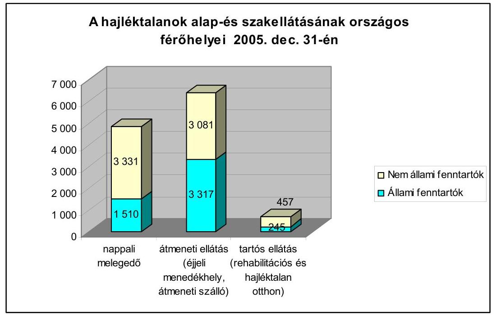
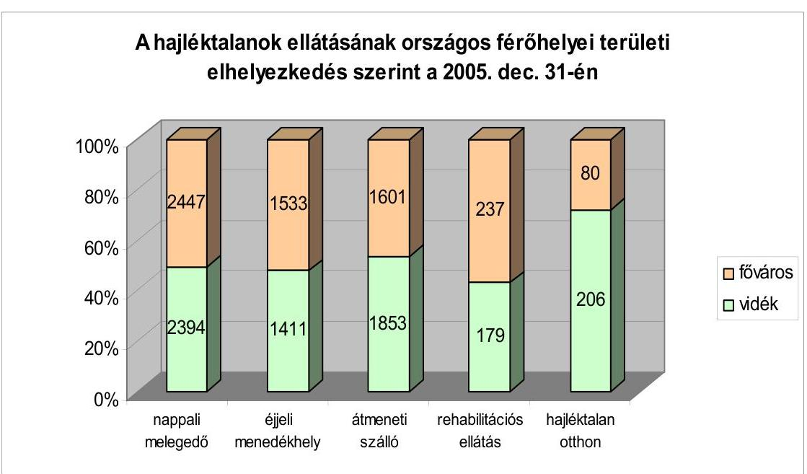
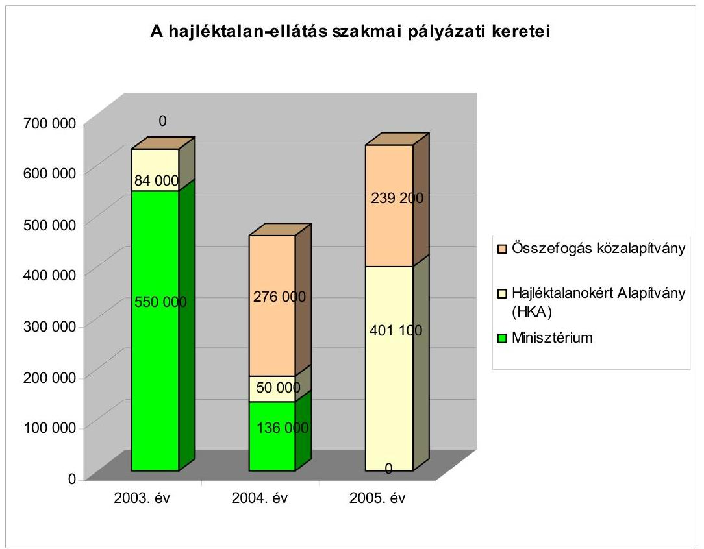
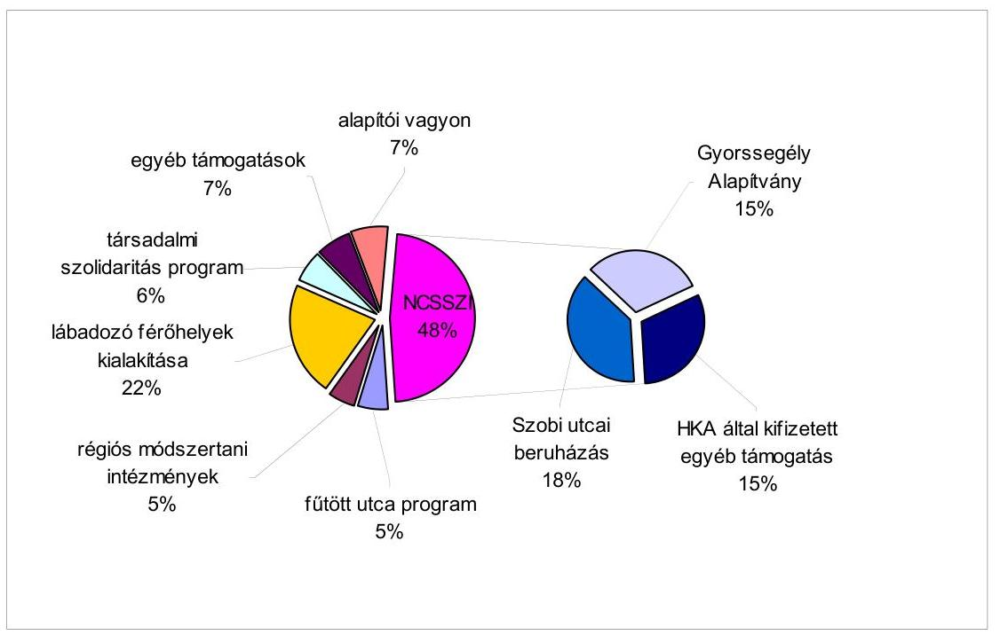
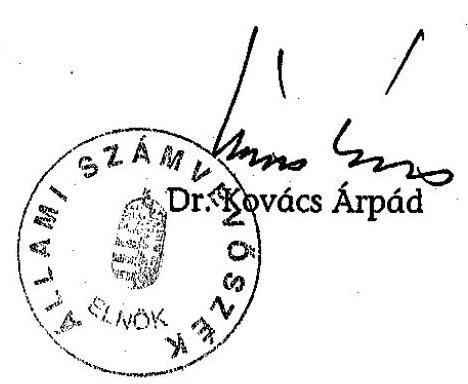
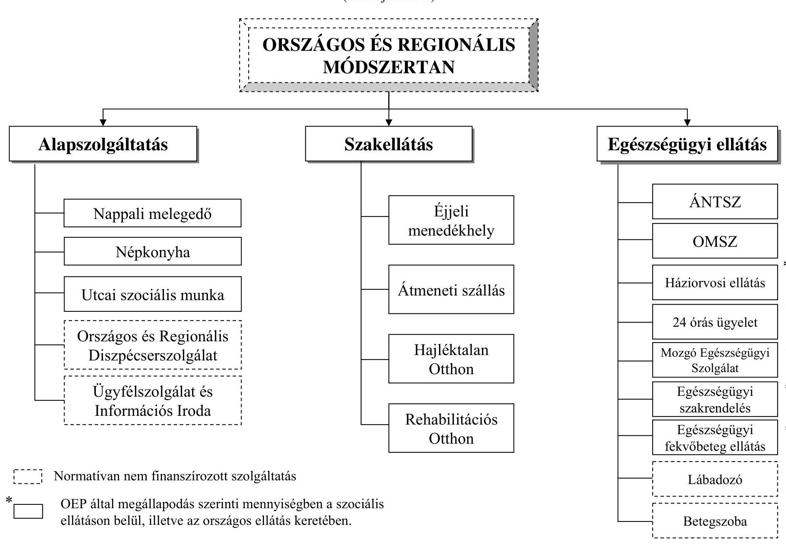
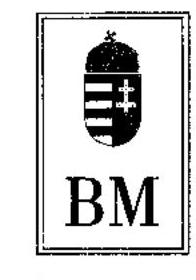
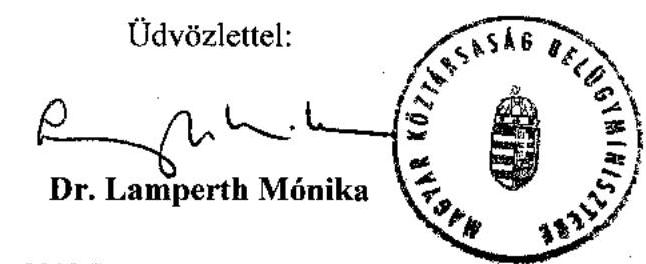
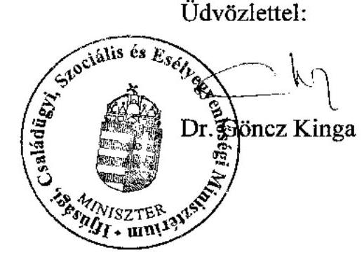
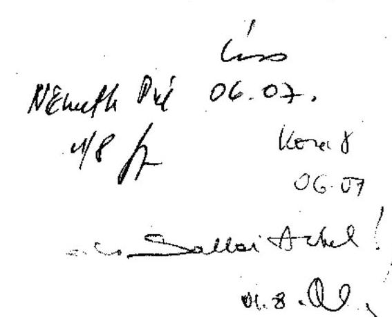

# ÁLLAMI   SZÁMVEVŐSZÉK 

## JELENTÉS

A hajléktalanokat ellátó intézményrendszer ellenőrzése

---

# 3. Önkormányzati és Területi Ellenőrzési Igazgatóság 

3.2. Szabályszerűségi és Teljesítményellenőrzési Főcsoport

Iktatószám: V-1015-34/2005-06.
Témaszám: 772
Vizsgálat-azonosító szám: V-0251

## Az ellenőrzést felügyelte:

Dr. Lóránt Zoltán
főigazgató
Az ellenőrzés végrehajtásáért felelős:
Németh Péterné
főcsoportfőnök
Az ellenőrzést vezette:
Dr. Sallai Antal
igazgatóhelyettes
A számvevői jelentések feldolgozásában és a jelentés összeállításában közreműködött/tek:

Berényi Magdolna Valu Tibor
főtanácsadó
Huberné Kuncsik Zsuzsanna
tanácsadó
Az ellenőrzést végezték:

| Berényi Magdolna | Dr. Csapó Anna | Huberné Kuncsik |
| :-- | :-- | :-- |
| főtanácsadó | tanácsadó | Zsuzsanna |
| Győr-Moson-Sopron me- | Jász-Nagykun-Szolnok | tanácsadó |
| gye | megye | Fejér megye |
| Huszár Sándorné | Kerezsi Pál | Kéri Péter |
| számvevő tanácsos | számvevő tanácsos | számvevő tanácsos |
| Nógrád megye | Borsod-Abaúj-Zemplén | Baranya megye |
|  | megye |  |
| Kisgergely István | Major Lászlóné | Szabó Tamás |
| számvevő | számvevő tanácsos | számvevő tanácsos |
| Pest megye | Tolna megye | Pest megye |
| Valu Tibor |  |  |
| tanácsadó |  |  |
| Szabolcs-Szatmár-Bereg |  |  |
| megye |  |  |

Jelentéseink az Országgyűlés számítógépes hálózatán és az Interneten a www.asz.hu címen is olvashatóak.

---

# A témához kapcsolódó eddig készített számvevőszéki jelentések: 

## címe

sorszáma
A tartós szociális ellátást nyújtó intézmények helyzetének és finanszírozásának vizsgálati tapasztalatai
$363$
A települési önkormányzatok szociális és gyermekjóléti szolgáltatási helyzetének vizsgálata
0015
A helyi önkormányzatok tartós szociális ellátási feladatainak ellenőrzéséről az idősek otthonainál
0317
A helyi önkormányzatok gyermekvédelmi szakellátási tevékenységeinek ellenőrzéséről
0430

---

# TARTALOMJEGYZÉK 

BEVEZETÉS ..... 5
I. ÖSSZEGZŐ MEGÁLLAPÍTÁSOK, KÖVETKEZTETÉSEK, JAVASLATOK ..... 7
II. RÉSZLETES MEGÁLLAPÍTÁSOK ..... 14

1. A hajléktalan-ellátás szabályozása és intézményrendszere ..... 14
1.1. Hajléktalanság Magyarországon ..... 14
1.2. A hajléktalan-ellátás jogszabályi előírásai ..... 15
1.3. Hajléktalan-ellátórendszer helyzete, átalakítására tett kísérletek. ..... 19
1.4. A települési önkormányzatok szerepe a hajléktalan-ellátásban ..... 23
1.4.1. A fővárosban élő hajléktalanok ellátásának megszervezése. ..... 24
1.4.2. A vidéki városok területén élő hajléktalanok ellátásának megszervezése. ..... 27
2. A hajléktalan-ellátási szolgáltatások ..... 28
2.1. Szociális szolgáltatások, az egyes ellátások bevételeinek és kiadásainak alakulása ..... 28
2.1.1. A hajléktalan-ellátás alapszolgáltatásai ..... 30
2.1.2. A hajléktalanok szakosított ellátásai ..... 35
2.1.3. A hajléktalan-ellátás regionális intézményei ..... 45
2.2. A hajléktalanok egészségügyi ellátása és finanszírozása ..... 47
3. A szociális ellátások finanszírozási rendszere ..... 55
3.1. A hajléktalan-ellátás normatív állami hozzájárulása ..... 55
3.2. A fejezeti kezelésű előirányzatok alakulása és felhasználása ..... 59
3.3. Az előirányzatok felhasználásának ellenőrzése és értékelése, a felhasználók beszámoltatása. ..... 64

---

# MELLÉKLETEK 

1. számú melléklet A hajléktalan-ellátás rendszere
2. számú melléklet Kimutatás a hajléktalan-ellátás naturális adatairól
3. számú melléklet A hajléktalan-ellátás forrásainak alakulása (2003-2005. években)
4. számú melléklet A fejezeti kezelésű előirányzatok alakulása és felhasználása (2003-2005. években)

## FÜGGELÉKEK

1. számú függelék Vizsgált szolgáltatások, önkormányzatok száma

---

# RÖVIDÍTÉSEK JEGYZÉKE 

| ÁNTSZ | Állami Népegészségügyi és Tisztiorvosi Szolgálat |
| :--: | :--: |
| ÁSZ | Állami Számvevőszék |
| BM | Belügyminisztérium |
| BMSZKI | Budapesti Módszertani Szociális Központ és Intézményei |
| BNO | Betegségek Nemzetközi Osztályozása |
| ESZCSM | Egészségügyi, Szociális és Családügyi Minisztérium |
| EU | Európai Unió |
| EÜM | Egészségügyi Minisztérium |
| Gyvt. | a gyermekek védelméről és a gyámügyi igazgatásról szóló 1997. évi XXXI. tv. |
| HKA | Hajléktalanokért Közalapítvány |
| KÁNY | ÁNTSZ Fővárosi Intézetének Központi Ágygazdálkodási Osztálya |
| kormányhatározat | az utcán élő hajléktalan emberek számának csökkentéséről, ellátáshoz juttatásáról és az utcai léttel kapcsolatos társadalmi konfliktusok kezeléséről szóló 1107/2004. (X. 26.) Korm. határozat |
| kormányrendelet | a személyes gondoskodást nyújtó szociális intézmény és a falugondnoki szolgálat működésének engedélyezéséről, továbbá a szociális vállalkozás engedélyezéséről szóló 188/1999. (XII. 16) Korm. rendelet |
| MÁK | Magyar Államkincstár |
| miniszteri rendelet | a személyes gondoskodást nyújtó szociális intézmények szakmai feladatairól és működésük feltételeiről szóló 1/2000. (I. 7.) SzCsM rendelet |
| minisztérium | Ifjúsági, Családügyi, Szociális és Esélyegyenlőségi Minisztérium |
| NCSSZI | Nemzeti Családi- és Szociálpolitikai Intézet (a minisztériumhoz tartozó önálló költségvetési szerv) |
| OEP | Országos Egészségügyi Pénztár |
| Összefogás közalapítvány | Összefogás a Budapesti Lakástalanokért és Hajléktalan Emberekért Közalapítvány |
| szakmai főosztály | Ifjúsági, Családügyi, Szociális és Esélyegyenlőségi Minisztérium Családi és Szociális Szolgáltatások Főosztálya |
| Szoctv. | a szociális igazgatásról és a szociális ellátásról szóló többször módosított 1993. évi III. tv. |
| TAJ | Társadalombiztosítási Azonosító Jel |
| normatíva | az éves költségvetési törvényekben meghatározott, a szociális szolgáltatásokhoz nyújtott egy feladatmutatóra jutó normatív állami hozzájárulás éves összege |

---

.

---

# JELENTÉS 

## A hajléktalanokat ellátó intézményrendszer ellenőrzéséről

## BEVEZETÉS

A hajléktalanság a társadalom strukturális változásaival (munkanélküliség, a bérlakások, munkásszállók megszűnése, drogfogyasztás, válások, olcsó lakás- és szálláslehetőségek hiánya) összefüggésben alakult ki. A hajléktalanság megjelenésére - a társadalmi gazdasági átalakulást követően - az ország nem volt felkészülve, az ellátórendszerből hiányoztak az alapvető eszközök a nehéz élethelyzetbe került állampolgárok problémáinak megoldására. A hajléktalanok tömeges megjelenése a rendszerváltáskor nemcsak a szociálpolitikát, de az egészségügyi hálózatot is felkészületlenül érte.

Az utóbbi években megfigyelhető, hogy a hajléktalanságot újratermelő társadalmi jelenségek felerősödtek és arra a közegészségügyi kihívásra, amit a hajléktalanság jelent, a mai napig nincs szakmai és egészségügyi koncepció.

Magyarországon a hajléktalan személyek számát 20-30 ezer főre becsülik, közülük 10 ezer fő él a fővárosban. Törvényi szinten a hajléktalanokat ellátó intézményrendszer kereteit először 1993-ban a szociális igazgatásról és a szociális ellátásról szóló törvényben szabályozták. A hajléktalan-ellátás elemei a Szoc. tv. szerint az utcai szociális szolgálat, a nappali melegedő, az éjjeli menedékhely, az átmeneti szálló, a rehabilitációs szálló, valamint a hajléktalanok otthona.

A hajléktalan személyeket ellátó intézmények száma - követni igyekezve a növekvő számú, utcára került embert - az elmúlt évek során jelentősen nőtt, rendszerváltáskor 280, míg 2005. évben már 11941 férőhelyen gondoztak hajléktalanokat. A hajléktalan-ellátás a törvényi szabályozás szerint az önkormányzatok kötelezettsége, azonban napjainkra a nem önkormányzati fenntartású intézmények, a civil szervezetek feladatvállalása egyre szélesebb körűvé vált. A 2005. évi adatok szerint a nappali melegedők 31,2 %-át, míg a tartós és átmeneti elhelyezést nyújtó intézmények 52,2 %-át működtetik csak az önkormányzatok. A hajléktalan-ellátásban a területi egyenlőtlenség jellemző, az ellátások iránti igény elsősorban a fővárosban és a nagyvárosokban jelentkezik.

Az állam a szolgáltatások biztosítását szektorsemlegesen normatív állami hozzájárulással és fejezeti kezelésű pályázati támogatásokkal segíti, 2005-ben a normatív hozzájárulás meghaladta az 5,5 milliárd forintot. A hajléktalanok egészségügyi ellátásának finanszírozásában - a jogszabályi háttér megteremtésével - részt vesz az Országos Egészségbiztosítási Pénztár is.

---

A vizsgálat célja: annak megállapítása volt, hogy

- a hajléktalan-ellátás finanszírozási rendszere, az előirányzott költségvetési támogatás milyen eredménnyel járult hozzá a hajléktalanok ellátásához, a szakmai célok megvalósításához, a hajléktalan-ellátás intézményei működési feltételeinek javításához, s mindezt mennyiben segítette a felügyeleti irányítás;
- a hajléktalanokat ellátó önkormányzati és egyéb fenntartású intézmények a támogatások (normatív állami hozzájárulás, pályázati támogatások) felhasználásánál szabályszerűen jártak-e el, a pályázati támogatási célok teljesültek-e, a normatív állami hozzájárulás elősegítette-e az adott szakmai feladat teljesítését;
- a hajléktalanok egészségügyi ellátását biztosító intézményrendszer megfelelően kiépült-e, a fenntartói és az OEP finanszírozás biztosítja-e az ellátó rendszer működtetését és fejlesztését.

Az ellenőrzésre a hajléktalanok ellátásának átfogó értékelése mellett a vizsgálati programban meghatározott teljesítmény-ellenőrzési szempontok alapján került sor.

Az ellenőrzés a 2003-2005. évekre irányult, és a hajléktalan-ellátási támogatások szabályozásának, irányításának és az előirányzatok felhasználásának értékelését foglalta magában.

Az ellenőrzés végrehajtására az Állami Számvevőszékről szóló 1989. évi XXXVIII. törvény 2. § (5) bekezdése, az államháztartásról szóló 1992. évi XXXVIII. törvény 120/A. § (1) bekezdésében foglaltak adnak jogszabályi alapot.

A helyszíni ellenőrzés a fővárosban, valamint nyolc megyében önkormányzati és nem állami fenntartásban működtetett 143 hajléktalan-ellátást nyújtó szolgáltatásra és 17 feladatellátásra kötelezett önkormányzatra terjedt ki.

Az ellátó rendszer valamennyi szolgáltatását érintette a vizsgálat (1. sz. függelék). A hajléktalanok elsősorban a nagyvárosokban élnek, ezért a vizsgálat főként a nagy lélekszámú településekre terjedt ki. A hajléktalan-ellátást végző intézmények kijelölése az ellátó rendszer állami és nem állami intézmény fenntartóinak arányát, a településeken becsült hajléktalanok számát, a nyújtott szolgáltatásokat figyelembe véve történt.

---

# I. ÖSSZEGZŐ MEGÁLLAPÍTÁSOK, KÖVETKEZTETÉSEK, JAVASLATOK 

A rendszerváltás körüli időszak sajátos szociálpolitikai gondjaként, de csak részben annak következményeként kapott nyilvánosságot a hajléktalanság. A társadalom számára a tömegdemonstrációk - amelyek 1989 telén a budapesti tereken és pályaudvarokon folytak - tudatosították és hívták fel a figyelmet a hajléktalanságra. A hajléktalan emberek ezen jelenléttüntetései voltak az első szociálpolitikai reagálások közvetlen kiváltói. A döntéshozók évtizedek után először kezdtek el foglalkozni a problémával.

Az ellátórendszer kiépítése gyakorlatilag a nulláról indult. A hajléktalan emberek demonstrációinak hatására alakult ki egy - azóta is példa nélküli - szakmai összefogás, amely különféle szervezetek, szolgáltatók, civilek, egyházak, állami szereplők együttműködésével és alapvetően a nem állami szereplők kezdeményezésével jött létre.

Első ízben az 1993. évi Szoc. tv. határozta meg a hajléktalanokat ellátó szolgáltatások és az intézményrendszer kereteit. A személyes gondoskodást nyújtó szociális intézmények szakmai feladatait és működésük feltételeit, valamint a hajléktalan személyek ellátására vonatkozó különös szabályokat miniszteri rendelet szabályozza. A törvény és a miniszteri rendelet a hatálybalépéstől eltelt időszak alatt több alkalommal módosításra került, ennek ellenére a hajléktalan-ellátás feladatai nem igazodnak a szükségletekhez és a gyakorlatban nyújtott szolgáltatásokhoz. Nem tisztázott, hogy mi tartozik a hajléktalan-ellátás feladatai közé, nincsenek meghatározva a hajléktalanságból kivezető utak. A jogszabály-módosítások nem koherensek, esetenként ellentmondásosak.

A hajléktalan emberek számára vonatkozóan az elmúlt tíz évben csak különféle becslések jelentek meg, ugyanis a hajléktalanok körében ebben az időszakban országos reprezentatív felmérés nem készült, és nem mérték fel a veszélyeztettek számát sem. Érzékelhető, hogy a hajléktalanság és emiatt a hajléktalanellátás jellemzően a fővárosra és a vidéki városokra koncentrálódik.

Az ágazati irányítást végző minisztérium nem rendelkezik az ellátó rendszerről aktuális, megbízható adatokkal, információkkal. A szociális ellátásokkal, szolgáltatásokkal kapcsolatos statisztikai jelentések adatai utólag, jó egy éves késéssel válnak hozzáférhetővé, az országban működő hajléktalanellátók, szolgáltatók számáról sem állnak rendelkezésre hivatalos, aktuális adatok, mivel az NCSSZI nem tett eleget a személyes gondoskodást nyújtó szociális intézmény és a falugondnoki szolgálat működésének engedélyezéséről, továbbá a szociális vállalkozás engedélyezéséről szóló Korm. rendelet előírásainak.

A hajléktalan-ellátás szolgáltatásainak és intézményeinek a fejlesztése nem összehangolt, ugyanis a minisztérium nem rendelkezik a hajléktalanellátás céljait és fejlesztési irányait meghatározó hosszú és középtávú koncepcióval. Hosszú távú stratégia hiányában nem fogalmaztak meg konkrét feladatokat a hajléktalanság megelőzésével kapcsolatosan sem, holott a nemzetközi tapasztalatok alapján is ez leghatékonyabb és legolcsóbb módja a hajléktalanság kezelésének.

A minisztérium szervezetén belül a hajléktalan-ellátás társadalmi fontosságára tekintettel ugyanakkor a hajléktalanügy problémáinak hatékony kezelése érdekében 2002-ben miniszteri biztost neveztek ki. A vizsgált években háttéranyag és kormány-előterjesztés készült a hajléktalansággal kapcsolatosan, amelyben célkitűzéseket fogalmaztak meg, és 2004-ben kormányhatározatban rögzítették
 a feladatokat, amelyek a modellkísérletek eredményeit is figyelembe véve a későbbiekben kidolgozandó stratégia alapját képezhetik.

# A hajléktalan-ellátásban kiemelt szerepe van a települési önkormányzatoknak, a Szoctv. értelmében az ellátási kötelezettség őket terheli. Feladataiknak saját intézmények fenntartásával, más önkormányzattal való társulással, illetve szolgáltatót, intézményt működtető fenntartóval kötött megállapodással vagy ellátási szerződéssel tesznek eleget.

Az önkormányzatoknál lakásvagyon hiányában a hajléktalanok ellátására csak a szociálpolitika eszközei állnak rendelkezésre. A jelenlegi finanszírozási rendszer önmagában nem jelent motivációt az önkormányzatok számára a hajléktalanná válás megelőzésére, a hajléktalan állapotból való kiléptetésre. Ezek a programok ugyanis az önkormányzatok költségvetését terhelik, az évente meghirdetett szakmai pályázatokon elnyerhető többlettámogatások esetlegesek, hosszabb távra garanciális elemeket a rendszer nem tartalmaz.

A fővárosban él a legtöbb hajléktalan, ezért a Fővárosi Önkormányzat a hajléktalan-ellátás koordinálása, a feladatok megszervezése és végrehajtása érdekében létrehozta az országban egyedülálló és legnagyobb hajléktalanokat ellátó intézményét, a BMSZKI-t. A fővárosban a hajléktalan-ellátó szervezetek nyújtotta szolgáltatások hatékonyságának növelése érdekében összegyűjtötték a fővárosi hajléktalanokra vonatkozó információkat, összehangolták az ellátásban érintett szervezetek működését. A hajléktalan-ellátás koncepcionális alapjai között meghatározták a Budapesti Szociális Chartát, amelyet a főváros és 23 kerület önkormányzatának polgármestere írt alá 1997. évben. Ebben a dokumentumban az aláírók vállalták a szociális feszültségek enyhítését, a feladatok összehangolását az intézmények és az ellátások tekintetében, ennek érdekében a Fővárosi Önkormányzat és a kerületek megállapodást kötöttek. Az összehangolt feladatok eredményeként a hajléktalan-ellátás a fővárosban javult.

A fővárosban működő, hajléktalan-ellátással foglalkozó szervezetek, a BMSZKI, alapítványok, a civil és a non-profit szervezetek évente Együttműködési Szándéknyilatkozatot írtak alá a téli kríziskezelés területi ellátására, a fedél nélkül maradt emberek megsegítésére. A feladat-ellátásban résztvevő szervezetek tevékenységét összehangolták, ennek eredményeként nem maradt ellátatlan terület a fővárosban.

A vidéki települések nagysága, a feladatellátás módja és mértéke között összefüggés nem állapítható meg, viszont a mai napig meghatározó, hogy a hajléktalan-ellátás területén az adott településen az önkormányzati, vagy a civil szervezetek jelentek-e meg előbb. A hajléktalanok ellátásának koordinálása, hatékonyabb működése érdekében a vidéki városokban is jellemző a hajléktalanellátó szervezetek, szolgáltatók közötti együttműködés.

A Szoc. tv. hatályba lépésével kerültek meghatározásra a hajléktalanok szociális ellátásának elemei (alapszolgáltatások és szakosított ellátási formák), amelyek a jogalkotó szándéka szerint egymásra épülnek, és egységes rendszert alkotnak. A törvény előírásai szerint az önkormányzatok lakosságszáma alapján biztosítandó ellátások azonban mégsem épülnek egymásra, mivel a kisebb városokban az egyes szakosított ellátási formákat (éjjeli menedékhely és hajléktalanok átmeneti szállása) is biztosítani kell, de az alapszolgáltatások nyújtása (utcai szociális munka) teljes körűen nem kötelező. Ennek következtében a hajléktalanok a nagyobb városokban szélesebb körű ellátásban részesülnek, mint a kisebb településeken.

A kialakult intézménystruktúra eltér az alapvető intézménytípusokra vonatkozó jogalkotói céltól, mivel az országosan rendelkezésre álló éjjeli menedékhelyeken a nappali melegedőkben ellátott hajléktalanok mindössze $\mathbf{60,8\%}$-ának van esélye ingyenes éjszakai szálláshoz jutni. A 3000-30 000 fő közötti települések kötelesek a hajléktalanok nappali ellátásáról gondoskodni, de éjjeli menedékhely fenntartására és működtetésére a Szoc. tv. előírásai alapján nem kötelesek, így éjjeli menedékhely hiányában ezeken a településeken a hajléktalanok ingyenes szálláshoz jutása nem megoldott.

Az étkeztetés valamennyi települési önkormányzat számára kötelező feladat, ugyanakkor a feladat konkrét tartalmát nem határozták meg. Ennek, valamint a szigorúbb közétkeztetési hatósági előírások következtében a népkonyhai adagok száma egy év alatt 2005. évre 24,4%-kal csökkent.

A hajléktalanokat ellátó ügyfélszolgálat, információs iroda működésére nem tartalmaznak a jelenlegi jogszabályok rendelkezést, az intézmények a feladat fontosságára tekintettel - ezeket saját szabályozásuk szerint működtetik. A szolgáltatás a hajléktalan-ellátás szinte nélkülözhetetlen elemévé vált, a szolgáltatásokat igénybevevők egyre szélesebb köre a szolgáltatás létjogosultságát igazolja.

A hajléktalan-ellátás szintén nem szabályozott területe a hajléktalan családok problémája. A Szoc. tv. nem nevesít olyan szociális intézményt, ahol szülő(k) és gyermek(ek) együtt kapnak ellátást. Ennek ellenére a vizsgált helyszíneken szinte mindenhol előfordult hajléktalan családok ellátása. Az anya-gyermek-családos elhelyezést biztosító intézmények a Gyvt. hatálya alá tartoznak. Figyelembe véve azonban a családok elhelyezésére szolgáló intézményi férőhelyeket, nagyon kevés hajléktalan családnak van esélye arra, hogy legalább átmenetileg a lakhatási problémájuk megoldódjon.
A hajléktalan-ellátás területén a regionalitás irányába történő elmozdulás első lépéseként regionális módszertani intézményeket és regionális diszpécser szolgálatokat jelöltek ki. A miniszteri rendelet alapján a megyei és a regionális módszertani intézmények feladatai részben azonosak. A regionális diszpécser szolgálat nem szerepel nevesítve a Szoc. tv-ben és működése nem engedélyköteles tevékenység.

---

A hajléktalan-ellátás terén az országos módszertani, valamint a 2004. év második felétől a regionális módszertani feladatok ellátását a költségvetési törvényben meghatározott normatív állami hozzájárulás segítette. A feladatellátás normatív támogatása a 2006. évben megszűnt, finanszírozásának folyamatossága, garanciái törvényileg nem biztosítottak. A regionális és országos diszpécseri feladatot ellátó szervezetek normatív állami hozzájárulásban nem részesülnek, a feladatellátást pályázati források segítik.

A hatályos jogszabályok a hajléktalanok számára is biztosítják, hogy egészségügyi ellátáshoz juthassanak. Az ápolásra szoruló hajléktalan emberek gondozása egyszerre tartozik az egészségügyi ellátáshoz és a szociális ellátáshoz, ezért a határterületi helyzetből fakadóan mindkét területtől összehangolt segítséget igényel. A hajléktalan emberek egészségügyi ellátása kapcsán felmerülő és halasztást nem tűrő ellátási igények kielégítése miatt kiépültek az egészségügyi ellátó rendszerrel párhuzamosan a szociális ellátó rendszeren belül is a sajátos egészségügyi ellátások.

A hajléktalanok kórházi ellátását követő lábadozás az egészségügy és a szociális ellátás határterülete, az egészségügyi ellátás OEP általi finanszírozása a vizsgált időszakban részben megoldódott a 24 órás egészségügyi centrumok kialakításával és működtetésével, ugyanakkor vidéken az ellátás hiányos, a lábadozást biztosító intézmények száma (kettő) aránytalanul kevés a fővároshoz (négy intézmény) viszonyítva. A kórházi elbocsátást követően a beteg általában az otthonában gyógyulhat, szükség esetén ápolását hozzátartozói megoldják. Az utcán élő, az éjjeli menedékhelyen éjszakázó, a nappali melegedőbe betérő hajléktalan embernek ez a lehetősége nincs meg. Az átmeneti szállókban kötelező betegszobát fenntartani, ugyanakkor az itt elhelyezett emberek egészségügyi ellátásának finanszírozása nem megoldott, a tárgyi, személyi feltételek nem biztosítják a szakszerű ápolást.

A hajléktalanokat ellátó szociális intézmények az egészségügyi ellátás többletkiadásait a finanszírozási szabályozatlanságból adódóan szakmai pályázatokon elnyerhető támogatásokból, illetve az egyéb ellátási típusokhoz igénybe vehető normatív állami hozzájárulásokból fedezik.

A hajléktalan-ellátás területén kezdetektől fogva magas a nem állami fenntartók aránya. A 2005. évben országosan a nappali melegedők férőhelyeinek 68,8%-át, a bentlakásos intézmények férőhelyeinek 65,1%-át, az átmeneti elhelyezést nyújtó intézményi férőhelyek 48,2%-át nem állami fenntartók működtették.

A feladatellátáshoz, a fenntartott szociális intézményeknek, a központi költségvetés a szolgáltatások után normatív állami hozzájárulást, a minisztérium a fejezeti kezelésű pénzeszközeiből pályázati forrásokat biztosít. A hajléktalanellátásban kiemelt helyet betöltő egyházi fenntartású intézmények normatív finanszírozása az átlagosnál kedvezőbb. A normatívák, valamint a hajléktalan-ellátásra rendelkezésre álló fejezeti kezelésű előirányzatok összegének alakulását alapvetően nem a szakmai igények, hanem a központi költségvetés mindenkori pozíciója határozza meg.

---

# Az ellátások működtetését, fejlesztését célzó előirányzatok meghatározását nem előzték meg megalapozó számítások.

A hajléktalan-ellátás terén az ellátási típusok, szolgáltatások bevételeiről, működtetési költségeiről tervezett és tényleges országos szintű adatok nem állnak rendelkezésre. Erre vonatkozóan az állami és a nem állami fenntartóktól konkrétan meghatározott, egységes tartalmú információszolgáltatás nincs.

A vizsgált, hajléktalanokat ellátó szervezetek (a régiós módszertani és diszpécser szolgálatok nélkül) a vizsgált feladatellátáshoz a 2003-2005. években 5738,8 millió Ft forrással rendelkeztek, ennek 69%-a a központi költségvetésből juttatott normatív állami hozzájárulásból származott, a pályázati támogatások aránya 5%-os (269 millió Ft) volt. A feladatellátásra kötelezett önkormányzatok hozzájárulása 948,7 millió Ft (a bevételek 17%-a), ugyanakkor jellemző, hogy a normatív állami hozzájárulások emelkedésével az önkormányzatok támogatása összegszerűen és arányaiban is csökkent.

A nem állami szervezetek feladatellátásának finanszírozásához rendszerint nem, vagy csak arányaiban kismértékben járultak hozzá a feladatellátásra kötelezett önkormányzatok (a támogatások 24%-át kapták civil szervezetek). A fővárosi önkormányzat közgyűlési határozat alapján szektorsemlegesen a normatív állami hozzájárulás aktuális összegének 30%-ával támogatja a hajléktalanokat ellátó szervezeteket.

A hajléktalanokat ellátó szervezetek a vizsgált feladatellátásra a 2003-2005. években 5369,7 millió Ft kiadást mutattak ki. A működési kiadások (5022,1 millió Ft) 71%-át személyi kiadások tették ki.

Országosan a 2003-2005. évek között a hajléktalan-ellátás központi költségvetésből származó forrásai 15 644,6 millió Ft-ot tettek ki, ennek 87%-a az egyes szolgáltatások normatív állami hozzájárulása volt, a minisztérium fejezeti kezelésű pénzeszközei a források 13%-át tették ki.

A finanszírozás jelenlegi rendszere nem igazodik rugalmasan az ellátórendszer valós szükségleteihez, bizonytalanná teszi több szolgáltatás folyamatos működését.

Az egyes szolgáltatásokhoz biztosított normatív állami hozzájárulás finanszírozási szabályai nem egységesek, a hajléktalanok átmeneti ellátásánál az igénybe vehető normatív állami hozzájárulás nem a tényleges ellátotti létszámhoz, hanem az engedélyezett férőhelyek számához igazodik. Az engedélyezett férőhelyeket meghaladóan biztosított szálláshelyek többletköltségeihez normatív állami hozzájárulás nem igényelhető, a nyújtott szolgáltatásokat az intézmények fenntartói és egyéb támogatásokból finanszírozták. A nappali melegedők az ellátás biztosítása érdekében hosszabbított nyitva tartással, a krízisellátások keretében hétvégén és ünnepnapokon is üzemelnek, a törvényi szabályozás szerint azonban ehhez normatív állami hozzájárulás nem igényelhető.

---

Az utcai szociális munka a 2005. évet megelőzően a pályázati rendszeren keresztül kapott támogatást, a feladatellátásban részt vevő szervezetek számára nem nyújtott hosszú távú működési biztonságot. A 2005. évi költségvetési törvény a működő szolgálatok száma alapján fix összegű normatív állami hozzájárulást határozott meg, ugyanakkor ennek törvényi szabályozás szerinti igénybevétele kizárólag az 50 ezer fő feletti lakosságszámú települések számára biztosított. A finanszírozás változása miatt egy vizsgált településen a korábban jól működő utcai szociális ellátás megszűnt.

A vizsgált intézmények az igénybe vett normatív állami hozzájárulással elszámoltak, azt szabályszerűen használták fel. A szolgáltatásokhoz nyújtott normatív állami hozzájárulás segítette a hajléktalanok ellátását, a működési kiadásokat átlagosan 79%-ban fedezte, ezen belül a személyi kiadások 90,5%-át ebből finanszírozták.

A minisztérium költségvetésében a hajléktalan-ellátáshoz kötődő fejezeti kezelésű előirányzatok 2003-2005. évek között változó nagyságrendet képviseltek. A fejezeti kezelésű előirányzatok felhasználása nem egységes, egy részük pályáztatás útján, más részük egyedi döntésekkel került a szolgáltatást biztosító szervezetekhez. A 2003-2005. években a hajléktalan-ellátásra 2089 millió Ft fejezeti kezelésű előirányzat állt rendelkezésre, és ebből 2005. december 31-ig 2026 millió Ft-ot használtak fel.

A vizsgált időszakban a fejezeti kezelésű előirányzatok 14,8%-a felhalmozási (beruházás, felújítás, eszközbeszerzés) célkitűzések megvalósítását segítette, a támogatások fennmaradó részéből (1725,7 millió Ft) a feladatot ellátó szervezetek működési kiadásokat finanszíroztak. A támogatási keretekből a Szoctv.-ben nem szabályozott szolgáltatásokat finanszíroztak, amelyek rendszeresen jelentkeznek, ugyanakkor a pályázati támogatásokból származó források bizonytalanok, esetlegesek, nem tervezhetők.

A pályáztatás rendszere a vizsgált időszakban többször változott, a 2004. évben a vidéki és a fővárosi szervezetek feladatellátásának támogatása különvált. A minisztérium kezdeményezésére a 2004. évben a Kormány a hajléktalan-ellátásra rendelkezésre álló források elosztására, pályáztatásra két közalapítványt hozott létre. A közalapítványok pályáztatással kapcsolatos költségei (bonyolítás, monitorozás) csökkentik a kiosztható
 pályázati kereteket, továbbá a 2005. évtől a minisztérium által bevezetett új szabályozás előírásainak betartása időigényes, a támogatások késedelmes kiutalása gátolta a vidéki ellátó szervezetek téli krízisellátáshoz kapcsolódó feladatainak ellátását.

A vizsgált szervezeteknél a hajléktalan-ellátáshoz nyújtott támogatások a 2003-2005. évek között segítették a normatív állami hozzájárulással nem finanszírozott, a pályázati kiírásokban meghatározott szakmai célok megvalósítását. Az ellátotti szükségletek alapján lábadozó és átmeneti ellátást biztosító férőhelyeket hoztak létre, ügyfélszolgálati, információs irodákat tartottak fenn, a téli krízisellátásokat (teajáratok, hideg élelem, meleg vacsora), a nappali melegedők éjszakai és hétvégi nyitva tartását, az egészségügyi ellátások, betegszobák, a modellkísérletek, komplex ellátási programok, továbbá a 2003-2004. években az utcai szociális munka költségeit finanszírozták. A 2005.

---

évben a támogatások 46,7%-a a 2004. évben kormányhatározattal elfogadott külső férőhely program (900 fő) megvalósítását segítette, a program eredményességéről adatok még nem állnak rendelkezésre. A támogatásokból létrehozták, és részben működtették a regionális intézmények feladatellátását is.

A feladatot ellátó szervezetek a 2003-2004. években elnyert pályázati támogatásokkal elszámoltak, azokat a célnak megfelelően használták fel. A minisztérium hajléktalan-ellátáshoz kapcsolódó monitoring rendszerének kialakítása részlegesen valósult meg. A rendszer kialakításában tapasztalt lemaradások nem tették lehetővé a pályázatok eredményességének átfogó értékelését. A pályázati felhívásokban meghatározták a pályázati célokat, a programok általános feltételrendszerét és az eljárásrendjét. A pályázati célok megvalósítását a pályáztató szervezetek négy alprogram kivételével összességében nem értékelték.

A helyszíni ellenőrzés megállapításainak hasznosítása mellett javasoljuk:

# a Kormánynak 

1. kezdeményezze a szociális igazgatásról és a szociális ellátásról szóló 1993. évi III. törvény módosítását, annak érdekében, hogy az szabályozza a hajléktalanok szükségleteinek figyelembevételével a szakmailag indokolt szolgáltatásokat;
2. hozzon döntést a modellkísérletek eredményeinek figyelembe vételével a hajléktalan emberek fekvőbeteg szakellátásának módjáról.

## az ifjúsági, családügyi, szociális és esélyegyenlőségi miniszternek

1. dolgozza ki a hajléktalan-ellátás hosszú távú fejlesztési koncepcióját, a szükséges források és az egyértelmű prioritások meghatározásával;
2. követelje meg a személyes gondoskodást nyújtó szociális intézmény és a falugondnoki szolgálat működésének engedélyezéséről, továbbá a szociális vállalkozás engedélyezéséről szóló 188/1999. (XII. 16) Korm. rendelet 2.§ (10) bekezdésében előírt kötelezettség teljesítését, a naprakész információk biztosítása érdekében;
3. kezdeményezze a hajléktalanok szükségleteinek figyelembevételével a szakmailag indokolt szolgáltatások működtetéséhez a normatív állami hozzájárulás biztosítását az ellátások biztonsága érdekében;
4. gondoskodjon a pályázati támogatások felhasználásával kapcsolatos monitoring rendszernek a pályázatok eredményességének átfogó értékelésére való alkalmassá tételéről.

---

# II. RÉSZLETES MEGÁLLAPÍTÁSOK 

## 1. A HAJLÉKTALAN-ELLÁTÁS SZABÁLYOZÁSA ÉS INTÉZMÉNYRENDSZERE

### 1.1. Hajléktalanság Magyarországon

Az ENSZ 1987-et a Hajléktalanok Nemzetközi Évének nyilvánította. Magyarországon is megjelentek azok a cikkek, tanulmányok, melyek a hajléktalanokkal, a hajléktalanság okaival, problémáival foglalkoztak. Kiderült, hogy a budapesti „Lordok Háza" fapriccsein kívül (16 férfi és 8 női hely) semmi sincs a hajléktalan emberek ellátására.

A hajléktalanság megjelenése felkészületlenül érte a magyar társadalmat, a tömegdemonstrációk - amelyek a budapesti tereken és pályaudvarokon folytak 1989 telén - tudatosították és hívták fel a figyelmet a hajléktalanságra.

1989 telén a Blaha Lujza téren demonstráló hajléktalan emberek számára egy csepeli tornateremben megnyílt az első kvázi menhely, és átadásra került két volt munkásőr bázis is a VIII. és X. kerületben. Majd a Déli pályaudvaron összeszerveződő hajléktalan emberek kaptak ideiglenes menedéket a Csillebérci Úttörő Tábor „Háromláng" nyári táborában 1990. januárjában, jó egy héttel később pedig Budaörsön, egy volt katonai objektumban létrejött az első hajléktalanszállás. 1990 januárjában öt szervezet (Budapest Főváros Önkormányzata, „Hajléktalanokért" Társadalmi Bizottság, „Oltalom" Karitatív Egyesület, Szegényeket Támogató Alap, Újpesti Önkormányzat Szociális és Egészségügyi Intézmény) megalapította a hajléktalanság kezelésének első civil szervezetét, a Menhely Alapítványt. A fővároson kívül több vidéki nagyvárosban a fővárosihoz hasonló események játszódtak le.

Karitatív csoportok, egyházi és világi szervezetek közreműködésével nyíltak meg az első menhelyek 1989-1990 telén, és indult el a hajléktalanság kezelése kényszerűen a „tűzoltó" megoldások útján. 1990 előtt az országban 13 olyan intézmény létezett, amely hajléktalan embereket is fogadott, összesen 280 ágyon.

Az 1990-ben a kormány már nem hagyhatta figyelmen kívül a hajléktalan ügyet. A kormányalakítást követően, rövidesen létrehozták a Népjóléti Minisztérium Szociális Válságkezelő Programok Irodáját. Addigra már egy éve folyamatosan működött a válságkezelő Szakmai Műhely. Az Iroda, a válság kezelésére szolgáló lépések mellett előkészítő munkát folytatott a hajléktalanügy törvényi szintű szabályozásának területén. A szabályozás azonban még váratott magára.

A rendszerváltozást követően a hajléktalanok ellátásáról, gondozásáról egyes szociális intézmények feladatairól és működésükről az első központi szabályozás 1992-ben jelent meg (2/1992. (I. 6.) NM rendelet). A rendelet nem definiálta a hajléktalanságot, hanem az addigra már kialakult és működő ellátási formákat írta le. Szállást nyújtó intézménynek az éjjeli menedékhelyet és az átmeneti szállást tekintette. Egyéb szociális ellátást nyújtó intézmények között felsorolta a szociális információs szolgálatot, utcai gondozó szolgálatot, népkonyhát, nappali melegedőt és a hajléktalanok gondozási központját. Megjelent a rendeletben a rehabilitációs és kríziskezelő intézmény 1992 elején, amikor a hajléktalan-ellátás első központi szabályozása megtörtént, 67 intézményben mintegy 2000 szálláshely működött az országban.

A hajléktalan-ellátás 2006. január 1-i rendszerét az 1. számú melléklet szemlélteti.

Az összes szociális ellátáson belül egyre nagyobb a nem állami fenntartók szerepe, a hajléktalan-ellátás területén ez még erőteljesebb. Arányuk a 2005. évben, ${ }^{1}$ a nappali melegedőknél 68,8%, a tartós bentlakásos intézmények esetében 65,1%, míg az átmeneti elhelyezést nyújtó intézményi férőhelyeknél 48,2%.

Hajléktalanok alap és szakellátási férőhelyeinek megoszlását az alábbi grafikon szemlélteti:

# 1.2. A hajléktalan-ellátás jogszabályi előírásai 

1993 elején a Szoc. tv. beemelte a hajléktalan-ellátásokat a szociális ellátások rendszerébe és ellátási kötelezettséget is megállapított. A Szoctv.-ben a hajléktalan emberekre, a hajléktalanság fogalmára kétféle meghatározás van:

[^0]
[^0]:    ${ }^{1}$ Az országos és a regionális diszpécserszolgálatok által készített: Hajléktalan-ellátó Intézmények Magyarországon 2005 kiadvány.

---

Az első definíció (Szoc. tv. 4. § (2) bekezdés) értelmében „hajléktalan, a bejelentett lakóhellyel nem rendelkező személy, kivéve azt, akinek bejelentett lakóhelye a hajléktalan szállás."

E definícióból adódóan „a hajléktalan személyek ügyében szociális igazgatási eljárásra az a szociális hatáskört gyakorló szerv illetékes, amelynek illetékességi területét a hajléktalan személy az ellátás igénybevételekor nyilatkozatában tartózkodási helyeként megjelölte" (Szoc. tv. 6. §) ${ }^{2}$. A hajléktalan emberek részére nyújtott pénzbeli és természetbeni ellátások esetében e definíció szerint kell eljárnia az önkormányzatoknak.

A Szoc. tv. második definíciója (Szoc. tv. 4. § (3) értelmében: „hajléktalan az, aki éjszakáit közterületen vagy nem lakás céljára szolgáló helyiségben tölti". Ez a definíció a szociális ellátás szempontjait követi. Ebből a meghatározásból (Szoc. tv. 7. § (1) bekezdése) adódóan a „a települési önkormányzat, tekintet nélkül hatáskörére és illetékességére, köteles az arra rászorulónak átmeneti segélyt, étkezést, illetve szállást biztosítani, ha ennek hiánya a rászorulónak az életét, testi épségét veszélyezteti."

Ehhez a definícióhoz köti a Szoc. tv. a hajléktalan emberek részére fenntartott személyes gondoskodást nyújtó ellátásokat. Vagyis ezt a meghatározást köteles alkalmazni az önkormányzat akkor, ha nappali melegedő, éjjeli menhely vagy átmeneti szállás formában nyújt személyes gondoskodást (Szoc. tv. 65/F. §, 84.§). Ez azt is jelenti, hogy ezen ellátások igénybevételekor feltételként nem köthető ki lakcím vagy utolsó lakcím szerinti területi illetékesség.

A Szoc. tv-nek ez a rendelkezése korlátozottan valósul meg a gyakorlatban, az igénybejelentés és a kötelező ellátás igénybevételének módja nincs meghatározva. Nincs központi irányelv annak meghatározására sem, hogy milyen körülményeket kell úgy tekinteni, amelyek az életet és testi épséget veszélyeztetik.

A hajléktalanság fogalma a szakirodalomban sem egységes. Jelenti egyrészt a lakástalanságot, fedélnélküliséget, egy hely - menedék - hiányát, másrészt a társadalmi kapcsolatok és kötelékek hiányát. Ma már magában foglalja a kockázatot és az oksági viszonyt, és általában a társadalmi kirekesztettség egyik arculataként fogalmazódik meg ${ }^{3}$.

A közösségi szociálpolitika alakulása, főbb irányai, a hajléktalanügy kezelése az Uniós tagországokban sem egységes.

[^0]
[^0]:    ${ }^{2}$ Az Szoc. tv. 1999. évi módosítását megelőzően az a szociális hatáskört gyakorló szerv volt az illetékes, amelynek illetékességi területén a hajléktalan ember tartózkodott; illetve amelynek területén lévő hajléktalanszállás lakója volt.
    ${ }^{3}$ Lásd Komáromi Éva: A hajléktalanság mentálhigiénéje. Szenvedélybetegségek I. évf., 5. sz. 381-390., Pik Katalin: Kik is a hajléktalanok és mit tehetünk értük? ESÉLY, 1995/5. Bényei Zoltán, Gurály Zoltán, Győri Péter, Mezei György Tíz év után Homelessness in Europe Internetional Conference HAJSZOLT Balatonföldvár 1999.

---

Nagy-Britanniában a hajléktalanság problémáját elsősorban lakáskérdésnek tartják. Ebből következően az elsődleges kezelésének keretében lakáshoz juttató ún. "resettlement" szolgáltatást működtetnek. A hajléktalanokat segítő szociális munkának is az elsődleges célkitűzése az állandó, megfelelő lakóhely megteremtése, valamint az illetékes szervek, hivatalok lakáshoz juttató tevékenységének a koordinációja.

A Németországban jellemző a gyerekes családok jelenléte a hajléktalan népességen belül. Ennek megfelelően az ellátórendszerben a segítségnyújtási formák igazodnak e csoport szükségleteihez. A legtöbb német településen biztosítanak ellátást a gyermekes, hajléktalan családok számára. Szociálpedagógusok vezetésével foglalkozásokat szerveznek a hajléktalan szállásokon és azokon kívül is. A gyermekek részére fejlesztő, integráló programokat vezettek be.

Ausztriában nagy hangsúlyt helyeznek arra, hogy - még a saját lakásban - megelőzzék a hajléktalanná válást, hisz ez 7-10-szer olcsóbb, mint az utcára kerülés. 76 szervezet - köztük 53 civil egyesület és 23 önkormányzati intézmény - foglalkozik hajléktalanokkal.

A Szoc. tv. a személyes gondoskodást nyújtó szolgáltatások körén belül hajléktalan-ellátási formaként a nappali ellátás intézményeinél a nappali melegedőt, az átmeneti elhelyezést nyújtó intézmények között az éjjeli menedékhelyet és átmeneti szállást, 1999-től az ápolás-gondozást nyújtó intézmények között a hajléktalanok otthonát, a rehabilitációs intézmények között a hajléktalanok rehabilitációs intézményét nevezi meg. Az éjjeli menedékhely és a nappali melegedő ingyenes ellátást nyújt, az átmeneti szálláshelyet és a tartós bentlakásos intézményeket igénybevevőktől térítési díj kérhető.

A jelenlegi szállásrendszernek gyakorlatilag a fele már létezett, amikor 1994 elején megszületett ezek szakmai tartalmát és feltételrendszerét szabályozó 2/1994. (I. 30.) NM rendelet, amely már tartalmazta a Szoctv. által csak később szabályozott hajléktalanok otthonát, és a hajléktalanok rehabilitációs intézményét. A személyes gondoskodást nyújtó szociális intézmények szakmai feladatait és működésük feltételeit, valamint a hajléktalan személyek ellátására vonatkozó különös szabályokat miniszteri rendelet szabályozza, mely a Szoctv.-hez hasonlóan szintén többször módosításra került.

A 2002. évben a 17/2002. (XII. 20.) ESZCSM rendelet időszakos férőhely létesítését tette lehetővé a hajléktalanok átmeneti szállásán, valamint a hajléktalanok éjjeli menedékhelyén a téli időszakra történő ellátás bővítése érdekében.

A törvény 2003-tól az éjjeli menedékhelyet és a hajléktalanok átmeneti szállását különválasztotta, önálló szakmai tartalommal bíró intézményekként nevezi meg. A törvénymódosítást nem követte a normatív állami hozzájárulás módosítása, az éjjeli menedékhely és az átmeneti szállás finanszírozása az eltérő feladatok ellenére azonos maradt.

A Szoc. tv. 1999. évi módosításával a nappali melegedő kötelező feladatává vált alapfeladatain túl „- az utcai szociális munka keretén belül - az utcán tartózkodó hajléktalan
 személy helyzetének, életkörülményeinek figyelemmel kísérése, szükség esetén ellátásának kezdeményezése, illetve a szükséges intézkedés megtétele helyzete javítása érdekében".

---

A Szoc. tv. 2003. évi módosítása újabb változást hozott az utcai szociális munka szervezésében. A törvény az utcai szociális munkát, mint speciális alapellátási feladatot nevesíti, amely, „megszervezhető önállóan, vagy családsegítő szolgálat, nappali melegedő, illetve gondozási központ keretein belül" (Szoc. tv. 65/E. §).

A törvény a települési önkormányzatokat a lakosságuk számától függően kötelezi a hajléktalan emberekről gondoskodó intézmények létrehozására. Az egyes ellátási feladatokhoz rendelt településnagyság a törvénymódosítások során többször változott.

A 2003. évben módosított Szoc. tv. (február 15-től hatályos) a nappali melegedő létrehozását a korábbi húszezer lakosságszámról tízezer főre csökkentette, továbbá a feladatellátást bővítette az utcai szociális munka megszervezésével. Ugyancsak tízezer lakosságszám fölött írta elő az éjjeli menedékhely létesítését, amely ellátási formát korábban csak a 30 ezernél nagyobb lélekszámú településeken kellett biztosítani. Hajléktalanok átmeneti szálláshelyét (Szoc. tv. 87. § b), d) pontjai) változatlanul a 30 ezres vagy annál magasabb lélekszámú településeknek kell működtetni. 2005. január 1-től nappali ellátást (Szoc tv. 86. § (2) b) pont) a háromezer főnél több állandó lakosú településen kell biztosítani.

A Szoctv. a nappali ellátást 2005. január 1-től az alapellátások közé sorolta (Szoc. tv. 57. § (1) j) pont), míg a miniszteri rendelet továbbra is a szakosított ellátások között (74. §) nevesíti.

Az étkeztetés valamennyi települési önkormányzat számára (Szoc. tv. 86. § (1) b) pont) kötelező feladat. A Szoc. tv. a miniszteri rendelet az étkezésről való gondoskodást rögzíti mindössze, ennek módját részletesen nem szabályozza.

A hajléktalanokat ellátó ügyfélszolgálat, információs iroda működésére nem tartalmaznak a jelenlegi jogszabályok semmilyen rendelkezést, az intézmények ezeket saját szabályozásuk szerint működtetik. A szolgáltatás a hajléktalan-ellátás szinte nélkülözhetetlen elemévé vált, a szolgáltatásokat igénybevevők egyre szélesebb köre a szolgáltatás létjogosultságát igazolja.

A hajléktalan-ellátás szintén nem szabályozott területe a hajléktalan családok problémája. A Szoc. tv. érvényes definíciója szerint (4. § (1) c) pont) a család: egy lakásban, vagy személyes gondoskodást nyújtó bentlakásos szociális, gyermekvédelmi intézményben együtt élő, ott bejelentett lakhellyel vagy tartózkodási hellyel rendelkező közeli hozzátartozók közössége. E szerint, ha nem (egy) lakásban élnek akkor nem is tekinthetők családnak. A Szoc. tv. nem nevesít olyan szociális intézményt, ahol szülő(k) és gyermek(ek) együtt kapnak ellátást. Ennek ellenére a vizsgált helyszíneken szinte mindenhol előfordult hajléktalan családok ellátása. A hajléktalan-ellátás intézményei közé sorolta 2000-ben a minisztérium ${ }^{4}$ az anya-gyermek-családos elhelyezést biztosító intézményeket, melyek már akkor is a Gyvt. hatálya alá tartoztak. Figyelembe véve azonban a családok elhelyezésére szolgáló intézményi férőhelyeket, nagyon kevés hajléktalan családnak van esélye arra, hogy legalább átmenetileg a lakhatási problémájuk megoldódjon.

Az utcai szociális szolgálat költségvetési támogatása eltér a szociális szolgáltatások támogatási rendszerétől, mivel a normatív állami hozzájárulás igénybe vételéhez nem elégséges az érvényes működési engedély. Emiatt az 50000 lakos alatti települések, fővárosi kerületek az ellátási szükségletek ellenére is ellátatlanok maradhatnak, ugyanis a Magyar Köztársaság 2005. évi költségvetéséről szóló 2004. évi CXXXV törvény 3. számú melléklete 11. bc) pontja szerint normatív állami hozzájárulásra csak az 50000 főnél nagyobb lakosságszámú települési önkormányzat jogosult. A MÁK a normatív állami hozzájárulási igényt a hatályos költségvetési törvény előírása ellenére befogadta.

Balassagyarmaton, ahol a település lakossága nem éri el az 50000 főt, a Magyar Vöröskereszt utcai szociális munkára szóló működési engedélyének kiadását követően - 2005. szeptemberétől - a feladatra a MÁK befogadta a normatív állami hozzájárulás igényüket. A MÁK az igény elfogadásánál ellátási területként Nógrád megyét vette figyelembe, mely ellentmond a 2005. évi költségvetési törvény szövegének.

Szekszárdon, ahol a város lakossága nem éri el az 50000 főt, a Családsegítő Szolgálat, Gondozási központnál, a város képviselő-testület döntése illetve az érintett önkormányzatok felhatalmazása alapján 2005. január 1-től az utcai szociális munka feladataival kibővítették a már működő társulást, melynek ellátási területe Szekszárd és Bátaszék városok, valamint öt községi önkormányzat (Szálka, Ócsény, Zomba, Harc és Decs) közigazgatási területe. A MÁK ebben az esetben a társulást véve alapul - befogadta a támogatási igényt.
A hajléktalan-ellátás területén a regionalitás irányába történő elmozdulás első lépéseként a regionális módszertani intézményeket és a regionális diszpécser szolgálatokat jelölte ki a miniszter. A regionális diszpécser szolgálat nem szerepel nevesítve sem a Szoc. tv-ben, sem a miniszteri rendeletben, működése nem engedélyköteles tevékenység.

# 1.3. Hajléktalan-ellátórendszer helyzete, átalakítására tett kísérletek. 

A hajléktalan emberek számára vonatkozóan az elmúlt tíz évben különféle becslések jelentek meg. Ezek szerint országosan 20-30 ezer, a fővárosban mintegy 10 ezer hajléktalan él. A hajléktalanok körében ebben az időszakban országos reprezentatív felmérés nem készült és nem mérték fel azt sem, hogy hányan veszélyeztetettek.

Az utcán, közterületen tartózkodó hajléktalanokra vonatkozó évenkénti számlálások kevés résztvevővel történtek és nem terjedtek ki az ország valamennyi érintett településére.

A fedél nélküli emberek 2005. évi regisztrációja alapján a Február Harmadika Munkacsoport szakértői becslése szerint Budapesten egy átlagos téli éjszaka közel 3000 ember alszik fedél nélkül, 1800 ember éjszakai menhelyen tölti az éjszakát, 2800 ember átmeneti szállón tartózkodik. A vidéken élő hajléktalanok számát 2000 főre becsülték.

---

A minisztérium nem rendelkezik az ellátó rendszerről aktuális, megbízható adatokkal, információkkal. A szociális ellátásokkal, szolgáltatásokkal kapcsolatos statisztikai jelentések adatai utólag, jó egy éves késéssel válnak hozzáférhetővé, a minisztérium saját adatbázist nem hozott létre. Az országban működési engedéllyel rendelkező szociális intézményekről és szociális szolgáltatókról sincs aktuális információja a minisztériumnak, holott a kormányrendelet 2. § (10) bekezdése előírásai szerint az NCSSZI köteles nyilvántartást vezetni a működési engedéllyel rendelkező szociális szolgáltatókról és intézményekről, az adatokat internetes honlapján folyamatosan közzétenni. Az NCSSZI ezen feladatának nem tesz maradéktalanul eleget.

Az NCSSZI honlapján a 2004. évi és 2005. júniusra vonatkozó adatok találhatók. A két időszakra vonatkozó adatbázis azonban nem teljes, emellett a 2005. évi az ellátások típusára vonatkozó kódokat sem tartalmazza, így az ellátott tevékenység nem állapítható meg. Az ellátórendszerben a 2005 júniusától bekövetkezett változásokat (utcai szociális szolgálatok, a téli krízisellátásra engedélyezett ideiglenes férőhelyek) nem tartalmazza az adatbázis.

Az intézményrendszerről az országos és a regionális diszpécser szolgálatok által készített Hajléktalanellátó Intézmények Magyarországon 2005 kiadvány adataiból nyertünk információkat. Ezen adatok szerint az intézményi hajléktalanellátást nyújtó férőhelyek (a hajléktalanok rehabilitációs intézményét kivéve) felét a fővárosban tartják fenn.

A népkonyhák 29,7%-át önkormányzati intézmények működtetik. A minisztérium nem rendelkezik pontos információkkal a 2005. évtől működő utcai szolgálatok számáról, de adatgyűjtést végzett erre irányulóan. A felmérés eredményeként országosan 70 utcai szolgálat működését engedélyezték a jegyzők, vagy a közigazgatási hivatalok, ezekből 27 a fővárosban látja el az utcán élő

---

hajléktalanokat. Az utcai szolgálatok közül 68,6% nem állami fenntartásban van, egy-egy fenntartó több utcai szolgálat működésére is engedélyt kapott. A nem állami fenntartók által a Magyar Államkincstárhoz 2005. szeptember 30-ig bejelentett 2006. évre vonatkozó támogatási igények alapján a 2006. évben 27 új utcai szociális szolgálat indítása várható.

A hajléktalan-ellátás szolgáltatásainak és intézményeinek a fejlesztése nem előre kitűzött irányban haladt, hanem ad-hoc jelleggel meghatározott prioritásokon alapult, ugyanis a minisztérium nem rendelkezik a hajléktalanellátás céljait és fejlesztési irányait meghatározó hosszú és középtávú koncepcióval, programokkal. A Szoctv. és a hozzá kapcsolódó szakmai jogszabályok esetenként ellentmondásosak, a hajléktalan-ellátás feladata sem konkrétan meghatározott. Nem rögzítik a vonatkozó jogszabályok, hogy mikor tekinthetők ellátottnak a hajléktalanok.

Az SZCSM Szociális és Stratégiai Önálló Osztály által a Partnerségi egyeztetés során átdolgozott háttéranyag a Nemzeti Fejlesztési Tervhez a hajléktalansággal kapcsolatos legfontosabb feladatként a hajléktalanság mérséklését és megelőzését, valamint a visszailleszkedés módozatainak kialakítását, a hajléktalan emberek lakhatáshoz jutásának és foglalkoztatásának segítését, a hajléktalanság társadalmi kezelését szolgáló széleskörű összefogás kialakítását fogalmazta meg. A tanulmányban rögzítették ugyanakkor, hogy a családos és az ifjúsági hajléktalanság kezelése, valamint az integráció biztosítása a kedvező irányú fejlődés ellenére nem megoldott. Hosszú távú stratégia hiányában nem fogalmaztak meg konkrét feladatokat a hajléktalanság megelőzésével kapcsolatosan sem, holott a nemzetközi tapasztalatok alapján is ez leghatékonyabb és legolcsóbb módja a hajléktalanság kezelésének.

A terület társadalmi fontosságára tekintettel a miniszter a hajléktalanügy problémáinak hatékony kezelése érdekében 2002-ben miniszteri biztost nevezett ki. A miniszteri biztos munkáját a minisztérium 2004. decembere óta hatályos Szervezeti és Működési Szabályzata szerint, közvetlenül a miniszter irányítja.

A miniszteri biztos feladatai közé tartozik a hajléktalansággal kapcsolatos jogszabályok tervezetének véleményezése, a jogszabályok módosításának javaslata. Kidolgozza a hajléktalanok ellátására, különösen az egészségügyi ellátására vonatkozó preventív intézkedéseket. Soron kívüli döntést kezdeményez az azonnali beavatkozást igénylő hajléktalanokat érintő ügyekben. Előkészíti és kidolgozza a hajléktalan személyek ellátórendszerére vonatkozó programokat, fejlesztési terveket, koncepciókat, szakmapolitikai irányokat, a minisztérium fejezeti költségvetésében a hajléktalanok ellátásának fejlesztésére szolgáló forráselosztás rendszerét.

A hajléktalan ügyekért felelős miniszteri biztos javaslatára jöttek létre a regionális módszertani- és diszpécser központok.

A minisztérium (a miniszteri biztos javaslatára) az utcán élő hajléktalan emberek számának csökkentéséről, ellátáshoz juttatásáról és az utcai léttel kapcsolatos társadalmi konfliktusok kezeléséről a Kormány részére készített előterjesztésében fogalmazott meg feladatokat, amelyet a kormányhatározatban rögzítettek az alábbiak szerint:

---

- A Kormány az önellátásra képes, de lakhatással nem rendelkező vagy átmeneti intézményben élő hajléktalan emberek ellátása érdekében támogatást nyújt az Összefogás közalapítvány és a HKA részére, hogy pályázat keretében támogassák - elsősorban városi - lakások, szálláshelyek bérlése útján intézményen kívüli lakóhelyek kialakítását;
- Modellkísérleti programot kell indítani a vidékről Budapesten és környékén található erdőkbe költöző, csoportokban élő hajléktalan emberek vidéki lakhatási és munkalehetőségének megteremtése érdekében. A Kormány a program előkészítésére, elindítására és 2004. évi költségeire, a HKA részére 15 millió Ft állami támogatást biztosít;
- Lehetővé kell tenni, hogy egyes állami - különösen korábban honvédelmi célra használt - ingatlanokban kialakíthatók legyenek a hajléktalan emberek számára regionális egészségügyi centrumok és az utcán élők speciális elhelyezésére szolgáló intézmények.
- A Kormány a jelenlegi ellátórendszernek a téli krízisellátással összefüggő bővítése érdekében támogatja a lábadozó férőhelyek Budapesten történő kialakítását, pályázati úton támogatja a válsághelyzetbe került hajléktalan emberek ellátásához való gyors hozzájutását biztosító krízisautók vásárlását. 50 millió Ft-tal támogatja a nappali melegedők nyitva tartásának meghosszabbítását, a „Fűtött utca" program 2004. évi működtetéséhez pedig az Oltalom Karitatív Egyesület számára 10 millió Ft állami támogatást biztosít.
- Az utcán élő hajléktalan emberek és a lakosság közti konfliktusok csökkentését célzó programok működtetése érdekében 2004. évben 14 millió Ft állami támogatást biztosít hajléktalan emberek - különösen alkalmi munkavállalói könyvvel történő - foglalkoztatására. 11 millió Ft támogatást biztosít a HKA-nak különböző társadalmi szolidaritást erősítő, illetve a hajléktalan emberek higiénés feltételeinek javítását célzó
 programokhoz.
- A Kormány a 2004. évi központi költségvetés általános tartaléka terhére 100 millió Ft-ot átcsoportosít az ICSSZEM fejezethez.

A kormányhatározatban meghatározott feladatok végrehajtásának határideje 2005. január 31. volt, az abban előírtak két kivétellel megvalósultak.

Az 50 millió Ft-os támogatási keretből 31 szervezetet támogattak, a foglalkoztatási programra biztosított forrásokat az Összefogás közalapítvány a célnak megfelelően felhasználta, az Oltalom Karitatív Egyesület és a HKA a célzott programokra nyújtott támogatásokat megkapta. A krízisautó programban közbeszerzési eljárás során 22 db gépjármű beszerzésére került sor, amelyeket a hajléktalanokat ellátó szervezetek részére működtetési céllal ajándékozási szerződéssel átadták. A külső férőhely program forrását a minisztérium 2005. évi költségvetése tartalmazta, a pályáztatásokat bonyolító közalapítványok erre a célra 293,7 millió Ft-ot ítéltek oda a pályázó szervezeteknek.

A kormányhatározatban foglaltak megvalósítására a minisztérium, a Magyar Máltai Szeretetszolgálat és a Tutor Alapítvány 2004. évben indította el a vidékről Budapesten és környékén található erdőkbe költöző, hajléktalan emberek lakhatási és munkalehetősége, a befogadó falu modellkísérleti programot. A program megvalósításának határideje 2006. június 30.

---

A kormányhatározatban foglalt célok megvalósítása folyamatban van, eredményük, eredményességük még nem értékelhető. Az állami ingatlanok hajléktalan-ellátás céljaira való hasznosítására vonatkozóan információk nem álltak rendelkezésre.

# 1.4. A települési önkormányzatok szerepe a hajléktalanellátásban 

A hajléktalan-ellátásban kiemelt szerepe van a települési önkormányzatoknak, a Szoctv. értelmében az ellátási kötelezettség őket terheli. A Szoc. tv. 2006. január 1-től hatályos 86. § (2) bekezdés b),d),e) pontjaiban foglaltak szerint a hajléktalan személyek ellátásához az a települési önkormányzat, amelyiknek a területén:

- háromezer főnél több állandó lakos él, nappali ellátást,
- harmincezer főnél több állandó lakos él, nappali ellátást, hajléktalanok éjjeli menedékhelyét és átmeneti szállását,
- ötvenezernél több állandó lakos él, az előzőekben említett szolgáltatásokat és utcai szociális munkát köteles biztosítani.

A fővárosi önkormányzat, a fővárosi kerületi és megyei jogú városi önkormányzatok${ }^{5}$ további feladatok ellátására is kötelesek. A Szoc. tv. 88. § (1) a) pont szerint a megyei és a fővárosi önkormányzat gondoskodik azoknak a szakosított ellátásoknak a megszervezéséről, amelyek biztosítására a települési önkormányzat nem köteles. A Szoc. tv. 88. § (2) bekezdésében előírtak szerint amennyiben a fővárosi önkormányzat és a kerületi önkormányzat másképp nem állapodik meg, a hajléktalanok éjjeli menedékhelyének és átmeneti szállásának megszervezése és fenntartása a fővárosi önkormányzat feladata.

A megyei jogú város saját területén köteles a felsorolt alapszolgáltatási és átmeneti elhelyezést nyújtó ellátásokat megszervezni, valamint a megyei önkormányzat ellátási kötelezettségébe tartozó feladatok közül a lakossági szükségletek alapján, előzetes igényfelmérésre alapozva legalább két további - lehet hajléktalan-ellátó is - intézménytípus feladatait biztosítani.

A törvényi előírások szerint az egyes kötelezően biztosítandó ellátások megszervezésének tervezett idejét, a megvalósítás módját a település szolgáltatástervezési koncepciója tartalmazza, mellyel a Szoc. tv. 92. § (3) bekezdés alapján minden 2000 főnél nagyobb lakosú települési, fővárosi kerületi valamint megyei és a fővárosi önkormányzatnak rendelkeznie kell. A vizsgált önkormányzatok közül kettő törvénysértést követett el, mivel a helyszíni vizsgálat befejezéséig nem készítette el a település szolgáltatástervezési, és ennek részeként hajléktalan-ellátási koncepcióját.

[^0]
[^0]:    ${ }^{5}$ A Szoc. tv.-nek a 2004. évi CXXXVI. törvény 73. § (1) 13. pontjával módosított előírása következtében 2005. január 1-től bővült a megyei jogú városok kötelező feladatainak köre.

---

Székesfehérvár Megyei Jogú Város Önkormányzat Szociális bizottsága 2003-ban az Echo Survey Szociológiai Kutatóintézet Kht. Oktatáskutató Műhelyét bízta meg a város szociális térképének, majd 2004. évben a szolgáltatástervezési koncepció elkészítésével. Az ÁSZ vizsgálat befejezéséig a Közgyűlés előterjesztés hiányában nem fogadta el a város szolgáltatástervezési koncepcióját.

Balassagyarmaton az ÁSZ helyszíni ellenőrzésének befejezésekor (2005. november 18.) a szolgáltatástervezési koncepció vitaanyagként állt rendelkezésre, testületi megtárgyalására még nem került sor.

A települési önkormányzatok szolgáltatástervezési koncepciója 23,5\%-ban nem tartalmazott a hajléktalan-ellátás fejlesztésével kapcsolatos elképzeléseket.

Komló Város Önkormányzata a szolgáltatástervezési koncepcióban, illetve testületi előterjesztésekben nem határozott meg célkitűzéseket a hajléktalanság megelőzése, mérséklése érdekében. Fehérgyarmat Város Önkormányzata ellátási igény hiányában nem tervezi a hajléktalanellátó intézmények fejlesztését.

A Szoc. tv. 91. §-a szerint az önkormányzat ellátási kötelezettségének a szociális szolgáltatást nyújtó:

- szolgáltató, intézmény fenntartásával, vagy
- szolgáltatót, intézményt fenntartó önkormányzati társulásban történő részvétellel, vagy
- szolgáltatót, intézményt működtető fenntartóval létrejött - a szociális szolgáltatás nyújtásának a helyi önkormányzattól vagy a társulástól történő átvállalásáról szóló - 90. § (4) bekezdése szerinti megállapodás, illetve ellátási szerződés megkötésével tehet eleget.

A vizsgált önkormányzatok a feladatellátással kapcsolatosan több megoldást alkalmaztak. Speciális a főváros szerepe, miután itt a hajléktalanok és a hajléktalan-ellátás is koncentráltan jelentkezik. A vidéki városokban a hajléktalanok száma és az ellátó intézmények kialakulása miatt mások a jellemzők.

# 1.4.1. A fővárosban élő hajléktalanok ellátásának megszervezése. 

A Fővárosi Önkormányzat a vizsgált időszakban nem végzett felmérést a hajléktalanok számának megállapítására. A főváros területén becslések szerint 10 ezer hajléktalan él. A Szoc. tv. alapján a hajléktalanok ellátása Budapesten elsősorban a Fővárosi Önkormányzat feladat körébe tartozik. A Fővárosi Önkormányzat gondoskodik a Szoc. tv. 88. § (2) bekezdése alapján az éjjeli menedékhely és az átmeneti szállás megszervezéséről és fenntartásáról. A Szoc. tv. szerint a személyes gondoskodást nyújtó ellátások közül az alapellátást a kerületi önkormányzatok végzik.

A Fővárosi Önkormányzat a hajléktalan-ellátás koordinálása, a feladatok megszervezése és végrehajtása érdekében létrehozta az országban egyedülálló és legnagyobb hajléktalanokat ellátó intézményrendszerét, a BMSZKI-t.

A BMSZKI, valamint a civil szervezetek nyújtotta szolgáltatások hatékonyságának növelése érdekében a Fővárosi Közgyűlés Szociálpolitikai és Lakásügyi Bizottsága Operatív Intézkedési Terv keretében összegyűjtötte a fővárosi hajléktalanokra vonatkozó információkat, összehangolta az ellátásban érintett szervezetek működését, a BMSZKI tevékenységének területeit.

A téli időszakot követően az ellátásban részt vállaló szervezetek tapasztalatai alapján beszámoló készült a Szociálpolitikai és Lakásügyi Bizottság részére. Az Operatív Intézkedési Tervek végrehajtásának tapasztalatai nagymértékben hozzájárultak az ellátás összehangoltabb megszervezéséhez, segítették a rendkívüli helyzetek kezelésének módjait. Általuk kerültek felszínre olyan hiányosságok, amelyekre vonatkozóan a fenntartónak intézkedést, döntést kellett hoznia.

A Budapesten működő 25 hajléktalan-ellátással foglalkozó szervezet (alapítványok, civil és non-profit szervezetek) - köztük a BMSZKI - a korábbi évek hagyományai szerint, 2005. évben Együttműködési Szándéknyilatkozatot írtak alá a téli kríziskezelés területi ellátására, a fedél nélkül maradt emberek megsegítésére.

Az aláíró szervezetek anyagi forrásaik függvényében vállalták, hogy utcai szociális munka keretében az utcán éjszakázó emberek információval és a túléléshez szükséges eszközökkel való ellátását. Megállapodtak, hogy mely szervezetek biztosítanak utcai étkeztetést, speciális egészségügyi programokat, ideiglenes férőhelyek létrehozását, lábadozó férőhelyeket, mely szervezetek biztosítják nappali melegedők hétvégi nyitva tartását. A megállapodás eredménye, hogy a Mindenki Karácsonya ünnepség sorozat keretében a karácsonyi ünnepek alatt több mint hatezer fő részére ingyen ebédet osztottak, és a Szociális Depóba érkezett felajánlásokból folyamatosan hozzájárultak a hajléktalan szervezetek támogatásához.

A Fővárosi Önkormányzat a Szoc. tv. alapján elkészítette szolgáltatástervezési koncepcióját. A Fővárosi Önkormányzat a koncepciójának tervezésekor a kerületi önkormányzatok véleményét is figyelembe vette. A koncepciót előzetesen véleményeztették az intézményvezetőkkel, a kisebbségi önkormányzatokkal, és a Szociálpolitikai Tanács országos szervezetével. A szolgáltatástervezési koncepciót 2003. december 31-ig a Fővárosi Közgyűlés 1910/2003. (X. 30.) sz. határozatával elfogadta.

A szolgáltatástervezési koncepció Szoc. tv 92. § (3) bekezdésében meghatározott kétévenkénti felülvizsgálatát a Fővárosi Önkormányzat 2005. évben elvégezte.

A Fővárosi Önkormányzat és 23 kerületi önkormányzat polgármestere 1997. évben aláírta a Budapesti Szociális Chartát. Ebben a dokumentumban a résztvevők kinyilvánították együttműködési szándékukat a szociális feszültségek enyhítésére, a szociálpolitikai közös érdekek érvényesítésére, a feladatok összehangolására. A szakmai feladat ellátás egyik kulcskérdésének tekintették a szociális ellátás és a kapcsolódó területek együttműködését (egészségügy, lakásgazdálkodás, gyermekvédelem, foglalkoztatás- és kisebbségi politika).

A Fővárosi Önkormányzat a célok megvalósítása érdekében koordinatív szerepet vállalt a szakmai munkák összehangolásában. Felvállalta, hogy fórumot biztosít a célok elérésének számbavételére és a közös tervek megfogalmazására, karbantartására, szociálpolitikai adatbázis és informatikai kommunikációs rendszer kialakítására.

---

A miniszter 2004. évben kijelölte a BMSZKI-t - a Menhely Alapítvánnyal közösen - a Közép-magyarországi Hajléktalanellátó Szervezetek Regionális Módszertani Intézményének. A BMSZKI az ország legnagyobb hajléktalan-ellátó intézményeként vezető szerepet töltött be a hajléktalanok ellátása szolgáltatásai megújításában, a kivezető utak kimunkálásában és az ellátó szervezetek közötti kommunikáció és koordináció megvalósításában.

A Fővárosi Önkormányzat a hajléktalanokkal kapcsolatos feladatait önállóan gazdálkodó költségvetési szerve (BMSZKI), valamint civil szervezetekkel fennálló közszolgáltatási szerződések útján valósította meg.

A fővárost érintő hajléktalan-ellátással kapcsolatos feladat nagyságrendje és összetettsége indokolta, hogy a BMSZKI keretein kívül a Fővárosi Önkormányzat más szolgáltatókat, szervezeteket is bevonjon a működtetésbe. A Fővárosi Önkormányzat nem vizsgálta meg az új szükségleteket ellátó rendszer létrehozásának és működtetésének kiszámítható terheit, illetve a kiszervezett tevékenységben történő ellátás célszerűségét és költséghatékonyságát.

A Budapesti Szociális Charta alapelvként fogalmazta meg, hogy a „nem állami szervezetek közfinanszirozásának alapvető jogi eszköze a szerződés, olyan szerződés, mely képes a kölcsönös érdekeknek megfelelő garanciarendszert felállítani és intézményesíteni". Ennek megfelelően az 1994-ben kötött szerződéseket a Fővárosi Közgyűlés 1999-ben hatályon kívül helyezte, és új közszolgáltatási szerződéseket kötött az ellátást végző szervezetekkel. A szakmai tartalom aktualizálása, valamint a jogi és formai egységesítés érdekében 2004. évben valamennyi hatályos közszolgáltatási szerződés módosításra került.

A szerződések részletesen tartalmazták az ellátandó feladatokat, a támogatás kizárólag közhasznú felhasználását, az elkülönített kezelést és nyilvántartást, a részletes szakmai és pénzügyi beszámoló elkészítését, valamint a támogatás felhasználásának önkormányzat részéről történő ellenőrzését.

A Fővárosi Önkormányzat 1998-ban határozatot hozott arról, hogy úgynevezett fővárosi normatíva létrehozásával támogatja a hajléktalanellátó civil szervezetek férőhelyfenntartó tevékenységét. Ezek a szervezetek a mindenkori állami normatíva 30\%-ára jogosultak. Ennek alapján 13 jelenleg hatályos közszolgáltatási szerződés megkötésére került sor.

A Fővárosi Önkormányzat a támogatott szervezetekkel közszolgáltatási, illetve támogatási szerződést kötött.

A Fővárosi Önkormányzatnak 13 szervezettel volt összesen 20 hatályos közszolgáltatási szerződése. Az ebbe a csoportba tartozó szervezetekkel kétféle feladatkörre kötött szerződést a főváros:

- Határozatlan idejű támogatási szerződés a normatívával nem támogatott feladatok ellátására, a főváros költségvetési rendeletében önálló címen előirányzott keret terhére,
- Civilszervezetek fővárosi kiegészítő normatív állami hozzájárulása azon szervezetekkel, amelyek a szociális törvényben előírt (állami normatív hozzájárulásra jogosult) fővárosi feladatokat látták el.

---

A többrétű, komplex feladatellátás következtében hét szervezet kétféle címen is kapott önkormányzati támogatást. A két csoportba tartozó civil szervezetek támogatására fordított összeg 2005-ben 393 330 e Ft volt. (Ebből 250 509 ezer Ft volt a hajléktalan férőhelyek 30\%-os kiegészítő normatívájaként adott támogatás).

# 1.4.2. A vidéki városok területén élő hajléktalanok ellátásának megszervezése. 

A hajléktalanság elsősorban a nagy városokban jelentkezik. Az ország keleti és nyugati fele közötti különbségekben a foglalkoztatási helyzet a meghatározó.

A település nagysága és a feladatellátás szervezeti keretei (állami vagy nem állami fenntartású intézmény, szolgáltató) között összefüggés nem állapítható meg. Ez egyrészt attól függ, hogy az adott településen az önkormányzat vagy a civil szervezetek jelentek meg előbb a hajléktalan-ellátás területén, másrészt meghatározó, hogy az önkormányzat saját intézmény alapítását, vagy közhasznú szervezet
 létrehozását határozta el.

Miskolc Megyei jogú Város Önkormányzata 1993-ban kötött ellátási szerződést a Magyar Máltai Szeretetszolgálat Miskolci Csoportjával és a Magyar Vöröskereszt Borsod-Abaúj-Zemplén Megyei Szervezetével hajléktalanellátó intézmények működtetésére. A „Napfényt az Életnek" Alapítvánnyal 1998-ban kötötték meg az ellátási szerződést.

Győr megyei jogú városban a Családsegítő Szolgálat tevékenységi körébe már 1991-ben beépült a hajléktalanok ellátása. A Hajléktalanok Átmeneti Szállása 1992-ben nyílt meg a Győr-Likócsi telephelyen, amely 1994. január 1-től önálló intézményként működik. A hajléktalan-ellátás 1997-ben a Hajléktalanok Rehabilitációs Otthonával és a Hajléktalanok Otthonával bővült.

A vizsgált 100000 főnél nagyobb lakosú öt város közül kettő (Székesfehérvár, Győr) saját intézmények fenntartásával, három (Pécs, Miskolc és Nyíregyháza) kizárólag ellátási szerződéssel gondoskodik a hajléktalanok ellátásáról.

A kisebb városokban azonban meghatározó a saját intézményhálózat fenntartása, melynek oka, hogy a kevesebb hajléktalan miatt a civilszervezetek nem jelentek meg a hajléktalan-ellátásban.

A 100000 főnél kevesebb lakosú vizsgált városok közül (10) egyedül Balassagyarmat nem tart fenn saját intézményt a hajléktalanok ellátására.

Amennyiben a települési önkormányzat a Szoc. tv.-ben előírt kötelezettségének saját fenntartású intézmény működtetésével tesz eleget, nem érdekelt a feladatellátásra egyéb fenntartású (nem állami) szervezettel ellátási szerződést kötni, ugyanakkor az engedélyeztetési eljárás szabályai alapján nincs lehetősége arra sem, hogy területén más fenntartásban működő intézmények, szolgáltatások létrejöttét befolyásolja, ellátási szükségletek hiányában megakadályozza.

Lakásvagyon hiányában hajléktalanok ellátására csak a szociálpolitika eszközei állnak rendelkezésre az önkormányzatoknál. A jelenlegi finanszírozási rendszer önmagában nem jelent motivációt az önkormányzatok számára a

---

hajléktalanná válás megelőzésére, a hajléktalan állapotból való kiléptetésre. E programok ugyanis az önkormányzatok költségvetését terhelik, az évente meghirdetett szakmai pályázatokon elnyerhető többlettámogatások esetlegesek, hosszabb távra garanciális elemeket a rendszer nem tartalmaz. Ezzel szemben az intézmények működési költségeinek nagyobb hányadát a központi költségvetés finanszírozza normatív állami hozzájárulás formájában. Ily módon a probléma érdemi kezelésében az anyagi ellenérdekeltség mind a magányos, mind a családos hajléktalanság esetében fennáll.

A hajléktalan-ellátás feladatainak társulás keretében történő ellátása kevéssé terjedt el. A vizsgált önkormányzatok közül Szekszárd biztosít önként vállalt hajléktalan-ellátást társulás keretében.

Szekszárdon a képviselő-testület döntése illetve az érintett önkormányzatok felhatalmazása alapján 2005. január 1-től az Utcai szociális munka feladataival kibővítették a már működő Társulást, melynek ellátási területe a Szoc. tv. 65/E. § vonatkozásában Szekszárd és Bátaszék városok valamint öt községi önkormányzat (Szálka, Öcsény, Zomba, Harc és Decs) közigazgatási területe. Az önkormányzatok által közösen fenntartott intézmény az Önkormányzat CSSKGYJ Szolgálata.

A hajléktalanok ellátásának koordinálása, hatékonyabb működése érdekében a vidéki városokban is jellemző a hajléktalan-ellátó szervezetek, szolgáltatók közötti együttműködés. A regionális diszpécserszolgálatokkal minden hajléktalan-ellátást biztosító önkormányzati intézmény kötött együttműködési megállapodást.

Az utcán élő hajléktalanok megsegítésére, az utcai munka támogatására, a hajléktalanság megelőzésére, ingyenes jogsegély szolgálat működtetésére és a hajléktalanok társadalmi reintegrációja érdekében az ózdi Esély Gondozóház megállapodást kötött nyolc szervezettel.

A székesfehérvári Kríziskezelő központ a feladatellátás segítésére széles körűen együttműködik a Munkaügyi Központ helyi kirendeltségével, egyházi közösségekkel, karitatív szervezetekkel, különböző szociális és egészségügyi feladatokat ellátó intézményekkel annak ellenére, hogy írásos megállapodást nem kötöttek.

# 2. A HAJLÉKTALAN-ELLÁTÁSI SZOLGÁLTATÁSOK 

### 2.1. Szociális szolgáltatások, az egyes ellátások bevételeinek és kiadásainak alakulása

A 90-es évek közepétől lassan megindult az ún. első befogadó vagy életmentő jelentőségű nappali melegedők, éjjeli menedékhelyek kiépülése. A Szoc. tv. hatályba lépésével kerültek meghatározásra a hajléktalanok szociális ellátásának elemei (nappali melegedő, utcai szociális munka, éjjeli menedékhely, átmeneti szállás, hajléktalanok otthona és hajléktalanok rehabilitációs intézménye), melyek a jogalkotó szándéka szerint egymásra épülnek, és egységes rendszert alkotnak.

A jelenlegi jogi szabályozás szerint a hajléktalan amennyiben háromezernél több állandó lakosú településen tartózkodik, akkor nappali ellátásban részesülhet (alapesetben csak munkanapokon ugyanis a nappali melegedők hétvégi

---

nyitva tartása után normatív állami hozzájárulás nem jár). Ha harmincezernél több állandó lakosú településen él a hajléktalan személy, akkor már éjjeli menedékhelyre illetve átmeneti szállóra is bejuthat. Azonban ha ezen utóbbi ellátások nem vehetők igénybe, illetve a hajléktalan nem (tudja) akarja igénybe venni, akkor utcai gondozásban nem részesül. Az ugyanis csak az ötvenezer főnél több állandó lakosú településeken kötelezően biztosítandó ellátási forma. E szabályozásból az következik, hogy az ötvenezer főnél kevesebb lakosú településeken nincs szükség arra, hogy az utcai gondozó szolgálatok az utcán tartózkodó hajléktalan személyek helyzetét, életkörülményeit figyelemmel kísérjék, szükség esetén ellátását kezdeményezzék, illetve az ellátás biztosításához kapcsolódó intézkedést megtegyék.

A hajléktalan-ellátás vizsgált és országos naturális adatait (férőhelyek, népkonyhai napi adagszámok, utcai szolgálatok száma) a 2. számú melléklet tartalmazza.

Az alapvető intézménytípusok célja, feladata a rájuk vonatkozó szakmai szabályok előírásai alapján a nappali melegedők és az éjszakai menhelyek (fapadosok) a közterületeken lévő fedél nélkülieknek nyújtanak egyszerű napközbeni tartózkodást és ingyenes szállást, a túléléshez szükséges minimális szolgáltatásokat.

A 2005. évi országos adatok ${ }^{6}$ szerint, a nappali melegedők férőhelyeinek száma 4841, míg az éjjeli menhelyek férőhelyeinek száma 2944. A kialakult intézmény struktúra eltér az alapvető intézménytípusokra vonatkozó jogalkotói céltól, mivel az országosan rendelkezésre álló éjjeli menedékhelyen a nappali melegedők 100%-os kihasználtsága esetén az ellátott hajléktalanok mindössze 60,8%-ának van esélye ingyenes éjszakai szálláshoz jutni. A területi egyenlőtlenségek miatt az ingyenes szálláshoz jutás reális esélye ennél lényegesen kisebb, a hajléktalanoknak egyes településeken nincs is lehetőségük erre éjjeli menedékhely hiányában.

A 19928 fő lakosú Mohácson 50 fő engedélyezett férőhellyel, 101,2 %-os kihasználtsággal működik a nappali melegedő, a városban éjjeli menedékhely nincs.
Szekszárdon (a lakosságszám 35 235) 60 fő engedélyezett férőhellyel, 140 %-os kihasználtsággal működik a nappali melegedő, mindössze hat fő engedélyezett férőhelyű az éjjeli menedékhely, ami az ellátási igényeket nem elégíti ki.

Kedvezőtlen a helyzet a hajléktalan-ellátás területén a városok esetében. A szolgáltatókat tekintve az ország 293 városából (főváros nélkül) 72-ben működtetnek hajléktalanokat ellátó intézményt. Az ellátás a nagyobb városokban biztosított, így a hajléktalanság is ide koncentrálódik.

Pest megyében a 40 városból mindössze 7 város, Borsod-Abaúj-Zemplén, Szabolcs-Szatmár-Bereg megyében a 24-24 városból 5-5 működtet hajléktalan-ellátó szolgáltatást.

[^0]
[^0]:    ${ }^{6}$ Hajléktalanellátó Intézmények Magyarországon 2005.

---

A hajléktalan-ellátás terén az ellátási típusok, szolgáltatások bevételeit, működtetési költségeit tartalmazó tervezett és tényleges országos szintű adatok nem állnak rendelkezésre. Erre vonatkozóan az állami és a nem állami fenntartóktól konkrétan meghatározott, egységes tartalmú információszolgáltatás nincs.

A vizsgált hajléktalanokat ellátó szervezetek (a regionális módszertani és diszpécserszolgálatok nélkül) a vizsgált feladatellátásra a 2003-2005. években 5369,7 millió Ft-ot fordítottak ${ }^{7}$, ennek 6,5%-át (347,6 millió Ft) a felhalmozási kiadások tették ki. Erre a célra arányaiban (15,3%) a legtöbbet, az átmeneti ellátásokat nyújtó intézmények költöttek (218,2 millió Ft), ide koncentrálódott a beruházások, jelentősebb eszközbeszerzések kiadásainak 62,8%-a.

A nappali melegedőket működtető intézmények a kiadások 11,5%-át (82,4 millió Ft), a bentlakásos ellátást nyújtó intézmények 4,2%-át (34,5 millió Ft), az utcai gondozó szolgálatok 4,4%-át (12,4 millió Ft) fordították a működés tárgyi feltételeinek kialakítására, javítására.

# 2.1.1. A hajléktalan-ellátás alapszolgáltatásai 

A nappali melegedő lehetőséget biztosít a hajléktalan személyek számára a közösségi együttlétre, pihenésre, személyes tisztálkodásra, a személyes ruházat tisztítására, ételmelegítésre, tálalására, és elfogyasztására. Az országos férőhelyek egyre növekvő hányadát nem állami szervezetek tartják fenn, arányuk a 2005. évben 68,8% volt.

A vizsgált intézmények közül 13 vidéken, kettő a fővárosban működött, az engedélyezett férőhelyek száma a 2003. évi 970-ről 2005. évben 15 férőhellyel csökkent. (Dombóvár Egyesített Szociális Intézménynél a működési engedélyezési eljárás során a tárgyi feltételek a korábbi 40 férőhellyel szemben 25 férőhelynek feleltek meg). A nappali melegedők nyitva tartása és szolgáltatásai eltérőek.

Borsod-Abaúj-Zemplén megyében a Magyar Vöröskereszt Miskolcon a Baross utcai nappali melegedője október 15-március 31. között a hét valamennyi napján folyamatosan nyitva tart, a Nagy Lajos Király úti melegedő csak munkanapokon biztosít ellátási lehetőséget a rászorultak részére.

Kríziskezelő Központ Székesfehérvár, azoknak a hajléktalanoknak ad pihenési lehetőséget, és szolgáltatásaival segítséget, akik rossz egészségi állapotuk miatt vagy más okból adódóan nem rendelkeznek munkalehetőséggel és szállással. A melegedő szolgáltatásai reggel 8.00 órától délután 18.00 óráig vehetők igénybe.

A vizsgált intézményekben a 2005. évben az engedélyezett 955 férőhelyen a napi átlagforgalom 1246 fő, a kihasználtság 130,5%-os volt. A magas kihasz-

[^0]
[^0]:    ${ }^{7}$ A vizsgálatba bevont szolgáltatók az ellátások bevételeit és kiadásait a tanúsítványokban részletezett csoportosításban a számviteli elszámolásokból kigyűjtéssel határozták meg.

---

náltság a szolgáltatás iránti igényt mutatja. A fővárosi és vidéki intézmények átlagos kihasználtsága közel azonos, a vidéki 685 engedélyezett férőhely napi átlagforgalma 897 fő volt, a kihasználtság 131%, a fővárosi intézmények esetében az engedélyezett 270 férőhelyen a napi átlagforgalom 349 fő volt, a kihasználtság 129%. Ugyanakkor az egyes nappali melegedők kihasználtsága eltérő.

Fejér megyében, Székesfehérvár, Kríziskezelő Központ nappali melegedőjében a kihasználtság 167-173% közötti, 2005. évben 170%.

A Fővárosban a XIII. kerületi Önkormányzat által üzemeltetett nappali melegedő kihasználtsága 100,3-104,3% közötti, 2005. évben 102,4%.

Az egyes negyedévek kihasználtsága eltérő, jellemzően az első és negyedik negyedévben magasabb. A nappali melegedőknél sajátosság, hogy a szolgáltatást igénybe vevők rendszerint nem egész napjukat töltik az intézményben, emiatt a 100% feletti napi átlagforgalom nem jelenti egyben az intézmény leterheltségét és zsúfoltságát. Ebből következően a normatív állami hozzájárulás igénybe vételének szabályai is eltérőek ennél az ellátásnál, a finanszírozás alapját képező napi átlaglétszám (a napi átlagforgalom) a működési engedélyben szereplő férőhelyek háromszorosa lehet.

Az intézmények alapvetően csak munkanapokon vannak nyitva, normatív finanszírozás csak ezen időszakra illeti meg őket a jelenlegi szabályozás szerint. A téli krízis ellátásra, a hétvégi nyitva tartásra pályázati lehetőség áll rendelkezésre, melyet előre tervezni nem tudnak az intézmények, ennek tudható be, hogy szolgáltatásaik jelentősen eltérőek.

A vizsgálatba bevont nappali melegedők a 2003-2005. években összesen 846 millió Ft-ból gazdálkodtak, ennek 77,4%-a (654,7 millió Ft) volt a központi költségvetésből juttatott normatív állami hozzájárulás összege. A normatív állami hozzájárulás összege a bevételeken belül növekvő részarányt képviselt (75,2-77,2-79,5%), ugyanakkor az önkormányzatok támogatásának összege és részaránya változó volt. (A 2003. évi 34,4 millió Ft-tal szemben a 2004. évben 40 millió Ft-ra nőtt, a 2005. évben 28,5 millió Ft-ra csökkent.)

A feladatellátásra kötelezett önkormányzatok a saját fenntartású és a nem állami fenntartású intézmények működtetéséhez 102,9 millió Ft-tal járultak hozzá, ez a rendelkezésre álló források 12,2%-a volt. A források között a pályázati támogatások aránya 8,5%, az intézmények a vizsgált időszakban 71,6 millió Ft támogatásban részesültek a különböző pályázataik eredményeként. A támogatások alapvetően a nappali melegedők normatív állami hozzájárulással nem fedezett éjszakai és hétvégi nyitva tartásának költségeit finanszírozták.

A nappali melegedők működési kiadásai mindhárom évben alatta maradtak a normatív állami hozzájárulásból származó bevételeknek, a megtakarítás összege a 2005. évben 16503 ezer Ft-ot tett ki.

A fővárosi és vidéki önkormányzatok eltérő mértékben támogatták a feladatot ellátó
 szervezeteket.

---

A 2003-2005. években, a fővárosban az önkormányzati támogatás (átlagosan 16,4%), a vidéki intézményeknél ez az arány 10,8%.

A nappali melegedők közül nyolc állami, hét nem állami fenntartásban működött. Az önkormányzati intézményeknél a bevételek között magasabb arányú a fenntartói támogatás (átlagosan 13,5%), a nem állami intézményeknél a feladatellátásra kötelezett önkormányzatok támogatása 10,8%-os nagyságrendű volt.

A népkonyha alkalmi jelleggel és helyben fogyasztással, legalább napi egyszeri egytál meleg ételt biztosít azoknak a szociálisan rászorult személyeknek, akik más étkezési formát nem vesznek igénybe.

A 2005. évben a népkonyhák kapacitása országosan naponta 3422 adag, a nem állami fenntartású intézmények 70,3%-át, 2405 napi adagot biztosító népkonyhát működtetnek. Az elmúlt évek során megfigyelhető, hogy a népkonyhai adagok száma évről évre csökken. A szigorúbb közétkeztetési hatósági előírások következtében a népkonyhai adagok száma egy év alatt 2005. évre 24,4%-kal csökkent.

A statisztikai évkönyvek adatai szerint a 2000. évben 4737 adag kapacitással működtek népkonyhák, 2004. évben 4525 adag volt a kapacitásuk, 2005. évben a kapacitás 3422 adagra csökkent.

A hajléktalan emberek egy részének a népkonyhai egytál étel jelenti az egyetlen étkezési lehetőséget, az utóbbi években a minisztérium pályázati úton támogatta a hajléktalan emberek étkezését is biztosító népkonyhák működését.

A vizsgálat hat megyében nyolc, a fővárosban kettő, összesen 10 népkonyhát érintett (az országos kapacitás 35,5%-a), melyek adagszáma a 2003. évi 1230-ról 1215-re csökkent (Dombóvár, Egyesített Szociális Intézmény) a 2005. évre.

A népkonyhák szolgáltatásai naponta egy tál meleg étel biztosítása a szolgáltatást igénylők részére, az étel elfogyasztására szolgáló helyiség működtetése.

Támasz Alapítvány által működtetett népkonyhán Pécsett, a konyhai dolgozók folyamatos munkarendben (szombat, vasárnap, ünnepnap) dolgoztak, a szakács helyettesítését forráshiány miatt nem oldották meg, a közétkeztetési szabályokat megsértve voltak olyan napok, amelyeken nem a szakács főzött. Ezt a jogszabálysértő gyakorlatot takarékossági okból úgy tervezik megszűntetni, hogy az ételeket megrendelik, és csak melegítő konyhát működtetnek a jövőben.

Az utcai szociális munka célja a miniszteri rendelet 104. § (1) szerint az ellátatlan, de az intézményes gondozással szemben bizalmatlan, az utcán életvitelszerűen tartózkodó egyének, csoportok szociális és mentális segítése, elsősorban életmentés, megelőzés, integrálás céljából. Az utcai szociális munka körébe tartozik különösen a hajléktalan személyek felkutatása, szükség esetén a megfelelő intézménybe juttatása, tájékoztatás, információnyújtás, ügyintézés, szolgáltatás nyújtása, szociális munka egyénekkel, csoportokkal, közösségekkel. Az utcai szociális munkás a feladatokat „Gondozási lapon" dokumentálja. Az utcai szociális munkát utcai gondozó szolgálatokkal biztosítják, melyek előírt létszáma szolgálatonként két fő.

---

A szabályozás módosulása ${ }^{8}$ miatt az 50000 főt el nem érő településeken az utcai szociális munka ellátása bizonytalanná vált. Előfordult, hogy a meghatározott lakosságszámot el nem érő településen a 2006. évtől megszüntették a korábban működő ellátást.

Ózdon a lakosság száma nem éri el az 50000 főt, így az ellátás biztosítása az önkormányzat számára nem kötelező, és az utcai szociális munka ellátásához normatív állami hozzájárulásra sem jogosult az önkormányzat. Emiatt az ellátási igények ellenére 2006. január 1-től Ózdon az utcai szociális munkát nem biztosítják.

A vizsgálat kilenc megyében 17, a fővárosban négy, összesen 21 utcai szolgálatot érintett, ami az országosan működő utcai szolgálatok 30%-a. A szolgálatokat 14 fenntartó működtette, 12 szervezet vidéken látta el a feladatot, kettő szervezet pedig a fővárosban fejtette ki tevékenységét. A szolgálatok közül nyolc állami fenntartásban, 13 civil szervezet fenntartásában működött. A vizsgált utcai gondozó szolgálatok által regisztrált (nyilvántartásba vett) hajléktalanok száma 2003. évben 2893, 2004. évben 3153, 2005. évben 3714 fő. A regisztrált hajléktalanok száma a 2003-2005. évek között 28,4%-kal nőtt.

Az utcai szociális munka megszervezhető önálló szervezeti formában vagy szociális intézmény keretein belül. Az önálló szervezeti formában működtetett utcai szociális munkát végző intézmény a szabályozás szerint együttműködik az ellátási területén működő szociális szolgáltatásokkal, az együttműködés írásba foglalását azonban a miniszteri rendelet nem írja elő.

A vizsgált intézményeknél az utcai gondozó szolgálatok egy kivétellel (Győr, Segítőház Alapítvány) más hajléktalan-ellátó intézményhez integrálva, önálló szakmai egységként működtek.

Az utcai szociális munkát végző számára a munkája végzéséhez a miniszteri rendelet szerint biztosítani kell a segítségnyújtáshoz szükséges tárgyi feltételeket, szükség szerint közlekedési eszközt vagy utazási bérletet, meleg takarót, ruhaneműt, esetenként konzerv és egyéb élelmiszert, valamint készenléti gyógyszert. A vizsgált utcai gondozó szolgálatok esetében eltérő megoldásokat alkalmaznak, a tárgyi feltételek biztosítása a finanszírozási nehézségek miatt különböző.

A Menhely Alapítvány a krízisesetek megoldásához szállítási lehetőséggel rendelkezik. Az utcai szociális munkát végző számára a miniszteri rendeletben előírt segítségnyújtáshoz szükséges tárgyi feltételeket (buszbérlet, mobiltelefon, készenléti gyógyszert, élelmiszer stb.) biztosítják.

A ReFoMix Kht. az utcai szociális munkát végző számára autóbuszbérletet, meleg takarót, ruhaneműt, élelmiszert, illetve készenléti gyógyszert biztosított.

[^0]
[^0]:    ${ }^{8}$ Változott az ellátásra kötelezett önkormányzatok köre (Szoc. tv. 86. § (2) bekezdés e) pontja), valamint a feladatellátás finanszírozása (a 2005. évi költségvetéséről szóló 2004. évi CXXXV. tv. 3. számú melléklete 11. bc) pontja).

---

A miniszteri rendelet 104/A. § (5) bekezdése szerint az utcai szociális gondozó vagy koordinátor munkakörben alkalmazott személynek a foglalkoztatás kezdő időpontjától számított két hónapon belül be kell jelentkeznie utcai szociális munkával kapcsolatos képzésre, és azt a foglalkoztatás kezdő időpontjától számított két éven belül el kell végeznie. Az utcai szociális munkások részére előírt képzés nem számít bele a kötelező továbbképzési rendszerbe, a szakvizsgával rendelkezők sem kaptak ez alól felmentést. A fenntartókat terhelik a költségek (szállás, étkezés, utazás), a beiskolázott szakemberek helyettesítése. A vizsgált 21 utcai szolgálat esetében a képzésre vonatkozó előírások egy intézmény kivételével nem teljesültek.

A működést engedélyező hatóságok gyakorlata is eltérő volt, a képzés hiánya miatt határozott időre szóló működési engedélyt, vagy figyelmen kívül hagyva a képzési előírásokat végleges működési engedélyt adtak ki.

Magyar Vöröskereszt Miskolc utcai gondozó szolgálatának működését a Közigazgatási Hivatal, a két utcai gondozó szolgálat munkatársai speciális képzésre történő bejelentkezésének elmulasztása miatt, határozott időre engedélyezte. A fenntartó a képzésre történő bejelentkezést igazoló dokumentumokat 2005. február 23. napján megküldte a Közigazgatási Hivatal részére, mely eredményeként a határozatlan idejű működési engedély kiadására sor került. Képzés a bejelentkezés óta nem indult.

Székesfehérvár Kríziskezelő Központban a nappali melegedőhöz integrált önálló szakmai egységként 2005. január 3-tól két utcai gondozó szolgálat kapott határozatlan idejű működési engedélyt, ellátási területük Székesfehérvár Megyei Jogú Város közigazgatási területe. Az engedélyező Közigazgatási Hivatal kötelezte az intézmény fenntartóját, hogy a dolgozókat a speciális szakképzésre jelentse be, és két éven belül igazolja annak elvégzését.

A vizsgált utcai szociális szolgálatok a 2003-2005. évek között 305500 ezer Ft bevételből gazdálkodtak. Az utcai szociális szolgálatok feladatait a 2003-2004. években alapvetően pályázati támogatásokból finanszírozták, a 2005. évben ehhez az ellátási típushoz is normatív állami hozzájárulást rendeltek. A normatív állami hozzájárulás bevezetésével a források a 2004. évihez viszonyítva duplájára (111%-kal) nőttek. A finanszírozás rendszerének változása következtében az önkormányzatok támogatása 60%-kal csökkent, a pályázatokból származó bevételek is mérséklődtek. A 2005. évben a fővárosban működő szolgálatok bevételeiből az önkormányzat támogatása a csökkenés ellenére is arányaiban jelentősebb, mint a vidéken működőké (17,5%-6,2%).

A 2005. évben a működési kiadások 78,5%-át a normatív állami hozzájárulásból finanszírozták, a tevékenység a kötelező létszámfeltételek betartása következtében bérigényes, a normatív állami hozzájárulás 93,1%-át a személyi kiadásokra fordították. Az állami fenntartásban működő szolgálatok a képződött bevételek 15%-át nem használták fel, a nem állami szervezetek a forrásoknak 7%-át takarították meg.

Ügyfélszolgálati irodák működésére vonatkozóan a Szoc. tv. előírásokat nem tartalmaz, a törvény nem nevesíti a szolgáltatást. Az irodák a jelentkező igények miatt kerültek kialakításra, működési tapasztalataik igazolják szüksé-

---

gességüket. Az országos diszpécserszolgálati feladatokat ellátó Menhely Alapítvány adatai szerint az országban 15 Ügyfélszolgálati, Információs Iroda működik. A vizsgált intézményekben hat iroda működését tekintettük át.

Az irodák igen széleskörű szolgáltatásokat biztosítanak a hozzájuk forduló hajléktalanok részére (szociális ügyintézés, személyi okmányok beszerzése, postacím biztosítása, ingyenes gyógyszer, ruhajegy, információs szolgálat, szociális tanácsadás, munkaközvetítés, átképzési lehetőségek, álláskeresési technikák oktatása, telefonálási lehetőség biztosítása, újság szerkesztés, jogi tanácsadás, jogvédelem, munkanélküli ellátások ügyintézése, természetbeni segélyek biztosítása).

Az irodák a heti nyitva tartási rend kialakításánál az ellátottak igényeit vették figyelembe. Hétköznap 8-21 óra között tartanak nyitva az ügyfélszolgálatok. Ezen időszakban az ügyfelek az ellátással összefüggő valamennyi lényeges információhoz hozzájutnak. Az irodák szolgáltatásaikkal kapcsolatos nyilvántartási rendet saját maguknak alakították ki.

A Menhely Alapítvány Ügyfélszolgálati Irodája az alapítvány létrejöttével egy időben kezdte meg tevékenységét, és tizenöt éves működése során kb. 25.000 hajléktalan ember kereste fel. Az iroda célja a kezdetektől egészen napjainkig, hogy ügyfeleik jövedelmi, szociális helyzetét és társadalmi integrációját az alapvető információk, juttatások és iratok biztosításával, beszerzésével segítse elő.

A Periféria Egyesület (Nyíregyháza) szociális ügyintézést is biztosít a hajléktalanok számára, melynek célja, hogy a segítők az esti szolgáltatási pontokon kívüli időben is elérhetők legyenek. Az ügyfélfogadáson lehetőség nyílik a bizalmas segítő kapcsolat kialakítására, segítő beszélgetésre, melyre a szolgáltatási pontokon gyakran nincs lehetőség. Az iroda munkatársa a 2005. évben 2133 esetben nyújtott segítséget a hozzá fordulóknak.

# 2.1.2. A hajléktalanok szakosított ellátásai 

Az éjjeli menedékhely a Szoc. tv. 84. § (1) az önellátásra és a közösségi együttélés szabályainak betartására képes hajléktalan személyek éjszakai pihenését, valamint krízishelyzetben éjszakai szállás biztosítását lehetővé tevő szolgáltatás.

A miniszteri rendelet 107. § (1) szerint a hajléktalan személyek éjjeli menedékhelyén egy lakószobában legfeljebb húsz személy helyezhető el, és nem szükséges ágynemű biztosítása. Az éjjeli menedékhely este, illetve éjszaka legalább napi tizennégy órát tart nyitva. Az éjjeli menedékhely az előforduló konfliktushelyzetek megelőzésére, illetve kezelésére a nyitvatartási időben szakképzett munkaerővel ügyeletet biztosít. Az éjjeli menedékhelyen legalább napi négy órában szociális munkás alkalmazásával szociális munkát kell végezni. A szociális munka körébe tartozik különösen: szociális információk biztosítása, az ellátást igénybe vevő jogosultságaira vonatkozó tanácsadás.

Az éjjeli menedékhelyre vonatkozóan statisztikai adatok nem állnak rendelkezésre, a statisztikai évkönyvek adatai a tartós bentlakásos és átmeneti elhelye-

---

zést nyújtó szociális intézmények adatait összevontan tartalmazzák. A 2005. december 31-i adatok ${ }^{9}$ szerint országosan éjjeli menedékhely 2944 férőhelyen működik, 52,5% állami, 47,5% nem állami fenntartásban. A fővárosban található a férőhelyek 52,1%-a. Országosan férőhelyek 14,5%-a, a fővárosi ellátórendszerben 212 férőhely (az összes férőhely 13,8%-a) biztosít lehetőséget női hajléktalanok elhelyezésére.

A vizsgálat a fővárosban öt, vidéken hét megyében 11 éjjeli menedékhelyre, (753 férőhely), az országos férőhelyek 25,6%-ára terjedt ki. A férőhelyek száma a 2003-2005. évek között 12,5%-kal nőtt. Az éjjeli menedékhelyek közül nyolc állami, nyolc nem állami fenntartásban működött.

A szolgáltatást nyújtó intézmények közül tárgyi és személyi feltételei hiányosak, három szolgálat működött az ellátási érdekre hivatkozva, a megyei főjegyző által kiadott igazolással.

A
 Komló Város Önkormányzat Gondozási Központ Hajléktalanok Éjjeli Menedékhelye működését - ellátási érdekből - 2005. december 31-ig - 24 fővel, ideiglenes jelleggel engedélyezték. A Közigazgatási Hivatal ellenőrzésének megállapítása szerint nem volt biztosított a $4 \mathrm{~m}^{2} / f ő$ lakótér, a személyi feltételekkel kapcsolatos előírások (szakképesítés, szakmai létszám) sem teljesültek maradéktalanul. Indokoltnak tartották két fő szociális gondozó és egy fő szociális, mentálhigiénés munkatárs alkalmazását.

Székesfehérvár Kríziskezelő Központ intézmény által működtetett éjjeli menedékhely, az átmeneti szállást nyújtó kettő további telephely (Sórház téri, és a Kikinda utcai) szintén 2008. december 31-ig működhet, amennyiben az előírt feltételek addig teljesülnek. A határozott idejű működési engedéllyel rendelkező szolgáltatások fenntartása ellátási érdekből indokolt, melyet a megyei főjegyző igazolt.

A vizsgálatba bevont, a hajléktalanok egészségügyi ellátását biztosító „Lábadozó” férőhelyek működését szabályozás hiányában éjjeli menedékhelyként engedélyezték. Az ellátottak részére ténylegesen nyújtott szolgáltatások ezeken a férőhelyeken bővebbek (egész napos nyitva tartás, egészségügyi ellátás, ápolás, gyógyszerezés, étkeztetés), mint az éjjeli menedékhelyeken.

A BMSZKI Dózsa György úti éjjeli menedékhely esetében problémát okozott, hogy a 73 ágyas kórházi kapacitást éjjeli menedékhelyként engedélyezték, így együttesen a 168 férőhely meghaladta a kormányrendelet 1. § (j) pontjában rögzített előírást, amely szerint egy helyrajzi számon legfeljebb 150 férőhely engedélyezhető. A Közigazgatási Hivatal a jogszabály betartása érdekében 18 férőhellyel csökkentette az összes férőhelyszámot.

HKA-nál a Szobi utcai ingatlanban végrehajtott beruházás eredményeként létrejött lábadozó férőhelyeket speciális éjjeli menedékhelyként engedélyezték. Az intézmény 2003. december 23-án kezdte meg működését, az időközben lezajlott bővítés következtében 2005. január 1-től 66 férőhelyre határozatlan időre kapott működési engedélyt.

[^0]
[^0]:    ${ }^{9}$ Hajléktalanellátó Intézmények Magyarországon 2005

---

A vizsgált intézmények közül hét (43,8%) nem biztosította a miniszteri rendelet 107. § (1) bekezdésének előírásait, miszerint a hajléktalan személyek éjjeli menedékhelyén egy lakószobában legfeljebb húsz személy helyezhető el.

A Máltai Szeretetszolgálat „Vonat” éjjeli menedékhelye Budapest Nyugati pályaudvar külső vágányán található. A 110 férőhellyel működő éjjeli menedékhely férőhelyeinek számát a működést engedélyező hatóság határozata szerint 2008. december 31-ig folyamatosan 60 főre kell csökkenteni. Így biztosítható a vagonokban a $4 \mathrm{~m}^{2}$ lakóterület ellátottanként.

A vizsgálatba bevont éjjeli menedékhelyek a 2003-2005. években összesen 1644,5 millió Ft-ból gazdálkodtak, ennek 70%-a (1150,4 millió Ft) volt a központi költségvetésből juttatott normatív állami hozzájárulás összege. A normatív állami hozzájárulás összege a bevételeken belül változó részarányt képviselt (66,5-64,9-79%), ugyanakkor az önkormányzatok támogatásának összege és részaránya is csökkent. (A 2003. évi 108,6 millió Ft-tal szemben a 2005. évben 82,2 millió Ft volt).

A fővárosban az átmeneti szállásokéhoz hasonlóan sajátos finanszírozás következtében a bevételek között magasabb arányú az önkormányzati támogatás (átlagosan 19,1%), míg vidéken ez az arány 15,8% volt. Az önkormányzati intézményeknél a bevételek között magasabb arányú az önkormányzatok támogatása (átlagosan 25,7%), mint a nem állami intézményeknél (10,4%-os) volt.

A 2005. évben Miskolcon a Magyar Vöröskereszt és Nyíregyházán az Oltalom Hajléktalan Szolgálat által működtetett menhelyek az önkormányzattól nem kaptak támogatást, Pécsett a TÁMASZ Alapítvány két telephelyének önkormányzati támogatása a 2003. évihez (4491 ezer Ft) viszonyítva lényegesen kevesebb volt a 2005. évben (1008 ezer Ft).

Az éjjeli menhelyen az ellátás térítésmentes. A források között a pályázati támogatások aránya nem jelentős (1,7%), az intézmények a vizsgált időszakban 28100 ezer Ft támogatásban részesültek a különböző pályázataik eredményeként (A pályázati források a 2005. évben erőteljesen csökkentek, az intézmények az elnyert pályázataik alapján mindössze 3000 ezer Ft-ot használtak fel a feladatellátáshoz, 75%-kal kevesebbet, mint a megelőző években).

Az egy ellátottra jutó kiadások a 2003-2005. évek között 8%-kal, ezen belül a működési kiadások erőteljesebben (15%-kal) emelkedtek. A három év alatt 26%-kal nőttek a személyi kiadások. Az éjjeli menhelyek működési kiadásait egyre nagyobb arányban a férőhelyek alapján igénybe vett normatív állami hozzájárulás fedezte.(A 2003. évben ez az arány 77,3% volt, a 2005. évben 92,4%-ra nőtt).

A 2005. évben az éjjeli menhelyeknél átlagosan 88,9 ezer Ft-tal volt magasabb az egy főre jutó működési kiadás (636,9 ezer Ft), mint a normatíva (548 ezer Ft) négy telephelyen (közülük egy önkormányzati fenntartású) a fajlagos kiadás még a normatívát sem érte el.

Baranya megyében a TÁMASZ Alapítványnál (536,1 ezer Ft), BAZ megyében a Magyar Vöröskeresztnél (546 ezer Ft), a fővárosban a BMSZKI-ban (466 ezer Ft) és az Oltalom Karitatív Egyesületnél (309,1 ezer Ft).volt kevesebb az egy ellátottra jutó működési kiadás, mint a normatíva összege.

---

Az átlagot jóval meghaladóan költött a hajléktalanok éjjeli menhelyen történő ellátására három önkormányzati fenntartású és egy fővárosi nem állami fenntartásban működő intézmény.

Baranya megyében Komlón (763 ezer Ft), BAZ megye Ózd (776,5 ezer Ft), Jász-Nagykun-Szolnok megyében Szolnokon (876,1 ezer Ft), fővárosban a HKA Szobi utcai speciális éjjeli menhelyén (957,1 ezer Ft).volt átlagot meghaladó az egy ellátottra jutó működési kiadás, mint a normatíva összege.

A fővárosban a kedvezőbb forráselosztás következtében egy ellátottra átlagosan többet fordítottak, mint a vidéki intézmények. A 2005. évben a vidéki intézményeknél az egy ellátottra jutó működési kiadás 605 ezer Ft volt (a normatívánál 10,4%-kal magasabb), ezzel szemben a fővárosban 680 ezer Ft, amely 24%-kal haladta meg a normatívát. A 2005. évben az állami fenntartású éjjeli menhelyeken az egy főre jutó működési kiadás (585,1 ezer Ft) átlagosan 37,1 ezer Ft-tal, a nem állami fenntartásúaknál 129,4 ezer Ft-tal volt magasabb (677,4 ezer Ft), mint a normatíva.

A szolgáltatók 2003. január 1-től a téli krízisidőszakban időszakos átmeneti férőhelyeket működtethetnek. Az engedéllyel rendelkező időszakos férőhelyekre igényelhető az időarányos normatív állami hozzájárulás is. Statisztikai adatgyűjtés nincs külön az időszakos éjjeli menedékhelyekre, országosan a szolgálatokról adatok nem állnak rendelkezésre.

A miniszteri rendelet 107/A. § (1) a hajléktalanok átmeneti szállását, valamint a hajléktalanok éjjeli menedékhelyét működtető fenntartó a közterületen, vagy lakhatásra alkalmatlan helyiségben életvitelszerűen tartózkodó hajléktalan személyek téli időszakban történő ellátásának, a közvetlen életveszély elhárításának érdekében tárgyév november 1-jétől tárgyévet követő év április hó 30-áig terjedő időszakra időszakos férőhelyeket biztosíthat. A férőhelyszám-bővítés végrehajtható már működő intézmény épületében, az engedélyezett férőhelyszám növelésével, illetve különálló, az éves intézményi ellátásban nem hasznosított, a téli időszakban működtetni kívánt saját tulajdonban lévő, bérelt vagy használati joggal biztosított épületben, helyiségben. Az időszakos férőhelyszám bővítésénél szolgáltatási típusonként (éjjeli menhely, átmeneti szálló) a miniszteri rendelet eltérő feltételek (alapterület) biztosítását írja elő. Az engedélyezési eljárás az időszakos férőhelyek esetében felesleges, hiszen az alap engedélyezési eljárás során valamennyi információ rendelkezésre áll az engedélyező hatóság részére, az ideiglenes férőhelyek működésének engedélyezésére.

A jelenlegi engedélyezési eljárásban évente kell az időszakos férőhely engedélyezése iránti kérelemhez csatolni a szakmai programot, a szolgáltatás célját, feladatát, indokoltságát, az ellátottak körét, jellemzőit, a feladatellátás szakmai tartalmát, módját, a szolgáltatások formáit, körét, rendszerességét, a szolgáltatás igénybevételének feltételeit, módját, az ellátottak és a szociális szolgáltatást végzők jogainak védelmével kapcsolatos intézkedéseket.

Az időszakos éjjeli menedékhelyek napi átlagforgalma a szolgálatoknál meghaladta az engedélyezett férőhelyek számát, a 2003-2005. évek között a kihasználtság 5%-kal emelkedett.

---

A vizsgált 16 telephely közül 5 telephelyen (vidéken három, a fővárosban kettő) éltek az időszakos férőhelybővítéssel. A fővárosban a vizsgált szolgáltatások férőhelyei nem változtak (46 férőhely), vidéken az Oltalom Hajléktalan Szolgálat (Nyíregyháza) 31 férőhelybővítést hajtott végre. (A 2003. évben a vizsgált szolgáltatásoknál átlagosan 118 időszakos férőhelyet, míg a 2005. évben már 131 férőhelyet finanszíroztak).

Az időszakos férőhelyek pályázati támogatása a 2003. évben 9006 ezer Ft volt (ekkor még alapvetően a szakmai pályázatokon elnyerhető többletforrásokból finanszírozták a költségeket), a 2004. évben ezek a források 80%-kal csökkentek, a 2005. évben pedig megszűntek. A 2005. évben a vidéki intézmények még kismértékben (1383 ezer Ft) kiegészítették a forrásokat a kiadások finanszírozásához, ugyanakkor a fővárosban a működési kiadások nagyságrendje nem érte el a normatív állami hozzájárulások volumenét, összesen 3372 ezer Ft forrástöbblet keletkezett. Ebből az következik, hogy az időszakos férőhelyek fenntartása, működtetése kedvezőbb volt az intézmények számára, a normatív állami hozzájárulásból egyéb ellátások finanszírozására is át tudtak csoportosítani forrásokat.

A hajléktalanok átmeneti szállása azoknak a hajléktalan személyeknek az elhelyezését biztosítja, akik az életvitelszerű szálláshasználat és a szociális munka segítségével képesek az önellátásra. A miniszteri rendelet 85. § (1) bekezdése szerint az átmeneti elhelyezést nyújtó intézményi ellátásra legfeljebb egy évig kerülhet sor, az intézmény vezetője az ellátás időtartamát további egy évvel meghosszabbíthatja.

A miniszteri rendelet 105-106. §-a szabályozza az ellátás feltételeit és a nyújtott szolgáltatásokat. A hajléktalanok átmeneti szállása biztosítja az éjszakai pihenésre, a személyi tisztálkodásra, az étel melegítésére, étkezésre, a betegek elkülönítésére, közösségi együttlétre szolgáló helyiségeket. Szolgáltatásai közé tartozik a személyes ruházat tisztításához szükséges feltételek, ágynemű, tisztálkodáshoz szükséges textília biztosítása, személyes ruházat tisztításához szükséges feltételek, a személyes tárgyak biztonságos megőrzése. Feladata továbbá a szállásról való továbblépéshez nyújtott személyre szóló támogatás, a családi-, társadalmi kapcsolatok ápolása és a hivatalos ügyek intézése.
2005. évben országosan 3454 férőhely áll rendelkezésre, 51,3%-a állami fenntartású, a férőhelyek 53,7%-át a vidéki intézmények működtetik. A vizsgált intézmények közül 15 vidéken, négy a fővárosban van. Az átmeneti szállást biztosító intézmények közül 14 állami, öt nem állami fenntartásban működik.

A vizsgált intézmények kihasználtsága egyik évben sem érte el a 100%-ot, a 2003-2005. évek között 95,6%-ról 93,6%-ra csökkent. A fővárosi intézmények éves kihasználtsága (97-96-96%) valamennyivel kedvezőbb, mint a vidéki intézményeké.

A 100% alatti férőhely kihasználtság oka egyrészt, hogy az intézmények által nyújtott szolgáltatások nem felelnek meg az ellátottak szükségleteinek, másrészt a normatív hozzájárulás az engedélyezett férőhelyek száma után illeti meg a fenntartót, a hozzájárulás összegét nem befolyásolja a férőhely kihasználtság mértéke.

---

A vizsgált 19 intézményből a kihasználtság mindössze négyben (Krizisközpont Székesfehérvár, Hajléktalanokat Segítő Szolgálat Győr, Fehérgyarmat, Kisvárda önkormányzati intézmények) érte el, vagy haladta meg a 100%-ot.

Az intézményekből az elhelyezettek 45,9%-a távozik hat hónapon belül, 18,9% tartózkodik ott 12-24 hónap között, 12,4% 24 hónapot meghaladóan. Szociális intézményi elhelyezésre az ellátottak közel egyötöde (19,7%) vár. Számukra az ellátást abban az esetben is köteles biztosítani a szolgáltató, ha több mint 24 hónapja tartózkodnak az intézményben. Az új intézményben történő elhelyezésig az ellátást igénybevevő ellátását változatlan feltételekkel kell biztosítani a miniszteri rendelet 85. § (4) bekezdése értelmében.

A vizsgálatba bevont átmeneti szállók a 2003-2005. években összesen 2002,3 millió Ft-ból gazdálkodtak, ennek 70,2%-a (1404,8 millió Ft) volt a központi költségvetésből juttatott normatív állami hozzájárulás összege. A normatív állami hozzájárulás összege a bevételeken belül növekvő részarányt képviselt (61,5-73,2-74,9%). A feladatellátásra kötelezett önkormányzatok a saját fenntartású és a nem állami fenntartású intézmények működtetéséhez 403,9 millió Ft-tal járultak hozzá, ez a
 rendelkezésre álló források 20,2%-a volt. Az önkormányzati intézményeknél a bevételek között magasabb arányú a fenntartói támogatás (átlagosan 23,2%), a nem állami intézményeknél a feladatellátásra kötelezett önkormányzatok támogatása 7,1%-os nagyságrendű volt.

A vizsgált időszakban a Magyar Vöröskereszt által Miskolcon és Balassagyarmaton működtetett intézmények az önkormányzattól nem kaptak támogatást, Pécsett a TÁMASZ Alapítványnál az átmeneti szállások fenntartásához biztosított bevételeknek a 2003. évben 15,2%-a, a 2005. évben már csak 3%-a származott önkormányzati támogatásból.

Az átmeneti szállókon az ellátottak térítési díj fizetésére is kötelezettek, ennek aránya azonban a vizsgált időszakban a bevételeknek mindössze 5,8%-a volt. A források között a pályázati támogatások aránya nem jelentős (2,2%), az intézmények a vizsgált időszakban 43,4 millió Ft támogatásban részesültek a különböző pályázataik eredményeként. A pályázatokból befolyó bevételekből 26,4 millió Ft 2003. évben segítette a feladatellátást, a 2005. évben az intézmények előző évi pályázataik alapján 1,8 millió Ft-ot használtak fel.

Az egy ellátottra jutó kiadások a 2003-2005. évek között 14%-kal, ezen belül a működési kiadások erőteljesebben (19%-kal) emelkedtek. A működési kiadásoknak növekvő hányadát a bérek és járulékaik tették ki (75,9-73,6-78,1%). Az átmeneti szállások működési kiadásait egyre nagyobb arányban a férőhelyek alapján igénybe vett normatív állami hozzájárulás fedezte. (A 2003. évben ez az arány 68% volt, a 2005. évben 78,3%-ra nőtt). Az egy ellátottra jutó működési kiadás a 2003. évben 586,9 ezer Ft volt (187,4 ezer Ft-tal magasabb, mint a normatíva), a 2005. évben 700 ezer Ft-ra nőtt, ami 152 ezer Ft-tal haladta meg a normatíva összegét.

A 2005. évben a vidéki intézményeknél az egy ellátottra jutó működési kiadás 672 ezer Ft volt (a normatívánál 22,6%-kal magasabb), ezzel szemben a fővárosban 748 ezer Ft, amely 36,5%-kal haladta meg a normatívát. A 2005. évben három vidéki telephelyen a fajlagos kiadás még a normatívát sem érte el.(Baranya megyében a TÁMASZ alapítvány, BAZ megyében a Magyar Vöröskereszt, Nógrád

megyében ESZI telephelyei). Az átlagot jóval meghaladóan költött a hajléktalanok ellátására az önkormányzati fenntartású Fejér megyei Kríziskezelő Központ (979,4 ezer Ft) és a Jász-Nagykun-Szolnok megyei Humán Szolgáltató Központ (897,3 ezer Ft). Ezekben az intézményekben az új telephelyeken jobb színvonalú az ellátás, az elhelyezési körülmények jók, a fenntartási kiadások magasabbak, mint máshol.

A 2005. évben az állami fenntartású intézményeknél az egy ellátottra jutó működési kiadás 732 ezer Ft volt (a normatívánál 33,6%-kal magasabb), ezzel szemben a nem állami intézményeknél 585 ezer Ft, amely 6,7%-kal haladta meg a normatívát.

A hajléktalanok otthona olyan hajléktalan személyek gondozását végzi, akiknek ellátása átmeneti szálláshelyen, rehabilitációs intézményben nem biztosítható és koruk egészségi állapotuk miatt tartós ápolást, gondozást igényelnek.

Az otthonokban kiemelt szolgáltatás a hajléktalan lét sajátosságait figyelembevevő mentális gondozás. Az egészségügyi ellátásnak ki kell terjednie az ellátottak rendszeres gyógyító, megelőző és higiénés felügyeletére, a szakorvosi ellátás megszervezésére, az ápolásra, az egészségügyi rehabilitációra és szükség esetén a kórházi ellátás megszervezésére.

Ezen intézményi ellátás a hajléktalanok egészségügyi ellátásához hasonlóan a jelentkező igények hatására jött létre, párhuzamosan a már működő ápológondozó otthonok mellett. Az intézményi férőhelyek közül országosan a legkevesebb, (2005. évben 286)${ }^{10}$ a hajléktalan otthonok férőhelyeinek száma, az összes férőhely 4%-át érte csak el. A férőhelyek 62,9%-a nem állami fenntartásban működött.

A vizsgált intézmények (három vidéki és egy fővárosi) engedélyezett férőhelyeinek száma összesen 160 volt. Három intézmény fenntartója civil, illetve karitatív szervezet és csupán egyet működtet önkormányzat.

Győrben az önkormányzat által fenntartott Hajléktalanokat Segítő Szolgálat tevékenysége 1997 évtől kiegészült a hajléktalanok otthona intézményi ellátással. Az intézményben jelenleg 40 férőhelyen látnak el hajléktalanokat.

Az intézmények tárgyi feltételei (lakószobák nagysága, egy ellátottra jutó lakóterület, illemhelyek, zuhanyozók száma, közösségi helyiség) egy kivételével megfeleltek a jogszabályi előírásoknak.

A Magyar Máltai Szeretetszolgálat Gondviselés Háza Hajléktalanok Otthonában az elhelyezés körülményei nem biztosítják ellátottanként az előírt $6 \mathrm{~m}^{2}$ lakóterületet.

A személyi feltételek tekintetében két intézményben a munkatársak szakképzettsége, illetve létszáma nem felelt meg az előírásoknak.

[^0]
[^0]:    ${ }^{10}$ Hajléktalanellátó Intézmények Magyarországon 2005

Pécsett a Támasz Alapítvány Gondozási Központ Ápoló Otthonában a szociális szervező gyors- és gépíró végzettséggel rendelkezett. A győri Hajléktalanokat Segítő Szolgálat Hajléktalanok Otthonában nem volt foglalkoztatás szervező.

Az átlagos férőhely kihasználtság mindhárom évben meghaladta a 100%-ot, melynek oka, hogy Miskolcon a Magyar Vöröskereszt Hajléktalan Otthonában az engedélyezett férőhely számánál nagyobb volt az ellátottak száma.

A hajléktalanok engedélyezett férőhelyén (23 fő) elhelyezettek, illetve ellátottak száma a 2003. és a 2005. évben is 28 fő volt. Kiemelkedően magas volt a 2004. évben (34 fő).

A hajléktalanok otthonában csakúgy, mint az ápoló-gondozó otthonok többségénél jellemző az ellátottak elöregedése, és az egészségügyi problémák fokozottabb megjelenése.

A Magyar Máltai Szeretetszolgálat Gondviselés Háza Hajléktalanok Otthonának lakóinak átlagéletkora 65 év volt. Korösszetételüket tekintve a 61-75 év közötti ellátottak száma jelentős (58%). Az elhelyezett 36 főből 33 fő rendszeresen gyógyszert szed, 19 gyógyászati segédeszközt használ, halmozottan sérült 2 fő volt.

A vizsgálatba bevont hajléktalan otthonok a 2003-2005. években összesen 449,3 millió Ft-ból gazdálkodtak, ennek 67,3%-a (302,5 millió Ft) volt a központi költségvetésből juttatott normatív állami hozzájárulás összege. Az intézmények bevételei csökkenő tendenciát mutattak, a normatív állami hozzájárulás összege azokból növekvő részarányt képviselt (64,1-65,7-74,5%). A feladatellátásra kötelezett önkormányzatok a támogatások összegét évről évre csökkentették, a saját fenntartású és a nem állami fenntartású intézmények működtetéséhez a vizsgált időszakban 35,3 millió Ft-tal járultak hozzá, ez a rendelkezésre álló források 7,9%-a volt.

A fővárosban a nem állami fenntartású intézmény működését az önkormányzat 15,7 millió Ft-tal támogatta, vidéken (Pécs, Győr, Miskolc) a három intézmény együttesen részesült 19,5 millió Ft önkormányzati támogatásban.

A hajléktalan otthonokban ellátottak térítési díj fizetésére is kötelezettek, ennek aránya jelentős, a vizsgált időszakban a bevételeknek 22,6%-a volt. A források között a pályázati támogatások aránya nem számottevő (0,7%), az intézmények a 2003-2004. években 3,1 millió Ft támogatásban részesültek a különböző pályázataik eredményeként, 2005. évben nem jutottak többletbevételhez.

Az egy ellátottra jutó kiadások a 2003-2005. évek között 9%-kal csökkentek, ezen belül a működési kiadások csökkenése mérsékeltebb, 6%-os volt. A működési kiadásoknak növekvő hányadát a bérek és járulékaik tették ki, ennek aránya a 2005. évben 66,7%-os volt. A hajléktalan otthonok működési kiadásait a normatív állami hozzájárulás fedezte. (A 2003. évben a működési kiadások 66,9%-át, a 2005. évben már 76,2%-át finanszírozta a normatív állami hozzájárulás). Az egy ellátottra jutó működési kiadás a 2003. évben 1088 ezer Ft volt (363,2 ezer Ft-tal magasabb, mint a normatíva), a 2005. évben 1018 ezer Ft-ra csökkent, ami a korábbinál kisebb mértékben (248,6 ezer Ft-tal) haladta meg a normatíva összegét.

Hajléktalan személyek rehabilitációs intézménye azon aktív korú, munkaképes hajléktalan személyek elhelyezésére szolgál, akiknek szociális rehabilitációja lehetségessé vált, és aki önként vállalja a rehabilitációs célú segítőprogramokban való részvételt. Alapvető feladata, hogy az ellátás igénybevevőjét segítse az önálló életvezetési, valamint munkavégzési képességének visszaállításában, a lakhatási lehetőségek kialakításában, az ellátást igénybevevők szociális kapcsolatainak helyreállításában.

A hajléktalanok rehabilitációs intézményére vonatkozó adatgyűjtés nincs, számuk az egyéb intézmények között szerepel. A 2005. évi adatok alapján országosan 416 férőhely állt rendelkezésre a hajléktalanok rehabilitációs ellátására, melynek 66,6%-a nem állami fenntartású volt.

A vizsgálat öt rehabilitációs intézményre terjedt ki, összesen 126 férőhellyel, melyből 76 nem állami fenntartású volt 2005-ben. A vizsgált intézmények közül 3 vidéken, kettő a fővárosban, egy állami, négy nem állami fenntartásban működött.

Négy intézmény személyi és tárgyi feltételei nem feleltek meg maradéktalanul a jogszabályi előírásoknak.

Az UWYTA Rehabilitációs és Foglalkoztatási Közhasznú Társaság Rehabilitációs Otthonában a tényleges szakdolgozói létszámok nem feleltek meg a miniszteri rendelet 2. számú mellékletében előírt létszámnormáknak. Egy fő szociális gondozót 2005. novemberétől más munkakörbe helyeztek, a megüresedő álláshelyet a helyszíni vizsgálat befejezéséig nem töltötték be.

A HKA Pro Domo Rehabilitációs szállóban és a Segítőház rehabilitációs szállóban a betegek elkülönített ápolása nem biztosított, erre a Szobi utcai Speciális Menedékhelyen van lehetőség. Az intézményben képzés és foglalkoztatás céljára szolgáló helyiséget nem alakítottak ki.

A vizsgált intézmények átlagos férőhely kihasználtsága egyik évben sem érte el a 98%-ot. Az ellátottak jövedelmi viszonyai a vizsgált években kedvezően változtak. Míg 2003. évben az ellátottak 14,6%-ának nem volt jövedelme, addig 2005-re a jövedelemmel nem rendelkezők aránya 7,9%-ra csökkent.

A sikeres rehabilitáció feltétele, hogy az ellátott rendelkezzen jövedelemmel. Mivel a vizsgált intézmények egyikében sem tudtak az ellátottak számára belső foglalkoztatást biztosítani, az egyéb jövedelemmel nem rendelkezőknek a munkaerőpiacon kell munkát találniuk. Ez a hajléktalanok esetében különösen nehéz feladat.

Az egyes intézményekben különböző feltételeket határoztak meg, illetve különböző ellátásokban részesítik a rehabilitációs programban résztvevőket. Nem írtak elő mindenhol (Győr Hajléktalanokat Segítő Szolgálat Rehabilitációs Otthona) kötelező előtakarékosságot. Nem állnak rendelkezésre minden intézménynél a nagyobb önállóság megtanulására a kiléptető lakások.

A HKA Segítőház rehabilitációs szállóban az ellátórendszerből való független életvitel - így az utógondozás - egyik helyszíne a közalapítvány tulajdonában lévő kiléptető lakás, melynek működtetését külön szakmai program és házirend szabályozza. A kiléptető lakás ($27 \mathrm{~m}^{2}$-en két ember albérleti lakhatását teszi lehető-

vé) átlagos lakóközösségben található. Hosszú távú lakhatást nyújt azon hajléktalan embereknek, akik már nem igénylik az intézményi védettséget.

A vizsgált intézményekben az ellátottak egészségi állapota 2003 évről 2005. évre kedvezően alakult. Az egészségesek száma 60 főről 76-ra nőtt, míg a tartós és súlyos betegek száma a 2004. évi emelkedést (24 fő) követően 21 főre csökkent.

A miniszteri rendelet 74/A. §-a szerint a rehabilitációs intézmény az aktív korú, munkaképes hajléktalanok szociális ellátását szolgálja. A miniszteri rendelet 2. számú mellékletében az ápoló, szociális gondozó létszám létszámnormája azonos a hajléktalanok otthona illetve a hajléktalanok rehabilitációs intézménye esetében, holott az ellátottak életkora, egészségi állapota a két intézményben különböző.

A Szoctv. 2003. január 1-től hatályos 113/E. §-a szerint a szakértői bizottság tagjainak kijelölése - a munkaügyi központ kivételével - a megyei, fővárosi önkormányzat közgyűlésének hatásköre, a rehabilitációs szabályokat 2003. július 1-től kell alkalmazni. A Szoc. tv. előírásai ellenére a rehabilitációs bizottságok nem alakultak meg, - az elvégzett vizsgálat feltétele a rehabilitációs intézménybe történő felvételnek, - az intézmények saját maguk gondoskodtak a vizsgálatról és az ellátottak kétévenkénti felülvizsgálatáról.

A HKA két vizsgált rehabilitációs intézményében saját felvételi rendszert alakítottak ki. Kétévenként a rehabilitációs vizsgálatot is helyben saját rendszerben végezték.

Magyar Vöröskereszt Miskolci Szervezete Rehabilitációs Intézményébe történő bekerülést megelőzően valamennyi ellátott esetében a Megyei Módszertani Intézet elvégezte a rehabilitációs alkalmassági vizsgálatot.

A vizsgálatba bevont rehabilitációs szállók a 2003-2005. években összesen 368,2 millió Ft-ból gazdálkodtak, ennek 69%-a (253,9 millió Ft) volt a központi költségvetésből juttatott normatív állami hozzájárulás összege. A normatív állami hozzájárulás összege a bevételeken belül
 növekvő részarányt képviselt (62-69-75,8%), ugyanakkor az önkormányzatok támogatásának összege és részaránya is csökkent. (A 2003. évi 11,4 millió Ft-tal szemben a 2005. évben 4,4 millió Ft volt). A fővárosban az önkormányzati támogatás átlagosan 10,7%-os volt, a vidéki önkormányzatok (Pécs, Győr, Miskolc) a 2005. évben az intézmények működtetését nem támogatták. A rehabilitációs szállókon ellátottak térítési díj fizetésére is kötelezettek, ennek aránya vizsgált időszakban a bevételeknek 9,3%-a volt. A források között a pályázati támogatások aránya nem jelentős (2,5%), az intézmények a vizsgált időszakban 9,2 millió Ft támogatásban részesültek a különböző pályázataik eredményeként. A pályázatokból befolyó bevételek 94,4%-a (8,7 millió Ft) a 2003. évben segítette a feladatellátást, a 2005. évben az intézmények pályázataik alapján nem jutottak többletbevételhez.

Az egy ellátottra jutó kiadások a 2003-2005. évek között 18%-kal csökkentek, ezen belül a működési kiadások csökkenése mérsékeltebb, 6%-os volt. A működési kiadásoknak növekvő hányadát a bérek és járulékaik tették ki (65,6-69,5-67,9%). A rehabilitációs intézmények működési kiadásait egyre nagyobb arányban a normatív állami hozzájárulás fedezte. (A 2003. évben ez az arány 65,6% volt, a 2005. évben 67,9%-ra nőtt). Az egy ellátottra jutó működési kiadás a 2003. évben 1246 ezer Ft volt (520,5 ezer Ft-tal magasabb, mint a normatíva), a 2005. évben 1168,5 ezer Ft-ra csökkent, ami a korábbinál kisebb mértékben (399,3 ezer Ft-tal) haladta meg a normatíva összegét. A 2005. évben a nem állami intézményeknél a fajlagos működési kiadás átlagos összege 1347 ezer Ft volt.

A 2005. évben a kedvezőbb forráselosztás ellenére a fővárosban alacsonyabb volt az egy főre jutó működési kiadás (1073 ezer Ft), mint a vidéki intézményekben (1218 ezer Ft). A 2005. évben a vidéki intézményeknél az egy ellátottra jutó működési kiadás a normatívánál 58,3%-kal, a fővárosban 39,5%-kal volt magasabb.

# 2.1.3. A hajléktalan-ellátás regionális intézményei 

A regionális módszertani intézményeket az országos módszertani intézmény kijelölését követően 2004-ben hozta létre a miniszter. A HKA-t a miniszter jelölte ki 2000. október 18-án 2001. január 1-től öt éves időtartamra, a hajléktalan-ellátás területén országos hatáskörű módszertani feladatok ellátására.

A hajléktalan ellátás regionális módszertani feladatait a később kijelölésre kerülő intézmények már 2003. évben minisztériumi támogatással ellátták. A 2003. évi feladataikat a pályázati kiírás, illetve az általuk elkészített szakmai program tartalmazta. A 2004-2005. évekre a regionális módszertani feladatokra munkatervet készítettek, a munkaterv alapján írásos szakmai beszámoló készült a módszertani tevékenységről, melyet a minisztérium elfogadott.

A miniszteri rendelet 2000. január 22-i időponttól hatályos 17. § (2) bekezdése alapján a megyei és a regionális módszertani intézmények feladatai részben azonosak. Nem egyértelműen szabályozott az sem, hogy a szociális intézmény működésének ellenőrzésében a működést engedélyezővel melyik módszertani intézmény, mint illetékes vesz részt. A kormányrendelet 14. § (3) bekezdése ugyanis úgy fogalmaz, hogy „az illetékes módszertani intézménynek, mint szakértőnek a bevonásával" ellenőrzi a működést engedélyező a szociális intézményt.

A regionális módszertani intézmények speciális feladatai: információk gyűjtése az illetékességi területén a hajléktalanellátó rendszer sajátosságairól, problémáiról, az alkalmazott módszerekről, a gondozási tevékenység ellátásáról; szakmai tanácsadás a területén lévő hajléktalan személyek ellátását végzők szakmai munkájának segítése céljából.

Az országos módszertani feladatokat ellátó HKA a vizsgált időszakban normatív állami hozzájárulásban részesült, a regionális módszertani intézmények a 2004. év második felétől kaptak törvényileg garantált támogatást. A vizsgált időszakban az országos módszertani feladatokra biztosított normatív állami hozzájárulás összege 32 millió Ft, a regionális módszertani feladatokhoz pedig 80,1 millió Ft volt.

A vizsgálatba bevont módszertani intézmények (egy országos, hat régiós feladatot végzett) a 2003-2005. években 219,2 millió Ft bevételből gazdálkodtak. A 2005. évben már pályázati támogatásban nem részesültek. A kiadások 86,4%-a személyi jellegű volt, a működtetési költségek 61,2%-át a normatív állami hozzájárulás fedezte, a kiadások fennmaradó részét a fenntartó támogatásából finanszírozták. A vidéki régiós módszertani intézmények az önkormányzatoktól nem kaptak támogatást, ugyanakkor a fővárosi (BMSZKI és a Menhely Alapítvány) és az országos módszertani intézmény a fővárosi önkormányzattól 24,9 millió Ft támogatásban részesült.

A regionális diszpécser szolgálatok kialakulása hosszú folyamat eredménye. Az elmúlt tizenöt évben kiépült a fedél nélküli emberek ellátásának országos és fővárosi intézményrendszere. Az intézmények és az ellátottak magas számából következik, hogy a szolgáltatások hatékony működéséhez - az eddigi működésük tapasztalatai alapján - feltétlenül szükséges az ellátást végző szervezetek közötti információcsere, a kommunikáció folyamatossága, illetve a könnyen hozzáférhető és pontos információszolgáltatás a rászorulók és az érdekükben eljáró szociális munkások számára. A Menhely Alapítvány 1994. november 15-én telefonos szolgálatot hozott létre, folyamatos működését 5 főállású és 2 részmunkaidős munkatárs biztosította. E telefonos szolgálat tapasztalatai alapján épült ki a regionális diszpécser szolgálatok országos hálózata.

A regionális diszpécser szolgálatok munkatársai napi 24 órában várják a fedél nélkül élő emberek, az érdekükben dolgozó szociális munkások, egészségügyi és egyéb intézmények munkatársai és a lakosság telefonhívásait kritikus helyzetbe került hajléktalan emberekkel kapcsolatban. A telefonszolgálatok célja, hogy a régióban a folyamatosan bővülő, fejlődő, változó hajléktalanellátó rendszer működéséről információkat gyűjtsön, rendszerezzen, közvetítsen, segítsen a meglévő lehetőségek minél optimálisabb kihasználásában, mind az ellátásban közvetlenül dolgozó intézményeknek, mind az igénybe vevő hajléktalan embereknek. Ez a szolgálat konkrét működésében a krízishelyzetek azonnali elhárításától információs anyagok kiadásáig terjedő tevékenységi skálán valósul meg.

A regionális diszpécser szolgálatok tevékenységének, működésének leírását és az alkalmazott módszerek kidolgozását a Menhely Alapítvány az Utcai Szociális Segítők Egyesületével közösen készítette el.

A regionális diszpécser szolgálatok megalakulásuk óta napi kapcsolatban vannak a régió munkatársaival, kérésükre segítenek megoldani konkrét problémáikat, illetve folyamatosan módszertani segítséget nyújtanak működésükhöz.

A vizsgált regionális és országos diszpécseri feladatot ellátó szervezetek normatív állami hozzájárulásban nem részesültek, a feladatellátást pályázati források segítették. Az intézmények a 2004-2005. évben 118,8 millió Ft bevételből gazdálkodtak, ennek 81,7%-a pályázati támogatásból származott. Az intézmények a kiadásaik finanszírozására egyéb forrásaikat csoportosították át, a vidéki és a fővárosi önkormányzatok ehhez támogatást nem adtak. A működési kiadások 75,9%-át a személyi jellegű költségek tették ki, ez az arány a fővárosban magasabb (92,5%) volt.

# 2.2. A hajléktalanok egészségügyi ellátása és finanszírozása 

A vizsgálat a hajléktalanok egészségügyi ellátását egyrészt a szociális ellátórendszeren belül kialakult egészségügyi ellátásokra támaszkodva, másrészt az egészségügyi ellátórendszerből nyert adatokra és az állampolgári jogok országgyűlési biztosának a hajléktalanok egészségügyi ellátásáról készült tanulmányára alapozta. ${ }^{11}$

A hajléktalan emberek ellátásán belül az egészségügyi ellátás különösen lényeges kérdés, mivel többszörös megbetegedésekkel rendelkező, többnyire elhanyagolt állapotban lévő csoportot alkotnak és fokozott védelmet igényelnek.

A hajléktalanok egészségi állapotáról az első kontrollminta felhasználásával végzett vizsgálat 1994 végén készült. Ebben 350 hajléktalan férfi és 1000 budapesti felnőtt egészségi állapotát hasonlították össze.

A vizsgálat eredményei szerint a hajléktalanok 44 százalékának volt valamilyen hosszantartó betegsége, fogyatékossága vagy rokkantsága, míg a kontrollcsoportnál ez az arány csak 27 százalékos volt. Gyakran küszködtek állandó köhögéssel (46 százalék) és légszomjjal (21 százalék), míg ezek a problémák a lakosság egészénél csak 22, illetve 8 százalékban fordultak elő. A hajléktalanok között tízszer gyakrabban fordult elő TBC, mint a lakosság körében.

A kórházakba bekerülő hajléktalanokról sem a központi betegnyilvántartók, sem a kórházak nem rendelkeznek pontos adatokkal. A Betegségek Nemzetközi Osztályozása (BNO) XXI. fejezetében, amely az egészségi állapotot és az egészségügyi szolgálatokkal való kapcsolatot befolyásoló tényezőket osztályozza, a Z59-es kód a lakással/gazdasági helyzettel kapcsolatos problémákat tartalmazza, ezen belül Z59.00 kód a lakástalan, lakcímmel nem rendelkezők kódja. Az OEP-től kapott tájékoztatás szerint a 2005. évi finanszírozási évben 64 kórház 1774 aktív és 649 krónikus betegnél jelentett ilyen kóddal.

Az egészségügyről szóló 1997. évi CLIV. törvény szerint sürgős szükség esetén minden betegnek joga van az életmentő, illetve a súlyos vagy maradandó egészségkárosodás megelőzését biztosító ellátáshoz.

A sürgős szükség vagy veszélyeztető állapot gyanújával ellátásra jelentkező beteget az igénybevétel alapjául szolgáló jogviszonytól függetlenül meg kell vizsgálni, és amennyiben a vizsgálat sürgős szükség, illetve veszélyeztető állapot fennállását igazolja, a beteget az egészségi állapota által indokolt ellátásban kell részesíteni. A mentés igénybevételéhez való jog az ország területén egészségbiztosítási jogviszony fennállására való tekintet nélkül mindenkit megillet.

[^0]
[^0]:    ${ }^{11}$ Az állampolgári jogok országgyűlési biztosáról szóló 1993. évi LIX. törvény 16. §-a szerint, az élethez és az emberi méltósághoz való jog [Alkotmány 54. § (1)], a legmagasabb szintű testi és lelki egészséghez való jog [Alkotmány 70/D. §] és a diszkrimináció tilalmának [Alkotmány 70/A. § (1)] érintettsége miatt a hajléktalanok egészségügyi ellátásával összefüggésben indított vizsgálatot 2000. év folyamán. Az ellenőrzés többek között annak tisztázására is irányult, hogy az utcán élő emberek egészségi állapotát az életmódjukon kívül befolyásolja-e az egészségügyi ellátó rendszer működése, amely gyakran elutasító velük szemben.

# A hatályos jogszabályok a hajléktalanok számára is biztosítják azokat a lehetőségeket, amelyek szerint hozzájuthatnak az egészségügyi szolgáltatásokhoz. 

A kötelező egészségbiztosítás ellátásairól szóló 1997. évi LXXXIII. törvény szerint a biztosított az egészségügyi szolgáltatás igénybevételére való jogosultságát a TAJ kártya bemutatásával igazolja.

A hajléktalanok nagy része az említett okmánnyal azért nem rendelkezik, mert elveszítette, ellopták tőle, vagy soha nem is állították ki a részére. Így legtöbbjük TAJ kártya nélkül érkezik az egészségügyi szolgáltatóhoz, tehát a TAJ szám feltüntetése esetükben automatikusan nem oldható meg, ugyanakkor a hajléktalanok által bemutatott TAJ kártya sem mindig valós (például lejárt, nem áll mögötte biztosítási jogviszony, hamis stb.).

A kórházak - a beteg beszállítását követően - saját érdekükben igyekeznek megtudni az érintett TAJ számát, és így csökkenteni a veszteségeiket. Amennyiben a hajléktalan beteg úgy kerül egészségügyi intézménybe, hogy nem rendelkezik az igazolvánnyal, akkor írásos hozzájárulást kérnek tőle arra vonatkozóan, hogy engedélyezze az intézmény számára a TAJ szám megkérését az egészségbiztosítási pénztártól. A vizsgálat tapasztalatai szerint a TAJ szám igazolásának hiánya a legkisebb és a leggondosabban kezelt probléma a hajléktalanok egészségügyi ellátásában.

A Főváros területén több szervezet nyújt segítséget a hajléktalanoknak különböző irataik beszerzéséhez, amelyek közül ki kell emelni a Menhely Alapítvány ügyfélszolgálatát, ahol három ügyeletes szociális munkás áll az ügyfelek rendelkezésére (átlagban havi 120-160 embernek nyújt segítséget a TAJ kártya és az egészségügyi szolgáltatásra való jogosultságot igazoló hatósági bizonyítvány megszerzéséhez).

## Az ÁNTSZ Fővárosi Intézetének Központi Ágygazdálkodási Osztálya

(KÁNY) folyamatos munkarendben a Főváros és Pest megye területén irányítja a hajléktalanok fekvőbetegek intézeti elhelyezését.

Az önkormányzati tulajdonú gyógyító-megelőző intézmények között a hajléktalan betegeket a KÁNY a feltalálási helytől függetlenül, egyenletesen osztja el. Ha a kórházban több azonos profilú osztály működik, akkor az osztályok közötti elosztás a kórház vezetése által meghatározott rend szerint történik. Az akut ellátást már nem, de krónikus ellátást még igénylő
 betegek elhelyezése a kórházak feladata, ehhez szükség esetén a KÁNY is segítséget nyújt.

Az ombudsmani felmérés szerint - 2000. január 1-jétől augusztus 10-ig - 657 hajléktalan beteg elhelyezése valósult meg a KÁNY szervezésében. A nyilvántartás szerint kiemelkedően magas volt a pszichiátriai betegek száma 251 fő (38,2%).

Ha egy kórházi osztály orvosilag indokolt esetben, a szükséges feltételek fennállása esetén, a betegirányítás ellenére vonakodik felvenni a beteget, az a beteg lehető legmagasabb szintű testi és lelki egészséghez való joga (Alkotmány 70/D. §) sérelmének veszélyét jelenti.

Az Országos Mentőszolgálatnak a téli lehűléses, vagy fagyásos esetek megelőzése érdekében a közterületről a hajléktalanokat beleegyezésük esetén el kell vinniük, abban az esetben is, ha nem látható rajtuk semmilyen sérülés és betegségük miatt nem igényelnének sürgősségi kórházi elhelyezést. A mentőszolgálat köteles értesíteni egy diszpécser központot fenntartó és utcai szociális munkásokat foglalkoztató szociális szervezetet a tiszta tudatú, és a beszállítás ellen tiltakozó, így veszélyeztető körülmények között az utcán hagyott hajléktalan ember feltalálási helyéről.

A mentőszolgálatnak a hajléktalan betegek kórházba szállításával kapcsolatban az élősködők okoznak jelentős problémát. Egy-egy ilyen személy szállítása után az egész gépkocsit fertőtleníteni kell, ezért 3-4 órára kiesik a forgalomból. Ez a körülmény az alacsony elindítható gépkocsiszám mellett nagy veszteséget jelent. Ezért, ha a sürgősségi ellátást nem igénylő beteg beleegyezik abba, hogy hajléktalanszállóra vigyék, és így nem mentésre, csak szállításra van szükség, akkor a mentőegység kihívja az Oltalom Karitatív Egyesület által üzemeltetett gépkocsit és a szállítást már ők végzik.

A Menhely Alapítványnál 1998 előtt a diszpécserközpont 24 órás telefonszolgálatához befutó lakossági hívások alapján veszélyesnek ítélt, szakmai segítséget igénylő helyzetekben megpróbálták valamelyik teajáratot, vagy mentőszolgálatot kiküldeni a helyszínre. A bejelentőtől mindig visszajelzést kértek arról, hogy kiment-e a hívott mentő és elvitte-e a hajléktalant.

A krízisautót 1998. november 15-től a Szociális és Családügyi Minisztérium rész-finanszírozásával, az BMSZKI-val együttműködve, pályázati pénzekből tartották fenn. Céljuk, hogy segítséget nyújtsanak a téli időszakban közterületen krízishelyzetbe került hajléktalan embereknek. A gépkocsival délután 17 és reggel 8 óra között két szociális munkás megy a helyszínekre.

A HKA 2005-ben megyei hatáskörű feladatot ellátó 22 db krízis autó üzemeltetésére írt ki pályázatot, a pályázati kiírás csak részben volt eredményes, mivel három gépjárműre nem érkezett ajánlat (Csongrád, Békés és Veszprém megyék) elsősorban a működési költségek fedezetének hiánya, bizonytalan volta miatt.

Az elmúlt évek tapasztalatai azt mutatják, hogy a mobil, a hajléktalan embereket közvetlenül felkereső egészségügyi ellátások az igazán hatékonyak (elérik a beteg hajléktalan embert és rá tudják venni az ellátás igénybevételére).

Budapesten ilyen szolgáltatás a Magyar Máltai Szeretetszolgálat által működtetett Mozgó Orvosi Rendelő (mentőautó orvosi felszereléssel és orvossal, amely az esti órákban felkutatja a betegeket, ill. a diszpécser szolgálat mozgósítja), a BMSZKI által működtetett Fapados Mozgó Orvosi Rendelés (éjjeli menedékhelyeket hetente rendszeresen körbejáró orvos), a Magyar Máltai Szeretetszolgálat által működtetett mozgó tüdőszűrő állomás, (buszra szerelt tüdőszűrő készülék, orvosi kísérettel) illetve mozgó orvosi rendelő.

Jelenleg sem a szociális intézményekben, sem a kórházakban történő elhelyezéshez szükséges fertőtlenítés nem megoldott.

A kórházak többsége nem működtet fertőtlenítő helyiséget, és nem is szívesen vállalja fel ezt a feladatot, így a fertőtlenítő fürdetés miatt az ÁNTSZ fürdőit kell felkeresni.

A járványügyi intézkedésekről szóló 18/1998. (VI. 3.) NM rendelet 4. számú melléklete szerint a "kórházban és egyéb fekvőbeteg-ellátó intézményben (a továbbiakban: kórház) a tetvesség behurcolásának megakadályozása érdekében a felvételi részlegnél, ahol ez nem megoldható a kórházi osztályokon (a kórtermektől elkülönítve) megfelelő helyiséget és fürdőszobát kell biztosítani.

A jogszabály szerint elsősorban az ellátó egészségügyi szolgáltató, kórház kötelessége a tetvesség megszüntetése, ezen kívül a felvételi részlegnél kötelességük az ennek megfelelő helyiséget is biztosítani.

A szállásnyújtó hajléktalanellátó hivatalos fertőtlenítési igazolást kérnek a szolgáltatás igénybevétele előtt.

A fővárosban jelenleg csak az ÁNTSZ Gyáli úti intézménye végez fertőtlenítést. Az esetleg fertőző hajléktalan ember így akár 1-2 órát is utazhat, többszöri átszállással, míg a fertőtlenítő eljárást el lehet végezni.

A fővárosban 1533 férőhelyen működtetett éjjeli menedékhelyen az egyik felvételi feltétel az egy hétnél nem régebbi ÁNTSZ igazolás. Az egyetlen hétköznap 10-16 óra között nyitva tartó ÁNTSZ fürdető és fertőtlenítő kevés, különösen a téli időszakban, amikor a szállást nyújtó férőhelyek kihasználtsága 100%-os vagy a feletti.

Vidéken még ennél is rosszabb a helyzet, mert a fertőtlenítés még nagyvárosokban is teljesen megoldatlan.

A kórházak nincsenek felkészülve olyan - télen nagy számban megjelenő - betegek ellátására, akik halmozott szociális és mentális gondokkal küzdenek, akiknek nincs kórházi ruházata és tisztasági felszerelése, hiányoznak iratai, nincs pénze cigarettára, nem látogatják, gondot okoz alkoholizmusa, és mármár heroikus feladatot jelent a kórházi kezelés utáni elhelyezése.

A problémák sokasága azt eredményezi, hogy beteg hajléktalan emberek ellátatlanok maradhatnak, illetve a hajléktalan ember a kórházi kezelést sokszor megszakítja, és az orvosi javaslat ellenére idő előtt távozik a kórházból. A hajléktalan ellátás pedig nincs kellőképp felkészülve arra, hogy az utcán fellelt beteg hajléktalan embert az egészségügy mellett - és sokszor helyett - ellássa, illetve arra, hogy a kórházból kikerülő, de még további lábadozásra szorulókat elhelyezze.

A helyzet kényszerítő hatására a fővárosban az ellátatlan betegek nagy száma miatt, a hajléktalan ellátás elkezdte a maga ápolási kapacitását kiépíteni mind a krónikus betegek ápolására, mind a lábadozó betegek ápolására.

A vizsgálat idején a szociális ellátórendszeren belül krónikus ágyat működtet a BMSZKI 52 férfi és 21 nő részére, az Oltalom Karitatív Egyesület 51 férfi, az MMSZ 12 férfi és a RÉS Alapítvány 39 férfi és nő részére. (Az OEP ebből a BMSZKI ágyait és az Oltalom Karitatív Egyesület 40 ágyát finanszírozta a vizsgált időszakban.)

Az egészségügyi és szociális intézmények közötti átmenet nem szabályozott. Az egészségügyi intézményekből - mivel kórházi ápolást már nem igényelnek - kikerülő hajléktalanok, illetve a hajléktalan ellátás rendszerében gondozott beteg hajléktalanok lábadozásának feltételeit nem rögzíti a szociális törvény.

Az ellátás megoldatlan, a jelenlegi helyzet arra ösztönzi a hajléktalan ellátást, hogy egy egészségügyi és szociális szolgáltatásokat egyszerre nyújtó, hajléktalan betegek ápolására - gondozására - alkalmas intézményt, lábadozót működtessen.

Azon hajléktalan személyeket látják itt el, akik betegek, és betegségük nem igényel kórházi kezelést, illetve az ambuláns terápia követése utcáról nem várható, illetve nem tartható, továbbá körülményeik és betegségük együttesen veszélyeztetik életüket.

Külön kategóriát jelentenek azok a betegek, akik csak a szociális ellátástól fogadnak el segítséget, hiszen a lábadozó megfelelő egészségügyi kezelést feltételek hiányában nem biztosít nekik.

A fővárosban működtetett lábadozók: HKA Speciális Menedékhelyet, lábadozót működtet a Szobi utcában, a volt mentőkórház területén 21 férfi és 17 nő részére orvosi ügyelet és gyógyszer biztosítása mellett. A BMSZKI Speciális Éjjeli Menedékhely 14 férfi és 6 nő részére működtet lábadozót, gyógyszer és orvosi ügyelet biztosítása mellett, a Magyar Máltai Szeretetszolgálat Gondviselés Házában 12 férfi részére biztosított lábadozót, heti két alkalommal történő orvosi rendelés és gyógyszer biztosítása mellett. A Máltai Szeretetszolgálat ezen túlmenően 13 férfi betegszobát is működtet.

A vidéki nagyvárosokban, ahol a hajléktalanság koncentráltabban jelenik meg, csak kettő helyen működtetnek lábadozót, a kórházi ápolást nem igénylő hajléktalanokat, ezért csak betegszobán tudják elhelyezni.

A betegszobákon nincs egészségügyi személyzet, nem finanszírozott a teljes ellátás (gyógyszer, a beteg állapotának megfelelő élelmezés), az éjjeli menedékhelyek, nappali melegedők nem egész nap, a melegedők nem minden nap tartanak nyitva, ugyanakkor a lábadozó hajléktalan betegszobai elhelyezése gyakran 24 órás ellátást igényel.

Szolnok megyei város önkormányzatának humán szolgáltató központjánál az átmeneti szállóhoz kapcsolódóan alakították ki a betegszobát, amely kétágyas, étkezést csak akkor biztosítanak számukra, ha éjjeli menedékhelyről kerültek át és ott vacsorát rendeltek számukra. Orvosi ellátást a hajléktalan személy háziorvosán, vagy a Humán Szolgáltató Központ orvos szaktanácsadóján keresztül biztosítanak.

Miskolcon a „Hajlék" szociális és rehabilitációs intézmény betegszobája egyágyas. Az átmeneti szállóhoz és éjjeli menedékhelyhez rendelt betegszoba az átmeneti szállón a férfiak részére hat, a nők részére két ágyat biztosít (étkezést népkonyháról biztosítanak számukra). Az MMSZ 12 fős lábadozó részlege és a „Napfényt az Életnek" Alapítvány három férőhelyes lábadozója, valamint orvosi ügyelete együttesen alkotja az úgynevezett „Egészségügyi Centrumot".

A vizsgált időszakban a minisztérium modell kísérletet indított és bonyolított le a hajléktalan beteg emberek kórházi ágyon történő elhelyezésére és kórházi kezelést igénylő betegség után a lábadozó hajléktalan személyek ellátása érdekében.

A program a hajléktalan emberek 2002/2003. évi téli ellátásának részét képezte. Arra a télről-télre rendszeresen jelentkező problémára próbált új megoldásokat találni és erőforrásokat mozgósítani, hogy:

- az utcán napközben vagy 24 órában életvitelszerűen tartózkodó, a hideg miatt megbetegedő és leromlott fizikai állapotba kerülő hajléktalan emberek gyorsan igénybe vehető kórházi ellátáshoz jussanak,
- egészségügyi ellátásuk mindaddig tartson, amíg újra utcára bocsátható állapotba nem kerülnek vagy más intézménybe át nem helyezhetőek.

A program a főváros területét érintette és 2002. december 20. és 2003. március 31. között zajlott. Hat budapesti kórház 103 ágyat ajánlott fel erre a célra, ehhez csatlakozott a BMSZKI által felajánlott kapacitás, 30 lábadozó ágy létesítésére, így összesen 133 krónikus betegek ápolására - lábadozására - alkalmas férőhely állt rendelkezésre. A program ideje alatt a hat fővárosi kórház és a BSZKI együttesen 231 hajléktalan beteg személyt ápolt, összesen 8930 ápolási napon. Az ágyak kihasználtsága az egyes kórházakban változó (54-97% között mozgott), átlagosan 70%-os volt. A 36920 ezer Ft támogatási keretből ténylegesen 23855 ezer Ft-ot használtak fel a célnak megfelelően, a maradványból egyéb feladatokat finanszíroztak.

A program kiértékelésének eredményeként megállapították, hogy a hajléktalan beteg ellátása után járó többlettámogatás felhasználása nem követhető, az elszámolásokban nem jelenik meg, hogy a támogatást valóban az eredeti célokra fordította-e az intézmény.

A hajléktalan személyek ellátása alanyi jogon történik, ebből fakadóan az egészségügyi ellátás többletköltségeinek központi többletfinanszírozását nem tartják indokoltnak, a már gyógyult, de még ápolásra szoruló betegek ellátása jelenti a legnagyobb problémát a kórházak számára.

Az egészségügyi ellátást már nem igénylő, de az utcai életre önellátásra képtelen hajléktalanok jelentős része nem részesül a szükséges ellátásban. Rendkívül nehéz az egészségi állapotukból fakadóan önellátásra képtelen hajléktalanok elhelyezése, mert az erre alkalmas intézmények nagyrészt hiányoznak az ellátó rendszerből.

A problémát jelzi, hogy a fővárosi tisztifőorvosnak a fővárosi pulmonológiai ügyeleti és beutalási rend módosításával kapcsolatos 2005. július 27-én kelt ügyeleti rendje többek között az alábbiakat tartalmazza:
„A feladatokat átvevő egészségügyi közszolgáltatásért felelős szervek és az általuk fenntartott szolgáltatók a fekvőbeteg-intézeti gyógykezelést már nem igénylő pulmonológiai betegek ellátását - különös tekintettel a hajléktalanokra - csak a szakmailag indokolt ideig vállalják. Ezt követően a hajléktalan személyt az érintett önkormányzatok szociális ellátó rendszerébe irányítják."

A pulmonológiai ellátás fontosságát aláhúzza, hogy a szociális ellátó rendszer intézményeibe történő jelentkezéskor, felvételkor megkövetelik az
 érvényes, hat hónapnál nem régebben végzett tüdőszűrésről szóló igazolást a TBC-fertőzések elterjedésének megakadályozása érdekében.

---

A hajléktalanok ápoló-gondozó otthonában (a 2.1.2. pontban foglaltaknak megfelelően) is végzik az egészségügyi ellátáshoz kapcsolódóan olyan hajléktalan személyek gondozását, akiknek ellátása átmeneti szálláshelyen, rehabilitációs intézményben nem biztosítható és koruk, egészségi állapotuk miatt tartós ápolást, gondozást igényelnek.

A hajléktalanokat ellátó háziorvosi szolgálatokat, és a 2004. január 1-től működő 24 órás ügyeleteket a megkötött finanszírozási szerződések alapján finanszírozta az OEP. A hajléktalanok járó beteg ellátására évi 28 bőrgyógyászati szakorvosi órára kötöttek szerződést három szervezettel. (A fővárosban az Oltalom Karitatív Egyesület és az ÁNTSZ Fővárosi szervezete biztosítja az ellátást heti 23 órában, vidéken Pécsett a Máltai Szeretetszolgálat működteti a szakrendelést heti 5 órában). A belgyógyászati szakrendelést a fővárosi ÁNTSZ heti 8 órában működtette. A fekvőbeteg-ellátás költségeit az erre kialakított finanszírozási kód alapján térítették meg az ellátást biztosító kórházaknak és a lábadozó ágyakat működtető szociális intézmények fenntartóinak (BMSZKI, Oltalom Karitatív Egyesület, FSZKI).

A hajléktalan-ellátás OEP finanszírozásának alakulása:

|  |  |  |  |  | ezer Ft |
| :--: | :--: | :--: | :--: | :--: | :--: |
| Megnevezés | 2003. év | 2004. év | 2005. év | Összesen   (2003-2005) | Index \%   2005/2003 |
| Háziorvosi szolgálat | 157290,0 | 337524,5 | 120363,6 | 615178,1 | 76,5 |
| 24 órás ügyelet | 3000,0 | 12595,0 | 360262,2 | 375857,2 | 12008,7 |
| Összesen | 160290,0 | 350119,5 | 480625,8 | 991035,3 | 299,8 |
| Járóbeteg-ellátás | 3160,5 | 3011,2 | 3272,0 | 9443,7 | 103,5 |
| Krónikus fekvőbeteg-ellátás | 197071,6 | 241521,0 | 294550,3 | 733142,9 | 149,5 |
| Ebből: szociális intézmény | 112820,6 | 154373,6 | 210860,9 | 478055,1 | 186,9 |
| Egészségügyi intézmény | 84251,0 | 87147,4 | 83689,4 | 255087,8 | 99,3 |
| Mindösszesen | 360522,1 | 594651,7 | 778448,1 | 1733621,9 | 215,9 |

A hajléktalanok egészségügyi ellátását a vizsgált időszakban összesen 1733621,9 ezer Ft-tal finanszírozta az OEP. Az évente erre fordított összegek folyamatosan emelkedtek, a 2005. évben a finanszírozás összege a 2003. évihez viszonyítva megduplázódott (115,9%-kal nőtt).

A hajléktalanokat ellátó háziorvosi szolgálatok finanszírozásának csökkenése mellett, amely a szolgálatok számának visszaeséséből adódott, az OEP a 24 órás ügyeletek költségeit egyre magasabb összegben finanszírozta. A 2005. évben, a fővárosban négy ügyelet, míg vidéken Pécsett 24 órás orvosi ügyelet költségeit finanszírozták. További öt regionális centrum kialakítására lenne lehetőség, azonban Debrecenben, Győrben, Miskolcon, Szegeden és Veszprémben

---

a hajléktalanok ellátását heti 168 órában biztosító gondozási központ még nem jött létre.

Pécsett a megyei egészségpénztár és a TÁMASZ Alapítvány gondozási központ által megkötött szerződés alapján a hajléktalanok napi 24, heti 168 órás háziorvosi ellátása elkezdődött. A betegforgalom dinamikusan 21,4%-kal növekedett 2004 évről 2005 évre a hajléktalanok növekvő számának és a 24 órás ügyelet következtében.

A fővárosban 2005 évben négy egészségügyi centrumban működő háziorvosi ügyelet végezte a hajléktalanok ellátását. A BMSZKI 24 órás hajléktalan háziorvosi ügyelet a 2004-2005. évi téli időszakban lényegesen több beteget látott el, mint a másik három 24 órás hajléktalan ügyelet, így a centrumok működése, terhelése nem arányos, illetve kiegyenlített. Nincsenek összehangolva a párhuzamosan futó háziorvosi rendelések, illetve nincs naprakész információs kapcsolat a hajléktalan betegek egy része által igénybe vett „polgári" háziorvosi rendelések között.

A háziorvosi és ügyeleti ellátásra a vizsgált időszakban közel egymilliárd Ft-ot fordítottak az Egészségbiztosítási Alapból, a 2005. évben a támogatás összege a 2003. évihez viszonyítva megháromszorozódott.

Vidéken nem kötöttek háziorvosi ellátási szerződést nyolc megyében (Békés, Jász-Nagykun-Szolnok, Nógrád, Pest, Somogy, Tolna, Vas, Zala). Az egész évben működő háziorvosi szolgálat éves szinten a 2003-2005. évek között az évek sorrendjében 7560,0-7954,8-7983,6 ezer Ft támogatást kapott. Az egész évben működő 24 órás ügyeleteket a 2005. évben 75 844,8 ezer Ft-tal finanszírozták (a fővárosban négy szolgálat), a vidéki szolgálat márciustól működik, emiatt időarányos (56 883 ezer Ft) támogatásban részesült.

A hajléktalanok járóbeteg-ellátására az ellátást biztosító szervezetek 2003-2005. években 9443,7 ezer Ft OEP finanszírozásban részesültek, a 2005. évben a támogatás összege 3,5%-kal meghaladta a 2003. évben kifizetett összeget.

A vizsgált időszakban 8149 esetet kezeltek a szakrendeléseken, ebből 813 volt a belgyógyászati rendelésen ellátott esetek száma. Az elvégzett beavatkozások száma 25895 volt, ennek 96,7%-át bőrgyógyászati szakrendeléseken végezték el.

A hajléktalanok fekvőbeteg-ellátását a fővárosban a 2003. évben a kórházakkal kötött megállapodások alapján, 173 ágyon biztosították, a 2004. évben az ágyak száma 263-ra nőtt, ebből 220 krónikus, 43 ápolási ágy volt, a 2005. évben az ágyak száma nem változott. A hajléktalanok kórházi ellátásának költségeire (krónikus fekvőbeteg kassza) a fővárosban az ellátást nyújtó intézmények elszámolásai szerint a 2003-2005. években 733 142,9 ezer Ft-ot fizetett ki az OEP, ennek 65,2%-át a szociális intézményekben fenntartott ágyakon ellátottak után fizették ki.

A kórházi ellátások finanszírozásának országos adatai megbízható módon nem állnak rendelkezésre.
2005. évben a Z5900 (lakástalan) BNO kóddal megjelölve országosan 2423 főt 64237 napon kezeltek az egészségügyi intézmények és együttesen 529 387,7 ezer Ft finanszírozásban részesültek. Az OEP által folyósított támogatás 44,7%-a krónikus ellátáshoz kapcsolódott.

---

A hajléktalanokat ellátó szociális intézmények az egészségügyi ellátás többletkiadásait szakmai pályázatokon elnyerhető támogatásokból, illetve az egyéb ellátási típusokhoz igénybe vehető normatív állami hozzájárulásokból fedezik.

Nincs döntés arról, hogy a hajléktalan emberek fekvőbeteg-szakellátása milyen módon (az egészségügy, vagy a szociális ellátás keretében) történjen, így a hátrányos helyzetű emberek egészségügyi ellátása is megnyugtató legyen.

Időről időre felmerül pl. egy önálló hajléktalan kórház, szegénykórház létesítésének gondolata. Az elképzelés ellenzői érvként hozzák annak diszkriminatív jellegét, részben pedig azt, hogy várhatóan rövid időn belül mintegy „elfekvőként" működne az otthoni háttér hiánya és szociális ellátórendszer szűkössége miatt.

# 3. A SZOCIÁLIS ELLÁTÁSOK FINANSZÍROZÁSI RENDSZERE 

A személyes gondoskodást nyújtó szolgáltatásokhoz, illetve a szakosított ellátási formák működési és fejlesztési költségeihez a fenntartott szociális intézmények után a központi költségvetés normatív állami hozzájárulást (szociális intézményi normatíva), a minisztérium fejezeti kezelésű pénzeszközeiből pályázati forrásokat (kötött felhasználású támogatások) biztosít. A normatívák, valamint a hajléktalan ellátásra rendelkezésre álló fejezeti kezelésű előirányzatok összegének alakulását alapvetően nem a szakmai igények, hanem a központi költségvetés mindenkori pozíciója határozza meg.

Az állami támogatás jelenlegi rendszere nem igazodik az ellátórendszer által ellátott hajléktalanok valós szükségleteihez, nem rugalmas, bizonytalanná teszi több szolgáltatás folyamatos működését.

A 2003-2005. évek között a hajléktalan-ellátás központi költségvetésből származó forrásai 15644,6 millió Ft-ot tettek ki, ennek 87%-a (13618,5 millió Ft) az egyes szolgáltatások normatív állami hozzájárulása $^{12}$ volt, 13%-a (2026,1 millió Ft) a minisztérium fejezeti kezelésű pénzeszközeiből származott.

A hajléktalan-ellátás forrásainak alakulását a 2003-2005. években országosan a 3. számú melléklet tartalmazza.

### 3.1. A hajléktalan-ellátás normatív állami hozzájárulása

Az állami és nem állami fenntartásban működő szervezetek tevékenységükhöz szektorsemlegesen azonos összegű normatív állami hozzájárulást igényelhetnek. A nem állami fenntartók részére ezek forrását, az ágazati irányítást végző minisztérium költségvetésében biztosítják. A 2003. évtől a költségvetési törvényben szabályozottak szerint a humán szolgáltatást nyújtó nem állami intézmények normatív állami hozzájárulása fejezeti elői-

[^0]
[^0]: $^{12}$ A hajléktalanok nappali és bentlakásos intézményi ellátásának normatív állami hozzájárulása a mutatószámok alapján a vizsgálat által kimunkált összeg, mivel ezek országos szintű adatai egyéb módon nem állapíthatók meg.

---

rányzata a BM-től átkerült az ágazati minisztérium fejezeti előirányzatába. A normatív állami hozzájárulás folyósítását, elszámoltatását a MÁK területi igazgatóságai végzik.

Az ellátásokhoz kapcsolódó normatív állami hozzájárulás előirányzati kerete „felülről nyitott", az ellátási szükségletek koordinálása nélkül befogadott igényekből adódóan a tényleges mutatószámok alapján történő elszámolás előre nem tervezhető többletkiadásokkal terheli a központi költségvetést.

A minisztérium költségvetésében szereplő humánszolgáltatások normatív állami támogatása előirányzat előirányzati keret felhasználása a 2004. évben mintegy 4 milliárd Ft-tal haladta meg a tervezett összeget.

A 2005. évtől belépő új normatív állami hozzájárulás, a nem állami fenntartók által működtetett utcai szociális szolgálatra tervezett előirányzat 240 millió Ft volt (38 szolgálat). A MÁK a 2005. évben 55 nem állami utcai szociális szolgálatot finanszírozott, ez 107 millió Ft-tal (44,6%) haladta meg a tervezettet.

A hajléktalan-ellátást biztosító szolgáltatások normatív állami hozzájárulása - az átmeneti ellátások, és a 2005. évtől belépő utcai szociális szolgálatok kivételével - éves szinten, országosan, összegszerűen nem állapítható meg. Ez abból következik, hogy az ellátásokhoz (nappali melegedő, hajléktalanok rehabilitációs, ápoló-gondozó otthona) más szociális szolgáltatásokéval azonos összegű normatív hozzájárulás igényelhető, és a finanszírozás alapját képező intézményi mutatószámokat a tervezéskor és az elszámoláskor már az önkormányzati szinten sem különítik el (nappali, bentlakásos tartós intézményi ellátás). Az átmeneti ellátások (hajléktalanok átmeneti szállása, éjjeli menedékhely) és az utcai szociális szolgálatok normatív állami hozzájárulásának összege eltér a többi ellátásokétól, ezért ezek a költségvetésekben és a zárszámadásokban is elkülönülnek.

A humán szolgáltatást nyújtó nem állami hajléktalan ellátást nyújtó intézmények normatív állami hozzájárulásának összege - a hajléktalanok átmeneti ellátásának kivételével - a minisztérium zárszámadásában nem szerepel elkülönítetten. A BM fejezet előirányzatában (állami fenntartásban működő szolgáltatások), hasonlóan nem különül el a költségvetésben és a zárszámadásban a hajléktalan ellátás egyéb szolgáltatásainak normatív állami hozzájárulása. (A tartós bentlakásos intézmények normatív állami hozzájárulása egy soron szerepel, ezen belül nincs elkülönítve a hajléktalan ellátás. Ugyanez jellemző a nappali melegedők esetében is, a nappali ellátások terén.)

---

A szociális intézményi normatíva alakulása (2000-2006. években)
(adatok: Ft-ban)

| Évek | Hajléktalan átmeneti szálláshelyek | Egyéb átmeneti szálláshelyek | Tartós bentlakásos intézmények (hajléktalanok ápoló-gondozó otthonai, rehabilitációs intézményei) | Nappali melegedő |
| :--: | :--: | :--: | :--: | :--: |
| 2000 | 170600 | 388000 | 388000 | 96500 |
| 2001 | 202650 | 455700 | 455700 | 118300 |
| 2002 | 230200 | 539200 | 539200 | 143300 |
| 2003 | 399500 | 725000 | 725000 | 176000 |
| 2004 | 522000 | 737000 | 737000 | 177300 |
| 2005 | 548000 | 769200 | 769200 | 200000 |
| 2006 | 548000 | 730000 | 730000 | 197000 |

A szociális ellátások normatív állami hozzájárulása tervezéskor a becsült, elszámoláskor a tényleges ellátotti létszámon alapul, függ az intézmények kihasználtságától. Ettől eltér a hajléktalanok átmeneti ellátásának normatív finanszírozása, mivel nem a tényleges ellátotti létszámhoz, hanem az engedélyezett férőhelyek számához igazodik.

A működési engedélyben szereplő férőhelynél magasabb átlaglétszámra a nappali melegedők kivételével - ezeknél a látogatási napló alapján számított átlaglétszám az elszámolás alapja, amely
 az engedélyezett férőhelyek háromszorosát nem haladhatja meg - állami hozzájárulás nem igényelhető és nem folyósítható. A törvényalkotók a gondozási napok számának meghatározásánál a hétvégi és ünnepnapokon történő nyitva tartással nem számoltak.

A hajléktalan személyekről az év minden napján gondoskodni kell, sajátos helyzetükből adódóan ünnepnapokon (húsvét, karácsony) a szakemberek részéről még fokozottabb odafigyelést igényelnek. Az ellátási igényeket alapvetően az időjárási viszonyok is meghatározzák, amelyek nem igazodnak a hétköznapokhoz, hétvégékhez és ünnepekhez.

Az intézmények működését és jogi szabályozását tekintve a hajléktalanok átmeneti szálláshelyei az egyéb átmeneti szálláshelyekhez (pl. idősek átmeneti otthona) hasonlóak, ez 2000-2005. évek között a normatív állami hozzájárulás összegében is tükröződött. Ezekben az években a két intézménytípusra vonatkozó normatív állami hozzájárulás összege közeledett egymáshoz.

A normatív állami hozzájárulás összege a 2000. évtől kedvezően változott, a hajléktalanok átmeneti intézményeit ugyan még kevesebb összeggel finanszírozza az állam, mint az egyéb ilyen ellátásokat nyújtó intézményeket, de a különbség csökkenő tendenciájú. A 2000. évben a hajléktalan átmeneti szálláshelyek normatívája 43,9%-a volt az egyéb átmeneti szálláshelyekre vonatkozó normatívának, a 2005. évben már elérte annak 71,2%-át.

A Magyar Köztársaság 2006. évi költségvetéséről szóló 2005. évi CLIII. tv. 3. számú mellékletében meghatározott szociális intézményi normatívákhoz viszonyítva az arány még kedvezőbb (75%-os), de ezt csupán az egyéb átmeneti intézmények normatív állami hozzájárulásának 5,1%-os csökkenése okozza, miközben a hajléktalanok átmeneti ellátásához nyújtott normatíva az előző évivel azonos mértékű maradt.

Az egyházi fenntartású intézmények finanszírozása az átlagosnál kedvezőbb, mivel magasabb összeget kaptak a központi költségvetéstől, mint a többi feladatot ellátó (állami és nem állami) intézmény fenntartója. A mindenkori költségvetési törvényekben garantáltan meghatározott mértékben az egyházi intézmények kiegészítő normatívában is részesülnek az egyházak támogatásáról szóló törvény feltételei szerint. A kiegészítő normatíva a szociális intézményi normatíván felül jár, annak %-os mértékében került meghatározásra. (A 2000-2005. években az évek sorrendjében 31,8-36-36,3-47,7-48-44,9% volt a kiegészítő normatíva).

Az egyházi kiegészítő normatíva a 2000-2004. évek között dinamikusan emelkedett, a 2005. évben csökkent az előző évhez viszonyítva, ez a tendencia a 2006. évben is folytatódott. (A 2006. évben az egyházi kiegészítő normatíva mértéke 35,5%).

A hajléktalan-ellátás terén az országos módszertani, valamint a 2004. év második felétől a regionális módszertani feladatok ellátását a költségvetési törvényben meghatározott normatív állami hozzájárulás segítette.

Az országos módszertani normatíva 2004. évben 10550 ezer Ft, a 2005. évben 10800 ezer Ft volt. A regionális módszertani intézmények a 2004. évben időarányos támogatásban részesültek (5275 ezer Ft), a 2005. évben a költségvetési törvényben nevesített normatív állami hozzájárulást (6170 ezer Ft) kaptak.

A 2006. évben a szociális módszertani intézmények - ennek részeként a hajléktalan-ellátásban részt vevők országos és regionális módszertani - feladataihoz nyújtott normatív állami hozzájárulás megszűnt. A feladatellátás költségeinek finanszírozásához a minisztérium költségvetésében nevesített fejezeti kezelésű előirányzat nyújt fedezetet. Ezáltal a feladatellátás finanszírozásának folyamatossága, garanciái törvényileg nem biztosítottak.

Az utcai szociális munka évek óta a pályázati rendszeren keresztül kapott támogatást a normatívítás elemeit egyre inkább alkalmazó formában, de ez a feladatellátásban részt vevő szervezetek számára nem nyújtott hosszú távú működési biztonságot.

A Magyar Köztársaság 2005. évi költségvetéséről szóló 2004. évi CXXXV. tv. az utcai szociális munka finanszírozási rendjét konkrétabban határozta meg, mivel a működő szolgálatok száma alapján a feladatellátáshoz 2005. január 1-től fix összegű támogatást határozott meg. A feladatokat ellátó fenntartókat a hozzájárulás az ellátást biztosító szolgálat száma alapján illeti meg.

A finanszírozási rendje a 2006. évi költségvetési törvényben nem változott, de a szolgálatok működéséhez biztosított normatív állami hozzájárulás mértéke az előző évhez viszonyítva 8,7%-kal csökkent, 6300 ezer Ft/szolgálatról 5750 ezer Ft/szolgálatra változott.

# 3.2. A fejezeti kezelésű előirányzatok alakulása és felhasználása 

A hajléktalan ellátás jelenlegi rendszerében a feladatot ellátó szervezetek olyan szolgáltatásokat is nyújtanak az ellátottak szükségletei és igényei alapján (lábadozók, ügyfélszolgálat, információs iroda, nappali melegedők hét végi nyitva tartása, téli krízis ellátás), melyekre normatív állami hozzájárulást nem igényelhetnek. Ezen ellátásokra, rendszeresen minden évben pályáznak a szolgáltatást nyújtó szervezetek. A szolgáltatók bővülése, a változó nagyságú források, bizonytalanná teszik a folyamatos ellátást.

A minisztérium fejezeti kezelésű előirányzatai évente tartalmazták a hajléktalan ellátás intézményeinek működéséhez, fejlesztéséhez kapcsolódó előirányzatokat, melyek összegét alapvetően a minisztérium költségvetési pozíciója határozta meg.

A minisztérium költségvetésében a hajléktalan ellátáshoz kötődő fejezeti kezelésű előirányzatok 2003-2005. évek között változó nagyságrendet képviseltek. Az éves költségvetésekben jóváhagyott előirányzatokat évközben többször módosították (belső átcsoportosítások, kormányhatározatokkal¹³ juttatott többletforrások növelték, kormányzati döntésekhez kapcsolódó zárolások csökkentették).

A fejezeti kezelésű előirányzatokat és azok felhasználását a 2003-2005. években a 4. számú melléklet tartalmazza.

A fejezeti kezelésű előirányzatok felhasználása nem egységes, egy részük pályáztatás útján, más részük egyedi döntésekkel került a szolgáltatást biztosító szervezetekhez. A fejlesztési programokban meghatározott prioritásoknak megfelelően a szakmai főosztály javaslata alapján lebontott pályázati kereteket a minisztérium gazdálkodási szabályzatában előírtaknak megfelelően a miniszter hagyta jóvá. A központi költségvetésből a normatív állami hozzájáruláson felül juttatott pénzeszközök nagyságrendjének megállapítását, a felhasználás hatékonyságának értékelését nehezítette, hogy az ellenőrzött időszakban a minisztérium kezdeményezésére a Kormány a hajléktalan ellátásra rendelkezésre álló források elosztására, pályáztatásra kettő közalapítványt hozott létre. A szakmai pályázatok bonyolítását így három szervezet végezte, a minisztérium mellett ebben közreműködtek a létrehozott közalapítványok is.

[^0]
[^0]:    ¹³ A költségvetés általános tartalékkeretéből a 2343/2003. (XII. 23.) számú Korm. határozat alapján 50000 ezer Ft-ot biztosítottak. A kormányhatározat a hajléktalan személyek ellátásának érdekében a költségvetés általános tartalékkerete terhére 100000 ezer Ft-ot biztosított a minisztérium részére, az összeg felhasználására vonatkozóan konkrét döntést tartalmazott.

Az Összefogás közalapítvány feladata a budapesti (és Pest megyei) szakmai pályázatok kiírása és elbírálása, valamint a fővárosban működő hajléktalan-ellátó szervezetekkel történő kapcsolattartás. A HKA a vidéki 6 régió pályázatainak kiírását és lebonyolítását végzi.

A 2003-2005. években a hajléktalan-ellátásra 2089 millió Ft fejezeti kezelésű előirányzat állt rendelkezésre, és ebből 2005. december 31-ig 2026 millió Ft-ot használtak fel. A fejezeti kezelésű előirányzatok összege a 2004. évben 7,7%-kal emelkedett, a 2005. évben viszont az évközi előirányzat-zárolások miatt az előző évhez viszonyítva 4,9%-kal csökkent.

A támogatási kereteknek az évek sorrendjében 94,1-63,7-92,8%-át szakmai pályázatok kiírásával használták fel, az egyéb kifizetések aránya 5,5-11,1-2% volt, a vizsgált időszakban az egyedi döntéssel odaítélt támogatások összege 221,9 millió Ft volt, a támogatási keretek 0,4-25,2-5,2%-a.

A támogatási keretek a hajléktalanok ellátására szerveződött intézmények, szálláshelyek és szolgáltatások létrehozására, a hálózat országos rendszerének fejlesztésére, a meglévő intézmények korszerűsítésére és a hiányzó ellátások működtetésére, a társadalomba való integrációs rendszerek kialakítására, a modellkísérletek finanszírozására szolgáltak.

A rendelkezésre álló fejezeti kezelésű előirányzatokból a 2003-2005. évek között 634-462-640,3 millió Ft volt a szakmai pályázatok támogatási kerete.

A pályáztatás rendszere, a kiírások tartalma, az elbírálás rendje, a bonyolítás szabályai az egyes években nem voltak egységesek, a pályázatokat bonyolító szervezetek (kuratóriumok, a minisztérium szakmai vezetői) döntésétől függően változtak.

A 2003. évben a szakmai pályázatokat a minisztérium írta ki, a támogatási szerződések elkészítése, az esetleges szerződésmódosítások, valamint a pályázati programok szakmai megvalósulásának nyomon kísérése, elszámoltatása és ellenőrzése a szakmai főosztály feladata volt. Ugyanakkor a pályáztatások bonyolításával (gyűjtése, bírálatra történő döntés-előkészítése) már ebben az évben is megbíztak más szervezeteket.

Az 550000 ezer Ft-os keret projektjeit az NCSSZI, a 84000 ezer Ft-os támogatási keret (régiós módszertanok, diszpécserszolgálatok létrehozása, tartósan utcán élők támogatása) felhasználásának bonyolítását a Hajléktalanokért Alapítvány végezte.

A 2004. évben a pályáztatásokat három szervezet bonyolította, a minisztérium mellett a feladatban részt vett a létrehozott Összefogás közalapítvány, valamint egy projektet a vidéki szervezetek számára (50 000 ezer Ft keretösszeggel) az időközben közalapítvánnyá alakult Hajléktalanokért Alapítvány bonyolított le. A 2004. évben a minisztérium által kiírt pályázati felhívás és a pályázati támogatás struktúrája, összetétele is megváltozott, a pályázati alprogramok nem ellátotti csoportonként kerültek meghatározásra, hanem a szolgáltatás típusa szerint (alapellátás, speciális alapellátás, szakosított ellátási formák).

A vidéki 6 régió hajléktalan-ellátásra fordítható pályázati kerete, lehetősége lényegesen lecsökkent (128000 ezer Ft volt), a korábban tételesen meghatározott támogatási célok hiányában ezek a szervezetek lényegében csak az utcai szociális szolgáltatási feladatokhoz, és az étkeztetések biztosításához pályázhattak többletforrásokra. Ugyanakkor a Közép-magyarországi régióban (főváros és Pest megye) hajléktalan-ellátást végző szervezetek az Összefogás közalapítvány - a korábbi időszakhoz hasonlóan konkrétan meghatározott pályázati célok, és a hozzárendelt keretek alapján - kiírt pályázatai következtében jutottak támogatáshoz. (Erre 276000 ezer Ft támogatást kaptak a minisztériumtól).

A minisztérium által kiírt pályázat lebonyolítási rendszere is megváltozott, mivel a pályázatok érkeztetésére és feldolgozására a területileg illetékes megyei/fővárosi módszertani intézmények kaptak megbízást. Az érkeztetett és formailag felülvizsgált pályázatok összesítését és a bírálóbizottság számára történő előkészítését az NCSSZI végezte. A szerződéskötés, a szerződés módosítások eljárása és a pályázatok szakmai beszámoltatása a szakmai főosztály feladata maradt.

# A 2005. évben a minisztérium a hajléktalan-ellátás fejlesztésére rendelkezésre álló szakmai pályázati tevékenységét teljes egészében kiszervezte a HKA-nak, illetve az Összefogás közalapítványnak, melyek, mint pályázati közreműködő szervezetek bonyolították le a pályázatokat. 

A vizsgált évekre jellemző, hogy a pályázati források szinte teljes mértékben működési célokat szolgáltak. Olyan szolgáltatásokat finanszíroztak, melyeket rendszeresen, folyamatosan biztosítottak az ellátó szervezetek. A pályáztatás ebben a formában sablonossá vált, évről-évre szinte ugyanazon

pályázati célokra ugyanazon ellátó szervezetek nyújtottak be pályázatot. A pályázatok elkészítése jelentős többletköltséggel járt, több munkatárs munka idejét lekötötte, a külső szervek igazolásainak beszerzése további terheket rótt a pályázóra.

A pályázati felhívásokban meghatározták a pályázati célokat, a programok általános feltételrendszerét és az eljárás rendjét. Az egyes pályázati kiírásokban szereplő programokat, al-programokat a közalapítványok a minisztériummal szóban egyeztették. A pályázati kiírások tekintetében a két közalapítvány nem folytatott egységes eljárást.

A 2004. évi pályázati kiírásokban a HKA az egyes programoknál nem határozta meg a pályázati kereteket.

A támogatási szerződésekben rögzítettek szerint a támogatásból kizáró ok volt, ha az előző évben a pályázati program megvalósítása során, illetve a működtetés alatt a pályázó engedély nélkül eltért a támogatási szerződésben foglaltaktól. Erre vonatkozóan azonban a döntéshozók nem rendelkeztek információval.

Az Összefogás közalapítvány pályázati kiírásában az utcai szociális munka támogatási feltételei között szerepelt, hogy a támogatást, az összeg nagyságától függetlenül két részletben utalják. (Pl.: a Magyar Vöröskereszt a XVI. Kerületben végzett utcai szociális munkára 2 millió Ft-ot, a Magyar Máltai Szeretetszolgálat 13300 ezer Ft-ot kapott). A feltételek megadása kis összegek esetében nem volt célszerű.

A 2003-2004. években a minisztérium gazdálkodási szabályzataiban előírtaknak megfelelően végezték a pályáztatások kereteinek meghatározását, a felhasználásokkal kapcsolatos eljárásokat. A 2005. évben a minisztérium rendelkezésére álló költségvetési források elosztásának rendszerére, a felhasználásra, pályáztatási rendszerre, a támogatási szerződések előkészítésének, elkészítésének, valamint a pályázati programok elszámolásának rendjére vonatkozó eljárásrendet a miniszteri rendelet,
 valamint a miniszteri utasítás szabályozta.

A miniszteri rendelet 1. számú melléklete felsorolta a pályáztatási feladatokban közreműködő szervezeteket, ugyanakkor a felsorolásban nem szerepelt a HKA és az Összefogás közalapítvány sem.

A minisztérium a közalapítványokkal évente és programonként kötött támogatási szerződést, melynek során a szabályozásnak megfelelően jártak el. A szerződések megkötését követően a támogatási összeg a közalapítványok számlájára került.

A 2005. évben a minisztérium a közalapítványokkal eltérő tartalmú támogatási szerződéseket kötött. Az Összefogás közalapítványnál a támogatási szerződés előfinanszírozást tartalmazott, míg ezt a HKA-nál csak a külső férőhelyek támogatásánál tette lehetővé.

Az új pályáztatási rendszer bevezetése, az előírt engedélyek beszerzése, melynek célja a közpénzek felhasználásának hatékonyabb felhasználása volt, a pályáztatások bonyolítási idejét megnövelte, emiatt a vidéki ellátó

---

szervezetek részére a téli krízis ellátáshoz odaítélt támogatások kiutalása késett, ami bizonytalanná tette a szolgáltatások finanszírozását.

A 2005. évben a normatív állami hozzájárulással nem rendelkező programok támogatására (72 millió Ft-os keret) a HKA 2005. augusztus 5-én írt ki pályázatot. Az engedélyezési eljárás elhúzódása miatt az Engedélyező Okirat kiállítására 2005. december 12-én került sor. Az odaítélt támogatások 40,3%-ának kiutalása a 2006. évre húzódott át.

A jelenlegi pályázati rendszerben közalapítványok pályáztatással kapcsolatos költségei (bonyolítás, monitorozás) csökkentik a kiosztható pályázati kereteket.

Az Összefogás közalapítvány és a HKA alapító okirata szerint működési költségként - beleértve a Kuratórium, a Felügyelő Bizottság és a Közalapítvány Titkárságának (a továbbiakban: Titkárság) költségeit is - a Kuratórium által évente meghatározott összeg használható fel, amely azonban nem haladhatja meg az éves tervezett összkiadás 10%-át. A szabályozás szerint a közreműködő szervezetek a pályázati keretek maximum 6%-át bonyolítási költségként számolhatják el. A felhasználható kereteket tovább csökkenti monitorozásra fordítható költség, melynek forrását a keretekből tartalékolták, és a későbbiekben külső szakértőkkel végeztetnek el.

Az Összefogás közalapítvány 2004. évi beszámolója 5363 ezer Ft működési kiadást tartalmazott. A HKA-nál a pályáztatással kapcsolatban (50 millió Ft-os keret) a 2004. évben költséget nem számoltak el. A közalapítványok 2005. évi beszámolói a helyszíni vizsgálat befejezéséig még nem készültek el, a működési kiadások adatai nem ismertek.

A vizsgált időszakban a rendelkezésre álló fejezeti kezelésű előirányzatokból egyéb kifizetéseket (117355 ezer Ft) is teljesítettek. Finanszírozták a modellkísérleti programokat („133 ágy program” és a Befogadó falu), a 2002. évi kötelezettségvállalással terhelt kifizetéseket teljesítették.

A pénzügyminiszter, a Magyar Köztársaság 2004. évi költségvetéséről és az államháztartás három éves kereteiről szóló CXVI. törvény 49. § (4) bekezdése alapján rá felruházott hatáskörében, fejezetek közötti átcsoportosítás keretében 54,8 millió Ft-ot biztosított az alábbi két célra:

24,8 millió Ft-tal járult hozzá Tiszaújváros Önkormányzat beruházásához, melynek során új éjjeli menedékhely került kialakításra. A támogatás teljes összege kifizetésre került, mellyel a városban élő hajléktalan személyek ellátása korszerűbb körülmények között valósulhat meg.

30 millió Ft támogatásban részesült a Szabolcs-Szatmár-Bereg Megyei Önkormányzat Hodász-Fülpösdaróc Ápoló-gondozó Otthonának rekonstrukciója, azonban az intézmény nem végez hajléktalan-ellátási feladatokat.

Az egyedi döntések következtében a 2003. évben 22470 ezer Ft-ot osztottak el. Támogatáshoz jutott a Hajléktalanokért Alapítvány (13 455 ezer Ft), a SAVARIA Rehab-Team Kht (2 500 ezer Ft) és Magyar Vöröskereszt Heves Megyei Szervezete (6 515 ezer Ft).

A 2004. évben egyedi döntések alapján 183100 ezer Ft elosztására került sor. Támogatták a lábadozó férőhelyek kialakítását (40000 ezer Ft), a „fűtött

---

utca” programot a fővárosban (10 000 ezer Ft), a régiós módszertani intézményeket (10 000 ezer Ft). Biztosították a kormányhatározatban rögzített társadalmi szolidaritás program forrását (11 000 ezer Ft). Az NCSSZI részére utaltak át támogatási keretet ${ }^{14}$ (87 000 ezer Ft), továbbá egyéb támogatásokat, alapítói vagyon kifizetését finanszírozták (25 100 ezer Ft).

A 2004. évben pályáztatás nélkül odaítélt (kifizetett) támogatások megoszlása:

A 2005. évben az egyedi döntéssel odaítélt támogatás összege 36000 ezer Ft, a fűtött utca program folytatására 7000 ezer Ft-ot, a Szobi utcai mentőkórház lábadozó férőhelyeinek kialakítására további 29000 ezer Ft-ot biztosítottak.

# 3.3. Az előirányzatok felhasználásának ellenőrzése és értékelése, a felhasználók beszámoltatása. 

A minisztérium a hajléktalan-ellátás pályáztatásának ellenőrzési tevékenységével kapcsolatos elképzeléseit nem rögzítette. A minisztérium monitoring rendszerének kialakítása részlegesen valósult meg. A monitoring rendszer kialakításában tapasztalt lemaradások nem tették lehetővé a monitoring rendszer átfogó értékelését.

[^0]
[^0]:    ${ }^{14}$ A HKA részére 60 millió Ft-ot adtak át, amiből a Szobi út 3. sz. alatti speciális éjjeli menedékhely felújítására 33 millió Ft-ot fordítottak. Az előirányzatból 27 millió Ft-ot a Gyorssegély Alapítvány kapott.

---

Kialakított rendszer a szakmai pályázatok monitorozására nincs, egy-egy alprogram, illetve támogatás esetén jelöltek ki a feladatra szervezetet. A feladat ellátását a minisztériumon belül a szakmai főosztály létszámfeltételei nem biztosították.

A modellkísérletek monitorozása megtörtént, azokról összefoglaló értékelések készültek.

A 2003-2005. évek során a hajléktalan-ellátás javítására, átalakítására irányuló két modellkísérletet folytattak le. A 2003. évben modellkísérletet indítottak a hajléktalan beteg emberek kórházi ágyon történő elhelyezésére és kórházi kezelést igénylő betegség után a lábadozó személyek ellátására. A cél megvalósításához 36920 ezer Ft keretet ${ }^{15}$ biztosítottak, melyből 5000 ezer Ft felhalmozási célt szolgált (Szent László Kórház intézmény-felújítási támogatása, melynek kapcsán 25 kórházi ágyat ajánlottak fel a hajléktalanok speciális ellátására). A modellkísérletre 23855 ezer Ft-ot fordítottak.

A program bonyolításával és monitorozásával az ESZCSM a Hajléktalanokért Alapítványt bízta meg. A monitorozást végző Módszertani Osztály javasolta az egészségügyi szociális munka feladatkörének jogi szabályozását, valamint a hajléktalan-ellátás rendszerében betegszobák, 100 teljes ellátást biztosító lábadozó ágy létrehozását a fővárosban, a javaslat végrehajtására nem került sor.

A Befogadó Falu modellkísérleti program célja, hogy a hajléktalan családok társadalomba való visszaillesztését lakhatásuk megteremtésével tegye lehetővé.

A program megvalósítását vállaló 900 lakosú Heves megyei településen (Tarnabod) a programba bevont fővárosi hajléktalan családok részére házakat vásároltak, önálló életvitelük kialakítása érdekében közhasznú munkát szerveztek, megteremtették a háztáji gazdálkodás feltételeit. A tervekben 15-20 család elhelyezése szerepelt Tarnabodon. A cél megvalósításához a falu fejlesztése is hozzá tartozik különböző közösségépítő programok (falubusz, népház, mozi, konyhakert-program, focicsapat megalakítása) szervezése következtében. A sikeres program feltétele, hogy a település lakói a betelepült családokat befogadják, segítsék beilleszkedésüket a falu életébe. A program megvalósítása során mind a beköltöző, mind a faluban lakó családok sorsát figyelemmel kísérték, támogatták.

A program finanszírozására a 2004. évben 15000 ezer Ft-ot, a modellkísérlet folytatására a 2005. évben további 13500 ezer Ft-ot hagyott jóvá a minisztérium. A programot a HKA bonyolította le.

A 2004. évben a 15000 ezer Ft-os támogatási keretből pályáztatás mellőzésével két szervezet részesült, a Máltai Szeretet Szolgálat (12000 ezer Ft) és a Tutor

[^0]
[^0]:    ${ }^{15}$ A program lebonyolításának költségét a miniszter döntése alapján a 2002. évi költségvetés általános maradványának felhasználásáról szóló kormányrendelettel biztosított 200 millió Ft-os keretből finanszírozták, mely a hajléktalanok téli ellátásának segítését célozta.

---

Alapítvány (3 000 ezer Ft). A támogatás felhasználásáról a támogatott szervezetek 2005. július hóban elszámoltak.

A Máltai Szeretet Szolgálat a 12 millió Ft-os támogatásból ingatlanok vásárlására, felújítására 9059 ezer Ft-ot, egyéb eszközbeszerzésre 2326 ezer Ft-ot, a szociális munkások személyi kifizetéseire 673 ezer Ft-ot költött. A Tutor Alapítvány bérjellegű kiadásokra (könyvvezetés, oktatási költség, a programmenedzser díjazása, jogi dokumentációk elkészítése) 2178 ezer Ft-ot, egyéb dologi kiadásokra 852 ezer Ft-ot fordított.

A modellkísérlet a 2005. évben folytatódott, a támogatásból 7000 ezer Ft-ot a Magyar Máltai Szeretetszolgálatnak, 5000 ezer Ft-ot a Tutor Alapítványnak fizettek ki, a HKA bonyolítási költségeire 1500 ezer Ft. A projekt megvalósítási határideje 2006. június 30. A támogatott szervezetek a 2005. évi támogatással 2006. januárjában elszámoltak.

A Tutor Alapítvány a támogatásból telefon- és üzemanyagköltséget, módszertani-, mérnöki- és jogi tanácsadás költségét, a felmerült szociális munka költségét finanszírozta. A Magyar Máltai Szeretetszolgálat a 7 millió Ft-os támogatást elsősorban működési költségek fedezésére fordította. A programra 7,6 millió Ft-ot költöttek, ennek 21%-a (1,6 millió Ft) ingatlanvásárlást fedezett. A személyi kiadások 1,6 millió Ft-ot tettek ki, az épület és járműkarbantartásra 1,3 millió Ft-ot költöttek, eszközbeszerzésekre 1,2 millió Ft-ot fordítottak. A rezsi-üzemanyag és egyéb működési költségek 1,9 millió Ft-ot tettek ki.

A 2006. év januárjáig 10 család nyert elhelyezést a Befogadó Faluban. A program megvalósítását végző szervezetek értékelése szerint a modell egyszerre valósítja meg a hajléktalan családok társadalomba történő visszaillesztését és egy hátrányos helyzetű falu szociális, gazdasági fellendítését, ezért célszerű azt további településekre kiterjeszteni.

A Hajléktalanokért Alapítvány által, a 2003. évben bonyolított „utcán élők lakhatása” program monitorozását elvégezték. Az alprogram célja a közterületen vagy nem lakás céljára szolgáló helyeken életvitelszerűen tartózkodó hajléktalan személyek ellátásának, intézményi elhelyezésének vagy lakhatásának támogatása volt.

Az alapítvány által felkért bírálóbizottság 11 szervezet pályázatát támogatta, az előirányzott 24000 ezer Ft-os támogatási keretből 18636 ezer Ft-ot felhasználva.

A monitorozást végző szervezet (Pécs, TÁMASZ Alapítvány) hét program teljesítését ítélte sikeresnek (Veszprém, Szombathely, BMSZKI, Oltalom Nyíregyháza, Oltalom Bp., Van Kiút Bp., Szalmaszál Bp.). Ezek keretében 95 fő és 13 család lakhatását sikerült megoldani.

Két esetben (Baktalórántháza Város Önkormányzata és Regionális Családsegítő és Megyei Gyermekjóléti Módszertani Családsegítő Központ, Kaposvár) a program nem teljesült, kettő szervezetnél pedig (Hajléktalanokat segítő Szolgálat, Győr és Szociális Gondozó Központ, Veszprém) a kitűzött cél végrehajtása a monitorozást végző szervezet értékelése szerint teljes körűen nem valósult meg, egyik esetben sem állapítottak meg visszafizetési kötelezettséget, a felhasználás időbeli átütemezését elfogadták.

---

A program végrehajtásáról készített beszámolóban a monitorozást végző szervezet megállapította, hogy a hajléktalanellátó szervezetek jelentős része az utcán élők gondozása során a közvetlen életmentés eddig használt eszközein kívül (élelmiszerosztás, takaróosztás, éjjeli menedékhelyre juttatás) az egyedi lakhatásra biztosított forrásokat nem tudta a pályázati időszakban felhasználni, mivel ebben az időszakban a még működő időszakos férőhelyen elhelyezettek lakhatása megoldott volt.

A minisztérium 2004. év végén 50000 ezer Ft-ot különített el a téli időszak kezelésére a hajléktalanellátó szektorban 6 régió számára (a Közép-magyarországi Régió kivételével). A programot a HKA bonyolította. Az 50 milliós kereten felül az adott időszakban a közalapítvány 550 ezer Ft-tal támogatta a téli krízisellátást saját forrásai terhére, így összességében a pályáztatásra 50550 ezer Ft összegű forrás állt rendelkezésre, az ellátások támogatásának monitorozását a hajléktalan ellátás regionális módszertani intézményei minden esetben elvégezték.

A támogatási keretet teljes egészében felhasználták, az elszámolási kötelezettségét valamennyi szervezet 2005. június 30-ig teljesítette. A program végrehajtását helyszíni ellenőrzés keretében vizsgálták, és a program eredményességét részletező összesítés, szakmai beszámoló a közalapítvány részéről elkészült.

A monitorozás adatai alapján a program eredményes volt, elsősorban a krízisidőszakban biztonságot, a veszélyeztetettség megszűnését, a hiányzó kapacitások pótlását, az önállóság erősödését, az önálló lakhatás gyakorlását, albérleti szerződéssel alátámasztott kiszámíthatóságot, a társsal való együttköltözést eredményezte.

Az albérleti program és a nappali melegedők éjszakai nyitva tartásának támogatása költséghatékonysági elemzését a
 programok monitorozása során elvégezték. A 2005. évi éjjeli menhely működtetéséhez biztosított normatív állami hozzájáruláshoz viszonyítva megállapítható, hogy az albérleti programok költségtakarékosabb megoldásnak bizonyultak, mint az éjjeli menhely férőhelyeinek működtetése.

Az éjjeli menedékhely 2005. évi normatív állami hozzájárulása 1 napra vetítve $1501 \mathrm{Ft} /$ fő, ezzel szemben az albérleti program során a támogatás átlagosan $721 \mathrm{Ft} /$ fő volt, a nappali melegedők éjszakai nyitva tartásának adatai alapján az átlagos napi költség $791 \mathrm{Ft} /$ fő volt.

A minisztérium, a pályáztatásban közreműködő közalapítványokkal kötött támogatási szerződésben rögzítette a kapott támogatás felhasználására vonatkozó beszámoló készítésének kötelezettségét, és határidejét, a beszámoló tartalmára vonatkozó előírásokat. A beszámolás határidejeként a szerződések a támogatás nyújtását követő év június 30. napját rögzítették.

A pályáztatásban közreműködő szervezetek a támogatási szerződésekben meghatározottak szerint elszámoltak a keretek felhasználásáról. A támogatási keretekből részesülő szervezetek elszámolásait figyelemmel kísérték a pályázatot bonyolítók, ugyanakkor azok eredményességéről a fentiek kivételével kiértékelések nem készültek.

---

A pályázati kiírások alapján több alprogramnál feltételként írták elő meghatározott mértékű saját forrás biztosítását, de az elszámolási adatlapokon ezek felhasználását nem kérték számon, így egyes projektek teljes költsége, és abban az önerő mértéke nem volt kontrollálható. A beszámoltatási rendszer további hiányossága volt, hogy a rendszerint évek között áthúzódó kiadásokat költségvetési évek szerint nem kérték elkülöníteni, továbbá az összesítő elszámolásokban nem követelték meg a támogatási szerződésben konkrétan meghatározott költségcsoportok (személyi, dologi, felhalmozási kiadások) szerinti elszámolást.

Budapest, 2006. június 11.

| Melléklet: | 4 db | 4 lap |
| :-- | :-- | :-- |
| Függelék: | 1 db | 1 lap |

---

# A HAJLÉKTALAN-ELLÁTÁS RENDSZERE 

(2006. január 1.)

---

# Kimutatás a hajléktalan-ellátás naturális adatairól

## Vizsgált és Országos összesen

(2005. december 31-i adatok alapján)

|  Megnevezés | Éjjeli menhely (fh) |  | Átmeneti szálló(fh) |  | Rehabilitációs intézmény (fh) |  | Hajléktalan Otthon (fh) |  | Nappali melegedő (fh) |  | Népkonyha ( napi adag) |  | Utcai szolgálat száma |   |
| --- | --- | --- | --- | --- | --- | --- | --- | --- | --- | --- | --- | --- | --- | --- |
|   | vizsgált | országos | vizsgált | országos | vizsgált | országos | vizsgált | országos | vizsgált | országos | vizsgált | országos | vizsgált | országos  |
|  Vidék összesen | 481 | 1411 | 595 | 1853 | 91 | 179 | 111 | 206 | 685 | 2394 | 815 | 1897 | 17 | 43  |
|  nem állami | 275 | 489 | 180 | 672 | 41 | 106 | 71 | 100 | 450 | 1304 | 480 | 880 | 11 | 25  |
|  állami | 206 | 922 | 415 | 1181 | 50 | 73 | 40 | 106 | 235 | 1090 | 335 | 1017 | 6 | 18  |
|  Főváros | 421 | 1533 | 353 | 1601 | 35 | 237 | 0 | 80 | 270 | 2447 | 400 | 1525 | 4 | 27  |
|  nem állami | 235 | 909 | 31 | 1011 | 35 | 171 | 0 | 80 | 0 | 2027 | 400 | 1525 | 2 | 23  |
|  állami | 186 | 624 | 322 | 590 | 0 | 66 | 0 | 0 | 270 | 420 | 0 | 0 | 2 | 4  |
|  Összesen | 902 | 2944 | 948 | 3454 | 126 | 416 | 111 | 286 | 955 | 4841 | 1215 | 3422 | 21 | 70  |
|  nem állami | 510 | 1398 | 211 | 1683 | 76 | 277 | 71 | 180 | 450 | 3331 | 880 | 2405 | 13 | 48  |
|  állami | 392 | 1546 | 737 | 1771 | 50 | 139 | 40 | 106 | 505 | 1510 | 335 | 1017 | 8 | 22  |
|  Főváros aránya \% |  |  |  |  |  |  |  |  |  |  |  |  |  |   |
|  nem állami | 46,08% | 65,02% | 14,69% | 60,07% | 46,05% | 61,73% | 0,00% | 44,44% | 0,00% | 60,85% | 45,45% | 63,41% | 15,38% | 47,92%  |
|  állami | 47,45% | 40,36% | 43,69% | 33,31% | 0,00% | 47,48% | 0,00% | 0,00% | 53,47% | 27,81% | 0,00% | 0,00% | 25,00% | 18,18%  |
|  összesen | 46,67% | 52,07% | 37,24% | 46,35% | 27,78% | 56,97% | 0,00% | 27,97% | 28,27% | 50,55% | 32,92% | 44,56% | 19,05% | 38,57%  |
|  Vidék aránya \% |  |  |  |  |  |  |  |  |  |  |  |  |  |   |
|  nem állami | 53,92% | 34,98% | 85,31% | 39,93% | 53,95% | 38,27% | 100,00% | 55,56% | 100,00% | 39,15% | 54,55% | 36,59% | 84,62% | 52,08%  |
|  állami | 52,55% | 59,64% | 56,31% | 66,69% | 100,00% | 52,52% | 100,00% | 100,00% | 46,53% | 72,19% | 100,00% | 100,00% | 75,00% | 81,82%  |
|  összesen | 53,33% | 47,93% | 62,76% | 53,65% | 72,22% | 43,03% | 100,00% | 72,03% | 71,73% | 49,45% | 67,08% | 55,44% | 80,95% | 61,43%  |
|  Vidék megoszlása \% | 100,00% | 100,00% | 100,00% | 100,00% | 100,00% | 100,00% | 100,00% | 100,00% | 100,00% | 100,00% | 100,00% | 100,00% | 100,00% | 100,00%  |
|  nem állami | 57,17% | 34,66% | 30,25% | 36,27% | 45,05% | 59,22% | 63,96% | 48,54% | 65,69% | 54,47% | 58,90% | 46,39% | 64,71% | 58,14%  |
|  állami | 42,83% | 65,34% | 69,75% | 63,73% | 54,95% | 40,78% | 36,04% | 51,46% | 34,31% | 45,53% | 41,10% | 53,61% | 35,29% | 41,86%  |
|  Vizsgált (Ország) megoszlása \% | 100,00% | 100,00% | 100,00% | 100,00% | 100,00% | 100,00% | 100,00% | 100,00% | 100,00% | 100,00% | 100,00% | 100,00% | 100,00% | 100,00%  |
|  nem állami | 56,54% | 47,49% | 22,26% | 48,73% | 60,32% | 66,59% | 63,96% | 62,94% | 47,12% | 68,81% | 72,43% | 70,28% | 61,90% | 68,57%  |
|  állami | 43,46% | 52,51% | 77,74% | 51,27% | 39,68% | 33,41% | 36,04% | 37,06% | 52,88% | 31,19% | 27,57% | 29,72% | 38,10% | 31,43%  |

Megjegyzés: A legyűjtés a Menhely Alapítványtól kapott "Hajléktalanellátó intézmények Magyarországon 2005" című kiadványból történt (2005.december 31.)

---

# A hajléktalan-ellátás országos forrásainak alakulása

(2003-2005. években)

|  Megnevezés | 2003. év |  | 2004. év |  | 2005. év |  | 2003-2005. évek összesen |  | Index \% |  |   |
| --- | --- | --- | --- | --- | --- | --- | --- | --- | --- | --- | --- |
|   | Bevétel | megoszl.
\% | Bevétel | megoszl.
\% | Bevétel | megoszl.
\% | Bevétel | megoszl.\% | 2004/2003 | 2005/2004 | 2005/2003  |
|  Normatív támogatások | 3483,3 | 83,8% | 4619,7 | 86,4% | 5515,5 | 89,8% | 13618,5 | 87,0% | 132,6% | 119,4% | 158,3%  |
|  Ebből: - Nappali melegedő | 762,9 | 21,9% | 887,6 | 19,2% | 968,2 | 17,6% | 2618,7 | 19,2% | 116,3% | 109,1% | 126,9%  |
|  - Átmeneti szálláshelyek (átmeneti és éjeli menedékhely) | 2313,2 | 66,4% | 3266,1 | 70,7% | 3506,1 | 63,6% | 9085,4 | 66,7% | 141,2% | 107,3% | 151,6%  |
|  - Bentlakásos hajléktalan intézmények (rehabilitáció, hajléktalan otth.) | 396,6 | 11,4% | 418,5 | 9,1% | 539,9 | 9,8% | 1355,0 | 9,9% | 105,5% | 129,0% | 136,1%  |
|  - Utcai szociális munka (szolgálatok) |  | 0,0% |  | 0,0% | 447,3 | 8,1% | 447,3 | 3,3% |  |  |   |
|  - Regionális módszertani feladatok |  | 0,0% | 36,9 | 0,8% | 43,2 | 0,8% | 80,1 | 0,6% |  | 117,1% |   |
|  - Országos módszertani feladatok | 10,6 | 0,3% | 10,6 | 0,2% | 10,8 | 0,2% | 32,0 | 0,2% | 100,0% | 101,9% | 101,9%  |
|  Fejezeti kezelésű egyéb pénzeszközök | 673,7 | 16,2% | 725,1 | 13,6% | 627,3 | 10,2% | 2026,1 | 13,0% | 107,6% | 86,5% | 93,1%  |
|  Ebből: - Pályázati források* | 627,3 | 93,1% | 462,0 | 63,7% | 577,8 | 92,1% | 1667,1 | 82,3% | 73,6% | 125,1% | 92,1%  |
|  - Egyéb támogatások, célzottan elosztott források** | 46,4 | 6,9% | 263,1 | 36,3% | 49,5 | 7,9% | 359,0 | 17,7% | 567,0% | 18,8% | 106,7%  |
|  Források mindösszesen | 4157,0 | 100,0% | 5344,8 | 100,0% | 6142,8 | 100,0% | 15644,6 | 100,0% | 128,6% | 114,9% | 147,8%  |

Megjegyzés*:A normatív támogatás a statisztikai alapadatokból került kiszámításra, kivéve az átmeneti ellátást, ahol a 2003-2004. évek zárszámadási adatából az adat ismert volt.

---

# A fejezeti kezelésű előirányzatok alakulása és felhasználása (2003-2005. években)

|  Megnevezés | 2003. év |  | 2004. év |  | 2005. év |  |

 Összesen |   |
| --- | --- | --- | --- | --- | --- | --- | --- | --- |
|   | Támogatási keret | felhasználás | Támogatási keret | felhasználás | Támogatási keret | felhasználás | Támogatási keret | felhasználás  |
|  Szakmai pályázatok |  |  |  |  |  |  |  |   |
|  regionális módszertan | 24000 | 23034 |  |  |  |  | 24000 | 23034  |
|  regionális diszpécscserszolgálat | 36000 | 35725 |  |  |  |  | 36000 | 35725  |
|  tartósan utcán élők lakhatása | 24000 | 18636 |  |  |  |  | 24000 | 18636  |
|  nappali melegedők nyitva tartása * |  |  | 50000 | 50000 |  |  | 50000 | 50000  |
|  krizisautók beszerzése és működtetése |  |  |  |  | 76500 | 76500 | 76500 | 76500  |
|  külső férőhely program |  |  |  |  | 192600 | 162300 | 192600 | 162300  |
|  normatívával nem támogatott ellátások |  |  |  |  | 72000 | 70100 | 72000 | 70100  |
|  normatívával nem támogatott ellátások (első körben forráshiány miatt elutasítottak) |  |  |  |  | 30000 | 29700 | 30000 | 29700  |
|  vidéki téli krizisellátások |  |  |  |  | 30000 |  | 30000 | 0  |
|  Hajléktalan Alapítvány összesen | 84000 | 77395 | 50000 | 50000 | 401100 | 338600 | 535100 | 465995  |
|  Rendes évi pályázat | 300000 | 300000 |  |  |  |  | 300000 | 300000  |
|  téli ellátások | 200000 | 229187 |  |  |  |  | 200000 | 229187  |
|  társadalmi beilleszkedés | 50000 | 20813 |  |  |  |  | 50000 | 20813  |
|  vidéki alapellátás (étkeztetés, utca) |  |  | 128000 | 128000 |  |  | 128000 | 128000  |
|  utcai szociális munkások képzése |  |  | 8000 | 8000 |  |  | 8000 | 8000  |
|  Minisztérium összesen | 550000 | 550000 | 136000 | 136000 | 0 | 0 | 686000 | 686000  |
|  Főváros-Pest megye (hajléktalan-ellátások) |  |  | 262000 | 262000 | 107800 | 107800 | 369800 | 369800  |
|  foglalkoztatás |  |  | 14000 | 14000 | 14400 | 14400 | 28400 | 28400  |
|  külső férőhely program |  |  |  |  | 117000 | 117000 | 117000 | 117000  |
|  Összefogás közalapítvány összesen* | 0 | 0 | 276000 | 276000 | 239200 | 239200 | 515200 | 515200  |
|  Pályáztatás összesen | 634000 | 627395 | 462000 | 462000 | 640300 | 577800 | 1736300 | 1667195  |
|  2002. évi keretmaradvány kifizetése (négy szervezet) |  |  | 10600 | 10200 |  |  | 10600 | 10200  |
|  Modellkísérlet (HA) | 36920 | 23855 | 15000 | 15000 | 13500 | 13500 | 65420 | 52355  |
|  BM által átadott (kettő szervezet) |  |  | 54800 | 54800 |  |  | 54800 | 54800  |
|  Egyéb kifizetések összesen | 36920 | 23855 | 80400 | 80000 | 13500 | 13500 | 130820 | 117355  |
|  Egyedi döntéssel összesen | 2800 | 22470 | 183100 | 183100 | 36000 | 36000 | 221900 | 241570  |
|  ebből = modellkísérlet maradványa |  | 13065 |  |  |  |  | 0 | 13065  |
|  = egyéb maradvány |  | 6515 |  |  |  |  | 0 | 6515  |
|  = egyéb költség (bonyolítás) |  | 90 |  |  |  |  | 0 | 90  |
|  = HA konferencia szervezése, bonyolítása | 2800 | 2800 |  |  |  |  | 2800 | 2800  |
|  = Hajléktalan Egyesület (érdekvédelem) |  |  | 6000 | 6000 |  |  | 6000 | 6000  |
|  = Összefogás közalapítvány (alapítói vagyon) |  |  | 13000 | 13000 |  |  | 13000 | 13000  |
|  = több szervezet támogatása |  |  | 50000 | 50000 |  |  | 50000 | 50000  |
|  = Menhely Alapítvány |  |  | 2600 | 2600 |  |  | 2600 | 2600  |
|  = Fűtött utca (Oltalom Karitatív Egyesület) |  |  | 10000 | 10000 | 7000 | 7000 | 17000 | 17000  |
|  = Szobi u. mentőkórház beruházása (lábadozó) |  |  |  |  | 29000 | 29000 | 29000 | 29000  |
|  = NCSSZI |  |  | 87000 | 87000 |  |  | 87000 | 87000  |
|  = Társadalmi szolidaritás erősítése |  |  | 11000 | 11000 |  |  | 11000 | 11000  |
|  = évközi visszafizetésből (négy szervezet) |  |  | 3500 | 3500 |  |  | 3500 | 3500  |
|  Mindösszesen | 673720 | 673720 | 725500 | 725100 | 689800 | 627300 | 2089020 | 2026120  |

---

# VIZSGÁLT SZOLGÁLTATÁSOK, ÖNKORMÁNYZATOK SZÁMA

|  Megnevezés | Főváros | Baranya megye | BAZ megye | Fejér megye | Győr-
Moson-
Sopron
megye | Jász-
Nagykun-
Szolnok
megye | Nógrád megye | Szabolcs-
Szatmár-
Bereg
megye | Tolna megye | Összesen  |
| --- | --- | --- | --- | --- | --- | --- | --- | --- | --- | --- |
|  Szolgáltatások, ellátások |  |  |  |  |  |  |  |  |  |   |
|  ügyfélszolgálati iroda | 1 |  | 1 |  |  | 1 | 1 | 1 | 1 | 6  |
|  népkonyha | 2 | 1 | 1 | 1 |  |  | 2 | 1 | 2 | 10  |
|  orvosi rendelő | 2 | 1 | 1 | 1 |  |  | 1 |  |  | 6  |
|  betegszobák | 1 |  | 1 |  |  |  | 1 |  |  | 3  |
|  utcai gondozó szolgálat | 4 | 2 | 3 | 2 | 2 | 1 | 1 | 4 | 2 | 21  |
|  nappali melegedő | 2 | 2 | 3 | 1 | 1 | 2 | 1 | 1 | 2 | 15  |
|  éjjeli menhely | 5 | 3 | 2 | 1 | 1 | 1 |  | 1 | 2 | 16  |
|  átmeneti szálló | 4 | 2 | 2 | 3 | 1 | 1 | 3 | 2 | 1 | 19  |
|  rehabilitációs szálló | 2 | 1 | 1 |  | 1 |  |  |  |  | 5  |
|  hajléktalanok otthona | 1 | 1 | 1 |  | 1 |  |  |  |  | 4  |
|  regionális módszertani központ | 1 | 1 | 1 | 1 | 1 |  |  | 1 |  | 6  |
|  országos módszertan | 1 |  |  |  |  |  |  |  |  | 1  |
|  regionális diszpécscserszolgálat | 1 | 1 | 1 | 1 | 1 |  |  | 1 |  | 6  |
|  fűtött utca | 1 |  |  |  |  |  |  |  |  | 1  |
|  Krizis szálló | 1 |  |  |  |  |  |  |  |  | 1  |
|  beutaló csoport | 1 |  |  |  |  |  |  |  |  | 1  |
|  mozgó eü.szolgálat | 3 |  |  |  |  |  |  |  |  | 3  |
|  krizisosztály, lábadozó | 2 |  |  |  |  |  |  |  |  | 2  |
|  ÖSSZESEN | 35 | 15 | 18 | 11 | 9 | 6 | 10 | 12 | 10 | 126  |
|  Önkormányzatok száma | 2 | 2 | 2 | 1 | 1 | 2 | 2 | 3 | 2 | 17  |
|  Települések megnevezése | Főváros | Pécs | Miskolc | Székesfehérvár | Győr | Szolnok | Salgótarján | Nyíregyháza | Szekszárd |   |
|   | XIII. Kerület | Komló | Ózd |  |  | Törökszentmiklós | Balassagyarmat | Fehérgyarmat | Dombóvár |  

 |
|   |  |  |  |  |  |  |  | Kisvárda |  |   |
|  MINDÖSSZESEN | 37 | 17 | 20 | 12 | 10 | 8 | 12 | 15 | 12 | 143  |

---

Iktatószám: $1-2-1 / 10 / 2006$.
Dr. Kovács Árpád úrnak
elnök

# Állami Számvevőszék 

Budapest

## Tisztelt Elnök Úr!

Köszönettel vettem az Állami Számvevőszék „hajléktalanokat ellátó intézményrendszer ellenőrzéséről" szóló jelentés-tervezetét.

A tervezet előremutató, hasznos megállapításaival segíti a hajléktalan ellátórendszer működésének gazdaságosabbá tételét, a tevékenység színvonalának emelését, amely mindannyiunk közös érdeke. A jelentés-tervezet mindezzel hozzájárul a hajléktalan emberek sorsának jobbá tételéhez, valamint a Belügyminisztérium ezen területet érintő munkájához is.

Engedje meg Elnök Úr, hogy a jelentés-tervezetben az ifjúsági, családügyi, szociális és esélyegyenlőségi miniszter számára megfogalmazott javaslatokkal összefüggésben az alábbiakban néhány észrevételt tegyek.

A hajléktalan emberek életvitelének javítására az egész társadalomnak kiemelt figyelmet kell fordítania, ezért támogatom azt a javaslatot, amely szerint a hajléktalanok ellátása esetében hosszú távú prioritásokat, valamint ehhez kapcsolódó költségvetési forrásokat szükséges meghatározni.

Fontosnak tartom, hogy a hajléktalan emberek számára biztosított szolgáltatásokat a valós igényekhez igazodó, rugalmas finanszírozási rendszer segítse, amelyben a pályázati források, valamint a normatív állami hozzájárulások együttesen szolgálják a szakmai célok megvalósulását.

A fenti célok elérésében az egyik legfontosabb lépés, hogy a fenntartók - megfelelő ösztönző rendszerrel - érdekeltté váljanak a hajléktalanná válás megelőzésében, valamint a hajléktalanok rehabilitációjában.

Bízva további eredményes együttműködésünkben munkájukhoz a továbbiakban is sok sikert kívánok.

Budapest, 2006. május 31.

---

# IFJÚSÁGI, CSALÁDÜGYI, SZOCIÁLIS ÉS ESÉLYEGYENLŐSÉGI MINISZTER 

Ikt. szám: 10481-3/2006.
Hiv. szám: V-1015-33/2005-06.

Dr. Kovács Árpád úrnak
elnök
Állami Számvevőszék
Budapest

Tisztelt Elnök Úr!

Az Állami Számvevőszéknek a hajléktalanokat ellátó intézményrendszer ellenőrzésével összefüggő jelentésével kapcsolatban nem kívánok észrevételt tenni.

Segítő szándékú megállapításaikat köszönöm és munkájához további sok sikert kívánok!

Budapest, 2006. május 25.

---

# EGÉSZSÉGÜGYI MINISZTÉRIUM MINISZTER 

Ikt.sz: 9733-2/2006-0003 EGP
Dr. Kovács Árpád úrnak
elnök

Állami Számvevőszék

## Budapest

Hiv.szám: V-1015-33/2005-06

Tisztelt Elnök Úr!
a. a. a. a. a. a. a. a. a. a. a. a. a. a. a. a. a. a. a. a. a. a. a. a. a. a. a. a. a. a. a. a. a. a. a. a. a. a. a. a. a. a. a. a. a. a. a. a. a. a. a. a. a. a. a. a. a. a. a. a. a. a. a. a. a. a. a. a. a. a. a. a. a. a. a. a. a. a. a. a. a. a. a. a. a. a. a. a. a. a. a. a. a. a. a. a. a. a. a. a. a. a

---

H-1051 BUDAPEST V., JÓZSEF NÁDOR TÉR 2-4. POSTACIM: 1369 BUDAPEST, POSTAFIÓK 481.

TELEFON: (36-1) 327-2159, (36-1) 327-2141
E-MAIL: janos.veres@pm.gov.hu
FAX: (36-1) 318-0738

PÉNZÜGYMINISZTÉRIUM

Iktatószám: 7815- /2006.

Hiv. szám: V-1015-33/2005-06.

Dr. Kovács Árpád
elnök

Állami Számvevőszék

Budapest

Tisztelt Elnök Úr!

Lohan

05.21.

Németh megrendelés
Korém:
05.30

430 fl.

- allein
v. 21. Ver

A hajléktalanokat ellátó intézményrendszer ellenőrzéséről elkészített jelentést áttanulmányoztam, az abban foglaltakkal egyetértek.

A jelentésben megfogalmazott megállapítások, javaslatok az ellátórendszer továbbfejlesztése során hasznosíthatók lesznek.

Szinvonalas munkájukat ezúton is köszönöm.

Budapest, 2006. május 26.

Üdvözlettel:

Dr. Veres János
