# ÁLLAMI   SZÁMVEVŐSZÉK 

## JELENTÉS

a középiskolai kollégiumok fenntartásának és fejlesztésének ellenőrzéséről

---

3. Önkormányzati és Területi Ellenőrzési Igazgatóság
3.2. Szabályszerűségi és Teljesítmény Ellenőrzési Főcsoport

Iktatószám: V-1011-47/2005-2006.
Témaszám: 764
Vizsgálat-azonosító szám: V0236

# Az ellenőrzést felügyelte: 

Dr. Lóránt Zoltán
főigazgató
Az ellenőrzés végrehajtásáért felelős:
Németh Péterné
főcsoportfőnök
Az ellenőrzést vezette:
Turnheimné Lakos Zsuzsa
vizsgálatvezető, főcsoportfőnök-helyettes
A számvevői jelentések feldolgozásában és a jelentés összeállításában
közreműködtek:
Bocsi Sándor
főtanácsadó
Benn Imréné
számvevő tanácsos
Somodiné Fehér Julianna
számvevő tanácsos
Az ellenőrzést végezték:
Benczik Lászlóné
számvevő tanácsos
Benn Imréné
számvevő tanácsos
Bocsi Sándor
főtanácsadó
Csiszárné dr. Kosik Mária
számvevő tanácsos
Dér Géza
számvevő
Fórián Erika
számvevő tanácsos
Groholy Andrásné Hangyál Márta
számvevő
Dr. Hegedűs György
főtanácsadó

Koltay Zsoltné
számvevő
Laki Dóra
számvevő tanácsos
Nagy Ervin
számvevő
Somodiné Fehér Julianna
számvevő tanácsos
Szalontai Miklós
számvevő tanácsos
Dr. Szűcs Zoltán
számvevő tanácsos
Tótfalusi Zoltán
számvevő
Tóthné Salamon Ildikó
számvevő tanácsos

---

# A témához kapcsolódó eddig készített számvevőszéki jelentések: 

címe
sorszáma

Jelentés a középfokú oktatás feltételei alakulásának ellenőrzéséről 0445
Jelentés a szakképzési struktúra szerepéről a munkaerőpiaci igé- 0321
nyek kielégítésében
Jelentés az általános iskolai oktatás minőségének javítását szolgáló 0219
intézkedések ellenőrzésének tapasztalatairól
Jelentés a szakmunkásképzésre fordított pénzeszközök felhasználásának (a képzés eredményességének) ellenőrzéséről
Jelentés az alapfokú oktatásra fordított pénzeszközök felhasználásának vizsgálatáról (9818/1998.)
Jelentés az alapfokú oktatásra fordított pénzeszközök felhasználásának ellenőrzéséről (V-5/1992.)

---

# TARTALOMJEGYZÉK 

BEVEZETÉS ..... 5
I. ÖSSZEGZŐ MEGÁLLAPÍTÁSOK, KÖVETKEZTETÉSEK, JAVASLATOK ..... 7
II. RÉSZLETES MEGÁLLAPÍTÁSOK ..... 15
1.A kollégiumok működtetési környezetének hatása a hosszútávú feladatellátásra ..... 15
1.1.A kollégiumokra vonatkozó jogszabályi háttér és az esélykiegyenlítés ..... 15
1.2.A tevékenység céljait meghatározó stratégiai tervek ..... 18
1.2.1.Az ágazat által kidolgozott célrendszer ..... 18
1.2.2.A kollégiumok működésének hosszú távú kereteit szabályozó területi és helyi dokumentumok ..... 20
1.3.A hosszú távú elképzelések megalapozottsága ..... 23
1.3.1.A kollégiumi hálózat iránti igények változása és azok hatása a tervezési munkára ..... 23
1.3.2.A kidolgozott ágazati elképzelések megalapozottsága ..... 28
2.A kollégiumi hálózat szervezeti-irányítási rendszere ..... 31
2.1.A szakmai és a fenntartói irányítás ..... 31
2.1.1.A közoktatás országos irányítása ..... 31
2.1.2.A fenntartói irányítás, felügyelet, értékelés rendje ..... 34
2.2.A kollégiumok működésének szervezeti rendszere ..... 38
3.A kollégiumi feladatellátás anyagi, személyi feltételeinek alakulása ..... 45
3.1.A költségvetés megalapozása ..... 45
3.2.A finanszírozás szerepe a hosszú távú működtetésben ..... 46
3.2.1.Az intézmények működtetése és annak forrásai ..... 50
3.2.2.Az AJTP forrásainak szerepe az esélykiegyenlítésben ..... 54
3.2.3.A fejlesztési források szerepe a finanszírozási rendszerben ..... 56
3.3.A kollégisták étkezési feltételei ..... 60
3.4.A tárgyi feltételek hatása az egyéni tanulásra és a közösségi életre ..... 62
3.5.A személyi feltételek hatása a kollégiumi munkára ..... 69
3.5.1.A nevelőtestületek összetétele ..... 69
3.5.2.A pedagógus továbbképzések, speciális képzettségű szakemberek alkalmazása, szakmai szolgáltatások igénybevétele ..... 74

---

# MELLÉKLETEK 

1. számú A középiskolai kollégiumokban elhelyezettek összetétele a 2004/2005. tanévben
2. számú A fenntartók középiskolai kollégiumai főbb adatainak alakulása a vizsgált körben összesen
3. számú Fajlagos kiadások alakulása a vizsgált közoktatási intézmények körében összesen
4. számú A befektetett tárgyi eszközök használhatósági fokának és felújításainak alakulása a vizsgált kollégiumok körében összesen
5. számú Az elhelyezett tanulók és a pedagógusok létszámának és összetételének alakulása a vizsgált kollégiumok körében összesen

## FÜGGELÉKEK

1. számú A vizsgált fenntartók és kollégiumok jegyzéke
2. számú Kollégium vezetői kérdőívek összesített eredménye a vizsgált 36 kollégiumnál
3. számú Kollégium vezetői kérdőívek összesített eredménye a vizsgálati körön kívüli 13 kollégiumnál
4. számú Tanulói kérdőívek összesített eredménye a vizsgált 36 kollégiumnál
5. számú Tanulói kérdőívek összesített eredménye a vizsgálati körön kívüli 13 kollégiumnál

---

# RÖVIDÍTÉSEK JEGYZÉKE 

| AJKP | Arany János Kollégiumi Program |
| :-- | :-- |
| AJTP | A hátrányos helyzetű tanulók Arany János Tehetséggondozó |
|  | Programja |
| Alapprogram | A kollégiumi nevelés országos alapprogramja |
| ÁSZ | Állami Számvevőszék |
| BM | Belügyminisztérium |
| ECDL | Európai Számítógép-használói Jogosítvány |
| Gyvt. | A gyermekek védelméről és a gyámügyi igazgatásról szóló |
|  | 1997. évi XXXI. törvény |
| IMIP | Intézményi Minőségirányítási Program |
| KÉSZ | Kollégiumok Szakmai és Érdekvédelmi Szövetsége |
| KEHI | Kormányzati Ellenőrzési Hivatal |
| Költségvetési törvény | A Magyar Köztársaság 2001. és 2002. évi költségvetéséről |
|  | szóló 2000. évi CXXXIII. tv., a 2003. évi költségvetéséről |
|  | szóló 2002. évi LXII. tv., a 2004. évi költségvetésről és az |
|  | államháztartás három éves kereteiről szóló 2003. évi |
|  | CXVI. tv., a 2005. évi költségvetéséről szóló 2004. évi |
|  | CXXXV. tv. |
| Kt. | A közoktatásról szóló 1993. évi LXXIX. törvény |
| MPT | Magyar Pedagógiai Társaság |
| NKKA | Nemzeti Kollégiumi Közalapítvány |
| OKÉV | Országos Közoktatási és Értékelési Vizsgaközpont |
| OM | Oktatási Minisztérium |
| ÖMIP | Önkormányzati Minőségirányítási Program |
| OMAI | Oktatási Minisztérium Alapkezelő Igazgatósága |
| Ötv. | A helyi önkormányzatokról szóló 1990. évi LXV. törvény |

---

.

---

# JELENTÉS 

## a középiskolai kollégiumok fenntartásának és fejlesztésének ellenőrzéséről

## BEVEZETÉS

A magyar közoktatásnak a rendszerváltás után felerősödő társadalmi problémák, a kulturális és a szociális környezet kedvezőtlen körülményeket jelentenek az emelkedő követelményeknek megfelelni szándékozó iskolarendszer számára. Nyilvánvaló, hogy a hátrányos körülmények megváltoztatása nem lehet a közoktatás feladata, de az eredményes működéséhez az oktatás tartalmának korszerűsítése mellett szükséges azt oktatási intézményi eszközökkel is elősegíteni. A kollégiumok az esélyteremtés, a hátránykompenzáció és a tehetséggondozás műhelyei, színvonalas nevelő-oktató tevékenységük csökkentheti a tanulók esélyegyenlőtlenségeit.

Helyszíni ellenőrzésünk idején országosan 599 közoktatási bentlakásos intézmény működött; közoktatási kollégiumok, általános iskolai diákotthonok, valamint a speciális intézmények. A kollégiumok négyötöde - 479 intézmény - a középfokú oktatást segíti, vizsgálatunk erre a körre irányult. A vizsgálat szorosan és tervszerűen kapcsolódik a korábbi ellenőrzéseinkhez, amelyeket az általános iskolai oktatás minőségének fejlesztésére tett intézkedések és a középfokú oktatás feltételrendszerének alakulása, illetve a szakképzés és a munkaerőpiaci igények összhangja területén végeztünk.

Az ellenőrzés célja annak megítélése volt, hogy

- biztosított-e a kollégiumok hosszú távú eredményes működésének a feltételrendszere, mennyire tudja a kollégium a tanulók hátrányos helyzetét mérsékelni, hozzájárul-e az esélyegyenlőség javításához;
- a középiskolai kollégiumi hálózat személyi és tárgyi feltételei megfelelnek-e a jogszabályoknak és a követelményeknek, valamint az igénybe vevő tanulók igényeinek, a vizsgált időszakban a feltételek javításához rendelkezésre álltak-e ágazati, fenntartói szinten a szükséges anyagi erőforrások;
- a meglévő kapacitás területileg hogyan fedi le a mennyiségi igényeket, a kollégiumi hálózat struktúrája alkalmas-e a képzési rendszer átalakításának elősegítésére, a kollégiumok és az iskolák kapcsolatában milyen szerepet kapott a gazdaságosság, a kapacitások integrálása.

Ellenőrzést végeztünk az Oktatási Minisztériumban, az ország 11 megyéjében és a fővárosban 21 intézményfenntartónál, illetve ezek 36 kollégiumában, önkormányzati, egyházi és alapítványi intézményekben. A vizsgálati egységek kiválasztásánál szempontunk az volt, hogy a legtöbb kollégiumot működtető megyékben végezzük az ellenőrzést, s a kollégiumok fenntartói között minden

---

fenntartó-típus, a kollégiumok között pedig tisztán kollégiumi profilú és többcélú intézmény egyaránt képviselve legyen. Az ellenőrzött fenntartók és kollégiumok jegyzékét az 1. számú függelék tartalmazza.

Kérdőívvel kerestük meg a Magyar Pedagógiai Társaságot, a Kollégiumok Szakmai és Érdekvédelmi Szövetségét, kimutatást kértünk a fővárosi, valamint a 19 megyei közoktatási közalapítványtól arról, hogy milyen pályázatokat és támogatási összegeket biztosítottak a kollégiumok számára. A vizsgált kör kollégiumi diákjai körében közel 1800 főre, a vizsgálattal nem érintett megyék további 13 kollégiumának közel 700 diákjára és a kollégiumok vezetőire kiterjedő kérdőíves felmérést is végeztünk a témában. Ezek összesített adatait a 2-5. számú függelékek tartalmazzák. A helyszíni vizsgálatok befejező szakaszában „Fókusz" csoport megbeszélést tartottunk az Oktatási Minisztérium, a Kollégiumok Szakmai és Érdekvédelmi Szövetsége, a kollégiumfenntartók képviselői, valamint kollégium igazgatók részvételével.

Az ellenőrzés a 2001/2002. tanévtől a 2005/2006. tanévig, illetve a 2001. évtől a 2005. június 30-ig terjedő gazdálkodási időszakra vonatkozott.

Az ellenőrzés jogalapja az Állami Számvevőszékről szóló 1989. évi XXXVIII. törvény 2. § (5) bekezdése, az államháztartásról szóló 1992. évi XXXVIII. törvény 120/A. § (1) bekezdése, valamint a helyi önkormányzatokról szóló 1990. évi LXV. törvény 92. § (1) bekezdése volt.

---

# I. ÖSSZEGZŐ MEGÁLLAPÍTÁSOK, KÖVETKEZTETÉSEK, JAVASLATOK 

A vizsgált időszakban a kollégiumi munkát alapvetően befolyásoló jogszabályváltozásokra került sor, amelyek azzal, hogy egységessé tették a követelményrendszert és elősegítették a belső innovációt, kedvező körülményeket teremtettek a kollégiumokban a pedagógiai munka javításához. Az OM a Kollégiumi nevelés országos alapprogramjának kiadásával meghatározta a kollégiumi nevelőmunka lényegesebb pedagógiai-szakmai feladatait.

A közoktatási ágazat középtávú stratégiájában - ami irányadó a helyi célkitűzések meghatározása során - a kollégiumi feladatellátás nem kapott helyet. A minisztérium által működtetett információs rendszerben az oktatási tárcának nincsenek adatai sem a kollégiumi férőhelyekről, sem azok kihasználtságáról, sem arról, hogy a kollégiumi ellátottakon belül hogyan változott a hátrányos helyzetű tanulók aránya, és a szakképzés szerkezeti változásaihoz hogyan alkalmazkodik a kollégiumi rendszer. A kollégiumi hálózat gondjainak megoldása érdekében az OM-ben ugyan felvázolták fejlesztési elképzeléseiket, de anyagi forrás hiányában a tervet nem fogadták el. A középtávú koncepció jóváhagyásának, illetve megfelelő anyagi eszközöknek a hiányában a kollégiumokat érintően az ágazati irányítás eszközei beszűkültek.

Mindezek ellenére a vizsgált időszak első felében a kollégiumi hálózat feltételeinek javítására - elsősorban szakképzési célú pénzeszközök felhasználásával - jelentős többletforrás állt rendelkezésre, amit azonban jóváhagyott célok nélkül használtak fel. A középfokú kollégiumi hálózat fejlesztéséhez a Nemzeti Kollégiumi Közalapítvány által elosztott, 1,1 milliárd Ft-ot kitevő pénzeszköz felhasználásának programszerűsége, eredményessége - helyzetfelmérés és kimunkált célrendszer alapján felépülő támogatáspolitika hiányában - nem volt biztosított.

Az OM a kollégiumi rendszerben a hátrányos helyzetű tanulók továbbtanulási esélyeinek javítása érdekében meghirdette az Arany János Tehetséggondozó Programot. A szakmai körökben pozitív fogadtatású program hatását, nevelési módszereit, tapasztalatait azonban az intézmények között szélesebb körben nem tették közzé. A mára közel 3000 diákot érintő tehetséggondozó program országos adatainak rendszeres összegzésére, a folyamatok alakulásának, a pénzügyi felhasználás sajátosságainak elemzésére, a forrásfelhasználás hatékonyságának vizsgálatára a program hat tanéve alatt még nem került sor. A kollégiumok e program segítségével az eredményességet jellemző mutatók szerint mérsékelni tudták a tanulók anyagi-szociális körülményeiből adódó lemaradását. A tehetséggondozó programon kívüli diákoknak közel kétharmada érzi úgy, hogy számára a kollégium nem nyújt hasonló felzárkózási lehetőséget. Az OM - annak érdekében, hogy szélesebb körben és hatékonyabban segítse a hátrányos helyzetű tehetséges gyermekeket, és javítsa továbbtanulási esélyeiket - 2003-tól megváltoztatta a program célcsoportját. A települési hátrány kiegyenlítése mellett hangsúlyosabb lett az egyéni szociális hátrány kiegyenlítése, így a korábbinál szélesebb kört érhetnek el.

---

A vizsgált időszakban az intézmény-fenntartók a kollégiumokkal kapcsolatban csak olyan előterjesztéseket tárgyaltak, amelyeket jogszabály írt elő, illetve átszervezéssel voltak kapcsolatosak. A közoktatási feladatok megszervezéséhez szükséges döntések előkészítésére szolgáló intézkedési tervét valamennyi ellenőrzött önkormányzati fenntartó elkészítette. Ezek hosszú távon számoltak ugyan a kollégiumi feladattal, a működési kereteket azonban alapvetően gazdasági megfontolások alapján biztosították. Terveikben az elsőrendű kérdések a férőhely-kihasználtság és a gazdaságos működés voltak. A városi intézményfenntartók a kollégiumokra vonatkozóan az önként vállalt feladatellátás deklarálását tekintették a legfontosabbnak. A fenntartók jellemzően sem intézkedési terveikben, sem a kollégiumok működésének hosszú távú kereteit biztosító egyéb dokumentumokban nem fogalmaztak meg olyan konkrét követelményeket, amelyek
 az intézmények vezetését motiválták volna a kollégiumok szakmai színvonalának emelésében. A vizsgálati körben a kollégiumi nevelés hosszú távú feltételeinek egyedüli meghatározói az önkormányzati minőségellenőrzési programokban megfogalmazott minőségpolitikai célok voltak, de többségében ezek is általános elvárásokat tartalmaztak, melyek nem jelentettek tényleges követelményeket.

A vizsgált időszakban összességében és területenként is csökkent a kollégiumban elhelyezett tanulói létszám és a kollégiumi férőhelyek kihasználása is romlott. Tapasztalataink szerint ennek oka a korosztály létszámának apadása mellett alapvetően az elhelyezés egyre romló minőségében keresendő. A fenntartók nem elemezték a tanulólétszám változásának - többek között a szakképzési rendszer átalakulására is visszavezethető - okait, hosszabb távú elképzeléseik megalapozásához a kollégiumi igényekről felmérést nem készítettek, csak az intézmények felvételi eljárása keretében értesültek a kollégiumi jelentkezésekről.

Az alacsonyabb férőhely-kihasználtságra a fenntartók átszervezésekkel reagáltak, de sem a kapacitások integrálása, sem a fenntartók közötti koordináció nem volt jellemző. A kollégiumok szakmai feladatellátására - elsősorban az anyagi érdekeltség hiánya miatt - a vizsgált fenntartók egyike sem kötött más fenntartóval együttműködési szerződést. Az irányítói feladatok szakszerű ellátásáról, annak személyi feltételeiről - két kivételtől eltekintve - valamennyi fenntartó gondoskodott. A jogszabályban nevesített fenntartói feladatok a testületi tevékenység keretében is szakértelmet, a hivatali munkában pedig komoly felkészültséget igényeltek.

A közoktatás régi gondja a szakmai ellenőrzés hiánya. A közoktatási törvény - korábbi javaslatunkat ${ }^{1}$ figyelembe vevő - módosítása már előírja az intézmények rendszeres ellenőrzését, a fenntartók pedig minőségirányítási programjukban ennek több évre kiterjedő ütemtervét is jóváhagyták, azt azonban nem határozták meg, hogy mely esetekben kötelező a szakmai ellenőrzés elrendelése.

[^0]
[^0]:    ${ }^{1}$ Lásd: Jelentés az általános iskolai oktatás minőségének javítását szolgáló intézkedések tapasztalatairól, 2002. június

---

Szakértői ellenőrzést - a pedagógiai dokumentumok felülvizsgálatán túl - a fenntartók kevés esetben, s csak a nagyobb költségvetésű önkormányzatok kezdeményeztek. A fenntartó által végzett, de a szakértővel végeztetett ellenőrzések is leggyakrabban a gazdálkodás egyes területeire terjedtek ki, csak a fenntartók harmadánál érintették a nevelési célok megvalósulását, a pedagógiai program teljesítését. A fenntartók a kollégiumokra vonatkozóan pedagógiai szakmai követelményeket nem állapítottak meg. Az intézményvezetők az Alapprogram bevezetésének tapasztalatairól tájékoztatást, a pedagógiai-szakmai munka, az ellátási és nevelési színvonal méréséhez, a kollégiumi szakmai munka eredményességének megítéléséhez - amellett, hogy a szakmailag igényesebb kollégiumok igyekeztek egyénileg követni a tanulmányi és neveltségi szint alakulását - hathatósabb központi, szakmai segítséget igényeltek volna.

A kollégiumi pedagógusoknak kulcsszerep jut a különböző családi, szociális hátterű és az eltérő színvonalú általános iskolákból érkező tanulók neveltségi és képzettségbeli különbségeinek csökkentésében. A kollégiumi nevelőmunka az iskolai területen dolgozó tanárokhoz hasonló szakmai felkészültséget, de jóval nagyobb türelmet, törődést, odafigyelést, a pedagógusok kiválasztása pedig nagy körültekintést igényel. A vizsgált kollégiumok vezetőinek közel háromnegyed része mégsem rendelkezett munkáltatói jogosítványokkal, vagyis nem dönthetett egyedül abban, hogy kivel oldja meg a szakmai munkát. A fizikailag és szellemileg egyaránt megterhelő feladatnak is betudhatóan a vizsgált időszakban a kollégiumok negyedében a foglalkoztatottak több mint 20%-a kicserélődött; ennek ellenére az alkalmazott nevelőtanárok kor- és képzettség szerinti összetétele továbbra is kedvezőtlen. Minden harmadik pedagógus 50 év feletti, az oktatói-nevelői teendőket közel felerészben nem a jogszabályban előírt középiskolai tanári végzettségű nevelőtanárral oldják meg. Az egyes kollégiumok között e téren volt a legnagyobb különbség, volt olyan intézmény, ahol egyetlen középiskolai tanárt sem foglalkoztattak, máshol - elsősorban a nagyvárosokban - a teljes létszám előírt végzettségű volt. A vizsgálatba bevont egyházi intézmények képzettség szerinti személyi feltételei összességében kedvezőtlenebbek voltak az átlagnál.

Ahhoz, hogy a kollégiumok klasszikus elődeikhez hasonlóan valódi tanulási centrumok legyenek, javítani kell a nevelőtanárok szakos ellátottságát is. Kedvezőtlenül hatott a tanulmányi munkára az előmenetelben gyakorta gondot okozó tárgyaknál - matematika, idegen nyelv -, hogy közel kétszáz tanuló jutott egy ilyen végzettségű szaktanárra. A megkérdezett kollégiumi vezetők több mint fele szintén elégedetlen volt a nevelőtestület szakmai összetételével, de mégis csak négy esetben vettek igénybe a szakmai-nevelési feladatokhoz eligazítást nyújtó pedagógiai szakmai szolgáltatást. Ez jórészt annak tudható be, hogy a kollégiumok a kiegészítő állami források közül számos támogatásból - így például a pedagógiai szakmai szolgáltatások igénybevételére biztosítottból - nem részesednek. A továbbképzések hatására az intézmények közel felében javult a szaktanári ellátottság. A személyi feltételek az Alapprogram bevezetését nem akadályozták, azonban az előírásoknál alacsonyabb óraszámban tartották meg a foglalkozásokat. Mivel ennek dokumentálását központilag nem szabályozták, a hiányosan vezetett tanügyi dokumentumokból nem minden esetben volt megállapítható a kollégiumi foglalkozásokra és ügyeleti feladatokra fordított órák száma.

---

A tanulói összetétel miatt az ellenőrzött kollégiumok kevesebb, mint tizede foglalkozott intézményes - szakkollégiumi - formában a tehetséggondozással. Bár erre a tevékenységre a fenntartók minőségpolitikai elképzelései szerint a jövőben is szükség lesz, a társadalmi hátrányok felerősödésével a diákotthonok számára hosszabb távon a legfőbb teendőt az esélykiegyenlítés jelenti.

A kollégiumok jelenleg alapvetően a bentlakásos tanulókkal foglalkoznak. A hátrányos helyzetűek aránya azonban nem csak a kollégisták között, hanem a teljes tanulólétszámban növekszik. A kollégiumok akkor válnának igazi tanulási központokká, az esélyteremtés műhelyeivé, ha intézményes formában a nem bent lakó hátrányos helyzetű tanulóknak is szaktanári segítséget nyújtanának azokon a területeken, amelyek megfelelő színtű elsajátításához az otthoni, családi környezetben nem juthatnak hozzá. A kollégiumok és iskolák együttműködésével így lehetőség nyílna rendszeres foglalkozásokon segíteni az emelt szintű érettségire történő felkészülést, az idegen nyelv és az informatika tárgyak minél magasabb szintű elsajátítását. E kiemelt jelentőségű feladatok eredményességének feltételeivel foglalkozott korábbi vizsgálatunk ${ }^{2}$ is. A jelenleg elviekben meglévő externátusi forma - azon kívül, hogy a fenntartók a jelenlegi finanszírozási gyakorlat miatt abban nem érdekeltek - azért sem tud ezeknek az elvárásoknak megfelelni, mert gyakorlatilag a kollégiumokat ma már nem jellemző helyhiány kiváltására vállalkozik, nem pedig a tanulási előmenetelben akadályozottak megsegítésére.

A kollégiumok tárgyi feltételei már jelenleg is sok nehézséget okoznak, de hosszabb távon működést akadályozó tényezőkké válhatnak. Mindössze ötödüknél biztosították elfogadható mértékben az egyéni tanulás és a közösségi élet lehetőségeit. Az épületek háromnegyed részében az elmaradt felújítások miatt a hő- és vízszigetelés, valamint az elavult épületgépészeti berendezések és burkolatok már napi gondok előidézői, és kimutatható többletköltséget okoztak a működtetésben. A vizsgálatba bevont nem önkormányzati fenntartóknak ezen a téren nem voltak égető problémái.

A kollégiumok elhelyezési körülményei az ellenőrzött intézmények hatodánál részben vagy egészben még az egyébként a kor igényeitől elmaradó - az otthonosság követelményeinek meg nem felelő - jogszabályi előírásoknak (a szálláshelyre előírt fajlagos mutatóknak) sem feleltek meg. Így például a tanulólétszám ötödének elhelyezésére ágyneműtartó nélküli emeletes fa- vagy vaságyak szolgáltak, de más területeken is jelentős hiányosságok mutatkoztak a kötelező eszköz- és felszerelési jegyzékhez képest. Figyelembe véve az elmúlt két év hiánypótlási ütemét, valamint az OKÉV által engedélyezett 2008. augusztus 31-i határidőt, a jegyzék követelményeinek teljesítése, a tervek megvalósulása a fenntartók valamennyi kollégiumára nagy kockázatot jelent. Az intézményekben nem követték nyomon az eszközök pótlását, de a fenntartók sem ellenőrizték a feltételek teljesítését. Az előírások teljesítésének elmaradása a kollégiumok további technikai lemaradásához, a hosszú távú feladatellátás ellehetetlenüléséhez vezethet.

[^0]
[^0]:    ${ }^{2}$ Jelentés a középfokú oktatás feltételei alakulásának ellenőrzéséről, 2004. szeptember

---

A legnagyobb mértékű hiányt a közösségi helyiségek terén tapasztaltuk, ezek a feltételek a kollégiumok ötödében csak részben biztosítottak. Az Alapprogram bevezetésével - amelyhez kapcsolódóan elmaradt a kötelező helyiségek, eszközök, felszerelések jegyzékének aktualizálása - felértékelődött az ilyen helyiségek szerepe, mert a foglalkozások megtartásához elengedhetetlenek. Pozitívan értékelhető, hogy a vizsgált időszakban közel egyharmaddal gyarapodott a számítógép állomány, de a minősége így sem megfelelő, mert csak a gépek 13%-a mondható korszerűnek. A tanulók számára szabadon hozzáférhető gépekre felméréseink szerint átlagosan 12,7 tanuló jutott, ami kedvezőbb ugyan a felszerelési jegyzék szerinti 20 tanulónál, de a tanulmányi hátrányok leküzdéséhez és a korszerű informatikai jártasság elsajátításához, valamint a digitális oktatás elterjedésével ez is sok.

A Nemzeti Fejlesztési Terv célrendszerében kiemelt szerepet kapott az egyenlőtlenségek mérséklése a közoktatásban, ennek ellenére a cél szolgálatára hivatott kollégiumi rendszer tárgyi feltételeinek javítására sem az I. Nemzeti Fejlesztési Terv nem nyújtott, sem a II. NFT nem tervez támogatást biztosítani.

A kollégiumok hosszú távú eredményes működésének alapvető feltétele, hogy rendelkezésre álljanak a fenntartást és fejlesztést szolgáló források, illetve, hogy a mindenkori fenntartó átérezze szolgáltatási felelősségét, s e forrásokat megfelelő szinten biztosítsa. Ez utóbbi azonban nehezen érzékelhető, mivel a szolgáltatást biztosító és az azt igénybevevők közötti érdekkapcsolat - annak következtében, hogy a kollégisták családjai nem a fenntartó település lakói, így érdekérvényesítésükre megfelelő fórum nem áll rendelkezésre - gyenge. A kollégiumok költségvetési forrással való ellátottsága az ágazat és a fenntartók által visszatérően vitatott kérdés, az erre vonatkozó adatok értékelése ugyanakkor csak fenntartásokkal lehetséges. Ennek alapvető oka, hogy az ún. közös igazgatású intézmények még a kollégiumok és az iskolák szakmai működtetési kiadásait sem különítették el egymástól. A közös igazgatási forma mellett a személyi és tárgyi feltételek rugalmasabban biztosíthatók, ugyanakkor az egységes pedagógiai program keretein belül nem mindig különül el a kollégiumra vonatkozó cél és feladat. További probléma, hogy az intézményegységek bevételei és kiadásai elkülönítésének hiánya miatt a vezetői döntésekhez szükséges információk nem állnak rendelkezésre. Az államháztartás jelenlegi beszámolási rendszerében az is nehezíti az elszámolást, hogy csak a szakmai kiadások szétválasztására van előírás, ezért nem különülnek el a kollégium és az oktatási terület működtetési és fejlesztési kiadásai.

Ennek feloldására vizsgálatunk során intézményenként külön kigyűjtéssel és megosztással igyekeztünk a valósághoz közeli kollégiumi összevont költségvetési adatokat kimutatni. Számításaink szerint a vizsgált kollégiumokban a működési és fejlesztési kiadások a 2001. évről a 2004. évre 59,4%-kal növekedtek, ugyanebben az időszakban a kollégiumi feladathoz a fenntartók számára biztosított, a költségvetési törvényben rögzített alap-normatíva fajlagos összege némileg alacsonyabb ütemben, 54,4%-kal bővült. A kollégiumi tanulólétszám csökkenése miatt ennél is kisebb mértékben, 47,2%-kal nőtt a fenntartók által igénybe vett összes normatív állami hozzájárulás. A fenntartók 15%-a - közöttük néhány gazdag kollégiumi hagyományokkal rendelkező megyei jogú város - az állami támogatásokon felül nem nyújtott a kollégiumoknak a működéshez további önkormányzati forrást.

---

A fenntartók a kollégiumok költségvetési gazdálkodásának különböző fázisaiban és területein alkalmaztak megszorító intézkedéseket. Rendelkezéseiket részben a jogszabályi kereteken belül (pl. költségvetési tartalékképzés előírása, bázis-előirányzat csökkentése, saját bevételi előirányzatok évközi emelése), részben az előírások figyelmen kívül hagyásával (pl. AJTP normatíva kollégiumhoz való továbbítása során) vezették be.

Az intézmények számára - a biztonságos működtetés szempontjából - egyre nagyobb jelentőséggel bírt a saját bevételek realizálása, amit a fenntartók elvártak a diákotthonoktól. A helyi önkormányzatok intézményeiben a kollégiumi szolgáltatások a tanulók
 számára a jogszabály szerint ingyenesek, így mindössze a szálláshely értékesítéssel, helyiség-bérbeadással tudtak saját bevételhez jutni, de a fokozottabb igénybevétel miatt elhasználódott eszközök visszapótlásáról az intézményfenntartók nem gondoskodtak.

Azok a kollégiumok, amelyek az AJTP program keretében 100%-os kiegészítő finanszírozásban részesültek, e forrásból - a programban érintett diákok számára nyújtott közvetlen ellátás biztosításán túl - javítani tudták az intézmény rövid távú működtetési feltételeit is. Ahol nagyobb volt a programban résztvevők aránya, ott az intézmények lehetőséget teremtettek a megkopott eszközök pótlására és kisebb fejlesztések megvalósítására is. Az utolsó vizsgált évben - korlátozott mértékben - erre már az OM-mel megkötött megállapodás is lehetőséget nyújtott.

Alanyi jogú központi forrás hiányában a fenntartóknak a fejlesztésekről saját forrásból kellett gondoskodniuk. Kollégiumfejlesztési, rekonstrukciós célra a központi költségvetés címzett támogatást országosan évi három-négy fenntartónak, azaz a félezer középfokú kollégium töredékének nyújtott. Nem volt jellemző a területfejlesztési tanácsok által e célra biztosított támogatás sem, és a pályázati források is beszűkültek a vizsgálattal érintett időszak második felében. Mindezek következtében a helyi önkormányzatok saját forrásaik terhére nem szorgalmazták a kollégiumok felújítását és rekonstrukcióját, különösen akkor nem, ha azoknak csak üzemeltetői és nem tulajdonosai voltak.

A diákok véleménye szerint a kollégiumi elhelyezés fontos tényezője az étkeztetés. Az általunk megkérdezett tanulók ezzel voltak a legkevésbé elégedettek. A fenntartók döntéseit az étkeztetés területén is alapvetően a költségek visszafogása motiválta. Bérmegtakarítás reményében a kollégiumi konyhák közel harmadát vállalkozásba adták, és - mivel az étkezési nyersanyagnormákra nincs központi előírás - a normákat is nagyon eltérően, 22-67%-kal emelték. Intézkedéseik eredményeként a vizsgált kollégiumok étkezési nyersanyag értékei között másfélszeres - az étkezés színvonalát nagyban befolyásoló - különbség keletkezett.

A helyszíni vizsgálatok tapasztalatai alapján számos megállapítást tettünk és javaslatot fogalmaztunk meg. Felhívtuk a kollégium-fenntartók figyelmét a kollégiumi ellátás iránti igények felmérésére, a férőhelyszám változtatásakor a többi fenntartóval való koordinációra; a fejlesztési tervekben az ellátással kapcsolatos elképzelések szerepeltetésére, megvalósítására; a fenntartói irányítás személyi, szakmai feltételeinek biztosítására, szakmai elvárások, normatívák meghatározására; a szakmai ellenőrzési rendszer kidolgozására és

---

rendszeres működtetésére; kollégiumi feladatellátáshoz szükséges működési és fejlesztési források bővítésére, a pályázati tevékenység ösztönzésére. A fenntartóknak és az intézményeknek egyaránt javasoltuk a kötelező eszközjegyzékben szereplő eszközök, helyiségek pótlására, a beszerzések határidőre való teljesítését; a kollégiumi épületek állagmegóvási, felújítási feladatainak felmérését és a szükséges források biztosítását; az étkezési színvonal javítása érdekében az étkezést biztosító üzemeltetők tevékenységének ellenőrzését. Az intézmények esetében az álláshelyek betöltésére, a tantestületek képzettségi, szakos ellátási és korösszetételének javítására; a hiányzó továbbképzési tervek elkészítésére, a kötelező továbbképzési feladatok megvalósítására; a kollégiumi alapprogramban és a helyi pedagógiai programban előírt csoportfoglalkozások megtartására és azok dokumentálására; az AJTP-hez biztosított pénzeszközöknél a szerződésekben előírt feltételek biztosítására, időbeli kiutalására, a határidőre való elszámolásra tettünk javaslatot. A közös igazgatású intézményeknél az igazgatótanács létrehozására és működtetésére; a kollégiumi feladatellátás bevételeinek és kiadásainak szabályos kimutatására, a többi közoktatási kiadástól való elkülönítésére, a fajlagos kiadások elemzésére hívtuk fel a figyelmet.

A középiskolai kollégiumi hálózat hosszú távú eredményes működése érdekében vizsgálati tapasztalataink és főbb megállapításaink alapján javasoljuk:

# az oktatási miniszternek 

1. Tegye a közoktatás-fejlesztési stratégia integráns részévé a kollégiumi tevékenység fejlesztését. Ehhez mérje fel a legszükségesebb szakmai feladatokat, s azok forrásigényét.
2. Kezdeményezze, hogy a fejlesztésekhez szükséges források biztosítása érdekében a II. NFT - közoktatási célrendszerével összhangban - nyújtson lehetőséget a kollégiumi rendszer tárgyi feltételeinek javítására.
3. Összegezze az Arany János Tehetséggondozó Program eddigi tapasztalatait. Ennek alapján
a) tegye közzé a legfontosabb következtetéseket, a bevált nevelési módszereket;
b) a pénzügyi folyamatok elemezhetősége, a források szerződésszerű felhasználása érdekében - a megállapodások és a pénzügyi előírások figyelembevételével, helyszíni tapasztalatok gyűjtésével - ellenőriztesse a támogatás felhasználásának szabályszerűségét és célszerűségét.
4. A kollégiumok helyiség- és eszközellátásának javítása érdekében
a) hozza összhangba az eszköz- és felszerelésjegyzék, valamint az Alapprogram előírásait;
b) ellenőriztesse az OKÉV-val, hogy az eszközök pótlására haladékot kérő intézményfenntartók a vállalt ütemben teljesítik-e az előírt feltételeket, illetve a haladékot nem kérők valóban megfelelnek-e a jogszabályi előírásoknak.

---

5. Tegye meg a szükséges lépéseket a PM-mel együttműködve annak érdekében, hogy a valós ráfordítások megállapítása érdekében és a szakmai elemzések megalapozásához a közoktatás minden területén felülvizsgálják, finomítsák a szakfeladat-rendet.
6. Szabályozza a kollégiumi foglalkozások dokumentálását annak érdekében, hogy nyomon követhető legyen az Alapprogram előírásainak betartása.
7. Fontolja meg, hogy a nem kollégista hátrányos helyzetű középiskolások segítése érdekében - a szükséges személyi és tárgyi feltételek hozzárendelését követően - tanulási centrumokként is lehessen a kollégiumok tevékenységére támaszkodni.
8. Írja elő az intézményfenntartók számára, hogy a tanulók étkeztetése, az étkezési normák kialakítása során vegyék figyelembe a korosztályi sajátosságokat és az egészséges táplálkozás elvét.

---

# II. RÉSZLETES MEGÁLLAPÍTÁSOK 

## 1. A kollégiumok működtetési környezetének hatása a hosszú távú feladatellátásra

### 1.1. A kollégiumokra vonatkozó jogszabályi háttér és az esélykiegyenlítés

A kollégiumra kiemelt társadalompolitikai szerep hárul, mivel feladata, hogy a tanulók számára - lakóhelyüktől és szociális helyzetüktől függetlenül - biztosítsa a tudáshoz való hozzájutást, ennek keretében meghatározó jelentősége van az esélyteremtés és a társadalmi mobilitás elősegítésében.

A tevékenység jogi kereteit még a vizsgált időszakot megelőzően rendezte a Kt.. A Kt. kimondja, hogy a kollégiumoknak a feladataikat a tanulók humánus nevelése, személyiségének fejlesztése, tehetségének kibontakoztatása, iskolai tanulmányainak segítése, sportolási, művelődési és önképzési lehetőségének biztosítása, az önálló életkezdéséhez szükséges ismeretek, képességek megszerzésének elősegítése útján kell betölteniük. A kollégium feladatának - a tanulók szabad iskolaválasztási jogának érvényesítéséhez és adott esetben a szülő helyett - a tanuláshoz történő megfelelő feltételek biztosítását jelölte meg.

## A vizsgált időszakban a kollégiumi nevelőmunkát alapvetően befolyásoló jogszabályváltozások voltak.

A kollégiumi nevelőmunka alapvető pedagógiai szakmai feladatait rendezték ${ }^{3}$ a Kollégiumi nevelés országos alapprogramjának kiadásával.

#### Abstract

A dokumentum meghatározta a közoktatási kollégiumok nevelési alapelveit, bemutatta a kollégiumok társadalmi szerepét. Az alapelvekből fakadó program hosszú távon kijelölte a szakmai fejlődési irányt, leszögezte, hogy a kollégiumok alapfeladata megteremteni a megfelelő feltételeket azoknak a tanulóknak a számára, akiknek lakóhelyén nincs lehetőség a szabad iskolaválasztáshoz való joguk érvényesítésére, illetve a szüleik nem tudják biztosítani a tanuláshoz szükséges feltételeket.

Az alapprogram jelentősége túlmutat a mindennapi tevékenységek szervezésén, hiszen olyan alapkérdéseket rögzített, amelyek korábban egyetlen jogszabályban sem adtak iránymutatást e feladatot ellátó intézmények részére. A szabályozás elsősorban szakmai összefoglaló jellegével hatott az esélyegyenlőség javítására, de hozzájárult a kollégiumi pedagógiai tevékenység szélesebb elismertetéséhez is.

[^0]
[^0]:    ${ }^{3}$ A 46/2001. (XII. 22.) OM rendeletben

---

Azokban az intézményekben, ahol addig is igény volt a magasabb színvonalú szakmai munkára, az alapprogram az innováció, a belső erőfeszítések jogi támaszául is szolgálhat, mivel az alapelvekben rögzített feladatok megszervezéséhez most már konkrét erőforrásokat (óraszámokat) is nevesít. Hét témakört alakítottak ki, melyekből összességében éves szinten 20-22 órát kötelező megtartani:

- tanulásmódszertan,
- önismeret, pályaválasztás,
- művészet és információs kultúra,
- környezeti nevelés,
- életmód, életvitel, háztartási ismeretek,
- egyén és közösség,
- magyarság, nemzetiségi lét, európaiság.

A szabályozás a foglalkozások tartalmára is kiterjedt, megkönnyítve ezzel a pedagógusok felkészülését, és egységessé tette a követelményrendszert. Azokban a kollégiumokban, ahol eddig nem volt előtérben a szakmai munka fejlesztése, éppen e rendelet motiválhat ennek megindítására. Az alapprogram ugyanakkor kellő mozgásteret hagy az intézményi programoknak, mivel az éves 37 kollégiumi foglalkozásnak csak a 60%-ára ír elő a csoportok számára kötelezően feldolgozandó témákat.

Az alapprogramot, kiadását követően módosították ${ }^{4}$. A módosítás kiterjedt a kötelező csoportfoglalkozások egyértelműbb megfogalmazására, a foglalkozási csoport bevezetésére.

A felkészülést szolgáló foglalkozások megszervezésének kompetenciája átkerült a kollégiumok intézményi jogosítványai közé. Ennek oka, hogy az eredeti rendelet mindenki számára kötelezővé tette a heti 13÷1 órás tanulási időt. Ennek megvalósíthatóságát vitatták a szakoktatási és a 18 évesnél idősebbeket befogadó kollégiumok, másrészt megakadályozta volna a tanulási idővel való rugalmas bánásmódot.

Az alapprogram minden lényeges ponton összhangban van a közoktatás többi jogszabályi elemével, néhány részterületen azonban kisebb kiigazítások lehetnek szükségesek, melyekre a vizsgált időszakban még nem került sor. Ennek ellenére az alapprogram a kollégiumvezetők megítélése szerint kedvező hatással volt a kollégiumokban az esélyegyenlőség érvényesítésére.

Két területen látszik még apróbb összehangolatlanság az alapprogram és a Kt. között. Az alapprogram 2. § (3) bekezdésében szereplő „a kollégiumi élet szervezésével összefüggő" foglalkozás típust a Kt. nem definiálta, illetve az alapprogram kötelező foglalkozásai (4. § (1) és (2) bekezdései) részben ellentmondanak a Kt. tanulói túlterhelést enyhíteni kívánó alapelvének.

[^0]
[^0]:    ${ }^{4}$ A 9/2004. (III. 8.) számú OM rendelet 2. §-ával

---

A 12. évfolyam felettiek számára az alapprogram 2-es számú mellékletében előírt foglalkozási óraszámok - 20 kötelező óra - pedig egyes pedagógiai szakvélemények szerint indokolatlannak látszanak.

A kollégiumi rendszer működési feltételeiben 2001. évtől két területen volt jogszabály által előidézett változás.

Az egyik, az egyébként folyamatosan módosuló kollégiumi tevékenység finanszírozása volt, melyet a mindenkori költségvetési törvény határozott meg. A költségvetési törvény minden évben módosította a feladatellátáshoz kapcsolódó normatív állami hozzájárulás összegét. A módosításokat azonban nem előzte meg olyan költségelemzés, amely a tevékenység ágazati szintű bekerülési összegének és a mindenkori állami támogatási összeg arányának alakulását elemezte volna. Az OM-ben az elemzéshez megfelelő adatbázis sem állt rendelkezésre.

Ennek a tevékenységnek a kialakításához olyan adatbázisra lenne szükség, amelyik lehetővé teszi a kollégiumoknál használatos szakfeladatok integrálását, a közös igazgatású intézményeknél a kollégiumokra vetített kiadások korrekt megállapítását. A jelenlegi Pénzügyi Információs Rendszerben nincs megfelelő elkülönítés a tevékenység számviteli megfigyelésére, nincsenek elkülönített mérőhelyek a kollégiumok kiadásainak megállapítására, a vagyonműködtetési szakfeladatok adatainak megosztása sem megoldott. E problémakörről részletesebben a 3.2. pontban lesz szó.

A változtatások másik része ${ }^{5}$ a kollégiumi nevelőtanárok munkáját szabályozta. A közoktatási törvény módosítása rögzítette, hogy melyek azok a foglalkozások, amelyek közvetlen foglalkozásként értelmezhetők. A változtatás lényege, hogy a folyamatos pedagógiai felügyeletet nem lehet a közvetlen foglalkozások közé sorolni. A feladatellátáshoz kapcsolódóan bevezetésre került egy új foglalkoztatási forma: a pedagógiai felügyelő, aki elláthatja azokat a teendőket, amelyek nem közvetlen foglalkozásoknak minősülnek.

A nem közvetlen foglalkozásokat vezető pedagógiai felügyelők kötelező óraszáma magasabb a nevelőtanárokénál. A szabályozást a szakma képviselőinek egy része kezdettől fogva ellenezte, mivel ezt a kollégiumi pedagógiai munka degradálásának tekintette. A jogszabály ugyanakkor a változtatás gyakorlati megvalósítását nem tette kötelezővé, hanem a kollégiumok nevelő-testületének hatáskörébe utalta. A helyszíni vizsgálataink szerint a nevelő-testületek nem éltek ezzel a lehetőséggel (lásd 3.5.1. pontot).

A vizsgált időszakban a jogi előírások terén történt változások összességében - a szakma egyes képviselői által vitatott pedagógiai felügyelői munkakör bevezetése ellenére - javították a kollégiumok szakmai feladatellátásának feltételeit, mivel a korábban sohasem szabályozott foglalkozási órákat és azok tartalmát is előírták.

[^0]
[^0]:    ${ }^{5}$ A közoktatási törvényt módosító
 2003. évi LXI. törvény

---

Az OM az említett szervezeti, oktatáspolitikai, valamint szakmai szempontból fontos jogszabályi változtatásokat megelőzően (költségvetési törvények, közoktatási törvény változásai, alapprogram, pedagógiai felügyelet, továbbképzés) a KÉSZ és az MPT javaslatát és véleményét is kikérte. Az oktatáspolitikai döntések előkészítésében, a döntések meghozatalában, a különböző szakmai és oktatáspolitikai szervezetekben is a KÉSZ küldöttei képviselik a kollégiumokat, illetve a kollégiumi szakmát.

A jogszabályi környezet átfogja a kollégiumi munka teljes spektrumát, és konkrét előírásaival támogatást nyújt a nevelőtanári tevékenységhez is. A vizsgált időszak jelentős előrelépése ellenére - a szakma képviselői szerint is - további változásra van még szükség az ügyelet, az éjszaki ügyelet, a „folyamatos üzem" formában való működés, az externátusi rendszer racionalizálása, a 18 éves kor fölötti korosztály lakhatási és nevelési problémáinak megoldása, a kollégiumok méreteiből eredő speciális problémák kezelése terén.

# 1.2. A tevékenység céljait meghatározó stratégiai tervek 

### 1.2.1. Az ágazat által kidolgozott célrendszer

Az Oktatási Minisztérium 2004-ben közzétette a Középtávú Közoktatásfejlesztési Stratégiát (továbbiakban Stratégia). A Stratégia a helyzetértékelésben a gyenge pontok között szerepelteti, hogy „a tanulók oktatási pályafutását megengedhetetlen mértékben határozza meg szociális, etnikai és települési hátterük", az oktatáspolitikai beavatkozást igénylő problémák között pedig elsőként a tanulók helyzetében meglévő egyenlőtlenséget jelöli. Mindezek ellenére a célok megvalósítását szolgáló célprogramok között a kollégiumi tevékenység fejlesztése nem szerepel.

Az oktatási egyenlőtlenségek mérséklésére a teendők között az óvodai ellátásnak a hátrányos helyzetű gyermekcsoportok körében való kiterjesztését, a szakiskolai hálózat modernizációját, a roma és hátrányos helyzetű és a sajátos nevelési igényű gyermekek integrációját fogalmazták meg.

A kollégiumi feladatellátást a Stratégiában felsorolt célprogramokban önálló fejlesztési területként az OM nem fogalmazta meg, ezáltal a fenntartókat és intézményeiket nem orientálta a saját középtávú kollégiumi feladatokra vonatkozó céljaik meghatározásában.

Az OM-ben 2003. szeptemberében kiemelt program készült az esélyek javítására. A közoktatásban az esélyek közelítésére a napközi-otthoni és a kollégiumi intézményi formák a legmegfelelőbbek. A témában illetékes Közoktatás-fejlesztési Főosztály „Az esélyek közelítésére alkalmas intézményi formák fejlesztésének tervezete a Napközi-otthonokban és a Kollégiumokban" címmel előterjesztést készített az államtitkári értekezletre, melyet az néhány észrevétellel elfogadott, ám az új előterjesztés miniszteri értekezleten nem került megvitatásra. Az illetékes Főosztály tájékoztatása szerint anyagi forrás hiányában a kollégiumokra vonatkozó fejlesztési terv nem került elfogadásra. A feladatokhoz rendelt forrásigény 2004-re 517 millió Ft, 2005-re 530 millió Ft, 2006-ra 2927 millió Ft volt.

---

A felvázolt fejlesztési terv az oktatás helyi szereplőinek orientálását kívánta szolgálni, illetve olyan stratégia kialakítására törekedett, amely során alkalmazott eszközök (ösztönzők, fejlesztés, képzés, támogatás és stratégiai kommunikáció) teret engednek a helyi és regionális prioritások érvényesülésének is.

Az előterjesztést megelőző szakmai anyag az OM-ben egyeztetésre került. Az első változatnál átalakítási igényként fogalmazódott meg, hogy olyan előterjesztés készüljön, amely jobban alkalmazható a kormányprogramban megfogalmazottakhoz.

A kollégiumfejlesztési tervezet 2006-ig bezárólag tartalmazott elképzeléseket a kollégiumi munka támogatására, és meghatározta a fejlesztés fő irányait. Megállapította a hátránykiegyenlítés érdekében legszükségesebbnek vélt szakmai feladatokat, melyek közül a legfontosabb területekként a kollégiumi nevelés országos alapprogramjának végrehajtásából adódó feladatokat, a kollégiumi nevelő-oktató tevékenység hatékonyságának erősítését, színvonalának emelését, a kollégiumi minőségfejlesztési rendszer kialakításának támogatását, a kollégiumi helyi pedagógiai programok továbbfejlesztésének segítését, a nevelőtanári tevékenység színvonalának folyamatos javítását, az Arany János tehetséggondozó programot és a roma esélyteremtő program kifejlesztését és támogatását nevezte meg.

A körvonalazódó fejlesztési terv számba vette a problémás területeket, de nem tért ki a szakképzés és a kollégiumi intézményrendszer kapcsolatára, holott a közoktatásban a legtöbb hátrányos helyzetű tanuló ebben az iskolatípusban található. A terv nem érintette a szakképzés átalakítására hivatott Térségi Integrált Szakképzési Rendszert, illetve annak a kollégiumi hálózattal való kapcsolatát sem.

A kollégiumi „fejlesztési terv" elképzelése az alapprogram megvalósíthatóságára, a működési költségek biztosítására, a kollégiumok szerepének megőrzésére, a nevelésre, képzésre, oktatásra, a nevelőtanárok képzésére és továbbképzésére koncentrált, elfogadása esetén jelentős előrelépést tett volna lehetővé.

A vizsgált időszakban hozott ágazati döntések (alapprogram, integrált képzés és oktatás, Arany János Program továbbfejlesztése, pedagógus továbbképzések biztosítása stb.) lényegében az el nem fogadott fejlesztési terv értékei mentén születtek, azonban nem voltak kellően eredményesek, mivel nem állt rendelkezésre az a pénzügyi fedezet, ami a megvalósításhoz szükséges lett volna. Jóváhagyott középtávú elképzelés, illetve megfelelő anyagi eszközök hiányában a kollégiumi hálózat terén az ágazati irányítás eszközei beszűkültek.

Az oktatási esélyegyenlőtlenségek mérséklése összehangolt tevékenységgel valósítható meg. A gondok felszámolásához nem elégségesek a kollégiumok intézményi szintű szervezési megoldásai. A hatékony beavatkozáshoz átfogó, ágazati szinten koordinált koncepcióra és ehhez kapcsolódóan megtervezett forrásokra lett volna szükség.

---

# 1.2.2. A kollégiumok működésének hosszú távú kereteit szabályozó területi és helyi dokumentumok 

A Kt. előírása értelmében a fővárosi önkormányzat a fővárosi kerületi önkormányzatok, a megyei önkormányzat a megye területén működő helyi önkormányzatok véleményének kikérésével és közreműködésével - a közoktatási feladatok megszervezéséhez szükséges önkormányzati döntés előkészítését szolgáló - feladatellátási, intézményhálózat-működtetési és fejlesztési tervet (a továbbiakban: fejlesztési terv) köteles készíteni ${ }^{6}$. A fejlesztési tervnek tartalmaznia kell a megoldásra váró feladatokat, továbbá a főváros, illetve a megye területére vonatkozó középtávú beiskolázási tervet. A fejlesztési tervet legalább négyévenként - illetve ha az érintettek azt kérik - át kell tekinteni azért, hogy a közoktatási helyzetértékelés és az elképzelések aktuálisak legyenek.

A vizsgált körben a Pest megyei önkormányzat közgyűlése által előírt 2002. szeptember 30-i aktualizálás a helyszíni ellenőrzés befejezéséig sem történt meg. Ennek az átdolgozásnak a részét kell, hogy képezze a saját fenntartásban lévő intézményekre vonatkozó intézkedési terv is.

A helyi önkormányzat a közoktatási feladatai megszervezéséhez szükséges önkormányzati döntés-előkészítést szolgáló feladat-ellátási, intézményhálózatműködtetési és -fejlesztési tervet (a továbbiakban: intézkedési terv) köteles készíteni. ${ }^{7}$ Az intézkedési tervnek figyelembe kell vennie a fővárosi, megyei fejlesztési tervet, és tartalmaznia kell az intézményrendszer működtetésével, fenntartásával, fejlesztésével, átszervezésével összefüggő elképzeléseket. Vizsgálati tapasztalataink szerint valamennyi önkormányzati fenntartó elkészítette intézkedési tervét, melyek hosszú távon számoltak a kollégiumi feladattal, működési kereteik biztosítása azonban differenciáltan alakult.

A fenntartók közül a legpontosabban és legrészletesebben a Fővárosi Önkormányzat fogalmazta meg a kollégiumokkal kapcsolatos működtetési és fejlesztési elképzeléseit.

Tervükben - melyet három ízben aktualizáltak - megfogalmazták a kollégiumi hálózat fenntartásának, fokozott és differenciált támogatásának szükségességét, a fejlesztés fő irányait, feladatait. A feladatrendszer kialakításában az előzőeken túl nagy szerepe volt a Közgyűlés által határozattal 1994-ben elfogadott Fővárosi Középiskolai Kollégiumi Fejlesztési Koncepciónak is, melyet szintén háromszor tekintettek át.

A megyei jogú városok önálló fejezetben, de alapvetően gazdasági megközelítésben tárgyalták a kollégiumi tevékenységet. A szakmai elvárások - Nyíregyháza kivételével, ahol az egyetemi végzettségű kollégiumi pedagógusok arányának javítását írták elő - nem voltak kellően konkrétak.

Székesfehérváron a csökkenő igények miatt a nem önkormányzati tanulókkal való férőhelykitöltésre, Nagykanizsán a gazdaságos működésre, Debrecenben a

[^0]
[^0]:    ${ }^{6}$ Kt. 88. § (1) bekezdés előírása
    ${ }^{7}$ Kt. 85. § (4) bekezdés előírása

---

maximális csoportlétszámot megközelítő csoportszervezésre, Miskolcon a szakszerű, hatékony, gazdaságos működtetésre hívták fel az intézményvezetők figyelmét.

A megyei önkormányzatok intézkedési tervei egybeestek az adott megye fejlesztési terveivel, így a szakmai tevékenység megszervezését már alaposabban részletezték. (Bács-Kiskun megye fejlesztési terve például a szakkollégiumi tevékenység javítását irányozta elő.) Alapvetően azonban a megyei önkormányzatoknál is a gazdaságosság volt az elsődleges szempont és arra nem tértek ki, hogy a kollégiumi hálózat struktúrája alkalmas-e a képzési rendszer átalakításának az elősegítésére.

A Somogy Megyei Önkormányzat fontosnak tartotta a kollégiumok helyzetének szakmai figyelését, azért, hogy a tervezett racionalizálások, koncentrációk megoldhatóak legyenek. Pest megye fejlesztési terve a gazdaságos működés érdekében rekonstrukciós programot sürgetett.

A városi intézményfenntartók intézkedési terveiben a kollégiumi hálózat nem alkotott önálló fejezetet. E területre vonatkozóan megállapításaik a férőhelykihasználtságra, terveik többnyire az önként vállalt feladatellátás deklarálására korlátozódtak (pl. Nagykálló, Balassagyarmat, Keszthely).

Valamennyi ellenőrzött fenntartó esetében jellemző volt a feladatok általánosságban történő megfogalmazása, mint például „az intézmény pedagógiai programhoz igazodó feltételeinek megteremtése, javítása; tehetséggondozás, hátránykompenzáció, esélyegyenlőség megadása; a pedagógiai programban elfogadott nevelési feladatok végrehajtása, sajátos nevelési feladatok színvonalas megvalósítása; a saját bevételek növelésére, a hatékony működésre való törekvés."

Az általánosságban megfogalmazott szakmai feladatokat nem tették egyértelművé a fenntartó részéről megfogalmazott konkrét követelmények, amelyek hiányoztak a dokumentumokból. Főként az volt kifogásolható, hogy az intézkedési terveikben nem támasztottak igényt a fenntartott kollégiumok szakmai színvonalával kapcsolatban. Ezzel a kollégiumokat motiváló külső tényezők közül az egyik legfontosabb, a fenntartói elvárás nem jelent meg az intézkedési tervekben. Az eredeti és a felülvizsgált intézkedési tervekben is a legfontosabb kollégiumi feladat a férőhelyek jobb kihasználása volt, ami alapvetően gazdasági és nem szakmai feladat.

Némileg javított a helyzeten a Kt. 2003. szeptember 1-től hatályos előírása ${ }^{8}$, amely kötelezi a helyi önkormányzatot, hogy az önkormányzati közoktatási rendszer egészére és az egyes intézményekre határozza meg a fenntartói elvárásait. Ezt az ÖMIP-ekben kellett összeállítaniuk. Ennek a kötelezettségnek a teljesítése minden önkormányzatnál felhívta arra a figyelmet, hogy minőségi célokat tűzzenek ki intézményeik számára.

A célok kitűzése már követelmények megfogalmazását jelentette, de a leggyakrabban itt is általános jellegű, kevésbé szakmai-pedagógiai célok vol-

[^0]
[^0]:    ${ }^{8}$ A Kt. 85. § (7) bekezdése - beiktatta a 2003. évi LXI. tv. 56. § (2), hatályos 2003. szeptember 1-től

---

tak. Ilyen volt például: „az alapító okiratban foglaltaknak megfelelően biztosítsák a tanulók felvételét; fordítsanak kiemelt figyelmet a lakószobák, tanulószobák, illetve a kollégiumi környezet esztétikájára; fordítsanak kiemelt figyelmet a közösségi nevelésre, a hátrányos helyzetű tanulók felzárkóztatására, a tehetséggondozásra; segítsék hozzá a tanulókat a magasabb szintű idegen nyelvismeret elsajátításához; teremtsék meg a feltételeket, hogy biztosított legyen a számítástechnikai eszközhöz, illetve az internethez való hozzáférés lehetősége; kísérjék figyelemmel a tanulmányi, szakmai, kulturális és művészeti versenyeket, fesztiválokat. " Mindezek ellenére tapasztalataink szerint a vizsgálati körben a minőségpolitikai célok voltak egyedüli meghatározói a kollégiumi nevelés hosszú távú kereteinek.

A célok megfelelő anyagi eszközök biztosítását is igényelték. A fenntartóknak ezen a területen segítséget nyújtottak a megyei közoktatási közalapítványok is. Az intézmények szakmai céljait megfogalmazó dokumentumok (pedagógiai-nevelési program, intézményi minőségirányítási program) elkészítéséhez, illetve a kötelező eszköz és felszerelési jegyzék teljesítéséhez a vizsgált időszak első évében a megyei közoktatási közalapítványok hathatós segítséget adtak. A megyei Közoktatási közalapítványok támogatási politikája csak a megfigyelt időszak első évében biztosított tényleges segítséget a kollégiumok feltételrendszerében. A kifejezetten a kollégiumok számára kiírt pályázatok 2002 után nagyon megritkultak.

A fővárosban és a megyékben működő 20 közalapítvány 2001-ben átlagosan megyénként 16 kifejezetten kollégiumi célra kiírt pályázatot támogatott. A következő négy évben a megyékben és a fővárosban összesen átlagosan három-hat db ilyen célú igényt szubvencionáltak. Még szembetűnőbb a csökkenés, ha az elnyert támogatás átlagos összegét vizsgáljuk. 2001-ben a megyénkénti 16 pályázat átlagosan egy
 millió Ft pénzösszeghez jutott (1066 ezer Ft), ezt követően egyetlen évben sem érte el ennek az összegnek a felét sem (átlagosan 176-388 ezer Ft-ot tett ki).

A kollégiumi témájú pályázati kiírásokra a szakkollégiumi programok támogatása, a szakiskolai kollégiumi hálózat fejlesztése, a lakhatási feltételeket javító tárgyi eszközök beszerzése, könyvtár, médiatár bővítése, környezeti nevelés céljaival összefüggő területeken került sor.

A kollégiumok részesedhettek a valamennyi közoktatási intézmény számára eszközbővítési céllal kiírt pályázatokból is, erről azonban nincs információ, mert a megyei közalapítványoknak nem volt erre vonatkozóan elkülönített nyilvántartása. Vizsgálati tapasztalataink szerint a közös igazgatású intézményekben az elnyert támogatást elsősorban az iskolai feladatellátás javítására használták fel, a kollégiumok ezekből kevésbé részesedtek.

A kollégiumi célra megpályázható egyéb források (NKKA, minisztériumok stb.) is lecsökkentek, így a fenntartók támogatásán kívül alapvetően csak saját forrásaikra építhettek elképzeléseik megvalósításánál.

---

# 1.3. A hosszú távú elképzelések megalapozottsága 

### 1.3.1. A kollégiumi hálózat iránti igények változása és azok hatása a tervezési munkára

A tevékenységgel kapcsolatos hosszabb távú tervezési munkához szükséges a kollégiumok iránti igények és az azok kielégítésére rendelkezésre álló kapacitás jelenlegi helyzetének és távlati változásainak ismerete. Ágazati szinten az információbázis a közoktatási statisztikán, és a közoktatási intézmények elektronikusan elérhető adattárán, illetve a költségvetési szervek pénzügyi információs rendszerén alapszik. Az OM számára a felsorolt adatbázisok nem nyújtottak megfelelő rálátást a tervezéshez szükséges adatokra, mivel azokban nem, vagy csak hiányosan szerepel a kollégiumok gazdálkodási jogköre, szervezete és működési módja, az összes férőhely száma és térségi megoszlása, a továbbképzések helyzete, az épületek állománya, helyzete, a kötelező eszköz- és felszerelési jegyzék kollégiumi teljesítésének alakulása, a kollégiumok költségvetési helyzete, az intézmények tényleges kiadásai. Az ágazat vezetése a közoktatási statisztikából megyénkénti és fenntartónkénti bontásban a középfokú kollégiumokban elhelyezett tanulók létszámáról, és főállású pedagógusainak számáról tájékozódhatott.

A vizsgált időszakban országosan a középfokú kollégiumok száma, elsősorban a nem önkormányzati és nem állami fenntartásúak számának és aránynövekedésének révén, emelkedett.
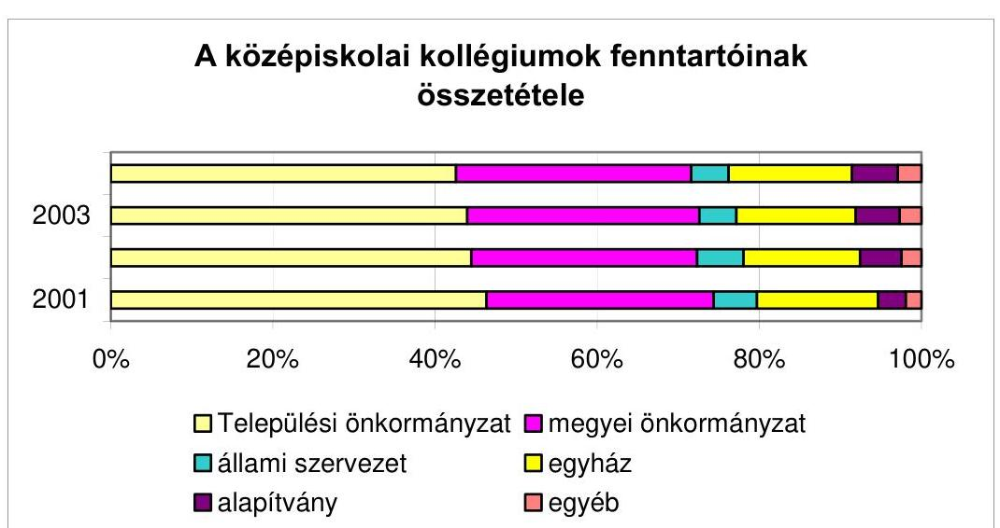

Az ország megyéi közül tíz megyében és a fővárosban gyarapodott a diákotthonok száma, négyben nem változott, míg öt megyében kevesebb kollégium volt 2004-ben, mint 2001-ben.

A legnagyobb csökkenés Zala megyében volt, ahol 16-ról 11-re csökkent az intézmények száma. Jelentős volt még a Jász-Nagykun-Szolnok megyei kollégiumi fogyatkozás (három) is.

---

Az intézmények számában a legnagyobb arányú gyarapodás (négy kollégium) Békés megyében történt, de a korábbinál három kollégiummal több látja el feladatát a fővárosban, Bács-Kiskun, Vas és Veszprém megyékben is.

Bár az intézmények száma nőtt, a középiskolás korosztály létszámában a vizsgált időszakban ellentétes tendencia érvényesült. Országos viszonylatban az elmúlt évtized második felétől az iskoláskorú korosztályok létszáma folyamatosan csökkent. A vizsgált időszakban ez a kedvezőtlen demográfiai helyzet elérte már a középiskolás korúakat (15-19 év) is, mivel a létszámuk a megfigyelt időszakban 5,1%-kal, 34064 fővel csökkent.

A távlati fejlesztéshez azonban elsősorban nem az intézmények, hanem azok férőhelyeinek száma a meghatározó. Az OM nem rendelkezett a középfokú kollégiumok férőhelyeire vonatkozó adatokkal, így a férőhely kihasználtságra vonatkozó információkkal sem, ami a közvetlen célok kialakításához szükséges lenne.

A közoktatási statisztika adatállományából kigyűjtött információk szerint - melyeket az 1. számú melléklet szemléltet - a középfokú kollégiumokban 2004-ben 67149 fő tanulót helyeztek el, közel egyharmaduk (30,2%-a) gimnazista, kétharmaduk (67,4%) szakközépiskolás és szakiskolás tanuló. Az összes kollégiumi elhelyezett több mint fele (52,1%) a megyeszékhelyen működő intézmények diákja. Az intézmények kapacitáskihasználtságára a statisztika nem tartalmaz adatokat.

Az igények átalakulásának a kapacitások változásaira gyakorolt hatásáról nem készült értékelés. Vizsgálatunk során felmértük az igények változását és a kapacitások kihasználtságát is. Az ellenőrzött 21 fenntartó 107 középfokú kollégiumában a 2005/2006-os tanév elején 21471 engedélyezett férőhellyel rendelkeztek, amely 5,3%-kal volt kevesebb, mint a vizsgált időszak elején. Az elhelyezett tanulók száma viszont ennél nagyobb arányban (7,9%-kal) csökkent, vagyis romlott a férőhely-kihasználás (lásd 2. számú melléklet). A legnagyobb csökkentések a legnagyobb kollégiumi kapacitással rendelkező intézményfenntartóknál fordultak elő.

A Pest Megyei Önkormányzat az igények módosulásával összhangban jelentősen redukálta a férőhelyek számát. A Gárdonyi Géza Szakközép- és Szakmunkásképző Iskola kollégiumának befogadóképessége 200 főről 25 főre csökkent. Törvényi kötelezettség révén - a ceglédi Dózsa György Kollégium megyei fenntartásba vételével - ugyanakkor hálózatbővítésre is sor került, ezzel együtt a megyei önkormányzatnál 100 fővel csökkent a középfokú kollégiumok kapacitása, mert a biatorbágyi Mezőgazdasági Szakmunkásképző Iskola és Kollégium az igények csökkenése miatt jogutód nélkül megszűnt.

Nagykanizsa Megyei Jogú Város a megfigyelt időszakban 140 férőhellyel csökkentette kollégiumi kapacitását.

Székesfehérvár Megyei Jogú Város Közgyűlése két alkalommal döntött a férőhelyek változtatásáról. 2004-ben 96 fővel, 2005-ben további 115 férőhellyel csökkentették a kapacitást.

Nyíregyháza Megyei Jogú Város is két alkalommal szűkítette intézményhálózatát, melynek eredményeként összességében 95 férőhelyet szüntettek meg.

---

A kollégium fenntartók a hosszabb távú elképzeléseik megalapozásához külön felmérést nem készítettek, csak az általános felvételi eljárás keretében értesültek a kollégiumi jelentkezésekről, emiatt a kapacitások kihasználtsága elmaradt az elvárásoktól.

Orosháza Város Önkormányzata 14 fővel, 5,6%-kal csökkentette a diákotthon befogadóképességét. A kollégium iránt jelentkező igényeket nem mérte fel, nem számolt azzal, hogy a tanulók nem kérnek kollégiumi ellátást, így a kihasználtság 71%-ról 49%-ra csökkent.

A tanulólétszám változásának az okait tapasztalataink szerint a fenntartók mélyrehatóan nem vizsgálták, nem érezték ennek szükségességét.

A Somogy Megyei Önkormányzat a vizsgált időszakban 4%-kal csökkentette az engedélyezett férőhelyek számát, de ugyanezen idő alatt az elhelyezett tanulók létszáma 22%-kal csökkent. A közel negyedrésznyi csökkenés okait a fenntartó nem vizsgálta.

Az aszódi Petőfi Sándor Gimnázium, Gépészeti Szakközépiskolában a megye településeiről 296 fő, a fővárosból és megyén kívülről 211 fő tanul. Az iskolával közös igazgatású kollégiumba ugyanakkor csak az iskolai tanulólétszám 9%-a - 59 fő - kérte a felvételét.

Vizsgálati tapasztalataink szerint az okok összetettek, de mindenképpen összefüggnek az elhelyezés egyre romló minőségével, a közoktatás átalakulásával és a szemlélet változásával is.

- A középiskolás korosztály csökkenése az elsődleges ok.
- A tanulók legalább olyan minőségi szintet várnak el a diákotthontól, mint amilyen tárgyi körülményekben otthon részük van. A családok nagyobb része a romló állagú kollégiumoknál jobb hátteret tud biztosítani.
- A szakképzési rendszer átalakításával csökkent a szakiskolai tanulók száma. A kevés helyen elsajátítható speciális szakmák esetében nagyobb szükség volt a kollégiumi elhelyezésre, mint most, amikor a szakma megszerzéséhez szükséges érettségit, vagy az általánosabb jellegű szakmacsoportos képzést a lakóhelyükhöz közelebb eső középiskolában is megszerezhetik a tanulók.
- A tanárok véleménye szerint a tanulók egyre kevésbé viselik el a kötöttségeket. A kollégiumi élet óhatatlanul együtt jár olyan folyamatos kötelezettségekkel, amelyek a családok nagy részében nem jelentkeznek.

A fenntartói átszervezések háromnegyed része finanszírozási gondra visszavezethető, a gazdálkodási jogosultságot érintő változás volt, melyeket megelőzően csak a végrehajtott átszervezések felénél értékelték előzetesen az érintett intézményben folyó szakmai munkát is. Az átszervezéseket csak elvétve alapozták meg szakmai okok is.

A Magyarországi Evangélikus Egyház soproni gimnáziumát és kollégiumát egy szervezeti egységbe vonták össze, melytől a fenntartó a gazdasági előnyökön felül azt is várja, hogy megnő az esélye annak, hogy emelkedjék az evangélikus vallású tanulók száma a kollégiumban.

---

Nagykanizsa Megyei Jogú Város Közgyűlése megszüntette a Dr. Mező Ferenc Gimnázium és Szakközépiskola kollégium tagintézményét, jogutódja a Cserháti Műszaki Szakképző Iskola és Kollégium lett. Az átszervezéstől alapvetően a kihasználtság javulását, az ellátás színvonalának javulását reméli a fenntartó. Emellett szakmai előnyöket várnak a középiskolai tanulók és a főiskolai hallgatók közös elhelyezésének megszűnésétől, a koedukációtól is.

Nagykálló Város Önkormányzata 2003. évben elvi állásfoglalást fogadott el az intézmények szakmai, gazdasági összevonására. Az átszervezések előtt szakértői vizsgálat készült, amely - tekintettel arra, hogy a kollégium költségeit fedezte az állami hozzájárulás és egyéb állami támogatás - a kollégiumok működtetésében nem javasolt változást.

A szervezeti változásokkal nem járt együtt az intézmények pedagógusainak közös foglalkoztatása, holott erre a közös igazgatású egységeknél elvi lehetőség nyílt. Az iskolák és a kollégiumok kapcsolatában a személyi kapacitások integrálására a gyakorlatban csak a kivételes helyzetek kezelésére és átmeneti jelleggel került sor. Tényleges együttműködések alakultak ki egy-egy fenntartó kollégiumai között a diákok hétvégi elhelyezésére, többségében az AJTP-ben résztvevő diákok részére hétvégi programokat szervező kollégiumoknál.

Mind a tanulólétszám csökkenése, - melynek megszüntetése érdekében a nagyobb városokban a kollégiumi felvételeknél, externátusi ellátásnál a fenntartók intézményei között koordinációra lett volna szükség, - mind a gazdasági problémák többféle okra vezethetők vissza.

A koordináció hiányára utal, hogy Debrecen Megyei Jogú Városban a jó képességű tanulókért valóságos harc folyik, de az elutasított tanulók további sorsa nem követhető. 2005. szeptemberében 64 lányt utasítottak el helyhiány miatt. Externátusi ellátás a vizsgált időszakban nem volt, annak ellenére, hogy a városi kollégiumok alapító okirata tartalmazza ezt az ellátási formát.

Miskolc közoktatási intézményeiben a vidéki tanulók aránya a vizsgált időszakban 52%-ról 54%-ra emelkedett. Ennek ellenére a megyei jogú város ellenőrzésbe bevont diákotthonainak ellátása iránti igény csökkent, melyhez hozzájárult az is, hogy az említett fenntartón kívül négy egyházi és egy megyei önkormányzati fenntartású kollégium is működik a városban, melyek között nincs a férőhelyek betöltése érdekében egyeztetés, illetve együttműködési megállapodás.

Békéscsabán a megyei jogú város kollégiumaiban érzékelhető tanulólétszám csökkenéshez az is hozzájárult, hogy rendkívül jelentős volt a létszámbővülés a megyei fenntartású Arany János Kollégiumban.

Kedvező tapasztalatunk volt e téren Balassagyarmat városban. A városi és az egyházi fenntartású kollégiumok vezetői egymással minden tanévben egyeztettek, és amennyiben eltérés volt az igények és a lehetőségek között, akkor a jelentkezők átirányításával igyekeztek a többletigényeket kielégíteni.

A középfokú kollégiumok fenntartása a fővárosi, megyei jogú városi és a megyei önkormányzatok számára megfogalmazott kötelező feladat. A városok elsősorban a középiskolák működtetéséhez ragaszkodnak, mivel ettől várnak nagyobb térségi kisugárzást, a kollégiumokat csak az iskolákhoz kapcsolódóan tartják fenn. A települési önkormányzatoknál választási ciklusonként felmerült a kollégium működtetésének kérdése, amire alapvetően gazdasági alapon adtak választ. Ha az állami hozzájárulásból fenn tudja az intézmény tartani magát és a településen lévő szállásproblémák megoldásában is segítséget jelent, akkor nem adják át, ellenkező esetben átkerül a megyei önkormányzat fenntartásába. Amennyiben egy új képviselő testület másként ítéli meg a fenntartás kérdéseit, akkor kezdeményezi az intézmény visszavételét. Az intézmény életében minden fenntartói váltás nehézséget okozhat, hiszen az új fenntartónál új szakmai, minőségpolitikai, költségvetési elvárással találkozhatnak. A megyei önkormányzat számára történő átadás tendenciája erősödik, mivel - az országos adatok alapján - az önkormányzati fenntartók közül csak a megyei önkormányzatok fenntartásában lévő kollégiumok száma emelkedett a vizsgált időszakban, mintegy 6%-kal.

A vizsgált körben Balassagyarmat, Cegléd, Békéscsaba városok kollégiumainál volt a megyei önkormányzat és a város közötti fenntartói változás.

Amennyiben a kollégium saját bevételi lehetőségei kedvezőek, a települési önkormányzat akkor is megtartja
 fenntartásában, ha a kapcsolódó középiskolákat a megye működteti. Jó példa erre Siófok város, ahol a városi kollégiumban elhelyezett tanulóknak csak az egyharmad része középiskolás, a többi térítési dí ellenében felvett főiskolás. A városi kollégiumban a városi önkormányzat intézményeiből nincsenek kollégisták.

A szűkülő kollégiumi igények miatt új kollégium létesítésével nem, csak meglévő intézmény számára épített új épülettel találkozott a vizsgálat.

A korábbival azonos férőhellyel új épületbe költözött a Szeged-Csanádi Egyházmegye fenntartásában lévő makói, a Magyarországi Evangélikus Egyház aszódi és a Pest megyei önkormányzat aszódi intézménye. Ez utóbbi két intézmény kihasználtsága jelzi, hogy viszonylag kisszámú igényre jött létre ebben a városban a két kollégium. A Pest Megyei Önkormányzat címzett támogatásból 2002-ben megvalósított 80 férőhelyes kollégiumában 2005-ben 59 tanulót helyeztek el, az evangélikus egyház által 2001-ben épített 80 férőhelyes kollégium jelenleg 39 fő ellátását szolgálja.

Jó példa a fenntartók közötti koordinációra a nyíregyházi kollégium beruházása. A Magyarországi Evangélikus Egyház nyíregyházi Luther Márton Kollégiumának beruházásához - a Nemzeti Kulturális Örökség Minisztériuma és Nyíregyháza Megyei Jogú Város Önkormányzata által - biztosított források ellentételezéseként a megyei jogú város évente 20 férőhelyre tarthat igényt.

A hosszú távú döntések megalapozásához a fenntartók között koordinációra lenne szükség a kollégiumi feladatellátást befolyásoló valamennyi területen. Ennek egyik jellegzetes területe a középfokú szakképzés. Vizsgálati tapasztalataink szerint a szakképzési rendszerbe új elemként bekerült Térségi Integrált Szakképző Központok létrehozása nem számol a kollégiumi hálózattal.

A Nemzeti Fejlesztési Terv Humánerőforrás-fejlesztési Operatív Program keretében a "Térségi Integrált Szakképző Központ létrehozására és infrastrukturális feltételeinek javítására" a vizsgált fenntartók közül Miskolc, Debrecen, Nyíregyháza, Székesfehérvár, Békéscsaba, Kecskemét megyei jogú városok, a Fővárosi Önkormányzat és a Pest megyei Önkormányzat voltak eredményesek a 2005-ben kihirdetett pályázaton. A program célkitűzése, hogy az erőforrások koncentrálá-

---

sával, térségi központokba telepítésével korszerű technológiai, infrastrukturális háttér alkalmazásával növelje a szakképzés hatékonyságát, ami mindenképpen felveti a tanulók korábbinál nagyobb arányú utaztatását. A program megvalósítása részben a kollégiumokban ellátott diákok bázisiskoláját érinti majd. A TISZK-ek létrehozása kezdeti fázisában van, a 2005/2006. tanévben a kollégiumokat e program - vizsgálati tapasztalataink szerint - nem érintette.

A folyamatok, változások felmérésére, ezek elemzésére az ágazat vezetése részéről nem került sor. A rendelkezésre álló statisztikák alapján az oktatási tárcának nincs adata arról, hogy a kollégiumi ellátottakon belül hogyan változott a hátrányos helyzetű tanulók aránya, és a szakképzés szerkezeti változásaihoz hogyan alkalmazkodik a kollégiumi rendszer.

A kollégiumok iránti igényekről, azok összetételéről, változásairól rendszerbe épített adatszolgáltatás nincs, azokról elemzés, értékelés az OM-ben nem készült.

# 1.3.2. A kidolgozott ágazati elképzelések megalapozottsága 

A kollégiumi hálózat területén hosszú távra kialakítandó fejlesztési elképzeléseket az OM egyedi felmérésekkel igyekezett megalapozni.

#### Abstract

A leginkább változásra szoruló területek (létesítmény, eszköz) feltételeinek javítására is egyedi felmérések szolgáltak. Ilyen módszerrel készült 2001-ben a Közoktatás-fejlesztési Főosztálynak az OM beruházási miniszteri biztosa részére készített, a kollégiumok műszaki fejlesztésére vonatkozó előterjesztése is. A közigazgatási államtitkár az igények felmérésével megbízott egy műszaki átvilágítást előkészítő csoportot. Mivel a területre vonatkozóan nem volt rendszeresen gyűjtött adatbázis, a Kollégiumi Érdekszövetség felmérésének adataira, és az előterjesztést készítő referens telefonos megkérdezéseire és számításaira támaszkodhattak.

A telefonos interjú közel 300 kollégiumra terjedt ki. Az adatok alapján a középfokú kollégiumok műszaki állapotát 21%-ban rossznak, 54%-át megfelelőnek, 25%-át jónak minősítették. A kollégiumok eszközellátottságát a kötelező eszközlista alapján 20%-osnak értékelték, ettől némileg kedvezőbb minősítést kapott az infrastrukturális helyzet, amit 70%-osnak értékeltek, de a számítástechnikai terület ellátottságát csak 30%-osra becsülték.

A meglévő helyzet és az összegyűjtött igények alapján műszaki fejlesztésre, felújításra kb. 136 milliárd Ft, eszközfejlesztésre kb. 4,5 milliárd Ft, infrastrukturális fejlesztésre kb. 20 milliárd Ft forrás szükséglet fogalmazódott meg; a részlegesen és szóbelileg felmért igények így összesen 160,5 milliárd Ft-ot tettek ki. A 2001-ben elkészült előterjesztést, illetve az abban rendszerszerű adatgyűjtést nélkülöző felmérés alapján felvázolt forrásigényt - mivel az nem volt megalapozott - a Helyettes Államtitkárság nem fogadta el.

Mindezek ellenére a kollégiumi hálózat feltételeinek javítására - elsősorban a szakképzési célú pénzeszközök felhasználásával - a vizsgált időszak első felében jelentős többletforrás állt rendelkezésre.

A Kormány 2000. decemberében megalapította az NKKA-t, melynek célja a Magyarországon működő kollégiumok támogatása volt annak érdekében,

---

hogy olyan színvonalas nevelő-oktató intézményekké váljanak, amelyek képesek a tanulók és hallgatók esélyegyenlőtlenségeit csökkenteni, és elősegítik a társadalmi mobilitást a hátrányos helyzetű tanulók, hallgatók felzárkóztatásával és tehetséggondozásával. A kuratórium e célokat a felsőoktatási és a közoktatási kollégiumi hálózatban azonos mértékben kívánta támogatni, ami nem valósult meg, mivel a támogatások 54,2%-át a felsőoktatási kollégiumok, 45,8%-át közoktatási kollégiumok kapták.

| Nemzeti Kollégiumi Közalapítvány pályázati támogatása összesítve |  |  |  |
| :--: | :--: | :--: | :--: |
| Év | Pályázati kör neve | Megítélt támogatás (E Ft) |  |
|  |  | Közoktatás | Felsőoktatás |
| 2001 | Szakmai pályázatok | 123917 | 84171 |
| 2002 | Infrastrukturális pályázatok | 767897 | 1099601 |
| 2003 | Szakmai pályázatok | 18000 | 12000 |
| 2004 | Informatika pályázatok | 182261 | 94349 |
|  | Összesen: | 1092075 | 1290121 |

Az alapítvány működésének második évét követően a támogatásra felhasználható források biztosításával is gondok jelentkeztek. Az NKKA 2 milliárd Ft támogatást kapott 2001-ben az OMAI-n keresztül a Szakképzési és Fejlesztési Alaprésztől. Az Alaprész pénzfelhasználására is kiterjedt az Állami Számvevőszék 2002-ben végzett vizsgálata ${ }^{9}$, amely több ponton is jogszabályellenesnek minősítette a szakképzési célú pénzeszközök kollégiumi célokra történő felhasználását.
„Az egyedi döntések alapján több olyan támogatást hagytak jóvá az alaprész terhére, amelyek szakképzéshez közvetlenül nem kapcsolódtak: A Nemzeti Kollégiumi Közalapítvány a XXI. század kollégiumi rendszerének kialakítására 2001. évben 2000 millió Ft támogatásban részesült. A támogatási szerződésből és a felhasználásáról készített szakmai beszámolóból megállapítható, hogy részben olyan fejlesztések valósultak meg, amelyek a szakképzéshez nem kapcsolódnak, részben pedig nem szakképző intézmények is részesültek a támogatásokból."

A helyszíni vizsgálat lezárását követően készült el az alaprészt érintő 2002. I. félévi döntéseknek az - oktatási miniszter felkérésére végzett - ellenőrzéséről a KEHI jelentése. Ebben a törvényes állapot helyreállítását biztosító intézkedések megtételét javasolták. Ezen kívül - többek között - a szakképzési hozzájárulásról és a képzési rendszer fejlesztésének támogatásáról szóló törvénynek ${ }^{10}$ az ÁSZ által végzett vizsgálat javaslataival összecsengő módosítására is javaslatot tettek. Az OM e javaslatok 2003. év végéig történő végrehajtása érdekében intézkedési tervet készített.

[^0]
[^0]:    ${ }^{9}$ A vizsgálat „A szakképzési struktúra szerepe a munkaerőpiaci igények kielégítésében" címmel 0321 jelzéssel került nyilvánosságra.
    ${ }^{10}$ 2001. évi LI. tv.

---

A vizsgálatok következményeként a 2002-es év utolsó harmadában, illetve 2003. év első felében - a támogatóval való megállapodás létrejöttéig - nem került sor pályázat kiírására. Az NKKA 2003-ban 158,3 millió Ft-ot utalt vissza az OMAI FKA-nak a KEHI ellenőrzési jegyzőkönyve nyomán. Ezt követően már a szakképzés céljait szolgáló pénzeszközökből az NKKA nem részesedhetett.

Az NKKA által biztosított források a közoktatási területre vonatkozó hosszú távú célok nélkül kerültek felhasználásra. A középfokú kollégiumi hálózat fejlesztéséhez rendelkezésre bocsátott többletforrások felhasználásának programszerűsége, eredményessége sem volt biztosított.

- A támogatásokat nem előzte meg egy - a terület helyzetét teljes egészében átfogó - felmérés, ennek ellenére főleg az első félévben rendkívül intenzív volt a pályáztatás, így még a kezdeti tapasztalatok felhasználására sem nyílt mód. (Az első négy hónapban a közoktatási kollégiumok számára egymást követően egy tucatnyi célra öt pályázati csomag jelent meg.)
- Nem volt megfelelően kimunkált célrendszer a támogatási politika kialakításához. (Az első két évben a rövid időközönként meghirdetett pályázatok 18 egymástól teljesen eltérő támogatási területet érintettek.)
- A pályázóknak nem állt megfelelő idő a rendelkezésükre a megalapozott, jól kidolgozott pályázatok elkészítéséhez. (2001. augusztus 17-én jelent meg például az első öt felhívás, melyek beadási határideje szeptember 15., illetve szeptember 20. volt; a határidők később is hasonlóan rövidek voltak.)
- A pályázati lehetőségek több részterületet is érintettek, amelyeknek prioritása nem volt bizonyított (pl. a képző- és iparművészeti munkákra, kollégiumok névfelvételére, egyéni arculat kialakítására, a szakmai érdekképviseletek tevékenységére vonatkozó pályázatok).
- Az évenként támogatott területek nem épültek egymásra. Az első évben különböző szakmai témákat, a második évben infrastrukturális fejlesztéseket, később inkább informatikai beszerzéseket támogattak. (Egyetlen meghirdetett támogatási célt sem vittek tovább a következő felhívás területének kidolgozásakor.)
- A feltételeknek megfelelő, ki nem elégített támogatási igények teljesítésére később nem tértek vissza. (A 2002. február 1-jén megjelent hűtőgép pályázatra a beadott jogos igények kevesebb, mint ötödét, a március 22-én meghirdetett vizesblokk felújításra a feltételeknek megfelelő kérelmek hatodrészét tudták csak kielégíteni, de a következő pályázatok már ismét új területekre vonatkoztak.)

Az államháztartás egyensúlyi helyzetének javításához szükséges rövid és hosszabb távú intézkedésekről szóló kormányhatározatban ${ }^{11}$ az oktatási miniszter kormányzati felelősségi körébe tartozó közalapítványok megszüntetéséről szóló feladatot a Kormány úgy módosította, hogy az érintett közalapítványok egyesítésével, azok jogutódjaként jöjjön létre egy új közalapítvány.

[^0]
[^0]:    ${ }^{11}$ 2050/2004. (III. 11.) számú Korm. határozat 4. számú melléklet

---

Az új közalapítvány a Bursa Hungarica Közalapítvány, az Esélyt a Tanulásra
Közalapítvány, a Közoktatási Modernizációs Közalapítvány, a Nemzeti Kollégiumi Közalapítvány, az Országos Kiemelésű Társadalomtudományi Kutatások
Közalapítvány összevonásával Oktatásért Közalapítványként jött létre.
Az új közalapítvány a helyszíni ellenőrzés időszakában, 2005. decemberében egy pályázatot írt ki a középfokú kollégiumok számára, a tervezett keretösszeg 50 millió forint volt. A pályázatok elbírálására a vizsgálatunk lezárásáig nem került sor.

# 2. A kollégiumi hálózat szervezeti-irányítási rendszere 

### 2.1. A szakmai és a fenntartói irányítás

A közoktatás irányítási rendszere erősen decentralizált, az irányítási felelősséget több szervezet is viseli. A négy irányítási szint (a központi, a területi, a helyi és az intézményi irányítás) közül a legnagyobb felelősség a helyi fenntartókat terheli. Az Ötv. előírásai alapján a helyi önkormányzatok kötelesek megszervezni a közoktatási feladatellátást. A rendszer sajátossága, hogy a közoktatásról való gondoskodás az adott irányítási szinten nem társul ellátási monopóliummal. Vizsgálati témánk esetében ez azt jelenti, hogy a kollégiumi ellátás az Ötv. értelmében megyei önkormányzati kötelező feladat, de a települési önkormányzatoknak, egyházaknak, alapítványoknak is joguk van kollégiumot működtetni.

Jellemző továbbá, hogy a közoktatási intézményekben szakmai ellenőrzést csak az arra jogosult szakértő végezhet és a fenntartói irányítás nem sértheti a nevelési-oktatási intézmény szakmai önállóságát, az intézmény szakmai döntési hatásköreit.

### 2.1.1. A közoktatás országos irányítása

Az oktatási miniszter ágazati irányító tevékenysége egyaránt kiterjed az állami, önkormányzati, egyházi, alapítványi intézményekre. Az irányítási feladatainak többek között szakmai-tartalmi kérdések meghatározásával, jogszabályalkotással tesz eleget.

A kollégiumi ellátással kapcsolatos ágazati irányítási feladatok a közoktatás szerves részeként,
 közvetetten jelentek meg az OM szervezeti dokumentumaiban ${ }^{12}$. A kollégiumi nevelési témában ellátandó tanácsadásra és koordinációra, jogszabály-előkészítésben való közreműködésre a Közoktatás-fejlesztési Főosztály a vizsgált időszak valamennyi évében egy gazdasági társasággal kötött megbízási szerződést. A konkrét teendőket a megbízási szerződés nem tartalmazta, nem tért ki a feladat ellátás módjára, a munkavégzés idejére.

[^0]
[^0]:    ${ }^{12}$ Szervezeti és Működési Szabályzat, Közoktatás-fejlesztési Főosztály Ügyrend

---

A helyszíni ellenőrzés idején 599 közoktatási bentlakásos intézmény működött. Az intézményi struktúrát közoktatási kollégiumok és diákotthonok, az általános iskolai diákotthonok, valamint a speciális intézmények alkotják. Közel 80 ezer kollégista él a közoktatási kollégiumokban, 4-5 ezer kollégiumi tanár dolgozik ezekben az intézményekben. Kollégiumi ellátásban részesül az általános iskolai tanulók $0,4 \%$-a, középiskolai tanulók $17 \%$-a, a szakiskolai tanulók 14\%-a. Ilyen kiterjedt intézményhálózat az ágazati irányítás folyamatosságát igényelte volna; a Főosztályi teendők egy része rendszeres feladatellátást, állandó referensi jelenlétet indokol, a kollégiumok gyakorlati tevékenységének rendszeres figyelemmel kísérése is így valósítható meg. A külső megbízás csak a kollégiumi feladatellátáshoz kapcsolódó szakmai tanácsadásra, véleményezésre terjedt ki. Az OM a kollégiumokkal általában a civil szervezeteken és a kollégiumi szakma szakértőin keresztül, míg az egyes kollégiumokkal csak egyedi esetekben vette fel a kapcsolatot.

Az oktatási miniszter közoktatás-fejlesztéssel kapcsolatos feladata többek között a hátrányos helyzetű tanulók nevelésével, oktatásával kapcsolatos feladatok végrehajtását segítő országos szolgáltató rendszer kiépítése és működtetése ${ }^{13}$. Az OM ennek megvalósítására a kollégiumi rendszerben 2000-ben meghirdette az Arany János Tehetséggondozó Programot.

Az AJTP elsősorban azoknak a tehetséges tanulóknak a támogatására szolgált, akik valamilyen hátrányuk miatt kevés eséllyel indultak volna a felsőfokú tanulmányok megkezdésére.

A felsőfokú tanulmányokra való eredményes felkészítés érdekében a programban résztvevő gimnáziumok és kollégiumok pedagógusai, szakértők bevonásával, speciális programot dolgoztak ki a diákok hátrányainak leküzdésére. Az ötéves program első, előkészítő-gazdagító évében a tanulók magas óraszámban, kis csoportokban tanulnak angol nyelvet és informatikát. A program során az iskolák és a kollégiumok kiemelt figyelmet fordítanak a magyar nyelv és irodalom, valamint a matematika kis csoportokban történő tanítására. A tanulók humán, művészeti és természettudományos ismereteiket speciális programok keretében sajátíthatják el. A programban résztvevők az előkészítő évfolyamot követően a hagyományos gimnáziumi oktatás keretei között tanulnak.

A program a szakmai beszámolók szerint jó eredményeket mutatott fel a diákok tudásbeli és kulturális különbségeinek leküzdésében, azonban kezdettől kritika érte amiatt, hogy kisszámú (az első évfolyamban országosan 360 fő) tanuló feltételein tud csak javítani. Az első évfolyam után évente 600 kilencedikes kapcsolódott a programba. Az öt évfolyamon egyszerre bent lévő közel 3000 diák azonban még így is csak 5\%-a középfokú kollégiumi elhelyezetteknek.

Vizsgálati tapasztalataink szerint problémát jelentett az is, hogy az AJTP-ben részt vevő tanulók lehetőségeitől a kollégiumban lévő többi diák feltétele elmaradt, ami esetenként az intézményen belül feszültséget keltett (lásd még a 2.2. és a 3.2.2. fejezet megállapításait).

[^0]
[^0]:    ${ }^{13}$ Kt. 95. § (1) bekezdés i) pontja

---

2003-tól a program célcsoportját megváltoztatták: a települési - de nem feltétlenül egyéni szociális - hátrány kiegyenlítéséről a hangsúly az egyéni szociális hátrány kiegyenlítésére került. Nagyobb településekről is bekerülhettek, de csak hátrányos helyzetű tehetséges tanulók. A továbbfejlesztés legfőbb céljaként azt határozták meg, hogy hatékonyabban és tömeges méretekben segítse a legszegényebb, illetve a legképzetlenebb szülők gyermekeinek integrált, nappali tagozatos középiskolai tanulmányait.

A program a módosulások során a Hátrányos Helyzetű diákok Arany János Tehetséggondozó Programja elnevezést kapta. A programra jelölhető volt bármilyen ok miatt hátrányos helyzetű (a családi körülményei, szociális helyzete miatt a jegyző által védelembe vett, illetve olyan tanuló, aki után rendszeres gyermekvédelmi támogatást folyósítanak, vagy a törvényes felügyeletet gyakorló szülők legfeljebb alapfokú iskolai végzettséggel rendelkeznek, vagy az osztályfőnök által bármilyen más oknál fogva hátrányos helyzetűnek tartott) tehetséges diák, akinek a hátrányos helyzete nem teszi lehetővé, hogy a benne rejlő átlagon felüli képességeit kibontakoztathassa. A tehetséggondozó program mellett indítottak egy Hátrányos Helyzetű Tanulók Arany János Kollégiumi Programot (HHTAJKP), ahol a kulcsszerep a kollégiumoké, mivel most már egy diákotthon nem csak egy, hanem több iskolával is kapcsolatba került.

A HHTAJKP-ra való jelentkezést az OM 2003-ban és 2004-ben pályázat keretében hirdette meg, a program bevezetésére a 2004/2005. tanévben került sor. A programot azon hátrányos helyzetű tanulók részére szervezték, akik a program nélkül esetleg gimnáziumi, szakközépiskolai érettségiig sem jutottak volna el.

Az AJTP-hez szükséges többletforrások biztosítására a vizsgált időszakban többféle konstrukció született, kezdetben fejezeti kezelésű, később kötött felhasználású, majd szabad felhasználású normatív állami hozzájárulással történt a finanszírozás. Az OM számára a pénzeszközök felhasználásának ellenőrzésére a többoldalú megállapodások lehetőséget nyújtottak, mellyel eddig egyetlen alkalommal sem éltek. (A támogatás felhasználásának helyszíni tapasztalataival a 3.2.2. pontban foglalkozunk.)
2001. és 2002. években az AJTP program finanszírozása kötött felhasználású normatívából történt, amelynek felhasználására az OM, a fenntartó, és az intézmény által aláírt szerződésben voltak előírások. A szerződés tételesen rögzítette, hogy az emelt támogatás mely feladatokra használható fel.
2003. évtől az AJTP, majd a HHTAJKP programok finanszírozása szabad felhasználású normatívából történik. Valamennyi évben (2003., 2004., 2005.) megkötötték a megállapodást, amelyet a korábbi három szereplő mellett a 2004/2005-ös tanévtől a SuliNova Kht. és a HHTAJKP intézményei is aláírtak annak érdekében, hogy a támogatás cél szerinti felhasználása biztosítva legyen.

Az OM nem rendelkezett a támogatás felhasználására vonatkozóan beküldött pénzügyi elszámolásokról a támogatottak teljes körére összegzéssel. Ennek hiányában a folyamatok alakulását, a pénzügyi felhasználás sajátosságait feltáró elemzésre, így az AJTP, AJKP forrásfelhasználás eredményességének vizsgálatára nem került sor.

---

# 2.1.2. A fenntartói irányítás, felügyelet, értékelés rendje 

A vizsgálat a fővárosi önkormányzatra, két megyei önkormányzatra, nyolc megyei jogú városra, hat városi önkormányzatra terjedt ki, amely kiegészült három egyházi és egy alapítványi fenntartóval. A közoktatási intézményre vonatkozó döntések legnagyobb részét helyi (önkormányzati, alapítványi, egyházi) szinten hozzák. Az intézményfenntartók kiterjedt helyi irányítási jogosítványokkal rendelkeznek, ${ }^{14}$ melyekkel az ellenőrzöttek különböző mértékben éltek.

A vizsgált fenntartói kör fele élt a kollégiumok gazdálkodási jogkörére, átszervezésére vonatkozó jogosítványával és átszervezte a kollégiumi hálózatot.

Valamennyi fenntartó meghatározta az intézmény költségvetését és a szociális alapon adható kedvezmények feltételeit, az adott tanítási évben az iskolában indítható osztályok, a kollégiumban szervezhető csoportok számát.

Minden fenntartó kidolgozta a minőségfejlesztés rendszerét, jóváhagyta a kollégium pedagógiai és a minőségfejlesztési programját, de csak a kétharmaduk ellenőriztette szakértővel az intézményben folyó szakmai munka eredményességét.

Helyi szinten az oktatásigazgatás választott testületek ellenőrzése alatt áll. A feladatok ellátása a testületekben és a hivatali munkában egyaránt szakértelmet, felkészültséget igényel. Ha a fenntartó három vagy annál több nevelési-oktatási intézményt tart fenn, köteles közoktatási ügyekkel foglalkozó bizottságot létesíteni és működtetni, ha középfokú intézményt tart fenn, a fenntartói irányítással összefüggő döntés-előkészítő munkában - pedagógusmunkakör betöltésére jogosító - felsőfokú iskolai végzettséggel rendelkező személynek kell közreműködnie.

Vizsgálati tapasztalataink szerint a középfokú kollégiumokat fenntartók két kivételtől eltekintve (Nagykálló Város Önkormányzat, ALTISZ Alapítvány) gondoskodtak az irányítói feladatok szakszerű ellátásáról. Az önkormányzatok és egyházak esetében önálló szervezeti egység, az alapítványnál egy személy látta el a fenntartói feladatokat. Előfordult azonban, hogy a tevékenységet ellátó szervezeti egység, illetve referens teendőit nem határozták meg konkrétan, ami az intézmények fenntartói orientálását nehezítette.

Balassagyarmat Város Polgármesteri Hivatalának ügyrendje a nevelési-oktatási intézmények fenntartói teendőinél csak általános megfogalmazásban tartalmazza a szakmai munka menedzselését, a szakmai tanácsadást, ajánlások készítését.

A kollégiumok fenntartásához szakmai követelményeket is meg kellene határozni, ám tapasztalataink szerint hiányzik az intézmények számára a külső motivációs tényező. A kollégiumok működésének hosszú távú kereteit szabályozó helyi dokumentumok főként általános elvárásokat tartalmaztak,

[^0]
[^0]:    ${ }^{14}$ Kt. 102. § (2) bekezdés rendelkezése szerint

---

melyek nem jelentettek tényleges követelményeket, így nem is ösztönözték a szakmaiságot.

Hódmezővásárhely Megyei Jogú Város által az ÖMIP-ben elsőként megfogalmazott követelmény az volt, hogy a közoktatási intézmények feladatellátása a város polgárainak elvárása szerint alakuljon. Azon túl, hogy ennek az igénynek az átfogó, teljes felmérése nem történt meg és az esetleg egymásnak ellentmondó igények ütköztetésére vagy kiszűrésére sem került sor, s így a tényleges orientáció is elmaradt, még az is problémát okozhat, hogy szakmai elvárásokat szakmai szempontok nélkül nem lehet érvényesíteni.

Békéscsaba Megyei Jogú Város és Orosháza Város Önkormányzata is az általánosság szintjén fogalmazta meg elvárásait, amelyek a törvényes működés, a pedagógiai munka eredményességének, a feladatellátás hatékonyságának területeire terjedtek ki.

A fenntartók szakmai kritériumok helyett inkább a kollégiumok finanszírozásához alkalmaztak normatívát.

Nagykanizsa Megyei Jogú Város a létszám és a túlóra esetében a feladattól függő, normatív finanszírozást, a Pest megyei Önkormányzat a személyi feltételek biztosításánál feladatfinanszírozást vezetett be. Somogy megye önkormányzata a költségvetés készítés keretében vizsgálta felül a feladat ellátási mutatók (létszám, óraszám) betartását.

Az intézmények ellenőrzésének megoldatlansága, a hatékony, zárt ellenőrzési rendszer kidolgozásának és működtetésének hiánya, hosszú idő óta gyenge pontja volt a közoktatási rendszernek. A fenntartók többsége erre nem fordított figyelmet, mivel nem volt előírás a kötelező gyakoriság és a szakmai ellenőrzést csak szolgáltatás igénybevételével, az erre jogosítvánnyal rendelkezőkkel végeztethették. A vizsgált időszakban pozitív változást eredményezett a Kt. 2003. évi módosítása, ${ }^{15}$ amelyben az önkormányzati rendszer létrejötte óta először írták elő a fenntartók számára, hogy rendszeresen, de legalább négyévenként ellenőrizzék a szakmai munka eredményességét, az intézmény működésének törvényességét, hatékonyságát, gazdálkodását, a gyermek- és ifjúságvédelmi tevékenységet. Ezzel megvalósult az Állami Számvevőszéknek a szakmai ellenőrzés kötelező gyakoriságának meghatározására ${ }^{16}$ vonatkozóan az oktatási miniszter részére 2002-ben megfogalmazott javaslata.

A vizsgált kör fenntartói a Kt.-ben nevesített ellenőrzési formákra a minőségirányítási programjukban több évre kiterjedő ütemtervet hagytak jóvá, azonban nem határozták meg a szakmai ellenőrzés elrendelésének kötelező eseteit. Erre azért lett volna szükség, mert a kezdeti problémák jelentkezésekor elvégzett vizsgálat megelőzhetné a komolyabb bajok keletkezését. A minőségirányítási program ezzel tudná garantálni a cél szerinti, hatékony működést. A

[^0]
[^0]:    ${ }^{15}$ A módosítást bevezette a 2003. évi LXI. tv., hatályos 2003. szeptember 1-től
    ${ }^{16}$ Jelentés az általános iskolai oktatás minőségének javítását szolgáló intézkedések tapasztalatairól, 2002. június

---

fenntartók, ha nem is foglalták írásba, de a gyakorlatban általában azt az elvet követték, hogy az igazgatói pályázatok elbírálását megelőzően, a szakmai programok felülvizsgálatakor kértek fel szakembert vizsgálatra. A dokumentumok felülvizsgálata és az azt követő jóváhagyás azonban nem minden esetben alakult a Kt. előírásai szerint.

A Nagykanizsa Megyei Jogú Város által fenntartott leánykollégium 2001-es szakértői felülvizsgálatakor hiányzott a Pedagógiai Program, holott ezt már 1998-tól alkalmazni kell. A közös igazgatású Cserháti Sándor Műszaki Szakképző Iskola és Kollégium kollégiumi intézményegységének külön pedagógiai programja készült ugyan, de az kimaradt a szakértői felülvizsgálatból és a
 Közgyűlés közoktatási intézményeinek pedagógiai programjait jóváhagyó határozatából is. Mivel a fenntartó a benyújtást követő harmincadik napon belül nem nyilatkozott, a pedagógiai programot elfogadottnak kell tekinteni, anélkül, hogy azt a szakértő, vagy a fenntartó átvizsgálta volna.

Ugyanennél az önkormányzatnál a Cserháti SZKI intézményi minőségirányítási programja a szakértőtől a „kisebb korrekciók elvégzését követően megfelel a törvényi előírásoknak", illetve „minőségfejlesztésének rendszere kevésbé kidolgozott" minősítést kapta, mely alapján a fenntartói jóváhagyásból kimaradt. A felülvizsgálat során azonban nem jelölték meg azt a jogszabályt, amelynek az intézményi minőségirányítási program nem felelt meg, és nem rögzítették a módosításra irányuló javaslatokat. A Kt. 103. § (1) bekezdése szerint a fenntartó az intézményi minőségirányítási program jóváhagyását akkor tagadhatja meg, ha jogszabályt sért, vagy a végrehajtásához szükséges feltételek nincsenek biztosítva, továbbá ha nincs összhangban az önkormányzati minőségirányítási programmal.

A pedagógiai dokumentumok felülvizsgálatán túl a szakértői ellenőrzést a fenntartók kevés esetben kezdeményezték. Elsősorban a több kollégiumi szervezettel rendelkező nagyobb költségvetési volumenű önkormányzatok áldoztak ilyen célra költségvetési pénzeszközt.

A Fővárosi Önkormányzat ebben a tekintetben is élen jár a vizsgált fenntartók között. A szakmai feladatok ellátására rendszeresen, éves ütemterv alapján kérték fel a szakértőket, akik részletes jelentéseket készítettek a tapasztalataikról.

Miskolc Megyei Jogú Város a vizsgált időszakban két alkalommal is ellenőriztette a kollégiumi hálózatát. A 2001-ben a kollégiumi életfeltételeket vizsgálták. 2002-ben a városi pedagógiai intézet által szintén valamennyi intézményre kiterjedő ellenőrzés a kollégiumi légkörre (értékkultúra, nevelési célok, érzelmi biztonság és kötődés, a vezetés jellemzői) irányult.

Debrecen Megyei Jogú Város felkérésére az öt megfigyelt évben hat intézmény ellenőrzését végezte el a szakértő. A vizsgálatok során számos területen talált kifogásolni valót az ellenőrzés.

- A személyi feltételek hiányosságait állapította meg akkor, amikor hiányolta a gyermek- és ifjúságvédelmi felelős tanárt, a matematika és magyar nyelv és irodalom szakos pedagógust, illetve három pedagógusnál az előírt iskolai végzettséget, és a nem szerencsés szakösszetételt.
- Az elhelyezés körülményeiről még ennél is súlyosabb megállapítások születtek. Nem biztosítottak a tanulók számára ágyneműt, illetve ennek mosatását, a tanulószobák hiánya miatt négy tanulócsoportnak a gimnáziumba kellett átjárni a szilenciumi foglalkozásokra, hiányoztak a szakköri és társalgó termek, a berendezések cserére, az épületek felújításra szorultak.

---

Figyelemre méltó, hogy a debreceni kollégiumokra tett szakértői megállapítások a helyszíni ellenőrzésünk idején is aktuálisak voltak.

Békéscsaba Megyei Jogú Város a szakértői ellenőrzéshez szükséges saját pénzeszközeit pályázati forrásból biztosította. A szakértői jelentések itt is felhívták a figyelmet a hiányos feltételekre, amelyek biztosítása szükséges ahhoz, hogy a pedagógiai dokumentumokban megfogalmazott célok megvalósulhassanak.

A megfogalmazott javaslatok közül a legkevésbé azokat realizálták, amelyek a tárgyi feltételekre és az eszközök pótlására vonatkoztak (Miskolc, Békéscsaba). A fenntartók az ellenőrzési tapasztalatokat inkább a pedagógiai dokumentumok jóváhagyása, a költségvetési tervezés vagy az éppen aktuális intézményi átszervezéseknél hasznosították. A szakértő által tett észrevételek hatására a fenntartó nem gyorsította fel a feltételrendszer javítását.

Kedvező tapasztalatunk ugyanakkor, hogy a közoktatási intézmények szakmai ellenőrzéséhez és értékeléséhez két megyei jogú város (Nyíregyháza, Székesfehérvár) előzetes követelményeket dolgozott ki.

Székesfehérváron az ÖMIP-ben írták elő a szakmai feladatellátás minősítésének szempontjait, Nyíregyházán pedig az Oktatási Bizottság dolgozott ki ${ }^{17}$ követelményeket. Ez utóbbi egységesen meghatározta a különböző oktatási intézmények szakmai ellenőrzésének területeit, a kollégiumok ellenőrzésére vonatkozóan külön szempontrendszert nem tartalmazott. Nyíregyháza élve a Kt-ben kapott ${ }^{18}$ felhatalmazással 2005. évben 13 közoktatási intézmény szakmai ellenőrzését végeztette el, melyek közül kettő látott el kollégiumi feladatot. Az elvégzett szakmai ellenőrzésekről összeállított szakértői jelentések nem az Oktatási Bizottság által elkészített követelményrendszer figyelembevételével készültek, felépítésükben és tartalmukban is eltértek attól. A szakértői jelentések minősége és tartalmi megállapításainak szűkössége miatt az Oktatási Bizottság határozatában tett észrevételt.

Pozitív irányú változás történt a fenntartói törvényességi ellenőrzések területén, mivel egyre több önkormányzat tartja folyamatos feladatának a jogszerű működésre vonatkozó vizsgálatot.

Székesfehérvár és Balassagyarmat városok nagy figyelmet fordítottak a tanügyigazgatás, a személyi feltételek jogszabály szerinti teljesítésének ellenőrzésére.

Az intézmények fenntartó általi értékelését az ellenőrzésen kívül egyéb eszközök (beszámoltatás, feladat kitűzés stb.) is segíthetik. Az objektív értékelést segíti a szakma képviselői által kidolgozott egységes követelményrendszer alkalmazása, melyre csak két esetben találtunk példát. (Kecskeméten az intézmények éves szakmai beszámolóinak értékeléséhez készült, a fővárosi önkormányzatnál pedig a helyszíni vizsgálat idején kezdték meg a kollégiumokra egy egységes követelményszint kidolgozását.)

[^0]
[^0]:    ${ }^{17}$ A követelményrendszerről az Oktatási bizottság határozatot nem hozott
    ${ }^{18}$ Kt. 107. § (8) bekezdés c) pontjában

---

A fenntartó által végzett és szakértővel végeztetett ellenőrzések, illetve beszámoltatások ritkán érintik a nevelési célok megvalósulását, a pedagógiai program teljesítését. A kollégiumok vezetőit ugyanakkor pontosan ezek a fenntartói visszajelzések erősíthetik meg abban, hogy jó irányban halad a pedagógiai munka. Az Alapprogram nem előírásszerű (lásd még a 3.5.1. pontot) - felmenő rendszerű - bevezetésének egyik oka tapasztalataink szerint éppen az volt, hogy nem éreztek rá fenntartói késztetést, hogy megszervezzék ezt a nagy szakmai erőfeszítést igénylő feladatot. Vizsgálatunk során azt érzékeltük, hogy az intézményvezetők hiányolták a tájékoztatást az Alapprogram bevezetésének tapasztalatairól, az ellátási és nevelési színvonal mérésének lehetőségéről, az externátusi rendszer lehetőségeinek bemutatásáról, az érettségizett és a középiskolás korosztály együttes elhelyezéséből adódó feszültségek megoldásáról, az ún. kiskollégiumok (50 férőhely alatti) sajátos helyzetéből fakadó gondok kezeléséről, de leggyakrabban a saját munkájuk fenntartói megítéléséről.

A vizsgált körben az önkormányzatok a kollégiumok szakmai feladatainak ellátása érdekében más önkormányzattal nem kötöttek együttműködési megállapodást. Az együttműködés hiányát a fenntartók egyharmada érdektelenséggel okolta, kétharmada nem adott a kérdésre érdemi választ.

Az integráció pozitív példájáról számolt be a vizsgálat kapcsán összehívott „Fókusz" csoport megbeszélésen jelen lévő, egy a vizsgált körön kívüli kollégiumvezető. Az országban az elsők között, Szolnokon létrejött egy Kollégiumi Centrum, amely 5 tagintézményes rendszerből áll. A pénzforrások hatékonyabb felhasználása és a humánerőforrások optimalizálása mellett, szakmai szempontból is eredményes volt az integráció, mivel összehangoltan tudják a városban a kollégiumi érdekeket megjeleníteni. A Kollégiumi Centrum létrejöttével a fenntartói elvárások is erőteljesebben jelentek meg, rendszeres szakmai ellenőrzéssel segíti az összevont intézmény pedagógiai munkáját.

A vizsgált időszakban a fenntartók azokat a kollégiumi feladatellátással kapcsolatos előterjesztéseket tárgyalták, amelyeket jogszabály írt elő, valamint átszervezéssel voltak kapcsolatosak. Az előterjesztések csak közvetetten tartalmaztak követelményeket, a döntések a működtetés alapvető formáira (dokumentumok elfogadása, szabályzatok, kapacitás meghatározása) vonatkoztak.

# 2.2. A kollégiumok működésének szervezeti rendszere 

A vizsgált kollégiumok 50%-a ún. közös igazgatási formában ${ }^{19}$ működött, azaz egy közoktatási intézményben középiskolai-, illetve szakiskolai és kollégiumi intézményegységek működtek egymás mellett. A közös igazgatási forma elsősorban a kollégiumok tárgyi feltételeit javította, mivel jelentős értékkel bíró létesítményeket, helyiségeket és egyéb eszközöket már a létesítéskor közös használatra alakítottak ki (ebédlő, könyvtár, tornaszoba, kondicionáló terem, sportpályák, stb.), vagy közösen használhattak. Ezek fejlesztésére, felújítására az iskolákkal együtt kedvezőbbek voltak a lehetőségek. Intézményi szin-

[^0]
[^0]:    ${ }^{19}$ Kt. 33. § (4) bekezdése

---

ten oldották meg szakemberek foglalkoztatását (ifjúságvédelmi felelős, drogkoordinátor, orvos, ápoló), továbbá a gazdasági szervezet és a kisegítő, karbantartó részleg működtetését. Esetenként az iskolai tanárok korrepetálták a kollégiumi diákokat. A nyelvtanulásban is jelentős segítséget biztosítottak az iskola tanárai és a nyelvi laborok. Informatikai téren is előnyben voltak azok a kollégiumok, ahol a kollégiumi eszközökön kívül a kollégisták az iskolai gépparkot is használhatták a tanórákon kívül. Jellemzően az informatikus is közös volt az intézményegységekben.

A közös igazgatási forma hátrányaként jelentkezett, hogy az intézményen belül nem különítették el a kollégiumi intézményegység bevételeit és kiadásait (lásd még a 3.2. pontban), ami miatt a vezetői döntésekhez szükséges információk nem álltak rendelkezésre. Hátrányként mutatkozott, hogy míg a jobb felszereltségű iskolaépület általában legkésőbb öt órakor bezár, s a kollégistáknak éppen a szabad idejében nem érhető el, addig a kollégiumi létesítményeknek bármikor az iskolai közösség részére szükség szerint rendelkezésre kell állniuk, így a közös igazgatású intézmények nem használták ki kölcsönösen a szervezeti forma adta előnyöket a hátránykiegyenlítés érdekében.

Nem a Kt-ben nevesített közös igazgatási formát határozták meg két kollégium esetében a hatályos alapító okiratban (és módosításaiban).

A Keszthely Város Vendéglátó, Idegenforgalmi, Kereskedelmi Szakképző Iskolája és Kollégiuma alapító okirata szerint középfokú oktatási intézmény, SZMSZ-ében sem szerepelt a közös igazgatású közoktatási intézmény szerinti besorolás, igazgatótanács sem működött benne.

A nyíregyházi Inczédy György Szakközépiskola és Szakiskola (még a nevében sem jelent meg a kollégium, annak ellenére, hogy 300 fős engedélyezett kollégiumi férőhellyel rendelkezik, mely közel 100%-ban kihasznált) igazgatója észrevételt tett a számvevői jelentéshez, vitatva a működési formát illetően az alapító okirat felülvizsgálatának szükségességét. Az intézmény nem közös igazgatású intézményként, hanem „többcélú, összetett helyi önkormányzati nevelési, oktatási intézmény"-ként működik alapító okirata szerint, noha a kollégiumi egységet is magában foglaló intézmény a Kt. 33. § (4) bekezdés előírása szerint kizárólag közös igazgatású intézményként működtethető.

A közös igazgatású intézmények működésének előnyei azért sem jelenhettek meg mindenütt, mert mindössze hétben - az érintett intézmények 39%-ában - alakították meg és működtetik az igazgatótanácsot, melynek előnye a munkáltatói jogok gyakorlásának lehetősége, valamint az intézményegységek vezetőinek nagyobb döntési hatásköre. A korábbi szervezeti rendben a létszámarányos döntések esetén a kollégiumok sokszor hátrányt szenvedtek a forráselosztás, a továbbképzések, az anyagi és erkölcsi megbecsülés terén. Előnyei és lehetőségei ellenére a közös igazgatású intézmények 61%-a nem élt az igazgatótanács létrehozásának lehetőségével.

A fővárosi vizsgált kollégiumoknál nem hoztak létre igazgatótanácsot. A fenntartó szerint a jelenlegi szervezeti megoldások keretében is biztosított a kollégiumi érdekek megfelelő érvényesülése. Véleményük szerint a kollégium vezetői minden esetben tagjai a vezetői testületeknek, a munkáltatói jogosítványok megadását

---

pedig az intézményi összlétszámon belüli kollégiumi részarányok miatt nem tartják indokoltnak.

Az igazgatótanácsok megalakítása körüli bizonytalanság azzal is magyarázható, hogy működésük a kezdeti időszakban még a meglévő öröklött szervezeti struktúrára épül. Tagjai az addigi tagintézmények (szakközépiskolai, szakiskolai és kollégiumi) vezetői. Egy átmeneti időszak eltelte után működnek majd az igazgatótanácsok a jogszabályban biztosított hatáskörük szerint: a jelenlegi vezetői megbízások letelte után nyilvános pályázat útján - már igazgatótanácsi döntéssel - töltik be az intézményegység vezetői helyeket. ${ }^{20}$

A vizsgált 36 kollégium közül a kollégium vezetője csak 10 kollégiumnál rendelkezik munkáltatói jogosítványokkal, holott azt a tisztán kollégiumi profillal rendelkező intézmények vezetőinek (18 kollégium ilyen) egyértelműen biztosítani kellene. A munkáltatói jog azzal jár, hogy a kollégium vezetője meghatározhatja, kivel tudja biztosítani a szakmai munkát. E jog nélkül csupán közvetett beleszólása van a feladatellátást alapjaiban meghatározó kérdésben, vagyis a vizsgált kollégiumok vezetőinek 72%-a nem dönthetett maga személyi kérdésekben, mások döntése alapján szervezte a kollégiumi munkát. Az intézményekben a személyi feltételeknek hosszú távra nem kedveznek a külső döntések, ami
 kihatással van a szakmai munka hatékonyságára is.

A kollégiumok feladatait ${ }^{21}$ alapvetően determinálja, hogy a tanulók egy része hátrányos szociális-kulturális közegből érkezik, ezért felzárkóztatásukhoz többirányú, a gimnáziumokkal, szakközépiskolákkal összehangolt pedagógiai tevékenység szükséges (az ezt kiemelten segítő AJTP programban a vizsgált 36 kollégiumból 7 vett részt). További feladatot jelent a kollégiumokba bekerülő szakképzésben részt vevő tanulók túlnyomó részének gyenge tanulmányi eredménye és előképzettsége.

Az általános tapasztalatok szerint e tanulók szakma iránti motiváltsága ugyan fellelhető, de a folyamatos tanulás iránt kevés érdeklődést mutatnak, írás-olvasás készségük gyenge, önképzés iránti igényük változó. Sokak számára szokatlan a napirend és a házirend által megfogalmazott követelményrendszer. A szakiskolai tanulók családi háttere ${ }^{22}$ is több nevelési, problémamegoldási feladatot ad a kollégiumi nevelőtanároknak, mint a gimnazistáké, szakközépiskolásoké. Utóbbiak általában jobb családi körülmények közül érkeznek, mely nem feltétlenül jelent egyben jobb anyagi helyzetet is.

[^0]
[^0]:    ${ }^{20}$ A közalkalmazottakról szóló 1992. évi XXXIII. tv. a közoktatási intézményekben történő végrehajtásáról rendelkező 138/1992. (X. 8.) Korm. rendelet 18. § (4) bekezdés b) pontja szerint
    ${ }^{21}$ A kollégiumok átalakuló társadalmi szerepéről a Kollégiumi Szakmai és Érdekvédelmi Szövetség 2002-ben a Jelentés a magyar közoktatásról 2003. c. kiadványhoz kapcsolódóan készült tanulmányában olvashatunk
    ${ }^{22}$ A kecskeméti Gáspár András Kollégium honlapján található információ

---

A szervezeti és szakmai dokumentumokban - az SZMSZ-ekben, pedagógiai programokban, házirendekben, intézményi minőségirányítási programokban - a vizsgált kollégiumok 61%-ánál megfogalmazódtak a meglévő személyi-tárgyi feltételekből és adottságokból következő célok, konkrét elképzelések. Célként határozták meg, hogy az AJTP-ben sikeresen vesznek részt, megújult, szakmailag képzettebb pedagógusokkal bevezetik az Alapprogramot, kényelmes lakhelyet, megfelelő gondozást, személyiségfejlesztést, a felsőoktatási intézményekbe való megfelelő bejutást biztosítanak a diákoknak.

A célkitűzések meghatározását dokumentáltan igényfelmérés előzte meg a szülők körében 24 kollégiumnál, a diákok elvárásainak megismerésére 25 kollégiumnál (Keszthely Város Vendéglátó, Idegenforgalmi, Kereskedelmi Szakképző Iskolája és Kollégiuma az igényfelmérést csak a tanulók körében végezte el). Többen a nevelőtestület véleményének, elvárásainak megismerésére is kérdőíves felmérést végeztek. Dokumentált igényfelmérés nélkül újította meg szervezeti rendszerét, pedagógiai programját, házirendjét a 36-ból 11 kollégium.

A vizsgált 36 kollégium mindegyike rendelkezett a jogszabályi előírások szerinti ${ }^{23}$, szakmailag felülvizsgált és a fenntartó által jóváhagyott szervezeti és működési szabályzattal. A tisztán kollégiumi profilú intézmények szabályzatában az alapító okiratnak megfelelően határozták meg a kollégiumok irányítási, működési rendszerét. A közös igazgatású intézményi formában az SZMSZ magában foglalta a működés általános szabályait, valamint - kettő kivételével - a Kt. előírásának megfelelően elkülönítetten a kollégiumi intézményegység működését meghatározó helyi előírásokat. A két kollégium esetében a jogszabályi előírások megsértése mellett a szervezeti és működési szabályzatok nem adtak szabályozott keretet a megfelelő szakmai működéshez.

A nagykanizsai Cserháti Sándor Műszaki Szakképző Iskola és Kollégiumnál az egységes intézményi SZMSZ különböző fejezeteiben, az iskolai intézményegységre vonatkozó előírásokkal együtt határozták meg a kollégiumi intézményegységre vonatkozó szabályokat. Elfogadásakor a kollégiumi diákönkormányzat egyetértését nem gyakorolta, mely a jogszabályi követelményeken túl azért is indokolt lett volna, mert a Kollégiumban elhelyezettek létszáma négyszerese az iskolai létszámnak (az egyetértési jogot az iskolai diákönkormányzat gyakorolta).

A kecskeméti Gáspár András Szakközépiskola, Szakiskola és Kollégiumnál sem tartalmazza az SZMSZ önálló fejezetként a Kollégium szervezeti leírását. Egy-egy fejezet részeként utalnak a Kollégiumra.

Az intézmények a Kt. előírása alapján 2004. évben átdolgozott pedagógiai programjait a fenntartók felülvizsgálat után jóváhagyták. A többcélú intézményekben azonban - az egységes pedagógiai program keretében az egyes feladatokhoz készített programok közül - a kollégiumi pedagógiai program elkülönült elkészítése több intézménynél szintén elmaradt. Az egységes átfogó pedagógiai program ${ }^{24}$ keretein belül az egyes feladatok ellátá-

[^0]
[^0]:    ${ }^{23}$ A Kt. 40. § (2) bekezdésében előírt
    ${ }^{24}$ A Kt. 33. § (7) bekezdése szerint

---

sához iskolai helyi tantervet, kollégiumi pedagógiai programot kell készíteni ${ }^{25}$, melyben az Alapprogramban foglaltakat, valamint az érdekelt iskolák pedagógiai programját is figyelembe veszik ${ }^{26}$. Azt a funkciót is be kell töltenie, hogy az intézmény szakmai munkáját meghatározza. Két intézmény kivételével az elvárásoknak megfelelően készültek el a kollégiumi pedagógiai programok. (A nagykanizsai intézménynél tapasztaltakat a 2.1.2. pontban, a fenntartói felülvizsgálat elmaradása kapcsán ismertettük.)

A kecskeméti Gáspár András Szakközépiskola, Szakiskola és Kollégiumban a kollégiumi pedagógiai programot önállóan 2001-ben készítették el, amely 2004-ig volt életben. Meghatározta a Kollégium feladatát, céljait, nevelési elveit, a foglalkozásokat, a csoportbeosztást, a programokat, időbeosztást. Jól áttekinthetően foglalta össze a Kollégium életét, melyet az Alapprogram bevezetése kapcsán azonban át kellett dolgozni. A 2004. májusban elkészített, 2004. szeptember 1-jén hatályba lépő pedagógiai programban meghatározták az iskolai és kollégiumi nevelés alapelveit, célját és feladatait, de az Alapprogram szerinti csoportfoglalkozások rendszere, időtartama, témakörei, valamint a szabadidő-eltöltést és az egyéni törődést biztosító foglalkozások nem jelentek meg benne. Az elfogadott egységes pedagógiai program döntően az iskolai területtel foglalkozott, abban „elveszett a kollégium”.

Az intézményi munka megítélését hivatott elősegíteni a célkitűzések és a tevékenység bemutatására irányuló, jogszabályban rögzített szélesebb nyilvánosság biztosítása is. Az intézmények által elfogadott pedagógiai programok nemcsak a pedagógusok, hanem az ellátást igénybe vevők számára is készülnek. A pedagógiai program informálja a szülőket, a leendő és belépett diákokat, mit várhatnak el a kollégiumtól.

A vizsgálati körbe tartozó kollégiumok diákjainak 24%-át érintő kérdőíves felmérésünkre válaszoló 1781 kollégista 75%-a, a vizsgálati körön kívül megkeresett 662 diáknak pedig 81%-a kapott a kollégium pedagógiai programjáról részletes tájékoztatást, arra a kérdésre azonban, hogy tudják-e azt is, hol lehet ezt elolvasni, csak 65, illetve 67%-uk adott igenlő választ.

A felmérésünk a szülőkre nem terjedt ki, de - ismerve e korosztály önállósági törekvéseit - valószínűsíthető, hogy a tanulóknál kisebb arányban ismerték a kollégium dokumentumait. A jogszabályalkotók elképzelése alapján a nagyobb nyilvánosság az objektívebb megítélést hivatott elősegíteni.

Az esélyegyenlőség javítása, a hátránykiegyenlítés érdekében a kollégiumok éltek a differenciált feladatellátás lehetőségével, ennek mértéke azonban nem elégséges. A 36 vizsgált kollégiumból 7 vehetett részt a programban. Az AJTP-s kollégiumoknál a kiemelt lehetőség azonban a diákok kis hányadát érinti, a nevelőtanárok és a vezetők egy része kapcsolódhat be az AJTP-s munkába. A kimaradó diákoknál és szakembereknél ellenérzést kelt a különböző lehetőség. A kollégium vezetők kérdőíves válaszaiból is a megosztottság tükröződik. Arra a kérdésre, hogy jó intézményi formának tartja-e az AJTP-t a

[^0]
[^0]:    ${ }^{25}$ A Kt. 45. § (4) bekezdése szerint
    ${ }^{26}$ A Kt. 49. § (1)-(2) bekezdése írja elő

---

hátránykiegyenlítés, esélyteremtés szempontjából, 70%-uk igen, 11% nem és 19% részben választ adott.

A diákok által kitöltött kérdőívben arra a kérdésre, hogy hátrányos helyzetűnek tartja-e magát, a válaszolók 25,6%-a igennel válaszolt. Ezt a hátrányt a kollégium 64,2%-uk szerint csökkentette, 35,8%-uk szerint nem. Ugyanakkor a differenciált feladatellátással, a tanulásban a szükséges segítség nyújtásával a nevelőtanárok a tízes skálán a vizsgált körben 7,4 pontot, a vizsgált körön kívül kérdőívvel megkeresetteknél 7,6 pontot kaptak a diákoktól. Annak a megítélése is pozitívabb, hogy van-e lehetőség a felzárkózásra, a válaszadók 86,4%-a szerint a kollégium képes a lemaradóknak, hátránnyal érkezőknek segíteni.

Ameddig - a vizsgálati körön kívüli és vizsgált kollégiumokból - a programban részt vevők 70%-a az elvárásainak megfelelő tehetséggondozást kapta, addig a nem AJTP-s diákok kétharmada szerint a hátránykiegyenlítésben és a tehetséggondozásban nincs olyan lehetősége, mint a programban részt vevő diákoknak. Azon kollégiumokban, ahol nincsenek együtt programban résztvevő és ezen kívüli diákok, a program nyújtotta lehetőségek ismerete, s ezért a válaszadás is hiányos.

A vizsgált kollégiumok közül mindössze kettőben nyújtanak segítséget a kollégiumon kívüli hátrányos helyzetű tanulók részére, az externátusi forma a gyakorlatban azonban egyik kollégiumban sem működött a 2005/2006. tanévben, annak ellenére, hogy a hátrányos helyzetű diákoknak a kollégiumok az externátusi formával sokat tudnak segíteni. E segítő formát az igény csökkenése, a költségvetési szabályok szigorítása és a többlet adminisztráció miatt nem működtették. A 2005. évre szóló költségvetési törvény előírta, hogy externátusi nevelésben, ellátásban részesülők esetében a tanulók szállásnyújtással kapcsolatos 130 ezer Ft-os normatív támogatásánál az igénybevétel további feltétele, hogy a lakhatási költségeket (albérleti díj, közüzemi díj) a fenntartó vállalja. Nem igényelhető azonban hozzájárulás a közeli hozzátartozónál (PTK. 685. § b) pont) lakó tanuló esetében.

A Nagykállói Gimnázium, Szakképző Iskola és Kollégium a 2004/2005. tanévig externátusi elhelyezést is biztosított, ezt követően megszüntette. Az externátusi ellátási formát csökkenő létszám - a 2001/2002. tanévben 71 fő, a 2002/2003. tanévben 32 fő, a 2003/2004. tanévben 27 fő, a 2004/2005. tanévben 30 fő - vette igénybe.

A tiszaújvárosi Eötvös József Gimnázium, Szakképző Iskola és Kollégium igény alapján externátust is működtet. E formára minimális igény mutatkozott és tanévenként csupán néhány tanuló vette igénybe. A helyben lakó tanulók közül néhányan a szilenciumon való részvétellel, illetve a korrepetálás lehetőségével éltek. A 2004/2005. tanévben 2 fő vette igénybe az externátust, a 2005/2006. tanévben nincs externátust igénybevevő a kollégiumban.

A kollégiumok hosszú távon akkor tehetnek eleget esélyteremtési funkciójuknak, ha klasszikus elődeikhez hasonlóan igazi tanulmányi központként nem csak a kollégistáknak, hanem a kollégiumi elhelyezetteken kívüli hátrányos helyzetű diákoknak is lehetőséget adnak a felzárkózásra.

A szakkollégiumokat, mint sajátos kategóriát a közoktatási törvény nem említi, mivel elsősorban a felsőoktatásban szolgálják a tehetséggondozást, de

---

megtalálhatók néhány középiskolai kollégiumban is. A vizsgált kollégiumok közül háromban (8%) működött szakkollégium.

A miskolci Petőfi Sándor Középiskolai Fiúkollégiumban a tehetséggondozás kiemelt területei az angol nyelv, informatika, valamint minőségi sport (szponzori rendszerben működtetik), egyéb területei (fotó, rajz, sakk, természetjárás, stb.) szakköri keretek között folynak. A kollégium szakkollégiumi jelleggel működik, melynek keretében 2001-től vállalták fel a fenntartó jóváhagyásával az angol nyelv és informatika szakokon a tehetséggondozást. Ez tanórai jellegű, alapozó felzárkóztatásból, illetve fejlesztő foglalkozásokból áll. A felkészítés eredményességét a kollégiumok közötti városi versenyekben elért jó helyezések mutatták.

Az Ady Endre Fővárosi Gyakorló Kollégiumban a tehetséggondozás diákköri pályázatok, művészeti estek, szakkollégiumi csoportok működésében valósult meg. A szakkollégiumi rendszer fejlődését, eredményes működését igazolja a 2004-ben kapott gyakorló kollégiumi státus.

A debreceni Deák Ferenc Középiskolai Kollégium működtet még szakkollégiumi rendszert, ami 1998. és 2004. között a nevében is megjelent, az intézmény alapító okirata azonban nem tartalmazza a tehetséggondozás e speciális formáját.

A kollégiumi nevelés eredményességén a Kollégiumi nevelés országos alapprogramja azt érti, hogy a tanuló tanulmányainak eredményes befejezése mellett az önálló életvitelhez szükséges ismereteket, képességeket is elsajátítja. Az eredményesség mérése a nevelők, pedagógusok és a diákok munkáját egyaránt minősíthetné. Az intézmények egyedi helyzetét, a tevékenység sajátosságait is figyelembevevő mérőeszköz
 kialakításához a kollégiumok kevés központi segítséget kaptak, így nem volt jellemző a munka eredményességének mérése. A fenntartók - mint azt a 2.1.2. pontban láttuk - nem értékelték a kollégiumok szakmai munkáját, annak eredményességét, a kollégiumok vezetése azonban törekedett erre. A diákok eredményeit, a tanulmányi és neveltségi szint alakulását például a csoportnapló, egyéb nyilvántartások vezetésével egyénileg követik, mérőeszközt azonban csak egy vidéki és egy fővárosi kollégiumban alkalmaztak.

A tiszaújvárosi Eötvös József Gimnázium, Szakképző Iskola és Kollégiumban a neveltségi szint átfogó mérésére megfelelő eszköz nem állt rendelkezésre. Kialakították viszont a fegyelmezésekkel és dicséretekkel kapcsolatos nyilvántartást, melyből kitűnt, hogy a 2001/2002. tanévhez képest a 2004/2005. tanévben több mint megduplázódott a dicséretek száma, míg a büntetéseké 24%-kal csökkent.

Az Ady Endre Fővárosi Gyakorló Kollégiumnál a tudás, képesség, neveltségi szint alakulását egyénileg mérik, folyamatosan követik, az alkalmazott „rózsatükör" mérőeszköz (mérési táblázat) akkreditálása közvetve történt meg, a kollégiumi foglalkozásokhoz kapcsolódó képzés akkreditálásakor. Teljesítményértékelő lapon történik a mérés, melyet a csoportvezetők az érintett tanulókkal megbeszélnek. Az egyéni fejlődés folyamatos mérésére alkalmas módszer biztosítja a teljesítmény és neveltség figyelemmel kísérését, a fejlődés segítését.

---

# 3. A kollégiumi feladatellátás anyagi, személyi feltételeinek alakulása 

### 3.1. A költségvetés megalapozása

A tervezés megalapozását az intézmények ellátandó szakmai feladatainak áttekintése szolgálja. Az intézményi költségvetések elkészítése előtt, tanévkezdéskor a fenntartók közoktatási feladatellátást irányító szakmai osztályai (vagy előadói) ellenőrzik és engedélyezik a tantárgyfelosztásokat. A kollégiumokban elhelyezett tanulólétszám, a kollégiumi alapprogramban meghatározott óraszámok és a pedagógusok kötelező óraszámai alapján meghatározzák a szükséges órakereteket és a létszámot, döntenek a felhasználható túlóraszámról és a szakköri foglalkozásokra, korrepetálásokra biztosított járulékos órák engedélyezéséről. A kollégiumoknál figyelembe veszik az éjszakai és hétvégi ügyeleti óraszükségletet, valamint a szakképzésben résztvevő diákok esetében a nyári gyakorlatok lebonyolításának időszükségletét is.

A vizsgált fenntartók a törvényi előírásokon felül - az objektívebb költségvetés összeállítását segítő - egyéb helyi szakmai-pénzügyi normatívákat a kollégiumok számára nem alakítottak ki.

A kollégiumok 83%-át kitevő önálló gazdálkodású intézményeket a fenntartók bevonták az éves költségvetési előirányzatok kialakításába, a többi kollégiumnál a gazdálkodási önállóság és a pénzügyi-számviteli feladatellátás hiánya akadályozta meg az előirányzatok kialakításába való bevonásukat. A költségvetések előkészítése során az intézmények adatokat szolgáltattak a normatív és normatív kötött állami támogatások igényléséhez szükséges létszámokról, a várható saját bevételekről és a fenntartó által kiadott irányelvek, tervezési tájékoztatók alapján összeállították várható kiadásaikat. Az egyházi fenntartású kollégiumok esetében is biztosított volt az intézmények bevonása az előirányzatok kialakításába.

A nem önálló gazdálkodási jogkörű kollégiumok esetében előfordult, hogy a kollégium vezetése az éves költségvetések kialakítása során a fenntartóval való egyeztetéseken közvetlenül nem vett részt. Ez azzal a kockázattal jár, hogy a kiadási előirányzatok kialakításánál nem érvényesülnek az intézményi érdekek, illetve a bevételi előirányzatok meghatározásánál is eltérhetnek a reális lehetőségektől.

A Nagykállón működő Gimnázium, Szakképző Iskola és Kollégiumnál az önálló gazdálkodási jogkörű Gazdasági Ellátó Iroda gyűjtötte össze az intézményi igényeket és egyeztetett a fenntartóval az intézményi költségvetési előirányzatok kialakításáról.

Nagykanizsán a 2001-2003. években az intézmények gazdálkodási feladataival megbízott Városi Kincstárban, majd a Polgármesteri hivatalban készítették el a vizsgált kollégium költségvetéseit, amelyben az intézmény mint adatszolgáltató működött közre.

---

A vizsgált fenntartók egy része a szükséges és indokolt mértékű intézményi, működési, eszközfejlesztési, felújítási kiadásokat kényszerű takarékossági okokból nem engedte az eredeti költségvetési előirányzatok között szerepeltetni, továbbá az AJTP-ben résztvevő kollégiumok esetében előfordult, hogy a programhoz kapcsolódó kiadásokat nem tartalmazták az eredeti előirányzatok. Ez a gyakorlat csak tervszinten jelentett megtakarítást, mivel az indokolt feladatokhoz az év során biztosították a módosított előirányzatot.

Hiányoztak a kollégiumi felújítási kiadások előirányzatai az eredeti előirányzatok közül Miskolc, Kecskemét, Debrecen és Székesfehérvár megyei jogú városoknál, ez utóbbinál fejlesztési előirányzatot sem engedélyeztek.

Költségvetési megszorításként csak a dologi kiadások egy részének bázisszintű tervezése történt Kecskeméten.

Az évközben nyugdíjba menők felmentési béreit és járulékait nem szerepeltették Debrecenben.

Az AJTP-vel kapcsolatos kiadások közül nem hagytak jóvá eredeti előirányzatot a tanulók juttatásaira Székesfehérváron; Debrecenben és Balassagyarmaton az AJTP-vel kapcsolatos kiadásokra negyedévente biztosítják a módosított előirányzatokat, az állami hozzájárulás kiutalása jelentős késedelemmel történt.

A fenntartók gazdálkodási nehézségei, forráshiánya miatt az intézményi költségvetésekben szigorításokat vezettek be:

Balassagyarmat város önkormányzata a költségvetések készítésébe szükségszerűen (adatszolgáltatás, feladatok megismerése) a kollégiumot bevonta, de a végleges tervszámok kialakításánál nem az igények, hanem az önkormányzat pénzügyi helyzete, költségvetési hiányának alakulása volt a döntő. A 2005. évi tervszámokat 1,5%-kal csökkentették kötelező tartalékképzés címén, majd az önkormányzat hiányának kezelése miatt vezetői döntés eredményeként újabb 5 millió Ft-tal (3,5%) csökkentették a kiadási és bevételi előirányzatokat.

Debrecen MJV önkormányzatánál az intézményi kiadási előirányzat 1%-át helyezték tartalékba. 2005. szeptemberében a fenntartó a bevételek 10%-os növelését írta elő testületi döntéssel úgy, hogy amennyiben ez nem realizálható, arányos megtakarítást kell hozniuk az intézményeknek.

# 3.2. A finanszírozás szerepe a hosszú távú működtetésben 

Vizsgálatunk egyik alapvető kérdése, hogy a fenntartók érdekeltek-e a kollégiumok hosszú távú működtetésében, - hiszen a kollégium nevelési céljai csak így valósulhatnak meg - és ez tükröződik-e finanszírozási politikájukban.

A kollégiumot fenntartó önkormányzatok esetében nem érhető tetten a kollégiumi ellátásért érzett szolgáltatási felelősség, a hosszútávon való fenntartás szándéka, mivel a szolgáltatást biztosító és az azt igénybevevők közötti érdekkapcsolat gyenge. A kollégiumi diákok, illetve szüleik nem a fenntartó település lakói, a szolgáltatások színvonalának javítása érdekében érdekeik érvényesítésére megfelelő fórumok nem állnak rendelkezésükre. A kollégiumi szülői szervezetek száma csekély, a szülők körében végzett felmérések

---

eredményei, az azokban felvetődött elvárások a kollégiumok működtetését, fejlesztését eldöntő képviselő-testületekhez nem jutnak el. A középiskolai tanulók számának csökkenése több fenntartó önkormányzatnál felveti a távolabbi településekről történő nagyobb arányú beiskolázások szorgalmazását, ami kollégiumi háttér nélkül nem biztosítható. A kollégiumok jelenlegi ellátási színvonala, felszereltsége ugyanakkor nem jelent vonzerőt még a hátrányos helyzetű diákok számára sem. Ha a fenntartók nem áldoznak a lakhatási körülmények javítására, akkor annak a beiskolázás mutatóira is kedvezőtlen hatása lesz.

A „Fókusz" csoport megbeszélésen résztvevő fenntartói, intézményi, érdekképviseleti vezetők, a kérdőíves felmérésben résztvevő kollégiumvezetők a fejlesztésekben való érdektelenséget jelölték meg a kollégiumi feladatellátás egyik legsúlyosabb gondjaként. A megkérdezettek 60%-a adta azt a választ, hogy a fenntartók a fejlesztésben nem érdekeltek, de a működtetésben nem jelentkeznek problémák, míg a teljes érdektelenséget tapasztalta a válaszoló kollégiumvezetők 12%-a.

A jelenlegi intézményfinanszírozásban a fejlesztésre fordított kiadások visszaszorítása, a csak halaszthatatlanul szükséges felújítások végrehajtása, a folyamatos állagmegóvás elmaradása nem segíti a hosszú távú működtetés biztosítását.

Ahhoz, hogy a kollégiumok betölthessék szerepüket - pedagógiai programjukon kívül -, rövid és hosszabb távon egyaránt biztosítani kell a személyi és tárgyi feltételeket, melyek finanszírozásában a fenntartókon kívül az államnak van kiemelt szerepe. Többoldalú polémia folyik arról, hogy a normatív állami hozzájárulás milyen mértékben biztosítja a működtetést, ám ennek megítélésére objektív, az érintett kör egészének tényadataira támaszkodó elemzés nincs.

A kollégiumi intézményhálózatban az egyes intézmények működési formája, gazdálkodásának önálló vagy részben önálló volta, a pénzügyi-számviteli feladatok elvégzésének módja erőteljesen befolyásolja, hogy a kollégiumi kiadásokat reálisan, a normatív állami hozzájárulással összehasonlítható módon mutatják-e ki. Az önálló gazdálkodási jogkörű kollégiumoknál a kiadások pontos kimutatását akadályozó körülményeket vizsgálatunk során nem tártunk fel, míg az oktatási intézményekhez kapcsolt kollégiumok esetében számos akadályozó tényezőt tapasztaltunk.

A kollégiumok több helyen azonos épületben vannak az oktatási intézményekkel, helyiségeiket délelőtt oktatásra, délután kollégiumi foglalkozásokra használják. Megfelelő mérőeszközök vagy költségmegosztási mutatók hiánya miatt nem különítették el ezen intézményeknél a működési kiadásokból a kollégiumi működési kiadásokat, a fejlesztések, felújítások kiadásainak egyes oktatási feladatokra történő megosztása is elmaradt. Az intézmények a működtetésben foglalkoztatott, nem szakmai munkát végzők bérét és az intézményi igazgatási kiadásokat nem különítették el a különféle oktatási és a kollégiumi feladatokra.

A fenntartók a kiadások alakulását nem elemezték, így a tényleges kiadások megállapításánál a vizsgálat során ez sem szolgálhatott támpontul.

---

További problémát okoz az ágazatra vonatkozó információs rendszerek összehangolatlansága. Míg az intézmények oktatási, statisztikai adatszolgáltatásában a tanulók létszáma - az egyes képzési formákban évfolyamonként, illetve a kollégiumnál a ténylegesen elhelyezett tanuló létszámból a képzési formák alapján - megbontva szerepel, addig a pénzügyi információs rendszerben csak a kollégiumi szakmai kiadások különültek el egyértelműen az oktatás többi területétől. A vegyes profilú intézményeknél a kollégium és az oktatási terület működtetési és fejlesztési kiadásai nem különülnek el, ami a szakfeladati elszámolások rendezetlenségére vezethető vissza.

A költségvetési szervek részletes költségvetési előirányzatainak összeállítását szolgáló PM tájékoztató szerint a kollégiumi, externátusi ellátásban részesülő nappali tagozatos tanulók elhelyezési kiadásainak és bevételeinek elszámolására használt szakfeladaton (55131-5 számú) a kollégiumban foglalkoztatott pedagógusok, szakmai feladatot ellátó egyéb személyzet, szakmai eszközök, anyagok és pedagógiai szakmai szolgáltatások bevételeit és kiadásait kellett elszámolni 2004. december 31-ig.

A kollégiumi épületek fenntartásához, a pénzügyi-gazdasági, kisegítő, őrző-védő, takarítási tevékenységhez kapcsolódó kiadásokat és bevételeket az intézményi vagyon működtetése elnevezésű (75176-8 számú) szakfeladatra lehetett elszámolni. E szakfeladat alkalmazása a több intézményegységből álló, többféle közoktatási feladatot ellátó közoktatási intézmények esetében azt eredményezte, hogy minden kiadást, ami a működtetéssel kapcsolatba hozható volt, erre a szakfeladatra könyveltek anélkül, hogy ténylegesen megvizsgálták volna azt, hogy az adott kiadás milyen szakmai feladattal összefüggésben (gimnáziumi oktatás, szakképzés, kollégiumi ellátás) merült fel.

A szakfeladat-rend 2005. évi módosítása - a normatív állami hozzájárulás tárgyévi megbontásához igazodva - a lakhatási feltételek biztosításához ${ }^{27}$ és a szakmai feladatokhoz ${ }^{28}$ külön szakfeladatot rendelt, de továbbra is érvényben tartotta a vagyonműködtetési szakfeladatot. A szakfeladatok tartalma nem egyértelműen került rögzítésre, meghatározásában átfedések vannak, ami lehetővé teszi, hogy az egyes intézmények eltérő gyakorlatot kövessenek elszámolásaikban. Helyszíni vizsgálatunk azt mutatta, hogy a kollégiumok 20%-a nem is vette figyelembe elszámolásainál a szakfeladatok tartalmának megváltoztatását és nem törekedett a kiadások reális kimutatására.

Az önkormányzatok feladatonként történő beszámoltatását lehetővé tevő szakfeladati renddel kapcsolatban az ÁSZ korábbi oktatási tárgyú vizsgálataiban ${ }^{29}$ is jelezte, hogy az elavult, nem alkalmas az egyes oktatási feladatok tényleges kiadásainak elemzésére. A kollégiumi szakfeladatok 2005. évi módosítása nem volt átgondolt, mivel a szakfeladatok tartalmának megváltoztatása megakadályozza a korábbi időszakkal való összehasonlítást, és a működtetési kiadások kimutatására szolgáló két szakfeladat tartalmi átfedései az adott időszak adatainak elemzését is nehezítik.

Ellenőrzésünk során annak érdekében, hogy a kollégiumi működtetési kiadások nagyságrendjét reálisan lehessen kimutatni, a

[^0]
[^0]:    ${ }^{27}$ 55131-5 számú Diákotthoni, kollégiumi szálláshely nyújtás szakfeladata
    ${ }^{28}$ 80512-4 számú Nappali rendszerű iskolai oktatásban résztvevő gyermekek, tanulók kollégiumi, externátusi nevelése, oktatása szakfeladata
    ${ }^{29}$ Jelentés az általános iskolai oktatás minőségének javítását szolgáló intézkedések tapasztalatairól 2002. június
    Jelentés a középfokú oktatás feltételei alakulásának ellenőrzéséről 2004. szeptember

---
 többféle közoktatási feladatot ellátó intézmények esetében a vagyon működtetésére fordított kiadásokat területarányosan kértük megosztani, a beruházások és felújítások költségeiből pedig a kollégium eszközeire, épületeire vonatkozó kiadásokat kigyűjtés alapján szerepeltettük az intézményi és fenntartói adatszolgáltatásban.

A vizsgált 36 intézményben a kollégiummal kapcsolatos szakfeladatokon ${ }^{30}$ elszámolt összes működési és fejlesztési kiadás nagyságrendje 2001. évről 2004. évre 59,4%-kal növekedett, melyből a működési kiadások emelkedése 65,3% volt, ugyanakkor a fejlesztési kiadások 23,3%-kal csökkentek.

Az országos adatokkal, valamint a normatív állami hozzájárulással való összehasonlíthatóság érdekében fajlagosan, a kollégiumokban elhelyezett tanulókra vetítve vizsgáltuk a kiadásokat. A vagyonműködtetés - és így azon belül a fejlesztés-felhalmozás - adatai csak tájékoztató jellegűek, azok országos adatokhoz, a korábbiakban leírtak alapján nem hasonlíthatóak, ugyanakkor e szakfeladaton számos olyan tételt kell elszámolni, ami a napi működéshez kapcsolódik, s így a normatív állami hozzájárulásnak kell ahhoz részben fedezetül szolgálnia. Az összehasonlítás alapjának tekintett országos, fajlagos működési kiadásokat továbbra is torzítják azok az elszámolásbeli hiányosságok, amelyeket a helyszíni ellenőrzés során tapasztaltunk (pl. az iskolai pedagógus korrepetálása a kollégiumban az oktatási intézmény bérkiadásai között jelenik meg), de az ellenőrzötteknél törekedtünk kiküszöbölésükre.

Mindebből az is következik, hogy mindaddig, amíg nem oldódnak meg a helyi elszámolási, illetve a szakfeladat-rend előírásából adódó problémák - akár a fenntartóknak és intézményeiknek azon szándéka nyomán, hogy tisztában legyenek a kollégium működtetésének ráfordításaival, akár a szakfeladat-rend olyan módosítását követően, ami a közoktatás egészében lehetővé teszi a ráfordítások és a normatív állami hozzájárulások összemérését -, nem lehet megalapozottan kialakítani a normatív állami hozzájárulások mértékét, illetve megállapítani, hogy azok milyen mértékben biztosítják az egyes feladatok ellátását.

A kollégiummal kapcsolatos szakfeladatokon elszámolt működtetési és fejlesztési kiadás egy tanulóra jutó összege a 2001. évben 324290 Ft volt, ebből az ellátás szakmai kiadásai és a szervezett étkezés kiadásai 206515 Ft-ot tettek ki, a vagyonműködtetésre 117775 Ft jutott. A 2004. évre a kollégiumok fajlagos kiadásai kétharmadával 539104 Ft/főre emelkedtek, melyből a vagyonműködtetésre - az

[^0]
[^0]:    30 55131-5 Nappali rendszerű oktatásban résztvevők kollégiumi elhelyezése, 55233-4 Kollégiumi étkeztetés, 55137-1 Tanuló felügyelet készenlét, 75176-8 Intézményi vagyon működtetése

---

általunk használt megosztással - 196874 Ft/fő jutott, míg a szakmai feladatellátás és étkeztetés fajlagos kiadásai összevonva 342230 Ft/fő összegűek.

Az ellenőrzött kör fajlagos kiadásait a 3. számú melléklet mutatja be.

# 3.2.1. Az intézmények működtetése és annak forrásai 

A kollégiumi intézményhálózat működtetéséhez normatív állami hozzájárulások, normatív kötött felhasználású támogatások, a fenntartó által biztosított kiegészítő finanszírozás, saját intézményi bevételek és pályázatok útján elnyert pénzeszközök szolgálnak forrásul.

A kollégiumi, externátusi nevelés-ellátás normatív állami hozzájárulásának mértékét a 2001-2005. közötti időszakban a Magyar Köztársaság költségvetési törvényei határozták meg. A hozzájárulás mértéke a 2001. évi 215 ezer Ft-os fajlagos összegről a 2004. évre 332 ezer Ft/fő összegre, 54,4%-kal, majd ezt követően a 2005. évre - amikor a normatív állami hozzájárulást két részre, a kollégiumi, externátusi nevelés-oktatás (220 ezer Ft/tanuló), valamint a tanulók szállásnyújtásával összefüggő feladatok (130 ezer Ft/tanuló) jogcímekre bontotta a költségvetési törvény - további 5,4%-kal, a négy év alatt összesen 62,8%-kal emelkedett. A kollégiumban szervezett étkezéshez is normatív állami hozzájárulás kapcsolódik; a 2001. évben 21,8 ezer Ft/fő, ami 2005. évre 20 ezer Ft/főre, illetve attól függően, hogy kedvezményes étkezésben részesült-e a tanuló - 30 ezer Ft/főre változott.
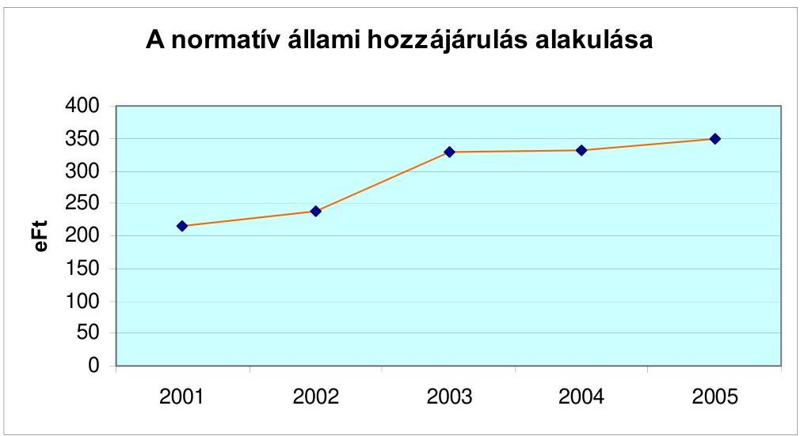

A vizsgált fenntartók által a kollégiumok finanszírozásához 2001. és 2004. évek között igénybevett - összességében 23,4 milliárd Ft-ot kitevő - normatív állami hozzájárulás 47,2%-kal emelkedett. Az állami támogatások fajlagos emelkedésénél kisebb volumenű fenntartói forrásbővülést az okozza, hogy 6,4%-kal csökkent a kollégiumokban elhelyezett tanulólétszám. Az intézményhálózat kapacitáskihasználási mutatóinak romlása, a kiadások emelkedése azzal járt, hogy a fenntartók által az intézmények működtetéséhez, fejlesztéséhez adott kiegészítések az állami támogatásokat messze meghaladóan, több mint kétszeresére (131%-kal) bővültek a vizsgált időszakban. A pályázati

---

úton szerzett kollégiumi működési és fejlesztési támogatások ugyanakkor a 2001. évi szint felére estek vissza. Az intézmények saját bevételeinek emelkedése elmaradt az állami támogatások és a fenntartói kiegészítések növekedésétől.

A kollégiumok finanszírozási forrásainak összetételét az alábbi táblázat szemlélteti:

Millió Ft-ban

| Megnevezés | 2001. év | Megoszlás   %-a | 2004. év | Megoszlás   %-a | Változás   %-a |
| :-- | :--: | :--: | :--: | :--: | :--: |
| Normatív, normatív kö-   tött állami hozzájárulá-   sok és támogatások | 4785 | 75,4 | 7020 | 74,7 | 46,7 |
| Fenntartók kiegészítő   finanszírozása | 542 | 8,5 | 1253 | 13,3 | 131,2 |
| Pályázatok útján szerzett   működési és fejlesztési   támogatás + önrész | 175 | 2,8 | 90 | 1,0 | -48,6 |
| Intézmények saját bevé-   telei | 841 | 13,3 | 1038 | 11,0 | 23,4 |
| Összes forrás: | 6343 | 100,0 | 9401 | 100,0 | 48,2 |

Az ellenőrzéssel érintett fenntartók költségvetési kiadásainak nagyságrendje 2001. év és 2004. év között 34,4% emelkedést mutat. A költségvetési kiadásaikon belül a közoktatásra fordított működési kiadások 46,1%-kal, a középiskolai kollégiumaik összesen 31 milliárd Ft-os működtetési kiadásai pedig ugyanezen időszak alatt 53,8%-kal - a kollégiumi feladatellátáshoz igénybevett normatív állami hozzájárulás növekedésénél 6,6%-kal nagyobb mértékben - nőttek. A kiadásaik bővülése mellett aránynövekedés is volt. A költségvetési kiadások 1,1%-át fordították 2001. évben a fenntartók a kollégiumok működésére, 2004. évben 1,3% volt ez az arány.

A vizsgált 36 kollégiumnál 2001-2004. között a szakmai feladatellátásra fordított működési kiadások 66,7%-kal, az intézményi vagyon-működtetés kiadásai 70,6%-kal emelkedtek. A szakmai feladatellátásban a pedagógusok bérének 2002. évi emelése miatt a személyi juttatások és azok közterhei 84,2%-kal, illetve 64,7%-kal emelkedtek 2001 és 2004 között, arányuk a szakmai kiadásokban a 2001. évi 63,8%-ról a 2004. évre 71,7%-ra nőtt. A dologi kiadások döntő többsége a kollégiumi épületek fenntartására merült fel (fűtés, világítás, víz, szolgáltatási, karbantartási költségek), a szakmai feladatellátásra fordított anyagok és kis értékű tárgyi eszközök - bár nagyságuk 26,7%-kal emelkedett - a szakmai kiadásoknak alig 3,4%-át tették ki. A dologi kiadások elszámolása döntően az intézményi vagyon működtetése szakfeladaton történt, ezen kiadások nagyságrendje az épületek adottságaival, korszerűségével és kihasználtságával függ össze.

A kollégiumi feladatellátásra biztosított állami támogatásokat a vizsgált intézményfenntartók 85%-a kiegészítette az intézményfinanszírozás keretében. A kiegészítés célja a zavartalan működtetés biztosítása, az elhasználódott eszközök pótlása, az épületek állagmegóvása volt. A kiegészítő források nagyságrendje a fenntartók pénzügyi helyzetétől függően differenciálódott, de

---

befolyásolta az is, hogy a kollégiumok tanulólétszámában milyen arányt képviseltek az AJTP programban résztvevő diákok, illetve az intézmények saját bevételei hogyan alakultak. Az AJTP programhoz biztosított állami normatívával a fenntartók a programban résztvevő tanulók után megduplázhatták az egy főre jutó állami támogatást, így az intézmények működtetéséhez kisebb fenntartói kiegészítés is elegendő volt.

A fenntartói kiegészítés a vizsgált kollégiumok összbevételében 3-35% közötti arányt képviselt, mértéke fenntartónként és évenként változott. A vizsgált kollégiumok 70%-ában a fenntartói kiegészítő források a zökkenőmentes működtetést szolgálták. Az intézményfinanszírozásként adott kiegészítés a kollégiumok negyedénél az eszközök pótlásához is biztosított némi fedezetet. Az állagmegóvásra a fenntartók által adott kiegészítés egy-egy halaszthatatlan felújítási munkához kapcsolódott a vizsgált intézmények háromnegyedénél, a folyamatos állagmegóvás csak az intézmények egynegyedében volt jellemző.

A fenntartók közül a fővárosi önkormányzat 2001-2004. között minden évben adott kiegészítő támogatást a működtetéshez, eszközpótláshoz és állagmegóváshoz a kollégiumoknak, melynek nagyságrendje az intézményi bevételek 22,9-28,3%-át tette ki.

A fenntartók 15%-a - közöttük gazdag kollégiumi hagyományokkal rendelkező megyei jogú városok (pl. Debrecen, Nyíregyháza) - a működtetéshez nem adott kiegészítést a vizsgált időszakban az állami támogatáson felül a kollégiumoknak.

A kollégiumi feladatok finanszírozásában döntő súlyt jelentő (az elhelyezett tanulók és a szervezett étkezésben részesülők száma után járó) normatív állami hozzájárulás mellett a kiegészítő jellegű normatív, kötött felhasználású támogatások aránya alacsony.

A központi költségvetésből a vizsgált időszak minden évében a kollégiumi nevelőtanárok továbbképzésére és szakvizsga felkészítésére, a 2001-2004. években a pedagógusok szakkönyv vásárlására, a 2002. évben a pedagógusok 50%-os béremelésére, 2003. évtől szakmai fejlesztési feladatokra, 2004. évtől pedig minőségfejlesztési feladatokra biztosítottak normatív, kötött felhasználású támogatásokat a költségvetési törvényekben meghatározott mértékben a fenntartók számára.
A kapott támogatások összege a vizsgált 21 fenntartónál a kollégiumi feladatok finanszírozásában átlagosan 2,3-1,9% közötti arányt képviselt. Az elmúlt öt évből a 2002. évi kiegészítő állami forrás abszolút összege emelkedik ki az 50%-os béremeléshez adott magasabb támogatás miatt. A kiegészítő források ugyan abszolút értékben emelkedtek 2001-2004. között, de növekedési ütemük (27%) elmaradt a normatív állami hozzájárulás, valamint a fenntartói kiegészítés növekedése mögött.

A kollégiumok fenntartói a diákotthonban elhelyezett tanulólétszám után a kiegészítő állami források közül számos támogatásból nem részesedtek, míg a többi közoktatási intézményben tanulók után elszámolhattak ilyen címen támogatásokat.

---

A pedagógiai szakmai szolgáltatások igénybevételére biztosított kötött felhasználású normatív támogatást nem igényelhették a fenntartók a kollégiumi tanuló létszám után. A diáksport-feladatokra is csak a nappali rendszerű iskolai oktatásban résztvevők száma alapján járt a 2001-2004. évek között normatív, kötött felhasználású támogatás, majd 2005. évtől normatív hozzájárulás. A 2005. évtől bevezetett kulturális, egyéb szabadidős, egészségfejlesztési feladatokra biztosított 1000 Ft/tanuló összeget sem lehetett a kollégistákra igényelni, holott nem elhanyagolható sem a sport, sem a szabadidős feladatok színvonalas ellátásának fontossága a kollégiumi életben.

A helyi önkormányzati fenntartók bevételeiket nem egészíthették ki az alaptevékenységükhöz kapcsolódó ellátásokért szedett díjakkal, mert a jogszabály ${ }^{31}$ szerint ezek ingyenesek voltak.

A nappali oktatásban való részvétel esetén ingyenesen vehetők igénybe a kollégiumi foglalkozások, a lakhatási feltételek, a kollégiumok létesítményeinek, eszközeinek használata, valamint a folyamatos pedagógiai és rendszeres egészségügyi felügyelet.

Díjat csak olyan alaptevékenységen kívüli szolgáltatásokért szedhettek, amelyeket a kollégiumok szerveztek, illetve feltételeiket biztosították (gépjárművezetés oktatása, nyelvvizsga előkészítés, társastánc-tanfolyamok, stb.), ezek beszedéséről a szolgáltatást végzők gondoskodtak. Ugyanakkor a kollégiumok vezetése a helyiségek ingyenes vagy kedvezményes biztosításával is segítette az ellátás színvonalát javító kiegészítő szolgáltatások megszervezését annak érdekében, hogy azok költsége az igénybevevő diákok számára kedvezőbb legyen.

A saját bevételek - aránycsökkenésük ellenére - szükségesek az intézmények biztonságos működtetése szempontjából, mivel a kollégiumok fenntartói előírták az irányítási körükbe tartozó kollégiumok számára, hogy a szabad szálláshelyeiket hasznosítsák, helyiségeiket bérbe adják. A kollégiumok saját bevételei, - melyek az elhelyezett diákok étkezési térítési díjaiból, a kollégiumi férőhelyek hasznosításából és egyéb bevételekből álltak - folyamatosan emelkedtek, a 2001. évi 840,7 millió Ft-ról 2004. évre 1038,0 millió Ft-ra. A saját bevételek aránya az összes bevételhez viszonyítva ugyanakkor a 2001. évi 13,3%-ról 2004. évre 11,0%-ra csökkent, mivel kevés lehetőségük maradt ezen a területen.

A fenntartók a saját
 bevételek növelésére a költséghatékonyságot szem előtt tartó, gazdálkodásra ösztönző rendszert csak néhány helyen (Debrecen, Siófok, Békéscsaba, Somogy Megyei Önkormányzat) alkalmaztak, a realizált többletbevételekből az eszközök pótlására, a hétvégi, szünidei nyitva tartás miatt felmerülő többletbérkiadásokra alig áldoztak.

Gazdasági megfontolásokból a kollégiumok többsége az ott elhelyezett tanulók részére nem biztosít hétvégi ügyeletet, inkább a szabad férőhelyek bérbeadására törekszik. A csökkenő gyermeklétszám miatt felszabaduló szoba-

[^0]
[^0]:    ${ }^{31}$ Kt. 114. § (1) bekezdés c) pontja szerint

---

kba főiskolásokat helyeztek el (Siófok Városi Kollégium), az idegenforgalom szempontjából frekventált területeken a szünidei „szállodáztatás" gyakori (Budapest, Balatonboglár, Siófok), de előfordul, hogy a konferenciaturizmusból tesz szert bevételre az intézmény (Nyíregyháza Zrínyi Ilona Kollégium).

A megkérdezett kollégiumvezetők véleménye szerint elvárás a fenntartók részéről a szállásdíj-bevételek bázisszintet meghaladó teljesítése, ugyanakkor a fokozottabb igénybevétel a kollégiumi berendezések, épületek gyorsabb elhasználódásával jár. Az elhasználódott eszközök pótlására azonban a fenntartó által biztosított intézményfinanszírozás nem nyújt fedezetet. A lepusztult, elhasználódott berendezések, épületek, az igénytelen környezet (emeletes ágyak) viszont nehezebbé teszi a szálláshely értékesítését, s így az elvárt bevételek teljesítését.

# 3.2.2. Az AJTP forrásainak szerepe az esélykiegyenlítésben 

A hátrányos helyzetű tanulókat segítő Arany János Tehetséggondozó program - mint arról a 2.1.1. pontban már szó volt - a tanulók esélyegyenlőségének javítását, képességeik kibontakoztatását, a továbbtanulásukhoz szükséges ismeretek megszerzését, az otthoni környezetből hozott műveltségbeli hátrányuk leküzdését szolgálta.

A programban résztvevő kollégiumok köre, az érintett tanulók száma és ezzel a rendelkezésre álló pénzeszközök is folyamatosan bővültek. A program keretében a 2000/2001. tanévben országosan 352 tanuló kezdte meg az előkészítő évfolyamban a tanulmányait. Az AJTP-ben részt vevők száma a 2005/2006. tanévben az előkészítőn és a 10-13. évfolyamokon összesen 2810 fő volt, amely kiegészült 294 fő AJKP-ben indult tanulóval.

A programban résztvevő kollégiumok az erre a célra biztosított normatív állami finanszírozás segítségével egy évig előkészítő foglalkoztatást szerveztek, majd a diákok a középiskolai évek során tantárgyi felkészítő, korrepetáló, kulturális, művészeti, önismereti foglalkozásokon vettek részt. Műveltségük gyarapítását színház-, kiállítás-, múzeumlátogatás, sportolás, a tanult idegen nyelvek anyanyelvi környezetben való gyakorlását pedig külföldi kirándulások, táborok segítették.

A diákok szociális helyzetén is javított az AJTP program, mivel a benne résztvevőknek ösztöndíj, ruházati és étkezési költségtérítés, szakkönyvek, oktatási segédanyagok ingyenes biztosítása, ECDL vizsga és C típusú nyelvvizsga letétele, illetve gépjárművezetői jogosítvány megszerzése is biztosított volt az állami támogatás igénybevételével.

A vizsgált kollégiumok 19%-a vett részt az AJTP programban. A programban résztvevő kollégiumok az OM-mel kötött szerződés alapján kiegészítő finanszírozást kaptak, ami az egy főre jutó normatív állami hozzájárulás összegével egyezik meg. A támogatást 2001-2002. évben normatív, kötött támogatásként, 2003-tól normatív állami hozzájárulásként biztosították a fenntartók számára. A vizsgált 21 fenntartónál a kollégiumokban az AJTP-s diákok aránya - a felmenő rendszer, valamint a folyamatos csatlakozás lehetősége miatt - az összes kollégistához képest növekedett: a 2001/2002. tanévben a létszám 1,3%-a, míg a 2005/2006-os tanévben 4,9%-a.

---

Az AJTP programban résztvevő hét vizsgált intézményben különböző az érintett tanulók aránya. Míg a székesfehérvári József Attila Kollégiumban az elhelyezett tanulók 10%-a vett részt a 2005/2006-os tanévben a programban, addig a nyíregyházi Zrínyi Ilona Kollégiumban a diákok 92%-a volt érintett. A programban résztvevő hátrányos helyzetű tanulók számához igazodó állami hozzájárulás ezért a kollégiumok számára az éves költségvetésen belül eltérő mértékben jelentett pótlólagos forrást. A kollégiumok 2004. évi elszámolásainak áttekintése alapján, az érintett létszámtól függően az AJTP-hez biztosított kiegészítő állami hozzájárulás 8853 - 67280 ezer Ft közötti összeg volt, aránya a vizsgált kollégiumok bevételeinek 4-42%-át képviselte.

Az AJTP-hez biztosított források a vizsgált kollégiumok mindegyikénél egyértelműen javították a rövidtávú működtetési feltételeket. A háromoldalú szerződések (intézmény, fenntartó, OM) alapján a programra biztosított pénzeszközökből a kollégiumok nevelőinek azon béreit és járulékait, valamint a külső megbízásos foglalkoztatottak óradíjait fizették ki, amelyek a külön foglalkozások, ügyeletek, túlórák kapcsán felmerültek. Jutalmazták a programban résztvevő pedagógusokat, programfelelősöket, igazgatókat és gazdasági vezetőket. Az AJTP-ben résztvevőkkel foglalkozó pedagógusok számára lehetőség nyílt a támogatásból továbbképzésük finanszírozására, valamint - a kollégiumok személyi feltételeit is javító - speciális képzettségű szakemberek (pl. pszichológus, tánctanár) alkalmazására.

A kollégiumok dologi kiadásként számolták el a különféle kulturális és sportrendezvényekhez kötődő egyéb költségeket (színházjegyek, uszoda bérletek, szállítási, táboroztatási költségek), készletbeszerzéseket (szakkönyvek, oktatási segédanyagok, kis értékű tárgyi eszközök), az intézmény általános költségei közül azokat, amelyek a programhoz köthetőek (hétvégi nyitva tartás miatti fűtés, világítás, víz, stb.), valamint az egyéb szolgáltatásként fizetett díjakat (ECDL, nyelvvizsga, jogosítványszerzés költsége).

A program lebonyolításához a kollégiumok csoportszobáinak felszereltségét, a könyvtárak állományát, eszközeit, a szakköri és sportszobák berendezéseit, eszközeit is bővítették, ami kedvező hatással volt a kollégiumok tárgyi feltételeire és az elhelyezési körülményekre.

Azon kollégiumoknál, ahol a programban résztvevők számaránya magas volt (Madách Imre Kollégium Balassagyarmat, Gulyás Pál Kollégium Debrecen), a programra biztosított összegekből az elhasználódott eszközök pótlására, fejlesztések megvalósítására is lehetőséget teremtettek. Számítástechnikai eszközöket, szoftvereket, oktatási eszközöket, TV-t, videót, fénymásolót is beszereztek a támogatásból, javították a hálószobák kulturáltságát, otthonosságát.

A Gulyás Pál Kollégiumban 2003. évben a felhalmozási kiadásoknak 87,8%-át, 2004. évben 94,4%-át az AJTP többlettámogatásával finanszírozták. A Madách Imre Kollégiumban az ugyanezen időszakban megvalósított fejlesztések négyötöd részét a programból finanszírozták.

Az évente megkötött szerződésekben az OM előírta az elszámolási kötelezettséget, melynek minden támogatott intézmény eleget tett. Az OM a maradványok felhasználására vonatkozóan nem rögzített a finanszírozási szerződésekben ki-

---

tételt, csak a kiadások elszámolásának határidejét határozta meg. Az intézményeknél a támogatások jogszerű felhasználását, a keletkezett maradványokra vonatkozó előzetes kötelezettségvállalások meglétét, a következő évre átvitt maradványok elszámolását nem ellenőrizte.

A vizsgált kollégiumoknál az elszámolásokban szinte kivétel nélkül szerepeltek kötelezettségvállalással terhelt maradványok (37 ezer Ft - 6190 ezer Ft), melyek elszámoltatására a következő évben nem került sor. A maradványok keletkezésében a fenntartók finanszírozási gyakorlata, a kiskincstári rendszer miatti késedelem és az is közrejátszott, hogy előirányzat módosításhoz kötötték a támogatás intézményhez történő kiutalását. Ez a finanszírozási gyakorlat ellentmond a háromoldalú megállapodásnak, és a támogatás késedelmes és részleges átutalása miatt rendszeres elmaradásokat okoz annak kiutalásánál (pl. Debrecen, Balassagyarmat).

Az AJTP források hatékonyságának megítélése rendkívül összetett feladat. A program eredményességének - és közvetett módon a felhasznált pénzeszközök hatékonyságának - mérésére első alkalommal 2005-ben nyílt lehetőség, mert ekkor fejezte be középiskolai tanulmányait az első évfolyam.

A kimenet mérésénél az AJTP Programiroda a következő mutatókat alkalmazta:

| Megnevezés | Tanulm.   eredm. 13.   évfolyam-   ban | Érettségi   átlag | Nyelvvizs-   ga biz.-   nyal rend.   aránya | ECDL   vizsga   aránya | Gépj.   vez. eng.   aránya | Felsőfokú   felvételi   ered-   mény |
| :-- | :--: | :--: | :--: | :--: | :--: | :--: |
| A programban részt-   vevő 13 gimnázium   összesen adata | 4,38 | 4,38 | $95 \%$ | $89,6 \%$ | $95,1 \%$ | $81,9 \%$ |

Az eredmények a mutatók alapján egyértelműen pozitívak. A programban részt vevő kollégiumok vezetői jó intézményi formának tartották a hátránykiegyenlítés, esélyteremtés szempontjából az AJTP-t, véleményük szerint a program a befogadó kollégium egészére vonatkozóan hozzájárult a hosszú távú működés feltételeinek javításához. A programon kívüli intézményvezetők viszont hiányolták a kedvező tapasztalatok átadását, a jó gyakorlatok, nevelési módszerek közreadását (pl. debreceni kollégiumi vezetők).

# 3.2.3. A fejlesztési források szerepe a finanszírozási rendszerben 

Míg a vizsgált fenntartóknál az összes költségvetési kiadás a 2001. évről 2004. évre 34,4%-kal emelkedett, ezen belül - a működési kiadások emelkedési tendenciájától eltérően - a felhalmozási, felújítási kiadások mind összegükben (-11 881 millió Ft-tal), mind arányukban (-9%-kal) csökkentek. A fejlesztési kiadások fenntartói visszaszorítása, a külső források szűkülése a kollégiumi intézményhálózatra is negatív hatással volt. (Erről részletesebben a 3.4. pontban lesz szó.)

---

A fenntartók beruházási, felújítási kiadásaiból a kollégiumi feladatellátásra fordított összegeket és azok részarányát az alábbi táblázat mutatja be:

| Megnevezés | 2001. év | Megoszlás $\%-\mathrm{a}$ | 2004. év | Megoszlás $\%-\mathrm{a}$ | Változás $\%-\mathrm{a}$ |
| :--: | :--: | :--: | :--: | :--: | :--: |
| Vizsgált kollégium fenntartók   Beruházási kiadásai | 121947 | 100 | 104461 | 100 | $-14,3$ |
| Felújítási kiadásai | 9668 | 100 | 13396 | 100 | 38,6 |
| Ebből a közoktatást érintő   Beruházási kiadások   Felújítási kiadások | 4328 | 3,5 | 5709 | 5,5 | 31,9 |
|  | 2084 | 21,6 | 2429 | 18,1 | 16,6 |
| Ebből a középiskolai kollégiumokat érintő   Beruházási kiadások   Felújítási kiadások | 344 | 0,3 | 312 | 0,3 | $-9,3$ |

A táblázat adataiból kitűnik, hogy a kollégiumi intézményhálózat eszközeinek fejlesztésére szolgáló beruházási kiadások nagyságrendje 9,3%-kal csökkent. A kollégiumok kimaradtak a közoktatási intézményeket jellemző eszközfejlesztési kiadásbővülésből. A kötelező eszközjegyzékben felsorolt hiányok pótlásának ütemezése során a kollégiumok a közoktatási intézmények rangsorának végére kerültek, ami azt jelenti, hogy 2006-2008. között kell számottevően emelkednie az eszközökre fordított fejlesztési kiadásoknak (lásd bővebben a 3.4. pontban). A kiadások csökkenésében közrejátszott a fejlesztést szolgáló pályázati források jelentős visszaesése is. A felújítási kiadásokra a kollégiumok esetében 20%-kal többet használtak fel 2004-ben, mint 2001-ben, az emelkedés azonban csak egyes fenntartók kiemelkedő épület-felújítási kiadásainak tudható be (pl. Nagykanizsa 7,5-szeresét, a főváros háromszorosát, Székesfehérvár a 2001. évi ráfordítás másfélszeresét fordította 2004-ben felújításra, ugyanakkor Hódmezővásárhelyen, Nagykállón az évekig hiányzó felújításokat hajtották végre a 2004. évben).

A kollégiumok számára az állami költségvetésből biztosított normatív állami hozzájárulás és normatív kötött felhasználású támogatás csak a fenntartást szolgálja, ezért a fejlesztésről, bővítésről a fenntartóknak kell gondoskodni, ehhez azonban támogatásokat, pályázati forrásokat is igénybe vehetnek.

A kollégiumok férőhely-bővítésére, az épületek rekonstrukciójára szolgáló, a fenntartó önkormányzatok pályázata alapján odaítélt címzett állami támogatások nagyságrendje az elmúlt 5 évben nem volt számottevő: a 2001. és a 2003. évben országosan összesen három-három, 2004. évben két, 2005. évben négy önkormányzat kapott bővítésre és rekonstrukcióra címzett állami támogatást. A támogatás összesen 8,8 milliárd Ft volt, a beruházások összköltsége 9,6 milliárd Ft-ot tett ki. (2002. évben kollégiumi célra nem hagytak jóvá

---

címzett támogatást.) A jóváhagyott címzett támogatások kétharmada olyan intézmények fejlesztését szolgálta, ahol oktatási és kollégiumi épületeket egyaránt bővítettek és felújítottak, így a támogatási összegekből a kollégiumra fordított részek nem különülnek el. Kizárólag kollégiumi célra négy önkormányzat kapott - a bővítés, rekonstrukció, illetve új épület építés jellegétől függően - 161-1594 millió Ft összegű támogatást (Kaposvár, Makó, Vásárosnamény, Tolna Megyei Önkormányzat).

A vizsgált fenntartók közül a Pest Megyei Önkormányzat 1999-ben pályázott sikeresen
 címzett támogatásra új 80 fős kollégium létesítésére, Aszódon a fejlesztés összköltsége 286 millió Ft volt. A létesítmény a 2002/2003. tanév elején került átadásra.

A vizsgált kollégiumok közül benyújtott pályázata alapján egy kollégium fenntartója részesült támogatásban a céljellegű decentralizált alapból.

A Csongrád Megyei Területfejlesztési Tanács támogatása segítségével a Hódmezővásárhelyi Cseresnyés Kollégiumban 2003-2005. között 28 ablak felújítását finanszírozták, a további 28 ablak cseréjéhez önkormányzati forrást használtak fel, a beruházás összértéke 10450 ezer Ft volt.

A vizsgált 36 kollégiumnál - a fenntartókhoz hasonlóan - a működésre fordított kiadások emelkedése és a fejlesztési kiadások csökkenése volt jellemző. A kollégiumokban elhelyezett egy tanulóra jutó 2001. évi kiadásból ( $324290 \mathrm{Ft} /$ fő) az eszközök beszerzésére és a kollégiumi épületek felújítására fordított összeg $26090 \mathrm{Ft} /$ fő volt, a 2004. évi fajlagos kiadás (539 $104 \mathrm{Ft} /$ fő) összegéből ugyanezen fejlesztési és felújítási célokra $23612 \mathrm{Ft} /$ fő jutott.

A középfokú kollégiumok számára az eszközök fejlesztésére, beruházásokra, az épületek felújítására a fentieken kívül a különféle szervezetek által kiírt pályázatok biztosítottak kiegészítő forrásokat.

A 2001-2005. I. félév közötti időszakban a Megyei Közoktatási Közalapítványok és a Nemzeti Kollégiumi Közalapítvány írta ki azon pályázatokat, melyek leginkább fejlesztési célokat jelöltek meg, míg a minisztériumok és egyéb pályázatkiíró szervezetek főként a működtetéshez, a kollégiumi élet szervezéséhez, nevelési, közösségi célokra nyújtottak támogatásokat.

A 36 vizsgált kollégium a 2001. évben, amikor még a megyei közalapítványok az NKKA-ból juttatott források felhasználásával kifejezetten kollégiumi célokra is írtak ki pályázatot, összesen 53 ízben nyert a megyei közalapítványoktól támogatást, 2004-ben már csak 18 db pályázatuk volt eredményes. Az egy pályázatra jutó forrás 2001-ben 912 ezer Ft, 2004-ben pedig csak 370 ezer Ft volt, ami fajlagosan 60%-os csökkenést jelent.

---

A vizsgált kollégiumok pályázatainak eredményességét az alábbiak szemléltetik:
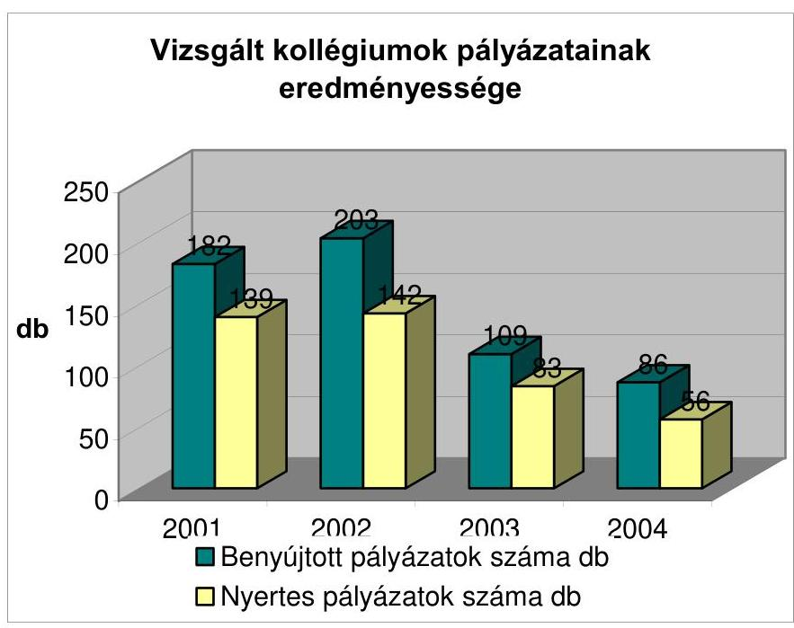

Pályázaton elnyert összegek alakulása
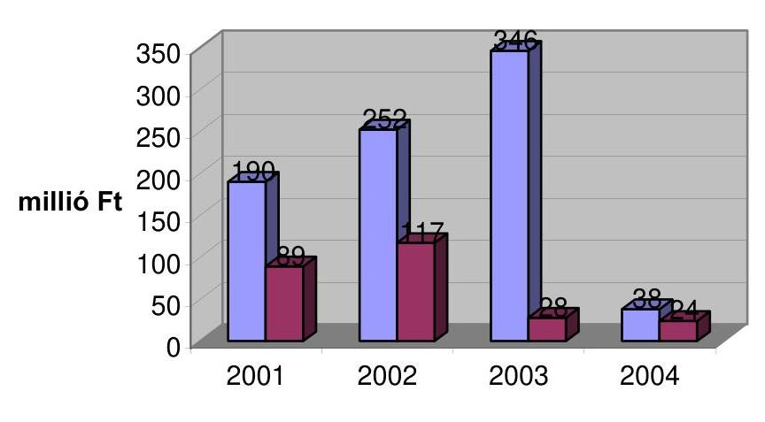
$\square$ Igényelt támogatás MFt $\square$ Kapott támogatás MFt

| Megnevezés | 2001. év | 2002. év | 2003. év | 2004. év |
| :--: | :--: | :--: | :--: | :--: |
| Támogatottság aránya (db alapján) \% | 76,4 | 70,0 | 76,1 | 65,1 |
| Támogatottság aránya (összeg alapján) \% | 46,8 | 46,4 | 8,1 | 63,2 |
| Pályázaton elnyert összegek aránya a fejlesztési kiadásokhoz, \% | 42,1 | 40,2 | 11,7 | 13,1 |

---

A vizsgált kollégiumok 80%-a rendszeresen pályázott a különféle elérhető forrásokra, amit a benyújtott pályázatok magas száma is mutat. A benyújtott pályázatok számában és az elnyert támogatás nagyságrendjében az intézmények 2002. évi eredményessége emelkedik ki a vizsgált időszakban, ugyanakkor a támogatottság aránya 2004-ben volt a legmagasabb. A pályázaton elnyert összegek a vizsgált kollégiumok bevételeinek 2,8%-át tették ki ebben az évben. 2003. évtől kezdődően a támogatási összegek visszaestek. A 2003. évi összeg a negyede, a 2004. évi pedig 20%-a volt a 2002. évinek. Az egy nyertes pályázatra eső átlagos támogatási összeg 2001. évben átlagosan 640 ezer Ft volt, ami 2004-re 428 ezer Ft-ra csökkent. A pályázatokon elnyert pénzeszközök a fejlesztések finanszírozásában csökkenő arányt képviseltek; a 2001. évi 42,1%-ról arányuk 2004. évre harmadára csökkent.

A fenntartók fele pályázat-figyeléssel segítette a kollégiumok kiegészítő források iránti igényét, 42%-uk vállalta a pályázati önrészek biztosítását. A fenntartók a kollégiumi pályázatok eredményességéről naprakész információkkal nem rendelkeztek, arról csak az éves költségvetési beszámoló alapján kaptak tájékoztatást. E források megszerzését a fenntartók 38%-a külön nem ösztönözte, azonban a bevételek növelését, a költségtakarékos gazdálkodást elvárják az intézményektől.

A kollégiumvezetők 51%-ának véleménye szerint az elmúlt négy évben a pályázati többlet-források csak részben szolgálták a leginkább változtatásra szoruló területek (pl. épületek műszaki állapota) feltételeinek javítását. A legtöbb pályázat az informatikai fejlesztéseket támogatta, míg a lakhatási feltételek javítására, elhasználódott eszközök pótlására kevesebb forrás jutott. A kérdőíves felmérésben résztvevő kollégiumvezetők 80%-a szerint az elérhető források közismertek voltak, a pályázati célokat egzaktán fogalmazták meg. A források mindenki számára való nyitottságát, a pályázati pénzeszközök odaítélésének objektivitását azonban már csak a megkérdezettek fele ítélte meg pozitívan. A kollégiumvezetők az egyes kollégiumi feladatokra biztosított források meglétének minősítése kapcsán a fejlesztési terület pénzellátottságát 4-5 ponttal értékelték egy tízes skálán, míg a működtetést 7,4 ponttal minősítették. Véleményük szerint a fejlesztési források bővítése mindenképpen indokolt lenne, mivel mind az eszközökben, mind az épületekben a kollégiumok lemaradása a többi oktatási intézményhez képest jelentős.

# 3.3. A kollégisták étkezési feltételei 

A kollégiumokban elhelyezett középiskolás diákok számára a tárgyi környezet megfelelő biztosításán túl az étkeztetés módja, annak színvonala és az étkezési adagok nagysága kiemelt jelentőséggel bír. A diákok étkezéssel kapcsolatos elvárásait befolyásolják az otthoni környezetben megszokott étkezési szokások, valamint az életkorukból adódó sajátosságok.

A kérdőíves felmérés alapján a legtöbb kritikával érintett terület az étkeztetés volt, mind az élelmezés színvonalát, mind a kiszolgált adagok nagyságát a megkérdezett 2467 diák alacsony pontszámokkal (5,2, illetve 5,3 ponttal) értékelte.

---

A fenntartó önkormányzatok gazdasági megfontolások alapján hozott döntése nyomán az elmúlt években a vizsgált intézmények 28%-ánál változott az élelmezés biztosításának módja. A fenntartók a saját üzemeltetésében működő konyhákat vállalkozásoknak adták át üzemeltetésre. A döntés indokaként leggyakrabban az szerepelt, hogy forráshiány miatt az európai uniós követelményeket (felszerelések, higiéniás előírások) nem tudják biztosítani. Motiválta még a vállalkozásba adást az a körülmény is, hogy a konyhai dolgozók közalkalmazotti státusa a vállalkozásba adással megszüntethető volt, így bérmegtakarítást érhettek el a fenntartók.

Az étkezést biztosító szervezet megváltoztatása az érintett kollégiumok egyharmadában az étkeztetés színvonalának romlásával járt, csak a fenntartók számára jelentett költségmegtakarítást, ami a bérmegtakarításnak, esetenként a nyersanyag felhasználás csökkentésének volt a következménye.

Nyíregyházán a Zrínyi Ilona Kollégiumban a 2005/2006. tanévtől a fenntartó a saját üzemeltetésű konyhát 15 éves időtartamra bérbe adta. A Menza Bizottság több esetben jelezte az étkeztetéssel kapcsolatos minőségi és mennyiségi problémákat, javasolta a választék-bővítést. Az étkeztetés színvonala a mennyiségi és minőségi problémák miatt csökkent. Az üzemeltető változásával az étkezések betegség miatti lemondása, a szálláshelyek bérbeadásakor a vendégétkezők ellátása nehézkessé vált.

Nagykállón 2001-2004. júniusa között a nyersanyagköltség csak 11%-kal emelkedett, jelentősen alatta maradt az élelmiszerárak ezen időszakot jellemző 31,2%-os emelkedésének. Az önkormányzat számára az étkezést nyújtó vállalkozó - mivel a szerződésben nem rögzítették a napi nyersanyagnorma összegét - az önkormányzati rendelet szerinti térítési díjat számlázta. A vállalkozó által kiállított számlának a nyersanyagköltséget és egyéb költségeket, valamint a nyereség összegét is tartalmaznia kell. Ebből következően a vállalkozó kisebb mértékű nyers-anyag-felhasználással oldotta meg a szolgáltatást, mint az önkormányzati konyha, ami csak a diákok rovására történhetett. Az élelmezés színvonala csökkent az igénybevevők véleménye szerint (a kollégium diákjai 4,3 ponttal értékelték az étkezés színvonalát, az adagok nagyságát pedig 3,9 ponttal). Ellenőrzésünk nyomán - 2006. január 1-jétől - a vállalkozóval kötött szerződésben már rögzítették a nyersanyagnorma összegét, így a vállalkozó egyéb költségeit, nyereségét a továbbiakban nem a nyersanyagköltség terhére biztosítja.

Az étkezési térítési díjak mértékét a fenntartók évente helyi rendeletekben szabályozták. A térítési díjakra, az alkalmazott nyersanyagnormákra központi szabályozás nincs, így a fenntartók pénzügyi helyzete és a szolgáltatók árképzése (nyersanyagok beszerzési ára, rezsi kiadások, haszon) befolyásolják a helyi rendeletben előírt díjakat. A vizsgált kollégiumok mindegyikében - eltérő mértékben ugyan - a térítési díjak 2001-2005. év között folyamatosan, átlag 22-67%-kal emelkedtek. Az egyes fenntartók között a kollégiumi térítési díjakra vonatkozóan jelentős különbségek voltak, melyek 2005. évben is fennmaradtak.
2001. évben Miskolcon 280 Ft, Nagykállón 300 Ft és Gödöllőn 310 Ft, Keszthelyen 327 Ft, Debrecenben 364 Ft, Hódmezővásárhelyen 420 Ft összeget határoztak meg térítési díj alapjául napi háromszori étkezésre. A térítési díj alapjául szolgáló összeget a 2005. évre Miskolcon 343 Ft-ra, Nagykállón 411 Ft-ra, Gödöllőn 518 Ft-ra, Keszthelyen 469 Ft-ra, Hódmezővásárhelyen 524 Ft-ra emelték helyi rendeletükben az önkormányzatok.

---

ra, Keszthelyen 469 Ft-ra, Hódmezővásárhelyen 524 Ft-ra emelték helyi rendeletükben az önkormányzatok.

A vizsgált kollégiumok 47%-ánál a fenntartó által meghatározott nyersanyagnorma emelése 2001. és 2004. év között - 0,9-15,6%-kal - elmaradt az élelmiszerárak azonos időszakra jellemző emelkedésétől.

A kollégista diákok - illetve szüleik - a kollégiumban igénybevett napi háromszori étkezésért térítési díjat fizetnek, melynek mértékét a gyermekek védelméről és gyámügyi igazgatásról szóló törvény ${ }^{32}$ szerint a nyersanyagnorma figyelembevételével kell megállapítani. A kollégiumi, externátusi ellátásban részesülő tanulók után az intézményi étkezési térítési díj 30%-át kedvezményként kell biztosítani általánosan, de ha a tanuló három vagy többgyermekes családból származik, tartósan beteg vagy fogyatékos illetve rendszeres támogatásban részesül, úgy a térítési díjkedvezmény 50%. Ez azt jelenti, hogy a kollégiumi tanuló tényleges szociális helyzetétől függetlenül alanyi jogon 30% kedvezményt kap a térítési díjból.

Az étkezésért fizetett térítési díjak összege a kollégiumok bevételei között abszolút összegben növekvő tendenciát mutatott, a 36 vizsgált kollégium esetében 2001. évben 245,4 millió Ft-ot tett ki, míg 2004. évre e bevétel 23,7%-kal bővült. Az étkeztetésre fordított kiadások növekedése (64,7%), azonban messze meghaladta a bevételek emelkedését. A kollégiumi étkezési kiadások a 2001. évi 451,6 millió Ft-ról 2004. évre 743,6 millió Ft-ra emelkedtek, a kiadások térítési díjjal fedezett aránya 54,7%-ról 40,8%-ra csökkent. A kedvezőtlen tendenciák kialakulását az étkezést igénybevevők számának csökkenése és a kedvezményes étkezők számának - a tanulók szociális helyzetével összefüggő - emelkedése befolyásolta.

# 3.4. A tárgyi feltételek hatása az egyéni tanulásra és a közösségi életre 

A kollégiumok tárgyi feltételei, amennyiben a fenntartók felújítási, felhalmozási lehetőséget nem biztosítanak, hosszú távon a működést akadályozó tényezőkké válnak. Az ellenőrzött kollégiumok épületei jelenlegi állapotukban kevés helyen (20%-ban) biztosítják megfelelően az egyéni tanulás és a közösségi élet lehetőségét.

A vizsgált kollégiumok épületeinek zöme több évtizede létesült. A kollégiumi épületek (összesen 40) közül mindössze hat épült 1991-et követően. Az épületek 78%-a a szükséges felújítások elmaradása és a hiányos karbantartás miatt erőteljesen elhasználódott, külső-belső felújításra lenne szükség 58 százalékuknál, 20 százalékuk pedig belső felújításra szorul. Az épületekben a hő és csapadékszigetelés, valamint az épületgépészeti berendezések elavultak, rossz állapotúak a belső burkolatok és a fürdő helyiségek berendezései. A kollégiumok berendezéseit zömmel működésük megkezdésekor szerezték be, kopottak, el-

[^0]
[^0]:    ${ }^{32}$ 1997. évi XXXI. tv. 148. § (5) bekezdésében

---

használódottak, tervszerű pótlásuk nem megoldott. ${ }^{33}$ A Kt. előírása értelmében a közoktatási intézmények fenntartóinak 2003. augusztus 31-ig kellett gondoskodniuk a kötelező eszköz és felszerelési jegyzékben felsorolt létesítmények pótlásáról, illetve az eszközök, felszerelések beszerzéséről. A Kt. 2003. évi módosítása alapján azoknak a fenntartóknak, amelyek a kötelezettségüket nem teljesítették, jelezniük kellett az OKÉV-nek a hiány összegét és fenntartói határozatot csatolni a teljesítés pénzügyi ütemezésének intézményenkénti vállalására. A pótlásra mérlegelés alapján 2008. augusztus 31-ig kaphattak halasztást. A kérelmekre általában az OKÉV megadta az engedélyt.
 A Kt. meghatározta e tekintetben az OKÉV ellenőrző szerepét, ám az eltelt időszakban erre a gyakorlatban a kollégiumok esetén nem volt példa. A fenntartók a kollégiumokat a helyi oktatási intézmények eszközeinek biztosítására felállított rangsorban és a határidő ütemezésében jellemzően az iskolák mögé sorolták, de a tervezett mértékben nem is teljesítették a vállaltakat. Általános tapasztalat, hogy a pénzügyi források hiánya miatt a fenntartók az OKÉV-től a teljesítés határidejére 2008. augusztus 31-ig kértek és kaptak halasztást.

A kollégiumok befektetett tárgyi eszközei összességében a 2001. évi 3,1 milliárd Ft-os bruttó értékről 2005. I. félévre 53,9%-kal nőttek, a nettó érték pedig 57,8%-kal emelkedett. A nettó/bruttó arány, amely a használhatósági fokot mutatja, a kezdeti 73,2%-ról 2002-re javult az akkori kedvező pályázati lehetőségek következtében 4,8 százalékponttal, ezt követően pedig fokozatosan csökkent, 2005. I. félévében 75%-os volt, vagyis csak kis mértékben csökkent öt év alatt az eszközök elhasználódottsága. Az ezer Ft bruttó értékre jutó felújítás a vizsgált években átlagosan 40 Ft körüli, átlagosan évi 4%, ez az ütem 25 évenkénti felújítást feltételez. A tárgyi eszközök közül 2005. I. félév végén az épületek és az építmények használhatósági foka a legkedvezőbb - 81,9% és 87,3% - az alacsony leírási kulcs miatt is. A számítástechnikai eszközök elhasználódottak, a gyors leírási lehetőségnél az avulásuk még gyorsabb, használhatósági fokuk 12,5% volt. (A tárgyi eszközök használhatósági fokának és felújításainak alakulását a 4. számú melléklet mutatja be.)

Az OKÉV-hez 2003. december 31-ig benyújtott taneszköz-hiány a 21 fenntartó közoktatási intézményeinél 12078,3 millió Ft volt, ebből a középiskolai kollégiumokat érintő elmaradás 638,6 millió Ft-ot tett ki. E hiánynak 2004-től 2005. I. félévéig összességében csupán 10,9%-át pótolták. A három évre fennmaradó kötelezettség 569,1 millió Ft. Az eszközpótlásra 2001-ben költöttek a legtöbbet a kollégiumok körében, 607,5 millió Ft-ot, ezt követően évente 50 millió Ft körüli összeget.

[^0]
[^0]:    ${ }^{33}$ „A költségvetési szerveknél régóta megoldatlan probléma az elszámolt amortizáció összegének tényleges visszapótlása, mivel jellegüknél fogva nem végeznek olyan termelő vagy szolgáltató tevékenységet, amelynek során az árképzésnél figyelembe vehetnék az amortizációt, mint kalkulációs tételt. A tárgyi eszközök szinten tartása, illetve bővítése a saját és egyéb források szűkössége miatt csak a felügyeleti szerv támogatásával oldható meg." A múzeumi rekonstrukcióra előirányzott pénzeszközök hasznosításának ellenőrzéséről szóló 0401. sorszámú ÁSZ jelentés (2004. február) megállapítása érvényes a közoktatási intézményekre is.

---

Látható, hogy eszközpótlási kötelezettségüket a fenntartók nem a vállalt ütemben teljesítik, így kétséges, hogy biztosítják-e a 2008. augusztus 31-i határidőre az előírt feltételeket.

Egyik fenntartó eljárása a Kt-be ütközik. Kecskemét Megyei Jogú Városnál a 2005. évi költségvetés elfogadását megelőzően a Közgyűlés határozatot hozott a költségvetés kialakításához ${ }^{34}$. Ebben a 2005-re tervezett eszközpótlási kiadásokat egy évvel elhalasztotta, az ütemterv végrehajtását az engedélyezett 2008-ról 2009-re módosította. Eljárásuk nem felelt meg a vonatkozó jogszabálynak és az engedélynek.

Hasonló a helyzet a vizsgált 36 kollégiumnál, ahol a 2003. augusztus 31-i eszközhiány 293,1 millió Ft volt, az OKÉV-től a pótlásra halasztást kaptak. A 2005. június 30-án még fennálló hiány 160,5 millió Ft, a vizsgált intézmények kimutatása szerint a pótlásra 2003-2005. között 122,2 millió Ft-ot fordítottak. Az AJTP-s források és pályázati lehetőségek nyújtanak ehhez segítséget a fenntartók forrásai mellett. Az eszközök pótlását azonban a legtöbb intézményben nem követték nyomon, a fenntartók sem ellenőrizték, annak ellenére sem, hogy a pedagógiai programban kötelező megjelölni a Kt. szerint a létesítményi, az eszköz és felszerelési előírásokból még nem teljesítetteket.

A kollégiumi épületek építészeti adottságai, műszaki állapota kedvezőtlenül befolyásolják a szakmai munkát. Az épületek közel 60%-a külső-belső felújításra szorul. A felújítandó épületekben a szakmai munka feltételei mennyiségileg adottnak látszanak, valójában azonban korlátozottak. Vizsgálatunk során beázások nyomán bekövetkezett plafonleszakadással, ablakkitöréssel is találkoztunk, ami vészhelyzetet okozott (Kecskemét, Táncsics Mihály Középiskolai Kollégium, Székesfehérvár, Balassagyarmat). Fenntartói intézkedés híján - vagy amíg beütemezésre nem került - szükségmegoldásokkal, termek lezárásával, a külső erkélyekre való kijárás megtiltásával „oldották meg" a kollégiumok a problémát.

Az épületek 18%-a nem igényel felújítást. Ez utóbbiak éppen azok a létesítmények, amelyek eredetileg nem kollégiumnak épültek, de átalakításuk során műszaki állapotukban kedvező változás állt be. Összesen kilenc épület nem kollégiumi célra létesült, az átalakításnak köszönhetően azonban - kettő kivételével - jó állagúak. A jó műszaki állapotú épületek közül kettő egyházi fenntartású, három pedig a fővárosi önkormányzaté.

A gyulai Göndöcs Benedek Középiskola, Szakképző Iskola és Kollégium Kossuth u. 26. szám alatti épülete eredetileg árvaházi célokat szolgált. Az elvégzett felújításoknak köszönhetően az épület jó műszaki állapotú.

A hódmezővásárhelyi Bethlen Gábor Református Gimnázium és Szathmáry Kollégium jelenlegi épületében 1957-től 1994-ig Csongrád Megye Önkormányzatának nevelőotthona működött. Az épületet az 1998. január 19-i tulajdonba és

[^0]
[^0]:    ${ }^{34}$ A 72/2005. (II. 16.) számú határozat 17.) pontjában a korábbi években hozott - a 2005. évi költségvetést érintő - határozatok közül d) pontként a 768/2003. (XII. 17.) számú határozatát módosította.

---

használatba vételt követően a református egyház felújította és 1998. október 1-jétől kollégiumként működteti.

A fővárosi önkormányzat három kollégiuma jó műszaki állapotú épületben működik a funkcióváltással járó átépítést követően (Bolyai János Fővárosi Gyakorló Műszaki Szakközépiskola és Kollégium, Ady Endre Fővárosi Gyakorló Kollégium, fővárosi József Attila Középiskolai Kollégium).

Két kollégium épülete eredetileg munkásszállónak épült, kis átalakítással kollégiumként használják, jelenleg azonban külső-belső felújításra szorulnak: a székesfehérvári József Attila Középiskolai Kollégium épülete 1975-77. között épült, 9 szintes, 1977-től középiskolai kollégiumként működik. Az épület az 1970-es évek színvonalának megfelelő építészeti megoldású beton és üveg tömb, energetikailag és csapadékvíz elvezetés szempontjából rossz szigetelésű. A rendszeres állagmegóvási munkák elvégzésének elmaradása miatt az épületgépészeti berendezések állapota sem kielégítő. A nyíregyházi Bessenyei György Középiskolai Kollégium Városmajor utcai épülete az elvégzett részleges felújítások (az intézmény használatában tetőfelújítás, egy szinten a négyből vizesblokk felújítás történt, lámpatestek cseréjére került sor) ellenére nagyon rossz műszaki állapotú, korszerűtlen.

A kollégiumi épületvagyon tulajdoni helyzete főként akkor jelentett problémákat az eredményes feladatellátásban, ha a tulajdonos és az üzemeltető nem volt azonos. A városi (fővárosi kerületi) önkormányzatok a közoktatási kollégium-működtetési feladatot átadhatták a megyei önkormányzatoknak (fővárosnak) az önkormányzati választásokat követően. Döntésüket választási ciklusonként felülvizsgálhatták. A változás nyomán az új fenntartók nem tulajdonosai az épületvagyonnak, hanem üzemeltetői, ezért nem áldoznak forrásokat a tervszerű karbantartásra és felújításra, az átadó önkormányzatok pedig éppen a pénzszűke miatt mondtak le a feladatellátásról.

Az ellenőrzésbe bevont fenntartók által működtetett kollégiumok száma a 2001/2002. tanévi 114-ről a 2005/2006. tanévre 107-re csökkent (közülük nyolc kollégium nem saját tulajdonuk volt). A más önkormányzat (tulajdonos) vagyonával való üzemeltetés a vizsgált 21 fenntartó közül négynél fordult elő: két megyei önkormányzatnál (17 kollégiumukból 12 saját, 5 üzemeltetésre átvett), egy egyházi fenntartónál és egy alapítványi fenntartónál.

Az ellenőrzött 36 kollégium közül négy kollégiumnál nem saját tulajdonban üzemelt az intézmény, amelyekre vonatkozóan a négy tulajdonos és az üzemeltető megállapodásban rögzítette a működtetést, az állagmegóvást, a felújítási kötelezettséget (ez utóbbit csak háromban), a beruházásokat (két megállapodásban szerepelt). Az eszköz és felszerelési jegyzék teljesítésének felelősét csak egy megállapodásban érintették.

A gyakorlatban az állagmegóvások az üzemeltetési megállapodásnak megfelelően két kollégiumnál - a Szeged-Csanádi Egyházmegye Püspöki Hivatala által fenntartott gyulai Göndöcs Benedek Középiskola, Szakképző Iskola és Kollégiumnál és az ALTISZ Alapítvány által fenntartott ALTISZ Alapítványi Gimnázium, Szakközépiskola és Kollégiumnál - valósultak meg, kettőnél nem teljesítették a megállapodást. (Pest Megyei és Somogy Megyei Önkormányzat megálla-

---

podása a ceglédi, illetve a balatonboglári önkormányzatokkal.) A megyei önkormányzatoknál egy pozitív ellenpélda is akadt.

A Nógrád Megyei Önkormányzat a Madách Imre Kollégiumot 2003. június 30-ig a vagyon átvétele nélkül tartotta fenn a Balassagyarmat Város Önkormányzattal az 1999. évben megkötött átadás-átvételi megállapodás alapján. Bár a megállapodás nem tért ki az állagmegóvásra, felújításra, beruházásra, a város által kért visszavételig az üzemeltető - fűtéskorszerűsítés, konyhatechnológia javítás, tető felújítás, számítógép vásárlás céljára - felújításra 5,8 millió Ft-ot, fejlesztésre 6,8 millió Ft-ot fordított.

Vizsgálatunk azt mutatta, hogy a saját vagyonnal működtetett kollégiumok állagmegóvása sem volt tervszerű, ütemezett. A fenntartók a vizsgált intézmények háromnegyedénél csak a legszükségesebb karbantartásokat, javításokat, felújításokat végeztették el (lásd még a 3.2.1. pontot).

A középiskolai kollégiumok felújítási és beruházási gondjaira nem nyújt megoldási lehetőséget a magántőke bevonása. Bár ez azt jelentené, hogy a fenntartók egy korszerű hálózattal rendelkezhetnének rövid időtávon belül, hosszabb távon azonban olyan pénzügyi kötelezettséget jelentene ez számukra, amelyre mindaddig, amíg az ellátás - az étkezésen kívül - ingyenes, nincs fedezet. Így a közeljövőben is csak a pályázati pénzek biztosítása segítheti a kollégiumi tárgyi feltételek szükséges megújítását, melyhez a II. Nemzeti Fejlesztési Tervből összhangban az egyenlőtlenségek mérséklésének céljával - nem maradhatnak ki a középiskolai kollégiumok sem, melyekre e feladatban kulcsszerep hárul.

A kollégiumi elhelyezésre előírt fajlagos mutatókat a nem üzleti célú közösségi, szabadidős szálláshely-szolgáltatásról szóló ${ }^{35}$ kormányrendelet állapította meg. Előírásai azonban a mai mértékkel zsúfoltságot eredményeznek, hiszen nem nevezhető családiasnak, otthonosnak a 7 fős szoba és a 15 főre jutó egy zuhanyozó. A fajlagos mutatóknak összességében 30 intézmény felel meg (az intézmények 83%-a) teljesen, 5 részben, 1 pedig nem felel meg.

A hálóhelyiségekben az egy fekvőhelyhez előírt 8 légköbméter 32 intézményben biztosított, két intézménynél nem, kettőnél pedig csak a szobák egy részében teljesül.

Egy lakóra kétszer kétméteres hely sem jut a békéscsabai Kossuth Zsuzsanna Leánykollégiumban (7 légköbméter jut). Az előírást nem teljesítették az Ady Endre Fővárosi Gyakorló Kollégiumnál sem (7,2 légm³), ahol a lakóhelyiségekben emeletes fekvőhelyek vannak, az elhelyezett fekvőhelyek átlag száma 7 db, az előírás felső határát érte el. A hallgatói értékelés a berendezést e fővárosi kollégiumban azonban igen jól értékelte: 8,8 ponttal a tízes skálán.

Részben feleltek meg az elhelyezési körülmények a nyíregyházi Bessenyei György Középiskolai Kollégium Városmajor utcai épületében, ahol nyolcágyas hálószobákban egy fekvőhelyre 5,8 légm³ jut (ugyanebben az épületben négyágyas szobák is vannak, egy főre jutóan 11,5 légm³-rel, a kollégium Árok utcai épülete megfelel az elhelyezésre előírt fajlagos mutatóknak). A Nagykállói Gimnázium,

[^0]
[^0]:    ${ }^{35}$ 173/2003. (X. 28.) Korm. rendelet

---

Szakképző Iskola és Kollégiumban nem felelt meg az előírásoknak az, hogy a tetőtéri 11 hálószobában 8-8 fő van elhelyezve és ezekben a hálótermekben az egy fekvőhelyre előírt 8 légm³ térfogategység nincs biztosítva (a kollégium többi - a tanulók 3/4-ének elhelyezésére szolgáló 65 db - szobája négyágyas, az előírásoknak megfelelő).

A hálószobákban elhelyezett fekvőhelyek száma 4 intézménynél részben felel meg az előírásoknak (a szobák egy részében több fekvőhely van
 hétnél). A kötelező eszközjegyzékben ${ }^{36}$ az emeletes ágy helyett a kollégiumok bútorzatára ágyneműtartós ágy az előírás, amelyből jóval kevesebbet lehetne elhelyezni a rendelkezésre álló hálótermekben. A vizsgált intézmények 22\%-ában emeletes ágyakat is használnak, az elhelyezettek 20\%-ának nem biztosítottak ágyneműtartós ágyat.

A békéscsabai Deák Ferenc Kollégium leány épületében 5 db 8 ágyas szoba van, a berendezést tízéves emeletes faágyak biztosítják. A gyulai Göndöcs Benedek Középiskola, Szakképző Iskola és Kollégium Kossuth utca 26. szám alatti épületében a hálók többségükben 10 ágyasak, de némelyik csak boltívvel - nyílászáró nélkül - különül el a másiktól, és van egy 20 ágyas hálószoba is. Átlagosan 12,7 ágy jut egy hálóra. A diákok pihenése/alvása emeletes faágyakon biztosított, melyek újak, illetve újszerűek. Az utóbbi két évben cserélték le az ágyak nagy részét, illetve amelyek teljes cseréje nem volt indokolt, ott a fekvőfelület átkárpitoztatását végezték el (a kollégium másik két épületében az elhelyezés kedvezőbb, az előírt fajlagos mutató határértékén belüli).

A fürdőszobai ellátottságra vonatkozó előírás szerint nemenként nyolc főre egy mosdót és 15 főre legalább egy hideg-meleg vizes zuhanyozót, valamint 10 férőhelyenként, nemenként elkülönítve WC-t kell biztosítani, aminek az ellenőrzött intézmények egy kivétellel megfelelnek.

A nyíregyházi Bessenyei György Középiskolai Kollégium Városmajor utcai épületében a fürdőszobai ellátottság is részben felel meg az előírtaknak, három szinten eltérő az ellátottság, a felső leányszinten 24 főre, az alsó leányszinten 9 főre, a fiúszinten 12 főre jut egy zuhanyrózsa.

A kollégiumoknál az előírt kötelező eszközjegyzékben felsoroltakhoz viszonyítva a legnagyobb elmaradások a közösségi helyiségek biztosítása terén tapasztalhatók. A kollégiumi Alapprogramban szereplő foglalkozások megtartásához szükséges helyiségek, eszközök a kollégiumok 19\%-ában csak részben, 3\%-nál pedig nem biztosítottak. A jegyzéket 1998-ban léptették hatályba ${ }^{37}$, az Alapprogramot viszont a 2001. évben hirdették meg ${ }^{38}$. Az Alapprogramhoz kapcsolódó aktualizálás a kötelező jegyzékben elmaradt. Az Alapprogram bevezetése 2004-től tanuló-csoportonként tanévenként 20-22 órai foglalkozást jelent a csoportvezető nevelőtanár vezetésével. Ehhez a csoportok nagyságától függően megfelelő tanulószobákra, vagy közösségi he-

[^0]
[^0]:    ${ }^{36}$ A 11/1994. (VI. 8.) MKM rendelet 7. számú mellékletében
    ${ }^{37}$ A 7. számú mellékletet az 1/1998. (VII. 24.) OM rendelet 2. §-a iktatta be, hatályos 1998. VIII. 3-tól
    ${ }^{38}$ A 46/2001. (XII. 22.) OM rendelet a kihirdetést követő 8. napon lépett hatályba

---

lyiségekre van szükség. A vizsgált kollégiumokban a 2005/2006. tanévben átlagosan egy tanulószobát 29 tanuló használ, ami csak összességében felel meg az előírt csoportméretnek, mivel a kollégiumok 47\%-ánál 30 tanulónál több jutott egy tanulószobára. A szakköri, diákköri szobák száma együttesen 20\%-kal meghaladja az eszközjegyzékben előírtakat, ugyanakkor a kollégiumok 19\%-ánál a rendelkezésre álló helyiség nem érte el az előírt mennyiséget.

Az előírt számot meghaladó testedzőszobában megfelelő beosztással minden tanuló eltöltheti sporttal szabadidejét a kollégiumok 86\%-ában, 14\%-uknál azonban egyáltalán nem alakítottak ki testedzőszobát. A kérdőíves felmérés azt mutatta, hogy a sportfelszerelések bővítését kérnék a tanulók. Az eszközjegyzék szerint előírtnál 16\%-kal kevesebb könyvtár, 11\%-kal kevesebb sportudvar, 28\%-kal kevesebb társalgó (telephelyenként, szintenként egy az előírás) állt a tanulók rendelkezésére 2005. június 30-án. Kevesebb orvosi szoba és betegszoba szolgálta a diákok ellátását, esetenként azonban emiatt hátrány nem érte a tanulókat, mert a kollégiumok közelében található orvosi rendelőkben biztosították az ellátásukat.
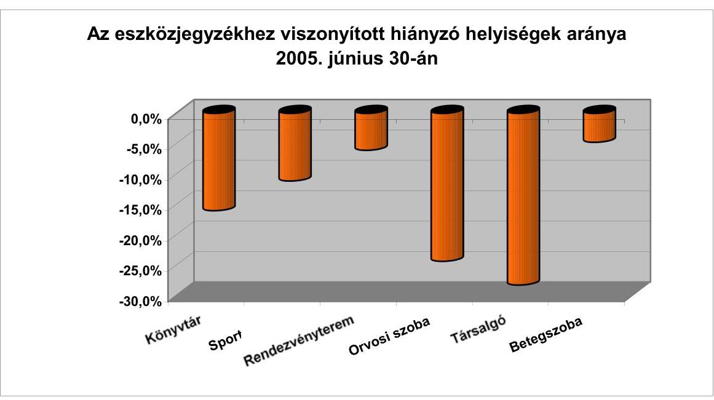

A számítástechnika alapvető fontosságú a diákok tanulásához és a szabadidő eltöltéséhez is. Az eszközjegyzék szerinti 20 tanulóra jutó egy számítógép előírás azonban megérett a változtatásra. A gyakorlat azt mutatja, hogy a kollégiumokban levő számítástechnikai termekben 2005-ben átlagosan 10,4 gépet helyeztek el. A tanulók számára szabadon hozzáférhető gépeket átlagosan 12,7 fő használja. A vizsgált időszakban jelentős, 30\%-os mennyiségi javulás következett be a számítógéppel való ellátottságban. Míg a 2001/2002. tanévben egy-egy gépet 15 főnél többen 21 intézménynél használtak, addig a 2004/2005. tanévben már csak 10 intézménynél osztoztak 15-nél többen egy-egy gépen. A rendelkezésre álló 900 számítógép kétharmadát használhatják a tanulók, melyek internet hozzáféréssel is rendelkeznek. A géppark korszerűsége azonban nem megfelelő, csak 13,3\%-a a legfeljebb egy

---

éves, legújabb beszerzésű, egynegyede egy-három éves, 34,6\%-a három-öt éves és $26,3 \%$ több mint ötéves, korszerűtlen gép.

A diákok a kérdőívekben a számítógéphez hozzáférés lehetőségét és a gépek korszerűségét átlagosan 6,1 pontra értékelték. Az internet hozzáférés lehetőségét ennél magasabbra 6,8 pontra minősítették. Arra a kérdésre, melyik az a berendezés, amire még szükség lenne, jelentős számban a számítógépet, a szobákban való internet hozzáférést jelölték meg. A számítástechnika gyakorlásához a válaszadó diákok $81,6 \%$-a kap segítséget a kollégiumban, a nemmel válaszolók $18,4 \%$-os aránya magasnak mondható.

# 3.5. A személyi feltételek hatása a kollégiumi munkára 

Az eltérő képzési színvonalú általános iskolákból a középfokú képzésbe kerülők hátrányának, műveltségbeli különbségeinek csökkentésében, a tanulók személyiségfejlődésében a kollégiumi nevelőknek kulcsszerepe van. A diákok beilleszkedése, a kollégiumi közösség kialakítása, a szülői felügyelet pótlása megfelelő képzettséggel rendelkező, gyermekszerető pedagógusokat kíván.

### 3.5.1. A nevelőtestületek összetétele

A középfokú kollégiumok működéséhez, az alapprogramban meghatározott feladatok végrehajtásához szükséges létszámot a fenntartók mindegyike engedélyezte. A kollégiumi nevelő-testületek létszáma 2001-2003. között emelkedett, majd 2004-2005. között stagnált.

A tantestületekben a teljes munkaidős pedagógusok aránya a vizsgált időszak egészében $95 \%$ volt. A kollégiumokban foglalkoztatott nevelőtanárok korösszetétele kedvezőtlen, a fiatalok aránya alacsony (15-19\%), míg az 50 év feletti korosztályé magas (32-34\%) a feladatellátásban (lásd 5. számú melléklet). A foglalkoztatást befolyásolja a kollégiumi nevelőtanárok kedvezőtlen munkaidő-beosztása, az ellátandó éjszakai és hétvégi ügyeletek, valamint a kollégiumi nevelői munka alacsony társadalmi elismertsége, erkölcsi megbecsülése.

A nevelőtestületek összetételét, az álláshelyek betöltöttségét vizsgálva megállapítható, hogy a fluktuáció a vizsgált intézmények negyedénél 2001-2003. között magas volt, a váltás aránya meghaladta a 20\%-ot. 2004. évtől az intézmények 14\%-ára volt jellemző a pedagógus létszám egyötödének a kicserélődése.

Nagy fluktuáció (30 \% feletti) jellemezte a vizsgált kollégiumok közül a Hódmezővásárhelyen működő Cseresznyés Kollégiumot és a székesfehérvári Árpád Szakképző Kollégiumot 2001. és 2003. között.

A fővárosi kollégiumok közül a teljes vizsgált időszakban magas volt a létszámmozgás (20-40\%) a Deák Ferenc, a József Attila és a Táncsics Mihály Kollégiumokban, valamint a Nagykállói Kollégiumban.

Az engedélyezett álláshelyek betöltése szintén a fővárosi kollégiumoknál volt alacsony szintű a vizsgált időszakban, gyakori a 30-40\% körüli üres állás-

---

helyek aránya az engedélyezett létszámhoz viszonyítva (Déri Miksa Kollégium, Deák Ferenc Kollégium, Táncsics Mihály Kollégium). Az álláshelyek betöltését a fenntartó nem szorgalmazta a felsorolt intézményekben, emiatt a teljesített túlórák száma magas (pl. a 2004/2005. tanévben a Táncsics Mihály Kollégiumban 520 óra/fő/tanév), messze meghaladja az éves túlmunka mértékére vonatkozó 200, illetve 280 órás jogszabályi ${ }^{39}$ korlátot.

A korösszetételhez hasonlóan a kollégiumokban foglalkoztatott nevelők képzettség szerinti összetétele sem kedvező.
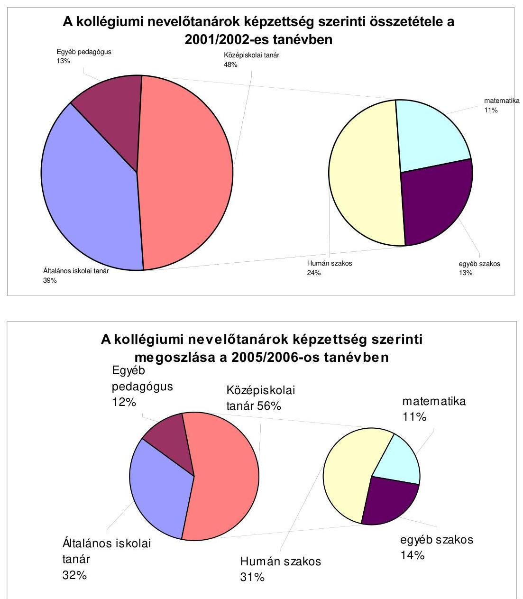

A középfokú intézmények kollégiumaiban a szükséges középiskolai tanári végzettségűek helyett a feladatellátást a vizsgált időszak elején több mint

[^0]
[^0]:    ${ }^{39}$ A Közalkalmazottak jogállásáról szóló 1992. évi XXXIII. tv. 55/A §

---

fele arányban nem megfelelő végzettségű nevelők biztosították, ellentétben a Kt.-ben ${ }^{40}$ leírt alkalmazási feltételekkel. A középiskolai tanárok aránya a 2005/2006. tanévre 7,4\%-kal növekedett, ami továbbra sem jelent lényegi javulást.

A további képesítés megszerzéséért a foglalkoztatott pedagógusok 11-13\%-a tanult a 2001-2005. években, ami nem okozott jelentős változást a képzettségi szintben, mivel a képzés befejezése után a végzettek egy része a nevelőtanári állást oktatói munkakörre váltotta.

A képzettségi szintben az egyes vizsgált kollégiumok esetében nagy különbségek tapasztalhatók. Volt olyan kollégium, ahol egyetlen középiskolai tanárt sem foglalkoztattak (Trefort Ágoston Kollégium, Békés) vagy ahol arányuk 15\%-nál nem volt tartósan magasabb (Árpád és József Attila Kollégium, Székesfehérvár), míg néhány kollégiumnál a foglalkoztatottak 100\%-a megfelelt a képzettségi előírásoknak (Petőfi Sándor Kollégium, Aszód, ALTISZ Alapítvány Kollégiuma, Budapest, Deák Ferenc Kollégium, Debrecen). Az egyházi fenntartású kollégiumok közül a Gyulán működő Göndöcs Benedek Kollégiumban két évig egyetlen középiskolai tanárt sem alkalmaztak, jelenleg arányuk a tantestületben 11\%. A Luther Márton Kollégiumban a létszám fele volt megfelelő végzettségű.

A szakképző iskolák, szakiskolák kollégiumaiban általános tendencia, hogy a megszűnő szakképzések szakoktatói a kollégiumok tantestületébe kerülnek át, ami a képzettségi szint növelésére vonatkozó törekvéseket visszaveti. A kollégiumi nevelőtestületek elöregedettsége, a közös igazgatású intézmények esetében továbbképzéseknél az oktatásban foglalkoztatottak előnyben részesítése, hátráltatja a nevelők továbbképzését, konzerválja az alacsony képzettségi szintet.

A fenntartók a kollégiumok szakmai munkáját, a tantestületek összetételét, a továbbképzések megvalósítását nem vizsgálták, ezen a területen nem támasztottak követelményeket az intézményvezetés felé.

A kollégiumok szakos ellátottságát vizsgálva megállapítható, hogy a középiskolai tanári képesítésű nevelők között a matematikát oktatók száma alacsony, 2001. évben 22\%, 2005. évben 18,6\%. Az egy matematika tanárra jutó kollégiumi diákok száma 168-192 fő között változott, ami a tanulásban való segítségnyújtásra, korrepetálásra kedvezőtlenül hat. Az humán szakosok aránya ugyan 50-54\%, de gyakran hiányoznak a nyelvszakos középiskolai tanárok a kollégiumok nevelőtestületéből, ami azt eredményezi, hogy a megkérdezett tanulók 36\%-a elégedetlen a nyelvtanuláshoz nyújtott tanári segítségnyújtással. Az említett hiányosságok megkérdőjelezik, hogy a kollégiumok valódi tanulási centrummá válhatnak.

A nevelőtestületek szakmai összetételével a megkérdezett kollégiumvezetők 37 \%-a volt elégedett, mivel a kollégiumok 57\%-ánál csak részben, 6\%-ánál egyál-

[^0]
[^0]:    ${ }^{40}$ Kt. 17. § j) pontja szerint kollégiumban az érdekelt iskoláknak (középiskolák!) megfelelő, valamint szociálpedagógus, pedagógiai szakpszichológus, pedagógia szakos, illetve nevelőtanár szakos tanári végzettség az alkalmazás feltétele

---

talán nem rendelkeztek a tanulási problémák korrekciójához, a hátrányos helyzetű tanulók felzárkóztatásához megfelelően képzett szakemberekkel. A közoktatási intézményhez kapcsolt nem önálló kollégiumok esetében a hiányzó szakos tanárok pótlására az iskolai tanárok korrepetálását veszik igénybe, de előfordult, hogy ez nem volt megoldható (Bethlen Gábor Református Gimnázium és Kollégium, Luther Márton Kollégium, Nagykállói Kollégium).

A „Fókusz" csoport megbeszélésen a kollégiumok képviselői felvetették, hogy hiányzik az egyetemi szintű nevelőtanári képzés; az egyetemi tanszék és a tudományos háttér hiánya hátráltatja a szakmai és a képzettségi színvonal emelését.

A Kt. előírása alapján ${ }^{41}$ a vizsgált kollégiumok mindegyikének tantestülete megtárgyalta és elutasította a pedagógiai felügyelői munkakör bevezetésének lehetőségét. A pedagógiai felügyelői munkakör egyöntetű elutasítását a kollégiumok tantestületei szakmai szempontokkal indokolták ugyan, de abban közrejátszott a kiegészítő jövedelmek (túlórák, éjszakai és hétvégi ügyeletek díjazása) elvesztése miatti félelem. A törvényalkotói szándék megvalósítását akadályozta, hogy a döntést az abban a fenti okok miatt ellenérdekeltekre bízták.

A kollégiumi alapprogram bevezetéséhez szükséges személyi feltételek a vizsgált kollégiumoknál rendelkezésre álltak. A fenntartók biztosították az alapprogramban előírt foglalkozások megtartásához szükséges pedagógus létszámkeret fedezetét. A jogszabályokban rögzített kötelező óraszámokon felül a vizsgált fenntartók 62\%-a biztosított fedezetet többlet óraigényekre, döntően korrepetálásokra, szakköri foglalkozásokra.

A kollégiumi alapprogramot a vizsgált kollégiumok bevezették, a Kt.-ben előírt heti 14 óra kötelező
 és 10 óra választható foglalkozási időt biztosítottak a kollégiumok a diákoknak. Az Alapprogram módosítása nyomán a jól tanuló kollégistáknak a tanulószoba helyett sokhelyütt lehetővé tették, hogy hálótermükben tanuljanak, ha az alkalmas volt erre. A vizsgált kollégiumi körben a 2004/2005. tanévben 298 tanulócsoportot működtettek. A csoportokra fordított óraszámból heti 7,1 óra szolgálta a szabadidő eltöltését, ennél egyharmaddal nagyobb időt fordítottak a tanulókkal való törődést, gondoskodást szolgáló egyéni foglalkozásokra. A szabadidő céljára felhasznált órák száma naponta megközelítette a két órát, ami - tekintetbe véve a tanulók leterheltségét - elfogadható mértékűnek látszik. Figyelemre méltó, hogy a kollégiumok a következő tanévben mindkét területen 4-5%-kal magasabb óraszámot terveztek.

A kollégiumi alapprogram gyakorlati megvalósítása során számos anomáliát tapasztaltunk:

- az alapprogramban szereplő foglalkozások dokumentálását ugyan előírták, de annak tartalmát nem szabályozták központilag, ezért a tanügyi dokumentumok különböző tartalmú vezetése következtében nem lehetett egyértelműen megállapítani a kollégiumi foglalkozásokra és ügyeleti feladatokra fordított órák számát;

[^0]
[^0]:    ${ }^{41}$ Kt. 129. § (7) bekezdés

---

A tevékenységek dokumentálására vonatkozó részeket a kollégiumi csoportnaplókban nem töltötték ki. Eltérések voltak a kollégiumi nevelőtanárok tantárgyfelosztásában és ügyeleti beosztásában (Keszthely Város Vendéglátó, Idegenforgalmi, Kereskedelmi Szakképző Kollégiuma, Nagykanizsai Cserháti Sándor Műszaki Szakképző Iskola Kollégiuma, Bethlen Gábor Református Gimnázium és Szathmáry Kollégium Hódmezővásárhely).

A foglalkozások dokumentálására pozitív példa a Kecskeméti Táncsics Mihály Kollégium, ahol olyan számítástechnikával támogatott rendszert alakítottak ki, amellyel a naplók kigyűjtése nélkül nyomon követhető a szakmai munka.

- a kollégiumi alapprogramban előírt foglalkozásokat a 2004/2005. tanévtől felmenő rendszerben fokozatosan vezették be és csak a 9. évfolyamon tartották meg a csoportfoglalkozásokat, a 10. évfolyamon a bevezetésre a 2005/2006. tanévben került sor (Madách Imre Kollégium, Balassagyarmat). Adataink is ezt bizonyítják: az alapprogramban a tanulócsoportokra a tanév során témakörönként előírt óraszámok a középiskolás évfolyamokra vetítve évi 2-4,25 órát tesznek ki. A bevezetés évében - a 2004/2005. tanévben - a témacsoportonként átlagosan ténylegesen leadott órák száma 1,9 és 3,6 között alakult;
- a tervezett évi 20-22 óra helyett a ténylegesen megtartott órák száma 15-17 óra volt, mivel az érettségi utáni középfokú képzésben részesülőknek nem tartottak foglalkozásokat (József Attila Kollégium, Székesfehérvár);
- a kollégiumi alapprogramban meghatározott foglalkozásokat évfolyamonként és nem csoportonként tartották meg, a foglalkozásokon átlag 50-55 fő részvételével (Árpád Szakképző Iskola Kollégiuma, Székesfehérvár).

A kollégiumi alapprogram alapján szervezett foglalkozások hasznosságát a vizsgált körbe tartozó 36 kollégium és az adatbekéréssel érintett 13 további kollégium diákjai (összesen 2471 fő) 6,0 ponttal értékelték egy 10-es skálán. A megkérdezettek az egyén és közösség, az önismeret és pályaválasztás témaköreit tartották a foglalkozások témaköreiből a leghasznosabbnak.

A kollégiumokban a feladatellátás személyi feltételeinek vizsgálata során áttekintettük a tanévi munkaidő beosztásokat. A kollégiumokban foglalkoztatott nevelőtanárok 2004/2005. tanévi teljesített óraszámából megállapítható, hogy a túlórák száma összességében átlagban magas: egy fő átlagos tanévi túlóraszáma 232 óra volt. Ettől lényegesen eltért néhány intézmény, ahol az 1 főre jutó túlóra meghaladta az átlag közel kétszeresét (Eötvös József Gimnázium és Szakképző Kollégiuma Tiszaújváros, Táncsics Mihály Kollégium Budapest, Luther Márton Kollégium Nyíregyháza). A túlmunkában eltöltött idő 27%-a a hétvégi és nappali ügyeletekre, 62%-a az éjszakai ügyeletekre merült fel, ugyanakkor a szakmai tevékenységre csak az elszámolt túlórák 11%-át fordították.

Az önálló gazdálkodási jogkörű kollégiumok és középiskolák a pedagógusok közös foglalkoztatási formáját nem alkalmazták. A közoktatási intézményhez kapcsolt, közös igazgatású formában működő kollégiumok egyharmadánál éltek a közös foglalkoztatás lehetőségével az iskolákban foglalkoztatott pedagógusok kötelező óraszám keretének kitöltése céljából:

---

Az Orosházi Táncsics Mihály Gimnázium és Szakközépiskolában szükség esetén a gimnáziumi tanárokat heti 2-4 óra időtartamra beosztották kollégiumi nevelőnek.

A Nagykanizsai Cserháti Sándor Műszaki Szakképző Iskolában foglalkoztatott pedagógusok a 2001-2002. tanévben egy nevelőtanári, tanulócsoport vezetői feladatot láttak el, a 2002/2003. tanévben számítógéptermi felügyeletet, illetve pénteki, szombati ügyeleteket biztosítottak a kollégiumban.

A Tiszaújvárosi Eötvös József Szakképző Iskola egy fő idegen nyelvszakos pedagógusa teljes munkaidejét csak kollégiumi részfoglalkoztatással tudták biztosítani.

Az ALTISZ Alapítványi Gimnázium Szakközépiskola és Kollégiumnál Budapesten az alapprogramban megfogalmazott feladatok megvalósításához a szükséges nevelőtanári kapacitásról az iskolai tanárok részmunkaidőben való foglalkoztatásával gondoskodtak.

A szaktanári ellátottság hiányosságait több kollégium igyekezett az iskolai pedagógusok tantárgyi korrepetálásának megszervezésével csökkenteni. (Pl. Árpád Szakképző Iskola és Kollégium Székesfehérvár, Petőfi Sándor Gimnázium, Gépészeti Szakközépiskola és Kollégium Aszód, Göndöcs Benedek Középiskola, Szakközépiskola és Kollégium Gyula.)

Több helyen önszerveződéssel létrejöttek, működnek kollégiumvezetői munkaközösségek, melyek a szakmai módszertani munkát megfelelően segítik. A munkaközösségek egy-egy település, vagy egy-egy térség több fenntartójához tartozó kollégiumok vezetőinek nyújtanak szakmai együttműködési lehetőséget, s egyben az érdekérvényesítés hatásos eszközéül is szolgálnak.

Az evangélikus egyháznál a szakmai tapasztalatcsere bevált formája az évenkénti kétnapos időtartamú kollégiumi konferencia, ahol a feladatellátással kapcsolatos helyzetértékelésre, egymás módszereinek megismerésére és a tapasztalatok cseréjére nyílik lehetőség.

# 3.5.2. A pedagógus továbbképzések, speciális képzettségű szakemberek alkalmazása, szakmai szolgáltatások igénybevétele 

A kollégiumok középtávú továbbképzési program-készítési kötelezettségüknek ${ }^{42}$ 91%-ban eleget tettek. Három intézmény nem készítette el középtávú továbbképzési tervét.

Az ALTISZ Alapítványi Gimnázium, Szakközépiskola és Kollégium négy éve létesült, de a 2003-2008. közötti időszakra nem rendelkezik tervvel, a nyíregyházi Bessenyei György Középiskolai Kollégiumban továbbképzési szabályzat van érvényben, terv azonban nem került elfogadásra, míg a keszthelyi Vendéglátóipari és Idegenforgalmi, Kereskedelmi Szakközépiskola és Kollégiumban a vizsgált időszakban csak éves beiskolázási terveket fogadott el a tantestület, azokban kollégiumi nevelőtanár nem szerepelt.

[^0]
[^0]:    ${ }^{42}$ A 277/1997. (XII. 22.) Korm. rendelet 1. § (2) bekezdésének előírása szerint

---

A középtávú továbbképzési terveket elkészítő kollégiumokban a tantestület döntött a továbbképzések alapelveiről és a kiemelten támogatandó képzésekről. Az éves beiskolázási tervekben a rendelkezésre álló éves pénzügyi keretek felosztását és az éves beiskolázásokat rögzítették. A vizsgált kollégiumok ezen összegekből 2001. évben 3681 ezer Ft, 2004. évben 5102 ezer Ft és 2005. év I. félévében 2586 ezer Ft összeget használtak fel a nevelőtanárok továbbképzésére. Az egy továbbképzésben résztvevő nevelőtanárra jutó évi költség átlagosan $34400 \mathrm{Ft} /$ fő volt 2001. évben, 2004. évben pedig 41,2%-kal magasabb, 48490 Ft/fő. A tervezett továbbképzések a vizsgált kollégiumok 72%-ában összhangban voltak a pedagógiai programban szereplő szakmai célkitűzésekkel, és a kollégiumi alapprogram végrehajtását segítették.

Az alapelvként rögzített elvárások - a szaktanári ellátottság javítása, új pedagógiai módszerek meghonosítása - csak részben és eltérő mértékben valósultak meg a továbbképzések eredményeként. A vizsgált kollégiumok 47%-ában javult a szaktanári ellátás a képzések hatására, a pedagógusok számára új módszerek elsajátítását és bevezetését eredményezték a tanfolyami képzések az intézmények 58%-ánál. A további képesítés megszerzéséért a kollégiumi nevelőtanárok 11-13%-a, ismeretek tanfolyamokon történő bővítéséért a nevelőtanárok átlag 15%-a képezte magát a vizsgált időszakban.

A különféle másoddiplomák megszerzése, a számítástechnikai ismeretek elsajátítása, a kollégiumi alapprogram megismerése volt a nevelőtanároknál a leggyakoribb a továbbképzések keretében.

A Kt. 1. számú melléklete tartalmazza a középfokú oktatási intézményekben, kollégiumokban foglalkoztatott vezetők, alkalmazottak ajánlott, illetve kötelező létszámát. A jogszabály néhány munkakör esetében a kollégiumban elhelyezett tanulók létszámához köti az alkalmazást: pl. rendszergazdát kötelező azon kollégiumoknál alkalmazni, ahol a létszám a 300 főt meghaladja. Könyvtáros alkalmazását ajánlják a legalább 200, legfeljebb 400 fős kollégiumok esetében, ugyancsak ajánlott egy ápoló alkalmazása 500 főig. A feladatellátást segítő további munkakörökben orvos, pszichológus, szociális munkás, szociálpedagógus, szabadidő szervező, oktatás-technikus is foglalkoztatható.

A 36 ellenőrzött kollégium alkalmazottainak összetételét vizsgálva megállapítható, hogy az intézmények 39%-ában alkalmaztak speciális képzettségű szakembert. Két intézményben nem került sor speciális végzettségű szakember alkalmazására, 20 helyen pedig az iskolával közösen vagy a pedagógusok nevelői munkájának ellátása mellett került sor ilyen feladatok ellátására.

- A kollégiumok több mint fele (55,5%) önállóan vagy az iskolával közösen gondoskodott a tanulók orvosi ellátásáról, döntően megbízásos foglalkoztatási formában. Ápolót 14 helyen alkalmaztak, főleg azon kollégiumokban, ahol az elhelyezett tanulók száma indokolta az alkalmazást (kivétel a debreceni Gulyás Pál Középiskolai Kollégium, ahol 500 főre csak egy félállású ápolót foglalkoztattak).
- Könyvtárosok alkalmazásánál is előfordult, hogy az ajánlott létszámnál kevesebb foglalkoztatására került sor (pl. Deák Ferenc Kollégium Debrecen)

---

vagy csak az iskolában foglalkoztattak könyvtáros-pedagógus munkakörű személyt.

- Az informatikusi, rendszergazdai feladatok ellátását a vizsgált kollégiumok 58%-a biztosította, de erre önálló státusz létrehozását a fenntartók többsége nem engedélyezte. Nevelőtanárok, iskolai informatikusok vagy oktatástechnikusok végezték el a feladatokat pótlékkal elismert vagy kapcsolt munkakörben.
- Pszichológus foglalkoztatására tíz intézményben került sor, ezek 80%-a olyan intézmény, mely részt vesz az AJTP-ben. Szociálpedagógus végzettségű szakemberek négy kollégiumban segítik a feladatellátást (Székesfehérvár József Attila Kollégium, Budapest Deák, Táncsics kollégiumok, Orosháza Táncsics Mihály Kollégium).

A fővárosi Deák Ferenc Kollégium az egyetlen önkormányzati fenntartású kollégium, ahol kiemelt módon foglalkoznak a diszlexiás diákokkal, a speciális programot hét éve indították. Az elhelyezett tanulók 98%-a vidéki, a 400 fős férőhelyszámból a diszlexiások száma 100 fő körüli volt átlagosan. A kollégium szakmai tevékenysége a sajátos nevelési ellátást igénylők miatt kibővült logopédiai és fejlesztési feladatokkal, amelyre logopédust és fejlesztő pedagógust alkalmaztak.

A közoktatási intézmények közül a kollégiumok a szakmai szolgáltatás igénybevételére normatív kötött állami hozzájárulásban nem részesültek 2001-2005. évek közötti időszakban. Az állami finanszírozás hiányát pályázati forrásokkal nem pótolták a vizsgált kollégiumok 93%-ánál. A fenntartók a közoktatás egyéb intézményeire igénybe vehető szakmai szolgáltatási normatíva összegéből a 36 vizsgált kollégium egyikének sem juttattak közvetlenül ilyen jellegű kifizetéseihez támogatást.

A szakmai szolgáltatásra vonatkozóan a vizsgált kollégiumok kifizetései 612 ezer Ft-ot, illetve 2004-ben 343 ezer Ft-ot tettek ki. Szakmai szolgáltatást mindössze négy kollégium vett igénybe, ezek esetében az egy pedagógusra eső kiadás átlagosan 6860 Ft volt a 2004. évben.

A fenntartói kifizetések olyan szakértői megbízásokra történtek, melyek a pedagógiai programok felülvizsgálatára, illetve a kollégiumok működésének vizsgálatára vonatkoztak (pl. Gulyás Pál Középiskolai Kollégium és Deák Ferenc Középiskolai Kollégium Debrecen, 2004. évben). A kollégiumok saját bevételeiket használták fel a szakmai szolgáltatások finanszírozására.

Két fenntartó közvetve segítette a pedagógiai szolgáltatások igénybevételét: Miskolc megyei jogú város lehetőséget biztosított a Pedagógiai Intézet által szervezett továbbképzéseken a kollégiumi nevelőtanárok ingyenes továbbképzésére. Békéscsabán a Deák Ferenc Kollégium számára az elmúlt négy évben több alkalommal a fenntartó fizette a pedagógiai szakmai szolgáltatás költségeit.

---

A pedagógiai szakmai szolgáltatásra vonatkozó pályázatok aránya alacsony (7%) volt, ezért ezek kedvező hatása a kollégiumok szakmai tevékenységére nem lehetett számottevő.

Budapest, 2006. Június " 11 "

|  |  |  |
| :-- | :-- | :-- |
| Melléklet: | 5 db | 5 lap |
| Függelék: | 5 db | 13 lap |

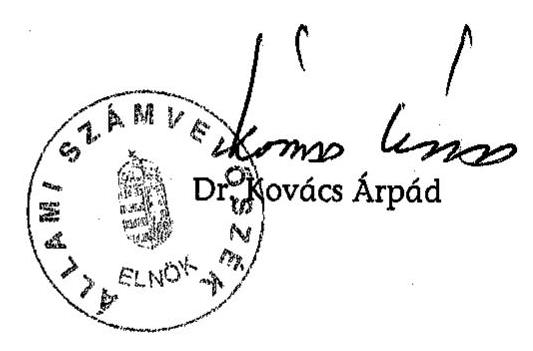

---

# MELLÉKLETEK

---

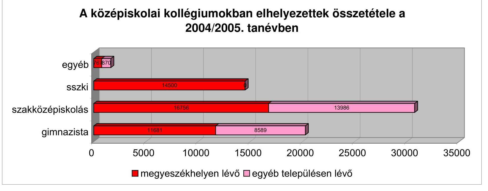

# A középiskolai kollégiumokban elhelyezettek összetétele a 2004/2005. tanévben

|  Egyéb | 19700  |
| --- | --- |
|  Szakközépiskolás | 11681  |
|  Gimnazisták | 5000  |
|  |  |

 |
|  |   |

---

A fenntartók középiskolai kollégiumai főbb adatainak alakulása a vizsgált körben összesen

|  Tanévek | Kollégiumok száma, db |  |  |  | Engedélyezett férőhely szám | Elhelyezett tanulók száma, fő |  |  | Férőhely kihasználás $\%$  |
| --- | --- | --- | --- | --- | --- | --- | --- | --- | --- |
|   | Összesen | A működés formája szerint |  |  |  | Összesen | Összesenből középfokú képzésben résztvevők | ebből: Arany János programban résztvevők |   |
|   |  | Önállóan gazd. ktsgvetési szerv | Részben önállóan gazdálkodó ktsgvetési szerv | Nem ktsgvetési szervként működő koll. ellátás |  |  |  |  |   |
|  2001/2002. | 114 | 37 | 61 | 16 | 22663 | 20675 | 19995 | 274 | 91,2  |
|  2002/2003. | 114 | 37 | 61 | 16 | 22490 | 19962 | 19302 | 461 | 88,8  |
|  2003/2004. | 113 | 38 | 58 | 17 | 22129 | 19894 | 19247 | 726 | 89,9  |
|  2004/2005. | 109 | 37 | 55 | 17 | 21706 | 19347 | 18699 | 873 | 89,1  |
|  2005/2006. | 107 | 35 | 55 | 17 | 21471 | 19052 | 18398 | 939 | 88,7  |

---

# Fajlagos kiadások alakulása a vizsgált közoktatási intézmények körében összesen

|  Évek | Kiadások jellege | Kiadások |  |  | Elhelyezett tanulók száma | Egy tanulóra jutó kollégiummal kapcs. szakfeladaton elszámolt kiadás | 5-ből: egy tanulóra jutó vagyonműködtetési kiadás  |
| --- | --- | --- | --- | --- | --- | --- | --- |
|   |  | Összesen | 1-ből: kollégiummal kapcs. szakfeladaton elszámolt kiadások összesen | 2-ből: intézményi vagyon működtetés |  |  |   |
|   |  | 1 | 2 | 3 | 4 | 5 | 6  |
|   |  | ezer Ft |  |  | fő | Ft/fő |   |
|  2001. | működési | 5467312 | 2403567 | 838933 | 8092 | 324290 | 117775  |
|   | ellátottak pénzbeli juttatásai | 35627 | 9465 | 2835 |  |  |   |
|   | felújítási | 138275 | 96889 | 63306 |  |  |   |
|   | felhalmozás | 281642 | 114233 | 47963 |  |  |   |
|   | összesen | 5922856 | 2624154 | 953037 | 8092 | 324290 | 117775  |
|  2002. | működési | 6643391 | 3019542 | 1123879 | 7905 | 420708 | 165183  |
|   | ellátottak pénzbeli juttatásai | 38829 | 14873 | 2669 |  |  |   |
|   | felújítási | 135028 | 108291 | 62683 |  |  |   |
|   | felhalmozás | 401316 | 182989 | 116541 |  |  |   |
|   | összesen | 7218564 | 3325695 | 1305772 | 7905 | 420708 | 165183  |
|  2003. | működési | 8651864 | 3717529 | 1321400 | 8003 | 498571 | 179831  |
|   | ellátottak pénzbeli juttatásai | 68672 | 24198 | 407 |  |  |   |
|   | felújítási | 183276 | 157550 | 89943 |  |  |   |
|   | felhalmozás | 356545 | 90788 | 27440 |  |  |   |
|   | összesen | 9260357 | 3990065 | 1439190 | 8003 | 498571 | 179831  |
|  2004. | működési | 9559647 | 3974118 | 1431192 | 7760 | 539104 | 196874  |
|   | ellátottak pénzbeli juttatásai | 93436 | 26100 | 114 |  |  |   |
|   | felújítási | 185777 | 138029 | 81254 |  |  |   |
|   | felhalmozás | 392957 | 45198 | 15181 |  |  |   |
|   | összesen | 10231817 | 4183445 | 1527741 | 7760 | 539104 | 196874  |
|  2005.I. félév | működési | 5235631 | 2130808 | 751906 | 7654 | 283802 | 99322  |
|   | ellátottak pénzbeli juttatásai | 23262 | 7552 | 38 |  |  |   |
|   | felújítási | 25934 | 14119 | 1852 |  |  |   |
|   | felhalmozás | 102361 | 19739 | 6413 |  |  |   |
|   | összesen | 5387188 | 2172218 | 760209 | 7654 | 283802 | 99322  |

---

# A befektetett tárgyi eszközök használhatósági fokának* és felújításainak alakulása a vizsgált kollégiumok körében összesen

|  Év | Tárgyi eszközök értéke (E Ft) |  |  | Felújítási kiadások | Ezer Ft bruttó értékre jutó felújítás  |
| --- | --- | --- | --- | --- | --- |
|   | Bruttó | Nettó | $\%$ | E Ft | Ft  |
|  2001. | 3134203 | 2293016 | 73,2 | 138275 | 44,1  |
|  2002. | 4042749 | 3155289 | 78,0 | 135028 | 33,4  |
|  2003. | 4449065 | 3423010 | 76,9 | 183276 | 41,2  |
|  2004. | 4559699 | 3422299 | 75,1 | 185777 | 40,7  |
|  2005. I. félév | 4822889 | 3619181 | 75,0 | 25934 | 5,4  |

- A nettó eszközérték aránya a bruttó eszközértékhez

---

Az elhelyezett tanulók és a pedagógusok létszámának és összetételének alakulása a vizsgált kollégiumok körében összesen

|  Tanévek | Elhelyezett tanulók száma okt. stat. szerint | Engedélyezett ped. létszám | Összes foglalkoztatott | ebből teljes munkaidős összesen | Teljes munkaidősök korcsoportonkénti megoszlása |  |  | Egy pedagógusra jutó elhelyezett tanuló  |
| --- | --- | --- | --- | --- | --- | --- | --- | --- |
|   |  |  | fő |  | \% |  |  | fő  |
|   |  |  |  |  | 30 év alatt | 30-50 éves | 50 év felett |   |
|  2001/2002. | 8092 | 440 | 403 | 383 | 18,3 | 47,5 | 34,2 | 20,1  |
|  2002/2003. | 7905 | 438 | 409 | 389 | 18,2 | 48,1 | 33,7 | 19,3  |
|  2003/2004. | 8003 | 441 | 418 | 399 | 19,1 | 49,1 | 31,8 | 19,1  |
|  2004/2005. | 7760 | 445 | 416 | 395 | 15,4 | 50,4 | 34,2 | 18,7  |
|  2005/2006. | 7654 | 436 | 418 | 399 | 15,8 | 50,4 | 33,8 | 18,3  |

---

# FÜGGELÉKEK

---

# A vizsgált fenntartók és kollégiumok jegyzéke 

| Fenntartó | Intézmény |
| :--: | :--: |
| Fővárosi Önkormányzat | Ady Endre Fővárosi Gyakorló Kollégium   Bolyai J. Fővárosi Gyakorló Műszaki Szakközépiskola és Kollégium   Deák Ferenc Középiskolai Kollégium   Déri Miksa Szakközépiskola, Szakiskola és Kollégium   József Attila Középiskolai Kollégium   Táncsics Mihály Kollégium |
| Altisz Alapítvány | Altisz Alapítványi Gimnázium, Szakiskola és Kollégium |
| Kecskemét Megyei Jogú Város Ö. | Táncsics Mihály Középiskolai Kollégium   Gáspár András Szakközépiskola, Szakiskola és Kollégium |
| Békéscsaba Megyei Jogú Város Ö. | Deák Ferenc Középiskolai Kollégium   Kossuth Zsuzsanna Középiskolai Leánykollégium   Trefort Ágoston Villamos- és Fémipari Szakközépiskola és Kollégium |
| Orosháza Város Önkormányzata | Táncsics Mihály Gimnázium és Szakközépiskola Kollégiuma |
| Szeged-Csanádi Püspökség | Göndöcs Benedek Középiskola, Szakképző Iskola és Kollégium |
| Miskolc Megyei Jogú Város Önk. | Petőfi Sándor Középiskolai Fiúkollégium |
| Tiszaújváros Város Önk. | Eötvös József Gimnázium, Szakképző Iskola és Kollégium |
| Hódmezővásárhely Megyei Jogú Város Önk. | Hódmezővásárhelyi Cseresnyés Kollégium |
| Hódmezővásárhely 12. Jogutód Református Egyházközség | Bethlen Gábor Református Gimnázium és Szathmáry Kollégium |
| Székesfehérvár Megyei J. V. Önk. | József Attila Középiskolai Kollégium   Árpád Szakképző Iskola és Kollégium |
| Debrecen Megyei Jogú Város Ö. | Deák Ferenc Középiskolai Kollégium   Gábor Dénes Elektronikai és Műszaki Szakközépiskola és Kollégium   Gulyás Pál Középiskolai Kollégium |
| Balassagyarmat Város Önk. | Madách Imre Kollégium |
| Pest Megyei Önkormányzat | Petőfi Sándor Gimnázium, Gépészeti Szakközépiskola és Kollégium (Aszód)   Dózsa György Középiskolai Kollégium (Cegléd)   Madách Imre Szakközépiskola, Szakiskola és Kollégium (Gödöllő) |
| Somogy Megyei Önkormányzat | Boglári Kollégium (Balatonboglár) |
| Siófok Város Önkormányzata | Siófok Város Kollégiuma |
| Nyíregyháza Megyei J. Város Önk. | Inczédy György Szakközépiskola és Szakiskola   Bessenyei György Középiskolai Kollégium   Zrínyi Ilona Gimnázium és Kollégium |
| Nagykálló Város Önkormányzata | Nagykállói Gimnázium, Szakképző Iskola és Kollégium |
| Magyarországi Evangélikus Egyház | Luther Márton Kollégium (Nyíregyháza) |
| Nagykanizsa Megyei Jogú Város Ö. | Cserháti Sándor Műszaki Szakképző Iskola és Kollégium |
| Keszthely Város Önkormányzata | Keszthely V. Vendéglátó, Idegenforgalmi, Ker. Szakképző Iskola és Kollégium |

---

# Kollégium vezetői kérdőívek összesített eredménye a vizsgált 36 kollégiumnál 

1. 

Rendelkeznek-e a tanulási problémák korrekciójához, a felzárkóztatáshoz megfelelően képzett szakemberek?
14 igen
1 nem
21 részben
2. Ha nem rendelkeznek teljes egészében, akkor van-e lehetőség a középiskolából korrepetáló tanár megbízására?
12 igen
6 nem
7 részben
3. Milyen az ingatlan karbantartottsága?
11 Jól karbantartott
16 Közepesen karbantartott
9 Felújításra szorul
4. Értékelje az alábbi területek pénzellátottságát (1-10-ig)!
a
Működésre
7,4
b
Fejlesztésre (technikai eszközök bővítésére
4,4
c
Szolgáltatások javítására
4,9
d
Szolgáltatások bővítésére
3,9
e
Pedagógus továbbképzésre
7,8
f
Pedagógus anyagi elismerésére
4,4
g
Szociális célokra
4,2
5. Segítené-e a kollégiumok szakmai munkáját, ha lenne az ágazat által elfogadott célrendszer a kollégiumi hálózat fejlesztésére, működtetésére?
32 igen
0 nem
4 részben
6. Megfelelőnek tartja-e a kollégiumok és a fenntartók informálására,

 feladatainak összehangolására, irányítására működtetett kapcsolatrendszert? Válaszát röviden indokolja meg!
17 igen
4 nem
15 részben
7. Megfogalmazódtak-e ágazati, fenntartói szinten a kollégiumokkal szembeni szakmai elvárások?
a
ágazati
29 igen
1 nem
6 részben
b
fenntartó
19 igen
2 nem
15 részben
8. Ismeretei szerint az elvárásokhoz biztosítottak-e forrásokat?
5 igen
5 nem
26 részben
9. A kollégiumok működésének javítására biztosított pályázati többletforrások az elmúlt 4 évben a leginkább változásra szoruló területek feltételeinek javítására irányultak? Válaszát röviden indokolja meg!
11 igen
4 nem
21 részben
10. A pályázati pénzeszközök felhasználásának hatékonysága információi szerint kielégítő volt-e? Válaszát röviden indokolja meg!
26 igen
1 nem
8 részben

---

11. Tudomása szerint a gyakorlatban a fenntartó ellenőrizteti-e a nevelési tervek végrehajtását, a kötelező és szabadon választott foglalkozások megtartását?

# 19 igen   4 nem   12 részben 

12. A meglévő jogszabályi háttér segíti-e az intézmények működtetését?

## 24 igen   0 nem   12 részben

13. Elégséges-e a jelenleg előírt 14 órás felkészítő foglalkozási időkeret?

## 29 igen   1 nem   6 részben

14. Szükségesnek véli-e ennek az időkeretnek a korosztályok szerinti differenciált meghatározását?

## 21 igen   12 nem   3 részben

15. Milyen jogi területeken érez hiányosságot? (PI. munkajogi, szervezeti, tanúgyigazgatási stb.)
16. Milyennek ítéli meg a fenntartók érdekeltségét a kollégiumok működtetésében?

10 Teljes mértékben megfelelő
22 A fejlesztésben nem érdekeltek, de a működésben nincs alapvető probléma
4 Sem a fejlesztésben, sem a működésben nem megfelelő
17. Az elmúlt években elérhető források (NKKA, Megyei Közalapítványok, szakképzési alaprész)

|  |  | igen | nem | részben |
| :-- | :-- | :-- | :-- | --: |
| a | közismertek voltak-e | 28 | 2 | 6 |
| b | mindenki számára nyitottak voltak-e | 16 | 6 | 12 |
| c | céljuk egzaktan volt-e megfogalmazva, | 27 | 3 | 5 |
| d | odaítélésük során biztosított volt-e az objektív megítélés | 19 | 0 | 16 |

18. A kötelező eszközjegyzékben szereplő, a kollégiumokra vonatkozó előírások teljesítése mely területeken jelenti a legnagyobb problémát a fenntartók részéről?
19. A kollégiumi hálózat személyi feltételrendszere kedvező-e a kollégiumok távlati céljainak megvalósításában?

## 10 igen   2 nem   23 részben

20. Jó intézményi formának tartja-e az AJTP-t a hátránykiegyenlítés, esélyteremtés szempontjából?

## 20 igen   3 nem   4 részben

21. Az itt felhasználásra kerülő források hatékonyan szolgálták-e a meghirdetett célokat?

## 9 igen   4 nem   5 részben

22. Hozzájárult-e az AJTP forrása a befogadó kollégiumok egészére vonatkozó a hosszútávú működés feltételeinek javításához?

## 9 igen   1 nem   8 részben

---

# Kollégium vezetői kérdőívek összesített eredménye a vizsgálati körön kívüli 13 kollégiumnál 

1. Rendelkeznek-e a tanulási problémák korrekciójához, a felzárkóztatáshoz megfelelően képzett szakemberek?

## 4 igen   2 nem   7 részben

2. Ha nem rendelkeznek teljes egészében, akkor van-e lehetőség a középiskolából korrepetáló tanár megbízására?

## 7 igen   2 nem   1 részben

3. Milyen az ingatlan karbantartottsága?

## 4 Jól karbantartott   5 Közepesen karbantartott   4 Felújításra szorul

4. Értékelje az alábbi területek pénzellátottságát (1-10-ig)!

| a | Működésre | 7,3 |
| :-- | :-- | :-- |
| b | Fejlesztésre (technikai eszközök bővítésére | 5,2 |
| c | Szolgáltatások javítására | 4,8 |
| d | Szolgáltatások bővítésére | 4,4 |
| e | Pedagógus továbbképzésre | 7,9 |
| f | Pedagógus anyagi elismerésére | 5,8 |
| g | Szociális célokra | 3,8 |

5. Segítené-e a kollégiumok szakmai munkáját, ha lenne az ágazat által elfogadott célrendszer a kollégiumi hálózat fejlesztésére, működtetésére?

## 13 igen   0 nem   0 részben

6. Megfelelőnek tartja-e a kollégiumok és a fenntartók informálására, feladatainak összehangolására, irányítására működtetett kapcsolatrendszert? Válaszát röviden indokolja meg!

## 6 igen   1 nem   6 részben

7. Megfogalmazódtak-e ágazati, fenntartói szinten a kollégiumokkal szembeni szakmai elvárások?
a ágazati
8 igen
1 nem
3 részben
b fenntartó
8 igen
1 nem
4 részben
8. Ismeretei szerint az elvárásokhoz biztosítottak-e forrásokat?

## 2 igen   1 nem   9 részben

A kollégiumok működésének javítására biztosított pályázati többletforrások az elmúlt 4 évben a leginkább változásra szoruló területek feltételeinek javítására irányultak? Válaszát röviden indokolja meg!

7 igen
2 nem
4 részben

---

10. A pályázati pénzeszközök felhasználásának hatékonysága információi szerint kielégítő volt-e? Válaszát röviden indokolja meg!

# 8 igen   0 nem   5 részben 

11. Tudomása szerint a gyakorlatban a fenntartó ellenőrizteti-e a nevelési tervek végrehajtását, a kötelező és szabadon választott foglalkozások megtartását?

## 6 igen   2 nem   5 részben

12. A meglévő jogszabályi háttér segíti-e az intézmények működtetését?

## 6 igen   0 nem   7 részben

13. Elégséges-e a jelenleg előírt 14 órás felkészítő foglalkozási időkeret?

## 12 igen   1 nem   0 részben

14. Szükségesnek véli-e ennek az időkeretnek a korosztályok szerinti differenciált meghatározását?

## 6 igen   6 nem   1 részben

15. Milyen jogi területeken érez hiányosságot? (PI. munkajogi, szervezeti, tanúgyigazgatási stb.)
munkajog, összhang a dokumentációs rendszerrel, szervezeti, tanügyigazgatási jogszabályi feltételekhez kapcsolódó pénzügyi forrás hiánya (munkavédelem, akadálymentesítés)
16. Milyennek ítéli meg a fenntartók érdekeltségét a kollégiumok működtetésében?

4 Teljes mértékben megfelelő
7 A fejlesztésben nem érdekeltek, de a működésben nincs alapvető probléma
2 Sem a fejlesztésben, sem a működésben nem megfelelő
17. Az elmúlt években elérhető források (NKKA, Megyei Közalapítványok, szakképzési alaprész)

|  |  | igen | nem | részben |
| :-- | :-- | :-- | :-- | :-- |
| a | közismertek voltak-e | 11 | 0 | 2 |
| b | mindenki számára nyitottak voltak-e | 9 | 1 | 3 |
| c | céljuk egzaktan volt-e megfogalmazva, | 11 | 0 | 2 |
| d | odaítélésük során biztosított volt-e az objektív megítélés | 5 | 0 | 8 |

18. A kötelező eszközjegyzékben szereplő, a kollégiumokra vonatkozó előírások teljesítése mely területeken jelenti a legnagyobb problémát a fenntartók részéről?
19. A kollégiumi hálózat személyi feltételrendszere kedvező-e a kollégiumok távlati céljainak megvalósításában?

## 6 igen   2 nem   5 részben

20. Jó intézményi formának tartja-e az AJTP-t a hátránykiegyenlítés, esélyteremtés szempontjából?

## 6 igen   1 nem   3 részben   3 nincs válasz

---

21. Az itt felhasználásra kerülő források hatékonyan szolgálták-e a meghirdetett célokat?

|  6 igen | 0 nem | 3 részben | 4 nincs válasz  |
| --- | --- | --- | --- |
|  |   |   |   |

1. Hozzájárult-e az AJTP forrása a befogadó kollégiumok egészére vonatkozó a hosszútávú működés feltételeinek javításához?

| 6 igen | 1 nem | 2 részben | 4 nincs válasz  |
| --- | --- | --- | --- |
|  |   |   |   |

---

# Tanulói kérdőívek összesített eredménye a vizsgált 36 kollégiumnál 

1. Milyen képzési típusú iskolába jársz?

| Gimnázium | 628 |
| :-- | --: |
| Szakközépiskola | 891 |
| Szakiskola | 247 |
| Egyéb | 18 |

2. Mióta vagy kollégista?

| 0-1 év | 202 |
| :-- | --: |
| 1-3 év | 1059 |
| 4- év | 519 |

3. A kollégium Pedagógiai Programjáról kaptál-e részletes tájékoztatást csoportfoglalkozáson, vagy egyéb módon?

| Igen | 1335 | Nem | 446 |
| :-- | :-- | :-- | :-- |

4. Tudod-e hol lehet elolvasni a kollégium Pedagógiai Programját?

| Igen | 1150 | Nem | 631 |
| :-- | :-- | :-- | :-- |

5. Értékeld 1-10-ig az alábbi ellátásokat:
(10=teljesen elégedett vagy, $1=$ teljesen elégedetlen vagy)

| 5\1 | - Élelmezés színvonala | 1782 | 5 |
| :--: | :--: | :--: | :--: |
| 5\2 | - Az étkezési adagok nagysága | 1783 | 5,1 |
| 5\3 | - A tanulásban történő segítség a nevelőtanárok részéről | 1776 | 7,4 |
| 5\4 | - Szabadidős tevékenységek lehetősége | 1783 | 7 |
| 5\5 | - Nyugodt tanulás feltételei | 1780 | 6,8 |
| 5\6 | - A kollégium számítógép állományának korszerűsége | 1779 | 6 |
| 5\7 | - A számítógéphez történő hozzáférés lehetősége | 1780 | 6 |
| 5\8 | - Internet hozzáférés lehetősége | 1779 | 6,8 |
| 5\9 | - A kollégiumi foglalkozások hasznossága | 1767 | 6 |
| 5\10 | tanulásmódszertan | 1739 | 5,6 |
| 5\11 | önismeret, pályaválasztás | 1752 | 5,9 |
| 5\12 | művészet és információs kultúra | 1722 | 5,6 |
| 5\13 | környezeti nevelés | 1721 | 5,8 |
| 5\14 | életmód, életvitel, háztartási ism. | 1732 | 5,7 |
| 5\15 | egyén és közösség | 1721 | 6,5 |
| 5\16 | magyarság, nemzetiségi lét, európaiság | 1717 | 6,2 |
| 5\17 | - Tisztálkodási lehetőségek | 1780 | 7,7 |
| 5\18 | - Könyvtár, tanulási segédanyagok | 1749 | 7,4 |
| 5\19 | - A tanulás tárgyi körülményei (tanulószoba, asztal stb.) | 1781 | 7,5 |
| 5\20 | - A kollégium otthonossága | 1778 | 6,6 |
| 5\21 | - A kollégium házirendje | 1778 | 6,3 |
| 5\22 | - A kollégiumi életbe való beleszólás lehetősége | 1770 | 5,8 |

6. Milyennek ítéled a berendezések színvonalát? (1-10-ig)

| 6\1 | - Hálószobában | 1778 | 6,4 |
| :-- | :-- | --: | --: |
| 6\2 | - Fürdőszobában | 1778 | 6,1 |
| 6\3 | - Tanulószobában | 1775 | 6,5 |

---

|  614 | - Közösségi helyiségekben | 1774 | 6,6 |
| :-- | :-- | --: | --: |
| 615 | - Számítógépes szobában | 1776 | 6,8 |
| 616 | - Könyvtárban | 1700 | 7,2 |
| 617 | - Tornateremben | 1519 | 6,1 |
| 618 | - Ebédlőben | 1781 | 6,6 |

7. Van-e a kollégiumban kiegészítő étkezést szolgáló helyiség (pl.teakonyha)?

| Igen | 1380 | Nem | 399 |
| :-- | :-- | :-- | :-- |

8. Ha van ilyen, akkor megfelelő-e a felszereltsége?

| Igen | 1058 | Nem | 574 |
| :-- | :-- | :-- | :-- |

9. Milyennek ítéled a helyiségek takarítását? (1-10-ig)

| 911 | - Hálószobában | 1744 | 6,6 |
| :-- | :-- | --: | --: |
| 912 | - Fürdőszobában | 1781 | 6,5 |
| 913 | - Tanulószobában | 1776 | 7 |
| 914 | - Közösségi helyiségekben | 1781 | 7,1 |
| 915 | - Számítógépes szobában | 1780 | 7,6 |
| 916 | - Könyvtárban | 1706 | 7,9 |
| 917 | - Tornateremben | 1517 | 6,6 |
| 918 | - Ebédlőben | 1769 | 
 7 |

10. Melyik az a berendezés, amire a legjobban szükséged lenne a kollégiumban, de jelenleg nincs ilyen, vagy kevés van?
11. Megfelelő gyakorisággal vannak-e:

| 1111 | Társasági kulturális programok | Igen | 1422 | Nem | 357 |
| :--: | :--: | :--: | :--: | :--: | :--: |
| 1112 | Kirándulások | Igen 878 |  |  |  |
| 1113 | Szakkörök | Igen 1553 |  |  |  |

12. Van-e lehetőség egyéni problémák megbeszélésére, megoldására a kollégiumi nevelőtanárokkal?

|  | Igen, bármikor | 900 |
| :-- | :-- | --: |
|  | Igen, de nem mindig | 421 |
|  | Csak nagyon ritkán | 145 |
|  | Soha | 33 |
| 121A | Nem fordulok ilyen igénnyel a nevelőtanárokhoz | 0 |

13. Van-e lehetőség tananyagon kivüli ismeretek megszerzésére a kollégium által szervezett programokon?

| Igen | 1455 | Nem | 326 |
| :-- | :-- | :-- | :-- |

14. Kapsz-e segítséget az idegennyelv gyakorlásához a kollégiumban?

| Igen | 1100 | Nem | 676 |
| :-- | :-- | :-- | :-- |

---

15. Kapsz-e segítséget a kollégiumban számítástechnika gyakorlásához?

| Igen | 1421 | Nem | 354 |
| :-- | :-- | :-- | :-- |

16. Van-e kollégiumban AJTP-s diák?

| Igen | 472 | Nem | 1194 |
| :-- | :-- | :-- | :-- |

17. AJTP-s diák vagy-e?

Erre a kérdésre csak akkor kérünk választ, ha a 16. kérdésre IGEN volt a válasz!

| Igen | 240 | Nem | 334 |
| :-- | :-- | :-- | :-- |

18. Ha igen, az elvárásoknak megfelelő tehetséggondozást kapod-e?

Erre a kérdésre csak akkor kérünk választ, ha a 17. kérdésre IGEN volt a válasz!

| Igen | 208 | Nem | 91 |
| :-- | :-- | :-- | :-- |

19. Ha nem, szerinted van-e számodra is olyan lehetőség, mint az AJTP-seknek? Erre a kérdésre csak akkor kérünk választ, ha a 17. kérdésre NEM volt a válasz!

| Igen | 154 | Nem | 270 |
| :-- | :-- | :-- | :-- |

20. Van-e lehetőség a kollégiumban a lemaradók, hátránnyal érkezők számára a felzárkóztatásra?

| Igen | 1505 | Nem | 260 |
| :-- | :-- | :-- | :-- |

21. Hátrányos helyzetűnek tartod-e magad?

| Igen | 368 | Nem | 1406 |
| :-- | :-- | :-- | :-- |

22. Véleményed szerint mi a hátrányos helyzeted oka? (több is megjelölhető) Erre a kérdésre csak akkor kérünk választ, ha a 21. kérdésre IGEN volt a válasz!

| 2211 | - szociális | 240 |
| :--: | :--: | :--: |
| 2212 | - kulturális | 27 |
| 2213 | - nemzetiségi | 42 |
| 2214 | - lakóhely miatti közlekedés | 163 |
| 2215 | - tanulásbeli elmaradás | 65 |
| 2216 | - iskolák közötti színvonal különbség | 79 |

23. A kollégium az eddig eltelt időszakban csökkentette-e ezt a hátrányt? Erre a kérdésre csak akkor kérünk választ, ha a 21. kérdésre IGEN volt a válasz!

| Igen | 228 | Nem | 156 |
| :-- | :-- | :-- | :-- |

# Kitöltési útmutató: 

A táblázatban lévő szöveg mellé az adott cellába kattintva írható be a szöveg tartalmának megfelelő számadat.

---

# Tanulói kérdőívek összesített eredménye a vizsgálati körön kívüli 13 kollégiumnál 

1. Milyen képzési típusú iskolába jársz?

| Gimnázium | 258 |
| :-- | --: |
| Szakközépiskola | 372 |
| Szakiskola | 45 |
| Egyéb | 6 |

2. Mióta vagy kollégista?

| $0-1$ év | 58 |
| :-- | --: |
| $1-3$ év | 419 |
| $4-$ év | 202 |

3. A kollégium Pedagógiai Programjáról kaptál-e részletes tájékoztatást csoportfoglalkozáson, vagy egyéb módon?

| Igen | 530 | Nem | 128 |
| :-- | :-- | :-- | :-- |

4. Tudod-e hol lehet elolvasni a kollégium Pedagógiai Programját?

| Igen | 443 | Nem | 219 |
| :-- | :-- | :-- | :-- |

5. Értékeld 1-10-ig az alábbi ellátásokat:
(10=teljesen elégedett vagy, 1=teljesen elégedetlen vagy)

| 5\1 | - Élelmezés színvonala | 685 | 5,8 |
| :--: | :--: | :--: | :--: |
| 5\2 | - Az étkezési adagok nagysága | 685 | 6,0 |
| 5\3 | - A tanulásban történő segítség a nevelőtanárok részéről | 683 | 7,6 |
| 5\4 | - Szabadidős tevékenységek lehetősége | 684 | 6,9 |
| 5\5 | - Nyugodt tanulás feltételei | 683 | 6,6 |
| 5\6 | - A kollégium számítógép állományának korszerűsége | 684 | 6,5 |
| 5\7 | - A számítógéphez történő hozzáférés lehetősége | 684 | 6,3 |
| 5\8 | - Internet hozzáférés lehetősége | 684 | 6,9 |
| 5\9 | - A kollégiumi foglalkozások hasznossága | 684 | 6,1 |
| 5\10 | tanulásmódszertan | 684 | 5,8 |
| 5\11 | önismeret, pályaválasztás | 682 | 6,0 |
| 5\12 | művészet és információs kultúra | 684 | 5,8 |
| 5\13 | környezeti nevelés | 684 | 5,7 |
| 5\14 | életmód, életvitel, háztartási ism. | 684 | 5,7 |
| 5\15 | egyén és közösség | 683 | 6,8 |
| 5\16 | magyarság, nemzetiségi lét, európaiság | 684 | 6,2 |
| 5\17 | - Tisztálkodási lehetőségek | 685 | 7,3 |
| 5\18 | - Könyvtár, tanulási segédanyagok | 684 | 6,9 |
| 5\19 | - A tanulás tárgyi körülményei (tanulószoba, asztal stb.) | 685 | 7,6 |
| 5\20 | - A kollégium otthonossága | 685 | 6,8 |
| 5\21 | - A kollégium házirendje | 685 | 6,4 |
| 5\22 | - A kollégiumi életbe való beleszólás lehetősége | 684 | 5,8 |
| 6. Milyennek ítéled a berendezések színvonalát? (1-10-ig) |  |  |  |
| 6\1 | - Hálószobában | 685 | 6,5 |
| 6\2 | - Fürdőszobában | 684 | 5,8 |
| 6\3 | - Tanulószobában | 685 | 6,7 |

---

|  614 | - Közösségi helyiségekben | 685 | 6,8  |
| --- | --- | --- | --- |
|  615 | - Számítógépes szobában | 685 | 6,9  |
|  616 | - Könyvtárban | 685 | 6,4  |
|  617 | - Tornateremben | 664 | 5,3  |
|  618 | - Ebédlőben | 684 | 6,7  |

7. Van-e a kollégiumban kiegészítő étkezést szolgáló helyiség (pl.teakonyha)?

|  Igen | 526 | Nem | 118  |
| --- | --- | --- | --- |
|  |   |   |   |

8. Ha van ilyen, akkor megfelelő-e a felszereltsége?

|  Igen | 372 | Nem | 167  |
| --- | --- | --- | --- |
|  |   |   |   |

9. Milyennek itéled a helyiségek takarítását? (1-10-ig)

|  911 | - Hálószobában | 684 | 6,8  |
| --- | --- | --- | --- |
|  912 | - Fürdőszobában | 684 | 6,5  |
|  913 | - Tanulószobában | 684 | 7,1  |
|  914 | - Közösségi helyiségekben | 684 | 7,1  |
|  915 | - Számítógépes szobában | 684 | 7,4  |
|  916 | - Könyvtárban | 683 | 7,2  |
|  917 | - Tornateremben | 664 | 5,7  |
|  918 | - Ebédlőben | 684 | 7,0  |

10. Melyik az a berendezés, amire a legjobban szükséged lenne a kollégiumban, de jelenleg nincs ilyen, vagy kevés van?
11. Megfelelő gyakorisággal vannak-e:

|  1111 | Társasági kulturális programok | Igen | 544 | Nem | 99  |
| --- | --- | --- | --- | --- | --- |
|  1112 | Kirándulások | Igen | 291 | Nem | 322  |
|  1113 | Szakkörök | Igen | 553 | Nem | 86  |

12. Van-e lehetőség egyéni problémák megbeszélésére, megoldására a kollégiumi nevelőtanárokkal?

|   | Igen, bármikor | 384  |
| --- | --- | --- |
|   | Igen, de nem mindig | 129  |
|   | Csak nagyon ritkán | 24  |
|   | Soha | 6  |
|  121A | Nem fordulok ilyen igénnyel a nevelőtanárokhoz | 105  |

13. Van-e lehetőség tananyagon kivüli ismeretek megszerzésére a kollégium által szervezett programokon?

|  Igen | 514 | Nem | 121  |
| --- | --- | --- | --- |
|  |   |   |   |

14. Kapsz-e segítséget az idegennyelv gyakorlásához a kollégiumban?

|  Igen | 440 | Nem | 192  |
| --- | --- | --- | --- |

---

15. Kapsz-e segítséget a kollégiumban számítástechnika gyakorlásához?

| Igen | 553 | Nem | 91 |
| :-- | :-- | :-- | :-- |

16. Van-e kollégiumban AJTP-s diák?

| Igen | 220 | Nem | 339 |
| :-- | :-- | :-- | :-- |

17. AJTP-s diák vagy-e?

Erre a kérdésre csak akkor kérünk választ, ha a 16. kérdésre IGEN volt a válasz!

| Igen | 105 | Nem | 123 |
| :-- | :-- | :-- | :-- |

18. Ha igen, az elvárásoknak megfelelő tehetséggondozást kapod-e?

Erre a kérdésre csak akkor kérünk választ, ha a 17. kérdésre IGEN volt a válasz!

| Igen | 80 | Nem | 33 |
| :-- | :-- | :-- | :-- |

19. Ha nem, szerinted van-e számodra is olyan lehetőség, mint az AJTP-seknek? Erre a kérdésre csak akkor kérünk választ, ha a 17. kérdésre NEM volt a válasz!

| Igen | 30 | Nem | 59 |
| :-- | :-- | :-- | :-- |

20. Van-e lehetőség a kollégiumban a lemaradók, hátránnyal érkezők számára a felzárkóztatásra?

| Igen | 485 | Nem | 54 |
| :-- | :-- | :-- | :-- |

21. Hátrányos helyzetűnek tartod-e magad?

| Igen | 119 | Nem | 439 |
| :-- | :-- | :-- | :-- |

22. Véleményed
 szerint mi a hátrányos helyzetük oka? (több is megjelölhető) Erre a kérdésre csak akkor kérünk választ, ha a 21. kérdésre IGEN volt a válasz!

| 2211 | - szociális | 59 |
| :--: | :--: | :--: |
| 2212 | - kulturális | 10 |
| 2213 | - nemzetiségi | 12 |
| 2214 | - lakóhely miatti közlekedés | 81 |
| 2215 | - tanulmánybeli elmaradás | 23 |
| 2216 | - iskolák közötti színvonal különbség | 35 |

23. A kollégium az eddig eltelt időszakban csökkentette-e ezt a hátrányt? Erre a kérdésre csak akkor kérünk választ, ha a 21. kérdésre IGEN volt a válasz!

| Igen | 99 | Nem | 26 |
| :-- | :-- | :-- | :-- |

# Kitöltési útmutató: 

A táblázatban lévő szöveg mellé az adott cellába kattintva írható be a szöveg tartalmának megfelelő számadat.

---

# ÁLLAMI SZÁMVEVŐSZÉK 

## Erkezési időpont: 2006. MÁJUS 31.

Iktatószám: 1-1011-44/2006-2006
Melléklet: $\qquad$
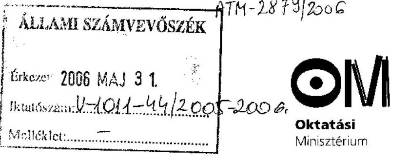

Iktatószám:10476-6/2006.

## Dr. Kovács Árpád

## Elnök

Állami Számvevőszék
Budapest IV.
Pf.: 54.
1364

Tisztelt Elnök Úr!
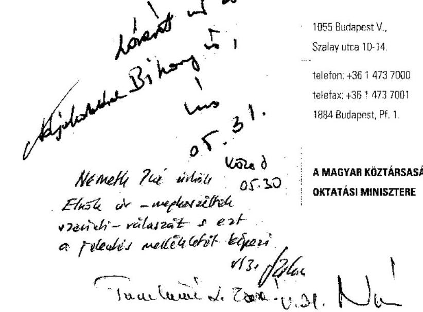

A középiskolai kollégiumok fenntartásának és fejlesztésének ellenőrzése tárgyú jelentéstervezetüket köszönettel megkaptam.

A jelentéstervezet a május 5-i változatához Dr. Szüdi János közigazgatási államtitkár úr hat olyan észrevételt tett, amelyek alapján indokoltnak tartottuk a jelentéstervezet 13. és 14. oldalain az oktatási miniszter részére tett javaslataik további pontosítását, valamint azok közül többnek az elvetését.

Álláspontom szerint több olyan intézkedés elindítására került sor az ÁSZ által lefolytatott ellenőrzés megkezdése előtt, amelyek kivitelezése szakmapolitikai szempontból korábban nem lett volna célszerű, ám most a 2005/2006. tanév végén ezek az általunk kezdeményezett és időközben már lezárult tanulmányok, illetve elkészített tájékoztatók, szakmai ajánlások nagymértékben fognak hozzájárulni a kollégiumok szakmai fejlesztésének további sikerességéhez. Mivel ezek az intézkedések megvalósultak, vagy épp a napjainkban válnak megvalósulttá, azok elkészítésére vonatkozó javaslataikat kérjük, hogy a véglegesített jelentésben már ne szerepeltessék az oktatási miniszternek szóló ajánlásaik között.

1. A javaslat nem veszi kellőképpen figyelembe, hogy a közoktatási szolgáltatás szervezése az önkormányzatok feladata. Ezért továbbra is nehezen értelmezhetőnek látjuk azt az 1. pontban szereplő felvetést, miszerint a miniszter kiemelt feladatként kezelje a kollégiumi tevékenység fejlesztését, mérje fel annak forrásigényét. Mivel a közoktatásról szóló törvény szerint a megyék, az egyes települések és a kistérségek készítenek terveket a szolgáltatás megszervezéséhez, a szakmai feladatok felmérése és ehhez kapcsolódóan forrásigény meghatározása ezen a szinten indokolt.

---

2. A jelentéstervezet oktatási miniszternek tett 3. pontja tartalmazza az Arany János Tehetséggondozó Programmal (továbbiakban AJTP) kapcsolatban, hogy összegezzük a tapasztalatokat, illetve tegyük közzé a bevált nevelési programokat, továbbá ellenőriztessük a program keretei közötti pénzügyi folyamatokat. A közigazgatási államtitkár úr a 104762/2006. ikt. számú levélben fordult Dr. Lóránt Zoltán főigazgató úrhoz, bemutatva épp azokat a folyamatokat, amelyek 2006. június első hetében megvalósulttá válnak, ezért azoknak az ajánlásban szerepeltetése indokolatlan.

- Ismét hangsúlyozzuk, hogy a Felsőoktatási Kutatóintézet - Liskó Ilona vezetésével - elkészítette az AJTP, AJKP szociológiai hatásvizsgálatát, amely 2006. június első napjaiban felkerül a tárcánk honlapjára, továbbá megküldjük az érintett iskoláknak, valamint az Országos Köznevelési Tanácsnak további hasznosításra.
- A tárca államtitkári értekezlete hosszú fejlesztés és egyeztetések után 2006. május 24-én elfogadta az AJTP programleírásnak a miniszteri közleményként történő kiadásával kapcsolatos előterjesztést, amelynek alapján az Oktatási Közlönyben 2006. júniusában megjelenésre kerül.
- Június első hetében felkerül a suliNova Kht. honlapjára az AJTP Kollégiumi Programja jó gyakorlatainak a gyűjteménye, minden érdeklődő számára elérhető lesz.
- A Debreceni Egyetem - Pedagógia-pszichológia Tanszéke - Dr. Balogh László vezetésével - elkészíti az AJTP-be járó diákok pedagógiai-pszichológiai összehasonlító (2001-2005) hatásvizsgálati tanulmányait. A vizsgálatok kitérnek a motivációra, énképre, tanulási stratégiákra, tantárgyi eredményességre stb.

3. Ismételten áttekintettük a 11/1994. (VI. 8.) MKM rendeletnek az eszköz- és felszerelési jegyzékhez, illetve a kollégiumi foglalkozások dokumentálásához javasolt, a Kollégiumi Nevelés Országos Alapprogramjával összefüggésben az oktatási miniszternek a 4. és 6. pontban tett javaslataikat. Ismételten összevetve az Alapprogramot, illetve a 11/1994. (VI. 8.) MKM rendeletet, továbbra sem tartom életszerűnek a javaslatukat, azzal nem értek egyet.

- Egyrészt a foglalkozások dokumentálását a rendelet megfelelően szabályozza, a foglalkozások dokumentálásának ellenőrzését a kollégium fenntartójának kell ellenőriznie. A megoldást ebben az esetben nem a további dokumentáció előírásában látom, hanem a meglévő dokumentációs kötelezettség betartatásában, ami a kollégiumok fenntartóinak a kötelezettsége. Tájékoztatom arról is, hogy a tárcánk készített a tavalyi évben egy olyan kollégiumi ügyeleti napló tervezetet, amely az Alapprogrammal összefüggő foglalkozások dokumentálására a jelenleg használt ügyeleti naplónál részletesebb és alaposabb lehetőséget teremtett volna. Az Állami Nyomdát kerestük meg a kiadás előkészítésével, ám a kollégiumok nem tartottak rá igényt. Ezt a naplót ennek ellenére a jövőben tervezzük kiadni és a rendelet következő módosítása során kötelezően használt dokumentumként az alkalmazását előírni.
- Az eszköz- és felszerelésjegyzék OKÉV-vel történő ellenőriztetését sem látom életszerűnek akkor, amikor a jelentés is hangsúlyozza, hogy a kollégium fenntartók 60%-a nem érdekelt a kollégiumok fejlesztésében.

---

4. Folytatjuk az egyeztetést a Nemzeti Fejlesztési Hivatallal, hogy a kollégiumok infrastrukturális fejlesztései is bekerüljenek az NFT-II-be, ám ahogy az Elnök Úr is pontosan tudja, az Önök 2. pontban javasolt feladat megvalósítása nem csak az oktatási miniszter felelőssége, illetve feladata.
5. Miközben tartalmilag támogatjuk a jelentéstervezetnek a kollégiumi étkezéssel kapcsolatos ajánlását, ismételten fel kell hívnunk a figyelmet arra, hogy az étkezéssel kapcsolatos ajánlás kidolgozása nem tartozik az Oktatási Minisztérium feladatkörébe, mint ahogy a kérdés szabályozása sem.

Kérem Elnök Urat az észrevételeim megfontolására.

Budapest, 2006. május 29.

Üdvözlettel:
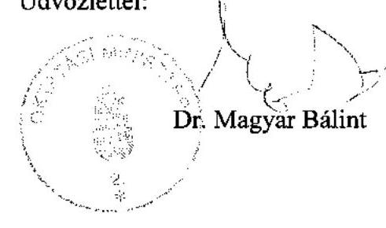

---

# Dr. Hiller István úr 

miniszter
Oktatási és Kulturális Minisztérium

## Budapest

## Tisztelt Miniszter Úr!

Az Állami Számvevőszék befejezte a középiskolai kollégiumok fenntartásának és fejlesztésének az ellenőrzését, melyről készült jelentéstervezetét Dr. Magyar Bálint miniszter úrnak véleményezésre megküldtük. Miniszter úr észrevételével - melyet mellékelek - kapcsolatos álláspontomról az alábbiakban tájékoztatom.

Örömmel vettük tudomásul, hogy befejezéséhez közeledik a tárca néhány olyan intézkedése, amelyek megerősítik az ellenőrzés megállapításai alapján tett javaslataink indokoltságát és elősegíthetik azok megvalósulását.

Változatlanul nem tudunk azonban egyetérteni azokkal a felvetésekkel, amelyekkel kapcsolatosan a korábbi, államtitkári egyeztetés során Dr. Lóránt Zoltán főigazgató úr Dr. Szüdi János közigazgatási államtitkár úrnak írt válaszában kifejtette az ÁSZ álláspontját.

- A kollégiumi tevékenység fejlesztését érintően felhívta a figyelmet arra, hogy javaslatunk nem az egyes fenntartók fejlesztési igényének felmérésére vonatkozik, hanem a Minisztérium által 2003-ban felvázolt központi szakmai fejlesztési feladatok - többek között kézikönyv és szakkönyvsorozat kiadása, tudományos háttér megteremtése, továbbképzések, illetve nevelőtanári szakirányú továbbképzési szak létrehozása - megvalósításához szükséges forrásigényre.
- Jelentéstervezetünk elismerően szólt az Arany János Tehetséggondozó Programról. Az észrevételben felsorolt hatásvizsgálatok, közlemények közkinccsé tétele mellett azonban változatlanul hiányoljuk a támogatottak pénzügyi elszámolásainak összegzését, elemzését, a forrásfelhasználás eredményességének vizsgálatát. Az észrevétel 3. pontjából kitűnik, az oktatási tárca is szükségesnek látja az Alapprogrammal összefüggő foglalkozások egységes dokumentálásának kötelező előírását, hiszen az nem függhet az egyes kollégiumok igényétől.
- Nem értünk egyet ugyanakkor azzal a felvetéssel sem, hogy az eszköz- és felszerelésjegyzék OKÉV-vel történő ellenőriztetése azért nem életszerű, mivel a kollégium fenntartók nagy része nem érdekelt a kollégiumok fejlesztésében. Amennyiben ugyanis szakmailag indokoltak ezek az előírások, akkor betartatásuk ellenőrzése a beszerzések határidejére haladékot adó OKÉV feladata, ellenkező esetben fontolóra kell venni az eszközjegyzék ésszerűtlen, esetleg túlzó vagy idejétmúlt előírásainak törlését.

---

- A kollégiumi rendszer tárgyi feltételeinek javítását az oktatási miniszter és a belügyminiszter is fontosnak tartja, ezért bízom abban, hogy a Nemzeti Fejlesztési Hivatallal folytatandó egyeztetéseik nyomán a szükséges infrastrukturális fejlesztések bekerülnek a II. NFT-be.
- Megerősítjük korábbi véleményünket, mely szerint annak a tiszteletreméltó szándéknak alapján, amit a gyermekek egészséges iskolai étkeztetésének érdekében tett a minisztérium a 32/2005. (XII. 22.) OM rendelet kiadásával, a 11/1994. (VI. 8.) MKM rendelet újabb módosításával a kollégiumi étkeztetés javítása is elérhető.

A jelentést szíves hasznosításra mellékelten megküldöm, egyben tájékoztatom a Miniszter Urat, hogy jelentésünket a miniszteri észrevétellel és e levél csatolásával hozzuk nyilvánosságra.

Végezetül a miniszteri megbízatásához gratulálok és sok sikert kívánok. Bízom abban, hogy ellenőrzéseinkkel hozzá tudunk járulni e nemzetgazdasági szempontból kiemelkedő jelentőségű közszolgáltatás minőségének és hatékonyságának javítására irányuló törekvéseinek a megvalósításához.

Melléklet: 1 levél
Budapest, 2006. június 2.
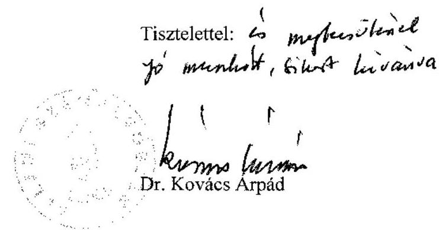

---

# Iktatószám: 1-a-1/11-2006. 

Dr. Kovács Árpád úrnak, elnök

Állami Számvevőszék

## Budapest

## Tisztelt Elnök Úr!

Köszönettel vettem az Állami Számvevőszék „középiskolai kollégiumok fenntartásának és fejlesztésének ellenőrzéséről" szóló jelentéstervezetét.

A tervezet előremutató, hasznos megállapításaival segíti a középiskolai kollégiumok működésének gazdaságosabbá tételét, a tevékenység színvonalának emelését, mely mindannyiunk közös érdeke. A jelentéstervezet mindezzel hozzájárul a középiskolai kollégiumok jövőjéről szóló párbeszédhez, és a Belügyminisztérium közoktatással kapcsolatos munkájához is.

Engedje meg Elnök Úr, hogy a jelentéstervezetben az oktatási miniszter számára megfogalmazott javaslatokkal összefüggésben az alábbiakban néhány észrevételt tegyek.

A nem kollégista, hátrányos helyzetű középiskolások felkészülésének segítéséhez a középiskolai kollégiumok is jelentősen hozzájárulhatnak. Ezért támogatom a jelentéstervezet azon elképzelését, hogy a nem kollégista, hátrányos helyzetű tanulók a kollégiumok tevékenységére tanulási centrumokként támaszkodhassanak.

A jelentéstervezet rámutat, hogy kollégiumfejlesztési, rekonstrukciós célokra szánt központi források, pályázatok hiányában a fenntartóknak saját forrásból kellett gondoskodniuk a fejlesztésekről. Egyetértek a tervezet azon következtetésével, hogy a helyi önkormányzatok saját forrásaikból nem szorgalmazták e fejlesztések, rekonstrukciós munkálatok megvalósítását, tekintettel arra, hogy sok esetben a kollégiumoknak nem tulajdonosai, hanem csak fenntartói voltak.

Ezért különösen fontosnak tartom, hogy a II. NFT keretében a szükséges források biztosításával lehetővé váljon a kollégiumi rendszer tárgyi feltételeinek javítása. Emellett szükséges lenne a fenntartók ösztönzése az együttműködésre, felújítások, fejlesztések elvégzésére. A fenti célok megvalósításában a legfontosabb szerep véleményem szerint

---

fenntartóként a területi önkormányzatokra hárul, így megfelelő ösztönző rendszerrel szükséges őket érdekeltté tenni a kollégiumokkal kapcsolatos tervek és fejlesztések megvalósításában.

Bízva további eredményes együttműködésünkben munkájukhoz a továbbiakban is sok sikert kívánok.

Budapest, 2006. május 31.
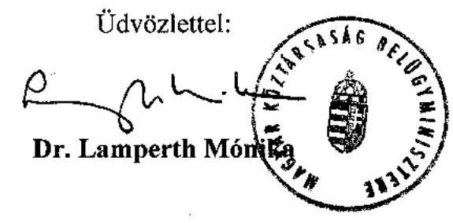

---

H-1051 BUDAPEST V., JÓZSEF NÁDOR TÉR 2-4. POSTACÍM: 1369 BUDAPEST, POSTAFIÓK 481.

TELEFON: (36-1) 327-2159, (36-1) 327-2141
FAX: (36-1) 318-0738

E-MAIL: janos.veres@pm.gov.hu

PÉNZÜGYMINISZTÉRIUM

Dr. Kovács Árpád úr
elnök
Állami Számvevőszék

Budapest

Tisztelt Elnök Úr!

Köszönettel vettem a középiskolai kollégiumok fenntartásának és fejlesztésének ellenőrzéséről készült jelentéstervezetét.

Amellett, hogy elsődlegesen szakmai szempontú ellenőrzést végeztek munkatársai, pénzügyi, költségvetési szempontból is igen hasznos, és a következőkben számunkra is irányt mutató megállapítások szerepelnek az anyagban.

Az oktatási miniszternek tett 5. sz. javaslathoz kapcsolódva jelzem, hogy a szakfeladatrend korszerűsítése szerteágazó előkészítő munkát igényel, mivel az egyes önkormányzati tevékenységek besorolása nem ragadható ki az államháztartás egészére vonatkozó – már az uniós statisztikai besorolási követelményeknek is megfeleltetendő - szabályozásból. Ezt a munkát - amely egyébként már megkezdődött a PM-ben - természetesen a szaktárcák bevonásával kell, illetve lehet jól elvégezni.

Ismételten megköszönve munkatársai munkáját, kérem tájékoztatásom szíves elfogadását.

Budapest, 2006. május 24.

Üdvözlettel:

Dr. Veres János

WWW.PENZUGYMINISZTERIUM.HU
