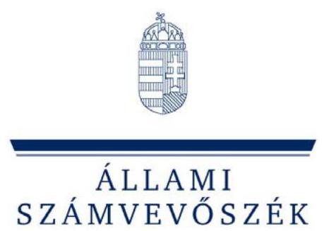

# JELENTÉS 

a felsőoktatási állami intézmények ingatlangazdálkodásának ellenőrzéséről

---

# 2. Államháztartás Központi Szintjét Ellenőrző Igazgatóság 

2.1 Teljesítmény Ellenőrzési Főcsoport

Iktatószám: V-15-83/2005-2006.
Témaszám: 781
Vizsgálat-azonosító szám: V0231

## Az ellenőrzést felügyelte:

Bihary Zsigmond
főigazgató
Az ellenőrzés végrehajtásáért felelős:
Kemény Emil
főcsoportfőnök
Az ellenőrzést vezette:
Bittó Zoltán
számvevő igazgatóhelyettes
Az ellenőrzést végezték:

| Deák Tamásné számvevő tanácsos, főtanácsadó | Varga Szabolcs számvevő tanácsos, tanácsadó | Dr. Novák Zsuzsanna Csilla számvevő tanácsos |
| :--: | :--: | :--: |
| Eötvös Magdolna számvevő | Horváthné Herbáth Mária számvevő | Samu István számvevő |
| Dankó Géza számvevő tanácsos, főtanácsadó | Dr. Ernst László számvevő tanácsos, főtanácsadó | Dr. Klapcsik László számvevő tanácsos, főtanácsadó |
| Dr. Marosi Gyöngyi számvevő tanácsos, tanácsadó | Nyikon Zsigmondné számvevő tanácsos | Lingné Rajz Borbála számvevő |
| Dr. Fónagy Diána számvevő |  |  |

---

# TARTALOMJEGYZÉK 

BEVEZETÉS ..... 5
I. ÖSSZEGZŐ MEGÁLLAPÍTÁSOK, KÖVETKEZTETÉSEK, JAVASLATOK ..... 8
II. RÉSZLETES MEGÁLLAPÍTÁSOK ..... 16

1. A felsőoktatási ingatlangazdálkodás állami irányítása, szabályozási környezete ..... 16
1.1. Az állami szabályozás, a fejezeti gazdálkodási felügyelet-, beszámoltatás- és ellenőrzés rendszere ..... 16
1.2. Az intézményi ingatlangazdálkodási célok, tervek és stratégia ..... 21
1.3. Az intézményi szervezeti feltételek és személyi erőforrások biztosítása az ingatlangazdálkodáshoz ..... 23
2. Az oktatási és kutatási feladatok ellátását szolgáló ingatlanállomány fejlesztése, fenntartása, az intézmények terület- és helyiség ellátottsága ..... 24
2.1. Az intézmények ingatlanberuházásainak hasznosulása ..... 25
2.2. Az ingatlan fenntartáshoz, felújításhoz, karbantartáshoz biztosított források felhasználásának hasznosulása ..... 28
2.3. Az intézmények oktatási-kutatási feladatainak ellátásához szükséges terület-, helyiség- és férőhely-ellátottság ..... 31
2.4. Ingatlanok bérbevételének szükségessége, célszerűsége, gyakorlati megvalósítása ..... 35
3. Az ingatlanok kihasználtsága, hasznosítása ..... 37
3.1. Az ingatlanok kihasználtságának hozzájárulása az oktatáshoz és az intézményi működéshez ..... 37
3.2. A használaton kívüli, feleslegessé vált ingatlanállomány hasznosítása ..... 41

---

# MELLÉKLETEK 

1. sz. melléklet: Észrevételek
2. sz. melléklet: A felsőoktatási állami intézmények ingatlangazdálkodásának folyamatábrája
3. sz. melléklet: Az ellenőrzött felsőoktatási intézmények felsorolása
4. sz. melléklet: Összesítő táblázatok a felsőoktatási intézmények ingatlangazdálkodási adatairól (tanúsítványi adatszolgáltatás és az intézményi költségvetési beszámolók alapján)
5. sz. melléklet: Diagramok
6. sz. melléklet: Összesített kérdőív a felsőoktatási állami intézmények ingatlangazdálkodásának ellenőrzéséről
7. sz. melléklet: Kérdések, kritériumok és adatforrások a felsőoktatási állami intézmények ingatlangazdálkodásának ellenőrzéséhez
8. sz. melléklet: Fényképek az ellenőrzött intézményekről

## FÜGGELÉK

Függelék: A Vitéz János Római Katolikus Tanítóképző Főiskola működésének és gazdálkodásának ellenőrzése

---

# RÖVIDÍTÉSEK JEGYZÉKE 

| Áht. | 1992. évi XXXVIII. törvény az államháztartásról |
| :--: | :--: |
| Ámr. | 217/1998. (XII. 20.) Korm. rendelet az államháztartás működési rendjéről |
| ÁSZ | Állami Számvevőszék |
| BGF | Budapesti Gazdasági Főiskola |
| BGF-KKFK | BGF Külkereskedelmi Főiskolai Kar |
| BGF-KVIFK | BGF Kereskedelmi, Vendéglátóipari és Idegenforgalmi Főiskolai Kar |
| BGF-PSZFK | BGF Pénzügyi és Számviteli Főiskolai Kar |
| BMF | Budapesti Műszaki Főiskola |
| BMF-KKGFK | BMF Keleti Károly Gazdasági Főiskolai Kar |
| DE | Debreceni Egyetem |
| DE-KTK | DE Közgazdaságtudományi Kar |
| ELTE | Eötvös Loránd Tudományegyetem |
| ELTE-ÁJK | ELTE Állam- és Jogtudományi Kar |
| ELTE-BTK | ELTE Bölcsészettudományi Kar |
| ELTE-GYFK | ELTE Bárczi Gusztáv Gyógypedagógiai Főiskolai Kar |
| ELTE-IK | ELTE Informatikai Kar |
| ELTE-PPK | ELTE Pedagógiai és Pszichológiai Kar |
| ELTE-TÁTK | ELTE Társadalomtudományi Kar |
| ELTE-TÓFK | ELTE Tanító- és Óvóképző Főiskolai Kar |
| ELTE-TTK | ELTE Természettudományi Kar |
| ET | Egyetemi Tanács |
| ETR | Egységes Tanulmányi Rendszer |
| FELIR | Felsőoktatási Ingatlan Információs Rendszer |
| FFP | Felsőoktatási Fejlesztési Program |
| FT | Főiskolai Tanács |
| Ftv. | 1993. évi LXXX. törvény és a 2005. évi CXXXIX. törvény a felsőoktatásról |
| GMF | Gazdasági és Műszaki Főigazgatóság |
| GSZ | Gazdálkodási Szabályzat |
| HM | Honvédelmi Minisztérium |
| HM IKH | HM Ingatlankezelési Hivatal |
| IFT | Intézményfejlesztési Terv |
| Kincstár | Magyar Államkincstár |
| KVI | Kincstári Vagyoni Igazgatóság |
| ME | Miskolci Egyetem |
| MH | Magyar Honvédség |
| NYF | Nyíregyházi Főiskola |
| NYF-HIK | NYF Hallgatói Információs Központ |
| NYF-MMFK | NYF Műszaki és Mezőgazdasági Főiskolai Kar |
| OM; minisztérium | Oktatási Minisztérium |

---

| PPP | Public Private Partnership |
| :--: | :--: |
| PR | Public Relation |
| PTE | Pécsi Tudományegyetem |
| PTE-ÁJK | PTE Állam- és Jogtudományi Kar |
| PTE-BTK | PTE Bölcsészettudományi Kar |
| PTE-FEEK | PTE Felnőttképzési és Emberi Erőforrás Fejlesztési Kar |
| PTE-KTK | PTE Közgazdaságtudományi Kar |
| PTE-PMMFK | PTE Pollack Mihály Műszaki Főiskolai Kar |
| PTE-TTK | PTE Természettudományi Kar |
| SE | Semmelweis Egyetem |
| SE-ÁOK | SE Általános Orvostudományi Kar |
| SE-EFK | SE Egészségügyi Főiskolai Kar |
| SE-FOK | SE Fogorvostudományi Kar |
| SE-GYTK | SE Gyógyszerésztudományi Kar |
| SE-TF | SE Testnevelés és Sporttudományi Kar |
| SOTE | Semmelweis Orvostudományi Egyetem |
| SZTE | Szegedi Tudományegyetem |
| SZTE-ÁJK | SZTE Állam- és Jogtudományi Kar |
| SZTE-ÁOK | SZTE Általános Orvostudományi Kar |
| SZTE-BTK | SZTE Bölcsészettudományi Kar |
| SZTE-EFK | SZTE Egészségügyi Főiskolai Kar |
| SZTE-GTK | SZTE Gazdaságtudományi Kar |
| SZTE-TIK | SZTE Tanulmányi Információs Központ |
| SZTE-ZFK | SZTE Zeneművészeti Főiskolai Kar |
| SZIE | Szent István Egyetem |
| SZIE-MKK | SZIE Mezőgazdasági és Környezettudományi Kar |
| SZIE-YMMFK | SZIE Ybl Miklós Műszaki Főiskolai Kar |
| TÁH | Területi Államháztartási Hivatal |
| ZMNE | Zrínyi Miklós Nemzetvédelmi Egyetem |

---

# JELENTÉS   a felsőoktatási állami intézmények ingatlangazdálkodásának ellenőrzéséről 

## BEVEZETÉS

A felsőoktatás a tudásalapú társadalom kiemelt ágazata, meghatározó szerepe van a gazdaság versenyképességének alakulásában. A felsőoktatási - állami és nem állami - intézmények alapvetően hozzájárulnak a tudomány műveléséhez, a technológiai-technikai előrehaladáshoz, a nemzeti, valamint az általános kultúra megismeréséhez, az ismeretek elsajátításához, gazdagításához.

Az Állami Számvevőszék a korábbi években - stratégiájának megfelelően - ellenőrizte a felsőoktatási intézményhálózat integrációját, normatív finanszírozási rendszer működését, a központi költségvetésből kutatás-fejlesztési célokra fordított pénzeszközök hasznosítását és feladatfinanszírozási rendszer működését. Ellenőrzési üzeneteink az Európai Felsőoktatási Térséghez igazodó korszerű és hatékony felsőoktatási rendszer kialakítását célozzák.

A felsőoktatás alapfeladatainak (oktatás-képzés, kutatás) ellátása igényli az infrastrukturális feltételek, az ingatlangazdálkodással összefüggő feladatok vagyonkezelés, működtetés, hasznosítás - színvonalas biztosítását. A felsőoktatási állami intézmények feladatainak ellátásához szükséges ingatlanok a kincstári vagyoni körbe ${ }^{1}$ tartoznak.

A felsőoktatási intézmények ingatlangazdálkodással kapcsolatos feladatait az államháztartásról szóló 1992. évi XXXVIII. törvény (Áht.), a felsőoktatásról szóló 1993. évi LXXX. törvény (Ftv.) vonatkozó rendelkezései, a kincstári vagyon kezeléséről, értékesítéséről szóló 183/1996. (XII. 11.) Korm. rendelet és a kincstári vagyon értékesítésére vonatkozó versenyeztetési szabályzat jóváhagyásáról szóló 1048/1997. (V. 13.) Korm. határozat, valamint 2005. április 19-től a kincstári vagyonnal való gazdálkodásról szóló 58/2005. (IV. 4.) Korm. rendelet tartalmazzák. Az intézmények számára a gazdálkodás területén a korábbinál nagyobb mozgásteret biztosít a felsőoktatásról szóló - 2006. március 1-jétől hatályos - 2005. évi CXXXIX. törvény (társulási lehetőség, gazdasági tanács működése).

[^0]
[^0]:    1 A kincstári vagyon fogalmát az Áht. 1995. évi módosításakor iktatták jogszabályba: „Kincstári vagyon az állami feladat ellátását szolgáló vagyon, amely a társadalom működését, a nemzetgazdaság céljai megvalósítását segíti elő."

---

Az intézmények vagyonkezelői joga 1996. január 1-jével keletkezett az Áht. alapján, miután az állam nevében tulajdonosi jogokat gyakorló Kincstári Vagyoni Igazgatóság (KVI) az ingatlan vagyont vagyonkezelésükbe adta. A vagyonkezelés célja az állami feladatellátás feltételeinek hatékony biztosítása, a vagyon állagának, értékének megőrzése, védelme, továbbá értékének növelése. A vagyonkezelő a kincstári vagyonnal rendeltetésszerűen, az általában elvárható gondossággal köteles gazdálkodni.

A felsőoktatási állami intézmények kezelésében lévő ingatlan vagyon nyilvántartás szerinti nettó értéke az integráció - a felsőoktatási intézményhálózat Universitas-rendszerű átalakítása - évében, 2000. december 31-én 103,2 Mrd Ft, 2005. december 31-én - alapvetően a lágymányosi beruházások és a Felsőoktatási Fejlesztési Program eredményeként - 216,9 Mrd Ft volt. A vagyonkezelési jogok szabályszerű gyakorlásának érvényesülését a kincstári vagyonért felelős miniszter a KVI útján ellenőrzi. A felsőoktatási állami intézmények általános gazdálkodási felügyeletét az illetékes minisztériumok látják el.

Az ellenőrzés célja annak értékelése volt, hogy

- megfelelőek-e a feltételek és a szabályozási környezet az ingatlangazdálkodás folytatására az állami felsőoktatási intézményekben;
- a rendelkezésre álló központi költségvetési pénzeszközök és a saját bevételekből ingatlangazdálkodásra fordított összegek biztosították-e a felsőoktatási ingatlanok fejlesztését, fenntartását, a meglévő ingatlan vagyon lehetővé tette-e a felsőoktatási intézmények oktatás-képzési és kutatási feladatainak megfelelő színvonalú ellátását;
- a felsőoktatási ingatlanok kihasználtsága és hasznosítása megfelelő volt-e az integrációt követően.

Az ellenőrzés a 2002-2005 közötti időszakra irányult és alapvetően a közvetlen és közvetett oktatási-kutatási célú, az ahhoz kapcsolódó működtetési célú ingatlanokkal való ellátottságot, valamint ezek hasznosításának értékelését foglalta magában.

A helyszíni ellenőrzés az intézmények felügyeletét ellátó Oktatási Minisztérium (OM) és Honvédelmi Minisztérium (HM) mellett, a 2000. január 1-jével létrejött 17 integrált felsőoktatási intézmény közül - a 2002-ben az integrációs ellenőrzésünk ${ }^{2}$ során már vizsgált - 11 intézményre terjedt ki ingatlanértékük nagysága alapján. (A felsőoktatási állami intézmények ingatlangazdálkodásának folyamatábráját a 2. sz. melléklet, az ellenőrzött intézmények felsorolását a 3. sz. melléklet tartalmazza.) Az ellenőrzésbe vont intézmények ingatlan vagyonának könyvszerinti értéke az állami felsőoktatást szolgáló teljes ingatlanállomány nettó értékének 77%-a.

[^0]
[^0]:    ${ }^{2}$ A 2002. évi számvevőszéki vizsgálat megállapította, hogy a vagyonelemek egyesítését az intézmények formálisan hajtották végre, az integráció nem biztosított hatékonyabb gazdálkodást.

---

Az ellenőrzés a teljesítmény-ellenőrzés módszerével történt. Az ellenőrzés szempontjainak megalapozását képező kérdéseket, kritériumokat és adatforrásokat a 7. sz. melléklet rögzíti. A helyszíni ellenőrzés összegző megállapításainak kialakításához hozzájárult az állami felsőoktatás vezető beosztású képviselőiből álló fókuszcsoport.

Az ellenőrzés keretében elvégeztük - a Magyar Katolikus Püspöki Konferencia vezetőinek az ÁSZ elnökéhez intézett és befogadott kérésére - a Vitéz János Katolikus Tanítóképző Főiskola pénzügyi-gazdasági ellenőrzését, amelynek megállapításairól a Függelék tájékoztat.

Az ellenőrzés végrehajtására az Állami Számvevőszékről szóló 1989. évi XXXVIII. törvény 2. § (3), (5), valamint 17. § (3) bekezdéseiben foglaltak adnak jogszabályi alapot.

A jelentés-tervezetet megküldtük egyeztetésre az oktatási miniszternek, a honvédelmi miniszternek, valamint az Esztergom-Budapesti Főegyházmegye érsekének, akik nem tettek észrevételt. (Levelük másolatát az 1. sz. melléklet tartalmazza.)

---

# I. ÖSSZEGZŐ MEGÁLLAPÍTÁSOK, KÖVETKEZTETÉSEK, JAVASLATOK 

A felsőoktatás feltételeinek biztosításában meghatározó szerepe van az ingatlanállománynak. A felsőoktatási intézmények kezelésében levő ingatlan vagyon nyilvántartás szerinti értéke a kincstári ingatlan vagyon 10%-át teszi ki. Ennek megfelelően az új Ftv. a közpénzekhez hasonló súllyal követeli meg a közvagyonnal való hatékony gazdálkodást ${ }^{3}$.

A felsőoktatási állami intézmények ingatlanállományának könyv szerinti nettó érték adatai
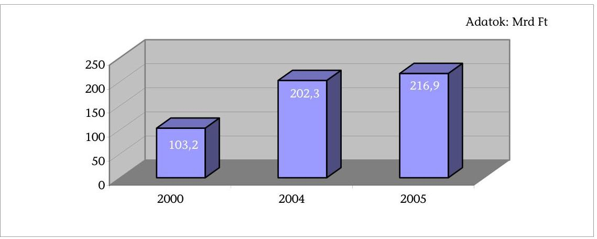

Az állam szabályozási feltételeket és pénzeszközöket biztosít a felsőoktatási ingatlangazdálkodáshoz, de annak megvalósítása az intézmények feladata. Ennek ellenére a felsőoktatási intézmények nem kezelték súlyának megfelelő gazdálkodási területként az ingatlangazdálkodást.

Az állami irányítás

 és szabályozás alapvetően, de nem teljes körűen biztosította az állami felsőoktatási intézmények ingatlangazdálkodásának feltételeit. Az értékcsökkenés visszapótlása a költségvetési, így a felsőoktatási intézményeknél nem megoldott. ${ }^{4}$ Az állam által biztosított képzési és fenntartási normatíva fenntartási része nem függ a kezelésbe adott vagyon összetételétől, műszaki állapotától, így nem voltak azonosak a feltételek a vagyon értékének, állagának megóvásában.

[^0]
[^0]:    ${ }^{3}$ Erről a 2006. március 1-jétől hatályos Ftv. 19. §-a rendelkezik.
    ${ }^{4}$ „A költségvetési szerveknél régóta megoldatlan probléma az elszámolt amortizáció összegének tényleges visszapótlása, mivel jellegüknél fogva nem végeznek olyan termelő vagy szolgáltató tevékenységet, amelynek során az árképzésnél figyelembe vehetnék az amortizációt, mint kalkulációs tételt. A tárgyi eszközök szinten tartása, illetve bővítése a saját és egyéb források szűkössége miatt csak a felügyeleti szerv támogatásával oldható meg." Megállapította a múzeumi rekonstrukcióra előirányzott pénzeszközök hasznosításának ellenőrzéséről szóló 0401. sorszámú ÁSZ jelentés (2004. február).

---

Az eltérő elhasználódási szintű ingatlanokkal rendelkező intézmények számára mindez azt eredményezte, hogy jelentős különbségek alakultak ki az egyes intézmények ingatlanvagyonának állapotában. Ennek mérsékléséhez az intézményi saját bevételek csak részlegesen járultak hozzá. Az intézmények felújítási kiadásai 12,6 Mrd Ft-ot tettek ki 2002-2005. évek között, melynek 43%-át központi költségvetési, 57%-át saját forrásból fedezték ${ }^{5}$. A rendelkezésre álló források nem a felmerült szükségletekhez igazodtak. Az OM központi felújítási keretei évente csökkentek. A jogszabály által felújításra felhasználható saját bevételek mértéke évenként változott, az intézményenként képződött források jelentősen eltértek egymástól, nem fedezték a felújítási szükségletet.

A beruházási pénzeszközök biztosításának stratégiai alapját a 2000-2005 közötti Felsőoktatási Fejlesztési Program ${ }^{6}$ képezte. Ez a program az intézményi autonómiát kifejező intézményfejlesztési terveken alapult, s az integrációs fejlesztések forrása ${ }^{7}$ volt és nem a hiányzó szabályozási feltételek biztosításának megoldására irányult. Alapvetően az intézmények oktatási célú korszerűsödését szolgálta. Az FFP előirányzatából juttatott források nem igazodtak a jóváhagyott intézményfejlesztési tervekhez. A fejlesztések megvalósítása és a képzésben résztvevő hallgatói létszám növekedése között nem állt fenn egyértelmű összefüggés ${ }^{8}$. A beruházások növelték a nagy alapterületű előadótermek számát (66 db), javították az oktatási-kutatási feltételeket, de az állami támogatás nem biztosította a tervezett oktatási célú fejlesztések megvalósítását. Az ellenőrzött időszak fejlesztései során összesen 6436 új hallgatói férőhely létesült. A beruházási döntéseknél a férőhely ellátottság és kihasználtság alakulását nem teljes körűen vették figyelembe. A megalapozott döntéseket gátolta az, hogy a rendelkezésre álló teljes ingatlanállományról, annak valós értékéről, kihasználtságáról, a fejlesztések hasznosulásáról sem az intézmények, sem a felügyeleti szervek nem rendelkeznek teljes körű információkkal ${ }^{9}$.

[^0]
[^0]:    ${ }^{5}$ A minimális mértékű vagy saját bevétellel nem rendelkező költségvetési szervezetek számára a felújítási források biztosítása súlyos problémát jelentett.
    ${ }^{6}$ A programot és annak 2000-2001. évi megvalósítását „A felsőoktatási intézményhálózat integrációjának ellenőrzéséről" szóló 0311. sorszámú ÁSZ jelentés tárgyalta (2003. március).
    ${ }^{7}$ A fenti jelentés megállapította, hogy az intézményi fejlesztésekre a tervezettnél alacsonyabb összeg állt rendelkezésre egyenlőtlen intézményi megosztásban és késedelmesen.
    ${ }^{8}$ A 0311. sorszámú ÁSZ jelentés rögzítette, hogy a képzési kínálat ellentmondásos alakulásában, bővítésében - a társadalmi igényekhez való igazodás mellett - a hallgatóként folytatott verseny meghatározó szerepet játszott.
    ${ }^{9}$ Az OM 2005. évben vezetői, stratégiai döntéseket támogató - intézményi adatszolgáltatáson és központi információ igényeken alapuló - adattár-projekt kialakítását indította el 2006. december 31-i előkészítéssel, és 2007. június 30-i beüzemeléssel.

---

Az ellenőrzött felsőoktatási intézmények beruházási kiadásai és annak összetétele 2002-2005 között ${ }^{10}$
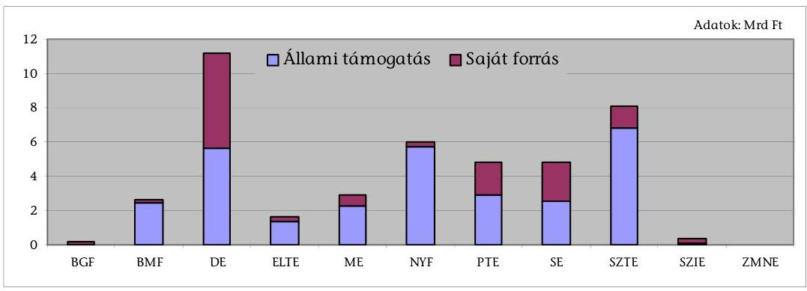

A beszámoltatás és az ellenőrzés szempontrendszere nem segítette elő megfelelően az ingatlangazdálkodás eredményességének és hatékonyságának javítását. Az éves beszámolók nem biztosították az ingatlangazdálkodásra fordított pénzeszközök felhasználása hatékonyságának megítélését.

Egységes intézményi ingatlangazdálkodás nem érvényesült az intézményekben. Az ingatlangazdálkodás minden részterületét (fejlesztést, állagmegóvást és hasznosítást) magába foglaló, eredményességi, gazdaságossági kritériumokat is tartalmazó ingatlangazdálkodási stratégiát nem dolgoztak ki az intézmények. Az alapfeladatok ellátásához szükséges fejlesztéseket az intézményfejlesztési tervben, valamint az arra épülő beruházási tervben fogalmazták meg, ezt tekintve ingatlangazdálkodási stratégiának. (Ennek megvalósításához járult hozzá a Felsőoktatási Fejlesztési Program.) Az elkészített beruházási terveket az intézmények a terület- és férőhely-ellátottságra, valamint a kihasználtságra vonatkozó számításokkal is alátámasztották. A mutatók folyamatos figyelemmel kísérése, aktualizálása azonban elmaradt ${ }^{11}$.

A HM felügyelete alá tartozó nemzetvédelmi egyetem a speciális szabályozás miatt vagyonkezelést, önálló gazdálkodást nem folytat - a feladatot a HM IKH látja el -, csak az ingatlanok hasznosítását végzi.

Az ellenőrzött intézmények kezelésében lévő ingatlanok műszaki állapota, elhasználódási szintje eltérő, átlagosan 16,9%. Az ingatlanállomány egy része elöregedett, melyet a könyv szerinti értékadatok nem tükröznek. A beszámolási időszakban az elhasználódási szint összességében nem javult. Az időközben megvalósított beruházások aktiválása az elszámolt értékcsökkenést nem ellensúlyozta.

[^0]
[^0]:    ${ }^{10}$ A beruházási kiadások összege és forrás szerinti összetétele az intézményi költségvetési beszámolók pénzforgalmi adataiból származik.
    ${ }^{11}$ Az ÁSZ-ellenőrzéshez szükséges - terület- és férőhely-ellátottságra, valamint az ingatlanok kihasználtságára vonatkozó - adatok intézményi összegyűjtése átlagosan 2 hónapot vett igénybe.

---

Az ellenőrzött felsőoktatási intézmények ingatlanjainak 2005. évi elhasználódási szintje
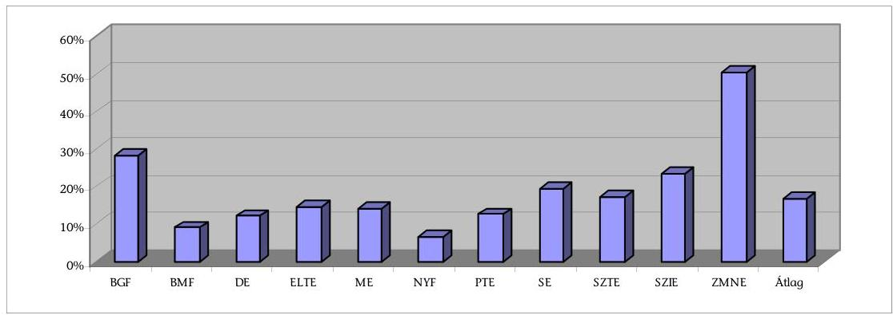

A beruházások szerkezeti összetétele következtében az oktatási terület részaránya csökkent. A működtetési célú terület ${ }^{12}$ 47,3%-os aránya 48,5%-ra nőtt, ugyanis a beruházásoknál a közvetlen oktatási ellátási szempontok mellett a hallgatók egyéni munkájának biztosítása, valamint a campusok - a területileg összefüggő oktatási és gyakorlati épületegyüttesek - kialakítása, mint stratégiai cél került előtérbe. Az oktatási módszertan változása, a kreditrendszer bevezetése szükségessé tette az önálló ismeretszerzést, felkészülést elősegítő informatikai központok, könyvtárak létesítését. Az aulák, közösségi terek kialakítása pedig hozzájárult a hallgatói igények jobb kiszolgálásához. Az intézményi telephelyek változatlan száma mellett öt intézménynél új campusok, a karok közös teremhasználatát biztosító központi oktatási centrumok jöttek létre.

Az ellenőrzött felsőoktatási intézmények épületei nettó alapterületének ${ }^{13}$ megoszlása
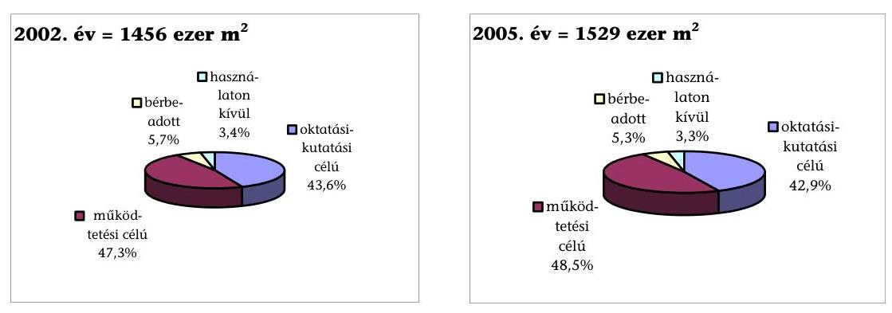

Az ingatlanállomány könyv szerinti értéke nem a valós, piaci értéket jeleníti meg. Az ingatlanértékesítések esetében a forgalmi értékbecslés átlagosan az ingatlanok könyv szerinti értékének tizennégyszeresét tette ki. A kincstári vagyon jogszabályi előírásokon alapuló, egységes elvek szerinti értékelésének hiánya

[^0]
[^0]:    ${ }^{12}$ A funkcionális és szolgáltató egységek használatában levő terület.
    ${ }^{13}$ A felsőoktatási intézmények alapterületére vonatkozó és az ahhoz kapcsolódó ellátottsági és kihasználtsági adatok az összehasonlíthatóság és egységes kezelés érdekében nem tartalmazzák a klinikák - kivétel a klinikai oktatási előadótermek -, tangazdaságok, gyakorló iskolák adatait, valamint az ellenőrzött időszak alatt SZIE-ből kivált karok adatait.

---

miatt, az ingatlanállomány tényleges értékéről nincsenek megbízható adatok ${ }^{14}$.

A forgalmi értékbecslés és a könyv szerinti nettó érték aránya az ingatlan értékesítéseknél
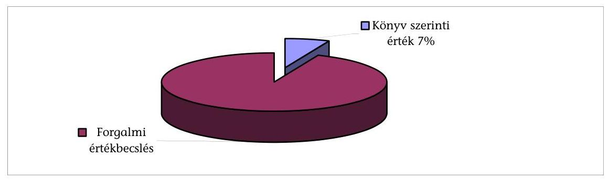

A vagyonkezelésben levő terület-, és hallgatói férőhely-ellátottság az oktatási-kutatási feladatokhoz az ellenőrzött intézmények több mint felénél mennyiségileg biztosított volt. A hallgatói férőhely-ellátottság intézményi szinten 2002. évhez képest 4%-kal növekedett. 2005-ben 10 férőhelyre átlagosan 9 hallgató jutott intézményenként és karonként eltérő mértékben. A hallgató/férőhely arány alakulásakor az ellenőrzött 11 intézmény közül 5, az ellenőrzésbe vont 75 karból 36 kar nem rendelkezett a hallgatói létszámot elérő férőhellyel.

A vizsgált időszakban az átszámított hallgatói létszám ${ }^{15}$ az ellenőrzésbe vont intézményeknél átlagosan 17,6%-kal növekedett. A létszámbővülést az oktatási-kutatási célú alapterület növekedése intézményenként nem, vagy alig követte. Ezáltal az egy hallgatóra jutó közvetlen oktatási terület 8,8%-kal csökkent.

Az egy hallgatóra jutó oktatási terület nagysága intézményenként, azon belül karonként jelentős szóródást mutatott (2,63-35,9 m²). Ez összefüggésben van a különböző tudományterületek eltérő oktatási feltételrendszerével, de az azonos képzési célú intézmények ellátottságának eltéréseit is tükrözi.

Az intézményeknek feladatvégzésükhöz - megfelelő saját terület hiányában bérelt ingatlanokra is szükségük volt. A bérlemények nagy részét (84-86%-át) oktatási feladataik ellátásához vették igénybe. A 2002-2005 között megvalósult fejlesztések a tartósan bérelt oktatási terület 13,4%-os csökkenését eredményezték.

[^0]
[^0]:    ${ }^{14}$ „A vagyonkezelők mintegy 80%-át kitevő központi költségvetési szervek körében, több évtizede nem történt meg a számviteli jogszabályok értelmében a kincstári vagyon egységes elvek szerinti - jogszabályi előírásokon alapuló - értékelése." Megállapította a kincstári vagyon kezelésének és működésének ellenőrzéséről szóló 0515. sorszámú ÁSZ jelentés (2005. április).
    ${ }^{15}$ Nappali tagozatos hallgatóra átszámított éves átlaglétszám.

---

A sportcélú ingatlanokkal való ellátottság - egy intézmény kivételével - megfelelő volt. A kollégiumi férőhelyek hiánya és a hallgatói létszám növekedése miatt 2002-ben az ellátásra jogosultak 40%-a, 2005-ben pedig csak 36%-a részére tudtak kollégiumi ellátást biztosítani ${ }^{16}$. A kollégiumi férőhelyek kihasználtsága 95%-os volt. A férőhelyek növelése érdekében - a vonatkozó kormányhatározatok alapján - diákotthon fejlesztési program indult az OM koordinálásában a 2005-2010 közötti Magyar Universitas Program keretében. ${ }^{17}$

Az ingatlanok kihasználtsága javult az integráció induló állapotához képest. ${ }^{18}$ Az intézmények területi férőhely-kihasználtsága megfelelő, 94,4%-os volt 2005-ben. Az intézmények közül 9-nél nőtt a kihasználtság, 2-nél nem. A karoknál 75-ből 19-nél romlott az időbeli kihasználtság.

Az ingatlan vagyon megfelelő hasznosítását, az integráció előnyeinek kihasználását gátolta a telephelyi és szervezeti tagoltság. A vizsgált felsőoktatási intézmények átlagosan 32 telephellyel és gyakran több különböző telephelyen működő karral rendelkeztek ${ }^{19}$. Az oktatási-kutatási célú helyiségek elosztása alapvetően a kari szervezeti egységek hatáskörében volt, és csak az intézmények egynegyedében volt központosított teremelosztás.

A vizsgált felsőoktatási intézmények tantervi időalaphoz viszonyított férőhely kihasználtsága
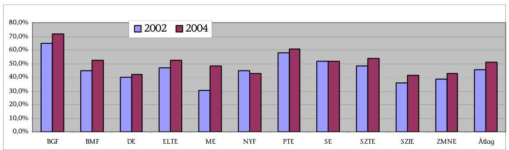

[^0]
[^0]:    ${ }^{16}$ A felsőoktatási intézményhálózat integrációjáról szóló 0311. sorszámú ÁSZ jelentés is megállapította (2003. március), hogy: „A kollégiumi ellátottság romlott, 1999. évben a jogosultak 50%-a, 2001. évben csak 47%-a jutott kollégiumi elhelyezéshez."
    ${ }^{17}$ A PPP-konstrukcióban megvalósuló felsőoktatási kollégiumi beruházási programot, annak koncepcionális megalapozottságát az ÁSZ 2006. második félévében induló ellenőrzése vizsgálja.
    ${ }^{18}$ A felsőoktatási intézményhálózat integrációjáról szóló 0311. sorszámú ÁSZ jelentés is megállapította (2003. március), hogy: „Az előadótermek, tantermek kihasználtsága a hallgatói létszám dinamikus növekedése miatt javult, amely egyúttal az egy hallgatóra jutó oktatási terület csökkentését is maga után vonta."
    ${ }^{19}$ „Az integrálódott intézmények működtetése során egy-egy korábbi intézmény feladatai, költségvetése, alkalmazotti és hallgatói létszáma, szervezeti egységeinek és telephelyeinek száma, a működés infrastruktúrája többszörösére nőtt." Megállapította a felsőoktatási intézményhálózat integrációjáról szóló 0311. sorszámú ÁSZ jelentés (2003. március).

---

A férőhelyek időbeli kihasználtsága a tantervi időalaphoz viszonyítva ${ }^{20}$ 45,6%-ról 50,7%-ra növekedett. A mutató - amely a férőhely időbeli kihasználását és a telítettséget együttesen fejezi ki - intézményenként és karonként eltérő volt. A legmagasabb férőhely-kihasználtságot a bölcsészettudományi

 karok, a legalacsonyabb értéket a természettudományi és művészeti karok mutatták. A kihasználtság alakulását a hallgatói létszám, az ingatlanok adottságai, a képzési szerkezet, az adott tudományterület speciális igényei és az időbeosztás egyaránt befolyásolta. Az intézmények egy részének magas férőhely-kihasználtsága a nem megfelelő ellátottsággal volt összefüggésben.

A kihasználtság - közös teremhasználattal ${ }^{21}$, az órarendek összehangolásával történő - növelését gátolta a területi tagoltság, a decentralizált teremgazdálkodás ${ }^{22}$. A használaton kívüli terület aránya a teljes alapterület 3%-a volt. A használaton kívüli ingatlanállományt részben az alapfeladatok ellátására alkalmatlan épületek, részben az értékesítési eljárás alatt álló ingatlanok alkották. Az alapfeladatok ellátására alkalmatlan ingatlanállományt források hiányában nem tudták használhatóvá tenni.

Az ellenőrzött időszakban az intézmények összesen 1,1 Mrd Ft értékű feleslegessé vált ingatlanállományt értékesítettek ${ }^{23}$. Az értékesítés bevételét az intézmények - a jogszabályi előírásoknak megfelelően - beruházásra, felújításra fordították. A használaton kívüli ingatlanértékesítést több intézménynél hátráltatta az engedélyezési folyamat időigénye, az ingatlanok nem megfelelő állaga, valamint az ingatlanpiaci kereslet csökkenése.

A döntően decentralizált teremgazdálkodás következtében az intézmények nem készítettek intézményi szintű felmérést a bérbe adható ingatlanrészekről. A bérbeadás szerződési feltételeit - intézményen belül - nem egységes szempontok szerint és nem a gazdaságossági törekvések kellő figyelembevételével alakították ki.
${ }^{20}$ Tantervi időalap: az intézmény által meghatározott szorgalmi időszak napjai x 10 tanóra + vizsgaidőszak x 6 tanóra/nap.
${ }^{21}$ A felsőoktatási intézményhálózat integrációjáról szóló 0311 . sorszámú ÁSZ jelentés megállapította (2003. március), hogy: „Az oktatás alapvető feltételeinél, az előadók és tantermek közös hasznosítása sem volt jellemző (kivéve BMF), de bizonyos első kezdeményezések már jelentkeztek (DE, ZMNE, NYF).
${ }^{22}$ „Az eszközök formális egyesítése az intézményi működtetés területén jelentős változásokat, megtakarításokat nem eredményezett. Ennek okait alapvetően a szervezeti egységek tagolt területi elhelyezkedése, szervezeti elkülönülése és a karok közötti megfelelő együttműködés hiánya képezi." Megállapította a felsőoktatási intézményhálózat integrációjáról szóló 0311. sorszámú ÁSZ jelentés (2003. március).
${ }^{23}$ A felsőoktatási intézményhálózat integrációjáról szóló 0311. sorszámú ÁSZ jelentés még azt állapította meg (2003. március), hogy: „Az integrációt követően a tartósan ki nem használt tárgyi eszközöket - értékesítésből származó bevétel elérése és a további elhelyezési lehetőségek biztosítása céljából - több egyetemen felmérték (ELTE, ME, PTE, SE, ZMNE), de értékesítések nem történtek."

---

Az ingatlan vagyonnal kapcsolatos feladatok ellátását az intézmények centralizált, decentralizált és ezek kombinációjával kialakított szervezeti formákban végezték, belső gazdálkodási rendjük szerint. Az ellenőrzés tapasztalatai alapján a centralizált ingatlangazdálkodás hatékonyabb, eredményesebb feladatellátást (jobb helyiségkihasználtságot, szélesebb körű hasznosítást) tett lehetővé. Az ingatlangazdálkodással foglalkozók létszáma biztosította a feladatok ellátását. A dolgozók létszám összetétele, ingatlangazdálkodási szakértelme azonban az intézmények egyharmadánál nem volt összhangban a feladatokkal.

A felsőoktatási intézmények hatékonyságának javítása érdekében az ellenőrzés üzeneteként az intézményvezetőknek javasoltuk az ingatlangazdálkodás stratégiai területként való kezelését, az intézményi szintű, egységes ingatlangazdálkodás megvalósítását, a campus szintű teremgazdálkodás kialakítását, az ingatlanok időbeli és területi kihasználtságának folyamatos értékelését, ingatlangazdálkodási szakértelemmel rendelkező alkalmazottak foglalkoztatását.

A helyszíni ellenőrzés megállapításainak hasznosítása mellett javasoljuk:

# az oktatási miniszternek 

1. Támogassa központi felhalmozási pénzeszközök biztosításával a képzési szerkezet alakulásához igazodóan a 2006. december 31-ig elkészülő, új intézményfejlesztési tervekben szereplő korszerű campusok kialakítását, amelyek az oktatási tagoltság további csökkentését eredményezik; az állami támogatások döntés-előkészítése során vegye figyelembe az ingatlanok ellátottsági és kihasználtsági mutatóit.
2. Ajánlja a felsőoktatási intézményeknek az intézményfejlesztési tervek készítésére vonatkozó 2006. évi módszertani útmutatásában - a terv részeként, összhangban az Ftv. előírásaival - intézményi ingatlangazdálkodási stratégia kialakítását.
3. Kezdeményezze a központi költségvetés tervezése során megalapozott felújítási forrás-szükséglet számításokkal a felsőoktatás ingatlanállományának állagmegőrzése érdekében megfelelő mértékű felújítási forrás biztosítását.
4. Gyorsítsa fel az intézményi adatokat tartalmazó vezetői információs rendszer kialakítását és 2007. június 30-ig tervezett beüzemelését; ezt követően gondoskodjon az adattartalom folyamatos korszerűsítéséről.
5. Kísérje figyelemmel az intézményeknél az ingatlangazdálkodásra tett számvevőszéki javaslatok megvalósulását.

---

# II. RÉSZLETES MEGÁLLAPÍTÁSOK 

## 1. A FELSŐOKTATÁSI INGATLANGAZDÁLKODÁS ÁLLAMI IRÁNYÍTÁSA, SZABÁLYOZÁSI KÖRNYEZETE

### 1.1. Az állami szabályozás, a fejezeti gazdálkodási felügyelet-, beszámoltatás- és ellenőrzés rendszere

Az ingatlangazdálkodás állami irányítási rendszerét jogszabályokban határozták meg. A szabályozási háttér - a külső és intézményi belső szabályozás alapvetően biztosította az állami felsőoktatási intézmények ingatlangazdálkodásához, a vagyon állagának, értékének megőrzéséhez, növeléséhez és védelméhez szükséges feltételeket, de egyúttal folyamatosan változó és összetett volt.

A kincstári vagyonról szóló jogszabályok meghatározták az ingatlangazdálkodással kapcsolatos intézményi feladatokat, de a vagyon teljesítményelvű kezelését elősegítő feltételek hiányoznak ${ }^{24}$.

Az OM felügyelete alá tartozó felsőoktatási intézményeknél a kincstári vagyon fogalmát, az intézmények jogállását, pénzügyi rendszerét, a tulajdonosi joggyakorlás tartalmát, valamint a kincstári vagyon kezelését, értékesítését, a beszámoltatás és ellenőrzés rendszerét, valamint a vagyonnal kapcsolatos egyéb kötelezettségeket törvények, kormányrendeletek, kormányhatározat ${ }^{25}$ szabályozzák.

Az OM a felügyeleti tevékenysége során ingatlangazdálkodásra vonatkozó általános iránymutatást nem adott.

A HM felügyelete alá tartozó ZMNE-nél - az említett jogszabályok mellett - a honvédelmi szervek működésének az államháztartás működési rendjétől eltérő szabályait, a fejezet központi és intézményi gazdálkodásának rendjét, a feleslegessé vált ingatlanok hasznosítására vonatkozó előírásokat kormányrendelet és HM utasítások ${ }^{26}$ határozzák meg.

[^0]
[^0]:    ${ }^{24}$ „Az érvényben lévő szabályozás általános, nem határozza meg az állami feladatellátás és a vagyongazdálkodás rövid, közép- vagy hosszú távú céljait. Koncepció hiányában a vagyonkezelés ellátásának, megvalósítási formáinak és módozatainak gazdaságossága, célszerűsége, hatékonysága és eredményessége csak korlátozott értelemben vizsgálható." Megállapította a kincstári vagyon kezelésének és működésének ellenőrzéséről szóló 0515 . sorszámú ÁSZ-jelentés (2005. április).
    ${ }^{25}$ 1992. évi XXXVIII. törvény (Áht.), 1993. évi LXXX. törvény (Ftv.), 217/1998. (XII. 20.) Korm. rendelet, 183/1996. (XII. 11.) Korm. rendelet, 58/2005. (IV. 4.) Korm. rendelet, 1048/1997. (V. 13.) Korm. határozat.
    ${ }^{26}$ 226/2004. (VII. 27.) Korm. rendelet, 9/1998. (HK 4) HM utasítás, 35/2004. (HK 9), 42/1998. (HK 13), 61/1999. (HK 21), 89/2003. (HK 24) HM utasítások.

---

A HM vagyonkezelésében lévő ingatlanok esetében a honvédelmi miniszter, mint fenntartó gyakorolja a jogszabályokban meghatározott vagyonkezelői jogokat. A ZMNE rendelkezésére bocsátott ingatlanoknál az egyetemet csak használati jog illeti meg, mivel a vagyonkezelői jogot az ingatlanok tekintetében a HM IKH gyakorolja.

A kincstári vagyongazdálkodásra vonatkozó jogszabályi rendelkezésekben meghatározottak érdekében, a honvédelmi tárca megalkotta és kiadta azokat a belső utasításokat és intézkedéseket, amelyek biztosítják a honvédségi kincstári vagyonnal való gazdálkodás szabályozását. Ezek a belső utasítások és intézkedések érvényesek a ZMNE-re is.

A jogszabályi előírások nem voltak teljes körűek. Az ingatlangazdálkodáshoz kapcsolódó hatáskörök és felelősség meghatározása nem volt összhangban egymással.

Az Áht. szerint a kincstári vagyon működéséért a költségvetési szerv vezetője felelős, az Ftv. szabályozása szerint a gazdasági kérdésekben hozott határozatok testületi döntések.

A vásárlással kincstári vagyonkörbe kerülő ingatlanok KVI felé történő bejelentési kötelezettségét jogszabály nem tartalmazta. Ennek szabályozását az 58/2005. (IV. 4.) Korm. rendelet pótolta.

Az értékcsökkenés visszapótlása nem biztosított. A központi felújítási keret felosztásának elveit nem határozták meg. A felsőoktatási tevékenység üzemeltetési, működési feltételeinek biztosítását szolgáló, kormányrendeletekben ${ }^{27}$ meghatározott képzési és fenntartási normatíva fenntartási támogatásként biztosított része nem a kezelésbe adott vagyon összetételétől, műszaki állapotától, hanem a hallgatói és alkalmazotti létszámtól függ. Az eltérő elhasználódási szintű ingatlanokkal rendelkező intézmények számára a normatíva nem biztosít azonos feltételeket a vagyon értékének, állagának megóvásához.

A jogi szabályozás csak korlátozottan tette lehetővé az ingatlan vagyon felújítását. A 2004. évtől kezdődően az intézmények az adott költségvetési törvényben meghatározott bevételeik 5%-át - ami korábban a központi költségvetés központosított bevételét képezte - felújításra használhatták fel. 2005-től az arány 15%-ra emelkedett, ezzel párhuzamosan az OM a központi felújítási keretet megszüntette. 2006-ban a felújításra fordítható összeg arányát ismét 5%-ra csökkentették.

A felsőoktatásról szóló - 2005. november hónapban elfogadott, 2006. március 1-jétől hatályos - 2005. évi CXXXIX. törvény (Ftv.) 120-123. §-ai az intézményi gazdálkodás több területén közvetlenül vagy közvetve a korábbinál kedvezőbb lehetőséget biztosítanak az ingatlangazdálkodás javítására. Az új Ftv. azonos súllyal kezeli a közpénzekkel és a közvagyonnal való gazdálkodást.

[^0]
[^0]:    ${ }^{27}$ 120/2000. (VII. 7.) Korm. rendelet, 67/2003. (V. 15.) Korm. rendelet, 80/2004. (IV. 19.) Korm. rendelet, 8/2005. (I. 19.) Korm. rendelet.

---

A törvény megteremti a jogi feltételeket az új irányítási szervezetek (szenátus, gazdasági tanács) kialakítására. A gazdálkodás területén - ezen belül az ingatlangazdálkodást érintően is - több jogosítványt biztosít a költségvetési szervezetek működésére vonatkozó eddigi előírásokhoz képest (pl. pénzmaradványok megtartása, előirányzatok átcsoportosíthatósága, meghatározott feltételekhez kötött hitelfelvétel biztosítása).

Az új felsőoktatási törvény lehetőséget teremt az intézmények kezelésében lévő, feleslegessé váló kincstári vagyon értékesítésére, amelyek a Public Private Partnership (PPP) program törlesztő részleteire is fordíthatóak. Ez a szabályozás kedvező feltételeket teremt az intézmények ingatlan vagyonának bővítésére és mobilizálására, de egyben hosszabbtávú pénzügyi elkötelezettséget is a felsőoktatási intézmények számára.

Az új Ftv. tartalmazza a katonai felsőoktatási intézményre vonatkozó eltérő szabályozást, amely szerint a vagyonkezelői jogok gyakorlására, a gazdálkodásra eltérő rendelkezéseket állapíthat meg.

Az állami felsőoktatási intézmények feladatellátásának és az ehhez biztosított feltételeknek a jogszabályi háttere többször változott az ellenőrzött időszakban. A szabályozási változások csak részben segítették a feladatok elvégzését, ugyanakkor a többszintű jogi szabályozás (törvények, kormányrendeletek, kormányhatározat) hátráltatta a hatékonyabb feladatellátást.

Az intézmények kellő körültekintéssel határozták meg, de a vagyon nagysága ellenére nem kezelték komplex módon (beruházás, felújítás, karbantartás, üzemeltetés, hasznosítás) a kincstári vagyonnal való gazdálkodást és annak szabályozását. A vagyonnal való gazdálkodás belső szabályozását az intézmények az adottságaik figyelembevételével, eltérően határozták meg.

A felsőoktatási intézmények kezelésében lévő vagyontárgyakkal kapcsolatos jogok gyakorlása a rektorok feladat- és hatáskörébe tartozott.

A DE-nél a karok és centrumok (orvosi és egészségtudományi, agrártudományi centrum) esetében a rektor a vagyonhasználatot az elnökökre átruházta.

A ME SZMSZ-e a vállalkozási igazgató feladataként jelölte meg a beruházások, felújítások, beruházást helyettesítő szolgáltatások igénybevételére vonatkozó projektek szervezését, a megvalósításban való szakmai közreműködést. A Gazdálkodási Szabályzatban (GSZ) és a Gazdasági Műszaki Főigazgatóság (GMF) SZMSZében, valamint eseti utasításokban történt szabályozás (pl. PTE).

A ZMNE esetében a vagyonkezelői jogot a HM Ingatlankezelési Hivatal (IKH) látja el. A vagyonkezelési szerződés végrehajtását HM utasítások szabályozzák ${ }^{28}$.

A jogszabályok és a belső szabályozások a vizsgált időszakban alapvetően összhangban voltak. Több intézménynél azonban a jogszabályi változások miatt a GSZ aktualizálásra szorul (ELTE, SE, SZIE, BGF, BMF).

[^0]
[^0]:    ${ }^{28}$ 42/1998. (HK 13), 61/1999. (HK 21), 89/2003. (HK 24) HM utasítások.

---

Az OM a PPP konstrukció tárcaszintű kidolgozásával és alkalmazásával, valamint pénzeszközök biztosításával segítette az intézmények ingatlangazdálkodását, bár az e célra biztosított források csökkenő mértékűek voltak.

Az OM a felsőoktatást érintő iránymutatásként a sok karral és telephellyel rendelkező intézményeknél a campusok létrehozását szorgalmazta és segítette elő, a rendelkezésre álló források függvényében.

Az ingatlangazdálkodás
 területei (beruházás, felújítás, működtetés, hasznosítás) közül az OM szakmai szervezetei a beruházással, felújítással és ingatlanhasznosítással összefüggő felügyeleti és ellenőrzési feladatokat látták el.

A tárcánál miniszteri biztos irányította a fejlesztési célkitűzéseket szolgáló központi beruházások, intézményi felújítások műszaki-gazdasági feladatait. Ennek keretében a beruházások és felújítások műszaki-gazdasági előkészítésének és megvalósításának koordinálását, irányítását és ellenőrzését végezte. Jóváhagyta a Felsőoktatási Fejlesztési Program (FFP) keretében működtetett pályázati eljárás műszaki-gazdasági szempontrendszerét, felügyelte a kormányzati célok teljesülését.

A Beruházási Főosztály előkészítette, szervezte a felsőoktatási intézmények éves, közép- és hosszú távú beruházásokkal és felújításokkal kapcsolatos feladatait, ezekre javaslatot tett. Döntés előkészítést végzett az ezzel kapcsolatos előirányzatok lebontásáról, módosításáról. A beruházásoknál ellátta azok költségvetési tervezését, a pénzügyi lebonyolítás felügyeletét, ellenőrzését és az államigazgatási kapcsolattartással járó feladatokat. A felújítási forrásokból pályázatokat írt ki az intézmények részére és ellenőrizte azok felhasználását. Szakmailag véleményezte és segítette az intézményi közbeszerzési eljárásokat. Az OM az ingatlanhasznosítások körében koordinációs feladatokat látott el. Közreműködött abban, hogy értékes ingatlanok a tárca által felügyelt intézményi körben maradjanak.

Az integrált intézmények és a KVI között létrejött vagyonkezelési szerződések, bár tartalmazták a felek jogait és kötelezettségeit, formálisak voltak, nem járultak hozzá az eredményesebb ingatlangazdálkodáshoz. Az ingatlanokkal való gazdálkodást hátráltatta, hogy az intézmények és a KVI közötti vagyonkezelési szerződéskötések, -módosítások elhúzódtak.

A 2000. január 1-jei vagyoni állapotot tükröző vagyonkezelési szerződéseket - jellemzően a KVI miatt - az esetek többségében késedelmesen kötötték meg. (DE: 2004., PTE: 2001., SE: 2002., BGF: 2001., BMF: 2001.) Az SZTE, SZIE, valamint a NYF és a KVI között a vizsgálat befejezésének idejéig nem volt érvényes vagyonkezelői szerződés. Az SE-nél a vagyonkezelési szerződést a KVI nem módosította.

A KVI és a felsőoktatási intézmények együttműködése egyoldalú, alapvetően a jogszabályban (Ámr. 63/A. §) előírt adatszolgáltatásra (vagyongazdálkodási program elkészítésére és a beszámolásra) korlátozódott.

A DE-nél a 2002-2004 között megvalósult változásokat a vagyonkataszterben nem mutatták ki. A PTE-nél a 2004. évi vagyongazdálkodási beszámolót és a 2005. évi vagyongazdálkodási tervet a jogszabályban meghatározott határidőre nem készítették el.

---

Az intézmények a vizsgált időszak alatt rendelkeztek ingatlan vagyon nyilvántartással.

Előfordult, hogy az ingatlanok analitikus nyilvántartásaiban nem szerepeltek a KVI által a vagyonkezelési szerződésben megjelölt (beépítetlen) területek (BMF).

A FELIR, az OM felsőoktatási ingatlan információs rendszere - a felsőoktatási intézmények által használt ingatlanok, épületek, helyiségek országosan, egységes elvek szerint összeállított nyilvántartása - az intézmények adatainak összesítésére nem alkalmas fejezeti szinten, az intézmények integrációjának 1999. december 31-i állapotát tükrözi. Ez a nyilvántartási program az integrációt követő változások aktualizálásához programfejlesztést igényelt, amelyhez azonban pénzügyi fedezet nem állt rendelkezésre. A KVI nyilvántartása a FELIR-nél kevesebb információt nyújt, és a rendszerek nem kapcsolhatók össze.

Intézményi szintű nyilvántartásként a FELIR-t több intézmény használja. A minisztérium a felsőoktatási intézmények ingatlanállományának nyilvántartására több kísérletet tett, azonban a szoftverfejlesztés forrásszükséglete egyik évben sem állt rendelkezésre. A tárca 2005. évben vezetői stratégiai döntéseket támogató, intézményi adatszolgáltatáson és központi információ igényeken alapuló adatbázis kialakítását kezdte meg.

A beszámoltatás és az ellenőrzés rendszere nem segítette elő megfelelően az ingatlangazdálkodási tevékenységet. A vezetői, illetve a munkafolyamatokba épített ellenőrzés különböző mértékben járult hozzá az ingatlangazdálkodási tevékenység javításához.

Az éves beszámolók az üzemeltetési kiadások kivételével nem tették lehetővé az intézményi ingatlangazdálkodásra fordított pénzeszközök felhasználása hatékonyságának megítélését.

A felhasználás értékeléséhez szükséges kritériumok (pl. közbeszerzések hatása az intézményre, a fejlesztések hatása az oktatási-kutatási tevékenységre) nem kerültek kidolgozásra, összehasonlítást lehetővé tevő mutatókat nem alkalmaztak.

Az intézmények egységes módon, a KVI által összeállított Excel táblázatban készítettek beszámolót a kincstári vagyonnal való gazdálkodásról.

Az ellenőrzést a felújítási és karbantartási tervek készítése, a végrehajtás figyelemmel kísérése, a közbeszerzési eljárás alkalmazása, a kötelezettségvállalás rendjének szabályozása, azok betartása, az ingatlanállomány műszaki állagának tervszerű karbantartása segítette.

# Az ingatlangazdálkodással összefüggő, átfogó ellenőrzést az OM és a HM IKH részéről a vizsgált időszakban nem végeztek. Az OM intézményi átfogó ellenőrzései az ingatlangazdálkodás részterületeire irányultak. 

Az OM Ellenőrzési Főosztály az intézményeknél végzett átfogó ellenőrzések során vizsgálta a szabad kapacitások hasznosítását, az azzal összefüggő szerződéseket, a vagyonkezelési szerződéseket, az ingatlanfelújításokat és beruházásokat. A BGF-nél 2003-ban végzett vizsgálatnál a megállapított hiányosságok kiküszöbölését a Főosztály nem ellenőrizte.

---

Az ingatlangazdálkodási tevékenységet - a kérdőívek összesítése alapján - a függetlenített belső ellenőrzés az intézmények 20%-ánál (2004-ben 30%-ánál) vizsgálta. Az ellenőrzés során a vizsgálatok 12%-ánál találtak szabálytalanságokat.

Az SZIE ingatlangazdálkodását 2004-2005-ben 2 vizsgálat érintette. 2004-ben a tárgyieszköz-gazdálkodás, a bérleti szerződések, 2005-ben a gyakorlati oktatást szolgáló helyiségek fenntartásának, működtetésének ellenőrzését végezték. A megállapítások hasznosítására érdemi intézkedés nem történt.

# 1.2. Az intézményi ingatlangazdálkodási célok, tervek és stratégia 

Az intézmények ingatlangazdálkodási feladataikat különböző tervekben - intézményfejlesztési, beruházási, éves költségvetési tervek - fogalmazták meg. Ezek céljai alapvetően összhangban voltak egymással, de a korlátozott finanszírozási lehetőségek miatt eltérések adódtak.

Az intézmények az ingatlangazdálkodás minden területére (beruházás, felújítás, állagmegóvás, hasznosítás) kiterjedő, tulajdonosi szemléletet tükröző, eredményességi és hatékonysági kritériumokat is tartalmazó középtávú vagyongazdálkodási stratégiát nem dolgoztak ki, mert nem volt ilyen kötelezettségük.

Kivételt képezett a SZTE-en 2004. évben készített, a teljes ingatlan vagyont felölelő ingatlangazdálkodási koncepció, amelyet az ET tárgyalt meg.

Az intézmények a vagyongazdálkodási stratégiát az integrációhoz kapcsolódóan készített Intézményfejlesztési Tervben, valamint az arra épülő Beruházási Tervben fogalmazták meg. Az intézmények az oktatási-kutatási feladatokhoz illeszkedő ingatlangazdálkodási célokat, prioritásokat a Beruházási Tervben határozták meg. A tervek elsősorban a szükséges fejlesztésekre koncentrálódtak.

Az ÁSZ kérdőíves felmérése szerint az alapfeladatok ellátásához igazodó ingatlangazdálkodási célokat, prioritásokat az ellenőrzött intézmények 75-88%-a a stratégiájában, azaz IFT-jében meghatározta (6. sz. melléklet).

Az IFT-k az alapfeladatok ellátásához kapcsolódó célkitűzéseket rögzítették, amelyhez felmérték az alapfeladatok ellátásához szükséges ingatlanok, helyiségek kapacitását. A tervezett fejlesztéseket részletes létszám- és területszámítások támasztották alá.

A kérdőíves összegezés szerint az alapfeladatok ellátásához szükséges ingatlanok, helyiségek kapacitását az ellenőrzött intézmények 90%-a mérte fel.

Az előadó- és tanterem, valamint a könyvtári olvasóterem, tornaterem építések, rekonstrukciók indokoltságát a meglévő ingatlan vagyon műszaki állapota, annak földrajzi elkülönülése, az oktatási teremkihasználtság mutatója támasztotta alá. Az IFT-k és beruházási tervek kihasználtságot jellemző mutatói elsősorban az előadótermek túlzsúfoltságát mutatták.

---

Az IFT részeként elkészített vagyongazdálkodási stratégiát - a kari egyeztetett javaslatok alapján - az ET-k, illetve FT-k hagyták jóvá.

Az intézmények az ellenőrzött időszakban a KVI által megadott szempontok szerint készítettek éves vagyongazdálkodási tervet. Az ingatlangazdálkodással kapcsolatos előirányzatokat az éves költségvetések tartalmazták.

A KVI számára készített évenkénti vagyongazdálkodási terv az üzemeltetési kiadásokat nem rögzítette, mivel a KVI - az Ámr. 63/A. § előírása szerint - a beruházás, felújítás, karbantartás, hasznosítás és portfolió adatok bemutatását kérte az üzemeltetési kiadások nélkül.

Az intézmények az Ámr. 63/A. §-ának megfelelően, a vizsgált években elkészített éves vagyongazdálkodási tervekben vagyonelemenként mutatták ki a beruházási, a felújítási kiadások, valamint az ingatlanhasznosításból származó bevételek tervezett és tényleges összegeit.

Az alapfeladatok ellátásához szükséges ingatlanok felújítási és karbantartási munkáit, azok várható kiadásait az intézmények az éves költségvetésben tervezték meg. A ZMNE-nél az ellenőrzési időszak alatt nem készült éves vagyongazdálkodási terv. Egyedi sajátosság, hogy az államháztartás működési rendjéről szóló 217/1998. (XII. 30.) Korm. rendelet 63/A. §-ában foglaltak szerint a HM 2001. január 1-jét követően évente készít vagyongazdálkodási tervet. Ehhez kapcsolódóan a HM IKH a Kincstári Vagyoni Igazgatóság által megadott szempontok alapján készíti el a vagyongazdálkodási tervet, amely részletesen tartalmazza a HM vagyonkezelésbe tartozó ingatlanok értékesítésből, bérbeadásból, vagyonkezelői jog értékesítéséből, vagyonkezelői jogról való lemondás tervezett bevételeit, valamint a beruházás, felújítás, karbantartás tervezett ráfordításait. A honvédelmi szervek által használt épületek, építmények beruházási, felújítási és karbantartási feladatait a rendelkezésre álló előirányzat alapján a HM IKH tervezi meg és intézkedik azok végrehajtására.

Az éves tervekben megfogalmazott ingatlangazdálkodási célok és tervek kapcsolódtak az IFT-k célkitűzéseihez.

A kérdőívek tanúsága szerint az ingatlangazdálkodási célok és tervek az IFT-vel a vizsgált intézmények 80-90%-ánál összhangban voltak.

Előfordult, hogy az éves tervek és az IFT nem voltak szinkronban, mivel a kitűzött célokat a források hiánya miatt csak részben sikerült végrehajtani (ELTE, ZMNE).

Az éves ingatlangazdálkodási célokat - a ZMNE kivételével - az éves költségvetés részeként tárgyalták meg. Az ET, illetve FT döntött az adott évi intézményi hatáskörű beruházási, felújítási és karbantartási előirányzatokról.

Az ingatlangazdálkodási célkitűzéseket az ellenőrzött időszakban csökkenő arányban (89-78%) tárgyalták meg a kari tanácsok. A felmérés szerint a módosító javaslatok figyelembevétele alacsony, de az évek során növekvő részarányú (33-44%) volt.

Az intézmények önálló dokumentumként nem készítettek hasznosítási tervet a szükségleten felüli, nem használt ingatlanokra, részükre azt jogszabály nem írta elő.

---

Az SZTE-nél ingatlanhasznosítási koncepció készült, amelyet a kari tanácsok megtárgyaltak. Az ingatlanhasznosítási koncepcióban felmérték az alapfeladatok ellátásához szükséges ingatlanok, helyiségek kapacitását.

Néhány intézménynél az új Ftv. által nyújtott lehetőségek figyelembevételével alakították ki fejlesztési elképzeléseiket.

A DE a mesterképzéssel és a doktorképzéssel összefüggő fejlesztési terveit fogalmazta meg.

A PTE gazdasági vezetése gazdasági társaságban való részvételt tervez a kutatás egyetemen kívüli szervezetben (Kooperációs Kutató Központ) való ellátására, illetve gazdasági társaság alapítását a háttér tevékenységekkel összefüggő feladatok (élelmezés, mosás) végrehajtására.

# 1.3. Az intézményi szervezeti feltételek és személyi erőforrások biztosítása az ingatlangazdálkodáshoz 

Az ingatlangazdálkodással összefüggő feladatok ellátására az intézmények -gazdálkodás-irányítási rendjüknek megfelelően- centralizált, decentralizált, illetve ezek kombinációja szerinti szervezeteket hoztak létre. A helyszíni tapasztalatok alapján a központosított feladatellátás minősült eredményesebbnek.

A vagyongazdálkodási, illetve ingatlangazdálkodási feladatok ellátásával foglalkozó önálló szervezeti egységeket 2002-2004. években az intézmények jelentős részénél (60-70%) kialakították.

A ME-n GMF keretében három osztály - beruházási, üzemeltetési, vagyonhasznosítási - központosítottan végezte az ingatlangazdálkodással összefüggő feladatokat. A szervezeti felépítés megfelelőnek bizonyult.

A DE-nél a Vagyongazdálkodási Osztály tevékenysége az ingatlan nyilvántartásra, az értékesítésben, beszerzésben való közreműködésre, a KVI jelentések elkészítésére terjedt ki. A feladatellátás szabályszerűségét biztosították, azonban a vagyongazdálkodás hatékony, eredményes megvalósulását tevékenységük nem befolyásolta.

A NYF-n a Beruházási és Üzemeltetési Osztály létrehozásával kialakított szervezet alkalmas az ingatlangazdálkodás átfogó feladatainak ellátására.

A részben centralizált, részben decentralizált szervezetekkel a tevékenység ellátása különböző hatékonysággal, de biztosított volt (ELTE, SE, SZIE).

Azoknál az intézményeknél, ahol vagyongazdálkodással foglalkozó, elkülönült szervezeti egységet nem alakítottak ki, a decentralizált döntések miatt a megfelelő ingatlan-kihasználás és hasznosítás nem volt elérhető (PTE, BGF).

A feladatellátás decentralizáltan működött a BGF-nél, amely összességében megfelelő volt, azonban a területi megosztottság következtében a hatékonyság az integrációt megelőző állapotnak felelt meg.

A PTE-n a GMF feladatellátása nem biztosította az optimális ingatlangazdálkodást, a karok autonómiája nem tette lehetővé a szűkös források koncentrált felhasználását (központi teremgazdálkodás, ingatlanhasznosítás hiánya).

---

A Magyar Honvédség (MH) szervezeteinek fejlesztési, ingatlangazdálkodási, felújítási feladatait (tervezés, döntés, végrehajtás) a HM IKH végezte. A Hivatal tevékenységét, szabályozottságát, létszámellátottságát, szakmai összetételét a teljes honvédségi ingatlan vagyon kezelésére alakították ki. Ennek megfelelően a ZMNE elkülönített ingatlangazdálkodást nem végzett.

Az ingatlangazdálkodással foglalkozók létszáma és szakmai összetétele az intézmények kétharmadánál
 biztosította a feladatok megfelelő ellátását (DE, ME, PTE, SZTE, NYF), azonban előfordult, hogy a feladatok nagyságrendjével nem volt mindig teljesen összhangban (ELTE, SE).

A műszaki, üzemeltetési szakemberek rendelkezésre állásával egyidejűleg kevés az ingatlangazdálkodási felkészültséggel rendelkező munkatárs.

Az ingatlangazdálkodást végző szervezeti egységek létszáma, összetétele, szakképzettsége - a kérdőíves felmérés szerint - a vizsgált intézmények kétharmadánál (67%) biztosított volt, amely 2004. évre 78%-ra javult. A rendelkezésre álló személyi feltételek az optimális ingatlangazdálkodást az intézmények 71-85%-ánál lehetővé tették.

# 2. AZ OKTATÁSI ÉS KUTATÁSI FELADATOK ELLÁTÁSÁT SZOLGÁLÓ INGATLANÁLLOMÁNY FEJLESZTÉSE, FENNTARTÁSA, AZ INTÉZMÉNYEK TERÜLET- ÉS HELYISÉG ELLÁTOTTSÁGA 

A kincstári ingatlan vagyon 10,4%-a volt a felsőoktatási intézmények kezelésében, ami 202,3 Mrd Ft-ot tett ki a 2004. évben ${ }^{29}$. Az ellenőrzött intézmények ingatlanállományának könyv szerinti értéke a 2002. évi 128,9 Mrd Ft-ról 2004-ben 156,0 Mrd Ft-ra, 2005-ben 170,9 Mrd Ft-ra emelkedett. Ez a könyv szerinti érték nem a valós értéket jeleníti meg (1. sz. táblázat, 1. sz. diagram). A vizsgált ingatlanértékesítések esetében a forgalmi értékbecslés átlagosan az ingatlanok könyv szerinti értékének tizennégyszeresét tette ki. A kincstári vagyon egységes elvek szerinti jogszabályi előírásokon alapuló értékelésének hiánya miatt, az ingatlanállomány valós értékéről nincsenek megbízható adatok.

Az ELTE kezelésében lévő Rákóczi út 5. sz. alatti ingatlan nettó értéke 46,0 M Ft, becsült forgalmi értéke 2002-ben 1794,6 M Ft + áfa volt. Az Ajtósi Dürer sor 2931. és a Csörsz u. 53/a. esetében ez a két érték 381,5 M Ft és 3280 M Ft + áfa, illetve 21,4 M Ft és 280 M Ft + áfa volt.

Az SE könyveiben szereplő Eötvös u. 10-14., Mátyás király út 17., Lehet út 35. szám alatti ingatlanok nettó, illetve forgalmi értéke 149,1 M Ft és 2757,1 M Ft + áfa, 18,2 M Ft és 871,7 M Ft + áfa, valamint 40,9 M Ft és 433,2 M Ft + áfa volt.

Az ellenőrzött intézmények kezelésében levő ingatlanok elhasználódási szintje, műszaki állapota jelentősen eltérő. Az új beruházások eredményeként megvalósult épületek a legkorszerűbb oktatási-kutatási feltételeket biztosítják (pl. a

[^0]
[^0]:    ${ }^{29}$ Az állam által vagyonkezelésbe adott ingatlan vagyon nettó értéke 2004-ben 1937 Mrd Ft volt.

---

DE, az ELTE, az SZTE, a PTE, a BMF új épületei), de ugyanezen intézmények azonban felújításra szoruló, elöregedett ingatlanokkal is rendelkeznek. Az ingatlanok egy része műemlék épület. A régi épületek műszaki állapota, építészeti kialakítása nehezítette a feladatok ellátását.

Az ingatlanállomány fejlesztése és felújítása - a szűkös keretek ellenére - szükséges, de nem elégséges feltételeket biztosított az intézményi oktatási és kutatási feladatok ellátásához. Az állagmegóvást a szükséges mértékben nem tette lehetővé. (A felsőoktatási intézmények fejlesztéséhez és felújításához kapcsolódó fényképeket a 8. sz. melléklet mutatja.) Az ingatlanállomány fejlesztésére és felújítására a 2002-2005 közötti időszakban összesen 55,1 Mrd Ft-ot költöttek az intézmények.

# 2.1. Az intézmények ingatlanberuházásainak hasznosulása 

A felsőoktatás nem jutott olyan mértékben és ütemben beruházási forrásokhoz, amint azt kormányzati szinten az integráció első éveiben tervezték ${ }^{30}$. A fejlesztési programokban tervezett központi források a Világbanki kölcsön egyezmény felmondásával elmaradtak, az FFP előirányzatából juttatott források nem igazodtak a jóváhagyott IFT-khez. A végrehajtott fejlesztések és a képzésben résztvevő hallgatói létszám növekedése között nem állt fenn egyértelmű összefüggés.

## Az ellenőrzött intézmények ingatlanberuházásaira az IFT-kben tervezetthez képest összességében alacsonyabb összeg állt rendelkezésre, egyenlőtlen intézményi megoszlásban és késedelmesen. A forráshiányhoz hozzájárult az is, hogy az intézmények saját bevételei nem realizálódtak a várt ütemben.

Mindezek miatt - az egyes intézményeknél eltérő módon és mértékben - a beruházások nem az IFT-ben foglaltak szerint teljesültek, illetve nem álltak összhangban a tervekkel. Az intézmények egy részénél a beruházásokat elhalasztották, vagy csak részben valósították meg.

Elmaradtak a BGF-n tervezett új beruházások. Az ELTE-n a 10 épületből álló Trefort-kerti campus felújítását nem fejezték be. Az SE-n a Vas utcai rekonstrukció III. ütemét későbbre halasztották.

A beruházások pénzügyi és műszaki összetétele az intézmények másik részénél módosult, és azokat nem a tervezett időben és ráfordítással valósították meg. A rekonstrukcióknál jelentkező túllépések előre nem látható műszaki problémákra, illetve nem reális költségtervezésre vezethetők vissza.

A ME-n az IFT-ben eredetileg tervezett 670 M Ft-tal szemben az előirányzatok és műszaki tervek módosítása nyomán 1,8 Mrd Ft-ot költöttek az összesen 1320 új férőhelyet biztosító nagy előadók beruházásaira.

[^0]
[^0]:    ${ }^{30}$ A megállapítást a 0311. számú, a felsőoktatási intézményhálózat integrációjának ellenőrzéséről szóló ÁSZ jelentés tartalmazta.

---

Az SE a Vas utcai ingatlan rekonstrukciója első két ütemére az eredeti 2,5 Mrd Ft támogatás helyett, összesen 2,7 Mrd Ft központi költségvetési támogatást kapott. A beruházás II. üteme a tervektől eltérő időpontban és összeggel készült el.

A DE-n az integrációhoz kapcsolódó Intézményi Beruházási Program megvalósítása jelentősen elhúzódott. A teljes terv mintegy 2/3-át jelentő Élettudományi Épület és Könyvtár átadására 2004. helyett 2005. júniusban került sor.

# A SZIE beruházás nem állt összhangban az IFT-ben szereplő célkitűzésekkel, annak előkészítése nem volt megfelelő. 

A SZIE-nél elvégzett rekonstrukciót nem készítették elő megfelelően, az a középtávú IFT-ben nem szerepelt. A beruházást lebonyolító cég megbízási díját, a szerződés többszöri tartalmi módosításával a 2001. évi 3,6 M Ft-ról, 2003-ban 9,5 M Ft-ra emelték. A tervező négy hónapos késedelemmel teljesítette a vállalt feladatot, ami többletköltséget okozott. A kivitelezői szerződést többször módosították, a kivitelezést az eredeti 229,9 M Ft helyett négy hónap késéssel, 298,9 M Ft-ért valósították meg.

A saját bevételeket nem tudták a tervezett mértékben bevonni a beruházási feladatok megvalósítására, mert az ingatlanértékesítésből várt források nem realizálódtak.

Az ELTE-nél a 2001-2004. évekre tervezett 8325,0 M Ft összegű beruházásnak csak a 45,8%-a teljesült, mert az ingatlanértékesítésből várt bevételek elmaradtak. A 2001-2004. években öt ingatlan értékesítését tervezték 3120,0 M Ft-ért, amiből 1035,0 M Ft teljesült két vagyonkezelői jog átadásával.

A 2002-2005 közötti időszakban a vizsgált intézmények 42,5 Mrd Ft-ot fordítottak ingatlanberuházásokra, amelynek 70,2%-át központi támogatásból, 29,8%-át saját forrásból fedezték ${ }^{31}$ (2. sz. táblázat és 2. sz. diagram). A nagyberuházások forrása döntően állami támogatás volt. Ettől eltért a DE és a SZIE beruházásainak forrásösszetétele.

A DE-nél teljesített 5476,8 M Ft beruházásból a saját források 45,9%-ot, 2514,9 M Ft-ot fedeztek, ami ingatlanátadásból, -értékesítésből és egyéb bevételekből származott. A SZIE 317,0 M Ft összegű beruházási ráfordításainak 77%-át, 243,0 M Ft-ot a saját bevételek biztosították.

Az állami támogatás összege nem biztosította a tervezett beruházások megvalósítását, szükség volt saját forrás bevonására is, amely kényszert és egyben ösztönzést is jelentett az intézmények számára. Az ingatlanhasznosítási bevételek - az értékesítés kivételével - intézményenként a saját beruházási forrásokon belül, 0,01% alatt maradtak. Az intézmények nem kaptak más, államháztartáson kívüli, ingatlangazdálkodást segítő forrást.

[^0]
[^0]:    ${ }^{31}$ Központi forrásnak minősül a felügyeleti szerv által tárgyévben biztosított állami támogatás. Saját forrásnak minősül az adott beruházásra felhasznált minden egyéb eszköz.

---

A saját hozzájárulást a társadalombiztosítási alapoktól átvett pénzeszközök, az előző évi maradványok (DE, PTE) az évközi intézményi többletbevételek (PTE, BGF), pályázati pénzek (DE, SZTE), költségtérítéses oktatás bevételei (pl. SZTE), felhalmozási maradványok (BGF, BMF), kisebb mértékben helyiség bérbeadási bevételek (pl. BMF) biztosították.

A NYF-nél ingatlanértékesítési bevételből 340,0 M Ft saját forrást terveztek az MMFK épületének beruházására, az értékesítés a helyszíni ellenőrzés befejezésének időpontjáig nem teljesült. A beruházás 2005. évi számláit, 328,8 M Ft összegben a működési költségvetés terhére egyenlítették ki.

A vizsgált időszakban elmaradt beruházásokat magántőke bevonásával, PPP keretében valósítják meg, ami hosszú távú 20-25 éves kötelezettséget jelent az intézményeknek és a központi költségvetés számára.

A Magyar Universitas Programon belül befektetői tőke bevonásával valósítják meg: az ELTE-nél a Trefort-kert rekonstrukcióját, az ME-n a Zenepalota felújítását, az E/7-es kollégium átalakítását, valamint új diákotthon építését, az SE-n a FOK Központ és az Oktatási Centrum beruházást, a BMF-en a Tavaszmező utcai oktatási épület kivitelezését, kollégium építését.

A megvalósított beruházásokkal valós felhasználói igényeket elégítettek ki. Az intézmények a beruházási pénzeszközök felhasználásával elérték a kitűzött fejlesztési célt. A beruházások az oktatás színvonalát közvetlen és közvetett módon egyaránt javították, mivel az előadók, tantermek és laborok műszaki kialakítása lehetővé teszi az új oktatástechnikai eszközök alkalmazását. Az új, korszerű épületeknek jelentős PR értéke is van, vonzerőt jelent az intézménybe jelentkező hallgatók számára.

# A megvalósult fejlesztések a felsőoktatás férőhelybővítését, a zsúfoltság enyhítését, valamint a minőségi oktatás feltételeinek megteremtését szolgálták. 

A DE-nél a Táj- és Vidékfejlesztési Központ, továbbá a Társadalomtudományi és Egészségtudományi Oktatási Központ és Könyvtár 2002. évi átadása, az egyes tudományterületekhez tartozó oktatási-kutatási egységek koncentrált elhelyezését tette lehetővé. A 2005. évben átadott Élettudományi Épület és Könyvtár - amely magában foglal laboratóriumokat, oktatói szobákat és közösen használható képzési helyiségeket - korszerű feltételeket biztosít az élettudományok területén végzett oktatáshoz és kutatáshoz.

Az ELTE-n a megvalósult beruházások eredményeként a Trefort-kerti campus négy épületét felújították, a Nándorfejérvári úti kollégium belépésével 200 férőhellyel bővült a kollégiumi kapacitás.

A SE-EFK-n a beruházás lehetővé tette a képzési kapacitás bővítését, egyszerűsödött az oktatásszervezés, kiépült a korszerűbb könyvtári, informatikai infrastruktúra, a korábbinál gazdaságosabbá vált a szervezetirányítás, nőtt a műszerek és eszközök kihasználtsága.

A SZTE-n 2002-ben az új Patológiai Intézet beruházásával, sportpályák átépítésével, 2004-ben a Tanulmányi Információs Központ (TIK) átadásával elérték a kitűzött fejlesztési célokat. A létesítményben a 11,4 ezer m² alapterületű könyvtár mellett számítógépes kabinet, Hallgatói Szolgáltató Iroda, egyetemi jegyzet- és

---

ajándékbolt, kávézó működik. A TIK egyúttal a régió legnagyobb kongresszusi központja, amely az egyetemi nagy előadások megtartását is szolgálja.

A BMF-nél a 2005-ben átadott új óbudai épületben kialakított nagyméretű előadók lehetővé teszik az ingatlanállomány jobb kihasználását. A széttagolt telephelyeken működő intézmény vezetése, gazdasági, műszaki és oktatási szervezete központi elhelyezést nyert, ami az eddiginél racionálisabb, költséghatékonyabb működést biztosít.

A NYF-nél a beruházások eredményeként több, közös előadások tartására alkalmas, nagy befogadóképességű előadó épült meg.

A vizsgált intézmények a fejlesztésekkel korszerű elhelyezési körülményeket biztosítottak a hallgatók számára, de ez a területi és férőhely ellátottság mutatóinak emelkedése elmaradt a hallgatói létszámnövekedés ütemétől.

A teljesített beruházások által az ellenőrzött felsőoktatási intézmények oktatási és működési területe 5%-kal, a 2002. évi 1456326 m²-ről 1529454 m²-re emelkedett, ezen belül az oktatási terület mindössze 3,4%-kal, 656677 m²-re nőtt (3. sz. táblázat). Jelentősebb az oktatási helyiségek számának növekedése. Az előadó termek száma 14,4%-kal, 524-re emelkedett 2005-ben.

Az intézmények könyv szerinti adatai alapján az ingatlanok elhasználódási szintje átlagosan nem javult, a 2002. évi 16,2%-ról 16,9%-ra változott. Az elszámolt értékcsökkenést nem ellensúlyozta az időközben megvalósított beruházások aktiválása. Az épületek átlagos elhasználódási szintje is romlott, a 2002 évi 18,1%-ról 18,6%-ra emelkedett. A nagyobb beruházásokat teljesítő intézményeknél
 (SZIE, SZTE, BMF, NYF) javult az ingatlanok használhatósági szintje.

# 2.2. Az ingatlan fenntartáshoz, felújításhoz, karbantartáshoz biztosított források felhasználásának hasznosulása 

A fenntartási és felújítási előirányzatok nem a szükségleteknek megfelelően biztosítottak forrásokat az ingatlanállomány fenntartásához, működtetéséhez. Az ellenőrzött időszakban az intézmények épületállományának felújításához kapott központi források nem álltak arányban a felmerült igényekkel.

Az évi 5-6 Mrd Ft forrás-szükséglettel szemben a felsőoktatási intézmények felújítási feladataira fejezeti szinten 2002. évben 3155,0 M Ft, 2003. évben 3220,0 M Ft, 2004. évben 1653,0 M Ft központi keret állt rendelkezésre. 2005-ben a központi költségvetés nem biztosított központi felújítási keretet az intézmények számára.

---

Az ellenőrzött intézmények 2002-2005. évek felújítási kiadásai 12 588,0 M Ft-ot ${ }^{32}$ tettek ki, melynek 43,0%-át központi költségvetési-, 57,0%-át saját forrásból fedezték.

Az intézmények a nagyobb volumenű rekonstrukciós programokat központi forrásból, a kari felújítási munkálatokat jellemzően a kar saját bevételeiből fedezték. A központi forrásból kiemelt feladatok valósultak meg (az intézmények fűtési rendszerének rekonstrukciója, az elavult épületszerkezetek cseréje, valamint az oktatási épületek külső, belső állagmegóvása, a kollégiumok szakaszos felújítása).

# A központi források hasznosítása eredményes és célszerű volt. 

A BGF-nél a Markó utcai telephely felújítását 90%-ban központi forrásból valósították meg. Az épület használatbavételét követően az oktatási férőhelyek száma 1155-el, az oktatási terület $1858 \mathrm{~m}^{2}$-el növekedett. A felújított épületben alakították ki az Akkreditált Nyelvvizsga Központot és a KVIFK angol és német nyelvű képzés tanszéki irodáit és tantermeit.

A BMF-nél a teljesített felújítások 90,2%-át központi forrásból finanszírozták. Megvalósult a Tavaszmező utcai oktatási épület homlokzatának, a Bécsi úti kollégium vizesblokkjainak, a tető, lépcső, elektromos hálózat, valamint a kazánházak felújítása.

A ZMNE-n 2002-2004 között központi forrásból fedezték a Hungária körúton a 2. tantermi épület, külső víz- és csatornahálózat, az Üllői úton kazánház távfűtő vezeték rekonstrukcióját.

A ZMNE ingatlanhasznosítási tevékenységet hátráltatta, hogy a feladatot nem önállóan végezte. A felújítási munkákat az egyetemmel történt egyeztetés alapján végezte a HM IKH a rendelkezésre álló előirányzatok keretén belül. A felújításra, karbantartásra fordítható előirányzatokat a HM a költségvetésből a HM IKH részére utalta át. Az intézmény az üzemeltetési költségekhez csak alapadatokat biztosított az IKH részére, az üzemeltetési szerződéseket a Hivatal kötötte a szolgáltatóval.

A központi forrásokat a felsőoktatási intézmények saját bevételekkel egészítették ki. Öt intézménynél (DE, PTE, SE, SZIE, NYF) a megvalósított felújítások több mint 50%-át saját forrásból finanszírozták.

A saját források hasznosítása elősegítette az ingatlanállomány műszaki állapotának javítását. A költségvetési törvényekben kötelezően felújításra előirányzott saját bevételek nem fedezték a szükséges felújítási feladatokat. Az egyéb források a működési kiadásokat egészítették ki.

A DE-n a központi támogatás szűkössége miatt csak az elengedhetetlenül szükséges felújítási munkákat végezték el. A teljesített kiadások 68,1%-át saját forrásból fedezték, a ráfordításokból jelentős a PET Centrum felújítása.

[^0]
[^0]:    ${ }^{32}$ A felújítási adatok az intézmények tanúsítványi adatszolgáltatásán alapulnak.

---

A SZIE csak a legszükségesebb felújításokat tervezte meg a saját bevételekre alapozva. A tervek megvalósítását minden évben befolyásolták az előre nem tervezhető, balesetveszélyt elhárító munkák.

A SZTE saját bevételei nem tették lehetővé, hogy a felújításra és karbantartásra a szükségletnek megfelelő összeget irányozzák elő. Az elöregedett épületek üzemeltetése, megfelelő állapotban tartása komoly gondot okozott az intézménynél.

# Az ingatlanok felújítására és karbantartására rendelkezésre álló pénzeszközök szűkössége nem tette lehetővé a létesítmények életciklusának figyelembevételét. 

Az éves felújítási tervek összeállításánál azokat az ingatlan-felújításokat vették figyelembe, amelyek életveszély, balesetveszély, vagy az oktatást akadályozó körülmények elhárítása miatt váltak halaszthatatlanná. A pályázatokon nyert pénzösszegek és az egyéb saját bevételek nagyságrendje meghatározó volt a feladatok finanszírozásában.

Az energiaracionalizálási pályázaton elnyert - évközi - támogatásokat világítási és fűtési rendszerek korszerűsítésére fordították.

A felújítási pénzeszközök hasznosítása gazdaságos volt, a közbeszerzési eljárásoknál az összességében legelőnyösebb ajánlatot választották az intézmények.

A karbantartási igényeket felmérték, a munkálatokat rangsorolták, a terveket összeállították, azokat folyamatosan aktualizálták és pénzügyi lehetőségek szerint végezték el. A felújítási források szűkössége és az ennek következtében elmaradó nagyfelújítások miatt, az intézményeknél a karbantartás inkább hibaelhárítás volt, nem pedig megelőző karbantartás.

Az SE épületállománya elöregedett, a karbantartási ráfordítások nem elegendő mértékben biztosították az egyetem üzemképes működését.

A BGF-nél az ingatlanok karbantartását a rendelkezésre álló források nagymértékben befolyásolták. A vizsgált időszakban a ráfordítások mértéke karonként jelentős eltérést mutatott, ami összefüggésben volt az ingatlanok állapotával, valamint a karok pénzügyi helyzetével.

## Az új beruházásokkal az intézmények ingatlan-üzemeltetési kiadásai növekedtek, részben a szolgáltatási díjak emelkedése, részben a nagyobb energiafogyasztás miatt. A korszerű épületekben a klímaberendezések felszerelése, informatikai hálózat bővítése és egyéb elektromos fogyasztó berendezések üzembe helyezése hozzájárult az energiafelhasználás növekedéséhez.

Az új épületek (telephelyek) fajlagos üzemeltetési költsége - az előbbiekben felsoroltak miatt - nem volt mindig kedvezőbb a meglévő állomány fajlagos költségéhez képest.

Az ELTE-nél az üzemeltetési kiadások fajlagos értéke a fenntartást biztosító szervezetek ráfordításaival együtt $11,6 \mathrm{E} \mathrm{Ft} / \mathrm{m}^{2}$ volt, ami megfelelt az ingatlangazdálkodó cégek üzemeltetési ráfordításainak ( $9,2-14,0 \mathrm{E} \mathrm{Ft} / \mathrm{m}^{2}$ ). Az intézménynél az új

---

épületek fajlagos költsége meghaladta az átlagos értéket. A TTK két új épületénél az üzemeltetés fajlagos kiadásai 14,5 és $12,7 \mathrm{E} \mathrm{Ft} / \mathrm{m}^{2}$-t tettek ki.

# Az intézmények e működtetés során figyelmet fordítottak az üzemeltetési költségek racionalizálására. 

Korszerű világító berendezéseket alkalmaztak - energiatakarékos világítótestek, mozgásérzékelős kapcsolók - (ME, BGF); a téli időszakban, a vizsgákat az egyik épületszárnyba vonták össze, a másik épületszárnyban temperáló fűtést alkalmaztak (PTE-MMFK); korszerű fűtésszabályozó rendszereket telepítettek (BGF, BMF); a kollégiumi vizes helyiségeket víztakarékos tartályokkal, csaptelepekkel látták el (BGF); saját karbantartó részleget működtetnek (ME, BMF).

A NYF-nél a két új épület üzemeltetését kommunikációs és telefonhálózattal működő komplex rendszer segíti, mely alkalmas az új épületek műszaki állapotának kontrollálására, beavatkozást igénylő műszaki vészjelzések fogadására és beavatkozások végrehajtására.

A szűkös felújítási források felhasználása eredményes volt. A felújítási, karbantartási ráfordításokkal biztosították az oktatás-kutatási, valamint a működtetési feltételek javítását, az ingatlanok részleges állagmegóvását.

A 2003. évben készített hallgatói vélemény felmérés szerint ${ }^{33}$ a felmérésbe vont 44 egyetemi kar épületeinek állapotát a diákok „közepes fölé" osztályozták, az épületek megközelíthetőségét kifejezetten jónak minősítették. A legelmarasztalóbb vélemény a kollégiumok színvonala esetében alakult ki. Az egyes szakterületeket tekintve a legjobb értékelést a természettudományi karok kapták, a válaszadók kétharmada elégedett volt az infrastrukturális helyzettel. A legelégedetlenebbek a műszaki és orvosi karok hallgatói voltak.

Az épületek állapota szerinti rangsorban a PTE-ÁJK végzett az első helyen, ezt követte a második helyen a DE-KTK és a dobogó harmadik helyén az ELTE-TTK.

### 2.3. Az intézmények oktatási-kutatási feladatainak ellátásához szükséges terület-, helyiség- és férőhely-ellátottság

A terület-, helyiség- és férőhely-ellátottság ${ }^{34}$ az oktatási-kutatási feladatok ellátását intézményi szinten, az ellenőrzött intézmények több mint felénél (6 intézménynél) tette lehetővé. Két főiskolánál (BGF és BMF) - a vizsgált időszak egy részében - a rendelkezésre álló terület szűkössége nehezítette a feladatellátást. Más intézményeknél a rendelkezésre álló ingatlanok összetétele (PTE), valamint azok műszaki állapota (SE) nem volt megfelelő.

[^0]
[^0]:    ${ }^{33}$ Országos Felsőoktatási Felvételi Iroda: Egyetemek mérlegen
    ${ }^{34}$ A terület-, helyiség- és férőhely-ellátottságot az abszolút adatokkal (alapterület, telephelyek, illetve különböző célú helyiségek száma, férőhelyek mennyisége), valamint fajlagos mutatókkal (egy hallgatóra jutó közvetlen és összes oktatási terület, -férőhely) vizsgáltuk.

---

Az intézmények többségénél a kezelésükben lévő ingatlanok - döntően az integráció következményeként - különböző településeken, illetve a városokon belül szétszórtan helyezkedtek el (4. sz. táblázat).

Legtöbb telephellyel az SZTE és az SE rendelkezett, 2005-ben 124, illetve 82 telephelyük volt. A telephelyekhez az SZTE-n összesen 303 db, az SE-n 202 db önálló épület tartozott. Legalacsonyabb volt a telephelyek száma a ZMNE-n (3 telephely 83 db önálló épülettel), valamint a NYF-n (4 telephely 32 db épülettel).

Az intézményi telephelyek összességében változatlan száma mellett öt intézménynél új campusok, központosított oktatási centrumok jöttek létre. Ennek ellenére az intézmények 75 kara még mindig 50 központi telephelyen működik.

Az ellenőrzés megállapította, hogy a telephelyi tagoltság ${ }^{35}$ az ellenőrzött intézmények közel felénél nehezítette a feladatok hatékony ellátását, akadályozta az ingatlanok közös használatát.

Az SE-n a rektori épülettől 0,1-14 km közötti távolságra vannak az oktatási, kutatási és sportlétesítmények. A telephelyi tagoltság következtében a hallgatók és az oktatók jelentős időt fordítanak az intézmények közötti közlekedésre.

A PTE 56 telephelyéből 39 Pécsett található. A városon belül a legnagyobb távolság két telephely között megközelítőleg 12 km. Ez utazási szempontból komoly nehézséget okoz, gátolja az ingatlanok kihasználását is.

A telephelyi elkülönülés a BGF-n és a BMF-n egyaránt szervezési, irányítási gondokat okozott, nehezítette a rendelkezésre álló ingatlanok kapacitásának teljes körű kihasználását.

Ingatlangazdálkodás szempontjából kedvezőbb volt azon intézmények helyzete, ahol nem volt túl nagy a telephelyek közötti távolság (pl. ZMNE), illetve részben vagy egészben megvalósult az egy képzési helyen történő oktatás, a campusrendszer (ME, 2005-től a NYF).

Az SZTE-n a nagyszámú telephely ellenére sem jelentett gondot a tagoltság, mivel az épületek többsége Szeged belvárosában, központi részein helyezkedik el.

Az egy főre (hallgatóra, oktatóra) jutó oktatási terület nagysága - amelynek alakulását az 5. sz. táblázat szemlélteti - jelentős szóródást mutat. Az eltérések összefüggésben vannak az egyes intézmények, illetve karok eltérő oktatási feltételeivel (a műszaki és természettudományi felsőoktatásban speciális laborok, tanműhelyek szükségesek a gyakorlati képzéshez), ugyanakkor a hasonló képzési célú intézmények eltérő ellátottságára is utalnak. Az ellenőrzésbe vont intézményeknél 2002-ben átlagosan $5,0 \mathrm{~m}^{2}$, 2005-ben pedig $4,4 \mathrm{~m}^{2}$ volt az egy hallgatóra jutó oktatási terület (5., 6/a., 6/b. sz. táblázat).

Az oktatás sajátosságai miatt az átlagosnál magasabb volt az egy hallgatóra jutó oktatási terület a művészeti, a természettudományi és a műszaki felsőoktatásban,

[^0]
[^0]:    ${ }^{35}$ Telephely: a földrajzilag elkülönült, a székhelytől eltérő címen fellelhető egységek száma.

---

alacsonyabb a bölcsészet- és társadalomtudományi karokon (7/a., 7/b. sz. táblázat).

Intézményi szinten az átlagosnál lényegesen magasabb volt a mutató a ZMNE-n (35,9 illetve $30,5 \mathrm{~m}^{2}$). A legkedvezőtlenebb volt az oktatási célú területellátottság a BGF-n (2002-ben 2,6, 2005-ben 2,9 m²) és a BMF-n (3,2 illetve 2,6 m²).

# Az egy hallgatóra ${ }^{36}$ jutó oktatási terület nagysága az ellenőrzött intézmények kisebb hányadánál (36%) nehezítette az oktatási kutatási feladatok ellátását. 

Az oktatási célú kapacitások szűkössége zsúfoltságot okozott az SE-n, a BGF-n és a BMF-n (az utóbbi intézménynél gondot okozott a nagy előadók hiánya). A saját kezelésű ingatlanok csak bérleményekkel kiegészítve tették lehetővé a feladatellátást a PTE-n.

A vizsgált időszakban az átszámított hallgatói létszám az ellenőrzésbe vont intézmények mindegyikénél (átlagosan 17,6%-kal) növekedett. A létszámbővülést az oktatási-kutatási célú alapterület növekedése az intézmények többségénél nem, vagy alig követte. Ezáltal az egy hallgatóra jutó oktatási terület átlagosan 12,1%-kal
 csökkent. Ezzel közel azonos mértékű (8,8%) volt az egy hallgatóra jutó közvetlen oktatási célú terület csökkenése (3. sz. diagram).

Az ellenőrzött intézményeknél 2002-ről 2005-re az oktatási-kutatási célú alapterület átlagosan mindössze 3,4%-kal növekedett, aránya a teljes alapterületből 43,6%-ról 42,9%-ra csökkent.

Az egy oktató-kutatóra jutó oktatási terület, amely - az oktatói létszám kismértékű csökkenése következtében - átlagosan 6,3%-kal növekedett, összességében biztosította az oktatási-kutatási feladatok ellátását.

Az egy oktató-kutatóra jutó oktatási terület mutatója az átlagos értéknek (ami 55,8 illetve 59,3 m²) közel háromszorosa volt a ZMNE-n, legalacsonyabb (31,4–38,6 m²) volt az SE-n.

## Az intézmények sportlétesítményekkel való ellátottsága a vizsgált időszakban - kevés kivételtől eltekintve - megfelelő volt (8. sz. táblázat).

A 11 intézmény jelentős sportcélú területtel rendelkezett (2002-ben összesen 350250 m², 2004-ben 357055 m²). A sportlétesítmények 85%-át a nyitott pályák alkották. Ettől lényegesen kisebb (2,2%, illetve 2,1%) volt a fedett pályák és az uszodák aránya, míg a sportcsarnokok az összterület 7%-át tették ki.

[^0]
[^0]:    ${ }^{36}$ Az egy hallgatóra jutó fajlagos mutatók számításánál a nappali tagozatos hallgatóra átszámított egyenértékű éves átlaglétszámot vettük figyelembe. A számításnál - az összehasonlíthatóság érdekében a teljes ellenőrzött időszakra vonatkozóan - a 67/2003. (V. 15.) Korm. rendelet szerinti szorzószámokat alkalmaztuk. 1-es szorzószámmal figyelembe véve a nappali, 1/2-os szorzószámmal az esti, 1/4-es szorzószámmal a levelező képzési formában résztvevő hallgatókat.

---

Az intézmények ellátottsága között jelentős különbségek voltak. A legkevesebb alapterülettel a BMF (3900 m²) és a BGF (4428 m²), a legnagyobbal a SZIE (105279 m²) és a DE (61348 m²) rendelkezett. Sportcélú ingatlant a vizsgált időszakban öt intézmény (ELTE, PTE, SE, BGF, BMF) vett bérbe.

A BGF-nél az ellenőrzött időszakban jellemző volt a sporttermek, fedett pályák, egyéb sportlétesítmények hiánya. A testnevelési órákat kis méretű kondicionáló termekben (KKFK), bérelt termekben (Zalaegerszegen), bérelt uszodákban (KVIFK, Zalaegerszeg) vagy a szabadban tartották meg.

Az integrációt követően a TF ingatlan vagyonával nagy alapterületű tornacsarnokok kerültek az SE-hez. A távolság, valamint az ott folyó gyakorlati oktatás miatt továbbra is szükség volt a korábban bérelt vívóteremre.

Az ellenőrzött intézmények kollégiumi férőhely-ellátottsága - a ZMNE kivételével, ahol az összes hallgató részére kollégiumi ellátást biztosítanak - nem volt megfelelő. A kollégiumi ellátásra jogosultaknak átlagosan 36-40%-a, az ellátást kérelmezőknek 64-65%-a részesült kollégiumi ellátásban. Az ellenőrzött időszakban az összes kollégiumi alapterület minimális mértékben (2,2%-kal) bővült. A szolgáltatási színvonal javítására irányuló intézkedések következtében az egy ellátottra jutó kollégiumi terület 5,1%-kal növekedett, azonban a férőhelyek száma 1,7%-kal csökkent. A kollégiumi férőhely-kihasználtság az ellenőrzött intézmények átlagában magas, 95-96%-os volt (9. sz. táblázat).

Különösen kedvezőtlen volt a kollégiumi ellátottság a BGF-n, a BMF-n, valamint az ME-n. Ezek az intézmények a kérelmezőknek csak 38-46%-a részére tudtak kollégiumi ellátást biztosítani. Az ellátottság javulását több intézménynél (DE, ME, PTE, BMF) a folyamatban levő PPP konstrukcióban megvalósuló kollégiumi beruházások biztosítják, a 2091/2003. (V. 15.) és a 2098/2003. (V. 29.) Korm. határozatok alapján.

A működési célú alapterület - eredetileg is jelentős, 47,3%-os - aránya az összes alapterületből 48,5%-ra növekedett az ellenőrzött időszakban. A működési célú terület összterületen belüli magas aránya alapvetően az intézményi telephelyek tagoltságával, építészeti adottságaival van összefüggésben (SE, BGF, BMF,). A működési célú terület túlsúlya az új beruházásoknál is tapasztalható volt (NYF). Ez esetben a tágas közösségi terek, aulák kialakításával a hallgatói igények jobb kiszolgálását kívánták elérni. A működési célú területellátottság az intézmények többségénél összhangban volt a feladatokkal és a stratégiai elképzelésekkel, tervekkel. Az oktatási módszertan változása, a kreditrendszer bevezetése szükségessé tette az önálló ismeretszerzést, felkészülést elősegítő hallgatói információs központok, könyvtárak létesítését.

Kivételt jelentett a DE és a PTE. A DE-n a szabad kapacitású, működési célú ingatlanokat bérbeadással hasznosították. A PTE-n nem volt elegendő raktár, és egyes irodákban nagy volt a zsúfoltság.

Az ellenőrzött intézmények átlagában a férőhelyek száma a hallgatói létszám emelkedésénél jóval kisebb mértékben, 4,2%-kal növekedett (10. sz. táblázat). Ez az egy hallgatóra jutó férőhelyek számának 11,4%-os csökkenését eredményezte. Az egy hallgatóra jutó férőhely átlagos mu-

---

tatója megfelelő (2002-ben 1,20, 2005-ben 1,06) volt, az átlag mögött azonban intézményenként, illetve azokon belül karonként jelentős eltérések voltak.

A kari férőhelyellátást vizsgálva megállapítható, hogy 2004-ben egy hallgatóra egynél kevesebb férőhely jutott az ELTE-n, a PTE-n, az SZTE-n, a BGF-n és a BMF-n. Különösen kedvezőtlen a fajlagos férőhely-ellátottság mutatója az ELTE-BTK-n (0,57), a PTE-ÁJK-n (0,51), és FEEK-n (0,33), a BMF-KKGFK-n (0,56). Összességében megfelelő a férőhely-ellátottság a DE-n, a SZIE-n, ZMNE-n. Az intézményen belüli ellátottság eltéréseit jól példázza a DE, ahol 2004-ben egy hallgatóra az Informatikai Karon 0,52, a Természettudományi Karon 2,96 férőhely jutott.

Az integrációt követően az ellenőrzött felsőoktatási intézmények többségénél a fajlagos ingatlan- és helyiségellátottság, a szervezeti egységek területi tagoltsága miatt nem változott alapvetően.

A vizsgált időszakban megvalósított beruházások színvonalasabb oktatási-kutatási feltételeket biztosítottak, jobb ellátást tettek lehetővé (ME, SE, BGF, BMF), javították a közös ingatlanhasználat lehetőségét. Az ellenőrzött időszakban 6436 új hallgatói férőhely létesült. Az új beruházások következtében megvalósult oktatási terület-, illetve férőhely-gyarapodás kisebb mértékű volt a hallgatói létszámnövekedésnél. Így az új beruházások az egy hallgatóra jutó oktatási terület- illetve férőhely-ellátottságot intézményi szinten nem, vagy alig javították.

Az ELTE-n, és az SZTE-n az ellenőrzött időszakban rekonstrukciós munkák folytak, amelyek új férőhelyeket nem eredményeztek. Az SZTE-n a meglévő ingatlanokon belüli oktatási területek kialakítása, a felújítás következtében rendeltetésszerűen használható épületek bevonása javította az ellátottságot.

Az új beruházások eredményeként a NYF-n a 2005/2006. tanévtől megvalósult az oktatást egy képzési helyre tömörítő campus, ami elősegítette az előadótermek, szemináriumi termek közös használatát. A hallgatói létszám növekedése, valamint az új beruházások működési célú területének magas hányada (73,5%) miatt azonban az egy hallgatóra jutó oktatási terület 0,6 m²-rel csökkent.

# 2.4. Ingatlanok bérbevételének szükségessége, célszerűsége, gyakorlati megvalósítása 

A feladatok ellátásához az ellenőrzött intézmények közül tíznek szüksége volt ingatlanok, illetve helyiségek bérbevételére. A bérlemények igénybevétele intézményenként jelentősen eltért (11. sz. táblázat).

Az ellenőrzött intézmények közül csak a ZMNE-nek nem volt szüksége bérleményre.

A teljes ellenőrzött időszakban jelentős (5000 m² feletti) volt a bérelt terület a PTE-n, az SZTE-n, valamint a BMF-n. Az NYF-n táncpedagógus képzéshez mindössze 300 m² ingatlan bérbevételére volt szükség.

A BGF a Markó utcai épület felújítását megelőzően összesen 1165 m² oktatási területet bérelt 870 férőhellyel. A felújított épület átvétele a tartós bérlemények kiváltását eredményezte. Az előadótermi kapacitás és a sportingatlanok hiánya

---

miatt azonban előadók, tornatermek esetenkénti bérlésre továbbra is szükség volt.

Az intézmények a tartósan bérelt területek döntő részét (83,8-86,1%-át) alapfeladatuk ellátásához, oktatási-kutatási célra vették igénybe. Az összes bérleti díj kiadás több mint felét (54,7, illetve 53,3%-át) a működési és egyéb funkciójú területek bérleti díja tette ki (12. sz. táblázat). A működési és egyéb célú ingatlanok bérlése az intézményi szintű rendezvényekhez (évnyitó, diploma átadás) szükséges közösségi helyiségek hiánya (SZTE, BGF, BMF), a nem megfelelő irodai ellátottság, a vendégoktatók elhelyezése miatt volt indokolt.

Az eseti terembérletek árai jellemzően magasabbak, mint a tartós bérletű ingatlanoké, mivel a közüzemi és gyakran a bérleményhez kapcsolódó egyéb szolgáltatások ellenértékét is magukba foglalják.

Több intézménynek szüksége volt a korábbi, integrációt megelőzően bérelt ingatlanokra, helyiségekre, ezért a jogelőd intézmények tartós bérleti jogviszonyát folytatták (DE, SE, BGF, BMF). Új bérleti szerződések megkötésekor az intézmények törekedtek a legelőnyösebb ajánlat kiválasztására.

Kizárólag speciális, művészeti célú bérbevétel esetén volt a választás elsődleges szempontja a funkciónak való megfelelés, és csak másodlagos a gazdaságosság (pl. PTE).

Egyes intézmények (ME, BMF) ingatlanok térítésmentes igénybevételéről kötöttek megállapodást az önkormányzatokkal.

Az ingatlan-bérbevételek döntő részénél a bérleti díj összege, illetve a bérleti szerződés keletkezésének időpontja nem tette szükségessé közbeszerzési eljárás lefolytatását.

A tartós és ideiglenes bérbevételről szóló döntések - egy kivétellel - megalapozottak voltak. Az intézmények felmérték a felhasználói és infrastrukturális igényeket, és azokat figyelembe vették a döntésnél.

Az ELTE-TÁTK 2003-ban az Infopark Rt.-től bérelt három hónapos időszakra 555 m² területet, miközben a lágymányosi területen az ELTE két épületében 107 ezer m² terület állt rendelkezésre. (A bérbevételre azért került sor, mert a decentralizált helyiséggazdálkodás miatt, a TTK nem biztosított területet az újonnan megalakult TÁTK-nak.) Az ELTE 2004. januártól a bérleti szerződést nem hosszabbította meg, a TÁTK elhelyezését a vagyonkezelésében levő épületben megoldotta.

A bérleti díjak megfeleltek az átlagos piaci áraknak. Kifejezetten a költségtérítéses képzés céljait szolgáló helyiség bérbevételére jellemzően nem került sor. Ahol előfordult ilyen célú bérlés, ott a gazdaságosság követelményének megfelelt (pl. SZTE).

Az ellenőrzött intézményeknél az ingatlan-bérbevételek alapvetően célszerűek voltak, megfeleltek az igényeknek. A bérleményekkel elérték a kitűzött oktatási, működési célokat. A bérlemények használatbavételét követően a feladatellátást akadályozó tényezők nem voltak.

---

A BGF-KVIFK-nál, miután a belső ellenőrzés feltárta, hogy csökkent a bérlemények kihasználtsága, illetve egy részük nem felelt meg a korszerű oktatás követelményeinek, a bérleményeket felmondták.

Az intézmények a bérbevett ingatlanokat a bérlési célnak megfelelően és teljes körűen hasznosították.

A sportcélú ingatlanok bérbevétele - egy intézmény kivételével - indokolt, kihasználtságuk megfelelő volt.

Az ELTE-n sportcélú ingatlanok (futballpálya, teniszpálya, uszoda) bérbevételére az ellenőrzött időszakban 13 alkalommal került sor, eseti jelleggel 90-250 E Ft-ért. A bérbevétel a földrajzi távolságok áthidalása és a hallgatói igények kielégítése ellenére nem volt célszerű megoldás, mivel az intézmény 24,5 ezer m² sportcélú területtel, köztük uszodával, 21 nyitott és 4 fedett pályával is rendelkezett.

# 3. AZ INGATLANOK KIHASZNÁLTSÁGA, HASZNOSÍTÁSA 

### 3.1. Az ingatlanok kihasználtságának hozzájárulása az oktatáshoz és az intézményi működéshez

Az ingatlanok kihasználtsága javult a felsőoktatási integrációt megelőző állapothoz képest. Az ellenőrzött időszakban a felsőoktatási intézmények, karok egyesítéséből származó hatások megjelentek, de a telephelyi és szervezeti tagoltság gátolta ennek teljes kibontakozását.

A férőhely területi kihasználtsága megfelelő volt, a vizsgált 11 intézményben a 2005. évben a 150423 hallgató képzését 159311 férőhely biztosította, 10 férőhelyre átlagosan 9 hallgató jutott, ami 94,4%-os kihasználtságot jelent. A férőhely területi kihasználtsága az integráció induló állapotához képest javult, 2002-ben még 10 férőhelyre 8 hallgató jutott.

Az időbeli férőhely kihasználtság 11,1%-kal emelkedett, - főként a tömegképzésből eredő hallgatói létszámnövekedés miatt - és közepes szintű volt.

Az átlagos férőhely időbeli kihasználtsága a naptári időalaphoz viszonyítva 2002-2004 között 34,9%-ról 38,1%-ra, a tantervi időalaphoz viszonyítva 45,6%-ról 50,7%-ra emelkedett ${ }^{37}$ (13. sz. táblázat és 5. sz. diagram). Az átlagos érték mögött nagy szóródás mutatkozott, egyes karok maximális kihasználtsággal, mások jelentős tartalékokkal működtek. A tantervi időalaphoz viszonyított hallgatói férőhely-kihasználtság átlagosan 25%-kal volt magasabb, mint
 a naptári kihasználtság. Az intézmények közül 9-nél javult a kihasználtság, 2-nél nem (SE, NYF). A karoknál 75-ből 19-nél romlott az időbeli kihasználtság.

[^0]
[^0]:    ${ }^{37}$ A naptári időalap meghatározásánál 2002-ben 252, 2004-ben 256 nap x 10 óra/nap, a tantervi időalap kiszámításánál szorgalmi időszak x 10 óra/nap és vizsgaidőszak x 6 óra/nap értékkel számoltunk

---

Az ellátottság és kapacitáskihasználás, a megvalósult beruházások hatékonyságának figyelemmel kísérése intézményi szinten nem történt meg, a felügyeleti szervek sem kérték ezt a beszámoltatás során.

A férőhelyek időbeli kihasználtságát a hallgatói létszám, a rendelkezésre álló infrastruktúra, a szervezeti és képzési szerkezet, valamint az időbeosztás határozták meg. A kihasználtság egyszerre mutatta a férőhely telítettségét és időbeli használatát. A felsőoktatás egészét tekintve a 2002/2003-as tanév óta csökken az új belépő hallgatók száma. ${ }^{38}$ A hallgatói összetétel is változott, mivel a levelező tagozatos hallgatói létszám emelkedése az átlagosnál 7%-kal volt magasabb. Ez a változás az időbeli kihasználtságot hátrányosan befolyásolta az alacsonyabb óraszám miatt.

Az intézmények többségében az oktatási helyiségek férőhelyei feletti kezelési jogosultság 76,1-71,7%-a a karoknál összpontosult. Ez nem segítette elő a helyiségellátottság javulását (ELTE, PTE) (6/a., 6/b. sz. táblázat).

A vizsgált felsőoktatási intézmények átlagosan 32 telephellyel és hét karral, illetve kari szintű egységgel rendelkeztek, ami jelentős széttagoltságot mutat. Az időbeli férőhely-kihasználtság növekedésének üteme 0,6%-kal maradt el a hallgatói létszámnövekedéstől.

Az SZTE-n a tagoltság ellenére megvalósult a karok közötti átoktatás, a nagy kapacitású előadótermek, valamint a kulturális- és sport infrastruktúra közös használata.

Az ME-n az integráció egymástól 70 km távolságra levő intézményeket érintett, a földrajzi távolság miatt nincs lehetőség a közös ingatlanhasználatra.

A ZMNE-n az ingatlanok kihasználtságát alapvetően meghatározták a HM igényei. A fenntartó minden évben megállapítja az adott tanévben állami finanszírozású képzésben indítható szakokat, az azokhoz felvehető létszámot, illetve a posztgraduális és tanfolyami képzés paramétereit.

# Az ingatlanok kihasználtságának növekedése a növekvő hallgatói létszám hatására alakult ki. 

A felsőoktatás fejlesztésének kiemelt céljairól szóló 101/2001. (XII. 21.) OGY határozat szerint meg kellett teremteni a feltételeket ahhoz, hogy az egyes korosztályokhoz tartozók 50%-a felsőfokú tanulmányokat folytathasson. A kormányprogramok a hallgatói létszám növelését elsősorban az akkreditált felsőfokú szakképzésben, a főiskolai képzésben és a munka melletti képzési formákban irányozták elő. Pénzügyi szempontból is érdeke az intézményeknek, hogy minél magasabb létszám legyen felvehető, a normatív támogatás és a saját bevételek növelése miatt.

A legmagasabb tantervi férőhely-kihasználtságot a BGF (71,5%), a PTE (60,9%) és az SZTE (53,9%) érte el, a legalacsonyabb szintet a SZIE (41,1%), a DE (42,3%) és a NYF (42,4%) teljesítette 2004-ben.

[^0]
[^0]:    ${ }^{38}$ Oktatási Minisztérium: Statisztikai Tájékoztató (Felsőoktatás, 2004/2005)

---

Az előadók és tantermek kihasználtsága hétfőtől-csütörtökig a nappali tagozatos hallgatók oktatására gyakorlatilag egész napos, pénteken és szombaton nagyobb részt a levelező tagozatos oktatás igényeit elégítik ki (ME, NYF).

Eltérést okozott az intézmények között a szorgalmi időszak hosszának meghatározása. Általában a szorgalmi időszak 15 hét, de a NYF-n 14 hét, a SZIEYMMFK esetében 13 hét volt.

A karokat tekintve a SE-TF mutatta a legnagyobb kihasználtságot, ahol átlagosan közel napi 11 tanórában folyt az oktatás. Nappali tagozaton hétfőtől péntekig 8-18 óra, levelező tagozaton csütörtöktől szombatig 8-16 óra között oktatták a hallgatókat. Ezt követte a SZIE-YMMFK (94,5%) és a PTE-FEEK (93,7%).

A 2002. évben nyolc kar, 2004. évben 3 kar kihasználtsági szintje volt 20% alatt.

A hallgatói férőhely-kihasználtság alakulásában szerepet játszott az ellátottság is. Az ELTE-ÁJK-n a férőhelyek 50%-a nagyelőadókban található, így előfordult, hogy kisebb létszámú csoportokat is itt helyeztek el, ami rontotta a kihasználtságot. A lágymányosi épületeket alapvetően a TTK-ra tervezték és a laborokban lévő férőhelyek a meghatározóak. A két épületet használó két új kar az IK és a TÁTK viszont képzéséből adódóan nagyelőadókat igényel, emiatt az egyetemi kongresszusi központ egyik termét is át kellett alakítani oktatási célokra.

A legmagasabb férőhely-kihasználtság 2004-ben a bölcsészettudományi karokon volt, a tantervi időalaphoz képest 62,2%. A legalacsonyabb értéket a természettudományi karok mutatták 31,9%-kal. A művészeti karokkal együtt ezen a két tudományterületen csökkent a kihasználtság a 2002. évhez képest.

Az orvostudományi karoknál az adatok a ténylegesen mérhető (tantermi, előadótermi, tornatermi, labor, stb.) férőhelyek kihasználtságát mutatják, de például a „betegágy" melletti férőhely-kihasználtságot - éppen mérhetetlensége miatt - nem tartalmazzák.

Az SE-FOK-on nehezítette a helyzetet, hogy a fogorvosi gyakorlati képzés nem folytatható 16-18 fős normatív csoportlétszám mellett. A karon a gyakorlati oktatás kis csoportokban folyik, amelyekben a létszám maximum 5-6 fő. Így a tanrendben szereplő gyakorlatok száma valójában megháromszorozódik, amit a normatív finanszírozás nem vesz figyelembe.

# Az intézmények a hallgatói órarend összeállításánál törekedtek a jobb időbeli helyiség kihasználtság elérésére, az alapvető cél az oktatási feladatok biztosítása volt. Kihasználtsági szintet nem terveztek, a teremhasználatot a szükségleteknek megfelelően határozták meg. 

Az intézményeknél a hallgatói órarend összeállítását, a termek beosztását az Egységes Tanulmányi Rendszer (ETR) segítségével, továbbá manuálisan vagy párhuzamosan végezték. Az órarend összeállításánál az oktatást szolgáló termek szűkössége, nem megfelelő mérete gondot okozott a szakmai és gazdaságossági szempontok összehangolásában.

Az ELTE által használt ETR-ben az összes hallgató adatai megtalálhatók, de az integrálódott karok (GYFK és TÖFK) hallgatói még nem kaptak jelszót, így nem

---

tudtak belépni. Az ETR-nek van terembeosztást és kihasználtságot támogató modulja, de az a gyakorlatban a terembeosztást nem kezeli.

Az SE-n a hallgatói órarendek összeállítása decentralizáltan történt. Az ÁOK, a FOK, a GYTK esetében az oktatási csoport együttesen tervezte, az EFK órarendjét oktatásszervezők, a TF órarendjét a kari oktatási felelős készítette.

A ZMNE-n a terembeosztást a tanév egy szemeszterére vonatkozó Tanórarend - a Neptun tanulmányi tervező és nyilvántartó program segítségével - a tantárgy program és a tematikai követelmények alapján az adott tantárgyat, az oktató tanárt és az igényelt tantermet a tancsoportokhoz rendeli. A Tanórarend előírja az egyes tantermek kizárólagos használati jogát is.

A BGF-nél előfordult, hogy a hallgatói létszám növekedése miatt az évfolyamszintű előadásokat háromszor kellett megismételni. A nagy előadótermek hiánya akadályozta az oktatói kapacitás racionális hasznosítását. A gyakorlati foglalkozásokra, idegen nyelvi órák megtartására alkalmas kis méretű termek hiánya, szűkössége is a gazdaságtalan kihasználás irányába hatott. A kiscsoportos foglalkozásoknál a közepes méretű termek telítettsége, a férőhelyek kihasználtsága alacsony volt.

A NYF-nél a Neptunban regisztrált órák alapján kerültek elosztásra az előadótermek, a szemináriumokat a központilag meghatározott helyiségekben tartják, az órák elosztása a karok döntése alapján történt.

# Az intézményi szervezeti egységek egyesítésével megjelentek azok az egymást erősítő hatások, amelyek a korábbi szervezeti és tevékenységi lehetőségekhez képest kedvezőbb feltételeket biztosítanak az intézmények gazdálkodásában. Az integráció előnyeinek kihasználását, a helyiségek közös használatának általánossá válását a vizsgált időszakban is akadályozta a telephelyi tagoltság. 

Az oktatási, kutatási célú helyiségek igénybevétele és használata - a kialakult gyakorlatban - döntően a kari szervezeti egységek hatáskörében, egynegyedében viszont központilag történik. A közös használat mérhető költségcsökkenést nem eredményezett.

Az ELTE-n a belső integráció eredményeként megalakult PPK látja el a BTK és a TTK tanár szakos hallgatóinak képzését. A Lágymányosi Campus épületeit a TTK mellett az IK és a TÁTK is használja.

A PTE-nél az előadótermek, egyéb oktatás-kutatási helyiségek közös használata egyetemi szinten még nem, de az egyes karok között megvalósult, így a KTK-ÁJK, a BTK-TTK, illetve a PMMFK-BTK között.

Az integráció előtt a jogelőd SOTE kialakította a tantervből adódó közös oktatást, ennek következtében az oktatási-kutatási helyiségek közös használata megvalósult. Az integráció további, karok közötti közös tanterem, előadóterem kihasználást nem eredményezett.

Az SZTE-en 2003-ban kezdték meg jelentős mértékben az átoktatást az ÁJK, ÁOK, BTK, GTK, és ZFK esetében. Ez a helyiségek kihasználtságát javította, azonban az egyes karoknál még mindig jelentős az időbeli szabad kapacitás.

---

A ZMNE-nél kialakították a tantermek, előadótermek használatának rendjét. Az órarend összeállításánál a Tanulmányi Osztály úgy végezte a tervezést, hogy azok az órák, amelyek összevontan megtarthatók, évfolyamonként kerüljenek megtartásra (matematika, filozófia, stb. tantárgyakból a tananyag nem 20 szakasznak 20 alkalommal, hanem összevontan, 1 alkalommal kerül leadásra).

A BMF-n a központi kezelésben levő előadók, tantermek használatát telephelyi szinten összehangolták. A kizárólagosan kari használatban levő tantermek és laborok elosztását a kari órarendfelelősök végezték.

A BGF-n a közös használat nem jellemző, az oktatási helyiségek a Liget és a Markó utcai ingatlanok kivételével kari kezelésben vannak. A helyiségek használatáról a kari szervezetek rendelkeznek.

A tantermek, előadótermek a vizsgált 11 intézmény közül egyedül a NYF-n vannak teljes mértékben központi kezelésben a beruházások eredményeként megvalósult campus miatt.

# 3.2. A használaton kívüli, feleslegessé vált ingatlanállomány hasznosítása 

A 11 intézmény összes alapterületének 3,4%-a volt használaton kívül 2002. évben, e terület 2005. évben 3,3%-ra csökkent az értékesítések következtében. A használaton kívüli ingatlanokat részben az alapfeladatok ellátására alkalmatlan, romos, átvett laktanya épületek, részben az értékesítésre kijelölt ingatlanok képezték.

A használaton kívüli terület nagysága és aránya az összterülethez képest intézményenként jelentős eltérést mutat.

Az intézmények közül a DE, a ZMNE és a NYF kezelésében a vizsgált időszak egyik évében sem volt használaton kívüli ingatlan, az SZTE és a SZIE kezelésében 2002. évben nem, 2005. évben összesen $1944 \mathrm{~m}^{2}$ alapterületű használaton kívüli ingatlanállomány volt.

Az ELTE kezelésében volt a legnagyobb alapterületű használaton kívüli ingatlan, 2002-ben $17304 \mathrm{~m}^{2}$, ami 2005-ben $15184 \mathrm{~m}^{2}$-re csökkent, de arányát tekintve az intézményi összterülethez képest nem ez a legmagasabb (7,4% és 6,4%).

A BGF $16849 \mathrm{~m}^{2}$ használaton kívüli területtel rendelkezett, arányát tekintve az intézményi összterülethez viszonyítva 16,4%, amely a legmagasabb az ellenőrzött intézmények arányai között.

Az intézmények kezelésében lévő használaton kívüli ingatlanállomány egy része alkalmatlan volt az alapfeladatok ellátására az épületek romos állapota miatt.

Az SE, BGF, BMF kezelésében romos, volt szovjet katonai laktanyák vannak, amelyek felújítására, használhatóvá tételére az intézményeknek nincs forrása.

A használaton kívüli ingatlanállomány másik csoportját azok az ingatlanok képezték, amelyeket az intézmények értékesítésre kijelöltek, és az ingatlanokat már nem használták (ELTE, ME, PTE), valamint azok az ingatlanok, amelyek

---

már értékesítési eljárás alatt álltak (2002-ben ELTE Rákóczi úti ingatlan, 2004-ben SE 5 db ingatlan).

A 2002-2004 közötti időszakban hat intézmény (DE, ELTE, ME, SE, SZIE, NYF) összesen 31 db ingatlan értékesítését kezdeményezte, melyből 26 db ingatlant adtak el, a tanúsítványi adatok alapján összesen 442,8 M Ft összegben ${ }^{39}$. A 2005. évben 681 M Ft értékű ingatlanállományt értékesítettek az intézmények.

Az intézmények az értékesítési eljárás során a 183/1996. (XII. 11.) Korm. rendeletben és az 1048/1997. (V. 13.) Korm. határozatban foglaltak szerint jártak el. Az értékesítési eljárások jellemzően hosszú időig tartottak az értékesítési folyamatban érintett szervezetek, elsősorban a KVI ügyintézése miatt.

A KVI-nál történő kezdeményezéstől az
 értékesítés engedélyezéséig több hónap, év telik el (a ME 2005. augusztus 15-én kezdeményezte a KVI-nál az értékesítést és a helyszíni ellenőrzés időpontjában - 2005. december - még nem kapott választ, a SE 2002-ben az OM egyetértésével kezdeményezte az ingatlanok értékesítését és 2004. január 7-én kapta meg a KVI engedélyt).

# Az intézmények elvégeztették az ingatlanok értékbecslését, amelyek szerint a forgalmi értékek jelentősen meghaladták a könyvszerinti értékeket. 

Az értékesítési pályázatokat az értékbecslés alapján írták ki, de a pályáztatások a magas értékek ( $541 \mathrm{M} \mathrm{Ft}-3,4 \mathrm{Mrd} \mathrm{Ft}$ ) miatt, kereslet hiányában eredménytelenek voltak.

Az értékesítés során törekedtek minél nagyobb bevétel elérésére (pl. az SE a Baross utcai ingatlant a pályázati árnál $60 \%$-kal magasabb nettó vételárért értékesítette). Az intézmények az értékesítésből származó bevételeket - az Ámr. 63/B. § (8) bekezdés szerint - beruházásra, felújításra fordították (a DE a 17 db telek eladási árát a tanári lakások diákotthonná való átalakításához használta fel, a SZIE a földterület eladásából befolyt ellenértéket a Gödöllői Campus területén található Tanüzemi és Szaktanácsadási Központ kialakítására fordította, az SE a Baross utcai ingatlan értékesítéséből származó bevételt veszély-elhárítási célú felújításra, illetve nem halasztható beruházásra fordította).

Az intézmények az integráció után is decentralizált bérbeadást folytattak, ennek következtében a hasznosítható ingatlanokról, helyiségekről nem készítettek intézményi szintű felmérést.

Az ellenőrzött időszakban csak az SZTE és a ZMNE készített intézményi szintű felmérést a bérbeadással hasznosítható ingatlanokról, helyiségekről. A többi ki-

[^0]
[^0]:    ${ }^{39}$ Ez nem tartalmazza a DE költségvetési beszámolójában megjelenő, OM-től kapott 1000 M Ft-os összeget, melyet az állam pénzeszköz átadásként, egyházi visszatérítés címen biztosított a felsőoktatási intézmény részére.

---

lenc intézménynél az ingatlangazdák, a gazdasági-szervezeti egységek mérték fel a bérbe adható ingatlanokat, helyiségeket, a bérbeadást is ők végezték.

Az intézmények törekedtek a bérbeadás eredményességére, ugyanakkor a hasonló adottságú helyiségek hasznosításánál gyakran intézményenként is eltérő költség/haszon arányt érvényesítettek.

A használaton kívüli ingatlanállomány hasznosítása - a leromlott műszaki, fizikai állapot, a decentralizált bérbeadás következtében - csak részben volt eredményes az ellenőrzött időszakban. Az ellenőrzött felsőoktatási intézmények alapterületüknek átlagosan 5\%-át tartós bérbeadással hasznosították, emellett gyakori volt egyes ingatlanrészek eseti bérbeadása is.

A bérleti bevételek hozzájárultak a működtetési feltételek biztosításához, de arányuk nem volt meghatározó. Az összes bevételhez viszonyítva 0,2-1,3\%-ot képviseltek.

Az ellenőrzött időszakban mind a 11 intézménynek volt bérleti díj bevétele, ugyanakkor a PTE és a BGF bérleti díj kiadása meghaladta a bérleti díj bevételt a nagyobb arányú oktatási terület bérbevétele miatt.

A 11 ellenőrzött intézmény összes bérleti díj bevétele 2002-ben 807 M Ft, 2005-ben 964 M Ft volt. A bevételek és kiadások egyenlege a 11 intézménynél összességében pozitív volt. A vizsgált időszak kezdő évében 428 M Ft kiadással szemben 807 M Ft bevétel, a záró évben 679 M Ft kiadással szemben 964 M Ft bevétel keletkezett.

Budapest, 2006. június 7.
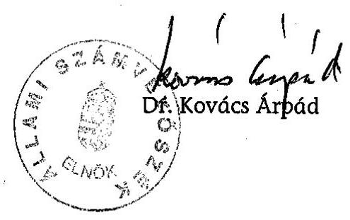

---

# MELLÉKLETEK

---

# 2

---

# ÉSZREVÉTELEK

---

# A $T / n$ 1/a. sz. melléklet 

## Oktatási

Minisztérium

Úgyiratszám: 12421-3/2006.
Hiv.szám: V-15-79/2005-2006.

Dr. Kovács Árpád úrnak, az Állami Számvevőszék elnökének Budapest

1055 Budapest V.,
Szalay utca 10-14.
telefon: +36 14737000
telefax: +36 14737001
1884 Budapest, Pf. 1.

A MAGYAR KÖZTÁRSASÁG
OKTATÁSI MINISZTERE

Tisztelt Elnök Úr!
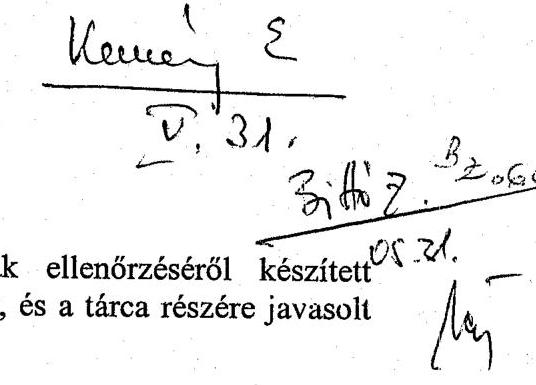

Az állami felsőoktatási intézmények ingatlangazdálkodásának ellenőrzéséről készített jelentést megköszönve az elemző megállapításaikkal egyetértünk, és a tárca részére javasolt feladatokat elfogadjuk.

A feladatok végrehajtására az intézkedési tervet a megjelölt határidőig megküldjük.

Budapest, 2006. május 25.
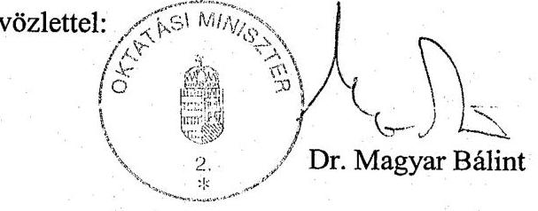

---

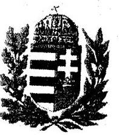

# MAGYAR KÖZTÁRSASÁG HONVÉDELMI MINISZTERE 

„Nyt. szám: 194/50/2006. HM KEHH
Hiv. szám: V-15-79/2005-2006.
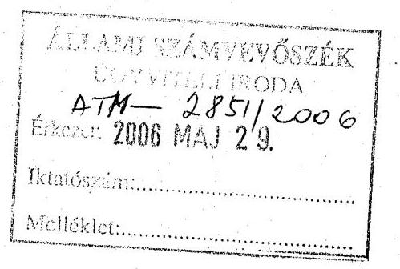

Dr. Kovács Árpád úr Állami Számvevőszék elnöke

Tisztelt Elnök Úr!
A felsőoktatási állami intézmények ingatlangazdálkodásának ellenőrzése tárgyában az Állami Számvevőszék részéről a fenti hivatkozási számon észrevételezésre megküldött jelentést áttanulmányoztuk.

A jelentésben foglaltakkal egyetértünk, ahhoz a HM tárca részéről szakmai észrevételt nem teszünk. Az általánosítható megállapítások tekintetében hasznosítható tapasztalatokat saját szakterületünket érintően összegezzük.

Budapest, 2006. május 26.-án.
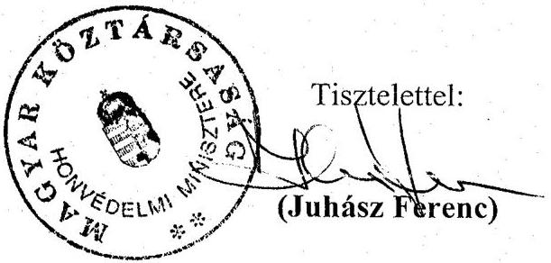

---

# Az Esztergom-Budapesti Érsektől 

Budapest, 2006. április 10.

Tisztelt
Bihary Zsigmond úrnak
főigazgató
Budapest
Apáczai Csere János u. 10.
1052

## ÁLLAMI SZÁMVEVŐSZÉK

GGYTEEJ IRODA
$A_{1} M-245912006$
Érkezést: 2006 APR 25.
Iktatószám: $0-85-9912006$.
Melléklet: $\qquad$
$3 / 162$
$04.75 \mathrm{~g} \mathrm{C}$
$1 / 44$
$\frac{1}{3}$
06.27

Igen Tisztelt Főigazgató Úr!

A felsőoktatási állami intézmények ingatlangazdálkodásának ellenőrzéséről készített jelentés-tervezetünket köszönettel megkaptam és azzal kapcsolatban észrevételem nincs.

Köszönöm, hogy a korábbi megállapodásunknak megfelelően a Vitéz János Római Katolikus Tanítóképző Főiskola működésének és gazdálkodásának ellenőrzésére vonatkozó anyagot függelékben csatolták.

Öszinte tisztelettel:
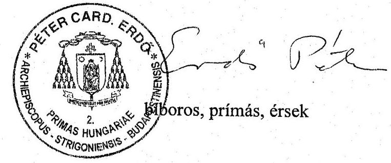

---

# A felsőoktatási állami intézmények ingatlangazdálkodásának folyamatábrája 

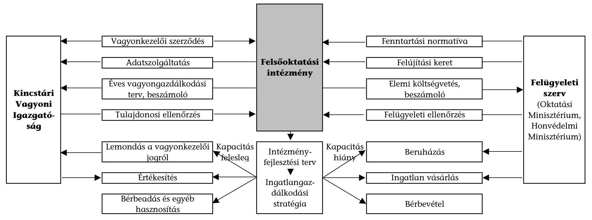

---

# Az ellenőrzött felsőoktatási intézmények felsorolása 

Az integrációban érintett 17 felsőoktatási intézmény közül a helyszíni ellenőrzés 11 felsőoktatási intézményre terjedt ki, amelyből 10 intézmény az Oktatási Minisztérium, egy intézmény a Honvédelmi Minisztérium felügyelete alá tartozik.

## Helyszíni ellenőrzésbe vont felsőoktatási intézmények:

- Budapesti Gazdasági Főiskola
- Budapesti Műszaki Főiskola
- Debreceni Egyetem
- Eötvös Loránd Tudományegyetem
- Miskolci Egyetem
- Nyíregyházi Főiskola
- Pécsi Tudományegyetem
- Semmelweis Egyetem
- Szegedi Tudományegyetem
- Szent István Egyetem
- Zrínyi Miklós Nemzetvédelmi Egyetem

---

# ÖSSZESÍTŐ TÁBLÁZATOK A FELSŐOKTATÁSI INTÉZMÉNYEK INGATLANGAZDÁLKODÁSI ADATAIRÓL 

(tanúsítványi adatszolgáltatás és az intézményi
költségvetési beszámolók alapján)

---

# TÁBLÁZATOK JEGYZÉKE 

1. sz. táblázat:
2. sz. táblázat:
3. sz. táblázat:
4. sz. táblázat:
5. sz. táblázat:

6/a. sz. táblázat:

6/b. sz. táblázat:

7/a. sz. táblázat:
7/b. sz. táblázat:
8. sz. táblázat:
9. sz. táblázat:
10. sz. táblázat:
11. sz. táblázat:
12. sz. táblázat:
13. sz. táblázat:

Az ellenőrzött felsőoktatási intézmények ingatlangazdálkodásának főbb számszerűségei

Az ellenőrzött felsőoktatási intézmények ingatlanberuházási és -felújítási kiadásai

Az ellenőrzött felsőoktatási intézmények alapterületének összetétele

Az ellenőrzött felsőoktatási intézmények telephelyei, épületei
Az ellenőrzött felsőoktatási intézmények terület- és férőhelyellátottsága

A karok és nem kari szervezeti egységek oktatási-kutatási célú terület, illetve férőhely-ellátottsága (2002. december 31.)

A karok és nem kari szervezeti egységek oktatási-kutatási célú terület, illetve férőhely-ellátottsága (2004. december 31.)

Kihasználtsági mutatók tudományterületenként (2002. év)
Kihasználtsági mutatók tudományterületenként (2004. év)
Az ellenőrzött felsőoktatási intézmények sportlétesítményeinek adatai

Kollégiumi férőhely-ellátottság és -kihasználtság alakulása
A karok és nem kari szervezetek használatában lévő közvetlen oktatási helyiségek férőhelyei

Az ellenőrzött felsőoktatási intézmények bérbevett területeinek adatai

Az ellenőrzött felsőoktatási intézmények ingatlan bérleti díj kiadásai

A karok férőhelyeinek időbeli kihasználtsága

---

# Az ellenőrzött felsőoktatási intézmények ingatlangazdálkodásának főbb számszerűségei 

| Sorszám | Megnevezés | Mértékegység | 2002. év | 2004. év | 2005. év |
| :--: | :--: | :--: | :--: | :--: | :--: |
| 1. | Ingatlan vagyon bruttó értéke | M Ft | 153824 | 187314 | 205548 |
| 2. | Ingatlan vagyon nettó értéke | M Ft | 128929 | 156013 | 170869 |
| 2.1 | Épületek bruttó értéke | M Ft | 131194 | 162652 | 178261 |
| 2.2 | Épületek nettó értéke | M Ft | 107476 | 132792 | 145192 |
| 3. | Telephelyek ${ }^{1}$ száma | db | 351 | 352 | 357 |
| 4. | Önálló épületek száma | db | 1468 | 1469 | 1470 |
| 5. | Alapterület ${ }^{2}$ összesen | $\mathrm{m}^{2}$ | 1456326 | 1485828 | 1529454 |
| 5.1 | = oktatás-kutatási célú | $\mathrm{m}^{2}$ | 634956 | 638252 | 656677 |
| 5.1.1 | = Közvetlen oktatási célú | $\mathrm{m}^{2}$ | 340589 | 343347 | 365442 |
| 5.2 | = működtetési célú | $\mathrm{m}^{2}$ | 689003 | 719229 | 742377 |
| 5.3 | = bérbeadott | $\mathrm{m}^{2}$ | 83374 | 80720 | 80581 |
| 5.4 | = használaton kívül | $\mathrm{m}^{2}$ | 48993 | 47627 | 49819 |
| 6. | Bérbe vett épületek, helyiségek területe | $\mathrm{m}^{2}$ | 29384 | 26328 | 25437 |
| 6.1 | = oktatás-kutatásra | $\mathrm{m}^{2}$ | 24636 | 22161 | 21901 |
| 6.2 | = működtetésre | $\mathrm{m}^{2}$ | 4748 | 4167 | 3536 |
| 7. | Ingatlan beruházási kiadások összesen | M Ft | 31385 |  | 11163 |
| 7.1 | = központi költségvetési bevételből | M Ft | 24029 |  | 5840 |
| 7.2 | = saját forrásból | M Ft | 7356 |  | 5323 |
| 8. | Ingatlan felújítási kiadások összesen | M Ft | 10460 |  | 2128 |
| 8.1 | = központi költségvetési bevételből | M Ft | 5248 |  | 171 |
| 8.2 | = saját forrásból | M Ft | 5212 |  | 1957 |
| 9. | Átszámított ${ }^{3}$ hallgatói átlaglétszám | fő | 127902 | 142894 | 150423 |
| 10. | Tényleges oktatói-kutatói létszám december 31-én | fő | 11385 | 11169 | 11080 |
| 11. | 1 hallgatóra jutó oktatási terület (5.1/9 sor) | $\mathrm{m}^{2} /$ fő | 4,96 | 4,47 | 4,37 |
| 12. | 1 hallgatóra jutó közvetlen oktatási terület (5.1.1/9 sor) | $\mathrm{m}^{2} /$ fő | 2,66 | 2,40 | 2,43 |
| 13. | Hallgatói férőhely összesen | db | 152875 | 158415 | 159311 |
| 14. | Egy hallgatóra jutó férőhely | db/fő | 1,20 | 1,11 | 1,06 |
| 15. | Előadótermek száma | db | 458 | 508 | 524 |
| 16. | Ingatlan értékesítés | M Ft | 443 |  | 681 |
| 17. | Ingatlan bérleti díjbevétel | M Ft | 807 | 934 | 964 |
| 18. | Ingatlan bérleti díj kiadás | M Ft | 428 | 501 | 679 |
| 18.1 | = ebből oktatási célú | M Ft | 187 | 227 | 189 |

[^0]
[^0]:    ${ }^{1}$ Földrajzilag elkülönült, a székhelytől eltérő címen fellelhető egységek
    ${ }^{2}$ Az oktatási munkában résztvevő klinikák (kivéve a klinikák előadótermeit), tangazdságok, tanüzemek, kísérleti telepek, gyakorlati telepek és gyakorló oktatási intézmények nélkül.
    ${ }^{3}$ Nappali tagozatos hallgatókra átszámított éves átlaglétszám.

---

# A Budapesti Gazdasági Főiskola ingatlangazdálkodásának főbb számszerűségei 

| Sorszám | Megnevezés | Mértékegység | 2002.év | 2004. év | 2005. év |
| :--: | :--: | :--: | :--: | :--: | :--: |
| 1. | Ingatlan vagyon bruttó értéke | M Ft | 7313 | 7986 | 8132 |
| 2. | Ingatlan vagyon nettó értéke | M Ft | 5430 | 5826 | 5837 |
| 2.1 | Épületek bruttó értéke | M Ft | 6546 | 7207 | 6980 |
| 2.2 | Épületek nettó értéke | M Ft | 5089 | 5489 | 5136 |
| 3. | Telephelyek ${ }^{1}$ száma | db | 11 | 8 | 12 |
| 4. | Önálló épületek száma | db | 46 | 46 | 44 |
| 5. | Alapterület ${ }^{2}$ összesen | $\mathrm{m}^{2}$ | 84841 | 87015 | 102820 |
| 5.1 | = oktatás-kutatási célú | $\mathrm{m}^{2}$ | 32220 | 32934 | 43971 |
| 5.1.1 | = Közvetlen oktatási célú | $\mathrm{m}^{2}$ | 18800 | 19130 | 35051 |
| 5.2 |

 # A Budapesti Müszaki Főiskola ingatlangazdálkodásának főbb számszerüségei 

| Sorszám | Megnevezés | Mértékegység | 2002. év | 2004. év | 2005. év |
| :--: | :--: | :--: | :--: | :--: | :--: |
| 1. | Ingatlan vagyon bruttó értéke | M Ft | 1165 | 1298 | 4249 |
| 2. | Ingatlan vagyon nettó értéke | M Ft | 881 | 976 | 3869 |
| 2.1 | Épületek bruttó értéke | M Ft | 819 | 945 | 3586 |
| 2.2 | Épületek nettó értéke | M Ft | 547 | 638 | 3222 |
| 3. | Telephelyek ${ }^{1}$ száma | db | 8 | 8 | 8 |
| 4. | Önálló épületek száma | db | 19 | 19 | 19 |
| 5. | Alapterület ${ }^{2}$ összesen | $\mathrm{m}^{2}$ | 42862 | 42862 | 47119 |
| 5.1 | = oktatás-kutatási célú | $\mathrm{m}^{2}$ | 23605 | 23605 | 25215 |
| 5.1.1 | = Közvetlen oktatási célú | $\mathrm{m}^{2}$ | 16312 | 16312 | 15899 |
| 5.2 | = működtetési célú | $\mathrm{m}^{2}$ | 14784 | 14784 | 17930 |
| 5.3 | = bérbeadott | $\mathrm{m}^{2}$ | 2642 | 2642 | 2143 |
| 5.4 | = használaton kívül | $\mathrm{m}^{2}$ | 1831 | 1831 | 1831 |
| 6. | Bérbe vett épületek, helyiségek területe | $\mathrm{m}^{2}$ | 6114 | 6114 | 6114 |
| 6.1 | = oktatás-kutatásra | $\mathrm{m}^{2}$ | 6114 | 6114 | 6114 |
| 6.2 | = működtetésre | $\mathrm{m}^{2}$ | 0 | 0 | 0 |
| 7. | Ingatlan beruházási kiadások ${ }^{3}$ | M Ft | 613 |  | 1983 |
| 7.1 | = központi költségvetési bevételből | M Ft | 479 |  | 1978 |
| 7.2 | = saját forrásból | M Ft | 134 |  | 5 |
| 8. | Ingatlan felújítási kiadások | M Ft | 133 |  | 29 |
| 8.1 | = központi költségvetési bevételből | M Ft | 120 |  | 29 |
| 8.2 | = saját forrásból | M Ft | 13 |  | 0 |
| 9. | Átszámított ${ }^{4}$ hallgatói átlaglétszám | fő | 7361 | 8438 | 9588 |
| 10. | Tényleges oktatói-kutatói létszám december 31-én | fő | 413 | 428 | 428 |
| 11. | 1 hallgatóra jutó oktatási terület (5.1/9 sor) | $\mathrm{m}^{2} /$ fő | 3,21 | 2,80 | 2,63 |
| 12. | 1 hallgatóra jutó közvetlen oktatási terület (5.1.1/9 sor) | $\mathrm{m}^{2} /$ fő | 2,22 | 1,93 | 1,66 |
| 13. | Hallgatói férőhely összesen | db | 6674 | 6674 | 7316 |
| 14. | Egy hallgatóra jutó férőhely | db/fő | 0,91 | 0,79 | 0,76 |
| 15. | Előadótermek száma | db | 23 | 23 | 25 |
| 16. | Ingatlan értékesítés | M Ft | 0 |  | 0 |
| 17. | Ingatlan bérleti díjbevétel | M Ft | 21 | 17 | 15 |
| 18. | Ingatlan bérleti díj kiadás | M Ft | 12 | 11 | 10 |
| 18.1 | = ebből oktatási célú | M Ft | 6 | 7 | 8 |

[^0]
[^0]:    ${ }^{1}$ Földrajzilag elkülönült, a székhelytől eltérő címen fellelhető egységek.
    ${ }^{2}$ Az oktatási munkában résztvevő klinikák (kivéve a klinikák előadótermeit), tangazdaságok, tanüzemek, kísérleti telepek, gyakorlati telepek és gyakorló oktatási intézmények nélkül.
    ${ }^{3}$ Beszámoló adatok
    ${ }^{4}$ Nappali tagozatos hallgatóra átszámított éves átlaglétszám (levelező hallgató 1/4-es, esti tagozatos hallgató 1/3-es szorzóval). (mindhárom évben)

---

# A Debreceni Egyetem ingatlangazdálkodásának főbb számszerüségei 

| Sorszám | Megnevezés | Mértékegység | 2002. év | 2004. év | 2005. év |
| :--: | :--: | :--: | :--: | :--: | :--: |
| 1. | Ingatlan vagyon bruttó értéke | M Ft | 19649 | 24505 | 34145 |
| 2. | Ingatlan vagyon nettó értéke | M Ft | 16973 | 20901 | 30038 |
| 2.1 | Épületek bruttó értéke | M Ft | 18217 | 22194 | 30906 |
| 2.2 | Épületek nettó értéke | M Ft | 15697 | 18855 | 27153 |
| 3. | Telephelyek ${ }^{1}$ száma | db | 18 | 18 | 18 |
| 4. | Önálló épületek száma | db | 323 | 329 | 326 |
| 5. | Alapterület ${ }^{2}$ összesen | $\mathrm{m}^{2}$ | 309000 | 313520 | 323929 |
| 5.1 | = oktatás-kutatási célú | $\mathrm{m}^{2}$ | 122759 | 121128 | 125509 |
| 5.1.1 | = Közvetlen oktatási célú | $\mathrm{m}^{2}$ | 33052 | 35198 | 38029 |
| 5.2 | = működtetési célú | $\mathrm{m}^{2}$ | 163777 | 168876 | 174593 |
| 5.3 | = bérbeadott | $\mathrm{m}^{2}$ | 22464 | 23516 | 23827 |
| 5.4 | = használaton kívül | $\mathrm{m}^{2}$ | 0 | 0 | 0 |
| 6. | Bérbe vett épületek, helyiségek területe | $\mathrm{m}^{2}$ | 989 | 1073 | 1132 |
| 6.1 | = oktatás-kutatásra | $\mathrm{m}^{2}$ | 989 | 989 | 1048 |
| 6.2 | = működtetésre | $\mathrm{m}^{2}$ | 0 | 84 | 84 |
| 7. | Ingatlan beruházási kiadások ${ }^{3}$ | M Ft | 5476 |  | 5736 |
| 7.1 | = központi költségvetési bevételből | M Ft | 2961 |  | 2673 |
| 7.2 | = saját forrásból | M Ft | 2515 |  | 3063 |
| 8. | Ingatlan felújítási kiadások | M Ft | 2205 |  | 585 |
| 8.1 | = központi költségvetési bevételből | M Ft | 703 |  | 90 |
| 8.2 | = saját forrásból | M Ft | 1502 |  | 495 |
| 9. | Átszámított ${ }^{4}$ hallgatói átlaglétszám | fő | 16918 | 18322 | 19613 |
| 10. | Tényleges oktatói-kutatói létszám december 31-én | fő | 1526 | 1487 | 1477 |
| 11. | 1 hallgatóra jutó oktatási terület (5.1/9 sor) | $\mathrm{m}^{2} /$ fő | 7,26 | 6,61 | 6,40 |
| 12. | 1 hallgatóra jutó közvetlen oktatási terület (5.1.1/9 sor) | $\mathrm{m}^{2} /$ fő | 1,95 | 1,92 | 1,94 |
| 13. | Hallgatói férőhely összesen | db | 29251 | 30050 | 31132 |
| 14. | Egy hallgatóra jutó férőhely | db/fő | 1,73 | 1,64 | 1,59 |
| 15. | Előadótermek száma | db | 132 | 168 | 171 |
| 16. | Ingatlan értékesítés | M Ft | 271,4 |  | 597,2 |
| 17. | Ingatlan bérleti díjbevétel | M Ft | 116 | 101 | 134 |
| 18. | Ingatlan bérleti díj kiadás | M Ft | 27 | 21 | 267 |
| 18.1 | = ebből oktatási célú | M Ft | 16 | 18 | 19 |

[^0]
[^0]:    ${ }^{1}$ Földrajzilag elkülönült, a székhelytől eltérő címen fellelhető egységek.
    ${ }^{2}$ Az oktatási munkában résztvevő klinikák (kivéve a klinikák előadótermeit), tangazdaságok, tanüzemek, kísérleti telepek, gyakorlati telepek és gyakorló oktatási intézmények nélkül.
    ${ }^{3}$ Beszámoló adatok
    ${ }^{4}$ Nappali tagozatos hallgatóra átszámított éves átlaglétszám (levelező hallgató 1/4-es, esti tagozatos hallgató 1/3-es szorzóval). (mindhárom évben)

---

# Az Eötvös Loránd Tudományegyetem ingatlangazdálkodásának főbb
 számszerűségei

|  Sor-
szám | Megnevezés | Mértékegység | 2002. év | 2004. év | 2005. év  |
| --- | --- | --- | --- | --- | --- |
|  1. | Ingatlan vagyon bruttó értéke | M Ft | 40386 | 42151 | 42590  |
|  2. | Ingatlan vagyon nettó értéke | M Ft | 36761 | 36858 | 36389  |
|  2.1 | Épületek bruttó értéke | M Ft | 39510 | 41085 | 41499  |
|  2.2 | Épületek nettó értéke | M Ft | 36005 | 35972 | 35508  |
|  3. | Telephelyek ${ }^{1}$ száma | db | 39 | 39 | 40  |
|  4. | Önálló épületek száma | db | 111 | 110 | 112  |
|  5. | Alapterület ${ }^{2}$ összesen | $\mathrm{m}^{2}$ | 235221 | 233129 | 236702  |
|  5.1 | = oktatás-kutatási célú | $\mathrm{m}^{2}$ | 87936 | 87267 | 89313  |
|  5.1.1 | = Közvetlen oktatási célú | $\mathrm{m}^{2}$ | 48896 | 49077 | 50643  |
|  5.2 | = működtetési célú | $\mathrm{m}^{2}$ | 121837 | 122960 | 125341  |
|  5.3 | = bérbeadott | $\mathrm{m}^{2}$ | 8144 | 8139 | 6864  |
|  5.4 | = használaton kívül | $\mathrm{m}^{2}$ | 17304 | 14763 | 15184  |
|  6. | Bérbe vett épületek, helyiségek területe | $\mathrm{m}^{2}$ | 631 | 759 | 128  |
|  6.1 | = oktatás-kutatásra | $\mathrm{m}^{2}$ |  |  |   |
|  6.2 | = működtetésre | $\mathrm{m}^{2}$ | 631 | 759 | 128  |
|  7 | Ingatlan beruházási kiadások ${ }^{3}$ | M Ft | 1609 |  | 68  |
|  7.1 | = központi költségvetési bevételből | M Ft | 1324 |  | 25  |
|  7.2 | = saját forrásból | M Ft | 285 |  | 43  |
|  8. | Ingatlan felújítási kiadások | M Ft | 996 |  | 99  |
|  8.1 | = központi költségvetési bevételből | M Ft | 614 |  | 0  |
|  8.2 | = saját forrásból | M Ft | 382 |  | 99  |
|  9. | Átszámított ${ }^{4}$ hallgatói átlaglétszám | fő | 23263 | 25093 | 24587  |
|  10. | Tényleges oktatói-kutatói létszám december 31-én | fő | 1777 | 1809 | 1817  |
|  11. | 1 hallgatóra jutó oktatási terület (5.1/9 sor) | $\mathrm{m}^{2} /$ fő | 3,78 | 3,48 | 3,63  |
|  12. | 1 hallgatóra jutó közvetlen oktatási terület (5.1.1/9 sor) | $\mathrm{m}^{2} /$ fő | 2,10 | 1,96 | 2,06  |
|  13. | Hallgatói férőhely összesen * | db | 20976 | 21969 | 23074  |
|  14. | Egy hallgatóra jutó férőhely | db/fő | 0,91 | 0,88 | 0,94  |
|  15. | Előadótermek száma | db | 56 | 56 | 58  |
|  16. | Ingatlan értékesítés | M Ft | 0 |  | 0  |
|  17. | Ingatlan bérleti díjbevétel | M Ft | 257 | 319 | 150  |
|  18. | Ingatlan bérleti díj kiadás | M Ft | 81 | 106 | 3  |
|  18.1 | = ebből oktatási célú | M Ft | 0 | 0 | 0  |

${ }^{1}$ Földrajzilag elkülönült, a székhelytől eltérő címen fellelhető egységek. ${ }^{2}$ Az oktatási munkában résztvevő klinikák (kivéve a klinikák előadótermeit), tangazdaságok, tanüzemek, kísérleti telepek, gyakorlati telepek és gyakorló oktatási intézmények nélkül. ${ }^{3}$ Beszámoló adatok ${ }^{4}$ Nappali tagozatos hallgatóra átszámított éves átlaglétszám (levelező hallgató 1/4-es, esti tagozatos hallgató 1/3-es szorzóval). (mindhárom évben) *kutatói férőhelyek száma 2002-ben 125 db, 2004-ben 121 db.

---

# A Miskolci Egyetem ingatlangazdálkodásának főbb számszerűségei 

| Sorszám | Megnevezés | Mértékegység | 2002. év | 2004. év | 2005. év |
| :--: | :--: | :--: | :--: | :--: | :--: |
| 1. | Ingatlan vagyon bruttó értéke | M Ft | 6457 | 7693 | 8376 |
| 2. | Ingatlan vagyon nettó értéke | M Ft | 5725 | 6679 | 7209 |
| 2.1 | Épületek bruttó értéke | M Ft | 6118 | 7193 | 7779 |
| 2.2 | Épületek nettó értéke | M Ft | 5412 | 6222 | 6665 |
| 3. | Telephelyek ${ }^{1}$ száma | db | 5 | 5 | 5 |
| 4. | Önálló épületek száma | db | 87 | 86 | 88 |
| 5. | Alapterület ${ }^{2}$ összesen | $\mathrm{m}^{2}$ | 117074 | 123532 | 125914 |
| 5.1 | = oktatás-kutatási célú | $\mathrm{m}^{2}$ | 52663 | 53973 | 53973 |
| 5.1.1 | = Közvetlen oktatási célú | $\mathrm{m}^{2}$ | 29117 | 30427 | 30427 |
| 5.2 | = működtetési célú | $\mathrm{m}^{2}$ | 50324 | 49829 | 52470 |
| 5.3 | = bérbeadott | $\mathrm{m}^{2}$ | 5516 | 6320 | 8392 |
| 5.4 | = használaton kívül | $\mathrm{m}^{2}$ | 8571 | 13410 | 11079 |
| 6. | Bérbe vett épületek, helyiségek területe | $\mathrm{m}^{2}$ | 0 | 0 | 0 |
| 6.1 | = oktatás-kutatásra | $\mathrm{m}^{2}$ | 0 | 0 | 0 |
| 6.2 | = működtetésre | $\mathrm{m}^{2}$ | 0 | 0 | 0 |
| 7. | Ingatlan beruházási kiadások ${ }^{3}$ | M Ft | 2678 |  | 194 |
| 7.1 | = központi költségvetési bevételből | M Ft | 2294 |  | 23 |
| 7.2 | = saját forrásból | M Ft | 384 |  | 171 |
| 8. | Ingatlan felújítási kiadások | M Ft | 367 |  | 236 |
| 8.1 | = központi költségvetési bevételből | M Ft | 307 |  | 0 |
| 8.2 | = saját forrásból | M Ft | 60 |  | 236 |
| 9. | Átszámított ${ }^{4}$ hallgatói átlaglétszám | fő | 9250 | 9611 | 9811 |
| 10. | Tényleges oktatói-kutatói létszám december 31-én | fő | 744 | 747 | 732 |
| 11. | 1 hallgatóra jutó oktatási terület (5.1/9 sor) | $\mathrm{m}^{2} /$ fő | 5,69 | 5,62 | 5,50 |
| 12. | 1 hallgatóra jutó közvetlen oktatási terület (5.1.1/9 sor) | $\mathrm{m}^{2} /$ fő | 3,15 | 3,17 | 3,10 |
| 13. | Hallgatói férőhely összesen | db | 12936 | 14360 | 14360 |
| 14. | Egy hallgatóra jutó férőhely | db/fő | 1,40 | 1,49 | 1,46 |
| 15. | Előadótermek száma | db | 29 | 34 | 34 |
| 16. | Ingatlan értékesítés | M Ft | 4,4 |  | 0 |
| 17. | Ingatlan bérleti díjbevétel | M Ft | 68 | 50 | 43 |
| 18. | Ingatlan bérleti díj kiadás | M Ft | 0 | 0 | 0 |
| 18.1 | = ebből oktatási célú | M Ft | 0 | 0 | 0 |

[^0]
[^0]:    ${ }^{1}$ Földrajzilag elkülönült, a székhelytől eltérő címen fellelhető egységek.
    ${ }^{2}$ Az oktatási munkában résztvevő klinikák (kivéve a klinikák előadótermeit), tangazdaságok, tanüzemek, kísérleti telepek, gyakorlati telepek és gyakorló oktatási intézmények nélkül.
    ${ }^{3}$ Beszámoló adatok
    ${ }^{4}$ Nappali tagozatos hallgatóra átszámított éves átlaglétszám (levelező hallgató 1/4-es, esti tagozatos hallgató 1/3-es szorzóval). (mindhárom évben)

---

# A Nyíregyházi Főiskola ingatlangazdálkodásának főbb számszerűségei 

| Sorszám | Megnevezés | Mértékegység | 2002. év | 2004. év | 2005. év |
| :--: | :--: | :--: | :--: | :--: | :--: |
| 1. | Ingatlan vagyon bruttó értéke | M Ft | 1316 | 8331 | 9327 |
| 2. | Ingatlan vagyon nettó értéke | M Ft | 1023 | 7898 | 8726 |
| 2.1 | Épületek bruttó értéke | M Ft | 1136 | 8075 | 8630 |
| 2.2 | Épületek nettó értéke | M Ft | 849 | 7652 | 8043 |
| 3. | Telephelyek ${ }^{1}$ száma | db | 4 | 4 | 4 |
| 4. | Önálló épületek száma | db | 30 | 32 | 32 |
| 5. | Alapterület ${ }^{2}$ összesen | $\mathrm{m}^{2}$ | 37996 | 59843 | 59843 |
| 5.1 | = oktatás-kutatási célú | $\mathrm{m}^{2}$ | 23352 | 28843 | 28843 |
| 5.1.1 | = Közvetlen oktatási célú | $\mathrm{m}^{2}$ | 16820 | 19516 | 19516 |
| 5.2 | = működtetési célú | $\mathrm{m}^{2}$ | 9719 | 25779 | 25779 |
| 5.3 | = bérbeadott | $\mathrm{m}^{2}$ | 4925 | 5221 | 5221 |
| 5.4 | = használaton kívül | $\mathrm{m}^{2}$ | 0 | 0 | 0 |
| 6. | Bérbe vett épületek, helyiségek területe | $\mathrm{m}^{2}$ | 300 | 300 | 300 |
| 6.1 | = oktatás-kutatásra | $\mathrm{m}^{2}$ | 300 | 300 | 300 |
| 6.2 | = működtetésre | $\mathrm{m}^{2}$ | 0 | 0 | 0 |
| 7. | Ingatlan beruházási kiadások ${ }^{3}$ | M Ft | 5326 |  | 691 |
| 7.1 | = központi költségvetési bevételből | M Ft | 5177 |  | 568 |
| 7.2 | = saját forrásból | M Ft | 149 |  | 123 |
| 8. | Ingatlan felújítási kiadások | M Ft | 290 |  | 106 |
| 8.1 | = központi költségvetési bevételből | M Ft | 126 |  | 0 |
| 8.2 | = saját forrásból | M Ft | 164 |  | 106 |
| 9. | Átszámított ${ }^{4}$ hallgatói átlaglétszám | fő | 5128 | 6621 | 7712 |
| 10. | Tényleges oktatói-kutatói létszám

 december 31-én | fő | 354 | 363 | 367 |
| 11. | 1 hallgatóra jutó oktatási terület (5.1/9 sor) | $\mathrm{m}^{2} /$ fő | 4,55 | 4,36 | 3,74 |
| 12. | 1 hallgatóra jutó közvetlen oktatási terület (5.1.1/9 sor) | $\mathrm{m}^{2} /$ fő | 3,28 | 2,95 | 2,53 |
| 13. | Hallgatói férőhely összesen | db | 6105 | 8162 | 8162 |
| 14. | Egy hallgatóra jutó férőhely | db/fő | 1,19 | 1,23 | 1,06 |
| 15. | Előadótermek száma | db | 17 | 23 | 23 |
| 16. | Ingatlan értékesítés | M Ft | 5,2 |  | 0 |
| 17. | Ingatlan bérleti díjbevétel | M Ft | 12 | 44 | 98 |
| 18. | Ingatlan bérleti díj kiadás | M Ft | 9 | 6 | 7 |
| 18.1 | = ebből oktatási célú | M Ft | 2 | 0 | 2 |

[^0]
[^0]:    ${ }^{1}$ Földrajzilag elkülönült, a székhelytől eltérő címen fellelhető egységek.
    ${ }^{2}$ Az oktatási munkában résztvevő klinikák (kivéve a klinikák előadótermeit), tangazdaságok, tanüzemek, kísérleti telepek, gyakorlati telepek és gyakorló oktatási intézmények nélkül.
    ${ }^{3}$ Beszámoló adatok
    ${ }^{4}$ Nappali tagozatos hallgatóra átszámított éves átlaglétszám (levelező hallgató 1/4-es, esti tagozatos hallgató 1/3-es szorzóval). (mindhárom évben)

---

# A Pécsi Tudományegyetem ingatlangazdálkodásának főbb számszerűségei 

| Sorszám | Megnevezés | Mértékegység | 2002. év | 2004. év | 2005. év |
| :--: | :--: | :--: | :--: | :--: | :--: |
| 1. | Ingatlan vagyon bruttó értéke | M Ft | 32073 | 37303 | 38579 |
| 2. | Ingatlan vagyon nettó értéke | M Ft | 29344 | 32910 | 33750 |
| 2.1 | Épületek bruttó értéke | M Ft | 16979 | 21436 | 22274 |
| 2.2 | Épületek nettó értéke | M Ft | 14314 | 17196 | 17607 |
| 3. | Telephelyek ${ }^{1}$ száma | db | 54 | 56 | 56 |
| 4. | Önálló épületek száma | db | 194 | 217 | 217 |
| 5. | Alapterület ${ }^{2}$ összesen | $\mathrm{m}^{2}$ | 148893 | 153135 | 153259 |
| 5.1 | = oktatás-kutatási célú | $\mathrm{m}^{2}$ | 75545 | 76152 | 76152 |
| 5.1.1 | = Közvetlen oktatási célú | $\mathrm{m}^{2}$ | 48319 | 49654 | 49717 |
| 5.2 | = működtetési célú | $\mathrm{m}^{2}$ | 63260 | 67002 | 67002 |
| 5.3 | = bérbeadott | $\mathrm{m}^{2}$ | 7478 | 7371 | 7495 |
| 5.4 | = használaton kívül | $\mathrm{m}^{2}$ | 2610 | 2610 | 2610 |
| 6. | Bérbe vett épületek, helyiségek területe | $\mathrm{m}^{2}$ | 8639 | 8739 | 8263 |
| 6.1 | = oktatás-kutatásra | $\mathrm{m}^{2}$ | 5954 | 6054 | 5578 |
| 6.2 | = működtetésre | $\mathrm{m}^{2}$ | 2685 | 2685 | 2685 |
| 7 | Ingatlan beruházási kiadások ${ }^{3}$ | M Ft | 4021 |  | 760 |
| 7.1 | = központi költségvetési bevételből | M Ft | 2404 |  | 480 |
| 7.2 | = saját forrásból | M Ft | 1617 |  | 280 |
| 8. | Ingatlan felújítási kiadások | M Ft | 1203 |  | 427 |
| 8.1 | = központi költségvetési bevételből | M Ft | 526 |  | 52 |
| 8.2 | = saját forrásból | M Ft | 677 |  | 375 |
| 9. | Átszámított ${ }^{4}$ hallgatói átlaglétszám | fő | 19750 | 22546 | 23412 |
| 10. | Tényleges oktatói-kutatói létszám december 31-én | fő | 1634 | 1701 | 1797 |
| 11. | 1 hallgatóra jutó oktatási terület (5.1/9 sor) | $\mathrm{m}^{2} /$ fő | 3,83 | 3,38 | 3,25 |
| 12. | 1 hallgatóra jutó közvetlen oktatási terület (5.1.1/9 sor) | $\mathrm{m}^{2} /$ fő | 2,45 | 2,20 | 2,12 |
| 13. | Hallgatói férőhely összesen | db | 16827 | 18003 | 18098 |
| 14. | Egy hallgatóra jutó férőhely | db/fő | 0,85 | 0,80 | 0,77 |
| 15. | Előadótermek száma | db | 42 | 47 | 47 |
| 16. | Ingatlan értékesítés | M Ft | 0 |  | 0 |
| 17. | Ingatlan bérleti díjbevétel | M Ft | 60 | 92 | 97 |
| 18. | Ingatlan bérleti díj kiadás | M Ft | 112 | 135 | 99 |
| 18.1 | = ebből oktatási célú | M Ft | 80 | 102 | 78 |

[^0]
[^0]:    ${ }^{1}$ Földrajzilag elkülönült, a székhelytől eltérő címen fellelhető egységek.
    ${ }^{2}$ Az oktatási munkában résztvevő klinikák (kivéve a klinikák előadótermeit), tangazdaságok, tanüzemek, kísérleti telepek, gyakorlati telepek és gyakorló oktatási intézmények nélkül.
    ${ }^{3}$ Beszámoló adatok
    ${ }^{4}$ Nappali tagozatos hallgatóra átszámított éves átlaglétszám (levelező hallgató 1/4-es, esti tagozatos hallgató 1/3-es szorzóval). (mindhárom évben)

---

# A Semmelweis Egyetem ingatlangazdálkodásának főbb számszerűségei 

| Sorszám | Megnevezés | Mértékegység | 2002. év | 2004. év | 2005. év |
| :--: | :--: | :--: | :--: | :--: | :--: |
| 1. | Ingatlan vagyon bruttó értéke | M Ft | 15564 | 19036 | 19749 |
| 2. | Ingatlan vagyon nettó értéke | M Ft | 12711 | 15553 | 15924 |
| 2.1 | Épületek bruttó értéke | M Ft | 13709 | 17089 | 17786 |
| 2.2 | Épületek nettó értéke | M Ft | 11030 | 13808 | 14178 |
| 3. | Telephelyek ${ }^{1}$ száma | db | 78 | 82 | 82 |
| 4. | Önálló épületek száma | db | 200 | 202 | 202 |
| 5. | Alapterület ${ }^{2}$ összesen | $\mathrm{m}^{2}$ | 121991 | 118319 | 118472 |
| 5.1 | = oktatás-kutatási célú | $\mathrm{m}^{2}$ | 37060 | 40523 | 40523 |
| 5.1.1 | = Közvetlen oktatási célú | $\mathrm{m}^{2}$ | 24458 | 25909 | 25909 |
| 5.2 | = működtetési célú | $\mathrm{m}^{2}$ | 67836 | 71546 | 71546 |
| 5.3 | = bérbeadott | $\mathrm{m}^{2}$ | 11255 | 5928 | 6081 |
| 5.4 | = használaton kívül | $\mathrm{m}^{2}$ | 5840 | 322 | 322 |
| 6. | Bérbe vett épületek, helyiségek területe | $\mathrm{m}^{2}$ | 2031 | 1726 | 1165 |
| 6.1 | = oktatás-kutatásra | $\mathrm{m}^{2}$ | 1899 | 1594 | 1033 |
| 6.2 | = működtetésre | $\mathrm{m}^{2}$ | 132 | 132 | 132 |
| 7 | Ingatlan beruházási kiadások ${ }^{3}$ | M Ft | 3899 |  | 875 |
| 7.1 | = központi költségvetési bevételből | M Ft | 2531 |  | 0 |
| 7.2 | = saját forrásból | M Ft | 1368 |  | 875 |
| 8. | Ingatlan felújítási kiadások | M Ft | 785 |  | 6 |
| 8.1 | = központi költségvetési bevételből | M Ft | 331 |  | 0 |
| 8.2 | = saját forrásból | M Ft | 454 |  | 6 |
| 9. | Átszámított ${ }^{4}$ hallgatói átlaglétszám | fő | 6165 | 6994 | 7227 |
| 10. | Tényleges oktatói-kutatói létszám december 31-én | fő | 1181 | 1220 | 1049 |
| 11. | 1 hallgatóra jutó oktatási terület (5.1/9 sor) | $\mathrm{m}^{2} /$ fő | 6,01 | 5,79 | 5,61 |
| 12. | 1 hallgatóra jutó közvetlen oktatási terület (5.1.1/9 sor) | $\mathrm{m}^{2} /$ fő | 3,97 | 3,70 | 3,59 |
| 13. | Hallgatói férőhely összesen | db | 9165 | 10146 | 10146 |
| 14. | Egy hallgatóra jutó férőhely | db/fő | 1,49 | 1,45 | 1,40 |
| 15. | Előadótermek száma | db | 29 | 33 | 33 |
| 16. | Ingatlan értékesítés | M Ft | 125 |  | 0 |
| 17. | Ingatlan bérleti díjbevétel | M Ft | 106 | 119 | 156 |
| 18. | Ingatlan bérleti díj kiadás | M Ft | 49 | 65 | 62 |
| 18.1 | = ebből oktatási célú | M Ft | 22 | 26 | 18 |

[^0]
[^0]:    ${ }^{1}$ Földrajzilag elkülönült, a székhelytől eltérő címen fellelhető egységek.
    ${ }^{2}$ Az oktatási munkában résztvevő klinikák (kivéve a klinikák előadótermeit), tangazdaságok, tanüzemek, kísérleti telepek, gyakorlati telepek és gyakorló oktatási intézmények nélkül.
    ${ }^{3}$ Beszámoló adatok
    ${ }^{4}$ Nappali tagozatos hallgatóra átszámított éves átlaglétszám (levelező hallgató 1/4-es, esti tagozatos hallgató 1/3-es szorzóval). (mindhárom évben)

---

# A Szegedi Tudományegyetem ingatlangazdálkodásának főbb számszerűségei 

| Sorszám | Megnevezés | Mértékegység | 2002. év | 2004. év | 2005. év |
| :--: | :--: | :--: | :--: | :--: | :--: |
| 1. | Ingatlan vagyon bruttó értéke | M Ft | 13312 | 21686 | 22866 |
| 2. | Ingatlan vagyon nettó értéke | M Ft | 10435 | 18165 | 18917 |
| 2.1 | Épületek bruttó értéke | M Ft | 12816 | 20956 | 22135 |
| 2.2 | Épületek nettó értéke | M Ft | 9940 | 17437 | 18187 |
| 3. | Telephelyek ${ }^{1}$ száma | db | 123 | 124 | 124 |
| 4. | Önálló épületek száma | db | 298 | 301 | 303 |
| 5. | Alapterület ${ }^{2}$ összesen | $\mathrm{m}^{2}$ | 136970 | 139140 | 145924 |
| 5.1 | = oktatás-kutatási célú | $\mathrm{m}^{2}$ | 67685 | 67685 | 66931 |
| 5.1.1 | = Közvetlen oktatási célú | $\mathrm{m}^{2}$ | 39185 | 39185 | 41268 |
| 5.2 | = működtetési célú | $\mathrm{m}^{2}$ | 60399 | 60399 | 68250 |
| 5.3 | = bérbeadott | $\mathrm{m}^{2}$ | 8886 | 9386 | 9073 |
| 5.4 | = használaton kívül | $\mathrm{m}^{2}$ |  |  |  |

 | 0 | 1670 | 1670 |
| 6. | Bérbe vett épületek, helyiségek területe | $\mathrm{m}^{2}$ | 5847 | 6017 | 6017 |
| 6.1 | = oktatás-kutatásra | $\mathrm{m}^{2}$ | 5340 | 5510 | 5510 |
| 6.2 | = működtetésre | $\mathrm{m}^{2}$ | 507 | 507 | 507 |
| 7 | Ingatlan beruházási kiadások ${ }^{3}$ | M Ft | 7381 |  | 739 |
| 7.1 | = központi költségvetési bevételből | M Ft | 6773 |  | 71 |
| 7.2 | = saját forrásból | M Ft | 608 |  | 668 |
| 8. | Ingatlan felújítási kiadások | M Ft | 1764 |  | 339 |
| 8.1 | = központi költségvetési bevételből | M Ft | 896 |  |  |
| 8.2 | = saját forrásból | M Ft | 868 |  | 339 |
| 9. | Átszámított ${ }^{4}$ hallgatói átlaglétszám | fő | 18539 | 20360 | 20792 |
| 10. | Tényleges oktatói-kutatói létszám december 31-én | fő | 1772 | 1848 | 1848 |
| 11. | 1 hallgatóra jutó oktatási terület (5.1/9 sor) | $\mathrm{m}^{2} /$ fő | 3,65 | 3,32 | 3,22 |
| 12. | 1 hallgatóra jutó közvetlen oktatási terület (5.1.1/9 sor) | $\mathrm{m}^{2} /$ fő | 2,11 | 1,92 | 1,98 |
| 13. | Hallgatói férőhely összesen | db | 16165 | 16165 | 16165 |
| 14. | Egy hallgatóra jutó férőhely | db/fő | 0,87 | 0,79 | 0,78 |
| 15. | Előadótermek száma | db | 51 | 51 | 60 |
| 16. | Ingatlan értékesítés | M Ft | 0 |  | 0 |
| 17. | Ingatlan bérleti díjbevétel | M Ft | 81 | 95 | 130 |
| 18. | Ingatlan bérleti díj kiadás | M Ft | 47 | 62 | 106 |
| 18.1 | = ebből oktatási célú | M Ft | 12 | 14 | 21 |

[^0]
[^0]:    ${ }^{1}$ Földrajzilag elkülönült, a székhelytől eltérő címen fellelhető egységek.
    ${ }^{2}$ Az oktatási munkában résztvevő klinikák (kivéve a klinikák előadótermeit), tangazdaságok, tanüzemek, kísérleti telepek, gyakorlati telepek és gyakorló oktatási intézmények nélkül.
    ${ }^{3}$ Beszámoló adatok
    ${ }^{4}$ Nappali tagozatos hallgatóra átszámított éves átlaglétszám (levelező hallgató 1/4-es, esti tagozatos hallgató 1/3-es szorzóval). (mindhárom évben)

---

# A Szent István Egyetem ingatlangazdálkodásának főbb számszerűségei 

| Sorszám | Megnevezés | Mértékegység | 2002. év | 2004. év | 2005. év |
| :--: | :--: | :--: | :--: | :--: | :--: |
| 1. | Ingatlan vagyon bruttó értéke | M Ft | 5717 | 5284 | 5494 |
| 2. | Ingatlan vagyon nettó értéke | M Ft | 4210 | 4082 | 4213 |
| 2.1 | Épületek bruttó értéke | M Ft | 5032 | 5000 | 5214 |
| 2.2 | Épületek nettó értéke | M Ft | 3727 | 3927 | 4066 |
| 3. | Telephelyek ${ }^{1}$ száma | db | 8 | 5 | 5 |
| 4. | Önálló épületek száma | db | 77 | 44 | 44 |
| 5. | Alapterület ${ }^{2}$ összesen | $\mathrm{m}^{2}$ | 100925 | 102083 | 102222 |
| 5.1 | = oktatás-kutatási célú | $\mathrm{m}^{2}$ | 44924 | 45387 | 45492 |
| 5.1.1 | = Közvetlen oktatási célú | $\mathrm{m}^{2}$ | 25892 | 25807 | 25851 |
| 5.2 | = működtetési célú | $\mathrm{m}^{2}$ | 48282 | 47940 | 47975 |
| 5.3 | = bérbeadott | $\mathrm{m}^{2}$ | 7719 | 8572 | 8481 |
| 5.4 | = használaton kívül | $\mathrm{m}^{2}$ | 0 | 184 | 274 |
| 6. | Bérbe vett épületek, helyiségek területe | $\mathrm{m}^{2}$ | 2461 | 1600 | 1600 |
| 6.1 | = oktatás-kutatásra | $\mathrm{m}^{2}$ | 2461 | 1600 | 1600 |
| 6.2 | = működtetésre | $\mathrm{m}^{2}$ | 0 | 0 | 0 |
| 7. | Ingatlan beruházási kiadások ${ }^{3}$ | M Ft | 317 |  | 31 |
| 7.1 | = központi költségvetési bevételből | M Ft | 74 |  | 0 |
| 7.2 | = saját forrásból | M Ft | 243 |  | 31 |
| 8. | Ingatlan felújítási kiadások | M Ft | 781 |  | 248 |
| 8.1 | = központi költségvetési bevételből | M Ft | 225 |  | 0 |
| 8.2 | = saját forrásból | M Ft | 556 |  | 248 |
| 9. | Átszámított ${ }^{4}$ hallgatói átlaglétszám | fő | 7417 | 8866 | 10659 |
| 10. | Tényleges oktatói-kutatói létszám december 31-én | fő | 1044 | 740 | 735 |
| 11. | 1 hallgatóra jutó oktatási terület (5.1/9 sor) | $\mathrm{m}^{2} /$ fő | 6,06 | 5,12 | 4,27 |
| 12. | 1 hallgatóra jutó közvetlen oktatási terület (5.1.1/9 sor) | $\mathrm{m}^{2} /$ fő | 3,49 | 2,91 | 2,43 |
| 13. | Hallgatói férőhely összesen | db | 13674 | 13787 | 13823 |
| 14. | Egy hallgatóra jutó férőhely | db/fő | 1,84 | 1,56 | 1,30 |
| 15. | Előadótermek száma | db | 23 | 23 | 23 |
| 16. | Ingatlan értékesítés | M Ft | 36,8 |  | 84 |
| 17. | Ingatlan bérleti díjbevétel | M Ft | 42 | 55 | 92 |
| 18. | Ingatlan bérleti díj kiadás | M Ft | 30 | 29 | 47 |
| 18.1 | = ebből oktatási célú | M Ft | 25 | 24 | 26 |

[^0]
[^0]:    ${ }^{1}$ Földrajzilag elkülönült, a székhelytől eltérő címen fellelhető egységek.
    ${ }^{2}$ Az oktatási munkában résztvevő klinikák (kivéve a klinikák előadótermeit), tangazdaságok, tanüzemek, kísérleti telepek, gyakorlati telepek és gyakorló oktatási intézmények nélkül.
    ${ }^{3}$ Beszámoló adatok
    ${ }^{4}$ Nappali tagozatos hallgatóra átszámított éves átlaglétszám (levelező hallgató 1/4-es, esti tagozatos hallgató 1/3-es szorzóval). (mindhárom évben)

---

# A Zrínyi Miklós Nemzetvédelmi Egyetem ingatlangazdálkodásának főbb számszerűségei 

| Sor-   szám | Megnevezés | Mértékegység | 2002. év | 2004. év | 2005. év |
| :--: | :--: | :--: | :--: | :--: | :--: |
| 1. | Ingatlan vagyon bruttó értéke | M Ft | 10872 | 12041 | 12041 |
| 2. | Ingatlan vagyon nettó értéke | M Ft | 5436 | 6165 | 5997 |
| 2.1 | Épületek bruttó értéke | M Ft | 10312 | 11472 | 11472 |
| 2.2 | Épületek nettó értéke | M Ft | 4866 | 5596 | 5427 |
| 3. | Telephelyek ${ }^{1}$ száma | db | 3 | 3 | 3 |
| 4. | Épületek száma | db | 83 | 83 | 83 |
| 5. | Alapterület ${ }^{2}$ összesen | $\mathrm{m}^{2}$ | 120553 | 113250 | 113250 |
| 5.1 | = oktatás-kutatási célú | $\mathrm{m}^{2}$ | 67207 | 60755 | 60755 |
| 5.1.1 | = közvetlen oktatási célú | $\mathrm{m}^{2}$ | 39738 | 33132 | 33132 |
| 5.2 | = működtetési célú | $\mathrm{m}^{2}$ | 50914 | 50760 | 50860 |
| 5.3 | = bérbeadott | $\mathrm{m}^{2}$ | 2432 | 1735 | 1635 |
| 5.4 | = használaton kívül | $\mathrm{m}^{2}$ | 0 | 0 | 0 |
| 6. | Bérbe vett épületek, helyiségek területe | $\mathrm{m}^{2}$ | 0 | 0 | 0 |
| 6.1 | = oktatás-kutatásra | $\mathrm{m}^{2}$ | 0 | 0 | 0 |
| 6.2 | = működtetésre | $\mathrm{m}^{2}$ | 0 | 0 | 0 |
| 7. | Ingatlan beruházási kiadások ${ }^{3}$ | M Ft | 0 |  | 0 |
| 7.1 | központi költségvetési bevételből | M Ft | 0 |  | 0 |
| 7.2 | saját forrásból | M Ft | 0 |  | 0 |
| 8. | Ingatlan felújítási kiadások | M Ft | 1374 |  | 0 |
| 8.1 | központi költségvetési bevételből | M Ft | 932 |  | 0 |
| 8.2 | saját forrásból | M Ft | 442 |  | 0 |
| 9. | Átszámított ${ }^{4}$ hallgatói átlaglétszám | fő | 1873 | 2062 | 1991 |
| 10. | Tényleges oktatói-kutatói létszám december 31-én | fő | 444 | 332 | 322 |
| 11. | 1 hallgatóra jutó oktatási terület (5.1/9 sor) | $\mathrm{m}^{2} /$ fő | 35,88 | 29,46 | 30,51 |
| 12. | 1 hallgatóra jutó közvetlen oktatási terület (5.1.1/9 sor) | $\mathrm{m}^{2} /$ fő | 21,22 | 16,07 | 16,64 |
| 13 | Hallgatói férőhely összesen | db | 8487 | 6205 | 6205 |
| 14 | Egy hallgatóra jutó férőhely | db/fő | 4,53 | 3,01 | 3,12 |
| 15 | Előadótermek száma | db | 18 | 18 | 18 |
| 16 | Ingatlan értékesítés | M Ft | 0 |  | 0 |
| 17 | Ingatlan bérleti díjbevétel | M Ft | 13 | 15 | 15 |
| 18 | Ingatlan bérleti díj kiadás | M Ft | 0 | 0 | 0 |
| 18.1 | = ebből oktatási célú | M Ft | 0 | 0 | 0 |

[^0]
[^0]:    ${ }^{1}$ Földrajzilag elkülönült, a székhelytől eltérő címen fellelhető egységek.
    ${ }^{2}$ Az oktatási munkában résztvevő klinikák (kivéve a klinikák előadótermeit), tangazdaságok, tanüzemek, kísérleti telepek, gyakorlati telepek és gyakorló oktatási intézmények nélkül.
    ${ }^{3}$ Beszámoló adatok
    ${ }^{4}$ Nappali tagozatos hallgatóra átszámított éves átlaglétszám (levelező hallgató 1/4-es, esti tagozatos hallgató 1/3-es szorzóval). (mindhárom évben)

---

# Az ellenőrzött felsőoktatási intézmények ingatlanberuházási és -felújítási kiadásai

|  Sorszám | Intézmény megnevezése | Beruházási kiadások összege 2002-2005. években | Forrás összetétele (%) | Felújítási kiadások összege 2002-2005. években | Forrás összetétele (%)  |
| ---

 | --- | --- | --- | --- | --- |
|  a. | b. | c. | d. | e. | f.  |
|  Budapesti Gazdasági Főiskola |  |  |  |  |   |
|  1. | Beruházási kiadások összesen | 151 | 100,0\% | 615 | 100,0\%  |
|  1.1 | - központi költségvetési forrásból | 34 | 22,5\% | 468 | 76,1\%  |
|  1.2 | - saját forrásból | 117 | 77,5\% | 147 | 23,9\%  |
|  Budapesti Műszaki Főiskola |  |  |  |  |   |
|  2. | Beruházási kiadások összesen | 2596 | 100,0\% | 162 | 100,0\%  |
|  2.1 | - központi költségvetési forrásból | 2457 | 94,6\% | 149 | 92,0\%  |
|  2.2 | - saját forrásból | 139 | 5,4\% | 13 | 8,0\%  |
|  Debreceni Egyetem |  |  |  |  |   |
|  3. | Beruházási kiadások összesen | 11212 | 100,0\% | 2790 | 100,0\%  |
|  3.1 | - központi költségvetési forrásból | 5634 | 50,2\% | 793 | 28,4\%  |
|  3.2 | - saját forrásból | 5578 | 49,8\% | 1997 | 71,6\%  |
|  Eötvös Loránd Tudományegyetem |  |  |  |  |   |
|  4. | Beruházási kiadások összesen | 1677 | 100,0\% | 1095 | 100,0\%  |
|  4.1 | - központi költségvetési forrásból | 1349 | 80,4\% | 614 | 56,1\%  |
|  4.2 | - saját forrásból | 328 | 19,6\% | 481 | 43,9\%  |
|  Miskolci Egyetem |  |  |  |  |   |
|  5. | Beruházási kiadások összesen | 2872 | 100,0\% | 603 | 100,0\%  |
|  5.1 | - központi költségvetési forrásból | 2317 | 80,7\% | 307 | 50,9\%  |
|  5.2 | - saját forrásból | 555 | 19,3\% | 296 | 49,1\%  |
|  Nyíregyházi Főiskola |  |  |  |  |   |
|  6. | Beruházási kiadások összesen | 6017 | 100,0\% | 396 | 100,0\%  |
|  6.1 | - központi költségvetési forrásból | 5745 | 95,5\% | 126 | 31,8\%  |
|  6.2 | - saját forrásból | 272 | 4,5\% | 270 | 68,2\%  |
|  Pécsi Tudományegyetem |  |  |  |  |   |
|  7. | Beruházási kiadások összesen | 4781 | 100,0\% | 1630 | 100,0\%  |
|  7.1 | - központi költségvetési forrásból | 2884 | 60,3\% | 578 | 35,5\%  |
|  7.2 | - saját forrásból | 1897 | 39,7\% | 1052 | 64,5\%  |
|  Semmelweis Egyetem |  |  |  |  |   |
|  8. | Beruházási kiadások összesen | 4774 | 100,0\% | 791 | 100,0\%  |
|  8.1 | - központi költségvetési forrásból | 2531 | 53,0\% | 331 | 41,8\%  |
|  8.2 | - saját forrásból | 2243 | 47,0\% | 460 | 58,2\%  |
|  Szegedi Tudományegyetem |  |  |  |  |   |
|  9. | Beruházási kiadások összesen | 8120 | 100,0\% | 2103 | 100,0\%  |
|  9.1 | - központi költségvetési forrásból | 6844 | 84,3\% | 896 | 42,6\%  |
|  9.2 | - saját forrásból | 1276 | 15,7\% | 1207 | 57,4\%  |
|  Szent István Egyetem |  |  |  |  |   |

---

|  10. | Beruházási kiadások összesen | 348 | 100,0% | 1029 | 100,0%  |
| --- | --- | --- | --- | --- | --- |
|  10.1 | - központi költségvetési forrásból | 74 | 21,3% | 225 | 21,9%  |
|  10.2 | - saját forrásból | 274 | 78,7% | 804 | 78,1%  |
|  Zrínyi Miklós Nemzetvédelmi Egyetem |  |  |  |  |   |
|  11. | Beruházási kiadások összesen | 0 | 0,0% | 1374 | 100,0%  |
|  11.1 | - központi költségvetési forrásból | 0 | 0,0% | 932 | 67,8%  |
|  11.2 | - saját forrásból | 0 | 0,0% | 442 | 32,2%  |
|  Intézmények mindösszesen |  |  |  |  |   |
|  12. | Beruházási kiadások mindösszesen | 42 548 | 100,0% | 12 588 | 100,0%  |
|  12.1 | - központi költségvetési forrásból | 29 869 | 70,2% | 5 419 | 43,0%  |
|  12.2 | - saját forrásból | 12 679 | 29,8% | 7 169 | 57,0%  |

---

# Az ellenőrzött felsőoktatási intézmények alapterületének összetétele

|  Sorszám | Intézmény megnevezése / Alapterület funkcionális bontásban | 2002. év |  | 2005. év |  | Alapterület változás Index 2002=100\%  |
| --- | --- | --- | --- | --- | --- | --- |
|   |  | Alapterület $\left(\mathrm{m}^{2}\right)$ | Összetétele (\%) | Alapterület $\left(\mathrm{m}^{2}\right)$ | Összetétele (\%) |   |
|  a. | b. | c. | d. | e. | f. | g.  |
|  Budapesti Gazdasági Főiskola |  |  |  |  |  |   |
|  1. | Alapterület összesen | 84841 | 100,0\% | 102820 | 100,0\% | 121,2\%  |
|  1.1 | - oktatási-kutatási célú | 32220 | 38,0\% | 43971 | 42,8\% | 136,5\%  |
|  1.2 | - működtetési célú | 37871 | 44,6\% | 40631 | 39,5\% | 107,3\%  |
|  1.3 | - bérbeadott * | 1913 | 2,3\% | 1369 | 1,3\% | 71,6\%  |
|  1.4 | - használaton kívül | 12837 | 15,1\% | 16849 | 16,4\% | 131,3\%  |
|  Budapesti Műszaki Főiskola |  |  |  |  |  |   |
|  2. | Alapterület összesen | 42862 | 100,0\% | 47119 | 100,0\% | 109,9\%  |
|  2.1 | - oktatási-kutatási célú | 23605 | 55,1\% | 25215 | 53,5\% | 106,8\%  |
|  2.2 | - működtetési célú | 14784 | 34,5\% | 17930 | 38,1\% | 121,3\%  |
|  2.3 | - bérbeadott * | 2642 | 6,2\% | 2143 | 4,5\% | 81,1\%  |
|  2.4 | - használaton kívül | 1831 | 4,3\% | 1831 | 3,9\% | 100,0\%  |
|  Debreceni Egyetem |  |  |  |  |  |   |
|  3. | Alapterület összesen | 309000 | 100,0\% | 323929 | 100,0\% | 104,8\%  |
|  3.1 | - oktatási-kutatási célú | 122759 | 39,7\% | 125509 | 38,7\% | 102,2\%  |
|  3.2 | - működtetési célú | 163777 | 53,0\% | 174593 | 53,9\% | 106,6\%  |
|  3.3 | - bérbeadott * | 22464 | 7,3\% | 23827 | 7,4\% | 106,1\%  |
|  3.4 | - használaton kívül | 0 | 0,0\% | 0 | 0,0\% | 0,0\%  |
|  Eötvös Loránd Tudományegyetem |  |  |  |  |  |   |
|  4. | Alapterület összesen | 235221 | 100,0\% | 236702 | 100,0\% | 100,6\%  |
|  4.1 | - oktatási-kutatási célú | 87936 | 37,4\% | 89313 | 37,7\% | 101,6\%  |
|  4.2 | - működtetési célú | 121837 | 51,8\% | 125341 | 53,0\% | 102,9\%  |
|  4.3 | - bérbeadott * | 8144 | 3,5\% | 6864 | 2,9\% | 84,3\%  |
|  4.4 | - használaton kívül | 17304 | 7,4\% | 15184 | 6,4\% | 87,7\%  |
|  Miskolci Egyetem |  |  |  |  |  |   |
|  5. | Alapterület összesen | 117074 | 100,0\% | 125914 | 100,0\% | 107,6\%  |
|  5.1 | - oktatási-kutatási célú | 52663 | 45,0\% | 53973 | 42,9\% | 102,5\%  |
|  5.2 | - működtetési célú | 50324 | 43,0\% | 52470 | 41,7\% | 104,3\%  |
|  5.3 | - bérbeadott * | 5516 | 4,7\% | 8392 | 6,7\% | 152,1\%  |
|  5.4 | - használaton kívül | 8571 | 7,3\% | 11079 | 8,8\% | 129,3\%  |
|  Nyíregyházi Főiskola |  |  |  |  |  |   |
|  6. | Alapterület összesen | 37996 | 100,0\% | 59843 | 100,0\% | 157,5\%  |
|  6.1 | - oktatási-kutatási célú | 23352 | 61,5\% | 28843 | 48,2\% | 123,5\%  |
|  6.2 | - működtetési célú | 9719 | 25,6\% | 25779 | 43,1\% | 265,2\%  |
|  6.3 | - bérbeadott * | 4925 | 13,0\% | 5221 | 8,7\% | 106,0\%  |
|  6.4 | - használaton kívül | 0 | 0,0\% | 0 | 0,0\% | 0,0\%  |
|  Pécsi Tudományegyetem |  |  |  |  |  |   |
|  7. | Alapterület összesen | 148893 | 100,0\% | 153259 | 100,0\% | 102,9\%  |
|  7.1 | - oktatási-kutatási célú | 75545 | 50,7\% | 76152 | 49,7\% | 100,8\%  |

---

 $42,5 \%$ | 67002 | $43,7 \%$ | $105,9 \%$ |
| :--: | :--: | :--: | :--: | :--: | :--: | :--: |
| 7.3 | - bérbeadott * | 7478 | $5,0 \%$ | 7495 | $4,9 \%$ | $100,2 \%$ |
| 7.4 | - használaton kívül | 2610 | $1,8 \%$ | 2610 | $1,7 \%$ | $100,0 \%$ |
| Semmelweis Egyetem |  |  |  |  |  |  |
| 8. | Alapterület összesen | 121991 | $100,0 \%$ | 118472 | $100,0 \%$ | $97,1 \%$ |
| 8.1 | - oktatási-kutatási célú | 37060 | $30,4 \%$ | 40523 | $34,2 \%$ | $109,3 \%$ |
| 8.2 | - működtetési célú | 67836 | $55,6 \%$ | 71546 | $60,4 \%$ | $105,5 \%$ |
| 8.3 | - bérbeadott * | 11255 | $9,2 \%$ | 6081 | $5,1 \%$ | $54,0 \%$ |
| 8.4 | - használaton kívül | 5840 | $4,8 \%$ | 322 | $0,3 \%$ | $5,5 \%$ |
| Szegedi Tudományegyetem |  |  |  |  |  |  |
| 9. | Alapterület összesen | 136970 | $1217,0 \%$ | 145924 | $100,0 \%$ | $106,5 \%$ |
| 9.1 | - oktatási-kutatási célú | 67685 | $601,4 \%$ | 66931 | $45,9 \%$ | $98,9 \%$ |
| 9.2 | - működtetési célú | 60399 | $536,6 \%$ | 68250 | $46,8 \%$ | $113,0 \%$ |
| 9.3 | - bérbeadott * | 8886 | $79,0 \%$ | 9073 | $6,2 \%$ | $102,1 \%$ |
| 9.4 | - használaton kívül | 0 | $0,0 \%$ | 1670 | $1,1 \%$ | $0,0 \%$ |
| Szent István Egyetem |  |  |  |  |  |  |
| 10. | Alapterület összesen | 100925 | $100,0 \%$ | 102222 | $100,0 \%$ | $101,3 \%$ |
| 10.1 | - oktatási-kutatási célú | 44924 | $44,5 \%$ | 45492 | $44,5 \%$ | $101,3 \%$ |
| 10.2 | - működtetési célú | 48282 | $47,8 \%$ | 47975 | $46,9 \%$ | $99,4 \%$ |
| 10.3 | - bérbeadott * | 7719 | $7,6 \%$ | 8481 | $8,3 \%$ | $109,9 \%$ |
| 10.4 | - használaton kívül | 0 | $0,0 \%$ | 274 | $0,3 \%$ | $0,0 \%$ |
| Zrínyi Miklós Nemzetvédelmi Egyetem |  |  |  |  |  |  |
| 11. | Alapterület összesen | 120553 | $100,0 \%$ | 113250 | $100,0 \%$ | $93,9 \%$ |
| 11.1 | - oktatási-kutatási célú | 67207 | $55,7 \%$ | 60755 | $53,6 \%$ | $90,4 \%$ |
| 11.2 | - működtetési célú | 50914 | $42,2 \%$ | 50860 | $44,9 \%$ | $99,9 \%$ |
| 11.3 | - bérbeadott * | 2432 | $2,0 \%$ | 1635 | $1,4 \%$ | $67,2 \%$ |
| 11.4 | - használaton kívül | 0 | $0,0 \%$ | 0 | $0,0 \%$ | $0,0 \%$ |
| Intézmények mindösszesen |  |  |  |  |  |  |
| 12. | Alapterület mindösszesen | 1456326 | 100,0\% | 1529454 | 100,0\% | 105,0\% |
| 12.1 | - oktatási-kutatási célú | 634956 | 43,6\% | 656677 | 42,9\% | 103,4\% |
| 12.2 | - működtetési célú | 689003 | 47,3\% | 742377 | 48,5\% | 107,7\% |
| 12.3 | - bérbeadott * | 83374 | 5,7\% | 80581 | 5,3\% | 96,7\% |
| 12.4 | - használaton kívül | 48993 | 3,4\% | 49819 | 3,3\% | 101,7\% |

* a tartósan (egy hónapon túli) bérbeadott helyiségek adatai

# Megjegyzés: 

Az alapterület az ellenőrzött felsőoktatási intézmények épületei nettó alapterületét jelöli.

---

# Az ellenőrzött felsőoktatási intézmények telephelyei, épületei

|  Sor-
szám | Intézmény megnevezése | Telephelyek száma (db) |  |  | Önálló épületek száma (db) |  |   |
| --- | --- | --- | --- | --- | --- | --- | --- |
|   |  | 2002. év | 2005. év | Index \% | 2002. év | 2005. év | Index \%  |
|  a. | b. | c. | d. | e. | f. | g. | h.  |
|  1. | Budapesti Gazdasági Főiskola | 11 | 12 | 109,1\% | 46 | 44 | 95,7\%  |
|  2. | Budapesti Műszaki Főiskola | 8 | 8 | 100,0\% | 19 | 19 | 100,0\%  |
|  3. | Debreceni Egyetem | 18 | 18 | 100,0\% | 323 | 326 | 100,9\%  |
|  4. | Eötvös Loránd Tudományegyetem | 39 | 40 | 102,6\% | 111 | 112 | 100,9\%  |
|  5. | Miskolci Egyetem | 5 | 5 | 100,0\% | 87 | 88 | 101,1\%  |
|  6. | Nyíregyházi Főiskola | 4 | 4 | 100,0\% | 30 | 32 | 106,7\%  |
|  7. | Pécsi Tudományegyetem | 54 | 56 | 103,7\% | 194 | 217 | 111,9\%  |
|  8. | Semmelweis Egyetem | 78 | 82 | 105,1\% | 200 | 202 | 101,0\%  |
|  9. | Szegedi Tudományegyetem | 123 | 124 | 100,8\% | 298 | 303 | 101,7\%  |
|  10. | Szent István Egyetem | 8 | 5 | 62,5\% | 77 | 44 | 57,1\%  |
|  11. | Zrínyi Miklós Nemzetvédelmi Egyetem | 3 | 3 | 100,0\% | 83 | 83 | 100,0\%  |
|   | Összesen | 351 | 357 | 101,7\% | 1468 | 1470 | 100,1\%  |

---

5. sz. táblázat

# Az ellenőrzött felsőoktatási intézmények terület- és férőhely-ellátottsága

|  Sorszám | Intézmény | Átszámított hallgatói
létszám (fő) |  |  |  | Férőhely (db) |  |  |  | Oktatási célú alapterület (m²) |  |  |  |  |  |  |  |  | 1 hallgatóra jutó |  |  |  |  |   |
| --- | --- | --- | --- | --- | --- | --- | --- | --- | --- | --- | --- | --- | --- | --- | --- | --- | --- | --- | --- | --- | --- | --- | --- | --- |
|   |  |  |  |  |  | Alapterület összesen |  |  |  | Közvetlen oktatási cél |  |  |  | Férőhely (db/55) |  |  |  | Közvetlen oktatási terület |  |  | Összes oktatási terület |  |  |   |
|   |  | 2002 | 2003 | Index % | 2002 | 2003 | Index % | 2002 | 2003 | Index % | 2002 | 2003 | Index % | 2002 | 2003 | Index % | 2002 | 2003 | Index % | 2002 | 2003 | Index % |  |   |
|  1. | Budapesti Gazdasági Főiskola | 12 238 | 15 031 | 122,8% | 12 615 | 10 830 | 85,9% | 32 220 | 43 971 | 136,5% | 18 800 | 35 051 | 186,4% | 1,03 | 0,72 | 69,9% | 1,54 | 2,33 | 151,8% | 2,63 | 2,93 | 111,1% |  |   |
|  2. | Budapesti Műszaki Főiskola | 7 361 | 9 588 | 130,3% | 6 674 | 7 316 | 109,6% | 23 605 | 25 215 | 106,8% | 16 312 | 15 899 | 97,5% | 0,91 | 0,76 | 84,2% | 2,22 | 1,66 | 74,8% | 3,21 | 2,63 | 82,0% |  |   |
|  3. | Debreceni Egyetem | 16 918 | 19 613 | 115,9% | 29 251 | 31 132 | 106,4% | 122 759 | 125 509 | 102,2% | 33 052 | 38 029 | 115,1% | 1,73 | 1,59 | 91,8% | 1,95 | 1,94 | 99,2% | 7,26 | 6,40 | 88,2% |  |   |
|  4. | Eötvös Loránd Tudományegyetem | 23 263 | 24 587 | 105,7% | 21 101 | 23 074 | 109,4% | 87 936 | 89 313 | 101,6% | 48 896 | 50 643 | 103,6% | 0,91 | 0,94 | 103,5% | 2,10 | 2,06 | 98,0% | 3,78 | 3,63 | 96,1% |  |   |
|  5. | Miskolci Egyetem | 9 250 | 9 811 | 106,1% | 12 936 | 14 360 | 111,0% | 52 663 | 53 973 | 102,5% | 29 117 | 30 427 | 104,5% | 1,40 | 1,46 | 104,7% | 3,15 | 3,10 | 98,5% | 5,69 | 5,50 | 96,6% |  |   |
|  6. | Nyíregyházi Főiskola | 5 128 | 7 712 | 150,4% | 6 105 | 8 162 | 133,7% | 23 352 | 28 843 | 123,5% | 16 820 | 19 516 | 116,0% | 1,19 | 1,06 | 88,9% | 3,28 | 2,53 | 77,2% | 4,55 | 3,74 | 82,1% |  |   |
|  7. | Pécsi Tudományegyetem | 19 750 | 23 412 | 118,5% | 16 827 | 18 098 | 107,6% | 75 545 | 76 152 | 100,8% | 48 319 | 49 717 | 102,9% | 0,85 | 0,77 | 90,7% | 2,45 | 2,12 | 86,8% | 3,83 | 3,25 | 85,0% | 

 |   |
|  8. | Semmelweis Egyetem | 6 165 | 7 227 | 117,2% | 9 165 | 10 146 | 110,7% | 37 560 | 40 523 | 109,3% | 24 458 | 25 909 | 105,9% | 1,49 | 1,40 | 94,4% | 3,97 | 3,59 | 90,4% | 6,01 | 5,61 | 93,3% |  |   |
|  9. | Zsigmondy Tudományegyetem | 18 539 | 20 792 | 112,2% | 16 165 | 16 165 | 100,0% | 67 685 | 66 931 | 98,9% | 39 183 | 41 268 | 105,3% | 0,87 | 0,78 | 89,2% | 2,11 | 1,98 | 93,9% | 3,63 | 3,22 | 88,2% |  |   |
|  10. | Szent István Egyetem | 7 417 | 10 659 | 143,7% | 13 674 | 13 823 | 101,1% | 44 924 | 45 492 | 101,3% | 25 892 | 25 851 | 99,8% | 1,84 | 1,30 | 70,3% | 3,49 | 2,43 | 69,5% | 6,06 | 4,27 | 70,5% |  |   |
|  11. | Zrínyi Miklós Nemzetvédelmi Egyetem | 1 873 | 1 991 | 106,3% | 8 487 | 6 205 | 73,1% | 67 207 | 60 755 | 90,4% | 39 738 | 33 132 | 83,4% | 4,53 | 3,12 | 68,8% | 21,22 | 16,64 | 78,4% | 35,88 | 30,51 | 85,0% |  |   |
|  Összesen |  | 127 902 | 150 423 | 117,6% | 153 000 | 159 311 | 104,1% | 634 956 | 656 677 | 103,4% | 340 589 | 365 442 | 107,3% | 1,20 | 1,06 | 88,5% | 2,66 | 2,43 | 91,2% | 4,96 | 4,37 | 87,9% |  |   |

- kutatói férőhelyek száma 2002-ben 125 db, 2004-ben 121 db

---

# A karok és nem kari szervezeti egységek oktatási-kutatási célú terület, illetve férőhely-ellátottsága (2002. december 31.)

|  Sor-
szám | Kar és nem kari szervezeti egységek | Oktatási terület ${ }^{1}$ |  | Hallgatói férőhely | Átszámított hallgatói átlaglétszám | Egy hallgatóra jutó |  |   |
| --- | --- | --- | --- | --- | --- | --- | --- | --- |
|   |  |  |  |  |  | férőhely | oktatási terület |   |
|   |  | közvetlen | mind-
összesen ${ }^{2}$ |  |  |  | közvetlen | mindösszesen  |
|   |  | $\mathrm{m}^{3}$ |  | db | fő |  | $\mathrm{m}^{3} /$ fő
(c/f oszlop) | $\mathrm{m}^{3} /$ fő
(c/f oszlop)  |
|  a. | b. | c. | d. | e. | f. | g. | h. | i.  |
|  KABOK |  |  |  |  |  |  |  |   |
|  1. | Budapesti Gazdasági Főiskola | 18800 | 32220 | 12615 | 12238 | 1,03 | 1,54 | 2,63  |
|  1 | Pénzügyi és Számviteli Főiskolai Kar (Zsámbék) | 3251 | 4416 | 2062 | 952 | 2,17 | 3,41 | 4,64  |
|  2 | Pénzügyi és Számviteli Főiskolai Kar (Salgótarján) | 2098 | 3020 | 1234 | 658 | 1,88 | 3,19 | 4,59  |
|  3 | Pénzügyi és Számviteli Főiskolai Kar (Budapest) | 3644 | 5843 | 2787 | 2948 | 0,95 | 1,24 | 1,98  |
|  4 | Külkereskedelmi Főiskolai Kar | 5300 | 11968 | 3073 | 3203 | 0,96 | 1,65 | 3,74  |
|  5 | Kereskedelmi, Vendéglátóipari és Idegenforgalmi Főiskolai Kar | 4507 | 6973 | 3459 | 4477 | 0,77 | 1,01 | 1,56  |
|  2. | Budapesti Műszaki Főiskola | 16312 | 23008 | 6674 | 7361 | 0,91 | 2,22 | 3,13  |
|  1 | Bánki Donát Gépészmérnöki Főiskolai Kar | 2842 | 3860 | 1065 | 944 | 1,13 | 3,01 | 4,09  |
|  2 | Kandó Kálmán Villamosmérnöki Főiskolai Kar | 7191 | 10294 | 2300 | 2389 | 1,05 | 3,01 | 4,31  |
|  3 | Keleti Károly Gazdasági Főiskolai Kar | 1695 | 2547 | 985 | 1497 | 0,66 | 1,13 | 1,70  |
|  4 | Neumann János Informatikai Főiskolai Kar | 1557 | 2475 | 834 | 895 | 0,93 | 1,74 | 2,77  |
|  5 | Rejtő Sándor Könnyűipari Mérnöki Főiskolai Kar | 3027 | 3832 | 1290 | 1636 | 0,79 | 1,85 | 2,34  |
|  3. | Debreceni Egyetem | 31677 | 78019 | 27987 | 16716 | 1,67 | 1,90 | 4,67  |
|  1 | Agrárgazdasági és Vidékfejlesztési Kar | 1138 | 3209 | 900 | 1168 | 0,77 | 0,97 | 2,75  |
|  2 | Mezőgazdaságtudományi Kar | 3035 | 10958 | 2313 | 1566 | 1,48 | 1,94 | 7,00  |
|  3 | Általános Orvostudományi Kar | 3919 | 18039 | 2922 | 1881 | 1,33 | 2,08 | 9,59  |
|  4 | Egészségügyi Főiskolai Kar | 3055 | 9431 | 3760 | 1725 | 2,18 | 2,93 | 5,47  |
|  5 | Állam- és Jogtudományi Kar | 345 | 1156 | 800 | 899 | 0,89 | 0,38 | 1,29  |
|  6 | Bölcsészettudományi Kar | 2773 | 6800 | 2854 | 3019 | 0,95 | 0,92 | 2,25  |
|  7 | Hajdúböszörményi Pedagógiai Főiskolai Kar | 2348 | 4791 | 2368 | 1095 | 2,16 | 2,14 | 4,38  |
|  8 | Informatikai Kar |  |  |  |  |  |  |   |
|  9 | Közgazdaságtudományi Kar | 2280 | 3102 | 1437 | 811 | 1,77 | 2,81 | 3,82  |
|  10 | Műszaki Főiskolai Kar | 1663 | 3109 | 1982 | 1192 | 1,66 | 1,40 | 2,61  |
|  11 | Természettudományi Kar | 9121 | 17424 | 8651 | 3360 | 2,57 | 2,71 | 5,19  |
|  4. | Eötvös Loránd Tudományegyetem ${ }^{3}$ | 48415 | 85305 | 20762 | 23263 | 0,89 | 2,08 | 3,67  |
|  1 | Állam- és Jogtudományi Kar | 4173 | 7130 | 3642 | 3632 | 1,00 | 1,15 | 1,96  |
|  2 | Bölcsészettudományi Kar | 11892 | 23530 | 5695 | 9522 | 0,60 | 1,25 | 2,47  |
|  3 | Természettudományi Kar | 24800 | 42924 | 7481 | 5638 | 1,33 | 4,40 | 7,61  |
|  4 | Tanárképző Főiskolai Kar | 2393 | 3891 | 718 | 1748 | 0,41 | 1,37 | 2,23  |
|  5 | Bárczi Gusztáv Gyógypedagógiai Főiskolai Kar | 1870 | 3622 | 1386 | 1163 | 1,19 | 1,61 | 3,11  |
|  6 | Tanító- és Óvóképző Főiskolai Kar | 3287 | 4208 | 1840 | 1558 | 1,18 | 2,11 | 2,70  |
|  5. | Miskolci Egyetem | 28695 | 51875 | 12612 | 9051 | 1,39 | 3,17 | 5,73  |
|  1 | Műszaki Anyagtudományi Kar | 4566 | 7775 | 1360 | 451 | 3,02 | 10,12 | 17,24  |
|  2 | Állam- és Jogtudományi Kar | 1427 | 2860 | 1049 | 1339 | 0,78 | 1,07 | 2,14  |
|  3 | Bölcsészettudományi Kar | 2004 | 4349 | 1665 | 1879 | 0,89 | 1,07 | 2,31  |
|  4 | Comenius Tanárképző Főiskolai Kar | 2506 | 3050 | 1010 | 579 | 1,74 | 4,33 | 5,27  |
|  5 | Gazdaságtudományi Kar | 1824 | 3537 | 1270 | 1364 | 0,93 | 1,34 | 2,59  |
|  6 | Gépészmérnöki Kar | 10661 | 20354 | 3700 | 2516 | 1,47 | 4,24 | 8,09  |
|  7 | Műszaki Földtudományi Kar | 4405 | 8117 | 1724 | 763 | 2,26 | 5,77 | 10,64  |
|  8 | Karok által közösen használt | 325 | 325 | 290 |  |  |  |   |
|  9 | Egészségügyi Főiskolai Kar ${ }^{4}$ | 981 | 1510 | 544 | 160 | 3,40 | 6,13 | 9,44  |
|  6. | Nyíregyházi Főiskola ${ }^{3}$ | 16820 | 23242 | 6105 | 5128 | 1,19 | 3,28 | 4,53  |
|  7. | Pécsi Tudományegyetem | 47868 | 74957 | 16427 | 19750 | 0,83 | 2,42 | 3,80  |
|  1 | Állam- és Jogtudományi Kar | 1373 | 3249 | 1301 | 2647 | 0,49 | 0,52 | 1,23  |
|  2 | Általános Orvostudományi Kar | 12018 | 16580 | 1560 | 1392 | 1,12 | 8,63 | 11,91  |

|  3 | Bölcsészettudományi Kar | 4 205 | 8 233 | 2 822 | 3 830 | 0,74 | 1,10 | 2,15  |
| --- | --- | --- | --- | --- | --- | --- | --- | --- |
|  4 | Egészségügyi Főiskolai Kar | 5 835 | 7 731 | 2 507 | 2 251 | 1,11 | 2,59 | 3,43  |
|  5 | Felnőttképzési és Emberi Erőforrás Fejlesztési Kar | 676 | 1 104 | 426 | 1 470 |
 | 0,29 | 0,46 | 0,75  |
|  6 | Illyés Gyula Főiskolai Kar | 2 816 | 4 421 | 1 281 | 1 023 | 1,25 | 2,75 | 4,32  |
|  7 | Közgazdaságtudományi Kar | 1 374 | 3 492 | 1 300 | 1 904 | 0,68 | 0,72 | 1,83  |
|  8 | Művészeti Kar | 3 148 | 4 123 | 283 | 432 | 0,66 | 7,29 | 9,54  |
|  9 | Pollack Mihály Műszaki Kar | 7 371 | 12 314 | 2 916 | 3 230 | 0,90 | 2,28 | 3,81  |
|  10 | Természettudományi Kar | 9 052 | 13 710 | 2 031 | 1 571 | 1,29 | 5,76 | 8,73  |
|  8. | Semmelweis Egyetem | 24 458 | 35 630 | 9 165 | 6 165 | 1,49 | 3,97 | 5,78  |
|  1 | Általános Orvostudományi Kar | 12 369 | 18 211 | 5 724 | 2 695 | 2,12 | 4,59 | 6,76  |
|  2 | Egészségügyi Főiskolai Kar | 2 376 | 3 806 | 1 388 | 1 311 | 1,06 | 1,81 | 2,90  |
|  3 | Fogorvostudományi Kar | 1 200 | 1 464 | 449 | 473 | 0,95 | 2,54 | 3,10  |
|  4 | Gyógyszertudományi Kar | 1 096 | 1 775 | 430 | 613 | 0,70 | 1,79 | 2,90  |
|  5 | Tisztiorvosi és Ispolttudományi Kar | 7 417 | 10 374 | 1 174 | 1 073 | 1,09 | 6,91 | 9,61  |
|  9. | Szegedi Tudományegyetem | 37 750 | 66 077 | 16 071 | 18 539 | 0,87 | 2,04 | 3,56  |
|  1 | Állam- és Jogtudományi Kar | 1 920 | 3 777 | 1 615 | 2 351 | 0,69 | 0,82 | 1,61  |
|  2 | Általános Orvostudományi Kar | 5 854 | 8 566 | 2 058 | 1 430 | 1,44 | 4,09 | 5,99  |
|  3 | Bölcsészettudományi Kar | 2 971 | 6 866 | 1 893 | 4 139 | 0,46 | 0,72 | 1,66  |
|  4 | Egészségügyi Főiskolai Kar | 2 779 | 3 648 | 1 574 | 848 | 1,86 | 3,28 | 4,30  |
|  5 | Gazdaságtudományi Kar | 590 | 1 076 | 509 | 997 | 0,51 | 0,59 | 1,08  |
|  6 | Gyógyszertudományi Kar | 1 662 | 2 603 | 347 | 575 | 0,60 | 2,89 | 4,53  |
|  7 | Juhász Gyula Tanárképző Főiskolai Kar | 5 045 | 9 271 | 2 513 | 3 488 | 0,72 | 1,45 | 2,66  |
|  8 | Mezőgazdasági Főiskolai Kar | 1 975 | 3 931 | 821 | 457 | 1,80 | 4,32 | 8,60  |
|  9 | Szegedi Délmezőgazdasági Főiskolai Kar | 3 588 | 5 268 | 1 138 | 935 | 1,22 | 3,84 | 5,63  |
|  10 | Természettudományi Kar | 10 138 | 19 715 | 3 251 | 3 096 | 1,05 | 3,27 | 6,37  |
|  11 | Képzőművészeti Főiskolai Kar | 1 228 | 1 356 | 352 | 223 | 1,58 | 5,51 | 6,08  |
|  10. | Szent István Egyetem | 25 892 | 44 921 | 13 674 | 7 417 | 1,84 | 3,49 | 6,06  |
|  1 | Mezőgazdasági és Természettudományi Kar | 4 289 | 6 731 | 2 410 | 1 272 | 1,89 | 3,37 | 5,29  |
|  2 | Gépészmérnöki Kar | 2 659 | 4 174 | 1 495 | 791 | 1,89 | 3,36 | 5,28  |
|  3 | Gazdaság- és Társadalomtudományi Kar | 8 695 | 12 947 | 3 854 | 2 587 | 1,49 | 3,36 | 5,00  |
|  4 | Ybl Miklós Műszaki Főiskolai Kar | 2 816 | 4 490 | 1 454 | 852 | 1,71 | 3,31 | 5,27  |
|  5 | Jászberényi Főiskolai Kar | 2 602 | 5 142 | 1 196 | 974 | 1,23 | 2,67 | 5,28  |
|  6 | Állatorvostudományi Kar | 4 831 | 11 437 | 3 265 | 941 | 3,47 | 5,13 | 12,15  |
|  11. | Zrínyi Miklós Nemzetvédelmi Egyetem | 22 661 | 47 344 | 3 963 | 1 873 | 2,12 | 12,10 | 25,28  |
|  1 | Kossuth Lajos Hadtudományi Kar | 8 824 | 18 644 | 1 410 | 531 | 2,66 | 16,62 | 35,11  |
|  2 | Vezetés- és Szervezetttudományi Kar | 2 425 | 12 190 | 711 | 757 | 0,94 | 3,20 | 16,10  |
|  3 | Bolyai János Katonai Műszaki Kar | 11 412 | 16 510 | 1 842 | 585 | 3,15 | 19,51 | 28,22  |

|  NEM KARI SZERVEZETI EGYSÉGER |  |  |  |  |  |  |  |  |   |
| --- | --- | --- | --- | --- | --- | --- | --- | --- | --- |
|  1. | Budapesti Gazdasági Főiskola |  |  |  |  |  |  |  |   |
|  2. | Budapesti Műszaki Főiskola |  | 597 |  |  |  |  |  |   |
|  3. | Debreceni Egyetem | 1 375 | 44 740 | 1 264 | 202 | 6,26 | 6,81 |  | 221,49  |
|  4. | István Gerend Tudományegyetem | 481 | 2 631 | 214 |  |  |  |  |   |
|  5. | Miskolci Egyetem | 422 | 788 | 324 | 199 | 1,63 | 2,12 |  | 3,96  |
|  6. | Nyíregyházi Főiskola |  | 110 |  |  |  |  |  |   |
|  7. | Pécsi Tudományegyetem | 451 | 588 | 400 |  |  |  |  |   |
|  8. | Semmelweis Egyetem |  | 1 430 |  |  |  |  |  |   |
|  9. | Szegedi Tudományegyetem | 1 435 | 1 608 | 94 |  |  |  |  |   |
|  10. | Szent István Egyetem |  |  |  |  |  |  |  |   |
|  11. | Zrínyi Miklós Nemzetvédelmi Egyetem | 17 077 | 19 863 | 4 524 |  |  |  |  |   |
|  12. | Karok összesen | 319 348 | 562 598 | 146 055 | 127 501 | 1,15 | 2,50 |  | 4,41  |
|  13. | Nem kari szervezetek összesen | 21 241 | 72 355 | 6 820 | 401 | 17,01 | 52,97 |  | 180,44  |
|  14. | Karok és nem kari szervezetek összesen | 340 589 | 634 953 | 152 875 | 127 902 | 1,20 | 2,66 |  | 4,96  |

${ }^{1}$ Az oktatási munkában résztvevő klinikák (kivéve a klinikák előadótermeit), kísérleti telepek, gyakorló telepek és gyakorló oktatási intézmények nélkül ${ }^{2}$ Közvetlen + közvetett oktatási terület ${ }^{3}$ Katonai férőhely: 125, alapterület: $1215 \mathrm{~m}^{2}{ }^{4}$ A vizsgált időszak után lett kari szintű egység ${ }^{5}$ A NST a központi teremgazdálkodás miatt intézményi szintű adatokat tudott biztosítani

---

# A karok és nem kari szervezeti egységek oktatási-kutatási célú terület, illetve férőhely-ellátottsága (2004. december 31.)

|  Sorszám | Kar és nem kari szervezeti egységek | Oktatási terület ${ }^{1}$ |  | Hallgatói férőhely | Átszámított hallgatói átlaglétszám | Egy hallgatóra jutó |  |   |
| --- | --- | --- | --- | --- | --- | --- | --- | --- |
|   |  |  |  |  |  | férőhely | oktatási terület |   |
|   |  |  |  |  |  |  | közvetlen | mindösszesen  |
|   |  | közvetlen | mindösszesen ${ }^{2}$ |  |  |  | $\mathrm{m}^{3} /$ fő
(c/f oszlop) | $\mathrm{m}^{3} /$ fő
(c/f oszlop)  |
|  a. | b. | c. | d. | e. | f. | g. | h. | i.  |
|  KAROK |  |  |  |  |  |  |  |   |
|  1. | Budapesti Gazdasági Főiskola | 19130 | 32934 | 12894 | 13981 | 0,92 | 1,37 | 2,36  |
|   | 1 Pénzügyi és Számviteli Főiskolai Kar (Zalaegerszeg) | 3251 | 4384 | 2062 | 1126 | 1,83 | 2,89 | 3,89  |
|   | 2 Pénzügyi és Számviteli Főiskolai Kar (Salgótarján) | 2098 | 3020 | 1195 | 737 | 1,62 | 2,85 | 4,10  |
|   | 3 Pénzügyi és Számviteli Főiskolai Kar (Budapest) | 3602 | 5843 | 2740 | 3816 | 0,72 | 0,94 |

 1,53  |
|   | 4 Külkereskedelmi Főiskolai Kar | 5300 | 11968 | 3073 | 3342 | 0,92 | 1,59 | 3,58  |
|   | 5 Kereskedelmi, Vendéglátóipari és Idegenforgalmi Főiskolai Kar | 4879 | 7719 | 3824 | 4960 | 0,77 | 0,98 | 1,56  |
|  2. | Budapesti Műszaki Főiskola | 16312 | 23008 | 6674 | 8438 | 0,79 | 1,93 | 2,73  |
|   | 1 Bánki Donát Gépészmérnöki Főiskolai Kar | 2974 | 3992 | 1178 | 1261 | 0,93 | 2,36 | 3,17  |
|   | 2 Kandó Kálmán Villamosmérnöki Főiskolai Kar | 7111 | 10214 | 2432 | 2630 | 0,92 | 2,70 | 3,88  |
|   | 3 Keleti Károly Gazdasági Főiskolai Kar | 1874 | 2726 | 1137 | 2033 | 0,56 | 0,92 | 1,34  |
|   | 4 Neumann János Informatikai Főiskolai Kar | 1521 | 2439 | 803 | 983 | 0,82 | 1,55 | 2,48  |
|   | 5 Rejtő Sándor Könnyűipari Mérnöki Főiskolai Kar | 2832 | 3637 | 1124 | 1531 | 0,73 | 1,85 | 2,38  |
|  3. | Debreceni Egyetem | 33740 | 75888 | 28726 | 18115 | 1,59 | 1,86 | 4,19  |
|   | 1 Agrárgazdasági és Vidékfejlesztési Kar | 1138 | 3209 | 900 | 1266 | 0,71 | 0,90 | 2,53  |
|   | 2 Mezőgazdaságtudományi Kar | 3037 | 10965 | 2313 | 1340 | 1,73 | 2,27 | 8,18  |
|   | 3 Általános Orvostudományi Kar | 3975 | 12066 | 2781 | 1591 | 1,75 | 2,50 | 7,56  |
|   | 4 Egészségügyi Főiskolai Kar | 5055 | 9431 | 3760 | 1772 | 2,12 | 2,85 | 5,32  |
|   | 5 Fogorvostudományi Kar | 368 | 977 | 315 | 213 | 1,48 | 1,73 | 4,59  |
|   | 6 Gyógyszerésztudományi Kar | 140 | 1586 | 110 | 206 | 0,53 | 0,68 | 7,70  |
|   | 7 Állam- és Jogtudományi Kar | 1273 | 2084 | 800 | 935 | 0,86 | 1,36 | 2,23  |
|   | 8 Bölcsészettudományi Kar | 3108 | 7135 | 3213 | 3260 | 0,99 | 0,95 | 2,19  |
|   | 9 Hajdúböszörményi Pedagógiai Főiskolai Kar | 2348 | 4791 | 2368 | 1173 | 2,02 | 2,00 | 4,08  |
|   | 10 Informatikai Kar | 506 | 1370 | 582 | 1116 | 0,52 | 0,45 | 1,23  |
|   | 11 Közgazdaságtudományi Kar | 2514 | 3356 | 1467 | 870 | 1,69 | 2,89 | 3,86  |
|   | 12 Műszaki Főiskolai Kar | 1663 | 3109 | 1938 | 1614 | 1,20 | 1,03 | 1,93  |
|   | 13 Természettudományi Kar | 8615 | 15814 | 8179 | 2759 | 2,96 | 3,12 | 5,73  |
|  4. | Eötvös Loránd Tudományegyetem ${ }^{3}$ | 48710 | 84856 | 21851 | 25093 | 0,87 | 1,94 | 3,38  |
|   | 1 Állam- és Jogtudományi Kar | 4206 | 7243 | 3671 | 3767 | 0,97 | 1,12 | 1,93  |
|   | 2 Bölcsészettudományi Kar | 10626 | 20914 | 4674 | 8144 | 0,57 | 1,30 | 2,57  |
|   | 3 Természettudományi Kar | 20678 | 36484 | 5411 | 5234 | 1,03 | 3,95 | 6,97  |
|   | 4 Bárczi Gusztáv Gyógypedagógiai Főiskolai Kar | 1900 | 3653 | 1435 | 959 | 1,30 | 1,98 | 3,81  |
|   | 5 Tanító- és Óvóképző Főiskolai Kar | 3350 | 4254 | 1890 | 1717 | 1,10 | 1,95 | 2,48  |
|   | 7 Pedagógiai és Pszichológiai Kar | 2706 | 4195 | 2017 | 1560 | 1,29 | 1,73 | 2,69  |
|   | 8 Társadalomtudományi Kar | 1837 | 3004 | 1043 | 1446 | 0,72 | 1,27 | 2,08  |
|   | 9 Informatikai Kar | 3407 | 5109 | 1710 | 2266 | 0,75 | 1,50 | 2,25  |
|  5. | Miskolci Egyetem | 30005 | 53185 | 14036 | 9425 | 1,49 | 3,18 | 5,64  |
|   | 1 Műszaki Anyagtudományi Kar | 4566 | 7775 | 1360 | 442 | 3,08 | 10,33 | 17,59  |
|   | 2 Állam- és Jogtudományi Kar | 1687 | 3120 | 1349 | 1438 | 0,94 | 1,17 | 2,17  |
|   | 3 Bölcsészettudományi Kar | 2330 | 4675 | 1969 | 1800 | 1,09 | 1,29 | 2,60  |
|   | 4 Comenius Tanítóképző Főiskolai Kar | 2506 | 3050 | 1030 | 669 | 1,54 | 3,75 | 4,56  |
|   | 5 Gazdaságtudományi Kar | 2084 | 3797 | 1370 | 1446 | 1,09 | 1,44 | 2,63  |
|   | 6 Gépészmérnöki Kar | 10661 | 20354 | 3700 | 2584 | 1,43 | 4,13 | 7,88  |
|   | 7 Műszaki Földtudományi Kar | 4512 | 8226 | 1824 | 810 | 2,25 | 5,57 | 10,16  |
|   | 8 Karok által közösen használt | 678 | 678 | 690 |  |  |  |   |
|   | 9 Egészségügyi Főiskolai Kar ${ }^{4}$ | 981 | 1510 | 344 | 236 | 2,31 | 4,16 | 6,40  |
|  6. | Nyíregyházi Főiskola ${ }^{5}$ | 19516 | 28668 | 8162 | 6621 | 1,23 | 2,95 | 4,33  |

---

|  7. | Pécsi Tudományegyetem | 49203 | 75542 | 17603 | 22546 | 0,78 | 2,18 | 3,33  |
| --- | --- | --- | --- | --- | --- | --- | --- | --- |
|   | 1. Állam- és Jogtudományi Kar | 1549 | 3292 | 1538 | 3004 | 0,51 | 0,52 | 1,10  |
|   | 2. Általános Orvostudományi Kar | 11629 | 17097 | 1575 | 1765 | 0,89 | 6,59 | 9,69  |
|   | 3. Bölcsészettudományi Kar | 4403 | 8317 | 2932 | 4265 | 0,69 | 1,03 | 1,95  |
|   | 4. Egészségügyi Főiskolai Kar | 7116 | 9208 | 3187 | 2511 | 1,27 | 2,83 | 3,67  |
|   | 5. Felnőttképzési és Emberi Erőforrás Fejlesztési Kar 4 | 938 | 1603 | 576 | 1725 | 0,33 | 0,54 | 0,93  |
|   | 6. Ülyés Gyula Főiskolai Kar | 2816 | 3881 | 1281 | 1277 | 1,00 | 2,21 | 3,04  |
|   | 7. Közgazdaságtudományi Kar | 1427 | 3205 | 1264 | 1921 | 0,66 | 0,74 | 1,67  |
|   | 8. Művészeti Kar | 3148 | 3923 | 283 | 454 | 0,62 | 6,93 | 8,64  |
|   | 9. Pollack Mihály Műszaki Kar | 7371 | 12314 | 2916 | 3666 | 0,80 | 2,01 | 3,36  |
|   | 10. Természettudományi Kar | 8806 | 12702 | 2051 | 1958 | 1,05 | 4,50 | 6,49  |
|  8. | Semmelweis Egyetem | 25909 | 38193 | 10146 | 6994 | 1,45 | 3,70 | 5,46  |
|   | 1. Általános Orvostudományi Kar | 12369 | 18211 | 5721 | 2892 | 1,98 | 4,28 | 6,30  |
|   | 2. Egészségügyi Főiskolai Kar | 3827 | 6369 | 2372 | 1854 | 1,28 | 2,06 | 3,44  |
|   | 3. Fogorvostudományi Kar | 1200 | 1464 | 449 | 477 | 0,94 | 2,52 | 3,07  |
|   | 4. Gyógyszerésztudományi Kar | 1096 | 1775 | 430 | 600 | 0,72 | 1,83 | 2,96  |
|   | 5. Testnevelés és Sporttudományi Kar | 7417 | 10374 | 1174 | 1171 | 1,00 | 6,33 | 8,86  |
|  9. | Szegedi Tudományegyetem | 37750 | 66077 | 16071 | 20360 | 0,79 | 1,85 | 3,25  |
|   | 1. Állam- és Jogtudományi Kar | 1920 | 3777 | 1615 | 2379 | 0,68 | 0,81 | 1,59  |
|   | 2. Általános Orvostudományi Kar | 5854 | 8566 | 2058 | 1569 | 1,31 | 3,73 | 5,46  |
|   | 3. Bölcsészettudományi Kar | 2971 | 6866 | 1893 | 4156 | 0,46 | 0,71 | 1,63  |
|   | 4. Egészségügyi Főiskolai Kar | 2779 | 3648 | 1574 | 951 | 1,66 | 2,92 | 3,84  |
|   | 5. Gazdaságtudományi Kar | 590 | 1076 | 509 | 983 | 0,52 | 0,60 |

 1,09  |
|   | 6. Gyógyszertudományi Kar | 1 662 | 2 603 | 347 | 573 | 0,61 | 2,90 | 4,54  |
|   | 7. Isolász Gyula Tanárképző Főiskolai Kar | 5 045 | 9 271 | 2 513 | 4 106 | 0,61 | 1,23 | 2,26  |
|   | 8. Mezőgazdasági Főiskolai Kar | 1 975 | 3 931 | 821 | 445 | 1,84 | 4,44 | 8,83  |
|   | 9. Szegedi Élelmiszeripari Főiskolai Kar | 3 588 | 5 268 | 1 138 | 1 081 | 1,05 | 3,32 | 4,87  |
|   | 10. Természettudományi Kar | 10 138 | 19 715 | 3 251 | 3 899 | 0,83 | 2,60 | 5,06  |
|   | 11. Zene-művészeti Főiskolai Kar | 1 228 | 1 356 | 352 | 218 | 1,61 | 3,63 | 6,22  |
|  10. | Szent István Egyetem | 25 807 | 45 387 | 13 787 | 8 866 | 1,56 | 2,91 | 5,12  |
|   | 1. Mezőgazdasági és Környezettudományi Kar | 4 409 | 7 103 | 2 478 | 1 575 | 1,57 | 2,80 | 4,51  |
|   | 2. Gépészmérnöki Kar | 2 552 | 4 111 | 1 434 | 910 | 1,58 | 2,80 | 4,52  |
|   | 3. Gazdasági- és Társadalomtudományi Kar | 8 597 | 13 104 | 3 817 | 3 009 | 1,27 | 2,86 | 4,35  |
|   | 4. Ybl Miklós Műszaki Főiskola Kar | 2 816 | 4 490 | 1 597 | 1 284 | 1,24 | 2,19 | 3,50  |
|   | 5. Jászberényi Főiskolai Kar | 2 602 | 5 142 | 1 196 | 1 069 | 1,12 | 2,43 | 4,81  |
|   | 6. Állatorvostudományi Kar | 4 831 | 11 437 | 3 265 | 1 019 | 3,20 | 4,74 | 11,22  |
|  11. | Zrínyi Miklós Nemzetvédelmi Egyetem | 22 661 | 47 295 | 3 963 | 2 062 | 1,92 | 10,99 | 22,94  |
|   | 1. Kossuth Lajos Hadtudományi Kar | 8 824 | 18 931 | 1 410 | 559 | 2,52 | 15,79 | 33,87  |
|   | 2. Bolyai János Katonai Műszaki Kar | 13 837 | 28 362 | 2 553 | 1 503 | 1,70 | 9,21 | 18,87  |
|   | NEM KARI SZERVEZETI EGYSÉG |  |  |  |  |  |  |   |
|  1. | Budapesti Gazdasági Főiskola |  |  |  |  |  |  |   |
|  2. | Budapesti Műszaki Főiskola |  | 597 |  |  |  |  |   |
|  3. | Debreceni Egyetem | 1 458 | 45 240 | 1 324 | 207 | 6,40 | 7,04 | 218,55  |
|  4. | Eötvös Loránd Tudományegyetem | 367 | 2 411 | 118 |  |  |  |   |
|  5. | Miskolci Egyetem | 422 | 788 | 324 | 186 | 1,74 | 2,27 | 4,24  |
|  6. | Nyíregyházi Főiskola |  | 175 |  |  |  |  |   |
|  7. | Pécsi Tudományegyetem | 451 | 610 | 400 |  |  |  |   |
|  8. | Semmelweis Egyetem |  | 2 330 |  |  |  |  |   |
|  9. | Szegedi Tudományegyetem | 1 435 | 1 608 | 94 |  |  |  |   |
|  10. | Szent István Egyetem |  |  |  |  |  |  |   |
|  11. | Zrínyi Miklós Nemzetvédelmi Egyetem | 10 471 | 13 462 | 2 242 |  |  |  |   |
|  12. | Karok összesen | 328 743 | 571 031 | 153 913 | 142 501 | 1,08 | 2,31 | 4,01  |
|  13. | Nem kari szervezetek összesen | 14 604 | 67 221 | 4 502 | 393 | 11,46 | 37,16 | 171,05  |
|  14. | Karok és nem kari szervezetek összesen | 343 347 | 638 252 | 158 415 | 142 894 | 1,11 | 2,40 | 4,47  |

1. Az oktatási munkában résztvevő klinikák (kivéve a klinikák előadótermeit), tanuszak, tanműhelyek, kísérleti telepek, gyakorló telepek és gyakorló oktatási intézmények nélkül

^{2} Közvetlen + közvetett oktatási terület ^{3} Kutatási férőhely: 121, alapterület: 1146 m^{2}

^{4} A vizsgált időszak után lett kari szintű egység

^{5} A NYF a központi teremgazdálkodás miatt intézményi szintű adatokat tudott biztosítani

---

# Kihasználtsági mutatók tudományterületenként (2002. év)

|  Ssz. | Intéz-
mények | Karok, illetve kari szervezeti egységek megnevezése | A férőhelyek kihasználtsága (\%) |  | Egy hallgatóra jutó |  |   |
| --- | --- | --- | --- | --- | --- | --- | --- |
|   |  |  |  |  | férőhely | oktatási terület |   |
|   |  |  | a naptári | a tantervi |  | közvetlen | mindösszesen  |
|   |  |  | időalaphoz viszonyítva |  | db/fő | $\mathrm{m}^{3} /$ fő | $\mathrm{m}^{3} /$ fő  |
|  1 | DE | Agrárgazdasági és Vidékfejlesztési Kar | 18,35 | 24,60 | 0,77 | 0,97 | 2,75  |
|  2 | SZIE | Állatorvostudományi Kar | 38,11 | 51,63 | 3,47 | 5,13 | 12,15  |
|  3 | SZIE | Mezőgazdasági és Környezettudományi Kar | 15,05 | 15,48 | 1,89 | 3,37 | 5,29  |
|  4 | SZTE | Mezőgazdasági Főiskolai Kar (Hódmezővásárhely) | 20,56 | 28,47 | 1,80 | 4,32 | 8,60  |
|  5 | DE | Mezőgazdaságtudományi Kar | 34,68 | 47,24 | 1,48 | 1,94 | 7,00  |
|  6 | SZTE | Szegedi Élelmiszeripari Főiskolai Kar | 25,11 | 34,96 | 1,22 | 3,84 | 5,63  |
|   | Agrártudományok |  | 28,35 | 35,96 | 1,71 | 2,97 | 6,55  |
|  1 | DE | Bölcsészettudományi Kar | 34,54 | 49,46 | 0,95 | 0,92 | 2,25  |
|  2 | ELTE | Bölcsészettudományi Kar | 40,51 | 53,18 | 0,60 | 1,25 | 2,47  |
|  3 | ME | Bölcsészettudományi Kar | 27,97 | 36,71 | 0,89 | 1,07 | 2,31  |
|  4 | PTE | Bölcsészettudományi Kar | 27,59 | 43,45 | 0,74 | 1,10 | 2,15  |
|  5 | SZTE | Bölcsészettudományi Kar | 39,61 | 55,45 | 0,46 | 0,72 | 1,66  |
|  6 | ELTE | Bárczi Gusztáv Gyógypedagógiai Főiskolai Kar | 64,76 | 85,00 | 1,19 | 1,61 | 3,11  |
|  7 | ME | Comenius Tanítóképző Főiskolai Kar | 39,16 | 51,40 | 1,74 | 4,33 | 5,27  |
|  8 | DE | Hajdúhadházi Pedagógiai Főiskolai Kar | 54,01 | 64,45 | 2,16 | 2,14 | 4,38  |
|  9 | PTE | Illyés Gyula Főiskolai Kar | 34,98 | 50,09 | 1,25 | 2,75 | 4,32  |
|  10 | SZIE | Jászberényi Tanítóképző Főiskolai Kar | 37,47 | 55,54 | 1,23 | 2,67 | 5,28  |
|  11 | SZTE | Juhász Gyula Tanárképző Főiskolai Kar | 41,37 | 57,59 | 0,72 | 1,45 | 2,66  |
|  12 | ELTE | Pedagógiai és Pszichológiai Kar |  |  |  |  |   |
|  13 | ELTE | Tanárképző Főiskolai Kar | 61,63 | 80,89 | 0,41 | 1,37 | 2,23  |
|  14 | ELTE | Tanító- és Óvóképző Főiskolai Kar | 46,47 | 60,99 | 1,18 | 2,11 | 2,70  |
|   | Bölcsészettudományok |  | 40,72 | 55,43 | 0,80 | 1,37 | 2,59  |
|  1 | BMF | Bánki Donát Gépészmérnöki Főiskolai Kar | 26,75 | 37,24 | 1,13 | 3,01 | 4,09  |
|  2 | ZMNE | Bolyai János Katonai Műszaki Kar | 24,46 | 33,69 | 3,15 | 19,51 | 28,22  |
|  3 | SZIE | Gépészmérnöki Kar | 24,66 | 25,36 | 1,89 | 3,36 | 5,28  |
|  4 | ME | Gépészmérnöki Kar | 20,32 | 26,67 | 1,47 | 4,24 | 8,09  |
|  5 | ELTE | Informatikai Kar |  |  |  |  |   |
|  6 | DE | Informatikai Kar |  |  |  |  |   |
|  7 | BMF | Kandó Kálmán Villamosmérnöki Főiskolai Kar | 26,76 | 37,26 | 1,05 | 3,01 | 4,31  |
|  8 | ME | Műszaki Anyagtudományi Kar | 10,60 | 13,91 | 3,02 | 10,12 | 17,24  |
|  9 | DE | Műszaki Főiskolai Kar | 40,95 | 47,29 | 1,66 | 1,40 | 2,61  |
|  10 | ME | Műszaki Földtudományi Kar | 15,71 | 20,62 | 2,26 | 5,77 | 10,64  |
|  11 | BMF | Neumann János Informatikai Főiskolai Kar
 | 31,51 | 43,87 | 0,93 | 1,74 | 2,77  |
|  12 | PTE | Pollack Mihály Műszaki Főiskolai Kar | 53,60 | 62,54 | 0,90 | 2,28 | 3,81  |
|  13 | BMF | Rejtő Sándor Könnyűipari Mérnöki Főiskolai Kar | 40,18 | 55,93 | 0,79 | 1,85 | 2,34  |
|  14 | SZIE | Ybl Miklós Műszaki Főiskolai Kar | 51,31 | 77,90 | 1,71 | 3,31 | 5,27  |
|   | Műszaki tudományok |  | 30,87 | 39,73 | 1,36 | 3,70 | 5,99  |
|  1 | PTE | Művészeti Kar | 38,90 | 63,65 | 0,66 | 7,29 | 9,54  |
|  2 | SZTE | Zeneművészeti Főiskolai Kar | 12,69 | 17,47 | 1,58 | 5,51 | 6,08  |
|   | Művészetek |  | 24,37 | 36,11 | 0,97 | 6,68 | 8,36  |
|  1 | DE | Általános Orvostudományi Kar | 29,94 | 39,29 | 1,55 | 2,08 | 9,59  |
|  2 | PTE | Általános Orvostudományi Kar | 52,90 | 72,05 | 1,12 | 8,63 | 11,91  |
|  3 | SE | Általános Orvostudományi Kar | 32,06 | 42,08 | 2,12 | 4,59 | 6,76  |
|  4 | SZTE | Általános Orvostudományi Kar | 29,95 | 41,70 | 1,44 | 4,09 | 5,99  |
|  5 | ME | Egészségügyi Főiskolai Kar * | 8,67 | 11,38 | 3,40 | 6,13 | 9,44  |
|  6 | PTE | Egészségügyi Főiskolai Kar | 48,37 | 64,50 | 1,11 | 2,59 | 3,43  |
|  7 | SE | Egészségügyi Főiskolai Kar | 25,11 | 35,12 | 1,06 | 1,81 | 2,90  |

---

|  8 | SZTE | Egészségügyi Főiskolai Kar | 10,72 | 15,01 | 1,86 | 3,28 | 4,30  |
| --- | --- | --- | --- | --- | --- | --- | --- |
|  9 | DE | Egészségügyi Főiskolai Kar | 31,64 | 43,81 | 2,18 | 2,93 | 5,47  |
|  10 | DE | Fogorvostudományi Kar |  |  |  |  |   |
|  11 | SE | Fogorvostudományi Kar | 64,31 | 84,41 | 0,95 | 2,54 | 3,10  |
|  12 | SE | Gyógyszerésztudományi Kar | 45,44 | 59,64 | 0,70 | 1,79 | 2,90  |
|  13 | SZTE | Gyógyszerésztudományi Kar | 50,76 | 70,67 | 0,60 | 2,89 | 4,53  |
|  14 | DE | Gyógyszerésztudományi Kar |  |  |  |  |   |
|   | Orvostudományok |  | 33,44 | 45,08 | 1,52 | 3,59 | 6,08  |
|  1 | DE | Állam- és Jogtudományi Kar | 43,76 | 50,56 | 0,89 | 0,38 | 1,29  |
|  2 | ELTE | Állam- és Jogtudományi Kar | 27,42 | 37,96 | 1,00 | 1,15 | 1,96  |
|  3 | ME | Állam- és Jogtudományi Kar | 39,28 | 51,55 | 0,78 | 1,07 | 2,14  |
|  4 | PTE | Állam- és Jogtudományi Kar | 34,43 | 42,53 | 0,49 | 0,52 | 1,23  |
|  5 | SZTE | Állam- és Jogtudományi Kar | 41,72 | 59,07 | 0,69 | 0,82 | 1,61  |
|  6 | PTE | Felnőttképzési és Emberi Erőforrás Fejlesztési Kar * | 87,38 | 99,18 | 0,29 | 0,46 | 0,75  |
|  7 | SZIE | Gazdaság- és Társadalomtudományi Kar | 26,00 | 26,75 | 1,49 | 3,36 | 5,00  |
|  8 | ME | Gazdaságtudományi Kar | 26,74 | 35,10 | 0,93 | 1,34 | 2,59  |
|  9 | SZTE | Gazdaságtudományi Kar | 63,98 | 89,08 | 0,51 | 0,59 | 1,08  |
|  10 | BMF | Keleti Károly Gazdasági Főiskolai Kar | 43,34 | 60,34 | 0,66 | 1,13 | 1,70  |
|  11 | BGF | Kereskedelmi, Vendéglátóipari és Idegenforgalmi Főiskolai Kar | 70,52 | 85,36 | 0,77 | 1,01 | 1,56  |
|  12 | ZMNE | Kossuth Lajos Hadtudományi Kar | 22,42 | 30,87 | 2,66 | 16,62 | 35,11  |
|  13 | PTE | Közgazdaságtudományi Kar | 55,79 | 68,25 | 0,68 | 0,72 | 1,83  |
|  14 | DE | Közgazdaságtudományi Kar | 18,69 | 27,26 | 1,77 | 2,81 | 5,82  |
|  15 | BGF | Külkereskedelmi Főiskolai Kar | 44,96 | 62,94 | 0,96 | 1,65 | 3,74  |
|  16 | BGF | Pénzügyi és Számviteli Főiskolai Kar (Budapest) | 40,75 | 57,37 | 0,95 | 1,24 | 1,98  |
|  17 | BGF | Pénzügyi és Számviteli Főiskolai Kar (Salgótarján) | 31,11 | 48,94 | 1,88 | 3,19 | 4,59  |
|  18 | BGF | Pénzügyi és Számviteli Főiskolai Kar (Zalaegerszeg) | 32,47 | 45,71 | 2,17 | 3,41 | 4,64  |
|  19 | ELTE | Társadalomtudományi Kar |  |  |  |  |   |
|  20 | SE | Testnevelés és Sporttudományi Kar | 78,73 | 100,20 | 1,09 | 6,91 | 9,67  |
|  21 | ZMNE | Vezetés- és Szervezéstudományi Kar | 48,98 | 67,44 | 0,94 | 3,20 | 16,10  |
|   | Társadalomtudományok |  | 40,85 | 53,10 | 0,94 | 1,77 | 3,31  |
|  1 | DE | Természettudományi Kar | 24,21 | 27,91 | 2,57 | 2,71 | 5,19  |
|  2 | ELTE | Természettudományi Kar | 24,69 | 32,41 | 1,33 | 4,40 | 7,61  |
|  3 | PTE | Természettudományi Kar | 25,27 | 42,46 | 1,29 | 5,76 | 8,73  |
|  4 | SZTE | Természettudományi Kar | 39,67 | 55,24 | 1,05 | 3,27 | 6,37  |
|   | Természettudományok |  | 26,83 | 34,30 | 1,57 | 3,89 | 6,86  |

- A vizsgált időszak után lett kari szintű egység

---

# Kihasználtsági mutatók tudományterületenként (2004. év)

|  Ssz. | Intézmények | Karok, illetve kari szervezeti egységek megnevezése | A férőhelyek kihasználtsága (\%) |  | Egy hallgatóra jutó |  |   |
| --- | --- | --- | --- | --- | --- | --- | --- |
|   |  |  |  |  | férőhely | oktatási terület |   |
|   |  |  | a naptári | a tuntervi |  | közvetlen | mindösszesen  |
|   |  |  | időalaphoz viszonyítva |  | db/fő | $\mathrm{m}^{3} /$ fő | $\mathrm{m}^{3} /$ fő  |
|  1 | DE | Agrárgazdasági és Vidékfejlesztési Kar | 20,13 | 27,12 | 0,71 | 0,90 | 2,53  |
|  2 | SZIE | Állatorvostudományi Kar | 42,68 | 58,75 | 3,20 | 4,74 | 11,22  |
|  3 | SZIE | Mezőgazdasági és Környezettudományi Kar | 18,85 | 19,05 | 1,57 | 2,80 | 4,51  |
|  4 | SZTE | Mezőgazdasági Főiskolai Kar (Hódmezővásárhely) | 25,21 | 35,46 | 1,42 | 3,42 | 6,80  |
|  5 | DE | Mezőgazdaságtudományi Kar | 37,07 | 51,29 | 1,73 | 2,27 | 8,18  |
|  6 | SZTE | Szegedi Élelmiszeripari Főiskolai Kar | 28,15 | 39,82 | 1,05 | 3,32 | 4,87  |
|   | Agrártudományok |  | 31,39 | 40,06 | 1,54 | 2,68 | 5,92  |
|  1 | DE | Bölcsészettudományi Kar | 30,70 | 44,65 | 0,99 | 0,95 | 2,19  |
|  2 | ELTE | Bölcsészettudományi Kar | 53,56 | 71,41 | 0,57 | 1,30 | 2,57  |
|  3 | ME | Bölcsészettudományi Kar | 26,32 | 37,02 | 1,09 | 1,29 | 2,60  |
|  4 | PTE | Bölcsészettudományi Kar | 31,15 | 49,84 | 0,69 | 1,03 | 1,95  |
|  5 | SZTE | Bölcsészettudományi Kar | 48,15 | 68,49 | 0,40 | 0,62 | 1,44  |
|  6 | ELTE | Bárczi Gusztáv Gyógypedagógiai Főiskolai Kar | 61,00 | 67,78 | 1,50 | 1,98 | 3,81  |
|  7 | ME | Comenius Tanítóképző Főiskolai Kar | 44,18 | 62,15 | 1,54 | 3,75 | 4,56  |
|  8 | DE | Hajdúböszörményi Pedagógiai Főiskolai Kar | 63,24 | 76,65 | 2,02 | 2,00 | 4,08  |
|  9 | PTE | Illyés Gyula Főiskolai Kar | 43,56 | 63,36 | 1,00 | 2,21 | 3,04  |
|  10 | SZIE | Jászberényi Tanítóképző Főiskolai Kar | 39,08 | 58,85 | 1,12 | 2,43 | 4,81  |
|  11 | SZTE | Juhász Gyula Tanárképző Főiskolai Kar | 63,38 | 89,64 | 0,48 | 0,96 | 1,76  |
|  12 | ELTE | Pedagógiai és Pszichológiai Kar | 36,86 | 49,14 | 1,29 | 1,73 | 2,69  |
|  13 | ELTE | Tanárképző Főiskolai Kar |  |  |  |  |   |
|  14 | ELTE | Tanító- és Óvóképző Főiskolai Kar | 54,28 | 72,37 | 1,10 | 1,95 | 2,48  |
|   | Bölcsészettudományok |  | 45,93 | 63,22 | 0,83 | 1,37 | 2,52  |
|  1 | BMF | Bárki Donát Gépészmérnöki Főiskolai Kar | 32,66 | 46,19 | 0,93 | 2,36
 | 3,17  |
|  2 | ZMNE | Bolyai János Katonai Műszaki Kar | 34,50 | 48,26 | 1,70 | 9,21 | 18,87  |
|  3 | SZIE | Gépészmérnöki Kar | 29,25 | 29,56 | 1,58 | 2,80 | 4,52  |
|  4 | ME | Gépészmérnöki Kar | 35,01 | 49,24 | 1,43 | 4,13 | 7,88  |
|  5 | ELTE | Informatikai Kar | 34,45 | 48,46 | 0,75 | 1,50 | 2,25  |
|  6 | DE | Informatikai Kar | 46,96 | 55,04 | 0,52 | 0,45 | 1,23  |
|  7 | BMF | Kandó Kálmán Villamosmérnöki Főiskolai Kar | 29,61 | 41,87 | 0,92 | 2,70 | 3,88  |
|  8 | ME | Műszaki Anyagtudományi Kar | 16,14 | 22,71 | 3,08 | 10,33 | 17,59  |
|  9 | DE | Műszaki Főiskolai Kar | 71,58 | 82,67 | 1,20 | 1,03 | 1,93  |
|  10 | ME | Műszaki Földtudományi Kar | 22,72 | 31,96 | 2,25 | 5,57 | 10,16  |
|  11 | BMF | Neumann János Informatikai Főiskolai Kar | 39,89 | 56,43 | 0,82 | 1,55 | 2,48  |
|  12 | PTE | Pollack Mihály Műszaki Főiskolai Kar | 56,12 | 66,51 | 0,80 | 2,01 | 3,36  |
|  13 | BMF | Rejtő Sándor Könnyűipari Mérnöki Főiskolai Kar | 41,70 | 58,97 | 0,73 | 1,85 | 2,38  |
|  14 | SZIE | Ybl Miklós Műszaki Főiskolai Kar | 61,26 | 94,47 | 1,24 | 2,19 | 3,50  |
|   | Műszaki tudományok |  | 39,67 | 52,69 | 1,11 | 2,93 | 5,11  |
|  1 | PTE | Művészeti Kar | 32,29 | 52,99 | 0,62 | 6,93 | 8,64  |
|  2 | SZTE | Zeneművészeti Főiskolai Kar | 14,94 | 20,90 | 1,61 | 5,63 | 6,22  |
|   | Művészetek |  | 22,67 | 33,95 | 0,94 | 6,51 | 7,86  |
|  1 | PTE | Általános Orvostudományi Kar | 54,33 | 76,41 | 0,89 | 6,59 | 9,69  |
|  2 | SE | Általános Orvostudományi Kar | 33,23 | 44,31 | 1,98 | 4,28 | 6,30  |
|  3 | SZTE | Általános Orvostudományi Kar | 36,59 | 51,76 | 1,31 | 3,73 | 5,46  |
|  4 | DE | Általános Orvostudományi Kar | 27,67 | 36,89 | 1,75 | 2,50 | 7,58  |
|  5 | ME | Egészségügyi Főiskolai Kar * | 11,21 | 15,77 | 2,31 | 4,16 | 6,40  |
|  6 | PTE | Egészségügyi Főiskolai Kar | 44,33 | 61,28 | 1,27 | 2,83 | 3,67  |
|  7 | SE | Egészségügyi Főiskolai Kar | 22,08 | 30,72 | 1,28 | 2,06 | 3,44  |

---

|  8 | SZTE | Egészségügyi Főiskolai Kar | 12,07 | 17,16 | 1,66 | 2,92 | 3,84  |
| --- | --- | --- | --- | --- | --- | --- | --- |
|  9 | DE | Egészségügyi Főiskolai Kar | 31,78 | 44,70 | 2,12 | 2,85 | 5,32  |
|  10 | DE | Fogorvostudományi Kar | 18,27 | 24,36 | 1,48 | 1,73 | 4,59  |
|  11 | SE | Fogorvostudományi Kar | 63,82 | 85,09 | 0,94 | 2,52 | 3,07  |
|  12 | SE | Gyógyszerésztudományi Kar | 44,44 | 59,25 | 0,72 | 1,83 | 2,96  |
|  13 | SZTE | Gyógyszerésztudományi Kar | 26,16 | 37,00 | 0,61 | 2,90 | 4,54  |
|  14 | DE | Gyógyszerésztudományi Kar | 29,20 | 38,93 | 0,53 | 0,68 | 7,70  |
|   |  | Orvostudományok | 32,98 | 45,33 | 1,47 | 3,37 | 5,49  |
|  1 | DE | Állam- és Jogtudományi Kar | 41,64 | 50,48 | 0,86 | 1,36 | 2,23  |
|  2 | ELTE | Állam- és Jogtudományi Kar | 25,15 | 33,53 | 0,97 | 1,12 | 1,92  |
|  3 | ME | Állam- és Jogtudományi Kar | 55,90 | 78,63 | 0,94 | 1,17 | 2,17  |
|  4 | PTE | Állam- és Jogtudományi Kar | 32,89 | 41,28 | 0,51 | 0,52 | 1,10  |
|  5 | SZTE | Állam- és Jogtudományi Kar | 40,98 | 58,93 | 0,68 | 0,81 | 1,59  |
|  6 | PTE | Felnőttképzési és Emberi Erőforrás Fejlesztési Kar * | 81,28 | 93,72 | 0,33 | 0,54 | 0,93  |
|  7 | SZIE | Gazdaság- és Társadalomtudományi Kar | 29,91 | 30,22 | 1,27 | 2,86 | 4,35  |
|  8 | ME | Gazdaságtudományi Kar | 47,24 | 66,45 | 1,09 | 1,44 | 2,63  |
|  9 | SZTE | Gazdaságtudományi Kar | 48,80 | 69,02 | 0,42 | 0,49 | 0,89  |
|  10 | BMF | Keleti Károly Gazdasági Főiskolai Kar | 50,47 | 71,39 | 0,56 | 0,92 | 1,34  |
|  11 | BGF | Kereskedelmi, Vendéglátóipari és Idegenforgalmi Főiskolai Kar | 68,27 | 83,94 | 0,77 | 0,98 | 1,56  |
|  12 | ZMNE | Kossuth Lajos Hadtudományi Kar | 23,23 | 32,50 | 2,52 | 15,79 | 33,87  |
|  13 | PTE | Közgazdaságtudományi Kar | 60,55 | 73,12 | 0,66 | 0,74 | 1,67  |
|  14 | DE | Közgazdaságtudományi Kar | 18,50 | 26,70 | 1,69 | 2,89 | 3,86  |
|  15 | BGF | Külkereskedelmi Főiskolai Kar | 43,20 | 61,44 | 0,92 | 1,59 | 3,58  |
|  16 | BGF | Pénzügyi és Számviteli Főiskolai Kar (Budapest) | 59,47 | 86,51 | 0,72 | 0,94 | 1,53  |
|  17 | BGF | Pénzügyi és Számviteli Főiskolai Kar (Salgótarján) | 31,83 | 50,37 | 1,62 | 2,85 | 4,10  |
|  18 | BGF | Pénzügyi és Számviteli Főiskolai Kar (Zalaegerszeg) | 34,85 | 50,69 | 1,83 | 2,89 | 3,89  |
|  19 | ELTE | Társadalomtudományi Kar | 63,89 | 85,18 | 0,72 | 1,27 | 2,08  |
|  20 | SE | Testnevelés és Sporttudományi Kar | 83,94 | 108,53 | 1,00 | 6,33 | 8,86  |
|  21 | ZMNE | Vezetés- és Szervezéstudományi Kar |  |  |  |  |   |
|   |  | Társadalomtudományok | 44,75 | 58,59 | 0,88 | 1,62 | 2,79  |
|  1 | DE | Természettudományi Kar | 20,06 | 23,49 | 2,96 | 3,12 | 5,73  |
|  2 | ELTE | Természettudományi Kar | 25,21 | 33,61 | 1,03 | 3,95 | 6,97  |
|  3 | PTE | Természettudományi Kar | 27,29 | 46,58 | 1,05 | 4,50 | 6,49  |
|  4 | SZTE | Természettudományi Kar | 33,18 | 46,92 | 0,83 | 2,60 | 5,06  |
|   |  | Természettudományok | 24,58 | 31,93 | 1,35 | 3,45 | 6,07  |

- A vizsgált időszak után lett kari szintű egység

---

# Az ellenőrzött felsőoktatási intézmények sportlétesítményeinek adatai

|  Ssz. | Megnevezés | 2002 |  |  | 2004 |  |   |
| --- | --- | --- | --- | --- | --- | --- | --- |
|   |  | Épület szám
(db) | Helyiség szám
(db) | Alapterület
$\left(\mathbf{m}^{2}\right)$ | Épület szám
(db) | Helyiség szám
(db) | Alapterület
$\left(\mathbf{m}^{2}\right)$  |
|  a | b | c | d | e | f | g | h  |
|  1 | Budapesti Gazdasági Főiskola | 3 | 16 | 4203 | 3 | 17 | 4428  |
|  2 | Budapesti Műszaki Főiskola | 3 | 7 | 3452 | 3 | 7 | 3900  |
|  3 | Debreceni Egyetem | 28 | 68 | 62548 | 27 | 68 | 61348  |
|  4 | Eötvös Loránd Tudományegyetem | 29 | 103 | 23638 | 30 | 106 | 24598  |
|  5 | Miskolci Egyetem | 7 | 195 | 39886 | 7 | 195 | 39886  |
|  6 | Nyíregyházi Főiskola | 7 | 16 | 19486 | 7 | 16 | 19486  |
|  7 | Pécsi Tudományegyetem | 16 | 163 | 8289 | 17 | 167 | 8630  |
|  8 | Semmelweis Egyetem | 15 | 77 | 42726 | 15 | 77 | 42726  |
|  9 | Szegedi Tudományegyetem | 13 | 118 | 16247 | 21 | 118 | 23513  |
|  10 | Szent István Egyetem | 9 | 11 | 106514 | 8 | 10 | 105279  |
|  11 | Zrínyi Miklós Nemzetvédelmi Egyetem | 12 | 25 | 23261 | 12 | 25 | 23261  |
|   | Összesen | 142 | 799 | 350250 | 150 | 806 | 357055  |

---

# Kollégiumi férőhely-ellátottság és -kihasználtság alakulása

|  Sze szám | Intézmény | Egy ellátásra jogosultra jutó ellátott (fő) |  |  |  | Egy ellátást kérelmezőre jutó ellátott (fő) |  |  |  | Egy ellátottra jutó kollégiumi terület $\mathrm{m}^{3} / \mathrm{fd}$ |  |  |  | Egy kollégiumi férőhelyre jutó ellátott fő/áb |  |  |   |
|

 --- | --- | --- | --- | --- | --- | --- | --- | --- | --- | --- | --- | --- | --- | --- | --- | --- | --- |
|   |  | 2002 | 2004 | 2005 | $\begin{gathered} \text { Index } \ 2005 / 2002 \end{gathered}$ | 2002 | 2004 | 2005 | Index 2005/2002 | 2002 | 2004 | 2005 | Index 2005/2002 | 2002 | 2004 | 2005 | $\begin{gathered} \text { Index } \ 2005 / 2002 \end{gathered}$  |
|  1. | Budapesti Gazdasági Főiskola | 0,28 | 0,23 | 0,27 | 96,4\% | 0,46 | 0,40 | 0,49 | 106,5\% | 15,99 | 16,09 | 16,10 | 100,7\% | 1,01 | 1,01 | 1,01 | 100,0\%  |
|  2. | Budapesti Műszaki Főiskola | 0,21 | 0,21 | 0,20 | 95,2\% | 0,38 | 0,40 | 0,40 | 105,3\% | 14,74 | 14,84 | 14,84 | 100,7\% | 1,00 | 1,00 | 1,00 | 100,0\%  |
|  3. | Debreceni Egyetem | 0,38 | 0,38 | 0,40 | 105,3\% | 0,69 | 0,85 | 0,88 | 127,5\% | 16,76 | 16,58 | 17,68 | 105,5\% | 1,00 | 1,00 | 1,00 | 100,0\%  |
|  4. | Eötvös Loránd Tudományegyetem | 0,40 | 0,04 | 0,37 | 92,5\% | 0,76 | 0,08 | 0,82 | 107,9\% | 14,46 | 14,56 | 14,65 | 101,3\% | 0,97 | 0,10 | 0,97 | 100,0\%  |
|  5. | Miskolci Egyetem | 0,53 | 0,47 | 0,00 | 0,0\% | 0,46 | 0,44 | 0,47 | 102,2\% | 14,57 | 14,34 | 14,19 | 97,4\% | 0,98 | 0,99 | 0,99 | 101,0\%  |
|  6. | Nyíregyházi Főiskola | 0,52 | 0,43 | 0,25 | 48,1\% | 0,81 | 0,71 | 0,69 | 85,2\% | 9,56 | 9,28 | 14,97 | 156,6\% | 0,99 | 0,98 | 1,00 | 101,0\%  |
|  7. | Pécsi Tudományegyetem | 0,35 | 0,32 | 0,26 | 74,3\% | 0,64 | 0,60 | 0,54 | 84,4\% | 16,07 | 15,86 | 16,04 | 99,8\% | 0,93 | 0,95 | 0,94 | 101,1\%  |
|  8. | Semmelweis Egyetem | 0,65 | 0,63 | 0,62 | 95,4\% | 0,86 | 0,84 | 0,85 | 98,8\% | 23,11 | 22,45 | 22,47 | 97,2\% | 0,88 | 0,92 | 0,88 | 100,0\%  |
|  9. | Szegedi Tudományegyetem | 0,31 | 0,33 | 0,32 | 103,2\% | 0,80 | 0,80 | 0,80 | 100,0\% | 16,14 | 15,95 | 15,82 | 98,0\% | 0,99 | 0,98 | 0,99 | 100,0\%  |
|  10. | Szent István Egyetem | 0,59 | 0,43 | 0,43 | 72,9\% | 0,55 | 0,47 | 0,48 | 87,3\% | 14,20 | 14,40 | 14,69 | 103,5\% | 0,97 | 0,98 | 0,97 | 100,0\%  |
|  11. | Zrínyi Miklós Nemzetvédelmi Egyetem | 1,00 | 1,00 | 1,00 | 100,0\% | 1,00 | 1,00 | 1,00 | 100,0\% | 24,37 | 35,87 | 35,87 | 147,2\% | 0,85 | 0,63 | 0,63 | 74,1\%  |
|  Összesen |  | 0,40 | 0,36 | 0,36 | 90,0\% | 0,65 | 0,64 | 0,65 | 100,0\% | 16,14 | 16,39 | 16,97 | 105,1\% | 0,96 | 0,95 | 0,95 | 99,0\%  |

---

# A karok és nem kari szervezetek használatában lévő közvetlen oktatási helyiségek férőhelyei

|  Sorszám | Szervezeti egység | Férőhely összesen |  | Index 2004/2002 | Összetétele kezelési jogosultság alapján |  |  |  |  |  |  |  |   |
| --- | --- | --- | --- | --- | --- | --- | --- | --- | --- | --- | --- | --- | --- |
|   |  |  |  |  | Központi kezelésben |  |  | Karok kezelésében |  |  | Egyéb szervezetek kezelésében |  |   |
|   |  | 2002 | 2004 |  | 2002 férőhely | 2004. férőhely | Index 2004/2002 | 2002 férőhely | 2004. férőhely | Index 2004/2002 | 2002 férőhely | 2004. férőhely | Index 2004/2002  |
|  a. | b. | c. | d. | e. | f. | h. | j. | k. | m. | o. | p. | r. | t.  |
|  1. | Budapesti Gazdasági Főiskola | 12615 | 12894 | 102,2\% | 1050 | 2235 | 212,9\% | 11565 | 10659 | 92,2\% | 0 | 0 |   |
|  2. | Budapesti Műszaki Főiskola | 6674 | 6674 | 100,0\% | 4357 | 4357 | 100,0\% | 2317 | 2317 | 100,0\% | 0 | 0 |   |
|  3. | Debreceni Egyetem | 27987 | 28726 | 102,6\% | 0 | 0 |  | 27871 | 28690 | 102,9\% | 116 | 36 | 31,0\%  |
|  4. | Eötvös Loránd Tudományegyetem * | 20887 | 21972 | 105,2\% | 0 | 3703 |  | 20887 | 18269 | 87,3\% | 0 | 0 |   |
|  5. | Miskolci Egyetem | 12612 | 14036 | 111,3\% | 7330 | 8734 | 119,2\% | 4738 | 4738 | 100,4\% | 544 | 544 | 100,0\%  |
|  6. | Nyíregyházi Főiskola | 6105 | 8162 | 133,7\% | 6105 | 8162 | 133,7\% | 0 | 0 |  | 0 | 0 |   |
|  7. | Pécsi Tudományegyetem | 16427 | 17603 | 107,2\% | 0 | 0 |  | 16427 | 17603 | 107,2\% | 0 | 0 |   |
|  8. | Semmelweis Egyetem | 9165 | 10146 | 110,7\% | 4245 | 4245 | 100,0\% | 3111 | 4095 | 131,6\% | 1809 | 1806 | 99,8\%  |
|  9. | Szegedi Tudományegyetem | 16071 | 16071 | 100,0\% | 0 | 0 |  | 16071 | 16071 | 100,0\% | 0 | 0 |   |
|  10. | Szent István Egyetem | 13674 | 13787 | 100,8\% | 7509 | 7464 | 99,4\% | 5915 | 6073 | 102,7\% | 250 | 250 | 100,0\%  |
|  11. | Zrínyi Miklós Nemzetvédelmi Egyetem | 3963 | 3963 | 100,0\% | 0 | 0 |  | 3963 | 3963 | 100,0\% | 0 | 0 |   |
|   | Karok összesen | 146180 | 154034 | 105,4\% | 30596 | 38900 | 127,1\% | 112865 | 112498 | 99,7\% | 2719 | 2636 | 96,9\%  |
|  12. | Budapesti Gazdasági Főiskola | 0 | 0 |  | 0 | 0 |  | 0 | 0 |  | 0 | 0 |   |
|  13. | Budapesti Műszaki Főiskola | 0 | 0 |  | 0 | 0 |  | 0 | 0 |  | 0 | 0 |   |
|  14. | Debreceni Egyetem | 1264 | 1324 | 104,7\% | 135 | 135 | 100,0\% | 1129 | 1189 | 105,3\% | 0 | 0 |   |
|  15. | Eötvös Loránd Tudományegyetem | 214 | 118 | 55,1\% | 0 | 0 |  | 0 | 0 |  | 214 | 118 | 55,1\%  |
|  16. | Miskolci Egyetem | 324 | 324 | 100,0\% | 0 | 0 |  | 0 | 0 |  | 324 | 324 | 100,0\%  |
|  17. | Nyíregyházi Főiskola | 0 | 0 |  | 0 | 0 |  | 0 | 0 |  | 0 | 0 |   |
|  18. | Pécsi Tudományegyetem | 400 | 400 | 100,0\% | 0 | 0 |  | 0 | 0 |  | 400 | 400 | 100,0\%  |
|  19. | Semmelweis Egyetem | 0 | 0 |  | 0 | 0 |  | 0 | 0 |  | 0 | 0 |   |
|  20. | Szegedi Tudományegyetem | 94 | 94 | 100,0\% | 94 | 94 | 100,0\% | 0 | 0 |  | 0 | 0 |   |
|  21. | Szent István Egyetem | 0 | 0 |  | 0 | 0 |  | 0 | 0 |  | 0 | 0 |   |
|  22. | Zrínyi Miklós Nemzetvédelmi Egyetem | 4524 | 2242 | 49,6\% | 1173 | 1323 | 112,8\% | 2404 | 0 |  | 947 | 919 | 97,0\%  |
|   | Nem kari szervezet összesen | 6820 | 4502 | 66,0\% | 1402 | 1552 | 110,7\% | 3533 | 1189 | 33,7\% | 1885 | 1761 | 93,4\%  |
|   | Mindösszesen | 153000 | 158536 | 103,6\% | 31998 | 40452 | 126,4\% | 116398 | 113687 | 97,7\% | 4604 | 4397 | 95,5\%  |
|   | Aránya az összes férőhelyből |  |  |  | 21\% | 26\% |  | 76\% | 72\% |  | 3\% | 3\% |   |

[^0] [^0]: * Kutatói férőhely 2002-ben 125 db, 2004-ben 121 db

---

# Az ellenőrzött felsőoktatási intézmények bérbevett területeinek adatai

|  Sor-
szám | Intézmény megnevezése | 2002. év |  | 2005. év |  | $\begin{gathered} \text { Index } \ 2005 / 2002 \end{gathered}$ |

 2002 \ (\%) \end{gathered}$  |
| --- | --- | --- | --- | --- | --- | --- |
|   |  | Terület $\left(\mathrm{m}^{2}\right)$ | Összetétele (\%) | Terület $\left(\mathrm{m}^{2}\right)$ | Összetétele (\%) |   |
|  a. | b. | c. | d. | e. | f. | g.  |
|  Budapesti Gazdasági Főiskola |  |  |  |  |  |   |
|  1. | Bérbevett területe | 2372 | 100,0\% | 718 | 0,0\% | 30,3\%  |
|  1.1 | - oktatási-kutatási célra | 1579 | 66,6\% | 718 | 0,0\% | 45,5\%  |
|  1.2 | - működtetésre | 793 | 33,4\% | 0 | 0,0\% | 0,0\%  |
|  Budapesti Műszaki Főiskola |  |  |  |  |  |   |
|  2. | Bérbevett területe | 6114 | 100,0\% | 6114 | 100,0\% | 100,0\%  |
|  2.1 | - oktatási-kutatási célra | 6114 | 100,0\% | 6114 | 100,0\% | 100,0\%  |
|  2.2 | - működtetésre | 0 | 0,0\% | 0 | 0,0\% | 0,0\%  |
|  Debreceni Egyetem |  |  |  |  |  |   |
|  3. | Bérbevett területe | 989 | 100,0\% | 1132 | 100,0\% | 114,5\%  |
|  3.1 | - oktatási-kutatási célra | 989 | 100,0\% | 1048 | 92,6\% | 106,0\%  |
|  3.2 | - működtetésre | 0 | 0,0\% | 84 | 7,4\% | 0,0\%  |
|  Eötvös Loránd Tudományegyetem |  |  |  |  |  |   |
|  4. | Bérbevett területe | 631 | 100,0\% | 128 | 100,0\% | 0,0\%  |
|  4.1 | - oktatási-kutatási célra | 0 | 0,0\% | 0 | 0,0\% | 0,0\%  |
|  4.2 | - működtetésre | 631 | 100,0\% | 128 | 100,0\% | 20,3\%  |
|  Miskolci Egyetem |  |  |  |  |  |   |
|  5. | Bérbevett területe | 0 | 0,0\% | 0 | 0,0\% | 0,0\%  |
|  5.1 | - oktatási-kutatási célra | 0 | 0,0\% | 0 | 0,0\% | 0,0\%  |
|  5.2 | - működtetésre | 0 | 0,0\% | 0 | 0,0\% | 0,0\%  |
|  Nyíregyházi Főiskola |  |  |  |  |  |   |
|  6. | Bérbevett területe | 300 | 100,0\% | 300 | 100,0\% | 100,0\%  |
|  6.1 | - oktatási-kutatási célra | 300 | 100,0\% | 300 | 100,0\% | 100,0\%  |
|  6.2 | - működtetésre | 0 | 0,0\% | 0 | 0,0\% | 0,0\%  |
|  Pécsi Tudományegyetem |  |  |  |  |  |   |
|  7. | Bérbevett területe | 8639 | 100,0\% | 8263 | 115,6\% | 95,6\%  |
|  7.1 | - oktatási-kutatási célra | 5954 | 68,9\% | 5578 | 67,5\% | 93,7\%  |
|  7.2 | - működtetésre | 2685 | 31,1\% | 2685 | 48,1\% | 100,0\%  |
|  Semmelweis Egyetem |  |  |  |  |  |   |
|  8. | Bérbevett területe | 2031 | 100,0\% | 1165 | 101,4\% | 57,4\%  |
|  8.1 | - oktatási-kutatási célra | 1899 | 93,5\% | 1033 | 88,7\% | 54,4\%  |
|  8.2 | - működtetésre | 132 | 6,5\% | 132 | 12,8\% | 100,0\%  |

---

| Szegedi Tudományegyetem |  |  |  |  |  |
| :--: | :--: | :--: | :--: | :--: | :--: |
| 9. | Bérbevett területe | 5847 | 100,0\% | 6017 | 100,8\% |
| 9.1 | - oktatási-kutatási célra | 5340 | 91,3\% | 5510 | 91,6\% |
| 9.2 | - működtetésre | 507 | 8,7\% | 507 | 9,2\% |
| Szent István Egyetem |  |  |  |  |  |
| 10. | Bérbevett területe | 2461 | 100,0\% | 1600 | 100,0\% |
| 10.1 | - oktatási-kutatási célra | 2461 | 100,0\% | 1600 | 100,0\% |
| 10.2 | - működtetésre | 0 | 0,0\% | 0 | 0,0\% |
| Zrínyi Miklós Nemzetvédelmi Egyetem |  |  |  |  |  |
| 11. | Bérbevett területe | 0 | 0,0\% | 0 | 0,0\% |
| 11.1 | - oktatási-kutatási célra | 0 | 0,0\% | 0 | 0,0\% |
| 11.2 | - működtetésre | 0 | 0,0\% | 0 | 0,0\% |
| Intézmények mindösszesen |  |  |  |  |  |
| 12. | Bérbevett területe | 29384 | 100 | 25437 | 100,0\% |
| 12.1 | - oktatási-kutatási célra | 24636 | 83,8 | 21901 | 86,1\% |
| 12.2 | - működtetésre | 4748 | 16,2 | 3536 | 13,9\% |

# Megjegyzés: 

A táblázat a tartósan (egy hónapon túli) bérbevett helyiségek adatait tartalmazza.

---

# Az ellenőrzött felsőoktatási intézmények ingatlan bérleti díj kiadásai

|  Ssz. | Megnevezés | Ingatlan bérleti díj kiadások |  |  |  |  |  |  |  |  |  | $\begin{gathered} \text { Index } 2004 \ / 2002(\%) \end{gathered}$  |
| --- | --- | --- | --- | --- | --- | --- | --- | --- | --- | --- | --- | --- |
|   |  | 2002 |  |  |  |  | 2004 |  |  |  |  |   |
|   |  | Oktatási-
kutatási
funkciója | Működtési funkciója | Sportlétesítmények | Egyéb | Összesen | Oktatási-
kutatási
funkciója | Működtési funkciója | Sportlétesítmények | Egyéb | Összesen |   |
|  a | b | c | d | e | f | g | h | i | j | k | 1 | m  |
|  1 | Budapesti Gazdasági Főiskola | 23725 | 21766 | 2821 | 14479 | 62791 | 36992 | 12027 | 2752 | 14542 | 66313 | 105,6\%  |
|  2 | Budapesti Műszaki Főiskola | 5968 | 0 | 812 | 4841 | 11621 | 7067 | 0 | 1522 | 2863 | 11452 | 98,5\%  |
|  3 | Debreceni Egyetem | 16393 | 10059 | 0 | 0 | 26452 | 18197 | 1988 | 0 | 793 | 20978 | 79,3\%  |
|  4 | Eötvös Loránd Tudományegyetem | 0 | 0 | 0 | 81052 | 81052 | 0 | 10366 | 0 | 95162 | 105528 | 130,2\%  |
|  5 | Miskolci Egyetem | 0 | 0 | 0 | 0 | 0 | 0 | 0 | 0 | 0 | 0 | 0,0\%  |
|  6 | Nyíregyházi Főiskola | 2259 | 0 | 0 | 6802 | 9061 | 190 | 0 | 0 | 5912 | 6102 | 67,3\%  |
|  7 | Pécsi Tudományegyetem | 79932 | 24798 | 1323 | 6124 | 112177 | 101585 | 19788 | 1057 | 12432 | 134862 | 120,2\%  |
|  8 | Semmelweis Egyetem | 21547 | 16754 | 2073 | 8592 | 48966 | 25479 | 30376 | 2040 | 6837 | 64732 | 132,2\%  |
|  9 | Szegedi Tudományegyetem | 11927 | 34698 | 0 | 0 | 46625 | 13720 | 48471 | 0 | 0 | 62191 | 133,4\%  |
|  10 | Szent István Egyetem | 25285 | 0 | 0 | 4201 | 29486 | 23600 | 0 | 0 | 5625 | 29225 | 99,1\%  |
|  11 | Zrínyi Miklós Nemzetvédelmi Egyetem | 0 | 0 | 0 | 0 | 0 | 0 | 0 | 0 | 0 | 0 | 0,0\%  |
|   | Összesen | 187036 | 108075 | 7029 | 126091 | 428231 | 226830 | 123016 | 7371 | 144166 | 501383 | 117,1\%  |
|   | Terület aránya az összesből | 43,7 | 25,2 | 1,6 | 29,5 | 100\% | 45,2 | 24,5 | 1,5 | 100,0 | 100\% |   |

---

# A karok férőhelyeinek időbeli kihasználtsága

|  Sorszám | Kar és nem kari szervezeti egységek | Kihasználtság \% a naptári időalaphoz viszonyítva |  |  | Kihasználtság a tantervi időalaphoz viszonyítva |  |   |
| --- | --- | --- | --- | --- | --- | --- | --- |
|   |  | 2002 | 2004 | Index \% | 2002 | 2004 | Index \%  |
|  a. | b. | c. | d. | e. | f. | g. | h.  |
|  1. | Budapesti Gazdasági Főiskola | 47,64 | 51,70 | 108,5 | 64,75 | 71,47 | 110,4  |
|   | 1 Pénzügyi és Számviteli Főiskolai Kar (Zalaegerszeg) | 32,47 | 34,85 | 107,3 | 45,71 | 50,69 | 110,9  |
|   | 2 Pénzügyi és Számviteli Főiskolai Kar (Salgótarján) | 31,11 | 31,83 | 102,3 | 48,94 | 50,37 | 102,9  |
|   | 3 Pénzügyi és Számviteli Főiskolai Kar (Budapest) | 40,75 | 59,47 | 146,0 | 57,37 | 86,51 | 150,8  |
|   | 4 Külkereskedelmi Főiskolai Kar | 44,96 | 43,20 | 96,1 | 62,94 | 61,44 | 97,6  |

 | 5 Kereskedelmi, Vendéglátóipari és Idegenforgalmi Főiskolai Kar | 70,52 | 68,27 | 96,8 | 85,36 | 83,94 | 98,3  |
|  2. | Budapesti Műszaki Főiskola | 32,39 | 36,97 | 114,1 | 45,10 | 52,29 | 116,0  |
|   | 1 Bánki Donát Gépészmérnöki Főiskolai Kar | 26,75 | 32,66 | 122,1 | 37,24 | 46,19 | 124,0  |
|   | 2 Kandó Kálmán Villamosmérnöki Főiskolai Kar | 26,76 | 29,61 | 110,6 | 37,26 | 41,87 | 112,4  |
|   | 3 Keleti Károly Gazdasági Főiskolai Kar | 43,34 | 50,47 | 116,5 | 60,34 | 71,39 | 118,3  |
|   | 4 Neumann János Informatikai Főiskolai Kar | 31,51 | 39,89 | 126,6 | 43,87 | 56,43 | 128,6  |
|   | 5 Rejtő Sándor Könnyűipari Mérnöki Főiskolai Kar | 40,18 | 41,70 | 103,8 | 55,93 | 58,97 | 105,4  |
|  3. | Debreceni Egyetem | 31,56 | 32,97 | 104,5 | 39,82 | 42,25 | 106,1  |
|   | 1 Agrárgazdasági és Vidékfejlesztési Kar | 18,35 | 20,13 | 109,7 | 24,60 | 27,12 | 110,3  |
|   | 2 Mezőgazdaságtudományi Kar | 34,68 | 37,07 | 106,9 | 47,24 | 51,29 | 108,6  |
|   | 3 Általános Orvostudományi Kar | 29,94 | 27,67 | 92,4 | 39,29 | 36,89 | 93,9  |
|   | 4 Egészségügyi Főiskolai Kar | 31,64 | 31,78 | 100,4 | 43,81 | 44,70 | 102,0  |
|   | 5 Fogorvostudományi Kar |  | 18,27 |  |  | 24,36 |   |
|   | 6 Gyógyszerésztudományi Kar |  | 29,20 |  |  | 38,93 |   |
|   | 7 Állam- és Jogtudományi Kar | 43,76 | 41,64 | 95,2 | 50,56 | 50,48 | 99,8  |
|   | 8 Bölcsészettudományi Kar | 34,54 | 30,70 | 88,9 | 49,46 | 44,65 | 90,3  |
|   | 9 Hajdúböszörményi Pedagógiai Főiskolai Kar | 54,01 | 63,24 | 117,1 | 64,45 | 76,65 | 118,9  |
|   | 10 Informatikai Kar |  | 46,96 |  |  | 55,04 |   |
|   | 11 Közgazdaságtudományi Kar | 18,69 | 18,50 | 99,0 | 27,26 | 26,70 | 98,0  |
|   | 12 Műszaki Főiskolai Kar | 40,95 | 71,58 | 174,8 | 47,29 | 82,67 | 174,8  |
|   | 13 Természettudományi Kar | 24,21 | 20,06 | 82,9 | 27,91 | 23,49 | 84,2  |
|  4. | Eötvös Loránd Tudományegyetem | 35,39 | 39,77 | 112,4 | 46,88 | 52,55 | 112,1  |
|   | 1 Állam- és Jogtudományi Kar | 27,42 | 25,15 | 91,7 | 37,96 | 33,53 | 88,3  |
|   | 2 Bölcsészettudományi Kar | 40,51 | 53,56 | 132,2 | 53,18 | 71,41 | 134,3  |
|   | 3 Természettudományi Kar | 24,69 | 25,21 | 102,1 | 32,41 | 33,61 | 103,7  |
|   | 4 Tanárképző Főiskolai Kar | 61,63 |  |  | 80,89 |  |   |
|   | 5 Bárczi Gusztáv Gyógypedagógiai Főiskolai Kar | 64,76 | 61,00 | 94,2 | 85,00 | 67,78 | 79,7  |
|   | 6 Tanító- és Óvóképző Főiskolai Kar | 46,47 | 54,28 | 116,8 | 60,99 | 72,37 | 118,6  |
|   | 7 Pedagógiai és Pszichológiai Kar |  | 36,86 |  |  | 49,14 |   |
|   | 8 Társadalomtudományi Kar |  | 63,89 |  |  | 85,18 |   |
|   | 9 Informatikai Kar |  | 34,45 |  |  | 48,46 |   |
|  5. | Miskolci Egyetem | 22,95 | 34,29 | 149,4 | 30,13 | 48,23 | 160,1  |
|   | 1 Műszaki Anyagtudományi Kar | 10,60 | 16,14 | 152,3 | 13,91 | 22,71 | 163,3  |
|   | 2 Állam- és Jogtudományi Kar | 39,28 | 55,90 | 142,3 | 51,55 | 78,63 | 152,5  |
|   | 3 Bölcsészettudományi Kar | 27,97 | 26,32 | 94,1 | 36,71 | 37,02 | 100,8  |
|   | 4 Comenius Tanítóképző Főiskolai Kar | 39,16 | 44,18 | 112,8 | 51,40 | 62,15 | 120,9  |
|   | 5 Gazdaságtudományi Kar | 26,74 | 47,24 | 176,6 | 35,10 | 66,45 | 189,3  |
|   | 6 Gépészmérnöki Kar | 20,32 | 35,01 | 172,3 | 26,67 | 49,24 | 184,6  |
|   | 7 Műszaki Földtudományi Kar | 15,71 | 22,72 | 144,7 | 20,62 | 31,96 | 155,0  |
|   | 8 Karok által közösen használt | 23,50 | 51,18 | 217,8 | 30,85 | 72,00 | 233,4  |
|   | 9 Egészségügyi Főiskolai Kar *** | 8,67 | 11,21 | 129,3 | 11,38 | 15,77 | 138,6  |
|  6. | Nyíregyházi Főiskola* | 37,07 | 33,08 | 89,2 | 44,96 | 42,43 | 94,4  |

---

|  1 | Bölcsészettudományi és Művészeti Főiskolai Kar |  |  |  |  |  |   |
| --- | --- | --- | --- | --- | --- | --- | --- |
|  2 | Gazdasági- és Társadalomtudományi Főiskolai Kar |  |  |  |  |  |   |
|  3 | Műszaki és Mezőgazdasági Főiskolai Kar |  |  |  |  |  |   |
|  4 | Természettudományi Főiskolai Kar |  |  |  |  |  |   |
|  7. | Pécsi Tudományegyetem | 42,59 | 44,12 | 103,6 | 57,90 | 60,94 | 105,3  |
|  1 | Állam- és Jogtudományi Kar | 34,43 | 32,89 | 95,5 | 42,53 | 41,28 | 97,0  |
|  2 | Általános Orvostudományi Kar | 52,90 | 54,33 | 102,7 | 72,05 | 76,41 | 106,1  |
|  3 | Bölcsészettudományi Kar | 27,59 | 31,15 | 112,9 | 43,45 | 49,84 | 114,7  |
|  4 | Egészségügyi Főiskolai Kar | 48,37 | 44,33 | 91,6 | 64,50 | 61,28 | 95,0  |
|  5 | Felnőttképzési és Emberi Erőforrás Fejlesztési Kar *** | 87,38 | 81,28 | 93,0 | 99,18 | 93,72 | 94,5  |
|  6 | Illyés Gyula Főiskolai Kar | 34,98 | 43,56 | 124,5 | 50,09 | 63,36 | 126,5  |
|  7 | Közgazdaságtudományi Kar | 55,79 | 60,55 | 108,5 | 68,25 | 73,12 | 107,1  |
|  8 | Művészeti Kar | 38,90 | 32,29 | 83,0 | 63,65 | 52,99 | 83,2  |
|  9 | Pollack Mihály Műszaki Kar | 53,60 | 56,12 | 104,7 | 62,54 | 66,51 | 106,3  |
|  10 | Természettudományi Kar | 25,27 | 27,29 | 108,0 | 42,46 | 46,58 | 109,7  |
|  8. | Semmelweis Egyetem | 39,20 | 38,32 | 97,8 | 51,72 | 51,41 | 99,4  |
|  1 | Általános Orvostudományi Kar | 32,06 | 33,23 | 103,6 | 42,08 | 44,31 | 105,3  |
|  2 | Egészségügyi Főiskolai Kar | 25,11 | 22,08 | 87,9 | 35,12 | 30,72 | 87,5  |
|  3 | Fogorvostudományi Kar | 64,31 | 63,82 | 99,2 | 84,41 | 85,09 | 100,8  |
|  4 | Gyógyszerésztudományi Kar | 45,44 | 44,44 | 97,8 | 59,64 | 59,25 | 99,3  |
|  5 | Testnevelés és Sporttudományi Kar** | 78,73 | 83,94 | 106,6 | 100,20 | 108,53 | 108,3  |
|  9. | Szegedi Tudományegyetem | 34,47 | 38,00 | 110,2 | 48,10 | 53,87 | 112,0  |
|  1 | Állam- és Jogtudományi Kar | 41,72 | 40,98 | 98,2 | 59,07 | 58,93 | 99,8  |
|  2 | Általános Orvostudományi Kar | 29,95 | 36,59 | 122,2 | 41,70 | 51,76 | 124,1  |
|  3 | Bölcsészettudományi Kar | 39,61 | 48,15 | 121,6 | 55,45 | 68,49 | 123,5  |
|  4 | Egészségügyi Főiskolai Kar | 10,72 | 12,07 | 112,5 | 15,01 | 17,16 | 114,3  |
|  5 | Gazdaságtudományi Kar | 63,98 | 48,80 | 76,3 | 89,08 | 69,02 | 77,5  |
|  6 | Gyógyszerésztudományi Kar | 50,76 | 26,16 | 51,5 | 70,67 | 37,00 | 52,4  |
|  7 | Juhász Gyula Tanárképző Főiskolai Kar | 41,37 | 63,38 | 153,2 | 57,59 | 89,64 | 155,6  |
|  8 | Mezőgazdasági Főiskolai Kar | 20,56 | 25,21 | 122,6 | 28,47 | 35,46 | 124,6  |
|  9 | Szegedi Élelmiszeripari Főiskolai Kar | 25,11 | 28,15 | 112,1 | 34,96 | 39,82 | 113,9  |
|  10 | Természettudományi Kar | 39,67 | 33,18 | 83,6 | 55,24 | 46,92 | 85,6  |
|  11 | Zeneművészeti Főiskolai Kar | 12,69 | 14,94 | 117,7 | 17,47 | 20,90 | 119,6  |
|  10. | Szent István Egyetem | 30,51 | 35,31 | 115,7 | 35,60 | 41,07 | 115,3  |
|  1 | Mezőgazdasági és Környezettudományi Kar | 15,05 | 18,85 | 125,3 |

 15,48 | 19,05 | 123,0  |
|  2 | Gépészmérnöki Kar | 24,66 | 29,25 | 118,6 | 25,36 | 29,56 | 116,5  |
|  3 | Gazdaság- és Társadalomtudományi Kar | 26,00 | 29,91 | 115,0 | 26,75 | 30,22 | 113,0  |
|  4 | Ybl Miklós Műszaki Főiskola Kar | 51,31 | 61,26 | 119,4 | 77,90 | 94,47 | 121,3  |
|  5 | Jászberényi Főiskolai Kar | 37,47 | 39,08 | 104,3 | 55,54 | 58,85 | 105,9  |
|  6 | Állatorvostudományi Kar | 38,11 | 42,68 | 112,0 | 51,63 | 58,75 | 113,8  |
|  11. | Zrínyi Miklós Nemzetvédelmi Egyetem | 28,13 | 30,49 | 108,4 | 38,74 | 42,65 | 110,1  |
|  1 | Kossuth Lajos Hadtudományi Kar | 22,42 | 23,23 | 103,6 | 30,87 | 32,50 | 105,3  |
|  2 | Vezetés- és Szervezéstudományi Kar | 48,98 |  |  | 67,44 |  |   |
|  3 | Bolyai János Katonai Műszaki Kar | 24,46 | 34,50 | 141,0 | 33,69 | 48,26 | 143,3  |
|  12. | Karok összesen | 34,89 | 38,10 | 109,2 | 45,62 | 50,70 | 111,1  |

- A NYF a központi teremgazdálkodás miatt intézményi szintű adatokat tudott biztosítani. A 5E-TF-n a gyakorlati képzés óraszáma 2002-ben további 406 838, 2004-ben 420 156 óra volt. A vizsgált időszak után lett kari szintű egység

---

5. sz. melléklet

A V-15-83/2005-2006. számú jelentéshez

# DIAGRAMOK

---

# DIAGRAMOK JEGYZÉKE 

1. sz. diagram:
2. sz. diagram:
3. sz. diagram:
4. sz. diagram:
5. sz. diagram:

Az ellenőrzött felsőoktatási intézmények ingatlan vagyonának adatai

Az ellenőrzött felsőoktatási intézmények ingatlanberuházási kiadásai 2002-2005 között

Az ellenőrzött felsőoktatási intézményeknél az egy hallgatóra jutó közvetlen oktatási terület

Az ellenőrzött felsőoktatási intézmények férőhelyeinek területi (és az ahhoz viszonyított időbeli) kihasználtsága 2004. évben

Az ellenőrzött felsőoktatási intézmények tantervi időalaphoz viszonyított férőhely-kihasználtsága

---

1. diagram

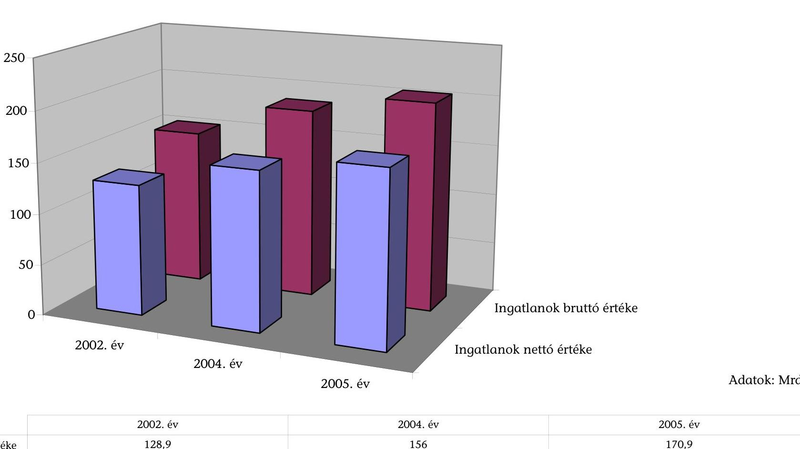

# Az ellenőrzött felsőoktatási intézmények ingatlan vagyonának adatai

|   | 2002. év | 2004. év | 2005. év  |
| --- | --- | --- | --- |
|  Ingatlanok nettó értéke | 128,9 | 156 | 170,9  |
|  Ingatlanok bruttó értéke | 153,8 | 187,3 | 205,5  |

Adatforrás: Az ellenőrzött felsőoktatási intézmények költségvetési beszámoló adatai

---

# Az ellenőrzött felsőoktatási intézmények ingatlanberuházási kiadásai 2002-2005 között 

Adatok: M Ft
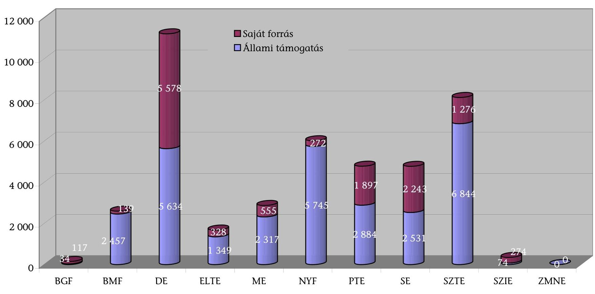

Adatforrás: Az ellenőrzött felsőoktatási intézmények költségvetési beszámoló adatai

---

# Az ellenőrzött felsőoktatási intézményeknél az egy hallgatóra jutó közvetlen oktatási terület 

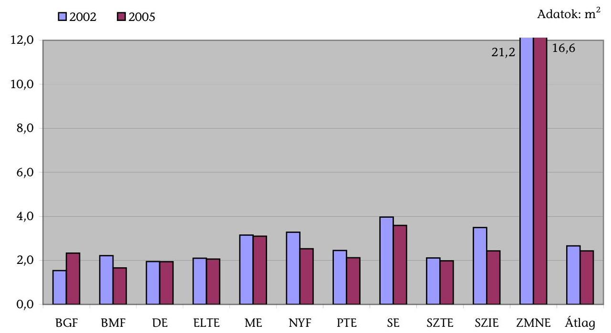
4. diagram

Az ellenőrzött felsőoktatási intézmények férőhelyeinek területi (és az ahhoz viszonyított időbeli) kihasználtsága 2004. évben
■Időbeli tantervi kihasználtsági szint $\square$ A teljes oszlop a területi kihasználtsági szintet mutatja
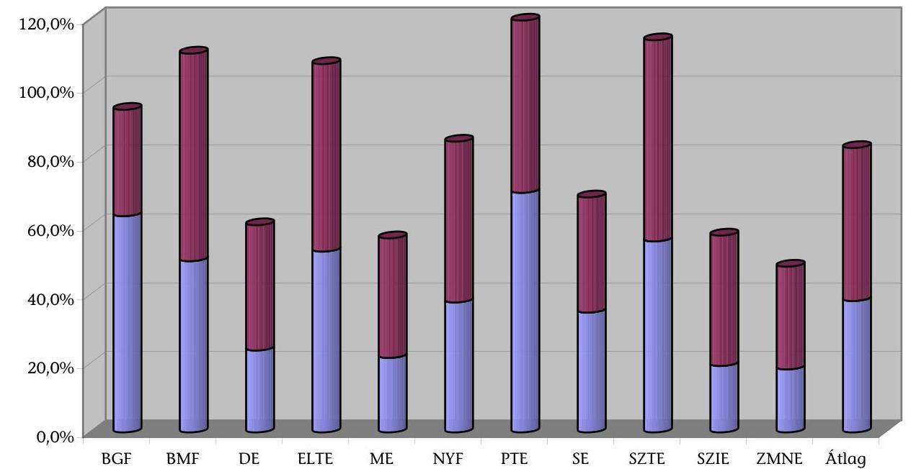

Adatforrás: Az ellenőrzött felsőoktatási intézmények tanúsítványi adatszolgáltatása

---

# Az ellenőrzött felsőoktatási intézmények tantervi időalaphoz viszonyított férőhely-kihasználtsága 

Adatok %-ban
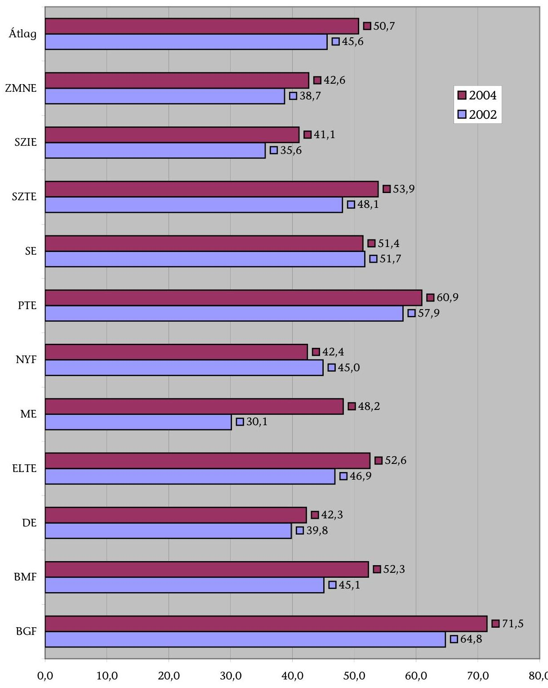

Adatforrás: Az ellenőrzött felsőoktatási intézmények tanúsítványi adatszolgáltatása

---

# ÖSSZESÍTETT KÉRDŐÍV a felsőoktatási állami intézmények ingatlangazdálkodásának ellenőrzéséről 

1. Az intézmény készítette-e a.) vagyongazdálkodási stratégiát; b.) éves vagyongazdálkodási, ezen belül c.) ingatlangazdálkodási tervet?

| 2002 |  |  | 2003 |  |  | 2004 |  |  |
| :--: | :--: | :--: | :--: | :--: | :--: | :--: | :--: | :--: |
| a | b | c | a | b | c | a | b | c |
| 6 | 9 | 7 | 6 | 9 | 7 | 6 | 9 | 9 |
| 4 | 1 | 3 | 4 | 1 | 3 | 4 | 1 | 1 |

2. A stratégiában meghatározták-e az alapfeladatok ellátásához igazodó ingatlangazdálkodási célokat, prioritásokat?

| 2002 | 2003 | 2004 |
| :--: | :--: | :--: |
| - igen | 6 | 7 |
| - nem | 2 | 1 |

3. Az ingatlangazdálkodási célok és tervek összhangban voltak-e az intézményfejlesztési tervekkel?

| 2002 | 2003 | 2004 |
| :--: | :--: | :--: |
| - igen | 8 | 9 |
| - nem | 2 | 1 |
| - részben | 0 | 0 |

4. A tervben felmérték-e az alapfeladatok ellátásához szükséges ingatlanok, helyiségek kapacitását?

| 2002 | 2003 | 2004 |
| :--: | :--: | :--: |
| - igen | 8 | 8 |
| - nem | 1 | 1 |

5. Az ingatlanállomány elegendő volt-e a feladatok ellátásához?

| 2002 | 2003 | 2004 |
| :--: | :--: | :--: |
| - igen | 4 | 3 |
| - nem | 6 | 7 |

7. Az ingatlanállomány elegendő volt-e a feladatok ellátásához?

---

6. Az éves ingatlangazdálkodási tervet a.) a kari tanácsok megtárgyalták-e, b.) a módosító javaslatok az éves tervbe beépítésre kerültek-e?

| 2002 |  | 2003 |  | 2004 |   |
| --- | --- | --- | --- | --- | --- |
|  a | b | a | b | a | b  |
|  1 | 3 | 1 | 3 | 2 | 4  |
|  8 | 6 | 8 | 6 | 7 | 5  |

1. Az előirányzott összes költségvetési támogatás (beruházás, felújítás, fenntartás) és a ténylegesen biztosított támogatás aránya alapján az ingatlangazdálkodás helyzete

| 2002 | 2003 | 2004  |
| --- | --- | --- |
|  1 | 1 | 3  |
|  6 | 6 | 3  |
|  3 | 3 | 4  |

1. Az éves vagyongazdálkodási tervben a.) megtervezték-e az alapfeladatok ellátásához szükséges ingatlanok karbantartási, felújítási munkáit és b.) azok várható kiadásait?

| 2002 |  | 2003 |  | 2004 |   |
| --- | --- | --- | --- | --- | --- |
|  a | b | a | b | a | b  |
|  9 | 9 | 10 | 10 | 10 | 10  |
|  1 | 1 | 0 | 0 | 0 | 0  |

1. Az intézmény és a KVI között a vagyonkezelői szerződés alapján létrejött együttműködés segítette-e a vagyongazdálkodási célok megvalósítását?

| 2002 | 2003 | 2004  |
| --- | --- | --- |
|  2 | 2 | 2  |
|  8 | 8 | 8  |

1. Kialakításra került-e az ingatlangazdálkodással foglalkozó szervezeti egység?

| 2002 | 2003 | 2004  |
| --- | --- | --- |
|  6 | 6 | 7  |
|  4 | 4 | 3  |

---

11. Az ingatlangazdálkodást végző szervezeti egység a.) összetétele, létszáma megfelelő volt-e, b.) elősegítette-e az optimális ingatlangazdálkodást?

| 2002 |  | 2003 |  | 2004 |   |
| --- | --- | --- | --- | --- | --- |
|   | a | b | a | b |   |
|  - igen | 6 | 5 | 6 | 5 | 7  |
|  - nem | 3 | 2 | 3 | 2 | 2  |

12. Az intézmény az éves beszámolóban értékelték-e a vagyongazdálkodási terv - annak hiányában vagyongazdálkodási tervékenységének - szakmai, tárgyi és számszaki végrehajtását?

| 2002 | 2003 | 2004 |
| --- | --- | --- |
| 10 | 10 | 10 |
| 0 | 0 | 0 |

13. A beszámolók meghatározott kritériumok alapján készültek?

| 2002 | 2003 | 2004 |
| --- | --- | --- |
| 10 | 10 | 10 |
| 0 | 0 | 0 |

14. A beszámolók alkalmasak voltak-e az ingatlangazdálkodásra fordított pénzeszközök eredményes, hatékony felhasználásának megítélésére?

| 2002 | 2003 | 2004 |
| --- | --- | --- |
| - igen | 2 | 2  |
|  - nem | 5 | 4  |
|  - részben | 3 | 4  |

15. A beszámolókat az intézményi tanács elfogadta-e?

| 2002 | 2003 | 2004 |
| --- | --- | --- |
| - igen | 8 | 8 |
| - nem | 2 | 2  |

---

16. A függetlenített belső ellenőrzés vizsgálta-e az ingatlangazdálkodás végrehajtását?
- igen
- nem

| 2002 | 2003 | 2004 |
| :--: | :--: | :--: |
| 2 | 2 | 3 |
| 8 | 8 | 7 |

17. Az ellenőrzés során a.) feltártak-e szabálytalanságokat, hiányokat b.) történt-e intézkedés a feltárt szabálytalanságok, hiányosságok alapján?
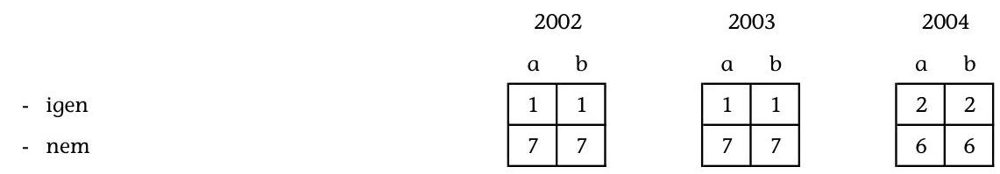
18. Az intézmény készített-e beszámolót a kincstári vagyonnal való gazdálkodásról a fejezet (OM, HM) és a KVI részére?
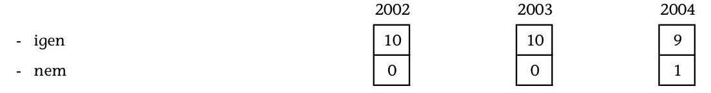

# Megjegyzés: 

Az összesítés az ellenőrzésbe vont 10 felsőoktatási intézmény válaszait tartalmazza a ZMNE adatai nélkül. A ZMNE vagyonkezelői jogosultsággal nem rendelkezik, ezért nem állt módjában a kérdőívet kitölteni.

---

# Kérdések, kritériumok és adatforrások a felsőoktatási állami intézmények ingatlangazdálkodásának ellenőrzéséhez

Az ellenőrzés fő kérdése: A felsőoktatási állami intézmények a kezelésükbe adott ingatlanokat gazdaságosan és hatékonyan működtetik-e?

|  Kérdések | Kritériumok | Adatforrások  |
| --- | --- | --- |
|  1. Megfelelőek-e a feltételek és a szabályozási környezet az ingatlangazdálkodás folytatására az állami felsőoktatási intézményekben? |  |   |
|  1.1 A szabályozási környezet és a fejezeti gazdálkodási felügyelet megfelelő feltételeket biztosított-e a felsőoktatási intézmények ingatlangazdálkodásához? | Eredményesség:
- a jogi szabályozás megfelelően biztosítja az állami feladatellátás során az ingatlan vagyon állagának, értékének megőrzését, növelését és védelmét;
- a jogszabályok módosításai elősegítik a hatékonyabb ingatlangazdálkodást;
- a központi költségvetésben a felsőoktatás számára meghatározott ingatlan-beruházási és felújítási előirányzatok teljesülése. | - államháztartásról szóló törvény, a felsőoktatásról szóló törvény, az államháztartás működési rendjéről szóló kormányrendelet, a kincstári vagyon kezeléséről, értékesítéséről és e vagyonnal kapcsolatos egyéb kötelezettségekről szóló kormányrendelet, a kincstári vagyonnal való gazdálkodásról szóló kormányrendelet;
- beruházási programterv, részprogram ismertető/ beruházás ismertető, részprogram engedélyokirat beruházási finanszírozási alapokmány;
- költségvetési és a költségvetés végrehajtásáról szóló törvények.  |

---

|  Kérdések | Kritériumok | Adatforrások  |
| --- | --- | --- |
|  1.2 Az intézményi ingatlangazdálkodási célok, tervek és stratégia biztosította-e az eredményes ingatlangazdálkodást? | Eredményesség:
- intézményi vagyon- és ingatlangazdálkodási stratégia kidolgozása, megvalósítása;
- az alapfeladatok ellátásához szükséges ingatlanok karbantartási, felújítási munkáinak megtervezése;
- az intézmény alapfeladatainak ellátásához szükséges ingatlan kapacitás felmérése;
- megfelelő hasznosítási terv kialakítása a nem használt ingatlanokra;
- a KVI és a felsőoktatási intézmények megfelelő együttműködése;
-

 az intézmények rendelkeznek pontos, megbízható ingatlanvagyon-nyilvántartással. | - elemi költségvetések, éves beszámolók;
- intézményi vagyon- és ingatlangazdálkodási stratégia, éves vagyongazdálkodási terv, az intézményfejlesztési terv beruházási része;
- ingatlan-hasznosítási terv, alapító okirat;
- vagyonkezelői szerződés és módosításai,
- ingatlan-analitika;
- Szervezeti és Működési Szabályzat, Gazdálkodási Szabályzat;
- Intézményi és Kari Tanácsok határozatai, rektori utasítások.  |
|  1.3 Az intézményi szervezeti és személyi erőforrások biztosították-e az eredményes ingatlangazdálkodást? | Eredményesség:
- az ingatlangazdálkodással foglalkozó szervezeti egység formája, létszáma és összetétele biztosítja a feladatok megfelelő ellátását.
Mérő- és mutatószámok:
- ingatlangazdálkodást végző szervezeti egység létszáma/feladata. | - Szervezeti és Működési Szabályzat, ügyrend, munkaköri leírások;  |

---

|  Kérdések | Kritériumok | Adatforrások  |
| --- | --- | --- |
|  1.4 A beszámoltatás és ellenőrzés rendszere hozzájárult-e az intézmények ingatlangazdálkodási feladatainak eredményes és hatékony ellátásához? | Eredményesség:
- az éves ingatlangazdálkodási terv megvalósításának ellenőrzése, abból fakadó intézkedések megtétele;
- belső kontrollrendszer működtetése, ami biztosítja az ingatlanállomány műszaki állagának megóvását, használhatóságát;
- beszámoló készítése az éves vagyongazdálkodási terv megvalósításáról, amiből megítélhető az ingatlangazdálkodásra fordított pénzeszközök gazdaságos és hatékony felhasználása. | - az éves ingatlangazdálkodási tervben megfogalmazott célok és prioritások;
- Intézményi Tanács és a Kari Tanácsok határozatai;
- költségvetési szervek belső ellenőrzéséről szóló kormányrendelet;
- belső ellenőrzés éves ellenőrzési tervei, beszámolói, ingatlangazdálkodásról készített ellenőri jelentések;
- éves vagyongazdálkodási tervről készített beszámoló, KVI ellenőrzési jelentései.  |
|  2. Az ingatlanállomány fejlesztése, fenntartása, terület- és helyiség-ellátottsága megfelelően biztosította-e az intézményi oktatási és kutatási feladatok ellátását? | Eredményesség:
- a beruházás megfelelő előkészítése, a finanszírozás célszerűsége;
- a beruházás a terveknek megfelelő időpontban és összeggel történő megvalósulása;
- a felhasználói igények kielégítése a megvalósított beruházással. | - közbeszerzésekről szóló törvény, közbeszerzési szabályzat;
- ajánlati felhívás, benyújtott pályázatok, a pályázatok felbontásáról és az elbírálásról szóló jegyzőkönyv és összegzés, tájékoztató az eljárás eredményéről;
- pénzügyi, műszaki ütemterv;  |

---

|  Kérdések | Kritériumok | Adatforrások  |
| --- | --- | --- |
|   | Gazdaságosság:
- a kijelölt fejlesztési célokat a tervezett ráfordításokkal teljesítik, figyelembe véve a beruházás mellett a fenntartás, felújítás később jelentkező költségeit;
- az ingatlanok elhasználódási szintjének javulása.
Mérő- és mutatószámok:
- a beruházási előirányzatok időszakonkénti alakulása;
- a beruházás tervezett/tényleges ráfordítása;
- a beruházás befejezésének tervezett/tényleges időpontja. | - vállalkozói szerződések, átadás-átvételi jegyzőkönyv, végelszámolás;
- beruházási programterv, részprogram-ismertető/ beruházás-ismertető, részprogram-engedélyokirat/ beruházási finanszírozási alapokmány.  |
|  2.2 Az ingatlan fenntartáshoz, felújításhoz, karbantartáshoz biztosított források felhasználása gazdaságos és eredményes volt-e? | Eredményesség:
- a szükséges felújítási munkák elvégzése, az ingatlanállomány alapfeladatok ellátására való üzemeltetése.
Gazdaságosság:
- az épületek üzemeltetését költséghatékonyan végzik;
- az ingatlanok felújítása és karbantartása a költségek racionalizálására hozott intézkedések által valósul meg. | - karbantartási, kisjavítási szolgáltatások kiadásainak eredeti, módosított és teljesített előirányzata;
- elemi költségvetések, éves beszámolók;
- költség-racionalizálásra hozott határozatok;
- ingatlanfelújítás eredeti, módosított és teljesített előirányzata;
- telephelyek, épületek szerinti kimutatás a tervezett és a tényleges fenntartás, felújítási, karbantartási kiadásokról.  |

---

|  Kérdések | Kritériumok | Adatforrások  |
| --- | --- | --- |
|   | Mérő- és mutatószámok:
- fajlagos működési, karbantartási és felújítási kiadások alakulása évenkénti összehasonlítása. |   |
|  2.3 Az intézmények terület- és helyiség-ellátottsága biztosította-e az oktatás-kutatás feladatainak ellátását? | Eredményesség:
- az integrációt követően az intézmények férőhely-ellátottságának javulása.
Hatékonyság:
- az egy főre (hallgató, oktató) jutó oktatási terület (közvetlen és közvetett oktatási célú terület) megfeleltetése az alapfeladat ellátásának.
Mérő- és mutatószámok:
- egy hallgatóra jutó oktatási terület $\left(\mathrm{m}^{2}\right)$ alakulása
- egy oktatóra jutó oktatási terület $\left(\mathrm{m}^{2}\right)$ alakulása | - ingatlan-nyilvántartás (az intézmények telephelyeinek, épületeinek oktatási és nem oktatási célú alapterülete);
- 2. sz. tanúsítvány az intézmény helyiségeiről;
- 3. sz. tanúsítvány a felsőoktatási intézmények alapterületre vetített hatékonysági mutatóiról;
- 9. sz. tanúsítvány az intézmény sportlétesítményeinek adatairól;
- a felsőoktatási intézmények hallgatói és oktatói létszámadatai.  |
|  2.4 Ingatlan bérbevételének szükségessége, célszerűsége, gyakorlati megvalósítása megfelelő volt-e? | Eredményesség:
- az ingatlanokat, helyiségeket alapfeladatok ellátásához veszik bérbe;
- a bérbevett ingatlan kielégíti az igényeket, lehetővé teszi az oktatási-kutatási feladatok elvégzését. | - 8. sz. tanúsítvány a bérbevett ingatlanokról, helyiségekről;
- közbeszerzésekről szóló törvény, közbeszerzési szabályzat;  |

---

|  Kérdések | Kritériumok | Adatforrások  |
| --- | --- | --- |
|   | Gazdaságosság:
- az ingatlan bérleti díj megfelel az átlagos piaci árnak.
Mérő- és mutatószámok:
- szerződés szerinti bérleti díj/átlagos piaci ár. | - kérdőíves felmérés és interjúk;
- ingatlanbérleti szerződések, módosítások;
- árajánlatok, közbeszerzés esetén ajánlati felhívás, elbírálásról szóló jegyzőkönyv.  |
|  3. Az integrációt követő időszakban az ingatlanok kihasználtsága és hasznosítása eredményes és gazdaságos működtetést tett-e lehetővé az integrálódott intézményekben? |  |   |
|  3.1 Az ingatlanok kihasználtsága hozzájárult-e az eredményes és gazdaságos intézményi működéshez? | Eredményesség:
- az oktatási célú és egyéb használatú alapterület arányának alapfeladat ellátás szerinti megfelelő alakulása;
Gazdaságosság:
- az integrált intézményekben az oktatási célú ingatlan terület kihasználtsága megfelelő;
- a tényleges kihasználtság megfelel a tervezett, illetve optimális kihasználtságnak az oktatási célú és egyéb használatú helyiségeknél. | - az intézményeknél kialakított teljesítménymutatók;
3. és 4. sz. tanúsítvány a felsőoktatási intézmények alapterületének kihasználtságáról;
- ingatlan-nyilvántartás (az intézmények telephelyeinek, épületeinek oktatási és nem oktatási célú alapterülete);
- az ingatlangazdálkodási szakterületről megjelent értékelések, felmérések;
- kérdőíves felmérések és interjúk;
- a felsőoktatási intézmények oktatói és gazdasági vezetőinek értékelése;  |

---

|  Kérdések | Kritériumok | Adatforrások  |
| --- | --- | --- |
|   | Hatékonyság:
- a hallgatói órarend összeállításánál a jobb terem-kihasználtság elérése.
Mérő- és mutatószámok:
- oktatási/egyéb célú területek aránya;
- az oktatási-kutatási területek tényleges/maximális kihasználtsága;
- az oktatási-kutatási területek tényleges/tervezett kihasználtsága. | - a felsőoktatási intézmények belső ellenőrzésének megállapításai az ingatlangazdálkodás eredményességéről, hatékonyságáról.  |
|  3.2 Eredményes volt-e a használaton kívüli, feleslegessé vált ingatlanállomány hasznosítása? | Eredményesség:
- a felsőoktatási intézmények kezelésében levő, használaton kívüli, nem hasznosított ingatlan létezése;
- a használaton kívüli ingatlanokat értékesítik, bérbeadják vagy egyéb más módon hasznosítják.
Gazdaságosság:
- a szabad kapacitások bérbeadásánál, a bérleti hasznosítás a költség/haszon megfelelő arányának érvényesítése mellett járnak el;
- a bérleti díj megfelel a piaci árnak. | - bérleti és lízing-díj bevételek eredeti, módosított és teljesített előirányzata;
- kincstári ingatlanvagyon értékesítésének dokumentumai (KVI engedélye, felhívás, jegyzőkönyv, szerződés);
- kérdőíves felmérés és interjúk;
- ingatlanhasznosítási terv;
- ingatlanok és földterületek értékesítési bevételének eredeti, módosított és teljesített előirányzata;
- ingatlan bérleti szerződések és módosításaik;
- 5., 8., 9. sz. tanúsítvány.  |

---

|  Kérdések | Kritériumok | Adatforrások  |
| --- | --- | --- |
|   | Mérő- és mutatószámok:
- alapfeladatra/más célra hasznosított ingatlanok száma (db);
- bérleti díjak alakulása (E Ft);
- értékesítésből származó bevétel (E Ft). |   |
|  3.3 Az ingatlangazdálkodás hatása biztosította-e a színvonal-javulást az oktatás-képzésben, kutatás-fejlesztésben és működtetésben? | Hatékonyság:
- az ingatlanhasznosításból származó bevételek felhasználásával javulnak az intézmény működési feltételei;
- a működési feltételek javítása hozzájárul az oktatás-képzés, kutatás-fejlesztés színvonalának emeléséhez.
Mérő- és mutatószámok:
- értékesítés + bérleti bevételek/költségvetési bevételek;
- oktatási célú alapterület nagyságának változása $\left(\mathrm{m}^{3}\right)$. | - az intézmény bérleti és lízing-díj bevételeinek eredeti, módosított és teljesített előirányzata;
- ingatlanok és földterületek értékesítésének eredeti, módosított és teljesített előirányzata;
- költségvetési bevételek eredeti, módosított és teljesített előirányzata.  |

---

# FÉNYKÉPEK AZ ELLENŐRZÖTT INTÉZMÉNYEKRŐL

---

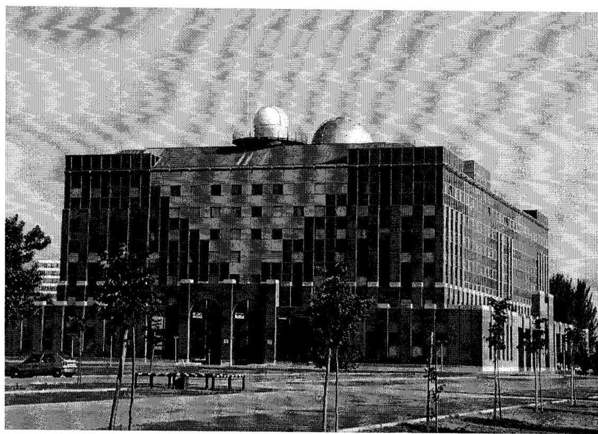

ELTE lágymányosi északi tömb
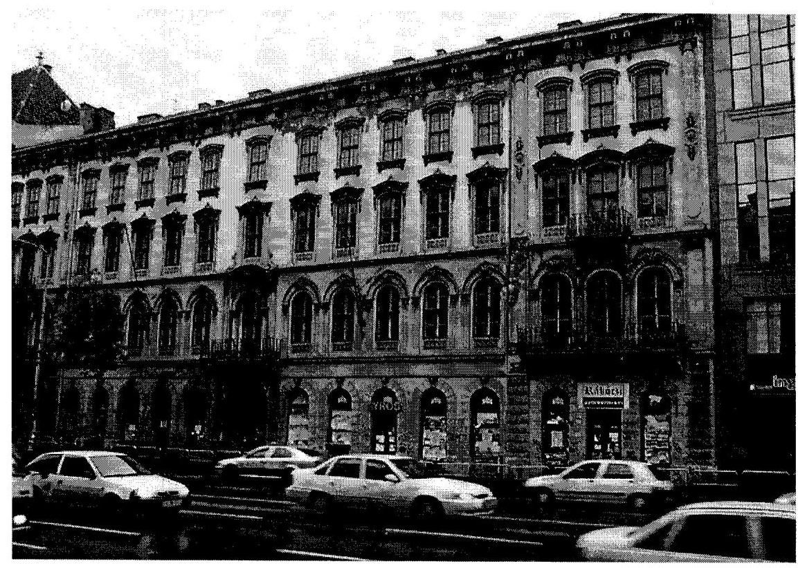

ELTE, Budapest VII., Rákóczi út 5.

---

SE-EFK felújított Vas utcai épülete - Homlokzat és belső kert
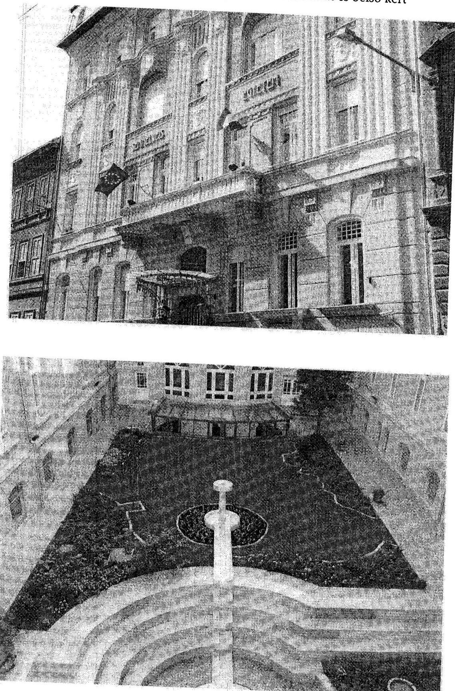

---

# FÜGGELÉK

---

# A VITÉZ JÁNOS RÓMAI KATOLIKUS TANÍTÓKÉPZŐ FŐISKOLA MŰKÖDÉSÉNEK ÉS GAZDÁLKODÁSÁNAK ELLENŐRZÉSE 

#### Abstract

Az ellenőrzés célja annak megállapítása volt, hogy a Vitéz János Római Katolikus Tanítóképző Főiskola stratégiai terve és annak megvalósítása milyen hatást gyakorolt az oktatással összefüggő feladatok ellátására (szervezeti felépítés, hallgatói létszámemelkedés, személyi és tárgyi feltételek alakulása figyelemmel a folyamatban lévő beruházás üzemeltetési feltételeire), valamint a gazdálkodással összefüggő finanszírozásának, az intézményi gazdálkodás stabilitásának, átláthatóságának, ezen belül a Gyakorló Általános Iskola működtetése hatásának minősítése.

Az ellenőrzött időszak: 2002-2005 közötti időszak (2006. évi kihatásokkal).

## BEVEZETÉS

A Vitéz János Római Katolikus Tanítóképző Főiskola (továbbiakban: Főiskola) 1993-tól ismét az Esztergom-Budapest Főegyházmegye fenntartásában működik. Az intézményben tanító szakos, német és szlovák nemzetiségi tanító, hitoktató-hittanár, szociálpedagógus és kommunikáció-művelődésszervező szakos hallgatók képzése folyik, nappali és levelező tagozaton, államilag finanszírozott és költségtérítéses finanszírozási formában.

A Főiskola több mint 150 éves hagyományai alapján - a régióban, illetve a Magyar Köztársaság 2000. január 1-jével átalakult felsőoktatási rendszerében betölthető, valamint a kialakuló európai uniós környezetben prognosztizálható szerepéből, kapcsolatrendszeréből kiindulva - meghatározta középtávú, a 2000-2004 közötti időszakra érvényes intézményfejlesztési stratégiai tervét. Ennek értékelése elkészült és azt a 2005. évben végrehajtott takarékossági intézkedésekkel kiegészítették.

Az intézmény oktatómunkája során az autonóm, hitükben, hivatásukban elkötelezett tanítók, hitoktatók, világi szakképzettséggel rendelkező pedagógusok képzésére törekedett. A képzési folyamatban lehetőséget biztosított a tudományos ismeretek bővítésére, alkalmazására, az egyéni képességek kibontakoztatására, a kutatási eredmények megismerésére.

A Főiskola az egységes európai felsőoktatási térséghez való magyar elkötelezettség és fokozatos közeledés jegyében az új képesítési követelmények alapján újra definiálta a szakok oktatásának valamennyi elemét (pl. tantárgyi, szigorlati követelmények, záróvizsga tételek), valamint elkészítette az új Tanulmányi és Vizsga Szabályzatot.

---

# RÉSZLETES MEGÁLLAPÍTÁSOK 

## 1. A Főiskola stratégiai terve és megvalósítása

### 1.1. A Főiskola szervezeti változása és a hallgatói létszámnövekedéssel összefüggő beruházás működtetése

A vonatkozó kormányrendeleteknek megfelelően ${ }^{1}$ a Főiskola is megkezdte az általa oktatott szakok kredit alapú minta tanterveinek kidolgozását. Elkészítették az intézményi és szaktájékoztatókat, az új tanulmányi és vizsgaszabályzatot. A Nemzeti Információs és Infrastruktúra Fejlesztési Iroda (NIIF Iroda) pénzügyi támogatásával - 2002. szeptembertől felmenő rendszerben 2005. szeptemberrel bezárólag - bevezették a kreditrendszerű tanulmányok nyilvántartását biztosító NEPTUN 2000 egységes tanulmányi rendszert.

A Főiskola stratégiai célkitűzései a következőkre irányultak:

- az oktatási kapacitás és volumen növelése (képzési kínálat, hallgatói létszám bővítése);
- az oktatói összetétel tekintetében a mennyiségi és minőségi mutatók javítása, rugalmasabb szervezeti struktúra kialakítása;
- az oktatási tanulmányszervezési rendszer korszerűsítése a kredit rendszer bevezetésével, az oktatást segítő infrastruktúrafejlesztések korszerűsítése;
- a nem állami erőforrások (saját bevételek) arányának növelése, a belső erőforrások felhasználási hatékonyságának emelése (felesleges kiadások csökkentése), átláthatóság;
- kutatás, kutatás-fejlesztés tekintetében az egyes szakok oktatásának szaktudományos megalapozottságának biztosítása;
- a nemzetközi kapcsolatrendszer erősítése, elmélyítése.

A fenti prioritások érvényesülése érdekében a szervezeti struktúra megváltoztatására volt szükség, amelyet a Főiskola az ellenőrzött időszakban - a létrehozott tanszéki és képzési struktúrát vizsgáló bizottság közreműködésével - megvalósított. Ennek során megteremtették a humán területek egységét a szakok, tanszékek integrálásával.

A 2002. évi nyolc szak helyett - az óvodapedagógus és a szlovák óvodapedagógus szakok megszüntetésével, illetve szüneteltetésével - 2003. évben hat szak meghirdetésére került sor (ezen felül a hitoktató-hittanár szakot bármelyik szakon tanuló hallgató felveheti).

[^0]
[^0]:
 ${ }^{1}$ 90/1998. (V. 8.) Korm. rendelet, 200/2000. (XI. 29.) Korm. rendelet és a 77/2002. (IV. 13.) Korm. rendelet

---

A Főiskolai Tanács határozata értelmében a tanszéki szerkezetet is átalakították, integrálták 2004. évben. Erre az alacsony létszámmal működő tanszékek, valamint a lejárt vagy lejáró és törvényesen már nem hosszabbítható kinevezések adtak lehetőséget.

A létrehozott tanszéki struktúra a korábbival szemben kompatibilitást mutat a főiskola jelenlegi és a jövőben várható képzési kínálatával. Az ellenőrzött időszakot megelőzően 10, jelenleg 6 tanszék látja el az oktatási feladatokat. A tanszékek átszervezése évi 2,2 M Ft megtakarítást eredményezett.

A Főiskola összes hallgatói létszáma az ellenőrzött időszakban a 2002. évi 1005 főről 2004. évben 1264 főre, 25,8%-kal növekedett. Ezen belül a nappali képzésben résztvevő hallgatók létszáma 641 főről 696 főre, 8,6%-kal nőtt. Az emelkedést jelentős részben a leginkább keresett szakokat (kommunikáció, művelődésszervező) kínáló levelező tagozatos képzés növekedése eredményezte.

A hallgató- és oktató létszám változásának eredményeképpen 2002-ben a hallgató/oktató arány 11,4 volt, 2004-ben 12,4-re, 2005-ben 15,8-ra javult a mutató.

A Főiskola középtávú fejlesztési stratégiai tervének kidolgozásakor a megelőző időszak (10 év) hallgatói létszámát is áttekintette, amely folyamatos növekedési trendet mutatott. A hallgatólétszám várható további emelkedéséből a 2005. évi 1409 főről 2006. szeptemberben 1550 főre növekszik - következik, hogy a tantermek számának növelésére lesz szükség.

Az intézmény felmérése szerint a főiskola 18 db 30-50 fő befogadóképességű teremmel rendelkezik. A hallgatólétszám alakulását tekintve 8 új tanterem kialakítása szükséges. Ennek az igénynek a kielégítését biztosítja a befejezéshez közeledő, egyházi finanszírozású beruházás, amelyben több intézmény (Hittudományi Főiskola, Érseki Levéltár, Mindszenthy Emlékmúzeum, Konferencia Központ) kap helyet.

Oktatási célra 8 tantermet ( $488 \mathrm{~m}^{2}$ ), továbbá közlekedő, kiszolgáló feladatokat ellátó tereket (együtt mindösszesen $1000 \mathrm{~m}^{2}$ alapterülettel) alakítanak ki 2006. tanévkezdésre. A terület fenntartási költség hozzájárulása intézményi becslés szerint kb. 3 M Ft évente, amelynek finanszírozására a gazdálkodás különböző területein elérhető megtakarítások nyújtanak fedezetet.

# 1.2. Az intézmény működtetése, a saját erőforrások növelésére tett intézkedések 

A Főiskolai Tanács javaslatára az intézmény gazdasági helyzetét intézményen belül áttekintették. A kiadások csökkentési lehetőségeinek vizsgálatára létrehozott bizottság átfogóan felmérte a főiskola, a kollégiumok és a gyakorlóiskola fenntartásában, működtetésében elérhető megtakarításokat, amely már 2005. évben, de főleg a következő, 2006. évben realizálható.

A felmérés tanszékenként megállapította a létszámváltozással összefüggő lehetőségeket (részben akkreditációs feltételeknek megfelelő, részben

---

fiatalabb oktatókkal történő kiváltás). Ennek alapján a létszámcsökkentéseket két ütemben hajtották végre. Az I. ütemben 2005. augusztus 31-től megvalósított három fő létszámcsökkentés (gazdasági ügyintéző, gyakorlóiskolai pedagógus, kollégiumnál udvaros) $6,5 \mathrm{M}$ Ft összegű kifizetési kötelezettséggel járt, a megtakarítás éves szinten várhatóan $8,5 \mathrm{M}$ Ft, amelyből a 2005. évi időarányos rész 2,1 M Ft volt. A 2005. októbertől kezdődő II. ütem három nyugdíjas korú oktatót, 1 fő oktatásszervezőt, 1 fő gyakorlóiskolai pedagógust érintett, amely összesen 13,5 M Ft összegű személyi juttatás (felmentés, jubileumi jutalom, járulékok) kifizetését vonta maga után. Ennek finanszírozását az egyházi fenntartó biztosította. A megtakarítás összege a későbbiekben lesz mérhető, a helyettük felvett, feltehetően fiatalabb pedagógusok és más besorolású oktatói bérek ismeretében.

Az intézménynél 2005. májusban felülvizsgálták a hallgatói költségtérítések mértékét. Az új első éves költségtérítéses hallgatók 10%-kal többet fizettek az elmúlt évinél, amellyel a jelenlegi befizetési kötelezettség 100 E Ft/félév. A felsőbb évfolyamokon a Főiskolai Tanács a költségtérítés mértékét az előző évi infláció mértékével módosította. A költségtérítéses hallgatók számának - a tapasztalati adatokon alapuló előzetes becslések szerint - várható növekedése következtében ez már 2005. évben 10 M Ft többletbevételt eredményezett.

Az oktatási tevékenységgel összefüggő külön-eljárási díjak (ismétlő vizsga, határidőre vonatkozó halasztási kérelem, stb.) felülvizsgálata is megtörtént 2005. októberében. Az új díjak megközelítik a kormányrendeletben előírt lehetséges maximális mértékeket. A bevétel felhasználásának módosításával a Főiskolai Tanács lehetővé tette a befizetett összegek 50%-ának a működésre történő felhasználását, amely éves szinten várhatóan 0,8 M Ft lesz a további években.

A kollégiumokban rövidtávon a kollégiumi térítési díj megemelésével, a későbbiekben - átalakítással - a férőhelyszám növelésével lehet bevételnövekedést elérni. A két kollégium szolgáltatásainak felülvizsgálatával a többletszolgáltatások miatt a kollégiumi díj emelésére vonatkozó javaslatot a Főiskolai Tanács a 2005/2006-os tanévtől kezdődően elfogadta. A döntéssel az intézmény saját bevétele évente 5,9 M Ft-tal emelkedik (a 2005. évi hatása 2,2 M Ft).

A Gyakorló Általános Iskolát érintő személyi változások költségcsökkentő hatása 2006. évben várható, amely a számítások szerint 2005. évben időarányosan 2,4 M Ft-ot, a következő évben 6,2 M Ft-ot tesz ki. Ez munkaviszony megszűnésből, a munkaközösség vezetők, valamint a szakvezetők létszámának csökkentéséből (alacsonyabb pótlék, illetve a túlórákra kifizetett összegek csökkenése) keletkezik.

Az intézmény gazdasági vezetése - a gazdálkodás részét képező rezsi költségek csökkentése érdekében - áttekintett és módosított több szolgáltatóhoz (INVITEL, MATÁV) kötődő szerződést, amely a következő évben 2,5 M Ft-tal mérsékli a működési költségeket.

---

Az intézmény egész területén felmérték az elektromos fogyasztó berendezések számát, szükségességét. Az ezzel összefüggő lekötési szerződések felülvizsgálatával és módosításával további kiadáscsökkenés realizálható.

A Főiskola - a leíróiroda átszervezésével, valamint a rendelkezésre álló beruházási keret igénybevételével - saját üzemeltetésű sokszorosító irodát hozott létre. Ennek működtetését, valamint a Tanulmányi Tanácsadó Iroda számítástechnikai feladatait - a NEPTUN rendszer megvalósulásával - egy fő látja el a korábbi két dolgozó helyett, amelyből 2005. szeptemberétől 1,1 M Ft/év megtakarítás származik.

A Főiskola az egyik kollégium fűtésének és melegvíz-ellátásának biztosítására napkollektorok felszerelését tervezi, amelynek a beruházási költsége 7 M Ft-ot tesz ki. A Főiskola gazdasági vezetése folyamatosan figyelemmel kíséri a különböző pályázatokat (pl. környezetvédelmi stb.), amelyek elnyerésével a tervezett beruházás megvalósítható.

A bevételi lehetőségek növelését teszi lehetővé a 15 éve épült kollégium korszerűsítése, ezáltal a Főiskola további saját bevételeket érhet el. A kollégium komfortfokozatának így megvalósuló emelése (50 db zuhanyozó kialakítása), a szabad kapacitások szünidei hasznosításával lehetőséget biztosít az árak 20%-kal történő emelésére. A kollégiumi szabad férőhelyek nyári hasznosítása a jelenlegi színvonalon már 2005. évben 10 M Ft bevételt eredményezett a befizetési kötelezettségeken (áfa, idegenforgalmi adó) felül, amely a kollégiumi díj minőségi besorolásával a szorgalmi időben is további bevételnövekedést eredményez. A számítások szerint a beruházás - azonos vendégéjszakák feltételezése mellett - öt év alatti megtérülést ígér.

# 1.3. A Főiskola létszám-ellátottsága, összetétele 

A Főiskola szervezeti egységei a létszám alapján a főiskolai oktatásban 60%-ot, a kollégiumokban 10%-ot, a gyakorlóiskolában 30%-ot tettek ki.

A Főiskola oktatási feladatait az ellenőrzött időszakban - a hallgatói létszám növekedése mellett - közel azonos oktatói és alkalmazotti létszámmal végezte. A főfoglalkozású oktatók létszáma 49 fő, illetve 48 fő volt 2002. és 2004. években. Az alkalmazotti átlagos állományi létszám (gazdasági és műszaki, könyvtári, tanulmányi hivatali, kollégiumi és technikai alkalmazottak, gyakorlóiskola pedagógusok) 121 főt, illetve 127 főt tett ki. A létszámcsökkentések egész éves hatása 2006. évben várható. A 2005. évi foglalkoztatottak létszáma azonos az előző évivel, 175 fő.

Bizonyos szakok - művelődésszervező-kommunikáció, szociálpedagógus - oktatásához óraadók igénybevétele szükséges. Az óraadók létszáma magas, mivel az első említett szakon viszonylag kevés óraszámmal sok külső oktatót foglalkoztatnak, a második szakon a külső óraadók száma kevesebb, de több órát tartanak. Így 2002. évben 443, 2004. évben 294 megbízási szerződést kötöttek külső óraadókkal, illetve gyakorlatvezetőkkel. A feladatok ellátása érdekében a külső megbízásokra a Főiskola 2002. évben 32,0 M Ft-ot, 2004. évben 34,9 M Ft-ot fordított. Ezen felül a költségtérítéses levelező képzésnél a főállású

---

oktatók megbízási díjazásánál 67, illetve 61 szerződésre 19,3 M Ft-ot, illetve 23,1 M Ft-ot fordítottak.

A helyszíni ellenőrzés során áttekintett megbízási szerződések (2004/2005. tanév II. félév 25 db, a 2005/2006. tanév I. félév 15 db) tartalma összhangban volt az órarenddel és az oktatói követelményrendszerről szóló szabályzatban foglaltakkal. A megbízási szerződéseken pontosan, ellenőrizhető módon tüntették fel a feladatokat. A kifizetések a tanszékvezetők igazolása alapján, jogszerűen történtek.

Az oktatói létszám összetételében a minősített oktatók száma az ellenőrzött időszak éveiben közel azonos volt. A főiskolai tanárok (7 fő) és docensek (23 fő) létszáma nem változott, az adjunktusi létszám (10 főről 8 főre) csökkent, a tanársegédek száma (6 főről 7 főre) nőtt. A 2005. évi októberi statisztika szerint a minősített (kandidátus, mester tanár, habilitált, PhD) oktatók száma a korábbi 8 főről 12 főre emelkedett.

A Főiskola elkészítette az oktatói követelményrendszerről szóló szabályzatát, amelynek része az oktatók heti, illetve évi óraszámának meghatározása. Az oktatók létszáma és az ellátandó órák száma alapján az éves óraterhelés átlagosan 312 óra/tanév volt 2002-ben, illetve 2004-ben, mivel az óratervi órák száma (15 032 és 14 980 óra) és az oktatói létszám számottevően nem változott. (Az adatok csak a főfoglalkozású oktatók óraterhelését tartalmazzák). A tanúsítványban kimutatott tényleges óraszámok a szabályzatban rögzített oktatói minősítések szerinti óraszámoknak megfeleltek.

# 2. AZ INTÉZMÉNY FINANSZÍROZÁSA 

### 2.1. A főiskolai oktatás finanszírozása

A Főiskola finanszírozása az 1991. évi XXXII. törvényen alapuló, 1993. évben megkötött megállapodás alapján történt. A Művelődési és Közoktatási Minisztérium és a Római Katolikus Egyház képviseletében az Esztergomi Főegyházmegye megállapodott az esztergomi Vitéz János Tanítóképző Főiskola egyházi tulajdonba adásáról.

A működési és fenntartási kiadások fedezetét az állami fenntartású tanítóképző főiskolákkal azonos szinten az Oktatási Minisztérium (OM) biztosította a központi költségvetés terhére, mivel az intézmény a szerződésben vállalt állami feladatot ellátja. A főiskola a hasonló feladatot ellátó állami intézményekkel azonos normatív állami hozzájárulásban részesült, amelyek jogcímeit és összegeit, illetve arányait az adott éves költségvetési törvény tartalmazta, összhangban a felsőoktatási törvény rendelkezéseivel.

Az állami intézményekkel azonos mértékű támogatás az állami intézményekkel azonos rend szerint felvett hallgatók után járt. A Kormány által évente meghatározott felvehető, államilag finanszírozott hallgatói összlétszám az egyházi felsőoktatási intézmények államilag finanszírozott hallgatói létszámát is tartalmazta.

---

A központi költségvetésből biztosított állami támogatási normatívák felhasználásával egyrészt a felsőoktatási, másrészt a közoktatási feladatokat finanszírozták. Az intézmény működéséhez és fenntartásához „a hallgatók pénzbeli juttatásai, a kollégiumi támogatás, a gyakorló iskolák támogatása, a képzési és fenntartási támogatás egyházi hitéleti képzésre, képzési és fenntartási támogatás egyházi világi képzésre, valamint az egyházi felsőoktatási intézmények fejlesztési, beruházási kerete" előirányzatok terhére részesült állami támogatásban.

A Főiskola bevétele egyrészt az állami támogatásból, másrészt a saját bevételekből származik. A két forrás aránya 2002. évben 81,4% állami támogatás és 18,6% saját bevétel, az arány 2004. évben 86,0-14,0%-ra változott.

A pályázati támogatások átvett pénzeszközként, működési kiadásra nem fordítható céljellegű támogatások voltak. (Az ellenőrzött időszakban megvalósult beruházás és felújítás fedezete - 2004. év kivételével - nem volt része az intézmény költségvetésének, mivel a finanszírozás közvetlenül a Kincstáron keresztül történt.)

Az állami támogatás összegéről az OM és a Főiskola
 finanszírozási szerződést kötött az egyes évek első negyedévében, illetve félévében. Az OM részéről történő visszaigazolásra minden évben későn, a harmadik, illetve negyedik negyedévben került sor. Kedvező változás volt, hogy 2005-ben az OM az aláírt szerződést már májusban megküldte az intézménynek.

Az intézmény elszámolási kötelezettségének határidőre - a tárgyévet követő január 31-ig - minden évben eleget tett. Az elszámolásból adódó támogatást azonban az OM csak a fejezet előirányzat-maradványának Pénzügyminisztérium által történő elfogadását (augusztus-szeptember) követően folyósította.

Az állami támogatás folyósításának ütemezése az előzőekből következően elsősorban év közben okozott átmeneti nehézségeket, mivel a Főiskola és az OM közötti finanszírozási megállapodás visszaigazolása (2005. év kivételével) jelentős késedelemmel történt meg, az OM a két évvel korábbi hallgatói létszám alapján folyósított előleget. Ugyanakkor a Főiskola a magasabb hallgatói létszámnak megfelelő kötelezettségét kellett, hogy teljesítse.

A normatív képzési és fenntartási költségvetési támogatás megfelelő igénybevétele érdekében a Főiskola az ellenőrzött időszakban a jóváhagyott állami finanszírozású keretszámokat feltöltötte és a felvett hallgatókat megtartotta.

A felsőoktatással összefüggő normatívák előirányzatai a 2006. évi költségvetésben összességében 3,7%-kal (457 M Ft) magasabbak az előző évi előirányzatoknál, a többlet, részben a létszámnövekedést, részben a felsőoktatási normatívák változásával összefüggő szükségletet várhatóan fedezi.

---

A helyszíni ellenőrzés befejezésekor (2005. december 10.) még szakmai egyeztetés előtt állt az új normatíva megállapításáról szóló kormányrendelet ${ }^{2}$. A finanszírozási megállapodások megkötésére csak a rendelet 2006. évi megjelenését követően kerül sor.

# 2.2. A gyakorlóiskola finanszírozása 

A Főiskola oktatási tevékenységéhez tartozó Gyakorló Általános Iskola fenntartására a költségvetési törvényben meghatározott közoktatási normatívát (állami támogatás) a Komárom-Esztergom Megyei Területi Államháztartási Hivatal (TÁH) - 2003. július 1-jétől Kincstár Komárom-Esztergom Megyei Területi Igazgatóság - megfelelő időben folyósította. A TÁH a különböző normatívákra (az alapfokú nevelés-oktatási alapnormatívák, kiegészítő hozzájárulások, kötött felhasználású támogatás) való jogosultságról szóló határozatot (a Főiskola által benyújtott adatlapok alapján) az előírt időpontban, március és szeptember hónapokban készítette el.

A Főiskola a normatíva igényléséhez benyújtott létszámfelmérő adatlapokat a tényleges tanügyi okmányok alapján megalapozottan töltötte ki. A normatívák alapján a gyakorlóiskola 383 fő, illetve 418 fő átlagos tanuló létszám oktatási és egyéb feladatainak ellátásához 2002. évben 145 M Ft, 2004. évben 199 M Ft támogatásban részesült. Az alaptevékenységgel összefüggő saját bevételen túl, mindössze 3,5 M Ft, illetve 0,6 M Ft kiegészítésre volt szükség. A tényleges kiadás 2002. évben 158 M Ft, a 2004. évben 212 M Ft volt.

A gyakorlóiskolát érintő takarékossági intézkedések eredménye, hogy 2005. évben a bevételek (állami támogatás és a gyakorlóiskola alaptevékenységével összefüggő saját bevételek) - várhatóan - teljes mértékben fedezik a kiadásokat.

A támogatással történő elszámolási kötelezettségét a Főiskola minden évben határidőre teljesítette. A 2004. évi normatív kötött felhasználású támogatások jogszerű felhasználásának év végi elszámolását az éves költségvetési törvényekben előírtaknak megfelelően könyvvizsgáló igazolta.

A gyakorlóiskolai normatíva forrása a „Humánszolgáltatások normatív támogatása" és az „Egyházi és kisebbségi közoktatási intézmények kiegészítő támogatása". A 2006. évi költségvetésben ezek a fejezeti kezelésű előirányzatok 3,0-3,4%-kal alacsonyabb összegűek az előző évi előirányzatnál. Az Országgyűlés 2005. november 29-én 1,3 Mrd Ft többletet szavazott meg ezekre a célokra, amelynek figyelembe vételével összességében már csak 1,4%-kal (összesen 1,2 Mrd Ft-tal) kevesebb a jelenlegi tervszám az előző évinél. A többlettel együtt összesen 80,3 Mrd Ft áll rendelkezésre a két fejezeti kezelésű előirányzaton. Mindkét normatív támogatás a költségvetés előírása alapján „felülről nyitott", amely biztosítja a létszámnövekedések fedezetét.

[^0]
[^0]:    ${ }^{2}$ A felsőoktatási intézmények képzési és fenntartási normatíva alapján történő finanszírozásáról, az időközben megjelent 52/2006. (III. 14.) Korm. rendelet intézkedik.

---

A 2006. évi költségvetés ismeretében az ellenőrzés megállapította, hogy a kiegészítő normatívák struktúrája az előző évhez képest változik, azonban a gyakorlóiskola feladatellátását - az OM tájékoztatása szerint - alapvetően nem befolyásolja.

Az ellenőrzés befejezésekor még egyeztetés alatt állt a közoktatáshoz kapcsolódó kiegészítő normatívák megállapítása.

# 2.3. Az intézményi gazdálkodás 

A Főiskola a gazdálkodását (költségvetés, könyvelés és mérlegbeszámoló) a költségvetési szervekre vonatkozó jogszabályok alapján végezte. A költségvetést minden évben megalapozottan, áttekinthetően és a nyilvántartásokkal ellenőrizhető módon állította össze.

A Főiskola (beleértve a gyakorlóiskola és kollégiumok szervezeti egységeit is) az ellenőrzött időszakban 571,3 M Ft (2002.), illetve 769,6 M Ft (2004.) bevétellel rendelkezett, amely biztosította az intézmény kiadásaihoz a szükséges fedezetet. A növekedés mértéke két év alatt összesen 34,7%-ot tett ki, amely elsősorban a hallgatói létszámemelkedéssel volt összefüggésben.

A saját működési bevételek az intézményi költségvetés 15,7%-át, illetve 12,3%-át tették ki. Az intézményi működési bevétel (98,8 MFt, illetve 94,7 MFt) legnagyobb forrását a költségtérítéses hallgatók befizetései jelentették. A 2005. évi intézményi működési bevétel alacsonyabb volt a korábbi éveknél (81,7 MFt), amely a korábbi költségtérítéssel szemben az államilag finanszírozott levelező képzés felmenő rendszerével magyarázható.

A tényleges kiadások a vizsgált időszakban 567,1 M Ft-ot, illetve 771,8 M Ft-ot tettek ki. A kiadások nagyobb részét (69,5%-66,9%) a személyi juttatások és járulékai képezték. A dologi kiadások 20%-ot jelentettek, a további hányadot az ellátottak juttatásai és a felhalmozási kiadások (felújítás, beruházás) tették ki.

A béremelés teljesítése minden évben nehéz helyzetet teremtett, mivel a forrását saját hatáskörben - a megbízási díjak csökkentésével és a dologi kiadások visszaszorításával - kellett biztosítani. Ennek érdekében az összes megbízási szerződést és munkaszerződést felülvizsgálták.

Az intézményi saját bevételek nagyobb része (pl. a költségtérítéses hallgatói befizetések, a kollégiumi kapacitás nyári hasznosítása) a gazdálkodási év második felében realizálódott. Ennek ellenére az intézmény vezetése a gazdálkodás stabilitását minden évben biztosította, likviditási problémák nem merültek fel.

Az intézmény ingatlanainak felújítási, beruházási igényeit - az OM felügyelete alá tartozó állami intézményekkel azonos módon - a tárca az egyházi felsőoktatási intézmények fejlesztési, beruházási kerete terhére finanszírozta.

A 2002. év során rendelkezésre álló 35,0 M Ft összegű támogatásból 28,0 M Ft-ot épület felújításra (fűtésrendszer továbbfejlesztés, vizesblokk fel-

---

újítás, villanyszerelési munkák, festés, mázolás, tetőfelújítás), 7 M Ft-ot informatikai és oktatástechnikai eszközök beszerzésére és működtetésére fordították.

A tanulmányi hivatal a beszerzések eredményeként folyamatosan ellátta a bővülő adminisztratív feladatokat. Új bérszámfejtő szoftvert állítottak be, az oktatást, kutatást szolgálta egy közös használatú szkennerrel felszerelt grafikus műhely üzembeállítása. A korábbinál nagyobb informatikai terem kialakítása a hallgatói ellátottság színvonalát javította, amelynél a NEPTUN szerverekhez való kapcsolódást is megoldották.

A 2003. évben biztosított 46,7 M Ft támogatás az oktatási feladatokat, a hallgatók körülményeinek javítását szolgálta. Fedezetet nyújtott épület felújításra (elektromos hálózat felújítás, ablakjavítás), átalakításra (Tanulmányi Tanácsadó Iroda, új, 100 főt befogadó tanterem), bővítésre (a díszudvaron gépkocsi-, lépcső-, mozgássérült feljáró kiépítése). Az új tanteremnél beszerzésre (bútor, függöny) közel 3 M Ft-ot fordítottak.

A 2004. évi 19,7 M Ft összegű támogatás elsősorban az előző évben megkezdett felújítások befejezését (főépület munkáinak folytatása, villanyszerelés, parketta, vizesblokk felújítás, PVC padló csere) szolgálta. Lehetőség nyílt a díszterem felújítására, székek és függönyök cseréjére.

A kollégiumban és a gyakorlóiskolában is különböző kisebb javításokat, felújítást (kábelcsere, fa játékok felújítása, bejáró járólapok, lépcsőjavítás, drótkerítés csere) hajtottak végre.

A 2005. évi támogatás kisebb, 7,2 M Ft összegű volt. Ennek ellenére számos feladat finanszírozása (főépület építészeti, gépészeti munkái, fénymásolók cseréje, kollégiumi, gyakorlóiskolai munkák) megvalósult.

Összességében megállapítható, hogy a Főiskola stratégiai célkitűzései teljesültek. Az intézmény vezetése az ellenőrzött időszakban folyamatosan törekedett a megfelelő, gazdaságosan működtethető intézményi struktúra (szakok összevonása, tanszékek számának, oktatók létszámának csökkentése stb.) kialakítására.

Ennek eredményeként a Főiskola gazdálkodásában a stabilitás, a kiszámíthatóság és átláthatóság érvényesült. A lehetőségek keretein belül megfelelően gondoskodtak az épületállomány állagáról, biztonságáról és berendezésének korszerűsítéséről.

A folyamatban lévő - jelenleg ismert - felsőoktatási törvény finanszírozási változásaiból, valamint a 2006. évi költségvetési törvényben meghatározott fejezeti kezelésű előirányzatokból származó bevétel várhatóan továbbra is megfelelő fedezetet nyújt mind a felsőoktatási, mind a gyakorlóiskolai oktatási feladatok biztosításához, a megfelelő színvonalú 2006. évi gazdálkodáshoz.

Budapest, 2006. június
