# ÁLLAMI   SZÁMVEVŐSZÉK 

## JELENTÉS

az Adó- és Pénzügyi Ellenőrzési Hivatal múködésének ellenőrzéséről

---

# 2. Államháztartás Központi Szintjét Ellenőrző Igazgatóság 

2.1. Teljesítmény Ellenőrzési Főcsoport

Iktatószám: V-17-34/2005-2006.
Témaszám: 783
Vizsgálat-azonosító szám: V0232

## Az ellenőrzést felügyelte:

Bihary Zsigmond
főigazgató
Az ellenőrzés végrehajtásáért felelős:
Kemény Emil
főcsoportfőnök
Az ellenőrzést vezette:
Vörös Mária
osztályvezető főtanácsos
Az ellenőrzést végezték:

| Dr. Földvári Gábor | Jäger Lajos | Józsa Ferencné |
| :-- | :-- | :-- |
| számvevő | számvevő | számvevő |
| Kapronczai Gabriella | Oláh Róbert | Temesváry Miklós |
| számvevő tanácsos, | számvevő | számvevő |
| tanácsadó |  |  |
| Uram Ferenc | Dr. Vass Gábor |  |
| számvevő tanácsos | számvevő tanácsos |  |

A témához kapcsolódó eddig készített számvevőszéki jelentések:
címe
sorszáma
A központi költségvetés adóbevételei, illetve a társadalombiztosítást illető adó- és járulékbevételek realizálásának ellenőrzéséről(2000)

Az áfa visszaigénylési rendszerének ellenőrzéséről (2003) 0310

A Pénzügyminisztérium fejezet múködésének ellenőrzéséről (2004) 0431
A személyi jövedelemadó bevallási és visszaigénylési rendszerének 0434 ellenőrzéséről (2004)

---

# TARTALOMJEGYZÉK 

BEVEZETÉS ..... 7
I. ÖSSZEGZŐ MEGÁLLAPÍTÁSOK, KÖVETKEZTETÉSEK, JAVASLATOK ..... 10
II. RÉSZLETES MEGÁLLAPÍTÁSOK ..... 17

1. Az APEH működésének értékelése ..... 17
1.1. Az APEH működésének értékelése mutatószámok alapján ..... 17
1.2. PM felügyeleti jogköre gyakorlásának értékelése ..... 20
1.2.1. A jogszabály-módosítások előkészítésének megalapozottsága, a jogszabályok közötti összhang ..... 20
1.2.2. A PM szakmai felügyeleti tevékenysége ..... 21
1.3. Az APEH teljesítményértékelési és ösztönzési rendszere ..... 22
2. Szervezet, feladatok és erőforrások összhangja ..... 24
2.1. Szervezet ..... 24
2.2. Feladatok ..... 25
2.2.1. Informatikai feladat-ellátás feltételei ..... 26
2.2.1.1. Informatikai fejlesztések ..... 26
2.2.1.2. Informatikai szervezet ..... 27
2.2.1.3. Informatikai szolgáltatások ..... 29
2.2.1.4. Feladat-ellátást támogató informatikai alkalmazások ..... 29
2.2.2. Ellenőrzési feladatok végrehajtása ..... 31
2.2.2.1. Az ellenőrzésre történő kiválasztás ..... 31
2.2.2.2. Az ellenőrzések végrehajtása ..... 31
2.2.2.3. Az APEH által fizetett késedelmi kamat alakulása ..... 34
2.2.3. Hátralékkezelési feladatok végrehajtása ..... 34
2.2.3.1. A hátralékállomány alakulása és a behajtásra tett intézkedések ..... 34
2.2.3.2. A hátralékfizetési kedvezményekre irányuló kérelmek elbírálása, a fizetési könnyítések, valamint a méltányossági jogkör gyakorlásának törvényessége ..... 37
2.2.3.3. A végrehajtással nem beszedhető hátralékállomány csökkentésére tett intézkedések ..... 37
2.3. Az APEH múködésének pénzügyi feltételei ..... 40
2.3.1. Humánerőforrás-gazdálkodás ..... 41
2.3.2. Bérgazdálkodás ..... 44
2.3.3. Informatikai beruházások és eszközállomány alakulása ..... 46
2.4. Az APEH belső kontroll-mechanizmusainak múködése ..... 48

---

2.4.1. A folyamatba épített és a vezetői ellenőrzések ..... 49
2.4.2. Törvényességi ellenőrzések értékelése ..... 50
2.4.3. Belső ellenőrzés értékelése ..... 51
3. Korábbi ÁSZ vizsgálatok utóellenőrzéseinek eredményei ..... 52
MELLÉKLETEK
1/a-b sz. melléklet Észrevételek
2. sz. melléklet Tanúsítványok jegyzéke
3. sz. melléklet A külső megkeresésre folytatott végrehajtási tevékenységekről 2005. decemberben
4. sz. melléklet Az APEH új feladatai az átfogó, 2000-2005. évre irányuló ÁSZ vizsgálathoz
5. sz. melléklet Behajtási tevékenységgel kapcsolatos részletező táblázatok
6. sz. melléklet Engedményezések részletezése

---

# RÖVIDÍTÉSEK JEGYZÉKE 

| APEH, Hivatal | Adó- és Pénzügyi Ellenőrzési Hivatal |
| :--: | :--: |
| APEH tv. | 2002. évi LXV. törvény az Adó- és Pénzügyi Ellenőrzési Hivatalról |
| AMIR | Adósminősítő Információs Rendszer |
| Art. | 2003. évi XCII. törvény az adózás rendjéről |
| ÁSZ | Állami Számvevőszék |
| Csőd tv. | 1991. évi XLIX. törvény a csődeljárásról, a felszámolási eljárásról és a végelszámolásról |
| FEUVE | Folyamatba épített előzetes és utólagos vezetői ellenőrzés |
| HVR | Hátralékkezelési és Végrehajtási Informatikai Rendszer |
| IFÜ | Informatikai Felügyeleti és Üzemeltetési Főosztály |
| ISZJ | Informatikai Szolgáltatások Jegyzéke: a felhasználók által megrendelhető informatikai üzemeltetési szolgáltatások jegyzéke |
| ITB | Informatikai Tárcaközi Bizottság |
| KAIG | APEH Pest megyei és Fővárosi Kiemelt Adózóinak Igazgatósága |
| KKI | Központi Kapcsolattartó Iroda. Az APEH Központi Hivatal Nemzetközi Főosztályának osztálya, amely az EU adóügyi együttműködési szabályainak tekintetében - a vám és a jövedéki adó kivételével - illetékes hatóságnak minősül. |
| MKK Rt. | Magyar Követelés Kezelő Részvénytársaság |
| PM | Pénzügyminisztérium |
| PSZÁF | Pénzügyi Szervezetek Állami Felügyelete |
| SzMSz | Szervezeti és Múködési Szabályzat |
| TAO | Társasági és osztalék adó |

---

.

---

# ÉRTELMEZŐ SZÓTÁR 

Adózó
Adókülönbözet

Adótartozás

Adóteljesítmény

Csődeljárás

DSM adatbázis-kezelő

Ellenőrzés fajtái

Ellenőrzési irányelv

Ellenőrzöttségi szint

Engedményezés
Felszámolási eljárás

Az a személy, akinek adókötelezettségét, adófizetési kötelezettségét törvény írja elő.
A bevallott (bejelentett), bevallani (bejelenteni) elmulasztott vagy a bevallás (bejelentés) alapján kivetett, kiszabott és az adóhatóság által utólag megállapított adó, költségvetési támogatás különbözete, vagy a büntető bíróság által jogerősen megállapított adóbevétel-csökkenés, illetőleg a jogosulatlanul igénybe vett költségvetési támogatás.
Az esedékességkor meg nem fizetett adó és a jogosulatlanul igénybe vett költségvetési támogatás.
Az adózó bruttó módon számított (költségvetési támogatással, adókedvezménnyel, adómentességgel növelt) öszszes, elévülési időn belüli adókötelezettségének egy évre vetített átlaga, amelyben az általános forgalmi adó esetében a fizetendő, továbbá az előzetesen felszámított és levonható általános forgalmi adó értékei közül a nagyobb abszolút értéket kell figyelembe venni.
Olyan eljárás, amelynek során az adós - a csődegyezség megkötése érdekében - fizetési haladékot kezdeményez, illetve csődegyezség megkötésére tesz kísérletet.
Digital Standard Mumps, hierarchikus adatbázis-kezelő rendszer.
Bevallások vizsgálatára irányuló (ideértve az egyszerúsített ellenőrzést is), az állami garancia beváltásához kapcsolódó, az egyes adókötelezettségek teljesítésére irányuló, az adatok gyűjtését célzó, valamint az illetékkötelezettségek teljesítésére vonatkozó ellenőrzések.
Az aktuális gazdasági folyamatokra, az adópolitikai célkitűzésekre, a jogszabályváltozásokra, a gazdálkodási típusokra, az adóbevételi érdekeket leginkább sértő magatartásformákra, illetőleg az adóbevételi szempontból legnagyobb kockázatot jelentő adózói csoportokra kiemelt figyelemmel szabályozza az adóhatóság ellenőrzési kapacitásainak felhasználását. Az ellenőrzési irányelv tartalmazza az adott év kiemelt vizsgálati céljait, az ellenőrizendő főbb tevékenységi köröket (szakma, ágazat), az ellenőrzési típusok tervezett arányszámait.
Az ellenőrzött adóalanyok és az összes adóalany számának aránya.
Követelés szerződés alapján történő átruházása.
Olyan eljárás, amelynek célja, hogy a fizetésképtelen adós jogutód nélküli megszüntetése során a hitelezők meghatározott módon kielégítést nyerjenek.

---

Hátralékok törlésének jogcímei

KAT rendszer

Köztartozás

Oracle adatbázis-kezelő
PRINCE módszertan
PRO-VIR rendszer

Service Desk rendszer

SESAM rendszer
Végelszámolási eljárás

VIR rendszer

Az adózás rendjéről szóló 2003. évi XCII. tv. alapján a hátralékot (adótartozást) törölni kell:

- ha a végrehajtás eredménytelenül zárult, és az adóhatóság felszámolási eljárást nem kezdeményezett /162.§ (1) a)/,
- ha az adótartozás végrehajtásához való jog elévült /162.§ (1) b)/.

A hátralék (adótartozás) kérelem alapján méltányosságból mérsékelhető vagy elengedhető. /134.§ (1)/
A kockázatelemzést és az ellenőrzésre történő kiválasztást támogató rendszer, amely lehetőséget biztosít az adózók adóteljesítmény- és kockázati mutatók szerinti gyűjtésére, és az adózók nagyságrend szerinti kategorizálására.
Törvényben meghatározott, az államháztartás alrendszereinek költségvetéseiből ellátandó feladatok fedezetére előírt fizetési kötelezettség.
Relációs adatbázis-kezelő rendszer.
Az ITB által ajánlott projektirányítási módszertan.
Vezetői információs rendszer a teljesítmények és azok értékelésének figyelemmel kísérésére.
Informatikai menedzsment rendszer, melynek elsődleges célja az üzemeletetési szolgáltatások hatékonyságának növelése. Szolgáltatásai közé tartozik a hibák bejelentésének és követésének automatizálása, és az informatikai eszközök egységes nyilvántartása.
Informatikai auditáló rendszer.
Olyan eljárás, amelynek során a nem fizetésképtelen gazdálkodó szervezet - a jogutód nélküli megszűnését elhatározva - a hitelezőit kielégíti.
Vezetői Információs Rendszer

---

# JELENTÉS 

## az Adó- és Pénzügyi Ellenőrzési Hivatal múködésének ellenőrzéséről

## BEVEZETÉS

Az Adó- és Pénzügyi Ellenőrzési Hivatal (továbbiakban: APEH, Hivatal) feladata az államháztartás javára teljesítendő adók és járulékok (továbbiakban: adók) beszedése, az adó-visszaigénylések, illetve adó-visszatérítések pénzügyi rendezése, valamint mindezek nyilvántartása, ellenőrzése, a kintlévőségek behajtása. Jogállását, feladatait, szervezetét az Adó- és Pénzügyi Ellenőrzési Hivatalról szóló 2002. évi LXV. tv. (továbbiakban: APEH tv.) határozza meg. Múködésének irányítását és felügyeletét a pénzügyminiszter gyakorolja.

Az APEH által beszedett adók évente közel 60\%-át teszik ki a központi költségvetés bevételeinek. A 2005-ben realizált adó- és járulékbevételek összege 6632 milliárd $\mathrm{Ft}^{1}$ volt, ami $60,2 \%$-kal haladja meg a 2000-ben beszedettet. Ugyanezen időszak alatt a Hivatal múködési költségei 12,62\%-kal, 68,2 milliárd Ft-ra nőttek. Az engedélyezett létszáma a 2000. évi 13675 fơről 11962 főre csökkent 2004-re, ami 2005-ben nem változott.

Az Állami Számvevőszék (továbbiakban: ÁSZ) a stratégiájában célul tűzte ki az állami költségvetés bevételeit realizáló szervezetek tevékenységének rendszeres átfogó, valamint a jelentős összegű bevételek beszedésére kialakított rendszerek múködtetésének teljesítmény szemléletű ellenőrzését. Ennek megfelelően 2000ben átfogóan ellenőriztük az APEH tevékenységét ${ }^{2}$, majd 2002-ben az áfa viszszaigénylési rendszerét ${ }^{3}$, 2004-ben a személyi jövedelemadó bevallási és vissza-

[^0]
[^0]:    ${ }^{1}$ A 2005. évi adatokat az APEH a helyszíni vizsgálat lezárását követően tudta összesíteni, így értékelésükre a vizsgálat során nem kerülhetett sor, ezért egy részüket csak tájékoztatás céljából tüntetjük fel.
    ${ }^{2}$ A központi költségvetés adóbevételei, illetve a társadalombiztosítást illető adó- és járulékbevételek realizálásának ellenőrzéséről készített jelentésünket 2000 augusztusában terjesztettük az Országgyúlés elé.
    ${ }^{3}$ Az áfa-visszaigénylési rendszerének ellenőrzéséről készített jelentésünket 2003 áprilisában terjesztettük az Országgyúlés elé.

---

igénylési rendszert ${ }^{4}$, 2005-ben pedig a társasági adó beszedésére kialakított rendszer múködését értékeltük ${ }^{5}$.

Jelen vizsgálatunk az APEH múködésének átfogó értékelésére irányult ${ }^{6}$.
Az ellenőrzés célja annak értékelése volt, hogy

- a pénzügyminiszter felügyeleti és irányítási jogkörében eljárva érvényesítette-e az adóztatás törvényességi és szakmai szempontjait, megfogalmazott-e teljesítményelvárásokat a Hivatallal szemben és biztosította-e a bevételek beszedéséhez szükséges személyi és tárgyi erőforrásokat;
- a Hivatal a feladatváltozással összhangban alakította-e ki szervezeti struktúráját és múködési rendjét, feladatai ellátásában, valamint a rendelkezésére álló erőforrások elosztása, illetve felhasználása során érvényesültek-e a törvényességi, célszerűségi, hatékonysági és eredményességi követelmények; érdekeltségi rendszere ösztönözött-e a feladatellátás eredményességének javítására, valamint alkalmas volt-e az igazgatóságok és a munkatársak egyéni teljesítményének értékelésére;
- a Hivatal ellenőrzéseivel hozzájárult-e a költségvetési bevételek minél teljesebb körű realizálásához, továbbá hátralékkezelési tevékenységével, a köztartozások engedményezésére kialakított eljárásrendjével biztosította-e a kintlévőségek minél teljesebb körű beszedését, a költségvetési veszteségek csökkentését, az elévülések megakadályozását;
- a Hivatal informatikai fejlesztéseire kialakított-e hosszú, illetve középtávú stratégiát, a fejlesztések megvalósítása során figyelembe vette-e a stratégiai célkitűzéseket, a szakmai, célszerűségi és költségtakarékossági szempontokat; az informatikai szakterület szervezeti, személyi és tárgyi feltételei összhangban voltak-e a fejlesztési és üzemeltetési feladataival, segítették-e azok eredményes végrehajtását;
- a Hivatal hasznosította-e a korábbi számvevőszéki ellenőrzések megállapításait, javaslatait.

Az APEH éves költségvetési beszámolóit a Pénzügyminisztérium (továbbiakban: PM) 2003-től rendszeresen ellenőrizte az ÁSZ financial audit módszerével és azokat megbízhatónak minősítette. Jelen ellenőrzésünk a gazdálkodás területén csak a költségvetési előirányzatokra és azok teljesítésére, létszám- és bérgazdálkodásra, valamint az informatikai eszközökkel való gazdálkodásra terjedt ki.

[^0]
[^0]:    ${ }^{4}$ A személyi jövedelemadó bevallási és visszaigénylési rendszerének ellenőrzéséről készített jelentésünket 2004 júliusában terjesztettük az Országgyűlés elé.
    ${ }^{5}$ A társasági adó beszedésére kialakított rendszer múködésének ellenőrzéséről készített jelentésünket 2005 októberében terjesztettük az Országgyűlés elé.
    ${ }^{6}$ Jelen ellenőrzés kiterjedt mind az adókkal, mind a járulékokkal kapcsolatos feladatellátás értékelésére.

---

Az ÁSZ minden évben ellenőrzi az állami költségvetés végrehajtását és véleményezi a költségvetési javaslatot. A költségvetési javaslat véleményezése keretében értékeli, hogy a tervezett adóbevételi előirányzatok meglapozottak-e, illetve teljesíthetők-e. Az állami költségvetés végrehajtásának ellenőrzése keretében vizsgálja az adóbevételi előirányzatok teljesítését, és minősíti az adóbevételek elszámolásának megbízhatóságát. Ellenőrzésünk során felhasználtuk az említett ellenőrzések megállapításait, figyelembe véve az eltelt időszak alatt bekövetkezett változásokat. Jelen ellenőrzés keretében előkészítettük az APEH illetékességi körébe tartozó adóbevételek és támogatások tekintetében a 2005. évi költségvetés végrehajtásának ellenőrzését, valamint adatokat szolgáltattunk a Nyugdíjbiztosítási Alap múködésének párhuzamosan folyó átfogó ellenőrzéséhez. A vonatkozó ellenőrzési megállapításokat a fenti vizsgálatokról készített jelentések fogják tartalmazni.

Az ellenőrzés a 2000-2005 közötti időszakot foglalta magában, figyelemmel kísérve a helyszíni ellenőrzés lezárásáig bekövetkezett változásokat.

Az ellenőrzés szempont-rendszerét előtanulmánnyal alapoztuk meg.
A helyszíni ellenőrzésbe bevont szervezetek: a PM, az APEH központja, valamint valamennyi területi igazgatóság.

Az ellenőrzésre az Állami Számvevőszékről szóló 1989. évi XXXVIII. tv. 2. § (3), (4) és (5) bekezdései alapján került sor.

A jelentéstervezetet egyeztettük a pénzügyminiszterrel és az APEH elnökével. Válaszlevelük másolatát az 1/a-b. sz. melléklet tartalmazza.

---

# I. ÖSSZEGZŐ MEGÁLLAPÍTÁSOK, KÖVETKEZTETÉSEK, JAVASLATOK 

#### Abstract

Az APEH az adók és járulékok beszedésével és ellenőrzésével kapcsolatos, jogszabályokban meghatározott feladatait fajlagosan csökkenő ráfordítások mellett teljesítette a vizsgált időszakban. A költségvetési nettó bevételek beszedésének hatékonysága 2000-2002. évek között negatív, 2003-tól pozitív irányban változott.

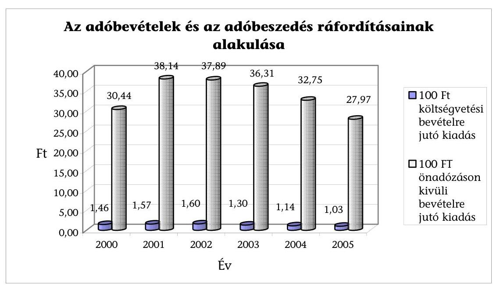

A hatékonyság javulásának oka többek között, hogy - az egyes területeken feltárt hiányosságok mellett - összességében javult a Hivatal teljesítménye, illetve 2003-tól csökkent a feladatellátáshoz biztosított pénzügyi forrás. Öt év alatt a beszedett költségvetési nettó bevételek $60 \%$-kal, ezen belül az önadózáson kívüli bevételek ${ }^{7} 23 \%$-kal nőttek, a Hivatal múködésére fordított kiadások 12,62\%kal emelkedtek. Javult a szervezet hatékonysága a létszámváltozás függvényében is, az egy dolgozóra jutó önadózáson kívüli bevételek $37,5 \%$-kal emelkedtek.

[^0]
[^0]:    ${ }^{7}$ Önadózáson kívüli bevételek: 2000-2003-ban az ellenőrzések eredményeként befolyt adókülönbözet, jogerősen visszatartott összeg, valamint behajtásból befolyt bevétel. 2004-től a jogerősen visszatartott összeg és a behajtásból befolyt bevétel.

---

# Az APEH kiadásainak és bevételeinek alakulása 2000-2005 között 

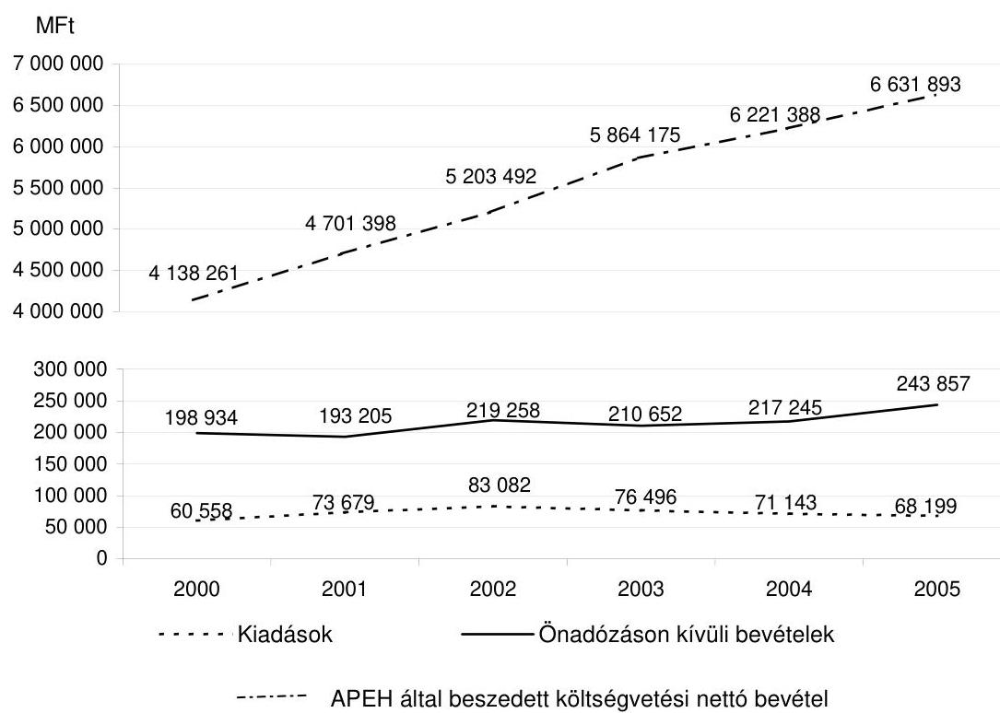

A pénzügyminiszter felügyeleti jogkörében eljárva intézkedéseivel, iránymutatásaival segítette az APEH adóbeszedési tevékenységét. Rendszeres időközönként beszámoltatta a Hivatalt, tervezési-elemzési munkájához adatokat kért tőle. A kapott információk azonban nem hasznosultak megfelelően. A vizsgált időszak mindegyik évében kezdeményezte a kormánynál a költségvetési törvény adó- és járulék-bevételi előirányzatainak módosítását, továbbá 2004-2005-ben a legfontosabb adótörvények 41-szer módosultak. Mindezek következménye, hogy a Hivatalnak folyamatosan változtatnia kellett belső szabályzatait, ami a szabályszerű múködés terén magas kockázatot jelentett, illetve megnehezítette az adózók számára a jogszabályok betartását.

A PM intézkedéseket tett az EU-n belüli áfa-visszaigénylésekkel kapcsolatos korábbi ÁSZ megállapítások ${ }^{8}$ alapján, de ezek csak részben voltak eredményesek. Kezdeményezte az adózás rendjéről szóló - a 2004. január 1-jétől hatályos - törvény (továbbiakban: új Art.) módosítását, amely szerint 2006. január 1-jétől a külföldi adóhatóság megkeresésének időtartama nem számít bele az ellenőrzés határidejébe. A módosítás nem terjedt ki a késedelmi kamatra vonatkozó rendelkezésre. A késedelmes kiutalások miatt fizetett késedelmi kamat összege a vizsgált időszakban változóan alakult, 2004-ben 2003-hoz képest 63\%-kal, 2005-ben a 2004. évi kö-

[^0]
[^0]:    ${ }^{8}$ A részletes megállapításokat a Magyar Köztársaság 2004. évi költségvetése végrehajtásának ellenőrzéséről készített jelentés tartalmazza (0540).

---

zel 7-szeresére nőtt, amelynek 84\%-a a közösségen belüli áfavisszaigénylések kiutalás előtti ellenőrzéséhez kapcsolódott ${ }^{9}$. A késedelmi kamatok mintegy 9-67\%-át a Magyar Államkincstár (továbbiakban: MÁK) fedezethiányn ${ }^{10}$ miatt fizette a Hivatal. Az adatokat az alábbi diagramm szemlélteti.

Késedelmi kamat-kiadások alakulása 2000-2005.
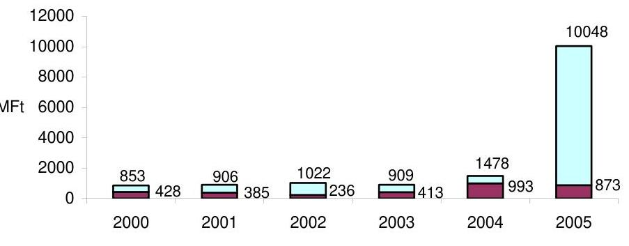

MÁK fedezethiánya miatt keletkezett késedelmi kamat

A PM nem készített - és az APEH-tól sem kért - felmérést, vagy elemzést a Hivatal feladatainak ellátásához szükséges humánerőforrás mértékéről és összetételéről. Elrendelt mintegy 10\%-os létszámleépítést anélkül, hogy elemezte volna annak hatását a szervezeti struktúrára, a feladatellátás színvonalára, illetve a költségvetési bevételek beszedésének kockázatára. A Hivatal sem alakította ki az egyes szakterületeken a feladatellátáshoz szükséges humánerőforrás-kapacitás rendszeres és azonos mutatószámokon alapuló tervezésének és elemzésének módszerét és nem is készített ilyen átfogó elemzéseket. Ennek hiányában nem határozható meg, hogy az egyes jogszabályok által elốrt, kötelezően ellátandó feladatok teljesítése a szakterületeken mekkora kapacitást igényel, továbbá hogy az adóbeszedés költsége csökkenthető-e. A feladatokat az APEH központja leosztja az igazgatóságokon rendelkezésre álló humán-erőforrásra.

A pénzügyminiszter az éves költségvetési törvény felhatalmazása alapján minden évben meghatározza az APEH számára azokat a teljesítmény-elvárásokat, amelyek az érdekeltségi jutalom kifizetésének feltételei. A teljesítményelvá-

[^0]
[^0]:    ${ }^{9}$ A közösségi adószámmal rendelkező adóalanyok áfa-visszaigényléseinek elhúzódó ellenőrzései a költségvetésre összességében pozitív hatást gyakoroltak. A pénzügyminiszter 2004. október 18-i utasításának hatására a Hivatal 2004-2005. években összesen 8,5 Mrd Ft késedelmi kamatot fizetett, az ellenőrzések eredményeként a jogszerűen viszszatartott adó összege 8,3 Mrd Ft, a kiszabott adóbírság 1,8 Mrd Ft, a késedelmi pótlék 0,1 Mrd Ft volt. A részletes adatokat a Magyar Köztársaság 2005. évi költségvetése végrehajtásának ellenőrzéséről készített jelentés fogja tartalmazni.
    ${ }^{10}$ A késedelmi kamatok kifizetéséhez a fedezetet a MÁK nem biztosította. Ez nem az APEH feladata, ezért ennek vizsgálatára az ellenőrzés nem terjedt ki.

---

rások közül több nem ösztönöz eredményesebb és hatékonyabb munkavégzésre, illetve többletteljesítmény elérésére, mivel egy részük jogszabályi előirás alapján kötelezö, más részük nem alkalmas a valódi teljesítmény mérésére. A pénzügyminiszter a mutatószámokon felül olyan célfeladatokat is meghatározott a jutalom kifizetésének feltételeként, amelyek megfogalmazásukban általánosak, nem határoznak meg azok teljesítésére mérhető kritériumokat (pl. régiók átszervezése, adóadminisztráció csökkentése, állami szervek részére információ szolgáltatása). A Hivatal a PM elvárások alapján alakította ki belső teljesítmény-értékelési és ösztönzési rendszerét. Az ebben meghatározott teljesítménymutatók köre fokozatosan bővült, de a mutatók több mint felének a teljesítése nemcsak a Hivatal szakmai tevékenységtől függ, mivel a teljesítések mértékét - a Hivatal tényleges teljesítménye mellett - az adó- és költségvetési politika, az adóalanyok jogkövető magatartása, az önadózásból befolyó bevételek nagysága, a jogszabályok gyakori változtatása, valamint a gazdaság reálfolyamatainak alakulása befolyásolják. A Hivatal úgy határozta meg az igazgatóságok által elérhető pontszámokat, hogy azok ösztönöztek ugyan a tervszámok teljesítésére, de azok túlteljesítésére már nem.

Az éves költségvetési bevételi előirányzatokat - a PM tervezési hiányosságai mellett - a Hivatal 2000-2003 között teljesítette, de a 2004-2005. években már nem ${ }^{11}$. A pénzügyminiszter 2004-ben megsértette a költségvetési törvényt, amikor a Hivatal alulteljesítése ellenére engedélyezte az érdekeltségi jutalom egy részének kifizetését. A 2005. évi kifizetéseket a költségvetési törvény módosítása tette lehetővé.

A Hivatalban az egy főre jutó átlagkereset 2003-ig nőtt, 2004-ben - besorolástól függetlenül - nominál értéken a 2001. évi szintre csökkent. 2004-ről 2005-re ismét nőtt. A feladatok folyamatos bővülése és a feladat-végrehajtáshoz rendelkezésre álló létszám leépítése mellett az érdekeltségi jutalmak fokozatos csökkenése és kifizetésének bizonytalanná válása gyengíti az érdekeltségi rendszer ösztönző hatását, a Hivatal munkaerő megtartási képességét.

A Hivatal folyamatosan változtatta szervezeti struktúráját és szabályozási rendszerét egyrészt a jogszabályokban rögzített feladatbővülések miatt, másrészt a feladat-végrehajtás eredményességének és hatékonyságának növelése érdekében. A szervezeti változtatásokat megelőzően az átalakításokkal és összevonásokkal, új szervezeti egységek létrehozásával, ezáltal az irányítás (döntési, felelősségi és hatáskörök) megváltoztatásával kapcsolatosan koncepciót, hatástanulmányt, illetve elemzéseket nem készített, amely azok indokoltságát alátámasztotta volna. A szervezeti átalakítások végrehajtásának egy része jogszabályi változásokkal alátámasztható és indokolható, illetve munkaszervezési szempontból célszerű volt. Például az informatikai szervezet központosítása javította az informatikai szakterület feladatellátásának hatékonyságát, és közvetetten növelte az infor-

[^0]
[^0]:    ${ }^{11}$ Az ÁSZ a Magyar Köztársaság 2004. és 2005. évi költségvetési javaslatáról adott véleményében magas kockázatúnak ítélte a főbb adónemeket érintő költségvetési előirányzatok teljesíthetőségét.

---

matikai biztonság szintjét. Néhány átszervezés - beleértve a területi igazgatóságok egyes szakterületeinek régióba szervezését - nem volt megalapozott.

A Hivatal feladatát alapvetően az APEH tv. szabályozza, ezen felül egyéb jogszabályok is határoznak meg számára feladatokat. Ezek elsősorban a behajtási/végrehajtási területet érintik, de egyes kintlévőségek behajtása ellenőrzéseket is szükségessé tesz. A saját kezdeményezésű végrehajtási eljárások mellett különböző törvények már 80 jogcímen írnak elő külső megkeresésre behajtást/ végrehajtást. Ezek egy része nem, vagy csak közvetve jelent költségvetési bevételt (magánnyugdíj pénztár, diákhitel, parkolási és egyéb bírságok). 2004-ben és 2005-ben a hátralékkezelési feladatok végrehajtására rendelkezésre álló humánerőforrás-kapacitás teljes munkaidejének már mintegy 30-40\%-át a külső megkeresésre végzett behajtások tették ki, amelyek teljesítése esetenként 10-11 E Ft-os költségkihatással járt és 6-7 E Ft beszedését eredményezte.

Az APEH a hatályos Art. előírásainak, valamint az ellenőrzési stratégiában foglaltaknak megfelelően kialakította éves ellenőrzési irányelveit. Az ellenőrzések eredményessége és hatékonysága a vizsgált időszakban összességében javult. Csökkenő számú ellenőrzés mellett mintegy 68\%-kal nőtt a megállapítással feltárt nettó adókülönbözet, és mintegy kétszeresére a kiszabott szankciók összege. Csökkent azonban a szankciókból befolyt bevételek aránya. Ennek fő oka, hogy nőtt azon adóalanyok száma, amelyeknek nem volt pénzügyi fedezetük a tartozásuk megfizetésére. Csökkent a megállapítással zárult kiutalás előtti ellenőrzések és a nőtt a megállapítással zárult utólagos ellenőrzések száma. Az ellenőrzési portfolión belül összességében nőtt e két ellenőrzési típus aránya. A jogszabályi előírás alapján kötelezően elvégzendő ellenőrzések közül a legnagyobb adóteljesítményú adóalanyok ellenőrzései javították, a külső megkeresés alapján végzett ellenőrzések pedig rontották az ellenőrzések hatékonyságát és eredményességét.

A végrehajtással beszedhető adó- és járulékbevételek tervszámait nem a múködő adózók teljes hátralékállományának figyelembevételével, hanem az előző évek teljesítési adatai alapján határozzák meg. A tervszámok a behajtásból származó bevételek növelését irányozzák elő, de a tervezési mód nem ösztönöz a hátralékok teljes körú beszedésére. Az adózók folyószámláin kimutatott hátralékok összege 29\%-kal emelkedett, míg a hátralékkal rendelkező adóalanyok száma 10\%-kal csökkent. A Hivatal intézkedései különösen az elektronikus inkasszó 2004. évi bevezetése - segítik a hátralékállomány beszedése eredményességének növelését. A végrehajtás alá vont hátralékállomány $36 \%$-kal, az ebből realizált bevétel pedig $45 \%$-kal emelkedett. Az Art. lehetőséget biztosít fizetési kedvezmény megadására. A fizetési kedvezménnyel érintett részletfizetések automatikus figyelése és nemfizetés esetén azok visszarendezése nem biztosított, ami a kockázatot jelent az adóalany tartozásának ismételt felhalmozódása, illetve a beszedhetőség bizonytalanná válása szempontjából. A részletfizetések naprakészségének nyomon követése csak manuális módon, jelentős erőforrások lekötésével valósítható meg.

Az APEH tv. lehetőséget biztosít a végelszámolás alatt álló szervezetekkel szemben fennálló követelések engedményezésére. Ez a törvényi előírás nem indokolt, mivel a végelszámolás alatt álló gazdálkodó szervezetek

---

rendelkeznek fedezettel a teljes tartozásukra. Engedményezés esetén a tartozásnak csak egy része térül meg, így sérül a költségvetés érdeke. Az APEH nem élt a törvény adta lehetőséggel, és beszedte e szervezetektől a költségvetést megillető tartozásaikat.

A 2002-ben elfogadott informatikai stratégiában megfogalmazott célkitűzések és fejlesztési prioritások összhangban vannak a Hivatal feladataival. A stratégiában kiemelt fontosságú célkitúzés a korszerűtlen, decentralizált informatikai rendszerek korszerű platformon történő központosítása és integrációja. Ehhez elkészítette a szükséges informatikai fejlesztések nagyvonalú tervét, de nem dolgozta ki a fejlesztési projektek ütemezését. Ennek hiányában nem követik nyomon a stratégia időbeni végrehajtása és a véghatáridő sem tekinthető megalapozottnak. Nem valósult meg az informatikai feladatok belső erőforrás-igényének részletes tervezése, illetve a feladatszintú munkaerő-felhasználás mérése és nyilvántartása. A Hivatal a fejlesztéseit saját erőforrással valósítja meg, ezért a kapacitás-ráfordítás ismerete nélkül nem mutatható ki a fejlesztői erőforrás kapacitásának kihasználtsága, valamint az egyes fejlesztések tényleges költségei, azaz nem határozható meg a hatékonyságuk.

A szakfeladatok ellátásának informatikai támogatottsága alapjaiban kielégíti a szakterületek igényeit. Az informatikai fejlesztésekre fordítható beruházási keret 2003. évtől 40\%-ot meghaladó mértékben csökkent, emiatt a Hivatal nem tudta végrehajtani egyes, a feladatellátás informatikai támogatása szempontjából alapvető fontosságú fejlesztéseit. Nem rendelkezik teljes körű, naprakész, központi nyilvántartással a személyi számítógépek számáról és műszaki paramétereiről. Az igazgatóságok nyilvántartásai szerint a személyi számítógépek több mint $40 \%$-a nem felel meg az új központi informatikai rendszerek múködtetéséhez szükséges követelményeknek. A megyei rendszereket kiszolgáló adatbázisszerverek is elavultak, életkoruk és múszaki állapotuk a feladatellátás színvonalát veszélyezteti. Kapacitásuk és teljesítményük korlátozottsága miatt középtávon nem alkalmasak a feladatellátás hatékony támogatására.

Az informatikai rendszerek az alkalmazott technológia tekintetében heterogén képet mutatnak, annak ellenére, hogy az informatikai terület folyamatosan egységesíti és centralizálja azokat. Az informatikai alkalmazások közötti együttműködés, valamint a napi feladatellátást támogató szolgáltatások színvonala nem minden esetben felel meg a felhasználói igényeknek.

A Hivatal a belső kontrolljait jól múködteti. Kialakította a szakmai blokkokon belül a folyamatba épített és a vezetői ellenőrzések szervezeti és informatikai rendszereit, a feladat-végrehajtás során ezeket a gyakorlatban eredményesen alkalmazta. Az ÁSZ a költségvetés végrehajtásának éves ellenőrzései során a belső kontrollokat általában jól működőnek minősítette. A Hivatal az egyes szakmai munkafolyamatok utólagos ellenőrzését - minőségbiztosítási céllal - törvényességi vizsgálatok keretében látta el. Felülellenőrzéseivel is hozzájárult az ellenőrzési munka eredményességének és szakszerűségének növeléséhez. A Hivatal a költségvetési szervek belső ellenőrzéséről szóló kormányrendelet alapján a pénzügyi irányítási és ellenőrzési rendszer évenkénti vizsgálatát határozta meg prioritásként, ezért olyan témakörökben is végzett ellenőr-

---

zéseket, amelyek éves vizsgálata nem indokolt, tekintettel arra, hogy a korábbi évek ellenőrzései rendszert érintő hiányosságokat nem tártak fel.

A helyszíni ellenőrzés megállapításainak hasznosítása mellett javasoljuk:

# a pénzügyminiszternek 

1. Kezdeményezze a 2005. évi LVI. tv. módosítását annak érdekében, hogy az APEH a végelszámolás alatt álló szervezetekkel szemben fennálló követeléseinek engedményezését a jogszabály ne tegye lehetővé tekintettel arra, hogy a követelések kielégítésére szolgáló vagyon rendelkezésre áll, a megtérülés teljes összegben biztosított.
2. Biztosítson pénzügyi forrást az APEH informatikai eszközállománya műszaki színvonalának megőrzéséhez, illetve fejlesztéséhez a jogszabályokban meghatározott feladatai végrehajtása érdekében.
3. Alakítsa át a Hivatal részére megfogalmazott, az érdekeltségi jutalom kifizetésének feltételeként meghatározott teljesítmény-elvárásokat oly módon, hogy valamennyi elvárás hatékonyabb és eredményesebb munkavégzésre, illetve többletteljesítmény elérésére ösztönözzön, valamint azok teljesítése mérhető legyen.
4. Írja elő az Adó- és Pénzügyi Ellenőrzési Hivatal elnöke számára, hogy
a) dolgoztassa ki az egyes szakterületek - ezen belül a külső megkeresések alapján lefolytatandó behajtások/végrehajtások - feladatainak ellátáshoz szükséges hu-mánerőforrás-kapacitás rendszeres és azonos mutatószámokon alapuló tervezésének és elemzésének módszerét, valamint készíttessen ilyen elemzéseket a humánerőforrás optimális elosztása érdekében;
b) alakíttassa ki az informatikai területen a belső erőforrások eredményes kontrollját (tervezését, mérését) biztosító eszközrendszert;
c) tegyen intézkedést, hogy az informatikai rendszer alkalmas legyen az azonnali és automatikus visszarendezésre, ha a fizetési könnyítésben részesített adóalany a részletfizetési kötelezettségének időben nem tesz eleget.

---

# II. RÉSZLETES MEGÁLLAPÍTÁSOK 

## 1. Az APEH múködésének értéKelése

### 1.1. Az APEH múködésének értékelése mutatószámok alapján

Az APEH által beszedett költségvetési nettó bevételek, valamint az adóbeszedésre fordított kiadások arányát tekintve az adóbeszedés hatékonysága a vizsgált időszakban összességében javult. A pozitív irányú változás oka többek között, hogy - az egyes területeken feltárt hiányosságok mellett - összességében javult a Hivatal teljesítménye, valamint csökkent a feladatellátáshoz biztosított pénzügyi forrás. A beszedett adók és adó jellegű bevételek növekedési üteme jelentős mértékben meghaladta a kiadások növekedési ütemét. A kiadások 13\%-kal, a beszedett költségvetési nettó bevételek $60 \%$-kal, ezen belül az önadózáson kívüli bevételek 23\%-kal nőttek.

A költségvetési nettó bevételek beszedésének hatékonysága a vizsgált időszakon belül 2000-2002. évek között negatív, 2003-tól pozitív irányban változott. 100 Ft beszedésére 2000-ben 1,46 Ft, 2001-ben 1,57 Ft, 2002-ben 1,60 Ft, 2003-ban 1,30 Ft, 2004-ben 1,14 Ft, 2005-ben pedig 1,03 Ft kiadást fordított a Hivatal. 100 Ft kiadással beszedett bevételek összegei 2000-2002. évek között 8\%-kal csökkentek, 2003-tól azonban nőttek (2002-ről 2003-ra 22\%-kal, 2003-ról 2004-re $14 \%$-kal, 2004-ről 2005-re $11 \%$-kal).

100 Ft kiadásra jutó önadózáson kívüli bevétel összege 2000-ról 2001-re nőtt, de 2001 és 2005 között folyamatosan csökkent; illetve 100 Ft kiadásra jutó ellenőrzéssel beszedett bevétel 2000-ről 2001-re csökkent, ezt követően azonban folyamatosan nőtt.

A kiadások és a bevételek, valamint az ezekből számított mutatók:

| Év | Kiadások | APEH által   beszedett   költségve-   tési nettó   bevételek | 100 Ft   bevételre   jutó   ki-   adás | 100 Ft   kiadás-   ra jutó   bevétel | Önadózáson   kívüli bevé-   telek* | 100 Ft   önadózáson   kívüli bevételre jutó   kiadás | 100 Ft ki-   adásra jutó   önadózáson   kívüli bevétel |
| :--: | :--: | :--: | :--: | :--: | :--: | :--: | :--: |
|  | M Ft | M Ft | Ft | Ft | M Ft | Ft | Ft |
| 2000 | 60558 | 4138261 | 1,46 | 6833,5 | 198934 | 30,44 | 328,5 |
| 2001 | 73679 | 4701398 | 1,57 | 6380,9 | 193205 | 38,14 | 262,2 |
| 2002 | 83082 | 5203492 | 1,60 | 6263,1 | 219258 | 37,89 | 263,9 |
| 2003 | 76496 | 5864175 | 1,30 | 7666,0 | 210652 | 36,31 | 275,4 |
| 2004 | 71143 | 6221388 | 1,14 | 8744,9 | 217245 | 32,75 | 305,4 |
| 2005 | 68199 | 6631893 | 1,03 | 9724,0 | 243857 | 27,97 | 357,6 |

* 2004-ben és 2005-ben már nem tartalmazza az ellenőrzési megállapításokból befolyt bevételt, csak a behajtást és a jogerős visszatartást

---

A számadatok értékelése során figyelembe kell venni, hogy a Hivatal által beszedett költségvetési nettó bevételek mintegy 96-97\%-át az adóalanyok önadózás útján fizetik meg. E bevétel összege tehát külső - az APEH tevékenységétől független - tényezőktől is függ: így különösen a gazdaság állapotától, az adó mértékétől, az adómentességek, adókedvezmények körétől stb.

A szervezet hatékonysága a létszámváltozás függvényében vizsgálva is javult. Az egy dolgozóra jutó önadózáson kívüli bevételek összegei 37,5\%-kal (15,2 M Ft-ról 20,9 M Ft-ra) emelkedtek.

A hatékonyság javulása az előzőekben említett beszedett bevételek kiadásokat meghaladó növekedéséből valamint a létszámcsökkentésekből adódik.

A bevételek, a dolgozó létszám, valamint az ezekből számított mutatók:

| Év | APEH által besze-   dett költségvetési   nettó bevételek | Dolgozói létszám az   adott év december   31-i állapota szerint | 1 dolgozóra jutó   költségvetési   nettó bevétel | 1 dolgozóra jutó   önadózáson kívüli   bevétel |
| :--: | :--: | :--: | :--: | :--: |
|  | M Ft | Fő | M Ft | M Ft |
| 2000 | 4138261 | 13108 | 315,7 | 15,2 |
| 2001 | 4701398 | 13251 | 354,8 | 14,6 |
| 2002 | 5203492 | 13257 | 392,5 | 16,5 |
| 2003 | 5864175 | 11933 | 491,4 | 17,7 |
| 2004 | 6221388 | 11609 | 535,9 | 18,7 |
| 2005 | 6631893 | 11668 | 568,4 | 20,9 |

A Hivatal szakmai területein belül az ellenőrzési és a végrehajtási blokk fel-adat-végrehajtásának hatékonysága a vizsgált években összességében folyamatosan javult. Csökkenő számú ellenőrzések mellett közel 13\%-kal nőtt a visszatartott adó összege, de több mint kétszeresére nőtt a megállapított szankciók és $68 \%$-kal a megállapítással feltárt nettó adókülönbözet összege.

Az ellenőrzési típusokon belül 2000-2003. években csökkent a kiutalás előtti ellenőrzések száma és 20\%-kal visszatartott adó összege. 2004. és 2005. években nőtt a kiutalás előtti ellenőrzések száma és $48 \%$-kal az ellenőrzéssel visszatartott adó összege. A szigorúbb bírságolási gyakorlat eredményeként közel háromszorosára nőtt az adóbírság és közel kétszeresére a mulasztási bírság összege.

---

Az ellenőrzési megállapítások és azok összetételének alakulása:

| Év | Ellenőr-   zéssel   feltárt   nettó   adókü-   lönbözet | Ebből:   ellenőr-   zéssel   vissza-   tartott   adó | Ellenőrzéssel megállapított szankciók |  |  |  | Ellenőrzési   megállapítások   összesen |
| :--: | :--: | :--: | :--: | :--: | :--: | :--: | :--: |
|  |  |  | Adóbír-   ság | Mulasztási bírság | Késedel-   mi pót-   lék | Szankciók összesen |  |
|  | M Ft | M Ft | M Ft | M Ft | M Ft | M Ft | M Ft |
| 2000 | 120602 | 35187 | 24099 | 1593 | 32222 | 57914 | 178516 |
| 2001 | 123186 | 35385 | 28502 | 2022 | 32776 | 63300 | 186486 |
| 2002 | 161823 | 34759 | 37874 | 2114 | 37606 | 77594 | 239417 |
| 2003 | 157776 | 28048 | 43825 | 2168 | 36142 | 82135 | 239911 |
| 2004 | 187954 | 31450 | 62481 | 2826 | 50550 | 115857 | 303811 |
| 2005 | 202668 | 39838 | 70874 | 3050 | 52138 | 126062 | 328730 |

Az APEH az ellenőrzésekből befolyt bevételek jogerős adóhiányhoz viszonyított arányát csak 2003-ig mutatta ki, arra hivatkozva, hogy ezt követően az Art. ilyen kötelezettséget nem ír elő. Az ÁSZ korábbi ellenőrzései során javasolta, hogy az APEH az ellenőrzésből befolyt bevételekről vezessen nyilvántartást. E kimutatás megbízható adatokat, információkat szolgáltatna a felügyeleti szerv részére a gazdaság- és költségvetés-politikai döntések előkészítéséhez, a főbb adónemek bevételi előirányzatainak tervezéséhez. Meghatározható lenne, hogy az ellenőrzéssel feltárt adókülönbözet meg nem fizetése miatt mennyivel nő a hátralékállomány összege.

Az ellenőrzések során feltárt jogerős adóhiány összege 2000 és 2003 között 70,7 Mrd Ft-ról 96,9 Mrd Ft-ra (37\%-kal), míg az ebből befolyt adóhiány összege 33,6 Mrd Ft-ról 36,7 Mrd Ft-ra ( $9 \%$-kal) nőtt. Így a befolyt bevételek jogerős adóhiányhoz viszonyított aránya 47,5\%-ról 37,9\%-ra csökkent. A kedvezőtlen tendencia is indokolja a nyilvántartások újbóli vezetését. Az adóhatóság álláspontja szerint a hátralékok behajtása, illetve a költségvetés bevételeinek biztosítása szempontjából nincs jelentősége, hogy a hátralék mely ok miatt keletkezett.

A megállapított adóhiány realizálásának alakulása

| Megnevezés | 2000. év | 2001. év | 2002. év | 2003. év |
| :-- | :--: | :--: | :--: | :--: |
| jogerős adóhiány | 70,7 | 66,2 | 99,4 | 96,9 |
| Ellenőrzésből   befolyt adóhiány | 33,6 | 29,6 | 45,6 | 36,7 |
| Befolyt adóhiány   aránya a jogerős   adóhiányhoz (\%) | 47,5 | 44,6 | 45,9 | 37,9 |

A vizsgált években a hátralékállomány 29\%-kal, a végrehajtás alá vont hátralékállomány pedig $36 \%$-kal nőtt. A végrehajtási eljárások lefolytatása után befolyt hátralékok összegei folyamatosan, összességében 45\%-kal emelkedtek.

---

# 1.2. PM felügyeleti jogköre gyakorlásának értékelése 

### 1.2.1. A jogszabály-módosítások előkészítésének megalapozottsága, a jogszabályok közötti összhang

A vizsgált időszakban az adózásra vonatkozó jogszabályok gyakori módosítása a törvény-előkészítés megalapozottságának hiányosságaira utal. Mindezek következménye, hogy a Hivatalnak folyamatosan változtatnia kellett belső szabályzatait, ami a szabályszerű múködés terén magas kockázatot jelentett, illetve megnehezítette az adózók számára a jogszabályok betartását.

PI. A 2004. január 1-jével hatályba lépett új Art., amelyet 2004-ben 4, 2005-ben 10 alkalommal, az általános forgalmi adóról szóló 1992. LXXIV. tv.-t 2004-ben és 2005-ben egyaránt 6-6 alkalommal, a személyi jövedelemadóról szóló 1995. évi CXVII. tv.-t 2004-ben 7, 2005-ben 8 alkalommal módosította az Országgyúlés.

PI. Az új Art. 31. § (2) szerint 2006. január 1-jétől minden munkáltatónak, kifizetőnek és a törvényben meghatározott egyéb adatszolgáltatónak elektronikusan és havonta kellett volna megküldenie az adóhatóságnak az adó- és/vagy társadalombiztosítási kötelezettséget eredményező magánszemélynek teljesített kifizetésekkel, juttatásokkal összefüggő adatokat. A havonkénti elektronikus adatszolgáltatási kötelezettség törvénybe iktatásakor nem vették figyelembe, hogy az adatok feldolgozásához a szükséges technikai feltételek sem az APEH, sem az adatszolgáltatásra kötelezettek részére nem állnak rendelkezésre. Ezért az Art. hivatkozott szakaszának hatályba lépését megelőzően szükségessé vált a törvény módosítása, amelynek értelmében az elektronikus adatszolgáltatás bevezetésének időpontját a havi és negyedéves bevallók esetében 4 hónappal, a többi adózó esetében egy évvel elhalasztották.

Az ÁSZ a 2004. évi költségvetés végrehajtásának ellenőrzése során hiányosságokat tárt fel az EU-n belüli áfa-visszaigénylésekkel kapcsolatban ${ }^{12}$. A PM intézkedéseket tett a korábbi ÁSZ megállapítások alapján, de ezek csak részben voltak eredményesek.

A pénzügyminiszter kezdeményezte az új Art. módosítását, így 2006. január 1jétől az ellenőrzés határidejébe nem számít bele a külföldi adóhatóság megkeresésének időtartama.

Az új Art. 2005. december 31-ig az ellenőrzési határidő meghatározásánál nem kezelte külön azt az esetet, amikor az adókötelezettség megállapításához szükséges tény vagy körülmény tisztázásához külföldi adóhatóság megkeresése vált indokolttá. A tagállamok közötti eltérő bevallási határidők miatt a válasz gyakran csak az ellenőrzési határidő leteltét követően érkezik meg. Emiatt az APEH elnöke és a pénzügyminiszter az ellenőrzési határidőt esetenként meghosszabbította annak érdekében, hogy a külföldi adóhatóság válaszát az adóhatóság érdemi ellenőrzése során figyelembe vehesse.

[^0]
[^0]:    ${ }^{12}$ A részletes megállapításokat a Magyar Köztársaság 2004. évi költségvetésének végrehajtásának ellenőrzéséről készített ÁSZ jelentés tartalmazza (0540).

---

# A módosítás nem terjedt ki azonban az új Art. késedelmi kamatra vonatkozó rendelkezéseire, így az elhúzódó ellenőrzések miatt 2004. májusa óta folyamatosan nőtt a Hivatal által fizetett késedelmi kamat összege. 

#### Abstract

A PM nem tartja indokoltnak a késedelmi kamatra vonatkozó szabályok módosítását, mivel „az elhúzódó ellenőrzések miatti késedelmes kiutalások az adózókat is nehéz helyzet elé állítják, a késedelmi kamat a visszaigényelt összeg késedelmes kiutalásakor a kiutalt összeg értékének megőrzését szolgálja".

Az új Art. szerint a visszaigényelt adó összegét az esedékességtől számított 30 napon belül, 500000 Ft -ot meghaladó összeg esetében 45 napon belül kell kiutalni. A külföldi adóhatóságnak a megkereséstől számított három hónapon belül kell adatszolgáltatást nyújtania (A TANÁCS 2003. október 7-i 1798/2003/EK Rendelete a hozzáadottérték-adó területén történő közigazgatási együttmúködésről, valamint a 218/92/EGK rendelet hatályon kívül helyezéséről 8. cikk). Az ÁSZ a 2004. évi költségvetés végrehajtásának ellenőrzésekor megállapította, hogy a tagállami kontrolladatok bevárása miatt 2004. év végéig 18500 bevallást érintően keletkezett késedelmi kamatfizetési kötelezettsége a Hivatalnak.

A pénzügyminiszter 2005 februárjában indítványozta, hogy az EU Bizottság vizsgálja meg, hogy milyen módon lehetne a jelenlegi szabályok keretei között, vagy ha ez nem elegendő, a szabályok megváltoztatásával gyorsabbá és hatékonyabbá tenni a nemzeti adóhatóságok közötti rendszeres és eseti információcserét.

Az APEH és a PM kapcsolatát folyamatos együttmúködés jellemzi az új Art. és az egyes adótörvények módosításával kapcsolatban. A PM törvénymódosítást kezdeményezett az APEH és a Pénzügyi Szervezetek Állami Felügyelete (PSZÁF) együttes javaslata alapján a magán-nyugdíjpénztárak megkeresésére elrendelt ellenőrzésekkel kapcsolatban. A törvénymódosítás célja az ellenőrzések eredményességének javítása volt.

Az APEH javaslata alapján a PM kezdeményezésére 2006. január 1-jei hatállyal módosították a társadalombiztosítás ellátásaira és a magánnyugdíjra jogosultakról, valamint az e szolgáltatások fedezetéről szóló 1997. évi LXXX. tv. magánnyugdíjpénztári tagdíjak bevallásáról, önellenőrzéséről, valamint végrehajtásáról szóló 51. §-ának rendelkezéseit. A módosítást követően az ellenőrzések lefolytatását a pénztár negyedévente kezdeményezi az adóhatóságnál. Ha a tagdíjtartozás összege az 5000 Ft-ot meghaladja, a magán-nyugdíjpénztár kezdeményezi az állami adóhatóságnál az adóhatósági megkeresés időpontjában fennálló tagdíjtartozás és késedelmi pótlék összegének behajtását, a végrehajtási eljárás megindítását. Amennyiben a tagdíjtartozás összege a késedelmi pótlékkal együtt az 5000 Ft-ot nem haladja meg, a tartozás rendezésére a magán-nyugdíjpénztár a foglalkoztatót évente egy alkalommal felszólítja.

### 1.2.2. A PM szakmai felügyeleti tevékenysége

A PM a vizsgált időszakban felügyeleti jogkörében eljárva intézkedéseivel, iránymutatásaival segítette az APEH adóbeszedési tevékenységét. Rendszeres időközönként beszámoltatta az APEH-ot tevékenységéről és a bevételi előirányzatok teljesüléséről. Tervezési-elemzési munkájához rendszeresen és eseti jelleggel további adatokat kért a Hivataltól.

---

A PM a kért adatokat elemzési és tervezési munkájához figyelembe vette, mégis a vizsgált időszak mindegyik évében kezdeményezte az adók és járulékok költségvetési bevételi előirányzatainak módosítását ${ }^{13}$.

Az ÁSZ az éves költségvetési törvényről adott véleményében egyes adónemek esetében a bevételi előirányzatok teljesülését magas kockázatúnak ítélte: a költségvetést meghatározó bevételi előirányzatok egyik része fölül, míg másik része alultervezett volt. Pl. 2004-ben áfából 177,1 Mrd Ft-tal, szjából 121 Mrd Ft-tal, társasági adóból 11,2 Mrd Ft-tal, az ökoadókból 7,6 Mrd Ft-tal kevesebb, evaból 12,5 Mrd Ft-tal több realizálódott az előirányzatnál.

A PM az áfa bevételi előirányzatának alulteljesítését azzal indokolta, hogy a csatlakozás körüli bizonytalanságok, valamint a makrogazdasági folyamatok kedvezőtlenül hatottak az áfa-bevételekre, mivel az infláció és a lakossági vásárolt fogyasztás a vártnál lassabban, míg az export és a beruházások a számítottnál gyorsabban nőttek 2004. évben.

A PM nem készített és az APEH-tól sem kért felmérést arra, hogy a Hivatal a feladatait mekkora és milyen összetételú létszámmal tudja ellátni. Anélkül rendelte el a mintegy 10\%-os létszámleépítést, hogy elemezte volna annak hatását a feladatellátás színvonalára, illetve a költségvetési bevételek beszedésének kockázatára.

A létszámleépítés végrehajtását 2003-ban kormányhatározattal, 2004-ben PM utasítással rendelték el. A PM a végrehajtást követően kért adatot az APEH-tól a létszámleépítésekhez kapcsolódó egyszeri kiadások és az éves szintű megtakarítások összegéről (részletesen lásd 2.3.1. fejezetet).

# 1.3. Az APEH teljesítményértékelési és ösztönzési rendszere 

A pénzügyminiszter az éves költségvetési törvény felhatalmazása alapján minden évben meghatározza az APEH számára az érdekeltségi jutalom kifizetésének feltételeit. Ezek egy része többletteljesítmény elérésére ösztönző és a költségvetés szempontjából kedvező hatású mennyiségi és minőségi mutató.

Ilyenek például: a késedelmes kiutalások miatti kamatfizetések minimalizását előíró mutató, a bevallási kötelezettség teljesítésének és a bevallások feldolgozottságának mutatója (mennyiségi mutatók), a kiutalás előtti ellenőrzések során jogerősen visszatartott adó és támogatás összege, valamint a csődeljárás, felszámolás, végrehajtás eredményességét mérő mutatók (minőségi mutatók).

A teljesítmény-elvárások másik része azonban nem ösztönöz eredményesebb és/vagy hatékonyabb munkavégzésre, illetve a teljesít-mény-kritérium (mutatószám) nem alkalmas a valódi teljesítmény mérésére. Olyan tevékenységhez is rendel mutatószámot, amelynek teljesítése jogszabályi előírás alapján kötelező.

[^0]
[^0]:    ${ }^{13}$ Az ÁSZ a Magyar Köztársaság 2004. és 2005. évi költségvetési javaslatáról adott véleményében magas kockázatúnak ítélte a főbb adónemeket érintő költségvetési előirányzatok teljesíthetőségét.

---

Az új Art. kötelezővé teszi a legnagyobb adóteljesítménnyel rendelkező 3000 adózó ellenőrzését, ezért nem indokolt ezt mennyiségi mutatószámként meghatározni. A PM az ellenőrzési darabszámok mellett azonban minőségi követelményeket nem fogalmaz meg.

Minőségi jellegű elvárások hiányában nem ösztönzőek az szja bevallások egyszerűsített ellenőrzésére kialakított konkrét ellenőrzési darabszámok.

A helybenhagyási arány mutatója ugyan minőségi követelményt fogalmaz meg, de ellenérdekeltté teszi az igazgatóságokat a korábban nem tapasztalt jogsértő magatartások feltárásában. Ezekben az esetekben magasabb a határozat megváltoztatásának vagy hatályon kívül helyezésének kockázata. A helybenhagyási arány mutató nem alkalmas a hatósági munka értékelésére, mert a mutató kiszámításánál nem az összes elsőfokú határozatot, hanem csak a megfellebbezett határozatokat veszik figyelembe.

# A pénzügyminiszter a mutatószámokon felül olyan célfeladatokat is meghatározott a jutalom kifizetésének feltételeként, amelyek megfogalmazásukban általánosak, nem határoznak meg azok teljesítésére mérhető követelményeket. 

A PM 2003. és 2004. években célfeladatként írta elő az APEH számára a szervezet korszerűsítését, de ennek koncepcióját és a létszámleépítéssel kapcsolatos feladatokat nem határozta meg. A koncepció hiányát tükrözi, hogy az APEH 2004-ben 6 kvázi-régióba csoportosította az ezt megelőzően az igazgatóságokhoz tartozó tervezési osztályokat, amelyeket 2005-ben újból az igazgatóságok alá rendelt. A kialakított régiók a gyakorlatban nem múködnek.

További ilyen célfeladat például: az adóadminisztráció csökkentése, az adóigazgatás szervezeti korszerűsítése, állami szervek részére információk szolgáltatása, az államháztartás múködéséhez szükséges és rendelkezésre álló adatok feldolgozása és a PM-nek történő átadása.

A pénzügyminiszter megsértette a 2004. évi költségvetési törvényt azzal, hogy engedélyezte az érdekeltségi jutalom egy részének kifizetését az APEH részére annak ellenére, hogy a Hivatal a költségvetési törvényben a számára meghatározott kiemelt bevételi előirányzatokat alulteljesítette. 2005-ben pedig úgy engedélyezte érdekeltségi jutalom kifizetését, hogy 2005. novemberében a költségvetési törvény módosításával csökkentette a jutalomfizetés feltételeként meghatározott bevételi előirányzatokat.

Az APEH számára a 2004. évi érdekeltségi jutalom fizetésére a 2004. évi költségvetéséről szóló 2003. évi CXVI. törvény 48. § (2) bekezdése alapján akkor kerülhetett volna sor, ha az egyszerűsített vállalkozói adó, valamint az általános forgalmi adó és a személyi jövedelemadó együttes előirányzata legalább 2850,5 Mrd Ft-ra teljesül. Az APEH e bevételi előirányzatot nem teljesítette.

A PM Pénzügyi, humánpolitikai és szakképzési főcsoportja a 24409/2004. sz. feljegyzésében felhívta a pénzügyminiszter figyelmét arra, hogy mivel az APEH 2004. november 25 -ig nem teljesítette a törvényben meghatározott bevételi terv 100\%-át sem, nincs lehetőség arányos mértékű jutalom kifizetésére.

A Hivatal a költségvetési törvényben előírt bevételi előirányzatok, a PM telje-sítmény-elvárásai és saját ellenőrzési stratégiájában megfogalmazottak alap-

---

ján éves ellenőrzési irányelveket határoz meg. Mindezeket alapul véve kialakítja a teljesítménymutatókat és a pontozási elveket magában foglaló „teljesítményértékelési és ösztönzési rendszerét" (továbbiakban: érdekeltségi rendszer), amelyben a szervezet egésze számára előírt teljesítmény-elvárásokat leosztja szakterületekre, illetve igazgatóságokra.

A vizsgált időszakban a teljesítménymutatók köre fokozatosan bővült (számuk 2002-től meghaladja a 30-at), de azok több mint felének a teljesítése nemcsak a Hivatal szakmai tevékenységtől függ. A teljesítések alakulását erősen befolyásolják pl. az adópolitika, az adóalanyok jogkövető magatartása, illetve ez utóbbi függvényében az önadózásból befolyt bevételek alakulása, az adóteljesítések pontossága, továbbá a jogszabályok gyakori változása, a gazdasági folyamatok alakulása, ezen belül is különösen a beruházások, az import, valamint az export import tartalmának alakulása.

A Hivatal úgy határozta meg az igazgatóságok által elérhető pontokat, hogy azok ugyan ösztönöztek a tervszámok teljesítésére, de túlteljesítésre már nem. Az igazgatóságok teljesítésének pontozásos értékelése jellemzően nem volt differenciált. Az adott évi tervszámok kialakításakor az előző évi teljesítményeket veszik alapul (bázis szemléletű tervezés ${ }^{14}$ ), a kiemelkedő teljesítéseket korrekciós tényezőként kezelik. Az igazgatóságok teljesítményeire adott pontok közötti eltérés a vizsgált évek mindegyikében minimális volt.

Éves szinten a legmagasabb pontszámhoz viszonyított legnagyobb eltérés 2-6\% között változott.

# 2. SZERVEZET, FELADATOK ÉS ERŐFORRÁSOK ÖSSZHANGJA 

### 2.1. Szervezet

Az APEH múködési feltételeit, szervezeti struktúráját és irányítási rendszerét alapvetően az Adó- és Pénzügyi Ellenőrzési Hivatalról szóló 55/1991. (IV. 11.) Korm. rendeletben, majd 2003. január 1-jétől az APEH tv., továbbá a 14303/22/2003. számú Alapító Okiratban foglaltak határozzák meg. Az ellenőrzött időszakban egyrészt jogszabályi változásokban meghatározott feladatbővülések miatt, másrészt a feladat-végrehajtás hatékonyságának növelése érdekében a Hivatal folyamatosan alakította át szervezeti struktúráját és irányítási rendszerét.

A Hivatal a szervezeti változtatásokat megelőzően az átalakításokkal és összevonásokkal, új szervezeti egységek létrehozásával, ezáltal az irányítási mechanizmus (döntési, felelősségi és hatáskörök) megváltoztatásával kapcsolatosan koncepciót, átfogó hatástanulmányt, illetve elemzéseket nem készített, amely azok szükségességét, illetve indokoltságát alátámasztotta volna. (Kivétel a Központi Kapcsolattartó Iroda (továbbiakban: KKI), amely esetében a szükséges létszám megál-

[^0]
[^0]:    ${ }^{14}$ A részletes megállapításokat az egyes adónemeket érintő ÁSZ ellenőrzések jelentései tartalmazzák $(0310,0434,0549)$

---

lapításához előtanulmányt készítettek.) A vizsgált 5 évben 14 alkalommal változtatta meg Szervezeti és Működési Szabályzatát (továbbiakban: SzMSz) részben módosítással, részben új SzMSz kiadásával. A gyakori szervezeti változtatások magas kockázatot jelentenek a feladat-végrehajtás eredményességének és hatékonyságának alakulásában.

A szervezeti átalakítások végrehajtásának egy része jogszabályi változásokkal alátámasztható és indokolható, illetve munkaszervezési szempontból célszerű volt. Néhány átszervezés azonban - beleértve a területi igazgatóságok tervezési tevékenységének régióba szervezését - nem volt megalapozott.

2003-ban a felső vezetés gazdasági vezető munkakörrel bővült, 2004-től a volt Gazdasági Főosztályból két új szervezeti egység jött létre, 3 főosztály felállítására került sor, továbbá 8 főosztály megszűnt. Az átszervezés következtében 2004-ben 4 főosztállyal kevesebb múködött. Az ügyfelek tájékoztatásának gyorsabbá és szakszerűbbé tétele érdekében az APEH belső létszám-átcsoportosítással új szervezeti egységet hozott létre Központi Tájékoztatási Osztály néven, amely 2005. január 1-jétől kezdte meg múködését. A 2005. évi átszervezéssel egy újabb önálló osztály alakult, ezáltal a Hivatal 19 főosztállyal rendelkezik.

A 2003. évi létszámleépítés végrehajtásával egyidejúleg megkezdte a területi igazgatóságok regionális átszervezését. 2004-ben régiós szintre emelte a tervezési és elemzési, valamint a hatósági szakterületeket. 2005. július 1-jétől a tervezési és elemzési területen visszaállította a megyei részlegeket és osztályokat. A hatósági feladatok irányítása továbbra is regionális szervezetben történik, mivel a múködésből adódó sajátosságok a szervezeti struktúra visszaállítását ebben az esetben nem indokolták.

Központosította az informatikai szakterületet abból a célból, hogy a humánerőforrások koncentrálásával az informatikai fejlesztések gyorsabbak, hatékonyabban legyenek, az egyedi fejlesztések ne kössenek le párhuzamosan programozói kapacitást. (részletesen lásd 2.2.1.2. fejezetben).

Az APEH az EU adóügyi együttműködési szabályai (Tanács 1798/2003/EK rendelete) és az Art. előírásai alapján 2004. január 1-jei hatállyal létrehozta a KKI, biztosítva az EU tagságból eredő feladatok ellátáshoz szükséges személyi és tárgyi feltételeket. Szabályozta a szervezeti egység múködésének, ezen belül az EU számára nyújtandó adatszolgáltatások és kimutatások elkészítésének rendjét. A Hivatal folyamatosan eleget tett az EU csatlakozásból származó adatszolgáltatási kötelezettségének. Az EU csatlakozást követően közremúködik a nemzetközi pénzügyi csalások felderítésében. Az együttmúködésnek még nincs kialakult gyakorlata.

# 2.2. Feladatok 

A Hivatal feladatát alapvetően az APEH tv. szabályozza, ezzel azonban nem minden esetben koherensen egyéb jogszabályok is feladatokat határoznak meg számára. Ezek a jogszabályok elsősorban a végrehajtási terület feladatait bővítik, de egyes kintlévőségek behajtása ellenőrzéseket is szükségessé tesz.

A saját kezdeményezésű végrehajtási eljárások mellett a különböző törvények már 80 jogcím alapján (3. sz. melléklet) írnak elő az APEH számára külső megkeresésre behajtást/végrehajtást. Ezek egy része nem, vagy csak közvetve jelent

---

közpénzeket (magánnyugdíj pénztár, diákhitel, parkolási bírság stb.), másik része a behajtás viszonylag magas hatásfoka, egységesítés miatt került át különböző hatóságoktól (növényvédelmi, verseny-felügyeleti, fogyasztóvédelmi bírságok) a Hivatalhoz. Egyes kintlévőségeket pedig az önkormányzati adóhatóság helyett szed be a Hivatal: pl. építésügyi bírság.

Az APEH tv.-ben felsorolt feladatok között nem szerepel az „adók módjára" behajtandó kintlévőségek, illetve az önkormányzatokat és egyéb szervezeteket megillető bevételek beszedése.

Az APEH feladatát a törvény az alábbiak szerint szabályozza: a részben vagy egészben a központi költségvetés, a Nyugdíjbiztosítási Alap, az Egészségbiztosítási Alap vagy az elkülönített állami pénzalap javára teljesítendő kötelező befizetés; a központi költségvetés, az elkülönített állami pénzalap terhére juttatott támogatás, adó-visszaigénylés vagy adó-visszatérítés megállapítása, beszedése, nyilvántartása, végrehajtása, visszatérítése, kiutalása és ellenőrzése.

A Hivatal számára 2000-2005. évek között meghatározott új feladatokat a 4. sz. melléklet tartalmazza.

# 2.2.1. Informatikai feladat-ellátás feltételei 

### 2.2.1.1. Informatikai fejlesztések

A Hivatal 2002-ben elfogadta a feladatellátást támogató informatikai rendszerek középtávú fejlesztésére vonatkozó informatikai stratégiát. A stratégiában megfogalmazott célkitúzések és fejlesztési prioritások összhangban vannak a Hivatal feladataival és stratégiai célkitúzéseivel, valamint az EU tagságból eredő követelményekkel. A stratégiában meghatározott technológiai irányokat az informatikai terület döntés-előkészítő projektekkel és tanulmányokkal alapozta meg.

A stratégiában kiemelt fontosságú célkitűzés a korszerűtlen, decentralizált informatikai rendszerek korszerű platformon történő központosítása és integrációja. A fenti cél megvalósítására a Hivatal 2003-ban öt éves fejlesztési programot indított. Ennek előkészítése során az informatikai terület felmérte a központi és igazgatósági alkalmazásokat, majd a feladatellátásból származó igények és a rendszerek közötti együttmúködési lehetőségek figyelembevételével meghatározta az új informatikai alkalmazástérképet és elkészítette a szükséges informatikai fejlesztések nagyvonalú tervét, nem dolgozta ki azonban a fejlesztési projektek ütemezését. A fejlesztési feladatok részletes ütemezése nélkül nem valósítható meg a stratégia időbeni végrehajtásának folyamatos nyomon követése és számonkérhetősége, továbbá fejlesztési ütemterv hiányában a stratégiában meghatározott véghatáridő sem tekinthető megalapozottnak.

Az informatikai stratégia kizárólag a teljes fejlesztési program véghatáridejét határozza meg, nem tartalmazza az egyes fejlesztési projektek elindításának és befejezésének tervezett időpontját, valamint a fejlesztések fontosabb mérföldköveit.

Az informatikai stratégia elkészítéséhez kapcsolódó feladatok és eljárások csak részben szabályozottak. Az informatikai stratégia elkészítését és aktualizálását

---

a hatályos SzMSz az Informatikai Stratégiai és Módszertani Főosztály feladatkörébe utalja, a szabályozás azonban nem terjed ki az informatikai stratégia elkészítése és aktualizálása folyamatának és gyakoriságának, valamint a szakterületek részvételi módjának meghatározására.

A Hivatal 2003 óta rendelkezik egységes informatikai fejlesztési szabvánnyal, amelynek kötelező használatát 2005 májusától elnökhelyettesi körlevél írja elő. Az informatikai fejlesztési szabvány alkalmas a fejlesztések támogatására és megfelel a vonatkozó kormányzati ajánlásoknak.

A Hivatal által kidolgozott saját fejlesztési szabvány az adatbázis-kezelő rendszereket szállító Oracle Corporation saját fejlesztési módszertanára épül, ezért alkalmas az Oracle technológiára épülő egyedi fejlesztések támogatására, továbbá tartalmazza az Informatikai Tárcaközi Bizottság (ITB) 4. sz. ajánlásában meghatározott rendszerelemzési és tervezési módszertan elemeit is.

A vizsgált időszakban a Hivatal folyamatosan fejlesztette a projektmúködés feltételeit, azonban még nem alakította ki teljes körúen a fejlesztések egységes lebonyolításának feltételrendszerét. Kialakította a stratégiai projektek független minőségbiztosítását, az Informatikai Stratégiai és Módszertani Főosztály a projektek számára a PRINCE ${ }^{15}$ projektmenedzsment módszertanon alapuló sablonokat és útmutatókat biztosít. Nem alakította ki még azonban az informatikai stratégiában meghatározott, egységes és kötelezően előírt projektmúködési módszertant.

Az informatikai projektek formájában végrehajtott fejlesztések során alkalmazott kontrollok összhangban vannak a kormányzati ajánlásokkal és kielégítik az általános szakmai elvárásokat.

Valamennyi vizsgált informatikai fejlesztés esetében elkészítették az alapvető fejlesztési dokumentumokat és megfogalmazták az informatikai biztonságra vonatkozó követelményeket. A projekt keretében végrehajtott fejlesztések esetében használták a Projektiroda által biztosított, PRINCE módszertanon alapuló sablonokat. A fejlesztés független minőségbiztosítása a felmért fejlesztések 57\%-ában valósult meg. A részletes vizsgálatba bevont fejlesztések esetében a projekt szervezeti kialakítása, az alkalmazott eljárások valamint a dokumentumok köre és tartalma megfelelt a projekt alapítása során meghatározott követelményeknek.

# 2.2.1.2. Informatikai szervezet 

A Hivatal informatikai szervezeti felépítése mind az informatikai szervezet függetlensége, mind a feladatkörök szétválasztása tekintetében megfelel az Informatikai Tárcaközi Bizottság (ITB) 12. sz. ajánlásában megfogalmazott követelményeknek. A Hivatal Szervezeti és Múködési Szabályzata az informatikai terület irányítását és felügyeletét az informatikai elnökhelyettes feladatkörébe utalja, ezzel megteremtette a terület függetlenségét és közvetlen képviseletét a Hivatal felső vezetésében. Az informatikai vezetés a 2003ban elindított szervezetkorszerűsítési projekt keretében végrehajtotta a fejleszté-

[^0]
[^0]:    ${ }^{15}$ A PRINCE projektirányítási módszertan leírását az Informatikai Tárcaközi Bizottság (ITB) 5. sz. ajánlása tartalmazza.

---

si, üzemeltetési és felügyeleti feladatkörök szétválasztását. Az informatikai rendszerek fejlesztését, múködtetését, valamint a kapcsolódó stratégiai tervezési és módszertani feladatokat az informatikai elnökhelyettes közvetlen irányítása alá tartozó főosztályok látják el.

A Hivatal a szervezetkorszerűsítési projekt folytatásaként (a létszámleépítés végrehajtásával párhuzamosan) 2004. január 1-jei hatállyal megszüntette az igazgatóságok informatikai szervezeti egységeit és az informatikai létszámot a központi főosztályokhoz rendelte. Az informatikai szervezet központosítása javította az informatikai szakterület feladatellátásának hatékonyságát és közvetetten növelte az informatikai biztonság szintjét.

A hatékonyság javulása elsődlegesen abból a változásból következett, hogy az igazgatóságok informatikai létszámának elvonásával a helyi igényeket kielégítő - gyakran azonos célra irányuló - fejlesztéseket központi, összehangolt, projektszerű fejlesztések váltották fel. A Hivatal informatikai létszáma - a 2002-es átszervezés előtti 816 fővel szemben - 2005-ben 753 fő volt, tehát a központosított informatikai szervezet az átszervezés előtti állapothoz képest 63 fővel alacsonyabb létszámmal látta el a feladatait. A szervezet központosításával párhuzamosan a helyi fejlesztésű, általában hiányosan dokumentált informatikai alkalmazások fejlesztését és felügyeletét központosították, amely az informatikai biztonság szintjének növekedését eredményezte.

Az átszervezés végrehajtásának időbeni ütemezése nem biztosított lehetőséget az igazgatóságok számára, hogy felkészüljenek a helyi fejlesztések megszűnésére. A napi munkát támogató, helyi fejlesztési szolgáltatások megszűnése negatívan hatott a feladatellátás informatikai támogatottságára.

Az informatikai terület átszervezéséhez kapcsolódó szabályokat és eljárásokat (pl. munkáltatói jogkör gyakorlása, jogosultságkezelés) meghatározó informatikai elnökhelyettesei körlevél az átszervezés előtt 9 nappal 2003. december 23-án kelt.

A vizsgált időszakban az informatikai létszám - elsősorban az informatikai szervezet korszerűsítésének eredményeként - folyamatosan csökkent, ezzel párhuzamosan a végzettség szerinti megoszlás folyamatosan javult (1/a-1/f sz. tanúsítvány).

Az informatikai végzettség nélkül alkalmazottak aránya a 2000. évi 10\%-ról 2005-ben 5\%-ra csökkent, míg ezzel párhuzamosan a felsőfokú végzettségűek aránya $43 \%$-ról $58 \%$-ra nőtt.

# A Hivatal nem alakította ki az informatikai fejlesztési terület belső erőforrások felhasználásának kontroll-rendszerét. Nem valósult meg 

az informatikai fejlesztési feladatok belső erőforrásigényének részletes tervezése, valamint a feladatszintű munkaerő-felhasználás mérése és nyilvántartása. A Hivatal a fejlesztéseit elsősorban saját erőforrásokkal valósítja meg, ezért a felhasznált belső erőforrások ismerete nélkül nem határozható meg a fejlesztések tényleges költsége, így nem ítélhető meg a fejlesztések hatékonysága sem. Figyelembe véve, hogy az informatikai terület 250 főt meghaladó létszámú és fizikailag a területi igazgatóságokon vannak elhelyezve, kontroll-rendszer hiányában nem mutatható ki a fejlesztői erőforrás kapacitásának kihasználtsága.

---

# 2.2.1.3. Informatikai szolgáltatások 

Az informatikai fejlesztési igények megfogalmazása és kezelése elnöki utasításban szabályozott. A szakfőosztályok és az igazgatóságok vezetői fejlesztési igényeiket az Informatikai Fejlesztési Főosztály részére elküldött, iktatott fejlesztési megrendelés formájában határozzák meg. A főosztály 2003-ban 2139 db fejlesztési megrendelést teljesített, amely - a fejlesztőkapacitás központosítását követően - 2005-ben 4026 db-ra nőtt. Nem biztosított az informatikai fejlesztések megrendeléseinek elektronikus úton történő továbbítása és a fejlesztések nyomon követésének informatikai támogatása.

Az informatikai szervezet átszervezéséről szóló informatikai elnökhelyettesi körlevél - 2004. februárí határidővel - egy olyan informatikai alkalmazás bevezetését határozza meg, amely lehetővé teszi az informatikai megrendelések elektronikus úton történő továbbítását és kezelését és így a papír alapú megrendelések kiváltását. A körlevélben meghatározott informatikai rendszer üzembe helyezésére a helyszíni vizsgálat befejezéséig nem került sor.

Az Informatikai Felügyeleti és Üzemeltetési Főosztály (IFÜ) a 2005 októberében elfogadott Informatikai Szolgáltatások Jegyzékében (továbbiakban ISZJ) a felhasználók számára elérhető módon, egységes rendszerbe foglalta az informatikai üzemeltetési szolgáltatások körét, a szolgáltatások igénybevételének módját és feltételeit. Az üzemeltetési terület által biztosított szolgáltatási szint egységesítése szempontjából előrelépést jelentett, hogy az ISZJ a szolgáltatások teljesítéséhez rendelt normaidőket is meghatározta, a helyszíni vizsgálat befejezéséig azonban nem valósult meg a beérkezett felhasználói igények egységes belső kezelése és nyilvántartása, valamint a normaidők betartásának mérése. A felhasználói problémák kezelésének hatékonyságát csökkenti, hogy az informatikai terület nem rendelkezik teljes körú, naprakész, központi nyilvántartással a személyi számítógépek számáról és múszaki paramétereiről. A személyi számítógépekről az igazgatóságok helyi nyilvántartásokat vezetnek, amelyek azonban sem technológiai szempontból, sem a nyilvántartott adatok tekintetében nem egységesek.

Az IFÜ 2005 márciusában megkezdte egy átfogó Service Desk rendszer kialakítását, amely egységes rendszerben támogatja az üzemeltetési feladatok teljes körét, így a munkaállomások legfontosabb műszaki paramétereinek nyilvántartását, valamint a felhasználói igények egységes belső kezelését és a szolgáltatások nyomon követését is.

### 2.2.1.4. Feladat-ellátást támogató informatikai alkalmazások

A feladat-végrehajtás szempontjából meghatározó fontosságú az informatikai alkalmazások színvonala. A Hivatal alaptevékenységének informatikai támogatását mintegy 60, alapvetően saját fejlesztésű alkalmazás látja el. Az informatikai rendszerek az alkalmazott technológia tekintetében heterogén képet mutatnak, annak ellenére, hogy az informatikai terület folyamatosan egységesíti és centralizálja azokat. A feladatellátás támogatásában a korszerú adatbázis-kezelő technológián alapuló, központi rendszerek mellett kulcsfontosságúak még az olyan elavult technológiát képviselỏ rendszerek is, amelyek fejlesztését és terméktámogatását a gyártó meg-

---

szüntette. A Hivatal e rendszerek terméktámogatását egy külön szerződésben rendezte, mely azonban 2007 szeptemberében lejár.

Ilyen heterogén képet mutatnak például az ellenőrzésre történő kiválasztást, valamint a kockázatkezelést támogató informatikai rendszerek. Az egyes kockázatelemzési és kiválasztási feladatokat (statisztikai elemzések, véletlen kiválasztás, részletes bevallási adatok elemzése stb.) különálló informatikai rendszerek támogatják, amelyek között központi és decentralizált rendszerek egyaránt megtalálhatóak.

A két technológia párhuzamos használatának következménye egyes alapadatok (pl. adóalany törzsadatok) különböző rendszerekben történő párhuzamos nyilvántartása, amely az adatok és a rájuk épülő kimutatások inkonzisztenciájának kockázatával jár. A régi technológián alapuló, 10-15 éve működő rendszerek egy része hiányosan dokumentált, ami mind biztonsági, mind a rendszer továbbfejlesztése szempontjából újabb kockázatot jelent.

Ilyen hiányosan dokumentált informatikai rendszer például a vezetői információs rendszer (VIR), amelyre vonatkozóan nem állnak rendelkezésre az alapvető fejlesztési dokumentációk. A rendszer belső folyamatainak pontos ismerete nélkül annak továbbfejlesztése nehézkes és módosítása a múködés nem szándékolt megváltozását okozhatja.

# A szakfeladatok ellátásának informatikai támogatottsága alapjaiban kielégíti a szakterületek igényeit, azonban az informatikai alkalmazások közötti együttmúködés, valamint a napi feladatellátást támogató szolgáltatások színvonala nem minden esetben felel meg a felhasználói igényeknek. 

Az informatikai rendszerek együttműködésének gyakori hiányossága, hogy a különböző technológián alapuló alkalmazások között nem alakították ki az automatizált adatkapcsolatokat, illetve az alkalmazások belső folyamatait nem hangolták össze, ami a felhasználók számára többlet manuális munkát jelent. A Hivatal ugyan 2003-ban kifejlesztette a különböző rendszerek közötti adatcserét lehetővé tevő technológiai eljárásokat, azonban az adatcsere nem minden esetben valósult meg.

Erre példa, hogy a PRO-VIR és a KAT adatainak áttöltése csak manuális közreműködéssel és ellenőrzéssel valósítható meg, ezért az alaprendszerek adatai csak több napos késéssel kerülnek be a PRO-VIR, illetve a KAT rendszerbe.

A felhasználói igényektől való elmaradás elsősorban két területen, a rendszerek által kezelt iratminták számában, valamint a beépített lekérdezési és elemzési lehetőségek szűk körében nyilvánul meg, ami erősen korlátozza az alkalmazási lehetőségeket.

A kontrolladat feldolgozást támogató rendszer például egyes hibák esetén (pl. olvashatatlan lemez) nem generál automatikusan kiértesítő levelet, továbbá a HVR által kezelt iratminták száma is elmarad a felhasználói igényektől.

A végrehajtási terület elemzési lehetőségeit szűkíti, hogy a rugalmas lekérdezési lehetőségek a helyi fejlesztések megszűntetése óta nem biztosítottak. Az államháztartási bevételek és kifizetések előrejelzésének informatikai támogatottsága is

---

elmarad az igényektől, ugyanis egyes adónemek (pl. TAO) visszautalási adatait a rendszerek automatikusan nem mutatják ki.

# 2.2.2. Ellenőrzési feladatok végrehajtása 

Az ellenőrzési tevékenység hatékonysága és eredményessége a vizsgált időszakban javuló tendenciát mutatott. A Hivatal eleget tett a jogszabályok által előírt kötelező ellenőrzési feladatainak. A csökkenő ellenőrzési kapacitás mellett az adóhatósági jelenlét fenntartását az adatgyűjtést célzó ellenőrzések számának növelésével biztosította.

### 2.2.2.1. Az ellenőrzésre történő kiválasztás

Az ellenőrzésre történő célirányos kiválasztás informatikai rendszerének folyamatos fejlesztése javította a megállapítással zárult ellenőrzések arányát, és szélesebb adózói kör vizsgálatát tette lehetővé.

Az informatikai rendszer lehetővé teszi, hogy az ellenőrzési kockázatokat kiválasztási paraméterként határozza meg és kezelje. A legfontosabb kockázati tényezőket (pl. köztartozás, nagy összegű visszaigénylés, kifogásolható magatartást tanúsító adózók) kötelező kiválasztási szempontként veszi figyelembe a rendszer. Az adóalanyok által igénybe vett adókedvezmények fajtáit illetve nagyságát kiválasztási szempontként határozzák meg. Ezáltal biztosított az irányelvekben szereplő kedvezményeket és támogatásokat igénybe vevő adóalanyok ellenőrzésre történő kiválasztása.

Az APEH 2003-ra kialakította az adózók egységes kategória-rendszerét (KAT), amely az elévülési időn belüli adóteljesítmény alapján sorolja kategóriákba az adóalanyokat. A rendszert 2004-re központi lekérdező modullal fejlesztették tovább. A kiválasztási rendszerben a járulékok nem képeznek önálló kiválasztási szempontot, de az adóteljesítmény mutatójának részét képezik, így a rendszer közvetett módon a járulékok nagyságát is figyelembe veszi.

Az APEH eleget tett azon törvényi kötelezettségének (új Art.), hogy az ellenőrzések 5\%-át véletlenszerú kiválasztással jelölje ki. A kiválasztási módszer célja nem a hatékonyság, hanem az objektivitás növelése, a megkülönböztetés és részrehajlás tilalmára vonatkozó törvényi alapelv érvényesítése.

### 2.2.2.2. Az ellenőrzések végrehajtása

Az APEH a hatályos Art. előírásainak eleget téve, 2003-tól már az ellenőrzési stratégiájában foglaltaknak is megfelelően alakította ki éves ellenőrzési irányelveit. Az irányelvek 2003-tól nyilvánosak és közzétételük határideje az adott év február 20-a. Az irányelvekben megfogalmazott prioritásokat figyelembe véve határozzák meg a teljesítendő feladatokat, amelyek végrehajtását a Hivatal az érdekeltségi rendszerén keresztül ösztönzi.

A kialakított ellenőrzési portfolió összességében lehetővé tette az ellenőrzések eredményességének növelését. Az Art. az ellenőrzés fajtáit 2003-tól sorolja fel taxatív jelleggel. A vizsgált időszakban - a jogszabály-

---

változást követve - az ellenőrzési portfolió statisztikája változott, ezért csak a 2003-2004. évi adatok vethetők össze egymással. Az ÁSZ korábbi ellenőrzési javaslatai alapján ${ }^{16}$ a Hivatal 2004-től megnövelte az adatgyűjtést célzó ellenőrzések számát. A 2005. évi irányelvben ez kiemelt feladatként jelent meg. Ezek az ellenőrzések hozzájárultak az utólagos ellenőrzések eredményesebbé tételéhez azáltal, hogy információt szolgáltatott az ellenőrzött adóalanyokról.

A fajlagos mutatók alapján az ellenőrzések hatékonysága - csökkenő számú ellenőrzések mellett - javult. Az ellenőrzéssel feltárt nettó adókülönbözet a 2001. évi 123 Mrd Ft-ról 2004-ben 188 Mrd Ft-ra nőtt (2005-ben 202,7 Mrd Ft volt). Ugyanebben az időszakban az egy ellenőrzésre jutó nettó adókülönbözet 283 E Ft-ról 564 E Ft-ra, az egy revizori napra jutó nettó adókülönbözet 239 E Ft-ról 396 E Ft-ra, azaz 65\%-kal emelkedett.

A kiszabott adóbírság összege a 2001. évi 28,5 Mrd Ft-ról 2004-ben 62,5 Mrd Ftra, azaz 2,2-szeresére emelkedett (2005-ben 70,9 Mrd Ft volt). A javulást egyrészt a Hivatal szigorúbb bírságolási gyakorlata (a bírságszint a 2001. évi 31\%ról 2004-re 40\%-ra növekedett), másrészt a feltárt adóhiány összegének növekedése eredményezte ( $2 / a-2 / f$ sz. tanúsítvány).

# A kiutalás elötti ellenörzések eredményessége a vizsgált időszakban 

negatív irányban változott. Csökkent a megállapítással zárult ellenőrzések száma és összességében nőtt az ellenőrzési portfolión belüli aránya. Ezen ellenőrzési típus eredményességét 2004-ben az EU-s adószámmal rendelkező adózók pénzügyminiszter által elrendelt kötelező ellenőrzése ${ }^{17}$ is rontotta.

A kiutalás előtti ellenőrzések száma 2000. és 2001. években 17 E db, 2002. és 2004. között 20 E db körül alakult, 2005-ben 29 E db-ra nőtt. A megállapítással zárult kiutalás előtti ellenőrzések aránya a vizsgált időszakban - 2001. kivételével - csökkenő tendenciát mutatott (2000-ben 86,5\%, 2005-ben 44,6\%) (3/a-3/f sz. és 6/a-6/b sz. tanúsítványok). Az egy ellenőrzésre jutó revíziós napok száma 1,9-2,2 nap között alakult, miközben az egy megállapítással zárult ellenőrzésre jutó adókülönbözet 2000. és 2002. között 2,7 M Ft-ról 2,2 M Ft-ra csökkent, majd 2004-re 3,25 M Ft-ra nőtt, majd 2005-ben 3,17 M Ft-ra csökkent. A visszatartott adó összege a 2000. évi 35,2 Mrd Ft-ról 2003-ban 28 Mrd Ft-ra csökkent, 2004-ben pedig 31,3 Mrd Ft-ra, 2005-ben 39, 3 Mrd Ft-ra emelkedett.

A kiutalás előtti ellenőrzések során kiszabott adóbírság összege a vizsgált időszakban 4,8 Mrd Ft-ról 8,2 Mrd Ft-ra nőtt. Az adóbírság szintje évről évre emelkedett ( $14,4 \%$-ról $19,7 \%$-ra), de az egyes igazgatóságok bírságolási gyakorlata nagy eltéréseket mutatott.

A jogszabályi előírások alapján a támogatások kiutalás előtti ellenőrzése csak adminisztratív jellegú, a bevallás mellékletét képező, más hatóságok által kiállított igazolások meglétére és a számítások, összefüggések he-

[^0]
[^0]:    ${ }^{16}$ A részletes megállapításokat az egyes adónemeket érintő ÁSZ ellenőrzések jelentései tartalmazzák.(0310, 0434, 0549)
    ${ }^{17}$ Részletes megállapításokat a Magyar Köztársaság 2004. évi költségvetése végrehajtásának ellenőrzéséről készített ÁSZ jelentés tartalmazza (0540).

---

lyességére terjed ki, ezért nem vizsgálja a támogatások feltételeinek folyamatos fennállását.

Vizsgálja például az eszközbeszerzés dokumentumait, de nem terjed ki az eszközök meglétének ellenőrzésére. 2002. évben 16 db, 2003. évben 17 db, 2004. évben 20 db jogcímen lehetett támogatást igényelni mezőgazdasági ill. egyéb költségvetési juttatásként. A kiutalt mezőgazdasági támogatás összege 2003-ban 167,2 Mrd Ft (504 E tétel), 2004-ben 95,1 Mrd Ft (188 E tétel) volt.

Az APEH az egyes adókötelezettségek teljesitésére irányuló és az adatgyüjtést célzó ellenörzésekkel biztosítja az adóhatósági jelenlét növelését, ezzel hozzájárul az adózók jogkövető magatartásának kikényszerítéséhez. Hatásuk preventív jellegű, a bevételek eltitkolásának megakadályozásával növeli az önadózásból származó költségvetési bevételeket, továbbá információt szolgáltat az utólagos ellenőrzésekhez. A 2003-2004. években az adatgyűjtést célzó ellenőrzések összes ellenőrzésen belüli aránya 12,5\%-ról (48 779 db) 16,8\%-ra (55 795 db) emelkedett, 2005-ben 7\%-ra ( 33834 db ) csökkent. Az egyes adókötelezettségek teljesítésére irányuló ellenőrzések aránya 43,3\%-ról (169 270 db) 23\%-ra (109 550 db) csökkent (4/a-4/b sz. tanúsítvány).

Az APEH az egyes adókötelezettségek teljesítésére irányuló ellenőrzések keretében nyugta- és számlaadási ellenőrzéseket, piacon végzett ellenőrzéseket, preventív ellenőrzéseket, leltár ellenőrzéseket, a pénztárgépek, valamint a foglalkoztatók ellenőrzését végzi.

Az ellenőrzésre fordított revizori napok száma a 2003. évi 189 E db-ról 2004-ben 154 E db-ra, azaz 19\%-kal, 2005-ben 143 E db-ra, további 7\%-kal csökkent (5/a5/f sz. tanúsítvány), egy ellenőrzés átlagosan 0,9 revizori napot vett igénybe. Az egyes adókötelezettségek teljesítésére irányuló ellenőrzések során kiszabott bírság összege a 2003. évi 316 M Ft-ról 2004-ben 373 M Ft-ra, azaz 18\%-kal nőtt.

A jogszabályi előirás alapján kötelezően elvégzendő ellenőrzések közül a magánnyugdíj-pénztárak megkereséseire végzett ellenőrzések rontották, ugyanakkor a legnagyobb adóteljesítménnyel rendelkező adóalanyoknál végzett ellenőrzések javították az ellenőrzések eredményességét. A hatályos Art. alapján elvégzett kötelező ellenőrzések száma a 2003. évi 28,9 E db-ról 2004-ben 45,5 E db-ra, azaz 57\%-kal nőtt, miközben az összes ellenőrzés száma 15\%-kal csökkent. Ennek következtében a kötelező ellenőrzések aránya 7,4\%-ról 13,7\%-ra emelkedett. 2004-ben az ellenőrzési kapacitás $28,4 \%$-át kötötték le a kötelező ellenőrzések.

A magánnyugdíj-pénztárak megkeresései alapján elrendelt ellenőrzések (2003. és 2004. években a kötelező ellenőrzések 36\%-a) rontották az ellenőrzések eredményességét és hatékonyságát.

A megkeresések száma 2003-ról 2004-re 56,5\%-kal, az ellenőrzések száma pedig 53,2\%-kal emelkedett, miközben az eredményes vizsgálatok aránya 54,6\%-ról 19,1\%-ra csökkent. Az egy ellenőrzésre jutó nettó adókülönbözet összege 2003ban 10 E Ft, 2004-ben 8 E Ft, míg az összes ellenőrzésre vonatkozóan 2003-ban 403 E Ft, 2004-ben 564 E Ft volt.

---

Az APEH 2004-ben az összes ellenőrzéseinek 2\%-át, 2005-ben 3\%-át a legnagyobb adóteljesítménnyel rendelkező adózóknál végezte. Ezen ellenőrzések mintegy 30\%-a zárult megállapítással (7/a-7/b sz. tanúsítvány).

# 2.2.2.3. Az APEH által fizetett késedelmi kamat alakulása 

Az APEH késedelmi kamatfizetés csökkentésére tett intézkedései nem voltak eredményesek. A kiutalt késedelmi kamat összege a vizsgált időszakban - 2003 kivételével - évente 6\% és 63\% közötti mértékben emelkedett. A késedelmi kamat 9-67\%-a a MÁK fedezethiánya miatt keletkezett, a fedezet biztosítása nem az APEH feladata. A jelentős összegű késedelmi kamatfizetések okait minden esetben kivizsgálják, és intézkedéseket tesznek a hiányosságok (pl. adatrögzítési hibák) megszüntetésére. Az érdekeltségi rendszerben a késedelmi kamat csökkentése a kiemelt szempontok között szerepelt a vizsgált időszakban. Ennek ellenére - 2003 kivételével - évről évre jelentős mértékben (23-$114 \%$-kal) nőtt a nem fedezethiányos kamat összege. 2005-ben a kiutalt késedelmi kamat összege az előző évi 6,8 -szorosára emelkedett, amelynek $84 \%$-a a közösségen belüli áfa-visszaigénylések kiutalás előtti ellenőrzéséhez kapcsolódott. ${ }^{18}$

### 2.2.3. Hátralékkezelési feladatok végrehajtása

### 2.2.3.1. A hátralékállomány alakulása és a behajtásra tett intézkedések

A Hivatal az eredményesség és a hatékonyság növelése érdekében szervezeti átalakításokat hajtott végre. 2000. évtől a végrehajtási blokk irányítása alá került a hátralékkezelés teljes folyamata az egyeztetésektől a kényszerintézkedések meghozataláig.

Az adó- és járuléktartozások behajtásával kapcsolatos feladatokat a Hivatal stratégiai intézkedési terv és éves feladattervek alapján látja el. A végrehajtással beszedhető adó- és járulékbevételek tervszámait nem a múködő adózók teljes hátralékállományának figyelembevételével, hanem az előző évek teljesítési adatai alapján határozzák meg. A tervszámok a behajtásból származó bevételek növelését irányozzák elő, de a tervezési mód nem ösztönöz a hátralékok teljes körü beszedésére.

Az adózók folyószámláinak hátraléka a 2000. évi 694,46 Mrd Ft-ról 2005-ben 896,7 Mrd Ft-ra, 29\%-kal emelkedett, ugyanebben az időszakban a hátralékkal rendelkező adóalanyok száma 638838 db-ról 573946 db-ra, azaz 10\%-kal csökkent (8/a-8/f sz. tanúsítvány). Így 2004-re és 2005-re kevesebb adóalany nagyobb összegű hátralékot halmozott fel.

Az ÁSZ az APEH 1999. évi átfogó ellenőrzése során javasolta az érdekeltségi rendszer olyan irányú megváltoztatását, hogy az ösztönözzön egyrészt a 6 hónapnál régebbi keletű, másrészt az 50 M Ft alatti hátralékok mielőbbi végre-

[^0]
[^0]:    ${ }^{18}$ A részletes megállapításokat a Magyar Köztársaság 2004. évi költségvetésének végrehajtásának ellenőrzéséről készített ÁSZ jelentés tartalmazza (0540).

---

hajtására. A Hivatal az ÁSZ javaslat alapján az érdekeltségi rendszerét módosította, ennek eredményeként a vizsgált időszakban 14,4\%-kal mérséklődött (2000-ben 581122 db, 2005-ben 497277 db ) az 1 M Ft alatti tartozással rendelkezők száma, tartozásuk összege szintén csökkent (82,98 Mrd Ft-ról 75,34 Mrd Ft-ra). A 10-50 M Ft közötti tartozásállomány azonban nem változott, és emelkedtek az 1-10 M Ft közötti, illetve az 50 M Ft feletti hátralékot felhalmozók száma és a hátralékok összegei is.

A vizsgált időszakban az 50 M FT feletti hátralékkal rendelkezők száma a 2000. évi 1451 db-ról 2005-ben 2190 db-ra, azaz 51\%-kal nőtt, összegük - az inflációt figyelembe véve - alig változott. Az 1-10 M Ft közötti tartozással rendelkezők száma 39987 db-ról 66528 db-ra, azaz 66\%-kal, tartozásuk összege 112,27 Mrd Ftról 181,12 Mrd Ft-ra, azaz 61\%-kal emelkedett (8/a-8/f sz. tanúsítvány).

A Hivatal intézkedései - ezen belül különösen a 2002-ben bevezetett hátralékkezelési és végrehajtási informatikai rendszer (HVR) - lehetővé teszik a hátralékállomány beszedése eredményességének növelését. A végrehajtással beszedett adó- és járulékbevételek összege minden évben meghaladta a tervezettet: 2000-ben 10\%-kal, 2001-ben 12\%-kal, 2002-ben 12\%-kal, 2003-ban 18\%-kal, 2004-ben 37\%-kal, 2005-ben pedig 23\%-kal. A 2004. évi közel 40\%-os túlteljesítést a HVR-en belül kifejlesztett elektronikus (on-line) inkasszó modul alkalmazásának bevezetése eredményezte.

Az új Art. megszüntette a végrehajtási cselekmények sorrendiségét, ennek alapján az APEH az azonnali végrehajtás alá vonás mellett intézkedéseket tett az eredményesség növelése érdekében. Ilyenek pl. az informatikai fejlesztések (HVR), a hátralékok komplex kezelése, azaz a szakterületek közötti információátadás gyorsítása, továbbá eredménytelen végrehajtás esetén felszámolási, törlési eljárások kezdeményezése, vállalkozói igazolványok visszavonatása.

A Hivatal által beszedett adó- és járulékhátralékok összegei 2000-ben 131,3 Mrd Ft, 2001-ben 135 Mrd Ft, 2002-ben 136,2 Mrd Ft, 2003-ban 143,6 Mrd Ft, 2004-ben 189,8 Mrd Ft, 2005-ben pedig 204,3 Mrd Ft volt.

# Az APEH a végrehajtási letéti számlákat a vizsgált időszakban a vonatkozó jogszabályok szerint, rendeltetésüknek megfelelően használta, illetve a számlákra befolyt bevételeket is szabályszerűen számolta el. 

Az elnöki utasítás szerint 3 munkanapon belül a banknapló alapján a befolyt összegekről rendelkezni, vagy intézkedni kell. Az új rendszer a bejövő tételeket az előírt időn belül felosztja és továbbküldi a megfelelő adónem számlára. A vizsgált időszakban egy esetben fordult elő, hogy az elnöki utasításban foglalt 3 napon belüli rendezést nem tartották be.

Az APEH igazgatóságai fővárosi és megyei végrehajtói letéti számláinak év végi összesített egyenlege a 2000. és a 2005. év között folyamatosan csökkent.

Ez különösen igaz a 2004. évre, amikor is a letéti számlák forgalmának 50\%-os növekedése ellenére az év végi összesített záró egyenleg a 2003. évinél nem volt magasabb ( 3,7 Mrd Ft). A csökkenési tendencia - kis mértékben - 2005-ben is folytatódott, amikor a számlák év végi összesített záró egyenlege 3,6 Mrd Ft volt.

---

A vizsgált időszakban a Hivatal intézkedései hatására mintegy 79 Mrd Ft-ról 47 Mrd Ft-ra, azaz 41\%-kal csökkentek a törölt hátralékok összegei.

Folyamatosan csökkentek a behajthatatlanság miatti törlések nyilvántartott öszszegei (a 2000. évi 46,6 Mrd Ft-ról 2005. évi 20,2 Mrd Ft-ra), a méltányosságból törölt hátralékok összegei (2000-ben 13,4 Mrd Ft-ról 2005-ben 9,3 Mrd Ft-ra). Változóan alakultak az elévülés címén törölt összegek (2000-ben 19,0; 2001-ben 26,1; 2002-ben 38,2; 2003-ban 34,3; 2004-ben pedig 18,6, 2005-ben 34,7 Mrd Ft).

A hátralékbehajtási tevékenység eredményességét (a hátralékok és a beszedett hátralékok alakulását) az 1. sz. táblázat és a 9/a-9/f sz. tanúsítvány mutatja.

A vizsgált időszakban fokozatosan bővült a különböző jogszabályokban előírt, a külső megkeresések alapján kötelezően elvégzendő feladatok köre (részletesen lásd 2.2.2.2. pontban) . Ilyen feladat például a vámtartozások, valamint az „adók módjára" beszedendő köztartozások behajtása. A megnövekedett feladatokat a létszámleépítések miatt csökkenő humánerőforrás-kapacitással látta el a Hivatal, ami a hátra-lék-behajtás eredményessége és hatékonysága szempontjából magas kockázatot jelentett. A feladat-végrehajtás eredményeként beszedett hátralékok összegének csak egy része jelent költségvetési bevételt.

A külső megkeresések jogcímei folyamatosan, a 2000. évi 23 db-ról 2005-re 80 db-ra emelkedtek.

2004-ben és 2005-ben a hátralékkezelési feladatok végrehajtására rendelkezésre álló humánerőforrás-kapacitás teljes munkaidejének már mintegy 30-40\%át tették ki a külső megkeresések alapján kötelezően ellátandó feladatok.

Ez az arány a Pest megyei Igazgatóság esetében 2005-ben meghaladta az 50\%-ot.
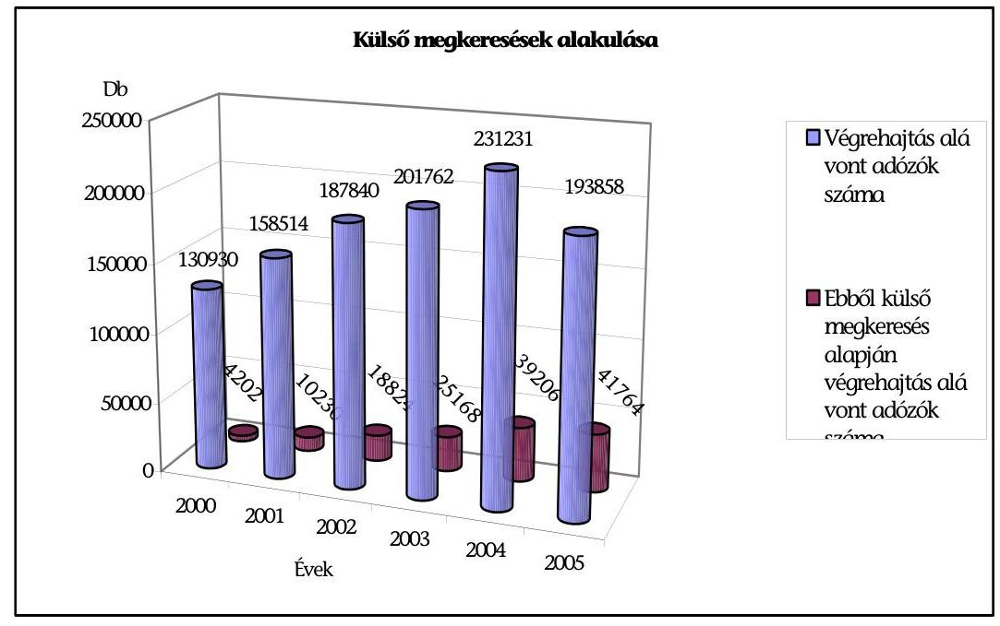

A vizsgált időszakban a külső megkeresésre folytatott végrehajtási eljárások száma 2000-ről 2005-re közel a tízszeresére (2000-ben 4202 db, 2005-ben

---

41 764) nőtt. Az ezáltal érintett hátralékok összege az összes hátralékhoz viszonyítva alacsony szinten (2000-ben 2,5\%, 2004-ben3,9\%, 2005-ben 10,7 \%) alakult (10/a-10/f sz. tanúsítvány). A külső megkeresések teljesítése esetenként 10-11 E Ft-os költségkihatással járt és csak 6-7 E Ft behajtását eredményezte.

# 2.2.3.2. A hátralékfizetési kedvezményekre irányuló kérelmek elbírálása, a fizetési könnyítések, valamint a méltányossági jogkör gyakorlásának törvényessége 

A fizetési kedvezményre irányuló kérelmek elbírálása központi irányelvek alapján történik, amit a 2002. január 1-jével bevezetett Adósminősítő Információs Rendszer (AMIR) hatékonyan támogat.

A fizetési kedvezményekre irányuló kérelmek száma a 2000. évi 137164 db-ról 2004-ben 158575 db-ra, azaz 15,6\%-kal nőtt, majd 2005-ben 153119 db-ra, azaz $3,5 \%$-kal csökkent. A kérelemmel érintett tartozás összege a 2000. évi 133,69 Mrd Ft-ról 2004-ben 313,80 Mrd Ft-ra, azaz 134,7\%-kal nőtt, 2005-ben pedig 243,55 Mrd Ft-ra, vagyis $22,4 \%$-kal csökkent. Ebből a fizetéskönnyítési (részletfizetés) kérelmek száma összességében 52,5\%-os, az ezekkel érintett összegek pedig $92,1 \%$-os emelkedést mutatnak. A mérséklésre irányuló kérelmek száma 14,8\%kal csökkent, az erre irányuló összeg viszont $28,7 \%$-kal emelkedett. 2000-ben a fizetési kedvezményekre irányuló kérelmek összegének $84,3 \%$-a irányult fizetés könnyítésre, ugyanez az arány 2005-ben $88,9 \%$ volt. A mérséklés iránti kérelmek számának aránya a 2000. évi 26,9\%-ról 2005-ben 20,5\%-ra, az ezzel érintett öszszeg pedig $15,7 \%$-ról 2004-ben $8,0 \%$-ra csökkent, 2005-ben pedig $18,9 \%$-ra nőtt (11. sz. tanúsítvány).

A hátralék-fizetési kedvezményekre irányuló kérelmek elbírálására hozott határozatok megfeleltek a törvényességi követelményeknek.

A fizetési kedvezmények elbírálásának jogszabályi hátterét alapvetően a hatályos Art., és az államigazgatási eljárás általános szabályairól szóló 1957. évi IV. tv. képezte. A helyszíni vizsgálat során kiválasztott ügyiratok (igazgatóságonként és évente 10-10 db) mindegyikében a tényállások tisztázottak, a döntések helytállóak, a határozatok indoklása megfelelőek voltak. Az eljárások kellően dokumentáltak, az iratokból utólagosan is megállapítható a döntés alapja és oka.

Az APEH az informatikai rendszerében nem alakította ki a fizetési kedvezménnyel érintett részletfizetések automatikus figyelésének és nemfizetés esetén azok visszarendezésének funkcióját, ezáltal a részletfizetések naprakészségének nyomon követése csak manuális módon, jelentős erőforrások lekötésével biztosítható. Így újra felhalmozódhat az adóalany tartozása, és bizonytalanná válhat annak beszedhetősége.

### 2.2.3.3. A végrehajtással nem beszedhető hátralékállomány csökkentésére tett intézkedések

A végrehajtással nem beszedhető hátralékká minősítést megelőzően az igazgatóságok a jogszabályokban és belső utasításokban meghatározottak szerint jártak el.

Gazdálkodó szervezeteknél kezdeményezik a törlési, illetve felszámolási eljárást, egyéni vállalkozók esetében - a hátralékállomány növekedésének megakadályo-

---

zása céljából - a vállalkozói igazolvány visszavonását. Folyamatosan végzik a mögöttes felelősök és azok vagyonának felkutatását, vagyon esetén fizetésre kötelezését. Törlik az elévült, valamint a behajthatatlan tartozásokat.

A Hivatal intézkedéseinek eredményességét csökkentheti, hogy a felszámolás esetében nincs összhang a felszámolási záró bevallás ellenőrzésére azt Art.-ban és a Csődtv.-ben meghatározott határidők között. Az Art. 92. § (4) bek. ugyan 60 napot biztosít a Hivatalnak az ellenőrzésre, de mivel a Csődtv. 52. § (1) bek. szerint a felszámoló a záró bevallást 30 napon belül köteles benyújtani, ezért gyakorlatilag az ellenőrzési idő 30 napra csökkenhet, a bíróság viszont gyakran az eredeti 60 nap figyelembevételével befejezi az eljárást.

A jogszabályok lehetőséget biztosítanak arra, hogy a felszámolás illetve a végelszámolás alatt álló szervezetekkel szemben fennálló követeléseit a Hivatal engedményezze. A végelszámolás alatt álló gazdálkodó szervezetek esetében ez nem indokolt, hiszen a szervezet vagyona fedezetet kell, hogy nyújtson a szervezet tartozásaira (csak akkor van lehetőség végelszámolás kezdeményezésére, ha van fedezet a teljes tartozásra). Engedményezés esetén a tartozásnak csak egy része térül meg, így sérül a költségvetés érdeke. Az APEH célszerűen járt el, amikor a végelszámolás alatt álló szervezetek tartozásait nem engedményezte.

A felszámolási eljárásokban az állami adóhatóság által bejelentett követelések engedményezésének a lehetőségét a Csődtv. 80. §-a teremtette meg, az MKK Rt. részére történő kötelező engedményezést az Adó- és Pénzügyi Ellenőrzési Hivatalról szóló, 48/1999. (III. 18.) Korm. rendelettel módosított 55/1991.(IV. 11.) Korm. rendelet 5. §-a rendelte el. Az engedményezések rendszerére (1996-1998 között szabad értékesítés, 1999-2002. MKK Rt. 2003-tól pályázat, 2005. július 1-jétől MKK Rt.) jellemző, hogy az engedményes nem csak maga léphet fel hitelezőként, hanem a követelést megfelelő üzleti haszonnal tovább engedményezheti. A követelések átadásának eljárási rendjére vonatkozóan az APEH és az MKK Rt. a pénzügyminiszter jóváhagyásával, 1999. március 19-el keret-megállapodást kötött.

Az APEH a jogszabályi előírásokat figyelembe véve alakította ki a felszámolás alatt álló gazdálkodó szervezetekkel szembeni követeléseinek engedményezési eljárásrendjét. A pénzügyminiszter jóváhagyásával 1999. márciusában engedményezési szerződést kötött az MKK Rt ${ }^{19}$,-vel. A felek az említett keretmegállapodást hétszer módosították, ezek közül 4 esetben kiegészítették az átadott követelések listáját, és minden alkalommal módosították a fizetési feltételeket, nevezetesen átütemezték a fizetési határidőt és a költségelszámolás miatt fokozatosan csökkentették a fizetendő vételárat (a kezdeti tőkearányos 4\%-ról $2 \%$-ra). Az átütemezésekkel a szerződés teljesítése 2005. év végéig elhúzódott és a megtérülés csak részletfizetésekkel realizálódott (2. sz. táblázat).

A szerződés szerint az APEH átadta az 1998. december 31-ig közzétett, valamint ezt követően a 2001. december 31-ig közzétett felszámolás alatti cégekkel szem-

[^0]
[^0]:    ${ }^{19}$ Az ellenőrzési megállapításokat a Magyar Követeléskezelő Rt. múködésének ellenőrzéséről készített 2005. évi ÁSZ jelentés tartalmazza (0553).

---

ben fennálló teljes követelésállományát. A követelések átadása 2004. június 30-ig folyamatos volt.

A szerződések szerint a várható megtérülés 13,04 Mrd Ft volt. Az MKK Rt. az igazolt költségeinek és egyéb korrekcióinak érvényesítését követően összesen 7,00 Mrd Ft-ot utalt át az APEH részére. A Hivatal az MKK Rt. költségelszámolását minden évben ellenőrizte. Az erről készült jegyzőkönyvekben rögzítették az elfogadott, illetve el nem fogadott költségeket. Az MKK Rt. kimutatása szerint a megtérülés 2,55\%-os, az APEH nyilvántartásai szerint azonban ez mindössze 1,99\%-os volt (12. sz. tanúsítvány). Az MKK Rt.-nél végzett ÁSZ vizsgálat az APEH számait igazolta.

A pénzügyminiszter a 2001 decemberi állásfoglalásában kiterjesztette a fenti keret-megállapodás tárgyát az állami kezesség beváltásából adódó követelések engedményezésére is és 100 Ft/követelés vételárban határozta meg az engedményezés ellenértékét. A szerződések alapján a 16,40 Mrd Ft teljes tőketartozású követelések ellenértékeként az MKK Rt. mindössze 32,79 M Ft-ot utalt át a Hivatalnak.

Az állami kezesség beváltásából adódó követelések engedményezésére a 2001. december 20-i szerződés alapján került sor, amely 2002. november 18-ig volt érvényben.

A pénzügyminiszter - eleget téve az ÁSZ javaslatának ${ }^{20}$ - kezdeményezte az APEH tv. módosítását, amely értelmében a 2002. év elejétől közzétett eljárásokra vonatkozó engedményezés 2003. január 1-jétől nyílt pályáztatás útján történjen. A követelések értékesítésének ez a módja 2005. júliusáig volt érvényben. Az APEH pályáztatással 5 szerződést kötött összesen 51,78 Mrd Ft hátralékállomány engedményezésére, ebből 383,18 M Ft (1,25\%) térült meg (13. sz. tanúsítvány).

A Hivatal a hátralékok jogszabályban meghatározott részét 2005. július 1-jétől kizárólag az MKK Rt.-re engedményezheti.

A PM 2005. év elején jogszabály-módosítás előkészítése céljából adatokat és információt kért az MKK Rt.-től a hatályos szerződések szerinti megtérülésekre vonatkozóan. Az MKK Rt. által összeállított tanulmányt megküldte észrevételezésre az APEH részére. Az MKK Rt. az átadott dokumentumokban az általa kalkulált 2,55\%-os megtérülésről tájékoztatta a PM-et. Az engedményezés részletes feltételeire az APEH elnöke és az MKK Rt. vezérigazgatója 2005 októberében a pénzügyminiszter jóváhagyásával megállapodást kötött. Ezen megállapodás alapján - ellentétben a korábbi évek gyakorlatával - az engedményezési eljárásokkal kapcsolatosan felmerült költségeit az MKK Rt. nem érvényesítheti.

Az engedményezések részletes leírását a 6. sz. melléklet tartalmazza.

[^0]
[^0]:    ${ }^{20}$ Az ÁSZ a Magyar Köztársaság 2001. évi költségvetése végrehajtásának ellenőrzése során javasolta a pénzügyminiszternek a követelések engedményezésének pályáztatás útján való átadását a magas költségvonzatra és az alacsony megtérülésre tekintettel.

---

# 2.3. Az APEH múködésének pénzügyi feltételei 

Az APEH múködésére a költségvetés 2000-2003 között növekvő, 2004től csökkenő mértékben biztosított előirányzatot. A 2004. évi költségvetési támogatás összege nominál értéken 20\%-kal kevesebb a 2002. évinél és nem éri el a 2000. évit sem. A forráshiányos gazdálkodás következménye, hogy a Hivatal nem tudta pótolni az amortizálódott eszközeit, továbbá megvalósítani az új Art. munkáltatói adatszolgáltatással kapcsolatos 2006. évi rendelkezéseinek végrehajtásához szükséges informatikai fejlesztéseket. Gazdálkodását 2004-től visszatérő likviditási problémák jellemzik.

## A Hivatal kiadási előirányzatának és a teljesítések kiemelt adatai

(Adatok Mrd Ft-ban)

| Megnevezés | 2000 |  | 2001 |  | 2002 |  | 2003 |  | 2004 |  | 2005 |  |
| :--: | :--: | :--: | :--: | :--: | :--: | :--: | :--: | :--: | :--: | :--: | :--: | :--: |
|  | előir. | telj. | előir. | telj. | előir. | telj. | előir. | telj. | előir. | telj. | előir. | telj. |
| Költségvetési támogatás | 55,3 | 64,9 | 58,1 | 73 | 59,2 | 79,6 | 60,3 | 71,6 | 55,9 | 63,7 | 57,6 | 72,2 |
| Kiadások összesen | 55,5 | 60,6 | 58,4 | 73,7 | 59,5 | 83 | 60,5 | 76,5 | 56,1 | 71,1 | 57,9 | 68,2 |
| Ebből:   Személyi juttatás és járulékai | 31,2 | 37,6 | 33,5 | 46,8 | 34,6 | 55 | 43,5 | 57,1 | 42,7 | 52,6 | 44,5 | 53,1 |
| Dologi és egyéb folyó kiadások | 13,7 | 12,4 | 14,7 | 14,6 | 14,7 | 15,9 | 13,9 | 14,6 | 10,4 | 13,1 | 11,0 | 12,6 |
| Felhalmo zási kiadások | 10,6 | 10,0 | 10,2 | 11,6 | 10,2 | 11,6 | 3,0 | 4,7 | 3,0 | 5,5 | 2,3 | 2,4 |

A Hivatal költségvetési kiadásain belül a vizsgált években folyamatosan növekedtek a személyi juttatások és a munkaadót terhelő járulékok aránya, amelyek 2000-ben $62 \%$-ot, 2005-ben $78 \%$-ot tettek ki.

A kiadási csoportok arányeltolódása több tényező együttes hatásaként jelentkezett: a személyi juttatások és járulékai a vizsgált időszakban folyamatosan nőttek, a dologi, az egyéb és a felhalmozási kiadások együttes összegeinek aránya csökkent.

A személyi juttatások és járulékainak növekedését a Kormány által elrendelt 2001. évi új közszolgálati illetményrendszerből származó többletkifizetések, a 2003. és 2004. évi létszámleépítés egyszeri kifizetései, a 13. havi illetmény kifizetését érintő változások, a minimálbér emelkedése, a diplomás minimálbér bevezetése, az informatikai szervezet központosításából adódó többletkifizetések és nem utolsó sorban az anyagi ösztönzés változó összege befolyásolta.

A dologi és egyéb folyó kiadások 2000-ről 2005-re mindössze 1,6\%-kal emelkedtek (12,4 Mrd Ft-ról 12,6 Mrd Ft-ra). Figyelembe véve az éves inflációt, ez reálérté-

---

ken 26\%-os csökkenést jelent. Aránya az APEH költségvetésében 20\%-ról 18\%-ra csökkent.

2004-ben a dologi és egyéb folyó kiadások eredeti előirányzata a 2003. évi teljesítéshez képest $28 \%$-al volt kevesebb. 2004-ben az előirányzat-módosítással 2,9 Mrd Ft-ot átcsoportosított, ebből 2,4 Mrd Ft-ot a személyi juttatások előirányzatból. Így a 2004. évi tényleges előirányzat-felhasználás 13,1 Mrd Ft volt. A 2005. évre a jóváhagyott eredeti előirányzat 11 Mrd Ft , az előző évi teljesítés öszszegétől $16 \%$-kal, a 2000 . évi teljesítéstől pedig $11 \%$-kal maradt el.

A dologi és egyéb folyó kiadások módosított előirányzata ugyan biztosította a szakmai feladatok teljesítését és a zavartalan üzemeltetést, de a Hivatal - likviditási problémák miatt - 2004. és 2005. években több esetben is kért előrehozott finanszírozást fizetési kötelezettségei teljesítése érdekében. Az előrehozott finanszírozás mellett a Hivatal 2005-ben egyéb különböző forrásokat is felhasznált kötelezettségei teljesítésére.

A befolyó törlesztő részletekkel csökkentette a lakásépítési kölcsön alapját, a tulajdonában lévő Pillér Kft. eredményét nem forgatta vissza, hanem felhasználta az osztalékot, továbbá az I-III. negyedévre biztosított érdekeltségi jutalomelőleget sem fizette ki teljes összegében.

A Hivatal felhalmozási kiadásai a 2000-2002. évi 10-11 Mrd Ft-ról 2003. és 2004. években a felére, 2005-ben az előző évinek is a felére csökkentek. Ennek oka, hogy a korábban megkezdett ingatlan és informatikai beruházások befejeződtek, illetve következménye, hogy amortizációs pótlások, fejlesztések maradtak el.

A felhalmozási kiadásokon belül a felújítások összege kisebb emelkedést követően 2004-ben a 2000. évivel közel azonos összegben teljesült, ami a kiadások 1\%át jelentette mindkét évben. 2001. évben ugyanakkor az arány még 4\%-ot tett ki, ez 2002-2003 években $2 \%$-ra mérséklődött.

Az intézményi beruházások aránya 2000. és 2005. évet összevetve 13\%-ról 2,6\%ra, a központi beruházások aránya pedig 1,6\%-ról 0,6\%-ra csökkent.

A költségvetési előirányzatok és a teljesítések alakulását részletesen a 14/a$14 / \mathrm{b}$ sz. tanúsítvány mutatja.

# 2.3.1. Humánerőforrás-gazdálkodás 

A Hivatal nem alakította ki az egyes szakterületeken a feladatellátáshoz szükséges humánerőforrás-kapacitás rendszeres és azonos mutatószámokon alapuló tervezésének és elemzésének módszerét és nem is készített ilyen átfogó elemzéseket. Ennek hiányában nem határozza meg, hogy az egyes jogszabályok által előírt, kötelezően ellátandó feladatok teljesítése a szakterületeken mekkora kapacitást igényel. A feladatokat Az APEH központja leosztja az igazgatóságokon rendelkezésre álló humánerőforrásra. Az erőforrások ily módon történő felhasználásával biztosítja a feladatok ellátását.

A 2005. december 5-től hatályos SzMSz rendszeres humánerőforrás-allokációs számítások és elemzések készítését írja elő. A helyszíni vizsgálat lezárásáig ilyen hivatali szintű, átfogó elemzés még nem készült.

---

A Hivatal 2003-ban a 1106/2003. (X. 31.) Korm. határozat, 2004-ben pedig a 13/2004. (PK. 15.) PM utasítás alapján végrehajtotta az 1100 fős, majd 180 fős létszámcsökkentést. Az APEH engedélyezett létszáma 2002. december 31-én 13642 fő, 2004. december 31-én és 2005. december 31-én 11962 fő volt.

A kormányhatározat alapján az APEH Központ létszámát 207 fővel, a területi igazgatóságokét pedig 893 fővel csökkentették. Az adóügyi blokk engedélyezett létszáma 290 fővel, az ellenőrzési blokké 391 fővel, a végrehajtási blokké 211 fővel, a müködtetési területé 130 fővel, az informatikai terület létszáma pedig 78 fővel csökkent.

A Hivatal sem a 2003. évi, sem a 2004. évi leépítést megelőzően döntés előkészítés céljából nem készített arra vonatkozó felméréseket és elemzéseket, hogy mely területeken milyen mértékű legyen a csökkentés. A 2003. évi létszámleépítés végrehajtását megelőzően felmérte a szakterületi blokkok és az igazgatóságok humánerőforrás-kapacitásainak leterheltségét, de az elbocsátások során számadatokkal nem igazolható módon vette ezeket figyelembe.

Pl. az allokációs elemzés Vas megyében a behajtási területen kimutatott egyértelmű „munkaerő-felesleg" ellenére átlag ( $8,2 \%$ ) alatti, 5,8\%-os létszámleépítés történt. Bács-Kiskun megyében a behajtási területen egyértelmú „munkaerőhiányt" mutatott az elemzés, ezzel szemben az egyik legnagyobb arányú elvonás $(11,5 \%)$ a szakmai blokkon belül itt volt tapasztalható. Heves és Tolna megyékben az allokációs elemzés szerint az adóügyi területre a „munkaerőhiány" jellemző, ennek ellenére szintén ez egyik legnagyobb arányú, $12,9 \%$, illetve $10,4 \%$ os létszámcsökkentést kellett végrehajtaniuk (15. sz. tanúsítvány).

A létszámleépítés végrehajtását a Hivatal 2003-ban a konkrét kormányzati döntéseket megelőzően kezdte meg és Intézkedési Tervet dolgozott ki annak végrehajtására. A konkrét munkajogi intézkedéseket a kormányhatározat kihirdetését követően azonnal megtette. Ennek következménye, hogy a Köztisztviselő Érdekegyeztető Tanács és a kormány között két héttel később létrejött megállapodást csak részben tartotta be. A létszámleépítés végrehajtása során elsősorban a korábbi egyéni teljesítményeket vette figyelembe, a megállapodásban rögzített szociális szempontok kevésbé érvényesültek.

A létszámleépítéssel kapcsolatos tárcaközi előkészítő munka elhúzódása következtében az elrendelő 1106/2003. (X. 31.) Korm. határozat a Magyar Közlöny 2003. november 6-i számában jelent meg. Az elrendelt létszámcsökkentés végrehajtására az APEH elnöke a kormányhatározat kihirdetését megelőzően közel egy hónappal hamarabb, 2003. október 10-én jóváhagyta az Intézkedési Tervet. A kormányhatározat közzétételének napján az APEH elnöke újabb, a korábbinál részletesebb Intézkedési Tervet hagyott jóvá, a korábbit azonban nem hatálytalanította.

A Tanácsban megkötött megállapodás 2003. november 14-én került kihirdetésre. A létszámcsökkentésben érintett munkavállalók részére az Intézkedési Tervben foglalt ütemterv szerint 2003. november 12-ig kiadták a felmentési okiratokat vagy a felmentésről tájékoztató iratokat.

A Hivatal a létszámcsökkentéssel összefüggő munkáltatói intézkedések során betartotta a Ktv. előírásait, de nem tett eleget a megállapodás 4. pontjában foglalt kötelezettségnek, amely az 50 évnél idősebb nőkre, az 55 évnél idősebb férfiakra, továbbá a gyermeküket egyedül nevelőkre vonatkozó kivételes eljárást határozott

---

meg. A Legfelsőbb Bíróság 2005. május 10-én kelt ítéletében foglaltak szerint a megállapodás nem bírt kötelező jogi erővel, a Tanács ugyanis a Ktv. 65/B § (3) bekezdése alapján joginorma alkotásra nem jogosult, a kormány pedig nem adott ki utasítást a megállapodás végrehajtására.

A 2003. és 2004. évi létszámleépítés egyszeri kiadásai mintegy 2,3 Mrd Ft és 0,4 Mrd Ft, végrehajtásával az éves megtakarítás 2,8 Mrd Ft és 0,5 Mrd Ft volt.

A vizsgált időszakban a csökkenő létszám mellett jelentősen átalakult az APEH állománycsoportonkénti összetétele, növekedett az ügyintézők aránya. A létszámleépítések során megvalósította azt a célkitűzését, hogy a felsőfokú végzettségű, illetve a nyelvtudással rendelkező munkatársakat lehetőség szerint megtartsa.

A létszámleépítések hatására a felsőfokú végzettségű ügyintézők aránya az időszak alatt 5\%-kal (39\%-ról 44\%-ra) emelkedett, míg a középfokú végzettségűek aránya 4\%-kal ( $41 \%$-ról $37 \%$-ra) csökkent. A leépítés a legnagyobb mértékben az ügykezelőket (14\%) és a fizikai munkakörűeket (18\%) érintette. Ezen állománycsoportok részaránya a Hivatalon belül 7\%-ra, illetve 2\%-ra csökkent. (16/a16/b sz. tanúsítvány)
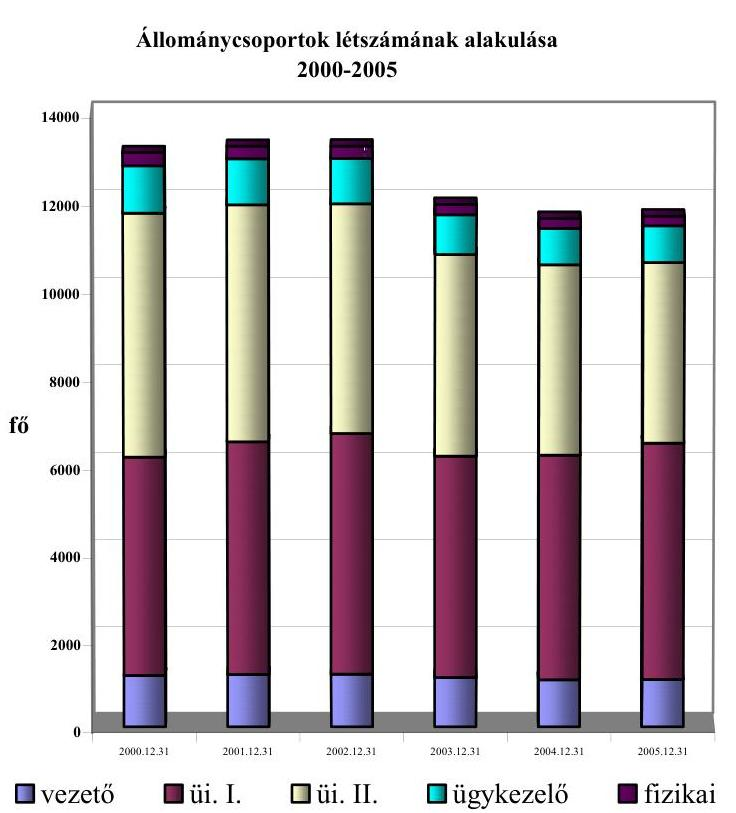

A közép és felsőfokú nyelvvizsgával rendelkezők száma 2004-ben 1966 fő (17\%) volt. A vezetők 23,5\%-a, a felsőfokú iskolai végzettségű ügyintézők 39,3\%-a, a középfokú iskolai végzettséggel rendelkező ügyintézők 5,4\%-a beszél idegen nyelvet.

A Hivatal a létszámleépítések során megszüntette az üres álláshelyek többségét. 2000-ben a betöltetlen álláshelyek aránya átlagosan 2\%-volt (280 álláshely), 2005. I. félévében ez az érték 0,6\% alá (70 álláshely) csökkent.

---

A munkatársak szakmai-gyakorlati tapasztalatában pozitív irányú változás következett be. 2000-ben a munkatársak mintegy fele dolgozott 5 évnél hoszszabb ideje a Hivatalnál, 2004-ben ez az arány már meghaladta a $80 \%$-ot.

Míg 2000-ben minden negyedik vezető öt évnél rövidebb ideje dolgozott a Hivatalnál, 2004-ben már $95 \%$-a legalább öt éves hivatali tapasztalattal rendelkezett.

A Hivatal központjának létszáma a vizsgált években folyamatosan, a 2000. évi 1103 fơről 2005. végére 1480 főre nőtt. Ennek oka, hogy központosították az informatikai szakterületet, létre hozták a Központi Kapcsolattartó Irodát és a Tájékoztatási osztályt.

A helyszíni vizsgálat időpontjában a Központ létszámába beletartozik a 25 igazgatóság vezetője, a Hatósági Főosztály teljes létszáma (ebből 157 fő munkatárs az igazgatóságokon elhelyezve dolgozik), az informatikai szakterület (644 fő), a központi feladatokat is (közbeszerzés, beruházás, bérszámfejtés stb.) ellátó gazdálkodási egységek ( 148 fó). Ennek megfelelően az 1480 főből központi igazgatási feladatot $33 \%$ ( 506 fó) lát el.

# 2.3.2. Bérgazdálkodás 

A Hivatal személyi juttatásokra 2000-ben 27,5 Mrd Ft-ot, 2004-ben 39,4 Mrd Ftot, 2005-ben 40,1 Mrd Ft-ot fordított. Mértékét, a jogosultság feltételeit - a Ktv. előírásait, valamint a helyi sajátosságokat figyelembe véve - Közszolgálati Szabályzatban rögzítette.

A Hivatalban az egy fôre jutó átlagkereset 2003-ig nőtt, 2004-ben besorolástól függetlenül - nominál értéken a 2001. évi szintre csökkent. 2004-ről 2005-re ismét nőtt. A feladatok folyamatos bővülése, a feladatvégrehajtáshoz rendelkezésre álló létszám mintegy $\mathbf{1 0 \%}$-os leépítése mellett az érdekeltségi jutalmak fokozatos csökkenése és kifizetésének bizonytalanná válása gyengíti a Hivatal munkaerő-megtartási képességét, valamint az érdekeltségi rendszer ösztönző hatását.

Az éves költségvetési törvényekben meghatározott, érdekeltségi jutalomként kifizethető összegek a vizsgált időszakban csökkentek, 2005-ben a 2001. évi felére (2001-ben és 2002-ben 7,04 Mrd Ft, 2003-ban és 2004-ben 6,79 Mrd Ft, 2005-ben 3,58 Mrd Ft). 2004-ben a törvényben meghatározott összeg helyett a PM 1,79 Mrd Ft érdekeltségi jutalom kifizetését engedélyezte (lásd részletesen 1.3 fejezet)

A havi átlagkereset 2000-ben 171 E Ft/hó, 2001-ben 224 E Ft/hó, 2002-ben 247 E Ft/hó, 2003-ban 244 E Ft/hó, 2004-ben 224 E Ft/hó, 2005-ben 286 E Ft volt. (17/a-17/b sz. tanúsítvány)

A Hivatal dolgozóinak havi átlagbére 2000-2005 között - emelkedés elsősorban kormányzati intézkedések hatására - több mint kétszeresére ( 95 E Ft-ról 212 E Ft-ra) emelkedett.

Az átlagon belül a vezetők állománycsoportban 190 E Ft-ról 411 E Ft-ra, az ügyintéző I. állománycsoportban 114 E Ft-ról 246 E Ft-ra, az ügyintéző II. állománycsoportban 70 E Ft-ról 137 E Ft-ra, az ügykezelők állománycsoportban 57 E Ft-ról 90 E Ft-ra, a fizikai állományúaknál 58 E Ft-ról 84 E Ft-ra emelkedtek.

---

A bérek emelkedését jelentette 2000., 2001., 2002. évi köztisztviselői illetményalap, valamint a 2001. és 2003. években az illetményszorzók emelése. Az átlagbérek növekedését okozta továbbá a minimálbérek emelkedése, illetve 2003-ban bevezetett diplomás minimálbér alkalmazása. A 2004. és 2005. évi béreket befolyásolta továbbá a Ktv. 96. § módosítása, amely a külön juttatás (13. havi illetmény) kifizetésének időpontját változtatta meg.

A havi átlagkereset 2000-2003. évek között közel a másfélszeresére (171 E Ft-ról 244 E Ft-ra) nőtt, 2004-ben azonban az előző évihez képest 9\%-kal, a 2001. évi szintre (224 E Ft) csökkent. 2005-ben az átlagbérek a 2004. évihez képest 28\%$\mathrm{kal}(286 \mathrm{E} \mathrm{Ft})$ nőtt.

Az átlagkereset a Hivatalnál a bérből és a költségvetési törvényben meghatározott érdekeltségi jutalomból, illetve egyéb jutalmakból (pl. jubileumi jutalom, elnöki jutalom, igazgató jutalom) tevődik össze.

Az átlagkereset összetétele a vizsgált években megváltozott, a bér aránya a kereseten belül 56\%-ról 2004-ben 83\%-ra, 2005-ben 74\%-ra nőtt, az érdekeltségi jutalom aránya - 2005. kivételével (26\%) - folyamatosan (44\%-ról 17\%-ra) csökkent. Ennek oka, hogy a vizsgált időszakban a költségvetési törvényben meghatározott, egy főre kifizethető érdekeltségi jutalom összege 2000-2002 között mintegy 17\%-kal emelkedett, ezt követően folyamatosan csökkent, 2004ben a 2000. évi felére.

Átlagilletmény (bér) és jutalom alakulása az APEH-nél 2000-2004
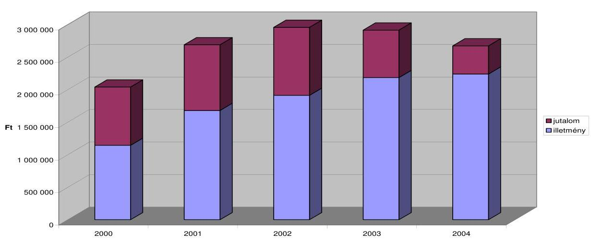

A vezetői állomány munkájának elismerése a vizsgált években folyamatosan nőtt. 2000-ben átlagosan mintegy másfélszer több jutalmat kaptak, mint az ügyintéző I. kategóriába soroltak, 2004-ben és 2005-ben már 3,5 szeresét.

A Központban dolgozók átlagkeresete 2000-2004. évek között mintegy 50\%-kal, 2005-ben pedig $38 \%$-kal haladta meg az igazgatóságokon dolgozókét. A központ vezetői 2004-ben 9\%-kal, 2005-ben 28\%-kal kaptak több jutalmat, mint az igazgatóságok vezetői. A központban dolgozó ügyintéző I. állomány 2004ben $57 \%$-kal, 2005-ben $28 \%$-kal részesült több jutalomban a területi igazgatóságon dolgozókhoz képest. Az egyéb állománycsoportba tartozók esetében a különbözet 13-20\% között alakult.

---

A Hivatal kialakította a külső munkaerő alkalmazásának feltételeit tartalmazó szabályozását ${ }^{21}$. Az 1068/B/2003. számú APEH utasítás szabályozza a megbízási szerződés megkötésének feltételeit. Az utasítás szabályozza, hogy állományba tartozó dolgozóval szerződés csak a munkaköri leíráson kívüli feladatok végzésére köthető, de nem terjed ki arra, hogy a feladatot munkaidőn belül, vagy azon túl kell ellátnia. 2003-ig évente mintegy 1500, 2004-ben 654, 2005-ben pedig 923 megbízási szerződést kötött, 2000-2004. években 80\%-ban, 2005-ben 41\%-ban saját állományú dolgozóval. Egy szerződés átlagos megbízási díja 50 E Ft. Megbízási díjakra 2000-ben 83,5 M Ft-ot, 2005-ben 54,2 M Ft-ot fordítottak.

Külső munkavállalókkal a Hivatal 2002-ig évente átlagosan 350 db szerződést kötött, ez 2004-re 90 db-ra csökkent, de 2005-ben a hatszorosára, vagyis 541 db-ra nőtt. Az egy szerződésre átlagosan kifizetett megbízási díj összege 2002-2004 között megduplázódott ( 182 E Ft-ról 342 E Ft-ra), 2005-ben a szerződések számának megnövekedésével pedig a 2004. évi egyötödére ( 61 E Ft-ra) csökkent. A szerződésekre 2000-ben 64 M Ft-ot, 2005-ben 33 M Ft-ot fizetett ki.

A megbízási szerződések mellett egyes szakmai és kiszolgáló tevékenységek ellátására vállalkozási szerződéseket kötött a Hivatal, amelyekre a dologi előirányzatainak mintegy harmadát fizette ki évente. A szakmai munkával összefüggő szellemi tevékenységre kötött szerződések túlnyomó többsége az informatikai rendszerek (alapszoftverek) fejlesztésére, illetve oktatására vonatkozott, amelyre évente mintegy 1,5-1,9 Mrd Ft kifizetést teljesített. A kiszolgáló tevékenységre (pl. takarítás, őrzésvédelem) kötött szerződések száma évente 200300 db között változott, amelyek mintegy 2,0-2,5 Mrd Ft kiadást jelentettek.

A megbízási és vállalkozási szerződések számát és a kifizetett díjak összegeit a 18/a-18/b sz. tanúsítvány tartalmazza.

# 2.3.3. Informatikai beruházások és eszközállomány alakulása 

A Hivatal informatikai fejlesztésekre fordítható beruházási kerete 2003. évtől kezdődően jelentős ( $40 \%$-ot meghaladó) mértékben csökkent, emiatt a Hivatal nem tudott végrehajtani egyes - a feladatellátás informatikai támogatása szempontjából alapvető fontosságú - fejlesztéseket (pl. személyi számítógép beszerzés, Service Desk rendszer bevezetés).

[^0]
[^0]:    ${ }^{21}$ Erre vonatkozó javaslatot az ÁSZ a PM fejezet gazdálkodásának 2003. évi vizsgálata során tett (0431).

---

# Informatikai beruházási keret alakulása 

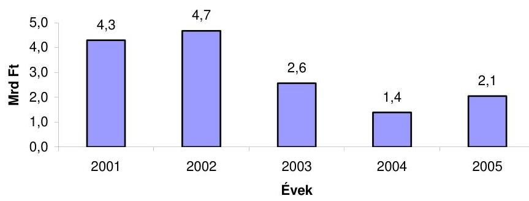

Az informatikai beruházások végrehajtásához a Hivatal 2006. évi költségvetésében - az intézményi beruházási keret részeként - 1 Mrd Ft állt rendelkezésére, amelyet a „Havi adatszolgáltatáson alapuló egyéni adó- és járuléknyilvántartás" rendszerének kialakítására a PM fejezeten belüli átcsoportosítással 3,06 Mrd Ft-tal megnövelt. Az informatikai beruházások tervezését nehezítette, hogy ez utóbbi kiemelt feladat megvalósításához biztosított beruházási keret nagysága csak 2006. január 10-én vált ismertté a Hivatal számára.

A Hivatal informatikai eszközállományának a feladatellátás szempontjából alapvető fontosságú elemei elavultak. Az eszközparkon belül három eszközcsoport - a személyi számítógépek, a laptopok és a megyei szerverek - életkora és műszaki színvonala már olyan mértékben elmarad a hivatali működés által támasztott követelményektől, hogy az a feladatellátás színvonalát is veszélyezteti.

Az igazgatóságok nyilvántartásai szerint a személyi számítógépek több mint $40 \%$-a nem felel meg az új központi informatikai rendszerek múködtetéséhez szükséges követelményeknek. Emiatt a számítógépek közel fele nem alkalmas a bevezetés alatt álló, ugyanakkor a feladatok hatékony ellátásához nélkülözhetetlen integrált informatikai rendszerek eredményes működtetésére. A munkaállomások elöregedésének további következménye, hogy az azokon futó operációs rendszerek egységesítése a gépek elavultsága miatt nem végezhető el.

A 3 évesnél régebbi személyi számítógépek aránya 2001-ben 25\% alatt volt, 2005-ben már meghaladta a 73\%-ot (19/a-19/b sz. tanúsítvány).

A személyi számítógép állomány elöregedésének oka, hogy a pénzügyi források szűkössége miatt 2004-től jelentős mértékben visszaestek az informatikai eszközbeszerzések. A személyi számítógép állomány korszerűsítésének 2006. évi elmaradása azzal a kockázattal jár, hogy az elavult informatikai eszközökön az új integrált rendszerek nem fognak az előzetesen meghatározott követelményeknek megfelelően múködni. Ez a kockázat különösen megmutatkozik olyan rendszerek esetében, mint például a 2006-ban induló központi dokumentumkezelő rendszer, amelyet napi munkája során a Hivatal teljes állománya használni fog, azonban a számítógépek több mint $40 \%$-a nem felel meg a rendszer által támasztott műszaki követelményeknek.

---

A Hivatal 2004-2005. években a szakfeladatok ellátására összesen 160 darab személyi számítógépet szerzett be, ami mind a meglévő személyi számítógépállományhoz (több mint 13000 db ), mind pedig a korábbi évek (2002-ben 1594 db, 2003-ben 2000 db ) beszerzéseihez viszonyítva elenyészőnek tekinthető.

A hordozható számítógépek múszaki színvonala 2002. évtől kezdödően folyamatosan romlott és már nem elégíti ki a szakterületek igényeit, különös tekintettel az ellenőrzési terület által támasztott követelményekre. A működőképes laptopok száma a revizori létszámhoz képest alacsony, továbbá ezek többségének a kapacitása nem teszi lehetővé a revizorok munkáját támogató rendszerek használatát.

A 3 évnél régebbi laptopok aránya a 2001. évi 6\%-ról 2005-ben 87\%-ra nőtt. A 2005. évi megyei statisztikák alapján a revizori állomány rendelkezésére álló 397 db laptopból összesen 320 db volt használható állapotban, tehát átlagosan 11-12 revizorra jutott egy használható laptop. Ebből az állományból a revizorok munkáját támogató egyik alaprendszert (SESAM) mindössze 108 gépre telepítették, elsősorban a gépek korlátozott kapacitása miatt.

A megyei rendszereket kiszolgáló adatbázisszerverek elavultak, kapacitásuk és teljesítményük korlátozottsága miatt középtávon nem alkalmasak a feladatellátás hatékony támogatására. Az informatikai terület számításai szerint egyes megyei szerverek háttértároló-kapacitása már nem lesz elegendő az új Art. 2006-tól hatályos előírásai következtében megnövekvő információmennyiség kezelésére.

Az új Art. 2006. április 1-jétől havi gyakoriságú, kötelező bevallást ír elő a munkáltatók meghatározott körére a munkavállalóktól levont adókra és járulékokra vonatkozóan, míg az összes munkáltatónak 2007. január 1-jétől kell havi járulékbevallást teljesítenie.

# 2.4. Az APEH belső kontroll-mechanizmusainak múködése 

## A Hivatal kialakította a belső kontroll-mechanizmus szervezeti és informatikai rendszerét, valamint a kontrollok müködtetésének eljárásrendjét.

A PM az államháztartásról szóló 1992. évi XXXVIII. törvényben, valamint a költségvetési szervek belső ellenőrzéséről szóló 193/2003. (XI. 26.) Korm. rendeletben megfogalmazottak alapján 2004-ben ellenőrzési útmutatót adott ki abból a célból, hogy egységes elvek megadásával segítse a gazdálkodó szervezeteket a belső ellenőrzési kézikönyvük elkészítésében. A PM útmutató, mint módszertan összhangban van a Belső Ellenőrök Nemzetközi Szervezetének standardjaival, és megfelel az EU által a belső ellenőrzéssel szemben megfogalmazott követelményeknek.

Az APEH elnöke 2004 júliusában jóváhagyta a "Költségvetési belső ellenőrzés szabályzatát", valamint a PM útmutató alapján készített Belső ellenőrzési kézikönyvet. A szabályzat mind felépítésében, mind tartalmában megfelel a 193/2003. (XI. 26.) Korm. rendeletben megfogalmazott követelményeknek. A gazdálkodási tevékenysége ellenőrzésének szabályozására 2005 májusában kiadta az "APEH gazdasági tevékenységének folyamatba épített előzetes és utólagos vezetői ellenőrzési (FEUVE) szabályzatát".

---

A Hivatal a kormányrendelet 8. §-a alapján a pénzügyi irányítási és ellenőrzési rendszer évenkénti vizsgálatát határozta meg prioritásként. Az egyes szakmai munkafolyamatok ellenőrzését elsősorban törvényességi vizsgálatok keretében végzi, de 2005-ben komplex (törvényességi és belső) ellenőrzés keretében végezték a fizetési könnyítések elbírálási, valamint az elévült tartozások törlési folyamatának vizsgálatát.

A belső kontroll-mechanizmusok részét képező felülellenőrzések hozzájárultak az ellenőrzési munka eredményességének és szakszerűségének növeléséhez. A kötelező felülellenőrzések elvégzése után fennmaradó kapacitást számítógépes véletlen kiválasztással kijelölt ellenőrzésekre fordították. A szubjektív szempontok kizárásával biztosítják, hogy az ellenőrzést végzők megállapításairól hozott határozatok azonos valószínűséggel kerülhessenek kiválasztásra. A kiválasztott adózóknál ismételt ellenőrzés keretében vizsgálták, hogy az elsőfokú hatóság eljárása során betartotta-e a jogszabályokat. A szakszerűségi és törvényességi vizsgálatok tapasztalatairól összefoglaló jelentést készítenek a hivatal vezetése, valamint az ellenőrzési tevékenységet folytatók számára.

Felülellenőrzések jellemző adatai

| Megnevezés | 2003. év | 2004. év | 2004/2003. év |
| :-- | :--: | :--: | :--: |
| Alapügy (db) | 90 | 101 | $112 \%$ |
| Elutasított megkeresések (db) | 23 | 12 | $52 \%$ |
| Elrendelt felülellenőrzés (db) | 74 | 89 | $120 \%$ |
| A felülellenőrzés által az adózók javára   megállapított adókülönbözet (E Ft) | 69303 | 27683 | $40 \%$ |
| A felülellenőrzés által az adózók terhére   megállapított nettó adóhiány (E Ft) | 402419 | 764999 | $190 \%$ |
| Büntető feljelentések száma (db) | 2 | 2 | $100 \%$ |
| Feltárt elkövetési érték (E Ft) | 400 | 42093 | $1026 \%$ |

A szakmai feladatok végrehajtását támogató informatikai rendszerek valamennyi tranzakció naplózásával biztosítják, hogy az adatokon végrehajtott valamennyi múvelet nyomon követhető legyen. A naplózások adatait az APEH igazgatóságai és a Biztonsági Főosztálya rendszeresen ellenőrzi, hogy a jogosulatlan lekérdezéseket, adatmódosításokat feltárják ${ }^{22}$.

# 2.4.1. A folyamatba épített és a vezetői ellenőrzések 

Az APEH kialakította a szakmai blokkon belül az egyes ellenőrzési típusok folyamatba épített és vezetői ellenőrzéseinek informatikai rendszereit. Az igazgatóságokon a feladat-végrehajtás során ezeket a gyakorlatban általában eredményesen alkalmazzák. Az ÁSZ a költ-

[^0]
[^0]:    ${ }^{22}$ A részletes megállapításokat az áfa-visszaigénylési rendszer ellenőrzéséről készített 2003. évi ÁSZ jelentés tartalmazza (0310).

---

ségvetés végrehajtásának éves ellenőrzései során a folyamatba épített és vezetői kontrollokat általában jól működőnek minősítette, azonban hiányosságokat is feltárt:

- A normatív támogatások 2002-2004. évi pénzügyi (szabályszerűségi) ellenőrzése a támogatás ellenőrzésével, a jogosultságok elbírálásával kapcsolatos APEH tevékenységet és a belső kontrollok működését nem ítélte megbízhatónak.

A támogatás bevallások feldolgozása során, kiutalás előtt az APEH nem ellenőrizte a megváltozott munkaképességű dolgozók foglalkoztatásról és szociális ellátásáról szóló 8/1983. (VI. 29.) EüM-PM együttes rendelet által előírt és a támogatás bevalláshoz csatolandó adatlapokat. Az adatlapok ellenőrzésének elmaradása miatt számos konkrét esetben jogszerútlenül több támogatást folyósítottak a jogszabály által megengedettnél. Az APEH a számvevőszéki ellenőrzés 2002. évi megállapításai ellenére a 2003. évben sem fordított elegendő figyelmet arra, hogy megfelelő intézkedésekkel az e területen feltárt hiányosságokat megszüntesse, vagy legalábbis mérsékelje.

Az APEH 2005. év júniusában intézkedett az igazgatóságok felé, hogy a rendelet szerint a támogatás bevalláshoz csatolandó - ellenőrzési szempontból érdemi információkat tartalmazó - adatlapokat a 2005. év vonatkozásában visszamenőlegesen, az új támogatások bevallásainál pedig minden esetben ellenőrizzék. A 2006. évtől az adatlapok is a bevallás feldolgozási rendszerben kerülnek feldolgozásra, amelyek jogszabályi alapját a 2006. február 1-jétől hatályba lépő 25/2005. (XII. 27.) FMM-EüM-ICsSzEM-PM együttes rendelet 2. § (6) bekezdése teremti meg.

- Az igazgatóságok az agrárhitelekhez kapcsolódó állami kezességérvényesítéssel kapcsolatos adóhatósági feladatokat nem a belső szabályok szerint hajtották végre.

Az APEH elnökének 1010/B/2001. sz. APEH utasítása rendelkezett először az agrárhitelekhez kapcsolódó állami kezességérvényesítéssel kapcsolatos adóhatósági feladatokról, amely alapján az agrárgazdasági kezességbeváltás miatt keletkező kötelezettségeket az érintett APEH igazgatóságok határozatban írják elő.

Az APEH igazgatóságai a hivatkozott utasításban foglaltakat 2001-ben hiányosságokkal hajtották végre, több esetben nem hoztak kötelezettséget előíró határozatot, így a kezességérvényesítés és a határozathozatal közötti időszak indokolatlanul hosszú volt. Az igazgatóságok nem hajtották végre maradéktalanul a vonatkozó elnöki utasítás azon rendelkezését sem, amely a behajtásra irányuló intézkedések soron kívüli megtételét írta elő. A feltárt hiányosságokat az APEH igazgatóságai a 2002. évtől megszüntették.

A HVR segíti a vezetői ellenőrzést, de jelenleg nem teszi lehetővé a határidő kontroll lekérdezését, így csak egyedi kiválasztással lehet ellenőrizni, hogy az ügyintéző az intézkedéseinél betartotta-e az előírt határidőket.

# 2.4.2. Törvényességi ellenőrzések értékelése 

Az APEH a törvényességi ellenőrzését a SzMSz-e és a belső utasítása által szabályozottan és az eljárási folyamatba épített kontrollok alapján hajtja végre. A törvényességi felügyeleti jogkör - az APEH belső kontrolljainak részeként - egyrészt az egész szervezet jogszerű működésének

---

biztosítását, másrészt a hatósági jogi munka utólagos törvényességi ellenőrzését jelenti. E kétirányú tevékenységet országosan a Jogi Főosztály, helyi szinten az igazgatóságok - osztály, illetve főosztályi szintű - jogi csoportjai látták el 2003. december végéig.

A törvényességi vizsgálatok száma az igazgatóságokkal együtt 2003-ban 91, 2004-ben 109, 2005-ben már 155 darab volt. Ezek az adatok az országosan elrendelt vizsgálati témákat is tartalmazzák.

Az APEH szervezeti felépítése 2004. január 1-jével módosult, amely részeként, a Jogi Főosztályt érintően az utólagos törvényességi ellenőrzési feladat átcsoportosításával létre hozták a Törvényességi és Belső Ellenőrzési Főosztályt. Az új SzMSz a Törvényességi és Belső ellenőrzési Főosztályt kiemeli a Hivatal főosztályainak mellérendeltségi viszonyából és az APEH felügyeleti rendjébe sorolja közvetlen elnöki irányítás alatt. A Főosztályon belül a törvényességi ellenőrzési tevékenységet a Törvényességi Vizsgálati Osztály látja el.

A törvényességi és belső ellenőrzési tevékenység egy főosztályi szervezetbe foglalása révén, a szakmai és a gazdálkodási tevékenység egyidejű és az összefüggések feltárását lehetővé tevő vizsgálata valósult meg az igazgatóságokat érintő komplex törvényességi vizsgálatokban.

A Törvényességi Vizsgálati Osztály az APEH 2003. évben kialakított hosszú távú célkitűzéseire alapozva 2005-2009. évekre szóló stratégiai tervet dolgozott ki. A cél a törvényes múködés folyamatos ellenőrzésének biztosítása, valamint a belső folyamatok szigorú és rendszerszerű szabályozása.

A törvényességi vizsgálatok előkészítését és lefolytatását a törvényességi felügyeleti jogkör gyakorlásáról szóló 1062/B/2005. APEH utasítás szabályozza. A szabályozás visszacsatolásokat biztosít a fölérendeltségben múködő ellenőrzés és az ellenőrzött szervezeti egység között mind országos, mind igazgatósági hatáskörű vizsgálatok esetében, valamint a vizsgálati témákat jóváhagyó felső vezetés számára, ahol az ellenőrzési megállapítások és javaslatok kiértékelésére kerül sor és a szükséges intézkedések megtételéről döntenek.

# 2.4.3. Belső ellenőrzés értékelése 

A Hivatal kialakította a belső ellenőrzés szervezeti rendszerét és feladatait eredményesen látja el. Belső ellenőrzéseit éves terv alapján végzi, amelynek összeállításakor figyelembe vette a kormányrendelet előirásait és a PM Ellenőrzési Főosztálya által megfogalmazott elvárásokat. Az igazgatóságok a Hivatal Törvényességi és Belső Ellenőrzési Főosztálya által megadott szempontok alapján készítik el éves belső ellenőrzési tervüket. A 2005. évi tervben előírt vizsgálatok összhangban vannak a 2004-ben kidolgozott ellenőrzési stratégiájában és középtávú tervében megfogalmazottakkal.

Az APEH belső ellenőrei a 2000-2004. években összesen több mint 1500 ellenőrzést hajtottak végre. A belső ellenőri kapacitás mintegy 70-90\%-át a Hivatal által kötelezően előírt, elsősorban a gazdálkodás területét érintő ellenőrzések kötik le (a $90 \%$-ot akkor éri el, ha az igazgatóság egy fő belső ellenőrrel rendelkezik). A fennmaradó kapacitásra az igazgató által meghatározott témakörökben

---

terveznek belső ellenőrzést. Az ellenőrzési tervben előírt ellenőrzéseket minden évben elvégezték, átütemezésre a vizsgált 30 eset közül csak egyszer került sor.

A belső ellenőrzés minden évben kiterjedt mind a Hivatali Központ, mind az igazgatóságok gazdálkodására. 2005-ben - a PM útmutatóra való hivatkozással - olyan témaköröket magukban foglaló ellenőrzéseket is végeztek, amelyeknek ismételt vizsgálata nem volt indokolt, tekintettel arra, hogy a korábbi évek ellenőrzései rendszert érintő hiányosságokat nem tártak fel.
llyenek, pl. a gazdálkodási eljárások szabályozottságának, a vagyonvédelem személyi és tárgyi feltételeinek, eszközgazdálkodásnak, az eszközök beszerzésének, nyilvántartásának, selejtezések vizsgálata.

Indokolatlanul nagy arányát (a Hivatal becslése szerint 15-20\%-ot) köti le a belső ellenőri kapacitásnak, hogy a PM által elkészített módszertanban alkalmazási lehetőségként megadott nyilvántartásokat és formanyomtatványokat nem igazította a belső adottságokhoz, hanem azok alkalmazását változatlan formában kötelezően írta elő ${ }^{23}$.

A Hivatal központja, valamint az igazgatóságok a belső ellenőrzések javaslatai alapján intézkedési tervet készítenek, azok teljesítését figyelemmel kísérik. Az intézkedési terv elkészítéséért az ellenőrzött szakterület vezetője felelős. Az intézkedések utóellenőrzései során hiányosságot, illetve mulasztást nem tártak fel.

A helyszíni ellenőrzésbe bevont 9 igazgatóság 35 ellenőrzés intézkedési tervét és annak utóellenőrzési dokumentumait választottuk ki.

# 3. KorÁbbi ÁSZ VIZSGÁlatoK utÓELLENŐrZÉSEINEK EREDMÉNYEI 

Az APEH részben hasznosította a korábbi ÁSZ vizsgálatok javaslatait, a végrehajtandó feladatokról intézkedési tervet készített, amelyben megjelölték a feladat végrehajtásáért felelős személyt és a végrehajtás határidejét.

Az APEH az ÁSZ javaslata alapján

- 2003-ban elkészítette ellenőrzési stratégiáját;
- az egységes végrehajtás és a kiválasztás objektivitásának növelése érdekében új rendszert alakított ki az ellenőrzésre való kiválasztásra, amely az adózókat adóteljesítményük alapján kategóriákba sorolja. A rendszer alkalmazását elnöki utasítás szabályozza;
- elvégezte az szja adóbevallást benyújtó és munkáltatóval is elszámoló adóalanyok (duplán bevallók) utólagos ellenőrzését az ÁSZ javaslatban szereplő

[^0]
[^0]:    ${ }^{23}$ A számvevői jelentésben tett megállapítások alapján a Hivatal a belső ellenőrzési tevékenységet szabályozó normákat felülvizsgálta. A költségvetési belső ellenőrzési szabályzatról szóló 1019/B/2006. APEH utasítás 2006. március 6-án lépett hatályba. Az ellenőrzéssel kapcsolatos adminisztratív feladatok újraszabályozását is tartalmazó Belső Ellenőrzési Kézikönyv kiadásra került.

---

2000-2002. adóévekre, azonban a 2002 utáni időszakra vonatkozóan nem gondoskodott a dupla adóbevallások utólagos ellenőrzéséről. A munkáltatóval való elszámolás lehetőségének megszúnésével 2007-től ez a probléma már nem áll fenn;

- Az ÁSZ 1999. évi vizsgálatában tett javaslatára intézkedést történt, hogy a földhivatalok soron kívül jegyezzék be az ingatlan nyilvántartásba az adóhatóság által benyújtott jelzálog és végrehajtási jogra vonatkozó kérelmeket. A Hivatal vezetője intézkedett az ingatlan végrehajtási jog bejegyzésére irányuló kérelmek nyilvántartásáról; ami a HVR rendszeren belül biztosított.

A pénzügyminiszter az ÁSZ korábbi ellenőrzési javaslatai alapján a helyszíni ellenőrzés lezárásáig még nem intézkedett annak érdekében, hogy megteremtse a Hivatal feladatai és a rendelkezésére álló erőforrások összhangját, valamint hogy ennek alapján kidolgozza a tevékenység hatékonyságának elemzéséhez szükséges mérőszámokat ${ }^{24}$.

Budapest, 2006. június 29.

Melléklet: $\quad 6 \mathrm{db} \quad 101$ lap
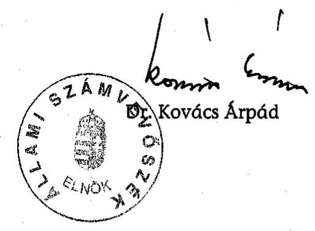

[^0]
[^0]:    ${ }^{24}$ A részletes megállapításokat a központi költségvetés adóbevételei, illetve a társadalombiztosítást illető adó- és járulékbevételek realizálásának ellenőrzéséről készített 1999. évi jelentés tartalmazza (0028).

---

# 1/A-B. SZ. MELLÉKLET (ÉSZREVÉTELEK)

---

1/a sz. melléklet
a V-17-34/2005-2006. sz. jelentéshez

H-1051 BUDAPEST V., JOZSEP NÁDOR TÉR 2-4. POSTACIM: 1369 BUDAPEST, POSTAFIÓK 481.

TELEFON: (36-1) 327-2159, (36-1) 327-2141
FAX: (36-1) 318-0738
E-MAIL: janoc.veres@pm.gov.hu

PÉNZÜGYMINISZTER

V-17-33/2005-2006

Iktatószám: 10001/3/2006.

Dr. Kovács Árpád úr
elnök

Állami Számvevőszék

Budapest

Tisztelt Elnök Úr!

Az Adó- és Pénzügyi Ellenőrzési Hivatal működésének ellenőrzéséről készített jelentést köszönettel megkaptam.

Tekintettel arra, hogy az előzetes egyeztetések során az egyes kérdéseket érintően a Pénzügyminisztérium álláspontját figyelembe vették, illetőleg a jelentés szövegét ennek megfelelően kiegészítették, a jelentés vonatkozásában vitás kérdés nem maradt, ezért az abban foglaltakkal kapcsolatosan észrevételt nem teszek.

Elnök úr a V-17-32/2005-2006. számú levele utolsó bekezdésében az ellenőrzés alapján elrendelt pénzügyminiszteri intézkedésekről kért tájékoztatást, mellyel kapcsolatban a jelentés 16. oldalán található; a pénzügyminiszternek megfogalmazott javaslatok sorrendjében a következőkről tájékoztatom:

1. A Kormány által a pénzügyminiszter útján az Országgyűléshez benyújtott, T/231. számon tárgysorozatba vett, egyes pénzügyi tárgyú törvények módosításáról szóló törvényjavaslat - többek között - az Adó- és Pénzügyi Ellenőrzési Hivatalról szóló 2002. évi LXV. törvényt (a továbbiakban: APEH törvény) is módosítja. Az APEH törvény biztosítja az adóhatóság számára azt a lehetőséget, hogy a megszűnő - felszámolás, illetve végelszámolás alatt álló - szervezetekkel szemben fennálló, a központi költségvetést, az elkülönített állami pénzalapokat, a Nyugdíjbiztosítási és az Egészségbiztosítási Alapot (a továbbiakban együtt: költségvetés) megillető követelését a Magyar Követeléskezelő Részvénytársaságra ruházhatja át (engedményezés). A felszámolási eljárás, valamint a végelszámolási eljárás azonban természeténél fogva nem azonos, hiszen míg az előbbi

---

esetén a megszűnés oka vagy velejárója jellemzően a fizetésképtelenség, a végelszámolási eljárásnál a megszűnő szervezet el tud számolni a hitelezöivel, tehát a követelések rendezésére a fedezet rendelkezésre áll. Ebből következik, hogy végelszámolás esetén a költségvetést megillető követeléseket engedményezni nem célszerű, hiszen az eljárás során a jogosultak közvetlenül nyerhetnek kielégítést. A javaslat ezért kizárja az engedményezhető követelések köréből azokat az adó- és járulékköveteléseket, amelyek végelszámolás alatt álló szervezetekkel szemben állnak fönn.
2. Év elején 3060 millió forint került átcsoportosításra az APEH informatika fejlesztése elnevezésű fejezeti kezelésű előirányzatra. Az átcsoportosított forrás az egységes adószámla bevezetésével összefüggő kiadások fedezetére szolgál. Az előirányzat felhasználása a feladatfinanszírozás szabályai szerint történik, a megvalósító az állami adóhatóság.

A 2006. évi költségvetési törvény módosításával lehetővé válik az érdekeltségi jutalom rendszeréhez kapcsolódóan informatikai fejlesztésekre is többletforrás biztosítása, amennyiben az adóhatóság teljesíti az előírt feltételeket.
3. Az állami feladatok szakszerűbb és hatékonyabb ellátása érdekében, illetőleg a közigazgatási szervezetrendszert érintő reformlépések keretében, átfogó átalakítás veszi kezdetét az állami adóhatóság, illetőleg más hatóságok, állami szervek szervezete és hatásköre tekintetében. Ennek keretében - figyelemmel az egyes szervezetek müködésének eredményére, hatékonyságára, illetőleg az állam gazdaságosabb müködése érdekében kitűzött célokra - az adóztatási feladatokat, vagy az adóztatás alapjául szolgáló tevékenységek ellenőrzését végző szervezetek összevonására, valamint az általuk végzett feladatok egy helyre integrálására kerül sor.

Az állami adóhatóság feladatköre kibővül az illetékekkel, valamint a szerencsejáték szervezéssel összefüggő feladatokkal. Ezzel együtt megszűnnek az illetékhivatalok, és a szerencsejáték felügyelet és e szervezetek az állami adóhatóság szervezeti keretei között müködnek tovább. Az összevonással egyrészt több különálló apparátus fenntartása helyett elegendő egy szervezeten belül összpontosítani ezeket az állami feladatokat, ami gazdaságosabb és olcsóbb, másrészt a kevésbé hatékony területek átszervezése vélhetően a jelenlegi, hatalmas összegű kinnlevőségek gyors csökkenését eredményezi majd (az illetékhivatalok kinnlevőségei 100 milliárd forint körül vannak).

Az átalakítási, átszervezési célok megvalósítása érdekében a javaslat 2007. január 1-jétől átalakítja az állami adóhatóság szervezetrendszerét, és az első fokú szervek jelenlegi területi megosztása helyett (ami a megyehatárokhoz igazodik) kialakítja a három-három megye területét felőlelő régiókat, az egyes adóhatósági feladatok a régiók és a kisebb jelentőségűvé váló megyei központok közötti megosztásával.
A régiók kialakítása területileg követi a jelenleg is használatos statisztikai régió-felosztást.

---

Az egyes megyékben a korábbi megyei igazgatóságok, mint kirendeltségek, tovább müködnek. A kirendeltség természetesen ellátja továbbra is az adóztatási feladatokat, ügyfélszolgálatot tart fenn, de nem önálló szervezet, a hatáskör, azaz a feladat címzettje a regionális igazgatóság. Ezzel együtt természetesen változik a felettes szervek rendszere is. A regionális igazgatóság felettes szerve a Központi Hivatal, a Központi Hivatalnak az APEH elnöke lesz.

A szervezeti változásokra és a feladatbővülésre tekintettel sor kerül az APEH részére megfogalmazott, az érdekeltségi juttatás kifizetésének feltételeként meghatározott teljesítmény-elvárások átalakítására annak érdekében, hogy azok mérhetó módon ösztönözzenek a hatékonyabb és eredményesebb munkavégzésre, illetőleg a többletteljesítmény elérésére.
4. Jelen levelemmel egyidejűleg előírtam az Adó- és Pénzügyi Ellenőrzési Hivatal elnöke számára, hogy

- dolgoztassa ki az egyes szakterületek - ezen belül a külső megkeresések alapján lefolytatandó behajtások/végrehajtások - feladatainak ellátásához szükséges humánerőforrás-kapacitás rendszeres és azonos mutatószámokon alapuló tervezésének és elemzésének módszerét, valamint készíttessen ilyen elemzéseket a humánerőforrás optimális elosztása érdekében;
- alakíttassa ki az informatikai területen a belső erőforrások eredményes kontrollját (tervezését, mérését) biztosító eszközrendszert;
- tegyen intézkedést, hogy az informatikai rendszer alkalmas legyen az azonnali és automatikus visszarendezésre, ha a fizetési könnyítésben részesített adóalany a részletfizetési kötelezettségének időben nem tesz eleget.

Budapest, 2006. június 19.
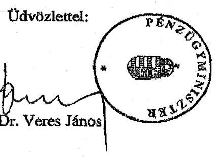

---

Adó- és Pénzügyi Ellenôrzési Hivatal
Elnök

Iktatószám: 293186h180/2006.

# BiharyZsigmond ár 

föigazgató
Állami Számvevőszék

## Budapest

## Tisztelt Bihary Úr!

ÁLLAMI SZÁMV: 0̋̋SZÉK
ÜGYVITELI I.
Á 74 - 2006 2006
Erkczct: 2006 APR 20
Iktatószám:..V....14-25/2006-2006
Melléklet: $\qquad$
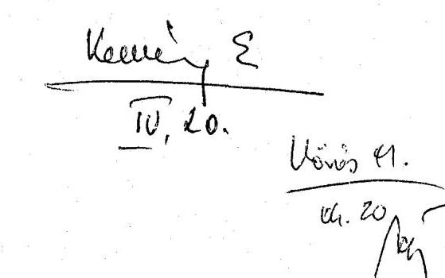

Az Adó és Pénzügyi Ellenőrzési Hivatalnál lefolytatott, 2000-2005. éveket érintő, átfogó ÁSZ vizsgálatról készített (V-17-24/2005-2006. iktatószámú) jelentés-tervezetüket megkaptuk. A munkatársaink előzetes egyeztetéseit többnyire figyelembe vevő jelentéstervezettel kapcsolatosan újabb észrevételt nem teszünk.
Az ellenőrzésekből befolyt bevételekről készítendő kimutatásra vonatkozó álláspontjuk alapján egyeztettünk a Pénzügyminisztériummal és együtt keressük a lehetséges megoldást.

Budapest, 2006. április 13.

Üdvözlettel:
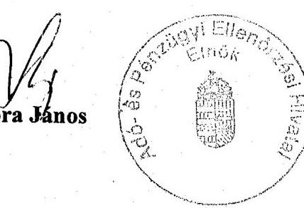

---

# 2. SZ. MELLÉKLET (TANÚSÍTVÁNYOK)

---

# Tanúsítványok jegyzéke 

| Sorsz. : | Megnevezés |
| :--: | :--: |
| 1. a - f | az informatikai munkakörben dolgozók létszámáról és informatikai végzettség szerinti megoszlásáról 2000, 2001, 2002, 2003, 2004, 2005 |
| 2. a - f | az elvégzett ellenőrzések alakulásáról 2000, 2001, 2002, 2003, 2004, 2005 |
| 3. a - f | a kiutalás előtti ellenőrzések alakulásáról 2000, 2001, 2002, 2003, 2004, 2005 |
| 4. a - b | az ellenőrzési portfólióról 2002-2004, 2005 |
| 5. a - f | az ellenőrzések kapacitás arányairól 2000, 2001, 2002, 2003, 2004, 2005 |
| 6. a - b | az egyes ellenőrzési típusok megoszlásáról és eredményességéről 20022004, 2005 (országos összesen) |
| 7. a - b | az ellenőrzések eredményességeinek alakulásáról adózói kategóriánként 2003-2004, 2005 |
| 8. a - f | a hátralékállomány alakulásáról értékhatáronként (gazdálkodók és magánszemélyek együtt) 2000, 2001, 2002, 2003, 2004, 2005 |
| 9. a - f | a végrehajtás alá vont hátralékok és a hátraléktörlések alakulásáról 2000, 2001, 2002, 2003, 2004, 2005 |
| 10. a - f | a külső megkeresésre folytatott végrehajtási eljárások alakulásáról 2000, 2001, 2002, 2003, 2004, 2005 |
| 11. | a fizetési kedvezmények alakulásáról 2000-2005 |
| 12. | a követelések engedményezéséről a 2001. év végéig KÖZZÉTETT eljárások |
| 13. | a követelések pályáztatással történő engedményezéséről 2002-2003. I. negyedév végéig közzétett eljárásokban |
| 14. a - b | az APEH költségvetési előirányzatairól és teljesítéséről 2000-2005, 2005. kiegészítése |
| 15. | az engedélyezett létszám szakmai területenkénti megoszlásáról 20002004 |
| 16. a - b | a dolgozó létszám állománycsoportok szerinti megoszlásáról 20002004, 2005 |
| 17. a - b | átlagbérek és átlagkeresetek alakulása az APEH szervezeteinél 20002004, 2005 |
| 18. a - b | a kifizetett megbízási díjakról 2002-2005. I. félévi, 2005 |
| 19. a - b | a számítógép-állomány alakulásáról 2000-2004, 2005. dec. 31-én |

---

1/a sz. tanúsítvány a V-17-34/2005-2006. sz. jelentéshez

# az informatikai munkakörben dolgozók létszámáról és informatikai végzettség szerinti megoszlásáról 2000

(fö December 31-i állapot szerint)

|  Területi szervezetek/igazgatóságok | Számítástachnikai végzettség szerinti megoszlások |  |  |  | Összesen  |
| --- | --- | --- | --- | --- | --- |
|   | Nincs informatikai végzettsége | Alapfokú informatikai | Középfokú informatikai | Felsőfokú informatikai |   |
|  Eszak-budapest | 1 |  | 18 | 21 | 40  |
|  Kelet-budapest | 1 | 1 | 18 | 12 | 32  |
|  Dél-budapest | 2 | 1 | 19 | 8 | 30  |
|  KAIG |  |  | 4 | 2 | 6  |
|  Fővárosi igazgatóságok összesen | 4 | 2 | 59 | 43 | 108  |
|  Baranya Megye |  |  | 7 | 6 | 13  |
|  Bács-Kiskun Megye | 1 | 1 | 6 | 14 | 22  |
|  Békés Megye | 1 |  | 6 | 5 | 12  |
|  Borsod-Abaúj-Zemplén Megye | 1 |  | 4 | 6 | 11  |
|  Csongrád Megye | 2 |  | 6 | 7 | 15  |
|  Fejér Megye |  |  | 4 | 9 | 13  |
|  Győr-Moson-Sopron Megye | 1 | 1 | 5 | 5 | 12  |
|  Hajdú-Bihar Megye |  |  | 8 | 10 | 18  |
|  Heves Megye |  |  | 7 | 5 | 12  |
|  Komárom-Esztergom Megye |  |  | 9 | 2 | 11  |
|  Nógrád Megye |  |  | 3 | 7 | 10  |
|  Pest Megye | 1 | 2 | 12 | 14 | 29  |
|  Somogy Megye |  |  | 2 | 8 | 10  |
|  Szabolcs-Szatmár-Bereg Megye |  |  | 5 | 10 | 15  |
|  Jász-Nagykun-Szolnok Megye | 2 | 1 | 1 | 6 | 10  |
|  Tolna Megye |  |  | 3 | 7 | 10  |
|  Vas Megye |  |  | 5 | 5 | 10  |
|  Veszprém Megye |  |  | 8 | 4 | 12  |
|  Zala Megye | 1 |  | 8 | 4 | 13  |
|  Megyei igazgatóságok összesen | 10 | 5 | 109 | 134 | 258  |
|  Országos összesen | 14 | 7 | 168 | 177 | 366  |
|  Központi Hivatal | 10 | 3 | 40 | 124 | 177  |
|  SZTADI | 56 | 6 | 146 | 43 | 251  |
|  APEH összesen | 88 | 18 | 354 | 344 | 794  |

Fenti adatok hitelességét igazolom.

Kelt: Budapest, 2005. október 19.

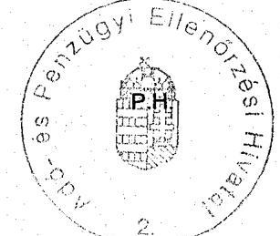

---

# Tanúsítvány

az informatikai munkakörben dolgozók létszámáról és informatikai végzettség szerinti megoszlásáról 2001

|  (65 December 31-i állapot szerint) |  |  |  |  |   |
| --- | --- | --- | --- | --- | --- |
|  Területi szervezetek/igazgatóságok | Számitástechnikai végzettség szerinti megoszlásuk |  |  |  | Összesen  |
|   | Nincs informatikai végzettsége | Alapfokú informatikai | Középfokú informatikai | Felsőfokú informatikai |   |
|  Eszak-budapest | 2 |  | 17 | 22 | 41  |
|  Kelet-budapest | 1 | 1 | 20 | 14 | 36  |
|  Dél-budapest | 2 | 1 | 19 | 9 | 31  |
|  KAIG |  |  | 5 | 3 | 8  |
|  Fővárosi igazgatóságok összesen | 5 | 2 | 61 | 48 | 116  |
|  Baranya Megye |  |  | 6 | 6 | 12  |
|  Bács-Kiskun Megye | 1 | 1 | 6 | 14 | 22  |
|  Békés Megye |  |  | 5 | 6 | 11  |
|  Borsod-Abaúj-Zemplén Megye | 1 |  | 4 | 11 | 16  |
|  Csongrád Megye | 1 |  | 5 | 9 | 15  |
|  Fejér Megye |  |  | 3 | 10 | 13  |
|  Győr-Moson-Sopron Megye | 1 |  | 5 | 6 | 12  |
|  Hajdú-Bihar Megye |  |  | 8 | 10 | 18  |
|  Heves Megye |  |  | 7 | 5 | 12  |
|  Komárom-Esztergom Megye |  |  | 8 | 4 | 12  |
|  Nógrád Megye |  |  | 3 | 7 | 10  |
|  Pest Megye | 1 | 1 | 11 | 17 | 30  |
|  Somogy Megye |  |  |  | 10 | 10  |
|  Szabolcs-Szatmár-Bereg Megye |  |  | 5 | 9 | 14  |
|  Jász-Nagykun-Szolnok Megye | 2 | 1 |  | 9 | 12  |
|  Tolna Megye |  |  | 3 | 6 | 9  |
|  Vas Megye |  |  | 4 | 6 | 10  |
|  Veszprém Megye |  |  | 8 | 6 | 14  |
|  Zala Megye | 1 |  | 5 | 5 | 11  |
|  Megyei igazgatóságok összesen | 8 | 3 | 96 | 156 | 263  |
|  Országos összesen | 13 | 5 | 157 | 204 | 379  |
|  Központi Hivatal | 12 | 3 | 38 | 131 | 164  |
|  SZTADI | 56 | 8 | 145 | 43 | 250  |
|  APEH összesen | 81 | 14 | 340 | 378 | 813  |

Fenti adatok hitelességét igazolom.

Kelt: Budapest, 2005. október 19.

---

1/c sz. tanúsítvány a V-17-34/2005-2006. sz. jelentéshez

# Tanúsítvány

az informatikai munkakörben dolgozók létszámáról és informatikai végzettség szerinti megoszlásáról 2002

|  (tő December 31-i állapot szerint) | Számitástechnikai végzettség szerinti megoszlások |  |  |  | Összesen  |
| --- | --- | --- | --- | --- | --- |
|  Területi szervezetek/igazgatóságok | Nincs informatikai végzettsége | Alapfokú informatikai | Középfokú informatikai | Felsőfokú informatikai |   |
|  Észak-budapest | 2 |  | 18 | 21 | 41  |
|  Kelet-budapest | 1 | 1 | 21 | 16 | 39  |
|  Dél-budapest | 2 |  | 18 | 12 | 32  |
|  KAIG |  |  | 4 | 4 | 8  |
|  Fővárosi igazgatóságok összesen | 6 | 1 | 61 | 53 | 120  |
|  Baranya Megye |  |  | 7 | 6 | 13  |
|  Bács-Kiskun Megye | 1 | 1 | 5 | 14 | 21  |
|  Békés Megye |  |  | 5 | 6 | 11  |
|  Borsod-Abaúj-Zemplén Megye |  |  | 3 | 13 | 16  |
|  Csongrád Megye |  |  | 5 | 9 | 14  |
|  Fejár Megye |  |  | 4 | 9 | 13  |
|  Győr-Moson-Sopron Megye | 1 |  | 5 | 6 | 12  |
|  Hajdú-Bihar Megye |  |  | 8 | 10 | 18  |
|  Heves Megye |  |  | 5 | 7 | 12  |
|  Komárom-Esztergom Megye |  |  | 6 | 5 | 11  |
|  Nógrád Megye |  |  | 4 | 5 | 9  |
|  Pest Megye | 2 | 1 | 12 | 19 | 34  |
|  Somogy Megye |  |  |  | 10 | 10  |
|  Szabolcs-Szatmár-Bereg Megye |  |  | 5 | 10 | 15  |
|  Jász-Nagykun-Szolnok Megye | 2 |  | 1 | 10 | 13  |
|  Tolna Megye | 1 |  | 3 | 6 | 10  |
|  Vas Megye |  |  | 4 | 6 | 10  |
|  Veszprém Megye |  |  | 8 | 6 | 14  |
|  Zala Megye |  |  | 8 | 5 | 13  |
|  Megyei igazgatóságok összesen | 7 | 2 | 98 | 162 | 269  |
|  Országos összesen | 12 | 3 | 159 | 215 | 389  |
|  Központi Hivatal | 12 | 3 | 37 | 129 | 181  |
|  SZTADI | 50 | 6 | 141 | 49 | 246  |
|  APEH összesen | 74 | 12 | 337 | 393 | 816  |

Fenti adatok hitelességét igazolom.

Kelt: Budapest, 2005. október 19.

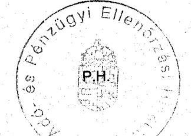

1/2001 E1/0

Aláírás

---

# Tanúsítvány

az informatikai munkakörben dolgozók létszámáról és informatikai végzettség szerinti megoszlásáról 2003

|  (fő December 31-i állapot szerint) |  |  |  |  |   |
| --- | --- | --- | --- | --- | --- |
|  Területi szervezetek/igazgatóságok | Számitástechnikai végzettség szerinti megoszlásuk |  |  |  | Összesen  |
|   | Nincs informatikai végzettsége | Alapfokú informatikai | Középfokú informatikai | Felsőfokú informatikai |   |
|  Észak-budapest | 2 |  | 14 | 21 | 37  |
|  Kelet-budapest | 1 | 1 | 18 | 11 | 31  |
|  Dél-budapest | 2 |  | 15 | 11 | 28  |
|  KAIG |  |  | 4 | 4 | 8  |
|  Fővárosi igazgatóságok összesen | 5 | 1 | 51 | 47 | 104  |
|  Baranya Megye |  |  | 7 | 5 | 12  |
|  Bács-Kiskun Megye |  |  | 4 | 13 | 17  |
|  Békés Megye |  |  | 4 | 6 | 10  |
|  Borsod-Abaúj-Zemplén Megye |  |  | 3 | 13 | 16  |
|  Csongrád Megye |  |  | 4 | 8 | 12  |
|  Fejér Megye |  |  | 4 | 6 | 10  |
|  Győr-Moson-Sopron Megye | 1 |  | 4 | 6 | 11  |
|  Hajdú-Bihar Megye |  |  | 6 | 10 | 16  |
|  Heves Megye |  |  | 4 | 7 | 11  |
|  Komárom-Esztergom Megye |  |  | 6 | 5 | 11  |
|  Nógrád Megye |  |  | 5 | 6 | 11  |
|  Pest Megye | 1 | 1 | 10 | 17 | 29  |
|  Somogy Megye |  |  |  | 10 | 10  |
|  Szabolcs-Szatmár-Bereg Megye |  |  | 4 | 10 | 14  |
|  Jász-Nagykun-Szolnok Megye | 1 |  | 2 | 9 | 12  |
|  Tolna Megye |  |  | 3 | 7 | 10  |
|  Vas Megye |  |  | 4 | 6 | 10  |
|  Veszprém Megye |  |  | 7 | 6 | 13  |
|  Zala Megye |  |  | 6 | 5 | 11  |
|  Megyei Igazgatóságok összesen | 3 | 1 | 87 | 155 | 246  |
|  Országos összesen | 8 | 2 | 138 | 262 | 350  |
|  Központi Hivatal | 21 | 3 | 98 | 196 | 318  |
|  SZTADI | 29 | 3 | 66 | 6 | 106  |
|  APEH összesen | 58 | 8 | 302 | 406 | 774  |

Fenti adatok hitelességét igazolom.

Kelt: Budapest, 2005. október 19.

---

1/e sz. tanúsítvány a V-17-34/2005-2006. sz. jelentéshez

Tanúsítvány az informatikai munkakörben dolgozók létszámáról és informatikai végzettség szerinti megoszlásáról 2004

(fő December 31-i állapot szerint)

|  Területi szervezetek/igazgatóságok | Számítástechnikai végzettség szerinti megoszlásuk |  |  |  |  | Összesen  |
| --- | --- | --- | --- | --- | --- | --- |
|   | Nincs informatikai végzettsége | Alapfokú informatikai |  | Középfokú informatikai | Felsőfokú informatikai |   |
|  Központi Hivatal | 24 | 4 |  | 225 | 403 | 656  |
|  SZTADI | 26 | 4 |  | 68 | 10 | 108  |
|  APEH összesen | 50 | 8 |  | 293 | 413 | 764  |

Fenti adatok hitelességét igazolom.

Kelt: Budapest, 2005. október 19.

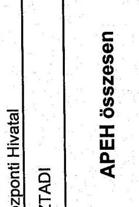

---

1/f sz. tanúsítvány a V-17-34/2005-2006. sz. jelentéshez

# Tanúsítvány

az Informatikai munkakörben dolgozók létszámáról és Informatikai végzettség szerinti megoszlásáról 2005

(IS December 31-i állapot szerint)

|  Területi szervezetek/igazgatóságok | Számitástechnikai végzettség szerinti megoszlások |  |  |  | Összesen  |
| --- | --- | --- | --- | --- | --- |
|   | Nincs Informatikai végzettsége | Alapfokú Informatikai | Középfokú Informatikai | Felsőfokú Informatikai |   |
|  Észak-budapest |  |  |  | 1 | 1  |
|  Kelet-budapest |  |  |  | 1 | 1  |
|  Dél-budapest |  |  | 1 |  | 1  |
|  KAIG |  |  |  |  |   |
|  Fővárosi igazgatóságok összesen |  |  | 1 | 2 | 3  |
|  Baranya Megye |  |  |  |  |   |
|  Bács-Kiskun Megye |  |  |  |  |   |
|  Békés Megye |  |  |  | 1 | 1  |
|  Borsod-Abaúj-Zemplén Megye | 1 |  |  |  | 1  |
|  Csongrád Megye |  |  |  |  |   |
|  Fejér Megye |  |  |  |  |   |
|  Győr-Moson-Sopron Megye |  |  |  |  |   |
|  Hajdú-Bihar Megye |  |  |  | 1 | 1  |
|  Havas Megye |  |  |  | 1 | 1  |
|  Komárom-Esztergom Megye |  |  |  | 1 | 1  |
|  Kögrád Megye |  |  |  | 1 | 1  |
|  Pest Megye |  |  |  | 1 | 1  |
|  Somogy Megye |  |  |  | 1 | 1  |
|  Szabolcs-Szatmár-Bereg Megye |  |  |  | 1 | 1  |
|  Jász-Nagykun-Szolnok Megye | 1 |  |  |  | 1  |
|  Tolna Megye |  |  |  | 1 | 1  |
|  Vas Megye |  |  |  |  |   |
|  Veszprém Megye |  |  | 1 |  | 1  |
|  Zale Megye |  |  |  | 1 | 1  |
|  Megyei igazgatóságok összesen | 2 |  | 1 | 10 | 13  |
|  Országos összesen * | 2 |  | 2 | 12 | 18  |
|  Központi Hivatal | 10 |  | 207 | 412 | 629  |
|  SZTADI | 29 | 2 | 66 | 11 | 108  |
|  APEH összesen | 41 | 2 | 275 | 435 | 753  |

- Az országos összesen adatsor (fővárosi és megyei igazgatóságokra) az APEH területi szerveinél a betöltött "Informatikai referens munkakör"-re vonatkozik.

Fenti adatok hitelességét igazolom.

Kelt: Budapest, 2006. február 17.

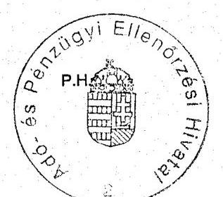

0.1/2006 22 alárás

---

Tanúsítvány az elvégzett ellenőrzések alakulásáról

2/a sz. tanúsítvány a V-17-34/2005-2006. sz. jelentéshez

|  Igegyítéségek | Zilindítsásek |  | Adóallandószesek |  | Cálallendószesek |  |  |  |  |  |  | Adódóság |  | Adódó |  |  |   |
| --- | --- | --- | --- | --- | --- | --- | --- | --- | --- | --- | --- | --- | --- | --- | --- | --- | --- |
|   | összes | rovíziós nap | összes | Megállapítások | összes | Megállapítások |  |  |  |  |  |  |  |  |  |  |   |
|   | db | db | db | db | db | db |  |  |  |  |  |  |  |  |  |  |   |
|  Fozati-Bp. | 29 430 | 43 775 | 6 126 | 3 625 | 23 304 | 1 441 |  |  |  |  |  |  |  |  |  |  |   |
|  Kafali-Bp. | 28 375 | 32 425 | 7 689 | 3 427 | 20 886 | 2 230 |  |  |  |  |  |  |  |  |  |  |   |
|  Dél-Bp. | 31 695 | 43 841 | 8 302 | 4 584 | 22 384 | 1 531 |  |  |  |  |  |  |  |  |  |  |   |
|  Korm. ad. | 1 189 | 6 800 | 193 | 109 | 697 | 23 |  |  |  |  |  |  |  |  |  |  |   |
|  Bp. össz. | 90 980 | 125 911 | 23 305 | 13 134 | 67 371 | 5 234 |  |  |  |  |  |  |  |  |  |  |   |
|  Baranya m. | 17 675 | 22 800 | 6 076 | 1 765 | 12 599 | 989 |  |  |  |  |  |  |  |  |  |  |   |
|  Bácsi. m. | 21 084 | 24 473 | 6 847 | 2 308 | 14 237 | 815 |  |  |  |  |  |  |  |  |  |  |   |
|  Békés m. | 12 760 | 17 328 | 3 766 | 2 900 | 9 014 | 1 054 |  |  |  |  |  |  |  |  |  |  |   |
|  Borosd m. | 19 033 | 23 620 | 3 988 | 2 558 | 15 145 | 1 105 |  |  |  |  |  |  |  |  |  |  |   |
|  Csongrád m. | 20 345 | 19 817 | 4 029 | 1 997 | 16 317 | 931 |  |  |  |  |  |  |  |  |  |  |   |
|  Fejér m. | 15 088 | 18 262 | 4 774 | 1 025 | 10 312 | 757 |  |  |  |  |  |  |  |  |  |  |   |
|  Győr m. | 14 031 | 16 942 | 3 632 | 1 615 | 10 199 | 1 268 |  |  |  |  |  |  |  |  |  |  |   |
|  Hajdú m. | 18 797 | 22 140 | 6 484 | 3 738 | 10 313 | 1 125 |  |  |  |  |  |  |  |  |  |  |   |
|  Heves m. | 9 665 | 12 584 | 2 410 | 1 407 | 7 255 | 724 |  |  |  |  |  |  |  |  |  |  |   |
|  Komárom m. | 10 716 | 16 817 | 3 029 | 1 392 | 7 687 | 795 |  |  |  |  |  |  |  |  |  |  |   |
|  Nőgrád m. | 5 186 | 7 523 | 1 078 | 537 | 4 108 | 437 |  |  |  |  |  |  |  |  |  |  |   |
|  Pecf. m. | 25 500 | 41 009 | 6 314 | 3 198 | 19 236 | 2 602 |  |  |  |  |  |  |  |  |  |  |   |
|  Somogy m. | 10 917 | 12 353 | 4 041 | 1 671 | 6 676 | 589 |  |  |  |  |  |  |  |  |  |  |   |
|  Szabócs m. | 12 636 | 18 965 | 2 751 | 1 738 | 9 845 | 1 165 |  |  |  |  |  |  |  |  |  |  |   |
|  Szoboks m. | 14 799 | 18 125 | 4 432 | 1 475 | 10 387 | 1 112 |  |  |  |  |  |  |  |  |  |  |   |
|  Tolna m. | 10 768 | 11 000 | 4 034 | 1 499 | 6 734 | 778 |  |  |  |  |  |  |  |  |  |  |   |
|  Vissz. m. | 7 611 | 10 639 | 2 757 | 1 061 | 4 804 | 679 |  |  |  |  |  |  |  |  |  |  |   |
|  Veszprém m. | 9 762 | 16 186 | 2 692 | 2 044 | 6 880 | 723 |  |  |  |  |  |  |  |  |  |  |   |
|  Zala m. | 9 256 | 12 934 | 2 759 | 1 893 | 6 539 | 630 |  |  |  |  |  |  |  |  |  |  |   |
|  Megvék össz.: | 263 739 | 343 218 | 75 222 | 36 276 | 188 917 | 18 576 |  |  |  |  |  |  |  |  |  |  |   |
|  Orez. Össz.: | 354 419 | 472 129 | 98 531 | 48 400 | 255 888 | 23 396 |  |  |  |  |  |  |  |  |  |  |   |

2/a sz. tanúsítvány a V-17-34/2005-2006. sz. jelentéshez

2000

2005 NOV 10.

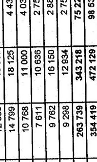

2005

2006

2005 NOV 10.

---

2/h sz. tanúsítvány a V-17-34/2005-2006. sz. jelentéshez

tanúsítvány az elvégzett ellenőrzések alakulásáról

|  |   |   |   |   |   |   |   |   |   |   |   |   |   |   |   |   |   |   |   |   |   |   |   |   |   |   |   |   |   |   |   |   |   |   |   |   |   |   |   |   |   |   |   |   |   |   |   |   |   |   |   |   |   |   |   |   |   |   |   |   |   |   |   |   |   |   |   |   |   |   |   |   |   |   |   |   |   |   |   |   |   |   |   |   |   |   |   |   |   |   |   |   |   |   |   |   |   |   |   |   |

---

Tanúsítvány az elvégzett ellenőrzések alakulásáról a V-17-34/2005-2006. sz. jelentéshez

|  Igazgatóségok | Ellenőrzések | Adóellenőrzések | Cálellenőrzések | Nettó adókülönbözést | Visszatartott összeg | Nettó adókión | Adóbírség | Mulasztási bírság | Késedelmi pótlék  |
| --- | --- | --- | --- | --- | --- | --- | --- | --- | --- |
|   | összes | revistös nap | összes | Megállapítások | összes | Megállapítások | összeg | Nettó adókión |   |
|   | db | db | db | db | db | db |  |  |   |
|  Eszak-Bp. | 37 399 | 51 899 | 15 104 | 6 428 | 22 295 | 1 088 | 34 638 852 | 5 142 560 | 29 116 867  |
|  Kelet-Bp. | 34 299 | 40 195 | 13 349 | 5 509 | 20 952 | 1 924 | 29 045 509 | 6 247 459 | 21 833 887  |
|  Dél-Bp. | 29 558 | 39 566 | 12 824 | 4 358 | 16 734 | 1 446 | 13 626 860 | 5 471 292 | 8 734 423  |
|  Kiem.ad. | 795 | 13 488 | 285 | 274 | 510 | 31 | 10 076 500 | 737 105 | 5 254 850  |
|  Bp. össz. | 102 051 | 145 148 | 41 562 | 16 567 | 60 489 | 4 489 | 87 387 720 | 17 598 417 | 68 940 026  |
|  Baranya m. | 16 997 | 22 754 | 8 307 | 2 214 | 8 690 | 963 | 4 399 825 | 1 081 358 | 3 265 610  |
|  Bács. m. | 18 397 | 24 794 | 7 536 | 2 092 | 10 861 | 851 | 5 100 533 | 1 028 756 | 3 483 425  |
|  Békés m. | 13 735 | 16 259 | 7 174 | 2 376 | 6 561 | 837 | 3 247 112 | 543 780 | 2 667 322  |
|  Borsod m. | 17 030 | 21 406 | 6 980 | 2 609 | 10 050 | 1 206 | 4 272 622 | 1 328 438 | 2 977 411  |
|  Csongrád m. | 16 344 | 18 177 | 7 020 | 1 758 | 9 324 | 980 | 3 659 981 | 1 046 340 | 2 504 269  |
|  Fejér m. | 20 471 | 22 226 | 7 177 | 2 940 | 13 294 | 762 | 3 329 682 | 529 963 | 2 685 830  |
|  Győr m. | 17 197 | 18 460 | 7 946 | 2 625 | 9 351 | 1 117 | 3 879 137 | 892 410 | 2 886 804  |
|  Hajdú m. | 17 603 | 25 953 | 7 452 | 2 438 | 10 151 | 1 282 | 3 690 918 | 998 816 | 2 674 010  |
|  Heves m. | 12 630 | 12 105 | 6 109 | 1 413 | 6 521 | 695 | 2 084 115 | 291 330 | 1 761 528  |
|  Komárom m. | 13 433 | 18 234 | 6 158 | 1 978 | 7 275 | 743 | 3 638 180 | 793 323 | 2 908 254  |
|  Nógrád m. | 6 925 | 7 588 | 3 695 | 818 | 3 230 | 518 | 2 441 857 | 354 081 | 2 086 602  |
|  Peit m. | 31 410 | 45 615 | 12 347 | 3 545 | 19 063 | 2 013 | 11 667 615 | 3 426 472 | 7 580 621  |
|  Somogy m. | 13 003 | 14 181 | 6 038 | 1 683 | 6 965 | 716 | 2 461 639 | 1 348 953 | 1 154 605  |
|  Szabolcs m. | 22 373 | 22 346 | 7 546 | 2 030 | 14 827 | 1 196 | 7 929 245 | 825 656 | 7 012 798  |
|  Szolnok m. | 13 261 | 18 655 | 5 714 | 1 902 | 7 547 | 1 282 | 3 829 906 | 1 089 540 | 2 852 405  |
|  Tolna m. | 12 329 | 11 798 | 5 081 | 1 132 | 7 248 | 695 | 2 149 147 | 346 250 | 1 788 193  |
|  Vas m. | 10 568 | 12 658 | 4 899 | 1 395 | 5 680 | 634 | 1 750 013 | 411 471 | 1 294 427  |
|  Veszprém m. | 14 256 | 19 712 | 7 723 | 1 667 | 6 533 | 763 | 3 110 170 | 561 326 | 2 457 471  |
|  Zala m. | 12 959 | 14 705 | 5 694 | 1 848 | 7 275 | 563 | 1 793 914 | 360 308 | 1 335 625  |
|  Megyik össz.: | 300 921 | 367 625 | 138 475 | 38 363 | 170 446 | 17 828 | 74 435 373 | 17 160 581 | 55 357 210  |
|  Orsz. össz.: | 402 972 | 512 773 | 172 037 | 54 930 | 230 935 | 22 317 | 161 823 093 | 34 758 998 | 124 297 237  |

2/c sz. tanúsítvány az elvégzett ellenőrzések alakulásáról a V-17-34/2005-2006. sz. jelentéshez

2002

2005 2005 2006 2007 2008

2002

2005 2005 2006 2007 2008

2002

2005 2005 2006 2007 2008

2002

2005 2005 2006 2007 2008

2002

2005 2005 2006 2007 2008

2002

2005 2005 2006 2007 2008

2002

2005 2005 2006 2007 2008

2002

2005 2005 2006 2007 2008

2002

2005 2005 2006 2007 2008

2002

2005 2005 2006 2007 2008

2002

2005 2005 2006 2007 2008

2002

2005 2005 2006 2007 2008

2002

2005 2005 2006 2007 2008

2002

2005 2005 2006 2007 2008

2002

2005 2005 2006 2007 2008

2002

2005 2005 2006 2007 2008

2002

2005 2005 2006 2007 2008

2002

2005 2005 2006 2007 2008

2002

2005 2005 2006 2007 2008

2002

2005 2005 2006 2007 2008

2002

2005 2005 2006 2007 2008

2002

2005 2005 2006 2007 2008

2002

2005 2005 2006 2007 2008

2002

2005 2005 2006 2007 2008

2002

2005 2005 2006 2007 2008

2002

2005 2005 2006 2007 2008

2002

2005 2005 2006 2007 2008

2002

2005 2005 2006 2007 2008

2002

2005 2005 2006 2007 2008

2002

2005 2005 2006 2007 2008

2002

2005 2005 2006 2007 2008

2002

2005 2005 2006 2007 200

---

2/d sz. tanúsítvány a V-17-34/2005-2006. sz. jelentéshez

|  |   |   |   |   |   |   |   |   |   |   |   |   |   |   |   |   |   |   |   |   |   |   |   |   |   |   |   |   |   |   |   |   |   |   |   |   |   |   |   |   |   |   |   |   |   |   |   |   |   |   |   |   |   |   |   |   |   |   |   |   |   |   |   |   |   |   |   |   |   |   |   |   |   |   |   |   |   |   |   |   |   |   |   |   |   |   |   |   |   |   |   |   |   |   |   |   |   |   |   |   |   |

---

2/e sz. tanúsítvány a V-17-34/2005-2006. sz. jelentéshez

tanúsítvány az elvégzett ellenőrzések alakulásáról

|  igazgatóságok | Ellenőrzések | Adóellenőrzések | Célulkozórzések | Nettó adókülönbsze | Visszafartott összeg | Nettó adóklány | Adóörség | Adószágy | Késedelmi pólók  |
| --- | --- | --- | --- | --- | --- | --- | --- | --- | --- |
|   | összes | revíziós nap | összes | Megállapítások | összes | Megállapítások | Nettó adókülönbsze | Visszafartott összeg | Nettó adóklány  |
|   | db | db | db | db | db | db | E PI | E PI | E PI  |
|  Eszab-llip. adóelt-Kipari JE.ten | 34 218 | 51 879 | 13 802 | 4 753 | 20 413 | 1 470 | 26 773 889 | 5 767 524,0 | 0  |
|  Nétel-llip. | 24 238 | 44 723 | 14 905 | 4 396 | 11 325 | 1 524 | 35 229 543 | 5 364 526,0 | 0  |
|  Céb-llip. | 24 100 | 35 819 | 11 615 | 3 431 | 12 485 | 1 108 | 11 617 540 | 5 728 820,0 | 0  |
|  Klem.ad. | 982 | 13 412 | 418 | 280 | 564 | 76 | 14 411 053 | 615 235,0 | 0  |
|  Ilip.össz. | 85 620 | 145 833 | 40 737 | 12 860 | 44 791 | 4 178 | 82 032 065 | 15 476 100 | 0  |
|  Baranya m. | 14 729 | 20 306 | 6 845 | 3 064 | 7 881 | 891 | 4 152 161 | 527 470,0 | 0  |
|  Bilem. m. | 14 797 | 21 229 | 7 068 | 1 866 | 7 729 | 711 | 4 730 046 | 937 213,0 | 0  |
|  Bilikás m. | 12 189 | 14 733 | 6 662 | 1 643 | 5 527 | 766 | 4 241 966 | 658 296,0 | 0  |
|  Borozd m. | 13 773 | 21 000 | 6 657 | 2 210 | 7 116 | 849 | 5 236 382 | 867 746,0 | 0  |
|  Csenigrád m. | 13 110 | 17 984 | 6 545 | 1 965 | 6 565 | 1 089 | 7 400 968 | 769 489,0 | 0  |
|  Fejér m. | 15 641 | 20 010 | 6 632 | 2 282 | 9 009 | 782 | 8 032 572 | 600 551,0 | 0  |
|  Győr m. | 15 103 | 17 432 | 7 907 | 2 250 | 7 196 | 749 | 11 820 481 | 601 620,0 | 0  |
|  Hajdú m. | 16 060 | 23 142 | 8 105 | 2 847 | 7 963 | 1 028 | 8 571 550 | 1 573 708,0 | 0  |
|  Herves m. | 10 422 | 11 379 | 5 666 | 1 578 | 4 768 | 687 | 3 130 193 | 308 074,0 | 0  |
|  Komárom m. | 11 885 | 16 479 | 6 011 | 1 892 | 5 874 | 623 | 3 117 054 | 772 477,0 | 0  |
|  Hóznád m. | 6 694 | 7 355 | 3 620 | 836 | 2 874 | 551 | 2 610 950 | 582 534,0 | 0  |
|  Pást m. | 26 890 | 40 659 | 11 992 | 4 211 | 14 898 | 1 719 | 19 299 910 | 3 826 259,0 | 0  |
|  Somogy m. | 9 993 | 12 819 | 6 262 | 1 384 | 3 731 | 875 | 5 173 029 | 693 025,0 | 0  |
|  Szabocsa m. | 13 665 | 16 797 | 6 400 | 1 652 | 7 263 | 1 289 | 4 747 802 | 602 673,0 | 0  |
|  Szabnok m. | 11 794 | 16 018 | 5 804 | 1 729 | 5 990 | 1 158 | 4 894 731 | 849 580,0 | 0  |
|  Tolna m. | 9 711 | 10 176 | 4 918 | 1 605 | 4 793 | 526 | 2 316 202 | 207 714,0 | 0  |
|  Vás m. | 8 492 | 11 103 | 4 683 | 1 309 | 3 809 | 583 | 2 140 782 | 443 544,0 | 0  |
|  Veszprém m. | 12 187 | 17 743 | 7 342 | 1 570 | 4 943 | 1 008 | 2 982 010 | 731 779,0 | 0  |
|  Zala m. | 10 457 | 12 410 | 5 536 | 1 368 | 4 919 | 529 | 1 323 325 | 620 369,0 | 0  |
|  Megyék össz.: | 247 407 | 328 750 | 124 585 | 36 551 | 122 852 | 16 510 | 105 822 320 | 15 874 101 | 0  |
|  Orsz. össz.: | 332 935 | 474 593 | 165 292 | 49 411 | 167 643 | 20 693 | 187 954 385 | 31 450 261 | 0  |

1) Az Árt. Változásai miatt a "Nettó adóhiány" oszlop nem tölthető ki 2

2) Azti adóhiány

2) Azti adóhiány

2) Azti adóhiány

2) Azti adóhiány

2) Azti adóhiány

2) Azti adóhiány

2) Azti adóhiány

2) Azti adóhiány

2) Azti adóhiány

2) Azti adóhiány

2) Azti adóhiány

2) Azti adóhiány

2) Azti adóhiány

2) Azti adóhiány

2) Azti adóhiány

2) Azti adóhiány

2) Azti adóhiány

2) Azti adóhiány

2) Azti adóhiány

2) Azti adóhiány

2) Azti adóhiány

2) Azti adóhiány

2) Azti adóhiány

2) Azti adóhiány

2) Azti adóhiány

2) Azti adóhiány

2) Azti adóhiány

2) Azti adóhiány

2) Azti adóhiány

2) Azti adóhiány

2) Azti adóhiány

---

2/f sz. tanúsítvány az elvégzett ellenőrzések alakulásáról az V-17-34/2005-2006. sz. jelentéshez

|  Igazgatóságok | Ellenőrzések | Adóellenőrzések | Célellenőrzések | Netto adó-különbözet | Visszstartott összeg | Nettó adóhiány* | L fokú határozat | Adóbiirság | Havasztási összeg | Készletési pólák  |
| --- | --- | --- | --- | --- | --- | --- | --- | --- | --- | --- |
|   | összes | revíziós nap | összes | Megállapítások | összes | Megállapítások |  |  |  |   |
|   | db | db | db | db | db |  |  |  |  |   |
|  Észak-Bp. | 31 990 | 49 187 | 13 401 | 4 268 | 18 589 | 1 177 | 34 744 470 | 5 902 492,0 | 14 696 | 27 698 600  |
|  Intéző/Kízar./B.ter. | 1 389 | 2 291 | 868 | 399 | 521 | 0 | 3 507 709 | 727 823,0 | 796 | 729 726  |
|  Kálat-Bp. | 28 186 | 41 597 | 14 523 | 4 851 | 11 643 | 1 597 | 45 427 620 | 5 760 325,0 | 14 548 | 41 185 140  |
|  Dél-Bp. | 23 056 | 40 411 | 12 655 | 3 269 | 10 401 | 1 200 | 14 249 790 | 4 384 477,0 | 12 436 | 11 175 090  |
|  Kézm. az. | 1 388 | 14 295 | 817 | 444 | 571 | 82 | 8 494 825 | 1 644 845,0 | 922 | 7 127 931  |
|  Bip. össz. | 82 600 | 145 490 | 41 396 | 12 832 | 41 204 | 4 056 | 102 916 705 | 17 692 139 | 42 602 | 87 186 761  |
|  Biztatva m. | 13 196 | 22 180 | 6 163 | 2 294 | 7 033 | 1 051 | 6 350 112 | 1 221 923,0 | 6 939 | 4 794 614  |
|  Bácsi. m. | 12 413 | 19 730 | 6 268 | 1 939 | 6 145 | 618 | 3 861 809 | 786 266,0 | 7 076 | 2 998 413  |
|  Öldés m. | 10 402 | 14 988 | 4 674 | 1 372 | 5 728 | 742 | 4 406 473 | 465 717,0 | 5 428 | 4 028 374  |
|  Borzod m. | 12 829 | 20 368 | 5 786 | 2 069 | 7 043 | 1 063 | 4 208 852 | 855 780,0 | 7 100 | 3 788 262  |
|  Csongrád m. | 11 847 | 17 828 | 5 838 | 2 338 | 6 009 | 953 | 5 725 265 | 556 587,0 | 6 770 | 4 954 409  |
|  Fejér m. | 14 104 | 19 441 | 5 728 | 2 424 | 8 376 | 940 | 8 861 610 | 3 029 948,0 | 6 749 | 8 446 810  |
|  Győr m. | 15 073 | 18 461 | 7 668 | 2 327 | 7 407 | 940 | 3 718 053 | 984 021,0 | 8 062 | 3 223 865  |
|  Hajdú m. | 15 308 | 20 988 | 7 124 | 2 162 | 8 184 | 1 000 | 8 304 219 | 1 888 494,0 | 7 794 | 7 644 763  |
|  Heves m. | 8 160 | 11 580 | 4 072 | 1 424 | 4 088 | 754 | 1 811 896 | 286 010,0 | 4 885 | 2 411 440  |
|  Komárom m. | 9 288 | 15 412 | 4 279 | 1 621 | 5 009 | 648 | 3 194 158 | 1 237 275,0 | 5 012 | 3 294 222  |
|  Vögrád m. | 4 386 | 6 426 | 1 929 | 770 | 2 457 | 386 | 2 733 681 | 323 504,0 | 2 397 | 2 648 524  |
|  Peet m. | 24 933 | 40 748 | 12 272 | 4 047 | 12 661 | 1 754 | 24 062 170 | 6 104 402,0 | 14 440 | 21 447 190  |
|  Somogy m. | 8 490 | 13 222 | 5 170 | 1 693 | 3 320 | 653 | 2 449 562 | 483 804,0 | 5 512 | 1 834 163  |
|  Szabolcs m. | 13 855 | 18 239 | 5 919 | 1 661 | 7 936 | 1 514 | 5 023 194 | 769 858,0 | 7 280 | 5 415 742  |
|  Szolnok m. | 10 297 | 15 330 | 4 451 | 1 601 | 5 846 | 1 029 | 3 607 443 | 905 006,0 | 5 518 | 4 637 110  |
|  Tolna m. | 7 878 | 9 576 | 3 572 | 1 420 | 4 306 | 455 | 2 076 086 | 248 652,0 | 3 992 | 2 032 659  |
|  Vas m. | 6 451 | 11 139 | 3 097 | 1 154 | 3 354 | 535 | 2 337 293 | 410 978,0 | 3 870 | 1 943 560  |
|  Veszprém m. | 9 783 | 16 445 | 5 296 | 1 510 | 4 487 | 1 026 | 4 579 992 | 1 065 944,0 | 5 647 | 3 726 634  |
|  Zala m. | 7 994 | 12 373 | 3 635 | 1 127 | 4 359 | 545 | 2 437 432 | 521 463,0 | 4 266 | 2 160 337  |
|  Megyék össz.: | 216 687 | 324 471 | 102 939 | 34 953 | 113 748 | 16 135 | 99 751 320 | 22 145 632 | 118 737 | 91 431 091  |
|  Orsz. össz.: | 299 287 | 469 962 | 144 335 | 47 785 | 154 952 | 20 191 | 202 668 025 | 39 837 771 | 161 339 | 178 617 852  |

A fenti adatok hitelességét igazolom.

Budapest, 2006. május * 11 *.

P.H.

Aláírás

- 2004.-tól nincs ilyen kimutatás az Art. fogalom változása miatt

---

tanúsítvány a kiutalás előtti ellenőrzések alakulásáról 3/a sz. tanúsítvány

|  Igazgatóságok | Adóellenőrzések | Adókülönbözet | Visszatartott | Nettó adóhiány | Adóbirság | Mulasztási bírság | Késedelmi pótlék  |
| --- | --- | --- | --- | --- | --- | --- | --- |
|   | Összes | Megállapítással zárult | Revíziós nap | terhére | javára | alapja | összega  |
|   | db | db | nap | E FL. | E FL. | E FL. | E FL.  |
|  Eszok-Bp. | 2 393 | 2 065 | 4 250 | 8 712 339 | 27 624 | 7 750 026 | 831 383  |
|  Kelet-Bp. | 2 535 | 2 243 | 3 690 | 5 315 790 | 26 510 | 4 226 503 | 1 025 170  |
|  Dél-Bp. | 2 109 | 1 608 | 7 264 | 7 048 301 | 49 584 | 6 574 795 | 421 847  |
|  Kivm.ad. | 30 | 30 | 121 | 738 451 | 130 255 | 718 984 | -110 788  |
|  Bp.össz. | 7 067 | 5 946 | 15 325 | 21 814 881 | 233 973 | 19 270 308 | 2 167 612  |
|  Baranya m. | 481 | 442 | 1 157 | 1 298 165 | 26 274 | 680 909 | 296 986  |
|  Bács. m. | 688 | 615 | 2 152 | 1 058 324 | 664 | 1 009 552 | 48 335  |
|  Békés m. | 762 | 730 | 1 703 | 605 339 | 1 746 | 518 840 | 85 811  |
|  Borsod m. | 805 | 798 | 1 725 | 1 528 689 | 3 750 | 1 452 062 | 69 983  |
|  Csongrád m. | 691 | 654 | 1 135 | 1 001 138 | 1 696 | 829 199 | 169 321  |
|  Fejér m. | 262 | 249 | 371 | 766 275 | 18 536 | 748 034 | 65  |
|  Győr m. | 989 | 879 | 1 905 | 1 317 385 | 292 | 1 221 393 | 95 655  |
|  Hajdú m. | 722 | 649 | 1 192 | 1 301 278 | 4 024 | 1 178 952 | 78 494  |
|  Hoves m. | 229 | 213 | 435 | 279 059 | 8 881 | 271 394 | 2 698  |
|  Komárom m. | 404 | 382 | 1 029 | 596 114 | 19 | 532 434 | 62 189  |
|  Nógrád m. | 152 | 146 | 692 | 310 103 | 6 280 | 216 903 | 91 358  |
|  Pest m. | 1 332 | 815 | 2 454 | 3 620 128 | 1 431 | 3 016 744 | 580 216  |
|  Somogy m. | 433 | 393 | 915 | 540 080 | 2 851 | 496 275 | 37 364  |
|  Szabolcs m. | 393 | 356 | 1 033 | 634 879 | 50 | 564 968 | 69 126  |
|  Szolnok m. | 572 | 499 | 1 572 | 812 624 | 1 506 | 733 923 | 67 974  |
|  Tolna m. | 280 | 269 | 444 | 541 447 | 17 366 | 501 266 | 34 002  |
|  Vas m. | 217 | 198 | 393 | 415 342 | 0 | 397 867 | 15 880  |
|  Veszprém m. | 235 | 216 | 460 | 630 786 | 40 811 | 614 079 | 3 912  |
|  Zala m. | 352 | 318 | 1 153 | 664 778 | 30 273 | 629 352 | 4 530  |
|  Megyék össz.: | 9 997 | 8 821 | 21 917 | 18 121 951 | 166 450 | 15 914 144 | 1 813 898  |
|  Örsz. össz.: | 17 064 | 14 767 | 37 241 | 39 936 832 | 400 424 | 35 164 451 | 3 981 519  |

Fenti adatok hitelességét igazolom. 2005 NOV. 10.

Kelt: Budapest, 2005.

3/a sz. tanúsítvány a V-17-34/2005-2006. sz. jelentéshez

|  Adóbirság | Mulasztási bírság | Késedelmi pótlék  |
| --- | --- | --- |
|  alapja | összega | szint  |
|  E FL. | E FL. | E FL.  |
|  1 015 | 530 042 | 1 015  |
|  20 392 | 574 062 | 1 015  |
|  6 285 | 127 773 | 6 285  |
|  1 148 | 1 148 | 1 148  |
|  27 692 | 1 233 025 | 1 233 025  |
|  14 015 | 14 015 | 14 015  |
|  6 452 | 6 452 | 6 452  |
|  375 | 8 080 | 8 080  |
|  195 | 4 148 | 4 148  |
|  365 | 4 377 | 4 377  |
|  4 372 | 4 372 | 4 372  |
|  405 | 4 272 | 4 272  |
|  543 | 5 378 | 5 378  |
|  105 | 8 186 | 8 186  |
|  324 | 324 | 324  |
|  7 112 | 7 112 | 7 112  |
|  650 | 2 255 | 2 255  |
|  182 | 65 460 | 65 460  |
|  192 | 65 460 | 65 460  |
|  196 | 65 451 | 65 451  |
|  198 | 615 | 615  |
|  199 | 615 | 615  |
|  205 | 638 | 638  |
|  206 | 638 | 638  |
|  207 | 638 | 638  |
|  208 | 638 | 638  |
|  209 | 638 | 638  |
|  212 | 638 | 638  |
|  213 | 638 | 638  |
|  215 | 638 | 638  |
|  216 | 638 | 638  |
|  218 | 638 | 638  |
|  221 | 638 | 638  |
|  224 | 638 | 638  |
|  226 | 638 | 638  |
|  228 | 638 | 638  |
|  230 | 638 | 638  |
|  232 | 638 | 638  |
|  234 | 638 | 638  |
|  236 | 638 | 638  |
|  238 | 638 | 638  |
|  240 | 638 | 638  |
|  242 | 638 | 638  |
|  244 | 638 | 638  |
|  246 | 638 | 638  |
|  248 | 638 | 638  |
|  250 | 638 | 638  |
|  252 | 638 | 638  |
|  254 | 638 | 638  |
|  256 | 638 | 638  |
|  258 | 638 | 638  |
|  260 | 638 | 638  |
|  262 | 638 | 638  |
|  264 | 638 | 638  |
|  266 | 638 | 638  |
|  268 | 638 | 638  |
|  272 | 638 | 638  |
|  276 | 638 | 638  |
|  278 | 638 | 638  |
|  282 | 638 | 638  |
|  286 | 638 | 638  |
|  288 | 638 | 638  |
|  292 | 638 | 638  |
|  296 | 638 | 638  |
|  302 | 638 | 638  |
|  306 | 638 | 638  |
|  308 | 638 | 638  |
|  312 | 638 | 638  |
|  316 | 638 | 638  |
|  318 | 638 | 638  |
|  322 | 638 | 638  |
|  324 | 638 | 638  |
|  326 | 638 | 638  |
|  328 | 638 | 638  |
|  332 | 638 | 638  |
|  334 | 638 | 638  |
|  336 | 638 | 638  |
|  338 | 638 | 638  |
|  342 | 638 | 638  |
|  344 | 638 | 638  |
|  346 | 638 | 638  |
|  348 | 638 | 638  |
|  350 | 638 | 638  |
|  352 | 638 | 638  |
|  354 | 638 | 638  |
|  356 | 638 | 638  |
|  358 | 638 | 638  |
|  360 | 638 | 638  |
|  362 | 638 | 638  |
|  364 | 638 | 638  |
|  366 | 638 | 638  |
|  368 | 638 | 638  |
|  372 | 638 | 638  |
|  376 | 638 | 638  |
|  378 | 638 | 638  |
|  380 | 638 | 638  |
|  382 | 638 | 638  |
|  384 | 638 | 638  |
|  386 | 638 | 638  |
|  388 | 638 | 638  |
|  392 | 638 | 638  |
|  396 | 638 | 638  |
|  400 | 638 | 638  |
|  404 | 638 | 638  |
|  408 | 638 | 638  |
|  412 | 638 | 638  |
|  416 | 638 | 638  |
|  418 | 638 | 638  |
|  420 | 638 | 638  |
|  422 | 638 | 638  |
|  424 | 638 | 638  |
|  426 | 638 | 638  |
|  428 | 638 | 638  |
|  430 | 638 | 638  |
|  432 | 638 | 638  |
|  434 | 638 | 638  |
|  436 | 638 | 638  |
|  438 | 638 | 638  |
|  440 | 638 | 638  |
|  442 | 638 | 638  |
|  444 | 638 | 638  |
|  446 | 638 | 638  |
|  448 | 638 | 638  |
|  450 | 638 | 638  |
|  452 | 638 | 638  |
|  454 | 638 | 638  |
|  456 | 638 | 638  |
|  458 | 638 | 638  |
|  460 | 638 | 638  |
|  462 | 638 | 638  |
|  464 | 638 | 638  |
|  468 | 638 | 638  |
|  472 | 638 | 638  |
|  476 | 638 | 638  |
|  478 | 638 | 638  |
|  480 | 638 | 638  |
|  482 | 638 | 638  |
|  484 | 638 | 638  |
|  486 | 638 | 638  |
|  488 | 638 | 638  |
|  492 | 638 | 638  |
|  496 | 638 | 638  |
|  498 | 638 | 638  |
|  500 | 638 | 638  |
|  502 | 638 | 638  |
|  504 | 638 | 638  |
|  506 | 638 | 638  |
|  508 | 638 | 638  |
|  512 | 638 | 638  |
|  516 | 638 | 638  |
|  518 | 638 | 638  |
|  520 | 638 | 638  |
|  522 | 638 | 638  |
|  524 | 638 | 638  |
|  526 | 638 | 638  |
|  528 | 638 | 638  |
|  530 | 638 | 638  |
|  532 | 638 | 638  |
|  534 | 638 | 638  |
|  536 | 638 | 638  |
|  538 | 638 | 638  |
|  540 | 638 | 638  |
|  542 | 638 | 638  |
|  544 | 638 | 638  |
|  546 | 638 | 638  |
|  548 | 638 | 638  |
|  550 | 638 | 638  |
|  552 | 638 | 638  |
|  554 | 638 | 638  |
|  556 | 638 | 638  |
|  558 | 638 | 638  |
|  560 | 638 | 638  |
|  562 | 638 | 638  |
|  564 | 638 | 638  |
|  568 | 638 | 638  |
|  572 | 638 | 638  |
|  576 | 638 | 638  |
|  578 | 638 | 638  |
|  580 | 638 | 638  |
|  582 | 638 | 638  |
|  584 | 638 | 638  |
|  586 | 638 | 638  |
|  588 | 638 | 638  |
|  592 | 638 | 638  |
|  596 | 638 | 638  |
|  600 | 638 | 638  |
|  602 | 638 | 638  |
|  604 | 638 | 638  |
|  608 | 638 | 638  |
|  612 | 638 | 638  |
|  616 | 638 | 638  |
|  618 | 638 | 638  |
|  620 | 638 | 638  |
|  622 | 638 | 638  |
|  624 | 638 | 638  |
|  626 | 638 | 638  |
|  628 | 638 | 638  |
|  630 | 638 | 638  |
|  632 | 638 | 638  |
|  634 | 638 | 638  |
|  638 | 638 | 638  |
|  632 | 638 | 638  |
|  634 | 638 | 638  |
|  638 | 638 | 638  |
|  632 | 638 | 638  |
|  634 | 638 | 638  |
|  638 | 638 | 638  |
|  632 | 638 | 638  |
|  634 | 638 | 638  |
|  638 | 638 | 638  |
|  632 | 638 | 638  |
|  634 | 638 | 638  |
|  632 | 638 | 638  |
|  634 | 638 | 638  |
|  632 | 638 | 638  |
|  634 | 638 | 638  |
|  632 | 638 | 638  |
|  634 | 638 | 638  |
|  632 | 638 | 638  |
|  634 | 638 | 638  |
|  632 | 638 | 638  |
|  634 | 638 | 638  |
|  632 | 638 | 638  |
|  634 | 638 | 638  |
|  632 | 638 | 638  |
|  634 | 638 | 638  |
|  632 | 638 | 638  |
|  634 | 638 | 638  |
|  632 | 638 | 638  |
|  634 | 638 | 638  |
|  632 | 638 | 638  |
|  634 | 638 | 638  |
|  632 | 638 | 638  |
|  634 | 638 | 638  |
|  632 | 638 | 638  |
|  634 | 638 | 638  |
|  632 | 638 | 638  |
|  634 | 638 | 638  |
|  632 | 638 | 638  |
|  634 | 638 | 638  |
|  632 | 638 | 638  |
|  634 | 638 | 638  |
|  632 | 638 | 638  |
|  634 | 638 | 638  |
|  632 | 638 | 638  |
|  634 | 638 | 638  |
|  632 | 638 | 638  |
|  634 | 638 | 638  |
|  632 | 638 | 638  |
|  634 | 638 | 638  |
|  632 | 638 | 638  |
|  634 | 638 | 638  |
|  632 | 638 | 638  |
|  634 | 638 | 638  |
|  632 | 638 | 638  |
|  634 | 638 | 638  |
|  632 | 638 | 638  |
|  634 | 638 | 638  |
|  632 | 638 | 638  |
|  634 | 638 | 638  |
|  632 | 638 | 638  |
|  634 | 638 | 638  |
|  632 | 638 | 638  |
|  634 | 638 | 638  |
|  632 | 638 | 638  |
|  634 | 638 | 638  |
|  632 | 638 | 638  |
|  634 | 638 | 638  |
|  632 | 638 | 638  |
|  634 | 638 | 638  |
|  632 | 638 | 638  |
|  634 | 638 | 638  |
|  632 | 638 | 638  |
|  634 | 638 | 638  |
|  632 | 638 | 638  |
|  634 | 638 | 638  |
|  632 | 638 | 638  |
|  634 | 638 | 638  |
|  632 | 638 | 638  |
|  634 | 638 | 638  |
|  632 | 638 | 638  |
|  634 | 638 | 638  |
|  632 | 638 | 638  |
|  634 | 638 | 638  |
|  632 | 638 | 638  |
|  634 | 638 | 638  |
|  632 | 638 | 638  |
|  634 | 638 | 638  |
|  632 | 638 | 638  |
|  634 | 638 | 638  |
|  632 | 638 | 638  |
|  634 | 638 | 638  |
|  632 | 638 | 638  |
|  634 | 638 | 638  |
|  632 | 638 | 638  |
|  634 | 638 | 638  |
|  632 | 638 | 638  |
|  634 | 638 | 638  |
|  632 | 638 | 638  |
|  634 | 638 | 638  |
|  632 | 638 | 638  |
|  634 | 638 | 638  |
|  632 | 638 | 638  |
|  634 | 638 | 638  |
|  632 | 638 | 638  |
|  634 | 638 | 638  |
|  632 | 638 | 638  |
|  634 | 638 | 638  |
|  632 | 638 | 638  |
|  634 | 638 | 638  |
|  632 | 638 | 638  |
|  634 | 638 | 638  |
|  632 | 638 | 638  |
|  634 | 638 | 638  |
|  632 | 638 | 638  |
|  634 | 638 | 638  |
|  632 | 638 | 638  |
|  634 | 638 | 638  |
|  632 | 638 | 638  |
|  634 | 638 | 638  |
|  632 | 638 | 638  |
|  634 | 638 | 638  |
|  632 | 638 | 638  |
|  634 | 638 | 638  |
|  632 | 638 | 638  |
|  634 | 638 | 638  |
|  632 | 638 | 638  |
|  634 | 638 | 638  |
|  632 | 638 | 638  |
|  634 | 638 | 638  |
|  632 | 638 | 638  |
|  634 | 638 | 638  |
|  632 | 638 | 638  |
|  634 | 638 | 638  |
|  632 | 638 | 638  |
|  634 | 638 | 638  |
|  632 | 638 | 638  |
|  634 | 638 | 638  |
|  632 | 638 | 638  |
|  634 | 638 | 638  |
|  632 | 638 | 638  |
|  634 | 638 | 638  |
|  632 | 638 | 638  |
|  634 | 638 | 638  |
|  632 | 638 | 638  |
|  634 | 638 | 638  |
|  632 | 638 | 638  |
|  634 | 638 | 638  |
|  632 | 638 | 638  |
|  634 | 638 | 638  |
|  632 | 638 | 638  |
|  634 | 638 | 638  |
|  632 | 638 | 638  |
|  634 | 638 | 638  |
|  632 | 638 | 638  |
|  634 | 638 | 638  |
|  632 | 638 | 638  |
|  634 | 638 | 638  |
|  632 | 638 | 638  |
|  634 | 638 | 638  |
|  632 | 638 | 638  |
|  634 | 638 | 638  |
|  632 | 638 | 638  |
|  634 | 638 | 638  |
|  632 | 638 | 638  |
|  634 | 638 | 638  |
|  632 | 638 | 638  |
|  634 | 638 | 638  |
|  632 | 638 | 638  |
|  634 | 638 | 638  |
|  632 | 638 | 638  |
|  634 | 638 | 638  |
|  632 | 638 | 638  |
|  634 | 638 | 638  |
|  632 | 638 | 638  |
|  634 | 638 | 638  |
|  632 | 638 | 638  |
|  634 | 638 | 638  |
|  632 | 638 | 638  |
|  634 | 638 | 638  |
|  632 | 638 | 638  |
|  634 | 638 | 638  |
|  632 | 638 | 638  |
|  634 | 638 | 638  |
|  632 | 638 | 638  |
|  634 | 638 | 638  |
|  632 | 638 | 638  |
|  634 | 638 | 638  |
|  632 | 638 | 638  |
|  634 | 638 | 638  |
|  632 | 638 | 638  |
|  634 | 638 | 638  |
|  632 | 638 | 638  |
|  634 | 638 | 638  |
|  632 | 638 | 638  |
|  634 | 638 | 638  |
|  632 | 638 | 638  |
|  634 | 638 | 638  |
|  632 | 638 | 638  |
|  634 | 638 | 638  |
|  632 | 638 | 638  |
|  634 | 638 | 638  |
|  632 | 638 | 638  |
|  634 | 638 | 638  |
|  632 | 638 | 638  |
|  634 | 638 | 638  |
|  632 | 638 | 638  |
|  632 | 638 | 638  |
|  632 | 638 | 638  |
|  634 | 638 | 638  |
|  632 | 638 | 638  |
|  634 | 638 | 638  |
|  632 | 638 | 638  |
|  632 | 638 | 638  |
|  632 | 638 | 638  |
|  634 | 638 | 638  |
|  632 | 638 | 638  |
|  632 | 638 | 638  |
|  632 | 638 | 638  |
|  632 | 638 | 638  |
|  632 | 638 | 638  |
|  632 | 638 | 638  |
|  632 | 638 | 638  |
|  632 | 638 | 638  |
|  632 | 638 | 638  |
|  632 | 638 | 638  |
|  632 | 638 | 638  |
|  632 | 638 | 638  |
|  632 | 638 | 638  |
|  632 | 638 | 638  |
|  632 | 638 | 638  |
|  632 | 638 | 638  |
|  632 | 638 | 638  |
|  632 | 638 | 638  |
|  632 | 638 | 638  |
|  632 | 638 | 638  |
|  632 | 638 | 638  |
|  632 | 638 | 638  |
|  632 | 638 | 638  |
|  632 | 638 | 638  |
|  632 | 638 | 638  |
|  632 | 638 | 638  |
|  632 | 638 | 638  |
|  632 | 638 | 638  |
|  632 | 638 | 638  |
|  632 | 638 | 638  |
|  632 | 638 | 638  |
|  

---

tanúsítvány a kiutalás előtti ellenőrzések alakulásáról 3/b sz. tanúsítvány a V-17-34/2005-2006. sz. jelentéshez

|  Igazgatóságok | Adóellenőrzések | Adókülönbözete | Visszatartott | Nettó adóhiány | Adóbírság | Mulasztási bírság | Késedelmi pótlék  |
| --- | --- | --- | --- | --- | --- | --- | --- |
|   | Összes | Megállapítással |  |  |  |  |   |
|   |  | zárult |  |  |  |  |   |
|   | db | db | nap | E FL. | E FL. | E FL. | E FL.  |
|  Eszak-Bp. | 3 124 | 2 483 | 5 161 | 8 327 376 | 106 747 | 7 133 655 | 974 510  |
|  Kelet-Bp. | 2 216 | 1 951 | 3 290 | 7 315 093 | 97 203 | 6 146 618 | 1 021 133  |
|  Dél-Bp. | 2 026 | 1 757 | 5 971 | 7 137 462 | 72 227 | 6 429 935 | 627 967  |
|  Kiem.ad. | 16 | 15 | 74 | 670 563 | 5 277 | 621 798 | 39 610  |
|  Bp. össz. | 7 382 | 6 206 | 14 496 | 23 450 513 | 281 455 | 20 332 006 | 2 663 220  |
|  Baranya m. | 426 | 394 | 1 152 | 682 192 | 6 619 | 642 034 | 33 558  |
|  Bács. m. | 697 | 632 | 2 499 | 1 298 138 | 2 946 | 1 148 443 | 147 251  |
|  Békés m. | 969 | 928 | 1 778 | 872 854 | 3 846 | 746 001 | 110 221  |
|  Borsod m. | 859 | 842 | 1 926 | 967 139 | 6 436 | 899 839 | 63 392  |
|  Csongrád m. | 472 | 430 | 1 293 | 972 619 | 400 | 887 090 | 74 900  |
|  Fejér m. | 368 | 349 | 389 | 535 893 | 5 984 | 477 720 | 50 999  |
|  Győr m. | 942 | 852 | 1 662 | 1 100 192 | 2 291 | 970 273 | 128 604  |
|  Hajdú m. | 778 | 726 | 1 359 | 1 133 641 | 13 504 | 1 011 911 | 78 943  |
|  Heves m. | 301 | 274 | 713 | 430 689 | 2 002 | 399 814 | 16 225  |
|  Komárom m. | 447 | 406 | 1 202 | 627 887 | 204 | 574 178 | 53 496  |
|  Nógrád m. | 139 | 133 | 473 | 189 515 | 124 | 168 255 | 20 604  |
|  Pest m. | 794 | 676 | 2 532 | 4 074 304 | 14 456 | 3 484 695 | 527 390  |
|  Somogy m. | 446 | 409 | 987 | 689 617 | 14 438 | 671 661 | 5 160  |
|  Szabancs m. | 531 | 495 | 1 116 | 642 139 | 2 114 | 587 652 | 49 162  |
|  Szolnok m. | 582 | 515 | 1 648 | 734 214 | 2 668 | 609 518 | 107 419  |
|  Tolna m. | 298 | 268 | 410 | 355 934 | 6 195 | 347 111 | 7 879  |
|  Vas m. | 236 | 220 | 443 | 412 416 | 18 | 390 410 | 21 851  |
|  Vaszprém m. | 192 | 174 | 421 | 599 642 | 27 041 | 557 093 | 34 596  |
|  Zala m. | 340 | 282 | 1 006 | 501 825 | 6 149 | 467 434 | 25 689  |
|  Megyék össz.: | 9 817 | 9 006 | 33 608 | 16 620 849 | 117 836 | 15 041 132 | 1 557 359  |
|  Orsz. össz.: | 17 199 | 15 211 | 37 503 | 40 271 362 | 399 291 | 35 373 138 | 4 220 580  |

Fenti adatok hitelességét igazolom. 2005. 12. 14. 2005. aláírás

1 070 56 111 3 665 398 360 1 015 136 122 1 015 136 122 2 059 5 798 592 552 5 083 436 16 137 436 14 427 490 5 990 765 5 376 5 330 210 5 330 27 617 1317 27 817 13 413 235 515 15 285 515 15 295 5 029 46 912 15 149 10 020 430 10 020 855 10 350 10 164 129 15 149 10 020 10 855 10 350 100 1 614 50 1.208 1.208 1.208 1.775 1.775 1.825 407 4.562 194 257 194 257 786 909

|  Adóbírság | Mulasztási bírság | Késedelmi pótlék  |
| --- | --- | --- |
|  alajja |  |   |
|  1 070 |  |   |
|  1 070 |  |   |
|  1 070 |  |   |
|  1 070 |  |   |
|  1 070 |  |   |
|  1 070 |  |   |
|  1 070 |  |   |
|  1 070 |  |   |
|  1 070 |  |   |
|  1 070 |  |   |
|  1 070 |  |   |
|  1 070 |  |   |
|  1 070 |  |   |
|  1 070 |  |   |
|  1 070 |  |   |
|  1 070 |  |   |
|  1 070 |  |   |
|  1 070 |  |   |
|  1 070 |  |   |
|  1 070 |  |   |
|  1 070 |  |   |
|  1 070 |  |   |
|  1 070 |  |   |
|  1 070 |  |   |
|  1 070 |  |   |
|  1 070 |  |   |
|  1 070 |  |   |
|  1 070 |  |   |
|  1 070 |  |   |
|  1 070 |  |   |
|  1 070 |  |   |

---

Tanúsítvány a kiutalás előtti ellenőrzések alakulásáról 2002 a V-17-34/2005-2006. sz. jelentéshez a V-17-34/2005-2006. sz. jelentéshez

|  Igazgatóságok | Adóellenőrzések | Adókülönbözet | Visszatartott | Nettó adóhiány | Adóbírság | Mulasztási bírság | Késedelmi pótlék  |
| --- | --- | --- | --- | --- | --- | --- | --- |
|   | Összes | Megállapítása I zárult | Revíziós nap | terhére | javára | alapja | összege  |
|   | db | db | nap | E Ft. | E Ft. | E Ft. | E Ft.  |
|  Észak-Bp. | 4 669 | 3 791 | 6 381 | 6 335 315 | 371 406 | 5 142 442 | 957 097  |
|  Kelet-Bp. | 2 709 | 2 364 | 4 310 | 6 008 610 | 15 363 | 6 243 923 | 1 627 970  |
|  Dél-Bp. | 2 068 | 1 777 | 6 156 | 6 225 029 | 953 205 | 5 471 108 | 697 036  |
|  Kiem.ad. | 20 | 20 | 92 | 752 020 | 0 | 737 105 | 14 915  |
|  Bp. össz. | 9 486 | 7 912 | 16 839 | 21 320 975 | 1 339 974 | 17 594 879 | 3 297 018  |
|  Baranya m. | 590 | 632 | 1 425 | 1 362 579 | 17 724 | 1 081 358 | 266 986  |
|  Bács. m. | 736 | 654 | 2 284 | 1 098 245 | 13 393 | 1 028 756 | 68 381  |
|  Békés m. | 954 | 934 | 1 742 | 701 760 | 4 671 | 542 631 | 152 414  |
|  Borsod m. | 778 | 741 | 1 857 | 1 432 016 | 48 358 | 1 328 438 | 98 632  |
|  Csongrád m. | 429 | 385 | 1 268 | 1 213 150 | 804 | 1 046 340 | 159 171  |
|  Fejér m. | 577 | 551 | 494 | 554 632 | 2 818 | 529 963 | 23 829  |
|  Győr m. | 1 103 | 949 | 2 077 | 952 859 | 4 537 | 892 410 | 48 801  |
|  Hajdú m. | 979 | 925 | 1 623 | 1 080 308 | 22 024 | 998 818 | 67 743  |
|  Heves m. | 351 | 308 | 558 | 357 534 | 1 464 | 291 330 | 53 931  |
|  Komárom m. | 571 | 527 | 1 461 | 879 017 | 719 | 793 323 | 82 273  |
|  Nőgrád m. | 140 | 129 | 486 | 390 556 | 103 | 354 091 | 36 099  |
|  Pest m. | 1 417 | 768 | 3 389 | 4 034 487 | 15 895 | 3 419 819 | 552 043  |
|  Somogy m. | 542 | 502 | 1 136 | 1 296 292 | 11 521 | 1 248 687 | 35 547  |
|  Szabócs m. | 628 | 574 | 1 351 | 1 042 499 | 1 547 | 825 656 | 197 065  |
|  Szolnok m. | 514 | 433 | 1 470 | 1 148 568 | 3 266 | 1 089 540 | 56 404  |
|  Tolna m. | 351 | 319 | 517 | 378 296 | 536 | 348 250 | 29 749  |
|  Vas m. | 205 | 187 | 331 | 432 484 | 394 | 411 471 | 20 434  |
|  Veszprém m. | 262 | 246 | 549 | 579 481 | 28 917 | 561 326 | 16 463  |
|  Zala m. | 328 | 272 | 878 | 372 736 | 5 141 | 360 308 | 7 232  |
|  Megyék össz.: | 11 455 | 9 926 | 24 894 | 19 307 497 | 183 938 | 17 152 713 | 1 973 197  |
|  Orsz. össz.: | 20 941 | 17 838 | 41 833 | 40 628 471 | 1 523 912 | 34 747 292 | 5 270 215  |

Fenti adatok hitelességét igazolom

Kelt: Budapest, 2005 2005 12. a V-17-34/2005-2006. sz. jelentéshez

|  Adóbírság | Mulasztási bírság | Késedelmi pótlék  |
| --- | --- | --- |
|  alapja | 21,1 | 2  |
|  21,1 | 2 896 | 204 016  |
|  21,1 | 2 896 | 381 208  |
|  26,5 | 8 278 | 381 208  |
|  7,4 | 1 056 | 66 924  |
|  7,4 | 1 056 | 66 924  |
|  105 | 705 | 105  |
|  10,8 | 10 335 | 652 149  |
|  16 490 | 16 490 | 16 490  |
|  135 | 135 | 135  |
|  13,9 | 13,9 | 13,9  |
|  13,9 | 13,9 | 13,9  |
|  13,9 | 13,9 | 13,9  |
|  13,9 | 13,9 | 13,9  |
|  13,9 | 13,9 | 13,9  |
|  13,9 | 13,9 | 13,9  |
|  13,9 | 13,9 | 13,9  |
|  13,9 | 13,9 | 13,9  |
|  13,9 | 13,9 | 13,9  |
|  13,9 | 13,9 | 13,9  |
|  13,9 | 13,9 | 13,9  |
|  13,9 | 13,9 | 13,9  |
|  13,9 | 13,9 | 13,9  |
|  13,9 | 13,9 | 13,9  |
|  13,9 | 13,9 | 13,9  |
|  13,9 | 13,9 | 13,9  |
|  13,9 | 13,9 | 13,9  |
|  13,9 | 13,9 | 13,9  |
|  13,9 | 13,9 | 13,9  |
|  13,9 | 13,9 | 13,9  |
|  13,9 | 13,9 | 13,9  |
|  13,9 | 13,9 | 13,9  |
|  13,9 | 13,9 | 13,9  |
|  13,9 | 13,9 | 13,9  |
|  13,9 | 13,9 | 13,9  |
|  13,9 | 13,9 | 13,9  |
|  13,9 | 13,9 | 13,9  |
|  13,9 | 13,9 | 13,9  |
|  13,9 | 13,9 | 13,9  |
|  13,9 | 13,9 | 13,9  |
|  13,9 | 13,9 | 13,9  |

---

Tanúsítvány a kiutalás előtti ellenőrzések alakulásáról 2003 a V-17-34/2005-2006. sz. jelentéshez

|  Igazgatóságok | Adóellenőrzések |  |  |  | Adókülönbözet |  |  |  | Adóbíróság |  |  |  | Mulasztási bírság | Késedelmi politik  |
| --- | --- | --- | --- | --- | --- | --- | --- | --- | --- | --- | --- | --- | --- | --- |
|   | Összes | Megállapítással
t. javas | Revíziós nap |  | terhére | javára |  |  | alagja | Összega | szint |  |  |   |
|   | db | db | nap |  | E FL | E FL | E FL | E FL | E FL | % |  | E FL | E FL | E FL  |
|  Észak-Bp. | 2545 | 1954 | 4 521 |  | 5 585 027 | 80 400 | 4 468 322 | 700 185 | 5 064 236 | 701 591 | 13,9 |  | 1 545 | 178 025  |
|  Kélet-Bp. | 4219 | 1713 | 6 388 |  | 5 480 593 | 118 050 | 4 142 095 | 808 198 | 4 720 647 | 1 273 570 | 27,0 |  | 12 590 | 396 938  |
|  Dél-Bp. | 1623 | 1347 | 4 275 |  | 3 938 399 | 66 748 | 3 262 807 | 591 886 | 3 044 465 | 525 593 | 17,3 |  | 1 310 | 97 734  |
|  Klem.ad. | 10 | 9 | 39 |  | 842 651 | 0 | 813 801 | 28 850 | 832 423 | 33 413 | 4,0 |  | 100 | 0  |
|  Bp.Össz | 8497 | 5033 | 15 222 |  | 15 848 669 | 267 198 | 12 687 024 | 2 129 118 | 13 661 770 | 2 534 166 | 18,5 |  | 15 550 | 672 698  |
|  Baranya m. | 501 | 439 | 960 |  | 675 734 | 29 774 | 546 675 | 63 503 | 518 806 | 129 346 | 24,9 |  | 0 | 37 056  |
|  Bács. m. | 573 | 479 | 1 884 |  | 806 887 | 3 201 | 738 728 | 45 735 | 627 792 | 137 500 | 21,9 |  | 666 | 1 554  |
|  Békés m. | 513 | 484 | 1 294 |  | 664 461 | 7 031 | 569 000 | 64 449 | 481 262 | 86 886 | 18,1 |  | 180 | 7 287  |
|  Borsod m. | 706 | 680 | 1 649 |  | 1 330 083 | 53 529 | 1 216 270 | 86 952 | 1 218 422 | 140 215 | 11,5 |  | 265 | 6 445  |
|  Csongrád m. | 403 | 208 | 1 047 |  | 767 544 | 4 415 | 669 373 | 81 409 | 731 812 | 146 279 | 20,0 |  | 360 | 16 733  |
|  Fejér m. | 345 | 318 | 387 |  | 1 223 837 | 13 691 | 583 512 | 637 046 | 1 110 511 | 93 771 | 8,4 |  | 295 | 6 968  |
|  Győr m. | 793 | 638 | 1 443 |  | 774 800 | 3 667 | 678 359 | 89 093 | 909 019 | 133 990 | 14,7 |  | 1 215 | 20 590  |
|  Hajdú m. | 1109 | 995 | 1 731 |  | 1 400 497 | 55 366 | 1 259 556 | 89 093 | 909 019 | 133 990 | 14,7 |  | 5 | 27 373  |
|  Heves m. | 413 | 375 | 708 |  | 324 005 | 3 590 | 295 550 | 3 815 | 220 427 | 44 780 | 20,3 |  | 130 | 1 661  |
|  Kornárom m. | 481 | 429 | 1 268 |  | 912 609 | 5 562 | 831 797 | 76 310 | 897 794 | 175 480 | 19,5 |  | 550 | 25 077  |
|  Kögrád m. | 196 | 180 | 558 |  | 186 733 | 55 | 172 787 | 13 899 | 168 065 | 28 633 | 17,0 |  | 280 | 3 679  |
|  Pest m. | 1053 | 840 | 2 620 |  | 4 612 487 | 38 510 | 3 322 375 | 330 966 | 3 398 919 | 582 999 | 17,2 |  | 510 | 89 603  |
|  Somogy m. | 398 | 367 | 805 |  | 555 063 | 12 056 | 522 627 | 23 798 | 107 145 | 14 499 | 13,5 |  | 20 | 1 207  |
|  Szabolcs m. | 1575 | 1520 | 1 997 |  | 1 142 162 | 10 321 | 1 034 668 | 100 331 | 1 057 196 | 191 158 | 18,1 |  | 560 | 19 730  |
|  Szolnok m. | 476 | 376 | 1 291 |  | 1 164 101 | 1 054 | 1 026 687 | 115 847 | 1 112 753 | 93 302 | 8,4 |  | 835 | 9 957  |
|  Tolna m. | 311 | 278 | 413 |  | 511 258 | 131 | 453 442 | 35 100 | 451 095 | 63 122 | 14,0 |  | 120 | 6 566  |
|  Vas m. | 179 | 159 | 334 |  | 376 067 | 1 446 | 374 214 | 1 586 | 373 784 | 36 336 | 9,7 |  | 0 | 80  |
|  Veszprém m. | 160 | 132 | 358 |  | 419 222 | 14 467 | 413 123 | 5 957 | 419 639 | 46 135 | 11,0 |  | 1 260 | 639  |
|  Zela m. | 509 | 478 | 850 |  | 663 108 | 6 172 | 644 185 | 7 262 | 566 558 | 42 738 | 7,5 |  | 225 | 308  |
|  Megyék össz. | 10664 | 9525 | 21 594 |  | 18 510 675 | 264 137 | 15 352 928 | 1 940 846 | 15 579 013 | 2 399 036 | 15,4 |  | 7 476 | 282 529  |
|  Orsz.össz. | 19181 | 14558 | 36 816 |  | 34 357 345 | 531 336 | 28 039 952 | 4 069 964 | 29 240 783 | 4 933 202 | 16,9 |  | 23 026 | 955 227  |

Ferri adatok hitelességét igazolom

2005 11/11 12. a

Kelt: Budapest, 2005 2005 11/11 12. a

---

tanúsítvány a kiutalás előtti ellenőrzések alakulásáról 3/e sz. tanúsítvány a V-17-34/2005-2006. sz. jelentéshez

|  Igazgatóságok | Adóellenőrzések | Adókülönbözet | Visszatartott | Nettó adóhiány | Adóbírság | Mulasztási bírság | Késedelmi pótlék  |
| --- | --- | --- | --- | --- | --- | --- | --- |
|   | Összes | Megállapítása a) zárult | Revíziós nap | terhére | javára | alapja | összege  |
|   | db | db | nap | E Ft. | E Ft. | E Ft. | E Ft.  |
|  Eszak-Bp. | 2 568 | 1 394 | 3 777 | 4 528 616 | 25 524 | 3 747 573 | 4 681 361  |
|  ebből/Kizár.III.ter. | 439 | 64 | 455 | 39 332 | 600 | 39 007 | 13 878  |
|  Kelet-Bp. | 3 847 | 1 440 | 6 432 | 6 100 628 | 188 850 | 5 349 310 | 3 742 520  |
|  Dél-Bp. | 1 727 | 946 | 5 130 | 6 704 157 | 981 935 | 5 722 806 | 4 424 252  |
|  Klem.ad. | 71 | 18 | 314 | 657 428 | 12 444 | 615 230 | 378 304  |
|  Bp.össz. | 8 213 | 3 798 | 15 652 | 17 990 829 | 1 208 752 | 15 434 919 | 13 226 437  |
|  Baranya m. | 415 | 306 | 1 047 | 758 869 | 30 524 | 526 272 | 420 720  |
|  Bács. m. | 721 | 357 | 2 147 | 1 035 638 | 42 293 | 937 213 | 815 979  |
|  Békés m. | 621 | 390 | 1 862 | 711 471 | 36 600 | 653 628 | 484 025  |
|  Börsöd m. | 846 | 533 | 2 228 | 1 055 251 | 161 646 | 867 746 | 894 960  |
|  Csongrád m. | 620 | 305 | 1 535 | 907 880 | 3 820 | 760 334 | 856 440  |
|  Fejár m. | 578 | 290 | 645 | 647 452 | 8 906 | 600 551 | 417 844  |
|  Győr m. | 1 286 | 510 | 2 344 | 653 583 | 22 154 | 601 630 | 595 105  |
|  Hajdú m. | 1 193 | 793 | 2 077 | 1 666 236 | 47 635 | 1 573 738 | 1 560 407  |
|  Heves m. | 360 | 223 | 779 | 371 021 | 25 601 | 308 074 | 444 573  |
|  Komárom m. | 638 | 400 | 1 819 | 1 036 548 | 425 | 772 477 | 883 996  |
|  Nógrád m. | 208 | 125 | 555 | 419 420 | 4 463 | 381 043 | 404 840  |
|  Pest m. | 1 887 | 1 014 | 4 794 | 4 495 351 | 64 887 | 3 824 795 | 3 352 842  |
|  Somogy m. | 405 | 191 | 1 231 | 787 891 | 2 171 | 693 025 | 302 177  |
|  Szabolcs m. | 704 | 368 | 1 714 | 756 932 | 1 333 | 562 839 | 566 033  |
|  Szolnok m. | 485 | 261 | 1 456 | 934 463 | 9 186 | 849 580 | 766 890  |
|  Tolna m. | 368 | 195 | 414 | 213 492 | 5 613 | 207 714 | 216 591  |
|  Vies m. | 449 | 153 | 927 | 452 411 | 0 | 443 544 | 447 541  |
|  Veszprém m. | 426 | 176 | 1 490 | 743 073 | 1 997 | 731 779 | 805 961  |
|  Zala m. | 575 | 269 | 1 422 | 664 078 | 3 226 | 620 369 | 587 326  |
|  Megyék össz.: | 12 785 | 6 859 | 30 485 | 18 311 160 | 472 480 | 15 916 352 | 14 824 250  |
|  Orsz. össz.: | 20 998 | 10 657 | 46 137 | 36 301 989 | 1 681 232 | 31 351 271 | 28 050 687  |

*Az Art. Változásai miatt a "Nettó adóhiány" oszlop nem tölthető ki 2004. évre

Fenti adatok hitelességét igazolom

2005 HC' 1 0.

2004

|  Adókülönbözet | Visszatartott | Nettó adóhiány | Adóbírság | Mulasztási bírság | Késedelmi pótlék  |
| --- | --- | --- | --- | --- | --- |
|   |  |  |  |  | E Ft.  |
|  4 681 361 | 684 743 | 14,6 | 670 | 128 861 |   |
|  13 878 | 2 158 | 15,6 | 0 | 3 177 |   |
|  3 742 520 | 826 924 | 22,1 | 6 020 | 136 617 |   |
|  4 424 252 | 666 538 | 15,1 | 1 450 | 54 298 |   |
|  378 304 | 18 973 | 5,0 | 400 | 0 |   |
|  13 226 437 | 2 197 178 | 16,6 | 8 540 | 319 776 |   |
|  108 428 | 25,8 | 0 | 15 492 | 7 575 |   |
|  815 979 | 167 865 | 20,6 | 113 | 7 575 |   |
|  484 025 | 139 941 | 28,9 | 317 | 7 734 |   |
|  484 960 | 146 051 | 18,3 | 275 | 6 063 |   |
|  856 440 | 155 751 | 18,2 | 200 | 9 169 |   |
|  67 662 | 16,2 | 10 | 985 |  |   |
|  417 844 | 67 662 | 16,2 | 10 | 985 |   |
|  595 105 | 84 534 | 14,2 | 1 330 | 5 891 |   |
|  1 560 407 | 164 318 | 10,5 | 153 | 18 673 |   |
|  444 573 | 108 565 | 24,4 | 260 | 2 282 |   |
|  883 996 | 182 633 | 20,7 | 565 | 46 957 |   |
|  866 440 | 146 051 | 18,3 | 275 | 6 063 |   |
|  856 440 | 155 751 | 18,2 | 200 | 9 169 |   |
|  67 662 | 16,2 | 10 | 985 |  |   |
|  595 105 | 84 534 | 14,2 | 1 330 | 5 891 |   |
|  1 560 407 | 164 318 | 10,5 | 153 | 18 673 |   |
|  444 573 | 108 565 | 24,4 | 260 | 2 282 |   |
|  883 996 | 182 633 | 20,7 | 565 | 46 957 |   |
|  4 463 | 381 043 | 404 840 | 57 520 | 14,2 | 175  |
|  3 824 795 | 3 352 842 | 1 093 030 | 32,6 | 200 | 74 544  |
|  2 171 | 693 025 | 302 177 | 84 197 | 27,9 | 100  |
|  566 033 | 104 036 | 18,4 | 380 | 10 327 |   |
|  9 186 | 849 580 | 766 890 | 317 982 | 41,5 | 965  |
|  207 714 | 216 591 | 20 751 | 9,6 | 130 | 56  |
|  443 544 | 447 541 | 33 079 | 7,4 | 83 | 954  |
|  731 779 | 805 961 | 88 931 | 11,9 | 559 | 382  |
|  587 326 | 36 581 | 36 581 | 6,2 | 430 | 3 544  |
|  472 480 | 15 916 352 | 14 824 250 | 3 161 856 | 21,3 | 6 245  |
|  1 887 217 | 1 352 842 | 1 193 030 | 3 359 034 | 19,1 | 14 785  |
|  1 714 | 84 197 | 27,9 | 1 130 | 587 418 |   |
|  1 333 | 566 033 | 104 036 | 18,4 | 380 | 10 327  |
|  9 186 | 849 580 | 766 890 | 317 982 | 41,5 | 965  |
|  4 744 | 213 492 | 5 613 | 207 714 | 216 591 | 20 751  |
|  452 411 | 443 544 | 447 541 | 33 079 | 7,4 | 83  |
|  1 997 | 731 779 | 805 961 | 88 931 | 11,9 | 559  |
|  1 422 | 664 078 | 3 226 | 620 369 | 587 326 | 36 581  |
|  1 422 | 664 078 | 3 226 | 620 369 | 587 326 | 36 581  |
|  1 180 | 1 422 | 1 422 | 472 480 | 1 681 232 | 14 824 250  |
|  1 180 | 1 422 | 1 422 | 472 480 | 1 681 232 | 14 824 250  |
|  1 180 | 1 180 | 1 180 | 46 137 | 1 681 232 | 31 351 271  |
|  1 180 | 1 180 | 1 180 | 46 137 | 1 681 232 | 31 351 271  |
|  1 180 | 1 180 | 1 180 | 46 137 | 1 681 232 | 31 351 271  |
|  1 180 | 1 180 | 1 180 | 46 137 | 1 681 232 | 31 351 271  |
|  1 180 | 1 180 | 1 180 | 46 137 | 1 681 232 | 31 351 271  |
|  1 180 | 1 180 | 1 180 | 46 137 | 1 681 232 | 31 351 271  |
|  1 180 | 1 180 | 1 180 | 46 137 | 1 681 232 | 31 351 271  |
|  1 180 | 1 180 | 1 180 | 46 137 | 1 681 232 | 31 351 271  |
|  1 180 | 1 180 | 1 180 | 46 137 | 1 681 232 | 31 351 271  |
|  1 180 | 1 180 | 1 180 | 46 137 | 1 681 232 | 31 351 271  |
|  1 180 | 1 180 | 1 180 | 46 137 | 1 681 232 | 31 351 271  |
|  1 180 | 1 180 | 1 180 | 46 137 | 1 681 232 | 31 351 271  |
|  1 180 | 1 180 | 1 180 | 46 137 | 1 681 232 | 31 351 271  |
|  1 180 | 1 180 | 1 180 | 46 137 | 1 681 232 | 31 351 271  |
|  1 180 | 1 180 | 1 180 | 46 137 | 1 681 232 | 31 351 271  |
|  1 180 | 1 180 | 1 180 | 46 137 | 1 681 232 | 31 351 271  |
|  1 180 | 1 180 | 1 180 | 46 137 | 1 681 232 | 31 351 271  |
|  1 180 | 1 180 | 1 180 | 46 137 | 1 681 232 | 31 351 271  |
|  1 180 | 1 180 | 1 180 | 46 137 | 1 681 232 | 31 351 271  |
|  1 180 | 1 180 | 1 180 | 46 137 | 1 681 232 | 31 351 271  |
|  1 180 | 1 180 | 1 180 | 46 137 | 1 681 232 | 31 351 271  |
|  1 180 | 1 180 | 1 180 | 46 137 | 1 681 232 | 31 351 271  |
|  1 180 | 1 180 | 1 180 | 46 137 | 1 681 232 | 31 351 271  |
|  1 180 | 1 180 | 1 180 | 46 137 | 1 681 232 | 31 351 271  |
|  1 180 | 1 180 | 1 180 | 46 137 | 1 681 232 | 31 351 271  |
|  1 180 | 1 180 | 1 180 | 46 137 | 1 681 232 | 31 351 271  |
|  1 180 | 1 180 | 1 180 | 46 137 | 1 681 232 | 31 351 271  |
|  1 180 | 1 180 | 1 180 | 46 137 | 1 681 232 | 31 351 271  |
|  1 180 | 1 180 | 1 180 | 46 137 | 1 681 232 | 31 351 271  |
|  1 180 | 1 180 | 1 180 | 46 137 | 1 681 232 | 31 351 271  |
|  1 180 | 1 180 | 1 180 | 46 137 | 1 681 232 | 31 351 271  |

---

### 3/f sz. tanúsítvány a kiutalás előtti ellenőrzések alakulásáról 2005.

|  Igazgatóságok | Adóellenőrzések |  |  | Adókülönbözet |  |  |  |  | Adóbírság |  |  |  | Mulasztási
bírság | Késedelmi
pótlék  |
| --- | --- | --- | --- | --- | --- | --- | --- | --- | --- | --- | --- | --- | --- | --- |
|   | Összes | Megállapításis
al zárult | Revíziós
nap | terhére | javára |  | Visszatartott | Nettó
adó-
hiány* | Adóbírság |  |  |  |  |   |
|   | db | db | nap | E Ft | E Ft | E Ft | E Ft | E Ft | E Ft | % | E Ft | E Ft |   |
|  Észak-Bp. | 3 518 | 1 380 | 8 103 | 6 626 834 | 251 632 | 5 809 571 |  | 4 963 375 | 752 599 | 15,2 | 990 | 33 582 |  |   |
|  abból/Kizár.ill.ter. | 400 | 119 | 753 | 797 860 | 44 980 | 727 823 |  | 567 926 | 140 501 | 23,9 | 0 | 20 |  |   |
|  Kelet-Bp. | 4 627 | 1 618 | 8 565 | 7 101 278 | 140 470 | 5 533 438 |  | 7 671 768 | 2 170 888 | 28,3 | 5 990 | 77 467 |  |   |
|  Dél-Bp. | 2 506 | 1 025 | 9 742 | 5 046 906 | 267 449 | 4 374 119 |  | 4 167 688 | 852 078 | 20,4 | 3 805 | 50 504 |  |   |
|  KAIG | 373 | 144 | 2 461 | 3 831 569 | 327 669 | 1 644 845 |  | 3 554 288 | 143 744 | 4,0 | 4 735 | 38 762 |  |   |
|  Bp.össz. | 11 024 | 4 165 | 26 871 | 22 606 587 | 987 220 | 17 361 973 | 0 | 20 357 119 | 3 919 300 | 19,3 | 15 520 | 200 315 |  |   |
|  Baranya m. | 1 083 | 471 | 4 242 | 1 742 581 | 89 759 | 1 221 635 |  | 995 085 | 172 601 | 17,3 | 220 | 2 978 |  |   |
|  Bács. m. | 1 358 | 496 | 4 452 | 857 145 | 80 517 | 786 254 |  | 612 965 | 176 452 | 28,8 | 1 320 | 6 159 |  |   |
|  Békés m. | 758 | 421 | 2 870 | 644 614 | 32 998 | 465 337 |  | 529 874 | 143 059 | 27,0 | 1 085 | 24 307 |  |   |
|  Borsod m. | 843 | 534 | 2 493 | 941 412 | 29 974 | 840 013 |  | 881 987 | 133 376 | 15,1 | 958 | 9 390 |  |   |
|  Csongrád m. | 887 | 449 | 2 523 | 671 365 | 11 308 | 555 452 |  | 628 792 | 147 077 | 23,4 | 935 | 12 404 |  |   |
|  Fejér m. | 917 | 535 | 1 517 | 8 655 029 | 5 697 052 | 3 028 812 |  | 3 006 607 | 734 060 | 24,4 | 855 | 14 703 |  |   |
|  Győr m. | 1 694 | 817 | 3 378 | 1 117 540 | 12 446 | 984 019 |  | 1 014 501 | 219 700 | 21,7 | 2 483 | 6 355 |  |   |
|  Hajdú m. | 1 204 | 587 | 2 517 | 1 963 402 | 80 944 | 1 873 791 |  | 1 612 116 | 101 359 | 6,3 | 171 | 2 536 |  |   |
|  Heves m. | 623 | 303 | 2 086 | 513 931 | 868 229 | 285 941 |  | 249 941 | 35 398 | 14,2 | 490 | 345 |  |   |
|  Komárom m. | 813 | 493 | 2 887 | 1 372 691 | 699 136 | 1 233 402 |  | 1 355 052 | 277 303 | 20,5 | 2 312 | 6 871 |  |   |
|  Nógrád m. | 331 | 228 | 974 | 349 216 | 8 154 | 322 517 |  | 255 804 | 67 773 | 26,5 | 2 805 | 2 352 |  |   |
|  Pest m. | 2 580 | 976 | 6 791 | 8 176 288 | 70 080 | 5 994 161 |  | 6 329 139 | 1 462 641 | 23,1 | 560 | 113 921 |  |   |
|  Somogy m. | 625 | 255 | 1 487 | 512 055 | 39 440 | 483 062 |  | 86 324 | 13 401 | 15,5 | 0 | 144 |  |   |
|  Szabolcs m. | 1 215 | 571 | 3 844 | 895 423 | 16 916 | 763 434 |  | 747 579 | 236 873 | 31,7 | 475 | 22 319 |  |   |
|  Szolnok m. | 686 | 433 | 2 320 | 996 816 | 109 491 | 904 913 |  | 916 042 | 92 898 | 10,1 | 2 335 | 4 162 |  |   |
|  Tolna m. | 484 | 289 | 579 | 262 918 | 9 354 | 247 403 |  | 248 713 | 25 020 | 10,1 | 30 | 1 011 |  |   |
|  Vas m. | 604 | 287 | 1 682 | 558 488 | 9 873 | 409 396 |  | 387 662 | 49 078 | 12,7 | 915 | 6 303 |  |   |
|  Veszprém m. | 887 | 466 | 2 677 | 1 110 372 | 23 310 | 1 065 335 |  | 898 298 | 88 173 | 9,8 | 1 435 | 1 283 |  |   |
|  Zala m. | 794 | 329 | 2 356 | 573 955 | 33 104 | 519 792 |  | 458 964 | 80 992 | 17,6 | 1 151 | 5 392 |  |   |
|  Megyék össz.: | 18 382 | 8 940 | 51 674 | 31 915 241 | 7 922 085 | 21 984 669 | 0 | 21 215 445 | 4 257 432 | 20,1 | 20 535 | 242 935 |  |   |
|  Orsz. össz.: | 29 406 | 13 105 | 78 545 | 54 521 828 | 8 909 305 | 39 348 642 | 0 | 41 572 564 | 8 176 732 | 19,7 | 36 055 | 443 250 |  |   |

A fenti adatok hitelességét igazolom.

Budapest, 2006. május * 4/1 *.

P.H.

alárás

1 2 3 4 5 6 7 8 9 10 11 12 13 14 15 16 17 18 19 20 21 22 23 24 25 26 27 28 29 30 31 32 33 34 35 36 37 38 39 40 41 42 43 44 45 46 47 48 49 50 51 52 53 54 55 56 57 58 59 60 61 62 63 64 65 66 67 68 69 70 71 72 73 74 75 76 77 78 79 80 81 82 83 84 85 86 87 88 89 90 91 92 93 94 95 96 97 98 99 100 101 102 103 104 105 106 107 108 109 110 111 112 113 114 115 116 117 118 119 120 121 122 123 124 125 126 127 128 129 130 131 132 133 134 135 136 137 138 139 140 141 142 143 144 145 146 147 148 149 150 151 152 153 154 155 156 157 158 159 160 161 162 163 164 165 166 167 168 169 170 171 172 173 174 175 176 177 178 179 180 181 182 183 184 185 186 187 188 189 190 191 192 193 194 195 196 197 198 199 200 201 202 203 204 205 206 207 208 209 210 211 212 213 214 215 216 217 218 219 220 221 222 223 224 225 226 227 228 229 230 231 232 233 234 235 236 237 238 239 240 241 242 243 244 245 246 247 248 249 250 251 252 253 254 255 256 257 258 259 260 261 262 263 264 265 266 267 268 269 270 271 272 273 274 275 276 277 278 279 280 281 282 283 284 285 286 287 288 289 290 291 292 293 294 295 296 297 298 299 2910 292 293 294 295 296 297 298 299 2911 2912 2913 2914 2915 2916 2917 2918 2919 2920 2921 2922 2923 2924 2925 2926 2927 2928 2929 2930 2931 2932 2933 2934 2935 2936 2937 2938 2939 2940 2941 2942 2943 2944 2945 2946 2947 2948 2949 2950 2951 2952 2953 2954 2955 2956 2957 2958 2959 2960 2961 2962 2963 2964 2965 2966 2967 2968 2969 2970 2971 2972 2973 2974 2975 2976 2977 2978 2979 2980 2981 2982 2983 2984 2985 2986 2987 2988 2989 2990 2991 2992 2993 2994 2995 2996 2997 2998 2999 2910 2911 2912 2913 2914 2915 2916 2917 2918 2919 2920 2921 2922 2923 2924 2925 2926 2927 2928 2929 2930 2931 2932 2933 2934 2935 2936 2937 2938 2939 2940 2941 2942 2943 2944 2945 2946 2947 2948 2949 2950 2951 2952 2953 2954 2955 2956 2957 2958 2959 2960 2961 2962 2963 2964 2965 2966 2967 2968 2969 2970 2971 2972 2973 2974 2975 2976 2977 2978 2979 2980 2981 2982 2983 2984 2985 2986 2987 2988 2989 2990 2991 2992 2993 2994 2995 2996 2997 2998 2999 2910 2911 2912 2913 2914 2915 2916 2917 2918 2919 2920 2921 2922 2923 2924 2925 2926 2927 2928 2929 2930 2931 2932 2933 2934 2935 2936 2937 2938 2939 2940 2941 2942 2943 2944 2945 2946 2947 2948 2949 2950 2951 2952 2953 2954 2955 2956 2957 2958 2959 2960 2961 2962 2963 2964 2965 2966 2967 2968 2969 2970 2971 2972 2973 2974 2975 2976 2977 2978 2979 2980 2981 2982 2983 2984 2985 2986 2987 2988 2989 2990 2991 2992 2993 2994 2995 2996 2997 2998 2999 2910 2911 2912 2913 2914 2915 2916 2917 2918 2919 2920 2921 2922 2923 2924 2925 2926 2927 2928 2929 2930 2931 2932 2933 2934 2935 2936 2937 2938 2939 2940 2941 2942 2943 2944 2945 2946 2947 2948 2949 2950 2951 2952 2953 2954 2955 2956 2957 2958 2959 2960 2961 2962 2963 2964 2965 2966 2967 2968 2969 2970 2971 2972 2973 2974 2975 2976 2977 2978 2979 2980 2981 2982 2983 2984 2985 2986 2987 2988 2989 2990 2991 2992 2993 2994 2995 2996 2997 2998 2999 2910 2911 2912 2913 2914 2915 2916 2917 2918 2919 2920 2921 2922 2923 2924 2925 2926 2927 2928 2929 2930 2931 2932 2933 2934 2935 2936 2937 2938 2939 2940 2941 2942 2943 2944 2945 2946 2947 2948 2949 2950 2951 2952 2953 2954 2955 2956 2957 2958 2959 2960 2961 2962 2963 2964 2965 2966 2967 2968 2969 2970 2971 2972 2973 2974 2975 2976 2977 2978 2979 2980 2981 2982 2983 2984 2985 2986 2987 2988 2989 2990 2991 2992 2993 2994 2995 2996 2997 2998 2999 2910 2911 2912 2913 2914 2915 2916 2917 2918 2919 2920 2921 2922 2923 2924 2925 2926 2927 2928 2929 2930 2931 2932 2933 2934 2935 2936 2937 2938 2939 2940 2941 2942 2943 2944 2945 2946 2947 2948 2949 2950 2951 2952 2953 2954 2955 2956 2957 2958 2959 2960 2961 2962 2963 2964 2965 2966 2967 2968 2969 2970 2971 2972 2973 2974 2975 2976 2977 2978 2979 2980 2981 2982 2983 2984 2985 2986 2987 2988 2989 2990 2991 2992 2993 2994 2995 2996 2997 2998 2999 2910 2911 2912 2913 2914 2915 2916 2917 2918 2919 2920 2921 2922 2923 2924 2925 2926 2927 2928 2929 2930 2931 2932 2933 2934 2935 2936 2937 2938 2939 2940 2941 2942 2943 2944 2945 2946 2947 2948 2949 2950 2951 2952 2953 2954 2955 2956 2957 2958 2959 2960 2961 2962 2963 2964 2965 2966 2967 2968 2969 2970 2971 2972 2973 2974 2975 2976 2977 2978 2979 2980 2981 2982 2983 2984 2985 2986 2987 2988 2989 2990 2991 2992 2993 2994 2995 2996 2997 2998 2999 2910 2911 2912 2913 2914 2915 2916 2917 2918 2919 2920 2921 2922 2923 2924 2925 2926 2927 2928 2929 2930 2931 2932 2933 2934 2935 2936 2937 2938 2939 2940 2941 2942 2943 2944 2945 2946 2947 2948 2949 2950 2951 2952 2953 2954 2955 2956 2957 2958 2959 2960 2961 2962 2963 2964 2965 2966 2967 2968 2969 2970 2971 2972 2973 2974 2975 2976 2977 2978 2979 2980 2981 2982 2983 2984 2985 2986 2987 2988 2989 2990 2991 2992 2993 2994 2995 2996 2997 2998 2999 2910 2911 2912 2913 2914 2915 2916 2917 2918 2919 2920 2921 2922 2923 2924 2925 2926 2927 2928 2929 2930 2931 2932 2933 2934 2935 2936 2937 2938 2939 2940 2941 2942 2943 2944 2945 2946 2947 2948 2949 2950 2951 2952 2953 2954 2955 2956 2957 2958 2959 2960 2961 2962 2963 2964 2965 2966 2967 2968 2969 2970 2971 2972 2973 2974 2975 2976 2977 2978 2979 2980 2981 2982 2983 2984 2985 2986 2987 2988 2989 2990 2991 2992 2993 2994 2995 2996 2997 2998 2999 2910 2911 2912 2913 2914 2915 2916 2917 2918 2919 2920 2921 2922 2923 2924 2925 2926 2927 2928 2929 2930 2931 2932 2933 2934 2935 2936 2937 2938 2939 2940 2941 2942 2943 2944 2945 2946 2947 2948 2949 2950 2951 2952 2953 2954 2955 2956 2957 2958 2959 2960 2961 2962 2963 2964 2965 2966 2967 2968 2969 2970 2971 2972 2973 2974 2975 2976 2977 2978 2979 2980 2981 2982 2983 2984 2985 2986 2987 2988 2989 2990 2991 2992 2993 2994 2995 2996 2997 2998 2999 2910 2911 2912 2913 2914 2915 2916 2917 2918 2919 2920 2921 2922 2923 2924 2925 2926 2927 2928 2929 2930 2931 2932 2933 2934 2935 2936 2937 2938 2939 2940 2941 2942 2943 2944 2945 2946 2947 2948 2949 2950 2951 2952 2953 2954 2955 2956 2957 2958 2959 2960 2961 2962 2963 2964 2965 2966 2967 2968 2969 2970 2971 2972 2973 2974 2975 2976 2977 2978 2979 2980 2981 2982 2983 2984 2985 2986 2987 2988 2989 2990 2991 2992 2993 2994 2995 2996 2997 2998 2999 2910 2911 2912 2913 2914 2915 2916 2917 2918 2919 2920 2921 2922 2923 2924 2925 2926 2927 2928 2929 2930 2931 2932 2933 2934 2935 2936 2937 2938 2939 2940 2941 2942 2943 2944 2945 2946 2947 2948 2949 2950 2951 2952 2953 2954 2955 2956 2957 2958 2959 2960 2961 2962 2963 2964 2965 2966 2967 2968 2969 2970 2971 2972 2973 2974 2975 2976 2977 2978 2979 2980 2981 2982 2983 2984 2985 2986 2987 2988 2989 2990 2991 2992 2993 2994 2995 2996 2997 2998 2999 2910 2911 2912 2913 2914 2915 2916 2917 2918 2919 2920 2921 2922 2923 2924 2925 2926 2927 2928 2929 2930 2931 2932 2933 2934 2935 2936 2937 2938 2939 2940 2941 2942 2943 2944 2945 2946 2947 2948 2949 2950 2951 2952 2953 2954 2955 2956 2957 2958 2959 2960 2961 2962 2963 2964 2965 2966 2967 2968 2969 2970 2971 2972 2973 2974 2975 2976 2977 2978 2979 2980 2981 2982 2983 2984 2985 2986 2987 2988 2989 2990 2987 2988 2989 2981 2981 2982 2983 2984 2985 2986 2987 2988 2989 2990 2987 2988 2989 2981 2982 2983 2984 2985 2986 2987 2988 2989 2990 2987 2988 2989 2981 2982 2983 2984 2985 2986 2987 2988 2989 2981 2982 2987 2988 2989 2981 2982 2983 2984 2985 2986 2987 2988 2989 2981 2982 2983 2984 2985 2986 2987 2988 2989 2981 2982 2983 2984 2985 2988 2989 2981 2982 2983 2984 2985 2986 2987 2988 2989 2981 2982 2983 2984 2985 2986 2987 2988 2989 2981 2982 2987 2988 2989 2981 2982 2983 2984 2984 2985 2988 2989 2981 2982 2987 2988 2989 2981 2982 2983 2984 2985 2988 2989 2981 2982 2983 2984 2984 2984 2984 2985 2986 2987 2988 2989 2981 2982 2983 2984 2985 2986 2987 2988 2989 2981 2982 2987 2988 2989 2981 2982 2982 2983 2984 2984 2984 2984 2984 2985 2988 2989 2981 2982 2982 2983 2984 2984 2984 2984 2985 2986 2987 2988 2989 2981 2982 2983 2984 2985 2986 2987 2988 2989 2981 2982 2982 2984 2984 2984 2984 2984 2984 2984 2984 2984 2985 2985 2986 2987 2988 2989 2981 2982 2982 2984 2984 2984 2984 2984 2984 2984 2984 2984 2984 2984 2984 2985 2986 2987 2987 2987 2987 2987 2987 2987 2987 2987 2987 2987 2987 2987 2987 2987 2987 2987 2987 2987 2987 2987 2987 2987 2987 2987 2987 2987 2987 2987 2987 2987 2987 2987 2987 2987 2987 2987 2987 2987 2987

---

4/a sz. tanúsítvány a V-17-34/2005-2006. sz. jelentéshez

|  Ellenőrzési típusok |  | 2002 |  | 2003 |  | 2004 |   |
| --- | --- | --- | --- | --- | --- | --- | --- |
|   |  | tény db | rész | tény db | rész | tény db | rész  |
|  a) bevalások utólagos (ideérhve az egyszerűsített ellenőrzési le) vizsgálatára irányuló ellenőrzés |  | 172 037 |  | 172 479 | 44,1 | 164 835 | 49,5  |
|   | legnagyobb adófejlesztőményű adózók ellenőrzése |  |  | 2 027 | 1,2 | 2 590 | 1,6  |
|   | vagyongyarapodási vizsgálatok | 90 |  | 433 | 0,3 | 594 | 0,4  |
|   | bevallás kiegészítése alapján elrendeit ellenőrzések |  |  | 0 | 0,0 | 217 | 0,1  |
|  ebből | szonnali ellenőrzések | 697 |  | 137 | 0,1 | 634 | 0,4  |
|   | átalakult, adókötelezettségüket megszüntető, vagy más jogutód nélkül megszűnő vállalkozások ellenőrzése | 25 177 |  | 25 374 | 14,7 | 24 093 | 14,6  |
|   | kiutalás előtti ellenőrzések | 21 010 |  | 19 242 | 11,2 | 21 057 | 12,8  |
|  b) az állami garancia bevallásához kapcsolódó ellenőrzés |  |  |  | 24 | 0,0 | 70 | 0,0  |
|  c) az egyes adókötelezettségek teljesítésére irányuló ellenőrzés |  |  |  | 169 270 | 43,3 | 111 848 | 33,6  |
|  d) az adatok gyűjtését célzó ellenőrzések |  |  |  | 48 779 | 12,5 | 55 795 | 16,8  |
|  e) ellenőrzéssel lezárt időszakra vonatkozó ismételt ellenőrzés |  |  |  | 148 | 0,0 | 158 | 0,0  |
|  összesen |  | 402 972 |  | 390 700 | 100,0 | 332 706 | 100,0  |

Fenti adatok hitelességét igazolom 2005 HC! 1 0

Kelt: Budapest, 2005

2005

P.H.

1. év. 2005. 1. 18. 18.

---

4/b sz. tanúsítvány a V-17-34/2005-2006. sz. jelentéshez

## TANÚSÍTVÁNY az ellenőrzési portfölióról 2005

|  Ellenőrzési típusok |  | 2005 |   |
| --- | --- | --- | --- |
|   |  | tény db | részv.  |
|  a) bevallások utólagos (ideértve az egyszerűsített ellenőrzést is) vizsgálatára irányuló ellenőrzés |  | 324 892 | 69  |
|   | legnagyobb adófejlesztményű adózók ellenőrzése | 64 581 | 14  |
|   | vagyongyarapodási vizsgálatok | 4 148 | 1  |
|   | bevallás kiegészítése alapján elrendelt ellenőrzések | 838 | 0  |
|  ebből | azonnali ellenőrzések | 2 194 | 0  |
|   | átalakuló, adókötelezettségüket megszüntető, vagy más jogutód nélkül megszűnő vállalkozások ellenőrzése | 49 614 | 11  |
|   | kiutalás előtti ellenőrzések | 78 642 | 17  |
|  b) az állami garancia beváltásához kapcsolódó ellenőrzés |  | 275 | 0  |
|  c) az egyes adókötelezettségek teljesítésére irányuló ellenőrzés |  | 109 550 | 23  |
|  d) az adatok gyűjtését célzó ellenőrzések |  | 33 834 | 7  |
|  e) ellenőrzéssel lezárt időszakra vonatkozó ismételt ellenőrzés |  | 821 | 0  |
|  Összesen |  | 469 372 | 100  |

A fenti adatok hitelességét igazolom.

Budapest, 2006. május 11.

---

5/a sz. tanúsítvány a V-17-34/2005-2006. sz. jelentéshez

|   |  |  |  |  | a V-17-34/2005-2006. sz. jelentéshez  |
| --- | --- | --- | --- | --- | --- |
|  Ellenőrzési típusok |  |  |  |  |   |
|   |  |  |  |  | a V-17-34/2005-2006. sz. jelentéshez  |
|   |  |  |  |  | (E Ft)  |
|   |  |  |  |  | Országos összesen  |
|  1. a) Bevalétsed utólagos (egyezerületkelt is) vizsgálatára irányuló ellenőrzés |  |  |  |  | 98 531  |
|  2. - idő megrízuult |  |  |  |  |   |
|  emeit |  |  |  |  |   |
|  3. Legjegyzés adóalaprámányú adatok ellenőrzése |  |  |  |  |   |
|  4. - idő megrízuult |  |  |  |  |   |
|  5. Vágoregyeremítési vizsgálatok |  |  |  |  |   |
|  6. - idő megrízuult |  |  |  |  |   |
|  7. Berelési megkezdése alapján elrencéd ellenőrzések |  |  |  |  |   |
|  8. - idő megrízuult |  |  |  |  |   |
|  9. Azonnal ellenőrzések |  |  |  |  |   |
|  10. - idő megrízuult |  |  |  |  |   |
|  11. Átárakult, adókitelesettséget megszűnikli vállalkozások ellenőrzése |  |  |  |  | 20 302  |
|  12. - idő megrízuult |  |  |  |  |   |
|  13. Kizárás adót ellenőrzések |  |  |  |  | 17 064  |
|  14. - idő megrízuult |  |  |  |  |   |
|  15. b) Állami garanciátenéltásához kapcsolódó ellenőrzések |  |  |  |  |   |
|  16. - idő megrízuult |  |  |  |  |   |
|  17. c) Az egyes adókeltelesettségét ellenőrzésére irányuló ellenőrzések |  |  |  |  |   |
|  18. - idő megrízuult |  |  |  |  |   |
|  19. d) Az adatok gyűjtések előző ellenőrzések |  |  |  |  |   |
|  20. - idő megrízuult |  |  |  |  |   |
|  21. e) Ellenőrzéssel tezért időszabór vonatkozó termését ellenőrzés |  |  |  |  |   |
|  22. - idő megrízuult |  |  |  |  |   |
|  23. f) Egyéb évtvev tároló ellenőrzés |  |  |  |  |   |
|  24. - idő megrízuult |  |  |  |  |   |
|  25. Vérdőszabór (a, b, c, d, e, f) |  |  |  |  | 354 419  |
|  26. - idő megrízuult |  |  |  |  | 6 397  |
|  *Elemőrzés típusokra történő megbontása a rendelkezésre álló adatok alapján nem kérelmeget. |  |  |  |  |   |
|  Fenti adatok hitelességét igazolom |  |  |  |  |   |
|  Kelt: Budapest, 2005 2005 NOV 10. |  |  |  |  |   |

2005 2005

2005 2005

2005 2005

2005 2005

2005 2005

---

5/b sz. tanúsítvány a V-17-34/2005-2006. sz. jelentéshez

tanúsítvány az ellenőrzések kapacitás-arányairól

2001

|  Ellenőrzési típusok |  | Lektólíti kapacitás alakulása | Ellenőrzések  |
| --- | --- | --- | --- |
|   |  | megoszlás %-ban | száma
(db)  |
|   |  | terv | tény  |
|   | Országos összesen |  |   |
|  1. a) Benyilások utólagos jogmozdulleti új vizsgálatára irányuló ellenőrzés | 303 877 |  | 173 623  |
|  2. idő megbízású |  |  |   |
|  első: |  |  |   |
|  3. Legvegyítés adóelpülményű adatok ellenőrzése |  |  |   |
|  4. idő megbízású |  |  |   |
|  5. Végyszegemponálat vizsgálatok |  |  |   |
|  6. idő megbízású |  |  |   |
|  7. Bevalós kiegészítés alapján ellentét ellenőrzések |  |  |   |
|  8. idő megbízású |  |  |   |
|  9. Azonnal ellenőrzések |  |  |   |
|  10. idő megbízású |  |  |   |
|  11. Átistását, adózhelcetéséget megszűnítői vállalkozások ellenőrzése | 43 638 |  | 26 570  |
|  12. idő megbízású |  |  |   |
|  13. Kizárás előtt ellenőrzések | 37 610 |  | 17 496  |
|  14. idő megbízású |  |  |   |
|  15. b) Állami generálomáthatároz kapcsolódó ellenőrzések |  |  |   |
|  16. idő megbízású |  |  |   |
|  17. c) Az egyes adózhelcetéséget ellenőrzésére irányuló ellenőrzések |  |  |   |
|  18. idő megbízású |  |  |   |
|  19. d) Az aláírás gyűjtését célzó ellenőrzések |  |  |   |
|  20. idő megbízású |  |  |   |
|  21. e) Ellenőrzéssel hojón időszakra vonatkozó lerelletű ellenőrzés |  |  |   |
|  22. idő megbízású |  |  |   |
|  23. f) Egyéb Állvan kívül ellenőrzés |  |  |   |
|  24. idő megbízású |  |  |   |
|  25. Windizszámen (a, b, c, d, e, f) | 515 294 |  | 434 660  |
|  26. "idő megbízású" | 5 897 |  | 6 665  |

Fenti adatok hitelességét igazolom

Kelt: Budapest, 2005.

2005 NOV 1 0.

---

5/c sz. tanúsítvány a V-17-34/2005-2006. sz. jelentéshez

|  Ellenőrzési típusok |  |  |  |  |   |
| --- | --- | --- | --- | --- | --- |
|   |  |  |  | Lekütött kapacitás alakulása | Ellenőrzések  |
|   |  |  |  |  | azalma ( db )  |
|   |  |  |  | nap-tény | tény  |
|   |  |  |  |  | ( E F1 )  |
|   |  |  |  | Országos összesen |   |
|  1. a) Bevalékek utólagra (egyszerűsített új vizsgálatára irányuló ellenőrzés |  |  |  |  | 172 037  |
|  2. - idő megtilusult |  |  |  |  |   |
|  - stabil |  |  |  |  |   |
|  3. Legvegyítés szabályozmányú adatok ellenőrzése |  |  |  |  |   |
|  4. - idő megtilusult |  |  |  |  |   |
|  5. Vagyongyozapotból vizsgálatok |  |  |  |  | 50  |
|  6. - idő megtilusult |  |  |  |  |   |
|  7. Bevaléki távgészítése alapján elrendeit ellenőrzések |  |  |  |  |   |
|  8. - idő megtilusult |  |  |  |  |   |
|  9. Azonható ellenőrzések |  |  |  |  | 4 862  |
|  10. - idő megtilusult |  |  |  |  |   |
|  11. Átalakult, adatokkalasztsséget megszüntető vállalkozások ellenőrzése |  |  |  |  | 46 344  |
|  12. - idő megtilusult |  |  |  |  |   |
|  13. Közelés előtti ellenőrzések |  |  |  |  | 41 928  |
|  14. - idő megtilusult |  |  |  |  |   |
|  15. b) Állami garantolabesítőskövet kapcsolódó ellenőrzések |  |  |  |  |   |
|  16. - idő megtilusult |  |  |  |  |   |
|  17. c) Az egyes adatoktalasztsséget ellenőrzésére irányuló ellenőrzések |  |  |  |  |   |
|  18. - idő megtilusult |  |  |  |  |   |
|  19. d) Az adatok gyűjönéi célzó ellenőrzések |  |  |  |  |   |
|  20. - idő megtilusult |  |  |  |  |   |
|  21. e) Ellenőrzéssel hoért időszakra vonatkozó levelétét ellenőrzés |  |  |  |  |   |
|  22. - idő megtilusult |  |  |  |  |   |
|  23. f) Egyéb Art-en kívül ellenőrzés |  |  |  |  |   |
|  24. - idő megtilusult |  |  |  |  |   |
|  25. - Bivaltozásban (b., b., c., d., e., f.) |  |  |  |  | 512 773  |
|  26. - - idő megtilusult |  |  |  |  | 10 824  |
|  *Ellenőrzés típusokra történő megtartítása a rendelkezésre álló adatok alapján nem leheteteges. |  |  |  |  |   |
|  Fentú adatok hőzésségett igazolom |  |  |  |  |   |
|  Kelt: Budapest, 2005 2005 NÖV 1.0. |  |  |  |  |   |

5/c sz. tanúsítvány a V-17-34/2005-2006. sz. jelentéshez

---

5/d sz. tanúsítvány a V-17-34/2005-2006. sz. jelentéshez

|  Ellenőrzési típusok | Lekötött kapacitás alakulása | Ellenőrzések  |
| --- | --- | --- |
|   | nap-tény | megoszlás %-ban  |
|   |  | tény  |
|   |  | Országos összesen  |
|  1. a) Bevallások utólagos (egyszerűsített is) vizsgálatára irányuló ellenőrzés | 331 360 | 61,5  |
|  2. -ből meghlusult | 5 281 |   |
|  ebből |  |   |
|  3. Legnagyobb adófeljessítményű adózók ellenőrzése | 60 478 | 16,5  |
|  4. -ből meghlusult | 35 |   |
|  5. Vagyongyanapodási vizsgálatok | 3 386 | 1,3  |
|  6. -ből meghlusult | 7 |   |
|  7. Bevallás kiegészítése alapján elrendeit ellenőrzések | 0 | 0,3  |
|  8. -ből meghlusult | 0 |   |
|  9. Azonnali ellenőrzések | 1 640 | 1,5  |
|  10. -ből meghlusult | 0 |   |
|  11. Átalakult, adókötelesettséget megszüntető vállalkozások ellenőrzése | 50 171 | 14,1  |
|  12. -ből meghlusult | 3 242 |   |
|  13. Kiutalás előtt ellenőrzések | 36 935 | 11,4  |
|  14. -ből meghlusult | 119 |   |
|  15. b) Állami garanciábeváltásához kapcsolódó ellenőrzések | 70 | 0,3  |
|  16. -ből meghlusult | 6 |   |
|  17. c) Az egyes adókötelesettségek ellenőrzésére irányuló ellenőrzések | 153 183 | 29,8  |
|  18. -ből meghlusult | 4 344 |   |
|  19. d) Az adatok gyűjtését célzó ellenőrzések | 35 415 | 7,9  |
|  20. -ből meghlusult | 691 |   |
|  21. e) Ellenőrzéssel lezárt időszakra vonatkozó ismételt ellenőrzés | 2 188 | 0,5  |
|  22. -ből meghlusult | 1 |   |
|  23. f) Egyéb Art-on kívüli ellenőrzés | 1 233 |   |
|  24. -ből meghlusult | 0 |   |
|  25. Mindösszesen (a., b., c., d., e., f.) | 523 449 | 100,0  |
|  26. -ből meghlusult | 10 324 |   |

Fenti adatok hitelességét igazolom 2005 1101 1 0.

---

5/e sz. tanúsítvány a V-17-34/2005-2006. sz. jelentéshez

|  Ellenőrzési típusok |  |  |  |  | Tanúsítvány az ellenőrzések kapacitás-arányairól 2004 |  |   |
| --- | --- | --- | --- | --- | --- | --- | --- |
|   |  |  | Lekötött kapacitás alakulása |  |  | Ellenőrzések |   |
|   |  |  |  |  |  | száma | eredménye  |
|   |  |  |  |  |  | ( db) | ( E Ft )  |
|   |  |  |  |  |  | tény |   |
|   |  |  |  |  |  | Országos összesen |   |
|  1. a) Bevallások utólagos (egyszerűsített is) vizsgálatára irányuló ellenőrzés |  |  | 318 791 | 64,9 | 67,2 | 164835 | 187 993 704  |
|  2. -ből meghúszít |  |  | 5 472 |  |  | 6555 | 108 448  |
|  3. Legnegyebb adótelezetményű adózók ellenőrzése |  |  | 60 164 | 18,5 | 18,9 | 2590 | 58 299 405  |
|  4. -ből meghúszít |  |  | 62 |  |  | 18 | 0  |
|  5. Végvizsgansportási vizsgálatok |  |  | 4 279 | 1,5 | 1,3 | 594 | 2 629 977  |
|  6. -ből meghúszít |  |  | 10 |  |  | 9 | 0  |
|  7. Bevallás kiegészítése alapján elrendezt ellenőrzések |  |  | 657 | 0,1 | 0,2 | 217 | 108 951  |
|  8. -ből meghúszít |  |  | 4 |  |  | 5 | 0  |
|  9. Azonnali ellenőrzések |  |  | 4 530 | 0,9 | 1,4 | 634 | 1 530 852  |
|  10. -ből meghúszít |  |  | 23 |  |  | 8 | 3 200  |
|  11. Átalakult, adókötelezettséget megszüntető vállalkozások ellenőrzése |  |  | 54 038 | 16,2 | 17,0 | 24093 | 55 228 459  |
|  12. -ből meghúszít |  |  | 3 153 |  |  | 4259 | 0  |
|  13. Vialállás előtt ellenőrzések |  |  | 48 220 | 11,9 | 14,5 | 21057 | 34 729 205  |
|  14. -ből meghúszít |  |  | 83 |  |  | 59 | 108 448  |
|  15. b) Állami garanciabeváltásához kapcsolódó ellenőrzések |  |  | 215 | 0,1 | 0,0 | 70 | 0  |
|  16. -ből meghúszít |  |  | 0 |  |  | 0 | 0  |
|  17. c) Az egyes adókötelezettségek ellenőrzésére irányuló ellenőrzések |  |  | 109 216 | 27,5 | 23,0 | 111848 | 372 905  |
|  18. -ből meghúszít |  |  | 3 715 |  |  | 5820 | 372 905  |
|  19. d) Az adatok gyűjtését célzó ellenőrzések |  |  | 45 244 | 7,1 | 9,5 | 55795 | 0  |
|  20. -ből meghúszít |  |  | 752 |  |  | 1069 | 0  |
|  21. e) Ellenőrzéssel lezárt időszakra vonatkozó isméreit ellenőrzés |  |  | 482 | 0,4 | 0,1 | 158 | -181 932  |
|  22. -ből meghúszít |  |  | 8 |  |  | 3 | 0  |
|  23. f) Egyéb Art-cin kívüli ellenőrzés |  |  | 646 |  | 0,1 | 229 | 250 675  |
|  24. -ből meghúszít |  |  | 2 |  |  | 4 | 0  |
|  25. Mindekszesen (a., b., c., d., e., f.) |  |  | 474 594 | 100 | 100,0 | 332935 | 188 435 738  |
|  26. -ből meghúszít |  |  | 9 949 |  |  | 12951 | 481 353  |
|  Fenti adatok hitelességét igazolom |  |  |  |  |  |  |   |
|  Kelt: Budapest, 2005 2005 10.11.01 |  |  |  |  |  |  | aláírás  |

---

5/f sz. tanúsítvány a V-17-34/2005-2006. sz. jelentéshez

|  Ellenőrzési típusok | Lekötött kapacitás alakulása | Ellenőrzések  |
| --- | --- | --- |
|   | nap-tény | megoszlás %-ban  |
|   |  | (db)  |
|   |  | (E Ft)  |
|   |  | tény  |
|   |  | Országos összesen  |
|  1. a) Bevallások utólagos (egyszerűsített is) vizsgálatára irányuló ellenőrzés | 324 892 | 68,4  |
|  2. -ből meghiúsult | 5 073 |   |
|  3. Leghagyobb adóteljesítményű adózók ellenőrzése | 64 581 | 18  |
|  4. -ből meghiúsult | 66 |   |
|  5. Vagyongyarapodási vizsgálatok | 4 148 | 1,5  |
|  6. -ből meghiúsult | 10 |   |
|  7. Bevallás kiegészítése alapján elrendelt ellenőrzések | 838 | 0,1  |
|  8. -ből meghiúsult | 0 |   |
|  9. Azonnali ellenőrzések | 2 194 | 0,4  |
|  10. -ből meghiúsult | 3 |   |
|  11. Átalakuló, adókötelezettséget megszüntető vállalkozások ellenőrzése | 49 614 | 15,7  |
|  12. -ből meghiúsult | 2 777 |   |
|  13. Kutatás előtti ellenőrzések | 78 642 | 25,3  |
|  14. -ből meghiúsult | 97 |   |
|  15. b) Állami garanciabeváltásához kapcsolódó ellenőrzések | 275 | 0,1  |
|  16. -ből meghiúsult | 1 |   |
|  17. c) Az egyes adókötelezettségek ellenőrzésére irányuló ellenőrzések | 109 550 | 24,2  |
|  18. -ből meghiúsult | 4 705 |   |
|  19. d) Az adatok gyűjtését célzó ellenőrzések | 33 834 | 6,9  |
|  20. -ből meghiúsult | 371 |   |
|  21. e) Ellenőrzéssel lezárt időszakra vonatkozó ismételt ellenőrzés | 821 | 0,4  |
|  22. -ből meghiúsult | 3 |   |
|  23. f) Egyéb Art-on kívüli ellenőrzés | 589 | 0  |
|  24. -ből meghiúsult | 7 |   |
|  25. Mindösszesen (a., b., c., d., e., f.) | 469 961 | 100  |
|  26. -ből meghiúsult | 10 161 |   |

A fenti adatok hitelességét igazolom.

Budapest, 2006. május * 11.

P.H.

Aláírás

---

tanúsítvány az egyes ellenőrzési típusok megoszlásáról és eredményességéről 2002 - 2004 (országos összesen)

|  |   |   |   |   |   |   |   |   |   |   |   |   |
| --- | --- | --- | --- | --- | --- | --- | --- | --- | --- | --- | --- | --- |
|  Ki |  |  |  |  |  |  |  |  |  |  |  |   |
|  Ki |  |  |  |  |  |  |  |  |  |  |  |   |
|  H |  |  |  |  |  |  |  |  |  |  |  |   |
|  |   |   |   |   |   |   |   |   |   |   |   |   |
|  K |  |  |  |  |  |  |  |  |  |  |  |   |
|  |   |   |   |   |   |   |   |   |   |   |   |   |
|  I |  |  |  |  |  |  |  |  |  |  |  |   |
|  I |  |  |  |  |  |  |  |  |  |  |  |   |
|  I |  |  |  |  |  |  |  |  |  |  |  |   |
|  I |  |  |  |  |  |  |  |  |  |  |  |   |
|  I |  |  |  |  |  |  |  |  |  |  |  |   |
|  I |  |  |  |  |  |  |  |  |  |  |  |   |
|  I |  |  |  |  |  |  |  |  |  |  |  |   |
|  I |  |  |  |  |  |  |  |  |  |  |  |   |
|  I |  |  |  |  |  |  |  |  |  |  |  |   |
|  I |  |  |  |  |  |  |  |  |  |  |  |   |
|  I |  |  |  |  |  |  |  |  |  |  |  |   |
|  I |  |  |  |  |  |  |  |  |  |  |  |   |
|  I |  |  |  |  |  |  |  |  |  |  |  |   |
|  I |  |  |  |  |  |  |  |  |  |  |  |   |
|  I |  |  |  |  |  |  |  |  |  |  |  |   |
|  I |  |  |  |  |  |  |  |  |  |  |  |   |
|  I |  |  |  |  |  |  |  |  |  |  |  |   |
|  I |  |  |  |  |  |  |  |  |  |  |  |   |
|  I |  |  |  |  |  |  |  |  |  |  |  |   |
|  I |  |  |  |  |  |  |  |  |  |  |  |   |
|  I |  |  |  |  |  |  |  |  |  |  |  |   |
|  I |  |  |  |  |  |  |  |  |  |  |  |   |
|  I |  |  |  |  |  |  |  |  |  |  |  |   |
|  I |  |  |  |  |  |  |  |  |  |  |  |   |
|  I |  |  |  |  |  |  |  |  |  |  |  |   |
|  I |  |  |  |  |  |  |  |  |  |  |  |   |
|  I |  |  |  |  |  |  |  |  |  |  |  |   |
|  I |  |  |  |  |  |  |  |  |  |  |  |   |
|  I |  |  |  |  |  |  |  |  |  |  |  |   |
|  I |  |  |  |  |  |  |  |  |  |  |  |   |
|  I |  |  |  |  |  |  |  |  |  |  |  |   |
|  I

---

6/b sz. tanúsítvány a V-17-34/2005-2006. sz. jelentéshez

# TANÚSÍTVÁNY

az egyes ellenőrzési típusok megoszlásáról és eredményességéről 2005 (országos összesen)

|  Kiemelt ellenőrzési típusok |  | 2005. év |  |   |
| --- | --- | --- | --- | --- |
|   |  | db | % | Adókülönbözet
E Ft  |
|   | Bevallások utólagos ellenőrzése összesen | 137 848 | 46,1 | 203 198 341  |
|   | összes átfogó és adónem ellenőrzés | 27 941 | 9,3 | 105 107 315  |
|   | átalakuló, megszűnő vállalkozások ellenőrzése | 18 550 | 6,2 | 52 142 831  |
|  ebből | egyszerűsített ellenőrzés | 61 951 | 20,7 | 335 669  |
|   | kiutalás előtti összesen | 29 406 | 9,8 | 45 612 522  |
|   | áFA adónem | 23 635 | 7,9 | 42 770 089  |
|   | SZJA adónem | 5 321 | 1,8 | 482 425  |
|  Egyes adókötelezettségek teljesítésére irányuló ellenőrzés |  | 100 305 | 33,5 | 0  |
|  Állami garancia beváltásához kapcsolódó ellenőrzés |  | 50 | 0,0 | 0  |
|  Ismételt ellenőrzés (felülellenőrzés nélkül) |  | 223 | 0,1 | -622 227  |
|  Árt.-on kívüli ellenőrzés |  | 280 | 0,1 | 91 907  |
|  Adatok gyűjtését célzó ellenőrzések |  | 47 024 | 15,7 | 0  |
|  Befejezett összes |  | 285 730 | 95,5 | 202 668 022  |
|  Meghívult ellenőrzések |  | 13 557 | 4,5 | 426 253  |
|  Mindösszesen |  | 299 287 | 100,0 | 203 094 275  |

A fenti adatok hitelességét igazolom.

Budapest, 2006. május * 11.

---

Tanúsítvány az ellenőrzések eredményességeinek alakulásáról adózói kategóriánként

2003 - 2004

|  Megnevezés | Összes | Megállapításai zárult | Revízori nap | Nettó adókülönbözet | Egy vizsgálatra jutó megállapítás | Egy revízori napra jutó megállapítás | Megállapítási arány  |
| --- | --- | --- | --- | --- | --- | --- | --- |
|   | 2003 év | 2004 év | 2003 év | 2004 év | 2003 év | 2004 év | 2003 év  |
|   | db. | db | nap | E Ft. | E Ft. | % |   |
|  1. Kategória | 7 891 | 7 877 | 2 492 | 2 359 | 76 283 | 71 020 | 39 919 768  |
|  Ebből kiemelt | 7 190 | 7 190 | 2 492 | 2 359 | 76 283 | 71 020 | 39 919 768  |
|  2. Kategória | 9 280 | 8 186 | 1 822 | 1 681 | 30 531 | 29 663 | 22 483 709  |
|  3. Kategória | 14 084 | 12 500 | 2 614 | 2 389 | 33 855 | 32 766 | 20 803 743  |
|  4. Kategória | 20 476 | 18 717 | 4 120 | 3 649 | 42 926 | 38 685 | 17 956 838  |
|  5. Kategória | 31 197 | 28 477 | 6 573 | 5 958 | 56 100 | 52 525 | 16 965 384  |
|  6. Kategória | 44 139 | 39 399 | 10 038 | 9 280 | 66 584 | 63 456 | 11 085 024  |
|  7. Kategória | 46 842 | 43 842 | 11 094 | 11 299 | 62 545 | 62 489 | 5 768 571  |
|  8. Kategória | 44 633 | 35 835 | 9 845 | 9 299 | 48 482 | 44 788 | 3 547 335  |
|  9. Kategória | 18 950 | 10 429 | 3 710 | 2 380 | 16 564 | 10 514 | 1 510 309  |
|  0. Kategória | 51 505 | 29 892 | 9 067 | 6 228 | 47 487 | 32 632 | 13 304 151  |
|  Kategórián kívülnek | 102 084 | 97 781 | 17 164 | 15 582 | 42 089 | 36 075 | 4 431 404  |

Fenti adatok hitelességét igazolom

Kelt: Budapest, 2005 2005 HC' 1 0.

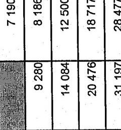

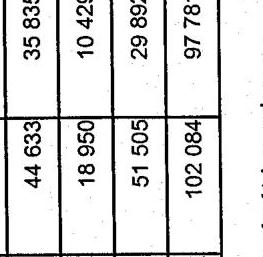

16,8 15,9

aláírás

---

7/b sz. tanúsítvány a V-17-34/2005-2006. sz. jelentéshez

## TANÚSÍTVÁNY

az ellenőrzések eredményességeinek alakulásáról adózói kategóriánként 2005. év

|  Megnevezés | Összes | Megállapítás-
sal zárult | Revízori nap | Nettó
adókülönbözet | Egy vizsgálatra
jutó
megállapítás | Egy revízori
napra jutó
megállapítás | Megállapítási
arány  |
| --- | --- | --- | --- | --- | --- | --- | --- |
|   | 2005. év | 2005. év | 2005. év | 2005. év | 2005. év | 2005. év | 2005. év  |
|   | db. | db | nap | E Fl. | E Fl. | E Fl. | %  |
|  1. Kategória | 10 962 | 3 124 | 79 751 | 48 654 900 | 4 438,5 | 610,1 | 28,5  |
|  Ebből kiemelt | 9 129 | 2 701 | 72 717 | 41 925 129 | 4 592,5 | 576,6 | 29,6  |
|  2. Kategória | 8 607 | 1 549 | 28 089 | 23 689 775 | 2 752,4 | 843,4 | 18,0  |
|  3. Kategória | 13 499 | 2 520 | 36 063 | 29 471 256 | 2 183,2 | 817,2 | 18,7  |
|  4. Kategória | 19 694 | 3 946 | 44 000 | 32 177 561 | 1 633,9 | 731,3 | 20,0  |
|  5. Kategória | 28 009 | 6 047 | 53 540 | 22 405 490 | 799,9 | 418,5 | 21,6  |
|  6. Kategória | 37 534 | 9 377 | 58 799 | 13 651 957 | 363,7 | 232,2 | 25,0  |
|  7. Kategória | 39 197 | 10 484 | 55 028 | 8 546 977 | 218,1 | 155,3 | 26,7  |
|  8. Kategória | 29 990 | 8 129 | 37 900 | 3 719 130 | 124,0 | 98,1 | 27,1  |
|  9. Kategória | 7 924 | 2 060 | 8 741 | 1 892 016 | 238,8 | 216,4 | 26,0  |
|  0. Kategória | 23 878 | 5 392 | 29 751 | 13 185 842 | 552,2 | 443,2 | 22,6  |
|  Kategórián kívüliek | 79 993 | 15 348 | 38 304 | 5 273 121 | 65,9 | 137,7 | 19,2  |

A fenti adatok hitelességét igazolom.

Budapest, 2006. május * * *

P.H.

alálrás

---

tanúsítvány a hátralékállomány alakulásáról értékhatáronként (gazdálkodók és magánszemélyek együtt) 2000

8/a sz. tanúsítvány a V-17-34/2005-2006. sz. jelentéshez

|  Területi szervezetek/igazgatóságok | Gazd.+M.sz. |  |  |  |  |  |  |  |  |  |  |  | Összes hátralék Gazd.+M.sz.  |
| --- | --- | --- | --- | --- | --- | --- | --- | --- | --- | --- | --- | --- | --- |
|   |  |  |  |  |  |  |  |  |  |  |  |  |   |
|   |  |  |  |  |  |  |  |  |  |  |  |  |   |
|   |  |  |  |  |  |  |  |  |  |  |  |  |   |
|   |  |  |  |  |  |  |  |  |  |  |  |  |   |
|   | db |  |  |  |  |  |  |  |  |  |  |  |   |
|   | 56.052 | 9.369.185 |  |  |  |  |  |  |  |  |  |  |   |
|   | 65.444 | 11.420.116 |  |  |  |  |  |  |  |  |  |  |   |
|   | 61.736 | 9.923.794 |  |  |  |  |  |  |  |  |  |  |   |
|   | 12 | 3.741 |  |  |  |  |  |  |  |  |  |  |   |
|   | 183.244 | 30.716.836 |  |  |  |  |  |  |  |  |  |  |   |
|   | 21.343 | 2.995.591 |  |  |  |  |  |  |  |  |  |  |   |
|   | 29.022 | 3.665.431 |  |  |  |  |  |  |  |  |  |  |   |
|   | 18.162 | 2.241.626 |  |  |  |  |  |  |  |  |  |  |   |
|   | 31.772 | 4.377.679 |  |  |  |  |  |  |  |  |  |  |   |
|   | 31.772 | 4.377.679 |  |  |  |  |  |  |  |  |  |  |   |
|   | 24.465 | 3.035.555 |  |  |  |  |  |  |  |  |  |  |   |
|   | 20.964 | 2.883.029 |  |  |  |  |  |  |  |  |  |  |   |
|   | 15.226 | 1.459.799 |  |  |  |  |  |  |  |  |  |  |   |
|   | 24.155 | 3.409.178 |  |  |  |  |  |  |  |  |  |  |   |
|   | 14.087 | 1.671.537 |  |  |  |  |  |  |  |  |  |  |   |
|   | 14.500 | 1.645.415 |  |  |  |  |  |  |  |  |  |  |   |
|   | 7.641 | 859.185 |  |  |  |  |  |  |  |  |  |  |   |
|   | 71.144 | 10.737.658 |  |  |  |  |  |  |  |  |  |  |   |
|   | 17.227 | 2.020.180 |  |  |  |  |  |  |  |  |  |  |   |
|   | 24.501 | 3.643.256 |  |  |  |  |  |  |  |  |  |  |   |
|   | 18.001 | 2.048.197 |  |  |  |  |  |  |  |  |  |  |   |
|   | 9.773 | 1.168.013 |  |  |  |  |  |  |  |  |  |  |   |
|   | 7.245 | 762.251 |  |  |  |  |  |  |  |  |  |  |   |
|   | 16.144 | 1.941.564 |  |  |  |  |  |  |  |  |  |  |   |
|   | 12.506 | 1.698.341 |  |  |  |  |  |  |  |  |  |  |   |
|   | 397.878 | 52.263.485 |  |  |  |  |  |  |  |  |  |  |   |
|   | 581.122 | 82.980.321 |  |  |  |  |  |  |  |  |  |  |   |

Fenti adatok hitelességét igazolom.

Kelt: Budapest, 2005. Kelt.

29a.tan. 2000

Értékhatárok

10 - 50 M Ft között 10 - 50 M Ft között 50 - 100 M Ft között 50 - 100 M Ft között

10 - 50 M Ft között 50 - 100 M Ft között 50 - 100 M Ft között

db | összeg E Ft | db | összeg E Ft | db | összeg E Ft | db | összeg E Ft | db | összeg E Ft | db | összeg E Ft | db | összeg E Ft | db | összeg E Ft | db | összeg E Ft | db | összeg E Ft | db | összeg E Ft | db | összeg E Ft | db | összeg E Ft | db | összeg E Ft | db | összeg E Ft | db | összeg E Ft | db | összeg E Ft | db | összeg E Ft | db | összeg E Ft | db | összeg E Ft | db | összeg E Ft | db | összeg E Ft | db | összeg E Ft | db | összeg E Ft |

---

tanúsítvány a hátralékállomány alakulásáról értékhatáronként (gazdálkodók és magánszemélyek együtt) 2001 a V-17-34/2005-2006. sz. jelentéshez

|  Területi szervezetek/igazgatóságok |  |  |  | Értékhatárok |  |  |  |  |  |  | Összes hátralék Gazd.+M.sz.  |
| --- | --- | --- | --- | --- | --- | --- | --- | --- | --- | --- | --- |
|   |  |  |  |  |  |  | Gazdálkodók |  |  |  |   |
|   | Gazd.+M.sz. |  | Magánszemély |  |  |  |  |  |  |  |   |
|   | 1 M Ft alatti |  | 1 M Ft feletti |  | 1 - 10 M Ft között |  | 10 - 50 M Ft között |  | 50 M Ft felett |  |   |
|   | db | összeg E Ft | db | összeg E Ft | db | összeg E Ft | db | összeg E Ft | db | összeg E Ft | db  |
|  Eszak-budapesti | 63.890 | 9.664.420 | 1.059 | 4.422.295 | 6.302 | 17.463.794 | 879 | 18.336.807 | 221 | 57.186.458 | 72.351  |
|  Kelet-budapesti | 71.272 | 12.031.809 | 1.252 | 4.222.484 | 6.952 | 19.375.676 | 1.025 | 21.449.389 | 284 | 53.044.260 | 80.785  |
|  Dél-budapesti | 68.756 | 10.344.141 | 1.023 | 4.293.692 | 6.446 | 17.612.636 | 899 | 18.216.812 | 203 | 32.065.483 | 77.327  |
|  KAIG | 9 | 2.455 |  |  | 8 | 31.369 | 13 | 345.314 | 11 | 3.231.226 | 41  |
|  Fővárosi igazgatóságok összesen | 203.927 | 32.042.825 | 3.334 | 12.938.471 | 19.708 | 54.483.475 | 2.816 | 58.348.322 | 719 | 145.527.427 | 230.504  |
|  Baranya megyei | 25.938 | 3.147.210 | 383 | 1.164.970 | 1.039 | 2.727.551 | 129 | 2.835.909 | 20 | 1.764.441 | 27.509  |
|  Bács-Kiskun megyei | 34.164 | 3.887.326 | 488 | 1.207.952 | 1.680 | 4.713.678 | 225 | 4.671.076 | 56 | 6.846.905 | 36.613  |
|  Békés megyei | 22.447 | 2.178.833 | 530 | 1.704.323 | 703 | 2.048.689 | 134 | 2.611.988 | 21 | 3.712.504 | 23.835  |
|  Borsod-Abaúj-Zemplén megyei | 39.131 | 4.535.326 | 411 | 932.632 | 2.021 | 5.422.450 | 181 | 3.489.231 | 60 | 13.891.073 | 41.804  |
|  Csongrád megyei | 29.390 | 3.150.510 | 459 | 1.458.878 | 1.250 | 3.427.711 | 208 | 4.156.220 | 32 | 3.069.362 | 31.339  |
|  Fejér megyei | 26.623 | 3.101.616 | 369 | 1.228.348 | 1.398 | 3.947.070 | 202 | 4.283.512 | 45 | 4.768.264 | 28.637  |
|  Győr-Moson-Sopron megyei | 21.316 | 1.739.435 | 179 | 1.105.780 | 668 | 1.889.797 | 89 | 1.986.678 | 28 | 5.080.392 | 22.280  |
|  Hajdó-Bihar megyei | 30.338 | 3.523.333 | 526 | 1.013.801 | 1.434 | 3.753.205 | 183 | 3.776.872 | 41 | 5.289.797 | 32.522  |
|  Heves megyei | 17.813 | 1.668.130 | 423 | 1.190.445 | 686 | 1.930.786 | 111 | 2.382.993 | 27 | 4.086.832 | 19.060  |
|  Komárom-Esztergom megyei | 17.912 | 1.479.409 | 163 | 608.307 | 711 | 2.249.485 | 120 | 2.589.306 | 41 | 10.078.424 | 18.947  |
|  Nógrád megyei | 9.927 | 953.122 | 167 | 597.713 | 461 | 1.337.375 | 89 | 1.971.802 | 20 | 7.129.167 | 10.664  |
|  Pest megyei | 83.907 | 11.454.901 | 1.419 | 4.248.936 | 4.417 | 11.378.339 | 468 | 9.821.465 | 122 | 33.342.761 | 90.333  |
|  Somogy megyei | 20.792 | 1.979.980 | 345 | 987.115 | 920 | 2.563.896 | 136 | 2.857.900 | 31 | 3.564.812 | 22.224  |
|  Szabolcs-Szatmár-Bereg megyei | 29.554 | 3.663.548 | 802 | 2.210.464 | 1.797 | 4.668.589 | 200 | 4.164.733 | 42 | 5.249.799 | 32.395  |
|  Jász-Nagykun-Szolnok megyei | 22.321 | 2.099.160 | 276 | 1.018.621 | 759 | 2.090.981 | 92 | 1.784.932 | 23 | 2.316.027 | 23.471  |
|  Tolna megyei | 12.711 | 1.123.353 | 110 | 1.205.152 | 433 | 1.240.424 | 66 | 1.408.246 | 22 | 3.050.450 | 13.342  |
|  Vas megyei | 9.274 | 793.542 | 31 | 128.614 | 467 | 1.424.728 | 94 | 1.958.943 | 25 | 2.232.803 | 9.911  |
|  Veszprém megyei | 19.396 | 2.049.899 | 364 | 843.482 | 879 | 2.383.260 | 103 | 2.178.819 | 15 | 2.449.001 | 20.757  |
|  Zala megyei | 15.580 | 1.780.662 | 261 | 508.122 | 563 | 1.456.848 | 48 | 987.030 | 6 | 809.089 | 16.458  |
|  Megyei igazgatóságok összesen | 488.534 | 54.309.295 | 7.726 | 23.363.655 | 22.286 | 60.654.862 | 2.878 | 59.917.655 | 677 | 118.731.903 | 522.101  |
|  Országos összesen | 692.461 | 86.352.120 | 11.060 | 36.302.126 | 41.994 | 115.138.337 | 5.694 | 118.265.977 | 1.396 | 264.259.330 | 752.605  |

Fenti adatok hitelességét igazolom.

Kelt: Budapest, 2005. 24. 11. 2001

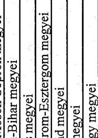

---

Tanúsítvány a hátralékállomány alakulásáról értékhatáronként (gazdálkodók és magánszemélyek együtt) 2002 a V-17-34/2005-2006. sz. jelentéshez

|  Területi szervezetek/igazgatóságok | Értékhatárok | Összes hátralék  |
| --- | --- | --- |
|   | 1 M Ft alatti | 1 - 10 M Ft között  |
|   | db | összeg E Ft  |
|  Eszak-budapesti | 61.700 | 9.967.738  |
|  Kelet-budapesti | 69.178 | 12.375.603  |
|  Dél-budapesti | 66.288 | 10.829.314  |
|  KAIG | 9 | 3.426  |
|  Fővárosi igazgatóságok összesen | 197.175 | 33.176.081  |
|  Baranya megyei | 22.744 | 3.049.518  |
|  Bács-Kiskun megyei | 30.416 | 3.797.230  |
|  Békés megyei | 20.850 | 2.003.472  |
|  Borsod-Abaúj-Zemplén megyei | 36.656 | 4.215.773  |
|  Csongrád megyei | 29.033 | 3.050.968  |
|  Fejér megyei | 22.965 | 3.064.902  |
|  Győr-Moson-Sopron megyei | 21.252 | 1.989.236  |
|  Hajdú-Bihar megyei | 30.308 | 3.607.538  |
|  Heves megyei | 16.434 | 1.525.800  |
|  Komárom-Esztergom megyei | 18.570 | 1.554.792  |
|  Nográd megyei | 9.727 | 1.046.116  |
|  Pest megyei | 84.816 | 11.907.881  |
|  Somogy megyei | 20.593 | 1.851.858  |
|  Szabolcs-Szatmár-Bereg megyei | 26.922 | 3.437.290  |
|  Jász-Nagykun-Szolnok megyei | 20.762 | 2.139.082  |
|  Tolna megyei | 12.637 | 1.173.511  |
|  Vas megyei | 9.287 | 826.063  |
|  Veszprém megyei | 18.270 | 2.008.496  |
|  Zala megyei | 13.693 | 1.768.596  |
|  Megyei igazgatóságok összesen | 465.935 | 54.018.122  |
|  Országos összesen | 663.110 | 87.194.203  |

Fenti adatok hitelességét igazolom.

Kelt: Budapest, 2005. X. 14.

29c.tan. 2002

|  Összes hátralék | 50 M Ft felett | db | összeg E Ft | 71.192 | 109.196.497  |
| --- | --- | --- | --- | --- | --- |
|  71.192 | 79.675 | 75.470 | 81.839.087 |  |   |
|  75.470 | 81.839.087 | 75.470 | 81.839.087 |  |   |
|  3.129.165 | 29 | 3.129.165 | 29 | 3.329.708 |   |
|  739 | 152.866.406 | 226.366 | 317.954.522 |  |   |
|  3.819.455 | 32 | 2.972.615 | 24.248 | 13.181.687 |   |
|  5.164.876 | 72 | 11.861.700 | 32.999 | 26.795.765 |   |
|  3.126.073 | 25 | 2.448.935 | 22.379 | 11.075.064 |   |
|  4.146.153 | 47 | 7.998.025 | 39.147 | 22.118.665 |   |
|  3.164.860 | 30.924 | 14.298.251 | 14.298.251 |  |   |
|  2.631.937 | 42 | 4.290.275 | 22.298 | 11.425.036 |   |
|  3.224.154 | 42 | 5.103.773 | 32.367 | 16.418.120 |   |
|  2.515.503 | 25 | 3.985.588 | 17.571 | 10.698.220 |   |
|  3.095.263 | 41 | 11.693.617 | 19.645 | 18.852.897 |   |
|  2.885.857 | 21 | 7.528.198 | 10.431 | 12.575.970 |   |
|  16.136.329 | 614 | 12.746.306 | 137 | 34.096.613 | 91.977  |
|  2.989.952 | 125 | 2.669.586 | 25 | 2.599.074 | 21.899  |
|  5.957.303 | 239 | 4.982.049 | 48 | 12.295.297 | 29.549  |
|  2.923.330 | 108 | 2.082.883 | 21 | 1.952.343 | 21.982  |
|  1.490.074 | 88 | 1.795.847 | 14 | 1.889.770 | 13.293  |
|  1.593.121 | 90 | 1.869.709 | 22 | 1.962.370 | 9.960  |
|  1.314 | 3.330.156 | 114 | 2.332.788 | 26 | 3.786.958  |
|  2.345.179 | 64 | 1.327.515 | 8 | 1.029.038 | 14.758  |
|  30.441 | 79.056.907 | 3.306 | 68.375.913 | 717 | 126.396.117  |
|  55.811 | 146.491.002 | 6.388 | 132.853.854 | 1.456 | 279.262.523  |

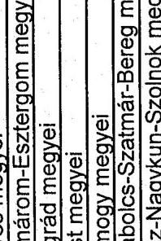

aláírás

---

Tanúsítvány a hátralékállomány alakulásáról értékhatáronként (gazdálkodók és magánszemélyek együtt) 2003

8/d sz. tanúsítvány a V-17-34/2005-2006. sz. jelentéshez

|  Területi szervezetek/igazgatóságok | Értékhatárok | Összes hátralék  |
| --- | --- | --- |
|   | 1 M Ft alatti | 1 - 10 M Ft között  |
|   | db | összeg E Ft  |
|  Eszak-budapesti | 53.503 | 9.484.154  |
|  Kelet-budapesti | 62.899 | 12.034.224  |
|  Dél-budapesti | 56.438 | 9.874.920  |
|  KAIG | 3 | 1.079  |
|  Fővárosi igazgatóságok összesen | 172.843 | 31.394.377  |
|  Baranya megyei | 21.535 | 2.682.623  |
|  Bács-Kiskun megyei | 29.681 | 3.581.464  |
|  Békés megyei | 17.541 | 1.771.605  |
|  Borsod-Abaúj-Zemplén megyei | 31.143 | 3.962.093  |
|  Csongrád megyei | 24.198 | 2.566.173  |
|  Fejér megyei | 22.832 | 3.258.702  |
|  Győr-Moson-Sopron megyei | 19.029 | 1.816.256  |
|  Hajdú-Bihar megyei | 25.809 | 3.417.077  |
|  Heves megyei | 14.297 | 1.463.862  |
|  Komárom-Esztergom megyei | 15.549 | 1.589.816  |
|  Nógrád megyei | 8.376 | 1.015.969  |
|  Pest megyei | 74.158 | 11.774.142  |
|  Somogy megyei | 17.568 | 1.580.551  |
|  Szabolcs-Szatmár-Bereg megyei | 25.811 | 2.933.251  |
|  Jász-Nagykun-Szolnok megyei | 20.149 | 2.048.113  |
|  Tolna megyei | 11.170 | 1.129.638  |
|  Vas megyei | 8.113 | 834.619  |
|  Veszprém megyei | 16.160 | 1.866.926  |
|  Zala megyei | 12.461 | 1.808.398  |
|  Megyei igazgatóságok összesen | 415.580 | 51.101.278  |
|  Országos összesen | 588.423 | 82.495.655  |

Fenti adatok hitelességét igazolom.

Kelt: Budapest, 2005. 44.

29d. tan. 2003

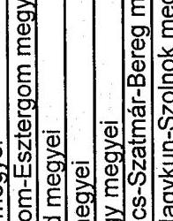

|  Összes hátralék | 50 M Ft felett | 50 M Ft felett | 65.830 | 121.665.209  |
| --- | --- | --- | --- | --- |
|  db | összeg E Ft | db | 66.614.506 | 63.830  |
|  272 | 272 | 66.614.506 | 63.830 | 121.665.209  |
|  308 | 308 | 60.272.470 | 74.519 | 123.142.490  |
|  207 | 207 | 37.778.640 | 66.261 | 90.814.298  |
|  10 | 10 | 286.908 | 9 | 1.121.912  |
|  9 | 9 | 165.787.528 | 204.639 | 337.264.459  |
|  35 | 35 | 3.219.490 | 23.055 | 12.892.758  |
|  74 | 74 | 12.272.576 | 32.436 | 27.491.385  |
|  36 | 36 | 4.069.510 | 19.049 | 12.720.408  |
|  49 | 49 | 7.612.953 | 33.715 | 22.151.287  |
|  27 | 27 | 3.343.955 | 26.103 | 14.131.480  |
|  52 | 52 | 6.481.780 | 25.462 | 22.144.813  |
|  126 | 126 | 2.492.709 | 50 | 10.476.256  |
|  172 | 172 | 3.927.942 | 51 | 5.396.483  |
|  122 | 122 | 2.720.281 | 26 | 3.548.518  |
|  188 | 188 | 3.830.703 | 27 | 3.343.955  |
|  289 | 289 | 5.928.657 | 52 | 6.481.780  |
|  901 | 901 | 2.585.474 | 126 | 2.492.709  |
|  901 | 901 | 4.332.668 | 172 | 3.927.942  |
|  864 | 864 | 2.449.317 | 122 | 2.720.281  |
|  1.066 | 1.066 | 3.069.064 | 177 | 3.560.423  |
|  568 | 568 | 1.542.326 | 89 | 1.867.614  |
|  7.373 | 7.373 | 18.597.566 | 733 | 14.949.791  |
|  1.134 | 1.134 | 3.053.227 | 128 | 2.669.517  |
|  5.891.079 | 5.891.079 | 233 | 4.784.526 | 59  |
|  3.337.586 | 3.337.586 | 141 | 2.823.706 | 19  |
|  1.703.446 | 1.703.446 | 92 | 1.921.277 | 21  |
|  577 | 577 | 1.681.716 | 100 | 1.943.904  |
|  1.166 | 1.166 | 3.112.953 | 119 | 2.482.605  |
|  943 | 943 | 2.268.396 | 71 | 1.609.986  |
|  31.922 | 31.922 | 83.605.245 | 3.622 | 74.483.061  |
|  59.722 | 59.722 | 157.355.318 | 6.822 | 140.815.542  |

29d. tan. 2003

---

Tanúsítvány a hátralékállomány alakulásáról értékhatáronként (gazdálkodók és magánszemélyek együtt) 2004

|  Területi szervezetek/igazgatóságok | Értékhatárok |  |  |  |  |  |  |  | Összes hátralék |   |
| --- | --- | --- | --- | --- | --- | --- | --- | --- | --- | --- |
|   | 1 M Ft alatti |  | 1 - 10 M Ft között |  | 10 - 50 M Ft között |  | 50 M Ft felett |  |  |   |
|   | db | összeg E Ft | db | összeg E Ft | db | összeg E Ft | db | összeg E Ft | db | összeg E Ft  |
|  Eszak-budapesti | 48.715 | 9.294.192 | 9.130 | 24.365.617 | 1.129 | 23.727.335 | 365 | 88.446.176 | 59.339 | 145.833.318  |
|  Kelet-budapesti | 57.028 | 11.801.232 | 11.085 | 29.980.563 | 1.296 | 27.117.945 | 388 | 103.926.120 | 69.797 | 172.825.851  |
|  Dél-budapesti | 50.057 | 9.322.243 | 8.888 | 24.704.375 | 1.049 | 21.011.508 | 225 | 43.253.316 | 60.219 | 98.291.442  |
|  KAIG | 2 | 1.318 | 6 | 11.107 | 11 | 276.939 | 22 | 12.729.083 | 41 | 13.018.447  |
|  Fivárosi igazgatóságok összesen | 155.802 | 30.418.985 | 29.109 | 79.061.662 | 3.485 | 72.133.727 | 1.000 | 248.354.695 | 189.396 | 429.969.068  |
|  Baranya megyei | 18.982 | 2.446.378 | 1.355 | 3.575.366 | 206 | 4.220.831 | 44 | 4.652.223 | 20.587 | 14.894.798  |
|  Bács-Kiskun megyei | 25.252 | 3.670.110 | 2.699 | 7.187.079 | 310 | 6.545.164 | 106 | 12.319.552 | 28.367 | 29.721.906  |
|  Békés megyei | 15.357 | 1.699.376 | 1.339 | 3.740.475 | 196 | 4.202.162 | 38 | 4.862.750 | 16.930 | 14.504.763  |
|  Borsod-Abaúj-Zemplén megyei | 26.673 | 3.680.637 | 2.438 | 6.276.382 | 262 | 5.411.746 | 55 | 9.507.188 | 29.428 | 24.875.953  |
|  Csongrád megyei | 20.419 | 2.289.986 | 1.714 | 4.746.962 | 235 | 4.925.133 | 48 | 7.573.208 | 22.416 | 19.535.289  |
|  Fejér megyei | 20.320 | 3.233.997 | 2.516 | 7.046.969 | 277 | 5.518.165 | 65 | 8.788.773 | 23.178 | 24.587.904  |
|  Győr-Moson-Sogron megyei | 16.328 | 1.778.195 | 1.035 | 2.901.720 | 164 | 3.465.117 | 53 | 14.034.265 | 17.580 | 22.179.297  |
|  Hajdú-Bihar megyei | 21.387 | 3.263.795 | 1.892 | 4.463.413 | 226 | 5.419.182 | 78 | 10.539.714 | 23.583 | 23.686.104  |
|  Heves megyei | 12.582 | 1.407.409 | 1.034 | 2.877.746 | 146 | 3.148.953 | 44 | 5.824.226 | 13.806 | 13.258.334  |
|  Komárom-Esztergom megyei | 13.753 | 1.520.799 | 1.202 | 3.577.721 | 225 | 4.620.155 | 62 | 13.183.012 | 15.242 | 22.901.687  |
|  Nögrád megyei | 7.690 | 981.440 | 605 | 1.730.282 | 95 | 2.050.907 | 23 | 7.108.428 | 8.413 | 11.871.057  |
|  Pest megyei | 70.602 | 11.962.998 | 8.415 | 21.937.750 | 943 | 20.050.177 | 243 | 46.214.065 | 80.203 | 100.164.989  |
|  Somogy megyei | 14.330 | 1.486.034 | 1.180 | 3.363.243 | 153 | 3.251.422 | 28 | 4.630.222 | 15.691 | 12.730.922  |
|  Szabolcs-Szatmár-Bereg megyei | 22.233 | 2.911.236 | 2.425 | 6.521.716 | 283 | 5.766.654 | 81 | 10.670.552 | 25.022 | 25.870.158  |
|  Jász-Nagykun-Szolnok megyei | 16.911 | 1.945.124 | 1.385 | 3.728.114 | 166 | 3.440.899 | 34 | 3.203.050 | 18.496 | 12.317.187  |
|  Tolna megyei | 9.677 | 1.077.570 | 776 | 2.101.287 | 94 | 2.082.217 | 28 | 5.068.345 | 10.575 | 10.329.419  |
|  Vas megyei | 7.061 | 749.912 | 601 | 1.813.601 | 125 | 2.487.774 | 32 | 3.776.265 | 7.819 | 8.827.552  |
|  Veszprém megyei | 13.885 | 1.774.983 | 1.285 | 3.417.387 | 148 | 3.103.027 | 29 | 3.486.429 | 15.347 | 11.781.825  |
|  Zala megyei | 11.118 | 1.660.192 | 1.067 | 2.658.171 | 116 | 2.432.478 | 29 | 3.120.190 | 12.330 | 9.871.031  |
|  Megyei igazgatóságok összesen | 364.560 | 49.540.171 | 34.963 | 93.665.384 | 4.370 | 92.142.163 | 1.120 | 178.562.457 | 405.013 | 413.910.175  |
|  Országos összesen | 520.362 | 79.959.156 | 64.072 | 172.727.046 | 7.855 | 164.275.890 | 2.120 | 426.917.152 | 594.409 | 843.879.243  |

Fenti adatok hitelességét igazolom.

Kelt: Budapest, 2005. X. 14.

29e.tan. 2004

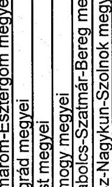

Aláírás

---

Tanúsítvány a hátralékállomány alakulásáról értékhatáronként (gazdálkodók és magánszemélyek együtt) 2005

8/f sz. tanúsítvány a V-17-34/2005-2006. sz. jelentéshez

|  Területi szervezetek/igazgatóságok | Értékhatárok | Összes hátralék  |
| --- | --- | --- |
|   | I M Ft alatti | 1 - 10 M Ft között  |
|   | db | összeg E Ft  |
|  Észak-budapesti | 45 184 | 8 297 590  |
|  Kelet-budapesti | 51 853 | 10 751 448  |
|  Dél-budapesti | 47 059 | 8 606 897  |
|  KAIG | 1 | 5  |
|  Fővárosi igazgatóságok összesen | 144 097 | 27 655 940  |
|  Baranya megyei | 17 671 | 2 265 423  |
|  Bács-Kiskun megyei | 25 701 | 3 655 761  |
|  Békés megyei | 14 810 | 1 521 844  |
|  Borsod-Abaúj-Zemplén megyei | 24 874 | 3 460 701  |
|  Csongrád megyei | 19 659 | 2 183 775  |
|  Fejér megyei | 19 578 | 3 087 557  |
|  Győr-Moson-Sopron megyei | 14 509 | 1 476 331  |
|  Hajdú-Bihar megyei | 20 751 | 2 991 207  |
|  Heves megyei | 11 849 | 1 348 213  |
|  Komárom-Esztergom megyei | 13 370 | 1 523 291  |
|  Nögrád megyei | 7 636 | 969 891  |
|  Pest megyei | 69 964 | 11 818 611  |
|  Somogy megyei | 13 231 | 1 428 146  |
|  Szabolcs-Szatmár-Bereg megyei | 22 642 | 2 946 722  |
|  Jász-Nagykun-Szolnok megyei | 16 574 | 1 912 943  |
|  Tolna megyei | 9 166 | 1 046 134  |
|  Vas megyei | 7 015 | 762 994  |
|  Veszprém megyei | 13 331 | 1 699 861  |
|  Zala megyei | 10 849 | 1 586 510  |
|  Megyei igazgatóságok összesen | 353 180 | 47 885 915  |
|  Országos összesen | 497 277 | 75 341 855  |

Fenti adatok hitelességét igazolom.

Kelt: Budapest, 2006. Május

|  Értékhatárok |  |  |  |  |  |  |  |  |  |   |
| --- | --- | --- | --- | --- | --- | --- | --- | --- | --- | --- |
|   |  |  |  |  |  |  |  |  |  | Összes hátralék  |
|   |  |  |  |  |  |  |  |  |  | db  |
|  db |  |  |  |  |  |  |  |  |  | összeg E Ft  |
|  45 184 | 8 297 590 | 8 956 | 24 984 927 | 1 166 | 24 848 631 | 366 | 102 335 181 | 55 672 | 160 466 329 |   |
|  51 853 | 10 751 448 | 11 915 | 32 335 901 | 1 379 | 29 623 195 | 467 | 144 054 876 | 65 614 | 216 765 420 |   |
|  47 059 | 8 606 897 | 8 910 | 24 895 268 | 1 081 | 21 875 979 | 238 | 48 640 063 | 57 288 | 104 018 207 |   |
|  5 | 3 | 15 303 | 10 | 270 633 | 9 | 2 509 060 | 23 | 2 795 001 |  |   |
|  144 097 | 27 655 940 | 29 784 | 82 231 399 | 3 636 | 76 618 438 | 1 080 | 297 539 180 | 178 597 | 484 044 957 |   |
|  17 671 | 2 265 423 | 1 384 | 3 567 659 | 163 | 3 358 328 | 42 | 4 749 498 | 19 260 | 13 940 908 |   |
|  25 701 | 3 655 761 | 2 897 | 7 624 072 | 299 | 6 143 292 | 96 | 10 876 788 | 28 993 | 28 299 913 |   |
|  14 810 | 1 521 844 | 1 231 | 3 580 416 | 168 | 3 430 372 | 40 | 5 091 475 | 16 249 | 13 624 107 |   |
|  24 874 | 3 460 701 | 2 457 | 6 177 611 | 203 | 3 982 735 | 50 | 8 443 484 | 27 584 | 22 064 531 |   |
|  19 659 | 2 183 775 | 1 925 | 5 525 527 | 260 | 5 465 772 | 60 | 7 306 271 | 21 904 | 20 481 345 |   |
|  19 578 | 3 087 557 | 2 640 | 7 578 871 | 279 | 5 565 791 | 54 | 5 309 527 | 22 551 | 21 541 746 |   |
|  14 509 | 1 476 331 | 1 064 | 2 970 640 | 151 | 3 000 912 | 42 | 9 039 796 | 15 766 | 16 487 679 |   |
|  20 751 | 2 991 207 | 1 857 | 4 220 426 | 124 | 2 849 172 | 43 | 5 390 252 | 22 775 | 15 451 057 |   |
|  11 849 | 1 348 213 | 1 076 | 2 983 716 | 124 | 2 824 924 | 47 | 7 525 482 | 13 096 | 14 682 335 |   |
|  13 370 | 1 523 291 | 1 426 | 4 365 742 | 256 | 5 257 570 | 64 | 15 021 106 | 15 116 | 26 167 709 |   |
|  7 636 | 969 891 | 663 | 1 708 943 | 96 | 1 979 681 | 20 | 6 008 618 | 8 415 | 10 667 133 |   |
|  69 964 | 11 818 611 | 8 727 | 23 419 340 | 1 069 | 23 006 473 | 286 | 54 812 126 | 80 046 | 113 056 550 |   |
|  13 231 | 1 428 146 | 1 263 | 3 463 180 | 163 | 3 262 515 | 33 | 3 988 114 | 14 690 | 12 141 955 |   |
|  22 642 | 2 946 722 | 2 592 | 7 127 257 | 338 | 6 893 151 | 108 | 17 967 760 | 25 680 | 34 934 890 |   |
|  16 574 | 1 912 943 | 1 503 | 3 989 489 | 144 | 2 791 225 | 26 | 2 469 343 | 18 247 | 11 163 000 |   |
|  9 166 | 1 046 134 | 829 | 2 236 726 | 93 | 2 061 373 | 23 | 3 059 597 | 10 111 | 8 403 830 |   |
|  7 015 | 762 994 | 627 | 1 779 518 | 136 | 2 555 733 | 24 | 3 420 831 | 7 802 | 8 519 076 |   |
|  13 331 | 1 699 861 | 1 414 | 3 634 505 | 119 | 2 252 645 | 29 | 3 500 426 | 14 893 | 11 087 437 |   |
|  10 849 | 1 586 510 | 1 169 | 2 933 231 | 130 | 2 738 560 | 23 | 2 716 428 | 12 171 | 9 974 729 |   |
|  353 180 | 47 885 915 | 36 744 | 98 886 869 | 4 315 | 89 420 224 | 1 110 | 176 696 922 | 395 349 | 412 689 930 |   |
|  497 277 | 75 341 855 | 66 528 | 181 118 268 | 7 954 | 146 038 662 | 2 190 | 474 236 102 | 573 946 | 896 734 887 |   |

Fenti adatok hitelességét igazolom.

Kelt: Budapest, 2006. Május

aláírás

---

Tanúsítvány a végrehajtás alá vont hátralékok és a hátraléktörlések alakulásáról 2000 a V-17-34/2005-2006. sz. jelentéshez

|  Területi | Végrehajtás alá
vont hátralék
előző év végén | Végrehajtási
eljárások lefolyt.
után befolyt. | Méltányosságból | Behajthatatlanság
miatt | Cégtörlés miatt | Elévülés címén | Összesen  |
| --- | --- | --- | --- | --- | --- | --- | --- |
|  Eszak-budapesti | 37.816.596 | 18.521.903 | 1.158.099 | 16.737.386 |  | 3.767.771 | 21.663.256  |
|  Kelet-budapesti | 43.829.895 | 11.785.453 | 1.669.384 | 2.968.429 |  | 2.333.758 | 6.971.571  |
|  Dél-budapesti | 35.468.052 | 11.355.203 | 1.670.880 | 1.118.768 |  | 3.433.758 | 6.223.406  |
|  KAIG | 14.941.119 | 14.614.731 | 279.195 | 506.246 |  | 0 | 785.441  |
|  Főv. íg összesen | 132.055.663 | 56.277.290 | 4.777.558 | 21.330.829 |  | 9.535.287 | 35.643.674  |
|  Baranya megyei | 5.288.780 | 4.169.973 | 186.032 | 620.856 |  | 686.212 | 1.493.100  |
|  Bács-Kiskun megyei | 8.482.255 | 5.091.823 | 866.599 | 788.058 |  | 516.771 | 2.171.428  |
|  Békés megyei | 9.815.235 | 3.323.351 | 610.133 | 2.642.256 |  | 456.517 | 3.708.906  |
|  Borsod-Abaúj-Zemplén megyei | 9.262.929 | 6.394.077 | 1.290.785 | 1.896.690 |  | 214.605 | 3.402.080  |
|  Csongrád megyei | 5.508.354 | 3.986.890 | 550.838 | 330.799 |  | 1.103.869 | 1.985.506  |
|  Fejér megyei | 7.786.394 | 3.684.163 | 564.942 | 2.589.539 |  | 1.053.831 | 4.208.312  |
|  Győr-Moson-Sopron megyei | 16.473.642 | 7.527.980 | 184.533 | 796.901 |  | 707.404 | 1.688.838  |
|  Hajdú-Bihar megyei | 8.647.126 | 3.949.571 | 479.891 | 1.044.160 |  | 219.090 | 1.743.141  |
|  Heves megyei | 5.696.956 | 2.803.563 | 318.365 | 1.352.612 |  | 720.810 | 2.391.787  |
|  Komárom-Esztergom megyei | 6.157.686 | 3.936.024 | 133.729 | 282.281 |  | 249.957 | 665.967  |
|  Nógrád megyei | 4.377.388 | 1.454.837 | 1.448.774 | 5.130.742 |  | 980.330 | 7.559.846  |
|  Pest megyei | 17.540.048 | 9.048.988 | 211.890 | 920.213 |  | 619.435 | 1.751.538  |
|  Somogy megyei | 7.135.062 | 3.213.856 | 289.645 | 2.695.638 |  | 459.356 | 3.444.639  |
|  Szabolcs-Szatmár-Bereg megyei | 8.251.138 | 4.053.583 | 145.677 | 793.580 |  | 335.026 | 1.274.283  |
|  Jász-Nagykun-Szolnok megyei | 3.896.431 | 2.923.942 | 622.985 | 1.045.930 |  | 336.065 | 2.004.980  |
|  Tolna megyei | 2.991.143 | 2.019.981 | 217.101 | 668.623 |  | 318.580 | 1.204.304  |
|  Vas megyei | 2.565.512 | 2.267.008 | 100.273 | 652.425 |  | 97.987 | 850.685  |
|  Veszprém megyei | 5.542.977 | 2.980.413 | 309.474 | 435.687 |  | 199.606 | 944.767  |
|  Zala megyei | 4.131.150 | 2.161.775 | 117.620 | 568.672 |  | 179.066 | 865.358  |
|  Megyei íg, összesen | 139.550.207 | 74.991.798 | 8.649.286 | 25.255.662 |  | 9.454.517 | 43.359.465  |
|  Országos összesen | 271.605.870 | 131.269.088 | 13.426.844 | 46.586.491 | n.a. | 18.989.804 | 79.003.139  |

Fenti adatok hitelességét igazolom.

Kelt: Budapest, 2005. X. M. 2005. X. M.

---

tanúsítvány a végrehajtás alá vont hátralékok és a hátraléktörlések alakulásáról 9/b sz. tanúsítvány a V-17-34/2005-2006. sz. jelentéshez 2001 (adatok E Ft-ban)

|  Területi szervezetek/igazgatóságok | Végrehajtás alá vont hátralék előző év végén | Végrehajtási eljárások lefolyt. után befolyt. | Meltányosságból | Behajthatatlanság miatt | Cégtörlés miatt | Elévülés címén | Összesen  |
| --- | --- | --- | --- | --- | --- | --- | --- |
|  Eszak-budapesti | 51.427.174 | 17.038.250 | -1.683.157 | -1.050.478 | -12.211.407 | -1.396.282 | -16.341.324  |
|  Kelet-budapesti | 49.327.600 | 12.390.059 | -1.390.570 | -4.956.765 | -2.306.252 | -4.315.257 | -12.968.844  |
|  Dél-budapesti | 43.100.218 | 12.881.710 | -401.438 | -519.757 | -165.470 | -6.190.055 | -7.276.720  |
|  KAIG | 10.340.902 | 6.794.535 | -533.327 |  |  |  | -533.327  |
|  Főv. ig összesen | 154.195.894 | 49.104.554 | -4.008.492 | -6.527.000 | -14.683.129 | -11.901.594 | -37.120.215  |
|  Baranya megyei | 6.201.831 | 3.980.208 | -138.797 | -516.794 | -263.178 | -755.504 | -1.674.273  |
|  Bács-Kiskun megyei | 10.873.586 | 5.635.497 | -437.914 | -1.171.215 | -5.262 | -979.337 | -2.593.728  |
|  Békés megyei | 9.056.086 | 3.888.755 | -138.444 | -1.490.675 | -166.543 | -2.143.770 | -3.939.432  |
|  Borsod-Abaúj-Zemplén megyei | 8.165.346 | 6.745.285 | -455.246 | -1.386.393 | -1.074.510 | -1.052.061 | -3.968.210  |
|  Csongrád megyei | 7.589.679 | 5.502.517 | -984.331 | -125.784 | -91.171 | -681.496 | -1.882.782  |
|  Fejér megyei | 10.625.052 | 4.793.939 | -664.191 | -483.562 | -624.321 | -341.040 | -2.113.114  |
|  Győr-Moson-Sopron megyei | 16.018.134 | 6.536.628 | -90.793 | -475.349 | -17.831 | -1.099.951 | -1.683.924  |
|  Hajdú-Bihar megyei | 7.618.186 | 4.903.458 | -257.810 | -503.090 | -280.288 | -824.151 | -1.865.339  |
|  Heves megyei | 5.538.366 | 3.297.538 | -236.902 | -445.216 | -109.707 | -1.636.982 | -2.428.807  |
|  Komárom-Esztergom megyei | 6.717.413 | 5.189.479 | -293.579 | -789.705 | -339.242 | -78.286 | -1.500.812  |
|  Nógrád megyei | 5.848.805 | 1.616.437 | -145.279 | -578.710 |  | -274.332 | -998.321  |
|  Pest megyei | 25.385.827 | 11.055.885 | -1.417.095 | -987.506 | -641.010 | -1.420.946 | -4.466.557  |
|  Somogy megyei | 7.980.246 | 3.431.993 | -109.364 | -658.735 | -62 | -436.752 | -1.204.913  |
|  Szabolcs-Szatmár-Bereg megyei | 9.476.323 | 5.251.915 | -342.475 | -621.443 | -195.821 | -972.279 | -2.132.018  |
|  Jász-Nagykun-Szolnok megyei | 4.646.447 | 3.560.507 | -213.666 | -1.486.318 | -100.641 | -331.673 | -2.132.298  |
|  Tolna megyei | 2.830.406 | 2.226.338 | -108.028 | -1.207.869 | -24.840 | -138.820 | -1.479.557  |
|  Vas megyei | 2.880.532 | 2.503.490 | -95.303 | -84.940 | -28.715 | -221.691 | -430.649  |
|  Veszprém megyei | 5.514.728 | 3.170.554 | -297.927 | -588.449 | -49.880 | -505.754 | -1.442.010  |
|  Zala megyei | 4.680.460 | 2.554.071 | -97.563 | -251.246 | -140.575 | -285.396 | -774.782  |
|  Megyei ig. összesen | 157.647.453 | 85.844.495 | -6.524.707 | -13.852.999 | -4.153.597 | -14.180.223 | -38.711.526  |
|  Országos összesen | 311.843.347 | 134.949.049 | -10.533.199 | -20.379.999 | -18.836.726 | -26.081.817 | -75.831.741  |

Fenti adatok hitelességét igazolom.

Kelt: Budapest, 2005. X. 18. aláírás

---

Tanúsítvány a végrehajtás alá vont hátralékok és a hátraléktörlések alakulásáról 9/c sz. tanúsítvány a V-17-34/2005-2006. sz. jelentéshez

|  Területi szervezetek/igazgatóságok | Végrehajtás alá vont hátralék előző év végén | Végrehajtási eljárások lefolyt. után befolyt. | Méltányosságból | Bírálás | Törölt hátralék | Elévülés cím | Összesen  |
| --- | --- | --- | --- | --- | --- | --- | --- |
|  Eszak-budapesti | 47.785.139 | 18.161.903 | -854.073 | -1.496.835 | -1.012.146 | -9.949.445 | -13.312.499  |
|  Kelet-budapesti | 57.223.008 | 14.171.196 | -1.258.353 | -1.619.875 | -3.219.938 | -5.122.685 | -11.220.851  |
|  Dél-budapesti | 44.914.756 | 13.919.858 | -506.341 | -701.858 | -241.297 | -3.568.456 | -5.017.952  |
|  KAIG | 1.987.374 | 3.605.671 | -169.593 |  |  | 2.563 | -167.030  |
|  Főv. ig összesen | 151.910.274 | 49.858.628 | -2.788.360 | -3.818.568 | -4.473.381 | -18.638.023 | -29.718.332  |
|  Baranya megyei | 5.466.248 | 4.154.611 | -153.326 | -1.023.043 | -127.198 | -924.199 | -2.227.766  |
|  Bács-Kiskun megyei | 11.228.523 | 5.305.984 | -390.424 | -840.646 | -78.460 | -1.149.635 | -2.459.165  |
|  Békés megyei | 7.396.217 | 4.036.808 | -158.774 | -1.254.076 | -13.974 | -928.955 | -2.355.779  |
|  Borsod-Abaúj-Zemplén megyei | 7.797.555 | 6.327.258 | -572.940 | -1.734.736 | -469.696 | -2.220.701 | -4.998.073  |
|  Csongrád megyei | 7.835.547 | 4.953.793 | -537.203 | -643.608 | -341.555 | -1.169.416 | -2.691.782  |
|  Fejér megyei | 8.803.316 | 4.336.352 | -926.098 | -846.629 | -89.934 | -811.722 | -2.476.383  |
|  Győr-Moson-Sopron megyei | 6.537.357 | 6.608.715 | -164.617 | -66.715 | -25.684 | -1.221.020 | -1.478.036  |
|  Hajdú-Bihar megyei | 8.743.820 | 5.382.605 | -396.529 | -690.910 | -63.642 | -740.391 | -1.891.472  |
|  Heves megyei | 4.390.537 | 3.448.418 | -250.126 | -523.949 | -74.263 | -1.016.878 | -1.865.218  |
|  Komárom-Esztergom megyei | 13.254.733 | 5.593.889 | -326.340 | -425.437 | -216.800 | -359.144 | -1.327.721  |
|  Nögrád megyei | 5.827.581 | 2.066.207 | -182.886 | -472.111 |  | -247.305 | -902.302  |
|  Pest megyei | 33.017.927 | 11.303.573 | -2.497.138 | -334.251 | -1.491.234 | -3.282.128 | -7.604.751  |
|  Somogy megyei | 8.316.780 | 3.784.262 | -128.788 | -627.962 |  | -855.882 | -1.612.632  |
|  Szabolcs-Szatmár-Bereg megyei | 9.192.131 | 4.687.399 | -390.937 | -1.746.548 | -205.988 | -2.646.172 | -4.989.645  |
|  Jász-Nagykun-Szolnok megyei | 5.414.575 | 3.653.940 | -169.918 | -1.316.154 | -12.051 | -380.732 | -1.878.855  |
|  Tolna megyei | 3.441.428 | 2.173.492 | -163.250 | -301.457 | -6.115 | -295.520 | -766.342  |
|  Vas megyei | 2.988.117 | 2.286.109 | -119.723 | -308.243 | -79.797 | -105.158 | -612.921  |
|  Veszprém megyei | 4.987.667 | 3.443.258 | -238.891 | -574.877 | -481.758 | -993.136 | -2.288.662  |
|  Zala megyei | 3.862.846 | 2.824.813 | -238.213 | -298.864 | -10.600 | -436.782 | -984.459  |
|  Megyei ig. összesen | 158.502.906 | 86.371.488 | -8.008.121 | -14.030.216 | -3.788.749 | -19.584.876 | -45.411.962  |
|  Országos összesen | 310.413.180 | 136.230.116 | -10.796.481 | -17.848.784 | -8.262.130 | -38.222.899 | -75.130.294  |

Fenti adatok hitelességét igazolom.

Kelt: Budapest, 2005. X. 11. alárás

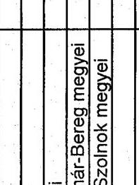

---

tanúsítvány a végrehajtás alá vont hátralékok és a hátraléktörlések alakulásáról 9/d sz. tanúsítvány a V-17-34/2005-2006. sz. jelentéshez

|  Területi | Végrehajtás alá
vont hátralék
előző év végén | Végrehajtási
eljárások lefolyt.
után befolyt. | Méltányosságból | Behajthatatlanság
miatt | Cégtörlés miatt | Elévülés címén | Összesen  |
| --- | --- | --- | --- | --- | --- | --- | --- |
|  Eszak-budapesti | 56.371.370 | 19.643.396 | -678.477 | -550.262 | -1.790.454 | -5.756.165 | -8.775.358  |
|  Kelet-budapesti | 62.923.099 | 16.362.599 | -1.697.932 | -1.636.428 | -2.843.891 | -5.218.212 | -11.396.463  |
|  Dél-budapesti | 46.090.109 | 12.726.405 | -489.290 | -498.440 | -46.847 | -4.247.336 | -5.281.913  |
|  KAIG | 1.569.527 | 2.118.238 | -595.987 |  |  | 300 | -595.687  |
|  Főv, íg összesen | 166.954.105 | 50.850.637 | -3.461.686 | -2.685.130 | -4.681.192 | -15.221.413 | -26.049.421  |
|  Baranya megyei | 6.026.354 | 3.999.872 | -158.668 | -969.490 | -16.702 | -911.550 | -2.056.410  |
|  Bács-Kiskun megyei | 11.905.996 | 6.259.010 | -523.323 | -471.329 | -35.229 | -1.621.076 | -2.650.957  |
|  Békés megyei | 7.944.956 | 4.582.173 | -242.757 | -1.190.266 | -198.248 | -1.102.095 | -2.733.366  |
|  Borsod-Abaúj-Zemplén megyei | 9.477.483 | 7.563.824 | -399.672 | -806.974 | -222.577 | -1.790.065 | -3.219.288  |
|  Csongrád megyei | 8.929.569 | 4.799.567 | -517.057 | -906.718 | -142.261 | -1.396.504 | -2.962.540  |
|  Fejér megyei | 10.077.640 | 5.583.365 | -766.192 | -702.064 | -275.097 | -668.997 | -2.412.350  |
|  Győr-Moson-Sopron megyei | 7.819.883 | 4.642.942 | -381.888 | -1.386.044 | -50.441 | -1.091.696 | -2.910.069  |
|  Hajdú-Bihar megyei | 7.424.194 | 5.760.563 | -248.164 | -588.480 | -165.096 | -832.072 | -1.833.812  |
|  Heves megyei | 4.142.659 | 3.545.838 | -232.518 | -938.780 | -8.833 | -956.178 | -2.136.309  |
|  Komárom-Esztergom megyei | 12.860.773 | 6.380.949 | -396.061 | -408.561 | -229.540 | -182.146 | -1.216.308  |
|  Nógrád megyei | 5.782.379 | 2.005.649 | -98.233 | -840.494 | 0 | -523.169 | -1.461.896  |
|  Pest megyei | 35.276.982 | 11.981.051 | -1.713.560 | -4.958.516 | -876.879 | -3.419.465 | -10.968.360  |
|  Somogy megyei | 7.553.708 | 4.059.611 | -100.796 | -329.189 | 0 | -764.662 | -1.194.647  |
|  Szabolcs-Szatmár-Bereg megyei | 17.690.953 | 5.116.842 | -272.204 | -722.921 | -7.393.438 | -1.677.707 | -10.066.270  |
|  Jász-Nagykun-Szolnok megyei | 5.867.494 | 4.043.934 | -180.368 | -2.043.232 | -85.129 | -272.983 | -2.581.712  |
|  Toina megyei | 3.578.127 | 2.321.485 | -171.716 | -505.424 | -24.452 | -317.816 | -1.019.408  |
|  Vas megyei | 3.131.383 | 2.691.517 | -122.090 | -208.747 | -29.595 | -200.303 | -560.735  |
|  Veszprém megyei | 4.953.048 | 4.066.113 | -233.615 | -969.185 | -105.852 | -965.726 | -2.274.378  |
|  Zela megyei | 4.393.212 | 3.365.707 | -47.327 | -497.308 | -9.295 | -391.474 | -945.404  |
|  Megyei íg. összesen | 174.836.791 | 92.770.012 | -6.806.149 | -19.443.722 | -9.868.664 | -19.085.684 | -55.204.219  |
|  Országos összesen | 341.790.896 | 143.620.649 | -10.267.835 | -22.128.852 | -14.549.856 | -34.307.097 | -81.253.640  |

Fenti adatok hitelességét igazolom.

Kelt: Budapest, 2005. X. 141.

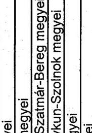

aláírás

---

|  Területi | Végrehajtás alá | Végrehajtási |  |  | Törölt hátralék |  |  | Összesen  |
| --- | --- | --- | --- | --- | --- | --- | --- | --- |
|  szervezetek/igazgatóságok | vont hátralék | eljárások lefolyt. | Méltányosságból | Behajthatatlanság | Cégtörlés miatt | Elévülés címén |  |   |
|  Eszak-budapesti | 69.178.227 | 31.413.710 | -723.434 | -343.899 | -1.293.856 | -2.321.475 | -4.682.664 |   |
|  Kelet-budapesti | 63.171.808 | 19.803.334 | -886.601 | -1.403.469 | -1.552.776 | -2.751.070 | -6.593.916 |   |
|  Dél-budapesti | 51.621.689 | 18.257.193 | -356.349 | -51.874 | -97.396 | -2.694.338 | -3.199.957 |   |
|  KAIG | 251.526 | 4.664.786 | -118.312 |  |  |  | -118.312 |   |
|  Főv. ig összesen | 184.223.249 | 74.139.022 | -2.084.696 | -1.799.242 | -2.944.028 | -7.766.883 | -14.594.849 |   |
|  Baranya megyei | 6.234.614 | 5.612.949 | -65.472 | -410.428 | -69.633 | -507.867 | -1.053.400 |   |
|  Bács-Kiskun megyei | 13.943.218 | 7.693.140 | -546.600 | -946.828 | -40.035 | -353.867 | -1.887.330 |   |
|  Békés megyei | 7.621.074 | 4.877.324 | -256.172 | -1.492.869 | -144.276 | -999.322 | -2.892.639 |   |
|  Borsod-Abaúj-Zemplén megyei | 9.823.083 | 8.077.926 | -347.489 | -661.620 | -320.106 | -857.916 | -2.187.131 |   |
|  Csongrád megyei | 9.746.080 | 6.518.375 | -539.644 | -386.534 | -36.723 | -674.382 | -1.637.283 |   |
|  Fejér megyei | 14.028.428 | 6.858.818 | -607.911 | -734.838 | -450.093 | -230.890 | -2.023.732 |   |
|  Győr-Moson-Sopron megyei | 9.931.042 | 6.449.728 | -115.396 | -131.143 |  | -342.095 | -588.634 |   |
|  Hajdú-Bihar megyei | 7.858.798 | 7.296.750 | -296.220 | -546.344 | -7.623 | -541.194 | -1.391.381 |   |
|  Heves megyei | 4.825.250 | 3.995.446 | -175.632 | -472.007 | -560 | -170.639 | -818.838 |   |
|  Kornárom-Esztergom megyei | 10.399.465 | 6.919.826 | -378.511 | -460.323 | -38.371 | -929.480 | -1.806.685 |   |
|  Nógrád megyei | 3.769.172 | 3.001.219 | -108.831 | -191.545 |  | -137.179 | -437.555 |   |
|  Pest megyei | 42.617.566 | 14.797.136 | -1.063.952 | -329.505 | -224.758 | -1.198.381 | -2.616.596 |   |
|  Somogy megyei | 9.719.174 | 5.388.164 | -63.729 | -4.095.297 |  | -541.025 | -4.700.051 |   |
|  Szabolcs-Szatmár-Bereg megyei | 10.775.893 | 6.216.232 | -319.481 | -620.752 | -71.018 | -1.190.285 | -2.201.536 |   |
|  Jász-Nagykun-Szolnok megyei | 6.208.210 | 4.947.818 | -100.784 | -1.739.081 | -81.113 | -389.782 | -2.310.760 |   |
|  Tolna megyei | 3.865.854 | 2.931.428 | -143.237 | -163.826 | -1.765 | -391.456 | -700.284 |   |
|  Viss megyei | 3.185.219 | 4.049.032 | -105.260 | -117.386 | -31 | -171.859 | -394.536 |   |
|  Veszprém megyei | 6.152.227 | 5.471.504 | -242.503 | -260.639 | -253.802 | -611.837 | -1.368.781 |   |
|  Zala megyei | 4.877.802 | 4.579.249 | -36.861 | -372.525 | -98 | -550.415 | -959.899 |   |
|  Megyei ig. összesen | 185.582.167 | 115.682.065 | -5.513.685 | -14.133.490 | -1.740.005 | -10.789.871 | -32.177.051 |   |
|  Országos összesen | 369.805.417 | 189.821.087 | -7.598.381 | -15.932.732 | -4.684.033 | -18.556.754 | -46.771.900 |   |

Fenti adatok hitelességét igazolom.

Kelt: Budapest, 2005. X. 182.

P.H.

alárás

---

tanúsítvány a végrehajtás alá vont hátralékok és a hátraléktörlések alakulásáról 2005

9/f sz. tanúsítvány a V-17-34/2005-2006. sz. jelentéshez

(adatok E Ft-ban)

|  Területi szervezetek/igazgatóságok | Végrehajtás alá vont hátralék előző év végén | Végrehajtási eljárások lefolyt. után befolyt hátr. | Méltányosságból | Behajthatatlanság miatt | Összesen  |
| --- | --- | --- | --- | --- | --- |
|  Eszak-budapesti | 68 474 436 | 32 037 464 | -1 255 661 | -2 549 519 | -561 525  |
|  Kelet-budapesti | 75 334 052 | 23 136 849 | -1 061 686 | -1 544 462 | -668 848  |
|  Dél-budapesti | 51 295 180 | 18 321 158 | -998 530 | -642 396 | -364 174  |
|  KAIG | 456 603 | 6 387 493 | -153 479 |  |   |
|  Főv. ig összesen | 195 560 271 | 79 882 964 | -3 469 356 | -4 736 377 | -1 594 547  |
|  Saranya megyei | 6 779 598 | 5 592 641 | -79 121 | -1 569 489 | -100 803  |
|  Bács-Kiskun megyei | 12 845 459 | 7 667 266 | -370 859 | -740 234 | -521 049  |
|  Békés megyei | 8 289 710 | 7 118 678 | -249 322 | -963 395 | -129 445  |
|  Borsod-Abaúj-Zemplén megyei | 10 406 420 | 8 466 357 | -302 077 | -1 569 431 | -135 762  |
|  Csongrád megyei | 9 085 497 | 6 697 158 | -244 818 | -1 554 183 | -55 185  |
|  Fejér megyei | 14 137 074 | 6 486 471 | -748 680 | -457 292 | -472 670  |
|  Győr-Moson-Sopron megyei | 5 131 574 | 6 597 621 | -197 080 | 825 424 | -28 189  |
|  Hajdú-Bihar megyei | 7 215 876 | 7 928 740 | -255 568 | -448 840 | -58 238  |
|  Heves megyei | 5 630 309 | 4 377 276 | -179 634 | -601 914 | -6 696  |
|  Komárom-Esztergom megyei | 10 089 721 | 9 200 688 | -167 740 | -817 538 | -147 357  |
|  Nógrád megyei | 3 852 233 | 2 655 110 | -83 237 | -570 973 |   |
|  Pest megyei | 43 364 302 | 16 609 716 | -1 856 318 | -1 627 621 | -393 783  |
|  Somogy megyei | 6 978 794 | 5 126 240 | -83 882 | -963 204 |   |
|  Szabolcs-Szatmár-Bereg megyei | 11 212 720 | 6 470 225 | -282 379 | -972 827 | -21 112  |
|  Jász-Nagykun-Szolnok megyei | 6 530 176 | 5 518 026 | -146 407 | -1 032 463 | -88 306  |
|  Tolna megyei | 4 055 916 | 3 456 810 | -195 350 | -728 654 | -386 156  |
|  Vas megyei | 4 343 097 | 3 881 616 | -150 287 | -189 735 | -4 821  |
|  Veszprém megyei | 6 191 531 | 5 789 139 | -233 765 | -734 414 | -877  |
|  Zala megyei | 5 063 075 | 4 730 100 | -47 516 | -743 963 | -1 788  |
|  Megyei ig. összesen | 181 203 082 | 124 269 878 | -5 674 038 | -15 460 746 | -2 552 237  |
|  Országos összesen | 376 763 353 | 204 252 842 | -9 343 394 | -20 197 123 | -4 146 784  |

Fenti adatok hitelességét igazolom.

Kelt: Budapest, 2006. Május

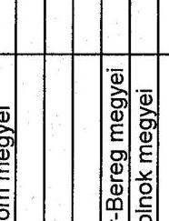

alárás

---

Tanúsítvány a külső megkeresésre folytatott végrehajtási eljárások alakulásáról 2000 a V-17-34/2005-2006. sz. jelentéshez

|  Területi szervezetek/igazgatóságok | Végrehajtás alá vont adózók száma | Külső megkeresésre folytatott végrehajtási eljárások száma | Végrehajtással érintett adótartozás | Külső megkeresésre folytatott végrehajtási eljárások összege  |
| --- | --- | --- | --- | --- |
|   | db | db | E Ft | E Ft  |
|  Eszak-budapesti | 4.890 | 178 | 51.427.174 | 426.268  |
|  Kelet-budapesti | 7.349 | 274 | 49.327.600 | 729.176  |
|  Dél-budapesti | 14.882 | 332 | 43.100.218 | 784.286  |
|  KAIG | 8 | 7 | 10.340.902 | 1.000  |
|  Főv. ig összesen | 27.129 | 785 | 154.195.894 | 1.940.730  |
|  Baranya megyei | 7.516 | 140 | 6.201.831 | 1.468.192  |
|  Bács-Kiskun megyei | 5.839 | 182 | 10.873.586 | 976.898  |
|  Békés megyei | 6.314 | 87 | 9.056.086 | 106.207  |
|  Borsod-Abaúj-Zemplén megyei | 5.449 | 402 | 8.165.346 | 250.035  |
|  Csongrád megyei | 7.422 | 183 | 7.589.679 | 93.831  |
|  Fejér megyei | 2.577 | 108 | 10.625.052 | 128.974  |
|  Győr-Moson-Sopron megyei | 4.222 | 159 | 16.018.134 | 529.086  |
|  Hajdú-Bihar megyei | 8.798 | 476 | 7.618.186 | 215.785  |
|  Heves megyei | 4.299 | 164 | 5.538.366 | 62.552  |
|  Komárom-Esztergom megyei | 5.372 | 37 | 6.717.413 | 30.406  |
|  Nögrád megyei | 3.750 | 92 | 5.848.805 | 62.930  |
|  Pest megyei | 5.352 | 255 | 25.385.827 | 133.290  |
|  Somogy megyei | 5.678 | 161 | 7.980.246 | 491.516  |
|  Szabolcs-Szatmár-Bereg megyei | 6.399 | 391 | 9.476.323 | 800.945  |
|  Jász-Nagykun-Szolnok megyei | 3.443 | 118 | 4.646.447 | 136.603  |
|  Tolna megyei | 3.454 | 80 | 2.830.406 | 75.542  |
|  Vas megyei | 1.760 | 61 | 2.880.532 | 126.729  |
|  Veszprém megyei | 5.462 | 188 | 5.514.728 | 166.850  |
|  Zala megyei | 6.502 | 133 | 4.680.460 | 61.985  |
|  Megyei ig. összesen | 99.608 | 3.417 | 157.647.453 | 5.918.356  |
|  Országos összesen | 126.737 | 4.502 | 311.843.347 | 7.859.086  |

Fenti adatok hitelességét igazolom.

Kelt: Budapest, 2005. X. M.

---

Tanúsítvány a külső megkeresésre folytatott végrehajtási eljárások alakulásáról 2001 a V-17-34/2005-2006. sz. jelentéshez

|  Területi szervezetek/igazgatóságok | Végrehajtás alá vont adózók száma | Külső megkeresésre folytatott végrehajtási eljárások száma | Végrehajtással érintett adótartozás | Külső megkeresésre folytatott végrehajtási eljárások összege  |
| --- | --- | --- | --- | --- |
|   | db | db | E Ft | E Ft  |
|  Eszak-budapesti | 7.007 | 356 | 47.785.139 | 578.313  |
|  Kelet-budapesti | 11.612 | 727 | 57.223.006 | 847.903  |
|  Dél-budapesti | 16.866 | 626 | 44.914.756 | 532.567  |
|  KAIG | 4 | 0 | 1.987.374 | 0  |
|  Főv, íg összesen | 35.489 | 1.709 | 151.910.274 | 1.950.753  |
|  Baranya megyei | 5.776 | 260 | 5.466.248 | 101.348  |
|  Bács-Kiskun megyei | 6.806 | 531 | 11.228.523 | 1.087.172  |
|  Békés megyei | 7.867 | 227 | 7.396.217 | 113.941  |
|  Borsod-Abaúj-Zemplén megyei | 7.136 | 1.038 | 7.797.555 | 147.201  |
|  Csongrád megyei | 7.435 | 660 | 7.835.547 | 2.362.472  |
|  Fejér megyei | 2.811 | 136 | 8.803.316 | 117.654  |
|  Győr-Moson-Sopron megyei | 3.379 | 225 | 6.537.357 | 539.751  |
|  Hajdú-Bihar megyei | 10.853 | 1.228 | 8.743.820 | 355.515  |
|  Heves megyei | 4.014 | 194 | 4.390.537 | 44.857  |
|  Komárom-Esztergom megyei | 6.898 | 45 | 13.254.733 | 17.833  |
|  Nógrád megyei | 4117 | 382 | 5.827.581 | 151.500  |
|  Pest megyei | 11.559 | 519 | 33.017.927 | 121.087  |
|  Somogy megyei | 6.115 | 421 | 8.316.780 | 504.344  |
|  Szabolcs-Szatmár-Bereg megyei | 7.610 | 1.517 | 9.192.131 | 708.314  |
|  Jász-Nagykun-Szolnok megyei | 3.984 | 227 | 5.414.575 | 149.961  |
|  Tolna megyei | 3.343 | 225 | 5.441.428 | 81.849  |
|  Vas megyei | 2.703 | 127 | 2.988.117 | 135.785  |
|  Veszprém megyei | 4.915 | 308 | 4.987.667 | 61.836  |
|  Zala megyei | 5.474 | 251 | 3.862.846 | 47.425  |
|  Megyei ig. összesen | 112.795 | 8.521 | 158.502.906 | 6.849.845  |
|  Országos összesen | 148.284 | 10.230 | 310.413.180 | 8.808.628  |

Fenti adatok hitelességét igazolom.

Kelt: Budapest, 2005. X. M.

---

Tanúsítvány a külső megkeresésre folytatott végrehajtási eljárások alakulásáról 2002 a V-17-34/2005-2006. sz. jelentéshez

|  Területi szervezetek/igazgatóságok | Végrehajtás alá vont adózók száma | Külső megkeresésre folytatott végrehajtási eljárások száma | Végrehajtással érintett adótartozás | Külső megkeresésre folytatott végrehajtási eljárások összege  |
| --- | --- | --- | --- | --- |
|   | db | db | E Ft | E Ft  |
|  Eszak-budapesti | 10.081 | 1.161 | 56.371.370 | 1.305.679  |
|  Kelet-budapesti | 15.899 | 1.609 | 62.923.099 | 803.009  |
|  Dél-budapesti | 20.912 | 1.617 | 46.090.109 | 943.118  |
|  KAIG | 4 | 1 | 1.569.527 | 33  |
|  Főv. ig összesen | 46.896 | 4.388 | 166.964.105 | 3.051.839  |
|  Baranya megyei | 5.689 | 657 | 6.026.354 | 131.807  |
|  Bács-Kiskun megyei | 8.382 | 1.172 | 11.905.996 | 2.027.135  |
|  Békés megyei | 7.793 | 594 | 7.944.956 | 229.315  |
|  Borsod-Abaúj-Zemplén megyei | 10.056 | 1.877 | 9.477.483 | 319.218  |
|  Csongrád megyei | 6.446 | 934 | 8.929.569 | 2.548.816  |
|  Fejér megyei | 3.646 | 407 | 10.077.640 | 67.791  |
|  Győr-Moson-Sopron megyei | 2.545 | 427 | 7.819.883 | 7.243.983  |
|  Hajdú-Bihar megyei | 7.812 | 879 | 7.424.194 | 225.550  |
|  Heves megyei | 4.464 | 469 | 4.142.659 | 91.648  |
|  Komárom-Esztergom megyei | 7.341 | 440 | 12.860.773 | 139.304  |
|  Nógrád megyei | 2.919 | 448 | 5.782.379 | 156.738  |
|  Pest megyei | 17.378 | 1.472 | 35.276.982 | 598.280  |
|  Somogy megyei | 6.528 | 780 | 7.553.708 | 254.422  |
|  Szabolcs-Szatmár-Bereg megyei | 7.836 | 1.767 | 17.690.953 | 1.101.428  |
|  Jász-Nagykun-Szolnok megyei | 4.782 | 490 | 5.867.494 | 104.115  |
|  Tolna megyei | 3.284 | 288 | 3.578.127 | 258.736  |
|  Vas megyei | 3.019 | 323 | 3.131.383 | 46.492  |
|  Veszprém megyei | 5.308 | 535 | 4.953.048 | 124.926  |
|  Zala megyei | 6.922 | 477 | 4.393.212 | 59.300  |
|  Megyei ig. összesen | 122.150 | 14.436 | 174.836.791 | 15.729.004  |
|  Országos összesen | 169.046 | 18.824 | 341.790.896 | 18.780.843  |

Fenti adatok hitelességét igazolom.

Kelt: Budapest, 2005. X 14.

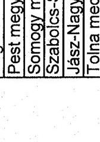

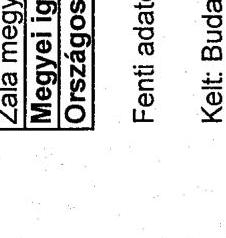

---

tanúsítvány a külső megkeresésre folytatott végrehajtási eljárások alakulásáról 2003

|  Területi szervezetek/igazgatóságok | Végrehajtás alá vont adózók száma | Külső megkeresésre folytatott végrehajtási eljárások száma | Végrehajtással érintett adótartozás | Külső megkeresésre folytatott végrehajtási eljárások összege  |
| --- | --- | --- | --- | --- |
|   | db | db | E Ft | E Ft  |
|  Eszak-budapesti | 10.017 | 1.678 | 69.178.227 | 1.258.400  |
|  Kelet-budapesti | 17.206 | 2.149 | 63.171.808 | 1.410.475  |
|  Dél-budapesti | 23.805 | 1.856 | 51.621.689 | 952.100  |
|  KAIG | 617 | 0 | 251.526 | 0  |
|  Főv. ig összesen | 51.645 | 5.683 | 184.223.249 | 3.620.975  |
|  Baranya megyei | 5.756 | 1.091 | 6.234.614 | 169.245  |
|  Bács-Kiskun megyei | 9.070 | 1.342 | 13.943.218 | 1.569.508  |
|  Békés megyei | 6.486 | 764 | 7.621.074 | 274.998  |
|  Borsod-Abaúj-Zemplén megyei | 9.972 | 2.134 | 9.823.083 | 244.538  |
|  Csongrád megyei | 7.982 | 1.099 | 9.746.080 | 1.869.220  |
|  Fejér megyei | 4.352 | 675 | 14.028.428 | 94.656  |
|  Győr-Moson-Sopron megyei | 2.482 | 480 | 9.931.042 | 371.195  |
|  Hajdú-Bihar megyei | 8.943 | 1.552 | 7.858.798 | 456.402  |
|  Heves megyei | 4.547 | 762 | 4.825.250 | 509.972  |
|  Komárom-Esztergom megyei | 5.532 | 640 | 10.399.465 | 403.412  |
|  Nógrád megyei | 3.068 | 668 | 3.769.172 | 102.583  |
|  Pest megyei | 19.936 | 1.869 | 42.617.566 | 1.054.885  |
|  Somogy megyei | 5.335 | 875 | 9.719.174 | 8.465.586  |
|  Szabolcs-Szatmár-Bereg megyei | 7.577 | 2.110 | 10.775.893 | 1.332.684  |
|  Jász-Nagykun-Szolnok megyei | 4.982 | 867 | 6.208.210 | 206.324  |
|  Tolna megyei | 3.574 | 619 | 3.865.854 | 150.675  |
|  Vas megyei | 2.925 | 416 | 3.185.219 | 46.904  |
|  Veszprém megyei | 5.296 | 782 | 6.152.227 | 106.664  |
|  Zala megyei | 7.134 | 740 | 4.877.802 | 62.397  |
|  Megyei ig. összesen | 124.949 | 19.485 | 185.582.167 | 17.491.848  |
|  Országos összesen | 176.594 | 25.168 | 369.805.417 | 21.112.823  |

Fenti adatok hitelességét igazolom.

Kelt: Budapest, 2005. X. 112.

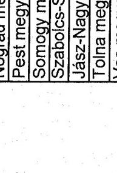

---

Tanúsítvány a külső megkeresésre folytatott végrehajtási eljárások alakulásáról 2004

|  Területi szervezetek/igazgatóságok | Végrehajtás alá vont adózók száma | Külső megkeresésre folytatott végrehajtási eljárások száma | Végrehajtással érintett adótartozás | Külső megkeresésre folytatott végrehajtási eljárások összege  |
| --- | --- | --- | --- | --- |
|   | db | db | E Ft | E Ft  |
|  Eszak-budapesti | 14.391 | 2.896 | 68.474.436 | 2.480.504  |
|  Kelet-budapesti | 19.954 | 3.336 | 75.334.052 | 1.316.706  |
|  Dél-budapesti | 24.284 | 2.791 | 51.295.180 | 892.158  |
|  KAIG | 0 | 0 | 456.603 |   |
|  Főv. ig összesen | 58.638 | 9.023 | 195.560.271 | 4.689.368  |
|  Baranya megyei | 6.057 | 1.564 | 6.779.598 | 229.845  |
|  Bács-Kiskun megyei | 8.804 | 2.002 | 12.845.459 | 1.844.896  |
|  Békés megyei | 6.354 | 1.137 | 8.289.710 | 313.440  |
|  Borsod-Abaúj-Zemplén megyei | 11.298 | 2.846 | 10.406.420 | 431.435  |
|  Csongrád megyei | 8.245 | 1.608 | 9.085.497 | 1.555.196  |
|  Fejér megyei | 5.857 | 1.452 | 14.137.074 | 178.942  |
|  Győr-Moson-Sopron megyei | 3.395 | 860 | 5.131.574 | 500.100  |
|  Hajdú-Bihar megyei | 9.822 | 2.182 | 7.215.876 | 517.358  |
|  Heves megyei | 5.152 | 1.151 | 5.630.309 | 187.894  |
|  Komárom-Esztergom megyei | 5.553 | 1.390 | 10.089.721 | 179.950  |
|  Nógrád megyei | 3.442 | 794 | 3.852.233 | 145.434  |
|  Pest megyei | 20.509 | 3.459 | 43.364.302 | 964.724  |
|  Somogy megyei | 5.629 | 1.329 | 6.978.794 | 143.061  |
|  Szabolcs-Szatmár-Bereg megyei | 7.966 | 2.866 | 11.212.720 | 1.934.575  |
|  Jász-Nagykun-Szolnok megyei | 5.227 | 1.222 | 6.530.176 | 201.303  |
|  Tolna megyei | 3.848 | 1.105 | 4.055.916 | 105.554  |
|  Vas megyei | 3.012 | 748 | 4.343.097 | 96.430  |
|  Veszprém megyei | 6.023 | 1.285 | 6.191.531 | 161.042  |
|  Zala megyei | 7.194 | 1.183 | 5.063.075 | 108.094  |
|  Megyei ig. összesen | 133.387 | 30.183 | 181.203.082 | 9.799.273  |
|  Országos összesen | 192.025 | 39.206 | 376.763.353 | 14.488.641  |

Fenti adatok hitelességét igazolom.

Kelt: Budapest, 2005. X 147.

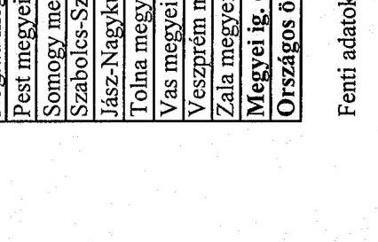

---

Tanúsítvány a külső megkeresésre folytatott végrehajtási eljárások alakulásáról 2005

|  Területi szervezetek/igazgatóságok | Végrehajtás alá vont adózók száma | Külső megkeresésre folytatott végrehajtási eljárások száma | Végrehajtással érintett adótartozás | Külső megkeresésre folytatott végrehajtási eljárások összege  |
| --- | --- | --- | --- | --- |
|   | db | db | E Ft | E Ft  |
|  Eszak-budapesti | 14 860 | 3 184 | 78 291 951 | 2 610 911  |
|  Kelet-budapesti | 21 304 | 3 733 | 90 417 798 | 2 142 849  |
|  Dél-budapesti | 24 546 | 3 540 | 54 339 672 | 1 471 658  |
|  KAIG | 5 | 1 | 1 423 280 | 5 015  |
|  Főv. ig összesen | 60 715 | 10 458 | 224 472 702 | 6 230 433  |
|  Baranya megyei | 5 464 | 1 652 | 7 082 902 | 300 153  |
|  Báca-Kiskun megyei | 7 748 | 1 685 | 13 564 553 | 1 657 386  |
|  Békés megyei | 5 730 | 1 147 | 8 271 753 | 520 523  |
|  Bornod-Abaúj-Zemplén megyei | 11 466 | 2 454 | 11 621 218 | 1 383 925  |
|  Csongrád megyei | 7 686 | 2 061 | 9 730 093 | 2 377 009  |
|  Fejér megyei | 6 510 | 1 432 | 15 567 464 | 521 691  |
|  Győr-Moson-Sopron megyei | 3 479 | 939 | 4 682 058 | 3 908 813  |
|  Hajdú-Bihar megyei | 9 569 | 2 580 | 7 218 485 | 693 375  |
|  Heves megyei | 5 418 | 1 010 | 6 452 062 | 20 715 710  |
|  Komárom-Esztergom megyei | 6 063 | 1 411 | 12 304 150 | 497 316  |
|  Nógrád megyei | 3 579 | 942 | 4 032 985 | 723 164  |
|  Pest megyei | 21 317 | 4 185 | 51 909 685 | 1 571 428  |
|  Somogy megyei | 5 331 | 1 300 | 7 150 812 | 344 862  |
|  Szabolcs-Szatmár-Bereg megyei | 7 867 | 3 050 | 13 273 399 | 2 306 646  |
|  Jász-Nagykun-Szolnok megyei | 5 291 | 971 | 6 781 375 | 381 902  |
|  Tolna megyei | 4 100 | 1 150 | 5 824 903 | 498 972  |
|  Vas megyei | 2 840 | 677 | 4 856 536 | 163 009  |
|  Veszprém megyei | 6 422 | 1 264 | 7 014 984 | 539 083  |
|  Zala megyei | 7 263 | 1 396 | 5 972 529 | 405 551  |
|  Megyei ig. összesen | 133 143 | 31 306 | 203 311 941 | 39 510 518  |
|  Országos összesen | 193 858 | 41 764 | 427 784 642 | 45 740 951  |

Fenti adatok hitelességét igazolom.

Kelt: Budapest, 2006. Május 15.

---

Tanúsítvány a fizetési kedvezmények alakulásáról 2000-2005

1. sz. tanúsítvány a V-17-34/2005-2006. sz. jelentéshez

|  Időszak/év | Fizetési kedvezményekre irányuló kérelmek száma és összege |  |  |  |  |  |  |   |
| --- | --- | --- | --- | --- | --- | --- | --- | --- |
|   | Fizetés könnyítési |  | Mérséklési |  | Vegyes | Hiányos | Összesen |   |
|   | db | E Ft | db | E Ft | db | db | db | E Ft  |
|  2000 | 42 199 | 112 664 030 | 36 914 | 21 028 877 | 27 490 | 30 561 | 137 164 | 133 692 907  |
|  2001 | 44 377 | 132 909 821 | 33 392 | 22 951 768 | 28 114 | 28 026 | 133 909 | 155 861 589  |
|  2002 | 50 295 | 142 672 502 | 33 691 | 21 331 910 | 30 734 | 23 294 | 138 014 | 164 004 412  |
|  2003 | 56 829 | 155 728 503 | 27 290 | 20 449 818 | 27 999 | 28 788 | 140 906 | 176 178 321  |
|  2004 | 67 929 | 288 747 829 | 30 689 | 25 051 761 | 32 358 | 27 599 | 158 575 | 313 799 590  |
|  2005 | 64 354 | 216 474 725 | 31 437 | 27 072 711 | 30 681 | 26 647 | 153 119 | 243 547 436  |
|  Összesen: | 325 983 | 1 049 197 410 | 193 413 | 137 886 845 | 177 376 | 164 915 | 861 687 | 1 187 084 255  |

Fenti adatok hitelességét igazolom.

Kelt: Budapest, 2006. Május

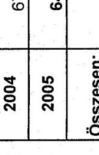

---

tanúsítvány a V-17-34/2005-2006. sz. jelentéshez a követelések engedményezéséről a 2001. év végéig KÖZZÉTETT eljárások

|  (adatok E Ft-ban) |  |  |  |  |   |
| --- | --- | --- | --- | --- | --- |
|  Sorsz. | Engedményezett megnevezése | 2001. év végéig KÖZZÉTETT összes eljárás db | Átadott tőke tartozás összege
E Ft | Megtérülés összege
E Ft | Megtérülés $\%$ a  |
|  1 | MKK Rt. | 22.006 | 352.129 .276 | 6.885 .017 |   |
|   |  |  |  | 116.085 |   |
|  összesen |  |  |  | 7.001 .102 | $1,99 \%$  |
|  |   |   |   |   |   |
|  |   |   |   |   |   |

- A megtérülés összegébe beleszámítottuk a 116.085 ezer Ft -utólsó részletet-, melyet az MKK Rt. 2005. decemberében utal át a csatolt felosztás szerint.

Fenti adatok hitelességét igazolom. Kelt: Budapest, 2005. K/27. alárás

---

tanúsítvány a követelések pályáztatással történő engedményezéséről 2002.-2003. I. negyedév végéig közzétett eljárásokban

tanúsítvány a V-17-34/2005-2006. sz. jelentéshez

|  Év | Engedményezatt megnevezése | A csomagban lévő cégek száma db | Szerződéskötés dátuma | Átadott tőke tartozás | Átadott tartozás összesen | Megtérülés összege | Megtérülés %-a  |
| --- | --- | --- | --- | --- | --- | --- | --- |
|   |  |  |  | E Ft | E Ft | E Ft |   |
|  2002. | MKK Rt | 444 | 2003.09.05 | 5.445.355 | 9.086.272 | 111.000 | 2,0  |
|  I. n.év |  |  |  |  |  |  |   |
|  2002. | OTP Faktoring Rt. | 361 | 2004.03.19 | 6.562.228 | 11.353.161 | 65.620 | 1,0  |
|  II. n.év |  |  |  |  |  |  |   |
|  2002. | MKK Rt | 271 | 2004.06.01 | 4.139.579 | 7.004.699 | 62.000 | 1,5  |
|  III. n.év |  |  |  |  |  |  |   |
|  2002. | MKK Rt | 296 | 2004.11.09 | 8.048.928 | 14.226.586 | 80.490 | 1,0  |
|  IV. n.év |  |  |  |  |  |  |   |
|  2003. | Hungaroholding Rt. | 269 | 2005.01.24 | 6.406.732 | 10.112.068 | 64.070 | 1,0  |
|  I. n.év |  |  |  |  |  |  |   |

Fenti adatok hitelességét igazolom.

Kelt: Budapest, 2005. X... 14.14.

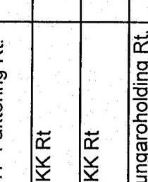

aláírás

---

14/a sz. tanúsítvány a V-17-34/2005-2006. sz. jelentéshez

|  Megnevezés | 2000. év |  |  |  | 2001. év |  |  |  | 2002. év |  |   |
| --- | --- | --- | --- | --- | --- | --- | --- | --- | --- | --- | --- |
|   | benyújtott költségvetés | jóváhagyott eredeti előirányzat | módosított előirányzat | teljesítés | benyújtott költségvetés | jóváhagyott eredeti előirányzat | módosított előirányzat | teljesítés | benyújtott költségvetés | jóváhagyott eredeti előirányzat | módosított előirányzat  |
|  Költségvetési támogatás | 63 277,6 | 55 297,2 | 55 798,1 | 64 883,1 | 59 994,7 | 58 146,1 | 63 810,1 | 72 976,3 | 62 668,4 | 59 254,0 | 70 169,5  |
|  Intézményi bevétel | 212,3 | 212,3 | 5 175,1 | 5 860,6 | 223,0 | 223,0 | 10 972,4 | 12 138,3 | 234,0 | 231,9 | 13 329,5  |
|  Bevételek összesen | 63 489,9 | 55 509,5 | 60 973,2 | 70 743,7 | 60 217,7 | 58 369,1 | 74 782,5 | 85 114,6 | 62 902,4 | 59 485,9 | 83 499,0  |
|  Személyi juttatások | 26 804,0 | 22 677,8 | 23 957,4 | 27 506,3 | 25 369,0 | 24 813,0 | 31 607,4 | 34 022,7 | 27 212,2 | 26 197,6 | 38 677,1  |
|  Munkaadókat terhelő járulékok | 9 958,8 | 8 473,4 | 10 100,8 | 10 083,0 | 8 795,6 | 8 669,1 | 12 373,0 | 12 775,6 | 8 665,3 | 8 401,3 | 13 189,8  |
|  Dologi és egyéb folyó kiadások | 14 361,5 | 13 712,7 | 13 704,3 | 12 389,2 | 15 397,5 | 14 731,4 | 15 323,5 | 14 630,3 | 16 369,3 | 14 731,4 | 16 001,4  |
|  Egyéb működési célú támogatások | 5,1 | 5,1 | 483,1 | 475,1 | 5,1 | 5,1 | 516,1 | 530,1 | 5,1 | 5,1 | 506,8  |
|  Egyéb felhalmozási kiadások (köksönök) | 40,0 | 40,0 | 174,3 | 210,3 | 50,0 | 50,0 | 480,0 | 444,7 | 50,0 | 50,0 | 112,0  |
|  Felújítás | 2 422,5 | 1 422,5 | 1 422,5 | 688,4 | 1 422,5 | 1 422,5 | 3 283,5 | 2 787,1 | 1 422,5 | 1 422,5 | 1 987,4  |
|  Intézményi beruházás | 9 898,0 | 9 178,0 | 10 116,0 | 8 120,7 | 9 178,0 | 8 678,0 | 9 956,6 | 7 237,9 | 9 178,0 | 8 678,0 | 11 399,5  |
|  Köksönök |  |  | 17,9 | 61,2 |  |  | 108,9 | 117,0 |  |  | 78,1  |
|  Központi beruházás |  |  | 978,1 | 978,1 |  |  | 1 120,4 | 1 120,4 |  |  | 1 546,9  |
|  Alap- és vállalkozási tevékenység közötti elszámolás |  |  | 18,8 | 45,4 |  |  | 13,1 | 13,1 |  |  |   |
|  Kiadások összesen | 63 489,9 | 55 509,5 | 60 973,2 | 60 557,7 | 60 217,7 | 58 369,1 | 74 782,5 | 73 678,9 | 62 902,4 | 59 485,9 | 83 499,0  |
|  Létszám (IS) | 13 675 | 13 675 | 13 649 | 13 008 | 13 745 | 13 665 | 13 665 | 13 065 | 13 745 | 13 665 | 13 642  |

---

adatok millió forintban

|  Megnevezés | 2003. év |  |  |  | 2004. év |  |  |  | 2005. év |   |
| --- | --- | --- | --- | --- | --- | --- | --- | --- | --- | --- |
|   | benyújtott költségvetés | jóváha- gyott eredeti előirány- zat | módosított előirány- zat | teljesítés | benyújtott költségvetés | jóváha- gyott eredeti előirány- zat | módosított előirány- zat | teljesítés | benyújtott költségvetés | jóváha- gyott eredeti előirány- zat  |
|  Költségvetési támogatás | 73 753,2 | 60 295,5 | 62 608,6 | 71 571,4 | 71 969,1 | 55 885,5 | 61 936,0 | 63 728,6 | 61 390,9 | 57 584,6  |
|  Intézményi bevétel * | 243,5 | 243,5 | 11 767,5 | 11 403,8 | 258,0 | 268,9 | 8 769,5 | 8 824,6 | 268,9 | 279,1  |
|  Bevételek összesen | 73 996,7* | 60 539,0 | 74 376,1 | 82 975,2 | 72 227,1 | 56 154,4 | 70 705,5 | 72 553,2 | 61 659,8 | 57 863,7  |
|  Személyi juttatások | 35 445,2 | 32 949,7 | 39 439,1 | 42 984,2 | 35 130,7 | 32 467,5 | 38 312,5 | 39 420,7 | 35 425,8 | 33 847,5  |
|  Munkaadókat terhelő járulékok | 11 623,3 | 10 593,4 | 13 837,0 | 14 113,8 | 11 450,5 | 10 193,4 | 13 370,0 | 13 166,2 | 11 298,3 | 10 635,1  |
|  Dologi és egyéb folyó kiadások | 16 772,6 | 13 940,8 | 14 971,4 | 14 635,8 | 15 016,8 | 10 438,4 | 13 323,2 | 13 038,9 | 11 900,6 | 11 046,0  |
|  Egyéb működési célú támogatások | 5,1 | 5,1 | 66,2 | 26,1 | 5,1 | 5,1 | 99,2 | 67,2 | 5,1 | 5,1  |
|  Egyéb felhalmozási kiadások (kölcsönök) |  |  | 14,4 | 11,4 |  |  | 17,0 | 17,0 |  |   |
|  Felsjítás | 2 200,0 | 1 000,0 | 1 761,8 | 1 274,7 | 2 400,0 | 1 000,0 | 797,2 | 682,7 | 1 600,0 |   |
|  Intézményi beruházás | 7 900,5 | 2 000,0 | 4 109,9 | 3 277,8 | 8 174,0 | 2 000,0 | 2 590,1 | 2 551,3 | 1 400,0 | 2 300,0  |
|  Kölcsönök | 50,0 | 50,0 | 63,2 | 59,6 | 50,0 | 50,0 | 60,8 | 63,9 | 30,0 | 30,0  |
|  Központi beruházás |  |  | 113,1 | 113,1 |  |  | 2 135,5 | 2 135,5 |  |   |
|  Alap- és vállalkozási tevékenység közötti elszámolás |  |  |  |  |  |  |  |  |  |   |
|  Kiadások összesen | 73 996,7* | 60 539,0 | 74 376,1 | 76 496,5 | 72 227,1 | 56 154,4 | 70 705,5 | 71 143,4 | 61 659,8 | 57 863,7  |
|  Létszám (fő) | 13 642* | 13 221 | 13 221 | 12 822 | 13 242,5 | 12 121,0 | 12 141 | 11 934 | 11 961 | 11 962  |

- a benyújtott költségvetés tartalmazza a Bűnügyi Igazgatóság adatok kiadás, támogatási előirányzat: 2 773,5 MFt, létszám: 421 fő

A fenti adatok hitelességét igazolom.

Budapest, 2005. október 2006.

---

# TANÚSÍTVÁNY 

az Adó- és Pénzügyi Ellenőrzési Hivatal költségvetési előirányzatairól és teljesítéséről 2005. évben

adatok millió forintban

| Megnevezés | 2005. év |  |  |  |
| :--: | :--: | :--: | :--: | :--: |
|  | benyújtott költségvetés | jóváhagyott eredeti elöirányzat | $\begin{aligned} & \text { módosított } \\ & \text { elöirányzat } \end{aligned}$ | teljesítés |
| Költségvetési támogatás | 61390,9 | 57584,6 | 57434,6 | 72218,6 |
| Intézményi bevétel | 268,9 | 279,1 | 3133,8 | 3117,5 |
| Bevételek összesen | 61659,8 | 57863,7 | 60568,4 | 75336,1 |
| Személyi juttatások | 35425,8 | 33847,5 | 33350,1 | 40 102,7 |
| Munkaadókat terhelő járulékok | 11298,3 | 10635,1 | 11051,8 | 13031,4 |
| Dologi és egyéb folyó kiadások | 11900,6 | 11046,0 | 12843,3 | 12615,5 |
| Egyéb müködési célú támogatások | 5,1 | 5,1 | 61,9 | 54,6 |
| Egyéb felhalmozási kiadások |  |  | 1,2 | 1,2 |
| Felújítás | 1600,0 |  | 351,7 | 206,8 |
| Intézményi beruházás | 1400,0 | 2300,0 | 2449,2 | 1749,8 |
| Kölcsönök | 30,0 | 30,0 | 44,3 | 22,0 |
| Központi beruházás |  |  | 414,9 | 414,9 |
| Kiadások összesen | 61659,8 | 57863,7 | 60568,4 | 68 198,9 |
| Létszám (fő) | 11961 | 11962 | 11962 | 11594 |

A fenti adatok hitelességét igazolom.
Budapest, 2006. március ${ }^{\text {a }}$ 22.

---

# Tanúsítvány az engedélyezett létszám szakmai területenkénti megoszlásáról 2000-2004

## Tanúsítvány a V-17-34/2005-2006. sz. jelentéshez

|  Igazgatóságok | Adóigy* |  |  |  |  |  |  |  |  |  |  |  |  |  |  |  |  |  |  |  |  |  |  |  |  |  |  |  |  |  |  |  |  |  |  |  |  |  |  |  |  |  |  |  |  |  |  |  |  |  |  |  |  |  |  |  |  |  |  |  |  |  |  |  |  |  |  |  |  |  |  |  |  |  |  |  |  |  |  |  |  |  |  |  |  |  |  |  |  |  |  |  |  |  |  |  |  |  |  |  |  |

---

Tanúsítvány az engedélyezett létszám szakmai területenkénti megoszlásáról 2000-2004

|   |  |  |  |  |  |  |  |  |  |  |  |  |  |  |  |  |  |  |  |  |  |  |  |  |  |  |  |  |  |  |  |  |  |  |  |  |  |  |  |  |  |  |  |  |  |  |  |  |  |  |  |  |  |  |  |  |  |  |  |  |  |  |  |  |  |  |  |  |  |  |  |  |  |  |  |  |  |  |  |  |  |  |  |  |  |  |  |  |  |  |  |  |  |  |  |  |  |  |  |  | 

---

# Tancisítvány a dolgozó Wiszám állományrappartok szerinti megoszlásáról 2000-2004 2000-2004

|  Tancisítvány | 16/a sz. tanúsítvány | 2000. dec. 31. | 2001. dec. 31. | 2002. dec. 31. | 2003. dec. 31. | 2004. dec. 31. | 2005. dec. 31. | 2006. dec. 31. | 2007. dec. 31. | 2008. dec. 31. | 2009. dec. 31. | 2010. dec. 31. | 2011. dec. 31. | 2012. dec. 31. | 2013. dec. 31. | 2014. dec. 31. | 2015. dec. 31. | 2016. dec. 31. | 2017. dec. 31. | 2018. dec. 31. | 2019. dec. 31. | 2020. dec. 31. | 2021. dec. 31.  |
| --- | --- | --- | --- | --- | --- | --- | --- | --- | --- | --- | --- | --- | --- | --- | --- | --- | --- | --- | --- | --- | --- | --- | --- |
|  Veszintő-budapestő Eg. |  |  |  |  |  |  |  |  |  |  |  |  |  |  |  |  |  |  |  |  |  |  |   |
|  Hozók-budapestő Eg. |  |  |  |  |  |  |  |  |  |  |  |  |  |  |  |  |  |  |  |  |  |  |   |
|  Hozók-budapestő Eg. |  |  |  |  |  |  |  |  |  |  |  |  |  |  |  |  |  |  |  |  |  |  |   |
|  Székesfehérvárn |  |  |  |  |  |  |  |  |  |  |  |  |  |  |  |  |  |  |  |  |  |  |   |
|  Székesfehérvárn |  |  |  |  |  |  |  |  |  |  |  |  |  |  |  |  |  |  |  |  |  |  |   |
|  Székesfehérvárn |  |  |  |  |  |  |  |  |  |  |  |  |  |  |  |  |  |  |  |  |  |  |   |
|  Székesfehérvárn |  |  |  |  |  |  |  |  |  |  |  |  |  |  |  |  |  |  |  |  |  |  |   |
|  Székesfehérvárn |  |  |  |  |  |  |  |  |  |  |  |  |  |  |  |  |  |  |  |  |  |  |   |
|  Székesfehérvárn |  |  |  |  |  |  |  |  |  |  |  |  |  |  |  |  |  |  |  |  |  |  |   |
|  Székesfehérvárn |  |  |  |  |  |  |  |  |  |  |  |  |  |  |  |  |  |  |  |  |  |  |   |
|  Székesfehérvárn |  |  |  |  |  |  |  |  |  |  |  |  |  |  |  |  |  |  |  |  |  |  |   |
|  Székesfehérvárn |  |  |  |  |  |  |  |  |  |  |  |  |  |  |  |  |  |  |  |  |  |  |   |
|  Székesfehérvárn |  |  |  |  |  |  |  |  |  |  |  |  |  |  |  |  |  |  |  |  |  |  |   |
|  Székesfehérvárn |  |  |  |  |  |  |  |  |  |  |  |  |  |  |  |  |  |  |  |  |  |  |   |
|  Székesfehérvárn |  |  |  |  |  |  |  |  |  |  |  |  |  |  |  |  |  |  |  |  |  |  |   |
|  Székesfehérvárn |  |  |  |  |  |  |  |  |  |  |  |  |  |  |  |  |  |  |  |  |  |  |   |
|  Székesfehérvárn |  |  |  |  |  |  |  |  |  |  |  |  |  |  |  |  |  |  |  |  |  |  |   |
|  Székesfehérvárn |  |  |  |  |  |  |  |  |  |  |  |  |  |  |  |  |  |  |  |  |  |  |   |
|  Székesfehérvárn |  |  |  |  |  |  |  |  |  |  |  |  |  |  |  |  |  |  |  |  |  |  |   |
|  Székesfehérvárn |  |  |  |  |  |  |  |  |  |  |  |  |  |  |  |  |  |  |  |  |  |  |   |
|  Székesfehérvárn |  |  |  |  |  |  |  |  |  |  |  |  |  |  |  |  |  |  |  |  |  |  |   |
|  Székesfehérvárn |  |  |  |  |  |  |  |  |  |  |  |  |  |  |  |  |  |  |  |  |  |  |   |
|  Székesfehérvárn |  |  |  |  |  |  |  |  |  |  |  |  |  |  |  |  |  |  |  |  |  |  |   |
|  Székesfehérvárn |  |  |  |  |  |  |  |  |  |  |  |  |  |  |  |  |  |  |  |  |  |  |   |
|  Székesfehérvárn |  |  |  |  |  |  |  |  |  |  |  |  |  |  |  |  |  |  |  |  |  |  |   |
|  Székesfehérvárn |  |  |  |  |  |  |  |  |  |  |  |  |  |  |  |  |  |  |  |  |  |  |   |
|  Székesfehérvárn |  |  |  |  |  |  |  |  |  |  |  |  |  |  |  |  |  |  |  |  |  |  |   |
|  Székesfehérvárn |  |  |  |  |  |  |  |  |  |  |  |  |  |  |  |  |  |  |  |  |  |  |   |
|  Székesfehérvárn |  |  |  |  |  |  |  |  |  |  |  |  |  |  |  |  |  |  |  |  |  |  |   |
|  Székesfehérvárn |  |  |  |  |  |  |  |  |  |  |  |  |  |  |  |  |  |  |  |  |  |  |   |
|  Székesfehérvárn |  |  |  |  |  |  |  |  |  |  |  |  |  |  |  |  |  |  |  |  |  |  |   |
|  Székesfehérvárn |  |  |  |  |  |  |  |  |  |  |  |  |  |  |  |  |  |  |  |  |  |  |   |
|  Székesfehérvárn |  |  |  |  |  |  |  |  |  |  |  |  |  |  |  |  |  |  |  |  |  |  |   |
|  Székesfehérvárn |  |  |  |  |  |  |  |  |  |  |  |  |  |  |  |  |  |  |  |  |  |  |   |
|  Sz

---

Tanúsítvány a dolgozó Waszám állománycsoportok szerinti megoszlásáról 2000-2004

|  |   |   |   |   |   |   |   |   |   |   |   |   |   |   |   |   |   |   |   |   |   |   |   |   |   |   |   |   |   |   |   |   |   |   |   |   |   |   |   |   |   |   |   |   |   |   |   |   |   |   |   |   |   |   |   |   |   |   |   |   |   |   |   |   |   |   |   |   |   |   |   |   |   |   |   |   |   |   |   |   |   |   |   |   |   |   |   |   |   |   |   |   |   |   |   |   |   |   |   |   |  

---

16/b sz. tanúsítvány a V-17-34/2005-2006. sz. jelentéshez a dolgozó létszám állománycsoportok szerinti megoszlásáról 2005.

|  |   |   |   |   |   |   |
| --- | --- | --- | --- | --- | --- | --- |
|  Igazgatóságok | 2005. dec.31. | 2005. dec.31. | 2005. dec.31. | 2005. dec.31. | 2005. dec.31. | 2005. dec.31.  |
|   | létszám | létszám | létszám | létszám | létszám | létszám  |
|   | tő | tő | tő | tő | tő | tő  |
|  Eszak-budapesti Ig. | 93,00 | 466,52 | 380,76 | 125,88 | 17,00 | 1083,16  |
|  Kelet-budapesti Ig. | 91,00 | 383,68 | 400,73 | 103,21 | 11,75 | 990,27  |
|  Dél-budapesti Ig. | 84,00 | 354,25 | 433,30 | 81,50 | 20,75 | 973,80  |
|  KAIG | 20,00 | 105,75 | 32,00 | 2,75 | 2,00 | 162,50  |
|  Fővárosi Ig. összesen | 288,00 | 1310,10 | 1246,78 | 313,34 | 81,50 | 3209,73  |
|  Baranya M. Ig. | 31,00 | 186,00 | 128,00 | 14,00 | 4,00 | 363,00  |
|  Bács-Kiskun M. Ig. | 37,00 | 213,88 | 174,88 | 9,00 | 9,00 | 443,76  |
|  Békés M. Ig. | 28,00 | 174,00 | 90,00 | 16,00 | 7,00 | 315,00  |
|  Borsod-A-Z. M. Ig. | 36,00 | 231,00 | 177,00 | 35,00 | 7,00 | 486,00  |
|  Csongrád M. Ig. | 30,00 | 171,00 | 168,00 | 15,80 | 14,00 | 398,80  |
|  Fejér M. Ig. | 34,00 | 137,00 | 173,00 | 26,00 | 8,00 | 378,00  |
|  Győr-M-Sopron M. Ig. | 34,00 | 199,00 | 115,00 | 24,88 | 7,13 | 380,01  |
|  Hajdú-Bihar M. Ig. | 32,00 | 210,00 | 154,00 | 30,00 | 3,00 | 429,00  |
|  Heves M. Ig. | 26,00 | 161,00 | 67,00 | 6,00 | 3,00 | 263,00  |
|  Komárom-E. M. Ig. | 27,00 | 133,00 | 119,00 | 12,00 | 5,00 | 294,00  |
|  Nógrád M. Ig. | 24,00 | 96,00 | 38,00 | 8,50 | 2,00 | 168,50  |
|  Pest M. Ig. | 76,00 | 329,00 | 363,00 | 90,00 | 17,00 | 875,00  |
|  Somogy M. Ig. | 28,00 | 138,00 | 103,00 | 25,00 | 5,00 | 299,00  |
|  Szabolcs-Sz-B. M. Ig. | 32,00 | 209,00 | 119,00 | 30,00 | 6,00 | 396,00  |
|  J.-N.-Szolnok M. Ig. | 29,00 | 162,71 | 103,00 | 25,00 | 4,00 | 313,71  |
|  Tolna M. Ig. | 24,00 | 113,00 | 69,00 | 7,00 | 4,00 | 217,00  |
|  Vas M. Ig. | 25,00 | 121,00 | 59,00 | 15,00 | 2,00 | 222,00  |
|  Veszprém M. Ig. | 27,00 | 152,00 | 112,00 | 22,00 | 4,00 | 317,00  |
|  Zala M. Ig. | 26,00 | 122,00 | 92,00 | 23,00 | 4,00 | 267,00  |
|  Megyei Ig. összesen | 606,00 | 3248,59 | 2423,88 | 434,18 | 115,13 | 6827,78  |
|  Országos összesen | 894,00 | 4558,69 | 3670,67 | 747,52 | 166,63 | 10037,51  |
|  Hivatal | 176,00 | 814,23 | 347,50 | 94,18 | 34,78 | 1438,67  |
|  SZTADI | 14,00 | 25,00 | 97,63 | 18,00 | 23,00 | 177,63  |
|  Oktatási Ig. | 3,00 | 10,90 | 2,00 |  |  | 15,90  |
|  APEH összesen: | 1087,00 | 5408,82 | 4117,80 | 829,70 | 224,39 | 11667,71  |

- Az ügykezelő osztályvezető a vezetőkrét, a fizikai csoportvezető a fizikaiaknál szerepel.

A fenti adatok hitelességét igazolom.

Budapest, 2006. május 8.

aláírás

---

17/a sz. tanúsítvány a V-17-34/2005-2006. sz. jelentéshez

|  |   |   |   |   |   |   |   |   |   |   |   |   |   |   |   |   |   |   |   |   |   |   |   |   |
| --- | --- | --- | --- | --- | --- | --- | --- | --- | --- | --- | --- | --- | --- | --- | --- | --- | --- | --- | --- | --- | --- | --- | --- | --- |
|  Tanszítvány az átlaghatók és átlagkérdezőn átkordozóni az APEH szemetelmi |  |  |  |  |  |  |  |  |  |  |  |  |  |  |  |  |  |  |  |  |  |  |  |   |
|  2005-2006 17/2005. |  |  |  |  |  |  |  |  |  |  |  |  |  |  |  |  |  |  |  |  |  |  |  |   |
|  Szigetségek |  |  |  |  |  |  |  |  |  |  |  |  |  |  |  |  |  |  |  |  |  |  |  |   |
|  Szigetségek |  |  |  |  |  |  |  |  |  |  |  |  |  |  |  |  |  |  |  |  |  |  |  |   |
|   |  |  |  |  |  |  |  |  |  |  |  |  |  |  |  |  |  |  |  |  |  |  |  |   |
|   |  |  |  |  |  |  |  |  |  |  |  |  |  |  |  |  |  |  |  |  |  |  |  |   |
|   |  |  |  |  |  |  |  |  |  |  |  |  |  |  |  |  |  |  |  |  |  |  |  |   |
|   |  |  |  |  |  |  |  |  |  |  |  |  |  |  |  |  |  |  |  |  |  |  |  |   |
|   |  |  |  |  |  |  |  |  |  |  |  |  |  |  |  |  |  |  |  |  |  |  |  |   |
|   |  |  |  |  |  |  |  |  |  |  |  |  |  |  |  |  |  |  |  |  |  |  |  |   |
|   |  |  |  |  |  |  |  |  |  |  |  |  |  |  |  |  |  |  |  |  |  |  |  |   |
|   |  |  |  |  |  |  |  |  |  |  |  |  |  |  |  |  |  |  |  |  |  |  |  |   |
|   |  |  |  |  |  |  |  |  |  |  |  |  |  |  |  |  |  |  |  |  |  |  |  |   |
|   |  |  |  |  |  |  |  |  |  |  |  |  |  |  |  |  |  |  |  |  |  |  |  |   |
|   |  |  |  |  |  |  |  |  |  |  |  |  |  |  |  |  |  |  |  |  |  |  |  |   |
|   |  |  |  |  |  |  |  |  |  |  |  |  |  |  |  |  |  |  |  |  |  |  |  |   |
|   |  |  |  |  |  |  |  |  |  |  |  |  |  |  |  |  |  |  |  |  |  |  |  |   |
|   |  |  |  |  |  |  |  |  |  |  |  |  |  |  |  |  |  |  |  |  |  |  |  |   |
|   |  |  |  |  |  |  |  |  |  |  |  |  |  |  |  |  |  |  |  |  |  |  |  |   |
|   |  |  |  |  |  |  |  |  |  |  |  |  |  |  |  |  |  |  |  |  |  |  |  |   |
|   |  |  |  |  |  |  |  |  |  |  |  |  |  |  |  |  |  |  |  |  |  |  |  |   |
|   |  |  |  |  |  |  |  |  |  |  |  |  |  |  |  |  |  |  |  |  |  |  |  |   |
|   |  |  |  |  |  |  |  |  |  |  |  |  |  |  |  |  |  |  |  |  |  |  |  |   |
|   |  |  |  |  |  |  |  |  |  |  |  |  |  |  |  |  |  |  |  |  |  |  |  |   |
|   |  |  |  |  |  |  |  |  |  |  |  |  |  |  |  |  |  |  |  |  |  |  |  |   |
|   |  |  |  |  |  |  |  |  |  |  |  |  |  |  |  |  |  |  |  |  |  |  |  |   |
|   |  |  |  |  |  |  |  |  |  |  |  |  |  |  |  |  |  |  |  |  |  |  |  |   |
|   |  |  |  |  |  |  |  |  |  |  |  |  |  |  |  |  |  |  |  |  |  |  |  |   |
|   |  |  |  |  |  |  |  |  |  |  |  |  |  |  |  |  |  |  |  |  |  |  |  |   |
|   |  |  |  |  |  |  |  |  |  |  |  |  |  |  |  |  |  |  |  |  |  |  |  |   |
|   |  |  |  |  |  |  |  |  |  |  |  |  |  |  |  |  |  |  |  |  |  |  |  |   |
|   |  |  |  |  |  |  |  |  |  |  |  |  |  |  |  |  |  |  |  |  |  |  |  |   |
|   |  |  |  |  |  |  |  |  |  |  |  |  |  |  |  |  |  |  |  |  |  |  |  |   |
|   |  |  |  |  |  |  |  |  |  |  |  |  |  |  |  |  |  |  |  |  |  |  |  |   |
|   |  |  |  |  |  |  |  |  |  |  |  |  |  |  |  |  |  |  |  |  |  |  |  |   |
|   |

---

|  |   |   |   |   |   |   |   |   |   |   |   |   |   |   |   |   |   |   |   |   |   |   |   |   |   |   |   |   |   |   |   |   |   |   |   |   |   |   |   |   |   |   |   |   |   |   |   |   |   |   |   |   |   |   |   |   |   |   |   |   |   |   |   |   |   |   |   |   |   |   |   |   |   |   |   |   |   |   |   |   |   |   |   |   |   |   |   |   |   |   |   |   |   |   |   |   |   |   |   |   |   |  

---

Tansafrahy

|  |   |   |   |   |   |   |   |   |   |   |   |   |   |   |   |   |   |   |   |   |   |   |   |   |   |   |
| --- | --- | --- | --- | --- | --- | --- | --- | --- | --- | --- | --- | --- | --- | --- | --- | --- | --- | --- | --- | --- | --- | --- | --- | --- | --- | --- |
|  |   |   |   |   |   |   |   |   |   |   |   |   |   |   |   |   |   |   |   |   |   |   |   |   |   |   |
|  |   |   |   |   |   |   |   |   |   |   |   |   |   |   |   |   |   |   |   |   |   |   |   |   |   |   |
|  |   |   |   |   |   |   |   |   |   |   |   |   |   |   |   |   |   |   |   |   |   |   |   |   |   |   |
|  |   |   |   |   |   |   |   |   |   |   |   |   |   |   |   |   |   |   |   |   |   |   |   |   |   |   |
|  |   |   |   |   |   |   |   |   |   |   |   |   |   |   |   |   |   |   |   |   |   |   |   |   |   |   |
|  |   |   |   |   |   |   |   |   |   |   |   |   |   |   |   |   |   |   |   |   |   |   |   |   |   |   |
|  |   |   |   |   |   |   |   |   |   |   |   |   |   |   |   |   |   |   |   |   |   |   |   |   |   |   |
|  |   |   |   |   |   |   |   |   |   |   |   |   |   |   |   |   |   |   |   |   |   |   |   |   |   |   |
|  |   |   |   |   |   |   |   |   |   |   |   |   |   |   |   |   |   |   |   |   |   |   |   |   |   |   |
|  |   |   |   |   |   |   |   |   |   |   |   |   |   |   |   |   |   |   |   |   |   |   |   |   |   |   |
|  |   |   |   |   |   |   |   |   |   |   |   |   |   |   |   |   |   |   |   |   |   |   |   |   |   |   |
|  |   |   |   |   |   |   |   |   |   |   |   |   |   |   |   |   |   |   |   |   |   |   |   |   |   |   |
|  |   |   |   |   |   |   |   |   |   |   |   |   |   |   |   |   |   |   |   |   |   |   |   |   |   |   |
|  |   |   |   |   |   |   |   |   |   |   |   |   |   |   |   |   |   |   |   |   |   |   |   |   |   |   |
|  |   |   |   |   |   |   |   |   |   |   |   |   |   |   |   |   |   |   |   |   |   |   |   |   |   |   |
|  |   |   |   |   |   |   |   |   |   |   |   |   |   |   |   |   |   |   |   |   |   |   |   |   |   |   |
|  |   |   |   |   |   |   |   |   |   |   |   |   |   |   |   |   |   |   |   |   |   |   |   |   |   |   |
|  |   |   |   |   |   |   |   |   |   |   |   |   |   |   |   |   |   |   |   |   |   |   |   |   |   |   |
|  |   |   |   |   |   |   |   |   |   |   |   |   |   |   |   |   |   |   |   |   |   |   |   |   |   |   |
|  |   |   |   |   |   |   |   |   |   |   |   |   |   |   |   |   |   |   |   |   |   |   |   |   |   |   |
|  |   |   |   |   |   |   |   |   |   |   |   |   |   |   |   |   |   |   |   |   |   |   |   |   |   |   |
|  |   |   |   |   |   |   |   |   |   |   |   |   |   |   |   |   |   |   |   |   |   |   |   |   |   |   |
|  |   |   |   |   |   |   |   |   |   |   |   |   |   |   |   |   |   |   |   |   |   |   |   |   |   |   |
|  |   |   |   |   |   |   |   |   |   |   |   |   |   |   |   |   |   |   |   |   |   |   |   |   |   |   |
|  |   |   |   |   |   |   |   |   |   |   |   |   |   |   |   |   |   |   |   |   |   |   |   |   |   |   |
|  |   |   |   |   |   |   |   |   |   |   |   |   |   |   |   |   |   |   |   |   |   |   |   |   |   |   |
|  |   |   |   |   |   |   |   |   |   |   |   |   |   |   |   |   |   |   |   |   |   |   |   |   |   |   |
|  |   |   |   |   |   |   |   |   |   |   |   |   |   |   |   |   |   |   |   |   |   |   |   |   |   |   |
|  |   |   |   |   |   |   |   |   |   |   |   |   |   |   |   |   |   |   |   |   |   |   |   |   |   |   |
|  |   |   |   |   |   |   |   |   |   |   |   |   |   |   |   |   |   |   |   |   |   |   |   |   |   |   |
|  |   |   |   |   |   |   |   |   |   |   |   |   |   |   |   |   |   |   |   |   |   |   |   |   |   |   |

---

Tandaklairy az élégítésre és elégítemelni az elégítemeli az APEH szeretetnél 3000-3004

|  Szegelmegté |  |  |  |  |  |  |  |  |  |  |  |  |  |  |  |  |  |  |  |  |  |  |  |  |  |  |  |  |  |  |  |  |  |  |  |  |  |  |  |  |  |  |  |  |  |  |  |  |  |  |  |  |  |  |  |  |  |  |  |  |  |  |  |  |  |  |  |  |  |  |  |  |  |  |  |  |  |  |  |  |  |  |  |  |  |  |  |  |  |  |  |  |  |  |  |  |  |  |  |  |  |

---

Tandafiskly
sz. allagórak ks allagórenyerek azecsikertő sz. APEH szeretésnél
2000-2004

Sjegerlingut

2000-2004

|  |   |   |   |   |   |   |   |   |   |   |   |   |   |   |   |   |   |   |   |   |   |   |   |   |   |   |   |   |
| --- | --- | --- | --- | --- | --- | --- | --- | --- | --- | --- | --- | --- | --- | --- | --- | --- | --- | --- | --- | --- | --- | --- | --- | --- | --- | --- | --- | --- |
|   |  |  |  |  |  |  |  |  |  |  |  |  |  |  |  |  |  |  |  |  |  |  |  |  |  |  |  |   |
|   |  |  |  |  |  |  |  |  |  |  |  |  |  |  |  |  |  |  |  |  |  |  |  |  |  |  |  |   |
|   |  |  |  |  |  |  |  |  |  |  |  |  |  |  |  |  |  |  |  |  |  |  |  |  |  |  |  |   |
|   |  |  |  |  |  |  |  |  |  |  |  |  |  |  |  |  |  |  |  |  |  |  |  |  |  |  |  |   |
|   |  |  |  |  |  |  |  |  |  |  |  |  |  |  |  |  |  |  |  |  |  |  |  |  |  |  |  |   |
|   |  |  |  |  |  |  |  |  |  |  |  |  |  |  |  |  |  |  |  |  |  |  |  |  |  |  |  |   |
|   |  |  |  |  |  |  |  |  |  |  |  |  |  |  |  |  |  |  |  |  |  |  |  |  |  |  |  |   |
|   |  |  |  |  |  |  |  |  |  |  |  |  |  |  |  |  |  |  |  |  |  |  |  |  |  |  |  |   |
|   |  |  |  |  |  |  |  |  |  |  |  |  |  |  |  |  |  |  |  |  |  |  |  |  |  |  |  |   |
|   |  |  |  |  |  |  |  |  |  |  |  |  |  |  |  |  |  |  |  |  |  |  |  |  |  |  |  |   |
|   |  |  |  |  |  |  |  |  |  |  |  |  |  |  |  |  |  |  |  |  |  |  |  |  |  |  |  |   |
|   |  |  |  |  |  |  |  |  |  |  |  |  |  |  |  |  |  |  |  |  |  |  |  |  |  |  |  |   |
|   |  |  |  |  |  |  |  |  |  |  |  |  |  |  |  |  |  |  |  |  |  |  |  |  |  |  |  |   |
|   |  |  |  |  |  |  |  |  |  |  |  |  |  |  |  |  |  |  |  |  |  |  |  |  |  |  |  |   |
|   |  |  |  |  |  |  |  |  |  |  |  |  |  |  |  |  |  |  |  |  |  |  |  |  |  |  |  |   |
|   |  |  |  |  |  |  |  |  |  |  |  |  |  |  |  |  |  |  |  |  |  |  |  |  |  |  |  |   |
|   |  |  |  |  |  |  |  |  |  |  |  |  |  |  |  |  |  |  |  |  |  |  |  |  |  |  |  |   |
|   |  |  |  |  |  |  |  |  |  |  |  |  |  |  |  |  |  |  |  |  |  |  |  |  |  |  |  |   |
|   |  |  |  |  |  |  |  |  |  |  |  |  |  |  |  |  |  |  |  |  |  |  |  |  |  |  |  |   |
|   |  |  |  |  |  |  |  |  |  |  |  |  |  |  |  |  |  |  |  |  |  |  |  |  |  |  |  |   |
|   |  |  |  |  |  |  |  |  |  |  |  |  |  |  |  |  |  |  |  |  |  |  |  |  |  |  |  |   |
|   |  |  |  |  |  |  |  |  |  |  |  |  |  |  |  |  |  |  |  |  |  |  |  |  |  |  |  |   |
|   |  |  |  |  |  |  |  |  |  |  |  |  |  |  |  |  |  |  |  |  |  |  |  |  |  |  |  |   |
|   |  |  |  |  |  |  |  |  |  |  |  |  |  |  |  |  |  |  |  |  |  |  |  |  |  |  |  |   |
|   |  |  |  |  |  |  |  |  |  |  |  |  |  |  |  |  |  |  |  |  |  |  |  |  |  |  |  |   |
|   |  |  |  |  |  |  |  |  |  |  |  |  |  |  |  |  |  |  |  |  |  |  |  |  |  |  |  |   |
|   |  |  |  |  |  |  |  |  |  |  |  |  |  |  |  |  |  |  |  |  |  |  |  |  |  |  |  |   |
|   |  |  |  |  |  |  |  |  |  |  |  |  |  |  |  |  |  |  |  |  |  |  |  |  |  |  |  |   |
|   |  |  |  |  |  |  |  |  |  |  |  |  |  |  |  |  |  |  |  |  |  |  |  |  |  |  |  |   |
|   |  |  |  |  |  |  |  |  |  |  |  |  |  |  |  |  |  |  |  |  |  |  |  |  |  |  |  |   |
|   |  |  |  |  |  |  |  |  |  |  |  |  |  |  |  |  |  |  |  |  |  |  |  |  |  |  |  |   |
|   |

---

|  |   |   |   |   |   |   |   |   |   |   |   |   |   |   |   |   |   |   |   |   |   |   |   |   |   |   |   |   |   |   |   |   |   |   |   |   |   |   |   |   |   |   |   |   |   |   |   |   |   |   |   |   |   |   |   |   |   |   |   |   |   |   |   |   |   |   |   |   |   |   |   |   |   |   |   |   |   |   |   |   |   |   |   |   |   |   |   |   |   |   |   |   |   |   |   |   |   |   |   |   |   |  

---

17/b sz. tanúsítvány a V-17-34/2005-2006. sz. jelentéshez

|  |   |   |   |   |   |   |   |   |   |   |   |   |   |   |   |   |   |   |   |   |   |   |   |   |   |   |   |   |   |   |   |   |   |   |   |   |   |   |   |   |   |   |   |   |   |   |   |   |   |   |   |   |   |   |   |   |   |   |   |   |   |   |   |   |   |   |   |   |   |   |   |   |   |   |   |   |   |   |   |   |   |   |   |   |   |   |   |   |   |   |   |   |   |   |   |   |   |   |   |   |

---

Taniaitvány az átlagbérek és átlagkeresések alakulásáról az APEH szervezetelnél 2005. évben

|  |   |   |   |   |   |   |   |   |   |   |   |   |   |   |   |   |   |   |   |   |   |   |   |   |   |   |   |   |   |   |   |   |   |   |   |   |   |   |   |   |   |   |   |   |   |   |   |   |   |   |   |   |   |   |   |   |   |   |   |   |   |   |   |   |   |   |   |   |   |   |   |   |   |   |   |   |   |   |   |   |   |   |   |   |   |   |   |   |   |   |   |   |   |   |   |   |   |   |   |   |

---

18/a sz. tanúsítvány a V-17-34/2005-2006. sz. jelentéshez a kifizetett megbízási díjakról 2002-2005 I. félév

adatok eFI-ban adatok eFI-ban | Megnevezés | | 2002 | | 2003 | | 2004 | | 2005 I. félév | | | | megbízottak | | | | | | | | | | | | | | | | | | | | | | | | | | | | | | | | | | | | | | | | | | | | | | | | | | | | | | | | | | | | | | | | | | | | | | | | | | | | | | | | | | | | | | | | | | | | | | | | | | | | | | | | | | | | | | | | | | | | | | | | | | | | | | | | | | | | | | | | | | | | | | | | | | | | | | | | | | | | | | | | | | | | | | | | | | | | | | | | | | | | | | | | | | | | | | | | | | | | | | | | | |

---

Adó- és Pénzügyi Ellenőrzési Hivatal

18/b sz. tanúsítvány a V-17-34/2005-2006. sz. jelentéshez

TANÚSÍTVÁNY a kifizetett megbízási díjakról 2005. év adatok eFt-ban

|  Megnevezés | 2005. év  |
| --- | --- |
|   | megbízottak ill. szerződések száma  |
|   | db  |
|  Állományba tartozó | 382  |
|  ebből: - főállású munkavállalók | 364  |
|  - nyugdíjas munkavállalók | 18  |
|  Külső munkavállalók | 541  |
|  ebből: - főállású munkavállalók | 297  |
|  - nyugdíjas munkavállalók | 244  |
|  Összesen: | 923  |
|  Tájékoztató adat: személyi juttatások teljesítése |   |
|  Számla ellenében teljesített megbízások | 743  |
|  ebből: |   |
|  -szakmai munkával összefüggő szellemi tevékenység | 44  |
|  (217/1998(XII.30.) Korm. rend. 59.§(10)) |   |
|  -egyéb szakmai tevékenység | 471  |
|  -kiszolgáló tevékenység | 228  |
|  Tájékoztató adat: Dologi kiadások teljesítése |   |

Megjegyzés: - az egyéb szakmai tevékenység: igazságügyi szakértő, ügyvéd, munkavédelmi oktatás, vásárolt oktatás díja valamint határozat alapján kifizetett ügygondnoki díj, - a kiszolgáló tevékenység: takarítás, adatfeldolgozás, adatrögzítés, örzés, szállítás-rakodás illetve az üzemeltetési, fenntartási ,karbantartási feladatok ellátására megkötött szerződések, amelyek létszámot váltanak ki, - az adatok az áfá-t tartalmazzák.

A fenti adatok hitelességét igazolom.

Budapest, 2006. május "11 ".

Aláírás

Aláírás

---

19/a sz. tanúsítvány a V-17-34/2005-2006. sz. jelentéshez

# Tanúsítvány a számítógépállomány alakulásáról 2000-2004

|  Kategória |  | 2000 | 2001 | 2002 | 2003 | 2004  |
| --- | --- | --- | --- | --- | --- | --- |
|  Személyi számítógépek | Összesen | 9507 | 11664 | 11864 | 13571 | 13356  |
|   | 3 évnél öregebb | 2800 | 2874 | 4227 | 8197 | 8235  |
|  Laptopok | Összesen | 586 | 665 | 677 | 646 | 604  |
|   | 3 évnél öregebb | 38 | 38 | 70 | 392 | 300  |
|  Szerverek | Összesen | 57 | 68 | 134 | 250 | 483  |
|   | 3évnél öregebb | 0 | 0 | 0 | 142 | 133  |

december 31.-i adatokat kérjük feltüntetni

A tanúsítványban szereplő adatok a könyvviteli nyilvántartással egyezőek, hitelességüket igazolom.

Kelt: Budapest, 2005. Október 14.

P.H.

aláírás

---

# Tanúsítvány az APEH számítógép állomány alakulásáról 2005. december 31-én.

|  Kategória |  | Az adatokat: db-ban  |
| --- | --- | --- |
|  Személyi számítógépek | Összesen: | 13 740  |
|   | 3 évnél öregebb | 10 111  |
|  Laptopok | Összesen: | 681  |
|   | 3 évnél öregebb | 593  |
|  Szerverek | Összesen: | 539  |
|   | 5 évnél öregebb | 173  |

A tanúsítványban szereplő adatok a könyvviteli nyilvántartással egyezőek, hitelességüket igazolom.

Kelt: Budapest, 2006. február „ „„„

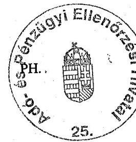

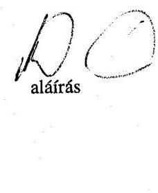

---

# 3. SZ. MELLÉKLET

---

.

---

| LISTA   a külső megkeresésre folytatott végrehajtási tevékenységekről 2006. január 1-től |  |  |  |  |
| :--: | :--: | :--: | :--: | :--: |
| sorszám | adónem | megkereső | megkeresés |  |
|  |  |  | tárgya | jogalapja |
| 1 | 700 | Gazdasági Versenyhivatal | verseny-felügyeleti bírság | a tisztességtelen piaci magatartás és versenykorlátozás tilalmáról szóló 1996. évi LVII. tv. 90.§ (5) |
| 2 | 706 | Fogyasztóvédelmi Felügyelőségek | fogyasztóvédelmi bírság | a fogyasztóvédelemről szóló 1997.évi CLV. tv. 48.§ (4) |
| 3 | 707 | Gazdasági Kamarák | tagdíj | a gazdasági kamarákról szóló 1999.évi CXXI. tv. 42.§. |
| 4 | 708 | Vízgazdálkodási Társulatok | tagok érdekeltségi hozzájárulása | a vízgazdálkodásról szóló 1995. évi LVII.tv.41.§ (2) |
| 5 | 709 | Állami Számvevőszék | választási kampányköltségek túllépése | a választási eljárásról szóló 1997. évi C. tv. 92.§ (4) |
| 6 | 710 | Kincstári Vagyoni Igazgatóság | társ. szerv. ingatlan vételár | a társadalmi szervezetek által használt állami tulajdonú ingatlanok jogi helyzetének rendezéséről szóló 1997. évi CXLII. tv. 7§. (5) |
| 7 | 711 | Bányászati Hivatal | bányajáradék; bírság; kamatok | a bányászatról szóló 1993.évi XLVIII. tv. 41.§ (8) |
| 8 | 712 | Hegyközségek | hegyközségi járulék | a hegyközségekről szóló 1994.évi CII. tv. 53.§ (4) |
| 9 | 713 | OEP és igazgatási szervei | megtérítés, visszatérítés | a kötelező egészségbiztosítás ellátásairól szóló 1997. évi LXXIII tv. 71.§ (3) |
| 10 | 714 | ONYF és igazgatási szervei | megtérítés, visszatérítés | a társadalombiztosítási nyugellátásról szóló 1997. évi LXXXI. tv. 93.§ (5) |
| 11 | 715 | ONYF és igazgatási szervei | megtérítés, visszatérítés | a társadalombiztosítási nyugellátásról szóló 1997. évi LXXXI. tv. 93.§ (5) |
| 12 | 716 | Magánnyugdíjpénztár | tagdíjtartozás | a magánnyugdíjról és magánnyugdíj pénztárakról szóló 1997. évi LXXII. tv. 3.§ (6) |
| 13 | 717 | Munkaerőpiaci Szervezetek | munkaadói járulék | a foglalkoztatás elősegítéséről és a munkanélküliek ellátásáról szóló 1991. évi IV. tv. 56.§ (1) |
| 14 | 718 | Vámszervek | vámtartozások | a közösségi vámjog végrehajtásáról szóló 2003. évi CXXVI. tv. 56.§ (2) |
| - | 719 | Vámszervek | jövedéki tartozások | a jövedéki adóról és a jövedéki termékek forgalmazásának különös szabályairól szóló 2003. évi CXXVII. tv. 48.§ (16) |

---

| 15 | 720 | Vámszervek | végrehajtási költségek | a közösségi vámjog végrehajtásáról szóló 2003. évi CXXVI. tv. 56.§ (3) |
| :--: | :--: | :--: | :--: | :--: |
| 16 | 721 | Földhivatalok | földvédelmi járulék, bírság | a termőföldről szóló 1994. évi LV. tv. 56.§ (5) |
| 17 | 722 | ÁNTSZ | egészségvédelmi bírság (dohányzás) | a nemdohányzók védelméről és a dohánytermékek fogyasztásának, forgalmazásának egyes szabályairól szóló 1999. évi XLII. tv. 7§.(10) |
| 18 | 723 | Magánnyugdijpénztár | bírság, önellenőrzési pótlék | a magánnyugdíjról és magánnyugdij pénztárakról szóló 1997. évi LXXII. tv. 3.§ (6) |
| 19 | 724 | Magánnyugdijpénztár | késedelmi pótlék | a magánnyugdíjról és magánnyugdij pénztárakról szóló 1997. évi LXXII. tv. 3.§ (6) |
| 20 | 725 | Növény- és Állategészségügyi Allomások | talajvédelmi bírság | a termőföldről szóló 1994. évi LV. tv. 78.§ (4) |
| 21 | 726 | Munkabiztonsági, munkaügyi fel. | munkavédelmi bírság | a munkavédelemről szóló 1993. évi XCIII. tv. 80.§ (1) |
| 22 | 727 | Önkormányzatok | építésügyi bírság | az épített környezet alakításáról és védelméről szóló 1997. évi LXXVIII. tv. 49.§ (3) |
| 23 | 728 | Országos Borminősítő Intézet | vizsgálat költsége | a szőlőtermesztésről és a borgazdálkodásról szóló 2004. évi XVIII. tv. 51.§ (4) |
| 24 | 729 | Országos Borminősítő Intézet | minőségvédelmi bírság | a szőlőtermesztésről és a borgazdálkodásról szóló 2004. évi XVIII. tv. 51.§ (4) |
| 25 | 730 | Növény és Talajvédelmi Szolgálat | közérdekű védekezés költsége (parlagfü) | a növényvédelemről szóló 2000. évi XXXV. tv. 61.§ (2) |
| 26 | 731 | Növény és Talajvédelmi Szolgálat | növényvédelmi bírság | a növényvédelemről szóló 2000. évi XXXV. tv. 61.§ (2) |
| 27 | 732 | ÁNTSZ | kémiai terhelési bírság | a kémiai biztonságról szóló 2000 évi XXV. tv. 33.§ (4) |
| 28 | 733 | Környezetvédelmi Felügyelőségek | hulladékgazdálkodási bírság | a hulladékgazdálkodásról szóló 2000. évi. XLIII.tv.49.§ (6) |
| 29 | 734 | Államkincstár (TÁLI) (TÁKISZ) | családi pótlék, családi támogatás | a családok támogatásáról szóló 1998.évi LXXXIV. tv. |
| 30 | 735 | Közlekedési Felügyelet | díj, pótlék, bírság (parkolási díj) | a közúti közlekedésről szóló 1988.évi I. tv. 48.§ (5) |
| 31 | 736 | OEP | német egészségügyi járulék | a Magyar Köztársaság és a Német Szövetségi Köztársaság között a szociális biztonságról szóló 1998. május 2-án, Budapesten aláírt egyezmény kihirdetéséről szóló 2000. évi XXX. tv. |

---

| 32 | 737 | ONYF | német nyugdíjjárulék | a Magyar Köztársaság és a Német Szövetségi Köztársaság között a szociális biztonságról szóló 1998. május 2-án, Budapesten aláírt egyezmény kihirdetéséről szóló 2000. évi XXX. tv. |
| :--: | :--: | :--: | :--: | :--: |
| 33 | 738 | OEP | osztrák E-járulék | a Magyar Köztársaság és az Osztrák Köztársaság között a szociális biztonságról szóló 1999. március 31én, Budapesten aláírt egyezmény kihirdetéséről szóló 2000. évi CXXIII. tv. |
| 34 | 739 | ONYF | osztrák nyugdíjjárulék | a Magyar Köztársaság és az Osztrák Köztársaság között a szociális biztonságról szóló 1999. március 31én, Budapesten aláírt egyezmény kihirdetéséről szóló 2000. évi CXXIII. tv. |
| 35 | 740 | Hírközlési Felügyelet | piacfelügyeleti, frekvencia díjak | az elektronikus hírközlésről szóló 2003. évi C. tv.163.§ (1) |
| 36 | 741 | Fogyasztóvédelmi Felügyelőségek | reklám-felügyeleti bírság | a gazdasági reklámtevékenységről szóló 1997. évi LVIII. tv. 18.§ (3) |
| 37 | 742 | Kulturális Örökségvédelmi Hiva-   tal | örökségvédelmi bírság | a kulturális örökség védelméről szóló 2001. évi LXIV. tv. 84.§ |
| 38 | 743 | Lakástakarékpénztár | lakáscélú állami támogatás | a lakás-takarékpénztárakról szóló 1996. évi CXIII. tv 24.§ (5) |
| 39 | 744, | Növény és Talajvédelmi Szolgálat | végrehajtási bírság | az államigazgatási eljárás általános szabályairól szóló 1957. évi IV. tv. 82.§ (1) |
| 40 | 745 | Földhivatalok | földhasználati szer-zödés-bírság | a termőföldről szóló 1994.évi LV. tv. 25/A.§. (6) |
| 41 | 746 | Állategészségügyi és Elelmiszer ellenőrzési hatóság | minőségvédelmi bírság | a takarmányok előállításáról, forgalomba hozataláról és felhasználásáról szóló 2001. évi CXIX. tv. 16.§ (5) |
| 42 | 747 | ONYF | holland nyugdíjjárulék | a Magyar Köztársaság és a Holland Királyság között a szociális biztonsági ellátások kivitelével kapcsolatos együttmúködésről szóló egyezmény kihirdetéséről szóló 2002. évi VII. tv. |
| 43 | 748 | OEP | holland E-járulék | a Magyar Köztársaság és a Holland Királyság között a szociális biztonsági ellátások kivitelével kapcsolatos együttmúködésről szóló egyezmény kihirdetéséről szóló 2002. évi VII. tv. |
| 44 | 752 | FVM támogatások | állami támogatás visszafizetése | a mezőgazdasági és vidékfejlesztési támogatásokhoz és egyéb intézkedésekhez kapcsolódó eljárás egyes kérdéseiről és az ezzel összefüggő törvénymódosításokról szóló 2003. évi LXXIII. tv. 15.§ (4) |

---

| 45 | 753 | NYUFIG | régi korengedményes nyugdíj | a társadalombiztosítás pénzügyi alapjai 1999. évi költségvetésének végrehajtásáról szóló 2000. évi CXIX. tv. 21.§ b) |
| :--: | :--: | :--: | :--: | :--: |
| 46 | 754 | Minisztériumok | költségvetési támogatások | az államháztartásról szóló 1992. évi XXXVIII. tv. 13.§ (9) |
| 47 | 755 | SAPARD Hivatal | pályázati támogatások | az államháztartásról szóló 1992. évi XXXVIII. tv. 13.§ (11) |
| 48 | 756 | Környezetvédelmi hatóságok | környezetvédelmi bírság | a környezet védelmének általános szabályairól szóló 1995. évi LIII. tv. 106.§ (2) |
| 49 | 757 | Természetvédelmi hatóságok | természetvédelmi bírság | a természet védelméről szóló 1996.   évi LIII. tv. 80.§ (2) |
| 50 | 758 | Erdészeti Szolgálat | erdőfenntartási járulék, bírságok | az erdőről és az erdő védelméről szóló 1996. évi LIV. tv. 103/A.§ |
| 51 | 759 | Diákhitel Központ Rt. | hitel | az adózás rendjéről szóló 2003. évi XCII. tv. 177.§ (2) |
| 52 | 760 | MNB | külföldre utalás díja | a bírósági végrehajtásról szóló 1994. évi LIII. tv. |
| 53 | 761 | Minisztériumok | pályázati támogatások | az államháztartásról szóló 1992. évi XXXVIII. tv. 13/A.§ (19) |
| 54 | 762 | Nemzeti Civil Alapprogram | támogatások | a Nemzeti Civil Alapprogramról szóló 2003. évi L. tv. 11.§ (2) |
| 55 | 763 | Állami Számvevőszék | pártok alapítványai | a pártok múködését segítő tudományos, ismeretterjesztő, kutatási, oktatási tevékenységet végző alapítványokról szóló 2003. évi XLVII. tv. 3.§ (5) |
| 56 | 764 | Minősítő Intézet | minőségvédelmi bírság, kamatok | a növényfajták állami elismeréséről, valamint a szaporítóanyagok előállításáról és forgalomba hozataláról szóló 2003. évi LII. tv. 28.§ (4) |
| 57 | 765 | FVM MVH (kirendeltség) | támogatások | a mezőgazdasági és vidékfejlesztési támogatásokhoz és egyéb intézkedésekhez kapcsolódó eljárás egyes kérdéseiről és az ezzel összefüggő törvénymódosításokról szóló 2003. évi LXXIII. tv. 15.§ (4) |
| 58 | 766 | MEP | vagyon átvétel-   átadás | az államháztartásról szóló 1992. évi XXXVIII. tv. 86/I.§ (5) |
| 59 | 767 | Hegybíró/Hegyközségi Tanács | adatszolgáltatás bírság | a szőlőtermesztésről és borgazdálkodásról szóló 2004. évi XVIII. tv. 56.§ (2) |
| 60 | 768 | Közigazgatási szervezet | minden pénzfizetésre köt. hat. | az államigazgatási eljárás általános szabályairól szóló 1957. évi IV. tv. 82.§ (1) |
| 61 | 769 | Élelmiszerellenőrző Hatóság | minőségvédelmi bírság | az élelmiszerekről szóló 2003. évi. LXXII. tv. 15.§ (2) |
| 62 | 770 | Nemzeti Hírközlési Hatóság | eljárási költségek, bírságok | Az elektronikus hírközlésről szóló 2003.évi C. tv. 163.§ (1) |
| 63 | 771 | Halászati Hatóság | bírságok | a halászatról és horgászatról szóló 1997.évi XLI. tv. 51/A.§ |

---

| 64 | 772 | Vadászati Hatóság | hozzájárulások és bírságok | a vad védelméről, a vadgazdálkodásról, valamint a vadászatról szóló 1996. évi LV. tv. 85.§(1) |
| :--: | :--: | :--: | :--: | :--: |
| 65 | 773 | Tenyésztési Hatóság | tenyésztési hozzájárulások | az állattenyésztésről szóló 1993 évi CXIV. tv. 13.§ (5) |
| 66 | 774 | Hitelintézet | hivatásos katonák hitele | a Magyar Honvédség hivatásos és szerződéses állományú katonáinak jogállásáról szóló 2001. évi XCV.tv.126/A.§ (11) |
| 67 | 775 | Hitelintézet | Köztisztviselő lakáshitele | a köztisztviselők jogállásáról szóló 1992.évi XXIII.tv.49/I.§ (11) |
| 68 | 776 | Hitelintézet | ügyészi lakáshitel | az ügyészségi szolgálati viszonyról és az ügyészségi adatkezelésről szóló 1994. évi LXXX. tv. 50/C.§ (13) |
| 69 | 777 | Hitelintézet | bírói lakáshitel | a bírák jogállásáról és javadalmazásáról szóló 1997.évi LXVII.tv.119/A.§ (11) |
| 70 | 778 | Hitelintézet | ig. ügyi alkalmazott hitele | az igazságügyi alkalmazottak szolgálati jogviszonyáról szóló 1997.évi LXVIII. tv. 121/A.§(11) |
| 71 | 779 | Hitelintézet | közalkalmazott lakás hitele | a közalkalmazottak jogállásáról szóló 1992.évi XXX.III. tv. 78/A. (11) |
| 72 | 780 | FVM MVH (kirendeltség) | cukorilleték, késedelmi kamat | a mezőgazdasági és vidékfejlesztési támogatásokhoz és egyéb intézkedésekhez kapcsolódó eljárás egyes kérdéseiről és az ezzel összefüggő törvénymódosításokról szóló 2003. évi LXXIII. tv. 15.§ (4) |
| 73 | 781 | Hitelintézet | fegyveres testületi tag hitele | a fegyveres szervek hivatásos állományú tagjainak szolgálati viszonyáról szóló 1996 évi. XLIII. tv. 115/A.§ (11) |
| 74 | 782 | Földhivatal | költség és díj | az ingatlan-nyilvántartásról szóló 1997. évi CXLI. tv. 28.§ (4) |
| 75 | 783 | Állat egészségügyi ellenőrző szerv | állategészségügyi bírság | az állategészségügyről szóló 2005 évi CLXXVI. tv.45.§ (5) |
| 76 | 784 | Egészségügyi ellenőrző szerv | állategészségügyi bírság | az állategészségügyről szóló 2005 évi CLXXVI. tv. 45.§ (5) |
| 77 | 785 | Magyar Vasúti Hivatal | bírság | a vasúti közlekedésről szóló 2005. évi CLXXXIII. tv. 85.§ (2) |
| 78 | 786 | Hitelintézet | központi költségvetés kezessége | a Magyar Köztársaság 2006. évi költségvetéséről szóló 2005. évi CLIII. tv. |

---

# 4. SZ. MELLÉKLET

---

.

---

# Az APEH új feladatai az átfogó, 2000-2005. évre irányuló ÁSZ vizsgálathoz 

2000

- Az adókat és az adók módjára beszedendő járulékokat egységes módon kell kezelni. Valamennyi feldolgozó rendszeren átvezetésre kerülnek a járulékok adóként történő keze-lése miatti változások (pld. egységes adó- és járulékalany-nyilvántartás adóazonosító alapján, egységes rendszerủ adóés járulék igazolás kiadása, egységes adó- és járulék folyószámla kivonat kiküldése, járulék-követelések engedményezése, stb.), ugyanakkor továbbra is elérhetőek maradnak a járulékigazgatóságok által korábban használt számítástechnikai rendszerekben lévő adatok.

Járulékintegráció befejezése (január elsejével megszűnnek a járulékigazgatóságok, a területi igazgatóságok szervezetei az egységes felépítésnek megfelelően módosulnak).

- Bankszámla bejelentés elmulasztásának szankcionálása.

Kiemelten kell vizsgálni, hogy a visszaigénylés alapjául szolgáló beszerzések adóval növelt ellenértékét az adóalany megfizette-e, s az bankszámlán keresztül történt-e.

- A magánnyugdíj-pénztárak megkeresésére soron kívül kell mind az ellenőrzéseket elvégezni, mind a végrehajtási eljárást megindítani.

Évente egyszer kötelező ellenőrizni a magánnyugdíj-pénztárak nyilvántartási kötelezettségeinek teljesítését.

- A törvényi előírásnak megfelelően a lakástámogatásokat is ellenőrizni kell.

Megváltozik a járulékokkal kapcsolatos ügyek jogorvoslat intézményrendszere.

- Létrejön az APEH Oktatási Igazgatósága.

2001

- Felkészülés az elektronikus aláírásról és hitelesítő szervekről szóló törvény alkalmazására.

A legnagyobb adózók számára a KAIG-on kívüli igazgatóságokon is meg kell teremteni a havi áfa bevallások elektronikus úton való beadási lehetőségét.

A jogszabályi változásokból adódóan a korábbinál több tennivalót jelent a családi kedvezményekkel összefüggő adószámok kiadása, az SZJA nyilatkozatok számának növekedése, a beruházási kedvezmények társasági

---

adó előlegfizetésben való érvényesítése, stb.
Rendszerbeli változást igényel a társasági adóbevallás naptári évtől eltérő, üzleti évre való beállítása.

- Az adó- és jövedelemigazolások hamisításának megakadályozása céljából az év elejétől száraz bélyegző kerül bevezetésre.

Az év végével befejeződött, a valamennyi területi igazgatóságra kiterjedő, az ügyfelek elégedettségére irányuló kérdöíves felmérés.

Új számítástechnikai programot, illetve ügyviteli utasítást kívánnak az állam által vállalt kezesség és viszontgarancia érvényesítésével kapcsolatok tennivalók.

- Az ellenőrzésre történő véletlenszerú kiválasztás módszerének - informatikailag támogatott - alkalmazása.

Az aktív kereső korú, de a nyilvántartások szerint jövedelemmel nem rendelkezők esetleges adókötelezettségének feltárása.

- Az egyszerűsített ellenőrzéseket a központi fejlesztésű ELLTÁR program segítette.

Létrejön „Az Európai Unióhoz történő csatlakozás adóigazgatást érintő feladatainak végrehajtása, az informatikai háttér létrehozása a KKI múködéséhez és a VIES nemzeti modul kialakításához" elnevezésű projekt (röviden: KKI projekt) és keretében megkezdődik a felkészülés.

Elkészült az APEH Belső Ellenőrzési Kézikönyve.
Elindul az új adatbáziskezelő rendszerre (ORACLE) történő migráció.
Megkezdi tevékenységét az Országos Központi Irattár.
Valamennyi szervezeti egységnél bevezetésre került a Lotus Notes belső levelező rendszer.

Megkezdődik a családi gazdaságok nyilvántartásba vétele.
2002. június 1.-től megszűnt a cégbejegyzésre kötelezetteket érintő pénzintézetek bankszámlákkal kapcsolatos bejelentési kötelezettsége az állami adóhatóság felé, a változásokat kizárólag a cégbíróságokhoz kell beküldeni, az APEH az egyablakos rendszeren keresztül értesül ezekről.

Valamennyi adóbevallás nyomtatvány kitöltését és azok ellenőrzését támogató programot az ügyfelek számára interneten elérhetővé kell tenni.

A KAIG-hoz tartozó adóalanyok számára - a törvényben előírt határidőre szeptember elsejétől a Hivatal (biztonságos chip- kártya rendelkezésre bo-

---

csátásával és a fogadás rendszerének kialakításával) teremtette meg az elektronikus aláírással történő bevallásbeadás feltételeit. Az elektronikus adóbevallási rendszer (ELAB) országos kiterjesztésével a nagy adózóknak országosan májustól van lehetősége korlátozott megoldással (egyedi szerződések alapján) elektronikus bevallás beadásra.

- Megkezdődik a kétdimenziós pontkód kísérleti alkalmazása.
- A bevallási kötelezettségüket elektronikus úton teljesítő adózók részére - első lépcsőben a kiemelt adózói körben - meg kell teremteni a folyószámla automatikus lekérdezésének lehetőségét.
- A törvényben előírtakon túl további két alkalommal kapott - minden havi és évközi bevallásra kötelezett, múködő adószáminál rendelkező adózó rendkívüli folyószámla kivonatot.
- A jogszabályi változásokkal érintett eljárásoknál a feldolgozási rendszerek szükséges korrekcióját el kell végezni (többek között a nem belföldi bankszámláról történő átutalás, hitelintézeti, postai befizetés teljesítése esetén az adó megfizetésének megváltozott időpontjára, a hivatalból történő azonosító jel képzésére, egyes társasági adókedvezményre jogosító beruházással összefüggésben a bejelentések fogadásával, feldolgozásával kapcsolatos rendelkezések kialakítása stb.).
- Minőségileg új feladatot jelent a gazdálkodóknál az elektronikus, vagy optikai adathordozón megőrzött bizonylatok ellenőrzése.
- Az új hátralékkezelési és végrehajtási rendszer (HVR) bevezetése.
- A pénzforgalmi számlák, az ingó- és ingatlan vagyontárgyak végrehajtás alá vonásánál az új eljárási szabályok betartására különös gondot kell fordítani. Ahol a végrehajtási ügyeket a bírósági végrehajtó folytatja tovább, a törvénysértő intézkedés vagy mulasztás esetén élni kell a végrehajtási kifogás lehetőségével.
- Az adómérséklésre és a fizetési könnyítés engedélyezésére irányuló kérelmek elbírálásánál kiemelt feladat az előző év végén elkészült Adósminősítő Információs Rendszer (AMIR) szélesebb körben történő használata.
- Az adóhatóság köztartozás-behajtási jogkörét a törvények 13 jogcímmel 36 jogcímre bővítették.

Az előző év végén jóváhagyott hosszú távú informatikai stratégiába illesztetten megkezdődik a több mint 10 éve üzemelő decentralizált igazgatósági rendszerek kiváltása új, korszerű technológiájú és egységes platformon működő centralizált rendszer kialakításával.

A nem számozott iratok szkennelésével és képi tárolásával történő elektronikus ügyintézési modell kísérleti jelleggel történő bevezetése keretében - a Képfeldolgozási Kísérlet Projektben - a KAIG-on 2002. már-

---

cius 26-án kísérleti jelleggel, majd májustól éles üzemben megkezdődött az új típusú iratkezelés.

Elő kell készíteni a bevallások és egyéb adatszolgáltatások korszerű archiválási eljárásának (nem papíralapon történő tárolásának) kidolgozását.

Fel kell készülni a titokvédelmi törvény várható változásából eredő új adatvédelmi rendszerek kialakítására.
2002. szeptemberétől az adóhivatal központi bérszámfejtő helyként múködik, amely az új Központosított Illetmény-számfejtési Rendszer - KIR bevezetésével együtt jelentős többletfeladatokkal járt.

Első alkalommal került sor - a Ktv. előírásainak megfelelően - az egyéni teljesítményértékelésre (az egyéni teljesítménykövetelmények év elejei meghatározására, majd az év végi egyéni írásos értékelésekre). A következő évek hasonló feladatainak informatikai támogatására létrejött és megkezdte munkáját a TÉRIT projekt.

Az első félévben megvalósult a területi igazgatóságok telephelyei közötti adat/hang integráció, melynek eredményeként, költségtakarékos módon, az itt lebonyolított forgalom már nem a távközlési cégek vonalain folyik.

Új adónem, az egyszerűsített vállalkozói adó (EVA) kerül bevezetésre.
Új környezetvédelmi termékdíj (hígítókra, oldószerekre és reklámhordozó papírokra) bevezetése.

Az adóigázgatás középtávú szervezeti stratégiájának megalkotására már az év elején sor került, az év végén pedig nyilvánosan is megjelent az ellenőrzés és végrehajtás stratégiája.

A parlamenti képviselők 2003. májusától kezdődően havonta, a Pénzügyminisztérium közreműködésével rendszeres tájékoztatást kapnak az adóhivatal tevékenységéről és régiónkénti bevételeiről.

Az APEH az adóigazgatással kapcsolatos tudnivalók jobb és gyorsabb megismerhetősége érdekében ún. Hírlevelet rendszeresített az aktuálisan legfontosabb eseményekről, illetve eredményekről, amelyet eljuttat a parlamenti pártok, bizottságok vezetőihez, valamint a média képviselőihez, továbbá Internetes honlapján is közzétesz.

Folytatódik az EU csatlakozásra való felkészülés:
o a Központi Kapcsolattartó Iroda (KKI) felállítására, valamint az ezzel kapcsolatos VIES-rendszer nemzeti moduljának kifejlesztésére,

---

- a közösségi adószámok kiadására, (ami 2003. augusztus 1.-én kezdődött meg részben hivatalból, részben egyedi kérelemre).
- a megváltozó külkereskedelmi statisztikai rendszer (INTRASTAT) múködtetésének támogatására,
- az EU-ból érkező egyéb (például adatvédelmi, adatbiztonsági) követelményekre.

Az ABDA (Adóbevallás Digitális Aláírással) rendszer fejlesztésével lehetővé vált a KAIG ügyfélköre részére, hogy 2003. évtől a bevallások és a kontroll adatszolgáltatás mellett, a szigorú számadású bizonylatok, valamint a banki adatszolgáltatás is elektronikusan és elektronikus aláírással hitelesítve legyen beadható.

A Diákhitel Központ Rt.-vel kötött együttműködési megállapodás alapján adatszolgáltatások és adategyeztetések.

Az adózók ellenőrzésre történő kiválasztásánál az adóteljesítmény bevezetése.

Új ellenőrzési típusok és határidők az Art.-ban.
Megkezdődik a költségvetési kapcsolatok szempontjából jelentős legnagyobb adóteljesítménnyel rendelkező, un. 1-es kategóriájú adózók rendszeres, kétévenkénti kötelező ellenőrzése.

A pénzügyminiszter felkérésére, a Kormányzati Ellenőrzési Hivatal megkeresésére, a Miniszterelnöki Hivatal közpénzekkel foglalkozó államtitkárának jelzései alapján kiemelt vizsgálatok a közpénzek útjának és felhasználásának ellenőrzésére.

Ellenőrzést kell folytatni minden olyan esetben, amikor a mezőgazdasági ágazatot érintő állami garanciavállalás beváltása aggályos. A garanciát, kezességet beváltó jogosultnál (hitelintézet) folytatott ellenőrzést szükség esetén kapcsolódó vizsgálat formájában ki kell terjeszteni az eredeti kötelezettre is.

Az adóhatóság behajtási jogköre 2003-ban 57 köztartozási jogcímre bővült.
2003. januártól az adónyomozati tevékenység az adóhivataltól átkerült az ORFK Pénzügyi Nyomozó Igazgatóságához. A második félévtől hatályba lépő, új eljárási törvény rendelkezéseinek megismerése, a bűnügyi szakreferensek ez irányú felkészítése.
2003. január elsejétől hatályos új törvény módosította a területi igazgatóságok jogállását, amelyek ezen túl a polgári perekben önállóan járnak el, felkészülés a. területi szervek perképviseleti tevékenységének magas színvonalú ellátására.

---

- Módosított szervezeti felépítés (januártól a hatósági és az igazgatóságok tervezési szakterületének régiós szemléletű, irányítási rendszere, júliustól központosított informatika). Az 1106/2003. (X. 31.) Korm. határozat végrehajtása (1100 fős létszámcsökkentés).

Új adónemek: a környezetterhelési díj és az innovációs járulék kerül bevezetésre.

- A háromezer legnagyobb, valamint a KAIG illetékességi körébe tartozó adóalanyok elektronikus úton teljesített bevallásainak és adatszolgáltatásainak fogadása.

Az EU csatlakozást (május 1.) követően megkezdődik az áfa Összesítő Jelentések feldolgozása, a közösségi adószámok érvényességének megerősítése.
2004. január 1-jétől a kettős adóztatást kizáró egyezmények tájékoztatás cseréje az APEH Elnökének hatáskörébe került.

Felkészülés az szja adóhatósági megállapítására.
Az adóalanyok adóhitelének megállapítása és határozatban történő közlése, a kedvezményes visszafizetések elkülönített nyilvántartása.

Valamennyi, az adózó nevét tartalmazó nyilvántartási rendszert érinti a Családjogi törvény változása (a névviselési lehetőségek változnak).

Diákhitel Rt. részére történő előírt adatszolgáltatás biztosítása (2003. évi XCII. tv 177.§-a).

- Augusztustól a PM iránymutatásával kialakított Adóbeszedési Intézkedési Terv foglalja össze a tárgyévi bevételi előirányzatok teljesítésének különös tekintettel a csatlakozás után módosult jogszabályi környezetre legfontosabb feladatait. (Köztük például: az évközi (havi és negyedéves) bevallások soron kívüli gyorsított feldolgozása, különös tekintettel az ÁFA bevallásokra; a forgalomba kerülő cukor, valamint a számítástechnikai és szórakoztató elektronikai adathordozók /DVD-, CD lemezek/ árueredet vizsgálata - cél: a feketén forgalmazásra kerülő készletek egyre nagyobb körben történő felderítése), stb.). A teljesítés helyzetéről kéthetenként kell a PM-nek írásos beszámolót készíteni.

Októbertől a Pénzügyminiszter elrendelésére a közösségi adószámmal rendelkező, áfa bevallásukban visszaigénylő pozíciójú adóalanyok teljes körű levizsgálása (az ún. EUK-s áfa vizsgálatok).

Az EU tagállamai közötti behajtási jogsegély, valamint az áfa és a közvetlen adók területén történő adóügyi együttműködés rendszerébe való bekapcsolódás.

---

- Új adónemek - a Hitelintézeti és pénzügyi vállalkozások különadója, Vállalkozói járulék, Környezetterhelési díj - kerülnek bevezetésre.

Új környezetvédelmi termékdíj (elektromos és elektronikai berendezésekre) bevezetése.

- Jogszabály alapján az arra jogosultak külföldi bankszámlájukra is utaltathatnak. Évközi jogszabályi módosítás révén bármely adónemről és nem csak magánszemély részére lehet utalni.

Tízezerre bővül azon kötelezettek száma, akik bevallásaikat és adatszolgáltatásaikat elektronikus úton teljesítik és 2005. április 1-jétől más adózó is választhatja ezt a lehetőséget, köztük az ART. 175. § (9) bekezdésében említett, Európai Közösség tagállamában illetőséggel nem bíró adózók, valamint a pénzügyi képviselettel rendelkező külföldi társaságok.

Az adóhatósági igazolások megyei illetékességtől független kiadása.
A közigazgatási hatósági eljárás és szolgáltatás általános szabályairól szóló 2004. évi CXL. törvény (ún. Ket.) 2005. november 1.-én hatályba lép.

Adóhatósági adó-megállapítás (ún. ADAM) első alkalommal történő elvégzése.

Az államháztartási mérleg készítése során - az elkülönített állami pénzalapok, TB alapok kezelői, a Magyar Államkincstár és néhány más szervezet részére elsősorban mérlegük elkészítéséhez, auditálásához - az értékvesztések összegeinek kimutatása, átadása.

Az illetékekkel kapcsolatos szabályok megváltozása több tevékenység munkafolyamatait érintette.

START kártya bevezetése (kártya gyártása, kiadása, nyilvántartás kialakítása, belső úgy-viteli folyamatok informatikai támogatásának biztosítása, stb. 2005. évi LXXIII. törvény).

Új adatbázisok az APEH honlapján: a lakáscélú hitel felvételéhez a regisztrált számlaki-bocsátókról, továbbá név, illetve adószám szerint lekérdezhetőek a nyilvántartott áfa adóalanyok.

A termékimportot terhelő általános forgalmi adó biztosítása alóli mentességhez VPOP részére rendszeres adatszolgáltatás.

Felkészülés az egyéni járulékszámla bevezetésére (jogszabályi változás miatt az előkészítési munkálatok 2005. októberében felfüggesztésre kerültek).

Kötelezettségcsoportonkénti számlakezelés - „egyszerűsített adózói befizetések kezelési" rendszerének kialakítása (jogszabályi változás miatt az előkészítési munkálatok 2005. októberében felfüggesztésre kerültek).

---

- A kintlévőségek bírósági végrehajtónak történő átadása Art.módosítás alapján.
- A hatósági-jogi munka feletti törvényességi felügyelet stratégiai tervének elkészítése.
- A 2005. első negyedévében lefolytatott megbeszélések alapján az APEH átvette a Pénzügy minisztériumtól a Fiscalis Program nemzeti koordinációját, a kapcsolódó feladatokat.

---

# 5. SZ. MELLÉKLET

---

1. sz. tábla a V-17-34/2005-2006. sz. jelentéshez

A behajtási tevékenység kiemelt adatainak alakulása 2000-2005 (adatok E Ft-ban)

|  Év | Végrehajtási cselekmények |  |  |  |  |  |  |  |  |  |  |   |
| --- | --- | --- | --- | --- | --- | --- | --- | --- | --- | --- | --- | --- |
|   | Összesen |  | Kibocsátott
azonos
megb. | Foglalt
ingóság | Foglalt
ingatlan | Egyéb
foglalás | Összesen | Azonnali on
line beszed.
mb-vel | Vh.
Cselekményt
követő
befizetéssel | Ingó
értékesítésből | Ingatlan
értékesítésből | Egyéb  |
|  2000 | 245 297 557 |  | 198 781 109 | 23 764 300 | 12 397 316 | 10 354 832 | 131 269 088 | 15 408 433 | 112 641 372 | 586 034 | 460 349 | 2 172 900  |
|  2001 | 288 555 341 |  | 246 120 944 | 28 995 272 | 5 695 567 | 7 743 558 | 134 949 049 | 19 028 697 | 113 612 351 | 722 294 | 381 818 | 1 203 888  |
|  2002 | 295 073 999 |  | 256 821 619 | 22 686 191 | 6 252 876 | 9 313 313 | 136 230 116 | 21 983 182 | 112 989 427 | 248 661 | 132 153 | 876 692  |
|  2003 | 450 554 102 |  | 389 330 106 | 30 652 611 | 15 639 855 | 14 931 530 | 143 620 649 | 41 931 648 | 98 611 889 | 546 770 | 294 585 | 2 235 757  |
|  2004 | 555 213 589 |  | 496 077 527 | 30 568 710 | 15 568 941 | 12 998 411 | 189 821 088 | 76 497 636 | 109 826 438 | 721 943 | 386 295 | 2 388 776  |
|  2005 | 653 958 922 |  | 592 788 153 | 32 797 338 | 14 302 610 | 14 070 821 | 204 252 842 | 91 394 354 | 107 945 988 | 567 470 | 445 928 | 3 899 102  |

Törölt hatralékok alakulása az összes hátralékhoz viszonyítva 2000-2005

|  Év | Összes
hátralék
(Ft) | Végrehajtás
alá vont
hátralék
(Ft) | Végrehajtás
alá vont
hátralék az
összes
hátralékhoz
viszonyítva
% | Vh. eljárások
lefolyt. után
bef. hátralék
(E Ft) | Vh.
eljárások
lefolyt. után
bef. hátralék
az össz.
hátralékhoz
viszonyítva
% | Törölt
hátralék
összesen | Törölt
hátralék
összesen az
össz.
hátralékhoz
viszonyítva
% | Elévülés
miatt törölt
hátralék | Elévülés miatt
törölt
hátralék az
össz.
hátralékhoz
viszonyítva
%  |
| --- | --- | --- | --- | --- | --- | --- | --- | --- | --- |
|  2000 | 694 459 847 | 271 605 870 | 39,1 | 131 269 088 | 18,9 | 79 003 139 | 11,4 | 18 989 804 | 2,7  |
|  2001 | 620 317 890 | 311 843 347 | 50,3 | 134 949 049 | 21,8 | 75 831 741 | 12,2 | 26 081 817 | 4,2  |
|  2002 | 645 801 581 | 310 413 180 | 48,1 | 136 230 116 | 21,1 | 75 130 294 | 11,6 | 38 222 899 | 5,9  |
|  2003 | 678 481 590 | 341 790 896 | 50,4 | 143 620 649 | 21,1 | 81 253 640 | 12,0 | 34 307 097 | 5,1  |
|  2004 | 843 879 243 | 369 805 417 | 43,8 | 189 821 087 | 22,5 | 46 771 900 | 5,5 | 18 556 754 | 2,2  |
|  2005 | 896 734 887 | 427 784 642 | 47,7 | 204 252 842 | 22,8 | 68 417 008 | 7,6 | 34 729 707 | 3,9  |

---

2. sz. tábla a V-17-34/2005-2006. sz. jelentéshez

A 2001. év végéig közzétett felszámolási eljárások engedményezésére az MKK RT-vel megkötött megállapodások összegei és azok fizetési teljesítése

|  Fizetési határidő | Megállapodás | Módosítás | Utalás | Bezzámítás | Összesen | Bezzámláásfol | 2000+ LPV RT | 2005+ LPV RT | 2005+  |
| --- | --- | --- | --- | --- | --- | --- | --- | --- | --- |
|   | 1998-ig adó | 1998-ig tlb | Fiz. határidő | 1999. adó tlb | 2000. adó tlb | 2002.11.18 | 2004.07.28 |  | 428.306.000  |
|  1999.10.31 | 1 284 913 000 |  |  |  |  |  |  | 428.306.000 | 428.306.000  |
|  2000.02.29 | 856 610 000 |  | 2000.03.20 | 521 541 000 |  |  |  | 387 965 369 | 133 575 345  |
|  2000.05.31 | 856 610 000 |  | 2000.05.31 | 521 541 000 |  |  |  | 387 965 369 | 133 575 345  |
|  2000.08.31 | 856 610 000 |  | 2000.08.31 | 521 541 000 |  |  |  | 387 965 369 | 133 575 345  |
|   |  |  | 2000.11.30 | 521 541 000 |  |  |  |  | 560 129 343  |
|  2000.02.29 |  |  | 238.000.000 | 2001.02.29 | 588 762 000 |  |  |  | 541 205 634  |
|  2000.04.30 |  |  | 476.000.000 | 2001.05.31 | 588 762 000 | 774 615 259 |  |  | 210 220 023  |
|  2000.08.31 |  |  | 476.000.000 | 2001.08.31 | 588 762 000 | 774 615 259 |  |  | 334 767 657  |
|  2000.10.31 |  |  | 714.000.000 | 2001.11.30 | 588 762 000 | 774 615 259 |  |  | 180 145 611  |
|  2001.02.29 |  |  | 476.000.000 | 2002.02.29 | 588 762 000 | 774 615 259 |  |  | 500 000 000  |
|   |  |  | 2002.05.31 | 588 762 000 | 774 615 259 | 774 615 259 |  |  | 254 760 422  |
|   |  |  | 2002.08.31 | 588 762 000 | 774 615 259 | 947 491 590 | 774 615 259 |  | 668 406 295  |
|   |  |  | 2002.11.30 | 588 763 000 | 774 615 259 | 947 491 591 | 775 000 000 |  | 662 437 320  |
|  |   |   |   |   |   |   |   |   |   |
|   |  |  | 2003.02.29 |  | 450 000 000 | 450 000 000 | 241 000 000 |  | 224 818 790  |
|   |  |  | 2003.05.31 |  | 450 000 000 | 450 000 000 | 241 000 000 |  | 227 167 438  |
|   |  |  | 2003.08.31 |  | 450 000 000 | 450 000 000 | 450 000 000 |  | 72 956 791  |
|   |  |  | 2003.12.31 |  | 450 000 000 | 450 000 000 | 450 000 000 |  | 35 985 582  |
|   |  |  | 2004.02.29 |  |  | 103 000 000 | 553 000 000 |  | 199 050 729  |
|   |  |  | 2004.05.31 |  |  | 103 000 000 | 553 000 000 |  |   |
|   |  |  | 2004.08.31 |  |  | 103 000 000 | 103 000 000 |  |   |
|   |  |  | 2004.12.31 |  |  | 103 000 000 | 103 000 000 |  |   |
|   |  |  | 2005.02.29 |  |  | 103 000 000 | 103 000 000 |  |   |
|   |  |  | 2005.05.31 |  |  | 103 000 000 | 103 000 000 |  |   |
|   |  |  | 2005.08.31 |  |  | 103 000 000 | 103 000 000 |  |   |
|   |  |  | 2005.12.31 |  |  | 103 000 000 | 103 000 000 |  |   |
|  |   |   |   |   |   |   |   |   |   |
|   |  |  | 2004.08.31 |  |  |  | 116 085 626 | 92 055 675 | 24 029 951  |
|   |  |  | 2004.12.31 |  |  |  | 116 085 626 | 91 992 946 | 24 092 680  |
|   |  |  | 2005.02.29 |  |  |  | 717 712 664 | 59 449 458 | 658 263 290  |
|   |  |  | 2005.05.31 |  |  |  | 116 085 626 | 116 085 626 | 116 085 626  |
|   |  |  | 2005.08.31 |  |  |  | 116 085 626 | 115 380 042 | 705 583  |
|   |  |  | 2005.12.31 |  |  |  | 116 085 626 | 116 085 625 | 116 085 625  |
|   |  |  |  |  |  |  | 7 801 102 370 | 6 042 877 442 | 13 043 979 812  |

A 2001. december 20-án kelt megállapodás szerint az állami garanciavállalás címén keletkezett követelések 100,-Ft/követelés vételáron kerültek engedményezéare.

---

# 6. SZ. MELLÉKLET

---

.

---

# Engedményezések részletezése 

A felszámolási eljárásokban az állami adóhatóság által bejelentett követelések engedményezésének a lehetőségét az Adó- és Pénzügyi Ellenőrzési Hivatalról szóló 55/1991. (IV. 11.) korm. rendelet 5. §-a valamint a Csődtv. 80. §-a teremtette meg. Az engedményezések rendszerére (1996-1998 között szabad értékesítés, 1999-2002. MKK Rt., 2003-tól pályázat, 2005. július 1-től MKK Rt.) jellemző, hogy az engedményes nem maga lép fel hitelezőként, hanem a követelést megfelelő üzleti haszonnal tovább engedményezi. A követelések átadásának eljárási rendjére vonatkozóan az APEH és az MKK Rt. - a pénzügyminiszter jóváhagyásával - 1999. március 19-ével keret megállapodást kötött.

Az eljárási rendnek megfelelően az APEH továbbra is elvégzi az Art.-ból és a Csődtv.-ből adódó hatósági és hitelezői feladatait, így többek között a felszámolási közbenső és zárómérleg felülvizsgálatát, a bevallások ellenőrzését, a folyószámla nyilvántartását, a felszámolási tevékenység adóhatósági és társadalombiztosítási ellenőrzését.

Az engedményezés iratanyagát az igazgatóságok készítik el és továbbítják a Felszámolási és Végrehajtási Főosztályra. Az átadásra kerülő követelések dokumentumai az átadó lapon kívül a következők: hitelezői igénybejelentés, felszámolói visszaigazolás, felszámolást elrendelő végzés, alakuló hitelezői választmány jegyzőkönyv (felszámolói tájékoztatás), tevékenység zárómérleg, közbenső mérleg, zárómérleg, záróvégzés (a felszámolás állásától függően), ha az adóhatóság részére átadásra kerültek, b. kategóriába sorolt hitelezői igény esetén a besorolás jogalapját igazoló dokumentum (pl. tulajdoni lap, foglalási jegyzőkönyv, zálogszerződés) és a jelzálogjog tekintetében a hatósági nyilvántartásokban a jogutódlás átvezetését lehetővé tévő jogutódlási nyilatkozat; minden egyéb, a hitelezői igény érvényesítéséhez szükséges dokumentum.

A megállapodás szerint amennyiben az MKK Rt. továbbértékesítési tevékenysége során az engedményezés ellenértékén felüli bevételt realizál, úgy az igazolt ráfordításaival csökkentett nyereség $80 \%$-át az APEH igazgatóságok végrehajtói letététi számláira köteles átutalni. A vizsgált időszakban az MKK Rt. a ráfordításaival csökkentett nyereség ( $80 \%$ majd későbbi megállapodásban szereplő $90 \%$ ) címén átutalást nem teljesített.

Az MKK Rt. kizárólagos engedményezési pozíciója az 1998. év végéig közzétett, 1999. március 21 -én még folyamatban lévő, valamint az ezt követően 2001. év végéig közzéteendő felszámolási eljárásokat érintette. A követelések átadása 2004. június 30.-ig folyamatos volt. Az engedményezés ellenértéke a kezdeti tőkearányos $4 \%$-ról fokozatosan 3, illetve $2 \%$-ra mérséklődött, melyet minden esetben tovább csökkentettek az MKK Rt. felmerült költségei, amit az összes átadott követelés tőkeértékének $1 \%$-a erejéig érvényesíthetett.

A Hivatal az MKK Rt. költségelszámolását minden évben leellenőrizte, az erről készült jegyzőkönyvek tartalmazzák azokat a költségeket melyek elfogadásra kerültek, illetve azokat is amelyek nem.

A keret-megállapodást 7 alkalommal (4 alapszerződés plusz 3 szerződésmódosítás) a többletátadások és a mindenkor fennálló tartozás összegének folyamatos

---

átütemezése miatt módosították. Az átütemezésekkel az engedményezés 2005. év végéig elhúzódott és a megtérülés részletekben realizálódott.

A többszörösen módosított megállapodások szerint, az MKK Rt.-nek az APEH felé 13,04 Mrd Ft-ot kellett volna utalnia, a Hivatal által elfogadott különféle beszámítások és korrekciók ( 6,04 Mrd Ft) után (amit szintén rögzítettek a megállapodásokban) a ténylegesen átutalt összeg 7,00 Mrd Ft volt.

Az összes megtérülés 1,99\%, amit a Hivatalnál a ténylegesen átutalt összegek nyilvántartásából készített számítások támasztanak alá. Az MKK Rt. 2,55\%-os megtérülési mutatószámot állapított meg, amit nem az APEH nyilvántartásával egyező adatokból számolt.

Az állami kezesség igénybevételéből származó követelések behajtására vonatkozóan az 1999. március 19-én kelt megállapodás a következőket rögzíti: Nem képezik megállapodás tárgyát azok a felszámolás alatti, a központi költségvetést, az elkülönített állami pénzalapokat, illetve a helyi önkormányzatokat megillető követelések, amelyek behajtására az APEH csak az adózás rendjéről szóló 1990. évi XCI. tv. (Art). 93. §-ában szabályozott megkeresési eljárása alapján jogosult.

A fentiekben leírtak 2001. december 20-ig voltak érvényben.
Az APEH és az MKK Rt. közötti engedményezéssel összefüggő jogértelmezési kérdéssel kapcsolatban a Hivatal állásfoglalást kérő megkeresésére a PM 2001. szeptember 28-i keltezésű levelében a következő tájékoztatást adta:

Az Áht. 33. §-ának (4) bekezdése szerint az egyedi kezességvállalás alapján a központi költségvetés által kifizetett összeg a tartozás eredeti kötelezettjének állammal szembeni tartozássá válik, és azt - törvény eltérő rendelkezésének hiányában - adók módjára kell behajtani.

Az Áht. hivatkozott rendelkezése, valamint az Art. 49. §-ának (1) bekezdése úgy rendelkezik, hogy jogszabály alapján a központi költségvetés terhére garanciavállalás (kezesség) címén kifizetett tartozások előírása, nyilvántartása, valamint végrehajtása az állami adóhatóság feladata. Az állami kezesség igénybevételéből eredő követelések behajtására az APEH e rendelkezések alapján jogosult. Ennek értelmében e tartozásokra az APEH és az MKK Rt. közötti megállapodás tárgyi hatálya kiterjed, így azokat az adóhatóság a megállapodással az MKK Rt.-re engedményezi.

A Hivatal és az MKK Rt. között 2001. december 20-án kelt megállapodásban a következőket rögzítették:

Az MKK RT. megvásárolja - 100 Ft/követelés vételáron - az APEH 168-as adónemként nyilvántartott, az Art. 49. § (1) bekezdése első mondatában meghatározott a központi költségvetés terhére garanciavállalás (kezesség) címén kifizetett összegekből keletkezett követeléseket is, mely követelésből esetleg befolyó bevétel $90 \%$-a az APEH-et illeti. A PM állásfoglalása alapján átadott állami kezesség beváltásából adódó követelésekből - teljes tőketartozás összege 16,40 Mrd Ft - mindössze 32,79 M Ft (0,2\%) térült meg.

---

Az ÁSZ a 2001. évi zárszámadás ellenőrzésénél javaslatot tett a pénzügyminiszternek a követelések engedményezésének pályáztatás útján való átadására, a magas költségvonzat és az alacsony megtérülés miatt.

A Hivatal felülvizsgálta az MKK Rt. és az APEH közötti engedményezési megállapodást. Javaslatot dolgozott ki a felszámolási követelések kedvezőbb megtérülését eredményező megoldásra. Ennek alapján törvénymódosítás történt és az APEH-ról szóló 2002. évi LXV. tv. 2. §. (8) bekezdése szerint 2003. január 1-től a 2002. év elejétől közzétett eljárásokra vonatkozóan az engedményezésre nyílt pályáztatás útján került sor.

Pályáztatás után 5 alkalommal került sor szerződések megkötésére: 2003. 09. 05. MKK Rt., 2004. 03. 19. OTP Faktoring Rt. 2004. 06. 01. MKK Rt., 2004. 11. 09. MKK Rt., 2005. 01. 24. Hungaroholding Rt. Az átadott tartozás összesen 51,78 Mrd Ft a megtérülés összege 383,18 M Ft, összességében a tőkére vetítetten $1,25 \%$ volt.

A megtérülés arányát az engedményezésre kerülő követelések összetétele és eltérő időbelisége (csak a 2002. január 1. után közzétett felszámolási eljárások követeléseire vonatkoztak) miatt nem lehet összehasonlítani más engedményezési rendszerekben átadott követelések megtérülési százalékával.

Az MKK Rt. 2005. áprilisában törvénymódosítást kezdeményezett a pénzügyminiszternél. A módosításhoz az elemzést a részvénytársaság készítette.

Az elemzésben szereplő adatok nem egyeztek meg a Hivatal nyilvántartásaiban szereplő adatokkal és úgy fogalmazott, hogy „az ellenérték kifizetése még nem teljes egészében történt meg, a több mint 13 Mrd Ft-ból 12,7 Mrd Ft-tal az MKK Rt. már elszámolt, a különbözet végleges rendezésére pedig. 2005. december 31-ig kell sort keríteni."

Az MKK Rt.-nek az APEH részére 13,04 Mrd Ft-ot kellett volna utalnia, ezzel szemben a teljesítés a beszámítások és korrekciók után 7,00 Mrd Ft volt.

A 2005. évi LVI. 1. § (8) (hatálybalépés 2005. július 1.) úgy rendelkezik, hogy az egyedüli engedményes az MKK RT.

Az engedményezés részletes feltételeit az APEH elnöke és az MKK Rt. vezérigazgatója által kötött megállapodás szabályozza, amely a pénzügyminiszter jóváhagyásával lépett hatályba.

A törvénymódosítás után az APEH elnöke és az MKK Rt. vezérigazgatója által 2005. október 18.-án megkötött Engedményezési Keretszerződés alapján a fizetendő ellenérték a 2003. december 31-ig közzétett felszámolási eljárások esetében a tőke $2 \%-a$, a 2004. évben közzétett felszámolási eljárások esetében a tőke 1,5\%-a, a 2005. évben közzétett, valamint az azt követően közzétételre kerülő felszámolási eljárások esetében a tőke 1\%-a. Az engedményezési eljárásokkal kapcsolatosan felmerült költségeit az előző évek gyakorlatával ellentétben az MKK Rt nem érvényesítheti.

Budapest, 2006. május