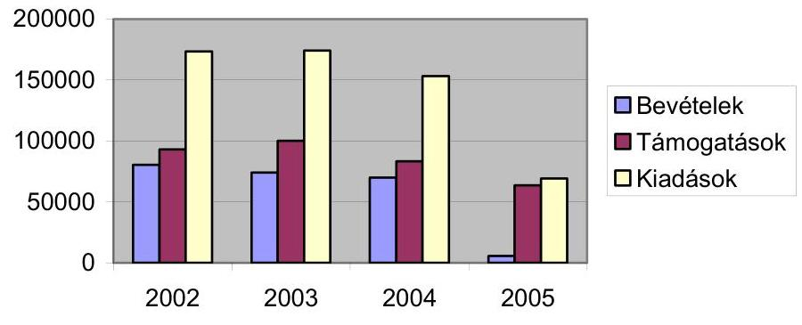
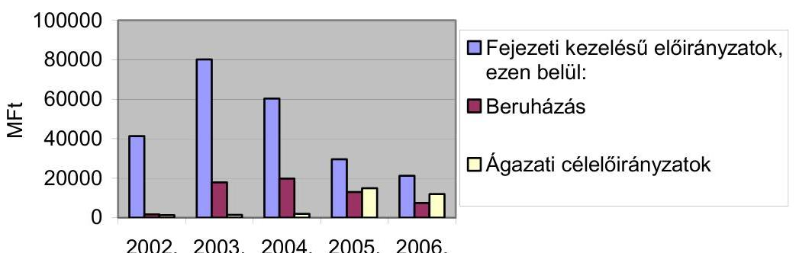
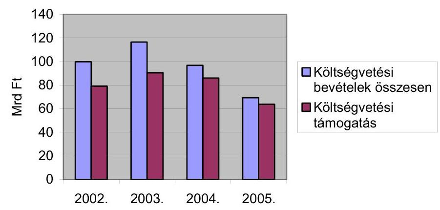
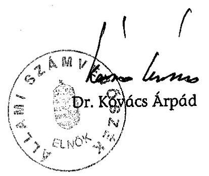
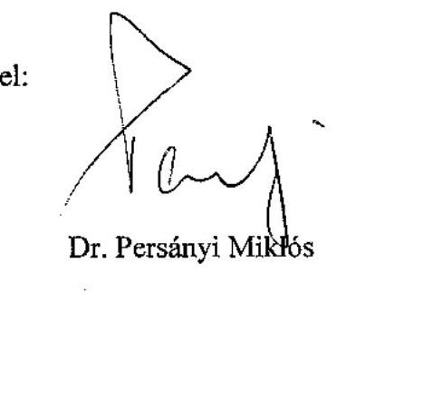
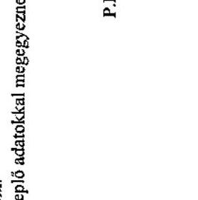
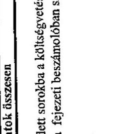
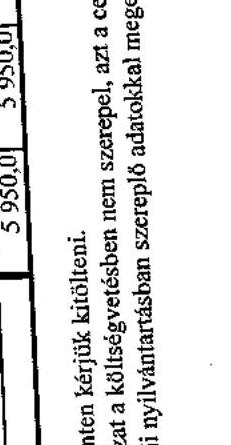

# ÁLLAMI   SZÁMVEVŐSZÉK 

## JELENTÉS

a Környezetvédelmi és Vízügyi Minisztérium fejezet müködésének ellenőrzéséről

---

# 2. Államháztartási Központi Szintjét Ellenőrző Igazgatóság 

2.3. Átfogó Ellenőrzési Főcsoport

Iktatószám: V-21-081/2005-2006.
Témaszám: 788
Vizsgálat-azonosító szám: V-0229

## Az ellenőrzést felügyelte:

Bihary Zsigmond
föigazgató
Az ellenőrzés végrehajtásáért felelős:
Hegedüsné dr. Müllern Veronika
főcsoportfőnök
Az ellenőrzést vezette:
Papp Sándor
számvevő főtanácsos
Az ellenőrzést végezték:

| Beck Miklós számvevő tanácsos | Bialkó Zsolt számvevő tanácsos | Csepreginé Tancsik Erzsébet számvevő |
| :--: | :--: | :--: |
| Csóry Györgyné számvevő tanácsos, főtanácsadó | Ébner Vilmosné irodavezető, főtanácsadó | Gregor Andrea számvevő gyakornok |
| Dr. Horváth Erika számvevő | Dr. Karáné Kőszegi Zsuzsanna számvevő tanácsos | Kovácsy Tamás számvevő |
| Kozák György irodavezető, főtanácsadó | Papp József számvevő tanácsos | Patthy Júlia számvevő gyakornok |
| Szélpál Ferenc számvevő tanácsos | Vida László számvevő tanácsos | Vitányi István számvevő |

A témához kapcsolódó eddig készített számvevőszéki jelentések:
címe
sorszáma
A környezetvédelmi fejezet múködésének ellenőrzése
2002./0327

A Környezetvédelmi alap célfeladatokra fordított pénzeszközök
2003./0443
hasznosulásának ellenőrzése
A Fertő tó természetvédelmének ellenőrzése
2003./0339
Magyar-osztrák-szlovén határmenti térség környezet- és természet-
védelmének ellenőrzése
A természeti katasztrófák megelőzésére való felkészülés ellenőrzése
2005./0542 védelmének ellenőrzése
A települési önkormányzatok szilárdhulladék-gazdálkodási felada-
2002./0221 tai ellátásának ellenőrzése
A települési önkormányzatok szennyvízközmű fejlesztési és múködtetési feladatai ellátásának vizsgálatáról

---

.

---

# TARTALOMJEGYZÉK 

BEVEZETÉS ..... 7
I. ÖSSZEGZŐ MEGÁLLAPÍTÁSOK, KÖVETKEZTETÉSEK, JAVASLATOK ..... 9
II. RÉSZLETES MEGÁLLAPÍTÁSOK ..... 20

1. A fejezet irányítási, felügyeleti feladatainak ellátása ..... 20
1.1. A fejezet feladat- és szervezeti változása, és létszámának alakulása ..... 20
1.1.1. A fejezet feladat- és szervezeti változása ..... 20
1.1.2. A fejezet létszámának alakulása ..... 26
1.2. A hatósági tevékenységek ellátása ..... 27
1.3. A tulajdonosi jogok gyakorlása ..... 30
1.4. A fejezet gazdálkodása és a belső ellenőrzés múködése ..... 36
1.4.1. A fejezet költségvetési gazdálkodása ..... 36
1.4.2. Az ellenőrzési rendszer ..... 40
1.5. Az informatikai háttér szervezeti, tárgyi és személyi feltételei ..... 43
2. Az ágazati célok megvalósítása és a fejezeti kezelésű előirányzatok kezelése és változásai ..... 46
2.1. Az ágazati célok megvalósítása, eszközrendszere ..... 46
2.2. A fejezeti kezelésű előirányzatok kezelése és változásai ..... 48
2.3. A pályázati mechanizmus múködése, szabályozottsága ..... 52
2.4. A környezeti elemek állapotát nyomon követő monitoring rendszer ..... 56
3. A fejezeti kezelésű előirányzatok felhasználása ..... 58
3.1. A projektek támogatása és végrehajtása ..... 58
3.2. A vízgazdálkodási előirányzatokból megvalósított beruházások ..... 60
3.3. A védett területekkel kapcsolatos programok végrehajtása ..... 63
3.4. A ROP, PHARE, ISPA keretében megvalósuló fejlesztések, és a miniszter egyedi döntési körébe sorolt felhasználások ..... 65
4. Utóellenőrzés ..... 67

---

# MELLÉKLETEK 

1. számú A környezetvédelmi és vízügyi miniszter levele
2. számú 1-4 számú tanúsítványok
3. számú Korábbi ÁSZ javaslatok utóellenőrzése

## FÜGGELÉKEK

1. számú A felügyelőségeknél végzett helyszíni vizsgálatok tapasztalatai
2. számú A KAC, VICE, KÖVICE előirányzatokhoz kapcsolódó projektek megvalósulása

---

# RÖVIDÍTÉSEK JEGYZÉKE 

| ÁHH | Államháztartási Hivatal |
| :--: | :--: |
| ÁSZ | Állami Számvevőszék |
| BEÖO | Belső ellenőrzési Önálló osztály (KvVM FI) |
| BM | Belügyminisztérium |
| EMIR | Egységes Monitoring Informatikai rendszer |
| EÖO | Ellenőrzési Önálló Osztály (KvVM) |
| EU | Európai Unió |
| EüM | Egészségügyi Minisztérium |
| FEUVE | Folyamatba épített előzetes és utólagos vezetői ellenőrzési rendszerek |
| FI | Fejlesztési Igazgatóság (KvVM) |
| FVM | Földmúvelésügyi és Vidékfejlesztési Minisztérium |
| GKM | Gazdasági és Közlekedési Minisztérium |
| IBSZ | Integrált Biztonsági Szabályzat |
| IHM | Informatikai és Hírközlési Minisztérium |
| IKGIR | Integrált Költségvetési gazdálkodási Információs rendszer |
| IÖO | Informatikai Önálló osztály |
| ISPA | Instrument for Structural Programmes for pre-Accession, környezetvédelmi és közlekedésfejlesztési projekteket támogató előcsatlakozási alap az EU csatlakozásra váró országok számára |
| IPCC | Integrált szennyezés megelőzésről és csökkentésről szóló irányelvek |
| IPR | Integrált Pályázati Rendszer |
| ISACA | Information Systems Audit and Controll Association |
| ITB | Informatikai tárcaközi Bizottság |
| KA | Kohéziós Alap |
| KAC | Környezetvédelmi Alap Célelőirányzat |
| Kbt. | 1995. évi XL. törvény, valamint 2003. évi CXXIX. törvény a közbeszerzésekről |
| KEHI | Kormányzati Ellenőrzési Hivatal |
| KGI | Környezetgazdálkodási Intézet |
| KHVM | Közlekedési, Hírközlési és Vízügyi Minisztérium (1990. IX. 15. - 2000. |
| KIOP | Környezetvédelmi és Infrastrukturális Operatív Program |
| KöM | Környezetvédelmi Minisztérium (2002. V. 26-ig) |
| KÖVICE | Környezetvédelmi és vízügyi céleIőirányzat |
| KöViM | Közlekedési és Vízügyi Minisztérium (2000. VI. 25-től) 2002. V. 26-ig |
| KSZ | Közreműködő szervezet |
| KvVM | Környezetvédelmi és Vízügyi Minisztérium (2002. V. 27től) |

---

| LIFE | L'Instrument Financier pour l'Environment, az Európai Unió környezetvédelmi politikáját támogató pénzügyi eszköz |
| :--: | :--: |
| MÁK | Magyar Államkincstár |
| MEMOR | Magyar Egységes Monitoring rendszer |
| MeH | Miniszterelnöki Hivatal |
| NbmR | Nemzeti Biodiverzitás-monitorozó Rendszer |
| NFH | Nemzeti Fejlesztési Hivatal |
| NFT | Nemzeti Fejlesztési Terv |
| NKÖM | Nemzeti Kulturális Örökség Minisztériuma |
| NKP | Nemzeti Környezetvédelmi Program |
| OKIR | Országos Környezetvédelmi Információs rendszer |
| OKKP | Országos Környezetvédelmi és Kárelhárítási Program |
| OKTVF | Országos Környezetvédelmi, Természetvédelmi és Vízügyi Föigazgatóság (Elnevezés 2004 január 1-jétől) |
| OLM | Országos Légszennyezettségi Mérőhálózat |
| OTMR | Országos Támogatási Monitoring rendszer |
| OVF | Országos vízügyi Főigazgatóság (2003. december 31-ig. Jogutódja az OKTVF) |
| OVIR | Országos Vízügyi Információs Rendszer |
| PEEN | Páneurópai Ökológiai Hálózat |
| PHARE | Poland-Hungary Assistance for the Restructuring of the Economy |
| PM | Pénzügyminisztérium |
| PNYR | Pályázati Nyilvántartó Rendszer |
| ROP | Regionális Operatív Program |
| SEVESO II. irányelv | Az európai Unió tanácsának többször módosított 1996. december 9-i 96/82 irányelve a veszélyes anyagokkal kapcsolatos súlyos baleseti szabályozásáról. Az elnevezés az olaszországi Sevesoban 1976-ban bekövetkezett katasztrofális hatású vegyi üzemi balesetre utal. |
| SZMSZ | Szervezeti és Múködési Szabályzat |
| TIM | Talajvédelmi Információs és Monitoring rendszer |
| TIR | Természetvédelmi Információs rendszer |
| TNM | Tárca Nélküli Miniszter |
| TVH | Természetvédelmi Hivatal |
| VICE | Vízügyi Célelóirányzat |
| VKK | Vízügyi Központi és Közgyűjtemények |
| VITUKI | Vízgazdálkodási és Tudományos Kutató Intézet |
| VTT | Vásárhelyi-terv továbbfejlesztése |

---

# ÉRTELMEZŐ SZÓTÁR 

| IPCC | Integrált szennyezés megelőzésről és csökkentésről szóló irányelvek. |
| :--: | :--: |
| ISPA | Instrument for Structural Policies for Pre-Accession: a környezetvédelmi és közlekedési infrastruktúra fejlesztését támogató előcsatlakozási alap, a strukturális politikák eszköze, a Kohéziós Alap előfutára. |
| KIOP | Környezetvédelem és Infrastruktúra Operatív Program, melynek célja környezetvédelmi és közlekedésinfrastrukturális beruházások megvalósítása Magyarországon a Kohéziós Alapból történő fejlesztésekkel összhangban. |
| LIFE | L’Instrument Financier pour l'Environment: az Európai Unió környezetvédelmi politikáját támogató, 1992-ben létrehozott pénzügyi eszköz. |
| Natura 2000 hálózat | Az Európai Unió két természetvédelmi irányelvén - a madárvédelmi (79/409/EGK) és az élőhelyvédelmi (43/92/EGK) irányelven - alapuló, az Unióban kötelezően megőrzendő élőhelytípusok, állat- és növényfajok védelmére kijelölt területek hálózata. |
| PHARE | Poland-Hungary Assistance for Restructuring the Economy: az Európai Közösség kezdeményezése, melynek eredeti célja Lengyelország és Magyarország gazdaságának a felzárkóztatása volt a fejlett nyugati államok szintjére, ma a közép- és kelet-európai országok számára nyújt támogatást a demokratizálódáshoz, a gazdaság átalakításához és az európai uniós csatlakozásra való felkészüléshez. |
| PNyR | Pályázati Nyilvántartó Rendszer: általános pályázati számítógépes nyilvántartó alkalmazás. |
| SEVESO II. Direktíva | A veszélyes ipari tevékenységekkel kapcsolatos jelentős baleseti kockázat szabályozásáról szóló 96/82/EC Direktíva. |

---

.

---

# JELENTÉS 

## a Környezetvédelmi és Vízügyi Minisztérium múködésének ellenőrzéséről

## BEVEZETÉS

A Környezetvédelmi Minisztérium 2002. évi átfogó vizsgálatát követően a környezet és természetvédelem, valamint a vízgazdálkodás államigazgatási irányítása, szakmai felügyelete alapvetően átalakult. A kormányzati struktúraváltás következtében a vízgazdálkodási feladatok a 2002-ben létrehozott Környezetvédelmi és Vízügyi Minisztériumhoz (KvVM) kerültek. Ezt követően a fejezet feladat- és szervezeti rendszere többször átalakult, szétváltak a hatósági és az irányítási feladatok, 2006. január 1-től megszűnt a középirányító típusú, illetve háttérintézményi döntés-előkészítő feladatokat ellátó Országos Környezetvédelmi, Természetvédelmi és Vízügyi Főigazgatóság. A Minisztérium 2002-ben 25 intézmény felett gyakorolt felügyeletet, ezek száma 2005-re 39-re nőtt. Az EU-s fejlesztési források kezelésére és koordinálására 2003-ban létrehozták a KvVM Fejlesztési Igazgatóságot. A Minisztérium 2002. évben 47 társaságban volt tulajdonos, illetve résztulajdonos, 2005. december 31-re számuk 38 lett.

A vizsgált 2002-2005 közötti időszakban a fejezet feladatának és az állami költségvetés szerkezetének változása alapvető hatást gyakorolt a fejezet előirányzataira. A Környezetvédelmi Alap Célfeladatok és a Vízügyi Célelóirányzat 2004-ben megszűnt, helyükbe a Környezetvédelmi és Vízügyi Célelóirányzat lépett, ami 2005-ben szintén megszűnt, helyette a beruházások címen belül új és nevesített előirányzatok kerültek a fejezet költségvetésébe (pl. a vízkárelhárítás, szennyvízelvezetés, hulladékkezelés és az Országos Környezeti és Kárelhárítási Program).

A fejezet 2002. évi eredeti kiadási előirányzata a vízgazdálkodási feladatok átvétele következtében 50,5 milliárd Ft-ról 99 milliárd Ft-ra emelkedett, majd 2005-re, a fejezeti kezelésű előirányzatok összegének változása miatt, 69,3 milliárd Ft-ra csökkent.

A fejezet pénzügyi forrásait az állami támogatás mellett a bírságokból és a termékdíjakból származó központosított bevételek is kiegészítették, a teljesített bevételi főösszeg 2002-ben 30,5 milliárd Ft, 2004-ben 33,0 milliárd Ft, a 2005. évi tervezett előirányzat 39,3 milliárd Ft, a teljesítés 35,8 milliárd Ft volt.

A fejezet engedélyezett létszáma 2002-ben 2990 fő volt, a vízgazdálkodási feladatok fejezethez szervezése további 5101 fő átvételével járt. Az átszervezések és a központilag elrendelt létszámcsökkentések miatt a fejezet szervezeteinek öszszes létszámát a minisztérium 2005-re 7123 főben határozta meg.

---

Az ellenőrzés célja annak értékelése volt, hogy a Minisztérium:

- szervezeti, irányítási és működési rendszere, továbbá a költségvetése összhangban volt-e a szakmai feladatokkal, biztosította-e azok hatékony és eredményes ellátását, a vízgazdálkodási feladatokat célszerűen építették-e be a szervezeti és feladatrendszerébe;
- a felügyeleti és ágazati irányító teendőit célszerűen és eredményesen látta-e el;
- biztosította-e a fejezeti kezelésű előirányzatok szabályszerű felhasználását, az EU támogatások hatékony igénybevételét, a kitűzött ágazati, szakmai célok elérését, és azok környezetre gyakorolt hatásának monitoring rendszerú ellenőrzését, valamint más, környezetvédelmi célokat szolgáló előirányzatokat is kezelő tárcákkal való együttműködést;
- irányító és gazdálkodó tevékenységében hasznosította-e a korábbi ÁSZ ellenőrzések megállapításait és ajánlásait.

Az ellenőrzés keretében teljesítmény-ellenőrzés módszerével értékeltük a hatósági munka hatékonyságát, valamint a környezet-, a természet- és a vizek védelmét célzó közpénzek felhasználásának eredményességét. Az előirányzatok felhasználásának eredményességét a hozzárendelt feladatok céljainak teljesülései szerint (pl. szennyvíz kibocsátás csökkenése, élővilág és egyedek védelme), továbbá a támogatások és beruházások által elért környezetkárosító hatások mérséklődése alapján minősítettük. Ellenőrzésünk során támaszkodtunk a fejezet múködését, ill. fejezeti kezelésű előirányzatok felhasználását érintő korábbi ÁSZ ellenőrzések megállapításaira.

Az ellenőrzés végrehajtására az Állami Számvevőszékről szóló (többször módosított) 1989. évi XXXVIII. tv. 2. § (3); (5); (9), valamint a 17. § (3) bekezdései adták a jogi alapot.

A jelentést az Állami Számvevőszékről szóló 1989. évi XXXVIII törvény 25. § (1) bekezdésének megfelelően észrevételezésre megküldtük Dr. Persányi Miklós környezetvédelmi és vízügyi miniszternek, aki a jelentésben foglalt megállapításokat elfogadta, észrevételt nem tett. Levelét az 1. számú melléklet tartalmazza.

---

# I. ÖSSZEGZŐ MEGÁLLAPÍTÁSOK, KÖVETKEZTETÉSEK, JAVASLATOK 

A vizsgált időszak elején a vízügyi szervek és a környezetvédelmi, valamint a természetvédelmi szervek nem egy tárca irányítása alatt múködtek. Az elmúlt évtizedben világviszonylatban, de különösen Európában előtérbe került az egységes szemléletű és szerkezetű, megelőző környezetvédelem, amely felvetette az állami irányítás és a hatósági szervezetrendszer átalakításának az igényét. A magyar környezetvédelmi intézményrendszer újragondolását az európai uniós tagsággal együtt járó feladatnövekedés és az új kihívások is indokolták.

A fejezet irányításában a célszerűen és hatékonyan múködő struktúrára való törekvés az ellenőrzött négy év alatt folyamatosan érvényesült, a folyamat ugyanakkor lassú volt, a vizsgálat végére a struktúra kialakítása nem fejeződött be. Az előforduló pozitív tapasztalatok ellenére még nem, vagy nem minden tevékenység esetében mutatható ki eredmény. Ennek oka sokrétű: előkészítetlen volt a vízügyi feladat fejezetbe integrálása, nem kellően gondolták át és emiatt több lépcsőben történt az egyes részfeladatok összeszervezése. Az átalakítások pozitívuma, hogy 2004-re létrejött az egységes, mindhárom ágazati (környezetvédelmi, természetvédelmi, vízügyi) szakterületet felölelő hatósági rendszer. A minisztérium mozgáslehetőségét 2004-től a kormányzat forrásszűkítő intézkedései korlátozták, ami kihatott a létszámgazdálkodásra, valamint a fejezeti kezelésű előirányzatok szerkezetének változásán és előirányzatainak csökkentésén keresztül az ágazati feladatok végrehajtására. A fejezet belső kontroll rendszere hiányos, annak csak egyes elemei múködnek megfelelően, úgymint a tulajdonosi jogérvényesítés és a környezeti elemek állapotát nyomon követő monitoring rendszer. A fejezeti kezelésű előirányzat-felhasználások környezetvédelmi hatásainak fejezeti értékelése 2006-ra várható. Nem valósult meg a támogatások hasznosulásának szakmai ellenőrzése, hosszú távú monitoringja és ezek hiánya miatt a támogatott projektek környezeti elemekre gyakorolt hatásainak értékelése. További intézkedések szükségesek a felügyeleti, és az intézményi belső ellenőrzés megerősítése, és a biztonságos informatikai háttér kialakítása érdekében.

A 2002. évi új kormánystruktúra keretében hozták létre a Környezetvédelmi és Vízügyi Minisztériumot (KvVM). Az átalakítás más fejezeteknél is tapasztalt hiányosságai itt is megmutatkoztak. ${ }^{1}$ Az előkészítettség nem volt megfelelő, a tényleges igényeket nem mérték fel előzetesen, az átszervezés nem volt zökkenőmentes. A vitás kérdések tisztázására felelős személyt, szervezetet nem jelöltek ki, határidőket nem határoztak meg, előirányzat-átcsoportosításokat központilag nem koordinálták, a megállapodások megkötését a tárgyaló felek erőviszonya és a pillanatnyi érdekek befolyásolták, mindezek következtében a fo-

[^0]
[^0]:    ${ }^{1}$ A megfelelő előkészítés nélkül végrehajtott struktúra változások következményeire már az Informatikai és Hírközlési Minisztérium és a Területfejlesztés fejezet múködéséről szóló ÁSZ jelentések is felhívták a figyelmet.

---

lyamat közel egy évig elhúzódott. A törvény kizárólag a feladatkörök tekintetében határozta meg a jogutód (átvevő) minisztériumokat, általános jogutódot nem nevezett meg. ${ }^{2}$

A feladatok és a szervezetek integrációja szükségszerűen a fejezet szerkezetének átalakításával járt, amit szakaszos, több lépcsőben történő végrehajtás jellemzett. Az átszervezések nem biztosítottak megfelelő feltételeket a zavartalan működéshez. Az átalakítás megalapozását a feladat- és hatáskörök előzetes, teljes körű felmérését magába foglaló hatástanulmány nem készült, így rendszerszemléletű koncepció hiányában - egy éven belül többször is - változott a központi, ill. a területi igazgatás szervezete. A tényleges integráció helyett, először az egyes szakmai területek, illetve feladatok egymás mellé szervezése történt meg, a vízügyi igazgatás tényleges integrációja és ezzel a fejezet szervezeti átalakítása csupán 2004 elején kezdődött. A vizsgált időszakban a 34 önálló szervezeti egység száma 46 -ra nőtt. 2004-ben a vízügyi igazgatóságok feladatköréből elkülönítették a közhatalmi (hatósági, szakhatósági) feladatköröket és a szervezet-átalakítás első lépcsőjeként létrejött 12 vízügyi felügyelet. A 2005-től - a centralizált egyablakos ${ }^{3}$ ügyintézést megcélozva - a környezetvédelem területi feladatait ellátó 12 környezetvédelmi felügyelőség és az első fokú vízügyi hatósági feladatokat ellátó 12 vízügyi felügyelet összevonásával, továbbá a természetvédelem területi feladatait ellátó 10 nemzeti park igazgatóság hatósági, szakhatósági feladatainak az új szervtípushoz történő telepítésével létrehozták az első fokú környezetvédelmi, természetvédelmi és vízügyi hatósági tevékenységet ellátó regionális szervezetrendszert. Ennek eredményeként a területi igazgatás ismét 34 szervezetre szűkült. ${ }^{4}$

Az átalakításokat követően kiadott 2005-től hatályos SzMSz, a minisztérium múködését általánosan, összevontan tartalmazza, nem részletezi a főosztályokra, osztályokra lebontott feladatokat és nem képezi mellékletét az ellenőrzési nyomvonal.

A szakmai irányításhoz az EU jogrenddel harmonizált (a környezet védelmét, a vízgazdálkodást, a természet védelmét, a hulladékgazdálkodást szabályozó) törvények a vizsgált időszak elejére, 2002-re már hatályba léptek. A törvényekben rögzített ágazati célok végrehajtásának alapja a Nemzeti Környe-

[^0]
[^0]:    ${ }^{2}$ A megszűnő Közlekedési és Vízügyi Minisztériumnál (KÖVIM) az általános jogutódra a törvény szövegéből következtetni sem lehetett.
    ${ }^{3}$ A korábbi három szakterületi hatóság helyett az ügyfélnek egyet kell megkeresnie, az „akta utazik" az ügyfél helyett.
    ${ }^{4}$ Az ÁSZ 2005. évi, a természeti katasztrófák megelőzésére való felkészülés ellenőrzéséről szóló jelentés többek közt megállapította, hogy a szervezeti változásoknak a vízkár elhárítási feladatok ellátása, a megelőzés megalapozott tervezése és végrehajtása szempontjából pozitív hozadéka nem mutatható ki, sőt az átszervezések olyan mértékű létszámleépítéssel jártak, amely a védekezés műszaki irányítását, illetve a védelmi osztagok tevékenységét tekintve a biztonságot veszélyeztető kockázati tényezőt jelent. Az ágazat létszáma 5200 főról 4018 főre csökkent, a védelmi beosztásokban szereplő létszám csak az I-II. fokú készültségi szinteken képes maradéktalanul ellátni feladatát.

---

zetvédelmi Program (NKP), melynek első ütemében foglalt feladatok végrehajtása 2002-ben befejeződött, az elviekben 2003-ban induló NKP II. az Országgyúlés általi elfogadására csak 2003 végén került sor. Ez a késedelem kihatással volt az NKP-II. 6 éves feladatainak időbeni ütemezésére. A több tárca közreműködésével megvalósuló NKP II. 6 évre tervezett programjára 2100 milliárd Ft költségvetési forrásigényt határoztak meg. A tervezés alapján a központi költségvetés kiadásai az NKP-II. hatéves időszaka alatt növekvő volumenűek, igazodva egyrészt az elvégzendő feladatok ütemezéséhez, másrészt a középtávú Gazdaságpolitikai Programban foglaltakhoz. Az NKP-II első két évében a központi költségvetés támogatás az időarányos forrásigény mintegy harmadát 270 milliárd Ft-ot - tett ki. A középtávú program során növekvő, 2005-re már 262 milliárd Ft (pl. 2008-ra 513 milliárd Ft), támogatást terveztek, amelynek megvalósulása elősegítheti a program finanszírozásában eddig mutatkozó elmaradás csökkentését. Az NKP 6 éves időszakára vonatkozó éves forrásmegosztás tervezete elkészült, de az már nem épülhetett be a finanszírozásról szóló 2004-ben kiadott kormányhatározatba.

A rendelkezésre álló források nagysága - a vizsgált időszakban bekövetkezett csökkenése miatt - volt a szűk keresztmetszet az ágazati feladatok végrehajtásában. Az éves előirányzat tervezésekor a maradék elv érvényesült, vagyis az elsődleges cél a múködés biztosítása volt, az ágazati célokra a „maradék" jutott. A fejezet költségvetését, gazdálkodását, az ágazati célok finanszírozhatóságát nem a három ágazat szükségletei, hanem - pl. a források szűkítésén keresztül - a kormányzati akarat határozta meg. Ez hatással volt a költségvetés tervezésére, a létszámra, a költségvetési támogatások mértékére. A fejezet forrás lehetősége szűkült, ezen belül az eredeti előirányzatok 2003-tól drasztikusan csökkentek, a gazdálkodás lehetőségeit évközi forráskorlátozások - 2004-ben elvonások, zárolások, 2005-ben tartalékképzés kötelezettsége - tovább szűkítették. A fejezet eredeti kiadási előirányzata, a 2002-2005 években (a 2003. évi növekedés kivételével) folyamatosan, 2005-re mintegy harmadával (2003-hoz képest mintegy felével) 69 milliárd Ft-ra csökkent. A központi támogatások növekedése révén a módosított kiadási előirányzatok minden évben jelentősen mintegy $50 \%$-kal - meghaladták az eredeti előirányzatot. Az intézmények működési kiadásait a miniszter a KAC keretéből (2002-2003-ban a KAC közel 1\%-át kitevő, összesen 602,7 millió Ft-tal) egészítette ki.

A fejezet föbb előirányzatainak alakulása (M Ft)

---

Az ágazati célok finanszírozásánál az EU felé vállalt kötelezettségek teljesítése kapott prioritást. A fejezeti kezelésú elöirányzatokon belül a nemzeti programokat finanszírozó előirányzat részek évről-évre háttérbe szorultak. A környezetvédelmet szolgáló előirányzatok szerkezete - elsősorban kormányzati döntések következtében - a vizsgált időszakban többször átalakult, egyes előirányzatokat összevontak, illetve megszüntettek (számuk 22-ről 14-re csökkent). A Környezetvédelmi Alap Célfeladatokat és a Vízügyi Célelóirányzatot 2004ben Környezetvédelmi és Vízügyi Célelóirányzat (KÖVICE) néven egyesítették, de 2005-től ez is megszűnt, bevételeit központosították. A KÖVICE előirányzatból a decentralizált rész 2004-től (mintegy 1,2 milliárd Ft) a Területfejlesztés fejezethez került. A 2005. évi változások indoklását bemutatni nem tudták, az okok egyértelmúen a hazai források hiányára vezethetők vissza. Erre utal, hogy az átalakításokkal egy időben az előirányzatok összege (az összevonás ellenére) 2003-2005 időszakban kb. a harmadára (29,6 milliárd Ft) csökkent. A KÖVICE helyett a 2005. évi költségvetésben 4 meghatározott jogcímú (beruházási) fejezeti kezelésű előirányzat szerepelt, de ezek csak a korábbi években vállalt kötelezettségek finanszírozására szolgáltak, új pályázatokat már nem hirdettek meg. A 2006. évi fejezeti kiadási számok jól példázzák a tendenciát, ennek öszszege ugyanis 106,2 milliárd Ft volt, de ebből az új előirányzatként jelentkező EU integráció (KIOP, Kohéziós Alap) előirányzata 47,3 milliárd Ft (ennek felhasználója nem a minisztérium). A hazai finanszírozású beruházási és ágazati előirányzatokra 15,9 milliárd Ft maradt, ezek azonban döntően a korábbi években indult beruházások finanszírozását fedezik. A fejezeti kezelésű előirányzatok változásai, ill. a két legfőbb ágazati céleloóirányzat megszüntetése megnehezíti a több éve futó (és az NKP-hoz kapcsolódó) programok finanszírozását és annak nyomon követését, hogy az ágazati programok által kitűzött célok mely részei nem valósulhattak/valósulhatnak meg.

# A fejezeti kezelésű előirányzatok alakulása és megoszlása 

A környezetvédelmi célú forrásokra (KAC, KÖVICE) pályázatokat hirdettek, kezelésük teljes körű szabályozása minden évben, miniszteri rendeletben jelent meg. A pályázatok kiírása, befogadása, nyilvántartásba vétele, és döntés előkészítése, ellenőrzése a szervezeti változásokhoz igazodva mindig más szervezethez került, az emiatt jelentkező nehézségek (feladat átadás-átvétel, vezető váltás) ellenére a végrehajtás a hatályos rendeleteknek általában megfelelt. A bírálati rendszer szabályozott volt, a támogatásokról szakmai bizottságok javaslata alapján a miniszter döntött. A pályáztatás belső kontroll rendszerének

---

szabályozása megtörtént. A vezetői és a folyamatba épített ellenőrzési rendszer működött, ugyanakkor a lezárt projektek szakmai ellenőrzése nem történt meg, a Kincstár - pénzügyi, számviteli, jogszabályi - ellenőrzést végzett. A miniszteri egyedi döntéssel juttatott támogatásoknál a megjelölt, általánosság szintjén megfogalmazott cél a jogszabályokhoz igazodott, mértékük évente csökkenő tendenciát mutatott. ${ }^{5}$ A helyszíni ellenőrzés a kiválasztott pályázatok közül egy esetben, a támogatott mulasztását és az ellenőrzési eljárás hiányosságát tárta fel. A pályázatok követésére és nyilvántartására az integrált pályázati rendszer (IPR) szolgált. A rendszer nem egységes módon múködött, mivel az egyedi döntésű támogatásokat külön kezelték. Az IPR-t a hozzáférési jogosultságok alapján a fejezet szervezetei, valamint külső szervezetként a MÁK használta, de a rendszerhez való hozzáférés rendjét és módját írásban nem szabályozták.

A környezetvédelmi célok finanszírozását nem csak a KvVM kezelésében levő előirányzatok, hanem más fejezetek (MeH, BM, Területfejlesztés, FVM) által kezelt források is szolgálták. Ezek az előirányzatok az azonos célú támogatások szabályai alá tartoznak, az azonos pályázati célok kijelölését, a pályázati kiírások készítését tárcán belüli és a tárcaközi egyeztetések előzték meg. Részletekre kiterjedő előminősítést vezettek be az azonos, vagy megtévesztően azonos célú pályázatok kiszűrésére. A pályázati felhívások kiírása a szakterületi (tárcák közötti) egyeztetések elhúzódása miatt, nem minden esetben történt meg a kormányrendeletben meghatározott időpontig. Az összehangolást szabályozó kormányrendelet 2005-től, felsorolta a korábban azonos célú körbe tartozó előirányzatokat, de - két kivételtől eltekintve - már nem jelölte meg más tárcák előirányzatait. A hazai forrásokra támaszkodó más tárcákkal közös célú pályázati lehetőségek társadalmi szervezetek támogatására korlátozódtak.

A vízügyhöz kapcsolódó feladatok ellátását a vizsgált időszak végére, a szervezeti változások, a létszámcsökkenések, a források szűkülése, a tulajdonosi körbe tartozó vízügyi feladatokat ellátó társaságokat a veszteséges gazdálkodás súlyosan érintette. A minisztérium a középszintű szervezetekre kiterjedő felülvizsgálatot követően - újabb szervezeti változtatással - 2005 végétől a környezetvédelem, természetvédelem és vízügy országos irányító szervét, a Főigazgatóságot megszüntette. Feladatai, így a beruházási, valamint a pénzügyi és számviteli feladatok, a 2006-tól létrehozott vízügyi központ és közgyűjteményi költségvetési szervhez, a szakmai feladatok a területi szervekhez kerültek. ${ }^{6}$ A szervezet és a feladatok átszervezését egy 2005. évi ÁSZ vizsgálat kockázatosnak ítélte. ${ }^{7}$ A szakmai feladatokhoz viszonyítva jelentős alulfinanszírozottság

[^0]
[^0]:    ${ }^{5}$ A miniszteri támogatás összege a KAC megszűnéséig, vagyis 2002-2003-ban 602,7 millió Ft volt, ami a KAC előirányzatának $1 \%$-át tette ki.
    ${ }^{6}$ A Főigazgatóság megszüntetésével - belső számítások szerint - hozzávetőlegesen 700 millió forintot takaríthat meg a tárca.
    ${ }^{7}$ Az ÁSZ 2005. évi, a természeti katasztrófák megelőzésére való felkészülés ellenőrzésével kapcsolatos vizsgálata szerint a szervezeti változásoknak a vízkár-elhárítási feladatok ellátása szempontjából pozitív hozadéka nem mutatható ki, sőt 2004 közepére a megelőzésbe, védekezésbe vonható létszám drasztikusan csökkent és ez a védekezés

---

jellemezte a karbantartási feladatok ellátását, a szükséges összegnek a fele sem állt az igazgatóságok rendelkezésére. ${ }^{8}$

A vízügyi beruházások forrása döntően a VICE és a KÖVICE, valamint meghatározott célú előirányzatok voltak (pl. a Vásárhelyi terv (VTT)). Az árvízvédelmi beruházások keretében öt előirányzatból közel 72,4 km árvízvédelmi töltés épült meg. A VTT 2004-2007. évekre szóló I. ütemének megvalósítására 50 milliárd Ft-ot terveztek, ennek ellenére a 2004-2006. évekre ütemezett 38 milliárd Ft helyett az éves költségvetési törvények csak 21,7 milliárd Ft-ot irányoztak elő. Az elviekben rendelkezésre álló összeg terhére - az államháztartás egyensúlyi helyzetének javítását célzó kormányzati intézkedések hatásaként - a minisztérium 2005-ben 9 milliárd Ft maradványképzésről döntött. A rendelkezésre álló keretet a minisztérium szerződésekkel lekötötte, ezek teljesülése 2006-2007. évekre várható.

Az Országos Ivóvíz Minőségjavító Program - amelynek a megvalósításához szükséges forrásigény 25,2 milliárd Ft -, tekintettel a nemzeti források korlátozott mértékére, az előzetesen tervezett 2006-ra várhatóan nem valósulhat meg, emiatt az EU felé vállalt kötelezettség sem fog teljesülni. Az Ivóvízbázisvédelmi Program végrehajtásáról 2002-ben rendelkező Korm. határozat ellenére a források ütemes biztosításáról a vizsgált években nem gondoskodtak.

A védett természetvédelmi területek védettségi szintjének helyreállításáról szóló törvényi rendelkezés végrehajtása - a források szűkülése miatt a törvényben rögzített határidő kétszeri módosítása ellenére - késik. Ezért a mintegy 100 ezer hektár terület szükségesnek mutatkozó állami tulajdonba vétele még 2007re sem valósulhat meg, mert - egy minisztériumi belső tervezet szerint - a szükséges 15 milliárd Ft forrás várhatóan nem fog rendelkezésre állni. A védett természetvédelmi területeken folytatható gazdálkodásra kialakított kezelési tervek az országos jelentőségű védett természeti területeken élő élővilág védelmét ill. fennmaradását célozzák. A Natura $2000{ }^{9}$ hálózat kijelölése megtörtént, a program megvalósítására a vizsgált időszakban 6,8 milliárd Ft-ot - hazai és nemzetközi forrásokat - fordítottak, ebből a hazai ráfordítás 2,4 milliárd Ft volt.

Az ISPA és a Phare forrásból megvalósult fejlesztéseknél a vizsgált időszak végéig - esetenkénti határidő módosítás ellenére - nem került sor egyetlen projekt törlésére sem. A Kohéziós Alapból a 2004-2006 közti időszakban 5 projektre 526 M eurót sikerült lekötni. Az EU források hatékony igénybevétele érdekében a feladatot ellátó Fejlesztési Igazgatóság az ISPA/Kohéziós Alap kezelését
műszaki irányítását, mind a speciális védekezési feladatokat ellátó védelmi osztagok tevékenységét tekintve biztonságot veszélyeztető tényezőt jelent.
${ }^{8}$ Az ÁSZ 2005. évi, a természeti katasztrófák megelőzésére való felkészülés ellenőrzésével kapcsolatos vizsgálatának megállapítása.
${ }^{9}$ a Natura 2000 terület (európai közösségi jelentőségű természetvédelmi rendeltetésű terület): külön jogszabályban meghatározott különleges madárvédelmi terület, különleges természetmegőrzési, valamint kiemelt jelentőségű természetmegőrzési területnek kijelölt terület, illetve az Európai Unió által jóváhagyott különleges természetmegőrzési, valamint kiemelt jelentőségű természetmegőrzési terület;

---

végző szervezeti egységeknél bevezette a minőségirányítási és a teljesítményértékelési rendszert, növelte a projektmenedzserek számát.

A fejezeti kezelésű előirányzatok vizsgálata során 19 projekt helyszíni ellenőrzésére került sor. Jellemző volt - az ÁSZ által már korábban is kifogásolt sokcsatornás finanszírozási rendszer. A források megszerzését nehezítette, hogy azokat eltérő időben lehetett elérni, és végrehajtásukra eltérő ütemezések vonatkoztak. Emiatt a pályázók egy elhúzódó folyamatban, több helyen kényszerültek pályázni. Ennek következtében - a tárca által kiírt pályázati követelmények ellenére - egy már megkezdett beruházást támogattak. ${ }^{10} \mathrm{~A}$ támogatottak jellemzően alkalmazták a közbeszerzési eljárásokra vonatkozó előírásokat, még akkor is ha azt a pályázati szerződésekben nem követelték meg. Vizsgálatunk egy pályázat elszámolásánál a támogatott mulasztását és az ellenőrző szervezet ellenőrzési hiányosságát tárta fel, de ezt követően belső vizsgálat az ügyben nem indult. ${ }^{11}$ A beruházások hatásait nem követték nyomon monitoringgal, 3 esetben elmaradt a kormányrendeletben rögzített teljes körű eredményességi, hatékonysági és célszerűségi elemzéssel záródó ellenőrzés.

A környezeti elemek állapotát nyomon követő monitoring rendszer kiépített. A vizsgálatokat a felelős szervezetek rendszeres mérésekkel, laboratóriumi vizsgálatokkal hajtották végre. A felszíni határvizek esetében eredményes a közös méréseken és adatcserén alapuló, a szomszédos országok hatóságaival való együttműködés. Kifogásolható viszont, hogy az előirányzatokból megvalósult pályázatok, beruházások monitoringját, vagyis a hatásuk nyomon követésének rendszerét, a mechanizmus szerves részeként nem építették ki. A helyszíni vizsgálattal érintett projektek esetében is döntően elmaradt az eredményességi, hatékonysági és célszerűségi elemzéssel záruló ellenőrzés, azokat elsősorban pénzügyi szempontból ellenőrizték. Az egyes támogatások hasznosulásának vizsgálatát és az eredmények bemutatását lehetővé tevő nyilvántartási és beszámolási rendszert nem dolgoztak ki. Az értékelési rendszer kialakítása keretében 2002-ben az egyes fejlesztési támogatásoknál gyűjthető, naturális mutatókat dolgoztak ki. Ennek alapján a 2002-2004. években KAC-ból, VICÉből és KÖVICÉ-ből nyújtott támogatások környezetvédelmi eredményeinek elemzését egy megbízott, külső szervezet előreláthatólag 2006. év második felére készíti el. Az EU források monitoring tevékenységét az EU források kezelését ellátó fejlesztési igazgatóság látta el.

Az éves zárszámadásokat ellenőrizve a minisztérium gazdálkodását döntően rendben találta az ÁSZ, kifogásolta ugyanakkor, hogy 2003-ban a KAC és 2004-ben a VICE előirányzatból - rendeltetéstől eltérő felhasználással - jutalmat, ill. szerződéses juttatásokat fizettek ki. A financial audit módszerrel törté-

[^0]
[^0]:    ${ }^{10}$ A más szervezetek által meghirdetett pályázatok előírásai szerint a beruházást egy éven belül meg kell kezdeni, a tárca pályázati szabályai szerint viszont megkezdett beruházásra támogatást adni nem lehet.
    ${ }^{11}$ Az ellenőrzés hiányosságait veti fel, hogy a beruházás befejezése és átvétele után kért határidő módosítást a minisztérium - megadta. A megmaradt mennyiségi és minőségi hiányosságok miatt a beruházó visszaszámlázott összeget nem osztotta meg a támogatás arányában a minisztériummal, holott ${ }^{11}$ erre kötelezettséget vállalt.

---

nő ÁSZ ellenőrzések a KvVM Igazgatás cím és a fejezeti kezelésű előirányzatok tekintetében megállapították, hogy a költségvetési beszámolók megfeleltek a törvényi előírásoknak és a vonatkozó egyéb rendelkezéseknek, a vagyoni, pénzügyi helyzetről megbízható és valós képet adtak.

A létszámgazdálkodást alapvetően a feladatok integrálása, a belső szervezeti átalakítások, 2004-től pedig a csökkentés irányába ható kormányzati, ill. miniszteri döntések határozták meg. A Kormány által elrendelt létszámcsökkentés 2003-ban $10 \%$-kal, 2004-ben további $9 \%$-kal érintette a minisztériumot. Az EU csatlakozás miatt szükségessé vált intézményfejlesztés ugyanakkor létszámfejlesztést indokolna. A minisztériumi szervezet az átszervezések ellenére túltagolt, mintegy 90-100 fő tölt be középszintű ill. annál magasabb vezetői tisztséget, ez a minisztérium összlétszámának kb. 16\%-a.

A hatósági feladatok ellátását is érintették a feladat- és szervezeti átalakítások, 2004-ben létrejött a hatósági feladatok országos hatáskörú irányító szerve, és a hatékonyság növelését célozva, az addig három hatósági szakterületet összevonták. A főfelügyelőség munkája - a növekvő számú feladataik ellenére - eredményes ( $2 \%$ pervesztés) ${ }^{12}$, ugyanakkor magas arányú ( $15 \%$ ) a határidő túllépés. A hatósági munka értékeléséhez hiányzott a mutatószámokkal megalapozott elemzés és az iktatott feladatokat naprakészen rögzítő elektronikus nyilvántartás. A felügyelőségeknél is egyre növekvő ügyiratszám jelentkezett, az itt is tapasztalt határidő túllépések nem megfelelő hatékonyságra, a létszámkapacitás szűkösségére, és/vagy a külső szakértők növekvő alkalmazásának igényére utalnak.

A miniszter tulajdonosi körébe tartozó társaságok és alapítványok vagyona a többségében pozitív gazdálkodás ellenére csökkent, kb. 4\%-kal (800 millió Fttal). Ellenőrzésünk során kifogásoltuk, hogy ezek vagyona nem mindig a saját tevékenységet szolgálták, hanem pl. bérbeadás révén hasznosultak. Egy esetben, a Balatoni Halászati Rt. részére 2004-ben kifizetett összeg nem csak a közbeszerzési pályázatban megjelölt tevékenység (halászat), hanem egyéb saját tevékenység (halfeldolgozás) finanszírozására is szolgált. A társaságok múködésére fordított nettó 3500 M Ft támogatásról nem vezetnek aktualizált, minden támogatásfajtát magába foglaló nyilvántartást.

A tulajdonosi jogok gyakorlása, a társaságok felügyelete mind a miniszter, mind a szervezetek tulajdonosi körébe tartozó társaságok esetében - elsősorban a tulajdonosi érdekképviselet, az üzletpolitika meghatározásában, a társaság irányításában - megfelelően érvényre jutott.

A vízügyi igazgatóságok tulajdonosi körébe tartozó 20 kft és 1 kkt (közkereseti társaság) gazdálkodásában- jórészt az állami megrendelések csökkenése miatt - 2004-re 98 millió Ft veszteség keletkezett, vagyonuk 20\%-kal (800 Millió Ft-tal) csökkent. A társaságok gazdálkodása - a csökkenő nyereség ellenére hozzájárult az állami feladatok finanszírozásához. A minisztérium a vízügyi igazgatóságok tulajdonosi körébe tartozó társasági részesedések megszüntetésé-

[^0]
[^0]:    ${ }^{12}$ A 850 másodfokú határozat 10\%-át támadták meg bírósági úton, ezek mintegy ötödrészét vesztették el.

---

ről (értékesítés, végelszámolás, átalakítás) döntött. A vízügyi ágazat így az állami feladatokat a jövőben a magánszféra bevonásával fogja ellátni. A privatizált feladatok ellátásának az üzletrész átruházási szerződésekben rögzített garanciái (pl. kötbérezés) nem kellően biztosítottak, ha a privatizált szervezetek nem tudják, vagy nem akarják ellátni a szerződésekben vállalt állami feladatokat. Erre, egy már végrehajtott üzletrész átruházásánál tapasztaltak is felhívják a figyelmet. ${ }^{13}$ A Kht-vá alakítás, illetve összevonás gazdasági oldalról nem volt kellően megalapozott, ugyanis az állami feladat pénzügyi támogatásánál a korábbi (gazdasági társaság esetében) alkalmazott árakkal számoltak.

Az ellenőrzési rendszer feladatai a vízügy integrálásával nőttek, módszerei pedig - az ellenőrzések szakmai irányultsága, a múködés és gazdálkodás minél szélesebb körű áttekintése irányába - bővültek. A minisztérium belső kontrollrendszerének kiépítettsége, szabályozottsága, múködése - a tapasztalt előrelépések mellett is - több tekintetben elmarad a követelményektől. A vezetői ellenőrzés eszközei és a munkafolyamatba épített ellenőrzés rendje megfelelően szabályozott volt. A folyamatba épített előzetes és utólagos vezetői ellenőrzés (FEUVE) új elemeinek szabályozása azonban csak részben történt meg, a jogszabályban előírt határidő ellenére elmaradt az ellenőrzési nyomvonal, valamint a kockázatkezelési szabályzat kiadása.

A minisztérium belső ellenőrzési szervezeti háttere megfelelően kialakított, ugyanakkor a szükséges, ill. meglévő létszámot nem igazították az új feladatokhoz, nem tisztázott az engedélyezett létszám. Az intézmények belső ellenőrzését végző munkatársak egy része nem rendelkezett megfelelő szakmai végzettséggel. A fejezet felügyeletét ellátó szerv belső ellenőrzésének tevékenységét éves programok alapozták meg, az intézményi belső ellenőrzés esetében a vizsgált időszak első két évében éves munkatervek nem készültek. Kifogásoltuk, hogy az ellenőrzési feladatok között nem kapott prioritást az intézményi beszámolók megbízhatósági ellenőrzése, a financial auditor - 2004 kivételével évente egy esetben végeztek. A fejezet szervezeteit érintő ellenőrzéseknél előtérbe került a rendszer ellenőrzés.

Az éves ellenőrzési munkatervekben foglalt feladatok a személyi háttér elégtelensége és a soron kívüli ellenőrzések miatt nem valósultak meg teljes körűen. A feladatok ellátásához kapacitás, ill. belső ellenőr hiánya esetében egyes intézmények (felügyelőségek, Nemzeti Park Igazgatóságok) külső könyvvizsgálókat alkalmaztak. A revizori feladatra foglalkoztatott, külsős munkaerők munkaerő kapacitás igényét számítással nem alapozták meg. Az éves ellenőrzési tevékenység értékelése 2003-ban a felügyeleti ellenőrzés esetében hiányos volt, az intézményeknél pedig elmaradt. Kockázatosnak ítéljük az intézményi belső kontrollok megfelelőségét értékelő ellenőrzések folyamatos elmaradását. Az ellenőrzések megállapításai nyomán intézkedési terveket készítettek, realizálásuk utóellenőrzését csak két esetben végezték el. Az EU támogatások ellenőrzésének

[^0]
[^0]:    ${ }^{13}$ A jelentés tervezet egyeztetése során bekért dokumentumok szerint a szerződésben előírt határidő letelte után két hónappal a Vevő a 800 millió Ft-os tőkeemelést nem hajtotta végre, az ennek elmaradására kikötött 25 millió Ft kötbért pedig nem fizette be. A tárca közigazgatási államtitkárának 2006. május 12-én kelt levele szerint időközben szóban felhívták a vevőt a kötbér megfizetésére.

---

szervezeti háttere biztosított volt, ugyanakkor az EU előcsatlakozási alapok ellenőrzése kormányrendeletben előírt 5, ill. $15 \%$-os arányának teljesítését dokumentumokkal nem tudták igazolni.

Az informatikai háttér biztonsági szempontból az átlagosnál magasabb kockázatú. Az informatikai feladatok egységes irányítása és felügyelete nem valósulhatott meg, mert az megoszlott a kijelölt szervezeti egység és a szakágazati helyettes államtitkárok között. A 2003-ban kiadott informatikai biztonsági szabályzat csak általános követelményeket fektet le, a hazai és nemzetközi normáknak megfelelően nem egészítették ki. A hozzáférési jogosultság, a jelszavak használata a gyakorlatban megfelelő, de szabályozása hiányos, a vírusvédelem kiépült, de kialakításának, működtetésének, a feladat- és hatáskörei nincsenek meghatározva. Nem rendelkeznek múködés folytonossági és ka-tasztrófa-elhárítási tervvel, kockázatos, hogy a használatból kivont adathordozók törlésére eljárásrend nem készült.

Az informatikai rövid- és hosszú távú fejlesztéseket, célkitűzéseket az informatikai stratégiában, a prioritásokat - az éves előirányzat erejéig - szakmai operatív tervekben jelölték ki. A fejlesztések forrásai fejezeti szinten nem jelentek meg, azokat az intézmények lehetőségeik szerint saját költségvetésükből finanszírozták. Ennek következtében az informatikai kiadások szerteágazóak, nehezen áttekinthetőek. A ráfordítások mértéke a fejezeti kiadások csökkenéséhez igazodott. A minisztérium irányítási folyamatait, a gazdálkodási, számviteli rendszerek múködését az informatikai háttér összességében megfelelően biztosítja.

A korábbi ÁSZ javaslatok - az uniós és a hazai pályázatok kezelése, valamint a természetvédelem nyilvántartásait érintően - teljesültek. Ugyanakkor nem vagy nem teljes körűen realizálódtak, pl. a környezetvédelemmel összefüggő pályázati rendszereknél az összehangolás szabályai alá tartozó pályázatok egységes kezelése, valamint az informatikai háttér szabályozása és biztonsága.

A helyszíni ellenőrzés megállapításainak hasznosítása mellett javasoljuk:

# a környezetvédelmi és vízügyi miniszternek 

1. intézkedjen
a) a tulajdonosi körbe tartozó társaságok vagyoni, tulajdonosi helyzetének és az ingatlan-hasznosításainak felülvizsgálatáról, kövesse nyomon a privatizációra kijelölt vagyonrészek értékesítését, a társaságoknak adott támogatások aktualizált nyilvántartásáról, vizsgáltassa felül a privatizált társaságokra bízott állami feladatok teljesítésének szerződéses garanciáit;
b) az SzMSz szervezeti egységekre lebontott feladatokkal való kiegészítéséről, az informatikai rendszer egységes irányításáról, biztonságának, szabályzatainak teljes körűvé tételéről, a hozzáférési jogosultságok szabályozásáról;
c) a jogtalanul felvett támogatás visszafizetésről;

---

2. gondoskodjon
a) a belső ellenőrzés szükséges és a szakmai követelményeknek megfelelő létszámmal való feltöltéséről, a megbízhatósági és a teljesítményszemléletű ellenőrzések kibővítéséről, az ellenőrzési nyilvántartások célszerű és jogszabályszerű elkészítéséről;
b) a megvalósult pályázatok szakmai értékeléséről és a beruházások hasznosulását nyomon követő rendszer kiépítéséről.

---

# II. RÉSZLETES MEGÁLLAPÍTÁSOK 

## 1. A FEJEZET IRÁNYÍTÁSI, FELÜGYELETI FELADATAINAK ELLÁTÁSA

### 1.1. A fejezet feladat- és szervezeti változása, és létszámának alakulása

### 1.1.1. A fejezet feladat- és szervezeti változása

A magyar környezetügyi közigazgatás több mint két évtizeddel ezelőtt kialakult alapvető szervezetrendszerével kapcsolatban a legnagyobb kérdést a környezetvédelmi és a vízügyi szervek, hatóságok feladatmegosztása jelentette. Magyarország környezetvédelmi intézményrendszerének újragondolását az Európai Uniós tagsággal együtt járó feladatnövekedés, az új kihívások is indokol$t a ́ k$.

A környezetvédelmi, a természetvédelmi és a vízügyi közigazgatás az elmúlt évtizedben múködött integrált szervezetben (1987-től 1990-ig, 2002-től napjainkig) és különváltan is. (1990-től 2002-ig) Magyarországon a környezetvédelmi feladatokat ellátó szervek tradicionálisan szektor orientáltan alakultak ki, összefüggésben a keletkezésük idején a környezeti elemek elkülönült védelmét erősítő környezetvédelmi jogszabályokkal. Az elmúlt évtizedben világviszonylatban, de különösen Európában előtérbe került az integrált és preventív környezetvédelem, amely az állami irányítás és a hatósági szervezetrendszer átalakításának az igényét is felvetette.

A 2002. évi új kormányzati munkamegosztásnak megfelelően, a 2002. május 27-én hatályba lépett, a Magyar Köztársaság minisztériumainak felsorolásáról szóló 2002. évi XI. törvény a környezetvédelmi, a természetvédelmi és a vízügyi feladatok ellátására létrehozta a Környezetvédelmi és Vízügyi Minisztériumot (továbbiakban: KvVM). A környezetvédelmi és vízügyi miniszter feladat- és hatáskörét a 155/2002. (VII. 9.) Korm. rendelet határozta meg.

A miniszter a környezet, a természet összehangolt és rendezett védelme, alakulása, fejlesztése és helyreállítása, valamint a vízgazdálkodási tevékenységgel kapcsolatos állami feladatok ellátása érdekében többek között javaslatot tesz a fenti témákkal kapcsolatos országos programokra, megköti a hatáskörébe tartozó nemzetközi szerződéseket, közremúködik az Európai Uniós támogatások felhasználásával kapcsolatos feladatok ellátásában.

A miniszter irányító tevékenysége során érvényesíti a kormánynak a környezet, a természet védelmére és a vízgazdálkodásra kialakított politikáját, ellátja ezen ágazatok általános irányítását, kidolgozza az ezekre vonatkozó politika átfogó stratégiáját, elemzi és értékeli a környezet, a természet állapotát, összehangolja, illetve múködteti a környezet és a természet állapotának felmérését és értékelését szolgáló mérő - megfigyelő - ellenőrző- értékelő és információs rendszert gondoskodik a hatósági feladatok ellátásáról.

---

A miniszter feladatait a minisztérium hivatali szervezete, a Környezet és Természetvédelmi Főfelügyelőség, az Országos Vízügyi Főigazgatóság, az Országos Meteorológiai Szolgálat, a Környezetgazdálkodási Intézet, a területi szervek, valamint külön jogszabályok alapján és a minisztérium költségvetési alapokmánya szerint irányítása alá tartozó szervek tevékenysége útján látta el.

A 2002. évi kormánystruktúra átalakításában érintett minisztériumok részére a 2002. évi XI. törvény laza kereteket biztosított a feladat és a hozzá kapcsolódó előirányzat átcsoportosítások végrehajtásához.

A jogszabályok nem voltak elegendőek teljes mértékben az átszervezés lebonyolításához, az előkészítettség nem volt megfelelő, a tényleges igényeket nem mérték fel előzetesen, határidők hiányában a tárgyaló felek erőviszonya befolyásolta a megállapodások megkötését. Az előirányzat átcsoportosításokat központilag nem koordinálták, a vitás kérdések tisztázására felelős személyt, szervezetet nem jelöltek ki. Alapvető kérdések, mint például a jogutódlás tisztázatlanok maradtak.

A törvény kizárólag a feladatkörök tekintetében határozta meg a jogutód (átvevő) minisztériumokat, általános jogutódot nem nevezett meg. A megszűnő Közlekedési és Vízügyi Minisztériumnál (KÖVIM) az általános jogutódra a törvény szövegéből még következtetni sem lehetett.

A PM-ÁHH által 2002. július 11-én kiadott javaslat, szempontrendszer a megállapodások megkötéséhez határidőt nem szabott.

Az előirányzatokat átcsoportosító kormányhatározatok a megállapodások elhúzódásával összefüggésben késve jelentek meg.

A megszűnt KÖVIM igazgatás 2002. évi eredeti előirányzatát a 2002. évi XI. törvény végrehajtásáról szóló 2362/2002. (XII. 5.) Korm.határozat a Gazdasági és Közlekedési Minisztérium (GKM) fejezethez csoportosította át. A GKM külön megállapodásokkal rendezte a KvVM és az IHM fejezetekkel a feladat átadás-átvételt.

A GKM és a KvVM közötti megállapodások elhúzódása a miniszterek között a közlekedési és vízügyi feladatokra vonatkozó, 65-35 \%-os eszközfelosztásban történt előzetes megegyezésre vezethető vissza, amely a további, főcsoportfőnöki szinten folytatott tárgyalásokat behatárolta. A 2004. április 6-án a közigazgatási államtitkárok által aláírt megállapodás az eredeti (2002. évi) megosztást úgy korrigálta, hogy a gyakorlatban végrehajtott megvalósításhoz igazította.

Az előirányzat átcsoportosításokat lezáró megállapodást közel egy év késedelemmel, 2003. április 6-án írták alá, ezt megelőzően, a 2002. szeptember 30-án a miniszterek között létrejött megállapodást követően, november 28-án, december 28-án és 2004. február 18-án is született részmegállapodás.

A közigazgatási államtitkárok által aláírt szerződés kimondta hogy: „A jelen megállapodás a 2002. évi költségvetési megosztást rendezi azzal, hogy felhalmozási célú pénzeszköz átadására kerül sor a GKM fejezet Infrastruktúra fejlesztési feladatokkal összefüggésben az Állami többletfeladatok megnevezésú fejezeti kezelésú előirányzat és a KvVM fejezet Vízügyi szervek beruházásai fejezeti kezelésú előirányzat között." A megállapodás ezen kívül kitért az áthelyezésre kerülő munkatársak tárgyi eszközeire, a nem személyhez kötődő személygépkocsik megosztására, illetve a 2002. évi vagyonmegosztás végleges rendezésére.

---

Az előkészítő munka után, 2003. októberében a környezetvédelmi és vízügyi miniszter előterjesztést nyújtott be a Kormányhoz az irányítása alá tartozó szervezetrendszer átalakítására. A beterjesztett kétvariációs javaslatból a Kormány az alábbi változatot fogadta el:
2005. január 1-ig a környezetvédelmi és vízügyi hatósági tevékenységeket ellátó szervezetek összevonásával létre kell hozni az egységes környezetvédelmi és vízügyi hatósági szervezetet.

A kormányzati ciklus végéig végre kell hajtani a környezetvédelmi, természetvédelmi és vízügyi hatósági feladatok integrációját, az ún. „zöldhatóság" létrehozásával.

A 2002. évi jogszabályi változásokat nem követték a központi államigazgatási és költségvetési szerveket, illetve a dekoncentrált területi szervezetrendszert érintő rendelkezések. A környezetvédelmi, természetvédelmi és vízügyi igazgatás integrációja, szervezeti átalakítása 2004. januárjától, a 183/2003. (XI. 5.) Korm. rendelet hatályba lépésétől kezdődött meg. A szervezet átalakításának megalapozását, a feladat- és hatáskörök előzetes, teljes körű felmérését, a hosszabb távú előre látást magában foglaló hatástanulmányt a minisztérium bemutatni nem tudott.

A környezetvédelmi, a természetvédelmi és a vízügyi hatáskörök regionális és helyi önkormányzati szinten egyaránt szétaprózottak, jelentős mértékű volt a párhuzamos hatáskörgyakorlás, a tartalom nélküli jogosítványokkal élés.

A mintegy 400 környezetvédelmi és 300 természet- és tájvédelmi hatáskör felülvizsgálatát, az átszervezésekkel párhuzamosan, a minisztérium folyamatosan végzi, és amelynek eredményeképpen több hatáskör megszűnt.

A környezetvédelmi és vízügyi miniszter irányítása alá tartozó szervek feladat- és hatáskörének felülvizsgálatáról szóló 340/2004. (XII. 22.) Korm. rendelet hatályba lépésével 39 hatáskör szűnt meg.

A 3/2005. (II. 22.) KvVM rendelet hatályba lépésével (2005. II. 25.) további 7 hatáskört szüntettek meg.

Az egyes miniszteri rendeletek módosításáról szóló 45/2005. (X. 21.) EüM-FVM-GKM-IHM-KvVM-NKÖM-TNM együttes rendelettel további 19 hatáskör szűnt meg.

A zavartalan múködéshez szükséges stabilitás és kiszámíthatóságnak nem kedvezett a szakaszosan, több lépcsőben végrehajtott integráció, és a permanens szervezeti változások.

A központi államigazgatás és a területi igazgatás szervezete a vizsgált időszakban gyakorta, sokszor éven belül is, különböző előjellel (különválás, összevonás) változott. A módosítások főbb alapelvei a következők voltak: a hatósági és kezelői funkciók szervezetszerű szétválasztása, ügyfélbarát szervezetrendszer kialakítása, a megnövekedett feladatok költséghatékonyabb végrehajtása.

A 183/2003. (XI. 5.) Korm. rendelet értelmében a környezetvédelmi és vízügyi miniszter feladat- és hatáskörébe tartozó - külön jogszabályokban meghatáro-

---

zott - feladatokat 2004. január 1-től az Országos Környezetvédelmi- és Vízügyi Főfelügyelőség ${ }^{14}$, (OKVF) az Országos Környezetvédelmi, Természetvédelmi és Vízügyi Főigazgatóság ${ }^{15}$, (OKTVF) továbbá a területi szervek látták el. 2004. január 1-től a korábbi 34 önálló szervezeti egységhez képest 46 önálló jogi személyként múködő területi szerv jött létre. Ezzel a változtatással a vízügyi szervezetrendszeren belül megtörtént a hatósági és a kezelői feladatok szétválasztása.

A 12 környezetvédelmi felügyelőség, 12 vízügyi felügyelet, 12 környezetvédelmi és vízügyi igazgatóság ${ }^{16}$. a vízgyűjtő elv alapján szerveződött. A nemzeti park igazgatóságoknál a múködést a természetföldrajzi határok és a védett területek sajátos ötvözete határozza meg. A hatósági feladatokat ellátó területi szervek egymás eljárásaiban szakhatóságként is közremúködtek.

Az integrációs lépések során a minisztérium döntött a Környezetgazdálkodási Intézet (KGI) megszüntetéséről. A 2004. március 31-én megszűnt KGI általános jogutódja az Országos Környezetvédelmi, Természetvédelmi és Vízügyi Főigazgatóság lett.

A szervezeti változásokat követő néhány hónapos tapasztalatok bizonyították, hogy az átszervezés első szakaszában nem alakult ki minden szempontból tökéletes, hosszabb távon is múködőképes modell. A hatósági és a kezelői feladatok maradéktalan szétválasztása nem történt meg. Az OKVF létszáma a feladatokhoz képest kevésnek bizonyult.

A 2004. január 1-től létre hozott szervezettel kapcsolatban újabb változást jelentett az államháztartás egyensúlyi helyzetének javításához szükséges rövid és hosszabb távú intézkedésekről szóló 2050/2004. (III. 11.) Korm. határozat megjelenése. A kormányhatározat a KvVM-et érintően 2004. december 31-től elrendelte a vízügyi felügyeletek és a környezetvédelmi felügyelőségek összevonását és 2 helyen az egységes környezet, - természetvédelmi és vízügyi hatósági
${ }^{14}$ Az Országos Környezet- és Vízügyi Főfelügyelőség szűk körben és kivételesen első fokú, továbbá a területi igazgatási szervek első fokú hatáskörei tekintetében másodfokú hatósági jogkört gyakorol.
${ }^{15}$ Az Országos Környezetvédelmi Természetvédelmi és Vízügyi Főigazgatóság középirányító típusú, illetve háttérintézményi döntés-előkészítő feladatokat lát el, hatósági jogkörök nélkül.
${ }^{16}$ A környezetvédelmi felügyelőségek és a vízügyi felügyeletek feladata egyaránt a közhatalmi jogosítványok gyakorlása, az ennek végzéséhez szükséges mérő- észlelő- és ellenőrző hálózat múködtetése és a hatósági feladatokhoz kapcsolódó egyéb tevékenységek végzése.

A nemzeti park igazgatóságok a hatósági jogkör gyakorlása mellett vagyonkezelői és egyéb helyi természetvédelmi feladatokat is ellátnak

A környezetvédelmi és vízügyi igazgatóságok feladata alapvetően a vizek és egyes vízilétesítmények kezelése, az operatív védekezési feladatok ellátása, továbbá az ezekhez tartozó egyéb, nem hatósági jellegű tevékenység gyakorlása.

---

feladatokra a „zöldhatóság" létrehozását. A kormányhatározatban foglaltak végrehajtására 2005. január 1. napjával megkezdte működését az első fokú környezetvédelmi, természetvédelmi és vízügyi hatósági tevékenységet ellátó szervezetrendszer, a „zöldhatóság", nem csak 2 helyen, hanem az ország egész területén. Ez a módosulás - a természetvédelmet érintően - kiteljesítette a hatósági és kezelői feladatok szétválasztását, egyben ügyfélbarát hatósági rendszert alakított ki, a Kormány által meghatározott határidőt jelentősen megelőzve.

A környezetvédelmi és vízügyi miniszter feladat- és hatáskörébe tartozó feladatokat ismét szúkebb területi igazgatás, a korábbi 46 -tal szemben 34 szervezet, ezen belül 12 környezetvédelmi, természetvédelmi és vízügyi felügyelőség, 12 környezetvédelmi és vízügyi igazgatóság és 10 nemzeti park igazgatóság látta el.

A hatályos jogi szabályozás, illetve a korábbi alapítói intézkedések eredményeként középszinten 2006. január 1-ig hat szervezet múködött: Országos Környezetvédelmi, Természetvédelmi és Vízügyi Főfelügyelőség, Országos Környezetvédelmi, Természetvédelmi és Vízügyi Főigazgatóság, Vízügyi Múzeum, Levéltár és Közgyűjtemény, Környezetvédelmi és Vízügyi Minisztérium Fejlesztési Igazgatóság, VITUKI Környezetvédelmi és Vízgazdálkodási Kutató Intézet Közhasznú Társaság, Árvízvédelmi és Belvízvédelmi Központi Szervezet Közhasznú Társaság.

A középszintú szervezetekre a miniszter felülvizsgálatot rendelt el, ennek eredményeként - a 2005. decemberében a Kormány részére készített előterjesztés alapján - a 276/2005. (XII. 20.) Korm. rendelettel 2006. január 1. napjától megszűnt az Országos Környezetvédelmi, Természetvédelmi és Vízügyi Főigazgatóság. Feladatait más szervezetekhez integrálták. Ezt a szervezeti változtatást alapvetően költséghatékonysági indokok motiválták.

A Vízügyi Központ és Közgyűjtemények (VKK) a megszűnt OKTVF és Vízügyi Múzeum, Levéltár és Könyvgyűjtemény feladatainak meghatározott részét látja el. A VKK költségvetési szerv feladat és hatásköre kibővült a vízügyi szakmai feladatokkal, a minisztérium központi ügykezelésével kapcsolatos feladatokkal, valamint a központosított illetmény-számfejtési feladatokkal. A VKK a vizek kártételei elleni védelemmel, egyes vízrajzi tevékenységgel, közműves vízellátással és szennyvíz-kezeléssel kapcsolatos feladatokat látja el.

A szakmai alapfeladatok egy része a Minisztériumhoz került: a KÖVICE-vel, a beruházásokkal kapcsolatos feladatok egy része, a pénzügyi és számviteli - a fentiekhez kapcsolódóan -, továbbá a létrehozandó Vízügyi Központ és Közgyűjteményekkel kapcsolatos feladatok ellátására.

A Főigazgatóság meglévő hatósági, szakhatósági típusú feladatai az Országos Környezetvédelmi, Természetvédelmi és Vízügyi Főfelügyelőséghez kerültek. A természetvédelmi informatikai feladatokat a Fejlesztési Igazgatóság Ágazati Informatikai Főosztálya vette át. A környezetvédelmi szakmai feladatok a VITUKI Kht-hez, a vízügyi szakterület egyes feladatai az Árvízvédelmi és Belvízvédelmi Központi Szervezet Kht-hoz (ÁBKSZ) kerültek.

A Főigazgatóságon a foglalkoztatott jogviszonnyal rendelkező 144 főből 2006. január 1-jétől a Főfelügyelőségre 5 főt, a KvVM állományába 23 főt, a KvVM Fejlesztési Igazgatóságra 4 főt helyeztek át. A KvVM-ben a meglévő üres, illetve megüresedett státuszhelyeket töltötték be, a Minisztérium engedélyezett létszá-

---

mát ez nem érintette. A Főigazgatóság megszüntetésével - belső számítások szerinti - megtakarításokat 700 millió forintra becsüli a tárca.

A szakaszosan végrehajtott integráció elsősorban a területi szerveket érintette, a minisztériumi szervezet csak kisebb mértékben változott. Az EU források igénybevételének szervezeti feltételeit a minisztérium a feladat Fejlesztési Igazgatósághoz való „telepítésével" oldotta meg.

Az EU Integrációs Helyettes államtitkárság megszűnt, Közgazdasági és Költségvetési Helyettes államtitkárság alakult.

A Főigazgatósággal, a Főfelügyelőséggel és a területi szervekkel kapcsolatos szakmai irányítási feladatokat a helyettes államtitkárok vezette hivatalok (Jogi és Közigazgatási, Közgazdasági és Költségvetési, Vízügyi, Környezetvédelmi, Természetvédelmi) a közigazgatási államtitkáron keresztül gyakorolják. Az együttmúködés rendjét külön közigazgatási államtitkári intézkedés szabályozza.

A Fejlesztési Igazgatóság a Strukturális Alapok Környezetvédelem és Infrastruktúra Operatív Program Környezetvédelmi Közremúködő Szervezet keretében irányítja a projektek előkészítését és gondoskodik azok lebonyolításáról.

A minisztériumi szervezet túltagolt, a vezetői szintek száma magas, mintegy 90-100 fő tölt be különböző vezetői tisztséget (főcsoportfőnök, főosztályvezető, főosztályvezető-helyettes, osztályvezető).

A két főosztályból álló EU és Nemzetközi Főcsoport 7 osztállyal, illetve egy önálló osztállyal, a Kabinetiroda 2 osztályból álló főosztállyal (Környezetpolitikai Főosztály) valamint 2 önálló osztállyal (Társadalmi Kapcsolatokat Koordináló, Sajtóés Rendezvény Önálló Osztály) a Környezetvédelmi Hivatal 4 főosztálya 10 osztállyal, a Vízügyi Hivatal 3 főosztálya 8 osztállyal, a Jogi és Közigazgatási Hivatal 3 főosztálya 6 osztállyal, a Természetvédelmi Hivatal 3 főosztálya 7 osztállyal múködik.

A Kabinetirodán belül múködő Környezetpolitikai Főosztály, valamint Környezetpolitikai Osztály nemzetközi jelzővel ellátott „megfelelői" megjelennek az EU és Nemzetközi Főcsoporton belül is.

Az EU-s és nemzetközi feladatok az EU és Nemzetközi Főcsoport és a Jogi és Közigazgatási Hivatal között oszlanak meg. Az EU és Nemzetközi Főcsoporton belül Nemzetközi Környezetpolitikai Főosztály és Nemzetközi Kapcsolatok Főosztály, a Jogi és Közigazgatási Hivatalon belül Európai Közösségi Jogi Koordinációs Főosztály (2 osztály) múködik.

A minisztérium és a Fejlesztési Igazgatóság között együttműködési megállapodás jött létre. A monitoring tevékenység folyamatosságának biztosítása érdekében a minisztérium és a Fejlesztési Igazgatóság Monitoring és Koordinációs Önálló Osztályt múködtet. Ez az apparátus látja el az Európai Unió által nyújtott egyes, pénzügyi támogatások felhasználásával megvalósuló programok monitoring rendszerének kialakításáról szóló kormányrendeletben (124/2003. (VIII. 15.) a minisztérium számára előírt feladatokat.

A miniszter által 2005. január 31-én aláírt Szervezeti Múködési Szabályzat a minisztérium múködését általánosan, összevontan tartalmazza. A Kabinetiroda és a közigazgatási államtitkárhoz tartozó szervezeti egységek kivéte-

---

lével a főosztályokra, osztályokra lebontott feladatokat nem részletezi. Az SzMSz-nek nem képezi mellékletét az ellenőrzési nyomvonal.

# 1.1.2. A fejezet létszámának alakulása 

A fejezeti létszám kialakítása feladatorientált módon, az igazgatási, hatósági feladatellátás létszámigényének szem előtt tartásával, a feladatváltozásokhoz igazodóan valósult meg.

A KöM fejezet 2002. évi költségvetési létszáma 2990 fő volt, amely a EüM-ből átvett 40 fő, a MEH-ből átvett 3 fő és a 10 fő fejlesztéssel 3043 főre növekedett. A vízgazdálkodási feladatok fejezethez szervezésével összesen 5101 fő státusz létszám került a tárcához, ebből 5012 fő intézményi létszám, 80 fő a KöViM igazgatása állományában lévő Vízügyi Hivatal és a kapcsolódó funkcionális szervek létszáma, valamint a MEH-ből átvett 9 fő. A KvVM fejezet 2002. év végi engedélyezett létszáma ezzel 8144 főre nőtt.

A KvVM igazgatás engedélyezett létszáma 2002. évről 2004. évre 4,7 \%-kal (548 főről 522 főre) csökkent, 2005. évben 534 fővel realizálódott. A Kormány által elrendelt létszámcsökkentés a minisztériumot és szervezeteit 2003. évben $10 \%$-os mértékben, 54 fővel, 2004. évben $9 \%$-os mértékben, 32 fővel érintette. A KvVM és intézményei részére elrendelt 2003. évi létszámcsökkentéshez 777,2 millió forint, a 2004-2005. évi létszámcsökkentéshez 2.207,5 millió forint költségvetési támogatást kapott a tárca a központi költségvetés céltartalékából.

A 2004. évi létszám változása egyrészt a KvVM szervezeti felépítésével kapcsolatos változásokkal (az Illetményszámfejtő Önálló Osztály és a KAC Koordinációs Főosztály kihelyezése az OKTVF-hez, az Országos Környezetvédelmi és Vízügyi Főfelügyelőség kiválása az Igazgatás szervezetéből, a KGI megszűnése, az Ágazati Informatikai Főosztály létrehozása a Fejlesztési Igazgatáson belül), másrészt a kormányzati takarékossági intézkedésekhez kapcsolódóan elrendelt létszámcsökkentéssel függött össze.

A létszámgazdálkodáson belül, a környezet- és természetvédelem területén megjelent uniós követelmények teljesítése, így a csatlakozásig még meg nem valósított intézményfejlesztés befejezése, valamint a bizottsági és megfigyelői státuszok betöltése folyamatos létszámfejlesztést indokolt, ugyanakkor a fejezet létszámtervezését a létszámcsökkentés határozta meg. A 2005. évi létszámkeretet a minisztérium 7123 fơben, azaz az előző évre tervezettnél 13,2 \%-kal kisebb létszámban állapította meg.

A minisztérium a létszámgazdálkodáshoz a PM köriratban meghatározott szempontrendszert az intézmények engedélyezett létszámának megállapításánál a feladatellátás biztosíthatóságára tekintettel csak korlátozottan tudta figyelembe venni.

Az ÁSZ 2005. évi, a természeti katasztrófák megelőzésére való felkészülés ellenőrzésével kapcsolatos vizsgálata többek között megállapította, hogy a szervezeti változásoknak a vízkár-elhárítási feladatok ellátása, a megelőzés megalapozott tervezése és végrehajtása szempontjából pozitív hozadéka nem mutatható ki, sőt az átszervezések folyamatos létszám leépítéssel jártak, és ez 2004 közepére a

---

megelőzésbe, védekezésbe vonható létszám drasztikus csökkenését eredményezte. A létszámcsökkentés mind a védekezés műszaki irányítását, mind a speciális védekezési feladatokat ellátó védelmi osztagok tevékenységét tekintve biztonságot veszélyeztető tényezőt jelent. Az önálló szervezetekként létrehozott vízügyi felügyeletek működéséhez a szükséges létszám és az egyéb feltételek nem voltak biztosítottak.

Az ágazat létszáma az 1994. évi átszervezést követően - ekkor 20000 fős létszám 5200 főre csökkent - 4018 főre mérséklődött. A védelmi beosztásokban szereplő létszám csak az I-II. fokú készültségi szinteken képes maradéktalanul ellátni feladatát.

# 1.2. A hatósági tevékenységek ellátása 

Az első és másodfokú hatósági tevékenységet végzők szervezetének a vizsgált időszakban történt változásai következtében 2004-re egy új országos hatáskörű és szervezeti felépítésű Főfelügyelőség jött létre. Hatásköre az egyes minisztériumi hatósági tevékenységeknek a Főfelügyelőséghez szervezésével és az EU csatlakozásból adódó feladatokkal összefüggésben folyamatosan bővült. Alapvető feladata lett a megnövekedett első- és másodfokú engedélyezési és szakhatósági feladatok ellátása.

A feladatbővülés keretében 2005. január 1-től többek között 300 engedély iránti kérelmet bíráltak el az üvegház hatású gázok kibocsátásának engedélyezése tárgyában, mintegy 150 külföldi hulladékszállítási és 560 belföldi szállítási engedélyt és 400 hulladék-begyűjtési engedélyt adtak ki, 120 építőipari műszaki engedélyezést végeztek.

A 341/2004. (XII. 22.) Korm. rendelet az elsőfokú hatóságok vonatkozásában „a környezetvédelmi, természetvédelmi és vízügyi hatósági funkciók integrálásával" megteremtette az egységes hatósági rendszert. Az összevonással a környezetvédelmi és vízügyi hatósági feladatok mellé kerültek a nemzeti park igazgatóságoktól a természetvédelemmel és a tájvédelemmel kapcsolatos hatósági jogkörök. Az átszervezés fő célkitúzése lett a hatósági munka színvonalának növelése, valamint - az egyablakos ügyintézési rendszer bevezetésével - az ügyintézési idő rövidítése. A korábbi három szakterületi hatóság helyett az ügyfélnek egyet kell megkeresnie, az „akta utazik" az ügyfél helyett. A Kormány 2005. augusztus 17 -ei ülésén megtárgyalta és elfogadta a „Tájékoztatás a zöldhatóság átszervezéséről és az ügyfélbarát egyablakos rendszer múködéséről" című előterjesztést. A „zöldhatóság" feladat- és hatáskörét a 2005. január 1. óta hatályos, az Országos Környezetvédelmi, Természetvédelmi és Vízügyi Főfelügyelőség, az Országos Környezetvédelmi Természetvédelmi és Vízügyi Főigazgatóság és a környezetvédelmi és vízügyi miniszter irányítása alá tartozó területi szervek feladat és hatásköréről szóló 341/2004. (XII. 22.) Korm. rendelet tartalmazza.

A felügyelőségek fő szakterülete: a felszíni víz, a felszín alatti vizek és a földtani közeg védelme, a vízügyi műszaki szakszerűség biztosítása, a hulladékgazdálkodás, a hulladékok káros hatásai elleni, a zaj és rezgések elleni védelem, valamint a levegő tisztaság, a táj- és természetvédelem.

---

A felügyelőségek az egyes szennyező forrásokat különböző módszerekkel ellenőrzik: a környezethasználó által tett önellenőrzés és bevallás, valamint jelentés és helyszíni ellenőrzések alapján.

A felügyelőségek az ellenőrzések tervezése során elsődlegesen a rendelkezésre álló létszámot, valamint az IPCC ${ }^{17}$ direktívát vettek figyelembe.

A felügyelőségeknek - az engedélyezési eljárások lefolytatásán kívül alapvető feladata az általa kiadott hatósági határozatokban és a különböző jogszabályokban meghatározott kötelezettségek végrehajtásának ellenőrzése. A környezetvédelmi és vízügyi igazgatóságok, illetve a nemzeti park igazgatóságok 2005. január 1. óta múködnek közre szakértőként a hatósági eljárásában, amennyiben nincs megfelelő szakértelemmel rendelkező munkatárs. A szakértői közreműködés 2005. november 1. óta végzéssel történő kirendelésen alapul.

A kötelezettségek kikényszerítésének eszközei: a kötelező határozat kiadása, bírságolás az adott ágazati jogszabály alapján (súlyosbító szorzók alkalmazásával), szabálysértési eljárás kezdeményezése, büntető feljelentés, végrehajtás elrendelése, kivételes esetben a tevékenység korlátozása, szüneteltetés előirása.

A határ menti régiókban a szomszédos országok hatóságaival az együttmúködés a közös bizottságokban valósul meg, konkrét feladatként a határvizek több pontján közös vízmintavételt és vizsgálatot végeznek. A kapcsolatok kialakítását EU pályázaton elnyert pénzek is segítették.

A Közép-Duna-völgyi Felügyelőségnél a Duna és az Ipoly határvizek vizsgálati eredményeit, az Szlovák-Magyar Határvizi Bizottság Vízminőségi Albizottsága ülésein, szakértői tárgyalásain értékelik.

Az Észak-Magyarországi Felügyelőség határ menti tevékenységében a magyarszlovák határvizi kapcsolatok a meghatározók. A határtérségben közvetlen, szoros, környezetvédelmi alapokon nyugvó, átfogó regionális együttmúködés nem jött lére. A felügyelőség a határ menti szlovák-magyar területen tevékenykedő szervek együttműködéséhez szükséges kapcsolatrendszer kialakítását célzó programhoz pályázaton 104611 Eurót nyert el.

A Dráva-Duna mellett múködő felügyelőségek (Pl.: Dél-dunántúli) a minisztérium irányításával múködő Horvát-Magyar Vízügyi Bizottság tagjai sorában, mint az albizottságok vezetői vesznek részt. Évente szakértői találkozókat tartanak, mindkét ország érintett laboratóriumai a határ mentén, előre az albizottság által kijelölt mintavételi helyeken, meghatározott gyakorisággal vízminőségi méréseket végeznek. A Horvátország területén tervezett, vízi erőműnek (Novo Virje) a magyar területre gyakorolt környezeti-ökológiai hatások komplex hatásainak feltárására a 2066/1999. (III. 31.) Korm. határozat alapján megkezdődött a Dráva Monitoring Rendszer kiépítése.

A Főfelügyelőség 2004-2005. évi munkáját az ügyiratok magas száma és az ügyiratforgalom növekvő tendenciája jellemezte.

A Főfelügyelőségen 2005. december 20-áig 6668 főszámú és 12248 alszámos iratot iktattak, összesen 19916-ot. A 2004. évben iktatott 6100 főszámos ügyből

[^0]
[^0]:    ${ }^{17}$ IPCC: Integrált szennyezés megelőzésről és csökkentésről szóló irányelv.

---

mintegy 4000 minősült hatósági ügynek, ennek 60-70 \%-a környezetvédelemhez, $10 \%$-a természetvédelemhez kapcsolódott.

A Főfelügyelőség 2004. évben 1950 elsőfokú és mintegy 850 másodfokú határozatot hozott, és 80 közigazgatási peres eljárás volt folyamatban. Ebből vizsgálatunk idején 38 -at hagytak helyben, 13 -at megszüntettek és csupán 3 esetben rendeltek el új eljárást. A másodfokú határozatoknak mindössze $10 \%$ át támadták meg bírósági úton, ezeknek csak mintegy ötödrészét vesztették el, ez az összes másodfokú határozat 2\%-a, amely a Főfelügyelőség jó színvonalú hatósági munkáját mutatja. A 2005. évi 170 peres eljárásból 90 közigazgatási és 3 polgári per volt folyamatban az OKTVF ellen. A környezetvédelmi hatóságok ellen két esetben nyújtottak be államigazgatási jogkörben elkövetett károkozás miatt keresetet, ebből egyet elutasítottak, egy pedig vizsgálatunk idején folyamatban volt.

A beérkezett és elintézett ügyiratok, valamint a határidőn túli ügyek aránya pontos statisztikai adatok hiányában nem volt megállapítható. Becsült adatok alapján a beérkezett és az elintézett ügyek aránya $85 \%$ körüli, a határidőn túli ügyek aránya 10-15 \% volt.

A Főfelügyelőség és a felügyelőségek hatósági munkájának értékeléséhez, megítéléséhez hiányzik az egységes, elektronikus adatgyűjtési rendszer. Teljesítményértékelésre alkalmas, országosan alkalmazható mutatókat nem dolgoztak ki. A beszámolók elkészítéséhez az adatok összehasonlíthatóságát biztosító szempontrendszert nem határoztak meg.

A beszámolók „szabadon választott" módon, eltérő adattartalommal mutatták be az egyes felügyelőségek tevékenységét, a tetszőlegesen közölt adatok sem az összehasonlíthatóságot, sem a teljesítmény értékelését (ügyintézési határidők, a jogorvoslatok, a hatósági ügyintézésben részt vevő személyek száma) nem biztosították.

A Főfelügyelőséget vizsgáló 2004. évi minisztériumi ellenőrzés kifogásolta a Főfelügyelőség nyilvántartási rendszerét, amelyet a teljesítményellenőrzési hiányosságokkal együtt vizsgálatunk is megerősített.

A minisztériumi vizsgálat a hatósági tevékenységgel kapcsolatban alapvető problémaként értékelte (a 2005. június 6 -ai helyettes államtitkári levél kíséretében) hogy nincs olyan nyilvántartás, amelyből a hatósági tevékenység értékeléséhez szükséges pontos és megalapozott statisztikát lehetne készíteni.

A Főfelügyelőség - amint azt a jogi és közigazgatási helyettes államtitkár által készített, a hatósági teljesítményértékelés rendszerével kapcsolatos előterjesztés is rögzíti - nem vezet adatgyűjtésre alkalmas Hatósági Nyilvántartási Rendszert. A Főfelügyelőség hatósági irányító tevékenysége keretében a felügyelőségek hatósági vezetői és 1-2 érdemi ügyintézője részvételével havonta munkaértekezletet tart az egységes jogalkalmazói gyakorlat kialakítása érdekében.

A Főfelügyelőség által készített intézkedési terv 2006. január 1-ei határidővel jelölte meg a Környezetvédelmi Hatósági Nyilvántartási Rendszer bevezetéséhez szükséges tárgyi és személyi feltételek biztosítását és múködtetését.

---

A Főfelügyelőségnek, mint másodfokú hatóságnak a felügyelőségek feletti hatósági irányító ellenőrző tevékenysége megerősítést igényel - az éves beszámoltatáson túl - többek között az egyes szakterületek, ügyiratok célvizsgálat területén. A hatósági szakterületi bontásban éves szinten 100-200 ügyirat jut egy szakemberre.

A Főfelügyelőség engedélyezett létszáma 2004. december hónapban 85 fő, 2006. január 1-ével 89 fő volt. A Főfelügyelőség hatósági ügyeinek intézésében 26 fő hatósági (Hatósági Iroda) és 36 fő (Szakértői Iroda) szakmai területen dolgozó köztisztviselő vett részt.

A Főfelügyelőség a 12 felügyelőség 2004-2005. évi múködését áttekintette, a 2005. évi tapasztalatokat vizsgálatunkkal egyidejúleg összegezték. A Főfelügyelőség a 2004. évi hatósági tevékenységről készült összefoglaló jelentés alapján a hatáskörök ésszerű csökkentését tartotta szükségesnek, annak érdekében, hogy az ügyintézés színvonala tovább ne romoljon.

A felügyelőségek a hatósági tevékenységet - változatlan, szűkös létszámkapacitás és feladatbővülés mellett végezték. A felügyelőségek éves szinten a több ezret meghaladó hatósági ügyet összességében törvényesen és határidőn belül intézték el. A megnövekedett feladatokat néhány felügyelőség létszámkapacitás hiányában nem mindig tudta maradéktalanul ellátni.

Az elmúlt években EU csatlakozással összefüggésben az új jogszabályok, ill. a jogszabályváltozások miatt a hatósági ügyintézés időigényesebbé vált, 2004. évben 50 új jogszabályt és módosítást kellett elsajátítani.

A hatáskörök számának bővülésével minden felügyelőségnél több mint duplájára nőtt az ügyiratforgalom az elmúlt 5 évben. A felügyelőségek 2004. évben több mint 300 ezer hatósági ügyet intéztek el. A vízügyi felügyelőségek több mint 15 ezer, a környezetvédelmi és természetvédelmi hatóságok közel 40 ezer igazolást adtak ki. A kiszabott bírságok összege 4 milliárd Ft körülire tehető. A hatósági ügyek intézésében 1786 fő vett részt az első fokú hatóságok részéről.

A felügyelőségek 2005. első félévi ügyirat forgalma mintegy $30 \%$-kal haladta meg az előző év azonos időszakának forgalmát.

Pl. a Közép-Dunavölgyi KTVF-nél a 28 ezret meghaladó ügyek mellett a határidőn túl elintézett ügyek száma meghaladta az 5 ezret. A Tiszántúli KTVF-nél átlagosan 1600 ügy jut egy ügyintézőre vetítve. A Közép-Tiszavidéki KTVF-nél az 5 év alatt duplájára emelkedett az elintézendő ügyiratok száma. Az egy munkanapra jutó ügyiratok száma már meghaladja a felügyelőség létszámát.

Vizsgálatunk során 6 felügyelőségnél végeztünk helyszíni ellenőrzést, több témakört érintően. A 2002-2005. első félévére vonatkozó megállapításokat az 1. sz. melléklet tartalmazza.

# 1.3. A tulajdonosi jogok gyakorlása 

A Környezetvédelmi és Vízügyi Minisztérium tulajdonosi érdekeltségi körébe tartozó szervezetek száma a vizsgált időszakban 9-cel csökkent. A tulajdonosi jogkörbe 2005-ben 38 társaság tartozott, ebből 8 alapítványban, 8 rész-

---

vénytársaságban, 6 közhasznú társaságban közvetlen tulajdonosi joggyakorlást, 15 kft-ben és 1 kkt-ban közvetett tulajdonosi joggyakorlást látott el.

A Vízgazdálkodási Tudományos Kutató Rt. 2004. szeptember 1-től megszűnt, jogutódja a Környezetvédelmi és Vízgazdálkodási Kutató Intézet (VITUKI) Kht lett.

A Balatoni Halászati Rt. átalakításával 2003-ban és 2004-ben is foglalkozott kormányhatározat. A Minisztérium és a Társaság egyaránt tett intézkedéseket az átalakítás érdekében, a folyamat azonban még tart, így a kormányhatározatokban meghatározott határidőre nem fejeződött be. Gyors intézkedést követel meg a társaság gazdálkodási nehézsége, a folyamatos vagyonvesztés és a 200 Millió Ft összegű kölcsöntartozás.

A 1075/2003. (VII. 30.) és a 1033/2004. (IV. 19.) Korm. határozat egyaránt előírta, hogy a „Balatoni Halászati Rt.-t át kell alakítani a tó természetes halfaunájának védelmét és a horgászat feltételeinek fejlesztését szolgáló társasággá".

Ezt a célt szolgálta a halállomány őrzésének, védelmének biztosítása, új horgászjegy konstrukció és Balaton-kártya bevezetése, horgászcsónak kikötő kialakításának elindítása, a Balatonban élő nem őshonos halfajták meghatározott mértékű lehalászásának a Minisztérium által évről-évre történő finanszírozása.

A tulajdonosi jogok gyakorlásának felelőse a Közgazdasági és Költségvetési Hivatal, gyakorlásának módját a Minisztérium Szervezeti és Múködési Szabályzata rögzíti, ebben a miniszter közvetlen tulajdonosi joggyakorlása alá tartozó szervezetek tekintetében a vagyonkezelési és gazdálkodási feladatok megfelelően szabályozottak. A költségvetési szervek közvetett tulajdonosi joggyakorlása alá tartozó társaságok esetében a Közgazdasági és Költségvetési Hivatal irányelveket készít, javaslatokat fogalmaz meg és véleményez, a szabályozás azonban nem rendelkezik további feladatokról és az azokat ellátó szervezetröl.

A miniszter tulajdonosi körébe tartozó társaságoknál, a tulajdonosi érdekképviselet mind a társaság irányításában és felügyeletében, mind az üzletpolitika meghatározásában megfelelően érvényre jutott. Ennek keretében megjelentek az éves üzleti tervekbe beépülő, illetve évközben kiadott tulajdonosi követelmények, kialakították az igazgatóságok és felügyelő bizottságok tagjainak kijelölési és beszámoltatási rendszerét, és a társaságokkal való közvetlen kapcsolattartást. A felügyelő bizottságok, illetve tagjaik számára a Gt. rendelkezésein túlmenő beszámolási, tájékoztatási kötelezettséget a minisztérium nem írt elő.

Az elvárások teljesülését a társaságok ügyvezetése és a felügyelő bizottságok a jogszabályoknak megfelelően, folyamatosan ellenőrizték. A miniszter az év elteltével az elvárások teljesítését felülvizsgálta és igazolta. A társaságok alapító okiratai az ügyvezetés számára előírják a felügyelő bizottság felé történő rendszeres beszámolási kötelezettséget.

A miniszter tulajdonosi jogkörébe tartozó 7 alapítvány közül csak egy múködik, költségvetési támogatást egyik sem kapott. A KvVM 4 alapítvány ezen belül az egy múködő alapítvány - kuratóriumába delegált a vizsgálat

---

időpontjában tagot, de kuratóriumi tagokkal szembeni elvárásokat rögzítő szabályozás nem volt. Tevékenységüket a minisztérium 2004-ben vizsgálta. ${ }^{18}$ A Miniszteri Értekezlet döntése szerint 5 (esetleg 4) alapítvány esetében a részesedést lehetőség szerint más tulajdonostárs(ak)nak kell átadni, a fennmaradó a vizsgálat időpontjában nem működő - alapítványok egyesülnek, és közalapítvánnyá alakulnak, 1 esetében pedig még nem született tulajdonosi döntés az esetleges aktívabb részvételről.

A vagyongazdálkodás tekintetében Minisztérium tulajdonosi érdekeltségébe tartozó társaságok és alapítványok vagyona - saját tőkéje - 2002-2004 között 21700 millió Ft-ról - a növekedések és veszteségek egyenlegeként - 20 900 millió Ft-ra csökkent. A részvénytársaságok saját tőkéje - a 2004. évben átalakult VITUKU Kht-t nem számítva - 2002-2004 között 13500 millió Ftról összességében 13300 millió Ft-ra csökkent, ennek oka, hogy a Balatoni Halászati Rt. veszteséges alaptevékenysége miatt a vagyon folyamatosan csökken. A közhasznú társaságok 2002. és 2004. év között saját tőkéje egyenként és együttesen is ( 1500 -ról 1700 millió Ft-ra) nőtt. Az alapítványok együttes vagyona a 2002-2004-es időszakban 1400 -ról 1500 millió Ft-ra emelkedett.

Az 5 regionális vízmú részvénytársaságnál az ágazati irányítás szervezeti változásának hatásaként vagyoncsökkenés, vagy a vagyon összetételének kedvezőtlen változása nem következett be, mind az 5 Rt -nél a saját tőke összege, valamint a vagyonon belül $90 \%$ feletti súlyt képviselő tárgyi eszközök, ezen belül az ingatlanok értéke nőtt.

A vállalkozások eredménye tekintetében nem volt egységes tendencia. A miniszter által közvetlenül gyakorolt a tulajdonosi joggyakorlási körbe tartozó társaságokban (Rt-k, Kht-k) a tulajdonos az árak, a támogatások és a tulajdonosi követelmények megállapításán keresztül közvetlen hatást gyakorol az eredmények alakulására. Ebben a körbe tartozó szervezetek eredménye néhány kivétellel - a vizsgált időszakban pozitív volt.

A vízmű társaságok - a Tiszamenti Vízmúvek Rt. kivételével - nyeresége a saját tőkéhez, az összes eszközhöz és az árbevételhez viszonyított aránya 2002-2004 között javult, az utóbbi 2 mutató azonban elmarad az ágazathoz tartozó, véletlenszerúen kiválasztott magyar, illetve külföldi vállalat hasonló mutatóitól. Az alacsony hatékonysági mutatók fő oka az ivóvíz- és csatornaszolgáltatás, illetve az ivóvíz értékesítés árképzési rendszere, továbbá a társaságok által üzemeltetett vagyon nem megfelelő kihasználása.

Pozitív eredménnyel gazdálkodott a Hortobágyi Halgazdaság Rt. A Balatoni Halászati Rt. 2002-ben és 2004-ben veszteséges volt, 2003-ban vagyona egy részének értékesítésével ért el pozitív eredményt.

[^0]
[^0]:    ${ }^{18}$ A Minisztérium jogelődje által 1989-ben alapított, 2 millió Ft törzsvagyonnal rendelkező, a vizsgálat idején nem múködő Természeti Örökségünk Alapítvány tevékenységéről nincs adat.

---

A közhasznú társaságok 2 kivétellel pozitív mérleg szerinti eredményt értek el a vizsgált években. A 2 társaság 1-1 évben volt minimális (1,2, illetve 0,1 millió Ft) mértékben veszteséges.

Állami feladatok a vizsgált időszakot megelőzően kerültek államháztartáson kívüli szervezetekbe gazdasági társaságok alapításával. E kiszervezések tervezett szervezeti és gazdasági előnyeinek megvalósulása a dokumentumokból csak részlegesen és közvetve követhető, rendszeres, a feladatok állami - nem állami ellátásának összehasonlítását lehetővé tevő elemzések a vizsgált időszakban nem készültek.

A vízügyi igazgatóságok a 20 kft alapításakor célként jelölték meg az állami feladatok ellátásában részt vevő munkaerő és eszközállomány hatékonyabb hasznosítását. A társaságok közül 2004. év elején 13 vett részt az állami feladat ellátásában. A kft-k vállalkozási tevékenységből származó nyeresége hozzájárult a feladatellátás finanszírozásához. A nyereség azonban - a megrendelések csökkenése, ill. a piaci hatások miatt - összességében csökkent, a 2004. évben pedig már veszteséggé alakult, ennek következtében a kft-k vagyona folyamatosan csökkent.

A kft-k összes mérleg szerinti eredménye 2002-ben 276,7 M, 2003-ban 256,0 M, 2004-ben -98,7 millió Ft volt. A várható mérleg szerinti eredmény adatok arra utalnak, hogy a csökkenő tendencia 2005-ben is folytatódott. Minden évben 3-5 kft volt veszteséges. A társaságok saját tőkéje 2002. évben összesen 3,9 milliárd, 2003. évben 3,8 milliárd, 2004. évben 3,1 milliárd Ft volt.

A minisztérium 2003. év végén átvilágította a kft-k gazdálkodását, a társaságok teljes körére kiterjedő, a korábbi évekre vonatkozó nyilvántartással nem rendelkezett. Az átvilágítást követően, döntően a veszteséges gazdálkodás és a vagyonvesztések miatt, a Miniszteri Értekezlet a 20 kft-ben meglévő társasági részesedések - értékesítés, a társaságok végelszámolása, illetve átalakítása, egy esetben a vagyonkezelői jog átadása révén történő - megszüntetéséről döntött. A megszüntetés irányába ható döntést erősítette az államháztartás egyensúlyi helyzetének javításához szükséges rövid és hosszabb távú intézkedésekről szóló 2050/2004. (III. 11.) Korm. határozat. A döntés végrehajtása során fokozott figyelmet érdemel a kft-k vagyongazdálkodása és a Miniszteri Értekezlet döntése teljesítésének ellenőrzése.

A döntés végrehajtása 2005-ben kezdődött; a vizsgált időszak végén 1 kft átalakulása, 5 kft jogutód nélkül történő megszüntetése (végelszámolása), 12 kft-ben meglévő üzletrész értékesítése, továbbá 2 üzletrész átadása volt folyamatban.

A veszteségek mérséklése, illetve megszüntetése érdekében eldöntött felszámolásokkal egyidejűleg a korábban a kft-k által ellátott állami feladatok egy részét - például nemzetközi hajózóút kitűzését és fenntartását, vagy az informatikai háttér biztosítását - költségvetési szervekhez (az alapító vízügyi igazgatóságokhoz) telepítették vissza.

A végrehajtás során 2005-ben 3 üzletrész értékesítése zárult le. Az államháztartás bevételeinek biztosítása szempontjából a privatizációk üzletrész-értékeléssel alátámasztottak voltak. Azonban a KÖVIZIG-ektől a privatizációs bevételt el-

---

vonták, és ez szűkítette az ellátandó állami alapfeladatok műszaki irányító személyzetének foglalkoztatásának forrásait.

Az üzletrészek értékesítésekor, a társaságoknál maradt állami alapfeladatok ellátásának biztosítása érdekében az átruházási szerződésekben biztosítékokat (pl. nem teljesítés esetén kötbérezés, kártérítési felelősség) írtak elő. Ezek azonban önmagukban - a körültekintő előkészítő munka ellenére - nem jelentenek elegendő garanciát a szerződésben vállalt kötelezettségek, illetve az állami feladatok teljesítése szempontjából. A társaságoknál a fluktuáció, ill. ennek következményeként a védekezésben kevésbé jártas dolgozók felvétele, a vállalkozások folyamatban lévő munkáinak felfüggesztése miatti fellépő kötbérigény veszélyeztetheti a feladatellátást.

A jelentés tervezet államtitkári egyeztetése idején informálódtunk egy, már lezajlott, nagy összegű - 770 millió Ft-os - üzletrész értékesítése kapcsán, a vevő által vállaltak teljesítéséről. Eszerint a szerződésben vállalt 800 millió Ft-os tőkeemelést a vevő a 120 napos (2006. február 5) határidőre nem teljesítette és a 25 millió Ft kötbért nem fizette meg. A szerződés teljesítését sem az ÉDUKÓVIZIG, sem a minisztérium nem ellenőrizte.

A KvVM közigazgatási államtitkára 2006. május 12-én kelt levelében arról adott tájékoztatást, hogy már megtörtént a Vevő kötbérfizetésre történt szóbeli felhívása, másrészt a polgári jog szabályai szerint a kötelmi igény elévülése 5 év, mely idő alatt az Eladó érvényesíteni fogja kötbér igényét a Vevővel szemben. Elsődleges cél azonban a törzstőke emelés megvalósulása.

A közhasznú társaságok körében - a kft-nél alkalmazott megszüntetéstől eltérően - a minisztérium többféle megoldást választott. A VITUKI Rt-t kht-vá alakította, szerződéses viszony alapján ellátott feladatot az átalakulással közhasznú tevékenységgé minősítették, azonban az állami feladatok gazdaságosabb ellátása ezáltal nem lett megalapozottabb, mert az immár közhasznú feladat támogatását a korábban alkalmazott, üzleti alapon számolt árak alapján kalkulálták. A Tisza-Szamos Kht. esetében a Minisztérium 2004-ben a hatékonyabb állami feladatellátás érdekében egy másik kht-ba való beolvadás mellett döntött. A tapasztalatok igazolták a várakozásokat, mert az irányítói létszám és a költség csökkenése következtében a közhasznú támogatás kevesebb lett.

A VITUKI kht. részére nyújtott támogatások mértékének felülvizsgálata, valamint a társaság tevékenységének gazdaságosság szempontjából (is) történő átvilágítása még nem zárult le.

A regionális vízmú társaságok esetében a vagyoni helyzet - egyes ingatlanok tulajdoni helyzete nem tisztázott. A rendezetlen állapot felszámolását a tulajdonosok 2004. év óta szorgalmazzák. A VITUKI Kht. a vagyonába tartozó ingatlanok egy részét nem a feladat ellátására, hanem bérbeadással hasznosítja, ezek forgalmi értéke - egy 2004. márciusban készített előterjesztés szerint - 550-560 M Ft.

A Hortobágyi Halgazdaság Rt-nél egyes ingatlanok tulajdoni helyzetének tisztázását célzó tárgyalások sikertelenek voltak, a vizsgálat idején peres eljárás volt folyamatban.

---

A regionális vízmű társaságok a kizárólagos állami tulajdonban lévő víziközműveket a Kincstári Vagyoni Igazgatósággal megkötött vagyonkezelési szerződés alapján, az önkormányzati tulajdonban lévőket üzemeltetési szerződések alapján múködtetik.

A Minisztérium (a miniszter és a szervezetek) tulajdonosi körébe tartozó társaságok, szervezetek múködésére a vizsgált időszakban fordított egyedi múködési, közhasznú, ill. fejlesztési támogatások és a tőkeemelés összege 3900 millió Ft -ot tett ki, az osztalékbevételek és egyedi elvonások összege 400 millió Ft, ezek egyenlege 3500 millió Ft volt. A társaságoknak, szervezeteknek nyújtott támogatások nyilvántartása nem megfelelő. Nincs minden támogatásfajtára kiterjedő, folyamatosan aktualizált, egységes nyilvántartás. A társaságok a támogatás fogalmának értelmezésében nem egységesek, ezért adatközléseik megbízhatatlanok.

A támogatások 87\%-át a közhasznú társaságok kapták. Ebben a körben a támogatási összegeket nem az ellátandó feladatok, hanem a minisztérium rendelkezésére álló források nagysága határozta meg.

A kht-knél a közhasznú feladatok ellátásának ráfordításai meghaladják a bevételeket (kivétel a Környezetbarát Termék Kht.), a különbözetet a vállalkozási tevékenység többletbevétele biztosítja.

A minisztérium az állami feladatok ellátását, nemcsak támogatások nyújtásával, hanem vállalkozási szerződéseken keresztül is biztosította. A Balatoni Halászati Rt. a minisztériummal kötött vállalkozási szerződés keretében látja el a számára jogszabályban előírt feladatot (a Balaton természetes halfaunájának védelmét, a busa- és keszegállomány gyérítését). A Minisztérium 2004. és 2005. évben hirdetmény közzététele nélkül indított tárgyalásos közbeszerzési eljárást kezdeményezett a balatoni nem őshonos halfajták meghatározott menynyiségének lehalászására. A Balatoni Halászati Rt.-vel megkötött vállalkozási szerződések a halászaton túl már a feldolgozásra, illetve az arra való felkészülésre is kiterjedtek. A kifizetést a minisztérium igazgatás cím terhére teljesítették. Egy esetben, a 2004-ben kifizetett összeg nem csak a közbeszerzési pályázatban megjelölt tevékenység (halászat), hanem egyéb saját tevékenység (halfeldolgozás) finanszírozására is szolgált.

A Balaton lehalászására meghírdetett pályázat egyetlen lehetséges résztvevője a társaság, mivel jogszabályban rögzített kizárólagos halászati joggal rendelkezik a tó vízterületére. A vállalkozási szerződésekben rögzített nettó vállalkozói díj 2004. évben 100 M, 2005. évben 112 millió Ft volt.

A társaság kimutatása szerint a halászat önköltsége ( 1 kg halra vetítve) 2004-ben 229,9 Ft, a vállalkozói szerződésben térített díj 285,7 Ft, 2005-ben ebben a sorrendben 320,5 Ft (tervadat), illetve 302,7 Ft volt. A Minisztérium által fizetett vállalkozói díj eszerint 2004-ben meghaladta a halászati tevékenység önköltségét.

---

# 1.4. A fejezet gazdálkodása és a belső ellenőrzés múködése 

### 1.4.1. A fejezet költségvetési gazdálkodása

A költségvetési struktúra 2002. évi kormányváltással, majd azt követően a fejezeti rendben bekövetkező változásokkal összefüggő átrendeződése a fejezet költségvetésének fő irányszámaira jelentős hatást gyakorolt. Az éves költségvetés tervezésénél elsődleges célkitúzés az - 1999. évtől az Európai Unióhoz való csatlakozásig végrehajtott - intézményfejlesztés eredményeinek megőrzése, az uniós elvárásokhoz igazított hatósági, szakhatósági szervezetkorszerúsítés végrehajtása lett.

A fejezet eredeti bevételi előirányzatai a vizsgált időszak alatt - a 2003. évi növekedés kivételével - mintegy $30 \%$-kal csökkentek, összegük a 2002. évi 99800 millió Ft-tal szemben 2005-ben 69300 millió Ft volt.

A központosított bevételek (környezetvédelmi bírság, természetvédelmi bírság, környezetvédelmi termékdíj, vízkészletjárulék, valamint a visszatérítendő környezetvédelmi és vízügyi támogatások törlesztéséből származó bevétel) összege a vizsgált időszakban 40,4 \%-ot növekedve 2005-ben 39350 millió Ft lett.

A fejezet nem központosított bevételeit növelték a nemzeti park igazgatóságok, felügyelőségek és vízügyi igazgatóságok egyes - például idegenforgalmi, vállalkozási, laboratóriumi szolgáltatási stb. - tevékenységéből származó bevételei.

## Bevételek eredeti előirányzatának alakulása

Az eredeti előirányzatok csökkenése, a kormányzati takarékossági intézkedések forráselvonó hatása, az uniós források más fejezetekhez történő 2004. évi átcsoportosítása, valamint a kormányzati hatáskörben történt módosítások miatt a fejezet mozgástere szűkült. A Kormány 2003. és 2004. évben zárolásokat rendelt el, de ezeket kormányhatározat alapján költségvetési elvonásra módosították. Kormánydöntés értelmében 2004. év végén a 2003. évi előirányzat-maradvánnyal megegyező megtakarítást kellett elérni az előirányzati kötelezettségek pénzügyi teljesítésének 2005. évre történő átütemezésével. A fejezetek maradványképzési kötelezettségének megállapítása „leosztásos elv" alapján valósult meg.

---

A 2003. évben zárolt, illetve elvont 894,5 millió Ft összegű támogatás az intézményi és az ágazati céleloóirányzatok támogatásának 2,5 \%-át jelentette.

A 2004. évi döntés időpontjában több fejezet részére már nem lehetett az előző évi maradványképzést előírni, illetve az uniós támogatásokat mentesítették a maradványképzési kötelezettség alól.

A fejezet 2003. év végén - a tárcától 2004. évtől elkerült uniós előirányzatok 2003. év végi maradványa nélkül - 31400 millió Ft-os tényleges előirányzat maradványt realizált. A pénzügyminiszter által előírt ( 37300 millió Ft-os, később pedig 42 millió Ft-os) megtakarítási követelménnyel szemben 2004. évben 38900 millió Ft megtakarítást ért el. A 2005. évi maradványképzési kötelezettség (28 500 millió Ft) az előző évhez képest kisebb összegű és egyrészt a 2005. évi költségvetés $30 \%$-os csökkenésével, másrészt a KÖVICE megszűnésével magyarázható.

A Kormány 2005. évben zárolást nem rendelt el, ugyanakkor a Magyar Köztársaság 2005. évi költségvetéséről szóló 2004. évi CXXXV. törvény - a zárolással azonos hatású - államháztartási tartalék képzését írta elő. A intézmények támogatási előirányzatának $1 \%$-át érintő kötelezettséget a minisztérium differenciálás nélkül, a fejezeti kezelésú előirányzatok esetében differenciált módon hajtotta végre.

A 2005. évi államháztartási tartalék mértéke az intézményi támogatási előirányzat $1 \%$-a ( 349,7 millió Ft) és a fejezeti kezelésű előirányzatok $10 \%$-a volt, a fejezeti kezelésű előirányzatok tartalékképzési kötelezettsége 6,9 \%-kal, 1984,8 millió Ft-ra csökkent.

A Kormány év végén a 2275/2005. (XII. 9.) Korm. határozatával döntött a fejezeteknél képzett tartalék, a Miniszterelnökség fejezet államháztartási tartalék alcímre történő átcsoportosításáról. A KvVM fejezetet érintő elvonás megegyezett az államháztartási tartalék összegével (2334,5 millió Ft).

A fejezet költségvetésének 2005. évre meghatározott támogatási irányszáma jelentős mértékben 26 \%-kal (22 292,6 millió Ft) elmaradt a korábbi évhez képest, ez átalakította a tervezés szempontrendszerét anynyiban, hogy az addig prioritásként kezelt ágazati célprogramok, fejlesztések támogatása háttérbe szorult. (részletesen a 2.2 pontban)

A 2005. éves költségvetés tervezését a 2004. év végén miniszteri döntéssel elrendelt $9 \%$-os létszámcsökkentés is befolyásolta, ennek végrehajtása döntően 2005ben realizálódott. A létszámcsökkentéshez 2004. és 2005. évben 2 207,5 millió Ft költségvetési támogatást biztosítottak céltartalékból.

A KvVM 2006. évi költségvetési támogatásának összegét a PM, (az EK támogatások kofinanszírozása nélkül számolva) 51,9 milliárd Ft-ban határozta meg, ez 11,8 milliárd Ft-tal kevesebb a 2005. évinél. Ebből a fejezeti kezelésű előirányzatoknál 7 milliárd Ft-os megtakarítást láttak realizálhatónak. Az intézményrendszert érintő forráshiány 4,8 milliárd Ft. A Főigazgatóság megszüntetésén túl, takarékossági intézkedésekkel, a szakmai keretek mérséklésével 2,7 milliárd forintos megtakarítást céloztak meg. A fennmaradó 2,1 milliárd Ft-os hiányt olyan bevételek bevezetésével kívánták kompenzálni, amelyeken keresztül az ügyfélre terhelik a hatósági eljárások

---

költségének egy részét. A miniszteri rendelet tervezetéből tárcaegyeztetések eredményeként a laborvizsgálati díjat 2006-ban nem vezették be.

Például az alapvetően cégek által fizetendő hatósági igazgatási, szolgáltatási díjakra 1,5 milliárd Ft-ot, IPPC engedéllyel múködő üzemek és gazdálkodók által fizetendő laborvizsgálati díjakra 0,6 milliárd Ft-ot terveztek.

A KvVM fejezeti kezelésű előirányzatokról összeállított 2003., illetve 2004. évi költségvetési beszámolóját, valamint a KvVM Igazgatás 2003. és 2004. évi beszámolóját az ÁSZ a financial audit módszerével felülvizsgálta, és ennek alapján elegendő és megfelelő bizonyosságot szerzett arról, hogy a beszámolókat a számviteli törvényben foglaltak és a végrehajtására kiadott 249/2000. (XII. 24.) Korm. rendelet előírásai szerint készítették el, azok megfeleltek a törvényi előírásoknak és a vonatkozó egyéb rendelkezéseknek, a vagyoni, pénzügyi helyzetről megbízható és valós képet adtak. A feltárt hiányosságok a beszámolók megbízhatóságát nem befolyásolták.
2003. évben a KAC rendeltetésétől eltérően 203,3 millió Ft-ot jutalom, valamint annak járulékainak kifizetésére használtak fel. A fejezeti kezelésű előirányzatokra vonatkozóan a kiegészítő melléklet számszaki részéhez külön szöveges indoklást a fejezet nem mellékelt, ehelyett az előirányzatok keretkoordinátorai által készített szöveges beszámolókat tekintette kiegészítő mellékletnek, ami ellenkezik a 2000. évi C. törvény (számviteli törvény) és a 249/2000. Korm. rendelet (40. §) rendelkezéseivel.
2004. évben a fejezeti kezelésű előirányzat rendeltetésétől ismét eltért a Kövice keret jutalmazási célra történő kifizetése. Továbbá nem alakítottak ki analitikus nyilvántartást a hivatali gépkocsikkal megtörtént káreseményekről, nem biztosított az üzemanyag tankoláshoz rendszeresített hitelkártyák szigorú számadású nyomtatványként történő nyilvántartása és elszámoltathatósága, illetve a külföldi kiküldetésekhez biztosított készpénz előlegek elszámolása nem történt meg a belső szabályzatban előírt határidőre.

A 2004. január 1-jétől hatályos, a vizsgált időszak alatt folyamatosan aktualizált Számviteli Politika rendelkezéseinek egyes témakörökben előforduló az ÁSZ által az Igazgatás 2004. évi zárszámadásáról végzett ellenőrzés során feltárt - hiányosságai kiküszöböléséről a Gazdasági Hivatal 2005. évben újraszabályozással intézkedett. Az önálló szabályzat formájában kiadott Pénzkezelési Szabályzat aktualizálásáról - a fent említett ÁSZ vizsgálat hiányosságokat feltáró megállapítását követően - gondoskodtak.

Egyes igazgatási feladatok (takarítási, karbantartási, gondnoksági munkák, őrzés-védelmi, rendészeti feladatok) ellátására a Gazdasági Hivatal közbeszerzési eljárás lefolytatását követően, vállalkozási szerződés keretében adott megbízást. A szerződéskötést megelőzően a minisztérium célszerüségi eljárással biztosította a kötelezettségvállalás indokoltságának, a célok, igények és feladatok várható hatékonyságának, gazdaságosságának és eredményességének alátámasztását.

Elöirányzat-felhasználási feladatok ellátására az uniós fejlesztési források kezelésére a 2004-ben létrehozott Fejlesztési Igazgatósággal és a Magyar Államkincstárral írtak alá együttmüködési megállapodást, illetve megbízási szerződést.

---

A Minisztérium és a Fejlesztési Igazgatóság közötti együttműködés keretében az Igazgatóság látta el a kezelésébe adott fejezeti kezelésű előirányzatok koordinátori feladatait, valamint - az árfolyamveszteség és árfolyamnyereség feltüntetésével, euróban és forintban - nyilvántartást vezetett a kötelezettségvállalásokról.

A Kincstár részére - a KAC keretében megfogalmazott feladatokból a környezetés természetvédelmi célú fejlesztések, programok, tevékenységek és az azok megalapozására meghirdetett pályázatok pénzügyi lebonyolításában, ellenőrzésében és megvalósításában való közreműködői feladatok ellátásáért - 2002-2004. évek közötti időszakra megállapított megbízási díj mértéke a 2005. évi szerződésmódosítások eredményeként jelentősen csökkent, melyet a KÖVICE megszűnésével együtt járó feladatcsökkenés tett indokolttá.

Az ingatlanokkal való gazdálkodáson belül a minisztérium irodai férő-hely-ellátottságának helyzete - az átszervezések, minisztériumok közötti fel-adat-átcsoportosítások, valamint az uniós csatlakozás kapcsán folyamatosan növekvő feladatok eredményeként - a központi irodaház bővítését tette szükségessé, azonban a beruházás megvalósítása a vizsgálat időpontjáig forrás hiányában elmaradt. A tárca létszámhelyzetéből adódó bérleményszükséglet évente - a 2005. év kivételével - növekvő költségvonzattal járt együtt, mely a vizsgált időszakban 2005. október 31-éig összesen 626,3 millió Ft kifizetését jelentette. Az átszervezések és leépítések révén elért létszámcsökkentés ellenére a minisztérium szervezetébe integrált feladatok, illetve létszám miatt a bérelt ingatlanférőhely nem volt csökkenthető.

A meglévő bérleti jogviszonyok időtartama határozatlan idejű, vagy 2005. március 31-éig, illetve május 31-éig terjedt. A bérleti díjak éves összege 2004. évben meghaladta a 264,7 millió Ft -ot, mely több mint háromszorosa a 2002. évben kifizetett összegnek ( 78,8 millió Ft ).

A bérelt ingatlanban elhelyezett Környezetgazdálkodási Intézet létszámának egy része - az intézmény 2004. évi megszűnését követően - az OKTVF, a KvVM Fejlesztési Igazgatóság és a Minisztérium állományába került,

A beruházási tevékenység dokumentáltsága, valamint intézményi szabályozottsága megfelelt az előírásoknak. Az intézményi felújítási előirányzat mértékében jelentős változás nem volt tapasztalható, a vizsgált közbeszerzési eljárásokat az előírásokkal összhangban, megfelelően dokumentált módon folytatták le. A központi beruházási kiadásokra a vizsgált években előirányzatot nem terveztek, 2003. és 2004. években a teljesített előirányzat a módosított előirányzat összegével megegyezett.

Az intézményi beruházások 2003. évi kiadási előirányzata elsősorban immateriális javak, gépek, berendezések, felszerelések beszerzése eredményeként - a vizsgált évek között egyedülálló módon - meghaladta az 1 Mrd Ft-ot.

A tárca beszerzési, közbeszerzési tevékenysége 2004. évtől a közbeszerzésekről szóló 2003. évi CXXIX. törvény (Kbt.) által meghatározott új eljárásrend következtében bővült. A közigazgatási államtitkári intézkedéssel kiadott Közbeszerzési Szabályzat - Kbt. 2004. május 1-jén életbe lépett rendelkezéseinek megfelelő - aktualizálása iránt a helyszíni vizsgálat időpontjáig nem intézkedtek, ugyanakkor a hatályos törvény előírásaival összehangolt

---

eljárási gyakorlatot követtek. Az új közbeszerzési szabályzat tervezetét elkészítették, melynek egyeztetése az ellenőrzés időszakában folyamatban volt.

Korábban a szabadkézi eljárások során csak a bírálati munkából, addig a szabadkézi eljárásokat kiváltó egyszerű közbeszerzési eljárások esetében a bírálati és az előkészítői feladatokat is el kellett látni.

# 1.4.2. Az ellenőrzési rendszer 

A minisztérium belső kontrollrendszerének kiépítettsége, szabályozottsága, működése - a tapasztalt előrelépések mellett is - több tekintetben elmarad a követelményektől.

A vezetői ellenőrzés eszközei és a munkafolyamatba épített ellenőrzés rendje megfelelően szabályozott volt. A folyamatba épített előzetes és utólagos vezetői ellenőrzés (FEUVE) új elemeinek szabályozása azonban csak részben történt meg, a jogszabályban előírt határidő ellenére elmaradt az ellenőrzési nyomvonal, valamint a kockázatkezelési szabályzat kiadása.

Az Ámr-ben foglalt előírásoknak megfelelően a minisztérium 2004-ben kiadta „a szabálytalanságok kezelésének szabályzata, és eljárásrendje" c. szabályzatot.

Hiányolható, hogy a kockázatkezelési szabályzat tervezetében nem szerepel az informatika, holott a KvVM informatikai rendszere a 2004-re vonatkozó számvevőszéki vizsgálat szerint magas kockázatot hordoz. 2005-ben az Információrendszer Ellenőrök Egyesülete - a nemzetközi informatikai ellenőrzési jogosítvánnyal rendelkező külső szakértők (ISACA) magyar tagszervezete -vizsgálata során rámutatott annak gyenge pontjaira, és javaslatokat fogalmazott meg.

A fejezeti belső ellenőrzési egység, az Ellenőrzési Önálló Osztály (EÖO) feladatköre és státusza a vizsgált időszakban a minisztérium feladatainak, intézményei számának bővülése és szervezeti rendjének átalakítása, valamint az államháztartás belső pénzügyi ellenőrzésére vonatkozó, hatályba lépő jogszabályok nyomán változott. Tevékenysége a hatályos jogszabályoknak megfelelően szabályozott.

2003-ban az EÖO nevében főosztállyá alakult, azonban. - a Kormány 2003. év végi takarékossági intézkedéseire tekintettel - elmaradt a tervezett osztályokra tagozódás, s így 2004-től ismét Ellenőrzési Önálló Osztályként múködött.

A 2004-ben határidőre elkészített Belső Ellenőrzési Kézikönyve, Alapszabály és Etikai Kódexe teljes körű és összhangban van a jogszabályi előírásokkal.

Az EÖO feladata a minisztérium belső ellenőrzése, valamint a fejezet által felügyelt költségvetési szervek ellenőrzése, majd 2004-től szakmai ellenőrzésük is. Az európai uniós források felhasználásának fejezeti ellenőrzési feladatai tekintetében együttműködik a Fejlesztési Igazgatóság Belső Ellenőrzési Önálló Osztályával. Az EÖO tevékenysége a jogszabályi előírásokra figyelemmel szabályozott.

A fejezeti belső ellenőrzés feladatainak növekedését nem követte arányosan a létszámfejlesztés. További problémát jelentetett, hogy az engedélyezett létszámkeretet - tájékoztatásuk szerint a költségvetési szigorítások és az állam-

---

igazgatásban kötött bérkategóriák miatt - 2005 végéig is csak részben sikerült feltölteni. A foglalkoztatottak iskolai végzettsége, szakmai képzettsége megfelelt a jogszabályi előírásoknak.

2002 évi 7 főről 2005 évre 9 főre emelkedett az engedélyezett létszám, melytől rendre elmaradt a ténylegesen foglalkoztatottak száma. A „betöltöttségi szint" javult (2002 év elején 64\%, 2005 év végén 89\%) de 2004 évtől változatlanul 1 az üres álláshely száma.

Megjegyezzük, hogy a létszámgazdálkodás hiányosságára utal, hogy a tárca Humán Erőforrás Önálló Osztálya és a EÖO között véleménykülönbség van az engedélyezett létszám tekintetében ( 9 fő, illetve 11 Fő) 2002-ben kapott státuszok közül 2-ről az EÖO hivatalos írásbeli engedéllyel nem rendelkezik. A Humán Erőforrás Önálló Osztálytól kapott 2005. november 14-i kimutatás szerint az engedélyezett létszám csak 9 fő.)

Az EÖO a feladatainak ellátásához a létszámhiány, illetve speciális - például informatikai - szakértelemmel rendelkező munkatárs hiánya miatt növekvő mértékben vett igénybe külső szakértőket, döntő többségükben könyvvizsgálókat. A vizsgált időszakban közel megduplázódott a „külsős" megbízások száma (például 2004-ben 8, 2005-ben pedig 7 ellenőrzéshez - a végzett ellenőrzések több mint egyharmadához - vettek igénybe külső szakértő céget).

A vizsgált időszakban az ellenőrzési feladatok tervezése során az EÖO nem határozta meg teljes körű és megalapozott számítással a végrehajtáshoz szükséges ellenőri kapacitást és összetételét, illetve ráfordítás igényét. Ezért a saját létszámmal, illetve a külső szakértőkkel elvégzett ellenőrzések ráfordításai gazdaságossági, valamint hatékonysági szempontból nem voltak összevethetők.

Pl. 2004-ben a munkaidőmérleg tervezésénél, felmérték az ellenőri kapacitást, de nem határozták meg az egyes ellenőrzésekhez szükséges ellenőri napokat. A 2005. és 2006. évekre a saját kapacitást ellenőri napokban meghatározták, a külsős cégek szakértői díjazási adatokból azonban az egy főre eső napi díjazás nem volt megállapítható.

Az EÖO feladatait a miniszter által jóváhagyott éves ellenőrzési terv alapján látta el. Ezek a jogszabályi előírásoknak megfelelően tartalmazták az egyes ellenőrzések ellenőrzési módszerét és időbeli ütemezését. Előtérbe került a rendszer ellenőrzés, 2006-ra az összes tervezett ellenőrzés több mint felét tette ki. Kifogásolható, hogy az ellenőrzési feladatok között nem kapott prioritást az intézményi beszámolók megbízhatósági ellenőrzése, annak ellenére sem, hogy a financial audit elméleti képzéseken 2004-ben az EÖO 4 munkatársa részt vett. Ebben közrejátszik az is, hogy nem ismerték fel, hogy a „financial audit" nélkülözhetetlen alapja a rendszerellenőrzésnek, amely a fejezeti belső ellenőrzés feladata.

Financial auditot csak szűk körben évente egy intézmény ellenőrzésénél almaztak, a financial audit módszerével vizsgálta egy Nemzeti Park Igazgatóság 2001. évi költségvetési beszámolójának valódiságát, megbízhatóságát. 2003-ban egy felügyelőség étfogó vizsgálata során a „financial audit" egyes elemeit alkalmazták. 2004-ben egy intézményi beszámoló megbízhatóságának ellenőrzését tervezeték, ami elmaradt.

---

Az EÖO hosszú távú tevékenységét egy 2004-ben készült belső ellenőrzési stratégiai terv alapozta meg, ez tartalmazta az európai uniós támogatásokat ellenőrző egység kialakításának szükségességét. Egy Felügyelőség 2003-ban történt vizsgálata során - az ÁSZ financial audit egyes elemeit már alkalmazták. A fejezeti belső ellenőrzés az éves munkaterveiben foglalt ellenőrzéseket belső okok, pl. soron kívül elrendelt ellenőrzések kapacitás elvonó hatása, és az engedélyezett létszám betöltésének hiánya, az EU támogatások módszereinek átvétele, illetve külső okok - jogszabályváltozásokból és átszervezésekből adódó többletfeladatok, az ellenőri létszám megerősítésének elmaradása - miatt nem teljesítette maradéktalanul.

Kedvezőtlennek ítélhető az intézményi belső ellenőrzés személyi háttere is. A fejezet felügyelete alá tartozó intézmények valamivel több, mint fele foglalkoztatott belső ellenőrt 2004-ben, 35\%-uk nem rendelkezett a jogszabályban előírt felsőfokú iskolai végzettséggel. A vizsgált időszak első két évében jellemző volt az éves belső ellenőrzési munkaterv hiánya, és nem került sor az ellenőrzési munka éves értékelésére.

2004-ben a 38 intézményből, 20-nál volt állományban (23 fő) belső ellenőr. A felügyelőségek, és a belső ellenőri státusszal nem rendelkező Nemzeti Park Igazgatóságok a feladatot külső, általában könyvvizsgáló cégek, könyvvizsgálók bevonásával végezték. Kifogásolható, hogy a külső könyvvizsgálókat az intézmények működésének pénzügyi, költségvetési vizsgálatára bízták meg, a szakmai feladatok végrehajtására nem.

A KvVM intézményei belső ellenőrzésének 2004. évi múködéséről szóló, az intézmények által kitöltött 3. sz. ÁSZ-munkalap (belső kontroll kérdőív) értékelése alapján az intézmények $8 \%-a, 3$ intézmény minősült magas kockázatúnak, $31 \%$ a közepes kockázatúnak.

Mindez annak kockázatát hordozza, hogy elmarad az intézményi belső kontrollok megfelelőségének folyamatos vizsgálata, értékelése, emiatt a belső ellenőrzés nem, vagy nem teljes körűen teljesíti a kontroll hiányosságok, illetve a fejlesztés szükségességének feltárásával, jelzésével kapcsolatos feladatukat.

Az EU támogatások felhasználásának ellenőrzését kezdetben a Nemzetközi Támogatások Főosztálya, az EÖO és - 2003-ban történt megszűnéséig - a Független ISPA Ellenőrzési Osztály végezte. Ez utóbbi feladatait az ekkor létrejött Fejlesztési Igazgatóság Belső Ellenőrzési Önálló Osztálya (BEÓO) vette át. Tevékenysége során együttműködik a minisztérium Ellenőrzési Főosztályával, és évente jelentést készít a KvVM felügyeleti ellenőrző szervezete részére. Az EU előcsatlakozási alapok kezeléséről rendelkező 2003-ban kiadott kormányrendelet a PHARE pályázatok 5\%-ának, az ISPA pályázatok 15\%-ának ellenőrzését írja elő. Az előírt ellenőrzési arány teljesítéséről EÖO dokumentumot nem tudott bemutatni.

Az EU támogatások kapcsán a miniszter közreműködik a támogatások felhasználásával kapcsolatos feladatok ellátásában, emellett a KvVM Fejlesztési Igazgatóság közreműködő szervezet Környezetvédelem és Infrastruktúra Operatív Program (KIOP) végrehajtásában.

A 2004. évi május 1-ei EU-csatlakozást követően az ISPA program Kohéziós Alap program formában folytatódott, az ISPA Végrehajtó Szervezet a Kohéziós Alap

---

Közreműködő Szervezeteként működött tovább, ennek funkcióját a KvVM Fejlesztési Igazgatósága töltötte be.

A 2002-2004. évek során az ÁSZ, a KEHI, illetve a minisztérium belső ellenőrzése által végzett több mint ötven vizsgálat megállapításai alapján a legtöbb esetben készült intézkedési terv a hiányosságok kiküszöbölése érdekében, és azok meg is valósultak. Előfordult, hogy nem készült intézkedési terv, de a javaslatok realizálása - két kivétellel - ezekben az esetekben is megvalósultak. Az intézkedési tervek hasznosulásának utóellenőrzése nem történt meg minden évben.

A 2002. augusztusi árhullám által okozott károk felmérésére és szabályozására irányuló KEHI javaslatra intézkedési terv nem készült, mert 2003-ban már közigazgatási egyeztetésen volt a Nemzeti Ár- és Belvízvédelmi Alapprogram. A KEHI javaslata 2005-ig nem realizálódott, mivel minisztériumi vagy akár OKTVF szintű eljárásrend nem került kialakításra.

Az EÖO minden évben tervezte a külső (ÁSZ, KEHI) és belső ellenőrzéseket követően készített intézkedési tervekben foglaltak végrehajtásának utóellenőrzését, de csak két ilyen széleskörű utóellenőrzés valósult meg 2002 és 2004-2005 folyamán.

Az ellenőrzésekről vezetett nyilvántartás nem felelt meg a rendeleti előírásoknak. A folyamatos figyelemmel kísérés érdekében - elkülönítetten kezelik az intézkedéseket igénylő ellenőrzéseket. Nincs összesített nyilvántartás az intézkedési tervekről.

A nyilvántartás nem tartalmazta például az ellenőrzések lezárásának időpontját, az ellenőrök nevét, a jelentősebb megállapításokat, javaslatokat és az intézkedési tervek végrehajtását.

# 1.5. Az informatikai háttér szervezeti, tárgyi és személyi feltételei 

A fejezet informatikai szakterületének egységes irányítása nem valósult meg. A Közigazgatási Államtitkári Hivatal szervezeti egysége az Informatikai Önálló Osztály (IÖO) alá az SZMSZ csak a környezetvédelmi szakterület informatikai tevékenységeinek koordinálását, irányítását rendelte. A vízügyi és a természetvédelmi ágazat informatikai igényeit, fejlesztéseit részleteiben nem ismeri, csak tájékoztatást kap azokról.

A természetvédelmi szakterület informatikai feladatainak irányítása az ágazat irányításáért felelős helyettes államtitkár feladata, a vízügyi informatika az Országos Vízügyi Főigazgatóság (OVF), illetve jogutódja az Országos Környezetvédelmi, Természetvédelmi és Vízügyi Főigazgatóság (OKTVF), majd 2006. január 1-től a Vízügyi Központ és Közgyűjtemény hatáskörébe tartozott.

A vizsgált időszakban az IÖO irányító és felügyeleti tevékenysége - a folyamatos szervezeti és feladatváltozások, a felső vezetői váltások következtében - csak részben érvényesült. Az irányítási, ellenőrzési funkció ellátását létszám korlátozta 17 főről 2004-re 6 főre csökkenése.

A feladatok ellátását segíti, hogy Fejlesztési Igazgatóság egysége végzi az operatív üzemeltetési, karbantartási és informatikai fejlesztési feladatok lebonyolítását.

---

A minisztérium irányítási folyamatainak informatikai támogatását a felhasználói irodai programok (szóvegszerkesztő, táblázatkezelő), a szakági információs rendszerek - Országos Környezetvédelmi Információs Rendszer (OKIR), Országos Vízügyi Információs Rendszer (OVIR), a Természetvédelmi Információs Rendszer (TIR) - és a gazdálkodási (számviteli, könyvviteli) információs rendszerek, a vizsgált időszakban, összességében megfelelően biztosították. A környezetvédelmi ágazati informatika korszerű, egységes rendszerekre épül, ugyanakkor az iktatási és ügyviteli területen a területi szervek információs rendszere heterogén.

Előre mutató lépés, hogy a Minisztérium a gazdálkodási (pénzügyi, számviteli) feladatok megvalósítását biztosító információs rendszerek vonatkozásában az egységes „Integrált Költségvetési Gazdálkodási Információs Rendszer" (IKGIR) bevezetését tervezi.

Az informatikai terület biztonsági szempontból és a szervezeti, személyi hátér hiánya, a kockázatokkal szembeni védelem kialakítása, a kockázati cselekvési tervek hiánya miatt magas kockázatú. Az ITB 12. ajánlása szerinti informatikai biztonsági felügyelő nincs, ezért az informatikai biztonságra vonatkozó kontroll hiányos. Az informatikai biztonsági politika (IBP) nem készült el (a KvVM általános biztonságpolitikája is hiányzik), a 2003. évi Informatikai Biztonsági Szabályzat (IBSZ) általános, néhány oldalas (6 oldal) dokumentum, az informatika szakterületét követő hazai és nemzetközi normáknak megfelelő változatot nem alakítottak ki. Az informatikai rendszerek üzemeltetésének szabályozása részleges, az üzemelő rendszerek állapotáról és problémáiról a monitoring-lehetőségek kihasználatlansága miatt az informatikai vezetés áttekintése nem teljes.

A költségvetési szervek belső ellenőrzéséről szóló 193/2003. (XI.26.) Korm. rendelet 9. §-a szerint 2005-ben az Információrendszer Ellenőrök Egyesülete informatikai audítot végzett, amelynek során a tárca informatikai helyzetét, eredményeit, hiányosságait feltérképezték.

A minisztérium, a hozzáférési jogosultságok kiosztására, módosítására, visszavonására vonatkozóan részletes eljárásrendet nem készített, ugyanakkor rendelkeznek a dolgozók hozzáférési jogosultságainak teljes körű és naprakész számítógépes nyilvántartásával. A jelszavakkal kapcsolatos követelményeket a gyakorlatban alkalmazzák, viszont a részlegesen kialakított szabályozásban leírtak alkalmazása hiányos. Az IBSZ által előírt üzemi naplót nem vezetnek, így a szervereknél a havonta megváltoztatott rendszergazdai jelszavakat nem rögzítik, ez egy azonnali beavatkozásnál problémát jelent.

Az OKTVF 2005. december 31-i jogutód nélküli megszüntetésével kapcsolatban az adattartalmak elmentésének, megváltoztatásának kockázatát növelte, hogy a minisztérium részéről a vízügyi ágazati információs rendszer üzemeltetésének, karbantartásának folyamatos biztosítására a szükséges lépések elmaradtak. Így a külsős partnerekkel az üzemeltetési szerződések újbóli megkötésére december 31-ig nem került sor, emellett a szervezeti, személyi változások miatt a vízügyi ágazatban használt különböző informatikai adatbázisok tartalmának védelmére, az adatbázisokhoz való jogosulatlan hozzáférések, adatkezelések megakadályozására, az átmeneti időszakra vonatkozó kiemelt figyelmet érdemlő intézkedések (adatkezelésre, naplózás szigorú ellenőrzésére) nem történtek meg.

---

A minisztériumi informatikai rendszer napi üzemeltetésének biztonsága döntően megoldott, ugyanakkor egyes hiányosságok miatt kockázati elemek jellemzik. A rendszer szünetmentes erősáramú hálózatról történő üzemeltetése megoldott, viszont szünetmentes tápegységek és a szerverek közötti intelligens kapcsolatot egy helyen nem alakítottak ki. A rendszerváltoztatások - az üzemeltetési dokumentációk hiányossága miatt - részlegesen követhetők nyomon. Az információs rendszerek vírusvédelme megfelelő, az informatikai rendszerek korszerű tűzfalrendszerrel és behatolás-detektáló rendszerrel rendelkeznek, de a vírusvédelmi rendszer kialakításának és folyamatos működtetésének feladat- és hatáskörei nincsenek meghatározva. Működésfolytonossági tervvel, katasztrófa-elhárítási tervvel nem rendelkeznek. Az információs rendszerek automatizált folyamatokon alapuló mentési, archiválási rendszere az adatállományok rendszeres mentését biztosítja, viszont a rendszerek üzemeltetésében a kockázati értéket növeli, hogy a nem automatizált mentési folyamatokra eljárásrend nincs, ezeket szóbeli utasítás alapján végzik.

Az információk bizalmassága szempontjából kockázatos, hogy a használatból kikerülő adathordozók sterilizálására vonatkozóan elfogadott eljárásrend nincs, ezért a nem megfelelő letörlések elmaradása miatt a minisztériumban kezelt bizalmas adatok illetéktelen kezekbe kerülhetnek.

Az informatikai rövid és hosszú távú fejlesztési törekvéseket, célkitűzéseket, a rendelkezésre álló erőforrás keretek között a prioritásokat éves szakmai operatív tervek, kisebb részben az informatikai stratégia alapozta meg. A minisztérium középtávú informatikai stratégiája 2005-ben készült el, de az egyeztetések miatt elfogadása még nem történt meg. A dokumentum „a középtávú informatikai stratégia 2008. év végéig" címet viseli, ennek ellenére a 2007-es és 2008-as évek informatikai fejlesztési elképzeléseit és céljait nem tartalmazza.

A statégia a Nemzeti Környezetvédelmi Program-hoz (NPK-II) illeszkedően a tár-
ca általános és ágazati stratégiai célkitűzése, a kormányzati informatikai fejlesz-
téseket meghatározó Magyar Információs Társadalom Stratégia alapján készült.
Az informatikai fejlesztések igénye és a források összhangja nem volt biztosított. Az informatikai fejlesztésekre és a múködésre a fejezeti költségvetésben előirányzat nincs. Az informatikai fejlesztéseket vagy az intézményi költségvetésből, vagy a fejezeti kezelésű előirányzatokból - az IÖO előzetes egyeztetésével - finanszírozták. A források szűkössége és szétszórtsága korlátozza a komplett integrált információs rendszerek bevezetését, emellett az informatikára fordított költségek nehezen áttekinthetőek. A vizsgált időszakban a fejezet informatikai kiadásai, az évenkénti fejezeti kiadásokkal közel azonos arányban ( $2,9 \%$-ról $2,5 \%$-ra) csökkentek.

Az informatikai eszközöket döntően a központosított közbeszerzési eljárások keretében szerezték be. A minisztériumban elfogadott projektirányítási szabályzat, módszertan nincs, a minőségbiztosítási eljárások részlegesen múködtek, ezek következtében a beruházások hatékony végrehajtása a beszállítók gyakorlatán múlt. Az EU-s forrásokból támogatott fejlesztési projektek előkészítése alaposabb, a hazai finanszírozásúak előkészítése esetleges, nem összehan-

---

golt. Megvalósíthatósági tanulmány nem minden esetben készül, a műszaki, gazdaságossági szempontok vizsgálata hiányzik. Az informatikai terület szakmai tevékenységének értékelése az éves beszámolókban döntően hiányzott.

# 2. Az ÁGAZATI CÉLOK MEGVALÓsítÁSA ÉS A FEJEZETI KEZELÉSŰ ELŐIRÁNYZATOK KEZELÉSE ÉS VÁLTOZÁSAI 

### 2.1. Az ágazati célok megvalósítása, eszközrendszere

A KvVM irányításával (az ellenőrzött 2002-2005 közötti időszakban) készült legjelentősebb, más tárcákat is érintő, átfogó terv a Nemzeti Környezetvédelmi Program - II. (NKP-II.) volt.

Az NKP II. tartalmazza a 2003-2008 közötti időszakra vonatkozó Nemzeti Természetvédelmi Alaptervet is. Ugyancsak a KvVM irányításával jöttek létre a környezet- és természetvédelemmel, valamint a vízgazdálkodással összefüggő tervek és programok, továbbá az ezekkel összefüggő horizontális jellegű programok. A KvVM közreműködésével és részleges szakmai irányításával készült legfontosabb, átfogó - az EU támogatások felhasználására készülő - tervek a Kohéziós Alap Stratégia (KAS) - „Környezetvédelem", valamint a Nemzeti Fejlesztési Terv „Környezet és Infrastruktúra Operatív Program" (NFT-KIOP) voltak. Ezek a programok a Közösségi Támogatási keretmegállapodás részét képezték.

A környezetvédelmi ágazati feladatok alapját jelentő NKP-II-nek az elfogadása megkésett. Ugyan a tárca elkészítette az első tervezetet a 1117/2001. (X. 19.) Korm. határozatban foglaltak szerint, 2001. december 31ig, de a kormányváltást követő hangsúlyeltolódások, továbbá a kialakult költségvetési gondok okozta finanszírozási korlátok miatt ezt a változatot újra kellett tervezni. Az elölről kezdődő egyeztetések, a program által érintett tárcáknál felmerülő újabb és újabb szempontok és az ismételt átdolgozás időigénye miatt a Kormány 2003 májusában, az Országgyúlés 2003 decemberében fogadta csak el a programot. Az NKP-II. elfogadásának késedelme tovább gyürüzött a program hat éves feladatait rögzítő tematikus akcióprogramokról, illetve a finanszírozásról szóló kormányhatározatok kidolgozásában. A vonatkozó két kormányhatározat 2004. év végi elfogadását követően az azokban előírt, a végrehajtás évenkénti tervezését és nyomon követését szolgáló dokumentumok elkészültek és azokat a Kormány elfogadta. A több éven átnyúló környezetpolitikai teljesítmény aktuális mérésére szolgáló összesített makrómutatók kidolgozása még a helyszíni vizsgálat idôszakában is folyamatban volt.

Az NKP-II. költségvetési támogatásból tervezett összes forrásigénye 2100000 millióFt (2002. évi árszinttel számolva). A tervezés alapján a központi költségvetés kiadásai az NKP-II. hatéves időszaka alatt növekvő volumenűek, igazodva egyrészt az elvégzendő feladatok ütemezéséhez, másrészt a középtávú Gazdaságpolitikai Programban foglaltakhoz (például 2008-ra 513000 millió Ft). A központi költségvetés ráfordítása az NKP-II. első két évében (2003-2004) összesen, mintegy 270 milliárd Ft volt, ami elmaradt az időarányos forrásigénytől. A 2005. évi végrehajtási terv 262000 millió Ft-tal számolt.

---

Az NKP-II. dokumentumai (végrehajtási terv, irányelv) tartalmazták az NKP II. kiindulási és a cél állapotok leírását és kellő részletezettséggel bemutatták a célok eléréséhez szükséges tennivalókat és forrásigényeket is, a végrehajtásról rendelkező 2345/2004. (XII. 26.) Korm. határozatban foglaltaknak megfelelően, a teljes tervidőszakra vonatkozóan. A kormányhatározatnak azonban nem része a tervidőszakra szóló, évekre bontott forrásütemezés. A teljes program hat éves időszakára vonatkozó éves forrásmegosztás szakmai tervezete elkészült, de nem épülhetett be sem az NKP-II-be, sem a Korm. határozatba, mert ez a központi költségvetés több évre szóló jelentős leterhelését jelentette volna. A hat évre szóló forrásütemezésnek e dokumentumokban, kormányzati kötelezettségvállalásként történő rögzítésének hiányában sem a pénzügyi kormányzat, sem a végrehajtásban közreműködő tárcák nem tekintették kötelezettségüknek a tervezett feladatokhoz szükséges források évenkénti előteremtését. Ez nehezíti a program időarányos teljesítését, és magas kockázatú a tervezett, teljes program megvalósítása. A költségvetések tervezésekor többnyire csak a „maradék elv" érvényesült, annak ellenére, hogy az NKP-II. irányelvei és végrehajtási tervei részletesen tartalmazták az éves feladatokat és azok költségigényét.

A tárcánál az államháztartási rendnek megfelelően tervezték a tárgyévi előirányzatokat (felmérték az előző évről áthúzódó feladatokat és azok forrásigényét, az aktuális prioritások szerint jelölték ki a tárgyévi célokat, valamint kalkulálták a következő évekre vonatkozó elképzeléseket), minden esetben a pillanatnyi költségvetési érdekeknek alárendelve a pénzügyi korlátokat. A tervezésnél elsődleges szempont volt az EU által előírt feladatok és a tárca felelősségi körébe tartozó programok finanszírozása, az EU források felhasználása, továbbá az egyéb, kiemelt állami felelősségi körbe tartozó feladatok számbavétele. Ezek mellett tervezni kellett az előző évekről áthúzódó kötelezettségvállalások teljesítését és a már megkezdett programok folytatását, végül a szakmai műhelyek által javasolt, időszerű tennivalókat. Ez utóbbiakra, a rendelkezésre álló források korlátai miatt többnyire nem, vagy nem a tervek szerint kerülhetett sor.

Egyes közép- és hosszú távú programok esetében nem alakulhatott ki a kitűzött feladat és a hozzárendelt forrás összhangja, mert a szakmai szempontok alapján, előre megtervezett évenkénti forrásütemezés nem kapott magasabb szintű megerősítést, illetve a szűkösebb költségvetési támogatások miatt nem mindig sikerült lépést tartani a már jóváhagyott ütemezéssel sem. (részletesen a 3.2. és 3.3 pontokban)

Az Ivóvízbázis-védelmi Program végrehajtásáról és finanszírozásáról a 2052/2002. (II. 17.) Korm. határozat rendelkezett. Ezt a programot a KvVM irányításával és felügyeletével a vízügyi igazgatóságok hajtották végre, a programot forrás hiány miatt többször át kellett ütemezni.

A „Védett természeti területek védettségi szintjének helyreállítása" szóló 1995. évi XCIII. törvény végrehajtásának forrásául szolgáló fejezeti kezelésű előirányzatot is forrás hiány jellemezte.

A közép- és hosszútávú tervek kidolgozása során az érintett tárcák és tárcaközi bizottságok, önkormányzatok, érdekvédelmi- és civil szervezetek között zajló egyeztetések és viták érlelték a forrásmegoszlás arányait. Végül a gazdaság

---

mindenkori teherbíró-képességének figyelembevételével a PM döntött az egyes fejezeteknél tervezhető keretösszegekről.

# 2.2. A fejezeti kezelésú előirányzatok kezelése és változásai 

A fejezeti kezelésű előirányzatok szerkezete 2005-ben, elsősorban kormányzati döntések végrehajtásának eredményeként, részben a már kifutó EU csatlakozási költségek megszűnésével, a „Beruházás" alcímhez tartozó jogcímcsoportok megszüntetésével (esetenként átcsoportosításával), a „Környezetvédelmi és vízügyi célelőirányzat" alcím megszüntetésével (forrásai egy részének átcsoportosításával), valamint új jogcímcsoportok belépésével változott. A két alcím változásai megnehezítették a több éven áthúzódó programok finanszírozásának követését és annak feltárását, hogy melyik kitüzött cél valósulhat meg, ill. melyiket törölték - részben, vagy egészben - forráshiány miatt. A 2005. évi szerkezeti változtatásokat nem indokol$\mathbf{t a ́ k}$.

A fejezeti kezelésú - nem kormányzati beruházási, valamint a nem feladatfinanszírozás alá eső - előirányzatok száma 2002. évről 2005. évre 27-ről 14re csökkent. A felhasználásuk rendjét szabályozó, évenként kiadott miniszteri utasításokban foglalt rendelkezések a vizsgált időszakban egységes gyakorlat alkalmazását tették lehetővé, a szabályozást érintő kisebb módosítások érdemi változásokat nem jelentettek.

Az ellenőrzés által kiválasztott „Balaton intézkedési terv és nagy tavaink védelme program" fejezeti kezelésű ágazati célelőirányzat miniszteri utasításban jóváhagyott céljainak megvalósításához az előírásoknak, felhasználási rendelkezéseknek megfelelő tartalmú - a 2002. évi kivételével -, határidőn túl jóváhagyott feladatterv állt rendelkezésre. A feladatterv alapján az előirányzat kijelölt keretkoordinátora (környezetvédelmi helyettes államtitkár) által készített felhasználási terv előírásszerűen tartalmazta az egyes feladatok megvalósítását szolgáló szerződések, megállapodások megnevezését, ezek - intézményekre, illetve kiemelt előirányzatokra vetített - előirányzat-felhasználási keretigényét.

A szerkezeti változtatások és a költségvetési megszorító intézkedések eredményeként a 2002. évi költségvetés 79 939,2 millió Ft összegű fejezeti kezelésű eredeti előirányzata 2005-re 29 608,1 millió Ft-ra csökkent.

Kormányzati döntés következményeként az „EU csatlakozás Környezetvédelmi Nemzeti Programja és Kormány feladatok" elnevezésű fejezeti kezelésű előirányzat forrása és kezelése átkerült a MeH fejezethez, 2004-ben. Ezzel az előző évi öszszes fejezeti kezelésű előirányzat 29,8 \%-a, feladatátadás okán elkerült a tárcától.

Jelentős szerkezeti változást jelentett a „Környezetvédelmi és vízügyi célelőirányzatok" (KÖVICE) megszüntetése 2005-ben. A források egy részét részben a „Beruházások" előirányzatok közé, részben az „Ágazati célelőirányzatok" közé építették be, illetve elvonták. A 2003. évi költségvetés összes fejezeti kezelésű előirányzatát tekintve $100 \%$-nak, a forráselvonás közel $30 \%$-ot tett ki. A KÖVICE megszüntetését nem indokolták.

---

Fejezeti kezelésű előirányzatok változása
(millió Ft)

|  | 2002. | 2003. | 2004. | 2005. | 2006. |
| :--: | :--: | :--: | :--: | :--: | :--: |
|  | Eredeti előirányzat |  |  |  |  |
| Beruházás | 21087,5 | 17888,0 | 19771,2 | 13008,6 | 7470,0 |
| Ágazati céleióirányzatok | 3509,2 | 1479,5 | 1873,6 | 15154,6 | 12434,0 |
| Ebből - Hulladékkezelési és -gazdálkodási feladatok* |  |  |  | 3374,0 |  |
| - Országos Környezeti és Kármentesítési Program végrehajtása* |  |  |  | 4500,0 |  |
| - Állami feladatok hatékony átvállalása az NKP megvalósitásában* |  |  |  | 200,0 |  |
| EU-csatlakozás környezetvédelmi NP és kormány feladatai | 11934,3 | 23901,5 | ---------- | ---------- |  |
| EU környezetvédelmi támogatások pályázati feltételeinek megteremtése | 110,0 | --------- | ----------- | ----------- |  |
| ANP hulladékgazdálkodási intézményrendszerének fejlesztése | 200,0 | --------- | ----------- | ----------- |  |
| EU-csatlakozás költségei | --------- | ----------- | 318,8 | ----------- |  |
| KAC | 31081,1 | 27141,8 |  |  |  |
| VICE | 6100,0 | 9700,0 |  |  |  |
| KÖVICE (a KAC, VICE összevonásával jött létre) | --------- | ----------- | 36573,1 | ----------- |  |
| PHARE + átmeneti támog. progr. | --------- | ----------- | 1661,6 | 1269,8 |  |
| Társadalmi szervek támogatása * | --------- | ----------- | ----------- | 200,0 | 200,0 |
| Fejezeti tartalék | 100,4 | 201,9 | 113,8 | 200,0 | 1843,0 |
| Fejezeti kezelésű e.i. össz. | 74 122,5 | 80212,7 | 60312,1 | 29608,1 | 21947,0 |

Alapvető szerkezeti változást jelentett a fejezet által kezelt két legnagyobb célelőirányzat folyamatos átalakítása és előirányzataik szűkítése. A vizsgált időszak első két évében (2002-2003) egymás mellett párhuzamosan múködött a Környezetvédelmi Alap Célfeladat fejezeti kezelésű előirányzat (KAC), és a Vízügyi Célelóirányzat (VICE), a két előirányzatot 2004. január 1-től a Környezetvédelmi és Vízügyi Célelóirányzat egyesítette egy évre, mivel az előirányzat 2005. január 1-től megszűnt. Bevételei, amelyek központosított bevételek voltak, elvonásra kerültek. A KÖVICE keretében meghirdetett pályázati célok összhangban voltak az NKP II-ben meghatározott célokkal. A KÖVICE helyett a 2005 évi költségvetésben négy fejezeti előirányzat szerepelt (amelyeket a továbbiakban „Kövi"-nek neveztek), felhasználásukat a környezetvédelmi és vízügyi céleióirányzat felhasználásának és ellenőrzésének szabályairól szóló 3/2004. (II. 24.) KvVM rendelet módosításáról rendelkező 5/2005. (II. 22.) KvVM rendelet rögzítette. Az előirányzatok eredeti előirányzatai a vizsgált időszak kezdetén 2004-ig kismértékben (4\%) csökkentek, ezt követően az előirányzatok összege az átalakítások során drasztikusan, mintegy negyedére mérséklődött.

A KÖVICE a Magyar Köztársaság 2004. évi költségvetéséről szóló 2003. évi CXVI. tv. alapján a korábbi KAC és VICE utódjaként jött létre. A KÖVICE múködését alapvetően meghatározó 3/2004. (II. 24.) KvVM rendelet, és a hozzá kapcsolódó 11/2004. (K.Ért.6) KvVM utasítás 2004 márciusában léptek hatályba. A 3/2004 (II. 24.) KvVM rendelet tartalmazta azokat a célokat, illetve egymáshoz viszonyított arányaikat, melyre az előirányzat felhasználása megtörtént.

---

A VICE legfontosabb bevétele a vízkészlet-járulék volt, amely 2001-től költségvetési támogatásként került a VICE központi számlájára. Ennek tényleges teljesítési összege a 2002-ben 7 990,5 millió Ft, a 2003-ban 8 067,5 millió Ft volt. Az előirányzat felhasználásának szabályait a felhasználási célokat, illetve azok arányait miniszteri rendelet, illetve utasítás rögzítette. A VICE múködtetésének operatív feladatát az Országos Vízügyi Főigazgatóság, a területi feladatokat pedig a vízügyi igazgatóságok (továbbiakban: VIZIG) látták el a vizsgált időszakban.

A négy előirányzat a Hulladékkezelési és -gazdálkodási feladatok, az Országos Környezeti és Kármentesítési Program végrehajtása, az Állami feladatok hatékony átvállalása az NKP megvalósításában és a Társadalmi szervezetek támogatása volt.

Az előirányzatok adatai a következőképpen alakultak:
(millió Ft)

|  | 2002. | 2003. | 2004. | 2005. | 2006. |
| :-- | --: | --: | --: | --: | --: |
| KAC | 31081,1 | 27141,8 | - | - | - |
| VICE | 6100,0 | 9700,0 | - | - | - |
| KÖVICE | - | - | 36573,1 | - | - |
| Kövi | - | - | - | 8074,0 | 6007,0 |
| Összesen | $\mathbf{3 7 1 8 1 , 1}$ | $\mathbf{3 6 8 4 1 , 8}$ | $\mathbf{3 6 5 7 3 , 1}$ | $\mathbf{8 0 7 4 , 0}$ | $\mathbf{6 0 0 7 , 0}$ |

A tárca eleget tett az államháztartásról szóló (többször módosított) 1992. évi XXXVIII. tv. (Áht.) 49. § o) pontjában előírtaknak. Így a pénzügyminiszterrel egyetértésben - kormányrendeletben foglalt összehangolási szabályokra figyelemmel - szabályozta a fejezeti kezelésű előirányzatok felhasználását és ezen belül a törvényben tételesen felsorolt feltételek többségét, valamint a feladat- és a beruházás-finanszírozás szabályait. Kifogásolható, hogy a szabályozások elkészítésére megadott - minden év február 15-i határidőt nem tartották be.

A 3/2005. (K.V.Ért.3.) KvVM utasítás hatálya 2005. 02. 28, a 4/2005. (K.V.Ért.3.) KvVM utasításé 2005. 04. 12, a 4/2004. (K.V.Ért.4.) KvVM utasításé 2004. 02. 25, a 11/2004. (K.V.Ért.3.) KvVM utasításé 2004. 04. 20.

A fejezeti kezelésú előirányzatokból, az ágazati célok finanszírozására fordítható források elosztása - a PM keretszámok ismeretében viszszaosztással - követte a tervezési metodikát, mely szerint az EU felé vállalt kötelezettségek teljesítése kapott elsődleges prioritást.

A feladatfinanszírozás körébe vont előirányzatok kezelésére a tárca az Ámr. VII. fejezetében előírt tartalommal, a jogszabálynak megfelelő formában és részletezettséggel készítette el a beruházások, illetve az egyéb feladatfinanszírozás körébe tartozó előirányzatok dokumentumait.

A feladatfinanszírozás körébe tartozó fejezeti kezelésű előirányzatok száma 2004. évben kormánydöntés végrehajtásaként csökkent, az ISPA/Kohéziós Alap előirányzatokat egy helyre csoportosították a Nemzeti Fejlesztési Hivatal (NFH) keze-

---

lésébe. A PHARE programok lezárási határidejét 2006. májusáig meghosszabbították, ezért ezek a KvVM fejezet kezelésében maradtak kifutásig.

A fejezeti kezelésú előirányzatok felhasználásáról a szabályzatoknak megfelelően a feladatok kijelölt szakmai koordinátorai szöveges és szakmai éves beszámolót készítettek az előirányzatok előző évi felhasználásáról, a tervezett és megvalósult célokról, azok teljesítéséről, valamint a folyamatba épített ellenőrzésekről.

A Phare programok esetében a finanszírozás ütemezése megfelelt az éves projektek tervezési dokumentumaiban rögzítetteknek.

Az összehangolás szabályai alá tartozó előirányzatok kezelésén belül, a pályázat befogadójának feladatait az Ámr. 79. § 1/b. pontja szerinti egységes eljárásrend rögzítette 2003. évtől. A 2002. évben nem rendelkezett a Minisztérium eljárásrenddel. A különböző támogatási jogcímek részletes összehangolása megvalósult a pályázati kiírás készítésével. Tárcán belüli és tárcaközi egyeztetések során határozták meg a pályázatok célját.

Az azonos célt szolgáló támogatási előirányzatok felhasználásának összehangolását széleskörú tárcaegyeztetés segítette elő. A környezetvédelmi célok elérésében érintett tárcák (BM, GKM, FVM, stb.) által delegált bizottsági tagok garantálták a kölcsönös tájékoztatást és a további egyeztetéseket a bírálat során.

Részletekre kiterjedő előminősítést vezettek be annak kiszűrésére, hogy ne támogassanak párhuzamosan benyújtott azonos, vagy megtévesztően azonos célú pályázatokat.

A MÁK-nál múködő Országos Támogatási Monitoring Rendszer - OTMR szám segítségével - a pályázatonként kiállított adatlapok alapján nyilvántartotta a különböző támogatási alapokból, illetve köztartozásokból eredő pénzügyi folyamatokat és jelezte, ha a pályázó más forrásból elnyert támogatására figyelemmel korlátozott lehetőséggel támogatható.

A pályázati felhívások kiírása nem minden évben történt meg a kormányrendeletben meghatározott időpontig (tárgyév február 28-áig). A pályázati felhívások kiírásának késedelmét a szakterületi (tárcák közötti) egyeztetések elhúzódásai okozták.

Az államháztartás végrehajtásáról rendelkező 217/1998 (XII. 30.) kormányrendelet 2005-től a korábban az azonos célt szolgáló előirányzatok esetében két kivételtől eltekintve - nem jelölte meg más tárcák forrásait, sőt a hazai forrásokra támaszkodó pályázati lehetőségek, a két legfőbb előirányzat megszűnése miatt egy témára (társadalmi szervezetek támogatása) korlátozódtak. Az összehangolás alá tartozó Kövice előirányzatból a decentralizált rész (1,1 milliárd Ft) és a Balaton fejlesztése ( $0,5 \mathrm{Mrd}$ Ft) 2004-től a Területfejlesztés fejezethez került. A KÖVICE megszüntetésével a KvVM előirányzatainak más fejezetek előirányzataival való párhuzamossága megszűnt.

A fejezeti kezelésú előirányzat-felhasználások értékelési rendszerének kialakítása érdekében a szakfőosztályok a 2002. év során kidolgozták az

---

egyes fejlesztési támogatások esetében gyűjthető naturális mutatókat. A 20022004. években KAC-ból, VICÉ-ből és KÖVICÉ-ből nyújtott támogatások környezetvédelmi eredményeinek elemzésére a Minisztérium külső szervezetnek megbízást adott, a dokumentáció előreláthatólag 2006. év második felében készül el. A támogatások hasznosulásának vizsgálatát és az eredmények bemutatását lehetővé tevő nyilvántartási és beszámolási rendszert a minisztérium nem dolgozta ki.

A Minisztérium megbízásából 2001. decemberében egy külső cég az 1998-2001. évek között befejezett beruházásokról összegző tanulmányt készített, de ez a támogatások környezetre gyakorolt hatásainak elemzését nem tartalmazta.

# 2.3. A pályázati mechanizmus múködése, szabályozottsága 

A KAC/KÖVICE fejezeti kezelésú előirányzatok felhasználása pályázati úton, illetve - a szakterületek által készített felhasználási tervek figyelembe vételével - miniszteri egyedi döntéssel valósult meg. A pályázati rendszerben, illetve egyedi döntéssel a szakterületek, intézmények részére hozott támogató döntések, a megkötött szerződések, valamint a teljesített kifizetések Integrált Pályázat-nyilvántartó Rendszerben - évenkénti bontásban - jelentek meg.

Az előirányzatok felhasználását miniszteri rendelet, illetve utasítás szabályozta, melyek meghatározták a felhasználási jogcímeket és a keretösszegen belül az egyes jogcímek százalékos arányát.

A tárca fejezeti kezelésű előirányzatai terhére nyújtott támogatások elnyerésére irányuló pályázatok kezelésének teljes körú szabályozására minden évben sor került, a tárgyévi fejezeti kezelésű előirányzatok felhasználásáról és ellenőrzéséről szóló rendelkezésekben.

A pályázatok befogadása, nyilvántartásba vétele, nyilvántartásuk és ellenőrzésük a hatályos rendelkezéseknek megfelelően történt. A helyszíni vizsgálat az egyik támogatás-felhasználásában és elszámolásában a támogatott részéről mulasztást, az ellenőrzést végző szervezet részéről eljárási hiányosságot tárt fel. A támogatott mulasztásáról a minisztériumnak tudomása nem volt, a támogatott által kért határidő módosítás okait nem ellenőrizte. Az ÁSZ vizsgálat megállapításait követően a minisztérium belső ellenőrzést nem indított. Ez a jelentéstervezet készítésének időpontjában még nem történt meg. Megkérdőjelezi a közpénzek áttekinthető és gazdaságos felhasználását, hogy kivitelezés során alvállalkozói lánc alakult ki (az alvállalkozó is foglalkoztatott alvállalkozót).

A Bakonszegi AWASSI Rt. részére nyújtott Környezetvédelmi Alap Célfeladatok fejezeti kezelésű előirányzatból nyújtott támogatás felhasználásának ellenőrzése során megállapítást nyert, hogy a támogatott beruházás átadás-átvétele 2002. november 26-án megtörtént a beruházó és a kivitelező által aláírt jegyzőkönyv szerint. A dokumentumban rögzítették, hogy a munkálatokat a szerződésnek megfelelő műszaki tartalommal, a kiviteli terveknek megfelelően elvégezték és azt a megrendelő átvette. Ugyanakkor a támogatás kedvezményezettje a beruházás befejezési határidejének módosítását kezdeményezte 2003. április 16-án, amihez a minisztérium hozzájárult. A pénzügyi lezárás érdekében helyszíni utó-

---

ellenőrzést tartott a MÁK 2003. június 17-én, majd megállapította, hogy „a beruházás befejezésének időpontja 2002. november..." A helyszíni ellenőrzésünk során megállapítást nyert, hogy a 2002. november 26-án történt átadás/átvétel idejében a beruházásnak jegyzőkönyvileg igazolt, számos minőségi és mennyiségi hibája volt, amelyekről az Rt. vezetősége tudott de azt nem jelezte a támogató felé. Az ellenőrzés hiányosságait veti fel, hogy a beruházás befejezése és átvétele után kért határidő módosítást a minisztérium - megadta. A megmaradt mennyiségi és minőségi hiányosságok miatt visszaszámlázott (egy 2003. május. 8-án felvett jegyzőkönyv szerint a vállalási ár+ÁFA (1 226 000+ÁFA)) összeget visszaszámláz a kivitelező felé. Kifogásolható, hogy a kedvezményezett nem osztotta meg a támogatókkal, holott a megkötött szerződés alapján erre kötelezettséget vállalt a KvVM esetében. (A fel nem vett támogatás összege nem érte el az arányosan visszajáró összeget.)

A pályázatok kiírásának, befogadásának, nyilvántartásba vételének és a dön-tés-előkészítésnek a feladatát a minisztérium különböző - a struktúra változásnak megfelelő - aktuális szervezetei látták el. A feladatelosztásban 2004-től a tárca decentralizálós törekvése volt érezhető, mert a pályázatok kezelése az országos és annak területei szerveihez került. Megállapodás alapján a szerződéskötéseket, elszámolásokat és az ellenőrzési feladatokat a MÁK végezte. Más államháztartáson kívüli szervezetekre és magánszemélyekre csak szakértői és szakmai-ellenőrzési feladatokat bíztak.

A 2002-2003. közötti időszakban a pályázatok befogadása és előzetes ellenőrzése a Környezetvédelmi Felügyelőségek és a Nemzeti Parkok feladata volt. A minisztérium KAC Koordinációs Főosztálya végezte a nyilvántartásba vételt, a döntés előkészítést és bizonyos ellenőrzéseket. A szerződéskötések és a kapcsolatos ellenőrzések a MÁK-nál történtek, a pénzügyi és számviteli nyilvántartást a Minisztérium Fejezeti Költségvetési Főosztályán vezették.

2004-től a KÖVICE/ KÖVI pályázatok befogadása a Környezetvédelmi és Vízügyi Igazgatóságokon és a Nemzeti Parkokon keresztül történt. A pályázatkezelés többi feladatát az Országos Környezetvédelmi, Természetvédelmi és Vízügyi Főigazgatóságon végezték. A MÁK még folytatta a szerződéskötés és a vele kapcsolatos ellenőrzési feladatok ellátását a 2003-ban megítélt támogatások vonatkozásában. Továbbá a Főigazgatóság végezte a (Regionális Fejlesztési Tanácsok döntési jogkörébe utalt) decentralizált keretből támogatásokban részesített pályázatok nyilvántartásba vételét, valamint a támogatási szerződések megkötéséhez kapcsolódó ellenőrzési feladatokat is.

A feladat ellátást megnehezítették az átmeneti időszak átszervezései, az átadás-átvétel zökkenői és a vezető váltások az Országos Környezetvédelmi, Természetvédelmi és Vízügyi Főigazgatóságon. Az időszak elején gyakran előforduló software gondok is (pl: rendszer leállás, részfeladatok működési zavarai, nem működő lekérdezési opciók, stb.) további problémákat okoztak.

A pályázatok bírálati rendszerét az előirányzatok felhasználására vonatkozó rendelkezéseknek megfelelően szabályozta a minisztérium. Az érvényben lévő szabályzatok előírásainak megfelelően, a benyújtott pályázatok támogatásáról - előzetes szakmai bizottságok javaslata alapján - minden esetben a miniszter döntött. E döntésekkel szemben jogorvoslatra a rendelkezések nem adtak lehetőséget. Az előterjesztések szakmai megalapozását a bizottságok személyi összetételével biztosították, az ülé-

---

seken részt vettek a kormányzati munkamegosztásnak megfelelően az érintett minisztériumok küldöttei, valamint a társadalmi- és szakmai érdekképviseletek delegáltjai. A miniszter által felkért szakemberek tanácskozási joggal segítették a bizottságok munkáját. A bizottságok írásban dokumentálták a dön-tés-előkészítés folyamatát.

A már egyszer lezárt projektek hasznosulását nem vizsgálták a fejezetnél. Az utólagos figyelemmel kísérés az előírt elidegenítési tilalomra, annak időszakára korlátozódott, illetve bejelentés esetén mérlegelték az ellenőrzés szükségességét.

A fejezeti kezelésú előirányzatok kezelésére és felhasználásának nyilvántartására nem alakítottak ki egységes integrált információs rendszert, 2005-ben a fejezeti kezelésű előirányzatok, a KAC, a VICE és a KÖVICE célelőirányzatok kötelezettségekkel terhelt forrásai, az Integrált Pályázati Rendszerben (IPR), valamint a SZÁMADÓ programban történik.

A pályázati rendszerek követésére és nyilvántartására az Integrált Pályázati rendszer (IPR) szolgál, a rendszer mind a pályázatos, mind a nem pályázatos projekteket - a szakmai célkitúzésű feladatterv alapján egyedi döntésű, valamint kormányhatározat alapján született támogatásokat - különkülön kezeli, viszont egységes nyilvántartás nem alakítottak ki. Az IPR Projekt Lapja alapján megállapítható, hogy a nyilvántartó rendszer tartalmazta mindazokat az azonosítókat, amelyek egy projekt egyértelmú meghatározásához szükségesek.

Az IPR-t a rendszergazda által kiadott hozzáférési jogosultságok alapján a minisztérium szakmai főosztályai, a MÁK, a környezetvédelmi, természetvédelmi és vízügyi felügyelőségek, az igazgatóságok, és a nemzeti parkok használják. A rendszerhez való hozzáférés írásbeli szabályozottsága hiányzik, viszont a felhasználói jogosultságok alkalmazása a gyakorlatban megoldott.

Az IPR a KAC teljes és a 2005-ben indított KÖVICE pályázati körben odaítélt támogatások adatait tartalmazza, viszont a VICE-t csak részlegesen, mivel a 2002es, 2003-as lezárt pályázatok adatai egy Excel táblázatban maradtak, míg a 2004-től a pályázatok adatait már az IPR rendszerbe vezették fel.

A korábban használt Pályázati Nyilvántartó Rendszer (PNYR) adatállománya, az adatok konverziójával az IPR-be átkerült.

Az IPR az azonnal lekérdezhető információkat egy séma-listában biztosítja, az eseti lekérdezésekre a válaszokat csak részben, illetve a rendszergazda által kezelt utasításokkal képes megadni.

Lekérdezhetők a pályázó KAC pályázatai, kigyűjtések a megvalósítási hely szerint, a támogatás típusa szerint, a vállalkozás szervezeti formája szerint, a döntés eredménye szerint, a befogadó területi szerv megnevezése szerint, naturáliák szerint, kimutatás a termékdíj mentességekről, a rendszeres támogatásokról, a választókerületek szerinti támogatásokról (nem múködött) és a lejárt elszámolási határidejű pályázatokról.

---

Kimutatás kérhető a pályázatokról, kigyűjtés a döntés éve szerinti kötelezettségekről, - a keretlekötések állapotáról, a kötelezettségvállalásokról, a követelésállományról, az élő pályázatokról, az élő szerződésekről és a keretlekötésekről.

A pályáztatás belső kontroll rendszerének szabályozása megtörtént. A vezetői- és a folyamatba épített ellenőrzések múködtek. A 2004 előtti időszakban az ellenőrzés a minisztérium részéről nem volt hatékony, mert a lezárt projektek szakmai ellenőrzése nem kapott kiemelt figyelmet, a MÁK által végzett ellenőrzések főként a pénzügyi - számviteli, valamint jogi szempontokra koncentráltak.

A pályázati úton nyert támogatások nyilvánosságát - a tárgyévi előirányzatok múködtetési szabályairól szóló miniszteri utasítások előírásai szerint - a minisztérium honlapján, a Minisztérium hivatalos lapján, egy országos napilapon keresztül biztosították. Ezekben - többek között - közzé tették az éves tájékoztató jelentést, tájékoztatót adtak ki a környezetvédelmi, természetvédelmi és vízügyi programba tartozó, valamint a társadalmi célú programok pályázati támogatásáról.

# Megállapítható, hogy a pályázatok befogadására, a döntés előkészítésre és a döntéshozatalra meghatározott határidőket - esetenként előforduló egy-két napos csúszással - tartani tudták. 

A pályázatkezelésbe - a tárcához tartozó szervezeteken túl - csak a MÁK bevonására került sor, melynek feladatát és díjazását megállapodásban rögzítették. Kiegészítő tevékenységekre, úgymint szakértői-, műszaki ellenőri és jogi képviseletre felkértek még államháztartáson kívüli szervezeteket, illetve magánszemélyeket. (Pl: a pályázat útján nyert támogatások nem rendeltetésszerű felhasználásának eredményeként létrejött követelések peres ügyeit egy ügyvédi irodára bízták.)

A megbízásokat keretszerződésekbe foglalt feltételekkel kötötték, kellő részletezéssel rögzítve - többek között - az elvégzendő feladatokat, a díjazásokat, az együttműködésre vonatkozó kötelezettségeket és az összeférhetetlenség eseteit.

Az ellenőrzött szerződések megfeleltek a kötelezettségvállalásokra vonatkozó, a fejezeti kezelésű előirányzatok felhasználási szabályairól szóló előírásoknak.

Amíg 2002-ben valamivel több, mint 1400 pályázat szakmai szakértésére közel 34 millió Ft-tot költöttek, addig 2004-ben 384 pályázat szakértése 24 millió Ft-ba került. Egy pályázatra 24 ezer Ft körüli átlag jutott 2002-ben, több mint 68 ezer Ft 2004-ben. (Összehasonlításul, 2002-ben egy fejlesztési célú pályázat átlagos támogatása 192,8 millió Ft, 2004-ben 6,2 millió Ft volt.)

A pályázatok kedvezményezetteivel, a támogatást odaítélő döntések után, támogatási szerződéseket kötöttek, melyekben a miniszteri utasításoknak megfelelően - többek között - tételes elszámolási és a projektek lezárásakor beszámolási kötelezettséget írtak elő. Ezeknek a befogadásával és ellenőrzésével a MÁK-ot bízta meg a minisztérium. A benyújtott elszámolások és számlák ellenőrzését a területileg illetékes MÁK fiókok végezték és hozzájuk érkeztek be a beszámolók is. A projektek lezárása előtt a MÁK még egy (helyszíni) ellenőrzést tartott, a beszámoló valóságtartalmának kontrolálására. A kiala-

---

kított rend hiányossága volt, hogy a MÁK föként pénzügyiszámviteli, esetenként jogi szempontokból volt felkészülve az elszámoltatásokra és az ellenőrzésekre. A támogatott célok megvalósítását szakmailag nem minősítette és ebben 2004. előtt a minisztérium sem támogatta hatékonyan. Az ellenőrzésbe 2004-től az illetékes területi szervek is bekapcsolódtak, ezzel megerősítve a szakmai vonalat.

Mind a fejezeti kezelésú előirányzatok felhasználásáról rendelkező utasítások, mind a támogatási szerződések rögzítették a támogatások nem rendeltetésszerú felhasználása esetében követendő eljárást. Ezek szerint, amennyiben a kitűzött cél megvalósítása szerződésszerűen nem lehetséges, a támogatottnak visszafizetési kötelezettséget írtak elő.

Amennyiben a támogatott(ak) nem tett(ek) eleget a visszafizetési felszólításnak, a tárca jogi útra terelte a követelés behajtását. Az ilyen követelések kezelésével egy ügyvédi irodát bízták meg. Az Iroda bírósági eljárásokat indított a követelések érvényesítésére, majd a jogerős ítélet után azonnali beszedési megbízást-, illetve ennek eredménytelensége esetén végrehajtási eljárást kezdeményezett. A vizsgált időszakban 4 esetben indítottak bírósági eljárást, összesen mintegy 5,2 millió Ft összegű követelés érvényesítésére. Visszafizetés még egyik esetben sem történt, az eljárások a helyszíni ellenőrzés befejezéséig nem zárultak le.

# 2.4. A környezeti elemek állapotát nyomon követő monitoring rendszer 

A környezet állapotának megfigyelése és a környezethasználók által kibocsátott környezet terhelések ellenőrzése a környezetvédelmi, természetvédelmi és vízügyi felügyelőségek (továbbiakban: felügyelőségek) hatáskörébe tartozik, míg a felszíni vizek mennyiségének megfigyelésére vonatkozó Vízrajzi Szolgálat tevékenysége a környezetvédelmi és vízügyi igazgatóságokhoz. A környezet állapotára vonatkozó monitoring rendszerek (levegő tisztaság védelmi, felszíni vízminőségi, felszín alatti víz, talaj, zaj múködtetését és a kibocsátások mintavétellel és méréssel történő ellenőrzését általában jogszabályi keretek között a felügyelőségek szervezeti egységébe tartozó laboratóriumok végzik. A laboratóriumok múködési költsége a felügyelőségek költségvetésének része, így a felügyelőségek pénzügyi beszámolóiban sem különülnek el. A 12 laboratórium működési költsége kb. 2000 millió Ft, amelynek mintegy $80 \%$-a a monitoring tevékenység és $20 \%$-a a kibocsátók hatósági ellenőrzése. A laboratóriumok fejlesztése a fejezet központi keretéből történik évről-évre kisebb összegben. (Korábban a KAC ill. KÖVICE keretek tették lehetővé a fejlesztéseket.) A környezetvédelmi mérőhálózat fejlesztésére összesen a vizsgált időszakban 1960 millió Ft-ot fordítottak.

Ebből az összegből: hazai forrás (központi költségvetés, KAC) 2002-2005 között 842,2 millió Ft, a következő évi bontásban: 2002 - 462,6 millió Ft, 2003 - 150,0 millió Ft, 2004 - 161,0 millió Ft, 2005 - 68,6 millió Ft;

Az Európai Unió-ból származó támogatások összege 3 db PHARE projekt keretében 849, 1 millió Ft (2002-2003), KIOP projekt keretébe pedig 205 millió Ft volt.

---

A vizsgált időszakban laboratóriumi beruházásra, bővítésre 868 millió Ft -ot fordítottak a következő bontásban: Szombathely (2002) új laborépület: 285 millió Ft; Budapest (2003) bővítés, felújítás: 205 millió Ft; Pécs (2004) bővítés, felújítás: 335 millió Ft; Debrecen (2005) bővítés, felújítás: 43 millió Ft.

A felszíni vizek minőségének rendszeres vizsgálatát a Környezetvédelmi Természetvédelmi és Vízügyi Felügyelőségek 1968-tól végzik a törzs, regionális és lokális monitoring pontokon. A külföldről érkező váratlan szennyezések előrejelzésére a Tiszai Vízgyűjtő Automatikus Vízminőségi és Riasztórendszer üzemel. Az Európai Unió közös vízpolitikája, a Víz Keretirányelv előírja a felszíni vizek minőségének a korábbi fizikai-kémiai paraméterek helyett a vízi élőlények és életfeltételeik alapján történő minősítést, illetve hogy 2006 végére kell kialakítani és bevezetni az új ökológiai monitoring rendszert. A felkészülési időszakban (2005-2006) ún. átmeneti felszíni vizes monitoringot múködtetnek a felügyelőségek.

A felszín alatti vizek monitoring rendszerein belül két különböző típusú monitoring-rendszer, a területi illetve a környezethasználati különböztethető meg. A területi monitoring-rendszer egyik fontos részét alkotja a felszín alatti vizek vízminőségi (környezetvédelmi) monitoring rendszere. A felszín alatti vizek területi vízminőségi (környezetvédelmi) monitoringjának megvalósítására kötött szerződések összege a vizsgált időszakban összesen 183 millió Ft volt, (2002. év - 71,5 millió Ft, 2003. év - 55,5 millió Ft, 2004. év - 34 millió Ft, 2005. év - 22 millió Ft. A források biztosítása fejezeti kezelésű előirányzatok, KAC, KÖVICE, illetve közhasznúsági szerződések keretében történt. A fentiek mellett - a vizsgált időszakban - forrásokat különítettek el a felszín alatti vizek környezethasználati monitoring rendszerén belül azon speciális monitoringokra is, amelyek a KvVM beruházásába tartozó egyedi kármentesítési projektekhez kötődnek Ezek folyamatos végzésére és ellenőrzésére 2004-ben 80 millió Ft-ot, 2005-ben 60 millió Ft-ot fordítottak. A felszín alatti vizek monitoring rendszerének informatikai fejlesztésére 2005. évben az Országos Környezeti Kármentesítési Program (továbbiakban OKKP) országos feladatai forrásból 7 millió Ft-ot biztosítottak.

Az Országos Légszennyezettségi Mérőhálózat (OLM) OLM méri a környezeti levegő szennyezettségét. A mérőhálózatot a felügyelőségek múködtetik a fejezet szakmai felügyelete mellett. A minőségirányítást és adatközponti feladatokat az Országos Környezetvédelmi és Vízügyi Főigazgatóság látja el. Az OLM két részből áll, az egyik a folyamatos múködésű, on-line mérőhálózat, a másik manuális mérőhálózat. A vizsgált időszakban az OLM fejlesztésére mind a hazai, mind az Európai Unióból érkező támogatások (PHARE, KIOP) biztosítottak forrásokat.

A vizsgált időszakban (2002-2005) megvalósult fejlesztések összege:

- hazai forrásból 539,6 millió Ft,
- a PHARE keretében 3 projekthez kapcsolódóan 2763869 Európa (ebből 100 ezer Euró a twinning program fedezete volt).
- ezen kívül további forrást jelent a Környezetvédelmi és Infrastruktúra Operatív program (továbbiakban: KIOP) keretében megvalósuló projekt, amelynek teljes összköltsége 323 millió Ft, aminek a 75\%-át az Európai Regionális Fej-

---

lesztési Alap, 25\%-át pedig a központi költségvetés biztosítja. A projekthez kapcsolódóan kerül sor az OLM fejlesztésére.

A Zajvédelmi Monitoring Rendszer keretében a vizsgált időszak előtt kiépítették a zajmérő hálózatot, ennek eredményeképpen mind a felügyelőségek, mind az OKTVF rendelkeznek zajmérő műszerrel. A vizsgált időszak első három évében fejlesztésre nem került sor. 2005-ben indult a Nemzeti Fejlesztési Terv Környezetvédelmi és Infrastruktúra Operatív Program keretében a zajterhelések csökkentésére vonatkozó projekt, amelynek teljes összege 104 millió Ft. Az öszszeg 75\%-át az EU Strukturális Alapja, 25\%-át pedig a központi költségvetés biztosítja. A projekt keretében kerül sor a monitoring rendszer fejlesztésére.

A talajvédelmi információs és monitoring rendszer (TIM) a vizsgált időszakban a TIM fejlesztésével kapcsolatos legutóbbi feladat, a 2002. áprilisában elfogadott uniós dokumentum alapján megkezdett EU Tematikus Talajvédelmi Stratégia kidolgozásával kapcsolatos feladatok alapján, az akkor még a környezetvédelmi tárca rendelkezésére álló kutatás-fejlesztési keretből történt. A feladatra fordított összeg 6 millió Ft, forrása pedig KAC közcélú "H" K+F keret volt. A TIM fejlesztésének és üzemeltetésének fő felelőse az FVM, a KvVM korábban a rendelkezésre álló forrás erejéig támogatta a rendszer kialakítását. A minisztérium későbbiekben csak szakmai támogatást biztosított, valamint közremúködött a továbbfejlesztés koncepciójának alakításában.

# 3. A FEJEZETI KEZELÉSŰ ELŐIRÁNYZATOK FELHASZNÁLÁSA 

### 3.1. A projektek támogatása és végrehajtása

A fejezeti kezelésű előirányzatok vizsgálata során 19 projekt helyszíni ellenőrzésére került sor. Ebből 14 szennyvíz- és csatorna-beruházásokhoz, 1 hulladékfeldolgozáshoz, 1 oktatáshoz, 2 mezőgazdasági tevékenységhez, 1 pedig tanösvény kialakításhoz kapcsolódott (az egyes projektekkel kapcsolatos megállapítások a 2. sz. függelékben). Megállapítottuk, hogy a vizsgált időszakban végrehajtott projektek finanszírozásánál jellemző volt az ÁSZ által már kifogásolt szétaprózott forrás összetétel. Az önkormányzatok a szükséges források biztosítása érdekében arra kényszerültek, hogy több helyről pályázzanak. A különböző helyről származó források felhasználását megnehezítette, hogy azokra eltérő időbeli ütemezések vonatkoztak.

A projektekhez felhasznált támogatások összege: KAC 1207 millió Ft, VICE 592 millió Ft, DEVICE 22 millió Ft, DEKAC 238 millió Ft, KÖVICE 58 millió Ft.

A szerteágazó források megszerzéséből fakadó kényszerhelyzetet jól jellemzi egy szennyvízközmű projekt finanszírozásának, a szabályokkal ellentétes támogatása. A hat forrásból finanszírozott beruházás egyik forrásaként az önkormányzat a KAC-ra 2002-ben beadott pályázatát a minisztérium közel egy évvel később 2003-ban bírálta el és - az egyébként pótolható - hiányosságok miatt elutasította. A pályázónak ugyanakkor a KAC pályázattal egyidőben (2002-ben) beadott és megkapott más (BM, VICE,) támogatások előírásai következtében a beruházást 12 hónapon belül (vagyis 2003-ban) meg kellett kezdenie. A pályázó másodszorra (2003-ban) a területfejlesztési KAC keretre pályázott, abban a beruházás megkezdésének időpontját későbbre tüntette fel, a

---

támogatást ekkor már elnyerte. A pályázó eljárása ellentétes volt az ismételten beadott és ekkor elnyert pályázat kiírásával. Ugyanis ez kikötötte, hogy már megkezdett beruházás nem támogatható. Az előírásokkal ellentétes helyzetet MÁK ellenőrzés tárta fel, és javasolta, hogy az önkormányzat a második megnyert pályázat benyújtásának időpontjának, az első benyújtás időpontjára való módosítását kérje a minisztertől. A miniszter az önkormányzat pénzügyi helyzetére való tekintettel ehhez hozzájárult.

A beruházások teljesítmény szemléletú ellenőrzésének megvalósítását a tárca 2004-ben szabályozta, a 2002-2004 között teljesített projektek hatásainak értékelésére külső megbízást adott, ennek határideje 2006 vége, ezért ennek eredményéről vizsgálatunk nem tud beszámolni.

A 3/2004. (II. 24.) KvVM rendelet 23. § (5) bekezdése rögzíti, hogy: „A Minisztérium a támogatások felhasználását teljes körű eredményességi, hatékonysági és célszerűségi elemzéssel zárja".

A Minisztérium a Debreceni Egyetem Közgazdaságtudományi Karával megállapodást kötött, hogy a 2002-2004 közötti időszak pályázatainak értékelését és a megvalósult pályázatok ellenőrzését 2006. május 31-i határidővel elvégzi.

A fejezet intézményei, a szakmai feladatok vonatkozásában a vizsgált időszakban 797 db közbeszerzési eljárást bonyolítottak le összesen 65 918,96 millió Ft összegben. A fejezet törekedett a minél szélesebb körű versenyeztetésre, mivel a 223 db nyílt eljárású közbeszerzés értéke a beszerzések összértékének közel 72\%át tette ki. Feltünő viszont a tárgyalásos eljárások magas fajlagos mutatója, ez darabszámában $11 \%$-ot, összegében $23 \%$-ot tett ki, viszont egy eljárásra közel annyi összeg jutott ( 171 millió Ft) mint a nyílt eljárások esetében (211 millió Ft).

Közbeszerzési eljárások főbb adatai

| Eljárás módja | Összeg (M Ft) | \%-os megoszlás | Darab | \%-os megoszlás |
| :-- | --: | --: | --: | --: |
| Egyszerú | 2163,36 | 3,29 | 327 | 41,02 |
| Meghívásos | 458,82 | 0,72 | 5 | 0,63 |
| Tárgyalásos | 15245,22 | 23,00 | 89 | 11,17 |
| Egyszerúsített | 61,00 | 0,09 | 2 | 0,25 |
| Központosított | 121,08 | 0,18 | 5 | 0,63 |
| Szabadkézi | 600,02 | 0,91 | 146 | 18,32 |
| Nyílt | 47269,46 | 71,81 | 223 | 27,98 |
| Összesen | 65918,96 | 100,00 | 797 | 100 |

A vizsgált projektekhez kapcsolódó közbeszerzések összességében megfelelően történtek. Két esetben (Kőszárhegy, Köröstarcsa) fordult elő, hogy az érintett önkormányzatokra jogorvoslati eljárás keretében a közbeszerzési törvény (továbbiakban: Kbt.) megsértése miatt 1 millió Ft összegű bírságot szabtak ki.

A Kőszárhegyi-projekt (szennyvízberuházás) esetében a Döntőbizottság megállapította, hogy az ajánlatkérő a késedelmi kötbér részszempontnál nem az ajánlatok részszempont szerinti tartalmi elemeit, a napi késedelmi kötbért értékelte és sértette az ajánlati kötöttségeket azzal, hogy ezt csak a kérelmezőn kívül a többi ajánlat nem tartalmazta. Kifogásolta azt is, az ajánlatkérő nem kért írásbeli indokolást a túlzott mértékű, illetve kirívóan aránytalan kötbérvállalásokra.

---

A Köröstarcsai-projekt (szennyvízelvezető) esetében az egyik ajánlattevő álláspontja szerint az önkormányzat olyan ajánlatot is befogadott, amelyben hiányzott a kötelezően becsatolandó nyilatkozat. A Közbeszerzési Döntőbizottság először elutasította jogorvoslati kérelmet, majd a felülvizsgálati kérelemre új eljárásban megállapította az ajánlatkérő törvénysértő magatartását.

Előfordult, hogy (Medgyesháza, Köröstarcsa, Tard, Kenézlő, Marcali, Kaposvár), a támogatási szerződésekben nem követelték meg a közbeszerzési eljárás lefolytatását, de azokat lebonyolították. Egy esetben (Pécel), a Közbeszerzési Bizottság tagjai esetében az összeférhetetlenséget előzetesen nem vizsgálták, illetve, az összeférhetetlenségi feltételek meglétének dokumentáltságát nem vizsgálták (Kaposvár).

A beruházások hatását monitoringgal nem követték nyomon több (Medgyesháza, Köröstarcsa, Marcali, Kaposvár) projekt esetében, 3 projektnél (Baracska, Kőszárhegy, Sárbogárd) elmaradt a 3/2004. (II. 24.) KvVM 23. § (5) bekezdésében rögzített (5) teljes körű eredményességi, hatékonysági és célszerűségi elemzéssel záró ellenőrzés.

# 3.2. A vízgazdálkodási előirányzatokból megvalósított beruházások 

A vízgazdálkodási feladatok megvalósítását a VICE ill. a KÖVICE célelőirányzatokon kívül konkrét feladatokra nevesített fejezeti kezelésű, ill. ágazati célelőirányzatok is fedezték, ennek összege 2005-re mintegy 30\%-kal csökkent. Árvízvédelmi beruházások keretében vizsgált időszakban öt előirányzatból $72,37 \mathrm{~km}$ árvízvédelmi töltés épült meg.

A vízgazdálkodási éves eredeti előirányzatok összege 2002-ben 19 272,5 millió Ft, 2003-ban 15796,0 millió Ft, 2004-ben 18 486,8 millió Ft, 2005-ben 12602,8 millió Ft volt.

Az egyik előirányzat a Vásárhelyi terv továbbfejlesztése (VTT) előirányzat volt. A program forrása a KvVM költségvetésében szerepelt, ugyanakkor a kormányzati koordinációjáért felelős személy változott, a környezetvédelmi miniszter helyett 2004-től a felelős a MeH politikai államtitkára lett. A döntés célszerütlen, mivel a program fő összege és a szakmai irányítás a KvVM kezelésében volt.

A Vásárhelyi terv továbbfejlesztéséről 2003-ban rendelkező 1107/2003. (XI. 5.) Korm. határozat nem csak árvízvédelmi, hanem az érintett területek lakosságának életfeltételeit javító feladatokat is rögzített. A feladatokon kívül a szükséges források mértékéről és ütemezettségéről is rendelkezett, a források tárcák közötti megoszlásáról azonban nem. A 2004-2007 évekre szóló I. ütem megvalósítására 50000 millió Ft-ot terveztek, ennek ellenére a 2004-2006 évekre tervezett 38000 millió Ft helyett a 2004, 2005. és 2006. évekre vonatkozó költségvetési törvények csak 21700 millió Ft-ot irányoztak elő.

A kormányhatározat szerint 2004-re 8000 millió Ft-ot, 2005-re 15000 millió Ftot, 2006-a 15000 millió Ft-ot, és 2007-re 12000 millió Ft-ot kell biztosítani, ezzel szemben a költségvetési törvények 2004-re 8000 millió Ft-ot, 2005-re szintén 8000 millió Ft-ot, 2006-ra pedig 5700 millió Ft-ot irányzott elő.

---

A kormányhatározatokban ütemezett összeget kormányzati - nevezetesen az államháztartás egyensúlyi helyzetét javító - intézkedések csökkentették, ez a fejezetet érintő, 2005-ben előírt 28,55 milliárd Ft maradványképzési kötelezettségből - a minisztérium döntése - a Vásárhelyi terv előirányzatát 9 milliárd Ft összegben érintette. Ebből minisztérium visszakapott 2005-ben 476 millió Ft-ot, illetve 503 millió Ft-ot, összesen 980 millió Ft-ot.

A 2004. évi előirányzat 8000 millió Ft volt, ebből 1665 millió Ft-ot használtak fel, ezzel a 2004. évi maradvány 6165 millió Ft lett, gyakorlatilag kötelezettségvállalással terhelt.

A 2005. évi költségvetés szerint a Vásárhelyi terv továbbfejlesztése előirányzat 2005. évi előirányzata 8000 millió Ft, amit kiegészít a 2004-ről áthúzódó előirányzat maradvány 6165 millió Ft-os összege. Ezzel a 2005-ben felhasználható összeg 14165 millió Ft. A rendelkezésre álló összegből 2005-ben 6113 millió Ftot használtak fel, a maradvány 8052 millió Ft, amelyből 8044 millió Ft kötelezettségvállalással terhelt. A fejezet a maradványképzésbe bevont több mint 8 000 millió Ft összegre is kötelezettséget vállalt.

Az I. ütem ütemezésének tervezete elkészült, de - az államigazgatási egyeztetés megtörténte ellenére - jóváhagyására nem került sor. A felsorolt forráshiányok miatt indokolt felülvizsgálat és átütemezés sem történt meg, legalábbis a vizsgálat során erre vonatkozó dokumentum nem állt rendelkezésre. Nem került sor a VTT I. ütemének időarányos végrehajtásáról szóló közbenső jelentés elkészítésére és a 1107/2003. (XI. 5. ) Korm. határozat 8. pontjában előírt - a program II. ütemére vonatkozó - feladat meghatározásról szóló előterjesztés benyújtására.

A VTT forrásainak terhére 2005 végéig 22900 millió Ft összegű kivitelezési megállapodást kötöttek, döntően 2006 év végi, illetve 2007. évi befejezési határidővel. A 2005. évi kivitelezési lekötései 18739 millió Ft-ot tettek ki.

A szennyvízkezeléshez kapcsolódó beruházásokhoz a vizsgált időszakban a fejezet előirányzatai hozzájárultak: kiemelt városok szennyvízkezelése; Balatoni regionális víziközmú-hálózat fejlesztések; egyéb regionális víziközmúhálózat fejlesztése. Ezek közül a beruházások közül az ISPA/Kohéziós Alap keretébe kerültek át beruházások:

Ezek voltak: Budapesti Központi Szennyvíztisztító Telep és Budai Duna-parti Főgyűjtő rendszer, Szeged városi szennyvíztisztító-telep, Győr város szennyvíztisztí-tó-telepének fejlesztése, Sopron szennyvíztisztító telep kapacitásbővítés korszerűsítés, Kecskeméti Agglomeráció szennyvízelvezetés és kezelés, Debrecen város és térsége szennyvízelvezetés és tisztítás, Veszprém és térsége szennyvízelvezetés és kezelés, Szombathely város és térsége szennyvízelvezetés és tisztítás, Pécs sérülékeny vízbázisok védelme, Zalaegerszeg és térsége szennyvízelvezetés és tisztítás, Veszprém és térsége szennyvízelvezetés és kezelés.

A szennyvízhez kapcsolódóan fontos feladat a Nemzeti Szennyvízelvezetési és Tisztítási Program, amely a Magyar Köztársaság csatlakozáskor vállalt kötelezettségeit kívánja biztosítani. A program jelenlegi helyzetét, illetve a problémákat a Vízgazdálkodási és Koordinációs Főosztály által készített szakmai anyag az alábbiak szerint mutatja be:

---

#### Abstract

„A Program eredményes végrehajtása ugyanakkor kizárólag az önkormányzatok beruházási szándékain alapul, amely nem minden esetben azonos az állami célokkal, hiszen az önkormányzati függetlenség keretei között minden önkormányzat saját maga határoz fejlesztési elképzeléseiről. Az állami szintű teljesítés (a Program teljes, 2015-ös időhorizontját is tekintve) kétséges, hiszen a szakterületet érintő vállalások esetében a végrehajtásban felelős önkormányzatok önállóan döntenek. Összegezve: A csatlakozási tárgyaláson vállaltak teljesülnek abban a tekintetben, hogy az érintett agglomerációk rendelkeznek szennyvízelvezető közművel, és a szennyvizeket harmadik tisztításnak vetik alá. Kívánnivalót hagynak maguk után abban a tekintetben, hogy a szennyvízelvezető és emiatt a tisztító kapacitások továbbfejlesztése szükséges még."

Tekintettel arra, hogy az önkormányzatok többsége a fejlesztéseket még el sem kezdte, illetve, hogy a beruházások előkészítése és bonyolítása több évet vesz igénybe, ezért - ha az ütem nem változik - a 2008. évi határidőre a 22770 millió Ft értékű fejlesztési feladatok maradéktalanul nem teljesülnek.

A Országos Ivóvízminőségjavító Program elindításáról 2001-ben, illetve 2003-ban kiadott kormányhatározatok döntöttek. A 2003-ban kiadott kormányhatározat kimondta, hogy a program határidőre történő végrehajtása érdekében a határozatban rögzített pénzügyi fedezet jelenjen meg a KvVM fejezetnél új fejezeti kezelésű költségvetési előirányzatként és meghatározta éves keretösszegeit. A tervezet a 2004-2006 években nem valósulhatott meg, mert a tervezethez ( 25200 millió Ft) képest ténylegesen biztosított ( 911,4 millió Ft) előirányzatoknak csupán $4 \%$-a állt rendelkezésre.

A Kormány 2060/2001. (IV. 2.) határozatában döntött „az emberi fogyasztásra szolgáló víz minőségéről 98/83/EK irányelv hazai jogrendbe illesztésével összefüggő feladatokról, illetve a 2003-ban a 2131/2003. (VI. 18.) számú Korm. határozatában „az ivóvízminőségjavító program végrehajtásának részletes előkészítéséről és finanszírozási rendszeréről."

Az éves tervezett ráfordítások összege 2004-ben 3,7 milliárd Ft; 2005-ben 9,55 milliárd Ft; 2006-ban 11950 millió Ft lett volna. A fejezetnek a 2005. évi költségvetésében ivóvízminőségjavítás jogcímen 531,4 millió Ft lett biztosítva, illetve a 2006. évi költségvetésben 380 millió Ft-ot áll rendelkezésre.

Magyar Köztársaság az EU-hoz történő csatlakozáshoz kapcsolódóan kötelezettséget vállalt arra, hogy:

- 2006. december 25-ig azokon a településeken kell valamilyen beavatkozást végezni, ahol a bór, a fluorid és a nitrit határértéke magasabb a megengedettnél.
- 2009. december 25 -ig kell végrehajtani azokat a beruházásokat, amelyek az arzénre vonatkozó határértékek betartását biztosítják. A jogharmonizáció eredményeként megalkotott „Az ivóvízminőség követelményeiről és a ellenőrzés rendjéről" szóló 201/2001. (X.25.) Korm. rendelet szerint az Ivóvízminőség -javító Program kiterjed az ammónium határérték betartásához szükséges beavatkozásokra is.

Az érintett települések a program megvalósítására az EU Strukturális Alapjából, illetve a Kohéziós Alapból pályázhattak támogatásra. A vizsgált időszak végéig folyamatosan fogadtak el pályázatokat. Ennek ellenére a forrás szúke

---

# miatt az eddig elfogadott pályázatok megvalósítása esetén sem tud a Magyar Köztársaság az EU felé 2006. december 25-ig vállalt kötelezettségének megfelelni. 

Ezek a pályázatok voltak: Észak-alföldi ivóvízminőségjavító projekt I. ütem, a beruházás összege: 6400 millió Ft, forrása: Kohéziós Alap. Dombóvár, a beruházás összege: 526,123 millió Ft, forrása: KIOP. Harsány - Vatta - Csincse, a beruházás összege: 369,158 millió Ft, forrása: KIOP; Sirok, a beruházás összege: 621,055 millió Ft, forrása: KIOP; Hegyközi települések, a beruházás összege: 990 millió Ft, forrása: KIOP.

### 3.3. A védett területekkel kapcsolatos programok végrehajtása

A védett természeti területek védettségi szintjének helyreállításáról szóló 1995. évi XCIII. törvény rendelkezett a védett természeti területek állami tulajdonba vételéről, végrehajtása során, kb. 250 ezer hektár védett terület állami kezelésbe vételével számoltak. A törvény - 2001. évi befejezéssel - a végrehajtásra 6 évet adott, kb. 6000 - 8000 millió Ft forrásszükségletet terveztek. A határidőt törvénymódosítással 2006. december 31-ig meghosszabbították, illetve már megtörtént az újabb határidő (2007. december 31.) kijelölése is. A program során 2002-ig 132 ezer hektárt, 2003-2004 között további 9 ezer hektárt vásároltak meg, így még 109000 ha terület tulajdonjogát kell rendezni. Ebből 10000 ha mentesíthető az állami tulajdonba vételi kötelezettség alól, tehát 99000 ha területet a rendezés során, kb. 50-50 \% arányban magántulajdonostól kell megvásárolni, illetve ún. jogosulti kör kártalanítása mellett kerülhet állami tulajdonba és nemzeti park igazgatóság vagyonkezelésébe. A ráfordítások a 20022005 években - erősen csökkenő tendencia mellett - összesen 1975,5 millió Ftot tettek ki, a törvényben foglalt határidő betartása - tekintettel a korlátozott forrásokra - nem valószínüsíthető.

Erre utal a Természetvédelmi Hivatal által egy 2003. szeptemberben készített belső munkaanyag, amely a még 110 ezer hektár megvásárlását tartotta szükségesnek, fedezetét pedig 15000 millió Ft-ra becsülte.

A program végrehajtására 2005-től kezdve már csak a Természetvédelmi kártalanítás előirányzatból volt lehetőség, ennek teljes kerete 150 millió Ft volt, amelyből 92, 5 millió Ft-ot fordítottak a programra, az előirányzat 2006 évi kerete 150 millió Ft.

A program megvalósításra előirányzott összegek a vizsgált időszakban (éves bontásban) a következők voltak: 2002-ben 800 millió Ft; 2003-ban 600 millió Ft, 2004-ben 500 millió Ft (ez lecsökkent 483 millió Ft-ra), 2005-ben 92, 5 millió Ft.

A természetvédelmi kezelési tervek a védett természeti terület és természeti értékei felmérését és nyilvántartását, megóvását, fenntartását célzó tevékenységeket, továbbá megengedett gazdálkodási tevékenységeket rögzítik. Készítése a nemzeti park igazgatóságok feladata, a formai és tartalmi követelményeket a 30/2001. (XII. 28.) KöM rendelet szabályozza. A rendelet kihirdetése óta az NPIk természetvédelmi kezelési terve készítésével kapcsolatos tevékenységét a TvH útmutatók, ajánlások, mintalevelek kiadásával, illetve rendelkezésre bocsátásával támogatta.

---

A Nemzeti Ökológiai Hálózat a Páneurópai Ökológiai Hálózat (PEEN) része, amely az Európa Tanács által kezdeményezett Páneurópai Biológiai és Tájdiverzitási Stratégiához kapcsolódik. A nemzeti hálózatokat a résztvevő országoknak 2005-re kellett kijelölniük, Magyarország ennek eleget tett, a ráfordítások a 2002-2005 közötti időszakban 144,8 millió Ft-ot tettek ki.

A Natura 2000 hálózat az Európai Unió két természetvédelmi irányelvén - a madárvédelmi (79/409/EGK) és az élőhelyvédelmi (43/92/EGK) irányelven alapuló, az Unióban kötelezően megőrzendő élőhelytípusok, állat- és növényfajok védelmére kijelölt területek hálózata. A Natura 2000 hálózat kijelölése és fenntartása valamennyi uniós tagállam számára kötelező. Az újonnan csatlakozott tagországok számára a nemzeti Natura 2000 hálózat kijelölése a csatlakozás feltétele volt. A Natura 2000-hez kapcsolódó kártalanításra 2005-ben 40,5 millió Ft-ot költöttek a Természetvédelmi kártalanítás előirányzatból.

A Natura 2000 területekre vonatkozó szabályokat az európai közösségi jelentőségű természetvédelmi rendeltetésű területekről szóló 275/2004. (X. 8.) sz. Korm. rendelet tartalmazta.

A Natura 2000 program megvalósításához a nemzetközi források két csoportja járult hozzá a vizsgált időszakban, az egyik a KIOP, a másik LIFE program.

A KIOP keretében a „Természetvédelem erősítése" elnevezésű központi program megvalósulhat meg. Összege közel 3 Mrd Ft, és 2004-ben fogadták el, és a Natura 2000 területek fejlesztéséhez járul hozzá a Tisza vízgyűjtőjén. A kedvezményezettek a Hortobágyi, a Kiskunsági és a Körös-Maros Nemzeti Park Igazgatóságok voltak, a támogatás révén közel 5000 ha Natura 2000 terület megvásárlása, élőhely-rekonstrukciók, és erdei iskolák kialakítása fog megvalósulni.

A LIFE (L'Instrument Financier pour l'Environment) az Európai Unió környezetvédelmi politikáját támogató pénzügyi eszköz, amelyet 1992-ben hoztak létre. A programból finanszírozandó egyik terület a természetvédelem (LIFE -Nature), amelynek fő célja a madárvédelmi irányelv és az élőhelyvédelmi irányelv végrehajtásának, különösen az európai jelentőségű védett területek hálózatának, a NATURA 2000 hálózat kialakításának elősegítése. A LIFE-Nature tehát olyan projekteket támogat, amelyek a közösségi jelentőségű élőhelyek, illetve vadon élő növény- és állatfajok populációi kedvező természetvédelmi helyzetének megőrzését vagy helyreállítását segítik. Ehhez kapcsolódóan kerültek elfogadásra, illetve megvalósításra - többek közt - a következő programok: Nagy-vókonyai vizes és pusztai élőhelyrehabilitáció, fenntartható hullámtéri tájrehabilitáció a KözépTisza vidéken.

A Natura 2000 program megvalósítására fordított összegek:
(millió Ft)

| Natura 2000 program | 2002. év | 2003. év | 2004. év | 2005. év | Összesen |
| :-- | :--: | :--: | :--: | :--: | :--: |
| Natura 2000 hazai források | 21,0 | 25,3 | 4,8 | 27,3 | 78,4 |
| Nemzetközi forrásokból   megvalósuló fejlesztések az   elfogadott projektek alapján | 881,4 | 427,3 | 4738,3 | 584,0 | 6631,0 |

---

A NATURA 2000-hez kapcsolódó támogatásokra (kompenzációra) a Kormány a vonatkozó rendelet szerint 2007. július 1-től a Nemzeti Vidékfejlesztési Tervben kíván forrásokat biztosítani. A szükséges források éves összege egy szakmai becslés alapján 10 000-15 000 millió Ft évente. A Nemzeti Vidékfejlesztési Terv kormányzati felelőse az FVM, míg a NATURA 2000-hez kapcsolódó kötelezettségvállalásé a KvVM.

Az FVM által 2005 decemberére elkészített Nemzeti Agrár-Vidékfejlesztési Stratégia 2007-2013 I. változata a NATURA 2000-hez kapcsolódó kifizetéseket közepes prioritásúnak minősítette.

A Nemzeti Biodiverzitás-monitorozó Rendszer a magyarországi biológiai sokféleséget megfigyelő országos program, amely a Környezetvédelmi és Vízügyi Minisztérium Természetvédelmi Hivatalának irányításával múködik. A Nemzeti Biodiverzitás-monitorozó Rendszerre fordított kiadások: 2002 56600 ezer Ft, 2003 - 61600 ezer Ft, 2004 - 64070 ezer Ft, 2005 - 67196 ezer Ft. Az ellenőrzés megállapítása szerint a források elegendők voltak az eredeti célkitúzések megvalósításához, illetve az NBmR keretein belül keletkezett adatok lokális, regionális, valamint országos szinten is jól hasznosultak.

# 3.4. A ROP, PHARE, ISPA keretében megvalósuló fejlesztések, és a miniszter egyedi döntési körébe sorolt felhasználások 

## A Regionális Operatív Program (továbbiakban ROP) keretében rendelkezésre álló források felhasználása

Az EU Strukturális Alapjához kapcsolódó ROP keretében a fejezet intézményei összesen 5 elfogadott projekttel rendelkeznek, ebből 4-et a nemzeti park igazgatóságok nyújtottak be, egyet pedig a Közép-Tiszavidéki KÖVIZIG. A benyújtott projektek összege 1376,2 millió Ft volt. A fejlesztések összhangban vannak az NKP-val és megvalósulásuk esetén hozzájárulnak az NKP-ban rögzített célokhoz.

## Az ISPA és a Phare forrásból megvalósult fejlesztések

Az Állami Számvevőszék a környezetvédelmi ISPA projektek helyzetét 2004 júniusáig terjedő időszakra már megvizsgálta. A jelen vizsgálat az azóta eltelt időszakot tekintette át. A Magyar Köztársaság Európai Unióhoz történő csatlakozása után az ISPA projekteket a Kohéziós Alapra vonatkozó szabályok szerint kell megvalósítani. A vizsgált időszak végéig nem került sor egyetlen projekt törlésére sem, annak ellenére, hogy voltak projektek, ahol határidő módosítás történt, illetve nagyon nehezen tudták tartani a határidőt. Az áttekintett időszakban a Fejlesztési Igazgatóság ISPA/Kohéziós Alap lebonyolítását végző szervezeti egységeknél - a hatékonyabb munkavégzést segítő - lépések történtek.

A főbb lépések:

- IRM tábla és a főbb eseményeket nyomon követését célzó tábla. A projektekre vonatkozó legfontosabb határidők figyelését, illetve az adatok folyamatos ellenőrzését szolgálja az ún. IRM (Implemeting Review Meeting) tábla, vala-

---

mint ennek továbbfejlesztett verziója, amely segíti az ISPA/Kohéziós pályázatok pontos határidőre történő megvalósítását.

- Minőségirányítási rendszer bevezetése a Fejlesztési Igazgatóságon. A rendszer célja, hogy biztosítsa valamennyi folyamat szabályozottsága és ellenőrzése révén az egyes alapokhoz tartozó projektek lebonyolításának minőségét és hatékonyságát.
- Bővítés: a 2005-ös év folyamán a Kohéziós Alap Közreműködő Szervezet Főosztályon a projektmenedzserek száma (továbbiakban KA KSZ) 14 fơről 21 főre nőtt.
- Értékelés, felelősség: a KA KSZ Főosztályon bevezetésre került a projektmenedzserek munkájának értékeléséhez, illetve folyamatos ellenőrzéséhez hozzájáruló teljesítményértékelési rendszer.

A Magyar Köztársaság részére a Kohéziós Alap keretében - 2004-2006 közti időszakra biztosított 526 millió Euróból, - 2005. december végéig - 5 projekt keretében 525 millió Eurót lekötöttek.

A PHARE 2002-es országprogram, összhangban az uniós kötelezettségünkkel, egy átfogó projektet jelentett. A projekt neve „A Víz Keretirányelv végrehajtásának elősegítése", amely egy twinnig, öt szolgáltatási, egy építési és egy beszerzési részt tartalmazott összesen 7,88 millió Európa összértékben. A Phare 2003as országprogramban nem szerepelt önálló környezetvédelmi fejezet, de az intézményfejlesztési keretből több kisebb volumenű projekt részesült összesen 0,75 millió Euró támogatásban.

A miniszter egyedi döntési körébe sorolt felhasználások jogszabályi alapját a vizsgált időszakban a KAC, illetve a KÖVICE fejezeti kezelésű előirányzatok felhasználásának szabályait rögzítő miniszteri rendeletek tartalmazták. Az előirányzatok 2005-től történt megszűnése miatt, a 2004. évre szóló rendelet módosítása nevesítette azt a két előirányzatot, amelyekből miniszteri egyedi döntéssel kifizetés történhet. Összességében megállapítható, hogy a miniszteri egyedi döntéshez kapcsolódó források felhasználása a vonatkozó jogszabályokban meghatározott célokkal összhangban történt, de a célokat többségében általánosan fogalmazták meg. A miniszter által odaítélt öszszegek tendenciája az előirányzatok csökkenő tendenciájához igazodott.

2002-ben KAC/előre nem tervezhető környezetvédelmi és természetvédelmi feladatok összesen 934,3 millió Ft értékben; 2003-ban KAC/előre nem látható feladatok összesen 681,1 millió Ft értékben; 2004-ben KÖVICE/szakmai progra-mok/miniszteri keret összesen 216,4 millió Ft; 2005-ben Kövi hulladékkezelési és gazdálkodási feladatok/miniszteri keret, illetve Kövi/Állami feladatok költséghatékony átvállalása a NKP II. megvalósításában miniszteri keret összesen 133,1 millió Ft.

Tovább folytatódott a korábbi években is kifogásolt gyakorlat, miszerint a fejezet intézményei a KAC-ból évente rendszeresen kaptak - múködési kiadásaik kiegészítéseként - miniszter által engedélyezett támogatást. Ezek összege a vizsgált időszakban összesen 608 millió Ft-ot tett ki, úgy, hogy 2004-2005 években csupán 5,3 millió Ft volt, de 2002-2003 években az intézményeknek a KAC terhére adott plussz forrás 602,7 millió Ft volt, de ez a KAC éves előirányzatának mindössze $1 \%$-át tette ki.

---

# 4. UtóELLENŐRZÉs 

Az ellenőrzés keretében a környezetvédelmi feladatokat illetve a fejezetet múködését a vizsgált időszakban három ÁSZ ellenőrzés érintette. A jelentések több javaslatot tettek, melyek realizálását vizsgálatunk értékelte. (részletes megállapítások a 2. sz. mellékletben)

Összefoglalóan megállapítható, hogy vizsgálatainkat követően a tárca a szükséges intézkedéseket általában megtette, intézkedési terveket készített, a realizálásokról a miniszter az ÁSZ elnökének címzett tájékoztatókban beszámolt.

A korábbi - így a célelőirányzatok felhasználására, a kezelő szervezetekre és az EU támogatások felhasználásával kapcsolatos szabályzatok készítésére vonatkozó - javaslatok döntő többsége teljesült, ugyanakkor ezek egy része, a KAC és a VICE megszűnése, ill. a szervezeti átalakulások következtében aktualitásukat vesztették. A Fejlesztési Igazgatóság kialakításával megteremtették az EU támogatások kezelésének szervezeti kereteit. A pályázatok bírálati rendszerét a minisztérium szabályozta. (jelentés 2.2 pontja)

A pénzeszközök pályázatonkénti hasznosulása teljesítményszemléletű értékelésének kialakítására vonatkozó javaslat annyiban teljesült, hogy az erre vonatkozó feladatot a minisztérium 2004. évi szakmai programjába felvette, az 1996 és 2003 közötti pályázatok komplex értékelését, és az éves tájékoztatási kötelezettség feladatát a Fejlesztéspolitikai Főosztály feladatává tette (részletesen a jelentés 2.3 pontjában).

A természetvédelmi feladatok vonatkozásában elkészültek a védett természeti területek kezelésének tervei, megjelent a védett területek korlátozott hasznosításával összefüggésben felmerült kártalanításra vonatkozó kormányrendelet. A nemzeti park igazgatóságok tárgyi eszközeinek analitikus nyilvántartására vonatkozó javaslat teljesült, mert a minisztérium elkészítette az ezek felülvizsgálatára vonatkozó szempontrendszert. A KAC támogatásokból végrehajtott fejlesztések aktiválásához a minisztériumnak át kellett adnia a szükséges dokumentumokat a támogatottaknak, ez a javaslat nem teljesült.

Nem teljesült az informatikai háttér kockázatmentes múködését biztosító személyi, tárgyi és szabályozási feltételek teljes körű megteremtése és a vizsgálat időpontjában még nem volt elfogadott informatikai stratégia (1.6 pont).

Budapest, 2006. június 19

| Melléklet: | 3 db | 11 lap |
| :-- | --: | --: |
| Függelék: | 2 db | 5 lap |

---

# 1222206 

a V-21-081/2005-2006. sz. jelentéshez

## MAGYAR KÖZTÁRSASÁG

KÖRNYEZETVÉDELMI ÉS VIZÜGYI MINISZTERE
KHA/56/1/2006.

Dr. Kovács Árpád úrnak
elnök

Állami Számvevőszék
Budapest

Tisztelt Elnök Úr!

A V-21-073/2005-2006. számon megküldött, a Környezetvédelmi és Vízügyi Minisztérium fejezet müködésének ellenőrzéséről készült jelentéssel kapcsolatban észrevételt nem teszek.

Budapest, 2006. június „A",

---

# Tanúsítványok jegyzéke 

1. számú A bevételi előirányzatok alakulása
2. számú A kiadások alakulás kiemelt előirányzatonként
3. számú A fejezeti kezelésű előirányzatok alakulása
4. számú Központosított bevételek

---

Környezetvédelmi és Vízügyi minisztérium

1. sz. tanúsítvány a V-21-081/2005-2006. sz. jelentéshez

1. sz. tanúsítvány a V-21-081/2005-2006. sz. jelentéshez

A bevételi előirányzatok alakulása 2002-2005.

|  Megnevezés | 2002. | 2003. | 2004. | 2005.  |
| --- | --- | --- | --- | --- |
|   | Eredeti | Módosított | Teljesítés | Eredeti  |
|  1. Működési bevételek | 4 567,3 | 7 619,6 | 7 188,6 | 4 472,5  |
|  2. Felhalmozási és tőke jellegű bevételek | 31,5 | 322,6 | 401,8 | 27,0  |
|  3. Átvett pénzenzközök | 16 076,8 | 41 096,0 | 21 875,3 | 21 546,6  |
|  - működésre | 4 655,7 | 15 764,2 | 13 277,7 | 6 975,6  |
|  - felhalmozásra | 11 421,1 | 25 331,8 | 8 597,8 | 14 571,0  |
|  4. Kölcsönök visszatérülése | 1,2 | 58,0 | 47,1 | 39,8  |
|  5. Felügyeleti szeretési kapott támogatások | 79 139,3 | 93 066,2 | 93 066,2 | 90 408,2  |
|  - működési költségvetés támogatása | 15 571,2 | 27 351,1 | 27 351,1 | 27 566,1  |
|  - intézményt felhalmozási kiadások támogatása | 4 118,9 | 7 780,9 | 7 780,9 | 30 022,3  |
|  - központi felhalmozási kiadások támogatása | 21 087,5 | 20 921,9 | 20 921,9 | 17 888,0  |
|  - fejezeti kezelést előirányzatok támogatása | 38 361,7 | 37 012,3 | 37 012,3 | 14 931,8  |
|  6. Pénzforgalom nélküli bevételek |  | 31 359,6 | 26 311,9 |   |
|  (előirányzat maradványok igénybevét.) |  |  |  |   |
|  Költségvetési bevételek összesen | 99 816,1 | 173 522,0 | 148 891,1 | 116 494,1  |
|  Függő, átfátó, kiegyenlítő bevételek |  |  | 226,7 |   |

A bevételi előirányzatok alakulása 2002-2005.

adatok millió Ft-ban, egy tizedessel

2004 2005. Eredeti Módosított Teljesítés Eredeti Módosított Teljesítés Eredeti Módosított Teljesítés 7 161,3 7 175,1 1 659,6 19 313,3 19 313,3 4 691,3 4 661,3 14 652,0 47,0 41,3 63 7161,3 7 175,1 1 659,6 19 313,3 4 691,3 4 661,3 14 652,0 47,0 41,3 63 7161,3 6 972,7 44 098,6 44 098,6 9 000,9 7 202,5 12 795,6 2 876,0 2 876,0 29 832,9 134 584,6 124 994,9 980,3

Megjegyzés: a tanúsítványt fejezeti szinten kérjük kitölteni. Tanúsítom, hogy az adatok a fejezeti beszámolóban szereplő adatokkal megegyeznek.

Budapest, 2006. március 31.

P.H.

---

Környezmetvédelmi és Vizügyi minisztérium

A kiadások alakulása kiemelt előirányzatokként 2002-2005.

|  Megnevezés | 2002. év | 2003. év | 2004. év | 2005.  |
| --- | --- | --- | --- | --- |
|   | Eredeti | Módosított | Teljesítés | Eredeti  |
|  Működési költségvetés | 24 797,4 | 49 473,9 | 45 306,7 | 35 068,6  |
|  Személyi juttatások | 10 337,5 | 17 376,7 | 17 134,4 | 17 083,5  |
|  Monkaadókat terhelő járulékok | 3 522,9 | 5 859,2 | 5 738,4 | 5 764,2  |
|  Dolegi kiadások | 10 800,3 | 25 220,4 | 21 314,4 | 12 145,1  |
|  Eljáratok pénzbeli juttatási |  |  |  |   |
|  Egyéb műk. célú támog., kiadások | 136,7 | 1 017,6 | 1 119,5 | 75,8  |
|  Kamatfizetések |  |  |  |   |
|  Felhalmozási költségvetés | 1 079,5 | 28 553,0 | 25 819,9 | 1 112,8  |
|  Intézményi beruházási kiadások | 702,6 | 8 243,1 | 6 341,3 | 717,3  |
|  Felújítás | 338,0 | 1 463,7 | 691,5 | 329,0  |
|  Képposti beruházások |  | 18 451,7 | 18 419,8 |   |
|  Egyéb intézményi felhalmozási kiad. | 34,0 | 332,9 | 316,2 |   |
|  Kölcsönök | 4,9 | 61,6 | 51,1 | 66,5  |
|  Fejezeti kezelésű előirányzatok | 73 939,2 | 95 495,1 | 55 139,0 | 80 312,7  |
|  Beruházási előirányzatok | 21 087,5 | 7 390,6 | 2 576,7 | 17 888,0  |
|  Ágazati célelőirányzatok | 3 502,9 | 1 411,2 | 1 139,4 | 1 479,5  |
|  EU csatlakozás környezetv. Nemzeti Progr. és korm. | 11 934,3 | 20 049,8 | 910,1 | 21 245,6  |
|  Phare programok és átmeneti támogatás programjai | 133,0 | 5 786,1 | 2 548,7 | 2 655,9  |
|  Környezetvédelmi és vízügyi célelőirányzat | 37 181,1 | 60 857,4 | 47 964,1 | 36 841,8  |
|  Fejezeti tartalék | 100,4 |  |  | 201,9  |
|  KiADASOK:* | 99 816,1 | 173 522,0 | 126 265,6 | 116 494,1  |

*a fizetési kiadások kiadása kiemelt előirányzatokként 2002-2005.

adatok millió Ft-ban, egy tizedessel 2004. év 2005. Éredeti 2005. 38 897,4 56 902,5 53 353,9 24 921,4 19 730,6 25 217,8 24 921,4 7 897,3 18 224,8 18 407,7 16 739,1 12 108,7 22 009,3 18 224,8 1 573,9 2 310,6 18 568,8 568,8 10 720,0 5 917,1 384,1 335,7 11 553,5 11 553,5 728,5 713,8 48,7 29 339,3 29 608,1 54 242,5 29 339,3 19 481,6 8 857,6 3 068,3 7 850,3 1269,8 2 043,9 877,6 25 852,0 16 536,0 175,1 175,1 17 832,5 96 796,0 153 192,4 112 219,4 69 285,7 134 584,6 101 262,2

- a fizetési kiadások kiadása kiemelt előirányzatokként 2002-2005.

*a fizetési kiadások kiadása kiemelt előirányzatokként 2002-2005.

Budapest, 2006. március 31.

P. H. P. 5.

---

Környezetvédelmi és Vízügyi Minisztérium

1. sz. tanúsítvány a V-21-081/2005-2006. sz. jelentőshez

A FEJEZETI KEZELÉSŰ ELŐIRÁNYZATOK ALAKULÁSA 2002-2005.

|  Megnevezés | 2002. | 2003. | 2004. | 2005.  |
| --- | --- | --- | --- | --- |
|   | Eredeti | Minisztéri | Teljesítés | Eredeti  |
|  Beruházások összesen | 21 087,3 | 7 390,6 | 2 576,7 | 17 888,0  |
|  Törvényhozó szervek beruházása | 1 000,0 | 526,5 | 252,0 | 1 400,0  |
|  Méterológiai szolgáltatás beruházása | 215,0 | 788,0 | 215,0 | 182,0  |
|  Környezetvédelem beruházása | 340,0 | 157,0 | 63,5 | 290,0  |
|  Természetvédelem beruházása | 260,0 | 110,1 | 60,8 | 220,0  |
|  Vízügyi szervek beruházása | 52,5 | 63,6 | 61,1 | 260,0  |
|  Kiemelt városok szennyvízkezelése | 3 500,0 | 2 732,9 | 593,2 | 2 367,0  |
|  Vízátrelhárítás |  |  |  |   |
|  - Duna budapest-Szap közötti szakasza | 300,0 | 35,6 | 35,5 | 203,0  |
|  - Felső Tisza vidéki érvizvédelmi rendszerét | 3 000,0 | 607,1 | 79,2 | 2 629,0  |
|  - Bedezgkőül érvizvédelmi rendszer fejlesztése | 900,0 | 205,6 | 205,6 | 609,0  |
|  - Köszép Tiszaa érvizvédelmi rendszer fejlesztése | 600,0 | 49,6 | 43,6 | 706,0  |
|  - Vásárhelyi terv továbbfejlesztése |  |  |  |   |
|  - Vízátrelhárítási művek fejlesztési és állagmevővási terv |  |  |  |   |
|  Egyéb regionális vízikötemű-hálózat fejlesztése | 600,0 | 166,9 | 39,6 | 406,0  |
|  Balatoni regionális vízikötemű-hálózat fejlesztése | 1 250,0 | 0,8 | 0,7 | 1 845,0  |
|  Egyéb vízminőség-védelem |  |  |  |   |
|  - Egyéb vízminőség-védelem | 260,0 | 36,9 | 19,1 | 276,0  |
|  - Vízházlavédelem | 2 100,0 | 566,6 | 168,3 | 1 420,0  |
|  - Vízsajz | 410,0 | 94,2 | 22,0 | 177,0  |
|  Balatoni vízminőség-védelem | 800,0 | 231,9 | 180,5 | 741,0  |
|  Nagymaros feletti befejezetlen védtöltések rendezése | 150,0 | 150,3 | 150,0 | 101,0  |
|  Vízügyi informatikai rendszer fejlesztése | 100,0 | 0,1 |  | 68,0  |
|  Vízátrelhárítás egyéb beruházása |  |  |  |   |
|  - Eladvendő érvizvédelmi művek fejl. és rekonst | 1 400,0 | 314,4 | 176,2 | 1 347,0  |
|  - Folyó- és tőszabálvostás | 600,0 | 88,3 | 18,4 | 406,0  |
|  - Nagymátárgyak rekonstrukciója | 850,0 | 71,3 | 42,7 | 575,0  |
|  - Duns-vizszenézés támogatása | 400,0 | 63,6 | 22,2 | 271,0  |
|  - Sikvidéki vízrendezés | 1 300,0 | 132,7 | 115,3 | 880,0  |
|  - Vízpótló és elosztórendszerek | 200,0 | 59,5 | 10,2 | 135,0  |
|  - Duna-Tisza-kózi homokhánság vízvisszat. vízpótl. | 200,0 | 1,9 | 1,9 | 135,0  |
|  - Balatoni vízátrelhárítás | 100,0 | 3,3 | 0,1 | 68,0  |
|  - Távszós vízrendezés támogatása |  |  |  |   |

|  2004. | 2005.  |
| --- | --- |
|  19 771,2 | 15 699,4  |
|  800,0 | 909,6  |
|  1 062,2 | 235,7  |
|  761,9 | 569,8  |
|  213,2 | 93,5  |
|  136,1 | 49,1  |
|  2,5 | 2,5  |
|  3,0 | 2,5  |
|  3 006,5 | 940,2  |
|  1,3 | 94,0  |
|  2 629,0 | 1 728,0  |
|  195,7 | 195,7  |
|  679,9 | 9  |
|  9 000,0 | 6 163,3  |
|  4 000,0 | 6 163,3  |
|  2 047,5 | 2 862,3  |
|  2,9 | 2,9  |
|  437,1 | 952,6  |
|  40,6 | 36,1  |
|  5,7 | 5,7  |
|  8,7 | 8,7  |
|  66,2 | 66,2  |
|  2 047,5 | 2 862,3  |
|  2,9 | 2,9  |
|  952,6 | 703,9  |
|  40,6 | 36,1  |
|  5,7 | 5,7  |
|  8,7 | 8,7  |
|  66,2 | 66,2  |
|  2,4 | 2,4  |
|  0,3 |   |
|  0,3 |   |
|  21,1 | 21,1  |
|  11,2 | 11,2  |
|  22,1 | 22,1  |
|  3,3 | 3,3  |
|  5,2 |   |
|  89,8 | 89,8  |
|  11,5 | 11,5  |
|  16,6 | 16,6  |

---

3. az. tanúsítvány a V-21-081/2005-2006. sz. jelentéshez

adatok millió Ft-ban, egy türelemel

|  Megnevezés | 2002. | 2003. | 2004. | 2005.  |
| --- | --- | --- | --- | --- |
|   | Eredeti | Módosított | Teljesítés | Eredeti  |
|  Vízkészlet-gazdálkodási létesítmények | 200,0 | 131,9 |  | 135,0  |
|  Infrastruktúra fejlesztési feladatok |  |  |  | 36,0  |
|  Mó sostituitja építésével kapcsolatos kámentesítés |  |  |  |   |
|  EU Víz keretirányév végrehajtásának feladatai |  |  |  |   |
|  Ivóvíz-minőség javító program |  |  |  |   |
|  Szemvívízelvezetési és tisztítási program |  |  |  |   |
|  Ágazati célelőirányzatok összesen | 3 502,9 | 1 411,2 | 1 139,4 | 1 479,5  |
|  Szigetközi térség megfigyelő rendszere |  |  |  | 100,0  |
|  Szigetközi térség kárainak mérséklése | 470,0 | 233,3 | 216,3 | 90,0  |
|  Balaton intézkedési terv és nagy tavatok védelme pr. | 155,0 | 16,5 | 16,5 | 155,0  |
|  Védelt természeti területek védeltségi szinőjének helyreállítása program | 800,0 | 993,2 | 737,9 | 600,0  |
|  Energia Központ Kbt. közhasznú feladatai | 24,0 | 24,0 | 24,0 | 24,0  |
|  Duna-Tisza-közi homokbárság környezetvéd. felad. | 14,0 |  |  | 14,0  |
|  Vízkófelbárítási művek fenntartása | 1 575,1 |  |  | 395,6  |
|  Távlati ivóvízbázisok fenntartása | 63,0 |  |  | 32,3  |
|  Nemzeti ökológiai hálózat, természettv. területek r. |  | 2,9 | 2,9 |   |
|  Természetvédelmi fejlesztési programok támogat |  | 19,5 | 19,5 |   |
|  Kutatási feladatok | 80,0 |  |  | 51,8  |
|  Informatikai eszköefenntartás | 33,1 |  |  | 16,9  |
|  Nagyonatvai rehabilitált területek fenntartása | 35,0 |  |  |   |
|  Kiz-Balaton vízvédelmi rendszerének fenntartása | 52,5 |  |  |   |
|  Országos Képzési Jegyzék szerinti szakmai vizsgák | 3,7 |  |  |   |
|  Műszaki szabályozási feladatok | 7,3 |  |  |   |
|  Tisza-tó fenntartása | 84,0 |  |  |   |
|  Duna-Tisza-közi homokbárság monitorjának mük. | 31,5 |  |  |   |
|  Ráckevei-Soroksári Duna-ág fenntartási költségei | 84,0 |  |  |   |
|  Országhatárokon átterjedő környezeti hatások v. |  | 0,8 | 0,8 |   |
|  Földgöz emelés elbruttóferzése |  |  |  | 17,2  |
|  Nemérékési tegriffok | 10,7 |  |  |   |
|  Fegeseti kezelésű előirányzatok technikai maradv. |  | 79,2 | 79,2 | 1 286,3  |
|  Környezetvédelmi szakmai programok támogatása |  | 41,8 | 40,3 | 1,5  |
|  Víz és környezeti kófelbárítás |  |  |  |   |
|  Természetvédelmi kártalanítás |  |  |  |   |
|  Balatonnal kapcsolatos Kormánydöntések végreh. |  |  |  |   |

---

Környezetvédelmi és Vízügyi Minisztérium

3 sz. tanúsítvány a V-21-081/2005-2006. sz. jelentéshez adatok millió Ft-ban, egy türedered

|  Megnevezés | 2002. | 2003. | 2004. | 2005.  |
| --- | --- | --- | --- | --- |
|   | Emdeti | Módosított | Teljesítés | Emdeti  |
|  Bulladékezelési és gazdálkodási feladatok |  |  |  |   |
|  Gazdálkodó szervezetek által befizetett termékéji vissza |  |  |  |   |
|  Országos Környezeti Kármentesítő Progr. |  |  |  |   |
|  Természetvédelmi nemzetközi pályázatok támogatása |  |  |  |   |
|  Kősest feladatok költsébbakkeny átváll. az NKP megv. 2007-2013. közötti nagyprojektek előkészítése |  |  |  |   |
|  Számfavezetési díj |  |  |  |   |
|  GEF a Duna szennyezés csökkentésére |  |  |  |   |
|  Társadalmi szervezetek támogatása |  |  |  |   |
|  EU csatlakozás környezetvédelmi Nemzeti Progr. | 11 934,3 | 20 049,6 | 910,1 | 21 245,6  |
|  ANP intézményfejlesztés technikai feltételeinek m. ANP jogharmonizáció műszaki megalapozása szalv. ANP hulladékgazdálkodási intézményreedezet fejl. | 180,0 | 233,4 | 233,4 | 120,0  |
|  NSPA támogatásból megvalósuló pr.(összevont) | 130,0 | 135,3 | 135,3 | 80,0  |
|  EU környezet, támogatások pályázati feltét. megter. | 200,0 | 0,5 |  | 100,0  |
|  EU integrációs vízügyi feladatok |  |  |  |   |
|  União projektek előkészítése |  |  |  | 326,0  |
|  Phare programok és átmeneti támogatás pr. (összev) | 133,0 | 5 786,1 | 2 548,7 | 2 655,9  |
|  Céleförányzatok | 37 181,1 | 60 857,4 | 47 964,1 | 36 641,8  |
|  Környezetvédelmi alap célfeladatok | 31 081,1 | 50 891,9 | 38 026,0 | 27 143,8  |
|  Vízügyi célförányzat | 6 100,0 | 9 965,5 | 9 938,1 | 9 700,0  |
|  Környezetvédelmi és vízügyi célelőirányzat |  |  |  |   |
|  Környezetvédelmi alap célfeladatok nyújt segély |  |  |  |   |
|  Fejezeti tartalék | 100,4 |  |  | 201,9  |
|  Fejezet kezelésű előirányzatok összesen | 73 939,2 | 95 495,1 | 55 139,0 | 80 312,7  |

Megjegyzés: a vastagon szedett sorokba a költségvetés szerinti összesen adatot kell feltüntetni, ha az adott évben az előirányzat a költségvetésben nem szerepel, azt a cella áthúzásával kell jelölni. Tanúsítom, hogy az adatok a fejezeti beszámolóban szereplő adatokkal megegyeznek.

Budapest, 2006. március 31.

ph.

---

Környezetvédelmi és Vizügyi Minisztérium

Központosított bevételek 2002-2005. adatok millió Ft-ban, egy türedcseli

|  Megnevezés | 2002. | 2003. | 2004. | 2005. év  |
| --- | --- | --- | --- | --- |
|   | Eredeti | Módosított | Teljesítés | Eredeti  |
|  Környezetvédelmi támogatások visszatérülése | 2 135,0 | 2 135,0 | 2 381,1 | 1 400,0  |
|  Bírságok |  |  |  |   |
|  - légszennyezési bírság | 880,0 | 880,0 | 494,0 | 680,0  |
|  - szennyvízbírságok | 270,0 | 270,0 | 257,6 | 236,0  |
|  - veszélyes bolladék bírság | 105,0 | 105,0 | 84,1 | 60,0  |
|  - zaj- és rezgésvédelmi bírság | 30,0 | 30,0 | 16,5 | 14,0  |
|  - természetvédelmi bírság | 15,0 | 15,0 | 15,7 | 10,0  |
|  Termékfijak |  |  |  |   |
|  - gumiabetacs termékfijak | 2 850,0 | 2 850,0 | 4 339,6 | 3 800,0  |
|  - csomagolószakítók | 5 070,0 | 5 070,0 | 6 081,5 | 6 700,0  |
|  - hűtőberendezések | 1 400,0 | 1 400,0 | 2 189,5 | 900,0  |
|  - akkumulátorok | 1 250,0 | 1 250,0 | 1 288,1 | 600,0  |
|  - kenőolajok | 7 753,0 | 7 753,0 | 6 155,6 | 6 300,0  |
|  - hűgöök és oldőszerek |  |  |  |   |
|  - reklámbordozó papírok |  |  |  |   |
|  - elektromos és elektronikai berendezések |  |  |  |   |
|  Vizügyi támogatások visszatérülése | 150,0 | 150,0 | 72,5 | 150,0  |
|  Vírkészletjárulék | 5 950,0 | 5 950,0 | 7 140,5 | 9 550,0  |

Megjegyzés: a tanúsítványt fejezeti szinten kérjük kitölteni. ha adott évben az előirányzat a költségvetésben nem szerepel, azt a cella áthitásával kell jelölni ! Tanúsítom, hogy az adatok a számviteli nyilvántartásban szereplő adatokkal megegyeznek.

Budapest, 2005. március 31.

|  2004. | 2004. | 2005. év  |
| --- | --- | --- |
|  Eredeti | Módosított | Teljesítés | Eredeti  |
|  1 600,0 | 1 541,5 | 1 541,5 | 1 541,5  |
|  1 541,5 | 1 541,5 | 1 541,5 | 1 541,5  |
|  1 064,9 | 1 064,9 | 1 064,9 | 1 064,9  |
|  467,7 | 467,7 | 467,7 | 467,7  |
|  53,4 | 53,4 | 53,4 | 53,4  |
|  11,5 | 11,5 | 11,5 | 11,5  |
|  29,5 | 29,5 | 29,5 | 29,5  |
|  15,0 | 15,0 | 15,0 | 15,0  |
|  29,5 | 29,5 | 29,5 | 29,5  |
|  15,0 | 15,0 | 15,0 | 15,0  |
|  25,8 | 25,8 | 25,8 | 25,8  |
|  25,8 | 25,8 | 25,8 | 25,8  |
|  5 918,2 | 5 918,2 | 5 918,2 | 5 918,2  |
|  5 572,2 | 5 572,2 | 5 572,2 | 5 572,2  |
|  4 172,6 | 4 172,6 | 4 172,6 | 4 172,6  |
|  1 137,3 | 1 137,3 | 1 137,3 | 1 137,3  |
|  7 048,5 | 7 048,5 | 7 048,5 | 7 048,5  |
|  1 299,8 | 1 299,8 | 1 299,8 | 1 299,8  |
|  310,3 | 310,3 | 310,3 | 310,3  |
|  26,7 | 26,7 | 26,7 | 26,7  |
|  8 067,5 | 8 067,5 | 8 067,5 | 8 067,5  |
|  11 100,0 | 11 100,0 | 11 100,0 | 11 100,0  |
|  9 858,8 | 9 858,8 | 9 858,8 | 9 858,8  |

Központosított bevételek 2002-2005. adatok millió Ft-ban, egy türedcseli

1 350,0 1 434,0 1 434,0

1 373,7 1 373,7

1 142,9 1 142,9 1 142,9

132,2 132,2

132,2 132,2

1 97,7 1 97,7

1 887,8 1 887,8

203,3 203,3

203,3 203,3

0,0 669,2 669,2

1 139,8 1 139,8

7,0 7,0

12 304,3 12 304,3

5.

---

# Korábbi ÁSZ javaslatok utóellenőrzése 

## 1. JELENTÉS A KÖM FEJEZET MÜKÖDÉSÉNEK ELLENŐRZÉSÉRŐL (2002)

## A Kormánynak tett javaslatok és az azokra tett intézkedések:

1. Gondoskodjon a természet védelméről szóló 1996. évi LIII. törvényben foglaltaknak megfelelően, a természeti értékek megóvásával összefüggésben felmerülő állami kötelezettséget meghatározó kormányrendelet kiadásáról.
a) A 2004. február 9-én kelt „Tájékoztató levél az intézkedési tervben foglaltak végrehajtásáról" vonatkozó része szerint:
A természet védelméről szóló 1996. évi LIII. Törvény végrehajtásaként a természet védelmét szolgáló állami támogatásokról és kártalanításokról szóló kormányrendelet szakmai és kodifikált tervezetét a Természetvédelmi Hivatal elkészítette, jelenleg a jogi terület véglegesíti a kodifikációt.
Az országos jelentőségű védett és védelemre tervezett természeti területekre, illetve barlangokra vonatkozó kezelési tervek készítése és egyeztetése folyamatosan történik.
Az országos jelentőségű védett természeti területek törzskönyvi nyilvántartásával kapcsolatban a Környezetgazdálkodási Intézet által készített, illetve koordinált szoftverfejlesztésben a szakmai terület folyamatosan közreműködik. Az eddig elkészült modul megfelel az alapadatok bevitelére. A törzskönyv tartalmi megjelenítéséhez szükség van még az alapadatokat összeillesztő, csatlakoztató és megjelenítő második modulra, amelynek kidolgozása 2004-re áthúzódó feladat.
b) A „Jelentés a magyar-osztrák-szlovén határ menti térség környezet- és természetvédelmének ellenőrzésérő" szóló jelentésünk vonatkozó része, az utóellenőrzés keretében, megállapította hogy:
A Kormány a természet védelmét szolgáló egyes támogatásokra, valamint kártalanításra vonatkozó részletes szabályokról szóló 276/2004. (X. 8.) Kormányrendelet kiadásával a 2002. évi és a 2003. évi ÁSZ javaslatot teljesítette.
2. Kezdeményezze a nemzetközi támogatásokra benyújtott pályázatok elbírálása rendjének felülvizsgálatát.

A felülvizsgálat megtörtént.

---

# A környezetvédelmi miniszternek tett javaslatok és az azokra tett intézkedések: 

1. Intézkedjen a céleIőirányzatokat kezelő szervezetekre, feladatokra kiterjedő, valamint az EU-források felhasználására vonatkozó hiányzó szabályzatok elkészítéséről, biztosítsa, hogy a belső szabályzatok módosítására csak indokolt esetben kerüljön sor, teremtse meg az EU segélyprogramok felhasználásához kapcsolódó, a feladatok ellátásához szükséges személyi feltételeket.

## a) A 2004. február 9-én kelt „Tájékoztató levél az intézkedési tervben foglaltak végrehajtásáról" vonatkozó része szerint:

Részben önálló költségvetési szervként létrejött a Fejlesztési Igazgatóság, amely többek között az ISPA Végrehajtó Szervezet keretében összefogja és koordinálja a környezetvédelmi ISPA projektek megvalósítását. További alaptevékenységébe tartozó feladata: irányítja a Minisztérium hatáskörébe tartozó intézményfejlesztési PHARE projekteket, a Strukturális Alapok és Kohéziós Alapok esetében, mint közreműködő szervezet tervezi a projektek lebonyolítási feladat rendszerét, irányítja annak előkészítését, gondoskodik azok lebonyolításáról. A működéshez a személyi és technikai, elhelyezési feltételek kialakítása biztosított.
A Környezetvédelmi alap céleIőirányzat (KAC) pénzügyi szabályozását tartalmazó eljárásrend 2003. április hónapban kiadásra került. A KAC terhére nyújtott támogatások teljesítményértékelését szolgáló naturális mutatókat tartalmazó összefoglaló anyag elkészült, amely kidolgozott mutatók a 2003. évben a nyilvántartó rendszer részévé váltak. A KAC támogatások ellenőrzési rendszerét a 2003. évben miniszteri rendelet és utasítás megfelelően szabályozta.

## b) A „Jelentés a környezetvédelmi alap célfeladatokra elöirányzott pénzeszközök hasznosulásának ellenörzéséről" szóló jelentésünk vonatkozó része, az utóellenörzés keretében megállapította hogy:

A jelentést követően kiadott intézkedési terv 2003. március 31-i határidővel a elrendelte a KAC pénzügyi szabályozását tartalmazó ügyrend elkészítését. A feladatok részben, és nem határidőre teljesültek.
c) A jelenlegi vizsgálat megállapította hogy: A tárca összességében eleget tett. az Áht. 49. § o) pontjában előírtaknak. A részletesen a jelentés 2.2. pontjában.)
2. Gondoskodjon az ágazati informatikai stratégia elkészítéséről, az egységes információs rendszer és közös adatbázis kialakításáról, valamint az egységes és szabványos informatikai biztonsági szabályzat kiadásáról.

## a) A 2004. február 9-én kelt „Tájékoztató levél az intézkedési tervben foglaltak végrehajtásáról" vonatkozó része szerint:

Az ágazati informatikai stratégia szükségességére, a vagyongazdálkodásra, számvitelre és környezetvédelmi adatokra vonatkozó közös adatbázis létrehozására, informatikai szabályzatok megalkotására tett intézkedések:

---

Az ágazati informatikai stratégia az intézkedési tervben foglaltakkal ellentétben még nem készült el, annak ellenére, hogy a terv készítésekor még megvolt a reális alapja a határidő betartásának. Az elmaradás összefüggésben van a Minisztérium és szervezetei átalakulásának 2004. április 30-ig történő befejezési határidejével. Jelen tényeket figyelembe véve 2004. szeptember 1-ig van meg a reális alapja a tárca középtávú informatikai stratégiájának elkészítésére.
A közös adatbázissal kapcsolatban befejeződött a környezeti információs rendszer fejlesztésének a környezetstatisztika területére elfogadott 6 éves fejlesztési programja, amelynek eredményeként a magyar környezetstatisztika mind a hazai, mind a nemzetközi környezetstatisztikai igényeit a korábbinál magasabb színvonalon elégíti ki, s jórészt harmonizál az EU környezetstatisztikai követelményeivel, ajánlásaival, illetve fejlesztése a nemzetközi szervezeteknél folyó fejlesztésekkel párhuzamosan, összehangoltan történik.
Az Informatikai Szabályzat a 12/2003. (K. Ért. 6.) környezetvédelmi és vízügyi miniszteri utasításban, az Informatikai Biztonsági Szabályzat 13/2003. (K. Ért. 6.) környezetvédelmi és vízügyi miniszteri utasításban került kiadásra.

# b) A „Jelentés a környezetvédelmi alap célfeladatokra elöirányzott pénzeszközök hasznosulásának ellenörzéséröl" szóló jelentésünk vonatkozó része, az utóellenörzés keretében, megállapította hogy: 

A fejezet kiadta az Informatikai Szabályzatot és az Informatikai Biztonsági Szabályzatot. Elkészült az egységes informatikai és információs rendszer koncepciója, melynek gyakorlati megvalósítása még nem kezdődött el.
c) A jelenlegi ellenörzés megállapította hogy: A 2003-2008. közötti időszakra szóló ágazati információs stratégiát ez év júniusában alakították ki. A vizsgálat befejezéséig még nem fogadták el, jóváhagyása folyamatban van. A részletes megállapításokat a jelentés 1.5. pontja tartalmazza.
3. Gondoskodjon az informatikai fejlesztés, múködtetés egyértelmú, szervezetekre lebontott szabályozásáról, határozza meg a döntési, felelősségi hatásköröket.

## a) A 2004. február 9-én kelt „Tájékoztató levél az intézkedési tervben foglaltak végrehajtásáról" vonatkozó része szerint:

Az elfogadott intézkedési terv értelmében a tárgyév december 31-ig kell informatikai fejlesztési javaslatot készíteni, amely közigazgatási államtitkári jóváhagyás mellett kell, hogy tartalmazza a fejlesztések végrehajtásához szükséges döntési és felelősségi hatásköröket, s a fejlesztéseket támogató források megjelölését. A be nem fejeződött átszervezés miatt a tárca egészét érintő, legalább egy évre szóló fejlesztési terv még nem készült el.

Jelenleg az Informatikai Önálló Osztály közvetlenül a közigazgatási államtitkár alá tartozik. Az ágazati irányítási hatáskört a 2003. december 17-én jóváhagyott Szervezeti és Múködési Szabályzat rögzíti.

---

b) A jelenlegi ellenörzés megállapította hogy: Az informatikai fejlesztés, múködtetés szabályozása az ISZ és az SZMSZ által részlegesen valósult meg, egyértelműen, az informatikai területen működő szervezetekre lebontva a szabályozás nem került kialakításra. Az informatikai területre vonatkozó döntési és felelősségi hatáskörök az SZMSZ-ben nem teljes körűen kerültek megfogalmazásra, illetve az informatikai terület hiányos szabályozási rendje az egyértelmű, pontos feladatok elvégzését, elvégeztethetőségét, a számon kérhetőséget nehezíti.
4. Alakítsa ki a nemzetközi támogatású projektek információs bázisát, a projektek nyomon követését biztosító monitoringot, valamint a különböző támogatási rendszerek teljes körű nyilvántartásának rendjét, intézkedjen a támogatások értékelésének és a felhasználások teljesítmény-vizsgálatát elősegitő szakmai célok mutatóinak kidolgozásáról.

# a) A „Jelentés a környezetvédelmi alap célfeladatokra elöirányzott pénzeszközök hasznosulásának ellenörzéséröl" szóló jelentésünk vonatkozó része, az utóellenörzés keretében, megállapította hogy: 

A KAC vonatkozásában az intézkedési terv feladatként rögzítette a teljesít-mény-értékelés naturális mutatóinak kidolgozását, a KAC támogatások teljes lefedését biztosító ellenőrzési rendszer kialakítását és annak miniszteri utasítás formájában történő szabályozását. A meghatározott feladatok csak részben teljesültek. (részletes megállapítások az értékelési rendszerről a jelentés 2.3 pontjában)
Az ellenőrzés véleménye szerint a fejezeti kezelésű előirányzatok átfogó vizsgálatát lenne célszerű meghatározott időszakonként - pl. háromévenként - elvégezni, közben pedig folyamatos cél-, téma-, és utóvizsgálatok keretében ellenőrizni a felhasználásokat, vagy egyes előírások teljesülését. Az ellenőrzési rendszer fontosabb alaptételeinek megfogalmazására lenne szükség az Ellenőrzési szabályzatban.
b) A jelenlegi ellenörzés megállapította hogy: A nemzetközi támogatási projektek információs bázisának kialakítása - a KvVM közreműködésével - részben megtörtént, részben a helyszíni ellenőrzés időszakában is folyt. (Részletes megállapítások a jelentés 1.4. pontjában)
5. Intézkedjen a Védett Természeti Területek Törzskönyvének elkészítéséről, a védett területekre vonatkozó vagyonkezelési koncepció és szakmai irányelvek kiadásáról.
a) A „Jelentés a magyar-osztrák-szlovén határ menti térség környezet- és természetvédelmének ellenörzésérő" szóló jelentésünk vonatkozó rész, az utóellenörzés keretében, megállapította hogy:

A védett természeti területek törzskönyvi nyilvántartási rendszerének szoftverét a Természetvédelmi Hivatal ellenőrizte. A rendszert 2003. évben tesztelték, az elkészült modul megfelelt az alapadatok bevitelére, de a törzskönyv tartalmi megjelenítéséhez szükség volt még az alapadatokat összeillesztő, csatlakoztató

---

és megjelenítő második modulra, amelynek kidolgozása 2004. évre áthúzódott. Ebben az évben a rendszer kidolgozása befejeződött és megkezdték az adatok felvitelét.
6. Gondoskodjon arról, hogy az EU előcsatlakozási források rendszeres ellenőrzése az éves ellenőrzési tervekben szerepeljen, helyezzen súlyt valamennyi fejezeti kezelésű előirányzat rendszeres ellenőrzésére.

# a) A 2004. február 9-én kelt „Tájékoztató levél az intézkedési tervben foglaltak végrehajtásáról" vonatkozó része szerint: 

Az EU csatlakozási források, fejezeti kezelésű előirányzatok rendszeres ellenőrzése, éves ellenőrzési munkatervbe történő beépítése:

- Az intézkedési tervben foglaltak akként realizálódtak, hogy a tárca éves ellenőrzési munkatervében beépítésre kerültek a két terület tervezett ellenőrzései, azok tényleges végrehajtása az adott személyi erőforrások függvényében folyamatosan történik. Az EU források tekintetében az ellenőrzés az 5, illetve 15\%-os ellenőrzési követelmény figyelembevételével valósul meg.
b) A jelenlegi ellenőrzés megállapította hogy: A KvVM EÖO végezte 2003ban és 2004-ben az EU források tekintetében az ellenőrzéseket. A 360/2004. (XII. 26.) korm. rendelet „a Nemzeti Fejlesztési Terv operatív programjai, az EQUAL Közösségi Kezdeményezés program és a Kohéziós Alap projektek támogatásainak fogadásához kapcsolódó pénzügyi lebonyolítási, számviteli és ellenőrzési rendszerek kialakításáról" a feladat végrehajtására 2004. év végétől a KEHI-t jelölte ki. A részletes megállapításokat a jelentés 1.4. pontja tartalmazza.
7. Követelje meg, különösen a vagyonkezelésbe vett védett területek, valamint egyéb vagyontárgyak nyilvántartása, leltározása terén tapasztalt, a számviteli előírásokkal ellentétes gyakorlat megszüntetését.

## a) A „Jelentés a környezetvédelmi alap célfeladatokra előirányzott pénzeszközök hasznosulásának ellenőrzéséről" szóló jelentésünk vonatkozó része, az utóellenőrzés keretében, megállapította hogy:

Az intézkedési terv szerint 2003. március 31-ig ki kellett adni egy iránymutatást a tárgyi eszközök analitikus nyilvántartásának rendjére, különösen a védett természeti területeken belül. Ennek során meghatározásra kerültek azok a fejezeti szempontok, amelyek alapján az ingatlanok és a védett természeti területek nyilvántartása felülvizsgálható. Az intézmények minta nyilvántartó lapot kaptak a legfontosabb adatok bemutatásához. Az intézkedési terv másik pontja alapján évente rendszeresen kell a leltár rendjét vizsgálni ott, ahol hiányosságokat tártak fel a külső vizsgálatok. A KAC pénzeszközeiből végrehajtott fejlesztéseknél a kedvezményezetteknek az aktiváláshoz szükséges dokumentumok átadása nem történt meg, így azok nem tudták végrehajtani.
b) A „Jelentés a magyar-osztrák-szlovén határ menti térség környezet- és természetvédelmének ellenőrzésérő" szóló jelentésünk vonatkozó rész, az utóellenőrzés keretében, megállapította hogy:

---

A tárgyi eszközök, ezen belül a védett természeti területek analitikus nyilvántartásának rendjére vonatkozó iránymutatást a Minisztérium a nemzeti park igazgatóságok részére 2003. március hóban kiadta.
A Minisztérium Ellenőrzési Főosztálya a számviteli nyilvántartások szabályszerűségének, valamint a leltározás rendjének betartását az ellenőrzési munkatervbe beépítette és azt az átfogó vizsgálatok keretében ellenőrzi.

# 2. JELENTÉS A KÖRNYEZETVÉDELMI ALAP CÉLFELADATOKRA ELŐIRÁNYZOTT PÉNZESZKÖZÖK HASZNOSULÁSÁNAK ELLENŐRZÉSÉRŐL 

## a környezetvédelmi és vízügyi miniszternek:

1. Gondoskodjon a pénzeszközök pályázatonkénti, ill. jogcímenkénti hasznosulása teljesítményszemléletű értékelés módszerének, évenkénti beszámolási rendszerének teljes körű kialakításáról, és nyilvántartási hátterének kiépítéséről.

## a) A 2005. január 28-án kelt „Tájékoztató levél az intézkedési tervben foglaltak végrehajtásáról" vonatkozó része szerint:

Az ajánlás a pénzeszközök pályázatonkénti hasznosulása teljesítményszemléletű értékelés módszerének, az évenkénti beszámolási rendszer kialakításának, illetve a nyilvántartási hátterének kiépítési szükségességét veti fel. A KvVM az ajánlás végrehajtása érdekében a 2004. évi szakmai programok kidolgozásakor felvette a programok közé a 2001. és 2003. év között támogatásban részesített pályázatok hatékonysági ellenőrzésének, illetve az 1996. és 2003. közötti pályázatok hasznosulásának és eredményességének komplex értékelését, összegzését célzó szakértői anyag kidolgozását.
Az évenkénti beszámolási rendszer kialakítása a tárca Fejlesztéspolitikai Főosztályának a feladata. Ennek értelmében a 11/2004. (K. Ért. 6.) KvVM utasításban rögzítésre került a Főosztály éves tájékoztatási kötelezettsége, továbbá a bizonyos értékhatárt meghaladó döntések közzétételének kötelezettsége. A 2003. évi XXIV. törvény alapján a KÖVICE felhasználására vonatkozó döntéseket nyilvánosságra kell hozni a KvVM honlapján, mely közzétételhez a szükséges adatokat az említett főosztály bocsátja rendelkezésre.

## b) A „Jelentés a magyar-osztrák-szlovén határ menti térség környezet- és természetvédelmének ellenörzésérő" szóló jelentésünk vonatkozó rész, az utóellenörzés keretében, megállapította hogy:

A KvVM az ajánlás végrehajtása érdekében a 2004. évi szakmai programok kidolgozásakor felvette a programok közé a 2001. és 2003. év között támogatásban részesített pályázatok hatékonysági ellenőrzésének, illetve az 1996. és 2003. közötti pályázatok hasznosulásának és eredményességének komplex értékelését, összegzését célzó szakértői anyag kidolgozását.
Az évenkénti beszámolási rendszer kialakítása a tárca Fejlesztéspolitikai Főosztályának a feladata. Ennek értelmében a 11/2004. (K. Ért. 6.) KvVM utasításban rögzítésre került a Fejlesztéspolitikai Főosztály éves tájékoztatási kötelezettsége. A 2003. évi XXIV. tv. alapján a KÖVICE felhasználására vonatkozó dön-

---

téseket nyilvánosságra kell hozni a KvVM honlapján, amelyhez a szükséges adatokat a nevezett főosztály adja.
2. gyorsítsa fel a szervezeti háttér megkezdett átalakítását, és ezzel egyidejűleg intézkedjen az előirányzat-felhasználás és a pályázati mechanizmus szabályozásának teljes körű kialakításáról;

# a) A 2005.január 28-án kelt „Tájékoztató levél az intézkedési tervben foglaltak végrehajtásáról" vonatkozó része szerint: 

A szervezeti háttér kialakítása 2003. év végén, az ÁSZ vizsgálat időszaka alatt, és kívánalmainak megfelelően lezajlott. A tervezés a Minisztérium szakosztályai, az irányítás a Közgazdasági és Költségvetési Helyettes Államtitkárság, a Fejezeti Költségvetési Főosztály, illetve a Fejlesztéspolitikai Főosztály, a végrehajtás az Országos Környezetvédelmi, Természetvédelmi és Vízügyi Főigazgatóság (OKTVF), a területi szervek és a Magyar Államkincstár, az ellenőrzés pedig mindegyik megnevezett szerv feladata. A szolgáltató és informáló feladatok kiszervezésre kerültek, értelemszerűen nem államigazgatáson kívüli szervhez.
A bekövetkezett szervezeti változások miatt aktualizálni és bővíteni szükséges az Eljárásrendet, kialakítani az ellenőrzési szabályzatot, az informatikai stratégiát, a felhasználói hozzáférés és a jogosultsági rendszer szabályozását. Elkészült többek között az Informatikai Szabályzat, a Biztonsági Szabályzat és az Adatvédelmi Szabályzat.
3. gondoskodjon a KAC éves költségvetési előirányzat és az Intézkedési Terv tervezésének összhangjáról, és a célokhoz nem igazodó támogatások megszüntetéséről;

## a) A 2005. január 28-án kelt „Tájékoztató levél az intézkedési tervben foglaltak végrehajtásáról" vonatkozó része szerint:

A KAC éves költségvetési előirányzat és az Intézkedési Terv tervezésének összhangja, illetve a célokhoz nem igazodó támogatások megszüntetésére tett javaslattal összefüggő intézkedések:

A Nemzetközi Környezetvédelmi Programot 2003-2008. évekre vonatkozóan 2003. decemberében foglalta határozatba az Országgyűlés. Éves intézkedési terv nem készült 2004. évre, így a tervezés fázisában a két, egyébként egymástól meglehetősen független programot tervezési szinten 2004. évben lehetetlen volt összehangolni. A KÖVICE egyes támogatási céljait megfeleltettük az NKP szakmai tematikus akcióprogramjaival. 2005. évben megszűnik a KÖVICE önálló előirányzata, így az összhang 2005. évben sem teremthető meg.
A további években az NKP éves szintű feladatait éves Végrehajtási Tervek fogják tartalmazni.
A célokhoz nem igazodó támogatások aránya elenyésző, a vizsgálat 2003. évben nem mutatott ki ilyen jellegű támogatást. A célokhoz nem igazodó támogatások elkerülése az alaposabb előkészítéssel megvalósul, amit a 2/2004. (II. 24.) KvVM rendelet biztosít, a területi szervek szerepének növelésével és az OKTVF, illetve a Minisztérium szakfőosztályainak bevonásával.

---

4. Intézkedjen a pályázati mechanizmus bírálati rendszerében a bizottságokban - kiemelten a társadalmi szervezetek, programok munkabizottságban - résztvevők feladat és hatáskörének teljes körű rögzítéséről, a szakértők és bizottsági tagok tevékenységének és a tapasztalt összeférhetetlenségek egyértelmű szabályozásáról és végrehajtásának ellenőrzéséről, szerezzen érvényt az állami felelősséghez igazodó irányítás érvényre jutásának.

# a) A 2005. január 28-án kelt „Tájékoztató levél az intézkedési tervben foglaltak végrehajtásáról" vonatkozó része szerint: 

A pályázati mechanizmus bírálati rendszerében, a bizottságok múködésében részt vevők feladat- és hatáskörének szabályozására tett intézkedés realizálásaként a bizottságok a 2004. májusában, illetve júniusában megtartott alakuló üléseken megállapították ügyrendjüket, hatáskörüket, szabályozták az összeférhetetlenséget. A bizottságok kilenc tagúak, 3 tagot a minisztérium, két tagot pedig a társminisztériumok delegálnak, így biztosított az állami irányítás érvényre juttatása.
A szakértői feladatok ellátása során a szakértőtől nyilatkozat bekérésére kerül sor, arról nyilatkoztatva, hogy alvállalkozót - a közbeszerzési eljáráshoz adott ajánlatnak megfelelően - nem alkalmaz 10\%-ot meghaladó mértékben, és hogy nem múködött közre a pályázat elkészítésében.
b) A jelenlegi ellenőrzés megállapította hogy: A pályázatok bírálati rendszerét az előirányzatok felhasználására vonatkozó rendelkezéseken belül szabályozta a Minisztérium, figyelemmel az Ámr. vonatkozó előírásaira (85 - 86. §) is. A részletes megállapításokat a jelentés 2.3. pontja tartalmazza.

## 3. JELENTÉS AZ ÁLLAMHÁZTARTÁSON KÍVÜLI ÁLLAMI FELADATELLÁTÁS RENDSZERÉNEK ELLENŐRZÉSÉRŐL (0467)

## Az ellenőrzés részletes megállapításainak hasznosítása mellett javasoljuk:

## a Kormánynak:

1. kezelje prioritásként az állami feladatok egyértelmű meghatározására irányuló munkálatokat az államháztartás múködésének átláthatósága, elszámoltathatósága és ellenőrizhetősége érdekében;

A vizsgált időszak végéig, 2005. december 31-ig érdemi és átfogó kormányzati lépés nem történt.
2. alakítson ki - az államháztartás egyensúlyi helyzetének javítására, továbbá a hatékonyabb müködés elősegítésére elrendelt intézkedések végrehajtásának átfogó értékelése kapcsán - egységes és átlátható követelményrendszert az állami feladatok államháztartáson kívülre szervezésére, a közpénzek védelme érdekében szükséges garanciákra, dolgozza ki ennek az államháztartási szabályozási hátterét;

A vizsgált időszak végéig, 2005. december 31-ig érdemi és átfogó kormányzati lépés nem történt. A részletes megállapításokat a jelentés a tulajdonosi jogok gyakorlásáról szóló 1.3. pontja tartalmazza.

---

# a fejezet felügyeletét ellátó szervezet vezetőjének: 

1. Intézkedjen a tulajdonosi, alapítói joggyakorlás sajátosságoknak megfelelő részletes szabályozására, különös tekintettel a szervezetek pénzügyi, üzleti terveinek jóváhagyására, azok végrehajtására, a vagyon felhasználhatóságára.

A jelenlegi ellenörzés szerint: A tulajdonosi jogok gyakorlásának szabályozottságával, a szervezetekkel szembeni tulajdonosi követelmények kialakításának, teljesítésük ellenőrzésének gyakorlatával a jelentés 1. 3. pontja foglalkozik, megemlítve a szabályozás hiányosságait.
2. Tegyen eleget a fejezet intézményei részesedésében lévő társaságok teljes körű számbavételének; ellenőrzéseiben kezelje kiemelt szempontként a mérlegvalódiság elvének érvényesülését.

A jelenlegi ellenörzés megállapította hogy: A vizsgált időszak 2. felében a társaságok teljes körű számbavétele megtörtént, gazdálkodásukat a Társasági Önálló Osztály folyamatosan figyelemmel kísérte, ennek eredményeiről az SZMSZ-nek megfelelően adott tájékoztatást.
3. Tegye kötelezővé új alapítások, részesedés-szerzések esetében az elemzésekkel, hatástanulmányokkal alátámasztott döntés-előkészítést.

A jelenlegi ellenörzés megállapította hogy: A társaságok átalakulásával, megszűnésével kapcsolatban, a jogszabályokban előírt döntés-előkészítés minden vizsgált esetben megtörtént.
4. Intézkedjen a fejezetnél a gazdasági és közhasznú társaságokkal, (köz)alapítványokkal kapcsolatban kialakított és müködtetett ellenőrzési funkciók hatékonyságát kedvezőtlenül befolyásoló feltételek javítása érdekében.

A jelenlegi ellenörzés megállapította hogy: A társaságok, alapítványok múködésének figyelemmel kísérésével a vizsgált időszak második felére az ellenőrzés hatékonysága javult.
5. Vizsgálja felül a fejezet által nyújtott támogatások rendszerét, intézkedjen a pályázati úton biztosított támogatások egységesítésére, illetve az egyedi döntések eljárási rendjének kialakítására.

A jelenlegi ellenörzés megállapította hogy: A közhasznú támogatások rendszere a közhasznú szerződések megkötésének eljárási rendjével egységessé vált. A részletes megállapításokat a jelentés 1.3. pontja tartalmazza.

---

# A felügyelőségeknél végzett helyszíni vizsgálatok tapasztalatai 

A Közép-Dunántúli KTVF-nél a vizsgált években (2002-2005. I. félév) a felszíni vízvédelmi ellenőrzések aránya volt a legmagasabb ( $40,7 \%$ ), a közérdekú bejelentések miatti vizsgálati arány $24,1 \%$-os, a hulladék-gazdálkodás $13,1 \%$ os részarányt képviselt. A bírságolt esetek száma évente emelkedő tendenciát mutatott. A kiszabott bírság összege 2002. évhez képest 2,2 - 2,3-szeresére nőtt. A bírságolt területek közül első helyen a szennyvízkezelők és kibocsátók szerepeltek, ezt követte a levegőszennyezés és a hulladékkezelés. Egyik évben sem volt jellemző, hogy ugyanazon elkövetett szennyezésként, vagy mulasztásként bírságoltak volna, súlyosbító szorzó alkalmazásával.

A Dél-Dunántúli KTVF-nél éves szinten 22-25ezer között volt a hatósági ügyek száma. A 2004. évben 209,1; 2005. első félévében 105,6 hatósági ügy jutott egy köztisztviselőre (hatósági és funkcionális együtt). A feladatváltozást nem követte azonos arányú létszámnövekedés, a dolgozók leterheltsége növekedett. A 2005. év első félévében 12989 hatósági ügyet intéztek, az előző év hasonló időszakához képest közel $30 \%$-kal többet. A vizsgált időszakban évente átlagosan 136-141 esetben bírságoltak, a bírságok összege 140-218 millió Ft között mozgott. Az összes bírság mintegy felét a levegővédelmi bírságok alkották. A felszíni vizek érdekében kiszabott bírság mintegy 35-45 \%-os, a hulladékgazdálkodási bírság 4,3-6,6 \%-os volt. A felügyelőség határozatai ellen panasz nem érkezett.

A Közép-Tisza-vidéki KTVF-nél a 2004. évben végzett főügyészségi törvényességi vizsgálat a szakmai és a hatósági feladatok ellátását magas színvonalúnak, törvényesnek minősítette. Az elmúlt években az ügyiratforgalom növekvő tendenciát mutatott: 2004. évben 37539 volt, 2005. októberéig ez a szám 44 \%-kal nőtt. A 2005. évi minden eddigit meghaladó ügyiratforgalmat a jogszabályok általi feladatbővülés, a természetvédelmi és a vízügyi hatósági feladatok átvétele indokolja. A felügyelőség alapfeladatainak döntő többségét, mintegy kétharmadát a kérelemre induló eljárások alkotják. (2005. év decemberében 353 hatáskörrel rendelkeztek.) A 2002-2004. évben kiadott 143 bírság határozat ellen 15 fellebbezés érkezett, ebből 3-nál saját hatáskörben intézkedtek, 11 esetben a másodfokon eljáró közigazgatási szerv a bírság határozatot helyben hagyta, egy esetben pedig a bírság összegét megemelte. A bírság határozatok jogszerűek voltak, a fellebbezéssel a fizetési kötelezettséget próbálták az érintettek elodázni.

A Közép-Duna-völgyi KTVF-nél az elvégzett ellenőrzések száma a levegőtisztaság védelemnél, a szennyező pontforrások számához képest 2,0-2,4 \%, a hulladékgazdálkodásnál 2,2-4,6 \%, a vízvédelemnél 40,0-46,9 \%. A korábbi években felszaporodott adminisztrációs munkák nem tettek lehetővé több ellenőrzést. A levegőtisztaság védelemmel 13-19 fő, a hulladékgazdálkodással 19-22 fő, a vízvédelemmel 25-27 fő foglalkozott a vizsgált években. A levegőtisztaság védelem és a hulladék gazdálkodás terén 2004. évben 1001 első fokú határozat

---

született. A fellebbezések aránya 2,7 \% alatt volt. A határozatok többsége másod fokon jogerőssé vált. Bírói szakaszba évente 1-2 ügy jutott el.

Az Észak-Magyarországi KTVF évente két alkalommal átlagosan 60-70 szennyvízkibocsátó ellenőrzést végez. Az évente átlagosan vizsgált 18 vízfolyás mintegy 1000 ellenőrzést jelent. Határvízi vizsgálatot 7 határvízfolyás határszelvényében végeznek havi gyakorisággal. Az Alföld Program keretében évente további 80-90 vízvizsgálattal egybekötött felszín alatti vízellenőrzésre kerül sor. Évente 20-25 bányaellenőrzést is végeznek. A vízhasználatok és vízi létesítmények jogszabályban előírt ellenőrzése évi több száz vízügyi felügyeleti ellenőrzést tenne szükségessé, ezzel szemben mindössze 189 felügyeleti ellenőrzést végeztek. A jelenlegi létszámmal és leterheltséggel a felügyelőség nem képes eleget tenni ellenőrzési kötelezettségeinek. Levegőtisztaság-védelem terén, 80 telephelyen végeznek évente átlagosan ellenőrzést. Zajvédelmi ellenőrzésre évente átlagosan 60-80 cégnél kerül sor. A hulladék-felügyeleti ellenőrzéseknél 1-1 ügyintéző mintegy 15 telephelyen végez ellenőrzést, összesen átlagosan 150-170 telephelyet érintenek ezek a vizsgálatok. Minden évben 4 kijelölt üzem komplex környezetvédelmi ellenőrzését végzik el. Az egyéb helyszíni ellenőrzések, engedélyezések száma évente 35-62 között mozgott. 2004. évben 270ezer Ft végrehajtási és 540 millió Ft környezetvédelmi bírságot szabtak ki. A benyújtott fellebbezések száma a kiadott határozatoknak kb. 5 \%-a. a bírósági keresettel megtámadott határozatok száma elenyésző.

A Tiszántúli KTVF-nél a hatósági munkával kapcsolatos határozatok száma csökkent, a kötelezést elrendelő határozatok számának mérséklődésével összefüggésben. (A 2003. évi 1652-vel szemben 2004. évben 521 volt, az engedélyek kiadása ugyanezen időszakban 1121-ről 664-re csökkent.) A fellebbezéssel megtámadott határozatok aránya minimális volt ( $3,7 \%$ ), ezeknek mintegy felét saját hatáskörben kijavították. Elvétve fordult elő, hogy a másod fokú hatóságnak kellett megváltoztatni a határozatot. A határozatok számához viszonyítva nőtt a fellebbezések aránya. (7,7 \%)

---

# A KAC, VICE, KÖVICE előirányzatokhoz kapcsolódó projektek megvalósulását ellenőrző számvevői jelentések összefoglalásai 

## 1. SZENNYVÍZBERUHÁZÁSOKHOZ KAPCSOLÓDÓ PROJEKTEK ELLENŐRZÉSE:

1. Baracska község önkormányzata; csatornázás, szennyvíztisztítás; a KAC esetén voltak mutatószámok, a VICE pályázata nem állt rendelkezésre. Az igénybevett támogatás (címzett támogatás, CÉDE, VICE, KAC) öszszege 358 millió Ft volt. Az ÁSZ 2005-ben ellenőrizte a helyi önkormányzatok beruházásaihoz és rekonstrukcióihoz nyújtott 2004. évi felhalmozási célú támogatások felhasználását és tett intézkedési javaslatokat. A MÁK 2005. augusztusában utóellenőrzést tartott és tett megállapításokat. A KAC-ról készült beszámoló a VICÉ-ről nem.
2. Medgyesháza nagyközség önkormányzata; szennyvízcsatorna-építés; A beruházás összköltsége 112,3 millió Ft volt, forrásai: céltámogatás, KAC, VICE, TEKI. A VICE, TEKI esetén nem voltak konkrét mutatószámok, a másik kettőnél igen. A benyújtott pályázatok illeszkedtek a pályázati felhívásokban meghatározott célokhoz. A beruházást ellenőrizték - ANTIVIZIG, ANTIKÖVIZIG, és a MÁK - de a teljesítményellenőrzés nem történt. A beruházás hatását monitoringgal nem követték nyomon. A beruházás során a legnagyobb nehézséget a források előteremtése és összehangolása okozta. A támogatási szerződésekben nem követelték meg a közbeszerzési eljárás lefolytatását, kivéve a céltámogatás elnyeréséről szóló értesítőben hívták fel az önkormányzat figyelmét a Közbeszerzésre. A közbeszerzés rendben lezajlott.
3. Köröstarcsa község önkormányzata; szennyvízelvezető rendszer hálózatbővítése; A beruházás összköltsége 220.8 millió Ft volt. Forrásai: céltámogatás, VICE, DEVICE. A VICE, DEVICE esetén nem voltak konkrét mutatószámok a benyújtott pályázatok illeszkedtek a pályázati felhívásokban meghatározott célokhoz. A beruházás befejeztével a támogatók nem ellenőrizték a pályázó által vállalt célok teljesülését. A Körös-vidéki KÖVIZIG azonban a VICE támogatáshoz kapcsolódóan a helyszínen ellenőrizte az egyes részszámlákhoz kapcsolódó teljesítés jogosságát. A pályázó csak a céltámogatásról számolt be a MÁK-nak. Az ellenőrzések hiányosságot nem tártak fel. A beruházás hatását monitoringgal nem követték nyomon. A beruházás során a legnagyobb nehézséget a források előteremtése és összehangolása okozta. A támogatási szerződésekben nem követelték meg a közbeszerzési eljárás lefolytatását, kivéve a céltámogatás elnyeréséről szóló értesítőben hívták fel az önkormányzat figyelmét a Közbeszerzésre. A választott közbeszerzési eljárás „nyílt" volt. Jogorvoslati eljárás következtében a Közbeszerzések tanácsa Közbeszerzési Döntőbizottsága a Kbt. előírásainak megsértése miatt 1 millió Ft bírságot szabott ki az önkormányzatra.

---

4. Tard község Önkormányzata; szennyvíz beruházás; Voltak mutatószámok. A beruházás összköltsége 40,8 millió Ft, forrásai: saját forrás, KAC végleges, KAC visszatérítendő. Volt monitoring. A támogató vállalt célok megvalósulását a támogatási szerződésben is rögzített utóellenőrzés keretében a KvVM nevében eljáró MÁL helyileg illetékes megyei fiókja 2003. október 30 -án ellenőrizte. A kedvezményezett készített írásbeli beszámolót. A támogatási szerződésben versenyeztetés kötelezettségét nem írták elő. A beruházó Önkormányzat hirdetmény közzététele nélküli tárgyalásos eljárást alkalmazott.
5. Sárbogárd Város Önkormányzata, szennyvíztelepbővítés és szennyvízcsatorna hálózatépítés; A beruházásra elnyert forrás 638,8 millió Ft volt. Forrásai: céltámogatás, KAC, TERKI, TTFC. Voltak konkrét mutatószámok. Nem derül ki, hogy a benyújtott pályázatok illeszkedtek-e a pályázati felhívásokban meghatározott célokhoz. A beruházást ellenőrizték, Középdunántúli Regionális Fejlesztési Tanács, és a MÁK. A beruházás hatását nyomon követő monitoring készítéséről dokumentum nem állt rendelkezésre. Sárbogárd város önkormányzata 2005. szeptember 26-án készített beszámolót a KAC támogatási szerződésben foglaltak teljesítéséről, amelyet a MÁK területileg illetékes igazgatóságának megküldött. A közbeszerzés eljárás során volt jogorvoslati kérelem, de az elutasításra került.
6. Köszárhegy község Önkormányzata, szennyvízberuházás; Az igénybevett támogatás összege 76,5 millió Ft. Forrásai: céltámogatás, CÉDE, KÖVICE. Voltak mutatószámok. A VICE, TEKI esetén nem voltak konkrét mutatószámok, a másik kettőnél igen. A benyújtott pályázatok illeszkedtek a pályázati felhívásokban meghatározott célokhoz. A beruházásból a céltámogatást és a CÉDÉ-t az ÁSZ ellenőrizte a KÖVICÉ-t nem. A MÁK Fejér Megyei Igazgatósága, illetve a felügyeleti szerv a beruházás ideje alatt nem ellenőrizte a helyszínen a pénzügyi elszámolásokat, illetve a támogatási szerződésben (céltámogatás, KÖVICE) vállalt kötelezettségek teljesítését. A beruházás hatását nyomon követő monitoring készítéséről dokumentum nem állt rendelkezésre. Az Önkormányzat elkészítette az értékelő beszámolóját a KÖVICE támogatási szerződésben foglaltak teljesítéséről. A választott közbeszerzési eljárás „nyílt" volt. Jogorvoslati eljárás következtében a Közbeszerzések tanácsa Közbeszerzési Döntőbizottsága a Kbt. előírásainak megsértése miatt 1 millió Ft bírságot szabott ki az önkormányzatra.
7. Kenéziő Község Önkormányzata; szennyvízelvezető hálózat és tisztítómú építése. A beruházás teljes összege 1189,7 millió Ft, forrásai: beruházási hitel, TERKI, CÉDE, KAC, DECKAC, VICE, céltámogatás, TTFC, egyéb hazai támogatás. Voltak mutatószámok. A teljesítés véghatárideje 2005. december 30. Beszámoló még nem készült, de a határideje még nem is járt le. Volt nyomon követés monitoringgal a tisztítótelep múködésére vonatkozóan. A támogatási szerződésben versenyeztetési kötelezettséget nem írtak elő. A közbeszerzési eljárást már vizsgálta az ÁSZ. Voltak jogorvoslati eljárások, de elutasították őket.

---

8. Piliscsaba Nagyközség Önkormányzata, szennyvízelvezetések fejlesztése. A fejlesztés tényleges összes nettó költsége 230 millió Ft volt, forrásai: vissza nem térítendő KAC, céltámogatás, víziközmü társulási hitel és önkormányzati saját forrás. Voltak mutatószámok. A MÁK tartott közbenső helyszíni ellenőrzést, illetve 2005. március 22 -én helyszíni ellenőrzése hiányosságokat nem állapított meg, a fejlesztés befejezésével a vállalt cél teljesülésének ellenőrzési módja a jelentésből nem derül ki. Az Önkormányzat 2005. január 25 -én készítette el a támogatás felhasználásról szóló beszámolót. Az Önkormányzat nyílt közbeszerzési eljárást folytatott le, az ajánlati felhívással kapcsolatban érkezett feljelentés, de az ajánlati dokumentáció után a feljelentő kérte a jogorvoslati eljárás megszüntetését.
9. Pécel Város Önkormányzata, szennyvízelvezetés fejlesztése. A 2002-ben kezdődött fejlesztés tényleges nettó költsége 229 millió Ft volt, forrásai: 37,9 millió Ft vissza nem térítendő KAC támogatás, céltámogatás, víziközmü társulati hitel. A pályázati felhívás tartalmazta a konkrét cél megnevezését, valamint a mutatószám kritériumot. A pályázat tartalmazott mutatószámot. A MÁK 2004-ben tartott közbenső és a 2005-ben elvégzett helyszíni utóellenőrzése nem állapított meg hiányosságot. A fejlesztés befejeztével a vállalt cél teljesülését méréssel nem ellenőrizték. A beruházás hatását nyomon követő monitoring készítéséről dokumentum nem állt rendelkezésre. Az Önkormányzat 2005. augusztus 9-én készítette el a támogatás felhasználásáról szóló beszámolót. A pályázati felhívás a szerződéskötés előfeltételének írta elő a közbeszerzési eljárás lefolytatását. Az Önkormányzat nyílt, előminősítéses eljárást folytatott le. A közbeszerzéssel összefüggésben nem kezdeményeztek jogorvoslat eljárást. A Közbeszerzési Bizottság tagjai esetében az akkor hatályos Közbeszerzési törvény 31. §(2) bekezdésében foglaltakat figyelmen kívül hagyva az összeférhetetlenséget előzetesen nem vizsgálták.
10. Marcali Város önkormányzat. A beruházás tényleges költsége 453,3 millió Ft volt, forrásai: saját forrás, KAC, VICE, Széchenyi Terv, saját forrás. A pályázati felhívásban, illetve a benyújtott pályázat tartalmazott mutatószámokat. A MÁK 2005-ben vizsgálta mind a KAC, mind a Széchenyi terv keretében folyósított támogatásokat és nem állapított meg hiányosságokat. A VICE támogatás felhasználását külön nem ellenőrizték. Az Önkormányzat és Dél-dunántúli Vízügyi Igazgatóság által 2002. év június hónapban aláírt támogatási felhasználási szerződés és pályázati kiírás nem írt elő beszámolási kötelezettséget, és az Önkormányzat beszámolót nem készített. A KAC és a Széchenyi Terv támogatásokról a beszámolót, a támogatást folyósítók részére az Önkormányzat elkészítette. A beruházás hatását monitoringgal nem követték nyomon. A VICE támogatás felhasználási szerződés a közbeszerzési eljárás lefolytatására vonatkozóan nem tartalmazott előírást. A közbeszerzési eljárás nyílt előminősítéses eljárás volt, amely a törvényi előírásoknak megfelelően történt, az összeférhetetlenséget vizsgálták.
11. Kaposvár Megyei Jogú Város Önkormányzat, szennyvízcsatornázás; A beruházás tényleges nettóköltsége 1078 millió Ft. volt, forrásai: saját forrás, céltámogatás KAC, DECKAC, VICE. A pályázati felhívásban, illetve a

---

benyújtott pályázat tartalmazott mutatószámokat. A MÁK 2005-ben vizsgálta a DECKAC keretében folyósított támogatásokat és nem állapított meg hiányosságokat. A VICE támogatás felhasználását külön nem ellenőrizték. Az Önkormányzat és Dél-dunántúli Vízügyi Igazgatóság által 2001. év májusában aláírt támogatási felhasználási szerződés és pályázati kiírás nem írt elő beszámolási kötelezettséget, és az Önkormányzat beszámolót nem készített. A KAC és a DECKAC támogatásokról a beszámolót, a támogatást folyósítók részére, az Önkormányzat elkészítette. A beruházás hatását monitoringgal nem követték nyomon. A VICE támogatás felhasználási szerződés a közbeszerzési eljárás lefolytatására vonatkozóan nem tartalmazott előírást. A közbeszerzési eljárás nyílt előminősítéses eljárás volt, amely a törvényi előírásoknak megfelelően történt. Az akkor hatályos Kbt. 31. § (2) bekezdésében meghatározott összeférhetetlenségi feltételek meglétét dokumentáltan nem vizsgálták.
12. Kenderes Város Önkormányzata, szennyvízcsatorna hálózat szennyvíztisztító építése; A beruházás forrásösszetétele összeg 658,7 millió Ft, forrásai: céltámogatás, VICE, KAC, TERKI, ocö (Országos Cigány Önkormányzat), Víziközmü Társulati hitel. A KAC esetén a pályázati felhívásban nem, míg a benyújtott pályázatban rögzítették, és mutatószámokkal alátámasztották a vállalt célokat. A VICE esetén a pályázati felhívásban nem, míg a benyújtott pályázatban rögzítették, és mutatószámokkal alátámasztották a vállalt célokat. Az Önkormányzat a beruházás vállalt céljainak teljesítéséről beszámolót nem készített. A közbeszerzési eljárás lefolytatásának kötelezettségére a TERKI és a KAC támogatásokkal kapcsolatos szerződések kivételével a szerződésekben kitértek. Az Önkormányzat előminősítési eljárás lefolytatására volt kötelezett, amelyet végrehajtott. A közbeszerzési eljárás előtt az összeférhetetlenségi esetek kizárása érdekében az eljárásban résztvevők ígéretet tettek, hogy velük szemben kizáró körülmények nem állnak fenn.

A szerteágazó források megszerzéséből fakadó kényszerhelyzetet jól jellemzi a projekt finanszírozásának, a szabályokkal ellentétes támogatása. A hat forrásból finanszírozott beruházás egyik forrásaként az önkormányzat a KAC-ra beadott 2002 májusában beadott pályázatát a minisztérium közel egy évvel később 2003 áprilisában bírálta el és - az egyébként pótolható - hiányosságok miatt elutasította. A pályázónak ugyanakkor a KAC pályázattal egyidőben beadott és megkapott más támogatások előírásai következtében a beruházást 12 hónapon belül meg kellett kezdenie. Ezt úgy oldották meg, hogy az építési naplót megnyitották, de tényleges munkálatok nem történtek. A pályázó másodszorra a Jász-Nagykun-Szolnok megyei decentralizált KAC keretre pályázott, abban a beruházás megkezdésének időpontját későbbre tüntette fel, a támogatást ekkor már elnyerte. Időközi KAC kifizetés MÁK által elvégzett ellenőrzése ugyanakkor feltárta, hogy a pályázó a beruházás kezdő időpontjaként 2003. szept. 30 -at tüntette fel, az építési napló szerint a munkálatokat viszont 2003. junius 16 -án megkezdték. A pályázó eljárása ellentétes volt az ismételten beadott és ekkor elnyert pályázat kiírásával. Ugyanis ez kikötötte, hogy már megkezdett beruházás nem támogatható. Az előírásokkal ellentétes helyzetet MÁK ellenőrzés tárta fel, és javasolta, hogy az önkormányzat a második meg-

---

nyert pályázat benyújtásának időpontjának, az első benyújtás időpontjára való módosítását kérje a minisztertől. A miniszter az önkormányzat (pénzügyi) helyzetére való tekintettel ehhez hozzájárult.
13. Komádi Város Önkormányzat a 2003. évi „Zöld Forrás" program keretében pályázatot nyújtott be csőhálózat és szennyvíztisztító telep létesítésére. A pályázati felhívásban a támogatható feladatok meghatározása mellett mutatószámok nem jelentek meg. Az Önkormányzat a beruházás kivitelezőjét nyílt előminősítéses közbeszerzési eljárás keretében választotta ki, az összeférhetetlenségi követelményeket érvényesítették. A beruházás forrásösszetétele: összesen 1025,7 millió Ft, melyből vízügyi célelőirányzat 145,3 millió Ft, céltámogatás 412,3 millió Ft, saját forrás 61 millió Ft, hitel 407 millió Ft (saját forrás $87 \%$-a). Az átadás-átvételi eljárás 2004. november 15-e helyett 2005. november 15 -én fejeződött be. A próbaüzem végleges lezárása és az üzemeltetési engedély kiadása, a beruházás aktiválása a helyszíni vizsgálat időpontjáig nem történt meg, mindezek hiányában az Önkormányzat az előírt részletes írásbeli beszámolót nem készítette el. A befejezési határidő túllépése miatt az Önkormányzat kötbérigénnyel nem élt. A Tiszántúli Környezetvédelmi, Természetvédelmi és Vízügyi Felügyelőség ellenőrizte az új szennyvíztisztító telep múködését. A beruházás eredményeként a városban a csatornázottság 100\%-os.
14. Nyírábrány Nagyközség Önkormányzat pályázatot nyújtott be közös szennyvíztisztító telep és szennyvízhálózat megépítésére Fülöp Községi Önkormányzattal. A beruházás kivitelezőjét nyílt előminősítéses közbeszerzési eljárás keretében választották ki, az összeférhetetlenségi követelményeket érvényesítették. A beruházás teljes költsége 952,9 millió Ft, melyet 20\%-ban a KAC támogatásból, 57,5\%-ban céltámogatásból, 2,6\%-ban TEKI forrásból és $20 \%$-ban saját forrásból biztosították. A saját forrást társulati hitelből kellett folyósítani, így a társulat 2004. január 12-én 177,5 millió Ft összegű hitelszerződést írt alá. A Bank a hitel biztosítékaként 106 millió Ft nála elhelyezendő betétet kötött ki. A felvett hitelből a beruházás fővállalkozója részére 153,6 millió Ft összegű engedményezés történt, íly módon a felvett hitelből a beruházás saját forrásaként csak 47,6 millió Ft-ot tudtak finanszírozni. Az Önkormányzat a társulati hitel biztosítékának befizetéséhez, továbbá a beruházás állami támogatásainak lehívásához, az ÁFA megelőlegezéséhez szükséges saját forrással nem rendelkezett, ezeket a generálkivitelező előlegezte meg. A pénzügyi elszámolást követően fennmaradt 108 millió Ft-ot az Önkormányzat visszafizetni nem tudta, ezért a polgármester megállapodást kötött a kivitelezővel a tartozás elengedésére. A beruházás kapcsán a MÁK két esetben tartott helyszíni ellenőrzést. A megvalósulás során jegyzőkönyvbe vett hiányosságokat a beruházás pénzügyi lezárását követő utóellenőrzés során már nem tapasztalták. A beruházás eredményeként a két településen a lakosság 57\%-a csatornázott területen él, 2005. május 28 -án a tényleges bekötések aránya $60 \%$-os volt.

# 2.- EGYÉB PROJEKTEK 

1. A NIMFEA Természetvédelmi Egyesület pályázatot nyújtott be a Fekete István Környezet- és Természetvédelmi Központ felépítése, oktatási tevé-

---

kenységének megkezdése témakörben a KvVM 2003. évi „Zöld Forrás" programjának KAC támogatás elnyerésére. A pályázati felhívásban megfogalmazott és megpályázott cél a környezet- és természetvédelmi célú fejlesztések, programok, tevékenységek, intézkedések és ezek megalapozása témakörén belül a természet- és tájvédelem céljai közül a védett természeti területek, természeti értékek, tájak bemutatásával kapcsolatos természetvédelmi szemléletformálás, oktatás, nevelés volt. A pályázati felhívás, valamint a „Pályázati Útmutató" konkrétabb célt, illetve ahhoz kapcsolható mutatószámokat nem tartalmazott. A vállalt célok összhangban álltak az NKP környezettudatosság növelése akcióprogram átfogó céljaival is. A beruházás bruttó összege 45844 E Ft, melyet 82,55\%-ban a KAC támogatásból és $17,45 \%$-ban saját forrásból biztosítottak. A KAC támogatási szerződés nem tartalmazott a közbeszerzési eljárás lefolytatásával kapcsolatos kötelezettséget. Az Egyesület a KAC támogatási szerződés alapján, határidőn belül, részletes írásbeli beszámolót készített és nyújtott be a MÁK részére. A Fekete István Környezet és Természetvédelmi Központ felépítésével a beruházási célok teljesültek. A vállalt célok tervezett és megvalósult teljesülésének ellenőrzése az egyes pályázatban vállalt célokhoz rendelt konkrét mutatószámok hiányában nem volt teljes körűen biztosított. A beruházási cél teljesülését a MÁK pénzügyi szemléletű monitoring tevékenysége során vizsgálta, azonban az oktatás beindulását, eredményességét nem ellenőrizték.
2. A ReMat Hulladékhasznosító Kft. kétféle műanyaghulladék (technológiai és csomagolási hulladék) feldolgozását végzi az üzembe helyezett válogató szalag, mosó, aggromeráló és regranuláló berendezésekkel. A pályázati felhívásban megfogalmazott és megpályázott cél a hasznosítható hulladékok be- és visszagyűjtését, illetve hasznosítását szolgáló fejlesztések, valamint a hulladék hasznosítását megvalósító beruházások megvalósítása volt. A beruházás összege: 155720 E Ft, forrásait 25\%-ban a KÖVICE támogatásból, 39,3\%-ban GKM támogatásból és 35,7\%-ban saját forrásból biztosították. A támogató a vállalt célok megvalósulását utóellenőrzés keretében ellenőrizte. A Kft. részletes írásbeli beszámolót készített. A próbaüzem és az azóta eltelt időszakban a gép teljesítette az elvárt mutatókat. A támogatási szerződésben versenyeztetés kötelezettségét nem írták elő. A beszerzés szállítójának kiválasztására a társaság nyílt közbeszerzési eljárást alkalmazott. Az összeférhetetlenségre vonatkozó előírásokat betartották.
3. A FOR MILK Kft. alapvető és meghatározó tevékenysége a tejtermelő szarvasmarha tartás és az ehhez szükséges takarmányok szántóföldi előállítása. Az FVM támogatás pályázati felhívásában konkrét célként „mezőgazdasági fejlesztés" lett kiírva. A BMTT támogatás a 44/2001. (VI. 18.) FVM rendelet szerint az FVM támogatáshoz kapcsolódó kiegészítő támogatás volt. A pályázati felhívásban konkrét célként az került megnevezésre, hogy „a területfejlesztés szempontjából kedvezményezett térségekben olyan agrárgazdasági fejlesztések valósuljanak meg, amelyek a gazdálkodók hatékony és minőségi követelményeknek megfelelő gazdálkodását, anyagimúszaki hátterének megteremtését szolgálják". A DECKAC támogatás pályázati felhívásában a „mezőgazdasági technológiai fejlesztések, műszaki intézkedések, beruházások a felszín alatti vizek és a talaj védelmének érde-

---

kében" cél került nevesítésre. A pályázati felhívásokban mutatószámok nem jelentek meg. A tervezett beruházással a kockázatos anyagok felszín alatti vízbe és földtani közegbe történő közvetlen és közvetett bevezetését kívánták megszüntetni almostrágya tároló tálca, talajfigyelő kút és burkolt csurgalékvíz elvezető árok létesítésével. A benyújtott pályázatok illeszkedtek a pályázati felhívásokban megjelölt konkrét célokhoz. Mutatószámként a benyújtott pályázatokban az $5820 \mathrm{~m}^{2}$-es almostrágya tároló, a $413,2 \mathrm{fm}$ hosszúságú, burkolt csurgalékvíz elvezető árok és a trágyatároló mellé telepített egy db talajvízfigyelő kút jelent meg. A beruházáshoz FVM, BMTT és DECKAC támogatást vettek igénybe. A beruházás összes nettó költsége: 57 521 E Ft volt, melyet 25-25\%-ban a FVM és DECKAC támogatásból, 3,6\%ban BMTT támogatásból és $46,4 \%$-ban saját forrásból biztosították. A beruházás megvalósítása során legnagyobb nehézséget a szükséges források előteremtése és összehangolása okozta. A pályázó a vállalt célok teljesüléséről részletesen beszámolt. A megvalósult beruházás részét képezte egy db figyelőkút létesítése, melyből a jelen ellenőrzés időpontjáig vett három mintavételezés alapján megállapítható, hogy káros anyag kibocsátás nem történt. Közbeszerzési eljárást nem folytattak le, mivel a Kbt. vonatkozó előírásai miatt ez nem volt szükséges.
4. Pilisszentkereszt Község Önkormányzat a „Zöld Forrás" pályázati rendszer keretében 2003. évben a környezet- és természetvédelmi célú fejlesztéseket elősegítő KAC támogatásra nyújtott be pályázatot. A pályázati felhívás a konkrét cél megnevezését tartalmazta, jellegéből adódóan mutatószám kritériumot nem. A pályázati céljaként a védett természeti területek bemutatásával kapcsolatos természetvédelmi szemlélet formálása keretében a pilisszentkereszti Szurdok-völgyben természetvédelmi-geológiai tanösvény kialakítását jelölte meg. A fejlesztés jellegéből adódóan annak hatékonysága mutatószámmal nem támaszható alá. A fejlesztés 4917 ezer Ft összes bruttó költsége 4600 ezer Ft vissza nem térítendő KAC támogatásból és 317 ezer Ft önkormányzati saját forrásból állt. A KAC támogatás aránya 93,55\% volt. A fejlesztés a pályázat szerinti tervezett költségből valósult meg. A MÁK képviselői a pályázat közbenső helyszíni ellenőrzéskor a fejlesztést a tervnek megfelelőnek megtartották, a befejezéskor a cél teljesülését - jellegéből adódóan - nem méréssel ellenőrizték. A pályázó a támogatás felhasználásáról részletes beszámolót készített és megküldte a MÁK részére. A tanösvény kialakítása nem tartozott a Közbeszerzési törvény hatálya alá.

# - A Bakonszegi AWASSI Rt. projektjének ellenőrzése 

A Bakonszegi AWASSI Rt. fő profilja a juhtenyésztés, -tartás, tej-, illetve húsfeldolgozás. Az Rt. a kunszentmártoni telephelyen múködő sajtüzem hűtési rendszerének teljes rekonstrukciójára nyújtott be pályázatot. A Környezetvédelmi Alap Célfeladatra kiírt 2002. évi pályázati felhívásában konkrét mutatószámok nem jelentek meg. Az Rt. pályázata tartalmazta az elérendő célt. A beruházás összege 89.878 E Ft, melyből a KAC támogatás aránya $19,1 \%$, a saját forrás $34,2 \%$, egyéb támogatások $46,7 \%$. A fejezeti kezelésű előirányzatból nyújtott támogatás felhasználásának ellenőrzése során megállapítást nyert, hogy a támogatott beruházás átadás-átvétele 2002. november 26-án megtörtént a beruházó és a kivitelező által aláírt jegyzőkönyv

---

szerint. A dokumentumban rögzítették, hogy a munkálatokat a szerződésnek megfelelő műszaki tartalommal, a kiviteli terveknek megfelelően elvégezték és azt a megrendelő átvette. Ugyanakkor a támogatás kedvezményezettje a beruházás befejezési határidejének módosítását kezdeményezte 2003. április 16-án, amihez a minisztérium hozzájárult. A pénzügyi lezárás érdekében helyszíni utóellenőrzést tartott a MÁK 2003. június 17-én, majd megállapította, hogy „a beruházás befejezésének időpontja 2002. november..." A helyszíni ellenőrzésünk során a 2202. december 17-én felvett jegyzőkönyv alapján megállapítást nyert, hogy a 2002. november 26-án történ átadás/átvétel idejében a beruházásnak jegyzőkönyvileg igazolt, számos minőségi és mennyiségi hibája volt, amelyekről az Rt. vezetősége tudott és azt nem jelezte a támogató felé. Az ellenőrzés hiányát veti fel, hogy a beruházás befejezése és átvétele után kért határidő módosítást -az okok feltárása nélkül - a minisztérium megadta. Egy 2003. május. 8-án felvett jegyzőkönyv szerint a fővállalkozó mennyiségi és minőségi hiányosságok miatt a vállalási ár+ÁFA (1 226 000+ÁFA) összeget visszaszámláz a kivitelező felé. (Ugyanakkor a vizsgálathoz bemutatott számla szerint ez 4026000 + ÁFA összegű.) Kifogásolható, hogy ezt az összeget a kedvezményezett nem osztotta meg a támogatókkal, holott a megkötött szerződés alapján erre kötelezettséget vállalt a KvVM esetében. (A fel nem vett támogatás összege nem érte el az arányosan visszajáró összeget.) A beruházás kivitelezése során alvállalkozói lánc alakult ki (az alvállalkozó is foglalkoztatott alvállalkozót), amely a közpénzek áttekinthető és gazdaságos felhasználását akadályozta.

Budapest, 2006. április 19.