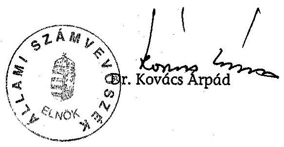
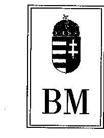
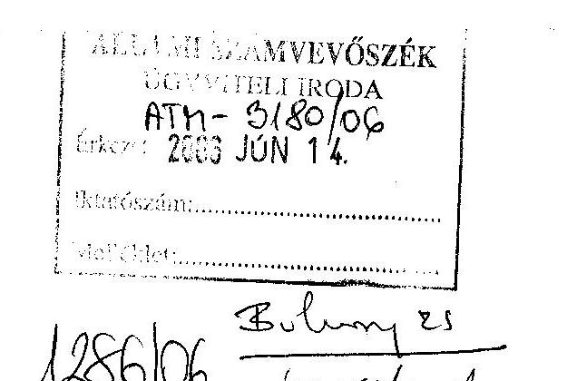
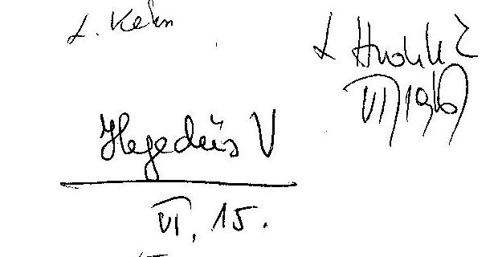
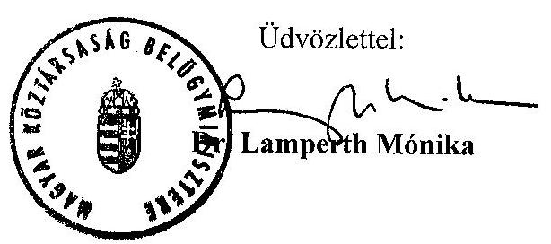
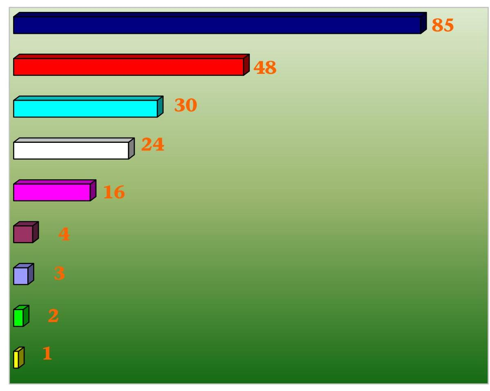
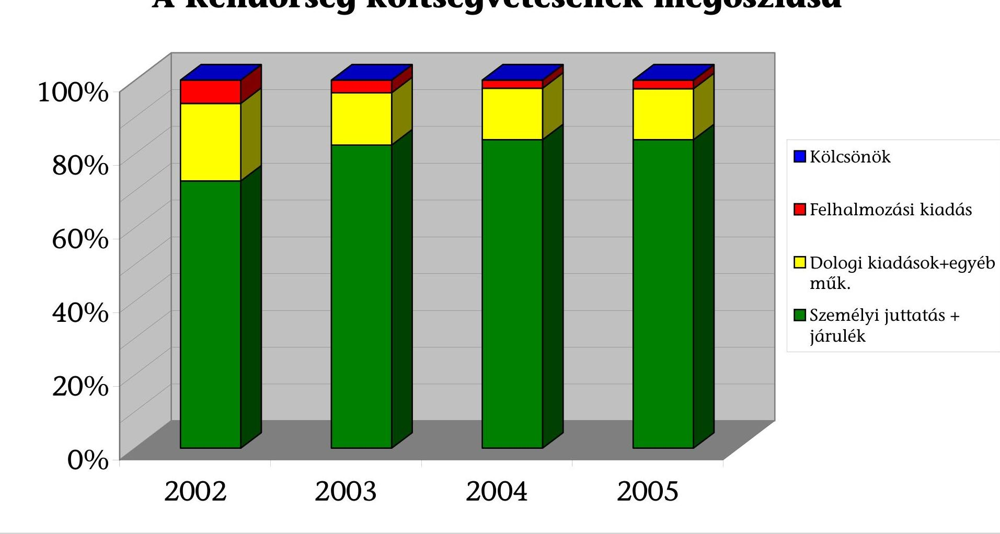
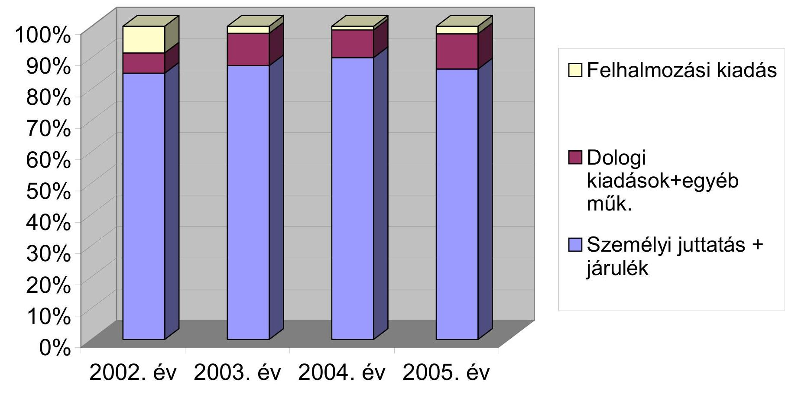

# ÁLLAMI   SZÁMVEVŐSZÉK 

## JELENTÉS

a Belügyminisztérium fejezet működésének ellenőrzéséről

---

# 2. Államháztartás Központi Szintjét Ellenőrző Igazgatóság 

2.3. Átfogó Ellenőrzési Főcsoport

Ikt. szám: V-18-73/2005-2006.
Témaszám: 784
Vizsgálat-azonosító szám: V-0234

## Az ellenőrzést felügyelte:

Bihary Zsigmond
főigazgató
Az ellenőrzés végrehajtásáért felelős:
Hegedűsné dr. Müllern Veronika
főcsoportfőnök

## Az ellenőrzést vezette:

## Hudik Zoltán

főcsoportfőnök-helyettes

## Az ellenőrzést végezték:

Tóth Bálint
számvevő tanácsos
főtanácsadó
Balkay Attila
számvevő tanácsos

Vásárhelyi Zoltán
számvevő tanácsos
Konorót Zsuzsanna
számvevő tanácsos

Trenovszki István
számvevő tanácsos
főtanácsadó
dr. Jártas Ágnes
számvevő tanácsos
tanácsadó
dr. Király László
számvevő tanácsos
tanácsadó
Dr. Csermák Judit
számvevő

## Németh Gábor

igazgató-helyettes

## Domonkosné Kurilla Edit

számvevő tanácsos
Karsai Lászlóné
számvevő tanácsos
tanácsadó
Nagy József
számvevő tanácsos
főtanácsadó

## A témához kapcsolódó eddig készített számvevőszéki jelentések: címe

sorszáma
A Belügyminisztérium fejezet pénzügyi-gazdasági ellenőrzése [237]
A központi költségvetés területén működő belső kontrollmechanizmusok ellenőrzése (2001.) [0115]
A Belügyminisztérium fejezet működésének ellenőrzése (2002.) [0215]
A természeti katasztrófák megelőzésére való felkészülés ellenőrzéséről (2005.) [0449; 0550]
Éves Vélemény a Magyar Köztársaság éves költségvetéséről [0034; 0241]
Éves jelentések a központi költségvetés zárszámadásainak ellenőrzéséről (évente) [0024; 0126; 0232; 0329]

---

# TARTALOMJEGYZÉK 

BEVEZETÉS ..... 3
I. ÖSSZEGZŐ MEGÁLLAPÍTÁSOK, KÖVETKEZTETÉSEK, JAVASLATOK ..... 6
II. RÉSZLETES MEGÁLLAPÍTÁSOK ..... 16

1. A fejezeti irányítás és a működés kontrollkörnyezete ..... 16
1.1. A feladatrendszer és a működés szabályozottsága ..... 16
1.2. A feladatellátás szervezeti és létszám feltételrendszere ..... 19
1.2.1. A minisztériumi igazgatás működési feltételei ..... 19
1.2.2. A Rendőrség működési feltételei ..... 20
1.2.3. A Határőrség működési feltételei ..... 23
1.2.4. A katasztrófavédelem működési feltételei ..... 24
1.2.5. Az idegenrendészeti és menekültügyi szakterület működési feltételei ..... 26
1.3. A közigazgatás szervezéssel kapcsolatos feladatok ..... 28
1.3.1. Minőségfejlesztés a közigazgatásban ..... 28
1.3.2. Közigazgatási továbbképzés, közszolgálati nyilvántartás ..... 35
1.4. A helyi önkormányzatokkal kapcsolatos tárcafeladatok ..... 37
1.5. Az informatikai szakterület ágazati felügyelete ..... 43
1.5.1. Az ágazati informatikai stratégiai és tervezési feladatok ..... 43
1.5.2. Az informatikai biztonság ágazati felügyelete ..... 47
2. A költségvetési gazdálkodás kontrollkörnyezete ..... 49
2.1. A tervezés és végrehajtás kontroll kockázatai ..... 49
2.2. A pénzügyi-számviteli folyamatok kontrollmechanizmusa ..... 53
2.3. A belső ellenőrzés, folyamatba épített, előzetes és utólagos vezetői ellenőrzés ..... 57
MELLÉKLETEK
3. sz. melléklet A belügyminiszter 1-a-1/13/06. számú levele
4. sz. melléklet A kiadások alakulása kiemelt előirányzatonként
5. sz. melléklet: Az Online regisztrált CAF intézmények megoszlása
4/a. sz. melléklet: A Rendőrség költségvetésének megoszlása
4/b. sz. melléklet: A Határőrség költségvetésének megoszlása
6. sz. melléklet A KANYVH kiemelt előirányzatainak alakulása

---

# RÖVIDÍTÉSEK JEGYZÉKE 

| Áht. | 1992. évi XXXVIII. törvény az államháztartásról |
| :--: | :--: |
| Ámr. | 217/1998. (XII. 30.) Korm. rendelet az államháztartás működési rendjéről |
| ANP | Közösségi vívmányok átvételének Nemzeti Programja |
| ÁSZ | Állami Számvevőszék |
| BÁH | Bevándorlási és Állampolgársági Hivatal |
| BM | Belügyminisztérium |
| BM IBP | BM Informatikai Biztonsági Politika |
| BM KKH | Belügyminisztérium Közigazgatásszervezési és Közszolgálati Hivatal |
| CAF | Common Assessment Framework - Közös Értékelési Keretrendszer |
| Cct. | 1992. évi LXXXIX. törvény a helyi önkormányzatok címzett és céltámogatási rendjéről |
| EüM | Egészségügyi Minisztérium |
| FVM | Földművelési és Vidékfejlesztési Minisztérium |
| GM | Gazdasági Minisztérium |
| HŐR | Határőrség |
| HŐR OP | Határőrség Országos Parancsnokság |
| ICSSZEM | Ifjúsági, Családügyi, Szociális és Esélyegyenlőségi Minisztérium |
| KANYVH | Központi Adatfeldolgozó, Nyilvántartó és Választási Hivatal |
| Ket. | 2004. évi CXL. törvény a közigazgatási hatósági eljárás és szolgáltatás általános szabályairól |
| Kht. | Közhasznú társaság |
| KINCS | Közigazgatási Innovációs Csomópont |
| Kincstár | Magyar Államkincstár |
| KIR | Központosított Illetmény-számfejtési Rendszer |
| KOIR | Katasztrófavédelmi Országos Információs Rendszer |
| Ktv. | 1992. évi XXIII. törvény a köztisztviselők jogállásáról |
| KVI | Kincstári Vagyoni Igazgatóság |
| MeH | Miniszterelnöki Hivatal |
| MTRFH | Magyar Terület- és Regionális Fejlesztési Hivatal |
| NSH | Nemzeti Sporthivatal |
| OGY | Országgyűlés |
| OKF | Országos Katasztrófavédelmi Főigazgatóság |
| OM | Oktatási Minisztérium |
| ORFK | Országos Rendőr-főkapitányság |
| Ötv. | 1990. évi LXV. törvény a helyi önkormányzatokról |
| SA | Schengen Alap |
| Számvevőszék | Állami Számvevőszék |
| SzMSz | Szervezeti és Működési Szabályzat |
| Sztv. | 2000. évi C. törvény a számvitelről |

---

# JELENTÉS 

## a Belügyminisztérium fejezet működésének ellenőrzéséről

## BEVEZETÉS

A Belügyminisztérium fejezet feladatrendszere, intézményi és költségvetési struktúrája - a 2002. évi átfogó ellenőrzését követő időszakban - kormányzati intézkedésekkel többször módosult. Belügyminiszter látta el 2003. augusztus-2004. november között az Országos Atomenergia Hivatal, illetve 2003. szeptemberétől 2004. december végéig az Országos Lakás- és Építésügyi Hivatal felügyeletét. A Belügyminisztérium 2002. év végén vette át az „Állami bérlakás program”-ot és a „Lakóépületek energia racionalizálásának programja” fejezeti kezelésű előirányzatot a Gazdasági Minisztériumtól. A feladat újabb kormányzati döntés (2004. októberi kormányrendelet) értelmében a regionális fejlesztésért és felzárkóztatásért felelős tárca nélküli miniszter hatáskörébe tartozik. A Nemzeti Sporthivatal felügyeletét a 2005. évi XIII. törvény, valamint a 297/2004. (X. 28.) Korm. rendelet 2005. évi módosítása alapján a Belügyminisztérium látja el.

A 2004. év elején hatályba lépett belügyminiszteri utasítás rendelte el a Rendőrség központi szervezete, az Országos Rendőr-főkapitányság (ORFK) szervezeti korszerűsítését. Ebben kiemelt célként szerepelt az ORFK feladatainak újrafogalmazása, szervezetének átalakítása, a vezetői szintek számának csökkentése és a gazdálkodási rend korszerűsítése.

A Határőrség feladatellátásával összefüggésben - közel azonos időben - a határőrizetet és a határrendészeti feladatokat ellátó szervezetek korszerűsítése, az európai uniós és schengeni integrációs folyamat részeként a teljes jogú schengeni tagságot biztosító feladatok megvalósítása került napirendre. A schengeni működési rendszerhez igazodva határozták el hazánk uniós belső határain döntően a rendészeti, míg a külső határokon a komplex határvédelmi és rendészeti feladatok ellátására alkalmas struktúra kialakítását.

A belügyminiszter a helyi önkormányzatokkal kapcsolatos feladatkörében előkészíti a helyi önkormányzatokkal kapcsolatos jogi szabályozást, irányítja a megyei, fővárosi közigazgatási hivatalokat, ellátja - a pénzügyminiszterrel együttesen - a központi költségvetés előkészítéséből és végrehajtásából, valamint a zárszámadásból adódó, helyi önkormányzatokat érintő kormányzati teendőket, és szervezi az azok megalapozásához szükséges információszolgáltatást.

A helyi önkormányzati feladatok támogatására szolgáló előirányzat 2004-ig a Belügyminisztérium fejezet költségvetésében önálló címen jelent meg, 2005-től önálló, a IX. Helyi önkormányzatok támogatásai fejezet tartalmazza. Az előirányzatok felhasználásában a fejezeti felügyeleti feladatokat a költségvetési

---

törvény ${ }^{1}$ megosztotta. A "6. Címzett és céltámogatások" és a "7. A helyi önkormányzatok fejlesztési és vis maior feladatainak támogatása" címek esetében a regionális fejlesztésért és felzárkóztatásért felelős tárca nélküli miniszter, a további címek felett a belügyminiszter gyakorolja a tervezési, előirányzat-módosítási, előirányzat-felhasználási, beszámolási, információszolgáltatási jogokat.

A Magyar Köztársaság 2006. évi költségvetéséről szóló 2005. évi CLIII. törvény a BM fejezet bevételi előirányzatát a 2006. évre 63,4 Mrd Ft-ban, kiadási előirányzatát 360,2 Mrd Ft-ban határozta meg, ami a bekövetkezett változásokra is figyelemmel, mintegy 76 Mrd Ft-tal haladja meg a 2001. évi (önkormányzatok nélküli) kiadási előirányzatot (2. sz. melléklet). A fejezet költségvetésében az éves kiadási előirányzatok több mint fele (2006-ban 223,7 Mrd Ft, a kiadások több mint 65%-a) közvetlenül a rendvédelmi szerveknél jelentkezett.

A 2005. évi adatok szerint a költségvetési fejezethez 83 intézmény tartozott, 7 alcímen, összesen 38 jogcímen rendelkezett fejezeti kezelésű előirányzattal. A fejezet költségvetési létszáma 62365 fő volt, amiből a minisztérium igazgatása 537 főt, a Rendőrség 40025 főt tervezett.

Átfogó módon legutóbb 2002-ben értékeltük a fejezet működését, ezt követően az Állami Számvevőszék évente véleményezte a fejezet költségvetésének tervezését, ellenőrizte a BM Központi Igazgatás és a fejezeti kezelésű előirányzatainak zárszámadását, továbbá a természeti katasztrófák megelőzésére való felkészülés számvevőszéki ellenőrzése ${ }^{2}$ érintette még a fejezet tevékenységét.

A jelenlegi ellenőrzés célja annak értékelése volt, hogy a Belügyminisztérium fejezetnél

- az irányítás és felügyelet kontroll tevékenységei, kockázatkezelő képessége megfelelő feltételeket biztosítottak-e a működés eredményességéhez, a gazdálkodási feladatok előírásszerű, hatékony ellátásához, az erőforrások és a vagyon megfelelő védelméhez; a belső kontrollrendszer fejlesztésénél hasznosították-e a korábbi számvevőszéki ellenőrzések megállapításait, javaslatait;
- az ágazati informatikai rendszer kialakítása, szabályozása, fejlesztése, működtetése a kormányzati államigazgatási informatikai fejlesztési koncepcióhoz igazodóan, illetőleg a közigazgatási és rendészeti stratégiával összhangban történt-e;
- az Európai Unió tagállamai közszolgálati szerveinél alkalmazott minőségfejlesztési eljárások átvétele és adaptálása során érvényesült-e a Belügyminisztérium koordináló, valamint fejezet irányító és felügyeleti szerepe, a rendvédelmi szerveknél a minőségfejlesztési rendszer(ek) alkalmazása mennyiben segítette a szervezetkorszerűsítés folyamatait.

[^0]
[^0]:    ${ }^{1}$ 2004. évi CXXXV. törvény a Magyar Köztársaság 2005. évi költségvetéséről
    ${ }^{2}$ Jelentés a természeti katasztrófák megelőzésére való felkészülés ellenőrzéséről [0518]

---

Az átfogó ellenőrzés a BM fejezet belső kontroll (szabályozási, irányítási, ellenőrzési, információs-informatikai, számviteli) tevékenységeit tekintette át, ezek rendszerszemléletű értékelése céljából. Részletesebb elemzés alá vontuk a BM minőségfejlesztési tevékenységét, a minőségfejlesztés intézményi kialakítása folyamatában elért eredményeket, aménél ellenőrzési kritériumként használtuk fel a kormányzati intézkedésekben ${ }^{3}$ rögzített célok elérését.

Az átfogó ellenőrzés, a fejezeti irányítás és gazdálkodás 2002-2005 közötti időszakára, ezen belül hangsúlyozottan az utóbbi két év feladatellátására irányult, de kiterjedt a helyszíni ellenőrzés befejezéséig terjedő időszak folyamataira is. Az ellenőrzés a BM fejezet működésének, gazdálkodásának irányításában, a felügyelet és az ellenőrzés gyakorlásában felelős szervezeteit, továbbá a Határőrség Országos Parancsnokság, az Országos Rendőr-főkapitányság, a Katasztrófavédelmi Főigazgatóság, a Bevándorlási és Állampolgársági Hivatal irányító és gazdálkodó szervezeteit érintette.

Az átfogó ellenőrzés keretében előkészítettük a BM központi igazgatás 2005. évi költségvetése végrehajtásának pénzügyi-szabályszerűségi (megbízhatósági) ellenőrzését. A külön program alapján végrehajtott megbízhatósági ellenőrzés megállapításait a 2005. évi költségvetés végrehajtásának ellenőrzéséről szóló számvevőszéki jelentés fogja tartalmazni.

Az ellenőrzés végrehajtására az Állami Számvevőszékről szóló 1989. évi XXXVIII. törvény 2. § (3), (5) és (6), valamint a 17. § (3) bekezdésben foglaltak adtak alapot.

A végleges jelentést az Állami Számvevőszékről szóló 1989. évi XXXVIII. törvény III. fejezet 25. § (1) bekezdésének megfelelően észrevételezésre megküldtük Dr. Lamperth Mónika miniszter asszonynak, aki a jelentésben foglaltakat tudomásul vette, észrevételt nem tett. Jelezte továbbá, hogy a jelentés javaslataira vonatkozón intézkedési tervet készítenek, illetve a kormányzati szerkezetváltás miatt a jelentést illetékességből megküldi az igazságügyi és rendészeti miniszternek is. A vonatkozó levelet a jelentés 1. sz. melléklete tartalmazza.

[^0]
[^0]:    ${ }^{3}$ 1052/1999.(V. 21.) Korm. határozat, 1057/2001. (VI. 21.) Korm. határozat és a 1113/2003. (XI. 11.) Korm. határozat

---

# I. ÖSSZEGZŐ MEGÁLLAPÍTÁSOK, KÖVETKEZTETÉSEK, JAVASLATOK 

A központi költségvetés egyik legnagyobb fejezeténél - a formálódó, módosuló kormányzati munkamegosztás keretében - nem alakult ki stabil feladat- és intézményrendszer. Mindeddig a belügyminiszter feladat- és hatásköréhez tartoztak a közbiztonság védelmével, az államhatár őrizetével és a határforgalom ellenőrzésével, az élet- és vagyonbiztonság védelmével, a közigazgatás szervezésével, a helyi önkormányzatokkal kapcsolatos igazgatási, irányítási-felügyeleti feladatok. Ettől eltérő feladatkörű költségvetési szervek fejezethez sorolása - a meglévő szervezetek stratégiai célokhoz fűződő átalakítása, összevonása mellett - tovább bővítette az egyébként is széles feladatkört, a tárca felügyeletéhez tartozó költségvetési szervek számát.

A feladat- és hatáskör-bővítés esetenként csak átmenetileg jelentkezett, amikor újabb kormányzati döntéssel egyes feladatokat más tárcához helyezték. Az
 ilyen esetek viszont a kormányzati döntések kiforratlanságára utaltak. Megjegyezhető még, hogy az évközi struktúraváltások, fejezetek közötti feladat- és előirányzat-átcsoportosítások más tárcáknál is (NSH, ICSSZEM) a gazdálkodás kockázati tényezőivé váltak. Adott esetekben előfordult, hogy a beszámolók a vagyoni, pénzügyi helyzetről nem adtak megbízható és valós képet ${ }^{4}$.

A Belügyminisztérium 2003-2006 időszakra kidolgozott közigazgatási és rendészeti ágazati stratégiája a közigazgatás korszerűsítési irányának és a szakmai célkitűzések kijelölése szempontból mérföldkőnek tekinthető. A stratégia is rögzítette, hogy a benne foglalt feladatok megvalósítása csak egy hosszú változási folyamat eredményeként képzelhető el. A célok belátható időn belüli megvalósíthatóságának kockázatát hordozza, hogy a tárcánál a stratégiai célok és irányok kijelölését költségvetési oldalról nem alapozta meg, illetve nem is követte közép- vagy hosszabb távra ütemezett végrehajtási terv (a célkitűzések figyelembevételét az éves munkatervek és a féléves munkaprogramok összeállításához írták elő).

Az Európai Unióhoz való csatlakozásból, majd az uniós együttműködésből adódó feladatok folyamatosan épültek be a tárca és a felügyelt szervezetek tevékenységébe. A felkészüléssel, a nemzetközi kapcsolatok bővülésével, majd az uniós tagsági működéssel összefüggő feladatokat is igyekeztek figyelembe venni az intézményi háttér kialakításánál (a feladatok végrehajtását helyettes államtitkári irányítás alá szervezve).

A jogszabályokban meghatározott fejezeti feladatok teljesítésének és a rendelkezésre álló költségvetési forrásból finanszírozható szervezet kialakításának igénye motiválta a minisztériumi szervezeti egységek integrálását, számuk

[^0]
[^0]:    ${ }^{4}$ (0443) Jelentés a Magyar Köztársaság 2003. évi költségvetése végrehajtása ellenőrzéséről Függelék 84. oldal. (0540) Jelentés a Magyar Köztársaság 2004. évi költségvetése végrehajtása ellenőrzéséről Függelék 66. és 181. oldal

---

csökkentését, egyszerűbb szervezeti struktúra létrehozását. A szervezeti struktúra stabilitása ellen hatott a gyakori feladatmódosulás, a vezetők személyében bekövetkezett változások és a döntően költségvetési okokból elrendelt leépítések, szervezeti korrekciók, illetve az ezek között néhány esetben tapasztalt következetlen döntések. A belső szabályozásokban - kisebb késéssel - a tárca követte a változásokat, az esetenkénti késedelem azonban a napi működésben nem okozott zavarokat. A szervezeti átalakítások eredményeként kialakított minisztériumi szervezet, a tárca szintű koordinációs és döntési mechanizmus alapvetően illeszkedett a fejezeti feladatok ágazati szintű irányításához, végrehajtásához, alkalmas volt a váratlanul jelentkező, előre nem tervezett események kezelésére.

A belügyminiszter felügyelete alá rendelt országos hatáskörű szervek középirányító funkciójának jogszabályi rendezése (2002-ben) hatékonyságot javító feltételeket teremtett a szakmai felügyelet és a gazdálkodás terén egyaránt. A magyar közigazgatásban újszerű, egységes rendvédelmi szervezet kialakítása - melynek gondolata már korábban is felmerült - ismét megfogalmazást nyert a tárca 2003-ban kiadott stratégiájában. A Határőrség és a Rendőrség összevonását azonban a teljes jogú schengeni tagság elérését megelőzően tekintettel az integrált szervezet kialakításának, az eredményes működés biztosításának kockázataira, valamint számos politikai, társadalmi és nem utolsó sorban jogszabály módosítást, -alkotást igénylő vonzatára - mégsem tartották időszerűnek. (Erre vonatkozó javaslatot a tárca még nem készített.)

A rendvédelmi szervek szakstratégiái szakmai szempontból reális követelményeket szem előtt tartó fejlesztési irányokat jelöltek ki. A korábbi évek tapasztalatai, különösen a Rendőrség - évek óta adósságállománnyal küzdő működése alapján látható volt, majd beigazolódott, hogy a szakmai célkitűzések a megjelölt középtávú időszak alatt teljesíthetetlenek. A tárca és a rendőrség központi szervezetének szervezetkorszerűsítési intézkedései hatására profiltisztábbá vált a rendőrségi feladatkör, eredményesen hajtották végre az irányítói és végrehajtói feladatok különválasztását. A társadalmi és uniós elvárásokhoz igazított korszerűsítési célkitűzések (látható rendőrség, tömeges bűnözéssel szemben eredményesen fellépő rendőri szervezet) megvalósítási folyamatát már kedvezőtlenül érintette a növekvő feladatokhoz szükségesnek tartott (rendszeresített) létszám biztosításának elmaradása, illetve a határőrségi létszámfejlesztések leállítása.

A schengeni felkészülés a tárcán belül leginkább a Határőrség működését érinti, fegyveres erő jellegének megszüntetése következtében, a feladatai és szervezetei átstrukturálására tekintettel. A testület megváltozott szerepkörét megalapozó jogszabályi háttér azonban még nem rendezett, mivel egyfelől a kapcsolódó feladatok leképezéséhez, az irányítási rendszer kialakításához alapvetően szükséges törvénymódosítás ${ }^{5}$ még nem történt meg. Másfelől - ennek hiányában - a határrendészeti tevékenységben még érintett szervekre kiterjedő szabályozások módosításai sem készültek el.

5 A határőrizetről és a Határőrségről szóló 1997. évi XXXII. törvény módosítása az Országgyűlés 2006. tavaszi törvényalkotási programjában szerepelt, de a javaslatot a plenáris ülés nem tárgyalta.

---

nek hiányában - a határrendészeti tevékenységben még érintett szervekre kiterjedő szabályozások módosításai sem készültek el.

A működési feltételek kedvezőtlen alakulása, meghatározóan a kényszerű létszámcsökkentések és létszámfelvételi korlátozások - különösen az utóbbi két évben - kedvezőtlenül befolyásolták a testület megfelelő irányba megkezdett szervezet-racionalizálási folyamatát. A kialakult helyzetben a teljes jogú schengeni tagság követelményeként - a magyar felajánlással megegyezően meghatározott és a Schengen Alapból történő támogatásnál alapul vett határőrségi létszám (14 ezer fő) teljesítésének nincs reális esélye, de a tárca már nem is tartotta szükségesnek. A felajánlottól alacsonyabbra módosított létszámfeltöltési szándékot az uniós szakértők ez évre ütemezett ellenőrzésének előkészítő folyamatában jelezték, azonban a határrendészeti feladatok alacsonyabb létszámmal történő ellátását alátámasztó elemzést az ellenőrzésnek nem tudtak bemutatni.

A közigazgatás minőségének javítása érdekében a kormányzat már 1999 óta szorgalmazta korszerű minőségfejlesztési módszerek alkalmazását, ezt tükrözték a közigazgatás továbbfejlesztésének kormányzati feladatterveiről, majd a közigazgatási szolgáltatások korszerűsítési programjáról szóló kormányhatározatok ${ }^{6}$. A kezdeményezések ellenére Magyarország jelenleg sem rendelkezik elfogadott Nemzeti Minőségfejlesztési Stratégiával, erre vonatkozó konkrét feladatot a Kormány nem írt elő. Részben ennek hiányával, részben a minőségfejlesztés irányát eldöntő állásfoglalás elhúzódásával hozható összefüggésbe, hogy a magyar közigazgatásban (beleértve a rendvédelmi szerveket is) - a nemzetközi szintéren kifejlesztett - többféle minőségirányítási modell, illetve minőségtanúsítás (EFQM-EEM ${ }^{7}$, TQM $^{8}$, ISO stb.) alkalmazása indult el.

A közigazgatás egészére érvényesíthető módszerként - az egységes minőségbiztosítási, -fejlesztési rendszer bevezetése érdekében - 2001-ben született döntés az Európai Unió tagállamai által elfogadott és ajánlott Közös Értékelési Keretrendszer $\left(\mathrm{CAF}^{9}\right)$ hazai adaptációjára. Az adaptáló tevékenység 2002-ben indult meg, miután a közigazgatás minőségpolitikai elveinek, a minőségbiztosítási eljárások alkalmazásának szakmai és módszertani szabályai kidolgozását a belügyminiszter feladataként állapította meg a Kormány. 2004. év közepére elkészült a CAF - Interneten elérhető, ingyenesen használható - rendvédelmi

6 1052/1999.(V. 21.) Korm. határozat, 1057/2001. (VI. 21.) Korm. határozat és a 1113/2003. (XI. 11.) Korm. határozat

7 Az Európai Minőségirányítási Alapítvány (European Foundation for Quality Management) által létrehozott minőségi díjmodell (European Excellence Model)

8 Teljes Körű Minőségmenedzsment (Total Quality Management - TQM)
9 A CAF (Common Assessment Framework) lényegében a minőségfejlesztés utasításos megoldása helyett egy szemléletformáló, önértékelésen alapuló modell. Meghatározott kritériumok vizsgálatával - a szervezet hatékonyságát, eredményességét befolyásoló problémák értékelésén keresztül - a szervezet erősségeinek és gyengeségeinek meghatározását teszi lehetővé, egységes követelményrendszere alapján egyfajta kiválóságmodellt nyújt a közigazgatási szervek számára.

---

változata is, ezzel együtt az érintett területi szervek - a felső vezetésük konszenzusa hiányában - továbbra is többféle (esetenként a szervezet költségvetését terhelő) modellt alkalmaztak.

A belügyi tárcánál kifejlesztett informatikai rendszer az önértékelés teljes folyamatát támogatja, az internetes kapcsolattal rendelkező közigazgatási szervek számára lehetővé vált a CAF hazai változatának alkalmazása. Az elterjedését pályázat meghirdetésével, elismerést kifejező Magyar Közigazgatási Minőség Díj alapításával és az ún. „CAF Módszertani Igazolás"-sal ösztönözte a belügyi tárca. A módszer alkalmazását és a tapasztalatok hasznosítását sokoldalúan - szakértői hálózat szervezésével, Közigazgatási innovációs adatbank létrehozásával, országos szakmai konferenciák szervezésével, a szomszédos országokkal regionális CAF benchlearning ${ }^{10}$ együttműködés kezdeményezésével segítették elő. A módszer felhasználásával elérhető hozadékok megismerését szolgálja a minőségfejlesztés módszerének felvétele a köztisztviselői továbbképzésbe (először a vezetőképzés keretében), és a továbbiakban - uniós források felhasználásával - az országos CAF képzési program.

Az elsősorban a finanszírozhatóságot szem előtt tartó, az államigazgatási szféra karcsúsítása céljából történt átszervezések egyes esetekben - minisztériumnál az informatikai hálózat működtetésénél, a rendőrség központi és néhány területi szervénél a minőségfejlesztés szervezeti hátterét illetően - kedvezőtlenebb feltételeket teremtettek. Ez arra engedett következtetni, hogy főként az önértékelés önkéntességének érvényesülése következményeként mind a felső-, mind a középszintű vezetés bizonytalan a minőségikövetelményeket és a finanszírozhatóságot egyaránt kielégítő racionalizálási folyamat irányában. Ezt szemléltette az önértékeléshez csatlakozott központi közigazgatási szervek rendkívül alacsony részaránya (3. sz. melléklet).

Az útkeresés bizonytalanságát mutatta, hogy a „BM Egységes Minőségfejlesztési Programja" - még 2002-ben - a rendőrségnél is alkalmazhatónak tartotta az üzleti életben gyors karriert befutott, a szakirodalomban Kiegyensúlyozott Stratégiai Mutatószámrendszerként (Balanced Scorecard"- BSC) megismert integrált vezetési modellt. A program célkitűzései közül alapvetően csak a CAF modell adaptálása történt meg, az integrált vezetési modell többi eleme (ezek között a BSC) pár évig a személyi és szervezeti változások áldozatává vált, majd 2005-ben került ismét napirendre, az üzemgazdasági szemlélet megalapozásának és megvalósításának elősegítésére irányuló tanulmány készítésére - külső kutatócsoportnak - adott megbízás formájában. A teljes körű bevezetést, illetve alkalmazást a tanulmány készítői mintegy 2-3 év alatt tartották elérhetőnek. A konkrét eredmények realizálását tovább nyújtja, hogy a tanulmány hasznosításáról még nem döntöttek.

A minőségfejlesztés adaptált módszere eszköz ahhoz, hogy egy szervezet a társadalmi elvárásokhoz folyamatosan alakítsa működése feltételeit, miközben a napi szakmai kihívásainak igyekszik minőségileg megfelelni, mindezt a finanszírozhatóság határain belül. A módszer intézményekhez kötődő - a tapasztal-

[^0]
[^0]:    ${ }^{10}$ benchlearning: tanulás mások kedvező tapasztalataiból

---

tabbaknál eredményesebb - alkalmazása sem helyettesítheti a közigazgatás átfogó reformját. Ugyanakkor a központi közigazgatási reform sem szűkülhet az ésszerűsítés makro-folyamataira. Az eredményesség kockázata, hogy a reformkoncepció - legyen az államigazgatási struktúra bármilyen változata kellően ésszerűsített állami feladatkört céloz-e meg, erre koncentrálva mennyiben támaszkodik a feladatok ellátásában érintettek szakmai tapasztalataira.

A közigazgatási továbbképzés és vezetőképzés szervezése és irányítása többségében - jól szabályozott rendszerré vált, amelyben a tervező és módszertani szervezetek kialakítása és működési folyamataik stabilizálása, összehangolása, a működéshez megfelelő szakmai feltételek (programértékelési rendszer, tananyagok és vizsgafelkészítő központi programok stb.) biztosítása az elmúlt években megtörtént. A továbbképzések hosszabb távra történő tervezésének bár középtávú, éves bontású ún. ciklus programokat készítettek - nem adott realitást a forrásbiztosítás függősége az adott év költségvetési alkufolyamatainak eredményétől.

Általánosságban érzékelhető volt, hogy a parlamenti konszenzust igénylő területeken - amilyen, pl. az önkormányzati működés szabályozása - kisebb mértékű haladást lehetett elérni, mint a kormányzati felelősségi körhöz tartozó konszenzus nélkül hozható - egyéb (alapvetően technikai jellegű) döntések esetében. Így konkrétan a regionális önkormányzatok kialakítása a belügyi tárcánál kidolgozott koncepciók szintjén maradt, emiatt késik a közigazgatás középszintjének reformja. A Kormány a kistérségi feladatellátás jogalapjának megteremtésével kívánta elérni az elhalasztott ágazati reformok helyi önkormányzatokra vonatkozó részének végrehajtását. A szabályozási feladatot a tárca eredményesen előkészítette. A többcélú kistérségi társulásokról szóló törvény, a végrehajtását segítő kormányrendeletek és anyagi ösztönzés segítségével 2005. év végére a kistérségek 94,6%-ában - az önkormányzatok szabad társulásaként - megalakult a többcélú kistérségi társulás.

A közigazgatásban a szolgáltató jelleg erősítéséhez, a hatósági eljárások gyorsításához teremtette meg a jogszabályi hátteret a közigazgatási hatósági eljárás és szolgáltatás általános szabályairól szóló törvény (Ket.), többek között megadva
 a lehetőséget egyes eljárási cselekmények elektronikus gyakorlásához. Ennek ellenére az elektronikus ügyintézés lehetősége nem ismert általánosan, az Internetes Közigazgatási Szolgáltató Rendszer használata csak a közelmúltban kezdett terjedni.

A fővárosi, megyei közigazgatási hivatalok működését a Kormány a belügyminiszter közreműködésével irányítja, a hivatalokba integrált igazgatási szervek szakmai irányítását és felügyeletét az ágazati miniszterek gyakorolják. A közigazgatási hivatalok átfogó felügyeleti ellenőrzését 2003. év végétől - a költségvetési szervek belső ellenőrzését meghatározó jogszabályi környezet változását követően - a belügyi tárca már nem végezte. A felügyeleti ellenőrzések problematikája azonban túlmutat ezen, mivel az államigazgatásban még hiányzik az egységes kormányzati szabályozásra épülő, minden ágazatra kiterjedő felügyeleti ellenőrzési rendszer. A problémakör a korábbi évek rendezési szándékai (a felügyeleti ellenőrzések új közigazgatási eljárási törvényben, majd a tervezett közigazgatási szervezeti törvényben történő szabályozása) ellenére változatlanul nyitott maradt.

---

A helyi önkormányzatok törvényességi ellenőrzése terén a közigazgatási hivatalok hibafeltáró tevékenysége sajátos - a hatáskörükhöz tartozó feladatok megítélése tekintetében felmerült - jogszabály-értelmezésre visszavezethetően a gazdálkodással összefüggő szabályszerűségi területre átmenetileg nem terjedt ki. A törvényességi ellenőrzésekhez kapcsolódó adatgyűjtő rendszer a nyomonkövetést biztosította, azonban az ellenőrzések realizálási hatásfokának érdemi megítéléséhez nem kellően differenciált. Az elektronikus adat-elérést 2005-től számítógépes Törvényességi Ellenőrzési Rendszer segíti.

A helyi önkormányzatok központi költségvetésből származó támogatásainak önálló költségvetési fejezetbe sorolását nem követte az egyes költségvetési címek („Címzett és céltámogatások”, „A helyi önkormányzatok fejlesztési és vis maior feladatainak támogatása”) esetében a feladat- és hatáskörök jogszabályi hátterének teljes körű rendezése. Elmaradt a belügyminiszter feladat- és hatáskörét szabályozó kormányrendelet ${ }^{11}$ összhangjának megteremtése a költségvetési törvénnyel (nem követte a fejezetrend változását), továbbra is tartalmazott a regionális fejlesztésért felelős tárca nélküli miniszternek átadott - a belügyminiszter közreműködői funkcióját meghaladó - jogosultságokat.

A központi költségvetés a helyi önkormányzatokat többféle céllal, többek között a körzeti igazgatási feladatok ellátását normatív hozzájárulás címén és a jövedelemkülönbség mérséklés keretében támogatja. Ez utóbbi támogatásforma figyelembe vette a település városi, községi stb. jellegét, ugyanakkor nem volt tekintettel arra, hogy a település várossá nyilvánításának, a nagyközségi cím elnyerésének feltételei idővel - a mindenkori társadalompolitikai felfogástól függően - változtak. A mintegy hét éve érvényben levő elbírálási szempontok normatív követelményeket már nem tartalmaznak. Így fordulhatott elő, hogy az új városok jövedelem-differenciálódás mérséklés címén magasabb kiegészítést kaphattak a velük azonos lakosságszámú községekhez viszonyítva, akkor is, ha az önként vállalt önkormányzati feladatok és közszolgáltatások útján nem biztosítanak térségi ellátást.

A Belügyminisztérium stratégiájának részét képező informatikai funkcionális stratégia a kormányzati tervezési ciklus ütemezéséhez, az irányadó kormányrendelethez igazodóan és az informatikai tárca ajánlásainak figyelembevételével készült. A célszerűség követelményének megfelelően deklarálták, hogy a szakirányítási tevékenységnek a szabályozási, koordinációs és ellenőrzési feladatokra kell koncentrálódnia (szakirányításnak nem feladata a különböző hardver- és szoftverbeszerzések bonyolítása). A 2003-2006. évekre szóló ágazati informatikai stratégia tartalmi hiányosságai miatt nem felelt meg teljes körűen alaprendeltetésének. A fejezet teljes vertikumát átfogó informatikai stratégia-rendszer a funkcionális- és részstratégiák hiánya miatt nem készült el. Ebben szerepe volt annak is, hogy az informatikai szakfeladatok ellátásának szervezeti háttere nem volt stabil. Az érintett minisztériumi szervezetek többszöri átszervezése és a vezetőváltások a hatékonyságot kedvezőtlenül befolyásoló tényezőként jelentkeztek. (Pl. a korábbi külső ellenőrzések által feltárt

[^0]
[^0]:    ${ }^{11}$ A belügyminiszter feladat- és hatásköréről szóló 150/2002. (VII. 2.) Korm. rendelet 3. § (2) e/ pont

---

hiányosságok felszámolására készített intézkedési tervek sem kerültek végrehajtásra.)

Az alapvető tervezési alapdokumentumok (pl. informatikai fejlesztési terv) hiánya miatt nem valósult meg az informatikai célú szükségletek feladatalapú tervezése. Az informatikai stratégiai tervezés és fejlesztés felügyelete a fejezeti és elemi költségvetés éves tervezésének, a nemzetközi fejlesztéspolitikai források elosztásának koordinációjára, valamint a végrehajtás közben jelentkező feladatváltozásokkal, bővülésekkel összefüggő vezetői döntések előkészítésére korlátozódott.

Az informatikai rendszerek stabilitása érdekében a stratégiában kellő hangsúlyt kapott az infokommunikációs rendszerek biztonsága, ehhez kapcsolódóan a követelmények meghatározása, aminek az informatikai rendszerek teljes életciklusán keresztül (tervezés, fejlesztés, üzemeltetés, rendszerek megszüntetése) érvényesülnie kell. Magas kockázattal jár azonban, hogy nem dolgozták ki - a személyi feltételek hiányával is összefüggésbe hozhatóan - az informatikai biztonság fejezeti keretszabályzatait. Fejezeti szinten nem felügyelték a szervezetek biztonsági szabályainak kidolgozását, nem határozták meg ezek szükséges tartalmi elemeit, nem alakították ki az adat- és rendszerminősítés központi követelményeit.

A költségvetés egyensúlyának megtartása érdekében, a létszámviszonyok korlátozására hozott akár kormányzati, akár tárcaintézkedések - a szakmai célkitűzések realitását nem kellően értékelve - csak a fennálló finanszírozási problémák felszíni kezelését jelentették, a végrehajtás halasztódásával vagy a megvalósítás elmaradásával jártak. Az egyensúly megteremtésében az állami feladatkör racionalizálásának jelentőségét a számvevőszéki ellenőrzések következtetései többször jelezték. A rendvédelmi szervek alaptevékenysége kétségkívül ehhez a körhöz tartozik, aminek folyamatos ésszerűsítése mindig eredményezhet javító körülményeket, mint ahogy az áttekintett időszak alatt érzékelhető volt. Ugyanakkor a fennálló működési gondok feloldására - ezek nagyságrendjére tekintettel - a belső racionalizálási, minőségfejlesztési folyamatok önmagában nem hoztak/hoznak megoldást.

Az éves költségvetési tervezés - egyébként szabályozott és koordinált - folyamatában, a tervezésben érintett belügyi szervezetek részletes adataihoz igazítva, de nem feladatmutatókkal támasztották alá a fejezet működéséhez, fejlesztéseihez szükséges kiadásokat. (Az erőforrások tervezésében az üzemgazdasági szemlélet sem érvényesülhetett, mivel az ahhoz szükséges nyilvántartások vezetése a költségvetési gazdálkodásban nem követelmény.) A rendvédelmi szervek korszerűsítésében, fejlesztésében visszatérő kockázatot jelentett, hogy az évente növekvő költségvetési előirányzatok és az EU támogatások mellett sem tudta a minisztérium elérni a nemzeti, a nemzetközi feladatokhoz és fejlesztésekhez számításaik alapján szükségesnek tartott költségvetési forrásokat. A költségvetés belső szerkezetének kedvezőtlen irányú változása leginkább a dologi kiadásokat, az intézményi beruházásokat, valamint a felújítási előirányzatokat sújtotta, ami a szükséges amortizációs cserék elmaradását, illetve további (központi beruházás, lakástámogatás) előirányzatok csökkenését eredményezte.

---

Az évközi kormányzati intézkedések pótlólagos támogatások útján enyhítették, elvonások, zárolások formájában tovább nehezítették a gazdálkodást, számtalan előirányzat-módosítást generáltak, de semmiképp nem utaltak a tervszerűségre. A többletfeladatok indokolta előirányzat-módosítások fejezeti szintű intézkedéssel realizálódtak (pl. a nemzetközi feladatvállalás, a működési költségvetés dologi előirányzat fedezetének biztosításával összefüggésben végrehajtott átcsoportosítások). Rendkívüli helyzetekben fordult elő utólagos előirányzat-módosítás (a feladat végrehajtása előbb következett be), illetve olyan előirányzat terhére vállaltak kötelezettséget, ahol nem rendelkezett a fejezet, vagy valamely szervezete előirányzattal, így nem teljesülhettek a költségvetési gazdálkodás előírásai (ez alól a feladat végrehajtásának sürgőssége nem adhat felmentést).

Az ingatlanértékesítésekhez kötött saját bevétellel történő forrásbiztosítás nem jelent tartós megoldást, vagyonfeléléshez vezet. További kockázati tényezőnek számít, hogy a bevétel realizálásáig hosszabb-rövidebb távon likviditási zavart okoz (attól függően, hogy mennyire haladja meg az adott költségvetési szerv működésével kapcsolatos rendszeres bevételeket). A 2006. évi költségvetésben az alapvetően ingatlan értékesítésből tervezett bevétel realizálásának kockázata elsősorban a határőrség, kisebb mértékben a rendőrség működését érinti.

A költségvetési fejezet számviteli rendjét, beszámolását alapvetően a hatályos jogszabályokra figyelemmel a fejezet sajátosságaihoz igazodóan alakították ki. Az általánosságban javuló számviteli és bizonylati fegyelem mellett azonban a fejezet sajátos beszámolási rendszerét érintően maradtak nem kellő részletességgel szabályozott területek (fejezeti kezelésű előirányzatok bizonylati rendje, intézményi számviteli politika).

A BM fejezet a belső ellenőrzés rendszerét a jogszabályi környezet és a szervezeti struktúra változásaihoz igazodóan alakította ki. Szervezetileg is elkülönült a szakmai felügyelet és a költségvetési szervek belső ellenőrzése fejezeti és a középirányító szinteken egyaránt. Az ellenőrzési tevékenység végzéséhez szükséges, a jogszabályban meghatározott dokumentumokat (ellenőrzési kézikönyv, kockázatkezelés, szabálytalanságok kezelésének eljárásrendje stb.) elkészítették, amelyek segítették a feladatok tervezését, végrehajtását, alkalmasak voltak az ellenőrzések nyomon követésére. A tárca a pénzügyi-gazdasági ellenőr kapacitását fejlesztette, informatikai ellenőrzésekhez azonban nem biztosítottak szakellenőröket. Az ellenőrzések kevés kivétellel hasznosultak, az ellenőrzöttek a megállapítások, javaslatok alapján jellemzően elkészítették az intézkedési terveiket. A folyamatba épített, előzetes és utólagos vezetői ellenőrzés (FEUVE) fejezeti és intézményi szinten szabályozott. A munkafolyamatba épített kontroll érvényesülését befolyásoló átmeneti hiányossággal a fejezeti kezelésű előirányzatok esetében találkozott az ellenőrzés (a társadalmi szervezeteknek pályázaton juttatott támogatások elszámolása terén).

A költségvetési szervek éves beszámolóinak megbízhatósági ellenőrzéseit 2002-től a tárca folyamatosan bővítette azzal a céllal, hogy azok 2010-ig az intézmények teljes körére kiterjedjenek. Ezek hatékonyságának erősítése érdekében a magasabb kockázatúnak minősített szervezetek ellenőrzését időben előre sorolták. A tervezett létszámbővítés elmaradásának következtében előreláthatóan már 2007-ben kockázatosnak tekinthető a tervezett számú intézmény megbízhatósági ellenőrzésének megvalósulása.

A helyszíni ellenőrzés megállapításainak hasznosítása mellett javasoljuk:

# a Kormánynak 

1. tekintse át - a közigazgatás továbbfejlesztésével, a közigazgatási szolgáltatások korszerűsítési programjával kapcsolatban kijelölt felelősök beszámoltatásával - a minőségfejlesztési módszerek alkalmazásának eredményességét, a közigazgatásban a költségvetést terhelő minőségtanúsítások indokoltságát, továbbá a tapasztalatok figyelembevételével határozza meg a központi közigazgatás továbbfejlesztésének irányát;
2. gondoskodjon az államigazgatás felügyeleti ellenőrzési rendszerének teljes körű szabályozásáról, ezen belül a közigazgatási hivatalok szakmai felügyeleti ellenőrzésében érintett ágazatok feladatainak meghatározásáról, majd azok számonkéréséről.

## a szakminiszternek

1. számoljon be a Kormánynak
a) a minőségbiztosítási módszerek alkalmazásának eredményességéről, tegyen javaslatot a minőségfejlesztés célszerűnek tartott irányára, továbbá a tárca felügyelete alá tartozó, azonos funkciót betöltő szervezeteknél szorgalmazza az egységes szemlélet kialakulását;
b) a rendvédelmi szervek korszerűsítésének, fejlesztésének finanszírozásával összefüggő kockázatokról (szemléltetve a forrásoldal kiszámíthatóságából eredő bizonytalanságok hosszabbtávú tervezhetőség stabilitásra gyakorolt hatását, a forráscsökkenések, megvonások következményeit az uniós és nemzeti feladatvállalások teljesíthetőségére), bemutatva egyidejűleg az elfogadható mértékű kockázattal bíró alternatív megoldásokat;
2. alakítsa ki a közigazgatási hivatalok irányításában betöltött szerepében - együttműködve a hivatalok működésébe integrált igazgatási tevékenységek tekintetében érintett ágazati miniszterekkel - a hivatalok szakmai felügyeleti ellenőrzésének célszerű rendjét, ágazati felelősségi hatáskörében gondoskodjon a hivatalok felügyeleti ellenőrzéséhez szükséges feltételek megteremtéséről;
3. intézkedjen a fejezet teljes vertikumát átfogó ágazati informatikai stratégia meghatározására, az informatikai biztonság irányítási és felügyeleti hiányosságainak megszűntetésére, továbbá gondoskodjon az informatikai szakfeladatok megvalósításához és ellenőrzéséhez megfelelő személyi, szervezeti feltételek biztosításáról;
4. kezdeményezze
c) a belügyminiszter feladat- és hatásköréről szóló 150/2002. (VII. 2.) Korm. rendelet címzett és céltámogatásokkal összefüggő rendelkezésének módosítását, a költségvetési törvénnyel való összhang megteremtése érdekében;

---

d) a helyi önkormányzatok támogatási rendszerének olyan módosítását a pénzügyi tárcánál, hogy az azonos lakosságszámú települések esetében a jövedelemdifferenciálódás mérséklés egy főre jutó értékhatára meghatározásánál érvényesüljön a biztosított közszolgáltatások mértéke;
5. gondoskodjon
e) a módosuló határrendészeti tevékenységben érintett szervekre kiterjedő szabályozások korrekciójáról, a teljes jogú schengeni tagsággal kapcsolatos uniós ellenőrzések előkészítésével összefüggésben a határrendészeti feladatok alacsonyabb létszámmal történő ellátását megalapozó elemzések, dokumentációk rendelkezésre állásáról;
f) a helyi önkormányzatok törvényességi ellenőrzése terén a közigazgatási hivatalok feltárási hatékonyságának további javításáról, a kapcsolódó statisztikai adatgyűjtés - önkormányzati működés törvényességének és a törvényességi ellenőrzés eredményességének megalapozottabb megítéléséhez szükséges - differenciálásáról;
g) a megbízhatósági ellenőrzéseknek a költségvetési fejezet teljes intézményi körére történő kiterjesztéséről, az ehhez szükséges feltételek biztosításáról.

---

# II. RÉSZLETES MEGÁLLAPÍTÁSOK 

## 1. A FEJEZETI IRÁNYÍTÁS ÉS A MŰKÖDÉS KONTROLLKÖRNYEZETE

### 1.1. A feladatrendszer és a működés szabályozottsága

A
 Belügyminisztérium 2003-2006 időszakra szóló közigazgatási és rendészeti ágazati stratégiát dolgozott ki. Számba vették a cselekvőképes, a költségtakarékos és hatékony, szakszerű, átlátható és ellenőrizhető közigazgatás kialakításának feladatait, a rendvédelmi szervek szakstratégiái révén az érintettek alaptevékenységi körére vonatkozó feladatokat, fejlesztési irányokat. A stratégiai célkitűzések között prioritást kapott az Európai Unióhoz történő csatlakozás időpontjáig megvalósítandó kötelezettségek teljesítése és az átállási feladatok a tagállami működésre, valamint a teljes jogú schengeni tagságra való felkészülés. Mindezek teljesíthetőségét azonban már a stratégia készítésének időszakában kétségbe vonta, hogy nem társult hozzá a végrehajthatóság költségvetési megalapozása.

A stratégia egyes részelemei a feladatváltozások, intézményrendszer-módosítások következtében a fejezetnél aktualitásukat vesztették, illetve a beépült feladatok tekintetében kiegészítést igényeltek. A további időszakra vonatkozó stratégiai elképzelések kialakítása értelemszerűen a központi közigazgatási reform függvényében történhet, megjegyezve, hogy az érdemi reformtervezet kidolgozása sem nélkülözheti a belügyi tárca közigazgatási és rendészeti ágazati stratégiájában lefektetett szakmai követelmények, célkitűzések figyelembe vételét.

Az alapvetően közigazgatási és rendészeti ágazati irányításért felelős Belügyminisztérium feladatai, intézményrendszere az áttekintett időszakban többször módosult. A meglévő szervezetek átalakítása, összevonása mellett új feladatrendszerű, önálló költségvetési szerveket soroltak a belügyminiszter felügyeletéhez, irányításához, amelyek - hosszabb távon vagy átmenetileg - tovább bővítették a fejezet egyébként is széles közigazgatási és rendészeti ágazati feladatainak körét, szervezeti felépítését. A feladatok, intézmények tárcák között lezajlott évközi átadás-átvételét követően előfordultak hiányosságok (mint pl. az Országos Atomenergiai Hivatal gazdálkodási jogosítványa besorolása BM rendeletben történő átvezetésének elmaradása).

Az Országos Atomenergia Hivatal alig egy évig tartozott a belügyi tárcához, 2004 végén az Igazságügyi Minisztériumhoz került miniszterelnöki határozat alapján. A Magyar Közigazgatási Intézet fejezethez történő sorolása, a Közigazgatásszervezési és Közszolgálati Hivatal létrehozása, majd megszüntetése módosította a feladatokat. Ugyancsak feladatnövekedést eredményezett az Adó és Pénzügyi Ellenőrzési Hivatal Bűnügyi Igazgatóság megszüntetését követően a feladatok és a szervezet beépítése az Országos Rendőrfőkapitányság szervezeti rendszerébe. A 2003. évi módosítástól a 2005. évi költségvetési törvény hatálybalépéséig az Országos Lakás- és Építésügyi Hivatal a belügyminiszter felügyeletéhez tartozott. Alig másfél év elteltével jogszabály rendelte el a feladatok regionális fejlesztésért

---

és felzárkóztatásért felelős tárca nélküli miniszter hatáskörébe történő telepítését.

A sportról szóló 2004. évi I. törvény a sporttal kapcsolatos kormányzati feladatokat a Nemzeti Sporthivatal, mint országos hatáskörű közigazgatási szerv hatáskörébe utalta. A Sporthivatal felügyeletét a Miniszterelnöki Hivatalt vezető miniszterhez telepítette, majd egy éven belül törvénymódosítással az NSH feletti felügyeleti jogkör a belügyminiszter feladat- és hatáskörébe került. A törvényi szabályozást több hónapos késedelemmel követte a Nemzeti Sporthivatalról szóló kormányrendelet módosítása és a kapcsolódó feladatok megjelenítése a belügyminiszter feladat és hatásköréről szóló kormányrendeletben.

Az átszervezések végrehajtását megelőzően megfogalmazott utasítások (irányelvek) elsősorban a létszám, a vezetői szintek számának csökkentésére tartalmaztak előírásokat, a szervezeti struktúrára vonatkozó részletes szervezeti követelményeket - általában - nem határoztak meg. Előfordult, hogy ugyanazon vagy bővülő feladatkört ellátó szervezeti egység az egymást követő szervezeti módosítások során más szintű vezető felügyeletéhez sorolták (Pl. a Védelmi Hivatal neve megváltozott, főosztályi jogállását a felügyeleti rend változása nem érintette). A költségvetési szervek, minisztériumok felépítésére, tagolására vonatkozóan a jogszabályok és az államigazgatás egyéb jogi eszközei nem tartalmaznak előírást, a BM, mint felügyeleti szerv sem készített a minisztériumi szervezeti egységek, a felügyelete alá tartozó szervezetek kialakítása kapcsán követendő szervezési eljárásról általános érvényű szabályozást.

A miniszter, valamint a minisztériumi apparátus működtetésért felelős közigazgatási államtitkár, illetve a helyettes államtitkárok által irányított szervezetek száma többször változott. Az egyes vezetők által irányított, felügyelt minisztériumi szervezeti egységek és alárendelt szervek felügyeletének módosítása a kormányváltást követően végrehajtott - állami, felső vezetői - személycserékhez, továbbá jogszabályi változással, illetve az elrendelt létszámcsökkentéssel egy időben végzett szervezetkialakításhoz kötődött. A minisztérium hivatali szervezetei besorolására egységes elvet a tárca nem alakított ki, a besorolás meghatározása nem a feladat és jogkör részletes elemzésével hozható összefüggésbe.

A részletes szabályozás, irányelv kialakításának elmaradása miatt eltérő felépítésű, tagoltságú és létszámú minisztériumi szervezetekre a főosztályi besorolást alkalmazták. A szervezeti egységek elnevezése ugyanakkor változó képet mutatott (hivatal, iroda, főosztály, főcsoport, központ stb.).

A koordinációs és a döntési mechanizmus működése a változó szervezeti és feladatkör-módosulása mellett alapvetően biztosította a stratégiai célkitűzések eléréséhez szükséges feladatok meghatározását, végrehajtását, felügyeletét. A miniszter kiemelten kezelte az országos hatáskörű rendvédelmi szervek irányítását, vezetését és felügyeletét. Ezen szervek irányításában és egyúttal felügyeletében jelentettek minőségi változást a rendészeti kérdésekben hetente, szűkebb körben tartott miniszteri értekezletek, melyek bővítették, rendszeresebbé tették a rendvédelmi szervek közvetlen miniszteri irányítását és a felügyelet megvalósítását. Az értekezleteken rendszeressé vált a szervezetek (rendőrség, határőrség, katasztrófavédelem stb.) beszámoltatása a korábban meghatározott feladatok végrehajtásáról és a folyamatban lévő feladatokról.

---

A minisztériumi testületek működési rendje részletesen szabályozott. A miniszteri értekezlet a fejezet irányítása alá tartozó szervezeteket érintő stratégiai kérdéseket, valamint jelentősebb kiadással járó, illetve miniszteri és felső szintű vezetői döntést igénylő kérdéseket vitatott meg, hozott döntést. A miniszteri értekezleten résztvevő vezetői kört célszerűen a szervezeti módosulásokhoz, a vezetői felügyeleti rendhez igazodóan változtatták. A felügyelet további szintjét a közigazgatási államtitkár tanácsadó testületeként definiálták. A minisztériumi szervekre vonatkozó döntések a rendszeresen tartott helyettes-államtitkári, hivatal-, iroda-, főosztályvezetői értekezleteken, döntően szóbeli tájékoztatás útján jutottak a végrehajtásban érintettek tudomására.

Az irányítás és felügyelet jogszabályi elvárásaihoz igazodó minisztériumi igazgatás helyes arányának és szervezeti rendjének kialakítása folyamatosan prioritást kapott, beépült a napi feladatok közé. A változásokat követő felügyeleti rend, a módosult feladatokat tartalmazó, működést szabályzó belső rendelkezések (SzMSz, gazdálkodási szabályzat, alapító okirat stb.) aktualizálása, a megváltozott helyzetet tükröző szabályozás kiadása - kisebb késedelemmel, de a feladatok végrehajtását nem befolyásolva - követte a feladat és szervezeti változások módosulását. Az SzMSz aktualizálását a tárca azokban az esetekben is elvégezte, amikor a belügyminiszter feladatait szabályzó kormányrendelet aktualizálása még nem történt meg, de a feladat más jogszabályban, illetve az irányítás egyéb jogi eszközében megjelent.

A minisztériumi SzMSz-ek lényegében részletesen meghatározták a feladatokat, a vezetői felügyeletet, a szervezeti felépítést. A vezetők, a szervezeti egységek feladat- és hatáskörét jogszabályokból, valamint a belső szabályozókból vezették le. A részletesen meghatározott feladatok átfogták a szervezeti egységek által végzett valamennyi tevékenységet, ugyanakkor előfordult, hogy egyes, kisebb jelentőségű területek szabályozását nem megfelelően pontosították, ezért nem egyértelműen megállapítható az adott terület hatás- és feladatköre. (Pl. a 2005. november 1-jétől hatályos SzMSz a rendvédelmi és bűnmegelőzési helyettes államtitkár alatt működő szervezetként határozta meg a Bűnügyi Szakértői Intézetet, ugyanakkor a szervezet a közgazdasági helyettes államtitkár irányítása alatt működő Központi Gazdasági főigazgatóság részjogkörű szervezete.) Az ellenőrzött időszakban az SzMSz hat alkalommal változott. Az eseti késedelem miatt előfordult, hogy olyan vezetői felügyelet, illetve szervezetekre határozott meg - átmenetileg - feladatokat, amelyeket időközben átalakítottak vagy megszüntettek.

A belügyminiszter rendeletben, az SzMSz-ben, a gazdálkodási szabályzatban és egyéb utasításokban ruházta át a jogszabályokban meghatározott jogait, kötelezettségeit, a szakmai feladatok, a költségvetési gazdálkodás végrehajtásának irányítását, a felügyeleti jogosítványok gyakorlását. A megosztott hatáskörök megfelelő keretet biztosítottak a szakmai feladatok, valamint a költségvetési gazdálkodás jogszabály szerinti ellátásához. A helyettes államtitkárok, köztük a közgazdasági helyettes államtitkár általános vezetői feladatait az SzMSz alapvetően részletesen tartalmazza.

A korábbi számvevőszéki ellenőrzések során az ügyrendek készítésénél tapasztalt hiányosság megszüntetésében az előrehaladás mellett elmaradás is tapasztalható volt. A 2004. évi zárszámadás ellenőrzése során, illetve a jelenlegi ellenőrzés alkalmával is megállapítható volt egyes szervezeti egységek ügyrendje aktualizálásának elmaradása. Az ügyrendek készítésének az ad hangsúlyt, hogy az SzMSz-ben szervezeti egység szintű feladatok jelennek meg, a besorolt

---

szervezeti egységekre (osztály), illetve beosztásokra való részletes meghatározás az ügyrendekben történik.

# 1.2. A feladatellátás szervezeti és létszám feltételrendszere 

### 1.2.1. A minisztériumi igazgatás működési feltételei

A fejezet költségvetési létszáma folyamatosan módosult a feladatok változása, kormányzati hatáskörben elrendelt létszámcsökkentés következtében, a megnövekedett feladathoz biztosított létszám miatt, továbbá önálló költségvetési szervezetek átvételével, illetve átadásával összefüggésben. A létszámcsökkentéseket általában nem a tárca stratégiai elképzelésének végrehajtása, hanem a feladat-módosulások, a kormányzati szinten megfogalmazott létszámcsökkentési kötelezettség teljesítésével együtt járó változtatás, illetve a felső szintű vezetésben (miniszter, államtitkár, helyettes államtitkár stb.) végrehajtott személycserék motiválták. Jellemzővé vált, hogy a rendelkezésre álló (tervezhető) előirányzathoz igazították a finanszírozható létszámot. Az egymást követő években végrehajtott létszámcsökkentés által elért megtakarítás biztosította a forrást a kialakított szervezet, illetve létszám finanszírozásához.

A minisztériumi szervezet 2004. év végi kialakításakor hosszabb távú stabilitással számolt a tárca, az év folyamán nem tervezett újabb létszámcsökkentést. Ugyanakkor a rendelkezésre álló költségvetési forrás nem tette lehetővé a tárca létszámának megtartását. A létszám további mérséklését a költségvetési szférában tervezett bérfejlesztés végrehajtásához szükséges forrás biztosítása tette szükségessé. 2005. év végén a létszám további csökkentését rendelték el.

A 2006-os költségvetési törvényben a minisztériumi igazgatás részére meghatározott személyi juttatás előirányzat a kialakított létszámú szervezet finanszírozására nem adott megfelelő forrást, ezért a létszám csökkentése ismételten nem volt elkerülhető. A fejezet létszámát - egyes szervezeteknél differenciáltan - 600 fővel, ezen belül a minisztériumi igazgatási létszámot közel 9%-kal csökkentették. A létszámleépítések végrehajtását követően a szervezet működési költsége, elsősorban a személyi jellegű kiadások nagysága a végrehajtott fejlesztések miatt gyakorlatilag változatlan maradt.

A fejezeti gazdálkodási feladatok ellátásához, koordinálásához a létszámleépítések következtében szűkített személyi feltételek - a feladatátcsoportosítások eredményességére tekintettel - még alapvetően kockázatnövekedés nélkül biztosítottak voltak. Ugyanakkor hiányzott a vezetői információs rendszer részét képező - a fejezeti szintű pénzügyi-gazdasági döntések megalapozását segítő - költségvetési tervezési modul működtetéséhez szükséges elemző szakember kapacitás, így alkalmazásának előnyeit még nem használták ki teljes körűen.

A létszám-leépítések következtében fellépő kapacitás-csökkenés ellensúlyozásának új formájaként jelent meg a minisztériumi szervezetnél a megbízással való foglalkoztatás. A létszámcsökkentések mellett átmenetileg növekedett az állományon kívüliek (megbízással foglalkoztatottak) létszáma. A minisztériumi szervezeti egységeknél, az állománytáblában - a feladatok végzéséhez szükségesnek tartott - jóváhagyott létszám mellett széles feladatkörben éves, illetve éven túli (vagy évente megújított) megbízási szerződéssel 30-50 foglalkoz-

---

tatott látott el minisztériumi feladatot. A feladatok széles körére kötött megbízási szerződésekből adódóan a díjak tág intervallumban szóródtak, szoros összefüggés a feladat összetettségével, minőségi követelményeivel a szerződések alapján nem volt kimutatható.

A megbízási szerződés nem eseti, illetve egy konkrét feladatra, hanem egész évre szóló, gyakorlatilag folyamatosan végzett tevékenységre vonatkozott. (pl. 2004-ben 35 esetben). A megbízási szerződéseket részben a be nem töltött álláshelyeken keletkező megtakarítás terhére az „üres álláshelyek betöltése időpontjáig" irányítási, munkaszervezési feladatokra, részben az alaptevékenységgel összefüggő egyéb (adminisztrációs, kapcsolattartó stb.) feladatokra kötötték. (Alapfeladatot képező megbízási tevékenységnek volt minősíthető a részvétel a NATO polgári vészhelyzeti tervezésben, kapcsolattartás a közlekedésrendészeti szervekkel, szerződések készítése, véleményezése, jogi szaktudást igénylő, véleményező tevékenység, informatikai biztonsággal kapcsolatos összefüggő feladatok ellátása, készletanalitika karbantartása, iratok kézbesítése, sokszorosítási feladatok elvégzése stb.).

A szervezeti átalakítási folyamatok
 az országos hatáskörrel rendelkező szerveket (rendőrség, határőrség, katasztrófavédelem stb.) is érintették, melyeknél a tárca vezetése a párhuzamos feladatellátás megszüntetését, a vezetési szintek és szervezeti egységek számának csökkentését tűzte ki célul.

# 1.2.2. A Rendőrség működési feltételei 

A Kormány a belügyminiszter útján irányítja a rendőrség működését. A belügyminiszter a rendőrséggel kapcsolatos jogalkotási kötelezettségének eleget téve állapította meg, illetve szükség szerint módosította többek között a rendőri szervek feladat- és hatáskörét, illetékességét. Az ORFK irányításával kialakított végrehajtást részletező belső szabályozási rendszer megfelelő keretet adott a feladatok egységes értelmezéséhez és végrehajtásához.

A Rendőrség már a Belügyminisztérium közigazgatási és rendészeti ágazati stratégiája kiadása előtt elkészítette a 2002-2006-ig szóló Középtávú Stratégiai Programját és a hozzá kapcsolódó Fejlesztési Tervet. Lényegében erre épült a 2003-2006 évekre szóló minisztériumi stratégia részeként megfogalmazott Középtávú Rendőrségi Szakstratégia, amihez azonban újabb, vagy aktualizált középtávú fejlesztési terv már nem készült.

A 2002. évi Középtávú Fejlesztési Terv megjelölte a fejlesztési prioritásokat, programokra bontva (pl. humán erőforrás fejlesztése, reagálóképesség és elérhetőség javítása, közterületi jelenlét növelése, a bűnüldöző munka fejlesztése, a bűnmegelőzés, a szolgálati-, munka- és életkörülmények javítása stb.) határozta meg a rendőri tevékenység és szervezet fejlesztésének konkrét területeit és az ütemezett fejlesztésekhez szükséges költségvetési feltételt. A 2002-2006. évek közötti időszak programjaira összesen 121,7 Mrd Ft ráfordítást terveztek (16-28 Mrd Ft éves előirányzott összeggel).

Az aktuális stratégiában 2003 végéig a fő célok és a rendőrségi szakmai prioritások változatlanok maradtak (a szolgálat és védelem fontosságának hangsúlyozása mellett a Rendőrség két-három éven belül váljon alkalmassá az Európai Unió rendvédelmi rendszerében az egyenrangú működésre stb.) bár időközben a kormányzati lépések eltértek a kormányprogramban megfogalmazottól,

---

és egyes területeken más ütemezést határoztak meg. Az aktuális kormányzati döntéshez illeszkedve változott a Középtávú Stratégiai Program, a kapcsolódó középtávú fejlesztési tervben szereplő feladatok - a költségvetés függvényében részben, vagy halasztással, átütemezésekkel voltak megvalósíthatók. A rendőrségi stratégia érdemi megvalósítása 2004-ben, az ORFK - belügyminiszteri utasítással (2/2004. (BK 1.) BM utasítás) - elrendelt szervezeti korszerűsítésével kezdődött meg, a szervezeti alapstruktúrában ez hozott jelentősebb változást.

A szervezetkorszerűsítés végrehajtása során a Rendőrség központi nyomozó hatóságaként különleges és speciális rendőrségi feladatokat ellátó két új, kiemelt szervezet jött létre. A Szervezett Bűnözés Elleni Igazgatóság (SZBEI) bázisán, a Pénzügyi Nyomozó Igazgatóságot integrálva létrejött a Nemzeti Nyomozó Iroda (NNI), valamint a Készenléti Rendőrség bázisán létrejött a Rendészeti Biztonsági Szolgálat (REBISZ).

A „látható rendőrség" programja keretében, valamint a szervezeti korszerűsítés folytatásaként, annak második ütemében kialakították a Nemzeti Nyomozó Iroda területi szerveit, a nyomozói és vizsgálói tevékenység összevonásával, különböző átcsoportosításokkal (megyei (budapesti) rendőr-főkapitányságoktól létszám-átcsoportosításokkal) növelték a városi és kerületi kapitányságok létszámát.

A miniszteri utasításban meghatározott - az ORFK vezetői szintjei számának és központi szervezetei csökkentésével, a létszám felszabadításával, a területi és a helyi szervek megerősítésével összefüggő - feladatokat határidőre végrehajtották. Kisebb létszámú és egyszerűbb szervezeti tagoltságú központi szervezetet alakítottak ki, csökkentették azok végrehajtói feladatait és erősítették a rendőri szervek működését segítő szakmai és elvi irányítást. Ugyanakkor nem minősíthető célszerű megoldásnak, illetve nem harmonizál a korszerűsítés célkitűzésével az alig egy évvel korábban - a rendőrségi szervezet-, a minőségfejlesztés, a stratégiai tervezés, az innováció és az EU integrációval kapcsolatos feladatok végrehajtására - létrehozott Fejlesztési Programiroda megszüntetése és a feladatok más vezetői szinthez való sorolásával új szervezet kialakítása.

Az ORFK vezetői szintjeinek számát, a korszerűsítés keretében kevesebb mint felére (7-ről 3-ra), a szervezeti egységek számát közel felére (78-ról 41-re), az irányítói és szolgáltató feladatokat ellátó állomány létszámát - a célkitűzéseknek megfelelően - mintegy 10%-kal (569-ről 510-re) csökkentették.

A Nemzeti Biztonsági Stratégiára épülő rendvédelmi stratégia kidolgozásának követelménye (2073/2004. (IV. 15.) Korm. határozat) igényelte a Középtávú Rendőrségi Szakstratégia pontosítását, továbbá 2005. évben a hosszú távú stratégiai tervezési feladatok megkezdését. A 2004-2010. majd a 2005-2013. évekre vonatkozó, Rendőrségi Stratégia és Fejlesztési terv a stratégiai célok között fogalmazta meg a komplex közbiztonság megteremtése és biztosítása érdekében szükséges - a kormányzati elvárásokat és a BM fejlesztési irányokat figyelembe vevő - rendőrségi feladatokat. A Fejlesztési terv a középtávú célok és feladatok meghatározása mellett fő projektekre (humán erőforrás fejlesztése, „látható rendőrség" koncepció alapján a közterületi rendőri jelenlét növelése stb.), azon belül pedig különböző modulokra bontva tervezte meg a feladatokat, hozzárendelve az időszak alatt a végrehajtáshoz várható költségvetési és egyéb forrást (nemzetközi támogatás, Schengen Alap stb.).

---

A kormányhatározat alapján megkezdett Rendvédelmi Stratégia (2005) tervezetének kidolgozásával összefüggésben, a kapcsolódó középtávú, valamint a hosszabb távra (9-10 évre) terjedő időszak rendőrségi fejlesztési elgondolásainak részletes kimunkálása a helyszíni ellenőrzés időszakában volt folyamatban.

Az ORFK és az alárendeltségébe tartozó költségvetési szervek alapító okiratainak Áht. előírásának megfelelő elkészítésével, 2002-ben történt kiadásával a korábbi ellenőrzés során feltárt hiányosságot a középirányító szerv a fejezettel együttműködve megszüntette. Az ORFK-nál kialakított gazdasági szervezetek (ORFK Gazdasági és Igazgatási Főigazgatóság, ORFK Gazdasági és Igazgatási Főigazgatóság Gazdasági Ellátó Igazgatóság) feladat- és felelősségi köre ezt követően még nem volt szinkronban a gazdasági szervezetre Ámr.-ben meghatározott követelményekkel. (Az ORFK vezetése a helyszíni ellenőrzés időszakában intézkedett a jogszabálynak megfelelő szervezet és működés rend kialakítására.)

A BM fejezetén belül a Rendőrség alkotja a költségvetési (finanszírozott) összlétszám több mint 60%-át (2005. évben közel 40000 főt). A foglalkoztatott létszám jelentős része, több mint 30000 fő hivatásos állományú, mintegy 9000 fő közalkalmazott és 1000 fő köztisztviselő besorolású. A változó feladatokkal, a létszámcsökkentési kötelezettséggel összefüggésben a Rendőrség összesített létszáma csökkent (2001: 40111 fő, 2005: 39858 fő), ugyanakkor a fejezeti létszámon belüli aránya 0,4%-kal növekedett.

A mennyiségi és minőségi színvonalában is növekvő rendőrszakmai feladatok és a költségvetési források (4/a. sz. melléklet) összhangjának hiányával összefüggésben a rendőri szervek létszám- és személyi juttatás-gazdálkodásában sajátos gyakorlat alakult ki, amire az alkalmazott kétfajta - rendszeresített és költségvetési - létszám adott lehetőséget. A feladatok alapján szükségesnek tartott rendszeresített létszám meghaladta a költségvetésben jóváhagyott (finanszírozott) létszámot. A szervezetek egy része - az eladósodás elkerülése érdekében - évek óta nem töltötte fel a rendszeresített létszámkeretet, illetve az állománytáblától elmaradó létszám pótlására alkalmazott többletszolgálat, a túlóra korlátozás is rendszeressé vált a személyi juttatás előirányzat kímélése, a kötelező juttatás kifizetésének érdekében. Ugyanakkor csökkenő tendenciával, de a költségvetési gazdálkodás kiegyensúlyozásában változatlanul gondot okozott, hogy az új feladatokhoz egyes szervezeteknél a költségvetési létszámot meghaladóan az állománytábla szerint - fedezet nélkül - kerültek státuszok rendszeresítésre.

A Rendőrség rendszeresített állományi létszáma 2002. évben 1360 fővel, 2003-ban 2009 fővel haladta meg a költségvetési létszámot, 2004-től a különbség mérséklődött (2004-ben 134 fő, 2005-ben 184 fő).

A rendőri szervek több mint felénél a rendelkezésre álló külső személyi juttatás előirányzat, a kiszámíthatatlanul jelentkező szakértői díjak nagyságrendjéből adódóan évek óta nem fedezte a szükséges kiadásokat. A fedezethiány 2002-ben 0,3 Mrd Ft volt, 2004-ben elérte a 2,6 Mrd Ft-ot.

A szervezeti korszerűsítéssel kialakított új rendben kockázatot növelő tényezőnek számít a szakmai ellenőrzés - korábban elkülönült, független - szervezetének (osztály) megszüntetését követően a feladatok szakmai főigazgatóság-

---

ok feladatkörébe telepítése. A módosítás követően a szakmai ellenőrzés végrehajtását a belső szabályozás nem segíti. Az ORFK hatályos SzMSz-e - a szakmai ellenőrzéssel kapcsolatban - mindössze általánosan fogalmazta meg az irányított szerveknél a munka színvonalának továbbfejlesztését, az egységes gyakorlat és módszerek kialakítását célzó ellenőrzés lefolytatásának jogosultságát (5/2005. (III. 19.) ORFK utasítás).

# 1.2.3. A Határőrség működési feltételei 

A határőrség fegyveres erő jellege megszűnt, 2005. január 1-jétől rendvédelmi szerv. A testület - kormányzati és intézményi szinten deklaráltan - kiemelt feladata a teljes jogú schengeni tagság mielőbbi elérése. Ez a célkitűzés megjelent a Belügyminisztérium ágazati stratégiájában és a határőrségi szakstratégiákban egyaránt. Ugyanakkor a jogi háttér - első sorban a határőrizetről és a Határőrségről szóló 1997. évi XXXII. törvény - módosításának elhúzódása kockázati tényezővé vált, mert súlyponti kérdés, hogy a Határőrség megváltozott szerepének és feladatai leképezésének, valamint a módosult irányítási rendszerének legyen törvényi alapja.

A határőrizeti törvény átfogó módosításának jogszabály-előkészítő munkái 2004 őszén kezdődtek, de az egyeztetések több mint egy évig elhúzódtak. A törvényjavaslat szerepelt az Országgyűlés 2006. tavaszi törvényalkotási programjában, de a javaslatot a plenáris ülés nem tárgyalta, így a törvény módosítása a jelentés készítéséig nem valósult meg.

A Határőrség a rendészeti tevékenységét a védelmi feladatok megszűnése után átmenetileg a stratégiai partnerség (Rendőrség, Bevándorlási és Állampolgársági Hivatal) keretében kívánta bővíteni. Együttműködési megállapodások formájában igyekeztek rendezni az egyes feladatok és erőforrások (eszközök, állomány) megosztását, a megvalósítást azonban korlátozta úgy a módosítást még nélkülöző szabályozási környezet, mint a működés finanszírozhatósága.

A Határőrség vezetése az elmúlt években a testület jövőképének és stratégiáinak megalkotása során - a belügyminisztériumi elképzelések szabta körben innovatívan és előre gondolkozva próbálta kialakítani mozgásterét, a Határőrség szervezeti önállóságának lehetőség szerinti fenntartása és az uniós szakmai követelmények teljesítése érdekében. A jövőkép változása nyomon követhető a stratégiák gyors változásában (2000, 2002, 2003, 2005) és a tervezett időhorizont rövidülésében (a legújabb stratégia a schengeni csatlakozásig, mintegy két évre szól). Mindehhez hozzájárult a Rendőrséggel történő összevonás gondolatának újbóli felmerülése (legutóbb 2005 nyarán), továbbá a költségvetési lehetőségekből (4/b. sz. melléklet) fakadó létszám-leépítési kényszer.

A Határőrség szervezeti átalakítása 2004-től felgyorsított ütemben zajlik, ami több okra vezethető vissza. A 2004-ben végrehajtott intézkedések szorosabban kötődtek a schengeni működés követelményeinek teljesítéséhez (pl. határrendészeti kirendeltségek kialakítása, a mélységi ellenőrzési rendszer továbbfejlesztése) míg a 2005-ös átalakítások fő mozgatórugója a működési kiadások (ezen belül meghatározóan a személyi juttatások) hiányának csökkentése volt. A szakmai fejlesztéseken túl a felügyeleti szerv által elrendelt létszámcsökkentés miatt 2004 végétől átszervezések, összevonások és leépítések kezdődtek, ami

---

kedvezőtlen hatást gyakorol az állományra és bizonytalanságot okoz a szervezeti struktúrában.

A határőrségi létszám kiemelt jelentőséggel bír a teljes jogú schengeni tagság elérése szempontjából. A csatlakozási tárgyalások során hazánk a vonatkozó országgyűlési határozatban foglaltakkal 14 ezer fős határőrségi létszámot vállalt, egybehangzóan azzal, ahogy az OGY a Határőrség rendszeresített személyi állományának létszámát - még a fegyveres erők létszám-meghatározása keretében - megállapította (7/2000. (II. 16.) OGY határozat). Ez a létszám szerepelt az EU-nak megküldött hazai kormányzati fejlesztési tervekben és szakmai beszámolókban, valamint ez szolgált alapul a különböző uniós forrásokból finanszírozott fejlesztésekhez.

A Schengen Alapból finanszírozott létszámfelvétel, mint fejlesztés formailag megfelelt az EU által támasztott feltételeknek (a felvételek a leendő külső határokra történtek), de tartalmilag - 2004-ben a létszám szinten tartását, 2005-ben a létszámcsökkenést figyelembe véve - a hazai költségvetési forrás kiegészítését szolgálta.

A célkitűzésekhez igazítva 2001-ben elindult az akkor 10 ezer fős létszám bővítése, azonban a folyamat - költségvetési forrás hiányában - már a következő évben megtorpant (a határőrségi létszám 2003-2004-ben 12
 ezer fő körül stagnált), sőt a 2005 elején megkezdett leépítések következtében ez év elejére mintegy ezer fővel csökkent a határőrség feltöltött állománya.

A kedvezőtlen létszámalakulás - tekintettel az EU szakértők létszámfeltöltéssel kapcsolatos korábbi (2002. és 2003. évi) figyelmeztetéseire is - kockázati tényező lehet Magyarország schengeni megfelelőségének uniós megítélése szempontjából, melyet az Európai Bizottság szakértői 2006 első felében vizsgálnak. A schengen-konform határőrizeti létszám kialakítását sajátos módon - a határőrségi létszám rendőrségi, vám- és pénzügyőrségi létszámmal történő kiegészítésével (beszámításával) - tervezi a belügyi tárca. Az EU felé tett vállalástól eltérő létszámadatokat azonban csak a 2005. év végi uniós bizottsági ellenőrzés előkészítéséhez kapott kérdőívekre adott válaszok között jelezték.

A feltöltöttség alakulása és a finanszírozási problémák egyfelől behatárolják a ténylegesen vállalható létszámfeltételeket. A biztonságpolitikai szempontokat, a migrációs tendenciákat és a technikai színvonal jelentős emelkedését figyelembe vevő olyan elemzés, ami megnyugtató módon alátámasztaná, hogy szakmai szempontból az EU által elvárt biztonsági szint biztosításához a vállaltnál kisebb létszámú határőrség is megfelel, még nem készült.

# 1.2.4. A katasztrófavédelem működési feltételei 

A katasztrófavédelem feladatainak törvényi meghatározásával, a korábbi állami tűzoltósági és polgári védelmi feladatok integrációja eredményeként, új irányítási és szervezeti rendszerrel, a belügyminiszter közvetlen irányítása alatt 2000. év elejétől működik a BM Országos Katasztrófavédelmi Főigazgatóság (OKF). A katasztrófavédelem szakstratégiája a szakmai célkitűzéseket a megelőzés, hatósági feladatok, a veszélyhelyzet-kezelés, a helyreállítás, valamint a vezetés-irányítás, gazdálkodás és az informatika területeire határozta

---

meg, amelyek alapvetően szinkronban vannak az élet- és vagyonbiztonság védelmével kapcsolatban meghatározott belügyminiszteri feladatokkal.

A katasztrófa elleni védekezés, a katasztrófa-helyzetek kezelése több tárca összehangolt részvételét igénylő feladat, ezeknél a kormányzati koordináció a Kormányzati Koordinációs Bizottság (KKB) munkáján keresztül érvényesül. A bizottság elnöke a belügyminiszter, tagjai az érintett tárcák első számú szakmai vezetői.

A KKB összetételét, feladatait meghatározó jogszabály a belügyminiszter részére írta elő, hogy a védekezés során meghatározza a megvalósítandó együttműködés követelményeit, továbbá mint a katasztrófavédelemben részt vevő állami szerv vezetője meghatározza a védekezésben résztvevő más állami szervekkel az együttműködést és a kapcsolattartást.

A 2004-ben kiadott Nemzeti Biztonsági Stratégia ${ }^{12}$ múlt év végi határidővel Nemzeti Katasztrófavédelmi Stratégia készítését írta elő, majd - többek között a természeti katasztrófák megelőzésére való felkészülés ellenőrzéséről szóló 2005. évi számvevőszéki jelentés nyomán - újabb kormányhatározat ${ }^{13}$ rendelkezett, ezúttal a Nemzeti Fejlesztési Tervvel összhangban lévő Nemzeti Katasztrófavédelmi Stratégia elkészítésére. Az OKF-nél készítettek ugyan előterjesztéseket, de a Kormány azokat a helyszíni ellenőrzés lezárásáig nem tárgyalta. (Hasonló okból nem született meg a Migrációs Stratégia sem). Ilyen helyzet kialakulásában az is szerepet játszott, hogy az érintett tárcák szakmai konszenzusa nem tökéletes. Ez megnyilvánult a Nemzeti Katasztrófavédelmi alap létrehozási feltételeinek vizsgálatánál is.

Elmaradás mutatkozott továbbá a Katasztrófavédelmi törvény ${ }^{14}$ módosítása terén, amit a közigazgatás központi és ágazati, valamint a végrehajtás különböző szintjein bekövetkezett szervezeti változások tettek indokolttá. A törvény módosítás elhúzódása hátráltatta az alacsonyabb szintű szabályozások korrekcióját, emellett rontotta az ország nemzetközi megítélését is.

A törvény módosítás hiányában késett a veszélyes anyagokkal kapcsolatos súlyos balesetek elleni védekezésről szóló 2/2001. (I. 17.) Korm. rendelet, valamint a települések polgári védelmi besorolásának szabályairól szóló 114/1995. (IX. 27.) Korm. rendelet módosítása, továbbá az országos katasztrófavédelmi szabályzat, a kárfelmérés, a kárenyhítés, a helyreállítás és újjáépítés általános szabályairól szóló rendelkezések kiadása. Emiatt nem volt megfelelő jogalap a hazai katasztrófák elleni védekezésben, valamint a nemzetközi segítségnyújtásban közreműködő önkéntes mentőszervezetek védekezésbe történő bevonásának szabályozására.

[^0]
[^0]:    ${ }^{12}$ 2073/2004. (IV. 15.) Korm. határozat a Magyar Köztársaság nemzeti biztonsági stratégiájáról
    ${ }^{13}$ 1048/2005. (V. 19.) Korm. határozat a 2005. évi katasztrófavédelmi feladatokról
    ${ }^{14}$ 1999. évi LXXIV. törvény a katasztrófák elleni védekezés irányításáról, szervezetéről és a veszélyes anyagokkal kapcsolatos súlyos balesetek elleni védekezésről

---

A Katasztrófavédelmi törvény módosításának elhúzódása miatt Magyarország nem tudott eleget tenni a jogharmonizáció teljesítéséről szóló jelentési kötelezettségének, ezért az Európai Bizottság kötelezettségszegési eljárás keretében tájékoztatót kért a nem teljesítés okáról.

Az OGY 2006. év elején fogadta el a katasztrófák elleni védekezés irányításáról, szervezetéről és a veszélyes anyagokkal kapcsolatos súlyos balesetek elleni védekezésről szóló 1999. évi LXXIV. törvény módosításáról szóló törvényt (2006. évi VIII. törvény), így az európai uniós jogharmonizáció a törvény hatálybalépésével e területen megvalósult. Ezt követően rendeződött a veszélyes anyagokkal kapcsolatos súlyos balesetek elleni védekezésről szóló kormányrendelet megújítása (18/2006. (I. 26.) Korm. rendelet).

Az OKF szervezeti felépítését érintő - a megalakítását követően történt változtatások - a végrehajtó szervezeti egységek megerősítése, ügyeleti rendszer átalakítása, főosztályok átszervezése, a Minőségbiztosítási és Tudományszervezési Főosztály létrehozása stb. - eredményeként a szervezet működése a szakstratégiában megfogalmazott fő célkitűzésekhez igazodóan lefedi a megelőzési, hatósági, veszélyhelyzet-kezelési, helyreállítási, vezetési, irányítási, gazdálkodási és informatikai feladatokat.

A katasztrófavédelemben érintett szakterületek integrációja jelentette a nagyobb arányú létszám megtakarítást, és azóta is a szervezet-racionalizálások feladatrendszer felülvizsgálata, párhuzamos feladatellátás megszüntetése, megyei feladatok régiónkénti szervezése - révén, a feladatok csökkentése nélkül újabb létszámcsökkentéseket tudtak elérni. További tartalékot jelent, hogy az egyes feladatok regionális átszervezésével nem járt együtt a közigazgatás regionális átszervezése, szükségszerűen megmaradtak a megyei igazgatóságok, ahol az összlétszám 80%-át foglalkoztatják.

A helyszíni vizsgálat időszakában az OKF létszámkeret feltöltöttsége 99%-os volt. A katasztrófavédelmi szervezet 1768 fős összlétszámból 220 fő a Főigazgatóságon, míg 120 fő a háttérintézményeknél dolgozott.

# 1.2.5. Az idegenrendészeti és menekültügyi szakterület működési feltételei 

A Menekültügyi és Migrációs Hivatal bázisán 2000. január 1-jén kormányrendelet ${ }^{15}$ alakította meg a BM Bevándorlási és Állampolgársági Hivatalt (BÁH), amely 2002. január 1-jétől az állampolgársági, idegenrendészeti és menekültügyekben a jogelőd hivatal feladatai mellett átvette a Határőrség, a Rendőrség és a Közigazgatási Hivataloknak ezirányú feladatait is. A működésében irányadó szabályrendszer az ún. „Migrációs törvénycsomag"-ban ${ }^{16}$ öltött testet.

[^0]
[^0]:    ${ }^{15}$ 162/1999. (XI. 19.) Korm. rendelet a Belügyminisztérium Bevándorlási és Állampolgársági Hivatal létrehozásáról.
    ${ }^{16}$ 2001. évi XXXIX. törvény a külföldiek beutazásáról és tartózkodásáról, 2001. évi XXXVIII. törvény a menedékjogról szóló 1997. évi CXXXIX. törvény módosításáról, 2001. évi XXXII. törvény a magyar állampolgárságról szóló 1993. évi LV. törvény módosításáról, 1997. évi XXXII. törvény a határőrizetről és a Határőrségről.

---

Hazánk uniós csatlakozásával a menedékjogról szóló törvényt számos ponton módosították, melynek részben jogharmonizációs, részben eljárás-rövidítési célkitűzései voltak. A belügyi tárca idegenrendészeti és menekültügyi szakstratégiája is megkülönböztetett figyelemmel kezelte az ügyfélközpontú ügyintézés szempontjait. A törvénymódosítás hatályba lépésével egyidejűleg azonban nem módosították a menekültügyi eljárás szabályairól és a menedékesek okmányairól szóló 172/2001. (IX. 26.) Korm. rendeletet. A végrehajtási jogszabály - a jogalkotásról szóló előírásoktól eltérve - csak 2004 októberében lépett hatályba. (A menekültügyi hatóság a munkáját a módosítás megjelenéséig a rendelettervezet érdemben nem vitatott eljárási rendje szerint alakította.)

A menekültügyi eljárás elhúzódásának oka - a BÁH tapasztalatai szerint - nem kizárólag a közigazgatási eljárásban keresendő, hanem a bírósági gyakorlatban, mivel a menekültügyi peres eljárásokban kizárólagos illetékességgel eljáró Fővárosi Bíróság nem tudta tartani a törvényben megjelölt 30 napos eljárási határidőt. Ezen túlmenően a hatályos szabályozás nem zárja ki a menekültügyi státus iránti kérelem ismételt (többszöri) előterjesztését, abban az esetben sem, ha azt bíróság a korábbi eljárásokban alaptalanság miatt elutasította. Az elhúzódó és a többszöri eljárás növeli a költségvetés, a BÁH kiadását is (a közigazgatási és bírósági eljárások, a menekültügyi állomáson történő elhelyezés és ellátás, továbbá a tolmácsolás költségei miatt).

A BÁH a feladatokhoz igazodóan alakította központi és területi szervezetét (7 regionális igazgatóság, befogadó állomások). Három - állampolgársági, idegenrendészeti, menekültügyi - területen napi, operatív együttműködést folytat a belügyi tárcához tartozó (Határőrség, Rendőrség), illetve más, tárcán kívüli szervekkel (Vám- és Pénzügyőrség, Munkavédelmi és Munkabiztonsági Felügyelőség, Nemzetbiztonsági Hivatal, Külügyminisztérium), ami közös miniszteri utasításon ${ }^{17}$ és együttműködési megállapodásokon alapul. Együttműködési gondok az eltérő területi illetékesség miatt adódtak, mivel a BÁH területi szervei 2004-től a statisztikai tervezési régiókhoz igazítva végzik a tevékenységüket, míg a belügyi társszervek eltérő - megyei - struktúrában működnek.

A BÁH megalakulásakor a jogelőd szervezetektől (elsődlegesen a közigazgatási hivataloktól) 22000 befejezetlen és határidőn túli ügyet vett át. Az ügyhátralék feldolgozása 2003-ban befejeződött és a BÁH 2004-től betartja a jogszabályban előírt határidőt.

A Hivatal és szervei rendszeresített létszáma a 2000. évi megalakulásától folyamatosan nőtt (2000: 360 fő, 2002: 807 fő, 2005: 981 fő), amit azzal alapoztak meg, hogy a feladat-létszám összefüggéseket az ügyfélforgalmi adatok alapján évenként felülvizsgálták. Az utóbbi két évben jóváhagyott, az uniós csatlakozásból adódó feladatnövekedés miatt indokolt szervezet-átalakításhoz szükséges kapacitást belső átcsoportosítással, átminősítéssel (közalkalmazotti státusból köztisztviselői) és a kiszervezett feladatokból felszabaduló státusok biztosították. Ezt a befogadó állomásokon elhelyezett létszám csökkenése és a biztonsági őrzés vállalkozásba adása tette lehetővé. A törvényi változások miatt 2006-tól jelentkező többletfeladatok személyi és dologi költségkihatásait

[^0]
[^0]:    ${ }^{17}$ 20/2004. (BK 15.) BM-PM-FMM együttes utasítás a migrációs feladatok végrehajtásáról

---

azonban - a vonatkozó kormányhatározatok ${ }^{18}$ ellenére - a BÁH nem tudta érvényesíteni.

A dolgozók mintegy negyede, 250 fő az igazgatási feladatokon túlmenően a II. fokú hatósági feladatokat ellátó Főigazgatóságon, a további létszám a regionális igazgatóságokon és csökkenő mértékben a befogadó állomásokon (2002-ben 170 fő, 2005-ben 86 fő) végzi tevékenységét.

A BÁH alapvetően kiegyensúlyozott költségvetési keretek között végezte feladatait. Összkiadásain belül a személyi juttatások és járulékaik aránya 52-54%-ot tett ki. A szervezetmódosítások az ellenőrzött években - a kiszervezés-átminősítés egyszeri költségráfordításának kivételével - többletigénnyel nem jártak.

A Magyar Köztársaság Nemzeti Biztonsági Stratégia ${ }^{19}$ alapján a belügyminiszter felelős a migrációs stratégia kidolgozásáért. A BÁH elkészítette annak tervezetét, azonban a Nemzetbiztonsági Kabinet és a Migrációs Tárcaközi Bizottság ${ }^{20}$ között kialakult hatásköri vita miatt húzódik a migrációs stratégia elfogadása és kiadása. A jelentősége abban áll, hogy a migrációs stratégiával tervezhetővé válik az érintett tárcák, helyi önkormányzatok migrációval kapcsolatos szakmapolitikai feladata és a végrehajtásához szükséges forrás.

# 1.3. A közigazgatás szervezéssel kapcsolatos feladatok 

### 1.3.1. Minőségfejlesztés a közigazgatásban

Az 1990-es években felértékelődött a minőség szerepe a termelő-szolgáltató szervezetek körében, majd fokozatosan teret nyert a közszférában is. A Kormány a közigazgatás továbbfejlesztésének 1999-2000. évekre szóló feladattervében ${ }^{21}$ még általánosságban, „a korszerű minőségbiztosítási módszerek bevezetését és alkalmazását" írta elő az érintett minisztereknek, a Miniszterelnöki Hivatalt vezető miniszter koordinálásával. Ezekben az években - konkrét feladatmeghatározás hiányában - további kormányzati intézkedés nyomai nem lelhetők fel. Számos közigazgatási szerv elindult az egyfajta rendszerezettséget, szabályozottságot bizonyító ISO minőségtanúsítás megszerzése irányába, ami gazdaságilag elsősorban az ezzel foglalkozó, tanúsító üzleti vállalkozások számára volt előnyös.

[^0]
[^0]:    ${ }^{18}$ 2096/2005. (V.
 27.) Korm. határozat a határon kívül élő magyarok honosítása méltányosabbá tételével és az állampolgársági, valamint az idegenrendészeti eljárás gyorsításával összefüggő feladatok finanszírozásáról, 1087/2005. (IX. 1.) Korm. határozat dr. Avarkeszi Dezső kormánymegbízotti megbízatásának módosításáról
    ${ }^{19}$ 2073/2004. (IV. 15.) Korm. határozat a Magyar Köztársaság nemzeti biztonsági stratégiájáról
    ${ }^{20}$ 2104/2004. (IV. 28.) Korm. határozat a Migrációs Tárcaközi Bizottság létrehozásáról
    ${ }^{21}$ 1052/1999. (V. 21.) Korm. határozat a közigazgatás továbbfejlesztésének 1999-2000. évekre szóló kormányzati feladattervéről

---

Konkrét önértékelési modellt a közigazgatás 2001-2002. évekre szóló továbbfejlesztésére vonatkozó kormányzati rendelkezés ${ }^{22}$ nevesített. Az EU tagállamai által 2000. májusban elfogadott, elsősorban a közigazgatásban használatra ajánlott Common Assessment Framework (CAF) - Közös Értékelési Keretrendszer hazai adaptációját és alkalmazásának megkezdését írta elő a Miniszterelnöki Hivatalt vezető miniszter felelőssége mellett a Magyar Közigazgatási Intézet számára. Az intézet azonban sem a bevezetés országos programját, sem a CAF modell adaptálását nem készítette el, így az halasztást szenvedett.

A 2002. évi törvényi ${ }^{23}$ és kormányzati ${ }^{24}$ rendelkezések értelmében vált a belügyminiszter feladatává a közigazgatás minőségpolitikai elveinek, valamint a minőségbiztosítási eljárások szakmai és módszertani szabályainak kidolgozása. A jogszabályi módosítások alapján a BM Közszolgálati Ellenőrzési Hivatal helyébe lépő BM Közigazgatásszervezési és Közszolgálati Hivatal (BM KKH), szervezetében a Közigazgatásszervezési és Minőségbiztosítási Programirodával a Belügyminisztérium irányításával készítette el a CAF önértékelési modell hazai változatát. (A CAF hazai bevezetését ismételten előíró 1113/2003. (XI. 11.) Korm. határozat kiadásakor már az elkészült első verzió tesztelése folyt.) A CAF nemzeti változata 2003. december 15-től működik az Internet hálózaton. 2005. májustól már a rendszer továbbfejlesztett verziója használható, mely egyszerűbb kitöltést tesz lehetővé, ugyanakkor megnövelték teljesítményét és többletszolgáltatásokra képes.

Az Internet hálózatos elérés nyújt lehetőséget az önkormányzatok és az államigazgatási szervek számára, hogy teljesítményüket összehasonlítsák saját korábbi működési színvonalukkal, valamint összevessék azt más, hasonló típusú közigazgatási szervek teljesítményével is. Ennek érdekében az egyes szervezettípusokra specializált kérdőíveket dolgoztak ki, pl. a közigazgatási hivatalokra, a rendvédelmi szervekre, továbbá készült munkaügyi központokra, illetve kirendeltségekre vonatkozó, valamint önkormányzati és nyugdíjigazgatási specializáció is.

A rendszer online módon történő használatának a feltétele a regisztráció, az ezt vállaló szervezetek a kérdőíveket saját időbeosztásuk alapján töltik ki, készenlét után pedig a rendszer a kérdőíveket feldolgozva részadatokkal segíti a konszenzusteremtő megbeszéléseket, illetve a szöveges értékelés elkészítését. A BM a rendszert ily módon használókról rendelkezik információval, azokat rendszeresen feldolgozza, elemzi, emellett széleskörű szervezőmunkával ösztönözte a módszer elterjedését.

A tárca 2003-ban pályázatot hirdetett a közigazgatási szervek részére, melyen részvételi feltételként szabták meg a kitöltött CAF kérdőívek visszaküldését a BM részére. A feltételeknek megfelelő 117 pályázat alapján 52 közigazgatási szerv részesült összesen 41,5 M Ft támogatásban, további célzott támogatással, pályázati úton elnyerhető pénzeszközökkel azonban a kormányzat nem ösztönözte a CAF elterjedését.

Két alkalommal a minőségfejlesztési törekvések megismerését, az addig elért eredmények megismerését lehetővé tevő országos szakmai konferenciát szervezett a BM KKH. Az elhangzott előadásokat tartalmazó kiadványból a távolmaradók is tájékozódhattak.

A minőségügyben kiemelkedő eredményt felmutató közigazgatási szervek tevékenységének elismerésére a belügyminiszter Magyar Közigazgatási Minőség Díjat alapított, melyet azon közigazgatási szervek nyerhetik el, melyeknél a folyamatos stratégiai jellegű minőségfejlesztés a szervezet működésének meghatározó részét képezi, minőségbiztosítási rendszerrel, illetve közigazgatás specifikus minőségfejlesztési modell alkalmazásával támogatják a folyamatos minőségfejlesztést. További feltétel az ügyfeleik elégedettségének rendszeres vizsgálata, valamint az egymástól való tanulás alkalmazása.

Európában még nem vezették be, de a magyar minta alapján fontolóra vették, hogy a követelményeknek megfelelő önértékelés elvégzésének tanúsítására ún. „CAF Módszertani Igazolást" állítsanak ki. Ezt a regisztrálásra ösztönzés érdekében vezette be a BM KKH.

A közigazgatás minőségi megújításának érdekében a BM KKH honlapján közigazgatási innovációs adatbank létrehozását kezdeményezte, amely a közigazgatásban máshol is hasznosítható szervezet- és működéskorszerűsítési, minőségfejlesztési eredményeket tartalmazza. A Közigazgatási Innovációs Csomópont (KINCS) adatbázisban jelenleg mintegy 50 közigazgatási szerv fejlesztési eredményei olvashatók.

A BM KKH a közigazgatási hivatalok szakembereiből létrehozott Innovációs Szakértői Hálózat keretében felhasználta a BM irányítása alá tartozó szervezeteknél felhalmozódott tapasztalatokat. Nemzetközi kapcsolatai keretében lehetőséget teremtett a minőségfejlesztési tapasztalatokban eredményes közigazgatási szakemberek további tapasztalatszerzésére, ugyanakkor a nemzetközi kapcsolatok lehetősége ösztönzően hatott a szervezetek minőségfejlesztési munkájának továbbfejlesztésére is. A szomszédos országok és Magyarország között a BM kezdeményezésére 2005. évben létrejött regionális CAF benchlearning együttműködés lehetőséget teremtett a jó megoldások bemutatására és átvételére.

A közigazgatásban dolgozó munkatársak képzésének is fontos szerepe lehet abban, hogy mennyire ismerik a minőségfejlesztési módszereket, látják-e értelmét azok alkalmazásának. Ebből a szempontból helyesnek tekinthető a BM döntése, hogy először a vezetőképzés keretében ismerteti meg a CAF modellt.

A közigazgatási hivatalok által szervezett vezető továbbképzés egyik modulját a „Minőségfejlesztés a közigazgatásban a CAF önértékelési modell alapján" címmel 2005-2006. években 1400 jegyző és 1600 egyéb vezető számára oktatják. További lehetőséget biztosít az uniós források felhasználása, a Regionális Operatív Program (ROP 3.1.1 pont) keretében 2006-ban országos CAF továbbképzési program indul, mintegy 1000 fő részvételével.

---

A CAF elterjedését vizsgálva - 2005. október elejéig 213 intézmény regisztrálta magát a rendszerben felhasználóként - az EU ajánlását követően eltelt rövid időt figyelembe véve a magyar eredmények bíztatóak. Az igen kis létszámú hivatalokat leszámítva ez kb. 8-10%-os elterjedést mutat. (Tekintve, hogy az EU célkitűzéseiben 2010-re mindösszesen 2000 regisztrált felhasználó szerepel, a CAF magyarországi elterjedése ehhez viszonyítva jónak mondható.) A regisztrált szervezeteknek közel felét adták a határőrségi és rendőrségi szervezetek, amelyek nem tekinthetők a megcélzott közigazgatás részének.

A regisztrált - önértékelést elvégzett, illetve azt még végző - klasszikus közigazgatási szervezetek között azok jelennek meg, amelyek a közigazgatás fontos, húzó szerepet betöltő intézményei. Így pl. szinte valamennyi közigazgatási hivatal, ezen túl nagyobb megyei jogú városok, valamint 30 dekoncentrált közigazgatási szerv. Közigazgatáson belüli súlyukat mutatja az is, hogy ezen szervezeteknél dolgozik a köztisztviselői összlétszám mintegy negyede.

Az Európai Unió tagországai közül Szlovákiát kivéve sehol sem kötelezték a szervezeteket, hogy a CAF modellt alkalmazzák. A BM szándékában sem állt az alkalmazás kötelezővé tétele. Az eddig elvégzett önértékelések, az ügyfél elégedettségi felmérések azonban azt mutatják, hogy vannak olyan hivatalok, közigazgatási intézmények, amelyek magasabb színvonalú szolgáltatást nyújtanak az ügyfeleiknek, mint mások. Ezért megfontolandó, hogy a kormányzat és a tárca olyan körülményeket teremtsen a jogi és egyéb eszközei felhasználásával, melyek valamennyi érintett közigazgatási szervezetet érdekeltté teszi minőségi szolgáltatás nyújtására.

Az ösztönzés részét képezheti a CAF további elterjesztésére irányuló erőteljesebb, határozottabb fellépés, akár pályázati pénzeszközök biztosításával, de ide sorolható a közigazgatási ügyfélszolgálati karták meghirdetése illetve bevezetése is. A közigazgatási ügyfélszolgálati karták országos bevezetése érdekében, a közszolgáltatások minőségének javítását, az e területen meglévő egyenlőtlenségek mérséklését célul tűzve a Belügyminisztérium és a Miniszterelnöki Hivatal 2004. június 1-jén közös programot indított. A karta tartalmát kidolgozták, de a tervezett időpontban, a közigazgatási hatósági eljárás és szolgáltatás szabályairól szóló 2004. évi CXL. törvény (Ket.) hatálybalépésekor (2005. november 1-jétől) azt nem hirdették meg.

Számos közigazgatási szerv ISO minősítést szerzett a CAF bevezetését előíró kormányhatározatok megjelenését követően is. Pozitív elmozdulás várható a BM által szorgalmazott és szakmailag támogatott azon modellkísérletek eredményeként, melyben az önértékelési modell és az ISO szabvány együttes alkalmazásának lehetőségét vizsgálják egyes közigazgatási hivatalok.

A BM KKH feladatait, mint jogutód a Belügyminisztérium látja el 2005. július 15-től, a Ket. hatálybalépésével összefüggő egyes törvények módosításáról szóló 2005. évi LXXXIII. törvény 331. § (1) bekezdése alapján. A Hivatal megszüntetése a minőségügy irányításában egyelőre nem okozott törést, de a BM Közszolgálati Főosztálya már nem rendelkezik a CAF online rendszert felügyelő, azt jól ismerő főállású informatikusokkal, más területre történt áthelyezésük hosszabb távon kockázatokat hordoz a működésben.

A rendőrségnél a vezetés döntéseit támogató minőségfejlesztés elindításának szükségességét már a közigazgatás minőségfejlesztését célzó kormány-

---

határozatok megszületését megelőzően felismerték. A Miskolci Egyetem bevonásával 1998-ban hat észak-keleti megye rendőr-főkapitánysága PHARE támogatású programot indított, a BM és az ORFK közreműködésével 2001-re elkészült egy minőségorientált integrált vezetési modell koncepciója. A 2002. márciusban a belügyminiszter által jóváhagyott „BM Egységes Minőségfejlesztési Programja" fogalmazta meg első ízben, hogy az általános, közigazgatási CAF mellett ki kell dolgozni a rendvédelmi szerveknél alkalmazható CAF modellt. Ugyanakkor további bíztatást adott a Miskolci Egyetem által végzett kutatások folytatásának, melynek eredményeként megszületett a rendőrségi integrált vezetési modell és elkezdődött az EFQM kiválósági modellre alapozott önértékelések végrehajtása.

Az ORFK és az egyetem együttműködésében 2003-ra kidolgozott Rendőrségi Kiválósági Modell szerinti önértékelést a megyei rendőr-főkapitányságok mintegy 50%-a végezte el.

Az sem utalt következetességre, hogy a BM 2003-2006. évekre vonatkozó rendvédelmi ágazati stratégiájába már egyértelműen a Rendőrségi Kiválósági Modell alkalmazása épült be. A CAF rendvédelmi változatának elkészülte után sem történt egyértelmű állásfoglalás valamely minőségértékelő modell mellett. A megyei szervezeteknél tovább folytatódott a már korábban is heterogén minőségfejlesztési tevékenység. A megyei kapitányságok minőségfejlesztési tevékenysége nem vált egységessé, az ORFK a minőségfejlesztési törekvéseket nem tudta azonos irányba terelni.
2004. február 26-án az I. Országos Rendőrségi Minőség Konferencián az ORFK vezetője közzétette a Rendőrség "Minőségpolitikai Nyilatkozat"-át és megszabta az abból adódó feladatokat. A rendezvényen az EOQ MNB (European Organization for Quality, Európai Minőségügyi Szervezet Magyar Nemzeti Bizottsága) elnöke is kifejezte elismerését a rendvédelmi tevékenység minőségfejlesztése terén addig elért eredmények iránt. Ezt követően az ORFK az általa irányított szervezetek felé írásos feladatszabást nem adott.

A Miskolci Egyetemmel finanszírozási problémák miatt megszakadt szakmai együttműködés következményeként néhány főkapitányságnál önerőből megkísérelték befejezni (pl. Baranya, ill. Szabolcs-Szatmár-Bereg megyei RFK), míg másoknál a korábbi fáradozások eredmény felmutatása nélkül kárba vesztek (pl. a Tolna megyei RFK, illetve a BRFK).

A megyei rendőr-főkapitányságok vezetői értekezleteken rendszeresen értékelik minőségfejlesztési tevékenységüket, ezekről tájékoztatják az ORFK-t. Emellett 2005. évben az ORFK minőségfejlesztésért felelős főigazgatója a megyei szervezetek minőségügyi munkájáról, a tett intézkedésekről, a végzett munkáról többször kért tájékoztatást. Ezeket felhasználva már 2005. márciusban javaslatot készített a Rendőrség minőségfejlesztési munkájának egységesítésére. A javaslat több változatot tartalmazott, döntés nem született.
2005. szeptemberben a Rendőrség szerveinél bevezetett minőségügyi rendszerek és eljárások alkalmazási tapasztalatainak értékeléséről, általánosításáról és az egységesítés lehetőségéről készített, a korábbinál átfogóbb, részletesebb jelentést főkapitányi értekezlet tárgyalta meg. Az eredmények összegzésén, illetve az szervezetek által alkalmazott módszerek
 felsorolásán túl azonban a különböző módszerekkel végzett önértékelések eredményességét az előterjesztő csak nagy vonalakban vizsgálta, a különböző módszereknek elsősorban az előnyeit vette szám-

ba. Az elért eredményeknek a rendőri munka minőségére, a bűnügyi és egyéb szakmai statisztikai kimutatásokban is dokumentálható hatásait, ezek összefüggéseit nem vizsgálták.

A megyei rendőrfőkapitányok sem az ORFK intézkedés kiadását, sem az egységes módszerek alkalmazásának elrendelését nem támogatták. Az Országos Rendőrfőkapitány a tanácsadó szerveként működő, ún. Főkapitányi klubra bízta döntését megalapozó, egységes vélemény kialakítását. Ennek keretében a megbeszélésen résztvevő megyei főkapitányok a tevékenység tartalmi kérdéseinek részletes szabályozását egyelőre nem tartották szükségesnek, a szervezeti és személyi feltételekre vonatkozó intézkedés-tervezetet is csak olyan módosítással, mely szerint a megyei szerveknél főállású, vagy feladatait csatolt munkakörben ellátó minőség-ügyi-felelősök kijelölését rendelné el az ORFK, szakirányú felsőfokú végzettség előírását pedig csak a függetlenített felelős beosztáshoz tartanák szükségesnek.

Az ORFK szervezetében 2003 márciusától a Fejlesztési Programiroda foglalkozott a Rendőrség minőségfejlesztési tevékenységének szakmai irányításával. A szakmailag kiválóan képzett, szakfolyóiratokban is publikáló munkatársak minőségi szemlélet elterjesztése érdekében végzett munkája eredményes volt. Részt vettek a rendvédelmi CAF modell első változatának kidolgozásában, 2004. júniusban. Az Osztály megszűnését követően feladatait a Gazdasági és Igazgatási Főigazgatóságon létrehozott EU Integrációs és Minőségfejlesztési Osztály folytatta. Feladatait célszerűen, világosan határozta meg az ORFK 5/2005. (III. 19.) számú utasítás.

A Rendőrség egyes szervezeteinek különbözőségét, a különböző vezetési módszerek eltérő eredményességét mutatta az a mód, ahogyan a főkapitányok a minőségfejlesztés feltételeinek megteremtéséhez viszonyultak. Eltérő álláspontjukban, mellyel a minőségfejlesztés szervezeti feltételeinek és tartalmi elemeinek egységesítéséhez viszonyultak, tükröződött a kialakult helyzethez való ragaszkodás. Eszerint az országos főkapitány a minőségfejlesztést vezetési eszköznek tartotta, alkalmazását elvárta, de a tevékenység tartalmi elemeinek egységes szabályozása nélkül.

A szabályozás indokoltságát támasztja alá a rendőri vezetők bizonytalansága is a tekintetben, hogy az önértékelést követően indítandó programokhoz lehet, illetve kell-e külön költségvetési keretet igényelni. A bizonytalanság arra utal, hogy az ORFK eddig nem tudta hatékonyan kommunikálni azt a véleményét, mely szerint az éves költségvetést úgy kell felhasználni, hogy a mindig szűkös keretek a rendőri tevékenység minőségének javítását szolgáló programokat is fedezzék. A minőség fejlesztéséhez nem feltétlenül többletforrás szükséges, hanem a meglévők más szellemben történő felhasználása.

A megyei rendőr-főkapitányságok minőségfejlesztési eredményeiről - az ORFK-nál fellelhető dokumentumok alapján - megállapítható volt, hogy valamennyi alkalmazott módszert eredményesen használták a rendőrségi szervezetek. Az önértékeléseket követően kidolgozott programok a rendőrségi feladatok magasabb színvonalú teljesítését szolgálták, a lakosság, a helyi társadalmi szervezetek, hatóságok, önkormányzatok pozitív véleményt nyilvánítottak az ismételt elégedettség-felméréseken, ahol azt megismételték.

A minőségfejlesztés alapvetően egy új típusú gondolkodást, szemléletet eredményezett, mely először a vezetésnek, majd ennek hatására fokozatosan a be-

osztotti állománynak is sajátjává vált. Ezzel együtt érvényes, hogy a heterogén módon megvalósított minőségügyi tevékenységgel szemben hatékonyabb minőségfejlesztést csak egy egységesítési folyamat eredményeként, egységes önértékelési modell alkalmazásával érhet el a Rendőrség.

A Határőrség a szervezeti minőségkultúra meghonosítása érdekében 2004-ben kezdett minőségfejlesztésbe, melynek eszközéül a rendvédelmi CAF önértékelési módszert alkalmazta. A központi, területi és helyi szervek országos parancsnoki intézkedés alapján a 2004. szeptember 15. és november 20. között hajtották végre az önértékelést, ami BM szinten is egyedülálló formában valósult meg, mert valamennyi szervezeti egységre, elemre egyidejűleg kiterjedt. Annak érdekében, hogy képet kapjanak a szervezet megítéléséről, a CAF önértékelés mellett 2004 augusztusában külső és belső elégedettségi vizsgálatokat is végeztek. Az eredmények alapján a megoldásra váró problémákra koncentráló intézkedési terveket készítettek, amelyek végrehajtása folyamatban volt.

Az önértékelést gondosan meghatározott kritériumok alapján kiválasztott, összesen 84, reprezentativitást biztosító kontrollcsoport segítségével hajtották végre. (A felmérésben a teljes állomány 10%-a vett részt.)

Kérdőíveken a határterületi önkormányzatok (a magyarországi települési önkormányzatok 14%-a), a határterületi lakosság (1713 fő), az utasok, ügyfelek (1452 fő) és a saját állomány (1661 fő, az állomány 13,8%-a) véleményét is felmérték.

A BM Stratégiában eredetileg szereplő Határőrségi Kiválósági Modell (HKM) szervezeti adaptációja műhelymunka szintjén megtörtént, azonban a szerzői jogi feltételek teljesítésének komoly költségvonzata miatt első lépésként az EFQM modellnek a Határőrség minőségfejlesztési rendszerébe történő beillesztését és gyakorlati alkalmazását tűzték ki célul (ez 2005. november 21-ig megvalósult). 2005-ben a szervezetnél megkezdődött az MSZ EN ISO 9001:2001 követelményrendszerre alapozott minőségirányítási rendszer kiépítése is.

A katasztrófavédelmi szervek a 2003-ban kiadott BM rendvédelmi ágazati stratégiában is az ISO minőségbiztosítási szabvány követelményeinek való folyamatos megfelelést tűzték ki elérendő célként. A külső finanszírozási források felértékelődése, a katasztrófavédelmet érintő fejlesztésekbe való erőteljes bevonásának szükségszerűsége fokozta az ISO szerinti minőségirányítási rendszer jelentőségét, mivel a pályázati felhívások többségében független szervezet által kiadott tanúsítás meglétéhez kötötték a projektbenyújtás lehetőségét.

A szervezet eredményes és hatékony működtetéséhez meg kell határozni, és működtetni kell számos, egymással összefüggő folyamatot. Ezek rendszerének meghatározása, alkalmazása kölcsönhatásaikkal és irányításukkal együtt a folyamatszemléletű megközelítés. Ezen folyamat-szemléletű megközelítés alkalmazását segíti elő az ISO szabvány a minőségirányítási rendszer kialakítása, bevezetése, eredményességének és hatékonyságának fejlesztése, a minőségirányítási rendszerre, a vezetőség felelősségére, az erőforrás-gazdálkodásra, a termék (szolgáltatás) előállításra, mérésre, elemzésre, fejlesztésre vonatkozó előírásaiban.

A vezetés a főigazgatóságon és a 19 megyei és 2 budapesti területi szervnél az ISO szabvány szerinti minőségirányítási rendszer megvalósítására vállalt kötele-

zettséget. Ennek megfelelően 2001 decemberében a nemzetközi ISO szabvány szerinti, folyamatszemléletű, egységes szakmai és minőségirányítási rendszer épült ki, melyet 2002-ben az ISO 9001:2000 szabvány követelményei szerint tanúsítottak. A sikeres működtetés eredményeként 2004 februárjában az OKF és területi szervei - a korábbi minősítés továbbfejlesztéseként - elnyerték az MSZ EN ISO 9001:2001 szabvány szerinti tanúsítást.

A minőségirányítási rendszer kialakításának, bevezetésének és tanúsításának egyszeri költségét, 8 M Ft-ot a Kormányzati Koordinációs Bizottság biztosította, az esetenkénti auditálás mintegy 2 millió Ft-os költségét az OKF költségvetése fedezte.

Az OKF és területi szervei MSZ EN ISO 9001:2001 szabvány szerint tanúsított egységes szakmai és minőségirányítási rendszere - a mérhető minőségi paraméterek alapján - folyamatosan javuló tendenciát mutatott.

A működés eredményessége a mérőszámok alapján: az ipari balesetek I. és II. fokú hatósági ügyintézésében a fellebbezések számának 20, illetve 5% alá csökkentését tűzték ki célként, ezzel szemben a 2004. évi 98 ügyről 2005. évre a tényleges fellebbezések száma 0-ra csökkent. A KÜIR adatbázisok bővítésében célkitűzés volt a hozzáférhető tárgykörök számának növelése és a jogosult felhasználók körének bővítése. A tárgykörök száma a 2004. évi 20-ról 48-ra nőtt, az adatfrissítés szoros határidejének betartásával. Emellett a jogosult felhasználók száma mintegy 10%-kal nőtt, a kapcsolódó műszaki feltételek megteremtése eredményeként.

# 1.3.2. Közigazgatási továbbképzés, közszolgálati nyilvántartás 

A Ktv. 2001. évi átfogó módosítása adott alapot a közigazgatási szakvizsga rendszer átalakítására, új feladatként fogalmazta meg a törvény a főtisztviselők továbbképzését. A törvény végrehajtását biztosító kormányrendelet ${ }^{25}$ meghatározta, hogy a köztisztviselők tervszerű továbbképzése állami feladat és a köztisztviselő - a kötelező továbbképzések mellett - négyévenként legalább 30 óra időtartamban jogosult továbbképzésben részt venni.

A 2001. évi módosítást követően a központi költségvetésből csak olyan továbbképzési programok finanszírozhatók, amelyek szakmai minősítést nyertek, továbbá a továbbképzés tervszerűségét fokozta azzal, hogy a közigazgatási szervek a terveken kívül csak kivételesen szervezhetnek továbbképzéseket.

A továbbképzés és a vezetőképzés rendszeressége, tervszerűsége érdekében a rendeletben előírt négy évre szóló országos tervet első ízben 1999-ben, azt követően 2003-ban készített a belügyminiszter, amelyek kormányhatározattal történt elfogadásukat követően alapját képezték az egyes közigazgatási szervek által készítendő éves továbbképzési terveknek. A továbbképzés irányítási rendszere összhangban áll az irányító miniszterek ágazati felelősségével. A közvetlen irányítás biztosítja, hogy a miniszterek a közigazgatási továbbképzéssel szemben meghatározott kormányzati, ágazati, illetve más szakmai elvárásokat közvetlenül érvényesíthessék. A továbbképzési rendszer egységét némileg megbontotta, hogy az állami vezetők és a főtisztviselők tervszerű továbbképzésének

[^0]
[^0]:    ${ }^{25}$ 199/1998. (XII. 4.) Korm. rendelet a köztisztviselők továbbképzéséről és a közigazgatási vezetőképzésről

szervezési és módszertani feladatai - 2004. július elsejétől kizárólag - a Miniszterelnöki Hivatal keretei között kerültek meghatározásra.

A továbbképzési rendszer ágazati irányítása keretében a belügyminiszter feladatai ellátásának szakmai segítésére - a Kormány rendelkezése szerint - szakértő testületet (Közigazgatási Továbbképzési Kollégium - továbbiakban Kollégium) hozott létre, még 1999-ben. A továbbképzési rendszer országos módszertani feladatait a Magyar Közigazgatási Intézet (MKI) látja el, amely e feladatok végrehajtására létrehozta az Oktatási és Módszertani Igazgatóságát, a Közigazgatási Vezetőképzési Központot és a Kormány Közigazgatási Távoktatási Központját. Az Igazgatóságok működési feltételeit - elhelyezés, fejlesztés, dologi és részben a személyi feltételek - a belügyminiszter biztosítja éves megállapodások keretében a továbbképzési célelőirányzat terhére. A továbbképzéssel kapcsolatos tervezési és programszervezési feladatokat a közigazgatási hivatalok és 27 központi közigazgatási szerv - az Intézet módszertani irányítása mellett - végzi.

Az állami vezetők és a főtisztviselők, valamint a központi tisztek továbbképzése a Miniszterelnöki Hivatalt vezető miniszter felelősségi körébe tartozik. A főtisztviselők továbbképzését a Kormány középtávú továbbképzési tervén alapuló, a miniszter által megállapított, a MeH éves közigazgatási továbbképzési tervének részét alkotó éves terv alapján kell folytatni (1992. évi XXIII. törvény 31/A § (5) és (6) bekezdés). Az MKI a kiemelt főtisztviselői és főtisztikar működtetéséről szóló 164/2001. (IX. 14.) Korm. rendelet előírásaival összhangban 2001-2002 között részben megteremtette a főtisztviselői továbbképzési rendszer működésének feltételeit (létrehozta a Közigazgatási Vezetőképzési Központot (KVK), javaslatot dolgozott ki a továbbképzési rendszer koncepciójára stb.), majd 2002. október végén megtartotta az I. Főtisztviselői Továbbképzési Konferenciát. Ezután azonban a munka lényegében leállt, sőt a 2004. május 31-vel hatályba lépő hatáskör változás következtében - a tervezést és szervezést már egyedül a MEH végzi - a KVK is megszüntetésre került. Annak ellenére, hogy a Ktv. és a vonatkozó jogszabály szerint a kötelező főtisztviselői továbbképzések pénzügyi fedezetét a Miniszterelnökség fejezetben külön kell megtervezni és kezelni, az éves költségvetési törvényekben nem jelent meg nevesítve.

Az állami költségvetésben a köztisztviselők továbbképzésére fordítható fejezeti kezelésű előirányzat megállapítása esetleges, évenként a költségvetési alkuk tárgya. A középtávú tervben a Kormány nem határozott meg tervezési keretszámokat. A továbbképzésért felelős, ún. tervkészítő szervek éves tervei elkészítésének november 1-jei határideje sem igazodik az éves költségvetési törvények elfogadásához, így azoknak a BM célelőirányzatából várható támogatása kockázatot hordoz. Középtávú, éves bontású ún. ciklus programok készültek, azonban a tervek teljesítése rendre nem az eredeti céloknak megfelelően történt.

A Ktv. 33. § (2) bekezdés meghatározza a költségvetési céltámogatás legkisebb mértékét, amely nem lehet kevesebb, mint az összes köztisztviselőnek alanyi jogon biztosítandó továbbképzésekhez szükséges összes képzési költség (az MKI számításai szerint mai árakon ehhez mintegy 2,7 Mrd Ft-ra lenne szükség évente).

Az érvényben levő középtávú köztisztviselői továbbképzési terv első évére, 2003-ra vonatkozó továbbképzési célelőirányzat mértékét az éves költségvetési törvény 1,54 Mrd Ft-ban határozta meg. A Kormány költségvetési, takarékossági
 intézkedései nyomán a célelőirányzat évközben 920 M Ft-ra csökkent, így szükségessé vált a tervezési irányelvekben rögzített feladatok költségvetési forrásoknak való újbóli megfeleltetése. A középtávú terv évközi jóváhagyása eleve magában hordo-

---

zta az első évi terv késedelmes elkészítését és jóváhagyását, az újratervezés azonban tovább halasztotta annak érdemi végrehajtását. Így a fejezeti kezelésű előirányzatok elosztására csak az év végén került sor, a tervezett feladatok döntően csak 2004. évben valósulhattak meg. 2004-ben eredetileg a költségvetési törvényben már csak 600 M Ft szerepelt a BM fejezeti kezelésű előirányzatai között továbbképzési célelőirányzatként, azonban évközben ez is csökkent 50 M Ft-tal. A 2005. évi törvény mindössze 390 M Ft felhasználásával számolt.

A közszolgálati alapnyilvántartás és a központi közszolgálati nyilvántartás (KÖZIGTAD) vezetését, továbbá a köztisztviselő személyi iratainak és adatainak kezelését kormányszintű rendelkezés szabályozta (233/2001. (XII. 10.) Korm. rendelet). Az adatszolgáltatás technikai szabályait és teljesítésének határidejét, a feladat ellátásának ellenőrzését, a közszolgálati adatvédelmi szabályzat tartalmi követelményeit, valamint az alapnyilvántartás adatlapjának struktúráját kellő részletességgel miniszteri rendelet írta elő (7/2002. (III. 12.) BM rendelet).

Az adatszolgáltatók kötelezettségeiknek időben eleget tettek, ugyanakkor a rendszer működését esetenként megzavarja, hogy az adatszolgáltatáshoz használt adatlapok kitöltésére többféle program van használatban. Az időnként előforduló logikai pontatlanságok kiszűréséhez egy központi ellenőrző programot használ a BM. Az adatbázisból rendszeresen elkészítették, illetve továbbították az előírt összesítéseket, elemzéseket a közigazgatási vezetők, az OGY és a közszolgálati érdekegyeztetés résztvevői számára.

# 1.4. A helyi önkormányzatokkal kapcsolatos tárcafeladatok 

A regionális önkormányzatok kialakítására több koncepció készült, de a létrehozásuk módjára, feladatkörük meghatározására kormányzati döntés nem született. A szükséges törvények és törvénymódosítások elfogadásához a minősített többségű országgyűlési támogatás az előzetes egyeztetések alapján nem volt biztosítható, így azok benyújtásra sem kerültek.

A közigazgatási rendszer korszerűsítési céljainak elérése érdekében a Kormány szükségesnek tartotta a kistérségi feladatellátás jogilag lehatárolt és szabályozott szintjének létrehozását, amelyben a településközi együttműködési formák intézményes keretek között fejlődhetnek tovább, ahol az állampolgárok a szolgáltatásokból közel azonos szinten részesülhetnek. A szabályozást a belügyi tárca (fő felelősi szerepkörében) más minisztériumokkal együttműködve előkészítette. A kistérségek törvény alapján történő kialakításának feltétele volt az Alkotmány, az Ötv. ${ }^{26}$ egyes rendelkezéseinek módosítása és külön törvény alkotása a többcélú kistérségi társulásról. Az Országgyűlés elé beterjesztett törvényjavaslatok elfogadásához szükséges - minősített többségű - támogatottság hiányában a többcélú kistérségi társulások törvény alapján való létrehozásának lehetősége meghiúsult. Ezt figyelembe véve a szabályozási környezetet úgy módosították, hogy a többcélú kistérségi társulások a kormányrendeletben lehatárolt kistérségekben az önkormányzatok szabad társulásaiként jöhessenek létre,

[^0]
[^0]:    ${ }^{26}$ 1990. évi LXV. törvény a helyi önkormányzatokról

---

ugyan lassabban, de - erős anyagi ösztönzést alkalmazva - az eredeti célok minél nagyobb hányadának megvalósulásával.

Az így megalkotott, 2005. január 1-jével hatályba lépő, a települési önkormányzatok többcélú társulásáról szóló 2004. évi CVII. törvény, a végrehajtását segítő kormányrendeletek és az anyagi ösztönzés hatására 2005. november 13-áig - a kistérségek 94,6 %-ában - 157 többcélú kistérségi társulás jött létre, további nyolc kistérségben területfejlesztési célú társulást alakítottak és csak egy kistérségben nem alakult társulás.

A tárca másik fontos törvény-előkészítési feladata - az igazságügy miniszterrel és a Miniszterelnöki Hivatalt vezető miniszterrel együtt - a közigazgatási hatósági eljárás és szolgáltatás általános szabályairól szóló törvényjavaslat elkészítése volt. A törvényalkotás egyik legfontosabb célja a közigazgatás szolgáltató jellegének erősítése, a hatósági eljárások gyorsítása volt. Ezt a célt szolgálja az elfogadott törvényben (Ket. ${ }^{27}$ ), hogy a szakhatósági hozzájárulást az engedélyező hatóságnak kell beszereznie, és az ügyféltől nem lehet olyan adat igazolását kérni, amelyet valamelyik hatóság jogszabállyal rendszeresített nyilvántartásának tartalmaznia kell. Az ügyfelet - a jogait, az érdekeit érintő eljárás megindításáról értesíteni kell. A közigazgatási hatósági eljárásban az egyes eljárási cselekmények elektronikusan is gyakorolhatók. A Ket. hatályba lépésének tervezett időpontjához képest a végrehajtására vonatkozó jogszabályok későn kerültek kiadásra, ami elsősorban az elektronikus ügyintézésre való felkészülést hátráltatta.

A tapasztalatok szerint az okmányirodai ügyek esetében is csak nagyon kevesen használták az Internetes Közigazgatási Szolgáltató Rendszert ügyindításra, az időpontfoglalások száma is csak a 2005. év utolsó harmadában kezdett emelkedni.

A közigazgatási hivatalok területi államigazgatási szervek, irányításukat 2000-től a Kormány a belügyminiszter közreműködésével irányítja. A közigazgatási hivatalok különböző igazgatási tevékenységének szakmai irányítása és felügyelete az ágazati miniszterek hatáskörébe tartozik. A BM - érintett tárcák közreműködésével végzett - ún. átfogó felügyeleti ellenőrzései a költségvetési szervek belső ellenőrzéséről szóló rendelet (193/2003. (XI. 26.) Korm. rendelet) hatályba lépéséig terjedtek ki a közigazgatási hivatalokra. A tárca belső ellenőrző szervezete a költségvetési belső ellenőrzés - átfogó ellenőrzést nem említő - új rendjében, a jogalap megszűnésére hivatkozással már nem végzett felügyeleti ellenőrzéseket a közigazgatási hivataloknál. (Ugyanakkor a minisztérium 2005-től hatályos SzMSz-e még tartalmazott erre vonatkozó, igaz egymással összhangban nem lévő előírásokat.)

A fővárosi, megyei közigazgatási hivatal jogállását és irányítását az Ötv. 98. §-a (2) bekezdésének c) pontjában kapott felhatalmazás alapján a Kormány a fővárosi, megyei közigazgatási hivatalokról szóló, többször módosított 191/1996. (XII. 17.) Korm. rendeletben szabályozta. A koordinációs, az ellenőrzési, az informatikai, a képzési és továbbképzési feladatok ellátása területén a Miniszterelnöki Hi-

[^0]
[^0]:    ${ }^{27}$ 2004. évi CXL. törvény a közigazgatási hatósági eljárás és szolgáltatás általános szabályairól

---

vatalt vezető miniszternek kezdeményezési és ellenőrzési jogosultsága van. A regionális fejlesztésért és felzárkóztatásért felelős tárca nélküli miniszter feladat és hatásköréről szóló 293/2004. (X. 28.) Korm. rendelet 2. § (1) bekezdés l) pontja felhatalmazást ad a tárca nélküli miniszternek, hogy a belügyminiszterrel együttműködésben szakmailag irányítsa a közigazgatási hivatalok vezetőinek a regionális fejlesztési tanácsok, a megyei területfejlesztési tanácsok, a térségi fejlesztési tanácsok, a kistérségi fejlesztési tanácsok feletti törvényességi felügyeletét és a területfejlesztési önkormányzati társulások feletti törvényességi ellenőrzését.

A központi, a társadalombiztosítási és a köztestületi költségvetési szervek kormányzati, felügyeleti, valamint belső költségvetési ellenőrzéséről szóló 15/1999. (II. 5.) Korm. rendelet - 8. § (1) bekezdése - alapján átfogó ellenőrzés keretében kellett vizsgálni a meghatározott időszak alatt végzett szakmai feladatokat és a költségvetési gazdálkodást jellemző folyamatokat.

A hierarchikusan felépülő államigazgatás ágazatainak irányításában, felügyeletében fontos szerepe van az ellenőrzésnek, amihez szükséges az ellenőrzési típusok, eljárások, alkalmazható szankciók stb. rendjének meghatározása. Az ágazati felügyeleti rendszer szabályozási igényét, a rendszerváltás óta már több kormányhatározat megfogalmazta, de a realizálása mindeddig elmaradt.

A szakmai felügyelet rendezése előbb az új közigazgatási eljárási törvény kidolgozásáig húzódott. Ennek kodifikációja során azonban az a szakmai álláspont került előtérbe, hogy a felügyeleti ellenőrzés tárgyköre szélesebb, mint a hatósági eljárás, ezért azt másutt, a közigazgatási szervezeti törvényben kell szabályozni. A közigazgatás fejlesztéséért felelős Miniszterelnöki Hivatal irányításával, a BM szakértői közreműködésével és anyagi támogatásával több szakmai változat is készült, de törvényjavaslat még nem került a parlament elé.

A közigazgatási hivatalok a helyi önkormányzatok törvényességi ellenőrzése során nem minden szabálytalanságot tártak fel, így 2004. évben az önkormányzati rendeleteknek mindössze 3%-a esetében tettek törvényességi észrevételt. A számvevőszéki ellenőrzések ${ }^{28}$, valamint a minisztériumnak az EU-s jogharmonizáció kapcsán végzett ellenőrzései nagyságrendileg nagyobb arányban minősítették azokat törvénysértőnek.

A feltárás hatékonyságának javítása és az egységes értelmezés érdekében - közigazgatási hivatalvezetői értekezet keretében - tisztázták, hogy az Ötv. 92. § (1) bekezdése, amely szerint a helyi önkormányzatok gazdálkodását az Állami Számvevőszék ellenőrzi, nem zárja ki a költségvetési rendeletek közigazgatási hivatali törvényességi ellenőrzésének lehetőségét. Miután elrendelték az ellenőrzések megismétlését, nagyobb arányú volt a feltárt szabálytalanságok száma.

Az önkormányzati rendeletek esetében megállapított törvénysértések megszüntetésére tett intézkedések eredményessége sem minősíthető kielégítőnek a tárca kimutatása szerint, mivel a törvénysértés megszüntetésére tett felhívásokra nem teljes körűen (pl. 2004. évben csak 86,4%-os arányban) szüntették meg az önkormányzatok a törvénysértő állapotot. Az eredményesség mutató pontosságának kockázatát jelentette az adatgyűjtésnek az a hiányossága, hogy nem

[^0]
[^0]:    ${ }^{28}$ A helyi és a helyi kisebbségi önkormányzatok gazdálkodásának átfogó ellenőrzéséről szóló (0544) jelentés

---

tett különbséget a megállapított törvénysértések között aszerint, hogy az megszüntethető vagy olyan - a rendeletalkotáskor elkövetett - eljárási hiba, ami már nem javítható ki. Az adatgyűjtésnek ezt a hibáját a 2005. évben bevezetett információs rendszer sem küszöbölte ki.

A helyi önkormányzatokat megillető, központi költségvetésből származó hozzájárulások, támogatások előirányzatát 2005-ig a költségvetési törvények XI. Belügyminisztérium fejezete tartalmazta. A 2005. évben az Országgyűlés döntésével új - IX. Helyi önkormányzatok támogatásai - fejezetet illesztett be a központi költségvetés szerkezeti rendjébe, amire a költségvetési törvény megosztott gazdálkodási jogosítványt határozott meg. Ezt követően a belügyminiszter feladat- és hatáskörét szabályozó kormányrendeletet nem korrigálták. A Cct. 2004. évi módosítása szerint a címzett és céltámogatások biztosításának kormányzati előkészítése és összehangolása során a területfejlesztésért felelős miniszter - a belügyminiszternek az önkormányzatok gazdálkodásával összefüggő feladataira tekintettel - együttműködik a belügyminiszterrel (21/E. §).

A 2005. évre szóló költségvetési törvény 52. § (3) bekezdése a belügyminiszter hatáskörébe utalta a fejezet feletti jogokat és kötelezettségeket két cím kivételével, a 6. Címzett és céltámogatások, 7. A helyi önkormányzatok fejlesztési és vis maior feladatainak támogatása - amelyeket a regionális fejlesztésért és felzárkóztatásért felelős tárca nélküli miniszter feladataként szabályoz. E kiemelt címek felett a tárca nélküli miniszter gyakorolja a tervezési, előirányzat-módosítási, felhasználási, beszámolási, információ-szolgáltatási, ellenőrzési kötelezettségeket és jogokat a költségvetési törvény 52. § (1) bekezdésének értelmében, 2005. január 1-ei hatállyal.

A támogatások kezelésében részt vevő BM Önkormányzati Gazdasági Főosztály feladatait a helyszíni ellenőrzés időszakában hozták összhangba a fejezet módosult költségvetési feladataival.

A BM próbálta a IX. Helyi önkormányzatok támogatásai fejezet feletti megosztott gazdálkodási jogosítványt érvényesíteni. A gyakorlatban erre a kockázatok elkerülése érdekében 2005. január 1-jétől nem került sor, mivel a Magyar Terület- és Regionális Fejlesztési Hivatallal (MTRFH) folytatott egyeztetések alapján a feltételek a feladatok fogadására ott nem álltak rendelkezésre. A feladat átadása a tárca szakmai támogatásával így szakaszosan történt, amelynek utolsó elemeként 2005. július 5-én telepítették a tárca szakemberei a fejezet nyilvántartásához szükséges számítástechnikai programokat, nyilvántartásokat az MTRFH-ba, kliens hozzáférési lehetőséget biztosítva számára. Az államháztartás információs rendszerébe a féléves beszámolás keretében a 6. és 7. cím előirányzatainak felhasználásáról már nem a belügyi tárca számolt el.

A központi költségvetési javaslatok tervezése során a PM játszott meghatározó szerepet. A helyi önkormányzatok központi költségvetési kapcsolataiból származó támogatásai előirányzatának meghatározása báziskorrekciós módszerrel történt, a belügyi tárca a saját ágazatához tartozó előirányzati többletekről és a bérpolitikai intézkedésekhez szükséges forrásokról egyeztetett a PM-mel. A belügyi tárca eredménytelenül kezdeményezte a szaktárcáknál (EüM, ICsSzEM, OM) a 2005. évben egyes önkormányzati feladatok ellátásához kapcsolódó feltételrendszer módosítását, így nem csökkent a hozzájárulások és támogatások jogcímeinek száma, nem vált egyszerűbbé az igénybevételük szabályszerűségé-

---

nek ellenőrizhetősége. A
 más ágazatokhoz tartozó feladatok helyi önkormányzati támogatási előirányzatai és azok igénybevételi feltételei meghatározásában az ágazati minisztériumok meghatározó szerepe érvényesült.

A területszervezési eljárás szabályait az 1999. évi XLI. törvény határozta meg. A területszervezési ügyek közül az Ötv. rendelkezett többek között az új község alakításáról, a községegyesítés megszüntetéséről, a várossá, illetve megyei jogú várossá nyilvánításról. A várossá nyilvánítást az a nagyközség kezdeményezheti, amelynek a fejlettsége, térségi szerepe a városi cím használatát indokolja. A várossá nyilvánítás kezdeményezés előterjesztésének részletes szempontjairól és adattartalmáról a Belügyi Közlöny 1999. évi 3. számában megjelent BM közlemény rendelkezett. A BM közlemény igen sok jellemző bemutatását előírja, ezeket azonban normatív követelményként nem határozták meg. A döntés így teljes egészében mérlegelési jogkörön alapult. Ennek következménye, hogy az ebben a választási ciklusban városi címet kapott 37 település 43%-án, 16 településen a lakosok száma nem éri el az 5000 főt, ami az önkormányzatok megalakulását követően feltétele a nagyközséggé válásnak. A nagyközségi címet azok a települések használhatják, amelyek az Ötv. hatálybalépésekor jogosultak voltak arra, továbbá amelyek területén legalább ötezer lakos él.

Az önkormányzatok megalakulásakor a nagyközségi közös tanácsok megszűntek, de azok székhelytelepülései a nagyközségi címet tovább használhatták. A törvényi szabályozás így lehetővé tette, hogy olyan települések is kezdeményezhessék a várossá nyilvánításukat, amelyek a nagyközségi címet sem kaphatnák meg lakosságszámuk alapján. Az ebben a választási ciklusban városi címet kapott 37 település közül 16 volt ilyen. A városok és községek kötelező önkormányzati feladatai azonosak és a várossá nyilvánított 37 településen a képviselő-testület hivatalának sem kell körzeti igazgatási feladatot ellátnia. Indokolatlanul kaphatnak ezek az új városok magasabb kiegészítést jó-vedelem-differenciálódás mérséklés címén a velük azonos lakosságszámú községekhez viszonyítva, ha az önként vállalt önkormányzati feladatok és közszolgáltatások útján nem biztosítanak térségi ellátást.

A tömeges várossá nyilvánítás - 1989 óta a városok száma megkétszereződött - a városi cím kiüresedését eredményezte, az egyre könnyebben vált elérhetővé. A városi cím elnyerése azokat a településeket hozza kedvezőbb helyzetbe, amelyek adóerő-képessége alacsony és ezért a jövedelemkülönbség mérséklés keretében kiegészítésre jogosultak. (A jövedelemdifferenciálás mérséklés rendszerében az értékhatárokat modellezés alapján állapítják meg, amit a PM megbízásából a Magyar Államkincstár Komárom-Esztergom Megyei Területi Igazgatósága végez.)

A városok és községek közötti különbségtétel a jövedelemkülönbség mérséklésénél azért indokolatlan, mert az Ötv. a községi és városi önkormányzatok kötelező feladatait azonosan határozza meg, a középfokú, térségi ellátást biztosító intézmény fenntartása csak vállalható, de nem kötelező feladata a városi önkormányzatoknak. Az önkormányzatok megalakulását követően városi fenntartásban működő középfokú intézményeket a városi önkormányzatok többsége átadta a megyei önkormányzatoknak. Ezeken túlmenően ebben a választási ciklusban már a városi cím elnyerése nem járt együtt körzeti igazgatási feladatok vállalásával.

---

Az Országgyűlés törvényi szabályozás útján kívánt egyszeri alkalommal kiegészítő támogatást nyújtani a helyi önkormányzatok címzett és céltámogatással folyamatban lévő egyes beruházásainak mielőbbi megnyugtató befejezéséhez (pótolva a befejezéshez hiányzó forrást, valamint lehetőséget biztosítva a beruházások műszaki tartalmának bővítésére).

Az erről rendelkező, a helyi önkormányzatok címzett és céltámogatással folyamatban lévő egyes beruházásainak befejezése érdekében szükséges törvénymódosításokról szóló 2000. évi CXXXI. törvény a helyi önkormányzatok címzett és céltámogatási rendeletéről szóló 1992. évi LXXXIX. törvényt (Cct.) módosította. A módosítással előidézett - a korábbi átfogó számvevőszéki ellenőrzés alkalmával jelzett - koherenciazavar megszüntetését a tárca az intézkedési tervében felvállalta, de nem realizálta annak ellenére, hogy a Cct.-t azóta hat alkalommal módosították. Azóta a támogatás egyszeri jellegére tekintettel ez a kérdés érdektelenné vált.

Az Országgyűlés által meghatározott célt a kiegészítő céltámogatás csak részben érte el, mert több beruházás a szükséges források rendelkezésre bocsátása ellenére több éves késedelemmel fejeződött be. A támogatások biztosításánál erősebb volt a segítő szándék, mint az előírások következetes betartatása, megjegyezve, hogy a kellő szigor alkalmazása esetenként a helyi önkormányzat csődjét jelentette volna.

A kiegészítő céltámogatás a törvény előírása szerint 2001. évben volt felhasználható, ennek ellenére - mivel műszakilag, jogilag rosszul előkészített beruházásokhoz is odaítéltek támogatást - még 2004. évben is történt kifizetés a kivitelezés elhúzódása miatt. A helyi önkormányzatokkal kötött megállapodásokban vállalt befejezési határidők megalapozatlanok voltak, azok módosítását nem körültekintően és késve végezték.

A megállapodások 7. pontja szerint, amennyiben a beruházás használatbavételi vagy üzemeltetési engedélyét az önkormányzat a befejezési határidőt követő három - az illetékes hatóság írásbeli támogató nyilatkozata alapján engedélyezett módosítás szerint legfeljebb kilenc - hónapon belül nem küldi meg a BM-nek, akkor a kiegészítő céltámogatás teljes összegét vissza kell téríteni. A befejezési határidő elmulasztása miatt egyetlen önkormányzatot sem köteleztek a kiegészítő céltámogatás visszafizetésére.

A belügyi tárca a negatív tapasztalatokat érzékelve, a hasonló jellegű beavatkozás szükségességének megelőzésére több esetben élt a jogszabály módosítás eszközével.

Az önkormányzatoknak a saját forrás biztosítását 2002. évtől a költségvetési rendeletük, vagy annak kivonata alapján kellett igazolniuk. 2005. január 1-jétől a központi támogatások olyan rendszerben juthatnak el az önkormányzatokhoz, amelyben a beruházási összköltség meghatározása során az igénylők nem a költségek növelésében, hanem a megvalósítási költség és a későbbi üzemeltetési költség optimalizálásában érdekeltek.
2005. évtől hatályos a Cct. azon rendelkezése, mely a céltámogatásról szóló döntést helyezte új alapokra azzal, hogy a támogatás jóváhagyásáról a regionális fejlesztési tanácsosok döntenek, melyek nem a korábbi jogszabályi igény-kielégítési sorrend, hanem - a törvényben megadott szempontok alapján - mérlegeléssel döntenek. Ez alkalommal figyelembe kell venniük, hogy a beruházó a pénzügyi feltételek biztosításával képes-e a szennyvízfejlesztés megvalósítására.

---

A tárca koordinálásával, közreműködésével készített módszertani segédanyagok, útmutatók segítették a helyi önkormányzatok uniós jogharmonizációját, a normatív és normatív kötött felhasználású támogatásokkal kapcsolatos adatszolgáltatását, a működőképesség megőrzését szolgáló kiegészítő támogatásban való részesedés feltételeiben az eligazodást. A költségvetés végrehajtása keretében - a helyi önkormányzatokat megillető költségvetési hozzájárulások és támogatások finanszírozásánál - a tárca eleget tett a nettó finanszírozás rendszerének működtetésével, valamint az utalványozással kapcsolatos jogszabályi kötelezettségeinek.

# 1.5. Az informatikai szakterület ágazati felügyelete 

### 1.5.1. Az ágazati informatikai stratégiai és tervezési feladatok

Az ágazati szintű informatikai stratégiai és tervezési feladatokat a hatályos szervezeti utasítások (SzMSz, ügyrend) részletesen meghatározták, ugyanakkor a feladatok ellátását megnehezítette a feladatok bővülése (pl. Schengen Alap elosztás), volumen-növekedése (pl. Uniós források elosztása), illetve a szervezeti háttér instabilitása. A feladatellátás többszöri szervezeti átalakítása és a vezetőváltások a feladatok ellátásban nem eredményeztek hatékonyságnövekedést. A fejezet informatikai fejlesztési és stratégiai tervezési kötelezettségét előíró külső szabályzási környezet ${ }^{29}$ mellett, a fejezeti szintű szabályzók ${ }^{30}$ a feladatok végrehajtásának és felügyeletének rendjét nem egységes szemléletben és nem a hatályos szervezeti állapotoknak megfelelően határozták meg.

A 4/2001. (BK 2.) BM utasítás hatályon kívül helyezéséig (2004. IV. 1.) arra kötelezte a belügyi szerveket, hogy elemi költségvetésük jóváhagyását követően készítsenek tervet az informatikai és távközlési beruházásaikról, fejlesztéseikről, ezzel szemben a 6/1998. (BK 5.) BM utasításban előírt tervezési eljárásrend a szakmailag megalapozott fejlesztési tervek magas prioritásának biztosítása érdekében, a tervezési feladatokat az elemi költségvetések jóváhagyása előtt érvényesíti.

A szervezeti átalakítások miatt több, az utasításokban hivatkozott vezető és szervezeti egység megszüntetésre, illetve átalakításra került (pl. informatikai és távközlési helyettes államtitkár, informatikai és távközlési miniszteri biztos, Informatikai és Adatvédelmi Főosztály).

A Belügyminisztérium 2003-2006. évekre szóló közigazgatási és rendészeti ágazati stratégiájának informatikai funkcionális stratégiája meghatározta a BM

[^0]
[^0]:    ${ }^{29}$ Az informatikai és hírközlési miniszter feladat- és hatásköréről szóló 141/2002. (VI. 28.) Korm. rendelet, a központi államigazgatási szervek informatikai fejlesztéseinek koordinálásáról szóló 1039/1993. (V. 21.) Korm. határozat, a kormányzati informatika fejlesztésének koordinálásával kapcsolatos egyes feladatokról szóló 1054/2004. (VI. 3.) Korm. határozat
    ${ }^{30}$ Az informatikai stratégiai tervezés rendjéről szóló 6/1998. (BK 5.) BM utasítás és a belügyi szervek informatikai és távközlési feladatainak végrehajtásához kapcsolódó 4/2001. (BK 2.) BM utasítás

---

informatikai stratégiájának fejlesztési céljait, kulcsterületeit, fő irányait és a megvalósítás eszközeit. A 2003. évben külső vállalkozóval elkészíttetett, 2003-2006 évekre vonatkozó BM Ágazati Szintű Középtávú Informatikai Stratégia (továbbiakban: Ágazati Informatikai Stratégia) elemezte a minisztérium, valamint az ágazati szervezetek stratégiai hátterét, helyzetét, jövőképét, bemutatta a jövőkép megvalósításának középtávú akciótervét. Az Ágazati Informatikai Stratégiában szereplő egyes intézményi programok, feladatok és szervezeti projektek kidolgozottsága hiányos, alacsony színvonalú, így nem érvényesültek a stratégiával szemben támasztott legfontosabb kritériumok (a műszaki megvalósíthatóság és a pénzügyi megengedhetőség).

Nem készültek el a stratégiában előírt funkcionális (rész-) és szervezeti (intézményi) stratégiák, így a fejezet stratégiai dokumentum-rendszere nem felelt meg a funkcionális követelményeknek. Az Ágazati Informatikai Stratégiának az egyes szervezetekre vonatkozó elemző, értékelő, feladat-meghatározó részei pedig nem pótolták a BM teljes vertikumát átfogó, az egyes funkcionális és részstratégiákat magába foglaló stratégia-rendszert. Az informatikai stratégiatervezés nem képezte alapját a finanszírozhatóságnak, az igényelt és az igazolható mértékű befektetések megítélésének. Az Ágazati Informatikai Stratégia előírt éves felülvizsgálatai elmaradtak, a feladatok végrehajtásának értékelése nem történt meg. A fejezet nem irányította és nem felügyelte megfelelően a BM szervezetek informatikai stratégiájának kidolgozását. A BM illetékes főosztálya a helyszíni ellenőrzés folyamán nem rendelkezett információval az előírt szervezeti stratégiák állapotáról. A helyszíni ellenőrzés által megkeresett öt szervezet (Rendőrség, Határőrség, Katasztrófavédelem, KANYVH, BÁH) közül csak a KANYVH rendelkezett az ellenőrzött időszakban jóváhagyott informatikai stratégiával.

Az ágazati programok esetében nem határozták meg a ráfordításokat (pl. Lőfegyver nyilvántartás kialakítása; Digitális alaptérkép; Önkormányzati működés egységesítése; Önkormányzati adatszolgáltatás informatikai támogatása; Rendezési terv nyilvántartás; Épületkataszter stb.), több esetben ráfordításként pedig nem konkrét összeg, hanem nagyságrendi becslés szerepel (pl. Anyakönyvi másodnyilvántartás kialakítása 200-300 millió Ft; Arcképnyilvántartás kialakítása 200-300 millió Ft; vagy Határőrizeti és ellenőrzési programban adatszolgáltatás bővítése 1,5-2 Mrd Ft). A szervezeti projektek, programok részletezettsége nem egységes, kidolgozottságuk színvonala gyenge, mivel egyetlen szervezeti program és projekt forrásigényét sem határozták meg (több programnál az elnevezésen kívül más információ nem szerepel).

Az informatikai stratégiai tervezés rendjéről szóló 6/1998. (BK 5.) BM utasításban célszerűen kialakított eljárásrendet nem érvényesítették. A BM nem határozta meg az informatikai stratégiai tervek elkészítésének alapját képező, a szakmai prioritásokhoz, követelményekhez igazodó fő informatikai fejlesztési irányokat. Az ágazatirányító és felügyeleti feladatok ellátása nem terjedt túl az éves fejezeti és elemi költségvetés tervezésén és végrehajtásán, valamint a nemzetközi fejlesztéspolitikai források elosztásán, illetve a végrehajtás során jelentkező feladatváltozások, bővülések kezelésén. A források feladathoz kötött szakmai tervezése csak intézményi szinten és csak az elemi költségvetések elkészítésére korlátozódott a rendelkezésre álló források elosztásának mértékéig. A feladatszabás ellenére nem készültek el a tárcaszintű informatikai stratégiai tervezés formai és tartalmi irányelvei, az informatikai stratégiai tervezés végre-

---

hajtásának elvei és a szervezetek tervezési irányelvei, melyek iránymutatást, tervezési segédletet jelenthettek volna a szervezetek számára a fejlesztési tervek elkészítésében, a stratégiák kidolgozásában. A BM szervezetek nem készítették el az
 előírt éves informatikai fejlesztési terveiket. Az informatikai és távközlési fejlesztések eredményeiről, illetve részeredményeiről, a fejlesztések célszerűségéről, hatékonyságáról előírt szakmai értékelését nem végezték el.

A fejezet nem rendelkezett szabály, szabvány vagy ajánlás gyűjteménnyel, amely biztosíthatná egy adott rendszer teljes életciklusa alatt az informatikai fejlesztések egységes szemléletű, garantált minőségben történő kifejlesztését és hasznosulását (követelmény illetve feladat felmérés, rendszerspecifikáció, megvalósíthatóság vizsgálat, rendszertervezés, programozás, beszerzések, tesztek, dokumentálás, rendszerátadás, üzemeltetés, selejtezés stb.). Ennek hiányában nem voltak meghatározva azok az általánosan érvényesítendő biztonsági követelmények sem, melyeket egy-egy rendszer fejlesztésekor minimálisan be kellett tartani. Az informatikai fejlesztések végrehajtására, az üzemeltetésre, ezek minőségbiztosítására nincs szabályozott, egységes, dokumentált, ellenőrzött környezet kialakítva.

A szolgáltató állam koncepciójához illeszkedve az ügyfelek a személyazonosító igazolvánnyal és a személyi azonosítóról és lakcímről szóló hatósági igazolvánnyal, az egyéni vállalkozói igazolvánnyal, a közúti járművezetésre jogosító illetve a jármű tulajdonjogát (üzemben tartását) igazoló és a közúti forgalomban való részvételre jogosító okmányokkal kapcsolatos hatósági ügyekben fordulhatnak az okmányirodákhoz, mely szolgáltatás 2006. évben tovább bővül a hiteles tulajdoni lap kiadásával. Az okmányirodák működéséhez szükséges informatikai támogatás feltételeinek kialakításával összefüggő feladatok tervezését és végrehajtását, valamint az okmányirodákban hozzáférhető országos nyilvántartási rendszerek (személyazonosító igazolvány nyilvántartás, személyiadat- és lakcímnyilvántartás, lakcímigazolvány nyilvántartás, úti okmánynyilvántartás) működtetését a BM Központi Adatfeldolgozó, Nyilvántartó és Választási Hivatal (KANYVH) látja el nyilvántartási és hatósági feladatai között. A KANYVH okmányirodákkal összefüggő nyilvántartási és üzemeltetési feladatai az okmányirodák tevékenységi körével együtt jelentősen bővült.

Az okmányirodai informatikai feltételek meghatározásának, a finanszírozási háttér biztosításának, valamint az informatikai támogatás fejlesztésével, működtetésével összefüggő irányítási háttér felelősségi kérdéseit a jogszabályi környezet nem egyértelműen határozza meg. Az okmányirodák informatikai fejlesztéséhez szükséges pénzügyi feltételek biztosítása a BM fejezeten belül a KANYVH költségvetési előirányzatain került tervezésre. Az informatikai és hírközlési miniszter vonatkozó irányítási feladatait az okmányirodákban hozzáférhető országos nyilvántartási rendszerek tekintetében nem, a fejlesztéshez szükséges feltételek megteremtésének finanszírozási feladatait pedig csak esetenként, a BM fejezeti finanszírozáshoz képest jelentéktelen mértékben látta el.

Az informatikai és hírközlési miniszter feladat- és hatásköréről szóló 141/2002. (VI. 28.) Korm. rendelet szerint az informatikai és hírközlési miniszter gondoskodik többek között a KANYVH tekintetében a közigazgatási informatikai fejlesztésekhez szükséges feltételek megteremtéséről, a közigazgatási informatika szabályainak kidolgozásáról és az alkalmazott megoldások (eszközök, szolgáltatások stb.) minőségi szakmai követelményeinek meghatározásáról, elterjesztéséről. Mindezek mellett a miniszter feladat- és hatáskörébe tartoznak - a választások

---

lebonyolítását szolgáló informatikai rendszerek kivételével - az okmányirodák informatikai működtetésével összefüggő feladatok (1. § (3), valamint 6/A. §).

A polgárok személyi adatainak és lakcímének nyilvántartásáról szóló 1992. évi LXVI. törvény 47. §-a (2) bekezdésének e) pontjában a belügyminiszter kapott felhatalmazást az okmányirodák működésének személyi és technikai feltételeinek rendeleti szabályozására. Az okmányirodák működésének személyi és technikai feltételeit az 58/1999. (XII. 30.) BM rendelet határozza meg.

A 6/1998. (BK 5.) BM utasításban előírt éves informatikai fejlesztési terveket a KANYVH nem készítette el, emellett nem tett eleget az informatikai és távközlési fejlesztések megvalósult eredményeiről, illetve részeredményeiről előírt éves jelentési kötelezettségének. A KANYVH beszámoltatása nem terjedt túl a féléves, éves költségvetési szöveges beszámolókon, illetve az éves tevékenységről készített összefoglaló jelentéseken, melyek tartalmi elemei nem biztosították a fejlesztések szakmai szempontú értékelhetőségét.

A KANYVH készített olyan kimutatást, ami a feladatellátáshoz szükséges szakmai igényeknek megfelelő, indokolt informatikai fejlesztési elképzeléseket és azok költségigényét tartalmazták volna az utasításban előírt módon, tehát az éves költségvetési lehetőségek (korlátozó, vagy megengedő) befolyásolása nélkül.

Az Ágazati Informatikai Stratégia a KANYVH-ra vonatkozó szervezeti programokat, projekteket nem megfelelő színvonalon tárgyalta. A felügyeleti szerv nem véleményezte, értékelte szakmai és célszerűségi szempontból a KANYVH tervezett informatikai fejlesztéseit, költségvetését. A 2002-2004 időszak bázis szemléletű tervezése nem volt képes bemutatni a KANYVH okmányirodai feladatnövekedéssel járó többletköltség igényeit. A 2005. évi tervezés feladatcentrikus tervezési irányelvei ugyan szemléletváltást jelentettek, de a feladat és forrás összhang az intézményi szinten meghatározott keretszámok miatt továbbra sem tudott érvényesülni. A KANYVH gazdálkodási feltételeit rontja, hogy a kiadási előirányzatainak teljesíthetősége nagymértékben függ a saját bevétel realizálásától, ami az év elején vállalt kötelezettségek teljesítésében kockázatot jelent. Jelentős különbségek mutatkoznak a KANYVH fejlesztésekkel összefüggő költségvetési előirányzatainak tervezett és tényleges teljesítése között (5. sz. melléklet), így a költségvetés-tervezés és előirányzat felhasználás átláthatóvá tétele és az utólagos ellenőrzési nyomvonal biztosítása érdekében indokolt az éves informatikai fejlesztési terv elkészítése és változáskövetése.

A 6/1998. (BK 5.) BM utasítás azon szándéka, hogy az éves informatikai fejlesztési tervet éves költségvetési tervjavaslatként kell kezelni, a költségvetés tervezés alkalmazott gyakorlata (pl. intézményi keretszámok meghatározása, bázisalapú tervezés) miatt nem érvényesülhetett. Ennek ellenére az éves informatika fejlesztési terv utólagos ellenőrzési nyomvonalat biztosíthatott volna a feladat ellátási kötelezettségből fakadó szakmai igények és a költségvetési lehetőségek közötti összhang kialakítása során hozott vezetői döntések dokumentálásának kikényszerítésével. A KANYVH éves informatikai fejlesztéseinek tervezését csak az intézményi költségvetési keretekhez igazodva dokumentálták az éves költségvetés tervezés, valamint az elemi költségvetés készítés folyamatában. A KANYVH az éves tervezési, vagy beszámolási tevékenysége során nem készített olyan feladatszemléletű, teljes körű költség-kimutatást, ami az informatikai fejlesztési és üzemeltetési feladatok összetett rendszerében bemutatta volna az egyes okmányirodai szolgáltatásokhoz kapcsolódó, fejezetet terhelő működési és felhalmozási költségeket.

---

# 1.5.2. Az informatikai biztonság ágazati felügyelete 

Az informatikai fejlesztési és üzemeltetési tevékenységek szabályozásának, a biztonsági követelmények kialakításának szükségessége a szervezeti szabályzókban megfelelő hangsúlyt kapott, az ágazati felügyelet végrehajtásához szükséges fejezeti szintű feladat és hatásköröket kialakították. Az informatikai biztonság ágazati szintű felügyeletének szervezeti háttere nem volt stabil, a szervezeti átalakítások miatt azt több szervezeti egység (Informatikai Hivatal, Felügyeleti és Ellenőrzési Hivatal [2003], Felügyeleti és Biztonsági Főosztály [2003]) látta el különböző vezetői alárendeltségben (közgazdasági és informatikai helyettes államtitkár, rendészeti és bűnmegelőzési helyettes államtitkár) az érintett személyi állomány többszöri áthelyezésével. A szervezeti átalakítások mellett nem biztosították a feladatok ellátásához szükséges személyi feltételeket. Az informatikai biztonság fejezeti szintű szabályozási hátterének hiányosságait nem pótolták, a 2002. évi számvevőszéki jelentés ${ }^{31}$ alapján készített intézkedési terv végrehajtása elmaradt.

Az ágazati biztonság felügyeleti szervezete 4 fővel (egy vezető, egy távközlési-, egy rejtjelező szakember és egy fő informatikus) végezte munkáját. Az informatikai biztonság ellenőrzését és szabályozási tevékenységét gyakorlatilag egy fő látta el, mindemellett a biztonsági terület munkatársai az ellenőrzött időszakban szakmai továbbképzésben nem részesültek.

Az informatikai biztonság központi ágazati szintű szakmai irányításának egyetlen számon kérhető eszköze a BM Informatikai Biztonsági Politika ${ }^{32}$, melynek tartalmi elemei lényegesen túlhaladják a vele szemben támasztott IT szakmai követelményeket. Olyan részletes, konkrét tevékenységekhez kapcsolódó biztonsági alapelveket, követelményeket határoz meg, amelyeket a fejezet informatikai szabályozási környezetének eltérő funkciójú, vagy alacsonyabb szintű dokumentumaiban kellene meghatározni (pl. fejezeti, ágazati szintű „Informatikai Biztonsági Keretszabályzatok", „Intézményi Biztonsági Szabályzatok", illetve kiemelt informatikai rendszerek üzemeltetési szabályzatok, biztonsági kézikönyvek). Mindemellett a politika tartalmi elemei nem adnak megfelelő támpontot az egyes (ágazati és intézményi szintű) biztonsági szabályzatok kidolgozásához, mivel a meghatározott alapelvek, követelmények nem megfelelő szemléletben és nem teljes körűen kezelik az adatbiztonság és adattartalom felelősségi rendszerét, az elektronikus utasítások ellenőrzését, az adatok sértetlenségének és konzisztenciájának biztosítékait, a hozzáférések naplózását, az azonosítás és hitelesítés alapelveit, az informatikai rendszerek lényeges és érzékeny összetevőinek meghatározását, a biztonsági mentések felelősségi rendszerét, valamint lényeges területeken túl általános megfogalmazásokat alkalmaz (pl. „konkrét okból kifolyólag", „elektronikus utasítás").

Az informatikai biztonságpolitikának a szervezetnek és tagjainak az informatikai biztonsághoz kívánatos viszonyulását, alapelveit kell megfogalmaznia egységes szemlélettel és az intézmény egészére (ITB 12. ajánlás), ezen túlmenően a BM In-

[^0]
[^0]:    ${ }^{31}$ Jelentés a Belügyminisztérium fejezet működésének ellenőrzéséről 2002. [0215]
    ${ }^{32}$ a Belügyminisztérium Informatikai Biztonsági Politikája kiadásáról szóló 12/2004. (BK 12.) BM utasítás, amelyet módosított a 14/2005. (BK 9.) BM utasítás

---

formatikai Biztonsági Politikájának kifejezett célja „irányelveket adni a biztonságért felelős vezetők részére a biztonsági politikánál alacsonyabb szintű szabályozások kialakításához, a jelen és jövőbeli informatikai biztonsági döntéseik meghozatalához, illetve a biztonsági rendszer működtetői és a felhasználók számára a napi rendeltetésszerű tevékenységük gyakorlásához".

A BM és alárendelt szervezetei nem rendelkeznek rendszerezett kockázatelemzési módszertanon alapuló, a vezetés által elfogadott központi, fejezeti szintű informatikai biztonsági keretszabályzattal, ami alapján az alárendelt szervezetek kidolgozhatják saját informatikai biztonsági szabályzataikat. A felügyeleti szerv nem irányította a fejezet szervezetei biztonsági szabályainak, szolgáltatásfolytonossági és katasztrófa-helyreállítási terveinek kidolgozását, nem határozta meg ezek szükséges tartalmi elemeit. Nem határozták meg az adat és rendszerminősítés központi követelményeit, nem alakították ki az érzékeny és lényeges rendszer-összetevők (objektumok, adatok, személyek, eljárások, dokumentumok stb.) differenciált, kockázatarányos kezelési rendjét, a felelősségi és hatáskörök kialakításának fő elemeit, összefüggéseit.

A BM az informatikai biztonság egyes elemeit, illetve egyes lényeges informatikai szolgáltatások és rendszerek működtetését szabályozta csak átfogóan (29/2000. (BK 18.) BM utasítás a Robotzsaru-2000 integrált ügyviteli és ügyfeldolgozó rendszer üzemeltetési feltételeinek biztosítására, a területi és országos szintű alkalmazás bevezetésére; 20/2000. (BK 13.) BM utasítás a Schengeni Információs Rendszerhez (SIS) való csatlakozás feltételének előkészítéséről; 15/1998. (BK 11.) BM utasítás az integrált emberi erőforrás gazdálkodást támogató információs rendszer alkalmazásáról; 36/2001. (BK 15.) BM utasítás az Internet belügyi igénybevételével kapcsolatos feladatokról; 19/2004. (BK 14.) BM utasítás a telekommunikációs eszközökkel történő ellátás rendjéről, valamint a távközlési és informatikai szolgáltatások igénybevételének szabályairól). Az adatvédelem területén a 33/1999. (BK 22.) BM utasítás a Belügyminisztérium hivatali szervezeti egységei, a minisztérium hivatali tevékenységét segítő szervezetei, valamint a belügyminiszter irányítása alá tartozó önálló szervezetek, valamint a hivatásos önkormányzati tűzoltóságok részére kizárólag a személyes, illetve közérdekű adatok kezelésére vonatkozóan alakított ki informatikai biztonsági szabályokat.

A BM szervezeteinél az informatikai biztonság összetevőinek kialakítását a hiányos központi szabályozás mellett a szervezetek ellátási kötelezettsége biztosíthatja, de ezen tevékenységek felügyeleti ellenőrzése - a korlátozott humánerőforrás miatt - nem kapott megfelelő hangsúlyt.

A fejezeti felügyelet ellenőrzési tevékenységében 2003-2005 időszakban 12 téma- és egy utóellenőrzést végzett az alárendelt szervezetek egy részénél (BM Kórház, Rendőrtiszti Főiskola, BM KANYVH, BM KGF, Bűnügyi Szakértői Kutatóintézet, OKF, ORFK Robotzsaru 2000 rendszer, négy megyei Közigazgatási Hivatal, Határőrség Országos Parancsnokság és szervei). A végrehajtott témaellenőrzések szakmai irányultsága megoszlott, voltak a kommunikációs rendszerek (távbeszélő, adatátvitel, rádióhírközlés, telemetria) üzem- és adatbiztonságának érvényesülésére (pl. OKF), adatvédelem és adatbiztonság megvalósulására (pl. BM KANYVH parkolási szolgáltatást nyújtó parkolási társaságoknak történő adatszolgáltatás), illetve a biztonsági, védelmi szabályozások, intézkedések, eljárások, szerződések meglétére, betartására, valamint azok jogszabályi előírásoknak való megfelelésére (Határőrség Országos parancsnokság és szervei) irányuló ellenőrzések. A témaellenőrzések során megállapított informatikai biztonsági hiányosságok megoldására a felügyeleti szerv minden esetben javaslatot tett, vagy felada-

---
 Országos Rendőr-főkapitányság, a Bevándorlási és Állampolgársági Hivatal az ellenőrzött időszakban nem rendelkezett az informatikai biztonság minden összetevőjét átfogó szervezeti szabályozással. A Határőrség Országos Parancsnoksága csak 2003-ig, az Országos Katasztrófavédelmi Főigazgatóság pedig csak 2005. december 23-tól rendelkezett Informatikai Biztonsági Szabályzattal. Az érintett szervezetek csak az informatikai biztonság egyes elemeit, összetevőit (Internet-használat, adatvédelem és adatbiztonság, információszolgáltatás stb.), illetve egyes lényeges informatikai szolgáltatások és rendszerek használatát szabályozták a szervezetük egészére.

A BM 2003-2006 időszakra vonatkozó Ágazati Informatikai Stratégiája ugyan tartalmazott az informatikai fejlesztések stratégiai szemléletű tervezésével és az informatikai biztonság szabályozási hátterének kialakításával összefüggő feladatokat az ágazati programok között (pl. az informatikai stratégia program [BM, ORFK, Határőrség, OKF, BM Központi Hivatal, BÁH, BM Távközlési Szolgálat] 65 millió Ft, az informatikai biztonság program [ezen belül biztonsági akcióterv kidolgozása és végrehajtása projekt az összes belügyi intézményre] 10 Mrd Ft, valamint az informatikai katasztrófaterv kidolgozása projekt [ORFK, Határőrség, OKF, RTF, BM Központi Hivatal, BÁH, BM Távközlési Szolgálat] 15 millió Ft), de ezek végrehajtása nem kezdődött meg a fejezetnél.

# 2. A KÖLTSÉGVETÉSI GAZDÁLKODÁS KONTROLLKÖRNYEZETE

### 2.1. A tervezés és végrehajtás kontroll kockázatai

A középirányító szervek 2002. évi elismerése, a decentralizált gazdálkodási jogosultságok jogszabályon alapuló rendezése kedvezően hatott a kontrollmechanizmusok működésére, a gazdálkodási, az információ-szolgáltatási feladat irányítói és ellenőrzési tevékenység végrehajtására.

Az Ámr. 2002. január 1-jétől hatályos módosítása kedvező feltételt adott az országos hatáskörrel, illetve a kiterjedt intézményhálózattal rendelkező szervek részére. Az Országos Rendőr-főkapitányság, a Határőrség Országos Parancsnokság, az Országos Katasztrófavédelmi Főigazgatóság, a BM Központi Gazdasági Főigazgatóság, a BM Bevándorlási és Állampolgársági Hivatal, a BM Oktatási Főigazgatóság kapott középirányítói besorolást. A Nemzeti Sporthivatal középirányítóvá történő besorolása késedelemmel 2005. negyedik negyedévben történt meg.

A változtatásokhoz illeszkedve a költségvetési tervezés rendjét, a hatás- és felelősségi kört keretjelleggel a 2002-ben kiadott, majd 2004-ben megújított fejezeti Gazdálkodási Szabályzat rögzítette (25/2002. (BK 18.), és 15/2004. BM utasítás). A költségvetési tervezést meghatározó fejezeti és intézményi szabályzatok a jogszabályi előírásokkal összhangban a felügyeleti szerv által megfogalmazott elvárásoknak, a szakmai és gazdálkodási sajátosságoknak megfelelően, de a 60 napos határidőt jelentősen meghaladva készültek el.

Az évente kiadott pénzügyminisztériumi tervezési körirat nem írta elő a fejezeti költségvetési javaslat kimunkálásánál normatívák, feladatmutatók kötele-

---

ző alkalmazását, de szorgalmazta kimunkálását és használatát. A belügyi tárcánál a feladatmutatók kidolgozására - 2001-ben - tett sikertelen próbálkozást fejezeti szinten további érdemi előrelépés nem követte. Az erőforrás-tervezés az üzemgazdasági szemléletű nyilvántartás, könyvvezetés, feladat-, illetve teljesítménymutatók kidolgozottságának hiányában - a tervszámok egyeztetési folyamatában megállapított keretszámok leosztásával - realizálódott. Legutóbb 2005-ben, az ORFK szintjén merült fel a Kiegyensúlyozott Stratégiai Mutatószámrendszer (Balanced Scorecard - BSC) alkalmazhatóságának vizsgálata.

A belügyminiszter által 2002-ben ideiglenesen jóváhagyott „BM Egységes Minőségfejlesztési Programja” a jövő útjaként, az integrált vezetési modell egyik fő alkotóelemeként említette az általánosított BSC-t. A tárca programjának módszertani célkitűzései közül alapvetően csak a CAF önértékelő modell adaptálása történt meg, az integrált vezetési modell többi eleme, - így a BSC is - átmenetileg a személyi és szervezeti változások áldozatává vált. A BSC rendőrségi alkalmazása 2005-ben került ismét látókörbe, miután az üzemgazdasági szemlélet megalapozásának és megvalósításának elősegítésére az ORFK megbízásából a Budapesti Corvinus Egyetem Vállalatgazdaságtan Intézet e tárgyban elkészítette a tanulmányát.

A BSC egy módszer annak bemutatására, hogy a pénzügyi és nem pénzügyi mutatószámok átlátható rendszere hogyan segíti a szervezet küldetésének teljesítését. A BSC alkalmazásával elvileg a stratégiai célok mérhető egyéni célokká lebonthatók, a vezetés olyan stratégiai menedzsment- és kontrolling eszközhöz jut, amelynek segítségével folyamatosan nyomon követhető a stratégia megvalósulása, az éves tervezési alku megalapozása könnyebbé válna, továbbá a BSC felhasználható a stratégiai kezdeményezések (projektek) rangsorolására és az erőforrások elosztásának támogatására. A kutatók tanulmánya külföldi rendőrségi alkalmazások tapasztalatain keresztül mutatott rá a bevezetés buktatóira, a megoldandó feladatokra és a várható eredményekre.

A költségvetés tervezése folyamatában a forrásszükségletet - a működést, a szakmai determinációt és prioritást figyelembe vevő - részletes számításokkal támasztották alá. A PM és a BM vezetése több fordulóban egyeztette az éves költségvetés tervezetét, mivel a fejezet igénye lényegesen meghaladta a tervezhető keretszámot. Az egyeztetés tárgya volt egyfelől, hogy a központi költségvetés mekkora összegű támogatást biztosít, valamint mekkora önrészt kell a fejezetnek felvállalnia. Annak felelőssége, hogy a szükséglettől elmaradó mértékű költségvetési támogatás és a saját bevétel a rangsorolt feladatok közül melyek ellátásához nyújt fedezetet, illetve melyek hagyhatók el forrás hiányában, a belügyi tárcánál maradt.

A tárca 2004-től a működőképesség fenntartása érdekében a hangsúlyt a szervezet korszerűsítésére és ebből várható megtakarítás elérésére helyezte. A szervezet-korszerűsítés várható megtakarítását a 2005. és a 2006. évi költségvetés tervezésénél érvényesítette a tárca, ugyanakkor a korszerűsítéssel járó egyszeri többletkiadásokra utólag kapott az adott évi költségvetésben forrást. Ez újabb szigorító intézkedést tett szükségessé, amelyben a felügyeleti szerv, a középirányító szervezetek további takarékossági, bevétel-felülvizsgálati, feladat-racionalizálási javaslatok kidolgozását rendelték el az intézményeknél.

---

Az intézkedések illeszkedtek a költségvetési kiadást csökkentő, az államháztartás egyensúlyi helyzetének javításáról szóló kormányhatározatokhoz ${ }^{33}$.

A BM 2003-2006. évekre szóló közigazgatási és rendészeti ágazati stratégiája alapján kezdték meg az intézmények átvilágítását. Miniszteri utasítás (2/2004. (BK 1.) és a 3/2004. (BK 3.) BM utasítás) részletezte az Országos Rendőrfőkapitányság és a Határőrség szervezeti korszerűsítésével kapcsolatos feladatokat (határőrizeti és határforgalmi kirendeltségi hálózat összevonása, a Rendőrség központi szervezet vezetői szintjeinek és létszámának csökkentése). A katasztrófavédelem szerveinek regionális hálózattá alakításával kapcsolatos feladatokat, a létszám és kiadás csökkentését főigazgatói utasítás írta elő.

A 2006. évi költségvetési javaslat a BM Nyomda Kft.-nek a BM Beruházási és Közbeszerzési Rt.-be való beolvadásából 35 M Ft, a Rendőrség vizsgálói és nyomozói beosztásainak összevonásából 50 M Ft, a BM Közigazgatásszervezési és Közszolgálati Hivatal megszüntetéséből (feladatainak a minisztériumba történő beintegrálásával) 50 M Ft egyszeri megtakarítást számolt a fejezet.

A racionalizálás folyamatában az ORFK értékelése mutatott rá az azonos szakmai feladatokat ellátó rendőrségi intézmények között - a bázisalapú tervezés következményeként - kialakult indokolatlan forráskülönbségekre. A középirányító szerv az utóbbi két évben - a megyei rendőr-főkapitányságok feladataihoz arányosabban igazodó gazdálkodási mozgástér biztosítása céljából - normák kidolgozásával és alkalmazásával csökkentette az intézmények közötti különbségeket (2005-ben a dologi kiadást, 2006-ban a személyi juttatást, 2007-ben a műszaki-technikai és informatikai eszköz-ellátást ily módon tervezve).

A kiadások tekintetében a felügyeleti szerv általában elegendő és megbízható információval rendelkezett, azonban a saját bevételek megalapozott tervezésére 2003-ig sem a felügyeleti szerv, sem a középirányítók nem fordítottak kellő figyelmet (bár a tervezési köriratban a PM évente a költségeken alapuló bevételi javaslatok kimunkálását, az alul és a felültervezés elkerülését szorgalmazta). A felügyeleti szerv 2003-ig nem vizsgáltatta felül, illetve nem szabott feladatot a bevételek részletes kimunkálásával összefüggésben, annak ellenére, hogy a fejezeti költségvetésnek évente mintegy 12-15%-át a saját bevétel alkotta.

A felügyeleti szerv először a 2005. évi költségvetési javaslat készítésekor fogalmazott meg a középirányítók és az önállóan gazdálkodó intézmények felé követelményt a bevételi előirányzat növelésével kapcsolatban (a bevétel felülvizsgálata során az önköltséget legalább fedező bevételi javaslatot kell tenni, illetve a bevételi előírásokat tartalmazó jogszabály módosítás normaszövegének önköltségszámítással történő alátámasztását). A szervek a 2006. évi költségvetés tervezésénél már a felülvizsgált hatósági, és ellenőrzési díjtételt alkalmazták, amely eredményeként a bevételi előirányzat növekedett.

A központi költségvetésből évente biztosított keretszámok és a fejezet számára meghatározott bevételek korlátok közé szorították az intézményi gazdálkodást. Különösen magas kockázatot hordoz a felügyeleti szerv által a Határőrség részére 2006. évre előírt - az Országos Parancsnokság ingatlanának értékesítése révén teljesítendő - 5,6 Mrd Ft bevételi kötelezettség realizálhatósága.

[^0]
[^0]:    ${ }^{33}$ 2050/2004. (III. 11.) és 2044/2005. (III. 23.) Korm. határozat

---

Emellett az ilyen nagyságrendű bevétel egyszeri alkalmat jelent, mivel a szervezet saját bevételei alapvetően a hatósági tevékenységéből (a külföldiek beutazásával és tartózkodásával kapcsolatos hatósági díjakból), illetve még egy ideig a feleslegessé váló eszközök értékesítéséből származnak. A bevétel realizálására - az ingatlanértékesítés előkészítettségére tekintettel - az év első felében minimális az esély, ami előre vetíti a testület működésének újabb finanszírozási gondjait. A likviditási zavaron túl az ingatlanok és a gépjárművek évek óta tartó értékesítési kényszere és működésre történő felhasználása a vagyon feléléséhez vezet, amihez az adósságállomány keletkezése, elsősorban az állam felé fennálló fizetési kötelezettségek késedelmes teljesítése vagy elmaradása kapcsolódik.

Az elmúlt évek adatai alapján a Határőrség 500 M Ft nagyságrendben tudta realizálni saját bevételeit. A Határőrség vezetése a tervezés időszakában többször jelezte felügyeleti szervének a csökkentett mértékű költségvetési támogatás (38,3 Mrd Ft), az irreálisan magas összegben meghatározott bevételi előírás és beszedésének időbeli bizonytalansága miatt várható pénzügyi problémáit, melyet saját hatáskörében nem tud kezelni. A felügyeleti szerv ismerve ugyan a testület problémáit, a Határőrség költségvetését - a tárca költségvetési nehézségeire tekintettel - alapvetően az előzetes terveknek megfelelően hagyta jóvá.

A Rendőrség működésében csökkenő tendenciával jelentett gazdálkodási kockázatot a tervezettől elmaradó bevétel. A kiadásokat 2002-ben 8,6%-ban, 2003-ban 5%-ban saját bevétellel kellett fedezni, a 2005. évi kiadási előirányzat fedezetét túlnyomó részt a költségvetési támogatás jelentette, a saját bevétel aránya mindössze 2,4% volt.

A Kormány az elrendelt többletfeladatok költségvetési fedezetét általában az adott év utolsó harmadában (egy részét december közepén vagy végén) biztosította. A folyamatos feladatellátásban, a nemzetközi (pl. Phare program) forrás felhasználásában az ún. tartalékképzési előírások, a saját bevételek időszakos elmaradása, vagy jóváhagyott előző évi maradvány és a tárgyévi előirányzat 2004, 2005. évközi zárolása, illetve egy részének megvonása okozott átmeneti vagy tartós fedezethiányt, amelyet a szervek az állami befizetési kötelezettség (adó, járulék stb.) és a szállítói kötelezettségek későbbi időpontban történő teljesítésével hidalták át.

A közbiztonság javításához szükséges rendőrségi eszközbeszerzéshez az 1,5 Mrd Ft előirányzat biztosítására december végén született döntés (2393/2002. (XII. 20.) Korm. határozat). Ugyancsak év végén döntött a Kormány a belügyi szervek (95%-ban a Rendőrség, Határőrség) feladataihoz szükséges 1,7 Mrd Ft előirányzat biztosítására 2004-ben, amelynek felhasználására csak a következő évben volt lehetősége az érintett szervezeteknek (2348/2004. (XII. 26.) és 2350/2004. (XII. 28.) Korm. határozat). 2004. június végén a 2003. évi kötelezettségvállalással terhelt maradvány felhasználását a kormányzat - átmenetileg - felfüggesztette, feloldására csak decemberben került sor. A 2005. évi költségvetési törvényben előírt 1%-os tartalékképzési, majd az évközben elrendelt maradványképzési kötelezettség mintegy 5 Mrd Ft forrás megvonással járt a Rendőrség, 0,7 Mrd Ft a Határőrség címnél.

A működés likviditási zavarai alapvetően ahhoz köthetők, hogy az évente jóváhagyott költségvetésben a támogatási előirányzatok a fejezeti igényektől

---

évente mintegy 30-40 Mrd Ft-tal maradtak el. A dologi kiadások tekintetében a tárca az ellenőrzött években nem tervezhette
 meg teljes mértékben azokat a forrásokat, amelyek az üzembe helyezett beruházások működtetéséhez, fenntartásához, valamint az áremelkedések kompenzálásához szükségesek lettek volna. A takarékossági intézkedéseken felül a felhalmozási kiadás átcsoportosításával oldották meg a működtetési gondok egy részét, mivel a költségvetési támogatás a 2002. évi szintet a további években nem érte el, és a feladatok forrásigénye sem csökkent. A saját bevételek nagyságrendje (42-48 Mrd Ft) sem változott érdemben, mindezekre tekintettel növekedett a költségvetési hiány kialakulásának kockázata.

A Rendőrség az ellenőrzött éveket - nagyobb részt az állammal szemben, illetve TB alapokkal, kisebb részt szállítókkal szemben fennálló tartozásának folyamatos átütemezése mellett - adósságállománnyal zárta. A pénzügyi helyzet átmeneti - kormányzati beavatkozással történt - konszolidálása után néhány költségvetési szervnél az adósságállomány újratermelődött, a likviditási gond ismét megjelent. 2005-től az APEH szigorúbban kezeli a fizetés halasztását, a befizetések elmulasztása esetén fizetendő késedelmi kamat kiszabása tovább nehezítheti a rendőri szervek gazdálkodási és likviditási helyzetét. Ugyanakkor a Rendőrség a kimutatott adósságállomány mellett a költségvetést - cím szinten - minden évben előirányzat-megtakarítással zárta, miután az előirányzatok rendezésére általában az év végén (pl. 2004-ben december 28-án) került sor, de a pénzforgalmon való átvezetés végrehajtására éven belül nem volt lehetőség (a Kincstár korábbi zárása miatt).

A Határőrség a gazdasági helyzetét a működési költségek - ezen belül az üzemeltetésre fordított kiadások - visszaszorításával, majd 2004 végétől meglévő létszámának leépítésével, a személyi juttatások és járulékai, valamint az állománynak adható járandóságok szűkítésével próbálta egyensúlyban tartani. Ennek ellenére a 2004. évet adósságállománnyal zárták, ami 2005 végére tovább nőtt. Az EU támogatásokból finanszírozott fejlesztéseken kívül a hazai fejlesztési forrás a töredékére esett vissza, a költségvetésből gyakorlatilag a működési költségeket, ezen belül mintegy 90%-ban a személyi kiadásokat és járulékait finanszírozták. A folyamatosan növekvő személyi kiadásokat előirányzat-átcsoportosítással, pótlólagos források (pl. kormányzati céltartalék) igénybevételével, a Schengen Alapból történő finanszírozással, legutóbb létszámfelvételi tilalom elrendelésével igyekeztek kigazdálkodni.

A Határőrség a kiadáscsökkentő intézkedések keretében a nagy értékű, alapvetően rendészeti-felderítő technikai eszközök alkalmazását is korlátozni kényszerült, ami egyrészt rontja az alaptevékenységének hatékonyságát, másrészt az EU felé jelzésértékű, hogy az uniós forrásokból (PHARE, Átmeneti Támogatások, Schengen Alap) beszerzett, mintegy 40 Mrd Ft értékű technikai eszköz üzemeltetésére a nemzeti költségvetés nem biztosít keretet. (Az ez évi schengeni értékelés során a bizottság kitér a technikai eszközpark és annak alkalmazásának vizsgálatára is.)

# 2.2. A pénzügyi-számviteli folyamatok kontrollmechanizmusa 

A fejezet feladatrendszerében és intézményi struktúrájában bekövetkezett módosításokhoz igazodva a gazdálkodási és a pénzügyi-számviteli feladatok végrehajtásának rendjét egységesebbé, szervezettebbé tették. A kiadott szabályzatok megfelelő keretet adtak az információs, illetve a döntés-előkészítési céllal előírt adatszolgáltatási, nyilvántartási és beszámolási követelmények

---

teljesítéséhez. A számviteli terület szabályozottságának javulásához hozzájárult a külső ellenőrzéseket követően a hiányosság megszüntetésére készített intézkedési tervek végrehajtása, továbbá a gazdálkodási jogosítványok megosztási rendjéről szóló miniszteri rendelet kiadása, amely alapvetően rendezte a középirányító szervek ez irányú feladatait (23/2002. (IX. 10.) BM rendelet).

A középirányítók a felügyeletük alá tartozó költségvetési szerveknél különböző mélységű felülvizsgálatot folytatnak (a BÁH havonta értekezlet keretében értékelte a gazdálkodást stb.), de az intézményi beszámolók felülvizsgálatának feladatai (az intézményi főkönyv-mérleg-, beszámoló összefüggések, egyezőségek ellenőrzése, megelőző beszámoló időszakonkénti kontrolljának szabályozása stb.) a fejezetnél maradtak.

A minisztérium által, az intézmények részére évente kiadott, a jogszabályok előírásainak megfelelő számviteli „minta szabályzatok" (számviteli politika, számlarend, leltározási és leltárkészítési, önköltség-számítási keret szabályzat) segítették az intézmények szabályalkotási tevékenységét, de a végrehajtás következetes ellenőrzése, felügyelete - az ORFK-nál tapasztaltak kivételével - általában elmaradt. Az intézményi szabályzatok elkészítését, azok megfelelőségét (folyamatba épített ellenőrzés keretében) nem kontrollálták fejezeti szinten.

A mintaszabályzatok az intézmények évközi nyilvántartásainak, az analitikák vezetésének kötelezettségeit és a zárlati egyeztetési feladatok szabályozását az intézmények számára írják elő, de a végrehajtás és az ellenőrzés formáit nem szabályozzák. A számviteli minta szabályozatok nem tértek ki megfelelő részletezettséggel a fejezeti saját bevételi struktúra sajátosságaira. A „minta" számlarendben a főkönyvi számlák tartalmánál és a gazdasági események számlaösszefüggéseinél, valamint a számviteli politikában utalás található ezzel kapcsolatban, továbbá általános hivatkozás arra, hogy mely jogszabályokat és belső szabályozásokat kell figyelembe venni a vonatkozó eljárásokkal kapcsolatban.

A miniszteri szabályzók rendre előírták az intézményi szabályzatok módosítását és bemutatását a fejezet részére. Az intézmények ennek a 2002-2003. években kisebb hatásfokkal, 2004-től javuló tendenciával tettek eleget. Szabályozási hiányosság jellemzően abból adódott, hogy az intézményi sajátosságoknak megfelelő, aktualizált számlarenddel, számlatükörrel több önállóan gazdálkodó intézmény nem rendelkezett. Ezek a szervek a középirányító által kidolgozott szabályzatot, vagy a BM Közgazdasági Főosztály „minta" szabályzatait tekintették kötelező előírásnak, és alkalmazták könyvvezetésük során, amelyek viszont keretjellegükből adódóan nem alkalmasak az intézményi sajátosságok bemutatására.

A központosított bérszámfejtést - jogszabály (172/2000. (X. 18.) Korm. rendelet) alapján - a BM az elsők között vezette be 2001-ben. A működés kezdeti nehézségeit feloldották, azonban a korrekt adatszolgáltatás feltételeit még nem tették teljes körűvé, mivel a jelentési kötelezettség teljesítéséhez szükséges, a rendszer által számított adatok (adó, járulék, statisztika stb.) csak utólagos egyeztetéssel és visszamenőleges - bevallási szempontból késedelmes - adatrögzítéssel biztosítható. Az ebből eredő hiba előfordulási kockázatát növeli, hogy az adatok számviteli rendszerbe történő rögzítéséhez párhuzamos, több helyszínen történő adatbevitel szükséges.

---

A Központosított Illetmény-számfejtési Rendszerből (KIR-ből) kinyert főkönyvi feladások nem illeszkednek az államháztartás beszámolási rendjének megfelelő bontású könyvvezetéshez. A KIR nem a PM által előírt illetményelemenként bontja meg a 13. havi illetmény adatokat. Az összesítők nem tartalmaznak állománycsoportonkénti bontást (tiszt, tiszthelyettes, köztisztviselő, közalkalmazott, nyugdíjas, ösztöndíjas), illetve létszámot. A magánnyugdíj-pénztári bevallások esetében a tartósan távollévő, járulékalappal nem rendelkező dolgozók jogcím (pl. fizetés nélküli szabadság) kódja a nyomtatott listán nem látható, ami azonosítási és ellenőrzési gondokat okoz. A leszerelők anyagainak határidőre (jogviszony utolsó napja) történő elkészítése, a járandóságok átutalása a könyvelési zárási időszakok esetén nem valósítható meg.

A BM Központi Igazgatás az illetményszámfejtés és elszámolás tekintetében feloldhatatlannak ítélt ellentmondást a Számviteli Politikában úgy rendezte, hogy a Személyügyi Főosztály által Excel táblában havonta összeállított analitikus kimutatásban összesített adatot egyezeti a KIR Program segítségével összeállított összesítő bizonylatokkal.

A fejezeti kezelésű előirányzatok kezelése terén a felhasználás, a beszámolás rendjének - PM-mel egyeztetett - BM szabályozását az Áht. 49. §-ban előírt határidőhöz képest a tárca 2-3 hónapos késedelemmel adta ki 2002-ben és 2003-ban. Ezt követően már határidőre készült el a költségvetési törvényben jóváhagyott változások figyelembevételével az előirányzatokra kidolgozott részletes szabályzat. Ugyanakkor a fejezeti kezelésű előirányzatokra vonatkozó számviteli politika, a számlatükör, a számlarend, az eszközök és források értékelési, illetve leltározási és leltárkészítési, valamint a pénzkezelési szabályzat kiadására minden évben a Sztv. 14. §-ában előírt 90 napos határidőn túl került sor.

A szabályozottsággal kapcsolatos kockázatok csökkentése irányába hatott, hogy a fejezeti kezelésű előirányzatból (PHARE segélyből) finanszírozott - a BM Központi Igazgatás közbeiktatásával megvalósított - tárgyi eszköz beszerzésekkel, az eszközök üzembe-helyezésével, átvételével, nyilvántartásával kapcsolatos eljárási rendet a 2004. és a 2005. évben megszigorították, megteremtve a pénzügyi-számviteli, nyilvántartási, adatszolgáltatási feladatok szabályszerű végrehajtásának feltételeit.

A sportról szóló 2004. évi I. törvény 2005. évi módosítása következtében megszűnt az NSH fejezeti jogosítványa (hatályon kívül helyezve az előirányzat felhasználás szabályozása). Ezt viszont nem követte a számviteli politikában az NSH címen belüli, a sporttal kapcsolatos fejezeti kezelésű előirányzatokra vonatkozóan kellően részletes szabályozás.

Több (3-6) hónapot késett az évközi kormányzati $^{34}$ előirányzat-módosítást követő szabályozás. A késedelem mellett a fejezet zárszámadásának ellenőrzése keretében a számvevőszéki ellenőrzés minden évben a bizonylati rend nem megfelelő szintű szabályozásának kisebb hiányosságát állapította meg (a

[^0]
[^0]:    $^{34}$ A 2094/2002. (III. 29.) és a 2107/2002. (IV. 12.), Korm. határozat megjelenését követően 2002. X. 6-án, a 1155/2002. (IX. 14.), valamint a 2323/2002. (X. 24.) Korm. határozat kapcsán szükséges módosítás csak 2003. január 15-én realizálódott.

---

tárca a fejezeti kezelésű előirányzatok tekintetében nem rendelkezett külön bizonylati renddel, a bizonylati fegyelmet a belső ügyrendje szabályozta).

A minisztérium a vagyonkezelői jog gyakorlását az önálló gazdálkodási jogkörrel rendelkező, önálló beszámoló készítésére kötelezett intézményekre delegálta. A vagyonról a belügyi szervek saját hatáskörben vezetnek nyilvántartást, összevont nyilvántartást a tárca nem vezetett. A kincstári vagyonnal való gazdálkodás tulajdonosi ellenőrzése a Kincstári Vagyoni Igazgatóság $^{35}$ (KVI) feladata. Ennek keretében végrehajtott KVI ellenőrzések adatszolgáltatási és adminisztrációs hiányosságokat (adatszolgáltatás elmaradása) állapítottak meg az ellenőrzött belügyi szerveknél.

A vagyonnyilvántartás és -kezelés fejezeti információs igényének teljesítését 2003 végétől a bevezetett Ingatlan- és Lakásnyilvántartás Program segíti, ami vagyonkezelőnként biztosít lehetőséget a vagyonkezelésben, illetve használatban lévő ingatlanok, épületek, építmények, valamint lakások adatainak rögzítésére, módosítására, visszakeresésére. Az adatok fejezeti és középirányítói kontrollja nem volt kielégítő, fejezeti szinten az adatbázis értékadatainak számviteli (beszámoló) adatokkal történő egyeztetése elmaradt. Az adatbázisból készített összefoglalók, tájékoztatók vagy döntés-előkészítő dokumentumok megbízhatóságát csökkentette, hogy a rendszer megengedte a hiányos adatkitöltést is.

A mérleg, illetve a beszámolót alátámasztó leltározás sem volt minden évben elfogadható. A BM Központi Igazgatás a 2003. évi beszámolót és a mérleget kiértékelt leltárral - az intézmény személyi és tárgyi feltételeinek hiányosságai miatt - nem tudta alátámasztani. Az intézményi sajátosságot tartalmazó számviteli szabályozások elmaradására vagy hiányosságára visszavezethető okok miatt a kontroll mechanizmus hiányosan működött. Ezeket külső és belső ellenőrzések egyaránt jelezték a tárca gazdasági vezetésének. (A BM Központi Igazgatás beszámolójának alátámasztottsága - a 2005. évben végzett megbízhatósági ellenőrzés tanúsága szerint - már megvalósult.)

A 2003-ban megkezdett nyilvántartási, adatszolgáltatási, jelentési, egyeztetési rend korszerűsítése a minisztériumban a folyamatba épített ellenőrzést és a vezetői szinteken a döntés-előkészítési és beszámolási információk bővülését és naprakészségét erősítette. A tárca - az integrált bér, munkaügy, számvitel és kontrolling rendszer megteremtése céljából - már korábban hozzákezdett a BM Gazdasági Információs Rendszer kialakításához. Az államháztartás pénzügyi rendszerének továbbfejlesztési irányairól és a kincstári rendszer új szervezeti rendjének kialakításáról szóló 2064/2000. (III. 29.) Korm. határozat hatálybalépésével felmerült az egységes államszámvitel lehetősége, emiatt a rendszerterv elkészítését nem követte a beruházás megvalósítása. Miután az egységes államszámvitel kialakítása lekerült a napirendről, a fejezet az igényének megfelelő integrált számviteli rendszer kialakítását határozta el. Az egységes rendszer tartalmi elemeinek kidolgozására, az elvárások végleges megfogalmazására 2004. évben került sor, melynek alapján a minisztérium központi

[^0]
[^0]:    $^{35}$ 58/2005. (IV. 4.) Korm. rendelet a kincstári vagyonnal való gazdálkodásról

---

keretből finanszírozva, közbeszerzési eljárás keretében megkötött szerződéssel 2005. évre jutott el a megvalósítás első fázisáig.

A nyertes pályázó az integrált rendszer teljeskörű bevezetését 2007-re vállalta. A helyszíni ellenőrzés ideje alatt a bevezető munkálatok (tesztelés, paraméterezés, oktatás) folytak.

A BM ágazati stratégiájában a pénzügyi kontrollrendszer működésével kapcsolatos fejlesztés érdekében a számviteli rendszerekből kinyert adatokra építve
 a fejezetnél adattárházakat állítottak fel. (2002-ben Kereseti Adattárat, 2003-ban a Számviteli Adattárat - Számtár). A gazdálkodás folyamatos nyomon követésére, elemző értékelésére a Számtár rendszerből kinyerhető adatokat a BM bővítette. 2004. évben a fejezeti pénzügyi információs rendszert kiteljesítette a kontrollt és a gazdálkodást segítő BM TERVTÁR rendszerrel. A kontrolling rendszer kiépítésére tett intézkedések hozzájárultak a fejezeti szinten ténylegesen áttekinthető, ellenőrizhető és irányítható gazdálkodás megvalósításához, szükség esetén a gyors beavatkozás lehetőség biztosításához.

A TERVTÁR, ahová a Gazdálkodási Szabályzat előírásai szerint az intézmények a kötelezettségvállalásaikat és várható kiadásaikat rögzíteni kötelesek, a Számtáron keresztül havonta felösszesített adatokat közvetlenül veszi át, közvetlen információt nyújtva a fejezet számára. A havi adatszolgáltatásokból készített intézményi, középirányítói és fejezeti szintű jelentés (kontrolling-jelentés) adott szintű összesítése, elemzése és értékelése, a költségvetési előirányzatok felhasználásának ellenőrzését biztosítja. A szakmai feladatok és a megvalósításukhoz szükséges előirányzatok tervezéséről, a gyakorlati megvalósítás helyzetéről rendszeres tájékoztatást adtak az érintett vezetőknek.

A pénzügyi-gazdálkodási tevékenységről készülő havi elszámolás alapján a tárca által havonta kontrolling jelentés, a szakmai munkáról igény szerint, de évente írásbeli beszámoló készül. A felügyeleti szerv negyedéves értékelése megfelelő mélységű tájékoztatást nyújt a minisztériumi vezetésnek az aktuális pénzügyi helyzetről, a működési forráshiányról és intézkedési javaslataival segíti a döntések meghozatalát.

# 2.3. A belső ellenőrzés, folyamatba épített, előzetes és utólagos vezetői ellenőrzés 

A fejezet pénzügyi-gazdasági és szakmai ellenőrzése 2004. második félévéig a BM Felügyeleti és Ellenőrzési Hivatal keretében működött. A hivatal megszüntetését követően a szakmai és a költségvetési belső ellenőrzés feladatait önálló szervezeti egységek (Ellenőrzési Főosztály, Rendészeti Főosztály) látják el.

A költségvetési szervek belső ellenőrzéséről szóló kormányrendelet ${ }^{36}$ módosította a belső ellenőrzési szervek feladatát. 2004-től megszűnt a 3 évente végrehajtandó, felügyeleti jellegű ellenőrzés. Az új szabályozásnak megfelelően a fejezeti belső ellenőrzési szervezet kockázat elemzés alapján választotta ki a vizsgálandó területet, az intézményt, illetve határozta meg az adott terület ellenőrzésének gyakoriságát. (2005-ben - egy kivételével - magas kockázatúnak minősített területeken végeztek ellenőrzéseket.)

A felügyeleti, 2004-től belső ellenőrzések átfogták a fejezet szakmai és pénzügyi-gazdasági tevékenységét. Az ellenőrzések alapvetően hasznosultak, hozzájárultak a szabályozottság javulásához, az okmányfegyelem szigorításához, a szabálytalanságok, hiányosságok megszüntetéséhez, segítették a közbeszerzési előírások betartatását, a pénzkezelés rendjének fejlesztését stb.

A BM alapítású gazdasági társaságok ellenőrzése tárta fel, hogy belföldi, illetve külkereskedelmi beszerzésekre a belügyi szervek előleget fizettek (2002. évben 2,5 Mrd Ft, 2003-ban 3,5 Mrd Ft), akkor is, amikor - a közbeszerzési szabályok szerint a belföldi beszerzéseknél - az nem volt indokolható. Az alkalmazott eljárással nem érvényesültek az Áht. 18/C. §-ban előírtak, mely szerint a kincstári körbe tartozók kötelesek pénzeszközeiket a kincstári egységes számlán elhelyezni és folyamatosan ott tartani. A BM ellenőrzése alapján az előleg fizetését megszigorították, csak az előírásoknak megfelelő összeg átutalását engedélyezték, az év végi maradvány átmentését megtiltották.

A társadalmi szervezetek részére adott támogatások elszámoltatásánál, a felhasználás ellenőrzésénél fordult elő, hogy az érintett főosztályok részére történő feladat meghatározás elmaradásából adódóan a munkafolyamatba épített kontroll hiányosan működött.

A fejezet szakmai, gazdálkodási-pénzügyi ellenőri létszáma 2001-2004 év vége között mintegy 10%-kal (323 főről 293 főre) csökkent, de biztosította az ellenőrzési feladatok végrehajtását. A létszám az ellenőrzési jogkörrel rendelkező szervezetek között célszerűen megoszlott (14,5%-a a fejezeti ellenőrző szervezetnél, 76%-a középirányító szerveknél, a többi a közigazgatási hivataloknál és a BM közvetlen irányítása alá tartozó szerveknél működött).

A költségvetési beszámolók megbízhatósági ellenőrzésének (financial audit) prioritásával összefüggésben a pénzügyi-gazdasági ellenőrök fejezeti ellenőri létszámon belüli aránya növekedett, biztosítva az ellenőrzés bővülő intézményi körben való végrehajtását (az engedélyezett létszám 2001. december 31-ei 96-ról 2004 végére 119 főre, az összlétszámon belüli aránya 29,7%-ról 40,6%-ra emelkedett). Az Ellenőrzési Főosztály 2002-től növekvő számban tervezte és hajtotta végre a költségvetési szervek beszámolójának megbízhatósági ellenőrzését, amely a fejezethez tartozó intézményeknél - a tervezettek szerint - 2010-ben válik teljessé. A létszámbővítés 2004. évi megtorpanásából adódóan a rendelkezésre álló ellenőri kapacitás (beleértve a középirányító szerveknél lévő ellenőri létszámot is) 2007-től nem teszi lehetővé a megbízhatósági ellenőrzésbe bevont szervek számának, illetve az ellenőrzéssel lefedett előirányzatok összegének növelését. 2005-ben 25 szervezetnél (közigazgatási hivatalok, 5 megyei rendőrkapitányság) végeztek megbízhatósági ellenőrzést.

A fejezet középirányító szervezeteinél kialakított, az első számú vezető által irányított ellenőrzési szervezetek ellátják a középirányítók felügyeletéhez tartozó költségvetési szervek, valamint az adott központi gazdálkodó belső ellenőrzését, illetve az alárendelt szervezetek belső ellenőrzésének szakirányítását. Az ellenőrzési tevékenység részletesen szabályozott. Az éves terv készítésénél a szervezetekre jellemző folyamatokat és speciális kockázatokat vették figyelembe. A dokumentálásból az ellenőrzés folyamata a kockázatelemzéstől a jelentés alapján készített intézkedési terv végrehajtásáig nyomon követhető volt.

Az országos rendőrfőkapitány közvetlen alárendeltségben működő belső ellenőrzési szervezet, az Ellenőrzési Főosztály ellenőrizte a Rendőrség szolgálati ágai, szolgálatai és szakszolgálatai tevékenységét, a háttérintézmények és egyéb funkcionális szervek működését, az ügyvitelt, továbbá a törvényesség megvalósulását. Feladata volt többek között az önálló, illetve részben önálló költségvetési szerveknél a költségvetés végrehajtásának, a pénzügyi, anyagi és technikai eszközökkel való gazdálkodás eredményességének ellenőrzése is. A 2004. évi szervezeti átalakítást követően az Ellenőrzési Főosztály tevékenysége a költségvetési ellenőrzésre korlátozódott, a szakmai ellenőrzés végzését az ORFK szak-főigazgatóságok hatáskörébe utalták.

Az Országos Katasztrófavédelmi Főigazgatóság főigazgató közvetlen alárendeltségében működő ellenőrzési és felügyeleti szervezet tevékenységének belső jogi szabályozása megfelelő. A számvevőszéki ellenőrzés időszakában a BM ellenőrzési szervezete vizsgálta a BM OKF belső ellenőrzésének kialakítását, működését, szabályozottságát, az ellátandó feladatok és az ellenőri kapacitások összhangját, a belső ellenőrzés hatékonyságát.

A Bevándorlási és Állampolgárági Hivatal ellenőrzési szervezete a Főigazgató közvetlen alárendeltségében működik, tevékenységét jóváhagyott éves munkaterv alapján végzi. A befogadó állomásokon vállalkozási szerződéssel (Békéscsaba, Bicske), illetve megbízási szerződéssel (Debrecen) oldották meg a pénzügyi belső ellenőrzést, de az ellenőri kapacitás nem biztosítja az éves tervben szereplő feladatok végrehajtását.

Az ún. üvegzseb törvényből ${ }^{37}$ adódó feladatok teljesítésére, az előírt adatok közzétételére a minisztérium és szervezetei felkészültek. A szervezetek ez irányú tevékenységét összehangoló, koordináló feladatok felelősét nem jelölték ki. A fejezeti szintű szabályozást a Közgazdasági Főosztály - hatásköri kijelölés nélkül - végezte. A feladatokat meghatározó közigazgatási államtitkári intézkedési tervet 2003. októberben adták ki, amely a BM hivatali egységeinek informatikai, adat közzétételi, közgazdasági irányítói-koordinálói teendőinek ellátásával összefüggő, valamint a költségvetési gazdálkodási adatok közzétételi, továbbá a gazdasági társaságok alapító okiratainak módosítási feladatait tartalmazta. A fejezeti irányítás hiányában a középirányító szervek szabályozása nem mutatott egységes gyakorlatot, ezzel együtt a feladatokat teljesítették.

A Határőrség Országos Parancsnokság SzMSz-e 2006. február 27-ig nem tartalmazta az „üvegzseb" törvény végrehajtására vonatkozó feladatokat, de az azzal kapcsolatos adatszolgáltatást a szervezet folyamatosan teljesítette. Az ORFK 2005. év márciusban jóváhagyott SzMSz-e az „üvegzseb" törvényből eredő feladatok fő felelősként a gazdasági, igazgatási főigazgatót jelölte ki. A további feladat meghatározás elmaradása ellenére az adatszolgáltatás folyamatos volt.

A rendvédelmi szervek szakmai munkájának ellenőrzését, továbbá a szervek informatikai és távközlés-technikai ellenőrzését a Felügyeleti és Biztonsági Főosztály (korábban Felügyeleti Főosztály) munkaterve rögzíti, amelyet a SzMSz-ben előírtak szerint készítettek (29/2002. (BK 21.) BM utasítás 5. függelék). Az ellenőrzések végrehajtása folyamatos volt. A Felügyeleti és Biztonsági Főosztály feladatait alapvetően a szervektől berendelt hivatásos állománnyal látja el. A szakmai felügyeleti ellenőrzést végzők berendelési státusa minisztériumi besorolásukból adódóan az ellenőrzés függetlenségét biztosítja.

A szakmai felügyeleti és ellenőrzési feladatokat ellátó Felügyeleti és Biztonsági Főosztály felügyeletét a rendvédelmi és bűnmegelőzési helyettes államtitkár látja el, amely funkciót az ellenőrzött időszakban alakított ki a tárca.

Az informatikai ellenőrzések (a költségvetési szervnél működő informatikai rendszerek megbízhatóságának, biztonságának, valamint a rendszerben tárolt adatok teljességének, megfelelőségének, szabályosságának és védelmének vizsgálata) végrehajtását előíró, a költségvetési szervek belső ellenőrzéséről szóló kormányrendelet 2004. évtől hatályos, ennek ellenére a feladatellátáshoz szükséges képzett humánerőforrással a tárca nem rendelkezik, a külső szakértők bevonásának költsége pedig többletterhet jelentene. Az informatikai szakterület ellenőrzése 2003-at megelőzően az átfogó ellenőrzések keretében történt, azonban 2003-2004. években a minisztérium ellenőrzési szervezete már nem végzett informatikai szakellenőrzést, 2005. évre egy informatikai ellenőrzést (a központi illetményszámfejtő rendszer) tervezett. Az informatikai ellenőrzések hiánya miatt a vezetés az ellenőrzött időszakban nem kapott objektív visszajelzést az informatikai feladatok, fejlesztések végrehajtásáról, az informatikai biztonság megvalósításának állapotáról.

Valamennyi minisztériumi szakmai főosztály számára SzMSz-ben előírt feladat a tárcához tartozó szervezetek szakmai felügyeletéből adódó ellenőrzések végrehajtása. Ez a napi operatív feladatok miatt, kapacitás hiányában egyes területeken kevésbé hatékonyan, vagy nem működik. Háttérbe szorult a tervezési, az ágazati stratégiai elgondolás kidolgozási tevékenység, a szakmai ellenőrzési feladat végzése. Pl. a Műszaki Fejlesztési Főosztály létszáma nem követte a feladatok változását, sőt a kötelezően előírtak szerint csökkent, a szervezetek szakmai tevékenységének ellenőrzése, kapacitás hiányában elmaradt.

Az Áht. 2004. január 1-jei hatállyal bevezette a folyamatba épített, előzetes és utólagos vezetői ellenőrzés (FEUVE) rendszerét. Az új eljáráshoz kapcsolódó szabályzatok (ellenőrzési nyomvonal, kockázatkezelés, szabálytalanságok kezelésének eljárás rendje stb.) kidolgozásánál az előírt 90 napos határidő betartása okozott gondot a fejezet költségvetési szervezeteinél. Az új szabályozás a minisztériumnál az SzMSz mellékleteként, csak 2005. november 1. napján lépett hatályba. A fejezet költségvetési szervei a FEUVE szabályzataikat néhány hónapos késéssel készítették el, a szabályzatok egységesítése és a helyes gyakorlat még nem alakult ki.

A Belügyminisztérium Igazgatás cím gazdálkodását végző Költségvetési és Gazdasági Főosztály és a Fejezeti Kezelésű Előirányzatok cím gazdálkodásának lebonyolításáért felelős Közgazdasági Főosztály FEUVE szabályzatai a minisztérium SzMSz-ének mellékletét képezik. A szabályzatok a jelenlegi állapotukban a munkafolyamatba épített kontroll szerepét maradéktalanul nem tudják betölteni. A fejezeti kezelésű előirányzatokra készített ellenőrzési nyomvonalból hiányzik a társadalmi szervezetek pályázatos támogatással történő elszámolása esetenkénti felülvizsgálatának, helyszíni ellenőrzésének a feladata. A szabálytalanságok kezelésének eljárás rendjét a fejezeti kezelésű előirányzatokra nem készítették el.

A BM BÁH kidolgozta, de csak késve léptette hatályba a FEUVE dokumentumait. Minden alapvető folyamatra elkészült az ellenőrzési nyomvonal, amelyek jól tükrözik a hivatal általános és speciális pénzügyi-gazdálkodási folyamatait és kellő mélységben bontották azokat részfolyamatokra. A Szabálytalanságok kezelésének eljárásrendje a PM tájékoztatónak megfelelő tartalommal elkészült. Az egyes folyamatok kockázatai és a szervezetre gyakorolt hatás alapján magas kockázatúnak értékelték a menekültellátás, az idegenrendészeti eljárás, a menekültügyi ellátás, a költségvetési beszámoló készítése és a beruházások folyamatait, amelyeket éves gyakorisággal, míg a többi közepes kockázatú folyamatot háromévenként ellenőriznek.

Az BM OKF a FEUVE szabályzatokat késedelemmel (2005. június 14-én) helyezte hatályba. A BM OKF minden jellemző gazdálkodási-pénzügyi folyamatra elkészítette a sajátosságokat is tükröző ellenőrzési nyomvonalat (beszámoló készítés,
 beszerzések, felújítások, beruházások, működési bevételek, költségvetés tervezése, közüzemi, fenntartási kifizetések stb.). A Szabálytalanságok kezelésének eljárásrendje az előírt tartalommal a BM útmutató szerint elkészült. A kockázatkezeléshez a vizsgált folyamatokról a szervezetre gyakorolt hatás és a bekövetkezés valószínűsége alapján kockázati rangsort készítettek. A kockázatelemzésnél a Főigazgatóságra jellemző folyamatokat és speciális kockázatokat vettek figyelembe. Az éves tervet kockázatelemzés adatai alapján készítették el.

Budapest, 2006. június 21.

Melléklet: 5 db 6 lap

---

MELLÉKLETEK
A V-18-73/2005-2006. SZ. JELENTÉSHEZ

---

BELÜGYMINISZTÉRIUM

Iktatószám:1-a-1/13/06.

Dr. Kovács Árpád úrnak
elnök
Állami Számvevőszék

Budapest

1. sz. Melléklet
a V-18-73/2005-2006. sz. Jelentéshez

Hivatkozási szám: V-18-70/2005-2006.

# Tisztelt Elnök Úr! 

Köszönettel megkaptam a Belügyminisztérium fejezet működésének ellenőrzéséről készített jelentést.

Az ellenőrzési jelentésben foglaltakat tudomásul veszem, észrevételt nem kívánok tenni.
A jelentés javaslataira vonatkozóan intézkedési tervet készítünk, illetve a kormányzati szerkezetváltás miatt a jelentést illetékességből megküldöm az igazságügyi és rendészeti miniszter úrnak is.

Köszönetemet fejezem ki Önnek és a vizsgálatban közreműködő munkatársainak a szakszerű és korrekt feladatellátásért.

Budapest, 2006. június 21.

---

2. sz. Melléklet a V-18-73/2005-2006. sz. Jelentéshez

| Belügyminisztérium
fejezet |  |  |  |  |  |  |  |  |  |  |  |  |  |  |  |  |  |  |  |  |  |  |  |  |  |  |  |  |  |  |  |  |  |  |  |  |  |  |  |   |
| --- | --- | --- | --- | --- | --- | --- | --- | --- | --- | --- | --- | --- | --- | --- | --- | --- | --- | --- | --- | --- | --- | --- | --- | --- | --- | --- | --- | --- | --- | --- | --- | --- | --- | --- | --- | --- | --- | --- | --- | --- |
|   |  |  |  |  |  |  |  |  |  |  |  |  |  |  |  |  |  |  |  |  |  |  |  |  |  |  |  |  |  |  |  |  |  |  |  |  |  |  |  |   |
|  Megnevezés |  |  |  |  |  |  |  |  |  |  |  |  |  |  |  |  |  |  |  |  |  |  |  |  |  |  |  |  |  |  |  |  |  |  |  |  |  |  |  |   |
|   |  |  |  |  |  |  |  |  |  |  |  |  |  |  |  |  |  |  |  |  |  |  |  |  |  |  |  |  |  |  |  |  |  |  |  |  |  |  |  |   |
|  Személyi juttatások |  |  |  |  |  |  |  |  |  |  |  |  |  |  |  |  |  |  |  |  |  |  |  |  |  |  |  |  |  |  |  |  |  |  |  |  |  |  |  |   |
|   |  |  |  |  |  |  |  |  |  |  |  |  |  |  |  |  |  |  |  |  |  |  |  |  |  |  |  |  |  |  |  |  |  |  |  |  |  |  |  |   |
|   |  |  |  |  |  |  |  |  |  |  |  |  |  |  |  |  |  |  |  |  |  |  |  |  |  |  |  |  |  |  |  |  |  |  |  |  |  |  |  |   |
|   |  |  |  |  |  |  |  |  |  |  |  |  |  |  |  |  |  |  |  |  |  |  |  |  |  |  |  |  |  |  |  |  |  |  |  |  |  |  |  |   |
|   |  |  |  |  |  |  |  |  |  |  |  |  |  |  |  |  |  |  |  |  |  |  |  |  |  |  |  |  |  |  |  |  |  |  |  |  |  |  |  |   |
|   |  |  |  |  |  |  |  |  |  |  |  |  |  |  |  |  |  |  |  |  |  |  |  |  |  |  |  |  |  |  |  |  |  |  |  |  |  |  |  |   |
|   |  |  |  |  |  |  |  |  |  |  |  |  |  |  |  |  |  |  |  |  |  |  |  |  |  |  |  |  |  |  |  |  |  |  |  |  |  |  |  |   |
|   |  |  |  |  |  |  |  |  |  |  |  |  |  |  |  |  |  |  |  |  |  |  |  |  |  |  |  |  |  |  |  |  |  |  |  |  |  |  |  |   |
|   |  |  |  |  |  |  |  |  |  |  |  |  |  |  |  |  |  |  |  |  |  |  |  |  |  |  |  |  |  |  |  |  |  |  |  |  |  |  |  |   |
|   |  |  |  |  |  |  |  |  |  |  |  |  |  |  |  |  |  |  |  |  |  |  |  |  |  |  |  |  |  |  |  |  |  |  |  |  |  |  |  |   |
|   |  |  |  |  |  |  |  |  |  |  |  |  |  |  |  |  |  |  |  |  |  |  |  |  |  |  |  |  |  |  |  |  |  |  |  |  |  |  |  |   |
|   |  |  |  |  |  |  |  |  |  |  |  |  |  |  |  |  |  |  |  |  |  |  |  |  |  |  |  |  |  |  |  |  |  |  |  |  |  |  |  |   |

 |  |  |  |  |  |  |  |  |  |  |  |  |  |  |  |  |  |  |  |  |  |  |  |  |  |  |  |  |   |
|   |  |  |  |  |  |  |  |  |  |  |  |  |  |  |  |  |  |  |  |  |  |  |  |  |  |  |  |  |  |  |  |  |  |  |  |  |  |  |  |   |
|   |  |  |  |  |  |  |  |  |  |  |  |  |  |  |  |  |  |  |  |  |  |  |  |  |  |  |  |  |  |  |  |  |  |  |  |  |  |  |  |   |
|   |  |  |  |  |  |  |  |  |  |  |  |  |  |  |  |  |  |  |  |  |  |  |  |  |  |  |  |  |  |  |  |  |  |  |  |  |  |  |  |   |
|   |  |  |  |  |  |  |  |  |  |  |  |  |  |  |  |  |  |  |  |  |  |  |  |  |  |  |  |  |  |  |  |  |  |  |  |  |  |  |  |   |
|   |  |  |  |  |  |  |  |  |  |  |  |  |  |  |  |  |  |  |  |  |  |  |  |  |  |  |  |  |  |  |  |  |  |  |  |  |  |  |  |   |
|   |  |  |  |  |  |  |  |  |  |  |  |  |  |  |  |  |  |  |  |  |  |  |  |  |  |  |  |  |  |  |  |  |  |  |  |  |  |  |  |   |
|   |  |  |  |  |  |  |  |  |  |  |  |  |  |  |  |  |  |  |  |  |  |  |  |  |  |  |  |  |  |  |  |  |  |  |  |  |  |  |  |   |
|   |  |  |  |  |  |  |  |  |  |  |  |  |  |  |  |  |  |  |  |  |  |  |  |  |  |  |  |  |  |  |  |  |  |  |  |  |  |  |  |   |
|   |  |  |  |  |  |  |  |  |  |  |  |  |  |  |  |  |  |  |  |  |  |  |  |  |  |  |  |  |  |  |  |  |  |  |  |  |  |  |  |   |
|   |  |  |  |  |  |  |  |  |  |  |  |  |  |  |  |  |  |  |  |  |  |  |  |  |  |  |  |  |  |  |  |  |  |  |  |  |  |  |  |   |
|   |  |  |  |  |  |  |  |  |  |  |  |  |  |  |  |  |  |  |  |  |  |  |  |  |  |  |  |  |  |  |  |  |  |  |  |  |  |  |  |   |
|   |  |  |  |  |  |  |  |  |  |  |  |  |  |  |  |  |  |  |  |  |  |  |  |  |  |  |  |  |  |  |  |  |  |  |  |  |  |  |  |   |
|   |  |  |  |  |  |  |  |  |  |  |  |  |  |  |  |  |  |  |  |  |  |  |  |  |  |  |  |  |  |  |  |  |  |  |  |  |  |  |  |   |
|   |  |  |  |  |  |  |  |  |  |  |  |  |  |  |  |  |  |  |  |  |  |  |  |  |  |  |  |  |  |  |  |  |  |  |  |  |  |  |  |   |
|   |  |  |  |  |  |  |  |  |  |  |  |  |  |  |  |  |  |  |  |  |  |  |  |  |  |  |  |  |  |  |  |  |  |  |  |  |  |  |  |   |
|   |  |  |  |  |  |  |  |  |  |  |  |  |  |  |  |  |  |  |  |  |  |  |  |  |  |  |  |  |  |  |  |  |  |  |  |  |  |  |  |   |
|   |  |  |  |  |  |  |  |  |  |  |  |  |  |  |  |  |  |  |  |  |  |  |  |  |  |  |  |  |  |  |  |  |  |  |  |  |  |  |  |   |
|   |  |  |  |  |  |  |  |  |  |  |  |  |  |  |  |  |  |  |  |  |  |  |  |  |  |  |  |  |  |  |  |  |  |  |  |  |  |  |  |   |
|   |  |  |  |  |  |  |  |  |  |  |  |  |  |  |  |  |  |  |  |  |  |  |  |  |  |  |  |  |  |  |  |  |  |  |  |  |  |  |  |   |
|   |  |  |  |  |  |  |  |  |  |  |  |  | 

 |  |  |  |  |  |  |  |  |  |  |  |  |  |  |  |  |  |  |  |  |  |  |  |  |  |  |   |
|   |

---

# A CAF online rendszerben regisztrált felhasználók száma az intézmény jellege szerinti megoszlásban (2005. október 5-ei állapot) 

Határőrség szervezetei (HŐR OP, igazgatóságok, kirendeltségek)
Helyi önkormányzat

Dekoncentrált közigazgatási szerv (területi, megyei intézmények)
$\square$ Rendőrség szervezetei (MRFK, RK)

Közigazgatási hivatal

Központi közigazgatási szerv

Egyéb szervezetek (önkormányzati társulás, körjegyzőség)
Munkaügyi központ

Önkormányzatisággal rendelkező más szerv (Megyei Közgyűlés Hivatala)

---

4/a. sz. melléklet a V-18-73/2005-2006. sz. Jelentéshez

---

4/b. sz. melléklet a V-18-73/2005-2006. sz. Jelentéshez

A Határőrség költségvetésének megoszlása

---

Adatok M Ft-ban

|  KANYVH kiemelt kiadási előirányzatainak alakulása |  |  |  |  |  |  |   |
| --- | --- | --- | --- | --- | --- | --- | --- |
|   |  | 2002 |  | 2003 |  | 2004 |   |
|   |  | Eredeti | Teljesítés | Eredeti | Teljesítés | Eredeti | Teljesítés  |
|  Működési költségvetés | Személyi juttatások | 1497,30 | 1787,40 | 1477,00 | 1977,30 | 1725,90 | 1935,90  |
|   | Munkaadókat terhelő járulékok | 502,4 | 598,9 | 494,8 | 639 | 578,2 | 609,2  |
|   | Dologi kiadások | 18082,60 | 15984,70 | 15452,80 | 15862,80 | 21386,50 | 19706,10  |
|   | Egyéb működési célú támogatások, kiadások | 2356,60 | 3796,80 | 170 | 2112,00 | 2307,00 | 3641,00  |
|  Felhalmozási költségvetés | Intézményi beruházás | 8144,40 | 10600,00 | 3690,00 | 3379,70 | 3033,90 | 3550,80  |
|   | Felújítás | 149,4 | 369,5 | 149,4 | 206,7 | 149,4 | 229,6  |

