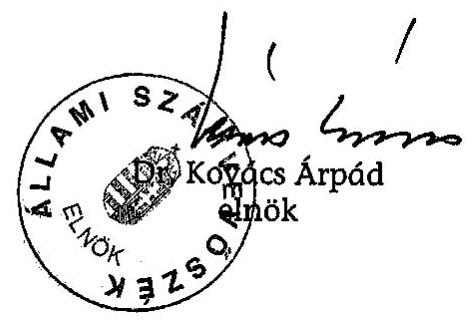
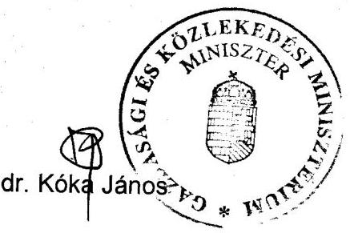
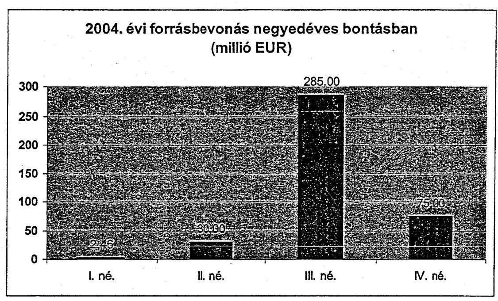
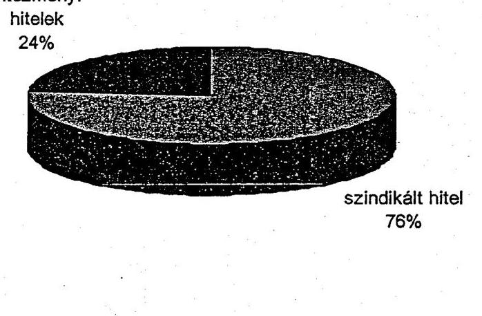
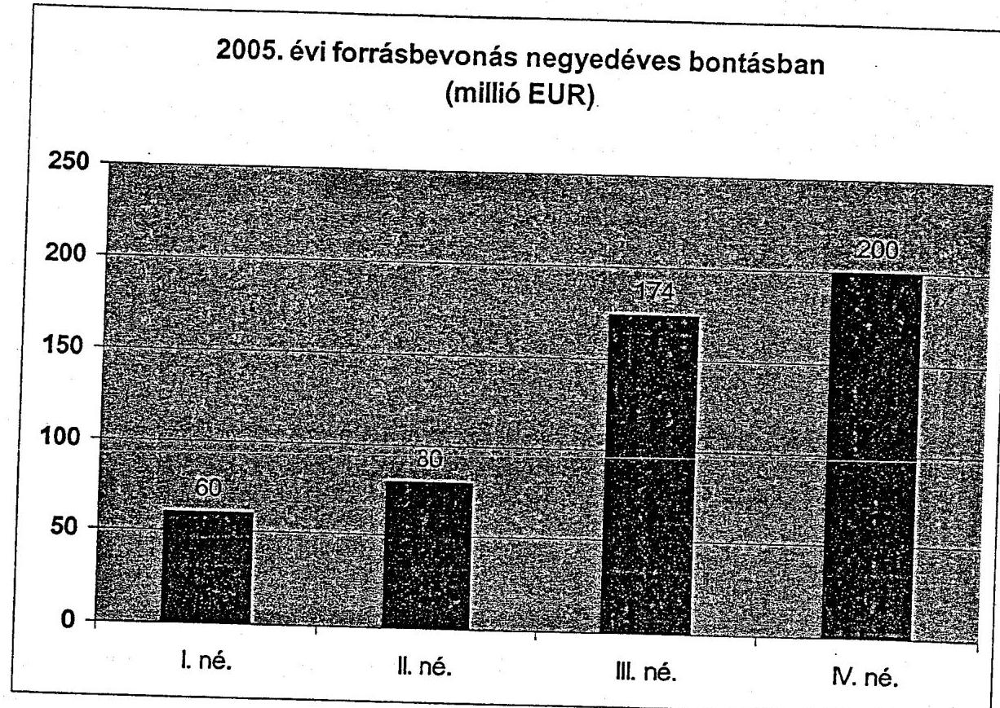
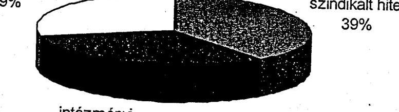

# ÁLLAMI   SZÁMVEVŐSZÉK 

## JELENTÉS

a Magyar Fejlesztési Bank Részvénytársaság működésének ellenőrzéséről

---

# 2. Államháztartás Központi Szintjét Ellenőrző Igazgatóság 

2.1. Teljesítmény Ellenőrzési FőcsoportIktatószám:V-25-29/2005-2006.Témaszám: 795
Vizsgálat-azonosító szám: V0246

## Az ellenőrzést felügyelte:

Bihary Zsigmond
főigazgató
Az ellenőrzés végrehajtásáért felelős:
Kemény Emil
főcsoportfőnök

## Az ellenőrzést vezette:

Makkai Mária
főcsoportfőnökhelyettes
Az ellenőrzést végezték:

| Hajagos Józsefné | Kun Eszter | Lucza Anikó |
| :-- | :-- | :-- |
| főtanácsadó | számvevő | számvevő |
| Massányi Tibor |  |  |
| számvevő |  |  |

A témához kapcsolódó eddig készített számvevőszéki jelentések: címe
sorszáma
Jelentés a hitel-, bank- és adóskonszolidáció végrehajtásának ellenőrzéséről a Magyar Hitelbanknál, a Magyar Befektetési és Fejlesztési Banknál és a Konzumbanknál
Jelentés a Postabank és Takarékpénztár Rt. gazdálkodása, működése és a Magyar Fejlesztési Bank Rt. 1998. évi veszteségének ellenőrzéséről
Jelentés az M3 autópálya beruházás pénzügyi folyamatának ellenőrzéséről 0218
Jelentés az M7 autópálya felújítás pénzügyi folyamatának ellenőrzéséről 0342
Jelentés a Magyar Fejlesztési Bank Részvénytársaság működésének és a központi költségvetés végrehajtásához kapcsolódó tevékenységének ellenőrzéséről
Jelentés a szekszárdi Duna-híd beruházás ellenőrzéséről 0428

---

# TARTALOMJEGYZÉK 

BEVEZETÉS ..... 5
I. ÖSSZEGZŐ MEGÁLLAPÍTÁSOK, KÖVETKEZTETÉSEK, JAVASLATOK ..... 8
II. RÉSZLETES MEGÁLLAPÍTÁSOK ..... 16

1. A Bank feladatai, a vezető testületek működése és az üzleti területek szervezeti változásai ..... 16
2. A Bank üzleti tevékenysége ..... 19
2.1. A Bank középtávú stratégiája és üzleti tervei ..... 19
2.2. A Bank éves üzleti tervei, az üzleti célkitűzések végrehajtása ..... 20
2.3. A Bank hitelezési tevékenysége ..... 21
2.3.1. A hitelezési terület jogszabályi háttere, szabályozottsága ..... 21
2.3.2. A hitelállomány alakulása ..... 22
2.3.3. A kockázatvállalások kezelése ..... 27
2.4. A támogatásközvetítési tevékenység ..... 29
2.5. Tőkebefektetési tevékenység ..... 32
2.5.1. A tőkebefektetési tevékenység szabályozottsága ..... 32
2.5.2. Tartós befektetések ..... 33
2.5.3. Fejlesztési célú tőkebefektetés ..... 35
2.6. A forrásállomány alakulása, összetétele ..... 40
3. A Bank gazdálkodása ..... 43
3.1. A Bank vagyoni helyzete, a saját tőke változása, az eredményt befolyásoló tényezők ..... 43
3.2. A mérlegen kívüli tételek összetétele, a kockázati céltartalékképzés alakulása ..... 51
3.3. Vagyon- és eszközgazdálkodás ..... 52
MELLÉKLETEK
3. sz. a Gazdasági és Közlekedési Minisztérium észrevétele
4. sz. Kimutatás a leányvállalatokhoz kapcsolódó tőkemozgásokról 2003-2005.
5. sz. 2004-2005. évi forrásbevonás negyedéves bontásban, 2004-2005. évi for- rásbevonás instrumentumok szerint
6. sz. A bevont devizaforrások felhasználása 2003-2005. években
7. sz. A Bank eredményének alakulása 2003-2005. években
8. sz. Kritériumok és teljesítménymutatók a tőkefejlesztési tevékenység ellenőrzéséhez

---

# 2

---

# RÖVIDÍTÉSEK JEGYZÉKE 

| ÁKK Zrt. | Államadósság Kezelő Központ Zrt. |
| :--: | :--: |
| BEI | Belső Ellenőrzési Igazgatóság |
| Corvinus Zrt. | Corvinus Nemzetközi Befektetési Zrt. |
| EMIR | Egységes Monitoring Információs Rendszer |
| Eximbank | Magyar Export-Import Bank Zrt. |
| FB | Felügyelő Bizottság |
| GKM | Gazdasági és Közlekedési Minisztérium |
| Gt. | a gazdasági társaságokról szóló 1997. évi CXLIV. törvény |
| GTV, vagy Társaság | Ganz Transelektro Rt. |
| GVOP | Gazdasági Versenyképesség Operatív Program |
| Hpt. | hitelintézetekről és pénzügyi vállalkozásokról szóló 1996. évi CXII. törvény |
| IH | GVOP Irányító Hatósága |
| KCB | Központi Cenzúra Bizottság |
| KEHI | Központi Ellenőrzési Hivatal |
| KfW | Kreditanstalt für Wiederaufbau |
| KKV | kis- és középvállalkozások |
| MÁK | Magyar Államkincstár |
| MEHIB | Magyar Exporthitel Biztosító Zrt. |
| MFB vagy Bank | Magyar Fejlesztési Bank Részvénytársaság |
| MFB tv. | Magyar Fejlesztési Bank Részvénytársaságról szóló többször módosított 2001. évi XX. törvény |
| MKK | Magyar Követeléskezelő Zrt. |
| MKB | Magyar Külkereskedelmi Bank Rt. |
| MNB | Magyar Nemzeti Bank |
| NA Zrt. | Nemzeti Autópálya Zrt. |
| NFH | Nemzeti Fejlesztési Hivatal |
| NFT | Nemzeti Fejlesztési Terv |
| NIL | Nemzeti Ingatlanfejlesztő és Lakásberuházó Zrt. |
| OTMR | Országos Támogatás Monitoring Rendszer |
| PM | Pénzügyminisztérium |
| PSZÁF | Pénzügyi Szervezetek Állami Felügyelete |
| SZMSZ | Szervezeti és Működési Szabályzat |
| TFP | Technológiai Felzárkóztatási Hitelprogram |
| tulajdonosi jogokat   gyakorló miniszter, vagy   alapító | tulajdonosi jogokat gyakorló gazdasági és közlekedési miniszter |

---

# ÉRTELMEZŐ SZÓTÁR 

Gazdasági Versenyképesség Operatív Program (GVOP)
hitelprogram

Nemzeti Fejlesztési Terv (NFT)
refinanszírozási hitel
támogatástartalom
a Nemzeti Fejlesztési Terv része, amely a termelőszektor modernizációját elősegítő beruházások támogatásával kívánja a gazdaság általános versenyképességét javítani olyan hitelcsomag, amelyet a Kormány határozatban hirdet meg az MFB által biztosított forrás terhére, és amelybe közvetlenül a Banknál vagy általa közzétett külön közleményben meghatározott hitelintézetek útján lehet bekapcsolódni
fejlesztési célkitűzéseket tartalmazó stratégiai dokumentum, amelynek elkészítése feltétele volt annak, hogy hazánk az EU Strukturális Alapjából és Kohéziós Alapjából részesedhessen
kereskedelmi bankoknak továbbkölcsönzési céllal nyújtott hitel, amely lehet állam által támogatott kamatozású a kedvezményezett számára nyújtott állami támogatás forint fizetőeszközben számolt támogatási egyenértékese

---

# JELENTÉS 

## a Magyar Fejlesztési Bank Részvénytársaság működésének ellenőrzéséről

## BEVEZETÉS

A Magyar Fejlesztési Bank Részvénytársaság (továbbiakban: Bank vagy MFB) a Magyar Állam 100%-os tulajdonában álló szakosított hitelintézet. A Bank jogállását, feladatait, tevékenységi körét, költségvetési és kormányzati kapcsolatait, működését és szervezeti felépítését a Magyar Fejlesztési Bank Részvénytársaságról szóló, többször módosított 2001. évi XX. törvény (továbbiakban: MFB tv.), valamint a hitelintézetekről és pénzügyi vállalkozásokról szóló 1996. évi CXII. törvény (továbbiakban: Hpt.) és a gazdasági társaságokról szóló (továbbiakban: Gt.) 1997. évi CXLIV. törvény szabályozza.

Az Állami Számvevőszék (továbbiakban: ÁSZ) célvizsgálatok keretében - mint az 1992. évi hitelkonszolidáció, a Bank 1998. évi vesztesége okainak feltárása, az M3 gyorsforgalmi út és a Szekszárdi Duna híd beruházások, valamint az M7 autópálya felújítása - már foglalkozott a Bank működésének egyes területeivel. Az ÁSZ a Banknál átfogó ellenőrzést 2003. évben végzett, ami a Bank 2002. évi tevékenységére irányult. Ekkor a Bank fő feladata az állami fejlesztések és beruházások megvalósítása, az állami források közvetítése volt, amelynek során a bankszerű működés másodlagos szerepet játszott. Az átfogó ellenőrzésről készített jelentést az ÁSZ 2004. áprilisában hozta nyilvánosságra.

Az átfogó ellenőrzés ideje alatt és azt követően az MFB tv. módosításai alapvetően megváltoztatták a Bank feladatait. A törvénymódosítások után a Bankra vonatkozó prudenciális szabályok - a hitelintézetekkel szembeni kockázatvállalást kivéve - megegyeznek a Hpt.-ben rögzítettekkel, azaz a bankszerű működés került előtérbe.

A 2003. júniusi törvénymódosítás hatályba lépését követően bevont forrásokat a Bank az önkormányzati, a magyarországi székhelyű állami és magán gazdálkodó szervezetek - ezen belül elsődlegesen a kis- és középvállalkozások (továbbiakban: KKV) -, valamint a mezőgazdasági termelők fejlesztéseinek, beruházásainak finanszírozására fordíthatja. A Bank kizárólag megtérülő ügyleteket finanszírozhat, amely során - a hitelintézetekkel szembeni kockázatvállalás kivételével - a Hpt.-ben foglalt kockázatvállalási, prudenciális szabályokat köteles alkalmazni.

Finanszírozási tevékenységén túl a Bank részt vesz az ország európai uniós csatlakozásához, illetve 2004. májusa után tagságához kapcsolódóan az álla-

---

mi és önkormányzati fejlesztések pénzügyi lebonyolításában, valamint állami és nemzetközi fejlesztési kifizetésekhez kapcsolódó támogatásközvetítést lát el.

A Magyar Állam a központi költségvetés terhére készfizető kezesként felel a Bank által forrásszerzés céljából külföldről és belföldről felvett hitelekből és kötvénykibocsátásból, valamint a Kormány határozata alapján harmadik fél részére vállalt készfizető kezességből és bankgaranciából származó visszafizetési kötelezettség teljesítéséért. Ezt 2002. decemberétől kiegészíti a forrásokhoz, majd 2003. júniusától az eszközökhöz rendelt, a Kormány által vállalt árfolyamgarancia.

A 2003. évi ÁSZ ellenőrzést követően fejeződött be a Banknál a befektetési portfolió rendezése és az EU csatlakozáshoz kapcsolódó hitelcsomagok indítása, így a 2004. évtől értékelhető az MFB-nél az új törvényi előírásoknak megfelelő, fejlesztési banki működés. Mindezek alapján az ÁSZ a Bank új alapokra helyezett működésének vizsgálatát a 2005. évi ellenőrzési tervében, mint 2006-ra áthúzódó ellenőrzést szerepeltette.

A tulajdonosi jogokat a gazdasági és közlekedési miniszter (továbbiakban: tulajdonosi jogokat gyakorló miniszter, vagy alapító) gyakorolja. 2004. júniusától az MFB tv. módosítása alapján lehetséges az eredményből osztalék fizetése a tulajdonos Magyar Állam részére, szemben a korábbi szabályozással, mi szerint a Bank osztalékot nem fizetett.

A jelenlegi ellenőrzés célja annak értékelése volt, hogy a Bank:

- működése megfelelt-e a törvényi előírásoknak, az állam tulajdonosi elvárásainak, a törvénymódosításból következő feladatváltozás összhangban állt-e a fejlesztési banki működéssel;
- az üzleti tevékenység megváltozásával megvalósultak-e az EU-csatlakozáshoz kapcsolódóan meghirdetett hitelprogramok és a támogatásközvetítési tevékenységével eredményesen segítette-e a Nemzeti Fejlesztési Terv (továbbiakban: NFT) operatív programjainak időarányos teljesítését;
- szabályszerűen és eredményesen gazdálkodott-e, a befektetési portfolió változása pozitívan hatott-e az eredmény alakulására;
- miként hasznosította a korábbi számvevőszéki ellenőrzés javaslatait.

Az ellenőrzés a Bank 2004-2005. évi tevékenységére, valamint 2003. októbere utáni eseményekre és az elért eredményre irányult, de figyelemmel kísérte és értékelte a helyszíni vizsgálatot követő időszakot is.

Az ellenőrzés a 22 fejlesztési tőkebefektetésből tételesen azt az ötöt vizsgálta, amelyekre a Bank 2005. év végén az átlagot meghaladó értékvesztést számolt el. A kiválasztott befektetések nyilvántartási értéke a 2005. év végi fejlesztési tőkebefektetési állománynak 36,4%-át tették ki.

Az ÁSZ a banktitok kérdésében messzemenően figyelemmel volt a Hpt. vonatkozó előírásainak betartására. A jelentésben - a banktitokra való tekintettel - nevesítetten azok az ügyfelek, illetve üzletfelek és adataik szerepelnek, amelyek

---

a nyilvánosság számára is hozzáférhető jogszabályokban, kormányhatározatokban és a cégnyilvántartásban megtalálhatók. Az üvegzseb törvényben (2003. évi XXIV. tv.) az ÁSZ számára biztosított felhatalmazás alapján a Bank befektetéseinél az üzletfelek tevékenységének megítélése érdekében a társaságok igazgatósági és FB üléseinek jegyzőkönyveiben foglaltakat is felhasználtuk.

Az ellenőrzés jogalapját az Állami Számvevőszékről szóló 1989. évi XXXVIII. tv. 2. § (6) bekezdése képezte.

A jelentést egyeztetésre megküldtük a gazdasági és közlekedési miniszternek. Levele másolatát az 1. sz. melléklet tartalmazza.

---

# I. ÖSSZEGZŐ MEGÁLLAPÍTÁSOK, KÖVETKEZTETÉSEK, JAVASLATOK 

#### Abstract

A Bank feladata a 2003. június 15-től hatályos törvényi előírások értelmében ${ }^{1}$, hogy a Kormány közép- és hosszú távú gazdaságstratégiája által meghatározott gazdaságfejlesztési célok megvalósításához szükséges fejlesztési forrásokat biztosítsa a nemzetgazdaság előtt álló, állami részvételt igénylő beruházási és fejlesztési feladatok végrehajtásához, amelyeket hitel és tőkefinanszírozással nyújt a gazdaság szereplőinek.

A Kormány gazdaságfejlesztési célkitűzéseit a 2004-2006. évekre szóló kormányprogram tartalmazza, amely kiemeli a Bank szerepét a vállalkozások fejlesztésében, a kis- és középvállalkozások számára források biztosításában. A kormányprogramon túl részletes, elfogadott gazdaságfejlesztési stratégia nem készült, így a Kormány határozatokban jelölte meg a Bank konkrét feladatait, amelyek végrehajtása az MFB tv. módosítása nélkül nem volt lehetséges. A Bank tevékenységét szabályozó törvény 2003. június 15. és 2006. február vége között öt alkalommal úgy módosult, hogy 3 esetben - kormányhatározatokban előírtak miatt - az alapvető feladatot nem érintette, azonban annak konkrét tartalmát és formáját bővítette.

A Bank tevékenységét a vizsgált időszak alatt jogszabályokon túl a középtávú stratégia és a tulajdonosi jogokat gyakorló miniszter döntései határozták meg. A Bank működése megfelelt a tulajdonosi jogokat gyakorló miniszter által, alapítói határozatokban megfogalmazott elvárásoknak, a Hpt. és az MFB tv. előírásainak.

Az alapító az MFB tv.-ben előírtaknak megfelelően évente beszámolt a
 Kormánynak a Bank előző évi tevékenységéről. A beszámolókat a Kormány határozattal elfogadta.

A Bank vezető testületei - igazgatóság, Felügyelő Bizottság (továbbiakban: FB) - tevékenységüket a jogszabályok, az ügyrendek és éves munkatervek alapján látták el. A függetlenített belső ellenőrzés az FB szakmai irányítása alatt működik. Az egyes vizsgálatok megállapításainak hasznosítására és javaslatainak megvalósításához készített intézkedési tervek végrehajtását az FB rendszeresen ellenőrizte.

A Bank középtávú stratégiája (2004-2008. évek) fő feladatként a hitel- és tőkekihelyezési (befektetési) tevékenység növelését fogalmazta meg bankszerű működés mellett.

[^0]
[^0]:    ${ }^{1}$ Az MFB - a jogelődöt is figyelembe véve - 1991-től tölt be változó szerepkör a mindenkori Kormány gazdaságpolitikájának megvalósításában. Megjegyezzük, hogy a Bank e szerepkörének célszerűségét, gazdaságosságát az államháztartás szintjén nem vizsgálták.

---

A Bank hitelezési tevékenysége szabályozott, rendelkezik mindazokkal a belső utasításokkal, amiket jogszabályok írnak elő. A hitelezési tevékenység keretében a Kormány a KKV szektor fejlesztéseinek közép- és hosszú távú finanszírozását, a kereskedelmi bankokon keresztüli refinanszírozási tevékenység folytatását írta elő a Bank részére úgy, hogy a tevékenységét megtérülő módon folytassa, az ügyletek fedezetekkel biztosítottak legyenek. A prudenciális szabályok betartása mellett a hitelállomány a 2002. év végi 330,1 milliárd Ft-ról, 2005. év végéig 627,9 milliárd Ft-ra, 90,2%-kal nőtt. A már szerződött, de még nem folyósított (rendelkezésre tartott) állomány figyelembevételével a növekedés mértéke 95,2% volt. A 2005. év végi hitelállomány 33,6%-át a Kormány döntése alapján a Nemzeti Autópálya Zrt.-nek (továbbiakban: NA Zrt.) nyújtott hitelek tették ki. Az NA Zrt. állami kezesség mellett felvett hiteleit a Magyar Köztársaság 2006. évi költségvetéséről szóló 2005. évi CLIII. tv. szerint a Magyar Állam átvállalja. Ez azt jelenti, hogy az autópálya építés finanszírozásával a költségvetési feladatellátás - a 2003-at megelőzően alkalmazott tőkeemelés helyett hitelnyújtás formájában - újból megjelent a Banknál. ${ }^{2}$ Az állami döntésű és fedezetű ügyletek 2005. év végén a Bank hitelállományának 49,3%-át tették ki.

2003-ban a Bank elkezdte a stratégiai irányelvekben rögzített programszerű hitelezését, amit minden esetben a Kormány határozata alapján hirdetett meg. 2003-ban a programszerű kihelyezések alapvetően a 2002-ben elindított hitelprogramhoz kapcsolódtak, az új konstrukciók szerinti folyósítások 2004-től váltak meghatározóvá. A programok keretében nyújtott hitelek állományán belül a kereskedelmi bankokon keresztül lebonyolított, a Bank által refinanszírozott ügyletek aránya évről-évre növekedett, 2005. év végén 56,3%-ot tett ki.

A hitelprogramokhoz - adott keret mértékéig - a költségvetés árfolyam garanciája társult, ami azt jelenti, hogy a Bank deviza forrás-bevonásainál az árfolyamvátozás kedvezőtlen hatását a Magyar Állam átvállalja, illetve a keletkező nyereséget az MFB a költségvetés részére befizeti. Ez azt tette lehetővé, hogy a Bank a nyújtott hiteleinél árfolyamkockázati felárat nem számít fel, így a szokásos piaci kondícióknál kedvezőbbeket tudott meghatározni. Az árfolyam garantált keretek kihasználtsága eltérő volt a 19 programnál, két hitelcél esetében nem volt folyósítás, egy esetben az árfolyam garantált keret Kormány általi felemelése vált szükségessé a beérkező igényekhez igazodva. A Bank 2005 szeptemberében az eltérő időpontban meghirdetett 19 hitelcélt kormányhatározat alapján 3 hitelprogramba vonta össze. A hitelprogramok keretében a szerződések 2006. december 31-ig köthetők. A 3 hitelprogram keretkihasználtsága 2005. december 31-én a jóváhagyott kérelmek alapján nem érte el az 50%-ot. A kevésbé értékesíthető hitelprogramok esetében a Bank utólag tárta fel a kereslet hiányának okait. A konstrukciók átfogó és részletes értékelését

[^0]
[^0]:    ${ }^{2}$ Az ÁSZ az M3 autópálya beruházás pénzügyi folyamatának ellenőrzéséről készült 0218 számú jelentésében rögzítette, hogy a költségvetésen kívüli finanszírozási konstrukció miatt nem jelennek meg teljes körűen az államháztartás alrendszereiben a gyorsforgalmi úthálózat fejlesztés forrásai, kiadásai, illetve az igénybe vett forrásbevonások konszolidált pénzügyi hatásai a mindenkor költségvetési törvényben.

---

csak a 2003. évi, az alapító által a Kormány részére készített éves beszámoló tartalmazta.

A Bank a 90,2%-kal magasabb hitelállományra közel ugyanakkora értékvesztést tartott nyilván 2005. év végén mint 2002 decemberében, mintegy 48 milliárd Ft-ot. Ennek oka a problémamentes - ezen belül is az állami kezességvállalással biztosított - ügyletek növekvő aránya, illetve egyes nagy kockázatú hitelek kikerülése volt (az ügyfelek közel 20%-a cserélődött).

A kereskedelmi bankokkal kötött refinanszírozási szerződések keretében nyújtott hitelek szerződései előírásainak betartását a Bank 2005-től ellenőrizte, a 2003-2004. években a szabályzat előírása ellenére ilyen tevékenységet nem végzett. ${ }^{3}$

A Bank támogatás közvetítő tevékenysége keretében részt vett a hazai forrásból megvalósított, kormányhatározattal jóváhagyott egyedi nagyprojektekben és az NFT-hez kapcsolódó Gazdasági Versenyképesség Operatív Program (továbbiakban: GVOP) keretében hat programban, valamint ellátta több célelőirányzathoz - beruházás ösztönzés, turisztika, kereskedelemfejlesztés - kapcsolódó pályázati program részfeladatait. Ezen tevékenységén belül a GVOP esetében négy programnál a Bank a támogatásközvetítést teljes körűen (befogadástól a záró ellenőrzésig), 2 programnál és az egyedi nagyprojektek támogatásával kapcsolatban ellenőrzési feladatokat látott el. A GVOP keretében benyújtott pályázatok komplex feldolgozási folyamatát támogató Egységes Monitoring Információs Rendszer (továbbiakban: EMIR) fejlesztését a Nemzeti Fejlesztési Hivatal (továbbiakban: NFH) a tevékenység megkezdésével párhuzamosan indította el, ami a pályázatkezelés egyes szakaszaiban (szerződéskötés, kifizetések) késedelmet okozott.

A Bank tőkebefektetési lehetőségét az MFB tv. szabályozza. E szerint a törvényben nevesített és a prudens működéshez kapcsolódó befektetéseken kívül a Bank közvetlenül és közvetetten csak 49%-os tulajdonrészt szerezhet olyan társaságban, amely a stratégiájában szereplő tevékenységéhez kapcsolódik. A Bank befektetési portfoliójában 2005. év végén 45 tulajdoni részesedést, 62832 millió Ft értékben tartott nyilván. E mellett a Banknak 23,2 milliárd Ft befektetési kötelezettsége is volt (szerződés, alapítói határozat szerint), így a befektetésekben összességében 86,0 milliárd Ft közpénz koncentrálódik. A vizsgált időszakban a befektetések után a Banknak összesen 352 millió Ft osztalékbevétele volt.

A befektetések közül 2005. év végén a tartós befektetés száma 23, a nyilvántartási értékük 46765 millió Ft volt. Ez az állomány a 2002. december 31-i állománynak több mint négyszerese. Az állománynövekedésben meghatározó volt négy társaságnál végrehajtott tőkeemelés (24 475 millió Ft) és két társaságban tulajdonrész megvásárlása (13 427 millió Ft). A Bank e társaságok stratégiáját megtárgyalta, jóváhagyta. A Corvinus Nemzet-

[^0]
[^0]:    ${ }^{3}$ A Bank 2006. április 21-én kelt levele szerint 2004. év végén kezdte meg az ellenőrzéseket visszamenőleges hatállyal, mivel a hitelprogramok ebben az évben futottak fel.

---

közi Befektetési Zrt.-nek (továbbiakban: Corvinus Zrt.) a Kormány határozatban előírta, hogy kockázati tőkebefektetési alapot és befektető társaságot hozzon létre, amelyhez 5 milliárd Ft forrást a 100%-os állami tulajdonban lévő MFB-nek kell biztosítania. Az MFB tv. nem ad lehetőséget arra, hogy a Bank kockázati tőkebefektetéseket finanszírozzon.

A 23 befektetésből 2005. év végén egy nem felelt meg az MFB tv. előírásának, mivel a Bank tulajdoni hányada meghaladta a 49%-ot. Ez a korlát a Bank közvetett (társaságai által nyilvántartott) tulajdonára is kiterjedt, azonban 2005. év végén a Banknak 6 közvetett tulajdonában lévő társaság nem felelt meg a törvényi előírásoknak. A Banknak a portfolióját 2004. június 30-ig kellett megtisztítania a jogi szabályozásnak nem megfelelő korábbi befektetéseitől. A portfoliótisztítás határidőre maradéktalanul nem teljesült, mivel az érintett befektetések 1/3-a a Bank - közvetlen és közvetett - tulajdonában maradt. Két társaság esetében a Bank azt az álláspontot képviselte, hogy a meglévő befektetésekre a törvényi előírás nem vonatkozik, ezért nem is intézkedett a törvénynek való megfelelés érdekében. ${ }^{4}$ A törvény előírása egyértelmű - annak hatályba lépésekor meglévő ügyek tekintetében írja elő a határidőt -, kivételeket nem határoz meg, így minden portfolióba nem illő befektetésre vonatkozik. A törvénynek nem megfelelő befektetések fennmaradásában az is szerepet játszott, hogy a végelszámolási, illetve felszámolási eljárások - amelyekre a Banknak nincs ráhatása - elhúzódtak, valamint a Bank a portfoliótisztítás végrehajtásáról késedelmesen - a határidő előtt három héttel, illetve az utolsó napon - intézkedett.

A Bank 45 közvetlen befektetéséből 2005. december 31-én 22 fejlesztési tőkebefektetés volt, 16,07 milliárd Ft nyilvántartási értéken. A fejlesztési tőkebefektetés célja a magyarországi székhelyű stabil vállalkozások elsősorban a KKV szektor - számára biztosított forrással, fejlesztési terv megvalósításának elősegítése úgy, hogy a Bank meghatározott ideig (5-12 év) a befektetésekben kisebbségi tulajdonos és meghatározott hozamot (infláció +2-6% felár) vár el. A Bank a KKV Fejlesztési és Tőkebefektetési Programot 2003. július 15-én indította el, amit az EU 2004 decemberében elfogadott. A program keretében maximálisan 500 millió Ft fektethető be egy vállalkozásba. A Bank az 500 millió Ft-ot meghaladó nagybefektetéseket egyedi feltételekkel hagyja jóvá, amelyeknek az eljárási rendjét 2005. évben építette be a befektetési szabályzatába.

A fejlesztési tőkebefektetésekről a vonatkozó szabályozásnak megfelelő szint döntött. A befektetési és a szindikátusi szerződések rögzítik a tőkebefektetésekből a Bank kiszállásának módjait, a megtérülések biztosítékait, a tulajdonosok jogait és kötelezettségeit, valamint a társaságok adatszolgáltatásának rendjét.

# A Bank a társaságokban maximum 2 éve tulajdonos, azonban 5 társaság esetében a megtérülést 2005. év végén kétségesnek tartotta. 

[^0]
[^0]:    ${ }^{4}$ A Bank 2006. április 21-én kelt levele szerint „Két befektetésnél történt a 49%-os befektetési korlát túllépése, mely kármentés érdekében történt, amelyet a törvény lehetővé tesz."

---

Ezek közül egy társaságnál a befektetésről szóló döntés és az összeg átutalása közötti időszakban az eladósodottság közel kétszeresére nőtt, amelyről a Bank utólag értesült. Ez azzal függött össze, hogy a befektetési szabályzat előírásai a döntéskor hiányosak voltak, mivel nem rendelkeztek a befektetett összeg folyósítását megelőzően a társaság pénzügyi helyzetének ismételt ellenőrzéséről. ${ }^{5}$ A vállalkozással szemben a befektetési döntést követő 4 hónap múlva felszámolási eljárás indult. Egy másik társaság a Bank által befektetett összeget nem a szerződésben meghatározott fejlesztési célra használta fel, amely az MFB által bekért adatszolgáltatásból vált ismertté. Mindkét társasággal szemben a Bank csalás miatt feljelentést tett.

Három társaságnál a külső szakértők által a döntést megelőzően feltárt likviditási és egyéb kockázatok instabil gazdálkodásra utaltak, és ezen a megvalósított befektetések nem változtattak. A befektetési szabályzat szerint stabil gazdálkodású társaságok részesülhetnek fejlesztési tőkebefektetésben, azonban a stabil gazdálkodás kritériumait a szabályzat nem rögzítette ${ }^{6}$. A fejlesztési tőkebefektetések előzetesen feltárt kockázatai a döntéseknél nem kaptak kellő súlyt, azok elsősorban az üzleti tervben bemutatott jövőben elérhető, a Bank befektetéseinek megtérülését prognosztizáló eredményterven alapultak. Két társaság esetében a Bank úgy döntött, hogy a befektetésből kiszáll, amely a vizsgálat lezárásakor még nem realizálódott.

Az előző három társaságból egy egyedi nagybefektetés (Ganz Transelektro Rt.), amelyben 41,97%-os tulajdoni hányaddal rendelkezik a Bank, ami a fejlesztési tőkebefektetéseknek 30%-át jelentette (4,9 milliárd Ft). E társaság szanálására alapítói és kormányhatározat született. Az alapító utasította a Bankot, hogy a Transelektro cégcsoport részére nyújtott korábbi kölcsönök törlesztésére fizetési moratóriumot adjon, és
 vegyen részt a finanszírozó bankokkal együtt megalakuló hitelezői konzorciumban, amelynek célja a hitelek átütemezése és a csoport egységes irányítás alá helyezése. A Kormány a kereskedelmi bankok által nyújtandó új hitel mögé 2,397

[^0]
[^0]:    ${ }^{5}$ A Bank a befektetési szabályzatába 2005. II. félévétől beépítette a fejlesztési tőkebefektetések monitoringját és a társaságok adatszolgáltatási kötelezettségét a szerződéskötéstől kezdve.
    ${ }^{6}$ A Bank 2006. április 21-én kelt levele szerint a jelenleg hatályos befektetési szabályzat nem a „stabil gazdálkodású vállalkozás" hanem a „nehéz helyzetben lévő vállalkozások" definícióját tartalmazza. A Bank levelében jelzett definíció az egyedi fejlesztési tőkebefektetésekre vonatkozik 2005. II. félévétől, ugyanakkor a stabil gazdálkodás a befektetések feltételei között változatlanul szerepel, amelynek kritériumai nincsenek meghatározva.

---

milliárd Ft készfizető kezességet vállalt. ${ }^{7}$ Az egyedi fejlesztési tőkebefektetés, amelyre a jogszabályi előírások lehetőséget adnak - a hatályos belső szabályzat szerint a Bank döntési hatáskörébe tartozott. A Kormány a befektetésről dokumentáltan akkor értesült, amikor állami szerepvállalás keletkezett, amely a fejlesztési célon túlmutató indokokon alapult. Az alapító - mivel minden igazgatósági és FB határozatot megkapott - az igazgatóság döntési hatáskörébe tartozó befektetésről tudomást szerzett. A határozatok a befektetés tényét és a tőkeemelés feltételeit rögzítették, de nem tartalmazták - nem is kell tartalmazniuk - a döntés indokait, körülményeit.

Az ellenőrzés tapasztalata szerint mind az öt társaságnál a befektetési szerződésben előírt kötelező adatszolgáltatás téves információkat nyújtott a Banknak, amelyekre utólag derült fény.

A Bank forrásszerzési tevékenysége szabályozott, megfelelt a stratégiai célkitűzéseknek. Az MFB közép- és hosszú lejáratú forrásokat vont be a nemzetközi pénzintézetektől és fejlesztési intézményektől, valamint a nemzetközi pénzpiacokról - szindikált, illetve értékpapírosított hitel formájában -, a tulajdonosi jogokat gyakorló miniszter által jóváhagyott maximális mértéken belül. A stratégiai célkitűzéstől eltérően 2005. évben rendkívüli forrásbevonás vált szükségessé, mivel a Kormány határozata szerint az autópálya építésekhez a Banknak 158 milliárd Ft hitelt kellett nyújtania az NA Zrt.-nek.

A források közül a nemzetközi fejlesztési intézetektől felvett hitelek kötött felhasználásúak, a nemzetközi pénzpiacról bevont instrumentumoknál a hitelcél kötetlen. A Bank a forrásokat a KKV szektor és az önkormányzatok részére - fejlesztési, illetve infrastrukturális beruházásokra - meghirdetett hitelprogramok, az agrár szféra, az autópálya építés, a diákhitelek, a saját árfolyamkockázatára nyújtott egyedi hitelek finanszírozásához, valamint korábbi hiteleinek törlesztéséhez használta fel.

A Bank forrásbevonási, illetve a -felhasználási tevékenységéhez kapcsolódó kormányzati kezességek és garanciák éves limitjeit betartotta.

A Bank 2003 és 2005 között eredményesen gazdálkodott, a saját tőkéje 93,3 milliárd Ft-ról 113,5 milliárd Ft-ra nőtt úgy, hogy 2004-ben 6 milliárd Ft, 2005. évben 11 milliárd Ft osztalékot fizetett a Magyar Államnak.

[^0]
[^0]:    ${ }^{7}$ A helyszíni ellenőrzés lezárását követően a készfizető kezesség vállalására hozott 1015/2006. (II. 10.) és 1021/2006. (III. 14.) Korm. határozatokat megalapozó kormányelőterjesztés szerint a piaci alapú készfizetőkezesség-vállalásnak több indoka volt. Egyrészt a nagyipari hagyomány megőrzése, másrészt a Társaság beszállítói köréhez tartozó KKV-k működőképességének, likviditásának fenntartása, harmadrészt a folyamatban levő projektek befejezésének biztosítása és ezáltal árbevétel realizálása. A kormányelőterjesztés azt is rögzítette, hogy az ügylet közvetlenül kormányprogramhoz nem kapcsolódik. A hitel fedezete elsődlegesen ingatlan jelzálogjog és óvadék, amelyek a kezesség esetleges beváltásakor annak válnak fedezetévé.

---

Az eredmény alakulására hatással volt az MFB üzletági tevékenységén (befektetések, hitelezés, díjbevételek) felül a tulajdonában lévő értékpapírok kezelése, az egyéb tevékenységből származó bevétel és ráfordítás, a működési költség és a rendkívüli eredmény. A Bank eredménykimutatás szerinti üzleti tevékenységének eredménye 2003-2005 között - 6,4 milliárd Ft-ról 24,7 milliárd Ft-ra - 285,9%-kal nőtt. Ezen belül a befektetési tevékenység 2005. év kivételével minden évben veszteséges volt. Ezt az okozta, hogy a befektetések után elszámolt értékvesztés növekedése meghaladta a visszaírás mértékét és a 2003. évi portfoliótisztítás hatása is negatív volt. A hitelezési tevékenység során elért kamatbevételi többletet a hitelek után elszámolt értékvesztések és visszaírások, valamint a céltartalék képzések és felhasználások a 2003. és 2004. évben csökkentették, aminek hatásaként 2003. évben a hitelezési tevékenység veszteséges volt. ${ }^{8}$ 2004. és 2005. évben a Bank hitelezési tevékenységének eredményre gyakorolt hatása pozitív volt, ami az aktivitás növekedésének, valamint az értékvesztések és céltartalékok elszámolása egyenlegének együttes következménye. A díjbevételek és ráfordítások egyenlege 2003. évben rontotta a Bank eredményét, 2004-2005. években javította. Az üzletági eredményeken felül az értékpapírok utáni kamatbevétel, az elszámolt árfolyamnyereség és veszteség egyenlege minden évben kedvezően befolyásolta az eredményt. A Bank egyéb tevékenysége eredményességének oka a tárgyi eszközök értékesítéséből elért nyereség és a megtérült követelésekre korábbi években elszámolt értékvesztés jóváírása volt.

A Bank működési költsége 2003-2005 között 58,8%-kal növekedett. Ezen belül meghatározó volt a személyi jellegű ráfordítás, amelynek részaránya 48,5%-ról 62,8%-ra emelkedett. A személyi jellegű ráfordítás növekedése 100 főt meghaladó létszámbővítéshez, az alapító által jóváhagyott bérfejlesztéshez és a Bank vezetése által szabályzatban rögzített béren kívüli juttatásokhoz kapcsolódott. A létszámbővülés 19%-a (19 fő) indokoltan abból adódott, hogy a korábban önálló kft. keretében végzett üzemeltetési tevékenységet a Bank a szervezetébe integrálta. A képviselői hálózat létrehozása 44 fős létszámnövekedéssel járt a Banknál. A további létszámbővülés az üzleti és a fejlesztéspolitikai területeket érintette. A fejlesztési divízió létrehozására az alapító utasította a Bankot (10-15 fő). Az üzleti területeken a létszámnövekedés a Bank feladatbővüléséhez (hitelprogramok bevezetése) kapcsolódott. A Bank 2005-ben létszámleépítést (24 fő) hajtott végre, amelynek a felvételek miatt a zárólétszámra nem volt hatása. A bérleti díjak, a reklám és propaganda költségek számottevően növekedtek, mindkettő több, mint háromszorosára.

A Bank mindhárom évben 1 milliárd Ft-ot meghaladó összeget költött beruházásra, amelynek fő területei voltak az informatikai fejlesztések, az ingatlanok felújítása és a feladatbővülés miatti létszámnövekedéshez kapcsolódó ingatlan vásárlások. Az informatikai fejlesztéseken belül a rendszerfejlesztések teljesítése minden évben elmaradt a célkitűzéstől, az üzembe helyezések több hónapos késéssel valósultak meg. A számítástechnikai eszközök beszerzése ezen időszak alatt meghaladta a tervezett mértéket. Összességében a Bank a beruházási tervet egyik évben sem lépte túl.

A korábbi átfogó számvevőszéki ellenőrzésben a Kormánynak és a tulajdonosi jogokat gyakorló miniszternek megfogalmazott ajánlások egy kivételével teljesültek. Elmaradt az államháztartásról szóló törvény az irányú módosítása, hogy egyértelműen szabályozva legyen a központi költségvetésből és a pénzalapokból államháztartáson kívüli szervezeteknek és magánszemélyeknek céljelleggel juttatott támogatások felhasználásának rendje (teljesítés ütemezése, elszámolása). A Banknál céljellegű tőkeemelés nem volt, így a törvény módosításának elmaradása a működésben szabályossági kérdéseket nem vetett fel.

A helyszíni ellenőrzés megállapításainak hasznosítása mellett javasoljuk:

# a Kormánynak 

1. Dolgozza ki a közép- és hosszú távú gazdaságfejlesztési koncepciót és abban jelölje meg azokat a területeket, amelyek megvalósításában az MFB-nek feladatai vannak.
2. Követelje meg a tulajdonosi jogokat gyakorló minisztertől, hogy értékelje a Bank éves tevékenységéről szóló beszámolójában a hitelprogramok alakulását, azok kihasználtságát, továbbá az egyedi fejlesztési tőkebefektetések célszerűségét.

## a gazdasági és közlekedési miniszternek

1. Követelje meg a Banktól a portfoliótisztításra vonatkozó törvényi előírás teljes körű végrehajtását.
2. Rendelje el az egyedi fejlesztési tőkebefektetések alapítói határozattal történő jóváhagyását, a gazdaságfejlesztési koncepcióba való illeszkedés és az állami kockázatok felmérése érdekében.
3. Írja elő, hogy a Bank a befektetési szabályzatában a stabil gazdálkodás kritériumait részletesen határozza meg a befektetési döntések átláthatósága és ellenőrizhetősége érdekében.

---

# II. RÉSZLETES MEGÁLLAPÍTÁSOK 

## 1. A BANK FELADATAI, A VEZETŐ TESTÜLETEK MŰKÖDÉSE ÉS AZ ÜZLETI TERÜLETEK SZERVEZETI VÁLTOZÁSAI

A Bank MFB tv. szerinti feladata az állam gazdaságpolitikai célkitűzései megvalósításának eszközeként a magyar gazdaság erősítéséhez, versenyképességének javításához szükséges fejlesztési és beruházási források biztosítása banki eszközökkel és intézményrendszerrel.

A vizsgált időszak alatt a Bank tevékenységét jogszabályok, a középtávú stratégia és üzleti tervek, valamint kormányhatározatok és alapítói döntések határozták meg.

A Magyar Köztársaság Kormányának 2004-2006. évek közötti időszakra szóló programja a gazdaságpolitika elsődleges céljaként a gyors és egyensúlyőrző növekedést és ehhez kapcsolódóan a magyar gazdaság versenyképességének javítását jelöli meg. A program célkitűzésként határozza meg a magyar vállalkozások fejlesztését és kiemelte a Bank szerepét a KKV szektor számára induló új hitelprogramok és konstrukciók kapcsán.
2003. június 15-től - 2006. február végéig az MFB tv. öt alkalommal módosult. A módosítások a Bank által ellátható tevékenységi kört szélesítették, a finanszírozható ügyfélkört pontosították, valamint a Bank befektetési portfoliójára vonatkozóan határoztak meg új előírásokat. A törvénymódosítások azzal is összefüggtek, hogy a Kormány határozat keretében új feladatot írt elő a Bank számára, aminek végrehajtására az MFB tv. nem adott felhatalmazást.

Az Európa terv Agrárhitel programjának bevezetéséről szóló 2016/2004. (I. 22.) Korm. határozat az agrárgazdaság finanszírozásával kapcsolatban nevesíti a Bankot, az MFB tv. 2004. június 2-tól teszi lehetővé a mezőgazdasági őstermelők és családi gazdálkodók beruházásainak fejlesztési hitelfinanszírozását.

A Tokaj-hegyalján 2005. év május 4-én, valamint a Mátra északi térségében 2005. év április 18-a és 20-a között lehullott nagy mennyiségű csapadék miatt keletkezett károk enyhítéséről szóló 1050/2005. (V. 21.) Korm. határozat is megelőzte az MFB tv. megfelelő módosítását (2005. június 29.), amely az elemi kárt szenvedett térségben lehetővé tette a gazdálkodó szervezetek, önkormányzatok és természetes személyek részére a kár következményeinek felszámolását szolgáló beruházások hitelezését.

A "Sikeres Magyarországért" hitelprogramok meghirdetéséről és a fejlesztési tőkefinanszírozási eszközök kiszélesítéséről szóló 1041/2005. (V. 5.) Korm. határozatban foglalt feladatoknak megfelelően az MFB tv.-t 2005. november 19-i hatállyal módosították.

Az MFB tv. módosításait a Bank alapító okiratán, valamint Szervezeti és Működési Szabályzatán (továbbiakban: SZMSZ) átvezették. Az alapító okirat módosításait a Pénzügyi Szervezetek Állami Felügyeletének (továbbiakban: PSZÁF)

---

minden esetben bejelentették, amely a vonatkozó engedélyeket a Bank számára megadta.

Az MFB tv. 6. § (1) bekezdése előírja, hogy a Bank előző évi tevékenységéről a tulajdonosi jogokat gyakorló miniszter legkésőbb augusztus 31-ig beszámol a Kormánynak, aki ezen kötelezettségének a vizsgált időszak alatt eleget tett. A Kormány a Bank tevékenységéről készített beszámolókat elfogadta.

A Bank 2003. évi tevékenységéről szóló beszámoló keretében a tulajdonosi jogokat gyakorló miniszter tájékoztatta a Kormányt az ÁSZ 2003-ban végzett átfogó ellenőrzéséről szóló jelentésében megfogalmazott ajánlásokkal kapcsolatban megtett intézkedésekről, így arról, hogy jóváhagyta a működési költségek és a Bank tevékenysége közötti folyamatos összhang biztosítására vonatkozó eljárási szabályokat; elrendelte a két vezérigazgató irányítási és döntési felelősségének megosztását, elhatárolását (ami megtörtént).

A Gazdasági és Közlekedési Minisztérium (továbbiakban: GKM) SZMSZ-e 2003-tól a miniszteri kabinet részeként definiálja az MFB titkárság feladatkörét
 és részletesen előírja a Bank feletti tulajdonosi joggyakorlásból, illetve a minisztérium és a Bank közötti kapcsolatrendszerből adódó feladatokat, amelyeket a Titkárság teljesített.

Ezek a feladatok a következők: a miniszternek a Bank feletti, a tulajdonosi jog gyakorlásából és a minisztériumnak a Bank kormányzati kapcsolatai koordinációjából adódó feladatainak előkészítése és a végrehajtás szervezése; a Bankot érintő stratégiai döntések előkészítése és a végrehajtás szervezése; közreműködés a Bank külföldi forrásbevonásához kapcsolódó feladatokban; a minisztérium által kezelt támogatási és pályázati rendszerek és a Bank ehhez kapcsolódó tevékenységének koordinációja, valamint a Bankkal kapcsolatos jogalkotási feladatok szakmai megalapozása.

A Bank megküldte az igazgatóság és az FB határozatait az alapító részére és rendszeres tájékoztatást adott az általa előírt feladatok végrehajtásáról. Ezt a célt szolgálták a tulajdonosi joggyakorló miniszter és a Bank vezérigazgatói közötti rendszeres személyes konzultációk, amelyekről írásos dokumentum nem készült.

Az MFB tv. szerint a Bank irányító, döntéshozó és ellenőrző szervei a tulajdonosi jogok gyakorlója, az igazgatóság és az FB. A tulajdonosi jogokat gyakorló miniszter alapítói határozatokon keresztül irányította a Bank tevékenységét. A Bank ügyvezető szerve az igazgatóság, amelynek tagjait és elnökét az alapító választja meg és hívja vissza. A helyszíni ellenőrzés lezárásakor a Bank igazgatósága 9 főből állt. A Bank ellenőrző szerve az FB, létszáma 9 fő. Az igazgatóság és az FB tagjai megfeleltek a Hpt. és az MFB tv. által támasztott összeférhetetlenségi és egyéb (vezetői gyakorlat stb.) követelményeknek.

Az igazgatóság és az FB rendelkezik ügyrenddel, a vizsgált időszak alatt tevékenységüket éves munkatervek alapján látták el. Az igazgatósági ülések száma 2004-ben 29, 2005-ben 37 volt, amelyekből a sürgősségi eljárással lefolytatott ülések aránya 37,9% illetve 48,6%. Ugyanakkor a sürgősségi eljárás keretében hozott határozatok aránya 5,6%, illetve 11,2% volt. A sürgősségi döntéshozatal

---

oka az ügyletek határidejének alakulása volt, amelynek során a vonatkozó előírásokat betartották. Az FB 2004-ben 15, 2005-ben 11 alkalommal ülésezett.

A hatályos ügyrendek szerint az ülésekről összefoglaló jellegű jegyzőkönyvet kell készíteni. Az igazgatósági jegyzőkönyvek 90%-ban csak a napirendet és a határozatot tartalmazták.

A Gt. 241. § (1) bekezdése szerint az igazgatóság jogait testületileg gyakorolja, ugyanakkor tagjainak egymás közötti feladat- és hatáskör megosztásáról az igazgatóság által elfogadott ügyrendben kell rendelkezni. Az igazgatóság ügyrendje ilyen megosztást nem tartalmaz. Minden igazgatósági tag jogosult korlátozás nélkül részt venni a testület hatáskörébe tartozó bármely ügy megtárgyalásában és eldöntésében.

A Bank 7 fős Belső Ellenőrzési Igazgatósága (továbbiakban: BEI) évente munkatervet készített, amelyet az FB jóváhagyott. 2004-ben a BEI munkatársai 21, 2005-ben 19 vizsgálatot végeztek. A BEI az egyes vizsgálatok megállapításairól, javaslatairól és az azzal kapcsolatosan hozott intézkedési tervekről követő táblázat formájában nyilvántartást vezetett. Az FB megkapta a vizsgálati jelentéseket és az azok alapján készült intézkedési tervek végrehajtását (follow-up táblák) rendszeresen ellenőrizte. Ezzel eleget tesznek a 2003. évi átfogó ellenőrzése keretében megfogalmazott azon ÁSZ javaslatnak, hogy az FB ellenőrzi a BEI vizsgálataihoz kapcsolódó intézkedési tervek végrehajtását.

A Bank legfőbb operatív testülete a Vezetői Bizottság. Az SZMSZ előírásai szerint a Bank döntéshozó testületei az igazgatóság által elfogadott és a jogszabályi előírásokkal összhangban álló ügyrendek alapján tevékenykedtek. Az üzleti döntéshozó testületek döntési kompetenciái szabályozottak. A Bank alapító okirata rögzíti a tulajdonosi jogokat gyakorló miniszter, valamint az igazgatóság kizárólagos hatáskörébe tartozó értékhatárokat.

A Bank szervezetének alapfelépítése a vizsgált időszak alatt stabil volt. A Pénzügyi Divízió és az Üzleti Divízió mellett a 2004 júliusában alapítói utasításra létrehozott Fejlesztéspolitikai Divízióval növekedett a horizontális tagoltság és a vezetői pontok száma, továbbá az Üzleti Divízió vertikális tagozódása, az osztályok és csoportok száma emelkedett. A változtatások a Bank üzleti tevékenységével összhangban történtek.

Az üzleti szervezeti egységek létszáma a vizsgált időszak alatt fokozatosan emelkedett. Az Üzleti Divízió létszáma a 2003. év végi 86 főről 2004-re 154-re emelkedett, amiből a képviseleti hálózat létszáma 44 fő, 2005-ben a záró létszám 146 fő volt. A Bank összlétszáma 2003. év végén 255 fő volt, ennek 33,7%-át tette ki az Üzleti Divízió állománya, ez az arány 2004-ben 43,2%-ra (összlétszám 356 fő), 2005-re 41,0%-ra változott, változatlan összlétszám mellett.

A Bank igazgatósága annak érdekében, hogy elősegítse a gazdaság szereplőinek a fejlesztési forrásokhoz való hozzájutását képviseleti hálózat létrehozásáról döntött.

---

A Bank 2004-ben hozta létre a képviseleti hálózatot, megyei és regionális szinten. Az EU források támogatásközvetítésének előfeltétele a hálózat megléte. A képviseleti irodák feladata az akvizíció elősegítése, az ügyfelek ellenőrzése és a kapcsolattartás. 2005-ben a Bank éves közbeszerzési tervét a képviseleti irodáknak küldte meg, hogy országosan teljesítse annak nyilvánosságra hozatali kötelezettségét.

A képviseletekkel szemben megfogalmazódott a támogatásközvetítési feladatokhoz kapcsolódó elő- és utóvizsgálatokban való részvétel is, figyelemmel arra, hogy ebben a tevékenységben helyi piaci ismeret, vállalkozói kapcsolatrendszer szükséges. A Bank Támogatásközvetítési Igazgatóságának munkatársai által végzett helyszíni szemléken való részvételek száma 2004-ben 60, 2005-ben 417 volt.

2004-ben a hitel- és tőkebefektetés terén a képviseletek által akvirált és a Bank által jóváhagyott ügyletek értéke 100 millió Ft, (1 db ügylet), 2005-ben 9346 millió Ft volt (18 db ügylet, ebből 16 db hitelügylet, 1-1 garancia és tőkebefektetés). A refinanszírozásra beadott ügyletek száma 2004-ben 40 volt, 3286 millió Ft értékben, 2005-ben az ügyletszám 227-re, összértéke 35887 millió Ft-ra emelkedett.

# 2. A BANK ÜZLETI TEVÉKENYSÉGE 

### 2.1. A Bank középtávú stratégiája és üzleti tervei

A Bank középtávú stratégiája és üzleti terve a Magyar Fejlesztési Bank Rt. középtávú stratégiájának irányelveiről szóló 2018/2003. (II. 12.) Korm. határozat alapján - a határozatban előírt 2003. február 28-ai határidő helyett - 2003 decemberében készült el. A Kormány a 2125/2004. (V. 28.) határozatával elfogadta a Bank középtávú stratégiáját. A Bank tájékoztatása szerint a késlekedésben szerepet játszott az árfolyam-garancia intézményével kapcsolatos bizonytalanság, amelyről szóló megállapodást a Bank és a Pénzügyminisztérium (továbbiakban: PM) 2004. január 29-én írta alá.

A középtávú stratégia és üzleti terv 2004-2008 évek közötti időszakra határozza meg a Bank működésének prioritásait és tevékenységének gazdasági és üzletviteli kereteit. A makrogazdasági folyamatok lehetséges alakulását figyelembe véve a Bank a stratégiát két változatban készítette el: egy dinamikus és egy mérsékelt növekedési pályát feltételezve. A dinamikus üzleti terv növekedést tételez fel a gazdaság egészében mind a vállalkozói mind az önkormányzati és az infrastruktúra fejlesztési területeken, amely a Bank üzleti aktivitásának bővülését teszi szükségessé. Az előterjesztés nyitva hagyta annak lehetőségét, hogy - amennyiben a gazdaság finanszírozási igényei a tervezett alatt maradnak - a mérsékelt növekedési pálya valósítható meg, amelynek keretében a mérlegfőösszeg kisebb mértékben bővül és 2008-ra 700 milliárd Ft-ot ér el.

A középtávú stratégia célkitűzései összhangban vannak az MFB tv.-ben a Bank számára meghatározott feladatokkal. A stratégia szerint a Bank részben önállóan, részben más hazai és nemzetközi szervezetekkel együttműködve részt vesz a Kormány közép- és hosszú távú gazdaságstratégiája által meghatározott gazdaságfejlesztési célok megvalósításában. A gazdaságfejlesztési célkitűzéseket a 2004-2006. évekre vonatkozó kormányprogram tartalmazza, ezen túl részletes, egységes, elfogadott gazdaságfejlesztési stratégiát az ellenőrzés nem lelt fel.

---

Az üzleti terv elfogadott dinamikus növekedési változata szerint (amely az árfolyam-garanciával biztosított kedvező forrásháttérre épít) a Bank mérlegfőösszege a 2003. évi 530 milliárd Ft-ról 2008-ra 1010 milliárd Ft-ra növekszik és a tervezési időszak egészében évente 160-186 milliárd Ft új, hosszú lejáratú fejlesztési hitel kihelyezésével járul hozzá a gazdaságfejlesztési célok megvalósításához. A prognózis szerint a Bank 2004 és 2008 közötti gazdálkodását a hitel- és befektetési portfolió növekedése határozza meg, amelyhez a hátteret a nemzetközi és hazai pénzpiacról árfolyam-garanciával bevonható források biztosítják.

A terv a Bank állampapír állományának fokozatos csökkenését irányozta elő, miszerint a 2003. évi 143 milliárd Ft értékű állomány 2008-ra 45 milliárd Ft-ra csökken. A stratégia a tervezés időszakában kormányzati tőkejuttatással nem számolt, a saját tőke értéke a képződő eredménnyel emelkedhet, a tervidőszak egészére folyamatosan eredményes gazdálkodást, a Bank tőkeáttételének (mérlegfőösszeg és saját tőke hányadosa) emelkedését prognosztizálta.

# 2.2. A Bank éves üzleti tervei, az üzleti célkitűzések végrehajtása 

Az elfogadott stratégia és üzleti terv célkitűzései az éves üzleti tervekben megjelentek. Az üzleti tervek komplexek, részletesen tárgyalták a Bank adott évre vonatkozó üzleti elképzeléseit a hitelezési, befektetési és forrásbevonási tevékenységre vonatkozóan. A költség- és eredménytervek mellett beruházási tervet is tartalmaztak.

A Bank mérlegfőösszege 2004-ben 605785 millió Ft-ra teljesült, amely alatta maradt az elfogadott, dinamikus növekedési változat előirányzatának (617 128 millió Ft), de az igazgatóság által a 2005-re elfogadott üzleti terv keretében a 2004. évre módosított értéket (596,1 milliárd Ft) meghaladta.

Az erősödő forint miatt a Bank devizában fennálló kötelezettségei és követelései állományának Ft értéke csökkent. További mérlegfőösszeg csökkentő tényező volt a 6 milliárd Ft-os osztalékelőleg, amelyet a Bank 2004 év folyamán a központi költségvetés felé teljesített.

A Bank éves üzleti terve 2004-re 486545 millió Ft hitelállományt irányzott elő, az év végi tényadat 429987 millió Ft, az elmaradás 56558 millió Ft volt. A hitelállomány bővülése mind a közvetlen kihelyezésű, mind a közvetített hitelek terén elmaradt az előirányzattól. Ebben szerepet játszott a Technológiai Felzárkóztatási Hitelprogram (továbbiakban: TFP), az Egészségügyi Hitelprogram és a regionális infrastruktúra hitelek tervezettnél későbbi elindítása, a beruházások elhúzódása és a terven felüli törlesztések.

Az állampapír-állomány nyilvántartási értéke a 2003. év végi 142917 millió Ft-ról 2004-re 128068 millió Ft-ra csökkent.

A Bank 2003. június 15-ével elindította a hazai tőkehiányos, de piacképes, fejlődési lehetőségekkel rendelkező vállalkozásokat finanszírozó Fejlesztési Tőkebefektetési Programját. 2004 végéig 18 tőkebefektetési kérelmet hagytak jóvá, összesen 15,8 milliárd Ft értékben, a megkötött szerződések száma 16 volt, 14,8

---

milliárd Ft értékben. 2004-ben tényleges kihelyezésre 13 ügyfél esetében került sor, a fejlesztési tőkebefektetések állománya 14,2 milliárd Ft-ra teljesült.

A Bank 2005-re a középtávú stratégia keretében 685098 millió Ft-os mérlegfőösszeget tervezett, az éves terv előirányzata 671970 millió Ft volt, az auditált mérlegfőösszeg 779412 millió Ft lett.

A 2005. évi üzleti terv az év végi hitelállományt 514 milliárd Ft-ra prognosztizálta, amely 628 milliárd Ft-ra teljesült. Ez annak a következménye, hogy a Kormány döntése értelmében a Bank az NA Zrt.-vel 158 milliárd Ft értékű hitelszerződést kötött, amelyből 141 milliárd Ft-ot folyósított 2005. év végéig. E nélkül a hitelállomány 484 milliárd Ft, az előirányzatnak 94,7%-a.

Az állampapír-állomány csökkentésének stratégiai célja teljesült, a nyilvántartási érték a 2004. évi 128 milliárd Ft-ról 71 milliárd Ft-ra csökkent. A csökkenés egyrészről a 2005. évben lejáró állampapírok beváltásából, másrészről az NA Zrt. finanszírozásához szükséges forrásbiztosítás miatti - befektetés célú papírok - értékesítéséből származott.

A támogatásközvetítési tevékenységből származó jutalékbevétel mindkét vizsgált évben meghaladta az előirányzatot. 2004-ben a tervezett érték (352 millió Ft) 413 millió Ft-ra teljesült, 2005-ben 579 millió Ft-ot terveztek,
 a tényadat 643 millió Ft lett.

# 2.3. A Bank hitelezési tevékenysége 

### 2.3.1. A hitelezési terület jogszabályi háttere, szabályozottsága

2003 júniusától a Bank az MFB tv. 4.§-a alapján közvetlenül is, illetve más hitelintézeten keresztül is elláthatja hitelezési tevékenységét, kizárólag egy évet meghaladó hitelt, kölcsönt nyújthat, illetve csak ilyen hitelhez kapcsolódóan vállalhat kezességet, garanciát. A Bank csak megtérülő, fedezetekkel kellően biztosított ügyleteket finanszírozhat.

Az MFB tv. 2003. június 15-től hatályos módosításával a Bankra vonatkozó hitelezést érintő prudenciális szabályok megegyeznek a Hpt.-ben rögzítettekkel, kivéve a hitelintézetekkel szembeni kockázatvállalásokat. Az egy ügyféllel szembeni összes kockázatvállalás összege a Hpt.-nek megfelelően a szavatoló tőke 25%-a lehet, amitől hitelintézetek esetében - 2005. június 29-ig - 100%-ig, ezt követően 150%-ig lehetett eltérni.
2005. június 29-től az MFB tv. lehetővé tette a fejlesztéshez, beruházáshoz közvetlenül kapcsolódó tartós forgóeszköz-finanszírozást is.

A Bank középtávú stratégiájának irányelveiről szóló 2018/2003. (II. 12.) Korm. határozat középtávú célként rögzítette, hogy a Banknak hosszú lejáratú, olcsó fejlesztési forrást kell biztosítania alapvetően a KKV szektor részére úgy, hogy az egyedi jellegű finanszírozások mellett a refinanszírozási konstrukciók keretében történő fejlesztési (éven túli) hitelnyújtás kerüljön középpontba. A határozat előírta azt is, hogy az MFB-nek banki (prudens) szemléletmódot kell érvényesítenie. Az irányelvek beépültek a Bank stratégiájába.

---

2004-től kezdve a Kormány hangsúlyt helyezett az új hitelprogramok beindítására, azok kormányzati szintű kezelésére, azokat minden esetben kormányhatározatban hirdette meg, amelyeket az alapító saját határozatban külön is megerősített. A programokhoz árfolyam-garanciát biztosít a Kormány.

A Bank rendelkezik a kintlevőségek, befektetések, mérlegen kívüli tételek és a fedezetek minősítésének és értékelésének szempontjairól szóló 14/2001. (III. 9.) PM rendeletben előírt mindazon szabályzatokkal, amelyek a hitelezési tevékenységét lefedik. A hitelprogramokra - két program kivételével - nem belső szabályzat (vezérigazgatói utasítás), hanem termékleírások és eljárási rendek, illetve a kereskedelmi bankokkal kötött refinanszírozási szerződések vonatkoznak. A Bank hitelezési szabályzata a hitelezési tevékenység eljárási, adminisztratív rendjét rögzíti, amely a saját kockázatra végzett finanszírozási tevékenységéhez kapcsolódó monitoring-feladatokra is tartalmaz általános előírásokat. A szabályzat nem tesz különbséget a hitelprogramokkal kapcsolatos ügyletek és az egyedi - ezen belül is a nagy összegű - hitelek között, miközben a kétféle konstrukció monitoringja eltérő azok komplexitása, valamint a Bank által felvállalt kockázata következtében.

A Bank a refinanszírozási hitelek kezelésére külön utasítással rendelkezik, a refinanszírozott hitelprogramokhoz a kereskedelmi bankokkal refinanszírozási szerződéseket kötött.

A közvetlen hitelezési tevékenységre vonatkozó alapvető irányelveket, korlátozásokat, elvárásokat általánosan rögzítő kockázatvállalási szabályzat a vizsgált időszakban 10-szer módosult a jogszabályi keretekhez való igazodás, másrészről egyes folyamatok, műveletek részletes szabályozása miatt.

# 2.3.2. A hitelállomány alakulása 

Az MFB stratégiájában több alapvető hitelezési cél jelenik meg (pl. állami és önkormányzati fejlesztések, KKV szektor finanszírozása, állami és önkormányzati tulajdonban lévő vagyon értékesítéséhez nyújtott hitelek, állami árfolyamgarancia mellett nyújtott egyedi hitelek, agrárágazaton belüli fejlesztések stb.).

A Bank a 2003-2005 közötti időszakban összesen 588,2 milliárd Ft összegben folyósított fejlesztési célú hiteleket, amelyből 172,4 milliárd Ft az ebben az időszakban meghirdetett hitelprogramokhoz kapcsolódott. A fennmaradó összeg az egyedi, nem konstrukciós (410,0 milliárd Ft), valamint kisebb részben (5,9 milliárd Ft) az MNB-től kormánydöntés alapján átvett, illetve a Kreditanstalt für Wiederaufbau-n (továbbiakban: KfW Bank) keresztül refinanszírozott hitelekhez kapcsolódó kihelyezéseket szolgálta. A Bank hitelállománya 2002. december 31. és 2005. december 31. között 330,1 milliárd Ft-ról 627,9 milliárd Ftra, azaz 90,2%-kal nőtt.

A kihelyezések, valamint a jóváhagyott hitelekhez kapcsolódó rendelkezésre tartott állomány alakulását a következő táblázat szemlélteti.

---

|  |  |  |  | Adatok M-Ft-ban |
| :--: | :--: | :--: | :--: | :--: |
|  | 2002. 12. 31. | 2003. 12. 31. | 2004. 12. 31. | 2005. 12. 31. |
| Közvetlen folyósítású hitelek | 297576,7 | 320248,0 | 307640,6 | 502352,2 |
| - ebből hitelprogramok | 67108,6 | 82967,4 | 89405,8 | 90258,1 |
| - ebből egyedi hitelek | 230468,1 | 237280,6 | 218234,8 | 412094,1 |
| Refinanszírozott hitelek | 32554,4 | 34301,6 | 78379,5 | 125528,3 |
| - ebből hitelprogramok | 0 | 12073,5 | 63838,7 | 116192,9 |
| - ebből MNB-től átvett és KFW hitelek | 32554,4 | 22228,1 | 14540,8 | 9335,4 |
| Összes hitelállomány | 330131,1 | 354549,6 | 386020,1 | 627880,5 |
| - ebből programszerű kihelyezés | 67108,1 | 95040,9 | 153244,5 | 206451,0 |
| Programszerű kihelyezés aránya | 20,3% | 26,8% | 39,7% | 32,9%${ }^{9}$ |
|  |  |  |  |  |
| Közvetlen hitelekhez kapcsolódó rendelkezésre tartott állomány | 54440,8 | 32446,8 | 66310,0 | 81642,3 |
| - ebből hitelprogramok | n.a. | 5439,0 | 4461,6 | 3350,7 |
| Refinanszírozott hitelekhez kapcsolódó rendelkezésre tartott állomány | 836,2 | 11425,2 | 21527,5 | 42974,2 |
| - ebből hitelprogramok | n.a. | 11077,0 | 21390,3 | 42910,6 |
| Összes rendelkezésre tartott állomány | 55277,0 | 43872,0 | 87837,5 | 124616,5 |
| - ebből hitelprogramok | n.a. | 1516,0 | 25851,9 | 46261,3 |

Forrás: a Bank belső analitikus nyilvántartásai.
A Bank hitelezési aktivitása 2003. és 2004. években 7,4-8,9%-kal bővült, 2005-ben a növekedési ütem 62,6% volt. Ez utóbbi növekedésben szerepet játszott az, hogy a Kormány 1012/2005. (II. 19.) határozata alapján a Bank az NA Zrt. részére folyósított 141 milliárd Ft hitelt, ami az állományt 2004-hez képest 35,6%-kal emelte meg. A teljes hitelállomány 2002-2005 közötti változását mutató index értéke az NA Zrt. hitele nélkül 47,5%.

A Bank aktivitásának közel kétszeres változását a rendelkezésre tartott állomány is visszatükrözi. A Bank kockázatvállalását jelentő már jóváhagyott, de folyósítás előtt álló hitelek (szabad hitelkeretek) három év alatt a folyósított hiteleknél nagyobb arányban, 125,4%-kal emelkedtek. A tényleges kockázatvállalás (folyósított hitelek és rendelkezésre tartott állomány) 2003-2005 között 95,2%-kal emelkedett.

A stratégiának megfelelően a refinanszírozás jelentőségének fokozódását jelzi, hogy míg 2003-ban a programszerű kihelyezések 34,9%-át, addig 2005-ben 86,6%-át folyósították a kereskedelmi bankokon keresztül. A Bank a nagy összegű (50-150 millió Ft feletti) hiteleket saját kockázatára nyújtotta.
2003. év elején a Bank a 2002-ben elindított kedvezményes agrárhitelek révén rendelkezett programszerű hitelállománnyal 67,1 milliárd Ft értékben. A 2005. év végén élő hitelprogramok 19 hitelcéljához kapcsolódó állomány összege 206,5 milliárd Ft volt, azaz a változás mértéke három év alatt 207,7%.

[^0]
[^0]:    ${ }^{9}$ Az NA Zrt.-nek folyósított hitel nélkül az arány 42,4%.

---

A Bank egyes programjaihoz kapcsolódó folyósítások alakulását a következő táblázat tünteti fel, amelyben szerepel a programhoz kapcsolódó árfolyamgarantált keret összege is.

| Program neve ${ }^{10}$ | Meghirdetés (esetleges lezárás) dátuma | Árfolyam-garantált keret | Folyósítások összege 2003-2005. között |
| :--: | :--: | :--: | :--: |
| Európa Technológiafejlesztési* | 2003. ápr.(nem árf.-garantált lezárva: 2005. szept.) | 2004. szept.-ig 80000, 2005. szept.-ig 100000, | 102617 ( ebből nem árf.-garantált: 2875) |
| Egészségügyi* | 2004. április | 2005. szept.-ig 40000, 2005. szept.-től 15000 | 2458 |
| Európa Projekt Kiegészítő* | 2004. április | 20000 | 249 |
| Regionális Vállalkozásfejlesztési* | 2004. november | 10000 | 6 |
| ECONOVA* | 2004. nov. (2005. dec.) | 10000 | 0 |
| Partner* | 2004. december | 10000 | 0 |
| Mikrohitel Plussz* | 2005. június | - | 10 |
| Sikeres Magyarország Vállalkozásfejlesztési új hitelcélok | 2005. szeptember | 145000 | 2240 |
| Önkormányzati Infrastruktúra Fejlesztési (ÖKIF)** | 2004. november | 2005. jún.-ig 60000, 2005. szept.-ig 80000, 2005. szept.-től 135000 | 20136 |
| - ezen belül Panel plusz | 2005. július | az ÖKIF keretén belül 20000 | 7 |
| - ezen belül Egészségügyi Szolgáltatások Fejlesztése | 2005. november | az ÖKIF keretén belül 25000 | 16 |
| Sikeres Magyarországért Agrár Fejlesztési | 2005. március | 40000 | 4855 |
| Lezárt programok: |  |  |  |
| Európa Agrár | 2004. január (2004. május) | 50000 | 4556 |
| Családi gazdaságok | 2002. (2004. május) | A finanszírozáshoz kibocsátott Euro kötvény mögött 450 millió EUR | 29511 |
| Beruházás a XXI. Sz. Iskolába** | 2003. november (2004. nov.-ig alprogram, 2005. szept.-ig önálló program, 2005. szept.-től az ÖKIF része) | Az ÖKIF keretén belül | 4553 |
| Termelő Infrastruktúra | 2003. nov. (2004. nov.-ig alprogr., lezárva 2005. szept.) | - | 1178 |
| Összesen: | - | - | 172369 |

* 2005 szeptembertől a Sikeres Magyarországért Vállalkozásfejlesztési Hitelprogram részei, amelynek teljes árfolyam-garantált kerete 310 milliárd Ft.
** 2005 szeptembertől a Sikeres Magyarországért Önkormányzati Infrastruktúra-fejlesztési Hitelprogrammá alakult át, melynek árfolyamgarantált kerete 135 milliárd Ft. A hivatalos névváltozást megelőzően hirdették meg a Panel plusz programot, amely miatt a keretet 20 milliárd Ft-tal növelték, illetve a névváltozást követően indult el az Egészségügyi Szolgáltatások Fejlesztése program - a teljes árfolyam-garantált kereten belül.

[^0]
[^0]:    ${ }^{10}$ A táblázatban nem szerepel a Bank 2006 januárjában meghirdetett Bérlakás programja, amelyhez a Kormány 60 milliárd forint értékben vállalt eszköz-oldali árfolyam-garanciát 2005. decemberében, ugyanis kihelyezés 2005-ben nem volt e programon keresztül.

---

A hitelprogramok megkülönböztetése 2005. évig bonyolult volt a programok neveinek változása, újak indulása, egyesek lezárása, más programokba való beolvasztása miatt. A Bank az 1041/2005. (V. 5.) Korm. határozat alapján 2005 szeptemberében 19 hitelcéllal 3 hitelprogramba vonta össze, illetve új célokkal egészítette ki programszerű hitelezéseit. A meghirdetett programokon belül szerződés legkésőbb 2006. december 31-ig köthető, mivel azt követően a Bank tájékoztatása szerint az EU támogatási programjainak, irányelveinek változása várható.

Az összevont (Sikeres Magyarországért) programok kihasználtsága a jóváhagyott kérelmek alapján 2005. december 31-én a vállalkozásfejlesztési program esetén 40,8%, önkormányzati infrastruktúra-fejlesztés esetén 33,5%, az agrár fejlesztési programnál pedig 19,1% volt. (A jóváhagyott kérelmek tartalmazzák a folyósított, a rendelkezésre tartott és a még nem szerződött tételeket.)

A hitelállomány a 2003. év végi 95 milliárd Ft-ról évente mintegy 50 milliárd Ft-tal növekedve 2005. december 31-re elérte a 206,5 milliárd Ft-ot. A fokozatos növekedésben szerepe volt annak, hogy az egyes hitelprogramokat 2003 és 2005 között különböző időpontokban hirdették meg, az új hitelprogramok nehezen indultak be, időt vett igénybe a kereskedelmi bankokkal való szerződéskötés folyamata, valamint a programok ismertté tétele mind az ügyfelek, mind a kereskedelmi banki ügyintézők esetében.

A kihelyezések meghatározó része, 102,6 milliárd Ft (2004-ben a hitelprogramokhoz kapcsolódó folyósítások 79,0%-a, 2005-ben 53,3%-a), a 2003-ban beindított TFP-hez kötődött, annak is
 a kedvezményes kamatozású (árfolyamgarancia mellett nyújtott) változatához. A program sikeressége miatt a Kormány az árfolyamgarancia keretet kétszer megemelte.

A Sikeres Magyarországért Vállalkozásfejlesztési Hitelprogramba beolvasztott egyéb konstrukciók - Egészségügyi (2,5 milliárd Ft), Európa Projekt kiegészítő (0,2 milliárd Ft), Regionális Vállalkozás Fejlesztési (6 millió Ft), Mikrohitel Plussz (10 millió Ft) - nem tudtak ilyen magas keretkihasználtságot elérni. Az Econova és Partner-programoknál kihelyezésre nem került sor.

Egyes programok (pl. Projekt Kiegészítő, Egészségügyi) kerethez viszonyított mérsékelt keretkihasználtságában szerepet játszott az a tény, hogy a Kormány által meghirdetett egyes hitelkonstrukciók bevezetését megelőzően átfogó piacelemzés nem készült. A programok utólagos értékelése, a visszafogott érdeklődés miatt szükséges konstrukciós módosítások elhúzódtak.

A GKM írásbeli tájékoztatása szerint a programok bevezetése előtt a kereskedelmi bankok és a Magyar Bankszövetség bevonásával egyeztették a programok keretfeltételeit.

A Bank havonta megküldi a hitelprogramok alakulásával kapcsolatos adatokat, illetve azok értékelését a GKM részére. Az alapító által a Kormány részére készített éves beszámolók közül csak a 2003. évi beszámoló tartalmazta a Bank hitelprogramjainak eredményességi elemzését.

A már bevezetett termékeivel kapcsolatban a Bank 2004-2005-től folytat széleskörű tájékoztatási tevékenységet.

---

# Az egyedi hitelállományon belül a nagy összegű egyedi hitelek meghatározóak voltak a vizsgált időszak egészében. 

2003-2005. években 10-10, illetve 8 cégnek volt 5 milliárd Ft feletti hiteltartozása, ami az év végi egyedi követelésállomány 80-79,1-83,1%-át tette ki, ugyanakkor az egyedi adósok száma 101-101-105 volt. 2004-ben 20%, 2005-ben 28% volt az új ügyfelek aránya.

A 2005. évi koncentrációban jelentős szerepe volt az NA Zrt.-nek nyújtott hitelnek, amely cégnek a hiteleit a Magyar Állam a mindenkori költségvetési törvények rendelkezései alapján rendszeresen átvállalja, de várható teljesítésük - törvény módosítással - 2006. évre áthúzódik.

A Bank az NA Zrt. részére a vizsgált időszakot megelőzően folyósított 69,9 milliárd Ft hitelt, amelyből törlesztés 2005-ig nem volt. A Kormány 1012/2005. (II.19.) határozata alapján a Bank az NA Zrt.-vel 158 milliárd Ft összegű hitelszerződést kötött. Mindez annak ellenére következett be, hogy a Kormánynak benyújtott, a Bankra vonatkozó stratégia előterjesztése rögzíti, hogy „az MFB Rt. a jövőben nem tölt be kiemelt szerepet az állami infrastrukturális, ezen belül is a gyorsforgalmi úthálózat fejlesztését célzó beruházásokban".

A költségvetési feladatellátás részbeni fennmaradását jelzi az, hogy az autópálya-beruházó cég 2005. év végén fennálló hiteltartozása a Bank egyedi hitelállományának 53,8%-át, teljes hitelállományának 35,3%-át tette ki. (A tartozás teljes egészében állami kezességvállalással fedezett.)

A Magyar Köztársaság 2006. évi költségvetéséről szóló 2005. évi CLIII. tv. 109. § (1) bekezdése szerint a Magyar Állam az NA Zrt. hiteleinek átvállalásáról rendelkezett.

Az állami döntésű és fedezetű ügyletek 2005. év végén a Bank egyedi ügyleteinek 75,1%-át, teljes állományának 49,3%-át (309,6 milliárd Ft-ot) érték el. Az állami döntéssel nyújtott hiteleknél a Bank folyósítási, rendelkezésre tartási jutalékot nem számított fel.

A Bank 2004. évben jóváhagyott stratégiája az MFB által nyújtott hitelek kiemelt célcsoportjaként a KKV szektort nevezte meg, ami 2005-ben teljesült. 2004-ben a szektor hitelállományának növekedése a teljes hitelállomány változásának 23,5%-át tette ki, 2005-ben ugyanezen arány 97,6% volt.

A Bank saját ügyleteinél a nagykockázatra vonatkozó limitet nem lépte túl, de törvénnyel, kormányhatározattal, illetve alapítói határozattal delegált ügyletnél két esetben előfordult.

Az egyes ügyfelekkel szemben a Bank által vállalt nagykockázatok (szavatoló tőke 10%-a) száma és értéke folyamatosan növekedett, a 2003. december 31-i 4 ügyfél összesen 77,9 milliárd Ft kockázattal szemben 2005. november 30-án már 10 ügyfél összesen 143,9 milliárd Ft kockázattal tartozott ebbe a kategóriában. A Bank által vállalt nagykockázatok együttes összegére előírt limit (a szavatoló tőke nyolcszorosa) kihasználtsága mindvégig alacsony volt (10% és 20%).

---

A fizetőképességi mutató a 2003. december 31-i 48,12%-ról fokozatosan 32,3%-ra csökkent 2005. év végére. A mutató 15,82 százalékpontos csökkenése a Bank aktivitásának növekedését jelzi, azonban még mindig többszöröse a Hpt. 76. § (2) bekezdésében előírt minimális 8%-os szintnek.

# 2.3.3. A kockázatvállalások kezelése 

A Bank által elvárt fedezettség a nyújtott hitel és egyéves kamatának 100%-a, kivéve az állami kezességvállalás és bankgarancia, valamint bizonyos óvadékfedezet (pl. állampapír, készpénz) esetén, amikor az elvárt fedezet a tőke 100%-a.

2003-ban és 2004-ben az egyedi hiteleket és garanciákat 83,2%-ban, 2005-ben 96,9%-ban fedezték a mögöttük álló biztosítékok. A hitelprogramok fedezettsége ebben a két évben 207,4%-os és 211,9%-os volt.

Az állami döntésű ügyletek portfolión belüli magas arányával összefüggésben az állami kezességvállalás domináns elemét képezte a fedezeteknek. 2004-ben a fedezetek 41,3%-át, 2005-ben 49,4%-át tették ki az állami készfizető kezességvállalások, amelynek döntő része (88,4%, illetve 93,5%) az egyedi hitelek mögött állt.

A saját kockázatra nyújtott hitel- és garanciaállomány mögött összességében 2004-2005-ben megfelelő szintű fedezet volt, ami a hitelprogramok többletfedezettségének eredménye, mivel az egyedi hitelek és garanciák összegét nem érte el a mögöttük álló és nyilvántartott fedezetek értéke. A Bank fedezetértékelési szabályzata alapján az ingatlanfejlesztéshez kapcsolódó kockázatvállalás esetén lehetővé teszi azt, hogy „az elvárt teljes fedezettségnek a beruházás befejezésekor kell megvalósulnia". A Bank nem 100%-osan fedezett 97 ügylete közül kiválasztott 8 tételből 7 nem ingatlanfejlesztéshez kapcsolódott (pl. forgóeszközhitel, szoftver- és gépbeszerzés). Az ügyletek közül egyet hagyott jóvá a Bank 2003-at megelőzően.

A saját erőre vonatkozó általános szabály - a beruházás értékének 15%-a saját erőből teljesítendő - nem teljesült minden esetben. Az állami döntésű ügyleteken túl (pl. Diákhitel Központ Zrt., NA Zrt.) a Bank üzletpolitikája alapján nyújtott hitel közül két esetben a saját erő nem érte el a szabályzat szerinti arányt.

---

A közvetlenül folyósított, azaz a Bank saját kockázatára nyújtott hitelekhez kapcsolódó értékvesztések alakulását a következő táblázat mutatja:

Adatok: M Ft-ban

|  | 2002. 12. 31. | 2003. 12. 31. | 2004. 12. 31. | 2005. 12. 31. |
| :-- | --: | --: | --: | --: |
| Bruttó hitelállomány, ebből | 297577,0 | 320248,1 | 307640,6 | 502352,2 |
| - problémamentes | 125404,0 | 156779,0 | 157276,6 | 347326,2 |
| -külön figyelendő | 34844,0 | 53088,0 | 43726,0 | 64373,0 |
| - átlag alatti | 99349,0 | 48157,0 | 37252,0 | 23955,0 |
| - kétes | 31206,0 | 42346,0 | 58983,0 | 39711,0 |
| - rossz | 6774,0 | 19878,1 | 10403,0 | 26987,0 |
| Értékvesztés állománya | 47810,0 | 56727,2 | 53664,0 | 47587,6 |
| - éves képzés | n.a. | 30261,7 | 15937,6 | 31756,8 |
| - éves visszairás | n.a. | -8145,9 | -361,0 | -22634,5 |
| - állománycsökk. miatti kivezetés | n.a. | -14093,8 | -18277,3 | -15887,2 |
| - árfolyamváltozás | n.a. | 895,1 | -362,5 | 688,5 |
| Nettó hitelállomány | 249767,0 | 263520,9 | 253976,6 | 454764,6 |

A három év alatt 68,8%-kal növekvő közvetlenül kihelyezett (bruttó) hitelállományra a Bank közel azonos szintű értékvesztést számolt el. Ennek oka egyrészt az volt, hogy az állományon belül nőtt - az állami kezességvállalások miatt - a problémamentes hitelek aránya 54,4%-ról 71,7%-ra. Másrészt az egyedi hitelek összetétele változott, olyan nagy kockázatú ügyletek kerültek ki az állományból, amelyek miatt 2003-ban meghatározó mértékű értékvesztést tartott nyilván a Bank, a bekerülő új ügyletek minősítése jó volt.

A Bank belső utasításban szabályozza a refinanszírozott hitelek ellenőrzési rendjét, ami szerint éves ellenőrzési terv alapján, helyszíni ellenőrzések keretében kell vizsgálni a kereskedelmi bankokkal kötött refinanszírozási szerződések előírásainak betartását. A szerződés végrehajtásáért a hitelintézetek a felelősek, amelynek keretében a hitelintézetek saját szabályzataik (pl. ügyfélminősítés, hitelelbírálási szempontok, megkövetelt fedezet, értékvesztés elszámolása, monitoring-tevékenység) szerint járnak el, a hitel visszafizetésének kockázatát ők viselik.

Az átadott dokumentumok alapján a Bank a kereskedelmi bankokon keresztüli hitelezés vizsgálatát 2005-től látta el a szabályzatnak megfelelően. ${ }^{11}$ Ezt megelőzően a refinanszírozási tevékenységet a kereskedelmi bankoknál a Bank nem ellenőrizte, annak elmaradásáról, illetve az elmaradás okáról a Bank igazgatósága (akinek a vizsgálati tapasztalatokról évente egyszer beszámolót kell készíteni) nem kapott tájékoztatást.

[^0]
[^0]:    ${ }^{11}$ A Bank 2006. május 10-én kelt levele szerint „A refinanszírozási kölcsönkérelmek tételes ellenőrzése már a kérelem benyújtásakor megtörténik az MFB Rt.-ben, amikor a referensek a hitelprogramok feltételeinek való megfeleltetés érdekében ellenőrzik a kérelmeket, és csak a programfeltételeknek megfelelő kérelmekre köt a bank refinanszírozási kölcsönszerződést. A szabályzatban szereplő, utólagos helyszíni ellenőrzés valóban 2004. év végén kezdődött meg, de visszamenőleges hatállyal."

---

2005-ben a végrehajtott helyszíni ellenőrzések következtében a Bank három esetben kezdeményezte a beruházási hitel összegének csökkentését és módosítását.

# 2.4. A támogatásközvetítési tevékenység 

A Bank stratégiájában a külföldi működőtőke-behozatal növeléséhez, beruházás- és exportösztönzéshez, valamint az NFT-hez kapcsolódó támogatások közvetítésében való részvétel jelent meg.

A Bank a GKM-mel, mint a Beruházás-ösztönzési Célelőirányzattal gazdálkodó szervezettel 2004. április 30-án kötött megbízási szerződés alapján végzi az egyedi nagyprojektek támogatásával kapcsolatos feladatokat. A nagyprojektek támogatása kizárólag hazai forrásból valósul meg.

E szerint a Bank köteles az egyedi kormánydöntéseket követően a támogatott nagyberuházások kezelési, szerződéskötési és támogatási szerződésekhez kapcsolódó módosításokat, pénzügyi finanszírozási, utóellenőrzési, monitoring és a projekt lezárási feladatokat a szerződés feltételei szerint teljesíteni. A Bank nem végez kifizetéseket, a számlákat és a megvalósulást ellenőrzi. A Bank 2004-ben 4, 2005-ben 11 projekthez 48 teljesítésigazolást adott ki.

A Bank a GKM-el megkötött szerződés alapján a SMART-Hungary 2004-5 számú környezetvédelmi technológia korszerúsítésére meghirdetett pályázat támogatásainak közvetítésében vesz részt, amelyben a döntések előkészítése és a támogatási szerződések megkötése a feladata.

Az NFT hosszú távú célja az EU gazdasági és társadalmi fejlettségi szintjéhez való felzárkózás. A célok 5 operatív program keretében valósulnak meg. A Bank a GVOP beruházás ösztönzési prioritásához tartozó támogatási lehetőségek közvetítésében vesz részt, amelyre 2004. május 19-én kötött megbízási szerződést a GKM keretében működő GVOP Irányító Hatósággal (továbbiakban: IH).

A GVOP közvetítését az IH által kiadott GVOP Működési Kézikönyv szabályozza. Ennek részletezése a Bank szintjén az MFB Strukturális Alapok Közreműködői Kézikönyve.

A GVOP (2004-2006 között 109,4 milliárd Ft EU-tól származó, 45,2 milliárd Ft hazai, 135,9 milliárd Ft magánforrás) beruházás ösztönzési prioritáson belül (25,2 milliárd Ft EU, 10,7 milliárd Ft hazai és 35,9 milliárd Ft magán forrás) 6 támogatási konstrukció (ún. intézkedés) található.

A Bank négy program esetében a pályázatok befogadásától, a döntéselőkészítésen, szerződéskötésen, pénzügyi ellenőrzésen és utalványozáson át, egészen a monitoring, számviteli, nyilvántartási és záró ellenőrzési feladatokig kiterjedő megbízást teljesít. A Bank két program esetében a támogatási szerződés megkötését követő feladatokat lát el (pénzügyi ellenőrzési, számviteli, monitoring stb.).

A két év alatt a hatályba lépett szerződések száma 103 db, értéke 11912,9 millió Ft volt.

---

A GVOP beruházás ösztönzési prioritása keretében kiírt pályázati programokra rendelkezésre
 álló hároméves támogatási keretek lekötöttségét, a Bank által készített beszámolók alapján a következő táblázat szemlélteti:

| Konstrukció | 3 éves keret   (M Ft) | 2004. évben   lekötött keret   (M Ft) | 2005. évben   lekötött keret   (M Ft) | 2004-2005. évi   lekötés (M Ft) | Kihasználtság   (\%) |
| :-- | :--: | :--: | :--: | :--: | :--: |
| GVOP-1.1.1.   Technológiai korszerűsítés | 23112,0 | 9747,2 | 5506,1 | 15253,3 | 66,00 |
| GVOP-1.1.2.   Regionális vállalati közpon-   tok létesítése | 1691,2 | 200,0 | 0,0 | 200,0 | 11,83 |
| GVOP-1.2.1.   Ipari és innovációs infrastruktúra fejlesztése | 1560,4 | 500,0 | 0,0 | 500,0 | 32,04 |
| GVOP-1.2.2.   Logisztikai központok és   szolgáltatásaik fejlesztése | 3573,6 | 1626,4 | 972,3 | 2598,7 | 72,72 |
| GVOP-1.1.3.   Beszállítói integrátorok   számának növelése és mege-   erősítésük | 4386,8 | 1165,5 | 908,7* | 2074,2 | 47,28 |
| GVOP-1.3.1.   Pro-aktiv beruházás-   ösztönzési tanácsadás | 1526,5 | 1520,0 | 0 | 1520,0 | 99,57 |
| Összesen | 35850,5 | 14759,1 | 7387,1 | 22146,2 | 61,77 |

* Az adat a szerződéssel lekötött és az MFB-nek finanszírozásra átadott pályázatokat tartalmazza. A többi adat az odaítélt, de még nem szerződött támogatás összegét tartalmazza.

A 2004 januárjától meghirdetett GVOP pályázatokra a szerződéseket 2004. október végétől lehetett megkötni, mivel az EMIR szerződéskötési modulja által előállított szerződési nyomtatványt kellett alkalmazni. Az első kifizetés 2005 januárjában történt.

Az EMIR fejlesztése a pályázati rendszer indulásakor nem fejeződött be, azt működés közben tesztelték. A fejlesztést az NFH határozta meg, amely még ma sem teljes körű. A Bank a megbízási szerződése szerint havonta köteles beszámolót készíteni, amelynek adatszolgáltatási része az előírt formában nem valósítható meg, mivel az EMIR-ből az annak megfelelő adatokat nem lehet legyűjteni.

A nagyvállalati kör a GVOP beruházás ösztönzési prioritása 30%-át veheti igénybe. 2005. augusztus 18-án az IH felfüggesztette a pályázatok befogadását, mivel a keret kimerült.

A Bank a jogszabályokban rögzített peremhatáridőket betartotta. Egy-egy pályázat esetében előfordult, hogy a 45, illetve a 60 napos határidő csúszott, mivel a GVOP Bíráló Bizottság csak havonta egyszer ülésezett. A döntéshozatal és a közvetítő szervezet értesítése a döntésről az IH feladata, így ennek a határidejére a Banknak nem volt hatása.

A beérkezett pályázatok előzetes helyszíni ellenőrzését, az első pénzügyi folyósítást megelőző (közbenső), a szerződésmódosítást megelőző helyszíni ellenőrzéseket, valamint a támogatottak által benyújtott pénzügyi beszámolóval kapcsolatos utóellenőrzéseket a Bank a szabályzatok által meghatározott módon végezte.

---

A Bank az IH-nak készített havi beszámolója szerint 2005. december 31-ig a saját 2005. évi 10,5 milliárd forintos támogatás-folyósítási tervéhez képest 8,4 milliárd forintot teljesített. A Bank szerint a tervtől történő elmaradás több okra vezethető vissza:

A támogatás igénybejelentések száma csökkent, ami az általános forgalmi adóról szóló törvény módosításának is a következménye. A törvénymódosítás szerint egyrészt megszűnt az állami támogatások miatti arányos általános forgalmi adó megosztási kötelezettség a 2005. december 31-ét követő beszerzések és igénybe vett szolgáltatások esetében, másrészt a 25%-os áfakulcs 20%-ra csökkent. A törvénymódosítás vélhetően arra ösztönözte a kedvezményezetteket, hogy 2006. évre tolják át az eszközbeszerzéseket.

A köztartozások, valamint a támogatáshalmozódás nyomon követése - melynek adatai az ún. OTMR-ből (Országos Támogatás Monitoring Rendszer) nyerhetők 2005 júniusától érhető el az EMIR-en keresztül, holott a pályázati feltételekben szerepel, hogy a pályázónak nem lehet 60 napnál régebbi köztartozása, valamint nem adhatja be több helyre az NFT-en belül a pályázatát. Az EMIR elérhetőségét követően nem volt biztosítva a már IH által jóváhagyott támogatások kifizetésénél a GVOP és az APEH köztartozásokra vonatkozó adatok frissítése. Az EMIR 8 hónapon keresztül nem volt alkalmas az adatok ellenőrzésére, így a papír alapú igazolás bekérése növelte a bírálati időt.

2004-ben a pályázatok nagy részét hiánypótlásra kellett visszaadni (80%), mely 2005-ben már nem érte el a 60%-ot. 2005 végén ez a helyzet romlott (95%) a kiírási feltételek enyhülése következtében.

A pályázatkezelés kapcsán 2005 nyarán életbe lépett egy olyan IH döntés, amelynek értelmében minden csatolandó melléklet pótolható. Ez a hiánypótlások számának növekedéséhez vezetett, ami a Bank kimutatásai szerint minimum 20 nappal megnövelte a pályázatok kezelésének idejét.

2004-ben a pályázat benyújtásakor megkövetelték a jogerős építési engedélyt, 2005-ben már csak elvi engedély benyújtása volt szükséges, az enyhítés eredményeként nyár óta pedig ez sem. Az érvényes jogszabályok alapján támogató döntés nem hozható jogerős szakhatósági engedélyek nélkül. Ugyanakkor a jogszabályban rögzített - 60 napos - döntési időbe nem fér bele a jogerős szakhatósági engedélyek megszerzése. Ezek a problémák azt jelzik, hogy a pályázati kiírások és közreműködői kézikönyv határidő elvárásai nincsenek összhangban egymással.

A Bank GVOP-s közvetítői tevékenységét 2004. december 15-től 14 külső és egy belső vizsgálat keretében ellenőrizték.

A GKM Belső Ellenőrzési Főosztálya 3, a KEHI 3, az Európai Bizottság 3, a PM NAO Kifizető Hatóság 1, a PM Ellenőrzési Rendszerfejlesztési Főosztály 1, az IH megbízásából a KPMG Tanácsadó Kft. és az IFUA Horváth & Partners 1-1 és a NFH által megbízott Ex-Ante Tanácsadó Iroda 1 vizsgálatot végzett.

A KEHI 5%-os mintavétel keretében kiválasztott 2 projekt vizsgálata megállapítást nem tett. A PM Kifizető Hatóság csak pozitív megállapításokat tett. A többi vizsgálat eredménye a helyszíni vizsgálat befejezésekor nem volt ismeretes.

---

A lezárult vizsgálatokhoz tartozó intézkedési tervet a Bank végrehajtotta, a Kézikönyv felülvizsgálata folyamatos. Az EMIR moduljainak alkalmazása, a pontos és hiánytalan adatbevitel a rendszer készültségi fokától függ.

# 2.5. Tőkebefektetési tevékenység 

### 2.5.1. A tőkebefektetési tevékenység szabályozottsága

A vizsgált időszakban az MFB tv. a befektetéseket érintően is többször változott. A 2002. július 27-től hatályos MFB tv. előírta, hogy „az MFB - járulékos vállalkozás kivételével - csak olyan gazdasági társaságot alapíthat, illetve olyan gazdasági társaságban lehet tulajdonos, amely (az MFB tv.) 2. §-ban meghatározott feladatkörébe tartozó tevékenységet lát el." Az MFB tv. 2003. június 15-től hatályos módosítás szerint a Bank a törvényben felsorolt és járulékos társaságokon kívül csak 49%-os közvetlen és közvetett tulajdonrésszel rendelkezhet más társaságokban. Az ennek végrehajtására eredetileg adott 2003. december 31-i határidőt a 2003. évi XXVIII. törvény 19. §-a meghosszabbította 2004. június 30-ig.

A jogszabályi előírások miatt az MFB-nek és leányvállalatainak is portfoliót kellett tisztítania¹², amely ⅔ részben teljesült. Ennek egyrészt Bankon kívülálló okai voltak, másrészt az MFB késői intézkedésének volt a következménye.

Az MFB tulajdonában lévő Defend Kft. „va”, és Limpex Rt. „va” már a jogszabály-módosítást megelőzően végelszámolás alá került, így azok 2004. június 30-ig történő befejezésére a Banknak nem volt ráhatása. A Limpex Rt. végelszámolása 2005. évben lezárult.

Az Újpest FC Kft. (17,504%) tevékenysége miatt nem illett a portfolioba, azonban az érvényes szerződés szerint a társtulajdonos 2009. január 31-ig vásárolhatta meg az MFB részét. A partner nem volt hajlandó a szerződésmódosításra, a részletfizetését nem teljesítette, így a Bank élt a szerződés szerinti vételi opciós jogával, majd üzletrészét 2005. augusztus 25-én értékesítette.

A Tőketárs Kft. esetében a Bank 2004. június 30-án indította el a végelszámolást, annak ellenére, hogy a Stratégiai Befektetési Osztály 2004. február 1-jével javasolta a Társaság végelszámolásának megindítását. A Tőketárs Kft. „va” végelszámolása 2005. szeptember 6-án fejeződött be.

A Bank a portfolio tisztítás törvényi határideje előtt 20 nappal, 2004. június 10-én levélben értesítette társaságait, hogy nézzék át a saját portfoliojukat, tekintettel a tulajdonukban lévő és a jogszabálynak nem megfelelő állományra. A társaságok a tranzakciókat (eladás, végelszámolás) a portfolio tisztítás végső határidejének napján, vagy 1-2 nappal előtte indították el.

A Bank leányvállalata, a Corvinus Rt. két társaság esetében a törvényi előírást nem tartotta be, mert úgy ítélte meg, hogy az a már meglévő ügyleteket nem

[^0]
[^0]: ¹² A 2002. évi és a 2003. I. félévi portfoliótisztítást az Állami Számvevőszék 0413. számú, a Magyar Fejlesztési Bank Részvénytársaság működésének és a központi költségvetés végrehajtásához kapcsolódó tevékenységének ellenőrzéséről készült jelentés részletezi.

---

érinti. Ez az érvelés nem helytálló, mivel az MFB tv. módosításáról szóló 2003. XXVIII. tv 19. § egyértelműen fogalmaz „az MFB tv. 8. § (1)-(5) bekezdésében foglalt előírásoknak - a törvény hatálybalépésekor meglévő ügyletei tekintetében - legkésőbb 2004. június 30-ig kell eleget tenni".

A Bank 2004. június 30-án 13, 2005. végén 7 társaság esetében lépte túl a 49%-os korlátot. Ebből a Bank közvetlen befektetése 3, illetve 1, a társaságain keresztüli közvetett befektetése 10, illetve 6 volt. Ezen túl 2004-ben 1 profilidegen (Újpest FC Kft.) társaság is volt a Bank közvetlen tulajdonában. ¹³

A befektetési tevékenység a Banknál szabályozott. A szabályzatokat karbantartja a Bank, azok megfeleltek a jogszabályi előírásoknak. A Hpt. azon előírásának, hogy a Bank befektetése egy társaságban sem haladhatja meg szavatoló tőkéjének 25%-át, eleget tett.

# 2.5.2. Tartós befektetések 

A tartós befektetések (stratégiai) körébe tartoznak az MFB tv. által nevesített, valamint a prudens működéshez kapcsolódó - Hpt. által megengedett - társaságok és az állami gazdaságok szavazat elsőbbségi részvényei.
2005. év végén a Bank tulajdonában 23 tartós befektetés - 21 működő és 2 végelszámolás, illetve felszámolás alatt álló társaság - volt, amelyeknek a bruttó nyilvántartási értéke 46765,0 millió Ft. Ezekből a járulékos vállalkozás és a prudens működéshez kapcsolódó társaságok 1034 millió Ft-ot tettek ki. A fennmaradó - 97,8%-ot jelentő - befektetéseket az 1. sz. melléklet részletezi. Ebben a körben a 2002. december 31-i 9836 millió Ft-os állomány 2005. december 31-re 45731 millió Ft-ra nőtt. Ez úgy alakult ki, hogy a Bank a társaságoknál 24475 millió Ft értékben tőkét emelt, 16649 millió Ft összegben tulajdoni hányadot vásárolt, átalakulás valamint végelszámolás miatti vesztesége 2003 millió Ft, illetve 3226 millió Ft volt.

2003-ban az MFB tv. melléklete 5 társaságot nevesített, amelynek száma 2005-ben 10-re növekedett. 2005. év végén a Bank közvetlen tulajdonában 6, közvetett tulajdonában 3 és alapítás alatt 1 társaság volt.

A 42/2005. (XI. 24.) alapítói határozat utasította a Bankot, hogy a Raiffeisen Ost Invest U. B. m.b.H. tulajdonában lévő Tőkepartner Befektetési és Vagyonkezelő Zrt.-be tőkeemeléssel 49%-os tulajdoni hányadot szerezzen, amelyet 2006. január 31-ig kell lebonyolítani. A 19,6 milliárd Ft befektetendő összegből 17,15 milliárd Ft a jegyzett tőkébe, 2,45 milliárd Ft a tőketartalékba kerül befizetésre. A cégbíróság 2005. november 5-én bejegyezte a Társaságot, de a helyszíni vizsgálat befejeződéséig az MFB nem fizette be a tőkerészét.

Az egyedüli járulékos befektetés a Vécsey 2005.
 Kft. (100\%), amely irodaház bérleti joggal rendelkezik, és az a Bank további helyigényét biztosítja.

[^0]
[^0]:    ${ }^{13}$ A Bank 2006. április 21-én kelt levele szerint „A „profilidegen" (Újpest FC Kft. üzletrész) befektetést a Bank már korábban értékesítette, de a vételár hátralék miatt a tulajdonjog nem került átruházásra. A Bank 2005. közepére került olyan helyzetbe, hogy az értékesítés lehetővé vált és ennek a Bank 2005. augusztus 25-én eleget is tett."

---

A prudens működéshez kapcsolódó tartós befektetések közé tartozik a Hitelgarancia Rt. (13,97\%), a Giro Rt. (0,8\%), és az Európai Beruházási Alap (EIF) (0,25\%). Az EIF, közvetítőkön keresztül (kockázattal járó) tőkebefektetések és garanciák vállalására szakosodott. A Bank 12 állami gazdaság szavazati elsőbbségi részvényét hosszú lejáratú hitelnyújtása mellett szerezte 2002-ben, amelyből egyet 2005-ben értékesített. Ezektől a társaságoktól 2003-2005. években a Bank 60,1 millió Ft osztalékot kapott.

A Bank stratégiai befektetéseinél az igazgatóságokba 16, a felügyelő bizottságokba 27 főt delegált. A Bank a befektetések közül öt esetében 100\%-os, kettő esetében 75\%-os tulajdoni hányaddal rendelkezik.

A Bank többségi tulajdonában lévő társaságok stratégiáját az MFB jóváhagyta, azonban azok nem voltak stabilak, többször módosultak. Ebben szerepet játszott az, hogy a stratégiák kialakításánál a külső és belső körülményeket nem teljes körűen vették figyelembe, változtak a kormányzati elképzelések a társaságok feladataival kapcsolatban, a befektetések megvásárlásakor nem határozták meg azok bankcsoporton belüli szerepét, tevékenységét. 2003 és 2005 közötti években a Bank egyedül a Magyar Export-Import Bank Zrt.-től (továbbiakban: Eximbank) kapott 2005. évben 224,9 millió Ft összegben osztalékot.

A Magyar Közmű Rt. tevékenységének célja az önkormányzatok által kezdeményezett infrastrukturális beruházások segítése, azzal, hogy a projektekben aktívan részt vesz fejlesztési tőkebefektetésekkel, és előfinanszírozással (pl. tervdokumentáció megvásárlása, hitelkérelmek, pályázati anyagok elkészítése stb.). Főként az NFT-en alapuló vízközmű szolgáltatással kapcsolatos fejlesztésekben vett részt. E feladatokat tartalmazó stratégia kialakításánál sem a Bank, sem a társaság nem vette figyelembe, hogy a partnerek gyenge likviditásúak, magas az állami és EU támogatás, a hitelrész aránya, így annak eredményes kezeléséhez sem határoztak meg eszközöket.

A Bank, mint tulajdonos a társaság működésének megváltoztatásáról késedelmesen döntött, mivel a közbeszerzésről szóló 2003. évi CXXIX. törvény 2004. május 1-jei hatályú módosításával, az önkormányzatoknak a finanszírozást is pályáztatni kell. Így a társaság nem tudott jelentős projektfinanszírozási ügyleteket generálni a Bank számára.

A Bank a gazdasági környezet megváltozását követően, mintegy 1,5 évvel később 2005. november 2-án döntött arról, hogy a Közmű Rt.-t beolvasztja a NIL Rt.-be, amelyet a meglévő ügyek befejezésével, és a Társaság önkormányzati beruházások terén szerzett tapasztalatával indokolt.

A Nemzeti Ingatlanfejlesztő és Lakásberuházó Zrt.-t, illetve jogelődjét (továbbiakban: NIL) a Bank a Nemzeti Lakásprogramban foglaltakra tekintettel hozta létre, mivel a program az MFB, mint állami tulajdonban lévő bank érdekeltségeként létrejövő társaságot is megjelölte. Ugyanakkor a Bank írásbeli tájékoztatása szerint a NIL stratégiájában megfogalmazott feladatok sikeres megvalósításához szükséges támogató jogszabályok nem készültek el. ${ }^{14}$

[^0]
[^0]:    ${ }^{14}$ A módosítandó jogszabályokként jelölte meg a Bank a lakáscélú állami támogatásokról szóló 12/2001. (I. 31.) Korm. rendeletet és az általános forgalmi adóról szóló 1992. évi LXXIV. törvényt.

---

A NIL stratégiai célja volt az önkormányzati bérlakásépítés kormányzat által célul kitűzött növelése, a magántőke bevonásával, illetve a barnamezős beruházások szervezése, régi korszerűtlen, sok esetben környezetvédelmi kockázatokat hordozó iparterületek felújítása. A jogszabályi változás elmaradása miatt a NIL stratégiáját módosították, amelyben a piaci lakásépítésre való áttérést rögzítették, a barnamezős beruházás mellett.
2005. június 1-jén az MFB igazgatósága jóváhagyta a második stratégia hangsúlyváltását, amely szerint a tevékenység a lakáspiac kedvezőtlen alakulása miatt főként a barnamezős beruházásokra és az egészségturisztikai fejlesztésekre irányul.

A Corvinus Zrt. alapvető feladatainak - a nyereségesen működő hazai KKV-k külföldi tőkebefektetéseinek segítése társbefektetőként - bővülése és az ehhez kapcsolódó, a 1041/2005. (V. 5.) Korm. határozatban előírt szervezeti struktúra kialakítása miatt vált szükségessé a stratégia módosítása.

A kormányhatározat a kockázati tőkefinanszírozás megvalósításához szükséges intézkedéseket tartalmazza, amelyek a Társaság Bank által jóváhagyott stratégiájában szerepelnek. Ennek következtében a 100\%-os állami tulajdonban lévő Társaság kockázati tőkebefektetéseket is végrehajt, amihez a forrást részben a Bank biztosítja tőkeemelés formájában.

A Bank által jóváhagyott Magyar Követeléskezelő Zrt. (továbbiakban: MKK) stratégiáját, miszerint a Társaság a bankcsoport követeléskezelését végzi, késedelmesen hajtották végre. A Bank 2005-ben adott először ilyen megbízást a Társaság részére, a bankcsoporttól azonban e körben feladatot nem kapott. ${ }^{15}$

Az Eximbank Rt. és a Magyar Exporthitel Biztosító Zrt. (továbbiakban: MEHIB) tulajdonrészének kormányhatározaton alapuló megvásárlását követően határozták meg a közös célkitűzéseket, előzetes hatástanulmány nem készült. ${ }^{16}$

A Bank többségi tulajdonában lévő társaságok után elszámolt értékvesztés összeségében kedvezően változott. Az elszámolt értékvesztés 2003. évben a befektetések nyilvántartási értékének 23\%-a, 2005. évben 6,55\%-a volt. A javulást alapvetően nem a társaságok gazdálkodásának eredménye okozta, hanem az, hogy a vásárolt befektetések problémamentesek voltak (MEHIB, Eximbank), a Bank mint tulajdonos tőkét emelt (NIL, Corvinus Zrt., Közmű, MKK), illetve az átalakuláskor az addigi veszteségeket rendezte (NIL, Közmű).

# 2.5.3. Fejlesztési célú tőkebefektetés 

A Bank stratégiája szerint a fejlesztési tőkefinanszírozás célja az értékelhető múlttal rendelkező, kiegyensúlyozott gazdálkodású, üzleti hírnévre (árbevételre és eredményre) szert tett, növekedésre képes, illetve stabil gazdálkodás mellett működő, de jelentős hozam elérésére nem képes vállalkozások számára forrá-

[^0]
[^0]:    ${ }^{15}$ Az Állami Számvevőszék 2005-ben a 0553. számú, a Magyar Követeléskezelő Zrt. működésének ellenőrzéséről készített jelentése részletezi a Bank tulajdonosi jogainak gyakorlását.
    ${ }^{16}$ Részleteiben az Állami Számvevőszék 0514 és 0526. sz. jelentései tartalmazzák.

---

sok biztosítása, valamint a kritériumoknak megfelelő projekttársaságok létesítése. Elsődlegesen a KKV alultőkésítettségét, és ebből fakadó versenyhátrányait hivatott mérsékelni. A források a KKV beruházásainak ösztönzésére, a strukturális, regionális különbségek kiegyenlítésére, valamint a térség- és a településfelzárkóztatására használhatók fel. A Bank befektetési szabályzata a célok megvalósításának szempontrendszerét rögzíti, azonban nem határozza meg, hogy milyen objektív ismérvek alapján minősül egy társaság stabil gazdálkodású vállalkozásnak.

A Bank a KKV Fejlesztési Tőkebefektetési Programját 2003. július 15-én indította el, amely a Magyar Fejlesztési Bank Rt. középtávú stratégiájának irányelveiről szóló 2018/2003. (II. 12.) Korm. határozaton alapult. A szektorsemleges Programot az EU 2004. december 22-én elfogadta.

A 23/2003. (VII. 9.) sz. alapítói határozat rögzítette a Fejlesztési Tőkebefektetési Program paramétereit (keretösszeg 40 milliárd Ft, 50-500 millió Ft-os részesedés, kivonulás legkésőbb az 5. év végén, éves hozam a KSH által közzétett inflációs adat legfeljebb 2-6\% kockázati felárral növelve). A 18/2004. (VI. 8.) alapítói határozat az exit időpontját az eredeti 5 évről 12 évre hosszabbította meg. A megkötött befektetési szerződések szerint a Bank hozamelvárása a kiszállás időpontjában realizálódik.

A Bank üzletpolitikája és a KKV Program szövege szerint a befektetés értéke (jegyzett tőke + ázsió) nem haladhatja meg az aktuális saját tőke érték 49\%-át.

2003 decemberében a Bank elkészítette a Projekt-Kiegészítő Tőkeprogramot, amely az 500 millió Ft feletti tőkebefektetési ügyletek keretét határozta meg. A programot az EU nem fogadta el, így az egyedi, 500 millió Ft feletti ügyekre vonatkozó előírásokat a Bank a befektetési szabályzatba építette be 2005. évben. ${ }^{17}$

A Bank 2005. december 31-ig 21 KKV és 5 egyedi befektetést hagyott jóvá, a megkötött 24 szerződés összértéke 19681 millió Ft volt, amelynek 58,3\%-a a KKV szektorhoz kapcsolódott. A befizetett tőke összértéke 16067,4 millió Ft volt, ami után a befektetések 95,8\%-a esetében a Bank tulajdonjoga közel 49\%, 1 vállalkozás esetén 13,01\%-os.

A 2004-2008-as középtávú stratégia szerint tervezett fejlesztési tőkekihelyezéseknek 2004. évben 90,3\%-a (14 181 millió Ft), 2005. évben 40,73\%-a (16 067 millió Ft) teljesült.

[^0]
[^0]:    ${ }^{17}$ A Bank 2006. április 21-én kelt levele szerint „Az 500 millió Ft feletti tőkebefektetéseket a Bank nem program keretében, hanem egyedi ügyletekként kezeli, és csak akkor hajtja végre, ha azok megfelelnek a piaci magánbefektető elvének, és ezért nem minősülnek állami támogatásnak, tehát az Európai Bizottságnak történő bejelentésük sem szükséges. Az egyedi tőkebefektetésekre alkalmazandó piaci magánbefektető elve szerinti tesztet a Bank befektetési szabályzata tartalmazza".

---

A kiszállás időpontjára ütemezett hozamelvárás teljesülése ma még nem megítélhető, mivel egy eset kivételével a társaságok maximum két éve jutottak a fejlesztési tőkebefektetéshez. A Bank egy cégtől kapott 67 millió Ft osztalékot.

A fejlesztési tőkebefektetések minősítése romlott a 2004. évihez képest, portfolió szinten 19\%-ról 35,4\%-ra nőtt az értékvesztés aránya, összege 2692,3 millió Ftról 5689,2 millió Ft-ra nőtt. 2005-ben 2 problémamentes, 12 külön figyelendő, 5 átlag alatti, 1 kétes és 4 rossz cég volt a portfolióban.

A Bank a fejlesztési tőkebefektetési tevékenységet - egy eset kivételével - 2004. évtől végzi, amelynek jellemzője, hogy a megtérülés hosszú távon (5-12 év) várható. Öt befektetés esetében a Bank a megtérülést kétségesnek tartotta, amit a 2005. év végi minősítések és értékvesztés elszámolások tükröztek. Az ellenőrzés ezeket a befektetéseket vizsgálta tételesen, értékük a 2005. év végi befektetési állománynak 36,4\%-át tették ki.

A Ganz Transelektro Rt.-ben (továbbiakban: GTV, vagy Társaság) a Bank 4,9 milliárd Ft-tal tulajdonos (a legmagasabb összegű fejlesztési tőkebefektetés), amelyről 2004. szeptember 24-én a Bank igazgatósága döntött.

A döntés időpontjában a Társaság gazdálkodása nem volt stabil, az üzemi eredménye 2002-2004 között üzemi szinten is veszteséges volt. A saját tőke és jegyzett tőke aránya ugyan ezen időszak alatt fokozatosan csökkent, 122,5\%ról 87,2\%-ra (2004. április 30.).

A szabályzat szerint fejlesztési tőkebefektetésben azok a vállalkozások részesülhetnek, amelyek „stabil gazdálkodásúak, növekedésre képesek és pozitív jövedelmezőségi kilátásokkal rendelkeznek, a múltbeli tevékenységük üzemi szinten eredményes, vagy az esetleges múltbeli veszteségek - Gt. 152. § (3) bekezdése, illetve 243. § (1) bekezdése szerinti - rendezését a tulajdonos(ok) vállalják". A szabályzat a stabil gazdálkodás kritériumait nem határozta meg.

Az ellenőrzés rendelkezésére bocsátott dokumentumok (igazgatósági előterjesztés, egy könyvvizsgáló társaság által készített pénzügyi, adó és környezetvédelmi átvilágítás anyagai) szerint a Társaság gazdálkodása évek óta veszteséges (2002-2004. I. félév) volt, magas volt a lejárt szállítói állomány (az összes állomány 71,5\%-a), a Társaság teljes vagyonát zálogjog terhelte, az eladósodottság csoport szinten 88\%-os volt. A Társaság 2004. évi hiteltörlesztési kötelezettsége lényegében megegyezett (4,7 milliárd Ft) a Bank tőkeemelésével.

A dokumentumok szerint a Társaságnál 2003-ban elindítottak egy reorganizációs programot, amelyre elkészítettek egy üzleti tervet 2014-ig terjedő futamidővel. A Bank ezt vette figyelembe a befektetés megtérülésének megítélésénél. A befektetés megvalósítása nem ütközött jogszabályi korlátokba, azonban a dokumentumokban leírt kockázatok meghaladták a tisztán gazdasági racionális döntés kereteit. A Magyar Állam közvetett módon 41,97\%-os arányban tulajdonosává vált a Társaságnak. A befektetés futamideje 10 év, amelynél a Bank évente infláció +5-6
 %-os hozamot vár el a kiszállás módjától függően.

A Transelektro cégcsoport 2005 tavaszán megbízott egy tanácsadó társaságot, aki május-június folyamán elvégezte a Transelektro ipari csoport tevékenységi portfoliójának stratégiai átvilágítását, amelynek

---

kivonatát a GTV 2006. január 17-én adta át az MFB részére. A megküldött kivonat a cégcsoport szanálási terve, az abban szereplő pénzügyi helyzetet bemutató ábra csődközeli állapotot mutat, a GTV és a Ganz Transelektro Közlekedési Rt. is a 2005. évet 3 és 2,8 milliárd Ft veszteséggel zárta.

A GTV a Bank részére megküldött 2005. I-III. negyedévi adatszolgáltatásában nem tért el a tervezett számoktól olyan mértékben, amely intézkedést indokolt. A társaság adatszolgáltatásán alapuló monitoring jelentés szerint az adózás előtti veszteség 5%-kal volt kevesebb a tervezettnél.
2005. november 29-én a Bank azonnali és pontos tájékoztatást kért a Transelektro csoporttól a csoport tényleges helyzetéről, stratégiai döntéseiről, piaci kilátásairól. A Transelektro csoport 2005. végén többször írásban megkereste a Bankot a nehéz likviditási helyzet megoldása érdekében. ${ }^{18}$ 2006. január 4-én a banki vezetői bizottság számára készült előterjesztés tartalmazta a likviditási helyzet megoldásának forgatókönyvét (a hitelek átütemezése).

A jelzett forgatókönyv alapján az alapító 6/2006-os határozata arra utasította az MFB-t, hogy:

- Transelektro cégcsoport társaságai részére kölcsönt nyújtó, illetve egyéb pénzügyi kötelezettségeket vállaló hitelintézetek részvételével megalakuló hitelezői konzorciumban vegyen részt és írja alá a megkötendő megállapodásokat.
- Utasította a Bankot, hogy az általa nyújtott valamennyi kölcsön tekintetében 2006. február 15-ig (az aláírásig), majd március 30-ig, de legkésőbb június 30-ig a kamatok változatlan megfizetése mellett a tőke törlesztésére fizetési moratóriumot adjon.
- Utasította a Bankot, hogy hatalmazza fel az Eximbankot, hogy vizsgálja meg a Transelektro cégcsoport valamennyi társaságától történő követelésvásárlás lehetőségét, valamint, az említett társaságok leendő új exportszerződések teljesítéséhez szükséges, kereskedelmi bankok által nyújtandó projekthiteleihez költségvetési hátterű garancia kibocsátásának lehetőségét. Amennyiben a vizsgálat alapján fennáll ennek a lehetősége, akkor maximum 500 millió Ft értékben már meglévő követelést vásárolhat az MFB-vel már kapcsolatban álló Transelektro csoporthoz tartozó társaságoktól, és nyújtson ilyen garanciát.
- Utasította az MFB-t, hogy hatalmazza fel az Eximbankot, hogy részt vegyen a Konzorciumban és aláírja a megállapodásokat.

[^0]
[^0]:    ${ }^{18}$ A Bank 2006. április 21-én kelt levele szerint „A Társaság írásbeli „megkeresései" a Bank kezdeményezésére, kérésére, valamint az MFB által delegált IG tagok felhívására történtek. A Társaság helyzetelemzése és ennek a Bank valamint az IG tagok általi kezdeményezése egy 2005. évben zajló folyamat volt, amelynek csak egy momentuma a 2005. év végi írásbeli megkeresés."

---

Egy kereskedelmi bank vezetésével alakult bankkonzorciumi szerződésről előzetes megállapodás jött létre, amelyet a helyszíni vizsgálat lezárásáig nem írtak alá.

A Csoport helyzetének rendezéséhez a Kormány 1015/2006. (II. 10.) határozatával döntött a GTV hitelfelvételének kiegészítő biztosítékaként költségvetési készfizető kezességvállalásról 2,397 milliárd Ft értékben, amely legfeljebb 3 milliárd Ft összegű éven túli hitel és kamatainak a biztosítéka.

A befektetés eredményessége ma nem ítélhető meg, az a reorganizáció sikeres végrehajtásának függvénye.

# A Viktória Gem Kft. és a Victoria Trade Kft. közös 9/2004. sz. 

(VIII. 2.) Központi Cenzúra Bizottság (továbbiakban: KCB) határozattal került jóváhagyásra, amely a KKV FT Programba tartozik és jelenleg rossz minősítésű. A befektetés célja az ékszerpiacon elfoglalt második hely mellett piacbővítés, új üzletek nyitása. A Bank döntését megelőzően a céget egy könyvvizsgáló társaság és egy ügyvédi iroda átvilágította. A döntést megelőzően készült kockázatelemzés szerint, amennyiben a cég gazdálkodása továbbra sem teszi lehetővé a határidőre történő fizetést és újabb határidő-módosításra nem lesz lehetőség, akkor felszámolás közeli helyzet alakulhat ki. Mindezek a társaságok instabil gazdálkodására mutatnak rá.

A társaságokba 150 millió Ft-tal szállt be a Bank, amelyből az előterjesztés szerint 50 millió Ft a cég korábbi hiteleinek törlesztését szolgálta. Ez nem fejlesztési cél és ezért nem felel meg az MFB tv. előírásának.

A romló pénzügyi adatok miatt a Bank beavatkozni kényszerült, amelyre a szindikátusi szerződés lehetőséget adott. A Bank racionalizálás végrehajtására utasította a vezetést. A vezetés nem működött együtt, így a Bank leváltotta őket és pénzügyi biztost nevezett ki a cégek élére. A Bank élt put opciós jogával, amely még nem realizálódott.

A Lamba Rt. Fa-t a döntés előtt egy könyvvizsgáló társaság és egy ügyvédi iroda átvilágította. A KKV Program keretében bírálták el, és csak a folyósítást követően derült ki, hogy a Társaság félrevezette a Bankot. A KCB 2004. augusztus 18-i befektetési döntése 20 (7 pontban a befektetés struktúra szerinti általános, és 13 db egyedi) folyósítási feltételt határozott meg, amelyek teljesítése 3 hónapot vett igénybe. A Bank 2004. október 21-én a 493 millió Ft tőkebefektetést úgy utalta, hogy nem ellenőrizte a Társaság pénzügyi helyzetét, amit az akkor hatályos befektetési szabályzat nem írt elő. A folyósítást követően a Bank többszöri felszólítására teljesített a Társaság adatszolgáltatást, amelyből kiderült, hogy a döntéstől eltelt időszak alatt a szállítói állomány mintegy kétszeresére nőtt, és meghaladta a tőkebefektetés összegét.

A szerződési feltételek között szerepelt egy közös rendelkezésű bankszámla megnyitása, amelyre a Bank utalja a befektetés összegét és a Társaság felhatalmazói nyilatkozatot ad az MFB-nek azonnali inkasszós jogra. A Lamba Rt. által kiállított felhatalmazó nyilatkozat nem a közös rendeltetésű, hanem a pénzforgalmi számlájára szól, így a Bank nem rendelkezik azonnali inkasszós joggal a közös rendeltetésű számlára, amelyre a befektetés összegét átutalta. A szerződési feltételek ellenőrzésénél a szám-

---

laszámot nem ellenőrizték. Három per van folyamatban, amelyből kettőt a Bank első fokon megnyert. A rendőrség a közös rendeltetésű bankszámlát zárolta. A vállalkozás 2004. december 18-tól felszámolás alatt áll.

A BEI vizsgálata utólag részletesen feltárta az ügylet hiányosságait és kockázatait. Megállapította, hogy a befektetésekre vonatkozó szabályzatok egymásnak ellentmondtak. Ezért javasolta a terület teljes szabályozásának áttekintését, amely megtörtént. Rámutatott a piackutatás fontosságára, ami ebben az esetben nem volt elég alapos. Megállapítása között szerepelt, hogy a Bank a likviditási gondot és a betöltetlen vezetői posztokat nem kellő súllyal vette figyelembe, amelyre az átvilágítást végzők rámutattak.

A Monofix Rt.-vel a Bank a KKV Tőkeprogram keretében 2005. január 19-én kötötte meg a szindikátusi, befektetési, eladási és vételi jog alapításáról szóló szerződéseket. A Bank a 300 millió Ft tőkebefektetést 2005. február 15-én folyósította.

A Társaság 2005 májusi adatszolgáltatásából kiderült, hogy a Bank tőkebefektetéséből 250 millió Ft-ot nem a szerződésben meghatározott célra fordítottak.

A befektetés célja eszközvásárlás volt (raktárkészlet, választékbővítés, a készletgazdálkodás számítógépesítése, valamint az ügynökhálózat kiépítéséhez szükséges eszközök beszerzése). A céltól eltérő felhasználás például adó és vámtartozások rendezése, munkabér kifizetés, tetőfelújítás, repülőjegy vásárlás stb. volt.

A szerződésszegés 2005. II. negyedévben megalapozta az eladási jog érvényesítését, amivel a Bank üzleti érdekeinek védelmében (veszteség minimalizálása) nem élt. A Bank a rendelkezésére bocsátott felújítási számlák ellenőrzésekor megállapította, hogy azok mögött nem állt teljesítés, ezért büntetőfeljelentést tett és intézkedett kiszállási opciójának érvényesítésére.

# 2.6. A forrásállomány alakulása, összetétele 

A Bank forrásszerzési tevékenységét az MFB tv. korlátozza, mivel betétet vagy visszafizetendő pénzeszközt csak jogi személytől gyűjthet, így forrásait alapvetően a pénzpiacról biztosítja. A Bank stratégiai célkitűzése a hosszú lejáratú források bevonása, a rövid lejáratú bankközi felvétek csak átmenetiek, a pillanatnyi forrásigények kielégítésére szolgálnak. Az éven túli forrásokat a Bank a nemzetközi pénzintézetektől, illetve pénzpiacokról - szindikált hitel és értékpapírosított hitel formájában -, valamint a fejlesztési intézményektől szerezte be.

A 2004. és 2005. évi üzleti terv évente 100 milliárd Ft feletti forrásbevonással számolt. A Bank a 2004. évi üzleti tervében rögzítette, hogy a magyar gazdaság dinamikus fejlődéséhez szükséges olcsó forrásokat akkor tudja közvetíteni, ha a devizaforrások forintra váltásakor keletkező árfolyamkockázatot az Állam átvállalja. Erre a jogszabályi lehetőséget az MFB tv. 5. § (2) bekezdése adja.

Az alapítói jogokat gyakorló miniszter az éves üzleti terv jóváhagyásakor előírta a forrásbevonás maximális mértékét, amely 2004-ben 450 millió EUR és 2005-ben 500 millió EUR volt. Az alapító 40/2005. (XI. 16.) határozatával a 2005. évi forrásbevonást 700 millió EUR-ra módosította.

---

A keret megemelését a Bank kezdeményezte, mivel 2005. szeptember 30-án már 475 millió EUR összegű szerződéssel rendelkezett. A módosítást az indokolta, hogy a hitelprogramok kibővültek és az év során kormányhatározatokkal olyan finanszírozási feladatokat delegáltak a Banknak (állami autópálya építés, Partner hitelprogram, Parmalat Rt. eszközeinek kivásárlása), amelyek a 2005. évi tervben nem szerepeltek, továbbá a Bank olyan megállapodásokat készített elő nemzetközi fejlesztési hitelintézetekkel, amelyek kedvező futamidejű és árazású hiteleket nyújtanak, így javítják a forrásszerkezetét.

A Bank az üzleti jelentése szerint 2004-ben összesen 392,5 millió EUR-t (97,5 milliárd Ft-ot) vont be a nemzetközi tőkepiacról és az intézményektől, amelyeknek az alapítói jogokat gyakorló miniszter Kormány részére készített - a Bank 2004. évi tevékenységéről szóló - beszámolója szerint az átlag futamideje 5,6 év, a súlyozott teljes forrásköltsége EURIBOR+19,5 bázispont volt.

A Bank 2005. évben működéséhez 514 millió EUR (127,5 milliárd Ft) forrást vont be hitelfelvételekből (szindikált, intézményi, értékpapírosított). A Bank tájékoztatása szerint a bevont források súlyozott átlag-futamideje 6,5 év, az átlagos forrásköltség EURIBOR+11 bázispont, ami az állam másodpiaci árjegyzésével azonosnak mondható.

A 2004-ben és 2005-ben bevont devizaforrásokat, amelyek mindkét évben hitelek voltak, a 2. sz. melléklet részletezi. 2004. évben a források 76%-a szindikált hitelből, 24%-a intézményi hitelből származott. A 2005. évben bevont források 39%-a szindikált hitel, 32%-a intézményi és 29%-a értékpapírosított hitel volt. Ezzel teljesültek a Bank stratégiai célkitűzései, a forrásszerkezetet diverzifikálta, növelte az intézeti források volumenét és hosszú futamidejű forrásokat is bevont.

A bevont devizaforrások banki adatszolgáltatás szerinti felhasználását a 3. sz. melléklet részletezi. A bevont forrásoknak a Bank 2003-ban 46%-át, 2004-ben 67%-át és 2005-ben 79%-át használta fel hitelnyújtáshoz. Amíg 2003-ban a források nagyobb hányadát (54%) korábbi hiteleinek törlesztésére fordította a Bank, addig 2004. és 2005. években a források törlesztése nem volt számottevő (2% illetve 0,6%). Bankközi kihelyezésekhez a Bank 2004-ben a források 25%-át és 2005-ben 20%-át használta fel.

A Bank forrásbevonási tevékenysége szabályozott, a forrásbevonás lebonyolítási rendjében meghatározottak szerint vonta be az éven túli forrásokat, amelyekről az alapító okiratnak megfelelő szinten döntöttek.

A pénzügyminiszter, a GKM miniszter és a Bank vezérigazgatói által aláírt forrásbevonási eljárási rend szerint a 25 milliárd Ft-nak megfelelő devizaérték felett szükséges a pénzügyminiszter előzetes jóváhagyása, ez alatt pedig a forrásbevonásról utólagosan tájékoztatni kell a pénzügyminisztert, amelynek a Bank eleget tett.

A nemzetközi forrásbevonás összehangolása érdekében az Államadósság Kezelő Központ Zrt.-vel (továbbiakban: ÁKK) a Bank 2003. november 30-án együttműködési megállapodást írt alá, amely rögzítette, hogy a deviza-forrásbevonási műveleteknél a Magyar Állam elsőbbséget élvez a Bankkal szemben. A megállapodás szerint a felek havonta konzultációt tartanak, amelynek témái a nem-

---

zetközi
 forrásbevonási tervek, a tranzakciók típusai és azok időzítése, az árazás. Az elhangzottakról a konzultációnak otthont adó fél emlékeztetőt készít. A konzultációnak felváltva adott otthont az ÁKK és az MFB. A Bank írásbeli tájékoztatása szerint folyamatosak a „szóbeli, illetve telefonos konzultációk”, amelyekről nem készült minden alkalommal emlékeztető, így részben tettek eleget a felek a megállapodásban foglaltaknak.

Az MFB tv. 5. §-a szerint az Állam készfizető kezesként felel a Bank által forrásszerzés céljából amerikai dollárban, euróban, svájci frankban vagy forintban felvett éven túli lejáratú hitelekből és kölcsönökből, valamint kötvénykibocsátásból, továbbá a Kormány határozata alapján nyújtott hitelfinanszírozásból, harmadik fél részére vállalt készfizető kezességből és bankgaranciából származó fizetési kötelezettségének teljesítéséért. A Kormány a felvett forrásokhoz árfolyam-garanciát vállalhat. Az állományok felső korlátját az éves költségvetési törvény határozza meg.

A költségvetési törvényben meghatározott keretek terhelésének alakulása:

| Megnevezés | Érték: M Ft-ban |  |  |  |  |
| :--: | :--: | :--: | :--: | :--: | :--: |
|  | 2003. év |  | 2004. év |  | 2005. év |
|  | törvényi   keret | Keretkihasz-   nálás | törvényi   keret | keretkihasz-   nálás | törvényi   keret | keretkihasz-   nálás |
| Éven túli forrásbevonás | 800000 | 314434 | 800000 | 413776 | 1000000 | 578092 |
| Hitelfinanszírozás,   készfizető kezesség,   bankgarancia | 200000 | 0 | 200000 | 64509 | 400000 | 178400 |
| Forrásoldali árfolyam-   garancia | 350000 | 221342 | 530000 | 528712 | 900000 | 820712 |

Az éven túli forrásbevonási keretek kihasználtsága 2003. évben 39,3%-os, 2004-ben 51,7%-os és 2005. évben 57,8%-os volt. A Bank forrásbevonás céljából 2004. évben 2 – összesen 99342 millió Ft összegben – és 2005. évben 8 – 151773 millió Ft összegben – új szerződést kötött éven túli lejárattal és 1 szerződést módosított a keret megemelésére 12543 millió Ft összegben.

A harmadik fél javára a Kormány megbízásából vállalt készfizető kezességek, bankgaranciák és folyósított hiteleknél a 2004. évi keretkihasználás 32,2%-os volt, amely 3 ügyletből származott. Az ügyletekből 1-1-1 volt a garancianyújtás, a hitelnyújtás és a kezességvállalás. Mindhárom ügylet formája jogszabályi kezesség volt. A 2005. évi keret kihasználása 44,6%-os volt. A keretet összesen 6 ügylet terhelte, amelyből 5 hitelnyújtás és 1 kezességvállalás volt. A keretkihasználás mintegy 95%-a az autópálya építéshez nyújtott hitelekhez kapcsolódott. Valamennyi jogszabályi kezesség és mindegyikre megkötötte a PM és a Bank a jogszabályi kezesség eljárási rendjéről szóló megállapodást.

A Kormány az állam által vállalt kezesség előkészítésének és a kezesség beváltásának eljárási rendjéről szóló 151/1996. (X. 1.) Korm. rendeletet 2005. február 16-ai hatállyal módosította, amelyben mind az egyedi, mind a jogszabályi kezességvállalások esetében előírta a MÁK tájékoztatását. Ezzel eleget tett az ÁSZ korábbi átfogó ellenőrzéséről szóló jelentésében megfogalmazott ajánlásnak.

---

Az árfolyam-garancia törvényi kereteinek kihasználása 2003-ban 63%-os, 2004-ben közel 100%-os és 2005-ben mintegy 92%-os volt úgy, hogy a keretek 51%-kal, illetve 70%-kal emelkedtek.

Az árfolyam-garancia eljárási rendjéről 2004. január 27-én keretmegállapodás jött létre a Magyar Állam és a Bank között. Ennek értelmében a Kormánynak nyilvános határozatban kell rendelkeznie arról, hogy a keret terhére árfolyamgaranciát vállal, azaz az Állam átvállalja a meghirdetett ügyleteknél a devizaforrások forintra váltásából keletkező árfolyamkockázatot. A kormányhatározat alapján a PM és a Banknak minden ügyletre kell kötnie egy formalizált megállapodást. A keretmegállapodás nem határozza meg, hogy a kormányhatározat kihirdetését követően meddig kell az ügyletekre vonatkozó megállapodást megkötni, a formalizált megállapodás szerint az árfolyam-garancia hatálybalépésének időpontja az aláírás napja. A Bank 2004. és 2005. évre összesen 18 ügyletre írt alá megállapodást, amelyeknél 8 esetben módosítás is volt. Az ügyletek 1/3-nál a kormányhatározat dátuma és a megállapodás kelte között több hónap is eltelt. Ezekben az esetekben visszamenőleges hatályú megállapodásokat kötöttek a felek. A hatálybalépés időpontja továbbra is azonos a megállapodás aláírásának napjával, de a rendelkezéseket a kormányhatározat meghozatalának időpontjától kellett alkalmazni. A megoldás hátterében az állt, hogy nem volt szabad keret 2004. év második felében. A keret megemelését a 2005. évi költségvetési törvény keretében fogadta el az Országgyűlés. 2004 júliusa és 2005 decembere között, a megállapodások felénél nem teljesült a keretmegállapodás azon előírása sem, hogy a garanciakeret terhelését, illetve a még szabad keretet fel kell tüntetni az egyes ügyletekre kötött megállapodásban.

A Ft/EUR árfolyam hektikus változása, valamint az ügyletek számának és összegének növekedése miatt a Bank 2002. évi több mint 6 milliárd Ft-os befizetési pozíciója 2003. évtől az Állammal szembeni követelésre változott, amelynek mértéke 16,7 milliárd Ft volt. Ez 2004. év végére 1,4 milliárd Ft-ra csökkent, majd 2005. december 31-én 11 milliárd Ft-ra növekedett.

# 3. A BANK GAZDÁLKODÁSA 

### 3.1. A Bank vagyoni helyzete, a saját tőke változása, az eredményt befolyásoló tényezők

A Bank saját tőkéjének alakulása:

| Megnevezés | 2002.   december 31. | 2003.   december 31. | 2004.   december 31. | 2005.   december 31. |
| :-- | --: | --: | --: | --: |
| jegyzett tőke | 87570 | 87570 | 87570 | 87570 |
| tőketartalék | 85357 | 85357 | 85357 | 16109 |
| általános tartalék | 0 | 678 | 1812 | 3710 |
| eredménytartalék | 56530 | -79558 | -73454 | 0 |
| mérleg sz. eredmény | -136088 | 6104 | 4207 | 6077 |
| saját tőke | $\mathbf{93369}$ | $\mathbf{100151}$ | $\mathbf{105492}$ | $\mathbf{113466}$ |

---

A saját tőke növekedési üteme 2003. évben 7,2%, 2004. évben 5,33%, 2005. évben 7,6% volt. A Bank 2004-ben 6 milliárd Ft, 2005-ben 11 milliárd Ft osztalékot fizetett a Magyar Államnak.

A Bank tőkeemelésben utoljára 2002-ben részesült, jegyzett tőkéje ezt követően változatlan.

A 2002. évi tőkejuttatás egy részét a Kormány 2119/2001. (V. 19.) határozata szerint a gyorsforgalmi úthálózat üzemeltetési és fenntartási kiadásaira kellett felhasználni, de a felhasználásra határidőt nem írt elő. A Bank az e célra kapott 15,3 milliárd Ft-ból 6,8 milliárd Ft-ot visszatartott, amelyre jogalappal nem rendelkezett. ${ }^{19}$ A céljelleggel juttatott támogatások felhasználásának rendje (teljesítés ütemezése, elszámolása) az Áht.-ban nem volt szabályozva, így az ÁSZ a korábbi átfogó ellenőrzéséről szóló jelentésében ${ }^{20}$ javasolta a Kormánynak az Áht. módosításának kezdeményezését, ami nem teljesült. A Banknál céljellegű tőkeemelés 2002. évet követően nem volt, így a törvény módosításának elmaradása a működésben szabályossági kérdéseket nem vetett fel.

A Bank a Hpt. 75. §-a értelmében az adózott eredménye terhére, 10%-os mértékben képezett általános tartalékot.

A Bank mérlegfőösszege 2002. december 31. és 2005. december 31. közötti időszakban több mint 50%-kal, 507788 millió Ft-ról 779412 millió Ft-ra növekedett. A növekedés mértéke 2004. évben 13,5% volt. A 2005. évi – a korábbi éveket meghaladó intenzitású – növekedésben meghatározóak voltak az állami döntések, mi szerint a Bank vegyen részt az autópálya építés finanszírozásában.

A mérlegfőösszeg növekedési üteme meghaladta a saját tőke változását, ami a tőkeellátottság mintegy 3%-os csökkenését (a 2002. évi 18,4%-ról 2005. évi 15,6%-ra) jelentette. Ez nem jelent kockázat növekedést a Bank működésében. Ugyan ezen időszak alatt a magyarországi hitelintézeteknél a tőkeellátottság mutató 5-13% között alakult.

A Bank a 2002. évet 136 milliárd Ft veszteséggel zárta. 2003. évtől az adózás előtti eredménye folyamatosan növekedett, 8389 millió Ft-ról 2005. év végére 25022 millió Ft-ra. Az eredmény és az eredménykategóriák alakulását a 4. sz. melléklet részletezi.

A Bank adózás előtti eredményének alakulására hatással volt a kamatkülönbözet, a banküzemi költségek, az árfolyam-garanciával nem fedezett források árfolyamvesztesége, az állampapírokra elszámolt árfolyam-különbözet, az egyéb jutalékok és díjak, valamint az értékvesztés és céltartalék egyenlege.

[^0]
[^0]:    ${ }^{19}$ A Kormány 2125/2004. (V. 28.) határozatában tudomásul vette a más célra történő felhasználást.
    ${ }^{20}$ A Magyar Fejlesztési Bank Részvénytársaság működésének és a központi költségvetés végrehajtásához kapcsolódó tevékenységének ellenőrzéséről készült 0413 számú jelentés 13. oldala.

---

A kamatkülönbözet a 2002. évi 3999 millió Ft-ról 2003. december 31-re 18740 millió Ft-ra növekedett, amelyben szerepe volt a Bank 2002. évi konszolidálása során, valamint 3 társaság értékesítése után kapott állampapírok utáni kamatbevételnek – ez az összes kamatbevétel mintegy 30%-a –, valamint a kamatszint II. féléves emelkedésének. Ezen okok függetlenek a Bank működésétől. A Bank alaptevékenységéből származó kamatbevétele 24880 millió Ft, a forrásszerzés céljából fizetett kamat 18758 millió Ft volt, amelynek egyenlege 6122 millió Ft kamatkülönbözet.

A 2004. évben a kamatkülönbözet 4705 millió Ft-tal, 23445 millió Ft-ra növekedett. A kamatkülönbözet változásában szerepe volt a forint erősödésének az EUR-hoz mérten, valamint a forrásköltségek csökkenésének az EU csatlakozás hatásaként. A kamatbevétel 3748 millió Ft-tal meghaladta a 2003. évit és a kamatkiadás 957 millió Ft-tal alatta maradt a 2003. évinek úgy, hogy a felvett hitelek után fizetett kamat közel hatszorosára, 642 millió Ft-ról 3802 millió Ft-ra növekedett. Az állampapírok után kapott kamatok összegükben a két év során nem változtak, a részarányuk 26%-ra csökkent a 42237 millió Ft nagyságú kamatbevételen belül. Az ügyfél hitelek utáni kamatbevétel a 2003. évben elért összeget 5 milliárd Ft-tal meghaladta. Ennek oka a kamatszint emelkedés volt. Az alaptevékenységre jutó kamatkülönbözet (a nyújtott kölcsönök kamatbevételének és a felvett források kamatkiadásának egyenlege) a 2003. évinek több mint kétszerese, 12667 millió Ft volt.

2005-ben 2004. évhez képest a kamatbevétel több mint 8%-kal, 38671 millió Ft-ra csökkent, a kamatkiadás mintegy azonos mértékben, 20244 millió Ft-ra növekedett. A kamatbevételen belül csökkent az ügyfél hitelek, valamint az állampapírok utáni kamatbevétel is, amelyek az összes kamatbevétel 76,9%-át illetve 20,1%-át képezte. Az állampapírokból származó kamatbevétel összegében és súlyát tekintve is csökkent 2003. és 2005. közötti időszakban. A hitelek utáni kamatbevétel alakulásában a makrogazdasági folyamatokon kívül szerepe volt a kamatfizetés átütemezésének, a Bank kamatpolitikájának is.

A Bank az NA Zrt. hitelei után 2005. évben esedékes kamatokat 2006. évre átütemezte, mivel „a társaság 2005. évi költségvetési keretei kialakítása során a tervekben – a szaktárcákkal egyeztetve – nem szerepeltek a kamatterhek”. Az NA Zrt.-nek összesen nyújtott 238 milliárd Ft (69,9+10,1+158) kölcsön utáni kamatfizetések 2005. évi átütemezése miatt az eredeti feltételekhez képest a Bank kevesebb kamatbevételt realizál a tárgyévben.

Az agrárhitelek évi egyszeri törlesztése és kamatfizetése időben nem teljesült. A Bank által készített előterjesztés szerint a késedelem oka volt, hogy a gazdákat megillető támogatások (2003. évi
 aszálykárok enyhítése, 2004. évi EU támogatások) kifizetése elhúzódott, ugyanakkor ezen összegek voltak általában a forrásai a Bank felé fennálló kötelezettségek teljesítésének. A Bank a stratégiában megfogalmazottak szerinti bankszerű működés alapján késedelmi kamatot számított fel a gazdáknak. A családi gazdálkodóknak nyújtott kedvezményes hitelek után a késedelmi kamatbevétel a 2003. évi 8,4 millió Ft 2004-re megháromszorozódott (28,2 millió Ft) és 2005-re 8,5 szeresére növekedett.

A kapott és fizetett jutalékok, valamint a díjbevételek és -ráfordítások egyenlege 2003-ban 258 millió Ft veszteséget mutatott, 2004. és 2005. évben 190 illetve 184 millió Ft nyereséget. A díjbevételeken belül meghatározó a ka-

---

pott garancia díjak és a támogatásközvetítés utáni bevételek. Ez utóbbi a 2003. évi 240 millió Ft-ról évente mintegy 190 millió Ft-tal növekedett, így a 2005. évi bevétel 639 millió Ft volt. A garanciadíj bevétel 2003. évi 298 millió Ft-ról 2004. évben 517 millió Ft-ra növekedett, 2005. évben 119 millió Ft-ra esett vissza.

A fizetett jutalékok és díjráfordításoknál meghatározó a családi és magángazdaságok hitelezésének ellátásáért fizetett díj. E címen a Bank a Konzumbanknak 2003-ban 826 millió Ft-ot, az MKB-nak 2004-ben 836 millió Ft-ot fizetett. 2005-ben megváltozott a hitelgondozási koncepció.

Az MFB 2005 márciusában szerződést kötött az MKK-val a problémás hitelek kezelésére. A szerződés szerint az MKK-t megilleti egy fix alapdíj (havonta 3,5 millió Ft) továbbá az előző negyedév utolsó napján fennálló tőkeállomány 0,4% és a követelés érvényesítése után a megtérülés 8%-a, ami az állami kezességvállalásra nem vonatkozik. Hiányossága a szerződésnek, hogy a kezelés időintervallumát nem vette figyelembe, azaz nem a tárgynegyedévi átlagállományra vetíti a 0,4%-ot, hanem a negyedév utolsó napjára.

A Bank és az MKK között egyedi hitelek kezelésére 2005. február 28-án jött létre szerződés. Az MKK-t megillető alapdíj és sikerdíj mértéke megegyezik az agrárhiteleknél részletezettekkel. Így a szerződés hiányossága is azonos. A 2005. június 06-08-án átvett 357 265 ezer Ft tőkeállomány után fizetett díj 1429 ezer Ft volt.

2005-ben az MKB-t megillető ügynöki díj 667,2 millió Ft volt, az MKK-nak e címen 30,9 millió Ft-ot fizetett a Bank.

A befektetési tevékenység eredményre gyakorolt hatását a Bank a forgatási célú befektetések esetében a pénzügyi műveletek között, a tartós befektetéseknél az értékvesztés elszámolása és visszaírása eredménykategóriákban mutatja ki.

A 2003. évi eredményét a portfolió tisztítás illetve a Bank tulajdonában lévő társaságok privatizációja 3223 millió Ft-tal csökkentette, a tartós befektetések kezelése 2881 millió Ft-tal növelte, így az egyenleg 342 millió Ft veszteség. A részesedések utáni osztalék 24 millió Ft volt.

A Bank 2004. évi eredményének alakulásánál a forgatási célú befektetéseknél elszámolt és visszaírt értékvesztés egyenlege 199 millió Ft volt, amely az eredményt javította. Ugyanakkor a tartós befektetésekre elszámolt 4992 millió értékvesztés a Bank eredményét rontotta. A befektetések után kapott osztalék 15 millió Ft volt.

A 2005. évi eredményt a befektetési tevékenység 138 millió Ft-tal javította. A befektetések után kapott osztalék 313 millió Ft volt.

A pénzügyi műveletek eredménye mindhárom évben, azonban csökkenő mértékben rontotta a Bank eredményét. A veszteség 2003. évben 3135 millió Ft, 2004. évben 2457 millió Ft, 2005-ben 940 millió Ft volt. A pénzügyi műveletek eredményének alakulásában a makrogazdasági folyamatok a meghatározók, mind a bevételeknél, mind a ráfordításoknál. Az eredménykategóriában szereplő tételek nem realizált bevételek és ráfordítások, hanem értékelésből (deviza árfolyam változás, állampapírok) származtak a hitelintézetek és a pénzügyi

---

vállalkozások éves beszámoló készítési és könyvvezetési kötelezettségének sajátosságairól szóló 250/2000. (XII. 24.) Korm. rendelet előírása alapján.

Az egyéb üzleti tevékenységből származó eredmény a Bank éves eredményét 2003-ban 5410 millió Ft-tal, 2004-ben 12485 millió Ft-tal és 2005-ben 14433 millió Ft-tal javította.

A 2003. évben az egyéb üzleti tevékenységből származó bevétel mintegy 95%-a, 12506 millió Ft a korábban elszámolt értékvesztés jóváírásából származott. A ráfordítás között mutatta ki a Bank az árfolyam-garancia miatti átértékelési kötelezettséget is. A tárgyévben fizetett adók és díjak összege 904 millió Ft, az értékesített tárgyi eszközökből elért bevétel 71 millió Ft, amelynek nyilvántartási értéke 63 millió Ft volt. A kártérítésre kifizetett 212 millió Ft-ból 200 millió Ft volt a felmondott reklámszerződések utáni kötelezettség.

A 2004. év egyéb bevételei és ráfordításai közül meghatározó a tárgyi eszközök értékesítéséből származó árbevétel (1154 millió Ft), amelynek nyilvántartási értéke 726 millió Ft; az értékesített követelés vételára (10 326 millió Ft); a követelések nettó könyvszerinti értéken felüli megtérülése (8096 millió Ft), amelynek nyilvántartási értéke 5677 millió Ft; a fizetett adók összege 750 millió Ft volt.
2005. évben az eredmény döntően a SZÖVÜR Kft.-vel szembeni követelés megtérüléséből származott, amelynek fedezete állami és az ÁPV Rt. készfizető kezessége volt. A Bank a kezességeket beváltotta. Az év során a Bank 5 követelést 4874 millió Ft áron értékesített, amelyeknek a ráfordítások között kimutatott nyilvántartási értéke 4842 millió Ft volt. Az értékvesztés visszaírás a SZÖVÜR Kft. hiteleire elszámolt 14,5 milliárd Ft-tal együttesen 15243 millió Ft volt. Tárgyi eszközök értékesítéséből származó 25 millió Ft veszteséget tovább növeli a terven felüli 14 millió Ft összegű értékcsökkenési leírás.

A követelésekre elszámolt értékvesztés és képzett céltartalék, valamint az értékvesztés felszabadítás és céltartalék-felhasználás egyenlege 2003-ban 7,7 milliárd Ft-tal, 2004-ben 7 milliárd Ft-tal csökkentette, 2005-ben 2,4 milliárd Ft-tal javította a Bank eredményét. A követelések után elszámolt értékvesztés 2003. december 31-i 30 090 millió Ft-os állománya 2005. december 31-re 1,3%-kal növekedett úgy, hogy 2004. évben több mint felére, 17 425 millió Ft-ra csökkent. Az értékvesztés visszaírás 2003. december 31-én 7544 millió Ft volt, ami 2005. év végén 21 601 millió Ft-ra növekedett, a céltartalékfelhasználás pedig ezen időszak alatt 23 321 millió Ft-ról 12 277 millió Ft-ra mérséklődött. A céltartalék-képzés 2003. év végi 8476 millió Ft nagyságú állománya 2004. végére 1276 millió Ft-ra csökkent, amely 2005. december 31-re mintegy 2%-kal, 1023 millió Ft-ra csökkent. A változások okai a Bábolna Rt.-nek nyújtott hitel értékesítése, valamint a DUNAFERR csoportnak nyújtott beváltott bankgarancia hitellé konvertálása voltak. A 2004. évi állományváltozásban szerepe volt a Konzumbank értékesítéséhez kapcsolódóan a vételár 50%-ára vállalt garancia után 100%-ban képzett céltartaléknak. A garancia futamideje 2004. december 31-én lehívás nélkül lejárt.

A Bank 2005-ben 600 millió Ft általános kockázati céltartalékot képzett, mivel a PSZÁF 2004. évi vizsgálata során megállapította, hogy a deviza eszközök minősítése alapján elszámolt értékvesztés illetve céltartalék-képzéssel keletkezett deviza nyitott pozícióra nincs fedezet, amelynek mértéke 2005-ben meghaladta a 21 milliárd Ft-ot. A Bank számításai szerint az ingadozó Ft-árfolyam

---

maximális szintje alapján 1,2 milliárd Ft átértékelési veszteség keletkezik, ami az ügyletek lezárásával tényleges veszteséggé válik. A Bank a potenciális veszteség fedezetére 2 év alatt kívánja a kockázati céltartalékot megképezni.

A Bank által 2003-ban és 2005-ben elért rendkívüli eredmény 1998 millió Ft illetve 316 millió Ft volt. A 2003. évi rendkívüli eredmény elérésében meghatározó volt az MFB Proxy Kft. tőkeleszállítása. A tőkekivonás 2,5 milliárd Ft volt, amelynek nyilvántartási értéke 750 millió Ft, az eredmény az értékvesztés kivezetése, 1750 millió Ft. Az eredményt 100 millió Ft-tal rontotta a véglegesen átadott pénzeszköz, illetve szponzorálás és javította a Bank felé elengedett követelés és a Bank által a két befektetésének (Defend Kft., Limpex Rt.) végelszámolásának elősegítése érdekében elengedett követelés 350 millió Ft-os egyenlege. A 2005. évi eredmény 2 befektetés (MFB Üzemeltetési Kft., Tőketárs Kft.) végelszámolásának befejezéséből, fejlesztési tőkebefektetés kikerülése a portfolióból és a szponzorálási tevékenység egyenlege.

2004-ben a rendkívüli bevételek és ráfordítások egyenlegeként kialakult veszteség 502 millió Ft volt. A veszteséget az alapítványoknak és közhasznú társaságoknak véglegesen átadott pénzeszközök, valamint a Bank szponzorálási tevékenysége okozta. A részesedések átalakulásából (Magyar Közmű Kft.-ből Rt.) és megszűnéséből (Futuris Rt. és Limpex Rt.) elért eredmény 29 millió Ft volt.

Az éves szponzorálási keret terhére 2004. március 31-én a Bank 300 millió Ft összegű szerződést kötött - az EU csatlakozás megünneplésére kiírt pályázat győztésével - egy betéti társasággal, egy köztéri alkotás létrehozására. A nyertest úgy választotta ki a bíráló bizottság, hogy az nem felelt meg a pályázati felhívásban foglaltaknak - „az Alkotásnak 2004. május 31-ig kell elkészülnie úgy, hogy biztosított legyen az Alkotás köztéren történő elhelyezése és rendeltetésszerű használatra való átadása" - mivel a felállítási helye nem volt biztosítva. A létesítmény felállítására 2004. október 12-én született építési engedély. A Bank azonban a megállapodás szerint 2004. április 2-ig kötelezettséget vállalt 250 millió Ft előleg átutalására és a fennmaradó 50 millió Ft kifizetését az alkotás felállítási határidejéhez illetve az érvényesíteni kívánt költségek igazolásának átadásához ütemezte. Az ellenőrzésnek átadott dokumentáció tanúsága szerint az érvényesíteni kívánt szerződés szerinti költség 368,9 millió Ft, a kifizetett számlák szerinti 236,7 millió Ft volt. A használatbavételi engedélyt a XXII. kerületi Önkormányzat Polgármesteri Hivatala 2005. július 27-én adta meg, azaz az alkotás átadása már nem szolgálta az eredeti célt, az EU csatlakozás megünneplését, sőt az 1 éves tagságot sem.

A Bank 2003. évben bevezette a költséggazdálkodási rendszert. A Bank költséghelyek szerint, költségnemek bontásban egész év során figyelemmel kíséri a jóváhagyott működési költségek alakulását.
2005. évtől a 2004. évben bevezetett költséggazdálkodási mutató ${ }^{21}$ (ami összefügg az aktivitás növekedésével) figyelembevételével határozható meg az éves működési költség növekedése. A 2004. évre nem volt előírva a költséghatékonysági mutató, azonban a jóváhagyott számítási módszer szerint meghatározott költséghatékonysági mutató 80,3% volt, azaz a működési költségek növekedési

[^0]
[^0]:    ${ }^{21}$ A költséggazdálkodási mutató bevezetését az ÁSZ 0413 sz. jelentésében tett javaslat alapján rendelte el az alapító.

---

indexe meghaladta az aktivitás növekedési indexét. 2005. évben a költséghatékonysági mutató 144,6%, azonban az aktivitásnövekedését az NA Zrt.-nek nyújtott hitel torzítja. A hitel torzító hatásának kiszűrésével a költséghatékonysági mutató mintegy 112,7%, így 2005-ben teljesült a Bank azon célkitűzése, hogy az aktivitás növekedésének mértéke haladja meg a működési költségek emelkedését.

A működési költségek alakulása a 2003-2005. években:

| Év |  | Érték: M Ft-ban |
| :--: | :--: | :--: |
|  |  | változás,   előző év= 100 |
| 2002. | 6352 |  |
| 2003. | 5306 | 83,5 |
| 2004. | 7632 | 143,8 |
| 2005. | 8427 | 110,4 |

A költségnövekedés 2003-2005. években összesen 58,8% volt.
Az anyagjellegű ráfordítások a működési költségeknek 2003-ban 40%-át, 2004-ben 38,7%-át, 2005-ben 37%-át tették ki, a tervezett kiadással szemben minden évben megtakarítást ért el a Bank. (2003. évben 13%, a 2004. és 2005. években 11%-ot). Az anyagjellegű ráfordítások a 2002. évi 3274 millió Ft-ról 2005. évre 3116 millió Ft-ra csökkentek úgy, hogy
 a 2003. évi 2122 millió Ft-ról 39%-kal, illetve 5,5%-kal növekedtek. Ugyanakkor e költségcsoportban több olyan tétel is szerepel, amelyek meghatározók voltak az éves ráfordítások alakulásában.

Az anyagköltségen belül a 2003. évi 24,7 millió Ft összegű üzemanyag költségek 2005. évre megduplázódtak, ami az áremelkedésen kívül a gépkocsik számának növekedése miatt következett be. A Bank a regionális hálózat kiépítéséhez minden irodához lízingel személyautót. A Bank 2003. év végén 38 gépkocsival rendelkezett, amelyből 30 volt személyi használatú. 2005-ben a személyi használatú gépkocsik száma 35, az összes gépkocsi száma 45 volt.

A fizetett bérleti díjak 2003. és 2005. közötti években 3,3 szeresére növekedtek. 2003. évben az irodabérlet, a szoftverek bérlete, a kommunikációs bérletek és az egyéb bérletek díja összesen 215,2 millió Ft volt. Az összesen fizetett bérleti díjak 2005-ben 708,3 millió Ft-ot tett ki. A hazai bérleti díjakat a bérbeadók a szerződések értelmében évente, a KSH által közzétett infláció mértékével emelték. A képviseleti hálózat ingatlanbérleti díja az összes ingatlan költségnem (414,9 millió Ft) 53,7%-a volt. A szoftver bérleti díjak a Bank által használt szoftverek éves licenc díjait jelentik. Az egyéb bérleti díjak eseti alkalmak kivételével (road show, rendezvények) a Bank személyi használatú gépkocsijainak parkolási bérlet költségeit és a képviseleti hálózathoz lízingelt 20 gépjármű díját tartalmazza, ami éves szinten mintegy 50 millió Ft.

A 2004. évben kifizetett kiugróan magas 299,9 millió Ft közös költség a Bank székházának külső homlokzati felújításához kapcsolódott. A Bank székháza egy olyan épülettömbben van, amelyben találhatók magánlakások is és így jellege szerint társasház. A homlokzati felújítást csak együtt lehetett elvégezni.

---

A reklám és propagandaszolgáltatás költségei 2003. évben mintegy 1/3-a a 2002. évinek, amely 2005. évre 261%-kal megnőtt. A kommunikációs kiadások a hirdetések és PR anyagok megjelenítési díjait, a filmreklámok elkészítésének és vetítésének és a hírfigyelés költségeit jelentik.

A szakértői díjakra a Bank 438 millió Ft-ot használt fel, amely 2003. évben tartalmazta az ügyvédi költségeket és a könyvvizsgáló éves díját is. 2004. évtől a költségeket elkülönítetten tartja nyilván a Bank. A 2004. évi ráfordítás a könyvvizsgáló és az ügyvédi díjakkal együtt 508 millió Ft volt, 2005. évre e kategóriában a költségek 23%-kal, 388,5 millió Ft-ra csökkentek.

A rendszertámogatás és -karbantartási költség a 2003. évi 437,6 millió Ft-ról 25,7%-kal, 550,2 millió Ft-ra emelkedett 2005. év végére. A költségnövekedés mértéke 2004-ben 10,4% volt. A növekedés meghaladta az éves inflációs mértéket, aminek oka a Bank informatikai fejlesztései, új rendszerek bevezetése, a meglévők kiváltása.

A személyi jellegű ráfordítások 2002. december 31. és 2005. december 31. között 72,4%-kal emelkedtek, 3078 millió Ft-ról 5308 millió Ft-ra. Ezen belül a bérköltség 1943 millió Ft-ról 72,9%-kal 3359 millió Ft-ra növekedett. A bérköltség tartalmazza a tisztségviselők díját, a kifizetett prémiumokat és egyéb bérjellegű juttatásokat. A működési költségeken belül a személyi jellegű ráfordítások súlyaránya a 2002. évi 48,5%-ról minden évben emelkedve 2005. évben elérte a 62,8%-ot.

A Bank 2003-ban 1%-os bérfejlesztést tervezett, amit kiigazításként kívánt felhasználni. Az éves üzleti tervet elfogadó alapítói határozat 2004. évre az egy főre jutó átlagkereset növekedési ütemére 7%-ot, 2005. évre 6%-ot hagyott jóvá. A Bank által átadott tanúsítvány szerint a kifizetett bérek és az átlag létszám figyelembe vételével a növekmény 2004-ben 4,6%, 2005-ben pedig 3,1%-os csökkenés volt úgy, hogy a központban az átlagkereset változás +9,5%, illetve -5,1%. A Bank az üzleti jelentésében a bérfejlesztés mértékének teljesítéséről nem adott számot. A számlarend szerint a Bank nem könyveli elkülönített kartonokra a bérköltség összetevőit, a főkönyvi kivonat adatából a torzításokat nem lehet kiszúrni. Ilyen torzítás a munkaügyi perek alapján fizetendő bérek, az 1 évnél rövidebb ideje dolgozók alapbérét a Bank nem emelte meg, 2004-ben a jutalom mértéke meghaladta az előző évit.

Az éves üzleti terv jóváhagyásakor az alapítói határozat rögzíti az év végi záró létszámot. Ez 2004-ben 340 fő volt, amit a 23/2004. (VII. 23.) alapítói határozat 360 főre emelte. A 2005. évi záró létszámot 400 főre emelte az alapító. Az előírásoknak a Bank eleget tett, 2004. és 2005. évben is 356 fő volt a záró létszám. 2003. évben a záró létszám 255 fő volt, ami magasabb, mint az üzleti tervben meghatározott (230-240 fő).

2003-ban a létszámnövekedés 50 fő volt. A létszám az üzleti területeken emelkedett, valamint a Bank átvette 2003. november 1-jétől az MFB Üzemeltetési Kft. személyi állományát, 19 főt.

A Bank a 2005. április 28-i igazgatósági ülésén jelezte, hogy 15%-os létszámleépítést tervez, amelynek okai voltak a tájékoztatás szerint az önkormányzatok közvetett hitelezésének dominanciája a közvetlen finanszírozása helyett, a termékfej-

---

lesztés csökkenése az új hitelprogramok meghirdetésével és az általános állami elvárás a racionalizálásra.

A 2005. évi záró létszám és a bérköltségek alakulásában szerepe volt a 24 fő leépítésének is.

A személyi jellegű egyéb kifizetések a 2003. évi 383,4 millió Ft-ról több mint 75%-kal, 678 millió Ft-ra emelkedtek 2005. év végére. Ezen kifizetések közül a munkaruha juttatás, az üdülési hozzájárulás, a munkáltatót terhelő SZJA, a Brüsszeli képviselet egyéb juttatásai, az önkéntes nyugdíjpénztári hozzájárulás és a kifizetett végkielégítés az összes egyéb személyi jellegű kifizetések több mint 70%-át tették ki. Az 1 főre jutó személyi jellegű egyéb kifizetések 2003. évben 1775 E Ft-ról, 2005. évben 2166 E Ft-ra emelkedett úgy, hogy 2004. évben a növekedés mindössze 20 E Ft volt. $^{22}$

A bérek emelkedésében a tulajdonos határozata szabta meg a keretet, a béren kívüli juttatások a Bank belső, vezetői döntésén alapultak.

# 3.2. A mérlegen kívüli tételek összetétele, a kockázati céltartalékképzés alakulása 

A mérlegen kívüli tételek a mérlegben nem jelennek meg, csak az utánuk képzett kockázati céltartalék, illetve az eredménykimutatásban az éves mozgásuk (elszámolás, felhasználás, felszabadítás).

A Bank mérlegen kívüli tételeinek állománya 2003. év végén összesen 105,8 milliárd Ft, 2005. év végén 162,7 milliárd Ft, a növekedés mértéke 53,8% volt.

Az állományokhoz kapcsolódó céltartalék-képzés számottevően csökkent, a 2002. évi 39389 millió Ft-ról 2005. évre 2166 millió Ft-ra. Az egyes években a csökkenés mértéke (az előző év 100%) 40%, 43% és 84% volt.

Az adott garanciák állománya a 2003. évi 25895 millió Ft-ról 2005. év végére 11565 millió Ft-ra csökkent. Az utánuk képzett céltartalék pedig 13998 millió Ft-ról 12 millió Ft-ra mérséklődött 2005. év végére.

Az adott kezességek állománya 2003. évi 1724 millió Ft-ról 78,7%-kal növekedett 2005. évre. Az utánuk képzett céltartalék állománya a 2003. évi 174 millió Ft-ról nullára csökkent felszabadítás következtében. A 2005. évi állomány problémamentes a viszontgarancia miatt.

[^0]
[^0]:    $^{22}$ A Bank 2006. május 10-én kelt levele szerint „Az egyéb személyi jellegű kifizetések 2003-2005. évek közötti 75%-os növekedését a közel azonos mértékű létszámbővülés okozta. A bekezdésben bemutatott 2166 E Ft/fő egyéb személyi jellegű kifizetés egy része adó és járulék terheket tartalmaz, más része nem köthető a teljes állományhoz (brüsszeli képviselő bére), így ezen hatások kiszűrésével a ténylegesen a dolgozói kör részére fizetett, szabályozott juttatások nagyságrendileg 1,1 millió Ft-ot tesznek ki egy főre vetítve. Ezen költségek egy része (betegszabadság, táppénz) bérfizetést vált ki, s törvényileg szabályozott, a Banknak a kifizetésre nincs ráhatása."

---

A rendelkezésre tartott hitelek állománya 44013 millió Ft-ról közel háromszorosára 124615 millió Ft-ra növekedett 2003-2005. között, miközben az ügyletek száma 3,3%-kal 965-ről 997-re bővült. A 2005. évi rendelkezésre tartott hitelállomány 97,6%-a problémamentes minősítésű, amit az NA Zrt.-nek nyújtott 158 milliárd Ft összegű hitel és a Diákhitel Központ Rt.-nek megnyitott 50 milliárd Ft-os hitelkeret, valamint a közvetített hitelek le nem hívott része indokolt, amelyek fedezettsége 100%-os megtérülést biztosít a Banknak.

A peres ügyekre és a munkaügyi perekre 2003. évben kimutatott 1432 millió Ft összegű állománya 2005. év végére 20,7%-kal, 1729 millió Ft-ra növekedett, amelyből a munkaügyi perérték 228 millió Ft-ról 652 millió Ft-ra, mialatt a perek száma 8-ról 5-re csökkent. A munkaügyi perértékre a Bank minden minősítés alkalmával 100%-ban képzett céltartalékot. A PSZÁF 2004. III. negyedévben végzett vizsgálata megállapította, hogy a Bank az egyéb peres ügyeire nem képzett céltartalékot, a minősítési rendszere pedig nem felelt meg a 14/2001. (III. 9.) PM rendelet előírásainak. A rendelet 12. § (8) bekezdése szerint a kétesnél jobb minősítést külön indokolni kell. Ezzel szemben a Bank a peres ügyeket problémamentesnek és külön figyelendőnek értékelte úgy, hogy a peresélyek %-os meghatározását az előterjesztések nem tartalmazták. A Bank a 2004. szeptember 30-ai minősítésnél és azt követően a PM rendeletben foglaltak szerint járt el, az ügyeket kétesnek minősítette és utánuk 50% céltartalékot képzett. Az előbbiek alapján a peres ügyek után képzett összes céltartalék a 2003. évi 228 millió Ft-ról 1190 millió Ft-ra emelkedett.

Az egyéb jövőbeni minősítendő kötelezettségek állománya 2003. évben 7039 millió Ft volt, ami 2005. év végére 86,9%-kal 924 millió Ft-ra, az utánuk képzett céltartalék 5343 millió Ft-ról 93%-kal 393 millió Ft-ra mérséklődött. A céltartalék alakulásában 2004. évben volt a számottevő 4943 millió Ft összegű csökkenés. Ez egyrészt a Konzumbank és a Tüköry Center privatizációjához kapcsolódóan a vételár 50%-ban vállalt szavatosság után képzett céltartalék - a futamidő lejárta miatt -, másrészt az ÁPV Rt.-vel a Hyferp I. hitelek záróelszámolása miatti felszabadításához kapcsolódott. A céltartalék felszabadítás a Bank eredményét javította.

# 3.3. Vagyon- és eszközgazdálkodás 

A Bank üzleti tervében határozta meg a beruházási keretszámokat. Az alapító az éves terv elfogadásával egyidejűleg meghatározta a beruházásokra fordítható összegeket is. Az egyes évek beruházási kerete 6,2%-kal, illetve 18%-kal 2337 millió Ft-ról 1799 millió Ft-ra csökkent 2003-2005. években.

A Bank a közbeszerzésről szóló 2003. évi CXXIX. törvény 22. § (1) bekezdése értelmében a törvény hatálya alá tartozik, beszerzéseinél köteles a törvény rendelkezéseit alkalmazni. A vizsgált esetekben a beruházásoknál a Bank értékhatár figyelembevételével lefolytatta a közbeszerzési, illetve szabadkézi vételi eljárásokat, amelyek a lakásvásárlások esetében formálisak voltak, miután csak egy szállító volt alkalmas a teljesítésre.

Az MFB a beruházásait az elfogadott kereten belül hajtotta végre, a terv 2003-ban 71%-ra (1655 millió Ft), 2004-ben 78%-ra (1704 millió Ft) és 2005-ben 58%-ra (1063 millió Ft) teljesült. Mind a tervben, mind a teljesítésben két fő beruházási tevékenység a meghatározó, nevezetesen az informatikai fejlesztések és a Bank elhelyezését szolgáló ingatlan beruházások és felújítások.

---

Ezen kívül a Bank jelentős összeget fordít a gépkocsi park cseréjére és bővítésére.

Az informatikai fejlesztésekre 2003-ban a beruházási keret - a tervhez
 készített helyzetfelmérés alapján - 62,6%-át tervezte a Bank, amelyben a rendszerfejlesztések domináltak (az informatikai beruházásokon belül 97,3%). A rendszerfejlesztés összesen 44,5%-ra, az eszközbeszerzés a tervezettet meghaladóan 168,8%-ra teljesült. A 2004. évi és 2005. évi informatikai beruházások, amelyek a beruházási keret 47,5%-át illetve 41,9%-át tették ki, sem a tervezetteknek megfelelően alakultak, továbbra is elmaradtak a rendszerfejlesztési felhasználások és az eszközök beszerzésére pedig többet fordított a Bank. Ugyanakkor a beruházások összességében közel a terv szintjén (98,6% illetve 88,1%) alakultak.

A rendszerfejlesztések legjelentősebb tétele az SAP modulok, amelynek főkönyvi része 2003-ra megkezdte üzemszerű működését. Az SAP rendszerfejlesztésre a Bank 2005. december 31-ig összesen 1862 millió Ft-ot fordított, amelyből a CML modul és a főkönyvi rendszer beszerzési ára 691 illetve 933 millió Ft volt.

Az ingatlanfejlesztésekhez a Bank jelenlegi vezetése 2002-ben felmérte a székház állapotát és ehhez kapcsolódóan az elhelyezési és tárolási adottságokat. Megállapítása szerint a székház műszakilag és esztétikailag leromlott állapotban volt, az elhelyezhető létszám 190-200 fő, megoldatlan az irattárolás és raktározás, elavult a telefon-, az informatikai és bankbiztonsági hálózat. Az épület társasház jellegű, mivel abban több magánlakás is van, ugyanakkor jogilag tisztázatlan a terület használatának kérdése. A felmérés alapján megfogalmazott főbb célok voltak: a belső felújítás, a külső és belső homlokzatok rendbetétele esztétikailag és szerkezetileg, a magántulajdonú lakások lehetőség szerinti felvásárlása és irodává alakítása, a tulajdonviszonyok rendezése. Ez a felmérés képezte a Bank 2003-2005. évekre vonatkozó ingatlanberuházás alapját. A Bank a tervében az ingatlan beruházásokra 2003. évben 594 millió Ft-ot, 2004-ben 1225 millió Ft-ot és 2005-ben 673 millió Ft-ot irányzott elő, ami a beruházási terv 25,5%, 55,9%, illetve 36,8%-a.

2003-ban az ingatlan beruházások között a székház belső felújítása és átalakítása, a létszám növekedése miatt a székházul szolgáló épületben a Bank korábbi évekhez hasonlóan lakások vásárlása és irodává alakítása, valamint a csopaki üdülő felújítása szerepelt. Az év során felhasznált összeg összesen 661 millió Ft volt, azaz az eredeti keretet 11%-kal túllépte.

A 2004. évben a Bank a beruházásokhoz összesen 286 millió Ft-ot használt fel, ami a keret 23,3%-ának felelt meg. A pénzügyi ingatlanok bővítésére fordított összeg 258 millió Ft volt, továbbá a csopaki üdülő felújításának befejezésére 28 millió Ft-ot használt fel a Bank. A pénzügyi ingatlanok bővítése keretében a Bank további lakásokat vásárolt összesen 85,7 millió Ft + 10% illeték áron, felújításuk bekerülési értéke 74,5 millió Ft volt. A tulajdonviszonyok rendezése, - amelyet az is indokolt, hogy a társasház perrel fenyegette a Bankot - területek megvételével illetve bérbevételével megtörtént. A Bank az adásvételi szerződés megkötésére 60 millió Ft-ot (illeték nélkül), a bérleti szerződés megkötésére 22,7 millió Ft-ot fordított. Mindkét összeget a társasház felújítási számlájára fizette a Bank.

---

A 2005. évi ingatlan beruházásra 673 millió Ft-tal számolt a Bank az éves tervben. Ebből 435 millió Ft a lakásvásárlási és 238 millió Ft a felújítási keret. A Bank 2005-ben összesen 197 millió Ft-ot fordított ingatlan beruházásra és a keret terhére 141 millió Ft-ért gazdasági társaságot vásárolt. Az ingatlan beruházásból 172 millió Ft volt az idegen tulajdonban lévő ingatlan felújítási költsége.

A területbővítést az igazgatóság 2005. március 8-ai ülésére készített előterjesztés indokolta. E szerint nem volt megoldva az informatika és az üzemeltetés raktározási problémái; lehetőség lesz az informatikai projekt helyi kezelésére, az ÁNTSZ előírásának megfelelő büfé kialakítására és a Bank folyamatos létszámbővüléséhez szükséges területek biztosítására. A lakásvásárlásnál a lehetőségek beszűkültek, helyette járulékos vállalkozást vett a Bank. Az igazgatóság 48/2005.(III. 8.) határozatával a Bank megvásárolta a 2005. március 7-én kelt társasági szerződéssel létrehozott gazdasági társaságot (Vécsey 2005. Kft.). A vásárlás indoka az volt, hogy a társaság 1042 m² területet bérel az önkormányzattól, amely összekapcsolható a székházzal. A társaság megvételére a Bank 141,4 millió Ft-ot fordított. A Vezetői Bizottság, mint a banki költségvetés kialakításának és felhasználásának elveiről döntő testület 2005. október 10-i ülésén határozott arról, hogy a társaságot beolvasztja a Bank szervezetébe.

A Kft. és az önkormányzat közötti bérleti szerződés szerint a bérlemény albérletbe adásához az önkormányzat hozzájárulása szükséges. A hozzájárulás megadása esetén a havi bérleti díj a háromszorosára 1134 E Ft+áfa összegről 3402 E Ft+áfa összegre emelkedik. Ezt az emelkedést a Bank nem vállalta és inkább a beolvadásról döntött.

A Bank 2003-2005. években összesen 41 gépkocsit vásárolt, 275 millió Ft felhasználásával. Ez időszak alatt 31 gépkocsit értékesített, azaz az állomány 10 darabbal bővült.

Budapest, 2006. június 4.

Melléklet:  6 db 5 lap

---

MELLÉKLETEK

---

# DR. KÓKA JÁNOS 

III-9/5/20/2006.

Dr. Kovács Árpád elnök úr

Állami Számvevőszék Budapest

Tisztelt Elnök Úr!

A Magyar Fejlesztési Bank Részvénytársaság működésének ellenőrzéséről készített jelentésben foglalt ajánlásokkal összefüggésben ezúton tájékoztatom, hogy módosítottam a Magyar Fejlesztési Bank Rt. Alapító Okiratát, így a jövőben egyedi tőkebefektetési döntésekre tulajdonosi jogkörben kerül sor, és egyben felkértem az Igazgatóságot, hogy a szükséges intézkedéseket tegyék meg és erről részemre tájékoztatást adjanak.

Még egyszer szeretném megköszönni Önnek, illetve munkatársainak az ellenőrzés során végzett magas színvonalú szakmai tevékenységét, és egyben jelzem, hogy az intézkedések végrehajtásáról tájékoztatni fogom Önt.

Budapest, 2006. június 14.

Szívélyes üdvözlettel:

---

2. sz. melléklet a V-25-29/2005-2006. sz. jelentéshez

|  Cég megnevezése | Bekerülési érték | Részsedés % | Tőke emelés | Vétel | Bekerülési érték | Részsedés % | Tőke emelés | Vétel | Végelszámolás miatti kivezetés | Átalakulás (+,-) | Bekerülési érték | Részsedés % | Tőke emelés | Vétel | Tőkeelszámítás névérték | Végelszámolás miatti kivezetés | Átalakulás (+,-) | Bekerülési érték | Részsedés % | Fizettett osztók | Tőke emelés összesen | Tőkeelszámítás vagy átalakulás miatti csökkenés, végelszámolás | Vásárlás | Egyenleg  |
| --- | --- | --- | --- | --- | --- | --- | --- | --- | --- | --- | --- | --- | --- | --- | --- | --- | --- | --- | --- | --- | --- | --- | --- | --- |
|   | 2002.12.31 |  | 2003 évben |  | 2003.12.31 |  |  | 2004 évben |  |  | 2004.12.31 |  |  | 2005 évben |  |  | 2005.12.31 |  |  | 2003-2005 |  |  |  |   |
|  Corvinus Rt. | - | - | 0 | 422 | 422 | 6,2441 | 7500 | 0 | 0 | 0 | 7922 | 77,79 | 5000 | 2430 | 0 | 0 | 0 | 15352 | 100,00 | - | 12500 | 0 | 2852 | 15352 |   |
|  Limpex Rt. | 1750 | 50 | 0 | 0 | 1750 | 50 | 0 | 0 | -1750 | 0 | 0 | 0,00 | 0 | 0 | 0 | 0 | 0 | 0 | - | 0 | -1750 | 0 | -1750 |   |
|  Töketárs Kft. | 1456 | 99,99 | 0 | 0 | 1456 | 99,99 | 0 | 0 | 0 | 0 | 1456 | 99,99 | 0 | 0 | 0 | -1456 | 0 | 0 | 0,00 | - | 0 | -1456 | 0 | -1456  |
|  Defond Kft. | 600 | 60 | 0 | 0 | 800 | 60 | 0 | 0 | 0 | 0 | 800 | 60,00 | 0 | 0 | 0 | 0 | 0 | 600 | 60,00 | - | 0 | 0 | 0 |   |
|  Magyar Közmű Kft. | 198 | 52,38 | 500 | 115 | 813 | 100 | 0 | 0 | 0 | -813 | 0 | 0,00 | 0 | 0 | 0 | 0 | 0 | 0 | - | - | 500 | -813 | 115 | -198  |
|  Magyar Közmű Rt. | - | - | 0 | - | - | - | 1100 | 0 | 0 | 577 | 1677 | 100,00 | 0 | 0 | 0 | 0 | 0 | 1677 | 100,00 | - | 1100 | 577 | 0 | 1677  |
|  MKK Rt. | 2000 | 100 | 1000 | 0 | 3000 | 100 | 1000 | 0 | 0 | 0 | 4000 | 100,00 | 0 | 0 | -1600 | 0 | 0 | 4000 | 100,00 | - | 2000 | -1600 | 0 | 400  |
|  NLI Kft. | 3612 | 99,97 | 1175 | 0 | 4787 | 93,14 | 5200 | 256 | 0 | 0 | 10243 | 100,00 | 0 | 0 | 0 | 0 | -10243 | 0 | 0,00 | - | 6375 | -10243 | 256 | -3612  |
|  NIL Rt. | - | - | 0 | - | - | - | 0 | 0 | 0 | 0 | 0 | - | 2000 | 0 | 0 | 0 | 8476 | 10476 | 100,00 | - | 2000 | 8476 | 0 | 10476  |
|  MFB Özemeltetési Kft. | 20 | 100 | 0 | 0 | 20 | 100 | 0 | 0 | 0 | 0 | 20 | 100,00 | 0 | 0 | 0 | -20 | 0 | 0 | 0,00 | - | 0 | -20 | 0 | -20  |
|  EXIM Bank Zrt. | - | - | - | - | - | - | 0 | 8782 | 0 | 0 | 8782 | 74,95 | 0 | 0 | 0 | 0 | 0 | 8782 | 74,95 | 225 | 0 | 0 | 8782 | 8782  |
|  MEHIB Rt. | - | - | - | - | - | - | 0 | 4645 | 0 | 0 | 4645 | 74,94 | 0 | 0 | 0 | 0 | 0 | 4645 | 74,94 | - | 0 | 0 | 4645 | 4645 |

  |
|  Összesen: | 9836 | - | 2675 | 537 | 13 047 | - | 14800 | 13683 | -1750 | -236 | 39544 | - | 7000 | 2430 | -1600 | -1476 | -1767 | 45731 | - | - | 24475 | -6829 | 16649 | 34296  |

---

2004. évi forrásbevonás instrumentumok szerint
intézményi
hitelek
$24 \%$

---

2005. évi forrásbevonás instrumentumok szerint
értékpapírosított
hitelek
$29 \%$

intézményi
hitelek
$32 \%$

---

1. sz. melléklet
a V-25-29/2005-2006. sz. jelentéshez

A bevont devizaforrások felhasználása 2003-2005. években

| Megnevezés | 2003 | 2004 | 2005 |
| :-- | --: | --: | --: |
| Forrásbevonás | 186,0 | 392,5 | 514,0 |
| Felhasználás | 186,0 | 372,7 | 512,9 |
| - MÁV sinbusz projekt | 19,0 | 2,4 | 0,0 |
| - felvett hitel törlesztése | 84,0 | 8,3 | 2,9 |
| - deviza hitel nyújtása | 40,0 | 30,0 | 38,0 |
| - árfolyam-garanciás hitelprogramokhoz | 43,0 | 232,0 | 264,0 |
| - deviza bankközi kihelyezés | 0,0 | 64,0 | 104,0 |
| - swap ügylet (forint bankközi kihelyezés) | 0,0 | 36,0 | 0,0 |
| - DHK árfolyamgaranciás hitelnyújtása | 0,0 | 0,0 | 104,0 |
| Eltérés | 0,0 | 19,8 | 1,1 |

---

# A Bank eredményének alakulása 2003-2005. években

|  Eredmény kategóriák | 2003.
december 31. | 2004.
december 31. | 2005.
december 31. | Érték: M-Ft-ban Megjegyzés  |
| --- | --- | --- | --- | --- |
|  Kamat és kamatjellegű bevételek | 38489 | 42237 | 38671 |   |
|  - államkötvény | 11300 | 11040 | 7808 | pénzügyi  |
|  - MNB kötvény | 871 | 41 | 0 | pénzügyi  |
|  - egyéb kötvény | 363 | 310 | 310 | pénzügyi  |
|  - bankszámlák és betétek | 555 | 565 | 672 | pénzügyi  |
|  - határidős ügyletek | 141 | 0 | 0 | pénzügyi  |
|  - swap ügyletek | 379 | 276 | 151 | pénzügyi  |
|  - ügyfél hitelek | 24873 | 29994 | 29723 | szolgáltatás  |
|  - dolgozói hitelek | 7 | 11 | 7 | szolgáltatás  |
|  Fizetett kamatok és kamatjellegű ráfordírások | 19749 | 18792 | 20244 |   |
|  - saját kibocsátású kötvény | 7521 | 6934 | 7149 | szolgáltatás  |
|  - saját kibocsátású kötvény időarányos árfolyveszteség | 334 | 0 | 0 | szolgáltatás  |
|  - bankközi felvét | 7870 | 5623 | 2824 | szolgáltatás  |
|  - betétek utáni | 2050 | 662 | 2633 | szolgáltatás  |
|  - felvett hitelek utáni | 642 | 3802 | 7131 | szolgáltatás  |
|  - MNB-től felvett hitel utáni | 341 | 321 | 111 | szolgáltatás  |
|  - swap ügyletek | 1225 | 1644 | 557 | pénzügyi  |
|  - határidős ügyletek | 152 | 0 | 0 | pénzügyi  |
|  - egyéb fizetett kamat | 15 | 5 | 0 | pénzügyi  |
|  - repo kamat | 11 | 87 | 2 | pénzügyi  |
|  - kamat árfolyamgarancia miatti kamatráfordítás elszámolás | -412 | -286 | -163 | pénzügyi  |
|  Kamatkülönbözet | 18740 | 23445 | 18427 |   |
|  Bevételek értékpapírokból (osztalék) | 24 | 15 | 313 | befektetés  |
|  Jutalék- és díjbevételek | 670 | 1047 | 956 |   |
|  - kapott garancia díjak | 298 | 517 | 119 | szolgáltatás  |
|  - támogatásközvetítés | 240 | 413 | 639 | szolgáltatás  |
|  - Hyferp hitelek díjbevétele | 67 | 27 | 28 | szolgáltatás  |
|  - hitelezési tevékenység | 65 | 90 | 150 | szolgáltatás  |
|  - közvetített szolgáltatások | 0 | 0 | 20 | szolgáltatás  |
|  Fizetett jutalékok és díjráfordírások | 928 | 857 | 772 |   |
|  - egyéb fizetett jutalékok, kezelési díjak | 906 | 836 | 735 | szolgáltatás  |
|  - lebonyolítási és pénzforgalmi jutalékok | 17 | 18 | 13 | szolgáltatás  |
|  - fizetett garancia és kezességvállalási díj | 0 | 3 | 4 | szolgáltatás  |
|  - támogatásközvetítés mb.díj | 5 | 0 | 20 | szolgáltatás  |
|  Pénzügyi műveletek nettó eredménye | -6595 | -2281 | 488 |   |
|  - bevételek | 2926 | 1960 | 2847 |   |
|  = deviza átértékelés | 270 | 970 | 489 | pénzügyi  |
|  = befektetés célú részesedések értékesítés árfolyamnyereség | 2409 | 56 | 5 | befektetés  |
|  = befektetés célú állampapír időarányos érték. árfolyamnyereség | 57 | 642 | 246 | pénzügyi  |
|  = forg.célú kötvények értékesítés árfolyamnyereség | 165 | 0 | 181 | pénzügyi  |
|  = hitelkonszolidációs | 25 | 0 | 0 | szolgáltatás  |
|  = vásárolt követelés értékesítés árfolyamnyereség | 0 | 1 | 0 | szolgáltatás  |
|  = forgatási célú befektetés ÉV visszaírás | 0 | 291 | 1822 | befektetés  |
|  = megtérített támogatástartalom | 0 | 0 | 4 | szolgáltatás  |
|  = forgatási célú befektetés értékesítés árfolyamnyereség | 0 | 0 | 100 | befektetés  |

---

|  Eredmény kategóriák | 2003.
december 31. | 2004.
december 31. | 2005.
december 31. | Megjegyzés  |
| --- | --- | --- | --- | --- |
|  - ráfordítások | 9521 | 4241 | 2359 |   |
|  = deviza átértékelés | 1904 | 492 | 1009 | pénzügyi  |
|  = befektetés célú részesedések értékesítés árfolyamveszteség | 604 | 0 | 0 | befektetés  |
|  = forg.célú részesedések ÉV elszámolás | 4762 | 92 | 435 | befektetés  |
|  = forg.célú kötvények értékesítés árfolyamveszteség | 8 | 394 | 122 | pénzügyi  |
|  = forg. célú államkötvények értékvesztése | 0 | 2572 | 399 | pénzügyi  |
|  = befektetés célú állampapír időarányos árfolyamveszteség | 1715 | 283 | 0 | pénzügyi  |
|  = saját kibocsátású kötvény időarányos árfolyamveszteség | 0 | 328 | 326 | pénzügyi  |
|  = forrásbevonás ráfordításai | 5 | 19 | 20 | szolgáltatás  |
|  = hitellel kapcsolatos egyéb ráfordítás | 101 | 4 | 0 | szolgáltatás  |
|  = portfolió értékesítés jutaléka | 253 | 0 | 0 | befektetés  |
|  = letétkezelési díj | 13 | 8 | 28 | pénzügyi  |
|  = egyéb befektetési szolgáltatás | 156 | 49 | 20 | szolgáltatás  |
|  Egyéb bevételek üzleti tevékenységből | 13178 | 19784 | 20315 |   |
|  - bérbeadott eszközök bérleti díja | 77 | 6 | 2 |   |
|  - tárgyi eszközök értékesítése | 71 | 1154 | 55 |   |
|  - követelések nettó könyvszerinti értéken felüli megtérülés | 12506 | 8096 | 15243 |   |
|  - értékesített követelés vételára | 353 | 10326 | 4874 |   |
|  - hitelezési veszteségként leírt követelések megtérülés | 32 | 0 | 0 |   |
|  - céltartalék felhasználás (várható kötelezettségek) | 56 | 0 | 0 |   |
|  - közvetített szolgáltatások (bérlethez kapcs.) | 72 | 63 | 49 |   |
|  - egyéb térítési díjak | 3 | 3 | 3 |   |
|  - készletek utáni ÉV visszaírás | 3 | 2 | 0 |   |
|  - egyéb | 5 | 134 | 89 |   |
|  Egyéb ráfordítások üzleti tevékenységből | 7768 | 7299 | 5882 |   |
|  - árfolyamgarancia miatti kötelezettség | 6022 | 0 | 0 |   |
|  - adók | 904 | 750 | 778 |   |
|  - kártérítés | 212 | 0 | 6 |   |
|  - értékesített követelés könyvszerinti értéke | 211 | 5677 | 4842 |   |
|  - bírság, pótlék | 200 | 7 | 12 |   |
|  - készletek utáni ÉV képzés | 3 | 0 | 0 |   |
|  - értékcsökkent tárgyi eszköz nyilvántartási értéke, selejtezés | 63 | 726 | 82 |   |
|  - közvetített szolgáltatások (bérlethez kapcs.) | 66 | 69 | 49 |   |
|  - közbeszerzéssel kapcsolatos | 3 | 1 | 3 |   |
|  - terven felüli értékcsökkenési leírás | 0 | 15 | 14 |   |
|  - elengedett követelés | 2 | 24 | 35 |   |
|  - egyéb | 82 | 30 | 61 |   |
|  Általános igazgatási költségek | 5306 | 7632 | 8427 |   |
|  Értékcsökkenési leírás | 804 | 961 | 1137 |   |
|  Értékvesztés és céltartalék képzés követelések után | 38566 | 18701 | 31499 |   |
|  - értékvesztés elszámolás | 30090 | 17425 | 30476 | szolgáltatás  |
|  - céltartalék képzés | 8476 | 1276 | 1023 | szolgáltatás  |
|  Év felszabadítás és CT felhasználás követelésekre | 30865 | 11712 | 33878 |   |
|  - értékvesztés visszaírás | 7544 | 349 | 21601 |   |
|  - céltartalék felhasználás | 23321 | 11363 | 12277 |   |
|  Értékvesztés elszámolása befektetések után

 | 577 | 4992 | 4173 |   |
|  - tartós befektetések | 393 | 4992 | 4173 |   |
|  - forgatási célú | 184 | 0 | 0 |   |
|  Értékvesztés visszaírás befektetésekre | 3458 | 0 | 2819 |   |
|  - tartós befektetések | 3458 | 0 | 2819 |   |

---

Érték: M-Ft-ban

|  Eredmény kategóriák | 2003.   december 31. | 2004.   december 31. | 2005.   december 31. | Megjegyzés  |
| --- | --- | --- | --- | --- |
|  - forgatási célú | 0 | 0 | 0 |   |
|  Általános kockázati céltartalék | 0 | 0 | 600 |   |
|  Szokásos üzleti tevékenység eredménye | $\mathbf{6391}$ | $\mathbf{13280}$ | $\mathbf{24706}$ |   |
|  Rendkívüli bevételek | 4388 | 629 | 13027 |   |
|  Rendkívüli ráfordítások | 2390 | 1131 | 12711 |   |
|  Rendkívüli eredmény | $\mathbf{1998}$ | $\mathbf{-502}$ | $\mathbf{316}$ |   |
|  Adózás előtti eredmény | $\mathbf{8389}$ | $\mathbf{12778}$ | $\mathbf{25022}$ |   |

---

# Kritériumok és teljesítménymutatók a tőkefejlesztési tevékenység ellenőrzéséhez

|  Az MFB Rt. KKV szektorban folytatott tőkefejlesztési tevékenysége megfelelt-e a Kormány gazdaságpolitikai stratégiájában megfogalmazott elvárásoknak? |  |   |
| --- | --- | --- |
|  Alkérdés | Kritérium | Adatforrás  |
|  A kis - és középvállalkozások számára nyújtott fejlesztési célú tőkebefektetések szabályszerűsége |  |   |
|  A kis- és középvállalkozásokról, fejlődésük támogatásáról szóló 2004. évi XXXIV. törvény előírásainak megfelel-e? | összes foglalkoztatott létszám legfeljebb 250 fő, éves nettó árbevétel legfeljebb 40 millió eurónak, vagy a mérlegfőösszeg legfeljebb 27 millió eurónak megfelelő forintösszeg, nincs benne 25%-ot meghaladó közvetlen vagy közvetett állami tulajdon | MFB nyilvántartása, kérelemhez csatolt mérlegadatok  |
|  A Magyar Fejlesztési Bankról szóló 2001. évi XX. törvény és annak módosításaiban foglalt feltételeket kielégíti-e? | bejegyzett vállakozás, jogi személyiséggel bíró, profitorientált (Kft., Rt.), MFB tulajdonosi részarány legfeljebb 49%, a bank szavatoló tőkéjének legfeljebb 25%-a, várható megtérülés az üzleti tervek és a piaci információk alapján 100%, | kérelemhez csatolt mérleg és cégadatok, pénzügyi tervek, adatszolgáltatások  |
|  Az MFB Rt. középtávú stratégiában a Kormány által elfogadott Kis- és középvállalkozások fejlesztésére vonatkozó elvek teljesültek-e? | Kis- és Középvállalkozási Fejlesztési Tőkebefektetési Program | MFB Rt. nyilvántartásai  |
|  A vonatkozó belső szabálynak megfelel-e? | Az MFB Rt. Fejlesztési Tőkefinanszírozási Szabályzata, a Kis- és Középvállalkozás Fejlesztési Tőkebefektetési Program Eljárási Rendje, Befektetési szabályzat, Kockázatvállalási Szabályzat, Ügyletminősítési és Értékelési Szabályzat, az MFB Befektetéseinek Monitoring Szabályzata | MFB Rt. nyilvántartásai  |

---

|  A KKV fejlesztési tőkebefektetéseinek megalapozottsága |  |   |
| --- | --- | --- |
|  Megvizsgálták-e a kérelmező KKV piaci perspektíváit? | piackutatás, termékéletgörbe, közömbösségi görbe vizsgálata | piaci információk, üzleti terv  |
|  A kérelmező jelenlegi gazdasági stabilitását ellenőrzése és az exit utáni stabilitásának becslése megtörtént-e? | legalább két nem veszteséges gazdálkodási év, nyereséget és fejlődést mutató középtávú üzleti terv, | MFB Rt. által készített prognózisok, cég által beadott adatok, üzleti terv  |
|  A kérelmező által beadott adatok helytállóságát ellenőrizték-e? | átvilágítás | MFB előterjesztések, kockázatelemzések  |
|  A KKV fejlesztési tőkebefektetéseinek gondozása és eredményessége |  |   |
|  A befektetés monitoringja és a tulajdonosi jogok gyakorlása megfelelő-e? | monitoring gyakorisága, a szerződésben a tulajdonosi jogok biztosítása, problémák esetén a beavatkozás lehetősége, az adatok információ tartalma | Monitoring jelentések, intézkedések  |
|  Sikeresnek mondható-e a KKV Fejlesztési Tőkebefektetési Program az igénybevétel szempontjából? | kérelmek számának alakulása, szerződéskötések számának alakulása, a kihelyezett tőke összege a tervezett volumenhez képest, a meghiúsult kérelmek száma, aránya és indokai | MFB Rt. adatbázisa, monitoring jelentései, a befektetések adatszolgáltatásai  |
|  Eredményesnek ítélhető-e a Program az MFB Rt. jövedelmezősége szempontjából? | a 23./2003. (VII. 9.) sz. és a 9/2004. (III.3.) sz. Alapítói Határozatban meghatározott paraméterek (keretösszeg 40 milliárd Ft, maximum 49%-os, 50-500 millió Ft-os részesedés, kivonulás legkésőbb az 5. év végén, éves hozam a KSH által közzétett inflációs adat legfeljebb 26%-os kockázati felárral növelve) | MFB Rt. adatbázisa, monitoring jelentései, a befektetések adatszolgáltatásai  |
