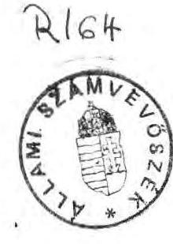
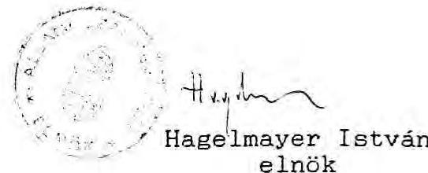
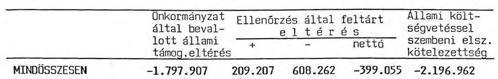

# Allami Számưưóšèk 

## JELENTÉS

az önkormányzatoknak (tanácsoknak) 1990. évre nyújtott normatív állami támogatás elszámolásának ellenôrzéséről

---

# Allami Számvevőszék   V-70-9/1991. 

Témaszám: 58 .

## J E L K N T E S

az önkormányzatoknak (tanácsoknak) 1990. évre nyujtott normatív állami támogatás elszámolásának ellenőrzéséről

A tanácsok pénzügyi szabályozása 1990-től alapvetően megváltozott. Az uj forrásorientált szabályozórendszer a több évtizedes kiadásszemléletü tervezést váltotta fel és a költségvetési reformfolyamat egyik elemeként - még az önkormányzatok megalakulását megelőzően - került bevezetésre.

Ennek megfelelően az önkormányzatok (tanácsok) állami támogatása jórészt normatív módon került elosztásra. A Magyar Köztársaság 1990. évi költségvetéséről szóló 1989. évi L.tv. 20. paragrafus (3) bekezdése ugy intézkedik, hogy "a normatív támogatások igénybevételének alapjául szolgáló mutatókat és a támogatás összegét az Állami Számvevőszék ellenőrzi."

Vizsgálatunk célja az volt, hogy megállapitsuk

- megfelelően szabályozott volt-e a normatív állami támogatás rendszere,
- tervezéskor és elszámoláskor rendelkeztek-e az önkormányzatok és az intézmények megbizható bizonylatokkal alátámasztott mutatószámnyilvántartásokkal,
- az önkormányzatok jogosan vették-e igénybe az állami támogatást.

---

I.

# Megállapítások 

A.

Az önkormányzati támogatás elszámolásának feltételrendszere

1/ A költségvetési reform egyik elemeként 1990-tõl a tanácsoknál (önkormányzatoknál) uj pénzügyi szabályozás került bevezetésre, aminek alapvetően kettős célja volt:

- Egyrészt az, hogy a kiadásorientált tervezést a forrásorientált tervezés váltsa fel annak érdekében, hogy ezzel megteremtsék a tanácsi gazdálkodás eddigieknél biztonságosabb pénzügyi alapját;
- Másrészt az, hogy az állami támogatás nagy részének normatív rendszerével a korábbinál igazságosabb elosztás funkcionáljon.

A célok megvalósitása érdekében a tanácsokat (önkormányzatokat) megilletõ 111 milliárd Ft állami támogatásból 80 milliárd Ft-ot az általános - jórészt a népességeáamhoz kapcsolódó - és a térségi feladatokkal összefüggõ normativák bevezetésével osztották el.

A tizenkét féle normativa alapján számított állami támogatást a feladatellátásban érintett megyei, illetve helyi tanácsok (önkormányzatok) évközben - felhasználási kötöttség nélkül - közvetlenül megkapták, igy az elszámolási kötelezettség az önkormányzatokra hárul.

---

Az uj szabályozásra való átállás feltételei több ponton tisztázatlanok voltak. Viszonylag rövid idő állt rendelkezésre a rendszer modellezésére, erre is elsősorban makro szinten került sor.

A megyei tanácsokat igen későn, csak 1989. utolsó negyedévében vonták be az operativ tervezésbe, ekkor is kétféle - a többéves gyakorlatnak megfelelő kiadásorientált, valamint a reform céljainak megfelelő̉ számításokat - végeztek. Tapasztalataink szerint az év végi "gyors munka" a tervezés során csak a főbb összefüggések kimunkálására volt alkalmas. Még megyei szinten sem volt lehetőség arra, hogy az uj rendszert teljeskörüen áttekintsék.

Mivel a megyei tanácsok maguk is érezték ezt az ellentmondást, ezért többségük ellene volt az 1990. évi bevezetésnek. (Holott ekkor még a rendszer operativ müködésének teljes feltételrendszere, elszámolása sem volt ismert.)

A Minisztertanács 2015/1989. (HT.6.) MT sz. határozata intézkedett a költségvetési reform koncepciójáról. A határozat 8. pontja szerint a tanácsi gazdálkodás szabályait ugy kellett kialakítani, hogy az uj finanszirozási rendszer egyes elemeit (a normativákat) 1990. január 1-től már müködtetni lehessen.

Azt, hogy a támogatás normativ elosztási rendszerének előkészitetlensége miatt a bevezetés korai volt, az év végi

---

elszámolás ellenőrzésekor tapasztalt nagyfoku szabályozatlanság is alátámasztotta. Egyben utalt arra is, hogy nem következett be a tanácsok (önkormányzatok) pénzügyi információs rendszerének felülvizsgálata, ami nem egy esetben felveti az önkormányzati beszámolók megbizhatóságának kérdését is.

2/ Az Állami Számvevőszék törvényből eredő kötelezettségének alapvetően törvényességi, szabályszerűségi szempontok szerint kivánt eleget tenni.

Már a vizsgálat előkészitésekor látható volt, hogy az előzőekben jelzett gondok miatt ellenőrzésünk nem lesz szokványos. (A helyszini ellenőrzéskor többször előfordult, hogy a revizor maga is tevőlegesen "részt vett" az önkormányzatok - intézmények közötti elszámolásban, a szükséges nyilvántartások elkészitésében.) Ennek megfelelően alakitottuk ki módszerünket is, mivel az volt a célunk, hogy ellenőrzésünkkel segítsük a jogszabályon alapuló szabályszerű és korrekt elszámolást, tárjuk fel az önkormányzatok jogos támogatási igényeit, illetve mutassunk rá az állami költségvetésből jogtalanul kiutalt támogatásokra. Ezért ellenőrzésünket azon jogi feltételek - költségvetési törvény és BM-PM tájékoztató - figyelembevételével készítettük elő, amilyen feltételekkel - a támogatás elszámolásához - az önkormányzatok is rendelkeztek, illetve ahogy a

---

Belügyminisztérium és a Pénzügyminisztérium előkészítette az év végi elszámolást.

Az 1990. év végén mintegy 1600 önkormányzatnak (volt tanácsnak) kellett beszámolót készíteni. (Ebből 19 megyei, 1 fővárosi, 166 városi és 22 fővárosi kerületi önkormányzat.) Valamennyi beszámolót készitő önkormányzattól - az ellenőrzés megállapításait alátámasztó okmány - "tanusitvány" formájában kiegészítő információt kértünk az általa igénybe vett állami támogatás jogosságának bizonyítására, azzal a céllal, hogy a Belügyminisztérium által bekért adatok valódiságát igazolják. A tanusitványt azok a felelős vezetők irták alá, akik az önkormányzati beszámolók valódiságáért is felelősséget vállaltak. Ezek átvizsgálása után jelöltük ki a helyszíni vizsgálat során felkeresett önkormányzatokat. Igy a 19 megyei önkormányzatot, a Fővárosi Főpolgármesteri Hivatalt, 125 városi és 67 nagyközségi, községi önkormányzatot. A helyszini ellenőrzést alapvetően azoknál az önkormányzatoknál tartottuk indokoltnak - elsősorban a megyei és városi önkormányzatoknál -, ahol az állami támogatás a térségi feladatokhoz kapcsolódó normativákkal is összefüggésben volt.

Ellenőrzésünket megalapozottabbá tette az önkormányzatok segitő közremüködése, mivel kérésünknek valamennyi önkormányzat idöben eleget tett.
B.

Ellenőrzés során tapasztalt eltérések

1/ Az önkormányzatok által elszámolt állami támogatás ellenőrzése

A Magyar Köztársaság 1990. évi állami költségvetéséről szóló 1989. évi L.tv. (továbbiakban: költségvetési törvény)

---

20. paragrafus (3) bekezdése ugy rendelkezik, hogy "az állami támogatás rendelkezésre bocsátása tervezett mutatók alapján történik, a tényleges mutatók alapján a tárgyév lezárását követően a tanácsok az állami költségvetéssel elszámolnak".

Az elszámolás feltételeit sem a költségvetési törvény, sem a végrehajtására feljogositott pénzügyminiszter (Költségvetési törvény 26. paragrafus (1) bekezdése alapján) nem szabályozta.

A költségvetési törvénynek, vagy a törvény végrehajtási rendeletének kellett volna szabályozni az önkormányzatok elszámoltatásával kapcsolatos jogokat, kötelezettségeket, illetve felelősséget.

Ezen belül célszerü lett volna részletesen meghatározni az elszámolás módját, határidejét, visszafizetés esetén annak forrását, határidejét, cimzettjét, illetve mikor, honnan, milyen feltétellel lehet igényelni az önkormányzatot megillető elmaradt támogatást. Rögziteni kellett volna azt is, hogy a tervezéskor észlelt hibákat idöben meddíg lehet korrigálni, milyen feltétellel, az év végi elszámolásnál mi indokolhatja és milyen mértékü lehet az elfogadható tervezési hiba. Intézkedést igényelt volna az is, hogy a jogtalanul igénybe vett támogatásnak milyen következményei vannak.

Nem tekinthetö elfogadható megoldásnak - sem jogi, sem közgazdasági szempontból - az a BM-PM tájékoztató (1990. PK. 11.), amelyik zárójeles megfogalmazásban rögziti: "(Ha az év közben folyósitott állami támogatás nem éri el a tényleges adatok alapján igénybe vehető összeget, a különbö-

---

zetet a tanácsok kiegészitésként megkapják, ellenkezõ esetben a költségvetésbe visszafizetik.)"

A Belügyminisztérium - a BM-PM tájékoztató alapján 1991. február elején elszámolásra szólította fel az önkormányzatokat március 4-ei határidõ megjelölésével. Az elszámoltatást a Területi Államháztartási és Költségvetési Elszámoló Szolgálatokon (továbbiakban: TAKISZ) keresztül hajtotta végre.

#### Abstract

A TAKISZ-ok munkája az összesitésre, illetve a számszaki korrekcióra terjedt ki, érdemi módosítást csak az önkormányzatok beleegyezésével végeztek. Elöfordult, hogy az adatok konkrét tartalmi felülvizsgálatát telefonon vagy írásban a Belügyminisztérium végezte el.

Kz az elszámoltatás formailag igen, tartalmilag nem volt megfelelö. Ugyanis önkormányzatonként csak az adatok a normativánkénti mutatók, illetve állami támogatás - öszszegzésére szorítkozott, igy az információ tartalma csekély volt, nem bizonyitotta az igénybevétel jogosságát. Ezért vált szükségessé - ellenőrzésünk megkezdésekor - a kiegészitő információk megkérése, ami nem egy esetben azt bizonyította, hogy a TAKISZ-okhoz és az Állami Számvevõszékhez beküldött adatok eltértek egymástól, ennek tisztázására a helyszíni ellenőrzés alkalmával került sor.

A Belügyminisztérium elszámoltatása és a számvevõszék vizsgálata igen sajátos módon alakult. Az idöbeni egybeesés

---

miatt nem volt arra lehetöség, hogy a Belügyminisztérium által elfogadott, összesített elszámolásokat ellenörizzük, mivel az összesités két hónap alatt, április végéig nem készült el. Igy gyakorlatilag párhuzamosan folyt az önkormányzatok elszámolásának tárca által történő összestitése és a számvevöszék törvény által elöirt ellenörzése. Ez a gyakorlat a későbbiekben nem fogadható el, lehetetlenné teszi a korrekt elszámolást.

Vizsgálatunk kezdetén, március elején és április végén is megkértük a TAKISZ-ok megyei szintü összestését, a két idöpont között hat megyében eltérést tapasztaltunk.
Pest megyében 4,9 millió forint összegben került sor korrekcióra.
Elöfordult olyan eset is, hogy a számvevöszék ellenörzése nyomán feltárt hibák miatt kezdeményezték az önkormányzatok a TAKISZ-oknál az adatok módosítását. (Pl. Szigetszentmiklós, Pilisvörösvár önkormányzat)
Szabolcs-Szatmár-Bereg megyében Vásárosnamény városi önkormányzat a TAKISZ-okon keresztül kérte a Belügyminisztériumot a közölt adatok módosítására. A megyei és a Fehérgyarmati városi önkormányzat viszont közvetlenül a Belügyminisztériumhoz fordult hasonló kéréssel. A két utóbbi kérelem elbirálásáról a TAKISZ-nak nem volt tudomása.

Az önkormányzatok önbevallása alapján az állami költségvetést megillető visszafizetési kötelezettség a Belügyminisztérium április végi összesitése alapján igen jelentős nagyságrendet képvisel: 1.798 millió Ft-ot. (A Belügyminisztérium végleges - 1991. május 13. - összesitése alapján: 1.852 millió Ft.)

Az Allami Számvevöszék az önkormányzatok elszámolásának ellenörzésekor további eltéréseket állapitott meg:

---

- az állami költségvetésből az önkormányzatokat még megilletó támogatás +209 millió Ft,
- az önkormányzatok többletfinanszirozása miatt az állami költségvetést megilletó összeg - 608 millió Ft,
- nettó eltérés (visszafizetendő) - 399 millió Ft.

Az eltéréseket tíz normatíva alapján 572 önkormányzat elszámolásánál tapasztaltuk.

Ennek megfelelően az állami költségvetést megilletó összes befizetés:

- önkormányzatok önbevallása alapján
- számvevőszék ellenőrzése alapján további
- összesen
(1-2-3. sz. táblázatok).

Az ellenőrzés által megállapított befizetési kötelezettség $22 \%$-kal nagyobb az önkormányzatok által kimutatott

---

befizetési kötelezettségnél, ami önmagában is jelzi a rendszer szabályozatlanságát.

Vizsgálatunk felhivta a figyelmet az önkormányzatok szabályozásának egy sajátos - átmeneti - problémájára is, aminek negativ hatását a rendszer továbbfejlesztésénél célszerű kiszürni. Az uj pénzügyi rendszer átmeneti bizonytalanságát érezve a törvényelőkészítők már a bevezetéssel egyidőben - a 80 milliárd Ft nagyságrendü állami támogatás mellett - "biztonsági szelepként" egy kiegészitő mechanizmust alkalmaztak. Erre a célra a költségvetési törvény 18,3 milliárd forint "átmeneti" pénzeszközt biztosított a megyei tanácsoknak. (20. paragrafus /2/ bekezdés C. pont). Ezzel a megyei tanácsokra bizta mindazon feladatok megoldását, amit a központi szabályozás normatív módon már nem tudott kezelni. (1991-ben hasonló célja van az "önhibáján kivül hátrányos helyzetbe került önkormányzatok" megsegítését szolgáló támogatásnak.)

Mivel alapvető cél volt az önkormányzatok müködőképességének megőrzése, ezért a megyék ezt az összeget - a tanácsok saját bevételei és a normativ támogatások együttes összegének figyelembevételével - osztották el. Vagyis amennyiben ez a két forrás nem fedezte a kiadásokat, a forráshiányt az átmeneti pénzeszközökből biztosították. Igy az elszámolásnál az a visszás helyzet állt elő, hogy "jól járt" az az önkormányzat, amelyik "alátervezte" a saját

---

bevételeit és a normativ támogatást, mert a hiányzó forrásokat elszámolási kötelezettség nélkül megkapta a megyei tanácstól.

Azt az önkormányzatot viszont amelyik tultervezett, most az elszámolásnál visszafizetési kötelezettség sujtja.

Tolna megyében Tamási városi önkormányzatnál 3,3 millió forint visszafizetési kötelezettség keletkezett. Az önkormányzat - annak idején, még mint tanács - 18,4 millió Ft átmenetet segito állami támogatást kapott a megyei tanácstól müködési hiánya miatt. Amennyiben a tervezésnél körültekintőbben jártak volna el, ugy alacsonyabb normativ állami támogatással számolhattak volna. Ez esetben viszont 21,7 millió Ft átmenetet segito támogatásra lett volna szükségük. Visszafizetési kötelezettség ez esetben nem keletkezik.
Győr-Moson-Sopron megyében ellenkező példával találkoztunk. Kapuvár városi önkormányzat 33,1 millió Ft átmenetet segito állami támogatásban részesült a megyei tanácstól. A normativ állami támogatás elszámolásának ellenőrzésekor a mutatók tulteljesülése miatt 287 eFt támogatási igényük keletkezett.

Az önkormányzatok körében az elszámolást követõen nagyfoku bizonytalanság volt tapasztalható. Ném tudták, milyen határidővel, hova kell az esetleges visszafizetést teljesiteniük, ennek forrása is több esetben bizonytalan volt, ugyanakkor a jogos igénnyel fellépő önkormányzatok mielőbb hozzá szeretnének jutni elmaradt támogatásukhoz.

Az önkormányzatok egy része számol a visszafizetési kötelezettséggel, más részük viszont elsősorban szükös anyagi forrásaik, kötelezettséggel terhelz pénzmaradványuk miatt nem látja biztosítva a visszafizetés fedezetét.

---

Az állami költségvetéssel szembeni elszámolási kötelezettség felveti az "ingyenhitel" kérdését is. Ugyanis a visszafizetésre váró összeg 1990-ben - havi $1 / 12$ rész finanszirozási utem mellett - folyamatosan gyült az önkormányzatok bankszámláján, 1991. január és május hónapok között viszont ez az összeg egy tételben az önkormányzatok rendelkezésére állt. Ennek használatáért kamatot, használati dijat nem kellett fizetni. Az összeg nagyságrendjére jellemzô, hogy az önkormányzatok (tanácsok) 1990-ben az OTP-től 5,3 milliárd Ft rövidlejáratu hitelt vettek fel, átlag 29-30 \%-os kamatra, 1991-ben az ilyen tipusu hitelekért már $31 \%$-os kamatot kell fizetni. Megjegyezzük, hogy az állami költségvetés 1990-ben két izben vett fel likviditási gondjait megoldó hiteleket, ezek után 22, illetve csaknem $30 \%$ kamatot fizetett.

Az uj pénzügyi szabályozás induló évére való tekintettel, utólag visszamenôlegesen nem tartjuk indokoltnak "a használati dij" elõirását, azonban a késôbbiek során ezt a kérdést törvény szintjén rendezni szükséges.

2/ Az önkormányzatok elszámolását nehezitő tényezők
a/ A jogi szabályozás hibája és hiánya

Mind az önkormányzatok elszámolásának, mind az ellenőrzésnek a legnagyobb problémát a jogi szabályozás hiánya és hibája okozta.

---

Az önkormányzatok (tanácsok) 1990. évi normatív állami támogatásáról a költségvetési törvény 20.paragrafusa (2) bek. A. pontja rendelkezik.

A költségvetési törvény normatív állami támogatásra vonatkozó szakasza önmagában nem alkalmas a támogatási igény korrekt megtervezésére, illetve elszámolására, mivel ennek alapján egyes önkormányzatok jogtalan előnyhöz jutnak, míg mások jogtalan hátrányt szenvednek. A törvény szövege több helyen pontatlan megfogalmazást tartalmaz.

Nem állapitható meg egyértelmüen, hogy mi a tartalma egyes normativáknak, szó szerinti értelmezés esetén ugyanazon feladatellátás után többszörösen is elszámolható a támogatás. A törvény nem foglalkozik a mutatószámok fogalmi meghatározásával, a megfigyelés idõpontjával, illetve idötartamával. Nem minden esetben állapitható meg az sem, hogy kit illet meg a támogatás.

A költségvetési törvény 26. paragrafus (1) bekezdése ugy rendelkezett, hogy a törvény a kihirdetése napján hatályba lép ugyan, de végrehajtásáról a Minisztertanács a pénzügyminiszter utján gondoskodik. Ebből a megfogalmazásból nem derül ki, hogy a pénzügyminiszter ezt a feladatát milyen formában láthatja el.

---

A jogalkotásról szóló 1987. évi XI.tv. 15. paragrafusa szerint a végrehajtási jogszabályok megalkotására adott felhatalmazásban meg kellett volna határozni annak jogosultját, tárgyát és kereteit. "A felhatalmazás jogosultja a jogi szabályozásra másnak további felhatalmazást nem adhat."

Megjegyezzük, hogy a helyi önkormányzatokról szóló 1990. évi LXV. törvény - összhangban a jogalkotásról szóló törvénnyel - 93. paragrafus (1) bekezdése deklarálja, hogy
"Az Országgyülés törvényben szabályozza:
a/ A helyi önkormányzatok ...müködésének garanciáit, anyagi eszközeit és gazdálkodásának alapvető szabályait..."
A 95. paragrafus szerint
"A kormány:
d/ irányitja az államigazgatási feladatok ellátását és gondoskodik végrehajtásuk feltételeiről."

A költségvetési törvényben rendelkezni kellett volna arról, hogy a pénzügyminiszter végrehajtási rendelete mire terjedjen ki.

Igy legalább a következõ kérdésekre:
a tervezés folyamatára, alapvetõ dokumentumaira, a normativák és a mutatószámok értelmezésére, megfigyelési idõpontjára, illetve idötartamára, feladatváltozás esetén a korrekció lehetôségeire, az elszámolás, a visszatérités, illetve a költségvetéssel szemben támasztott igény rendezésének módjára,
az önkormányzatok egymás közötti elszámolásának kötelezettségére.

A jogalkotásról és a költségvetésről szóló törvények alapján egyértelmüen megállapítható, hogy a pénzügyminiszternek rendeletet kellett volna kiadni.

---

A jogalkotásról szóló törvény 8. paragrafus szerint: "A miniszter feladatkörében és törvényben, törvényerejü rendeletben, vagy minisztertanácsi rendeletben kapott felhatalmazás alapján ad ki rendeletet". Akadályoztatása esetén erre a helyettesei jogosultak.

Az elmaradt rendelet máig ható, s csak lassan rendezōdõ bizonytalanságot idézett elõ, melynek egyik legjellemzõbb következménye az lett, hogy az önkormányzatok összességében több állami támogatást vehettek igénybe annál, mint ami megillette őket. A költségvetési törvény erre az esetre szankciót nem ir elõ.

A végrehajtási rendelet "pótlására" a Belügyminisztérium és a Pénzügyminisztérium tájékoztatót jelentetett meg a Pénzügyi Közlöny 1990. julius 12-i számában a tanácsok 1990. évi állami támogatásának elszámolásához ("Hivatalos Közlemények" cimszó alatt). A tájékoztató szövege az ágazati szakmai tárcákkal egyeztetve került meghatározásra. Ez a tájékoztató nemcsak formájában, de tartalmában sem felel meg a jogszabályi követelményeknek.

A tájékoztató a jogalkotásról szóló törvény értelmében nem jogszabály, hanem csupán az állami irányitás, egyéb jogi eszköze. Igy azok a témakörök, melyeket kizárólag a törvény, illetve annak végrehajtási rendelete szabályozhatna, jogszabálynak nem minősülö jogi iránymutatás formájában került rendezésre.

További problémát jelent, hogy - ugyancsak a jogalkotási törvény értelmében - "alacsonyabb szintü jogszabály nem

---

lehet ellentétes a magasabb szintü jogszabállyal". A tájékoztató - ami nem jogszabály - megkisérli a törvényi hézagok, félreérthetõ megfogalmazások pontositását. Nem tul szerencsésen, mivel több támogatási jogcim tartalmát szükebben értelmezi, sôt még belsõ ellentmondást is takar.

Vizsgálatunk megkezdésekor tapasztaltuk, hogy a költségvetési törvény vonatkozó szakasza és a tájékoztató még együtt sem képes a nyitott kérdéseket teljeskörüen és egyértelmüen szabályozni. Megjegyezzük, hogy a szabályozásban meglévõ hiányosságokra, az év végi elszámoláskor várható problémákra már a rendszer bevezetését követõen 1990. II. negyedévében - az e témakörre vonatkozó vizsgálati tapasztalataink megküldésével segítséget kivántunk nyujtani a törvénye1őkészitõ tárcáknak.

Ezek a tisztázatlan kérdések olyan veszélyt jelentettek, hogy nem lehet az ellenőrzést országos 今̌iszonylatban, egységes szempontok alapján elvégezni.
1990. augusztusában a Belügyminisztérium már végzett egy próbaelszámoltatást, aminek fel kellett volna hívni a figyelmet az év végi elszámolásnál várható szabályozatlanságra. A normativákkal, mutatószámokkal kapcsolatos értelmezési, nyilvántartási problémák rendezésére azonban ezt követöen sem került sor.

Ezért szükségessé vált, hogy megkeressük a törvénye1őkészitő, tervezést végzõ tárcákat. A Belügyminisztérium és a Pénzügyminisztérium a felvetett kérdésekre két állásfog-

---

lalást adott ki (84.274/1991. és 84.277/1991. sz. alatt), aminek tartalma néhány esetben további módositást jelentett. Hiányoljuk, hogy ezekröl az állásfoglalásokról az önkormányzatok nem értesültek, holott a több mint két hónapig elhuzódó BM elszámoltatás időszakában erre mód lett volna.
b/ Mutatószám nyilvántartás rendezetlensége

A normativ támogatási rendszer másik alapvető problémája - a jogi szabályozás hiányával összefüggésben az, hogy a régi szabályozási rendszer mutatószámaira épült, melynek korábban elenyésző jelentősége volt.

Az uj pénzügyi rendszer bevezetésével egyidöben nem történt meg a mutatószámok fogalmi meghatározása, nyilvántartásuk rendszerszemléletü kialakítása, illetve vezetésük kötelező érvényü előirása.

Ennek tudható be, hogy a normativák többségénél sem a tervezés, sem az elszámolás időszakában nem állt rendelkezésre megbizható mutatószámrendszer.

Tapasztalataink szerint csak a szociális otthonok, csecsemőotthonok és az egészségügyi gyermekotthonok mutatószám nyilvántartása volt alkalmas a normativ állami támogatás megnyugtató, s pontos elszámolására, ellenőrzésére.

---

Mivel a normativ rendszer bevezetésével a jelzett intézkedések elmaradtak, ezért többnyire a költségvetési szakfeladat mutatószámai képezték a tervezés számitási alapját. Ezek a feladat- és teljesítménymutatók a költségvetés és a beszámoló rendszer részét képezik. A normativ támogatás elszámolásához kialakított mutatók többsége viszont - kivéve a gyermek- és ifjuságvédelemre vonatkozó normativát, mivel a "gondozási nap" mutató nem képezi sem a pénzügyi információs rendszer, sem a statisztika részét - a szakmai statisztikai kimutatásból nyerhetők.

Ennek következménye, hogy ma nincs összhang a költség-vetési- és a beszámolórendszer keretében alkalmazott mutatószámok és a normativ támogatás elszámolásának alapját képező mutatók között.

A költségvetés és a beszámoló mutatószámokra vonatkozó ürlapjai erre a célra alkalmatlanok, jelenlegi használati értékük igen csekély.

A gazdálkodásról, illetve annak valódiságáról számot adó vezetők felelősségét garantálná, ha az igénybe vett állami támogatás és ennek alapját képező mutatószámok mind a költségvetési, mind a beszámoló garnitura részét képeznék.

A tanácsok 1990. évi költségvetésének elkészítésével összefüggő tervező, szervező, koordináló feladatokat még a megyei tanácsok végezték. A normativ állami támogatás igénybevételének alapjául szolgáló mutatószámokat általában a

---

megyei tanácsok szakosztályai szolgáltatták a különféle ágazati statisztikákból. A tervezõ munkának ez a szakasza amit a rövid tervezési idõszak is befolyásolt - jórészt a helyi tanácsok és intézmények részvétele nélkül a megyei tanácsokon történt. Tekintettel arra, hogy a megyék nem rendelkeztek a tervezéshez szükséges megalapozott nyilvántartásokkal, illetve a tanácsoktól, intézményektõl bekért adatokat nem ellenôrizték, igy a mutatószámokat számottevően alul, illetve tultervezték.

A helyi tanácsoknál a tervezés gyakorlatilag 1989. év végén, illetve 1990. év elején kezdõdött meg azzal, hogy a megyei tanácsok közölték az 1990. évre igénybe vehetõ normatív állami támogatás összegét, illetve a támogatás alapjául szolgáló mutatószámokat. Ez esetben viszont a helyi önkormányzatnál már korrekcióra nem volt lehetöség.

A tervezés folyamatába az intézmények általában nem kapcsolódtak be. Az ebbõl eredõ visszásságokat az elszámolás, illetve az ellenôrzés bizonyította, mivel a térségi normativák mutatószámait, alapadatait az intézményi adatokra kellett épiteni (e témakörben még ma sem tisztázott az intézmények felelőssége). Itt kellene rendelkezni olyan mutatószám nyilvántartással, illetve ezek alapdokumentumaival, ami az önkormányzatok rendelkezésére bocsátott állami támogatás jogosságát bizonyitja.

---

Tapasztalataink szerint az intézmények részéről továbbra is fennáll az érdektelenség a normativ elosztási rendszerrel szemben. (Ebben szerepe van annak is, hogy az intézmények támogatása független - a szabályozási rendszer lényegéből adódóan - az önkormányzatoknak normativ módon juttatott állami támogatástól.)

# 3/ Normativánkénti elszámolás ellenőrzési tapasztalatai 

A felhasznált normativ állami támogatással önkormányzatonként kellett elszámolni, normativánkénti részletezésben. Az elszámolás végeredménye az állami költségvetéssel szemben fennálló "kötelességek" és "tartozások" nettó egyenlege.

Az uj rendszer sajátossága, hogy nemcsak az állami költségvetéssel számolnak el az önkormányzatok, hanem egymás között is elszámolási igény keletkezett közös feladatellátás esetén (pl. állami gondozásban részesülő gyermekek diákotthoni ellátása esetén).
a/ Altalános normativák alapján történő támogatás elszámolásának ellenőrzése (1. sz. melléklet)

A tanácsok (önkormányzatok) az állandó népesség után vették igénybe az "általános támogatás" és a "külterületi támogatás" normativák alapján számított összeget. Ezen tul valamennyi település után egységesen 2 millió Ft illette meg

---

a tanácsokat a "települések általános támogatása" normativa alapján.

Mindhárom normativa esetében jellemzö volt, hogy a költségvetési törvénnyel ellentétben nem a terv- és a tényadatok kerültek egybevetésre. Ehelyett egy információs bázishoz kötve, a tájékoztatóban megjelent idõpont figyelembevételével történt az elszámoltatás.
"A települések általános támogatása" normativánál a költségvetési törvényhez képest a BM-PM tájékoztató önálló közigazgatási státusszal rendelkező településekre szükiti a jogosultság körét.

A "külterületi támogatás" normativa tervezése és elszámolása nem a költségvetési törvényben megadott létszámadatok figyelembevételével történt, hanem egy belügyminisztériumi leirat alapján.

Az általános normativák közé tartozik az ,"üdülöhelyi támogatás" is, ennek ellenörzése során csak kisebb hiányosságokat tapasztaltunk.

A négy normativa elszámolásását és ellenőrzését követően összesen 41,5 millió Ft visszafizetési kötelezettségük van az önkormányzatoknak.

---

b/ Térségi normativák alapján történő támogatás elszámolásának ellenőrzése

- A gyermek és ifjuságvédelem" normativa elszámolása, illetve ellenőrzése okozta a legtöbb problémát. A költségvetési törvény nem határozza meg pontosan, hogy kire, melyik korosztályra vonatkozik a normativa (csak a tájékoztató pontosit, miszerint a gyámhatósági határozattal érintett kiskoruakról van szó). Közös feladat végrehajtás esetén - állami gondoskodásban részesülő gyermekek középiskolai, vagy diákotthoni ellátásakor - nem volt tisztázott melyik önkormányzatnak jár a támogatás.

Sajátos problémaként vetődött fel a csecsemőotthonokban elhelyezett, jogilag nem állami gondoskodásban részesülő kiskoruak figyelembevétele. Ok - mint egészségügyi beutaltak - családi ellátás hiányában ugyancsak intézeti ellátásra szorulnak. Mivel a normativa nem vonatkozik ezekre az ellátottakra, ezért utánuk nem illeti meg állami táhogatás az intézményt fenntartó önkormányzatot.

Gondot okozott az is, hogy az elszámolás alapjául szolgáló mutatót (gondozási nap) eddig nem tartották nyilván az intézmények, ennek ellenére a rendszer bevezetését követően nem került sor a mutató tartalmának tisztázására, a szükséges nyilvántartások kialakítására, bevezetésére. Igy ezzel a vizsgált intézmények többsége nem rendelkezett. Ennél a normativánál tapasztalt tervezési, elszámolási hibamenynyiség lényegesen több volt annál, mint ami az uj

---

rendszer tervezésének elfogadható velejárója. (2. sz. melléklet)

A normativa elszámolását és ellenőrzését követően az önkormányzatoknak nettó 81,8 millió Ft támogatási igényük keletkezett az állami költségvetésből. (Jelentősebb támogatás növekedést előidézõ tényezők: az állami gondoskodásban részesülők figyelembevételére csak ezzel a normativával van lehetőség, így a duplikáció megszüntetését követően az ellátottak itt kerültek elismerésre, a csecsemőotthonban, nevelőszülőknél lévő állami gondoskodásban részesülők figyelembevétele is növekedést okozott. Csökkenést okozott az intézmények alacsony kihasználtsága, az állami intézeti neveltek, a 18 éven felüllek figyelembevétele, illetve az "ellátottak" helyett a "gondozási nap" mutatószám alkalmazása.)

- A "szociális intézeti" és "szakositott szociális intézeti ellátás" normativák elszámolásának ellenőrzésekor viszonylag kevés eltérést állapitottunk meg. Néhány tervezési hibát tapasztaltunk a téves intézeti besorolás (szociális és szakositott intézet között), a belépő beruházások üzembehelyezési idópontjának, illetve várható kihasználásának tullzott becslése miatt. A szükséges nyilvántartásokat azonban rendben találtuk, elszámolásra alkalmasak voltak. A mu-

---

tatószám fogalmának értelmezése (gondozási nap) azonban itt is problémákat okozott. (3. sz. melléklet)

A normativa elszámolását és ellenőrzését követően nettó 411,1 millió Ft visszafizetési kötelezettségük keletkezett az önkormányzatoknak. (Jelentősebb támogatás csökkenést előidéző tényezők voltak: helytelen intézményi besorolás, uj beruházások tervezettnél későbbi üzembehelyezése, alacsonyabb kapacitáskihasználtság, előirt mutató helyett "élelmezési nap" alkalmazása.)

- A "fiatalkoruak egészségügyi gyermekotthona és gyógypedagógiai intézeti ellátása" normativa értelmezésében a költségvetési törvényhez képest a tájékoztató szükitést, egyben pontositást jelent. Eszerint csak a kiskoruak elismerésére van mód, illetve azokra a fogyatékosokat nevelő általános iskolában elhelyezettekre, akik diákotthoni ellátásban is részesülnek.

Az elszámolásnál számottevõ hibamennyiséget jelentett az, hogy helytelenül vették figyelembe az állami gondoskodásban részesülőket, mivel az utánuk járó támogatás nem az intézményt fenntartó önkormányzatot illeti meg, hanem a GYIVI-t fenntartó megyei önkormányzatot. Az elszámolás alapjául szolgáló mutatók értelmezése itt is problémákat vetett fel. (4. sz. melléklet)

---

Ennél a normativánál keletkezett az elszámolást és ellenőrzést követően a legnagyobb visszafizetési kötelezettség: nettó 1203,2 millió Ft. (Jelentősebb támogatás csökkenést előidézõ okok voltak: 18 éven felüliek-, állami gondoskodásban részesülők figyelembevétele, diákotthoni ellátás nélküli normativa elszámolás, átlag létszám helyett férőhely alapján történő számbavétel.)

- A "középfoku oktatás" normativánál a költségvetési törvény és a tájékoztató között szintén eltérést tapasztaltunk. Ez utóbbi csak a nappali tagozatra ismerte el az elszámolás lehetőségét. Tervezési hibaként állapitottuk meg a demográfiai hullámmal, és a belépő beruházásokkal összefüggésben a várható tanuló létszám tul-, illetve alulbecslését. Mindemellett a mutatószám nyilvántartások ellenőrzése, pontos számbavétele is igen sok hiányosságot tárt fel. (5. sz. melléklet)

A normativa elszámolását és ellenőrzését követően az önkormányzatoknak nettó 97,2 millió Ft támogatási igénye keletkezett az állami költségvetéssel szemben. (Jelentősebb támogatás növekedést előidézõ tényezők voltak: a demográfiai hullám pontatlan létszámbecslése, a mutatószám elszámolási idõpontjának a tájékoztatótól eltérő alkalmazása, csökkenést okoztak az esti- levelezős hallgatók figyelembevétele.)

---

- A "diákotthoni ellátás" normatíva elszámolása csak a tájékoztató megjelenése után vált egyértelmüvé. Ebből derült ki, hogy az itt elhelyezett tanulók után melyik önkormányzatot illeti meg a támogatás. Vizsgálatunk során kitünt az is, hogy mind a tervezésnél, mind az elszámolásnál igen tágan értelmezték az "elhelyezettek" fogalmát.

Az ellenőrzésnél gondot okozott az elszámolásnál figyelembe vehető mutatószámok bizonyitékául szolgáló nyilvántartások pontatlanságára is. (6. sz. melléklet)

A normativa elszámolását és ellenőrzését követően az önkormányzatoknak nettó 511,8 millió Ft állami költségvetést megillető visszafizetési kötelezettsége keletkezett. (Jelentősebb támogatás csökkenést előidéző tényezők voltak: az állami gondoskodásban részesülők, a nem tanácsi intézményekban lévő ellátottak után a normativák elhasználása, illetőleg a tényleges kapacitáskihasználtság.

- A "színházak" normativánál a tájékoztató szintén korlátozta - fizető nézőre - a jogosultak körét. Az elszámolást a jogi szabályozatlanságból eredő félreértések jellemezték, ezek jórésze a magyar színházak külföldi vendégjátékára, illetve a tájelőadásokra vonatkozott. Eszerint a színházak mutatónyilvántartása sem alkalmas teljeskörüen a pontos elszámolásra, elsősorban hiányos adattartalmuk miatt. (7. sz. melléklet)

---

Két színház müködésénél - a szekszárdi Német Szinháznál és a Komárom-Esztergom megyei Játékszinnél - sajátos helyzetet tapasztaltunk, amit a normativ rendszer nem tudott figyelembe venni.

#### Abstract

A Német Színház több mint 12.000 nézőnek adott anyanyelvi müsort, ebből azonban csak 905 volt a fizető néző, igy a színházra tervezett mutatók alapján az igénybe vett normativ támogatásának csak mintegy 10 $\%$-ára jogosult. A Játékszin a vizsgált évben, mint egyesülés müködött, egyik alapitó tagja a megyei önkormányzat volt. A vállalkozási forma miatt a színház után nem illette meg normativ támogatás az önkormányzatot, ugyanis nem a tanács költségvetésében szereplő intézmény volt.

Amennyiben ezekre a színházakra is alkalmazzuk az általános szabályokat, az további müködésüket lehetetlenné teszi.

A normativa elszámolása és az ellenőrzés után az önkormányzatoknak nettó 168,4 millió Ft visszafizetési kötelezettsége keletkezett. (Jelentősebb támogatás csökkenést előidéző okok voltak: a külföldi előadások-, a befogadó szinházak tájelőadások utáni-, a vállalkozási formában müködő színházak fizető nézőszámainak figyelembevétele.)

- A területi tanácsokat megillető támogatás elszámolások ellenőrzésénél eltérést nem tapasztaltunk.

---

# II. 

## Következtetések és javaslatok

Az 1989. évi L. tv. megteremtette a feltételeit annak, hogy a tanácsi (önkormányzati) gazdálkodás korábbinál megalapozottabb, normativ módon biztosított forrásokhoz jusson. Az uj - bevételorientált - pénzügyi rendszer eddigiektől eltérő tervezési, gazdálkodási, elszámolási gyakorlatot kivánt bevezetni.

Tapasztalataink szerint a pozitiv elképzelések ellenére, a rendszer müködését biztosító szabályozás több ponton kidolgozatlan, feltételeiben tisztázatlan volt. Az előkészités hiányosságait, a tervezésben, elszámolásban fellelhető nagyarányu hibamennyiség is bizonyította.

Mind az elszámolás, mind az ellenőrzés legnagyobb gondja a jogi szabályozatlanság volt, mivel nem történt meg a rendszer alapvető müködési feltételeinek, fogalomrendszerének tisztázása. A költségvetési törvény normatív állami támogatásra vonatkozó szakasza önmagában nem volt alkalmas arra, hogy az önkormányzatok korrekt módon megtervezzék támogatási igényüket, illetve elszámoljanak azzal, de önmagában nem volt alkalmas arra sem, hogy megalapozott ellenőrzést végezhessünk. (Megjegyezzük, hogy a tervezés első fázisa még a törvény-előkészités időszakára esett.)

---

Az 1989. évi L. törvény kötelezi a pénzügyminisztert arra, hogy gondoskodjon a törvény végrehajtásáról. Ez a felhatalmazás - a jogalkotásról szóló törvényt is figyelembevéve rendelet kiadását indokolta volna. Ehelyett - az év közepén - a Belügyminisztérium és a Pénzügyminisztérium tájékoztatót adott ki, ami nem minősül jogszabálynak. A tájékoztató jónéhány támogatási jogcím tartalmát megváltoztatta, sôt belso ellentmondást is takar. A vizsgálat megkezdésekor kiadott PM-BM állásfoglalásokat pedig az önkormányzatok nem ismerhették meg.

Az elmaradt rendelet máig ható, a csak lassan rendezôdõ bizonytalanságot idézett elõ. Ennek egyik megjelenési formája az lett, hogy az önkormányzatok összességében több állami támogatást vettek igénybe annál, mint ami megillette volna őket.

A normativ támogatási rendszer másik alapvetõ gondja ami a jogi szabályozás hiányával függ össze, - hogy a régi pénzügyi szabályozás mutatószámrendszerére épül, aminek eddig alig volt jelentôsége. Az uj szabályozás bevezetésével nem történt meg a mutatószámok felülvizsgálata, rendszerszemléletü kialakítása (fogalmi tisztázás, nyilvántartás, vezetési kötelezettség).

A költségvetési és a beszámoló garniturák mutatószám ürlapjai nem alkalmasak arra, hogy a normativa tervezését és elszámolását - az adatok valódiságát - igazolják. Mindez

---

azzal járt, hogy az önkormányzatok, illetve az intézmények többsége - néhány mutató kivételével - nem rendelkezett megbizható mutatószám-nyilvántartással.

A szabályozás kétségtelen fogyatékosságai mellett azonban tény az is, hogy mind a tanácsok (önkormányzatok), mind az intézmények a tervezésnél és az elszámolásnál igen gyakran elsősorban a térségi normativák esetén - felületesen, fegyelmezetlenül jártak el. A tanácsok nem ellenőrizték az intézményektől bekért adatokat. Az intézmények nem intézkedtek a nyilvántartások naprakész vezetéséről, nem fektettek kellő̉ sulyt az információk tartalmára, megbízhatóságára.

Az önkormányzatok nem ismerték fel - amit a tervezési hibák is bizonyitanak - az uj pénzügyi szabályozással együttjárószükséghelyzetet, vagyis azt, hogy törekedjenek az intézményeik kihasználtságának fokozására, illetve korszerüsitsék intézmény-szerkezetüket.

Az állami támogatás normativ rendszerének pénzügyi elszámolása, illetve továbbfejlesztése érdekében javasoljuk az Országgülésnek:

---

Az 1990. évi elszámoláshoz

Az önkormányzatonkénti pénzügyi elszámoltatást, a kiszámitott, összesített eltérések alapján önmagában nem tartjuk végrehajthatónak. (3. sz. melléklet szerint) A végleges elszámoltatás érdekében megfontolásra ajánljuk az alábbi alternativákat.

# Első változat: 

Az önkormányzatok elszámoltatására - a Belügyminisztérium összesitése és az Állami Számvevőszék ellenőrzése alapján kerüljön sor az alábbi kiegészitéssel:
a/ Az 1990. évre vonatkozó pénzügyi szabályozás a normativák egy részénél nem tisztáz több olyan kérdést, amely indokolatlan anyagi hátrányt teremt az érintetett önkormányzatoknál, ezeket a kérdéseket az induló év szabályozatlanságára tekintettel az Országgyülés figyelmébe ajánljuk méltányos elbirálásra:

- a "gyermek és ifjuságvédelem" normativánál javasoljuk elismerni az állami gondoskodásból jogilag kikerült, szociális intézeti ellátásra nem szoruló - 18. életévet betöltött gondozottakat, legfeljebb 24. életévükig, mivel önálló életkezdésre való alkalmasságuk még korlátozott (elhelyezkedési, lakhatási gondok, illetve továbbtanulás

---

miatt). Ezért továbbra is gondoskodásra szorulnak, velük szemben a GYIVI-nek jogszabályokban meghatározott kötelezettségeik is vannak.

- Az "egészségügyi gyermekotthon" normativájánál ugyancsak indokoltnak tartjuk, hogy a 18 évet betöltött, állami gondoskodásból kikerült gondozottak után is kapja meg az intézményt fenntartó önkormányzat a gyermek- és ifjuságvédelem normativáját.
- A csecsemőotthonokba beutalt u.n. "egészségügyi ellátottak" - nem állami gondozottak - után, indokoltnak tartjuk a "gyermek és ifjuságvédelem" normativa - csecsemőotthoni normativa hiányában - elismerését. Ugyanis az itt lévő gondozottak ellátását - az állami gondoskodásban részesülőkhöz hasonlóan - az államnak fel kell vállalnia.
- A "középfoku oktatás" normativánál indokoltnak tartjuk valamennyi érintett intézménynél az esti és a levezó hallgatók 13 eFt/tanuló normativával való elismerését.
- A "színházak" normativánál
$=$ célszerú lenne a tájelőadást a befogadó intézménynél csökkentett normativával elismerni, kompromisszumos megoldásként $50 \%$-os vagy $25 \%$-os normativával (115,- Ft vagy 58,- Ft fizető nézőnként),

---

= ajánljuk a jelentés 3.b. pontjában szereplő́ szekszárdi Német Színház, illetve a Komárom-Ksztergom megyei Játékszin egyedi elbirálását, a 230,- Ft összegü normativa figyelembevételével. A támogatás megvonása ugyanis esetükben a felszámolást jelentené.

A méltányossági javaslatban felvetett kérdések pozitiv elbirálása számottevően csökkentené a visszafizetési kötelezettséget, illetve az érintett önkormányzatok hozzájuthatnának az őket törvény értelmében jogosan megilletó állami támogatásokhoz.
b/ A Belügyminisztérium elszámoltatása és az Állami Számvevőszék ellenőrzése alapján készitett önkormányzatonkénti összesitett eltéréseket (3. sz. melléklet) - a méltányossági kérdésekre vonatkozó parlamenti döntés figyelembevételével - a Belügyminisztérium az önkormányzatokkal módosittassa. Ezt követően a Kormány 1991. július 31-ig terjessze az Országgyülés elé az önkormányzatonkénti végleges elszámoltatást. Tegyen javaslatot a pénzügyi rendezés befizetés, visszafizetés - módjára is.

Második változat:

Az önkormányzatok elszámoltatásának feltételei törvényi szinten kerüljenek megfogalmazásra az 1989. évi L.tv.,

---

a BM-PM tájékoztató és az állásfoglalások figyelembevételével (ennek keretében a törvény legyen tekintettel az elsõ változat a. pontjában felvetett méltányossági javaslatokra is.). Az elszámoltatásra vonatkozó törvény hatályba lépését követően két hónapon belül, az Állami Számvevőszék által már elvégzett ellenőrzések figyelembevételével a Kormány - a Belügyminisztériumon keresztül - számoltassa el az önkormányzatokat.

Az 1991. évi és a további évek elszámolásához

Az önkormányzatok állami támogatásának 1991. évi normativ elosztási rendszere hasonló problémákkal terhes, mint az 1990. évi. Ezek elkerülésére szükségesnek tartjuk, hogy az Országgyülés hívja fel a Kormányt az 1990. évi CIV törvény végrehajtási rendeletének kiadására, ebben legalább az alábbiakat indokolt szabályozni:

- A csecsemőotthonokba beutalt u.n. "egészségügyi ellátottak" - nem állami gondozottak - után, indokoltnak tartjuk a "gyermek és ifjuságvédelem" normativa - csecsemőotthoni normativa hiányában - elismerését. Ugyanis az itt lévő gondozottak ellátását - az állami gondoskodásban részesülőkhöz hasonlóan - az államnak fel kell vállalnia.
- a normativák pontos tartalmi meghatározását,

---

- a mutatószámok fogalmát, a megfigyelés idõpontját, a kötelezõ nyilvántartások rendszerét,
- közös feladatellátás esetén az önkormányzatok közötti elszámolási kötelezettségét,
- az elszámolás rendszerszemléletü kialakítását. (Mikor kell elszámolni, hogyan, ki jogosult az elszámoltatásra. Milyen felelösség, illetve kötelezettség terheli az állami költségvetésbõl jogtalanul igénybe vett pénzeszközök miatt az önkormányzatot, illetve milyen feltétellel igényelheti az önkormányzat az elszámolás után még járó állami támogatást).
- Az elszámoltatáshoz szükséges normativákkal kapcsolatos információk költségvetési, illetve beszámoló nyomtatvány garniturába való beépítését.

Az önkormányzatok tartós anyagi biztonsága, elõrelátható gazdálkodása szükségessé teszi, hogy a támogatási jogcimek, azok mértéke, elszámolási feltétele hosszabb távon rögzítésre kerüljenek.

Budapest, 1991. május 28.

---

A vizsgálatot vezette: Hegedüsné dr.Müllern Veronika főtanácsos.

A vizsgálat vezetésében közremüködtek:
Kollár Lászlóné számvevõ tanácsos, Kóródi József számvevő tanácsos, Vécsey László számvevő tanácsos.

A helyszini vizsgálatot végezték:
Baranya megye:
Dr. Koronics Károlyné számvevõ,
Dr. Nagy Agnes számvevõ,
Bács-Kiskun megye:
Domján Jenő számvevő,
Békés megye:
Kollár Lászlóné számvevő tanácsos,
Borsod-Abauj-Zemplén megye:
Dankó Géza számvevő tanácsos,
Dr. Takács András számvevő tanácsos,
Csongrád megye:
Csiszárné dr.Kosik Mária számvevő, Dr. Boda Sándor számvevõ,
Dr. Otott Lajos számvevő tanácsos,
Fejér megye:
Ebner Vilmosné számvevő,
Dr. Gamaufné dr.Kóbor Eiva számvevő,
Győr-Moson-Sopron megye:
Berényi Magdolna számvevő, Vécsey László számvevő tanácsos,

Hajdu-Bihar megye:
Kóródi József számvevő tanácsos,
Heves megye:
Nagy Sándorné számvevő,

---

Jász-Nagykun-Szolnok megye:
Buczkó András számvevõ,
Csomán Mihály számvevõ,
Komárom-Esztergom megye:
Koltayné Szepesi Zsuzsanna számvevõ,
Nógrád megye:
Németh Péterné számvevõ,
Bocsi Sándor számvevõ,
Pest megye:
Dr.Felleg Zsoltné számvevõ tanácsos, Molnár Istvánné számvevõ,

Somogy megye:
Dr. Hegedüs György számvevõ tanácsos,
Szabolcs-Szatmár-Bereg megye:
Kenéz Sándor számvevõ tanácsos,
Tolna megye:
Csekei Gyula számvevõ,
Péntek László számvevõ,
Vas megye:
Dr. Gyuk József számvevõ tanácsos,
Veszprém megye:
Rénes Mária számvevõ,
Dr. Vasváriné dr.Rózsa Anikó számvevõ,
Zala megye:
Dr. Koller Valéria számvevõ tanácsos,

Főváros:
Benczik Lászlóné számvevõ,
Simon Akosné számvevõ,
Farkas Tamás számvevõ.

---

# 1.sz. melléklet 

## Altalános normatívák alapján történő támogatás elszámolásának ellenőrzése

a/ Települések általános támogatása

Az önkormányzatok településenként 2 millió Ft-ot számolhattak el, a tervezésnél alkalmazott adatok alapján. A terv- és tényadatok egybeesése miatt - ellenőrzéskor eltérést egy eset kivételével nem tapasztaltunk. (4. sz. táblázat)

A költségvetési törvény ugy intézkedik, hogy a támogatás "településenként egységesen" jár a helyi tanácsoknak.

A tájékoztató korlátozva ezt a jogosultságot, az 1990. január 1-én önálló közigazgatási státusszal rendelkezõ települések"-re biztosítja a támogatást.

Tapasztalataink szerint a korábbi területszervezési intézkedések miatt a tájékoztatóban megjelölt feltétel jónéhány megyében kedvezőtlen helyzetbe hozott egyes településeket.

Somogy megyében pl. a 67 fő állandó népességü Patca önálló közigazgatási státusszal rendelkezik, igy jogosult a támogatásra, de a 334 fô lakosu Alsóbogát (melynek általános iskolája van, ősí, római kori település, az Arpád kor idején nemzetiségi központ, majd mezôváros volt) nem jogosult"a 2 millió Ft igénybevételére. Jelenleg ugyanis a 265 lakosu Edde község külterülete.
Zala megyében Alsópáhok község négy településböl áll, a település fogalmának utólagos leszúkítése miatt azonban csak egy község után vehették igénybe a támogatást. Ugyanakkor a kapcsolódó települések a Helyiségnévtárban is szerepelnek, illetve közülük kettő, mint balatoni üdülőkörzet, üdülésiidegenforgalmi szerepkörrel rendelkezõ település. Borsod-Abauj-Zemplén megyében Edelény és Encs nagyközségi közös tanácsok 1984. évi várossá nyilvánítását követően korábbi társközségei nem szerepeltek a KSH nyilvántartásban, emiatt ezek a települések támogatásra nem voltak jogosultak.
Szolnok megyében 15 olyan település van, ahol több száz, illetve ezer fö alatti az állandó népesség (Berekfürdő, Bánhalma, Csataszög, Kungyalu, Szelevény, Tiszaszôlős, stb.) közülük korábban többen

---

önálló közigazgatási státuszszal rendelkeztek, ezt azonban azóta megszüntették, igy nem voltak jogosultak a támogatásra.
Ez az intézkedés a településeket önállóságuk visszaszerzésére ösztönzi.

Véleményünk szerint ez a korlátozás - vagy a törvény pontatlan fogalmazása - hátrányos helyzetbe hozta azokat a településeket, melyek önállóságuk elvesztését eddig is méltánytalannak tekintették, önállósulási igényük továbbra is fennáll.

Gondot jelent ez azoknál a településeknél is, melyeknél a területi elkülönültség földrajzilag is bizonyitható.
A törvényelőkészités megalapozatlanságának egyik bizonyitéka, hogy a normativa alapjának fogalmát e témakörben sem tisztázták. Ugyanis a Magyar Ertelmező Szótár szerint a település, mint fogalom olyan hely, ahol emberek laknak és dolgoznak.

# b/ Altalános támogatás 

A helyi önkormányzatoknál az összes népesség után 1.170 $\mathrm{Ft} / \mathrm{f} 0$, illetve a $3-13$ éves korosztály után $4.180 \mathrm{Ft} / \mathrm{f} 0$, mig a 60 éven felüllek után $3.230 \mathrm{Ft} / \mathrm{f} 0$ tátogatás számolható el.

Eltérést ennél a mutatónál nem tapasztaltunk, a terv és a tényadatok kötelezö egybeesése miatt. (5a, 5b, 5c sz. táblázat)

A jövőben szükségesnek tartjuk - amit az önkôrmányzatok is igényelnek -, hogy a normativa elszámolásánál a tervadatok a tényadatokkal kerüljenek egybevetésre. Erre az ANH adatszolgáltatása alapján lehetöség van.

Elképzelhető például, hogy már az 1991. évi tervezés alapjául szolgáló 1990. január 1-i adatokat az elszámolásnál egybe lehetne vetni az 1992. január 1-i állapottal.

Az önkormányzatok jogos igénye, hogy az anyagi konzekvenciákkal járó népességadatokat az ANH tegye közzé, például közlöny utján.

---

# c/ Külterületi támogatás 

A költségvetési törvény külterületi lakosonként 800 Ft/fő támogatást biztosított.

Az önkormányzatok 12 millió Ft - állami költségvetést megillető összeg - visszatérítését ismerték el, ellenőrzésünk során ezt az összeget 1,6 millió Ft-tal mérsékeltük. (6. sz. táblázat)

Megállapitottuk, hogy a tervezés nem a költségvetési törvény 4. sz. mellékletében közzétett megyesoros adatok alapján történt.

A törvény hatályba lépését követően a Belügyminisztérium 1990. januárjában közölte a megyei tanácsokkal az éves tervezés, elszámolás alapját képező - 1989. junius 10-i külterületi népesség számát (KSH összesítés alapján). Ezek a népességadatok nem egyeztek meg a költségvetési törvényben szereplő adatokkal. Ebből adódóan megyénként kisebb-nagyobb eltérések adódtak, ezen tul kerekítési hibák is előfordultak.

Nógrád megyében 24 ezer Ft, Pest megyében 868 ezer Ft. Baranya megyében 399 ezer Ft befizetési kötelezettség, Komárom-Esztergom megyében 286 ezer Ft, Vas megyében 302 ezer Ft többlet támogatási igény keletkezett amiatt, hogy a külterületi lakosok pontos számát nem ismerték a költségvetés készitői.
Veszprém megyében a jogos összegnél 811 ezer Ft-tal több külterületi támogatást vettek igénybe: 342 ezer Ft létszámeltérésből, 469 ezer Ft pedig kerekítésből adódott.
Fejér megyében a külterületi lakosok számának eltérése és kerekítési hibák miatt 172 ezer Ft többlet támogatásra jogosultak.

## d/ Udülöhelyi támogatás

A költségvetési törvény a beszedett gyógy- és üdülőhelyi dij minden forintjához 2 Ft támogatást biztosított. Az önkormányzatok 33,6 millió Ft befizetési kötelezettséget ismertek el, amit az ellenőrzés során feltárt adatok alapján 0,4 millió Ft-tal javaslunk mérsékelni. (7. sz. táblázat)

A tanácsok (önkormányzatok) az üdülőhelyi támogatás tervezésénél általában megalapozott adatokat alkalmaztak, csupán néhány megyében tapasztaltunk tervezési hibát.

---

Heves és Zala megyében számottevõ nagyságrendũ alultervezésre, Pest, Somogy és Veszprém megyében jelentősebb összegü tultervezésre került sor az üdülőhelyi támogatásnál.

Az ellenőrzés megállapításai szerint az üdülőhelyi támogatás címén igénybe vett normativ állami támogatások jórészt megalapozottnak bizonyultak.

A helyszini vizsgálat során 4 megyében vált szükségessé az igénybe vett összeg módosítása.

---

# 2. sz. melléklet 

A gyermek- és ifjuságvédelem normativa alapján történő támogatás elszámolásának ellenőrzési tapasztalatai

A költségvetési törvény e tárgykörben egy ellátottra 198 ezer Ft támogatást biztosít a feladatot ellátó önkormányzat számára.

Az önkormányzatoknak elszámolásuk alkalmával 224,1 millió Ft többlet igényük keletkezett az állami költségvetéssel szemben, ebből ellenőrzésünk alkalmával 142,4 millió Ft-ot megalapozatlannak találtunk. (8. sz. táblázat)

Az ezen a jogcimen igényelhetó normativ állami támogatás okozta a legtöbb problémát és félreértést.
a/ Alapvető hiányosság volt, hogy nem került meghatározásra, ki, melyik korosztály minősül a normativa szerint ellátottnak és ellátásuk érdekében melyik önkormányzat, milyen feltételekkel igényelhet állami támogatást. A normativa fogalmának tisztázatlansága komoly gondokat okozott mind az önkormányzatok elszámolásánál, mind az ellenőrzésnél.

Már az 1990. évi költségvetési törvény sem fogalmazott egyértelmüen, mivel az ott emlitett "gyermek és ifjuságvédelem egy ellátottja" fogalom alatt mást lehet érteni, ha a költségvetési gazdálkodás szakfeladatrendje, s mást, ha a családjogi törvény meghatározása szerint járunk el.

Az állami költségvetés szakfeladatrendjébeñ ugyanis a 846 Fiatalkoruak társadalmi ellátása alágazaton belül két szakágazathoz - a 8461 Fiatalkoruak nevelőotthoni és nevelőintézeti ellátása, valamint a 8462 Fiatalkoruak nevelési segélyezése - kapcsolható a gyermek és ifjuságvédelem.

A belügyminisztériumi-pénzügymisztériumi tájékoztató már későn - nyáron - jelent meg, nem a tervezést, hanem csak az elszámolást tudta szabályozni.

Kifogásolható, hogy több tekintetben szükitette a törvény elöirását, s számos kérdésben tovább nehezítette az értelmezésbeni gondokat.

A törvény által előbb említett "gyermek és ifjuságvédelem egy ellátottja" helyett az "Állami gondoskodásban részesülők" kifejezést használja anélkül, hogy pontositaná a fogalmat. Csak a "Megjegyzések"-

---

böl derül ki, hogy a gyámhatósági határozattal érintett jogállásu kiskoruakról van szó (állami nevelt, intézeti nevelt, intézeti elhelyezett és ideiglenes hatályu intézeti beutalt kiskoru).

A tájékoztató megjegyzésében szerepel, hogy a fiatalkoruak egészségügyi gyermekotthonában és gyógypedagógiai intézetében, diákotthonokban ellátott állami gondoskodásban részesülök után támogatás csak e cimen (198 e Ft/fő) vehető igénybe.
A tájékoztató nem fogalmaz egyértelmüen, hogy az ellátást biztosító intézményt fenntartó, vagy a gyermek és ifjuságvédő intézetet (a továbbiakban: GYIVI) fenntartó önkormányzatot illeti-e meg az állami támogatás. Erre csak a PM-BM állásfoglalás ad választ.

Az is nehezen értelmezhetō, hogy az állami gondoskodásban részesülő gyermekek után járó normativ hozzájárulás (198 eFt) nem tartalmazza a középiskolai oktatás költségeit. (A tájékoztatóból erre csak következtetni lehetett. Ez a kérdés csak az ellenőrzés kezdetén kiadott állásfoglalásból vált egyértelmüvé.) Nehezen fogadják el ugyanis az önkormányzatok, hogy mig a középiskolai oktatásban résztvevő állami gondozottak után elszámolható a középiskolásokat megillető ( 39 e Ft) támogatás, addig nem számolható el ugyanezen tanulók diákotthoni ellátása esetében a diákotthoni normativa ( 44 eFt ).

Az egyértelmüség hiányát, s a többszörös igénybevétel lehetőségét az e tekintetben tapasztalt nagy számu hiba tanusitja.

A tájékoztatónak a törvényhez viszonyitott szükitő rendelkezését Fejér megye valamennyi önkormányzata figyelmen kivül hagyta. Az elszámolásnál és az ASZ részére készített összesitésnél is egyöntetüen figyelembe vette a mutatószámban az állami intézeti nevelteket is. Emiatt Székesfehérvárt 22 fő után 968 eFt, Dunaujvárost 28 fő után 1.232 eFt, mig Velencét 19 fő alapján 836 eFt visszatérítési kötelezettség terheli.
Miskolc megyei jogu város az elszámolásában szerepeltette a diákotthonokban, szakmunkástanuló otthonban lévő állami gondoskodásban részesülőket is ( 34 fó), holott az utánuk igényelhetó állami támogatás ( 6.732 eFt ) a megyei önkormányzatot illeti meg. Sárospatak városban a nevelőszülőknél elhelyezett 22 állami gondoskodásban részesülő is szerepelt az

---

elszámolásban, mely után a támogatás szintén a GYIVI-t fenntartó önkormányzatot illeti meg.
Heves megyében szintén egyetlen önkormányzat sem szürte ki az elszámolásba beállitott létszámból a GYIVI hatáskörébe tartozó gondozottakat, ami az ellenőrzés szerint 30 föt ( 5.940 eFt) tett ki.
Ez a támogatás is csak a megyei önkormányzatot illeti meg.
Komárom-Esztergom megyében valamennyi kollégiumnál eltérést okozott az elszámoltatásnál az, hogy az ott elhelyezett állami gondoskodásban részesülök után csak a rájuk vonatkozó ( 198 eFt) normativa vehető figyelembe ( 66 fö).
Debrecen megyei jogu városban az elszámolt létszámot ugyan ilyen okokból 40 fővel ( 7.920 eFt) kellett csökkenteni.

Szintén a hiányos, nem egyértelmü szabályozás következménye az, hogy egyes önkormányzatok figyelembe vették a csecsemőotthonokban elhelyezett, jogilag nem állami gondoskodásban részesülönek tekintett kiskoruakat is a tervezésnél és az elszámolásnál.
Ezeket a kiskoruakat - mint egészségügyi ellátottakat - a városi főorvosok utalják be a csecsemőotthonokba, ahol esetleg hosszabb idöt (egy-két év) is eltölthetnek anélkül, hogy állami gondoskodásba kerülnének. Az intézményeknek ezeket a beutaltakat ugyanugy el kell látni, mint az állami gondoskodás alatt álló gyermekeket, mivel családjuk erre rövidebb-hosszabb ideig képtelen. Téritési dijat - a szülök rossz szociális helyzete miatt - többségüktől nem remélhetnek.

Az egyértelmü definiálás hiányát e tekintetben a BMPM két állásfoglalása jelzi. Az elsöben rögzitik, hogy a nem állami gondoskodásban részesülő gyermek után csecsemőotthoni ellátás címén nem igényelhető állami támogatás, majd a másodikban tovább pontositanak, mely szerint az egészségügyi ellátottat, ha állami gondozásba veszik, számára visszamenőleg jár a 198 eFt támogatás. (Esetleg több évre visszamenően is.)

Az 1990. év közben megjelent belügyminisztériumipénzügyminisztériumi tájékoztató olyan rendelkezést is tartalmaz, melyek ésszerüsége, közgazdasági tartalma vitatható.
Előirja - a törvény nem -, hogy a nevelőintézetekben elhelyezett fiatalok után nem igényelhető az állami gondoskodásban részesülök után egyébként járó állami támogatás. Ugyanakkor lehetővé teszi a büntetésvégrehajtási intézetekben lévők figyelembevételét az állami támogatás

---

igénylésénél. A megkülönböztetés nem indokolt, mivel mindkét intézménytípus központi fejezethez tartozik, a gondozottak megközelítően azonos ellátást igényelnek. Több megye nem is vette figyelembe a tájékoztató ezen előirását.

A Fejér megyei önkormányzat pl. 28 fő olyan állami gondoskodásban részesülőt is figyelembe vett az elszámolásnál, akik megyén kívüli nevelőintézetekben kerültek elhelyezésre, igy emiatt 5,5 millió Ft-tal kevesebb támogatás illeti meg az önkormányzatot. Vas megyében hasonló okok miatt 7 fővel csökkentettük a létszámot, és 1,4 millió Ft-tal az igényelhető állami támogatást.
A Baranya megyei elszámolást 9 fővel, 1,8 millió Fttal kellett korrigálni amiatt, hogy a kalocsai, esztergomi és debreceni nevelőintézetekben elhelyezettek után is állami támogatást akartak igénybe venni.

A jelenlegi pénzügyi szabályozás néhány ponton nincs összhangban a szakmai szempontokkal. Ennek egyik megnyilvánulása, hogy az állami gondoskodásból kikerült, de továbbra is intézeti ellátásra szoruló (pl. elhelyezkedési, lakhatási gondok, továbbtanulás miatt) 18 éven felüli fiatalok után a szociális otthonra várakozók kivételével - nem igényelhető normatív állami támogatás. Holott a GYIVI-nek rájuk vonatkozóan továbbra is jogszabályban előirt ellátási kötelezettsége van (például segélyezés, gondozási dí folyósítás, önálló életkezdési támogatás). E rendelkezés felfogásában ellentétes a korábbi Szociális és Egészségügyi Minisztérium (SZEM) intézkedéseivel is.

A SZEM 1988. V. 11-én kelt állásfoglalása szerint: "az otthonok üzemeltetésével egyetértek ugy, hogy az ezekben elhelyezett munkaképes koru fiatalok nagykoruságuk elérését követően is itt maradhassanak 24. életévük betöltéséig. Ennek jogi feltételeit a magas szintü jogszabályokban kivánjuk megteremteni,... hozzájárulok ahhoz, hogy a Gyermek és Ifjuságvédő Intézet költségvetése terhére támogassa a fiatalok nagykoruságuk elérését követő lakásotthoni tartózkodását".

A szociális és egészségügyi miniszter 14/1989. sz., a nevelőszülői jogviszonyra vonatkozó egyes kérdéseket szabályozó rendeletének 4. paragrafus (2) bekezdése szerint: Ha a 18. életévét betöltött fiatal "továbbra is a nevelőszülő háztartásában él és önálló életvi-

---

telre nem képes, vagy csökkentett munkaképességü, illetve tanulmányokat folytat, vagy munkaviszonyban áll ugyan, de keresete a mindenkori legmagasabb összegü saját jogu nyugdíjminimumot nem éri el, a gondozási dijat 24. életévének betöltéséig folyósítani kell."

Az idézett szakminisztériumi rendelet és állásfoglalás anyagi vonzattal járó feladatokat fogalmaz meg az intézmények számára a 18 éven felüliek ellátására, ez után azonban nem igényelhető állami támogatás. A Népjóléti Minisztérium 1990. októberében - érzékelve a feszitő gondokat - körlevélben fordult a GYIVI-khez, kérve a nagykoruvá vált fiatalok lehetőség és igény szerinti további elhelyezését.

A Heves megyei GYIVI igazgatója ezt követően állásfoglalást kért arra vonatkozóan, hogy milyen ellátás biztositható a fiatalok számára és az jogszerűen miből finanszírozható. Eddig erre válasz nem érkezett.

A kényszerűen és kikerülhetetlenül jelentkező feladatok és annak finanszirozási igénye szinte minden megyében arra kényszerítette az önkormányzatokat, hogy megpróbálják a nagykoruvá vált fiatalok után is - az elöírásokkal ellentétben - az állami támogatást elszámolni. Az ellenőrzés ezt az említett okok miatt azonban nem fogadhatta el, bár annak indokoltsága vitathatatlan. Véleményünk szerint aż államnak fel kell vállalnia az önálló életkezdés segitését - aminek ez is egy módja lehet.

Ellenőrzésünk során a 18 éven felüliek miatt végrehajtott csökkentések igen jelentősek voltak, igy pl.:

Vas megyében
Baranya megyében
Komárom-Esztergom megyében
Nógrád megyében
Győr-Moson-Sopron megyében
Csongrád megyében

15 fő ( 2,9 millió Ft)
$39 \mathrm{fö}(7,7$ millió Ft)
$14 \mathrm{fö}(2,8$ millió Ft)
$19 \mathrm{fö}(3,7$ millió Ft)
$11 \mathrm{fö}(2,2$ millió Ft)
$33 \mathrm{fö}(8,5$ millió Ft)
az intézményben ellátott nagykoruak száma.
b/ A gyermek és ifjuságvédelem feladataira igényelhető állami támogatás tervezését és elszámolását nemcsak a

---

fogalmi tisztázatlanságok, hanem az is nehezítette, hogy a támogatás alapjául szolgáló mutatószámok (éves átlagos létszám a gondozási napok alapján) sem az önkormányzatoknál, sem az intézményeknél nem álltak rendelkezése. A GYIVI-knek e mutató nyilvántartása nem kötelezö, igy a tervezésnél és az elszámolásnál is azt "elő kellett állítani", enélkül az ellenőrzést nem lehetett elvégezni.

Az állami gondoskodásban részesülők gondozási napjainak kigyüjtése pl. Hajdu-Bihar megyében 37 gépelt oldalt tett ki, melynek összeállitása, ellenőrzése rendkivül munkaigényes volt.

A GYIVI analitikus nyilvántartásai (törzskönyv, egyedi törzslap, stb.) többségükben nem voltak naprakész állapotban ugy, hogy abból hiteltérdemlően meg lehetett volna állapitani azt, hogy az év folyamán a különböző ellátási formákban ki, hol volt, mennyi ideig részesült ellátásban.

A nevelőotthonok többsége rendelkezett naprakész létszámnyilvántartással, azonban azok tartalma nem egyezett meg a normativa alapjául megjelölt gondozási napok tartalmával. Az intézményeknél a mutatószámok "előállítását" biztosító analitikus nyilvántartások rendkivül sok hibát tartalmaztak. Ebben közrejátszott érdektelenségük is. Tapasztalataink szerint többségük nem is forditott kellő figyelmet a tervezésre, azt fegyelmezetlenül, pontatlanul hajtották végre.

A megyei és a helyi tanácsok többsége (Heves és Szabolcs-Szatmár-Bereg megyék kivételével) nem hozott intézkedést a szükséges nyilvántartások kialakítására, pedig ez alapvető érdekük lett volna. Még az 1990. julius 12 -én megjelent a BM-PM tájékoztató, sőt a BM augusztusi próba elszámoltatása után sem tették ezt meg, amikor pedig már látható volt az év végi elszámolás módszere.

A központi és helyi intézkedések együttes elmaradása, illetve elégtelen volta miatt ugy a tervezésnél, mint az elszámolásnál a legkülönfélébb hibákat követték el.

Pest megyében a GYIVI által jelentett éves átlaglétszám az elöirástól eltérően a hó végi létszámjelentések átlagolásával került kiszámításra. Komárom-Ksztergom megyében csak 463 fö állami gon-

---

doskodásban részesülőt terveztek a tényleges 770 fővel szemben amiatt, hogy a megyei tanács a tervezéskor a GYIVI és a csecsemőotthon férőhelyszámát vette figyelembe ennél a normativánál, s az egyéb helyen ellátott állami gondozottakat nem.
Hasonló hibát követett el a Heves megyei tanács is, mivel a tervezéskor kizárólag a GYIVI intézményi körébe tartozó gyermeklétszámmal számolt (523 fő), mig a többi állami gondozottat a fiatalkoruak egészségügyi ellátásánál vették figyelembe. Elsősorban emiatt haladta meg 328 fővel a tényleges létszám a tervezettet.
Nőgrád megyében nem a gondozási napok, hanem a GYIVI által megadott nyitó és záró létszám számtani átlagából képezték az átlag létszámot.
Az elszámolásnál abban is hibáztak, hogy az egészségügyi gyermekotthonokban elhelyezett állami gondozottakat nem ezen a cimen és normával, hanem az adott feladat normájával vették számításba ( 78 fő). A Tolna megyei GYIVI az elszámolásnál annyiban tévedett, hogy a saját szállásán elhelyezett gyermekek átlaglétszámát - szabálytalanul - az élelmezési napok alapján, mig a nem intézeti elhelyezettekét (nevelőszülőknél, munkásszálláson, stb.) a félév és év végi tényleges létszámok számtani átlaga alapján közölte. Emiatt a tényleges gondozási nap 6.699-cel (18 fővel) kevesebb annál, mint ami után az állami támogatást elszámolták. Ugyanebben a megyében a Faddi Nevelőotthonban, valamint az Iregszemesei Altalános Iskola és Diákotthonban gondozási napként az élelmezési napokat vették számításba. ${ }^{1}$

A törvénye1őkészités hiányosságának tudható be, hogy nem történt meg az elszámolás alapját képező teljesitménymutatók fogalmának, kiszámítás módjának definiálása. Ezért azok után az ellátottak után, akik tartósan - esetleg évekig is távol vannak az intézmény állományából, elszámolásra került az állami támogatás. Az ellátottak tartós távolléte, gyakori szőkése, büntetésvégrehajtó intézetekben, kórházban való tartózkodása alatt pedig nem, pontosabban nem a normativa megállapításának alapját jelentő teljes gondozási költség merül fel.

Pedig pl. Heves megyében az ellenőrzés időpontjában 78 fő, a megyei állami gondozottak közel $10 \%$-a volt szökésben. Az Egri Gyermekvárosnál 1990. év folyamán kb. 15 fő egyáltalán nem részesült gondozásban hoszszabb idejü (esetenként több éves) szőkése miatt. A tartós szökésben lévők egy része végül nem is kerül

---

vissza gondozásba. (Êletközösséget létesít, BV intézetbe kerül stb.)
Hajdu-Bihar megyében az 50 fõs átmeneti otthonban 1990. évben 70 gyermeket láttak el az elszámolás szerint. Az ellenôrzés viszont megállapította, hogy a 70 fiatal közül 24 egész évben szökésben volt, de az átmeneti otthon létszámában szerepeltek, igy állami támogatást is igényeltek utánuk.
Vas megyében a két nevelôotthonban 1990-ben a szökések aránya $11,5 \%$ volt.
Tolna megyében viszont, ahol az élelmezési nap után számolták el az átlaglétszámot, a beutalt gyermekek távollétei miatt 7.494 napot ( 20 fô) nem vettek figyelembe a gondozási nap számitásnál és igy az állami támogatás elszámolásánál.

Tapasztalataink szerint az intézmények ma általában kétféle gyakorlatot követnek. A gondozási nap helyett a beirt létszámot, vagy az élelmezési napot veszik figyelembe. A normativ rendszer továbbfejlesztésénél ezeket az anomáliákat rendezni szükséges.

Elképzelhetõ az, hogy gondozási nap helyett más mutatót alkalmaznak (pl. beirt, felvett létszámot). Ezt a megoldást azért nem tartjuk igazán jónak, mert nem ösztönöz az optimális kihasználtságra, illetve az intézmény szerkezet módosítására. Megoldás lehet az is, hogy a ténylegesen, a gondozási napok alapján számolják el az állami támogatást - ez esetben viszont a kihasználtságot is szükséges figyelembe venni. Ez utóbbi megoldásnál a nem teljes óvben távol lévők után az állandó költségek elismerése miatt egy mérsékelt összegü normativát célszerű megállapítani.

A gondozási nap egységes értelmezésének hiánya, egyuttal a tartós távollétek kapcsán igényelhetõ jogos állami támogatás meghatározásának elmaradása azzal járt, hogy az állami támogatás allokációja e tekintetben nem volt feladatarányos. Olyan, valójában nem létezõ feladatra is igényelhetõ volt támogatás, mellyel kapcsolatban az intézményeknek nem, illetve csak csökkentett mértékben jelentkeztek kiadásai (fix költségek). Igy mintegy érdekké vált a tartós távollét.

Megállapításaink szerint a tervezett, az elszámolt és az ellenôrzés által megállapított eltérések gyakorisága,

---

mértéke olyan, ami meghaladja azt a nagyságrendet, amit az uj szabályozási rendszer természetes velejárójának lehetne tekinteni.

A feltárt hibák, hiányosságok ugyanis több éve léteznek, többségük megelőzhető lett volna.

---

# 3. sz. melléklet 

## A szociális intézeti és a szakosított szociális intézeti normativa alapján történő támogatás elszámolásának ellenőrzési tapasztalatai

A költségvetési törvény szerint a két külön tipusu intézmény után a fenntartó önkormányzat szociális intézeti ellátottként 115 eFt/fö, szakositott szociális intézeti elhelyezettek után 127 eFt/fő támogatásban részesül.

Az önkormányzatok elszámolásukban összesen 407,9 millió Ft visszafizetési kötelezettséget ismertek el, amit az ellenőrzésünk alkalmával 3,2 millió Ft-tal növeltünk. (9. és 10. sz. táblázatok)

A térségi mutatók közül e két normativa elszámolása, illetve ellenőrzése jelentette a legkevesebb gondot.
a/ A törvényi szabályozás és a tájékoztató mindkét esetben összhangban volt, igy értelmezésbeli gondok általában nem merültek fel.
b/ Az elszámoláskor jelentkező problémák részben e helytelen tervezésből adódtak. Nem egy esetben az év folyamán várhatóan belépő uj intézmények teljes kapacitásával számoltak. Ebből eleve adódott a tultervezés lehetősége, mivel az uj intézmények feltöltése általában folyamatos, mindemellett a beruházások egy része sem került átadásra a tervezett idöre.

Békés megyében a szociális intézeti ellátás tervezett mutatóit jelentős évközi fejlesztésekkel határozta meg a megyei tanács (idősek szociális otthonánál 197 fő, szakosított szociális otthonnál 187 fő, ami azonban nem valósult meg. Halmozódásokat okozott, hogy a békési szociális otthonhoz tartozó 50 férőhelyes mezőberényi intézet önállóvá vált 1990től, de a férőhelyeket változatlanul Békésen tervezték. Ezzel együtt beépitették a mezőberényi tervekbe is.
Baranyában az Egyesitett Szociális Intézménynél a folyamatban lévő beruházások nem fejeződtek be, a konyhakialakítás miatt 17 férőhely megszünt. A harkányi szociális otthonban folyó beruházás fedezet hiánya miatt nem került befejezésre, ezért a tervezett létszámot - eltérés 40 fő - nem tudták betölteni.
Győr-Moson-Sopron megyében a győri szakosított otthon már számolt az ideiglenesen szüneteltetett kórháznak átadott - férőhelyek ujbóli belépésével, erre azonban nem került sor.

---

Sopronban szintén tervezési hiba okozta az eltérést, mivel nem vették a tervezésnél figyelembe, hogy 35 férőhelyet - felujitás miatt - ideiglenesen szüneteltettek. Mindezek következtében a két városnál 14 millió Ft-os visszafizetési kötelezettség keletkezett.

A tervezés során néhány esetben elöfordult téves (szociális intézeti normativával számolták el a szakositott szociális intézetet és forditva) besorolás a két intézménytipus között (pl. Csongrád, Vas, Somogy, Komárom-Esztergom, Zala megyében). Ezt azonban az elszámoláskor helyesbitették az önkormányzatok.

Veszprém megyében az ellenőrzés 113 fő létszámtöbbletet állapitott meg a szociális otthoni ellátásnál. Az eltérés alapvetően abból adódott, hogy a módszertani feladatokat is végző idöskoruak szociális otthonát szakositott szociális otthonként számolta el a megyei önkormányzat.
c/ A támogatás elszámolását biztosító teljesitménymutatók - gondozási nap - nyilvántartási rendje megfelel, összhangban volt a szakmai-statisztikai adatokkal. Az ellenőrzés során ennek ellenére néhány esetben hiányosságokat tártunk fel. Az intézmények egy része ugyanis a gondozási napok helyett élelmezési napokat számolt el, ami anyagi hátrányt jelentett a fenntartó önkormányzatnak. (Pl. Csongrád, Szabolcs-Szatmár-Bereg, Pest, Zala, Komárom-Esztergom megyékben).

Elöfordult az is, hogy az ellátotti létszámként az intézményi férőhelyek számát mutatták ki (pl. Hajdu-Bihar, Pest, Komárom-Esztergom megye).

Szociális intézetek kihasználtságának vizsgálatakor sajátos érdekkülönbséget is észleltünk. A városi önkormányzatok által fenntartott szociális otthonok esetében a városok anyagi érdekeltsége füződik ahhoz, hogy a megüresedett férőhelyek mielőbbi betöltésre kerüljenek. Ugyanakkor a helykijelölés a megyei önkormányzat feladata, aminek viszont nem áll fenn hasonló érdekeltsége.

A normativ támogatás igénybevételéül szolgáló mutató (gondozási nap) tartalma itt is tisztázatlan, hasonlóképpen a gyermek- és ifjuságvédelemnél elmondottakhoz. Gondozási nap helyett intézményi feltöltött létszámot, azaz a felvé-

---

tel és az elbocsátás közötti időszak létszámát tekintik gondozási napnak.

Jász-Nagykun-Szolnok megyében 9 szociális otthonból a gondozottak 50 fô éves átlaglétszámának megfelelô napot töltöttek távol, amely az össz gondozotti átlaglétszámnak $4 \%$-át jelenti. A négy szakosított intézménybôl a gondozottak összesen 32 fô éves átlaglétszámnak megfelelô napot töltöttek távol, amely az össz gondozotti átlaglétszám $6 \%$-ának felel meg.
Vas megyében a szociális intézeteknél $3,2 \%$, a szakosított szociális intézeteknél $2,7 \%$ volt a távollét.

---

# 4. sz. melléklet 

A fiatalkoruak egészségügyi gyermekotthoni és gyógypedagógiai intézeti ellátásához kapcsolódó normativa alapján igénybe vett támogatás elszámolásának ellenőrzési tapasztalatai

A költségvetési törvény a két intézménytipusra eltérő mutatót határozott meg (egészségügyi gyermekotthonoknál 140 eFt/fő gondozási nap, fogyatékosokat nevelő általános iskolában és diákotthonokban elhelyezettek után szintén 140 eFt/fő átlaglétszám alapján).
Az önkormányzatok összesen 1.117,6 millió Ft visszafizetési kötelezettséget ismertek el, amit az ellenőrzésünk további 85,5 millió Ft-tal növelt. (11/a. és 11/b. sz. táblázatok)
a/ Ennél a normativánál is eltérést tapasztaltunk a költségvetési törvény és a tájékoztató intézkedései között.

Megjegyezzük, hogy a törvényben megfogalmazott támogatási jogcim (normativa) pontatlan. A "gyógypedagógiai intézetek", amely valójában az 1985. évi I. törvény (az oktatási törvény) megjelenése óta nem létezõ fogalom, helyébe a "fogyatékosokat nevelõ általános iskola és diákotthon" fogalom alkalmazható. A pontos megfogalmazást csak a tájékoztató használja, ennek hiányában valamennyi e tárgykörbe tartozó intézményre vonatkoztatni kellett volna a normativát.

A törvényi megfogalmazás szerint a támogatás "az egészségügyi gyermekotthonok és gyógypedagógiai intézetek egy ellátottjára" vonatkozik. Több megye nem vette figyelembe a tájékoztató szūkitő rendelkezését, mely szerint a normativa ( $140 \mathrm{eFt} / \mathrm{f} \overline{0}$ ) csak az egészségügyi gyermekotthonokban elhelyezettekre és azokra a fogyatékosokat nevelõ általános iskolában elhelyezettekre vonatkozik, akik diákotthoni ellátásban is részesülnek (vagyis a bentlakók után).

Baranya megyében a pécsi önkormányzat valamennyi gyógypedagógiai ellátottra vonatkozóan igényelte a normativ állami támogatást, amit az ellenőrzés ( 44,8 millió Ft) nem fogadott el.
Debrecennek 6,4 millió Ft-os befizetési kötelezettsége keletkezett emiatt, de pl. a Heves megyei 72 millió Ft-os jogosulatlanul igénybe vett állami támogatásban is nem kis része van a bejárók figyelembevételének.
Somogy megyében az ellenőrzés szintén ezért növelte 57 fő utáni jogosulatlan állami támogatás igénybevé-

---

tele miatt a megye visszafizetési kötelezettségét, ami igy - a tervezési és egyéb hibák hatásával együtt - ezen a jogcimen elérte a 45 millió Ft-ot.

A vizsgálat idején kiadott belügyminisztériumi-pénzügyminisztériumi állásfoglalást az önkormányzatok nem kapták meg, igy a nagykoruak ellátása miatt igénybe vett támogatást néhány megye elszámolásában korrigálni kellett.

Vas megyében pl. emiatt 55 fôvel kellett csökkenteni az egészségügyi gyermekotthoni létszámot a nagykoruvá vált ellátottak miatt.
Nógrád megyében az önkormányzat elszámolását 8 fôvel, 1,1 millió Ft-tal csökkentette az ellenőrzés (a 18 éven felüli, nem állami gondoskodásban részesülők elszámolása miatt).

Elöfordult olyan eset is, hogy helytelen értelmezés miatt a normativánál nem vették figyelembe a speciális szakiskolákban tanulókat.

Veszprém megyében Veszprém és Várpalota önkormányzatok visszafizetési kötelezettségét 26,0 millió Fttal növelte az ellenőrzés a speciális szakiskolákban tanulók miatt.
b/ Elsősorban ennél a támogatási formánál tapasztalták, hogy milyen következménnyel jár, ha az önkormányzatok a tervezésnél nem tudják, hogy az: elszámoltatás hogyan történik. Viszonylag kevés ugyanis az előforduló hibák típusa, ugyanakkor szinte minden megyében hasonló jellegü hibák voltak.

Az állami támogatás többletigénybevétele döntően tervezési hibákra vezethető vissza.
Az egészségügyi gyermekotthonok elszámolását csak igen kis mértékben kellett korrigálni, ugyanis a tájékoztató megjelenését követően megismerték az elszámolás szabályait, ezért a mutatószámnyilvántartásukat ennek megfelelően alakították ki, igy az ellenőrzés már viszonylag kevesebb hibát talált.

A fiatalkoruak gyógypedagógiai intézeti ellátásánál az ellenőrzés nagyobb eltérést állapitott meg.
Az egyik legjellemzőbb hiba az volt, hogy az intézmények férőhelyeik alapján terveztek. Sok helyen figyelmen kivül

---

hagyva azt, hogy a tényleges kihasználtságuk annál jóval alacsonyabb.

Debrecen megyei jogu Városi Onkormányzatnál 10,1 millió Ft befizetési kötelezettség keletkezett amiatt, hogy az egészségügyi gyermekotthon férőhelyeinek számát vették alapul a tervezéskor, nem pedig a ténylegesen ellátottak - gondozási nap alapján számitott - várható átlagos létszámát. Komárom-Esztergom megyében 69 millió Ft visszafizetési kötelezettséget okozott, hogy a tervezett férőhelyszámmal ( 864 fö) szemben a tényleges átlaglétszám csak 271 fö volt.
Szabolcs-Szatmár-Bereg megyében is nagyon alacsony volt a gyógypedagógiai intézetek kihasználtsága, igy a férőhelyszám alapján tervezett létszám ( 625 fö) és a tényleges ( 242 fö) számottevően eltért egymástól. Emiatt 53,6 millió Ft-tal vettek igénybe több támogatást a lehetségesnél.
Hasonló hibákat tártunk fel Győr-Moson-Sopron, Fejér, Borsod-Abauj-Zemplén megyékben is.

Nem volt olyan megye, ahol ne okozott volna problémát az állami gondoskodásban részesülök számbavétele ugy a tervezésnél, mint az elszámolásnál. (Gyakran előfordult, hogy az intézményi nyilvántartásokból az állami gondoskodásban részesülök létszáma nem derült ki, ezt csak tételes kigyüjtés után lehetett ellenőrizni.) Nem vették figyelembe, hogy a tájékoztató alapján ezen ellátottak után csak egy jogcimen vehető igénybe támogatás, ami viszont nem az e két intézményt fenntartó önkormányzatot, hanem a GYIVI-t fenntartó önkormányzatot illeti meg. Ennek következtében vagy halmozottan (két jogcimen) vették figyelembe ezen ellátottakat, vagy nem a nekik járó normativával.

A Hajdu-Bihar megyei önkormányzatnál 22,4 millió Ft befizetési kötelezettséget idézett elõ az, hogy a gyógypedagógiai intézeti ellátásnál figyelembe vették az állami gondozottakat is, akiket a gyermek és ifjuságvédelemnél már egyszer számításba vettek. Vas megyében 278 fővel maradt el a tényleges létszám a tervezettől ( 39 millió Ft-os visszafizetési kötelezettséget okozva), mivel a megyei önkormányzat az állami gondozottak létszámát a tervezéskor nem szürte ki.
Győr-Moson-Sopron megyében zömmel hasonló ok miatt keletkezett 31 millió Ft-os támogatási többletigénybevétel. Heves, Nógrád, Szabolcs-Szatmár-Bereg megyékben is hasonló hibákat tapasztalnak.

---

# 5. sz. melléklet 

A középfoku oktatás normativa alapján igénybe vett támogatás elszámolásának ellenőrzési tapasztalatai

Normativ állami támogatás illette meg az önkormányzatokat a gimnáziumok, szakközépiskolák, szakmunkásképzők és speciális szakiskolák nappali tagozatos tanulóinak átlaglétszáma alapján ( $39 \mathrm{eFt} / \mathrm{f} \mathrm{\sigma}$ ).
Az önkormányzatok önbevallásuk alapján 159,5 millió Ft támogatást igényelnek az állami költségvetésböl, amit az ellenőrzés megállapításai alapján 62,3 millió Ft-tal mérsékeltünk. (12. sz. táblázat)
a/ A költségvetési törvény nem határozza meg azt, hogy a középfoku oktatásban résztvevők milyen körére vonatkozik a normativa. A gazdálkodási év közben megjelent tájékoztató pontosit - ezzel azonban szükiti a jogosultak körét -, igy kizárólag a nappali tagozatos létszám után számolható el támogatás. (Ez utóbbi megkülönböztetés indokolatlanságát a törvénye1őkészitők is felismerték, igy már az 1991. évi normativ támogatás elismeri az esti levelezö oktatásban résztvevők utáni támogatás igénybevételének jogosultságát.)

A szolnoki Vásárhelyi Pál Közgazdasági és Postaforgalmi Szakközépiskolában oktatott gyors-gépirói levelezö tagozatos tanulók létszámának harmadát a városi önkormányzat elszámolásában figyelembe vette.
(Egyrészt arra hivatkozott, hogy a gyors-gépirói levelezö oktatásban résztvevők többsége fiatalkoru, másrészt arra, hogy a tervkészités időszakában országos értekezleteken elhangzott, hogy az esti és a levelezö tagozatos tanulók is számítási alapját képezhetik az elszámolható tanulói létszámnak.) A felnőttoktatásban résztvevők száma néhány önkormányzatnál igen jelentős, ami támogatáselvonást jelent, ezért jogosan reklamálták az évközi módositást. Pl. Békéscsabán 1.250 fö, Gyulán 358 fö, Székesfehérváron 1.839 fö, Dunaujvárosban 913 fö a felnőttkoru tanulók száma.

Az utólagos szabályozáson tul eltérést okozott az is, hogy a költségvetési törvény nem határozza meg a számbavétel idöpontját. Igy fordulhatott elő, hogy néhány önkormányzat nem a tájékoztatóban megjelölt statisztikai megfigyelési idöpontok alapján számolt. Ezentul azonban az évközi mozgások, közösen ellátott feladatok is hibás számbavételt okoztak.

---

A Tatai önkormányzat elszámolásában nem a tájékoztató szerinti megfigyelési idõpontok - az 1989. IX. 15-i adatok - szerepeltek, hanem az 1990. I. 12-i. A középfoku intézetek közül a legnagyobb eltérés az Eötvös József Gimnázium adatánál van, mivel a statisztika szerint az átlag 655 fó, az 1990. január 12-ei adat alapján pedig 616 fó.
A kisbéri önkormányzat által kimutatott 396 fős átlaglétszámot az ellenőrzés 294 fôben állapította meg. A Szakmunkásképzõ Intézet 1990. VII. 1-től került a Kisbéri Városi Tanács felügyelete alá Tatabánya várostól. A két város - a Megyei Tanács jóváhagyásával - ebben megállapodott, a TAKISZ-hoz küldött elszámolásban azonban mindkét önkormányzat szerepeltette a szakmunkásképzõ intézet tanulólétszámát.
A váci Kereskedelmi és Vendéglátóipari Szakmunkásképzõ Iskola Erden és Szentendrén kihelyezett tagozatot müködtet.
A három önkormányzatnál az állami támogatás igény bevételére és az önkormányzatok közötti elszámolás módjára vonatkozóan megállapodás nem történt. Megállapodás hiányában mindegyik önkormányzat elszámolta a tagozatos tanulók - 183 fô - után járó állami támogatás összegét.
b/ A tervezés során gondot okozott a demográfiai hullám miatt megnövekedett létszám várható nagyságrendjének megitélése is. Igy jónéhány esetben tul, illetve alulbecsülték a tanulólétszám változást. (Pl. a fôvárosban, Baranya, Szabolcs-Szatmár-Bereg, Veszprém megyében a tervezett létszám 8-10 \%-kal alacsonyabb a ténylegesnél, 'mig Győr-Moson-Sopron megyében jelentós a létszám tultervezés.)
c/ A vizsgálat során gondot okozott a mutatószámok valódiságának ellenőrzése. A szakmai-statisztikai jelentéseket az intézmények többségénél nem támasztja alá megfelelő analitikus nyilvántartás (beírási napló, törzslap), vezetésük hiányos, pontatlan, sőt olyan is elöfordult, hogy a kötelezően elöirt nyilvántartást nem ismerték (pl. Nógrád, Békés megyék).
A hibák sokaságára jellemzô, hogy mindössze két megyében nem módosult az önbevalláson alapuló elszámolás az ellenőrzést követően.

---

# A diákotthoni ellátás normativa alapján igénybe vett támogatás elszámolásának ellenőrzési tapasztalatai 

Az általános iskolai, szakmunkásképzõ és középiskolai diákotthonokban, externátusokban elhelyezettek átlaglétszáma után $44 \mathrm{eFt} / \mathrm{fô}$ illeti meg a fenntartó önkormányzatot.

Az elszámolás során az önkormányzatok 497,9 millió Ft visszafizetését ismerték el, amit az ellenôrzés 53,9 millió Ft-tal növelt. (13. sz. táblázat)
a/ Ennél a mutatónál is eltérés van a költségvetési törvény szövege és a tájékoztató között. A törvénybôl ugyanis nem derül ki - emiatt duplikáció jelentkezik -, hogy az állami gondoskodásban részesülők után a diákotthont fenntartó önkormányzatot nem illeti meg a támogatás. Ugyanis - a tájékoztató szerint - az ellátott kiskoru állami gondozottak után csak a gyermek és ifjuságvédelemre jutó 198 eFt vehetó igénybe. (Komárom-Esztergom megyében valamennyi kollégiumnál eltérést okozott a tájékoztatóban megjelent korlátozás.)

A GYIVI hatáskörébe tartozó gondozottak utáni támogatások halmozódását indokolt volt megakadályozni, azonban az önkormányzatok közötti elszámolás feltételeit nem szabályozták. Igy a diákotthonokban elhelyezett állami gondoskodásban részesülők miatt a fenntartó önkormányzatoktól állami támogatás megvonására került sor.
A hiányos szabályozás miatt a diákotthont müködtetõ önkormányzatok kifogást emeltek.
b/ Ugy a tervezésnél, mint az elszámolásnál gondot okozott, hogy a diákotthonokban elhelyezettek fogalmát igen tágan értelmezték. Egyetemi, fôiskolai hallgatókat, nem saját fenntartásu intézményeket, gyakorlati idô alatt ellátottakat is figyelembe vettek.

Balassagyarmaton a Honvéd Kollégium létszáma is az önkormányzat tervezett mutatói között szerepelt (190 fô), holott az intézményt nem a város tartja fenn. Székesfehérváron két középiskolai kollégium van, ahol fôiskolára, illetve egyetemre járó diákok is laknak. A városi önkormányzat szerint a normativa elszámolásának feltételéül szabott "tanuló", és "elhelyezettek" fogalmának ezek az ellátottak megfelelnek. Ezért év végi elszámolásában ezt a létszámot

---

is figyelembe vette. A BM-PM állásfoglalásból tünt ki, hogy a támogatás erre a létszámra nem jár.
c/ Az elszámolást és az ellenőrzést is megnehezítette, hogy a mutatószámok bizonyitékául szolgáló analitikus nyilvántartások (törzskönyv) vezetése igen gyakran hibás, hiányos, utólagos volt. A nagyobb intézmények esetében a több éven keresztül vezetett törzskönyv már kezelhetetlen. Ezért az ellenőrzést csak "kisegitő" nyilvántartások felhasználásával, gyakran kigyüjtéssel lehetett elvégezni.

---

# 7. sz. melléklet 

A színházi normativa alapján igényelt támogatás elszámolásának ellenôrzési tapasztalatai

A költségvetési törvény szerint az önkormányzatok a színházi fizetõ nézõ után $230 \mathrm{Ft} /$ nézõ támogatást számolhattak el.
Az önkormányzatok elszámolásuk során 120,6 millió Ft visszafizetési kötelezettséget ismertek, el, amit az ellenôrzés során további 47,7 millió Ft-tal növeltünk. (14 sz. táblázat)
a/ A költségvetési törvény és a tájékoztató között ennél a normativánál is eltérés van. Mig a törvény "nézô" számára, addig a tájékoztató "fizetõ nézô" után határozza meg a támogatást.

A pontositásra szükség volt, de ezt már a törvény szintjén rendezni kellett volna.

Ellenőrzésünk megkezdésekor tapasztaltuk, hogy kizárólag a törvény és a tájékoztató alapján e témakörben a vizsgálatot nem lehet végrehajtani, mert néhány alapvetô kérdés továbbra is tisztázatlan maradt. Igy pl:

- magyar színházak külföldi, illetve külföldi színházak magyarországi szereplésekor kimutatott nézõszám,
- a tájelôadások nézôi után melyik önkormányzatot illeti meg az állami támogatás,
- vállalkozásban müködõ színház támogatási igényênek elismerése.

Ezeket a kérdéseket a belügyminisztériumipénzügyminisztériumi állásfoglalás egyértelmüvé tette, azonban nem gondoskodtak arról, hogy ezt az önkormányzatok idöben megismerhessék.

A színházak külföldi vendégjátékuk után általában elszámolták a "fizető néző" után járó támogatást, holott azt az állásfoglalás alapján nem lehetett volna.
A színházi fizető nézõszámot hiteltérdemlően a külföldi vendégjátékok után nem tudják igazolni, elfogadható pénzügyi bizonylattal nem rendelkeztek. (Tapasztalataink szerint utólag, levélben kértek létszámadatokat a külföldi fogadó színháztól).

---

A győri Kisfaludy Színház és a Győri Balett - a vizsgált időszakban tartott külföldi előadásuk fizető nézői után 6,1 millió Ft-ot számolt el, amivel csökkenteni kellett a fenntartó önkormányzat elszámolását.
A debreceni Csokonai Színház ellenőrzése alkalmával 10.709 fővel kellett csökkenteni a tanusitványban kimutatott színházi nézők számát a színház külföldi, illetve külföldi színház debreceni előadásainak nézőszáma miatt. Ez az önkormányzatnak 2.463 eFt befizetési kötelezettséget jelent.

Hasonló problémát vet fel a tájelőadások néző számának elismerése is. Tájelőadás után a kiadott állásfoglalás értelmében az előadást szolgáltató színház önkormányzata kapja a támogatást, függetlenül attól, hogy egy másik színházban, múvelődési házban vagy múvelődési központban lépnek-e fel. (Az állásfoglalásban foglaltak figyelmen kivül hagyása duplikációt jelent, mindkét önkormányzatnak elismeri a támogatás jogosságát.)

Véleményünk szerint a befogadó intézménynél jelentkező költségeket is célszerű lenne elismerni kompromisszumként $50 \%$-os vagy $25 \%$-os normativával ( $115,-$ Ft vagy $58,-$ Ft fizető nézőnként).

A székesfehérvári Vörösmarty Színház 92.420 fizetett nézőszámot mutatott ki, amit a színházban megtartott tájelőadások miatt 33.761 fő fizető nézővel csökkenteni kellett. Ezekért a színház előadásonként 50-150 ezer forint közötti költségtérítést fizet. Azonban a megemelt helyárak $100 \%$-os teltház mellett sem fedezik a megvásárolt előadás "árát". Ezen felül még további költségek is felmerülnek, igy pl. fütés, világítás, takarítás, kiszolgáló személyzet bére.
b/ A tájelőadások figyelembe vétele szükségessé teszi, hogy az elszámolás alapját képező mutatók megbízható analitikus nyilvántartásra épüljenek. A központi szabályozás nem intézkedett egységes nyilvántartás bevezetéséről, illetve a vezetési kötelezettség elrendeléséről. Ennek hiányában 1990-ben a szolgáltatott tájelőadások fizető néző számát a vizsgált egységek többségénél nem lehet elfogadhatóan bizonyitani.

A gyakorlat ugyanis az, hogy egy-egy előadást szerződés alapján, fix összegért adnak el a színházak, függetlenül az ott résztvevő fizető nézők számától. Igy ezt utólagos levélmegkereséssel igyekeztek pótolni.

---

A komlói Színház- és Hangversenyteremben a pécsi Nemzeti Színház tájelőadást tartott. A pécsi színház részére kiadott "igazolás" szerint 3.588 fö vett részt az előadáson. Az ellenőrzés során a jegyeladások ismeretében a fizető nézők számát 2.791-re kellett mérsékelni, ami 183,3 eFt támogatás csökkenést jelent.
A szolnoki Szigligeti Színház 1990-ben 74 tájelőadást tartott. A fogadó intézmények két kivétellel a szinházterem teljes kapacitásának megfelelő létszámot "jelentettek vissza", és nem a fizető nézők tényleges létszámát.
A kaposvári Cciki Gergely színház az elmult évben több alkalommal szerepelt Komlón. A Komlón végzett kapcsolódó ellenőrzés szerint a január 9-ei előadáson 56, a március 21-ei előadáson 82 fő volt jelen. Ezzel ellentétben a Csiky Gergely színház az előbbire 200, mig az utóbbi előadásra 330 főt számolt el.

Két színház ellenőrzése alkalmával sajátos problémát találtunk. Mivel a normativa a szélsőséges eseteket nem képes kezelni, ezért ezeknek a színházaknak - szekszárdi Német Színház, Komárom-Esztergom megyei Játékszin - a müködése egyedi elbirálás nélkül nem biztositható.

A Tolna Megyei Onkormányzat költségvetési intézménye a szekszárdi Német Színház. A színház feladata a magyarországi német nemzetiség, a német nyelv és kultura iránt érdeklődők kulturális igényeinek kielégítése. A vizsgált időszakban előadásaikat, irodalmi programjaikat a székhely városban, illetve tájelôadások keretében 12 megyében tartották.
A színház 1990-ben 12.208 nézőnek adott" előadást, azonban ebből csak 905 volt a fizető néző.
Igy az igénybe vett 2,8 millió Ft normativ állami támogatás helyett az ellenőrzés csak 0,2 millió Ft jogosságát ismerhette el. A szinházi tevékenységre korábban is költségvetési támogatás nyujtott fedezetet: 1990-ben a megyei tanácstól 7,1 millió Ft összegben.
A normativ támogatás elvonása lehetetlenné teszi a színház további fenntartását, müködését.

A Komárom-Esztergom megyei Játékszin 1989. szeptemberétől az 1988. évi VI. tv. alapján egyesülés formájában müködik, vagyis nem költségvetési szerv, amely után az önkormányzat a normativ állami támogatást igénybe vehetné ( 33.208 fizető nézőt számoltak el, 7,6 millió Ft támogatással).

---

A 1990. évi normatív támogatás megvonása veszélyeztetné a színház múködését.
A Játékszin 1989. évig a megyei intézmény keretein belül múködött. Az egyesülési formát 1990-ben a tanácsok kényszerhelyzetben választották. (A színház alapítói, a Tatabánya Városi és Megyei Tanács, a Bányavállalat és a vállalati szakszervezet voltak.) A sajátos helyzetet felismerve, 1991-töl a színház ismét költségvetési szervként múködik, Tatabánya Megyei Jogi Város fenntartásában.

---

# Önkormányzatok normatív állami támogatás elszámolásának összesítése

Ezer Ft-ban

|  Sor-
szám | Normatíva megnevezése | Tervezett | Az elszámolás szerinti
tényleges | Mútató
különbö-
zet
d-b | Elszámolás
áll. kv-sej
áll. tám.kü
lönb.e.Ft.
e.c. | Az ellenőrzés által megállapított eltérések a bevallotthoz viszonyítva | Ellenőrzés
altáni elsz.
kötelezettség az áll.
kv-sej e Ft.  |
| --- | --- | --- | --- | --- | --- | --- | --- |
|   |  | mútatók |  |  |  | m. |   |
|   |  | szám |  |  |  |  |   |
|  1. | Települési ált. tám. | 3.089 | 6.178.000 | 3.093 | 6.186.000 | +4 | +8.000  |
|  2. | Áll. támogatás össz. népesség | 10.566.707 | 12.363.047 | 10.566.707 | 12.363.047 | - | -  |
|   | 3-13 év | 1.650.965 | 6.901.034 | 1.650.965 | 6.901.034 | - | -  |
|   | 60 év feletti | 1.979.304 | 6.393.152 | 1.979.304 | 6.393.152 | - | -  |
|  3. | Külterületi lakosok | 374.195 | 301.850 | 363.354 | 289.963 | -10.841 | -11.887  |
|  4. | Üdülőhelyi támogatás | 387.684 | 775.368 | 370.879 | 741.759 | -16.805 | -33.609  |
|  5. | Gyermék- és ifjúságvédelem | 26.833 | 5.312.736 | 27.964 | 5.536.872 | +1.132 | +224.136  |
|  6. | Szociális intézeti ellátás | 27.101 | 3.116.615 | 22.629 | 2.602358 | -1.472 | -514.257  |
|  7. | Szakosított szoc.int.ellátás | 13.891 | 1.765.046 | 14.736 | 1.871.421 | +838 | +106.375  |
|  8. | Fiatalkóráak cü. gyerm.otth. | 9.533 | 1.334.620 | 5.541 | 775.740 | -3.992 | -558.880  |
|   | gyógyped.int. ellátás | 7.365 | 1.031.100 | 3.374 | 472.360 | -3.991 | -558.740  |
|  9. | Középfokú oktatás | 483.736 | 18.865.704 | 487.827 | 19.025.253 | +4.091 | +159.549  |
|  10. | Diákotthoni ellátás | 94.485 | 4.157.120 | 83.163 | 3.659.172 | -11.317 | -497.948  |
|  11. | Színház | 4.455.071 | 1.024.666 | 3.930.525 | 904.023 | -524.548 | -120.643  |
|  12. | Területi szakig.tev.m.áll.lak | 10.566.707 | 10.566.707 | 10.566.707 | - | - | -  |
|   | M I N O Ö S S Z E S E N |  | 80.086.763 |  | 78.288.856 |  | 1.792907  |

---

# Önkormányzatok normatív állami támogatása elszámolásának megyesoros üsszesítése

## Ezer Ft-ban

|  Sorszám | Megnevezés főváros, megye | Tervezett | Az elszámolás szerinti tényleges | Mutató különbözött tőbözött | Elszámolás áll.kv-sel áll.tám.különb.e.ft. e-c. | Az ellenőrzés által megállapított eltérések a bevallotthoz viszonyítva | Ellenőrzés utáni elsz. kötelezettség az áll.kv-sel e.ft.  |
| --- | --- | --- | --- | --- | --- | --- | --- |
|   |  | mutatók száma | támogatás összege e.ft. | mutatók száma | igénybe vetett támogatás |  |   |
|   |  |  |  |  |  |  |   |
|  1. | Budapest | 13.679.934 | 13.557.563 |  | -122.372 |  | 20.088  |
|  2. | Baranya | 3.649.052 | 3.758.691 |  | -109.646 |  | 3.242  |
|  3. | Bács-Kiskun | 4.099.276 | 3.986.491 |  | -112.783 |  | 5.842  |
|  4. | Békés | 3.350.852 | 3.126.491 |  | -224.354 |  | 4.983  |
|  5. | Borsod-Abaúj-Zemplén | 6.324.073 | 6.174.514 |  | -149.559 |  | 7.884  |
|  6. | Csongrád | 3.581.405 | 3.402.314 |  | -179.091 |  | 1.934  |
|  7. | Fejér | 3.223.376 | 3.001.461 |  | -221.915 |  | 7.838  |
|  8. | Győr-Moson-Sopron | 3.411.219 | 3.296.265 |  | -114.954 |  | 9.145  |
|  9. | Hajdu-Bihar | 4.284.577 | 4.128.651 |  | -155.924 |  | 2.610  |
|  10. | Hoves | 2.711.073 | 2.640.782 |  | -70.291 |  | 1.500  |
|  11. | Jász-Nagykun-Szolnok | 3.359.920 | 3.303.666 |  | -56.254 |  | 1.627  |
|  12. | Komárom-Esztergom | 2.326.650 | 2.257.395 |  | -69.255 |  | 20.832  |
|  13. | Négrád | 1.774.507 | 1.762.322 |  | -12.185 |  | 594  |
|  14. | Pest | 5.679.622 | 5.552.032 |  | -127.590 |  | 3.584  |
|  15. | Somogy | 3.356.589 | 3.276.314 |  | -80.275 |  | 23.770  |
|  16. | Szabolcs-Szatmár-Bereg | 4.702.067 | 4.640.566 |  | -61.501 |  | 32.940  |
|  17. | Tolna | 2.077.199 | 2.035.821 |  | -41.376 |  | 13.339  |
|  18. | Vas | 2.419.437 | 2.359.851 |  | -59.584 |  | 24.821  |
|  19. | Veszprém | 3.245.550 | 3.225.434 |  | -20.116 |  | 20.193  |
|  20. | Zala | 2.830.385 | 2.802.211 |  | -28.174 |  | 2.441  |
|   | MÍNDŐSZESZEN: | 80.086.763 | 78.288.856 |  | -1.797.907 |  | 209.207  |

---

# ÖNKORMÁNYZAT-SOROS KIMUTATÁS 

a normatív állami támogatás eltérésekről
Ezer Ft-ban

| Önkormányzat neve | Önkormányzat által bevallott állami támog.eltérés | Ellenôrzés által   e 1 t é r é s |  |  |  | Állami költ-   ségvetéssel   szembeni elsz.   kötelezettség |
| :--: | :--: | :--: | :--: | :--: | :--: | :--: |
|  |  | + | - | nettó |  |  |
| Budapest | $-122.372$ | 20.088 | 15.128 | $+4.960$ |  | $-117.412$ |
| Abaliget | $+30$ | - | - | - |  | $+30$ |
| Almamellék | - | - | 616 | - 616 |  | 616 |
| Bóly | - 176 | - | - | - |  | 176 |
| Harkány | $+2.770$ | 200 | - | $+200$ |  | 2.970 |
| Hosszúhetény | $+8$ | - | - | - |  | $+8$ |
| Komló | $+122$ | 312 | 4.378 | - 4.066 |  | 3.944 |
| Magyarbóly | - 1.144 | - | - | - |  | - 1.144 |
| Magyarmecske | - 880 | - | - | - |  | 880 |
| Magyarszék | $+1$ | - | - | - |  | $+1$ |
| Mágocs | $+14$ | - | - | - |  | $+14$ |
| Mecseknádasd | $+2$ | - | - | - |  | $+2$ |
| Mohács | - 4.869 | - | 1.872 | - 1.872 |  | 6.741 |
| Mozsgó | $+5$ | - | - | - |  | $+5$ |
| Orfú | $+487$ | - | - | - |  | $+487$ |
| Pogány | - 6 | - | - | - |  | 6 |
| Pécs | $+76.126$ | 2.730 | 57.459 | $-54.729$ |  | $+21.397$ |
| Pécs Megyei Önk. | $+35.546$ | - | 41.382 | $-41.382$ |  | 5.836 |
| Pécsvárad | $+194$ | - | 396 | - 396 |  | 202 |
| Sásd | $+268$ | - | - | - |  | $+268$ |
| Siklós | - | - | 5.763 | - 5.763 |  | 5.763 |
| Somogyhárságy | $+14$ | - | - | - |  | $+14$ |
| Szentlórinc | $+1.815$ | - | 1.056 | - 1.056 |  | 759 |
| Szigetvár | - 1.535 | - | 88 | - 88 |  | 1.623 |
| Villány | $+854$ | - | - | - |  | $+854$ |
| BARANYA MEGYE | $+109.646$ | 3.242 | 113.010 | $-109.768$ |  | 122 |
| Ö S S Z E S E N |  |  |  |  |  |  |

---

Ezer Ft-ban

| Önkormányzat neve | Önkormányzat által beval- | Ellenőrzés által feltárt |  |  |  | Állami költségvetéssel |
| :--: | :--: | :--: | :--: | :--: | :--: | :--: |
|  |  |  |  |  |  | szembeni elsz. |
|  | tainog.eltérés | + | - | nettó |  | kötelezettség |
| Baja | - 5.112 | 39 | 440 | - | 401 | - 5.513 |
| Bácsalmás | - | - | 39 | - | 39 | - 39 |
| Bócsa | - 88 | - | - |  | - | - 88 |
| Dunapataj | $+$ | 340 | - | - | - | $+340$ |
| Jánoshalma | - 1.878 | - | - |  | - | - 1.878 |
| Kalocsa | $+$ | 4.107 | - | 6.885 | - 6.885 | - 2.778 |
| Kecel | - 1.628 | - | - |  | - | - 1.628 |
| Kecskemét | - 22.197 | 936 | 4.362 | - | 3.426 | - 25.623 |
| Kecskemét M.Önk. | - 66.011 | 4.867 | 127 | $+$ | 4.740 | - 61.271 |
| Kiskörös | - 393 | - | - |  | - | - 393 |
| Kiskunfélegyháza | - 8.092 | - | - |  | - | - 8.092 |
| Kiskunhalas | - 3.113 | - | - |  | - | - 3.113 |
| Kiskunmajsa | - 568 | - | - |  | - | - 568 |
| Kisszállás | - 1.496 | - | - |  | - | - 1.496 |
| Kunszentmiklós | - 1.140 | - | - |  | - | - 1.140 |
| Lajosmizse | - 2.728 | - | - |  | - | - 2.728 |
| Lakitelek | $+$ | 302 | - | - | - | $+302$ |
| Soltvadkert | - 1.194 | - | - |  | - | - 1.194 |
| Szabadszállás | - 528 | - | - |  | - | - 528 |
| Tas | - 92 | - | - |  | - | - 92 |
| Tiszaalpár | $+$ | 18 | - | - | - | $+18$ |
| Tiszakécske | - 1.292 | - | - |  | - | - 1.292 |
| BÁCS-KISKUN MEGYE | -112.783 | 5.842 | 11.853 | - | 6.011 | -118.794 |
| 0 S S Z E S E N |  |  |  |  |  |  |
| Battonya | - 1.155 | - | - |  | - | - 1.155 |
| Békés | - 12.700 | - | - |  | - | - 12.700 |
| Békéscsaba | - 28.574 | 390 | 308 | $+$ | 82 | - 28.492 |
| Békés Megyei Önkorm. | -166.640 | 4.187 | 4.713 | - | 526 | -167.166 |
| Békéssámson | $+$ | 39 | - | - | - | $+39$ |
| Békésszentandrás | - 727 | - | - |  | - | - 727 |
| Bélmegyer | - 19 | - | - |  | - | - 19 |

---

Ezer Ft-ban

| Önkormányzat neve | Önkormányzat által beval-   lott állami   támog. eltérés | Ellenôrzés által feltárt és |  |  |  | Állami költségvetéssel szembeni elsz. kötelezettség |  |
| :--: | :--: | :--: | :--: | :--: | :--: | :--: | :--: |
|  |  | $+$ | $+$ | - | netto |  |  |
| Biharugra | $+$ | 24 | - | - | - | $+$ | 24 |
| Csabacsúd | - | 28 | - | - | - | - | 28 |
| Csanádapáca | - | 3 | - | - | - | - | 3 |
| Csorvás | - | 58 | - | - | - | - | 58 |
| Dévaványa | - | 259 | - | - | - | - | 259 |
| Doboz | - | 130 | - | - | - | - | 130 |
| Domegyház | $+$ | 6 | - | - | - | $+$ | 6 |
| Ecsegfalva | - | 6 | - | - | - | - | 6 |
| Elek | - | 44 | - | - | - | - | 44 |
| Gádoros | - | 2 | - | - | - | - | 2 |
| Gerendás | - | 22 | - | - | - | - | 22 |
| Gyula | $-16.074$ |  | - | 9.546 | - 9.546 | $-25.620$ |  |
| Gyomaendröd | $+$ | 224 | 176 | - | $+176$ | $+$ | 400 |
| Hunya | - | 2 | - | - | - | - | 2 |
| Kamut | $+$ | 8 | - | - | - | $+$ | 8 |
| Kardos | - | 5 | - | - | - | - | 5 |
| Kardoskút | - | 6 | - | - | - | - | 6 |
| Kaszaper | - | 2 | - | - | - | - | 2 |
| Kertészsziget | - | 6 | - | - | - | - | 6 |
| Kevermes | - | 1.112 | - | - | - | - | 1.112 |
| Kétegyháza | - | 11 | - | - | - | - | 11 |
| Kétsoprony | - | 57 | - | - | - | - | 57 |
| Kondoros | - | 2.467 | - | - | - | - | 2.467 |
| Körösladány | $+$ | 1.021 | - | - | - | $+$ | 1.021 |
| Köröstarcsa | - | 7 | - | - | - | - | 7 |
| Körösújfalu | - | 3 | - | - | - | - | 3 |
| Kötegyán | - | 5 | - | - | - | - | 5 |
| Lökösháza | $+$ | 2 | - | - | - | $+$ | 2 |
| Magyarbánhegyes | - | 15 | - | - | - | - | 15 |
| Medgyesbodzás | $+$ | 5 | - | - | - | $+$ | 5 |

---

Ezer Ft-ban

| Önkormányzat néve | Onkormányzat által beval-   lott állami   támog, eltérés | Ellenőrzés által feltárt   elt é é s |  |  |  | Állami költségvetéssel szembeni elsz. kötelezettség |
| :--: | :--: | :--: | :--: | :--: | :--: | :--: |
| Medgyesegyháza | $+13$ | - | - |  | - | $+13$ |
| Mezöberény | - 3.885 | - | 748 | - | 748 | - 4.633 |
| Mezöhegyes | - 782 | - | 88 | - | 88 | - 870 |
| Mezökovácsháza | $+1.346$ | - | - |  | - | $+1.346$ |
| Méhkerék | - 2 | - | - |  | - | - 2 |
| Murony | $+35$ | - | - |  | - | $+35$ |
| Nagybánhegyes | $+5$ | - | - |  | - | $+5$ |
| Nagykamarás | - 10 | - | - |  | - | - 10 |
| Nagyszénás | $+53$ | - | - |  | - | $+53$ |
| Orosháza | - 26 | 230 | 2.097 | - 1.867 |  | - 1.893 |
| Pusztaföldvár | $+18$ | - | - |  | - | $+18$ |
| Pusztaottlaka | $+22$ | - | - |  | - | $+22$ |
| Sarkad | - 119 | - | - |  | - | - 119 |
| Szarvas | $+11.116$ | - | - |  | - | $+11.116$ |
| Szeghalom | - 3.696 | - | 176 | - | 176 | - 3.872 |
| Tarhos | - 38 | - | - |  | - | - 38 |
| Telekgerendás | $+51$ | - | - |  | - | $+51$ |
| Tótkomlós | $+156$ | - | - |  | - | $+156$ |
| Újkígyós | $+212$ | - | - |  | - | $+212$ |
| Vésztő | - 4 | - | - |  | - | - 4 |
| Zsadány | - 9 | - | - |  | - | - 9 |
| BÉKÉS MEGYE | $-224.354$ | 4.983 | 17.676 | $-12.693$ |  | $-237.047$ |
| Ö S S Z E S E N |  |  |  |  |  |  |
| Abaújszántó | - 3.133 | - | - |  | - | - 3.133 |
| Bánréve | - 6 | 6 | - | $+$ | 6 | - |
| Bogács | $+13$ | - | - |  | - | $+13$ |
| Edelény | - 2.793 | - | 663 | - | 663 | - 3.456 |
| Encs | - 4.018 | 140 | - | $+$ | 140 | - 3.878 |
| Gönc | - 1.540 | - | - |  | - | - 1.540 |
| Kazincbarcika | - 24.818 | 259 | 965 | - | 706 | - 25.524 |
| Leninváros | $-11.362$ | - | - |  | - | - 11.362 |

---

Ezer Ft-ban

| Önkormányzat neve | Önkormányzat által beval-   lott állami   támog. eltérés | Ellenőrzés által   e 1 t é ré s |  |  |  | Állami költ-   ségvetéssel   szembeni elsz.   kötelezettség |
| :--: | :--: | :--: | :--: | :--: | :--: | :--: |
| Mezökövesd | - 8.203 | 20 | - | $+$ | 20 | - 8.183 |
| Mezöcsát | - 978 | - | - |  | - | - 978 |
| Mezökeresztes | - 1.672 | - | - |  | - | - 1.672 |
| Miskolc | - 1.414 | 1.584 | 15.053 | - 13.469 |  | - 14.883 |
| Miskolc Megyei Önk. | - 28.572 | - | 6.160 | - 6.160 |  | - 34.732 |
| Özd | - 2.342 | - | 594 | - | 594 | - 2.936 |
| Putnok | - 15.744 | 4.554 | 3.220 | $+$ | 1.334 | - 14.410 |
| Sajószentpéter | - 2.375 | - | - |  | - | - 2.375 |
| Sárospatak | - 17.376 | 156 | 4.796 | - | 4.640 | - 22.016 |
| Sátoraljaújhely | - 2.168 | - | - |  | - | - 2.168 |
| Szendrő | - 3.344 | - | - |  | - | - 3.344 |
| Szerencs | $+1.053$ | 78 | 4.181 | - | 4.103 | - 3.050 |
| Szikszó | - | 507 | - | $+$ | 507 | $+507$ |
| Szomolya | - 4 | 4 | - | $+$ | 4 | - |
| Tiszakeszi | - 3 | 3 | - | $+$ | 3 | - |
| Tokaj | $-18.760$ | 573 | 2.800 | - | 2.227 | - 20.987 |
| BORSOD-ABAÚJ-ZEMPLÉN | $-149.559$ | 7.884 | 38.432 | - 30.548 |  | $-180.107$ |
| MEGYE 0 S S Z E S E N |  |  |  |  |  |  |
| Balástya | - 132 | - | - |  | - | - 132 |
| Csongrád | $+5.586$ | - | 3.419 | - 3.419 |  | $+2.167$ |
| Csongrád Megyei Önk. | - 51.763 | - | 9.900 | - 9.900 |  | - 61.663 |
| Hódmezővásárhely | - 8.432 | - | 1.170 | - 1.170 |  | - 9.602 |
| Kistelek | - 2.610 | - | 273 | - 273 |  | - 2.883 |
| Makó | - 6.150 | 460 | 1.292 | - 832 |  | - 6.982 |
| Mórahalom | - 660 | - | - |  | - | - 660 |
| Szeged | $-103.467$ | 1.386 | 6.053 | - 4.667 |  | $-108.134$ |
| Szentes | $-11,463$ | 88 | 1,170 | - 1,082 |  | - 12.545 |
| CSONGRÁD MEGYE | $-179.091$ | 1.934 | 23.277 | - 21.343 |  | $-200.434$ |
| 0 S S Z E S E N |  |  |  |  |  |  |

---

Ezer Ft-ban

| Önkormányzat neve | Önkormányzat által beval-   lott állami   támog, eltérés | Ellenőrzés által   e 1 t é r é s |  |  |  | Állami költségvetéssel szembeni elsz. kötelezettség |
| :--: | :--: | :--: | :--: | :--: | :--: | :--: |
| Bicske | - 406 | - | 1.365 | - | 1.365 | - 1.771 |
| Dunaújváros | $-62.087$ | 1.443 | 1.232 | $+$ | 211 | $-61.876$ |
| Enying | - 968 | - | - |  | - | - 968 |
| Gárdony | $+696$ | - | - |  | - | $+696$ |
| Lajoskomárom | - 880 | - | 396 | - | 396 | - 1.276 |
| Mór | - 5.309 | - | - |  | - | - 5.309 |
| Pusztaszabolcs | $+185$ | - | - |  | - | $+185$ |
| Sárbogárd | - 3.126 | - | - |  | - | - 3.126 |
| Seregélyes | $+624$ | - | - |  | - | $+624$ |
| Székesfehérvár | $-111.386$ | 478 | 11.928 | $-11.450$ |  | $-122.836$ |
| Székesfehérvár M. Önk. | $-39.313$ | 6.137 | - | $+$ | 6.137 | $-33.176$ |
| Velence | $+55$ | - | 1.148 | - | 1.148 | - 1.093 |
| FEJER MEGYE | $-221.915$ | 8.058 | 16.069 | - | 8.011 | $-229.926$ |
| Ö S S Z E S E N |  |  |  |  |  |  |
| Csorna | - 150 | - | - |  | - | - 150 |
| Fertőd | - | 996 | - | $+$ | 996 | $+996$ |
| Győr | $-64.085$ | 4.344 | - | $+$ | 4.344 | $-59.741$ |
| Győr Megyei Önkorm. | $-29.430$ | 3.361 | 12.843 | - | 9.482 | $-38.912$ |
| Kapuvár | $+574$ | - | 287 | - | 287 | $+287$ |
| Mosonmagyaróvár | $-3.471$ | 34 | 894 | - | 860 | $-4.331$ |
| Sopron | $-18.392$ | 410 | 1.144 | - | 734 | $-19.126$ |
| GYÖR-MOSON-SOPRON MEGYE | $-114.954$ | 9.145 | 15.168 | - | 6.023 | $-120.977$ |
| Ö S S Z E S E N |  |  |  |  |  |  |
| Balmazújváros | $-1.996$ | - | - |  | - | $-1.996$ |
| Berettyóújfalu | $+7.383$ | 230 | 1.496 | - | 1.266 | $+6.117$ |
| Biharkeresztes | - 327 | - | - |  | - | - 327 |
| Debrecen | $-16.022$ | 1.260 | 22.156 | - | 20.896 | $-36.918$ |
| Debrecen Megyei Önk. | $-156.582$ | 990 | 5.326 | - | 4.336 | $-160.918$ |
| Derecske | $+474$ | - | - |  | - | $+474$ |
| Hajdúböszörmény | $+37$ | - | - |  | - | $+37$ |
| Hajdúdorog | $+1.764$ | - | 528 | - | 528 | $+1.236$ |

---

Ezer Ft-ban

| Unkormányzat neve | Unkormányzat által bevallott állami támogatás | Ellenőrzés által feltárt el t é r é s |  |  |  | Allami költségvetéssel szembeni elsz. kötelezettség |
| :--: | :--: | :--: | :--: | :--: | :--: | :--: |
|  |  | $+$ | - | nettó |  |  |
| Hajdúnánás | $+1.254$ | - | - | - |  | $+1.254$ |
| Hajdúszoboszló | $+8.249$ | 130 | - | $+$ | 130 | $+8.379$ |
| Hortobágy | $+264$ | - | - |  | - | $+264$ |
| Komádi | $+203$ | - | - |  | - | $+203$ |
| Polgár | $+609$ | - | - |  | - | $+609$ |
| Püspökladány | $-1.234$ | - | - |  | - | $-1.234$ |
| HAJDÚ-BIHAR MEGYE | $-155.924$ | 2.610 | 29.506 | $-26.896$ |  | $-182.820$ |
| Ö S S Z E S E N |  |  |  |  |  |  |
| Bükkszék | - 116 | - | - |  | - | - 116 |
| Eger | $-22.697$ | - | 6.198 | $-6.198$ |  | $-28.895$ |
| Eger Megyei Önk. | $-10.625$ | 98 | 932 | - 834 |  | $-11.459$ |
| Füzesabony | $+195$ | - | 39 | - 39 |  | $+156$ |
| Felsőtárkány | - 36 | - | - |  | - | - 36 |
| Gyöngyös | $-23.876$ | 1.270 | 727 | $+$ | 543 | $-23.333$ |
| Hatvan | - 5.537 | 132 | 351 | - 219 |  | - 5.756 |
| Heves | - 3.940 | - | 1.497 | - 1.497 |  | - 5.437 |
| Kisköre | - 118 | - | - |  | - | - 118 |
| Lőrinci | - 5.911 | - | 288 | - 288 |  | - 6.199 |
| Mátraderecske | - 22 | - | - |  | - | - 22 |
| Mátraszentimre | $+1.176$ | - | - |  | - | $+1.176$ |
| Noszvaj | - 110 | - | - |  | - | - 110 |
| Parád | - 26 | - | - |  | - | - 26 |
| Poroszló | - 14 | - | - |  | - | - 14 |
| Sarud | $+92$ | - | - |  | - | $+92$ |
| Szihalom | $+128$ | - | - |  | - | $+128$ |
| Szilvásvárad | $+1.146$ | - | - |  | - | $+1.146$ |
| HEVES MEGYE | $-70.291$ | 1.500 | 10.032 | - 8.532 |  | $-78.823$ |
| Ö S S Z E S E N |  |  |  |  |  |  |

---

Ezer Ft-ban

| Unkormányzat neve | Unkormányzat által bevallott állami támogat ó térés | Ellenőrzés által feltárt el t é r é s |  |  |  | Állami költségvetéssel szembeni elsz. kötelezettség |
| :--: | :--: | :--: | :--: | :--: | :--: | :--: |
| Abádszalók | - 9 | - | - |  | - | 9 |
| Besenyszög | - 11 | - | - |  | - | 11 |
| Cibakháza | - 53 | - | - |  | - | 53 |
| Cserkesző1ő | - 48 | - | - |  | - | 48 |
| Csépa | - 5 | - | - |  | - | 5 |
| Fegyvernek | - 1 | - | - | - | - | 1 |
| Jánoshida | - 4 | - | - |  | - | 4 |
| Jászalsószentgyörgy | - 1 | - | - | - | - | 1 |
| Jászapáti | - 239 | 264 | 1.053 | - 789 |  | 1.028 |
| Jászárokszállás | - 405 | - | - |  | - | 405 |
| Jászberény | - 1.752 | - | 598 | - 598 |  | 2.350 |
| Jászboldogháza | - 10 | - | - |  | - | 10 |
| Jászdózsa | - 1 | - | - |  | - | 1 |
| Jászfelsőszentgyörgy | - 15 | - | - |  | - | 15 |
| Jászfényszaru | - 28 | - | - |  | - | 28 |
| Jászjákóhalma | - 3 | - | - |  | - | 3 |
| Jászkisér | - 21 | - | - |  | - | 21 |
| Jászladány | - 2 | - | - |  | - | 2 |
| Jászszentandrás | - 72 | - | - |  | - | 72 |
| Jásztelek | - 5 | - | - |  | - | 5 |
| Karcag | - 1.868 | - | 836 | - 836 |  | 2.704 |
| Kenderes | $+334$ | - | - |  | - | $+334$ |
| Kengyel | - 11 | - | - |  | - | 11 |
| Kétpó | - 199 | - | - |  | - | 199 |
| Kisújszállás | - 2.355 | - | 308 | - 308 |  | 2.663 |
| Kuncsorba | - 8 | - | - |  | - | - 8 |
| Kunhegyes | $+569$ | - | 1.354 | - 1.354 |  | 785 |
| Kunmadaras | - 8 | - | - |  | - | 8 |
| Kunszentmárton | - 327 | - | 484 | - 484 |  | 811 |
| Martfú | - 605 | - | - |  | - | 605 |
| Mesterszállás | - 25 | - | - |  | - | 25 |

---

Ezer Ft-ban

| Önkormányzat neve | Önkormányzat által beval-   lott állami   támog.eltérés | Ellenőrzés által feltárt   eltérés |  |  |  | Állami költségvetéssel szembeni elsz. kötelezettség |
| :--: | :--: | :--: | :--: | :--: | :--: | :--: |
| Mezôtur | - 2.257 | 176 | - | $+$ | 176 | - 2.081 |
| Nagykörü | - 2 | - | - |  | - | 2 |
| Öcsöd | - 19 | - | - |  | - | 19 |
| Örményes | - 9 | - | - |  | - | 9 |
| Rákóczifalva | - 4 | - | - |  | - | 4 |
| Szajol | - 3 | - | - |  | - | 3 |
| Szászberek | - 3 | - | - |  | - | 3 |
| Szolnok | - 7.369 | 115 | 10.499 | $-10.384$ |  | $-17.753$ |
| Szolnok Megyei Önk. | $-33.924$ | 840 | 805 | $+$ | 35 | $-33.889$ |
| Tiszabura | - 1 | - | - |  | - | 1 |
| Tiszaderzs | - 1 | - | - |  | - | 1 |
| Tiszaföldvár | $+355$ | - | 616 | - | 616 | - 261 |
| Tiszafüred | $+650$ | - | - |  | - | $+650$ |
| Tiszagyenda | - 5 | - | - |  | - | 5 |
| Tiszajenő | - 35 | - | - |  | - | 35 |
| Tiszakürt | - 39 | - | - |  | - | 39 |
| Tiszaörs | - 2 | - | - |  | - | 2 |
| Tiszapüspöki | - 2 | - | - |  | - | 2 |
| Tiszaroff | - 1 | - | - |  | - | 1 |
| Tiszasas | - 2 | - | - |  | - | 2 |
| Tiszasüly | - 9 | - | - |  | - | 9 |
| Tiszaszentimre | - 9 | - | - |  | - | 9 |
| Tiszatenyö | - 5 | - | - |  | - | 5 |
| Tiszaug | - 5 | - | - |  | - | 5 |
| Tomajmonostora | - 2 | - | - |  | - | 2 |
| Tószeg-Tiszavárkony | - 35 | - | - |  | - | 35 |
| Törökszentmiklós | $-3.388$ | 39 | 127 | - | 88 | $-3.476$ |
| Turkeve | - 1.085 | 193 | 616 | - | 423 | $-1.508$ |
| Újszász | - 1.854 | - | - |  | - | - 1.854 |
| Zagyvarékas | - 1 | - | - |  | - | 1 |
| JÁSZ-NAGYKUN-SZOLNOK | $-56.254$ | 1.627 | 17.296 | $-15.669$ |  | $-71.923$ |
| MEGYE Ö S S Z E S E N |  |  |  |  |  |  |

---

Ezer Ft-ban

| Unkormányzat neve | Unkormányzat által beval-   lott állami   támog. eltérés | Ellenôrzés által feltárt   e 1 t é é s |  |  |  | Állami költségvetéssel szembeni elsz. kötelezettség |
| :--: | :--: | :--: | :--: | :--: | :--: | :--: |
| Almásneszmély | - 1 | - | - | - | - | 1 |
| Ácsteszér | $+$ | 6 | - | - | - | $+$ | 6 |
| Baj | $+$ | 26 | - | - | - | $+$ | 26 |
| Bajna | $+$ | 1 | - | - | - | $+$ | 1 |
| Bajót | - 8 |  | - | - | - | - | 8 |
| Bábolna | $+$ | 129 | - | - | - | $+$ | 129 |
| Bársonyos | $+$ | 10 | - | - | - | $+$ | 10 |
| Császár | $+$ | 77 | - | - | - | $+$ | 77 |
| Dág | $+$ | 14 | - | - | - | $+$ | 14 |
| Dorog | $+$ | 429 | - | - | - | $+$ | 429 |
| Dömös | - 110 |  | - | - | - | - | 110 |
| Esztergom | $-30.964$ |  | 13.693 | 18.586 | $-4.893$ | $-35.857$ |  |
| Ete | $+$ | 2 | - | - | - | $+$ | 2 |
| Kisbér | $+$ | 1.624 | - | 4.418 | $-4.418$ | - | 2.794 |
| Komárom | $-3.811$ |  | - | 88 | - 88 | - | 3.899 |
| Kömlöd | $+$ | 10 | - | - | - | $+$ | 10 |
| Leányvár | $+$ | 5 | - | - | - | $+$ | 5 |
| Mocsa | $+$ | 3 | - | - | - | $+$ | 3 |
| Nagyigmánd | $+$ | 3 | - | - | - | $+$ | 3 |
| Nagysáp | - 1 |  | - | - | - | - | 1 |
| Nyergesújfalu | $+$ | 1.633 | 88 | 234 | - 146 | $+$ | 1.487 |
| Oroszlány | $+$ | 967 | - | 787 | - 787 | $+$ | 180 |
| Piliscsév | - 2 |  | - | - | - | - | 2 |
| Pilismarót | - 6 |  | - | - | - | - | 6 |
| Réde | - 3 |  | - | - | - | - | 3 |
| Súr | $+$ | 9 | - | - | - | $+$ | 9 |
| Süttő | - 2 |  | - | - | - | - | 2 |
| Szomód | $+$ | 3 | - | - | - | $+$ | 3 |
| Tarján | - 2 |  | - | - | - | - | 2 |
| Tata | $-15.551$ |  | 2.469 | 824 | $+1.645$ | - | 13.906 |

---

Ezer Ft-ban

| Önkormányzat neve | Unkormányzat által bevalott állami támog.eltérés | Ellenôrzés által e 1 t é r és |  |  |  | Állami költségvetéssel szembeni elsz. kötelezettség |
| :--: | :--: | :--: | :--: | :--: | :--: | :--: |
|  |  | $+$ | - | nettó |  |  |
| Tatabánya | $-15.148$ | 4.581 | 16.476 | $-11.895$ |  | $-27.043$ |
| Tatabánya M. Önk. | $-6.686$ | - | 5.148 | $-5.148$ |  | $-11.834$ |
| Tát | - 4 | - | - | - |  | - 4 |
| Tokod | $-1.905$ | - | - | - |  | $-1.905$ |
| Vértessomló | - 1 | - | - | - |  | - 1 |
| KOMÁROM-ESZTERGOM MEGYE Ö S S Z E S E N | $-69.254$ | 20.831 | 46.561 | $-25.730$ |  | $-94.984$ |
| Balassagyarmat | $+1.013$ | - | 668 | - 668 |  | $+345$ |
| Bátonyterenye | $+258$ | - | 1.575 | $-1.575$ |  | $-1.317$ |
| Héhalom | $+2.000$ | - | - | - |  | $+2.000$ |
| Pásztó | $+396$ | 49 | - | $+$ | 49 | $+445$ |
| Rétság | - 582 | - | - | - |  | - 582 |
| Salgótarján Megyei Önk. | $-18.491$ | 594 | 1.120 | - 526 |  | $-19.017$ |
| Salgótarján | $+2.171$ | - | 732 | - 732 |  | $+1.439$ |
| Szécsény | $+1.050$ | 312 | 352 | - 40 |  | $+1.010$ |
| NÓGRÁD MEGYE Ö S S Z E S E N | $-12.185$ | 955 | 4.447 | $-3.492$ |  | $-15.677$ |
| Abony | - 274 | - | - | - |  | - 274 |
| Acsa | - 4 | - | - | - |  | - 4 |
| Albertirsa | - 19 | - | - | - |  | - 19 |
| Alsónémedi | $+13$ | - | - | - |  | $+13$ |
| Aszód | $-2.678$ | - | - | - |  | $-2.678$ |
| Bag | - 6 | - | - | - |  | - 6 |
| Biatorbágy | $-1.238$ | - | - | - |  | $-1.238$ |
| Budajenô | $+3$ | - | - | - |  | $+3$ |
| Budakalász | $+91$ | - | - | - |  | $+91$ |
| Budakeszi | $-1.312$ | - | - | - |  | $-1.312$ |
| Budaörs | - 364 | - | - | - |  | - 364 |
| Budapest Megyei Önk. | $-77.627$ | 2.496 | 1.386 | $+1.110$ |  | $-76.517$ |
| Bugyi | $+5$ | - | - | - |  | $+5$ |
| Cegléd | $-6.113$ | 345 | - | $+$ | 345 | $-5.768$ |

---

Ezer Ft-ban

| Önkormányzat neve | Önkormányzat által beval- |  | Ellenőrzés által feltárt |  |  | Állami költségvetéssel |
| :--: | :--: | :--: | :--: | :--: | :--: | :--: |
|  | lott állami támog. eltérés |  |  |  |  | szembeni elsz. kötelezettség |
| Cegléđbercel | - 10 | - | - | - | - | 10 |
| Csemó | $+$ | 45 | - | - | - | $+$ |
| Csévharaszt | $+$ | 16 | - | - | - | $+$ |
| Csömör | - 64 |  | - | - | - | 64 |
| Csobánka | $+$ | 98 | - | - | - | $+$ |
| Dabas | - 3.557 |  | - | - | - | 3.557 |
| Dánszentmiklós | - 44 |  | - | - | - | 44 |
| Dány | - 30 |  | - | - | - | 30 |
| Diósd | $+$ | 1 | - | - | - | $+$ |
| Dömsöd | $+$ | 36 | - | - | - | $+$ |
| Dunabogdány | - 7 |  | - | - | - | 7 |
| Dunaharaszti | $+$ | 562 | - | - | - | $+$ |
| Dunakeszi | - 3.701 |  | 396 | 1.209 | - 813 | - 4.514 |
| Dunavarsány | $+$ | 10 | - | - | - | $+$ |
| Ecser | - 6 |  | - | - | - | - 6 |
| Erdökertes | $+$ | 36 | - | - | - | $+$ |
| Érd | $+$ | 7.231 | - | 9.122 | - 9.122 | - 1.891 |
| Farmos | - 124 |  | - | - | - | - 124 |
| Fót | $+$ | 14 | - | - | - | $+$ |
| Galgahéviz | $+$ | 5 | - | - | - | $+$ |
| Galgamácsa | - 14 |  | - | - | - | - 14 |
| Gomba | - 26 |  | - | - | - | - 26 |
| Göd | $+$ | 398 | - | - | - | $+$ |
| Gödöllő | - 8.000 |  | - | - | - | - 8.000 |
| Gyál | - 423 |  | - | - | - | - 423 |
| Gyömrő | - 8 |  | - | - | - | - 8 |
| Halásztelek | - 912 |  | - | - | - | - 912 |
| Hernád | - 88 |  | - | - | - | - 88 |
| Isaszeg | - 17 |  | - | - | - | - 17 |
| Inárcs | - 125 |  | - | - | - | - 125 |
| Jászkarajenő | - 211 |  | - | - | - | - 211 |

---

Ezer Ft-ban

| Önkormányzat neve | Onkormányzat által beval-   lott állami   támog.eltérés | Ellenôrzés által feltárt   e 1 t é ré s |  |  | Allami kött-   ségvetéssel   szembeni elsz.   kötelezettség |  |
| :--: | :--: | :--: | :--: | :--: | :--: | :--: |
| Kakucs | - | 16 | - | - | - | 16 |
| Kartal | $+$ | 4 | - | - | - | $+$ |
| Kemence | - | 5 | - | - | - | - |
| Kerepestarcsa | - | 667 | - | - | - | - 667 |
| Kiskunlacháza | - | 956 | - | - | - | - 956 |
| Kismaros | - | 1.314 | - | - | - | - 1.314 |
| Kocsér | - | 112 | - | - | - | - 112 |
| Kosd | $+$ | 10 | - | - | - | $+$ |
| Kóka | - | 3 | - | - | - | - 3 |
| Leányfalu | - | 1.814 | - | - | - | - 1.814 |
| Letkés | - | 16 | - | - | - | - 16 |
| Maglód | - | 3 | - | - | - | - 3 |
| Mende | $+$ | 2 | - | - | - | $+$ |
| Mikebuda | - | 84 | - | - | - | - 84 |
| Mogyoród | - | 2 | - | - | - | - 2 |
| Monor | $+$ | 433 | - | - | - | $+$ |
| Nagybörzsöny | - | 10 | - | - | - | - 10 |
| Nagykáta | - | 4.133 | - | - | - | - 4.133 |
| Nagykovácsi | $+$ | 12 | - | - | - | $+$ |
| Nagykőrös | - | 9.438 | - | - | - | - 9.438 |
| Nagymaros | - | 259 | - | - | - | - 259 |
| Nyársapáti | $+$ | 102 | - | - | - | $+$ |
| Ơcsa | $+$ | 380 | - | - | - | $+$ |
| Örkény | $+$ | 1.867 | - | - | - | $+$ |
| Örbottyán | $+$ | 1 | - | - | - | $+$ |
| Pánd | - | 22 | - | - | - | - 22 |
| Páty | - | 18 | - | - | - | - 18 |
| Penc | $+$ | 6 | - | - | - | $+$ |
| Perbál | - | 14 | - | - | - | - 14 |
| Pécel | - | 417 | - | - | - | - 417 |
| Pilis | - | 422 | - | - | - | - 422 |

---

Ezer Ft-ban

| Unkormányzat neve | Unkormányzat által bevallott állami támog. eltérés | Ellenôrzés által elt érés |  |  | Állami költségvetéssel szembeni elsz. kötelezettség |  |
| :--: | :--: | :--: | :--: | :--: | :--: | :--: |
| Pilisborosjenõ | $+$ | 35 | - | - | - | $+$ |
| Piliscsaba | - | 38 | - | - | - | - |
| Pilisszántó | $+$ | 61 | - | - | - | $+$ |
| Pilisszentiván | - | 5 | - | - | - | - |
| Pilisszentkereszt | - | 269 | - | - | - | - |
| Pilisszentlászló | $+$ | 1 | - | - | - | $+$ |
| Pilisvörösvár | - | 7.150 | - | - | - | - |
| Pomáz | $+$ | 258 | - | - | - | $+$ |
| Pócsmegyer | $+$ | 3 | - | - | - | $+$ |
| Rad | - | 1 | - | - | - | - |
| Ráckeve | $+$ | 4 | 117 | - | $+117$ | $+$ |
| Solymár | $+$ | 50 | - | - | - | $+$ |
| Sóskút | - | 12 | - | - | - | - |
| Sülysáp | $+$ | 17 | - | - | - | $+$ |
| Szada | $+$ | 2 | - | - | - | $+$ |
| Százhalombatta | $+$ | 1.257 | - | - | - | $+$ |
| Szentendre | - | 3.442 | 230 | - | $+230$ | - |
| Szentlôrinckáta | $+$ | 2 | - | - | - | $+$ |
| Szentmártonkáta | - | 8 | - | - | - | - |
| Szigethalom | $+$ | 268 | - | - | - | $+$ |
| Szigetmonostor | - | 9 | - | - | - | - |
| Szigetszentmárton | $+$ | 55 | - | - | - | $+$ |
| Szigetszentmiklós | - | 1.202 | - | - | - | - |
| Szob | - | 38 | - | - | - | - |
| Szokol ya | $+$ | 28 | - | - | - | $+$ |
| Szôd | - | 22 | - | - | - | - |
| Szôdliget | $+$ | 52 | - | - | - | $+$ |
| Tahitótfalu | - | 15 | - | - | - | - |
| Tatárszentgyörgy | - | 17 | - | - | - | - |
| Táborfalva | $+$ | 58 | - | - | - | $+$ |
| Tápióbicske | - | 12 | - | - | - | - |

---

Ezer Ft-ban

| Önkormányzat neve | Önkormányzat által beval-
lott állami támog, eltérés | Ellenôrzés által feltárt   elt é é és |  |  | Állami költ-
ségvetéssel
szembeni elsz. kötelezettség |  |
| :--: | :--: | :--: | :--: | :--: | :--: | :--: |
| Tápiógyörgye | - | 37 | - | - | - | 37 |
| Tápióság | - | 2 | - | - | - | 2 |
| Tápiószecsõ | - | 17 | - | - | - | 17 |
| Tápiószele | - | 2 | - | - | - | 2 |
| Tápiószentmárton | - | 83 | - | - | - | 83 |
| Tápiószôlôs | - | 39 | - | - | - | 39 |
| Tárnok | $+$ | 9 | - | - | - | 9 |
| Tóalmás | $+$ | 40 | - | - | - | 40 |
| Tökiil | $+$ | 28 | - | - | - | 28 |
| Törökbálint | $+$ | 1.241 | - | - | - | 1.241 |
| Törtel | - | 20 | - | - | - | 20 |
| Tura | $+$ | 1 | - | - | - | 1 |
| Újhartyán | - | 19 | - | - | - | 19 |
| Újszilvás | - | 72 | - | - | - | 72 |
| Úri | $+$ | 2 | - | - | - | $+$ | 2 |
| Üllô | - | 45 | - | - | - | - | 45 |
| Üröm | $+$ | 23 | - | - | - | $+$ | 23 |
| Valkó | - | 2 | - | - | - | - | 2 |
| Vasad | $+$ | 22 | - | - | - | $+$ | 22 |
| Vác | - | 2.284 | - | 5.938 | - 5.938 | - | 8.222 |
| Váchartyán | $+$ | 2 | - | - | - | $+$ | 2 |
| Vámosmikola | - | 2 | - | - | - | - | 2 |
| Veresegyháza | $+$ | 54 | - | - | - | $+$ | 54 |
| Verôce | $+$ | 278 | - | - | - | $+$ | 278 |
| Verseg | - | 18 | - | - | - | - | 18 |
| Visegrád | - | 1.222 | - | - | - | - | 1.222 |
| Zebegény | $+$ | 3 | - | - | - | $+$ | 3 |
| Zsámbék | $+$ | 6 | - | - | - | $+$ | 6 |
| PEST MEGYE | $-127.590$ |  | 3.584 | 17.655 | $-14.071$ | $-141.661$ |  |
| Ö S S Z E S E N |  |  |  |  |  |  |  |

---

Ezer Ft-ban

| Unkormányzat neve | Unkormányzat által beval-   lott állami   támog. eltérés | Ellenôrzés által   e 1 t é r é s |  |  | Allami költ-   ségvetéssel   szembeni elsz.   kötelezettség |  |
| :--: | :--: | :--: | :--: | :--: | :--: | :--: |
| Balatonberény | $+280$ | - | - | - | $+280$ |  |
| Balatonföldvár | - 8.506 | - | - | - | - 8.506 |  |
| Balatonkeresztur | - 36 | - | - | - | - 36 |  |
| Balatonszárszó | $+1.646$ | - | - | - | $+1.646$ |  |
| Balatonszemes | - 1.930 | - | - | - | - 1.930 |  |
| Barcs | - 6.944 | - | - | - | - 6.944 |  |
| Boglárlelle | $-13.314$ | - | - | - | - 13.314 |  |
| Csurgó | - 3.369 | - | - | - | - 3.369 |  |
| Fonyód | - 8.602 | - | - | - | - 8.602 |  |
| Igal | $+146$ | - | - | - | $+146$ |  |
| Kadarkut | - 1.056 | - | - | - | - 1.056 |  |
| Kaposvár | - 4.961 | - | 1.452 | - 1.452 | - 6.413 |  |
| Kaposvár megyeközpont | - 527 | 23.770 | 79.520 | - 55.750 | - 56.277 |  |
| Lengyeltóti | $+18$ | - | - | - | $+18$ |  |
| Marcali | $-11.322$ | - | 690 | - 690 | - 12.012 |  |
| Nagyatád | $+2.152$ | - | - | - | $+2.152$ |  |
| Nagybajom | - 264 | - | 264 | - 264 | - 528 |  |
| Siófok | - 18.825 | - | - | - | - 18.825 |  |
| Tab | - 2.119 | - | - | - | - 2.119 |  |
| Zamárdi | - 2.742 | - | - | - | - 2.742 |  |
| SUMOGY MEGYE | $-80.275$ | 23.770 | 81.926 | $-58.156$ | $-138.431$ |  |
| Ö S S Z E S E N |  |  |  |  |  |  |
| Baktalórántháza | $+3.185$ | - | 1.148 | - 1.148 | $+2.037$ |  |
| Balkány | - 880 | - | 1.584 | - 1.584 | - 2.464 |  |
| Csenger | $+688$ | 215 | - | $+215$ | $+903$ |  |
| Demecser | - | - | 156 | - 156 | - 156 |  |
| Fehérgyarmat | $+1.599$ | - | 1.209 | - 1.209 | $+390$ |  |
| Ibrány | $+865$ | - | - | - | $+865$ |  |
| Kállósemjén | - 2.728 | - | - | - | - 2.728 |  |
| Kisvárda | $+3.063$ | 707 | 792 | - 85 | $+2.978$ |  |
| Mátészalka | $+5.904$ | - | 2.823 | - 2.823 | $+3.081$ |  |

---

Ezer Ft-ban

| Önkormányzat neve | Önkormányzat által beval- | Ellenôrzés által feltárt |  |  |  | Állami költ-   ségvetéssel   szembeni elsz.   kötelezettség |
| :--: | :--: | :--: | :--: | :--: | :--: | :--: |
|  | lott állami   támog.eltérés | $+$ | $-$ | nettó |  |  |
| Nagykálló | $+4.485$ | - | 88 | - | 88 | $+4.397$ |
| Nyírbátor | $-11.207$ | - | 3.903 | - | 3.903 | $-15.110$ |
| Nyíregyháza | $+13.181$ | - | 13.445 | $-13.445$ |  | 264 |
| Nyíregyháza M. Önk. | $-81.052$ | 27.325 | 4.926 | $+22.399$ |  | $-58.653$ |
| Tiszalök | $-1.627$ | 156 | 44 | $+$ | 112 | $-1.515$ |
| Tiszavasvári | $+$ | 460 | 220 | $+$ | 240 | $+$ |
| Tyukod | $-1.100$ | - | - |  | - | $-1.100$ |
| Újfehértó | - 821 | 117 | - | $+$ | 117 | - 704 |
| Vaja | - 396 | 44 | - | $+$ | 44 | - 352 |
| Vásárosnamény | $+5.609$ | 3.916 | 2.769 | $+$ | 1.147 | $+6.756$ |
| Záhony | - 718 | - | 88 | - | 88 | - 806 |
| SZABOLCS-SZATMÁR-BEREG | $-61.501$ | 32.940 | 33.195 | - | 255 | $-61.756$ |
| MEGYE Ö S S Z E S E N |  |  |  |  |  |  |
| Bonyhád | - 519 | - | 88 | - | 88 | - 607 |
| Dombóvár | $-2.687$ | - | 1.814 | - | 1.814 | $-4.501$ |
| Dunaföldvár | - 195 | - | 117 | - | 117 | - 312 |
| Dunaszentgyörgy | - 440 | - | - |  | - | - 440 |
| Fadd | $+1.041$ | - | - |  | - | $+1.041$ |
| Gyünk | - 71 | - | - |  | - | - 71 |
| Iregszemcse | - 616 | - | - |  | - | - 616 |
| Nagymányok | - 396 | - | - |  | - | - 396 |
| Paks | - 695 | 230 | - | $+$ | 230 | - 465 |
| Szekszárd | - 9.339 | - | 1.359 | - | 1.359 | $-10.698$ |
| Szekszárd M. Önkorm. | $-24.589$ | 13.109 | 14.176 | - | 1.067 | $-25.656$ |
| Tamási | $-2.025$ | - | 1.225 | - | 1.225 | $-3.250$ |
| Tengelic | - 88 | - | - |  | - | - 88 |
| Tolna | - 757 | - | 824 | - | 824 | $-1.581$ |
| TOLNA MEGYE | $-41.376$ | 13.339 | 19.603 | - | 6.264 | $-47.640$ |
| Ö S S Z E S E N |  |  |  |  |  |  |

---

Ezer Ft-ban

| Önkormányzat neve | Onkormányzat által bevallott állami támog. eltérés | Ellenőrzés által eltér és |  |  | Állami költségvetéssel szembeni elsz. kötelezettség |  |
| :--: | :--: | :--: | :--: | :--: | :--: | :--: |
| Acsád | $+$ | 1 | - | - | - | $+$ |
| Alsószölnök | $+$ | 30 | - | - | - | $+$ |
| Apátistvánfalva | $+$ | 2 | - | - | - | $+$ |
| Bó | $+$ | 1 | - | - | - | $+$ |
| Bük | $+$ | 2.673 | - | - | - | $+$ |
| Celldömölk | $+$ | 1.268 | - | 1.014 | $-1.014$ | $+$ |
| Csákánydoroszló | $+$ | 3 | - | - | - | $+$ |
| Csehimindszent | $+$ | 11 | - | - | - | $+$ |
| Csénye | $+$ | 6 | - | - | - | $+$ |
| Csepreg | $+$ | 64 | - | - | - | $+$ |
| Csörötnek | $+$ | 2 | - | - | - | $+$ |
| Felsőcsatár | $+$ | 2 | - | - | - | $+$ |
| Gencsapáti | $+$ | 1 | - | - | - | $+$ |
| Gérce | $+$ | 9 | - | - | - | $+$ |
| Gersekarát | $+$ | 3 | - | - | - | $+$ |
| Hegyfalu | - | 129 | - | - | - | - |
| Hegyhátszentjakab | $+$ | 2 | - | - | - | $+$ |
| Horvátzsidány | $+$ | 8 | - | - | - | $+$ |
| Hosszúpereszteg | $+$ | 2 | - | - | - | $+$ |
| Ikervár | $+$ | 9 | - | - | - | $+$ |
| Ják | $+$ | 3 | - | - | - | $+$ |
| Jánosháza | $+$ | 2 | - | - | - | $+$ |
| Káld | $+$ | 6 | - | - | - | $+$ |
| Kenyeri | $+$ | 1 | - | - | - | $+$ |
| Kisunyom | $+$ | 2 | - | - | - | $+$ |
| Körmend | - | 810 | - | 254 | - 254 | - 1.064 |
| Köszeg | - | 1.983 | - | 88 | 88 | - 2.071 |
| Mesteri | $+$ | 3 | - | - | - | $+$ |
| Molnaszecsőd | $+$ | 1 | - | - | - | $+$ |
| Nagysimonyi | $+$ | 1 | - | - | - | $+$ |
| Nádasd | $+$ | 5 | - | - | - | $+$ |
| Nyögér | $+$ | 1 | - | - | - | $+$ |

---

Ezer Ft-ban

| Önkormányzat neve | Önkormányzat által beval-   lott állami   támog. eltérés | Ellenőrzés által feltárt   elt é é s   $+$ |  |  |  | Állami költségvetéssel szembeni elsz. kötelezettség |  |
| :--: | :--: | :--: | :--: | :--: | :--: | :--: | :--: |
| Ostfyasszonyfa | $+$ | 1 | - | - | - | $+$ | 1 |
| Oszkó | $+$ | 1 | - | - | - | $+$ | 1 |
| Ölbő | $+$ | 2 | - | - | - | $+$ | 2 |
| Öriszentpéter | $+$ | 3 | - | - | - | $+$ | 3 |
| Rábahidvég | $+$ | 3 | - | - | - | $+$ | 3 |
| Rábapaty | $+$ | 2 | - | - | - | $+$ | 2 |
| Rátót | $+$ | 1 | - | - | - | $+$ | 1 |
| Répcelak | $+$ | 6 | - | - | - | $+$ | 6 |
| Rum | $+$ | 15 | - | - | - | $+$ | 15 |
| Sárvár | $+$ | 1.158 | 390 | 2.340 | - 1.950 | - | 792 |
| Sorkifalud | $+$ | 3 | - | - | - | $+$ | 3 |
| Sömjénmihályfa | $+$ | 2 | - | - | - | $+$ | 2 |
| Söpte | $+$ | 1 | - | - | - | $+$ | 1 |
| Szentgotthárd | - | 155 | - | 44 | - 44 | - | 199 |
| Szeleste | $+$ | 1 | - | - | - | $+$ | 1 |
| Szombathely | $-15.339$ |  | 897 | 1.144 | - 247 | $-15.586$ |  |
| Szombathely M. Önk. | $-46.117$ |  | 23.533 | 33.676 | $-10.143$ | $-56.260$ |  |
| Táplánczentkereszt | $+$ | 1 | - | - | - | $+$ | 1 |
| Vasvár | - | 377 | 1 | 44 | - 43 | - | 420 |
| Vép | $+$ | 2 | - | - | - | $+$ | 2 |
| Vönöck | $+$ | 2 | - | - | - | $+$ | 2 |
| VAS MEGYE | $-59.584$ |  | 24.821 | 38.604 | $-13.783$ | $-73.367$ |  |
| Ö S S Z E S E N |  |  |  |  |  |  |  |
| Ajka | $+$ | 355 | - | 331 | - 331 | $+$ | 24 |
| Alsóörs | $-2.108$ |  | - | - | - | - 2.108 |  |
| Badacsonytomaj | $+$ | 754 | - | - | - | $+$ | 754 |
| Balatonalmádi | - | 745 | - | 83 | - 83 | - 828 |  |
| Balatonederics | $+$ | 256 | - | - | - | $+$ | 256 |
| Balatonfüred | $-11.464$ |  | 2.106 | 2.244 | - 138 | $-11.602$ |  |
| Balatonfüzfő | $-11.472$ |  | - | 572 | - 572 | $-12.044$ |  |
| Balatonkenese | $-2.004$ |  | - | - | - | - 2.004 |  |
| Balatonudvari | $-1.410$ |  | - | - | - | - 1.410 |  |

---

Ezer Ft-ban

| Önkormányzat neve | Unkormányzat által bevallott állami támog.eltérés | Ellenőrzés által elt é r és |  |  | Állami költségvetéssel szembeni elsz. kötelezettség |  |
| :--: | :--: | :--: | :--: | :--: | :--: | :--: |
|  |  | $+$ | - | nettó |  |  |
| Balatonvilágos | $-1.872$ | - | - | - | - | 1.872 |
| Csopak | - 142 | - | - | - | - | 142 |
| Pápa | $+14.280$ | - | 4.179 | $-4.179$ | $+10.101$ |  |
| Révfülöp | $+240$ | - | - | - | $+$ | 240 |
| Sümeg | $+90$ | 88 | - | $+88$ | $+$ | 178 |
| Szigliget | - 400 | - | - | - | - | 400 |
| Tapolca | $+117$ | 44 | 39 | $+$ | 5 | $+122$ |
| Tihany | - 226 | - | - | - | - | 226 |
| Várpalota | $+15.622$ | - | 24.308 | $-24.308$ | - | 8.686 |
| Veszprém | $+13.214$ | 3.627 | 616 | $+3.011$ | $+16.225$ |  |
| Veszprém M. Önk. | $-33.699$ | 14.289 | 16.872 | $-2.583$ | $-36.282$ |  |
| Zánka | $-1.016$ | - | - | - | - | 1.016 |
| Zirc | $+1.514$ | 39 | 308 | - 269 | $+$ | 1.245 |
| VESZPRÉM MEGYE | $-20.116$ | 20.193 | 49.552 | $-29.359$ | - | 49.475 |
| 0 S S Z E S E N |  |  |  |  |  |  |
| Alsópáhok | $+3.540$ | - | - | - | $+$ | 3.540 |
| Balatongyörök | - 70 | - | - | - | - | 70 |
| Héviz | $+1.286$ | - | - | - | $+$ | 1.286 |
| Kehidakustány | - 200 | - | - | - | - | 200 |
| Keszthely | $-7.237$ | - | - | - | - | 7.237 |
| Lenti | $-1.561$ | - | - | - | - | 1.561 |
| Nagykanizsa | $+729$ | - | - | - | $+$ | 729 |
| Nagykapornak | - 484 | - | - | - | - | 484 |
| Nagyrécse | - 308 | - | - | - | - | 308 |
| Pacsa | - 175 | - | - | - | - | 175 |
| Zalaegerszeg | $-14.012$ | - | - | - | - | 14.012 |
| Zalaegerszeg M. Önk. | $-18.096$ | 2.441 | 5.853 | $-3.412$ | - | 21.508 |
| Zalakaros | $+2.864$ | - | - | - | $+$ | 2.864 |
| Zalcczentgrót | $-1.024$ | - | - | - | - | 1.024 |
| Vonyarcvashegy | $+6.574$ | - | - | - | $+$ | 6.574 |
| ZALA MEGYE | $-28.174$ | 2.441 | 5.853 | $-3.412$ | - | 31.586 |
| 0 S S Z E S E N |  |  |  |  |  |  |

---

Ezer Ft-ban

---

"Települések általános támogatása" normatíva elszámolásának megyesoros összesítése

Ezer Ft-ban

|  $\begin{aligned} & \text { N } \ & \text { rán } \end{aligned}$ | Normatíva megnevezése | Tervezett |  | Az elszámolás szerinti tényleges |  | $\begin{aligned} & \text { Mutató } \ & \text { különbú- } \ & \text { zet } \ & \text { d-b } \end{aligned}$ | Elszámolás áll.kv-sel áll.tám.kú- lúnb.e.Ft. e-c | Az ellenőrzés által megállapított eltérések a bevallotthoz viszonyítva |  |  |  |  |  | Ellenőrzés  |
| --- | --- | --- | --- | --- | --- | --- | --- | --- | --- | --- | --- | --- | --- | --- |
|   |  | mutatók
száma | $\begin{gathered} \text { támogatás } \ \text { összege } \ \text { e.Ft. } \end{gathered}$ | mutatók
száma | $\begin{gathered} \text { igénybe ve- } \ \text { hetó tám. } \ \text { e.Ft. } \end{gathered}$ |  |  | mutatók |  |  | Erték | e. Ft. |  |   |
|   |  |  |  |  |  |  |  |  | nettó eltérés |  |  | nettó eltérés |  |   |
|   | a | b | c | d | e | f | g | h | i | j | k | 1 | m | n-g-m  |
|  1. | Budapest | 22 | 44.000 | 22 | 44.000 | - | - | - | - | - | - | - | - | -  |
|  2. | Baranya | 297 | 594.000 | 297 | 594.000 | - | - | - | - | - | - | - | - | -  |
|  3. | Bács-Kiskun | 116 | 232.000 | 116 | 232.000 | - | - | - | - | - | - | - | - | -  |
|  4. | Békés | 74 | 148.000 | 74 | 148.000 | - | - | - | - | - | - | - | - | -  |
|  5. | Borsod-Abaúj-Zemplén | 347 | 694.000 | 347 | 694.000 | - | - | - | - | - | - | - | - | -  |
|  6. | Csongrád | 59 | 118.000 | 59 | 118.000 | - | - | - | - | - | - | - | - | -  |
|  7. | Fejér | 104 | 208.000 | 104 | 208.000 | - | - | - | - | - | - | - | - | -  |
|  8. | Győr-Mosón-Sopron | 167 | 334.000 | 167 | 334.000 | - | - | - | - | - | - | - | - | -  |
|  9. | Hajdú-Bihar | 79 | 158.000 | 79 | 158.000 | - | - | - | - | - | - | - | - | -  |
|  0. | Heves | 118 | 236.000 | 118 | 236.000 | - | - | - | - | - | - | - | - | -  |
|  1. | Jász-Nagykun-Szolnok | 74 | 148.000 | 74 | 148.000 | - | - | - | - | - | - | - | - | -  |
|  2. | Komárom-Esztergom | 71 | 142.000 | 71 | 142.000 | - | - | - | - | - | - | - | - | -  |
|  3. | Húgrád | 120 | 240.000 | 121 | 242.000 | 1 | 2.000 | - | 1 | $-1$ | - | 2.000 | $-2.000$ | -  |
|  4. | Pest | 182 | 364.000 | 182 | 364.000 | - | - | - | - | - | - | - | - | -  |
|  5. | Somogy | 237 | 474.000 | 237 | 474.000 | - | - | - | - | - | - | - | - | -  |
|  6. | Szabolcs-Szatmár-Bereg | 226 | 452.000 | 227 | 454.000 | 1 | 2.000 | - | - | - | - | - | - | 2.000  |
|  7. | Tolna | 108 | 216.000 | 108 | 216.000 | - | - | - | - | - | - | - | - | -  |
|  8. | Vas | 213 | 426.000 | 213 | 426.000 | - | - | - | - | - | - | - | - | -  |
|  9. | Veszprém | 220 | 440.000 | 220 | 440.000 | - | - | - | - | - | - | - | - | -  |
|  0. | Zala | 255 | 510.000 | 257 | 514.000 | 2 | 4.000 | - | 2 | $-2$ | - | 4.000 | $-4.000$ | -  |
|   | MINDÖSSZESEN | 3.089 | 6.178 .000 | 3.093 | 6.186 .000 | 4 | 8.000 | - | 3 | $-3$ | - | 6.000 | $-6.000$ | 2.000  |

---

"Állami támogatás" /össznépesség alapján/ normatíva elszámolásának megyesoros üsszesítése

Ezer Ft-ban

|  $\begin{aligned} & \text { 今 } \ & \text { 今 } \ & \text { 今 } \end{aligned}$ | Normatíva megnevezése | Tervezett |  | Az elszámolás szerinti tényleges |  | $\begin{aligned} & \text { Mutató } \ & \text { különbú- } \ & \text { zet } \ & \text { d-b } \end{aligned}$ | $\begin{aligned} & \text { Elszámolás } \ & \text { áll. kv-sel } \ & \text { áll. tám.kü- } \ & \text { lönb.e.Ft. } \ & \text { e-c. } \end{aligned}$ | Az ellenőrzés által megállapított eltérések a bevallotthoz viszonyítva |  |  |  |  |  |  |  |  |  |  | Allenórzés
altan elsz. kotelezett-
ség az áll. kv-sel e Ft
nigve  |
| --- | --- | --- | --- | --- | --- | --- | --- | --- | --- | --- | --- | --- | --- | --- | --- | --- | --- | --- | --- |
|   |  | mutatók
száma | $\begin{gathered} \text { támogatás } \ \text { összege } \ \text { e.ft. } \end{gathered}$ | mutatók
száma | $\begin{gathered} \text { igénybe ve- } \ \text { hetó tám. } \ \text { e.ft. } \end{gathered}$ |  |  |  |  |  |  |  |  |  |  |  |  |  |  |   |
|   |  | 0 | 0 | 0 | 0 |  |  |  |  |  |  |  |  |  |  |  |  |  |   |
|  1. | Budapest | 1.969 .569 | 2.304 .395,7 | 1.969 .569 | 2.304 .395,7 | - | - | - | - | - | - | - | - | - | - | - | - | - | -  |
|  2. | Baranya | 426.957 | 499.539,7 | 426.957 | 499.539,7 | - | - | - | - | - | - | - | - | - | - | - | - | - | -  |
|  3. | Bács-Kiskun | 565.052 | 611.110,8 | 565.052 | 611.110,8 | - | - | - | - | - | - | - | - | - | - | - | - | - | -  |
|  4. | Békés | 426.040 | 498.466,8 | 426.040 | 498.466,8 | - | - | - | - | - | - | - | - | - | - | - | - | - | -  |
|  5. | Borsod-Abaúj-Zemplén | 801.664 | 937.946,9 | 801.664 | 937.946,9 | - | - | - | - | - | - | - | - | - | - | - | - | - | -  |
|  6. | Csongrád | 443.229 | 518.577,9 | 443.229 | 518.577,9 | - | - | - | - | - | - | - | - | - | - | - | - | - | -  |
|  7. | Fejér | 425,807 | 498.194,2 | 425.807 | 498.194,2 | - | - | - | - | - | - | - | - | - | - | - | - | - | -  |
|  8. | Győr-Moson-Sopron | 433.114 | 506.743,4 | 433.114 | 506.743,4 | - | - | - | - | - | - | - | - | - | - | - | - | - | -  |
|  9. | Hajdú-Bihar | 564.002 | 659.882,3 | 564.002 | 659.882,3 | - | - | - | - | - | - | - | - | - | - | - | - | - | -  |
|  0. | Heves | 344.505 | 403.070,9 | 344.505 | 403.070,9 | - | - | - | - | - | - | - | - | - | - | - | - | - | -  |
|  1. | Jász-Nagykun-Szolnok | 446.605 | 522.527,9 | 446.605 | 522.527,9 | - | - | - | - | - | - | - | - | - | - | - | - | - | -  |
|  2. | Komárom-Esztergom | 320.756 | 375.284,5 | 320.756 | 375.284,5 | - | - | - | - | - | - | - | - | - | - | - | - | - | -  |
|  3. | Nógrád | 236.945 | 277.225,7 | 236.945 | 277.225,7 | - | - | - | - | - | - | - | - | - | - | - | - | - | -  |
|  4. | Pest | 958.818 | 1.121 .817,1 | 958.818 | 1.121 .817,1 | - | - | - | - | - | - | - | - | - | - | - | - | - | -  |
|  5. | Sumogy | 353.693 | 413.820,8 | 353.693 | 413.820,8 | - | - | - | - | - | - | - | - | - | - | - | - | - | -  |
|  6. | Szabolcs-Szatmár-Bereg | 604.422 | 707.173,7 | 604.422 | 707.173,7 | - | - | - | - | - | - | - | - | - | - | - | - | - | -  |
|  7. | Tolna | 262.875 | 307.563,8 | 262.875 | 307.563,8 | - | - | - | - | - | - | - | - | - | - | - | - | - | -  |
|  8. | Vas | 279.511 | 327.027,9 | 279.511 | 327.027,9 | - | - | - | - | - | - | - | - | - | - | - | - | - | -  |
|  9. | Veszprém | 387.814 | 453.742,4 | 387.814 | 453.742,4 | - | - | - | - | - | - | - | - | - | - | - | - | - | -  |
|  10. | Zala | 315.329 | 368.934,9 | 315.329 | 368.934,9 | - | - | - | - | - | - | - | - | - | - | - | - | - | -  |
|   | MINDOSZESEN | 10.566 .707 | 12.363 .047,2 | 10.566 .707 | 12.363 .047,2 | - | - | - | - | - | - | - | - | - | - | - | - | - | -  |

---

"Általános támogatás" normatíva elszámolásának /3-13 éves korcsoport/ megyesoros üsszesítése

Ezer Ft-ban

|  $\begin{aligned} & \text { 7 } \ & \text { 3m } \end{aligned}$ | Normatíva megnevezése | Tervezett |  | Az elszámolás szerinti tényleges |  | Notató
különbö-
zet
d-b | Elszámolás áll. kv-sel. | Az ellenőrzés által megállapított eltérések a bevallatthoz viszonyito |  |  |  |  | Ellenőrzés
dánl elsz. kótelezettség az áll. kv-sel e Ft  |
| --- | --- | --- | --- | --- | --- | --- | --- | --- | --- | --- | --- | --- | --- |
|   |  | mutatók
száma | $\begin{gathered} \text { tómogatás } \ \text { összege } \ \text { e. Ft. } \end{gathered}$ | mutatók
száma | $\begin{gathered} \text { igénybe ve- } \ \text { hetó tám. } \ \text { e. Ft. } \end{gathered}$ |  | $\begin{gathered} \text { mutatók } \ \text { zot } \ \text { d-b } \end{gathered}$ | $\begin{gathered} \text { eltézés } \ \text { tétre } \end{gathered}$ |  |  |  |  |   |
|   | a | b | c | d | e. Ft. |  |  |  |  |  |  |  |   |
|  1. | Budapest | 274.861 | 1.148 .919,0 | 274.861 | 1.148 .919,0 | - | - | - | - | - | - | - | -  |
|  2. | Baranya | 65.058 | 271.942,4 | 65.058 | 271.942,4 | - | - | - | - | - | - | - | -  |
|  3. | Bács-Kiskun | 86.651 | 362.201,2 | 86.651 | 362.201,2 | - | - | - | - | - | - | - | -  |
|  4. | Békés | 64.453 | 269.413,5 | 64.453 | 269.413,5 | - | - | - | - | - | - | - | -  |
|  5. | Borsod-Abaúj-Zemplén | 131.680 | 550.422,4 | 131.680 | 550.422,4 | - | - | - | - | - | - | - | -  |
|  6. | Csongrád | 66.415 | 277.614,7 | 66.415 | 277.614,7 | - | - | - | - | - | - | - | -  |
|  7. | Fejér | 72.491 | 303.012,4 | 72.491 | 303.012,4 | - | - | - | - | - | - | - | -  |
|  8. | Győr-Moson-Sopron | 71.114 | 297.256,5 | 71.114 | 297.256,5 | - | - | - | - | - | - | - | -  |
|  9. | Hajdú-Bihar | 93.780 | 392.000,4 | 93.780 | 392.000,4 | - | - | - | - | - | - | - | -  |
|  0. | Heves | 52.290 | 218.572,2 | 52.290 | 218.572,2 | - | - | - | - | - | - | - | -  |
|  1. | Jász-Nagykun-Szolnok | 71.511 | 298.916,0 | 71.511 | 298.916,0 | - | - | - | - | - | - | - | -  |
|  2. | Komárom-Esztergom | 52.172 | 218.079,0 | 52.172 | 218.079,0 | - | - | - | - | - | - | - | -  |
|  3. | Nógrád | 35.752 | 149.443,4 | 35.752 | 149.443,4 | - | - | - | - | - | - | - | -  |
|  4. | Pest | 152.731 | 638.415,6 | 152.731 | 638.415,6 | - | - | - | - | - | - | - | -  |
|  5. | Somogy | 53.496 | 223.613,3 | 53.496 | 223.613,3 | - | - | - | - | - | - | - | -  |
|  6. | Szabolcs-Szatmár-Bereg | 107.281 | 448.434,6 | 107.281 | 448.434,6 | - | - | - | - | - | - | - | -  |
|  7. | Tolna | 41.495 | 173.449,1 | 41.495 | 173.449,1 | - | - | - | - | - | - | - | -  |
|  8. | Vas | 43.245 | 180.764,1 | 43.245 | 180.764,1 | - | - | - | - | - | - | - | -  |
|  9. | Veszprém | 65.164 | 272.385,5 | 65.164 | 272.385,5 | - | - | - | - | - | - | - | -  |
|  1. | Zala | 49.325 | 206.178,5 | 49.325 | 206.178,5 | - | - | - | - | - | - | - | -  |
|   | MINDUSSZESEN | 1.650 .965 | 6.901 .033,7 | 1.650 .965 | 6.901 .033,7 | - | - | - | - | - | - | - | -  |

---

"Általános támogatás" normatíva /60 éven felüli korcsoport/ megyesoros üsszesítése

Ezer Ft-ban

|  Sor. szám | Normatíva megnevezése | Tervezett |  | Az elszámolás szerinti tényleges |  | Mutató különböz | Elszámolás áll.kv-sel áll.tám.kú lónb.e.ft. e.c. | Az ellenőrzés által megállapított eltérések a bevallotthoz viszonyítva |  |  |  |  | Ellenőrzés átlát elsz. kötelezettség az áll. kv-sel e.ft. n-g-m  |
| --- | --- | --- | --- | --- | --- | --- | --- | --- | --- | --- | --- | --- | --- |
|   |  | mutatók |  |  |  |  |  | mutatók |  |  |  |  |   |
|   |  | száma |  |  |  |  |  |  |  |  |  |  |   |
|   |  |  | támogatás összege e.ft. |  |  |  |  |  |  |  |  |  |   |
|   | a | b | c | d | e | f | g | h | i | j | k | l | m  |
|  1. | Budapest | 435.693 | 1.407.288,4 | 435.693 | 1.407.288,4 | - | - | - | - | - | - | - | -  |
|  2. | Baranya | 75.884 | 245.105,3 | 75.884 | 245.105,3 | - | - | - | - | - | - | - | -  |
|  3. | Bács-Kiskun | 109.154 | 352.567,4 | 109.154 | 352.567,4 | - | - | - | - | - | - | - | -  |
|  4. | Békés | 88.198 | 284.879,5 | 88.198 | 284.879,5 | - | - | - | - | - | - | - | -  |
|  5. | Borsod-Abaúj-Zemplén | 134.790 | 435.371,7 | 134.790 | 435.371,7 | - | - | - | - | - | - | - | -  |
|  6. | Csongrád | 90.007 | 290.722,6 | 90.007 | 290.722,6 | - | - | - | - | - | - | - | -  |
|  7. | Fejér | 65.636 | 212.004,3 | 65.636 | 212.004,3 | - | - | - | - | - | - | - | -  |
|  8. | Gyár-Moson-Sopron | 77.477 | 250.250,7 | 77.477 | 250.250,7 | - | - | - | - | - | - | - | -  |
|  9. | Hajdú-Bihar | 95.554 | 308.639,4 | 95.554 | 308.639,4 | - | - | - | - | - | - | - | -  |
|  10. | Heves | 67.967 | 219.533,4 | 67.957 | 219.533,4 | - | - | - | - | - | - | - | -  |
|  11. | Jász-Nagykun-Szolnok | 83.257 | 268.920,1 | 83.257 | 268.920,1 | - | - | - | - | - | - | - | -  |
|  12. | Komárom-Esztergom | 51.225 | 165.456,8 | 51.225 | 165.456,8 | - | - | - | - | - | - | - | -  |
|  13. | Nógrád | 44.696 | 144.368,1 | 44.696 | 144.368,1 | - | - | - | - | - | - | - | -  |
|  14. | Pest | 165.529 | 534.658,7 | 165.529 | 534.658,7 | - | - | - | - | - | - | - | -  |
|  15. | Somogy | 69.061 | 223.067,0 | 69.061 | 223.067,0 | - | - | - | - | - | - | - | -  |
|  16. | Szabolcs-Szatmár-Bereg | 96.152 | 310.571,0 | 96.152 | 310.571,0 | - | - | - | - | - | - | - | -  |
|  17. | Tolna | 49.105 | 158.609,2 | 49.105 | 158.609,2 | - | - | - | - | - | - | - | -  |
|  18. | Vas | 53.954 | 174.271,4 | 53.954 | 174.271,4 | - | - | - | - | - | - | - | -  |
|  19. | Veszprém | 64.557 | 208.519,1 | 64.557 | 208.519,1 | - | - | - | - | - | - | - | -  |
|  20. | Zala | 61.408 | 198.347,8 | 61.408 | 198.347,8 | - | - | - | - | - | - | - | -  |
|   | MÍNÖÖSSZESEN | 1.979.304 | 6.393.151,9 | 1.979.304 | 6.393.151,9 | - | - | - | - | - | - | - | -  |

---

"Külterületi támogatás" normatíva elszámolásának megyesoros összesítése

Ezer Ft-ban

|  Sor. szám | Normatíva megnevezése | Tervezett |  | Az elszámolás szerinti tényleges |  |  |  |  |  |  |  |  |  |  |   |
| --- | --- | --- | --- | --- | --- | --- | --- | --- | --- | --- | --- | --- | --- | --- | --- |
|   |  | mutatók |  |  |  |  |  |  |  |  |  |  |  |  |   |
|   |  | száma |  |  |  |  |  |  |  |  |  |  |  |  |   |
|   |  | távszáma |  |  |  |  |  |  |  |  |  |  |  |  |   |
|   |  |  | támogatás összege e.ft. |  |  |  |  |  |  |  |  |  |  |  |   |
|   |  |  |  |  |  |  |  |  |  |  |  |  |  |  |   |
|   | a | b | c |  |  |  |  |  |  |  |  |  |  |  |   |
|  1. | Budapest | 8.610 | 7.000 | 7.206 | 5.765 | -1.404 | -1.235 | - | - | - | - | - | - | -1.235 |   |
|  2. | Baranya | 11.250 | 9.000 | 10.905 | 8.724 | -345 | -276 | - | - | - | - | - | - | -276 |   |
|  3. | Bács-Kiskun | 84.409 | 47.000 | 83.858 | 66.559 | -551 | -441 | - | - | - | - | - | - | -441 |   |
|  4. | Békés | 31.250 | 25.000 | 24.320 | 19.458 | -6.930 | -5.542 | - | - | - | - | - | - | -5.542 |   |
|  5. | Borsod-Abaúj-Zemplén | 10.986 | 0.789 | 10.938 | 8.750 | -48 | -39 | 48 | - | +48 | 39 | - | +39 | - |   |
|  6. | Csongrád | 45.134 | 37.000 | 44.850 | 35.880 | -284 | -1.120 | - | - | - | - | - | - | -1.120 |   |
|  7. | Fejér | 8.965 | 7.000 | 8.965 | 7.172 | - | +172 | - | - | - | - | - | - | +172 |   |
|  8. | Győr-Moson-Sopron | 6.250 | 5.000 | 5.686 | 4.549 | -564 | -451 | - | - | - | - | - | - | -451 |   |
|  9. | Hajdú-Bihar | 22.915 | 19.000 | 23.050 | 18.440 | +135 | -560 | - | - | - | - | - | - | -560 |   |
|  10. | Hoves | 2.964 | 2.371 | 2.964 | 2.371 | - | - | - | - | - | - | - | - | - |   |
|  11. | Jász-Nagykun-Szolnok | 17.948 | 14.360 | 17.948 | 14.360 | - | - | - | - | - | - | - | - | - |   |
|  12. | Komárom-Esztergom | 5.116 | 4.000 | 5.357 | 4.286 | +239 | +286 | - | - | - | - | - | - | +286 |   |
|  13. | Nögrád | 2.500 | 2.000 | 2.470 | 1.976 | -30 | -24 | - | - | - | - | - | - | -24 |   |
|  14. | Pest | 46.250 | 37.000 | 45.165 | 36.132 | -1.085 | -868 | - | - | - | - | - | - | -868 |   |
|  15. | Somogy | 12.746 | 10.000 | 12.746 | 10.000 | - | - | - | - | - | - | - | - | - |   |
|  16. | Szabolcs-Szatmár-Bereg | 27.800 | 24.000 | 28.019 | 22.415 | +219 | -1.585 | 219 | - | +219 | 1.585 | - | +1.585 | - |   |
|  17. | Tolna | 10.381 | 8.000 | 10.381 | 8.305 | - | +305 | - | - | - | - | - | - | +305 |   |
|  18. | Vas | 2.643 | 2.000 | 2.877 | 2.302 | +234 | +302 | - | - | - | 1 | - | +1 | +303 |   |
|  19. | Veszprém | 9.413 | 8.000 | 8.986 | 7.189 | -427 | -811 | - | - | - | - | - | - | -811 |   |
|  20. | Zala | 6.663 | 5.330 | 6.663 | 5.330 | - | - | - | - | - | - | - | - | - |   |
|   | Minöisszesen | 374.195 | 301.850 | 343.354 | 289.963 | -10.841 | -11.887 | 267 | - | +267 | 1.625 | - | +1.625 | -10.262 |   |

---

"Üdülőhely támogatás" normatíva elszámolásának megyesoros összesítése

Ezer Ft-ban

|  Sor-
szám | Normatíva megnevezése | Tervezett |  | Az elszámolás szerinti tényleges |  | Mutató
különbö-
zet
d-b | Elszámolás áll.kv-sel. áll.tám.kú. lönb.e.Ft. e-c | Az ellenőrzés által megállapított eltérések a bevallotthoz viszonyito |  |  |  |  | Ellenőrzés
táni elsz. kötelezettség az áll.kv-sel e.ft. n-g-m  |
| --- | --- | --- | --- | --- | --- | --- | --- | --- | --- | --- | --- | --- | --- |
|   |  | mutatók |  |  |  |  |  | mutatók |  |  |  |  |   |
|   |  | száma | távogatás
össz | mutatók
száma | igénybe ve
hető tám.
e.ft. |  |  |  |  |  |  |  |   |
|   | a | b | c | d | e | f |  | a | b | c |  |  |   |
|  1. | Budapest | 9.513 | 19.026 | 9.732 | 19.464 | +219 | +438 | - | - | - | - | - | +438  |
|  2. | Baranya | 14.770 | 29.540 | 17.279 | 34.559 | +2.509 | +5.019 | 100 | - | +100 | 200 | - | +200  |
|  3. | Bács-Kiskun | 2.940 | 5.880 | 3.367 | 6.734 | +427 | +854 | - | - | - | - | - | +854  |
|  4. | Békés | 3.980 | 7.960 | 3.643 | 7.286 | -337 | -674 | - | - | - | - | - | -674  |
|  5. | Borsod-Abaúj-Zemplén | 3.850 | 7.700 | 5.758 | 11.517 | +1.908 | +3.816 | - | - | - | - | - | +3.816  |
|  6. | Csongrád | 2.000 | 4.000 | 2.824 | 5.648 | +824 | +1.648 | - | - | - | - | - | +1.648  |
|  7. | Fejér | 8.650 | 17.300 | 8.838 | 17.676 | +188 | +376 | - | - | - | - | - | +376  |
|  8. | Győr-Moson-Sopron | 6.600 | 13.200 | 6.440 | 12.880 | -160 | -320 | 17 | - | +17 | 34 | - | +34  |
|  9. | Hajdú-Bihar | 8.300 | 16.600 | 9.915 | 19.830 | +1.615 | +3.230 | 65 | - | +65 | 130 | - | +130  |
|  10. | Heves | 3.888 | 7.776 | 8.494 | 16.988 | +4.606 | +9.212 | - | 1 | -1 | - | 2 | -2  |
|  11. | Jász-Nagykun-Szolnok | 1.110 | 2.220 | 1.006 | 2.012 | -104 | -208 | - | - | - | - | - | -208  |
|  12. | Komárom-Esztergom | 2.900 | 5.800 | 1.801 | 3.602 | -1.099 | -2.198 | - | - | - | - | - | -2.198  |
|  13. | Nógrád | 315 | 630 | 354 | 708 | +39 | +78 | - | - | - | - | - | +78  |
|  14. | Pest | 13.000 | 26.000 | 10.468 | 20.936 | -2.532 | -5.064 | - | - | - | - | - | -5.064  |
|  15. | Somogy | 155.000 | 310.000 | 135.420 | 270.840 | -19.580 | -39.160 | - | - | - | - | - | -39.160  |
|  16. | Szabolcs-Szatmár-Bereg | 700 | 1.400 | 3.086 | 6.172 | +2.386 | +4.772 | - | - | - | - | - | +4.772  |
|  17. | Tolna | 1.500 | 3.000 | 1.849 | 3.697 | +349 | +698 | - | - | - | - | - | +698  |
|  18. | Vas | 11.220 | 22.440 | 11.474 | 22.948 | +254 | +508 | - | - | - | - | - | +508  |
|  19. | Veszprém | 95.618 | 191.236 | 81.881 | 163.762 | -13.737 | -27.474 | - | - | - | - | - | -27.474  |
|  20. | Zala | 41.830 | 83.660 | 47.250 | 94.500 | +5.420 | +10.840 | - | - | - | - | - | +10.840  |
|   | MINDÖSSZESEN | 387.684 | 775.368 | 370.879 | 741.759 | -16.005 | -33.609 | 182 | 1 | +181 | 364 | 2 | +362  |

---

"Gyermek- és ifjúságvédelem" normatíva elszámolásának megyesoros összesítése

|  Sorszám | Normatíva megnevezése | Tervezett |  | Az elszámolás szerinti tényleges |  |  |  |  |  |  |  |  |  | Ezer Ft-ban |  |  |  |   |
| --- | --- | --- | --- | --- | --- | --- | --- | --- | --- | --- | --- | --- | --- | --- | --- | --- | --- | --- |
|   |  | mutatók |  | támogatás összege e.ft. | mutatók |  |  |  |  |  |  |  |  |  |  |  |  |   |
|   |  | száma |  | száma |  |  |  |  |  |  |  |  |  |  |  |  |  |   |
|   |  | b | c | d | e | f |  |  |  |  |  |  |  |  |  |  |  |   |
|  1. | Budapest | 3.798 | 752.004 | 3.786 | 749.628 | -12 | -2.376 |  |  |  |  |  |  |  |  |  |  |   |
|  2. | Baranya | 580 | 114.840 | 1.559 | 308.682 | +979 | +193.842 |  |  |  |  |  |  |  |  |  |  |   |
|  3. | Bács-Kiskun | 1.375 | 272.250 | 1.257 | 248.886 | -118 | -23.364 |  |  |  |  |  |  |  |  |  |  |   |
|  4. | Békés | 1.195 | 236.610 | 970 | 192.060 | -225 | -44.550 |  |  |  |  |  |  |  |  |  |  |   |
|  5. | Borsod-Abaúj-Zemplén | 2.479 | 490.842 | 2.613 | 517.374 | +134 | +26.532 |  |  |  |  |  |  |  |  |  |  |   |
|  6. | Csongrád | 1.379 | 273.042 | 1.168 | 231.264 | -211 | -41.778 |  |  |  |  |  |  |  |  |  |  |   |
|  7. | Fejér | 1.165 | 230.670 | 1.147 | 227.106 | -18 | -3.564 |  |  |  |  |  |  |  |  |  |  |   |
|  8. | Győr-Moson-Sopron | 796 | 157.608 | 799 | 158.202 | +3 | +594 |  |  |  |  |  |  |  |  |  |  |   |
|  9. | Hajdú-Bihar | 2.100 | 415.800 | 1.788 | 354.024 | -312 | -61.776 |  |  |  |  |  |  |  |  |  |  |   |
|  10. | Heves | 523 | 103.554 | 855 | 169.290 | +332 | +65.736 |  |  |  |  |  |  |  |  |  |  |   |
|  11. | Jász-Nagykun-Szolnok | 1.600 | 316.800 | 1.514 | 299.772 | -86 | -17.028 |  |  |  |  |  |  |  |  |  |  |   |
|  12. | Komárom-Esztergom | 463 | 91.674 | 770 | 152.460 | +307 | +60.786 |  |  |  |  |  |  |  |  |  |  |   |
|  13. | Nógrád | 616 | 121.968 | 651 | 128.898 | +35 | +6.930 |  |  |  |  |  |  |  |  |  |  |   |
|  14. | Pest | 1.813 | 358.974 | 1.812 | 358.776 | -1 | -198 |  |  |  |  |  |  |  |  |  |  |   |
|  15. | Somogy | 1.186 | 234.828 | 1.411 | 279.378 | +225 | +44.550 |  |  |  |  |  |  |  |  |  |  |   |
|  16. | Szabolcs-Szatmár-Bereg | 2.680 | 530.640 | 2.530 | 500.940 | -150 | -29.700 |  |  |  |  |  |  |  |  |  |  |   |
|  17. | Tolna | 600 | 118.800 | 692 | 137.016 | +92 | +18.216 |  |  |  |  |  |  |  |  |  |  |   |
|  18. | Vas | 534 | 105.732 | 671 | 132.858 | +137 | +27.126 |  |  |  |  |  |  |  |  |  |  |   |
|  19. | Veszprém | 1.057 | 209.286 | 1.107 | 219.186 | +50 | +9.900 |  |  |  |  |  |  |  |  |  |  |   |
|  20. | Zala | 893 | 176.814 | 864 | 171.072 | -29 | -5.742 |  |  |  |  |  |  |  |  |  |  |   |
|   | MÍNDDSSZESEN | 26.832 | 5.312 .736 | 27.964 | 5.536 .872 | +1.132 | +224.136 |  |  |  |  |  |  |  |  |  |  |   |

---

"Szociális intézeti ellátás" normatíva elszámolásának megyesoros üsszesítése

Ezer Ft-ban

|  Sor-
szám | Normatíva megnevezése | Tervezett |  | Az elszámolás szerinti tényleges |  |  |  | Hütőtő
különbö-
zet
d-b | $\begin{gathered} \text { Elszámolás } \ \text { áll.ky-sel } \ \text { áll. täm.ki- } \ \text { lönn.e.ft. } \ \text { d-c. } \end{gathered}$ | Az ellenőrzés által megállapított eltérések a bevallotthoz viszonyítu |  |  |  | Ellenőrzés
altári elsz. kötelezettség az áll. ky-sel e Ft  |
| --- | --- | --- | --- | --- | --- | --- | --- | --- | --- | --- | --- | --- | --- | --- |
|   |  | mutatók
száma | támogatás
összege
e.ft. | mutatók
száma | igénybe vehető tám. e.ft. |  |  |  |  |  |  |  |  |   |
|   | a | b | c | d | e | f |  |  |  |  |  |  |  |   |
|  1. | Budapest | 6.190 | 711.850 | 3.835 | 441.025 | $-2.355$ | $-270.825$ | - | - | - | - | - | - | $-270.825$  |
|  2. | Baranya | 1.555 | 178.825 | 1.547 | 177.905 | $-8$ | $-920$ | - | 40 | $-40$ | - | 4.600 | $-4.600$ | $-5.520$  |
|  3. | Bács-Kiskun | 1.573 | 180.895 | 1.276 | 146.740 | $-297$ | $-34.155$ | 1 | - | $+1$ | 115 | - | $+115$ | $-34.040$  |
|  4. | Békés | 1.711 | 196.765 | 1.078 | 123.970 | $-633$ | $-72.795$ | 2 | - | $+2$ | 230 | - | $+230$ | $-72.565$  |
|  5. | Borsod-Abaúj-Zemplén | 1.647 | 189.405 | 1.655 | 190.325 | $+8$ | $+920$ | - | 27 | $-27$ | - | 3.105 | $-3.105$ | $-2.185$  |
|  6. | Csongrád | 1.471 | 169.165 | 1.213 | 139.495 | $-258$ | $-29.670$ | 4 | - | $+4$ | 460 | - | $+460$ | $-29.210$  |
|  7. | Fejér | 1.110 | 127.650 | 1.130 | 129.950 | $+20$ | $+2.300$ | - | 1 | $-1$ | - | 115 | $-115$ | $+2.185$  |
|  8. | Győr-Moson-Sopron | 658 | 75.670 | 644 | 74.060 | $-14$ | $-1.610$ | 5 | - | $+5$ | 575 | - | $+575$ | $-1.035$  |
|  9. | Hajdú-Bihar | 1.216 | 139.840 | 1.052 | 120.980 | $-164$ | $-18.860$ | 2 | - | $+2$ | 230 | - | $+230$ | $-18.630$  |
|  10. | Heves | 1.072 | 123.280 | 750 | 86.250 | $-322$ | $-37.030$ | - | 1 | $-1$ | - | 115 | $-115$ | $-37.145$  |
|  11. | Jász-Nagykun-Szolnok | 1.310 | 150.650 | 1.252 | 143.980 | $-58$ | $-6.670$ | 2 | 1 | $+1$ | 230 | 115 | $+115$ | $-6.555$  |
|  12. | Komárom-Esztergom | 1.028 | 118.220 | 865 | 99.475 | $-163$ | $-18.745$ | 3 | 99 | $-96$ | 345 | 11.385 | $-11.040$ | $-29.785$  |
|  13. | Nögrád | 818 | 94.070 | 798 | 91.770 | $-20$ | $-2.300$ | - | - | - | - | - | - | $-2.300$  |
|  14. | Pest | 1.433 | 164.795 | 1.336 | 153.640 | $-97$ | $-11.155$ | 5 | 36 | $-31$ | 575 | 4.140 | $-3.565$ | $-14.720$  |
|  15. | Somogy | 515 | 59.225 | 707 | 81.305 | $+192$ | $+22.080$ | 112 | 6 | $+106$ | 12.880 | 690 | $+12.190$ | $+34.270$  |
|  16. | Szabolcs-Szatmár-Bereg | 988 | 113.620 | 891 | 102.465 | $-97$ | $-11.155$ | 4 | 5 | $-1$ | 460 | 575 | $-115$ | $-11.270$  |
|  17. | Tolna | 780 | 89.700 | 833 | 95.795 | $+53$ | $+6.095$ | 2 | 98 | $-96$ | 230 | 11.270 | $-11.040$ | $-4.945$  |
|  18. | Vas | 588 | 67.620 | 518 | 59.570 | $-70$ | $-8.050$ | - | 149 | $-149$ | - | 17.135 | $-17.135$ | $-25.185$  |
|  19. | Veszprém | 577 | 66.355 | 554,2 | 63.733 | $-22,8$ | $-2.622$ | 113 | 0,2 | 112,8 | 12.995 | 23 | $+12.972$ | $+10.350$  |
|  20. | Zala | 861 | 99.015 | 695 | 79.925 | $-166$ | $-19.090$ | - | 5 | $-5$ | - | 575 | $-575$ | $-19.665$  |
|   | HÍNDŐSSZESEN | 27.101 | 3.116 .615 | 22.629,3 | 2.602 .358 | $-4.471,8$ | $-514.257$ | 255 | 468,2 | $-213,2$ | 29.325 | 53.848 | $-24.518$ | $-538.775$  |

---

"Szakosított szoc. intézeti ellátás" normatíva elszámolásának megyesoros összesítése

Ezer Ft-ban

|  Sor-
szám | Normatíva megnevezése | Tervezett |  | Az elszámolás szerinti tényleges |  |  |  | Hütató
különbö-
zet
d-b | $\begin{aligned} & \text { Elszámolás } \ & \text { áll.kv-sel } \ & \text { áll. täm.ki- } \ & \text { lönb.e.ft. } \ & \text { e. } \end{aligned}$ | Az ellenőrzés által megállapított eltérések a bevallotthoz viszonyítva |  |  |  | Ellenőrzés
eltáni elsz. kotelezett-
ség az áll. ha-sel e Ft
nigum  |
| --- | --- | --- | --- | --- | --- | --- | --- | --- | --- | --- | --- | --- | --- | --- |
|   |  | mutatók
száma | támogatás
összege
e.ft. | mutatók
száma | igénybe vehetö täm. e.ft. |  |  |  | mutatók |  |  |  |  |   |
|   | a | b | c | d | e | f |  |  |  |  |  |  |  |   |
|  1. | Budapest | 1.057 | 134.239 | 2.127 | 270.129 | $+1.070$ | $+135.890$ | - | - | - | - | - | - | $+135.890$  |
|  2. | Baranya | 1.009 | 128.143 | 972 | 123.444 | $-37$ | $-4.699$ | - | - | - | - | - | - | $-4.699$  |
|  3. | Bács-Kiskun | 650 | 82.550 | 658 | 83.566 | $+8$ | $+1.016$ | - | - | - | - | - | - | $+1.016$  |
|  4. | Békés | 514 | 65.278 | 685 | 86.995 | $+171$ | $+21.717$ | 1 | - | $+1$ | 127 | - | $+127$ | $+21.844$  |
|  5. | Borsod-Abaúj-Zemplén | 1.370 | 173.990 | 1.150 | 146.050 | $-220$ | $-27.940$ | 1 | 13 | $-12$ | 127 | 1.651 | $-1.524$ | $-29.465$  |
|  6. | Csongrád | 884 | 112.268 | 969 | 123.063 | $+85$ | $+10.795$ | - | - | - | - | - | - | $+10.795$  |
|  7. | Fejér | 312 | 39.624 | 305 | 38.735 | $-7$ | $-889$ | 2 | - | $+2$ | 254 | - | $+254$ | $-635$  |
|  8. | Győr-Moson-Sopron | 783 | 99.441 | 645 | 81.915 | $-138$ | $-17.526$ | 27 | - | $+27$ | 3.429 | - | $+3.429$ | $-14.097$  |
|  9. | Hajdú-Bihar | 1.113 | 141.351 | 1.091 | 138.506 | $-22$ | $-2.845$ | - | - | - | - | - | - | $-2.845$  |
|  10. | Heves | 210 | 26.670 | 477 | 60.579 | $+267$ | $+33.909$ | 10 | - | $+10$ | 1.270 | - | $+1.270$ | $+35.179$  |
|  11. | Jász-Nagykun-Szolnok | 516 | 65.532 | 514 | 65.278 | $-2$ | $-254$ | - | 1 | $-1$ | - | 127 | $-127$ | $-381$  |
|  12. | Komárom-Esztergom | 320 | 40.640 | 204 | 25.908 | $-116$ | $-14.732$ | 99 | - | $+99$ | 12.573 | - | $+12.573$ | $-2.159$  |
|  13. | Nógrád | 330 | 41.910 | 329 | 41.783 | $-1$ | $-127$ | - | - | - | - | - | - | $-127$  |
|  14. | Pest | 1.182 | 150.114 | 1.119 | 142.113 | $-63$ | $-8.001$ | - | - | - | - | - | - | $-8.001$  |
|  15. | Somogy | 749 | 95.123 | 552 | 70.104 | $-197$ | $-25.019$ | - | 110 | $-110$ | - | 13.970 | $-13.970$ | $-38.989$  |
|  16. | Szabolcs-Szatmár-Bereg | 742 | 94.234 | 799 | 101.473 | $+57$ | $+7.239$ | - | 2 | $-2$ | - | 254 | $-254$ | $+6.985$  |
|  17. | Tolna | 738 | 93.726 | 580 | 73.660 | $-158$ | $-20.066$ | 99 | - | $+99$ | 12.573 | - | $+12.573$ | $-7.493$  |
|  18. | Vas | 304 | 38.608 | 294 | 37.338 | $-10$ | $-1.270$ | 151 | - | $+151$ | 19.177 | - | $+19.177$ | $+17.907$  |
|  19. | Veszprém | 743 | 94.361 | 708 | 89.916 | $-35$ | $-4.445$ | - | 101 | $-101$ | - | 12.827 | $-12.827$ | $-17.272$  |
|  20. | Zala | 372 | 47.244 | 558 | 70.866 | $+186$ | $+23.622$ | 5 | - | $+5$ | 635 | - | $+635$ | $+24.257$  |
|   | MINDÖSSZESEN | 13.898 | 1.765 .046 | 14.736 | 1.871 .421 | $+838$ | $+106.375$ | 395 | 227 | $+168$ | 50.165 | 28.829 | $+21.336$ | $+127.711$  |

---

"Fiatalkorúak eú. gyermekotthona" normatíva elszámolásának megyesoros összesítése

Ezer Ft-ban

|  Sor-
szám | Normatíva megnevezése | Tervezett |  | Az elszámolás szerinti tény leges |  | Mutató különbár. zel. d-b | Elszámolás áll.kv-sei áll.tám.kü-lónb.e.ft. d-ü. | Az ellenőrzés által megállapított eltérések a bevallotthoz viszonyito |  |  |  |  | Ellenőrzés
eltáni elsz. kötelezettség az áll. kv-sel e.ft.  |
| --- | --- | --- | --- | --- | --- | --- | --- | --- | --- | --- | --- | --- | --- |
|   |  | mutatók | támogatás
összege | mutatók | igénybe vehetö tám. |  |  | mutatók |  |  |  |  |   |
|   |  | szám |  | szám | e.ft. |  |  |  |  |  |  |  |   |
|   | a | b | c | d | e.ft. |  |  | a | b | c | d | e.ft. |   |
|   | Budapest | 2.689 | 376.460 | 1.110 | 155.400 | $-1.579$ | $-221.060$ | 101 | - | 101 | 14.140 | - | 114.140  |
|  2. | Baranya | 320 | 44.800 | 128 | 17.920 | $-192$ | $-26.880$ | - | - | - | - | - | -  |
|  3. | Bács-Kiskun | 800 | 112.000 | 519 | 72.660 | $-281$ | $-39.340$ | - | - | - | - | - | -  |
|  4. | Békés | 255 | 35.700 | 197 | 27.580 | $-58$ | $-8.120$ | - | - | - | - | - | -  |
|  5. | Borsod-Abaúj-Zemplén | 366 | 51.240 | 228 | 31.920 | $-138$ | $-19.320$ | 1 | 20 | $-19$ | 140 | 2.800 | $-2.660$  |
|  6. | Csongrád | 710 | 99.400 | 380 | 53.200 | $-330$ | $-46.200$ | - | - | - | - | - | -  |
|  7. | Fejér | 140 | 19.600 | 90 | 12.600 | $-50$ | 7.000 | - | - | - | - | - | -  |
|  8. | Győr-Meson-Sopron | 180 | 25.200 | 143 | 20.020 | $-37$ | $-5.180$ | - | - | - | - | - | -  |
|  9. | Hajdú-Bihar | 1.019 | 142.660 | 701 | 98.140 | $-318$ | $-44.520$ | 9 | - | 49 | 1.260 | - | 1.260  |
|  10. | Heves | 180 | 25.200 | 114 | 15.960 | $-66$ | $-9.240$ | - | 1 | $-1$ | - | 140 | $-140$  |
|  11. | Jász-Nagykun-Szolnok | 160 | 22.400 | 143 | 20.020 | $-17$ | $-2.380$ | - | - | - | - | - | -  |
|  12. | Komárom-Esztergom | 116 | 16.240 | 109 | 15.260 | $-7$ | $-980$ | 8 | 4 | 44 | 1.120 | 560 | 4560  |
|  13. | Nógrád | 88 | 12.320 | 64 | 8.960 | $-24$ | $-3.360$ | - | 8 | $-8$ | - | 1.120 | $-1.120$  |
|  14. | Pest | 1.200 | 168.000 | 660 | 92.400 | $-540$ | $-75.600$ | 15 | - | 15 | 2.100 | - | 2.100  |
|  15. | Somogy | 180 | 25.200 | 120 | 16.800 | $-60$ | $-8.400$ | - | - | - | - | - | -  |
|  16. | Szabolcs-Szatmár-Bereg | 320 | 44.800 | 211 | 29.540 | $-109$ | $-15.260$ | - | - | - | - | - | -  |
|  17. | Tolna | 100 | 14.000 | 40 | 5.600 | $-60$ | $-8.400$ | - | 1 | $-1$ | - | 140 | $-140$  |
|  18. | Vas | 200 | 28.000 | 168 | 23.520 | $-32$ | $-4.480$ | - | 77 | $-77$ | - | 10.780 | $-10.780$  |
|  19. | Veszprém | 100 | 14.000 | 60 | 8.400 | $-40$ | $-5.600$ | - | - | - | - | - | -  |
|  20. | Zala | 410 | 57.400 | 356 | 49.840 | $-54$ | $-7.560$ | 3 | 8 | $-5$ | 420 | 1.120 | $-700$  |
|   | MORRISZ | 9.533 | 1.334,620 | 5.546 | 775.740 | $-3.992$ | $-558.880$ | 137 | 119 | 118 | 19.180 | 16.660 | 2.520  |

---

"Fiatalkorúak gyógyped, intézeti ellátása" normatíva elszámolásának megyesoros üsszesítése

Ezer Ft-ban

| Sor-
szán | Normatíva megnevezése | Tervezett |  | Az elszámolás szerinti tényleges |  | Mutató különbözet d-b | Elszámolás áll.kv-sel áll.tám.kú. lónb.e.ft. e-c | Az ellenőrzés által megállapított eltérések a bevallotthoz viszonyltv |  |  |  |  |  | Ellenőrzés utáni elsz. kötelezettség az áll. kv-sel e.ft. n-g-m |
| :--: | :--: | :--: | :--: | :--: | :--: | :--: | :--: | :--: | :--: | :--: | :--: | :--: | :--: | :--: |
|  |  | mutatók | támogatás | mutatók | igénybe vehetö tám. |  |  | mutatók |  |  | Erték |  |  |  |
|  |  | száma | összege | e.ft. |  |  |  | e.ft. |  |  |  |  |  |  |
|  | a | b | c | d | e | f | 0 | h | i | 3 | k | 1 | m |  |
| 1. | Budapest | - | - | - | - | - | - | - | - | - | - | - | - | - |
| 2. | Baranya | 1.019 | 142.660 | 561 | 78.540 | $-458$ | $-64.120$ | - | 320 | $-320$ | - | 44.800 | $-44.800$ | $-108.920$ |
| 3. | Bács-Kiskun | - | - | - | - | - | - | - | - | - | - | - | - | - |
| 4. | Békés | 587 | 82.180 | 185 | 25.900 | $-402$ | $-56.280$ | 29 | - | $+29$ | 4.060 | - | $+4.060$ | $-52.220$ |
| 5. | Borsod-Abaúj-Zemplén | 680 | 95.200 | 281 | 39.340 | $-399$ | $-55.860$ | - | 67 | $-67$ | - | 9.380 | $-9.380$ | $-65.240$ |
| 6. | Csongrád | - | - | - | - | - | - | - | - | - | - | - | - | - |
| 7. | Fejér | 340 | 47.600 | 115 | 16.100 | $-225$ | $-31.500$ | 6 | - | $+6$ | 840 | - | $+840$ | $-30.660$ |
| 8. | Győr-Moson-Sopron | 532 | 74.480 | 286 | 40.040 | $-246$ | $-34.440$ | 24 | - | $+24$ | 3.360 | - | $+3.360$ | $-31.080$ |
| 9. | Hajdú-Bihar | - | - | - | - | - | - | - | 60 | $-60$ | - | 8.400 | $-8.400$ | $-8.400$ |
| 10. | Heves | 767 | 107.380 | 250 | 35.000 | $-517$ | $-72.380$ | - | - | - | - | - | - | $-72.380$ |
| 11. | Jász-Nagykun-Szolnok | 175 | 24.500 | 167 | 23.380 | $-8$ | $-1.120$ | 6 | - | $+6$ | 840 | - | $+840$ | $-280$ |
| 12. | Komárom-Esztergom | 648 | 90.720 | 162 | 22.680 | $-486$ | $-68.040$ | - | 4 | $-4$ | - | 560 | $-560$ | $-68.600$ |
| 13. | Nögrád | 219 | 30.660 | 137 | 19.180 | $-82$ | $-11.480$ | - | - | - | - | - | - | $-11.480$ |
| 14. | Pest | - | - | - | - | - | - | - | - | - | - | - | - | - |
| 15. | Somogy | 560 | 78.400 | 294 | 41.160 | $-266$ | $-37.240$ | - | 57 | $-57$ | - | 7.980 | $-7.980$ | $-45.220$ |
| 16. | Szabolcs-Szatmár-Bereg | 625 | 87.500 | 242 | 33.880 | $-383$ | $-53.620$ | - | - | - | - | - | - | $-53.620$ |
| 17. | Tolna | 257 | 35.980 | 106 | 14.840 | $-151$ | $-21.140$ | 1 | - | $+1$ | 140 | - | $+140$ | $-21.000$ |
| 18. | Vas | 565 | 79.100 | 286 | 40.040 | $-279$ | $-39.060$ | - | 1 | $-1$ | - | 140 | $-140$ | $-39.200$ |
| 19. | Veszprém | 391 | 54.740 | 302 | 42.280 | $-89$ | $-12.460$ | 5 | 191 | $-186$ | 700 | 26.740 | $-26.040$ | $-38.500$ |
| 20. | Zala | - | - | - | - | - | - | - | - | - | - | - | - | - |
|  | MINDOSSZESEN | 7.365 | 8.031 .100 | 3.374 | 472.360 | $-3.991$ | $-558.740$ | 71 | 700 | $-629$ | 9.940 | 98.000 | $-88.060$ | $-646.800$ |

---

"Középfokú oktatás" normatíva elszámolásának megyei összesítése

Ezer Ft-ban

|  $\begin{aligned} & \text { 今 } \ & \text { 今 } \ & \text { 今 } \end{aligned}$ | Normatíva megnevezése | Tervezett |  | Az elszámolás szerinti tönyleges |  | Mutató különbözet d-b | $\begin{aligned} & \text { Etszámolás } \ & \text { áll.kv-sel } \ & \text { áll.tám.kú- } \ & \text { lonk.e.Ft. } \ & \text { b-c. } \end{aligned}$ | Az ellenőrzés által megállapított eltérések a bevallotthoz viszonyltv |  |  |  |  |  | Ellenőrzés utáni elsz. kötelezettség az áll. kv-sel e Ft.  |
| --- | --- | --- | --- | --- | --- | --- | --- | --- | --- | --- | --- | --- | --- | --- |
|   |  | mutatók
száma | támogatás összege e.ft. | mutatók száma | Igénybe vehető tám. e.ft. |  |  | mutatók |  |  | Érték | e. Ft. |  |   |
|   | a | b | c | d | e | f | g | h | i | j | k | 1 | m | n-g-m  |
|  1. | Budapest | 101.200 | 3.946 .800 | 110.738 | 4.318 .782 | $+9.538$ | $+371.982$ | - | - | - | - | - | - | $+371.982$  |
|  2. | Baranya | 19.049 | 742.911 | 19.661 | 766.779 | $+612$ | $+23.868$ | 78 | 53 | $+25$ | 3.042 | 2.067 | $+975$ | $+24.843$  |
|  3. | Bács-Kiskun | 23.696 | 924.144 | 23.910 | 932.490 | $+214$ | $+8.346$ | 25 | 239 | $-214$ | 975 | 9.321 | $-8.346$ | -  |
|  4. | Békés | 19.547 | 762.333 | 18.652 | 727.428 | $-895$ | $-34.905$ | 10 | 47 | $-37$ | 390 | 1.833 | $-1.443$ | $-36.348$  |
|  5. | Borsod-Abaúj-Zemplén | 36.273 | 1.414 .647 | 37.065 | 1.445 .535 | $+792$ | $+30.888$ | 20 | 60 | $-40$ | 780 | 2.340 | $-1.560$ | $+29.328$  |
|  6. | Csongrád | 24.385 | 951.015 | 23.431 | 913.809 | $-954$ | $-37.206$ | - | 263 | $-263$ | - | 10.257 | $-10.257$ | $-47.463$  |
|  7. | Fejúr | 22.459 | 875.901 | 18.749 | 731.211 | $-3.710$ | $-144.690$ | 46 | 43 | $+3$ | 1.794 | 1.677 | $+117$ | $-144.573$  |
|  8. | Győr-Muson-Sopron | 23.349 | 910.611 | 22.195 | 865.605 | $-1.154$ | $-45.006$ | 16 | 10 | $+6$ | 624 | 390 | $+234$ | $-44.772$  |
|  9. | Hajdu-Bihar | 26.211 | 1.022 .229 | 26.090 | 1.017 .510 | $-121$ | $-4.719$ | - | 29 | $-29$ | - | 1.131 | $-1.131$ | $-5.850$  |
|  10. | Heves | 18.050 | 703.950 | 16.939 | 660.621 | $-1.111$ | $-43.329$ | - | 157 | $-157$ | - | 6.123 | $-6.123$ | $-49.452$  |
|  11. | Jász-Nagykun-Szolnok | 21.242 | 828.438 | 21.052 | 821.028 | $-190$ | $-7.410$ | 3 | 191 | $-188$ | 117 | 7.449 | $-7.332$ | $-14.742$  |
|  12. | Komárom-Esztergom | 15.726 | 613.314 | 15.695 | 612.105 | $-31$ | $-1.209$ | 111 | 244 | $-133$ | 4.329 | 9.516 | $-5.187$ | $-6.396$  |
|  13. | Nögrád | 8.977 | 350.103 | 9.115 | 355.485 | $+138$ | $+5.382$ | - | 58 | $-58$ | - | 2.262 | $-2.262$ | $+3.120$  |
|  14. | Pest | 25.574 | 997.386 | 25.586 | 997.854 | $+12$ | $+468$ | 3 | 311 | $-308$ | 117 | 12.129 | $-12.012$ | $-11.544$  |
|  15. | Somogy | 15.661 | 610.779 | 15.396 | 600.444 | $-265$ | $-10.335$ | - | - | - | - | - | - | $-10.335$  |
|  16. | Szabolcs-Szatmár-Bereg | 25.104 | 979.056 | 26.176 | 1.020 .864 | $+1.072$ | $+41.808$ | 10 | 190 | $-180$ | 390 | 7.410 | $-7.020$ | $+34.788$  |
|  17. | Tolna | 11.640 | 453.960 | 11.423 | 445.497 | $-217$ | $-8.463$ | - | 87 | $-87$ | - | 3.393 | $-3.393$ | $-11.856$  |
|  18. | Vas | 13.758 | 536.562 | 13.366 | 521.274 | $-392$ | $-15.288$ | 33 | 88 | $-55$ | 1.287 | 3.432 | $-2.145$ | $-17.433$  |
|  19. | Veszprém | 16.151 | 629.889 | 17.523 | 683.393 | $+1.372$ | $+53.508$ | 148 | 31 | $+117$ | 5.772 | 1.209 | $+4.563$ | $+58.071$  |
|  20. | Zala | 15.684 | 611.676 | 15.065 | 587.535 | $-619$ | $-24.141$ | - | - | - | - | - | - | $-24.141$  |
|   | Mindösszesen | 483.736 | 18.865 .704 | 487.827 | 19.025 .253 | $+4.091$ | $+159.549$ | 503 | 2.101 | $-1.598$ | 19.617 | 81.939 | $-62.322$ | $+97.227$  |

---

"Diákotthoni ellátás" normatíva elszámolásának megyesoros összesítése

Ezer Ft-ban

|  Sor-
szám | Normatíva megnevezése | Tervezett |  | Az elszámolás szerinti tényleges |  | Mutató
különbö-
zet
d-b | Elszámolás áll.kv-sel áll.tám.kü-lónb.e.Ft. e-c | Az ellenőrzés által megállapított eltérések a bevallotthoz viszonyítva |  |  |  |  |  | Ellenőrzési utáni elsz. kötelezettség az áll. kv-sel e Ft  |
| --- | --- | --- | --- | --- | --- | --- | --- | --- | --- | --- | --- | --- | --- | --- |
|   |  | mutatók | támogatás
összege | mutatók | igénybe vehetö tám. |  |  | mutatók |  |  |  |  |  |   |
|   |  | száma | e. Ft. | e. Ft. | e. Ft. |  |  | e. Ft. |  |  | nettó |  | nettó |   |
|   | a | b | c | d | e | f | g | h | i | j | k | l | m | n-g-e  |
|  1. | Budapest | 6.414 | 282.216 | 5.826 | 256.344 | -588 | -25.872 | 21 | - | -21 | 924 | - | 4.884 | -24.948  |
|  2. | Baranya | 4.304 | 189.376 | 3.999 | 175.956 | -305 | -13.420 | - | 111 | -111 | - | 4.884 | -4.884 | -18.304  |
|  3. | Bács-Kiskun | 5.789 | 254.716 | 5.225 | 229.900 | -564 | -24.816 | - | 42 | -42 | - | 1.848 | -1.848 | -26.664  |
|  4. | Békés | 6.681 | 293.964 | 6.037 | 265.628 | -644 | -28.336 | 4 | 240 | -236 | 176 | 10.560 | -10.384 | -38.720  |
|  5. | Borsod-Abaúj-Zemplén | 10.109 | 444.796 | 7.683 | 338.052 | -2.426 | -106.744 | 51 | 10 | -41 | 2.244 | 440 | -1.804 | -104.940  |
|  6. | Csongrád | 5.184 | 228.096 | 4.559 | 200.556 | -625 | -27.500 | 2 | 14 | -12 | 88 | 616 | -528 | -28.028  |
|  7. | Fejér | 4.313 | 189.772 | 3.469 | 152.636 | -844 | -37.136 | - | 143 | -143 | - | 6.292 | -6.292 | -43.428  |
|  8. | Győr-Mason-Sopron | 4.036 | 177.584 | 3.712 | 163.328 | -324 | -14.256 | 12 | 26 | -14 | 528 | 1.144 | -616 | -14.872  |
|  9. | Hajdú-Bihar | 6.132 | 269.808 | 5.530 | 243.320 | -602 | -26.488 | - | 92 | -92 | - | 4.048 | -4.048 | -30.536  |
|  10. | Heves | 3.857 | 169.708 | 3.377 | 148.588 | -480 | -21.120 | 3 | 65 | -62 | 132 | 2.860 | -2.728 | -23.848  |
|  11. | Jász-Nagykun-Szolnok | 4.925 | 216.700 | 4.748 | 208.912 | -177 | -7.788 | 10 | 200 | -190 | 440 | 8.800 | -8.360 | -16.148  |
|  12. | Komárom-Esztergom | 2.604 | 114.576 | 1.995 | 87.780 | -609 | -26.796 | 2 | 126 | -124 | 88 | 5.544 | -5.456 | -32.252  |
|  13. | Nögrád | 1.656 | 72.864 | 1.445 | 63.580 | -211 | -9.284 | - | 16 | -16 | - | 704 | -704 | -9.988  |
|  14. | Pest | 3.576 | 157.344 | 3.000 | 132.000 | -576 | -25.344 | 9 | - | -9 | 396 | - | -396 | -24.948  |
|  15. | Somogy | 4.885 | 214.940 | 4.153 | 182.732 | -732 | -32.208 | - | 39 | -39 | - | 1.716 | -1.716 | -33.924  |
|  16. | Szabolcs-Szatmár-Bereg | 6.339 | 278.916 | 6.276 | 276.144 | -63 | -2.772 | 94 | 121 | -27 | 4.136 | 5.324 | -1.188 | -3.960  |
|  17. | Tolna | 3.154 | 138.776 | 2.957 | 130.108 | -197 | -8.668 | - | 50 | -50 | - | 2.200 | -2.200 | -10.868  |
|  18. | Vas | 3.450 | 151.800 | 2.981 | 131.164 | -469 | -20.636 | - | 34 | -34 | - | 1.496 | -1.496 | -22.132  |
|  19. | Veszprém | 4.238 | 186.472 | 3.492 | 153.648 | -746 | -32.824 | 3 | 107 | -104 | 132 | 4.708 | -4.576 | -37.400  |
|  20. | Zala | 2.834 | 124.696 | 2.699 | 118.756 | -135 | -5.940 | - | - | - | - | - | - | -5.940  |
|   | MINDÚSSZESEN | 94.480 | 4.157.120 | 83.163 | 3.659.172 | -11.317 | -497.948 | 211 | 1.436 | -1.225 | 9.284 | 63.184 | -53.900 | -551.848  |

---

"Színházak" normatíva elszámolásának
egyesoros összesítése

Ezer Ft-ban

| $\begin{aligned} & \text { 3or- } \\ & \text { szám } \end{aligned}$ | Normatíva megnevezése | Tervezett |  | Az elszámolás szerinti tényleges |  | $\begin{aligned} & \text { Mutató } \\ & \text { különbö- } \\ & \text { zet } \\ & \text { d-b } \end{aligned}$ | $\begin{aligned} & \text { Elszámolás } \\ & \text { áll. kv-sel } \\ & \text { áll. tám.kú- } \\ & \text { lönb. e.ft. } \\ & \text { c-c } \end{aligned}$ | Az ellentrzés által megállapított eltérések a bevallotthoz viszonytva |  |  |  |  |  |  |  |  |
| :--: | :--: | :--: | :--: | :--: | :--: | :--: | :--: | :--: | :--: | :--: | :--: | :--: | :--: | :--: | :--: | :--: |
|  |  | mutatók   száma | támogatás összege e.ft. | mutatók   száma | igénybe vehetó tám. e.ft. |  |  | $\begin{gathered} \text { mutatók } \\ \text { e. } \end{gathered}$ |  | Erték | e.ft. |  | nettó eltérés |  |  | nettó   e.ft.   n-gva |
|  | a | b | c | d | e | f | g | h | i | j | k | 1 |  |  |  |  |
| 1. | Budapest | 2.505 .074 | 576.167 | 2.029 .795 | 466.853 | $-475.279$ | $-109.314$ | 322 | 348 | $-26$ | 74 | 80 |  | $-6$ | $-109.320$ |  |
| 2. | Baranya | 136.580 | 31.413 | 124.545 | 28.645 | $-12.035$ | $-2.768$ | - | 16.493 | $-16.493$ | - | 3.793 |  | $-3.793$ | $-6.561$ |  |
| 3. | Bács-Kiskun | 117.000 | 26.910 | 113.158 | 26.026 | $-3.842$ | $-884$ | - | 2.973 | $-2.973$ | - | 684 |  | $-684$ | $-1.568$ |  |
| 4. | Békés | 79.400 | 18.262 | 101.708 | 23.393 | $+22.308$ | $+5.131$ | - | 5.754 | $-5.754$ | - | 1.323 |  | $-1.323$ | $+3.808$ |  |
| 5. | Borsod-Abaúj-Zemplén | 121.996 | 28.059 | 114.113 | 26.246 | $-7.883$ | $-1.813$ | - | 4.755 | $-4.755$ | - | 1.094 |  | $-1.094$ | $-2.907$ |  |
| 6. | Csongrád | 257.719 | 59.275 | 222.676 | 51.216 | $-35.043$ | $-8.057$ | - | 10.889 | $-10.889$ | - | 2.504 |  | $-2.504$ | $-10.563$ |  |
| 7. | Fejér | 92.352 | 21.241 | 92.420 | 21.257 | $+68$ | $+16$ | - | 33.761 | $-33.761$ | - | 7.765 |  | $-7.765$ | $-7.749$ |  |
| 8. | Győr-Moson-Sopron | 222.000 | 51.060 | 236.095 | 54.302 | $+14.095$ | $+3.242$ | - | 32.591 | $-32.591$ | - | 7.496 |  | $-7.496$ | $-4.254$ |  |
| 9. | Hajdú-Bihar | 151.152 | 34.765 | 153.820 | 35.379 | $+2.668$ | $+614$ | - | 10.709 | $-10.709$ | - | 2.463 |  | $-2.463$ | $-1.849$ |  |
| 10. | Heves | 84.800 | 19.504 | 101.978 | 23.455 | $+17.178$ | $+3.951$ | 426 | - | $+426$ | 98 | - |  | $+98$ | $+4.049$ |  |
| 11. | Jász-Nagykun-Szolnok | 145.000 | 33.350 | 86.757 | 19.954 | $-58.243$ | $-13.396$ | - | 57 | $-57$ | - | 13 |  | $-13$ | $-13.409$ |  |
| 12. | Konárom-Esztergom | 43.000 | 9.890 | 53.320 | 12.264 | $+10.320$ | $+2.374$ | - | 53.320 | $-53.320$ | - | 12.264 |  | $-12.264$ | $-9.890$ |  |
| 13. | Nögrád | - | - | - | - | - | - | - | - | - | - | - |  | - | - |  |
| 14. | Pest | 10.000 | 2.300 | 2.050 | 472 | $-7.950$ | $-1.828$ | - | - | - | - | - |  | - | $-1.828$ |  |
| 15. | Sonogy | 130.000 | 29.900 | 153.726 | 35.357 | $+23.726$ | $+5.457$ | - | 1.514 | $-1.514$ | - | 348 |  | $-348$ | $+5.109$ |  |
| 16. | Szabolcs-Szatmár-Bereg | 110.000 | 25.300 | 95.965 | 22.072 | $-14.035$ | $-3.228$ | 2.734 | 9.512 | $-6.778$ | 629 | 2.188 |  | $-1.559$ | $-4.787$ |  |
| 17. | Tolna | 12.000 | 2.760 | 12.208 | 2.808 | $+208$ | $+48$ | - | 11.303 | $-11.303$ | - | 2.600 |  | $-2.600$ | $-2.552$ |  |
| 18. | Vas | - | - | 5.500 | 1.265 | $+5.500$ | $+1.265$ | - | 5.500 | $-5.500$ | - | 1.265 |  | $-1.265$ | - |  |
| 19. | Veszprém | 125.000 | 28.750 | 136.791 | 31.462 | $+11.791$ | $+2.712$ | - | 11.559 | $-11.559$ | - | 2.659 |  | $-2.659$ | $-53$ |  |
| 20. | Zala | 112.000 | 25.760 | 93.900 | 21.597 | $-18.100$ | $-4.163$ | - | - | - | - | - |  | - | $-4.163$ |  |
|  | MINNESZTSEN | 4.455 .073 | 1.024 .666 | 3.930 .525 | 904.023 | $-524.548$ | $-120.643$ | 3.482 | 211.038 | $-207.556$ | 801 | 48.539 |  | $-47.738$ | $-168.381$ |  |

---

"Területi szakigazgatási tevékenység" normatíva elszámolásának megyesaros összesítése

Ezer Ft-ban

|  |   |   |   |   |   |   |   |   |   |   |   |   |   |   |   |   |   |   |   |   |   |   |   |   |   |   |   |   |   |   |   |   |   |   |   |   |   |   |   |   |   |   |   |   |   |   |   |   |   |   |   |   |   |   |   |   |   |   |   |   |   |   |   |   |   |   |   |   |   |   |   |   |   |   |   |   |   |   |   |   |   |   |   |   |   |   |   |   |   |   |   |   |   |   |   |   |   |   |   |   |