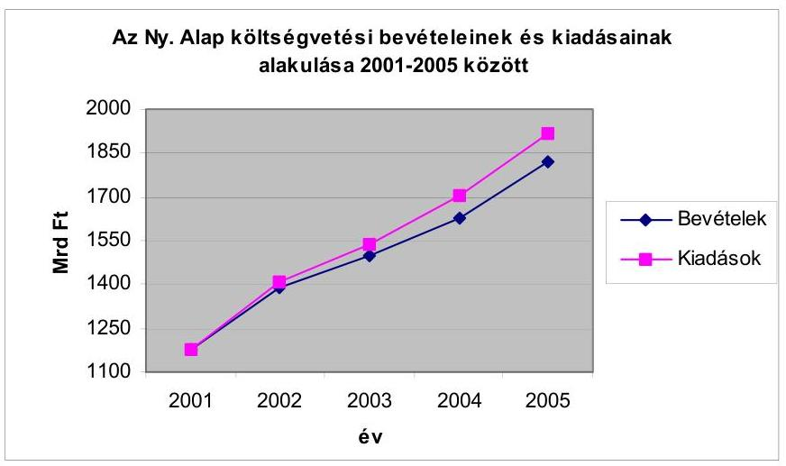
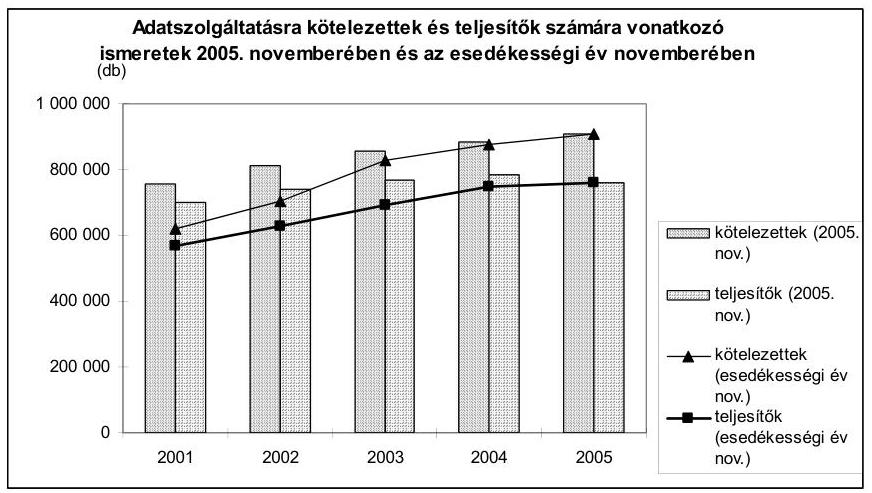
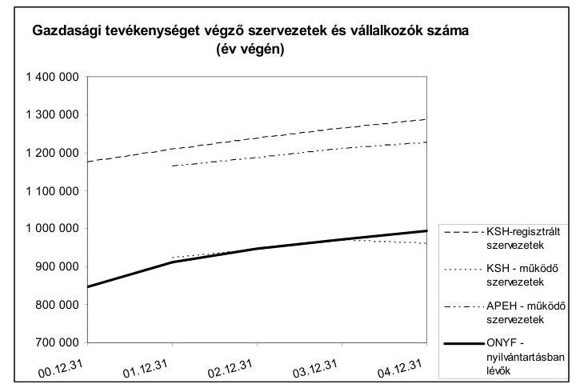
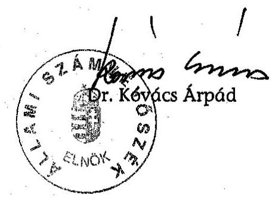
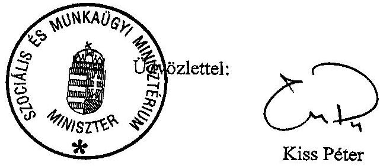

# ÁLLAMI   SZÁMVEVŐSZÉK 

## JELENTÉS

a Nyugdíjbiztosítási Alap működésének ellenőrzéséről

---

# 2. Államháztartás Központi Szintjét Ellenőrző Igazgatóság 

2.3. Átfogó Ellenőrzési Főcsoport

Iktatószám: V-22-038/2005/06.
Témaszám: 789
Vizsgálat-azonosító szám: 0239

## Az ellenőrzést felügyelte:

Bihary Zsigmond
főigazgató
Az ellenőrzés végrehajtásáért felelős:
Hegedűsné dr. Müllern Veronika
főcsoportfőnök
Az ellenőrzést vezette:
Dr. Kurucz István
igazgatóhelyettes
Az ellenőrzést végezték:

| Bíró Zsolt számvevő | Dr. Kuti Anna számvevő tanácsos | Szendrődi Józsefné számvevő tanácsos, tanácsadó |
| :--: | :--: | :--: |
| Csathó Áron számvevő | Lödiné Cser Zsuzsanna számvevő |  |
| Fekete Anikó Gyöngyi számvevő | Luhály Matild számvevő | Szólya Ildikó számvevő |
| Dr. Fónagy Diána számvevő | Molnár Istvánné szakértő | Tóth Árpád számvevő tanácsos |
| Hirka Mihály számvevő tanácsos, irodavezető | Salamin Viktor számvevő gyakornok | Tóth László számvevő gyakornok |

A témához kapcsolódó eddig készített számvevőszéki jelentések:
címe
sorszáma
Jelentés a Nyugdíjbiztosítási Alap kezelésének és felhasználásának ellenőrzéséről 0119
Vélemény a Magyar Köztársaság költségvetési törvényjavaslatáról 0241, 0338
0449, 0550
Jelentés a Magyar Köztársaság költségvetése végrehajtásának ellenőrzéséről 0232, 0329
0443, 0540

---

# TARTALOMJEGYZÉK 

BEVEZETÉS ..... 7
I. ÖSSZEGZŐ MEGÁLLAPÍTÁSOK, KÖVETKEZTETÉSEK, JAVASLATOK ..... 9
II. RÉSZLETES MEGÁLLAPÍTÁSOK ..... 15

1. Az Ny. Alap működési rendszere ..... 15
1.1. A nyugdíjrendszer jellemzői ..... 15
1.2. Az Ny. Alap bevétele és kiadása ..... 16
2. A szakmai feladatok végrehajtása ..... 19
2.1. A nyilvántartási és adatszolgáltatási kötelezettség teljesítése ..... 19
2.1.1. A feladatellátás feltételeinek kialakítása ..... 19
2.1.2. A nyugdíjbiztosítási adatok nyilvántartása ..... 21
2.1.2.1. A foglalkoztatói adatszolgáltatás tapasztalatai ..... 21
2.1.2.2. A nyilvántartásokkal kapcsolatos ellenőrzések ..... 25
2.1.3. Az ONYF adatszolgáltatásai, az adatvédelmi követelmények érvényesülése ..... 28
2.2. A nyugdíjbiztosítási ellátások megállapítása, folyósítása ..... 29
2.2.1. Az ügyintézési idő alakulása ..... 30
2.2.2. Az ügyfélszolgálati tevékenység ..... 31
2.2.3. A jogorvoslat tapasztalatai ..... 32
3. Az Ny. Alap kezelőjének irányítási rendszere, működésének tapasztalatai ..... 33
3.1. A belső kontrollrendszer megfelelősége ..... 33
3.1.1. A kontrollkörnyezet ..... 33
3.1.2. A kockázatkezelés ..... 35
3.1.3. A kontrolleljárások ..... 36
3.1.4. A belső ellenőrzés ..... 37
3.1.5. Az információ és kommunikáció ..... 39
3.1.6. A monitoring ..... 41
3.2. Az informatikai rendszer működése ..... 41
3.2.1. A működés feltételei, megbízhatósága, biztonsága ..... 42
3.2.2. Az informatikai fejlesztésekre fordított pénzeszközök hasznosulása ..... 45
4. A korábbi számvevőszéki vizsgálatok utóellenőrzése ..... 47

---

# MELLÉKLETEK 

1. sz. melléklet A szociális és munkaügyi miniszter levele
2. sz. melléklet A Nyugdíjbiztosítási Alap költségvetési bevételei 2001-2005 között
3. sz. melléklet A Nyugdíjbiztosítási Alap költségvetési kiadásai 2001-2005 között
4. sz. melléklet A Nyugdíjbiztosítási Alapból finanszírozott ellátások havi átlagos száma, az éves kiadás, az egy főre jutó havi kiadás 2001-2005 között
5. sz. melléklet A nyilvántartás informatikai háttere funkcionalitásának alakulása
6. sz. melléklet Az ONYF nyilvántartási és adatszolgáltatási, területi ellenőrzési feladatait jellemző mutatók
7. sz. melléklet Igénybejelentések (indítások), teljesítő és elutasító határozatok száma 2001-2005 között
8. sz. melléklet Összes igény átlagos elintézési idejének alakulása 2001-2005 között
9. sz. melléklet Fellebbezések alakulása és megoszlása 2001-2005 között
10. sz. melléklet Járuléktartozások értékvesztésének elszámolása gazdálkodási forma szerint 2005 végén
11. sz. függelék A nyugdíjrendszer átalakításával kapcsolatos tapasztalatok

---

# RÖVIDÍTÉSEK JEGYZÉKE 

| Áht. | az államháztartásról szóló többször módosított 1992. évi XXXVIII. törvény |
| :--: | :--: |
| Ámr. | az államháztartás működési rendjéről szóló 217/1998. (XII. 30.) Korm. rendelet |
| APEH | Adó- és Pénzügyi Ellenőrzési Hivatal |
| Art. | az adózás rendjéről szóló 2003. évi XCII. törvény |
| ÁSZ | Állami Számvevőszék |
| Atv. | a személyes adatok védelméről és a közérdekű adatok nyilvánosságáról szóló 1992. évi LXIII. törvény |
| Ber. | a költségvetési szervek belső ellenőrzéséről szóló 193/2003. (XI. 26.) Korm. rendelet |
| BM-EVIG | Belügyminisztérium Egyéni Vállalkozói rendszere |
| CAF | Common Assesment Framework - Általános Értékelési Keretrendszer |
| ECDL | European Computer Driving Licence - Európai Számítógép-használói Jogosítvány |
| EU | Európai Unió |
| FAB | foglalkoztatói adatbázis |
| FEUVE | folyamatba épített előzetes és utólagos vezetői ellenőrzés |
| FPMNYI | Fővárosi és Pest Megyei Nyugdíjbiztosítási Igazgatóság |
| GDP | Gross Domestic Product - Bruttó hazai termék |
| IM | Igazságügyi Minisztérium |
| KELEN | Központi Elektronikus Nyugdíj nyilvántartási Rendszer |
| Ket. | A közigazgatási hatósági eljárás és szolgáltatás általános szabályairól szóló 2004. évi CXL. törvény |
| KIR | központosított illetmény számfejtési rendszer |
| KSH | Központi Statisztikai Hivatal |
| Ktv. | a köztisztviselők jogállásáról szóló 1992. évi XXIII. törvény |
| MÁK | Magyar Államkincstár |
| MEH IKB | Miniszterelnöki Hivatal Informatikai Kormánybiztosság |
| M Ft | millió forint |
| MNYI | Megyei Nyugdíjbiztosítási Igazgatóság |
| Mrd Ft | milliárd forint |
| Ny. Alap | Nyugdíjbiztosítási Alap |
| NYENYI lap | Nyugdíjbiztosítási Egyéni Nyilvántartó lap |
| NYUFIG | Nyugdíjfolyósító Igazgatóság |
| NYUFUR | a nyugdíjfolyósítás ügyviteli rendszere |
| NYUGDMEG | nyugdíj-elbírálási rendszer |
| OCCR | Országos közhiteles cégnyilvántartás |
| OEP | Országos Egészségbiztosítási Pénztár |
| OGY | Országgyűlés |
| ONYF | Országos Nyugdíjbiztosítási Főigazgatóság |

---

| PIR | pénzügyi integrált rendszer |
| :-- | :-- |
| PM | Pénzügyminisztérium |
| SAP | Integrált Pénzügyi Rendszer |
| SZAB | személyi adatbázis |
| SZMSZ | Szervezeti és Működési Szabályzat |
| TAJ | társadalombiztosítási azonosító jel |
| Tbj. | a társadalombiztosítás ellátásaira és a magánnyugdíjra   jogosultakról, valamint e szolgáltatások fedezetéről szóló   1997. évi LXXX. törvény |
| Tny. | a társadalombiztosítási nyugellátásról szóló 1997. évi   LXXXI. törvény |
| VPN | virtuális magánhálózat |

---

# ÉRTELMEZŐ SZÓTÁR 

| Alfanumerikus adatok | Elektronikus feldolgozásra alkalmas, betű és szám karakterekből álló jelsorozat |
| :--: | :--: |
| Árvaellátás | Az elhunyt nyugdíjas, illetve nyugdíjban nem részesülő, de nyugdíjjogosultságot szerzett elhunyt személy gyermekének, örökbe fogadott gyermekének, meghatározott feltételek esetén nevelt gyermekének, testvérének, unokájának járó ellátás. |
| Belső ellenőrzés | Az Áht. definíciója szerint független, tárgyilagos bizonyosságot adó és tanácsadó tevékenység, amelynek célja, hogy az intézmény működését fejlessze, és eredményességét növelje. |
| Degresszió | A nyugdíj alapjául szolgáló havi átlagkereset törvényben meghatározott mértékű sávos jellegű csökkentése. A sávhatárok évente változnak. |
| Ellenőrzési nyomvonal | A költségvetési szerv tervezési, pénzügyi lebonyolítási és ellenőrzési folyamatainak szöveges, illetve táblázatba foglalt, folyamatábrákkal szemléltetett leírása. |
| Folyamatba épített, előzetes és utólagos vezetői ellenőrzés (FEUVE) | A szervezeten belül a gazdálkodásért felelős szervezeti egység által folytatott első szintű pénzügyi irányítási és ellenőrzési rendszer, amelynek létrehozásáért, működtetéséért és fejlesztéséért a költségvetési szerv vezetője a felelős a pénzügyminiszter által közzétett irányelvek figyelembevételével. |
| Informatikai rendszerellenőrzés | A költségvetési szervnél működő informatikai rendszerek megbízhatóságának, biztonságának, valamint a rendszerben tárolt adatok teljességének, megfelelőségének, szabályosságának és védelmének vizsgálatát jelenti. |
| Interfész | Csatlakozási felület vagy eszköz hardverek, illetve szoftverek között |
| Kémprogram | Olyan program, amely személyes adatokat gyűjt a felhasználóról, annak tudta és engedélye nélkül. A kémprogram által összegyűjtött adatok sora terjedhet a meglátogatott internetes oldalak listájától egészen a felhasználónevekig és jelszavakig. |
| Kockázatelemzés | Objektív módszer az ellenőrizendő területek kiválasztására, mely meghatározza a pénzügyi irányítási és ellenőrzési rendszerekben rejlő kockázatokat. |
| Kockázatkezelés | Az olyan várható események és helyzetek beazonosítását, értékelését, kezelését és kézbentartását felölelő folyamat, amely megfelelő biztosítékot nyújt arra nézve, hogy a szervezet eléri célkitűzéseit. |
| Öregségi nyugdíj | Meghatározott életkor elérése és meghatározott szolgálati idő megszerzése esetén járó nyugellátás. |
| Platform | Jól behatárolható jellemzőkkel rendelkező számítógépes hardver-, illetve szoftverkörnyezet. |

---

Rendszerellenőrzés

Saját jogú nyugellátás és a hozzátartozói nyugellátás

Szerverpark

Szkennelés
Szolgálati idő

Szülői nyugdíj

Valorizálás

Rendszerek (irányítási, végrehajtási, pénzügyi lebonyolítási, beszámolási és ellenőrzési) működésének átfogó vizsgálata, melynek keretében a szabályszerűség, szabályozottság, gazdaságosság, hatékonyság és eredményesség kerül ellenőrzésre.
Olyan keresettől, jövedelemtől függő rendszeres pénzellátás, amely meghatározott szolgálati idő megszerzése esetén a biztosítottnak (volt biztosítottnak), illetve hozzátartozójának jár.
Olyan nagyteljesítményű programok, illetve számítógépek, amelyek különböző szolgáltatásokat biztosítanak a hálózat felhasználói számára
Dokumentumok képi megjelenítése.
Az az időszak, amely alatt a biztosított nyugdíjárulék fizetésére kötelezett volt, illetve megállapodás alapján nyugdíjjárulékot fizetett. A nyugdíjjárulék-fizetési kötelezettség nélkül szolgálati időnek minősülő időszakokat a Tny. külön meghatározza.
Az elhunyt biztosított (nyugdíjas) szülőjének, nagyszülőjének, meghatározott feltételek fennállása esetén nevelőszülőjének járó ellátás.
Értékcsökkenés kiegyenlítése.

---

# JELENTÉS   a Nyugdíjbiztosítási Alap működésének ellenőrzéséről 

## BEVEZETÉS

A kötelező társadalombiztosítási rendszerben a biztosítási elv, a társadalmi szolidaritás és a tulajdonhoz fűződő jogok alkotmányos keretek közötti korlátozása együttesen érvényesülnek. A biztosítottak egyes társadalombiztosítási ellátások igénybevételére való jogosultságát a társadalombiztosításban való részvételi, illetve - a törvényben meghatározott ellátások kivételével - társadalombiztosítási, illetve egyéni járulékfizetési kötelezettségük alapozza meg.

Az állam kötelessége a kötelező társadalombiztosítási nyugdíjrendszer működtetése, amely öregség, megrokkanás, megrokkanással járó baleset esetén a biztosított részére, elhalálozásánál a hozzátartozója részére egységes elvek alapján nyugellátást biztosít. A jogszabályokban előírt ellátások megállapítása és folyósítása a Nyugdíjbiztosítási Alap (Ny. Alap) kezelőjének, az Országos Nyugdíjbiztosítási Főigazgatóságnak (ONYF) és igazgatási szerveinek a feladata.

Az Ny. Alap felügyelete, az ONYF irányítása állami, kormányzati feladat, ezt a feladatot 2001. január 1. és 2002. június 7-e között a pénzügyminiszter, 2002. június 8-tól 2004. december 9-ig az egészségügyi, szociális és családügyi miniszter, 2004. december 10-étől az ifjúsági, családügyi, szociális, és esélyegyenlőségi miniszter útján látta el.

Az alapkezelő ellátja a nyugdíjbiztosítással kapcsolatos pénzügyi, gazdasági, igazgatási, ügyviteli és hatósági teendőket, irányítja az igazgatási szerveket, a nyilvántartási rendszer működtetését, a nyugellátások megállapításának és folyósításának tevékenységét, ide értve a külön jogszabályok alapján végzett, nem az Ny. Alapból finanszírozott ellátásokkal kapcsolatos igazgatási funkciókat is.

Az Ny. Alap költségvetésének bevételi és kiadási eredeti előirányzata 2001-2005 között 1174 Mrd Ft-ról 1854 Mrd Ft-ra nőtt. A teljesített bevételek és kiadások egyenlegében 2001-ben többlet, 2002-2005. között hiány volt, ami minden évben emelkedett.

Az Ny. Alapot 2000-2001-ben átfogó jelleggel ellenőriztük. Az elmúlt években végzett ellenőrzések az Ny. Alap költségvetési javaslatának véleményezésére, a zárszámadás keretében a költségvetés végrehajtásának értékelésére irányultak. A jelenlegi átfogó ellenőrzés a 2001-2005 közötti időszakot értékelte.

---

A jelenlegi ellenőrzés célja annak értékelése volt, hogy

- az Ny. Alap működése, kezelése összhangban volt-e a jogszabályi előírásokkal, a nemzetgazdasági paraméterek tervezett alakulásával, megfelelően érvényesült-e az Ny. Alapot érintő állami szerepvállalás, garancia;
- az Ny. Alap kezelője és igazgatási szervei miként teljesítették a nyugellátások megállapításával és folyósításával kapcsolatos feladatokat;
- az ONYF irányító, felügyeleti tevékenysége megfelelő volt-e, a követelmények szerint működött-e a belső kontroll, az informatikai rendszer;
- az Ny. Alap tekintetében, illetve az ONYF és igazgatási szervei tevékenységében hasznosultak-e a korábbi számvevőszéki ellenőrzések megállapításai, ajánlásai.

A vizsgálat során hasznosítottuk a 2001-2004. évek zárszámadásai pénzügyi (szabályszerűségi) ellenőrzésének megállapításait, közreműködtünk az Ny. Alap 2005. évi zárszámadása előkészítésében. Rendszerellenőrzés keretében átfogóan értékeltük a szakmai feladatokon belül a nyugdíjrendszer átalakításának tapasztalatait, a nyugdíjbiztosítási ellátásokat, az igazgatási szerveknél a belső kontrollrendszer megfelelőségét, valamint az informatikai tevékenységet. A magánnyugdíjrendszer működésének értékelésére jelen ellenőrzés nem terjedt ki.

A teljesítmény-ellenőrzés
 módszerével értékeltük a nyilvántartási és adatszolgáltatási kötelezettség teljesítését, az intézkedések eredményességét, ennek során a tevékenység szándékolt és tényleges hatásának viszonyát vizsgáltuk. Utóellenőrzés keretében értékeltük a korábbi számvevőszéki ellenőrzések megállapításainak, javaslatainak hasznosulását.

Az alapkezelés, illetve a hatósági ügyek területi feladatainak végrehajtását az ONYF Fővárosi és Pest megyei, a Baranya megyei, a Békés megyei, a Borsod-Abaúj-Zemplén megyei Igazgatóságánál, valamint a Nyugdíjfolyósító Igazgatóságnál ellenőriztük. Az Állami Számvevőszék (ÁSZ) 2006. első félévében ellenőrizte a minisztériumok és országos hatáskörű szervek elhelyezését és a tárgyi eszköz ellátottságát, ezért az átfogó ellenőrzés erre nem terjedt ki.

Az ÁSZ az államháztartásról szóló többször módosított 1992. évi XXXVIII. törvény (Áht.) 120/A § (1) bekezdése alapján ellenőrzi az államháztartás forrásait, azok felhasználását, a vagyonnal való gazdálkodást. Az NY. Alap ellenőrzését az Állami Számvevőszékről szóló 1989. évi XXXVIII. törvény 2. § (3) és 17. § (3) bekezdése alapján végeztük.

A jelentést az Állami Számvevőszékről szóló 1989. évi XXXVIII. törvény 25. § (1) bekezdésének megfelelően észrevételezésre megküldtük Kiss Péter szociális és munkaügyi miniszternek, aki a jelentésben foglalt megállapításokkal és javaslatokkal egyetértett, észrevételt nem tett. Levelét a jelentés 1. sz. melléklete tartalmazza.

---

# I. ÖSSZEGZŐ MEGÁLLAPÍTÁSOK, KÖVETKEZTETÉSEK, JAVASLATOK 

Az Országgyűlés (OGY) 1997-ben törvényeket fogadott el a társadalombiztosítás új szabályozására és egyúttal hatályon kívül helyezte a korábbi, 1975-től érvényes jogszabályt. A kihirdetéssel egyidejűleg az OGY a további tennivalókról szóló határozatokat is elfogadott. Ezzel lényegében kijelölték a nyugdíjrendszer átalakításának főbb irányait, de a 2009-től érvényes változásokhoz szükséges új rendelkezések nem készültek el és a 2013-ra meghirdetett rendszert csak körvonalaiban jelzi a törvény, ezért ebben a formában a törvényi szabályozás nem alkalmas a nyugdíjrendszer jövőbeni tényleges működtetésére.

Mindezek alapján, valamint az OGY határozatok végrehajtásának elmaradása miatt bizonytalan a társadalombiztosítási nyugdíjrendszernek a tervezett tartalommal és határidővel történő módosítása, valamint a magánnyugdíjrendszer kiterjesztése a rokkant és hozzátartozói ellátásokra.

Indokoltsága ellenére nem készült az eltérő biztosítási kockázatot jelentő öregségi, rokkantsági, hozzátartozói nyugellátásokra vonatkozóan kockázatelemzésen, hosszabb távú fedezeti számításokon alapuló, önálló járulék-kalkuláció.

Nem került sor az állam finanszírozó szerepe, normatív szerepvállalása, a hozzájárulás tervezhetősége meghatározására, valamint a kötelező nyugdíjbiztosítás ellátási feladatai és a szükséges források közötti tartós összhangot biztosító megoldás kidolgozására.

Az ellenőrzött időszakban az ellátások biztosításához szükséges bevételek 75-85%-a (fokozatosan csökkenő arányban) a kereset alapján fizetett járulékokból származott. A bevételek alakulását alapvetően a bruttó keresettömeg növekedése és a jogszabály által előírt munkáltatói járulékkulcs csökkenése határozta meg. A járulékbevételek alakulása a keresetkiáramlást nem tükrözte vissza, mivel a növekvő keresetkiáramlás nem eredményezett olyan mértékű többletbevételt, amely ellensúlyozta volna a járulékkulcs csökkenése miatti bevételkiesést. A bevételeket a reálisnál magasabbra tervezték, amit jelentéseink rögzítettek.

A járulékok beszedése, a járulékbevételek, illetve a tartozások nyilvántartása, a fizetési kötelezettség teljesítésének ellenőrzése, a tartozások behajtása az Adó- és Pénzügyi Ellenőrzési Hivatal (APEH) feladat- és hatáskörébe tartozott, adatszolgáltatása alapján a bevételek, a tartozások, a túlfizetések összegét az NY. Alap mérlege tartalmazta. Az APEH járulékbehajtási tevékenysége eredményeként évente mintegy 25-35 Mrd Ft tartozás tértült meg. Ennek ellenére a tartozásállomány nem lett kedvezőbb, sőt a vizsgált időszakban évenként 16-19%-kal nőtt a járuléktartozás összege. Az APEH nyilvántartása az adóalanyokra vonatkozik. A járulékok ellenőrzését az APEH a meglévő rendszer szerint végezte,

---

így nem volt feladatuk a járulék fizetési kötelezettség teljesítésének, a tartozások alakulásának önálló értékelése ${ }^{1}$.

A járuléktartozásokból jelentős összegeket, 15-70 Mrd Ft-ot, a tartozás 20-60%-át számolták el értékvesztésként. Szabályosságát a 2003-2004. évi zárszámadás értékelése során kifogásolta az ÁSZ ${ }^{2}$, amit a Kormány figyelembe vett a rendelet módosításánál. A rendelet végrehajtásának tapasztalatai a 2005. évet érintő zárszámadás során értékelhetők. A csoportos értékelés elve alapján az APEH értékvesztést számolt el a központi költségvetési szervek járuléktartozásaival szemben, így pl. 2005. első félévében 400 M Ft-ból 100 M Ft-ot. A köztartozások felhalmozódása elkerülhető a jogszabályi előírások következetes alkalmazásával.

Az NY. Alap kiadásai - a 2001. év kivételével - gyorsabban emelkedtek, mint a bevételek. A kiadások alakulását a nyugellátások évenkénti emelése határozta meg, de befolyásolták a kiadásokat, pl. az automatizmusok (a létszám, a kiegészítő ellátás, az összetétel változás, a cserélődés), a 13. havi nyugellátás fokozatos bevezetése. A hatályos jogszabályok alapján az állam az NY. Alapot terhelő ellátási kiadások teljesítését akkor is garantálta, ha a kiadások meghaladták a bevételeket. A garancia érvényesítésére 2002-2005 között minden évben szükség volt.

Az alapkezelő több nyilvántartási (pl. igény elbírálási, folyósítási) rendszert működtetett. A jogszerzési adatok nyilvántartásánál egyszerre kellett megoldania a folyamatosan növekvő számú adatok befogadását, valamint azokat célszerűen és megbízhatóan kezelő nyilvántartási rendszer kialakítását. A biztosítottak okmányainak, adatainak országosan elérhető, egységes adatbázisban való nyilvántartása 2001-ben valósult meg a központi elektronikus nyugdíj nyilvántartási rendszer (KELEN) üzembe helyezésével, amely meggyorsította a beküldött adatoknak az országos adatbázisba helyezését, a nyugellátási igényt elbírálók, az információt kérők kiszolgálását. A nyilvántartást és a nyugdíj megállapítást támogató informatikai rendszer összekapcsolásával 2005 szeptemberétől megvalósult az alfanumerikus adatok közvetlen elektronikus feldolgozása. Az alkalmazott nyilvántartás eredményesen járult hozzá az ONYF kapcsolódó feladatainak színvonalas ellátásához. A nyilvántartási rendszer az 1959-től kiállított okmányok szkennelt képét is tartalmazza.

Az ONYF-nek az adatszolgáltatási kötelezettség teljesítése érdekében végzett tevékenységét eredményesnek értékeljük, mert az adatszolgáltatást teljesítők és az arra kötelezettek egymáshoz viszonyított aránya országos szinten, átlagosan 84-92%, a Fővárosi és Pest Megyei Nyugdíjbiztosítási Igazgatóság (FPMNYI) nélkül 94-96% között alakult, miközben az adatszolgáltatásra kötelezettek száma 5 év alatt 619 ezerről 908 ezerre, 47%-kal nőtt és a szakfeladatokat ellátók létszáma 570-ről 403-ra, 29%-kal csökkent. Az FPMNYI mutatója 10-16%-ponttal elmaradt a többi igazgatóság összesített átlagától, amely elsősorban az elhelyezési és a létszámgondok következménye volt.

Az adatszolgáltatások befogadásához szükséges feltételeket az ONYF biztosította. A személyesen, vagy postán keresztül történő adatszolgáltatást ténylegesen évente 700-750 ezer kötelezett teljesítette. A több mint 4 millió biztosítottra vonatkozó, mintegy 6 millió egyéni nyilvántartó lap adatait 98-99%-ban lemezre rögzítve kapta meg az ONYF. Az adatbiztonságot növelték az alkalmazott ügyviteli és számítástechnikai eljárások. A biztosítottak személyi adatait tartalmazó adatbázist az alapkezelő folyamatosan vezette.

A nyilvántartási rendszerben a szerepkörök és a jogosultsági szintek szabályozottak. Az ügyintézők tevékenységét naplózták, biztosítottak voltak az utólagos ellenőrzés feltételei. Az adatvédelmi követelmények betartását rendszeresen ellenőrizték. Az adatszolgáltatók, a biztosítottak és a nyilvántartható adatok körére vonatkozó jogszabályi előírásokat az ONYF betartotta. A külső szervezeteknek adandó információkat központilag teljesítették.

A nyilvántartással és adatszolgáltatással kapcsolatos szakellenőrzések száma 2005-ben 34,5 ezer volt (amely közel háromszorosa a 2001. évi ellenőrzéseknek). Az ellenőrzések az említett foglalkoztatói kör 2-4%-ára terjedtek ki, mert az ellenőrzési kapacitás alapján többre nem volt lehetőség. Az ellenőrzések kétharmada nem előzetes kijelölés alapján történt, hanem a jogutód nélkül megszűnő szervezeteket vizsgálták.

A vizsgált időszakban az adatszolgáltatásra kötelezettek nyilvántartása nem volt teljes körű. Az adatszolgáltatások összegzett adatainak más hatósági nyilvántartásokkal való összevetésére nem került sor. A jogszerzési adatok valóságtartalmát lekérdező, a nyilvántartott adatoknak a majdani felhasználás szempontjait érvényesítő, rendszeres vizsgálatok - s ezzel az adatok közti egyes ellentmondások, pl. adott időszakra a teljes munkaidős jogviszony többszörös jelentésének kiszűrése - elmaradtak, az ellentmondások tisztázása a területi ellenőrzés feladata.

Az igénybejelentések száma évente 391-442 ezer, a teljesítő határozatok száma 257-295 ezer között alakult. Az igények elbírálását és a nyugellátások folyósítását, a vonatkozó jogszabályok, utasítások alapján, országos szinten egységes rendszerben végezték. Teljesítették a közigazgatási hatósági eljárás és szolgáltatás általános szabályairól szóló törvény előírásait, és annak megfelelően készültek el a szükséges nyomtatványok.

A nyugdíjbiztosítási ágazatnál az elbírálási ügyek átlagos elintézési ideje (az igénybejelentéstől a határozat kiküldéséig) 37-51 nap között változott. Kedvező, hogy 2003-tól csökkent ez a mutató, és így mérséklődött 37 napra. Az elbírálási idő hosszúságát befolyásoló fontosabb tényezők között kell megemlíteni az orvos szakértői véleményen alapuló ügyek továbbra is nagyobb időigényét, az elhúzódó, gyakran hibás külső adatszolgáltatást, a kérelmek, ezen belül a nemzetközi megkeresések növekvő számát, bonyolultságát. A hozzátartozói elbírálásoknál 30 napon túli ügyintézés nem volt. Az igények 50-60%-át 16-30 nap között, a többi kérelmet 15 nap alatt rendezték.

Az elbíráláshoz kapcsolódó jogorvoslati tevékenységnél jellemző volt, hogy döntően a rokkantosítás ügyében hozott elutasító határozatra érkezett fellebbezés. A fellebbezésnek helyt adó 2-2,5 ezer határozat aránya nem érte el a 10%-ot. Az évente 16-17 ezer bírósági kereset 85-90%-a a nyugdíjazáshoz kapcsolódott, vitatva többek között az orvosi döntéseket, a megállapított szolgálati időt. A nyugdíj megállapítással kapcsolatos keresetek 90%-át elutasította a bíróság.

A törvény (1997. évi LXXXI. tv. 55. § (4) bekezdés b pontja) 3 hónapot engedélyez az árvának arra, hogy felsőoktatási intézménybe történt felvételét igazolja. Ha nem veszik fel, akkor túlfizetés keletkezhet. Az ellenőrzött időszakban az NY. Alapot terhelő jogosulatlanul felvett ellátások összege az ONYF adatai szerint 1,2 Mrd Ft-ról 2,2 Mrd Ft-ra nőtt, amelynek mintegy 60%-a az árvaellátásból adódott.

A belső kontrollrendszert érintően az alapkezelő tevékenysége összhangban volt a jogszabályi előírásokkal. Több esetben (pl. az elektronikus ügyintézésnél) élen járt az új lehetőségek kialakításában. A szervezeti struktúra változása és a szabályozottság javította a működés feltételeit. Az engedélyezett létszám a 2001. évi 4352 főről 2005-re 4092 főre csökkent, miközben a feladatok nőttek.

Gondot fordítottak a megfelelő szaktudású köztisztviselők alkalmazására, a folyamatos képzésükre, továbbképzésükre, de az informatikai szakterületen nem mindenki rendelkezett a szükséges speciális szaktudással. A köztisztviselők teljesítményét évente értékelték, ennek eredménye alapján az igazgatóságok különböző módon és mértékben éltek az illetményeltérítések lehetőségével.

A folyamatba épített előzetes és utólagos vezetői ellenőrzés (FEUVE) rendszerét szabályozták, rögzítették a főbb folyamatokhoz kapcsolódó kockázatokat, kijelölték a kockázatkezelésért felelősöket, meghatározták a szabálytalanság bekövetkezése esetén szükséges intézkedéseket. A kockázatok kezelését a munkafolyamatba épített ellenőrzéseken keresztül, folyamatosan valósították meg.

---

A hibák, szabálytalanságok megelőzésére szolgáló kontroll nem volt teljes körű az egyes szabályzatok aktualizálásának késedelme miatt. Rendelkeztek a feladat- és felelősségi köröket tartalmazó kötelező dokumentumokkal, a gazdálkodásra vonatkozó szabályzatokkal. A belső ellenőrzés a hibák feltárásával,
 célirányos intézkedések kezdeményezésével hozzájárult a belső kontrollkockázatok csökkentéséhez. Tevékenysége a jogszabályban meghatározott egyes feladatokra még nem terjedt ki (pl. elmaradt az informatikai terület rendszerellenőrzése, teljesítmény-ellenőrzést a Békés Megyei Nyugdíjbiztosítási Igazgatóság kivételével nem végeztek).

A vezetői információs rendszer kiépített, a vezetői értekezletek emlékeztetői és a körlevelek gyors, elektronikus információcserét tettek lehetővé. Az ellenőrzött időszakban javult az információs technológiákhoz való hozzáférés. Az intézményi információáramlás biztosításában előrelépést jelentett az ágazati szinten elvégzett minőségfejlesztési modell (CAF) szerinti önértékelés, amely a fejlesztendő területek között jelölte meg az információáramlás hatékonyabbá tételét.

A nyugdíjbiztosítási ágazat feladatellátását a nyilvántartási, az igény elbírálási, a folyósítási, valamint a pénzügyi informatikai rendszerek támogatták. Az igény elbírálási (NYUGDMEG) rendszer azonban még nem alkalmas egyes igények, így pl. a nemzetközi nyugellátási kérelmek komplex kezelésére. Az Ny. Alap működési előirányzatai a költséghatékonyság javítása érdekében megtett takarékossági intézkedések ellenére is elsősorban a zavartalan napi működéshez feltétlenül szükséges informatikai fejlesztések, a folyamatos működéshez, üzemeltetéshez kapcsolódó nélkülözhetetlen beszerzések megvalósítására adtak lehetőséget.

Mindezek ellenére javult az alkalmazott nyugdíjügyviteli rendszerek működésének biztonsága, megbízhatósága a vizsgált időszak második felére. Az informatikai terület irányítása, a fejlesztések, beszerzések és a működtetés szabályozási és biztonsági környezete, az eszközbeszerzéseknél kialakított központi gazdálkodás, valamint a fejlesztéseknél érvényesülő koordináció jól szolgálta az informatikai tevékenységet.

A nyugdíjügyvitel különböző platformokon működő, a fejlődő szakmai igényeket már csak nehézkesen kiszolgáló rendszerei az ágazat szakmai feladatellátását a vizsgált időszakban megbízhatóan támogatták, adatbiztonsági és hatékonysági szempontból azonban egyre kevésbé elfogadhatók. Működtetésük és továbbfejlesztésük magas munkaerő kapacitás lekötésével valósítható meg. Az ONYF stratégiai célként integrált rendszer megvalósítását tűzte ki, melynek fejlesztését elindították.

A korábbi számvevőszéki vizsgálatok utóellenőrzése során megállapítottuk, hogy javaslataink csak részben hasznosultak. Nem került sor a kötelező nyugdíjbiztosítás ellátási feladatai, valamint a szükséges és elégséges források közötti tartós összhangot biztosító megoldás kidolgozására. Előterjesztés készült a nyugdíjasok helyzetének és életminőségének javításáról szóló 2003. évi OGY határozat végrehajtására, de azt a Kormány nem tárgyalta meg.

---

Nem született megoldás az ONYF és az APEH adatbázisai közötti közvetlen kapcsolat kialakítása jogilag szabályozott módjának és a technikai megvalósítás intézményes lehetőségeinek kidolgozását illetően, így a két intézmény járulékbefizetésekre vonatkozó adatbázisai egymás számára jelenleg nem hozzáférhetőek. (Az adatbázisok átvételére jelenleg nincs jogszabályi lehetőség.) Nem biztosított a pénzügyi fedezet az egyéni vállalkozók és egyéb sajátos biztosítotti körbe tartozók nyugdíj megállapításához szükséges, az APEH-től átvett iratok feldolgozásához. Ennek elmaradása gondot jelenthet a majdani nyugdíjak összegének megállapításánál.

A helyszíni ellenőrzés megállapításainak hasznosítása mellett javasoljuk:

# a Kormánynak 

1. tekintse át a nyugdíjrendszer működésének tapasztalatait, értékelje a nyugdíjreformmal összefüggő jogi szabályozás végrehajtását, és szükség szerint gondoskodjon az indokolt módosítások előkészítéséről, a részletes végrehajtási rendeletek kidolgozásáról;
2. vizsgálja meg - a szolidaritás elvének szem előtt tartásával - az eltérő biztosítási kockázatok miatt az önálló járulék-kalkuláció készítésének szükségességét az öregségi, rokkantsági és a hozzátartozói nyugellátásokra, illetve ennek elkülönített alrendszerként való működtetésének lehetőségét;

## a szociális és munkaügyi miniszternek

1. kezdeményezze az árvaellátásokkal kapcsolatos 3 hónapos igazolási időtartam 1 hónapra történő módosítását;
2. kezdeményezze, hogy az ONYF főigazgatója
a) vizsgálja meg a jogszerzési adatokat tartalmazó (okmány) adatbázis megbízhatóságának növelése érdekében az adatok rendszeres, elektronikus ellenőrzésének további feltételeit; mérje fel a lehetséges és célszerű ellenőrzések elvégzésének erőforrásigényét, és kezdeményezze a szükséges erőforrások biztosítását;
b) intézkedjen, hogy a belső ellenőrzés teljesítmény-ellenőrzéseket is végezzen.

---

# II. RÉSZLETES MEGÁLLAPÍTÁSOK 

## 1. Az Ny. Alap működési Rendszere

### 1.1. A nyugdíjrendszer jellemzői

A nyugdíjrendszer alapvető rendeltetése, hogy biztosítsa az időskorúak és a tartósan vagy véglegesen munkaképtelenné válók, valamint hozzátartozóik megélhetését. A társadalombiztosítási nyugdíjrendszerben a biztosítási és a szolidaritási elvnek (a generációk közötti szolidaritásnak, a nemek azonos kezelésének) együtt kell érvényesülnie. A megélhetés biztosítása a kötelező nyugdíjbiztosítást megalapozó jogviszonyban hosszú időn keresztül végzett munka és teljesített, illetve megállapodás alapján történő járulékfizetés ellenében valósul meg.

A társadalombiztosítás hosszú távú működőképessége elősegítése érdekében 1989. január 1-jével létrejött a társadalombiztosítás önálló pénzügyi alapja. Ezt követően 1991-ben az Országgyűlés (OGY) értékelte a társadalombiztosítási rendszer helyzetét és fontos határozatot hozott a megújítás koncepciójáról és a rövid távú feladatokról. A 90-es években megerősödött az igény arra vonatkozóan, hogy szükséges a piacgazdaság követelményeihez is illeszkedő társadalombiztosítási, ezen belül a nyugdíjbiztosítási rendszer kiépítése. Az előkészítő szakmai viták eredményeként kompromisszumos döntés született a nyugdíjrendszer átalakításáról.

Az OGY 1997-ben négy törvényt fogadott el a társadalombiztosítás új szabályozására, egyúttal hatályon kívül helyezte a társadalombiztosításról szóló, többször módosított 1975. évi II. törvényt. A törvények kihirdetésével egyidejűleg az OGY a további tennivalókról szóló határozatokat is elfogadott. ${ }^{3}$

Az 1997. szeptember 1-jétől, illetve 1998. január 1-jétől hatályos törvényi szabályozás következtében a nyugdíjrendszer átalakult. A társadalombiztosítási nyugdíjrendszer mellett létrejött a működő magánnyugdíjrendszer.

A biztosítottak vagy tisztán a társadalombiztosítási nyugdíjrendszerbe, vagy a vegyes nyugdíjrendszerbe tartozhatnak. A pályakezdőknek (a 2002. év kivételével) kötelező a vegyes rendszer. A vegyes rendszer tagjaként a nyugdíjba vonulók a társadalombiztosítási nyugdíjrendszerből a nyugdíj megállapítás szabályai sze-

[^0]
[^0]:    ${ }^{3}$ A társadalombiztosítás ellátásaira és a magánnyugdíjra jogosultakról, valamint e szolgáltatások fedezetéről szóló 1997. évi LXXX. törvény (Tbj.), a társadalombiztosítási nyugellátásokról szóló 1997. évi LXXXI. törvény (Tny.), az 1997. szeptember 1-jétől hatályos, a magánnyugdíjról és a magánnyugdíj pénztárakról szóló 1997. évi LXXXII. törvény, a kötelező egészségbiztosítás ellátásairól szóló 1997. évi LXXXIII. törvény, az új nyugdíjrendszer bevezetéséhez kapcsolódó egyes feladatokról szóló 74/1997. (VII. 18.) OGY határozat, a megváltozott munkaképességűek és rokkantak társadalombiztosítási és szociális ellátó rendszerének átalakításáról szóló 75/1997. (VII. 18.) OGY határozat.

---

rint 2013-tól a részükre járó nyugellátás 73,9%-át kapják, amit a befizetések alapján a magánnyugdíjpénztári járadék egészít ki.

Az említett törvények és OGY határozatok lényegében kijelölték a nyugdíjrendszer átalakításának főbb irányait, de 2009-től érvényes változásokhoz szükséges új rendelkezések nem készültek el és a 2013-ra meghirdetett rendszert csak körvonalaiban jelzi a törvény, ezért ebben a formában a törvényi szabályozás nem alkalmas a nyugdíjrendszer jövőbeni tényleges működtetésére. A felsoroltak alapján, valamint az OGY határozatok végrehajtásának elmaradása miatt bizonytalan a társadalombiztosítási nyugdíjrendszernek a tervezett tartalommal és határidővel történő módosítása, valamint a magánnyugdíjrendszer kiterjesztése rokkant és hozzátartozói ellátásokra. (Az Ifjúsági, Családügyi, Szociális és Esélyegyenlőségi Minisztérium /ICSSZEM/ tájékoztatása szerint a 2009. és 2013. évtől érvényes módosítások hatásvizsgálata megkezdődött.)

Mindezek mellett nem készült az eltérő biztosítási kockázatot jelentő öregségi, rokkantsági, hozzátartozói nyugellátásokra vonatkozóan a kockázatelemzésen, hosszabb távú fedezeti számításokon alapuló önálló járulék-kalkuláció. Nem került sor az állam finanszírozó szerepének, normatív szerepvállalásának, a hozzájárulás tervezhetőségének és ettől nem függetlenül a társadalombiztosítás, valamint az állami szociálpolitika kapcsolatának egyértelmű meghatározására. Nem rendezett, hogy mi történjék azokkal, akik az aktív életszakaszuk végén bármilyen okból nem tudják igazolni az előírt minimum szolgálati időt, így nem biztosítható számukra a megélhetéshez szükséges csökkentett összegű nyugdíj sem. Nem korszerűsítették a korkedvezményes nyugdíjszabályokat, jóllehet a jelenlegi szabályok alkalmazását a Tny. 2007. január 1-jéig engedi meg. A részletes tájékoztatást és értékelést az 1. sz. függelék tartalmazza.

# 1.2. Az Ny. Alap bevétele és kiadása 

Az Ny. Alap bevételeinek 75-85%-a (fokozatosan csökkenő arányban) a kereset alapján fizetett járulékokból származott (2. sz. melléklet). A járulékbevételek alakulását alapvetően a bruttó keresettömeg változása (növekedése) és a munkáltatói járulékkulcs csökkenése határozta meg. A járulékbevételek alakulása a keresetkiáramlást nem tükrözte vissza, mivel a növekvő keresetkiáramlás nem eredményezett olyan mértékű többletbevételt, amely ellensúlyozta volna a járulékmérték csökkenése miatti bevétel kiesést. A bevételeket a reálisnál magasabbra tervezték. ${ }^{4}$

A munkáltatókat terhelő járulékmérték a 2001. évi 20%-ról 2002-ben 18%-ra csökkent, amely a további években már nem változott. A járulék mérték csökkenése miatt kieső bevétel hiányzott a források közül. A forráshiány egy részét terv szinten a központi költségvetés pótolta. Az éves szinten keletkező hiányt a zárszámadási törvényben rendezték. A biztosítotti nyugdíjárulék mértéke a 2001. évi 8%-ról 2003-tól 8,5%-ra emelkedett. A magánnyugdíjpénztári tagok ebből 2001-2002-ben 2%-ot, 2003-ban 1,5%-ot, 2004-től 0,5%-ot fizettek az Ny. Alapba.

[^0]
[^0]:    ${ }^{4}$ A költségvetési előirányzat véleményezése során az ÁSZ rendszeresen felhívta a figyelmet a tervezés ezen ellentmondására.

---

A járulékok beszedése, a járulékbevételek, illetve a tartozások nyilvántartása, a fizetési kötelezettség teljesítésének ellenőrzése, a tartozások behajtása az APEH feladat- és hatáskörébe tartozik, adatszolgáltatásuk alapján a bevételek, a tartozások, a túlfizetések összegét az Ny. Alap mérlege tartalmazza.

Az APEH havonta szolgáltatott információt a bevallásra kötelezettek adatairól, a bevallás esedékességének hónapját követően. Az adatok valódiságáért az államháztartás működési rendjéről szóló 217/1998. (XII. 30.) Korm. rendelet (Ámr.) 114. § (6) bekezdése szerint az APEH tartozik felelősséggel. (Az adatszolgáltatásra a bevételek jogcímenkénti felosztásához volt szükséges.)

Az APEH nyilvántartása az adóalanyokra vonatkozik. Az ellenőrzés egységes és adóalanyonként teljes körű. A járulékok ellenőrzését az APEH a meglévő rendszer szerint végezte, így nem volt feladatuk a járulék fizetési kötelezettség teljesítésének, a tartozások alakulásának önálló értékelése. Ennek következtében nincs információ arra vonatkozóan, hogy a biztosítást megalapozó jogviszonyhoz igazodva mi a járulékfizetési kötelezettség alapja. Nincs adat arról, hogy az ellenőrzések eredményeként milyen számban rendeződött az érintett személyek biztosítása, és miként érvényesítették a keresete utáni járulékfizetési kötelezettséget.

Az APEH járulékbehajtási tevékenysége eredményeként az ellenőrzött időszakban évente mintegy 25-35 Mrd Ft tartozás térült meg, amelynek 99%-a végrehajtásból származott. Ennek ellenére a tartozás állomány nem lett kedvezőbb. A vizsgált időszakban évről-évre nőtt a járuléktartozás összege, amely 2001-ben 75 Mrd Ft, 2002-ben 87 Mrd Ft, 2003-ban 101 Mrd Ft, 2004-ben 120 Mrd Ft volt. A hátralék háromnegyede működő vállalkozásoknál keletkezett. A tartozásból jelentős összegeket és jelentős arányban számolt el az APEH értékvesztésként (értékcsökkenésként), amely 2002-ben 15 Mrd Ft (17%), 2003-ban 54 Mrd Ft (53%), 2004-ben 71 Mrd Ft (59%) volt. A 2005. I. félévi 93 Mrd Ft kintlevőséggel szemben 66 Mrd (70%-os) volt az értékvesztés.

Az ÁSZ a 2003. évi és a 2004. évi zárszámadási jelentésében megállapította, hogy az értékvesztés elszámolása nem szabályos. A jelentések szerint a 249/2000. (XII. 24.) Korm. rendelet vonatkozó rendelkezése ellentétes a számviteli törvénnyel. A módosított rendelet 31/A. §-a lehetővé tette a járulék és járulékjellegű bevételekkel kapcsolatos követelések esetében az adósok együttes minősítése alapján, egyszerüsített eljárással, azok csoportos értékelését. Az értékvesztés elszámolását szolgáló tárgyévi százalékos kulcsokat a megtérülés tapasztalati adataiból kiindulva, az előző évi zárómérleghez szolgáltatott hátralékadatok megtérülési adatai alapján határozták meg.

A Kormány a hivatkozott rendelet 2005. évi módosításakor az ÁSZ véleményét figyelembe vette, és a 319/2005. (XII. 26.) Korm. rendelet 5. §-a pontosította a szabályozást. Ezt az ÁSZ az intézkedési tervek realizálása során tudomásul vette. A rendelet végrehajtásának tapasztalatai a 2005. évet érintő zárszámadás keretében
 értékelhetők.

Az APEH, a csoportos értékelés elvéből következően értékvesztést számolt el a központi költségvetési szervek járuléktartozásaival szemben is (pl.: 2005. I. félévében a mintegy 400 M Ft-tal szemben közel 100 M Ft-ot).

---

A Pénzügyminisztérium (PM) és a Magyar Államkincstár (MÁK) véleménye szerint a hatályos szabályozás, a köztartozások kiegyenlítésére az Ámr. 109. §-ban előírt és részletezett zárolási konstrukció következetes alkalmazása alkalmas lehet a tartozásállományok fokozatos leépítésére és minimalizálhatja az újabb tartozások kialakulásának lehetőségét. Az APEH a központi költségvetési körben keletkezett köztartozások behajtása során is alkalmazza az adózás rendjéről szóló 2003. évi XCII. törvény (Art.) által biztosított fizetéskönnyítés engedélyezését. A nyugdíjbiztosítási hátralékok kialakulásában és kezelésében szerepet játszhatott az adósságok lassú, automatikus átütemezésének APEH gyakorlata.

A probléma kezelhető a zárolási konstrukció alkalmazásával, a költségvetési szervek esetében az adósságok átütemezése kialakult gyakorlatának megváltoztatásával, és a köztartozások inkasszó útján történő beszedésével, amelyre az Art. az APEH-et feljogosítja. Ezáltal megakadályozható a köztartozások felhalmozódása.

Az Art. 2005. évi LXXXV. törvénnyel történt (2006-tól, illetve 2007-től érvényes) módosítása szerint a tervezett egyszámla rendszer bevezetésével a munkáltatóknak és a kifizetőknek ezen túl valamennyi járulékot egyszámlára kellett volna befizetni. A jogszabály módosítás következtében a befizetések megosztására a járulékfizetőknek havonta és személyenként, bevallás formájában kell nyilatkozni egységes, személyre lebontott adatok feltüntetésével. Havonta (tárgyhót követő hó 12-éig, elektronikusan vagy gépi adathordozón) be kell vallaniuk a magánszemélyeknek teljesített kifizetéseket, juttatásokat, adó, illetve társadalombiztosítási kötelezettséget.

Az ÁSZ a 2006. évi költségvetési törvényjavaslat véleményezése során felhívta a figyelmet a törvényi intézkedés aggályos voltára. Jelezte, hogy a befizetés ugyan egyszerűsödik, de a bevallás és a nyilvántartás bonyolultabbá válik, az adatok feldolgozása, a növekvő számú egyeztetés többlet feladatot jelent. Hangsúlyozta, hogy az államháztartás különböző alrendszereit megillető bevételek összevonása, egységes kezelése és fiktív szétosztása a társadalombiztosítási alapok jogszabályokban meghatározott pénzügyi-gazdálkodási önállósága szempontjából is megkérdőjelezhető, illetve alkotmányossági aggályokat is felvet. Az egyszámla rendszer bevezetése a 2006. évi költségvetésről szóló törvényben foglaltak alapján nem lépett hatályba.

Az NY. Alap kiadásai - a 2001. év kivételével - gyorsabban emelkedtek, mint a bevételek. A 2001-2005. közötti időszakban az összes kiadás 63%-kal, ezen belül a nyugellátás kiadása 64%-kal nőtt. Az NY. Alapból finanszírozott ellátások havi átlagos száma 2,9 millió volt (3. sz. és 4. sz. melléklet).

# A kiadások alakulását a nyugellátások évenkénti emelése határozta 

meg, de befolyásolták azt, pl. az automatizmusok (a létszám, a kiegészítő ellátás, az összetétel változás, a cserélődés), a 13. havi nyugellátás 2003-2005. közötti fokozatos bevezetése. Az aktuális nyugdíjemelés mértéke és gyakorisága az adott évre vonatkozó emelési szabályoktól, az infláció alakulásától, a nettó keresetek várható növekedésétől függött. A hatályos jogszabályok alapján az állam az NY. Alapot terhelő ellátási kiadások teljesítését akkor is garantálta, ha a kiadások meghaladták a bevételeket.

---

A teljesített bevételek és kiadások egyenlegében 2001-ben 1,5 Mrd Ft többlet, 2002-ben 14,2 Mrd Ft, 2003-ban 39 Mrd Ft, 2004-ben 80,2 Mrd Ft, 2005-ben 93,5 Mrd Ft hiány volt.

# 2. A SZAKMAI FELADATOK VÉGREHAJTÁSA 

A szakmai feladatok ellátásának fontos feltétele a megfelelő nyilvántartás és adatszolgáltatás kialakítása, a megvalósítás ellenőrzése, az adatvédelmi követelmények érvényesítése. A szükséges feltételek megteremtése segítheti a nyugdíjbiztosítási ellátások megállapításának, folyósításának maradéktalan végrehajtását.

### 2.1. A nyilvántartási és adatszolgáltatási kötelezettség teljesítése

A járulékfizetési kötelezettség és teljesítés megállapításához, ellenőrzéséhez, a keletkezett jogosultság elbírálásához a biztosítottak és a foglalkoztatók kötelesek a törvényben meghatározott adataik bejelentésére, a rendszeres adatszolgáltatásra és a megfelelő nyilvántartások vezetésére. A járulékfizetési kötelezettségre és a teljesítésre vonatkozó adatok nyilvántartása az APEH, az ellátások megállapítását és folyósítását támogató nyilvántartási rendszer kiépítése és működtetése, a foglalkoztatói adatszolgáltatás technikai feltételeinek biztosítása az ONYF feladata. A nyilvántartási rendszerben gondoskodni kell az adatszolgáltatások befogadásáról, az adatok feldolgozásáról, megőrzéséről, biztonságáról és szükség szerinti felhasználhatóságáról.

A nyugellátások a nyugdíjjárulék alapját képező kereset (jövedelem) összegéhez és az elismert szolgálati időhöz igazodnak. A szolgálati idő és kereseti adatok nyilvántartására és jelentésére 1997-től a Nyugdíjbiztosítási Egyéni Nyilvántartó (NYENYI) lap szolgált. A nyugdíjbiztosítás papíralapú nyilvántartási rendszere 1996-tól fokozatosan átalakult az adatokat elektronikusan tároló rendszerré.

### 2.1.1. A feladatellátás feltételeinek kialakítása

A nyilvántartás és adatszolgáltatás ágazati feladatai megoszlottak az ONYF központi hivatali szerve és az igazgatóságai között. A területi ellenőrzési feladatok szakmai irányítása 1999-től változatlan szervezeti keretek között valósult meg. A jogalkalmazást segítette és egységes eljárásokat garantált az egyes feladatok központi elvégzése, pl. az országosan alkalmazott NYENYI program és lap tervezése, a jelentendő adattartalom jogszabályi változásokhoz igazítása.

A nyilvántartás szakmai-ügyviteli szempontjainak hangsúlyosabbá válását tükrözte a szakigazgatási osztály informatikai területről történő kiemelése és az ONYF szakmai feladatellátását felügyelő főosztályvezető irányítása alá helyezése. A feldolgozás és ellenőrzés szigorú elhatárolását jelentette a nyilvántartási szakegység feladatai közül a foglalkoztatók ellenőrzésének törlése.

---

A kirendeltségeket Baja és Cegléd kivételével 2004. novemberében megszüntették, de ez a feladatellátásban nem okozott gondot, mert a volt kirendeltségek kihelyezett szakegységként folytatták az ügyintézést. Az ONYF értékelése szerint ${ }^{5}$ az FPMNYI feladatellátását hátráltatta az épület felújítása. A szakmai feladatok ellátásában és annak ellenőrzésében zavart okozott a két éven át és több helyszínen történő munkavégzés.

A biztosítottak okmányainak, adatainak országosan elérhető, egységes adatbázisban való nyilvántartása 2001-ben valósult meg a Központi Elektronikus Nyugdíj nyilvántartási Rendszer (KELEN) üzembe helyezésével. A KELEN a nyugdíjigényt elbírálók tevékenységét, az információt kérők igényeinek kielégítését egyszerűsítette, gyorsította. A bevezetett rendszer az igények elbírálásához elektronikus dossziéba rendezte a biztosítottról tárolt okmányokat és csak a hiányzó dokumentumokat kellett a nyilvántartási szakterülettől beszerezni.

A KELEN a szolgálati időről 1959-től, a keresetről 1988-tól tartalmaz információt. A rendszer az adatszolgáltatásra kötelezett foglalkoztatók és az egyéni vállalkozók adatait, a foglalkoztatói adatbázist (FAB), valamint a TAJ számos személyi adatbázist (SZAB) egyaránt tartalmazta. Az adatbázisba a korábban befogadott alfanumerikus okmányokon kívül mintegy 53 millió papír okmány szkennelt képe is bekerült.

A KELEN, valamint annak továbbfejlesztett változatai (5. sz. melléklet) eredményesen járultak hozzá az ONYF nyilvántartási és adatszolgáltatási feladatainak ellátásához.
2004. márciusától az okmányok központi adatbázisba kerülésének időigénye lerövidült az adatbázisba való közvetlen befogadással. Az adatok hitelességét, ellenőrzöttségét emelte az okmányok azonnali személyhez rendelése. Az elektronikus dossziénak a NYUGDMEG rendszerből való elérhetőségével 2005 őszétől a nyugdíj megállapításához nem kellett az adatokat begépelni, azok elektronikusan felhasználhatók voltak.

A nyugellátások megállapításához szükséges adatok nyilvántartási rendszerére vonatkozó előírásokat 1998-tól a Tbj. mellett a Tny. és végrehajtási rendelete tartalmazta, amely szabályozta a külső szervek, a társadalombiztosítás igazgatási szervei közötti adatátadásokat. A jogszabályok szakmai tapasztalatokon alapuló módosításai a kötelezettség egyértelmű előírását, az adatvesztés csökkentését, az eljárás egyszerűsítését, a feleslegesnek bizonyult eljárás megszüntetését eredményezték.

A foglalkoztatók adatszolgáltatási kötelezettségére vonatkozóan 2005-ben elfogadott törvényi változások (Art., Tny. és Tbj.) növelték a foglalkoztatók és a hatóságok kötelezettségeit, de ezzel együtt sem garantálják a nyugdíjbiztosítási adatok hitelességét, az egyéni számlás nyilvántartás kialakítását ${ }^{6}$.

[^0]
[^0]:    ${ }^{5}$ Jelentés a Fővárosi és Pest Megyei Nyugdíjbiztosítási Igazgatóság átvilágításáról, ONYF (2003. január)
    ${ }^{6}$ Az ÁSZ véleménye a Magyar Köztársaság 2006. évi költségvetési javaslatáról

---

A jelenlegi nyilvántartási rendszerek egyszeri módosításán kívül az APEH-re és/vagy az ONYF-re hárul a havi adatok éves szintű konszolidálása. Az egyénre vonatkozó járulék- és nyugdíjbiztosítási adatok összhangja ellenőrzésének kötelezettségét az APEH számára az Art. nem írja elő. Az APEH csak az elévülési időn belül őrzi az adatokat, miközben az elévülési időnél sokkal hosszabb időszakra kell a jogszerzési adatokat nyilvántartani. Ez az ONYF feladata, de a feltételek megteremtése érdekében szükségessé váló adatátadás nem rendezett.

Az 1997 óta működő és alapelveiben változatlan informatikai rendszerrel támogatott nyilvántartási szaktevékenység ágazati szinten történő egységes újraszabályozása 2004-re valósult meg. A valamennyi igazgatóságra kötelező eljárási rend 2004. február 2-án lépett hatályba ${ }^{7}$. Az utasítások a vezetői ellenőrzés és a folyamatba épített ellenőrzés követelményeit, a feladat- és hatáskörök szakterületek közötti megosztását is tartalmazták. A jogszabályok és ügyviteli utasítások, valamint az utóbbiak közötti összhangot fenntartották, az eljárási rendeket folyamatosan karbantartották.

# 2.1.2. A nyugdíjbiztosítási adatok nyilvántartása 

### 2.1.2.1. A foglalkoztatói adatszolgáltatás tapasztalatai

Az adatszolgáltatások begyűjtése, befogadása érdekében megtett ONYF intézkedéseket eredményesnek értékeljük, mert az adatszolgáltatást teljesítők és az arra kötelezettek ${ }^{8}$ egymáshoz viszonyított aránya 84-92% között alakult (6. sz. melléklet), miközben az adatszolgáltatásra kötelezettek száma 5 év alatt 47%-kal nőtt és a feladatot ellátó szakapparátus létszáma 570-ről 403-ra, 29%-kal csökkent.

[^0]
[^0]:    ${ }^{7}$ Az ONYF főigazgatójának 6/2004. ONYF utasítása a nyilvántartási és adatszolgáltatási feladatok ellátásának ügyviteli eljárásáról
    ${ }^{8}$ Az adatszolgáltatásokat és a kötelezetteket a KELEN adatbázis kétféle állapota, a 2005. november végi és a mindenkori esedékesség évének november végi állapota szerint vizsgáltuk. A vizsgált időszakban egy adott évre a 2005. novemberi állapot az esedékesség éve szerinti adatoknál magasabb számokat tartalmaz, az utólag nyilvántartásba vett kötelezettek és teljesítéseik miatt. Az adatszolgáltatási kötelezettséggel kapcsolatos adatokat a teljesítés évére vettük figyelembe, pl. 2001-hez a 2000. évre vonatkozó kötelezettség adatai tartoznak.

---

Az FPMNYI nélkül számított országos átlag 94-96%-os volt. Az igazgatóságnál a kötelezettekhez viszonyított teljesítők aránya 10-16%-ponttal elmaradt a többi igazgatóság összesített átlagától, amely elsősorban az elhelyezési és létszámgondok következménye volt. A KELEN nyilvántartása szerint az adatszolgáltatásra kötelezettek száma a 2001. novemberi 619 ezerről 2005. novemberére 908 ezerre, egy ügyintézőre vetítve átlagosan 1087-ről 2254-re emelkedett. (A nyilvántartás ezen felül 85 ezer adatszolgáltatásra nem kötelezett foglalkoztató és egyéni vállalkozó adatait is tartalmazza.)

Az adatszolgáltatáshoz szükséges technikai feltételeket az ONYF biztosította a kötelezettek részére. A számítástechnikai programot tartalmazó lemezt vagy a nyilvántartó lapot a regisztrációnál lehetett átvenni. A kitöltési útmutató és felhasználói utasítás az adatszolgáltatásra vonatkozó tájékoztatóval és magyarázatokkal együtt az ONYF honlapjáról is letölthető volt. A kötelezettség teljesítését az április végi határidőt megelőzően az ONYF kommunikációs tevékenysége segítette.

2002 és 2004 között csak az I. negyedévben adták ki a tárgyévi NYENYI programot. A 2005-re vonatkozó NYENYI 2005 program már 2005. január 31-étől átvehető volt. Az új foglalkoztatókat levélben tájékoztatták nyilvántartási és adatszolgáltatási kötelezettségükről. Az ONYF az országos, a megyei igazgatóságok a helyi adók segítségével, illetve újságcikkekben hívták fel a figyelmet a határidő betartására.

A személyesen vagy postán keresztül történő adatszolgáltatás évente 700-750 ezer ténylegesen teljesítő kötelezett, több mint 4 millió biztosítottra vonatkozó, mintegy 6 millió NYENYI okmányának átvételét jelentette. Az adatszolgáltatások befogadását szervezési intézkedésekkel biztosították, így csúcsidőszakban az ügyfélszolgálaton több ügyintéző meghosszabbított időben dolgozott. Az átvételi csúcsot a MÁK területi szervei részére - a Tny. alapján - a jogszabályi időpontot követő határidővel mérsékelték. Az informatikai rendszer fejlesztésével az adatbázisba való közvetlen beolvasással, valamint a
 lemezen való teljesítéssel az adatok gyorsabban jutottak az országos adatbázisba. Az adatbefogadási folyamat megyénkénti alakulásának figyelésére alkalmasak voltak a belső hálózaton közölt napi statisztikák.

2001-ben az adatszolgáltatások 98%-át, 2002-től pedig 99%-át lemezen teljesítették. Ha a foglalkoztatónak az adott évi működése nem keletkeztetett biztosítási

---

jogviszonyt és így NYENYI lapot nem kellett kiállítania, akkor erről papíron - 2004-től az okot is megjelölve - nemleges jelentést kellett leadnia. A nemleges jelentések az adatszolgáltatások mintegy 30%-át (2004-ben egynegyedét) tették ki.

A nyilvántartási és az ellenőrzési szakterület felszólítási, ellenőrzési, bírságolási intézkedései ellenére a teljesítők mintegy 10%-ának adatai a mindenkori esedékességi év novembere után kerültek az adatbázisba. Az adatszolgáltatást elmulasztókkal kapcsolatos intézkedések elsősorban a regisztrált kötelezettekre irányultak. Az intézkedések, bírságolások hatókörének szűkítése nem felelt meg az ügyviteli utasításnak.

A felügyeleti szakmai ellenőrzések megállapították, hogy a felszólítás után szükséges egyéb intézkedések elmaradtak (pl. Fejér megyében, Hajdú-Bihar megyében), illetve nem kérték be utólagosan a hiányzó dokumentumokat (pl. Hajdú-Bihar megyében, Szabolcs-Szatmár-Bereg megyében). A kötelezettségüket nem, késve vagy hibásan teljesítő adatszolgáltatókat kétszeri (másodszorra tértivevénnyel kiküldött) felszólítás után meg kellett volna bírságolni, de ez esetenként nem történt meg.

A 2001-2005. között összesen 466,2 ezer (ebből FPMNYI illetékességi területén 308,6 ezer) esetben elmaradt vagy nem volt megfelelő az adatszolgáltatás. A bírsági határozatok száma 18,5 ezer (ebből az FPMNYI-nél 17,6 ezer), a bírságolási arány az 5 év adatai alapján 4%-os volt. Az igazgatóságok között jelentős volt a szóródás, mert 0,2%-tól 51%-ig terjedt. Az első mutató a Bács-Kiskun megyei, a második a Komárom-Esztergom megyei arányt jelzi. Az FPMNYI-nél 0,3% volt a bírságolás aránya, amely azért is figyelemre méltó, mert a nem teljesítők kétharmada ehhez az igazgatósághoz tartozott.

Az adatszolgáltatást nem teljesített foglalkoztatóknak az FPMNYI által 2005-ben kiküldött mintegy 19 ezer felszólító levélből 5 ezret rossz címzés (a FAB pontatlansága) miatt nem kézbesített a Posta. Az új egyéni vállalkozók FAB-ba kerülésével a vállalkozásukat már megszüntetett, de az ONYF nyilvántartásából hiányzó egyéni vállalkozók is bekerültek a rendszerbe, őket utólag szólították fel az adatszolgáltatások pótlására.

A kötelezettek nyilvántartása az ONYF igazgatási szerveihez történt közvetlen bejelentkezésre, a gazdálkodó szervezetekről vezetett hatósági nyilvántartásokra épült. A cégek esetében az Igazságügyi Minisztérium (IM) Országos közhiteles cégnyilvántartását (OKCR), valamint a Belügyminisztérium Egyéni Vállalkozói (BM-EVIG) rendszerét használták.

# Az adatszolgáltatásra kötelezett gazdasági szervezetekről nem állt az ONYF rendelkezésére teljes körű, pontos nyilvántartás. A megyei 

foglalkoztatói adatbázisok 2001. évi egyesítésénél (FAB létrehozása) a nyilvántartást nem rendezték, és 2005 végéig az állományt a hatósági nyilvántartásokból csak részlegesen frissítették. Az automatikus karbantartással az új egyéni vállalkozók nyilvántartásba kerülését oldották meg. Az átvett adatok beépítésének, a változások ügyintézők általi figyelemmel kísérésének számítástechnikai feltételei szintén csak részben teljesültek.

A foglalkoztatói adatbázisban ugyanaz a foglalkoztató részben eltérő személyi azonosító adatokkal többször is szerepelhet. A FAB-ba 2004 első felétől kerültek be az új egyéni vállalkozók adatai. A cégadatok átvételére az ONYF - az IM-mel történt 2004. június 3-i megállapodást követően - 2005. január 13-án kötött szerződést. Az adatátvétel - részben a szolgáltató hibás adatátadása miatt - 2006 februárjában indult. Az új vállalkozók listáját a nyugdíjigazgatási szervek rendszeresen a központból kapták meg, a listát helyben nem tudták lekérdezni.

Az adatszolgáltatói kör változásait a nyilvántartási szakterület jellemzően az elektronikusan meglévő közlönyök (CD Cégtár, Cégközlöny, Csődértesítő) megfelelő információinak kinyomtatásával és kézi adatbevitellel vezette át. Az adatvesztés mérséklése érdekében nyilvántartásba vették a kötelezettek jogutód nélküli megszűnését. A szaktevékenység felügyeleti ellenőrzései értékelték az eljárási utasítás betartását, a közlönyinformációk feldolgozásának naprakészségét, és ellenőrizték a megállapított hátralékok feldolgozását. A felügyeleti szakmai ellenőrzések megállapításai szerint tartós elmaradás az FPMNYI-nél volt.

A felszámolás, végelszámolás alá került foglalkoztatók hiányzó adatszolgáltatásának begyűjtésére és ellenőrzésére a nyilvántartási illetve területi ellenőrzési szakegységnek kellett intézkednie. Az FPMNYI Nyilvántartási Főosztályának 2005-ben még a teljes 2004. évi információkat is rögzítenie kellett. A 2005. novemberi utóvizsgálat megállapítása szerint a 2004. évi adatok rögzítése - a törlések kivételével - megtörtént, de a tárgyévi adatoknál még nem voltak naprakészek.

A nyilvántartott foglalkoztatóknak a regisztrációnál, vagy az adatszolgáltatás során kellett jelezniük a változásokat. A változásbejegyzéseket, az ügyintézések bizonylatait foglalkoztatói dossziéban, ellenőrzésre alkalmas módon őrizték. A foglalkoztatók személyi adatainak tisztázását az ONYF informatikai szakterülete hibalisták átadásával (pl. az adószámok javítására 2005 júliusában elküldött körlevéllel és hibalistával) támogatta.

# A biztosítottak személyi adatait tartalmazó adatbázist az ONYF 

naprakészen vezette. Az állományt - a Tbj. R. 13/A. §-ának megfelelően kötött megállapodás alapján - az Országos Egészségbiztosítási Pénztártól (OEP) kéthetente átvett információkkal rendszeresen, elektronikusan frissítették. A kézi módosítás jogosultsági, ellenőrzési feltételeit szabályozták. Az adatbázisban szerepelt a biztosított valamennyi természetes és mesterséges azonosítója. A NYENYI okmányok és a biztosítottak egyértelmű összekapcsolását az informatikai eljárás elvégezte akkor is, ha a személyi adatok részben eltértek a nyilvántartó lapon.

A SZAB tartalmazta pl. a biztosított élete során fölvett különböző asszonyneveket. Az okmányon szereplő biztosított beazonosítására (befogadásnál és a biztosítottra vonatkozó okmányok összegyűjtésénél) a TAJ szám mellett a többi természetes azonosítóra utaló eljárást alkalmazták.

A nyugdíjügyek elbírálásához az ONYF az okmány adatbázis felhasználhatóságát az 1997 előtti papír okmányokról számítógéppel kezelhető elektronikus okmányok készítésével és az igényelbírálásnál közvetlenül alkalmazható alfanumerikus okmányok számának növelésével javította.

---

Az igények elbírálásához összegyűjtött okmányokon belül az alfanumerikus típusúak aránya 2001 és 2005 decembere között 38%-ról 56%-ra nőtt, a papír okmányoké 9%-ról 3%-ra csökkent ${ }^{9}$.

# 2.1.2.2. A nyilvántartásokkal kapcsolatos ellenőrzések 

A teljesített adatszolgáltatások hitelességét, a befogadás adatbiztonságát - az okmányadatoknak az adatbázisba való garantált, sértetlen és csak egyszeri bekerülésének biztonságát - növelte a regisztrációnál és befogadásnál a teljesítő azonosságára és az adatszolgáltatás beazonosítására, a papír okmány rögzítésére, a beolvasásra alkalmazott ügyviteli és számítástechnikai eljárás, valamint az elektronikus adathordozón való teljesítés magas (99%-os) aránya.

A regisztrációnál cégszerűen aláírt adatlap ellenében adta ki az ONYF a foglalkoztatót és az adatszolgáltatást azonosító adatokat tartalmazó NYENYI programot/nyilvántartó lapot. A jelentés csak cégszerű aláírással, a jelentett biztosítottakat tartalmazó konszignációs lista és igazoló lap mellékelésével volt befogadható. Szabályos kitöltésnél és adatfeldolgozásnál a többszörös beolvasást a rendszer megakadályozta.

Az okmányonként automatikusan elvégezhető ellenőrzési lehetőségeket kihasználták. Az adatok ellenőrzöttsége és megbízhatósága javult, az informatikai rendszer fejlesztésével, az okmányoknak a személyhez való rendelésével. A befogadásnál talált hibás személyi adatokat az igazgatóságoknak az ügyviteli előírás szerint kellett javíttatni. A kötelezettek egy-egy körére, pl. az egyéni vállalkozókra vonatkozó hibás adatszolgáltatások javíttatására külön intézkedett az ONYF központi szakigazgatási szerve.

A NYENYI program már a kitöltéskor elvégezte az adatok formai, szakmai és logikai ellenőrzését (pl. a kötelező rovatok kitöltöttségét, a járulékköteles jövedelemnek a lehetséges maximummal és a járulékokkal való összehasonlítását). A biztosítottak pontatlanul jelentett adatainak javítását hibalista segítette. Az egyéni vállalkozók 1999. évi adatairól az APEH-nek még 2005-ben is javító állományokat kellett küldenie. Központi utasítás írta elő a MÁK adatszolgáltatásaiban lévő - a felhasználáskor (a nyugdíjügy elbírálásakor) napvilágra került, általánosan elkövetett - hibák helyi javíttatását.

A foglalkoztatóknál tartott helyszíni ellenőrzések száma 2001-2005 között közel 3-szorosára, 34,5 ezerre emelkedett, ugyanakkor a foglalkoztatókat az esetek kétharmadában nem előzetes kijelölés, hanem a szakterület hatáskörén kívül álló ok (pl. működés megszűnése) miatt ellenőrizték. Évente a sokaság 2-4%-ára kiterjedő helyszíni vizsgálatok nem garantálhatták, hogy legalább az alapbizonylatok kötelező megőrzése időszakában eljussanak az ellenőrök a foglalkoztatóhoz. Az adatszolgáltatás tartalmi hitelességének felülvizsgálatára az ellenőri feladatokat ténylegesen ellátó mintegy 220 fővel - a szakterület irányítóinak véleménye szerint is - a szükségesnél kevesebb esetben került sor.

[^0]
[^0]:    ${ }^{9}$ forrás: az ONYF rendszeresen közölt dossziéstatisztikája

---

A területi ellenőrök egy-egy nyugdíjügy tisztázása kapcsán megkeresték a foglalkoztatókat, indokolt esetben a vizsgálat hatókörét kiterjesztették. A felügyeleti ellenőrzés feltárta, hogy a megyei ellenőrök esetenként csak az adatszolgáltatási kötelezettség teljesítésének tényét vizsgálták, de annak adattartalmát, jogszerűségét, helyességét nem. A helyszíni ellenőrzések jelenlegi üteme alapján több évtizedre lenne szükség valamennyi kötelezett ellenőrzéséhez. Ugyanakkor a számviteli törvény alapján a szigorú számadású bizonylatokat legfeljebb 10 évig, az Art. szerint, 6 évig kell megőrizni.

# A jogutód nélkül megszűnő szervezeteknél végrehajtott záró ellenőrzések az adatszolgáltatások tartalmi ellenőrzésének szükségességét 

jelezték. A 2003-ban és 2004-ben lefolytatott mintegy 20-20 ezer, 2005-ben 25 ezer ellenőrzés közül évente mintegy 5-6 ezer esetben az adatszolgáltatás tartalmi ellenőrzésére az iratanyag hiánya miatt nem kerülhetett sor. A részleges vagy a teljes adatvesztést rögzítette a KELEN.

Az ellenőri jelentés alapján a nyilvántartási szakegység rögzítette az adatvesztést az adatbázisban és a foglalkoztatói dossziéban. A szakmai ellenőrzések a záró ellenőrzések szabályszerűségére, szakmai helyességére vonatkozó főként eljárási jellegű szabálytalanságokat, az FPMNYI-n az intézkedések elhúzódását tárták fel.

A járulékkal és a nyilvántartással kapcsolatos hatósági feladatok más-más államigazgatási szervezethez telepítése a biztosítási jogviszony összetartozó elemeit - eljárási szempontból - egymástól elválasztotta. A kötelezettek körére és a nyugdíjbiztosítási adatok átadására szóló felhatalmazás hiánya akadályozta az egyéni számlák kialakítását, a megfelelő információk rendszerszerű összevetését.

A működtetett rendszer nem zárta ki annak lehetőségét, hogy az Ny. Alap jövőbeni kötelezettségeit meghatározó, valamint a biztosítottak és foglalkoztatók jelenlegi kötelezettségeit tartalmazó okmányokat eltérően töltsék ki, pl. járulékköteles jövedelemként az APEH-nek minimálbért, az ONYF-nek viszont a lehetséges maximális összeget jelentsenek. (Az ONYF megítélése szerint a belső kontroll kizárja, hogy ilyen eset előforduljon.)

A FAB karbantartásának alkalmazott módszere nem biztosította, hogy a foglalkoztatói nyilvántartás teljes körű legyen. Az ONYF nyilvántartásából a gazdasági szervezetek hivatalos regisztere ${ }^{10}$ alapján, mintegy 300 ezer, az APEH szerint működő szervezetek számához ${ }^{11}$ képest

[^0]
[^0]:    ${ }^{10}$ A gazdálkodó szervezetek regiszterét, nyilvános névjegyzékét törvényi felhatalmazás alapján (1993. évi XLVI. tv. a statisztikáról, 6. §, 8/A. §) a KSH vezeti. A KSH az adatbázisához szükséges kiegészítő adatokat a BM-EVIG rendszerből, az IM-OKCR rendszerből, a kizárólag adószámmal, adóazonosítóval rendelkező magánszemélyeknél az APEH-tól szerzi be. A naprakész regiszter adatok egy helyről, a KSH-tól átvehetők.
    ${ }^{11}$ forrás: KSH Gyorstájékoztatók a működő/regisztrált gazdasági szervezetek számáról adott év IV. negyedév.

---

mintegy 240 ezer gazdálkodó egység hiányzott. A biztosítottakat érintő adatvesztés a hiányzók számarányánál alacsonyabb mértékűnek becsülhető ${ }^{12}$.

Az ONYF az adatok teljes körűségének és hitelességének növelésére stratégiai célként ${ }^{13}$ az APEH-vel való együttműködést jelölte meg. Ennek keretében a foglalkoztatók körének és nyugdíjbiztosítási adataik összehasonlítását jelölte meg, de ez elmaradt. Az egyedi adatok tételes összevetésére a jogszabály nem adott felhatalmazást. A jogszabályi adatok valósághűségét, pl. a foglalkoztatóknál nem vizsgálták az összegzett adatoknak más államigazgatási szerv megfelelő adataival való összehasonlításával. Az adatszolgáltatással kapcsolatos törvények szerint 2006-tól az APEH foglalkoztatói
 állományát az ONYF átveszi, a járulék és a jogszerzési adatok összevetésére 2007-től az APEH-nél kerülhet sor ${ }^{14}$. (A NYENYI adatszolgáltatás az előző évekkel azonos feltételekkel fennmaradt.)

Az adatok külső információk alapján történő korlátozott ellenőrizhetősége, az adatok befogadása és felhasználása közötti időszak hossza, az adatszolgáltatások számossága az ONYF hatáskörében elvégezhető informatikai ellenőrzési lehetőségek minél teljesebb kihasználását indokolta volna, de ez 2005 végéig nem valósult meg. A nyilvántartott adatoknak a majdani felhasználás szempontjait érvényesítő rendszeres ellenőrzése nem történt meg az ONYF-nél.

A szolgáltatott adatok tartalmának valószínűségét, lehetségességét vizsgáló lekérdezés nem volt rendszeres, pedig a nyugdíjszakmai szempontokat érvényesítő, a teljes állományt vizsgáló lekérdezésekkel az elbíráláskor szükséges javítás

[^0]
[^0]:    ${ }^{12}$ A KSH szerint a működő gazdasági szervezetek száma 2004 végén a regisztráltaknál 300 ezerrel alacsonyabb volt. A NYENYI adatszolgáltatások mintegy 4,2 millió biztosítottra vonatkoznak, e szám megfelel a 15-64 éves népesség munkaerőpiaci státuszok szerinti létszáma alapján számított értéknek (forrás: Főbb munkaerőpiaci tendenciák KSH, 2004)
    ${ }^{13}$ A nyugdíjbiztosítási ágazat stratégiai rendszerterve - ONYF, 2003. július 28.
    ${ }^{14}$ Tbj. 46. § (2) bek., Art. 16. § (3) bek. a)-i) pontok és 54. § (1) bek. b) pont alapján

---

és adattisztázás is megoldható. Az ellenőrzések lehetőséget adnak a hibásan teljesítők azonosításához, a cégek helyszíni ellenőrzésre való kiválasztásához. A felhasználásnál szembeötlő ellentmondások egy része (pl. adott időszakra teljes munkaidős jogviszony többször jelentése) kiszűrhető lenne az egy személyre jelentett okmányadatok összességének logikai ellenőrzésével, a szélsőséges adatokat feltáró lekérdezésekkel. Az ellentmondások tisztázása további feladatot jelent a területi ellenőrzés számára.

# 2.1.3. Az ONYF adatszolgáltatásai, az adatvédelmi követelmények érvényesülése 

A nyilvántartási szakterület a biztosítottak adatairól a nyugellátást elbíráló belső és külső szerveknek, valamint jogszabályban meghatározott szervezeteknek, személyeknek szolgáltatott adatokat.

A külső szervezeteknek (pl. Pénzügyi Szervezetek Állami Felügyeletének) előírt rendszeres adatszolgáltatásokat központilag teljesítették. Az igazgatási szervek feladata volt az eseti, a belső és a külső társadalombiztosítási célú, valamint más jellegű adatigények teljesítése. A belső adatszolgáltatási feladat csökkent a KELEN dossziékezelési funkciójának bevezetésével, de a nem társadalombiztosítási célú adatkérések száma 2002 és 2005 között 14,3 ezerről 18,4 ezerre emelkedett. A szakmai ellenőrzések tapasztalata szerint az ügyviteli utasításban megszabott határidőket az igazgatóságok - az FPMNYI kivételével - betartották.

Az FPMNYI-n megtartott szakfelügyeleti ellenőrzés megállapította, hogy az adatszolgáltatások terén nagy volt az elmaradás, mert az év végén 2004-ben 2466, 2005-ben 1847 nyitott ügy volt és 312, illetve 2317 ügyiratot (az utóbbi esetben a nyilvántartott ügyek 12%-át) kellett volna kiegészíteni a járulék-folyószámla iratokból.

A KELEN-ben nem rögzített iratok kezelése rendezett, áttekinthető volt, a szabályzat szerinti selejtezéseket végrehajtották. A tárolási kapacitások szűkössége miatt 2003-ban a központi irattárba szállították a dokumentumokat.

A hiányzó okmányok felkutatására, az igénybejelentőre vonatkozó ellentmondásos információk tisztázására a területi ellenőrzésnek kellett eljárni. Évente az egyéb feladatokból is adódó 47-50 ezer ügy háromnegyedét 30 napon belül lezárták.

A törvény lehetőséget biztosított a nyilvántartási adatok statisztikai célú felhasználására és személyi azonosításra alkalmatlan módon történő átadására. Az ONYF statisztikai évkönyvei jelenleg az igényelbírálással és a nyugdíjfolyósítással kapcsolatos információkról részletes adatokat közölnek, ugyanakkor a várományi adatokra, valamint az adatszolgáltatási kötelezettség teljesítésére vonatkozó statisztikákat nem tartalmaztak. A jogszerzési adatok alakulásáról nyugdíjszakmai és közgazdasági elemzések nem készültek. (Az ONYF 2005-ben megkezdte az adatok statisztikai célú hasznosításának előkészítését.)

---

Az adatszolgáltatók, a biztosítottak és a nyilvántartható adatok körére vonatkozó törvényi előírásokat az ONYF betartotta. Az adatok védelmének, biztonságának követelményeit tartalmazó szabályzatok, utasítások a nyilvántartási és adatszolgáltatási tevékenységre is vonatkoztak. A nyilvántartási és adatszolgáltatási, valamint területi ellenőrzési feladatok ellátásáról szóló ügyviteli utasítások megjelenítették az adatvédelmi szempontokat.

A nyugdíjbiztosítási ágazatban kezelt adatok biztonságát és védelmét szolgáló eljárásról szóló 26/2005. ONYF utasítás, valamint az Egységes Iratkezelési Szabályzat (44/2004. ONYF utasítás) mellett az adatvédelmi szabályzatot is elkészítette, a belső adatvédelmi felelős kinevezéséről gondoskodott.

A KELEN rendszerben a szerepkörök és jogosultsági szintek szabályozottak. A rendszerben minden felhasználó tevékenységet naplóztak, az utólagos ellenőrzés lehetősége biztosított volt.

Az adatvédelemre vonatkozó utasítások megismerése és a tudomásulvételről szóló nyilatkozat aláírása minden, a köztisztviselők jogállásáról szóló 1992. évi XXIII. törvény (Ktv.) hatálya alá tartozó munkatársnak kötelező. A rendszeres adatvédelmi oktatás és továbbképzés az ONYF Humánpolitikai Főosztályának, valamint a belső adatvédelmi felelős feladata volt. Az adatvédelmi oktatásokat a megyei igazgatóságokon tartották.

Az adatvédelmi követelmények betartását az ONYF-nél és az igazgatóságokon a belső adatvédelmi felelős, valamint a szakmai tevékenység ellenőrzésével megbízott munkatársak rendszeresen vizsgálták. Az ellenőrzések során az adatvédelmi és adatbiztonsági előírások esetenkénti megsértését tárták fel.

A közigazgatási vagy egyéb szerv részére olyan adatot is szolgáltattak, amire a Tbj. 43. § (1) bekezdése szerint nem voltak jogosultak. Egy igazgatóságon nem tartották be a személyes adatok védelméről és a közérdekű adatok nyilvánosságáról szóló 1992. évi LXIII. törvény (Atv.) vonatkozó előírásait, mert postai úton kértek személyi igazolvány és vállalkozói igazolvány másolatot.

Az ONYF 2001-ben és 2002-ben tájékoztatta a biztosítottakat a foglalkoztatói jelentések alapján készített nyilvántartás 2000. és 2001. évi adatairól (kiértesítési projekt). A Tbj. 47. § (4) bekezdésének megfelelő tartalmú tájékoztatás során az adatvédelmi szempontokat érvényesítették, a teljes folyamatot az ONYF szakértői ellenőrizték. (Az ÁSZ a korábbi ellenőrzései során értékelte a kiértesítések tapasztalatait.)

# 2.2. A nyugdíjbiztosítási ellátások megállapítása, folyósítása 

Az igénybejelentések elbírálása, illetve az ellátások megállapítása alapvetően a megyei nyugdíjbiztosítási igazgatóságok feladata, de a Nyugdíjfolyósító Igazgatóság (NYUFIG) is végez megállapítást mindazon esetekben, amikor az elhunyt már nyugellátásban részesült és a hozzátartozót ellátás (özvegyi, szülői nyugdíj, árvaellátás) illeti meg. Az FPMNYI kizárólagos hatáskörébe tartozott a nemzetközi nyugdíjkérelmek (a hozzájuk érkező 69-93 ezer közötti igénybejelentés 15-17%-ának) elbírálása, amelynek folyamata többségében megegyezett a nemzeti nyugdíj megállapításával. Az egyes sajátosságok a területi elv alapján megkötött nemzetközi egyezményekből adódtak.

---

A kétoldalú egyezményekből következően egy-egy igénylőnél kedvezőbb lehet a külföldről letelepedő nyugdíja a hazainál, mert aki Magyarországon nem szerzett szolgálati időt, annak az itteni szakmai átlagkereset alapján állapítják meg a nyugdíját. Ugyanakkor a hasonló feltételekkel rendelkező magyarországi munkavállaló esetében a hiányzó keresetet a minimálbérrel pótolva számítják ki. A területi elven alapuló egyezmények (Romániával, Szovjetunióval, illetve utódállamaival kötött szerződések) még hatályosak. A magyar állam 2005-ben Románia esetében 17,2 Mrd Ft-ot, az utódállamok esetében 8 Mrd Ft-ot fizetett ki nyugellátásra.

A mintegy 2%-os részarányt képviselő MÁV Nyugdíjigazgatóság adatait is tartalmazó igénybejelentések száma 2001-2005 között évente 391-442 ezer, a teljesítő határozatok száma 257-295 ezer között alakult (7. sz. melléklet). A helyszíni ellenőrzéssel érintett négy igazgatóságnál évente az összes igénybejelentés 34-38%-át bírálták el. A nyugdíj és a nyugdíjszerű rendszeres pénzellátásra vonatkozó igények elbírálását és folyósítását jogszerűen, a vonatkozó jogszabályok, utasítások alapján, országos szinten egységes rendszerben végezték. A nyugellátásokkal kapcsolatos döntések (emelések, 13. havi nyugdíj) végrehajtása, illetve az ellátások folyósítása a NYUFIG feladata. A végrehajtást esetenként megnehezítette, hogy a rendelkezések nem egy helyen jelentek meg, pl. a 2005-re vonatkozó döntés a kormányrendeletben és a költségvetési törvényben szerepelt. Az ONYF-nél végrehajtották a Ket. előírásait és annak megfelelően cserélték a szükséges nyomtatványokat.

A belső utasítások több száz oldalasak, ezért megkezdték a hasonló típusú ügyeknél (pl. a közösségi szabályok és a magyar számítási mód összehangolása a szolgálati idő meghatározásánál) az útmutatók készítését, amely segítheti a szakszerű és gyorsabb ügyintézést.

# 2.2.1. Az ügyintézési idő alakulása 

A jogszabályi előírások szerint az igényeket 30 napon belül kell elbírálni. A nyugdíjbiztosítási ágazatnál 2001-2005 között az átlagos elintézési idő (az igénybejelentéstől a határozat kiküldéséig) 37-51 nap között változott (8. sz. melléklet). Kedvező, hogy 2003-tól évről-évre csökkent az elintézési idő, így 2005-re 37 napra mérséklődött. Az átlagos elbírálási idő hosszúságát befolyásoló fontosabb tényezők az orvos szakértői véleményen alapuló ügyek továbbra is nagyobb időigénye, az elhúzódó (gyakran hibás) külső adatszolgáltatás, az ügyek száma, bonyolultsága, a belső munkaszervezés gondjai.

Az FPMNYI-nél 61-81 nap között változott az átlagos elintézési idő. Ezen belül a nemzeti ügyekben 52-94 napra, a nemzetközi elbírálásnál 130-160 napra volt szükség. Az első esetben csökkent, a másodikban nőtt az elbírálásra fordított idő az elmúlt években. A kétoldalú egyezményeknél átlagosan 120-130, az EU-s igénybejelentéseknél 200-300 kérelemmel kell párhuzamosan foglalkoznia egy-egy ügyintézőnek. (A 4. Európai Kollokvium 2005. januári adatai szerint az európai átlag 234 nap. Ebbe nem számítják be a külföldi levelezés időtartamát, amely a nemzetközi ügyek esetében 6-18 hónapig tart, erre az időszakra felfüggesztik az eljárást.)

---

A Baranya MNYI-nél a 2001. évi 71 naphoz képest 2005-ben 33 napra csökkent, Békés megyében 26-31 nap között változott (2005-ben 28 nap volt), Borsod megyében 51-52 napról 36 napra mérséklődött az átlagos ügyintézési idő.

A NYUFIG-nál a hozzátartozói elbírálások száma évente 60-70 ezer között változott. Ezen belül 30 napon túli elbírálás nem volt, 16-30 napon belül elintézték az ügyek 50-60%-át és az elmúlt években nőtt a 15 nap alatt elbírált ügyek aránya.

Az Ny. Alapból késedelmi kamatot kell fizetni, ha a megállapított nyugdíjakat nem az előírt 15 napos határidőn belül kezdik el folyósítani, illetőleg akkor is, ha már megállapított nyugdíjszolgáltatást az igénylő javára módosítani kell és e módosítás eredményeként legfeljebb 5 évre visszamenőleg a hibás intézkedés miatti különbözetet kell késedelmi kamattal növelten kifizetni. Éves szinten a nyugdíjszolgáltatások utáni késedelmi kamatfizetési kötelezettség összege 2001-2003-ban 117-133 M Ft között alakult, 2004-ben 726 M Ft, 2005-ben 177 M Ft volt. A 2004-ben kifizetett - a korábbi évek átlagát többszörösen meghaladó késedelmi kamat az Országgyűlési Biztos vizsgálata eredményeként elrendelt egyszeri hivatalból való felülvizsgálatot követő határozatok módosításának következménye volt. A felülvizsgálat eredményeként ugyanis 13 ezer ügyben kellett a korábban megállapított határozatokat az ügyfél javára módosítani, és emiatt - legfeljebb 5 évre visszamenőlegesen - a nyugdíjkülönbözetek utáni késedelmi kamatot fizetni.

# 2.2.2. Az ügyfélszolgálati tevékenység 

Belső utasítás szabályozta, hogy a személyesen történő ügyintézés és az érintettek tájékoztatása céljából minden igazgatási szerv ügyfélszolgálati irodát köteles működtetni. Ennek keretében az ügyfélszolgálat feladata a személyesen megjelenő ügyfelek, illetve munkáltatói képviselők tájékoztatása, információ a folyamatban lévő ügyekről, a nyomtatványok és egyéb okmányok átvétele, segítség az igénylőlapok kitöltésében, igazolás kiadása (a NYUFIG lekérdező rendszere alapján) a folyósított ellátások összegéről. Az igazgatóságoknál telefonos ügyfélszolgálat is működik.

Az FPMNYI-nél a személyes ügyfélforgalom 2002-ben 611 ezer, 2005-ben 275 ezer volt (csökkenés a nemzetközi területre nem volt jellemző). A telefonon érdeklődők száma évente mintegy 500 ezer. A nyilvántartási és a nemzetközi ügyek kivételével önálló telefonos ügyfélszolgálat nem működött. Ezt a feladatot, a személyes ügyfélszolgálatot végzők látták el, amely megnehezítette a folyamatos ügyfélszolgálati tevékenységet.

Baranya megyében a 2001. évi
 41 ezerről 2005-re 31 ezerre csökkent, Békés megyében 40-50 ezer között, Borsod-Abaúj-Zemplén megyében 37-41 ezer között alakult az ügyfelek száma. A NYUFIG-nál az ügyfélforgalom 200-250 ezer között változott, amelynek 40-50%-a volt a személyes megkeresés.

Az ügyfélszolgálati tevékenység vizsgálata, a személyi és tárgyi feltételek elemzése és az ügyfél-elégedettség mérése 2003 évtől kezdődően folyamatosan történik. Az ONYF kérdőíves felmérés alapján készíti az ügyfél-elégedettségi statisztikákat. (Az ügyfélszolgálatot évente mintegy 1 millióan keresik fel személyesen, akiknek 1-2%-a töltötte ki a kérdőívet.) A statisztikák azt mutatják, hogy az állampolgárok az ágazat ügyintézési munkájával elégedet-

---

tek. A kimutatást a honlapon is közzétették. A mutatók alakulásának okait az ONYF - kapacitás hiányában - részletesen nem értékelte.

A statisztikát 2004-ben havonta, 2005-től negyedévenként készítették. 2004 decemberében kiugróan magas, 30%-os elégedetlenséget mutattak ki, ennek okait nem elemezték. Az 5 fokozatú skálán mért adatok szerint, pl. 2005 első negyedévében az ügyintézés minőségét összességében a megkérdezettek 81%-a kiválónak, 13%-a jónak, 4%-a megfelelőnek tartotta, az elégedetlenek és a nem teljesen elégedettek aránya kb. 1-1% volt.

# 2.2.3. A jogorvoslat tapasztalatai 

Fellebbezést döntően (a 34-41 ezer eset 87-89%-ában) az elutasító határozat ellen nyújtottak be (9. sz. melléklet). A korábbi átfogó ellenőrzés tapasztalataihoz hasonlóan a rokkantsági nyugdíjat igénylők körében volt a leggyakoribb az elutasító határozat, tekintettel arra, hogy az illetékes orvosi bizottság nem találta megalapozottnak a kérelmet. A fellebbezésnek helyt adó határozatok száma 2-2,5 ezer, az aránya 6-8% között változott. A megváltoztató határozatok több mint 90%-a a II. fokú orvosi szakvéleményen alapult.

A perek száma 16-17 ezer között alakult 2001-2005. között. Ebből 14-15 ezer (a perek 85-90%-a) a nyugdíjazáshoz kapcsolódott, vitatva többek között az orvosi döntést, a megállapított szolgálati időt. A tapasztalatok szerint a nyugdíj perekben a keresetek 87-90%-át elutasította a bíróság.

A jogosulatlanul felvett ellátások összege a 2001. év végi 1,6 Mrd Ft-ról 2005. decemberére 2,7 Mrd Ft-ra nőtt. A jogosulatlanul felvett ellátásokat érintő peres ügyek száma 3-4 ezer között változott, amelynek 97-98%-ában az ONYF javára döntött a bíróság. A megtérítés 2004-ben 9 M Ft, 2005-ben 33 M Ft volt.

A tartozásokból 1,2-2,2 Mrd Ft (76-82%) az Ny. Alapot terhelte. Az ellenőrzött időszak utolsó két évében kimutatott 2-2,2 Mrd Ft-ból 1,2-1,4 Mrd Ft volt a jogosulatlanul felvett hozzátartozói ellátás, ennek 60%-a árvaellátás, amely egyrészt az iskolai tanulmányok befejezése, másrészt a felsőoktatási intézménybe való felvétel bejelentésének elmulasztása miatt keletkezett. Az 1997. évi LXXXI. tv. 55. § (4) bekezdésének b pontja szerint az árvának „felsőfokú tanulmányok esetén félévente, tanulmányai megkezdésétől számított 3 hónapon belül kell igazolni", hogy megkezdte, illetve folytatja tanulmányait. Ha nem veszik fel, illetve nem folytatja tanulmányait, akkor túlfizetés keletkezhet. Az ONYF javaslatára 2006. január 1-jétől módosult a Tny. Ennek alapján a jogosultság igazolásáig az árvaellátás folyósítását felfüggeszthetik. A 3 hónapos türelmi idő nem változott.

---

# 3. Az Ny. Alap Kezelőjének irányítási Rendszere, működésének tapasztalatai 

### 3.1. A belső kontrollrendszer megfelelősége

A helyszíni ellenőrzésünk során a kontrollrendszernek az államháztartási törvénnyel és annak végrehajtási rendeletével, valamint a költségvetési szervek belső ellenőrzéséről szóló kormányrendeletekkel való összhangját értékeltük. Vizsgáltuk az egyes kontrollelemek (kontrollkörnyezet, kockázatkezelés, kontrolleljárások, információ és kommunikáció, monitoring) működését. A financial audithoz rendszeresített munkalapok alapján előzetes kockázatértékelést végeztünk a helyszíni ellenőrzésre kijelölt igazgatóságoknál (igazgatóságok), valamint az ONYF-nél, amely szerint a belső kontrollrendszer kiépítettsége alacsony kockázatú.

### 3.1.1. A kontrollkörnyezet

Az ONYF szervezeti struktúráját a vizsgált időszakban átalakították, amelynek eredményeként 25%-kal csökkent a központi igazgatóságon belül a szervezeti egységek száma, de a centralizált irányítás megmaradt.

2001-ben 18 főosztály, 1 önálló osztály és 41 osztály, 2006 elején 13 főosztály és 32 osztály működött a központi irányításon belül. Az ellenőrzött időszak első évében 9 főosztály (önálló osztály) a főigazgató, 10 főosztály a három főigazgató-helyettes felügyelete alá tartozott, 2006-ban 6 főosztályt irányított közvetlenül a főigazgató és 7 főosztályt a két főigazgató-helyettes.

A létszám a feladatok növekedésével nem állt arányban, mert az engedélyezett létszám a 2001. évi 4352-ről 2005. évben 4092-re, 6%-kal csökkent, miközben a feladat nőtt.

Az elvégzendő feladatok köre a jogszabályok változásával, az év elejei, illetve az év közbeni nyugdíjemelésekkel, az egyszeri, illetve a 13. havi nyugellátás kifizetésével kapcsolatban növekedett. Az EU csatlakozásból, a tagállami működésből adódó nyugdíjbiztosítási, nyugdíjfolyósítási teendők, a korábbi kétoldalú szociálpolitikai és szociális biztonsági egyezmények többlet feladatot róttak az ágazatra. További feladatnövekedést, feladatmódosulást jelentett a Ket. hatályba lépése, amely a társadalombiztosítás területén korábban alkalmazott egyedi eljárási szabályok alkalmazási lehetőségét szüntette meg, ezáltal is egységesítve az államigazgatási hatósági joggyakorlatot.

Az ONYF-nél és igazgatási szerveinél a munkakör ellátásával kapcsolatos magatartási szabályokat a megfelelő utasításokon keresztül (pl. Közszolgálati szabályzat, Munkavédelmi szabályzat) kialakították. Az ONYF etikai kódexet készített, amelyet - a Ktv. szerint elkészítendő - a közigazgatás egészére érvényes közszolgálati etikai kódex kiadásáig nem kívántak hatályba léptetni. A belső ellenőrökre - a Ber. ${ }^{15}$ előírásának megfelelően - 2004. évtől külön etikai kódex vonatkozik, amely az ellenőrzési kézikönyv része.

[^0]
[^0]:    ${ }^{15}$ A költségvetési szervek belső ellenőrzéséről szóló 193/2003. (XI. 26.) Korm. rendelet

---

A munkakörök betöltésének feltételeit szabályozták, az elvándorlás nem volt jellemző. A vezetés nagy gondot fordított a megfelelő szaktudású köztisztviselők alkalmazására, illetve a folyamatos képzésükre, továbbképzésükre. A munkatársak a képesítési előírásoknak ${ }^{16}$ - a NYUFIG és az ONYF kivételével - megfeleltek.

A NYUFIG-nál 2006 januárjában a képesítési előírásoknak 75 fő, az ONYF-nél 2001-ben 7 fő, 2003-ban 1 fő nem felelt meg (aki a tanulmányait 2006-ban fejezi be).

Az ellenőrzött időszakban javult a felsőfokú iskolai végzettségűek aránya, az ONYF-nél a 2001. évi 51%-ról 2005-re 63%-ra növekedett; a Baranya MNYI-nél a 2002. évi 31%-ról 2005-re 50%-ra nőtt. A Békés MNYI-nél a vizsgálat idején minden ötödik dolgozó főiskolai tanulmányokat folytatott.

A munkatársak képzése, továbbképzése középtávú és éves képzési tervek alapján történt, amelyek a Kormány középtávú tervében meghatározott kiemelt továbbképzési fő irányokat tartalmazó 1020/2003. (III. 27.) Korm. határozat (1999-2002. évek vonatkozásában az 1035/1999. Korm. határozat), illetve az ONYF képzési, továbbképzési koncepciója figyelembevételével készültek. A képzések stratégiai tervezése érdekében 2003-ban minden dolgozó életpályatervét elkészítették, amely tartalmazta a beiskolázásokat, továbbképzéseket, illetve a vezetői utánpótlásra való kijelöléseket. A képzés-továbbképzési tevékenység középpontjában az EU-s, az informatikai (ECDL), az idegen nyelvi és a vezetői képzések álltak, azonban a tervezett programokat csak részben teljesítették.

A köztisztviselők továbbképzéséről és a közigazgatási vezetőképzésről szóló 199/1998. (XII. 4.) Korm. rendelet előírása szerint a vezető köztisztviselők évenként legalább egyszer kötelesek részt venni vezető-továbbképzésen. A NYUFIG 2003. évben vezető továbbképzést és vezető utánpótlásképzést nem tervezett. Az ONYF-nél az előirányzott vezetői képzések általában egy éves késéssel valósultak meg. Két esetben (közbeszerzési és minőségbiztosítási oktatások) a központi tananyagfejlesztés elhúzódása, tíz esetben a képzésre jelentkezők alacsony száma indokolta a képzés elmaradását.

Az életpályaterv képzéseinek bővítését, illetve tanulmányi szerződések megkötését az éves teljesítményértékelések alapján javasolhatták a vezetők, így a képzéseken való részvételt a premizálás eszközének is tekintették.

A teljesítményértékelések rendjét az egész ágazatra vonatkozóan az ONYF közszolgálati szabályzatában kialakították. Minden évben a felügyeletet ellátó miniszter határozta meg a kiemelt ágazati célokat. Ezek, valamint az igazgatóságok éves munkaterveiben rögzített célok szolgáltak alapul az egyéni teljesítménykövetelmények meghatározásához. A teljesítménykövetelmények értékelése évente megtörtént.

Az értékelés eredménye alapján az igazgatóságok különböző módon és mértékben éltek az illetményeltérítések lehetőségével. Alkalmazásukra -

[^0]
[^0]:    ${ }^{16}$ A köztisztviselők képesítési előírásairól szóló, többször módosított 9/1995. (II. 3.) Korm. rendelet

---

pénzügyi fedezet hiányában - csak korlátozottan volt lehetőség. Előfordult, hogy a teljesítményértékelés eredménye és az illetményeltérítés mértéke és iránya nem volt összhangban.

A NYUFIG-nál 2004. évben 9 fő a kiváló teljesítményértékelés ellenére 100% alatti illetményben részesült. Arra is volt példa, hogy jó értékeléssel 70% alatti teljesítménnyel pozitív, illetve 70% feletti teljesítménnyel negatív eltérítést alkalmaztak. Az 1074 fős létszámból 2004-ben 244 főnél érvényesítettek - a Ktv. besoroláshoz képest - pozitív és 40 főnél negatív irányú eltérítést.

Az ONYF-nél 2003 óta az illetményeltérítések száma 69-ről 79-re, átlaga 11,5%-ról 12,6%-ra nőtt, megszűntek a negatív irányú (-5%-os) eltérítések. Az FPMNYI-nél mind számukat, mind mértéküket tekintve csökkent az illetményeltérítés; amely 2001-ben 119 főt, átlagosan 10,6%-os mértékben, 2005-ben 47 főt 7,6%-ban érintett.

A Borsod-Abaúj-Zemplén Megyei Nyugdíjbiztosítási Igazgatóságnál (BAZ MNYI-nél) 2005. évben a köztisztviselők 56%-ának a besorolása eltért a 100%-os szinttől; 35 főnél 100% alatti, míg 64 főnél 100% feletti volt. A Békés MNYI-nél 26 fő illetményét pozitív, illetve 2 főét negatív mértékben térítették el. A Baranya MNYI-nél csak pozitív eltérítést alkalmaztak; 2003. év végétől összesen 7 esetben, 4-20% közötti mértékben. Pozitívumként emelhető ki, hogy törekedtek mérhető, számszerűsíthető mutatók alkalmazására (pl. elvégzett ellenőrzések számának, a 30-90 napos hátralékos ügyek számának értékelésével).

A köztisztviselői életpályán való előmenetelhez a legalább négyévente elvégzendő minősítések szolgáltatják az alapot, azonban nem volt példa arra, hogy a minősítések befolyásolták volna az előmenetelt (a vezetői megbízatásokat leszámítva).

# 3.1.2. A kockázatkezelés 

Az új típusú folyamatba épített, előzetes és utólagos vezetői ellenőrzési rendszer (FEUVE) követelményeit az Áht. 2003. november 27-től hatályos módosítása határozta meg. Az ONYF jóváhagyta a FEUVE rendszerről szóló szabályzatát, amelynek alapján az igazgatóságok elkészítették a sajátosságaikat is figyelembe vevő szabályzatukat. A működést szabályozó melléklet nem tartalmazott gyakorlati előírásokat. A felmerülő kockázatokat, azok mértékét, a hibák jellegét, a felelősöket, illetve szabálytalanságok bekövetkezése esetén szükséges intézkedéseket az ellenőrzési nyomvonal keretében a főbb gazdasági folyamatokhoz kapcsolódó műveletenként határozták meg. (Az ONYF - 2006 februárjában jóváhagyott - 5 éves belső ellenőrzési terve meghatározta azokat a legfontosabb kockázatokat, amelyek az intézményi működés során felmerülhetnek.)

A pénzügyi, gazdasági tevékenység során felmerülő kockázatokat alacsony, illetve közepes mértékűnek értékelték, amit a tapasztalatok alapján azonosítottak. A megbeszélésekről emlékeztető, illetve kockázati térkép nem készült, a szabályzatban meghatározott típusokba nem sorolták be ezeket a tényezőket, nyilvántartást több igazgatóságnál (pl. FPMNYI, NYUFIG) nem vezettek. A tapasztalatokat nem összegezték.

---

A belső ellenőrzés feladataként írja elő az Áht. többek között az ellenőrzött szervezet kockázatkezelési eljárásai hatékonyságának értékelését, illetve fejlesztését, a Ber. pedig, a FEUVE rendszer kiépítésének, működésének vizsgálatát. A FEUVE rendszer átfogó értékelésére irányuló belső ellenőrzési tevékenységet még nem lehet számon kérni, de több igazgatóság (pl. FPMNYI, NYUFIG) 2006. évi ellenőrzési terve már tartalmazta a feladatot.

A munkafolyamatba épített szakmai ellenőrzés keretében az elbírálást végző előadók kötelesek kéthetente áttekinteni az ügyeiket. A revizoroknak havonta kell átnéznie a 30-60 nap közötti elintézetlen ügyiratokat. (Ezzel összhangban a NYUGDMEG rendszerben is kialakították az ellenőrzési pontokat.) Az ügykezeléssel megbízott
 szervezeti egységnél ellenőrzik a kísérő jegyzéket, a rajta szereplő ügyiratokkal együtt. A NYUFIG-nál a szakmai ellenőrzés magában foglalja a kiadott dokumentációk jogi, szakmai, számszaki és alaki felülvizsgálatát, amit az ügyiraton igazolni kell.

# 3.1.3. A kontroll eljárások 

A feladat- és felelősségi köröket tartalmazó kötelező dokumentumokkal, a gazdálkodásra vonatkozó szabályzatokkal rendelkeztek. A pénzügyi-gazdasági terület szabályozására alapvetően az ONYF utasítások vonatkoztak, a megyei igazgatói utasításokban a helyi sajátosságokat rögzítették.

Az igazgatóságok 2004. június 1-jétől rendelkeznek Alapító okirattal ${ }^{17}$. Két igazgatóságnál (FPMNYI-nél, NYUFIG-nál) a Szervezeti és Működési Szabályzatok (SZMSZ) aktualizálása csak késedelemmel történt meg. Az FPMNYI-nél 2004-ben fejeződött be a visszaköltözés. A NYUFIG-nál 2004-ben vezetőváltásra került sor és az új igazgató kapott lehetőséget arra, hogy javaslatot tegyen a szervezeti változtatásra. A két igazgató engedélyt kapott arra, hogy az SZMSZ 2005-ben készüljön el. Erről az ONYF a felügyeletet ellátó minisztert tájékoztatta.

A kötelezettségvállalás, utalványozás, ellenjegyzés, érvényesítés rendjét kialakították, az összeférhetetlenség szabályait rögzítették. A munkaköri leírások rögzítették a köztisztviselők feladatait, kötelezettségeit, hatásköreit és felelősségi körüket, az ellenőrzött időszakban azokat aktualizálták. A számviteli rendszer megfelelően szabályozott volt. (Az ÁSZ az évente végzett zárszámadási ellenőrzések során nem állapított meg ezzel kapcsolatos hiányosságot.) A FEUVE szabályzatban meghatározták, hogy a gazdálkodáshoz kapcsolódó folyamatok mely pontjain, ki és milyen módon és minőségben felelős. A szabályzat tartalmazta az ellenőrzési nyomvonalat, a szabálytalanságok megelőzésének, illetve kezelésének intézkedéseit.

A vezetők folyamatos, illetve rendszeresen ismétlődő ellenőrzési feladatait a belső szabályzatokban és a munkaköri leírásokban szabályozták. A gazdálkodási folyamatok mellett a szakmai tevékenységeknél is kialakították az ellenőrzési pontokat.

[^0]
[^0]:    ${ }^{17}$ Az ÁSZ 2001-ben, a Nyugdíjbiztosítási Alap kezelésének és felhasználásának ellenőrzéséről készített jelentése kifogásolta, hogy az ONYF nem adott ki Alapító okiratot az igazgatóságok részére

---

A NYUFIG-nál az SZMSZ-ben meghatározottak szerint a főosztályvezetők és osztályvezetők féléves tervek alapján végezték a vezetői ellenőrzéseket, a teljesítésről rendszeresen beszámoltak. A szakmai belső ellenőrzés rendszeresen értékelte a főosztályokon a vezetők ez irányú tevékenységét. A 2005. évi vezetői ellenőrzésekről megállapították, hogy az folyamatba építve, és rendszeresen működött. Pénzügyi fegyelmet sértő hibát nem találtak, a feltárt kisebb eltérések javítására intézkedtek.

A Baranya MNYI-nél az éves munkaterv része volt a vezetők ellenőrzési terve. A főosztályvezetők havi rendszerességgel tájékoztatták az igazgatót az ellenőrzéseikről, amelyek tartalmazták az adott főosztályok teljesítményét. Az osztályvezetők negyedévenként egy alkalommal végeztek ellenőrzéseket, amely során a jogszabályok, és az eljárási utasítások előírásainak betartását ellenőrizték. A vizsgálatok tapasztalatairól jelentésben tájékoztatták az igazgatót, és munkaértekezlet keretében értékelték a tapasztalatokat.

Az FPMNYI-nél a szakmai belső ellenőrzés - adott vizsgálati témához kapcsolódóan - rendszeresen értékelte a vezetői kontrollokat, amely során visszatérő megállapítás volt, hogy a vezetői ellenőrzéseket esetenként nem dokumentálták. A 2005. április 1-jétől hatályos SZMSZ előírta a főosztályvezetőknek az ellenőrzési tervek készítését, de a beszámolásról nem rendelkezett.

# 3.1.4. A belső ellenőrzés 

Az igazgatóságokon a megváltozott jogszabályi háttér (Áht., Ámr., Ber.) követelményeivel összhangban kialakították és működtették a belső ellenőrzés rendszerét. Kockázatértékeléssel a belső ellenőrzési tevékenységet és ellátásának feltételeit minősítettük, amely szerint a belső ellenőrzés alacsony kockázatú, de megállapítottuk azt is, hogy az új szabályozási követelményeket csak részben vették figyelembe.

A belső ellenőrzés rendjét, feladatait a jogszabályi előírásoknak megfelelően az SZMSZ-ben előírták, illetve az ONYF által készített Ellenőrzési kézikönyv - az igazgatóságok sajátosságainak megfelelő - módosításával szabályozták. A Ber. 2005. szeptember 15-i módosítását az Ellenőrzési kézikönyvben nem vezették át.

A belső ellenőrzés funkcionális függetlensége, valamint a belső ellenőrök rendszeres továbbképzése biztosított volt. A belső ellenőrzést megillető betekintési és hozzáférési jogosultság - az SAP hozzáférés hiányában nem volt teljes körűen biztosított, az ellenőrzést a megadott szempontok szerinti SAP-ból kinyomtatott listákkal segítették. Az ONYF belső ellenőrzése 2002. októberétől hozzáférési jogosultsággal rendelkezik.

Az ellenőrzéseket jóváhagyott éves munkaterv alapján végezték, amelyet azonban az Áht. és a Ber. előírása ellenére - az ONYF és a BAZ MNYI kivételével - nem támasztottak alá kockázatelemzéssel. Stratégiai tervet csak az ONYF-nél készítettek. Az Ellenőrzési kézikönyv tartalmazta a kockázatelemzési módszertant, de azt nem alkalmazták. Ehhez hozzájárult, hogy a megfelelő kockázatelemzési tevékenység feltételét jelentő ellenőrzési nyomvonalat 2005-ben készítették el.

---

Az ONYF belső ellenőrzése 2005-től készített kockázatelemzéseket, de a kockázatokat csak a tapasztalatok alapján, becsléssel határozták meg. Eszerint több tevékenység kockázati szintje csökkent, így pl. az informatikai rendszerhez tartozó pénzügyi-gazdasági típusú kockázatok magas szintje közepesre módosult. A hat főfolyamból kettőt és húsz részfolyamatból kilencet minősítettek közepes kockázatúnak, amelyeket 1-3 évente terveznek ellenőrizni. A többi folyamatot alacsony kockázatúnak értékelték, ezek vizsgálati gyakorisága 3-5 év.

Az ellenőrzési tervhez képest előfordult az ellenőrzések átütemezése, elmaradása. Ehhez hozzájárultak a soron kívüli ellenőrzések, a kapacitás csökkenése (pl. ONYF-nél, NYUFIG-nál), illetve jogszabályváltozásból eredő feladatok.

Az ONYF-nél 3 ellenőr és 1 osztályvezető számára van státusz. A vizsgált időszakban nagyobb részt betöltetlen volt egy ellenőri munkakör. A NYUFIG-nál a belső ellenőrzési feladatokat 2003 januárjáig 3 fő, ezt követően 2 fő látta el. Az FPMNYI-nél a belső ellenőrzési feladatokat az osztály vezetője mellett 1 fő látta el (2004. év közben további 1 főt foglalkoztattak, akinek a munkaviszonya még a próbaidő alatt megszűnt). A Baranya MNYI-nél 1 fő belső ellenőrt foglalkoztattak 2004. szeptember 14-ig teljes, majd részmunkaidőben. Békés és BAZ MNYI-nél 1-1 fő belső ellenőrt alkalmaztak teljes munkaidőben.

Az ellenőrzések megállapításait minden esetben írásba foglalták és ezt követően intézkedési terv készült. Az igazgatóságok a jogszabályi előírásoknak eleget téve, az évente elvégzett ellenőrzésekről összefoglaló anyagot készítettek és az ONYF részére továbbították.

Az ONYF belső ellenőrzésének 2002-ig nem volt teljes körű irat betekintési jogosultsága (pl. üzleti titok címén megtagadták egyes szerződések kiadását). A javaslatokat mindig figyelembe vették a vizsgált szervezeti egységek, de esetenként elmaradtak az intézkedések, ami az utóvizsgálatoknál újabb megállapításokhoz és javaslatokhoz vezetett. 2003-tól a felső vezetés korlátlan irat betekintési jogot biztosított a belső ellenőrzésnek.

A Békés MNYI-nél olyan hiányosságot nem állapított meg a belső ellenőr, amely intézkedési terv készítését indokolta volna.

A belső ellenőrzés a hibák feltárásával, a célirányos intézkedések kezdeményezésével hozzájárult a belső kontroll kockázatok csökkentéséhez, azonban tevékenysége a Ber-ben meghatározott egyes feladatokra még nem terjedt ki. Az ellenőrzések főként a gazdálkodás szabályozottságára és szabályszerűségére irányultak, teljesítmény-ellenőrzéseket (Békés MNYI kivételével), illetve az ONYF-nél és a Baranya MNYI-nél rendszerellenőrzéseket nem végeztek. Szakértő hiányában elmaradt az igazgatóságoknál az informatikai terület rendszerellenőrzése (a 3.1.2. pontban jelzett öt éves ellenőrzési tervben már szerepel ez a feladat).

Az ágazati adatvédelmi felelős elsősorban a rendszerekben tárolt adatok biztonsági szempontú ellenőrzését végzi. A tárolt adatok teljességének, megfelelőségének, szabályosságának vizsgálatára nem alkalmaztak a Ber. előírása szerinti okleveles informatikai rendszerellenőrt.

Az ONYF belső ellenőrzése rendszeresen ellenőrizte a területi egységek (évente 6-7 igazgatóság) szerződéseit, közbeszerzéseit, beruházásait, illetve működési költségvetésük felhasználását.

---

Az igazgatóságokon a belső ellenőrzés mellett rendszeres nyugdíj szakmai ellenőrzést is végeztek, amelyek az egységes ügyviteli eljárás biztosítására, a törvénysértő, jogellenes gyakorlat feltárására és megszüntetésére irányultak. Feladatellátásukat az SZMSZ-ben és munkaköri leírásokban szabályozták, ellenőrzési feladataikat munkatervben határozták meg. Esetenként az igazgató megbízása alapján célellenőrzést tartottak.

Az ONYF Szakigazgatási és Nyugdíjellenőrzési Főosztálya látta el a nyugdíjszakmai felügyeleti ellenőrzést. Évenként 2-3 igazgatóságnál végeztek átfogó ellenőrzést, és arra törekedtek, hogy a témavizsgálatok kapcsán átlagosan 2 évente mindenhol legyen szakmai ellenőrzés. A 2005. március 1-jével hatályba lépett szabályozás szerint az egyes igazgatóságoknál átfogó ellenőrzéseket 5 évente legalább egyszer kell végezni.

A külső ellenőrzések során az ÁSZ évente ellenőrizte a költségvetési tervezést és zárszámadást. A Legfőbb Ügyészség a szakmai területen belül ellenőrizte a határozatok tartalmi és formai megfelelőségét, megállapításaikat hasznosították. A KEHI a közigazgatásban működő informatikai rendszerek 2005-ös témavizsgálata során az ONYF-et alacsony biztonsági kockázatúnak ítélte, különösen jónak minősítve az üzemeltetési és fejlesztési területet. A felügyeletet ellátó minisztérium a vizsgált időszakban kétszer tartott ellenőrzést.

# 3.1.5. Az információ és kommunikáció 

Az igazgatóságoknál a rendszeres vezetői értekezleteken hozott döntések, majd a végrehajtásukról hozott beszámolók nyomon követhetőek voltak az értekezletek emlékeztetőiben. Az információk gyors továbbítására lehetőséget adott, hogy a megyei vezetői értekezleteknek - a Baranya MNYI kivételével - a belső ellenőrzési vezető állandó résztvevője volt.

Az FPMNYI-nél a vezetői értekezletekről esetenként nem készült emlékeztető. A megfelelő kommunikációt, információáramlást megnehezítette az FPMNYI-t érintő költözködés és a szervezeti változás.

A szervezeten belüli jelentési és beszámolási kötelezettségeket kialakították. A feladatellátás alapját jelentő éves munkatervekben megfogalmazottak teljesülését az év elején megtartott munkaértekezleteken értékelték. Az igazgatóságok az ONYF-et az éves feladat teljesítéséről jelentésben tájékoztatták.

Naprakész adatok nyerhetők a 2001-2003 között több ütemben bevezetett integrált pénzügyi rendszerből (SAP), amelyet folyamatosan használtak. Az átállás a fokozatossága ellenére nehézkes volt ${ }^{18}$ és egyes kulcsterületeken (pl. a belső ellenőrzésnél, a pénzügyi területen) a magas költségek miatt a hozzáférés nem volt teljes körűen biztosított. Az SAP működését és fejlesztési lehetőségeit 2005-ben az ONYF megbízásából átvilágították, amely szerint az SAP kielégítően működik.

[^0]
[^0]:    ${ }^{18}$ Az ÁSZ az Ny. Alap 2001. évi zárszámadásának ellenőrzéséről szóló jelentése részletezte a felmerült problémákat

---

Problémát okozott több igazgatóságon, hogy a munkatársak napi munkavégzéséhez kapcsolódóan nem biztosított az SAP-hoz való hozzáférés. A kapott tájékoztatás alapján a NYUFIG-nál az SAP HR moduljában 9 fő dolgozott, ezzel szemben három hozzáférési jogosultságuk volt. Az FPMNYI-nél a humánpolitikai területen 6 fő négy, a pénzügyi területen 19 fő tizenöt hozzáférési jogosultsággal rendelkezett. Mivel a naplózás a hozzáférés szerinti kódok alapján történik, nem biztosított a műveletek felelősök szerinti visszakeresése.

A külső kommunikáció eszközei közül az ONYF honlapja és a szakmai kiadványok emelhetők ki. Az ONYF honlap megfelelő tájékoztatást nyújt, közérthető formában, sokrétű szakmai, statisztikai és gazdálkodási információkat bemutatva. Tartalmát folyamatosan frissítik, de volt rajta aktualitását vesztett információ is (pl. az igazgatóságok jogállása). A honlap eredményes tájékoztató tevékenységét bizonyítják a pozitív olvasói visszajelzések. A kormányzati portál is segíti az ONYF kommunikációját.

2001-ben, majd 2003-tól évente ONYF Évkönyv készült. Ezek az intézmény és az ágazat adott évi munkájának és eredményeinek az összefoglalóját, és egyéb hasznos információkat tartalmaztak. Az aktuális információkhoz, szabályzatokhoz való hozzájutást segítette az ONYF belső hálózata (intranet), amely valamennyi igazgatóságon elérhető volt. Az ellenőrzött időszakban az információs technológiákhoz való hozzáférés általában biztosított volt, elmaradást a NYUFIG-nál tapasztaltunk.

A NYUFIG-nál a vezetők számára 2003-tól elérhető volt a Lotus Notes levelező rendszer, a főosztályvezetők részére pedig az internet. Helyszíni ellenőrzésünk idején internet hozzáféréssel 178 fő rendelkezett (16\%), a levelező rendszerhez pedig 169 fő (15\%) fért hozzá. 2004. júliusától működik az intranet, amely 2005. évtől teljes körűen elérhető volt.

Az ONYF és az igazgatóságok közötti kommunikáció szempontjából nagy jelentőségük volt az ágazati szakmai konferenciáknak. Az ONYF
 évente több hazai és nemzetközi szakmai konferenciát rendezett. A „SEMINAR 2003" tanácskozás óta évente megrendezték a nemzetközi nyugdíjszemináriumot. Részt vettek az EU és nemzetközi szervezetek munkájában. A továbbképzéseket valamennyi szakterület megtartotta. Figyelemre méltó, hogy a Ket-nek megfelelően az ONYF az elsők között építette ki az elektronikus ügyintézés feltételeit.

Az intézményi információáramlás biztosításában előrelépést jelentett a Common Assesment Framework (CAF) ${ }^{19}$ minőségfejlesztési modell szerinti önértékelés elvégzése. Az önértékelés a jelenlegi helyzet feltérképezésével, a hibák, hiányosságok feltárásával megjelölte a fejleszteni kívánt területeket, amelyek között minden igazgatóságon szerepelt a kommunikáció fejlesztésének igénye (pl. igazgatóságon belüli, valamint az ügyfelekkel való kommunikáció javítása, a vezető és beosztottak közötti párbeszéd szélesítése). A

[^0]
[^0]:    ${ }^{19}$ A CAF rendszer célja elősegíteni a közigazgatási szerveknél a teljesítmény- és hatékonyságorientált minőségfejlesztést, korszerű menedzsment technikák alkalmazásával. Az önértékeléshez az ONYF főigazgatójának jóváhagyásával kérdőívek készültek, amelyek alapján, az igazgatóságokon az önértékelést elvégezték.

---

végrehajtásra intézkedési tervet dolgoztak ki 2005. II. félévében, határidő és felelős megjelölésével (az elvégzett feladatok értékelésére 2006-ban kerülhet sor).

A NYUFIG-nál pl. a munkatársak közötti információáramlás javítása érdekében 2006-tól előírták havonta 1 szakmai nap tartását, felsővezetői továbbképzést pedig legalább évente 1 alkalommal. A Békés MNYI igazgatója valamennyi dolgozó számára elérhető intranet oldal létrehozását rendelte el, amely tartalmazza a közérdekű információkat (utasításokat, körleveleket stb.). A Baranya MNYI-nél az önértékelés alapján igazgatói utasítást adtak ki a belső tájékoztatás rendjéről, amely az igazgatóságon belüli információáramlás szabályait és rendjét tartalmazta. Az ONYF a vezetők és a munkatársak közötti kommunikációt kiemelt jelentőségű, javítandó területnek értékelte.

# 3.1.6. A monitoring 

A belső kontrollrendszer működésének nyomon követését segítő monitoring egyrészt a rendszeres, napi irányítási, felülvizsgálati és vezetői felügyeleti tevékenység, másrészt a belső ellenőrzési munka keretében valósult meg. A kialakított FEUVE rendszer által a folyamatgazdák munkájának része volt a kockázatkezelési tevékenység figyelése, értékelése.

Az ügyintézők, valamint a szervezeti egységek munkavégzését folyamatosan nyomon követték. Az elbírálást végzők értékelése a kiosztott ügyiratok és az elintézett ügyek alapján történt. Az ügyfélszolgálati ügykezelési területeken figyelemmel kísérték az ügyfelek, az érdeklődők számát, a várakozási időt. A statisztikai adatok alapján havonta értékelték a munkavégzést, amely lehetőséget adott a munkaszervezés minősítésére. A NYUFIG-nál minden munkatársról adatlapot vezettek, amely tartalmazta a beérkezett és az elintézett ügyeket. Az értékeléshez súlyszámokat készítettek (ennek alkalmazása még nem általános az igazgatóságon belül).

A kontrollelemek működése figyelésének és értékelésének rendjét belső szabályzatokban kialakították. Az elmúlt időszakban a kontrollrendszer egyes elemeihez kapcsolódóan végzett vizsgálatokat a belső ellenőrzés. Az átfogó ellenőrzésre, eredményességi vizsgálatra vonatkozó feladat az ONYF 2006. évi ellenőrzési tervében szerepel.

Egyes kontrollelemeket továbbfejlesztettek a jogszabály és feladatváltozások kapcsán (pl. a belső ellenőrzésről szóló kormányrendeletnek való megfeleléssel), illetve belső kontroll alapján több szabályzatot is módosítottak (pl. számviteli politika, FEUVE).

Az ügyfél elégedettséget mérő kérdőívek kiértékelése megfelelő visszajelzést jelent mind a vezetők, mind a munkatársak részére. A CAF önértékelő rendszer alkalmazása hatékony segítséget nyújthat a belső kontrollrendszer működéséhez, fejlesztéséhez.

### 3.2. Az informatikai rendszer működése

A nyugdíjbiztosítási ágazat szakmai feladatellátását a nyilvántartásnál a KELEN, az igényelbírálásnál a NYUGDMEG, a folyósításnál a NYUFUR informati-

---

kai rendszer támogatta. A működés gazdálkodási ügyvitelhez a már említett SAP rendszert alkalmazták.

Az elvégzendő feladat nagyságát érzékelteti, hogy pl. a NYUFIG havonta 99-féle jogcímen folyósít 5,5 millió ellátást több mint 3 millió állampolgár számára.

Az ágazat sajátossága, hogy a működőképességet, a tárolt adatok hitelességét, megbízhatóságát hosszú távon (40-70 évig) kell fenntartani. E követelmények megvalósítására, a rendszer fenntartására és továbbfejlesztésére az ágazat 2003-ban kidolgozott és 2005-ben aktualizált informatikai stratégiája kiemelt figyelmet fordított. A stratégia fejlesztési céljai megfeleltek a szakmai információs szükségleteknek és az EU-s követelményeknek.

# 3.2.1. A működés feltételei, megbízhatósága, biztonsága 

A vizsgált időszak második felében 2003-2005 között születtek meg, illetve nyerték el mai formájukat és tartalmukat azok a belső utasítások, amelyek az ágazat informatikai munkavégzéséhez megteremtették a szabályozási környezetet, de ezek nem fedik le teljes körűen az informatikai munkavégzés valamennyi lényeges területét.

Az ágazatban kezelt adatok védelméről és biztonságáról szóló 36/2003. ONYF utasítás értelmében a külső fejlesztésű szoftverek beszerzését, nyilvántartását a szoftverek fejlesztésére, beszerzésére, illetve nyilvántartására vonatkozó, jelenleg kidolgozás alatt álló további utasítások határozzák meg. A szabályzat helyébe lépő 26/2005. ONYF utasítás ugyanilyen utalást tartalmaz, de az említett utasítások a helyszíni vizsgálat lezárásáig nem készültek el.

A szerződéskötési folyamatra vonatkozó utasítások nem rendelkeztek az informatikai tárgyú megrendelések specifikumairól, az informatikai szerződések tartalmi kritériumairól.

A vizsgált időszak első felében (2001-2002 között) előfordult, hogy a megkötött szerződések tartalma nem felelt meg az elvárható követelményeknek, mert a feladatokat nem határozták meg pontosan, így a teljesítést sem lehetett számon kérni. A teljesítést rendszerint csak formálisan, a vezető aláírásával igazolták. A szerződésekben nem szerepeltek, pl. az átadandó termékek és dokumentáció szerzői- és tulajdonjogára vonatkozó rendelkezések. A 2003-2005 közötti időszak informatikai tárgyú szerződései már tartalmazták azokat a speciális elemeket, garanciális kellékeket, amelyek biztosíthatják, hogy az ONYF által kötött informatikai szerződések egységesek legyenek, és érvényesüljenek az ágazat érdekei.

Az ONYF rendelkezik a szervezet általános biztonságpolitikájával összhangban lévő informatikai biztonságpolitikával és a helyszíni vizsgálat idejére elkészült az informatikai biztonsági szabályzat. A szabályzat azonban nem tér ki a kémprogramok elleni védelemre, ilyen intézkedést a gyakorlatban sem alkalmaznak. Ez jelentős kockázati tényező, hiszen az ágazat számítógépei 90\%-ának van internet kapcsolata.

Az informatikai biztonsági szabályzatnak nincs olyan kivonatolt formája, ami kifejezetten az általános felhasználók számára előírt szabályokat és azok ma-

---

gyarázatait tartalmazná. A biztonsági szabályzat a felhasználót közvetlenül nem érintő kérdésekkel is foglalkozik. A felhasználók számára képzést a biztonsági szabályzatról és az abban bekövetkező változásokról nem szerveztek. Ezt a kezelt adatbázisok kiemelt fontossága indokolta volna. (A munkatársak egy megismerési nyilatkozat aláírásával igazolják, hogy ismerik a szabályzat tartalmát.)

Az informatikai szakterület felügyelete megfelelt a jogszabályi rendelkezéseknek. Az informatikai szervezeti egységek feladatait, felelősségi- és hatásköreit a hatályos SZMSZ meghatározta. Az informatikai terület dolgozói rendelkeztek munkaköri leírással, azok teljes körűen lefedik az SZMSZ-ben meghatározott feladat- és hatásköröket. A külső szakértők foglalkoztatását nem szabályozták, alkalmazásukat esetenként bírálták el.

Az ONYF informatikai munkatársai nem rendelkeztek teljes körűen a fejlesztési, működtetési feladatok kizárólag szervezeten belüli megvalósításához szükséges speciális szaktudással. A korlátozott pénzügyi lehetőségek miatt az erre vonatkozó humánerőforrás igény sem fogalmazódott meg az ONYF részéről. Szükségessé vált ezért a külső szakértők alkalmazása a rendszerek működtetéséhez, továbbfejlesztéséhez.

A nemzetközi ajánlások a fejlesztési feladatok kiszervezésénél azt javasolják, hogy a projektek vezetése maradjon a szervezeten belül. Az ágazat a szükséges kapacitás hiányában csak részben tudott megfelelni ennek a követelménynek, mert a külső szakértők 2004 előtt a fejlesztéseiket projekt szervezet keretében valósították meg. A projektek vezetőjét a külső vállalkozó adta, az ágazat dolgozói a projektek irányító bizottságában, illetve a projekt tagok között szerepeltek. Az SAP fejlesztése során az ONYF képviseletét a projektvezetésben is külső szakértő látta el.

2004 novemberétől az informatikai rendszerek üzemeltetői, fejlesztői tevékenységét vállalkozási keretszerződés keretében látják el a külső munkatársak. A hosszabb távon alkalmazott szakértők tevékenysége utólagosan ellenőrizhető a napi munkavégzés dokumentumaiból, produktumaiból, vezetői előterjesztések munkaanyagaiból.

Az informatika eszközellátottsága megfelelő. Az ágazat mintegy 4000 munkaállomásának cseréje 2003-2005 között megtörtént. A helyszíni vizsgálat idején a kor követelményeinek és az ágazat igényeinek megfelelő, korszerű szerverpark működött, amit részben bérleti konstrukcióban üzemeltettek. A 4 évre szóló bérleti konstrukció előnye, hogy nem kell kifizetni a berendezések magas beszerzési árát, és a szolgáltató biztosítja a gyorsan elavuló gépek cseréjét, így pl. 2002 végén a folyósítás területén 10%-os bérleti díjemelkedés mellett 10-szeres kapacitású nagygépet vehetett használatba az ágazat.

Az újonnan vásárolt informatikai és irodatechnikai eszközökre 5 éves garanciát követel meg az ONYF az eladótól és arra törekszik, hogy elavult eszközeit ilyenekre cserélje, csökkentve ezzel az üzemeltetési költségeket.

---

Az ágazat működtetéséhez szükséges kellékanyagok beszerzése érdekében az ONYF a szállítóktól egyedi árajánlatokat kért, az igazgatóságok raktáron lévő hosszabb időre elegendő készleteit összegyűjtötte, és az aktuálisan felmerülő igényeknek megfelelően osztotta szét, ezáltal nincsenek feleslegesen raktáron lévő eszközök.

A KELEN 2001. évi bevezetése, a NYUGDMEG 2002. évi centralizálása megfelelő előkészítés nélkül valósult meg. A működést 2003-tól sikerült stabilizálni. Ezt követően a számítógépes rendszerek megbízhatóan segítették a szakmai feladatellátást.

A NYUGDMEG rendszerben az elbírálás teljes folyamatának (iktatástól a határozathozatalig) támogatása megvalósult (kivétel pl. a bányász egészségkárosodási járadék és a nemzetközi nyugdíjügyek elbírálása). Továbbra is jelentős a hagyományos papíralapú információ és ügyintézés, ami nagyobb élőmunka ráfordítást igényelt. 2005-ben a 291 ezer teljesítő határozatból mintegy 18 ezer esetben manuálisan kellett határozatot hozni.

A NYUGDMEG-nek a nyugdíj elbíráláshoz szükséges jogszabályi előírásokat visszamenőlegesen tartalmaznia kellett, mert az igényeket a megállapítás kezdő időpontjában hatályos jogszabályok alapján kellett elbírálni. Minden egyes jogszabálykövetés a rendszer bővítését jelentette, ezáltal a rendszer egyre nehézkesebbé, és így a fejlesztése is nehezebbé vált.

A NYUGDMEG rendszernek 1995 óta 60 új verziója készült, jelentős részben a jogszabályi változások követése miatt.

Előrelépést jelentett a nyugdíjügyviteli rendszerek adatbázisai közötti kapcsolat létesítése terén a KELEN és NYUGDMEG rendszereket összekapcsoló interfész kialakítása, a megállapítás és folyósítás kapcsolatában pedig az, hogy a folyósításhoz szükséges adatok online módon kerülnek a NYUFIG nyugdíj indítási rendszerébe.

Az interfész segítségével átláthatóbbá, ellenőrizhetőbbé vált a nyugdíj megállapítás, megkönnyítve az ügyintézők és revizorok munkáját. Az országos bevezetés tapasztalatai egyértelműen jónak minősítették az interfésszel való munkavégzést, mert biztosította a biztonságosabb adatátvitelt a két rendszer között, kapcsolatot teremtett a figyelembe vett adat és forrásdokumentum között, csökkentve a hibázási lehetőséget, meggyorsítva az elbírálás folyamatát. (A korábbi időszakban a két rendszer egymástól függetlenül dolgozott, az adatokat átmásolták egyik rendszerből a másikba.)

A nyugdíjbiztosítási adatszolgáltatási kötelezettség teljesítéséhez szükséges űrlapok a Kormányzati Portálra történő csatlakozáson keresztül is elérhetőek. Ezzel az ágazat eleget tesz a közigazgatás korszerűsítését szolgáló aktuális ekormányzati feladatokról szóló 1044/2005. (V. 11.) Korm. határozat ún. 2. elektronikus szolgáltatási szintre ${ }^{20}$ vonatkozó előírásának. A hosszú távú célok

[^0]
[^0]:    ${ }^{20}$ Egyirányú interakciót biztosító szolgáltatás, amely az adott ügy intézéséhez szükséges dokumentumok, nyomtatványok letöltését, és azok elektronikus kitöltését jelenti.

---

között szerepel a kétirányú interakció és a teljes online tranzakció megvalósítása.

A Ket-ben foglaltak megvalósítása érdekében az ONYF-nél elkezdődött a biztosítottak és egyéb ügyfelek ügyintézéséhez, az ügyfelek elektronikus úton történő tájékoztatásához szükséges funkciók (Dokumentum Kapu) megtervezése és kialakítása. Az eddig megvalósult funkciókkal az ágazat eleget tett a törvényi előírásoknak.

Az ONYF ügyviteli rendszerei különböző platformokon működnek, bár létezik közöttük elektronikus kapcsolat. Az ONYF az informatikai rendszerei harmonizálását, az együttműködési képesség javítását tűzte ki stratégiai célként. A célok megvalósítására egységes adatbázis szerkezetet és erre épülő
 integrált rendszert megvalósító, várhatóan több évig tartó fejlesztést indítottak el.

# A felhasználói azonosító kezelés nem egységes, az azonosítók cseré-

jének kikényszerítése egyes rendszerekben (pl. KELEN, NYUGDMEG) nem megoldott, ami biztonsági kockázatot jelent. Jelenleg a felhasználók különböző felhasználói azonosítókkal lépnek be az ágazat különböző informatikai rendszereibe kivéve a NYUGDMEG-et és KELEN-t is használók, mert az interfésznél ezt a problémát megoldották. (Az ONYF tájékoztatása szerint az egységes jogosultságkezelési rendszer kialakítása folyamatban van.)

Teljes körűen szabályozottak és nyilvántartottak a hozzáférési lehetőségek az érzékeny és kritikus informatikai eszközök befogadására szolgáló épületekhez, helyiségekhez és tárolókhoz. A hozzáférési jogosultságok megállapítására, kiosztására, módosítására és visszavonására vonatkozóan a szervezet dokumentált eljárásrenddel rendelkezik.

Megvalósult az áttekinthető, biztonságos hálózat alapfeltétele, az ágazatilag egységes hálózat felépítése, egy intézményi kijárattal, és tűzfallal keresztül, de az adatok jogosulatlan külső hozzáférés elleni védelméhez megfelelő biztonságú titkosított virtuális magánhálózat (VPN) kialakítása még nem történt meg. Jelenleg az adatforgalom nem titkosított.

Az ONYF nem rendelkezik üzletmenet-folytonossági tervvel, tehát az informatikai rendszerek üzemzavara, az adatok megsemmisülése esetén azok támogatása nélkül nem képes papíralapon tovább folytatni tevékenységét, annak ellenére, hogy az adatok jelentős része papíralapon rendelkezésre áll. A működésfolytonossági terveket nem tesztelték, ami kockázatot jelent.

Az ONYF informatikai stratégiája alapján 2007 végére a Váci úti és a Fiumei úti gépterem egymás hátteréül szolgál, a mentéseket automatizálják, (ami a szükség esetén elvégzendő visszaállítási munkát fel fogja gyorsítani), ezzel várhatóan a rendszer folyamatos üzemeltetésének biztonsága is növekedni fog.

### 3.2.2. Az informatikai fejlesztésekre fordított pénzeszközök hasznosulása

Az ONYF informatikai stratégiája iránymutatást jelentett, és kialakította az alapvető informatikai szakmai kritériumrendszert, de nem tartalmazott erőfor-

---

rás elemzést, amire a végrehajtás épülhetett volna. Az informatikai feladatok tényleges tervezését az éves költségvetési törvények alapján rendelkezésre álló források határozták meg. Az ONYF informatikai stratégiája alapján 2005 szeptemberében kidolgozott fejlesztési koncepció az integrált rendszer megvalósítására az ágazat rendelkezésére álló összeget rögzítette. A feladatok végrehajtásához szükséges humán- és pénzügyi erőforrásokat a konkrét projekt tervek tartalmazták.

A felhasználások elkülönített figyelésére az ONYF nem alkalmazott a törvény által nevesített előirányzatoknak megfelelő informatikai fejlesztési keretet. Az előirányzatok felhasználását ún. pénzügyi központokon keresztül figyelte. Ez a gyakorlat a pénzügyi központok időben is változó száma és tartalma, és azok terhére elszámolt eltérő rendeltetésű kiadások miatt megnehezítette az informatikai célú ráfordítások számbavételét, ami a felhasználások átláthatósága szempontjából is kifogásolható.

Több, az SAP rendszerrel kapcsolatos kiadást az Ügyvitelszervezési és Rendszerfejlesztési pénzügyi keretéből számoltak el. A keret terhére történt több olyan témájú közbeszerzési eljárás lebonyolításának elszámolása is, melyek közvetve sem köthetők informatikai feladathoz (pl. FPMNYI és NYUFIG épületeinek takarítása és őrzése). A teljesítés igazolója az informatikai vezető volt.

Az informatikai feladatellátáshoz kapcsolható pénzügyi központok adatai alapján az ONYF a teljes ágazat informatikai kiadásaira 2001-2005. között összesen 15,8 Mrd Ft-ot fordított.

Az Informatikai Főosztály kiadásai 10 Mrd, a Világbanki projekthez kapcsolódó kiadások 1 Mrd Ft-ot jelentettek. Nyilvántartás korszerűsítésre, rendszerfejlesztésre 3,2 Mrd, állampolgári tájékoztatásra 0,4 Mrd Ft-ot fordított az ONYF, míg a PIR üzemeltetés pénzügyi központján 1,2 Mrd Ft-ot számoltak el. Az informatikai szakterület a pénzügyi integrált rendszer fejlesztési munkálataiban nem vállalt aktív szerepet, csupán költségkeret-gazdaként a 2001. évben és azt megelőzően befogadta a pénzügyi rendszerfejlesztés finanszírozását. A felsoroltakon kívül, pl. a Fiumei úti ingatlan rekonstrukció feladatainak figyelésére létrehozott keretben tartották nyilván azon informatikai kiadásokat, amelyek a FPMNYI zavartalan munkavégzésével, az átköltözéssel kapcsolatban jelentkeztek.

Az informatikai fejlesztések, beszerzések, a rendszerek üzemeltetése szinte kizárólag az Ny. Alap költségvetésében biztosított forrásból valósult meg. A MEH IKB pályázatán 2001-ben elnyert 30 M Ft-ot a támogatás céljának megfelelően használta fel az ONYF, beszámolási kötelezettségét azonban késedelmesen teljesítette, amely magában rejtette a pályázati összeg visszavonásának veszélyét és lehetőségét.

A vizsgált időszakot megelőzően és annak első éveiben több olyan fejlesztést is elindítottak (pl. SAP), amire az ügyvitel nem volt felkészítve, a folyamatok fejlesztés előtti átvilágítása nem történt meg. A KELEN-NYUGDMEG interfész projekt munkálatai 2002-ben kezdődtek. A bevezetést 2003-ra tervezték, de arra a feladat újradefiniálását követően, 2005 októberében került sor.

A ráfordítások hasznosulása csupán a már bevezetett alkalmazások esetében ítélhető meg. Előfordultak azonban, elsősorban az ONYF folyamatosan változó

---

jogszabályi és működési környezetéből adódóan olyan feladatok, amelyek felesleges és indokolatlan kifizetéseket eredményeztek.

A nyugdíjbiztosítási egyéni számla bevezetésére irányuló kormányzati törekvés nyomán az egyéni számla koncepciójának kialakítását megalapozó tanulmány készítésére az ONYF 2002-ben külső vállalkozóval kötött szerződést. A szerződésben rögzített 4 feladat közül 3 teljesült, amire 7,4 M Ft-ot fizettek ki. Az egyéni számla bevezetéséről nem született kormányzati döntés.

Az ÁSZ felhívta a figyelmet a központosított illetmény számfejtési rendszer (KIR) bevezetése esetén felmerülő rendszerbeli párhuzamosság (az SAP bérszámfejtő modulja és a bevezetendő KIR között) és ezzel járó többletkiadások bekövetkezésére. Az ONYF a KIR-t a helyszíni vizsgálat idején sem alkalmazta, az áttérés érdekében elvégzett feladatok, befektetett erőforrások nem hasznosultak (a jogszabály az alkalmazási kötelezettséget 2008. január 1-jétől írja elő az ONYF számára).

A követelményspecifikáció megfogalmazásának hiányában húzódott és a helyszíni vizsgálat lezárásáig sem valósult meg a NYUGDMEG rendszer alkalmassá tétele a nemzetközi nyugdíjügyek elbírálására, így az számos manuálisan elvégzendő munkafázist igényel. A feladat megvalósítását célzó projekt - az integrált rendszer fejlesztése keretében - folyamatban van.

Az üzemszerű bevezetések indokolták az ONYF szervezeti egységei, valamint az igazgatóságok ügyintézőinek túlmunkáját, ennek tervezésére és finanszírozására azonban a költségvetési források nem adtak lehetőséget.

# 4. A KORÁBBI SZÁMVEVŐSZÉKI VIZSGÁLATOK UTÓELLENŐRZÉSE 

Az Ny. Alap kezelésének és felhasználásának korábbi (2001. évi) átfogó ellenőrzése, és az éves költségvetések véleményezése, valamint azok végrehajtásának ellenőrzése során a Kormány, illetve a pénzügyminiszter számára megfogalmazott javaslataink nem hasznosultak maradéktalanul. Számos alapvetően az alapkezelő konkrét feladatellátását közvetlenül érintő - kérdésben születtek intézkedések, a rendszerbeli, illetve szabályozási problémát felvető, azok megoldását sürgető javaslataink nyomán azonban esetenként nem született kielégítő megoldás.

Az ÁSZ évek óta visszatérően sürgette a társadalombiztosítási nyugdíjrendszer átfogó reformját, és bár a társadalombiztosítás pénzügyi alapjait érintő törvények és a nyugellátási szabályok a vizsgált időszakban folyamatosan módosultak, a kötelező nyugdíjbiztosítás ellátási feladatai, valamint a szükséges és elégséges források közötti tartós összhangot biztosító megoldás kidolgozására nem került sor. Az ONYF 2003-ban részletes koncepciót készített a nyugdíjrendszer továbbfejlesztéséről.

Az alapkezelő ONYF tekintetében az irányítási és felügyeleti hatásköröket a vonatkozó jogszabályok rögzítik, az egységes szakmai-ágazati irányítás kormányzati szintű rendezése (a nyugdíjrendszer működtetésének koncepcionális és operatív kérdéseit illetően) azonban nem valósult meg. A nyugdíjpolitika alakítása, a társadalombiztosítási nyugdíjrendszer átalakításának kormányzati

---

szintű feladatai a vizsgált időszakban sem rendelhetők tartósan és önállóan egy tárca felelősségi körébe.

A nyugdíjasok helyzetének és életminőségének javításáról az uniós csatlakozás folyamatában címú 78/2003. (VI. 24.) OGY határozatban foglaltak végrehajtásának lehetőségét az ÁSZ javaslata alapján a Kormány a 2005. évi költségvetés előkészítésével egyidejűleg áttekintette. Előterjesztés készült az OGY határozat végrehajtására, de a Kormány nem tárgyalta meg.

Az OGY felkérte a Kormányt a nyugdíj indexálással, a nyugdíjak belső aránytalanságainak korrekciójával, a legalacsonyabb ellátásokból élő idősek fokozottabb támogatásával (ne keletkezzenek a minimálbérhez képest is túlzottan alacsony nyugdíjak, ki kell dolgozni az időskori szociális ellátás kibővítésének lehetőségét, lehetővé kell tenni az egyedülálló idősek jövedelem kiegészítésének bevezetését), az idős emberek személyes életstratégiájának kialakításával (a rugalmas nyugdíjba vonulással, valamint az idős személyek kereseti lehetőségeinek bővítésével) kapcsolatos feladatok végrehajtására.

Az OGY határozatot követően intézkedtek az özvegyi nyugdíj emeléséről. Az egyes szociális tárgyú törvények módosításáról szóló 2004. évi CXXXVI. törvény felemelte a 75 éven felüli egyedülálló személyek járadékának mértékét. Az OGY határozatban foglaltak egy részének teljesítéseként értékelhető a nyugdíjak korrekciós célú emeléséről szóló 2005. évi CLXXIII. törvény öt év alatt megvalósítandó, mintegy 130 Mrd Ft kihatású, a nyugdíjak belső aránytalanságait korrigáló intézkedése.

Nem született megoldás az ONYF és az APEH adatbázisai közötti közvetlen kapcsolat kialakítása jogilag szabályozott módjának és a technikai megvalósítás intézményes lehetőségeinek kidolgozását illetően, így a két intézmény járulékbefizetésekre vonatkozó adatbázisai egymás számára jelenleg nem hozzáférhetőek. (Az adatbázisok átvételére jelenleg nincs jogszabályi lehetőség.)

A szabályozás hiányosságaival függött össze a személyi kárpótoltak részére megállapított életjáradék özvegyi jogon történő továbbfolyósíthatóságára vonatkozó ÁSZ megállapítás és a probléma megoldásához szükséges törvénymódosítást szorgalmazó javaslat. A javaslat nyomán az IM vizsgálta a törvénymódosítás szükségességét, az életüktől és szabadságuktól politikai okból jogtalanul megfosztottak kárpótlásáról szóló 1992. évi XXXII. törvény azonban továbbra sem teszi lehetővé a sérelmet szenvedett személy halálát követően a részére megállapított havi életjáradék özvegyi jogon történő megállapítását, illetőleg továbbfolyósítását a túlélő házastárs részére.

A NYUFIG-tól kapott információk szerint évente 80-100 e tárgyban benyújtott kérelmet érdemi vizsgálat nélkül utasítanak el, mert a nyugdíjfolyósító szervnek nincs ilyen hatásköre. Tájékoztatásuk szerint a sérelmet szenvedettek sok esetben azt vélelmezve választják a kárpótlási jegy helyett a személyi kárpótlásnak ezt a formáját, hogy a havi életjáradékot a kárpótolt halálát követően a túlélő házastárs részére továbbfolyósítják.

Továbbra sem biztosított a pénzügyi fedezete az egyéni vállalkozók és az egyéb sajátos biztosított körbe tartozók (pl. magánmunkáltatók alkalmazottai, gazdasági társaságok biztosított tagjai) nyugdíj megállapításához az

---

APEH-től átvett iratanyag feldolgozásának, az adatok elektronizálásának. Az átvett járulék-folyószámla iratokban fellelhető hiteles nyugdíjbiztosítási (alapvetően szolgálati idő és kereseti) adatoknak, pl. az iratok állagának romlásából adódó hiánya komoly problémát jelenthet a jelzett biztosított körre vonatkozóan a majdani nyugdíjak korrekt összegének megállapítása szempontjából.

A feladat végrehajtására 2001-ben kidolgozott projekt (melynek forrásigénye az ONYF számításai szerint több mint 2 Mrd Ft volt) forráshiány miatt nem valósult meg.

A hitelintézetekről és a pénzügyi vállalkozásokról szóló 1996. évi CXII. törvény módosításával, a banktitok megtartásának kötelezettsége alóli felmentéssel megteremtődtek a jogosulatlanul felvett nyugdíjak visszakövetelhetőségének jogszabályi feltételei. ${ }^{21}$ A nyugdíjfolyósítónak 2003-tól lehetősége nyílt arra, hogy a jogosult halálát követően a belföldi hitelintézetnél vezetett bankszámlára átutalt, jogalap nélküli ellátás megtérülése érdekében a hitelintézet terhére történő fizetési meghagyás kibocsátásával intézkedjen. A követelések pénzügyi rendezését segítette elő, hogy törvényi felhatalmazás ${ }^{22}$ alapján a nyugellátásban részesült elhunyt személy adatait az illetékes BM hivataltól az OEP TAJ állományán keresztül - az ágazat feladatai ellátásához közvetlenül kapja meg. Összességében ezen intézkedések végrehajtása hozzájárult ahhoz, hogy a jogalap nélkül felvett ellátások visszafizetésének időtartama csökkent.

Az előirányzat éves teljesítésében közrejátszott az a tény is, hogy eredményesebb volt az ONYF behajtási tevékenysége, illetve növekedett a visszaérkezett nyugdíjak összege (a végrehajtott nyugdíjemelés miatt), és azt az elhalálozások számának kedvezőtlen alakulása is befolyásolta.

2003-ban elkészült, majd 2005 februárjában aktualizálták a nyugdíjbiztosítási ágazat informatikai stratégiáját, ami még akkor is előrelépést jelent, ha az abban foglaltak teljes körű megvalósíthatóságának realitása a mindenkori költségvetési lehetőségek tükrében, az ONYF működési kiadásaira fordítható források folyamatos csökkenése folytán csak hosszabb távon teljesíthető.

A
 működési kiadások tervezése kapcsán az ÁSZ évek óta kifogásolta, hogy az ONYF rendelkezésére álló, évről évre csökkenő összegű működési és fejlesztési források - a nyugdíjbiztosítási szolgáltatások megfelelő színvonalú és biztonságos működtetése szempontjából elodázhatatlan fejlesztések elhalasztásán túl - a működés biztonságos finanszírozására is egyre kevésbé nyújtanak fedezetet.

A 2006. évi költségvetés véleményezése során az ÁSZ, a hosszabb távon előre tervezhető gazdálkodás érdekében a működési kiadások meghatározására alkalmas

[^0]
[^0]:    ${ }^{21}$ A jelentés kifogásolta, hogy a jogi szabályozás hiányossága miatt az időközben elhunyt személyek számlájára jogosulatlanul kiutalt összegek visszaszerzésére tett intézkedések sikertelenek voltak.
    ${ }^{22}$ A polgárok személyi adatainak és lakcímének nyilvántartásáról szóló 1992. évi LXVI. törvény 2003. január 1-jétől hatályos módosítása nyomán

---

módszer kidolgozását (a szolgáltatás jellegére tekintettel százalékos működési hányad törvényi elfogadását) szorgalmazta. A javaslat nyomán azonban a helyszíni vizsgálat lezárásáig nem született kormányzati intézkedés ${ }^{23}$.

Megoldódott a nyugdíjbiztosítás fővárosi szerveinek elhelyezése. Az épületbe 2004 tavaszán a FPMNYI és az ONYF egyes szervezeteinek munkatársai beköltöztek.

Budapest, 2006. július 10

Melléklet: $\quad 10 \mathrm{db} \quad 10 \mathrm{lap}$

[^0]
[^0]:    ${ }^{23}$ A javaslat hasznosulásának vizsgálatára a Magyar Köztársaság 2007. évi költségvetési javaslatának véleményezése keretében kerülhet sor

---

# MELLÉKLETEK 

1. sz. A szociális és munkaügyi miniszter levele
2. sz. A Nyugdíjbiztosítási Alap költségvetési bevételei 2001-2005. között
3. sz. A Nyugdíjbiztosítási Alap költségvetési kiadásai 2001-2005. között
4. sz. A Nyugdíjbiztosítási Alapból finanszírozott ellátások havi átlagos száma, az éves kiadás, az egy főre jutó havi kiadás 2001-2005. között
5. sz. A nyilvántartás informatikai háttere funkcionalitásának alakulása
6. sz. Az ONYF nyilvántartási és adatszolgáltatási, területi ellenőrzési feladatait jellemző mutatók
7. sz. Igénybejelentések (indítások), teljesítő és elutasító határozatok száma 2001-2005. között
8. sz. Összes igény átlagos elintézési idejének alakulása 2001-2005. között
9. sz. Fellebbezések alakulása és megoszlása 2001-2005. között
10. sz. Járuléktartozások értékvesztésének elszámolása gazdálkodási forma szerint 2005 végén

## FÜGGELÉK

1. sz. A nyugdíjrendszer átalakításával kapcsolatos tapasztalatok

---

# Szociális és Munkaügyi Miniszter 

Számunk: 1168-2/2006.
Hivatkozási szám: V-22-031/2005/06.

## Dr. Kovács Árpád úrnak, elnök

## Állami Számvevőszék

Budapest
Apáczai Csere János u. 10.
1051

## Tisztelt Elnök Úr!

Áttanulmányoztam az Állami Számvevőszéknek az igen tartalmas és színvonalas Jelentését a Nyugdíjbiztosítási Alap működésének ellenőrzéséről. Köszönettel vettem, hogy a többfordulós szakértői egyeztetéseken felvetett észrevételeinket figyelembe vették. A Jelentés összegző megállapításaival és javaslataival egyetértek.

Az ÁSZ munkatársainak lelkiismeretes tevékenységét megköszönve, bízom abban, hogy előremutató javaslataik elősegítik az ágazat hatékonyabb munkáját.

Budapest, 2006. július 7.

---

# A Nyugdíjbiztosítási Alap költségvetési bevételei 2001-2005 között

|  Bevételek (előirányzat neve) | 2001. évi teljesítés | 2002. évi teljesítés | 2003. évi teljesítés | 2004. évi teljesítés | 2005. évi |   |
| --- | --- | --- | --- | --- | --- | --- |
|   |  |  |  |  | költségvetési előirányzat | teljesítés  |
|  1. Nyugdíjbiztosítási ellátások fedezetéül szolgáló bevételek | $1.174 .063,6$ | $1.390 .353,3$ | $1.499 .316,8$ | $1.625 .075,6$ | $1.852 .837,3$ | $1.819 .985,2$  |
|  1.1. Munkáltatói nyugdíjbiztosítási járulékbevételek | 806.437,0 | 859.648,2 | 950.186,5 | 1.017 .040,2 | $1.126 .887,3$ | $1.124 .170,6$  |
|  1.2. Biztosítotti nyugdíjjárulék bevétel | 172.169,3 | 201.278,3 | 241.776,1 | 230.205,1 | 258.674,4 | 234.174,8  |
|  1.3. Egyéb járulékok és hozzájárulások | 22.080,8 | 25.224,9 | 27.521,1 | 29.887,8 | 30.138,2 | 27.467,4  |
|  1.4. Késedelmi pótlék, bírság | 5.045,3 | 5.119,8 | 5.763,1 | 6.163,7 | 6.654,1 | 5.382,3  |
|  Összesen (1.1. - 1.4.) | 1.005.732,4 | 1.091.271,2 | 1.225.246,8 | 1.283.296,8 | 1.422.354,0 | 1.391.195,1  |
|  1.5. Központi költségvetési hozzájárulás | 149.868,7 | 290.928,6 | 265.670,1 | 334.102,5 | 421.474,1 | 421.474,1  |
|  1.6. Nyugdíjbiztosítási tevékenységgel kapcsolatos egyéb bevételek | 18.462,5 | 8.153,5 | 8.399,9 | 7.676,3 | 9.009,2 | 7.316,0  |
|  2. Ellátások fedezetére szolgáló vagyongazdálkodási költségvetés | 86,4 | 18,8 | 86,4 | 14,8 | 20,0 | 21,3  |
|  3. Működési célú bevételek | 2.439,8 | 1.278,7 | 1.690,9 | 1.697,7 | 1.586,5 | 2.482,3  |
|  Ny. Alap bevételei összesen | 1.176.589,8 | 1.391.650,8 | 1.501.094,1 | 1.626.788,1 | 1.854.443,8 | 1.822.488,8  |

---

# A Nyugdíjbiztosítási Alap költségvetési kiadásai 2001-2005 között

|  Kiadások (előirányzat neve) | 2001. évi teljesítés | 2002. évi teljesítés | 2003. évi teljesítés | 2004. évi teljesítés | 2005. évi |   |
| --- | --- | --- | --- | --- | --- | --- |
|   |  |  |  |  | költségvetési előirányzat | teljesítés  |
|  1. Nyugdíjbiztosítási ellátások kiadásai | 1.155.319,0 | 1.383.242,1 | 1.511.790,7 | 1.683.611,8 | 1.831.568,8 | 1.892.255,9  |
|  1.1. Nyugellátások | 1.150.272,2 | 1.376.489,3 | 1.507.644,4 | 1.678.884,7 | 1.826.981,5 | 1.888.077,7  |
|  1.1.1. Öregségi nyugdíj | 805.716,7 | 935.095,0 | 1.037.602,2 | 1.124.808,2 | 1.189.455,0 | 1.241.178,3  |
|  1.1.2. Rokkantsági és baleseti rokkantsági nyugdíj | 186.339,3 | 216.714,2 | 241.681,6 | 261.927,9 | 279.229,2 | 283.636,4  |
|  1.1.3. Hozzátartozói nyugellátás | 158.216,2 | 179.252,8 | 198.280,6 | 226.684,4 | 254.886,0 | 255.839,3  |
|  1.1.4. 13. havi nyugdíj | - | - | 30.013,2 | 65.464,2 | 103.411,3 | 107.423,7  |
|  1.1.5. Egyszeri nyugdíj-juttatás | - | 45.427,3 | 66,8 | - | - | -  |
|  1.2. Nyugdíjbiztosítás egyéb kiadásai | 5.046,9 | 6.752,8 | 4.146,3 | 4.727,1 | 4.587,3 | 4.178,2  |
|  2. Vagyongazdálkodás kiadásai | 1.355,9 | 1.275,3 | 912,0 | 58,2 | 20,0 | 112,3  |
|  3. Működésre fordított kiadások | 18.446,6 | 21.334,2 | 27.399,9 | 23.367,8 | 22.855,0 | 23.653,7  |
|  Ny. Alap kiadásai összesen | 1.175.121,5 | 1.405.851,6 | 1.540.102,6 | 1.707.037,8 | 1.854.443,8 | 1.916.021,9  |
|  Egyenleg | 1.468,3 | $-14.200,8$ | $-39.008,5$ | $-80.249,7$ | 0,0 | $-93.533,1$  |

---

# A Nyugdíjbiztosítási Alapból finanszírozott ellátások havi átlagos száma, az éves kiadás, az egy főre jutó havi kiadás 2001-2005 között

|  Megnevezés | 2001 |  |  | 2002 |  |  | 2003 |  |  | 2004 |  |  | 2005 |  |   |
| --- | --- | --- | --- | --- | --- | --- | --- | --- | --- | --- | --- | --- | --- | --- | --- |
|   | Összes ellátás | ebből |  | Összes ellátás | ebből |  | Összes ellátás | ebből |  | Összes ellátás | ebből |  | Összes ellátás | ebből |   |
|   |  | fő | kieg. |  | fő | kieg. |  | fő | kieg. |  | fő | kieg. |  | fő | kieg.  |
|   |  | ellátás |  |  | ellátás |  |  | ellátás |  |  | ellátás |  |  | ellátás |   |
|  Ellátások havi átlaga (ezer) | 2.944 | 2.380 | 563 | 2.943 | 2.369 | 574 | 2.936 | 2.353 | 583 | 2.933 | 2.339 | 594 | 2.947 | 2.345 | 602  |
|  Éves kiadás* (Mrd Ft) | 1.150,2 | 1.085,8 | 64,4 | 1.376,5 | 1.255,2 | 75,9 | 1.507,6 | 1.389,1 | 88,4 | 1.678,9 | 1.499,6 | 113,8 | 1.888,1 | 1.639,8 | 140,9  |
|  Egy főre jutó havi kiadás** (Ft) | 40.269 | 38.014 | 9.528 | 46.825 | 44.155 | 11.015 | 52.321 | 49.189 | 12.635 | 57.471 | 53.417 | 15.977 | 63.280 | 58.274 | 19.503  |

Megjegyzés: Egy-egy személy egyidejűleg többféle ellátást is kaphat. Ezen ellátások közül a nyugdíjstatisztikai rangsorban a legelső a főellátás, a többi kiegészítő ellátás. A rangsor elején a nyugdíjak állnak, majd az egyéb tb. ellátások következnek, stb. Így bizonyos ellátástípusok előfordulhatnak fő- és kiegészítő ellátásként is. Az ellátásszám a folyósított ellátások száma, amely a kiegészítő ellátások miatt általában nagyobb, mint a létszám.

- Az összes ellátás éves kiadása a fő- és kiegészítő ellátások kiadásain felül 2002-ben tartalmazza a 19.000 Ft-os egyszeri juttatást, 2003-tól pedig a 13. havi nyugdíj kiadásait. ** Az egy főre jutó havi kiadás adatai nem tartalmazzák a 19.000 Ft-os egyszeri juttatás és a 13. havi nyugdíj címén kifizetett összegeket.

---

# A nyilvántartás informatikai háttere funkcionalitásának alakulása

|   | 2001 | 2002 | 2003 | 2004 | 2005  |
| --- | --- | --- | --- | --- | --- |
|  Új alkalmazás neve, bevezetése | KELEN V1
(2001.07.23.) | KELEN V1
(2002.07.02.) | KELEN V1 (2003.05.21.) | KELEN V2 (2004.09.29.) | KELEN V3(05.04.04.),
NYUGOMEG-KELEN
interface(05.09.)  |
|  Támogatott tevékenység |  |  |  |  |   |
|  a foglalkoztatónak a NYENYI adatszolgáltatáshoz program átadása | NYENYI2000 | NYENYI2001
(2002.03.29-
től) | NYENYI2002 | NYENYI2003, 2004. 1. n.év-ben, NYENYI2004 3. n.évben | NYENYI2005 (2005.01.31.)  |
|  papír okmány befogadása | helyi rögzítő programmal, elektronikus adatként |  |  |  |   |
|  NYENYI adatszolgáltatás befogadása | NYÍR rendszerrel helyi adatbázisba |  |  | közvetlenül az országos adatbázisba |   |
|  megállapodást kötők éves jogszerzési adatainak befogadása |  |  |  |  |   |
|  okmány adatok tárolása | országos adatbázisban, NYÍR helyi adatbázisokból napi áttöltéssel |  |  | országos adatbázisban |   |
|  okmány adatok ellenőrzése | adatszolgáltatás elkészítésekor formai, szakmai, számszaki |  |  | az ellenőrzött okmány befogadásakor biztosítotthoz rendelődik |   |
|  igényelbíráló számára a szükséges adatok rendelkezésre bocsátása | KELEN V1 a biztosított okmányait elektronikus dossziéba rendezi, elbíráló átgépeli az adatokat |  | dossziékezelést javító, képmegjelenítést gyorsító változat | a beolvasott okmány azonnal elérhető az elbíráló számára

 | az okmány elektronikusan feldolgozható  |
|  AM könyvvel munkát végzők kiértesítése | lekérdezés alapján |  |  |  |   |
|  adatvédelmi követelmények érvényesítése | felhasználók jogosultsági rendszere |  |  |  | jogosultság és megyei illetékesség  |
|  kötelezettek körének karbantartása, kötelezettségre vonatkozó információk kezelése | a karbantartás a NYÍR rendszerben történik, a KELEN foglalkoztatói adatbázisában (FAB) keresni és olvasni lehet |  |  | karbantartás KELEN-ben és új funkciók bevezetése (illetékesség váltás, új státuszok /felsz., végelsz. alatt/, adatvesztés jelölése) | megyei illetékesség bevezetése 2004. dec-től (kirendeltségek megszüntetésével)  |
|  biztosítottak köre és karbantartás, változás lekérdezhetősége | KELEN SZAB adatbázisában, egy személyhez több előfordulás (személyi adatok különböző változatai) is tartozhat |  |  |  |   |
|  okmány adatbázis visszamenőleges adatokkal való töltése |  |  | pótlólagosan szkennelt okmányok KELEN-be töltése | 1992-96. közötti adatok (TBJAR1.8) alfanumerikus formában való betöltése |   |

---

# Az ONYF nyilvántartási és adatszolgáltatási, területi ellenőrzési feladatait jellemző mutatók

|   | $\begin{gathered} 2001 \ \text { (NY00) } \end{gathered}$ | $\begin{gathered} 2002 \ \text { (NY01) } \end{gathered}$ | $\begin{gathered} 2003 \ \text { (NY02) } \end{gathered}$ | $\begin{gathered} 2004 \ \text { (NY03) } \end{gathered}$ | $\begin{gathered} 2005 \ \text { (NY04) } \end{gathered}$ | 04/01 | $\begin{gathered} 2005 / \ 2001 \end{gathered}$  |
| --- | --- | --- | --- | --- | --- | --- | --- |
|  Nyilvántartás |  |  |  |  |  |  |   |
|  létszám (fő) | 570 | 532 | 432 | 432 | 403 | 0,76 | 0,71  |
|  2005. november végi állapot szerint |  |  |  |  |  |  |   |
|  kötelezettek száma | 757332 | 812013 | 854654 | 885469 | 908318 | 1,17 | 1,20  |
|  ügyintézőre jutó kötelezettek száma | 1329 | 1526 | 1978 | 2050 | 2254 | 1,54 | 1,70  |
|  teljesítők száma | 698878 | 740149 | 766545 | 785348 | 760675 | 1,12 | 1,09  |
|  teljesítő/kötelezett | 0,92 | 0,91 | 0,90 | 0,89 | 0,84 | 0,96 | 0,91  |
|  FPMNYI arány: | 0,85 | 0,83 | 0,81 | 0,80 | 0,73 |  |   |
|  FPMNYI nélküli arány: | 0,96 | 0,96 | 0,95 | 0,94 | 0,90 |  |   |
|  teljesítők/ügyintéző | 1226 | 1391 | 1774 | 1818 | 1888 | 1,48 | 1,54  |
|  nemleges jelentés száma | 195766 | 223744 | 247754 | 206312 | 180812 | 1,05 | 0,92  |
|  nem nemleges telj. | 503112 | 516405 | 518791 | 579036 | 579863 | 1,15 | 1,15  |
|  nem teljesítők száma | 58454 | 71864 | 88109 | 100121 | 147643 | 1,71 | 2,53  |
|  ebből FPMNYI-n kívüli | 19033 | 22654 | 27685 | 33013 | 55226 | 1,73 | 2,90  |
|  nyilvántartásban lévők száma | 847081 | 911517 | 947487 | 972802 | 993530 | 1,15 | 1,17  |
|  Esedékesség éve szerinti számokkal |  |  |  |  |  |  |   |
|  kötelezettek száma | 619391 | 704126 | 828052 | 874619 | 908318 | 1,41 | 1,47  |
|  kötelezett/ügyintéző | 1087 | 1324 | 1917 | 2025 | 2254 | 1,86 | 2,07  |
|  teljesítők száma | 569023 | 628228 | 690391 | 748317 | 760675 | 1,32 | 1,34  |
|  teljesítő/kötelezett | 0,92 | 0,89 | 0,83 | 0,86 | 0,84 | 0,93 | 0,91  |
|  teljesítők/ügyintéző | 998 | 1181 | 1598 | 1732 | 1888 | 1,74 | 1,89  |
|  nemleges jelentés száma | 111879 | 148156 | 204387 | 189762 | 180812 | 1,70 | 1,62  |
|  teljesítés (2005.nov - esed.év nov) | 129855 | 111921 | 76154 | 37031 | 0 | 0,29 |   |
|  nem teljesítők száma | 50368 | 75898 | 137661 | 126302 | 147643 | 2,51 | 2,93  |
|  Évhez tartozó adatok |  |  |  |  |  |  |   |
|  felszólító levelek száma (db) | 171869 | 181653 | 198296 | 215893 | 177722 | 1,26 | 1,03  |
|  nem tb. célú dossziék (db) | 4642 | 14338 | 16219 | 17695 |  |  |   |
|  mulasztási bírság határozat (db) | 5441 | 4321 | 4650 | 2448 | 1683 |  | 0,31  |
|  ebből FPMNYI-n kívüli | 5433 | 4191 | 4154 | 2160 | 1683 |  | 0,31  |
|  eljárási költségtérítés (db) | 1 | 200 | 274 | 153 | 84 |  | 84,00  |
|  Területi ellenőrzés |  |  |  |  |  |  |   |
|  záró statisztikai létszám (fő) | 298 | 280 | 280 | 270 | 283 |  | 0,95  |
|  végrehajtott ellenőrzések száma* | 4632 | 6168 | 6926 | 12474 | 9137 |  | 1,97  |
|  záró ellenőrzések száma (db) | 7862 | 14743 | 19334 | 21003 | 25320 |  | 3,22  |
|  ebből: jegyzőkönyvvel végződött |  |  |  | 4195 | 3611 |  |   |
|  jelentéssel végződött |  |  |  | 5790 | 5610 |  |   |
|  ügyiratforgalom | 47000 | 41833 | 50400 | 47113 | 59608 |  | 1,27  |
|  ebből 30 napon belül elintézett | $76 \%$ | $72 \%$ | $76 \%$ | $77 \%$ | $67 \%$ |  |   |
|  * (db), átfogó, téma-, cél- és utóellenőrzések |  |  |  |  |  |  |   |
|  Gazdasági szervezetek, vállalkozók száma |  |  |  |  |  |  |   |
|   | 2000.12.31 | 2001.12.31 | 2002.12.31 | 2003.12.31 | 2004.12.31 |  | $\begin{gathered} 2004 / \ 2001 \end{gathered}$  |
|  KSH - regisztrált szervezetek | 1175480 | 1207831 | 1236890 | 1263990 | 1286993 |  | 1,07  |
|  KSH - működő szervezetek |  | 923571 | 944691 | 969559 | 960321 |  | 1,04  |
|  APEH - működő szervezetek |  | 1164105 | 1186857 | 1209499 | 1225973 |  | 1,05  |
|  ONYF - nyilvántartásban lévők | 847081 | 911517 | 947487 | 972802 | 993530 |  | 1,09  |
|  APEH - ONYF |  | 252588 | 239370 | 236697 | 232443 |  | 0,92  |
|  KSH - ONYF | 328399 | 296314 | 289403 | 291188 | 293463 |  | 0,99  |
|  csőd-, felszámolás és végelszámolás alatt levők az év végén (KSH) | 29473 | 29656 | 30552 | 31058 |  |  |   |

---

# Igénybejelentések (indítások), teljesítő és elutasító határozatok száma

2001 - 2005 között

|  Év | Igénybejelentések, indítások |  |  | Teljesítő határozatok |  |  | Elutasító határozatok száma*  |
| --- | --- | --- | --- | --- | --- | --- | --- |
|   |  |  | ebből |  |  | ebből |   |
|   | száma | nyugellátás iránti igény bejelentések | ebből foglalkoztatáspolitikai célú |  |  | nyugellátás iránti igény teljesítések | ebből
foglalkoztatáspolitikai célú  |
|  2001 | 390.670 | 287.420 | 4.107 | 256.509 | 170.513 | 3.997 | 118.712  |
|  2002 | 411.154 | 303.314 | 3.642 | 262.175 | 174.416 | 3.477 | 115.234  |
|  2003 | 418.899 | 305.686 | 5.025 | 265.202 | 173.334 | 4.366 | 131.054  |
|  2004 | 434.101 | 308.580 | 4.241 | 282.861 | 180.296 | 4.120 | 120.894  |
|  $2005^{*}$ | 430.688 | 304.003 | 3.911 | 290.586 | 188.215 | 3.828 | 121.125  |

- szolgálati idő elismerési kérelmek nélkül

[^0] [^0]: * Előzetes adatok

---

# Összes igény átlagos elintézési idejének alakulása 2001-2005 között 

| Év | Átlagos elintézési idő | Orvosszakértői véleményen alapuló |  | Orvosszakértői vélemény nélküli |  |
| :--: | :--: | :--: | :--: | :--: | :--: |
|  |  | határozatok |  |  |  |
|  |  | száma | átlagos elintézési ideje (nap) | száma | átlagos elintézési ideje (nap) |
| 2001 | 47 | 252.260 | 49 | 190.577 | 45 |
| 2002 | 51 | 247.519 | 54 | 215.212 | 47 |
| 2003 | 45 | 273.319 | 49 | 239.169 | 41 |
| 2004 | 39 | 248.367 | 42 | 255.789 | 36 |
| 2005 | 36 | 238.072 | 38 | 274.540 | 35 |

---

# Fellebbezések alakulása és megoszlása 2001 - 2005 között

|  Év | Elutasító határozat elleni |  | Teljesítő határozat megváltoztatását kérő |  | Egyéb |  | Összesen  |
| --- | --- | --- | --- | --- | --- | --- | --- |
|   |  |  | fellebbezések | 

 |  |  |   |
|   | száma | aránya \% | száma | aránya \% | száma | aránya \% |   |
|  2001 | 30.835 | 88,4 | 3.772 | 10,8 | 290 | 0,8 | 34.897  |
|  2002 | 30.207 | 87,5 | 4.079 | 11,8 | 247 | 0,7 | 34.533  |
|  2003 | 36.344 | 89,1 | 4.260 | 10,4 | 192 | 0,5 | 40.796  |
|  2004 | 32.582 | 89,0 | 3.835 | 10,5 | 230 | 0,5 | 36.647  |
|  2005 | 35.152 | 90,2 | 3.600 | 9,2 | 228 | 0,6 | 38.980  |

---

# Járuléktartozások értékvesztésének elszámolása gazdálkodási forma szerint 2005 végén

|  Kód | Adónem | Gazdálkodási forma | Állomány a tárgyidőszak végén (bruttó) | Értékvesztés  |
| --- | --- | --- | --- | --- |
|  125 | Nyugdíjbiztosítási Alapot megillető bevételek | Közp. ktsgv. szervek | 385563767 | 91452301  |
|  125 | Nyugdíjbiztosítási Alapot megillető bevételek | Önkorm. ktsgv. szervek | 8611474 | 2312635  |
|  125 | Nyugdíjbiztosítási Alapot megillető bevételek | Társad. bizt. szervek | 132858 | 28412  |
|  125 | Nyugdíjbiztosítási Alapot megillető bevételek | Munkaügyi központok | 945172 | 189034  |
|  125 | Nyugdíjbiztosítási Alapot megillető bevételek | Ktsgv. szervek összesen | 395253271 | 93982382  |
|  125 | Nyugdíjbiztosítási Alapot megillető bevételek | Vállalkozások | 82811655951 | 51186104264  |
|  125 | Nyugdíjbiztosítási Alapot megillető bevételek | Non-profit szervezetek | 2102100112 | 1077719541  |
|  125 | Nyugdíjbiztosítási Alapot megillető bevételek | Egyéni vállalkozások | 14434713612 | 7477763414  |
|  125 | Nyugdíjbiztosítási Alapot megillető bevételek | Magánszemélyek | 11069170139 | 8543112202  |
|  125 | Nyugdíjbiztosítási Alapot megillető bevételek | Mindösszesen | 110812893085 | 68378681803  |
|   | Mindösszesen |  | 110812893085 | 68378681803  |

---

# A nyugdíjrendszer átalakításával kapcsolatos tapasztalatok 

A függelék röviden összegzi az elmúlt több mint másfél évtized fontosabb döntéseit és tájékoztatást ad a Kormány által készített Nemzeti Stratégiai Jelentésben, valamint az aktualizált konvergencia programban foglaltakról.

## 1. A NYUGDÍJRENDSZER 1998 ELŐTT

A társadalombiztosítás hosszú távú működőképessége érdekében végrehajtásra kerülő reform első lépéseként 1989. január 1-jével létrejött a társadalombiztosítás önálló pénzügyi alapja. A 90-es évtized első éveiben több említésre méltó intézkedés történt (pl. a biztosítási ágazatok és pénzügyi alapjaik létrehozása, a vagyonjuttatás, az irányítási és a szerkezeti modell átalakítása, a normatív, garanciális nyugdíjemelési szabály törvénybe iktatása), de elmaradt a tartós pénzügyi egyensúly feltételeinek megteremtése, a kötelező biztosítás szolgáltatásainak a finanszírozhatóság szempontjából történő áttekintése, a törvényi kötelezettségek és a rendelkezésre álló források összehangolása.

A társadalombiztosítási rendszer megújításának koncepciójáról és a rövid távú feladatokról szóló 60/1991. (X. 29.) OGY határozat az adott helyzetet értékelve foglalkozott az aktuális kérdésekkel, amelynek keretében többek között a 3 elemes nyugdíjrendszer létrehozását tartotta szükségesnek.

Az első elem az egységes összegű nemzeti alap nyugdíj, amelynek bevezetéséig egy minimális jövedelmi garanciát kell biztosítani az arra rászorulóknak (a minimális jövedelmi garancia célzatával létrejött az időskorúak járadéka). A második elem az aktív életszakasz keresetéhez és a befizetett járulékhoz igazodó nyugdíjellátás, amely a járulékfizetés teljes időszakát felölelő egyéni nyilvántartás alapján működik, az egyes évek valorizálásával (a keresetbeszámítási időszak évente hosszabbodik, így közelít az életkereset eléréséhez). A nyugdíjbiztosítás harmadik elemét az önkéntes kiegészítő biztosításban szerezhető ellátások jelentik.

A nyugdíjak értékmegőrzésére vonatkozóan az OGY határozat hangsúlyozta, hogy a nyugdíjak és a nettó átlagkeresetek emelkedése ne szakadjon el egymástól. Egységes korhatárként a 62. évet jelölte meg, amelyet 1993-tól fokozatosan el kell érni.

Az utóbbi elképzelést végül is az öregségi nyugdíjkorhatár emeléséről és az ezzel összefüggő törvénymódosításokról szóló (1997-től hatályos) 1996. évi LIX. törvény szabályozta.

---

Az önálló Nyugdíjbiztosítási, valamint az Egészségbiztosítási Alap létrehozásáról 1992-ben törvény rendelkezett ${ }^{1}$, de a biztosítási ágak szétválasztásakor az Alap működésének fedezeti rendszerét nem a hosszú távú előrejelzésekre kitekintő, a tényleges kockázatokra épülő biztosítás-matematikai számítások alapján határozták meg. (A biztosítási ágak létrehozásakor készült egyfajta járulékkalkuláció, amely csak korlátozottan tudta figyelembe venni az akkor is csak részben ismert és a későbbiekben változó feltételeket.)

Az önálló Ny. Alap létrehozásakor a finanszírozott ellátások járulék fedezetéhez 24,5\%-os munkáltatói, és 6\%-os egyéni járulékot rendeltek. A 2004. évi együttes járulék kulcs 26,5\% volt, amely 2005-ben és 2006-ban sem változott. A járulékkulcsok mérséklését az Ny. Alap pénzügyi helyzete nem indokolta, a bevételek növekedése rendre elmaradt a kiadásokétól. Ennek következtében fokozatosan nőtt a központi költségvetés szerepe az Ny. Alap finanszírozásában, amely jellemzően a hiány pótlását jelentette.

A 90-es években megerősödött az igény arra vonatkozóan, hogy szükséges a piacgazdaság követelményeihez is illeszkedő társadalombiztosítási, ezen belül nyugdíjbiztosítási rendszer kiépítése (a Világbank 1995-ben többek között a nyugdíjhoz jutás feltételeinek szigorítását és a magánnyugdíjrendszer létrehozását kezdeményezte). A nyugdíjrendszer átalakítását előkészítő szakmai egyeztetések során komoly szakmai viták után született meg a nyugdíjrendszer módosítására vonatkozó kompromisszumos döntés.

# 2. Az 1998. ÉVI NYUGDÍJREFORM MEGVALÓSULÁSA 

Az Országgyűlés 1997-ben négy törvényt fogadott el a társadalombiztosítás új szabályozására, egyúttal hatályon kívül helyezte a társadalombiztosításról szóló, többször módosított 1975. évi II. törvényt. A törvények kihirdetésével egyidejűleg az OGY a további tennivalókról szóló határozatokat is elfogadott. ${ }^{2}$

Az 1997. szeptember 1-jétől, illetve 1998. január 1-jétől hatályos törvényi szabályozás következtében a nyugdíjrendszer átalakult. A társadalombiztosítási nyugdíjrendszer mellett létrejött a működő magánnyugdíjrendszer.

A biztosítottak vagy tisztán a társadalombiztosítási nyugdíjrendszerbe, vagy a vegyes nyugdíjrendszerbe tartozhatnak. A pályakezdőknek (a 2002. év kivételével) kötelező a vegyes rendszer. A vegyes rendszer tagjaként a nyugdíjba vonulók a társadalombiztosítási nyugdíjrendszerből a nyugdíj megállapítás szabályai szerint 2013-tól a részükre járó nyugellátás 73,9\%-át kapják, amit a befizetések alapján a magánnyugdíjpénztári járadék egészít ki.

Az említett törvények és OGY határozatok lényegében kijelölték a nyugdíjrendszer átalakításának főbb irányait, de 2009-től érvényes változásokhoz szükséges új rendelkezések nem készültek el és a 2013-ra meghirdetett rendszert csak körvonalaiban jelzi a törvény, ezért ebben a formában a törvényi szabályozás nem alkalmas a nyugdíjrendszer jövőbeni tényleges működtetésére. A továbbiakban részletezettek alapján, valamint az OGY határozatok végrehajtásának elmaradása miatt bizonytalan a társadalombiztosítási nyugdíjrendszernek a tervezett tartalommal és határidővel történő módosítása, valamint a magánnyugdíjrendszer kiterjesztése rokkant és hozzátartozói ellátásokra. (Az Ifjúsági, Családügyi, Szociális és Esélyegyenlőségi Minisztérium /ICSSZEM/ tájékoztatása szerint a 2009. és 2013. évtől érvényes módosítások hatásvizsgálata megkezdődött. Az ONYF 2003-ban részletes koncepciót készített a nyugdíjrendszer továbbfejlesztéséről.)
Mindezek mellett nem készült az eltérő biztosítási kockázatot jelentő öregségi, rokkantsági, hozzátartozói nyugellátásokra vonatkozóan a kockázatelemzésen, hosszabb távú fedezeti számításokon alapuló önálló járulék-kalkuláció. Nem került sor az állam finanszírozó szerepének, normatív szerepvállalásának, a hozzájárulás tervezhetőségének és ettől nem függetlenül a társadalombiztosítás, valamint az állami szociálpolitika kapcsolatának egyértelmű meghatározására. Nem rendezett, hogy mi történjék azokkal, akik az aktív életszakaszuk végén bármilyen okból nem tudják igazolni az előírt minimum szolgálati időt, így nem biztosítható számukra a megélhetéshez szükséges csökkentett összegű nyugdíj sem. Nem korszerűsítették a korkedvezményes nyugdíjszabályokat, jóllehet a jelenlegi szabályok alkalmazását a Tny. 2007. január 1.-jéig engedi meg.

# 2.1. A 2009-től érvényes szabályozások 

A Tny-ben foglaltak szerint 2009-ig egységessé válik az 1996-ban jóváhagyott, a 62. évben megállapított nyugdíjkorhatár. A társadalombiztosítási öregségi nyugdíjra az lesz jogosult, aki minimum 20 év szolgálati idővel rendelkezik. Fennmarad, de változó szolgálati idő feltételekkel az előrehozott öregségi nyugdíj lehetősége.

A törvényi előírás szerint a 62 éves korhatárnál legfeljebb 3 évvel alacsonyabb életkorban, 40 év szolgálati idővel lehet teljes összegű, 37 év szolgálati idővel csökkentett összegű öregségi nyugdíjat szerezni.

Megszűnik a kötelező nyugdíj minimum. A nyugdíj minimum helyett bevezetendő szociális minimumról még nem történt döntés. (Az ICSSZEM tájékoztatása szerint elkezdődött a szakértői munka.)

A 74/1997. (VII. 18.) OGY határozat alapján a Kormány feladata, hogy kidolgozza a társadalombiztosítási járulék visszatérítés rendszerét, a 30-40 év szolgálati időhöz kötődő minimális ellátásokat, és teremtsen összhangot a társadalombiztosítási ellátások és az időskori járadék összege között. A felsorolt feladatokat a Kormány még nem teljesítette.

---

A törvény automatizmust határozott meg a keresetek beszámításával kapcsolatos sávhatárok évenkénti emelésére, ami a degresszív beszámítás leépítését jelenti. Fokozatosan megvalósul az 1988-tól figyelembevett életkereset, de a keresetek valorizálása (értékcsökkenés kiegyenlítése) továbbra sem terjed ki a teljes beszámítási időszakra.

A törvény szerint a nyugdíjazást megelőző 3 év előtti keresetet, illetve jövedelmet továbbra is a nyugdíjazást megelőző 2. naptári év kereseti szintjére kell valorizálni. Az említett OGY határozat felkérte a Kormányt, hogy vizsgálja meg a nyugdíj alapjául szolgáló havi átlagkereset meghatározásánál az utolsó három év kereseti valorizálásának lehetőségét, de erre vonatkozó kormányzati döntés még nem született.

# 2.2. A 2013-tól alkalmazandó szabályok 

A nyugdíjalap számítása megváltozik 2013-tól, mert a személyi jövedelemadóval csökkentett keresetek helyett a bruttó keresetek képzik a kiindulási alapot. A törvény a további tennivalókat nem részletezi, a végrehajtást szolgáló kormányrendelet és egyéb jogszabály erre vonatkozóan nem készült, pedig a 74/1997. (VII. 18.) OGY határozat előírta. Az OGY határozat szerint a jelenleg folyósított és a 2008. december 31-éig megállapított nyugdíjakat nem bruttósítják és adóterhet változatlanul nem viselnek. A határozatból nem derül ki, hogy mi történjen a 2009-2012 között megállapított nyugdíjakkal.

A nyugdíjkála 2013-tól lineárissá válik. Az egyes szolgálati évekhez rendelt százalékos érték várhatóan kisebb lesz.

A törvényben leírtak alapján a 40 évi szolgálati időhöz 2012-ig a havi nettó átlagkereset 80%-a, 2013-tól a bruttó havi átlagkereset 66%-a kapcsolódik. Egyes szakértői számítások szerint az új nyugdíjformula bevezetésével hosszabb távon várhatóan a jelenleginél
 alacsonyabb lesz a nyugdíjszint. (a PM modellszámításai szerint a 2013-tól érvényes nyugdíjszámítási szabályok várhatóan nem eredményeznek érdemi változást az átlagos ellátási színvonalban.)

### 2.3. A magánnyugdíjrendszer bevezetése

Az 1997. évi LXXXII. törvény szerint a magánnyugdíjrendszer működését az állam az intézményvédelmi szabályok érvényesítésével, az állami felügyelet működtetésével, valamint a pénztártagok követelését biztosító Pénztárak Garancia Alapja fizetőképességének az állam által történő garantálásával biztosítja. A társadalombiztosítási nyugdíjrendszerben keletkező bevételkiesést a központi költségvetés pótolja.

A magánnyugdíjpénztárak tagjai az egyéni járulék nagyobb részét (jelenleg a 8,5%-ból 8%-ot) tagdíjként fizetik be, amely 1998-ban 6%, 2003-ban 7% volt. Ez a törvényi módosítás miatt csak 2004-ben érte el a 8%-ot. A tagdíjat a pénztártag vagy a munkáltatója kiegészítheti a bruttó bér 10%-áig.

A tagok a magántulajdont képező, egyéni számláikon összegyűjtött befizetéseikhez csak a nyugállományba vonuláskor juthatnak hozzá, életjáradék formájában. A befizetett tőkét a magánnyugdíjpénztárak felhalmozzák, illetve befek-

---

tetik, de hozamot nem garantálnak. A egyéni számlán felhalmozott összeg örökölhető a tag aktív korban bekövetkező halála esetén.

Elvileg a tőkefedezeti rendszerben működő nyugdíjpénztárnál is kezelhető lenne a rokkantsági és hozzátartozói kockázat, de ezt a törvény nem szabályozta. Megrokkanás esetén a magánnyugdíjpénztár korhatár alatt nem folyósít járadékot. Az érintett ellátása csak a társadalombiztosítási nyugdíjrendszerbe való visszalépéssel és a befizetett, a működési költséggel csökkentett tagdíj átutalásával biztosítható, ezzel viszont a pénztári tagsága is megszűnik. A 74/1997. (VII. 18.) OGY határozat 2002. december 31.-ig adott határidőt a Kormány számára, hogy javaslatot dolgozzon ki a magán nyugdíjbiztosítás keretében a rokkant és hozzátartozói ellátásokra, de ez nem történt meg.

# 2.4. A rokkantsági ellátórendszer helyzete 

Az 1998-ban megkezdett nyugdíjreform nem terjedt ki a rokkantsági ellátórendszer átalakítására, de a 75/1997. (VII. 18.) OGY határozat rögzítette, hogy a nyugdíjrendszer és az egészségbiztosítási rendszer reformjához kapcsolódva úgy kell átalakítani a megváltozott munkaképességűeknek, illetőleg a rokkantnak járó ellátások rendszerét, hogy az 1999. január 1-jétől működhessen. A törvény ilyen tartalmú módosítására nem került sor.

## 3. A KORMÁNY JELENTÉSE A MAGYAR NYUGDÍJRENDSZERRŐL

A nemzeti nyugdíjrendszerek közös vonásai, a jövőbeni hasonló kihívások (pl. a demográfiai helyzet, az elöregedés, a foglalkoztatás gondjai) és a nemzetgazdaságra gyakorolt hatása szükségessé teszi, hogy az aktuális helyzetről, a továbbfejlesztés irányairól egyeztessenek az EU tagországok.

A többi tagországgal együtt Magyarországnak is el kellett készítenie 2005-ben a Kormány által jóváhagyott Nemzeti Stratégiai Jelentést (Jelentés) a megfelelő és fenntartható nyugdíjakról. A nyilvánosságra hozott Jelentés a magyar nyugdíjpolitika céljaként fogalmazta meg, hogy a nyugdíjrendszer tartós megélhetési biztonságot nyújtson, a nyugellátások vásárlóértéke a gazdaság teljesítményével összhangban emelkedjen, a kötelező nyugdíjbiztosítás ellátási kiadásainak GDP-n belüli aránya fenntartható legyen.

A Jelentés többek között megállapítja, hogy a finanszírozás fenntarthatósága szempontjából fontos kockázati tényező a foglalkoztatás, a demográfiai helyzet, valamint a költségvetési hiány alakulása. A pénzügyi fenntarthatóság távlati kilátásait illetően a magánnyugdíjrendszer bevezetésének kiadást csökkentő hatása csak a 2020-as évektől kezdődően lesz érzékelhető. (A tagországok jelentésének EU Bizottsági egyeztetése, értékelése még nem zárult le.)

Az EU Tanácsnak, illetve a Bizottságnak 2005 decemberében benyújtott (és nyilvánosságra hozott) „Magyarország aktualizált konvergencia programja" c. dokumentum (Program) a bruttó nyugdíjkiadások 2050. évi szintjét - beleértve az Egészségbiztosítási Alapból finanszírozott ellátásokat és a magánnyugdíjpénztárak szolgáltatásait - a GDP 12,6%-ában határozta meg. Ezen be-

---

lül az Ny. Alap hiánya a 2006. évi 50 éves nyugdíj prognózisban részletezett adatok szerint bruttó szinten a GDP 6,5%-a, a nettó nyugdíjakkal számított hiány a GDP 4,7%-a lesz.

A 2005. évi hosszú távú előrejelzésre épülő Jelentés 2,8%-os bruttó és 1,7%-os nettó hiánnyal számolt. A Programban szereplő 2006. évi előrejelzés a kiadási oldalon már tartalmazta a nyugdíjak korrekciós célú emeléséről szóló 2005. évi CLXXIII. törvénynek, valamint a bevételi oldalon a munkáltatói járulék 2007-re és 2009-re tervezett 1-1%-os csökkentésének várható pénzügyi hatását.

A kiadás növekedése és a bevétel csökkenése miatt emelkedő hiány fedezetét a központi költségvetés biztosítja, és 2050-re a központi hozzájárulás aránya a Program szerint mintegy 66% lesz (1998-ban a járulék bevétel fedezte a kiadások 92,5%-át).

Budapest, 2006. július
