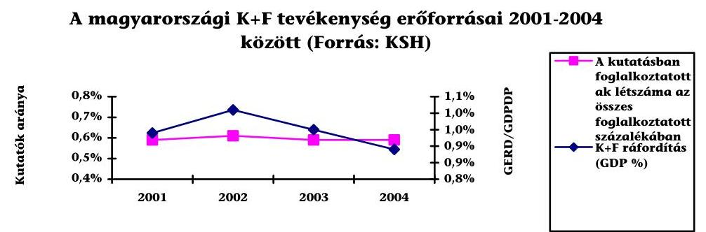
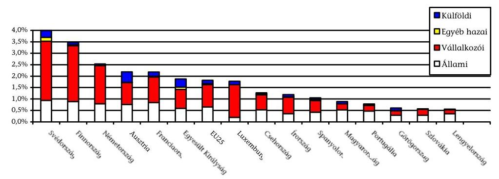
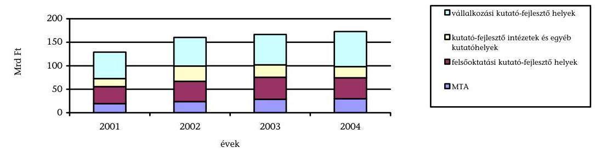
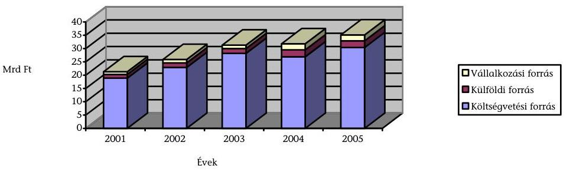
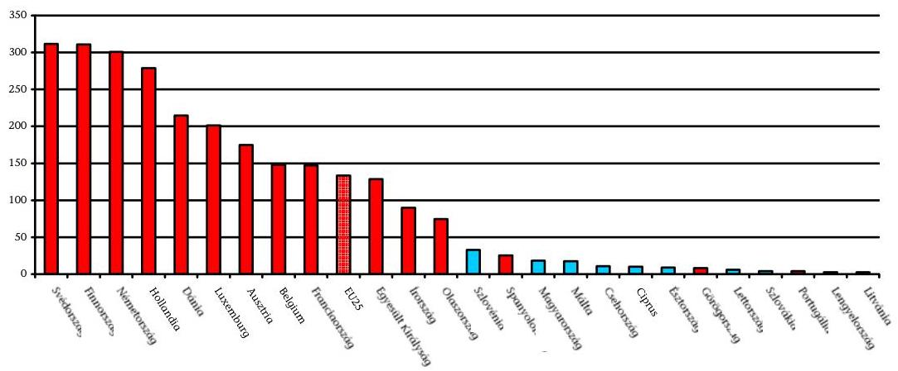
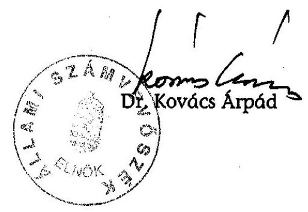
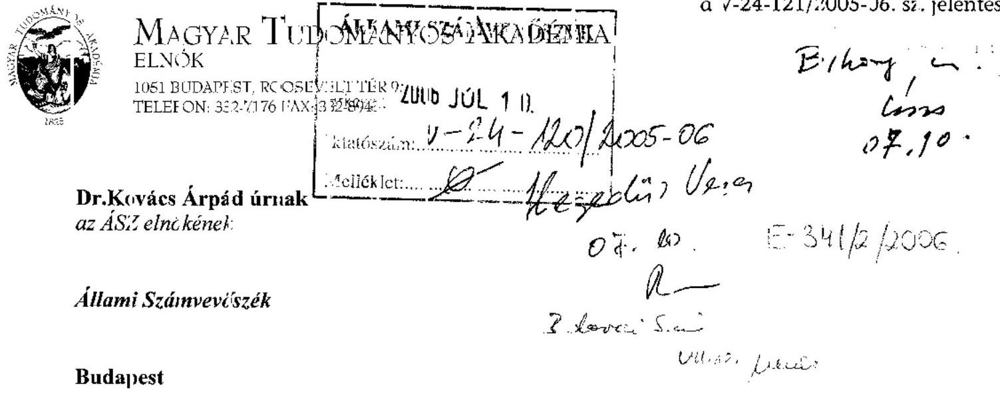
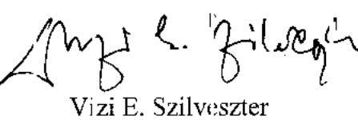
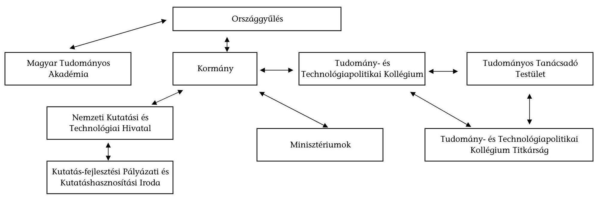

# ÁLLAMI   SZÁMVEVŐSZÉK 

## JELENTÉS

a Magyar Tudományos Akadémia fejezet múködésének ellenőrzéséről

---

2. Államháztartás Központi Szintjét Ellenőrző Igazgatóság
3. Átfogó Ellenőrzési Főcsoport

Iktatószám: V-24-121/2005-06.
Témaszám: 794
Vizsgálat-azonosító szám: V-0230
Az ellenőrzést felügyelte:
Bihary Zsigmond
főigazgató
Az ellenőrzés végrehajtásáért felelős:
Hegedüsné dr. Müllern Veronika
főcsoportfőnök
Az ellenőrzést vezette:
Belovai Sándorné
osztályvezető főtanácsos
Az ellenőrzést végezték:

| Dobos András számvevő tanácsos | Dr. Mihály Sándor számvevő tanácsos, főta-   nácsadó | Boda Sándor számvevő tanácsos |
| :--: | :--: | :--: |
| Dr. Fónyad Erzsébet számvevő tanácsos | Vértényi Gábor számvevő | Hegyes Mária számvevő |
| Jankó Géza számvevő | Zagyi Judit számvevő | Tóth Tamás számvevő |
| Maklári Ferencné számvevő tanácsos, főta- | Záhonyiné Horváth Ildikó számvevő |  |

# A témához kapcsolódó eddig készített számvevőszéki jelentések: 

címe
sorszáma
Jelentés az Országos Tudományos Kutatási Alap (OTKA) múködésének pénzügyi-gazdasági ellenőrzéséről (1990)
Jelentés az Országos Műszaki Fejlesztési Bizottság és a Központi 148
Műszaki Fejlesztési Alap pénzügyi-gazdasági ellenőrzéséről (1993)
Jelentés a Magyar Tudományos Akadémia fejezet múködésének 174 ellenőrzéséről (1993)
Jelentés a magyar tudományos kutatási és fejlesztési tevékenységet 290 támogató PHARE segélyprogramok végrehajtásának vizsgálatáról (1996)

Jelentés a Magyar Tudományos Akadémia fejezet múködésének 0223 ellenőrzéséről (2002)
Jelentés a felsőoktatási intézményhálózat integrációjának ellenőrzéséről (2003)
Jelentés a központi költségvetésből kutatás-fejlesztési célokra fordított pénzeszközök hasznosulásának ellenőrzéséről (2004) 0311 0440

---

.

---

# TARTALOMJEGYZÉK 

BEVEZETÉS ..... 7
I. ÖSSZEGZŐ MEGÁLLAPÍTÁSOK, KÖVETKEZTETÉSEK, JAVASLATOK ..... 11
II. RÉSZLETES MEGÁLLAPÍTÁSOK ..... 18

1. Az MTA hatáskörébe tartozó feladatok, az intézményi struktúra és a végrehajtáshoz szükséges létszám összhangja ..... 18
1.1. A prioritásként kiemelt témák és a kormányzati tudománypolitikai törekvések összhangja ..... 18
1.2. Az MTA irányítási és döntési mechanizmusa, az MTA és az NKTH közötti koordináció ..... 19
1.3. A kutatási feladatok értékelési rendszere, teljesítése, hasznosulása ..... 21
1.4. A szervezeti struktúra felülvizsgálata, változása ..... 23
1.5. Az MTA intézményhálózati rendszere, szervezeti egységei, a szakmai és egyéb területek megoszlása ..... 24
1.6. A fejezet létszáma és a feladatellátás összhangja ..... 25
1.7. A gazdasági társaságok múködése, az MTA részesedése ..... 26
2. A kockázatok feltárása és mérséklése, a belső kontrollrendszer múködési feltételei, eredményessége ..... 27
2.1. A belső kontrollrendszer szabályozási, irányítási elemeinek kialakítása ..... 27
2.2. A fejezet belső ellenőrzési szabályozása és múködése ..... 29
2.3. Az informatikai és a monitoring rendszer szerepe és múködése ..... 31
3. Az MTA fejezet költségvetési szerkezete, előirányzatainak kialakítása, a feladatok végrehajtásának számbavétele, múködésének eredményessége ..... 33
3.1. Az intézmények múködéséhez, a feladatok teljesítéséhez szükséges források alakulása ..... 33
3.2. A fejezeti kezelésű előirányzatok felhasználása, beszámoltatási és értékelési rendszere ..... 35
3.3. Az ingatlan vagyon alakulása ..... 37
4. A tudományos kutatásra fordított források felhasználása, a kitűzött célok megvalósítása ..... 38
4.1. A kutatás-fejlesztés múködési feltételei, nemzetközi összehasonlítás ..... 38
4.2. A programok lebonyolításának szervezeti és múködési háttere, feltételei, a pályázati rendszer tartalma ..... 41
4.3. A kitűzött célok megvalósítása és a mérhető eredmények a kutató- fejlesztő helyeken ..... 43

---

5. A korábbi ÁSZ ellenőrzés javaslatai alapján készített intézkedési terv végrehajtása, eredményessége

# MELLÉKLETEK 

1. sz. melléklet Észrevétel
2. sz. melléklet A magyarországi K+F tevékenység 2004. január 1-jétől hatályos irányításának folyamatábrája
3/a. sz. melléklet A bevételek alakulása kiemelt előirányzatonként (2001-2003)
3/b. sz. melléklet A bevételek alakulása kiemelt előirányzatonként (2004-2005)
3. sz. melléklet A kiadások alakulása kiemelt előirányzatonként
4. sz. melléklet Az MTA támogatásának felhasználása
6/a. sz. melléklet A rábízott tárgyi eszközök és az immateriális javak alakulása
6/b. sz. melléklet A törzsvagyonból a tárgyi eszközök és az immateriális javak alakulása
5. sz. melléklet Az MTA felügyelete alatt múködő kutatóintézetek pénzügyi forrásai
6. sz. melléklet A kutatói létszám kor szerinti összetétele
7. sz. melléklet Az MTA kutatóhelyei K+F tevékenységgel összefüggő adatai, mutatói

## FÜGGELÉKEK

1. sz. függelék Az MTA gazdasági társaságainak múködése és eredményessége

---

# RÖVIDÍTÉSEK JEGYZÉKE 

| 4 T | Tudomány- és Technológiapolitikai Tanácsadó Testület |
| :--: | :--: |
| Áht. | Államháztartási törvény |
| AKP | Akadémiai Kutatási Program |
| AKT | Akadémiai Kutatóhelyek Tanácsa |
| Aktv. | MTA-ról szóló 1994. évi XL. Törvény |
| Ámr. | Az államháztartás múködési rendjéről szóló 217/1998. (XII. 30.) Korm. rendelet |
| ÁSZ | Állami Számvevőszék |
| Ber. | A költségvetési szervek belső ellenőrzéséről szóló 193/2003. (XI. 26.) Korm. rendelet |
| COCOM (Coordinating committee for export to Communist Areas) | Az 1980-as és '90-es évekbeli fejlett elektronikus technológia szocialista országok felé exportálási tilalomlistája |
| EU | Európai Unió |
| FB | Felügyelő Bizottság |
| FEUVE | Folyamatba épített előzetes és utólagos ellenőrzés |
| GKM | Gazdasági és Közlekedési Minisztérium |
| gt.-k | Gazdasági társaságok |
| $\mathrm{K}+\mathrm{F}$ | Kutatás-fejlesztés |
| KMÜFA | Központi Műszaki Fejlesztési Alap |
| MTA ALFA | MTA Akadémiai Létesítmények Fenntartása és Üzemeltetése |
| MTA ATOMKI | MTA Atommagkutató Intézete |
| MTA KFKI AEKI | MTA KFKI-Atomenergia Kutatóintézet |
| MTA KFKI RMKI | MTA KFKI Részecske- és Magfizikai Kutató Intézet |
| MTA KOKI | MTA Kísérleti Orvostudományi Kutató Intézet |
| MTA RKK | MTA Regionális Kutatások Központja |
| MTA SZBK | MTA Szegedi Biológiai Központ |
| MTA SZTAKI | MTA Számítástechnikai És Automatizálási Kutató Intézet |
| NEI | Nemzetközi Együttmúködési Iroda |
| NKFP | Nemzeti Kutatási Fejlesztési Alapprogram |
| NKTH | Nemzeti Kutatási és Technológiai Hivatal |
| NTKF | Nemzetközi Tudományos Kapcsolatok Főosztálya |
| OGY | Országgyúlés |
| OKTK | Országos Középtávú Tudományos Kutatás |
| OM | Oktatási Minisztérium |
| OTKA | Országos Tudományos Kutatási Alapprogram |
| SZMSZ | Szervezeti és Múködési Szabályzat |
| TTI | Középtávú tudomány-, technológiai és innováció politika |
| TTPK | Tudomány- és Technológiapolitikai Kollégium |
| VK | Vagyonkezelő Kuratórium |

---

.

---

# ÉRTELMEZŐ SZÓTÁR 

| Alapkutatás: | olyan kísérleti és elméleti munka, amelynek elsődleges célja új ismeretek megszerzése a jelenségek alapvető lényegéről és a megfigyelhető tényekről, bármiféle konkrét alkalmazás és felhasználás szándéka nélkül. |
| :--: | :--: |
| Alkalmazott kutatás: | új ismeretek megszerzésére irányuló eredeti vizsgálat, amelyet elsődlegesen valamely konkrét gyakorlati cél érdekében végeznek. |
| Impakt faktor: | a folyóiratok átlagos idézettségét mérő mutatószám, amelyet a philadelphiai (PA, USA) Institute for Scientific Information (ISI) állít össze a Science Citation Index (SCI) adatbázisának adatai alapján, és az SCI Journal Citation Reports (JCR) köteteiben teszik közzé minden évben. |
| Innovációs lánc: | alap-, alkalmazott kutatás, kísérleti fejlesztéstől új termék értékesítéséig tartó folyamat. |
| Interdiszciplináris:   $\mathrm{K}+\mathrm{F}$ eredményességi mutatók: | tudományterületek határain levő (szakmaközi) kutatások. a kutatás-fejlesztési tevékenység egyes fázisaiból megjelenő produktumok mérésére szolgáló indikátorok (bibliometria, szabadalmi statisztika stb. ). |
| Kísérleti fejlesztés: | olyan rendszeres tevékenység, amely a kutatásból és/vagy a gyakorlati tapasztalatokból nyert meglévő ismereteken alapul és új anyagok, termékek és eszközök előállítására, új eljárások, módszerek és szolgáltatások bevezetésére és a már előállítottak, vagy bevezetettek lényeges tökéletesítésére irányul. |
| Kutatás-fejlesztés: | minden olyan alkotó jellegű tevékenység, melynek célja az ismeretanyag bővítése, beleértve a természetre, az emberiségre, a társadalomra és a kultúrára vonatkozó ismereteket, ezek felhasználását, új alkalmazási lehetőségek kidolgozását. A kutatás-fejlesztés jellemzői: az alkotás és az újdonság eleme, a tudományos módszerek alkalmazása és új ismeret létrehozása. A K+F három típusú tevékenységet ölel fel: az alapkutatást, az alkalmazott kutatást és a kísérleti fejlesztést. |
| Monitoring: | a források, az eredmények és a teljesítmények mindenre kiterjedő és rendszeres vizsgálata. |
| Multidiszciplináris: | több tudományterületet érintő. |
| Rábízott vagyon: | azok az állami tulajdonú ingatlanok, amelyeket a Kormány rendeletben bízott az Akadémiára. |
| Spin-off vállalkozás: | egyetemeken vagy kutató intézetekben kidolgozott eljárások és kifejlesztett technológiák hasznosítására létrehozott önálló vállalkozás. |
| SWOT-elemzés: | célja az adott szervezet aktuális állapotának rövid összefoglalása, végeredménye egy négy részre osztott táblázat, amelyben összefoglalják a szervezetet jellemző erősségeket, gyengeségeket, lehetőségeket és veszélyeket. |

---

Törzsvagyon:
azon állami tulajdonban volt ingatlanok és az azokban elhelyezett intézmények múködéséhez szükséges tárgyi eszközök és egyéb vagyontárgyak, amelyeket az Akadémia az Aktv. hatályba lépésekor kapott.

---

# JELENTÉS 

## a Magyar Tudományos Akadémia fejezet múködésének ellenőrzéséről

## BEVEZETÉS

Az MTA jogállását, feladatait, múködését a Magyar Tudományos Akadémiáról szóló 1994. évi XL. törvény (Aktv.) rögzíti, amely a 2005. évi kisebb módosításokkal jelenleg is érvényben van. Az MTA fejezet önkormányzati elven alapuló, jogi személyként múködő köztestület, amely a tudomány múvelésével, támogatásával és képviseletével kapcsolatos közfeladatokat lát el. Az Aktv. végrehajtásával kapcsolatos szabályokat az MTA Alapszabálya, az egyes szervezeti egységek feladatait az Akadémiai Ügyrend tartalmazza. Az Alapszabályt az 1994. október 27-ei közgyűlés, az Úgyrendet az 1995. májusi közgyűlés fogadta el, ez utóbbit egy alkalommal, az 1995. decemberi közgyűlésen módosították.

A köztestületi tevékenységet 11 tudományos osztály, 113 tudományos bizottság és a regionális kutatóközpontokban múködő 5 területi bizottság segíti. Kutatóintézeti hálózata - amely 2006-ban 39 akadémiai kutatóintézetet foglal magába - a tudományterületi felosztásnak megfelelően hármas tagozódású: matematikai és természettudományi (13), élettudományi (9) és társadalomtudományi (17) intézetek. Az egyetemeken, közművelődési intézményekben működő támogatott kutatóhelyek száma 171, ahol az akadémiai kutatócsoportok bér-, járulék kiadásait az MTA finanszírozza, a rezsi kiadásokat pedig a fogadó intézetek vállalják át.

Az Aktv. előírása alapján az MTA törzsvagyonnal rendelkezik, ennek 2005. év végi nyilvántartás szerinti bruttó állománya 11,3 Mrd Ft volt. A kincstári vagyonkezelés szabályai szerint rábízott eszközökből álló vagyon 2005. év végi bruttó állománya 40,9 Mrd Ft volt (6/a és 6/b sz. melléklet). Az MTA közvetlen tulajdonosi részvételével 2005-ben 14 gazdasági társaság ( 1 kht., 11 kft., 2 rt.) múködött.

A Magyar Köztársaság 2005. évi költségvetéséről szóló 2004. évi CXXXV. törvény az MTA fejezet bevételi előirányzatát 47,4 Mrd Ft-ban, ebből saját bevételi előirányzatát 7,3 Mrd Ft-ban, egyéb bevételi előirányzatát (átvett pénzeszközök és kölcsönök) 2,6 Mrd Ft-ban, a költségvetési támogatás előirányzatát 37,5 Mrd Ft összegben állapította meg. A 2005. évi zárási adatok alapján az összes bevétel 54,5 Mrd Ft-ra, a saját bevétel 5,5 Mrd Ft-ra, a költségvetési támogatás 33,2 Mrd Ft-ra teljesült. (Átvett pénzeszköz és előirányzat-maradvány igénybevétele 15,8 Mrd Ft.) A 2005. évi 47,4 Mrd Ft kiadási előirányzattal szemben a teljesítés 48,5 Mrd Ft volt (3/a; 3/b; 4. sz. melléklet).

---

Az intézmények 2001-ben 23,9 Mrd Ft, 2005-ben 33,2 Mrd Ft támogatásban részesültek a központi költségvetésből feladataik ellátásához. 2005-ben a költségvetési támogatás $65,7 \%$-át közvetlen akadémiai kutatási célokra, $23,2 \%$-át országos kutatási támogatásokra, $11,1 \%$-át igazgatási, kutatásszervezési, jóléti és egyéb feladatokra használták fel (5. sz. melléklet).

Az MTA felügyelete alá tartozó köztestületi költségvetési szervek tervezett átlaglétszáma 2005-ben 5842 fő, ezen belül a kutatóintézeti létszám 4212 fő volt. A tényleges átlaglétszám a tervezett alatt maradt, ezen belül a kutatói létszám emelkedése jelentős, amely a pályázatok bővülésével függ össze. A kutatói átlaglétszámból a kutatóintézeteké 2430 főre, a támogatott kutatócsoportoké 435 főre, a Kutatásszervezési Intézeté 11 főre emelkedett 2001-ről 2005-re. A fiatal, 35 év alatti kutatók száma és aránya pozitív változást mutat, a 2001. évi 36,1\%-ról 2005-re 39,7\%-ra emelkedett (8. sz. melléklet). A hazai akadémikusok létszáma $4,7 \%$-kal alatta maradt az elnökségi határozat által jóváhagyott 365 fős létszám-keretnek.

2002-ben átfogó ellenőrzést végeztünk a fejezetnél, értékeltük annak múködését. Ezt követően minden évben a fejezet költségvetését és zárszámadását, 2004ben a központi költségvetésből kutatás-fejlesztési célokra fordított pénzeszközök hasznosulását ellenőriztük.

# A jelenlegi ellenőrzés célja annak értékelése volt, hogy 

- biztosított-e az MTA hatáskörébe tartozó feladatok, az intézményi struktúra és a végrehajtáshoz szükséges létszám összehangolt kialakítása; a fejezet költségvetési struktúrája megfelelt-e és összhangban állt-e az MTA feladatainak teljesítési követelményeivel;
- érvényesült-e a belső kontrollrendszer szerepe a kockázatok feltárásában és mérséklésében;
- a tudományos kutatásokra előirányzott pénzeszközök kapcsolódtak-e a ku-tatás-fejlesztés nemzetgazdasági szintű elvárásaihoz; felhasználásukkal megfelelően biztosították-e a kutatás-fejlesztési célok eredményes megvalósítását;
- megfelelően hasznosultak-e a korábbi számvevőszéki ellenőrzések megállapításai és javaslatai.

A fejezet hatáskörébe tartozó feladatokhoz kapcsolódóan vizsgáltuk a kidolgozott stratégiai terv, szervezet, létszám összhangját, valamint a K+F programok megvalósításának eredményességét a 2002-2005. évek közötti időszakra, ezen belül különösen a 2004-2005. évekre vonatkozóan. Az ellenőrzést az átfogó ellenőrzés és a teljesítmény-ellenőrzés módszerével, a kérdőíves felmérés, valamint a mellékletek útján bekért adatok, az eredményességi mutatók számbavételének, értékelésének segítségével végeztük. Ez utóbbi elsősorban a kutatásfejlesztési erőforrások hasznosulásának eredményességére irányult. Az ellenőr-

---

zés során figyelemmel voltunk az EU 2000. évi lisszaboni csúcstalálkozóján ${ }^{1}$ és az Európai Tanács 2002. évi barcelonai ülésén ${ }^{2}$ megfogalmazottak és a hozott döntésekre, illetve értékeltük, hogy azok mennyiben érvényesültek a magyar gyakorlatban.

A jelentés nem foglal állást, hogy az alap- és alkalmazott kutatásokra, valamint kísérleti fejlesztésekre mennyit és milyen mértékben indokolt fordítani Magyarországon. Hivatkozunk ezzel kapcsolatban az ÁSZ Fejlesztési és Módszertani Intézete 2005. évben nyilvánosságra hozott, „Kutatástól az innovációig - a K+F tevékenység helyzete, néhány hatékonysági, finanszírozási összefüggése Magyarországon" c. tanulmányára, amelyet 2005. november 21-én az Országgyúlés Oktatási és tudományos bizottságának Tudomány- és technológiapolitikai vegyes albizottsága is megtárgyalt. ${ }^{3}$

A helyszíni ellenőrzés az MTA Titkárságára, az MTA Könyvtárára, 9 kutatóintézetre, 8 egyetemi kutatócsoportra, a Támogatott Kutatóhelyek Irodájára, az Akadémiai Létesítmények Fenntartása és Üzemeltetése (MTA ALFA) intézményekre terjedt ki. Az ellenőrzés ugyanakkor nem érintette a Nemzeti Kutatási és Technológiai Hivatalt. A vizsgált területek kapcsolódási pontjaira tekintettel azonban a jelentés tervezetét egyeztettük a Hivatal elnökével.

Vizsgálatunk során a fejezetnél végzett korábbi ÁSZ ellenőrzések tapasztalataira is támaszkodtunk, utóellenőrzés keretében kitértünk ezek megállapításainak és javaslatainak hasznosulására.
${ }^{1} \mathrm{Az}$ utóbbi években az EU vezetői is felismerték, hogy alapvető változások szükségesek a versenyképesség erősítéséhez, az életminőség további javításához. Ennek eléréséhez nélkülözhetetlenek az alapkutatások. A lisszaboni csúcstalálkozón fogalmazták meg azt a célt, hogy az EU 2010-re legyen a világ legversenyképesebb, legdinamikusabb, tudás-vezérelt gazdasága, álljon a fenntartható gazdasági növekedési pályára, legyen képes több és jobb munkahely teremtésére és erőteljesebb társadalmi kohézióra.
${ }^{2} \mathrm{~A}$ kutatásfejlesztés globális tevékenységgé vált, a résztvevők a modern számítástechnikai infrastruktúrának köszönhetően csaknem munkahelyüktől függetlenül tudnak számos tevékenységbe bekapcsolódni; azonban az eredmények hasznosítása változatlanul helyi feladat maradt. Az Európai Unióban megnövekedett az az igény, hogy a kormányok a kockázatos fejlesztési költségek egy részét átvállalják a különböző $\mathrm{K}+\mathrm{F}$ pályázati rendszereken keresztül.Az Európai Tanács barceloniai ülésén döntés született arról, hogy az EU országok átlagosan érjék el 2010-re a GDP arányos kutatá-fejlesztési kiadások $3 \%$-át és a ráfordítások 2/3-a a vállalkozásoktól származzon.
${ }^{3}$ A tanulmány megállapítja, hogy a 2004. évi magyarországi K+F ráfordításokon belül az alapkutatások aránya a 2003. évi 32,8\%-ról 34,7\%-ra nőtt. Ugyanakkor az alapkutatási költségeknek a GDP-hez viszonyított aránya alapján a sereghajtók közé tartozunk. Az adatokból közvetlenül nem következtethetünk arra, hogy Magyarország sokat, vagy keveset költ-e alapkutatásokra. A tanulmány olvasható az Interneten a www.asz.hu honlapon.

---

Az ellenőrzés végrehajtására az Állami Számvevőszékről szóló 1989. évi XXXVIII. tv. 2. § (3) bekezdés, valamint a 17. § (3) bekezdésében foglaltak adnak jogszabályi alapot.

A végleges jelentést az Állami Számvevőszékről szóló 1989. évi XXXVIII. törvény III. fejezet 25. § (1) bekezdésének megfelelően észrevételezésre megküldtük Dr. Vizi E. Szilveszter elnök úrnak, aki a jelentéssel kapcsolatban észrevételt nem tett. Levelét az 1. sz. melléklet tartalmazza.

---

# I. ÖSSZEGZŐ MEGÁLLAPÍTÁSOK, KÖVETKEZTETÉSEK, JAVASLATOK 

Hazánkban a rendszerváltást követő gazdasági nehézségek a kutatószférát sem hagyták érintetlenül. Összeomlott az ipari kutatóintézetek hálózata, megszűnt az alkalmazott kutatások iránti igény részben amiatt, hogy a COCOM korlátozások feloldása után nem volt szükség egyes tevékenységekre, így a kutatások az alapkutatások irányába tolódtak el, ami még hangsúlyosabbá tette az MTA szerepét a hazai $\mathrm{K}+\mathrm{F}$ tevékenységében. A kilencvenes évek végén a magyar politika újra felismerte a kutatás-fejlesztés, az innováció jelentőségét és a források növelésével lassan megindult egy új, alkalmazás-orientált K+F irányvonal kialakítása. Ennek megfelelően elvárások fogalmazódtak meg az MTA felé az alkalmazott kutatások arányának növelését illetően ${ }^{4}$.

A kutatás-fejlesztés állami irányításában a Kormány a Tudomány-, és Technológiapolitikai Kollégiumon (TTPK) keresztül biztosítja az MTA közremúködését a kutatás-fejlesztés állami irányítását segítő döntés előkészítésben.

Az ellenőrzött időszakban nem volt a Kormánynak jóváhagyott, több ciklust átívelő koherens tudomány-, technológiapolitikai és innovációs stratégiája. Megalakulását követően a TTPK ${ }^{5}$ működése nem volt folyamatos, az MTA szakmai véleménye, a törvényben előírt feladatának megfelelő szerepe a K+F hazai irányítási rendszerében nem érvényesült megfelelően, az MTA és az NKTH együttműködéséből hiányzik a kompromisszumkészség és a konszenzusra való törekvés.(A K+F tevékenység irányításának folyamatábráját az 1. sz. melléklet tartalmazza.) Ugyanakkor az a körülmény, hogy alap-, és alkalmazott kutatások egyre közelebb kerülnek egymáshoz, az innovációs lánc 3-5 évre

[^0]
[^0]:    ${ }^{4} \mathrm{Az}$ 1998. évi kormányprogram a tudománypolitika és a technológia politika keretében - a versenypályázati rendszer elosztásával - azon fejlesztések támogatását irányozta elő, amelyekre a magyar gazdaság igényt tart, vállalta, hogy az intézmények alapfeladatait a költségvetés finanszírozza. A 2002. évi kormányprogram kiemelt feladatnak tekintette $\mathrm{K}+\mathrm{F}$ források egyenletes növekedését; az állami támogatás fokozatos közelítését az Európai Unió átlagos szintjéhez. A kormány támaszkodni kívánt az MTA köztestülete által összehangolt, az MTA kutatóintézeti hálózatában folyó kutatásokra.Hazánkban a K+F tevékenységekre 2004-ben 181,5 Mrd Ft-ot, a GDP $0,89 \%$-át költötték, jelentősen elmaradva az EU 1,9\%-os átlagától. Az üzleti szféra 2003. évi GDP-re vetített K+F ráfordításainak $0,27 \%$-a jóval alacsonyabb az EU-25-ök $0,98 \%$-ánál. A vállalati és az állami $\mathrm{K}+\mathrm{F}$ ráfordítások aránya GDP-nek $0,8 \%$-a, az EU-25-ök átlaga 1,6\%. Az 1000 foglalkoztatottra jutó kutatók száma 3,9 fő, az EU-25-ök átlagában 6.1 fő.
    ${ }^{5}$ A TTPK mellett a kormány létrehozta a Technológiapolitikai Tanácsadó Testületet (4T); törvény született a Kutatási és Technológiai Innovációs Alapról, a Kutatásfejlesztésről és a Technológiai Innovációról; létrehozták a Nemzeti Kutatási és Technológiai Hivatalt (NKTH), a Kutatási és Technológiai Innovációs Tanácsot, valamint a Kutatásfejlesztési Pályázati és Kutatáshasznosítási Irodát.

---

lerövidül, a két intézmény tevékenységének közelítését, harmonikus együttmúködését teszi szükségessé, amelyet kormányrendelet ír elö. ${ }^{6}$

Az NKTH koordinálásával összeállított stratégiai tervezet mellett 2005-ben az MTA is elkészítette kutatásfejlesztési koncepcióját, jövőképét, amelyben szerepet kapott a versenyképesség növelése, a döntési mechanizmus korszerűsítése, a kutatócsoportok koncentrálása, a vállalkozások növelése, a rugalmasabb múködtetés érdekében az MTA Alapszabályának módosítása.

Az MTA a központi költségvetésben önálló fejezet, struktúrája történelmileg kialakult állapotot tükröz, amely lényegesen nem változott az Aktv. kihirdetése óta. Az MTA döntési, irányítási jogkörrel felruházott testületei (Közgyűlés, Akadémiai Kutatóhelyek Tanácsa (AKT), Vagyonkezelő Kuratórium (VK), Felügyelő Bizottság (FB), Elnökség, Vezetői Kollégium) az Aktv. és az Alapszabály előírásainak megfelelően jártak el. Az Alapszabály módosítása nélkül a jelenlegi döntési mechanizmus a főtitkár és az AKT hatáskörében lassú és nehézkes, a felgyorsult folyamatokkal nem képes kellően lépést tartani, nem segíti a feladatok operatív, hatékony megoldását. A tudományos osztályok szakmai feladatokat minősítő tevékenysége lassú, a főtitkár döntési kötelezettségei és a tudományos osztályok múködési rendje nincs összhangban, az Aktv. és az Alapszabály a döntési felelősséget a főtitkár kezébe adja, ugyanakkor egy részét az AKT jogosítványai között is rögzíti. A főtitkár nem minden esetben tudja érvényesíteni tulajdonosi, akadémiai jogosultságait, az AKT leszavazhatja a főtitkárt, aki egyben az AKT elnöke is. Az intézetigazgatók képviselete nem érvényesül az AKT döntéshozatalában.

Az MTA vezetése folyamatosan értékelte, számba vette a kutatási témák teljesítését, a kutatóintézetek, kutatóhelyek működését, amelyek nagyobb részt a tudományos eredményekre tértek ki. A kutatások közül főként a nemzetközileg elismert kiváló kutatóközpontok (pl. MTA SZTAKI, MTA KOKI, MTA SZBK, KFKI AEKI) kutatási eredményei bizonyítják az akadémiai hálózat tudományos teljesítményét.

2002-2005 között a kutatóintézetek finanszírozását átlagosan 87,3\%-ban a költségvetés biztosította (intézményfinanszírozás, pályázati források, egyéb költségvetési finanszírozás), 12,7\%-a vállalkozási és külföldi forrásokból származott. Az MTA intézeteiben kutatott témák 62\%-a alapkutatás, 28\%-a alkalmazott kutatás, 10\%-a kísérleti fejlesztés, eltérően az ország többi kutatóhelyétől, ahol átlagosan egyforma arányt képvisel a háromféle kutatási terület. A kutatási témák típusait a pályázati kiírások is jelentősen befolyásolták. A külföldi pályázatokban való részvételt nehezítette az intézeteknél a saját erőforrás hiánya. Az intézetek teljes körére a kutatási források alap-, alkalmazott kutatási és kísérleti fejlesztés szerinti elkülönített számviteli nyilvántartása nem megoldott.

[^0]
[^0]:    ${ }^{6}$ A Nemzeti Kutatási és Technológiai Hivatalról szóló 216/2003. (XII. 11.) Korm. rendelet 3.§ (5) bekezdése előírja, hogy feladatai ellátásában a Hivatal együttműködik az érintett minisztériumokkal, országos hatáskörű szervekkel, az MTA-val és más köztestületekkel, valamint a regionális és társadalmi szervezetekkel.

---

Az ellenőrzött időszak alatt megváltozott jogi környezet mellett az alapkutatások finanszírozása - amelyet Magyarországon az MTA kutatóintézetei és a felsőoktatási kutatóhelyek végeznek - alapjaiban változatlan maradt. Az alapkutatások gyakorlati hasznosítása nehezen mérhető, az eredmények gyakran jelentős időeltolódással és más tudományos témákban mutatkoznak. Az MTA kutatóintézetei az alapkutatásokat a költségvetési és az OTKA pályázati támogatásokból finanszírozták. Az alkalmazott kutatás és kísérleti fejlesztés forrását az NKFP, KMÜFA, egyéb ágazati programok, EU-s projektek és egyes esetekben tengeren túli megbízások biztosították.

A kutatóintézetek kérdőíves felmérése és a helyszíni ellenőrzés tapasztalatai alapján a kutatóintézetek nem rendelkeztek az innovációhoz szükséges piaci, gazdasági és jogi ismeretekkel. A teljes innovációs láncot magába foglaló tevékenység - alapkutatás, alkalmazott kutatás, kísérleti fejlesztés, technológiai transzfer, értékesítés - egyedül az MTA Mezőgazdasági Kutatóintézetében valósult meg. A technológiai transzfer és információk átadása más MTA intézetekben (Kémiai Kutatóközpont, KOKI, KFKI RMKI, KFKI AEKI) is jelentős értékű, azonban a szellemi termékek a finanszírozó vállalkozásoké lettek, az eredményből az intézetek nem részesültek. Az intézetek a szerződésekben lemondtak a létrehozott szellemi tulajdonról a finanszírozó vállalkozások javára. A kutatóintézeteknek elemi érdekük volt, hogy a vállalkozási megbízásokkal szabadon felhasználható bevételekhez jussanak, mert költségvetésüket ki kellett egészíteniük, és önerőt kellett biztosítaniuk a K+F pályázatokban való részvételhez.

Az intézetek kutatói szerves részesei a felsőoktatásnak, egyrészt óraadók a felsőoktatási intézményekben és oktatói a $\mathrm{PhD}^{7}$ iskoláknak, másrészt közös kutatásokat végeznek. Az oktatók közül többen tagjai az egyetemek doktori tanácsainak is.

A kutatóintézetek bővítették kapcsolataikat a tudományos és gazdasági szervezetekkel, amelyek főleg közös kutatásokra, tanácsadásra, információcserére, publikációkra, konferencia-szervezésekre terjedtek ki.

Magyarország 1999-2002 között vett részt az EU5 keretprogramban, amely az 1998-2002 közötti időszakra vonatkozott, 2003-tól pedig bekapcsolódott a 2002-2006 közötti időszakra érvényes EU6 keretprogramba. A keretprogramokban való részvételi lehetőség kedvezően hatott a - nagyobb kutatási területeket átfogó integrált, több európai kutatóintézetet, felsőoktatási intézményt összefogó - projektekben részt vevő intézetek nemzetközi együttműködési tevékenységére. Az MTA intézeteinek mintegy 60\%-a kapcsolódott be ezekbe a programokba, a megszerzett források azonban az összes hazai és külföldi forráson belül átlagosan alacsonynak minősíthetőek, 3-4\%-ot tettek ki. A keretprogramokban való részvétel a kezdeti időszakban erőteljesebb volt, ez a csatlakozást megelőző időszak kedvezőbb pályázati feltételeivel indokolható.

[^0]
[^0]:    ${ }^{7}$ Jelentése: Philosophiae Doctor, a filozófia doktora. A régebbi kandidátusi fokozatnak megfelelő tudományos minősítés.

---

A kutatási témák és a kutatási tevékenység minősítésére, eredményességének bemutatására főként a megjelent publikációkat és a szabadalmi aktivitást alkalmazták. A publikációk (cikkek és könyvek) száma a 2001. évről 2005. évre 5870-ről 5199-re csökkent. A szabadalmi aktivitás nemzetközi összehasonlításban is alacsony szintű volt. A nemzetközi együttműködésben kutatott témák száma 542 -ről 440-re csökkent. A bejelentett szabadalmak többségét a vállalkozások kezdeményezték, és ők voltak a kedvezményezettek is. Az elfogadott szabadalmi bejelentések száma mintegy felére ( 21 db -ról 11 db -ra), ebből a külföldön elfogadottak száma harmadára (10-ről 3-ra) csökkent. A bevezetésre és hasznosításra került szabadalmak száma viszont alig változott, számuk 28 -ról 29-re módosult ( 9 . sz. melléklet).

Az Akadémia vezetése többször foglalkozott a szervezeti struktúra egy-egy területének múködésével, felülvizsgálatával. A szükséges döntések meghozatalára, végrehajtására csak részben és késedelmesen került sor. A 2001-ben befejezett felülvizsgálat és az annak alapján hozott intézkedések, az ún. konszolidációs folyamat csak a kutatóintézetekre terjedt ki, az egyetemeken és a közművelődési intézményekben működő akadémiai kutatócsoportokat és a Titkárság szervezetét nem érintette.

Elnökségi, vezetői kollégiumi üléseken a véleményezés szintjén többször felmerült a kutatóintézetekhez hasonlóan a Titkárság szervezetének átvilágítása. Erre csak jóval később, 2003-ban született döntés külső átvilágító cég megbízásával, amelynek eredményeként csak részleges megoldások születtek. Az átvilágítás hatására az MTA vezetése létszámcsökkentésről döntött. A Doktori Tanács Titkárság létszámát 19 főről 10 főre, az Akadémiai Létesítmények Fenntartása és Üzemeltetése (ALFA) létszámát 112 fơről 95 főre csökkentette. A létszám átcsoportosítására, csökkentésére további lehetőséget adna más szervezeti egységek ${ }^{8}$ létszámszükségletének összehasonlítása a feladatellátással.

A konszolidációt tárgyaló és elfogadó közgyűlés ugyan indokoltnak tartotta a struktúra bizottság további működését, tevékenysége azonban megszűnt. A kutatóhálózat széttagoltsága alapvetően változatlan maradt. A kutatócsoportok száma - az elhatározott csökkentéssel szemben - a vizsgált időszak alatt jelentősen, 138 -ról 171-re, kutatói létszámuk 332 főről 425 fôre növekedett, a pályázati források a tervezettnél szétaprózottabbá váltak. A köztestületi és titkársági szervezet 2001-2005 között három egységgel ${ }^{9}$ bővült.

A fejezetnél az éves költségvetésben a létszám meghatározása bázisadatokra épült. Az MTA felügyelete alá tartozó köztestületi költségvetési szervek tényleges átlaglétszáma a 2001. évi 5247 fôről 2005-re 5590 fôre, ezen belül a kutatói létszám 2568 fôről 2859 fôre növekedett. A kérdőíves felmérésünk alapján a kutatótevékenység személyi feltételei javultak, a kutatóintézeteknél kedvező elmozdulás következett be a személyi állomány struktúrájában.

[^0]
[^0]:    ${ }^{8}$ Pl. köztestületi osztályok titkárságai, valamint a kutatást segítő, kiszolgáló egyéb szervezetek, gépkocsi szolgálat.
    ${ }^{9}$ Határon Túli Magyarok Titkársága, Információtechnológiai Osztály, Intézményi Belső Ellenőrzési Osztály.

---

A 90-es évek óta múködtetett fiatal kutatói ösztöndíjrendszer jelentősen hozzájárult a kutatói állomány utánpótlásához és fiatalításához. Az akadémiai kutatóhálózatban a változást jól érzékelteti, hogy 2001-ben a fiatal, 35 év alatti kutatók aránya a 2001. évi 36,1\%-ról, 2005-ben 39,7\%-ra emelkedett.

Az MTA vezetése foglalkozott az üdülők helyzetével, további múködésük lehetséges fejlesztésével. Ennek során felmerült az egyik kisebb kapacitású, a törzsvagyon részét képező üdülő eladásával a többi üdülő felújítása és bővítése, azonban ennek megvalósítására nem került sor. Az intézmények közül 2005ben az Erdőtarcsai alkotóház és a Mátrafüredi üdülő irányítását és gazdálkodását vonták össze, a többi üdülő, alkotóház vezetésének, üzemeltetésének felülvizsgálata nem történt meg (Balatonalmádi, Balatonvilágos, Siófok, Mátraháza). A kiszolgáló és egyéb intézmények szerepe fontos az MTA tevékenységében. Az eredményesebb múködés érdekében eddig nem került sor egyes szervezetek átvilágítására (pl. a Könyvtárnál, a Gépkocsi Szolgálatnál, a Jóléti intézmények körében), illetve a felülvizsgálatot követően az átszervezés, a feladatok módosítása elmaradt (pl. a NEI-nél, NTKF-nél).

Az MTA jelentős intézményhálózattal rendelkezik, az intézmények száma a 2002. évi 59-ről 2006-ra 61-re emelkedett, amiből a kutatóintézetek száma 37ről 39-re nőtt. A szervezeti egységek közé tartozó akadémiai központok, a kutatást kiszolgáló (ellátó) szervezetek, és az egyéb intézmények (óvoda, bölcsőde, üdülők) száma nem változott.

A jelenlegi diszciplináris elven felépülő szervezeti egységekben (intézetek, tanszékek) folytatott tevékenység mellett az intézetek törekedtek az interdiszciplináris feladatok megoldásához is kapcsolódni. Hiányzik a Kormány kutatásfejlesztési stratégiai tervezetéből a létrehozandó nemzeti laboratóriumok és a meglévő akadémiai intézetek kapcsolatának, együttműködésének meghatározása, a kutatási kapacitások összehangolása.

Az MTA tulajdonosi hányadával segítette a gazdasági társaságok (gt.) múködését. Az egyes gt.-k múködésének eredményessége változóan alakult, tevékenységük összességében eredményes volt, az MTA osztalékban is részesült. A társaságok alapvetően teljesítették az MTA tulajdonosi elvárásait, a veszteséges vállalkozásokat megszüntették.

Figyelemmel az államháztartás belső pénzügyi rendszere EU konform fejlesztési stratégiájára, döntés született arról, hogy az intézmények mintegy harmadánál nem gazdaságos önálló belső ellenőrzési szervezetet múködtetni. Ezzel összefüggésben 2004 januárjában megalakult az Intézményi Belső Ellenőrzési Osztály, amelynek feladata a kis létszámú gazdasági apparátussal rendelkező intézmények belső ellenőrzése, továbbá feladatkörébe utalták a Titkárság két szervezeti egysége - a Gazdasági Osztály és a Doktori Tanács Titkársága - belső ellenőrzését is, amelyeknél az ellenőrzés függetlensége nem érvényesül.

A Titkárság a jogszabályi előírásoknak megfelelően alakította ki belső pénzügyi ellenőrzését. A kutatóintézetek felénél a belső ellenőrzés csak részben felelt meg az új jogszabályi rendelkezéseknek, az ellenőrzési tervek nem alapultak kockázatelemzésen, a belső ellenőrzés vezetést-támogató, döntés-előkészítést segítő szerepe csak részben érvényesült. A belső ellenőrzés a múködésnek csak

---

egyes területeire terjedt ki. A vonatkozó kormányrendelet alapján 2010-re teljes körűen előírt megbízhatósági ellenőrzések végrehajtása a meglévő kapacitással és az ellenőrzések jelenlegi üteme mellett csak egy jól múködő kontrollrendszer múködésével biztosítható. Javította az MTA belső kontrollrendszerének múködését, hogy az MTA a korábbi ÁSZ ellenőrzések során tett javaslatokat figyelembe vette.

A FEUVE rendszer szabályozásának hiányossága, hogy nem tükrözte az intézményi sajátosságokat. Az ezzel kapcsolatos feladatokat általában a gazdasági vezetőre hárították, nem jelölték ki a felelősöket és a feladatokat.

A gazdálkodásra vonatkozó jogszabályi környezet a vizsgált időszakban folyamatosan módosult. Kedvezőtlenül befolyásolta a finanszírozást az áfa szabályozás 2003-2004. évi változása, valamint a központi költségvetés marad-vány-tartalékolásra vonatkozó intézkedése. A fejezethez tartozó intézetek alapokmányában a szakmai tevékenységet jellemző mutatószámok Ámr. szerinti kidolgozása nem valósult meg alapokmányaiban. A kutatási pályázatoknál a kiadások felmerüléséhez nem megfelelő a támogatás havi egyenlő részletekben történő folyósítása, emiatt gyakran került sor előirányzat megelőlegezésére, előrehozatalára, a likviditási gondok csökkentésére.

Az Áht. 124. § (2) bekezdése d) és m) pontja alapján a Kormány nem élt a törvényi felhatalmazással, hogy rendeletben állapítsa meg - többek között - a felsőoktatási intézmények és az MTA nem gazdasági társaságban múködtetett intézményeinek a kincstári rendszer általános szabályaitól eltérő részletes szabályait, továbbá létszámnormatíváit. A MTA - a PM közremúködésével - elkészítette a kormányrendelet tervezetét, azonban annak jóváhagyása, illetve hatályba léptetése a helyszíni ellenőrzés befejezéséig nem történt meg. Ennek hiányában nem szabályozott, hogy az akadémiai alapkutatásokat milyen mértékig finanszírozzák az állami támogatásból; az állami feladat elismertetése nem biztosított; a támogatás kiszámíthatatlan.

Az ingatlanok felújítására évente mintegy 700,0 M Ft állt rendelkezésre, amelyet a törzsvagyon és a rábízott vagyon körébe tartozó, összességében több mint 100 épület karbantartására, felújítására fordítottak. Az MTA a rendelkezésére álló központi költségvetési támogatásokból és a saját bevételeiből nem tudta teljesíteni a vagyon állagának és értékének megőrzését.

A helyszíni ellenőrzés megállapításainak hasznosítása mellett javasoljuk:

# a Kormánynak 

1. Kísérje figyelemmel és rendszeresen értékelje az állami szervek együttműködését a Magyar Tudományos Akadémiával a kutatás-fejlesztés állami irányításában.
2. Szabályozza átfogóan az alaptevékenységként kutatást végző költségvetési kutatóhelyek sajátos gazdálkodásának múködési feltételeit. (Államháztartásról szóló 1992. évi XXXVIII. tv. 124. § (2) bekezdése d) és m) pontja).

---

# az MTA elnökének és főtitkárának 

1. Gondoskodjanak az eddig megvalósult átvilágítás alapján javasolt és elmaradt intézkedések végrehajtásáról; a struktúra bizottság újraélesztésével tekintsék át az MTA azon szervezeteit, amelyekre az átvilágítás nem terjedt ki.
2. Tekintsék át és tegyenek intézkedéseket a hatékonyabb múködés érdekében - az Aktv. és az Alapszabály módosításának kezdeményezésével - az MTA döntési mechanizmusának, szervezeti struktúrájának megújítására.
3. Határozzák meg az éves költségvetési alapokmányokban a 217/1998. (XII. 30.) Korm. rendelet 10. § (6) bekezdésben foglaltaknak megfelelő konkrét feladatokat és feladatmutatókat.
4. Kezdeményezzék és alakítsák ki az NKTH-val közösen a külföldi pályázati források bevonása érdekében a hazai társfinanszírozás támogatási lehetőségeit.
5. Vezessék be az intézetek teljes körére a kutatási források alap-, alkalmazott kutatás és kísérleti fejlesztés szerinti elkülönített számviteli nyilvántartását.
6. Intézkedjenek annak érdekében, hogy a belső ellenőrzési tevékenység a gazdálkodási területen túl terjedjen ki a szervezetek, a kontrollrendszer müködésének egyéb területeire is. Biztosítsák, hogy a belső ellenőrzés függetlensége minden tekintetben érvényesüljön.

---

# II. RÉSZLETES MEGÁLLAPÍTÁSOK 

## 1. Az MTA hatáskörébe tartozó feladatok, az intézményi STRUKTÚRA ÉS A VÉGREHAJTÁSHOZ SZÜKSÉGES LÉTSZÁM ÖSSZHANGJA

### 1.1. A prioritásként kiemelt témák és a kormányzati tudománypolitikai törekvések összhangja

Az MTA és kutatóhelyeinek középtávú kutatási koncepciója 2002 októberében elkészült, amelyet a novemberi közgyűlés elfogadott. A dokumentum utal a világban megfigyelhető tudományos tendenciákra, az MTA tudománypolitikai törekvéseire, a tudományos kutatás problémamegoldó jellegének, minőségi szemléletének, a különböző diszciplínák, az intézmények és a gazdasági szervezetek együttműködésének erősítésére, rögzítette a fő kutatási irányokat. Kulcsfeladatnak tekinti a hazai kutatásnak az európai tudománypolitikai keretekbe való beilleszkedését, a hazai társadalmi és gazdasági elvárásoknak való megfelelését. Részben a kormányzati $\mathrm{K}+\mathrm{F}$ stratégia hiánya miatt a művelt kutatási területek vonatkozásában nem dolgozott ki konkrét célokat, feladatokat, prioritásokat, az ezek végrehajtásához szükséges feltételrendszert meghatározó határidőket, felelősöket hozzárendelő végrehajtási tervet.

A 2002. évi kormányprogram kiemelt feladatnak tekintette az innováció-barát szabályozási környezet megteremtését, Magyarország, mint a K+F helyszín vonzóvá tételét, a szellemi tulajdon védelmének erősítését, a kis- és középvállalkozások innovációs forrásainak lehetséges bővítését. Tartalmazza továbbá, hogy a Kormány biztosítja a magyarországi felhasználású K+F ráfordítások egyenletes növekedését, célul tűzte ki, hogy a tudományra fordított állami támogatás fokozatosan közelítsen az Európai Unióban kialakult átlagos szinthez.

A Kormány a 2002. évi előkészítést követően 2003 nyarán létrehozta a Tudo-mány- és Technológiapolitikai Kollégiumot (TTPK) és a Tudomány- és Technológiapolitikai Tanácsadó Testületet (4T). Törvény született a Kutatási és Technológiai Innovációs Alapról, a Kutatásfejlesztésről és a Technológiai Innovációról. Létrehozták a Nemzeti Kutatási és Technológiai Hivatalt (NKTH), a Kutatási és Technológiai Innovációs Tanácsot, valamint a Kutatásfejlesztési Pályázati és Kutatáshasznosítási Irodát.

A pozitív változások ellenére a helyszíni vizsgálat befejezéséig sincs a Kormánynak jóváhagyott, több ciklust átívelő koherens tudomány-, technológiapolitikai és innovációs stratégiája. A kutatásfejlesztésről és technológiai innovációról szóló törvényhez kapcsolódó több intézkedés (pl. a középtávú tudomány-, technológia- és innovációpolitikai (TTI) stratégia, a szervezeti és gazdálkodási formák átalakítása stb. ) a 2286/2004. (XI. 17.) Korm. határozatban előírt - 2005. április 30-május 31 közötti - határidőre nem valósult meg.

---

A pozitív kezdeményezések és szándék ellenére a gyakorlati megvalósítás a prioritások, a K+F tevékenység fejlesztési irányainak egyértelmű kijelölése, a megvalósításhoz szükséges források hozzárendelése elmaradt. Ennek okai a feladatok ismételt újragondolásában, átszervezésekben, a bekövetkezett szervezeti változásokban, a feladat koordinálására, elvégzésére kijelölt szervezetek helyzetének és szerepének változásaiban, a szűkös költségvetési forrásokban keresendők.

A Kormány kutatásfejlesztési koncepciójának, stratégiájának tervezete 2005. II. félévében készült el. A „Tudás, alkotás, érték" című tervezetet a TTPK további átdolgozásra visszaadta azzal, hogy az MTA észrevételei is kerüljenek beépítésre. Az előterjesztés tervezet az OM, a GKM és az NKTH részvételével készült, közreműködőként az MTA-t az előkészítésnek ebbe a fázisába nem vonták be, holott a 216/2003. (XII. 11.) Korm. rendelet 3. § (5) bekezdése együttműködési kötelezettséget ír elő az NKTH és az MTA között. Az MTA észrevételeit a tervezetre megtette, az újabb előterjesztés azokat tartalmazza.

Az NKTH koordinálásával összeállított tervezet mellett 2005-ben az MTA is elkészítette kutatásfejlesztési koncepcióját, jövőképét, melyben kiemelésre került a versenyképesség növelése, a döntési mechanizmus javítása, a kutatócsoportok koncentrálása, a vállalkozások növelése, az MTA Alapszabályának módosítása a rugalmasabb múködtetés érdekében.

A terület államigazgatási szervezeti kereteinek folyamatos átalakulása gyengítette a döntésekben való érdemi részvételt. A TTPK múködése nem volt folyamatos, az MTA szakmai véleménye, a törvényben előírt feladatának megfelelő szerepe a K+F hazai irányítási rendszerében nem érvényesült.

A Kormány és az MTA 2003-2004-ben 300,0 M Ft, illetve 155,0 M Ft támogatással együttműködési megállapodást kötött kiemelt kutatási feladatok megvalósítására. Ennek alapján az MTA több természet- és társadalomtudományi témában végzett kutatásokat (pl. a Balaton vízminősége, az atomenergia, a nanotechnika-miniatűrizálás, gyógyszerkutatás, a magyar társadalom értékrendje, a gazdasági versenyképesség erősítése, a balkán térség társadalmi változásai stb.). Az MTA a Nemzeti Fejlesztési Terv feladataihoz kapcsolódva részt vett a humánerőforrás fejlesztés, a gazdasági versenyképesség növelése, a regionális fejlesztés operatív programjának kutatásában.

# 1.2. Az MTA irányítási és döntési mechanizmusa, az MTA és az NKTH közötti koordináció 

Az MTA döntési, irányítási jogkörrel felruházott testületei (Közgyűlés, Akadémiai Kutatóhelyek Tanácsa (AKT), Vagyonkezelő Kuratórium (VK), Felügyelő Bizottság (FB), Elnökség, Vezetői Kollégium) az Aktv. és az Alapszabály előírásainak megfelelően jártak el. Az Alapszabály módosítása nélkül a jelenlegi döntési mechanizmus a főtitkár és az AKT hatáskörében lassú és nehézkes, a felgyorsult folyamatokkal nem képes kellően lépést tartani, nem segíti a feladatok operatív, hatékony megoldását. A tudományos osztályok szakmai feladatokat minősítő tevékenysége lassú, a főtitkár döntési kötelezettségei és a tudományos osztályok működési rendje nincs összhangban, az Aktv. és az Alapsza-

---

bály a döntési felelősséget a főtitkár kezébe adja, ugyanakkor azok egy részét az AKT jogosítványai között is rögzíti. A főtitkár nem minden esetben tudja érvényesíteni tulajdonosi, akadémiai jogosultságait, az AKT leszavazhatja a főtitkárt, aki egyben az AKT elnöke is. Az MTA irányítási, döntési mechanizmusa több területen megérett a módosításra, amelyet az alábbi példák is alátámasztanak.

A jelenlegi 15 tudományos osztály és a két funkcionális főosztály mellett az MTAnál az igazgatási, tudományos vélemények összefogása, az állami szervektől érkező anyagokra az időbeli gyors reagálás nem megoldott. A tudományos osztályok havonkénti ülésezése nem teszi lehetővé a tudományos kérdésekben az állásfoglalások, vélemények időbeni kialakítását és továbbítását az illetékes szervek részére.

Az AKT 30 fős létszámmal nem tudja hatékonyan ellátni feladatait. Tevékenységében kevésbé érvényesül az előírt elemző, értékelő és ellenőrző funkció, nagyobb súlyúak az operatív feladatok. A Testületben az intézeti igazgatók képviselete nem biztosított, így az intézetek szakmai kompetenciája nem érvényesül a testület tevékenységében.

A szakmai irányítás területén nem egységes a kutatóintézetek és a támogatott kutatócsoportok szakmai felügyelete, a kutatóintézetek a tudományterületi (természettudományi és társadalomtudományi) főosztályokhoz, a kutatócsoportok a Támogatott Kutatóhelyek Irodájához tartoznak.

Szabályozásbeli összeférhetetlenségre utal, hogy az Alapszabály a tudományos osztályok tevékenységét a kutatóintézeteknél a szakmai feladatok mellett a múködés rendjére is kiterjeszti, ami a Titkárság SZMSZ-ében meghatározottak szerint a tudományterületi főosztályok hatásköre.

Az MTA nemzetközi tevékenysége területén nem született döntés az NKTF és a NEI összevonására, illetve külön szervezetként való múködtetésére, feladataik pontos meghatározásával. Emiatt az MTA nemzetközi kapcsolatai nem rendezettek, a külföldi szervezetekkel való együttmúködés, az EU partnerség fejlesztése, a pályázati lehetőségek kihasználásának feltételei nem biztosítottak.

Az MTA és az NKTH feladatait a jogszabályok (az MTA-ról szóló 1994. évi XL. törvény, a Nemzeti Kutatási és Technológia Hivatalról szóló 216/2003. (XII. 11.) Korm. rendelet) külön-külön meghatározzák. Az NKTH a kormányrendelet 2. § (1) bekezdés alapján a Kormány irányítása alatt áll, felügyeletét - szakmai kérdésekben a gazdasági és közlekedési miniszter közremúködésével - az oktatási miniszter látja el. A hazai $\mathrm{K}+\mathrm{F}$ irányításának folyamatábráját az 2. sz. melléklet tartalmazza. Az MTA feladata az alapkutatások, az NKTH tevékenysége az alkalmazott kutatások, az innovációs fejlesztések felügyeletére terjed ki. A kutatási témák egyre közelebb kerülnek egymáshoz, az innovációs lánc 3-5 évre lerövidül. Ez indokolja a két intézmény tevékenységének közelítését, harmonikus együttműködését. Az MTA erősítette kapcsolatait a termelő, gyártó szférában kutatóintézetei közreműködésével, az NKFP pályázatokban való részvétel ösztönzésével. A két szervezet jelenlegi együttműködése nem megfelelő, nem segíti a $\mathrm{K}+\mathrm{F}$ összehangolt irányítását, a hasznosítás eredményességét. Az együttműködésben hiányzik a kompromisszum készség, a konszenzusra való törekvés, a TTPK érdemi működése, továbbá az, hogy a Kormány tudomány-, technológiapolitikai és innovációs stratégiájának előkészítésébe, a tervezet kidolgozásába az MTA-t nem megfelelő módon és időben vonták be.

---

# 1.3. A kutatási feladatok értékelési rendszere, teljesítése, hasznosulása 

Az MTA vezetése folyamatosan értékelte, számba vette a kutatási témák teljesítését, a kutatóintézetek, kutatóhelyek múködését. A kutatóhelyek tudományos, műszaki felmérését, értékelését az 1998-2002-es időszakra kiterjedően független szakértők bevonásával 2003-2004-ben végezték el. A kutatási jövőkép megalapozásához 2004-ben swot elemzést végzett a Kutatásszervezési Intézet a kutatóhálózati körben. A teljesítmény értékeléséhez az intézetek egységes adatlapot töltöttek ki a kutatási témákról, pályázatokról, a támogatások összegéről, a publikációkról és egyéb, a tevékenységre jellemző mutatókról. Az értékelés nagyobb részt, a tudományos eredményeket tartalmazza, a gazdasági hasznosulás eredményei szerényebbek.

A 2003-2004. évi értékelés szerint az intézetek tevékenysége alapvetően pozitív volt, de a gondokra, problémákra is ráirányította a figyelmet. Az intézetek tevékenysége konszolidálódott az 1998-2002-es időszakban. A kutatólétszám 1/3-a vállalati szférába került át.

A 2004. évi swot elemzés erősségnek minősítette a kutatás szellemi erőforrásait, a kutatóhálózat együttmúködési, alkalmazkodó képességét, az alkalmazott kutatások eredményeit, a nemzetközi elismertséget, a Mindentudás Egyeteme sikerességét. Gyengeségnek értékelte az intézetek alaptevékenységének alulfinanszírozását, a piacorientált szemléletmód hiányát. A lehetőségek között említette a bővülő EU-s és a magánszféra forrásait, a tudás-intenzív gazdaság, a konkrét vállalati kutatási igényeket, a bővülő külföldi elismertséget és a nemzetközi együttmúködést. A veszélyek közé sorolta a tárca-semleges tudománypolitikai koncepció/irányítás, a prioritások, preferenciák megfogalmazásának hiányát, a vállalati szféra alacsony $\mathrm{K}+\mathrm{F}$ igényét.

Az értékelésnél, a teljesítmények mérhetőségénél a nemzetközi standardokat is alkalmazták. Több intézet tevékenységét nemzetközi szervezetek világították át, ennek eredményeként „kiváló" minősítést kapott hat kutatóintézet.

A kutatási témák között növekedtek az alkalmazott feladatok, a meghirdetett hazai és külföldi pályázatok is ilyen jellegű kutatásokat támogattak. A kutatások közül főként a nemzetközileg elismert kiváló kutatóközpontok kutatási eredményei bizonyítják az akadémiai hálózat tudományos teljesítményét.

A cannabis-származékok kutatásával igazolódott, hogy a cannabis receptornak kulcsszerepe van a szorongás kialakulásában, ami új lehetőséget nyit a betegség gyógyszeres kezeléséhez. A KOKI eredményei alapján a Richter Gedeon Rt. új programot indított a gyógyszer kifejlesztésére.

A Rényi Alfréd Matematikai Kutatóintézet vezetésével létrejött konzorcium a digitális vízjel, e-biztonsági témakörben a digitális dokumentumok (pl. szoftver kódok) védelmére olyan ujjlenyomat típusú kódot dolgozott ki, amely alapján egy illegális másolatról megmondható, hogy mely eredeti egyedi példányról készült.

A SZTAKI-nál a CNN analógiai számítógépek kutatása és chipek kifejlesztése élettani és műszaki területen hasznosíthatók (retinamodell azonosítása és implementálása emlősöknél; mozgótárgyak azonosítása, követése több kamerás rendszerrel stb.).

---

A Martonvásári Mezőgazdasági Kutatóintézetben 2003-ban 6 új búzafajta jelölt kapott állami elismerést, amelyek korábban érők, kiváló télállósággal és minőséggel rendelkeznek.

A funkcionális nanoszerkezetű és nanobevonatok kutatásával a Kémiai Kutatóközpont Kémiai Intézetében a kutatók új eljárást dolgoztak ki a védőréteg kialakítására, a vasfelületek korrózióvédő bevonataként.

A Paksi Atomerőmú üzemzavarának elhárítására, védelmi rendszerének rekonstrukciójára az újraindítás követelményrendszerére a KFKI-Atomenergia Kutatóintézete javaslatokat dolgozott ki.

Az akadémiai társadalomtudományi kutatások sokoldalúan vizsgálták a magyar társadalom teljesítményét, az Európai Unióhoz való csatlakozás szempontjából, a privatizáció és a vállalatok irányítása közötti összefüggéseket. A magyar gazdaság és a közép-európai átalakuló országok felzárkózását vizsgáló kutatások megmutatták, hogy a strukturális felzárkózás a rendszerváltás és a szerkezeti átalakítás eredménye.

Az információs gazdaság és a társadalom hazai alapjait regionális szinten feltáró kutatás fontos hozadéka a távközlés és a gazdaság alapvető fejlődését leíró mutatók (GDP, beruházások stb.) változása közötti korreláció bemutatása.

A magyar regionális politika versenyképessége romlásának okait vizsgáló kutatás a hazai településrendszer átalakítása tényezőinek alapvető átrendeződésére hívta fel a figyelmet.

A szociológiai kutatások a mai magyar társadalom életének néhány megoldatlan jelenségére fókuszáltak (a gazdasági növekedés és a környezet együttes fenntarthatósága, a romanépesség diszkriminációja és az intézmények szerepe stb.).

Az elért alapkutatási eredmények - a szakmai értékelések szerint - általában kiemelkedő tudományos teljesítménynek minősíthetőek. Gazdasági hasznosulásra az alkalmazott kutatások, kísérleti fejlesztések adnak lehetőséget az innovációs rendszerbe való belépéssel. Ma még a gazdaság környezeti feltételei, a fejlesztés tőkehiánya, a hazai vállalatok alacsony mértékű érdeklődése nem segíti elő a kutatási eredmények jelentősebb gazdasági hasznosulását. A külföldi multinacionális cégek Magyarországra telepített vállalatai saját tudományos kapacitásukat, fejlesztéseiket vonják be a termelés megújításába. Emellett vannak követendő megoldások a versenyszkrával való kapcsolatok kiépítésére, a kooperációs együttmúködésre, hasznosítást szervező spin-off cégek alapítására. Ilyen cégek alapításával a tudást hasznosító fél külön válik az anyaintézettől, és jó menedzseri felkészültséggel eredményesen érvényesíti érdekeit az ipari partnerrel szemben. Ez a modell még nem általános, több feltétel hiányzik a szélesebb körű alkalmazásához (jogszabályok, garanciák, tulajdonosi jogosítványok).

A kutatási témák, a kutatási tevékenység minősítésére, eredményességének bemutatására alkalmazzák a megjelent publikációkat és a szabadalmi aktivitást, amelyek a vizsgált időszakban csökkenést mutattak (9. sz. melléklet).

A 2001-2005 közötti időszakban a fejezetnél a publikációk száma 5870-ről 5199re, ezen belül a publikált könyvek száma 434-ről 390-re, a publikált cikkek száma 5436 -ról 4809 -re csökkent.

---

A szabadalmi aktivitás nemzetközi összehasonlításban alacsony szintű, 20002003 között stagnált. A kutató-fejlesztő intézetek szabadalmi aktivitása elenyésző, a szabadalmi bejelentések többségét a vállalkozások kezdeményezték, ők a kedvezményezettek is. A találmányok, a szellemi tulajdon eredményei döntően külföldön hasznosulnak. A szabadalmi aktivitás a kutatóhelyeknél a bevezetéshez szükséges forrás hiánya, magas költsége, a kutatóhelyek számára nem előnyös szerződések miatt csökkent.

A beadott szabadalmak száma 2001-2005 között 46-ról 19-re, az elfogadott szabadalmak száma több mint a felére, 21-ről 11-re csökkent. Az egy kutatóra benyújtott pályázat száma csökkent ( 0,6 -ról $0,5-\mathrm{re}$ ), közel ilyen arányú az elnyert pályázatok alakulása is ( 0,4 -ről 0,3 -ra). Egy kutató pályázott támogatása 4,3 M Ft-ról 6,6 M Ft-ra, az elnyert támogatás összege 5,3 M Ft-ról 6,7 M Ft-ra emelkedett.

# 1.4. A szervezeti struktúra felülvizsgálata, változása 

Az MTA vezetése többször foglalkozott a szervezeti struktúra egy-egy területének múködésével, felülvizsgálatával. A szükséges döntések meghozatalára, végrehajtására csak részben és késedelmesen került sor. A 2001-ben befejezett konszolidációs folyamat csak a kutatóintézetekre terjedt ki, a támogatott kutatóhelyeket és a Titkárság szervezetét és tevékenységét - vezetői döntés alapján nem érintette.

A kutatóhálózat széttagoltsága alapvetően változatlan maradt. A konszolidációt tárgyaló és elfogadó közgyűlés indokoltnak tartotta a struktúra bizottság további múködését, tevékenysége azonban megszűnt.

A 2002-2005 közötti időszakban a kutatócsoportok száma az elhatározott csökkentéssel szemben jelentősen, 138-ról 171-re, tényleges kutatói létszáma 332 fơről 425 főre növekedett. Így a pályázati források a tervezettnél szétaprózottabbá váltak. A kevesebb kutatócsoport múködtetése, a támogatások növelése és koncentráltabb felhasználása a tervezettől elmaradt.

A közelmúltban elindított felülvizsgálat alapján az a cél, hogy a kutatócsoportok számát 171-ről kb. 100-ra csökkentsék; nagyobb létszámú, 4-10 fős kutatócsoportokat kívánnak létrehozni; növelik a támogatások egy kutatócsoportra eső összegét 10-40 M Ft-ra; az egyetemeken összevonással nagyobb kutatócsoportokat alakítanak ki, csökkentve a széttagoltságot és erősítve a kutatóintézetekkel létrejövő kapcsolatokat. A pályázatok március-áprilisi kiírását és a június-júliusi döntést követően 2007 januárjától kezdenek múködni az újonnan szervezett kutatócsoportok.

Elnökségi, vezetői kollégiumi üléseken véleményezés szintjén többször felmerült, hogy a kutatóintézetekhez hasonlóan át kellene világítani a Titkárság szervezetét is, ennek eredményeként tevékenységét jobban igazítani a kutatói hálózathoz. Erre csak jóval később, 2003-ban született döntés, külső átvilágító cég megbízásával.

A felülvizsgálat eredményeként az MTA vezetése a Doktori Tanács Titkárságának létszámát 19 főről 10 főre csökkentette, annak figyelembevételével, hogy a tudományos minősítések az egyetemek hatáskörébe kerültek. A Jóléti csoport megszűnt, a feladatokat a Humánpolitikai Osztályra telepítették.

---

Nem született döntés a Nemzetközi Tudományos Kapcsolatok Főosztálya (NTKF) és a Nemzetközi Együttmúködési Iroda (NEI) szervezeti és tartalmi átalakítására, a két szervezet feladatainak pontos, elkülönített meghatározására.

A felülvizsgálat nem érintette valamennyi szervezeti egység áttekintését, így pl. nem terjedt ki az önálló költségvetési intézményként múködő Könyvtárra és a Jóléti intézményekre (óvoda, bölcsőde, üdülők), az intézményi kiszolgáló szervezetek közül a Gépkocsi Szolgálatra.

Az MTA köztestületi és titkársági struktúrája 2001-2005 között három szervezeti egységgel bővült; létrehozták a Határon Túli Magyarok Titkárságát, az Információtechnológiai osztályt és az Intézményi Belső Ellenőrzési osztályt. Az újonnan létrehozott szervezeti egységek beépültek a köztestületi, titkársági feladatellátás rendszerébe.

A titkársági szervezetben két ellenőrzési egység múködik. Az Intézményi Belső Ellenőrzési Osztály létrehozásával biztosítható a kisebb kutatóhelyek belső ellenőrzése. Az Ellenőrzési Önálló Osztály feladata a nagyobb intézetek és a Titkárság szervezetének ellenőrzése.

Az MTA vezetése foglalkozik az üdülők helyzetével, további múködésük lehetséges fejlesztésével.

Az intézmények közül 2005-ben az Erdőtarcsai alkotóház és a Mátrafüredi üdülő irányítását és gazdálkodását vonták össze. A többi üdülő, alkotóház vezetésének, üzemeltetésének felülvizsgálata (Balatonalmádi, Balatonvilágos, Siófok, Mátreháza) nem történt meg.

# 1.5. Az MTA intézményhálózati rendszere, szervezeti egységei, a szakmai és egyéb területek megoszlása 

Az MTA kutatóintézeteinek száma a tudományterületi felosztásnak megfelelően a matematikai és természettudományi területen 12-ről 13-ra, a társadalomtudományi területen 16 -ról 17 -re nőtt, az élettudományi területen múködők száma változatlanul 9 volt. A szervezeti egységek közé tartozó Akadémiai Központok száma nem változott a 2002-2005 közötti időszakban (Debreceni, Miskolci, Pécsi, Szegedi és Veszprémi Területi Bizottság).

A jelenlegi szervezeti felállású akadémiai intézetek egyre jobban kapcsolódnak az interdiszciplináris feladatok megoldásához. Nem világos, máig el nem döntött kérdés, hogy az akadémiai intézetek és a Kormány kutatásstratégiai koncepciója alapján létrehozandó nagy nemzeti laboratóriumok ${ }^{10}$ tevékenysége mire irányul és miként kapcsolódnak egymáshoz a meglévő akadémiai és az újonnan létesülő kutatóintézetek.

A kiszolgáló és az egyéb intézmények szerepe fontos az MTA tevékenységében, de eddig nem került sor átvilágításukra az eredményesebb múködés érdekében

[^0]
[^0]:    ${ }^{10}$ Új kutatási központok, amelyeket a stratégiai koncepció a Strukturális Alapok bevonásával tervez létrehozni.

---

(pl. a Gépkocsi Szolgálatnál, a Jóléti intézmények körében), illetve a felülvizsgálatot követően az átszervezés, a feladatok módosítása elmaradt (pl. a NEInél).

A kutatást kiszolgáló szervezetek száma ugyancsak változatlan volt (Akadémiai Gépkocsi Szolgálat, Akadémiai Létesítmények Fenntartása és ÜzemeltetéseALFA, KFKI Telephelykezelő, Kutatásszervezési Intézet, Nemzetközi Együttmúködési Iroda).

Az egyéb intézmények köre sem változott (Óvoda, Bölcsőde, Balatonalmádi Akadémiai Tudós Üdülő, Balatonvilágosi Tudósüdülő, Erdőtarcsai Akadémiai Tudós Üdülő és Alkotóház, Mátrafüredi Akadémiai Üdülő, Mátraházai Akadémiai Tudós Üdülő, Siófoki Akadémiai Üdülő).

További szervezeti egységgel (Titkárság, Széchenyi Irodalmi és Művészeti Akadémia, Könyvtár) kiegészülve az MTA szervezetében 2002-ben összesen 59, 2006-ban 61 intézmény múködött. A kutatóintézeti és az egyéb egységek aránya 2002-ben $62,7 \%-37,3 \%$, 2006-ban $64,0 \%-36,0 \%$ volt, lényegében alig változott.

# 1.6. A fejezet létszáma és a feladatellátás összhangja 

A tervezésnél nem a feladat meghatározása alapján alakították ki a struktúrát és a szükséges létszámot, hanem a létszámra és a struktúrára építették a feladatellátást a költségvetési források mértékéig. A fejezetnél a létszám meghatározását nem előzte meg munkaidő elemzés. A kutatási területen nehéz a mai pályázati kihívások és a költségvetés elkészítése közötti időbeni eltérés miatt ilyen elemzést elvégezni. A kutatóintézetekben a konszolidáció során a feladatokhoz rendelték a létszámot, az ez után bekövetkezett változások egy-egy konkrét feladattal voltak összefüggésben.

Az MTA felügyelete alá tartozó köztestületi költségvetési szervek tervezett átlaglétszáma a 2001. évi 5426 fơről 2005-ben 5842 fơre, ezen belül a kutatóintézeti létszám 4190 fôről 4212 fôre emelkedett. A tényleges átlaglétszám alatta maradt a tervezettnek, ugyanakkor a 2001. évi 5247 fôről 2004-ben 343 fôvel 5590 fôre ( $6,1 \%$-kal), ezen belül a kutatói létszám 2527 fôről 349 fốvel 2876 fôre $(13,8 \%-\mathrm{kal})$ növekedett.

A kutatói átlaglétszámból a kutatóintézeteké 2185 fôről 2430 fôre (11,2\%-kal), a támogatott kutatócsoportoké 332 fôről 435 fôre ( $31,0 \%$-kal), a Kutatásszervezeti Intézeté 10 fôről 11 fôre ( $10 \%$-kal) emelkedett. Az összes növekedésben a kutatói létszám emelkedése jelentős, amely a pályázatok bővülésével függ össze.

A hazai akadémikusok száma elnökségi határozat alapján a 365 főt nem haladhatja meg, tényleges számuk 348 fő. A köztestület akadémikusokon kívüli létszáma a 2002. évi 9865 fôről 2005-ben 10755 fôre emelkedett. A növekedést nagyobb mértékben a PhD-sek és a kandidátusok bevonása idézte elő, akik közvetlen résztvevőivé váltak a köztestületi tevékenységnek.

A 90-es évek óta múködtetett fiatal kutatói ösztöndíjrendszer jelentősen hozzájárult a kutatói állomány utánpótlásához és fiatalításához. Az akadémiai kutatóhálózatban a változást, az eredményességet jól érzékelteti, hogy amíg

---

2001-ben a 2568 fős tudományos dolgozóból a fiatal kutatók száma és aránya 928 fő (36,1\%), addig 2005-ben a 2859 fős kutató létszámból a 35 év alattiak létszáma és aránya 1135 fő (39,7\%) volt (8. sz. melléklet). Az átlag mögött a tudományterületek között számottevő különbségek mutatkoznak, az arányok növekedése a tudomány területek sorrendjét nem módosította.

A Titkárság átvilágításának hatására az MTA vezetése a létszámcsökkentésről is döntött. A Doktori Tanács létszámát 19 főről 10 főre, az Akadémiai Létesítmények Fenntartása és Üzemeltetése-ALFA létszámát 112 fơről 95 főre (15\%kal) csökkentette. A létszám-átcsoportosításra, csökkentésre további lehetőséget adna a NEI és az NTKF feladatának, szervezetének módosítása. Több szervezeti egység létszámszükségletének összehasonlítását a feladatellátással még nem vizsgálták (köztestületi tudományos osztályok és titkárságaik, valamint a kutatást segítő, kiszolgáló egyéb szervezetek, Gépkocsi Szolgálat működése).

# 1.7. A gazdasági társaságok múködése, az MTA részesedése 

A 2002-2005 közötti időszakban a törzsvagyonba tartozó, jelentős akadémiai részesedéssel 12, a rábízott vagyoni körbe tartozó, közvetlen akadémiai tulajdonjog gyakorlásával 2 gazdasági társaság múködött. Időközben több változás történt a gazdasági társaságok körében.

Az MTA és a Régészeti Intézet közösen létrehozta az Archeosztrada Szolgáltató Kft.-t 3,0 M Ft alaptőkével az MTA saját vagyonából 26\%-os, az intézet bevételeiből $74 \%$-os részesedéssel.

Az MTA MMSZ Múszer és Méréstechnikai Szolgáltató és Kereskedelmi Kft. profilját a reorganizáció keretében a pályázati kereskedelem, tartós bérleti üzleti ág megszűntetésével szűkítették.

Megalapították a Mindentudás Egyeteme Kht.-t 40\%-os MTA részesedéssel.
2004 márciusában a Martonseed Rt. részvényeinek 85\%-át térítésmentesen megkapta az MTA az ÁPV Rt.-től. A részvénycsomag 15\%-ának a dolgozók körében történő értékesítése folyamatban volt.

A HITELAP Nyomtatott Huzalozású Áramköri Lapokat Tervező és Gyártó Rt. - az MTA 16,8\%-os tulajdonrészének kivásárlásával - a rábízott vagyoni körből kikerült. A tulajdonos pénzügyi befektetői csoport a 21450 E Ft részvénycsomagért 185944 E Ft-ot fizetett. A KF Infrastruktúra Kft. fizetőképes kereslet, megrendelés hiányában végelszámolásra került, a befektetett tőkét átutalták a tulajdonosok részére.

Az MTA tulajdonosi részesedésével járult hozzá a gazdasági társaságok múködéséhez. Ennek szerepe volt abban, hogy a gt.-k tevékenysége többnyire eredményes volt, az MTA osztalékban is részesült. Az MTA-nak a törzsvagyon részesedése alapján a 2001-2005 közötti időszakban összesen 248,3 M Ft, a rábízott vagyon részesedéséből 51,2 M Ft osztaléka származott. A társaságok alapvetően teljesítették az MTA tulajdonosi elvárásait, a veszteséges vállalkozásokat megszüntették. A törzsvagyoni körbe tartozó gazdasági társaságoknál az MTA befektetései 2003-ban csökkentek, 2004-ben növekedtek. (A részletesebb megállapításokat az 1. sz. függelék tartalmazza.)

---

Az MTA MMSZ Kft. múködésének átalakítása 166,0 M Ft veszteséggel járt. Az osztalékkivonás 105,0 M Ft összege befizetésre került az MTA vagyonkezelő szervezetébe. Az Akadémiai Kiadó Rt. tevékenysége eredményes, stabil; az Akadimpex Kft. vagyoni helyzete is erősödött. A Bázismag Kft.-nél, az Izotóp Kft.-nél még folyamatban van a marketing, a kereskedelmi és termelő tevékenység kialakítása. A Martonseed Rt. átvétele az ÁPV Rt.-től 190,0 M Ft vagyonnövekedést eredményezett, múködése ugyanakkor kedvezőtlenül alakult, 2003-at 245,0 M Ft veszteséggel zárta, 2004-ben 150,0 M Ft tulajdonosi kölcsön visszafizetését nem rendezte. Az Akaprint Kft., az Elitmag Kft., az MMSZ 2000. Kft. gazdálkodása kiegyensúlyozott volt. Az Archeosztrada Kft. 2004-ben a kevés megrendelés miatt eladósodott, likviditási feszültségei nőttek (a részletes megállapításokat az 1. sz. függelék tartalmazza).

# 2. A KOCKÁZATOK FELTÁrÁSA ÉS MÉRSÉKLÉSE, A BELSŐ KONTROLLRENDSZER MÜKÖDÉSI FELTÉTELEI, EREDMÉNYESSÉGE 

### 2.1. A belső kontrollrendszer szabályozási, irányítási elemeinek kialakítása

A belső kontrollrendszer múködését alapvetően befolyásolta a megfelelő kontrollkörnyezet, így a megfelelő szervezeti struktúra, humán erőforrás politika és gyakorlat, hatáskör és felelősség kialakítása. Az MTA köztestületi múködésének kontrollkockázatát csökkentette, hogy az alapvető szabályozási környezet (Aktv., MTA Alapszabálya) hatálybalépése óta lényegében nem változott, ez azonban szűkítette és lassította a döntéseket és a végrehajtási folyamatokat.

A vizsgált időszakban az MTA Titkárság szervezetét 2004-ben kisebb mértékben átszervezték, ennek hatására változás történt az informatikai és az ellenőrzési területeken. Az informatikai változtatások a terület kontroll kockázatának javítása érdekében történtek, az ellenőrzés területén történt változásokat pedig jogszabálymódosítás és az EU konformitás indokolta.

A belső kontrollrendszer az irányítási, szabályozási, pénzügyi, gazdasági stb. feladatokon túl a szakmai feladatellátásra is kiterjedt. Az MTA elnöke kétévente beszámolt az Országgyűlésnek, és évente tájékoztatta a Kormányt a feladatok teljesítéséről. Az irányítás és a végrehajtás visszacsatolásának lényeges fóruma volt a Vezetői Kollégium és a Főtitkári Értekezlet. Az egyes főosztályok saját ügyrendjükben szabályozták a feladatok végrehajtását.

Az MTA kutatóintézeti hálózatának felülvizsgálatáról 2004-ben kiadványt jelentetett meg. Természettudományi területen az 1998-2002 közötti, társadalomtudományi területen az 1995-2002 közötti időszakot vizsgálták felül. A felmérés az évente megjelenő intézeti beszámolókon, intézeti önértékelésen, az akadémiai publikációs adattár adatain, valamint külön, erre a célra összeállított értékelő lapok kitöltésével és az abban foglaltak elemzésével történt. Ezek alapján alakult ki az intézetek egységes megítélése. Az intézményeket korábbi teljesítményükhöz viszonyítva értékelték, vizsgálták a hazai tudományosságon belüli helyzetüket, valamint az adott szakma nemzetközi trendjéhez viszonyított pozíciójukat. Az értékeléshez független szakértőket vontak be.

---

A sokrétű szempontrendszer alapján a bizottságok az intézetek tevékenységét kitűnő, jó, megfelelő vagy gyenge értékűnek minősítették, a minősítést szövegesen is indokolták. A jelentéseket az illetékes kuratóriumok megtárgyalták, és az AKT ülésein elfogadták.

A Titkárságon a személyi állomány stabilizálódása, az alacsony fluktuáció növelte a belső kontrollok megbízhatóságát, hatékonyságát, eredményességét.

A Titkárság munkatársai közül az elmúl 5 évben 44 fő ECDL vizsgát tett, 8 fő is-kola-rendszerű képzésben vett rész, vezető-képzés tréninget 40 fő részére tartottak, 53 fő nyelvi képzésben vett részt. A kijelölt köztisztviselők közigazgatási szakvizsgát tettek.

A munkatársak feladatellátása és értékelése során az MTA főtitkára a köztisztviselők jogállásáról szóló 1992. évi XXIII. törvény 34. § (2) bekezdésében foglalt előírásnak megfelelően - az MTA-ról szóló 1994. évi XL. törvény, az MTA Alapszabálya és Ügyrendje, valamint a Titkárság SZMSZ-e alapján - az MTA Titkárság feladatait külön megállapította a köztisztviselői követelmények meghatározásához.

A 2/2001. (ÁE-12.) MTA-F.sz. Közszolgálati Szabályzat mellékleteként a főtitkár szabályozta a teljesítményértékelés hatásköri és eljárási kérdéseit, ezen belül célját, rendjét, a munkáltatói jogok gyakorlását.

A Titkárság szervezeti egységeinél a munkaköri leírásokat elkészítették, az éves feladatokat meghatározták, az értékelések 2004-ben elkészültek, a 2005. évi értékelések folyamatban vannak, melyek eredményét a béremeléseknél, az eltérítéseknél, valamint az előléptetéseknél figyelembe vették. Munkaköri leírással a tudományos osztályok titkárságai, a kommunikációs titkárság munkatársai ugyan rendelkeznek, teljesítményértékelések azonban eddig nem készültek.

Az MTA könyvtár belső kontroll kockázatát növelte, hogy 1997. október 1-je óta nincs kinevezett főigazgatója, az 1983. évi SZMSZ-e elavult, a gazdasági szervezet 2001. évi ügyrendjének indokolt módosítása elmaradt.

Az MTA Titkárságnál a FEUVE rendszert és az ellenőrzési nyomvonal leírását a költségvetési gazdálkodás és a fejezeti kezelésú előirányzatok területén a helyi sajátosságok figyelembe vételével alakították ki.

A kutatóintézeteknél a FEUVE rendszer kialakításának hiányossága volt, hogy nem tükrözte az intézményi sajátosságokat. Az ezzel kapcsolatos feladatokat általában a gazdasági vezetőre hárították, nem jelölték ki a felelősöket és a feladatokat.

A fejezeti kezelésű előirányzatok FEUVE rendszerének ellenőrzési nyomvonal leírásában a vezetői ellenőrzési pontok összehangoltan és átfogóan fedik le a feladatokat, ezzel biztosítva a rendszer hatékony és eredményes múködtetésének szervezeti feltételeit.

A fejezet felügyelete alá tartozó költségvetési szerveknek a Pénzügyi Főosztály vezetője 2005. március 16-án körlevelet adott ki, amely iránymutatást tartal-

---

mazott a belső pénzügyi ellenőrzési rendszer kiépítéséhez, és folyamatos múködtetéséhez.

Az útmutató részletes tájékoztatást nyújtott a FEUVE rendszer egyes elemeinek (ellenőrzési nyomvonal, kockázatelemzés és kockázatkezelési szabályok, valamint a szabálytalanságok kezelése) kialakításához; felhívta a figyelmet a gazdálkodási szabályzatok naprakész és összehangolt módosítására.

A FEUVE rendszer kiépítésére vonatkozó dokumentumok az MTA ALFA-nál határidőre elkészültek; az ellenőrzési nyomvonalak lefedik a teljes költségvetési gazdálkodást; az SZMSZ-t, a gazdálkodási ügyrendet, a munkaköri leírásokat nem aktualizálták; megkezdték a FEUVE gyakorlati alkalmazását, de a kockázatokat még nem elemezték.

Az MTA könyvtárnál a FEUVE rendszer kiépítésére vonatkozó dokumentumok még nem készültek el.

# 2.2. A fejezet belső ellenőrzési szabályozása és múködése 

Az Áht., az Ámr., valamint a költségvetési szervek belső ellenőrzéséről szóló 193/2003. (XI. 26.) Korm. rendelet (Ber.) új belső pénzügyi ellenőrzési rendszer kialakítását és múködtetését írta elő a költségvetési szervezetek számára. Az MTA Titkársága - figyelemmel az államháztartási belső pénzügyi rendszer EU konform stratégiájára, melyet a 2179/2003. (VII. 29.) Korm. határozat rögzít felülvizsgálta az akadémiai intézmények belső ellenőrzési helyzetét.

A vizsgálat eredményeként döntés született arról, hogy az intézmények mintegy harmadánál nem gazdaságos önálló belső ellenőrzési szervezet múködtetése. E döntéssel összefüggésben 2004 januárjában megalakult az Intézményi Belső Ellenőrzési Osztály, amely a viszonylag kis létszámú gazdasági apparátussal rendelkező intézmények belső ellenőrzési feladatait látja el.

Az Intézményi Belső Ellenőrzési Osztály szervezetileg a Titkárság Pénzügyi Főosztályához tartozik. Az osztály belső ellenőrei tevékenységüket a főosztály és az intézetek megállapodása alapján 21 intézménynél az intézeti igazgatók irányítása, felügyelete alatt végzik (a belső ellenőrzési feladatok ellátására meghatározott időtartamon belül). Az osztály feladatkörébe utalták a Titkárság két szervezeti egysége - a Gazdasági Osztály és a Doktori Tanács Titkársága - belső ellenőrzését is, ezzel a belső ellenőrzés függetlensége nem érvényesült. Ennek oka, hogy a Gazdasági Osztály a Pénzügyi Főosztály szervezetén belül múködik, a Doktori Tanács Titkársága pedig önálló főosztály szervezeti egység, ellenőrzésüket a főtitkár közvetlen irányítása alá tartozó Ellenőrzési Önálló Osztálynak kellene végezni.

A 2004. december 21-től múködő Ellenőrzési Önálló Osztály funkcionális függetlensége biztosított, ellátja a Titkárság belső ellenőrzését, és ellenőrzést végez az MTA felügyelete alá tartozó 61 költségvetési szervezetnél.

Mindkét ellenőrzést végző szervezeti egység a Ber. 5. §-a, valamint a Pénzügyminisztérium iránymutatása alapján elkészítette belső ellenőrzési kézikönyvét, vizsgálataikat annak alapján végezték.

---

Az Intézményi Belső Ellenőrzési Osztály hatókörébe rendelt 21 intézménynél a Pénzügyi Főosztállyal megkötött megállapodás szerint a belső ellenőrök segítségével alakították ki az intézményi sajátosságokat tükröző FEUVE rendszert.

Az osztály által 2004-ben a kis létszámú gazdasági szervezettel múködő intézményeknél végzett vizsgálatok alapján a legnagyobb kockázatot a helyi szabályozásban fellelhető hiányosságok területén tapasztalták.

Az Ellenőrzési Önálló Osztály SZMSZ-ben deklarált belső ellenőrzési jogosultsága nem érvényesül megfelelően a Titkárság teljes szervezetére kiterjedően, mert a korábbi években csak pénzügyi területen végeztek vizsgálatot. A Titkárság más szervezeti egységeinél ellenőrzés nem történt, ami kockázatnövelő tényező volt, mert a vezetés a szervezet irányításával, szabályozásával kapcsolatos döntéseket kevesebb információ birtokában hozhatta meg.

2004-ben a Pénzügyi Főosztály szervezetébe tartozó Vállalkozási és Beruházási Osztályon és a Gazdasági Osztályon végeztek ellenőrzést. 2005-ben a fejezet felügyelete alá tartozó valamennyi intézmény vizsgálatára sor került.

Az Ellenőrzési Önálló Osztály által vizsgált intézményeknél a szabályzatok elkészültek, azonban a gyakorlatban való érvényesülésüket az eltelt rövid időre való tekintettel érdemben még nem lehetett megítélni. A szabálytalanságok kezelése eljárásrendjének intézményi leírása csak kevés esetben tartalmazott többet az általános megfogalmazásoknál, így ezek minősítésére nem volt mód.

Az intézmények az éves ellenőrzési jelentésük keretében először, a helyszíni ellenőrzés befejezését követően 2006. február 28-ig adtak számot az ellenőrzési nyomvonal, a szabálytalanságok kezelése és a kockázatkezelés eljárásrendjének kialakításáról és múködtetéséről.

Az Ellenőrzési Önálló Osztály 2004-ben a korábbi 7 év átfogó költségvetési ellenőrzéseinek tapasztalataira alapozva rangsorolta a feltárt hibákat.

Az adott évben végzett vizsgálatoknál a százalékos megoszlás alapján a belső szabályozások (26\%), az immateriális javak, tárgyi eszközök (15\%), a munkaerőgazdálkodás és személyi juttatások (17\%), valamint a számviteli előírások (17\%) és a belső ellenőrzés (13\%) területén merültek fel hiányosságok.

A kialakított rangsor alapján elkészítették az intézmények értékelési mutatószámait, amelyek 67-99\% közötti szóródást mutattak. A 2005. évi ellenőrzési terv elkészítésénél a kiválasztás elsődleges szempontja nem a kockázatos intézmények előre sorolt vizsgálata volt, hanem az, hogy háromévente mindegyik intézménynél sor kerüljön ellenőrzésre.

Az MTA felügyelete alá tartozó intézmények (61) 2005. évi terveiben összesen 213 belső ellenőrzés szerepelt, 23 intézmény határozott meg kockázati tényezőt. A 213 tervezett ellenőrzésnek 57\%-a (122 ellenőrzés) szabályszerűségi jellegű volt, informatikai ellenőrzést egyik intézmény sem végzett.

Az MTA hosszú távú ellenőrzési stratégiájában megfogalmazták, hogy a kitűzött célok elérésére, a kezelt eszközök nagyságára tekintettel 2009-ig a belső ellenőri létszámot évente 1-2 fővel, összesen 8 fővel szükséges növelni.

---

2004-ben az MTA Zenetudományi Intézetnél, 2005-ben az MTA KFKI Részecskeés Magfizikai Kutató Intézetnél az ÁSZ módszertan alapján végzett megbízhatósági ellenőrzés végrehajtása a tervezettnél több időt igényelt. Az ellenőri létszám növelése nélkül nem tudnak eleget tenni 2010-ben a teljes intézményhálózatot felölelő megbízhatósági ellenőrzések maradéktalan végrehajtásának.

Az akadémiai intézetek mintegy fele nem rendelkezett belső ellenőrzési egységgel, 21 intézménynél az Intézményi Belső Ellenőrzési Osztály látta el a belső ellenőrzési feladatokat, 9 intézménynél külső szakértővel oldották meg.

Mindkét ellenőrzést végző szervezet vizsgálatai során a belső ellenőrzési kézikönyv előírásai szerint járt el. A vizsgálatok megállapításait megfelelően dokumentálták. A feltárt hiányosságok megszüntetésére javaslatokat fogalmaztak meg.

A 2004-2005. évi ellenőrzések elsősorban szabályszerűségre, illetve rendszerellenőrzésre irányultak. Az Ellenőrzési Önálló Osztály 2004-ben az MTA Titkárság Pénzügyi Főosztályán a gazdálkodással és beruházással kapcsolatban végzett vizsgálatot; egyéb szakmai vagy informatikai területen ellenőrzésekre nem került sor. 2004-ben az MTA Zenetudományi Intézetnél volt megbízhatósági ellenőrzés. 2005-ben az elvégzett 27 vizsgálatból 26 felügyeleti ellenőrzés volt, egy megbízhatósági ellenőrzést végeztek az MTA KFKI-nál.

A Ber. 35.§ (2) bekezdése szerint a megbízhatósági ellenőrzések évenkénti és teljes körű megvalósítását fokozatosan 2010-re kell biztosítani. Az Ellenőrzési Önálló Osztály jelenlegi kapacitása nem nyújt biztosítékot e kötelezettség végrehajtására.

Az Intézményi Belső Ellenőrzési Osztály a hatókörébe rendelt un. „kis" intézményeknél sok szabályozást érintő hiányosságot tárt fel.

Az OTKA Irodánál az alapító okirat módosítására, a kötelezettség vállalás hiányosságaira hívták fel a figyelmet, a szabályzatok módosítására javaslatokat tettek. Az MTA Kutatásszervezési Intézetnél felhívták a figyelmet az egyes jogkörök írásbeli rögzítésére, a szakmai teljesítésre és érvényesítésre jogosultak megnevezésére. A Gazdasági Osztálynál végzett ellenőrzés keretében kiemelték a pénzkezelési szabályzat, önköltség-számitási szabályzat hiányosságait, a munkaköri leírásokban fellelhető átfedéseket.

A kutatóintézetek mint egy felénél a belső ellenőrzési rendszer múködése csak részben felelt meg az új jogszabályi rendelkezéseknek, az ellenőrzési tervek nem alapultak kockázatelemzésen.

# 2.3. Az informatikai és a monitoring rendszer szerepe és múködése 

A Titkárság szervezetén belül 2004-ben létrehozták az Információtechnológiai Osztályt. A szakterületet az átszervezéssel stabil szervezeti struktúra jellemzi; megoldott az informatikai fejlesztési és üzemeltetési feladatok szétválasztása.

---

Szabályozottak az egyes informatikai rendszerek mentési eljárásai, egységes vírusvédelmi rendszert üzemeltetnek, naponkénti frissítés beállításával. A hozzáférés engedélyezési eljárása jól definiált és ellenőrzött. Az adathordozók környezeti ártalmaktól való védelme biztosított.

Az átszervezés óta eltelt időben a Titkárság teljes számítástechnikai eszközparkját felmérték, korszerűsítették, Intranet hálózatot építettek ki. Belső szabályzatok elkészítésével és a munkatársak informatikai képzésével megoldották a rendszer biztonságos múködését.

Az informatikai fejlesztésekkel törekedett a Titkárság a gazdálkodási tevékenység informatikai támogatottságának folyamatos biztosítására. Önálló belső hálózatokat alakítottak ki, melyek egyedi tűzfallal védettek, megfelelően biztosítják az adatok teljes körű védelmét.

Az MTA ALFA 2004. évi tevékenységében egyedül az informatikai környezet szabályozottsága és múködése ért el magas kockázatot. Ennek oka a hozzáférési jogosultság eljárási rendjének és a hozzáférés dokumentálásának hiánya volt.

Az informatikai terület átszervezése pozitív döntés volt. Az elvégzett, és a folyamatos tevékenységként megjelölt feladatok a Titkárság törekvését tükrözik az informatikai terület kontroll kockázatának mérséklésére.

Az MTA Könyvtár informatikai rendszerét 2001-2002-ben modernizálták, a hálózat kiépítésére és a hardverfejlesztésre 21,0 M Ft-ot fordítottak. Az ALEPH könyvtári programnak szerzeményezési, katalogizálási, és folyóirat moduljai vannak. A program áttekinthető, gyors keresést tesz lehetővé. Az informatikai háttér támogatja a Könyvtár gazdálkodási és szakmai feladatait.

Az ellenőrzött területek vezetői intézkedési tervet készítettek az ellenőrzés megállapításaival és javaslataival kapcsolatos feladatokról. A végrehajtott intézkedések hatékonyságát utóvizsgálat keretében, vagy a következő ellenőrzés során felülvizsgálták.

Az MTA Könyvtárnál a 2003. évi átfogó felügyeleti ellenőrzés javaslatainak végrehajtására intézkedési terv készült. A 2004. évi belső ellenőrzés szerint az intézkedési tervben rögzített feladatok teljes körűen nem valósultak meg.

Az MTA ALFA-nál a belső ellenőrzés javaslataira realizáló levelek készültek, végrehajtásuk azonban nem, illetve késedelmesen történt (bérleti szerződések ellenjegyzése, gazdasági ügyrend aktualizálása).

Az Akadémiai Gépkocsi Szolgálatnál 2004. évben végzett utóellenőrzés alapján a feltárt hiányosságokat megszüntették, a szabályzatokat elkészítették.

2004-ben a Ber. 31. §-ában előírt éves ellenőrzési jelentési kötelezettségnek az intézmények eleget tettek. A 2005. évi intézményi belső ellenőrzési tervek alapján utóellenőrzést 6 intézmény tervezett, soron kívüli ellenőrzésre 7 intézmény biztosított kapacitást.

A monitoring múködéséről az intézmények éves ellenőrzési jelentésükben adnak számot. A monitoring nem csak a gazdasági, pénzügyi területeken kell,

---

hogy érvényesüljön. A monitoring a vezetés rendszeres felügyelet-ellátó tevékenysége mellett beépült a szervezet múködési tevékenységébe, így a probléma jelentkezésekor azonnali intézkedést tett lehetővé.

# 3. Az MTA fejezet költsÉGvetési szerkezeTe, elöirányzataiNAK KIALAKÍTÁSA, A FELADATOK VÉGREHAJTÁSÁNAK SZÁMBAVÉTELE, MÜKÖDÉSÉNEK EREDMÉNVESSÉGE 

### 3.1. Az intézmények múködéséhez, a feladatok teljesítéséhez szükséges források alakulása

A Magyar Köztársaság 2005. évi költségvetéséről szóló 2004. évi CXXXV. törvény az MTA fejezet bevételi előirányzatát 47,4 Mrd Ft-ban, ebből saját bevételi előirányzatát 7,3 Mrd Ft-ban, az egyéb bevételi előirányzatát (átvett pénzeszközök és kölcsönök) 2,6 Mrd Ft-ban, a költségvetési támogatás előirányzatát 37,5 Mrd Ft összegben állapította meg. A 2005. évi zárási adatok alapján az összes bevétel 54,5 Mrd Ft-ra, a saját bevétel 5,5 Mrd Ft-ra, a költségvetési támogatás 33,2 Mrd Ft-ra teljesült. (Átvett pénzeszköz és előirányzat maradvány igénybevétele 15,8 Mrd Ft.) A 2005. évi 47,4 Mrd Ft kiadási előirányzattal szemben a teljesítés 48,5 Mrd Ft volt (3/a; 3/b; 4.sz. melléklet).

Az állami támogatás az alapellátásnak csak 70-75\%-át fedezte a vizsgált időszakban, tehát a kormányprogramban szereplő irányelvek maradéktalanul nem teljesültek. Így nem valósult meg a kutatóhelyek alapellátásának (alapmúködésének) biztosítása és a kutatási minőség fenntartásához kapcsolódó dologi források növelése.

A gazdálkodásra vonatkozó jogszabályi környezet a vizsgált időszakban folyamatosan módosult. Kedvezőtlenül befolyásolta a finanszírozást az áfa szabályozás 2003-2004. évi változása, valamint a központi költségvetés marad-vány-tartalékolásra vonatkozó intézkedése. A fejezethez tartozó intézetek szakmai tevékenységét jellemző mutatószámok Ámr. szerinti kidolgozása nem valósult meg. A kutatási pályázatoknál a kiadások felmerüléséhez nem megfelelő a támogatás havi egyenlő részletekben történő folyósítása, emiatt gyakran került sor előirányzat megelőlegezésére, előrehozatalára, csökkentve ezzel a likviditási gondokat (pl. Műszaki-Fizikai Anyagtudományi Intézet, Kísérleti Orvostudományi Kutatóintézet, Kémiai Kutatóintézet).

Az Áht. 124. § (2) bekezdése d) és m) pontja alapján a Kormány felhatalmazást kapott arra, hogy rendeletben állapítsa meg - többek között - a felsőoktatási intézményeinek és az MTA nem gazdasági társaságban múködtetett intézményei kincstári rendszer általános szabályaitól eltérő részletes szabályait, továbbá létszámnormatíváit. A MTA - a PM közremúködésével - elkészítette a kormányrendelet tervezetét, azonban annak jóváhagyása, illetve hatályba léptetése a helyszíni ellenőrzés befejezéséig nem történt meg. Ennek hiányában nem szabályozott, hogy az akadémiai alapkutatásokat milyen mértékig finanszírozzák az állami támogatásból; az állami feladat elismertetése nem biztosított; a támogatás kiszámíthatatlan a feladatellátás érdekében.

---

Az intézmények 2001-ben 23,9 Mrd Ft, 2005-ben 33,2 Mrd Ft támogatásban részesültek a központi költségvetésből feladataik ellátásához. 2005-ben a költségvetési támogatás $65,7 \%$-át közvetlen akadémiai kutatási célokra, $23,2 \%$-át országos kutatási támogatásokra, $11,1 \%$-át igazgatási, kutatásszervezési, jóléti és egyéb feladatokra használták fel (5. sz. melléklet).

2002-2003. években a jogszabályváltozások a költségvetési előirányzatok módosulásához vezetettek. A tényleges teljesítések 2002-ben $25 \%$-kal emelkedtek az előző évhez viszonyítva, 2003-ban 12\%-kal a 2002. évhez viszonyítva.

2004-ben két elvonás is nehezítette az MTA gazdálkodását, zárolásra került öszszesen 2,5 Mrd Ft. Év közben 3\%-os illetményemelés végrehajtására került sor, ez utóbbi 2005. évi kifizetéséhez a költségvetés nem biztosított támogatást. Ezért az intézmények saját bevételük terhére oldották meg a közalkalmazottak illetményfejlesztését. 2004. évben 7\%-kal kevesebb volt a költségvetési támogatás összege mint az előző évben.

2005-ben 5\%-kal emelkedett a tényleges támogatás, de a szeptember 1-jétől hatályos $4,5 \%$-os illetményemelés pénzügyi fedezetét ez a növekedés nem biztosította, a 2005. évi emeléseket az intézményeknek saját bevételeik terhére kellett megoldaniuk.

Kedvezőtlenül befolyásolta a finanszírozást a kutatási tevékenység áfa kulcs besorolásának a 2003-2004. évi áfa visszaigénylésre vonatkozó szabályozása, valamint a központi költségvetés maradvány-tartalékolásra előírt intézkedése.

Az EU 6. Keretprogramjához kapcsolódó beszerzések és szolgáltatások előzetesen felszámított áfáját nem lehetett visszaigényelni a költségvetéstől, és ennek összegére az EU sem ad támogatást ${ }^{11}$. Az állami támogatásra jutó áfát 2004-2005-ben nem lehetett visszaigényelni ${ }^{12}$. Az NKTH 2004. december 28-29-én folyamatban lévő pályázatokra közel 2 Mrd Ft előleget utalt át az MTA-nak, ami növelte a 2005. évi maradványképzési kötelezettséget ${ }^{13}$.

A költségvetési támogatások tervezésénél az előző évek bázis adataiból indultak ki, ezt követően az aktuális jogszabályi változásokat és kormányintézkedéseket, majd a folyamatban lévő kutatások szerződéssel lekötött kötelezettségeit vették számításba. Tekintettel a Kormány által 2003. évtől elrendelt zárolásokra, illetve a támogatások teljes összegének 2004. évi csökkenésére, az elmúlt 3 évben az MTA költségvetésének eredeti előirányzata jelentősen módosult. Az intézmények összes kiadásainak növekvő részét a pályázatokon elnyert források biztosították az ellenőrzött években.

[^0]
[^0]:    ${ }^{11}$ A strukturális alapok által társfinanszírozott tevékenységek kiadásainak támogathatósága tekintetében [...] - Európai Bizottság 448/2004/EK rendelete 7. szabály
    ${ }^{12}$ Az általános forgalmi adóról szóló 1992. évi LXXIV. tv. 38. § (4) bekezdés
    ${ }^{13}$ A fejezetek 2005. évi maradványképzési kötelezettségének teljesítéséről szóló 2166/2005. (VIII. 2.) Korm. határozat

---

A hazai pályázatok közül az OTKA keretösszegét az MTA fejezeti kezelésű előirányzata cím tartalmazza. 2000-2002 között a „Tudomány és Technológiapolitika 2000." című cselekvési program és a kormányprogram céljainak megfelelően jelentősen, 3,2 Mrd Ft-ról 6,8 Mrd Ft-ra emelkedett. A 2003. évre a költségvetési törvényben jóváhagyott előirányzat lecsökkent 6,7 Mrd Ft-ra.

A kutatóintézeteknél évente növekvő hányadot jelentettek a külföldi pályázati források, részarányuk a teljes forrásstruktúrán belül a 2001. évi 6,6\%-ról 2005ben 7,1\%-ra emelkedett. A külföldi pályázatokban való részvételt nehezítette az intézeteknél a saját erőforrás hiánya.

A saját bevételek kisebb hányada vállalkozási és szolgáltatási tevékenységből származott, ilyen bevételeket az intézményhálózatnak csak kis része tudott realizálni. Ezért egyes intézmények csak abban az esetben képesek múködni, ha fenntartásukat az alaptevékenység keretei között tudják finanszírozni.

A kutatóintézetek költségvetésen kívüli, vállalati, vállalkozási forrásainak öszszege a 2001. évi 4,8\%-ról 2005-ben 6,3\%-ra emelkedett.

# 3.2. A fejezeti kezelésú előirányzatok felhasználása, beszámoltatási és értékelési rendszere 

A fejezeti kezelésű előirányzatokkal való gazdálkodás a vizsgált időszakban változatlan szervezeti felépítés mellett történt, mind a feladatok körében, mind az irányítást végző szervezeti egységben. Az előirányzatok száma csökkenő tendenciát mutat, 2002-ben 17, 2005-ben 14 volt.

Jelentősebb támogatásban részesülő fejezeti kezelésű előirányzatok voltak 2005ben az OTKA Kutatási téma pályázatok, a Fiatal kutatók pályázatos támogatása, a Senior kutatók ösztöndíja, a Tudományos könyv- és folyóiratok támogatása, a Határon túli magyar tudósok támogatása, beruházások, felújítások stb.

Az MTA 2001. évi fejezeti kezelésű 10,3 Mrd Ft eredeti előirányzata az államháztartáson belüli - fejezetek közötti és fejezeten belüli előirányzat átadások, illetve kormányzati hatáskörben történő előirányzat-módosítások következtében - összesen 3,9 Mrd Ft-tal csökkent és ezzel 6,4 Mrd Ft-ra módosult, a teljesítés 5,8 Mrd Ft-ot tett ki.

Az Ámr. vonatkozó előírása az államháztartáson belüli pénzeszköz-átadások és átvételek kettőzött számbavételére 2003-tól megszűnt, mivel államháztartáson belül a pénzeszközök átadásként kerülnek az előirányzat kezelőjéhez, amellyel a fejezeti szintű előirányzat csökkentésre került és ezzel kiszűrték a halmozódást.
2005. évre a fejezeti kezelésű előirányzatokra jóváhagyott 11,9 Mrd Ft 3,1 Mrd Ft-ra módosult, a teljesítés pedig 2,0 Mrd Ft-ot tett ki. A 2001. évi fejezeti kezelésű előirányzat 5,8 Mrd Ft összegű ráfordítása 2005-re 2,0 Mrd Ft-ra csökkent.

A kutatási célok teljesítését 2004-ben befolyásolta a 2345/2003. (XII. 23.) Korm. határozat szerinti 542,1 M Ft , valamint a 2050/2004. (III. 11.) Korm. határozat alapján történő 2000,0 M Ft elvonás, amely 6,9\%-os csökkenést jelentett.

Az intézményeknél az elvonás együttes összege 483,7 M Ft volt, ami a dologi és felhalmozási kiadások módosítását vonta maga után.

---

A 2345/2003. (XII. 23.) Korm. határozat intézeteket érintő elvonása - kivéve a Doktori Tanács Titkárságát, valamint az Akadémiai tiszteletdíjakat - egységesen 1,0\% alatti volt (211,4 M Ft), míg a 2050/2004. (III. 11.) Korm. határozat alapján (272,3 M Ft) az intézményeknél meghaladta az 1,0\%-ot.

A fejezeti kezelésű előirányzatok - 3,1\%-os módosulása 330,7 M Ft-tal - a (2345/2003. XII. 23.) Korm. hat.) következtében a Nemzeti Stratégiai Kutatások eredeti előirányzata egynegyedével esett vissza, az Arany János Közalapítvány támogatása 13,4\%-kal, az OTKA Kutatási témapályázatok összege 3,5\%-kal csökkent.

A 2050/2004. (III. 11.) Korm. határozat fejezetet érintő 2000,0 M Ft-os elvonás $85 \%$-a a fejezeti kezelésű előirányzatokat érintette, amely a jelentős mértékű elvonás ellenére a kitűzött szakmai feladatok megvalósítását minden, ún. törvényi sor esetében lehetővé tette, de csak csökkentett mértékben.

Összességében az 1697,7 M Ft elvonás 60\%-a az OTKA Kutatási témapályázatokat sújtotta. 20\%-os csökkenést eredményezett a Fiatal kutatók pályázatos támogatásánál, 28\%-ot a Tudományos könyv- és folyóirat kiadásra fordítható keretnél, 31,9\%-ot a Nemzeti Stratégiai Kutatásoknál (a kétszeri elvonás 57\%), 28-28\%-os csökkenést eredményezett a Nagy Imre Emlékház alapítványi, valamint a Határon túli magyar tudósok támogatásánál.

Az intézményi gép-műszer beszerzési keretből 116,0 M Ft-ot (29\%), a Központi beruházásokból 30,0 M Ft-ot (10\%), a Központi kezelésű felújításokból 136,5 M Ft-ot ( $29 \%$-ot) vontak el.

Az AKP programoknál az előző évek maradványát 29\%-kal (37,8 M Ft-tal), a fejezeti tartalékot pedig 29\%-kal csökkentették.

Az MTA-nál a fejezeti kezelésű előirányzatokkal való gazdálkodás irányítója a Pénzügyi Főosztály, amely az érvényes ügyrendben foglaltak szerint járt el, irányította és összehangolta a fejezeti kezelésű előirányzatokkal való gazdálkodást. A fejezeti kezelésű előirányzatok gazdálkodási szabályzatát minden évben elkészítették, ami jóváhagyásra került.

Az MTA a vizsgált időszakban a fejezeti kezelésű előirányzatokkal való feladatai ellátásához a szükséges szabályzatokkal rendelkezett, amelyek átfogták a gazdálkodás egészét (éves költségvetési alapokmányok, számviteli politika, számlarend, belső pénzügyi ellenőrzési rendszer).

Az évenkénti zárszámadás keretén belül a fejezeti kezelésű előirányzatok felhasználásáról, a feladat teljesítéséről, valamint a maradványokról megtörtént az elszámolás. A támogatás hatékonyságát, eredményességét nehezen lehetett mérni. Közvetett eredményként értékelhető a fiatal kutatói foglalkoztatással a kutatói átlagéletkor csökkenése; a kutatási eredmények népszerűsítése kiadványok támogatásával; az OTKA támogatásokkal fontos alapkutatások segítése; a határon túli magyar tudományosság támogatásával a kutatás nemzetköziségének növelése; a központi beruházási keret felhasználásával az eszközök korszerűsítése; a felújítási kerettel az épületek többségénél az állag megőrzése.

---

# 3.3. Az ingatlan vagyon alakulása 

Az MTA a jogállását meghatározó 1994. évi XL. törvény szerint közfeladatait két egymástól elkülönülő vagyoni körrel látja el.

Az MTA törzsvagyona saját tulajdon, de mint az állam által köztestületbe adott vagyon, az Áht. 104. § (2) bekezdése szerint az államháztartás körébe tartozik.

A másik vagyoni kör az ún. „rábízott vagyon". A Ptk. 175. §-a szerint az állam egyes vagyontárgyait másra bízhatja, ebben az esetben az utóbbi gyakorolja a tulajdonosi jogokat, illetőleg teljesíti a tulajdonos ilyen irányú kötelezettségeit.

Az akadémiai törzsvagyonból 2002. év végén az ingatlanok nyilvántartás szerinti nettó állománya 3,8 Mrd Ft, 2005. év végén 8,9 Mrd Ft volt. A rábízott vagyonból az ingatlanok nettó értéke 2002. év végére 5,4 Mrd Ft, 2005. év végére 13,5 Mrd Ft volt. A számviteli törvény előírása szerint a nyilvántartásokban a telkeket és az egyéb ingatlanokat szét kellett választani. A telkek értékét az aktuális forgalmi értékek megállapítása alapján vették figyelembe, míg az egyéb ingatlanokét (épületek) nem. A növekedést a telkek aktuális forgalmi értéken történő számbavétele eredményezte. Az épület állomány aktuális értékének felbecsülésére nem volt elegendő fedezet ( $6 / \mathrm{a}, 6 / \mathrm{b}$ sz. melléklet), ezért piaci értékű számbavételére nem nyílt lehetőség. Összességében az ingatlan állomány nem mutat valós értéket.

Az ingatlanok, illetve a hasznosítási bevételek kezelésére hozták létre az MTA Vagyonkezelő Szervezetet, és a főtitkári döntésekkel kapcsolatban véleményezési és egyetértési jog gyakorlására a Vagyonkezelő Kuratóriumot.

A központi vagyonkezelési, üzemeltetési és beruházási feladatokat - a Beruházási és Vállalkozási Osztály szakmai irányításával - két szervezet végzi, az MTA ALFA és a Csillebérci Telephelykezelő szervezet. A további üzemeltetési, felújítási tevékenységeket az intézetek önállóan látják el.

Az ingatlanok felújítására évente mintegy 700,0 M Ft állt rendelkezésre, amelyet a törzsvagyon és a rábízott vagyon körébe tartozó, összességében több mint 100 épület karbantartására, felújítására fordítottak. Az MTA a rendelkezésére álló központi költségvetési támogatásokból és a saját bevételeiből nem tudta teljes mértékben teljesíteni a vagyon állagának és értékének megőrzését. A kincstári vagyon kezeléséről, értékesítéséről szóló jogszabály szerint ${ }^{14}$ a vagyonkezelőnek biztosítania kell a vagyon állagának és értékének megőrzését.

Helyszíni ellenőrzésünk keretében 4 jelentős volumenű és 2 kisebb ingatlan helyszíni szemléjére került sor. A megtekintett ingatlanok közül háromnál merültek fel megoldásra váró problémák.

A Budapest XII. ker. Konkoly T. utca 29-33. szám alatti kutatóintézetek épületállományának egy része, az épületek között kiépített közmúhálózatok - szakértői

[^0]
[^0]:    ${ }^{14} 58 / 2005$. (IV. 4.) Korm. rendelet a kincstári vagyonnal való gazdálkodásról

---

felmérés, vélemény szerint - elöregedtek, felújításra szorulnak. A munkálatok végrehajtását késlelteti, a megvalósításnál a felelősség elhatárolását akadályozza, hogy a vagyonkezeléssel megbízott KFKI Telephelykezelő és az üzemeltetéssel megbízott KFKI Üzemeltető Kft. tevékenységi körében átfedések vannak (üzemeltetési, felújítási, karbantartási munkák ellátása).

A Budapest I. kerület Országház, illetve Úri utca által határolt 6641 hrsz. ingatlan egy részénél az (Országház utca 26. és az Úri utca 47. sz. alatti) épületek kezelői joga az MTA és az I. ker. ÖKO között nem rendezett, jelenleg egyeztetéseket folytatnak a megoldásra vonatkozóan.

A Szegedi Biológiai Központban a Genomikai Innováció Központ létrehozását akadályozza, hogy sem a PM, illetve a KVI nem döntött az ingatlan egy részének vállalkozásba történő beviteli feltételeiről.

# 4. A TUDOMÁNYOS KUTATÁSRA FORDÍTOTT FORRÁSOK FELHASZNÁLÁSA, A KITŰZÖTT CÉLOK MEGVALÓSÍTÁSA 

### 4.1. A kutatás-fejlesztés múködési feltételei, nemzetközi összehasonlítás

A K+F állami erőforrásait és ráfordításait számba vevő, nyilvántartó rendszerek (KSH, költségvetés) nincsenek teljes összhangban, ezért a KSH adatait elsősorban ott használtuk, ahol csak ezek álltak rendelkezésre. A fejezet szakmai tevékenységéről szóló mutatószámok Ámr. 10. § (6) bekezdése szerinti kidolgozása nem valósult meg, annak módszertanát a 1096/2003. (IX. 11.) Korm. határozat 4. pontja alapján a KSH nem készítette el.

A fejezet intézményi feladat-, teljesítmény-, kapacitás-, eredményesség- és hatékonyságmutatóival kapcsolatos előterjesztését 2006 februárjában tárgyalta a Főtitkári Értekezlet.

A K+F inputok mérésére a - nemzetközileg elfogadott - Frascati kézikönyv ${ }^{15}$ a $\mathrm{K}+\mathrm{F}$ ráfordításokat és a $\mathrm{K}+\mathrm{F}$ személyi állományt használja. A költségvetés összes kiadásán belül a kutatás-fejlesztésre fordított összegek aránya a GDP-hez képest az adott állam esetében a kutatás-fejlesztés súlyát mutatja.

[^0]
[^0]:    ${ }^{15}$ Frascati Kézikönyv - Javaslat a kutatás és kísérleti fejlesztés felméréseinek egységes gyakorlatára (Frascati Manual: Proposed Standard Practice for Surveys of Research and Experimental Development - OECD 2002, NKTH 2004)

---

2001-ről 2002- re a ráfordítások a GDP százalékában növekedtek, majd a 2003. évi 1,01\%-ról 2004-ben 0,89\%-ra csökkentek, ugyanakkor a kutatásban foglalkoztatottak létszáma közel azonos szinten maradt. A központi költségvetés átlagosan 1,7\%-át használták fel K+F finanszírozásra. A GDP százalékában kifejezett K+F ráfordítások 2003-ban az EU25-átlag 49\%-a, az ezer foglalkoztatottra jutó kutatók száma az EU25-átlag 67\%-a volt (Magyarországon 3,9 fő, EU-25ök átlagában 6,1 fő).

K+F ráfordítások szerkezete a GDP \%-ban az EU-ban és egyes csatlakozó országokban 2003-ban

A szakmapolitikai álláspontok szerint hazánkban - a teljes K+F ráfordítás növelése mellett - a kutatás-fejlesztés jelenlegi kétharmad/egyharmados költségvetési/vállalkozói finanszírozási arányát a nemzetközi trendhez igazodóan meg kellene fordítani, amely a vállalkozások érdekeltségének növelésével érhető el.

A magyarországi közvetlen kutatóhelyeken felhasznált $\mathrm{K}+\mathrm{F}$ ráfordítások (Mrd Ft)

A ráfordítások - a GDP arányos csökkenés ellenére - 2004-ben 2001-hez viszonyítva átlagosan $34,1 \%$-kal növekedtek. A legnagyobb mértékben az MTA-nál

---

53,4\%-kal, egyéb kutatóhelyeknél 40,5\%-kal, a felsőoktatásban 23,3\%-kal és a vállalkozásoknál 32,4\%-kal. A kutatóhelyek száma 2-3\%-kal nőtt, 2004-ben 2541 db volt. Az összes kutatóhelyen foglalkoztatottak létszáma lényegesen nem változott, 2004-ben 49615 fő volt.

Az MTA kutatóintézeteiben dolgozik a magyarországi kutatók 10\%-a. A kutatói átlaglétszám (az MTA beszámoló szerint) a konszolidáció lezárása óta (2001) évente átlagosan 3,6\%-kal nőtt, 2004-ben 2430 fő volt.

Az MTA kutatóintézetek engedélyezett költségvetési átlaglétszáma változatlan arányban oszlik meg a tudományterületek között: matematikai és természettudományok $45 \%$, élettudományok $30 \%$, társadalomtudományok $25 \%$.

MTA kutatóintézeteinek pénzügyi forrásai

2002-2005 között a kutatóintézetek finanszírozását átlagosan 87,3\%-ban a költségvetés biztosította (intézmény finanszírozás, pályázati források, egyéb költségvetési finanszírozás), 12,7\% vállalkozási és külföldi forrásból származott (7.sz. melléklet). Az intézményfinanszírozás 2002-2005. években átlagosan a személyi juttatások és munkaadókat terhelő járulékok 94\%-át biztosította. Az MTA intézeteiben kutatott témák 62\%-a alapkutatás, 28\%-a alkalmazott kutatás, $10 \%$-a kísérleti fejlesztés, eltérően az ország többi kutatóhelyétől, ahol átlagosan egyforma arányt képvisel a háromféle kutatási terület. A kutatási témák típusait a pályázati kiírások is jelentősen befolyásolták.

Az Európai Bizottság az innovációs kapacitás mérésére kidolgozott összesített innovációs index ${ }^{16}$ (Summary Innovation Index - SII) alapján kialakított sorrendben 2005-ben (2003 és 2004-es adatok alapján) hazánk a 15. helyre került az EU25-ök átlaga alapján. Az intézetek nem rendelkeztek azokkal a szükséges ismeretekkel és forrásokkal, hogy a kutatások során létrehozott szellemi termékeket az innovációs folyamatban a termékértékesítésig eljuttassák. A tanulmány szerint Magyarország alacsony, de növekvő SII indexű, ezért a felzárkózó kategóriába tartozik.

Magyarországon 2003-ban az összes vállalkozás 19,4\%-a volt innovatív, ezek közül is inkább a nagyvállalatok ${ }^{17}$ ami európai összehasonlításban alacsony. 2001-

[^0]
[^0]:    ${ }^{16}$ Európai Bizottság: European Innovation Scoreboard 2005 - Comparative Analysis Of Innovation Performance
    ${ }^{17}$ KSH: Innováció 2003, Budapest (2005)

---

2004 között a hazai szervezetek összesen 3255 szabadalmat, míg külföldi szervezetek Magyarországon 15569 szabadalmat jelentettek be. Ugyanezen időszak alatt az MTA intézeteinél 104 belföldi és 46 külföldi szabadalmi bejelentés volt. Az 1 millió főre jutó új európai szabadalmak száma 2002-ben Magyarországon (18,3 db), hasonlóan a többi csatlakozó országhoz, messze elmaradt az EU15öktől, kivéve Görögországot és Portugáliát.

Az 1 millió főre jutó új európai szabadalmak száma 2002 (Forrás: Európai Bizottság)

# 4.2. A programok lebonyolításának szervezeti és múködési háttere, feltételei, a pályázati rendszer tartalma 

Az ellenőrzött időszak alatt megváltozott jogi környezet mellett az alapkutatások finanszírozása alapjaiban változatlan maradt. Az alapkutatások gyakorlati hasznosítása nehezen mérhető. Az eredmények gyakran jelentős időeltolódással és más tudományos témákban mutatkozhatnak.

Az MTA kutatóintézetei az alapkutatásokat a költségvetési, - főleg az OTKA-ból nyert - pályázati támogatásokból finanszírozták. Az alkalmazott kutatás és kísérleti fejlesztés forrását az NKFP, KMÜFA, egyéb ágazati programok, EU-s projektek és egyes esetekben tengeren túli megbízások biztosították.

Az OTKA programok költségvetési támogatása - az elvonások következtében - 2002-2004 között csökkent 6801,1 M Ft-ról 5703,2 M Ft-ra, 2005-ben kis mértékben nőtt 5850,0 M Ft-ra. Az adott évben pályázható támogatási keret nagyságát befolyásolták az előző évekről áthúzódó szerződési kötelezettségek (egy-egy kutatás átlagos időtartama 3-4 év). Emiatt az előirányzatból adott évben indítható új pályázati keret 2002-2004 között folyamatosan csökkent az eredeti költségvetési támogatás 58-42-26\%-ára, 2005-ben 31\% volt. 2004-2005ben az elvonások miatt a korábban megkötött kutatási szerződések adott évi támogatásának 14, illetve 10\%-os csökkentésére kényszerültek, valamint kerethiány miatt műszerpályázatot sem tudtak meghirdetni.

A természettudományos kutatások többsége magas műszer- és eszközigényű, ezért kedvezőtlen az OTKA műszerpályázati lehetőségeinek megszűnése.

---

2002-ben 3636 beérkezett pályázatból 1617 (44,5\%), 2005-ben 1638 pályázatból $463(28,3 \%)$ kapott támogatást. A csökkenés a pályázati lehetőségek és az OTKA költségvetési támogatásának jelentős visszaesésével magyarázható (9. sz. melléklet).

A beérkezett pályázatokat 3 bírálói vélemény alapján a szakzsűrik állítják rangsorba, majd a Kollégiumok javaslata alapján és már az éves költségvetési támogatási keret ismeretében az OTKA Bizottság állapítja meg a nyertesek végső körét. Az éves szinten 5 M Ft -ot meghaladó támogatási kérelmeket külföldi szakértővel is elbíráltatják. A Bizottság a 2004. évi pályázatokról 2005 decemberében és 2006 februárjában döntött.

Az interdiszciplináris pályázatok bírálóira az érintett szakterületi zsűrik együttesen tesznek javaslatot. A bírálói és zsűri vélemények alapján a tudományterületi kollégiumok külön tárgyalják az interdiszciplináris pályázatokat és tesznek javaslatot az OTKA Bizottságnak támogatásukra.

Az MTA felügyelete alatt működő kutatóintézetek az OTKA előirányzatnak évente mintegy $25 \%$-át nyerték el és használták fel, ami 2002-ben 1511,8 M Ft, 2003-ban 1576,6 M Ft, 2004-ben 1384,5 M Ft, 2005-ben 1364,8 M Ft volt.

Az OTKA támogatás 95,9\%-át előirányzat átadással havi ütemezésben kapták meg a kutatóintézetek. A támogatás ilyen módon való biztosítása a kutatók lehetőségeit is korlátozta, mert nem illeszkedett a kutatási kiadások felmerülési üteméhez, és a kutatóintézetek nem tudták ezeket a költségeket megelőlegezni. A Bizottság döntése értelmében a három nagy tudományterület - társadalomtudományok, műszaki és természettudományok, valamint az élettudományok - között a támogatási arány 20-40-40\% volt.

Az OTKA támogatottaknak évente beszámolót kellett készíteniük eredményeikről, amelyet szakmailag és ennek pénzügyileg 10\%-át tételesen is ellenőrizték. Az OTKA Bizottság a 2003-ban zárult, innovációra alkalmas eredményeket továbbította az NKTH-nak.

A legjelentősebb hazai költségvetési pályázati források az OTKA, más fejezetek pályázatai (MEH, GKM, IHM, FVM stb.), 2003-ig az OKTK, a KMÜFA és az NKFP, majd 2004-től forrásbővítésként a Kutatási és Technológiai Innovációs Alap voltak.

Az MTA kutatóhelyeinek K+F tevékenységével kapcsolatban beadott pályázatok száma a 2001. évi 1477-ről 2005-ben 1315-re, az elnyert pályázatok száma 1152-ről 785-re csökkent (9. sz. melléklet).

A pályázatok megírása, a projektek követelményeinek teljesítése típusoktól függően eltérő feltételeket támasztott a pályázók felé, amely jelentős adminisztrációs munkát, jogi felkészültséget, jártasságot igényelt.

A hazai pályázatok kiírói eredeti okiratokat, nyilatkozatokat, számlákat kértek csatolni, az EU-s pályázatoknál az elszámolásokat könyvvizsgálók auditálták.

Főtitkári utasításra 2003-ban - nem reprezentatív mintavétellel - 11 intézetben mérték fel a K+F potenciált, amely szerint az intézetek és az üzleti szektor kapcsolata jelentősen visszaesett. A korábban hangsúlyos hazai ipari háttér meg-

---

változott (vegyipar, növényvédőszer ipar), csak néhány kutatási területről mondható el, hogy ma is tőkeerős partnerrel rendelkezik (Richter Rt., Paksi Atomerőmú Rt.).

A kutatóintézetek nem rendelkeztek az innovációhoz szükséges piaci, gazdasági és jogi ismeretekkel. A teljes innovációs láncot magába foglaló tevékenység alapkutatás, alkalmazott kutatás, kísérleti fejlesztés, technológiai transzfer, értékesítés - egyedül az MTA Mezőgazdasági Kutatóintézetében valósult meg. A technológia transzfer és az információk átadása más intézetekben is jelentős értékű (Kémiai Kutatóközpont, KOKI, KFKI RMKI, KFKI AEKI), azonban a szellemi termékek a finanszírozó vállalkozásoké lettek. Az intézetek a szerződésekben lemondtak a létrehozott szellemi tulajdonról a finanszírozó vállalkozások javára. A kutatóintézeteknek elemi érdeke volt, hogy a vállalkozásoktól kapott megbízásokkal szabadon felhasználható bevételekhez jussanak, részben mert költségvetésüket ki kellett egészíteniük, részben önerőt kellett biztosítaniuk a K+F pályázatokban való részvételhez.

A társadalomtudomány területén múködő intézetek kutatói eredményeinek jellegüknél fogva - szabadalmaztatására nincs lehetőség. A pályázati szerződésekben foglaltak szerint a kiíró, illetve az intézmény rendelkezik az elkészült tanulmányok tulajdonjogával.

A kutatóintézetekben létrehozott szellemi termékekkel való gazdálkodás csak fejezeti szinten oldható meg, mert az egyes intézetekben ilyen szervezet fenntartása nem lenne gazdaságos. A K+F tevékenységek gazdasági eredményességének nem a szabadalom az egyetlen mérhető értéke, az innovációs lánc korábbi szakaszaiban létrehozott szellemi alkotások védelmére, értékesítésére számos iparjogvédelmi és szerzői jogi védelmi lehetőség van.

# 4.3. A kitűzött célok megvalósítása és a mérhető eredmények a kutató-fejlesztő helyeken 

A Támogatott Kutatóhelyek Irodája (TKI) önállóan gazdálkodó költségvetési szerv, alaptevékenysége az MTA által az egyetemeken és más befogadó intézményekben támogatott kutatócsoportok egységes, autonóm hálózatának - 171 kutatócsoport - múködtetése.

A támogatott kutatóhálózaton belül folyó kutatások erősítik a felsőoktatás és a kutatóintézetek közötti kapcsolatot, a kutatás és az oktatás eredményességét. A befogadó intézetek száma 19-ről 23-ra emelkedett, amelynek 60\%-a budapesti egyetemeken múködik. A kutatócsoportok vezetői az egyetemek (befogadó intézmények) dolgozói, akiknek közel fele akadémiai tudományos fokozattal rendelkezik.

A Semmelweis Egyetem 18, a Budapesti Műszaki és Gazdaságtudományi Egyetem 17, a Budapesti Corvinus Egyetem 6 kutatócsoport befogadó helye volt.

Az MTA 3, illetve 4 éves pályázati ciklusokra együttmúködési megállapodásokat kötött a befogadó intézményekkel, amelyekben a múködési, kutatási, oktatási tevékenység legfontosabb szabályait rögzítették. A kutatási eredményekkel kapcsolatos eljárási rendet, a költségek viselésének és az esetleges hasznosítás-

---

ból származó bevételek elosztásának rendjét azonban nem szabályozták, a konkrét gazdasági feladatokról külön megállapodást nem kötöttek.

A ciklus elején benyújtott pályázatok részletesen tartalmazták az adott csoport kutatási témájának céljait, terveit és a megvalósítására vonatkozó elképzeléseket, amelyek egyben a stratégiai tervüket is alkották. A pályázati cikluson belül éves terv nem készült. A kutatócsoportok múködését az éves költségvetési támogatás, az Akadémia fejezeti kezelésű előirányzataiból való részesedés, a befogadó intézmények által vállalt infrastrukturális költségek fedezete, és a sikeres hazai és külföldi pályázatokon nyert források biztosították.

Az alapkutatásokra fordítható források - egyre nagyobb mértékben - az MTA fejezetén kívüli pénzeszközökből (pályázatok, átvett pénzeszközök) származtak.

A kutatócsoportok a kutatási tevékenységet a befogadó intézményekbe folyó kutatási tevékenységgel összhangban végzik, múködésüket meghatározza az MTA TKI SzMSz-e, az egyetemek és a TKI közötti együttmúködési megállapodás, valamint külső pályázati lehetőség, azonban az elért eredmények a sokcsatornás finanszírozás miatt a költségvetés, vagy egyéb bevétel vonatkozásában nem különíthetők el.

Egy alapkutatóra jutó költségvetési és pályázati támogatás összege változóan alakult, illetve 2002-2005 között növekedett.

| Megnevezés | 2002 | 2003 | 2004 | 2005 |
| :-- | --: | --: | --: | --: |
| Egy kutatóra jutó költségvetési támogatás | 4,95 | 6,05 | 5,33 | 5,52 |
| Egy kutatóra jutó össz. külső pályázati bevétel | $\mathbf{4 , 8}$ | $\mathbf{5 , 2 5}$ | $\mathbf{5 , 2 4}$ | $\mathbf{5 , 9 6}$ |

Az alapkutatói létszám 28\%-os emelkedése mellett az egy kutatóra jutó költségvetési támogatás 2002-ről 2005-re 11,5\%-kal nőtt. Az egy kutatóra jutó pályázati támogatás összes bevételének 2002-2004 közötti átlaga a költségvetési támogatás átlagától csak 6,5\%-kal maradt el.

A külső pályázati bevételek 2001-2005 között azon alapkutatásoknál növekedtek, amelyek eredményei iránt vállalkozások, gyártó cégek érdeklődést mutattak, és segítették az eredmény elérését. Pl. TKI és az MTA - ELTE Peptidkémiai Kutatócsoportnál 37,5-ről 46,4 M Ft-ra, a TKI és az MTA - BME Geotechnikai Kutatócsoportnál 4,7-ről 32,5 M Ft-ra, és a TKI és az MTA - SE Peptidbiokémiai Kutatócsoportnál 24,0-ról 29,7 M Ft-ra emelkedett.

A kutatási programok támogatásában az egyetemek és az MTA kutatóhálózatának kölcsönös egymásra hatása és támogatása érvényesült.

A kutatócsoportok eszközállománya részben az MTA központi beruházási keretéből, részben belső pályázati forrásokból képződött. 2005. évi nettó értéke 451,8 M Ft volt, az átlagos használhatósági mutató $28,7 \%$-os volt, és a 0 -ra leírt eszközök állománya is magas, 497,5 M Ft volt.

Kérdőíves felmérésünk alapján a kutatótevékenység személyi feltételei javultak, a kutatóintézeteknél kedvező elmozdulás következett be a személyi állomány struktúrájában.

---

A KFKI Részecske és Magfizikai Kutatóintézet összes létszáma a konszolidációs létszámhoz viszonyítva (204 fő) $6,2 \%$-kal csökkent és $8,9 \%$-kal javult a kutatói arány. A fiatal kutatók létszáma átlagosan 39 fő volt.

A SZTAKI-nál a feladatok ellátásához a személyi feltételek létszámban és szakmai kvalitásban rendelkezésre álltak. Tudományos minősítéssel 70 fő rendelkezett, ezen belül 6 fő akadémikus, és 16 fő akadémiai doktor volt.

A KFKI-Atomenergia Kutatóintézet tényleges átlaglétszáma minden évben alacsonyabb volt az engedélyezett létszámnál, de átlagosan 13,5\%-kal meghaladta a konszolidációs (170 fő) létszámot. Az intézetnél kedvezően alakult a kutatók korösszetétele.

Az ATOMKI-nál a feladatellátás személyi feltételei biztosítottak voltak. A vizsgált időszak elején 202 fős létszám 2005. év végére 196 főre csökkent, ezen belül a kutatók aránya változatlanul $47 \%$ volt.

A KOKI 164 fős létszámából 76 fő kutató, közülük 39 fő 35 év alatti volt. Az Intézet a világ kutatási trendjével összhangban az agykutatást helyezte előtérbe, sikeres munkájához külföldön már hírnevet szerző kitűnő tudósokat nyert meg.

Az RKK-nak multidiszciplináris feladatok elvégzésére alkalmas, jól képzett szakemberei voltak. A kutatók több mint a fele 40 év alatti, a 35-60 év közöttiek aránya $48 \%$. A 2001. évi felülvizsgálat alapján kialakított konszolidációs létszámot (60 fő) tartósan és jelentősen meghaladta a tényleges átlaglétszám. A létszámbővülés alapvetően a megbízásos munkák terén történt.

A kutatóintézetek munkájának szerves része a felsőoktatás, a kutatók egyrészt óraadók a felsőoktatási intézményekben és oktatói a PhD iskoláknak, másrészt közös kutatásokat végeznek. Az oktatók közül többen tagjai az egyetemek doktori tanácsainak is.

A kutatóhelyek többsége bővítette kapcsolatait a tudományos és gazdasági szervezetekkel, amelyek főleg közös kutatásokra, tanácsadásra, információcserére, publikációkra, konferencia szervezésekre terjedtek ki.

A SZTAKI a hazai és nemzetközi kapcsolatait együttműködését egyetemekkel, intézményekkel, vállalatokkal, vállalkozásokkal bővítette, fejlesztette. A jelentős összegű, összetett feladatot igénylő pályázatban részt vevők konzorciumi szerződést kötöttek a megvalósításra (pl. a térdizület számítógépes megjelenítésen alapuló stereotoxisos és navigációs műtéti eljárások; a haszonjármú forgalomirányítása fedélzeti és távinformáció felhasználásával). A kapcsolatok jelentős nagyvállalatokkal tovább erősödtek (General Electric, MOL, MATÁV, Paksi Atomerőmú). Az Európán kívüli kapcsolatok kiemelésre méltóak az Office of Naval, USA, National Scinence Foundation, USA, US Army, Research Office (ARO) szervezetekkel, melyek alapja a kutatás-finanszírozás.

Az MTA Közgazdaságtudományi Intézete az oktatási intézményekkel való kapcsolatán túl közös kutatási témákon dolgozott a Társadalomkutatási Intézet Rt.vel, a Társadalomkutatási Informatikai Egyesülettel, a Központi Statisztikai Hivatallal stb. Az adott kutatási témákon együtt dolgozó intézményeket konzorciumi szerződés kötötte össze.

A közös kutatási célú pályázatokban való részvétel miatt az SZBK intézeteinek kutatócsoportjai a feladatokkal összhangban külső gazdasági szervezetekkel kö-

---

töttek kutatási együttműködést. Az ennek során létrejött kapcsolatok eredményességét a pályázási sikeresség és a pályázatok teljesítése igazolta.

Az MTA Mezőgazdasági Kutatóintézete a közelmúltban két nemzetközi projekt koordinációját végezte. A Világbank felkérésére programot állított össze „Kelet és Közép-Európa Agrárkutatás Reformja" címmel és a FAO megbízásából egy „Kelet- és Közép-Európai Vetőmag Politikai Konzultatív Tanács" szervezésében vett részt. A Kutatóintézet 8 EU COST együttmúködés résztvevője, ezen kívül kiemelkedően tartalmas kapcsolat alakult ki az USA egyes egyetemi laboratóriumaival (Oregon State University, University of California, University of Nebraska stb.), nyugat-európai kutatóhelyekkel (INRA, Rothamsted, Experimental Institute for Cereal Research, Fiurenzuola d'Arda stb.), valamint az ausztrál CSIRO-val.

Az ATOMKI ipari együttmúködés keretében részt vett az Elektrolux gyár egyik gyártósorán működő ipari tömörség vizsgáló rendszer kiépítésében. A berendezés folyamatosan üzemel, a kiépített rendszer versenyképesnek bizonyult. A földtudományi és környezetkutatások területén az egyetemeken kívül a legfontosabb együttműködő partnerei a VITUKI, a Víziterv Consult Kft, a Paksi Atomerőmú Rt, a Püspökszilágyi Radioaktív Hulladékkezelő Kht, az Erőterv Rt, az Északmagyarországi Regionális Vízmú Rt, a Mecsekérc Környezetvédelmi Rt. voltak.

A KOKI részt vett számos olyan kezdeményezésben, amelyek különféle tudományterületek, valamint a köz- és magánszféra együttműködésének lehetőségeit kívánják kiaknázni az innovációban. Tagja volt az „Integrált molekuláris orvosbiológiai kutatás, géndiagnosztika és gyógyszerfejlesztés az életminőség javításának szolgálatában" (NKFP I/044/2001, 2001-2004) konzorciumnak, a Debreceni Egyetem Egészségtudományi Centruma által vezetett „Genomikai Kutatás az Egészségért" konzorciumnak (2004-2006), a „Magyar Info-Bionikai Kutatóközpont" konzorciumnak (2004), A Szentágothai János Regionális Egyetemi Tudásközpontot működtető konzorciumnak (2005), a „Molekuláris biológiai és farmakológiai kutatások szelektíven ható új vegyületek kifejlesztésére és alkalmazására a gyógyászatban" nevű konzorciumnak (2005).

Magyarország 1999-2002 között a Társulási Tanács 3/99 (július 12.) határozata alapján vett részt az EU5 keretprogramban, amely az 1998-2002 közötti időszakra vonatkozott. 2003-tól a Társulási Tanács 4/2001 (december 18.) határozata alapján pedig bekapcsolódott a 2002-2006 közötti időszakra vonatkozó EU6 keretprogramba. A keretprogramokban való részvételi lehetőség kedvezően hatott a nagyobb kutatási területeket átfogó integrált, több európai kutatóintézetet, felsőoktatási intézményt összefogó projektekben résztvevő intézetek nemzetközi együttműködési tevékenységére.

A kérdőíves felmérés alapján az MTA kutatóintézeteinek 36,8\%-a egyáltalán nem kapcsolódott be a programokba, a többieknél ezen csatornákon megszerzett források az összes forráson belül átlagosan alacsony, 3-4\% volt, de egyetlen intézet esetében sem haladta meg a $17 \%$-ot. A keretprogramokban való részvétel a kezdeti időszakban erőteljesebb volt, ami a csatlakozást megelőző időszak kedvezőbb pályázati feltételeivel indokolható.

A vizsgált időszakban a SZTAKI 56 pályázaton 1,3 Mrd Ft, az RMKI 11 pályázaton 0,4 Mrd Ft, az AEKI 19 pályázaton 0,3 Mrd Ft elnyerésével szerepelt sikeresen.

Az EU keretprogramokban való részvételre kedvezőtlenül hatott, hogy nem kellően összehangoltak a hazai és külföldi pályázati lehetőségek ahhoz, hogy egymást kiegészítve elkerülhetők legyenek a feladat átfedések, és hatékonyab-

---

ban tudjon a multiplikátor és szinergia hatás a hazai költségvetési forrásoknak az alapkutatási tevékenységben történő hasznosítása során érvényesülni. A nemzetközi konzorciumokban az EU keretprogramokban való részvételt behatárolja a pályázatok saját erőforrás igényének biztosítási lehetősége.

A kutatóintézetek a teljesítményértékeléshez, a támogatott programokhoz kötelező formájú jelentéseket, valamint az 1992. óta folyamatosan az MTA intézeteire kialakított módszereket alkalmazták. A 2002-ben létrehozott MTA Tudományos Publikációs Adattára (ATPA) részére is adatszolgáltatásra kötelezettek. Az évenkénti beszámolók szöveges önértékelést tartalmaztak, és adatokat az intézetek publikációs tevékenységéről (publikációk és hivatkozások listája, a publikációk impakt faktorai vagy hatástényezői, felsőfokú oktatásban való részvétel). Az intézeti jelentésekből a tudományterületi főosztályok évente köteteket szerkesztettek, s azok, valamint a főosztályok által készített táblázatok alapján a tudományterületi kuratóriumok és az AKT évente értékelte a kutatóhelyek munkáját.

A pontszámok tényezői között szerepelt meghatározott súlyszámokkal többek között az adott időszakban egy intézeti kutatóra évenként jutó publikációk átlaga, ezen belül idegen nyelven megjelent publikációk átlaga, az adott időszakban egy intézeti kutatóra évente jutó $\mathbf{S C I}^{18}$, folyóiratokban megjelent publikációk számának átlaga, az adott időszakban évenként megjelent publikációk hatástényezőinek (impakt faktorainak) összege osztva az SCI-cikkek adott évi számával, átlagolva az adott időszakra, az adott időszakban nemzetközi együttmúködésben készült publikációk és az összes publikáció hányadosa, az intézetben tudományos minősítéssel rendelkezők aránya stb.

A kérdőív válaszai alapján általános vélemény, hogy a finanszírozás jelenlegi módját nem tartják megfelelőnek az intézetek, miután a kutatásokat nem lehet egy pénzügyi év keretei közé beszorítani. A zárolások, az utófinanszírozás, a pályázati pénzek ütemtelen átutalása nem tette lehetővé a szakmai kritériumok szerinti múködést, ami likviditási problémákat okozott az intézetek 70\%ánál, és a múködési költségvetésből történő átcsoportosítást tette szükségessé. A kérdőívekben az intézetek 70\%-a szerint a rendelkezésre álló feltételekkel csak részben tudják ellátni feladatukat.

# 5. A KORÁBBI ÁSZ ELLENŐRZÉS JAVASLATAI ALAPJÁN KÉSZÍTETT INTÉZKEDÉSI TERV VÉGREHAJTÁSA, EREDMÉNYESSÉGE 

Az ÁSZ a 2002. évben befejezett átfogó ellenőrzését követően a Kormány hatáskörébe utalt javaslataink alapján az MTA elnöke 2003-ban eleget tett beszámolási kötelezettségének az OGY részére. A 2005-ben elkészített beszámolót az MTA májusi közgyűlése jóváhagyta, az OGY eddig nem tárgyalta meg.

[^0]
[^0]:    ${ }^{18}$ Science Citation Index, az Institute for Scientific Information, Philadelphia által kiadott mutató, amely a világ minden jelentős természettudományos folyóiratában megjelent hivatkozások adatait tartalmazza.

---

Az MTA sajátos gazdálkodási szabályzata - a PM-mel egyeztetve - a 2064/2000 (III. 29.) Korm. határozat alapján tervezetben elkészült, azonban jóváhagyására, hatálybaléptetésére nem került sor.

Az MTA főtitkárának címzett javaslatainkra megfelelő intézkedések születtek és azokat az alábbiak szerint végrehajtották:

- az AKT és a Kuratóriumok testületi döntéseinek átfutási idejét ügyrendben újra szabályozták;
- a támogatott kutatóhelyek pályázati rendszerének tapasztalatairól, elemzéséről összegzés készült, amelyet az AKT ülésén megtárgyaltak;
- az AKT ülésein megtárgyalták, és folyamatosan foglalkoztak a tudományos eredmények mérésének továbbfejlesztésével, új módszerek kidolgozásával;
- az AKT a kuratóriumok véleményezése alapján értékelte az ösztöndíjas fiatal kutatók teljesítményét és foglalkozott az eredményes munkát végző kutatók további foglalkoztatásának lehetőségével;

A korábbi ellenőrzés által érintett szervezetek hatáskörében több intézkedés történt a helyszíni ellenőrzés megállapításainak, és javaslatainak végrehajtására:

- az MTA Tudományetikai Bizottsága foglalkozott az ÁSZ jelentés megállapításaival, ehhez kapcsolódóan a génmanipuláció és a klónozás etikai vonatkozásaival;
- a Könyv és Folyóirat Kiadó Bizottság módosította ügyrendjét;
- a Vezetői Kollégium módosította a Titkárság SZMSZ-ét, ezzel a felügyeleti ellenőrzés és az Ellenőrzési Osztály jogállása rendeződött;
- az MTA Pszichológiai Intézete a belső ellenőrzési jelentésre intézkedési tervet készített és az abban foglaltakat végrehajtotta;
- az MTA Nemzetközi Együttmúködési Irodánál megszigorították a külföldi kiküldetések elszámolását, elkészítették a reprezentációs kiadások szabályzatát;
- az MTA Kísérleti és Orvostudományi Kutatóintézetnél elkészítették a munkaköri leírásokat, és a belső ellenőrzési szabályzatot;
- a Szegedi Akadémiai Bizottságnál módosították az SZMSZ-t és a belső szabályzatokat;
- az MTA ALFA-nál szabályozták a közbeszerzési törvény intézményen belüli alkalmazásának eljárási rendjét.

---

Az MTA vezetése és intézményei az ellenőrzési javaslatokra hatékony intézkedéseket tettek, amelyek eredményesen járultak hozzá a fejet gazdálkodásához.

Budapest, 2006. július " 13 "

| Melléklet: | 9 db | 7 lap |
| :-- | :-- | :-- |
| Függelék: | 1 db | 1 lap |

---

MELLÉKLETEK
A V-24-121/2005-06. SZ. JELENTÉSHEZ

---

.

---

Tiszte t Eln 3k Úr!
A Magyar Tudományos Akadémia fejezet átfogó ellenőrzéséről készített jelentéssel kapcsolatban észrevételt nem teszek.

Az ellenőrzés alapján clrendzlt intézkecésekről 30 napon belül a tájékoztatást megk ildönt.

Ezúton szeretnék köszonnetet mon tani az ellenörzésben részrtevő munk itársainak a vizsgálat alatt tanúsí ott segitökész, hatéłony, szak nailaz megalapozott megállapíásaikért illetve hozzáallásucért.

Budapest, 2006. július (c..:".

Jdvözlettel:

---

# A magyarországi K+F tevékenység 2004. január 1-jétől hatályos irányításának folyamatábrája 

---

# A BEVÉTELEK ALAKULÁSA KIEMELT ELŐIRÁNYZATONKÉNT

|  Megnevezés | 2001. év |  |  | 2002. év |  |  | 2003. év |  |   |
| --- | --- | --- | --- | --- | --- | --- | --- | --- | --- |
|   | Eredeti | Mód. | Teljesítés | Eredeti | Mód. | Teljesítés | Eredeti | Mód. | Teljesítés  |
|   | előirányzat |  |  | előirányzat |  |  | előirányzat |  |   |
|  1. Intézményi működési bevételek | 5146,2 | 5579,7 | 5116,7 | 5490,8 | 5751,2 | 5614,5 | 8243,7 | 6254,1 | 6124,6  |
|  2. Felhalmozási és tőke jellegű bevételek |  | 38,0 | 38,1 |  | 30,9 | 91,5 |  | 46,1 | 50,9  |
|  3. Felügyeleti szervtől kapott támogatás | 23629,9 | 23928,9 | 23928,8 | 28339,4 | 29981,7 | 29981,4 | 36495,4 | 33725,8 | 33725,8  |
|  - működésre | 22686,1 | 22907,9 | 22910,9 | 27425,9 | 28041,6 | 28041,6 | 35787,5 | 31284,0 | 31303,0  |
|  - felhalmozásra | 943,8 | 1021,0 | 1017,9 | 913,5 | 1940,1 | 1939,8 | 707,9 | 2441,8 | 2422,8  |
|  4. Átvett pénzeszközök | 4362,3 | 8780,6 | 7942,8 | 4615,3 | 11413,3 | 10722,3 | 6055,9 | 8368,1 | 5685,0  |
|  - működésre | 3904,0 | 6620,7 | 5944,7 | 4108,3 | 7045,8 | 7126,9 | 5085,6 | 5827,7 | 4204,4  |
|  - felhalmozásra | 458,3 | 2159,9 | 1998,1 | 507,0 | 4367,5 | 3595,4 | 970,3 | 2540,4 | 1480,6  |
|  5. Kölcsönök visszatérülése, igénybevétele | 21,0 | 32,8 | 22,2 | 21,4 | 28,7 | 29,5 | 21,7 | 21,7 | 18,2  |
|  6. Pénzforgalom nélküli bevétel (előirányzatmaradvány igénybevétele) |  | 2666,3 | 2610,8 |  | 3479,6 | 3386,2 |  | 4391,7 | 4366,6  |
|  Költségvetési bevételek összesen | 33159,4 | 41026,3 | 39659,4 | 38466,9 | 50685,4 | 49825,4 | 50816,7 | 52807,5 | 49971,1  |
|  Függő, átfutó, kiegyenlítő bevételek |  |  | $-2,0$ |  |  | $-16,0$ |  |  |   |
|  |   |   |   |   |   |   |   |   |   |

---

# A BEVÉTELEK ALAKULÁSA KIEMELT ELŐIRÁNYZATONKÉNT

|  Megnevezés | adatok: M Ft-ban |  |  |  |  |   |
| --- | --- | --- | --- | --- | --- | --- |
|   | 2004. év |  |  | 2005. év |  |   |
|   | Eredeti előirányzat | Mód.
Teljesítés | Eredeti előirányzat | Mód.
előirányzat | Teljesítés |   |
|  1. Intézményi múködési bevételek | 8369,9 | 6003,9 | 6187,7 | 7289,9 | 5987,6 | 5535,8  |
|  2. Felhalmozási és tőke jellegú bevételek |  | 246,2 | 258,0 |  | 28,0 | 48,2  |
|  3. Felügyeleti szervtől kapott támogatás
- múködésre
- felhalmozásra | 36693,6 | 31521,7 | 31521,7 | 37451,7 | 33233,9 | 33233,9  |
|   | 35994,4 | 30300,3 | 30329,3 | 36386,7 | 31999,6 | 32024,6  |
|   | 699,2 | 1221,4 | 1192,4 | 1065,0 | 1234,3 | 1209,3  |
|  4. Átvett pénzeszközök
- múködésre
- felhalmozásra | 2253,9 | 7590,7 | 8772,3 | 2617,5 | 8360,7 | 9914,2  |
|   | 1971,8 | 5924,6 | 7076,9 | 2252,1 | 6466,8 | 7641,8  |
|   | 282,1 | 1666,1 | 1695,4 | 365,4 | 1893,9 | 2272,4  |
|  5. Kölcsönök visszatérülése, igénybevétele | 21,7 | 29,0 | 39,9 | 11,5 | 13,6 | 12,7  |
|  6. Pénzforgalom nélküli bevétel (előirányzat maradvány igénybevétele) |  | 4103,4 | 4198,6 |  | 5789,4 | 5774,6  |
|  Költségvetési bevételek összesen | 47339,1 | 49494,9 | 50978,2 | 47370,6 | 53413,2 | 54519,4  |
|  Függő, átfutó, kiegyenlítő bevételek |  |  | 35,6 |  |  | 1,8  |
|  |   |   |   |   |   |   |
|  |   |   |   |   |   |   |

---

# A KIADÁSOK ALAKULÁSA KIEMELT ELŐÍRÁNYZATONKÉNT

|  Megnevezés | 2001. év |  |  | 2002. év |  |  | 2003. év |  |  | 2004. év |  |  | 2005. év |  |   |
| --- | --- | --- | --- | --- | --- | --- | --- | --- | --- | --- | --- | --- | --- | --- | --- |
|   | Eredeti | Mód. | Teljesítés | Eredeti | Mód. | Teljesítés | Eredeti | Mód. | Teljesítés | Eredeti | Mód. | Teljesítés | Eredeti | Mód. | Teljesítés  |
|   | előirányzat |  |  | előirányzat |  |  | előirányzat |  |  | előirányzat |  |  | előirányzat |  |   |
|  Személyi juttatások | 11393,7 | 14776,3 | 13309,8 | 12064,0 | 18454,1 | 16816,2 | 19744,5 | 22888,4 | 20985,8 | 19358,2 | 22756,1 | 21628,7 | 21292,0 | 24625,3 | 23365,0  |
|  Munkaadókat terhelő járulékok | 3223,9 | 4211,8 | 3779,6 | 3202,9 | 5077,6 | 4597,8 | 5437,2 | 6409,8 | 5744,9 | 5256,4 | 6346,2 | 5931,1 | 5761,7 | 6854,2 | 6355,0  |
|  Dologi és egyéb folyó kiadások | 7081,8 | 10322,3 | 8544,1 | 7397,7 | 11071,5 | 9649,8 | 8664,8 | 13228,3 | 11208,4 | 6460,7 | 12753,4 | 11621,5 | 6830,6 | 12497,3 | 11354,6  |
|  Müködési célú pénzeszköz átadás | 221,5 | 867,8 | 760,6 | 208,5 | 522,2 | 458,8 | 89,2 | 487,5 | 418,0 | 73,8 | 1023,8 | 768,7 | 60,0 | 1453,1 | 1371,8  |
|  Felhalmozási célú pénzeszköz átadás | 1,6 | 352,7 | 325,7 | 1,6 | 109,3 | 46,0 | 0,8 | 113,3 | 67,2 | 0,7 | 60,1 | 51,2 | 0,6 | 29,8 | 29,3  |
|  Intézményi beruházási kiadások | 705,0 | 2628,4 | 2251,1 | 727,1 | 3394,9 | 2775,8 | 1426,4 | 5014,3 | 4531,9 | 556,6 | 2500,9 | 2079,9 | 663,6 | 2913,0 | 2698,1  |
|  Felújítás | 248,6 | 705,6 | 634,5 | 250,6 | 1607,3 | 1458,9 | 357,6 | 1255,6 | 1190,2 | 388,8 | 1173,1 | 987,7 | 852,3 | 1594,5 | 1336,2  |
|  Kölcsönök nyújtása és törlesztése | 13,0 | 58,4 | 52,3 | 13,4 | 43,6 | 38,2 | 16,8 | 53,0 | 23,8 | 15,1 | 53,9 | 45,2 | 14,9 | 39,7 | 30,1  |
|  Fejezeti kezelésű előirányzat | 10270,3 | 6421,1 | 5793,8 | 14601,1 | 9253,2 | 8422,0 | 15079,4 | 2899,2 | 1342,6 | 15228,8 | 2483,4 | 1439,9 | 11894,9 | 3059,7 | 1967,6  |
|  Költségvetési kiadások összesen | 33159,4 | 40344,4 | 35451,5 | 38466,9 | 49533,7 | 44263,5 | 50816,7 | 52349,4 | 45512,8 | 47339,1 | 49150,9 | 44553,9 | 47370,6 | 53066,6 | 48507,7  |
|  Függő, átfutó, kiegyenlítő kiadások |  |  | 134,8 |  |  | 16,0 |  |  |  |  |  | 316,2 |  |  | $-37,1$  |

---

Az MTA támogatásának felhasználása

|  Intézmény, feladat | 2001. év | 2002. év | 2003. év | 2004. év | 2005. év  |
| --- | --- | --- | --- | --- | --- |
|  Kutatóintézetek támogatása | 10528,4 | 13040,4 | 20819,8 | 18329,5 | 19453,6  |
|  Támogatott kutatóhelyek támogatása | 1314,0 | 1713,1 | 2623,1 | 2338,2 | 2347,0  |
|  Tudományos társaságok támogatása | 26,6 | 26,6 | 27,1 | 35,6 | 25,3  |
|  1. Akadémiai támogatások összesen | 11869,0 | 14780,1 | 23470,0 | 20703,3 | 21825,9  |
|  Akadémikusok tiszteletdíja | 1237,1 | 1477,4 | 1539,2 | 1855,6 | 1947,0  |
|  Doktori tiszteletdíj | 2779,9 | 3020,3 | 3482,4 | 3835,3 | 4130,7  |
|  Bolyai János Kutatási ösztöndíj maradvány | 17,9 | 0,0 | 0,0 | 0,0 | 0,0  |
|  Nemzetközi kapcsolatok | 309,1 | 425,7 | 595,5 | 558,2 | 665,5  |
|  AKP kutatási program nem akadémiai intézetre jutó támogatása, és fel nem használt támogatási kerete | 89,8 | 95,9 | 19,9 |  | 0,0  |
|  Balatonkutatási program nem akadémiai célú igénybevétele, és fel nem használt támogatási kerete | 32,8 | 35,9 | 1,7 | 0,6 | 0,0  |
|  Fiatal kutatók pályázatos támogatása maradványa |  |  |  |  | 188,6  |
|  Nagy Imre Emlékház múködtetéséhez hozzájárulás | 34,3 | 34,3 | 49,1 | 31,9 | 37,0  |
|  Programokra odaítélt, de fel nem használt támogatási keret és határon túli magyarok támogatása | 5101,1 | 6801,1 | 365,7 | 593,2 | 748,4  |
|  Arany János közalapítvány nem akadémiai intézetre jutó támogatása, és fel nem használt támogatási kerete | 100,0 | 100,0 | 97,5 | 31,6 | 0,0  |
|  2. Országos kutatás- és tudós támogatás összesen | 9702,0 | 11990,6 | 6151,0 | 6906,4 | 7717,2  |
|  Könyvtár | 354,6 | 410,7 | 576,7 | 505,6 | 482,7  |
|  Felújítás | 0,0 | 0,0 | 104,5 | 77,8 | 19,6  |
|  Könyv és folyóirat támogatása Akadémián kívüli nem költségvetési szerveknek | 127,0 | 120,4 | 121,4 | 96,7 | 135,3  |
|  3. Infrastruktúra összesen | 481,6 | 531,1 | 802,6 | 680,1 | 637,6  |
|  Szolgáltató szervek | 697,7 | 1106,3 | 1269,0 | 1292,2 | 1222,4  |
|  Jóléti intézmények | 199,4 | 348,5 | 392,1 | 325,9 | 280,8  |
|  Területi Akadémiai Bizottságok múködése | 127,9 | 168,2 | 202,1 | 228,4 | 212,6  |
|  Titkárság múködése | 753,8 | 913,0 | 1037,8 | 1048,1 | 1183,1  |
|  Széchenyi Irodalmi és Művészeti Akadémia múködése | 12,3 | 16,5 | 19,0 | 17,2 | 15,8  |
|  4. Igazgatás, kutatásszervezés,- egyéb feladatok támogatása összesen | 1791,1 | 2552,5 | 2920,0 | 2911,8 | 2914,7  |
|  5. Beruházási támogatás maradványa | 1,9 | 46,4 |  | 49,9 | 16,3  |
|  6. Tartalék előirányzat, maradvány érték | 83,2 | 81,0 | 382,2 | 270,2 | 122,3  |
|  7. MTA fejezet támogatása összesen | 23928,8 | 29981,7 | 33725,8 | 31521,7 | 33234,0  |

Budapest, 2006. április

---

# A rábízott tárgyi eszközök és az immateriális javak alakulása

|  Megnevezés | Bruttó érték |  |  |  | Érték csökkenés | Nettó érték | A $8^{\text {h }}$ értékből teljesen (0ra) leírt eszközök  |
| --- | --- | --- | --- | --- | --- | --- | --- |
|   | nyitó | növekedés | csökk. | záró |  |  |   |
|  2001. év |  |  |  |  |  |  |   |
|  Immateriális javak | 474,9 | 239,1 | 48,4 | 665,6 | 447,4 | 218,2 | 223,4  |
|  Ingatlanok | 6260,6 | 773,3 | 536,7 | 6497,2 | 1830,9 | 4666,3 | 26,5  |
|  Cépek, berendezések, felszerelések | 12287,7 | 2890,5 | 1062,0 | 14116,2 | 9939,8 | 4176,4 | 6048,8  |
|  Járművek | 230,4 | 57,9 | 33,6 | 254,7 | 171,0 | 83,7 | 67,2  |
|  Üzemeltetésre, kezelésre átadott, átvett eszk. |  |  |  |  |  |  |   |
|  Összesen | 19253,6 | 3960,8 | 1680,7 | 21533,7 | 12389,1 | 9144,6 | 6365,9  |
|  2002. év |  |  |  |  |  |  |   |
|  Immateriális javak | 665,6 | 369,5 | 57,5 | 977,6 | 600,7 | 376,9 | 304,1  |
|  Ingatlanok | 6497,2 | 1624,6 | 780,4 | 7341,4 | 1983,8 | 5357,6 | 39,5  |
|  Cépek, berendezések, felszerelések | 14116,2 | 3403,4 | 1164,0 | 16355,6 | 11083,5 | 5272,1 | 7075,2  |
|  Járművek | 254,7 | 139,6 | 79,6 | 314,6 | 175,9 | 138,7 | 77,2  |
|  Üzemeltetésre, kezelésre átadott, átvett eszk. |  | 4,1 |  | 4,1 |  | 4,1 |   |
|  Összesen | 21533,7 | 5541,2 | 2081,5 | 24993,3 | 13843,9 | 11149,4 | 7496,0  |
|  2003. év |  |  |  |  |  |  |   |
|  Immateriális javak | 977,6 | 442,2 | 69,3 | 1350,5 | 814,0 | 536,5 | 385,1  |
|  Ingatlanok | 7341,4 | 7020,7 | 3250,4 | 11111,7 | 2415,1 | 8696,6 | 315,6  |
|  Cépek, berendezések, felszerelések | 16355,6 | 4165,5 | 1441,4 | 19079,7 | 12421,6 | 6658,1 | 7339,4  |
|  Járművek | 314,6 | 117,4 | 79,7 | 352,3 | 188,2 | 164,1 | 83,8  |
|  Üzemeltetésre, kezelésre átadott, átvett eszk. | 4,1 | 5,9 |  | 10,0 | 2,8 | 7,2 | 2,8  |
|  Összesen | 24993,3 | 11751,7 | 4840,8 | 31904,2 | 15841,7 | 16062,5 | 8126,7  |
|  2004. év |  |  |  |  |  |  |   |
|  Immateriális javak | 1350,5 | 248,6 | 52,0 | 1547,1 | 1065,5 | 481,6 | 570,8  |
|  Ingatlanok | 11111,7 | 4452,1 | 1032,2 | 14531,6 | 2542,3 | 11989,3 | 259,0  |
|  Cépek, berendezések, felszerelések | 19079,7 | 2118,6 | 813,3 | 20385,0 | 14004,1 | 6380,9 | 8629,7  |
|  Járművek | 352,3 | 63,1 | 55,6 | 359,8 | 210,0 | 149,8 | 112,8  |
|  Üzemeltetésre, kezelésre átadott, átvett eszk. | 10,0 | 0,2 | 6,5 | 3,7 | 0,5 | 3,2 | 0,5  |
|  Összesen | 31904,2 | 6882,6 | 1959,6 | 36827,2 | 17822,4 | 19004,8 | 9572,8  |
|  2005. év |  |  |  |  |  |  |   |
|  Immateriális javak | 1547,1 | 252,3 | 58,8 | 1740,6 | 1341,5 | 399,1 | 709,2  |
|  Ingatlanok | 14531,6 | 2851,1 | 1187,8 | 16194,9 | 2745,1 | 13449,8 | 144,5  |
|  Cépek, berendezések, felszerelések | 20385,0 | 3409,4 | 1194,6 | 22599,8 | 15689,1 | 6910,7 | 9512,6  |
|  Járművek | 359,8 | 45,5 | 26,2 | 379,1 | 245,3 | 133,8 | 106,6  |
|  Üzemeltetésre, kezelésre átadott, átvett eszk. | 3,7 |  |  | 3,7 | 0,5 | 3,2 | 0,5  |
|  Összesen | 36827,2 | 6558,3 | 2467,4 | 40918,1 | 20021,5 | 20896,6 | 10473,4  |

Budapest, 2006. április

---

# A törzsvagyonból a tárgyi eszközök és az immateriális javak alakulása

|  Megnevezés | Bruttó érték |  |  |  | Érték csökkenés | Nettó érték | A B ${ }^{e}$ értékből teljesen (0ra) leírt eszközök  |
| --- | --- | --- | --- | --- | --- | --- | --- |
|   | nyitó | növekedés | csökk. | záró |  |  |   |
|  2001. év |  |  |  |  |  |  |   |
|  Immateriális javak | 36,1 | 9,1 | 1,9 | 43,3 | 29,4 | 13,9 | 6,0  |
|  Ingatlanok | 4093,3 | 212,9 | 0,2 | 4306,0 | 899,1 | 3406,9 | 0,9  |
|  Gépek, berendezések, felszerelések | 663,3 | 126,9 | 33,3 | 756,9 | 479,2 | 277,7 | 231,6  |
|  Járművek | 49,4 | 12,6 | 2,9 | 59,1 | 37,6 | 21,5 | 7,4  |
|  Üzemeltetésre, kezelésre átadott, átvett eszk. |  |  |  |  |  |  |   |
|  Összesen | 4842,1 | 361,5 | 38,3 | 5165,3 | 1445,3 | 3720,0 | 245,9  |
|  2002. év |  |  |  |  |  |  |   |
|  Immateriális javak | 43,3 | 13,4 | 0,3 | 56,4 | 39,3 | 17,1 | 13,8  |
|  Ingatlanok | 4306,0 | 496,1 | 0,2 | 4801,9 | 988,9 | 3813,0 | 3,1  |
|  Gépek, berendezések, felszerelések | 756,9 | 164,3 | 23,1 | 898,1 | 551,8 | 346,3 | 286,7  |
|  Járművek | 59,1 | 14,5 | 10,0 | 63,6 | 37,1 | 26,5 | 24,1  |
|  Üzemeltetésre, kezelésre átadott, átvett eszk. |  |  |  |  |  |  |   |
|  Összesen | 5165,3 | 688,3 | 33,6 | 5820,0 | 1617,1 | 4202,9 | 327,7  |
|  2003. év |  |  |  |  |  |  |   |
|  Immateriális javak | 56,4 | 30,7 | 5,7 | 81,4 | 47,9 | 33,5 | 27,1  |
|  Ingatlanok | 4801,9 | 3930,1 | 185,5 | 8546,5 | 1087,2 | 7459,3 | 3,2  |
|  Gépek, berendezések, felszerelések | 898,1 | 267,8 | 108,4 | 1057,5 | 624,7 | 432,8 | 306,7  |
|  Járművek | 63,6 | 29,7 | 15,9 | 77,4 | 36,4 | 41,0 | 15,9  |
|  Üzemeltetésre, kezelésre átadott, átvett eszk. |  |  |  |  |  |  |   |
|  Összesen | 5820,0 | 4258,3 | 315,5 | 9762,8 | 1796,2 | 7966,6 | 352,9  |
|  2004. év |  |  |  |  |  |  |   |
|  Immateriális javak | 81,4 | 2,1 | 10,6 | 72,9 | 58,0 | 14,9 | 28,4  |
|  Ingatlanok | 8546,5 | 827,2 | 94,2 | 9279,5 | 1133,0 | 8146,5 | 3,3  |
|  Gépek, berendezések, felszerelések | 1057,5 | 101,4 | 52,1 | 1106,8 | 712,8 | 394,0 | 364,7  |
|  Járművek | 77,4 | 17,7 | 9,4 | 85,7 | 42,1 | 43,6 | 10,0  |
|  Üzemeltetésre, kezelésre átadott, átvett eszk. |  |  |  |  |  |  |   |
|  Összesen | 9762,8 | 948,4 | 166,3 | 10544,9 | 1945,9 | 8599,0 | 406,4  |
|  2005. év |  |  |  |  |  |  |   |
|  Immateriális javak | 72,9 | 2,7 | 1,7 | 73,9 | 68,1 | 5,8 | 54,7  |
|  Ingatlanok | 9279,5 | 887,3 | 178,6 | 9988,2 | 1043,3 | 8944,9 | 3,3  |
|  Gépek, berendezések, felszerelések | 1106,8 | 138,7 | 54,0 | 1191,5 | 816,2 | 375,3 | 510,1  |
|  Járművek | 85,7 | 6,2 | 1,2 | 90,7 | 55,4 | 35,3 | 16,0  |
|  Üzemeltetésre, kezelésre átadott, átvett eszk. |  |  |  |  |  |  |   |
|  Összesen | 10544,9 | 1034,9 | 235,5 | 11344,3 | 1983,0 | 9361,3 | 584,1  |

Budapest, 2006. április

---

# Az MTA felügyelete alatt müködő kutatóintézetek pénzügyi forrásai

|  Források | 2001. évi tény | $\begin{gathered} \text { Forr. } \ \text { Megoszl. } \ \%-\mathrm{a} \end{gathered}$ | 2002. évi tény | $\begin{gathered} \text { Forr. } \ \text { Megoszl. } \% \ \text { a } \end{gathered}$ | 2003. évi tény | $\begin{gathered} \text { Forr. } \ \text { Megoszl. } \% \ \text { a } \end{gathered}$ | 2004. évi tény | $\begin{gathered} \text { Forr. } \ \text { Megoszl. } \% \ \text { a } \end{gathered}$ | 2005. évi tény | $\begin{gathered} \text { Forr. } \ \text { Megoszl. } \% \ \text { a } \end{gathered}$  |
| --- | --- | --- | --- | --- | --- | --- | --- | --- | --- | --- |
|  Müködési célú költségvetési támogatás | 10 103,1 | 47,4 | 11 625,5 | 45,0 | 16 598,0 | 53,1 | 16 148,0 | 50,8 | 17 179,2 | 49,0  |
|  Nem kutatási célú költségvetési támogatás | 425,3 | 2,0 | 736,9 | 2,8 | 725,8 | 2,3 | 389,9 | 1,2 | 743,2 | 2,1  |
|  OTKA | 1247,8 | 5,9 | 1511,8 | 5,8 | 1576,6 | 5,0 | 1384,5 | 4,4 | 1364,8 | 3,9  |
|  KMÜFA | 925,0 | 4,3 | 897,5 | 3,5 | 1050,7 | 3,4 |  | 0,0 |  | 0,0  |
|  OKTK, AKP | 56,7 | 0,3 | 60,0 | 0,2 | 70,3 | 0,2 | 33,5 | 0,1 | 20,3 | 0,1  |
|  Központi programok | 105,7 | 0,5 | 186,0 | 0,7 | 23,9 | 0,1 | 103,2 | 0,3 | 230,0 | 0,6  |
|  Nemzeti Kutatási alapprogramok | 555,2 | 2,6 | 1294,7 | 5,0 | 1107,1 | 3,5 | 2 165,6 | 6,8 | 2 407,5 | 6,9  |
|  Innovációs Alap |  | 0,0 |  | 0,0 |  | 0,0 | 927,1 | 2,9 | 1005,7 | 2,9  |
|  Vállalati, vállalkozási forrás (kutatásra) | 879,7 | 4,1 | 1132,4 | 4,4 | 678,0 | 2,2 | 1970,3 | 6,2 | 1352,6 | 3,9  |
|  Vállalati, vállalkozási forrás (nem kutatásra) | 154,8 | 0,7 | 155,1 | 0,6 | 606,8 | 1,9 | 675,1 | 2,1 | 846,2 | 2,4  |
|  Külföldi forrás (kutatásra) | 1382,6 | 6,5 | 1727,4 | 6,7 | 1806,8 | 5,8 | 2286,8 | 7,2 | 2543,2 | 7,2  |
|  Egyéb források (kutatásra) | 2644,0 | 12,4 | 2858,3 | 11,1 | 3329,5 | 10,6 | 1937,0 | 6,1 | 2620,2 | 7,4  |
|  Egyéb források (nem kutatásra) | 979,4 | 4,6 | 1470,5 | 5,7 | 958,4 | 3,1 | 1325,9 | 4,2 | 1153,3 | 3,3  |
|  Előző évi tartalékok igénybevétele | 1850,6 | 8,7 | 2201,6 | 8,5 | 2752,0 | 8,8 | 2428,4 | 7,7 | 3615,7 | 10,3  |
|  Összesen | 21309,9 | 100,0 | 25857,7 | 100,0 | 31283,9 | 100,0 | 31775,3 | 100,0 | 35081,9 | 100,0  |

---

# A kutatói létszám kor szerinti összetétele

|   |  |  | adatok: fö-ben |   |
| --- | --- | --- | --- | --- |
|  ÉVEK | 35 év alatti kutatói záró létszám | 35 és 60 év közötti kutatói záró létszám | 60 év feletti kutatói záró létszám | Kutatói záró létszám összesen  |
|  2001 | 928 | 1352 | 288 | 2568  |
|  2002 | 949 | 1394 | 294 | 2637  |
|  2003 | 1117 | 1390 | 324 | 2831  |
|  2004 | 1136 | 1380 | 350 | 2866  |
|  2005 | 1135 | 1413 | 311 | 2859  |

---

# K+F tevékenységgel összefüggő adatok, mutatók 

| Sorszám | Megnevezés | adatok: fö, db, M Ft |  |  |  |  |
| :--: | :--: | :--: | :--: | :--: | :--: | :--: |
|  |  | 2001 |  | 2005 |  | $\begin{aligned} & \text { Index } \\ & \text { ( } \% \\ & \text { ban) } \\ & 2005 / 2001 \end{aligned}$ |
|  | a | b | c | d | e | f |
|  |  | db | M Ft | db | M Ft |  |
| 1. | Az összes beadott pályázatok száma (db) | 1477 |  | 1315 |  | 89,03 |
| 2. | ebből: matematikai és természettudományi (db) | 596 |  | 468 |  | 78,52 |
| 3. | élettudományi (db) | 422 |  | 397 |  | 94,08 |
| 4. | társadalomtudományi tudományterület (db) | 459 |  | 450 |  | 98,04 |
| 5. | Összes beadott pályázatok keretösszege (Ft) |  | 11034,0 |  | 19056,0 | 172,70 |
| 6. | ebből: hazai (Ft) |  | 8600,0 |  | 12889,0 | 149,87 |
| 7. | külföldi (Ft) |  | 2434,0 |  | 6167,0 | 253,37 |
| 8. | Elnyert pályázatok száma (db, Ft) | 1152 | 7428,0 | 785 | 9332,0 | 125,63 |
| 9. | ebből: matematikai és természettudományi (db, Ft) | 484 | 3748,0 | 231 | 4947,0 | 131,99 |
| 10. | élettudományi (db, Ft) | 299 | 2650,0 | 166 | 2785,0 | 105,09 |
| 11. | társadalomtudományi tudományterület (db, Ft) | 369 | 1030,0 | 388 | 1600,0 | 155,34 |
| 12. | Elnyert pályázatokból hazai pályázatok száma, összege (db, Ft) | 919 | 5873,0 | 631 | 7076,0 | 120,48 |
| 13. | Elnyert pályázatokból külföldi száma, összege (db, Ft) | 163 | 1506,0 | 151 | 2997,0 | 199,00 |
| 14. | Elnyert pályázati támogatás/megpályázott támogatás \%-a (8/b:1/b) | 78,0 | 67,3 | 59,7 | 49,0 | 72,81 |
| 15. | Adott évben felhasznált pályázati támogatás összege (Ft) | 177 | 4634,0 | 134 | 6955,0 | 150,09 |
| 16. | ebből: hazai (Ft) | 150 | 3400,0 | 100 | 5261,0 | 154,74 |
| 17. | külföldi: (Ft) | 27 | 1234,0 | 34 | 1694,0 | 137,28 |
| 18. | Adott évben felhasznált/elnyert pályázati támogatás \% (15/b:8/b) |  | 62,4 |  | 74,5 | 119,39 |
| 19. | 1 K+F témára megpályázott összeg (Ft) |  | 335,0 |  | 448,0 | 133,73 |
| 20. | 1 támogatott K+F témára elnyert összeg (Ft) |  | 316,0 |  | 489,0 | 154,75 |
| 21. | 1 egyedi döntések alapján támogatott kutatások száma, összege (db, Ft) | 231 | 708,0 | 117 | 771,0 | 108,90 |
| 22. | leállított visszavont pályázatok száma, összege (db, Ft) | 1 | 1,0 | 11 | 440,0 | 44000,00 |
| 23. | Pályázók száma (fő) | 1130 |  | 1268 |  | 112,21 |
| 24. | Pályázatot elnyert pályázók száma (fő) | 915 |  | 877 |  | 95,85 |
| 25. | Kutatók átlagos statisztikai létszáma (fő) | 2571 |  | 2874 |  | 111,79 |
| 26. | K+F segédszemélyzet száma (fő) | 1140 |  | 1154 |  | 101,23 |
| 27. | Egyéb (gazdasági adminisztratív) alkalmazottak száma (fő) | 821 |  | 722 |  | 87,94 |
| 28. | Publikált könyvek száma összesen (db) | 434 |  | 390 |  | 89,86 |
| 29. | ebből: idegen nyelven (db) | 129 |  | 92 |  | 71,32 |
| 30. | Publikált cikkek száma összesen (db) | 5436 |  | 4809 |  | 88,47 |
| 31. | ebből: idegen nyelven (db) | 2756 |  | 2304 |  | 83,60 |

---

| 32. | Beadott szabadalmi bejelentések száma összesen (db) | 46 |  | 19 |  | 41,30 |
| :--: | :--: | :--: | :--: | :--: | :--: | :--: |
| 33. | ebből: külföldön beadott (db) | 22 |  | 9 |  | 40,91 |
| 34. | Elfogadott szabadalmi bejelentések száma összesen (db) | 21 |  | 11 |  | 52,38 |
| 35. | ebből: külföldön elfogadott (db) | 10 |  | 3 |  | 30,00 |
| 36. | Bevezetésre (hasznosításra) került szabadalmak száma (db) | 28 |  | 29 |  | 103,57 |
| 37. | Nemzetközi együttműködésben kutatott témák száma (db) | 542 |  | 440 |  | 81,18 |
| 38. | Kutatási célú gép- műszer beszerzések tényleges összege (db) | 1479 | 1749,0 | 1156 | 1726,0 | 98,68 |
| 39. | Összes bevételből kutatási célú támogatás (Ft) |  | 13751,0 |  | 19 180,0 | 139,48 |
| 40. | Összes bevételből kutatási célú saját bevétel (Ft) |  | 5552,0 |  | 6 145,0 | 110,68 |
| 41. | 1 kutatóra jutó K+F pénzfelhasználás (Ft) |  | 1,8 |  | 2,4 | 133,33 |
| 42. | 1 kutatóra jutó benyújtott pályázat (db) (1/b:25) | 0,6 |  | 0,5 |  | 83,33 |
| 43. | 1 kutatóra jutó elnyert pályázat (db) (8/b:25) | 0,4 |  | 0,3 |  | 75,00 |
| 44. | 1 kutatóra jutott pályázott támogatás összege (Ft) (5/c:25) |  | 4,3 |  | 6,6 | 153,49 |
| 45. | 1 kutatóra jutott elnyert támogatás összege (Ft) (8/c:25) |  | 2,9 |  | 3,2 | 110,34 |
| 46. | 1 kutatóra jutó kutatási célú támogatás* (Ft) (39:25) |  | 5,3 |  | 6,7 | 126,42 |
| 47. | 1 kutatóra jutó kutatási célú saját bevétel* (Ft) (40:25) |  | 2,2 |  | 2,1 | 95,45 |
| 48. | 1 kutatóra jutó K+F segédszemélyzet (fő) (26:25) | 0,443 |  | 0,402 |  | 90,74 |

*az adott év bevételi adatai alapján
M Ft: 1 tizedesig kérjük megadni

---

# 1. sz. függelék 

a V-24-121/2005-06. sz. jelentéshez

## Az MTA gazdasági társaságainak múködése és eredményessége

Az Akadémiai Kiadó Rt. évenkénti árbevétele 1,5 Mrd Ft volt, adózás előtti eredménye 84-176 M Ft között alakult, ami meghaladta a tervezettet és növelte a vállalkozás stabilitását. Az MTA-nak 26\%-os (15,6 M Ft) tulajdonosi részarány mellett 2002-ben 12,5 M Ft, 2005-ben 13,0 M Ft összegű volt az osztalék bevétele, amit tőketartalékba tettek.

Az Akaprint Nyomdaipari Kft. üzleti tevékenysége változóan alakult a megrendelésektől függően: 2002-ben 2001-hez képest 13,5\%-kal nőtt, 2003-ban 40\%kal csökkent, 2004-ben ismét növekedett. Az MTA osztaléka a 2001-2004 között 6-10,0 M Ft volt $99 \%$-os ( $10,0 \mathrm{MFt}$ ) tulajdonosi részarány mellett, ami eredményesnek tekinthető.

Az MTA kísérleti gazdaságát (mai nevén Martonseed Rt.) az első privatizációs törvény az MTA-tól az AVÜ-höz vonta. Az MTA az elmúlt évek alatt törekedett visszaszerzésére. Az állami vagyonkezelő a Martonseed Rt. modernizálását, piaci viszonyokhoz alakítását elmulasztotta, így az Rt. súlyosan eladósodott. A 2004-ben történt visszaadással az MTA a részvények $85 \%$-át ingyen megkapta, 15\%-át dolgozói részvényként értékesítették. Az MTA-ra hárult a Martonseed Rt. adósságának kezelése, erre forrásul az Rt. 2 tehenészeti telepét értékesítették, melynek összege nem volt elegendő a rendezésre. Az Rt. nem volt képes az ÁPV Rt. 150,0 M Ft tulajdonosi kölcsönének visszafizetésére sem. A kölcsön közös rendezéséről az ÁPV Rt. és az MTA eddig nem tudott megállapodni. A megegyezéshez vezető tárgyalási alap javaslatai egyeztetés alatt állnak.

A Bázismag Kft. forgalma bővült a termelők kereslete növekedésének hatására. A termeltetési rendszerre való átállással a Kft-nél profilváltás történt. Az eredményt a magas céltartalék képzés, a jelentős készletemelkedés rontotta. Az MTA osztaléka 2002-ben és 2005-ben 748,8-1046,0 E Ft között alakult, 35,0\%os $(8,7 \mathrm{MFt})$ tulajdoni részesedéssel.

Az Elitmag Kft. árbevétele 2004-ben az előző évit meghaladóan alakult (1,3 Mrd Ft-ról 1,5 Mrd Ft-ra emelkedett), adózás előtti eredménye változatlan öszszegű volt ( $24,0 \mathrm{MFt}$ ). Az MTA osztalékbevétele a 2002-2005. években 483,6677,0 E Ft között alakult $35,3 \%$-os ( $5,6 \mathrm{MFt}$ ) tulajdoni részesedés mellett.

Az Akadimpex Külkeresedelmi Kft. forgalma leszűkült a diabetesz termékekre; likviditása javult a magasabb eredmény, a finanszírozás alacsonyabb pénz igénye miatt és ezzel múködése stabilizálódott. Az MTA osztalékbevétele 2001-

---

2005 között 12-27,0 M Ft volt évente, 87,5\%-os (17,5 M Ft) tulajdoni részesedés alapján.

Az MTA MMSZ Múszer és Méréstechnikai Szolgáltató és Kereskedelmi Kft. múködése egy tevékenységi körre, a műszerkalibrálásra szűkült, három tevékenysége megszűnt. Emiatt 100,0 M Ft osztalékot kivontak az eredménytartalék terhére és 5,0 M Ft-ot a tőketartalékból. A létszámot 45 főről 24 főre csökkentették. A jegyzett tőkét a szűkebb tevékenységi kör miatt 600,0 M Ft-ról 200,0 M Ft-ra csökkentették, 400,0 M Ft-ot eredménytartalékba helyeztek. Az MTA-nak 2003ban 100,0 M Ft osztalékbevétele volt, 100\%-os (600,0 M Ft) tulajdoni részesedés mellett.

Az MMSZ-2000. Kereskedelmi és Szolgáltató Kft. a reorganizációs folyamat részeként az MTA MMSZ Múszer- és Méréstechnikai szolgáltató és Kereskedelmi Kft. leányvállalataként alakult a leírt készletek értékesítésére, szolgáltatói feladat ellátására. 2002-ben az MTA 96,8\%-os tulajdonosi üzletrésze 2003-ban 100\%-ra növekedett a Kft. üzletvezetője üzletrészének megvásárlásával. Árbevétele és adózás előtti eredménye 2003-2004 között 179,0 M Ft-ról 185,0 M Ft-ra, illetve 3,0 M Ft-ról 4,0 M Ft-ra emelkedett.

Az Izotóp Intézet Kft. - növekvő árbevétel mellett - az adózás előtti eredménye 2002-2003-ban 41,9 M Ft-ról 37,7 M Ft-ra csökkent, aminek oka a pénzügyi eredmény csökkenése és a kötelezettségek jelentős növekedése. (A beruházás miatt a befektetett eszközök jelentősen nőttek a saját tőkéhez képest.) Eredményes év volt 2004. év, amikor a 2,0 Mrd Ft árbevétel mellett 90,0 M Ft eredményt realizáltak. Az MTA osztalékbevétele a 2002. évet kivéve 5,0-7,5 M Ft között alakult, $39 \%$-os ( $33,8 \mathrm{M} \mathrm{Ft}$ ) saját tőke mellett.

Az Archeosztrada Szolgáltató Kft. tevékenysége 2003-ban eredményesen indult, a vállalkozás saját erőből gazdálkodott. A 120,0 M Ft árbevétel osztalékának tőkearányos $50 \%$-át a tulajdonosok részére átutalták. A megrendelések visszaesése miatt 2004. év kevésbé volt eredményes, a Kft. eladósodottsága nőtt, a likviditási feszültségek fokozódtak. Az MTA-nak 2004-ben 390,0 E Ft volt az osztalékbevétele $26 \%$-os ( $780,0 \mathrm{E} \mathrm{Ft}$ ) tulajdoni résszel .

A HITELAP Rt. árbevétele (920,0-920,0 M Ft), adózás előtti eredménye (90,0 91,5 M Ft) 2002-2003-ban, közel azonos, osztalékfizetés egyik évben sem volt. Az eredményesen működő Rt-ben az MTA részvénycsomagjának eladásával tulajdonosi részesedése 2004-ben megszűnt. Az MTA 2001-ben 11,2 M Ft, 2004ben 21,4 M Ft osztalékbevételben részesült.

A KF Infrastruktúra Kft. tevékenysége 2003-ban veszteségessé vált, további múködésére nem volt kialakult elképzelés, 115,0 M Ft jegyzett tőkéjét 5,0 M Ft-ra csökkentették és átutalták a tulajdonosok részére. A Kft. végelszámolása 2004 márciusában lezárult. Az MTA-nak 2002-ben 18,0 M Ft osztalékbevétele volt.

Budapest, 2006. július hó