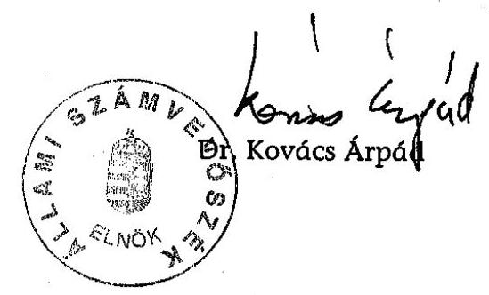
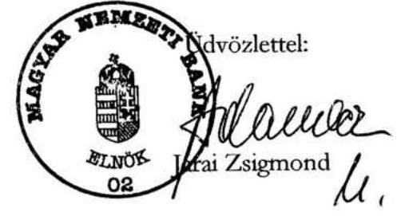
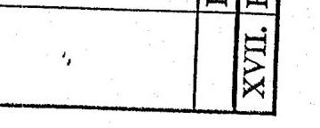
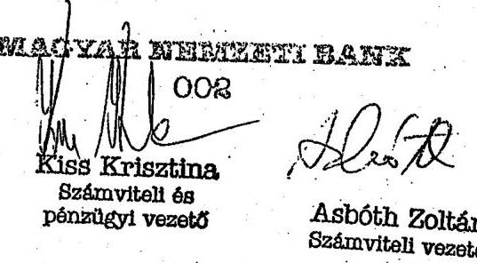
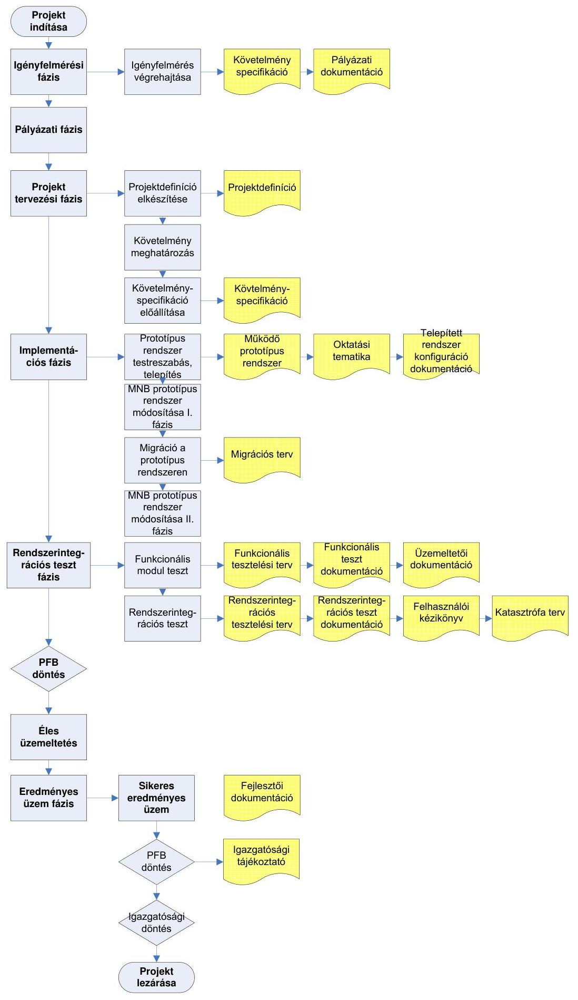
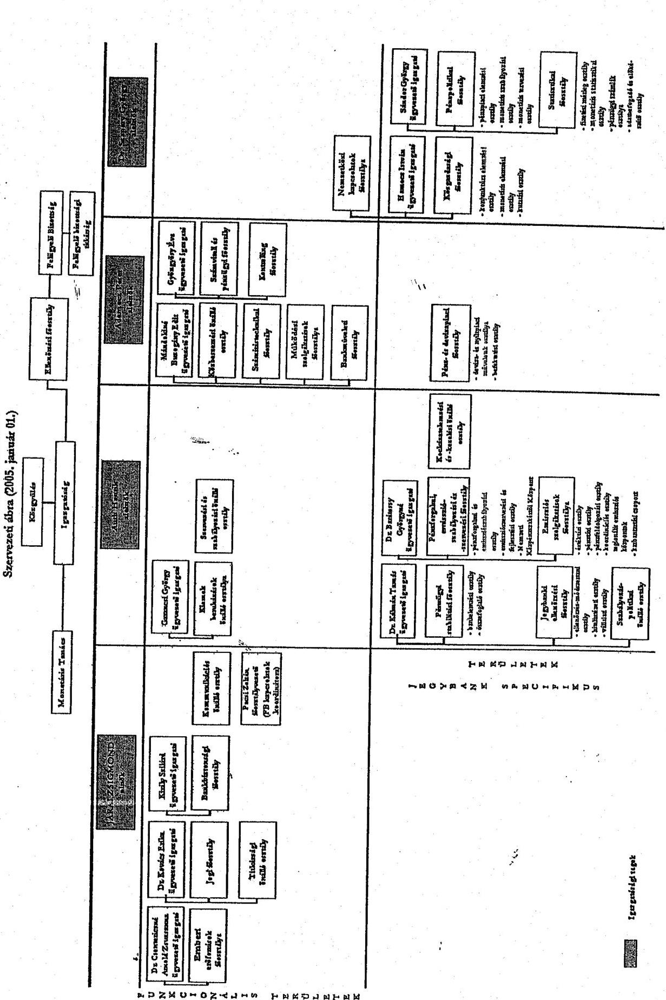
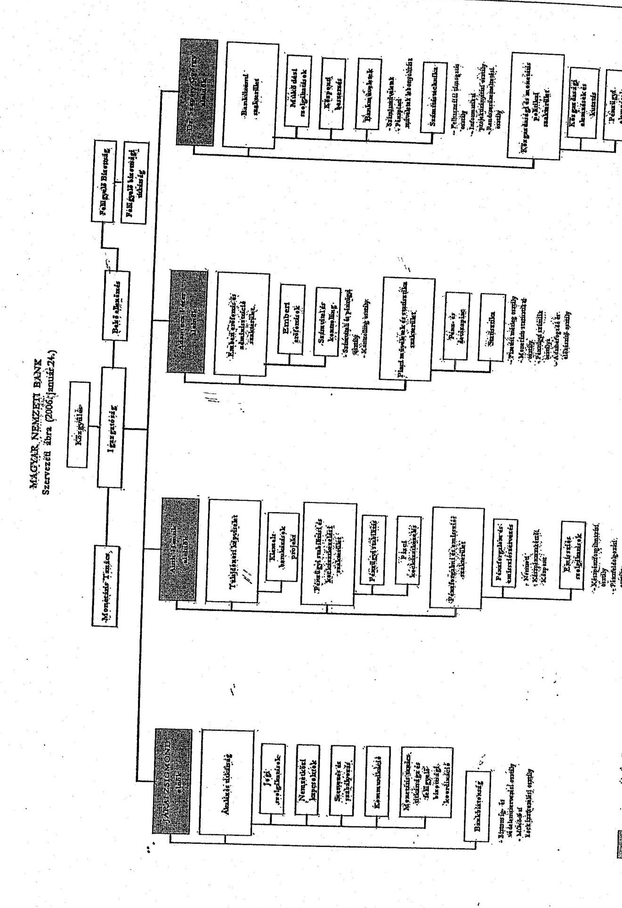

# ÁLLAMI   SZÁMVEVŐSZÉK 

## JELENTÉS

a Magyar Nemzeti Bank 2005. évi működésének ellenőrzéséről

---

2. Államháztartás Központi Szintjét Ellenőrző Igazgatóság
2.1. Teljesítmény Ellenőrzési Főcsoport
Iktatószám: V-27-30/2005-2006.
Témaszám: 797
Vizsgálat-azonosító szám: V0247

# Az ellenőrzést felügyelte: 

Bihary Zsigmond
főigazgató
Az ellenőrzés végrehajtásáért felelős:
Kemény Emil
főcsoportfőnök
Az ellenőrzést vezette:
Dr. Ocskovszki Jánosné
számvevő igazgatóhelyettes
Az ellenőrzést végezték:

| Czúcz Dénes | Gaálné Izsó Éva | Nagy Ákos |
| :-- | :-- | :-- |
| számvevő gyakornok | számvevő tanácsos | számvevő |
| Tóthné Nagy Éva | Verő Tünde | Vörös Katalin |
| számvevő tanácsos | számvevő | számvevő |

A témához kapcsolódó eddig készített számvevőszéki jelentések:
címe
sorszáma
A Magyar Nemzeti Bank működésének ellenőrzése 0238
A Magyar Nemzeti Bank belső (banküzemi) működésének ellenőrzése
A Magyar Nemzeti Banknál alkalmazott teljesítményértékelési 0438
rendszer működésének ellenőrzése
A Magyar Nemzeti Bank 2002. évi működésének ellenőrzése 0340
A Magyar Nemzeti Bank 2003. évi működésének ellenőrzése 0447
A Magyar Nemzeti Bank 2004. évi működésének ellenőrzése 0531

---

# TARTALOMJEGYZÉK 

BEVEZETÉS ..... 5
I. ÖSSZEGZŐ MEGÁLLAPÍTÁSOK, KÖVETKEZTETÉSEK, JAVASLATOK ..... 7
II. RÉSZLETES MEGÁLLAPÍTÁSOK ..... 11

1. Az MNB működésének törvényessége, szabályszerűsége ..... 11
1.1. A közgyűlés tevékenysége, az alapszabály módosításai ..... 11
1.2. Az igazgatóság működése ..... 11
1.3. A felügyelő bizottság működése ..... 12
1.4. A belső ellenőrzési szervezet tevékenysége ..... 13
1.5. A középtávú és az éves célkitűzések ..... 14
1.6. Az intézmény belső szabályozási rendszere ..... 15
1.7. A hatékonyságjavulást célzó főbb szervezeti változások ..... 17
2. Az MNB belső gazdálkodása ..... 23
2.1. A működési költségek ..... 23
2.1.1. A tervezési rendszer, a tervek megalapozottsága ..... 23
2.1.2. A tényleges költségek alakulása ..... 23
2.1.3. Az emberi erőforrás gazdálkodás ..... 24
2.1.4. Az információ-technológiai (IT) rendszerek üzemeltetési költségei ..... 26
2.1.5. Az üzemeltetési és egyéb költségek ..... 26
2.2. A beruházási kiadások ..... 27
2.2.1. A tervezési rendszer, a tervek megalapozottsága ..... 27
2.2.2. A beruházási ráfordítások alakulása ..... 28
2.2.3. A Logisztikai Központ beruházás ..... 29
2.2.4. Az információ-technológiai beruházások ..... 30
2.2.4.1. Az analitikus számlavezető rendszer ..... 30
2.2.5. Az egyéb beruházások ..... 32
2.3. A beszerzési rendszer ..... 33
2.3.1. Beszerzési eljárások ..... 34
2.4. A banküzemi bevételek és ráfordítások alakulása ..... 35
3. Az MNB befektetett eszközei ..... 35
4. Az MNB kapcsolata a központi költségvetéssel ..... 38
5. Utóellenőrzés ..... 39

---

# MELLÉKLETEK 

1. sz. melléklet MNB észrevétel
2. sz. melléklet Tanúsítványok jegyzéke
3. sz. melléklet Az Inforex számlavezető rendszer kialakításának folyamatábrája
4. sz. melléklet Teljesítmény-ellenőrzési kritériumok
5. sz. melléklet Az MNB szervezeti ábrája (2005. január 01.)
6. sz. melléklet Az MNB szervezeti ábrája (2006. január 24.)

---

# RÖVIDÍTÉSEK JEGYZÉKE 

| Áht. | 1992. évi XXXVIII. törvény az államháztartásról |
| :-- | :-- |
| ÁPV Rt. | Állami Privatizációs és Vagyonkezelő Rt. |
| ÁSZ | Állami Számvevőszék |
| BB | Beszerzési bizottság |
| BIS | Nemzetközi Fizetések Bankja |
| BKB | Beruházási és Költséggazdálkodási Bizottság |
| BMK | Bankmaster kiváltás |
| BSZB | Bankszakmai bizottság |
| EKB | Európai Központi Bank |
| ELF | Ellenőrzési főosztály |
| EMU | Európai Monetáris Unió |
| FB | Felügyelő bizottság |
| GIRO Rt. | GIRO Elszámolásforgalmi Rt. |
| Gt. | 1997. évi CXLIV. törvény a gazdasági társaságokról |
| IT | Információ technológia |
| JEF | Jegybanki ellenőrzési főosztály |
| KBB | Kiemelt beruházási önálló bizottság |
| KBER | Központi Bankok Európai Rendszere |
| Kbt. | 2003. évi CXXIX. törvény a közbeszerzésekről |
| KBO | Kiemelt beruházások osztálya |
| KELER Rt. | Központi Elszámolóház és Értéktár Rt. |
| KESZ | Kincstári egységes számla |
| MNB | Magyar Nemzeti Bank |
| MNB tv. | 2001. évi LVIII. törvény a Magyar Nemzeti Bankról |
| PM | Pénzügyminisztérium |
| PEF | Pénzforgalmi emisszió szabályozási és szervezési főosztály |
| PFB | Projektfelügyelő bizottság |
| STF | Statisztikai főosztály |
| SZMSZ | Szervezeti és Működési Szabályzat |
| TB | Tulajdonosi bizottság |
| VBK | Választható béren kívüli juttatás |
| SWIFT | Society for Worldwide Interbank Financial |
|  | Telecommunication SCRL |

---

.

---

# JELENTÉS 

## a Magyar Nemzeti Bank 2005. évi működésének ellenőrzéséről

## BEVEZETÉS

Az Állami Számvevőszék (továbbiakban: ÁSZ) az Állami Számvevőszékről szóló 1989. évi XXXVIII. törvény 3. §-a alapján végzi a Magyar Nemzeti Bank (továbbiakban: MNB) működésének és gazdálkodásának ellenőrzésével kapcsolatos feladatokat.

Az ÁSZ azt ellenőrzi, hogy az MNB a jogszabályoknak, különösen a Magyar Nemzeti Bankról szóló 2001. évi LVIII. törvény (továbbiakban: MNB tv.) rendelkezéseinek, az alapszabálynak és a közgyűlés határozatainak megfelelően működik-e.

Az ellenőrzés nem terjed ki az MNB - róla szóló törvényben meghatározott - alapvető feladataira, így a monetáris politika meghatározására és megvalósítására; a hivatalos deviza- és aranytartalék képzésére és kezelésére; a devizatartalék vezetésével és az árfolyam-politika végrehajtásával kapcsolatban végzett devizaműveletekre; a belföldi elszámolási rendszerek kialakítására és szabályozására, azok biztonságos és hatékony működésének támogatására; a feladatai ellátásához szükséges statisztikai információk gyűjtésére és közzétételére; a pénzügyi rendszer stabilitásának, valamint prudenciális felügyeletére vonatkozó politika kialakításának és hatékony vitelének támogatására, továbbá a bankjegy- és érmekibocsátásra.

Az MNB működésének és gazdálkodásának folyamatos tulajdonosi ellenőrzését a felügyelő bizottság (továbbiakban: FB) végzi. Az éves beszámoló valódiságát - az ÁSZ által javasolt - könyvvizsgáló ellenőrzi.

Az ÁSZ 2002 óta végzett vizsgálatai az MNB banküzemi működésére, belső gazdálkodására, annak racionalizálására, a működési költségek és a beruházások alakulására, a teljesítményértékelő, a kontrolling feladatokat támogató informatikai és a katasztrófatűrő adattároló rendszerek működésére terjedtek ki. Az ellenőrzések külön figyelmet fordítottak az MNB tv. változásából adódó feladatok teljesítésére.

A jelenlegi ellenőrzés célja annak értékelése volt, hogy az MNB:

- működése megfelelt-e a törvényi előírásoknak, hatékonyan működött-e az irányítási, a döntéshozatali és az ellenőrzési rendszere;

---

- gazdálkodása megfelelt-e a jogszabályoknak és a belső szabályzatoknak, valamint a működési költségeknél és a beruházási kiadásoknál érvényesült-e a tervszerűség, illetve a költségtakarékosság követelménye;
- befektetett eszközökkel való gazdálkodása megfelelt-e a törvényesség és a szabályszerűség követelményeinek, valamint összhangban volt-e tulajdonosi stratégiájával és éves célkitűzéseivel;
- hasznosította-e az előző évi ÁSZ ellenőrzés megállapításait és milyen intézkedéseket tett az ajánlások megvalósítására.

Az ÁSZ értékelte továbbá a zárszámadáshoz kapcsolódó elszámolások szabályszerűségét is.

Az ellenőrzés nem terjedt ki az MNB éves beszámolója valódiságának ellenőrzésére, mivel azt külső könyvvizsgáló auditálja.

Az ellenőrzést az ÁSZ ellenőrzési kézikönyve és szakmai dokumentumai alapján, az átfogó ellenőrzés szabályai szerint, a teljesítmény-ellenőrzési kritériumok figyelembevételével (4. sz. melléklet) végeztük el.

A vizsgálat a 2005. évi pénzügyi évre, indokolt esetben az adott gazdasági esemény kezdetétől számított időszakra irányult, de szükség szerint a pénzügyigazdasági folyamatokat a helyszíni ellenőrzés befejezéséig figyelemmel kísérte.

A végleges jelentést megküldtük az MNB elnökének. Válaszlevelét az 1. számú melléklet tartalmazza.

---

# I. ÖSSZEGZŐ MEGÁLLAPÍTÁSOK, KÖVETKEZTETÉSEK, JAVASLATOK 

Az MNB gazdálkodása azt a célt szolgálja, hogy megfelelő keretet biztosítson törvényben rögzített feladatai megvalósításához. Ennek érdekében stratégiájában olyan, hatékonyan működő banküzem kialakítását tűzte ki célul, amely rendelkezik a megfelelő humán- és technikai erőforrásokkal. Az elmúlt években az MNB a banküzemi működés korszerűsítésén, a jegybanki feladatokhoz nem tartozó tevékenységek megszüntetésén túl javította a munkafolyamatok átláthatóságát, egyszerűsítette szervezetét. A 2001. évi adatokhoz viszonyítva 2005 végére létszámát 30%-kal csökkentette, működési költségei pedig - a 2003. év végéig tartó jelentős mérséklődést követő emelkedés hatására - nominál értéken közel azonos szinten maradtak. Ez reálértéken mintegy 33%-os csökkenést jelent.

Az MNB az ellenőrzött években a törvényi előírásoknak, az alapszabálynak és a közgyűlés határozatainak megfelelően végezte tevékenységét. 2005-ben az alapszabályt a közgyűlés két alkalommal módosította. A 2005. január 6-án tartott rendkívüli közgyűlés az MNB tv. 2004. december 29-ei, - a monetáris tanács tagjaira vonatkozó - rendelkezéseinek változása miatt határozott az alapszabály módosításáról. A 2005. április 18-án tartott éves rendes közgyűlése elfogadta a 2004. évi auditált éves beszámolót, a könyvvizsgáló díjazását és az alapszabály újabb módosítását is jóváhagyta.

Az MNB igazgatósága 2005-ben az MNB tv.-ben, az alapszabályban, az ügyrendjében és a munkatervében foglaltaknak megfelelően végezte irányító és döntéshozó tevékenységét. Tárgyalt és határozott mindazon kérdésekről, amelyek kizárólagos feladat- és hatáskörébe tartoztak, valamint az éves fő célkitűzések teljesítéséhez kapcsolódtak.

Az FB 2005. évi működése megfelelt a törvényi előírásoknak, munkatervében rögzített feladatait elvégezte. A hatáskörébe tartozó témákban meghatározta a belső ellenőrzési szervezet munkatervét és annak végrehajtását folyamatosan ellenőrizte, rendszeresen megtárgyalta a gazdálkodást, a működést érintő kérdéseket. Az FB tagjai éves munkájukról szóló beszámolójukat - a törvényi előírásnak megfelelően - az Országgyűlés és a pénzügyminiszter részére benyújtották.

Az MNB belső ellenőrzési szervezete az Ellenőrzési főosztály (továbbiakban: ELF) éves munkatervét végrehajtotta. 2005-ben a tervezett 60 vizsgálattal szemben 71 ellenőrzést végzett, folyamatosan nyomon követte az ellenőrzési megállapítások hasznosulását, az intézkedési tervek végrehajtását. Tovább növekedett - 80%-ra - az ellenőrzésre fordított kapacitás aránya az előző évek 62, illetve 75%-os mértékével szemben.

Az MNB felülvizsgálta a 2001-ben megalkotott intézményi stratégiáját és azt a 2005-2007. évekre vonatkozóan megerősítette. A középtávú célkitűzések között szerepel többek között az emisszió korszerűsítése, a nemzetközi kapcsolatok fejlesztése és a banküzem hatékonyságának növelése. Éves célkitűzéseit - pl. az emberi erőforrások hatékonyságának javítása, a belső folyamatok fejlesztése, a Logisztikai Központ beruházás folytatása - az intézmény stratégiájához illeszkedően határozta meg.

Az MNB működésének jogszabályi környezete 2005-ben alapvetően nem változott. Működése és gazdálkodása teljes körűen szabályozott, a belső utasításokban foglaltak - az elnöki utasítások jóváhagyására vonatkozó előírás kivételével - összhangban vannak a hatályos jogszabályokkal. Az MNB tv. szerint elnöki utasítás az igazgatóság jóváhagyásával adható ki, míg a Szervezeti és Működési Szabályzat (továbbiakban: SZMSZ) egyszemélyi (elnöki) jóváhagyást is enged. A szabályozási összhang hiánya ellenére a hatályos elnöki utasítások döntő részét (75%) az igazgatóság előzetesen megtárgyalta.

Az MNB 2005-ben a svéd jegybankkal együttműködve egy olyan átfogó benchmarking vizsgálatot végzett, amely a szervezet és a működés hatékonyságának növelését tűzte ki célul. A vizsgálat eredményeit felhasználva 2005 júniusában működésfejlesztési programot indítottak el. Ennek keretében egyes tevékenységeket átalakítottak, kiszerveztek vagy megszüntettek. Mindezek hatására az év végi statisztikai záró létszám 129 fővel csökkent. Megszüntették a jegybanki ellenőrzést végző önálló szervezeti egységet és a tevékenységet két másik főosztály feladatkörébe rendelték. A döntést a kockázatok felmérése és az európai jegybankokkal folytatott konzultációk tapasztalatai alapján hozták meg. Álláspontjuk szerint az átszervezéssel nem sérül az MNB - törvényen alapuló - feladatellátása. Ennek igazolására részletes vizsgálatot még nem végeztek. A kiszervezett tevékenységek közül az új élőerős őrzés-védelem kialakítását a sikertelen közbeszerzési pályázatot követően egy korábbi szerződés kibővítésével adták vállalkozásba új közbeszerzési eljárás indítása helyett.

A svéd jegybanknál tapasztalt szervezet-irányítási filozófiára alapozva - vezetői „felhatalmazáson" (empowerment) alapuló irányítás - az MNB felülvizsgálta belső szabályozási rendszerét azzal a céllal, hogy nagyobb mértékű kockázatnövekedés nélkül csökkentse a szabályozás alá vont területeket. A szabályzatok száma 23%-kal csökkent, az alapvető feladatokat azonban továbbra is utasításokkal
 szabályozzák. A szabályozás alól kivont területeken módszertani segédleteket, irányelveket alkalmaznak, amelyek szerint a munkavállaló a részletszabályok betartása helyett az eredmény eléréséért felelős.

Az MNB 2005. évi működési, gazdálkodási tevékenységét az MNB tv.-ben rögzített feladatok ellátása, az éves fő célkitűzések megvalósítása és a megkezdett fejlesztések folytatása alkotta. A működési költségek felhasználása teljes körűen szabályozott volt, a folyamatba épített ellenőrzés megvalósult, a pénzügyi keretek felhasználásának szabályait betartották. A nulla bázisú tervezés alapelve szerint kialakított működési költségterv a hatályos belső szabályzatok rendelkezéseinek megfelelően készült el. 2005-ben a működési költségterv főösszegét az igazgatóság 15,7 Mrd Ft-ban határozta meg, amely 0,2 Mrd Ft központi tartalékot foglalt magában. A működési költségek tényleges összege 14,9 Mrd Ft lett, a terv 96,4%-a, amely az előző évekhez képest megalapozottabb tervezést mutat. A személyi költségek összege 9,6 Mrd Ft volt, 7,3%-kal haladta meg az előző évit, döntően a 6%-os bérfejlesztés, illetve a magasabb besorolású munkavállalók arányának növekedése miatt, de hozzájárult a működés-

---

fejlesztési program végrehajtásából eredő, terven felüli, létszámleépítés költsége is.

Az MNB statisztikai záró létszáma 2001 és 2005 között 354 fővel csökkent. Ebben az időszakban a költségstruktúra alapvetően nem módosult, a legnagyobb, kb. kétharmados arányt a személyi költségek tették ki. A működési, üzemeltetési költségek alakulását befolyásolta a belső átszervezés, a létszámleépítés, illetve a feladatellátás szűkülése: ezen belül a nem jegybanki feladatok leépítése, illetve átadása, valamint a beszerzéseknél a rendszeres pályáztatás. A működési költség a 2001. évi 15,2 Mrd Ft-ról 2003-ra 12,7 Mrd Ft-ra csökkent, azóta ismét növekedés tapasztalható a bérek inflációt meghaladó mértékű emelkedése, valamint az információ-technológiai szolgáltatási igény dinamikus növekedése miatt.

Az MNB a hatályos jogszabályok és a belső utasítások betartásával készítette el a 2005. évi beruházási tervét, az előirányzat felhasználásakor a szabályzataiban foglaltaknak megfelelően járt el. Az éves beruházási terv 6,0 Mrd Ft főösszege 0,3 Mrd Ft központi tartalékot foglalt magában. A terv teljesítése 51,5% volt, a tervezett beruházások mintegy 70%-os műszaki készültsége mellett. Az alacsony teljesítés az év közben elfogadott új informatikai és ingatlan stratégia, a közbeszerzési eljárások hosszabb átfutási ideje, valamint egyes műszaki szempontból befejezett, továbbá a késedelmesen teljesített beruházások pénzügyi kifizetésének 2006. évre történt áthúzódása miatt következett be. A beruházási előirányzaton és a tényleges kiadásokon belül 80%-ot meghaladó arányban az évről-évre növekvő információ-technológiai fejlesztések és a Logisztikai Központ beruházás szerepelt. A Logisztikai Központ kiemelt beruházási program pontosított - 11,4 Mrd Ft - előirányzatából a 2005. évi terv 3,1 Mrd Ft volt, amelyből 1,2 Mrd Ft realizálódott, a kivitelezés csúszása miatt a különbözet a következő évre húzódott át. A beruházás lebonyolítása a belső utasítások előírásainak betartásával történt. A beruházások pénzügyi és műszaki megvalósításának visszamérési rendszere dokumentáltan igazolta a szabályszerű feladatellátást és a vezetői kontrollt.

Az MNB 2005. január végétől új analitikus számlavezető rendszert működtet, amelybe a nemzetközi fizetési rendszer funkciót is integrálta. A rendszer támogatja az intézmény alaptevékenységét, végzi a kötelező tartalék, a refinanszírozási hitelek és a nyíltpiaci műveletek kezelését. A beruházást a belső szabályzat rendelkezéseinek betartásával, projekt keretében valósították meg. A döntés-előkészítés szakmailag megalapozott volt. A nyertes kiválasztásakor érvényesült a gazdaságosság követelménye, az igazgatóság az elvárt minőségi szintet és műszaki tartalmat biztosító pályázatok közül a legalacsonyabb árajánlatot tartalmazót fogadta el. Az MNB a vállalkozóval kötött szerződésbe a szükséges tartalmi elemeket és garanciákat beépítette. A teszteléssel feltárt kritikus hibák miatt az új rendszer elindulása 2005. január elejéről a hónap végére tolódott. A beruházást a tervezett összegen belül 0,3 Mrd Ft kifizetés mellett, a szerződés szerinti műszaki tartalommal valósították meg. A megváltozott adatkapcsolatra az MNB a külső és a belső felhasználókat időben felkészítette.

Az MNB 2004. május 1-jétől tartozik a közbeszerzésekről szóló törvény hatálya alá. A belső szabályzatokat a hatályos jogszabályokkal összhangban, az MNB sajátosságait és a beszerzési rendszer racionalizálásának eredményeit figye-

---

lembe véve készítették el. A megbízott külső szakértők javaslatot tettek a hatékonyság növelésének módjára, a tevékenység végzésével összefüggő szervezeti átalakításra, a beszerzés szabályzatának átdolgozására és a keretszerződések szélesebb körű alkalmazására. A beszerzési eljárások során az MNB betartotta a törvényi előírásokat és a belső szabályzatok rendelkezéseit. A beszerzések nyilvántartása nem teljes körű, az informatikai rendszer nem biztosítja a beszerzési terv teljesítésének kimutatását. A hiányosság megszüntetése a pénzügyi és számviteli rendszer reorganizációja keretében, várhatóan 2006. évben történik meg.

2005 végén az MNB befektetett eszközei állományának nettó értéke 29,6 Mrd Ft volt, 3,6 Mrd Ft-tal magasabb az előző évhez képest, döntően a befektetett pénzügyi eszközök növekedése (2,4 Mrd Ft) miatt. Az állományon belül továbbra is a tulajdoni részesedések aránya a meghatározó, mintegy 60%. 2005 végén az intézmény hat belföldi és három nemzetközi társaságban rendelkezett részesedéssel, amelyek könyv szerinti értéke 17,7 Mrd Ft. A belföldi társaságok 2005. évi gazdálkodása az előzetes adatok alapján eredményes volt, az MNB 1,9 Mrd Ft osztalékbevétellel számol, amely több mint 0,3 Mrd Ft-tal haladja meg az előző évit.

Az MNB banküzemi bevételeinek, működési költségeinek és ráfordításainak egyenlege 2005. év végén 14,3 Mrd Ft veszteség. A 2005. évi mérleg szerinti eredmény 21,4 Mrd Ft veszteség, amelyre az eredménytartalék fedezetet nyújt, ezért a központi költségvetésnek térítési kötelezettsége nem keletkezett. A forintárfolyam kiegyenlítési tartaléka 19,5 Mrd Ft-ról 106,0 Mrd Ft-ra emelkedett az árfolyam gyengülés hatására. A devizaértékpapírok kiegyenlítési tartaléka, azok piaci értékváltozása miatt, 14,8 Mrd Ft negatív egyenleggel zárult, amelyet a központi költségvetés határidőre megtérített. 2005-ben az MNB a Kincstári Egységes Számla kamatelszámolásait szabályszerűen, a jogszabályi előírással összhangban végezte el.

Az MNB vezetése az ÁSZ által - a korábbi jelentésekben - megfogalmazott javaslatokat elfogadta, hasznosította, a kifogásolt hiányosságokat megszüntette, amelyet az ellenőrzés is igazolt.

A helyszíni ellenőrzés megállapításainak hasznosítása mellett javasoljuk:

# az MNB igazgatóságának 

1. Vizsgáltassa meg, hogy a jegybanki ellenőrzési tevékenység átszervezését követően maradéktalanul biztosított-e az MNB tv. 29. §-ban és a 30. §-ban előírt jegybanki ellenőrzési feladat teljesítése.
2. Tegye egyértelművé szabályzatában, hogy elnöki utasítás igazgatósági jóváhagyást követően adható ki.
3. Rendelje el közbeszerzési eljárás kiírását a szerződéses alapon működő fegyveres őrség alkalmazására.

---

# II. RÉSZLETES MEGÁLLAPÍTÁSOK 

## 1. Az MNB MŰKÖDÉSÉNEK TÖRVÉNYESSÉGE, SZABÁLYSZERŰSÉGE

### 1.1. A közgyűlés tevékenysége, az alapszabály módosításai

Az MNB közgyűlése 2005-ben két alkalommal ülésezett. Az MNB tv. 2004. december 29-én hatályba lépett módosítása miatt január 6-án rendkívüli közgyűlést tartottak. A módosítás a monetáris tanács létszámát és összetételét érintette, amelyet az alapszabályon átvezettek.
2005. április 18-án az MNB éves rendes közgyűlése megtárgyalta és elfogadta a 2004. év üzleti eseményeit tartalmazó auditált éves beszámolót és az alapszabály újabb módosítását az általános hatáskörű alelnök és az ÁSZ MNB feletti ellenőrzési joga tekintetében. A közgyűlés úgy döntött - az igazgatóság javaslatát is figyelembe véve -, hogy az MNB osztalékot nem fizet, valamint elfogadta a könyvvizsgáló díjazásáról szóló javaslatot is. Az alapszabály-módosítások a törvényi előírásokkal összhangban állnak.

### 1.2. Az igazgatóság működése

Az igazgatóság ügyrendje megfelel az MNB tv. és a gazdasági társaságokról szóló 1997. évi CXLIV. törvény (továbbiakban: Gt.) előírásainak. Irányító és döntéshozó munkáját továbbra is féléves munkatervei alapján végezte, amelyeket az alapszabályban és az ügyrendjében foglaltak szerint készített el. A munkaterveket - az MNB belső szabályainak megfelelően - a szervezeti egységek vezetői véleményezték.

A munkaterv tartalmazza a tervezett ülésnapokat, az előterjesztések, tájékoztatók tárgyát, a felelős személyt vagy szervezeti egységet és a határidőt.

Az igazgatósági üléseken az FB és a tulajdonosi jogokat gyakorló pénzügyminiszter képviselői részt vettek. Állandó témaként szerepelt a monetáris tanács határozataihoz kapcsolódó feladatok áttekintése, számonkérése és a végrehajtásért felelős személyek, illetve szervezeti egységek kijelölése. Rendszeresen figyelemmel kísérte a működési költségek és a beruházási kiadások alakulását, áttekintette a Logisztikai Központ - mint kiemelt beruházás - megvalósítását, tájékozódott többek között a szakmai bizottságok éves munkájáról, a szabályozottság helyzetéről, a peres eljárásokról, a teljesítményértékelési folyamatokról.

Az igazgatóság ügyrendjének megfelelően, 2005-ben 19 alkalommal ülésezett, és ezen kívül 4 alkalommal rendelt el írásbeli szavazást. Ülésein összesen 197 napirendi pontot tárgyalt és 96 határozatot hozott. Az SZMSZ-t nyolcszor módosította, egyrészt az üzleti funkciók szerinti átszervezések, feladatbővülések, másrészt a működésfejlesztési program végrehajtása miatt. Ehhez kapcsolódóan döntött a szakmai bizottságok ügyrendjéről, amelyeket a jog- és hatásköri pontosítások és a bizottságok tagjainak változása indokolt. A Kollektív szerződést két alkalommal, több témában módosította (pl. munkába járás költségtérítése, fizetés nélküli

---

szabadság engedélyezése, a munkabérfizetés módjának változása a dolgozói számlák megszűnésével). Ötször döntött elnöki rendelet kiadásáról és közzétételéről, amely többek között a fizetőeszközök hamisítás elleni védelmét, valamint a kötelező jegybanki tartalék kiszámítását, képzését és elhelyezését érintette. Az MNB pénzügyi befektetéseivel kapcsolatban hat, az emissziós feladatait érintően négy döntést hozott. Az ELF 2005. és 2006. évi munkatervével kapcsolatban háromszor döntött. A jegybanki ellenőrzés átalakításáról négy határozat készült. 62 határozat egyéb témájú volt, pl. a svéd jegybankkal végzett benchmarking vizsgálat eredményeinek bemutatása és az azok alapján meghozandó intézkedések, a területi hálózat racionalizálása, festményátadás a Magyar Nemzeti Galériának, az igazgatóság 2006. első félévi munkaterve stb.

Az igazgatóság 2005-ben három témakörben módosította ügyrendjét: hitelintézeti válság esetén a monetáris tanács által meghatározott alapelvek végrehajtása érdekében bővítette eszköztárát $^{1}$, az igazgatóság feladatává tette a partnerlimit képzésére vonatkozó módszertan meghatározását, a Gt. 241. § (1) bekezdésének előírásaival élve azon kérdésekben, amelyek nem tartoznak a monetáris tanács és az igazgatóság - mint testületek - kizárólagos hatáskörébe, megosztotta tagjai között a feladat- és hatásköröket (a megosztás név szerint tartalmazza az igazgatóság három tagjának döntési kompetenciáit).

2005-ben az igazgatóság munkatervét teljesítette, feladatait az ügyrendjének és a belső szabályzatoknak megfelelően végezte, határozatainak, valamint az MNB éves fő célkitűzései teljesítésének végrehajtását számon kérte.

# 1.3. A felügyelő bizottság működése 

Az FB munkaterve az éves rendes közgyűléshez illeszkedően a júniustól-júniusig terjedő időszakot fogja át. 2005-ben - a munkatervben szereplő napirendi pontokkal - tíz felügyelő bizottsági ülést tartottak.

A munkatervek szerint - a májusi közgyűlést követően - a júniusi ülésen tárgyalták meg és fogadták el az Országgyűlésnek és a pénzügyminiszternek szóló közös FB beszámolót.

Az FB ülésein rendszeresen foglalkozott az irányítása alá tartozó belső ellenőrzési szervezet tevékenységével és a gazdálkodás időszerű kérdéseivel. Ennek keretében megtárgyalta az MNB éves beszámolóját, a tervezés módszertanát, a pénzügyi terveket, a gazdálkodásról szóló negyedéves beszámolókat, valamint áttekintette az MNB tulajdonosi érdekeltségébe tartozó vállalkozások gazdálkodását.

[^0]
[^0]:    $^{1}$ Az igazgatóság feladata a következők szerint bővült ki:
    -„a rendkívüli hitelnyújtással összefüggésben: az elfogadható fedezetekhez kapcsolódó hitelminősítési limitek, az elfogadható fedezetek devizanemének és

 befogadási mértékeinek, továbbá a rendkívüli hitel kamatának meghatározása;

    - a hitelintézeti válság esetén alkalmazandó rendkívüli intézkedésekről való döntés alapvető eljárási kérdéseinek mindenkori szabályozása."

---

Az FB 2004 szeptemberében megtárgyalta az MNB szponzorálási politikáját. Kifogásolta a követett eljárást, pl. a jegybanki és karitatív besorolás gyakorlati értelmezését, illetve az egyszemélyi, elnöki hatáskört. A kapott tájékoztatás alapján javasolta az MNB vezetésének, hogy az elhangzott észrevételeket vegye figyelembe, és mérlegelje a támogatási rendszer átalakításának és továbbfejlesztésének lehetőségét. Ezt követően 2004 decemberében módosították a támogatási tevékenységről szóló szabályzatot. Lényegi változás a támogatások döntési hatáskörében történt: az egyszemélyi döntést testületi döntés váltotta fel, az FB az utasítás módosítását tudomásul vette. Az MNB támogatási politikájáról szóló tájékoztatót az FB a 2005. október 18-i ülésén megtárgyalta és elfogadta.

Az FB 2005-ben a pénzügyminiszter felkérésére tájékozódott az MNB tv. módosítása miatti alkotmánybírósági beadvánnyal kapcsolatos MNB közreműködésről. Az FB azt vizsgálta, hogy „sérülhetett-e valamilyen jegybanki függetlenséggel kapcsolatos előírás, vagy csak annak látszata keletkezett, vagy egyik sem". Az FB megállapította, hogy „az MNB függetlenségével, illetve törvényben meghatározott feladataival össze nem férő tevékenységet nem folytatott". Javasolta, hogy „egy belső utasításban szabályozásra kerüljön az a kérdés, hogy az országgyűlési képviselők jogállásáról szóló törvényben megfogalmazott, a képviselői tisztség ellátásának támogatására vonatkozó kötelezettségnek az MNB mennyiben és hogyan köteles eleget tenni". A helyszíni ellenőrzés befejezéséig e tárgyban belső utasítás nem készült.

Az FB kiemelt figyelmet fordított a Pénzjegynyomda Rt. helyzetére és stratégiájára; foglalkozott az MNB informatikai stratégiájával, humánkockázat-kezelési rendszerével és az intézmény szervezetfejlesztési célkitűzéseivel; megállapította, hogy a közbeszerzési tevékenység a törvényi feltételeknek megfelel.

Az FB a tevékenységét a törvényi előírásokkal összhangban végezte, az ügyrend előírásai szerint készült munkatervét maradéktalanul végrehajtotta és ellátta a belső ellenőrzési szervezet irányítását a hatáskörébe tartozó feladatok tekintetében.

# 1.4. A belső ellenőrzési szervezet tevékenysége 

Az MNB belső ellenőrzési szervezetének tevékenységét, hatáskörét és eljárási rendjét a hatályos elnöki utasítás teljes körűen szabályozza.

Az ELF 2005. évi munkatervét az igazgatóság 2004. december 6-i ülésén, az FB 2004. december 14-i ülésén megtárgyalta meg és fogadta el. A 2005. évi munkatervben az FB és az ÁSZ javaslatának megfelelően a vizsgálati feladatok részarányát a korábbi évi 56%-ról 74%-ra növelték.

Az ELF havonta tájékoztatta az FB-t az ellenőrzési munkaterv megvalósulásáról. Az igazgatóság által elrendelt vizsgálatok közül öt jelentés kivonatát adták át az FB-nek, mivel az azokban foglalt megállapítások az FB hatáskörébe tartozó területeket érintettek. A vizsgálatok az MNB működése egyes folyamatainak szabályozottságára, a végrehajtás szabályszerűségére, a tevékenységek kockázati szintjének megállapítására irányultak. Az FB a jelentésekben megfogalmazott javaslatokat és intézkedéseket jóváhagyólag tudomásul vette.

---

A 2005. évben tervezett és végrehajtott vizsgálatok

| A vizsgálatok jellege | Tervezett | Terven   felüli | Ténylegesen   elvégzett |
| :-- | --: | --: | --: |
| Pénzügyi vizsgálatok | 25 | 2 | 27 |
| Emissziós jellegű vizsgálatok | 4 | - | 4 |
| Informatikai vizsgálatok | 11 | - | 11 |
| Utóvizsgálatok | 20 | 9 | 29 |
| ÖSSZESEN: | $\mathbf{60}$ | $\mathbf{11}$ | $\mathbf{71}$ |

Az ELF munkatársai a 2005. évi vizsgálataik során 100 megállapítást és 33 ajánlást tettek. Az érintettek 141 intézkedési tervet készítettek a megállapításokban foglaltak megoldására. 2005. év végén 19 megállapításhoz 21 nyitott és folyamatban lévő intézkedési terv kapcsolódott, amelyből 15 tartozott az FB hatáskörébe.

A belső ellenőrzési szervezet a ténylegesen felhasznált kapacitáson belül ellenőrzési tevékenységének részarányát a 2003. évi 62%-ról 2004-ben 75%-ra, 2005-ben pedig 80%-ra növelte.

A vizsgált időszakban a belső ellenőrzési szervezet a hatályos szabályok és előírások szerint alakította ki és hajtotta végre munkatervét. Ellenőrizte megállapításai hasznosulását és az intézkedési tervek végrehajtását.

# 1.5. A középtávú és az éves célkitűzések 

Az MNB elsődleges célja, a róla szóló törvény 3. § (1) bekezdése értelmében, az árstabilitás elérése és fenntartása. Ezen hosszú távú cél megvalósítása érdekében az igazgatóság stratégiai és éves intézményi célokat határozott meg.

Az MNB vezetése a 2001-ben megalkotott középtávú intézményi célkitűzéseket és azok megvalósítását 2004-ben felülvizsgálta, megállapította, hogy alapvető változtatásokra nincs szükség és a stratégiát további - 2005-2007. évekre vonatkozó - részcélokkal egészítette ki.

A középtávú célok a következők:

- erős kutatási és elemző részlegek (beleértve a statisztikai adatgyűjtést);
- a pénzügyi közvetítő rendszer hatékony monitorozása (felelősség a pénzügyi stabilitás fenntartásában);
- a fizetési rendszerek szoros kontrollja („hatékony beleszólás");
- korszerű emisszió (legalacsonyabb társadalmi költség);
- hatékony banküzem, professzionális üzleti és működési kockázatkezelés;
- partnerkapcsolat az „ügyfelekkel" (értelemszerűen az elsődleges cél veszélyeztetése nélkül);
- erős nemzetközi kapcsolatok.

---

A középtávú intézményi céloknak alárendelten - azokhoz illeszkedve - az MNB igazgatósága 2005. évre a következő fő prioritású banki célokat határozta meg:

- „Elemzés, kutatás fejlesztése, egyrészt a jegybanki alaptevékenységek ellátásának magasabb színvonalra emelése, másrészt a banküzem irányításához szükséges döntések jobb megalapozása érdekében.
- A szakmai közvéleményt formáló kommunikáció továbbfejlesztése, intenzitásának, hatékonyságának növelése a jegybank hitelességének, reputációjának erősítése érdekében.
- Az erőforrások hatékonyabb és eredményesebb kiaknázása céljából az alkalmazott erőforrás-tervezési, visszamérési módszerek és folyamatok fejlesztése.
- A banküzemben elért eredmények konszolidálása során külső minőségi tanúsítványok megszerzésének előkészítése.
- A statisztikai tevékenységet támogató integrált informatikai rendszer fejlesztése.
- A Logisztikai Központ program megvalósításának folytatása."

Az éves célok alapján, a szervezeti egységek vezetői kidolgozták munkaterveiket, amelyeket - egységes éves munkatervként - az igazgatóság jóváhagyott. A kidolgozott munkaterv további - az egyes alkalmazottak számára előírt - részfeladatokra bontását a területek vezetői végezték. Az így megalkotott személyes éves munkatervek képezik az év végi teljesítményértékelés alapját.

A szervezeti egységek az éves célokra épülő munkaterveiket teljesítették, az erről készült beszámolókat az igazgatóság rendre elfogadta.

# 1.6. Az intézmény belső szabályozási rendszere 

A helyszíni ellenőrzés időszaka alatt hatályos SZMSZ négy munkaszervezeti irányítási szintet különböztet meg: az elnököt; az alelnököket; az ügyvezető igazgatókat és végül a szervezeti egységek vezetőit. A munkaszervezet irányítását pedig úgy definiálja, hogy az „az egyes irányítási szintekhez fűződő szabályozási, döntéshozatali, munkáltatói jogkörgyakorlási, felügyeleti hatáskörök összessége, ideértve a tervezést, a szervezést, az utasítás jogát, az ellenőrzést és a számonkérés..."

Ez a meghatározás sem az SZMSZ mellékletét képező szervezeti ábrával, sem az MNB tv. előírásaival nincs összhangban, ugyanis az elnök a fent említett jogkörök egyikét sem gyakorolhatja az alelnökök fölött. Az MNB tv. értelmében az igazgatóság az első az irányítási szintek közül és felelős az MNB működésének irányításáért.

A helyszíni ellenőrzést követően az igazgatóság a 2006. március 1-jei hatállyal kiadott SZMSZ-ben ezt az ellentmondást megszüntette azzal, hogy az irányítási szintek helyett a továbbiakban vezetési szinteket határozott meg.

---

Az SZMSZ-t az igazgatóság a vizsgált időszakban nyolc alkalommal módosította, döntően az MNB tv. 2004. évi változása, az ÁSZ javaslatai, és az MNB által indított „működésfejlesztési program" eredményeiből fakadó szervezeti változások miatt.

A működésfejlesztési program eredményeként a szervezet jelentősen megváltozott. Míg 2005. január 1-jén 10 ügyvezető igazgató, 18 főosztály és 60 osztály volt, addig 2006. január 10-től 8 irányítási lánc, 21 funkció és 20 osztály van. Összességében a vezető munkakörök száma 88-ról 49-re csökkent. (Az MNB szervezeti ábráit a 4. és 5. számú melléklet mutatja be.)

A belső szabályozás részét képezik a kétszintű belső szabályok: az elnöki- és az ügyvezető igazgatói utasítások.

Az SZMSZ szerint „elnöki utasítás adható ki minden olyan tárgykörben, amelyet az elnök vagy az igazgatóság elnöki utasítás szintű belső szabályzatban kíván meghatározni. Az elnöki utasítás rögzíti az alapelveket, felsővezetői követelményeket."

Ez a szabályozás lehetővé teszi az alapelvek egyszemélyi (elnöki) jóváhagyását is, holott az MNB tv. 52. § (4) bekezdés c) pontjában az igazgatóság - mint testület - hatáskörébe utalja az MNB szervezetével és belső irányításával összefüggő kérdések jóváhagyását, ezáltal - mint az irányítás egyik eszközét - a szabályozási tevékenységet, azaz a szabályozási alapelvek meghatározását is. E szerint szabályozási alapelveket tartalmazó utasítást az MNB elnöke csak az igazgatóság jóváhagyását követően adhatna ki, módosíthatna, illetve helyezhetne hatályon kívül. A szabályozási összhang hiánya ellenére az MNB hatályos elnöki utasításainak döntő részét (75%) az igazgatóság előzetesen megtárgyalta.

Az MNB meghatározó jogszabályi környezete 2005. évben alapvetően változatlan volt. A számvitelről szóló 2000. évi C. törvény (továbbiakban: számviteli tv.) 2005. január 1-jétől hatályos változásait a számviteli politikában nem vezették át teljes körűen. Ennek hiánya egyrészt az MNB mérlegét érdemben nem érinti, másrészt az alkalmazott elszámolás ellen a könyvvizsgáló nem emelt kifogást.

A számviteli tv. 25. § (6) bekezdése értelmében a szellemi termékek - köztük a szoftverek - felhasználási jogát a vagyoni értékű jogok között kell kimutatni, a számviteli politika ugyanakkor ezeket a szellemi termékek közé sorolja. Ez az eltérés azonban nem torzítja a mérleget, mivel az MNB éves beszámoló-készítési és könyvvezetési kötelezettségeinek sajátosságairól szóló 221/2000. (XII. 19.) Korm. rendelet értelmében az eszközök egy mérlegsoron szerepelnek.
2005. január 1-jétől a számviteli tv. 52. § (6) bekezdése úgy rendelkezik, hogy „Nem szabad terv szerinti értékcsökkenést elszámolni ... az olyan ... műemléki védettségű épületnél, ... amely értékéből a használat során sem veszít, illetve amelynek értéke különleges helyzetéből, egyedi mivoltából adódóan évről évre nő." Az MNB Budapest, V. Szabadság tér 8-9. szám alatti „A" épülete műemléki védettséget élvez. Az épület 1924-ben került az MNB tulajdonába, ismeretlen bekerülési értéken. Első ismert könyv szerinti értéke 1958-ból származik, 24 M Ft. 2005 végéig az épület bruttó értékének növekedése felújításból és beruházásból eredően 3,2 Mrd Ft volt, ezen időszak alatt mintegy $0,9 \mathrm{Mrd}$ Ft értékcsökkenést számoltak el. Az MNB

---

könyvvizsgálójának álláspontja szerint ez az elszámolás a számviteli törvény alapelvének megfelel.

A működésfejlesztési program keretében az MNB vezetése elrendelte a belső szabályozási rendszer felülvizsgálatát. A cél a szabályozás alá vont tevékenységek csökkentése volt oly módon, hogy az ne okozzon nagyobb mértékű kockázatnövekedést. Ez a deregulációs folyamat egy újfajta szervezet-irányítási filozófia átvételének a következménye.

Ennek a filozófiának a lényegi eleme a vezetői „felhatalmazás" (empowerment). E felfogás szerint a vezető irányítási szerepe nem az, hogy részletekbe menően meghatározza (szabályozza) a munkafolyamatokat, hanem hogy a beosztottat segítse a kívánt cél elérésében. Az irányító feladata tehát a cél pontos meghatározása és a segítségnyújtás annak eléréséhez, az irányított pedig „fel van hatalmazva" a részdöntések meghozatalára.

Az új irányítási filozófia értelmében azokat a folyamatokat, amelyek nem jelentenek nagy - elsősorban pénzügyi - kockázatot, kiemelik a belső szabályozás hatálya alól. Itt utasítások helyett módszertani segédleteket, azaz irányelveket határoznak meg. Az irányelvek nem fogalmaznak meg kötelező érvényű részletszabályokat, hanem alapvető elvárásokat határoznak meg, amelyek ismétlődő be nem tartása fegyelmi eljárást von maga után. A
 munkavállaló a cél hatékony és gazdaságos módon való eléréséért tartozik felelősséggel.

A deregulációs folyamat következtében a belső szabályok volumene 23%-kal mérséklődött, a szabályozott terület csökkenése és több utasítás összevonásának eredményeként.
2005. évtől nem rendelkezik ügyvezető igazgatói utasítás a közlekedési eszközök igénybevételéről; a kiemelt technikai eszközök biztosításának és használatának rendjéről; a belső szabályok kiadásának rendjéről; a reprezentációról; a projektekről. Ezekre a tevékenységekre irányelveket dolgoztak ki.

Azokat a folyamatokat, amelyeket az MNB-re érvényes jogszabályok feladatként határoznak meg, továbbra is utasításokkal szabályozzák.

A feladatköri változások miatt az előzőeken túlmenően hatályon kívül helyezték a jegybanki helyszíni ellenőrzés rendjéről, a munkavállalói kölcsönökről és a dolgozói számlákról szóló elnöki utasításokat.

A volumencsökkenés a belső szabályozási struktúrán nem változtatott, 2005. év elején és végén az elnöki utasítások aránya egyaránt 19% volt.

# 1.7. A hatékonyságjavulást célzó főbb szervezeti változások 

2004-ben az MNB belső szabályozási területe egy banki szintű benchmarking módszertant dolgozott ki, hogy az addig kialakult többféle gyakorlatot egységesítse. A kézikönyv elkészülte után az MNB vezetése benchmarking vizsgálatot kezdeményezett, amelynek célja a szervezet és a működés hatékonyságának fejlesztése és a legjobb európai gyakorlat átvétele volt.

---

Az MNB 2002. évben indított szervezet-korszerűsítési programja 2004 végére lendületét vesztette. A folyamatok átvilágítását és leegyszerűsítését követően eljutottak egy olyan állapotba, amikor a szervezeti egységek saját működésük hatékonyságát szemléletváltás nélkül már nem képesek továbbfejleszteni. Ez volt a kiváltó oka egy olyan vizsgálat elindításának, amelyben az MNB működési hatékonyságát összemérték egy hasonló működésű külső partnerrel.

A svéd jegybankot választották partnernek, a döntést annak jó hírnevével és a két intézmény közötti hasonlóságokkal (KBER tagság, EMU-tagság hiánya, a két ország hasonló lakosságszáma...stb.) indokolták.

A vizsgálat a két jegybank által ellátott funkciók, az azokhoz igénybevett létszám és a működési költségek - eltérő jogszabályi környezet és gazdasági háttér figyelembevételével vett - összehasonlítására terjedt ki. Megállapították, hogy a készpénzkezelésen és a jegybankellenőrzésen kívül nincs jelentős hatékonysági eltérés a szakmai területeken. Az MNB-ben az irányító-támogató és a szakmai területek aránya (66-34%) eltér a svéd jegybankétól (55-45%), a támogatási tevékenység a svédeknél hatékonyabb.

A vizsgálat lezárását követően az eredmények figyelembevételével az igazgatóság 2005 júniusában egy kétlépcsős működésfejlesztési programot indított el. Az első ütem 2006. év végéig, a második 2008. év elejéig, a Logisztikai Központ tervezett üzembe helyezéséig tart, az igazgatóság mindkét ütemtől 100 fő létszámcsökkenést vár.

A működésfejlesztési program célja a folyamatracionalizálás és a működés hatékonyságának javítása volt, a költségnövekedés tiltása mellett. Ennek eredménye az alkalmazotti létszámcsökkenéssel mérhető. A folyamatracionalizálás egyik eszköze volt a tevékenységek kiszervezése. Az MNB kimutatása szerint a lezárt kiszervezéseknél a tevékenységekhez kapcsolódó költségek összesen 52 M Ft-tal csökkentek 28 fő létszám-megtakarítás mellett.

A program keretében 2005-ben a következő szervezeti változásokat és kiszervezéseket hajtották végre:

Megszüntették a Jegybanki ellenőrzési főosztályt. Az MNB tv. 29. §-a rendelkezése szerint a jegybanki ellenőrzési tevékenység: „a hitelintézetekről és pénzügyi vállalkozásokról szóló 1996. évi CXII. törvénynek az MNB engedélyezési hatáskörébe tartozó kiegészítő pénzügyi szolgáltatások végzésének feltételeire vonatkozó rendelkezései, továbbá az MNB elnöke rendeleteinek a megtartására terjed ki."

Az MNB tv. indokolásában többek között a következőket rögzítik: "A jegybanki ellenőrzés jogszabályban szabályozott hatósági ellenőrzés, a jogszabályok és a jogszabályok felhatalmazása alapján kiadott jegybanki előírások megtartását, illetőleg az esetleges jogszabálysértés feltárását célozza.

A jegybanki ellenőrzés alapvetően a jegybanki információs rendszer révén a pénzintézetek által szolgáltatott adatok alapján történik. A jegybanki ellenőrzés során azonban az MNB jogosult kiegészítő adatok, beszámolók, mérlegek, bizonylatok és vizsgálati anyagok bekérésére. Mindazonáltal az MNB helyszíni ellenőrzésre is jogosult."

Az MNB ezen tevékenységét 2005. szeptember 30-ig egy önálló szervezeti egység - a Jegybanki ellenőrzési főosztály (továbbiakban: JEF), - éves munkatervek alapján végezte. A JEF feladatát az igazgatóság megszüntető határozatát

---

követően két főosztály - a statisztikai témájú ellenőrzéseknél - a Statisztikai főosztály (továbbiakban: STF) és - a pénzforgalmi témájú ellenőrzéseknél - a Pénzforgalmi, emisszió szabályozási és Szervezési főosztály (továbbiakban: PEF) látja el. A JEF, az STF és a PEF felmérte a területükön középtávon jelentkező kockázatokat, ezzel párhuzamosan megismerték az európai jegybankok kockázatkezelésének módszereit is. A kétoldalú szakmai konzultációkat követően döntött az MNB vezetése az önálló szervezeti egység megszüntetéséről. A döntést a kockázatok (pl. hibás statisztikai, pénzforgalmi adatszolgáltatás) csökkenésével indokolták. A JEF 47 fős állományából 12 fő az STF-hez, 4 fő a PEF-hez került, 31 fő státuszt pedig megszüntettek.

Az MNB álláspontja szerint az átszervezéssel nem sérül az MNB - törvényen alapuló - ellenőrzési kötelezettségének teljesítése. Ezt az álláspontot megítélésünk szerint csak egy részletes vizsgálat tudná alátámasztani.
2005. december 2-án a jegybanki helyszíni ellenőrzés rendjéről szóló szabályzatokat és az éves helyszíni ellenőrzési tervet hatályon kívül helyezték, a feladatot a jövőben ellátó két főosztály a technológiai eljárások szabályzatait elkészítette.

Az igazgatóság döntésének megfelelően az MNB-n belüli dolgozói számlavezetés 2005. december 1-jei hatállyal megszűnt és előkészítették a dolgozói hitelállomány értékesítését.

A Pénz- és devizapiaci főosztály számításai szerint a nettó jelenérték, a hitelkockázatból adódó várható veszteség, illetve a tevékenységátadás kapcsán felszabaduló erőforrások figyelembevételével a dolgozói hitelállomány értékesítése 577 M Ft fölött éri meg az MNB-nek.

A két pályázó közül az igazgatóság a magasabb ellenértéket (597,5 M Ft-ot) ajánló pénzintézetet választotta. Az engedményezési megállapodást 2006. január 27-én írták alá. A szerződést a 2006. február 20-án fennálló követelésállományra, a visszakereseti jog kizárásával kötötték meg. A szerződés az ellenértéket nem összegszerűen, hanem az átadott követelésállomány aktuális mértékének függvényében határozta meg, a vételárat - a felmerült adatpótlások miatt módosított megállapodás szerint - május elején véglegesítették (505,7 M Ft).

A feladat kiszervezése 3 fő létszámcsökkentést eredményezett, amelyhez kapcsolódóan évi 15 M Ft megtakarítással számol az MNB.

A Működési szolgáltatások főosztály feladataihoz kapcsolódóan közbeszerzési eljárást írtak ki az MNB állományában lévő 24 gépjármű műszaki kezelésére. Az eljárás - a beérkezett pályázatok érvénytelensége miatt - eredménytelennek bizonyult, ezért a megismételt eljárás befejezéséig átmeneti jelleggel 2 M Ft keretösszegű szerződést kötöttek egy társasággal. Az új közbeszerzési pályázatot az ellenőrzés végéig még nem írták ki. A - páncélgépjárműveken kívüli - gépjárművek műszaki kezelésének költségei éves szinten meghaladták az 5,4 M Ft-ot, a kiszervezés után ugyanennek a tevékenységnek a várható költsége 2 M Ft, a kiszervezés 1 fő létszámcsökkenéssel járt.

---

2005-ben felére csökkentették a személyszállítási feladatokat végző gépjárművezetők számát, így az év végén 2 fő állt az MNB alkalmazásában. A gépjárművek műszaki kezelésére kötött szerződésben opcióként szerepel sofőrszolgálat biztosítása, amellyel az esetleges többletigény kielégíthető. Az MNB 2005. évben ezzel a lehetőséggel nem élt.

Az MNB közbeszerzési pályázatot írt ki a jogszabály által előírt liftfelügyelet biztosítására. A nyertes pályázóval kétéves szerződést kötöttek éves szintre vetítve 2005-ben 9; 2006-ban 9,5 és 2007-ben pedig 9,9 M Ft értékben. Ezt megelőzően az MNB 2005. évi, éves szintre vetített költsége erre a tevékenységre 9,7 M Ft volt, amely összeg nem tartalmazta a helyettesítési és a banki általános rezsi költségeket. A változtatás 2 fő létszámcsökkenéssel járt.

Az igazgatóság az alkalmazásfejlesztési csoport 2005. december 31-ig történő kiszervezéséről döntött. A hét munkavállalót érintő kiszervezést közbeszerzési eljárás keretében tervezték lebonyolítani.

A pályázati felhívás 2005. december 30-án az Európai Unió Hivatalos Lapjában megjelent. A pályázati feltételek között kötelezettségként szerepelt - többek között -, hogy az MNB saját szoftverfejlesztőit a pályázat nyertese alkalmazásba veszi, az MNB havi 100 embernapnyi fejlesztés igénybevételét vállalja, valamint a pályázó lehetőséget nyújt a fejlesztési csúcsok kezelésére havi 140 embernap határig. Az MNB állásfoglalása szerint a visszafoglalkoztatás azért szükséges, mert ez a terület olyan speciális ismereteket igényel, amelyekkel csak azok rendelkeznek, akik jelenleg napi szinten részt vesznek a folyamatokban.

A pályázók visszajelzései alapján az MNB Beszerzési Bizottsága javaslatot tett az ajánlati felhívás visszavonására és új, könnyített feltételekkel való kiírására. A pályázati felhívást 2006. február 6-án visszavonták. A helyszíni ellenőrzés befejezéséig új felhívást nem tettek közzé.

Az MNB az alkalmazásfejlesztési tevékenységre éves szinten 74 M Ft költséget számolt el.

Az igazgatóság 2005. július 19-i ülésén hagyta jóvá a banküzemmel kapcsolatos jogi feladatok kiszervezését és ezzel egyidejűleg a jogi tanácsadási költségkeretet 6 M Ft-tal megemelte. A döntés értelmében két - az MNB-vel korábban is kapcsolatban álló - ügyvéddel határozatlan időre szóló megbízási szerződést kötöttek, amelyben személyenként 500 E Ft+áfa összegű havi térítésben állapodtak meg.

A 2005. szeptember 1-jétől hatályos szerződések a munkajoggal összefüggő összes jogi feladatra; az alapítványokkal kapcsolatos ügyekre; az MNB részben, vagy egészben tulajdonában álló gazdasági társaságokkal összefüggő jogi ügyekre; valamint a folyamatban lévő végrehajtási, végelszámolási és felszámolási ügyek vitelére és ezen ügyekben az eljáró hatóságokkal való kapcsolattartásra terjednek ki. Kikötötték továbbá, hogy a megbízási jogviszony kezdetétől számított harmadik hónapot követően, a megbízás keretében addig ténylegesen végzett tevékenységet figyelembe véve, a díj mértékét felülvizsgálják. 2006 januárjában az első szóbeli felülvizsgálat megtörtént, áttekintették a megbízás keretében végzett tevékenységet és megállapították, hogy az arány-

---

ban áll a megbízási díjjal. A felülvizsgálatról, annak eredményéről írásos dokumentum nem készült.

2005-ben a kiszervezést megelőzően a foglalkoztatott két fő személyi jellegű költsége éves szinten 24,3 M Ft volt, a megbízási szerződések pedig évi 14,4 M Ft kiadással járnak.

Az ügyviteli folyamatok átvilágítása és a korszerűsítési lehetőségek feltárása érdekében az MNB szerződést kötött egy külső tanácsadó céggel. A társaság által készített folyamatkorszerűsítési terv részét képezte a bérszámfejtési tevékenység kiszervezési lehetőségének vizsgálata. A tanulmány 32 M Ft-ra becsülte az MNB bérszámfejtési tevékenységre fordított éves költségeit és 21 M Ft-ra a tevékenység esetleges kiszervezése esetén felmerülő költségeket. Az igazgatóság 2005. november 11-én a kiszervezés mellett döntött, ezzel összefüggően 4 fő létszámcsökkenéssel számolt. A közbeszerzési pályázati kiírás 2006. január 30-án jelent meg a Közbeszerzési Értesítőben; az ügylet az ellenőrzés végéig még nem zárult le.

Az igazgatóság 2004. október 5-én elfogadta az MNB 2005-2007. évekre vonatkozó középtávú biztonsági stratégiáját, amelyben célként szerepel az MNB élőerős őrzés-védelmének átalakítása.

A fegyveres biztonsági őrségről, a természetvédelmi és a mezei őrszolgálatról szóló 1997. évi CLIX. törvény 1. § (1) bekezdése kimondja, hogy „Fegyveres biztonsági őrséggel kell védeni az állam működése, illetőleg a lakosság ellátása szempontjából kiemelkedően fontos ... létesítményt ...", a 24/1997. (III. 26.) BM rendelet pedig ezek közé sorolja az MNB-t.

Az igazgatóság a szigorú törvényi előírások és az abból fakadó magas költségek miatt úgy döntött, hogy a fegyveres biztonsági őrség jogszabályoknak megfelelő, minimális létszámú kialakítása mellett egy szerződéses alapon működő fegyveres őrséget működtet, amely egyben a létesítményi tűzoltóság jellegű funkciót is ellátja.

A Bankbiztonsági főosztály - a belső szabályoknak megfelelően - jelezte beszerzési igényét a Közbeszerzési önálló osztály felé, amely ezt a Kbt.
 második rész IV. fejezet hatálya alá tartozó eljárásnak (általános közbeszerzési eljárás) minősítette. Az MNB 2005. január 1-jén az Európai Unió Hivatalos Lapjában a közbeszerzési pályázatot meghirdette.

A Bíráló Bizottság a határidő lejártáig - 2005. február 14-ig - beérkezett négy ajánlat mindegyikét érvénytelennek nyilvánította és új pályázat kiírására tett javaslatot.

Az MNB ennek ellenére nem ismételte meg a pályázatot, hanem az egyik pályázóval a még 2002. évben - az MNB területi igazgatóságainak létesítményeiben fegyveres biztonsági őrökkel való őrző-védő tevékenység folytatása tárgyában - kötött megbízási szerződést egészítette ki 2005. május 1-jétől ezzel a szolgáltatással.

---

Az eredeti szerződés 2.2. alpontjában szerepel, hogy a megfogalmazott feladatokon túl („fentieken felül”) a vállalkozó az MNB „igénye és külön megrendelése alapján további őrző-védő tevékenységet biztosít”. Ez a kitétel nem egy teljesen új - a szerződés 1. főpontjában nem szereplő helyszíneken végzendő - feladat megrendelésére ad felhatalmazást, hanem a 2.1. alpontban megfogalmazott általános szolgálati rendtől való eltérés lehetőségét biztosítja. Megítélésünk szerint a beszerzési igény azonban új feladat teljesítésére irányult, ezért nem lehet az említett szerződés módosításának a tárgya, hanem a partner kiválasztására új közbeszerzési eljárást kellett volna kiírni.

A megállapítást alátámasztja a Közbeszerzések Tanácsa 3/2004. (KÉ. 126.) számú ajánlása is - a Kbt. hatálybalépése előtt kötött szerződésekről - amelynek 3. pontja szerint abban az esetben nem kell közbeszerzési eljárást lefolytatni, „ha a Kbt. hatályba lépése előtt megkötött szerződésnek volt olyan előre pontosan definiált és kellő részletességgel meghatározott kikötése, ... amely bizonyos szerződéses feltételek előre meghatározott változását eredményezi a szerződés módosítása nélkül”. Álláspontunk szerint a szerződés 2.2. pontjában szereplő „fentieken felül” kitétel nem meríti ki az ajánlás 3. pontjában szereplő, a szerződéses feltétel változása automatizmusának követelményét, így az MNB - a szerződés kiegészítésével túllépve a szerződésben meghatározott tárgyat és mennyiséget - a közbeszerzési eljárás lefolytatásának mellőzésével rendelt meg további szolgáltatást.

Az MNB álláspontja szerint a fentieken felül „szófordulat a szerződés értelmében azt jelenti, hogy a Felek szándéka lehet a szolgálati időn túli további tevékenység végzésére vagy a meghatározott létszámra és beosztásra vagy az őrzendő létesítmények megnevezésére vonatkozó további szolgáltatások igénybe vétele, illetve ezek nyújtása. ... Mindezekre tekintettel ... nem volt szükséges a szerződés semmilyen formában történő módosítása sem, hiszen a szerződés 2.2. pontja feljogosítja a Magyar Nemzeti Bankot arra, hogy írásbeli igénybejelentés (megrendelés) alapján a ... Kft.-től további őrző-védő szolgáltatást igényeljen.”

Értelmezésük szerint mindez összhangban van a Közbeszerzések Tanácsa ajánlásával, ebből következően nem tartották szükségesnek a közbeszerzési eljárás lefolytatását.

Az MNB előzőekben ismertetett álláspontja ellenére a 2005 decemberében készült 2006. évi beszerzési tervében az élőerős őrzés védelem - 2006. július 1-jei új kötelezettségvállalással -, mint közbeszerzési eljárást igénylő feladat szerepel. A 2006. évi közbeszerzési tervet a BKB - a saját határozata szerinti 2006. április 12-i időpontig - nem tárgyalta meg. A rendelkezésre bocsátott, előkészítés alatt álló közbeszerzési terv - a beszerzési tervben szereplő jelöléssel ellentétben - nem tartalmazza az őrzés védelemre kiírandó pályázatot. Nincs dokumentum a pályázat kiírásával kapcsolatos előkészületekről sem.
2004. évben az MNB központi épületeinek fegyveres őrzés-védelme mindösszesen 294 M Ft-ba, a kiszervezés után egy évre vetítve közel 255 M Ft-ba került és 23 fő létszámcsökkenést eredményezett.

---

# 2. Az MNB BELSŐ GAZDÁLKODÁSA 

### 2.1. A működési költségek

### 2.1.1. A tervezési rendszer, a tervek megalapozottsága

Az MNB Beruházási és Költséggazdálkodási Bizottsága (továbbiakban: BKB) ügyrendje szerint - a tervezés folyamatában dönt a tervezés módszeréről és ütemezéséről, illetve véleményt alkot az éves pénzügyi tervről. A 2005. évi pénzügyi tervezés irányelveit a BKB jóváhagyását követően az igazgatóság fogadta el. Döntött az intézmény 2005. évi fő prioritású céljairól és a kiemelt projektekről. A tervek kialakításához szükséges további döntéseket is meghozta, így pl. a 2005. évi bérfejlesztésről és a létszámról.

A működési költségtervet a hatályos belső szabályzatok rendelkezései alapján alakították ki. A terv az utasításokban leírt fő területekre, költségnemenkénti bontásban, a rögzített irányelvek szerint, szöveges indoklással, egyeztetve, a testületi előterjesztésekkel és jóváhagyásokkal készült el.

A 2005. évi terv kialakítása „a nulla bázisú” tervezés alapelvét követte, ezért a költséggazdák felmérték a felhasználók tervezési igényeit. A működési költségeknél a tételes költségtervet 1,5%-os mértékű központi tartalék egészítette ki. A terv elkészítésének folyamata dokumentált volt, a tervváltozatokat nyomon követték és a tervtárgyalásokon született döntéseket írásban rögzítették.

Az intézmény éves pénzügyi tervét az igazgatóság az MNB tv.-ben és az ügyrendjében foglaltaknak megfelelően hagyta jóvá.

Az éves pénzügyi terv részeként a működési költségterv főösszege 15668 M Ft volt, amely 232 M Ft összegű központi tartalékot is magában foglalt, a központi tartalék nélküli terv (15436 M Ft) a 2004. évi tervhez (14653 M Ft) képest 5,4%-kal, 784 M Ft-tal növekedett.

Az elmúlt három évet tekintve a központi tartalék nélkül a működési költségeknél a tervteljesítés aránya 2003-ban 95,4%, 2004-ben 92,3%, 2005-ben 96,4% volt. 2005-ben a tervezett és a tényleges működési költségek eltérése 553 M Ft. A terv és tény értékek közelítése a terv megalapozásának javulását mutatja. A központi tartalékot egyik évben sem használták fel.

### 2.1.2. A tényleges költségek alakulása

A működési költségek felhasználása teljes körűen szabályozott volt, a folyamatba épített ellenőrzés megvalósult, a pénzügyi keretek felhasználásának szabályait betartották.

2005-ben az MNB tényleges működési költsége 14883 M Ft-ot tett ki és 10,1%-kal haladta meg az előző évit, reálértékben a költségnövekedés 6,5%-ra tehető.

---

A működési költség alakulása és megoszlása

|  | $\begin{gathered} 2001 \\ \text { (M Ft) } \end{gathered}$ | $\begin{gathered} 2001 \\ (\%) \end{gathered}$ | $\begin{gathered} 2002 \\ \text { (M Ft) } \end{gathered}$ | $\begin{gathered} 2002 \\ (\%) \end{gathered}$ | $\begin{gathered} 2003 \\ \text { (M Ft) } \end{gathered}$ | $\begin{gathered} 2003 \\ (\%) \end{gathered}$ | $\begin{gathered} 2004 \\ \text { (M Ft) } \end{gathered}$ | $\begin{gathered} 2004 \\ (\%) \end{gathered}$ | $\begin{gathered} 2005 \\ \text { (M Ft) } \end{gathered}$ | $\begin{gathered} 2005 \\ (\%) \end{gathered}$ |
| :--: | :--: | :--: | :--: | :--: | :--: | :--: | :--: | :--: | :--: | :--: |
| Személyi költségek | 9841 | 64,7 | 9156 | 67,8 | 8547 | 67,3 | 8917 | 65,9 | 9570 | 64,3 |
| IT   költségek | 953 | 6,3 | 751 | 5,5 | 755 | 5,9 | 954 | 7,1 | 1160 | 7,8 |
| Üzemeltetési költségek | 1730 | 11,3 | 1412 | 10,5 | 1418 | 11,2 | 1438 | 10,6 | 1548 | 10,4 |
| Értékcsökkenés | 2114 | 13,9 | 1653 | 12,2 | 1368 | 10,8 | 1480 | 10,9 | 1855 | 12,4 |
| Egyéb költségek | 633 | 4,2 | 626 | 4,6 | 827 | 6,5 | 858 | 6,4 | 844 | 5,7 |
| Átvezetések | $-75$ | $-0,4$ | $-91$ | $-0,6$ | $-216$ | $-1,7$ | $-123$ | $-0,9$ | $-94$ | $-0,6$ |
| Költségek összesen | 15196 | 100 | 13507 | 100 | 12699 | 100 | 13524 | 100 | 14883 | 100,0 |

A 2001-2005 közötti évek költségstruktúrája alapvetően nem módosult, a legnagyobb részarányt a személyi költségek tették ki (64,3-67,8%), amelyek a folyamatos létszámcsökkenés következtében csökkenő tendenciát mutattak 2003. év végéig. 2004-ben a bérfejlesztésen túl a növekedéshez hozzájárult a magasabb besorolású munkavállalók arányának emelkedése. Az MNB statisztikai záró létszáma 2001 és 2005 között 354 fővel csökkent (1163 főről 809 főre). 2005-ben az MNB mintegy 30%-kal kevesebb létszámmal működött, mint 2001-ben, ugyanakkor a működési költségek, ezen belül a személyi költségek közel azonos nagyságrendet képviseltek. Ennek alapvetően az 5 év távlatában bekövetkezett közel 37%-os - az inflációt mintegy 4%-kal meghaladó - átlagbér növekedés volt az oka.

Az IT költségek részaránya ingadozott, a csökkenő tendenciát 2004-től ismét növekedés váltotta fel a fejlesztések elindítása következtében. Az üzemeltetési költségek csökkenő részaránya reálértékben mérséklődő intézményi üzemeltetést mutatott. Az üzemeltetési költségek alakulását az átszervezések, a létszámleépítések, illetve a feladatellátás szűkülése a nem jegybanki feladatok leépítésével, valamint a beszerzéseknél a pályáztatás alkalmazása befolyásolta. Az értékcsökkenési leírás növekedése az aktivált beruházási állomány alakulásához igazodott.

Az MNB 2005. évi működési költségeinek alakulását az 1. sz. tanúsítvány tartalmazza.

# 2.1.3. Az emberi erőforrás gazdálkodás 

2005. évre az igazgatóság 6%-os bérfejlesztést hagyott jóvá a várható éves infláció (4,5%), az Országos Érdekegyeztető Tanács bérfejlesztési javaslata (6%) és a banki szektor prognosztizált bérfejlesztési mértéke (7%) alapján. A választható béren kívüli juttatások (továbbiakban: VBK) 2005. éves keretét a tervezett inflációval 445 E Ft/fő/évre növelték, amely szintén reálérték emelést is jelentett.

A 2005. évi személyi költségek tervének kialakításánál figyelembe vették a létszámalakulást, az alapbérfejlesztés mértékét, a VBK éves munkavállalónkénti

---

keretösszegét, a 2005. évi munkakör-összetételt és a módosulásokat, a járulékok hatályos jogszabályok szerinti nagyságát. A tényezők együttes hatására a személyi költségek éves tervét 9651 M Ft-ban állapították meg, az előző évi tény 108,2%-ában.

A 2005. évi tényleges személyi költségek 9570 M Ft-ot tettek ki, az előző évhez képest a növekedés 7,3% volt. A tervteljesítés 99,2%-os, a megtakarítás 80,6 M Ft.

A személyi költségeken belül a végkielégítések, felmentések kifizetése 212,2 M Ft-tal, a járulékok 7,2 M Ft-tal haladták meg a tervezettet. A nem tervezett, év közbeni létszámleépítések költségeire a terv fedezetet nyújtott. A bérek (98,5%), a jutalmak (94,6%), a VBK (95,5%), az alapjuttatások és jóléti költségek (90,4%) tervteljesítési aránya meghatározóan a létszámcsökkenések következménye. Az oktatásnál az alacsony 78,2%-os tervteljesítéshez a közbeszerzés és a pályáztatás eredményeként elért szerződéses árak járultak hozzá. A hirdetési és tanácsadói díjak kifizetései a tervezett szerint alakultak.

2005-ben a munkavállalók - az elnök, az alelnökök és a monetáris tanács tagjai nélkül - átlagbérei a vezetők esetében 5,3%-kal, a beosztottaknál 7,7%-kal emelkedtek az alapbérfejlesztés és a munkaerő összetételének változása következtében. Az átlagjövedelmek a vezetők esetében 8,3%-kal, a beosztottaknál 15,4%-kal növekedtek. A kifizetett felmentés és végkielégítés együttes összegével korrigálva az átlagjövedelmet annak emelkedési üteme az átlagbérével megegyező. A bér- és jövedelem alakulását a 2. sz. tanúsítvány tartalmazza.

A 2004. évi statisztikai záró létszámot 960 főben (tényleges 2004. évi záró statisztikai létszám 938 fő), a 2005. évi létszámfelvételek számát és a jogi állományból történő visszavételt összesen 50, a kilépések számát és a jogi állományba vételt összesen 76 főben jelölték meg. Így
 az igazgatóság a 2005. évre tervezett statisztikai záró létszámot 934 főben határozta meg. Ezzel szemben a 2005. évi statisztikai záró létszám 809 fő volt. A létszámterv kialakításakor a szakterület nem kalkulálhatott a működésfejlesztési program eredményeként bekövetkező létszámcsökkenéssel, amely összesen az előző évhez képest 129 fő csökkenést eredményezett. (2005. év első félévében a létszám 29, a második félévében 100 fővel csökkent.)

A távmunkaprogramban 2005. november végén 13 fő vett részt. A távmunkával összefüggésben öt munkaállomás vált szabaddá az intézmény irodaépületében, párhuzamosan az otthoni munkavégzéshez szükséges technikai feltételek megteremtésével. Az MNB gazdaságossági számítása szerint a távmunkával kapcsolatos beruházási kiadások legalább 15 fő távmunkás esetén már megtérülnek. A távmunkához kapcsolódó egy főre jutó havi költségeket állandó nagyságrendűnek tekintik. A bérhatékonyságban egyértelmű javulást mutattak ki, összességében 5%-os teljesítménynövekedést állapítottak meg.

Az MNB a távmunkával kapcsolatosan pozitív havi eredményt mutat ki, számításaik alapján már 2%-os hatékonyságnövekedés is ellensúlyozza a rendszeresen felmerülő költségeket, valamint 9-16 fő közötti létszámnál 3-4 éven belül megtérülnek az egyszeri beruházási kiadások. A programban résztvevők számának jelentős növekedése nem várható, a létszámcsökkentések, illetve a kiszervezett tevékenységek miatt szűkül a bevonható létszám. Az eltelt időszakban a távmun-

---

ka, az otthoni munkavégzés rugalmassága a munkavállalók csekély számát motiválta.

A távmunka hatására az MNB működési költségei nem csökkentek: kis számban szabadult fel munkahely, illetve biztonsági okokból nem alkalmazható az iroda bérbeadás.

2005 decemberében az igazgatóság elfogadta az intézmény 2006-2008-ra vonatkozó humánerőforrás stratégiáját, összhangban az MNB aktualizált, 2007-ig terjedő középtávú célkitűzéseivel. Ebben többek között célként rögzítették a bérrendszer egyszerűsítését, amelynek egyik eleme 2006-ban a fix bonusz alapbéresítése.

# 2.1.4. Az információ-technológiai (IT) rendszerek üzemeltetési költségei 

Az MNB 2005. évi céljai között határozta meg a statisztikai tevékenységet támogató informatikai rendszer fejlesztését. A 2005. évi IT tervet 1335 M Ft-ban határozták meg.

A terv meghatározásánál figyelembe vették az alaptevékenységet támogató infrastrukturális és adatfeldolgozó rendszerek folyamatos és biztonságos fenntartásának költségét, az eltérő tartalommal igénybevett szolgáltatások többletköltségét és az új szolgáltatások kiadásait.

A 2005. évi IT költségek felhasználása 1160 M Ft volt, amely 21,6%-kal haladta meg az előző évit. A terv 86,9%-ban teljesült, a jóváhagyotthoz képest 175 M Ft-ot nem használtak fel.

A hardver és telekommunikációs eszközök esetében 85%, a szoftvereknél 83,9%, a tanácsadói díjaknál 69,5% volt a tervteljesítés. A számítástechnikai gépalkatrészeknél, valamint a javítási, karbantartási költségeknél a tényleges igények a tervtől eltérően, alacsonyabb összegben merültek fel. Az adattárházzal kapcsolatos adattisztítás, migráció tervezett összege 100 M Ft volt, a 2005. évi kifizetés 54,3 M Ft, a további kiadás 2006-ra húzódik át. Az adatátviteli és a hírszolgálati díjakat érintő kifizetések a tervezettnek megfelelően alakultak. A tanácsadói díjak tervezett összegét nem használták fel. Az IT stratégiával kapcsolatos, nem tervezett tanácsadási feladatokra a megtakarítások fedezetet nyújtottak. A költségnemre jellemző, hogy - a tanácsadói díjak kivételével - a kiadások összefüggenek az éves számítástechnikai beruházások teljesítésével.

2005-ben az IT működési költségek és beruházási kiadások együttesen 2557 M Ft-ot tettek ki.

### 2.1.5. Az üzemeltetési és egyéb költségek

Az üzemeltetési költségek 2005. évi terve 1669 M Ft, amely 92,7%-ban teljesült, a költségek összege 1548 M Ft volt, 7,6%-kal magasabb az előző évinél, a tervtől való eltérés 121 M Ft. Valamennyi költségnemnél megtakarítás keletkezett.

Az ingatlanköltségeknél a 2005. évi közüzemi díjemelkedés többletköltségére fedezetet nyújtott a fegyveres őrzés és védelem költségeinek csökkenése. A költségmegtakarításhoz többek között hozzájárult az emissziós gépeknél és berendezé-

---

seknél a használatban lévő eszközök változó mennyisége és összetétele; az egyéb gépeknél és berendezéseknél a karbantartási költség mérséklődése; a telefonok alacsonyabb karbantartási költsége; a vagyonbiztosítási díj csökkenése.

Az egyéb költségek 2005. évi tervszáma 980 M Ft volt. A tényleges költségek 844 M Ft-ot tettek ki, a tervteljesítés aránya 86,1% volt.

Az egyéb költségeken belül 5%-ot meg nem haladó eltérés a tagsági díjaknál és az audit költségeknél tapasztalható. Számottevő tervtúllépés a külképviseletek költségeinél keletkezett. Terven felüli költségfelhasználás volt a hatósági díjaknál és a jogi költségeknél. A kommunikációs és reprezentációs költségeknél a terv alatti költségfelhasználást a beszerzések elhúzódása, illetőleg a konferenciák kisebb költsége okozta. A kiküldetési költségeknél a 79,3%-os felhasználást az utazások több mint 10%-kal alacsonyabb száma idézte elő. Az egyéb vegyes költségeknél az 52,6%-os tervteljesítés egyes tanácsadói szolgáltatások elmaradásával indokolható.

A tervezett értékcsökkenés 1874 M Ft, a tényleges 1855 M Ft volt, amely 99%-os tervteljesítést jelent. Az előző évhez viszonyítva az értékcsökkenés összege 25,3% növekedést mutatott összhangban az aktivált beruházási állomány növekedésével.

# 2.2. A beruházási kiadások 

### 2.2.1. A tervezési rendszer, a tervek megalapozottsága

A pénzügyi terv szerint a beruházási kiadások 2005. évi főösszege 6099 M Ft, amelyből 111,5 M Ft a 2004. évről áthúzódó összeg volt. A jóváhagyott előirányzat a hatályos tervezési utasításnak megfelelően a tételes beruházási terv 5%-ának megfelelő 290,4 M Ft tartalékkal számolt. Az előirányzat legnagyobb tétele a Logisztikai Központ (3100 M Ft), amely a teljes előirányzat 51%-a.

A beruházási tervet a hatályos belső utasítások betartásával állították össze, elkészítették a pénzügyi tervezés fő irányelveit és meghatározták a tervkészítés ütemét. A költséggazdák a beruházási terveket a szabályzatoknak megfelelően, a tételek szöveges indoklásával alátámasztva, a fő prioritású banki célokra és a 2005. évi kiemelt projektekre alapozva, határidőre készítették el. A terv tartalmazta a több évet érintő jelentős beruházási feladatok (több évet átfogó projektek) következő három évben várható kiadásainak előrejelzését is. A tervváltozatok egyeztetéséről az előírásoknak megfelelő dokumentumok - emlékeztetők és jegyzőkönyvek - elkészültek.

A beruházási tervek ellenőrzött tételeinél a beruházási előirányzatokat, a tervezés főbb módszertani elemeit követve, a tételesen részletezett beszerzési tervekből állították össze és a beszerzések meglévő, illetve tervezett kötelezettségvállalásokhoz kapcsolódtak. A tételes beruházási terv a közbeszerzési terv elkészítéséhez szükséges információkat is tartalmazta. A beruházási tételek előirányzataira tételesen tartalékot nem képeztek.

A 2005. évi beruházási és működési költségterv második változatát az elkészítés szakszerűsége, megalapozottsága, megfelelő dokumentáltsága és a tervezés

---

szabályainak betartása szempontjából az ELF is vizsgálta, az ellenőrzés tervezési hiányosságot, szabálytalanságot nem tárt fel.

A beruházások tervét 2005. évben négy alkalommal módosították, amelyek összevont hatásaként a jóváhagyott terv 6047 M Ft-ra (52 M Ft-tal) csökkent. A módosításokat a belső utasításoknak megfelelően hajtották végre.

A beruházások tervezését és a tervek visszamérési rendszerét a hatályos utasítások teljes körűen szabályozták. A költséggazdák adatszolgáltatása alapján rendszeresen aktualizálták a beruházás-monitoring táblázatokat, az igazgatóság havonta, illetve negyedévente tájékoztatást kapott a beruházási kiadások alakulásáról, ezek részeként a kiemelt projektek állásáról, és a BKB előterjesztése alapján szükség szerint döntött a napirendre tűzött fejlesztésekről. A beruházásokkal kapcsolatos pénzügyi döntéseket - a szabályzatnak megfelelően - az előírt értékhatárok betartásával, a megfelelő döntési szinteken hozták meg, beruházást csak a BKB engedélye alapján indítottak el. Az ellenőrzött fejlesztések beruházási adatlapjait a költséggazdák az utasításban előírt adattartalommal vezették, és az adatlapokon kimutatott pénzügyi teljesítés a főkönyvi nyilvántartással egyező volt.

A több szervezeti egységet érintő fejlesztéseket az utasítások betartásával projekt rendszerben valósították meg. A 2005. évi projektek rendelkeztek a hatályos utasításnak megfelelő projektindító okirattal, annak kötelező részeként projekttervvel. Előrehaladásukról (időütemezés, pénzügyi- és műszaki teljesítés, stb.) az előírt adattartalommal vezették a beruházási adatlapokat. A 2005-ben befejezett projekteket a szabályzatban meghatározott tartalmú dokumentummal zárták le. A projektek állásáról, előrehaladásáról az igazgatóság rendszeres tájékoztatást kapott.

# 2.2.2. A beruházási ráfordítások alakulása 

A beruházási kiadások 2005. évi főösszege 3113 M Ft volt, ezzel a módosított pénzügyi terv 51,5%-ra teljesült. 2006. évre 2385 M Ft teljesítés húzódott át (a módosított terv 39,4%-a), amelyből a legnagyobb összeget a Logisztikai Központ 1847 M Ft-os tétele tette ki. A teljesítés alakulását befolyásolta az igazgatóság által év közben elfogadott középtávú IT stratégia, valamint az ingatlanok hasznosításának stratégiája, amelyekkel összefüggően több beruházást töröltek, elhalasztottak, illetve módosították azok műszaki tartalmát. A jóváhagyott pénzügyi keretből (6047 M Ft) - részben a pályáztatásokkal elért kedvezőbb árak, részben a megváltozott igényekhez igazodó műszaki tartalom miatt 549 M Ft megtakarítás keletkezett, amely az előirányzat 9,1%-a. (Az immateriális javak és a tárgyi eszközök 2005. évi beszerzésének, létrehozásának tervezett és tényleges ráfordításait a 3. sz. tanúsítvány tartalmazza.)

A beruházási terv megtakarítása és a központi tartalék terhére év közben összesen 298 M Ft értékben engedélyeztek újabb felhasználást. A felmerülő igényeket a belső szabályzatoknak megfelelően, az azokban előírt értékhatárok betartásával hagyták jóvá.

Az igazgatóság augusztus 23-án egy beruházás elindítását engedélyezte (SAP reorganizáció projekt), amelynek 151 M Ft-os jóváhagyott pénzügyi keretéből

---

91 M Ft-ot 2005. évre hagyott jóvá. A BKB ugyanezen forrás terhére huszonhárom alkalommal 192 M Ft értékben engedélyezte a tervben nem szereplő kisebb 30 M Ft alatti - beruházások elindítását, illetve a jóváhagyott előirányzatok kiegészítését. A költséggazdák saját hatáskörben kilenc beruházás elindítását engedélyezték 15 M Ft összegben ugyanezen keretek terhére.

# 2.2.3. A Logisztikai Központ beruházás 

Az igazgatóság 2001-ben fogadta el a korszerű emisszió kialakításának alapelveit, majd 2003-ban jóváhagyta a Logisztikai Központ beruházási programját, amely részletesen tartalmazta a kialakítás műszaki paramétereit, pénzügyi feltételeit és a megvalósítás ütemtervét. Az elhelyezésre szolgáló telket az MNB megvásárolta, a tulajdonjog bejegyzése, a létesítmények terveztetése, a hatósági engedélyek beszerzése megtörtént és megkezdődött a beruházás résztvevőinek pályázati kiválasztása. Az igazgatóság 2005. május 3-i ülésén a beruházási program pontosított költségvetési előirányzatát 11400 M Ft összegben hagyta jóvá, és felhatalmazást adott a fővállalkozói szerződés megkötésére.

A megvalósítás több évet átfogó műszaki és pénzügyi tervét létesítményenként, a beruházás szakaszainak megfelelő alábontással elkészítették, a tervmódosításokat és a teljesítéseket aktualizált dokumentumban (monitoring táblázat) rögzítették.

A megkezdett program folytatásaként a 2005. évi pénzügyi terv 3100 M Ft előirányzatot tartalmazott a beruházásra. A pénzügyi teljesítés 1221 M Ft volt, 1847 M Ft 2006. évre, 32,0 M Ft pedig 2007. évre húzódott át.

A mindössze 39,4%-os pénzügyi teljesítéshez hozzájárult egyrészt, hogy a terv összeállításakor a fővállalkozói tender még csak ajánlattételi szakaszban volt, a terv prognosztizált összegeket tartalmazott, másrészt az is, hogy a fővállalkozó mintegy két hónapos késéssel kezdte meg a munkát, és átütemezte a feladatokat. A fővállalkozó kötbér terhe mellett vállalta, hogy 2006 májusáig a lemaradást behozza. A helyszíni ellenőrzést követően az MNB tájékoztatása szerint a fővállalkozó a vállalt májusi határidőt nem tudta tartani, sőt a felmerült műszaki, technológiai problémák miatt a véghatáridő módosítását is kezdeményezte. A 2005. évi pénzügyi teljesítés nagyrészt (83%) az épület kivitelezési munkáihoz kapcsolódott.

A beruházás 2005. évi feladatait a hatályos belső utasítások előírásainak betartásával végezték el. Az előkészítést és a megvalósítást - a kiemelt projektek működését szabályozó hatályos utasításnak megfelelően
 - a Kiemelt beruházások önálló osztálya (továbbiakban: KBO) irányította. Ellátta a beruházás belső és külső szereplőivel kapcsolatos koordinációs feladatokat, rendszeresen beszámolt a Kiemelt beruházási bizottság (továbbiakban: KBB) ülésein a beruházás előrehaladásáról, vezetői döntést igénylő ügyekben előterjesztéseket készített a KBB számára.

Az MNB a Logisztikai Központ lebonyolítói munkáira pályázat útján kiválasztott szakcéget bízott meg, a feladat magában foglalja a kiviteli tervezéstől az üzembe helyezésig az összes kapcsolódó beruházás napi, szakmai és adminisztratív feladatainak ellátását, beleértve a speciális technológiák telepítésének, beüzemelésének és üzembe helyezésének a felügyeletét. A szakcég a KBO szakemberei vezetésével ellátja a műszaki ellenőrzés feladatait is.

---

A projekt legfőbb döntéshozó szerve a KBB, amely 2005-ben döntött a beruházás megvalósításával kapcsolatos beszerzési eljárások elindításáról, a megkötendő szerződésekről, azok szükség szerinti módosításáról, figyelemmel kísérte a folyamatban lévő pályáztatásokat, a műszaki ellenőri jelentéseket és a KBO beszámolóit a beruházás helyzetéről. A KBB üléseiről jegyzőkönyvek készültek.

A projekt előrehaladásáról - a hatályos utasításoknak megfelelően - létesítményenként vezették a beruházási adatlapokat, azokon a kapcsolódó kifizetések a főkönyvi nyilvántartással egyezőek voltak.

# 2.2.4. Az információ-technológiai beruházások 

A beruházások 2005. évi módosított terve 1938 M Ft volt, amelyből a pénzügyi teljesítés 1397 M Ft, ezzel az IT beruházások pénzügyi terve 72,1%-ra teljesült. 307 M Ft 2006. évre húzódott át, 234 M Ft pedig megtakarítás.

A beruházások teljesítését alapvetően az év közben elfogadott IT stratégiában kijelölt fejlesztési irányok és az azzal kapcsolatos döntések, valamint ezek hatására a jóváhagyott tervben szereplő beruházások módosuló műszaki tartalma befolyásolta. A pénzügyi terv teljesítésére az is hatással volt, hogy a terv elfogadása és a sikeres beszerzési eljárást követő szerződések megkötése között átlagosan mintegy 5-10 hónap telt el. Ennyi idő alatt mind a tervezés időszakában alkalmazott ár, mind az optimális megoldást biztosító műszaki tartalom az informatikai technológiák gyors fejlődése következtében - több fejlesztés esetében - változott. A változtatásokat a hatályos utasításoknak megfelelően az előírt döntési szinteken jóváhagyták.

### 2.2.4.1. Az analitikus számlavezető rendszer

Az MNB 2004. évi kiemelt, fő célkitűzései között szerepelt a Bankmaster kiváltás (továbbiakban: BMK) beruházás megvalósítása, az új analitikus számlavezető rendszer bevezetése. Ennek szükségességét és határidejét a licenszek lejárata határozta meg, mivel azt követően támogatás nélkül, nagy kockázattal járt volna a rendszer üzemeltetése.

Az új analitikus számlavezető rendszer (továbbiakban: Inforex) végzi a korábbi rendszer funkcióit: kezeli a kötelező tartalékot, a refinanszírozási hiteleket és a nyíltpiaci műveleteket, a pénzforgalomhoz kapcsolódóan az elszámolási számlákat és a limiteket (kapcsolódó KELER letéti számlák), illetőleg az MNB egyéb feladatait is támogatja. Az Inforexben vált lehetővé a szolgáltatások önköltségszámításához szükséges forgalmi adatok gyűjtése, az MNB javára befolyó számlakamatok ellenőrzésének automatizálása, a statisztikák előállítása. Az Inforex a nemzetközi fizetési rendszerrel integrált egységet alkot.

A hatályos szabályzatok szerint az MNB projektszervezetben valósította meg a BMK-t, amelynek előrehaladását az igazgatóság, a BKB és a Projektfelügyelő Bizottság (továbbiakban: PFB) nyomon követte.

2003-ban elvégezték a bank-szakmai követelmények és a banki folyamatok felmérését, a követelményjegyzéket - határidőre - 2003. május végére elkészítették. Az új rendszerrel szemben elvárás volt a fejlettebb technika alkalmazása, egy integrált rendszer bevezetése és működtetése.

---

Az új számlavezető rendszer bevezetéséről szóló döntés idején az MNB még nem tartozott a Kbt. hatálya alá, a beruházás megvalósítására, a belső szabályzatoknak megfelelően, egyfordulós nyílt pályázatot írtak ki, amelyet a szabályzatban előírt formai és tartalmi előírások betartásával bonyolítottak le. A folyamat dokumentált volt, az egyes fázisokról jegyzőkönyv készült.

Az ajánlati felhívás 200 követelményt és értékelési szempontot rögzített. A Bíráló Testület végezte el az érvényes ajánlatok bírálatát a pályázati feltételekkel és a belső szabályzatokkal összhangban. Az elbírálást dokumentálták. Az értékelés végleges eredményét alapvetően az ajánlati ár befolyásolta, a műszaki tartalomban szignifikáns eltérés nem volt.

Az igazgatóság a beruházási és az ötéves üzemeltetési költségek alapján választotta ki a nyertes pályázót. A döntést a belső szabályzatokkal összhangban, a költségtakarékosság, az elvárt műszaki tartalom és minőség követelményeinek figyelembevételével hozta meg.

A projekt szervezete a belső szabályzat rendelkezéseinek megfelelően működött.
Összeállította a döntés-előkészítő anyagokat, meghatározta a felhasználói és műszaki specifikációkat, az ajánlati felhívást és dokumentációkat, az értékelési szempontokat és előkészítette a szerződést. A PFB a lényeges kérdésekről, így a beszerzési eljárás eredményességéről, a projekt ütemezésének módosításáról és a befejezésről döntött.

A vállalkozási szerződést 2004. február 3-án kötötték meg, amelybe a garanciákat és a szükséges tartalmi elemeket beépítették (pl. késedelmi kötbér, hibás teljesítési kötbér, meghiúsulási kötbér). A vállalkozó hiba- és hiánymentes teljesítést, teljes körű jótállást, valamint jótállási garanciát vállalt. A szerződés összhangban volt az ajánlati felhívással és a benyújtott pályázatban foglalt követelményekkel. A szerződés rögzítette továbbá a vállalkozó és a megrendelő részletes feladatait és annak ütemezését.

A rendszer kiépítése az elvárt színvonalon - néhány funkció határidőn túli elvégzését kivéve - a szerződés feltételeinek megfelelően és a tervezett műszaki tartalommal valósult meg.

A tesztek eredményeként feltárt kritikus hibák kijavításának időigénye miatt a biztonságos bevezetés érdekében a BKB jóváhagyta a 2005. január 1-jére tervezett éles indulás január 31-ére történő halasztását. Egy hónappal módosították a vállalkozói szerződésben az eredményes üzem átadási határidejét 2005. március 31-re, amely ténylegesen június 26-án történt meg.

Az előírt műszaki paraméterek teljesüléséről teszteléssel győződtek meg. A tesztek tapasztalatairól, időtartamáról, a tesztfázisok lezárásáról jegyzőkönyvek készültek.

Az ügyfelek felkészítése az új adatkapcsolatra január közepén megtörtént, az MNB tájékoztatót küldött az új rendszer működésének elindításáról és megküldte a módosított üzletszabályzatot.

Az igazgatóság által jóváhagyott költségkeretet a 2004. és a 2005. évi pénzügyi tervek tartalmazták.

---

Az MNB 2004. évi pénzügyi tervében a projekt teljes pénzügyi keretének várható költségét 332 M Ft-ban hagyta jóvá, melyből 245 M Ft felhasználásával számoltak. A 2004. évben a BMK-ra 154 M Ft-ot fordítottak, az átütemezés miatt 2005-re 126 M Ft áthúzódó összeggel kalkuláltak.

A projekt módosított összes bekerülési értékének terve 339 M Ft, a tényleges ráfordítás 308,1 M Ft volt, amelyből a vállalkozóknak 269,7 M Ft-ot fizettek ki, belső ráfordításként 38,4 M Ft-ot számoltak el. A vállalkozói szerződésben rögzített díj összege 265,9 M Ft volt, amelyből 260,6 M Ft kifizetést teljesítettek, mivel 5,3 M Ft egyes feladatok késedelmes átadása miatt nem illette meg a szerződő felet. A bevezetés költségei a szerződésben foglaltak szerint alakultak. A szerződéses feltételek alapján a megbízási díj megfizetése részletekben történt, az egyes teljesítési fázisok lezárultával.

A szerződésben a vállalkozó vállalta a sikeres és eredményes üzem megvalósítása mellett a kapcsolódó oktatás elvégzését. Elkészítette az üzemeltetési útmutatót és a felhasználói kézikönyvet. A tesztelési időszakban a felhasználók oktatása megtörtént.

Az Inforex működtetéséhez szükséges tárgyi feltételeket a megfelelő IT infrastruktúra megteremtésével biztosították, a kapcsolódó szabályzatokat módosították. 2005-ben a Számítástechnikai főosztályon a vezetőváltások és a létszámleépítés következtében a személyi állomány nem volt stabil, ami nem támogatta kellően a zökkenőmentes átállást és a folyamatos működést.

2005 augusztusában az igazgatóság tájékoztatást kapott a BMK projekt lezárásáról. A projekt eredményei kapcsán rögzítették, hogy a közvetlen és közvetett célok megvalósultak, valamint az MNB rendszerek integráltsági foka jelentősen növekedett.

Az adatmigráció helyességét külső szakértő auditálta, eltérést nem tárt fel.
A számlavezető rendszer karbantartására az MNB a vállalkozóval 2005 szeptemberében szoftvertámogatási szolgáltatási szerződést kötött, amely biztosítja a folyamatos és biztonságos működést. A karbantartás költsége havonta 4,7 M Ft+áfa, a díj magában foglalja az MNB konzultációs lehetőségét is.

# 2.2.5. Az egyéb beruházások 

Az egyéb beruházások jóváhagyott pénzügyi terve 712 M Ft, a pénzügyi teljesítés 495 M Ft (69,5%) volt. Hét beruházás húzódott át a következő évre - egy kivétellel - a sikertelen vagy időben elhúzódó közbeszerzési eljárások miatt. Az év közben elfogadott ingatlan stratégia, valamint a megváltozott fejlesztési tervek miatt négy beruházást töröltek a tervből, öt tétel pedig új évközi igényként merült fel. A változások átvezetésénél minden esetben betartották a pénzügyi keretekkel történő évközi gazdálkodás szabályait. Az ellenőrzött tételek beruházási adatlapjain a pénzügyi teljesítés a kontrolling nyilvántartásával és a főkönyvi adatokkal egyező volt.

---

# 2.3. A beszerzési rendszer 

Az MNB 2004. május 1-jétől tartozik a Kbt. $^{2}$ hatálya alá. Beszerzési tevékenységét érintő belső szabályzatait a Kbt.-vel összhangban, az intézmény sajátosságaira, a beszerzési rendszer racionalizálási lehetőségeire figyelemmel készítette el.

A beszerzésekben résztvevő szervezeti egységek feladatait, felelősségét és hatáskörét, valamint azok változását az SZMSZ követte.

Az MNB vezetése a beszerzések, ezen belül a közbeszerzések szabályozását, a feladatok végrehajtását és ellenőrzését folyamatosan nyomon követte. Az FB 2005 márciusában tárgyalta a Kbt. alkalmazásának tapasztalatait és az ELF e témában készült jelentését. Az FB a beszámolót tudomásul vette és megállapította, hogy a közbeszerzési eljárások a Kbt. keretei között folytak.

Az ELF 2004-ben és 2005-ben is ellenőrizte a beszerzési rendszert. Törvénysértést nem tárt fel, megállapításai a szabályozás és a gyakorlati végrehajtás kisebb módosításaira vonatkoztak.

2005 júniusában az igazgatóság döntött a beszerzési modell felülvizsgálatáról, valamint a kapcsolódó belső szabályok áttekintéséről. A tapasztalatok alapján a beszerzések folyamatát egyszerűsítették, ezen belül a közbeszerzési eljárások lebonyolítását tovább központosították és módosították a beszerzések tervezését.

Az MNB beszerzési szabályzatának minőségbiztosítási felülvizsgálatával egy külső szakértőt bízott meg. A szakértő cég és az ELF megállapításainak és javaslatainak figyelembe vételével az MNB újraszabályozta a beszerzések, szerződéselőkészítések és kötelezettségvállalások rendjét.

Az MNB 2005-ben közbeszerzési eljárást írt ki egy folyamatkorszerűsítési tanácsadó kiválasztására. A tanácsadó cég - a hatékonyság növelése érdekében - javasolta a beszerzési folyamatot támogató workflow (munkafolyamat) rendszer bevezetését, valamint a keretszerződések szélesebb körű alkalmazását.

A pénzügyi tervezés irányelveinek megfelelően a beszerzési tervek tételes előirányzatait a már meglévő, illetve tervezett kötelezettségvállalások figyelembevételével állították össze. A beszerzési tervek nettó értékben, a megvalósítás idejétől függően több év adatát is tartalmazták. Az éves pénzügyi tervekben az adatok általános forgalmi adóval növelt értéken szerepeltek.

A BKB 2005 májusában tárgyalta meg a 2005. évi közbeszerzési tervet. Bár a közbeszerzési terv április 15-ét követően készült el, az MNB nem sértette meg a Kbt. előírásait, mert az nem ír elő kötelező határidőt a terv elkészítésére, úgy

[^0]
[^0]:    $^{2}$ 2003. évi CXXIX. törvény a közbeszerzésekről

---

rendelkezik, hogy azt „lehetőség szerint"3 április 15-ig kell elkészíteni. Belső utasítás sem rögzített ilyen határidőt. A 2005 októberétől hatályos utasítás már előírja, hogy a közbeszerzési tervet az igazgatóság a pénzügyi terv előterjesztésével egyidejűleg tárgyalja és hagyja jóvá.

# 2.3.1. Beszerzési eljárások 

A beszerzések ellenőrzött tételeinél a belső utasítással összhangban a beszerzési eljárásokat a tervezéskor, majd véglegesen a tényleges beszerzést megelőzően beszerzési adatlap használatával - a Kbt. előírásainak megfelelően - minősítették.

A beszerzések előkészítésekor a költséggazda szervezeti egység minden esetben Beszerzési Bizottságot hozott létre, amelynek tagjai a beszerzési eljárás
 megkezdése előtt összeférhetetlenségi nyilatkozatot tettek.

A beszerzési eljárásoknál a Kbt. és a belső szabályzatok szerinti határidőket betartották. Az ellenőrzött eljárásoknál a vizsgálat nem tárt fel szabálytalanságot.

A jegyzőkönyvek és átvételi elismervények eredeti aláírással a szakreferens iratanyagában fellelhetők, a külső, belső levelezések megtalálhatók. Két alkalommal a döntéshozókat munkatársuk helyettesítette, a meghatalmazás az aláírt dokumentum mellett fellelhető volt.

Az MNB 2005. évi közbeszerzési tervében az egyéb beszerzések között egy tételt beruházás helyett költségként vettek figyelembe, amelyet a beszerzés tényleges indításakor már helyesen építési beruházásnak minősítettek.
2004. május 1-jétől közel kétszáz közbeszerzési eljárást indítottak, amelyek 87,3%-a sikeresen lezárult, 4,4%-a folyamatban volt, a fennmaradó 8,3%-ot pedig az eredménytelen eljárások, a felhívások visszavonása, valamint az MNB igényeinek módosulása miatt leállított eljárások tették ki.

A közbeszerzési eljárásokkal kapcsolatban az MNB-vel szemben három jogorvoslati eljárást indítottak, az MNB jogorvoslati kérelmet nem kezdeményezett.

Az első eljárásban a Közbeszerzési Döntőbizottság elmarasztaló határozatot hozott, a Kbt. 111. § (3) bekezdésének megsértéséért (az MNB helytelenül állapította meg a pályázó kizárását), de bírságot nem szabott ki, mivel egyrészt a jogsértés teljes mértékben helyreállítható volt, másrészt a bizottság az MNB-t korábban még nem marasztalta el. Második esetben az ajánlattevő a jogorvoslati kérelmét visszavonta, a harmadik ügyben pedig a kérelmező (ajánlattevő) jogorvoslati kérelmét elutasították.

[^0]
[^0]:    ${ }^{3}$ 5. § (1) A 22. § (1) bekezdésében meghatározott ajánlatkérők - kivéve az V. és a VII. fejezet szerint eljáró ilyen ajánlatkérőket, valamint a központosított közbeszerzés során az ajánlatkérésre feljogosított szervezetet - a költségvetési év elején, lehetőség szerint április 15. napjáig éves összesített közbeszerzési tervet (a továbbiakban: közbeszerzési terv) kötelesek készíteni az adott évre tervezett közbeszerzéseikről. A közbeszerzési tervet az ajánlatkérőnek legalább öt évig meg kell őriznie. A közbeszerzési terv nyilvános.

---

Az MNB beszerzéseire mindkét évben jellemző volt, hogy azok közel 60%-át az egyéb beszerzések tették ki, a közbeszerzési eljárások volumene meghaladta az összes beszerzés egyharmadát. 2005-ben az összes beszerzésen belül a szolgáltatások aránya az előző évihez képest csökkent, de így is meghaladta az 50%-ot. Az árubeszerzések mindkét évben közel azonos súllyal szerepeltek (30-32%). A fennmaradó részt az építési beruházások tették ki.

A beszerzések értékéről teljes körű, zárt rendszerű nyilvántartás nincs, ezért az MNB nem tudta kimutatni, hogy a 2005. évi beszerzési, ezen belül a közbeszerzési tervét milyen mértékben teljesítette. Az ellenőrzés adatok hiányában a teljesítést nem értékelhette. A vizsgált időszakban elindított eljárások értéke és az elmaradt beszerzések pénzügyi hatása sem volt meghatározható. Nem vált ismertté, hogy a közbeszerzési eljárások milyen hatást gyakoroltak a költségekre, beruházási kiadásokra. Nem volt mérhető, hogy a nem tervezett beszerzések milyen hatással voltak a gazdálkodásra.

A beszerzések teljes körű nyilvántartására a vizsgált időszakban nem állt rendelkezésre olyan informatikai támogatás, amely lehetővé tenné a beszerzési terv visszamérését. Az MNB a jelenleg működő pénzügyi-számviteli rendszer reorganizációja keretében, 2006. évben tervezi a beszerzések teljes körű nyilvántartásának megvalósítását is.

# 2.4. A banküzemi bevételek és ráfordítások alakulása 

A banküzem bevételei 2005. évben összesen 743 M Ft-ot (2004-ben 183 M Ft-ot) tették ki. Az 560 M Ft-os növekedés döntően egy befektetés értékesítésének árfolyamnyereségéből adódott. Az MNB a GIRO Rt.-ben meglévő részesedésének felét adta el.

A banküzem működési költségei 2005-ben összesen 14883 M Ft-ot tették ki, 1359 M Ft-tal többet, mint az előző évben. (A működési költségek alakulásának részletezését a 2.1. pont tartalmazza.)

A banküzem működési ráfordításai 2004-hez képest 37 M Ft-tal 184 M Ft-ra növekedtek, amelyet az eszközök és készletek miatti ráfordítás és a kiszámlázott szolgáltatások emelkedése idézett elő.

Az MNB banküzemi bevételeinek, valamint működési költségeinek és ráfordításainak egyenlege 2005. évben mínusz 14324 M Ft, a 2004. évi mínusz 13488 M Ft-hoz képest 836 M Ft-tal növekedett. (A banküzemi bevételek és ráfordítások alakulását a 4. sz. tanúsítvány tartalmazza.)

## 3. Az MNB befektetett eszközei

A befektetett eszközök 2005. évi nettó nyitóállománya 26,0 Mrd Ft volt, amely év végére 29,6 Mrd Ft-ra emelkedett. Az MNB szabályzatának megfelelően a befektetett eszközök között tartja nyilván a bankjegy- és érmegyűjtemény állományának értékét. Ez 196 M Ft-ról 206 M Ft-ra nőtt az elmúlt évben történt vásárlások eredményeként.

---

A befektetett eszközök között a tárgyi eszközök értéke 8,4 Mrd Ft, amely mind részarányát ( $27,7 \%$ ), mind állományát tekintve csökkent az előző évhez viszonyítva. A tárgyi eszközökön belül a legnagyobb részt képviselő ingatlanok állománya 86 M Ft-tal, a 230 M Ft terv szerinti értékcsökkenés és a 144 M Ft aktiválás különbségével csökkent. (A 2005. évi eszközmozgás alakulását az 5. sz. tanúsítvány tartalmazza.)

Az immateriális javak a befektetett eszközökön belül 5,9%-os részarányt képviselnek. Állományuk az előző évhez viszonyítva 121 M Ft-tal emelkedett, a szoftverek beszerzése miatt.

A beruházások állománya 1,3 Mrd Ft-tal emelkedett az előző évhez viszonyítva. A beruházások alakulásáról a 2.2. pont ad számot.

Részarányukat tekintve továbbra is a legmagasabb a tulajdoni részesedések aránya $58,4 \%$, amely $17,7 \mathrm{Mrd} \mathrm{Ft}$.

Az MNB-nek 2005-ben - az előző évivel megegyezően - 3 külföldi és 6 belföldi társaságban volt részesedése. Belföldi társaságai eredményesen gazdálkodtak, ezért 1,9 Mrd Ft osztalékbevétellel számol, amely 0,3 Mrd Ft-tal több az előző évinél. (A befektetések és a befektetésekből származó osztalékok alakulását a 6. sz. tanúsítvány tartalmazza.) Társaságai után céltartalékot nem képzett.

A Nemzetközi Fizetések Bankja (BIS) igazgatósága 2004 szeptemberében úgy döntött, hogy az amerikai privát részvényesek birtokában levő részvényeket visszavásárolja, mivel a BIS módosított alapszabálya csak jegybanki részvénytulajdonlást engedélyez. Az értesítő levél alapján az MNB részesedésének (1,33%) arányában, 564 db részvényre vált jogosulttá, amelynek megvásárlásáról az igazgatóság 2005 márciusában határozott.

A részvények ellenértékének (13,5 M CHF) átutalása a megadott értéknapon szabályszerűen történt. Az MNB részesedése a vásárlással 1,43%-ra nőtt, így a könyv szerinti érték 2005 végén 5,2 Mrd Ft lett az év elejei 2,8 Mrd Ft-tal szemben.

Az Európai Központi Bankban (EKB) az MNB részesedése az előző évivel megegyezően 1,4%. A befektetés könyv szerinti értéke az év végi devizaátértékelés eredményeként 37 M Ft-tal, közel 1,4 Mrd Ft-ra emelkedett.

A SWIFT éves közgyűlésén (2004. június 9.) módosította szabályzatát, lehetővé téve a tőkeemelést két részvény-újraelosztási időpont között. (A szabályok szerint háromévente újra elosztják a részvényállományt a tagok üzenetforgalma alapján.) A közgyűlés a részvények egyenkénti értékét 2290 euróban állapította meg. Ezt követően a szeptemberi ülésen úgy döntöttek, hogy új befizetés nélkül, tőkeemelést javasolnak a részvényeseknek a 2002. december 31-ig befizetett és nyilvántartott díjelőlegek terhére, ennek eredményeként az MNB 3 db részvény vásárlására vált jogosulttá. Az MNB igazgatósága a felajánlott részvényeket megvásárolta.

A SWIFT nyilvántartásában szereplő 9123,42 euróból a részvények ellenértékének levonása után 2253,42 eurót visszautalt az MNB számlájára.

---

A vásárlással az MNB részesedésének könyvszerinti értéke 0,4 M Ft-ról 2,2 M Ft-ra nőtt, a tulajdoni hányad 0,02% maradt.

A Pénzjegynyomda Rt.-vel kapcsolatban az MNB stratégiája továbbra is a társaság értékesítése, amelyet az euró bevezetésének időpontja befolyásol. A társaság a Tulajdonosi bizottság (továbbiakban: TB), valamint az igazgatóság döntésének megfelelően kidolgozta a 2005-2009 közötti stratégiai tervét, amely a bankjegygyártási és az azon kívüli tevékenységgel összefüggő középtávú célokat és feladatokat tartalmazza. Ezek a célkitűzések összhangban vannak a tulajdonosi elvárásokkal. A stratégiát az MNB igazgatóságán kívül az FB is megtárgyalta és elfogadta. A tervezett 6,2 Mrd Ft-tal szemben 6,6 Mrd Ft árbevételt ért el a társaság, a várható adózott eredménye 0,6 Mrd Ft, az MNB 500 M Ft osztalékbevétellel számol.

Az FB 2005. június 15-i ülésén tárgyalta a Pénzjegynyomda Rt. jövőjével kapcsolatos MNB igazgatósági határozatot, amelynek alapján a társaság a forint bankjegy gyártásának befejezéséig az MNB tulajdonában marad.

A Magyar Pénzverő Rt. a TB és az igazgatóság 2005-re megfogalmazott elvárásait teljesítette: a szükséges forgalmi pénzérméket a megfelelő mennyiségben, minőségben és a szállítási szerződések ütemezése alapján állította elő.

A Magyar Pénzverő Rt. 2004-2008. évi stratégiai tervében szerepelt, hogy az EKB az euró gyártásához kapcsolódóan minőségbiztosítási ellenőrzést végez. Az EKB 2005-ben kérdőíves felméréssel végezte el az érmegyártás előminősítését és megállapította, hogy a társaságnál a minőségirányítási rendszer jól funkcionál.

2005-ben a társaság 1902 M Ft árbevételt ért el, amely 2,8%-kal (51,1 M Ft-tal) magasabb a tervezettnél, az MNB várható osztalékbevétele 194 M Ft.

A Bankjóléti Kft. v.a. végelszámolása és a még kezelésében levő ingatlanok értékesítése 2005-ben folytatódott. A végelszámolás alakulásáról az igazgatóság 2005 decemberében kapott tájékoztatást. A balatonvilágosi „Hotel Tópart”ot 2005 májusában 237,5 M Ft-ért értékesítették. Az ingatlan könyv szerinti értéke 118,1 M Ft volt.

A társaságnak a 2002-2005 közötti időszakban értékesített ingatlanokból 873,6 M Ft bevétele származott, amely a könyvszerinti értéknél 433,5 M Ft-tal magasabb.

A végelszámoló a TB részére évente mérleget készít, amely a végelszámolási folyamat nyomon követését segíti.
2005. év végére a társaság tulajdonában - a rendezetlen jogi helyzetű - Budapest, Nánási út 17-19. számú ingatlan maradt.

A felszámoló peren kívüli megegyezésre tett kísérletet az egyik jogi eljárással kapcsolatban, de a megegyezés a bérlő irreálisan magas kártérítési igénye miatt nem jött létre. A bérlő tulajdonjog megállapítására vonatkozó másik keresetét a Legfelsőbb Bíróság jogerős ítéletében elutasította.

---

A bizonytalan körülmények miatt az eljárás lezárásának várható idejét a végelszámoló nem tudja prognosztizálni.

A KELER Rt.-re irányuló MNB stratégia 2005-ben nem változott, továbbra sem kívánja megtartani 53,33%-os részesedését a társaságban. Az igazgatóság határozott az értékesítés előkészítéséről. Az értékesítés lebonyolítására az MNB a 2102/2005. (VI. 6.) Korm. határozat alapján megállapodást kötött az Állami Privatizációs és Vagyonkezelő Rt.-vel. A szerződést a felek 2005. július 1-jén aláírták.

A tőkepiacról szóló 2001. évi CXX. tv.-t módosító 2005. évi CLXXXVI. tv. előírta, hogy a KELER Rt.-nek legkésőbb 2007. december 31-ig a központi értéktári és elszámolóházi tevékenységet szervezetileg és funkcionálisan is el kell választani, illetve azt, hogy a központi értéktárban az államnak meg kell őrizni a többségi részesedését. Ezt követően történhet meg a már különválasztott elszámolóházban lévő MNB részesedés értékesítése.

Mindezek következtében a 2102/2005. (VI. 6.) Korm. határozat KELER Rt. privatizációjára vonatkozó pontjának végrehajtása nem lehetséges, ezért az e témában kötött megállapodásokat megszüntették.

A pénzügyminisztérium a 2102/2005. (VI. 6.) Korm. határozat KELER Rt. privatizációjára vonatkozó pontjának hatályon kívül helyezését a 2006. második félévi deregulációs programban irányozta elő, és erről az ÁPV Rt.-t is értesítette.

2005-ben a társaság mérleg szerinti eredménye 2,1 Mrd Ft, a várható osztalék 1,1 Mrd Ft.

A Budapesti Értéktőzsde Rt.-ben az MNB részesedése 6,9% volt. Az értéktőzsde 2005-ben megvásárolta az árutőzsde többségi részesedését. Az MNB KELER Rt.-ben levő részvénycsomagját a Budapesti Értéktőzsde Rt.-nek szándékában van megvásárolni, de ezt a 2005. évi CLXXXVI. tőkepiaci törvény
 módosítása miatt jelenleg nem kezdeményezheti.

2005-ben a társaság mérleg szerinti eredménye 2 Mrd Ft, az MNB osztalékbevétellel nem számol.

A 2004-ben megkezdett értékesítési tárgyalások realizálódásának eredményeként az MNB részesedése a GIRO Rt.-ben 2005. végére 14,6%-ról 7,3%-ra, a könyv szerinti értéke pedig 91,4 M Ft-ról 45,7 M Ft-ra csökkent. A 2005. évi 2,1 Mrd Ft osztalékalapból a társaság várhatóan 153 M Ft-ot fizet. Az MNB a meglévő részesedését is értékesíteni kívánja, amely érdeklődés hiányában meghiúsult az elmúlt évben.

# 4. Az MNB KAPCSOLATA A KÖZPONTI KÖLTSÉGVETÉSSEL 

Az FB 2006. március 21-i ülésére készített előterjesztés szerint az MNB 2005. évi mérleg szerinti eredménye $21,4 \mathrm{Mrd}$ Ft veszteség. A veszteséget alapvetően a kamatbevételek és kamatráfordítások negatív különbözete (17,6 Mrd Ft) - döntően a forint kamaton elszámolt veszteség miatt - és a banküzemi bevételek és ráfordítások vesztesége ( $-14,3 \mathrm{Mrd} \mathrm{Ft}$ ) okozta, amelyet $+14,6$ Mrd Ft-tal mérsékelt a realizált árfolyamnyereség.

A veszteségre az MNB eredménytartaléka fedezetet nyújt, így a központi költségvetésnek emiatt térítési kötelezettsége nem keletkezett.

A PM részére 2004-ben készített eredményprognózis 2005-re 22,6 Mrd Ft veszteséggel számolt, amelyet a tényleges érték megközelít.

A forintárfolyam kiegyenlítési tartaléka 2005. december 31-én 106,0 Mrd Ft volt, amelyet a forint árfolyamának 2005-ben bekövetkezett leértékelődése és a nettó deviza pozíció átértékelése együttesen okozott. A pozitív egyenleg a saját tőkét növeli.

A deviza-értékpapírok kiegyenlítési tartalékának 2005. december 31-i egyenlege $-14,8 \mathrm{Mrd}$ Ft, azok piaci értékváltozása miatt. Ezt az összeget a központi költségvetés 2006. március 31-ig megtérítette.

A Kincstári egységes számla (továbbiakban: KESZ) forintállománya után az MNB által fizetett kamat előirányzata - a Magyar Köztársaság 2005. évi költségvetéséről szóló 2004. évi CXXXV. törvény XLI. a központi költségvetés kamatelszámolásai, tőke visszatérülései, az adósság- és követeléskezelés költségei fejezet 2.4. Kincstári egységes számla forint-betét kamatelszámolásai alcímén 13,9 Mrd Ft volt.

A teljesítés 22,6 Mrd Ft volt, mivel a KESZ állománya év közben magasabb volt a tervezettnél.

Az MNB-nél vezetett devizaszámla kamatelszámolásainak előirányzata a 2005. évben $0,3 \mathrm{Mrd}$ Ft volt, a teljesítés $1,5 \mathrm{Mrd}$ Ft, a tervezetthez képest jelentősen megnőtt betétállomány miatt.

Az MNB a KESZ kamatelszámolásait az Áht. 18/D. § (1) bekezdésének megfelelően a mindenkori jegybanki alapkamaton szabályszerűen végezte.

# 5. Utóellenőrzés 

Az ÁSZ a V-30-25/2004-2005. számú - a Magyar Nemzeti Bank 2004. évi működésének ellenőrzéséről szóló - jelentésében a következő javaslatokat tette az MNB igazgatóságának:

- Gondoskodjon arról, hogy a szakmai bizottságok részére az SZMSZ általános előírásaiban és a bizottságok ügyrendjében megfogalmazott feladatok összhangban legyenek.

Az igazgatóság az 57/2005. (VIII. 23.) számú határozatával az SZMSZ-t és - az annak részét képező - szakmai bizottságok ügyrendjét is módosította.

Az SZMSZ általános része ezentúl a szakmai bizottságokat úgy határozza meg, hogy azok „... az Igazgatóság által az elnök, alelnökök, mint igazgatósági tagok hatáskörébe utalt, az SZMSZ 5. számú függelékében megjelölt kérdésekben való döntés meghozatalát támogató testületek, amelyek biztosítják a döntések transzparenciáját. Az igazgatósági tagok szakmai bizottság keretében az Igazgatóság, illetve általuk kijelölten egyéb, a döntési jogkörüket érintő, de a Közgyűlés, monetáris tanács, Igazgatóság, felügyelő bizottság és más igazgatósági tag hatáskörébe nem tartozó kérdést is megtárgyalhatnak."

Az igazgatóság tagjai közötti feladat- és hatáskör megosztásra a gazdasági társaságokról szóló 1997. évi CXLIV. tv. 241. § (1) bekezdése lehetőséget biztosít. Ennek alapján az MNB 56/2005. (VIII. 23.) számú igazgatósági határozatával módosította az igazgatóság és az SZMSZ 5. sz. függelékét képező szakmai bizottságok ügyrendjét.

A szakmai bizottságok ügyrendje, II. 1.2. pontja szerint „A bizottságok az igazgatóság által az elnök, alelnökök mint igazgatósági tagok hatáskörébe utalt, ... kérdésekben való döntés meghozatalát támogató testületek, amelyek biztosítják a döntések transzparenciáját. Az igazgatóság, illetve a szakmai bizottság ülésén az elnök vagy alelnök más, a döntési jogkört érintő, de a monetáris tanács, az igazgatóság, az elnök, más alelnök hatáskörébe nem tartozó kérdés megtárgyalásáról is dönthet."

Ezzel a módosítással az MNB a kifogásolt összhangbeli eltérést megszüntette.

- Intézkedjen, hogy a szakmai bizottságok a határozataikat - egyszemélyi döntés helyett - testületi döntéssel hozzák meg.

Az MNB álláspontja szerint az egyszemélyi döntés helyett a testületi döntés nem indokolt. Az igazgatóság 56/2005. (VIII. 23.) számú határozatával módosította az ügyrendjét, ezáltal egyértelművé tették az igazgatóság tagjai közötti feladat- és hatáskör megosztást és egyúttal az igazgatóság és a szakmai bizottságok munkamegosztását. Az előző javaslat alapján végrehajtott intézkedés a javaslatot alátámasztó döntési kockázatot feloldja.

- Vizsgálja felül a szakmai bizottságok ügyrendjét és módosítsa abban a bizottságok hatáskörét szabályzó rendelkezéseket. Ne delegáljon olyan hatásköri lehetőséget az egyes bizottságokhoz, amelyek - a törvény alapján - a monetáris tanács jogkörébe tartoznak.

Az igazgatóság az 57/2005. (VIII. 23.) számú határozatával módosította a szakmai bizottságok ügyrendjét, ezáltal a kifogásolt - a monetáris tanácstól történő - hatáskörelvonás megszűnt.

- Tegye egyértelművé a Monetáris bizottság ügyrendjében a bizottság tagjainak a számát.

Az igazgatóság az 57/2005. (VIII. 23.) számú határozatával módosította a Monetáris bizottság ügyrendjét, a korábban félreértésre okot adó részt törölték.

- Mérje fel az azonnali tartalék központ sugárzott és vezetett zavarvédelme hiányának kockázatát, és indokolt esetben tegye meg a szükséges intézkedéseket.

Az MNB a javaslatot mérlegelte és az azonnali tartalék központ bérleti jellegére és annak korlátozott időtartamára tekintettel nem tervezi a sugárzott és vezetett zavarvédelem kiépítését. 2007-ben tervezik - az Európai Unióban érvényes elektromágneses zavarvédelmi, kompatibilitási szabványoknak megfelelő Logisztikai Központ és azon belül az MNB számítástechnikai géptermének üzembe helyezését. Ezzel a kockázat megszűnik.

Budapest, 2006. július 11.

---

MELLÉKLETEK

---

Ikt.szám: MNB/15117/2006

Dr. Kovács Árpád úr, elnök

ÁLLAMI SZÁMVEVŐSZÉK

Budapest

$$
\begin{aligned}
& \text { Vencei! Bedur} \\
& 07.00. \\
& \text { in}
\end{aligned}
$$

$$
07.40
$$

Tisztelt Elnök Úr!

A Magyar Nemzeti Bank 2005. évi működésének ellenőrzéséről készített jelentésüket (ikt. szám: V-27-28/2005-2006) megkaptam.

A jelentéshez észrevételt nem teszek.

Budapest, 2006. július 4.

---

# Tanúsítványok jegyzéke 

| 1. sz. tanúsítvány | Az MNB 2005. működési költségeinek alakulása |
| :-- | :-- |
| 2. sz. tanúsítvány | Bér- és jövedelem alakulása |
| 3. sz. tanúsítvány | Az immateriális javak és a tárgyi eszközök 2005. évi beszerzésének, |
|  | létrehozásának tervezett és tényleges ráfordításai |
| 4. sz. tanúsítvány | A banküzemi bevételek és ráfordítások alakulása |
| 5. sz. tanúsítvány | Eszközmozgás alakulása |
| 6. sz. tanúsítvány | A befektetések és befektetésekből származó osztalékok |

---

Az MNB 2005. évi működési költségeinek alakulása

| Megnevezés | 2004. évi tény | 2005. évi terv | 2005. évi   módosított terv | 2005. évi tény | 2005. tény (2004. tény) | 2005. tény (2005. terv) |
| :--: | :--: | :--: | :--: | :--: | :--: | :--: |
| 1. Személyi költségek |  |  |  |  |  |  |
| 1.1 Bér | 3577537,2 | 3820783,2 | 3820783,2 | 3765112,3 | 105,2% | 98,5% |
| 1.2 Jutalom | 1738470,9 | 1889433,0 | 1889433,0 | 1786738,0 | 102,8% | 94,6% |
| 1.3 Végkielégítés, felmentési pénzek | 129759,3 | 202323,4 | 202323,4 | 414493,7 | 319,4% | 204,9% |
| 1.4 Járulékok | 2077408,0 | 2242296,5 | 2242296,5 | 2249515,4 | 108,3% | 100,3% |
| 1.5 Oktatás | 164963,8 | 182675,0 | 182675,0 | 142887,2 | 86,6% | 78,2% |
| 1.6 Választható béren kívüli juttatások | 379796,1 | 397228,0 | 397228,0 | 379302,7 | 99,9% | 95,5% |
| 1.7 Alapjuttatások és jóléti költségek | 806875,2 | 864406,8 | 864406,8 | 781323,0 | 96,8% | 90,4% |
| 1.8 Hirdetési költségek, tanácsadói díjak | 41793,2 | 51600,0 | 51600,0 | 50806,4 | 121,6% | 98,5% |
| 1. Személyi költségek összesen | 8916603,7 | 9650745,9 | 9650745,9 | 9570178,7 | 107,3% | 99,2% |
| 2. IT költségek |  |  |  |  |  |  |
| 2.1 Hardver -és telekommunikációs eszközök | 227013,8 | 240302,1 | 240302,1 | 204370,7 | 90,0% | 85,0% |
| 2.2 Szoftverek | 333715,1 | 565656,6 | 565656,6 | 474599,3 | 142,2% | 83,9% |
| 2.3 Adatátviteli díjak | 90214,6 | 133368,7 | 133368,7 | 129097,1 | 143,1% | 96,8% |
| 2.4 Hirszolgálati díjak | 255275,6 | 254787,3 | 254787,3 | 254668,8 | 99,8% | 100,0% |
| 2.5 Tanácsadói díjak | 47943,5 | 140586,6 | 140586,6 | 97673,9 | 203,7% | 69,5% |
| 2. IT költségek összesen | 954162,6 | 1334701,3 | 1334701,3 | 1160409,8 | 121,6% | 86,9% |
| 3. Üzemeltetési költségek |  |  |  |  |  |  |
| 3.1 Ingatlan költségek | 925364,0 | 1060600,6 | 1060600,6 | 1020961,9 | 110,3% | 96,3% |
| 3.2 Emissziós gépek, berendezések | 60223,7 | 85071,6 | 85071,6 | 66859,6 | 111,0% | 78,6% |
| 3.3 Egyéb gépek, berendezések | 80714,7 | 87270,0 | 87270,0 | 74444,7 | 92,2% | 85,3% |
| 3.4 Járművek | 48231,7 | 52494,6 | 52494,6 | 55310,8 | 114,7% | 105,4% |
| 3.5 Telefon, posta | 144731,0 | 151181,6 | 151181,6 | 138860,1 | 95,9% | 91,8% |
| 3.6 Pénzzzállítás | 35074,7 | 33145,0 | 33145,0 | 30963,6 | 88,3% | 93,4% |
| 3.7 Nyomtatványok | 5282,0 | 5116,4 | 5116,4 | 4220,6 | 79,9% | 82,5% |
| 3.8 Irodaszerek és egyéb admin. anyagok | 29437,1 | 34510,3 | 34510,3 | 25563,3 | 86,8% | 74,1% |
| 3.9 Vagyonbiztosítás | 9723,6 | 10161,0 | 10161,0 | 9225,8 | 94,9% | 90,8% |
| 3.10 Tanácsadói díjak | 62,5 | 31225,0 | 31225,0 | 30995,6 | 49593,0% | 99,3% |
| 3.11 Egyéb költségek | 99437,0 | 118081,1 | 118081,1 | 90336,8 | 90,8% | 76,5% |
| 3. Üzemeltetési költségek összesen | 1438282,0 | 1668857,2 | 1668857,2 | 1547742,8 | 107,6% | 92,7% |
| 4. Értékcsökkenés |  |  |  |  |  |  |
| 4.1 Tárgyi eszközök | 956010,9 | 1166714,1 | 1166714,1 | 1164688,6 | 121,8% | 99,8% |
| 4.2 Immateriális javak | 523906,4 | 707271,4 | 707271,4 | 690468,1 | 131,8% | 97,6% |
| 4. Értékcsökkenés összesen | 1479917,3 | 1873985,5 | 1873985,5 | 1855156,7 | 125,4% | 99,0% |
| 5. Egyéb költségek |  |  |  |  |  |  |
| 5.1 Hatósági díjak | 317,0 | 880,0 | 880,0 | 1928,4 | 608,3% | 219,1% |
| 5.2 Tagsági díjak | 19007,3 | 29426,1 | 29426,1 | 30893,7 | 162,5% | 105,0% |

 5.3 Jogi költségek | 35484,0 | 30000,0 | 30000,0 | 37658,1 | 106,1\% | 125,5\% |
| 5.4 Audit | 40168,8 | 41980,0 | 41980,0 | 41625,0 | 103,6\% | 99,2\% |
| 5.5 Közgazdasági tanácsadás, adatvásárlás | 279193,6 | 142234,4 | 142234,4 | 102726,4 | 36,8\% | 72,2\% |
| 5.6 Kommunikáció | 105752,3 | 200670,9 | 200670,9 | 180167,7 | 170,4\% | 89,8\% |
| 5.7 Újság, szakkönyv | 64167,8 | 81409,0 | 81409,0 | 69036,8 | 107,6\% | 84,8\% |
| 5.8 Reprezentáció | 48193,9 | 96649,4 | 96649,4 | 83423,1 | 173,1\% | 86,3\% |
| 5.9 Kiküldetési költségek | 186954,1 | 250832,0 | 250832,0 | 198794,0 | 106,3\% | 79,3\% |
| 5.10 Külképviseletek | 13097,8 | 13307,8 | 13307,8 | 48918,2 | 373,5\% | 367,6\% |
| 5.11 Egyéb vegyes költségek | 65715,4 | 93093,0 | 93093,0 | 48988,2 | 74,5\% | 52,6\% |
| 5. Egyéb költségek összesen | 858052,0 | 980482,6 | 980482,6 | 844159,6 | 98,4\% | 86,1\% |
| 6. Átvezetések összesen | $-123209,0$ | $-72310,0$ | $-72310,0$ | $-94297,2$ | 76,5\% | 130,4\% |
| 7. Költségek összesen | 13523808,6 | 15436462,5 | 15436462,5 | 14883350,4 | 110,1\% | 96,4\% |
| 8. Tartalék |  | 231547,0 | 231547,0 |  |  |  |
| 9. Költségek föösszege | 13523808,6 | 15668009,5 | 15668009,5 | 14883350,4 | 110,1\% | 95,0\% |

---

2. sz. tanúsítvány a V-27-30/2005-2006. sz. jelentéshez

Bér- és jövedelem alakulása

|   |  |  |  |  |  |  |  |  |  |  |  |  |  |  |  |  |  |  |  |  |  |  |  |  |  |  |  |  |  |  |  |  |   |
| --- | --- | --- | --- | --- | --- | --- | --- | --- | --- | --- | --- | --- | --- | --- | --- | --- | --- | --- | --- | --- | --- | --- | --- | --- | --- | --- | --- | --- | --- | --- | --- | --- | --- |
|   |  |  |  |  |  |  |  |  |  |  |  |  |  |  |  |  |  |  |  |  |  |  |  |  |  |  |  |  |  |  |  |  |   |
|  Szvedekemallem |  |  |  |  |  |  |  |  |  |  |  |  |  |  |  |  |  |  |  |  |  |  |  |  |  |  |  |  |  |  |  |  |   |
|  TÉS |  |  |  |  |  |  |  |  |  |  |  |  |  |  |  |  |  |  |  |  |  |  |  |  |  |  |  |  |  |  |  |   |
|  JÚTALOM |  |  |  |  |  |  |  |  |  |  |  |  |  |  |  |  |  |  |  |  |  |  |  |  |  |  |  |  |  |  |  |   |
|  JÚTALOM |  |  |  |  |  |  |  |  |  |  |  |  |  |  |  |  |  |  |  |  |  |  |  |  |  |  |  |  |  |  |  |   |
|  JÚTALOM- |  |  |  |  |  |  |  |  |  |  |  |  |  |  |  |  |  |  |  |  |  |  |  |  |  |  |  |  |  |  |  |   |
|  JÚTALOM |  |  |  |  |  |  |  |  |  |  |  |  |  |  |  |  |  |  |  |  |  |  |  |  |  |  |  |  |  |  |  |   |
|  JÚTALOM |  |  |  |  |  |  |  |  |  |  |  |  |  |  |  |  |  |  |  |  |  |  |  |  |  |  |  |  |  |  |  |   |
|  JÚTALOM |  |  |  |  |  |  |  |  |  |  |  |  |  |  |  |  |  |  |  |  |  |  |  |  |  |  |  |  |  |  |  |   |
|  JÚTALOM |  |  |  |  |  |  |  |  |  |  |  |  |  |  |  |  |  |  |  |  |  |  |  |  |  |  |  |  |  |  |  |   |
|  JÚTALOM |  |  |  |  |  |  |  |  |  |  |  |  |  |  |  |  |  |  |  |  |  |  |  |  |  |  |  |  |  |  |  |   |
|  JÚTALOM |  |  |  |  |  |  |  |  |  |  |  |  |  |  |  |  |  |  |  |  |  |  |  |  |  |  |  |  |  |  |  |   |
|  JÚTALOM |  |  |  |  |  |  |  |  |  |  |  |  |  |  |  |  |  |  |  |  |  |  |  |  |  |  |  |  |  |  |  |   |
|  JÚTALOM |  |  |  |  |  |  |  |  |  |  |  |  |  |  |  |  |  |  |  |  |  |  |  |  |  |  |  |  |  |  |  |   |
|  JÚTALOM |  |  |  |  |  |  |  |  |  |  |  |  |  |  |  |  |  |  |  |  |  |  |  |  |  |  |  |  |  |  |  |   |
|  JÚTALOM |  |  |  |  |  |  |  |  |  |  |  |  |  |  |  |  |  |  |  |  |  |  |  |  |  |  |  |  |  |  |  |   |
|  JÚTALOM |  |  |  |  |  |  |  |  |  |  |  |  |  |  |  |  |  |  |  |  |  |  |  |  |  |  |  |  |  |  |  |   |
|  JÚTALOM |  |  |  |  |  |  |  |  |  |  |  |  |  |  |  |  |  |  |  |  |  |  |  |  |  |  |  |  |  |  |  |   |
|  JÚTALOM |  |

  |  |  |  |  |  |  |  |  |  |  |  |  |  |  |  |  |  |  |  |  |  |  |  |  |  |  |  |  |  |   |
|  JÚTALOM |  |  |  |  |  |  |  |  |  |  |  |  |  |  |  |  |  |  |  |  |  |  |  |  |  |  |  |  |  |  |  |   |
|  JÚTALOM |  |  |  |  |  |  |  |  |  |  |  |  |  |  |  |  |  |  |  |  |  |  |  |  |  |  |  |  |  |  |  |   |
|  JÚTALOM |  |  |  |  |  |  |  |  |  |  |  |  |  |  |  |  |  |  |  |  |  |  |  |  |  |  |  |  |  |  |  |   |
|  JÚTALOM |  |  |  |  |  |  |  |  |  |  |  |  |  |  |  |  |  |  |  |  |  |  |  |  |  |  |  |  |  |  |  |   |
|  JÚTALOM |  |  |  |  |  |  |  |  |  |  |  |  |  |  |  |  |  |  |  |  |  |  |  |  |  |  |  |  |  |  |  |   |
|  JÚTALOM |  |  |  |  |  |  |  |  |  |  |  |  |  |  |  |  |  |  |  |  |  |  |  |  |  |  |  |  |  |  |  |   |
|  JÚTALOM |  |  |  |  |  |  |  |  |  |  |  |  |  |  |  |  |  |  |  |  |  |  |  |  |  |  |  |  |  |  |  |   |
|  JÚTALOM |  |  |  |  |  |  |  |  |  |  |  |  |  |  |  |  |  |  |  |  |  |  |  |  |  |  |  |  |  |  |  |   |
|  JÚTALOM |  |  |  |  |  |  |  |  |  |  |  |  |  |  |  |  |  |  |  |  |  |  |  |  |  |  |  |  |  |  |  |   |
|  JÚTALOM |  |  |  |  |  |  |  |  |  |  |  |  |  |  |  |  |  |  |  |  |  |  |  |  |  |  |  |  |  |  |  |   |
|  JÚTALOM |  |  |  |  |  |  |  |  |  |  |  |  |  |  |  |  |  |  |  |  |  |  |  |  |  |  |  |  |  |  |  |   |
|  JÚTALOM |  |  |  |  |  |  |  |  |  |  |  |  |  |  |  |  |  |  |  |  |  |  |  |  |  |  |  |  |  |  |  |   |
|  JÚTALOM |  |  |  |  |  |  |  |  |  |  |  |  |  |  |  |  |  |  |  |  |  |  |  |  |  |  |  |  |  |  |  |   |
|  JÚTALOM |  |  |  |  |  |  |  |  |  |  |  |  |  |  |  |  |  |  |  |  |  |  |  |  |  |  |  |  |  |  |  |   |
|  JÚTALOM |  |  |  |  |  |  |  |  |  |  |  |  |  |  |  |  |  |  |  |  |  |  |  |  |  |  |  |  |  |  |  |   |
|  JÚTALOM |  |  |  |  |  |  |  |  |  |  |  |  |  |  |  |  |  |  |  |  |  |  |  |  |  |  |  |  |  |  |  |   |
|  JÚTALOM |  |  |  |  |  |  |  |  |  |  |  |  |  |  |  |  |  |  |  |  |  |  |  |  |  |  |  |  |  |  |  |   |
|  JÚTALOM |  |  |  |  |  |  |  |  |  |  |  |  |  |  |  |  |  |  |  |  |  |  |  |  |  |  |  |  |  |  |  |   |
|  JÚTALOM |  |  |  |  |  |  |  |  |  |  |  |  |  |  |  |  |  |  |  |  |  |  |  |  |  |  |  |  |  |  |  |   |
|  J

---

3. sz. tanúsítvány a V-27-30/2005-2006. sz. jelentéshez

Az immateriális javak és a tárgyi eszközök 2005. évi beszerzésének, létrehozásának tervezett és tényleges ráfordításai

|  Beruházás megnevezése | 2005. évi terv | ebből 2004. évről átüveződő | 2005. évi módosított terv | ebből 2004. évről átüveződő | 2005. évi tény | 2006. évre átüveződő teljesítés | Index (2005.tény / 2006. mód. terv) | Index (2005.tény / 2004.tény)  |
| --- | --- | --- | --- | --- | --- | --- | --- | --- |
|  1. Információ-technológia | 1 912 914,0 | 111 468,2 | 1 938 080,5 | 111 468,2 | 1 398 884,7 | 307 323,0 | 72,1% | 85,3%  |
|  1.1 Infrastruktúra konszolidációja | 1 134 059,0 | 31 158,6 | 1 074 059,0 | 31 158,6 | 788 097,0 | 83 734,5 | 73,4% | 77,2%  |
|  1.1.1 Hálózat | 1 134 059,0 | 31 158,6 | 1 074 059,0 | 31 158,6 | 788 097,0 | 83 734,5 | 73,4% | 77,2%  |
|  1.1.1.1 Hálózati eszközök cseréje | 1 134 059,0 | 0,0 | 1 074 059,0 | 0,0 | 160 304,3 | 0,0 | 89,2% | 89,2%  |
|  1.1.1.2 Szerver csere és hőszabályozás | 1 134 059,0 | 0,0 | 1 074 059,0 | 0,0 | 160 304,3 | 0,0 | 89,2% | 89,2%  |
|  1.1.2.1 Szoftver | 1 134 059,0 | 0,0 | 1 074 059,0 | 0,0 | 160 304,3 | 0,0 | 89,2% | 89,2%  |
|  1.1.2.2 Hálózati szoftverek beszerzése | 1 134 059,0 | 0,0 | 1 074 059,0 | 0,0 | 160 304,3 | 0,0 | 89,2% | 89,2%  |
|  1.1.2.3 Hálózati és üzemeltetői szoftver eszközök beszerzése | 1 134 059,0 | 0,0 | 1 074 059,0 | 0,0 | 160 304,3 | 0,0 |

 89,2% | 89,2%  |
|  1.1.3.1 Látványelemi háttér fejlesztése | 1 134 059,0 | 0,0 | 1 074 059,0 | 0,0 | 160 304,3 | 0,0 | 89,2% | 89,2%  |
|  1.1.3.2 Siófoki bejárat fejlesztése | 1 134 059,0 | 0,0 | 1 074 059,0 | 0,0 | 160 304,3 | 0,0 | 89,2% | 89,2%  |
|  1.1.3.3 Siófoki bejárat fejlesztése | 1 134 059,0 | 0,0 | 1 074 059,0 | 0,0 | 160 304,3 | 0,0 | 89,2% | 89,2%  |
|  1.1.3.4 Infrastruktúra fejlesztési projektek | 1 134 059,0 | 0,0 | 1 074 059,0 | 0,0 | 160 304,3 | 0,0 | 89,2% | 89,2%  |
|  1.2 Integrált operatív rendszerek fejlesztési projektjei | 1 134 059,0 | 0,0 | 1 074 059,0 | 0,0 | 160 304,3 | 0,0 | 89,2% | 89,2%  |
|  1.2.1 Számolási eltervezése | 1 134 059,0 | 0,0 | 1 074 059,0 | 0,0 | 160 304,3 | 0,0 | 89,2% | 89,2%  |
|  1.2.2 Üzemeltetési és tanítási eltervezése | 1 134 059,0 | 0,0 | 1 074 059,0 | 0,0 | 160 304,3 | 0,0 | 89,2% | 89,2%  |
|  1.2.3 Üzemeltetési és tanítási eltervezése | 1 134 059,0 | 0,0 | 1 074 059,0 | 0,0 | 160 304,3 | 0,0 | 89,2% | 89,2%  |
|  1.2.4 Főszolgáltatási eltervezése | 1 134 059,0 | 0,0 | 1 074 059,0 | 0,0 | 160 304,3 | 0,0 | 89,2% | 89,2%  |
|  1.3 Jegyzékelési statisztikai rendszer fejlesztési projektjei | 1 134 059,0 | 0,0 | 1 074 059,0 | 0,0 | 160 304,3 | 0,0 | 89,2% | 89,2%  |
|  1.3.1 ISTAT rendszer feltételek | 1 134 059,0 | 0,0 | 1 074 059,0 | 0,0 | 160 304,3 | 0,0 | 89,2% | 89,2%  |
|  1.3.2 Egyéb statisztikai fejlesztései | 1 134 059,0 | 0,0 | 1 074 059,0 | 0,0 | 160 304,3 | 0,0 | 89,2% | 89,2%  |
|  1.4 Ügyviteli folyamatok támogatása | 1 134 059,0 | 0,0 | 1 074 059,0 | 0,0 | 160 304,3 | 0,0 | 89,2% | 89,2%  |
|  1.4.1 Egyéb fejlesztések | 1 134 059,0 | 0,0 | 1 074 059,0 | 0,0 | 160 304,3 | 0,0 | 89,2% | 89,2%  |
|  2. Főszolgáltatás | 1 134 059,0 | 0,0 | 1 074 059,0 | 0,0 | 160 304,3 | 0,0 | 89,2% | 89,2%  |
|  2.1 Főszolgáltatás eszközei | 1 134 059,0 | 0,0 | 1 074 059,0 | 0,0 | 160 304,3 | 0,0 | 89,2% | 89,2%  |
|  2.1.1 Főszolgáltatás megerősítése | 1 134 059,0 | 0,0 | 1 074 059,0 | 0,0 | 160 304,3 | 0,0 | 89,2% | 89,2%  |
|  2.1.2 Egyéb eszközök | 1 134 059,0 | 0,0 | 1 074 059,0 | 0,0 | 160 304,3 | 0,0 | 89,2% | 89,2%  |
|  2.1.3 Segítségnyújtás | 1 134 059,0 | 0,0 | 1 074 059,0 | 0,0 | 160 304,3 | 0,0 | 89,2% | 89,2%  |
|  2.1.4 Segítségnyújtás bevételek | 1 134 059,0 | 0,0 | 1 074 059,0 | 0,0 | 160 304,3 | 0,0 | 89,2% | 89,2%  |
|  2.1.5 Hozzájárulás | 1 134 059,0 | 0,0 | 1 074 059,0 | 0,0 | 160 304,3 | 0,0 | 89,2% | 89,2%  |
|  2.1.6 Hozzájárulás | 1 134 059,0 | 0,0 | 1 074 059,0 | 0,0 | 160 304,3 | 0,0 | 89,2% | 89,2%  |
|  2.2 Gépészeti munkálatok | 1 134 059,0 | 0,0 | 1 074 059,0 | 0,0 | 160 304,3 | 0,0 | 89,2% | 89,2%  |
|  2.2.1 Hozzájárulás cseréje | 1 134 059,0 | 0,0 | 1 074 059,0 | 0,0 | 160 304,3 | 0,0 | 89,2% | 89,2%  |
|  2.2.2 Technológiai fejlesztés bővítése, cseréje | 1 134 059,0 | 0,0 | 1 074 059,0 | 0,0 | 160 304,3 | 0,0 | 89,2% | 89,2%  |
|  2.3 Tűz és védelmi fejlesztések | 1 134 059,0 | 0,0 | 1 074 059,0 | 0,0 | 160 304,3 | 0,0 | 89,2% | 89,2%  |
|  2.3.1 Központi tűzjelző rendszer építése | 1 134 059,0 | 0,0 | 1 074 059,0 | 0,0 | 160 304,3 | 0,0 | 89,2% | 89,2%  |
|  2.3.2 Központi tűzjelző rendszer | 1 134 059,0 | 0,0 | 1 074 059,0 | 0,0 | 160 304,3 | 0,0 | 89,2% | 89,2%  |
|  2.3.3 Központi tűzjelző cseréjének védelme | 1 134 059,0 | 0,0 | 1 074 059,0 | 0,0 | 160 304,3 | 0,0 | 89,2% | 89,2%  |
|  2.3.4 Központi tűzjelző cseréjének építése | 1 134 059,0 | 0,0 | 1 074 059,0 | 0,0 | 160 304,3 | 0,0 | 89,2% | 89,2%  |
|  2.3.5 Megindító eszközök központi védelmi rendszer | 1 134 059,0 | 0,0 | 1 074 059,0 | 0,0 | 160 304,3 | 0,0 | 89,2% | 89,2%  |
|  2.4 Egyéb felújítások, életvédelem | 1 134 059,0 | 0,0 | 1 074 059,0 | 0,0 | 160 304,3 | 0,0 | 89,2% | 89,2%  |
|  2.4.1 Központi tűzjelző felújítások, tervezések, kivitelezések | 1 134 059,0 | 0,0 | 1 074 059,0 | 0,0 | 160 304,3 | 0,0 | 89,2% | 89,2%  |
|  2.4.2 Központi tűzjelző cseréjének életvédelme, bővítése, kivitelezése | 1 134 059,0 | 0,0 | 1 074 059,0 | 0,0 | 160 304,3 | 0,0 | 89,2% | 89,2%  |
|  2.4.3 Megindító eszközök központi | 1 134 059,0 | 0,0 | 1 074 059,0 | 0,0 | 160 304,3 | 0,0 | 89,2% | 89,2%  |
|  4. Gépjárműbeszerzés | 1 134 059,0 | 0,0 | 1 074 059,0 | 0,0 | 160 304,3 | 0,0 | 89,2% | 89,2%  |
|  4.1 Gépjárműbeszerzés | 1 134 059,0 | 0,0 | 1 074 059,0 | 0,0 | 160 304,3 | 0,0 | 89,2% | 89,2%  |
|  4.1.1 Gépjárműbeszerzés | 1 134 059,0 | 0,0 | 1 074 059,0 | 0,0 | 160 304,3 | 0,0 | 89,2% | 89,2%  |
|  5. Épületgépészet, bejáratok és számítástechnikai központ | 1 134 059,0 | 0,0 | 1 074 059,0 | 0,0 | 160 304,3 | 0,0 | 89,2% | 89,2%  |
|  5.1 Elektromos távja | 1 134 059,0 | 0,0 | 1 074 059,0 | 0,0 | 160 304,3 | 0,0 | 89,2% | 89,2%  |
|  5.1.1 Elektromos feladatok, tervezés, bejegyzés | 1 134 059,0 | 0,0 | 1 074 059,0 | 0,0 | 160 304,3 | 0,0 | 89,2% | 89,2%  |
|  5.2 Megvalósítási távja | 1 134 059,0 | 0,0 | 1 074 059,0 | 0,0 | 160 304,3 | 0,0 | 89,2% | 89,2%  |
|  5.2.1 Egység, fejlesztés, letervezés | 1 134 059,0 | 0,0 | 1 074 059,0 | 0,0 | 160 304,3 | 0,0 | 89,2% | 89,2%  |
|  6. Egyéb tárgyi eszközök | 1 134 059,0 | 0,0 | 1 074 059,0 | 0,0 | 160 304,3 | 0,0 | 89,2% | 89,2%  |
|  6.1 Egyéb tárgyi eszközök pótlása, felújítása, bővítése | 1 134 059,0 | 0,0 | 1 074 059,0 | 0,0 | 160 304,3 | 0,0 | 89,2% | 89,2%  |
|  6.1.1 Indítószerelői és kipróbálási eszközök | 1 134 059,0 | 0,0 | 1 074 059,0 | 0,0 | 160 304,3 | 0,0 | 89,2% | 89,2%  |
|  6.1.2 Egyéb tárgyi eszközök | 1 134 059,0 | 0,0 | 1 074 059,0 | 0,0 | 160 304,3 | 0,0 | 89,2% | 89,2%  |
|  BERUHÁZÁSOK ÖSSZESEN | 1 134 059,0 | 0,0 | 1 074 059,0 | 0,0 | 160 304,3 | 0,0 | 89,2% | 89,2%  |
|  7. Központileg kezelt fejlesztési tartalék | 1 134 059,0 | 0,0 | 1 074 059,0 | 0,0 | 160 304,3 | 0,0 | 89,2% | 89,2%  |
|  BERUHÁZÁSOK FŐÖSSZEGE | 1 134 059,0 | 0,0 | 1 074 059,0 | 0,0 | 160 304,3 | 0,0 | 89,2% | 89,2%  |

MAGYAR NEMZETI BANK

001

Gyöngyösi Éva Igazgató-helyettes

Kis Gábor Mérlegképes könyvelő vezető

U1. oldal

---

## A banküzemi bevételek és ráfordítások alakulása

|  F. kíma | Megnevezés | 2004 | 2005 | 2005. évi | 2005. évi | 2005. évi várható  |
| --- | --- | --- | --- | --- | --- | --- |
|  sora |  | tény | tény | 2005/2004 | várható | és tény eltérése  |
|   | Exportértékesítés árbevétele | 0 | 6 | 0,00 |  | -6  |
|   | Befektetés értékesítésének árfolyamnyeresége | 0 | 555 | 0,00 |  | -555  |
|   | Eszköz- és készletértékesítés bevétele | 64 | 39 | 0,61 |  | -39  |
|   | Közvetített szolgáltatás bevétele | 55 | 59 | 1,07 |  | -59  |
|   | Kiszámlázott szolgáltatások bevétele | 37 | 62 | 1,69 |  | -62  |
|   | Egyéb bevételek | 26 | 21 | 0,81 |  | -21  |
|   | Rendkívüli bevételek | 1 | 1 | 0,70 |  | -1  |

  |
|  VIII. | Banküzem bevételei összesen | 183 | 743 | 4,05 |  | -743  |
|   | Anyagjellegű ráfordítás összesen | 3 486 | 3 743 | 1,07 | 3 857 | 114  |
|   | Személyi jellegű ráfordítás összesen | 8 797 | 9 501 | 1,08 | 9 569 | 68  |
|   | Értékcsökkenési leírás | 1 642 | 1 872 | 1,14 | 1 884 | 12  |
|   | Eszközök aktivált értéke | -92 | -38 | 0,41 | -38 | -1  |
|   | Egyéb tevékenység önköltségének átvezetése | -309 | -195 | 0,63 | -121 | 74  |
|   | Banküzem működési költségei összesen | 13 524 | 14 883 | 1,10 | 15 150 | 266  |
|   | Befektetés értékesítésének árfolyamvesztesége | 0 | 0 | 0,00 |  | 0  |
|   | Eszközök és készletek miatti ráfordítás | 115 | 125 | 1,09 |  | -125  |
|   | Kiszámlázott szolgáltatások ráfordításai | 31 | 57 | 1,85 |  | -57  |
|   | Eredményt terhelő adók | 1 | 1 | 0,89 |  | -1  |
|   | Térítés nélkül átadott eszközök | 0 | 0 | 0,00 |  | 0  |
|   | Egyéb ráfordítás | 0 | 0 | 0,00 |  | 0  |
|   | Banküzem működési ráfordításai összesen | 147 | 184 | 1,25 |  | -184  |
|  XVII. | Banküzem működési költségei és ráfordításai mindösszesen | 13 671 | 15 067 | 1,10 |  | -15 067  |

---

5. sz. tanúsítvány a V-27-30/2005-2006. sz. jelentéshez

millió forint

|   |  |  |  |  |  |  |  |  |  |  |  |  |  |  |  |  |  |  |  |  |  |  |  |  |  |  |  |  |  |  |  |  |  |  |  |  |  |  |  |  |  |  |  |  |  |  |  |  |  |  |  |  |  |  |  |  |  |  |  |  |  |  |  |  |  |  |  |  |  |  |  |  |  |  |  |  |  |  |  |  |  |  |  |  |  |  |  |  |  |  |  |  |  |  |  |  |  |  |  | 

---

A befektetések és a befektetésekből származó osztalékok

| Megnevezés | Tulajdoni hányad (\%) |  | Könyv szerinti érték |  | Kapott osztalék* |  |
| :--: | :--: | :--: | :--: | :--: | :--: | :--: |
|  | 2004.12.31 | 2005.12.31 | 2004.12.31 | 2005.12.31 | 2004 | 2005 |
| BIS (millió forint, millió SDR) | 1,33 | 1,43 | 2790,6 | 5247,5 | 545 | 562 |
|  |  |  | 10 | 10 |  |  |
|  |  |  |  | 13 |  |  |
| Európai Központi Bank (millió forint, ezer EUR) | 1,4 | 1,4 | 1330 | 1367 | 0 | 0 |
|  |  |  | 5408 | 5408 |  |  |
| SWIFT (millió forint, ezer EUR) | 0,02 | 0,02 | 0,4 | 2,2 | 0 | 0 |
|  |  |  | 1,8 | 8,6 |  |  |
| Pénzjegynyomda Rt. | 100,0 | 100,0 | 8927 | 8927 | 234 | 288 |
| Magyar Pénzverő Rt. | 100,0 | 100,0 | 575 | 575 | 239 | 125 |
| KELER Rt. | 53,3 | 53,3 | 643 | 643 | 138 | 1067 |
| GIRO Elszámolásforgalmi Rt. | 14,6 | 7,3 | 91 | 46 | 189 | 134 |
| MNB Üdültetési és Jóléti Szolg. Kft. | 100,0 | 100,0 | 602 | 602 | 0 | 0 |
| Budapesti Értéktőzsde | 6,9 | 6,9 | 321 | 321 | 24 |  |
| Befektetések összesen: |  |  | 15281 | 17730 | 1369 | 2176 |

* Az adott évben pénzjellegű kapott osztalék.

---

# Az Inforex számlavezető rendszer kialakításának folyamatábrája 

---

# Kérdések, kritériumok és adatforrások az MNB analitikus számlavezető rendszere (Inforex) megvalósításának ellenőrzéséhez

|  Fő kérdés: Az MNB új számlavezető rendszere célszerű szempontrendszerek alapján, a jóváhagyott előirányzatból, szerződés szerint és határidőre készült-e el? |  |   |
| --- | --- | --- |
|  Alkérdések | Kritériumok | Adatforrások  |
|  Szakmailag megalapozott módon határozták-e meg az új számlavezető rendszerrel szemben támasztott követelményeket? |  |   |
|  Az új számlavezető rendszer illeszkedik-e az intézményi stratégiához? | megfelelés a középtávú stratégiai/éves célkitűzéseknek | intézményi és IT stratégiák  |
|  Indokolt volt-e a számlavezető rendszer cseréje, a döntéselőkészítés megalapozott és szabályszerű módon valósult-e meg? | az igazgatósági határozat, az ügyrendek és a belső gazdálkodás rendjéről szóló szabályzatok betartása | MNB nyilvántartásai  |
|  Felmérték-e a bankon belüli szakterületi igényeket, ennek keretében a számlavezető rendszer folyamatait? | az igények és a célok összhangjának megléte | MNB belső dokumentumai  |
|  Tájékozódtak-e a külső partnerek körében? | az igények és a célok összhangjának megléte | MNB belső dokumentumai  |
|  Az új rendszer tervezésénél érvényesült-e a fejlettebb technológia alkalmazásának követelménye? | az üzleti- és informatikai folyamatok egyszerűsítése | MNB belső dokumentumai  |
|  Az új számlavezető rendszer bevezetésére létrehozott projekt működése a belső szabályzatnak megfelelően történt-e, a rendszer kiválasztásánál érvényesítették-e a költségtakarékosság elveit? |  |   |
|  A pályázat kiírása a belső szabályzat szerint történt-e? | az MNB beszerzéseinek és az ezekhez kapcsolódó szerződések előkészítésének rendjéről szóló szabályzat előírásainak betartása | pályázati kiírás, MNB belső dokumentumai  |

---

|  A kiírásban rögzítették-e a pályázatok tartalmi elemeit, az elvárásokat és az értékelési szempontokat? | az MNB beszerzéseinek és az ezekhez kapcsolódó szerződések előkészítésének rendjéről szóló szabályzat előírásainak betartása | pályázati kiírás, MNB belső dokumentumai  |
| --- | --- | --- |
|  A pályázatok értékelése a belső szabályzat szerint történt-e? | az MNB beszerzéseinek és az ezekhez kapcsolódó szerződések előkészítésének rendjéről szóló szabályzat előírásainak betartása | előterjesztés, bírálati jegyzőkönyv  |
|  A nyertes pályázó kiválasztásakor érvényesült-e a gazdaságosság követelménye az elvárt minőségi szint biztosítása mellett? | a költségtakarékosság és a megfelelő műszaki tartalom megvalósulása | bírálati jegyzőkönyv, BKB előterjesztés, igazgatósági előterjesztés  |
|  A döntést a belső szabályzatok rendelkezéseivel összhangban hozták-e meg? | a törvényesség és szabályszerűség érvényesülése | MNB tv., belső szabályzatok  |
|  A megkötött szerződés megfelelt-e a pályázati feltételeknek? | a szerződés, az igazgatósági döntés és a pályázati kiírás összhangja | szerződés  |
|  Felmérték-e, hogy a megvalósításhoz mekkora és milyen belső erőforrás szükséges? | az erőforrás igényt megalapozó számítások készítése | MNB belső dokumentumai  |
|  Biztosították-e a belső erőforrást a megvalósítás folyamatában? | a működési költségek és beruházási ráfordítások fedezetének biztosítása az éves tervekben | MNB belső dokumentumai, beszámolók  |
|  A rendszer kiépítése az előzetesen jóváhagyott pénzügyi kereteken belül, a kitűzött céloknak megfelelően és a tervezett határidőre történt-e? |  |   |
|  A szerződésbe beépítettek-e olyan garanciális elemeket, amelyek biztosították, hogy a megrendelő az igényeinek és céljainak megfelelő rendszert kapja? | megfelelés a projekt céljainak | szerződés  |
|  A szerződésnek voltak-e olyan elemei, amelyek a fejlesztésben vállalt kötelezettségek minőségének biztosítására irányultak? | a tervezett műszaki tartalom biztosítása | szerződés  |

---

|  A rendszer kiépítése és bevezetése határidőre, az elvárt színvonalon és a szerződés feltételeinek megfelelően valósultak-e meg? | a projekt céljai, a szerződés és a megvalósítás összhangjának érvényesülése | teljesítés dokumentumai  |
| --- | --- | --- |
|  Megfelelő és szabályszerű volt-e a projekt irányítása és működése? | a belső szabályzatok betartása | előterjesztések, beszámolók, jegyzőkönyvek  |
|  A bevezetés és üzemeltetés költségei a szerződésben foglaltak szerint alakultak-e? | szerződés szerinti teljesítés | teljesítésigazolások, számlák  |
|  A rendszer működésével a kitűzött célok megvalósultak-e? | a projekt közvetlen és közvetett céljainak megvalósulása | MNB belső dokumentumai  |
|  Megteremtették-e a szakszerű működtetés feltételeit? |  |   |
|  Tesztelték-e a számlavezető rendszert? | szerződés szerinti biztonságos működés | szerződés, tesztdokumentumok  |
|  Teljes körűen oktatták-e a rendszert? | felhasználói ismeret biztosítása | felhasználói kézikönyv  |
|  Biztosították-e a működtetéshez szükséges tárgyi és személyi feltételeket? | megfelelő IT infrastruktúra és szakképzett munkaerő megléte | MNB belső dokumentumai  |
|  Időben tájékoztatták-e a partnereket a rendszer cseréjéről és az ahhoz kapcsolódó szükséges ismeretekről? | az átállás feltételeinek biztosítása | MNB belső dokumentumai, tájékoztatók  |
|  A felhasználók számára készült-e dokumentáció, illetve belső szabályzat a megfelelő működtetés érdekében? | a működtetés feltételeinek biztosítása | felhasználói kézikönyv, belső szabályzat  |
|  Megoldott-e a számlavezető rendszer karbantartása? | a folyamatos és biztonságos működés fenntartása | szerződés, MNB belső dokumentumai  |
|  Értékelték-e a rendszer bevezetésének és üzemeltetésének tapasztalatait? | a projekt közvetlen és közvetett céljainak teljesülése | beszámolók, tájékoztatók  |

---

5. számú melléklet

---

# 6. számú melléklet

## a V-27-30/2005-2006. sz. jelentéshez

### 6.1. számú

 melléklet

#### a V-27-30/2005-2006. sz. jelentéshez

|  Melléklet |  |  |  |  |  |  |  |  |  |  |  |  |  |  |  |  |  |  |  |  |  |  |  |  |  |  |  |  |  |  |  |  |  |  |  |  |  |  |  |  |  |  |  |  |  |  |  |  |  |  |  |  |  |  |  |  |  |  |  |  |  |  |  |  |  |  |  |  |  |  |  |  |  |  |  |  |  |  |  |  |  |  |  |  |  |  |  |  |  |  |  |  |  |  |  |  |  |  |  | 

