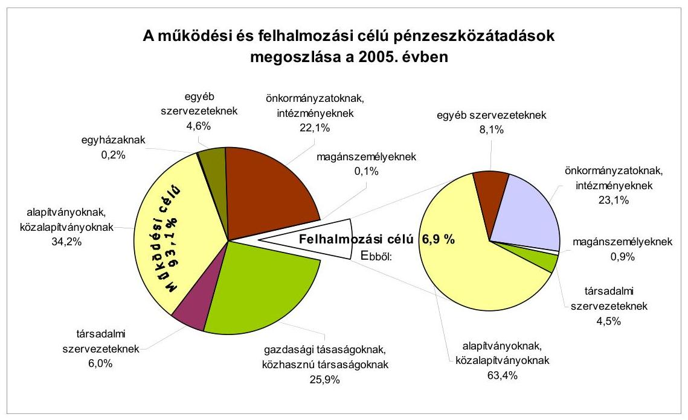
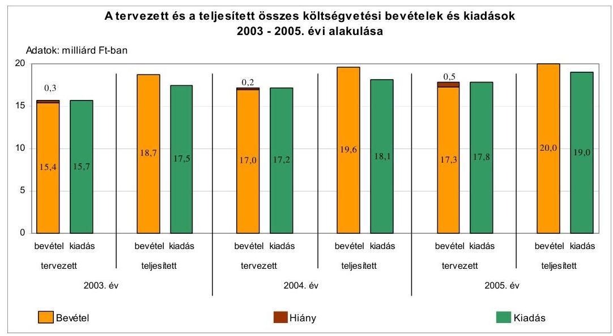
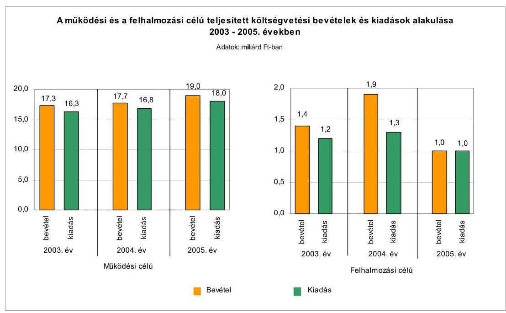
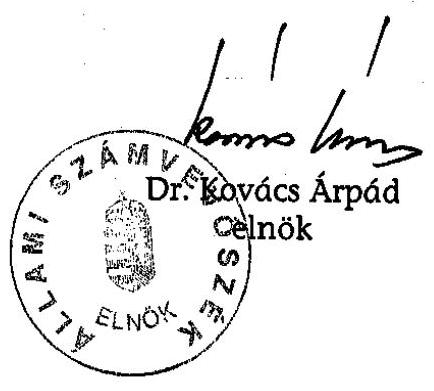
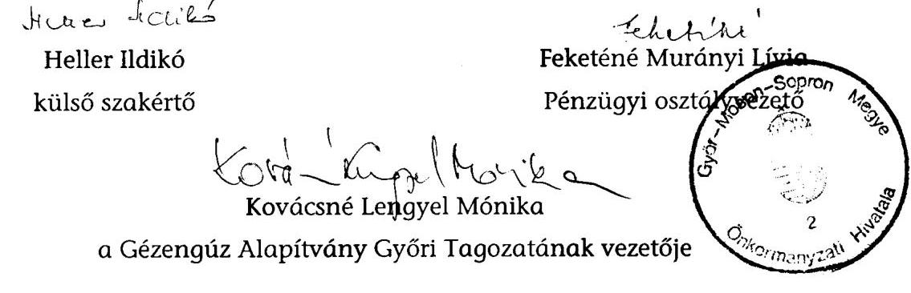
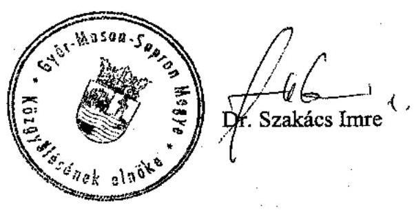
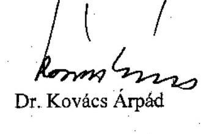

# ÁLLAMI   SZÁMVEVŐSZÉK 

## JELENTÉS

a Győr-Moson-Sopron Megyei Önkormányzat gazdálkodási rendszerének 2006. évi átfogó ellenőrzéséről

---

# 3. Önkormányzati és Területi Ellenőrzési Igazgatóság 

3.3. Átfogó Ellenőrzések Főcsoport

Iktatószám: V-1003-5/22/19/2006.
Témaszám: 803
Vizsgálat-azonosító szám: V0268

## Az ellenőrzést felügyelte:

Dr. Lóránt Zoltán
főigazgató
Az ellenőrzés végrehajtásáért felelős:
Dr. Sepsey Tamás
főigazgató-helyettes
Az ellenőrzést vezette:
Csecserits Imréné
főcsoportfőnök-helyettes
Az ellenőrzést végezték:
dr. Fátrainé Zsebedics Katalin Heller Ildikó Vécsey László
tanácsadó
külső szakértő főtanácsadó

## A témához kapcsolódó - elmúlt három évben - készített számvevőszéki jelentések:

## címe

Jelentés a helyi önkormányzatok tartós szociális ellátási feladatainak ellenőrzéséről az idősek otthonainál
Jelentés a helyi és a helyi kisebbségi önkormányzatok gazdálkodásának átfogó ellenőrzéséről
Jelentés a helyi önkormányzatok gyermekvédelmi szakellátási tevékenységének ellenőrzéséről
Jelentés a Magyar Köztársaság 2003. évi költségvetése végrehajtásának ellenőrzéséről
Függelék - Kötött felhasználású támogatások 2003. évi felhasználásának ellenőrzése
Jelentés a címzett támogatásból finanszírozott egészségügyi beruházások, rekonstrukciók ellenőrzéséről
Jelentés a Magyar Köztársaság 2004. évi költségvetése végrehajtásának ellenőrzéséről
Függelék - A helyi önkormányzatok beruházásaihoz és rekonstrukcióihoz nyújtott 2004. évi felhalmozási célú támogatások

---

# TARTALOMJEGYZÉK 

BEVEZETÉS ..... 5
I. ÖSSZEGZŐ MEGÁLLAPÍTÁSOK, KÖVETKEZTETÉSEK, JAVASLATOK ..... 7
II. RÉSZLETES MEGÁLLAPÍTÁSOK ..... 14

1. A költségvetés tervezésének, végrehajtásának, az Önkormányzat vagyongazdálkodásának és a zárszámadás elkészítésének szabályszerűsége ..... 14
1.1. A költségvetési rendelet jóváhagyásának, módosításának, az előirányzatok nyilvántartásának szabályszerűsége ..... 14
1.2. A gazdálkodás szabályozottsága, a bizonylati rend és fegyelem szabályszerűsége ..... 19
1.3. A pénzügyi-számviteli feladatok ellátásának informatikai támogatottsága ..... 26
1.4. Az önkormányzati vagyon nyilvántartása, számbavétele ..... 28
1.5. A vagyonnal való gazdálkodás szabályszerűsége, célszerűsége, nyilvánossága ..... 30
1.6. A céljelleggel nyújtott támogatások szabályszerűsége ..... 39
1.7. A közbeszerzési eljárások szabályszerűsége ..... 43
1.8. A zárszámadási kötelezettség teljesítésének szabályszerűsége ..... 48
2. Az önkormányzati feladatok és a rendelkezésre álló források összhangja ..... 50
2.1. A feladatok meghatározása és szervezeti keretei ..... 50
2.2. A költségvetés egyensúlyának helyzete ..... 54
2.3. A feladatok finanszírozása ..... 59
3. A belső ellenőrzési rendszer működésének értékelése ..... 61
3.1. Az ellenőrzési rendszer kialakítása, működése ..... 61
3.2. A könyvvizsgálati kötelezettség teljesítése ..... 64
3.3. A korábbi számvevőszéki ellenőrzések javaslatainak hasznosulása ..... 65

---

# MELLÉKLETEK 

1. számú Az Önkormányzat gazdálkodását meghatározó adatok, mutatószámok (1 oldal)
2. számú Az önkormányzati vagyon nagyságának alakulása (1 oldal)
3. számú Az Önkormányzat 2005. évi bevételeinek és kiadásainak alakulása (1 oldal)
4. számú Egyes önkormányzati feladatok finanszírozása (1 oldal)
5. számú Helyszíni ellenőrzési jegyzőkönyv (3 oldal)
6. számú Dr. Szakács Imre úr, a Győr-Moson-Sopron Megyei Közgyűlés elnökének észrevétele (2 oldal)
7. számú Dr. Szakács Imre úr, a Győr-Moson-Sopron Megyei Közgyűlés elnökének írt válaszlevél (1 oldal)

---

# RÖVIDÍTÉSEK JEGYZÉKE 

## Tövények

Áfa tv.
Az általános forgalmi adóról szóló 1992. évi LXXIV. törvény
Áht.
Art.
Htv.

Kbt.
Ksztv.
Kt.
Ötv.
Számv. tv.
Szoc. tv.

## Rendeletek

Ámr.
Ber.
Vhr.

## Szórövidítések

aljegyző
ÁSZ
Előkészítő és bíráló bizottság
ESzCsM
FEUVE
főjegyző
FVM
GAMESZ
Illetékhivatal
KDB
Kórház
Közbeszerzési bizottság
Közgyűlés
Közgyűlés elnöke
KSH
az állalános forgalmi adóról szóló 1992. évi LXXIV. törvény
az államháztartásról szóló 1992. évi XXXVIII. törvény
az adózás rendjéről szóló 2003. évi XCII. törvény
a helyi önkormányzatok és szerveik, a köztársasági megbízottak, valamint egyes centrális alárendeltségú szervek feladat- és hatásköreiről szóló 1991. évi XX. törvény
a közbeszerzésekről szóló 2003. évi CXXIX. törvény
a közhasznú szervezetekről szóló 1997. évi CLVI. törvény
a közoktatásról szóló 1993. évi LXXIX. törvény
a helyi önkormányzatokról szóló 1990. évi LXV. törvény
a számvitelről szóló 2000. évi C. törvény
a szociális igazgatásról és a szociális ellátásokról szóló 1993. évi III. törvény
az államháztartás múködési rendjéről szóló 217/1998. (XII. 30.) Korm. rendelet
a költségvetési szervek belső ellenőrzéséről szóló 193/2003. (XI. 26.) Korm. rendelet
az államháztartás szervezetei beszámolási és könyvvezetési kötelezettségének sajátosságairól szóló 249/2000. (XII. 24.) Korm. rendelet

Győr-Moson-Sopron Megyei Önkormányzat aljegyzője Állami Számvevőszék
Győr-Moson-Sopron Megyei Önkormányzat Közgyűlésének Közbeszerzési Előkészítő és Bíráló Bizottsága
Egészségügyi, Szociális és Családügyi Minisztérium
folyamatba épített, előzetes és utólagos vezetői ellenőrzés Győr-Moson-Sopron Megyei Önkormányzat főjegyzője Földművelésügyi és Vidékfejlesztési Minisztérium Győr-Moson-Sopron Megyei Önkormányzat GazdaságiMúszaki Ellátó Szervezete
Győr-Moson-Sopron Megyei Illetékhivatal
Közbeszerzések Tanácsa Közbeszerzési Döntőbizottsága
Petz Aladár Megyei Oktató Kórház
Győr-Moson-Sopron Megyei Önkormányzat Közgyűlésének Közbeszerzési Bizottsága
Győr-Moson-Sopron Megyei Önkormányzat Közgyűlése Győr-Moson-Sopron Megyei Önkormányzat Közgyűlésének elnöke
Központi Statisztikai Hivatal

---

| MEPI | Győr-Moson-Sopron Megyei Önkormányzat Pedagógiai Intézete |
| :--: | :--: |
| Múvelődési központ | Bartók Béla Megyei Múvelődési Központ, 2005. január 1től Bartók Béla Megyei Múvelődési Központ Közhasznú Társaság |
| OEP | Országos Egészségbiztosítási Pénztár |
| Önkormányzat | Győr-Moson-Sopron Megyei Önkormányzat |
| Önkormányzati hivatal | Győr-Moson-Sopron Megyei Önkormányzati Hivatal |
| Pénzügyi bizottság | Győr-Moson-Sopron Megyei Önkormányzat Közgyűlésének Pénzügyi Bizottsága |
| Pénzügyi osztály | Győr-Moson-Sopron Megyei Önkormányzati Hivatal Pénzügyi Osztálya |
| Sportigazgatóság | Győr-Moson-Sopron Megyei Önkormányzat Sportigazgatósága |
| SzCsM | Szociális és Családügyi Minisztérium |
| $\mathrm{SzMSz}_{1}$ | Győr-Moson-Sopron Megyei Önkormányzat 5/2003.   (IV. 26.) számú rendelete a Szervezeti és Múködési Szabályzatáról |
| $\mathrm{SzMSz}_{2}$ | Győr-Moson-Sopron Megyei Önkormányzat Közgyűlése elnökének 01/783/2005. számú rendelkezése az Önkormányzat Hivatala Szervezeti és Múködési Szabályzatáról |
| Területfejlesztési osztály | Győr-Moson-Sopron Megyei Önkormányzati Hivatal Területfejlesztési és Vagyongazdálkodási Osztálya |
| ügyrend | Győr-Moson-Sopron Megyei Önkormányzati Hivatal ügyrendje |
| vagyongazdálkodási rendelet | Győr-Moson-Sopron Megyei Önkormányzat 10/1995.   (XII. 15.) számú rendelete az Önkormányzat vagyonáról és a vagyonnal történő gazdálkodás szabályairól |
| Vagyonkezelési bizottság | Győr-Moson-Sopron Megyei Önkormányzat Közgyűlésének Vagyonkezelési Bizottsága |

---

# JELENTÉS 

## a Győr-Moson-Sopron Megyei Önkormányzat gazdálkodási rendszerének 2006. évi átfogó ellenőrzéséről

## BEVEZETÉS

Az Ötv. 92. § (1) bekezdése, az Állami Számvevőszékről szóló 1989. évi XXXVIII. törvény 2. § (3) bekezdése, valamint az Áht. 120/A. § (1) bekezdése alapján az önkormányzatok gazdálkodását az Állami Számvevőszék ellenőrzi. Az ellenőrzésre az Országgyúlés illetékes bizottságai részére is átadott, országosan egységes ellenőrzési program alapján került sor.

## Az ellenőrzés célja annak értékelése volt, hogy:

- az önkormányzati gazdálkodás törvényességét ${ }^{1}$, szabályszerűségét biztosított-ták-e a tervezés, a költségvetés végrehajtása, a vagyongazdálkodás és a zárszámadás során;
- az Önkormányzat által ellátott feladatok és az azokhoz rendelkezésre álló források összhangja biztosított volt-e, különös tekintettel egyes kiemelt feladatokra;
- a gazdálkodás szabályszerűségét biztosító kontrollok ${ }^{2}$ megfelelően segitettéke a végrehajtást.

Az ellenőrzött időszak: a 2005. év, valamint az 1.5., 2.1-2.3. és 3.3. ellenőrzési programpontok esetében a 2003-2004. évek is.

Győr-Moson-Sopron megye lakosainak száma 2005. január 1-jén 439461 fő volt. A megye területén 182 települési önkormányzat múködött, ellátva a közszolgáltatások szervezésével kapcsolatos helyi feladatokat.

Az Önkormányzatot 41 tagú Közgyűlés irányítja, amelynek munkáját kilenc állandó bizottság segíti. A Közgyűlés elnöke a 2002. évi önkormányzati képvi-

[^0]
[^0]:    ${ }^{1}$ A törvényi előírások betartásának elmulasztásakor a részletes megállapítások fejezetben egységesen a törvénysértés megjelölést alkalmazzuk, mivel az ÁSZ nem tehet különbséget a törvényi előírások között.
    ${ }^{2}$ A gazdálkodás szabályszerűségét biztosító kontroll alatt értjük a kiépített és működő belső irányítási és szabályozási rendszert, valamint a belső ellenőrzési funkciók ellátását.

---

selő választástól, míg a főjegyző 1996. november 1-től tölti be funkcióját. Az Önkormányzati hivatalban a vezető beosztásokban a 2002. évi önkormányzati képviselő választás óta nem következtek be változások.

Az Önkormányzat a 2005. évben 20608 millió Ft költségvetési bevételből gazdálkodott, s a 2006. évre 18057 millió Ft költségvetési bevételt irányoztak elő. A teljesített költségvetési kiadás a 2005. évben 19456 millió Ft, a 2006. évre tervezett költségvetési kiadás 18958 millió Ft volt. Az Önkormányzat vagyona a 2005. december 31-i könyvviteli mérleg szerint 13535 millió Ft, az adósságállomány értéke 2624 millió Ft volt.

Az Önkormányzat által fenntartott intézmények száma 2005. december 31-én 26 volt, melyből öt részben önálló gazdálkodási jogkörrel rendelkezett. Az Önkormányzatnak ezen kívül hat társaságban volt a 2005. év végén - egyben $100 \%$-os, egyben $54 \%$-os, a többiben kisebbségi - tulajdoni részesedése.

Az Önkormányzati hivatalban dolgozó köztisztviselők száma a 2005. év elején 110 fő volt, ami a 2005. év végére 101 főre, a költségvetési intézményekben foglalkoztatott közalkalmazottak száma ugyanezen időszakban 4723 fơről 4501 főre csökkent. (Az Önkormányzat gazdálkodását meghatározó adatokat, mutatószámokat a jelentés 1-3. számú mellékletei tartalmazzák.)

A jelentést az ÁSZ-ról szóló 1989. évi XXXVIII. tv. 25. § (1) bekezdése alapján észrevétel közlése céljából megküldtük a Győr-Moson-Sopron Megyei Önkormányzat Közgyűlése elnökének. A kapott észrevételt és az arra adott válaszunkat a jelentés 6-7. számú mellékletei tartalmazzák.

---

# I. ÖSSZEGZŐ MEGÁLLAPÍTÁSOK, KÖVETKEZTETÉSEK, JAVASLATOK 

Az Ötv. előírása alapján a Közgyűlés a 2003. évben fogadta el a választási időszakra vonatkozó gazdasági és humán programját, ami alkalmas volt az évenkénti tervezőmunka megalapozásához.

A Közgyűlés elnöke az Áht-ban előírt határidőket betartva terjesztette a Közgyűlés elé a 2005. és a 2006. évi költségvetési koncepciókat, valamint a 2005. és a 2006. évi költségvetési rendelettervezeteket. Az Ámr. előírásainak megfelelően csatolta a költségvetési koncepciók előterjesztéséhez a Pénzügyi bizottság, a költségvetési rendelettervezethez a Pénzügyi bizottság és a könyvvizsgáló véleményét. A költségvetési koncepciók az Ámr-ben előírtaknak megfelelő tartalommal készültek, melyek alapján a Közgyűlés döntött a költségvetés készítéssel kapcsolatos további feladatokról, elvárásokról. A főjegyző a költségvetési rendelettervezetek beterjesztése előtt azokat a költségvetési szervek vezetőivel az Ámr-ben foglaltaknak megfelelően egyeztette.

Az Áht-ban előírtakat megsértve a 2005. évi költségvetési rendeletben finanszírozási célú pénzügyi műveleteket vettek figyelembe költségvetési bevételként és kiadásként, a költségvetés tervezett hiányát a költségvetési bevételek és kiadások különbségeként nem állapították meg. A mulasztást a tervezett hiány bemutatásával a 2006. évi költségvetés jóváhagyásakor megszüntették. A Közgyűlés a 2005. évben az Áht-ban előírtak alapján meghatározta a költségvetés és a zárszámadás előterjesztésekor bemutatandó mérlegek és kimutatások tartalmi követelményeit. A 2005. évi költségvetés előterjesztésekor még hiányosan, de a 2006. évben már ennek megfelelően mutatták be az Áht-ban előírt mérlegeket, kimutatásokat. Az Áht. és az Ámr. előírásainak megfelelve részletezték a működési és felhalmozási célú bevételeket és kiadásokat, a bevételek előirányzatait és a működési, fenntartási előirányzatokat. A felújítási előirányzatokat célonként, a felhalmozási kiadásokat feladatonként határozták meg.

A költségvetési rendeletekben meghatározták a végrehajtásra vonatkozó szabályokat. Az Önkormányzat a 2005. évi költségvetési rendeletét négyszer módosította, ennek során a költségvetés föösszege 15,6\%-kal növekedett. Az előirányzat módosításokat folyamatosan nyilvántartották és hitelt érdemlően dokumentálták.

Az Önkormányzati hivatal tevékenységét az Ámr-ben előírt $\mathrm{SzMSz}_{2}$-nek megfelelően végezte. A gazdálkodási feladatokat és azok felelőseit a gazdasági szervezet ügyrendjében szabályozták. Az Ámr-ben foglalt előírásoknak megfelelően a Közgyűlés elnöke és a főjegyző a távollétekre és az összeférhetetlenségre tekintettel írásban elkészítette a kötelezettségvállalásra, utalványozásra és ellenjegyzésre vonatkozó személyre szóló felhatalmazásokat. A főjegyző írásban bízta meg az érvényesítést végzőket, meghatározta a szakmai teljesítés igazolásának módját és kijelölte a szakmai teljesítést igazoló személyeket. Az érvényesítéssel megbízottak rendelkeztek az előírt iskolai végzettséggel és szakmai képzettséggel.

---

A főjegyző meghatározta a költségvetési szervek egységes számviteli rendjét, valamint jóváhagyta az Önkormányzati hivatal számviteli politikáját, amely összhangban volt a Vhr. előírásaival. A számviteli politika részeként elkészítették az eszközök és források leltározási és leltárkészítési szabályzatát. A szabályzat tartalmazta a leltározás módját, a leltározás munkaszakaszait, a leltározásban résztvevők feladatait, felelősségét. Az eszközök és források értékelési szabályzata a Vhr. előírásai szerint eszközcsoportonkénti részletezettségben írta elő az értékelés szabályait, az értékvesztés elszámolásának és visszaírásának rendjét, a terven felül értékcsökkenés elszámolásának feltételeit. Meghatározták a követelésekre és ezen belül az illetékkövetelésekre vonatkozó értékelési eljárásokat. A pénzkezelési szabályzatban rögzítették a bankszámlaforgalommal és az ügyfélterminál kezelésével, valamint a készpénzforgalommal kapcsolatos szabályokat, a pénztáros, a helyettes és a pénztárellenőr feladatait. Elkészítették a felesleges vagyontárgyak feltárásáról, hasznosításáról és a selejtezésről szóló szabályzatot, mely előírta az eljárási rendet, annak bizonylatait, a minősítésre, döntésre jogosultakat.

Az Önkormányzati hivatal számlarendje tartalmazta az alkalmazandó könyvviteli számlák számát, megnevezését, valamint a számlaosztályokra, a főkönyvi számlák tartalmára, kapcsolatára, értékváltozására vonatkozó előírásokat. Az Önkormányzati hivatal szabályzatai egymással és a jogszabályi előírásokkal összhangban voltak. Az Önkormányzati hivatalban - beleértve az Illetékhivatalt is - gazdálkodási feladatokat ellátók munkaköri leírásai tartalmazták a feladat- és hatásköröket.

A számviteli bizonylatok megfeleltek a Számv. tv. előírásai szerinti alaki és tartalmi követelményeknek. A gazdálkodási és ellenőrzési jogkörök gyakorlása során a szakmai teljesítés igazolása, az érvényesítés, utalványozás és ellenjegyzés kapcsán az előírt munkafolyamatba épített ellenőrzési feladatoknak az Önkormányzati hivatalban, és ezen belül az Illetékhivatalban is eleget tettek. A pénzforgalmat érintő és az egyéb gazdasági események bizonylatainak rögzítése a Vhr-ben előírt határidőre megtörtént, kivéve az Illetékhivatalt, ahol a Vhr-ben előírtaktól eltérően a banki pénzforgalmat nem a pénzintézeti értesítés megérkezésekor, hanem a hónap végén rögzítették. A szabálytalan gyakorlat megszüntetése érdekében a főjegyző a vizsgálat ideje alatt intézkedett. A főkönyvi és az analitikus nyilvántartások egyeztetését dokumentáltan, negyedévenként elvégezték. A kötelezettségvállalások nyilvántartása az Illetékhivatalban - a főjegyző vizsgálat ideje alatt megtett intézkedéséig - nem felelt meg az Ámr. előírásainak. A 2005. évi gazdálkodás során a kiemelt előirányzatokat önkormányzati szinten és a költségvetési szervek szintjén is betartották.

Az analitikus nyilvántartások, a főkönyvi könyvelés és a költségvetési beszámoló elkészítésének informatikai támogatottsága biztosított volt. Az Önkormányzati hivatal informatikai stratégiáját elkészítették. Az adatvédelem, az adattárolás, és a jogosulatlan hozzáférés megakadályozásának rendszerét a főjegyző által kiadott adatvédelmi szabályzatban rögzítették. Az informatika területére vonatkozó katasztrófa elhárítási tervvel, s a gazdálkodási, számviteli feladatok ellátásához használt szoftverekhez üzemeltetési dokumentációval, felhasználói leírásokkal rendelkeztek. A pénzügyi és számviteli területen dolgozók munkaköri leírásai tartalmazták az informatikai rendszer használatát, feladataik leírását.

---

Az Önkormányzat gondoskodott vagyontárgyainak nyilvántartásáról. Analitikus nyilvántartásában biztosította a törzsvagyonhoz tartozó ingatlanok elkülönítését, de az ingóvagyont - a vagyongazdálkodási rendelet 2006. évi módosításáig - a Vhr-ben foglalt előírások ellenére összevontan tartották nyilván. Az Önkormányzat az 1990-es évek elején - a települési önkormányzatok víziközmű beruházásaiban történt részvétel során - közművagyonra tett szert, mellyel tulajdoni részesedést kívánt szerezni a víziközmú szolgáltatást nyújtó társaságokban. A közművagyon korlátozott forgalomképessége miatt erre nem volt lehetősége, ezért a Közgyűlés döntése alapján a 2004. évben ezen víziközmű vagyont ingyenesen átadták az érintett települési önkormányzatoknak. Az eszközök és források 2005. évi leltározási feladatait a Vhr. és a leltározási szabályzat előírásainak megfelelően teljesítették. Az illetékkövetelések értékvesztését egyszerűsített értékelési eljárással határozták meg. A részesedéseknél és az értékpapíroknál nem került sor értékvesztés elszámolására vagy viszszaírására, mert az a rendelkezésre álló információk alapján nem volt indokolt.

A Közgyűlés a vagyongazdálkodási rendeletben rögzítette a vagyongazdálkodás szabályait. A tulajdonnal való rendelkezési hatásköröket - értékhatárhoz kötötten - megosztották a Közgyűlés, a Vagyonkezelési bizottság és a Közgyűlés elnöke között. A vagyongazdálkodási rendeletben a versenytárgyalási kötelezettséget a 2004. év végéig a 30 millió Ft feletti, 2005. január 1-től a 20 millió Ft feletti forgalmi értékű ingatlanok esetében írták elő. A vagyontárgyak értékesítése, apportálása, ingyenes átadása egy kivétellel a vagyongazdálkodási rendeletben meghatározott hatáskörök betartásával valósult meg. A Közgyűlés egy korlátozottan forgalomképes ingatlant határozattal sorolt át a forgalomképesek közé annak ellenére, hogy az ingatlanok forgalomképességének ilyen módon történő módosítására nem biztosított lehetőséget a vagyongazdálkodási rendelet. Az ingatlanértékesítések előtt készített, illetve az egy éven belül értékesítésre nem került ingatlanok esetében az aktualizált értékbecslést a döntések során figyelembe vették. A követelések elengedésének módját szabályozták, de az Áht. előírásait megsértve a követelések elengedésének eseteit a rendeletben nem határozták meg. Az Önkormányzat az ötmillió Ft feletti szerződéseinek adatait az Áht. előírásának megfelelően honlapján közzétette. A fejlesztési célú támogatások határidőben történő közzétételét az Áhtban előírtakat megsértve kilenc esetben elmulasztották, a közzétételt a vizsgálat ideje alatt elvégezték.

Az Önkormányzat vagyona a 2003. évről a 2005. évre 779 millió Ft-tal csökkent, amely a víziközmú vagyonban szerzett tulajdonnak az érintett települési önkormányzatok részére történt, valamint egy kft-ben lévő üzletrész ingyenes átadása és a pénzeszközök csökkenése miatt következetett be. Az átmenetileg szabad pénzeszközöket államilag garantált értékpapírok vásárlásával kamatoztatták, de a befektetési kockázat csökkentésének lehetőségével a 2005. évben nem éltek, nem nyittattak a befektetési szolgáltatóval az Önkormányzat nevére szóló, együttes rendelkezésű értékpapír alszámlát a KELER Rt-nél. A 2006. évben az Önkormányzat megnyittatta a KELER Rt-nél az Önkormányzat nevére szóló, együttes rendelkezésű értékpapír alszámlát.

Az Önkormányzat költségvetési rendeletében felhalmozási és múködési célú támogatásokra szolgáló keretet alakított ki, valamint céltartalékként is meghatározott támogatásra szolgáló előirányzatokat. A támogatások 73\%-a

---

közgyűlési döntésen alapult, 22\%-ánál a támogatott szervezetről a Közgyűlés elnöke vagy a kijelölt bizottságok, 5\%-ról az intézményvezetők döntöttek. Öszszesen 765 szervezetet részesítettek támogatásban 321,3 millió Ft összegben. A Közgyűlés elnöke és a bizottságok az Ötv. előírásainak megsértésével 51 alapítvány támogatásáról döntöttek, amit a Közgyűlés utólag jóváhagyott. A támogatásban részesített szervezetekkel a Közgyűlés elnöke támogatási szerződést kötött, amelyben meghatározták a támogatás célját és a számadási kötelezettséget. A számadási kötelezettségét határidőben 46 szervezet nem teljesítette. A kiküldött felszólítások eredményeként a támogatottak eleget tettek számadási kötelezettségüknek. Hat szervezet visszautalta a támogatást, kilenc támogatott későbbi időpontra kapott határidőt, egy szervezet nem igazolta a 80 ezer Ft öszszegű támogatás cél szerinti felhasználását, ezért a Közgyűlés elnöke a támogatás visszafizettetésére intézkedett, továbbá egy esetben állapítottak meg céltól eltérő felhasználást. A kedvezményezett többszöri felszólítás után visszafizette a 50 ezer Ft támogatást. Az intézményvezetők az Áht. előírásai ellenére a Közgyűlés engedélye nélkül 100 ezer Ft összegben támogattak társadalmi szervezeteket.

A Közgyűlés a 2004. évben hagyta jóvá az Önkormányzat közbeszerzési szabályzatát, melyben a Kbt. előírásai alapján meghatározták a közbeszerzésekkel kapcsolatos feladatokat. Rögzítették a közbeszerzési eljárások tervezésének, előkészítésének, lefolytatásának rendjét és az eljárásokban résztvevő testületek, személyek felelősségét. Rendelkeztek az eljárásokban közreműködők megfelelő szakértelmének biztosításáról és az összeférhetetlenség szabályairól. Meghatározták a közbeszerzési eljárások dokumentálásának rendjét. Az Önkormányzati hivatalnál a 2005. évben hét közbeszerzési eljárást indítottak, amelyek az intézményeknél folyó fejlesztési, rekonstrukciós munkákhoz és az intézményirányításhoz (ellenőrzés, átvilágítás) kapcsolódtak. Az eljárásokban a Kbt-nek megfelelve alkalmazták az egybeszámítás, a becsült érték megállapításának szabályait, s az alkalmazott eljárási fajtákat is a törvényi előírásoknak megfelelve választották ki. Az Önkormányzat a belső ellenőrzés keretében vizsgáltatta az Önkormányzati hivatal közbeszerzési eljárásait. A költségvetési intézmények esetében a Kbt-ben előírtak ellenére a felügyeleti és belső ellenőrzések keretében a közbeszerzési szabályok betartását rendszerszerűen nem ellenőrizték. A KDB a 2005. évben egy alkalommal hozott - bírság kiszabása nélkül - az Önkormányzat közbeszerzési eljárását megsemmisítő döntést.

A költségvetéssel összehasonlítható módon összeállított zárszámadási rendelettervezetet a Közgyűlés elnöke az előírt határidőn belül terjesztette a Közgyűlés elé. A működési-fenntartási előirányzatokat és teljesítésüket a zárszámadási rendelettervezetben az Áht-nak megfelelően részletezték. Az Áht-ban és az Önkormányzat rendeletében foglaltak ellenére a zárszámadás előterjesztésekor az illetékek méltányosság címén történt elengedéséből származó közvetett támogatásokat szöveges indoklás nélkül mutatták be. A Közgyűlés az Ámr-ben előírtak szerint állapította meg és hagyta jóvá az Önkormányzat és hivatala pénzmaradványát, amivel egyidejűleg döntött költségvetési szervenként a pénzmaradvány felhasználásáról, elvonásáról is. A Közgyűlés elnöke az intézményvezetőket írásban értesítette a beszámoló és a működés elbírálásáról, jóváhagyásáról.

---

Az Önkormányzat kötelező és önként vállalt feladatait az SzMSz ${ }_{1}$-ben rögzítették. A Közgyűlés az önkormányzati feladatok ellátásáról költségvetési intézményeivel, egy közhasznú társasággal és közalapítványokkal gondoskodott. Az Önkormányzatnak a 2005. év végén hat társaságban volt részesedése, melyek az önként vállalt feladatok - repülőtér, kikötő fenntartása, környezetgazdálkodási, regionális fejlesztési feladatok - ellátásában vettek részt. A Közgyűlés a 2004. évben a víziközmű vagyon esetében az érintett települési önkormányzatoknak, a megye kulturális értékeinek bemutatására alapított kft esetében tulajdonrészét a kft másik tulajdonosának térítésmentesen átadta. Az Önkormányzat a kötelező feladatai közül nem oldotta meg a Szoc. tv-ben meghatározottak ellenére a hajléktalanok és a szenvedélybetegek otthonban történő és rehabilitációs intézményi ellátását, továbbá a pszichiátriai betegek rehabilitációs ellátását. A szociális szolgáltatás tervezési koncepció felülvizsgálata során a 2006. évben a Szoc. tv. előírásainak megfelelően, a koncepciótervezetben rögzítésre került a feladatellátás Szoc. tv. szerinti határidőig történő megszervezése. A Művelődési központot a 2004. évben, - mint költségvetési szervet - a Közgyűlés megszüntette és a feladatot a 2005. évtől közhasznú társasági formában látták el. A gyermekvédelem területén egy részben önállóan gazdálkodó intézményt megszüntettek, feladatait a 2006. évtől egy önállóan gazdálkodó intézmény vette át. A változtatásokat szakmai és gazdaságossági szempontokkal indokolták.

A 2003-2005. években az Önkormányzat költségvetési rendeleteiben a jóváhagyott bevételek nem nyújtottak fedezetet a jóváhagyott kiadásokra, így a pénzügyi egyensúly biztosítása céljából hitelfelvétellel számoltak. Hiányt a 2003. évben mind a működési és a felhalmozási kiadásoknál, míg a 20042005. években csak a működési kiadásoknál terveztek. A hiány mérséklése érdekében az Önkormányzat intézményracionalizálási intézkedéseket tett, múködési és felhalmozási célú pénzeszközátvételek, valamint egyszeri felhalmozási támogatások megszerzésével javította pénzügyi helyzetét. Az intézkedések eredményeként keletkezett bevételi többletek és kiadási megtakarítások miatt a vizsgált időszak egészében saját eszközeikkel biztosították a költségvetés pénzügyi egyensúlyát és nem volt szükség a költségvetésben előirányzott múködési és folyószámlahitel felvételére. Hozzájárult a költségvetési egyensúly megteremtéséhez az, hogy az illetékbevételekből minden évben bevételi többleteket realizáltak, valamint a pénzmaradványból a tervezett összeg mintegy négyszeresét vették igénybe. Az Önkormányzat a 2003-2005. években hitelt nem vett fel, nem döntött adósságot keletkeztető kötelezettségvállalásról.

A naturális mutatókkal mérhető oktatási és szociális feladatok fajlagos kiadásai - a középiskolai oktatás kivételével - 2003-2005. között 11-13\%-kal növekedtek. A kiadások növekedését a 2004. évben az áfa-kulcsok változása, a 2005. évben a központi bérintézkedések hatása okozta. A középiskolai oktatásnál kedvezően hatott a fajlagos kiadásokra a tanulócsoportok számának csökkentése, mellyel egyidejűleg az egy tanulócsoportra jutó tanulók száma a 2003. évhez viszonyítva $15,8 \%$-kal nőtt. A személyi juttatások és járulékai változását a szociális és oktatási ágazatban kedvezően befolyásolta a 2004. és a 2005. évben végrehajtott közalkalmazotti létszámcsökkentés. A feladatok finanszírozásában az állami hozzájárulások, támogatások aránya a 2003. évihez képest a 2005. évre az óvodai nevelésnél, az általános iskolai oktatásnál növekedett, azonban a középiskolai ellátásnál és a bentlakásos szociális intézményi ellá-

---

tásnál csökkent, melyet az önkormányzati kiadások arányának növekedése ellensúlyozott. Az intézményi saját bevételek a finanszírozásban jelentéktelen arányt képviseltek, azok nagyságrendje folyamatosan csökkent. Az Önkormányzat az önként vállalt feladatokra a 2003-2005. években az éves költségvetési kiadások 0,7-1,3\%-át fordította, azok mértéke a gazdálkodás pénzügyi egyensúlyát és a kötelező feladatok ellátását nem veszélyeztették.

Az Önkormányzat a középületek akadálymentesítése érdekében szükséges felméréseket elvégezte, amely szerint a tulajdonában lévő 125 középület 58\%-a akadálymentesített, 30\%-ánál részben biztosított, 12\%-nál nem megoldott az akadálymentes megközelítés lehetősége. A felmérés szerint a középületek akadálymentessé tételhez 393 millió Ft szükséges. Az Önkormányzat a fogyatékos személyek jogairól és esélyegyenlőségük biztosításáról szóló törvényben előírtak ellenére 53 középületnél az akadálymentesítést 2005. január 1-ig nem biztosította.

Az Önkormányzat a 2003. évben vállalkozás megbízásával kialakította a belső ellenőrzési feladatok végrehajtásának a feltételeit. A belső ellenőrzési kézikönyvet elkészítették, azt a főjegyző jóváhagyta, tartalma a Ber. előírásainak megfelelt. Elfogadásra kerültek a Ber-ben előírt tartalommal a stratégiai és az éves ellenőrzési tervek. Az ellenőrzési terveket a 2005. évre a főjegyző, a 2006. évre a Közgyűlés hagyta jóvá. A 2006. évi tervet a Közgyűlés - az Ötv-ben előírt határidőt követően - fogadta el. A 2005. évi ellenőrzési tervben rögzített feladatokat az ütemezésnek megfelelően végrehajtották. Az Önkormányzati hivatalban és az intézményeknél a 2005. évben az ellenőrzési tervben foglalt feladatokat elvégezték. A 2005. évi ellenőrzésekről készített jelentésekben értékelték az ellenőrzött szervek működését, gazdálkodását. Az ellenőrzöttek az intézkedési terveket elkészítették, a hiányosságok megszüntetéséről az ellenőrzést végzők utóellenőrzés keretében győződtek meg. A 2004. évi ellenőrzésekről a 2005. évben elkészített jelentés a Ber-ben előírtak ellenére nem tartalmazta az ajánlások hasznosulásának tapasztalatait és az ellenőrzési tevékenység fejlesztésére vonatkozó javaslatokat. A főjegyző az ÁSZ vizsgálat ideje alatt intézkedett, hogy a Ber-ben foglaltakat az éves ellenőrzési jelentés összeállításakor vegyék figyelembe. A főjegyző a Közgyűlés részére a 2005. év folyamán a 2004. évi zárszámadás keretében adott számot az ellenőrzések tapasztalatairól. A Közgyűlés az ellenőrzés színvonalának javítása érdekében követelményeket, elvárásokat nem fogalmazott meg.

Az Önkormányzat az Ötv-ben előírt könyvvizsgálati kötelezettségének eleget tett. A könyvvizsgáló az Önkormányzati hivatal és az intézmények öszszevont adatait tartalmazó éves beszámolónál auditálási eltérést állapított meg. Az eltérés nagyságrendje a számviteli politikában meghatározottak szerint a mérleg főösszegre jelentős hatást nem gyakorolt, ezért a beszámolót korlátozás nélküli hitelesítő záradékkal látta el.

Az Önkormányzatnál az előző négy évben végzett számvevőszéki ellenőrzések 18 szabályszerűségi javaslatát egy kivétellel végrehajtották. Ennek következtében javult a gazdálkodás szabályozottsága, a zsúfoltság mérséklődésével a szociális ellátást nyújtó intézmények működési feltételei, és bővültek a gyermekvédelmi intézmények szolgáltatásai. Szabályszerűbbé vált a kötött felhasználású állami támogatások tervezése, felhasználása, ellenőrzése. Részben haj-

---

tották végre a költségvetés és a zárszámadás előterjesztésekor bemutatandó mérlegekre és kimutatásokra vonatkozó, az Áht-ban előírtak betartására vonatkozó javaslatot, mivel a közvetett támogatásokat nem vagy szöveges indoklás nélkül mutatták be a Közgyűlésnek. A célszerűségi javaslatok megvalósítási lehetőségét minden esetben megvizsgálták, s azok 83\%-át végrehajtották.

A helyszíni ellenőrzés megállapításainak hasznosítása érdekében javasoljuk:

# a közgyűlés elnökének 

a jogszabályi előírások maradéktalan betartása érdekében:

1. gondoskodjon a középületek akadálymentessé tételéről, tekintettel a fogyatékos személyek jogairól és esélyegyenlőségük biztosításáról szóló 1998. évi XXVI. tv. 29. § (6) bekezdésében előírtakra;
a munka színvonalának javítása érdekében:
2. tájékoztassa a Közgyűlést a számvevőszéki jelentés megállapításairól, javaslatáról.

---

# II. RÉSZLETES MEGÁLLAPÍTÁSOK 

## 1. A KÖLTSÉGVETÉS TERVEZÉSÉNEK, VÉGREHAJTÁSÁNAK, AZ ÖNKORMÁNYZAT VAGYONGAZDÁLKODÁSÁNAK ÉS A ZÁRSZÁMADÁS ELKÉSZÍTÉSÉNEK SZABÁLYSZERŰSÉGE

### 1.1. A költségvetési rendelet jóváhagyásának, módosításának, az előirányzatok nyilvántartásának szabályszerűsége

A Közgyűlés az Ötv. 91. § (1) bekezdésében előírt kötelezettségének megfelelően a 145/2003. (VI. 20.) számú határozatával fogadta el a 2003-2006. évekre vonatkozó gazdasági és humán programját.

A program az Önkormányzat középtávú céljait és feladatait foglalta össze, melynek keretében rögzítették a követendő megyepolitikai alapelveket, felmérték a megye akkori állapotának főbb jellemzőit és a területi folyamatokat, valamint áttekintették az Önkormányzat feladatait és hatásköreit, igénybe vehető eszközeit. A gazdasági programmal összhangban került jóváhagyásra az a humán program, melyben nyolc fejezetben rögzítették az egyes ágazatok céljait, feladatait.

A gazdasági és humán program időarányos végrehajtását a Közgyűlés a 2004. és a 2005. év végén áttekintette, s határozatokat hozott ${ }^{3}$ a Közgyűlés elnöke által előterjesztett beszámolók elfogadásáról, a szükségessé vált aktualizálások végrehajtásáról.

Az Ámr. 28. § (2) bekezdésében foglalt kötelezettségének megfelelve a költségvetési koncepció összeállítása előtt a főjegyző áttekintette az önállóan és részben önállóan gazdálkodó költségvetési intézmények következő évre vonatkozó feladatait és az Önkormányzat várható bevételi forrásait.

Az Ámr. 28. § (1) bekezdésében foglaltakat betartva a 2005. és a 2006. évi költségvetési koncepciókat a készítésekor ismert információkra alapozva a helyben képződő várható bevételek és kötelezettségek alapján állították össze.

A költségvetési támogatások 2005. évi várható csökkenése és a személyi juttatások és járulékaik növekedése miatt együttesen 860 millió Ft-os hiánnyal számoltak a koncepciókészítés időszakában, amit a várható illeték-bevételi többlet csak 100 millió Ft-tal kompenzált az előzetes számításaik szerint.

A 2006. évben már 1014 millió Ft-os hiánnyal számoltak, ezért mindkét évben hitel felvételét tartották szükségesnek a költségvetési koncepció összeállításakor.

[^0]
[^0]:    ${ }^{3}$ A Közgyűlés 257/2004. (XII. 17.) és 203/2005. (XII. 23.) számú határozatai a gazdasági és humán program időarányos végrehajtásáról.

---

A költségvetési koncepciók tervezetét az Önkormányzatnál múködő bizottságok megtárgyalták, véleményüket írásban rögzítették. A Pénzügyi bizottság az egész koncepcióról alkotott véleményt, amit szintén írásban rögzítettek.

A Közgyűlés elnöke a 2005. és a 2006. évekre szóló költségvetési koncepciókat az Áht. 70. §-ában előírt határidőt ${ }^{4}$ betartva (2004. november 10én, illetve 2005. november 9-én) nyújtotta be a Közgyűlésnek, melyekhez az Ámr. 28. § (3) bekezdésének megfelelően csatolta a bizottságok véleményét is.

A Közgyűlés a 226/2004. (XI. 26.) és a 164/2005. (XI. 25.) számú határozataival fogadta el a koncepciókat, melyekben döntött a 2005. és a 2006. évi költségvetések összeállításánál követendő főbb alapelvekről, szempontokról, s külön a figyelembe veendő ágazati követelményekről.

Ezek között kiemelt szerepet kapott mindkét évben az Önkormányzat által fenntartott intézmények szervezeti korszerűsítésével kapcsolatos 2003. évben megkezdett átvilágítás hasznosítása. Ugyancsak kiemelt szerepet kapott az Illetékhivatal behajtási tevékenységének javítása, s a takarékosságra irányuló szándék, melynek keretében - egyebek mellett - dologi automatizmust nem engedélyeztek a részletes költségvetés-készítés során figyelembe venni. Az energia áremelés ellentételezésére céltartalék képzését rendelték el.

Az Önkormányzat a 2005. május 2 -ától hatályos rendeletében ${ }^{5}$ határozta meg a költségvetés és a zárszámadás előterjesztésekor tájékoztatásul bemutatandó, az Áht. 118. §-a szerinti - mérlegek, kimutatások tartalmi követelményeit. ${ }^{6}$

A 2005. és a 2006. évi költségvetési rendelettervezetet a Közgyűlés elnöke az Áht. 71. § (1) bekezdésében előírt határidőn belül, ${ }^{7}$ 2005. február 4én, illetve 2006. február 2-án terjesztette elő. Az Ámr. 29. § (9) bekezdésében foglalt kötelezettségének megfelelően csatolta az előterjesztéshez a Pénzügyi bizottság, valamint a könyvvizsgáló írásos véleményét.

A főjegyző a 2005. és a 2006. évi költségvetési rendelettervezetet egyeztette a költségvetési szervek vezetőivel, melyet írásban rögzítettek az Ámr. 29. § (4) bekezdésében foglaltaknak megfelelően.

A Közgyűlés elnöke a javasolt előirányzatokat megalapozó rendelettervezetek előterjesztése tekintetében a 2005. és a 2006. években eltérő módon járt el.

[^0]
[^0]:    ${ }^{4}$ Az Áht. 70. §-a szerint a költségvetési koncepciót november 30-ig kell a Közgyűlésnek benyújtani.
    ${ }^{5}$ Az Önkormányzat 4/2005. (V. 2) számú rendelete az Önkormányzat 2004. évi költségvetésének végrehajtásáról.
    ${ }^{6}$ Az Áht. 118. §-ában előírtak 2001. január 1-től tették kötelezővé a mérlegek, kimutatások tartalmi követelményeinek meghatározását.
    ${ }^{7}$ Az Áht. 71. § (1) bekezdése szerinti határidő február 15.

---

A 2005. évi költségvetés előterjesztésével egyidejűleg nem terjesztett elő olyan rendelettervezeteket is, amelyek a javasolt előirányzatokat megalapozták volna. Az előterjesztett költségvetésben ugyanis a tervezéskor érvényben volt intézményi térítési díjakkal számoltak ${ }^{8}$, amit az év közben jóváhagyott új rendeletek ${ }^{9}$ elfogadását követően módosítottak 2005. júniusától.

A 2006. évi költségvetési rendelettervezetben a bevételi előirányzatokat a tervezett díjemelés figyelembevételével határozták meg, így az előirányzatok megalapozása érdekében szükségessé vált díjemelésekről szóló két rendeletmódosítást ${ }^{10} \mathrm{a}$ költségvetési rendelettervezettel együtt terjesztett elő jóváhagyásra a Közgyűlésnek, az Áht. 71. § (2) bekezdésében foglaltaknak megfelelően.

Az Önkormányzat Közgyűlés elnökének előterjesztését két alkalommal (2005. február 11-én és március 4-én) tárgyalva alkotta meg 3/2005. (III. 7.) számú rendeletét a 2005. évi költségvetésről.

A költségvetési rendeletben az Önkormányzat 2005. évi bevételeit és kiadásait azonos föösszegben, 18381 millió Ft-ban állapította meg a Közgyűlés. A tervezett finanszírozási célú pénzügyi műveleteket - működési célú és folyószámla hitelfelvételt és törlesztést - az Áht. 8/A. § (7) bekezdésében foglaltakat megsértve, költségvetési hiányt módosító bevételként, illetve kiadásként mutatták be és hagyták jóvá. A törvénysértő gyakorlatot az ÁSZ vizsgálat ideje alatt előterjesztett és elfogadott 2006. évi költségvetési rendelettervezetben megszüntették, s a költségvetési bevételek és költségvetési kiadások különbözeteként bemutatták a költségvetési hiányt.

Az Önkormányzat 2005. évi költségvetési rendelete tartalmazta a címrend meghatározását az Áht. 67. § (3) bekezdésében foglaltaknak megfelelően, melynek figyelembe vételével tartalmazta a költségvetés a bevételeket és kiadásokat.

Az Áht. 69. § (1) bekezdésében foglaltakat végrehajtva tartalmazta a 2005. és a 2006. évi költségvetés a múködési és felhalmozási célú bevételeket és kiadásokat Önkormányzatra összesítve, ezen belül a személyi jellegű kiadásokat, munkaadókat terhelő járulékokat, dologi jellegű kiadásokat, az ellátottak pénzbeli juttatásait, a speciális célú támogatások és a felhalmozások (felújítások) előirányzatait.

[^0]
[^0]:    ${ }^{8}$ Az Önkormányzat 7/2004. (V. 7.) számú rendelete a személyes gondoskodást nyújtó szociális intézményekben fizetendő térítési díjakról, illetve 8/2004. (V. 7.) számú rendelete a személyes gondoskodást nyújtó gyermekvédelmi intézményekben fizetendő térítési díjakról.
    ${ }^{9}$ Az Önkormányzat 5/2005. (V. 2.) számú rendelete a személyes gondoskodást nyújtó szociális intézményekben fizetendő térítési díjakról, illetve 6/2005. (V. 2) számú rendelete a személyes gondoskodást nyújtó gyermekvédelmi intézményekben fizetendő térítési díjakról.
    ${ }^{10}$ Az Önkormányzat 4/2006. (III. 10) számú rendelete a személyes gondoskodást nyújtó szociális intézményekben fizetendő térítési díjakról, illetve 5/2006. (III. 10) számú rendelete a személyes gondoskodást nyújtó gyermekvédelmi intézményekben fizetendő térítési díjakról.

---

Bemutatták az Önkormányzat és az intézmények bevételeit - a pénzügyminiszter elemi költségvetés összeállítására vonatkozó tájékoztatójában rögzített - főbb jogcímcsoportok szerinti részletezésben, a múködési és felhalmozási előirányzatokat önállóan és részben önállóan gazdálkodó költségvetési szervenként, azon belül kiemelt előirányzatonként, a felújítási előirányzatokat célonként, a felhalmozási kiadásokat feladatonként részletezve az Ámr. 29. § (1) bekezdése a)-d) pontjaiban foglaltaknak megfelelően.

A 2005. és a 2006. évi költségvetés az Ámr. 29. § (1) bekezdés e)-h) és j) pontjaiban előírtak szerint tartalmazta:

- az Önkormányzati hivatal költségvetését feladatonként és külön tételben a céltartalékot, elkülönítve a kötelező államháztartási céltartalék képzést;
- az éves létszámkeretet önállóan és részben önállóan gazdálkodó költségvetési szervenként;
- a többéves kihatással járó feladatok előirányzatait éves bontásban;
- a működési és felhalmozási célú bevételi és kiadási előirányzatokat mérlegszerűen;
- az előirányzat-felhasználási ütemtervet az év várható bevételi és kiadási előirányzatainak teljesüléséről.

A 2005. és a 2006. évi költségvetési rendelettervezetek benyújtásakor az Áht. 71. § (3) bekezdésében foglaltak szerint bemutatták a 2005. és a 2006. évet követő két év várható bevételi és kiadási előirányzatait.

Az Áht. 118. §-ában előírtakat megsértve, a 2005. évi költségvetés előterjesztésekor a Közgyűlés részére nem mutatták be tájékoztatásul az Áht. 116. § 10. pontjában előírt közvetett támogatásokat, szöveges indoklással ellátva. A 2006. évi költségvetés ÁSZ vizsgálat ideje alatt történt előterjesztése a főjegyző intézkedését követően már tartalmazta a közvetett támogatásokat, szöveges indoklással ellátva.

A 2005. és a 2006. évi költségvetési rendeletben részletesen meghatározták a költségvetés végrehajtására vonatkozó szabályokat:

- a Közgyűlés a 2005. évi költségvetés előirányzatai közötti átcsoportosítás jogát az Áht. 74. § (1)-(2) bekezdéseiben foglaltak alapján a Közgyűlés elnökére, és a Pénzügyi bizottságra ruházta át ${ }^{11}$;
- az intézmények kötelesek voltak a saját hatáskörű előirányzat-módosításaikról folyamatosan tájékoztatni az Önkormányzati hivatalt oly módon, hogy a december 31-ig végrehajtott módosításokat legkésőbb a következő év január 10-ig kellett jelenteniük, s a költségvetést mindezekről az éves

[^0]
[^0]:    ${ }^{11}$ A Közgyűlés elnöke esetenként maximum 2 millió Ft, éves szinten 10 millió Ft értékhatárig, míg a Pénzügyi bizottság esetenként maximum 5 millió Ft, éves szinten 25 millió Ft értékhatárig kapott jogosultságot átcsoportosításra.

---

munkatervben meghatározott időpontokban kellett a Közgyűlés döntését követően módosítani ${ }^{12}$;

- a központi pótelőirányzatok miatt szükségessé váló költségvetési előirányzatmódosítások időpontjaként legkésőbb a költségvetési szerv számára a költségvetési beszámoló felügyeleti szervhez történő megküldésének külön jogszabályban meghatározott határidejét írták elő. Ez szabálytalan volt, mivel az Ámr. 53. § (2) bekezdése szerint a Közgyűlésnek negyedévenként kell döntenie a központi pótelőirányzatok miatti előirányzat-módosításokról. A 2006. évi költségvetésről szóló rendeletben előírták a negyedévenkénti elő-irányzat-módosítás kötelezettségét;
- a Közgyűlés a 31 millió Ft általános tartalék felhasználásáról szóló rendelkezés jogával éves szinten összesen ötmillió Ft-os értékhatárig a Közgyűlés elnökét, 10 millió Ft-os értékhatárig a Pénzügyi bizottságot hatalmazta fel;
- rendelkeztek az intézmények vállalkozási tartalékainak felhasználása rendjéről, az egyes felhasználási jogcímek sorrendiségéről;
- meghatározták a céltartalék felhasználás eljárási rendjét, valamint azt, hogy a döntés mely esetekben tartozik a Közgyűlés, a Közgyűlés elnöke, illetve a bizottságok hatáskörébe;
- rendelkeztek az intézményi többletbevételek felhasználhatóságáról, a személyi juttatások és a munkaadókat terhelő járulékok előirányzata emelésének szabályairól;
- a 2004. évi szabad pénzmaradványt, továbbá a 2004. évi feladatmutatóhoz kötött normatív támogatások elszámolása során esetlegesen képződő többlettámogatás összegét elsősorban a 2005. évi költségvetésben tervezett múködési célú hitel kiváltására engedélyezték fordítani;
- felhatalmazták a Közgyűlés elnökét a tervezett működési- és folyószámlahitel felvételéről szóló döntések jogával a tényleges szükségletek szerint.

A 2005. évi költségvetésben 13 jogcímen „alap" elnevezéssel különített el a Közgyűlés pénzösszegeket, melyek felett a bizottságok voltak jogosultak döntést gyakorolni pályázati rendszer keretében. Az „alap" elnevezés az elkülönített költségvetési keretösszegek tekintetében nem volt összhangban az Áht-ban foglaltakkal, mivel az elkülönített állami pénzalapokra, mint az államháztartási rendszer egyik alrendszerének elemére az Áht. az „alap" kifejezést használja, melyre az Áht. 54. §-a meghatározza azok létrehozásának, gazdálkodásának feltételeit is. Ezen feltételnek az Önkormányzat által létrehozott alapok nem feleltek meg, a kifejezés félreérthető volt. Ezt az Önkormányzat a 17/2005. (XII. 28.) számú rendeletével megszüntette; s az „alap" kifejezés helyett az adott célú támogatást szolgáló pénzeszköz kifejezést vezették be.

[^0]
[^0]:    ${ }^{12}$ A 2005. évi munkaterv szerint szeptember és december, míg a 2006. évi munkaterv szerint június, szeptember és december hónapokban.

---

Az Önkormányzat négy alkalommal módosította rendelettel ${ }^{13}$ a 2005. évi költségvetését. A végrehajtott módosítások következtében - melyek a jóváhagyott költségvetéssel összehasonlíthatóak voltak - az Önkormányzat elfogadott költségvetési főösszege 2869 millió Ft-tal, 15,6\%-kal nőtt.

- A költségvetés első módosítása a jóváhagyott eredeti költségvetési bevételikiadási főösszeget nem érintette, mivel azt az intézményi működés racionalizálása (létszámcsökkentés), valamint az ahhoz kapcsolódó előirányzatátcsoportosítás tette szükségessé a jóváhagyott költségvetésen belül.
- Az Önkormányzati hivatal saját hatáskörben végrehajtott előirányzatátcsoportosításait a költségvetés végrehajtására vonatkozó rendelkezés szerint, a munkatervben meghatározott időpontokban végrehajtották. Az Ámr. 53. § (6) bekezdésében foglaltakat azonban nem tartották be azzal, hogy az intézmények saját hatáskörben végrehajtott előirányzat-módosításairól a Közgyűlés elnöke nem adott a Közgyűlés részére tájékoztatást 30 napon belül. Az ÁSZ vizsgálat ideje alatt előterjesztett és elfogadott 2006. évi költségvetésben intézkedtek ezen hiányosság megszüntetésére azzal, hogy a végrehajtás szabályai között a Közgyűlés előírta a Közgyűlés elnöke számára a 30 napon belüli tájékoztatási kötelezettséget.
- Az év közben kapott központi pótelőirányzatok miatt előírt negyedévenkénti rendelet-módosítást végrehajtották, melyre első alkalommal a III. negyedévben került sor. ${ }^{14}$

A 2005. évi költségvetés utolsó módosítására az Ámr. 53. § (2) és (6) bekezdésében foglaltak ellenére február 28. helyett 2006. március 3-án került sor.

Az Önkormányzatnál a különböző hatáskörben végrehajtott előirányzatváltozásokat folyamatosan nyilvántartották és hitelt érdemlően dokumentálták. A nyilvántartásokból az előirányzat-változások folyamatosan nyomon követhetők voltak.

# 1.2. A gazdálkodás szabályozottsága, a bizonylati rend és fegyelem szabályszerűsége 

Az Önkormányzati hivatal $\mathrm{SzMSz}_{2}$-e az Ámr. 10. § (4) bekezdésének a) pontja alapján tartalmazta az alapító okirat keltét, számát, az f) pont alapján az Önkormányzati hivatal jogállását, szervezeti felépítését és feladatait, a g) pont alapján a költségvetés végrehajtására szolgáló bankszámlaszámot, valamint a h) pont alapján az Önkormányzati hivatal szervezeti egységeinél pénzügyi gazdasági tevékenységet ellátó személyek feladatkörének, munkakörének meg-

[^0]
[^0]:    ${ }^{13}$ Az Önkormányzat 2005. évi költségvetésének módosításáról szóló 3/2005. (VI. 16.) számú, 12/2005. (X. 7.) számú, 17/2005. (XII. 28.) számú és a 2/2006. (III. 10.) számú rendeletek.
    ${ }^{14}$ Az Önkormányzat a 2005. év I. negyedévében nem részesült központi pótelőirányzatban, a II. negyedévi 187 millió Ft központi pótelőirányzat $88,7 \%$-át a II. negyedév utolsó napján (június 30.) utalták át bankszámlájára.

---

határozását. Az Önkormányzati hivatal $\mathrm{SzMSz}_{2}$-ét - az Önkormányzat $\mathrm{SzMSz}_{1}$-ében ${ }^{15}$ történt hatáskör átruházás alapján - a Közgyűlés elnöke hagyta jóvá.

Az Önkormányzati hivatal gazdálkodással összefüggő feladatait az $\mathrm{SzMSz}_{2}$-ben rögzítettek szerint a Pénzügyi osztály, a Területfejlesztési osztály és az Illetékhivatal gazdasági ügyintézője látta el.

Az Illetékhivatalt az Önkormányzati hivatal részjogkörú költségvetési egységeként sorolták be, mely előirányzatai felett önállóan gazdálkodott. Az Illetékhivatal múködési rendjét az $\mathrm{SzMSz}_{2}$ 1. számú függelékében szabályozták, részletezték felépítését, múködési rendszerét, a hivatalvezető, a csoportvezetők, ügyintézők, ügykezelők felelősségét és fő feladatait. A gazdálkodási feladatokat ellátó Illetékhivatal gazdálkodását - az Önkormányzati hivataltól elkülönült elhelyezése miatt - az Önkormányzat költségvetési elszámolási számlájának alszámláján bonyolította.

Az önálló gazdálkodási jogkörrel rendelkező GAMESZ megbízás alapján, a saját költségvetésén belül látta el az Önkormányzati hivatal személyi és dologi kiadásaival, valamint a múködéshez szükséges vagyontárgyak beszerzésével, kezelésével, leltározásával kapcsolatos feladatokat.

A költségvetés tervezésével és végrehajtásával kapcsolatos különleges elöírásokat - a gazdálkodásért felelős személyek ellátandó feladatait, a vezetők és más dolgozók feladat-, hatás-, és jogkörét - az Ámr. 17. § (5) bekezdésében előírtak alapján a gazdasági szervezet ügyrendjében részletezték.

Az operatív gazdálkodással és a munkafolyamatba épített ellenőrzéssel összefüggő jogkörök gyakorlásának rendjét kötelezettségvállalási szabályzatban ${ }^{16}$ rögzítették. Meghatározták az előzetes, írásbeli kötelezettségvállalást nem igénylő 50 ezer Ft alatti kiadások nyilvántartásba vételének rendjét. A kötelezettségvállalási szabályzathoz mellékelték az egyes jogkörök gyakorlására vonatkozó név szerinti felhatalmazásokat, megbízásokat, kijelöléseket.

A Közgyűlés elnöke akadályoztatása esetére, illetve az összeférhetetlenség elkerülése érdekében a Közgyűlés általános alelnökét, valamint az Illetékhivatal vezetőjét és helyettesét hatalmazta fel kötelezettségvállalásra. Utalványozásra - a kötelezettségvállalásra felhatalmazott személyeken kívül - a Területfejlesztési osztály vezetője az egzisztencia hitelből származó bevételek, a Pénzügyi osztály vezetője az összes egyéb bevétel esetében kapott felhatalmazást.

A főjegyzőtől a kötelezettségvállalások és utalványok ellenjegyzésére az aljegyző, az Illetékhivatal esetében két csoportvezető kapott felhatalmazást. A főjegyző az

[^0]
[^0]:    ${ }^{15}$ Az Önkormányzat 4/2004. (V. 7.) számú rendeletével módosított 5/2003. (IV. 26.) számú, "A Közgyűlés szervezeti és múködési szabályzatáról" szóló rendeletének 37. § (6) bekezdése.
    ${ }^{16}$ A kötelezettségvállalási szabályzatot a Közgyűlés elnöke és a főjegyző 2005. január 1jén helyezte hatályba.

---

egzisztencia hitelből származó bevételeknél a Területfejlesztési osztály munkatársa, az összes többi bevétel esetében a Pénzügyi osztály munkatársa részére is adott felhatalmazást ellenjegyzésre.

Az elvégzett feladatokról a felhatalmazottak beszámoltatása megtörtént.
A főjegyzö - az Ámr. 135. § (3) bekezdésében előírtak alapján - meghatározta a szakmai teljesítés igazolásának módját és kijelölte az arra jogosultakat.

Szakmai teljesítés igazolására a különböző szakterületekkel kapcsolatosan a területet felügyelő alelnököket, távollétük esetében az osztályvezetőket, a terület szakreferenseit, szakügyintézőit, az Illetékhivatal vezetőjét és helyettesét jelölte ki.

A főjegyzö írásban bízta meg a Pénzügyi osztályon és az Illetékhivatalban az érvényesítési feladatokat ellátókat. A megbízottak rendelkeztek az Ámr. 135. § (2) bekezdésében előírt iskolai végzettséggel és szakmai képzettséggel. A felhatalmazásoknál, megbízásoknál, kijelöléseknél az Ámr. 135. § (5) bekezdésében és a 138. § (1)-(3) bekezdésében előírt összeférhetetlenségi követelményeket érvényesítették.

A főjegyzö eleget tett a Htv. 140. § (1) bekezdés c) pontjában foglaltaknak és 2005. január 2-án kiadta az 1/2005. számú utasítását az Önkormányzati hivatal és az Önkormányzat felügyelete alatt álló intézmények számviteli rendjéről.

Az utasításban meghatározta az intézmények által használható számítógépes könyvelési rendszereket. A számviteli politikát és a számlarendet az intézmények önállóan - a Számv. tv. és a Vhr. előírásainak figyelembevételével - alakíthatták ki azzal a megkötéssel, hogy az intézményeknél és az Önkormányzati hivatalnál a tárgyi eszközök és immateriális javak nyilvántartása könyv szerinti értéken történhetett, piaci értéken történő értékelést nem alkalmazhattak.

Az utasítás az egységes eljárás érdekében előírta az adatszolgáltatásokkal kapcsolatos követelményeket, az önállóan és részben önállóan gazdálkodó intézmények közötti munkamegosztás és felelősségvállalás rendjének szabályozására vonatkozó megállapodás tartalmi elemeit, melyet a felügyeleti szervnek kell jóváhagyni. Az intézmények pénzeszközeiket kötelesek az OTP Bank Rt-nél vezetett bankszámlán kezelni. Amennyiben alszámla megnyitására került sor, az elkülönített pénzeszköz céljáról, összegéről és az alszámla számáról az intézmény vezetőjének tájékoztatnia kellett a Közgyűlés elnökét.

A főjegyzö - a jogszabályi változásoknak megfelelően aktualizált - az Önkormányzati hivatalra, ezen belül az Illetékhivatalra is vonatkozó számviteli politikát 2005. január 1-jén helyezte hatályba. A számviteli politikában rögzítették a megbízható, valós összkép kialakítását befolyásoló lényeges információkat. A jelentős összegű hiba, valamint a megbízható és valós képet lényegesen befolyásoló hiba arányát, nagyságrendjét a Vhr. 5. § 8. és 10. pontjában foglaltakkal azonosan határozták meg. Rögzítették, hogy az Önkormányzati hivatal az immateriális javakat és a tárgyi eszközöket a Vhr. 30. § (2) bekezdésében előírt leírási kulcsok alapján számított teljes időre használni fogja, így a terven felüli értékcsökkenés elszámolási kötelezettsége csak a forgalomképes ingatlanokra terjedt ki.

---

Terven felüli értékcsökkenés elszámolását írták elő akkor, ha a vagyonértékű jog a szerződés módosulása miatt csak korlátozottan vagy egyáltalán nem érvényesíthető, továbbá ha a szellemi termék, tárgyi eszköz a tevékenység változása miatt feleslegessé vált, megrongálódás, megsemmisülés következtében rendeltetésének megfelelően nem használható vagy használhatatlanná vált.

A főjegyző az Önkormányzati hivatal számviteli politikájában úgy döntött, hogy nem alkalmazzák a piaci értékelés szabályait. Az értékelési feladatok elvégzésének, valamint a számvitelben végrehajtató helyesbítések végső határidejét, a mérlegkészítés időpontját február 20-ára rögzítették.

Elkészítették az eszközök és források leltározási és leltárkészítési szabályzatát, mely tartalmazta, hogy a december 31-i fordulónappal készített könyvviteli mérlegben kimutatott eszközöket és forrásokat minden évben leltározni kell. Szabályozták az egyes eszközök és források leltározásának módját, mely megfelelt a Vhr. 37. § (3) bekezdésében a mennyiségi felvétellel, illetve egyeztetéssel történő leltározásra előírtaknak. Kialakították az üzemeltetésre átadott eszközök leltározásának szabályait. Meghatározták a leltár alaki és tartalmi követelményeit, és a leltározás végrehajtása előtti feladatokat. Rögzítették a főjegyző, a leltározás vezetője, a leltározók, a leltárellenőrök, valamint az analitikus és főkönyvi nyilvántartást vezetők feladatait, a leltárak és a könyvviteli adatok egyeztetésének módját. A leltárértékelés végrehajtását az értékelési szabályzatban rögzítettek szerint szabályozták. Meghatározták a leltárkülönbözetek rendezésének módját. A leltárértékelések ellenőrzését a Területfejlesztési osztály és a Pénzügyi osztály vezetőjének feladataként írták elő.

Az eszközök és források értékelési szabályzata tartalmazta az eszközök minősítésének, valamint eszközcsoportonkénti részletezettségben az eszközök értékelésének, az értékvesztés és értékvesztés visszaírásának, a források értékelésének, a terven felüli értékcsökkenés elszámolásának rendjét. A számítógépes programmal való támogatottság megvalósulásáig valamennyi 100 ezer Ft egyedi értékű, 30 napnál hosszabb ideje lejárt illetéktartozásra a követeléseknél alkalmazott értékelési eljárást írták elő teljes értékű, külön figyelendő, átlag alatti, kétes és rossz adós kategóriákra megállapított százalékos mértékű értékvesztés elszámolásával. Az értékelési szabályzat módosításaként a főjegyző előírta az illetékkövetelések számítógéppel támogatott egyszerűsített értékelési eljárásának rendjét a 2005. évi könyvviteli mérlegkészítéstől kezdődően.

Önköltség-számítási szabályzattal nem rendelkeztek, mert az Önkormányzati hivatal által ellátott tevékenységek nem indokolták szabályzat készítését.

A házipénztár és a bankszámla kezelésére vonatkozó előírásokat pénzkezelési szabályzatban rögzítették. A szabályzat az Ámr. 103. § (2), (6) és (7) bekezdései alapján tartalmazta az Önkormányzati hivatal és az Illetékhivatal által megnyitható bankszámlák körét, rendeltetését, a bankszámlák számát és az azok felett rendelkezni jogosultak megnevezését. Készpénz felvételét csak az Önkormányzati hivatal költségvetési elszámolási számlája, illetve az Illetékhivatal kihelyezett költségvetési elszámolási számlája terhére tették lehetővé. Rögzítették a házipénztár pénzellátásának és a készpénz szállításának a szabályait. A házpénztár záró pénzkészletét 50 ezer Ft-ban határozták meg. Előírták a pénztáros és a pénztáros helyettes feladatait, a pénztáros helyettesítésének rendjét, a pénztári átadás-átvétel szabályait. Tartalmazta a pénzkezelési sza-

---

bályzat a pénztári bizonylatok vezetésének módját és az elszámolásra kiadott összegek nyilvántartására vonatkozó előírásokat. Meghatározták a pénztárellenőrzést ellátó személyeket és előírták az előzetes és utólagos pénztárellenőrzés keretében elvégzendő feladatokat. Rögzítették az értékpapírok nyilvántartásának és a szigorú számadású nyomtatványok kezelésének rendjét, valamint az ügyfélterminál használatára vonatkozó szabályokat és jogosultságokat. Bankkártyával nem rendelkeztek.

Selejtezési szabályzatban írták elő a vagyontárgyak feleslegessé válásának kritériumait és a selejtezési eljárás menetét, bizonylati rendjét, bizonylatainak tartalmát. Meghatározták a minősítési jogokat gyakorló munkaköröket, és a döntésre jogosultakat. Rögzítették az ármegállapításra jogosultakat és annak szabályait a felesleges eszközök értékesítése esetén. A feleslegessé vált és a kiselejtezett eszközök nyilvántartásból történő kivezetésére, elszámolására vonatkozóan visszautaltak a számlarendben előírtakra.

Az Önkormányzati hivatal számlarendje 2005. január 1-től hatályos. A Számv. tv. 161. § (2) a)-c) pontjában foglaltaknak megfelelően tartalmazta a főkönyvi számlák, alszámlák megnevezését, tartalmát, valamint a főkönyvi számlák növekedésének és csökkenésének jogcímeit és más számlákkal való kapcsolatát, a főkönyvi számlákat érintő gazdasági eseményeket. A számlarendben rögzítették a havi, negyedéves és év végi zárlati kötelezettséget és a Vhr. 49. § (2) és (4) bekezdésében foglaltaknak megfelelően az analitikus nyilvántartások és főkönyvi nyilvántartások egyeztetésének módszerét és annak elvégzését igazoló dokumentálás rendjét. A számlarend tartalmazta az analitikus nyilvántartásokból készítendő összesítő kimutatások, feladások rendjét, formáját, bizonylatait. Elkészítésük határidejét a tárgynegyedévet követő 15. napban rögzítették. A főkönyvi könyvelés, az analitikus nyilvántartás adatai közötti egyeztetési pontokat az Áht. 121. § (3) bekezdés a) pontja alapján kialakították, de a bizonylatok és előző nyilvántartások adatai közötti egyeztetési pontok kialakítására csak a 2005. év második felében került sor. Az analitikus nyilvántartások vezetésének módját a bizonylati szabályzatban és albumban határozták meg.

Az Önkormányzat vagyonának - törzsvagyon, ezen belül forgalomképtelen és korlátozottan forgalomképes vagyon szerinti - nyilvántartását az Önkormányzati hivatal gazdasági szervezetének ügyrendjében, a kötelezettségvállalások „0"-ás számlaosztályban történő nyilvántartásba vételének rendjét a számlarendben szabályozták.

A kötelezettségvállalási-, a pénzkezelési-, a leltározási-, valamint a selejtezési szabályzatokban elöírták az előző munkafázis ellenőrzése elvégzésének kötelezettségét, meghatározták az elvégzendő műveleteket, az ellenőrzés viszonyítási alapját. Az eltérés megállapításának módját, dokumentálását, a szükséges teendőket az ellenjegyzéssel és a pénztárellenőr tevékenységével kapcsolatban, valamint a leltári eltérések esetében szabályozták.

A Pénzügyi osztály és az Illetékhivatal pénzügyi-gazdasági feladatokat ellátó munkatársai rendelkeztek munkaköri leírással, mely tartalmazta a dolgozók feladat és hatáskörét. Rögzítették a helyettesítés rendjét, a dolgozó által ellátandó operatív gazdálkodási feladatokat, a pénztárosi-, illetve a pénz-

---

tár-ellenőrzési feladatok elvégzésének kötelezettségét. A munkaköri leírások tartalmazták az intézményekkel, valamint a főkönyvi, vagy analitikus könyveléssel kapcsolatos egyeztetési, ellenőrzési feladatokat is.

Az Önkormányzati hivatal szabályzatai tartalmazták az Illetékhivatal sajátos működésével, gazdálkodásával kapcsolatos szabályozást, az Illetékhivatal gazdálkodásának felügyeletét.

A szabályzatokban meghatározott feladatok egymással, valamint a munkaköri leírásokban rögzített feladatokkal összhangban voltak.

A főjegyző az Áht. 97. § (1) bekezdésének megfelelően gondoskodott a FEUVE megszervezéséről és az Ámr. 145/B. § (1)-(2) bekezdése alapján elkészítette, az SzMSz ${ }_{2}$-hez mellékletként csatolta az Önkormányzati hivatal ellenőrzési nyomvonalát, melyben tizennégy folyamat ellenőrzési pontjait jelölte ki, meghatározva azok jogszabályi alapját, az előkészítést végző osztályokat, a keletkező dokumentumokat, a felelősöket, határidőket, az ellenőrzést végzőket és feladataikat, valamint rögzítette a pénzügyi feladatok folyamatábráit. Az SzMSz ${ }_{2}$ mellékletét képezte a szabálytalanságok kezelésének eljárásrendje. Az Ámr. 145/C. § (1)-(3) bekezdésében előírtaknak megfelelően elkészített kockázatkezelés rendjét a főjegyzö 2005. áprilisában helyezte hatályba.

A költségvetési előirányzatok terhére vállalt kötelezettségeket írásba foglalták és azt a Közgyűlés elnöke vagy az általa felhatalmazottak írták alá. A kötelezettségvállalások ellenjegyzése jogosultságuknak megfelelően a főjegyző, illetve az általa felhatalmazottak által történt. A kötelezettségvállalások ellenjegyzői eleget tettek az Ámr. 134. § (9) bekezdésében előírt munkafolyamatba épített ellenőrzési kötelezettségüknek.

A könyvviteli nyilvántartásokban elszámolt gazdasági műveletekről, eseményekről a Számv. tv. 165. § (1) bekezdésében előírt számviteli bizonylatokat kiállították. A pénztári, valamint a banki pénzmozgások bizonylatain, illetve a csatolt utalványrendeleteken a szakmai teljesítés igazolását, az érvényesítést, az utalványozást és ellenjegyzést a kötelezettségvállalási szabályzat szerint arra jogosultak végezték el. A szakmai teljesítést igazolók az Ámr. 135. (1) bekezdésében előírtak szerint a feladatok jogosságát és összegszerűségét igazolták a kiadás teljesítése és a bevétel beszedése előtt. A szakmai teljesítés igazolása a főjegyző által - a kötelezettségvállalási szabályzatban - meghatározott módon történt. Az Önkormányzati hivatalban és azon belül az Illetékhivatalban is a gazdasági események bizonylatain mind az érvényesítő, mind az ellenjegyző, a pénztári bizonylatokon a pénztárellenőr is eleget tett ellenőrzési kötelezettségének. A bevételek beszedése és a kiadások teljesítése az arra jogosultak utalványozása után történt. Az utalványrendeleteken feltüntették a kötelezettségvállalás nyilvántartásba vételének sorszámát.

A könyvviteli nyilvántartásokban elszámolt gazdasági eseményekről kiállított bizonylatok alakilag és a tartalmi követelmények tekintetében megfeleltek a Számv. tv. 167. § (1) bekezdésében elöírtaknak.

---

Szabályzatban nem rögzítették a felhatalmazottak által végzett feladatokról történő beszámoltatás módját. A kötelezettségvállalásra, utalványozásra és ellenjegyzésére felhatalmazottakat ennek ellenére - az előző évhez hasonlóan - a 2005. év végén írásban beszámoltatták a munkafolyamatba épített ellenőrzési kötelezettségük teljesítéséről.

A gazdálkodási és ellenőrzési jogkörök gyakorlása során betartották az Ámr. 135. § (5) bekezdésében és a 138. § (1)-(3) bekezdésében rögzített összeférhetetlenségi követelményeket. A vizsgált időszakban nem fordult elő utasításra történt ellenjegyzés.

Az Önkormányzati hivatal könyvviteli nyilvántartásaiban - az Illetékhivatal kivételével - a költségvetési pénzforgalmat érintő gazdasági események bizonylatait a készpénzforgalommal egy időben, a banki pénzforgalmat a bankkivonat megérkezésekor rögzítették.

Az Illetékhivatal a banki pénzforgalmat a Vhr. 51. § (1) bekezdésének a) pontjában előírtak ellenére nem a bankkivonat megérkezésekor, hanem csak a hó végén rögzítette könyvviteli nyilvántartásában. A hiányosság megszüntetésére a főjegyző 2006. február 14-én intézkedett az 1/2006. számú utasításában, melynek végrehajtásáról az Illetékhivatal vezetője 2006. február 28-án kelt 18.049/2006. számú felterjesztésében tájékoztatta a főjegyzőt.

Az egyéb gazdasági események adatait, illetve a számviteli analitikus nyilvántartásokból készített feladások adatait a Vhr. 51. § (1) bekezdése b) pontjának előírásait figyelembe véve, a tárgynegyedévet követő hó 15 -ig rögzítették a nyilvántartásokban.

A teljesített bevételek és kiadások közgazdasági és funkcionális osztályozás szerinti könyvelése során a Számv. tv. és az Önkormányzati hivatal számlarendjének megfelelő főkönyvi számlákat és szakfeladatokat jelöltek ki.

# A fókönyvi könyvelés és a számviteli analitikus nyilvántartások 

egyeztetése az Önkormányzati hivatalban, ezen belül az Illetékhivatalban a 2005. év során minden negyedévben, a számlarendben meghatározott formában, dokumentáltan megtörtént. A 2004. évi költségvetési beszámoló könyvviteli mérlegét a Vhr. 17. számú melléklete szerinti főkönyvi kivonattal támasztották alá.

Az Önkormányzati hivatalban az Illetékhivatal kivételével - a 2005. évben kiemelt előirányzatok szerinti részletezettségben - folyamatosan, naprakészen vezettek kötelezettségvállalási nyilvántartást. A nyilvántartás alkalmas az előző évről áthúzódó és a tárgyévi kötelezettségvállalás összegének megállapítására és biztosítja azt, hogy az Áht. 12/A. § (1) bekezdése szerint a kötelezettségvállalás és utalványozás csak a jóváhagyott kiadási előirányzat mértékéig teljesüljön.

Az Illetékhivatal nyilvántartásából az Ámr. 134. § (13) bekezdésében előírtak ellenére nem volt megállapítható a 2005. évben vállalt kötelezettség összege. A főjegyző 2006. február 14-én intézkedett az 1/2006. számú utasításában a hiányosság megszüntetésére. Az Illetékhivatal vezetője 2006. február 28-án kelt 18.049/2006. számú felterjesztésében jelezte, hogy az utasítást végrehajtották.

---

Az Önkormányzatnál a 2004. évben 19665 millió Ft módosított kiadási előirányzathoz viszonyítva 18158 millió Ft kiadást teljesítettek, a jóváhagyott kiemelt előirányzatokat önkormányzati szinten nem lépték túl. A pénzeszköz átadás, egyéb támogatás esetében a 235 millió Ft módosított előirányzathoz viszonyítva 244 millió Ft átadására került sor.

A túllépés a Művelődési központ 2004. december 31-i megszüntetésével és 2005. január 1-től közhasznú társaságként történő múködésével függött össze. A megszűnő intézménynek a megszűnés napján bankszámláján lévő összeget múködési célú pénzeszköz átadásként kellett átutalni a felügyeleti szervhez, így 19 millió Ftot utaltak az Önkormányzati hivatal számlájára, mely az intézménynél teljes egészében előirányzat túllépésként mutatkozott.

Az intézmények a 2004. évben az alábbi esetekben lépték túl a részükre meghatározott kiemelt költségvetési előirányzatokat.

A Kórház 3,4 millió Ft-tal ( $0,2 \%$ ) lépte túl a munkaadói járulékokra és 3 millió Fttal ( $8,6 \%$-kal) a felújításokra engedélyezett előirányzatát, amely előirányzattúllépések a módosított előirányzathoz viszonyítva együttesen 0,06\%-os mértékűek. Az Értelmi Fogyatékosok Rehabilitációs Intézménye a beruházásokra engedélyezett előirányzatot 0,02 millió Ft-tal ( $1,2 \%$-kal), a Soproni Levéltár a beruházások előirányzatát 0,4 millió Ft-tal ( $19,7 \%$-kal) lépte túl. A Felnőttkorú Fogyatékosok Otthona az ellátottak pénzbeli juttatására nem rendelkezett előirányzattal, ennek ellenére egymillió Ft-ot fizetett ki ezen a jogcímen.

A Közgyűlés elnöke az Áht. 12/A. § (1) bekezdésében és a 93. § (1) bekezdésében meghatározott, a kiemelt előirányzatok betartására vonatkozó előírások megsértése miatt az intézmények vezetőit a 2004. évi beszámoló elfogadásáról és a pénzmaradvány jóváhagyásáról szóló értesítésben figyelmeztette és felhívta a figyelmet a kellő időben történő előirányzat-módosítások miatt szükséges intézkedésekre, a gazdálkodási folyamatok szabályszerű lefolytatására, ellenőrzésére és nyilvántartására. Az előirányzat-túllépések okait nem vizsgálták, felelősségvonásra nem került sor ${ }^{17}$.

A 2005. évi gazdálkodás során a Közgyűlés által meghatározott kiemelt előirányzatokat önkormányzati szinten és a költségvetési szervek szintjén is betartották.

# 1.3. A pénzügyi-számviteli feladatok ellátásának informatikai támogatottsága 

Az Önkormányzati hivatalban a pénzügyi-számviteli feladatok ellátása informatikai támogatással történt. A számítógép-hálózatot folyamatosan fejlesztették és korszerűsítették.

[^0]
[^0]:    ${ }^{17}$ A Közgyűlés elnöke 01/279-5/2006. számú intézkedésében valamennyi intézmény vezetőjét arra utasította, hogy az Áht-nak a költségvetési kiemelt előirányzatok tervezésére és módosítására vonatkozó rendelkezéseit tartsa be. Ennek elmulasztása esetén a Közgyűlés elnöke a költségvetési szerv vezetőjével szemben fegyelmi felelősség megállapítását fogja kezdeményezni.

---

Az Önkormányzati hivatal számítástechnikai feladatait helyileg két épületben, két informatikai hálózat működtetésével biztosították (Önkormányzati hivatal, Illetékhivatal). Az illetékek beszedéséhez kapcsolódó külön hálózat működtetését a tevékenység jellege, specialitása indokolta.

A főkönyvi könyvelést a folyamatosan karbantartott számítógépes programmal végezték, az elkészített költségvetési beszámoló adatainak ellenőrzésére a MÁK által biztosított egységes programot használták. A költségvetés tervezése, az előirányzatok módosítása, a végrehajtás és a féléves beszámoló készítése számítástechnikai támogatottsággal történt.

Az analitikus nyilvántartásokat teljes körűen számítógépen vezették. A főkönyvi könyveléshez közvetlenül kapcsolódó, azt alkalmazó analitikus nyilvántartásoknál a közvetlen adatátadás nem volt biztosított, azonban az adatok egyeztethetőségét biztosították.

Az Önkormányzati hivatalban az önállóan gazdálkodó költségvetési intézményekkel közvetlen internetes kapcsolatot alakítottak ki. Az intézmények és a Pénzügyi osztály között elektronikus úton történt az információátadás.

A pénzügyi-számviteli területen dolgozó munkatársak mindegyike rendelkezett számítógéppel, így a fejlesztések során nem a géppark bővítése, hanem az elavult gépek cseréje volt a meghatározó. A 2005. évben 16 számítógép cseréjére került sor, melyből kettő érintette a pénzügyi-számviteli területen dolgozókat. A beruházásra 4522 ezer Ft-ot fordítottak. Új szoftvert nem szereztek be, az érintett dolgozók informatikai továbbképzésére 148 ezer Ft-ot fordítottak.

A gazdálkodási és a számviteli feladatok ellátásához használt szoftverek üzemeltetési dokumentációja és a felhasználói leírás rendelkezésre állt az Önkormányzati hivatalban.

Az Önkormányzati hivatal informatikai stratégiáját a 2003. évben készítették el. Ebben bemutatták az informatikai rendszer helyzetét, továbbá meghatározták az informatikai berendezések és a szoftverek fejlesztési irányát. A célkitűzéseket három évre fogalmazták meg.

Az informatikai eszközök használatával kapcsolatos szabályokat az informatikai biztonsági szabályzat és a szoftverszabályzat, továbbá a minőségbiztosítási szabályzat tartalmazta. A főjegyző a szabályzatokat 2002. december 16-án adta ki, melyek 2003. január 1-től hatályosak. Ezekben meghatározták a vezetők, a rendszergazda és a felhasználók jogait, kötelezettségeit. Meghatározták a jogosultsági szinteket, az erőforrások elérésének módját. Szabályozták az adat- és titokvédelem módját, meghatározták a biztonsági szinteket. Részletezték a felelősségi szabályokat az eszközökben bekövetkezett károsodás esetén, illetve tiltott tevékenységek, vagy titoksértés esetén. A katasztrófa-elhárítási tervet a vizsgálat ideje alatt készítették el, és főjegyzői intézkedéssel 2006. február 20-tól lépett hatályba. Az informatikai rendszer biztonságos és a feladatellátást segítő üzemeltetésének feltételeit biztosították.

Az Önkormányzati hivatal informatikai rendszere a külső számítástechnikai behatolás elleni védelmi eszközzel - tűzfallal - rendelkezett. A munkahelyeken mentett adatok archiválása rendszeres időközönként megtörtént.

---

A pénzügyi-számviteli informatikai rendszert alkalmazók rendelkeztek felhasználói, számítógép-kezelői alaptanfolyammal. A pénzügyi-számviteli területen dolgozók 30\%-a rendelkezett teljes ECDL vizsgával. Az alkalmazott programok használatához szükséges tanfolyamokat a programok alkalmazásának beindítása során tartottak.

A pénzügyi-számviteli területen dolgozók munkaköri leírása kitért az informatikai rendszer használatára, azokat az informatikai rendszerhez kapcsolódó feladatok leírásával 2006. február 10-én kiegészítették.

# 1.4. Az önkormányzati vagyon nyilvántartása, számbavétele 

Az Önkormányzatnál a vagyongazdálkodási rendeletben rögzítették a vagyonnal történő gazdálkodás szabályait és annak nyilvántartását. Meghatározták a vagyonkimutatás részletes tartalmát, elkészítésének rendjét, határidejét és felelősét. A törzsvagyon és a törzsvagyonon kívüli egyéb vagyon elkülönített nyilvántartását a Vhr. 9. számú melléklet 1. k) pontjának előírása ellenére az ingó vagyon esetében nem biztosították, az ingatlanok esetében megtörtént az elkülönített nyilvántartás. A Vhr. 9. számú melléklet 1. k) pontjában foglaltak végrehajtása érdekében az Önkormányzat a vagyongazdálkodásról szóló rendelet 2006. március 3-án végrehajtott módosítása során előírta az ingó vagyon elkülönített nyilvántartásának kötelezettségét.

Az ingatlanok, részesedések, értékpapírok, üzemeltetésre, kezelésre átadott eszközök, a rövid- és hosszú lejáratú követelések, kötelezettségek és pénzeszközök főkönyvi számláihoz a számlarendben meghatározott analitikus nyilvántartásokat vezették. Az analitikus nyilvántartás adatai 2004. december 31-én és 2005. december 31-én számszerúen megegyeztek a főkönyvi könyvelésben nyilvántartott adatokkal. A 2004. évi beszámoló könyvviteli mérlegében egy, a 2003. évben üzemeltetésre átadott eszközt nem mutattak ki.

A péri repülőtér a Kormány határozata ${ }^{18}$ alapján fele részben az Önkormányzat, fele részben Pér Község Önkormányzatának tulajdonába került. A P-AIR Győr-Pér Repülőtér Fejlesztési Kft-vel a két önkormányzat 2003. május 29-én írta alá az ingatlan üzemeltetésére vonatkozó szerződést ${ }^{19}$, azonban a Vhr. 20. § (1) bekezdésében foglaltak ellenére a főkönyvi könyvelésben és az analitikus könyvelésben csak a 2005. évben került átvezetésre az ingatlanok közül az üzemeltetésre átadott eszközök közé.

Az Önkormányzat az 1991-1993. években támogatásokat nyújtott a települési önkormányzatok részére a megyében folyó ivóvíz, szennyvízcsatorna és szennyvíztisztító építési beruházásokhoz, a települési önkormányzatok által igényelt céltámogatások saját forrásának biztosítása érdekében. Megállapodásban rögzítették, hogy ezért a települési önkormányzatok - a támogatás és az arra jutó céltámogatás együttes összegének erejéig - tulajdonjogot biztosítottak az Ön-

[^0]
[^0]:    ${ }^{18}$ 2308/2002. (X. 10.) Korm. határozat az egyes honvédelmi célra feleslegessé vált, állami tulajdonú ingatlanok térítésmentes önkormányzati tulajdonba adásáról.
    ${ }^{19}$ 01/1335-2/2002. számú üzemeltetési szerződés.

---

kormányzatnak a megvalósított közművekben. Az Önkormányzat célja nem a közművagyon tulajdonjogának megszerzése volt, hanem a közművek apportálása fejében részesedés megszerzése a közszolgáltatást nyújtó társaságokban. Az apportálás azonban a víziközmú vagyon törzsvagyonba tartozása miatt nem történt meg. Ezen víziközmű vagyont négy közüzemi szolgáltató cég müködtette, kettő - eltérő tartalmú - üzemeltetési szerződés alapján, a másik kettővel a 2003. év végéig sem kötött az Önkormányzat az üzemeltetésre vonatkozóan írásbeli szerződést. Előzőek miatt a közművagyonból az Önkormányzat 236 millió Ft nettó értékű eszközt az üzemeltetésre átadott eszközök között, 168 millió Ft nettó értékű vagyont pedig a tárgyi eszközök között szerepeltetett a 2003. évben. Az Önkormányzat vagyongazdálkodási rendelete lehetővé tette az ingyenes vagyonátruházást nem önkormányzati közfeladatok esetében, a tulajdoni állapot rendezése érdekében, ezért a víziközművek tulajdonjogának az érintett települési önkormányzatok részére történő ingyenes átadásáról a Vagyonkezelési bizottság javaslata alapján, a Közgyűlés a 2004. évben döntött ${ }^{20}$.

# A vagyon leltározását 2005. december 31-i fordulónappal elvégezték 

a leltározási szabályzat, valamint a főjegyző és az Illetékhivatal vezetője által kiadott leltározási utasításnak és ütemtervnek megfelelően. Az ingatlanok leltározását a vagyonkezelő, az üzemeltetésre átadott eszközök leltározását az üzemeltető által - a vagyonkezelő részvételével végrehajtott - mennyiségi felvétellel történt leltározással végezték a leltározási szabályzatban foglaltaknak megfelelően. A részesedések, értékpapírok, rövid- és hosszú lejáratú követelések és kötelezettségek leltározását egyeztetéssel végezték el a Vhr. 37. § (3) bekezdésében előírtaknak megfelelően. Az egyeztetés alapjául a részesedések esetében a részvényeket kezelő letéti igazolások, a tulajdoni részesedést igazoló dokumentumok, értékpapírok esetében azok vásárlását és letétbe helyezését igazoló dokumentumok, a vevő állománynál a vevőknek megküldött számlák, a hosszúés rövid lejáratú követeléseknél a hitelintézeti igazolások és a kiegyenlítetlen szállítói számlák, valamint előzőek analitikus nyilvántartásai szolgáltak. A leltárak kiértékelése és ellenőrzése során leltárhiányt nem tártak fel.

A Területfejlesztési osztály az Önkormányzat tulajdoni részesedést jelentő befektetései esetében minden évben bekérte a gazdasági társaságok beszámolóit, hogy a Számv. tv. 54. § (1) bekezdése szerint a befektetés könyv szerinti értéke és piaci értéke közötti tartós, jelentős összegű eltérést megállapítsa, az esetleges értékvesztést elszámolja, vagy annak visszaírására intézkedjen.

A 2004. év végén egy kht-nál a 2001. évben elszámolt 818 ezer Ft értékvesztés visszaírására került sor, mert a kht. saját tőke/jegyzett tőke aránya két éven át folyamatosan javult és a visszaírás időpontjában 108,2\% volt. A többi részesedés esetében sem értékvesztés elszámolása, sem visszaírása nem volt indokolt. A gazdasági társaságok éves beszámolói alapján, a 2005. évi értékelés során megállapították, hogy sem értékvesztés elszámolására, sem annak visszaírására nincs szükség a tulajdoni részesedést jelentő befektetéseknél.

[^0]
[^0]:    ${ }^{20}$ Az Önkormányzat 11/2004. (VI. 4.) számú rendelete a víziközművek tulajdonviszonyainak rendezéséről.

---

A követelések 2004. és 2005. évi értékeléséről jegyzökönyvet vettek fel és vizsgálták az értékvesztés elszámolásának szükségességét. A vevők tartozásaikat mindkét évben még a mérlegkészítés előtt kiegyenlítették, ezért nem került sor értékvesztés elszámolására.

Értékpapír állománnyal a 2004. év végén nem rendelkeztek. Az Önkormányzat által 2005. december 31-én birtokolt értékpapírok (diszkont kincstárjegyek) kockázatmentesek voltak, tőkére és hozamra vonatkozóan államilag garantáltak, ezért értékvesztés elszámolási kötelezettség nem volt.

Az illetékhátralékot a zárási összesítőben szereplő 1733 millió Ft-tal azonos öszszegben mutatták ki a 2004. évi beszámoló könyvviteli mérlegében, mert az egyszerűsített értékelési eljárás alkalmazásához nem rendelkeztek számítógépes támogatottsággal. A 2005. év végére készítették el az illetékkövetelések értékelését támogató számítógépes programot, majd a főjegyző jóváhagyta az eszközök és források értékelési szabályzatának módosítását az illetékkövetelések egyszerűsített értékelésére vonatkozóan. Illeték fajtánként két kategóriát alakítottak ki:

- a folyamatosan működő adósokét, ezen belül a követelések lejárata szerint négy (legfeljebb 90 napos, 91-180 napos, 181-360 napos, 360 napon túli) csoportot alakítottak ki;
- a folyamatos múködésükben korlátozott adósokét, melyet felszámolás alatt lévő, csődeljárás alá vont, végelszámolás alatt lévő, illetve jogutód nélkül véglegesen megszűnt jogcímek szerint tagoltak.

Az értékvesztés mértékét 2004. szeptember 30-án minősítési kategóriánként, azon belül illetékcsoportonként leválogatott hátralékos állományból és ugyanezen alanyi kör 2005. szeptember 30-án még fennálló hátralékos állományának hányadosa alapján határozták meg és számolták el, mely megfelelt a Vhr. 31/A. § (3) bekezdésében előírt, a követelés-beszedés eredményeinek előző évekre vonatkozó tapasztalati adtainak.

# 1.5. A vagyonnal való gazdálkodás szabályszerűsége, célszerúsége, nyilvánossága 

Az Önkormányzat a Htv. 138. § (1) bekezdésének j) pontja alapján a vagyongazdálkodási rendeletében rögzítette az önkormányzati vagyonnal történő gazdálkodás szabályait. A rendelet megalkotásával összefüggésben döntött arról, hogy az Önkormányzat ingatlanvagyonának értékesítése és hasznosítása során keletkezett bevételeket vagyonmegőrzési keret előirányzatba kell helyezni ${ }^{21}$. A vagyongazdálkodási rendelet hatálya a teljes vagyoni körre kiterjedt, de az Ötv. 79. § (2) bekezdésének előírását megsértve ingóvagyon esetében - a levéltári anyag kivételével - nem határozták meg annak forgalomképességét. A vagyongazdálkodási rendelet mellékletében az ingatlanva-

[^0]
[^0]:    ${ }^{21}$ A Közgyűlés 136/1995. (XI. 30.) számú határozata a vagyonmegőrzési keret előirányzat létrehozásáról.

---

gyont mutatták be forgalomképesség szerinti csoportosításban, ezért az Ötv. 79. § (2) bekezdésében előírtak betartása érdekében az Önkormányzat 7/2006. (III. 10.) számú rendeletével módosította vagyongazdálkodási rendeletét és az ingóságokat a forgalomképes vagyon körébe sorolta a levéltári és tervtári anyagok kivételével, amelyeket forgalomképtelennek nyilvánított. Az Önkormányzat a vagyongazdálkodási rendeletében rendelkezett arról, hogy a korlátozottan forgalomképes vagyon körébe besorolt ingatlanokat a hasznosítást megelőzően a Közgyűlés a forgalomképes vagyon körébe átsorolja.

A vagyongazdálkodási rendelet szerint a tulajdonnal való rendelkezési jog alapvetően a Közgyűlést illette meg, de azt értékhatárhoz kötötten - célszerűen - megosztották a Vagyonkezelési bizottság, a Közgyűlés elnöke és a költségvetési szervek között.

# A Közgyűlés hatáskörébe tartozott: 

- az ingatlanok elidegenítésével kapcsolatos rendelkezési jog a bruttó 10 millió Ft forgalmi érték feletti ingatlanok esetében;
- ingó vagyontárgyak ingyenes használatba adása, melyek egyedi nyilvántartás szerinti értéke vagy több - egy jogügylettel átadott vagyontárgy esetén azok nyilvántartás szerinti értékeinek összessége a 3 millió Ft-ot meghaladja;
- ingó vagyon elidegenítése, ha az ingó vagyontárgy egyedi nyilvántartás szerinti értéke 3 millió Ft felett van;
- ingó vagyon ingyenes vagy kedvezményes átruházása, ha az ingó vagyontárgy egyedi nyilvántartás szerinti értéke 1 millió Ft felett van;
- az ingatlanvagyon ingyenes vagy kedvezményes átruházásának engedélyezése, ingyenes használatba adása;
- a közérdekű kötelezettségvállalás, kezességvállalás, vagy önkormányzati vagyon megterhelése, közalapítvány céljára önkormányzati vagyon átadása vagy egyéb alapítványi hozzájárulás nyújtása, hitel felvétele;
- az egy évnél hosszabb lejáratú, kizárólag államilag garantált értékpapír vásárlása vagy idő előtti visszaváltásának engedélyezése;
- gazdasági társaság, vagy közhasznú társaság létrehozása, társaságba történő belépés, kilépés eldöntése, a társaság részére vagyon bevitele útján történő elidegenítés (apportálás), a társaság megszüntetése és alapító okirat módosításával járó tulajdonosi döntés meghozatala;
- önkormányzati költségvetési szerv által gazdasági társaság és közhasznú társaság alapításához vagy abba történő belépéshez való hozzájárulás.

## A Vagyonkezelési bizottságot jogosították fel:

- a bruttó 10 millió Ft forgalmi érték alatti ingatlanok elidegenítésére;

---

- ingó vagyontárgyak ingyenes használatba adása, melyek egyedi nyilvántartási értéke vagy több - egy jogügylettel átadott vagyontárgy esetén - azok nyilvántartás szerinti értékeinek összessége 3 millió Ft vagy annál kevesebb;
- ingó vagyon elidegenítésére, ha az ingó vagyontárgy egyedi nyilvántartás szerinti értéke 1 millió Ft és 3 millió Ft között van;
- ingó vagyon ingyenes vagy kedvezményes átruházására, ha az ingó vagyontárgy egyedi nyilvántartás szerinti értéke 0,5 millió Ft-tól 1 millió Ft-ig terjed;
- a határozatlan idejű, valamint az 5 évnél hosszabb időre történő ingatlan bérbeadások engedélyezésére.

# A Közgyűlés elnökére ruházták át: 

- ingó vagyon elidegenítését vagy elidegenítésének engedélyezését, ha az ingó vagyontárgy egyedi nyilvántartás szerinti értéke az 1 millió Ft-ot nem haladja meg;
- ingó vagyon ingyenes vagy kedvezményes átruházását, ha az ingó vagyontárgy egyedi nyilvántartás szerinti értéke a 0,5 millió Ft-ot nem haladja meg;
- az ingatlanrészek bérbeadásának engedélyezését, ha a határozott idejű jogviszony öt évnél nem hosszabb;
- a forgatási célú, kizárólag államilag garantált értékpapír vásárlását és az átmenetileg szabad pénzeszközök lekötését.

Az ingatlanok, ingatlanrészek egy éven belüli bérbeadását, ingó vagyontárgyak 0,2 millió Ft nettó nyilvántartási értéket meg nem haladó elidegenítését, illetve ingyenes és kedvezményes átruházását 0,1 millió Ft nettó nyilvántartási érték alatt, valamint a selejtezést a költségvetési szervek végezhették azzal a megkötéssel, hogy csak az Önkormányzati hivatal képviselőjének közreműködésével történhet a 0,3 millió Ft bruttó értéket meghaladó vagyontárgyak selejtezése.

A vagyongazdálkodási rendeletben a vagyon ingyenes vagy kedvezményes átadását az alábbi esetekben tették lehetővé:

- közérdekű kötelezettségvállalásnál, közalapítvány céljára vagyon rendelésénél, egyéb alapítványi hozzájárulás nyújtásakor;
- oktatási-nevelési, gyermekvédelmi, kulturális, egészségügyi, szociális és egyéb közszolgáltatási célok megvalósítására történő elidegenítéskor;
- a vagyon rendeltetésének megfelelő tulajdonviszony kialakításakor és az önkormányzati közfeladatokhoz nem szükséges, illetve nem az Önkormányzat gazdasági érdekeinek megfelelően működő társaságokban lévő részesedések tulajdonjogának az egyházak, társadalmi szervezetek, alapítványok, közalapítványok, nem megyei fenntartásban működő intézmények, önkormányzatok részére történő átadásakor;

---

- gazdasági társasági részesedésnek a gazdasági társaságban tag részére történő átruházása esetében.

A vagyongazdálkodási rendelet szerint az Önkormányzat tulajdonában álló ingatlanvagyon elidegenítése esetén az ingatlan forgalmi értékét - három hónapnál nem régebbi - értékbecslés alapján kell megállapítani. Egy éven belül értékesítésre nem került ingatlan esetében - az újbóli meghirdetés előtt - az értékbecslés aktualizálását írták elő.

A vagyongazdálkodási rendeletben 30 millió Ft forgalmi érték felett, majd a rendelet 2005. évben történt módosításától ${ }^{22}$ kezdődően 20 millió Ft forgalmi értéket meghaladó vagyontárgyak értékesítése, használati jogának átadása esetére kötelezővé tették versenytárgyalás lefolytatását annak érdekében, hogy a legelőnyösebb feltételeket kínáló ajánlattevő részére történjen a vagyontárgy átadása. Az 0,5 millió Ft egyedi értéket meghaladó ingóságok esetében előírták az értékbecslés készítési és a versenytárgyalási kötelezettséget is. A vagyongazdálkodási rendeletben előírt versenytárgyalási kötelezettséget a gyakorlatban érvényesítették.

A követelések elengedésére jogosultakat a 2005. évi költségvetést módosító rendeletben meghatározták ${ }^{23}$. Az Önkormányzati hivatal, valamint a költségvetési intézmények más gazdálkodó szervekkel és magánszemélyekkel szemben fennálló követelésének elengedése vagy mérséklése esetében a Közgyűlés jogosult a döntésre, kivéve azon követeléseket, amelyekre külön jogszabályi rendelkezések (Art. és a méltányossági kérelmek elbírálására vonatkozó belső szabályzat ${ }^{24}$ ) vonatkoztak. A követelések elengedésének eseteit az Áht. 108. § (2) bekezdésében előírtakat megsértve a rendeletben nem határozták $\mathrm{meg}^{25}$.

A vagyongazdálkodási rendelet 16. § (2) bekezdésének c)-d) pontjaiban rögzítettek szerint a Vagyonkezelési bizottságnak valamennyi - a Közgyűlés hatáskörébe tartozó - vagyonnal összefüggő döntés előkészítésében részt kell vennie, véleményt kell nyilvánítania, állásfoglalást kell adnia, mely a követelések elengedésére is vonatkozott.

[^0]
[^0]:    ${ }^{22}$ Az Önkormányzat 4/2005. (V. 2.) számú rendelete az önkormányzat vagyonáról és a vagyonnal történő gazdálkodás szabályiról szóló 10/1995. (XII. 15.) számú rendeletének módosításáról.
    ${ }^{23}$ Az Önkormányzat 17/2005. (XII. 28.) számú rendelete az Önkormányzat 2005. évi költségvetéséről szóló 3/2005. (III. 7.) számú rendelet módosításáról.
    ${ }^{24}$ A főjegyző 1/2004. számú rendelkezésével módosított 3/1999. számú rendelkezése az illetékügyek méltányossági elbírálását végző bizottságról és a bizottság eljárási rendjéről.
    ${ }^{25}$ A közbenső egyeztetés során a Közgyűlés elnöke által írásban adott tájékoztatás szerint a Közgyűlés módosította vagyongazdálkodási rendeletét, melyben részletesen meghatározták a követelések elengedésének módját és eseteit.

---

Az Önkormányzat pénzeszközei felhasználásával, vagyonával történő gazdálkodással összefüggő - nettó ötmillió forintot elérő, vagy azt meghaladó értékű szerződések, illetve az Önkormányzat által nyújtott céljellegú fejlesztési támogatások egyes adatainak - az Áht. 15/A. és 15/B. §-aiban foglaltak alapján - az Önkormányzat hivatalos lapjában vagy honlapján történő közzétételi kötelezettsége rendjére vonatkozóan nem alakítottak ki szabályokat. A 2005. évben az Áht. 15/B. § (1) bekezdésének előírásai szerint az Önkormányzat által kötött 11 szerződés adatait közzétették. Az Önkormányzat és intézményei a 2005. évben 22,1 millió Ft összértékű fejlesztési célú támogatást nyújtottak 13 szervezet részére. A fejlesztési célú támogatások honlapon történő közzétételét kilenc esetben elmulasztották, ezzel megsértették az Áht. 15/A. § (1) bekezdésében előírtakat. A 2006. év február elején valamennyi 2005. évi fejlesztési célú támogatást közzétettek az Önkormányzat honlapján.

Az Önkormányzat vagyona a 2003-2005. évek között 14314 millió Ftról 13535 millió Ft-ra, 779 millió Ft-tal csökkent. Az összes vagyon 5,4\%-os csökkenése mellett a befektetett eszközök nettó értéke 4,7\%-kal emelkedett. Az Önkormányzat vagyonának 2003-2005. évi alakulását és összetételét a 2. számú melléklet adatai szemléltetik.

A 2004. évben 1182 millió Ft beruházás és felújítás üzembe helyezésére és aktiválására került sor, melyből a legnagyobb értékű volt egy általános iskola, speciális szakiskola és pedagógiai szakszolgálat 719 millió Ft értékű rekonstrukciója, valamint a Kórház központi műtőblokkjának 412 millió Ft értékű rekonstrukciója.

A 2005. évben az eszközök 67,2\%-át kitevő tárgyi eszközök értéke az előző évihez viszonyítva4,7\%-kal csökkent annak ellenére, hogy 355 millió Ft értékű beruházás aktiválására került sor. A Kórházban épület-, gép- és műszerberuházásra, valamint a viharkárok helyreállítására 328 millió Ft-ot fordítottak, a gyermekvédelmi központ részére otthonház kialakítására 22 millió Ft-ért vásároltak egy épületet.

Az Önkormányzat vagyonának csökkenését a 2003-2005. évek között a forgóeszközök csökkenése, ezen belül elsősorban a pénzeszközök év végi állományának $25,0 \%$-kal történt csökkenése okozta. Az Önkormányzat vagyonának forrásaiban a saját tőke és a tartalékok részaránya a 2003. évi 87,0\%-ról a 2005. évre $80,6 \%$-ra csökkent, a kötelezettségek részarányának 6,4 százalékpontos növekedése mellett. A kötelezettségek közül a rövid lejáratú kötelezettségek év végi állománya emelkedő tendenciát mutat, mivel a 2005. év végére a 2003. évi 782 millió Ft-os nettó nyilvántartási érték több mint kétszeresére, 1848 millió Ft-ra emelkedett.

Az Önkormányzat a 2003-2005. években a gazdasági és humán programjában megfogalmazott vagyongazdálkodási célkitűzéseivel összhangban lévő vagyongazdálkodási döntéseket hozott. Az ingatlan értékesítésből és bérleti díjból származó bevétele a 2003. évben 100,3 millió Ft, a 2004. évben 135,1 millió Ft, a 2005. évben 9,4 millió Ft volt.

A 2003-2005. években ingatlan értékesítéséből származó bevételből 147 millió Ft az alábbi ingatlanok értékesítéséből származott:

- a MEPI korlátozottan forgalomképes vagyoni körbe tartozó ingatlanának - telek és a rajta lévő 25 éves, könnyűszerkezetes, rövid időn belül felújítandó

---

épület - megvásárlási szándékával kereste meg egy vállalkozás az Önkormányzatot 2003. februárjában. A Közgyűlés az elvégeztetett értékbecslés alapján 113 millió Ft legalacsonyabb kikiáltási áron, versenytárgyalás útján történő értékesítésre jelölte ki az egyidejűleg forgalomképessé nyilvánított ingatlant. ${ }^{26}$ A pályázati anyagot ketten vásárolták meg, de a versenytárgyalásra csak egy vállalkozás nyújtotta be pályázatát, melynek felbontása közjegyző és háromtagú bizottság előtt történt. Az adásvételi szerződés megkötésére 2004 szeptemberében került sor, amikorra az Önkormányzati hivatal épületében megoldódott a MEPI végleges elhelyezése. A Közgyűlés az ingatlan korlátozott forgalomképességének az Önkormányzat vagyongazdálkodási rendeletében történt meghatározása ellenére, határozattal döntött a forgalomképessé nyilvánításról. Az ingatlan értékesítését a Vagyonkezelő bizottság javasolta, a három hónapnál nem régebbi, 2004. február 4-i értékbecslés alapján a vagyongazdálkodási rendelet előírásának megfelelően. A felek által kölcsönösen aláírt adásvételi szerződésben kikötötték, hogy az eladó, a vételár bánatpénzként kifizetett összeg levonása után fennmaradó részének kiegyenlítésével egyidejűleg járul hozzá, hogy az ingatlan tulajdonjoga a vevő nevére bejegyzésre kerüljön az ingatlan-nyilvántartásban. A vételár a 2004. évben befolyt az Önkormányzat költségvetési elszámolási számlájára.

- Az Önkormányzat már az 1996. évben értékesíteni kívánta egy szállodáját, mivel a piaci viszonyok megváltozása az eredeti üzleti elképzeléseket nem igazolta. A versenytárgyalást 30 millió Ft + áfa kikiáltási áron évente többször meghirdették, de ajánlattételre nem került sor. A 2002 januárjában készíttetett értékbecslés alapján az eladási árat 27 millió Ft + áfára mérsékelték, majd a 2002 júniusában aktualizált értékbecslés alapján ismét meghirdették versenytárgyalásra az ingatlant ${ }^{27}$. Az egyetlen pályázó 27 millió Ft + áfa összegért, részletre kívánta megvásárolni a szállodát. A Közgyűlés felhatalmazása alapján a Vagyonkezelési bizottság - 32/2002. (VII. 31.) számú határozatában - a részletre történő vásárlási szándék miatt fizetési garanciát kért, meghatározta a részletek esedékességét, előírta a jegybanki alapkamatnak megfelelő ügyleti kamat fizetését, kikötötte, hogy az ingatlan tulajdona csak a vételár teljes kifizetésekor száll át az új tulajdonosra és a használatba adás az első 10 millió Ft kifizetése után történhet meg. Az adásvételi szerződést a 2002. év végén írták alá. Az Önkormányzat a szállodaértékesítésnél a vagyongazdálkodási rendeletben előírt döntéshozatali szabályoknak megfelelően járt el. Az értékesítésről a Közgyűlés döntött a Vagyongazdálkodási bizottság javaslata figyelembevételével. Az adásvételi szerződésben szerepeltek az Önkormányzat érdekeit védő garanciális elemek, a késedelmes fizetés utáni szankciók, szavatossági kérdések és a földhivatalnál tulajdonjog bejegyzésre csak a vételár teljes kiegyenlítése után kerülhetett sor. A vevő a vételárat a szerződésben foglaltak szerint három részletben fizette ki, a teljes vételár 2004. január 8-án került kiegyenlítésre.

Az Önkormányzatnál az ingatlanértékesítések esetében betartották a korlátozottan forgalomképes ingatlanok elidegenítésére vonatkozó korlátokat, és vagyongazdálkodási rendeletében előírt döntési hatásköröket, de egy korlátozottan forgalomképes ingatlan értékesítése esetében határozattal

[^0]
[^0]:    ${ }^{26}$ A Közgyűlés 6/2004. (II. 20.) számú határozata az Önkormányzat tulajdonában lévő Győr, Bajcsy Zs. út 84. szám alatti ingatlan értékesítésre történő kijelöléséről.
    ${ }^{27}$ A Közgyűlés 74/2002. (VI. 21.) számú határozata a szálloda versenytárgyalási pályázatának kiírásáról.

---

döntöttek a forgalomképesség megváltoztatásáról, annak ellenére, hogy az ingatlanok forgalomképességének ilyen módon történő módosítására nem biztosított lehetőséget a vagyongazdálkodási rendelet ${ }^{28}$. A versenytárgyalásra történt kiírásnál a három hónapnál nem régebbi értékbecslés szerinti árat vették figyelembe és az értékesítések is ezen az értéken történtek.

Az Önkormányzat az intézményei által nem használt ingatlanjait bérleti szerződések alapján hasznosította, új bérleti szerződéskötésre a 20032005. években egy garázs és egy felújításra vagy értékesítésre váró ingatlan esetében került sor.

Határozott idejű, öt évre szóló bérleti szerződés megkötésére egy magánszeméllyel - az Önkormányzat által bútortárolásra használt garázs kiürítése után - került sor, melyet a magánszemély kezdeményezett. A bérleti szerződést a Közgyűlés elnöke írta alá, a vagyongazdálkodási rendeletben biztosított jogosultsága alapján. A szerződésben kikötötték a bérlő jogait és kötelességeit, a fizetési feltételeket, a bérleti díj emelésének rendszerét, valamint azt, hogy a bérleti díj nem tartalmazza a rezsiköltséget. Rögzítették, hogy bármelyik fél részéről történő felmondás esetén három hónap a felmondási idő és a bérlő semmilyen címen nem tarthat igényt csereingatlanra, anyagi ellenszolgáltatásra. A Közgyűlés elnöke a bérleti díjat havi ötezer Ft-ban határozta meg. A bérleti szerződést a 2005. évben a bérleti dí előző évi inflációval megegyező mértékű emelése miatt módosították. A bérleti szerződés esetében betartották a döntéshozatal vagyongazdálkodási rendeletben meghatározott hatásköri szabályait.

Az Önkormányzat a megye egyik városában elhelyezkedő épületét levéltári és múzeumi raktár céljára használta. A múzeumi funkció megtartása érdekében az épület rossz állaga miatt a felújításhoz elnyerhető támogatásra pályáztak az Önkormányzat saját forrásának kiegészítéséhez, illetve pályázat útján kívánták értékesíteni az épületet, de egyik sem valósult meg. Egy vállalkozó levélben kereste meg a Közgyűlés alelnökét azzal, hogy szeretné az épületnek az Önkormányzat által nem hasznosított részét bérbe venni üzlet és raktár céljára. A vállalkozó kérését a Vagyonkezelési bizottság - a végleges megoldás megszületéséig - támogatta és a 61/2003. (XII. 11.) számú határozatával jóváhagyta az üzlethelyiség és raktár bérletére vonatkozóan kötendő határozatlan idejű bérleti szerződést. A szerződés a díjfizetési kötelezettség, a rezsiköltség, a felmondási idő meghatározásán kívül tartalmazta a bérlő kötelességeit a bérlemény helyiségeinek, valamint a helyiséghez tartozó homlokzat és lábazat karbantartásáról. A bérbeadó a szerződésben tájékoztatta a bérlőt, hogy a teljes épület-ingatlan pályázat útján történő értékesítését vagy felújítását tervezi, ebben az esetben bérbeadó gyakorolja rendes felmondási jogát. A bérleti díj összegét havi 52 ezer $\mathrm{Ft}+$ áfa összegben állapította meg a Vagyonkezelési bizottság. A 2003. év végén megkötött bérleti szerződést a 2004. év elején módosították a bérbeadási tevékenység tárgyi adómentessé válása miatt, majd a Vagyonkezelési bizottság határozata alapján a 2005. év elején - a bérleti szerződésben rögzítettek szerint - a KSH által közölt előző évi átlagos infláció mértékével emelték a bérleti díjat. A Vagyonkezelési bizott-

[^0]
[^0]:    ${ }^{28}$ A közbenső egyeztetés során a Közgyűlés elnöke által írásban adott tájékoztatás szerint a Közgyűlés módosította vagyongazdálkodási rendeletét, mely szerint a Közgyűlés kizárólagos hatásköréről szóló rendelkezéseit kiegészítette azzal, hogy a törzsvagyon körébe tartozó vagyontárgyak elidegenítése esetén a besorolás megváltoztatásáról kizárólag a vagyongazdálkodási rendelet módosításával lehet rendelkezni.

---

ság a vagyongazdálkodási rendeletben meghatározott döntési jogosultságának megfelelően járt el.

Az Önkormányzat által bérlet útján hasznosított valamennyi ingatlan egy másik települési önkormányzat területén helyezkedik el. A bérleti díjak összegét ezért a bérlemény elhelyezkedése szerinti Önkormányzat által megállapított, annak területén azonos célra használt, hasonló műszaki állapotú ingatlanoknál alkalmazott bérleti díj figyelembevételével, a döntési hatáskörrel rendelkező állapította meg.

A bérleti szerződések megkötésekor az Önkormányzat vagyongazdálkodási rendeletében rögzített döntési hatáskör figyelembevételével jártak el, a megkötött szerződések az önkormányzati érdekek figyelembevételével szabályozták a bérlők jogait és kötelezettségeit.

Apportálásra a Művelődési központ kht-vá szervezése miatt került sor. Az Önkormányzat az átszervezetést megelőzően független szakértővel készíttetett tanulmányt a Művelődési központ szakmai tevékenységének vizsgálatáról és khtként történő működtetéséről. A Művelődési központ alaptőkéjét a Közgyűlés kizárólagos alapítóként - 8 millió Ft-ban ( 3 millió Ft pénzbeli és 5 millió Ft nem pénzbeli betétként) határozta meg ${ }^{29}$. Az apportált vagyon az intézményben lévő berendezési tárgyakból, három számítógépből és tartozékaiból, öt hűtőszekrényből és egy személygépkocsiból állt.

A Közgyűlés a 2004. évben a Vagyonkezelési bizottság javaslata alapján ingyenesen adta át a megye településein lévő víziközmúveiben meglévő tulajdonrészét az érintett községi önkormányzatok részére. A víziközmúvek ingyenes átadásakor a vagyongazdálkodási rendeletben előírt döntési hatáskört betartották, az ingyenes átadásra a vagyongazdálkodási rendeletben lehetővé tett esetben került sor. A Közgyűlés ezen túlmenően ingyenesen adott át 2,1 millió Ft névértékű üzletrészt a HAZÁNK Kft. tulajdonosa részére. Feltételként határozta meg, hogy az ügyvezető vállaljon kötelezettséget a megye kulturális értékeinek kiadói gondozására, így különösképpen az egyes települési és megyei önkormányzati kiadványok kedvezményes megjelentetésére. Az üzletrész ingyenes átadása az Önkormányzat vagyongazdálkodási rendeletének 15. § (7) bekezdés b) pontjában foglalt előírásoknak megfelelően történt. A gazdasági társaság ügyvezetője az előírt kötelezettség teljesítéséről az Önkormányzat részére 2006. április 24-én írásban beszámolt.

Selejtezésre a már használhatatlannak minősített, nullára leírt eszközök esetében került sor. A selejtezés lebonyolítása megfelelt a selejtezési szabályzatukban rögzítetteknek. A selejtezendő eszközök javíthatatlanságát műszaki szakértői vélemény támasztotta alá. A selejtezési bizottság javaslata alapján a selejtezést a főjegyző engedélyezte.

[^0]
[^0]:    ${ }^{29}$ A Bartók Béla Megyei Művelődési Központ Kht. alapító okiratát a Közgyűlés 208/2004. (IX. 24.) számú határozatával hagyta jóvá.

---

Az Önkormányzat vagyongazdálkodási rendelete szerint az egy évnél rövidebb lejáratú, forgatási célú, kizárólag államilag garantált értékpapír Önkormányzati hivatal által történő vásárlásáról, elidegenítéséről, továbbá az átmenetileg szabad pénzeszközök lekötéséről a Közgyülés elnöke dönthetett. Az értékpapír vásárlások esetén a vásárlásokat megelőző írásbeli vagy szóbeli ajánlatkérés szabályait, a szerződéskötés rendjét, az értékpapírok nyilvántartását és az egyes feladatok felelőseit a főjegyző intézkedésben szabályozta ${ }^{30}$.

Az Önkormányzat az átmenetileg szabad pénzeszközöket államilag garantált értékpapírokban kamatoztatta (a 2003. évben 20 alkalommal, a 2004. évben hét alkalommal, a 2005. évben pedig 13 alkalommal vásároltak értékpapírt). Az átlagos lekötési idő évente 65 nap, 50 nap és 26 nap volt. Az egy napra jutó átlagos befektetési állomány a 2003. évben 456,4 millió Ft, a 2004. évben 196,7 millió Ft, a 2005. évben 595,2 millió Ft volt. ${ }^{31}$ Az értékpapírok kamata (a felmerült költségek levonása után) a három év alatt nettó 103,8 millió Ft többletforrást biztosított az Önkormányzatnak. A befektetéseknél körültekintően jártak el, a legmagasabb nettó hozamot biztosító befektetési szolgáltatót választották.

A 2005. évi első értékpapír vásárlást megelőzően négy befektetési szolgáltató ajánlatát kérték 350 millió Ft, illetve 700 millió Ft két hónapra történő lekötésére. Az első ajánlata $9,2770 \%$ és $9,3176 \%$ volt, az értékpapír számla vezetési díja 450 Ft/negyedév. A második ajánlata mindkét összegnél $9,1 \%$, a számlavezetési díj havi $300 \mathrm{Ft} /$ hó és lejáratkor 5000 Ft . A harmadik ajánlata $8,95 \%$ és $8,65 \%$, a számlavezetési díj $1500 \mathrm{Ft} /$ negyedév. A negyedik $8,7 \%$-os hozamot ajánlott, a számlanyítási díj $3000 \mathrm{Ft}+$ letétkezelési díj 0,35 ezrelék, de minimum $1200 \mathrm{Ft} /$ év. Az első befektetési szolgáltató ajánlatát fogadták el. A második és harmadik értékpapír vásárlásnál szintén az első befektetési szolgáltató ajánlata bizonyult legkedvezőbbnek. A negyedik értékpapír vásárlásnál 7,0\%, 7,25\% 7,15\% hozamra tettek ajánlatot. Ekkor a második befektetési szolgáltató mellett döntöttek, mert a költségek levonása után az ő ajánlata biztosította a legnagyobb hozamot. A következő értékpapír vásárlásoknál három alkalommal három befektetési szolgáltatótól, egy alkalommal pedig csak egybefektetési szolgáltatótól kértek írásbeli ajánlatot az elérhető hozamra. Az Önkormányzat az értékpapír vásárlási szerződésben rögzített lejárat előtt nem értékesítette értékpapírjait.

Az állampapírok adás-vétele során az Önkormányzat által elért hozamok a 2003. évben átlagosan 0,12 százalékponttal, a 2004. évben átlagosan 0,17 százalékponttal, a 2005. évben átlagosan 0,71 százalékponttal meghaladták az Államadósság Kezelő Központ Rt. által jegyzett - az egyes befektetések időszakára vonatkozó - magyar állampapír-piaci referenciahozamokat.

[^0]
[^0]:    ${ }^{30}$ A főjegyző 01/63-2/2005. számú intézkedése az átmenetileg szabad pénzeszközök lekötésének szabályairól, az értékpapír vásárlás rendjéről.
    ${ }^{31}$ átlagos befektetési állomány $=\frac{\sum 1-n-\mathrm{ig}(\text { befektetett összeg } x \text { lekötési idő })}{365 \text { nap }}$

---

A számlavezető pénzintézet által a rövid lejáratú betétekre biztosított kamattal elérhető bevétel nagyságát nem vizsgálták. Az értékpapír vételre irányuló szerződés megkötése során a Közgyűlés elnöke a befektetési kockázat fokozottabb csökkentését elősegítő lehetőséggel nem élt, nem nyittatott a 2005. évben a befektetési szolgáltatóval a KELER Rt-nél az Önkormányzat nevére szóló értékpapír alszámlát. A 2006. évben a Közgyűlés elnöke megnyittatta a KELER Rt-nél az Önkormányzat nevére szóló értékpapír alszámlát, egyúttal kikötötték, hogy kizárólag az Önkormányzat és az értékpapírt kezelő együttes rendelkezése alapján kerülhet sor az alszámlán terhelésre, jóváírásra.

Az Önkormányzat a 2005. évben nem nyújtott pártoknak sem közvetlenül, sem közvetett módon támogatást és nem származott pártoktól bérleti dijbevétele.

Az Önkormányzati hivatalban az illetékkövetelésből a 2003. évben 130,8 millió Ft, a 2004. évben 420 millió Ft, a 2005. évben 290,6 millió Ft követelést töröltek, mely az adott év január l-i illetékkövetelés állományának 8,0\%, 21,8\%, illetve $16,8 \%$-a volt. Az illetékkövetelések törlésének 79,5\%-a behajthatatlanná válás miatt, 20,5\%-a méltányosságból következett be a 2003-2005. években. A törlésre az illetékekről szóló, többször módosított 1990. évi XCIII. törvény 7980. §-ának az illetékek törlésére vonatkozó rendelkezése, a pótlék és bírság tartozás törlésre az Art. 134. § (3) bekezdésének méltányosságra vonatkozó és a főjegyző rendelkezése ${ }^{32}$ alapján került sor, a behajthatatlanság miatti mérséklésre vagy elengedésre a Vhr. 5. § 3. pontjában foglaltak alapján a behajthatatlannak minősülő követelések meghatározása alapján került sor.

Az Önkormányzatnál egyéb követelés elengedésére nem került sor a 2003-2005. években.

# 1.6. A céljelleggel nyújtott támogatások szabályszerűsége 

Az Önkormányzat 2005. évi költségvetési rendelete az Áht. 69. § (1) bekezdésének megfelelően tartalmazta a speciális célú támogatásokat. Müködési célú támogatásként 170,5 millió Ft, felhalmozási célú átadásként 12,1 millió Ft eredeti előirányzatot hagyott jóvá a Közgyűlés, valamint az előzőeken kívül az Önkormányzat céltartaléka 83,5 millió Ft támogatást tartalmazott a Megyei Közoktatási Közalapítvány részére. További 33 millió Ft támogatásra szolgáló előirányzat felosztására az ágazatilag illetékes alelnök javaslata alapján a Közgyűlés elnökét jogosították fel.

A 170,5 millió Ft múködési támogatásból az alapítvány nevének és a támogatás összegének meghatározásával 15,6 millió Ft, a támogatott egyéb szervezet megjelölésével pedig 62,6 millió Ft összegű működési célú támogatási előirányzatot hagyott jóvá a Közgyűlés. Tisztségviselői keretre 5 millió Ft-ot, egyéb támogatásokra, rendezvényekre, díjakra 41,5 millió Ft-ot terveztek az intézmények költségvetésében szereplő 11,2 millió Ft előirányzatokon kívül. A Közgyűlés további 34,6 millió Ft támogatást szolgáló pénzeszköz felosztására hatalmazta fel a kijelölt ál-

[^0]
[^0]:    ${ }^{32}$ A főjegyző 3/1999. számú és 1/2004. számú rendelkezése az illetékügyek méltányossági elbírálását végző bizottságról és a bizottság eljárási rendjéről.

---

landó, illetve ideiglenes bizottságokat azzal, hogy 2005. március 31-ig dolgozzák ki és hirdessék meg az alapok pályázatának feltételrendszerét az Önkormányzat gazdasági és humán programjához illeszkedően, a beérkezett pályázatokat bírálják el. A nyújtott támogatások felhasználásáról a bizottságokat elszámolás kérésére kötelezte a Közgyülés.

Az Önkormányzat a 2005. évben költségvetéséből múködési célú pénzeszköz átadásokra 299,2 millió Ft-ot, felhalmozási célú pénzeszköz átadásokra 22,1 millió Ft-ot biztosított ténylegesen a következő jogcímeken és összegekben. ${ }^{33}$

| Megnevezés | millió Ft |
| :-- | :--: |
| Müködési célú pénzeszköz átadások | 299,2 |
| - gazdasági társaságoknak, közhasznú társaságoknak | 83,4 |
| - társadalmi szervezeteknek | 19,3 |
| - alapítványoknak, közalapítványoknak | 110,0 |
| - egyházaknak | 0,7 |
| - egyéb szervezeteknek ${ }^{34}$ | 14,7 |
| - önkormányzatoknak, intézményeknek, minisztérium- | 70,9 |
| - magánszemélyeknek | 0,2 |
| Felhalmozási célú pénzeszköz átadások | 22,1 |
| - társadalmi szervezeteknek | 1,0 |
| - alapítványoknak, közalapítványoknak | 14,0 |
| - egyéb szervezeteknek | 1,8 |
| - önkormányzatoknak, intézményeknek | 5,1 |
| - magánszemélyeknek | 0,2 |
| Mindösszesen: | 321,3 |

A céljellegú támogatásokról szóló döntéseket a támogatási összeg 72,7\%-ában a Közgyülés, 10,8\%-ában az éves költségvetési rendeletben felhatalmazott bizottságok, 11,7\%-ában a Közgyülés elnöke hagyta jóvá. A döntések a 2005. évi költségvetési rendeletben meghatározott szabályozás szerint történtek. A támogatások 4,8\%-át az intézményi költségvetésből biztosították, ahol a támogatásról az intézményvezető döntött.

[^0]
[^0]:    ${ }^{33}$ A táblázat nem tartalmazza az Önkormányzat intézménye által nyújtott támogatásokat, az önkormányzati tulajdonú társasházi lakás utáni felújítási alap befizetését és az intézmények egymás közötti, térítés jellegű pénzeszköz átadását.
    ${ }^{34}$ Népdalkör, hallgatói önkormányzat, citera-együttes, egészségmegőrző klub, nyugdíjas klub stb.

---

Az Önkormányzat által biztosított támogatások betegségek megelőzését célzó, egészséges életmód kialakítását elősegítő ismeretterjesztő programok, generációk együttélését elősegítő rendezvények, kistérségi nyugdíjas találkozók, sport és egyéb rendezvények, a megye kulturális örökségének megőrzését és népszerűsítését segítő szakmai programok lebonyolítását, településeket, kistérségeket bemutató információs továbbá környezetkímélő, bio- és tájjellegű gazdálkodás fejlesztését, népszerűsítését szolgáló, valamint az Európai Uniós információt bővítő kiadványok, tanfolyamok, képzések megjelentetését, megoldását segítették. A támogatásokkal a turizmusfejlesztést, a működő és új polgárőr szervezetek, önkéntes tűzoltó egyesületek működését is elősegítette az Önkormányzat, valamint azok a térségi infrastruktúra fejlesztésekhez, a területrendezési tervekhez, a hazai és nemzetközi pályázatokhoz saját forrás biztosítására is irányultak.

A 2005. évben az Ötv. 10. § (1) bekezdés d) pontjában rögzített hatásköri előírást megsértve ${ }^{35}$, a Közgyűlés elnöke 23 alapítvány összesen 1,2 millió Ft-os, a bizottságok 28 alapítvány összesen 2,1 millió Ft-os támogatásáról döntöttek ${ }^{36}$.

Az Önkormányzat költségvetési szervei közül öt intézmény nyújtott támogatást társadalmi szervezeteknek. Az intézmények közül a Sportigazgatóság és a GAMESZ rendelkezett ehhez a Közgyűlés engedélyével. Három intéz-

[^0]
[^0]:    ${ }^{35}$ A közbenső egyeztetés során a Közgyűlés elnöke által írásban adott tájékoztatás szerint intézkedett annak érdekében, hogy az alapítványi források átadásáról a Közgyűlés döntsön.
    ${ }^{36}$ Az Önkormányzat a bizottságok és a Közgyűlés elnökének döntéseit követően a 12/2005. (X. 7.) számú, valamint a 18/2005. (XII. 28.) számú, a 2005. évi költségvetésének módosításáról szóló rendeleteiben hagyta jóvá az alapítványok részére nyújtott támogatásokat.

---

mény az Áht. 94. § (1) bekezdésében előírtakat megsértve, a Közgyűlés engedélye nélkül döntött ${ }^{37} 0,1$ millió Ft támogatás odaítéléséről. A speciális célú támogatási előirányzat felhasználásakor betartották - az Áht. 12/A. § (1) bekezdésének és az Áht 93. § (1) bekezdésének megfelelően - az Önkormányzat 2005. évi költségvetésének módosított előirányzatait. A engedélyezett támogatásokról a Közgyűlés elnöke által aláírt támogatási szerződést csatolva értesítették a pályázókat. A támogatási szerződésekben az Áht. 13/A. § (2) bekezdésében előírtaknak megfelelően számadási kötelezettséget írtak elő. A szerződések tartalmazták a támogatás célját, a támogatás felhasználására előírt számadási kötelezettség módját, időpontját, valamint azt, hogy a támogatás elszámolásához felhasznált bizonylatokat másik támogatás elszámolásánál nem használhatják fel.

A közhasznú szervezeteknek nyújtott támogatások esetében a Ksztv. 14. § (2) bekezdésében foglaltaknak megfelelően támogatási szerződésben rögzítették a támogatások igénybevételével és elszámolásával kapcsolatos feltételeket és a számadás módját.

A 2005. év során a Közgyűlés, a Közgyűlés elnöke, valamint a támogatásokat odaítélő bizottságok, illetve az érintett intézményvezetők 765 esetben nyújtottak támogatást összesen 321,3 millió Ft összegben. A támogatások elszámolásának határidejét kilenc esetben a 2005. évi beszámoló benyújtásának határidejére, vagy annál későbbi időpontra (legkésőbbi időpont 2006. március 31. volt) határozták meg, a többi támogatásnál 2006. január 31-ére rögzítették. A 2006. január 31-i határidőre 46 szervezet nem küldte be a számadását. A Közgyűlés elnöke által kiküldött felszólítás eredményeként 30 támogatott pótlólag eleget tett számadási kötelezettségének, hat szervezet visszautalta a támogatás összegét, kilenc szervezet részére a Közgyűlés elnöke későbbi időpontra engedélyezte a számadás beküldését (legkésőbbi időpont 2006. december 31.). Egy támogatott a háromszori felszólítás ellenére sem igazolta a 80 ezer Ft támogatás cél szerinti felhasználását, ezért a Közgyűlés elnöke intézkedett a támogatás visszafizettetésére. Az Önkormányzat a számadási kötelezettséget nem teljesítőt nyilvántartja és az a továbbiakban nem részesülhet önkormányzati támogatásban.

A beküldött számadásokat ellenőrizték, felülvizsgálták, a felhasználások a beküldött dokumentumok alapján - egy kivételével - megfeleltek a támogatási célnak. A számadást és a célszerinti felhasználást 39 esetben a támogatott szervezet telephelyén is ellenőrizték. Az Önkormányzati hivatal egy társadalmi szervezet 50 ezer Ft támogatása esetében állapított meg céltól eltérő felhasználást, a felhasználás igazolásául szolgáló bizonylat másolata és a kapott szöveges beszámoló alapján. A főjegyző ezért felhívta a támogatott figyelmét a céltól eltérő felhasználásra és kérte, hogy tekintsék át ismét elszámolásaikat, s amennyiben a támogatott célra fordították a kapott összeget, akkor

[^0]
[^0]:    ${ }^{37}$ Az Önkormányzat a 3/2006. (III. 10.) számú, az Önkormányzat 2006. évi költségvetéséről szóló rendeletének 8. § (20) bekezdésében engedélyezte, hogy a költségvetési intézmények a pénzeszköz átadásként tervezett előirányzataikat társadalmi szervek részére is átadhatják.

---

a megfelelő bizonylatokat pótlólag csatolják elszámolásukhoz. Ellenkező esetben a támogatást 15 napon belül vissza kell utalniuk az Önkormányzat számlájára. Az 50 ezer Ft összegű támogatást a másodszori felszólítás után a támogatott visszautalta az Önkormányzat költségvetési elszámolási számlájára.

Az Önkormányzati hivatal a támogatott szervezetekről, a támogatás öszszegéről, az elszámolási kötelezettség időpontjáról és annak teljesítéséről nyilvántartást vezetett.

Az ÁSZ vizsgálathoz kapcsolódóan az Állami Számvevőszékről szóló 1989. évi XXXVIII. tv. 21. § (3) bekezdésében foglalt felhatalmazás alapján ellenőriztük az Önkormányzat által a Gézengúz Alapítvány Győri Tagozata (továbbiakban: Alapítvány) részére a 2005. évben nyújtott 190 ezer Ft támogatás felhasználását. Az Önkormányzat az Alapítványnak a betegségek megelőzése és az egészséges életmód kialakítása prevenciós és terápiás vízi foglalkozások tartásával, valamint egyéni és kiscsoportos állatasszisztált terápiás programjára fordított működési kiadásaihoz nyújtott támogatást. Az Alapítvány a támogatás felhasználásáról szóló számadást és a szöveges beszámolót a szerződésben rögzített határidőben megküldte az Önkormányzati hivatalba, melyet felülvizsgáltak és elfogadtak. Az Alapítvány elszámolását annak hivatali helyiségében fellehető bizonylatok alapján is ellenőriztük és megállapítottuk, hogy a támogatás felhasználása az előírt programokra megtörtént, a cél szerinti felhasználást a foglalkozások megtörténtéről a szülők igazolták a gyermekenként vezetett egyéni lapokon. A hidroterápiás foglalkozásokról vezetett jelenléti íveket az Alapítvány képviselője igazolta az uszoda dolgozójával együtt, mivel a fizetendő uszodabelépők darabszámát is a jelenléti ívek alapján állapították meg.

# 1.7. A közbeszerzési eljárások szabályszerűsége 

Az Önkormányzat a Kbt. 22. § (1) bekezdésének d) pontja alapján a törvény alanyi hatálya alá tartozik, melyről a Közgyűlés elnöke a Kbt. 18. §-ban előírt kötelezettségének eleget téve határidőn belül ${ }^{38}$, 2004. május 11-i levelében tájékoztatta a Közbeszerzések Tanácsát.

A Kbt. 6. § (1) bekezdésében foglaltakat végrehajtva a 2004. április 23-i ülésén hagyta jóvá a Közgyűlés az Önkormányzat közbeszerzési szabályzatát, egyidejúleg az Önkormányzat 5/2004. (IV. 26.) számú rendeletével hatályon kívül helyezte az azt megelőzően érvényben volt közbeszerzési rendeletet. A Kbt-nek való megfelelés érdekében és az első év tapasztalatai alapján a közbeszerzési szabályzatot 2005. június 10-i hatállyal a Közgyűlés 88/2005. (VI. 10.) számú határozatával módosították.

A közösségi, illetve a nemzeti értékhatárokat elérő vagy meghaladó értékű közbeszerzési eljárások esetében a Közbeszerzési bizottság, míg egyszerű közbeszerzési eljárásokban a Közgyűlés elnöke kapott felhatalmazást az ajánlatkérő nevében való eljárásra, a döntések meghozatalára. Előkészítő és bíráló bizottságot hoztak létre a döntések megalapozása, a döntéshozók támogatása céljából, a

[^0]
[^0]:    ${ }^{38}$ A Kbt. 2004. május 1-i hatálybalépését követő 30 nap.

---

Kbt. 8. § (3) bekezdésében előírtaknak megfelelően. A közbeszerzési szabályzatban részletesen előírták a bizottságok feladatait, melynek alapján mindkét bizottság ügyrendet készített. A közbeszerzési szabályzatban a Kbt. 6. § (1) bekezdésében foglaltaknak megfelelő tartalommal rögzítették a közbeszerzési eljárások előkészítésének, belső ellenőrzésének felelősségi rendjét, az ajánlatkérő nevében eljáró, illetve az eljárásokba bevont személyek felelősségi körét és az eljárások dokumentálásának rendjét.

A közbeszerzési szabályzatban a Kbt. 8. § (1) bekezdésében foglalt, a közbeszerzési eljárásokban közremúködők megfelelő szakértelmére vonatkozó előírást azzal biztosították, hogy a Közbeszerzési bizottság öt állandó tagján kívül minden eljárásban kötelező volt tagként meghívni az adott közbeszerzés tárgya szerint illetékes intézmény vezetőjét, akadályoztatása esetében helyettesét. Az Előkészítő és bíráló bizottságot az Önkormányzati hivatal különböző - pénzügyi, jogi, műszaki, vagyongazdálkodási - szakismeretekkel rendelkező öt szakértőjéből állították össze, ami szintén a megfelelő szakértelem biztosítását szolgálta.

A Közgyűlés felhatalmazta továbbá a Közgyűlés elnökét arra, hogy szükség szerint külső - tanácskozási joggal rendelkező - szakértőket is bevonjon a közbeszerzési eljárásokba.

A közbeszerzési szabályzatban - a Kbt. 10. § (7) bekezdésében foglaltak alapján - előírták az eljárásokban közreműködők részére az összeférhetetlenségi és a titoktartási írásbeli nyilatkozat megtételének kötelezettségét.

A Kbt. 5. § (1) bekezdésében előírtaknak megfelelve az Önkormányzat elkészítette a 2005. évi közbeszerzési tervét, egyúttal a Kbt. 42. § (1) bekezdésében foglaltaknak megfelelően 2005. április 15-ig összeállították és a Kbt. 43. § (1) bekezdésében előírtaknak megfelelően hirdetmény útján közzétették a 2005. évi közbeszerzésekről szóló előzetes tájékoztatót ${ }^{39}$.

A Kbt. 16. § (1) bekezdésében előírt kötelezettségének megfelelően a Közgyűlés elnöke az előírt határidőt ${ }^{40}$ betartva, 2005. március 23-án, illetve március 30-án küldte meg a 2004. évi - május 1. előtti és utáni időszakra szóló külön - összegzését a lefolytatott közbeszerzésekről a Közbeszerzések Tanácsának.

Az Önkormányzati hivatal a 2005. évben összesen hét közbeszerzési eljárást indított, melyből egy építésre, kettő árubeszerzésre, négy szolgáltatásra irányult ${ }^{41}$. A hét eljárás során egy építésre 287 millió Ft, öt árubeszerzésre

[^0]
[^0]:    ${ }^{39}$ Az előzetes összesített tájékoztató a Közbeszerzési Értesítő 50., 2005. május 4-i számában jelent meg, míg a Közgyűlés elnöke a 2005. április 13-i levelében kérte fel a Közbeszerzési Értesítő szerkesztőségét az EU hivatalos lapjában történő közzétételre.
    ${ }^{40}$ A Kbt. 16. § (1) bekezdésében előírt határidő a tárgyévet követő év május 31-e.
    ${ }^{41}$ Az Önkormányzati hivatal múködtetésével, fenntartásával kapcsolatos kiadásokat a GAMESZ teljesíti, így az azokkal kapcsolatos beszerzések közbeszerzési eljárásainak kötelezettsége a GAMESZ-t, mint önállóan gazdálkodó költségvetési intézményt terheli.

---

305 millió Ft, míg szolgáltatások beszerzésére hat szerződést kötöttek összesen 21,4 millió Ft értékben.

A 12 közbeszerződési eljárás alapján megkötött szerződésből:

- hét szerződés megkötésére egyszerű közbeszerzési eljárásban került sor, melynek során a Kbt. 299. § (1) bekezdés b) pontjában foglaltak szerint jártak el;
- közösségi értékhatárt elérő értékű nyílt közbeszerzési eljárás keretében négy beszerzésre kötöttek szerződést a Kbt. 30. § b) pontja alapján míg;
- egy esetben nemzeti értékhatárt elérő nyílt közbeszerzési eljárást folytattak le, melyek során a Kbt. 402. § (2) bekezdés b) pontjában a nemzeti értékhatárra vonatkozó szabályok szerint jártak el.

Az Önkormányzati hivatal a 2005. évi beszerzései becsült értékének megállapításakor a Kbt. 36-40. §-ai szerint járt el, az egybeszámításra vonatkozó szabályt betartották. A közbeszerzési eljárást a Kbt. hatálya alá tartozó beszerzésekre alkalmazták; eljárás mellózésére nem került sor. A közbeszerzési eljárásokat a Kbt. 7. §-ában és a közbeszerzési szabályzatban rögzítettek szerint dokumentálták.

A közbeszerzési gyakorlat szabályszerűségének ellenőrzését a pásztori Felnőttkorú Fogyatékosok Otthona területén megvalósuló építési munkára irányuló közbeszerzési eljárás lebonyolításának tételes vizsgálatával végeztük.

A közbeszerzési eljárásban az Önkormányzat közbeszerzési szabályzatában foglaltak szerint a megfelelő szakértelem biztosítása érdekében a Közbeszerzési bizottság állandó tagjai mellett részt vett az intézmény vezetője is. Ugyanezt a célt szolgálta az, hogy külső vállalkozást bíztak meg a közbeszerzési eljárás megszervezésével, valamint a beruházás műszaki ellenőri feladatainak ellátásával ${ }^{42}$.

A választott - nemzeti értékhatárt elérő nyílt - közbeszerzési eljárás a Kbt. 244. § (1) bekezdésében foglaltaknak megfelelt, mivel a beruházás becsült értéke a nemzeti értékhatár feletti ${ }^{43}, 355$ millió Ft volt.

A közbeszerzési eljárás az ajánlati felhívás és ajánlati dokumentáció elfogadásával indult 2005. március 17-én, a Kbt. 48-54. §-aiban foglaltaknak megfelelően. Az eljárásban résztvevő személyek az előírt írásbeli összeférhetetlenségi és titoktartási nyilatkozatukat megtették a Kbt. 10. §-ában foglaltak szerint. Az ajánlati felhívást a lebonyolító 2005. március 18-án továbbította a Közbeszerzési Értesítő Szerkesztő bizottságának, amely arra reagálva 2005. március 24-én hiánypótlási felhívást adott ki. A pontosítások végrehajtása után a hirdetmény 2005. március

[^0]
[^0]:    ${ }^{42}$ A lebonyolító kiválasztására a 2004. év során került sor egyszerű közbeszerzési eljárás keretében.
    ${ }^{43}$ A nemzeti értékhatár a 2005. évben 70 millió Ft volt.

---

30-án jelent meg a Közbeszerzési Értesítőben ${ }^{44}$ a Kbt. 48. § (1) bekezdésében foglaltaknak megfelelően. A beruházás 50 férőhelyes új gondozási épület, egy melléképület, egy zárt szennyvíztároló, utak és térburkolat építését foglalta magában. A bírálatot a felhívás szerint az ajánlati ár, késedelmes teljesítés esetén vállalt kötbér, számlakiegyenlítésre ajánlott idő, valamint a vállalt garanciális időszak hossza alapján kívánták a közzétett súlyszámok alkalmazásával elvégezni, az összességében legelőnyösebb ajánlatot kiválasztani. A megfelelő ajánlattétel érdekében ajánlattételi dokumentációt készítettek, amit a Kbt. 54-55. §-aiban foglaltak szerinti tartalommal állítottak össze. A dokumentációt kilenc vállalkozás vásárolta meg, s az ajánlattételi határidő ${ }^{45}$ lejártáig valamennyi vállalkozás benyújtotta ajánlatát. Az ajánlattételi határidő meghatározásakor a Kbt. 74. § (1) bekezdésében előírt minimális időtartamot ${ }^{46}$ betartották. Az ajánlatok felbontásánál, a Kbt. 80. §-ában foglalt előírások szerint jártak el, a bontásról jegyzőkönyv készült, amit a bontáson jelen lévő ajánlattevők megkaptak, míg a meg nem jelenteknek azt öt napon belül postázták. Az Előkészítő és bíráló bizottság 2005. május 26-án tárgyalta a lebonyolítással megbízott által elkészített értékelést, mely szerint - a hiánypótlásokat követően - mind a kilenc vállalkozás ajánlatát érvényesnek nyilvánították, valamint rögzítették, hogy a Kbt. 60-64. §aiban foglalt kizáró ok nem áll fenn. Megállapították egyidejűleg a nyertes legjobb ajánlattevőt, illetve a második helyezett vállalkozást.

Az alkalmasság Kbt. 65. §-a szerint ajánlattételi felhívásban előírt feltételeivel valamennyi vállalkozás rendelkezett, amit az értékelésben dokumentáltak. Az ajánlatok elbírálása a Kbt. 57. §-a alapján meghatározott bírálati szempontoknak megfelelően történt. A Közbeszerzési bizottság döntését követő eredményhirdetésre az ajánlati felhívásban rögzített időpontban, 2005. május 30-án került sor, ami megfelelt a Kbt. 94. § (1) bekezdésében foglaltaknak. A lebonyolító elkészítette a Kbt. 93. § (2) bekezdésében előírt összegzést az eljárásról, amit az ajánlattevőknek átadtak (megküldtek) a Kbt. 96. § (1) bekezdésében előírtak szerint. Az összegzést az eredményhirdetéstől számított öt munkanapon belül ${ }^{47}$ adták fel a Közbeszerzési Értesítő szerkesztő bizottságának, a Kbt. 98. § (2) bekezdésében foglaltak szerint. A vállalkozási szerződés megkötésére a Kbt. 99. § (2) bekezdésében foglalt időkereten ${ }^{48}$ belül, 2005. június 7-én került sor, az ajánlati felhívás, a dokumentáció és az ajánlat szerinti tartalommal.

Szerződést egy esetben módosítottak - 2005. november 25-én - melynek feltételei a Kbt. 303. §-ában foglaltaknak megfeleltek. A létesítmény kivitelezésekor a felszámolandó szennyvíztározó mellett jelentős kiterjedésű földfelszín alatti szikkasztórendszert tárt fel a vállalkozó, melynek következményeképpen a vártnál nagyobb mennyiségű szennyvíziszapot és szennyezett talajt kellett kitermelnie és a veszélyes hulladékot tárolóhelyre szállítania. Az erősen szennyezett talaj miatt
${ }^{44}$ A Közbeszerzési Értesítő 35/2005. számában közölték a 3744/2005. számú felhívást.
${ }^{45}$ Az ajánlattételi határidő 2005. május 16-a volt.
${ }^{46}$ A Kbt. 74. § (1) bekezdése szerint az ajánlatkérő az ajánlatok benyújtására vonatkozó határidőt nem határozhatja meg az ajánlati felhívást tartalmazó hirdetmény feladásának napjától számított 52 napnál rövidebb időtartamban.
${ }^{47}$ Az összegzést 2005. június 1-jén postázták.
${ }^{48}$ Az eredményhirdetést követő 8-60 nap között kell a vállalkozási szerződést megkötni építési beruházás esetében.

---

talajmechanikai vizsgálat vált szükségessé, mely szerint az érintett épületrész alapozását módosítani kellett. A módosított tervek alapján sávalapozás helyett kútalapozás készült, ami a talpgerenda méreteit is megváltoztatta. Az előre nem látható munkák miatt a teljesítési határidőt 2005. december 31-ről 2006. április 30-ra módosították. A vállalkozási szerződés egyéb pontjai változatlanok maradtak. A szerződésmódosításról a Kbt. 307. § (1) bekezdésében előírt határidőn ${ }^{49}$ belül, 2006. november 28. napján feladott hirdetményben tájékoztatták a Közbeszerzések Tanácsát, ami 2006. január 13-án jelent meg a Közbeszerzési Értesítő 6. számában.

Az Önkormányzati hivatalban a belső ellenőrzés keretében vizsgálták a közbeszerzési eljárásokat. A Kbt. 2004. május 1-i hatálybalépése óta az Önkormányzati hivatal által indított közbeszerzési eljárásokat három ellenőrzés keretében vizsgálták.

A költségvetési intézmények felügyeleti ellenőrzése keretében is vizsgálták a közbeszerzéseket, azonban Kbt. 308. § (2) bekezdésében foglalt követelményt megsértve ezek az ellenőrzések az éves terv szerint nem minden alkalommal, hanem esetenként, véletlenszerűen érintették a közbeszerzési tevékenységet ${ }^{50}$.

A KDB egy alkalommal hozott ideiglenes intézkedést az Önkormányzat által indított közbeszerzési eljárással kapcsolatban, melynek során ideiglenesen megtiltotta a szerződéskötést, amit működési célú hitel felvételére terveztek megkötni a 2005. októberében megindított közbeszerzési eljárásban.

A jogorvoslati eljárás az egyik ajánlattevő kérésére indult meg amiatt, hogy indokai szerint ajánlatkérő megsértette a Kbt. 91. § (1) bekezdésében foglaltakat azzal, hogy azonosnak vette az ajánlattevők által a kamatfelárra megajánlott mértéket, pedig azok az összegzés szerint nem voltak azonosak. Két ajánlattevő ugyanis nem, míg a jogorvoslatot kérő ajánlattevő $0,0000000001 \%$-os éves kamatfelárra tett ajánlatot. A KDB eljárása a 2006. év január 6-án zárult le, amikor a D.987/9/2005. számú határozatával megállapította, hogy ajánlatkérő megsértette a Kbt. 91. § (1) bekezdésében foglaltakat - mivel nem a legkedvezőbb ajánlattevőt hirdette ki győztesnek -, ezért megsemmisítette az ajánlatkérő közbeszerzési eljárást lezáró döntését. A KDB azonban a kis értékre és a jogsértő helyzet orvosolhatóságára való tekintettel bírság kiszabását nem tartotta indokoltnak. Időközben az Önkormányzat elállt hitelfelvételi szándékától, mivel a 2005. évi bevételek kedvező év végi alakulása miatt az már nem volt indokolt, így újabb közbeszerzési eljárást sem indítottak.

A KDB ismertetett intézkedésében érintetten kívül az Önkormányzat közbeszerzési eljárásai szabályszerűek voltak, azok ellen az eljárásokban résztvevő - nem nyertes - ajánlattevők nem éltek jogorvoslati kérelemmel.

[^0]
[^0]:    ${ }^{49}$ A szerződés-módosítást követő ötödik munkanapon belül.
    ${ }^{50}$ A közbenső egyeztetés során a Közgyűlés elnöke által írásban adott tájékoztatás szerint a főjegyző intézkedett arról, hogy az Önkormányzat fenntartásában lévő költségvetési intézmények felügyeleti ellenőrzése keretében a közbeszerzések vizsgálatára minden esetben kerüljön sor.

---

# 1.8. A zárszámadási kötelezettség teljesítésének szabályszerűsége 

Az Önkormányzat 2004. évi gazdálkodásról szóló zárszámadási rendelettervezetét, valamint az egyszerűsített tartalmú pénzforgalmi jelentést, mérleget, pénzmaradvány kimutatást a Közgyúlés elnöke határidőn belül ${ }^{51}$, 2005. április 13-án terjesztette a Közgyúlés elé. Az Önkormányzat 2005. április 23-i ülésén döntött a zárszámadás elfogadásáról 4/2005. (V. 2.) számú rendeletében.

A zárszámadásról szóló rendelettervezetet és az egyszerúsített éves beszámolót a könyvvizsgáló az Ötv. 92/A. § (1) bekezdésében és a 92/C. § (2) bekezdésében előírtak alapján felülvizsgálta, melyről 2005. április 16-án kelt jelentésében adott számot. A jelentést a Közgyűlés elnöke a testület elé terjesztette. A zárszámadás az Áht. 18. §-ában foglaltaknak megfelelően az elfogadott költségvetéssel összehasonlítható módon készült. A működési-fenntartási előirányzatok és teljesítésük részletezését szabályozó, az Áht. 69. § (1) bekezdésében és az Ámr. 29. § (1) bekezdése a)-e) pontjaiban foglalt előírásokat betartották.

Az Ámr. 29. § (1) bekezdésének f) pontjában előírt intézményenkénti létszámalakulást, g) pontjában előírt többéves kihatással járó döntések számszerűsítését, h) pontjában előírt működési-felhalmozási célú bevételek és kiadások alakulását mérlegszerűen, egymástól elkülönítetten bemutatták.

A zárszámadás előterjesztése a Közgyűlés tájékoztatása céljából tartalmazta az Áht. 116. § 6. pontja szerinti önkormányzati összevont mérleget, 8. pontja szerint a vagyonkimutatást, 9. pontja szerint a többéves kihatással járó döntések számszerúsítését évenkénti bontásban, szöveges indokolással ellátva. Az Áht. 118. §-ában előírtakat megsértve, és önkormányzati rendeletben előírtak ellenére a méltányosság címén történt 57 millió Ft illeték elengedést, mint közvetett támogatást, szöveges indokolás nélkül mutatták be a Közgyűlésnek. ${ }^{52}$

A Közgyűlés az Önkormányzat 2004. évi pénzmaradványát az Ámr. 66. § (4) bekezdésében elöírtaknak megfelelve hagyta jóvá a zárszámadásról szóló rendeletben 1436 millió Ft értékben, ami 23,3\%-os növekedést jelentett a 2003. évihez viszonyítva.

Az Önkormányzat jóváhagyott pénzmaradványán belül az Önkormányzati hivatal pénzmaradványát 1033 millió Ft-ban, az intézmények - 108 millió Ft elvonással terhelt - pénzmaradványát 484 millió Ft-ban, míg az intézmények vállalkozási tevékenységének eredményét 27 millió Ft-ban állapította meg a Közgyűlés.

[^0]
[^0]:    ${ }^{51}$ Az Áht. 82. §-a alapján a költségvetési évet követő négy hónapon belül kell a Közgyűlés elé terjeszteni a zárszámadási rendelettervezetet.
    ${ }^{52}$ A közbenső egyeztetés során a Közgyűlés elnöke által írásban adott tájékoztatás szerint a főjegyző intézkedett annak érdekében, hogy az éves költségvetési gazdálkodásról szóló beszámolóban mutassák be a tárgyidőszakban nyújtott közvetett támogatásokat szöveges indoklással.

---

Az önállóan és részben önállóan gazdálkodó költségvetési szervek pénzmaradványának jóváhagyásával egyidejűleg - költségvetési szervenként - döntött a Közgyűlés annak felhasználásáról és elvonásáról is.

Az elvonásra az Önkormányzati hivatal által lefolytatott felülvizsgálat javaslata alapján került sor, melynek során a Közgyűlés - alkalmazva, az Ámr. 66. § (6) bekezdés b) pontjában foglaltakat - 108 millió Ft-os pénzmaradványt terhelő elvonásról döntött.

Az intézményeket megillető pénzmaradványt a Közgyűlés a feladatelmaradások, valamint a térítési díjemelkedések miatti többletbevétel 20\%-ának ${ }^{53}$ elvonása következtében - a vállalkozási tevékenység pénzmaradványával együtt - összesen 404 millió Ft-ban határozta meg.

Az Önkormányzati hivatal jóváhagyott 1033 millió Ft-os maradványából 888 millió Ft-ot tett ki az áthúzódó feladatok, illetve korábbi közgyűlési határozatokon alapuló kötelezettségvállalások fedezete, míg 145 millió Ft-ot a 2005. évi új feladatokra (kötelezettségekre) felhasználható maradvány.

Az Önkormányzati hivatal az Ámr. 149. §-ában foglaltaknak megfelelően, a zárszámadás megbízhatósága céljából az intézmények elemi beszámolóit az Ámr. 149. § (3) bekezdésében foglalt időpontig ${ }^{54}$ felülvizsgálta. A beszámoló és a múködés elbírálásáról, jóváhagyásáról az intézményeket a Közgyűlés elnöke az Ámr. 149. § (5) bekezdésében foglaltaknak megfelelően írásban értesítette.

A zárszámadási rendeletben szereplő eredeti és módosított előirányzatok megegyeztek a költségvetési rendelet eredeti, illetve módosított előirányzataival. A zárszámadás és az elemi beszámolók számszaki adatainak egyezőségét biztosították.

Az Önkormányzati hivatal pénzmaradványának megállapítása során a Vhr. 38-39. §-aiban és az Ámr. 65-67. §-aiban foglaltak szerint jártak el.

A záró pénzkészletet a költségvetési számlákhoz kapcsolódó valós, a főkönyvi számlákkal megegyező értékű rendezetlen tételekkel, valamint az előző években képzett tartalékok maradványával korrigálva állapították meg a helyesbített pénzmaradványt. A pénzmaradvány kimutatás, a könyvviteli mérleg, valamint a főkönyvi nyilvántartás közötti egyezőséget biztosították. A helyesbített pénzmaradványt az előírásoknak megfelelve korrigálták az intézmények kiutalatlan támogatásával, a költségvetési többlettámogatással, valamint a pénzmaradványt terhelő elvonással.

[^0]
[^0]:    ${ }^{53}$ Az Önkormányzat a 2004. évi költségvetési rendeletében döntött arról, hogy a szociális intézmények ellátottjai által fizetett térítési díjak évközi emeléséből származó többletbevétel $80 \%$-a marad az intézményeknél, míg 20\%-ából központi forrást képeztek az intézmények közötti színvonalkülönbségek tompítására.
    ${ }^{54}$ A tárgyévet követő év április 30-ig kell a felügyeleti szervnek a felülvizsgálatot elvégeznie.

---

A megállapított költségvetési pénzmaradvány megegyezett az Önkormányzati hivatal módosított pénzmaradványával, figyelembe véve azt, hogy vállalkozási tevékenységet nem végeztek, s 2005. január 1-gyel megszűnt a költségvetési szervként múködő Művelődési központ.

Az Áht. 82. §-a szerint a zárszámadás keretében került jóváhagyásra az Önkormányzat három intézménye által folytatott vállalkozási tevékenység eredményének és a tartalékba helyezhető összegnek a megállapítása. A 27 millió Ft-os eredményből 23 millió Ft-ot engedélyezett a Közgyűlés tartalékba helyezni. A vállalkozási eredmény-kimutatást az Ámr. 68. § (1) bekezdésében foglalt szerkezetben fogadta el a Közgyűlés, melyet a könyvvizsgáló előzetesen felülvizsgált, s megfelelőnek talált.

# 2. AZ ÖNKORMÁNYZATI FELADATOK ÉS A RENDELKEZÉSRE ÁLLÓ FORRÁSOK ÖSSZHANGJA 

### 2.1. A feladatok meghatározása és szervezeti keretei

Az Önkormányzat kötelező és önként vállalható feladatait a Közgyűlés az Ötv. 69. § (1) bekezdésében és a 70. § (1) és (4) bekezdéseiben rögzítettekkel azonosan határozta meg.

Az SzMSz 1/a. számú melléklete - tételesen, részletező jogszabályi hivatkozással - tartalmazta az Önkormányzat múködésével összefüggő feladat- és hatásköröket, valamint a Közgyűlés feladat- és hatásköreit. Az önként vállalt feladatokat az $\mathrm{SzMSz}_{1} 1 / \mathrm{b}$. számú mellékletben rögzítették. A Közgyűlés az $\mathrm{SzMSz}_{1} 6$. $\S$-ában a feladatellátáshoz kapcsolódóan meghatározta, hogy közfeladat önkéntes felvállalása esetén előkészítő eljárást kell lefolytatni. Az előkészítésért a Közgyűlés elnöke volt felelős.

Az eljárás során ki kell kérni a Közgyűlés illetékes bizottságának a véleményét, illetve az érintett települési önkormányzat állásfoglalását. A javaslatnak tartalmaznia kell a feladat ellátásához szükséges forrásokat is.

Az önkormányzati feladatok szervezeti rendszerét az Önkormányzat 2003-2005. évekre vonatkozó gazdasági és humán programja és az ágazati programok, koncepciók tartalmazták részletesen.

Az Önkormányzat a kötelezően ellátandó feladatait döntően az általa alapított 26 költségvetési intézménnyel látta el, a 2005. évtől egy kulturális célú közhasznú társaságot múködtetett.

Az Önkormányzat feladatainak ellátásáról a következők szerint gondoskodott:

- egészségügyi ellátást az Önkormányzat által fenntartott önállóan gazdálkodó Kórház nyújtott. Az aktív és krónikus fekvőbeteg ellátás mellett a járóbetegek szakorvosi ellátását is biztosította. A vesekőzúzás, művese állomás, audiológia, továbbá az MRI, CT és a mammographia feladatokat gazdasági társaságokkal kötött vállalkozási szerződéssel biztosította;

---

- szociális ellátásokra az Önkormányzat négy önállóan gazdálkodó és kettő részben önállóan gazdálkodó intézményt tartott fenn. Az intézmények 2003. január 1-jén az időskorúak, fogyatékos személyek, pszichiátriai betegek és értelmi fogyatékosok rehabilitációs ellátását biztosították. Az Önkormányzat egyik intézménye - kötelezően ellátandó feladatként - teljesítette a megyei módszertani feladatokat. A feladatellátást a 2003-2005. évek között nem bővítették. Nem megoldott a szenvedélybetegek otthona és rehabilitációs intézménye, a pszichiátriai betegegek rehabilitációs ellátása, továbbá a hajléktalanok otthona és rehabilitációs intézménye múködtetése. A Szoc. tv. 134. §-a alapján azoknak a helyi önkormányzatoknak, amelyek az e törvényben meghatározott egyéb ellátási formák múködési feltételeit teljes körűen még nem teljesítették, a személyi és szakképzési feltételek biztosításáról folyamatosan, de legkésőbb 2007. december 31-ig, a tárgyi feltételek biztosításáról folyamatosan, de legkésőbb 2008. december 31-ig kell gondoskodniuk. A 2003. évben elfogadott szociális szolgáltatás tervezési koncepció a szenvedélybetegek rehabilitációs intézménye 2005-2008. évek közötti megvalósítását tartalmazta. A koncepció felülvizsgálata során a 2005. évben a főjegyző utasítást adott ki, hogy a Szoc. tv. 66. § (1) bekezdésének és a 88. § (1) bekezdés a) pontjának megfelelően a koncepcióba rögzítésre kerüljön a jelenleg nem megoldott feladatellátások megszervezésének kezdeményezése ${ }^{55}$. A koncepció tervezetben részletesen meghatározták a hiányzó ellátási formák megszervezésének kötelezettségét. A személyi-, szakképzési és tárgyi feltételek biztosításának határidejét folyamatosan, de legkésőbb a Szoc. tv. 134. § a)-c) pontjaiban foglaltak szerint határozták meg. A Közgyűlés által első olvasatban elfogadott koncepciót az Országos Szociálpolitikai Tanács a vizsgálat időpontjáig nem véleményezte, emiatt annak tárgyalását és véglegesítését a Közgyűlés későbbi időpontra halasztotta;
- gyermek- és ifjúságvédelmi feladatok ellátását hat intézményben biztosították, melyből kettő-kettő intézmény önállóan, illetve részben önállóan gazdálkodó, további kettő pedig önállóan gazdálkodó többcélú, közös igazgatású közoktatási intézmény keretében múködtetett gyermekotthoni egység volt. A szakellátás keretében gondoskodtak az otthont nyújtó ellátási formákról, az utógondozói ellátásról, valamint a területi gyermekvédelmi szakszolgálat múködtetéséről. A megyei Területi Gyermekvédelmi Szakszolgálat gondoskodott a Megyei Gyermekvédelmi Szakértői Bizottság működtetéséről, mely 2004. március 1-jén kezdte meg tevékenységét. A Közgyűlés a 2005. évben a tárgyi feltételek hiánya és a kedvezőtlen földrajzi elhelyezkedés miatt egy 10 férőhelyes lakásotthont megszüntetett ${ }^{56}$ és kétszer nyolc fő befogadására alkalmas különleges gyermekotthoni egységet ${ }^{57}$ létesített. A Győri Gyermekvédelmi Központot a Közgyűlés egy új, 12 fős lakásotthonnal bőví-

[^0]
[^0]:    ${ }^{55}$ A főjegyző 2005. december 19-én kelt 1368/2005. számú utasítása.
    ${ }^{56}$ A Közgyűlés 15/2005. (III. 4.) számú határozatával.
    ${ }^{57}$ A gyermekek védelméről és a gyámügyi igazgatásról szóló 1997. évi XXXI. törvény 58. § (4) bekezdése.

---

tette ${ }^{58}$. A lakásotthon Jánossomorja városban múködik, azt Mosonmagyaróvár város és környékének otthont nyújtó igényei indokolták. Szakmai és gazdasági szempontokat figyelembe véve egy gyermekvédelmi központot, mint részben önállóan gazdálkodó intézményt megszüntettek ${ }^{59}$ és a feladatokat 2006. január 1-től az önálló gazdálkodási jogkörrel rendelkező gyermekvédelmi központ látja el;

- közoktatási feladatokat a 2003. évben az Önkormányzat nyolc önállóan és egy részben önállóan gazdálkodó intézményében biztosította. Az Önkormányzat az intézmények útján gondoskodott a középiskolai és szakiskolai oktatásról, a felnőttoktatásról, a kollégiumi ellátásról, a sajátos nevelési igényű gyermekek, tanulók óvodai, általános iskolai, szakiskolai, kollégiumi neveléséről, oktatásáról, a pedagógiai szakszolgálati feladatok, valamint a pedagógiai szakmai szolgáltatások ellátásáról. Az intézmények számában a 2003-2005. évek között változás nem volt, települési önkormányzatok átvételre, illetve fenntartásra intézményt nem ajánlottak fel. Az Önkormányzat a kötelező intézményi feladatok mellett nem engedélyezett, nem támogatott olyan önként vállalt feladatokat, amelyek az intézményi költségvetéseket megterhelték volna. A feladatellátásban változás volt a tejipari szakközépiskolánál, ahol a gyakorlati oktatást biztosító tangazdaság fenntartását gazdasági társaság végzi és az intézmény szakoktatói biztosítják a tanulók szakmai oktatását, szakképzését;
- közmúvelődési feladatok tekintetében az Önkormányzat megszervezte a könyvtári, múzeumi, levéltári szolgáltatásokat, a közművelődési tanácsadást és szolgáltatást. A kötelező feladatok ellátására önálló gazdálkodási jogkörrel rendelkező közgyűjteményi intézményeket, illetve kulturális célú közhasznú társaságot múködtettek. A múzeumi feladatoknál a 2005. évben átszervezés történt, melynek oka az volt, hogy a múzeumok egy része nem felelt meg a múzeumi besorolás követelményeinek, ezért egy intézményt országos gyűjtőkörű szakgyűjtemény, kettő múzeumot közérdekű muzeális gyűjtemény kategóriába soroltak át. Az átszervezéssel a 2005. évben 10 millió Ft megtakarítást értek el;
- a megyei sportigazgatási feladatokat egy önállóan gazdálkodó költségvetési szerv biztosította. A verseny- és tömegsport irányításával kapcsolatos feladatok színvonalasabb ellátása érdekében együttműködési megállapodást kötöttek a Nemzeti Sporthivatallal;
- az épületüzemeltetési, vagyonkezelési, továbbá az Önkormányzati hivatal működési kiadásainak, gazdálkodási és könyvvezetési feladatainak ellátására önálló gazdálkodási jogkörű intézményt (GAMESZ) működtetett;
- az önkormányzati feladatok ellátásában öt közalapítvány is közreműködött, amelyek egy kivételével nem kötelező feladatokhoz kapcsolódtak. Az Önkormányzat a Kt. 119. § (1) bekezdésében meghatározott közoktatási fel-

[^0]
[^0]:    ${ }^{58}$ A Közgyűlés az alapító okirat módosításáról a 101/2005. (VI. 10.) számú határozatával döntött.
    ${ }^{59}$ A Közgyűlés 130/2005. (IX. 23.) számú határozata alapján.

---

adatok támogatására Győr és Sopron megyei jogú városok önkormányzataival alapította meg Győr-Moson-Sopron Megye Közoktatási Közalapítványát. A Napra-forgó Közalapítványt az Önkormányzat az általa fenntartott szakosított szociális ellátást biztosító intézményekben lakók élet- és komfort körülményeinek, az ellátás feltételrendszerének javítására, az ott hivatásszerűen munkát vállalók munkakörülményeinek segítésére alapította. A Kohézió Közalapítvány feladata a megye lakosságának tájékoztatása az Európai Unióról, az Európai Unió kiadványainak terjesztése és az Európai Unióval kapcsolatos programok szervezése volt. A megyében élő, szociálisan hátrányos helyzetű, szomatikusan sérült és a 14-18 év közötti középiskolai, valamint felsőoktatási intézményekben tanuló cigány tanulókat segítette ösztöndíjakkal a Megyei Ösztöndíj Közalapítvány. A Rómer Ház Közalapítvány feladata a megye kulturális életének gazdagítása, a közösségi kulturális hagyományok ápolása, a művelődésre és társas-életre szerveződő közösségek tevékenységének szervezése, a lakosság életmódjának javítása volt;

- az Önkormányzat a 2003-2005. években önkormányzati társulásban nem vett részt;
- az Önkormányzatnak a 2003. évben hét társaságban ${ }^{60}$ volt részesedése. A 2004. évben a víziközmű vagyon, továbbá a HAZÁNK Kft-ben lévő üzletrész átadásával az Önkormányzat részesedése két társaságban megszűnt. A Közgyűlés a 239/2004. (XI. 26.) számú határozatában döntött 2,1 millió Ft névértékű üzletrész 2004. december 31-i fordulónappal történő térítésmentes átruházásáról a HAZÁNK Kft. tulajdonosa részére. Az üzletrész ingyenes átruházását az előterjesztésben azzal indokolták, hogy a társaságtól osztalék fizetésére nem került sor, az a jövőben sem várható. A gazdasági társaságok 2003. évi múködéséről és eredményességéről készült éves beszámoló adatai szerint a HAZÁNK Kft. esetében az eladósodottság mértéke romlott, melyet a kötelezettségek növekedése, illetve az eszközállomány csökkenése okozott, valamint a 2002. és 2003. évi adózott eredménye 0,1 millió Ft volt. A HAZÁNK Kft. gazdasági helyzete alapján a döntés célszerű és indokolt volt. A társaságok tevékenysége nem kapcsolódott kötelező önkormányzati feladatokhoz, azok önként vállalt feladatként a víz- és környezetgazdálkodáshoz, innovációs tevékenységhez, pénzügyi befektető, tanácsadói és területfejlesztési feladathoz kötődtek. A 2004. évben a Közgyűlés a Művelődési központ, mint költségvetési szerv megszüntetéséről és egyben a feladatait átvevő egyszemélyes közhasznú társaság alapításáról döntött. A döntést az előterjesztés szerint az indokolta, hogy a társasági forma rugalmasabb keretet biztosít az épületben rendelkezésre álló lehetőségek jobb kihasználására, az épület piacorientált hasznosítására, a művelődési és szórakozási lehetőségek bevétel orientált szervezésére.
- az Önkormányzat az 1997. évben az Illetékhivatallal kapcsolatos kiadások bevételarányos finanszírozásáról megállapodást kötött Győr és Sopron megyei jogú városok önkormányzataival. A megál-

[^0]
[^0]:    ${ }^{60}$ FLORASCA Környezetgazdálkodási Vállalat, P-AIR Győr-Pér Repülőtér Fejlesztési Kft., Innonet Innovációs és Technológiai Központ Kht., Győr-Gönyű Kikötő Rt., NyugatPannon Regionális Fejlesztési Rt., HAZÁNK Kft., Pannon-Víz Csatornamú és Fürdő Rt.

---

lapodásokat 2002-2005. között évente módosították, azokban rögzítették az előző évi tényleges bevételi arányokat. Az Illetékhivatal működési kiadásait az előző évi bevételek arányában osztották meg.

A feladatokat illetően a vizsgált időszakban jelentős struktúra átalakítás nem történt. A kötelező önkormányzati feladatokat továbbra is döntően költségvetési intézményekkel látták el. A gyermekvédelmi ellátások körébe tartozó lakásotthonok megszüntetését, illetve indítását a szakmai követelmények változásai indokolták, célja az ellátást igénybevevők részére a családias körülmények megteremtése volt. A Közgyűlést az ágazati koncepciók végrehajtásáról rendszeresen tájékoztatta a Közgyűlés elnöke.

# 2.2. A költségvetés egyensúlyának helyzete 

Az Önkormányzat költségvetési egyensúlya a 2003-2005. években jóváhagyott költségvetési rendeletek szerint nem volt biztosított, mivel egyik évben sem nyújtottak fedezetet a tervezett költségvetési bevételeik a tervezett költségvetési kiadásaikra.

A tervezett hiány mértéke a 2003. évben 263 millió Ft, a 2004. évben 223 millió Ft, míg a 2005. évben 561 millió Ft volt, ami a tervezett költségvetési kiadás 1,7-1,3-3,1\%-a volt ugyanezen években. A tervezett költségvetési kiadásokhoz mérten nem számottevő arányú hiánynak a 2003. évben 64,8\%-a, míg a 20042005. években $100 \%$-a a múködési célú bevételek-kiadások tervezett hiányából származott. A költségvetési hiány fedezetére, a költségvetési egyensúly biztosítása céljából a Közgyűlés mindhárom évben hitel felvételét engedélyezte az elfogadott költségvetési rendeletében.

A 2003. évben 171 millió Ft, a 2004. évben 264 millió Ft, míg a 2005. évben 599 millió Ft múködési célú hitelfelvétellel számoltak a költségvetés-készítés során, melyek mellett 150 millió Ft, 200 millió Ft, illetve 500 millió Ft folyószámlahitel - szükség szerinti - felvételének engedélyezéséről is döntött a Közgyűlés a 20032005. évi költségvetési rendeletekben.

Az Önkormányzat költségvetésének tényleges egyensúlya - a költségvetés teljesítési adatai alapján - azonban biztosított volt a 2003-2005. években.

A teljesített költségvetési bevételek mindhárom évben meghaladták a költségvetési kiadásokat, s az egyensúly megteremtése érdekében nem volt szükség múködési és folyószámlahitel felvételére. A teljesített költségvetési bevételek a 2003. évben 1186 millió Ft-tal, a 2004. évben 1456 millió Ft-tal, míg a 2005. évben 1152 millió Ft-tal haladták meg a tényleges költségvetési kiadásokat, ami 6,8-8,0-5,6\%-os többletnek felelt meg.

---

A költségvetési egyensúly nemcsak az összes teljesített költségvetési bevéte-lek-kiadások között, hanem annak belső struktúráját illetően, a tényleges múködési és felhalmozási célú bevételek-kiadások tekintetében is megvalósult.

A költségvetés végrehajtása az előirányzatnál kedvezőbben alakult, amiben közrejátszott az, hogy a tervezés nem volt minden tekintetben kellően megalapozott.

A 2004. évi zárszámadás szerint a 2004. évi költségvetésben 270 millió Ft pénzmaradvány igénybevételét tervezték, amivel szemben ténylegesen 1212 millió Ftot használtak fel. Hasonló tendencia volt tapasztalható a korábbi években, valamint a 2005. évben is.

A teljesített költségvetési bevételek-kiadások adatai ${ }^{61}$ szerint az összes költségvetési bevételen-kiadáson belül a múködési célú bevételek-kiadások aránya számottevően nem változott a 2003-2005. évek között, azonban a felhalmozási célú bevételek-kiadások aránya ingadozott.

Adatok millió Ft-ban

| Megnevezés | 2003. év   tény | 2004. év   tény | 2005. év   tény |
| :-- | :--: | :--: | :--: |
| Múködési bevételek | 17324 | 17711 | 19459 |
| Felhalmozási bevételek | 1400 | 1857 | 1149 |
| Összes költségvetési bevétel | $\mathbf{1 8 7 2 4}$ | $\mathbf{1 9 5 6 8}$ | $\mathbf{2 0 6 0 8}$ |
| Múködési bevételek az összes   költségvetési bevétel \%-ában | 92,5 | 90,5 | 94,4 |
| Felhalmozási bevételek az összes   költségvetési bevétel \%-ában | 7,5 | 9,5 | 5,6 |

[^0]
[^0]:    ${ }^{61}$ A táblázat adatai nem tartalmazzák az Áht. 8/A. § (3) bekezdése szerinti finanszírozási célú pénzügyi múveleteket, a hitelek felvételét és visszafizetését.

---

| Megnevezés | 2003. év   tény | 2004. év   tény | 2005. év   tény |
| :-- | :--: | :--: | :--: |
| Múködési kiadások | 16345 | 16825 | 18431 |
| Felhalmozási kiadások | 1193 | 1287 | 1025 |
| Összes költségvetési kiadás | $\mathbf{1 7 5 3 8}$ | $\mathbf{1 8 1 1 2}$ | $\mathbf{1 9 4 5 6}$ |
| Múködési kiadások az összes   költségvetési kiadás \%-ában | 93,2 | 92,9 | 94,7 |
| Felhalmozási kiadások az összes   költségvetési kiadás \%-ában | 6,8 | 7,1 | 5,3 |

A tényleges múködési célú bevételek részaránya 90,5-94,4\% között, a tényleges múködési célú kiadások részaránya 92,9-94,7\% között, míg a felhalmozási célú bevételek-kiadások részaránya 5-10\% között volt a vizsgált években.

A teljesítési adatok szerint a múködési célú bevételek 105,3-106,0\%-os mértékben, míg a felhalmozási célú bevételek annál nagyobb ingadozásokkal, 112,1-144,3\%-os mértékben biztosítottak fedezetet az azonos célú kiadásokra. Ez utóbbit az okozta, hogy a Kórház felhalmozási kiadásainak pénzügyi teljesítése a 2003. és a 2004. év végén a következő évre részben áthúzódott.

Múködési célú bevételt nem fordítottak felhalmozási célú kiadásokra a 20032005. években. A költségvetés tervezetthez viszonyított tényleges pozíciójavulásában - a tervezés már ismertetett hiányosságán túlmenően - az illetékbevétel többlete és az Önkormányzat saját hatáskörben megtett intézkedése egyaránt közrejátszott.

A bevételek között jelentős nagyságrendet képviseltek az illetékek, melyek mértéke a ténylegesen realizált költségvetési bevételekhez viszonyítva 9,7-10,6$7,8 \%$ volt a 2003-2005. évek között. Az egyre növekvő arányú illetékbevételi forrás tervezése azonban bizonytalan, mivel annak csak 30\%-a

---

származik a jelenlegi szabályok szerint az Önkormányzat illetékességi területén keletkező befizetésekből, míg 70\%-a központi „visszaosztás"-ból keletkezik. ${ }^{62}$, amelynek mértéke a fővárosi és a megyei illetékhivatalok éves befizetéseitől függ..

Az illetékbevételek tervezésének bizonytalanságát mutatja az, hogy a 2005. évi tényleges, 2221,6 millió Ft-os illetékbevételből 343 millió Ft december hónapban folyt be, ami az előző hónapok átlagos bevételét ( 170 millió Ft-ot) több mint 100\%-kal meghaladta. Ebből a bevételből 240 millió Ft volt a központilag visszaosztott összeg, míg 103 millió Ft származott a megyei befizetésekből. Növelte a bizonytalanságot az, hogy a decemberben realizált illetékbevétel 93,5\%-a a hónap második felében érkezett az Önkormányzat számlájára, amivel a december elejei költségvetési rendeletmódosításkor az Önkormányzat még nem tudott számolni.

A vizsgált időszakban illetékbevételekből származott az Önkormányzat bevételi többletének átlagosan egyharmada, ami azt jelentette, hogy bár e bevételi forrás tervezhetőségének bizonytalansága rontotta a tervszerűséget, a pénzügyi egyensúly megteremtéséhez számottevően hozzájárult.

A tényleges illetékbevétel a 2003-2005. években 408 millió Ft-tal, 373 millió Fttal, illetve 421 millió Ft-tal haladta meg a költségvetési rendeletben eredetileg tervezett összeget; ami a költségvetés ténylegesen elért bevételi többletének 34,4-$25,6-40,2 \%$-át jelentette.

Az Önkormányzat pénzügyi egyensúlyában közrejátszott a feladatellátás racionalizálására, a takarékosságra irányuló törekvés, ami az intézmények 2003. évtől megindult átvilágításához kötődött.

Az átvilágítások következtében a 2004. évben hét intézménynél, összesen 26 fővel csökkentették a létszámot; ami nyolcmillió Ft-os kiadás-megtakarítást eredményezett. A létszámcsökkentés éves - a 2005. évben jelentkező kihatása 49 millió Ft bér és járulék kiadás-megtakarítás volt.

A 2005. évben összesen 225 fővel - a szociális ellátásban közreműködő intézmények létszámát 51 fővel, az oktatási-közművelődési intézmények létszámát 21 fővel, az Önkormányzati hivatal létszámát 9 fővel, a Kórház létszámát 144 fővel - csökkentette a Közgyűlés. A létszámcsökkentés hatásaként a 2006. évben - éves szinten - 421 millió Ft bér és járulék megtakarítást terveztek.

A költségvetés és a pénzügyi helyzet tervezettnél kedvezőbb alakulását a 20032005 közötti időszakban elősegítette, hogy a felhalmozási célú pénzeszközátvételek a tervezettet meghaladták.

A 2003. évben az eredetileg tervezett 76 millió Ft-tal szemben ténylegesen 205 millió Ft-ot, a 2004. évben tervezett 33 millió Ft-tal szemben 175 millió Ft-ot, míg a 2005. évben tervezett 36 millió Ft-tal szemben 117 millió Ft-ot realizáltak támogatásokból. Mindezekre elsősorban az elnyert pályázatok biztosítottak lehe-

[^0]
[^0]:    ${ }^{62}$ A Magyar Köztársaság 2005. évi költségvetéséről szóló 2004. évi CXXXV. törvény 19. §-a rendelkezett az önkormányzatok által beszedett illetékek és más bevételek szabályozásáról.

---

tőséget, melyek közül jelentősebb volt az ESzCsM-től a szociális intézmények hosszú távú rekonstrukciós programjának folytatásához elnyert 29 millió Ft-os, egy gyermekotthoni részleg kialakításához elnyert 36 millió Ft-os és a regionális fejlesztési tanácstól elnyert, vasúttervezési munkára irányuló 30 millió Ft-os támogatás. Az intézmények is számottevően tudták javítani az Önkormányzat pénzügyi egyensúlyát pályázataik révén, különösen a 2004. évben, amikor a kétmillió Ft-os eredeti tervvel szemben ténylegesen 95 millió Ft-ot nyertek el felhalmozási célra pályázat útján, illetve vettek át más szervezetektől szakképzési támogatás címén.

A felhalmozási célra átvett pénzeszközök a 2003-2005. közötti években az összes felhalmozási célú bevételek 4,1-9,4-10,2\%-át jelentették.

Az Önkormányzatnál a külső források bevonásának elősegítése céljából egy szakelőadó feladatául írták elő a pályázat figyelést, a tájékoztatást, valamint a pályázatok koordinálását, előkészítését. Ez is közrejátszott abban, hogy a már ismertetett pályázatokon túl a felhalmozási feladatokhoz jelentős nagyságrendú (a 2003-2005. években összesen 3283 millió Ft) központi költségvetési -cél-címzett - támogatásokat nyertek el, melyek nélkül a tervezett fejlesztések, rekonstrukciók nem megvalósíthatók. A felhalmozási célú pályázatok benyújtására vonatkozói döntéseknél a hatásköri előírásokat betartották.

Kiemelkedik ezek közül a Kórház I-II. ütemének rekonstrukciójához a 2003. és a 2005. évben elnyert 1000 és 1214 millió Ft-os címzett támogatás, de a 2003. és a 2005. években egészségügyi gép-műszer beszerzésre elnyert 46, illetve 14 millió Ft-os vagy egy általános iskola rekonstrukciójára és egy szociális otthon bővítésére a 2004. évben elnyert 688 és 321 millió Ft-os címzett támogatás nélkül sem tudták volna e célokat megvalósítani.

Az iskolarekonstrukció és a Kórház esetében a támogatások az elfogadott teljes műszaki tartalomnak megfelelően finanszírozták a fejlesztéseket, míg az egészségügyi gép-műszer beszerzések esetében a kiadások 40 és $25 \%$-ára, a szociális otthon esetében $90 \%$-ára nyújtottak fedezetet.

A ténylegesen igénybe vett cél- és címzett támogatások évente összesen 418-672-486 millió Ft-ot tettek ki a 2003-2005. évek között, mely összegek ugyanezen évek felhalmozási célú kiadásainak 35,0-52,2-47,4\%-át jelentették.

Az Önkormányzat pénzügyi egyensúlyát javította az átmenetileg szabad pénzeszközök hasznosításából származó kamat, annak ellenére, hogy annak összege a 2003-2005. évek között - az elhelyezhető források és a pénzpiaci változások miatt - erősen ingadozott.

Az Önkormányzati hivatal valamint az intézmények a 2003. évi bruttó 113 millió Ft-os kamatbevétel után a 2004. évben 154 millió Ft, majd a 2005. évben 86 millió Ft-ot realizáltak.

Az Önkormányzat a 2003-2005. években adósságot keletkeztető kötelezettségvállalásokról nem döntött.

Intézmények fűtéskorszerűsítésére, majd rekonstrukciójára vettek fel még a 2003. év előtt híteleket, melyek közül az előző már a 2005. évben lejárt, míg az utóbbi a 2006. évben fog az utolsó részlet ( 30 millió Ft) teljesítésével lejárni.

---

A főjegyző eleget tett az Ámr. 139. § (1) bekezdésében előírtaknak és elkészítette az Önkormányzat pénzállományának alakulásáról a likviditási tervet.

# 2.3. A feladatok finanszírozása 

Az Önkormányzat által biztosított naturális mutatókkal mérhető feladatok fajlagos kiadásait és ezek forrásainak alakulását az óvodai nevelésnél, általános iskolai oktatásnál, a középfokú iskolai oktatásnál és a bentlakásos szociális intézményi ellátásnál vizsgáltuk. Az egyes ellátásoknál a fajlagos mutatók alakulását és a feladatok finanszírozásának forrásösszetételét a jelentés 4. számú melléklete mutatja be.

A források és kiadások alakulását befolyásolták a központi bérintézkedések. A 2003. és a 2005. év összehasonlításában a személyi juttatások és járulékai 11,2\%-kal emelkedtek a szociális, $8,5 \%$-kal az oktatási ágazatban. A személyi juttatások és járulékai változását kedvezően befolyásolta a 2004. és a 2005. évben végrehajtott létszámcsökkentés, mely 26 és 81 fő közalkalmazottat érintett. A dologi kiadások növekedése $14,1 \%$-os volt a szociális, $14,6 \%$-os az oktatási ágazatban.

Az óvodai nevelést biztosító férőhelyek száma a vizsgált időszakban 48 fő volt, ami nem változott. A neveltek száma a 2003. évhez viszonyítva egy fővel, 39 főre nőtt. Az óvodai ellátottak kizárólag fogyatékos gyermekek, a kapacitáskihasználtság 2\%-kal nőtt. Az összes múködési kiadás 14\%-os növekedése mellett az egy gyermekre jutó kiadás a 2003. évi 968974 Ft-ról a 2005. évben 1075923 Ft-ra, 11\%-kal emelkedett. A fajlagos kiadás emelkedését a 2004. évben a közüzemi díjak áfa-kulcsának változása, a 2005. évben a közalkalmazotti bérek emelése okozta. A forrásokon belül az állami hozzájárulások, támogatások aránya a 2003. évi $45,5 \%$-ról a 2004. évre $44,2 \%$-ra csökkent, míg a 2005. évben $44,9 \%$-ra változott. Az önkormányzati támogatás aránya a 2003. évi $54,5 \%$-ról a 2004. évben $55,8 \%$-ra emelkedett, majd a 2005. évben az előző évhez viszonyítva 0,7 százalékponttal csökkent. Intézményi saját bevételt az intézményfinanszírozásban nem mutattak ki.

Az általános iskolai oktatás a vizsgált időszakban a gyógypedagógiai ellátás keretében folyt az intézményekben. Az egy tanulócsoportra jutó tanulók száma a 2003. évben kilenc, a 2004-2005. években tíz fő volt. A tanulók számának $4,2 \%$-os csökkenése mellett a tanulócsoportok számát 8,9 százalékponttal csökkentették. Az egy tanulóra jutó kiadás a múködési kiadások 7,8\%-os növekedése mellett a 2003. évi 810656 Ft/főről a 2004. évre 4\%-kal, a 2005. évre az előző évhez viszonyítva $8,3 \%$-kal $912502 \mathrm{Ft} /$ főre növekedett. A fajlagos kiadások növekedését e területen is a közüzemi díjak 2004. évi áfa-kulcs mértékének változása, a 2005. évben a központi bérintézkedések hatása indokolta. A feladat finanszírozásában a 2003-2005. évek között az állami források részaránya volt a meghatározó, az a 2003. évi 55,7\%-ról a 2004. évre 1,3 százalékponttal csökkent, míg a 2005. évre 0,3 százalékponttal nőtt. Az intézményi saját bevételek részaránya a finanszírozásban jelentéktelen volt, az a 2003. évhez viszonyítva a 2005. évben 0,5 százalékponttal csökkent, a forrásokon belüli részaránya $1,3 \%$ volt.

---

A középiskolai oktatásban a tanulócsoportok számát a 2003. évi 46 csoportról a 2004. évben hat csoporttal csökkentették, a 2005. évre kettő csoporttal növelték. A változást minden évben megelőzte az ellátást igénylők számának a középiskolai oktatást biztosító intézmények általi felmérése. Az Önkormányzat az intézményekkel történő egyeztetés után élt a jogszabályban ${ }^{63}$ biztosított lehetőségével, mely szerint az indítható tanulócsoportok számát a fenntartó határozza meg. Az egy tanulócsoportra jutó tanulók száma a 2003. évben 13 fő, a 2004. évben 16 fő, a 2005. évben 15 fő volt. Az egy tanulóra jutó múködési kiadás a 2003. évi 518666 Ft-ról a 2005. évben 539440 Ft-ra emelkedett. A múködési kiadások 9,8\%-os növekedése mellett a tanulólétszám 5,5\%-kal nőtt. A finanszírozás forrásösszetételében jelentős változások nem következtek be. A meghatározó szerepet jelentő állami hozzájárulás és támogatás a 2003. évi 68\%-ról a 2004. évben 71,5\%-ra növekedett, a 2005. évben - az előző évhez viszonyítva - 2,4 százalékponttal csökkent. Az önkormányzati támogatás aránya a 2003. évi $21,1 \%$-ról a 2004. évben 2,7 százalékponttal csökkent, a 2005. évben 3,5 százalékponttal nőtt. Az intézményi saját bevételek átlagos részaránya $10 \%$ volt.

A bentlakásos szociális intézményi ellátás kapacitáskihasználtsága a 2003. évben $95,3 \%$, a 2004. évben 100,2\%, a 2005. évben 100,0\% volt. Az engedélyezett férőhelyek számát a 2003. évi 1047 fơről a 2004. évtől 997 főre csökkentették. A férőhelyek számának változtatását a zsúfoltság megszüntetése, továbbá az SzCsM rendelet ${ }^{64}$ előírásainak betartása tette szükségessé. Az ellátottak számában változás nem történt. Az egy ellátottra jutó kiadások a 2003. évi 1436871 Ft-ról a 2004. évben 5,3\%-kal, a 2005. évre további 7\%-kal növekedtek. Az egy férőhelyre jutó kiadás 18,2\%-kal nőtt annak ellenére, hogy a férőhelyek számát a 2004. évtől 4,8\%-kal csökkentették. A feladat finanszírozásában az állami hozzájárulások, támogatások aránya volt a meghatározó, az a 2003. évi 55,5\%-ról a 2004. és a 2005. évben 53\%-ra csökkent. Az intézményi saját bevételek részaránya a térítési díjak évenkénti emelésének ellenére a 2003. évi $24,2 \%$-ról a 2004. évben 0,4 százalékponttal csökkent, az 2005. évben nem változott, ugyanakkor az önkormányzati támogatás aránya a 2003. évhez viszonyítva a 2004. évben 2,8 százalékponttal, a 2005. évben 0,1 százalékponttal $23,2 \%$-ra nőtt.

Az Önkormányzat kötelező feladatai mellett a települési önkormányzatok által kötelezően ellátandó feladatot nem látott el. Önként vállalt feladatként a külföldön tanuló és kutatást végző személyek támogatását, a középiskolai és felsőoktatási intézményekben tanuló cigány tanulók tanulmányainak segítését, a szociális ellátás feltételrendszerének javítását, a társadalmi és civil szervezetekkel való együttmúködést, a nemzetközi és regionális kapcsolatok fejlesztését, a területfejlesztést, a megye társadalmi-gazdasági folyamatainak menedzselését, gazdaságélénkítést, a kulturális és természeti értékek megőrzését, a turizmus

[^0]
[^0]:    ${ }^{63}$ A Kt. 102. § (2) bekezdés c) pontja, melyet beiktatott a 2003. évi LXI. törvény 70. § (1) bekezdése 2003. szeptember 1-től.
    ${ }^{64}$ Az SzCsM-nek a személyes gondoskodást nyújtó szociális intézmények szakmai feladatairól és múködésük feltételeiről szóló $1 / 2000$. (I. 7) számú rendelet 41. § (4) bekezdése.

---

fellendítését, az ökoturizmus elősegítését látta el. Az önként vállalt feladatok finanszírozása az Önkormányzatnál a kötelezö feladatok ellátását nem veszélyeztette. Az önként vállalt feladatok megvalósítására a 2003-2005. évek között az éves költségvetési kiadások 0,7\%-át, 1\%-át és 1,3\%-át fordították, összegük a 2003. évben 123,3 millió Ft-ot, a 2004. évben 180,8 millió Ft-ot, a 2005. évben 253,3 millió Ft-ot tett ki.

Az Önkormányzat a fogyatékos személyek akadálymentes mozgásának segítése érdekében a 2004. évben állapotfelmérést hajtott végre. A felmérés alapján ütemtervet készítettek a feladat megoldására, amelyet a 2005. évben aktualizáltak. A középületek akadálymentesítésére a 2003. évi költségvetésben a céltartalékon belül 3 millió Ft-ot, a 2005. évi költségvetésben 5 millió Ft-ot különítettek el, a 2004. évi költségvetésben a feladatokra kiadási előirányzatot nem terveztek. Az Önkormányzat akadálymentesítésre a 2003. évben 19,7 millió Ft-ot, a 2004. évben 113, 9 millió Ft-ot, a 2005. évben 35,5 millió Ftot fordított. Az Önkormányzat a fogyatékos személyek jogairól és esélyegyenlőségük biztosításáról szóló 1998. évi XXVI. tv 29. § (6) bekezdés előírásait megsértve, az akadálymentesítésre meghatározott 2005. január 1-i határidőre a középületek akadálymentes megközelíthetőségét 53 középület esetében nem biztosította. Az épületek 29,6\%-a részben akadálymentes, nyolc múemlék épületnél a teljes akadálymentesítés tervezett megvalósításához a Kulturális Örökségvédelmi Hivatal nem járult hozzá. Az Önkormányzat felmérése szerint a középületek teljes akadálymentesítésének biztosítására 393 millió Ft szükséges.

# 3. A BELSŐ ELLENŐRZÉSI RENDSZER MÜKÖDÉSÉNEK ÉRTÉKELÉSE 

### 3.1. Az ellenőrzési rendszer kialakítása, múködése

A Közgyűlés az Önkormányzati hivatal belső ellenőrzést ellátó csoportját a 64/2003. (III. 14.) számú határozatával megszüntette és a belső ellenőrzést 2003. szeptemberétől az Önkormányzattal szerződéses jogviszonyban álló vállalkozással biztosította.

Az $\mathrm{SzMSz}_{2}$-ben előírták a belső ellenőrzési kötelezettséget, meghatározták a belső ellenőrzési szervezet jogállását, feladatait, valamint a belső ellenőrzés helyi eljárási és végrehajtási rendjét, és rendelkeztek arról, hogy a belső ellenőrzési vezető feladatainak ellátásáért a megbízott vállalkozás a felelős.

Az Önkormányzat a Ber. 4. § (1) bekezdésében foglaltakat betartotta, a főjegyző az ellenőrzési feladatok ellátását továbbra is a 2003. évben megbízott vállalkozással biztosította, belső ellenőrzés működtetéséhez szükséges forrásokról gondoskodott. A külső szervezet megbízása miatt nem volt indokolta a belső ellenőrök számának kapacitás felmérés alapján történő meghatározása. A belső ellenőrzést végző vállalkozás alkalmazottai a Ber. 11. §-ában előírt iskolai és szakmai képesítési követelményeknek megfeleltek, a feladatköri függetlenség az éves ellenőrzési terv összeállításakor, az ellenőrzési program elkészítése és végrehajtása során, az ellenőrzési módszer kiválasztásakor, a jelentés elkészítésekor, az ajánlatok kidolgozásakor érvényesült.

---

A Htv. 140. § (1) bekezdés e) pontjában meghatározott feladatot - az Önkormányzat által alapított és fenntartott költségvetési szervek pénzügyi-gazdasági ellenőrzését - a belső ellenőrzési csoport megszüntetését követően 2003. szeptemberétől a már említett vállalkozás látta el.

Az intézmények és az Önkormányzati hivatal ellenőrzésére vonatkozó szabályokat a Ber. 5. § (2) bekezdésében előírt tartalmú ellenőrzési kézikönyvben rögzítették, melyet a főjegyző hagyott jóvá, és 2004. október 1től léptetett hatályba. A kézikönyvet a jogszabályi változásoknak megfelelően - 2005. szeptemberétől - aktualizálták.

Az ellenőrzési vezető stratégiai (kockázatelemzésen alapuló) és éves ellenőrzési terveket készített. A 2005. évi ellenőrzési tervet a főjegyző hagyta jóvá. Az Önkormányzatra vonatkozó 2006. évi ellenőrzési tervet a Közgyűlés az Ötv. 92. § (6) bekezdésében rögzítetteket megsértve az előírt határidőt ${ }^{65}$ követően, a 166/2005. (XI. 25.) számú határozatával fogadta el ${ }^{66}$. Az ellenőrzési terv a Ber. 21. § (3) bekezdésében előírtak szerint tartalmazta a kockázatelemzést, a tervezett ellenőrzések tárgyát, célját, az ellenőrzendő időszakot, a szükséges kapacitást, az ellenőrzések típusát, módszerét, valamint az ellenőrzött szervezeti egységek megjelölését. Soron kívüli feladatokra kapacitást nem határoztak meg.

Az ellenőrzésekhez ellenőrzési programokat készítettek, a belső ellenőrzést ellátó szervezetet megbízó levéllel látták el. Az ellenőrzések végrehajtása során a Ber. 25. § (5) bekezdésében foglaltaknak megfelelően a vizsgálatvezető gondoskodott az ellenőrzések összehangolt, az ütemezés szerinti egyeztetett időpontban történő végrehajtásáról.

A főjegyző az éves ellenőrzési tervnek megfelelően gondoskodott a költségvetési szervek ellenőrzésének végrehajtásáról.

Az Önkormányzati hivatalban a 2005. évben a közbeszerzési tevékenységet, a hivatali munkavégzéssel kapcsolatos költségek alakulását és a kötelezettségvállalások nyilvántartását, a költségvetés tervezési folyamatának értékelését és a vagyonnyilvántartást ellenőrizték, melynek során hiányosságokat nem állapítottak meg. A 2006. évre az Önkormányzat hivatalánál a közbeszerzési tevékenység, az ingatlanvagyon-kataszter vezetése, a zárszámadás és pénzmaradvány megállapítása és az illetékbevételek alakulása szerepelt az éves ellenőrzési tervben.

Az intézményekre vonatkozóan a stratégiai tervben kockázati szintfelmérést készítettek, melyben előírták, hogy a 2005-2007. években a magasabb kockázati értékű intézményeknek kell prioritást adni, s a belső ellenőrzések során elsődle-

[^0]
[^0]:    ${ }^{65}$ Az Ötv. 92. § (6) bekezdése szerint a helyi önkormányzatra vonatkozó éves belső ellenőrzési tervet a Közgyűlésnek az előző év november 15-ig kell jóváhagyni.
    ${ }^{66}$ A közbenső egyeztetés során a Közgyűlés elnöke által írásban adott tájékoztatás szerint a főjegyző elrendelte, hogy a következő év belső ellenőrzési tervét a tárgyévet megelőző év szeptemberi közgyűlésére kell előterjeszteni.

---

gesen a magas kockázatúnak tekintett folyamatokat kell ellenőrizni, melyhez meg kell adni az ellenőrzési fókuszt. A 2005. évi ellenőrzési terv kidolgozásakor a stratégiai tervben szereplő előírásokat figyelembe vették.

Az intézményi ellenőrzéseket a 2005. évi ellenőrzési tervben meghatározott ütemezésnek megfelelően végrehajtották. A 2006. évre öt intézmény szabályszerűségi-, pénzügyi-, rendszer és teljesítmény ellenőrzését tervezték. Önkormányzati intézmények ellenőrzésére a 2005. évben hat intézménynél került sor, négy intézménynél utóellenőrzést végeztek.

Az ellenőrzések szabályszerűségi, pénzügyi, rendszer, teljesítmény és megbízhatósági vizsgálatok voltak. Kiterjedtek a belső szabályzatok tartalmi vizsgálatára, a házipénztárhoz és a bankszámlához kapcsolódó pénzügyi elszámolásokra, a költségvetés tervezésére, az éves beszámolóra, a pénzmaradvány megállapítására, az intézmény szervezeti felépítésére, az alkalmazott létszám és a végzett feladatok összefüggésére, a tárgyi eszközök nyilvántartására, a FEUVE értékelésére.

A 2005. évi ellenőrzésekről készített jelentések a Ber. 27. § (2) és (6) bekezdésében előírtakat tartalmazták (az ellenőrzést végző vállalkozás és az ellenőrzött szerv megnevezését, az ellenőrzésre vonatkozó jogszabályi felhatalmazást, az ellenőrzés tárgyát, az ellenőrzött időszakot, a helyszíni ellenőrzés kezdetét és befejezését, az ellenőrzés feladatait, az ellenőrzés módszerét, az ellenőrzési megállapításokat, az ellenőrzési programnak megfelelő következtetéseket és javaslatokat, az Önkormányzati hivatalban lévő vezetők nevét, beosztását, a jelentés dátumát, az ellenőrök aláírását). A jelentésekben értékelték az ellenőrzött szervek múködését, gazdálkodását. Az elvégzett vizsgálatok során négy intézménynél állapítottak meg olyan hiányosságokat, amelyek alapján kérték a Ber. 29. § (1) bekezdésében meghatározott intézkedési terv elkészítését, melyet az intézmények elkészítettek. Az Önkormányzat hivatalánál megállapított hiányosságok intézkedési terv készítését nem indokolták. Az ellenőrzöttek a jelentésben foglaltakra észrevételt nem tettek.

Az intézményekben feltárt hiányosságok megszüntetését, az intézkedési tervek alapján utóellenőrzéssel vizsgálták. A feltárt hiányosságokat az ellenőrzöttek megszüntették. Az Önkormányzati hivatalnál a megállapítások alapján főjegyzői, illetve vezetői intézkedés nem volt indokolt.

A 2005. évi ellenőrzések során büntető-, kártérítési-, illetve fegyelmi eljárás indítására okot adó cselekményt nem tártak fel.

A belső ellenőrzést végzők az ellenőrzöttek részére megállapításokat és ajánlásokat megfogalmaztak, a főjegyző és a Közgyűlés elnöke intézkedésére nem volt szükség.

A 2004. évi intézményi ellenőrzésekről az éves ellenőrzési jelentést a főjegyzö összeállította. Bemutatta a végzett tevékenységet, az intézkedési tervek megvalósítását, azonban az ellenőrzési jelentés nem tartalmazta a Ber. 31. § (3) bekezdés szerinti előírásokon belül az ajánlások hasznosulá-

---

# sának tapasztalatait, valamint az ellenőrzési tevékenység fejlesztésére vonatkozó javaslatokat ${ }^{67}$. 

A főjegyző az Áht. 97. § (2) bekezdésében előírtak alapján elkészítette az Önkormányzati hivatal és az intézmények 2005. évi ellenőrzésének tapasztalatairól a beszámolót. A Közgyűlés elnöke az Ötv. 92. § (10) bekezdésében foglaltak alapján a zárszámadási rendelettervezettel egyidejűleg a Közgyűlés elé terjesztette az Önkormányzati hivatal, valamint az Önkormányzat felügyelete alá tartozó költségvetési intézmények éves ellenőrzési jelentései alapján készített éves összefoglaló ellenőrzési jelentést. A Közgyűlés áttekintette a Htv. 138. § (1) bekezdés g) pontjában foglaltak alapján az általa alapított és fenntartott költségvetési szervek ellenőrzésének tapasztalatait. A Közgyűlés az ellenőrzési munka színvonalának javítása érdekében követelményeket, elvárásokat nem fogalmazott meg az ellenőrzöttek számára.

### 3.2. A könyvvizsgálati kötelezettség teljesítése

Az Önkormányzat az Ötv. 92/A. § (1) bekezdésében előírt könyvvizsgálati kötelezettségének eleget tett. A könyvvizsgálót a Közgyűlés pályáztatással választotta ki, és az 1996. évtől kezdődően foglalkoztatták megbízási szerződéssel. A legutóbbi megbízás a Közgyűlés 9/2004.(II. 20.) számú határozata szerint 2007. június 30-ig érvényes. A könyvvizsgáló megbízásakor figyelemmel voltak az Ötv. 92/B. §-ában előírt szakmai és összeférhetetlenségi követelményekre. A megbízott könyvvizsgáló a Magyar Könyvvizsgálói Kamara bejegyzett, regisztrált, költségvetési minősítéssel rendelkező tagja.

A könyvvizsgáló az Ötv. 92/C. § (2) bekezdése alapján vizsgálta és írásban véleményezte a 2004. és a 2005. évi költségvetési rendelettervezeteket, ezek módosításaival kapcsolatos előterjesztéseket és a 2004. évi zárszámadási rendelettervezetet. A könyvvizsgálat kiterjedt az egyszerűsített mérleg, pénzforgalmi jelentés, pénzmaradvány kimutatás, eredmény kimutatás felülvizsgálatára, továbbá a beszámoló záradékkal történő ellátására.

A könyvvizsgáló az Önkormányzat 2004. évi költségvetési beszámolóját hitelesítő záradékkal látta el. Auditálási eltérést -2032 ezer Ft összegben mutatott ki, mely a behajthatatlan követelések könyvviteli mérlegben történő szerepeltetéséből, a szállítói túlfizetés kötelezettségcsökkenésként történő kimutatásából, a szellemi termékek tárgyi eszközként történő nyilvántartásából, az éven túli használatú tárgyi eszközök dologi kiadásként történő elszámolásából, továbbá az év végén használatba vett tárgyi eszközök állományba vételének hiányából adódott, melyek kizárólag a vizsgált intézmények könyveiben je-

[^0]
[^0]:    ${ }^{67}$ A 2005. évi beszámoló jogszabályi előírások szerinti előterjesztése érdekében a főjegyzö az ÁSZ vizsgálat ideje alatt kiadott 2/2006. (II. 24.) számú utasításában rendelkezett arról, hogy a 2005. évi intézményi és Önkormányzati hivatali ellenőrzésekről szóló éves jelentés tartalmazza a Ber. 31. § (3) bekezdés ba)-bb) pontjában foglaltaknak megfelelően az intézkedési tervek megvalósításáról szóló beszámolókat, az ellenőrzési megállapítások és ajánlások hasznosulásának tapasztalatait és az ellenőrzési tevékenység fejlesztésére vonatkozó javaslatokat.

---

lentkeztek. Az auditálási eltérés a számviteli politikában meghatározottak szerint a könyvviteli mérleg főösszegre jelentős hatást nem gyakorolt, mivel annak $1 \%$-át nem érte el.

# 3.3. A korábbi számvevőszéki ellenőrzések javaslatainak hasznosulása 

Az Állami Számvevőszék az Önkormányzat gazdálkodását a 2002. évben ellenőrizte átfogó jelleggel, amely mellett további öt témában tartott vizsgálatokat az elmúlt négy évben. Az összesen hat vizsgálat közül négynél tett az ÁSZ szabályszerűségi és célszerűségi javaslatokat, melyek végrehajtására a főjegyző intézkedési tervet adott ki, előírva a felelősöket és a határidőket is. A felelősöket írásban számoltatta be a megtett intézkedéseikről.

## A gazdálkodás 2002. évi átfogó ellenőrzése során hét szabályszerűségi és nyolc célszerűségi javaslatot tartalmazott a jelentés.

A szabályszerűségi javaslatok közül hat megvalósult, egy részben valósult meg.
Megvalósult javaslatok voltak:

- elkészítették az előírásoknak megfelelő felesleges vagyontárgyak hasznosítási és selejtezési szabályzatát;
- felülvizsgálták és átdolgozták a költségvetési intézmények alapító okiratait, s a Közgyűlés a tényleges helyzetnek megfelelő módosításokat 2003. novemberében elfogadta;
- felülvizsgálták és kiegészítették az Önkormányzat leltározási szabályzatát az üzemeltetésre átadott vagyontárgyakra vonatkozó szabályokkal;
- a költségvetés tervezése során az elemi költségvetések kialakításakor az Önkormányzat költségvetési intézményeivel végrehajtott egyeztetéseket minden esetben írásban dokumentálják;
- a követelések és kötelezettségek nyilvántartását kialakították és vezetik;
- felülvizsgálták az Önkormányzat ingatlan vagyonának nyilvántartását az ingatlan kataszter és a számviteli nyilvántartás összhangjának megteremtése érdekében.

Részben teljesült feladat volt:

- a költségvetés készítéskor és a zárszámadáskor az Áht. 118. §-ában előírt, a 116. §-ban részletezett kimutatások csatolása, mivel a közvetett támogatásokról a 2005. évi költségvetésben szöveges tájékoztatást szöveges indoklással ellátva a Közgyűlés számára, míg a 2005. évi zárszámadáskor az illetékek méltányosság címén történt elengedéséből származó 57 millió Ft közvetett támogatást szöveges indoklás nélkül mutatták be.

A célszerűségi javaslatok alapján:

- felülvizsgálták a munkaköri leírásokat, s pontosították azokat a tényleges feladatok alapján a számonkérhetőség érdekében;
- kidolgozták az informatikai rendszer működtetéséhez szükséges szabályzatokat, melynek során figyelemmel voltak az adatvédelmi rendelkezések betartására;

---

- az intézmények hatékonyabb és takarékosabb múködtetése érdekében döntés született arról, hogy a feladatellátást egy külső vállalkozással három év alatt átvilágíttatják;
- a főjegyző intézkedést tett az átmenetileg szabad pénzeszközök befektetésének eredményesebbé tétele érdekében, előírva az ajánlatkérések számának emelését a pénzpiaci lehetőségek jobb kiaknázása érdekében;
- felülvizsgálták az Önkormányzati hivatalban múködő kis forgalmú házipénztár szükségességét, de azt továbbra is indokoltnak tartották fenntartani;
- intézkedtek az ellenőrzési rendeletben foglalt feladatok és személyi feltételek összehangolásáról, a szükséges munkakörváltozásokról, melynek keretében a feladatátfedés megszüntetése érdekében egy fő áthelyezésére került sor;
- felülvizsgálták az üzemeltetésre átadott víziközmű vagyonra vonatkozó szerződéseket és módosították azokat;
- a több osztályhoz tartozó köztisztviselők feladatait osztályonként pontosították.

A helyi önkormányzatok tartós szociális ellátási feladatainak 2002. évi ellenőrzéséről készített jelentés három szabályszerűségi javaslatot tartalmazott.

Mindhármat megvalósították:

- a szociális intézmények számára meghatározott fenntartói feladatokat áttekintették, s intézkedtek az előírt ellenőrzések ellátásáról; melyek tapasztalatait az intézmények 2002. évi szakmai munkájának értékeléséről szóló beszámolóba építettek be, amit a Közgyűlés 2003. áprilisában jóváhagyott;
- az Önkormányzat fenntartásában múködő egyik szociális intézmény engedélyezett férőhelyeinek jogszabályi előírásoknak megfelelő meghatározására a Közgyűlés az intézmény alapító okiratát 2004. február 2-án módosította, melyben az engedélyezett férőhelyszámot 350 fơről 250 főre csökkentette;
- a megyei szolgáltatás tervezési koncepciót az Önkormányzat elkészítette, amit a Közgyűlés 2003. decemberében jóváhagyott.

# A gyermekvédelmi szakellátások végrehajtásának ellenőrzése tárgyában a 2003. évben készített jelentés négy szabályszerűségi és három célszerűségi javaslatot tartalmazott. 

Megvalósult javaslatok voltak:

- a Közgyűlés elfogadta az Önkormányzat gyermek- és ifjúságvédelmi szakellátási tervét azzal, hogy azt a későbbiekben a két megyei jogú várossal (Győr és Sopron), közösen felül kell vizsgálni, mivel 2006. január 1-től számukra is kötelező feladat az otthont nyújtó ellátás és utógondozói ellátás is ${ }^{68}$.
${ }^{68}$ Az intézmények (feladatok) átadására-átvételére irányuló tárgyalások 2005. végén megindultak, azonban a megállapodásra nem került sor, mivel a Magyar Köztársaság 2006. évi költségvetéséről szóló 2005. évi CLIII. számú törvény 101. § (2) bekezdése 2009. január 1-re módosította az említett határidőt.

---

- az Önkormányzat módosította a személyes gondoskodást nyújtó gyermekvédelmi szakellátásról szóló rendeletét, amit jogszabályi változások, valamint az intézményeknél végbement változások indokoltak;
- az Önkormányzat fenntartásában működő gyermekvédelmi intézmények alapító okiratainak módosítása megtörtént, amit a Közgyűlés 2005. júniusában jóváhagyott;
- a 2004. és a 2005. években a Közgyűlés megtárgyalta a gyermekvédelmi feladatok teljesítéséről szóló beszámolót, s határozatokat hozott azok elfogadásáról, a szükséges intézkedésekről.

A célszerűségi javaslatok alapján

- megtörtént a területi gyermekvédelmi szakszolgálat módszertani feladatokkal történő megbízási lehetőségének vizsgálata, de azt a megyei gyámhivatal nem tartotta megvalósíthatónak;
- megvizsgálták a területi gyermekvédelmi szakszolgálatnak a megszüntetett GYIVI jogutódjaként való kijelölését, de azt nem tartották célszerűnek;
- a területi gyermekvédelmi szakszolgálatnak önálló gazdálkodási jogkör biztosítását nem tartották indokoltnak.

# A kötött felhasználású támogatások 2003. évi felhasználásáról készített jelentés négy szabályszerűségi és hat célszerűségi javaslatot tartalmazott. 

A szabályszerűségi javaslatok alapján:

- a megyei közoktatási közalapítvány támogatására vonatkozó támogatási szerződést megkötötték;
- a kötött felhasználású normatív támogatások tervezése, felhasználásának ellenőrzése során kiemelt figyelmet fordítottak az adott évre vonatkozó költségvetési törvény előírásainak betartására, melynek folyamatos - dokumentált ellenőrzését elrendelték, amit végrehajtottak;
- az intézmény-felügyeletet ellátó osztály szakreferensei számára előírták, hogy az intézmények által készített, továbbképzésre vonatkozó dokumentumokat folyamatosan ellenőrizzék és kísérjék figyelemmel, ami megvalósult;
- utasítást adtak ki annak érdekében, hogy az intézmény-felügyelet keretében az illetékes szakreferens ellenőrizze - szükség szerint - a tanulói tankönyvtámogatással kapcsolatban előírt szakmai előírások betartását.

A célszerűségi javaslatok alapján:

- a főjegyző utasította az Intézmény-felügyeleti osztály vezetőjét, hogy az intézményeket írásban számoltassa el a normatív kötött felhasználású támogatásokat érintő mutatószámokról, továbbá a támogatás felhasználásáról, amit végrehajtottak;
- a főjegyző rendelkezésére az Intézmény-felügyeleti osztály ellenőrizte az intézkedési terv kiadását követően az intézmények negyedéves adatszolgáltatási kötelezettségének pontos teljesítését;
- az intézmények számára a főjegyző előírta a statisztikai adatszolgáltatások Önkormányzati hivatalnak történő megküldési kötelezettségét;
- a szakmai jogszabályok változásaira negyedévenként írásos tájékoztató kiküldésével hívta fel a figyelmet az Önkormányzati hivatal, melyet a Szervezési és

---

jogi osztály munkatársai állítottak össze. Lényeges jogszabályváltozás esetén az intézményvezetők részére az illetékes alelnök koordinálásával fórumokat tartottak;

- a főjegyző elrendelte, hogy az Intézmény-felügyeleti osztály és a Pénzügyi osztály vezetői a kötött felhasználású normatívák tervezése, módosítása és elszámoltatása során koordináljanak;
- a főjegyző utasítása alapján a Pénzügyi osztály a kamat mérséklése céljából a jogosulatlanul igénybe vett állami támogatást - az Országgyűlés döntése előtt - 2004. június 30 -ig visszafizette.

A címzett támogatásokból finanszírozott egészségügyi beruházások és rekonstrukciók ellenőrzéséről, valamint a helyi önkormányzatok beruházásaihoz és rekonstrukcióihoz nyújtott 2004. évi támogatások ellenőrzéséről a 2004. illetve a 2005. években készített jelentések sem célszerűségi, sem szabályszerűségi javaslatokat nem tartalmaztak.

A számvevőszéki ellenőrzések során tett összesen 18 szabályszerűségi javaslatot - egy esetben részben - végrehajtották. A 17 célszerűségi javaslatból 14-et megvalósítottak, három esetében a megvalósítás feltételeit, lehetőségét, indokoltságát megvizsgálták, melyet követően a megvalósításuktól eltekintettek.

Budapest, 2006. július " 4 "

Melléklet: $\quad 7 \mathrm{db} \quad 10$ lap

---

Győr-Moson-Sopron Megyei Önkormányzat

# Az Önkormányzat gazdálkodását meghatározó adatok, mutatószámok 

| Megnevezés | 2005. év |
| :--: | :--: |
| A megye állandó lakosainak száma 2005. január 1-jén (fő) | 439461 |
| A Közgyűlés tagjainak a száma (fő) | 41 |
| A Közgyűlés munkáját segítő állandó bizottságok száma (db) | 9 |
| Az Önkormányzati hivatalban foglalkoztatott köztisztviselők száma 2005. december 31-én (fő) | 110 |
| Az összes vagyon értéke, a 2005. december 31-i számviteli mérleg szerint (millió Ft) | 130535 |
| Az adósságállomány értéke 2005. december 31-én (millió Ft) | 2624 |
| Az egy lakosra jutó adósságállomány ( Ft ) | 5971 |
| Az összes költségvetési bevétel (millió Ft) | 20608 |
| Ebből: saját bevétel (millió Ft), melyből | 16739 |
| helyi adóbevétel (millió Ft) | 0 |
| Az egy lakosra jutó összes költségvetési bevétel (Ft) | 46894 |
| Az egy lakosra jutó saját bevétel (Ft) | 38090 |
| Az egy lakosra jutó helyi adóbevétel (Ft) | 0 |
| Saját bevétel/Összes költségvetési bevétel (\%) | 81,2 |
| Helyi adó bevétel/Összes költségvetési bevétel (\%) | 0 |
| Az összes teljesített költségvetési kiadás (millió Ft) | 19456 |
| Ebből: felhalmozási célú kiadás (millió Ft) | 1025 |
| Az összes költségvetési kiadásból a felhalmozási kiadás részaránya (\%) | 5,3 |
| Az egy lakosra jutó költségvetési kiadás (Ft) | 44272 |
| Az egy lakosra jutó felhalmozási kiadás (Ft) | 2332 |
| Az Önkormányzat által fenntartott költségvetési intézmények száma (db) | 26 |
| Ebből: részben önállóan gazdálkodó (db) | 5 |
| Az Önkormányzat által fenntartott költségvetési intézményekben foglalkoztatott közalkalmazottak száma (fő) | 4501 |

---

# Az önkormányzati vagyon nagyságának alakulása

|  Mérlegsor
megnevezése | 2003.év
(ezer Ft) | 2004. év
(ezer Ft) | 2005. év
(ezer Ft) | Változás \%-a |  |   |
| --- | --- | --- | --- | --- | --- | --- |
|   |  |  |  | 2004/2003. | 2005/2004. | 2005/2003.  |
|  Immateriális javak | 36663 | 68934 | 67762 | 188,0 | 98,3 | 184,8  |
|  Tárgyi eszközök | 9218656 | 9540389 | 9095615 | 103,5 | 95,3 | 98,7  |
|  ebből: ingatlanok | 7520069 | 8030637 | 7605714 | 106,8 | 94,7 | 101,1  |
|  beruházások | 510437 | 69378 | 302961 | 13,6 | 436,7 | 59,4  |
|  Befektetett pénzügyi eszközök | 187273 | 131339 | 135316 | 70,1 | 103,0 | 72,3  |
|  Üzemeltetésre átadott eszközök | 236419 | - | 838324 | - | - | 354,6  |
|  Befektetett eszközök összesen | 9679011 | 9740662 | 10137017 | 100,6 | 104,1 | 104,7  |
|  Forgóeszközök összesen | 4634618 | 4562008 | 3397931 | 98,4 | 74,5 | 73,3  |
|  ebből: követelések | 2059906 | 1849233 | 1296083 | 89,8 | 70,1 | 62,9  |
|  pénzeszközök | 1910733 | 2120092 | 1432241 | 111,0 | 67,6 | 75,0  |
|  Eszközök összesen | 14313629 | 14302670 | 13534948 | 99,9 | 94,6 | 94,6  |
|  Saját tőke összesen | 11197104 | 10771658 | 10015268 | 96,2 | 93,0 | 89,4  |
|  Tartalék összesen | 1262120 | 1604869 | 895340 | 127,2 | 55,8 | 70,9  |
|  Kötelezettségek összesen | 1854405 | 1926143 | 2624340 | 103,9 | 136,2 | 141,5  |
|  ebből: rövid lejáratú kötelezettségek | 782151 | 1105639 | 1848352 | 141,4 | 167,2 | 236,3  |
|  hosszú lejáratú kötelezettségek | 69406 | 30491 | 2880 | 43,9 | 9,4 | 4,1  |
|  Források összesen: | 14313629 | 14302670 | 13534948 | 99,9 | 94,6 | 94,6  |

Forrás: Magyar Államkincstár Fejlesztési Igazgatóság éves költségvetési beszámoló "01" számú űrlap adatai

---

# Az Önkormányzat 2005. évi bevételeinek és kiadásainak alakulása

|  |   |   |   |
| --- | --- | --- | --- |
|  Mérlegsor megnevezése | Eredeti | Módosított | Teljesítés  |
|   | előirányzat |  |   |
|  Bevételek |  |  |   |
|  Intézményi müködési bevételek | 1485913 | 2037235 | 2024767  |
|  Kamatbevételek | 52432 | 77868 | 86254  |
|  Gépjármüadó |  |  |   |
|  Helyi adók és kapcsolódó pótlékok, bírságok |  |  |   |
|  Illetékek | 1800000 | 2070000 | 2221554  |
|  Személyi jövedelemadó | 1964532 | 1964870 | 1878424  |
|  Egyéb átengedett adók, adójellegủ bevételek |  |  |   |
|  Önkorm. megillető bírságok és egyéb sajátos bevételek |  |  |   |
|  Müködési célra átvett pénzeszközök | 9230434 | 9953267 | 10000668  |
|  Költségvetési kiegészítések, visszatérülések |  |  | 309542  |
|  Felhalmozási és tőkejellegủ bevételek | 105600 | 105943 | 8798  |
|  ebből: |  |  |   |
|  Tárgyi eszköz, immateriális javak értékesítése | 104000 | 104130 | 7084  |
|  Önkorm. lakások, egyéb helyiségek ért., cseréje |  |  |   |
|  Részesedések értékesítése |  |  |   |
|  Felhalmozási célra átvett pénzeszközök | 35791 | 108378 | 116917  |
|  Kölcsönök visszatérülése |  | 15600 | 16148  |
|  Kölcsönök igénybevétele |  | 75600 | 75600  |
|  Saját bevételek összesen | 14674702 | 16408761 | 16738672  |
|  Önkormányzat költségvetési támogatása | 2226900 | 2663336 | 2083050  |
|  Előző évi pénzmaradvány igénybevétele | 380000 | 1667275 | 1786534  |
|  Hitelek bevételei | 1099267 | 646610 |   |
|  Értékpapírok bevételei |  |  | -  |
|  Egyéb finanszírozás bevételei |  |  | 24146  |
|  BEVÉTELEK MINDÖSSZESEN | 18380869 | 21385982 | 20584110  |
|  Kiadások |  |  |   |
|  Személyi juttatások | 8643046 | 8833233 | 8750897  |
|  Munkaadókat terhelő járulékok | 2893416 | 2951687 | 2915596  |
|  Dologi kiadások | 4445062 | 6039791 | 5775037  |
|  Egyéb folyó kiadások | 88704 | 197097 | 448668  |
|  Ellátottak pénzbeli juttatása | 117672 | 114539 | 111464  |
|  Müködési célú pénzeszköz átadás | 169268 | 312823 | 304152  |
|  Társadalom- és szociálpolitikai juttatások | 1200 | 1200 | 360  |
|  Tervezett maradvány, eredmény, tartalék | 621305 | 235710 | 63663  |
|  Felújítás | 6500 | 172046 | 96283  |
|  Intézményi beruházási kiadások | 844080 | 1754402 | 860748  |
|  Részesedések vásárlása |  |  |   |
|  Felhalmozási célú pénzeszköz átadások | 12070 | 33989 | 28746  |
|  Kölcsönök nyújtása |  | 85169 | 85004  |
|  Kölcsönök törlesztése |  | 15600 | 15600  |
|  Hitelek törlesztése | 538546 | 538546 | 38546  |
|  Értékpapírok kiadásai |  | 100150 | 100150  |
|  Egyéb finanszírozás kiadásai |  |  | 38583  |
|  KIADÁSOK MINDÖSSZESEN | 18380869 | 21385982 | 19556331  |

Forrás: Magyar Államkincstár Fejlesztési Igazgatóság éves költségvetési beszámoló "80" számú űrlap adatai

---

# Egyes önkormányzati feladatok finanszírozása 

| Megnevezés | 2003. év | 2004. év | 2005. év | A finanszírozási források megoszlásának változása (+/- százalékpont) |  |
| :--: | :--: | :--: | :--: | :--: | :--: |
|  |  |  |  | 2004-2003. év | $\begin{gathered} 2005-2004 . \\ \text { év } \end{gathered}$ |
| Övodai nevelés: Kapacitás kihasználtsága (\%) | 79,2 | 81,2 | 81,2 |  |  |
| Egy neveltre jutó kiadás (Ft/fő) | 968974 | 1021872 | 1075923 |  |  |
| Egy neveltre jutó kiadás változása (előző év $=100 \%$ ) |  | 105,5 | 105,3 |  |  |
| A kiadások forrásának megoszlása (\%) |  |  |  |  |  |
| - állami hozzájárulás, támogatás | 45,5 | 44,2 | 44,9 | - 1,3 | 0,7 |
| - önkormányzati támogatás | 54,5 | 55,8 | 55,1 | 1,3 | - 0,7 |
| - intézményi saját bevétel | - | - | - | - | - |
| Általános Iskolai oktatás:   Egy csoportra jutó tanulók száma (fő) | 9,4 | 9,8 | 9,9 |  |  |
| Egy oktatottra jutó kiadás (Ft/fő) | 810656 | 842759 | 912502 |  |  |
| Egy oktatottra jutó kiadás változása (előző év $=100 \%$ ) |  | 104,0 | 108,3 |  |  |
| A kiadások forrásának megoszlása (\%) |  |  |  |  |  |
| - állami hozzájárulás, támogatás | 55,7 | 54,4 | 54,7 | - 1,3 | 0,3 |
| - önkormányzati támogatás | 42,5 | 44,1 | 44,0 | 1,6 | - 0,1 |
| - intézményi saját bevétel | 1,8 | 1,5 | 1,3 | - 0,3 | - 0,2 |
| Középiskolai oktatás:   Egy csoportra jutó tanulók száma (fő) | 13,3 | 16,4 | 15,4 |  |  |
| Egy oktatott jutó kiadás (Ft/fő) | 518666 | 508254 | 539440 |  |  |
| Egy oktatottra jutó kiadás változása (előző év $=100 \%$ ) |  | 98,0 | 106,1 |  |  |
| A kiadások forrásának megoszlása (\%) |  |  |  |  |  |
| - állami hozzájárulás, támogatás | 68,0 | 71,5 | 69,1 | 3,5 | - 2,4 |
| - önkormányzati támogatás | 21,1 | 18,4 | 21,9 | - 2,7 | 3,5 |
| - intézményi saját bevétel | 10,9 | 10,1 | 9,0 | - 0,8 | - 1,1 |
| Bentlakásos szociális intézményi ellátás: Kapacitás kihasználtsága (\%) | 95,3 | 100,2 | 100,0 |  |  |
| Egy ellátottra jutó kiadás (Ft/fő) | 1436871 | 1513400 | 1619285 |  |  |
| Egy ellátottra jutó kiadás változása (előző év $=100 \%$ ) |  | 105,3 | 107,0 |  |  |
| A kiadások forrásának megoszlása (\%) |  |  |  |  |  |
| - állami hozzájárulás, támogatás | 55,5 | 53,1 | 53,0 | - 2,4 | - 0,1 |
| - önkormányzati támogatás | 20,3 | 23,1 | 23,2 | 2,8 | 0,1 |
| - intézményi saját bevétel | 24,2 | 23,8 | 23,8 | - 0,4 | - |

---

# HELYSZÍNI ELLENŐRZÉSI JEGYZŐKÖNYV 

Készült: a Gézengúz Alapítvány Győri Tagozata Győr, Liget utca 1. szám alatti helyiségében 2006. március 28 -án

## Jelen vannak:

Heller Ildikó külső szakértő, az Állami Számvevőszék Győr-Moson-Sopron Megyei Ellenőrzési Irodája részéről,

Kovácsné Lengyel Mónika a Gézengúz Alapítvány Győri Tagozatának vezetője, a támogatott részéről,

Feketéné Murányi Lívia osztályvezető a Győr-Moson-Sopron Megyei Önkormányzati Hivatal Pénzügyi osztálya, a támogató részéről

Tárgy: Győr-Moson-Sopron Megyei Önkormányzat (továbbiakban: Önkormányzat) által céljelleggel a „Gézengúz Alapítvány a születési károsultakért" Győri Tagozatának (továbbiakban: Alapítvány) juttatott 2005. évi támogatás felhasználásának ellenőrzése az Állami Számvevőszékről szóló 1989. évi XXXVIII. tv. 21. § (3) bekezdésében kapott felhatalmazás alapján.

## MEGÁLLAPÍTÁSOK

A Gézengúz Alapítvány Győri Tagozatának vezetője 2005. június 16-án együttmúködési kérelemmel fordult az Önkormányzat alelnökéhez, melyben tájékoztatta, hogy 2005. március 5 -én átköltöztek az új csecsemő és gyermekrehabilitációs központjukba, a GÉZENGÚZ HÁZ-ba, melyben a terápiás ellátásuk teljes spektrumát tudják a családok rendelkezésére bocsátani. Az Alapítvány központi és perifériás idegrendszeri sérült gyermekek habilitációs/rehabilitációs programja alapján készíti fel a sérült gyermekeket az integrációra, az óvodai és az iskolai oktatásra. A GÉZENGÚZ HÁZ megnyitásával az Alapítvány múködési és fenntartási költségei lényegesen megnőttek. A terápiás költségeket nem tudják - a sokszor rossz szociális helyzetben lévő - családokra terhelni, ezért kérik az Önkormányzat anyagi támogatását. A Közgyűlés elnöke az Önkormányzat 2005. évi költségvetésében a társadalmi szervezetek támogatására jóváhagyott céltartalék terhére először 50 ezer Ft, majd év végén - a tisztségviselői keret terhére - további 20 ezer Ft támogatást nyújtott az Alapítvány részére.

Az Alapítvány a 2005. évben az Önkormányzattól ezen túlmenően:

- az oktatás támogatását biztosító - a 2005. évi önkormányzati költségvetésben szereplő - keret terhére, a benyújtott pályázata alapján, az Oktatási,

---

sport és ifjúsági bizottság döntése szerint az egyéni és kiscsoportos állataszszisztált terápia elvégzéséhez 70 ezer Ft támogatásban;

- az egészségmegőrzést támogató - a 2005. évi önkormányzati költségvetésben szereplő - keret terhére benyújtott pályázata alapján az Egészségügyi és szociális bizottság döntése szerint „A betegségek megelőzése, egészséges életmód kialakítása prevenciós és terápiás vízi foglalkozások szervezésével" címú program megvalósításához 50 ezer Ft támogatásban részesült.

Mind a négy, összesen 190 ezer Ft-os támogatás esetében a Közgyűlés elnöke és az Alapítvány képviselője támogatási szerződést írt alá, amelyben rögzítették, hogy az Alapítvány a támogatásokat kizárólag a szerződésben meghatározott célra használhatja, és a felhasználásról rövid szöveges beszámolót kell készítenie. A támogatási szerződések szerint az Alapítványnak a cél szerinti felhasználást hitelesített számlamásolattal kell igazolnia, és kötelezettséget kell vállalnia arra, hogy ez eredeti számlát más szervtől kapott támogatásnál nem használja fel. A számadás benyújtásának határidejét mind a négy szerződésben 2006. január 31-ben határozták meg.

Az Önkormányzat a támogatás céljaként az alábbiakat rögzítette a négy támogatási szerződésben:

- az Alapítvány munkájának támogatása;
- az Alapítvány működési költségeinek támogatása;
- mozgás, illetve halmozottan sérült gyermekeknek állatasszisztált terápia biztosítása;
- az Alapítvány szakmai programjában hidroterápiás fejlesztés (vízi torna, víz alatti torna és fejlesztés) és gyógyúszás biztosításának támogatása.

Az elkészített számadások és az eredeti bizonylatok, dokumentumok ellenőrzése során az alábbiakat állapítottuk meg:

- az Alapítvány a munkájának támogatására adott 50 ezer Ft, és a müködési költségeinek finanszírozásához nyújtott 20 ezer Ft támogatás összegét győri uszodai belépőjegyek vásárlására használta fel, melyet a számadásban 74 ezer Ft kiadását igazoló számlamásolat csatolásával igazolt. Az uszodai belépőjegyek megvétele az Alapítvány feladatainak elvégzéséhez szükséges müködési célú kiadás volt.
- Mozgás, illetve halmozottan sérült gyermekeknek állatasszisztált terápia biztosítására adott 70 ezer Ft támogatást az elkészített számadás szerint a programot vezető gyógypedagógus bérére ( 135 ezer Ft) fizetették ki. A terápiás órákat heti egy alkalommal tartották egyénre szabott fejlesztési programok alapján, melynek megtörténtét a személyenként vezetett „egyéni lap"-on a szülő igazolta aláírásával.
- Hidroterápiás fejlesztést (vízi torna, víz alatti torna és fejlesztés) és gyógyúszást a gyógypedagógus által vezetett csoportterápiás vízi foglalkozás keretében, 124 órában tartott az Alapítvány. Az e célra kapott 50 ezer Ft támogatást a számadás szerint szintén a gyógypedagógus munkabérének kifi-

---

zetéséhez ( 58 ezer Ft) használták fel. A vízi foglalkozásokról jelenléti ívet vezettek, amelyet az uszoda dolgozója és az Alapítványtól jelenlevő szakember igazolt aláírásával.

Az Alapítvány mindegyik támogatásról az előírt határidőn belül számadást adott, a számszaki elszámolásához rövid szöveges beszámolót is csatolt, melyet az Önkormányzat elfogadott. A számadásban szereplő kiadások a helyszíni ellenőrzés során bemutatott dokumentumok alapján a támogatás célszerinti felhasználását biztosították.

A „Gézengúz Alapítvány a születési károsultakért", budapesti székhelyű alapítvány, melynek két fióktelepe közül az egyik, az Alapítvány Győri Tagozata, 12 éve müködik Győrött. Az Alapítvány Győri Tagozata részére Győr Megyei Jogú Város Önkormányzata bérleti szerződés keretében biztosított elhelyezést, a 2005. évben a korábbinál háromszor nagyobb helyen.

A „Gézengúz Alapítvány a születési károsultakért" saját bankszámlával gazdálkodó szervezet, számviteli nyilvántartását (könyvelését) a budapesti központban végzik. A Győri Tagozat az általa teljesített kiadások és bevételek elszámolásáról szóló kimutatást a budapesti központtól kapta meg, amely szerint a 2005. év során 16250 ezer Ft kiadást teljesített, melynek $72,7 \%$-át bérekre és járulékaira, $27,3 \%$-át pedig dologi kiadásokra fizette ki. Bevételeinek összege 12391 ezer Ft volt, melyet más alapítványtól, a Győr-Moson-Sopron Megyei Önkormányzattól, vállalkozásoktól, magánszemélyektől és az OEP-től kapott. A Győr-Moson-Sopron Megyei Önkormányzattól kapott 190 ezer Ft támogatás a budapesti központ által készített kimutatás szerint az Alapítvány Győri Tagozatának 2005. évi bevételeiben 1,5\%-os részarány képviselt. A bevételek és a teljesített kiadások közötti 3859 ezer Ft különbséget a budapesti központ fedezte. Az Alapítvány Győri Tagozatának vezetője a Győri Tagozatnál lévő számlamásolatokon rögzítette, hogy azok az eredetivel egyeznek, valamint azok eredeti példányát más szervezettől származó támogatás elszámolásánál nem használták fel.
K.m.f

GÉZENGÚZ ALAPÍTVÁNY
9025 Győr, Liget u. 1.
HVB Bank Hungary Rt.
10918001-00000411-38110049
Adószám: 19650823-1-41

---

# Győr-Moson-Sopron Megyei Önkormányzat a Közgyűlés Elnöke 

Ikt.sz.: 01/115-3/2006.

Tárgy: intézkedés a számvevőszéki
jelentésben foglaltakra

## Állami Számvevőszék   Elnökének

## Dr. Kovács Árpád

úrnak

## Budapest

Tisztelt Elnök Úr!

Az Állami Számvevőszék által a Győr-Moson-Sopron Megyei Önkormányzat gazdálkodási rendszerének 2006. évi átfogó ellenőrzéséről készített jelentést megkaptam.

A jelentésben megfogalmazott megállapításoket megismertem, melyek tartalmával egyetértek, ezért az Állami Számvevőszékről szóló 1989. évi XXXVIII. törvény 25. § (1) bekezdésében foglalt észrevétel tételi lehetőséggel nem élek.

A jelentés összegző részében, a helyszíni ellenőrzés megállapításainak hasznosítására, a jogszabályi előírások maradéktalan betartására tett javaslat végrehajtása érdekében az alábbi intézkedést teszem:

- a középületek akadálymentessé tételéről - tekintettel a fogyatékos személyek jogairól és esélyegyenlőségük biztosításáról szóló 1998. évi XXVI. tv. 29. § (6) bekezdésében foglalt kötelezettségre és az Állami Számvevőszék fenti javaslatára- a megyei közgyűlés 2006. szeptemberi ülésére előterjesztést készíttetek, amelyben bemutatjuk
- a jogszabály rendelkezései szerinti követelményeknek megfelelő akadálymentesítési feladatokat a megyei önkormányzat valamennyi közfeladatot ellátó és közszolgáltatást nyújtó ingatlana vonatkozásában;
- a már megvalósitott akadálymentesítéseket;
- a még elvégzendő feladatok felsorolását és a megvalósítás becsült költségeit, a feladatok elvégzésének évenkénti tervezett ütemezését a határidők megjelölésével, valamint a megvalósítás lehetséges forrásaival.

---

A jelentés összegző részében, a helyszíni ellenőrzés megállapításainak hasznosítására, a munka színvonalának javítása érdekében tett javaslatnak megfelelően a 2006. szeptemberében tartandó közgyűlésen adok a testület tagjainak tájékoztatást a számvevőszéki jelentés megállapításairól, a fentiekben megfogalmazott javaslatról, továbbá ennek végrehajtása érdekében teendő intézkedésről.

Tisztelt Elnök Úr!
Egyidejűleg kifejezem köszönetemet az Állami Számvevőszék vizsgálatot végző munkatársainak azért az együttműködésért, amellyel az ellenőrzés teljes folyamata alatt következetesen, de segítő szándékkal teljesítették feladataikat.
Ennek eredményeképpen az eddigieknél még jogszerűbben, szabályosabban tudjuk szervezni gazdálkodási tevékenységünket, amely hozzájárul a feladatellátásunk színvonalának javításához és a célszerűbb és hatékonyabb munkavégzéshez.

Győr, 2006. június 9.

Tisztelettel:

---

# Állami Számvevőszék 

Ikt.szám: V-1003-5/22/17/2006.

## Dr. Szakács Imre úr,

a Győr-Moson-Sopron Megyei Közgyűlés elnöke
Győr
Árpád út 32 .
9021

## Tisztelt Elnök Úr!

Köszönettel vettem Győr-Moson-Sopron Megyei Önkormányzat gazdálkodási rendszerének 2006. évi átfogó ellenőrzéséről készített jelentésre adott tájékoztatását, valamint jelzését arról, hogy javaslatunk végrehajtása érdekében milyen intézkedést tervez a középületek akadálymentesítésével kapcsolatban.

Az ellenőrzés lefolytatásához nyújtott segitő közremüködését köszönöm.

Budapest, 2006. június "26 "

Tisztelettel:
