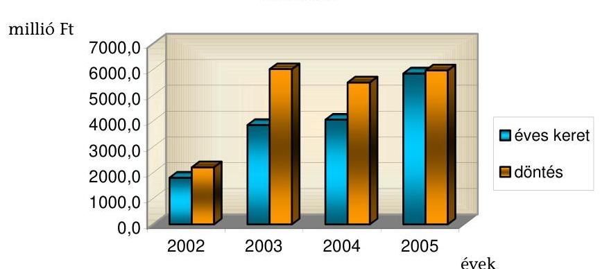
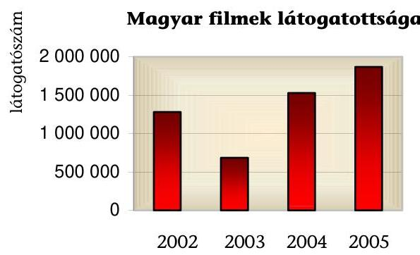
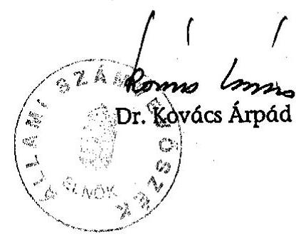

# ÁLLAMI   SZÁMVEVŐSZÉK 

## JELENTÉS

a Magyar Mozgókép Közalapítványnak juttatott költségvetési támogatás felhasználásának ellenőrzéséről

---

# 3. Önkormányzati és Területi Ellenőrzési Igazgatóság 

3.1. Szabályszerüségi Ellenőrzések FőcsoportIktatószám: V-1005-47/2006.Témaszám: 807
Vizsgálat-azonosító szám: V0289

## Az ellenőrzést felügyelte:

Dr. Lóránt Zoltán
főigazgató
Az ellenőrzés végrehajtásáért felelős:
Dr. Elek János
főigazgató-helyettes
Az ellenőrzést vezette:
Solymár Ágnes
számvevő főtanácsos
Az összefoglaló jelentést készítette:
Solymár Ágnes
számvevő főtanácsos
Az ellenőrzést végezték:
Pásztor Katalin Sas Imréné
számvevő tanácsos számvevő tanácsadó

## A témához kapcsolódó eddig készített számvevőszéki jelentések:

## címe

Jelentés a Nemzeti Gyermek és Ifjúsági Alapítvány pénzügyi- 80 gazdasági ellenőrzéséről (1992)
Jelentés a Magyar Vállalkozásfejlesztési Alapítvány részére PHARE 220 forrásból juttatott pénzügyi támogatások felhasználásának vizsgálatáról (1994)
Jelentés a fejezetek és intézményeik által az alapítványoknak jutta- 306 tott állami pénzek és vagyon felhasználásának, múködtetésének ellenőrzéséről (1996)
Jelentés a Magyar Alkotóművészeti Közalapítvány gazdálkodásá- 347 nak ellenőrzéséről (1997)
Jelentés a Gandhi Közalapítvány pénzügyi-gazdasági ellenőrzésé- 351 ről (1997)
Jelentés a Magyarországi Cigányokért Közalapítvány pénzügyi- 372 gazdasági ellenőrzéséről (1997)

---

Jelentés a Magyarországi Nemzeti és Etnikai Kisebbségekért Közaipítvány pénzügyi-gazdasági ellenőrzéséről (1997)
Jelentés a médiatörvény végrehajtásának pénzügyi-gazdasági el- ..... 396 lenőrzéséről (1997)
Jelentés a Magyar Rádió Közalapítvány és - kapcsolódó ellenőrzés- ..... 9806 ként - a Magyar Rádió Részvénytársaság gazdálkodásának ellenőrzéséről
Jelentés a Magyar Televízió Közalapítvány és kapcsolódó ellenőrzés ..... 9812 keretében a Magyar Televízió Rt. múködésének és gazdálkodásá- nak ellenőrzéséről
Jelentés a Nemzetközi Pető András Közalapítvány és - kapcsolódó ..... 9822 ellenőrzésként - a Mozgássérültek Pető András Nevelőképző és Ne- velőintézet pénzügyi-gazdasági ellenőrzéséről
Jelentés a Magyar Nemzeti Üdülési Alapítványnak juttatott állami ..... 9906 eszközök felhasználásának és múködtetésének pénzügyi-gazdasági ellenőrzéséről
Jelentés a sportcélú közalapítványok múködésének pénzügyi- ..... 9907 gazdasági ellenőrzéséről
Jelentés a Fogyatékos Gyermekek, Tanulók Felzárkóztatásáért Or- ..... 9915 szágos Közalapítvány múködésének pénzügyi-gazdasági ellenőrzéséről
Jelentés a Nemzeti Gyermek és Ifjúsági Közalapítvány múködésé- ..... 0002 nek pénzügyi-gazdasági ellenőrzéséről
Jelentés a Közoktatási Modernizációs Közalapítvány múködésének ..... 0011 ellenőrzéséről
Jelentés a Magyar Nemzeti Üdülési Alapítvány vagyongazdálkodá- ..... 0101 sának ellenőrzéséről
Jelentés az Országos Foglalkoztatási Közalapítvány gazdálkodásá- ..... 0117 nak ellenőrzéséről
Jelentés az Új Kézfogás Közalapítvány gazdálkodásának ellenőrzé- ..... 0136 séről
Jelentés a közalapítványoknak és az alapítványoknak az 1998- ..... 0228 2001. évek között juttatott nem normatív központi költségvetési támogatás felhasználásának ellenőrzéséről
Jelentés a Magyar Mozgókép Közalapítvány gazdálkodásának el- ..... 0304 lenőrzéséről
Jelentés a Magyar Alkotómúvészeti Közalapítvány gazdálkodásá- ..... 0323 nak ellenőrzéséről
Jelentés az EU Kommunikációs Közalapítvány gazdálkodásának ..... 0351 ellenőrzéséről
Jelentés a Magyarországi Zsidó Örökség Közalapítvány gazdálko- ..... 0402 dásának ellenőrzéséről

---

Jelentés a Magyarországi Cigányokért Közalapítvány gazdálkodásának ellenőrzéséről
Jelentés a Magyarországi Nemzeti és Etnikai Kisebbségekért Közalapítvány gazdálkodásnak ellenőrzéséről
Jelentés az Illyés Közalapítvány gazdálkodásnak ellenőrzéséről ..... 0466
Jelentés a Határon Túli Magyar Oktatásért Apáczai Közalapítvány ..... 0510 gazdálkodásának ellenőrzéséről
Jelentés a Nemzeti Kollégiumi Közalapítvány gazdálkodásának ..... 0513 ellenőrzéséről
Jelentés a Természet- és Társadalombarát Fejlődésért Közalapít- ..... 0533 vány gazdálkodásának ellenőrzéséről
Jelentés a Wesselényi Miklós Sport Közalapítvány gazdálkodásának ellenőrzéséről

---

# TARTALOMJEGYZÉK 

BEVEZETÉS ..... 9
I. ÖSSZEGZŐ MEGÁLLAPÍTÁSOK, KÖVETKEZTETÉSEK, JAVASLATOK ..... 12
II. RÉSZLETES MEGÁLLAPÍTÁSOK ..... 18

1. A központi költségvetésből kapott támogatás ..... 18
1.1. A támogatások összetétele, alakulása ..... 18
1.2. A támogatások felhasználására kötött megállapodások ..... 19
1.3. A támogatások folyósítása ..... 19
1.4. A támogatások felhasználásáról készített elszámolások ..... 20
2. A központi költségvetésből kapott támogatás felhasználása ..... 21
2.1. Az MMKA támogatási rendszere ..... 21
2.2. A pályázati úton nyújtott támogatások szabályossága ..... 24
2.3. A támogatások finanszírozása ..... 28
2.4. A játékfilmes szakkollégium által javasolt támogatások ..... 33
2.4.1. A játékfilmes szakkollégium múködése ..... 33
2.4.2. A játékfilm gyártás támogatása ..... 34
2.4.3. A támogatások céloknak megfelelő felhasználása ..... 35
2.4.4. A kisjátékfilm támogatása ..... 37
2.5. Az animációs szakkollégium által javasolt támogatások ..... 38
2.6. A filmterjesztési szakkollégium által javasolt támogatások ..... 39
3. Az intézkedési terv feladatainak teljesítése ..... 41

## MELLÉKLETEK

1. számú A 2002. évben nyújtott támogatások
2. számú A 2003. évben nyújtott támogatások
3. számú A 2004. évben nyújtott támogatások
4. számú A 2005. évben nyújtott támogatások

---

.

---

# RÖVIDÍTÉSEK JEGYZÉKE 

| Áht. | az államháztartásról szóló 1992. évi XXXVIII. törvény |
| :-- | :-- |
| ÁSZ törvény | az Állami Számvevőszékről szóló 1989. évi XXXVIII. tör- |
|  | vény |
| BM | Belügyminisztérium |
| EB | Ellenőrző Bizottság |
| kh. tv. | a közhasznú szervezetekről szóló 1997. évi CLVI. törvény |
| Kincstár | Magyar Államkincstár |
| Mktv. | A mozgóképről szóló 2004. évi II. törvény |
| MMKA | Magyar Mozgókép Közalapítvány |
| NKÖM | Nemzeti Kulturális Örökség Minisztériuma |
| Ptk. | a Polgári Törvénykönyvről szóló 1959. évi IV. törvény |
| SZMSZ | Szervezeti és Múködési Szabályzat |
| Szt. | a számvitelről szóló 2000. évi C. törvény |
| üvegzseb törvény | a közpénzek felhasználásával, a köztulajdon használatá- |
|  | nak nyilvánosságával, átláthatóbbá tételével és ellenőrzé- |
|  | sének bővítésével összefüggő egyes törvények módosításá- |
|  | ról szóló 2003. évi XXIV. törvény |

---

.

---

# ÉRTELMEZŐ SZÓTÁR 

Az alapítvány bevételei

Az alapítvány költségei (kiadásai)

Az alapítvány kezelő
szervének költségei (kiadásai)

Befektetési tevékenység

Cél szerinti tevékenység

Engedményezés

Filmgyártás

Filmterjesztés

A vállalkozási tevékenység bevétele, valamint az alapítványi célú tevékenység bevételei (minden olyan bevétel, amely nem a vállalkozási tevékenységhez kapcsolódó befizetés, ideértve a céltámogatást is) [115/1992. (VII. 23.) Korm. rendelet 3. § (1) bekezdésének a)-b) pontja].
A vállalkozási tevékenység közvetlen költségei, az alapítványi célú tevékenység közvetlen költségei, az alapítvány kezelő szervének költségei (kiadásai) és az egyéb közvetett költségek (kiadások) [115/1992. (VII. 23.) Korm. rendelet 3. § (2) bekezdésének a)-b)-c) pontja].

Az alapítvány kezelő szervének üzemeltetési, fenntartási költségei (az alapító okiratok ezeket a költségeket tekintik a kuratórium és a munkaszervezet múködési költségeinek).
A közhasznú szervezet saját eszközeiből történő értékpapír, társasági tagsági jogviszonyból eredő vagyonértékű jog, ingatlan és más egyéb hosszú távú befektetést szolgáló vagyontárgy szerzésére irányuló tevékenység [kh. tv. 26. § k) pontja].

Minden olyan tevékenység, amely az alapító okiratban megjelölt célkitúzés elérését közvetlenül szolgálja [kh. tv. 26. § b) pontja].

A jogosult követelését szerződéssel másra átruházhatja [Ptk. 328. § (1) bekezdés].
A filmalkotás felvételének megkezdésétől a filmalkotás első eredeti példányának előállításáig vezető alkotói, szervezési, gazdasági és múszaki tevékenységek összessége [Mktv. 2. § 20) pontja].
A filmalkotás eredeti példányának vagy többszörözött példányainak a nyilvánosság számára történő hozzáférhetővé tétele
a) forgalmazással, illetve az arra történő felkínálással,
b) moziüzemeltetéssel,
c) filmalkotás bármely adathordozón, így különösen videón és DVD-n történő kiadásával, értékesítésével, bérbeadásával, haszonkölcsönbe adásával,
d) filmalkotások az Európai Gazdasági Térség tagállamainak területére történő kereskedelmi célú behozatalával, e) kereskedelmi célú birtoklással [Mktv. 2. § 15) pontja].

---

Induló vagyon

Kezességvállalás

Kiemelkedően közhasznú közalapítvány

Koprodukciós filmalkotás

Közalapítvány

Közfeladat

Közhasznú egyszerűsített éves beszámoló

Közhasznú tevékenység

Közhasznúsági jelentés

A közalapítvány javára a célja megvalósításához az alapító okiratban meghatározott vagyon [Ptk. 74/A. § (1) bekezdése, 74/B. § (1) bekezdése]. A közalapítvány rendelkezésére legalább olyan mértékű vagyont kell bocsátani, amely a múködése megkezdéséhez feltétlenül szükséges [Ptk. 74/B. § (4) bekezdése]. A közalapítványi vagyon pontos megjelölése nélkül a közalapítvány nem jöhet létre [BH2001. 303].
Kezességi szerződéssel a kezes arra vállal kötelezettséget, hogy amennyiben a kötelezett nem teljesít, maga fog helyette a jogosultnak teljesíteni [Ptk. 272. § (1) bekezdése].
A kiemelkedően közhasznú közalapítványnak a közhasznú közalapítványokra előírt követelmények teljesítésén túl közhasznú tevékenysége során olyan közfeladatot kell ellátnia, amelyről törvény vagy törvény felhatalmazása alapján más jogszabály rendelkezése szerint, valamely állami szervnek vagy a helyi önkormányzatnak kell gondoskodnia, az alapító okirata szerinti tevékenységének és gazdálkodásának legfontosabb adatait a helyi vagy országos sajtó útján is nyilvánosságra hozza, továbbá a közhasznú tevékenységet maga látja el [kh. tv. 5. § és a BH2001. 451 alapján].
Különböző államok joghatósága alá tartozó filmelőállítók által készített filmalkotás, amelyet két- vagy többoldalú nemzetközi egyezmény vagy az érintett államok jogszabályai ilyennek minősítenek [Mktv. 2. § 6) pontja].
A közalapítvány olyan alapítvány, amelyet az Országgyúlés, a Kormány, valamint a helyi önkormányzat vagy kisebbségi önkormányzat képviselő-testülete közfeladat ellátásának folyamatos biztosítása céljából hoz létre [Ptk. 74/G. § (1) bekezdése].
Közfeladat az állami vagy helyi önkormányzati, kisebbségi önkormányzati feladat, amelynek ellátásáról - jogszabály alapján - az államnak vagy az önkormányzatnak kell gondoskodnia [Ptk. 74/G. § (2) bekezdése].
A közhasznú nyilvántartásba vett közalapítványoknál mérlegből, közhasznú eredmény-kimutatásból és tájékoztató adatokból áll [224/2000. (XII. 19.) Korm. rendelet 6. § (8) bekezdése, illetve 4 . és 6 . számú melléklete].

A társadalom és az egyén közös érdekeinek kielégítésére irányuló, a közhasznú közalapítvány alapító okiratában szereplő cél szerinti tevékenység a törvényben meghatározott körben [kh. tv. 26. § c) pontja].
Tartalmazza a számviteli beszámolót, a költségvetési támogatás felhasználását, a vagyon felhasználásával kapcsolatos kimutatást, a cél szerinti juttatások kimutatását; a központi költségvetési szervtől, az elkülönített állami pénzalaptól, a helyi önkormányzattól, a kisebbségi települési önkormányzattól, a települési önkormányzatok

---

Közvetett támogatás

Közvetlen támogatás

Közvetlen támogatás

Köznyesetlétesítesítesítesítesítesítesítesítesítesítesítesítesítesítesítesítesítesítesítesítesítesítesítesítesítesítesítesítesítesítesítesítesítesítesítesítesítesítesítesítesítesítesítesítesítesítesítesítesítesítesítesítesítesítesítesítesítesítesítesítesítesítesítesítesítesítesítesítesítesítesítesítesítesítesítesítesítesítesítesítesítesítesítesítesítesítesítesítesítesítesítesítesítesítesítesítesítesítesítesít

---

Strukturális támogatás

Szelektív támogatás

Színlelt pályázat

Támogatás

Vállalkozási tevékenység

Olyan támogatás, amelyet a támogató szervezet több költségvetési évre vonatkozó kötelezettségvállalással folyamatosan nyújt az igénylőnek, e törvény szerinti több éven keresztül megvalósuló, vagy évente azonos módon megvalósuló mozgóképszakmai célokra, feltéve, hogy az igénylő a támogatás teljes időszaka alatt megfelel a törvény, illetve a támogató által meghatározott feltételeknek [Mktv. 2. § 13) pontja].
Olyan támogatás, amely a filmalkotás jellemzőitől (így különösen forgatókönyv, költségvetés, művészi érték, a filmalkotás szerzőinek, alkotóinak és szereplőinek személye), vagy az egyéb támogatandó cél jellegétől függően, a támogató szervezet pályázat útján vagy egyedi kérelem elbírálását követően hozott döntése alapján illeti meg a filmelőállítót, filmterjesztőt, illetve az e törvény szerinti egyéb igénylőt [Mktv. 2. § 12) pontja].
A pályázat nem tartalmazhat olyan feltételeket, amelyekből - az eset összes körülményeinek mérlegelésével megállapítható, hogy a pályázatnak előre meghatározott nyertese van. Színlelt pályázat a cél szerinti juttatás alapjául nem szolgálhat [kh. tv. 15. § (1) és (2) bekezdése]. Pénzbeli és nem pénzbeli juttatás [kh. tv. 26. § j) pontja]. A jövedelem- és vagyonszerzésre irányuló vagy azt eredményező gazdasági tevékenység, ide nem értve a bevétellel járó cél szerinti tevékenységet, valamint a közhasznú tevékenységhez nyújtott támogatást [kh. tv. 26. § l) pontja].

---

# JELENTÉS 

## a Magyar Mozgókép Közalapítványnak juttatott költségvetési támogatás felhasználásának ellenőrzéséről

## BEVEZETÉS

Közalapítványt csak az Országgyúlés, a Kormány, valamint a helyi önkormányzat vagy kisebbségi önkormányzat képviselő-testülete hozhat létre közfeladat ellátásának folyamatos biztosítása céljából, de a közalapítvány létrehozása nem érinti az államnak, illetve az önkormányzatnak a feladat ellátására vonatkozó kötelezettségét. A közalapítványok a nyilvánosság előtt tevékenykednek, ezért alapító okiratukat, gazdálkodásuk legfontosabb adatait nyilvánosságra kell hozni.

A Magyar Mozgókép Közalapítvány (továbbiakban MMKA) állami közfeladatai a Kormány számára az Alkotmányban meghatározott tudományos és kulturális fejlesztési feladatoknak az ellátásában, illetve az ezek megvalósulásához szükséges feltételek megteremtésében való közremúködésre terjedtek ki.

Az MMKA-t a Fővárosi Bíróság a 9. Pk. 60.105/1998/9. számú végzésében 1998ban kiemelkedően közhasznú közalapítványként nyilvántartásba vette. Az alapító induló vagyonként 491,7 millió Ft-ot biztosított, amelyet a kuratórium az alapító okirat szerinti céljaira használhatja fel.

A közalapítvány számára az alapítók a következő célok teljesítésében való közremúködést határozták meg:

- a magyar filmek gyártásának és terjesztésének minden múfajban történő elősegítése és a határon túli magyar filmművészet támogatása;
- a mozgóképalkotások megőrzése, gondozása és védelme;
- a mozgóképszakmai tevékenység feltételeinek és infrastruktúrájának javítása, a mozgóképszakmában dolgozók szociális biztonságának megteremtése;
- a mozgóképszakma képzésében és tudományos kutatásban való közreműködés, a filmmúvészet állandó megújítását célzó kísérleteknek, a fiatalok pályakezdésének és képzésének elősegítése, a technológiai újítások figyelemmel kísérése, a filmszakmai információs rendszer kialakítása;
- a mozgóképszakma érdekeinek képviselete, a hazai és nemzetközi fesztiválokon való részvétel támogatása, a mozgóképszakmát érintő jogalkotás előkészítésében való részvétel, a nemzetközi, országos és helyi televíziók és a

---

filmszakma együttműködésének segítése;

- a Magyar Mozgókép Mestere művészeti díj odaítélése.

A közalapítvány célrendszere a 2004. február 10-től hatályos alapító okirat szerint bővült a határon túli magyar filmművészet támogatásával, valamint a Magyar Mozgókép Mestere művészeti díj odaítélésével.

A film egyrészt nagy kommunikációs erővel bír, másrészt erősen nemzethez kötődő alkotás, így az egyik legalkalmasabb eszköz egy ország számára, hogy bemutassa, illetve formálja a világ előtt róla kialakítandó képet, továbbá nevét, kultúráját napirenden tartsa, illetve gazdagítsa az országok közötti kulturális párbeszédet. A kis országok - saját piacuk korlátozott felvevőképessége miatt - nem képesek csupán a magánszféra közreműködésével, állami segítség nélkül gazdag és nemzetközi szinten is versenyképes mozgóképkultúrát létrehozni, ezért szükséges az állam szerepvállalása a mozgóképkultúra finanszírozási rendszerében.

A magyar filmgyártás többcsatornás támogatási rendszerében az MMKA szerepe a 2002-2005. évek alatt meghatározó lett, mivel ezen időszakban filmszakmai célokra összesen 15,6 milliárd Ft központi költségvetési támogatást kapott, amely az ezt megelőző négy évben kapott állami támogatásnak közel négyszeresét tette ki. Míg a közalapítvány állami támogatása 1999-ben a NKÖM és a BM fejezetek költségvetésében szereplő filmszakmai támogatási előirányzatok $55,4 \%$-át tette ki, addig 2005-ben ez az arány $75,9 \%{ }^{1}$ volt.

Az Állami Számvevőszék az ÁSZ törvény 2. § (5) és (9) bekezdései alapján ellenőrzi a közalapítványoknál az állami költségvetésből nyújtott támogatás felhasználását.

Az MMKA-nak juttatott költségvetési támogatás felhasználásának ellenőrzése a 2002. évtől a 2005. év végéig tartó időszakra terjedt ki.

Jelen ellenőrzés célja volt törvényességi és szabályszerűségi szempontból értékelni, hogy:

- a közalapítvány működése és gazdálkodása során a központi költségvetésből nyújtott közvetlen állami támogatások elősegítették-e az alapító okiratban meghatározott célok és feladatok megvalósítását;
- a közalapítvány a támogatást rendeltetésszerűen használta-e fel a magyar filmművészet támogatása érdekében;
- a közalapítvány alapítója, kuratóriuma és a közalapítványi iroda megtette-e a szükséges intézkedéseket az Állami Számvevőszék 2002. évi ellenőrzése során feltárt hiányosságok megszüntetése, valamint az intézkedési tervben megjelölt feladatok megvalósítása érdekében.

[^0]
[^0]:    ${ }^{1}$ Adatok forrása: A Magyar Mozgókép Közalapítvány előirányzatának terhére vállalható éven túli kötelezettségvállalásról szóló 2101/2005. (V. 31.) Korm. határozat előterjesztése.

---

Az MMKA által nyújtott támogatások szabályosságának, az alapító okiratban megfogalmazott célok szerinti felhasználásának és elszámoltatásának ellenőrzését mintavétellel végeztük. A mintát három szakterületre (játékfilm, filmterjesztés, animációs film) nyújtott támogatásokból választottuk. A játékfilm gyártására vonatkozóan a támogatási összeg $8 \%$-ára, a kisjátékfilm támogatások $6 \%$-ára, az animációs film gyártására adott támogatások 6,5\%-ára, a filmterjesztésre nyújtott normatív támogatások 4\%-ára kiterjedően ellenőriztük.

---

# I. ÖSSZEGZŐ MEGÁLLAPÍTÁSOK, KÖVETKEZTETÉSEK, JAVASLATOK 

A magyar mozgóképkultúra értékeinek gyarapítása és megőrzése, a magyarországi filmipar fejlesztése, nemzetközi viszonylatban való versenyképessé tétele, a mozgóképkultúra fejlődését szolgáló források hatékony felhasználását elősegítő támogatási rendszer, valamint az ezt szolgáló és az európai uniós szabályozással összhangban álló jogszabályi háttér megteremtése érdekében a Magyar Köztársaság Országgyűlése megalkotta és a 2003. december 22-i ülésén elfogadta a 2004. április 1-től hatályos, a mozgóképről szóló törvényt (továbbiakban Mktv.), amelynek indoklása alapján az MMKA a filmszakmai támogatások elosztásának és koordinálásának meghatározó letéteményesévé vált.

Az MMKA az ellenőrzött időszakban a kapott állami támogatást az alapító okiratában meghatározott céljainak megvalósítása érdekében használta fel. A közalapítvány támogatási tevékenysége - a mozgóképszakmában dolgozók szociális biztonságának elősegítése kivételével - az alapító okiratában meghatározott célok megvalósítására terjedt ki.

Az MMKA a 2002-2005. évek között filmszakmai célokra összesen 15,6 milliárd Ft központi költségvetési támogatást kapott, amely az ezt megelőző négy évben ${ }^{2}$ kapott állami támogatásnak közel négyszerese volt. Ennek eredményeként a kuratórium egyrészt $70 \%$-kal több pályázatot tudott támogatni, mint az 1998-2001. évek közötti időszakban, másrészt a Filmszemlén részt vevő filmek állami támogatásából az MMKA részesedése a 2002. évi 50\%-ról a 2004. évre 82,3\%-ra emelkedett. Az állami támogatások 69\%-áról az Országgyűlés döntött, 11\%-át egyedi kormányhatározatok, 20\%-át pedig a NKÖM fejezettől, egyedi szerződések alapján kapta a közalapítvány. A központi költségvetési támogatás folyósításának ütemezése a 2005. évre az előző évekhez képest megváltozott, ugyanis a NKÖM a 2002-2004. években az éves támogatások közel kétharmadát az év első felében folyósította, 2005-ben pedig a közalapítvány az éves támogatásának kevesebb, mint egyharmadát kapta meg az első félévben, 18\%-át pedig csak a következő év elején. A központi költségvetésből kapott támogatás megváltoztatott ütemezése nem illeszkedett az MMKA feladat-ellátási rendszerének sajátosságaihoz (előző évekről áthúzódó kötelezettségek, az év elejei filmszemlék megrendezése). A közalapítvány a törvényi előírásoknak megfelelően írásbeli szerződés alapján részesült költségvetési támogatásban, a kapott támogatások felhasználásáról a szerződésben foglaltaknak megfelelően elszámolt. Az ellenőrzött időszakban - a 2002. év kivételével (a 2003-ra áthúzódó kötelezettségeket és a tényleges múködési költségeket nem tartalmazta az

[^0]
[^0]:    ${ }^{2}$ Az 1998-2001. években az MMKA négy év alatt összesen 4001,2 millió Ft központi költségvetési támogatásban részesült (Állami Számvevőszék 0304. számú jelentése alapján).

---

elszámolás) - a kapott támogatások felhasználásáról készített elszámolások a közalapítvány könyvvezetésének adatain alapultak, azokat a támogatást nyújtó NKÖM elfogadta (a 2005. évi elszámolás 2006. július 31-én lesz esedékes).

Az MMKA kuratóriuma az ellenőrzött időszakban filmszakmai célokra 19,7 milliárd Ft támogatást ítélt oda, amelyből 2005. év végéig 13,1 milliárd Ft-ot fizetett ki. A kuratórium az ellenőrzött időszak minden évében, a kapott éves költségvetési támogatás alapján felosztott támogatási keretet (15,6 milliárd Ft) - átlagosan $26 \%$-kal - meghaladó mértékű támogatást ítélt meg. Ezen belül különösen a játékfilmek gyártására ítélt meg a közalapítvány a támogatási keretet - átlagosan $42 \%$-kal - meghaladó mértékű támogatást. A kuratórium azzal, hogy az éves költségvetési támogatást meghaladó mértékű döntéseket hozott, finanszírozási kényszerpályát jelölt ki a Kormány számára, behatárolja az Országgyúlés döntési hatáskörét.

A filmgyártás folyamatosságának biztosítása érdekében a Kormány kormányhatározatban arról döntött, hogy az MMKA 2005-ben a 2006. évi előirányzata terhére 2,85 milliárd Ft mértékig kötelezettséget vállalhat. A kormányhatározatban engedélyezett tárgyéven túli kötelezettségvállalás azonban a közalapítvány likviditási nehézségeit nem oldotta meg, mivel azt a kuratórium, a 2005. évi támogatási kerettel együtt, támogatási döntésekkel lekötötte.

A támogatások 62,8\%-át a magyar és koprodukciós filmek támogatására, 13,5\%-át a filmterjesztésre, $11,4 \%$-át a filmszakma egészét érintő tevékenységekre és a visszatérítendő támogatásokra, $4,0 \%$-át az animációs filmekre, $3,2 \%$-át a dokumentumfilmekre, $2,6 \%$-át a tudományos, ismeretterjesztő filmekre, $2,5 \%$-át a kutatásra, képzésre, kiadványokra nyújtotta a közalapítvány. A kuratórium a mozgókép szakmai célok megvalósulását 99\%-ban pályázati úton, $1 \%$-ban pedig egyedi kérelemre (erre az alapító okirat lehetőséget adott) nyújtott támogatásokkal segítette.

Az ellenőrzött időszakban a közalapítvány nem rendelkezett a pályáztatás folyamatára, a pályázati feltételekre, az elbírálás rendjére, a szerződéskötés módjára vonatkozó egységes, átfogó szabályozással, erre 2004-ig sem az alapító okirat, sem az SZMSZ nem kötelezte ${ }^{3}$. 2004-től az Mktv. rendelkezése értelmében a közalapítvány elkészítette a támogatási szabályzatát, amelyet azonban a nemzeti kulturális örökség minisztere - annak hiányosságai miatt - az ellenőrzés befejezéséig nem hagyott jóvá. A pályáztatási tevékenységre vonatkozó szabályozást a mindenkori pályázati felhívások, a szakkollégiumi és ad hoc bizottsági ügyrendek, az általános pályázati feltételek és 2005-től a kontroling szabályzat együttesen tartalmazták.

[^0]
[^0]:    ${ }^{3}$ Ezt az Állami Számvevőszék 2003. évi 0304 számú jelentése a Magyar Mozgókép Közalapítvány gazdálkodásának ellenőrzéséről az 1998-2001. évekre is megállapította.

---

A pályázati kiírások 67,6\%-a a vonatkozó törvényi ${ }^{4}$ előírásnak csak részben felelt meg, mivel vagy az elnyerhető cél szerinti juttatás mértékét, és/vagy a pályázatok összevetésére alkalmas feltételeket és/vagy elbírálási határidőt és/vagy az elbírálásra hivatottak körét nem tartalmazták (a játékfilmgyártásra kiírt pályázati felhívások minden évben megfeleltek a törvényben előírtaknak). A kuratórium nem biztosította a pályázók esélyegyenlőségét a 2005. évi koprodukciós támogatások és a 2003. évi art mozi támogatások esetében, mivel engedélyezte a pályázati feltételek év közbeni megváltoztatását, így a módosítás előtt és után beadott pályázatok elbírálása nem azonos feltételek szerint történt. A kuratórium a pályázati kiírások rövidített szövegét két napilapban, teljes szövegét az Interneten keresztül, a pályázati döntéseket, illetve támogatási szándéknyilatkozatait az Interneten keresztül hozta nyilvánosságra. Az alapító okirat azon előírásának, hogy a közalapítványi vagyon cél szerinti felhasználását érintő határozatairól rendszeres kiadvány útján a nyilvánosságot tájékoztatja csak részben tettek eleget, mivel a nyilvánosság csak a Filmszemlén megjelenő filmek támogatásáról kapott rendszeres tájékoztatást és nem a kuratórium által odaítélt támogatások teljes köréről.

Az MMKA támogatási rendszerében az Mktv. alapelvei csak részben érvényesültek, mivel a kuratórium 2005-ben nem támogatta az egész estét betöltő dokumentumfilmek, és 2004-2005-ben a népszerű tudományos filmek gyártását, továbbá a pályázati tervezet közzétételére vonatkozó kötelezettségének késedelmesen tett eleget 2005-ben (a NKÖM és a közalapítvány közötti, a 2005. évre vonatkozó támogatási szerződés megkötését követően).

A kuratórium a pályázati úton nyújtott támogatások 64,6\%-át - az alapító okirat rendelkezésének megfelelően létrehozott - 2002-ben hét, 2003-tól hat szakkollégium javaslata alapján ítélte oda. A támogatások 28,6\%-áról azonban, az alapító okirattal ellentétesen, nem a szakkollégiumok javaslata alapján, hanem ad hoc bizottságok, illetve felkért szakértők és a munkaszervezet javaslatai alapján döntött (a szakkollégiumok szakterületét és múködési rendjét a kuratórium a 2006. évtől hatályos SZMSZ-ében az alapító okirattal összhangban újraszabályozta). A pályázati úton nyújtott támogatások 6,8\%-át, az alapítók által jóváhagyott SZMSZ-ben foglaltaknak megfelelően, a kuratórium általános filmszakmai célokra ítélte meg.

A támogatások 56\%-át három szakkollégium javaslata alapján ítélte oda a kuratórium. A játékfilmes szakkollégium javaslatára új filmtervek és a korábban már támogatott filmek gyártására, az időszak alatt évente egy-egy nyilvános, a törvényi előírásoknak megfelelő, pályázati felhívást tett közzé a kuratórium. A támogatásokról - az alapító okirat előírásának megfelelően - a szakkollégium javaslata alapján a kuratórium döntött, azonban a javaslatokról szóló előterjesztések, ügyrendi előírás hiányában, nem tartalmaztak indoklást. A kuratórium a pályázók $40 \%$-át ítélte támogathatónak, összesen 7,3 milliárd

[^0]
[^0]:    ${ }^{4}$ A kh. tv. 26. § i) pontja szerint pályázat: az a nyilvános vagy előre meghatározott körben közzétett felhívás, amely a pályázók összevetésére alkalmas feltételeket és a pályázattal elnyerhető cél szerinti juttatást, a pályázat értékelésének lényeges feltételeit (beleértve a benyújtási és értékelési határidőket, valamint a pályázat elbírálására hivatottak körét) megjelöli.

---

Ft támogatási összeggel. Az ellenőrzött támogatások esetében - egy kivétellel a kuratórium elnöke kötötte meg a támogatási szerződést (írásbeli felhatalmazás nélkül az egyik kurátor kötötte meg a szerződést). A támogatottak az előírásnak megfelelően számoltak el. Az évenként elkészült játékfilmek bemutatásának fóruma a Magyar Filmszemle volt, ahol mintegy 25 filmet mutattak be évenként. A kuratórium 2003-ban a kísérleti kisjátékfilmet a játékfilmes szakkollégiumhoz rendelte (korábban a kutatási, képzési, kísérleti film, könyvés folyóirat kiadói szakkollégiumhoz tartozott), azonban nem gondoskodott az SZMSZ e szervezeti változásnak megfelelő módosításáról. A kuratórium kisjátékfilmek gyártásának támogatására 0,3 milliárd Ft-ot ítélt oda. A támogatottak 67\%-a a támogatási szerződés előírásának megfelelően elszámolt (a támogatottak 33\%-ánál az ellenőrzés befejezésekor a szerződéskötés folyamatban volt).

Az animációs szakkollégium javaslatára a magyar animációs rövid, illetve játékfilmek elkészítésének támogatására a négy év alatt hat pályázati felhívást tett közzé a kuratórium. A kuratórium a pályázók 67,7\%-át támogatta, 0,8 milliárd Ft-tal, amely az igényelt összeg $32 \%$-át tette ki. Az egy pályázóra jutó támogatás átlag 4,4 millió $\mathrm{Ft}^{5}$ volt. Az animációs filmek gyártását átlagosan 78,5\%-ban a közalapítvány támogatta. A kuratórium a támogatások odaítéléséről a szakkollégium javaslata alapján döntött, kivéve akkor, amikor a 2003. évi meghívásos pályázat alapján tíz animációs film támogatásában bekövetkezett változásról (a pályázó személye és az egyik film támogatási összege változott meg) a kuratórium nem hozott újabb határozatot. A kuratórium a 2004. évtől - a törvényi előírásnak megfelelően - csak a Nemzeti Filmiroda által nyilvántartásba vett szervezetek részére nyújtott támogatást. A támogatottakkal a kuratórium elnöke minden esetben támogatási szerződést kötött.

A filmterjesztési szakkollégiumot a kuratórium 2003-ban az alapító okirat előírásainak megfelelően a filmforgalmazói és videókiadó, valamint az art mozi, filmklub és üzemeltető szakkollégiumok összevonásával hozta létre. A filmterjesztési szakkollégium támogatásra fordítható kerete a 2003-2005. években 2,3 milliárd Ft volt, amely a megnövekedett feladatokhoz (a Magyar Filmszemlén kívüli rendezvények támogatása) igazodva az összevonás előtti szakkollégiumok 2002. évi 0,16 milliárd Ft összegű keret tizennégyszeresét tette ki. A kuratórium a filmterjesztési támogatásokat ( 2,5 milliárd Ft) normatív rendszerben, pályázati úton, szakkollégiumi javaslat alapján, a vonatkozó törvényi előírásoknak megfelelően, csak az art moziként nyilvántartásba vett szervezetek részére nyújtotta. A filmterjesztési támogatások hozzájárultak a magyar filmek előadásszámának $52,1 \%$-os és a nézőszámának $45,7 \%$-os emelkedéséhez.

A 2004-2005. években a kapott költségvetési támogatás finanszírozásának átütemezése miatt a kuratórium határozatban döntött a közalapítvány 0,2 milliárd Ft hitel felvételéről, továbbá engedélyezte az egyszemélyes kft.-éjének is 0,2 milliárd Ft hitel felvételét, amelynek biztosítékaként kezességet vállalt. A hitel

[^0]
[^0]:    ${ }^{5}$ Az 1998-2001. évek között az egy pályázatra megítélt támogatás összege a négy év átlagában 2,1 millió Ft volt (az Állami Számvevőszék 0304. számú jelentése alapján).

---

felvételekor és a kezesség vállalással a közalapítvány megsértette a vonatkozó törvényi előírásokat ${ }^{6}$, egyrészt azért, mert az MMKA által felvett hitel és azzal kapcsolatos költségek megfizetésének biztosításaként a költségvetéssel szemben fennálló követelését jelölte meg (a hitelszerződés módosításával a felek új biztosítékot jelöltek meg), másrészt mert a kft. által felvett hitel biztosítékaként az MMKA készfizető kezességet vállalt és a költségvetési támogatásból nyújtott visszatérítendő támogatásokból származó követeléseit, a hitelt nyújtó bankra engedményezte.

A kuratórium a likviditási nehézségek leküzdése érdekében kialakította a filmgyártás és forgalmazás banki finanszírozásának koncepcióját. A kuratóriumi döntések értelmében, 2004-2005-ben 27 játékfilm gyártásának, 2 nemzetközi filmszakmai tevékenység, és 2 art mozi üzemeltető támogatását banki finanszírozással (a produkciók által felvett hitellel) valósították meg, amelynek biztosítéka 2,1 milliárd Ft , a kuratórium által megítélt támogatás volt. A hitelszerződésekben a támogatási szerződések szerinti támogatás összegét engedményezték a produkciók a bankokra, kilenc esetben a bankok további biztosítékot kértek, amelyet a kuratórium elnöke a közalapítvány nevében, kuratóriumi döntés nélkül, 0,7 milliárd Ft összegben, a törvényi ${ }^{7}$ előírásokkal ellentétesen, készfizetőkezesség-vállalással teljesített. A banki finanszírozás a filmgyártást megdrágította, mivel annak kamatterheit a produkciók saját forrásból finanszírozni nem tudták, ezért a kuratórium kamattámogatási pályázat kiírásával további állami támogatást ( 0,35 milliárd Ft) vont be a finanszírozási rendszerbe. Öt film támogatása esetében - a filmek befejezése érdekében - a szerződésekben rögzített támogatások összegénél, 0,1 milliárd Ft-tal magasabb összegű volt a pénzügyi teljesítés és a bank felé vállalt biztosíték együttes összege.

Az ÁSZ 2003. évi ellenőrzése során tett javaslatok - egy kivételével - teljesültek. A visszatérítendő támogatások rendezése a kuratórium által meghatározott 2005. március 31-ei határidőn belül nem történt meg. A kuratórium a pályázati döntéseket, illetve támogatási szándéknyilatkozatait az Interneten keresztül nyilvánosságra hozta, de a tényleges kifizetésekről és a pályázati célok megvalósulásáról a közvélemény - beleértve a szakmai közvéleményt is - csak részben (a Filmszemlén megjelenő filmekre vonatkozóan) jutott információhoz. A közalapítvány a támogatások felhasználása ellenőrzésének szervezeti és szabályozási feltételeit átalakította, amelynek eredményeként a támogatás megítélésétől a támogatási cél megvalósításáig a teljes folyamat szakmai és pénzügyi ellenőrzése megvalósult.
${ }^{6}$ A kh. tv. 16. § (2) bekezdés b) pontja értelmében a közhasznú szervezet az államháztartás alrendszereitől kapott támogatást hitel fedezetéül, illetve hitel törlesztésére nem használhatja fel.
${ }^{7}$ A kh. tv. 16. § (2) bekezdés b) pontja értelmében a közhasznú szervezet az államháztartás alrendszereitől kapott támogatást hitel fedezetéül, illetve hitel törlesztésére nem használhatja fel.

---

A helyszíni ellenőrzés megállapításainak hasznosítása mellett javasoljuk:

# a Magyar Mozgókép Közalapítvány kuratóriumának 

1. Gondoskodjon a mozgóképről szóló 2004. évi II. törvény 8. § (5) bekezdésének megfelelő, valamint a nemzeti és kulturális örökség minisztere által jóváhagyott - a közalapítvány általános pályázati és támogatási feltételeit, valamint a támogatások elosztásának mechanizmusát meghatározó - támogatási szabályzat elkészítéséről.
2. Gondoskodjon az éves pályázati tervezet - a mozgóképről szóló 2004. évi II. törvény 8. § (6) bekezdés a) pontban foglaltak szerinti - közzétételéről.
3. Vizsgálja felül a támogatások odaítélésének, folyósításának szabályait és gyakorlatát a következők figyelembevételével:
a) biztosítsa, hogy valamennyi pályázati kiírás - a közhasznú szervezetekről szóló 1997. évi CLVI. törvény 26. § i) pontjában foglaltaknak megfelelően - teljes körűen tartalmazza az elnyerhető cél szerinti juttatás mértékét, az összevetésre alkalmas feltételeket, az elbírálási határidőket, valamint az elbírálásra hivatottak körét;
b) gondoskodjon arról, hogy az általános filmszakmai célok kivételével, a mozgóképszakma területeit érintő valamennyi támogatásról meghozott döntés - az alapító okirat VIII. fejezet 3.1. pontjának megfelelően - szakkollégiumok javaslatára épüljön;
c) biztosítsa a cél szerinti felhasználást érintő határozataira vonatkozóan a nyilvánosság - alapító okirat előírása szerinti - tájékoztatását.
4. Gondoskodjon arról, hogy a támogatási döntései és szándéknyilatkozatai együttes összege ne haladja meg a kapott éves költségvetési támogatás mértékét, valamint minden szakkollégium részére írja elő az éves támogatási keret mértékének betartását.
5. Vizsgálja meg a kuratórium elnökének a bankok felé biztosítékként vállalt 712,7 millió Ft összegű készfizetőkezesség-vállalása miatti felelősségét.
6. Gondoskodjon arról, hogy a jövőben a közhasznú szervezetekről szóló 1997. évi CLVI. törvény 16. § (2) bekezdés b) pontjának megfelelően, a kapott állami támogatást hitel fedezetéül ne használja fel.
7. Vizsgálja felül a 200 millió Ft hitel visszafizetésének lehetőségét, annak figyelembe vételével, hogy a közhasznú szervezetekről szóló 1997. évi CLVI. törvény 16. § (2) bekezdés b) pontja szerint a közhasznú szervezet az államháztartás alrendszereitől kapott támogatást hitel fedezetéül, illetve hitel törlesztésére nem használhatja fel.
8. Intézkedjen a visszatérítendő támogatások szerződés szerinti visszafizetéséről.

---

# II. RÉSZLETES MEGÁLLAPÍTÁSOK 

## 1. A KÖZPONTI KÖLTSÉGVETÉSBŐL KAPOTT TÁMOGATÁS

### 1.1. A támogatások összetétele, alakulása

A Magyar Mozgókép Közalapítvány (továbbiakban MMKA) a 2002-2005. évek között filmszakmai célokra összesen 15 635,7 millió Ft központi költségvetési támogatást kapott, amely az ezt megelőző négy évben kapott állami támogatásnak közel négyszerese volt.

A támogatások 69\%-áról az Országgyűlés döntött, a 2002-2005. évekre összesen 11169 millió Ft-ot hagyott jóvá névre címzetten, a Nemzeti Kulturális Örökség Minisztériuma (továbbiakban NKÖM) fejezeti kezelésű előirányzatai között a tényleges támogatás 10776,4 millió Ft volt. A közalapítvány egyedi kormányhatározatok alapján további 1720 millió Ft (11\%) támogatásban részesült. A NKÖM fejezettől három alkalommal, egyedi szerződések alapján, összesen 3139,3 millió Ft (20\%) támogatáshoz jutott.

Az éves költségvetési törvényekben jóváhagyott eredeti előirányzat a 2002. és 2003. években évenként 1100 millió Ft, 2004-ben 5230 millió Ft, 2005-ben 3739 millió Ft volt.

A 2006. évi költségvetési törvényben az MMKA eredeti előirányzata 6200 millió Ft volt.

A 2002. évben a költségvetési támogatás összege 2020 millió Ft volt, amelyből 1100 millió Ft volt az éves költségvetési törvényben jóváhagyott, 800 millió Ft az új nemzeti játékfilmek előkészítésével és gyártásával kapcsolatos feladatokra a 2222/2002. (VII. 24.) Korm. határozattal átcsoportosított, 120 millió Ft a nemzeti kulturális filmörökség gyarapítására és megőrzésére a NKÖM által nyújtott támogatás.

A 2003. évben az MMKA 5039,3 millió Ft támogatásban részesült, amely két és félszerese volt az előző évinek. Az éves költségvetési törvény szerinti előirányzat 1100 millió Ft, a Nobel-díjas Kertész Imre Sorstalanság című regénye megfilmesítésének támogatásáról szóló 2025/2003. (II. 19.) Korm. határozat alapján kapott támogatás 920 millió Ft volt, és a NKÖM a filmszakmai támogatások fejezeti kezelésű előirányzat terhére 2819,3 millió Ft-ot, az első filmesek támogatására 200 millió Ft-ot nyújtott.

A 2004. évben a költségvetési támogatás 4840 millió Ft volt azáltal, hogy az éves költségvetési törvényben jóváhagyott 5230 millió Ft eredeti előirányzatból a Kormány az államháztartás egyensúlyi helyzetének javításához szükséges rövid és hosszabb távú intézkedésekről szóló 2050/2004. (III. 11.) Korm. határozattal 390 millió Ft-ot zárolt.

---

A 2005. évben kapott 3736,4 millió Ft költségvetési támogatás az előző évhez képest $23 \%$-kal csökkent. Az éves költségvetési törvényben jóváhagyott eredeti előirányzat 3739 millió Ft volt, amelyből a Kincstári számlavezetéshez kapcsolódó díj 2,6 millió Ft levonása után 3736,4 millió Ft-ot kapott meg a közalapítvány.

# 1.2. A támogatások felhasználására kötött megállapodások 

A NKÖM az ellenőrzött években nyújtott támogatások felhasználására - a közhasznú szervezetekről szóló 1997. évi CLVI. törvény (továbbiakban kh. tv.) 14. § (2) bekezdésének megfelelően - minden alkalommal megállapodást kötött a közalapítvánnyal.

A kh. tv. 14. § (2) bekezdése alapján a közhasznú szervezet az államháztartás alrendszereitől - a normatív támogatás kivételével - csak írásbeli szerződés alapján részesülhet támogatásban. A szerződésben meg kell határozni a támogatással való elszámolás feltételeit és módját.

A NKÖM és az MMKA között létrejött megállapodások minden esetben tartalmazták a támogatás célját, felhasználásának időtartamát, folyósításának ütemezését és időpontját, a támogatással való elszámolás határidejét és módját. A felek előírták a megállapodásokban a szerződéstől eltérő célú felhasználás, és az elszámolási kötelezettség elmulasztásának szankcióit, továbbá kikötötték a támogatást nyújtó, és egyéb - jogszabályok által feljogosított - szervezetek ellenőrzésének jogosultságát.

### 1.3. A támogatások folyósítása

A NKÖM és az MMKA között megkötött megállapodásokban a felek - kölcsönös egyeztetést követően - rögzítették a támogatások folyósításának ütemezését.

A közalapítvány évenként - szakmai indokolással alátámasztott - finanszírozási igényt nyújtott be a támogatóhoz, amely kiterjedt többek között a filmgyártás sajátosságaira, a korábbi évekről áthúzódó kötelezettségekre, az év elejei filmszemlék megrendezéséhez szükséges forrásigényre. A benyújtott finanszírozási igényekben az MMKA a szakmai projektek finanszírozásának ütemezését döntően az adott év első félévében, illetve negyedében igényelte.

A 2002. és 2003. években az éves támogatások folyósítása a megállapodásokban rögzített, kölcsönösen elfogadott ütemezés szerint, 12 részletben történt. A NKÖM 2002-ben az éves támogatás 59\%-át, 2003-ban már a 73\%-át az év első felében átutalta.

A 2004. évben a NKÖM az éves támogatás (4840 millió Ft) 78\%-át az eredeti megállapodás szerint az év első felében, majd - a megállapodás többszöri módosítását követően - a fennmaradó támogatás $18 \%$-át az év második felében, 4\%-át (200 millió Ft-ot) pedig 2005. január hónapban folyósította.

A 2005. évben a korábbi évektől eltérően, az MMKA az éves támogatásnak

---

csak 32\%-át kapta meg az év első felében, a megállapodás többszöri módosítása alapján a támogatás $50 \%$-át az év második felében, 18\%-át (679,4 millió Ftot) pedig 2006. január hónapban.

A költségvetési támogatás átütemezésének indoka a NKÖM-PM-MMKA megbeszélésről készült emlékeztető szerint a fejezet év végi maradványképzési kötelezettség volt.

# 1.4. A támogatások felhasználásáról készített elszámolások 

A NKÖM-mel megkötött megállapodások minden esetben tartalmazták a közalapítványnak nyújtott támogatások elszámolásának határidejét és módját, a 2004. évtől a megállapodás melléklete tartalmazta az elszámolás formáját is.

A közalapítvány a megállapodásokban előírt elszámolási kötelezettségének határidőben eleget tett.

A 2002. éves elszámolás a tárgyévben kifizetett támogatások összegét tartalmazta, a közalapítvány célja szerinti programokra vállalt, és a tárgyévet követő időszakra áthúzódó kötelezettségeket nem mutatta be (azt a NKÖM-mel megkötött megállapodás 2002-ben még nem írta elő). Az elszámolás a múködési költségekre vonatkozóan a megállapodások szerint felhasználható tervezett, és nem a ténylegesen felhasznált ráfordítást tartalmazta (a NKÖM az elszámolást elfogadta).

A 2003. éves támogatás felhasználásáról benyújtott elszámoláshoz a NKÖM kiegészítő táblázatok elkészítését kérte mind a cél szerinti támogatások, mind pedig a múködési költségek tekintetében, a kiegészítést a közalapítvány megküldte. A NKÖM - az elszámolás ellenőrzése során megállapított - a tárgyévben múködésre fel nem használt maradvány ( 40 millió Ft ) visszautalását kérte, amelyet a közalapítvány visszautalt.

A NKÖM a visszautalt támogatással azonos mértékű támogatást nyújtott a közalapítványnak a „Magyar Mozgókép Mestere" művészeti dí pénzügyi forrásának részbeni fedezésére.

A 2004. évtől kezdődően a közalapítványnak évente kétszer kellett elszámolnia. A tárgyévet követő év januárjában részelszámolást kellett készíteni a támogatás elosztásáról (pályázati döntésekről) és a múködési költségek várható alakulásáról a következő évi szerződés megkötése céljából. A tárgyévet követő év júliusban pedig tényleges pénzügyi végelszámolást, és a tényleges adatokhoz igazított szöveges kiegészítést kellett készíteni a megállapodás mellékletében előírt formában.

Az MMKA a 2004. és 2005. években a részelszámolásokat benyújtotta, a 2004. évi végelszámolási kötelezettséget teljesítette, a 2005. évi végelszámolás 2006. július 31-én lesz esedékes.

A 2003-2004. években kapott támogatások felhasználásáról készített elszámolások megegyeztek a közalapítvány könyvvezetésének adataival.

---

# 2. A KÖZPONTI KÖLTSÉGVEtÉSBŐL KAPOTT TÁMOGATÁs FELHASZNÁLÁSA 

### 2.1. Az MMKA támogatási rendszere

A magyar filmgyártás többcsatornás támogatási rendszerében az MMKA szerepe, az 1998-2001. évek csökkenő tendenciájával szemben, a 2002-2005. években meghatározó lett. Míg a közalapítvány támogatása 1999-ben a NKÖM és BM fejezetek költségvetésében szereplő filmszakmai támogatási előirányzatok $55,4 \%$-át tette ki, addig 2005-ben a $75,9 \%$-át ${ }^{8}$. Az MMKA a mozgóképről szóló 2004. évi II. törvény (Mktv.) alapján a filmszakmai támogatások elosztásában és koordinálásában kiemelt feladatot kapott.

A közalapítvány a magyar filmgyártás támogatását szolgáló előirányzatok évrőlévre csökkenő hányadát kapta az 1998-2001. években. ${ }^{9}$

Az Mktv. 8. § (1) bekezdése szerint a közalapítvány, mint a Kormány és a mozgóképszakmai szervezetek által alapított szervezet, a törvény alapelvei szerint végzi az állami költségvetésben meghatározott forrás elosztását.

Az MMKA feladatai bővültek a 2004. február 10.-étől hatályos alapító okiratban rögzített a határon túli magyar filmművészet támogatása, valamint a Magyar Mozgókép Mestere művészeti díj odaítélése célokkal.

A közalapítvány vagyona az alapító okirat IV. fejezetében foglalt célok megvalósítására használható fel. Az MMKA céljai:

- elősegíteni a magyar filmek gyártását és terjesztését minden műfajban, és támogatni a határon túli magyar filmművészetet;
- segíteni a mozgóképalkotások megőrzését és gondozását, valamint védelmét a jogosulatlan felhasználás ellen;
- hozzájárulni a mozgóképszakmai tevékenység feltételeinek és infrastruktúrájának javításához, valamint a mozgóképszakmában dolgozók szociális biztonságának megteremtéséhez;
- közreműködni a mozgóképszakma képzésében és a tudományos kutatásban, elősegíteni a filmművészet állandó megújítását célzó kísérleteket, a fiatalok pályakezdését és képzését, figyelemmel kísérni a technológiai újításokat, kialakítani - a hasonló célú európai rendszerekkel összehangoltan - a filmszakmai információs rendszert;
- elősegíteni a mozgóképszakma érdekeinek képviseletét, támogatni a hazai és nemzetközi közélet fórumain, fesztiválokon való részvételt, részt venni a

[^0]
[^0]:    ${ }^{8}$ Adatok forrása: A Magyar Mozgókép Közalapítvány előirányzatának terhére vállalható éven túli kötelezettségvállalásról szóló 2101/2005. (V. 31.) Korm. határozat előterjesztése
    ${ }^{9}$ Megállapította: az Állami Számvevőszék 2003. évi 0304 számú jelentése a Magyar Mozgókép Közalapítvány gazdálkodásának ellenőrzéséről

---

mozgóképszakmát érintő jogalkotás előkészítésében, elősegíteni a nemzetközi, az országos és a helyi televíziók és a filmszakma együttmúködését;

- odaítélni a Magyar Mozgókép Mestere múvészeti díjat.

Az MMKA az ellenőrzött időszakban az alapító okiratában meghatározott céljait - a mozgóképszakmában dolgozók szociális biztonságának elősegítését szolgáló célt kivéve - támogatta. A 2004-2005 években a kuratórium az alapító okiratban megfogalmazott szabályok szerint ítélte oda a Magyar Mozgókép Mestere múvészeti díjat.

Nem hozta létre a mozgóképszakmában önhibájukon kívül hátrányos helyzetbe jutott dolgozók segélyezését szolgáló rendszert.

A kuratórium az SZMSZ-ben meghatározottak szerint - az új kuratórium megalakulásának éve (2003. év) kivételével - minden év első negyedévében, a Filmszakmai Kerekasztal javaslatainak és a filmszakmai elvárásoknak az ismeretében, határozott az adott évi költségvetési törvényben a közalapítvány nevére címzett támogatás felhasználásának tervezett kereteiről, a szakkollégiumi keretek, a kuratórium saját hatáskörben felosztható kerete és a múködési költségek mértékéről.

A kuratórium a 2002-2005. évek között a támogatásra felhasználható keretet 15582 millió Ft-ban határozta meg, ennek 65,8\%-át (10 252 millió Ft) a szakkollégiumok részére különítette el, míg saját hatáskörbe 34,2\%-át (5330 millió Ft) vonta. A támogatási keretnek a szakkollégiumok és a kuratórium közötti megoszlási aránya az 1998-2001. évekhez képest a kuratórium által saját hatáskörbe vont támogatások javára $45,5 \%$-kal nőtt ${ }^{10}$.

A támogatási célra jóváhagyott éves kereteket és azok felhasználását az 1-4. számú tanúsítványok tartalmazzák.

A kuratórium a pályázati úton nyújtott támogatások (19 495 millió Ft) 64,6\%-át (12 593 millió Ft) - az alapító okirat rendelkezésének megfelelően létrehozott - szakkollégiumok javaslata alapján ítélte oda. A támogatások 28,6\%át (5583 millió Ft) az alapító okirattal ellentétesen ad hoc bizottságok, illetve felkért szakértők és a munkaszervezet javaslatai alapján nyújtotta, annak ellenére, hogy azok a mozgóképszakma egyes területeit érintették, így azokra az alapító okirat előírása szerint a szakkollégiumoknak kellett volna javaslatot tenniük. A pályázati úton nyújtott támogatások 6,8\%-át (1319 millió Ft) az alapítók által jóváhagyott SZMSZ szerint a kuratórium általános filmszakmai célokra ítélte meg.

A közalapítvány alapító okirata szerint a mozgóképszakma egyes területeit (film-terv-fejlesztés, műhely-, koprodukciós- gyártási normatív-, TV-film, kisjátékfilm támogatás) érintő döntésekre a szakkollégiumok tesznek javaslatot, melyek tevékenységét a kuratórium nem befolyásolhatja. A szakkollégiumok számát, szakterületét, megbízatásuk időtartamát és az egyes szakkollégiumok létszámát az SZMSZ-ben kell meghatározni.

[^0]
[^0]:    ${ }^{10}$ Az 1998-2001. évi adatok az Állami Számvevőszék 2003. évi 0304 számú jelentésének 16. számú melléklete alapján

---

A közalapítvány kuratóriuma 2006. március 23-i ülésén elfogadta a módosított SZMSZ-t, amelyben az alapító okiratnak megfelelően szabályozta a szakkollégiumok múködési rendjét, meghatározta az egyes szakkollégiumok szakterületét, létszámát, a szakkollégiumok jegyzőkönyvek kötelező tartalmi elemeit.

A közalapítvány részére nyújtott költségvetési támogatás emelkedéséből adódóan 2002-2005. években $70 \%$-kal nőtt az elfogadott pályázatok száma az 1998-2001. évekhez képest.

Az 1998-2001. évek között az elfogadott gyártási (kísérleti filmek nélkül) kérelmek száma 572 db , míg a 2002-2005. években 975 db volt. Az elfogadott kérelmek száma nem egyezik meg a támogatott filmek számával, mivel egy film több évben is kaphatott támogatást, a koprodukciós alkotások esetében több jogcímen is (játékfilmgyártási és koprodukciós), illetve mindkét időszakban voltak meg nem valósított filmek.

Az elkészült filmek közönséghez való eljuttatásának biztosítása érdekében az MMKA már 2003-ban (az Mktv. elfogadását megelőzően) átalakította a filmterjesztés támogatását, létrehozta a filmterjesztési szakkollégiumot, amely a filmterjesztés támogatásának mérhető elemei alapján alakított ki normatívákat.

Az Mktv. alapelvei az MMKA támogatási gyakorlatában az ellenőrzött időszakban csak részben érvényesültek az alábbiak miatt:

- A 2004. és 2005. évi keretek felosztásakor és a támogatási célok meghatározásakor a kuratórium nem tartotta be az Mktv. - a támogatások elosztásának szabályairól szóló - 12. § (5) bekezdését, mivel az egész estét betöltő dokumentum-, népszerű tudományos filmek gyártását nem tervezte támogatni. A gyártási támogatási keretek ugyan $80,5 \%$-át egészestés játék- és animációs filmekre tervezte a kuratórium, de ezek döntő hányadát, $85,1 \%$ át egészestés magyar, illetve koprodukciós játékfilm gyártására. Az egészestét betöltő dokumentum filmek gyártására 2005-ben nem ítélt oda támogatást(2004-ben 33,8 millió Ft-ot ítélt e támogatási formára), a népszerű tudományos filmek gyártását sem 2004-ben sem 2005-ben nem támogatta.

Az Mktv. 12. § (5) bekezdése értelmében a közalapítvány az általa nyújtott közvetlen támogatások többségét az egész estét betöltő játék-, dokumentum-, népszerú tudományos, illetve animációs filmek gyártásának támogatására köteles fordítani.

- A filmelőállítás tervezhetőbbé tétele érdekében az Mktv. 8. § (6) bekezdése előzetes pályázati tervezet minden év február 28-ig történő közzétételét tette kötelezővé a közalapítvány számára, melyet a MMKA a 2005. évben késedelmesen teljesített.

A pályázati tervezetet a Kulturális Közlönyben csak 2005. szeptember 25-én jelentette meg. A késedelmes megjelentetés oka volt, hogy a 2005. évre vonatkozó támogatási szerződést a közalapítvány az NKÖM-mel csak július 21-én tudta megkötni, ezért a pályázati tervezet elfogadása és a megjelentetése csak ez utáni időpontra volt teljesíthető.

---

- Az állami erőforrások megfelelő elosztásának garanciájaként írta elő az Mktv. 8. § (5) bekezdése a pályáztatási szabályzat elkészítését, és annak jóváhagyását a nemzeti kulturális örökség miniszterének hatáskörébe utalta. A közalapítvány nem rendelkezett a miniszter által jóváhagyott, a támogatások feltételeit, valamint a támogatások elosztásának mechanizmusát meghatározó támogatási szabályzattal.

Az MMKA 2005-ben elkészítette a pályáztatási szabályzatot, melyet június 30 -án megküldött a miniszternek, aki a tervezetet, annak hiányosságai miatt nem hagyta jóvá. A helyszíni ellenőrzés 2006. március 30-i befejezéséig a közalapítvány még nem rendelkezett a miniszter által jóváhagyott támogatási szabályzattal. A támogatási szabályzat újabb tervezetét a kuratórium 2006. március 23-án elfogadta és továbbította az NKÖM miniszterének jóváhagyásra.

# 2.2. A pályázati úton nyújtott támogatások szabályossága 

A kuratórium a 2002-2005. években az alapító okiratban megfogalmazott célokkal összhangban, a magyar mozgóképalkotások gyártását, megőrzését, fesztiválokon való részvételét, terjesztését és forgalmazását, mozgóképszakmai képzést, a tudományos kutatást, a filmművészet állandó megújítását célzó kísérleteket, a fiatalok pályakezdését és képzését pályázati úton nyújtott támogatásokkal valósította meg.

Az MMKA az ellenőrzött időszakban 68 db pályázati kiírást hozott nyilvánosságra, melyekre 4948 pályázat érkezett a közalapítványhoz. A kuratórium a beérkezett pályázatok 52,6\%-át összesen 19697,7 millió Ft támogatásban részesítette végleges döntéssel, illetve támogatási szándéknyilatkozattal.

A támogatási szándéknyilatkozat azt a célt szolgálta, hogy a fim gyártója a gyártáshoz szükséges egyéb forrásokhoz igazolni tudja a közalapítvány támogató szándékát. A gyártáshoz szükséges teljes forrás meglétének igazolása esetében a kuratórium támogató szándéka automatikusan döntéssé vált 2005-ig. A 2005. évtől a kuratórium a támogatást új döntéssel erősítette meg.

A kuratórium a 2003-2005. évek között minden esetben döntött a pályázatok kiírásáról. A pályázati felhívásokat szakkollégiumonként és támogatási célonként írták ki.

A 2002. évben a kuratórium nem döntött a pályázati kiírásokról, azt a szakkollégiumok saját hatáskörben döntötték el. ${ }^{11}$ 2003-ban az új kuratórium az ÁSZ javaslata alapján felülvizsgálta az 1998-2002 között kiírt pályázatokat és azokat utólag jóváhagyta.

[^0]
[^0]:    ${ }^{11}$ Ezt az Állami Számvevőszék 2003. évi 0304 számú jelentése a Magyar Mozgókép Közalapítvány gazdálkodásának ellenőrzéséről az 1998-2001. évekre is megállapította.

---

A támogatások évenkénti alakulása
Adatok: millió Ft-ban

| Évek | Keret | Döntés | Döntésből   kifizetés | Áthúzódó   kifizetés | Összes kifi-   zetés |
| :--: | :--: | :--: | :--: | :--: | :--: |
| 2002 | 1812,0 | 2216,6 | 1175,9 | 595,6 | 1771,5 |
| 2003 | 3853,8 | 6016,5 | 3213,6 | 795,3 | 4008,9 |
| 2004 | 4062,2 | 5500,3 | 2795,0 | 1506,8 | 4301,8 |
| 2005 | 5854,0 | 5964,3 | 1587,9 | 1461,4 | 3049,3 |
| Összesen | $\mathbf{1 5 5 8 2 , 0}$ | $\mathbf{1 9 6 9 7 , 7}$ | $\mathbf{8 7 7 2 , 4}$ | $\mathbf{4 3 5 9 , 1}$ | $\mathbf{1 3 1 3 1 , 5}$ |

A kuratórium a 2003. évtől a támogatásokat - a 2003. évi koprodukciós támogatás és a 2003. évi visszatérítendő támogatások kivételével - pályázati úton nyújtotta. A kuratórium 2003-ban hét esetben ítélt meg koprodukciós támogatást a pályázat kiírását megelőzően, mivel a visszatérítendő támogatás fedezetéül a későbbiekben kiírásra kerülő pályázaton elnyerhető támogatást jelölte meg, így csorbult a pályázók egyenlő elbírálásának elve.

A 2003. évi koprodukciós támogatásokra 2003. november 29-én jelent meg a pályázati kiírás, a pályázatok beadási határideje 2003. december 5., illetve 2004. január 30. volt, az elbírálás határideje pedig 2003. december 15., illetve 2004. március 31.volt. A kuratórium már hónapokkal a pályázati kiírás megjelenése előtt döntött koprodukciós támogatásokról. Pl.: a 113/2003. (04. 29.) számú kuratóriumi határozattal 10 millió Ft, a 143/2003. (05. 21.) számú kuratóriumi határozattal 40 millió Ft visszatérítendő támogatást ítélt meg, amelyek fedezetéül a koprodukciós alapból normatív módon elnyerhető támogatást jelölte meg, a 151/2003. (06. 11.) számú kuratóriumi határozattal 50 millió Ft visszatérítendő támogatást nyújtott

A kuratórium a visszatérítendő támogatásokra 2004-ben pályázatot írt ki, a 2005. évben új visszatérítendő támogatásokról nem döntött.

Az ellenőrzött évek összes támogatásának 62,8\%-át (12 373,6 millió Ft) tette ki a magyar és koprodukciós filmek gyártási és egyéb támogatása, 13,5\%-ban a filmterjesztés részesedett, $11,4 \%$-át a filmszakma egészét érintő tevékenységek és a visszatérítendő támogatásokra ítélte meg a kuratórium. A támogatások további $12,3 \%$-át ítélte meg a kuratórium négy szakkollégium által elbírált pályázatokra.

Az összes támogatásból a dokumentumfilmek 3,2\%-kal, a tudományos, ismeretterjesztő filmek 2,6\%-kal, az animációs filmek 4,0\%-kal, a kísérleti filmek, kutatás, képzés $2,5 \%$-kal részesedtek.

Az ellenőrzött években a pályáztatási tevékenységre vonatkozó szabályozást a mindenkori pályázati felhívások, a szakkollégiumi és ad hoc bizottsági ügyrendek, az általános pályázati feltételek és 2005-től a kontroling szabályzat együttesen tartalmazták. Az ellenőrzött időszakban a közalapítvány nem rendelke-

---

zett a pályáztatás folyamatára, a pályázati feltételekre, az elbírálás rendjére, feltételeire, a szerződéskötés módjára és feltételeire egységes, átfogó szabályozással, mivel erre sem az alapító okirat, sem az SZMSZ nem kötelezte ${ }^{12}$ 2004-ig. A 2004. évtől hatályos alapító okiratok IX. 2. 3. a) pontja rendelkezésének pedig a kuratórium nem tett eleget, sem az SZMSZ-ben, sem a támogatási szabályzatban nem dolgozta ki a támogatások odaítélésének célrendszerét, nem határozta meg a pályázati és támogatási elvek, feltételek érvényesülését biztosító szabályokat, a döntéshozatal szabályait.

A kuratórium a pályázati kiírásokat követően hagyta jóvá az egyes szakkollégiumok, ad hoc bizottságok éves múködésének irányelveit és döntési alapelveit tartalmazó „ügyrendjét", valamint az általános pályázati feltételeket, melyek a támogatási folyamat egyes részelemeit szabályozták csak.

A 2005-ben kidolgozott, és a kuratórium által a 65/2005. (04. 14.) sz. kuratóriumi határozattal elfogadott általános pályázati feltételek, mint átfogó szabályozás nem tartalmazta az egyes támogatások elnyeréséhez kapcsolódó feltételrendszert, a szerződéskötési szabályokat.

A közalapítvány a sajtó útján minden évben nyilvánosságra hozta a pályázati lehetőségeket, a pályázati kiírások rövidített szövegét két napilapban közzétette. A pályázati kiírások teljes szövege az Interneten volt olvasható, illetve a közalapítványi irodánál állt a pályázók rendelkezésére. A kuratórium csak részben tett eleget az alapító okirat azon előírásának, hogy a közalapítványi vagyon cél szerinti felhasználását érintő határozatairól rendszeres kiadvány útján a nyilvánosságot is tájékoztatja, mivel a nyilvánosság csak a Filmszemlén megjelenő filmek támogatásáról kapott rendszeres tájékoztatást és nem a kuratórium által odaítélt támogatások teljes köréről. A kuratórium a támogatott szervezetek tételes listáját 2003-tól az Interneten közzétette, de a 2005. évben a támogatási szándéknyilatkozat támogatási döntéssé alakításáról nem tájékoztatta a nyilvánosságot, pedig három esetben a támogatási szándéktól eltérő összegben hozta meg végleges támogatási döntését.

A kuratórium a 182/2005. számú kuratóriumi határozatával A hét nyolcadik napja címú filmre 75 millió Ft támogatást 85 millió Ft-ra emelte, a 113/2004. számú határozatával 30 millió Ft támogatást 35 millió Ft-ra módosította a Szent Johanna címú film támogatását, a 284/2004. számú határozatával a Temetetlen halott címú film 50 millió Ft visszatérítendő támogatását 30 millió Ft vissza nem térítendő támogatássá minősítette át.

Az alapító okirat IX. fejezet 2.1. pontja szerint a kuratórium a határozatairól az érintetteket közvetlenül és írásban értesíti, a közalapítványi vagyon cél szerinti felhasználását érintő határozatairól pedig rendszeres kiadvány útján a nyilvánosságot is tájékoztatja.

A pályázati kiírások 67,6\%-a nem felelt meg a kh. tv. 26. § (i) pontjában a pályázatok tartalmára és pályázatok lebonyolítására előírt törvényi szabályozásnak, mivel vagy az elnyerhető cél szerinti juttatás mértékét, és/vagy elbírálási határidőt és/vagy az elbírálásra hivatottak körét nem tartalmazták.

[^0]
[^0]:    ${ }^{12}$ Ezt az Állami Számvevőszék 2003. évi 0304 számú jelentése a Magyar Mozgókép Közalapítvány gazdálkodásának ellenőrzéséről az 1998-2001. évekre is megállapította.

---

- A kuratórium a pályázati kiírások 25\%-ában nem határozta meg az elnyerhető cél szerinti juttatás mértékét, így pl.: a 2003. évi vidéki art mozisáv kialakítására, dokumentumfilm gyártásra kiírt pályázatok, a kutatási, képzési, kiadói támogatások 2003. évi meghívásos pályázata, a 2003-2005. évek között a filmszakma egészét érintő, kiemelt fontosságú feladatok elvégzésére a kuratóriumi keret terhére kiírt pályázatok.
- A pályázati kiírások 40\%-a nem tartalmazta az elbírálásra hivatottak körét, így pl.: a filmterjesztési szakkollégium art mozi múködési támogatás 2004. I. és II. félév, a magyarországi mozi forgalmazásra kerülő magyar filmek és értékes külföldi filmek forgalmazása 2004. I. és II. félév, a 2003. és 2005. évi koprodukciós pályázatok.
- A pályázati kiírások 44\%-a nem rögzítette az elbírálási határidőt, így pl.: a 2003-2005. évek között a filmszakma egészét érintő, kiemelt fontosságú feladatok elvégzésére a kuratóriumi keret terhére kiírt, a filmterjesztési támogatások folyamatos benyújtási és elbírálási pályázat, a 2004. évi visszatérítendő támogatási pályázat. Ezen pályázati kiírások alapján 4816 millió Ft $(24,5 \%)$ támogatásról döntött a kuratórium.

A pályázók esélyegyenlőségét nem biztosította a kuratórium sem a 2005. évi koprodukciós támogatásokra pályázók körében, mivel a 270/2005. (10. 06.) számú kuratóriumi határozatával engedélyezte a koprodukciós pályázati kiírás kiegészítését, módosítását, sem a 2003. évi art mozi támogatásokra pályázók körében a normatíva év közbeni módosítása.

Az Mktv. 8. § (4) bekezdés b) pontja a közalapítvány egyik feladataként jelöl meg olyan pályázati elvek kidolgozását, amely különös tekintettel van a pályázók esélyegyenlőségére, a pályázatok egyértelműségére, átláthatóságára és összehasonlíthatóságára.

Az alapító okirat szerint pályázatot kizárólag olyan szempontok alapján lehet elbírálni, amelyeket a pályázók összevetésére, illetve a pályázatok értékelésének feltételeire vonatkozóan a felhívás előzetesen közzétett.

Az alapító okirat és az SZMSZ az Mktv. előírásának megfelelően rögzítette az összeférhetetlenségi előírásokat. A pályázati és döntéshozatali dokumentumokból azonban nem derült ki, hogy a közalapítvány az összeférhetetlenség megállapítását milyen módon érvényesítette.

Az Mktv. 2006. évi módosítása előírta a döntéshozó szerv (kuratórium) tagjainak személyi összeférhetetlenségén túl a pályázatokat elbírálók és javaslattevők öszszeférhetetlenségének érvényesítését is.

A 2005. évi játékfilm, a 2003-2005. év közötti filmterjesztési és animációs támogatások odaítéléséről hozott kuratóriumi határozatok - csoportos pályázati döntések esetében - nem tartalmazták a nyertes pályázók számát és az elnyert támogatás összegét. Így a kuratórium által elfogadott támogatási listák és a támogatásról hozott kuratóriumi határozatok nem voltak egyértelmúen beazonosíthatóak. A kuratóriumi határozatokban hivatkozott mellékletet, illetve

---

előterjesztést a kuratórium elnöke aláírta.
A pályázatértékelés dokumentumai (szakkollégiumi jegyzőkönyvek) az ellenőrzött három szakkollégiumból kettőnél (filmterjesztési és animációs) nem tartalmazták a pályázatok értékelési szempontjait, a támogatás mértékének alátámasztását, a támogatási javaslatot támogatók, illetve ellenzők arányát. A támogatási javaslatokat a 2005. év második félévéig a szakkollégiumok nem indokolták.

Az animációs és a filmterjesztési szakkollégium elnökének szóbeli tájékoztatása szerint mindkét szakkollégiumban csak akkor hoztak támogatási javaslatot, ha a szakkollégiumi tagok egyetértettek a támogathatóságban és a támogatás mértékében.

A nyertes pályázókkal a kuratórium elnöke szerződést kötött. A támogatási szerződések tartalmazták a támogatás összegét, az elszámolható költségek körét, a pénzügyi elszámolás módját és határidejét, az elszámoláshoz csatolandó dokumentumok körét, a szerződésszegés eseteit és azok szankcióit.

# 2.3. A támogatások finanszírozása 

A kuratórium az ellenőrzött időszak minden évében a kapott éves költségvetési támogatás alapján felosztott támogatási keretet meghaladó mértékú támogatást ítélt meg. A kuratórium az éves keretet átlagosan 26,4\%-kal (összesen 4115,7 millió Ft-tal) lépte túl, legnagyobb mértékben ( $56,1 \%$-kal) a 2003. évben. A kuratórium a támogatásokon belül különösen a játékfilmek gyártására ítélt meg a közalapítvány rendelkezésére álló pénzügyi forrást meghaladó mértékű támogatást, amely támogatások esetében az éves keret túllépése 2003-ban $66,6 \%$-os, 2004-ben $94,4 \%$-os volt.

Támogatási keretek és döntések aránya 2002-2005. években

A támogatási keretet meghaladó mértékű támogatások odaítélése miatt a közalapítványnak 2004. december 31-én 3064,3 millió Ft volt az ebből származó kötelezettsége. Ennek 47\%-a (1439,8 millió Ft) volt a játékfilmgyártás támogatásával kapcsolatosan vállalt áthúzódó kötelezettségvállalás.

---

A 3064,2 millió Ft áthúzódó kötelezettségvállalásból 1495,9 millió Ft volt a támogatási döntések alapján már megkötött szerződések fizetési kötelezettsége, 1568,3 millió Ft volt a meghozott döntések alapján fennálló kötelezettség.

Az MMKA a túllépést azzal indokolta, hogy a közalapítvány a mozgóképről szóló törvénnyel kapcsolatos kormányzati feladatokról szóló 2287/2003. (XI. 26.) Korm. határozat által prognosztizált filmszakmai támogatások növekedésével számolt. Ezzel szemben a közalapítvány költségvetési támogatása 2005ben az előző évi támogatásnak mindössze 77\%-át tette ki (3736,4 millió Ft volt), ugyanakkor a filmgyártás sajátosságaiból adódóan a 2003-2004. években odaítélt támogatások 50-70\%-ának a finanszírozása egy, esetenként több év múlva kezdődik meg. A hivatkozott kormányhatározat azonban nem a közalapítvány, hanem az egész mozgóképszakma támogatásának növekedésével értett egyet, és nem tartalmazott konkrét ígérvényt az MMKA számára.

A kormányhatározatban a Kormány egyetértett azzal, hogy az állam által mozgóképszakmai célokra biztosított költségvetési támogatás 2004-ben elérje a 6,5 milliárd forintot. A költségvetési törvényeket úgy kell előkészíteni, hogy a mozgóképszakmai célokra a támogatás 2005-ben elérje a 8 milliárd, 2006-ban pedig a 10 milliárd forintot.

A filmgyártás folyamatosságának biztosítására és az éven túli kötelezettségvállalás kezelésére a Kormány határozatban úgy határozott, hogy az MMKA 2005-ben a 2006. évi előirányzata terhére 2850,0 millió Ft mértékig kötelezettséget vállalhat.

A Kormány a Magyar Mozgókép Közalapítvány előirányzatának terhére vállalható éven túli kötelezettségvállalásról szóló 2101/2005. (V. 31.) Korm. határozattal a Magyar Köztársaság 2005. évi költségvetéséről szóló 2004. évi CXXXV. törvény 124. § (3) bekezdésében foglalt felhatalmazás alapján úgy határozott, hogy a XXIII. Nemzeti Kulturális Örökség Minisztériuma fejezet 10/31/19/1 Magyar Mozgókép Közalapítvány előirányzata terhére a 2006. évre 2850,0 millió Ft mértékig kötelezettség vállalható.

A kuratórium a 2005. évi támogatási keretet, a 2005. évi költségvetési támogatás ( 3739 millió Ft), és a kormányhatározat szerinti engedélyezett éven túli kötelezettségvállalás összegét ( 2850 millió Ft) teljes mértékben felosztotta és azt, támogatási döntésekkel kitöltötte.

A közalapítvány a 2005. évben kérte, hogy a Kormány a 2007. évre 3,1 milliárd összegben kötelezettségvállalást engedélyezzen.

A kuratórium már 2004-ben elfogadta a filmtámogatások banki finanszírozására vonatkozó koncepciót, melyet a szükséges banki egyeztetések lefolytatása után a 41/2005. (03. 31.) számú kuratóriumi határozatával a finanszírozási folyamat részének ismert el.

A kuratórium által elfogadottak szerint a támogatott filmelőállítók az MMKA támogatását fedezetként ajánlhatják fel a hitelt nyújtó pénzintézetnek. A filmszakmai ellenőrzést és az elszámoltatást a közalapítvány biztosítja, a banki részfinanszírozás az MMKA ellenőrzéséhez és az elszámoltatáshoz igazodik. A támo-

---

gatott filmelőállító végső elszámolását követően a közalapítvány közvetlenül a hitelt nyújtó pénzintézetnek, mint engedményesnek folyósítja a támogatási öszszegnek a hitellel érintett részét.

Ebben az esetben a támogatásra vonatkozó döntési eljárás kétlépcsőssé válik. Az első döntésben a kuratórium a támogatási összeg folyósításának feltételeit határozza meg. A feltételek filmelőállító általi teljesítése esetén a második lépcsőben kerül sor a támogatási összeg meghatározására és a szerződés megkötésére.

A banki finanszírozáshoz kapcsolódó ellenőrzés rendszerét a kontroling szabályzat részletesen tartalmazta.

A közalapítvány a banki finanszírozás gyakorlatát kuratóriumi határozat nélkül három játékfilm esetében már 2004-ben megkezdte. A 2005. évben további 24 film banki finanszírozása indult el, továbbá két támogatott nemzetközi filmszakmai tevékenységére megítélt támogatását és két támogatott art mozi üzemeltetői normatív támogatását finanszírozták hitelből.

A produkciók által felvett banki hitelek fedezete a kuratórium által megítélt 2668,9 millió Ft támogatás 78,6\%-a (2098,5 millió Ft) volt. A hitelszerződésekben a támogatási szerződések szerinti támogatás összegét engedményezték a produkciók a bankokra, kilenc esetben a bankok további biztosítékot kértek, amelyet a kuratórium elnöke a közalapítvány nevében, kuratóriumi döntés nélkül, 712,7 millió Ft összegű készfizető kezesség vállalással teljesített. A kezesség vállalás törvénysértő volt, mivel a költségvetési forrásból származó pénzeszközt a kh. tv. 16. § (2) bekezdése b.) pontja értelmében hitel fedezetéül, illetve hitel törlesztésére felhasználni nem lehet.

A kuratórium utólag, a 2006. április 6-i ülésén meghozott 130/2006. (04. 06.) számú határozata alapján tudomásul vette a kezességvállalások tényét is tartalmazó banki finanszírozási beszámolót.

A 2006. március 13-i állapot szerinti hitel összege 2458,5 millió Ft volt. A biztosíték összegéből a helyszíni ellenőrzés lezárásáig 115 millió Ft-ot fizetett ki az MMKA a hitel törlesztő részleteként. A felvett hitelek visszafizetése a 2006. év végéig esedékes ( $94 \%$-ban az év első felében).

A banki finanszírozás a filmgyártást megdrágítja. A produkciók, bár a film elkészítése érdekében vállalták a hitelek felvételét, de kamatterheit saját forrásból finanszírozni nem tudták. Erre való tekintettel a kuratórium kamattámogatási pályázatot írt ki, amelyre számításai alapján 350 millió Ft keretet biztosított. A 2005. évben 108 millió Ft kamattámogatást ítélt meg, melyből 21,4 millió Ft kifizetésre került. A kuratórium határozata szerint a kamatok megtérítését a közalapítvány a hitelnek csak a támogatási szerződéssel érintett része után a banki igazolások alapján ítéli meg.

A kuratórium a 269/2005. (10. 06.) számú határozatával engedélyezte a kamattámogatási pályázat kiírását 2005. október 15-i dátummal, 2005. november 1-jei beadással.

Öt támogatott szervezet esetében 2005. december 31-ig a támogatási szerződésekben rögzített támogatások összegét 146,5 millió Ft-tal meghaladó pénz-

---

ügyi teljesítés és kötelezettségvállalás történt, ebből az alábbi két produkciónál volt a legnagyobb mértékű:

- Az érsek látogatása című filmre két támogatási szerződés alapján összesen 125 millió Ft volt a banki hitel fedezete. Ezzel szemben a pénzügyi teljesítés és banki kötelezettségvállalás ( 159,9 millió Ft) 34,9 millió Ft-tal haladta meg a szerződésekben rögzített támogatási összeget.

A 159,9 millió Ft-ból az MMKA a támogatott részére közvetlenül átutalt 68,5 millió Ft-ot, az esedékesség időpontjában, mint kezes 47,9 millió Ft-ot fizetett ki, további 43,5 millió Ft nyilvántartott fizetési kötelezettsége áll fenn 2006. április 14. határidővel.

- A londoni férfi című filmre három támogatási szerződés alapján összesen 319,9 millió Ft volt a banki hitel fedezete. Ezzel szemben a pénzügyi teljesítés és banki kötelezettségvállalás 422,9 millió Ft volt, így a túlfizetés 103 millió Ft.

A 422,9 millió Ft-ból az MMKA a támogatott részére közvetlenül átutalt 136,1 millió Ft-ot, mint kezes 30 millió Ft-ot fizetett az esedékesség időpontjában, további 256,8 millió Ft nyilvántartott fizetési kötelezettsége áll fenn.

Három további támogatottnál összesen 8,6 millió Ft túlfizetés keletkezett.
A kuratórium elnökének tájékoztatása szerint a közalapítvány eljárása a túlfizetések esetében kárelhárítási és kármegelőlegezési célokat szolgált, filmszakmai szempontból pedig alátámasztott volt.

A kuratórium 2004. novemberben jóváhagyott 200 millió Ft hitel felvételt, és meghatalmazta a kuratórium elnökét a hitelszerződés aláírására (355/2004. 11. 18. számú kuratóriumi határozat). A kuratórium elnöke által 2004. december 2-án aláírt, FA-021276. számú kölcsönszerződés alapján a CIB Bank Rt. 200 millió Ft kölcsönt nyújtott az MMKA részére.

A kuratóriumi előterjesztés azt tartalmazta, hogy a NKÖM-mel kötött 2004. évi támogatási szerződés módosításával az éves támogatásból 200 millió Ft folyósítását átütemeztek a következő évre, így a filmgyártás folyamatosságának biztosítása és az MMKA likviditásának megőrzése, valamint a nagyobb károk elkerülése érdekében vált szükségessé a hitel felvétele, mivel a Filmszemle előtt készülő filmek befejezését, és a támogatottakkal szembeni szerződéses kötelezettségek teljesítését biztosítani kellett.

A hitel felvételével a közalapítvány megsértette a kh. tv. 16. § (2) bekezdésének b) pontja szerinti előírást azáltal, hogy a kölcsönszerződés 12. pontja szerint a kölcsön és azzal kapcsolatos költségek megfizetésének biztosítására - az MMKA tulajdonát képező ingatlanra bejegyzett jelzálogjog mellett a bankra engedményezte a NKÖM-mel kötött megállapodásban szereplő, az éves költségvetési támogatásból fennmaradt, 2005. január 15-ig esedékes 200 millió Ft követelését.

A kh. tv. 16. § (2) bekezdésének b) pont szerint a közhasznú szervezet az állam-

---

háztartás alrendszereitől kapott támogatást hitel fedezetéül, illetve hitel törlesztésére nem használhatja fel.

A kölcsönszerződés 2005. április 22-ei módosításában a szerződő felek új biztosítékot jelöltek meg (a 200 millió Ft támogatás 2005. januárban a közalapítvány számlájára beérkezett).

Az MMKA a felvett hitelt az ellenőrzés befejezéséig még nem fizette vissza, a hitel után 2005. végéig felszámított és kifizetett kamat összege 17,3 millió Ft volt. A többször módosított kölcsönszerződés szerint a visszafizetés végső határideje 2006. június 30.

A kh. tv. 16. § (2) bekezdésének b) pontja kizárja a költségvetési támogatás felhasználását hitel törlesztésére, ugyanakkor annak visszafizetése a közalapítvány vállalkozási tevékenységének eddigi eredménye, és egyéb bevétele alapján bizonytalan, mivel a 2002-2005. években folytatott vállalkozási tevékenység veszteséges volt.

A közalapítvány 2002-ben 19,7 millió Ft, 2003-ban 24,1 millió Ft vállalkozási tevékenységből származó veszteséget mutatott ki éves beszámolóiban. A 2004. éves beszámolóban 16,8 millió Ft nyereséget számolt el azáltal, hogy a pályázók által befizetett pályázati díjat ( 39,7 millió Ft) tévesen a vállalkozási tevékenység bevételei között mutatta ki, amelyet a 2005. évi beszámolóban önellenőrzéssel helyesbíteni kell (az APEH 2005. augusztus 11-i tájékoztatása szerint a pályázók részéről fizetett pályázati díj nem vállalkozási bevétel). Így a vállalkozási tevékenységből ténylegesen 2004-ben is veszteség származott. A 2005. június 30-i beszámoló szerint a vállalkozási tevékenységből származó veszteség 16,7 millió Ft volt.

Az alapító okirat VII. fejezetének 5/a. pontja előírja, hogy a közalapítvány csak olyan vállalkozási tevékenységet folytathat, amely a közalapítvány célkitűzéseinek megvalósítását elősegíti, és ezeket a célkitűzéseket, illetve a közalapítvány rendeltetésszerű múködését nem veszélyezteti.

A felvett kölcsön után már kifizetett, és annak visszafizetéséig még felmerülő bankköltség, bankkamat a közalapítvány közhasznú tevékenységének eredményét terheli.

Az MMKA egyszemélyes kft-éje által 2005-ben felvett hitel szintén a közalapítvány likviditását biztosította. A kuratórium a 160/2005. 06. 23. számú határozatában engedélyezte, hogy az MMKA egyszemélyes kft-éje, a Film Project Vagyonkezelő és Szolgáltató Kft. (továbbiakban kft.) 200 millió Ft hitelt vegyen fel az MMKA 263,2 millió Ft összegű, visszatérítendő támogatásból származó követelésének névértéken történő átruházása miatt.

A 2005. októberben létrejött engedményezési megállapodás alapján az MMKA 263,2 millió Ft, 29 támogatott szervezettel szemben fennálló, visszatérítendő támogatásból származó követelését névértéken a kft-jére engedményezte, és a megállapodásban azokra 2006. október 15-ig vételi kötelezettséget vállalt.

A hitel felvételéről hozott kuratóriumi határozat 9. pontja alapján a hitel viszszafizetésének forrása a visszatérítendő támogatások. A VE 16/087/2005. számú, 2005. október 27-ei keltezésű hitelszerződés 7. pontja szerint a hitel és járulékai megfizetésének biztosítéka az MMKA 200 millió Ft hitelösszeg és járulékai erejéig terjedő kezességvállalása mellett a visszatérítendő támogatásokból

---

származó, a kft részére átruházott követelések bankra történő engedményezése. Tekintettel arra, hogy a kuratórium a kft-ére átruházott visszatérítendő támogatásokat költségvetési támogatásból nyújtotta, így annak engedményezése, és a hitel visszafizetési forrásaként való megjelölése ellentétes a kh. tv. 16. § (2) bekezdésének b) pontjával, amely szerint a közhasznú szervezet az államháztartás alrendszereitől kapott támogatást hitel fedezetéül, illetve hitel törlesztésére nem használhatja fel.

A kft. az engedményezési megállapodásban foglaltak szerint, a hitel felvételét követően (2005. november 10-én) 200 millió Ft-ot átutalt a közalapítványnak.

# 2.4. A játékfilmes szakkollégium által javasolt támogatások 

### 2.4.1. A játékfilmes szakkollégium múködése

A közalapítvány szervezeti és működési szabályzata (továbbiakban SZMSZ) alapján a játékfilmes szakkollégium szakterülete bármely műfajban a nyilvánosság számára készült egészestés magyar játékfilmek gyártásának támogatása. A szakkollégium a 2004. évtől a kuratórium által jóváhagyott ügyrend alapján múködött.

Az ellenőrzött években a játékfilmes szakkollégium évenként egy-egy nyilvános pályázati felhívást tett közzé, legalább 70 perces magyar játékfilm gyártásának szelektív támogatására, amelyeket - a 2002. év kivételével - a kuratórium jóváhagyta (2002-ben a szakkollégium még nem terjesztette a kuratórium elé elfogadásra).

A pályázati felhívások tartalmazták a pályázók körét, a pályázat célját, benyújtásának és elbírálásának időpontját, a pályázatok értékelésének alapvető szempontjait, az elnyerhető támogatást. A pályázati felhívásokhoz évenként ún. játékfilmes pályázati szabályzatot készítettek, amely részletesen rögzítette a pályázati feltételeket, a támogatandó filmekre vonatkozó rendelkezéseket, az elbírálás szempontjait, a szerződéskötés feltételeit, a támogatás finanszírozásának és felhasználásának elszámolását.

A 2002. évben a játékfilmes szakkollégium tagjai döntöttek a támogatások odaítéléséről, azokat nem terjesztették a kuratórium elé elfogadásra. A 2003. évtől kezdődően a szakkollégium javaslata alapján, a kuratórium döntött a támogatások odaítéléséről. A kuratórium elé terjesztett szakkollégiumi javaslatok 2003-ban már tartalmazták a javaslatot támogató szavazatok számát, azonban a döntési folyamatot, a támogatások elosztásának szabályait, és a javasolt támogatások indoklását továbbra sem rögzítették. A 2004. és 2005. évi szakkollégiumi előterjesztések tartalmazták a támogatási javaslatokhoz kapcsolódó szavazati arányt bíráló csoportonként, és együttesen is, a javasolt támogatásokat továbbra sem indokolták (az ügyrend indokolási kötelezettséget nem írt elő), a támogatások elosztásának szabályait nem rögzítették.

A 2003. évtől kezdődően a játékfilmes szakkollégium - az SZMSZ előírásának

---

megfelelően - éves működéséről beszámolót készített.
A beszámolók szerint a pályázatok értékelése az ellenőrzött években a forgatókönyv tartalmi és szakmai minősége, színvonala, az alkotók (elsősorban rendező és producer) személye és munkássága, a filmterv egyéb dokumentációi és a megvalósíthatóság realitása alapján történt. A beszámolók sem tartalmazták a pályázatok előzőekben felsorolt szempontok szerinti értékelését a támogatási összeg meghatározásánál.

# 2.4.2. A játékfilm gyártás támogatása 

A játékfilmes szakkollégium négy év alatt összesen 440 pályázatot fogadott be amelyből 176 -ot javasolt támogatásra, amelyet a kuratórium teljes egészében a javaslat szerint odaítélt.

Az MMKA a 2002-ben benyújtott 131 pályázatból 47-et (36\%), 2003-ban 107 pályázatból 53 -at (50\%), 2004-ben 97 pályázatból 33 -at (34\%), 2005-ben 105 pályázatból 43 -at ( $41 \%$ ) támogatott.

A játékfilmes szakkollégium javaslata alapján nyújtott támogatás az ellenőrzött időszakban kapott filmszakmai támogatások ( 15635,7 millió Ft) 46,5\%-át tette ki. A 2002-2005. évek között odaítélt támogatás 7263 millió Ft, az egy pályázatra jutó átlag 41,3 millió $\mathrm{Ft}^{13}$ volt. A megítélt támogatások összege a támogatás tárgyától függően (előkészítés, forgatókönyv fejlesztés, új-, és már támogatott filmek gyártása, illetve filmek utótámogatása) 0,5 és 120 millió Ft között szóródott. Ezen belül az új filmek gyártásához adott átlagos támogatás a 2002. évi 36 millió Ft-ról 2005-re 85 millió Ft-ra emelkedett.

Az évenként elkészült játékfilmek bemutatásának fóruma a Magyar Filmszemle volt, ahol mintegy 25 filmet mutattak be évenként. A producerek adatai alapján a bemutatott játékfilmek költségvetésén belül az állami támogatás aránya átlagosan 54,2\% ( 9548,7 millió Ft) volt, amelyen belül a közalapítvány szerepvállalása az ellenőrzött években átlag 62\%-os (5922,2 millió Ft) volt. Az MMKA részesedése a Filmszemlén résztvevő filmek állami támogatásából 2005ig növekvő mértékű volt, a 2002. évi 50\%-ról 2004-re 82,3\%-ra emelkedett, 2005-ben pedig az előző évekhez képest csökkent (66,2\%). Ennek oka az volt, hogy 2005-ben az állami támogatás $25,2 \%$-át az Mktv. hatálybalépését követően igénybevett, ún. közvetett támogatások (adó- és befektetési kedvezmények) tették ki.

A kuratórium az ellenőrzött években a támogatások odaítéléséről szóló határozatait a pályázati kiírásokban közzétett időpontnál 1-3 héttel később hozta meg.

A négy év alatt nyújtott támogatások 63\%-át ún. szándéknyilatkozat formájában ítélte meg a kuratórium azzal, hogy a támogatottnak meghatározott

[^0]
[^0]:    ${ }^{13}$ Az 1998-2001. évek között az egy pályázatra megítélt támogatás összege négy év átlagában 13,2 millió Ft volt (az Állami Számvevőszék 2003. évi 0304. számú jelentése alapján).

---

időn belül igazolnia kellett a támogatási szerződés megkötésének feltételét, nevezetesen, hogy a támogatás és a külső források együttesen fedezik a filmalkotás biztonságos finanszírozását. A támogatás a döntéstől számított egy évig volt érvényes, amely indokoltan meghosszabbítható volt. A pályázat nyilvántartásban olyan támogatások is szerepeltek, amelyeket a szakkollégium 2002ben megítélt, de a film előállításához szükséges forrást a gyártó, illetve a producer 2005. végéig nem tudta megteremteni. A 2005. évben a lejárt határidejú támogatások visszavonása felgyorsult.

A Márió és a varázsló című pályázatra a játékfilmes szakkollégium 2002-ben (11/2002. számon) 40 millió Ft, a kuratórium 2003-ban (48/2003. számon) 50 millió Ft, 2005-ben (1376/2005. számon) további 30 millió Ft támogatást ítélt meg. Időközben a pályázó kérésére a kuratórium engedélyezte a projekt átadását új előállítónak, megvalósítása 2005 végéig nem indult el.

A Szelíd interface című pályázatra a játékfilmes szakkollégium 2002-ben (19/2002. számon) 50 millió Ft, a kuratórium 2003-ban (40/2003. számon) 30 millió Ft, 2004-ben (6/2004. számon) további 20 millió Ft támogatást ítélt meg. A kuratórium 2005. decemberben a támogatás igénybevételének határidejét 2006. március 31.-éig meghosszabbította.

A 2005. évtől kezdődően a kuratórium ún. kétlépcsős eljárással döntött az egyes játékfilmek támogatásáról. A szakkollégium javaslata alapján meghozott első döntés célja az előkészítés, és a még hiányzó források biztosítása. Amennyiben az utóbbi feltétel nem teljesül egy éven belül, az első döntés hatályát veszti. A kuratórium a szerződéskötést megelőző második döntésében véglegesíti a támogatási összeget, amennyiben a filmelőállító rendelkezik a gyártási költségvetés fedezetével. A második döntés indokolt esetben 5-10\%-kal eltérhet az elsőtől. Tekintettel arra, hogy 2005-ben a közalapítvány a nyilvánosságot csak az első döntés eredményéről tájékoztatta, így a közhasznú szervezet által nyújtott tényleges cél szerinti juttatások nem voltak megismerhetőek.

Az alapító okirat IX. fejezet 2.1. pontja szerint a kuratórium a határozatairól az érintetteket közvetlenül és írásban értesíti, a közalapítványi vagyon cél szerinti felhasználását érintő határozatairól pedig rendszeres kiadvány útján a nyilvánosságot is tájékoztatja.

# 2.4.3. A támogatások céloknak megfelelő felhasználása 

A támogatottak a pályázati kiírásban előírt dokumentumokat és nyilatkozatokat benyújtották.

A támogatottak nyilatkoztak többek között a köztartozások-, és a filmszakmai tartozások nemlegességéről, a korábban kapott támogatás elszámolásáról, a személyi és szervezeti összeférhetetlenségről, továbbá arról, hogy ellenük csőd-, felszámolás vagy végelszámolás nincs folyamatban, cégkivonatukat benyújtották. Az Mktv. hatálybalépésétől kezdődően becsatolták a Nemzeti Filmirodának a mozgóképszakmai szervezetként való nyilvántartásba vételről, és a támogatandó film magyar filmalkotásként történt besorolásáról szóló határozatát, vagy annak igazolását.

---

A pályázatok dokumentációja nem biztosította a pályázatok határidőben való benyújtásának megállapítását, mivel nem tartalmazta a pályázatok beérkezésének időpontját.

A pályázók 2003-ban feltüntették a pályázati kiírás szerinti önrészt, 2004-től a támogatottak 33\%-a vállalt önrészt (2004-től a pályázati felhívás nem írta elő).

A támogatásokról a kuratórium minden esetben a szakkollégium javaslatának elfogadásával döntött. A kuratórium által nyújtott támogatás mértéke egyetlen esetben sem haladta meg az igényelt, vagy a pályázati kiírásban, 2004-től az Mktv.-ben előírt mértéket. A pályázat nyilvántartás a pályázatok értékeléséről, azok elbírálásáról írásos dokumentumot nem tartalmazott, a pályázatokhoz bírálati adatlapot nem készítettek.

A kuratórium elnöke - egy kivétellel - a támogatottakkal szerződést kötött. Egy esetben a támogatási szerződést a miniszter jelöltjeként felkért kurátor írta alá (JÁT. 2003/14. számú szerződés), azonban a pályázati dokumentáció nem tartalmazott a képviseletre vonatkozó írásos megbízást.

A támogatottak a költségvetést a teljes produkcióra, és a kuratórium által nyújtott támogatásra vonatkozóan egyaránt elkészítették. A támogatási szerződések megkötése előtt - a 2005. április 22-től hatályos kontrolling szabályzat alapján - a kontrolling szervezet filmszakmai ellenőre értékelte a produkció megvalósíthatóságát, finanszírozási hátterét, és elfogadta annak költségvetését. (A filmszakmai ellenőr 2005-ben a beérkezett pályázatokról is készített értékelést.)

A kontrolling szervezet feladata az Mktv. előírásával összhangban a támogatás odaítélésétől kezdődően a film elkészültének folyamatos felügyelete, szakmai ellenőrzése.

A támogatási szerződésekben meghatározták a támogatások finanszírozásának ütemezését, amely minden alkalommal részletekben történt, a részösszegek folyósításának feltétele az előző részlet elszámolása és annak elfogadása volt. A közalapítvány a támogatási részösszegek átutalását a támogatottnak erre a célra külön megnyitott bankszámlájára teljesítette.

A támogatottaknak az eredeti bizonylatok bemutatatásával (az „MMK-nál elszámolva" bélyegzés céljából), a felhasználásról szóló számlák és egyéb más dokumentumok, illetve azok kifizetését igazoló bizonylatok másolataival, valamint az időszak főkönyvi kivonatával kellett elszámolni. Az ellenőrzött támogatások elszámolása megfelelt az előírásnak, az elszámolások elfogadását a filmszakmai ellenőr és az elszámoltató minden esetben igazolták.

A támogatási cél megvalósulásáról szöveges beszámolót, és az elkészült kópiát (1 példány VHS kazetta vagy DVD/CD) kellett átadni, valamint igazolni kellett a jogszabály szerinti archiválási kötelezettség teljesítését. A kuratóriumi döntés és a szerződéskötés, valamint a szerződéskötés és a pályázat teljes lezárása között a filmgyártás átfutási ideje, az elszámolási és befejezési határidő többszöri módosításának engedélyezése miatt egy, illetve két évet is meghaladó idő telt el. Így csak az ellenőrzött pályázók 12\%-a teljesítette a végelszámolási kötelezettséget, a többi támogatott elszámolása folyamatban volt, egy támogatott

---

esetében pedig csak a szerződés megkötése történt meg a helyszíni ellenőrzés befejezésekor.

# 2.4.4. A kisjátékfilm támogatása 

A kuratórium 2003-ban a kísérleti kisjátékfilmet a játékfilmes szakkollégiumhoz rendelte, amely korábban a kutatási, képzési, kísérleti film, könyv- és folyóirat kiadói szakkollégiumhoz tartozott. A szervezeti változásnak megfelelően a kuratórium nem gondoskodott az SZMSZ módosításáról.

A kuratórium által 2004. februárban elfogadott SZMSZ a módosítást nem tartalmazta, a játékfilmes szakkollégium keretében továbbra is csak az egészestés magyar játékfilmek támogatását rögzítette.

A kuratórium kisjátékfilmek gyártásának támogatására 2003-ban 70 millió Ft, 2004-ben 80 millió Ft, 2005-ben 100 millió Ft, összesen 250 millió Ft keretet hagyott jóvá, és évente egy-egy nyílt pályázati felhívást hirdetett meg kisjátékfilmek gyártására.

A három év alatt megítélt támogatás összesen 254,7 millió Ft volt, amelyből a kuratórium az igénybevételi határidő lejárata miatt 29,5 millió Ft-ot viszszavont. Az ellenőrzött időszakban ötven pályázó kapott támogatást, az egy pályázatra jutó támogatás átlag 5,1 millió Ft volt.

A kuratórium a 2005. évben a kisjátékfilmek támogatására korábban elfogadott 80 millió Ft-os keretet felemelte 100 millió Ft-ra. Nem felelt meg az alapító okirat és SZMSZ előírásának, hogy az így kapott 20 millió Ft szétosztására az ad hoc bizottság elnöke egyedül tett javaslatot oly módon, hogy az ad hoc bizottság által korábban támogatásra javasolt pályázatok támogatási összegét megemelte.

A beérkezett pályázatokat mindhárom évben a játékfilmes, valamint a kutatási, képzési, kísérleti film, könyv- és folyóirat kiadói szakkollégium tagjai közül, a kuratórium által kijelölt, 2003-ban öt, 2004-2005-ben négyfős ad hoc bizottság értékelte és készített javaslatot a támogatások szétosztására.

Az alapító okirat előírja, hogy a mozgóképszakma egyes területeit érintő döntésekre a szakkollégiumok tesznek javaslatot, az SZMSZ alapján pedig a szakkollégium döntését a tagok többségének jelenlétében, egyszerű szótöbbséggel hozza.

A pályázók a pályázati kiírásban előírt dokumentumokat, nyilatkozatokat benyújtották. A Nemzeti Filmiroda a támogatott szervezeteket nyilvántartásba vette, a támogatott filmek magyar filmalkotásként való besorolásáról igazolást állított ki. A kuratórium minden esetben döntött a támogatásokról. A támogatottak 67\%-a a támogatási szerződés előírásának megfelelően elszámolt a támogatás céloknak megfelelő felhasználásával, a köteles példány - VHS kazetta - leadásának eleget tett, az archiválási kötelezettséget teljesítette. A támogatottak 33\%-ánál a helyszíni ellenőrzés befejezésekor (2006. április 10.) a szerződéskötés folyamatban volt.

---

# 2.5. Az animációs szakkollégium által javasolt támogatások 

Az SZMSZ alapján az animációs szakkollégium szakterülete bármely technikával készülő (hagyományos: rajz, báb, gyurma, homok, computer, grafika) magyar animációs rövid, illetve játékfilmek elkészítésének támogatása.

Az animációs szakkollégium az időszakban összesen hat pályázati felhívást hirdetett meg (évenként egy-egy nyílt pályázatot írt ki, ezen kívül 2003-ban egy meghívásos pályázatot és 2004-ben további egy nyílt pályázatot írt ki) animációs rövidfilmek, valamint a 2004. és 2005. években rövid és egész estés animációs filmek gyártására.

A kuratórium a pályázati felhívásokat, valamint a pályázók kötelezettségeit, a pályázati feltételeket és a támogatások elszámolási szabályait tartalmazó eljárási rendet minden alkalommal jóváhagyta, és gondoskodott a pályázati felhívások közzétételéről.

A 2002. évben az animációs szakkollégium döntött a támogatásokról. A döntéseket rögzítő jegyzőkönyvek nem tartalmazták a pályázatok elbírálásának, a támogatások elosztásának rendjét, valamint az SZMSZ előírásától eltérően, a döntést támogató és ellenző szavazatok számát. Két alkalommal (2002. október 22. és november 26.) az ülésen a szakkollégium három tagjából két fő volt jelen, a határozathozatali szavazatarányt a jegyzőkönyvek nem tartalmazták.

A kuratórium a szakkollégium támogatási javaslatát a 2003. évben utólag jóváhagyta.

A 2003. évtől a beérkezett pályázatokat az alapító okirat előírásának megfelelően 2003-ban három, 2004-től pedig öttagú szakkollégium értékelte. A kuratórium döntéseihez beterjesztett szakkollégiumi javaslatok a 2003. és 2004. években csak az egyes pályázatok javasolt támogatási összegét tartalmazták, a támogatások indoklását, a támogató szavazatok számát, a támogatások elosztásának rendjét nem rögzítették. A 2005. évben a szakkollégium javaslata mind a támogatásra javasolt, mind pedig az elutasított pályázatokra vonatkozóan szöveges indokolást tartalmazott, a szavazatarányt azonban továbbra sem rögzítették.

A szakkollégium elnöke az ellenőrzést arról tájékoztatta, hogy a támogatási javaslatot a szakkollégium egyhangú szavazattal hozta meg, és 2005-ig a szakkollégium elnöke a szakkollégium javaslatáról és annak indokolásáról a kuratóriumnak beszámolt.

A kuratórium - a meghívásos pályázat kivételével - a szakkollégium javaslata alapján döntött a támogatások odaítéléséről. A 2003. októberben meghirdetett meghívásos pályázat alapján támogatott tíz animációs film támogatásáról (51,5 millió Ft) azonban a kuratórium nem hozott határozatot.

A tíz animációs film támogatását a kuratórium 2003. májusban elfogadta összesen 46,5 millió Ft összeggel. Időközben azonban a pályázó Pannóniafilm Kft. lemondott a filmek elkészítéséről és azokat átadta a MA-RA Kft.-nek. Ezt követően az MMKA 2003. októberben meghívásos pályázatot írt ki, amelyen a MA-RA Kft. a korábban támogatást kapott tíz filmmel vehetett részt. A szakkollégium az októberi támogatási javaslatot nem terjesztette ismételten a kuratórium elé elfoga-

---

dásra. A támogatott pályázatok támogatási összege - egy kivételével - megegyezett a korábban elfogadottal. Egy pályázat (31/2003. számú) támogatási összegét a szakkollégium felemelte ötmillió forinttal.

A kuratórium a 2003-2004. években változtatás nélkül, 2005-ben pedig kiegészítéssel fogadta el a szakkollégium támogatási javaslatát. A kuratórium a 2005. évi pályázatok elbírálásakor egy, a szakkollégium által nem javasolt pályázatra 30 millió Ft támogatásra vonatkozó szándéknyilatkozat kibocsátásáról határozott (238/2005. 09. 22. számú kuratóriumi határozat), amely a 2006. és 2007. években vehető igénybe. A kuratórium döntését azzal indokolta, hogy szeretné elősegíteni az egészestés magyar animációs filmek támogatását.

A négy év alatt megítélt támogatás összesen 778,1 millió Ft volt, amelyből a kuratórium az igénybevételi határidő lejárata miatt 45,8 millió Ft-ot visszavont. A közalapítvány a pályázók 67,7\%-át támogatta az igényelt támogatásnak átlagosan 38,2\%-ával. Az ellenőrzött időszakban animációs rövidfilmre 143 pályázó kapott támogatást, az egy pályázóra jutó támogatás átlag 4,4 millió $\mathrm{Ft}^{14}$ volt, egészestés filmre nyolc pályázó kapott átlagosan 18,8 millió Ft-ot.

A pályázók pályázatukat a kiírásban előírt módon nyújtották be, a 2004. évtől a támogatott szervezeteket, az Mktv. 14. § (1) bekezdésének rendelkezésével összhangban, a Nemzeti Filmiroda nyilvántartásba vette. A támogatottakkal a kuratórium elnöke minden esetben támogatási szerződést kötött, a támogatások finanszírozása részletekben valósult meg, a következő részlet folyósításának feltétele az előzővel való elszámolás volt.

A szervezetek 60\%-a számolt el a helyszíni ellenőrzés befejezéséig, 40\%-ánál az elszámolás még nem volt határidős. A támogatások cél szerinti felhasználását a támogatottak 50\%-a az elkészült filmek VHS kazettán történt átadásával igazolta, 10\%-nál a kuratórium meghosszabbította a kópia elkészültének a határidejét. A támogatottak elszámolásai alapján az elkészült filmek összes költségéből a közalapítványi támogatás részesedése átlag 78,5\%, minimálisan $48,8 \%$, maximálisan $97,5 \%$ volt.

# 2.6. A filmterjesztési szakkollégium által javasolt támogatások 

A kuratórium 2003-ban az alapító okirat előírásainak megfelelően - az alapítók véleményének kikérése után - a 37/2003 számú határozatával hozta létre a filmterjesztési szakkollégiumot, majd az év folyamán kibővítette feladatait.

A filmterjesztési szakkollégiumot a filmforgalmazói és videókiadó, valamint az art mozi, filmklub és üzemeltető szakkollégiumok összevonásával, hozta létre. A szakkollégium létszámát hét főben határozta meg. Az alapítók javaslatának figyelembevétel megbízta a kollégium elnökét és kinevezte tagjait. A kuratórium a

[^0]
[^0]:    ${ }^{14}$ Az 1998-2001. évek között az egy pályázatra megítélt támogatás összege a négy év átlagában 2,1 millió Ft volt (az Állami Számvevőszék 0304. számú jelentése alapján).

---

létrehozó határozattal egyidejúleg módosította az SZMSZ szakkollégiumokra vonatkozó rendelkezéseit.

A kuratórium egy későbbi határozatával (77/2003. (03. 25.)) a filmterjesztési szakkollégium hatáskörébe utalta a Magyar Filmszemle kivételével a korábbi évek során a kuratórium által támogatott rendezvények pályázatainak elbírálását.

Míg a filmforgalmazói és videókiadó, valamint az art mozi, filmklub és üzemeltető szakkollégiumok kerete a 2002. évre együttesen 158 millió Ft volt, addig a megnövekedett feladatokra és a filmerjesztés fejlesztésére 2003-ban a kuratórium 660 millió Ft keretet biztosított. A 2003-2005. évek között a filmterjesztési szakkollégium 2280 millió Ft-os keretét 232 millió Ft-tal meghaladó támogatási döntést hozott a kuratórium a szakkollégium javaslatára. A normatív támogatások esetében indokolt a kerettől való $10 \%$-os arányú eltérés (a támogatási feltételeknek megfelelő szervezetek száma előre teljes pontossággal nem tervezhető).

A normatív támogatások rendszerének kidolgozását a szakkollégium az Mktv. hatálybalépését megelőzően megkezdte. A szakkollégium öt filmterjesztési, illetve filmforgalmazási kategóriában határozott meg normatívát: art mozi múködési támogatás, magyar és art besorolású külföldi filmek forgalmazása, art mozisáv kialakítása, magyar filmek forgalmazásának kiemelt támogatása, külföldi art filmek forgalmazása.

A 2003. év első felében az art mozik múködési támogatására meghatározott néző és előadásszám mértékének kevés mozi felelt meg, ezért a kuratórium a 158/2003. (06. 24.) számú határozatával engedélyezte a pályázati feltételek módosítását a következők szerint: „Az a mozi is normatív támogatásban részesülhet, amelyik - bár nem teljesíti a nézőszámot - vállalja, hogy előadásainak 60 százalékában art besorolású filmet vetít, és év végén szakmai beszámolót nyújt be a nézőszám emelése érdekében végzett PR tevékenységről, rendezvényekről, akciókról."

A filmterjesztési támogatásokat a kuratórium az alapító okiratnak megfelelően pályázati úton, szakkollégiumi elbírálás után, a szakkollégium javaslata alapján ítélte meg. A kuratórium elnöke a szakkollégium által benyújtott javaslat elfogadását aláírásával hitelesítette. A 2003. évtől a Nemzeti Filmiroda megalakulásáig a szakkollégium végezte a mozik art besorolását. A pályázatok elfogadásakor a közalapítvány eleget tett az Mktv. 17. § (1) bekezdésében előírtaknak, mivel csak az art moziként nyilvántartásba vett pályázók részesültek filmterjesztési normatív támogatásban.

A nyilvántartásba vételt a szakkollégium titkára végezte, a nyilvántartásba vétel igazolását a szakkollégium elnöke aláírásával nem igazolta.

A nyilvántartásba vétel igazolására a szakkollégium formanyomtatványt készített, melyet a szakkollégiumi elnöknek kellett volna aláínia.

A szakkollégium a támogatási javaslatokat a negyedéves ellenőrzött elszámolások alapján terjesztette a kuratórium elé. A támogatás folyósítása a kuratórium döntését követően történt.

A filmterjesztési támogatások eredményeként 2002-2005 között a magyar filmek esetében az előadásszám 52,1\%-kal, a nézőszám 45,7\%-kal emelkedett.

---

A magyarországi filmforgalmazási adatok alapján az egy előadásra jutó nézőszám 2,5\%-kal csökkent 2002-2005 között.

2002-ben 39 fő, 2003-ban és 2004-ben egyaránt 32 fő, 2005-ben 38 fő volt átlagosan egy magyar film előadásán.

# 3. AZ INTÉZKEDÉSI TERV FELADATAINAK TELJESÍTÉSE 

Az alapítók módosították a közalapítvány alapító okiratát az ÁSZ 2003. évi ellenőrzése során tett javaslatának megfelelően:

- Az alapító okiratban pontosították az induló vagyon összegét a közalapítvány bírósági nyilvántartásvétele időpontjában meglévő vagyoni állapotnak megfelelő összegre, és a módosítást követően a közalapítvány könyvvezetésében az induló tőke összegét helyesbítették;
- Megjelölték a képviseletre - beleértve a bankszámla feletti rendelkezésre jogosult személyeket, a képviseleti jog gyakorlásának módját, illetve terjedelmét, a képviseleti jog gyakorlása ennek megfelelően történt;
- Meghatározták az ellenőrző bizottság által ellátandó feladatok körét, az alapítónak való beszámolás gyakoriságát, tartalmát;
- Megállapították a közalapítvány éves működési költségeinek körét és felső határát (az éves költségvetési kiadás legfeljebb nyolc százalékos mértékében).

A NKÖM évről-évre pontosította a közalapítványnak nyújtott központi költségvetési támogatások felhasználásának beszámolási és ellenőrzési rendszerét, a beszámoltatás tartalmi követelményeit, ellenőrizte a támogatások szerződés szerinti felhasználását.

A kuratórium az ÁSZ 2003. évi ellenőrzése során feltárt szabálytalanságok és hiányosságok megszüntetése, és a javasolt feladatok megvalósítása érdekében intézkedési tervet készített. Az intézkedési tervben foglalt feladatok az alábbiak szerint teljesültek:

- A kuratórium az 1998. évtől kezdődően felülvizsgálta a határozatképte-

---

lenség miatt törvénysértő kuratóriumi határozatokat, és azokat 2003. februárban jóváhagyta. A szakkollégiumok döntési javaslatait 2003. januárban kuratóriumi határozattal megerősítette. Felülvizsgálta a főtitkár, illetve a titkárság vezetőinek kötelezettségvállalásait, és azokat 2003. februárban jóváhagyta.

- A kuratórium a közalapítvány és az egyszemélyes kft-je közötti összeférhetetlenség megszüntetése érdekében a Magyar Film Project Kft ügyvezetőjével megkötött megbízási szerződést 2003. február 28-i hatállyal felbontotta. A Film Projekt Kft-t által kétszer elszámolt 950 ezer Ft+áfa összeget banki kamattal együtt visszafizettette.
- A kuratórium jóváhagyta 2003. februárban a 2000. évi támogatási keretből a Mafilm Befektetési Kft-ben törzstőke emelésre fordított 54,4 millió Ft-nak a 2002. évi mérlegben a 2001. évi vállalkozási eredményből 48,99 millió Ft értékben történő visszapótlását. A fennmaradt 5,41 millió Ft visszapótlása nem történt meg, mivel a közalapítvány vállalkozási tevékenységének eredménye a 2002. évet követően nem biztosított erre fedezetet.
- A kuratóriumi ülésekről készített jegyzőkönyvek az ellenőrzést követően tartalmazták az ülés határozatképességének megállapítását.
- A kuratórium az ellenőrzés megállapításainak megfelelően módosította az SZMSZ-t.
- A számviteli politikában meghatározták a kuratórium és a titkárság múködési költségeinek körét, tartalmát, elkülönítésük módját, azokat a könyvvezetésben elkülönítetten tartják nyilván.
- A pénzkezelési szabályzatot aktualizálták és kiegészítették a bankkártya használatára vonatkozó előírásokkal.
- A támogatásokkal való elszámoltatást és ellenőrzési rendszerét átalakították. A támogatott szervezetek elszámolásaikhoz a 2003. évi ÁSZ ellenőrzést követően benyújtják a számlák és egyéb okmányok eredeti példányait az „MMK-nál elszámolva" bélyegzés céljából, és elszámolásukhoz csatolják a számlák és egyéb okmányok, valamint a kifizetést igazoló bizonylatok másolati példányait. A 2005. évben a közalapítvány kuratóriuma elfogadta a kontroling szabályzatot. A kontroling szervezet feladatává tette a támogatási szerződések megkötése előtt a megvalósíthatóság ellenőrzését is, így a támogatás megítélésétől a támogatási cél megvalósításáig a teljes folyamat szakmai és pénzügyi ellenőrzése megvalósult.
- A kuratóriumnak javasoltuk, hogy dolgozza ki a jövedelmező vállalkozási tevékenység lehetőségeit. A közalapítvány vállalkozási tevékenysége azonban az ellenőrzött években veszteséges volt.
- A visszatérítendő támogatások rendezése a kuratórium által meghatározott 2005. március 31-ei határidőn belül nem történt meg.
- A kuratórium a szakkollégiumoknak a pályázati felhívásokra vonatkozó javaslatait a 2003. évtől kezdődően jóváhagyta, a szakkollégiumok tevékenységükről évente írásban beszámoltak. A közalapítvány az odaítélt támogatásokról szóló kuratóriumi döntéseket 2003. évtől kezdődően az internetes

---

honlapján nyilvánosságra hozta. Az alapító okirat IX. fejezetének 2.1. pontja előírja, hogy a közalapítványi vagyon cél szerinti felhasználását érintő határozatairól pedig rendszeres kiadvány útján a nyilvánosságot is tájékoztatja. A közalapítvány ennek az előírásnak részben tett eleget, mivel a nyilvánosság csak a Filmszemlén megjelenő filmek támogatásáról kapott rendszeres tájékoztatást és nem a kuratórium által odaítélt támogatások teljes köréről.

Budapest, 2006. július 18.

---

1. számú melléklet a V-1005-46/2006 sz. jelentőshez

|  Sorszám | Támogatások | Pályázatok, kérelmek száma | Tárgyéví keret millió Ft | Odaltilit összeg millió Ft | Tárgyéví döntésből kifizetés millió Ft | Előző evadító áthúzódó kifizetés millió Ft | Visszavont döntés millió Ft  |
| --- | --- | --- | --- | --- | --- | --- | --- |
|  1. | Pályázati úton | 850 | 371 | 1812,0 | 2034,3 | 993,6 | 580,3  |
|  1. | Kuratóriumi keret tehera | 33 | 29 | 252,0 | 247,0 | 233,5 | 19,1  |
|  2. | Szakkolláglumi keret terhére | 817 | 342 | 1560,0 | 1787,3 | 706,1 | 561,2  |
|  2.1. | Játékfümes | 131 | 47 | 1100,0 | 1313,0 | 512,4 | 403,1  |
|  2.2. | Kiejátékfűm |  |  |  |  |  |   |
|  2.2. | Dokumentumfümes | 154 | 41 | 82,0 | 86,0 | 28,5 | 35,1  |
|  2.3.1. | egész estét betöltő |  |  |  |  |  |   |
|  2.4. | Tudományos ismeretterjesztő | 86 | 24 | 53,0 | 60,6 | 35,2 | 19,3  |
|  2.4.1. | egész estét betöltő |  |  |  |  |  |   |
|  2.5. | Animációbőim | 43 | 37 | 82,0 | 79,9 | 32,2 | 41,3  |
|  2.5.1. | egész estét betöltő |  |  |  |  |  |   |
|  2.6. | Kutatási, képzési, kiadói | 161 | 64 | 85,0 | 91,0 | 44,0 | 20,0  |
|  2.7. | Filmforgalmazói és videokladói | 91 | 84 | 77,0 | 81,0 | 54,0 | 22,0  |
|  2.8. | Art-mozi, filmklub és üzemeltetői | 151 | 82 | 81,0 | 75,8 | 53,9 | 20,5  |
|  8. | Egyedi kérelemre | 19 | 19 |  | 29,3 | 29,3 | 15,3  |
|  III. | Visszatérítendő támogatás | 7 | 7 |  | 153,6 | 153,6 |   |
|  IV. | Mindösszesen | 876 | 397 | 1812,0 | 2216,6 | 1175,9 | 595,6  |

Alulírott az 1989. évi XXXVIII. törvény 24. § c) pontja alapján aláírásommal kijelentem, hogy a feltüntetett adatok teljesek és a kőzalapítvány nyilvántartásaival, okmányaival egyezőek.

2006. 05. 10. 10. 10. 10. 10. 10. 10. 10. 10. 10. 10. 10. 10. 10. 10. 10. 10. 10. 10. 10. 10. 10. 10. 10. 10. 10. 10. 10. 10. 10. 10. 10. 10. 10. 10. 10. 10. 10. 10. 10. 10. 10. 10. 10. 10. 10. 10. 10. 10. 10. 

---

2. számú melléklet a V-1005-46/2006 sz. jelentéshez

|  Sorszám | Támogatások | Pályázatok, kérelmek száma | Tárgyévi keret millió Ft | Odaltált összeg millió Ft | Tárgyévi döntésből kilízetés millió Ft | Előző évekről áthúzódó kilízetés millió Ft | Visszavont döntés millió Ft  |
| --- | --- | --- | --- | --- | --- | --- | --- |
|  1. | Pályázati úton | 1496 | 786 | 3 853,8 | 6 016,5 | 3 213,6 | 795,3  |
|  1. | Kurutóriumi keret tehera | 44 | 36 | 344,8 | 276,0 | 235,5 | 14,0  |
|  2. | Szakkolléglumi keret | 1277 | 656 | 2 725,0 | 3 818,0 | 2 003,6 | 781,3  |
|  2.1. | Játékfímes | 107 | 53 | 1 450,0 | 2 416,0 | 1 199,0 | 474,0  |
|  2.2. | Kojátékfím | 107 | 21 | 70,0 | 79,7 | 11,6 | 9,5  |
|  2.3. | Dokumentumfímes | 238 | 53 | 140,0 | 138,0 | 89,0 | 49,0  |
|  2.3.1. | ebből: egész estét betöltő |  |  |  |  |  |   |
|  2.4. | Tudományos ismeretterjesztő | 105 | 41 | 130,0 | 135,2 | 75,5 | 29,8  |
|  2.4.1. | ebből: egész estét betöltő |  |  |  |  |  |   |
|  2.5. | Animációsfím | 64 | 35 | 165,0 | 164,1 | 37,0 | 41,4  |
|  2.5.1. | ebből: egész estét betöltő |  |  |  |  |  |   |
|  2.6. | Kutatási, képzési, kiadói | 85 | 46 | 110,0 | 109,0 | 81,0 | 40,0  |
|  2.7. | Filmterjesztési | 571 | 407 | 660,0 | 776,0 | 510,5 | 147,2  |
|  3. | Nem szakkolléglumi keret | 175 | 94 | 784,0 | 1 922,5 | 974,5 |   |
|  3.1. | TV fímek támogatása | 66 | 13 | 400,0 | 398,1 |  |   |
|  3.2. | Látogatottsági alap* | 14 | 8 |  | 411,4 | 259,0 |   |
|  3.3. | Koprodukciós alap | 22 | 12 | 320,0 | 320,0 | 152,5 |   |
|  3.4. | Műhelytámogatás | 73 | 29 | 64,0 | 255,0 | 15,0 | 0,0  |
|  3.5. | Visszatérítendő támogatás |  | 32 |  | 538,0 | 538,0 |   |
|  4. | Egyedi kérelemre adott támogatások |  |  |  |  |  |   |
|  1. | ebből visszatérítendő |  |  |  |  |  |   |
|  4.1. | Mindösszesen | 1496 | 786 | 3 853,8 | 6 016,5 | 3 213,6 | 795,3  |

- A 2003. évben még fel nem használt gyártási és forgalmazási támogatási keret terhére

Alulírott az 1989. évi XXXVIII. törvény 24. § c) pontja alapján aláírásommal kijelentem, hogy a feltüntetett adatok teljesek és a kőzalapítvány nyilvántartásaival, okmányaival egészöek.

2006. 05. 05. nap

Magyar Mozgókép Közalapítvány 1068 Budapest, A képviseletre jogosult aláírása Városligeti fasor 38.

---

A 2004. évben nyújtott támogatások

|  Sorszám | Támogatások | Pályázatok, kérelmek száma | Tárgyévi keret | Odaltált összeg | Tárgyévi döntésből kifizetés | Előző évekről áthúzódó kifizetés | Visszavont döntés millió Ft  |
| --- | --- | --- | --- | --- | --- | --- | --- |
|   |  | Benyújtott | Elfogadott | millió Ft | millió Ft | millió Ft |   |
|  1. | Pályázati úton | 1341 | 733 | 4 062,2 | 5 508,3 | 2 795,0 | 1 506,8  |
|  1. | Kuratóriumi keret tehére | 42 | 39 | 657,2 | 377,3 | 352,0 | 36,9  |
|  2. | Szakkolléglumi keret | 1125 | 588 | 2 535,0 | 3 442,3 | 1 456,6 | 728,4  |
|  2.1. | Játékfümes | 97 | 33 | 900,0 | 1 749,9 | 534,0 | 409,5  |
|  2.2. | Kojjátékfím | 66 | 16 | 80,0 | 82,0 | 37,0 | 40,0  |
|  2.3. | Dokumentumfümes | 226 | 63 | 160,0 | 175,0 | 84,0 | 49,0  |
|  2.3.1. | egész estét betöltő |  | 10 |  | 33,8 |  |   |
|  2.4. | Tudományos ismeretterjesztő | 114 | 47 | 145,0 | 153,7 | 101,4 | 49,3  |
|  2.4.1. | egész estét betöltő |  |  |  |  |  |   |
|  2.5. | Animációkfüm | 75 | 49 | 235,0 | 264,7 | 100,2 | 85,6  |
|  2.5.1. | ebből egész estét betöltő |  | 5 | 70,0 | 75,0 | 28,0 |   |
|  2.6. | Kutatási, képzési, kiadói | 130 | 69 | 125,0 | 145,0 | 80,0 | 19,0  |
|  2.7. | Filmterjesztési | 417 | 306 | 820,0 | 872,0 | 492,0 | 76,0  |
|  3. | Nem szakkolléglumi keret | 174 | 106 | 870,0 | 1 680,7 | 986,4 | 741,6  |
|  3.1. | Filmterv fejlesztés | 109 | 63 | 120,0 | 113,8 | 47,6 |   |
|  3.2. | Műhelytámogatás |  |  |  | 191,0 | 49,0 | 108,1  |
|  3.3. | TV fűrnek támogatása |  |  |  |  |  | 313,3  |
|  3.4. | Látogatottsági alap (a kuratórium 2004. évi tartalékkerete terhére) |  | 1 |  | 62,8 | 53,8 | 100,7  |
|  3.5. | Koprodukciós alap | 42 | 21 | 610,0 | 1 123,1 | 677,5 | 167,5  |
|  3.6. | Visszatérítendő támogatás | 23 | 21 | 140,0 | 190,0 | 158,5 | 52,0  |
|  II. | Egyedi kérelemre adott támogatások |  |  |  |  |  |   |
|  1. | Visszatérítendő |  |  |  |  |  |   |
|  III. | Mindösszesen | 1341 | 733 | 4 062,2 | 5 500,3 | 2 795,0 | 1 506,8  |

Alulírott az 1989. évi XXXVIII. törvény 24. § c) pontja alapján aláírása a közalapítvány nyilvántartása/val, ckmányaival egyezőek.

Magyar Mozgókép

1068 Budapest, A képviseletre jogosult aláírása

1068 Budapest, Városligeti fasor 38.

---

1. számú melléklet a V-1005-46/2006 sz. jelentéshez

A 2005. évben nyújtott támogatások

|  Sorszám | Támogatások | Pályázatok, kérelmek száma | Tárgyévi keret | Odalisít összog. millió Ft | Tárgyévi döntésből kilúztés millió Ft | Előző évekről áthúzódó kilúztés millió Ft | Visszavonń döntés millió Ft  |
| --- | --- | --- | --- | --- | --- | --- | --- |
|  1. | Pályázati úton | 1235 | 683 | 5 954,0 | 5 944,3 | 1 587,9 | 1 412,9  |
|  2. | Kivatóriumi keret tehére | 54 | 46 | 403,0 | 418,4 | 234,7 | 33,6  |
|  3. | Szakkollágiumi keret | 1027 | 555 | 3 432,0 | 3 545,1 | 1 079,5 | 991,4  |
|  4. | Játéklím | 105 | 43 | 1 656,0 | 1 784,0 | 321,4 | 241,9  |
|  5. | Kiejátéklím | 69 | 13 | 100,0 | 93,0 | 10,4 | 43,1  |
|  6. | Dokumentumlím | 227 | 58 | 210,0 | 225,0 | 76,0 | 81,0  |
|  7. | Dokumentumlím egész estét belüli |  |  |  |  |  |   |
|  8. | Tudományos ismeretterjesztő | 140 | 44 | 175,0 | 163,7 | 52,2 | 56,7  |
|  9. | A. |  |  |  |  |  |   |
|  10. | A. |  |  |  |  |  |   |
|  11. | A. |  |  |  |  |  |   |
|  12. | A. |  |  |  |  |  |   |
|  13. | A. |  |  |  |  |  |   |
|  14. | A. |  |  |  |  |  |   |
|  15. | A. |  |  |  |  |  |   |
|  16. | A. |  |  |  |  |  |   |
|  17. | A. |  |  |  |  |  |   |
|  18. | A. |  |  |  |  |  |   |
|  19. | A. |  |  |  |  |  |   |
|  20. | A. |  |  |  |  |  |   |
|  21. | A. |  |  |  |  |  |   |
|  22. | A. |  |  |  |  |  |   |
|  23. | A. |  |  |  |  |  |   |
|  24. | A. |  |  |  |  |  |   |
|  25. | A. |  |  |  |  |  |   |
|  26. | A. |  |  |  |  |  |   |
|  27. | A. |  |  |  |  |  |   |
|  28. | A. |  |  |  |  |  |   |
|  29. | A. |  |  |  |  |  |   |
|  30. | A. |  |  |  |  |  |   |
|  31. | A. |  |  |  |  |  |   |
|  32. | A. |  |  |  |  |  |   |
|  33. | A. |  |  |  |  |  |   |
|  34. | A. |  |  |  |  |  |   |
|  35. | A. |  |  |  |  |  |   |
|  36. | A. |  |  |  |  |  |   |
|  37. | A. |  |  |  |  |  |   |
|  38. | A. |  |  |  |  |  |   |
|  39. | A. |  |  |  |  |  |   |
|  40. | A. |  |  |  |  |  |   |
|  41. | A. |  |  |  |  |  |   |
|  42. | A. |  |  |  |  |  |   |
|  43. | A. |  |  |  |  |  |   |
|  44. | A. |  |  |  |  |  |   |
|  45. | A. |  |  |  |  |  |   |
|  46. | A. |  |  |  |  |  |   |
|  47. | A. |  |  |  |  |  |   |
|  48. | A. |  |  |  |  |  |   |
|  49. | A. |  |  |  |  |  |   |
|  50. | A. |  |  |  |  |  |   |
|  51. | A. |  |  |  |  |  |   |
|  52. | A. |  |  |  |  |  |   |
|  53. | A. |  |  |  |  |  |   |
|  54. | A. |  |  |  |  |  |   |
|  55. | A. |  |  |  |  |  |   |
|  56. | A. |  |  |  |  |  |   |
|  57. | A. |  |  |  |  |  |   |
|  58. | A. |  |  |  |  |  |   |
|  59. | A. |  |  |  |  |  |   |
|  60. | A. |  |  |  |  |  |   |
|  61. | A. |  |  |  |  |  |   |
|  62. | A. |  |  |  |  |  |   |
|  63. | A. |  |  |  |  |  |   |
|  64. | A. |  |  |  |  |  |   |
|  65. | A. |  |  |  |  |  |   |
|  66. | A. |  |  |  |  |  |   |
|  67. | A. |  |  |  |  |  |   |
|  68. | A. |  |  |  |  |  |   |
|  69. | A. |  |  |  |  |  |   |
|  70. | A. |  |  |  |  |  |   |
|  71. | A. |  |  |  |  |  |   |
|  72. | A. |  |  |  |  |  |   |
|  73. | A. |  |  |  |  |  |   |
|  74. | A. |  |  |  |  |  |   |
|  75. | A. |  |  |  |  |  |   |
|  76. | A. |  |  |  |  |  |   |
|  77. | A. |  |  |  |  |  |   |
|  78. | A. |  |  |  |  |  |   |
|  79. | A. |  |  |  |  |  |   |
|  80. | A. |  |  |  |  |  |   |
|  81. | A. |  |  |  |  |  |   |
|  82. | A. |  |  |  |  |  |   |
|  83. | A. |  |  |  |  |  |   |
|  84. | A. |  |  |  |  |  |   |
|  85. | A. |  |  |  |  |  |   |
|  86. | A. |  |  |  |  |  |   |
|  87. | A. |  |  |  |  |  |   |
|  88. | A. |  |  |  |  |  |   |
|  89. | A. |  |  |  |  |  |   |
|  90. | A. |  |  |  |  |  |   |
|  91. | A. |  |  |  |  |  |   |
|  92. | A. |  |  |  |  |  |   |
|  93. | A. |  |  |  |  |  |   |
|  94. | A. |  |  |  |  |  |   |
|  95. | A. |  |  |  |  |  |   |
|  96. | A. |  |  |  |  |  |   |
|  97. | A. |  |  |  |  |  |   |
|  98. | A. |  |  |  |  |  |   |
|  99. | A. |  |  |  |  |  |   |
|  100. | A. |  |  |  |  |  |   |
|  101. | A. |  |  |  |  |  |   |
|  102. | A. |  |  |  |  |  |   |
|  103. | A. |  |  |  |  |  |   |
|  104. | A. |  |  |  |  |  |   |
|  105. | A. |  |  |  |  |  |   |
|  106. | A. |  |  |  |  |  |   |
|  107. | A. |  |  |  |  |  |   |
|  108. | A. |  |  |  |  |  |   |
|  109. | A. |  |  |  |  |  |   |
|  110. | A. |  |  |  |  |  |   |
|  111. | A. |  |  |  |  |  |   |
|  112. | A. |  |  |  |  |  |   |
|  113. | A. |  |  |  |  |  |   |
|  114. | A. |  |  |  |  |  |   |
|  115. | A. |  |  |  |  |  |   |
|  116. | A. |  |  |  |  |  |   |
|  117. | A. |  |  |  |  |  |   |
|  118. | A. |  |  |  |  |  |   |
|  119. | A. |  |  |  |  |  |   |
|  120. | A. |  |  |  |  |  |   |
|  121. | A. |  |  |  |  |  |   |
|  122. | A. |  |  |  |  |  |   |
|  123. | A. |  |  |  |  |  |   |
|  124. | A. |  |  |  |  |  |   |
|  125. | A. |  |  |  |  |  |   |
|  126. | A. |  |  |  |  |  |   |
|  127. | A. |  |  |  |  |  |   |
|  128. | A. |  |  |  |  |  |   |
|  129. | A. |  |  |  |  |  |   |
|  1210. | A. |  |  |  |  |  |   |
|  1211. | A. |  |  |  |  |  |   |
|  1212. | A. |  |  |  |  |  |   |
|  1213. | A. |  |  |  |  |  |   |
|  1214. | A. |  |  |  |  |  |   |
|  1215. | A. |  |  |  |  |  |   |
|  1216. | A. |  |  |  |  |  |   |
|  1217. | A. |  |  |  |  |  |   |
|  1218. | A. |  |  |  |  |  |   |
|  1219. | A. |  |  |  |  |  |   |
|  1220. | A. |  |  |  |  |  |   |
|  1221. | A. |  |  |  |  |  |   |
|  1222. | A. |  |  |  |  |  |   |
|  1223. | A. |  |  |  |  |  |   |
|  1224. | A. |  |  |  |  |  |   |
|  1225. | A. |  |  |  |  |  |   |
|  1226. | A. |  |  |  |  |  |   |
|  1227. | A. |  |  |  |  |  |   |
|  1228. | A. |  |  |  |  |  |   |
|  1229. | A. |  |  |  |  |  |   |
|  1230. | A. |  |  |  |  |  |   |
|  1231. | A. |  |  |  |  |  |   |
|  1232. | A. |  |  |  |  |  |   |
|  1233. | A. |  |  |  |  |  |   |
|  1234. | A. |  |  |  |  |  |   |
|  1235. | A. |  |  |  |  |  |   |
|  1236. | A. |  |  |  |  |  |   |
|  1237. | A. |  |  |  |  |  |   |
|  1238. | A. |  |  |  |  |  |   |
|  1239. | A. |  |  |  |  |  |   |
|  1240. | A. |  |  |  |  |  |   |
|  1241. | A. |  |  |  |  |  |   |
|  1242. | A. |  |  |  |  |  |   |
|  1243. | A. |  |  |  |  |  |   |
|  1244. | A. |  |  |  |  |  |   |
|  1245. | A. |  |  |  |  |  |   |
|  1246. | A. |  |  |  |  |  |   |
|  1247. | A. |  |  |  |  |  |   |
|  1248. | A. |  |  |  |  |  |   |
|  1249. | A. |  |  |  |  |  |   |
|  1250. | A. |  |  |  |  |  |   |
|  1251. | A. |  |  |  |  |  |   |
|  1252. | A. |  |  |  |  |  |   |
|  1253. | A. |  |  |  |  |  |   |
|  1254. | A. |  |  |  |  |  |   |
|  1255. | A. |  |  |  |  |  |   |
|  1256. | A. |  |  |  |  |  |   |
|  1257. | A. |  |  |  |  |  |   |
|  1258. | A. |  |  |  |  |  |   |
|  1259. | A. |  |  |  |  |  |   |
|  1260. | A. |  |  |  |  |  |   |
|  1261. | A. |  |  |  |  |  |   |
|  1262. | A. |  |  |  |  |  |   |
|  1263. | A. |  |  |  |  |  |   |
|  1264. | A. |  |  |  |  |  |   |
|  1265. | A. |  |  |  |  |  |   |
|  1266. | A. |  |  |  |  |  |   |
|  1267. | A. |  |  |  |  |  |   |
|  1268. | A. |  |  |  |  |  |   |
|  1269. | A. |  |  |  |  |  |   |
|  1270. | A. |  |  |  |  |  |   |
|  1271. | A. |  |  |  |  |  |   |
|  1272. | A. |  |  |  |  |  |   |
|  1273. | A. |  |  |  |  |  |   |
|  1274. | A. |  |  |  |  |  |   |
|  1275. | A. |  |  |  |  |  |   |
|  1276. | A. |  |  |  |  |  |   |
|  1277. | A. |  |  |  |  |  |   |
|  1278. | A. |  |  |  |  |  |   |
|  1279. | A. |  |  |  |  |  |   |
|  1280. | A. |  |  |  |  |  |   |
|  1281. | A. |  |  |  |  |  |   |
|  1282. | A. |  |  |  |  |  |   |
|  1283. | A. |  |  |  |  |  |   |
|  1284. | A. |  |  |  |  |  |   |
|  1285. | A. |  |  |  |  |  |   |
|  1286. | A. |  |  |  |  |  |   |
|  1287. | A. |  |  |  |  |  |   |
|  1288. | A. |  |  |  |  |  |   |
|  1289. | A. |  |  |  |  |  |   |
|  1290. | A. |  |  |  |  |  |   |
|  1291. | A. |  |  |  |  |  |   |
|  1292. | A. |  |  |  |  |  |   |
|  1293. | A. |  |  |  |  |  |   |
|  1294. | A. |  |  |  |  |  |   |
|  1295. | A. |  |  |  |  |  |   |
|  1296. | A. |  |  |  |  |  |   |
|  1297. | A. |  |  |  |  |  |   |
|  1298. | A. |  |  |  |  |  |   |
|  1299. | A. |  |  |  |  |  |   |
|  1300. | A. |  |  |  |  |  |   |
|  1301. | A. |  |  |  |  |  |   |
|  1302. | A. |  |  |  |  |  |   |
|  1303. | A. |  |  |  |  |  |   |
|  1304. | A. |  |  |  |  |  |   |
|  1305. | A. |  |  |  |  |  |   |
|  1306. | A. |  |  |  |  |  |   |
|  1307. | A. |  |  |  |  |  |   |
|  1308. | A. |  |  |  |  |  |   |
|  1309. | A. |  |  |  |  |  |   |
|  1310. | A. |  |  |  |  |  |   |
|  1311. | A. |  |  |  |  |  |   |
|  1312. | A. |  |  |  |  |  |   |
|  1313. | A. |  |  |  |  |  |   |
|  1314. | A. |  |  |  |  |  |   |
|  1315. | A. |  |  |  |  |  |   |
|  1316. | A. |  |  |  |  |  |   |
|  1317. | A. |  |  |  |  |  |   |
|  1318. | A. |  |  |  |  |  |   |
|  1319. | A. |  |  |  |  |  |   |
|  1320. | A. |  |  |  |  |  |   |
|  1321. | A. |  |  |  |  |  |   |
|  1322. | A. |  |  |  |  |  |   |
|  1323. | A. |  |  |  |  |  |   |
|  1324. | A. |  |  |  |  |  |   |
|  1325. | A. |  |  |  |  |  |   |
|  1326. | A. |  |  |  |  |  |   |
|  1327. | A. |  |  |  |  |  |   |
|  1328. | A. |  |  |  |  |  |   |
|  1329. | A. |  |  |  |  |  |   |
|  1330. | A. |  |  |  |  |  |   |
|  1331. | A. |  |  |  |  |  |   |
|  1332. | A. |  |  |  |  |  |   |
|  1333. | A. |  |  |  |  |  |   |
|  1334. | A. |  |  |  |  |  |   |
|  1335. | A. |  |  |  |  |  |   |
|  1336. | A. |  |  |  |  |  |   |
|  1337. | A. |  |  |  |  |  |   |
|  1338. | A. |  |  |  |  |  |   |
|  1339. | A. |  |  |  |  |  |   |
|  1340. | A. |  |  |  |  |  |   |
|  1341. | A. |  |  |  |  |  |   |
|  1342. | A. |  |  |  |  |  |   |
|  1343. | A. |  |  |  |  |  |   |
|  1344. | A. |  |  |  |  |  |   |
|  1345. | A. |  |  |  |  |  |   |
|  1346. | A. |  |  |  |  |  |   |
|  1347. | A. |  |  |  |  |  |   |
|  1348. | A. |  |  |  |  |  |   |
|  1349. | A. |  |  |  |  |  |   |
|  1350. | A. |  |  |  |  |  |   |
|  1351. | A. |  |  |  |  |  |   |
|  1352. | A. |  |  |  |  |  |   |
|  1353. | A. |  |  |  |  |  |   |
|  1354. | A. |  |  |  |  |  |   |
|  1355. | A. |  |  |  |  |  |   |
|  1356. | A. |  |  |  |  |  |   |
|  1357. | A. |  |  |  |  |  |   |
|  1358. | A. |  |  |  |  |  |   |
|  1359. | A. |  |  |  |  |  |   |
|  1360. | A. |  |  |  |  |  |   |
|  1361. | A. |  |  |  |  |  |   |
|  1362. | A. |  |  |  |  |  |   |
|  1363. | A. |  |  |  |  |  |   |
|  1364. | A. |  |  |  |  |  |   |
|  1365. | A. |  |  |  |  |  |   |
|  1366. | A. |  |  |  |  |  |   |
|  1367. | A. |  |  |  |  |  |   |
|  1368. | A. |  |  |  |  |  |   |
|  1369. | A. |  |  |  |  |  |   |
|  1370. | A. |  |  |  |  |  |   |
|  1371. | A. |  |  |  |  |  |   |
|  1372. | A. |  |  |  |  |  |   |
|  1373. | A. |  |  |  |  |  |   |
|  1374. | A. |  |  |  |  |  |   |
|  1375. | A. |  |  |  |  |  |   |
|  1376. | A. |  |  |  |  |  |   |
|  1377. | A. |  |  |  |  |  |   |
|  1378. | A. |  |  |  |  |  |   |
|  1379. | A. |  |  |  |  |  |   |
|  1380. | A. |  |  |  |  |  |   |
|  1381. | A. |  |  |  |  |  |   |
|  1382. | A. |  |  |  |  |  |   |
|  1383. | A. |  |  |  |  |  |   |
|  1384. | A. |  |  |  |  |  |   |
|  1385. | A. |  |  |  |  |  |   |
|  1386. | A. |  |  |  |  |  |   |
|  1387. | A. |  |  |  |  |  |   |
|  1388. | A. |  |  |  |  |  |   |
|  1389. | A. |  |  |  |  |  |   |
|  1390. | A. |  |  |  |  |  |   |
|  1391. | A. |  |  |  |  |  |   |
|  1392. | A. |  |  |  |  |  |   |
|  1393. | A. |  |  |  |  |  |   |
|  1394. | A. |  |  |  |  |  |   |
|  1395. | A. |  |  |  |  |  |   |
|  1396. | A. |  |  |  |  |  |   |
|  1397. | A. |  |  |  |  |  |   |
|  1398. | A. |  |  |  |  |  |   |
|  1399. | A. |  |  |  |  |  |   |
|  13910. | A. |  |  |  |  |  |   |
|  13911. | A. |  |  |  |  |  |   |
|  13912. | A. |  |  |  |  |  |   |
|  13913. | A. |  |  |  |  |  |   |
|  13914. | A. |  |  |  |  |  |   |
|  13915. | A. |  |  |  |  |  |   |
|  13916. | A. |  |  |  |  |  |   |
|  13917. | A. |  |  |  |  |  |   |
|  13918. | A. |  |  |  |  |  |   |
|  13919. | A. |  |  |  |  |  |   |
|  13920. | A. |  |  |  |  |  |   |
|  1391. | A. |  |  |  |  |  |   |
|  1391. | A. |  |  |  |  |  |   |
|  1391. | A. |  |  |  |  |  |   |
|  1391. | A. |  |  |  |  |  |   |
|  1391. | A. |  |  |  |  |  |   |
|  1391. | A. |  |  |  |  |  |   |
|  1391. | A. |  |  |  |  |  |   |
|  1391. | A. |  |  |  |  |  |   |
|  1391. | A. |  |  |  |  |  |   |
|  1391. | A. |  |  |  |  |  |   |
|  1391. | A. |  |  |  |  |  |   |
|  1391. | A. |  |  |  |  |  |   |
|  1391. | A. |  |  |  |  |  |   |
|  1391. | A. |  |  |  |  |  |   |
|  1391. | A. |  |  |  |  |  |   |
|  1391. | A. |  |  |  |  |  |   |
|  1391. | A. |  |  |  |  |  |   |
|  1391. | A. |  |  |  |  |  |   |
|  1391. | A. |  |  |  |  |  |   |
|  1391. | A. |  |  |  |  |  |   |
|  1391. | A. |  |  |  |  |  |   |
|  1391. | A. |  |  |  |  |  |   |
|  1391. | A. |  |  |  |  |  |   |
|  1391. | A. |  |  |  |  |  |   |
|  1391. | A. |  |  |  |  |  |   |
|  1391. | A. |  |  |  |  |  |   |
|  1391. | A. |  |  |  |  |  |   |
|  1391. | A. |  |  |  |  |  |   |
|  1391. | A. |  |  |  |  |  |   |
|  1391. | A. |  |  |  |  |  |   |
|  1391. | A. |  |  |  |  |  |   |
